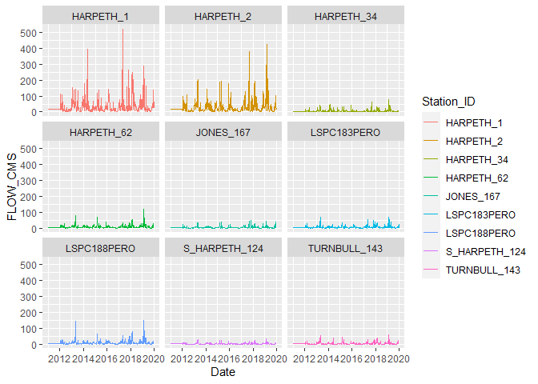
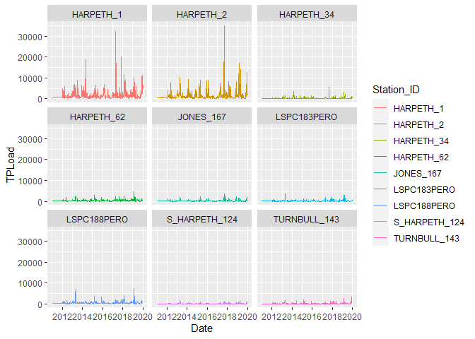

HarpethTMDL
================
RJ
2022-07-13

``` r
WASP.version<-8
```

# Introduction

**Harpeth TMDL** – Water Quality Analysis Simulation Program (WASP
version 8)

Exploration of water quality data using the calibrated WASP models
provided to TDEC and others by the EPA Region 4

``` r
#Load in required packages

library(tidyverse)
library(osmdata) 
library(ggmap)
library(dataRetrieval)
library(XML)
library(DT)
library(dbplyr)
library(widgetframe)
library(rgdal)
library(leaflet)
library(plotly)
library(formattable)
library(htmltools)
library(leaflet)
library(sf)
library(kableExtra)
library(knitr)
library(wql)
library(readxl)
library(fasstr)
library(readr)

time = lubridate::with_tz(Sys.time(), "CST6CDT")
```

This file was last updated on 2022-07-13 16:11:27

``` r
#Import Data


Grab <- read_excel("GrabSamples.xlsx", 
    col_types = c("skip", "text", "text", 
        "skip", "skip", "date", "text", "numeric", 
        "text"))

head(Grab,15)
## # A tibble: 15 × 6
##    DataSource Station_ID             Date_Time           Pcode      Result Units
##    <chr>      <chr>                  <dttm>              <chr>       <dbl> <chr>
##  1 STORET     11NPSWRD_WQX_NATR_BUBR 2012-01-03 08:33:00 COND     306      uS/c…
##  2 STORET     11NPSWRD_WQX_NATR_BUBR 2012-01-03 08:33:00 DOSAT     90.3    %    
##  3 STORET     11NPSWRD_WQX_NATR_BUBR 2012-01-03 08:33:00 DO        12.6    mg/l 
##  4 STORET     11NPSWRD_WQX_NATR_BUBR 2012-01-03 08:33:00 PH         7.76   std …
##  5 STORET     11NPSWRD_WQX_NATR_BUBR 2012-01-03 08:33:00 NO3_N      3.03   mg/l 
##  6 STORET     11NPSWRD_WQX_NATR_BUBR 2012-01-03 08:33:00 TEMPWC     0.4    degC 
##  7 STORET     11NPSWRD_WQX_NATR_BUBR 2012-01-03 08:33:00 FLOW_CMS   0.0212 cms  
##  8 TDEC       TNW000002791           2012-01-03 11:55:00 COND     376      uS/c…
##  9 TDEC       TNW000002790           2012-01-03 10:45:00 COND     373      uS/c…
## 10 TDEC       TNW000003300           2012-01-03 09:35:00 COND     295      uS/c…
## 11 TDEC       TNW000005654           2012-01-03 12:20:00 COND     246      uS/c…
## 12 TDEC       TNW000003508           2012-01-03 11:15:00 COND     242      uS/c…
## 13 TDEC       TNW000006704           2012-01-03 13:15:00 COND     234      uS/c…
## 14 TDEC       TNW000006704           2012-01-03 13:15:00 DO        16.5    mg/l 
## 15 TDEC       TNW000003508           2012-01-03 11:15:00 DO        15.6    mg/l

BaseModel <- read_delim("Epa_Base_Model_2011_To_2020.txt", 
     delim = "\t", escape_double = FALSE, 
     col_types = cols(`Date-Time` = col_datetime(format = "%m/%d/%Y %H:%M"), 
         CBOD = col_number(), DO = col_number(), 
         FLOW_CMS = col_number(), NH3_N = col_number(), 
         NO3O2 = col_number(), PHYTO = col_number(), 
         SOD_T = col_number(), `SOLID-WS` = col_number(), 
         TN = col_number(), TP = col_number(), 
         WTEMP = col_number()), trim_ws = TRUE)

head(BaseModel,15)
## # A tibble: 15 × 13
##    `Date-Time`         Station_ID   CBOD    DO FLOW_CMS  NH3_N NO3O2 PHYTO SOD_T
##    <dttm>              <chr>       <dbl> <dbl>    <dbl>  <dbl> <dbl> <dbl> <dbl>
##  1 2011-01-01 00:00:00 ARKANSAS_1… 0      0       0.202 0      0         0  0   
##  2 2011-01-02 00:04:00 ARKANSAS_1… 0.742  7.22    0.200 0.0116 0.153     0  1.22
##  3 2011-01-03 00:01:00 ARKANSAS_1… 0.742 10.7     0.200 0.0223 0.158     0  1.26
##  4 2011-01-04 00:04:00 ARKANSAS_1… 0.742 10.7     0.200 0.0354 0.160     0  1.25
##  5 2011-01-05 00:08:00 ARKANSAS_1… 0.742 10.7     0.200 0.0465 0.161     0  1.24
##  6 2011-01-06 00:01:00 ARKANSAS_1… 0.742 10.7     0.200 0.0550 0.161     0  1.22
##  7 2011-01-07 00:04:00 ARKANSAS_1… 0.742 10.7     0.200 0.0612 0.161     0  1.21
##  8 2011-01-08 00:08:00 ARKANSAS_1… 0.742 10.7     0.200 0.0658 0.161     0  1.20
##  9 2011-01-09 00:01:00 ARKANSAS_1… 0.742 10.7     0.200 0.0690 0.161     0  1.19
## 10 2011-01-10 00:04:00 ARKANSAS_1… 0.742 10.7     0.200 0.0711 0.161     0  1.18
## 11 2011-01-11 00:07:00 ARKANSAS_1… 0.742 10.7     0.200 0.0724 0.161     0  1.18
## 12 2011-01-12 00:01:00 ARKANSAS_1… 0.742 10.7     0.200 0.0731 0.161     0  1.17
## 13 2011-01-13 00:04:00 ARKANSAS_1… 0.742 10.7     0.200 0.0733 0.161     0  1.16
## 14 2011-01-14 00:07:00 ARKANSAS_1… 0.742 10.7     0.200 0.0731 0.161     0  1.15
## 15 2011-01-15 00:00:00 ARKANSAS_1… 0.742 10.7     0.200 0.0727 0.161     0  1.15
## # … with 4 more variables: `SOLID-WS` <dbl>, TN <dbl>, TP <dbl>, WTEMP <dbl>


Cont <- read_csv("Cont.csv", col_types = cols(...1 = col_skip(), 
    Date_Time = col_datetime(format = "%Y-%m-%d %H:%M:%S"), 
    Result = col_number()))

head(Cont,15)
## # A tibble: 15 × 5
##    Station_ID    Date_Time           Pcode  Result Units
##    <chr>         <dttm>              <chr>   <dbl> <chr>
##  1 USGS_03432390 2012-01-26 00:00:00 TEMPWC   11.8 degC 
##  2 USGS_03432390 2012-01-26 00:00:00 COND    550   <NA> 
##  3 USGS_03432390 2012-01-26 06:00:00 TEMPWC   12.6 degC 
##  4 USGS_03432390 2012-01-26 06:00:00 COND    552   <NA> 
##  5 USGS_03432390 2012-01-26 12:00:00 TEMPWC   13.6 degC 
##  6 USGS_03432390 2012-01-26 12:00:00 COND    499   <NA> 
##  7 USGS_03432390 2012-01-26 18:00:00 TEMPWC   14   degC 
##  8 USGS_03432390 2012-01-26 18:00:00 COND    451   <NA> 
##  9 USGS_03432390 2012-01-27 00:00:00 TEMPWC   12.5 degC 
## 10 USGS_03432390 2012-01-27 00:00:00 COND    306   <NA> 
## 11 USGS_03432390 2012-01-27 06:00:00 TEMPWC   11.9 degC 
## 12 USGS_03432390 2012-01-27 06:00:00 COND    455   <NA> 
## 13 USGS_03432390 2012-01-27 12:00:00 TEMPWC   12.2 degC 
## 14 USGS_03432390 2012-01-27 12:00:00 COND    512   <NA> 
## 15 USGS_03432390 2012-01-27 18:00:00 TEMPWC   12.6 degC


unique(Grab[c(4,6)])
## # A tibble: 52 × 2
##    Pcode    Units     
##    <chr>    <chr>     
##  1 COND     uS/cm @25C
##  2 DOSAT    %         
##  3 DO       mg/l      
##  4 PH       std units 
##  5 NO3_N    mg/l      
##  6 TEMPWC   degC      
##  7 FLOW_CMS cms       
##  8 TSS      mg/l      
##  9 TURB     NTU       
## 10 NO3O2_N  mg/l      
## # … with 42 more rows
```

`Grab` data table contains grab sample results collected from 171
locations throughout the Harpeth River watershed

``` r
#Subset Data into Logical WASP Segments
# HARPETH_1 = Mouth of the Harpeth
# JONES_167 = Jones Creek
# HARPETH_2 = Main Stem w/o Jones Creek
# TURNBULL_143 = Turnbull Creek
# S_HARPETH_124 = South Harpeth
# HARPETH_34 = West Harpeth
# HARPETH_62 = Upstream of Franklin STP
# LSPC188PERO = Downstream of Franklin STP
# LSPC183PERO = Headwaters


sites=c("HARPETH_1","JONES_167","HARPETH_2", "TURNBULL_143", "S_HARPETH_124", "HARPETH_34", "LSPC188PERO", "HARPETH_62", "LSPC183PERO")

colnames(BaseModel)[1] <- "Date"


BaseModel<-BaseModel[BaseModel$Station_ID==sites,]

ggplot(data = BaseModel, aes(x = Date, y = FLOW_CMS, group = Station_ID, colour = Station_ID)) +
    geom_line() +
    facet_wrap(~ Station_ID)
```

<!-- -->

``` r
BaseModel$TPLoad<-BaseModel$TP*0.00220462*BaseModel$FLOW_CMS*86400

BaseModel$TPLoad.csum <- ave(BaseModel$TPLoad, BaseModel$Station_ID, FUN=cumsum)


ggplot(data = BaseModel, aes(x = Date, y = TPLoad, group = Station_ID, colour = Station_ID)) +
    geom_line() +
    facet_wrap(~ Station_ID)
```

<!-- -->
