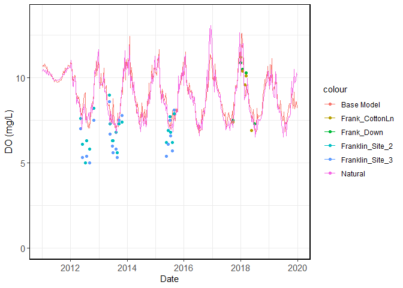
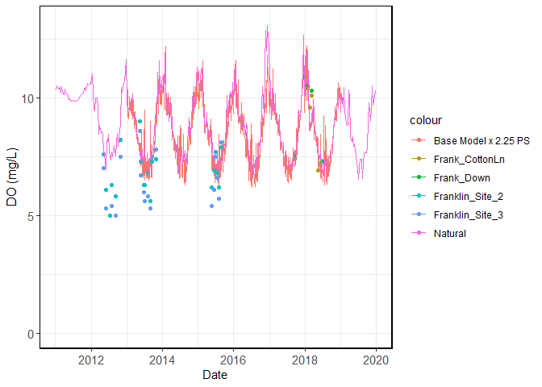
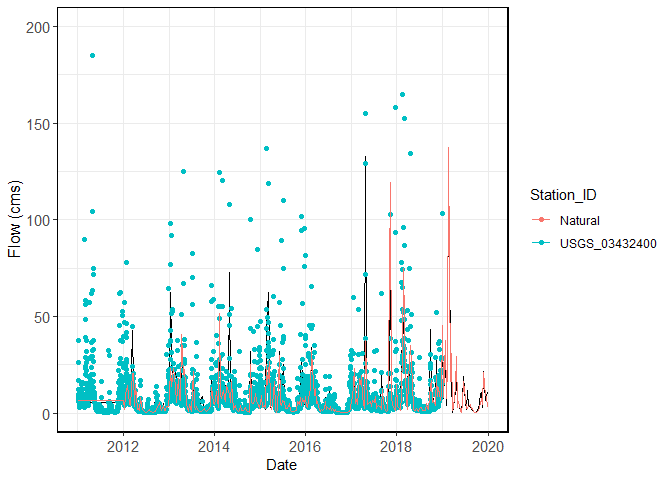
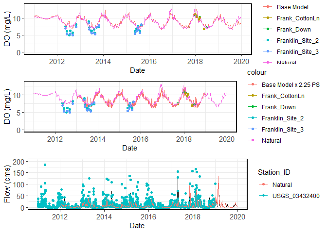
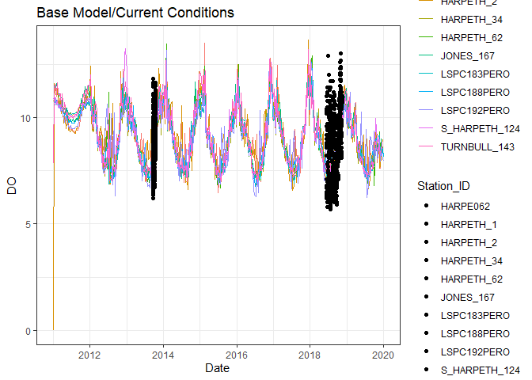
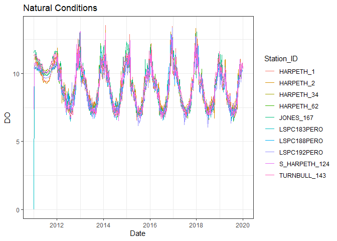
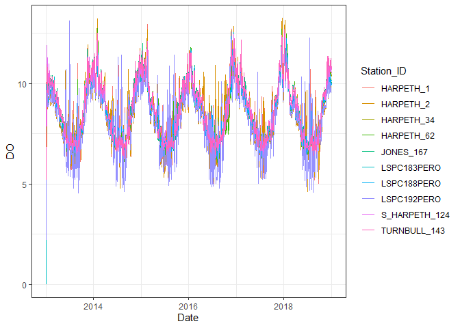
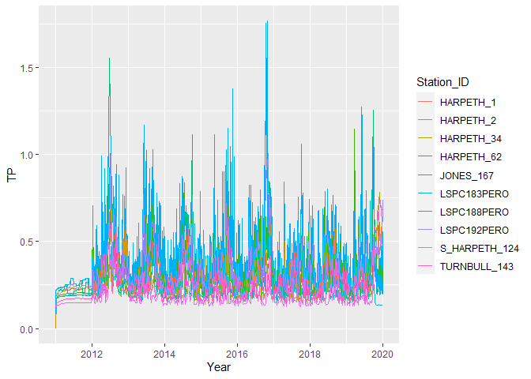

HarpethTMDL
================
RJ
2022-07-21

``` r
WASP.version<-8
```

# Introduction

**Harpeth TMDL** – Water Quality Analysis Simulation Program (WASP
version 8)

Exploration of water quality data using the calibrated WASP models
provided to TDEC and others by the EPA Region 4

This file was last updated on 2022-07-21 16:26:00

``` r
#Import Data


Grab <- read_excel("GrabSamples.xlsx", 
    col_types = c("skip", "text", "text", 
        "skip", "skip", "date", "text", "numeric", 
        "text"))

head(Grab,15)
## # A tibble: 15 × 6
##    DataSource Station_ID             Date_Time           Pcode      Result Units
##    <chr>      <chr>                  <dttm>              <chr>       <dbl> <chr>
##  1 STORET     11NPSWRD_WQX_NATR_BUBR 2012-01-03 08:33:00 COND     306      uS/c…
##  2 STORET     11NPSWRD_WQX_NATR_BUBR 2012-01-03 08:33:00 DOSAT     90.3    %    
##  3 STORET     11NPSWRD_WQX_NATR_BUBR 2012-01-03 08:33:00 DO        12.6    mg/l 
##  4 STORET     11NPSWRD_WQX_NATR_BUBR 2012-01-03 08:33:00 PH         7.76   std …
##  5 STORET     11NPSWRD_WQX_NATR_BUBR 2012-01-03 08:33:00 NO3_N      3.03   mg/l 
##  6 STORET     11NPSWRD_WQX_NATR_BUBR 2012-01-03 08:33:00 TEMPWC     0.4    degC 
##  7 STORET     11NPSWRD_WQX_NATR_BUBR 2012-01-03 08:33:00 FLOW_CMS   0.0212 cms  
##  8 TDEC       TNW000002791           2012-01-03 11:55:00 COND     376      uS/c…
##  9 TDEC       TNW000002790           2012-01-03 10:45:00 COND     373      uS/c…
## 10 TDEC       TNW000003300           2012-01-03 09:35:00 COND     295      uS/c…
## 11 TDEC       TNW000005654           2012-01-03 12:20:00 COND     246      uS/c…
## 12 TDEC       TNW000003508           2012-01-03 11:15:00 COND     242      uS/c…
## 13 TDEC       TNW000006704           2012-01-03 13:15:00 COND     234      uS/c…
## 14 TDEC       TNW000006704           2012-01-03 13:15:00 DO        16.5    mg/l 
## 15 TDEC       TNW000003508           2012-01-03 11:15:00 DO        15.6    mg/l

BaseModel <- read_delim("Epa_Base_Model_2011_To_2020.txt", 
     delim = "\t", escape_double = FALSE, 
     col_types = cols(`Date-Time` = col_datetime(format = "%m/%d/%Y %H:%M"), 
         CBOD = col_number(), DO = col_number(), 
         FLOW_CMS = col_number(), NH3_N = col_number(), 
         NO3O2 = col_number(), PHYTO = col_number(), 
         SOD_T = col_number(), `SOLID-WS` = col_number(), 
         TN = col_number(), TP = col_number(), 
         WTEMP = col_number()), trim_ws = TRUE)

head(BaseModel,15)
## # A tibble: 15 × 13
##    `Date-Time`         Station_ID   CBOD    DO FLOW_CMS  NH3_N NO3O2 PHYTO SOD_T
##    <dttm>              <chr>       <dbl> <dbl>    <dbl>  <dbl> <dbl> <dbl> <dbl>
##  1 2011-01-01 00:00:00 ARKANSAS_1… 0      0       0.202 0      0         0  0   
##  2 2011-01-02 00:04:00 ARKANSAS_1… 0.742  7.22    0.200 0.0116 0.153     0  1.22
##  3 2011-01-03 00:01:00 ARKANSAS_1… 0.742 10.7     0.200 0.0223 0.158     0  1.26
##  4 2011-01-04 00:04:00 ARKANSAS_1… 0.742 10.7     0.200 0.0354 0.160     0  1.25
##  5 2011-01-05 00:08:00 ARKANSAS_1… 0.742 10.7     0.200 0.0465 0.161     0  1.24
##  6 2011-01-06 00:01:00 ARKANSAS_1… 0.742 10.7     0.200 0.0550 0.161     0  1.22
##  7 2011-01-07 00:04:00 ARKANSAS_1… 0.742 10.7     0.200 0.0612 0.161     0  1.21
##  8 2011-01-08 00:08:00 ARKANSAS_1… 0.742 10.7     0.200 0.0658 0.161     0  1.20
##  9 2011-01-09 00:01:00 ARKANSAS_1… 0.742 10.7     0.200 0.0690 0.161     0  1.19
## 10 2011-01-10 00:04:00 ARKANSAS_1… 0.742 10.7     0.200 0.0711 0.161     0  1.18
## 11 2011-01-11 00:07:00 ARKANSAS_1… 0.742 10.7     0.200 0.0724 0.161     0  1.18
## 12 2011-01-12 00:01:00 ARKANSAS_1… 0.742 10.7     0.200 0.0731 0.161     0  1.17
## 13 2011-01-13 00:04:00 ARKANSAS_1… 0.742 10.7     0.200 0.0733 0.161     0  1.16
## 14 2011-01-14 00:07:00 ARKANSAS_1… 0.742 10.7     0.200 0.0731 0.161     0  1.15
## 15 2011-01-15 00:00:00 ARKANSAS_1… 0.742 10.7     0.200 0.0727 0.161     0  1.15
## # … with 4 more variables: `SOLID-WS` <dbl>, TN <dbl>, TP <dbl>, WTEMP <dbl>


Cont <- read_csv("Cont.csv", col_types = cols(...1 = col_skip(), 
    Date_Time = col_datetime(format = "%Y-%m-%d %H:%M:%S"), 
    Result = col_number()))

head(Cont,15)
## # A tibble: 15 × 5
##    Station_ID    Date_Time           Pcode  Result Units
##    <chr>         <dttm>              <chr>   <dbl> <chr>
##  1 USGS_03432390 2012-01-26 00:00:00 TEMPWC   11.8 degC 
##  2 USGS_03432390 2012-01-26 00:00:00 COND    550   <NA> 
##  3 USGS_03432390 2012-01-26 06:00:00 TEMPWC   12.6 degC 
##  4 USGS_03432390 2012-01-26 06:00:00 COND    552   <NA> 
##  5 USGS_03432390 2012-01-26 12:00:00 TEMPWC   13.6 degC 
##  6 USGS_03432390 2012-01-26 12:00:00 COND    499   <NA> 
##  7 USGS_03432390 2012-01-26 18:00:00 TEMPWC   14   degC 
##  8 USGS_03432390 2012-01-26 18:00:00 COND    451   <NA> 
##  9 USGS_03432390 2012-01-27 00:00:00 TEMPWC   12.5 degC 
## 10 USGS_03432390 2012-01-27 00:00:00 COND    306   <NA> 
## 11 USGS_03432390 2012-01-27 06:00:00 TEMPWC   11.9 degC 
## 12 USGS_03432390 2012-01-27 06:00:00 COND    455   <NA> 
## 13 USGS_03432390 2012-01-27 12:00:00 TEMPWC   12.2 degC 
## 14 USGS_03432390 2012-01-27 12:00:00 COND    512   <NA> 
## 15 USGS_03432390 2012-01-27 18:00:00 TEMPWC   12.6 degC


Natural <- read_delim("NATURAL_MODEL_2011_To_2020.txt", 
    delim = "\t", escape_double = FALSE, 
    col_types = cols(`Date-Time` = col_datetime(format = "%m/%d/%Y %H:%M"), 
        CBOD90 = col_number(), DIP = col_number(), 
        DO = col_number(), DON = col_number(), 
        DOP = col_number(), FLOW_CMS = col_number(), 
        NH3_N = col_number(), NO3O2 = col_number(), 
        PHYTO = col_number(), PON = col_number(), 
        SOD_T = col_number(), TKN = col_number(), 
        TN = col_number(), TP = col_number(), 
        WTEMP = col_number()), trim_ws = TRUE)

head(Natural,15)
## # A tibble: 15 × 17
##    `Date-Time`         Station_ID   CBOD90    DIP    DO    DON    DOP FLOW_CMS
##    <dttm>              <chr>         <dbl>  <dbl> <dbl>  <dbl>  <dbl>    <dbl>
##  1 2011-01-01 00:00:00 ARKANSAS_131   0    0       0    0      0         0.210
##  2 2011-01-02 00:06:00 ARKANSAS_131   2.38 0.0968  7.18 0.0193 0.0107    0.208
##  3 2011-01-03 00:04:00 ARKANSAS_131   2.38 0.0948 10.7  0.0193 0.0107    0.208
##  4 2011-01-04 00:02:00 ARKANSAS_131   2.38 0.0949 10.6  0.0193 0.0107    0.208
##  5 2011-01-04 23:59:00 ARKANSAS_131   2.38 0.0951 10.6  0.0193 0.0107    0.208
##  6 2011-01-06 00:05:00 ARKANSAS_131   2.38 0.0953 10.6  0.0193 0.0107    0.208
##  7 2011-01-07 00:02:00 ARKANSAS_131   2.38 0.0954 10.6  0.0193 0.0107    0.208
##  8 2011-01-08 00:00:00 ARKANSAS_131   2.38 0.0956 10.6  0.0193 0.0107    0.208
##  9 2011-01-09 00:06:00 ARKANSAS_131   2.38 0.0957 10.6  0.0193 0.0107    0.208
## 10 2011-01-10 00:03:00 ARKANSAS_131   2.38 0.0958 10.6  0.0193 0.0107    0.208
## 11 2011-01-11 00:00:00 ARKANSAS_131   2.38 0.0960 10.6  0.0193 0.0107    0.208
## 12 2011-01-12 00:06:00 ARKANSAS_131   2.38 0.0961 10.6  0.0193 0.0107    0.208
## 13 2011-01-13 00:04:00 ARKANSAS_131   2.38 0.0962 10.6  0.0193 0.0107    0.208
## 14 2011-01-14 00:01:00 ARKANSAS_131   2.38 0.0963 10.6  0.0193 0.0107    0.208
## 15 2011-01-14 23:58:00 ARKANSAS_131   2.38 0.0964 10.6  0.0193 0.0107    0.208
## # … with 9 more variables: NH3_N <dbl>, NO3O2 <dbl>, PHYTO <dbl>, PON <dbl>,
## #   SOD_T <dbl>, TKN <dbl>, TN <dbl>, TP <dbl>, WTEMP <dbl>


Base_PS <- read_delim("Harpeth_Epa_Base_Model_2_25_X_Ps.txt", 
    delim = "\t", escape_double = FALSE, 
    col_types = cols(`Date-Time` = col_datetime(format = "%m/%d/%Y %H:%M"), 
        Station_ID = col_character(), CBOD = col_number(), 
        DIP = col_number(), DO = col_number(), 
        DON = col_number(), DOP = col_number(), 
        FLOW_CMS = col_number(), NH3_N = col_number(), 
        NO3O2 = col_number(), PHYTO = col_number(), 
        PON = col_number(), SOD_T = col_number(), 
        TN = col_number(), TP = col_number(), 
        WTEMP = col_number()), trim_ws = TRUE)
head(Base_PS)
## # A tibble: 6 × 16
##   `Date-Time`         Station_ID  CBOD   DIP    DO    DON    DOP FLOW_CMS  NH3_N
##   <dttm>              <chr>      <dbl> <dbl> <dbl>  <dbl>  <dbl>    <dbl>  <dbl>
## 1 2013-01-01 00:00:00 ARKANSAS_…  0    0      0    0      0        0.0421 0     
## 2 2013-01-01 06:03:00 ARKANSAS_…  1.87 0.431  5.07 0.114  0.0479   0.0434 0.0576
## 3 2013-01-01 12:03:00 ARKANSAS_…  2.13 0.447  5.64 0.125  0.0499   0.0455 0.0625
## 4 2013-01-01 18:00:00 ARKANSAS_…  1.97 0.381  5.71 0.111  0.0426   0.0453 0.0555
## 5 2013-01-01 23:59:00 ARKANSAS_…  1.88 0.352  5.82 0.103  0.0393   0.0448 0.0516
## 6 2013-01-02 06:03:00 ARKANSAS_…  1.80 0.290  5.63 0.0959 0.0367   0.0443 0.0982
## # … with 7 more variables: NO3O2 <dbl>, PHYTO <dbl>, PON <dbl>, SOD_T <dbl>,
## #   TN <dbl>, TP <dbl>, WTEMP <dbl>


unique(Grab[c(4,6)])
## # A tibble: 52 × 2
##    Pcode    Units     
##    <chr>    <chr>     
##  1 COND     uS/cm @25C
##  2 DOSAT    %         
##  3 DO       mg/l      
##  4 PH       std units 
##  5 NO3_N    mg/l      
##  6 TEMPWC   degC      
##  7 FLOW_CMS cms       
##  8 TSS      mg/l      
##  9 TURB     NTU       
## 10 NO3O2_N  mg/l      
## # … with 42 more rows
```

`Grab` data table contains grab sample results collected from 171
locations throughout the Harpeth River watershed

``` r
#Subset Data into Logical WASP Segments
# HARPETH_1 = Mouth of the Harpeth
# JONES_167 = Jones Creek
# HARPETH_2 = Main Stem w/o Jones Creek
# TURNBULL_143 = Turnbull Creek
# S_HARPETH_124 = South Harpeth
# HARPETH_34 = West Harpeth
# HARPETH_62 = Upstream of Franklin STP
# LSPC188PERO = Downstream of Franklin STP
# LSPC183PERO = Headwaters
# LSPC192PERO = Hwy100


sites=c("HARPETH_1","JONES_167","HARPETH_2", "TURNBULL_143", "S_HARPETH_124", "HARPETH_34", "LSPC188PERO", "HARPETH_62", "LSPC183PERO","LSPC192PERO")

colnames(BaseModel)[1] <- "Date"

BaseModel$TPLoad<-BaseModel$TP*0.00220462*BaseModel$FLOW_CMS*86400

BaseModel$TPLoad.csum <- ave(BaseModel$TPLoad, BaseModel$Station_ID, FUN=cumsum)

BaseModel$NP<-BaseModel$TN/BaseModel$TP

BaseModel1<-BaseModel

BaseModel<-BaseModel[BaseModel$Station_ID==sites,]

colnames(Grab)[3] <- "Date"

colnames(Cont)[2] <- "Date"

colnames(Natural)[1] <- "Date"

colnames(Base_PS)[1] <- "Date"

Natural$NP<-Natural$TN/Natural$TP

Natural$TPLoad<-Natural$TP*0.00220462*Natural$FLOW_CMS*86400

Natural$TPLoad.csum <- ave(Natural$TPLoad, Natural$Station_ID, FUN=cumsum)

Natural1<-Natural

Natural<-Natural[Natural$Station_ID==sites,]

Base_PS1<-Base_PS

Base_PS<-Base_PS[Base_PS$Station_ID==sites,]


#####################################################################################################

molten.data <- melt(Grab, id = c("Date","Station_ID","Pcode","Units","DataSource"))

Grab.w<-dcast(molten.data, Date+Station_ID~Pcode, mean)

Grab.w$NP<-Grab.w$TN/Grab.w$TP

head(Grab.w, 10)
##                   Date             Station_ID ALK BOD30 BOD5 CBOD30 CBOD5
## 1  2012-01-03 08:33:00 11NPSWRD_WQX_NATR_BUBR NaN   NaN  NaN    NaN   NaN
## 2  2012-01-03 09:35:00           TNW000003300 NaN   NaN  NaN    NaN   NaN
## 3  2012-01-03 10:45:00           TNW000002790 NaN   NaN  NaN    NaN     1
## 4  2012-01-03 11:15:00           TNW000003508 NaN   NaN  NaN    NaN   NaN
## 5  2012-01-03 11:55:00           TNW000002791 NaN   NaN  NaN    NaN   NaN
## 6  2012-01-03 12:20:00           TNW000005654 NaN   NaN  NaN    NaN   NaN
## 7  2012-01-03 13:15:00           TNW000006704 NaN   NaN  NaN    NaN   NaN
## 8  2012-01-04 08:30:00           TNW000003576 NaN   NaN  NaN    NaN     1
## 9  2012-01-04 09:43:00           TNW000006443 NaN   NaN  NaN    NaN   NaN
## 10 2012-01-04 10:25:00           TNW000003306 NaN   NaN  NaN    NaN   NaN
##    CBOD90 CHLA COND    DO DOSAT FLOW_CFS   FLOW_CMS NBOD90  NH3_N NO2 NO2_N NO3
## 1     NaN  NaN  306 12.55  90.3      NaN 0.02123764    NaN    NaN NaN   NaN NaN
## 2     NaN  NaN  295 14.36   NaN      NaN        NaN    NaN    NaN NaN   NaN NaN
## 3     NaN  NaN  373 12.81   NaN      NaN        NaN    NaN 0.0165 NaN   NaN NaN
## 4     NaN  NaN  242 15.58   NaN      NaN        NaN    NaN    NaN NaN   NaN NaN
## 5     NaN  NaN  376 13.39   NaN      NaN        NaN    NaN    NaN NaN   NaN NaN
## 6     NaN  NaN  246 15.08   NaN      NaN        NaN    NaN    NaN NaN   NaN NaN
## 7     NaN  NaN  234 16.51   NaN      NaN        NaN    NaN    NaN NaN   NaN NaN
## 8     NaN  NaN  544 13.33   NaN      NaN        NaN    NaN 0.0165 NaN   NaN NaN
## 9     NaN  NaN  317 14.70   NaN      NaN        NaN    NaN 0.0165 NaN   NaN NaN
## 10    NaN  NaN  421 17.50   NaN      NaN        NaN    NaN 0.0165 NaN   NaN NaN
##    NO3_N NO3O2_N OPO4 OPO4_P ORGN ORP PERI%N PERI%P PERI_AI PERI_ASH PERI_NP
## 1   3.03     NaN  NaN    NaN  NaN NaN    NaN    NaN     NaN      NaN     NaN
## 2    NaN    0.43  NaN    NaN  NaN NaN    NaN    NaN     NaN      NaN     NaN
## 3    NaN    1.10  NaN    NaN  NaN NaN    NaN    NaN     NaN      NaN     NaN
## 4    NaN    0.15  NaN    NaN  NaN NaN    NaN    NaN     NaN      NaN     NaN
## 5    NaN    1.10  NaN    NaN  NaN NaN    NaN    NaN     NaN      NaN     NaN
## 6    NaN    0.41  NaN    NaN  NaN NaN    NaN    NaN     NaN      NaN     NaN
## 7    NaN    0.76  NaN    NaN  NaN NaN    NaN    NaN     NaN      NaN     NaN
## 8    NaN    1.30  NaN    NaN  NaN NaN    NaN    NaN     NaN      NaN     NaN
## 9    NaN    1.70  NaN    NaN  NaN NaN    NaN    NaN     NaN      NaN     NaN
## 10   NaN    0.92  NaN    NaN  NaN NaN    NaN    NaN     NaN      NaN     NaN
##    PERI_TN PERI_TP PERIAFDM PERICHLA   PH SOD_20 SOD_T SRP TBOD90 TDP TDS
## 1      NaN     NaN      NaN      NaN 7.76    NaN   NaN NaN    NaN NaN NaN
## 2      NaN     NaN      NaN      NaN 7.85    NaN   NaN NaN    NaN NaN NaN
## 3      NaN     NaN      NaN      NaN 8.04    NaN   NaN NaN    NaN NaN NaN
## 4      NaN     NaN      NaN      NaN 8.27    NaN   NaN NaN    NaN NaN NaN
## 5      NaN     NaN      NaN      NaN 8.13    NaN   NaN NaN    NaN NaN NaN
## 6      NaN     NaN      NaN      NaN 8.27    NaN   NaN NaN    NaN NaN NaN
## 7      NaN     NaN      NaN      NaN 8.45    NaN   NaN NaN    NaN NaN NaN
## 8      NaN     NaN      NaN      NaN 7.41    NaN   NaN NaN    NaN NaN NaN
## 9      NaN     NaN      NaN      NaN 8.31    NaN   NaN NaN    NaN NaN NaN
## 10     NaN     NaN      NaN      NaN 8.59    NaN   NaN NaN    NaN NaN NaN
##    TEMPWC   TKN  TN    TP  TS TSS TURB  NP
## 1    0.40   NaN NaN   NaN NaN NaN  NaN NaN
## 2    4.33 0.065 NaN 0.006 NaN   5 0.68 NaN
## 3    6.16 0.065 NaN 0.210 NaN   5 3.07 NaN
## 4    2.61 0.065 NaN 0.013 NaN   5 0.32 NaN
## 5    6.36 0.200 NaN 0.210 NaN   5 2.81 NaN
## 6    6.19 0.065 NaN 0.044 NaN   5 0.74 NaN
## 7    3.39 0.065 NaN 0.082 NaN   5 1.75 NaN
## 8    4.62 0.065 NaN 0.230 NaN   5 1.36 NaN
## 9    4.60 0.065 NaN 0.210 NaN   5 0.52 NaN
## 10   5.46 0.200 NaN 0.033 NaN   5 0.88 NaN


molten.cont <- melt(Cont, id = c("Date","Station_ID","Pcode","Units"))

Cont.w<-dcast(molten.cont, Date+Station_ID~Pcode, mean)

head(Cont.w, 10)
##          Date    Station_ID COND  DO DOSAT FLOW_CFS    FLOW_CMS  PH TEMPWC TURB
## 1  2011-01-01 USGS_03432350  NaN NaN   NaN   828.00 23.44634932 NaN    NaN  NaN
## 2  2011-01-01 USGS_03432400  NaN NaN   NaN   919.00 26.02318239 NaN    NaN  NaN
## 3  2011-01-01 USGS_03433500  NaN NaN   NaN   456.00 12.91248223 NaN    NaN  NaN
## 4  2011-01-01 USGS_03433640  NaN NaN   NaN     3.83  0.10845352 NaN    NaN  NaN
## 5  2011-01-01 USGS_03434500  NaN NaN   NaN   464.00 13.13901701 NaN    NaN  NaN
## 6  2011-01-02 USGS_03432350  NaN NaN   NaN  1020.00 28.88318394 NaN    NaN  NaN
## 7  2011-01-02 USGS_03432400  NaN NaN   NaN  1330.00 37.66140651 NaN    NaN  NaN
## 8  2011-01-02 USGS_03433500  NaN NaN   NaN  2220.00 62.86340034 NaN    NaN  NaN
## 9  2011-01-02 USGS_03433640  NaN NaN   NaN     1.44  0.04077626 NaN    NaN  NaN
## 10 2011-01-02 USGS_03434500  NaN NaN   NaN  2130.00 60.31488411 NaN    NaN  NaN
```

\#Data Summary

Subset of 10 modeled segments in WASP

``` r
ggplot(data = BaseModel, aes(x = Date, y = FLOW_CMS, group = Station_ID, colour = Station_ID)) +
    geom_line() +
    facet_wrap(~ Station_ID)
```

<!-- -->

``` r


ggplot(data = BaseModel, aes(x = Date, y = TPLoad, group = Station_ID, colour = Station_ID, )) +
  ylab("TP Load (lbs/day)") +
    geom_line() +
    facet_wrap(~ Station_ID)
```

<!-- -->

``` r

#Boxplot - look at data distribution


tp<-ggplot(BaseModel, aes(x = Station_ID, y = TP, fill = Station_ID)) + 
  geom_boxplot(outlier.colour="black", outlier.shape=16, outlier.size=2) +
  theme(axis.text.x = element_text(angle = 90, vjust = 0.5, hjust=1))+
  ylab("TP (mg/L)")

tp
```

<!-- -->

``` r

tn<-ggplot(BaseModel, aes(x = Station_ID, y = TN, fill = Station_ID)) + 
  geom_boxplot(outlier.colour="black", outlier.shape=16, outlier.size=2) +
  theme(axis.text.x = element_text(angle = 90, vjust = 0.5, hjust=1))+
  ylab("TN (mg/L)")

tn
```

<!-- -->

``` r

np<-ggplot(BaseModel, aes(x = Station_ID, y = NP, fill = Station_ID)) + 
  geom_boxplot(outlier.colour="black", outlier.shape=16, outlier.size=2) +
  theme(axis.text.x = element_text(angle = 90, vjust = 0.5, hjust=1))+
  ylab("TN:TP Ratio")

np
```

<!-- -->

``` r
LSPC188_tp<-ggplot(BaseModel,aes(x=Date,y=TP, color="Base Model"))+geom_line(data=subset(BaseModel,Station_ID=="LSPC188PERO")) +theme_bw()+
  labs(y="TP (mg/L)")+ylim(min(BaseModel$TP),max(BaseModel$TP))+
  theme(
    axis.text.y=element_text(size=11),axis.title.y=element_text(size=12, vjust=1.2),
    axis.text.x=element_blank(),axis.title.x=element_blank(), 
    panel.border = element_rect(size=.8, colour = "black"))+
  geom_point(data=subset(Grab.w, Station_ID==c("Frank_Down","Frank_CottonLn","Franklin_Site_2","Franklin_Site_3")), aes(x=Date, y=TP, color=Station_ID))+
  geom_line(data=subset(Natural, Station_ID=="LSPC188PERO"), aes(x=Date, y=TP, color="Natural"))

#LSPC188_tp

LSPC188_tn<-ggplot(BaseModel,aes(x=Date,y=TN))+geom_line(data=subset(BaseModel,Station_ID=="LSPC188PERO")) +theme_bw()+
  labs(y="TN (mg/L)")+ylim(min(BaseModel$TN),max(BaseModel$TN))+
  theme(
    axis.text.y=element_text(size=11),axis.title.y=element_text(size=12, vjust=1.2),
    axis.text.x=element_blank(),axis.title.x=element_blank(), 
    panel.border = element_rect(size=.8, colour = "black"))+
  geom_point(data=subset(Grab.w, Station_ID==c("Frank_Down","Frank_CottonLn","Franklin_Site_2","Franklin_Site_3")), aes(x=Date, y=TN, color=Station_ID))+
  geom_line(data=subset(Natural, Station_ID=="LSPC188PERO"), aes(x=Date, y=TN, color="Natural"))

#LSPC188_tn

LSPC188_flow<-ggplot(BaseModel,aes(x=Date,y=FLOW_CMS))+geom_line(data=subset(BaseModel,Station_ID=="LSPC188PERO")) +theme_bw()+
  labs(y="Flow (cms)")+ylim(min(BaseModel$FLOW_CMS),200)+
  theme(
    axis.text.y=element_text(size=11),axis.title.y=element_text(size=12, vjust=1.2),
    axis.text.x=element_blank(),axis.title.x=element_blank(), 
    panel.border = element_rect(size=.8, colour = "black"))+
  geom_point(data=subset(Cont.w, Station_ID==c("USGS_03432400")), aes(x=Date, y=FLOW_CMS, color=Station_ID))+
  geom_line(data=subset(Natural, Station_ID=="LSPC188PERO"), aes(x=Date, y=FLOW_CMS, color="Natural"))

#LSPC188_flow


LSPC188_np<-ggplot(BaseModel,aes(x=Date,y=NP))+geom_line(data=subset(BaseModel,Station_ID=="LSPC188PERO")) +theme_bw()+
  labs(y="TN:TP ratio", x="Date")+ylim(min(BaseModel$NP),max(BaseModel$NP))+
  theme(
    axis.text.y=element_text(size=11),axis.title.y=element_text(size=12, vjust=1.2),
    axis.text.x=element_text(size=11),axis.title.x=element_text(size=11), 
    panel.border = element_rect(size=.8, colour = "black"))+
  geom_point(data=subset(Grab.w, Station_ID==c("Frank_Down","Frank_CottonLn","Franklin_Site_2","Franklin_Site_3")), aes(x=Date, y=NP, color=Station_ID))+
  geom_line(data=subset(Natural, Station_ID=="LSPC188PERO"), aes(x=Date, y=NP, color="Natural"))

#LSPC188_np

grid.arrange(LSPC188_tp,LSPC188_tn,LSPC188_flow,LSPC188_np, ncol=1,padding=100)
```

<!-- -->

``` r

HARPETH_62<-ggplot(BaseModel,aes(x=Date,y=TP))+geom_line(data=subset(BaseModel,Station_ID=="HARPETH_62")) +theme_bw()+
  labs(y="TP (mg/L)")+ylim(min(BaseModel$TP),max(BaseModel$TP))+
  theme(
    axis.text.y=element_text(size=16),axis.title.y=element_text(size=12, vjust=1.2),
    axis.text.x=element_blank(),axis.title.x=element_blank(), 
    panel.border = element_rect(size=.8, colour = "black"))+
  geom_point(data=subset(Grab.w, Station_ID==c("Frank_Up","Frank_Eff","Franklin_Site_1")), aes(x=Date, y=TP, color=Station_ID))


#HARPETH_62


#ppi=300
#png("awesome stacked time series.png",width=12*ppi, height=8*ppi, res=ppi)
#grid.arrange(LSPC188_tp,HARPETH_62, ncol=1)
#dev.off()
```

``` r
LSPC188_DO<-ggplot(BaseModel,aes(x=Date,y=DO, color="Base Model"))+geom_line(data=subset(BaseModel,Station_ID=="LSPC188PERO")) +theme_bw()+
  labs(y="DO (mg/L)")+ylim(min(BaseModel$DO),max(BaseModel$DO))+
  theme(
    axis.text.y=element_text(size=11),axis.title.y=element_text(size=12, vjust=1.2),
    axis.text.x=element_text(size=11),axis.title.x=element_text(size=11), 
    panel.border = element_rect(size=.8, colour = "black"))+
  geom_point(data=subset(Grab.w, Station_ID==c("Frank_Down","Frank_CottonLn","Franklin_Site_2","Franklin_Site_3")), aes(x=Date, y=DO, color=Station_ID))+
  geom_line(data=subset(Natural, Station_ID=="LSPC188PERO"), aes(x=Date, y=DO, color="Natural"))

LSPC188_DO
```

<!-- -->

``` r
LSPC188_DO_PSinc<-ggplot(Base_PS,aes(x=Date,y=DO,color="Base Model x 2.25 PS"))+geom_line(data=subset(Base_PS,Station_ID=="LSPC188PERO")) +theme_bw()+
  labs(y="DO (mg/L)")+ylim(min(Base_PS$DO),max(Base_PS$DO))+
  theme(
    axis.text.y=element_text(size=11),axis.title.y=element_text(size=12, vjust=1.2),
    axis.text.x=element_text(size=11),axis.title.x=element_text(size=11), 
    panel.border = element_rect(size=.8, colour = "black"))+
  geom_point(data=subset(Grab.w, Station_ID==c("Frank_Down","Frank_CottonLn","Franklin_Site_2","Franklin_Site_3")), aes(x=Date, y=DO, color=Station_ID))+
  geom_line(data=subset(Natural, Station_ID=="LSPC188PERO"), aes(x=Date, y=DO, color="Natural"))

LSPC188_DO_PSinc
```

<!-- -->

``` r
LSPC188_flow<-ggplot(BaseModel,aes(x=Date,y=FLOW_CMS))+geom_line(data=subset(BaseModel,Station_ID=="LSPC188PERO")) +theme_bw()+
  labs(y="Flow (cms)")+ylim(min(BaseModel$FLOW_CMS),200)+
  theme(
    axis.text.y=element_text(size=11),axis.title.y=element_text(size=12, vjust=1.2),
    axis.text.x=element_text(size=11),axis.title.x=element_text(size=11), 
    panel.border = element_rect(size=.8, colour = "black"))+
  geom_point(data=subset(Cont.w, Station_ID==c("USGS_03432400")), aes(x=Date, y=FLOW_CMS, color=Station_ID))+
  geom_line(data=subset(Natural, Station_ID=="LSPC188PERO"), aes(x=Date, y=FLOW_CMS, color="Natural"))

LSPC188_flow
```

<!-- -->

``` r

grid.arrange(LSPC188_DO,LSPC188_DO_PSinc,LSPC188_flow, ncol=1,padding=100)
```

<!-- -->

``` r


p<-ggplot(BaseModel, aes(x=Date, y=DO, fill=Station_ID)) + ggtitle("Base Model/Current Conditions") + theme_bw() +
  geom_line(aes(colour=Station_ID, group=Station_ID)) +
  geom_point(data=subset(Cont.w, Station_ID==c("USGS_03434500","HARPE062")) , aes(x=Date, y=DO))

p
```

<!-- -->

``` r

p1<-ggplot(Natural, aes(x=Date, y=DO, fill=Station_ID)) + ggtitle("Natural Conditions") + theme_bw() +
  geom_line(aes(colour=Station_ID, group=Station_ID))

p1
```

<!-- -->

``` r

p3<-ggplot(Base_PS, aes(x=Date, y=DO, fill=Station_ID)) + theme_bw() +
  geom_line(aes(colour=Station_ID, group=Station_ID))

p3
```

<!-- -->

``` r

monthOrder <- c('Jan', 'Feb', 'Mar', 'Apr', 'May', 'Jun', 'Jul', 'Aug', 'Sep', 'Oct', 'Nov', 'Dec')
BaseModel$Month <- factor(format(BaseModel$Date, "%b"), levels = monthOrder)
BaseModel$Year <- factor(format(BaseModel$Date, "%Y"))
ggplot(BaseModel, aes(Month, TPLoad)) + geom_boxplot(data=subset(BaseModel,Station_ID=="LSPC188PERO")) + stat_boxplot(geom ='errorbar') + ggtitle("TP Load (lbs/day)")
```

<!-- -->

``` r
ggplot(BaseModel,aes(Month,TPLoad)) + geom_bar(stat="identity") + ggtitle("TP Load (lbs/month)")
```

<!-- -->

``` r
##################

#LSPC188_tpload <- subset(BaseModel, Station_ID==c("LSPC188PERO","HARPETH_62"), select=c(Station_ID, Year, Month, TPLoad))
#meanTPLoad_62 <- subset(BaseModel, Station_ID=="HARPETH_62", select=c(Station_ID, Year, Month, TPLoad))
#meanTPLoad_188 <- subset(BaseModel, Station_ID=="LSPC188PERO", select=c(Station_ID, Year, Month, TPLoad))

#library(plyr)
#tpload62<-ddply(meanTPLoad_62, c("Month","Station_ID"), summarise, x = mean(TPLoad))

#meanTPLoad_62 <- join(meanTPLoad_62, tpload62, match="all")


#ggplot(LSPC188_tpload,aes(Year,TPLoad,colour=Station_ID)) +
#geom_point(data=LSPC188_tpload,size=I(2),alpha=I(0.6)) + 
#geom_line(data=meanTPLoad_62, aes(Month,x), size=I(1.5),alpha=I(0.6)) + 
##geom_line(data=mean(meanTPLoad_62$TPLoad),size=I(1.5),alpha=I(0.4)) + 
#theme_grey(base_size=15) +
#theme(legend.title = element_blank(), legend.position=c(.85,.85), axis.title.y=element_blank(),axis.text.x=element_blank()) + 
#ggtitle("TP Load (lbs/day)") + facet_grid(. ~ Month) + 
#xlab(paste("Years: 2011 to 2019"))


#theme_set(theme_classic())

#BaseModel$Date.ts<-as.ts(BaseModel$Date)

# Subset data
#Base_LSPC188 <- window(subset(BaseModel,Station_ID=="LSPC188PERO"), start=c(2012, 1), end=c(2019, 8))  # subset a smaller timewindow

# Plot
#ggseasonplot(subset(BaseModel,Station_ID=="LSPC188PERO"), x=BaseModel$Date.ts) + labs(title="Seasonal plot: International Airline Passengers")
#ggseasonplot(subset(BaseModel,Station_ID=="LSPC188PERO")) + labs(title="Seasonal plot: Air temperatures at Nottingham Castle")
```

``` r
p <- ggplot(data=BaseModel1, aes(x=Date, y=TP, color=Station_ID)) +
  geom_line(data=subset(BaseModel1,Station_ID=="LSPC188PERO")) + 
  xlab("Year") +
  geom_line(data=subset(BaseModel1, Station_ID==sites))

p
```

<!-- -->

``` r
LSPC188.base<-subset(BaseModel1,Station_ID=="LSPC188PERO")
dy.tpload <- xts(x = LSPC188.base$TPLoad, order.by = LSPC188.base$Date)

LSPC188.natural<-subset(Natural1,Station_ID=="LSPC188PERO")
dy.Nattpload <- xts(x = LSPC188.natural$TPLoad, order.by = LSPC188.natural$Date)

LSPC188.tpload<-cbind(dy.tpload,dy.Nattpload)


LSPC188.tpload <- na.locf(LSPC188.tpload)

p <- dygraph(LSPC188.tpload, main="TP Load at LSPC 188 - Below Frank", ylab="TP Load (lbs/day)") %>%
  dySeries("dy.tpload", drawPoints = TRUE, strokePattern="dashed", color="red") %>%
  dySeries("dy.Nattpload", drawPoints= T, color="blue") %>%
  dyOptions(labelsUTC = TRUE, fillGraph=TRUE, fillAlpha=0.1, drawGrid = FALSE, colors = RColorBrewer::brewer.pal(3, "Set2")) %>%
  dyRangeSelector() %>%
  dyCrosshair(direction = "vertical") %>%
  dyHighlight(highlightCircleSize = 5, highlightSeriesBackgroundAlpha = 0.2, hideOnMouseOut = FALSE)  %>%
  dyRoller(rollPeriod = 1)


p
```

    ## PhantomJS not found. You can install it with webshot::install_phantomjs(). If it is installed, please make sure the phantomjs executable can be found via the PATH variable.

<div id="htmlwidget-5e5351bd3ad9ccdf9806" style="width:672px;height:480px;" class="dygraphs html-widget"></div>
<script type="application/json" data-for="htmlwidget-5e5351bd3ad9ccdf9806">{"x":{"attrs":{"title":"TP Load at LSPC 188 - Below Frank","ylabel":"TP Load (lbs/day)","labels":["hour","dy.tpload","dy.Nattpload"],"legend":"auto","retainDateWindow":false,"axes":{"x":{"pixelsPerLabel":60,"drawAxis":true},"y":{"drawAxis":true}},"series":{"dy.tpload":{"axis":"y","drawPoints":true,"strokePattern":[7,3]},"dy.Nattpload":{"axis":"y","drawPoints":true}},"stackedGraph":false,"fillGraph":true,"fillAlpha":0.1,"stepPlot":false,"drawPoints":false,"pointSize":1,"drawGapEdgePoints":false,"connectSeparatedPoints":false,"strokeWidth":1,"strokeBorderColor":"white","colors":["#66C2A5","#FC8D62","#8DA0CB"],"colorValue":0.5,"colorSaturation":1,"includeZero":false,"drawAxesAtZero":false,"logscale":false,"axisTickSize":3,"axisLineColor":"black","axisLineWidth":0.3,"axisLabelColor":"black","axisLabelFontSize":14,"axisLabelWidth":60,"drawGrid":false,"gridLineWidth":0.3,"rightGap":5,"digitsAfterDecimal":2,"labelsKMB":false,"labelsKMG2":false,"labelsUTC":true,"maxNumberWidth":6,"animatedZooms":false,"mobileDisableYTouch":true,"disableZoom":false,"showRangeSelector":true,"rangeSelectorHeight":40,"rangeSelectorPlotFillColor":" #A7B1C4","rangeSelectorPlotStrokeColor":"#808FAB","interactionModel":"Dygraph.Interaction.defaultModel","highlightCircleSize":5,"highlightSeriesBackgroundAlpha":0.2,"highlightSeriesOpts":[],"hideOverlayOnMouseOut":false,"showRoller":true,"rollPeriod":1},"scale":"hourly","annotations":[],"shadings":[],"events":[],"format":"date","data":[["2011-01-01T00:00:00.000Z","2011-01-02T00:04:00.000Z","2011-01-02T00:06:00.000Z","2011-01-03T00:01:00.000Z","2011-01-03T00:04:00.000Z","2011-01-04T00:02:00.000Z","2011-01-04T00:04:00.000Z","2011-01-04T23:59:00.000Z","2011-01-05T00:08:00.000Z","2011-01-06T00:01:00.000Z","2011-01-06T00:05:00.000Z","2011-01-07T00:02:00.000Z","2011-01-07T00:04:00.000Z","2011-01-08T00:00:00.000Z","2011-01-08T00:08:00.000Z","2011-01-09T00:01:00.000Z","2011-01-09T00:06:00.000Z","2011-01-10T00:03:00.000Z","2011-01-10T00:04:00.000Z","2011-01-11T00:00:00.000Z","2011-01-11T00:07:00.000Z","2011-01-12T00:01:00.000Z","2011-01-12T00:06:00.000Z","2011-01-13T00:04:00.000Z","2011-01-14T00:01:00.000Z","2011-01-14T00:07:00.000Z","2011-01-14T23:58:00.000Z","2011-01-15T00:00:00.000Z","2011-01-16T00:04:00.000Z","2011-01-17T00:02:00.000Z","2011-01-17T00:07:00.000Z","2011-01-17T23:59:00.000Z","2011-01-18T00:00:00.000Z","2011-01-19T00:04:00.000Z","2011-01-19T00:06:00.000Z","2011-01-20T00:03:00.000Z","2011-01-20T00:07:00.000Z","2011-01-21T00:00:00.000Z","2011-01-22T00:04:00.000Z","2011-01-22T00:06:00.000Z","2011-01-23T00:04:00.000Z","2011-01-23T00:07:00.000Z","2011-01-24T00:00:00.000Z","2011-01-24T00:01:00.000Z","2011-01-24T23:59:00.000Z","2011-01-25T00:03:00.000Z","2011-01-26T00:05:00.000Z","2011-01-26T00:07:00.000Z","2011-01-27T00:00:00.000Z","2011-01-27T00:02:00.000Z","2011-01-28T00:00:00.000Z","2011-01-28T00:03:00.000Z","2011-01-29T00:06:00.000Z","2011-01-30T00:00:00.000Z","2011-01-30T00:03:00.000Z","2011-01-31T00:01:00.000Z","2011-01-31T00:03:00.000Z","2011-01-31T23:58:00.000Z","2011-02-01T00:06:00.000Z","2011-02-01T23:59:00.000Z","2011-02-02T00:05:00.000Z","2011-02-03T00:02:00.000Z","2011-02-03T00:03:00.000Z","2011-02-03T23:59:00.000Z","2011-02-04T00:06:00.000Z","2011-02-04T23:59:00.000Z","2011-02-05T00:05:00.000Z","2011-02-06T00:02:00.000Z","2011-02-06T00:03:00.000Z","2011-02-07T00:00:00.000Z","2011-02-07T00:06:00.000Z","2011-02-07T23:59:00.000Z","2011-02-08T00:06:00.000Z","2011-02-09T00:03:00.000Z","2011-02-10T00:00:00.000Z","2011-02-10T00:06:00.000Z","2011-02-10T23:59:00.000Z","2011-02-11T00:06:00.000Z","2011-02-12T00:02:00.000Z","2011-02-12T00:04:00.000Z","2011-02-13T00:01:00.000Z","2011-02-13T00:06:00.000Z","2011-02-13T23:58:00.000Z","2011-02-13T23:59:00.000Z","2011-02-15T00:02:00.000Z","2011-02-15T00:04:00.000Z","2011-02-16T00:02:00.000Z","2011-02-16T00:06:00.000Z","2011-02-16T23:59:00.000Z","2011-02-18T00:02:00.000Z","2011-02-18T00:05:00.000Z","2011-02-19T00:03:00.000Z","2011-02-19T00:05:00.000Z","2011-02-19T23:59:00.000Z","2011-02-20T00:00:00.000Z","2011-02-20T23:59:00.000Z","2011-02-21T00:02:00.000Z","2011-02-22T00:04:00.000Z","2011-02-22T00:05:00.000Z","2011-02-22T23:58:00.000Z","2011-02-23T00:02:00.000Z","2011-02-23T23:59:00.000Z","2011-02-24T00:02:00.000Z","2011-02-25T00:05:00.000Z","2011-02-25T00:06:00.000Z","2011-02-25T23:58:00.000Z","2011-02-26T00:03:00.000Z","2011-02-27T00:00:00.000Z","2011-02-27T00:02:00.000Z","2011-02-27T23:58:00.000Z","2011-02-28T00:05:00.000Z","2011-02-28T23:58:00.000Z","2011-03-01T00:05:00.000Z","2011-03-02T00:01:00.000Z","2011-03-02T00:02:00.000Z","2011-03-02T23:59:00.000Z","2011-03-03T00:05:00.000Z","2011-03-03T23:58:00.000Z","2011-03-04T00:05:00.000Z","2011-03-05T00:01:00.000Z","2011-03-05T00:03:00.000Z","2011-03-06T00:00:00.000Z","2011-03-06T00:04:00.000Z","2011-03-07T00:06:00.000Z","2011-03-07T00:08:00.000Z","2011-03-08T00:01:00.000Z","2011-03-08T00:04:00.000Z","2011-03-09T00:01:00.000Z","2011-03-09T00:04:00.000Z","2011-03-09T23:59:00.000Z","2011-03-10T00:08:00.000Z","2011-03-11T00:01:00.000Z","2011-03-11T00:05:00.000Z","2011-03-12T00:02:00.000Z","2011-03-12T00:04:00.000Z","2011-03-13T00:00:00.000Z","2011-03-13T00:08:00.000Z","2011-03-14T00:01:00.000Z","2011-03-14T00:06:00.000Z","2011-03-15T00:03:00.000Z","2011-03-15T00:04:00.000Z","2011-03-16T00:01:00.000Z","2011-03-16T00:07:00.000Z","2011-03-16T23:58:00.000Z","2011-03-17T00:01:00.000Z","2011-03-18T00:04:00.000Z","2011-03-18T00:05:00.000Z","2011-03-19T00:06:00.000Z","2011-03-19T00:07:00.000Z","2011-03-20T00:00:00.000Z","2011-03-20T00:04:00.000Z","2011-03-21T00:03:00.000Z","2011-03-21T00:07:00.000Z","2011-03-22T00:03:00.000Z","2011-03-22T00:05:00.000Z","2011-03-22T23:58:00.000Z","2011-03-23T00:01:00.000Z","2011-03-23T23:58:00.000Z","2011-03-24T00:01:00.000Z","2011-03-25T00:04:00.000Z","2011-03-25T00:05:00.000Z","2011-03-25T23:58:00.000Z","2011-03-26T00:02:00.000Z","2011-03-26T23:59:00.000Z","2011-03-27T00:01:00.000Z","2011-03-28T00:05:00.000Z","2011-03-28T23:58:00.000Z","2011-03-29T00:03:00.000Z","2011-03-30T00:00:00.000Z","2011-03-30T00:01:00.000Z","2011-03-31T00:05:00.000Z","2011-03-31T00:06:00.000Z","2011-04-01T00:04:00.000Z","2011-04-01T00:08:00.000Z","2011-04-02T00:01:00.000Z","2011-04-03T00:01:00.000Z","2011-04-03T00:05:00.000Z","2011-04-03T23:58:00.000Z","2011-04-04T00:01:00.000Z","2011-04-04T23:58:00.000Z","2011-04-05T00:03:00.000Z","2011-04-06T00:04:00.000Z","2011-04-06T00:06:00.000Z","2011-04-07T00:01:00.000Z","2011-04-07T00:03:00.000Z","2011-04-08T00:01:00.000Z","2011-04-09T00:04:00.000Z","2011-04-09T00:05:00.000Z","2011-04-10T00:05:00.000Z","2011-04-10T00:06:00.000Z","2011-04-11T00:00:00.000Z","2011-04-11T00:01:00.000Z","2011-04-12T00:01:00.000Z","2011-04-12T00:06:00.000Z","2011-04-12T23:59:00.000Z","2011-04-13T23:58:00.000Z","2011-04-14T00:03:00.000Z","2011-04-14T23:58:00.000Z","2011-04-15T00:00:00.000Z","2011-04-16T00:01:00.000Z","2011-04-16T00:06:00.000Z","2011-04-17T00:04:00.000Z","2011-04-17T00:05:00.000Z","2011-04-18T00:01:00.000Z","2011-04-18T00:02:00.000Z","2011-04-18T23:58:00.000Z","2011-04-19T00:06:00.000Z","2011-04-19T23:59:00.000Z","2011-04-20T00:05:00.000Z","2011-04-21T00:02:00.000Z","2011-04-22T00:00:00.000Z","2011-04-22T00:06:00.000Z","2011-04-22T23:59:00.000Z","2011-04-23T00:02:00.000Z","2011-04-23T23:59:00.000Z","2011-04-24T00:02:00.000Z","2011-04-25T00:01:00.000Z","2011-04-25T00:06:00.000Z","2011-04-25T23:59:00.000Z","2011-04-26T00:05:00.000Z","2011-04-27T00:05:00.000Z","2011-04-27T00:08:00.000Z","2011-04-28T00:01:00.000Z","2011-04-28T00:03:00.000Z","2011-04-29T00:01:00.000Z","2011-04-29T00:05:00.000Z","2011-04-30T00:03:00.000Z","2011-04-30T00:04:00.000Z","2011-04-30T23:59:00.000Z","2011-05-02T00:02:00.000Z","2011-05-02T00:06:00.000Z","2011-05-03T00:04:00.000Z","2011-05-03T00:05:00.000Z","2011-05-03T23:59:00.000Z","2011-05-04T00:01:00.000Z","2011-05-04T23:59:00.000Z","2011-05-05T00:00:00.000Z","2011-05-05T23:59:00.000Z","2011-05-06T00:04:00.000Z","2011-05-07T00:06:00.000Z","2011-05-07T00:07:00.000Z","2011-05-08T00:02:00.000Z","2011-05-08T00:05:00.000Z","2011-05-08T23:59:00.000Z","2011-05-09T00:08:00.000Z","2011-05-10T00:00:00.000Z","2011-05-10T00:04:00.000Z","2011-05-10T23:58:00.000Z","2011-05-11T00:07:00.000Z","2011-05-12T00:00:00.000Z","2011-05-12T00:01:00.000Z","2011-05-12T23:58:00.000Z","2011-05-13T00:04:00.000Z","2011-05-13T23:58:00.000Z","2011-05-14T00:05:00.000Z","2011-05-14T23:58:00.000Z","2011-05-15T00:05:00.000Z","2011-05-16T00:01:00.000Z","2011-05-16T00:02:00.000Z","2011-05-17T00:00:00.000Z","2011-05-17T00:05:00.000Z","2011-05-17T23:58:00.000Z","2011-05-18T00:01:00.000Z","2011-05-18T23:59:00.000Z","2011-05-19T00:01:00.000Z","2011-05-20T00:05:00.000Z","2011-05-21T00:01:00.000Z","2011-05-21T00:02:00.000Z","2011-05-22T00:00:00.000Z","2011-05-22T00:05:00.000Z","2011-05-23T00:03:00.000Z","2011-05-23T00:04:00.000Z","2011-05-24T00:03:00.000Z","2011-05-24T00:04:00.000Z","2011-05-25T00:01:00.000Z","2011-05-25T00:05:00.000Z","2011-05-26T00:04:00.000Z","2011-05-26T00:07:00.000Z","2011-05-27T00:01:00.000Z","2011-05-27T23:59:00.000Z","2011-05-28T00:04:00.000Z","2011-05-29T00:00:00.000Z","2011-05-29T00:02:00.000Z","2011-05-29T23:59:00.000Z","2011-05-30T00:03:00.000Z","2011-05-31T00:00:00.000Z","2011-05-31T00:08:00.000Z","2011-05-31T23:59:00.000Z","2011-06-01T00:02:00.000Z","2011-06-02T00:03:00.000Z","2011-06-02T00:08:00.000Z","2011-06-03T00:00:00.000Z","2011-06-03T00:03:00.000Z","2011-06-04T00:01:00.000Z","2011-06-04T00:06:00.000Z","2011-06-05T00:03:00.000Z","2011-06-05T00:07:00.000Z","2011-06-06T00:01:00.000Z","2011-06-06T00:02:00.000Z","2011-06-06T23:58:00.000Z","2011-06-07T00:01:00.000Z","2011-06-08T00:06:00.000Z","2011-06-08T00:08:00.000Z","2011-06-09T00:00:00.000Z","2011-06-09T00:05:00.000Z","2011-06-09T23:59:00.000Z","2011-06-10T00:05:00.000Z","2011-06-11T00:01:00.000Z","2011-06-11T00:04:00.000Z","2011-06-11T23:58:00.000Z","2011-06-11T23:59:00.000Z","2011-06-13T00:02:00.000Z","2011-06-13T00:07:00.000Z","2011-06-14T00:04:00.000Z","2011-06-14T23:59:00.000Z","2011-06-15T00:00:00.000Z","2011-06-16T00:01:00.000Z","2011-06-16T23:59:00.000Z","2011-06-17T00:06:00.000Z","2011-06-17T23:59:00.000Z","2011-06-18T00:04:00.000Z","2011-06-19T00:04:00.000Z","2011-06-19T00:07:00.000Z","2011-06-20T00:02:00.000Z","2011-06-20T23:58:00.000Z","2011-06-20T23:59:00.000Z","2011-06-22T00:00:00.000Z","2011-06-22T00:07:00.000Z","2011-06-22T23:59:00.000Z","2011-06-24T00:03:00.000Z","2011-06-24T00:06:00.000Z","2011-06-25T00:03:00.000Z","2011-06-25T00:07:00.000Z","2011-06-26T00:02:00.000Z","2011-06-26T00:04:00.000Z","2011-06-26T23:58:00.000Z","2011-06-26T23:59:00.000Z","2011-06-28T00:00:00.000Z","2011-06-28T00:06:00.000Z","2011-06-29T00:02:00.000Z","2011-06-30T00:04:00.000Z","2011-06-30T00:05:00.000Z","2011-06-30T23:58:00.000Z","2011-07-01T00:05:00.000Z","2011-07-01T23:59:00.000Z","2011-07-03T00:04:00.000Z","2011-07-03T00:06:00.000Z","2011-07-04T00:04:00.000Z","2011-07-04T00:07:00.000Z","2011-07-05T00:05:00.000Z","2011-07-06T00:05:00.000Z","2011-07-06T00:06:00.000Z","2011-07-07T00:05:00.000Z","2011-07-07T00:06:00.000Z","2011-07-07T23:59:00.000Z","2011-07-08T00:00:00.000Z","2011-07-09T00:05:00.000Z","2011-07-09T00:06:00.000Z","2011-07-10T00:04:00.000Z","2011-07-10T00:05:00.000Z","2011-07-10T23:59:00.000Z","2011-07-11T00:04:00.000Z","2011-07-12T00:04:00.000Z","2011-07-12T00:05:00.000Z","2011-07-13T00:03:00.000Z","2011-07-13T00:07:00.000Z","2011-07-14T00:06:00.000Z","2011-07-14T00:07:00.000Z","2011-07-14T23:58:00.000Z","2011-07-15T00:07:00.000Z","2011-07-16T00:00:00.000Z","2011-07-16T00:05:00.000Z","2011-07-17T00:00:00.000Z","2011-07-17T23:58:00.000Z","2011-07-18T00:06:00.000Z","2011-07-19T00:03:00.000Z","2011-07-19T00:04:00.000Z","2011-07-20T00:00:00.000Z","2011-07-20T00:05:00.000Z","2011-07-20T23:59:00.000Z","2011-07-21T00:05:00.000Z","2011-07-22T00:04:00.000Z","2011-07-22T00:06:00.000Z","2011-07-23T00:04:00.000Z","2011-07-23T00:05:00.000Z","2011-07-24T00:06:00.000Z","2011-07-24T23:59:00.000Z","2011-07-25T00:03:00.000Z","2011-07-25T23:59:00.000Z","2011-07-26T00:01:00.000Z","2011-07-27T00:03:00.000Z","2011-07-28T00:00:00.000Z","2011-07-28T00:04:00.000Z","2011-07-29T00:05:00.000Z","2011-07-30T00:05:00.000Z","2011-07-30T23:58:00.000Z","2011-07-31T00:00:00.000Z","2011-08-01T00:01:00.000Z","2011-08-02T00:03:00.000Z","2011-08-02T00:04:00.000Z","2011-08-03T00:02:00.000Z","2011-08-03T00:03:00.000Z","2011-08-03T23:59:00.000Z","2011-08-04T00:05:00.000Z","2011-08-04T23:58:00.000Z","2011-08-05T00:05:00.000Z","2011-08-06T00:01:00.000Z","2011-08-06T00:03:00.000Z","2011-08-07T00:01:00.000Z","2011-08-07T00:05:00.000Z","2011-08-08T00:01:00.000Z","2011-08-08T00:04:00.000Z","2011-08-09T00:03:00.000Z","2011-08-09T00:05:00.000Z","2011-08-10T00:04:00.000Z","2011-08-10T00:07:00.000Z","2011-08-10T23:59:00.000Z","2011-08-11T00:01:00.000Z","2011-08-11T23:58:00.000Z","2011-08-12T00:01:00.000Z","2011-08-13T00:05:00.000Z","2011-08-13T00:07:00.000Z","2011-08-14T00:01:00.000Z","2011-08-14T00:05:00.000Z","2011-08-15T00:01:00.000Z","2011-08-15T00:03:00.000Z","2011-08-15T23:59:00.000Z","2011-08-16T00:05:00.000Z","2011-08-16T23:58:00.000Z","2011-08-17T00:01:00.000Z","2011-08-18T00:04:00.000Z","2011-08-18T00:05:00.000Z","2011-08-19T00:01:00.000Z","2011-08-19T00:02:00.000Z","2011-08-20T00:01:00.000Z","2011-08-20T00:06:00.000Z","2011-08-21T00:01:00.000Z","2011-08-21T00:07:00.000Z","2011-08-21T23:59:00.000Z","2011-08-22T00:02:00.000Z","2011-08-23T00:03:00.000Z","2011-08-23T00:05:00.000Z","2011-08-24T00:01:00.000Z","2011-08-25T00:01:00.000Z","2011-08-25T00:06:00.000Z","2011-08-26T00:02:00.000Z","2011-08-27T00:00:00.000Z","2011-08-27T00:02:00.000Z","2011-08-28T00:01:00.000Z","2011-08-28T00:03:00.000Z","2011-08-29T00:02:00.000Z","2011-08-29T00:04:00.000Z","2011-08-30T00:01:00.000Z","2011-08-31T00:00:00.000Z","2011-09-01T00:05:00.000Z","2011-09-01T00:06:00.000Z","2011-09-02T00:06:00.000Z","2011-09-03T00:02:00.000Z","2011-09-03T00:05:00.000Z","2011-09-04T00:01:00.000Z","2011-09-04T00:06:00.000Z","2011-09-04T23:59:00.000Z","2011-09-05T00:07:00.000Z","2011-09-06T00:00:00.000Z","2011-09-06T00:06:00.000Z","2011-09-07T00:03:00.000Z","2011-09-07T00:04:00.000Z","2011-09-08T00:01:00.000Z","2011-09-08T00:06:00.000Z","2011-09-08T23:59:00.000Z","2011-09-09T00:03:00.000Z","2011-09-10T00:01:00.000Z","2011-09-10T00:05:00.000Z","2011-09-10T23:59:00.000Z","2011-09-11T00:03:00.000Z","2011-09-11T23:58:00.000Z","2011-09-12T00:08:00.000Z","2011-09-12T23:59:00.000Z","2011-09-13T00:03:00.000Z","2011-09-14T00:06:00.000Z","2011-09-14T00:07:00.000Z","2011-09-15T00:03:00.000Z","2011-09-15T00:06:00.000Z","2011-09-15T23:59:00.000Z","2011-09-16T00:01:00.000Z","2011-09-16T23:58:00.000Z","2011-09-17T00:03:00.000Z","2011-09-18T00:05:00.000Z","2011-09-18T00:06:00.000Z","2011-09-19T00:05:00.000Z","2011-09-19T23:59:00.000Z","2011-09-20T00:06:00.000Z","2011-09-21T00:02:00.000Z","2011-09-21T00:04:00.000Z","2011-09-22T00:02:00.000Z","2011-09-22T00:05:00.000Z","2011-09-22T23:59:00.000Z","2011-09-23T00:00:00.000Z","2011-09-24T00:04:00.000Z","2011-09-24T00:06:00.000Z","2011-09-24T23:59:00.000Z","2011-09-25T00:07:00.000Z","2011-09-26T00:00:00.000Z","2011-09-26T00:06:00.000Z","2011-09-27T00:03:00.000Z","2011-09-28T00:03:00.000Z","2011-09-28T00:07:00.000Z","2011-09-29T00:00:00.000Z","2011-09-29T00:01:00.000Z","2011-09-30T00:02:00.000Z","2011-09-30T00:07:00.000Z","2011-10-01T00:00:00.000Z","2011-10-02T00:04:00.000Z","2011-10-02T00:06:00.000Z","2011-10-03T00:03:00.000Z","2011-10-03T00:07:00.000Z","2011-10-04T00:00:00.000Z","2011-10-04T00:01:00.000Z","2011-10-04T23:58:00.000Z","2011-10-05T00:03:00.000Z","2011-10-06T00:00:00.000Z","2011-10-06T00:03:00.000Z","2011-10-07T00:00:00.000Z","2011-10-07T00:02:00.000Z","2011-10-07T23:58:00.000Z","2011-10-07T23:59:00.000Z","2011-10-09T00:01:00.000Z","2011-10-09T00:04:00.000Z","2011-10-09T23:59:00.000Z","2011-10-10T00:04:00.000Z","2011-10-11T00:06:00.000Z","2011-10-11T00:07:00.000Z","2011-10-12T00:01:00.000Z","2011-10-12T00:04:00.000Z","2011-10-13T00:01:00.000Z","2011-10-13T00:04:00.000Z","2011-10-13T23:59:00.000Z","2011-10-14T00:07:00.000Z","2011-10-15T00:00:00.000Z","2011-10-15T00:05:00.000Z","2011-10-16T00:03:00.000Z","2011-10-16T00:04:00.000Z","2011-10-17T00:00:00.000Z","2011-10-17T00:07:00.000Z","2011-10-17T23:59:00.000Z","2011-10-18T00:00:00.000Z","2011-10-19T00:03:00.000Z","2011-10-19T00:04:00.000Z","2011-10-20T00:02:00.000Z","2011-10-20T00:07:00.000Z","2011-10-20T23:59:00.000Z","2011-10-21T00:00:00.000Z","2011-10-22T00:03:00.000Z","2011-10-22T00:05:00.000Z","2011-10-23T00:03:00.000Z","2011-10-23T00:07:00.000Z","2011-10-24T00:00:00.000Z","2011-10-24T00:01:00.000Z","2011-10-24T23:58:00.000Z","2011-10-25T00:03:00.000Z","2011-10-26T00:04:00.000Z","2011-10-26T00:07:00.000Z","2011-10-27T00:00:00.000Z","2011-10-27T00:02:00.000Z","2011-10-28T00:00:00.000Z","2011-10-28T00:03:00.000Z","2011-10-29T00:06:00.000Z","2011-10-29T23:59:00.000Z","2011-10-30T00:03:00.000Z","2011-10-31T00:01:00.000Z","2011-10-31T00:03:00.000Z","2011-10-31T23:58:00.000Z","2011-11-01T00:06:00.000Z","2011-11-01T23:59:00.000Z","2011-11-02T00:04:00.000Z","2011-11-03T00:02:00.000Z","2011-11-03T00:03:00.000Z","2011-11-03T23:59:00.000Z","2011-11-04T00:06:00.000Z","2011-11-04T23:59:00.000Z","2011-11-05T00:06:00.000Z","2011-11-06T00:02:00.000Z","2011-11-06T00:03:00.000Z","2011-11-07T00:01:00.000Z","2011-11-07T00:06:00.000Z","2011-11-07T23:58:00.000Z","2011-11-07T23:59:00.000Z","2011-11-09T00:02:00.000Z","2011-11-09T00:05:00.000Z","2011-11-10T00:02:00.000Z","2011-11-10T00:06:00.000Z","2011-11-10T23:59:00.000Z","2011-11-11T00:00:00.000Z","2011-11-12T00:02:00.000Z","2011-11-12T00:06:00.000Z","2011-11-13T00:03:00.000Z","2011-11-13T00:06:00.000Z","2011-11-13T23:58:00.000Z","2011-11-14T00:00:00.000Z","2011-11-14T23:58:00.000Z","2011-11-15T00:02:00.000Z","2011-11-16T00:05:00.000Z","2011-11-16T23:58:00.000Z","2011-11-17T00:02:00.000Z","2011-11-17T23:59:00.000Z","2011-11-18T00:02:00.000Z","2011-11-19T00:05:00.000Z","2011-11-19T00:06:00.000Z","2011-11-19T23:58:00.000Z","2011-11-20T00:03:00.000Z","2011-11-21T00:01:00.000Z","2011-11-21T23:58:00.000Z","2011-11-22T00:05:00.000Z","2011-11-22T23:58:00.000Z","2011-11-23T00:05:00.000Z","2011-11-24T00:01:00.000Z","2011-11-24T00:02:00.000Z","2011-11-25T00:00:00.000Z","2011-11-25T00:05:00.000Z","2011-11-25T23:58:00.000Z","2011-11-26T00:06:00.000Z","2011-11-27T00:01:00.000Z","2011-11-27T00:04:00.000Z","2011-11-28T00:01:00.000Z","2011-11-28T00:05:00.000Z","2011-11-28T23:59:00.000Z","2011-11-29T00:08:00.000Z","2011-11-30T00:01:00.000Z","2011-11-30T00:05:00.000Z","2011-12-01T00:02:00.000Z","2011-12-01T00:04:00.000Z","2011-12-02T00:00:00.000Z","2011-12-02T00:08:00.000Z","2011-12-03T00:01:00.000Z","2011-12-03T00:06:00.000Z","2011-12-04T00:03:00.000Z","2011-12-04T00:04:00.000Z","2011-12-05T00:01:00.000Z","2011-12-05T00:08:00.000Z","2011-12-05T23:59:00.000Z","2011-12-06T00:01:00.000Z","2011-12-07T00:04:00.000Z","2011-12-07T00:05:00.000Z","2011-12-08T00:02:00.000Z","2011-12-08T00:08:00.000Z","2011-12-09T00:00:00.000Z","2011-12-09T00:01:00.000Z","2011-12-10T00:04:00.000Z","2011-12-10T00:06:00.000Z","2011-12-11T00:03:00.000Z","2011-12-11T00:07:00.000Z","2011-12-12T00:00:00.000Z","2011-12-12T00:01:00.000Z","2011-12-12T23:58:00.000Z","2011-12-13T00:04:00.000Z","2011-12-14T00:04:00.000Z","2011-12-14T00:07:00.000Z","2011-12-15T00:00:00.000Z","2011-12-15T00:02:00.000Z","2011-12-16T00:00:00.000Z","2011-12-16T00:03:00.000Z","2011-12-17T00:06:00.000Z","2011-12-17T00:07:00.000Z","2011-12-18T00:00:00.000Z","2011-12-18T00:03:00.000Z","2011-12-19T00:01:00.000Z","2011-12-19T00:03:00.000Z","2011-12-19T23:58:00.000Z","2011-12-20T00:07:00.000Z","2011-12-21T00:00:00.000Z","2011-12-21T00:04:00.000Z","2011-12-22T00:02:00.000Z","2011-12-22T00:03:00.000Z","2011-12-23T00:00:00.000Z","2011-12-23T00:06:00.000Z","2011-12-24T00:00:00.000Z","2011-12-24T00:06:00.000Z","2011-12-25T00:03:00.000Z","2011-12-26T00:01:00.000Z","2011-12-26T00:06:00.000Z","2011-12-26T23:58:00.000Z","2011-12-26T23:59:00.000Z","2011-12-28T00:03:00.000Z","2011-12-28T00:05:00.000Z","2011-12-29T00:02:00.000Z","2011-12-29T00:06:00.000Z","2011-12-29T23:59:00.000Z","2011-12-31T00:03:00.000Z","2011-12-31T00:05:00.000Z","2012-01-01T00:03:00.000Z","2012-01-01T00:06:00.000Z","2012-01-01T23:58:00.000Z","2012-01-02T00:02:00.000Z","2012-01-03T00:00:00.000Z","2012-01-03T23:59:00.000Z","2012-01-04T00:00:00.000Z","2012-01-05T00:02:00.000Z","2012-01-05T00:07:00.000Z","2012-01-05T23:58:00.000Z","2012-01-06T00:05:00.000Z","2012-01-07T00:06:00.000Z","2012-01-07T00:07:00.000Z","2012-01-08T00:03:00.000Z","2012-01-09T00:00:00.000Z","2012-01-09T00:08:00.000Z","2012-01-10T00:00:00.000Z","2012-01-10T00:04:00.000Z","2012-01-10T23:59:00.000Z","2012-01-11T00:00:00.000Z","2012-01-12T00:00:00.000Z","2012-01-13T00:00:00.000Z","2012-01-14T00:02:00.000Z","2012-01-15T00:02:00.000Z","2012-01-15T00:04:00.000Z","2012-01-16T00:02:00.000Z","2012-01-16T00:03:00.000Z","2012-01-17T00:00:00.000Z","2012-01-17T00:01:00.000Z","2012-01-17T23:59:00.000Z","2012-01-18T00:01:00.000Z","2012-01-19T00:02:00.000Z","2012-01-19T00:04:00.000Z","2012-01-20T00:01:00.000Z","2012-01-20T00:04:00.000Z","2012-01-21T00:02:00.000Z","2012-01-21T00:03:00.000Z","2012-01-22T00:00:00.000Z","2012-01-22T00:01:00.000Z","2012-01-22T23:59:00.000Z","2012-01-24T00:00:00.000Z","2012-01-24T23:59:00.000Z","2012-01-26T00:00:00.000Z","2012-01-27T00:00:00.000Z","2012-01-28T00:00:00.000Z","2012-01-28T23:59:00.000Z","2012-01-29T00:01:00.000Z","2012-01-30T00:01:00.000Z","2012-01-30T00:03:00.000Z","2012-01-31T00:01:00.000Z","2012-01-31T00:02:00.000Z","2012-02-01T00:01:00.000Z","2012-02-01T23:59:00.000Z","2012-02-02T00:01:00.000Z","2012-02-03T00:00:00.000Z","2012-02-03T00:02:00.000Z","2012-02-04T00:01:00.000Z","2012-02-04T00:03:00.000Z","2012-02-05T00:02:00.000Z","2012-02-05T00:03:00.000Z","2012-02-05T23:59:00.000Z","2012-02-06T00:00:00.000Z","2012-02-07T00:00:00.000Z","2012-02-07T00:03:00.000Z","2012-02-08T00:00:00.000Z","2012-02-08T00:02:00.000Z","2012-02-09T00:01:00.000Z","2012-02-09T00:03:00.000Z","2012-02-10T00:01:00.000Z","2012-02-10T00:03:00.000Z","2012-02-11T00:00:00.000Z","2012-02-11T00:04:00.000Z","2012-02-12T00:01:00.000Z","2012-02-12T00:03:00.000Z","2012-02-13T00:00:00.000Z","2012-02-13T00:04:00.000Z","2012-02-13T23:58:00.000Z","2012-02-14T00:04:00.000Z","2012-02-15T00:00:00.000Z","2012-02-16T00:00:00.000Z","2012-02-16T00:01:00.000Z","2012-02-17T00:00:00.000Z","2012-02-17T00:05:00.000Z","2012-02-17T23:59:00.000Z","2012-02-18T00:02:00.000Z","2012-02-19T00:02:00.000Z","2012-02-19T00:04:00.000Z","2012-02-20T00:00:00.000Z","2012-02-20T00:01:00.000Z","2012-02-21T00:04:00.000Z","2012-02-21T00:05:00.000Z","2012-02-21T23:59:00.000Z","2012-02-22T00:04:00.000Z","2012-02-22T23:59:00.000Z","2012-02-23T00:04:00.000Z","2012-02-23T23:59:00.000Z","2012-02-24T00:06:00.000Z","2012-02-25T00:02:00.000Z","2012-02-25T00:03:00.000Z","2012-02-26T00:05:00.000Z","2012-02-26T00:06:00.000Z","2012-02-27T00:01:00.000Z","2012-02-27T00:06:00.000Z","2012-02-28T00:03:00.000Z","2012-02-28T00:04:00.000Z","2012-02-29T00:00:00.000Z","2012-02-29T00:02:00.000Z","2012-03-01T00:02:00.000Z","2012-03-01T00:06:00.000Z","2012-03-01T23:59:00.000Z","2012-03-02T00:04:00.000Z","2012-03-03T00:02:00.000Z","2012-03-03T00:03:00.000Z","2012-03-04T00:01:00.000Z","2012-03-04T00:02:00.000Z","2012-03-04T23:59:00.000Z","2012-03-05T00:01:00.000Z","2012-03-06T00:01:00.000Z","2012-03-06T00:05:00.000Z","2012-03-07T00:03:00.000Z","2012-03-07T00:05:00.000Z","2012-03-08T00:02:00.000Z","2012-03-09T00:00:00.000Z","2012-03-09T23:59:00.000Z","2012-03-10T00:00:00.000Z","2012-03-11T00:01:00.000Z","2012-03-12T00:01:00.000Z","2012-03-12T00:02:00.000Z","2012-03-12T23:59:00.000Z","2012-03-13T00:02:00.000Z","2012-03-14T00:04:00.000Z","2012-03-14T00:06:00.000Z","2012-03-15T00:00:00.000Z","2012-03-15T00:05:00.000Z","2012-03-15T23:59:00.000Z","2012-03-16T00:00:00.000Z","2012-03-17T00:00:00.000Z","2012-03-17T00:01:00.000Z","2012-03-17T23:59:00.000Z","2012-03-18T00:00:00.000Z","2012-03-18T23:59:00.000Z","2012-03-19T00:00:00.000Z","2012-03-20T00:00:00.000Z","2012-03-20T00:03:00.000Z","2012-03-21T00:01:00.000Z","2012-03-21T00:02:00.000Z","2012-03-22T00:01:00.000Z","2012-03-22T00:03:00.000Z","2012-03-22T23:59:00.000Z","2012-03-23T00:03:00.000Z","2012-03-24T00:03:00.000Z","2012-03-25T00:02:00.000Z","2012-03-25T00:03:00.000Z","2012-03-26T00:01:00.000Z","2012-03-26T00:02:00.000Z","2012-03-27T00:03:00.000Z","2012-03-27T00:04:00.000Z","2012-03-28T00:06:00.000Z","2012-03-28T00:09:00.000Z","2012-03-28T23:58:00.000Z","2012-03-29T00:00:00.000Z","2012-03-30T00:05:00.000Z","2012-03-30T00:10:00.000Z","2012-03-30T23:59:00.000Z","2012-03-31T00:01:00.000Z","2012-04-01T00:05:00.000Z","2012-04-01T00:10:00.000Z","2012-04-02T00:00:00.000Z","2012-04-02T00:10:00.000Z","2012-04-03T00:00:00.000Z","2012-04-03T23:59:00.000Z","2012-04-05T00:00:00.000Z","2012-04-05T00:01:00.000Z","2012-04-06T00:00:00.000Z","2012-04-06T23:59:00.000Z","2012-04-07T00:02:00.000Z","2012-04-07T23:59:00.000Z","2012-04-08T00:00:00.000Z","2012-04-09T00:00:00.000Z","2012-04-09T00:04:00.000Z","2012-04-10T00:00:00.000Z","2012-04-10T00:02:00.000Z","2012-04-10T23:59:00.000Z","2012-04-11T00:06:00.000Z","2012-04-11T23:59:00.000Z","2012-04-12T00:05:00.000Z","2012-04-13T00:01:00.000Z","2012-04-13T00:04:00.000Z","2012-04-14T00:02:00.000Z","2012-04-14T23:59:00.000Z","2012-04-15T00:07:00.000Z","2012-04-15T23:57:00.000Z","2012-04-15T23:59:00.000Z","2012-04-17T00:00:00.000Z","2012-04-17T00:02:00.000Z","2012-04-18T00:01:00.000Z","2012-04-18T00:04:00.000Z","2012-04-19T00:04:00.000Z","2012-04-19T00:06:00.000Z","2012-04-20T00:05:00.000Z","2012-04-20T00:08:00.000Z","2012-04-20T23:59:00.000Z","2012-04-21T00:03:00.000Z","2012-04-22T00:00:00.000Z","2012-04-22T00:01:00.000Z","2012-04-23T00:01:00.000Z","2012-04-24T00:04:00.000Z","2012-04-24T00:05:00.000Z","2012-04-24T23:59:00.000Z","2012-04-25T00:02:00.000Z","2012-04-26T00:03:00.000Z","2012-04-26T00:07:00.000Z","2012-04-27T00:02:00.000Z","2012-04-27T00:07:00.000Z","2012-04-28T00:03:00.000Z","2012-04-28T23:59:00.000Z","2012-04-29T00:01:00.000Z","2012-04-30T00:05:00.000Z","2012-04-30T00:06:00.000Z","2012-05-01T00:03:00.000Z","2012-05-01T00:05:00.000Z","2012-05-01T23:58:00.000Z","2012-05-02T00:07:00.000Z","2012-05-03T00:07:00.000Z","2012-05-03T00:08:00.000Z","2012-05-03T23:59:00.000Z","2012-05-04T00:01:00.000Z","2012-05-05T00:00:00.000Z","2012-05-05T00:07:00.000Z","2012-05-06T00:00:00.000Z","2012-05-06T00:01:00.000Z","2012-05-06T23:59:00.000Z","2012-05-07T00:05:00.000Z","2012-05-08T00:01:00.000Z","2012-05-08T00:03:00.000Z","2012-05-09T00:03:00.000Z","2012-05-09T00:05:00.000Z","2012-05-09T23:58:00.000Z","2012-05-10T00:00:00.000Z","2012-05-10T23:58:00.000Z","2012-05-12T00:02:00.000Z","2012-05-12T00:03:00.000Z","2012-05-12T23:59:00.000Z","2012-05-13T00:00:00.000Z","2012-05-14T00:00:00.000Z","2012-05-14T00:01:00.000Z","2012-05-15T00:00:00.000Z","2012-05-16T00:00:00.000Z","2012-05-17T00:03:00.000Z","2012-05-17T23:59:00.000Z","2012-05-18T00:00:00.000Z","2012-05-18T23:59:00.000Z","2012-05-19T00:04:00.000Z","2012-05-20T00:00:00.000Z","2012-05-20T00:03:00.000Z","2012-05-21T00:01:00.000Z","2012-05-21T00:05:00.000Z","2012-05-21T23:59:00.000Z","2012-05-22T00:07:00.000Z","2012-05-23T00:01:00.000Z","2012-05-23T00:06:00.000Z","2012-05-24T00:05:00.000Z","2012-05-25T00:00:00.000Z","2012-05-25T00:01:00.000Z","2012-05-26T00:03:00.000Z","2012-05-26T00:08:00.000Z","2012-05-26T23:58:00.000Z","2012-05-27T00:01:00.000Z","2012-05-28T00:05:00.000Z","2012-05-29T00:00:00.000Z","2012-05-29T23:59:00.000Z","2012-05-30T00:03:00.000Z","2012-05-30T23:58:00.000Z","2012-05-31T00:04:00.000Z","2012-06-01T00:02:00.000Z","2012-06-01T00:05:00.000Z","2012-06-02T00:03:00.000Z","2012-06-02T00:04:00.000Z","2012-06-03T00:01:00.000Z","2012-06-03T00:07:00.000Z","2012-06-04T00:01:00.000Z","2012-06-04T00:03:00.000Z","2012-06-05T00:02:00.000Z","2012-06-05T00:04:00.000Z","2012-06-06T00:05:00.000Z","2012-06-06T00:07:00.000Z","2012-06-07T00:09:00.000Z","2012-06-07T23:59:00.000Z","2012-06-08T00:05:00.000Z","2012-06-09T00:04:00.000Z","2012-06-09T00:08:00.000Z","2012-06-10T00:00:00.000Z","2012-06-10T00:02:00.000Z","2012-06-10T23:59:00.000Z","2012-06-11T00:00:00.000Z","2012-06-12T00:03:00.000Z","2012-06-12T00:09:00.000Z","2012-06-13T00:00:00.000Z","2012-06-13T00:09:00.000Z","2012-06-13T23:57:00.000Z","2012-06-13T23:58:00.000Z","2012-06-15T00:00:00.000Z","2012-06-15T00:07:00.000Z","2012-06-16T00:00:00.000Z","2012-06-16T00:01:00.000Z","2012-06-17T00:00:00.000Z","2012-06-18T00:00:00.000Z","2012-06-18T00:08:00.000Z","2012-06-19T00:00:00.000Z","2012-06-19T00:06:00.000Z","2012-06-19T23:59:00.000Z","2012-06-20T00:00:00.000Z","2012-06-21T00:00:00.000Z","2012-06-21T00:03:00.000Z","2012-06-22T00:00:00.000Z","2012-06-23T00:00:00.000Z","2012-06-23T00:06:00.000Z","2012-06-23T23:59:00.000Z","2012-06-25T00:00:00.000Z","2012-06-26T00:00:00.000Z","2012-06-26T00:06:00.000Z","2012-06-27T00:00:00.000Z","2012-06-27T00:07:00.000Z","2012-06-27T23:59:00.000Z","2012-06-28T00:00:00.000Z","2012-06-28T23:59:00.000Z","2012-06-29T00:00:00.000Z","2012-06-30T00:00:00.000Z","2012-06-30T00:06:00.000Z","2012-07-01T00:00:00.000Z","2012-07-01T00:01:00.000Z","2012-07-02T00:00:00.000Z","2012-07-02T00:01:00.000Z","2012-07-02T23:59:00.000Z","2012-07-03T00:09:00.000Z","2012-07-03T23:59:00.000Z","2012-07-04T00:00:00.000Z","2012-07-05T00:00:00.000Z","2012-07-05T00:08:00.000Z","2012-07-05T23:59:00.000Z","2012-07-06T00:00:00.000Z","2012-07-07T00:00:00.000Z","2012-07-07T00:05:00.000Z","2012-07-08T00:00:00.000Z","2012-07-08T00:01:00.000Z","2012-07-08T23:59:00.000Z","2012-07-09T23:59:00.000Z","2012-07-10T00:00:00.000Z","2012-07-11T00:00:00.000Z","2012-07-11T00:01:00.000Z","2012-07-11T23:59:00.000Z","2012-07-12T00:00:00.000Z","2012-07-12T23:59:00.000Z","2012-07-13T00:05:00.000Z","2012-07-14T00:01:00.000Z","2012-07-14T00:06:00.000Z","2012-07-15T00:00:00.000Z","2012-07-16T00:03:00.000Z","2012-07-17T00:00:00.000Z","2012-07-17T00:06:00.000Z","2012-07-17T23:59:00.000Z","2012-07-18T00:06:00.000Z","2012-07-19T00:00:00.000Z","2012-07-19T23:59:00.000Z","2012-07-20T00:00:00.000Z","2012-07-21T00:00:00.000Z","2012-07-21T00:01:00.000Z","2012-07-21T23:59:00.000Z","2012-07-22T00:05:00.000Z","2012-07-23T00:00:00.000Z","2012-07-23T00:02:00.000Z","2012-07-24T00:03:00.000Z","2012-07-24T00:08:00.000Z","2012-07-25T00:04:00.000Z","2012-07-25T00:05:00.000Z","2012-07-26T00:00:00.000Z","2012-07-26T00:01:00.000Z","2012-07-27T00:03:00.000Z","2012-07-27T00:04:00.000Z","2012-07-28T00:02:00.000Z","2012-07-28T00:06:00.000Z","2012-07-29T00:03:00.000Z","2012-07-30T00:04:00.000Z","2012-07-30T00:10:00.000Z","2012-07-31T00:00:00.000Z","2012-07-31T00:09:00.000Z","2012-07-31T23:58:00.000Z","2012-07-31T23:59:00.000Z","2012-08-02T00:00:00.000Z","2012-08-02T00:05:00.000Z","2012-08-03T00:07:00.000Z","2012-08-03T00:10:00.000Z","2012-08-03T23:59:00.000Z","2012-08-04T00:00:00.000Z","2012-08-04T23:58:00.000Z","2012-08-05T00:00:00.000Z","2012-08-06T00:00:00.000Z","2012-08-06T00:05:00.000Z","2012-08-07T00:03:00.000Z","2012-08-07T00:07:00.000Z","2012-08-07T23:59:00.000Z","2012-08-08T00:00:00.000Z","2012-08-09T00:03:00.000Z","2012-08-09T00:09:00.000Z","2012-08-09T23:59:00.000Z","2012-08-10T00:04:00.000Z","2012-08-11T00:05:00.000Z","2012-08-11T00:09:00.000Z","2012-08-12T00:00:00.000Z","2012-08-13T00:00:00.000Z","2012-08-13T00:04:00.000Z","2012-08-14T00:00:00.000Z","2012-08-14T23:58:00.000Z","2012-08-15T00:08:00.000Z","2012-08-15T23:59:00.000Z","2012-08-16T00:00:00.000Z","2012-08-16T23:57:00.000Z","2012-08-17T00:03:00.000Z","2012-08-18T00:00:00.000Z","2012-08-19T00:01:00.000Z","2012-08-19T00:08:00.000Z","2012-08-19T23:59:00.000Z","2012-08-21T00:06:00.000Z","2012-08-21T00:09:00.000Z","2012-08-22T00:00:00.000Z","2012-08-22T00:02:00.000Z","2012-08-23T00:10:00.000Z","2012-08-23T23:58:00.000Z","2012-08-24T00:00:00.000Z","2012-08-24T23:59:00.000Z","2012-08-25T00:06:00.000Z","2012-08-25T23:59:00.000Z","2012-08-26T00:05:00.000Z","2012-08-27T00:00:00.000Z","2012-08-27T00:04:00.000Z","2012-08-28T00:00:00.000Z","2012-08-28T00:09:00.000Z","2012-08-28T23:59:00.000Z","2012-08-29T00:00:00.000Z","2012-08-29T23:58:00.000Z","2012-08-29T23:59:00.000Z","2012-08-30T23:58:00.000Z","2012-08-30T23:59:00.000Z","2012-08-31T23:59:00.000Z","2012-09-01T00:00:00.000Z","2012-09-02T00:00:00.000Z","2012-09-02T00:08:00.000Z","2012-09-03T00:00:00.000Z","2012-09-03T00:02:00.000Z","2012-09-03T23:58:00.000Z","2012-09-04T00:06:00.000Z","2012-09-05T00:00:00.000Z","2012-09-06T00:00:00.000Z","2012-09-06T00:03:00.000Z","2012-09-07T00:07:00.000Z","2012-09-07T23:59:00.000Z","2012-09-08T00:10:00.000Z","2012-09-09T00:01:00.000Z","2012-09-09T00:02:00.000Z","2012-09-10T00:00:00.000Z","2012-09-10T00:10:00.000Z","2012-09-11T00:02:00.000Z","2012-09-11T00:03:00.000Z","2012-09-12T00:00:00.000Z","2012-09-13T00:00:00.000Z","2012-09-13T00:03:00.000Z","2012-09-14T00:00:00.000Z","2012-09-14T00:04:00.000Z","2012-09-14T23:58:00.000Z","2012-09-14T23:59:00.000Z","2012-09-16T00:00:00.000Z","2012-09-16T00:06:00.000Z","2012-09-17T00:03:00.000Z","2012-09-17T00:07:00.000Z","2012-09-17T23:59:00.000Z","2012-09-18T00:00:00.000Z","2012-09-19T00:01:00.000Z","2012-09-19T00:02:00.000Z","2012-09-19T23:59:00.000Z","2012-09-20T00:03:00.000Z","2012-09-21T00:03:00.000Z","2012-09-21T00:04:00.000Z","2012-09-22T00:00:00.000Z","2012-09-22T00:02:00.000Z","2012-09-22T23:58:00.000Z","2012-09-23T00:05:00.000Z","2012-09-24T00:03:00.000Z","2012-09-24T00:06:00.000Z","2012-09-24T23:58:00.000Z","2012-09-25T00:09:00.000Z","2012-09-25T23:58:00.000Z","2012-09-26T00:00:00.000Z","2012-09-27T00:06:00.000Z","2012-09-27T00:08:00.000Z","2012-09-28T00:02:00.000Z","2012-09-28T00:05:00.000Z","2012-09-29T00:06:00.000Z","2012-09-29T00:09:00.000Z","2012-09-30T00:05:00.000Z","2012-09-30T00:10:00.000Z","2012-09-30T23:59:00.000Z","2012-10-01T00:01:00.000Z","2012-10-01T23:59:00.000Z","2012-10-02T00:02:00.000Z","2012-10-02T23:59:00.000Z","2012-10-03T00:05:00.000Z","2012-10-03T23:58:00.000Z","2012-10-04T00:00:00.000Z","2012-10-05T00:06:00.000Z","2012-10-05T00:07:00.000Z","2012-10-06T00:03:00.000Z","2012-10-06T00:07:00.000Z","2012-10-07T00:00:00.000Z","2012-10-07T00:02:00.000Z","2012-10-08T00:04:00.000Z","2012-10-09T00:00:00.000Z","2012-10-09T00:04:00.000Z","2012-10-10T00:00:00.000Z","2012-10-10T00:06:00.000Z","2012-10-11T00:01:00.000Z","2012-10-11T00:05:00.000Z","2012-10-11T23:58:00.000Z","2012-10-11T23:59:00.000Z","2012-10-12T23:59:00.000Z","2012-10-13T00:00:00.000Z","2012-10-13T23:58:00.000Z","2012-10-14T00:05:00.000Z","2012-10-15T00:03:00.000Z","2012-10-15T00:05:00.000Z","2012-10-16T00:01:00.000Z","2012-10-16T00:05:00.000Z","2012-10-17T00:05:00.000Z","2012-10-17T00:07:00.000Z","2012-10-17T23:59:00.000Z","2012-10-18T00:03:00.000Z","2012-10-18T23:59:00.000Z","2012-10-19T00:04:00.000Z","2012-10-20T00:03:00.000Z","2012-10-20T00:05:00.000Z","2012-10-21T00:03:00.000Z","2012-10-21T00:04:00.000Z","2012-10-22T00:01:00.000Z","2012-10-23T00:04:00.000Z","2012-10-23T00:08:00.000Z","2012-10-24T00:02:00.000Z","2012-10-24T00:07:00.000Z","2012-10-25T00:07:00.000Z","2012-10-25T00:10:00.000Z","2012-10-26T00:00:00.000Z","2012-10-26T00:03:00.000Z","2012-10-26T23:58:00.000Z","2012-10-27T00:02:00.000Z","2012-10-28T00:03:00.000Z","2012-10-28T00:07:00.000Z","2012-10-29T00:03:00.000Z","2012-10-29T00:06:00.000Z","2012-10-30T00:00:00.000Z","2012-10-30T00:06:00.000Z","2012-10-31T00:04:00.000Z","2012-10-31T00:09:00.000Z","2012-11-01T00:01:00.000Z","2012-11-01T00:06:00.000Z","2012-11-01T23:58:00.000Z","2012-11-02T00:00:00.000Z","2012-11-02T23:59:00.000Z","2012-11-03T00:01:00.000Z","2012-11-04T00:02:00.000Z","2012-11-05T00:03:00.000Z","2012-11-05T00:08:00.000Z","2012-11-06T00:01:00.000Z","2012-11-06T00:05:00.000Z","2012-11-06T23:57:00.000Z","2012-11-07T00:01:00.000Z","2012-11-08T00:00:00.000Z","2012-11-08T00:11:00.000Z","2012-11-09T00:03:00.000Z","2012-11-09T00:05:00.000Z","2012-11-10T00:03:00.000Z","2012-11-10T00:07:00.000Z","2012-11-10T23:59:00.000Z","2012-11-11T00:00:00.000Z","2012-11-12T00:02:00.000Z","2012-11-12T00:07:00.000Z","2012-11-13T00:01:00.000Z","2012-11-13T00:07:00.000Z","2012-11-14T00:05:00.000Z","2012-11-14T00:06:00.000Z","2012-11-14T23:58:00.000Z","2012-11-15T00:04:00.000Z","2012-11-16T00:03:00.000Z","2012-11-16T00:07:00.000Z","2012-11-17T00:01:00.000Z","2012-11-17T00:07:00.000Z","2012-11-18T00:04:00.000Z","2012-11-18T00:06:00.000Z","2012-11-18T23:58:00.000Z","2012-11-19T00:01:00.000Z","2012-11-19T23:58:00.000Z","2012-11-20T00:08:00.000Z","2012-11-21T00:05:00.000Z","2012-11-21T00:06:00.000Z","2012-11-22T00:00:00.000Z","2012-11-22T00:06:00.000Z","2012-11-23T00:00:00.000Z","2012-11-23T00:06:00.000Z","2012-11-23T23:58:00.000Z","2012-11-24T00:06:00.000Z","2012-11-25T00:01:00.000Z","2012-11-25T00:08:00.000Z","2012-11-25T23:59:00.000Z","2012-11-26T00:00:00.000Z","2012-11-26T23:59:00.000Z","2012-11-27T00:05:00.000Z","2012-11-28T00:06:00.000Z","2012-11-28T00:07:00.000Z","2012-11-29T00:07:00.000Z","2012-11-29T00:09:00.000Z","2012-11-30T00:06:00.000Z","2012-11-30T00:07:00.000Z","2012-12-01T00:05:00.000Z","2012-12-01T00:09:00.000Z","2012-12-02T00:00:00.000Z","2012-12-02T00:08:00.000Z","2012-12-02T23:58:00.000Z","2012-12-03T00:10:00.000Z","2012-12-03T23:59:00.000Z","2012-12-04T00:01:00.000Z","2012-12-05T00:05:00.000Z","2012-12-05T00:09:00.000Z","2012-12-06T00:01:00.000Z","2012-12-06T00:10:00.000Z","2012-12-07T00:01:00.000Z","2012-12-08T00:06:00.000Z","2012-12-08T00:07:00.000Z","2012-12-09T00:05:00.000Z","2012-12-09T00:06:00.000Z","2012-12-10T00:03:00.000Z","2012-12-10T00:04:00.000Z","2012-12-11T00:01:00.000Z","2012-12-11T00:03:00.000Z","2012-12-11T23:58:00.000Z","2012-12-12T00:04:00.000Z","2012-12-13T00:05:00.000Z","2012-12-13T00:07:00.000Z","2012-12-14T00:07:00.000Z","2012-12-15T00:02:00.000Z","2012-12-15T00:09:00.000Z","2012-12-16T00:01:00.000Z","2012-12-16T00:04:00.000Z","2012-12-17T00:03:00.000Z","2012-12-17T00:04:00.000Z","2012-12-18T00:00:00.000Z","2012-12-18T00:07:00.000Z","2012-12-18T23:58:00.000Z","2012-12-19T00:05:00.000Z","2012-12-19T23:59:00.000Z","2012-12-20T00:05:00.000Z","2012-12-21T00:02:00.000Z","2012-12-21T23:59:00.000Z","2012-12-22T00:07:00.000Z","2012-12-23T00:03:00.000Z","2012-12-23T00:08:00.000Z","2012-12-24T00:02:00.000Z","2012-12-24T00:05:00.000Z","2012-12-24T23:59:00.000Z","2012-12-25T00:00:00.000Z","2012-12-26T00:01:00.000Z","2012-12-26T00:04:00.000Z","2012-12-27T00:02:00.000Z","2012-12-27T00:04:00.000Z","2012-12-28T00:02:00.000Z","2012-12-28T00:04:00.000Z","2012-12-29T00:00:00.000Z","2012-12-29T00:04:00.000Z","2012-12-29T23:59:00.000Z","2012-12-30T00:06:00.000Z","2012-12-30T23:59:00.000Z","2012-12-31T00:01:00.000Z","2013-01-01T00:02:00.000Z","2013-01-02T00:00:00.000Z","2013-01-02T00:01:00.000Z","2013-01-03T00:05:00.000Z","2013-01-03T23:59:00.000Z","2013-01-04T00:06:00.000Z","2013-01-05T00:02:00.000Z","2013-01-05T00:03:00.000Z","2013-01-06T00:04:00.000Z","2013-01-06T00:06:00.000Z","2013-01-07T00:04:00.000Z","2013-01-07T00:07:00.000Z","2013-01-07T23:59:00.000Z","2013-01-08T00:06:00.000Z","2013-01-09T00:03:00.000Z","2013-01-09T00:06:00.000Z","2013-01-09T23:59:00.000Z","2013-01-10T00:01:00.000Z","2013-01-11T00:00:00.000Z","2013-01-11T23:59:00.000Z","2013-01-12T00:00:00.000Z","2013-01-12T23:59:00.000Z","2013-01-13T00:00:00.000Z","2013-01-14T00:00:00.000Z","2013-01-15T00:00:00.000Z","2013-01-15T23:59:00.000Z","2013-01-16T00:00:00.000Z","2013-01-16T23:59:00.000Z","2013-01-17T00:00:00.000Z","2013-01-17T23:59:00.000Z","2013-01-19T00:00:00.000Z","2013-01-19T23:59:00.000Z","2013-01-20T00:01:00.000Z","2013-01-21T00:00:00.000Z","2013-01-21T00:01:00.000Z","2013-01-22T00:00:00.000Z","2013-01-22T00:04:00.000Z","2013-01-23T00:01:00.000Z","2013-01-23T00:03:00.000Z","2013-01-23T23:58:00.000Z","2013-01-24T00:05:00.000Z","2013-01-25T00:00:00.000Z","2013-01-25T00:04:00.000Z","2013-01-26T00:00:00.000Z","2013-01-26T00:02:00.000Z","2013-01-27T00:04:00.000Z","2013-01-27T00:05:00.000Z","2013-01-28T00:02:00.000Z","2013-01-28T00:04:00.000Z","2013-01-29T00:00:00.000Z","2013-01-29T00:02:00.000Z","2013-01-29T23:59:00.000Z","2013-01-30T00:01:00.000Z","2013-01-30T23:59:00.000Z","2013-01-31T00:00:00.000Z","2013-01-31T23:59:00.000Z","2013-02-01T00:00:00.000Z","2013-02-02T00:00:00.000Z","2013-02-02T00:01:00.000Z","2013-02-03T00:00:00.000Z","2013-02-03T00:03:00.000Z","2013-02-04T00:03:00.000Z","2013-02-04T00:04:00.000Z","2013-02-05T00:02:00.000Z","2013-02-05T00:05:00.000Z","2013-02-06T00:01:00.000Z","2013-02-06T00:02:00.000Z","2013-02-07T00:02:00.000Z","2013-02-07T00:04:00.000Z","2013-02-07T23:58:00.000Z","2013-02-07T23:59:00.000Z","2013-02-09T00:00:00.000Z","2013-02-09T00:02:00.000Z","2013-02-10T00:01:00.000Z","2013-02-10T00:03:00.000Z","2013-02-10T23:59:00.000Z","2013-02-12T00:01:00.000Z","2013-02-12T00:02:00.000Z","2013-02-13T00:00:00.000Z","2013-02-14T00:00:00.000Z","2013-02-14T00:04:00.000Z","2013-02-15T00:02:00.000Z","2013-02-16T00:03:00.000Z","2013-02-16T00:05:00.000Z","2013-02-17T00:03:00.000Z","2013-02-18T00:01:00.000Z","2013-02-18T00:05:00.000Z","2013-02-19T00:00:00.000Z","2013-02-19T00:02:00.000Z","2013-02-20T00:02:00.000Z","2013-02-20T00:03:00.000Z","2013-02-21T00:00:00.000Z","2013-02-21T00:01:00.000Z","2013-02-22T00:00:00.000Z","2013-02-23T00:00:00.000Z","2013-02-23T00:01:00.000Z","2013-02-24T00:00:00.000Z","2013-02-24T00:01:00.000Z","2013-02-25T00:02:00.000Z","2013-02-25T00:03:00.000Z","2013-02-26T00:01:00.000Z","2013-02-27T00:02:00.000Z","2013-02-27T00:03:00.000Z","2013-02-28T00:00:00.000Z","2013-02-28T00:02:00.000Z","2013-03-01T00:00:00.000Z","2013-03-01T00:05:00.000Z","2013-03-02T00:03:00.000Z","2013-03-02T00:04:00.000Z","2013-03-03T00:02:00.000Z","2013-03-03T00:04:00.000Z","2013-03-04T00:02:00.000Z","2013-03-04T00:04:00.000Z","2013-03-05T00:00:00.000Z","2013-03-05T00:01:00.000Z","2013-03-06T00:00:00.000Z","2013-03-07T00:01:00.000Z","2013-03-07T00:02:00.000Z","2013-03-08T00:01:00.000Z","2013-03-08T00:02:00.000Z","2013-03-08T23:59:00.000Z","2013-03-09T00:01:00.000Z","2013-03-10T00:03:00.000Z","2013-03-10T00:04:00.000Z","2013-03-11T00:00:00.000Z","2013-03-11T00:01:00.000Z","2013-03-11T23:59:00.000Z","2013-03-12T00:00:00.000Z","2013-03-13T00:00:00.000Z","2013-03-13T23:59:00.000Z","2013-03-14T00:01:00.000Z","2013-03-15T00:00:00.000Z","2013-03-15T00:03:00.000Z","2013-03-16T00:00:00.000Z","2013-03-17T00:00:00.000Z","2013-03-17T00:02:00.000Z","2013-03-18T00:00:00.000Z","2013-03-19T00:00:00.000Z","2013-03-19T23:59:00.000Z","2013-03-20T00:00:00.000Z","2013-03-20T23:59:00.000Z","2013-03-21T00:00:00.000Z","2013-03-22T00:01:00.000Z","2013-03-22T23:59:00.000Z","2013-03-23T00:03:00.000Z","2013-03-24T00:00:00.000Z","2013-03-24T00:02:00.000Z","2013-03-25T00:00:00.000Z","2013-03-25T00:04:00.000Z","2013-03-25T23:59:00.000Z","2013-03-27T00:04:00.000Z","2013-03-27T00:05:00.000Z","2013-03-27T23:59:00.000Z","2013-03-28T00:07:00.000Z","2013-03-28T23:59:00.000Z","2013-03-29T00:02:00.000Z","2013-03-30T00:01:00.000Z","2013-03-30T00:03:00.000Z","2013-03-31T00:00:00.000Z","2013-03-31T00:01:00.000Z","2013-04-01T00:02:00.000Z","2013-04-01T00:04:00.000Z","2013-04-02T00:00:00.000Z","2013-04-02T00:03:00.000Z","2013-04-03T00:02:00.000Z","2013-04-03T00:03:00.000Z","2013-04-04T00:03:00.000Z","2013-04-05T00:02:00.000Z","2013-04-05T00:03:00.000Z","2013-04-06T00:03:00.000Z","2013-04-06T00:05:00.000Z","2013-04-07T00:00:00.000Z","2013-04-07T00:01:00.000Z","2013-04-08T00:02:00.000Z","2013-04-08T00:06:00.000Z","2013-04-08T23:58:00.000Z","2013-04-09T00:01:00.000Z","2013-04-10T00:05:00.000Z","2013-04-10T00:06:00.000Z","2013-04-11T00:00:00.000Z","2013-04-12T00:00:00.000Z","2013-04-13T00:00:00.000Z","2013-04-13T23:59:00.000Z","2013-04-14T23:59:00.000Z","2013-04-15T00:02:00.000Z","2013-04-16T00:00:00.000Z","2013-04-17T00:00:00.000Z","2013-04-18T00:01:00.000Z","2013-04-18T00:04:00.000Z","2013-04-19T00:00:00.000Z","2013-04-20T00:00:00.000Z","2013-04-21T00:00:00.000Z","2013-04-22T00:00:00.000Z","2013-04-22T23:59:00.000Z","2013-04-23T00:00:00.000Z","2013-04-23T23:59:00.000Z","2013-04-25T00:01:00.000Z","2013-04-26T00:01:00.000Z","2013-04-26T23:59:00.000Z","2013-04-27T00:00:00.000Z","2013-04-27T23:59:00.000Z","2013-04-28T00:00:00.000Z","2013-04-28T23:59:00.000Z","2013-04-29T00:00:00.000Z","2013-04-29T23:59:00.000Z","2013-04-30T00:00:00.000Z","2013-05-01T00:00:00.000Z","2013-05-02T00:00:00.000Z","2013-05-02T00:01:00.000Z","2013-05-03T00:02:00.000Z","2013-05-03T00:03:00.000Z","2013-05-04T00:00:00.000Z","2013-05-05T00:00:00.000Z","2013-05-05T23:59:00.000Z","2013-05-06T00:00:00.000Z","2013-05-07T00:00:00.000Z","2013-05-08T00:01:00.000Z","2013-05-09T00:01:00.000Z","2013-05-09T00:03:00.000Z","2013-05-10T00:01:00.000Z","2013-05-10T00:02:00.000Z","2013-05-11T00:00:00.000Z","2013-05-11T00:01:00.000Z","2013-05-11T23:59:00.000Z","2013-05-12T00:00:00.000Z","2013-05-13T00:00:00.000Z","2013-05-13T00:01:00.000Z","2013-05-14T00:00:00.000Z","2013-05-14T00:01:00.000Z","2013-05-15T00:04:00.000Z","2013-05-16T00:04:00.000Z","2013-05-16T00:05:00.000Z","2013-05-16T23:59:00.000Z","2013-05-17T00:07:00.000Z","2013-05-18T00:02:00.000Z","2013-05-18T00:03:00.000Z","2013-05-19T00:01:00.000Z","2013-05-19T00:02:00.000Z","2013-05-20T00:06:00.000Z","2013-05-21T00:02:00.000Z","2013-05-21T00:07:00.000Z","2013-05-22T00:02:00.000Z","2013-05-22T00:03:00.000Z","2013-05-22T23:59:00.000Z","2013-05-23T00:01:00.000Z","2013-05-24T00:01:00.000Z","2013-05-24T00:07:00.000Z","2013-05-25T00:00:00.000Z","2013-05-25T00:07:00.000Z","2013-05-26T00:07:00.000Z","2013-05-26T00:09:00.000Z","2013-05-27T00:03:00.000Z","2013-05-27T00:04:00.000Z","2013-05-28T00:08:00.000Z","2013-05-28T00:09:00.000Z","2013-05-29T00:01:00.000Z","2013-05-29T00:04:00.000Z","2013-05-30T00:04:00.000Z","2013-05-30T00:07:00.000Z","2013-05-31T00:00:00.000Z","2013-05-31T00:01:00.000Z","2013-06-01T00:01:00.000Z","2013-06-01T23:59:00.000Z","2013-06-02T00:00:00.000Z","2013-06-03T00:00:00.000Z","2013-06-04T00:00:00.000Z","2013-06-04T23:59:00.000Z","2013-06-05T23:59:00.000Z","2013-06-06T00:00:00.000Z","2013-06-07T00:00:00.000Z","2013-06-07T00:07:00.000Z","2013-06-08T00:01:00.000Z","2013-06-08T00:10:00.000Z","2013-06-09T00:00:00.000Z","2013-06-09T00:09:00.000Z","2013-06-09T23:58:00.000Z","2013-06-10T00:00:00.000Z","2013-06-10T23:58:00.000Z","2013-06-10T23:59:00.000Z","2013-06-12T00:06:00.000Z","2013-06-12T23:59:00.000Z","2013-06-14T00:03:00.000Z","2013-06-14T00:07:00.000Z","2013-06-15T00:00:00.000Z","2013-06-15T00:04:00.000Z","2013-06-16T00:04:00.000Z","2013-06-16T00:11:00.000Z","2013-06-17T00:01:00.000Z","2013-06-17T00:03:00.000Z","2013-06-18T00:01:00.000Z","2013-06-18T00:06:00.000Z","2013-06-18T23:59:00.000Z","2013-06-19T00:00:00.000Z","2013-06-19T23:59:00.000Z","2013-06-20T00:03:00.000Z","2013-06-20T23:59:00.000Z","2013-06-21T00:00:00.000Z","2013-06-22T00:01:00.000Z","2013-06-22T00:09:00.000Z","2013-06-23T00:00:00.000Z","2013-06-23T00:06:00.000Z","2013-06-24T00:00:00.000Z","2013-06-24T00:10:00.000Z","2013-06-24T23:58:00.000Z","2013-06-24T23:59:00.000Z","2013-06-26T00:01:00.000Z","2013-06-26T00:04:00.000Z","2013-06-27T00:00:00.000Z","2013-06-27T00:08:00.000Z","2013-06-27T23:59:00.000Z","2013-06-28T00:04:00.000Z","2013-06-29T00:00:00.000Z","2013-06-29T00:02:00.000Z","2013-06-30T00:03:00.000Z","2013-06-30T00:08:00.000Z","2013-07-01T00:00:00.000Z","2013-07-01T00:02:00.000Z","2013-07-02T00:03:00.000Z","2013-07-02T00:08:00.000Z","2013-07-03T00:00:00.000Z","2013-07-03T00:04:00.000Z","2013-07-04T00:02:00.000Z","2013-07-05T00:00:00.000Z","2013-07-05T00:02:00.000Z","2013-07-05T23:59:00.000Z","2013-07-06T00:00:00.000Z","2013-07-06T23:59:00.000Z","2013-07-07T00:00:00.000Z","2013-07-07T23:59:00.000Z","2013-07-08T00:00:00.000Z","2013-07-09T00:03:00.000Z","2013-07-10T00:00:00.000Z","2013-07-10T00:03:00.000Z","2013-07-11T00:00:00.000Z","2013-07-11T00:01:00.000Z","2013-07-12T00:02:00.000Z","2013-07-12T23:59:00.000Z","2013-07-13T00:02:00.000Z","2013-07-14T00:01:00.000Z","2013-07-14T00:04:00.000Z","2013-07-15T00:00:00.000Z","2013-07-15T00:01:00.000Z","2013-07-16T00:00:00.000Z","2013-07-16T00:01:00.000Z","2013-07-16T23:59:00.000Z","2013-07-17T00:00:00.000Z","2013-07-17T23:58:00.000Z","2013-07-17T23:59:00.000Z","2013-07-18T23:59:00.000Z","2013-07-19T00:08:00.000Z","2013-07-20T00:00:00.000Z","2013-07-20T00:08:00.000Z","2013-07-21T00:00:00.000Z","2013-07-21T00:01:00.000Z","2013-07-21T23:59:00.000Z","2013-07-22T00:00:00.000Z","2013-07-23T00:00:00.000Z","2013-07-23T00:05:00.000Z","2013-07-23T23:59:00.000Z","2013-07-24T00:02:00.000Z","2013-07-25T00:02:00.000Z","2013-07-25T00:04:00.000Z","2013-07-26T00:01:00.000Z","2013-07-26T00:05:00.000Z","2013-07-27T00:04:00.000Z","2013-07-27T00:09:00.000Z","2013-07-28T00:05:00.000Z","2013-07-28T00:08:00.000Z","2013-07-28T23:58:00.000Z","2013-07-29T00:08:00.000Z","2013-07-29T23:58:00.000Z","2013-07-30T00:06:00.000Z","2013-07-30T23:59:00.000Z","2013-07-31T00:05:00.000Z","2013-08-01T00:00:00.000Z","2013-08-01T00:07:00.000Z","2013-08-02T00:01:00.000Z","2013-08-02T00:09:00.000Z","2013-08-02T23:58:00.000Z","2013-08-03T00:00:00.000Z","2013-08-04T00:02:00.000Z","2013-08-04T00:10:00.000Z","2013-08-05T00:07:00.000Z","2013-08-05T23:59:00.000Z","2013-08-06T00:06:00.000Z","2013-08-07T00:00:00.000Z","2013-08-07T23:59:00.000Z","2013-08-08T00:02:00.000Z","2013-08-09T00:00:00.000Z","2013-08-09T00:01:00.000Z","2013-08-09T23:59:00.000Z","2013-08-10T00:00:00.000Z","2013-08-10T23:59:00.000Z","2013-08-11T00:03:00.000Z","2013-08-12T00:00:00.000Z","2013-08-12T00:05:00.000Z","2013-08-12T23:58:00.000Z","2013-08-13T00:05:00.000Z","2013-08-13T23:59:00.000Z","2013-08-14T00:03:00.000Z","2013-08-15T00:00:00.000Z","2013-08-15T00:07:00.000Z","2013-08-15T23:58:00.000Z","2013-08-17T00:00:00.000Z","2013-08-17T00:03:00.000Z","2013-08-18T00:03:00.000Z","2013-08-19T00:00:00.000Z","2013-08-19T00:04:00.000Z","2013-08-20T00:01:00.000Z","2013-08-20T00:06:00.000Z","2013-08-21T00:03:00.000Z","2013-08-21T00:04:00.000Z","2013-08-21T23:59:00.000Z","2013-08-22T00:08:00.000Z","2013-08-23T00:02:00.000Z","2013-08-23T00:06:00.000Z","2013-08-24T00:03:00.000Z","2013-08-24T00:10:00.000Z","2013-08-24T23:58:00.000Z","2013-08-25T00:03:00.000Z","2013-08-25T23:59:00.000Z","2013-08-26T00:07:00.000Z","2013-08-27T00:00:00.000Z","2013-08-27T00:04:00.000Z","2013-08-28T00:00:00.000Z","2013-08-28T00:03:00.000Z","2013-08-28T23:57:00.000Z","2013-08-29T00:00:00.000Z","2013-08-29T23:59:00.000Z","2013-08-31T00:00:00.000Z","2013-08-31T23:59:00.000Z","2013-09-01T00:00:00.000Z","2013-09-02T00:01:00.000Z","2013-09-02T00:02:00.000Z","2013-09-03T00:02:00.000Z","2013-09-03T00:09:00.000Z","2013-09-03T23:59:00.000Z","2013-09-04T00:00:00.000Z","2013-09-05T00:00:00.000Z","2013-09-05T00:03:00.000Z","2013-09-06T00:07:00.000Z","2013-09-06T00:08:00.000Z","2013-09-07T00:02:00.000Z","2013-09-07T00:08:00.000Z","2013-09-08T00:00:00.000Z","2013-09-08T23:58:00.000Z","2013-09-09T00:00:00.000Z","2013-09-10T00:00:00.000Z","2013-09-11T00:00:00.000Z","2013-09-11T00:01:00.000Z","2013-09-12T00:00:00.000Z","2013-09-13T00:01:00.000Z","2013-09-13T00:09:00.000Z","2013-09-13T23:59:00.000Z","2013-09-14T00:02:00.000Z","2013-09-15T00:00:00.000Z","2013-09-15T00:03:00.000Z","2013-09-16T00:00:00.000Z","2013-09-16T00:06:00.000Z","2013-09-16T23:59:00.000Z","2013-09-17T00:01:00.000Z","2013-09-17T23:59:00.000Z","2013-09-18T00:00:00.000Z","2013-09-19T00:00:00.000Z","2013-09-19T00:08:00.000Z","2013-09-20T00:00:00.000Z","2013-09-20T00:01:00.000Z","2013-09-20T23:59:00.000Z","2013-09-21T00:01:00.000Z","2013-09-21T23:59:00.000Z","2013-09-22T00:02:00.000Z","2013-09-23T00:00:00.000Z","2013-09-23T00:03:00.000Z","2013-09-23T23:59:00.000Z","2013-09-24T00:00:00.000Z","2013-09-25T00:00:00.000Z","2013-09-25T00:05:00.000Z","2013-09-26T00:01:00.000Z","2013-09-27T00:02:00.000Z","2013-09-27T00:04:00.000Z","2013-09-27T23:59:00.000Z","2013-09-28T00:05:00.000Z","2013-09-29T00:05:00.000Z","2013-09-30T00:02:00.000Z","2013-09-30T00:03:00.000Z","2013-10-01T00:02:00.000Z","2013-10-01T00:05:00.000Z","2013-10-01T23:59:00.000Z","2013-10-02T00:02:00.000Z","2013-10-03T00:00:00.000Z","2013-10-03T00:03:00.000Z","2013-10-04T00:01:00.000Z","2013-10-04T00:06:00.000Z","2013-10-05T00:01:00.000Z","2013-10-05T00:02:00.000Z","2013-10-06T00:01:00.000Z","2013-10-06T00:03:00.000Z","2013-10-07T00:00:00.000Z","2013-10-07T00:01:00.000Z","2013-10-08T00:03:00.000Z","2013-10-09T00:01:00.000Z","2013-10-09T00:02:00.000Z","2013-10-09T23:58:00.000Z","2013-10-10T00:04:00.000Z","2013-10-10T23:59:00.000Z","2013-10-11T00:07:00.000Z","2013-10-12T00:00:00.000Z","2013-10-12T00:01:00.000Z","2013-10-13T00:00:00.000Z","2013-10-13T00:04:00.000Z","2013-10-13T23:58:00.000Z","2013-10-14T00:08:00.000Z","2013-10-15T00:03:00.000Z","2013-10-15T00:04:00.000Z","2013-10-16T00:00:00.000Z","2013-10-16T00:09:00.000Z","2013-10-17T00:03:00.000Z","2013-10-17T00:07:00.000Z","2013-10-18T00:00:00.000Z","2013-10-18T00:03:00.000Z","2013-10-19T00:03:00.000Z","2013-10-19T00:06:00.000Z","2013-10-20T00:00:00.000Z","2013-10-20T00:04:00.000Z","2013-10-20T23:57:00.000Z","2013-10-21T00:09:00.000Z","2013-10-21T23:58:00.000Z","2013-10-22T00:09:00.000Z","2013-10-22T23:59:00.000Z","2013-10-23T00:03:00.000Z","2013-10-24T00:01:00.000Z","2013-10-24T00:10:00.000Z","2013-10-25T00:01:00.000Z","2013-10-25T00:06:00.000Z","2013-10-26T00:01:00.000Z","2013-10-26T00:11:00.000Z","2013-10-27T00:04:00.000Z","2013-10-27T23:59:00.000Z","2013-10-28T00:02:00.000Z","2013-10-29T00:00:00.000Z","2013-10-29T00:04:00.000Z","2013-10-30T00:00:00.000Z","2013-10-30T00:09:00.000Z","2013-10-30T23:59:00.000Z","2013-10-31T00:02:00.000Z","2013-10-31T23:59:00.000Z","2013-11-01T00:00:00.000Z","2013-11-02T00:01:00.000Z","2013-11-02T00:05:00.000Z","2013-11-02T23:59:00.000Z","2013-11-03T00:01:00.000Z","2013-11-04T00:02:00.000Z","2013-11-04T00:09:00.000Z","2013-11-05T00:02:00.000Z","2013-11-05T00:04:00.000Z","2013-11-06T00:01:00.000Z","2013-11-06T00:02:00.000Z","2013-11-07T00:01:00.000Z","2013-11-07T00:05:00.000Z","2013-11-08T00:00:00.000Z","2013-11-09T00:01:00.000Z","2013-11-10T00:01:00.000Z","2013-11-10T00:07:00.000Z","2013-11-11T00:00:00.000Z","2013-11-11T00:06:00.000Z","2013-11-12T00:00:00.000Z","2013-11-12T00:04:00.000Z","2013-11-12T23:57:00.000Z","2013-11-13T00:01:00.000Z","2013-11-13T23:59:00.000Z","2013-11-14T00:02:00.000Z","2013-11-14T23:58:00.000Z","2013-11-15T00:00:00.000Z","2013-11-15T23:58:00.000Z","2013-11-16T00:00:00.000Z","2013-11-16T23:59:00.000Z","2013-11-17T00:00:00.000Z","2013-11-18T00:00:00.000Z","2013-11-18T00:04:00.000Z","2013-11-19T00:01:00.000Z","2013-11-19T00:07:00.000Z","2013-11-20T00:00:00.000Z","2013-11-20T00:02:00.000Z","2013-11-21T00:04:00.000Z","2013-11-21T00:07:00.000Z","2013-11-22T00:04:00.000Z","2013-11-22T00:08:00.000Z","2013-11-23T00:00:00.000Z","2013-11-23T00:02:00.000Z","2013-11-24T00:01:00.000Z","2013-11-24T00:02:00.000Z","2013-11-25T00:03:00.000Z","2013-11-25T00:05:00.000Z","2013-11-25T23:58:00.000Z","2013-11-26T00:03:00.000Z","2013-11-26T23:59:00.000Z","2013-11-27T00:01:00.000Z","2013-11-28T00:01:00.000Z","2013-11-28T00:02:00.000Z","2013-11-29T00:02:00.000Z","2013-11-29T00:05:00.000Z","2013-11-30T00:03:00.000Z","2013-11-30T00:05:00.000Z","2013-12-01T00:04:00.000Z","2013-12-01T00:06:00.000Z","2013-12-01T23:59:00.000Z","2013-12-02T00:02:00.000Z","2013-12-02T23:57:00.000Z","2013-12-03T00:07:00.000Z","2013-12-04T00:03:00.000Z","2013-12-04T00:07:00.000Z","2013-12-04T23:59:00.000Z","2013-12-05T00:04:00.000Z","2013-12-05T23:59:00.000Z","2013-12-06T00:02:00.000Z","2013-12-07T00:00:00.000Z","2013-12-07T23:59:00.000Z","2013-12-09T00:00:00.000Z","2013-12-10T00:00:00.000Z","2013-12-10T00:01:00.000Z","2013-12-11T00:00:00.000Z","2013-12-12T00:01:00.000Z","2013-12-12T00:04:00.000Z","2013-12-12T23:59:00.000Z","2013-12-13T00:03:00.000Z","2013-12-13T23:59:00.000Z","2013-12-14T00:01:00.000Z","2013-12-14T23:59:00.000Z","2013-12-15T00:02:00.000Z","2013-12-16T00:01:00.000Z","2013-12-16T00:02:00.000Z","2013-12-16T23:58:00.000Z","2013-12-17T00:03:00.000Z","2013-12-17T23:59:00.000Z","2013-12-18T00:01:00.000Z","2013-12-18T23:59:00.000Z","2013-12-19T00:01:00.000Z","2013-12-20T00:04:00.000Z","2013-12-20T00:06:00.000Z","2013-12-21T00:00:00.000Z","2013-12-21T00:04:00.000Z","2013-12-21T23:59:00.000Z","2013-12-22T00:00:00.000Z","2013-12-23T00:00:00.000Z","2013-12-23T00:02:00.000Z","2013-12-24T00:00:00.000Z","2013-12-24T00:04:00.000Z","2013-12-25T00:00:00.000Z","2013-12-25T00:02:00.000Z","2013-12-26T00:03:00.000Z","2013-12-27T00:05:00.000Z","2013-12-28T00:00:00.000Z","2013-12-28T00:05:00.000Z","2013-12-28T23:59:00.000Z","2013-12-29T00:04:00.000Z","2013-12-30T00:00:00.000Z","2013-12-30T00:05:00.000Z","2013-12-31T00:03:00.000Z","2013-12-31T00:05:00.000Z","2014-01-01T00:01:00.000Z","2014-01-01T00:02:00.000Z","2014-01-01T23:59:00.000Z","2014-01-02T00:01:00.000Z","2014-01-03T00:00:00.000Z","2014-01-03T00:02:00.000Z","2014-01-03T23:59:00.000Z","2014-01-04T00:00:00.000Z","2014-01-04T23:59:00.000Z","2014-01-05T00:02:00.000Z","2014-01-06T00:00:00.000Z","2014-01-06T00:04:00.000Z","2014-01-07T00:03:00.000Z","2014-01-07T23:59:00.000Z","2014-01-08T00:02:00.000Z","2014-01-09T00:01:00.000Z","2014-01-09T00:02:00.000Z","2014-01-09T23:59:00.000Z","2014-01-10T00:05:00.000Z","2014-01-11T00:01:00.000Z","2014-01-11T00:02:00.000Z","2014-01-12T00:00:00.000Z","2014-01-12T23:59:00.000Z","2014-01-13T00:00:00.000Z","2014-01-14T00:00:00.000Z","2014-01-15T00:00:00.000Z","2014-01-15T00:01:00.000Z","2014-01-16T00:00:00.000Z","2014-01-16T00:01:00.000Z","2014-01-17T00:02:00.000Z","2014-01-17T00:04:00.000Z","2014-01-18T00:02:00.000Z","2014-01-18T00:03:00.000Z","2014-01-19T00:01:00.000Z","2014-01-19T00:03:00.000Z","2014-01-20T00:00:00.000Z","2014-01-20T00:02:00.000Z","2014-01-20T23:59:00.000Z","2014-01-21T00:04:00.000Z","2014-01-22T00:01:00.000Z","2014-01-22T00:03:00.000Z","2014-01-23T00:02:00.000Z","2014-01-23T00:04:00.000Z","2014-01-24T00:03:00.000Z","2014-01-24T00:06:00.000Z","2014-01-24T23:59:00.000Z","2014-01-25T00:04:00.000Z","2014-01-26T00:03:00.000Z","2014-01-26T00:05:00.000Z","2014-01-27T00:00:00.000Z","2014-01-27T00:02:00.000Z","2014-01-27T23:58:00.000Z","2014-01-28T00:04:00.000Z","2014-01-28T23:57:00.000Z","2014-01-29T00:01:00.000Z","2014-01-29T23:59:00.000Z","2014-01-30T00:02:00.000Z","2014-01-30T23:59:00.000Z","2014-01-31T00:08:00.000Z","2014-02-01T00:07:00.000Z","2014-02-01T00:09:00.000Z","2014-02-02T00:02:00.000Z","2014-02-02T00:03:00.000Z","2014-02-02T23:59:00.000Z","2014-02-03T00:00:00.000Z","2014-02-03T23:59:00.000Z","2014-02-04T23:59:00.000Z","2014-02-05T23:59:00.000Z","2014-02-06T23:59:00.000Z","2014-02-07T23:59:00.000Z","2014-02-08T00:00:00.000Z","2014-02-08T23:59:00.000Z","2014-02-09T00:00:00.000Z","2014-02-10T00:01:00.000Z","2014-02-10T23:59:00.000Z","2014-02-11T00:01:00.000Z","2014-02-12T00:01:00.000Z","2014-02-12T00:03:00.000Z","2014-02-12T23:58:00.000Z","2014-02-13T00:05:00.000Z","2014-02-14T00:02:00.000Z","2014-02-14T00:03:00.000Z","2014-02-14T23:59:00.000Z","2014-02-15T00:04:00.000Z","2014-02-16T00:00:00.000Z","2014-02-16T00:04:00.000Z","2014-02-16T23:59:00.000Z","2014-02-17T00:00:00.000Z","2014-02-17T23:58:00.000Z","2014-02-17T23:59:00.000Z","2014-02-18T23:59:00.000Z","2014-02-19T00:00:00.000Z","2014-02-20T00:00:00.000Z","2014-02-20T23:59:00.000Z","2014-02-21T00:00:00.000Z","2014-02-22T00:00:00.000Z","2014-02-23T00:01:00.000Z","2014-02-24T00:00:00.000Z","2014-02-24T00:03:00.000Z","2014-02-25T00:02:00.000Z","2014-02-25T00:03:00.000Z","2014-02-26T00:02:00.000Z","2014-02-27T00:05:00.000Z","2014-02-27T00:07:00.000Z","2014-02-27T23:58:00.000Z","2014-02-28T00:00:00.000Z","2014-02-28T23:58:00.000Z","2014-03-01T00:04:00.000Z","2014-03-02T00:00:00.000Z","2014-03-02T23:59:00.000Z","2014-03-03T00:00:00.000Z","2014-03-03T23:59:00.000Z","2014-03-04T00:00:00.000Z","2014-03-04T23:59:00.000Z","2014-03-05T00:00:00.000Z","2014-03-06T00:00:00.000Z","2014-03-07T00:00:00.000Z","2014-03-07T00:01:00.000Z","2014-03-07T23:59:00.000Z","2014-03-08T00:00:00.000Z","2014-03-09T00:00:00.000Z","2014-03-09T00:04:00.000Z","2014-03-09T23:58:00.000Z","2014-03-10T00:03:00.000Z","2014-03-11T00:02:00.000Z","2014-03-11T00:05:00.000Z","2014-03-12T00:03:00.000Z","2014-03-12T00:07:00.000Z","2014-03-13T00:01:00.000Z","2014-03-13T00:05:00.000Z","2014-03-14T00:00:00.000Z","2014-03-14T00:07:00.000Z","2014-03-14T23:58:00.000Z","2014-03-15T00:04:00.000Z","2014-03-16T00:01:00.000Z","2014-03-16T00:05:00.000Z","2014-03-17T00:00:00.000Z","2014-03-17T00:05:00.000Z","2014-03-17T23:59:00.000Z","2014-03-18T00:05:00.000Z","2014-03-19T00:01:00.000Z","2014-03-19T00:02:00.000Z","2014-03-19T23:59:00.000Z","2014-03-20T00:05:00.000Z","2014-03-20T23:58:00.000Z","2014-03-20T23:59:00.000Z","2014-03-22T00:01:00.000Z","2014-03-22T00:08:00.000Z","2014-03-23T00:03:00.000Z","2014-03-24T00:00:00.000Z","2014-03-24T00:04:00.000Z","2014-03-25T00:00:00.000Z","2014-03-25T00:07:00.000Z","2014-03-26T00:04:00.000Z","2014-03-26T00:05:00.000Z","2014-03-26T23:58:00.000Z","2014-03-26T23:59:00.000Z","2014-03-28T00:04:00.000Z","2014-03-29T00:00:00.000Z","2014-03-29T00:02:00.000Z","2014-03-30T00:00:00.000Z","2014-03-30T00:02:00.000Z","2014-03-31T00:01:00.000Z","2014-03-31T00:03:00.000Z","2014-04-01T00:00:00.000Z","2014-04-01T00:04:00.000Z","2014-04-02T00:00:00.000Z","2014-04-02T00:02:00.000Z","2014-04-02T23:59:00.000Z","2014-04-03T23:59:00.000Z","2014-04-04T00:02:00.000Z","2014-04-04T23:59:00.000Z","2014-04-05T00:01:00.000Z","2014-04-06T00:01:00.000Z","2014-04-06T00:03:00.000Z","2014-04-07T00:00:00.000Z","2014-04-07T00:01:00.000Z","2014-04-08T00:00:00.000Z","2014-04-08T00:01:00.000Z","2014-04-09T00:00:00.000Z","2014-04-10T00:00:00.000Z","2014-04-10T00:05:00.000Z","2014-04-10T23:59:00.000Z","2014-04-11T00:01:00.000Z","2014-04-11T23:59:00.000Z","2014-04-12T00:01:00.000Z","2014-04-12T23:59:00.000Z","2014-04-13T00:00:00.000Z","2014-04-13T23:59:00.000Z","2014-04-14T00:01:00.000Z","2014-04-15T00:01:00.000Z","2014-04-15T00:02:00.000Z","2014-04-16T00:00:00.000Z","2014-04-16T00:01:00.000Z","2014-04-17T00:00:00.000Z","2014-04-17T00:04:00.000Z","2014-04-17T23:59:00.000Z","2014-04-18T00:04:00.000Z","2014-04-19T00:01:00.000Z","2014-04-19T00:05:00.000Z","2014-04-19T23:59:00.000Z","2014-04-20T00:02:00.000Z","2014-04-20T23:59:00.000Z","2014-04-21T00:07:00.000Z","2014-04-22T00:01:00.000Z","2014-04-22T00:05:00.000Z","2014-04-22T23:59:00.000Z","2014-04-23T00:00:00.000Z","2014-04-23T23:58:00.000Z","2014-04-24T23:59:00.000Z","2014-04-25T00:00:00.000Z","2014-04-25T23:58:00.000Z","2014-04-26T00:01:00.000Z","2014-04-27T00:01:00.000Z","2014-04-27T00:04:00.000Z","2014-04-27T23:59:00.000Z","2014-04-28T00:00:00.000Z","2014-04-28T23:59:00.000Z","2014-04-29T00:00:00.000Z","2014-04-29T23:59:00.000Z","2014-04-30T00:00:00.000Z","2014-04-30T23:59:00.000Z","2014-05-01T00:00:00.000Z","2014-05-01T23:59:00.000Z","2014-05-02T00:00:00.000Z","2014-05-02T23:59:00.000Z","2014-05-03T00:01:00.000Z","2014-05-04T00:02:00.000Z","2014-05-04T00:03:00.000Z","2014-05-04T23:58:00.000Z","2014-05-05T00:03:00.000Z","2014-05-06T00:00:00.000Z","2014-05-06T00:04:00.000Z","2014-05-06T23:58:00.000Z","2014-05-07T00:03:00.000Z","2014-05-07T23:59:00.000Z","2014-05-08T00:02:00.000Z","2014-05-09T00:02:00.000Z","2014-05-09T00:09:00.000Z","2014-05-09T23:58:00.000Z","2014-05-10T00:00:00.000Z","2014-05-11T00:01:00.000Z","2014-05-11T00:04:00.000Z","2014-05-12T00:01:00.000Z","2014-05-12T00:05:00.000Z","2014-05-12T23:57:00.000Z","2014-05-12T23:59:00.000Z","2014-05-14T00:00:00.000Z","2014-05-14T00:01:00.000Z","2014-05-14T23:59:00.000Z","2014-05-15T00:00:00.000Z","2014-05-16T00:00:00.000Z","2014-05-16T00:01:00.000Z","2014-05-17T00:00:00.000Z","2014-05-17T00:01:00.000Z","2014-05-18T00:00:00.000Z","2014-05-18T00:04:00.000Z","2014-05-19T00:00:00.000Z","2014-05-19T00:02:00.000Z","2014-05-20T00:02:00.000Z","2014-05-20T00:05:00.000Z","2014-05-21T00:04:00.000Z","2014-05-21T00:05:00.000Z","2014-05-22T00:06:00.000Z","2014-05-22T00:07:00.000Z","2014-05-22T23:59:00.000Z","2014-05-23T00:03:00.000Z","2014-05-24T00:00:00.000Z","2014-05-24T00:03:00.000Z","2014-05-24T23:58:00.000Z","2014-05-25T00:09:00.000Z","2014-05-26T00:05:00.000Z","2014-05-26T00:07:00.000Z","2014-05-27T00:00:00.000Z","2014-05-27T00:10:00.000Z","2014-05-28T00:06:00.000Z","2014-05-28T00:07:00.000Z","2014-05-29T00:01:00.000Z","2014-05-29T00:04:00.000Z","2014-05-30T00:00:00.000Z","2014-05-30T00:08:00.000Z","2014-05-31T00:03:00.000Z","2014-05-31T00:08:00.000Z","2014-06-01T00:01:00.000Z","2014-06-01T00:08:00.000Z","2014-06-02T00:06:00.000Z","2014-06-02T00:07:00.000Z","2014-06-03T00:00:00.000Z","2014-06-03T00:10:00.000Z","2014-06-03T23:58:00.000Z","2014-06-04T00:00:00.000Z","2014-06-04T23:59:00.000Z","2014-06-05T00:00:00.000Z","2014-06-06T00:00:00.000Z","2014-06-07T00:00:00.000Z","2014-06-07T23:59:00.000Z","2014-06-08T00:00:00.000Z","2014-06-08T23:59:00.000Z","2014-06-09T00:00:00.000Z","2014-06-10T00:00:00.000Z","2014-06-11T00:00:00.000Z","2014-06-11T23:59:00.000Z","2014-06-12T00:00:00.000Z","2014-06-12T23:59:00.000Z","2014-06-13T00:01:00.000Z","2014-06-14T00:01:00.000Z","2014-06-14T23:59:00.000Z","2014-06-15T00:00:00.000Z","2014-06-15T23:58:00.000Z","2014-06-16T00:00:00.000Z","2014-06-17T00:03:00.000Z","2014-06-17T00:05:00.000Z","2014-06-18T00:01:00.000Z","2014-06-18T00:07:00.000Z","2014-06-19T00:01:00.000Z","2014-06-19T00:07:00.000Z","2014-06-20T00:00:00.000Z","2014-06-20T00:01:00.000Z","2014-06-21T00:00:00.000Z","2014-06-21T00:01:00.000Z","2014-06-22T00:00:00.000Z","2014-06-22T00:07:00.000Z","2014-06-22T23:59:00.000Z","2014-06-23T00:06:00.000Z","2014-06-23T23:59:00.000Z","2014-06-24T00:03:00.000Z","2014-06-24T23:58:00.000Z","2014-06-24T23:59:00.000Z","2014-06-26T00:01:00.000Z","2014-06-26T00:06:00.000Z","2014-06-27T00:00:00.000Z","2014-06-27T00:05:00.000Z","2014-06-28T00:00:00.000Z","2014-06-28T00:01:00.000Z","2014-06-29T00:00:00.000Z","2014-06-29T00:07:00.000Z","2014-06-29T23:59:00.000Z","2014-06-30T00:06:00.000Z","2014-07-01T00:00:00.000Z","2014-07-01T00:06:00.000Z","2014-07-01T23:58:00.000Z","2014-07-02T00:08:00.000Z","2014-07-02T23:59:00.000Z","2014-07-03T00:06:00.000Z","2014-07-04T00:02:00.000Z","2014-07-04T00:07:00.000Z","2014-07-05T00:03:00.000Z","2014-07-05T00:09:00.000Z","2014-07-06T00:05:00.000Z","2014-07-06T00:08:00.000Z","2014-07-06T23:58:00.000Z","2014-07-06T23:59:00.000Z","2014-07-08T00:01:00.000Z","2014-07-08T00:10:00.000Z","2014-07-08T23:59:00.000Z","2014-07-09T00:00:00.000Z","2014-07-10T00:03:00.000Z","2014-07-10T00:05:00.000Z","2014-07-10T23:59:00.000Z","2014-07-11T00:08:00.000Z","2014-07-12T00:02:00.000Z","2014-07-12T00:08:00.000Z","2014-07-13T00:00:00.000Z","2014-07-13T00:02:00.000Z","2014-07-13T23:58:00.000Z","2014-07-13T23:59:00.000Z","2014-07-15T00:00:00.000Z","2014-07-15T23:59:00.000Z","2014-07-16T23:58:00.000Z","2014-07-17T00:05:00.000Z","2014-07-17T23:59:00.000Z","2014-07-18T23:59:00.000Z","2014-07-19T00:03:00.000Z","2014-07-20T00:00:00.000Z","2014-07-20T23:59:00.000Z","2014-07-21T00:01:00.000Z","2014-07-21T23:59:00.000Z","2014-07-22T00:03:00.000Z","2014-07-22T23:58:00.000Z","2014-07-23T00:02:00.000Z","2014-07-24T00:01:00.000Z","2014-07-24T00:03:00.000Z","2014-07-25T00:00:00.000Z","2014-07-25T00:06:00.000Z","2014-07-25T23:59:00.000Z","2014-07-26T00:04:00.000Z","2014-07-26T23:59:00.000Z","2014-07-27T00:02:00.000Z","2014-07-28T00:00:00.000Z","2014-07-28T23:59:00.000Z","2014-07-29T00:00:00.000Z","2014-07-30T00:06:00.000Z","2014-07-30T00:10:00.000Z","2014-07-31T00:01:00.000Z","2014-07-31T00:07:00.000Z","2014-08-01T00:07:00.000Z","2014-08-01T00:08:00.000Z","2014-08-01T23:59:00.000Z","2014-08-02T00:09:00.000Z","2014-08-02T23:58:00.000Z","2014-08-03T00:05:00.000Z","2014-08-03T23:59:00.000Z","2014-08-04T00:02:00.000Z","2014-08-05T00:01:00.000Z","2014-08-05T00:10:00.000Z","2014-08-06T00:00:00.000Z","2014-08-06T00:01:00.000Z","2014-08-07T00:00:00.000Z","2014-08-07T00:10:00.000Z","2014-08-08T00:00:00.000Z","2014-08-09T00:01:00.000Z","2014-08-09T00:10:00.000Z","2014-08-10T00:00:00.000Z","2014-08-11T00:06:00.000Z","2014-08-11T00:08:00.000Z","2014-08-11T23:59:00.000Z","2014-08-12T00:00:00.000Z","2014-08-12T23:58:00.000Z","2014-08-13T00:07:00.000Z","2014-08-14T00:00:00.000Z","2014-08-14T00:05:00.000Z","2014-08-15T00:07:00.000Z","2014-08-15T00:10:00.000Z","2014-08-15T23:59:00.000Z","2014-08-16T00:00:00.000Z","2014-08-17T00:03:00.000Z","2014-08-17T00:04:00.000Z","2014-08-18T00:00:00.000Z","2014-08-19T00:05:00.000Z","2014-08-19T00:09:00.000Z","2014-08-20T00:00:00.000Z","2014-08-20T00:01:00.000Z","2014-08-21T00:00:00.000Z","2014-08-21T00:04:00.000Z","2014-08-22T00:00:00.000Z","2014-08-22T00:10:00.000Z","2014-08-23T00:03:00.000Z","2014-08-23T00:04:00.000Z","2014-08-23T23:59:00.000Z","2014-08-24T00:00:00.000Z","2014-08-24T23:57:00.000Z","2014-08-25T00:01:00.000Z","2014-08-26T00:00:00.000Z","2014-08-26T00:05:00.000Z","2014-08-26T23:59:00.000Z","2014-08-27T00:02:00.000Z","2014-08-27T23:59:00.000Z","2014-08-28T00:00:00.000Z","2014-08-28T23:59:00.000Z","2014-08-29T00:09:00.000Z","2014-08-30T00:00:00.000Z","2014-08-31T00:01:00.000Z","2014-08-31T00:06:00.000Z","2014-08-31T23:59:00.000Z","2014-09-02T00:03:00.000Z","2014-09-02T00:04:00.000Z","2014-09-02T23:59:00.000Z","2014-09-03T00:00:00.000Z","2014-09-04T00:04:00.000Z","2014-09-04T00:06:00.000Z","2014-09-05T00:01:00.000Z","2014-09-05T00:03:00.000Z","2014-09-06T00:04:00.000Z","2014-09-06T00:05:00.000Z","2014-09-06T23:58:00.000Z","2014-09-07T00:04:00.000Z","2014-09-08T00:07:00.000Z","2014-09-08T00:09:00.000Z","2014-09-09T00:06:00.000Z","2014-09-09T00:08:00.000Z","2014-09-10T00:01:00.000Z","2014-09-10T00:04:00.000Z","2014-09-11T00:07:00.000Z","2014-09-11T00:10:00.000Z","2014-09-12T00:01:00.000Z","2014-09-12T00:08:00.000Z","2014-09-12T23:57:00.000Z","2014-09-13T00:01:00.000Z","2014-09-14T00:06:00.000Z","2014-09-15T00:01:00.000Z","2014-09-15T00:06:00.000Z","2014-09-16T00:02:00.000Z","2014-09-16T00:06:00.000Z","2014-09-17T00:10:00.000Z","2014-09-17T23:58:00.000Z","2014-09-18T00:01:00.000Z","2014-09-19T00:00:00.000Z","2014-09-19T00:02:00.000Z","2014-09-20T00:04:00.000Z","2014-09-20T00:05:00.000Z","2014-09-21T00:00:00.000Z","2014-09-21T00:08:00.000Z","2014-09-21T23:59:00.000Z","2014-09-22T00:09:00.000Z","2014-09-23T00:00:00.000Z","2014-09-23T00:07:00.000Z","2014-09-24T00:01:00.000Z","2014-09-24T00:02:00.000Z","2014-09-24T23:59:00.000Z","2014-09-25T00:00:00.000Z","2014-09-26T00:00:00.000Z","2014-09-26T00:01:00.000Z","2014-09-27T00:00:00.000Z","2014-09-27T00:05:00.000Z","2014-09-28T00:00:00.000Z","2014-09-28T00:07:00.000Z","2014-09-29T00:00:00.000Z","2014-09-29T00:01:00.000Z","2014-09-30T00:01:00.000Z","2014-10-01T00:00:00.000Z","2014-10-01T23:59:00.000Z","2014-10-02T00:01:00.000Z","2014-10-03T00:00:00.000Z","2014-10-03T00:01:00.000Z","2014-10-04T00:00:00.000Z","2014-10-04T00:01:00.000Z","2014-10-05T00:00:00.000Z","2014-10-06T00:02:00.000Z","2014-10-06T00:04:00.000Z","2014-10-06T23:59:00.000Z","2014-10-07T23:59:00.000Z","2014-10-08T00:02:00.000Z","2014-10-08T23:59:00.000Z","2014-10-09T00:01:00.000Z","2014-10-09T23:59:00.000Z","2014-10-10T00:02:00.000Z","2014-10-10T23:58:00.000Z","2014-10-10T23:59:00.000Z","2014-10-12T00:00:00.000Z","2014-10-12T00:01:00.000Z","2014-10-13T00:00:00.000Z","2014-10-13T00:01:00.000Z","2014-10-14T00:00:00.000Z","2014-10-15T00:00:00.000Z","2014-10-16T00:00:00.000Z","2014-10-16T23:59:00.000Z","2014-10-17T00:00:00.000Z","2014-10-17T23:59:00.000Z","2014-10-18T00:00:00.000Z","2014-10-19T00:00:00.000Z","2014-10-20T00:01:00.000Z","2014-10-20T00:02:00.000Z","2014-10-21T00:01:00.000Z","2014-10-21T00:05:00.000Z","2014-10-22T00:01:00.000Z","2014-10-23T00:00:00.000Z","2014-10-23T00:05:00.000Z","2014-10-24T00:00:00.000Z","2014-10-24T00:04:00.000Z","2014-10-25T00:02:00.000Z","2014-10-25T00:04:00.000Z","2014-10-25T23:58:00.000Z","2014-10-27T00:00:00.000Z","2014-10-27T00:07:00.000Z","2014-10-28T00:04:00.000Z","2014-10-28T00:05:00.000Z","2014-10-28T23:59:00.000Z","2014-10-29T00:02:00.000Z","2014-10-30T00:03:00.000Z","2014-10-31T00:01:00.000Z","2014-10-31T00:03:00.000Z","2014-11-01T00:01:00.000Z","2014-11-01T00:02:00.000Z","2014-11-02T00:01:00.000Z","2014-11-02T00:04:00.000Z","2014-11-02T23:58:00.000Z","2014-11-03T00:00:00.000Z","2014-11-03T23:59:00.000Z","2014-11-04T00:01:00.000Z","2014-11-05T00:01:00.000Z","2014-11-05T00:03:00.000Z","2014-11-05T23:59:00.000Z","2014-11-06T00:01:00.000Z","2014-11-07T00:00:00.000Z","2014-11-07T23:59:00.000Z","2014-11-08T00:02:00.000Z","2014-11-09T00:00:00.000Z","2014-11-09T00:02:00.000Z","2014-11-09T23:59:00.000Z","2014-11-10T00:03:00.000Z","2014-11-11T00:01:00.000Z","2014-11-11T00:05:00.000Z","2014-11-11T23:59:00.000Z","2014-11-12T00:01:00.000Z","2014-11-12T23:59:00.000Z","2014-11-13T00:00:00.000Z","2014-11-13T23:58:00.000Z","2014-11-14T00:01:00.000Z","2014-11-14T23:59:00.000Z","2014-11-15T00:03:00.000Z","2014-11-15T23:59:00.000Z","2014-11-16T00:05:00.000Z","2014-11-17T00:01:00.000Z","2014-11-17T00:02:00.000Z","2014-11-17T23:59:00.000Z","2014-11-18T00:00:00.000Z","2014-11-19T00:00:00.000Z","2014-11-20T00:00:00.000Z","2014-11-20T00:02:00.000Z","2014-11-20T23:59:00.000Z","2014-11-21T00:02:00.000Z","2014-11-22T00:00:00.000Z","2014-11-22T00:05:00.000Z","2014-11-23T00:02:00.000Z","2014-11-23T23:59:00.000Z","2014-11-24T00:03:00.000Z","2014-11-25T00:00:00.000Z","2014-11-25T00:02:00.000Z","2014-11-25T23:59:00.000Z","2014-11-26T00:03:00.000Z","2014-11-26T23:59:00.000Z","2014-11-27T00:00:00.000Z","2014-11-28T00:00:00.000Z","2014-11-28T00:01:00.000Z","2014-11-28T23:58:00.000Z","2014-11-29T00:03:00.000Z","2014-11-29T23:59:00.000Z","2014-11-30T00:03:00.000Z","2014-12-01T00:00:00.000Z","2014-12-01T00:06:00.000Z","2014-12-02T00:00:00.000Z","2014-12-02T00:03:00.000Z","2014-12-03T00:00:00.000Z","2014-12-03T00:05:00.000Z","2014-12-04T00:03:00.000Z","2014-12-04T00:05:00.000Z","2014-12-04T23:59:00.000Z","2014-12-05T00:03:00.000Z","2014-12-06T00:02:00.000Z","2014-12-06T00:03:00.000Z","2014-12-07T00:00:00.000Z","2014-12-07T23:59:00.000Z","2014-12-08T00:03:00.000Z","2014-12-09T00:00:00.000Z","2014-12-09T23:59:00.000Z","2014-12-10T00:02:00.000Z","2014-12-11T00:02:00.000Z","2014-12-11T00:05:00.000Z","2014-12-12T00:02:00.000Z","2014-12-12T00:04:00.000Z","2014-12-13T00:00:00.000Z","2014-12-13T00:06:00.000Z","2014-12-13T23:59:00.000Z","2014-12-14T00:01:00.000Z","2014-12-15T00:05:00.000Z","2014-12-15T00:06:00.000Z","2014-12-16T00:00:00.000Z","2014-12-16T00:07:00.000Z","2014-12-17T00:00:00.000Z","2014-12-17T00:07:00.000Z","2014-12-18T00:01:00.000Z","2014-12-18T00:03:00.000Z","2014-12-18T23:58:00.000Z","2014-12-19T00:00:00.000Z","2014-12-20T00:01:00.000Z","2014-12-20T00:02:00.000Z","2014-12-20T23:57:00.000Z","2014-12-21T00:08:00.000Z","2014-12-21T23:59:00.000Z","2014-12-22T00:08:00.000Z","2014-12-23T00:00:00.000Z","2014-12-23T00:07:00.000Z","2014-12-23T23:58:00.000Z","2014-12-24T00:01:00.000Z","2014-12-25T00:03:00.000Z","2014-12-26T00:00:00.000Z","2014-12-26T00:01:00.000Z","2014-12-26T23:58:00.000Z","2014-12-27T00:01:00.000Z","2014-12-28T00:02:00.000Z","2014-12-28T00:03:00.000Z","2014-12-29T00:00:00.000Z","2014-12-30T00:02:00.000Z","2014-12-31T00:02:00.000Z","2014-12-31T00:05:00.000Z","2015-01-01T00:00:00.000Z","2015-01-02T00:01:00.000Z","2015-01-02T00:03:00.000Z","2015-01-02T23:59:00.000Z","2015-01-03T00:05:00.000Z","2015-01-03T23:59:00.000Z","2015-01-04T00:03:00.000Z","2015-01-05T00:02:00.000Z","2015-01-05T00:03:00.000Z","2015-01-06T00:00:00.000Z","2015-01-06T00:04:00.000Z","2015-01-06T23:59:00.000Z","2015-01-07T00:04:00.000Z","2015-01-07T23:58:00.000Z","2015-01-07T23:59:00.000Z","2015-01-09T00:02:00.000Z","2015-01-09T00:06:00.000Z","2015-01-10T00:02:00.000Z","2015-01-10T00:06:00.000Z","2015-01-10T23:58:00.000Z","2015-01-11T00:04:00.000Z","2015-01-12T00:00:00.000Z","2015-01-12T00:01:00.000Z","2015-01-13T00:00:00.000Z","2015-01-13T00:03:00.000Z","2015-01-14T00:00:00.000Z","2015-01-14T00:04:00.000Z","2015-01-15T00:00:00.000Z","2015-01-16T00:02:00.000Z","2015-01-16T00:05:00.000Z","2015-01-16T23:59:00.000Z","2015-01-17T00:04:00.000Z","2015-01-18T00:01:00.000Z","2015-01-18T00:02:00.000Z","2015-01-18T23:58:00.000Z","2015-01-19T00:04:00.000Z","2015-01-19T23:59:00.000Z","2015-01-20T00:03:00.000Z","2015-01-20T23:59:00.000Z","2015-01-21T00:07:00.000Z","2015-01-22T00:03:00.000Z","2015-01-22T00:04:00.000Z","2015-01-23T00:04:00.000Z","2015-01-23T00:08:00.000Z","2015-01-23T23:59:00.000Z","2015-01-24T00:01:00.000Z","2015-01-25T00:00:00.000Z","2015-01-25T00:03:00.000Z","2015-01-26T00:00:00.000Z","2015-01-26T00:02:00.000Z","2015-01-27T00:04:00.000Z","2015-01-27T00:05:00.000Z","2015-01-28T00:00:00.000Z","2015-01-28T00:08:00.000Z","2015-01-29T00:04:00.000Z","2015-01-29T00:06:00.000Z","2015-01-30T00:01:00.000Z","2015-01-30T00:08:00.000Z","2015-01-31T00:03:00.000Z","2015-01-31T00:05:00.000Z","2015-02-01T00:02:00.000Z","2015-02-01T00:04:00.000Z","2015-02-02T00:01:00.000Z","2015-02-02T00:05:00.000Z","2015-02-03T00:01:00.000Z","2015-02-03T00:03:00.000Z","2015-02-04T00:02:00.000Z","2015-02-04T00:05:00.000Z","2015-02-05T00:00:00.000Z","2015-02-05T00:02:00.000Z","2015-02-06T00:01:00.000Z","2015-02-06T00:04:00.000Z","2015-02-07T00:02:00.000Z","2015-02-07T00:03:00.000Z","2015-02-08T00:05:00.000Z","2015-02-08T00:06:00.000Z","2015-02-09T00:04:00.000Z","2015-02-09T00:07:00.000Z","2015-02-10T00:04:00.000Z","2015-02-10T00:07:00.000Z","2015-02-11T00:01:00.000Z","2015-02-11T00:05:00.000Z","2015-02-12T00:01:00.000Z","2015-02-12T00:03:00.000Z","2015-02-13T00:06:00.000Z","2015-02-13T00:07:00.000Z","2015-02-14T00:00:00.000Z","2015-02-14T00:05:00.000Z","2015-02-14T23:57:00.000Z","2015-02-15T00:10:00.000Z","2015-02-16T00:00:00.000Z","2015-02-17T00:00:00.000Z","2015-02-18T00:00:00.000Z","2015-02-19T00:00:00.000Z","2015-02-19T00:03:00.000Z","2015-02-20T00:00:00.000Z","2015-02-20T00:02:00.000Z","2015-02-21T00:00:00.000Z","2015-02-21T00:02:00.000Z","2015-02-22T00:00:00.000Z","2015-02-23T00:00:00.000Z","2015-02-24T00:00:00.000Z","2015-02-24T23:59:00.000Z","2015-02-25T00:01:00.000Z","2015-02-26T00:01:00.000Z","2015-02-27T00:00:00.000Z","2015-02-27T00:01:00.000Z","2015-02-27T23:59:00.000Z","2015-02-28T00:05:00.000Z","2015-02-28T23:59:00.000Z","2015-03-01T00:01:00.000Z","2015-03-02T00:00:00.000Z","2015-03-02T00:02:00.000Z","2015-03-03T00:01:00.000Z","2015-03-03T00:04:00.000Z","2015-03-04T00:00:00.000Z","2015-03-04T00:01:00.000Z","2015-03-04T23:59:00.000Z","2015-03-05T00:00:00.000Z","2015-03-05T23:59:00.000Z","2015-03-06T00:00:00.000Z","2015-03-06T23:59:00.000Z","2015-03-07T00:00:00.000Z","2015-03-07T23:59:00.000Z","2015-03-08T00:00:00.000Z","2015-03-09T00:01:00.000Z","2015-03-10T00:00:00.000Z","2015-03-11T00:00:00.000Z","2015-03-12T00:00:00.000Z","2015-03-12T23:59:00.000Z","2015-03-13T00:00:00.000Z","2015-03-13T23:59:00.000Z","2015-03-14T23:59:00.000Z","2015-03-15T23:59:00.000Z","2015-03-17T00:00:00.000Z","2015-03-18T00:01:00.000Z","2015-03-19T00:00:00.000Z","2015-03-19T00:01:00.000Z","2015-03-20T00:00:00.000Z","2015-03-20T00:01:00.000Z","2015-03-21T00:00:00.000Z","2015-03-21T00:04:00.000Z","2015-03-22T00:00:00.000Z","2015-03-22T00:04:00.000Z","2015-03-22T23:58:00.000Z","2015-03-23T00:01:00.000Z","2015-03-23T23:58:00.000Z","2015-03-24T23:59:00.000Z","2015-03-25T00:01:00.000Z","2015-03-26T00:01:00.000Z","2015-03-26T00:06:00.000Z","2015-03-27T00:03:00.000Z","2015-03-27T00:04:00.000Z","2015-03-27T23:59:00.000Z","2015-03-29T00:03:00.000Z","2015-03-29T00:07:00.000Z","2015-03-30T00:04:00.000Z","2015-03-30T00:06:00.000Z","2015-03-31T00:02:00.000Z","2015-03-31T00:05:00.000Z","2015-04-01T00:00:00.000Z","2015-04-01T00:06:00.000Z","2015-04-01T23:57:00.000Z","2015-04-02T00:02:00.000Z","2015-04-03T00:00:00.000Z","2015-04-03T00:04:00.000Z","2015-04-03T23:58:00.000Z","2015-04-04T00:02:00.000Z","2015-04-05T00:06:00.000Z","2015-04-05T00:08:00.000Z","2015-04-06T00:01:00.000Z","2015-04-06T00:04:00.000Z","2015-04-06T23:59:00.000Z","2015-04-07T00:00:00.000Z","2015-04-08T00:01:00.000Z","2015-04-08T00:02:00.000Z","2015-04-09T00:01:00.000Z","2015-04-09T00:03:00.000Z","2015-04-10T00:02:00.000Z","2015-04-10T00:04:00.000Z","2015-04-10T23:59:00.000Z","2015-04-11T00:02:00.000Z","2015-04-11T23:58:00.000Z","2015-04-12T00:05:00.000Z","2015-04-12T23:59:00.000Z","2015-04-13T00:04:00.000Z","2015-04-14T00:00:00.000Z","2015-04-14T00:01:00.000Z","2015-04-15T00:00:00.000Z","2015-04-15T23:59:00.000Z","2015-04-16T00:00:00.000Z","2015-04-17T00:00:00.000Z","2015-04-18T00:00:00.000Z","2015-04-18T23:59:00.000Z","2015-04-19T00:00:00.000Z","2015-04-19T23:59:00.000Z","2015-04-20T00:00:00.000Z","2015-04-20T23:59:00.000Z","2015-04-21T00:00:00.000Z","2015-04-21T23:59:00.000Z","2015-04-22T00:00:00.000Z","2015-04-22T23:59:00.000Z","2015-04-23T00:00:00.000Z","2015-04-24T00:02:00.000Z","2015-04-24T00:03:00.000Z","2015-04-24T23:59:00.000Z","2015-04-25T00:00:00.000Z","2015-04-26T00:04:00.000Z","2015-04-27T00:03:00.000Z","2015-04-27T00:04:00.000Z","2015-04-28T00:04:00.000Z","2015-04-28T00:06:00.000Z","2015-04-28T23:59:00.000Z","2015-04-30T00:04:00.000Z","2015-04-30T00:07:00.000Z","2015-05-01T00:05:00.000Z","2015-05-01T00:10:00.000Z","2015-05-02T00:06:00.000Z","2015-05-02T00:08:00.000Z","2015-05-03T00:04:00.000Z","2015-05-03T00:08:00.000Z","2015-05-03T23:59:00.000Z","2015-05-04T00:08:00.000Z","2015-05-05T00:04:00.000Z","2015-05-05T00:05:00.000Z","2015-05-06T00:00:00.000Z","2015-05-06T00:06:00.000Z","2015-05-07T00:01:00.000Z","2015-05-07T00:07:00.000Z","2015-05-07T23:59:00.000Z","2015-05-08T00:00:00.000Z","2015-05-09T00:01:00.000Z","2015-05-09T00:07:00.000Z","2015-05-10T00:00:00.000Z","2015-05-10T00:01:00.000Z","2015-05-11T00:04:00.000Z","2015-05-11T00:08:00.000Z","2015-05-11T23:59:00.000Z","2015-05-12T00:00:00.000Z","2015-05-13T00:00:00.000Z","2015-05-13T00:08:00.000Z","2015-05-14T00:00:00.000Z","2015-05-14T00:01:00.000Z","2015-05-15T00:01:00.000Z","2015-05-16T00:00:00.000Z","2015-05-16T00:06:00.000Z","2015-05-17T00:03:00.000Z","2015-05-17T00:04:00.000Z","2015-05-17T23:59:00.000Z","2015-05-18T00:01:00.000Z","2015-05-19T00:03:00.000Z","2015-05-19T00:08:00.000Z","2015-05-20T00:00:00.000Z","2015-05-20T00:04:00.000Z","2015-05-21T00:01:00.000Z","2015-05-21T00:08:00.000Z","2015-05-22T00:00:00.000Z","2015-05-22T00:08:00.000Z","2015-05-22T23:59:00.000Z","2015-05-23T00:08:00.000Z","2015-05-24T00:00:00.000Z","2015-05-24T00:05:00.000Z","2015-05-24T23:59:00.000Z","2015-05-25T00:01:00.000Z","2015-05-26T00:00:00.000Z","2015-05-26T00:01:00.000Z","2015-05-27T00:01:00.000Z","2015-05-27T00:03:00.000Z","2015-05-28T00:00:00.000Z","2015-05-28T00:01:00.000Z","2015-05-29T00:02:00.000Z","2015-05-29T00:03:00.000Z","2015-05-30T00:00:00.000Z","2015-05-30T00:01:00.000Z","2015-05-31T00:01:00.000Z","2015-05-31T00:02:00.000Z","2015-06-01T00:00:00.000Z","2015-06-02T00:00:00.000Z","2015-06-03T00:00:00.000Z","2015-06-03T00:01:00.000Z","2015-06-03T23:59:00.000Z","2015-06-04T00:00:00.000Z","2015-06-05T00:00:00.000Z","2015-06-05T00:03:00.000Z","2015-06-06T00:00:00.000Z","2015-06-06T00:03:00.000Z","2015-06-07T00:01:00.000Z","2015-06-07T00:03:00.000Z","2015-06-08T00:00:00.000Z","2015-06-08T00:05:00.000Z","2015-06-08T23:59:00.000Z","2015-06-09T00:02:00.000Z","2015-06-10T00:00:00.000Z","2015-06-10T00:03:00.000Z","2015-06-10T23:58:00.000Z","2015-06-11T00:01:00.000Z","2015-06-12T00:00:00.000Z","2015-06-12T00:03:00.000Z","2015-06-12T23:59:00.000Z","2015-06-13T00:01:00.000Z","2015-06-13T23:59:00.000Z","2015-06-14T00:05:00.000Z","2015-06-15T00:05:00.000Z","2015-06-15T00:06:00.000Z","2015-06-16T00:04:00.000Z","2015-06-16T00:05:00.000Z","2015-06-16T23:59:00.000Z","2015-06-17T00:05:00.000Z","2015-06-18T00:00:00.000Z","2015-06-18T00:06:00.000Z","2015-06-18T23:58:00.000Z","2015-06-19T00:00:00.000Z","2015-06-19T23:58:00.000Z","2015-06-20T00:00:00.000Z","2015-06-21T00:00:00.000Z","2015-06-21T00:01:00.000Z","2015-06-21T23:59:00.000Z","2015-06-22T00:04:00.000Z","2015-06-22T23:59:00.000Z","2015-06-23T00:02:00.000Z","2015-06-24T00:00:00.000Z","2015-06-24T00:01:00.000Z","2015-06-25T00:00:00.000Z","2015-06-25T00:02:00.000Z","2015-06-26T00:00:00.000Z","2015-06-26T00:02:00.000Z","2015-06-26T23:59:00.000Z","2015-06-27T00:00:00.000Z","2015-06-27T23:59:00.000Z","2015-06-28T00:00:00.000Z","2015-06-29T00:00:00.000Z","2015-06-30T00:02:00.000Z","2015-07-01T00:02:00.000Z","2015-07-01T00:03:00.000Z","2015-07-01T23:59:00.000Z","2015-07-02T00:00:00.000Z","2015-07-02T23:59:00.000Z","2015-07-03T00:00:00.000Z","2015-07-04T00:00:00.000Z","2015-07-05T00:00:00.000Z","2015-07-05T23:59:00.000Z","2015-07-06T00:00:00.000Z","2015-07-06T23:59:00.000Z","2015-07-07T00:00:00.000Z","2015-07-08T00:00:00.000Z","2015-07-08T00:01:00.000Z","2015-07-09T00:01:00.000Z","2015-07-09T00:02:00.000Z","2015-07-09T23:59:00.000Z","2015-07-10T00:00:00.000Z","2015-07-11T00:02:00.000Z","2015-07-11T00:05:00.000Z","2015-07-11T23:58:00.000Z","2015-07-12T00:05:00.000Z","2015-07-13T00:00:00.000Z","2015-07-13T00:05:00.000Z","2015-07-14T00:06:00.000Z","2015-07-14T00:09:00.000Z","2015-07-14T23:59:00.000Z","2015-07-15T00:00:00.000Z","2015-07-15T23:58:00.000Z","2015-07-16T00:02:00.000Z","2015-07-17T00:00:00.000Z","2015-07-17T00:05:00.000Z","2015-07-18T00:02:00.000Z","2015-07-18T00:04:00.000Z","2015-07-18T23:59:00.000Z","2015-07-19T00:06:00.000Z","2015-07-20T00:01:00.000Z","2015-07-20T00:05:00.000Z","2015-07-21T00:06:00.000Z","2015-07-21T00:09:00.000Z","2015-07-22T00:01:00.000Z","2015-07-22T00:09:00.000Z","2015-07-23T00:03:00.000Z","2015-07-23T00:05:00.000Z","2015-07-24T00:00:00.000Z","2015-07-25T00:00:00.000Z","2015-07-25T00:01:00.000Z","2015-07-25T23:58:00.000Z","2015-07-26T00:02:00.000Z","2015-07-27T00:02:00.000Z","2015-07-27T00:04:00.000Z","2015-07-28T00:00:00.000Z","2015-07-29T00:00:00.000Z","2015-07-30T00:04:00.000Z","2015-07-31T00:00:00.000Z","2015-07-31T00:01:00.000Z","2015-07-31T23:59:00.000Z","2015-08-01T00:05:00.000Z","2015-08-02T00:05:00.000Z","2015-08-03T00:00:00.000Z","2015-08-03T00:07:00.000Z","2015-08-03T23:59:00.000Z","2015-08-04T00:02:00.000Z","2015-08-04T23:57:00.000Z","2015-08-05T00:00:00.000Z","2015-08-06T00:00:00.000Z","2015-08-07T00:00:00.000Z","2015-08-07T00:02:00.000Z","2015-08-08T00:00:00.000Z","2015-08-08T00:01:00.000Z","2015-08-09T00:02:00.000Z","2015-08-09T00:07:00.000Z","2015-08-10T00:01:00.000Z","2015-08-10T00:02:00.000Z","2015-08-10T23:59:00.000Z","2015-08-11T00:02:00.000Z","2015-08-12T00:03:00.000Z","2015-08-12T00:06:00.000Z","2015-08-13T00:00:00.000Z","2015-08-13T00:06:00.000Z","2015-08-14T00:07:00.000Z","2015-08-14T00:08:00.000Z","2015-08-15T00:07:00.000Z","2015-08-15T00:10:00.000Z","2015-08-16T00:00:00.000Z","2015-08-16T00:05:00.000Z","2015-08-16T23:59:00.000Z","2015-08-17T00:02:00.000Z","2015-08-18T00:03:00.000Z","2015-08-18T00:05:00.000Z","2015-08-18T23:59:00.000Z","2015-08-19T23:59:00.000Z","2015-08-20T00:01:00.000Z","2015-08-21T00:01:00.000Z","2015-08-21T00:02:00.000Z","2015-08-22T00:03:00.000Z","2015-08-22T00:04:00.000Z","2015-08-23T00:01:00.000Z","2015-08-23T00:02:00.000Z","2015-08-24T00:03:00.000Z","2015-08-24T00:07:00.000Z","2015-08-25T00:00:00.000Z","2015-08-25T00:06:00.000Z","2015-08-26T00:04:00.000Z","2015-08-27T00:00:00.000Z","2015-08-27T00:08:00.000Z","2015-08-27T23:59:00.000Z","2015-08-28T00:05:00.000Z","2015-08-28T23:58:00.000Z","2015-08-29T00:01:00.000Z","2015-08-29T23:59:00.000Z","2015-08-30T00:00:00.000Z","2015-08-31T00:03:00.000Z","2015-08-31T00:10:00.000Z","2015-09-01T00:02:00.000Z","2015-09-01T00:04:00.000Z","2015-09-01T23:59:00.000Z","2015-09-02T00:05:00.000Z","2015-09-03T00:02:00.000Z","2015-09-03T00:05:00.000Z","2015-09-04T00:00:00.000Z","2015-09-04T00:06:00.000Z","2015-09-05T00:00:00.000Z","2015-09-05T00:10:00.000Z","2015-09-06T00:00:00.000Z","2015-09-07T00:00:00.000Z","2015-09-08T00:00:00.000Z","2015-09-08T00:01:00.000Z","2015-09-09T00:02:00.000Z","2015-09-09T00:04:00.000Z","2015-09-10T00:00:00.000Z","2015-09-10T00:02:00.000Z","2015-09-11T00:01:00.000Z","2015-09-12T00:01:00.000Z","2015-09-12T00:04:00.000Z","2015-09-13T00:02:00.000Z","2015-09-13T00:03:00.000Z","2015-09-14T00:06:00.000Z","2015-09-15T00:09:00.000Z","2015-09-16T00:08:00.000Z","2015-09-17T00:02:00.000Z","2015-09-17T00:09:00.000Z","2015-09-17T23:58:00.000Z","2015-09-18T00:06:00.000Z","2015-09-19T00:00:00.000Z","2015-09-19T00:08:00.000Z","2015-09-20T00:01:00.000Z","2015-09-21T00:01:00.000Z","2015-09-21T00:10:00.000Z","2015-09-22T00:00:00.000Z","2015-09-22T00:03:00.000Z","2015-09-23T00:02:00.000Z","2015-09-23T00:05:00.000Z","2015-09-23T23:58:00.000Z","2015-09-24T00:06:00.000Z","2015-09-25T00:00:00.000Z","2015-09-26T00:02:00.000Z","2015-09-26T00:05:00.000Z","2015-09-27T00:00:00.000Z","2015-09-27T00:02:00.000Z","2015-09-28T00:02:00.000Z","2015-09-28T00:07:00.000Z","2015-09-28T23:59:00.000Z","2015-09-29T00:00:00.000Z","2015-09-29T23:59:00.000Z","2015-09-30T00:09:00.000Z","2015-10-01T00:00:00.000Z","2015-10-01T00:05:00.000Z","2015-10-02T00:04:00.000Z","2015-10-02T00:07:00.000Z","2015-10-02T23:58:00.000Z","2015-10-03T00:02:00.000Z","2015-10-04T00:02:00.000Z","2015-10-04T00:05:00.000Z","2015-10-04T23:59:00.000Z","2015-10-05T00:02:00.000Z","2015-10-06T00:05:00.000Z","2015-10-06T00:07:00.000Z","2015-10-06T23:58:00.000Z","2015-10-07T00:06:00.000Z","2015-10-08T00:07:00.000Z","2015-10-08T00:08:00.000Z","2015-10-09T00:03:00.000Z","2015-10-09T00:05:00.000Z","2015-10-10T00:00:00.000Z","2015-10-10T00:05:00.000Z","2015-10-11T00:03:00.000Z","2015-10-11T00:08:00.000Z","2015-10-11T23:58:00.000Z","2015-10-12T00:02:00.000Z","2015-10-13T00:01:00.000Z","2015-10-13T00:07:00.000Z","2015-10-14T00:07:00.000Z","2015-10-14T00:08:00.000Z","2015-10-14T23:58:00.000Z","2015-10-15T00:02:00.000Z","2015-10-15T23:59:00.000Z","2015-10-17T00:04:00.000Z","2015-10-17T00:09:00.000Z","2015-10-17T23:58:00.000Z","2015-10-18T00:06:00.000Z","2015-10-18T23:59:00.000Z","2015-10-19T00:02:00.000Z","2015-10-19T23:59:00.000Z","2015-10-20T00:08:00.000Z","2015-10-20T23:58:00.000Z","2015-10-21T00:04:00.000Z","2015-10-22T00:01:00.000Z","2015-10-22T00:09:00.000Z","2015-10-23T00:02:00.000Z","2015-10-23T00:03:00.000Z","2015-10-24T00:03:00.000Z","2015-10-24T00:08:00.000Z","2015-10-25T00:04:00.000Z","2015-10-25T00:10:00.000Z","2015-10-25T23:59:00.000Z","2015-10-26T00:03:00.000Z","2015-10-26T23:59:00.000Z","2015-10-27T00:06:00.000Z","2015-10-28T00:00:00.000Z","2015-10-28T00:02:00.000Z","2015-10-28T23:59:00.000Z","2015-10-29T23:59:00.000Z","2015-10-30T00:02:00.000Z","2015-10-31T00:00:00.000Z","2015-10-31T00:03:00.000Z","2015-11-01T00:01:00.000Z","2015-11-01T00:03:00.000Z","2015-11-02T00:00:00.000Z","2015-11-02T00:01:00.000Z","2015-11-03T00:01:00.000Z","2015-11-03T00:03:00.000Z","2015-11-03T23:58:00.000Z","2015-11-03T23:59:00.000Z","2015-11-05T00:02:00.000Z","2015-11-05T23:59:00.000Z","2015-11-06T00:05:00.000Z","2015-11-07T00:02:00.000Z","2015-11-07T00:04:00.000Z","2015-11-08T00:00:00.000Z","2015-11-08T00:04:00.000Z","2015-11-09T00:00:00.000Z","2015-11-09T00:06:00.000Z","2015-11-09T23:59:00.000Z","2015-11-10T00:02:00.000Z","2015-11-11T00:01:00.000Z","2015-11-11T00:03:00.000Z","2015-11-12T00:01:00.000Z","2015-11-12T00:04:00.000Z","2015-11-12T23:59:00.000Z","2015-11-13T00:03:00.000Z","2015-11-14T00:04:00.000Z","2015-11-14T00:05:00.000Z","2015-11-15T00:01:00.000Z","2015-11-15T00:05:00.000Z","2015-11-16T00:07:00.000Z","2015-11-17T00:00:00.000Z","2015-11-17T00:05:00.000Z","2015-11-17T23:59:00.000Z","2015-11-18T00:01:00.000Z","2015-11-19T00:00:00.000Z","2015-11-19T23:59:00.000Z","2015-11-20T00:00:00.000Z","2015-11-20T23:59:00.000Z","2015-11-21T00:00:00.000Z","2015-11-22T00:00:00.000Z","2015-11-23T00:02:00.000Z","2015-11-24T00:02:00.000Z","2015-11-24T00:04:00.000Z","2015-11-24T23:59:00.000Z","2015-11-25T00:03:00.000Z","2015-11-25T23:59:00.000Z","2015-11-26T00:05:00.000Z","2015-11-27T00:00:00.000Z","2015-11-27T00:04:00.000Z","2015-11-28T00:01:00.000Z","2015-11-28T00:04:00.000Z","2015-11-28T23:59:00.000Z","2015-11-29T00:02:00.000Z","2015-11-29T23:59:00.000Z","2015-11-30T00:00:00.000Z","2015-12-01T00:00:00.000Z","2015-12-02T00:00:00.000Z","2015-12-03T00:00:00.000Z","2015-12-04T00:00:00.000Z","2015-12-04T23:59:00.000Z","2015-12-05T00:00:00.000Z","2015-12-06T00:01:00.000Z","2015-12-06T00:03:00.000Z","2015-12-07T00:00:00.000Z","2015-12-07T00:04:00.000Z","2015-12-07T23:58:00.000Z","2015-12-08T00:00:00.000Z","2015-12-09T00:00:00.000Z","2015-12-09T00:02:00.000Z","2015-12-10T00:01:00.000Z","2015-12-10T00:03:00.000Z","2015-12-11T00:01:00.000Z","2015-12-11T00:05:00.000Z","2015-12-12T00:01:00.000Z","2015-12-12T00:06:00.000Z","2015-12-12T23:59:00.000Z","2015-12-13T00:00:00.000Z","2015-12-13T23:59:00.000Z","2015-12-14T00:04:00.000Z","2015-12-15T00:01:00.000Z","2015-12-16T00:04:00.000Z","2015-12-16T00:05:00.000Z","2015-12-17T00:00:00.000Z","2015-12-17T00:04:00.000Z","2015-12-17T23:58:00.000Z","2015-12-18T00:05:00.000Z","2015-12-19T00:00:00.000Z","2015-12-19T00:03:00.000Z","2015-12-20T00:00:00.000Z","2015-12-20T00:07:00.000Z","2015-12-21T00:00:00.000Z","2015-12-21T00:01:00.000Z","2015-12-21T23:58:00.000Z","2015-12-21T23:59:00.000Z","2015-12-22T23:59:00.000Z","2015-12-23T00:01:00.000Z","2015-12-24T00:01:00.000Z","2015-12-24T00:04:00.000Z","2015-12-25T00:02:00.000Z","2015-12-25T00:04:00.000Z","2015-12-26T00:01:00.000Z","2015-12-26T00:02:00.000Z","2015-12-26T23:59:00.000Z","2015-12-27T00:00:00.000Z","2015-12-27T23:59:00.000Z","2015-12-28T00:01:00.000Z","2015-12-28T23:59:00.000Z","2015-12-29T00:01:00.000Z","2015-12-29T23:59:00.000Z","2015-12-30T00:04:00.000Z","2015-12-31T00:02:00.000Z","2015-12-31T00:04:00.000Z","2016-01-01T00:00:00.000Z","2016-01-01T00:02:00.000Z","2016-01-02T00:03:00.000Z","2016-01-02T00:05:00.000Z","2016-01-03T00:00:00.000Z","2016-01-03T00:05:00.000Z","2016-01-04T00:06:00.000Z","2016-01-05T00:03:00.000Z","2016-01-05T00:04:00.000Z","2016-01-06T00:02:00.000Z","2016-01-06T00:07:00.000Z","2016-01-07T00:01:00.000Z","2016-01-07T00:08:00.000Z","2016-01-07T23:59:00.000Z","2016-01-09T00:00:00.000Z","2016-01-09T00:02:00.000Z","2016-01-10T00:00:00.000Z","2016-01-10T00:01:00.000Z","2016-01-11T00:06:00.000Z","2016-01-11T23:58:00.000Z","2016-01-12T00:05:00.000Z","2016-01-13T00:00:00.000Z","2016-01-14T00:08:00.000Z","2016-01-14T00:09:00.000Z","2016-01-15T00:04:00.000Z","2016-01-15T00:08:00.000Z","2016-01-16T00:00:00.000Z","2016-01-16T00:06:00.000Z","2016-01-17T00:01:00.000Z","2016-01-17T00:07:00.000Z","2016-01-17T23:58:00.000Z","2016-01-18T00:05:00.000Z","2016-01-18T23:59:00.000Z","2016-01-19T00:04:00.000Z","2016-01-20T00:02:00.000Z","2016-01-20T00:04:00.000Z","2016-01-21T00:01:00.000Z","2016-01-21T00:06:00.000Z","2016-01-22T00:01:00.000Z","2016-01-22T00:02:00.000Z","2016-01-23T00:00:00.000Z","2016-01-23T00:01:00.000Z","2016-01-23T23:59:00.000Z","2016-01-24T00:04:00.000Z","2016-01-25T00:01:00.000Z","2016-01-25T00:02:00.000Z","2016-01-26T00:01:00.000Z","2016-01-27T00:00:00.000Z","2016-01-28T00:01:00.000Z","2016-01-28T00:02:00.000Z","2016-01-29T00:00:00.000Z","2016-01-29T00:03:00.000Z","2016-01-30T00:02:00.000Z","2016-01-30T00:05:00.000Z","2016-01-31T00:03:00.000Z","2016-01-31T00:04:00.000Z","2016-02-01T00:01:00.000Z","2016-02-01T00:04:00.000Z","2016-02-02T00:00:00.000Z","2016-02-03T00:00:00.000Z","2016-02-03T23:59:00.000Z","2016-02-04T00:00:00.000Z","2016-02-04T23:59:00.000Z","2016-02-05T00:00:00.000Z","2016-02-06T00:00:00.000Z","2016-02-06T00:01:00.000Z","2016-02-07T00:03:00.000Z","2016-02-08T00:02:00.000Z","2016-02-08T00:03:00.000Z","2016-02-09T00:01:00.000Z","2016-02-10T00:03:00.000Z","2016-02-10T00:04:00.000Z","2016-02-11T00:04:00.000Z","2016-02-11T00:05:00.000Z","2016-02-11T23:59:00.000Z","2016-02-12T00:04:00.000Z","2016-02-13T00:00:00.000Z","2016-02-13T00:01:00.000Z","2016-02-14T00:00:00.000Z","2016-02-15T00:01:00.000Z","2016-02-16T00:00:00.000Z","2016-02-17T00:00:00.000Z","2016-02-18T00:00:00.000Z","2016-02-18T23:59:00.000Z","2016-02-19T00:00:00.000Z","2016-02-20T00:01:00.000Z","2016-02-20T00:02:00.000Z","2016-02-21T00:00:00.000Z","2016-02-22T00:01:00.000Z","2016-02-22T00:03:00.000Z","2016-02-22T23:59:00.000Z","2016-02-23T00:00:00.000Z","2016-02-24T00:00:00.000Z","2016-02-24T23:59:00.000Z","2016-02-25T00:00:00.000Z","2016-02-26T00:01:00.000Z","2016-02-26T23:59:00.000Z","2016-02-27T00:00:00.000Z","2016-02-27T23:59:00.000Z","2016-02-28T00:01:00.000Z","2016-02-28T23:59:00.000Z","2016-02-29T00:03:00.000Z","2016-03-01T00:00:00.000Z","2016-03-02T00:01:00.000Z","2016-03-02T00:02:00.000Z","2016-03-02T23:59:00.000Z","2016-03-03T00:02:00.000Z","2016-03-03T23:59:00.000Z","2016-03-05T00:00:00.000Z","2016-03-05T00:03:00.000Z","2016-03-06T00:00:00.000Z","2016-03-06T00:04:00.000Z","2016-03-06T23:59:00.000Z","2016-03-08T00:02:00.000Z","2016-03-09T00:03:00.000Z","2016-03-09T00:05:00.000Z","2016-03-10T00:01:00.000Z","2016-03-10T00:02:00.000Z","2016-03-11T00:02:00.000Z","2016-03-11T00:03:00.000Z","2016-03-12T00:02:00.000Z","2016-03-12T00:03:00.000Z","2016-03-12T23:59:00.000Z","2016-03-13T00:00:00.000Z","2016-03-14T00:00:00.000Z","2016-03-14T23:59:00.000Z","2016-03-15T00:01:00.000Z","2016-03-15T23:59:00.000Z","2016-03-16T00:01:00.000Z","2016-03-17T00:02:00.000Z","2016-03-17T00:05:00.000Z","2016-03-18T00:00:00.000Z","2016-03-18T00:04:00.000Z","2016-03-19T00:01:00.000Z","2016-03-19T00:04:00.000Z","2016-03-19T23:59:00.000Z","2016-03-20T00:00:00.000Z","2016-03-21T00:03:00.000Z","2016-03-21T00:05:00.000Z","2016-03-21T23:59:00.000Z","2016-03-22T00:08:00.000Z","2016-03-22T23:58:00.000Z","2016-03-22T23:59:00.000Z","2016-03-24T00:00:00.000Z","2016-03-24T00:02:00.000Z","2016-03-25T00:01:00.000Z","2016-03-26T00:00:00.000Z","2016-03-26T00:01:00.000Z","2016-03-26T23:59:00.000Z","2016-03-27T00:01:00.000Z","2016-03-28T00:00:00.000Z","2016-03-28T00:07:00.000Z","2016-03-28T23:59:00.000Z","2016-03-29T00:04:00.000Z","2016-03-30T00:01:00.000Z","2016-03-30T00:04:00.000Z","2016-03-30T23:59:00.000Z","2016-03-31T00:01:00.000Z","2016-04-01T00:00:00.000Z","2016-04-02T00:00:00.000Z","2016-04-02T00:01:00.000Z","2016-04-03T00:00:00.000Z","2016-04-04T00:02:00.000Z","2016-04-04T00:03:00.000Z","2016-04-05T00:05:00.000Z","2016-04-06T00:00:00.000Z","2016-04-06T23:59:00.000Z","2016-04-07T00:05:00.000Z","2016-04-08T00:03:00.000Z","2016-04-08T00:04:00.000Z","2016-04-09T00:06:00.000Z","2016-04-09T23:58:00.000Z","2016-04-09T23:59:00.000Z","2016-04-11T00:03:00.000Z","2016-04-11T00:07:00.000Z","2016-04-12T00:00:00.000Z","2016-04-12T00:06:00.000Z","2016-04-13T00:03:00.000Z","2016-04-13T00:09:00.000Z","2016-04-14T00:03:00.000Z","2016-04-14T00:07:00.000Z","2016-04-15T00:09:00.000Z","2016-04-16T00:05:00.000Z","2016-04-16T00:10:00.000Z","2016-04-17T00:02:00.000Z","2016-04-17T00:06:00.000Z","2016-04-17T23:59:00.000Z","2016-04-18T00:00:00.000Z","2016-04-18T23:58:00.000Z","2016-04-18T23:59:00.000Z","2016-04-20T00:03:00.000Z","2016-04-20T00:09:00.000Z","2016-04-21T00:00:00.000Z","2016-04-21T00:03:00.000Z","2016-04-22T00:02:00.000Z","2016-04-22T00:03:00.000Z","2016-04-23T00:00:00.000Z","2016-04-23T23:58:00.000Z","2016-04-24T00:00:00.000Z","2016-04-24T23:59:00.000Z","2016-04-25T00:00:00.000Z","2016-04-25T23:59:00.000Z","2016-04-26T00:00:00.000Z","2016-04-26T23:59:00.000Z","2016-04-27T00:04:00.000Z","2016-04-27T23:59:00.000Z","2016-04-28T00:01:00.000Z","2016-04-29T00:00:00.000Z","2016-04-29T00:04:00.000Z","2016-04-30T00:05:00.000Z","2016-04-30T00:06:00.000Z","2016-05-01T00:00:00.000Z","2016-05-01T00:05:00.000Z","2016-05-02T00:03:00.000Z","2016-05-02T00:04:00.000Z","2016-05-03T00:02:00.000Z","2016-05-03T00:04:00.000Z","2016-05-03T23:59:00.000Z","2016-05-04T00:03:00.000Z","2016-05-05T00:05:00.000Z","2016-05-05T23:58:00.000Z","2016-05-06T00:05:00.000Z","2016-05-06T23:58:00.000Z","2016-05-07T00:07:00.000Z","2016-05-08T00:00:00.000Z","2016-05-08T00:09:00.000Z","2016-05-08T23:59:00.000Z","2016-05-09T00:02:00.000Z","2016-05-10T00:07:00.000Z","2016-05-10T00:09:00.000Z","2016-05-11T00:03:00.000Z","2016-05-12T00:00:00.000Z","2016-05-12T00:07:00.000Z","2016-05-13T00:00:00.000Z","2016-05-13T00:02:00.000Z","2016-05-13T23:59:00.000Z","2016-05-14T00:04:00.000Z","2016-05-15T00:05:00.000Z","2016-05-15T00:06:00.000Z","2016-05-16T00:03:00.000Z","2016-05-16T00:06:00.000Z","2016-05-17T00:02:00.000Z","2016-05-17T00:08:00.000Z","2016-05-18T00:00:00.000Z","2016-05-18T00:01:00.000Z","2016-05-18T23:58:00.000Z","2016-05-19T00:08:00.000Z","2016-05-20T00:00:00.000Z","2016-05-20T00:02:00.000Z","2016-05-21T00:00:00.000Z","2016-05-21T00:04:00.000Z","2016-05-21T23:59:00.000Z","2016-05-22T23:59:00.000Z","2016-05-23T00:01:00.000Z","2016-05-24T00:03:00.000Z","2016-05-24T00:04:00.000Z","2016-05-25T00:02:00.000Z","2016-05-25T00:06:00.000Z","2016-05-26T00:01:00.000Z","2016-05-27T00:01:00.000Z","2016-05-27T00:02:00.000Z","2016-05-28T00:00:00.000Z","2016-05-29T00:01:00.000Z","2016-05-29T00:05:00.000Z","2016-05-29T23:58:00.000Z","2016-05-30T00:07:00.000Z","2016-05-31T00:01:00.000Z","2016-05-31T00:02:00.000Z","2016-06-01T00:02:00.000Z","2016-06-01T00:06:00.000Z","2016-06-02T00:07:00.000Z","2016-06-02T00:10:00.000Z","2016-06-03T00:00:00.000Z","2016-06-03T00:04:00.000Z","2016-06-04T00:00:00.000Z","2016-06-04T00:02:00.000Z","2016-06-04T23:59:00.000Z","2016-06-05T00:00:00.000Z","2016-06-05T23:59:00.000Z","2016-06-06T00:03:00.000Z","2016-06-06T23:58:00.000Z","2016-06-06T23:59:00.000Z","2016-06-07T23:59:00.000Z","2016-06-08T00:03:00.000Z","2016-06-09T00:01:00.000Z","2016-06-09T00:05:00.000Z","2016-06-09T23:58:00.000Z","2016-06-10T00:06:00.000Z","2016-06-11T00:00:00.000Z","2016-06-11T00:03:00.000Z","2016-06-12T00:00:00.000Z","2016-06-12T00:04:00.000Z","2016-06-12T23:59:00.000Z","2016-06-13T00:00:00.000Z","2016-06-13T23:59:00.000Z","2016-06-14T00:00:00.000Z","2016-06-14T23:59:00.000Z","2016-06-15T00:02:00.000Z","2016-06-16T00:00:00.000Z","2016-06-16T00:02:00.000Z","2016-06-17T00:00:00.000Z","2016-06-17T00:10:00.000Z","2016-06-17T23:57:00.000Z","2016-06-18T00:00:00.000Z","2016-06-19T00:03:00.000Z","2016-06-19T00:08:00.000Z","2016-06-20T00:01:00.000Z","2016-06-20T00:10:00.000Z","2016-06-20T23:57:00.000Z","2016-06-21T00:10:00.000Z","2016-06-21T23:58:00.000Z","2016-06-22T00:01:00.000Z","2016-06-22T23:59:00.000Z","2016-06-23T00:00:00.000Z","2016-06-23T23:58:00.000Z","2016-06-24T00:00:00.000Z","2016-06-24T23:59:00.000Z","2016-06-25T00:00:00.000Z","2016-06-26T00:00:00.000Z","2016-06-26T00:05:00.000Z","2016-06-27T00:00:00.000Z","2016-06-27T23:59:00.000Z","2016-06-28T00:05:00.000Z","2016-06-28T23:59:00.000Z","2016-06-29T00:01:00.000Z","2016-06-30T00:00:00.000Z","2016-07-01T00:03:00.000Z","2016-07-01T00:09:00.000Z","2016-07-01T23:58:00.000Z","2016-07-02T00:07:00.000Z","2016-07-03T00:02:00.000Z","2016-07-03T00:09:00.000Z","2016-07-04T00:00:00.000Z","2016-07-04T00:03:00.000Z","2016-07-05T00:01:00.000Z","2016-07-05T00:11:00.000Z","2016-07-06T00:00:00.000Z","2016-07-06T00:04:00.000Z","2016-07-07T00:01:00.000Z","2016-07-07T00:04:00.000Z","2016-07-07T23:59:00.000Z","2016-07-08T00:00:00.000Z","2016-07-09T00:00:00.000Z","2016-07-09T00:01:00.000Z","2016-07-10T00:00:00.000Z","2016-07-10T00:03:00.000Z","2016-07-11T00:02:00.000Z","2016-07-11T00:04:00.000Z","2016-07-12T00:00:00.000Z","2016-07-12T00:05:00.000Z","2016-07-13T00:01:00.000Z","2016-07-13T23:59:00.000Z","2016-07-14T00:03:00.000Z","2016-07-15T00:00:00.000Z","2016-07-15T00:08:00.000Z","2016-07-16T00:00:00.000Z","2016-07-16T00:09:00.000Z","2016-07-16T23:58:00.000Z","2016-07-17T00:00:00.000Z","2016-07-18T00:00:00.000Z","2016-07-19T00:00:00.000Z","2016-07-19T00:03:00.000Z","2016-07-20T00:02:00.000Z","2016-07-20T00:08:00.000Z","2016-07-21T00:00:00.000Z","2016-07-21T00:06:00.000Z","2016-07-21T23:58:00.000Z","2016-07-22T00:05:00.000Z","2016-07-23T00:04:00.000Z","2016-07-23T23:59:00.000Z","2016-07-24T00:07:00.000Z","2016-07-25T00:01:00.000Z","2016-07-25T00:03:00.000Z","2016-07-26T00:00:00.000Z","2016-07-26T00:06:00.000Z","2016-07-27T00:00:00.000Z","2016-07-27T00:04:00.000Z","2016-07-28T00:00:00.000Z","2016-07-29T00:00:00.000Z","2016-07-29T00:02:00.000Z","2016-07-30T00:00:00.000Z","2016-07-30T00:04:00.000Z","2016-07-31T00:03:00.000Z","2016-08-01T00:01:00.000Z","2016-08-01T00:06:00.000Z","2016-08-02T00:01:00.000Z","2016-08-02T00:07:00.000Z","2016-08-02T23:58:00.000Z","2016-08-03T00:00:00.000Z","2016-08-03T23:59:00.000Z","2016-08-04T00:00:00.000Z","2016-08-05T00:00:00.000Z","2016-08-05T00:06:00.000Z","2016-08-06T00:01:00.000Z","2016-08-06T00:03:00.000Z","2016-08-06T23:59:00.000Z","2016-08-07T00:00:00.000Z","2016-08-08T00:04:00.000Z","2016-08-08T00:06:00.000Z","2016-08-09T00:00:00.000Z","2016-08-09T00:03:00.000Z","2016-08-10T00:01:00.000Z","2016-08-10T00:03:00.000Z","2016-08-11T00:00:00.000Z","2016-08-11T00:05:00.000Z","2016-08-12T00:01:00.000Z","2016-08-12T00:06:00.000Z","2016-08-12T23:57:00.000Z","2016-08-13T00:09:00.000Z","2016-08-13T23:59:00.000Z","2016-08-14T00:10:00.000Z","2016-08-15T00:05:00.000Z","2016-08-15T00:07:00.000Z","2016-08-16T00:04:00.000Z","2016-08-16T00:05:00.000Z","2016-08-17T00:00:00.000Z","2016-08-17T00:01:00.000Z","2016-08-18T00:00:00.000Z","2016-08-18T00:08:00.000Z","2016-08-18T23:59:00.000Z","2016-08-19T00:03:00.000Z","2016-08-20T00:05:00.000Z","2016-08-20T00:10:00.000Z","2016-08-21T00:01:00.000Z","2016-08-21T23:58:00.000Z","2016-08-22T00:04:00.000Z","2016-08-23T00:01:00.000Z","2016-08-23T00:05:00.000Z","2016-08-24T00:02:00.000Z","2016-08-24T00:04:00.000Z","2016-08-24T23:58:00.000Z","2016-08-25T00:07:00.000Z","2016-08-26T00:02:00.000Z","2016-08-26T00:09:00.000Z","2016-08-27T00:01:00.000Z","2016-08-27T00:04:00.000Z","2016-08-28T00:00:00.000Z","2016-08-28T00:01:00.000Z","2016-08-28T23:59:00.000Z","2016-08-29T00:01:00.000Z","2016-08-30T00:01:00.000Z","2016-08-30T00:06:00.000Z","2016-08-31T00:00:00.000Z","2016-08-31T00:05:00.000Z","2016-09-01T00:02:00.000Z","2016-09-01T00:05:00.000Z","2016-09-01T23:57:00.000Z","2016-09-02T00:00:00.000Z","2016-09-02T23:59:00.000Z","2016-09-03T00:04:00.000Z","2016-09-04T00:01:00.000Z","2016-09-04T00:10:00.000Z","2016-09-05T00:04:00.000Z","2016-09-05T00:10:00.000Z","2016-09-06T00:08:00.000Z","2016-09-06T00:10:00.000Z","2016-09-07T00:02:00.000Z","2016-09-07T00:03:00.000Z","2016-09-08T00:00:00.000Z","2016-09-08T00:09:00.000Z","2016-09-09T00:03:00.000Z","2016-09-09T00:06:00.000Z","2016-09-10T00:00:00.000Z","2016-09-10T23:58:00.000Z","2016-09-11T00:05:00.000Z","2016-09-12T00:05:00.000Z","2016-09-12T00:09:00.000Z","2016-09-12T23:59:00.000Z","2016-09-13T00:08:00.000Z","2016-09-13T23:58:00.000Z","2016-09-14T00:08:00.000Z","2016-09-15T00:00:00.000Z","2016-09-16T00:03:00.000Z","2016-09-16T00:04:00.000Z","2016-09-17T00:00:00.000Z","2016-09-17T23:59:00.000Z","2016-09-18T00:01:00.000Z","2016-09-19T00:00:00.000Z","2016-09-19T00:02:00.000Z","2016-09-20T00:04:00.000Z","2016-09-20T00:05:00.000Z","2016-09-21T00:03:00.000Z","2016-09-21T00:08:00.000Z","2016-09-22T00:02:00.000Z","2016-09-22T00:09:00.000Z","2016-09-23T00:04:00.000Z","2016-09-23T00:08:00.000Z","2016-09-23T23:58:00.000Z","2016-09-24T00:00:00.000Z","2016-09-25T00:00:00.000Z","2016-09-25T00:07:00.000Z","2016-09-25T23:57:00.000Z","2016-09-26T00:08:00.000Z","2016-09-27T00:00:00.000Z","2016-09-27T00:03:00.000Z","2016-09-28T00:00:00.000Z","2016-09-28T00:08:00.000Z","2016-09-29T00:01:00.000Z","2016-09-29T00:09:00.000Z","2016-09-30T00:00:00.000Z","2016-09-30T00:10:00.000Z","2016-10-01T00:00:00.000Z","2016-10-01T00:07:00.000Z","2016-10-02T00:00:00.000Z","2016-10-02T00:08:00.000Z","2016-10-02T23:58:00.000Z","2016-10-03T23:57:00.000Z","2016-10-04T00:00:00.000Z","2016-10-05T00:00:00.000Z","2016-10-06T00:00:00.000Z","2016-10-06T00:04:00.000Z","2016-10-06T23:58:00.000Z","2016-10-08T00:00:00.000Z","2016-10-09T00:00:00.000Z","2016-10-10T00:00:00.000Z","2016-10-10T00:01:00.000Z","2016-10-11T00:00:00.000Z","2016-10-11T23:59:00.000Z","2016-10-12T00:00:00.000Z","2016-10-13T00:00:00.000Z","2016-10-14T00:00:00.000Z","2016-10-14T00:03:00.000Z","2016-10-15T00:00:00.000Z","2016-10-15T00:05:00.000Z","2016-10-16T00:00:00.000Z","2016-10-16T00:10:00.000Z","2016-10-16T23:57:00.000Z","2016-10-17T00:08:00.000Z","2016-10-18T00:00:00.000Z","2016-10-18T00:10:00.000Z","2016-10-19T00:01:00.000Z","2016-10-19T00:02:00.000Z","2016-10-20T00:00:00.000Z","2016-10-20T23:59:00.000Z","2016-10-21T00:03:00.000Z","2016-10-22T00:00:00.000Z","2016-10-22T00:02:00.000Z","2016-10-22T23:58:00.000Z","2016-10-22T23:59:00.000Z","2016-10-24T00:00:00.000Z","2016-10-25T00:09:00.000Z","2016-10-25T00:10:00.000Z","2016-10-25T23:59:00.000Z","2016-10-26T00:00:00.000Z","2016-10-27T00:07:00.000Z","2016-10-27T23:58:00.000Z","2016-10-28T00:00:00.000Z","2016-10-28T23:59:00.000Z","2016-10-29T00:00:00.000Z","2016-10-30T00:00:00.000Z","2016-10-31T00:04:00.000Z","2016-10-31T00:07:00.000Z","2016-11-01T00:00:00.000Z","2016-11-01T00:01:00.000Z","2016-11-02T00:02:00.000Z","2016-11-02T00:04:00.000Z","2016-11-03T00:01:00.000Z","2016-11-03T00:02:00.000Z","2016-11-04T00:01:00.000Z","2016-11-04T23:59:00.000Z","2016-11-05T00:10:00.000Z","2016-11-06T00:01:00.000Z","2016-11-06T00:03:00.000Z","2016-11-06T23:59:00.000Z","2016-11-07T00:08:00.000Z","2016-11-08T00:06:00.000Z","2016-11-08T00:09:00.000Z","2016-11-09T00:01:00.000Z","2016-11-09T00:03:00.000Z","2016-11-10T00:00:00.000Z","2016-11-10T23:59:00.000Z","2016-11-11T00:00:00.000Z","2016-11-11T23:59:00.000Z","2016-11-12T00:00:00.000Z","2016-11-13T00:00:00.000Z","2016-11-13T00:10:00.000Z","2016-11-14T00:07:00.000Z","2016-11-14T00:09:00.000Z","2016-11-14T23:57:00.000Z","2016-11-15T00:07:00.000Z","2016-11-15T23:59:00.000Z","2016-11-16T00:01:00.000Z","2016-11-17T00:10:00.000Z","2016-11-18T00:04:00.000Z","2016-11-18T00:06:00.000Z","2016-11-19T00:00:00.000Z","2016-11-19T00:02:00.000Z","2016-11-20T00:06:00.000Z","2016-11-20T00:08:00.000Z","2016-11-21T00:05:00.000Z","2016-11-21T00:10:00.000Z","2016-11-22T00:04:00.000Z","2016-11-22T00:05:00.000Z","2016-11-22T23:59:00.000Z","2016-11-23T00:08:00.000Z","2016-11-24T00:01:00.000Z","2016-11-25T00:01:00.000Z","2016-11-25T00:07:00.000Z","2016-11-26T00:00:00.000Z","2016-11-26T00:08:00.000Z","2016-11-27T00:03:00.000Z","2016-11-28T00:01:00.000Z","2016-11-28T00:05:00.000Z","2016-11-28T23:57:00.000Z","2016-11-29T00:01:00.000Z","2016-11-29T23:58:00.000Z","2016-11-30T00:04:00.000Z","2016-12-01T00:03:00.000Z","2016-12-01T00:10:00.000Z","2016-12-02T00:08:00.000Z","2016-12-02T00:10:00.000Z","2016-12-02T23:58:00.000Z","2016-12-03T00:07:00.000Z","2016-12-04T00:01:00.000Z","2016-12-04T00:02:00.000Z","2016-12-05T00:02:00.000Z","2016-12-05T00:06:00.000Z","2016-12-06T00:00:00.000Z","2016-12-06T00:10:00.000Z","2016-12-07T00:02:00.000Z","2016-12-07T00:09:00.000Z","2016-12-07T23:58:00.000Z","2016-12-08T00:01:00.000Z","2016-12-08T23:59:00.000Z","2016-12-09T00:01:00.000Z","2016-12-09T23:58:00.000Z","2016-12-10T00:01:00.000Z","2016-12-11T00:03:00.000Z","2016-12-11T00:09:00.000Z","2016-12-12T00:02:00.000Z","2016-12-12T00:07:00.000Z","2016-12-13T00:00:00.000Z","2016-12-13T00:10:00.000Z","2016-12-14T00:02:00.000Z","2016-12-14T00:10:00.000Z","2016-12-15T00:01:00.000Z","2016-12-15T00:07:00.000Z","2016-12-16T00:00:00.000Z","2016-12-16T00:06:00.000Z","2016-12-17T00:04:00.000Z","2016-12-17T00:09:00.000Z","2016-12-17T23:59:00.000Z","2016-12-18T00:04:00.000Z","2016-12-18T23:59:00.000Z","2016-12-19T00:00:00.000Z","2016-12-20T00:02:00.000Z","2016-12-20T00:05:00.000Z","2016-12-20T23:59:00.000Z","2016-12-21T00:04:00.000Z","2016-12-22T00:00:00.000Z","2016-12-22T00:01:00.000Z","2016-12-23T00:01:00.000Z","2016-12-23T00:08:00.000Z","2016-12-24T00:00:00.000Z","2016-12-25T00:00:00.000Z","2016-12-25T00:01:00.000Z","2016-12-26T00:00:00.000Z","2016-12-26T00:03:00.000Z","2016-12-27T00:03:00.000Z","2016-12-27T00:04:00.000Z","2016-12-27T23:58:00.000Z","2016-12-28T00:02:00.000Z","2016-12-28T23:58:00.000Z","2016-12-30T00:00:00.000Z","2016-12-30T00:01:00.000Z","2016-12-31T00:00:00.000Z","2016-12-31T00:01:00.000Z","2017-01-01T00:02:00.000Z","2017-01-01T00:03:00.000Z","2017-01-02T00:02:00.000Z","2017-01-03T00:02:00.000Z","2017-01-03T00:03:00.000Z","2017-01-03T23:59:00.000Z","2017-01-04T00:04:00.000Z","2017-01-05T00:01:00.000Z","2017-01-05T00:03:00.000Z","2017-01-06T00:02:00.000Z","2017-01-06T00:04:00.000Z","2017-01-06T23:59:00.000Z","2017-01-07T00:00:00.000Z","2017-01-07T23:58:00.000Z","2017-01-07T23:59:00.000Z","2017-01-09T00:03:00.000Z","2017-01-10T00:01:00.000Z","2017-01-10T00:03:00.000Z","2017-01-11T00:04:00.000Z","2017-01-11T00:05:00.000Z","2017-01-12T00:00:00.000Z","2017-01-12T00:01:00.000Z","2017-01-12T23:59:00.000Z","2017-01-13T00:02:00.000Z","2017-01-13T23:58:00.000Z","2017-01-14T00:01:00.000Z","2017-01-15T00:01:00.000Z","2017-01-15T00:02:00.000Z","2017-01-16T00:00:00.000Z","2017-01-16T00:03:00.000Z","2017-01-17T00:00:00.000Z","2017-01-17T00:01:00.000Z","2017-01-17T23:58:00.000Z","2017-01-18T00:00:00.000Z","2017-01-19T00:01:00.000Z","2017-01-19T00:02:00.000Z","2017-01-19T23:59:00.000Z","2017-01-20T00:00:00.000Z","2017-01-20T23:59:00.000Z","2017-01-21T00:01:00.000Z","2017-01-22T00:00:00.000Z","2017-01-22T00:01:00.000Z","2017-01-22T23:59:00.000Z","2017-01-23T00:02:00.000Z","2017-01-23T23:59:00.000Z","2017-01-24T00:00:00.000Z","2017-01-25T00:00:00.000Z","2017-01-25T00:03:00.000Z","2017-01-25T23:59:00.000Z","2017-01-26T00:03:00.000Z","2017-01-27T00:00:00.000Z","2017-01-27T00:07:00.000Z","2017-01-28T00:00:00.000Z","2017-01-28T00:03:00.000Z","2017-01-29T00:05:00.000Z","2017-01-30T00:00:00.000Z","2017-01-30T00:03:00.000Z","2017-01-31T00:04:00.000Z","2017-01-31T00:05:00.000Z","2017-02-01T00:04:00.000Z","2017-02-01T00:08:00.000Z","2017-02-01T23:58:00.000Z","2017-02-02T00:06:00.000Z","2017-02-03T00:00:00.000Z","2017-02-03T00:08:00.000Z","2017-02-03T23:58:00.000Z","2017-02-04T00:00:00.000Z","2017-02-04T23:59:00.000Z","2017-02-05T00:04:00.000Z","2017-02-05T23:58:00.000Z","2017-02-06T00:09:00.000Z","2017-02-07T00:01:00.000Z","2017-02-07T00:03:00.000Z","2017-02-08T00:01:00.000Z","2017-02-08T00:03:00.000Z","2017-02-09T00:02:00.000Z","2017-02-09T00:04:00.000Z","2017-02-10T00:00:00.000Z","2017-02-10T00:05:00.000Z","2017-02-10T23:59:00.000Z","2017-02-11T00:04:00.000Z","2017-02-12T00:03:00.000Z","2017-02-12T00:07:00.000Z","2017-02-12T23:58:00.000Z","2017-02-13T00:03:00.000Z","2017-02-14T00:00:00.000Z","2017-02-14T00:03:00.000Z","2017-02-15T00:00:00.000Z","2017-02-15T00:02:00.000Z","2017-02-15T23:58:00.000Z","2017-02-16T00:03:00.000Z","2017-02-17T00:00:00.000Z","2017-02-17T00:02:00.000Z","2017-02-17T23:59:00.000Z","2017-02-18T00:02:00.000Z","2017-02-18T23:59:00.000Z","2017-02-19T00:03:00.000Z","2017-02-19T23:58:00.000Z","2017-02-20T00:04:00.000Z","2017-02-21T00:02:00.000Z","2017-02-21T00:06:00.000Z","2017-02-22T00:00:00.000Z","2017-02-22T00:06:00.000Z","2017-02-23T00:00:00.000Z","2017-02-23T00:09:00.000Z","2017-02-23T23:58:00.000Z","2017-02-24T00:05:00.000Z","2017-02-24T23:59:00.000Z","2017-02-25T00:10:00.000Z","2017-02-25T23:59:00.000Z","2017-02-26T00:08:00.000Z","2017-02-26T23:58:00.000Z","2017-02-27T00:05:00.000Z","2017-02-28T00:03:00.000Z","2017-03-01T00:02:00.000Z","2017-03-02T00:00:00.000Z","2017-03-02T00:02:00.000Z","2017-03-03T00:00:00.000Z","2017-03-03T00:01:00.000Z","2017-03-03T23:59:00.000Z","2017-03-04T00:03:00.000Z","2017-03-05T00:01:00.000Z","2017-03-05T00:05:00.000Z","2017-03-05T23:59:00.000Z","2017-03-06T00:06:00.000Z","2017-03-07T00:01:00.000Z","2017-03-07T00:04:00.000Z","2017-03-08T00:02:00.000Z","2017-03-09T00:00:00.000Z","2017-03-09T00:04:00.000Z","2017-03-10T00:00:00.000Z","2017-03-10T00:01:00.000Z","2017-03-11T00:00:00.000Z","2017-03-11T23:59:00.000Z","2017-03-12T00:01:00.000Z","2017-03-13T00:00:00.000Z","2017-03-13T00:02:00.000Z","2017-03-14T00:00:00.000Z","2017-03-14T00:03:00.000Z","2017-03-15T00:03:00.000Z","2017-03-15T00:04:00.000Z","2017-03-16T00:03:00.000Z","2017-03-16T00:05:00.000Z","2017-03-17T00:00:00.000Z","2017-03-17T00:01:00.000Z","2017-03-18T00:01:00.000Z","2017-03-18T00:04:00.000Z","2017-03-18T23:59:00.000Z","2017-03-19T00:04:00.000Z","2017-03-20T00:00:00.000Z","2017-03-20T00:02:00.000Z","2017-03-20T23:59:00.000Z","2017-03-21T00:03:00.000Z","2017-03-21T23:59:00.000Z","2017-03-22T00:00:00.000Z","2017-03-23T00:00:00.000Z","2017-03-24T00:01:00.000Z","2017-03-24T00:02:00.000Z","2017-03-25T00:01:00.000Z","2017-03-25T00:03:00.000Z","2017-03-25T23:58:00.000Z","2017-03-26T00:01:00.000Z","2017-03-27T00:01:00.000Z","2017-03-27T00:04:00.000Z","2017-03-27T23:59:00.000Z","2017-03-28T00:02:00.000Z","2017-03-29T00:01:00.000Z","2017-03-29T00:03:00.000Z","2017-03-30T00:01:00.000Z","2017-03-30T00:02:00.000Z","2017-03-31T00:01:00.000Z","2017-03-31T00:05:00.000Z","2017-04-01T00:00:00.000Z","2017-04-01T23:59:00.000Z","2017-04-02T00:00:00.000Z","2017-04-03T00:04:00.000Z","2017-04-03T00:05:00.000Z","2017-04-04T00:00:00.000Z","2017-04-04T00:05:00.000Z","2017-04-04T23:59:00.000Z","2017-04-05T00:06:00.000Z","2017-04-06T00:02:00.000Z","2017-04-06T00:04:00.000Z","2017-04-06T23:58:00.000Z","2017-04-07T00:02:00.000Z","2017-04-08T00:05:00.000Z","2017-04-08T23:58:00.000Z","2017-04-09T00:00:00.000Z","2017-04-10T00:04:00.000Z","2017-04-10T00:09:00.000Z","2017-04-11T00:02:00.000Z","2017-04-11T00:04:00.000Z","2017-04-12T00:03:00.000Z","2017-04-12T00:05:00.000Z","2017-04-13T00:04:00.000Z","2017-04-13T00:07:00.000Z","2017-04-14T00:02:00.000Z","2017-04-14T00:09:00.000Z","2017-04-15T00:09:00.000Z","2017-04-15T00:10:00.000Z","2017-04-16T00:03:00.000Z","2017-04-16T00:04:00.000Z","2017-04-17T00:00:00.000Z","2017-04-17T00:02:00.000Z","2017-04-18T00:00:00.000Z","2017-04-18T00:01:00.000Z","2017-04-18T23:59:00.000Z","2017-04-19T00:00:00.000Z","2017-04-20T00:00:00.000Z","2017-04-20T00:01:00.000Z","2017-04-21T00:02:00.000Z","2017-04-21T00:03:00.000Z","2017-04-22T00:00:00.000Z","2017-04-23T00:00:00.000Z","2017-04-24T00:00:00.000Z","2017-04-25T00:00:00.000Z","2017-04-26T00:00:00.000Z","2017-04-27T00:00:00.000Z","2017-04-28T00:00:00.000Z","2017-04-29T00:00:00.000Z","2017-04-29T00:02:00.000Z","2017-04-30T00:02:00.000Z","2017-04-30T00:03:00.000Z","2017-05-01T00:00:00.000Z","2017-05-01T00:02:00.000Z","2017-05-01T23:59:00.000Z","2017-05-02T00:02:00.000Z","2017-05-03T00:02:00.000Z","2017-05-03T00:03:00.000Z","2017-05-04T00:01:00.000Z","2017-05-04T00:03:00.000Z","2017-05-05T00:00:00.000Z","2017-05-05T23:59:00.000Z","2017-05-06T00:00:00.000Z","2017-05-07T00:00:00.000Z","2017-05-08T00:02:00.000Z","2017-05-09T00:02:00.000Z","2017-05-10T00:02:00.000Z","2017-05-10T00:05:00.000Z","2017-05-11T00:03:00.000Z","2017-05-11T00:04:00.000Z","2017-05-12T00:00:00.000Z","2017-05-12T00:01:00.000Z","2017-05-12T23:59:00.000Z","2017-05-13T00:01:00.000Z","2017-05-13T23:59:00.000Z","2017-05-14T00:00:00.000Z","2017-05-15T00:04:00.000Z","2017-05-15T00:07:00.000Z","2017-05-16T00:00:00.000Z","2017-05-16T00:07:00.000Z","2017-05-16T23:59:00.000Z","2017-05-17T00:07:00.000Z","2017-05-18T00:07:00.000Z","2017-05-18T00:08:00.000Z","2017-05-18T23:58:00.000Z","2017-05-19T00:04:00.000Z","2017-05-20T00:03:00.000Z","2017-05-20T00:06:00.000Z","2017-05-20T23:58:00.000Z","2017-05-21T00:02:00.000Z","2017-05-21T23:59:00.000Z","2017-05-22T00:05:00.000Z","2017-05-23T00:00:00.000Z","2017-05-23T00:02:00.000Z","2017-05-24T00:02:00.000Z","2017-05-24T00:04:00.000Z","2017-05-25T00:03:00.000Z","2017-05-26T00:01:00.000Z","2017-05-27T00:01:00.000Z","2017-05-27T00:04:00.000Z","2017-05-27T23:59:00.000Z","2017-05-28T00:00:00.000Z","2017-05-29T00:01:00.000Z","2017-05-29T00:03:00.000Z","2017-05-29T23:59:00.000Z","2017-05-30T00:05:00.000Z","2017-05-30T23:59:00.000Z","2017-05-31T00:02:00.000Z","2017-06-01T00:03:00.000Z","2017-06-02T00:04:00.000Z","2017-06-02T00:07:00.000Z","2017-06-03T00:04:00.000Z","2017-06-03T00:05:00.000Z","2017-06-03T23:58:00.000Z","2017-06-04T00:01:00.000Z","2017-06-05T00:00:00.000Z","2017-06-06T00:01:00.000Z","2017-06-06T00:05:00.000Z","2017-06-07T00:01:00.000Z","2017-06-08T00:00:00.000Z","2017-06-08T00:02:00.000Z","2017-06-09T00:00:00.000Z","2017-06-09T00:02:00.000Z","2017-06-10T00:03:00.000Z","2017-06-10T00:05:00.000Z","2017-06-11T00:00:00.000Z","2017-06-11T00:04:00.000Z","2017-06-11T23:59:00.000Z","2017-06-12T00:00:00.000Z","2017-06-13T00:01:00.000Z","2017-06-13T00:05:00.000Z","2017-06-14T00:00:00.000Z","2017-06-14T00:06:00.000Z","2017-06-15T00:00:00.000Z","2017-06-15T00:03:00.000Z","2017-06-16T00:00:00.000Z","2017-06-17T00:01:00.000Z","2017-06-17T00:02:00.000Z","2017-06-17T23:59:00.000Z","2017-06-18T00:00:00.000Z","2017-06-19T00:00:00.000Z","2017-06-19T00:02:00.000Z","2017-06-20T00:01:00.000Z","2017-06-20T00:05:00.000Z","2017-06-21T00:00:00.000Z","2017-06-21T00:03:00.000Z","2017-06-22T00:00:00.000Z","2017-06-23T00:00:00.000Z","2017-06-24T00:01:00.000Z","2017-06-25T00:01:00.000Z","2017-06-26T00:02:00.000Z","2017-06-26T00:05:00.000Z","2017-06-26T23:58:00.000Z","2017-06-27T00:04:00.000Z","2017-06-28T00:07:00.000Z","2017-06-28T00:08:00.000Z","2017-06-29T00:00:00.000Z","2017-06-29T00:01:00.000Z","2017-06-30T00:04:00.000Z","2017-06-30T00:06:00.000Z","2017-06-30T23:59:00.000Z","2017-07-01T00:05:00.000Z","2017-07-01T23:59:00.000Z","2017-07-02T00:00:00.000Z","2017-07-02T23:58:00.000Z","2017-07-03T00:06:00.000Z","2017-07-04T00:00:00.000Z","2017-07-04T00:08:00.000Z","2017-07-05T00:00:00.000Z","2017-07-06T00:00:00.000Z","2017-07-06T00:02:00.000Z","2017-07-07T00:00:00.000Z","2017-07-08T00:00:00.000Z","2017-07-08T23:59:00.000Z","2017-07-09T00:03:00.000Z","2017-07-09T23:58:00.000Z","2017-07-10T00:02:00.000Z","2017-07-11T00:03:00.000Z","2017-07-11T00:06:00.000Z","2017-07-12T00:00:00.000Z","2017-07-12T00:02:00.000Z","2017-07-12T23:58:00.000Z","2017-07-13T00:00:00.000Z","2017-07-14T00:01:00.000Z","2017-07-14T00:07:00.000Z","2017-07-15T00:00:00.000Z","2017-07-15T00:01:00.000Z","2017-07-16T00:00:00.000Z","2017-07-16T00:03:00.000Z","2017-07-17T00:00:00.000Z","2017-07-18T00:00:00.000Z","2017-07-18T00:04:00.000Z","2017-07-19T00:00:00.000Z","2017-07-19T00:04:00.000Z","2017-07-20T00:00:00.000Z","2017-07-20T00:01:00.000Z","2017-07-20T23:58:00.000Z","2017-07-21T00:05:00.000Z","2017-07-22T00:00:00.000Z","2017-07-22T00:01:00.000Z","2017-07-23T00:02:00.000Z","2017-07-23T00:06:00.000Z","2017-07-23T23:59:00.000Z","2017-07-24T00:00:00.000Z","2017-07-25T00:00:00.000Z","2017-07-25T23:59:00.000Z","2017-07-26T00:08:00.000Z","2017-07-27T00:00:00.000Z","2017-07-28T00:03:00.000Z","2017-07-28T00:05:00.000Z","2017-07-29T00:00:00.000Z","2017-07-29T23:58:00.000Z","2017-07-30T00:06:00.000Z","2017-07-31T00:00:00.000Z","2017-07-31T00:03:00.000Z","2017-08-01T00:03:00.000Z","2017-08-01T00:05:00.000Z","2017-08-02T00:00:00.000Z","2017-08-03T00:00:00.000Z","2017-08-03T00:08:00.000Z","2017-08-04T00:00:00.000Z","2017-08-04T00:03:00.000Z","2017-08-05T00:00:00.000Z","2017-08-05T00:01:00.000Z","2017-08-06T00:00:00.000Z","2017-08-06T23:59:00.000Z","2017-08-07T00:01:00.000Z","2017-08-08T00:03:00.000Z","2017-08-08T00:05:00.000Z","2017-08-09T00:04:00.000Z","2017-08-09T00:05:00.000Z","2017-08-09T23:58:00.000Z","2017-08-10T00:02:00.000Z","2017-08-11T00:00:00.000Z","2017-08-11T00:04:00.000Z","2017-08-12T00:01:00.000Z","2017-08-12T00:03:00.000Z","2017-08-12T23:58:00.000Z","2017-08-13T00:05:00.000Z","2017-08-14T00:00:00.000Z","2017-08-14T00:03:00.000Z","2017-08-15T00:01:00.000Z","2017-08-15T00:02:00.000Z","2017-08-16T00:00:00.000Z","2017-08-16T23:59:00.000Z","2017-08-17T00:03:00.000Z","2017-08-18T00:01:00.000Z","2017-08-18T00:02:00.000Z","2017-08-19T00:02:00.000Z","2017-08-19T23:59:00.000Z","2017-08-20T00:03:00.000Z","2017-08-21T00:04:00.000Z","2017-08-21T00:06:00.000Z","2017-08-22T00:00:00.000Z","2017-08-22T00:02:00.000Z","2017-08-23T00:04:00.000Z","2017-08-23T23:59:00.000Z","2017-08-24T00:08:00.000Z","2017-08-24T23:58:00.000Z","2017-08-25T00:08:00.000Z","2017-08-26T00:04:00.000Z","2017-08-26T00:07:00.000Z","2017-08-26T23:58:00.000Z","2017-08-27T00:02:00.000Z","2017-08-28T00:01:00.000Z","2017-08-28T23:58:00.000Z","2017-08-29T00:00:00.000Z","2017-08-29T23:58:00.000Z","2017-08-30T00:05:00.000Z","2017-08-31T00:00:00.000Z","2017-09-01T00:00:00.000Z","2017-09-02T00:00:00.000Z","2017-09-03T00:00:00.000Z","2017-09-04T00:00:00.000Z","2017-09-05T00:00:00.000Z","2017-09-05T23:59:00.000Z","2017-09-06T00:00:00.000Z","2017-09-07T00:01:00.000Z","2017-09-07T00:02:00.000Z","2017-09-08T00:02:00.000Z","2017-09-08T00:03:00.000Z","2017-09-08T23:59:00.000Z","2017-09-09T00:03:00.000Z","2017-09-10T00:02:00.000Z","2017-09-10T00:03:00.000Z","2017-09-11T00:01:00.000Z","2017-09-11T00:04:00.000Z","2017-09-12T00:01:00.000Z","2017-09-12T00:02:00.000Z","2017-09-13T00:01:00.000Z","2017-09-13T00:02:00.000Z","2017-09-14T00:01:00.000Z","2017-09-14T00:03:00.000Z","2017-09-14T23:58:00.000Z","2017-09-15T00:03:00.000Z","2017-09-15T23:58:00.000Z","2017-09-16T00:04:00.000Z","2017-09-17T00:03:00.000Z","2017-09-17T00:07:00.000Z","2017-09-18T00:02:00.000Z","2017-09-18T00:05:00.000Z","2017-09-18T23:59:00.000Z","2017-09-19T00:03:00.000Z","2017-09-20T00:00:00.000Z","2017-09-20T00:03:00.000Z","2017-09-21T00:00:00.000Z","2017-09-21T00:04:00.000Z","2017-09-22T00:00:00.000Z","2017-09-22T00:05:00.000Z","2017-09-22T23:59:00.000Z","2017-09-23T00:00:00.000Z","2017-09-24T00:03:00.000Z","2017-09-24T00:05:00.000Z","2017-09-24T23:58:00.000Z","2017-09-25T00:08:00.000Z","2017-09-26T00:00:00.000Z","2017-09-26T00:10:00.000Z","2017-09-27T00:01:00.000Z","2017-09-27T00:08:00.000Z","2017-09-28T00:05:00.000Z","2017-09-28T00:09:00.000Z","2017-09-28T23:57:00.000Z","2017-09-29T00:00:00.000Z","2017-09-30T00:00:00.000Z","2017-09-30T00:04:00.000Z","2017-10-01T00:00:00.000Z","2017-10-01T00:09:00.000Z","2017-10-02T00:00:00.000Z","2017-10-02T00:01:00.000Z","2017-10-03T00:05:00.000Z","2017-10-03T00:06:00.000Z","2017-10-04T00:00:00.000Z","2017-10-04T00:04:00.000Z","2017-10-05T00:05:00.000Z","2017-10-05T00:08:00.000Z","2017-10-05T23:59:00.000Z","2017-10-06T00:00:00.000Z","2017-10-06T23:59:00.000Z","2017-10-07T00:00:00.000Z","2017-10-07T23:59:00.000Z","2017-10-08T00:00:00.000Z","2017-10-09T00:00:00.000Z","2017-10-09T00:03:00.000Z","2017-10-10T00:00:00.000Z","2017-10-10T00:03:00.000Z","2017-10-10T23:58:00.000Z","2017-10-11T00:02:00.000Z","2017-10-11T23:58:00.000Z","2017-10-12T00:04:00.000Z","2017-10-13T00:02:00.000Z","2017-10-13T00:07:00.000Z","2017-10-14T00:02:00.000Z","2017-10-14T00:04:00.000Z","2017-10-14T23:58:00.000Z","2017-10-15T00:07:00.000Z","2017-10-16T00:00:00.000Z","2017-10-16T00:05:00.000Z","2017-10-16T23:58:00.000Z","2017-10-17T00:05:00.000Z","2017-10-17T23:59:00.000Z","2017-10-18T00:07:00.000Z","2017-10-19T00:00:00.000Z","2017-10-20T00:01:00.000Z","2017-10-20T00:11:00.000Z","2017-10-20T23:59:00.000Z","2017-10-21T00:06:00.000Z","2017-10-22T00:00:00.000Z","2017-10-22T00:06:00.000Z","2017-10-23T00:02:00.000Z","2017-10-24T00:00:00.000Z","2017-10-24T00:02:00.000Z","2017-10-25T00:03:00.000Z","2017-10-25T00:04:00.000Z","2017-10-25T23:58:00.000Z","2017-10-26T00:00:00.000Z","2017-10-27T00:01:00.000Z","2017-10-27T00:02:00.000Z","2017-10-28T00:01:00.000Z","2017-10-28T00:02:00.000Z","2017-10-29T00:00:00.000Z","2017-10-29T23:59:00.000Z","2017-10-31T00:01:00.000Z","2017-10-31T00:02:00.000Z","2017-10-31T23:58:00.000Z","2017-11-01T00:01:00.000Z","2017-11-02T00:00:00.000Z","2017-11-02T00:04:00.000Z","2017-11-03T00:01:00.000Z","2017-11-03T00:02:00.000Z","2017-11-03T23:58:00.000Z","2017-11-04T00:03:00.000Z","2017-11-05T00:00:00.000Z","2017-11-05T00:01:00.000Z","2017-11-05T23:59:00.000Z","2017-11-06T00:00:00.000Z","2017-11-07T00:00:00.000Z","2017-11-08T00:00:00.000Z","2017-11-09T00:00:00.000Z","2017-11-09T23:59:00.000Z","2017-11-10T00:00:00.000Z","2017-11-10T23:59:00.000Z","2017-11-11T00:01:00.000Z","2017-11-12T00:00:00.000Z","2017-11-12T00:01:00.000Z","2017-11-12T23:59:00.000Z","2017-11-13T00:00:00.000Z","2017-11-14T00:00:00.000Z","2017-11-14T00:03:00.000Z","2017-11-15T00:00:00.000Z","2017-11-15T00:01:00.000Z","2017-11-15T23:59:00.000Z","2017-11-16T00:05:00.000Z","2017-11-17T00:03:00.000Z","2017-11-18T00:04:00.000Z","2017-11-19T00:00:00.000Z","2017-11-19T00:02:00.000Z","2017-11-20T00:00:00.000Z","2017-11-20T00:02:00.000Z","2017-11-21T00:02:00.000Z","2017-11-21T00:04:00.000Z","2017-11-21T23:58:00.000Z","2017-11-22T00:03:00.000Z","2017-11-23T00:03:00.000Z","2017-11-23T00:05:00.000Z","2017-11-24T00:00:00.000Z","2017-11-24T00:02:00.000Z","2017-11-25T00:00:00.000Z","2017-11-25T00:07:00.000Z","2017-11-26T00:04:00.000Z","2017-11-26T00:05:00.000Z","2017-11-26T23:58:00.000Z","2017-11-27T00:04:00.000Z","2017-11-28T00:07:00.000Z","2017-11-28T00:08:00.000Z","2017-11-29T00:01:00.000Z","2017-11-29T00:03:00.000Z","2017-11-30T00:00:00.000Z","2017-11-30T00:02:00.000Z","2017-11-30T23:58:00.000Z","2017-11-30T23:59:00.000Z","2017-12-01T23:58:00.000Z","2017-12-02T00:04:00.000Z","2017-12-02T23:58:00.000Z","2017-12-03T00:02:00.000Z","2017-12-04T00:04:00.000Z","2017-12-04T00:05:00.000Z","2017-12-05T00:00:00.000Z","2017-12-05T00:02:00.000Z","2017-12-06T00:00:00.000Z","2017-12-06T00:07:00.000Z","2017-12-07T00:05:00.000Z","2017-12-07T00:06:00.000Z","2017-12-08T00:01:00.000Z","2017-12-08T00:04:00.000Z","2017-12-09T00:02:00.000Z","2017-12-09T00:03:00.000Z","2017-12-09T23:58:00.000Z","2017-12-10T00:08:00.000Z","2017-12-11T00:06:00.000Z","2017-12-11T00:10:00.000Z","2017-12-11T23:58:00.000Z","2017-12-12T00:04:00.000Z","2017-12-13T00:05:00.000Z","2017-12-13T00:11:00.000Z","2017-12-14T00:05:00.000Z","2017-12-14T00:06:00.000Z","2017-12-15T00:00:00.000Z","2017-12-15T00:07:00.000Z","2017-12-16T00:00:00.000Z","2017-12-16T00:07:00.000Z","2017-12-17T00:00:00.000Z","2017-12-17T00:01:00.000Z","2017-12-18T00:01:00.000Z","2017-12-18T00:04:00.000Z","2017-12-19T00:00:00.000Z","2017-12-19T00:02:00.000Z","2017-12-20T00:02:00.000Z","2017-12-20T00:03:00.000Z","2017-12-20T23:58:00.000Z","2017-12-21T00:01:00.000Z","2017-12-22T00:00:00.000Z","2017-12-22T00:02:00.000Z","2017-12-23T00:00:00.000Z","2017-12-23T00:01:00.000Z","2017-12-23T23:59:00.000Z","2017-12-24T00:00:00.000Z","2017-12-24T23:59:00.000Z","2017-12-25T00:00:00.000Z","2017-12-26T00:00:00.000Z","2017-12-27T00:00:00.000Z","2017-12-27T00:02:00.000Z","2017-12-28T00:00:00.000Z","2017-12-29T00:04:00.000Z","2017-12-29T00:05:00.000Z","2017-12-30T00:01:00.000Z","2017-12-30T00:03:00.000Z","2017-12-31T00:01:00.000Z","2018-01-01T00:03:00.000Z","2018-01-01T00:05:00.000Z","2018-01-02T00:00:00.000Z","2018-01-02T00:07:00.000Z","2018-01-03T00:03:00.000Z","2018-01-03T00:07:00.000Z","2018-01-04T00:01:00.000Z","2018-01-04T00:07:00.000Z","2018-01-04T23:58:00.000Z","2018-01-04T23:59:00.000Z","2018-01-06T00:00:00.000Z","2018-01-06T00:02:00.000Z","2018-01-07T00:03:00.000Z","2018-01-07T00:10:00.000Z","2018-01-08T00:02:00.000Z","2018-01-08T00:08:00.000Z","2018-01-08T23:59:00.000Z","2018-01-09T00:03:00.000Z","2018-01-10T00:00:00.000Z","2018-01-10T00:06:00.000Z","2018-01-10T23:58:00.000Z","2018-01-11T00:00:00.000Z","2018-01-12T00:01:00.000Z","2018-01-12T00:04:00.000Z","2018-01-13T00:02:00.000Z","2018-01-13T00:03:00.000Z","2018-01-14T00:06:00.000Z","2018-01-14T00:07:00.000Z","2018-01-15T00:05:00.000Z","2018-01-15T00:07:00.000Z","2018-01-16T00:03:00.000Z","2018-01-16T00:05:00.000Z","2018-01-17T00:00:00.000Z","2018-01-17T00:01:00.000Z","2018-01-18T00:03:00.000Z","2018-01-18T00:07:00.000Z","2018-01-18T23:59:00.000Z","2018-01-19T00:00:00.000Z","2018-01-20T00:03:00.000Z","2018-01-20T00:05:00.000Z","2018-01-21T00:06:00.000Z","2018-01-21T00:07:00.000Z","2018-01-22T00:00:00.000Z","2018-01-22T00:02:00.000Z","2018-01-23T00:01:00.000Z","2018-01-23T00:07:00.000Z","2018-01-24T00:04:00.000Z","2018-01-24T00:07:00.000Z","2018-01-24T23:58:00.000Z","2018-01-25T00:08:00.000Z","2018-01-26T00:03:00.000Z","2018-01-27T00:00:00.000Z","2018-01-27T00:05:00.000Z","2018-01-27T23:59:00.000Z","2018-01-28T00:00:00.000Z","2018-01-29T00:01:00.000Z","2018-01-29T00:05:00.000Z","2018-01-29T23:59:00.000Z","2018-01-30T00:00:00.000Z","2018-01-31T00:04:00.000Z","2018-01-31T00:05:00.000Z","2018-02-01T00:02:00.000Z","2018-02-01T00:04:00.000Z","2018-02-02T00:00:00.000Z","2018-02-02T00:04:00.000Z","2018-02-03T00:03:00.000Z","2018-02-03T00:06:00.000Z","2018-02-04T00:03:00.000Z","2018-02-05T00:00:00.000Z","2018-02-05T00:03:00.000Z","2018-02-06T00:01:00.000Z","2018-02-07T00:00:00.000Z","2018-02-08T00:00:00.000Z","2018-02-09T00:00:00.000Z","2018-02-10T00:00:00.000Z","2018-02-11T00:00:00.000Z","2018-02-12T00:00:00.000Z","2018-02-13T00:00:00.000Z","2018-02-14T00:00:00.000Z","2018-02-15T00:00:00.000Z","2018-02-16T00:01:00.000Z","2018-02-17T00:00:00.000Z","2018-02-18T00:00:00.000Z","2018-02-19T00:00:00.000Z","2018-02-20T00:00:00.000Z","2018-02-21T00:00:00.000Z","2018-02-21T00:01:00.000Z","2018-02-22T00:00:00.000Z","2018-02-23T00:00:00.000Z","2018-02-24T00:00:00.000Z","2018-02-25T00:00:00.000Z","2018-02-26T00:00:00.000Z","2018-02-27T00:00:00.000Z","2018-02-28T00:00:00.000Z","2018-03-01T00:00:00.000Z","2018-03-02T00:00:00.000Z","2018-03-03T00:00:00.000Z","2018-03-04T00:00:00.000Z","2018-03-04T23:59:00.000Z","2018-03-05T00:01:00.000Z","2018-03-06T00:00:00.000Z","2018-03-07T00:00:00.000Z","2018-03-07T00:01:00.000Z","2018-03-08T00:00:00.000Z","2018-03-09T00:04:00.000Z","2018-03-10T00:02:00.000Z","2018-03-10T00:04:00.000Z","2018-03-11T00:01:00.000Z","2018-03-11T00:04:00.000Z","2018-03-12T00:00:00.000Z","2018-03-12T00:02:00.000Z","2018-03-12T23:59:00.000Z","2018-03-13T00:00:00.000Z","2018-03-14T00:02:00.000Z","2018-03-14T00:03:00.000Z","2018-03-15T00:00:00.000Z","2018-03-15T00:01:00.000Z","2018-03-15T23:59:00.000Z","2018-03-16T00:00:00.000Z","2018-03-16T23:59:00.000Z","2018-03-17T00:01:00.000Z","2018-03-18T00:01:00.000Z","2018-03-18T00:02:00.000Z","2018-03-19T00:00:00.000Z","2018-03-19T00:06:00.000Z","2018-03-20T00:01:00.000Z","2018-03-20T00:06:00.000Z","2018-03-20T23:57:00.000Z","2018-03-21T00:07:00.000Z","2018-03-22T00:04:00.000Z","2018-03-22T00:06:00.000Z","2018-03-23T00:03:00.000Z","2018-03-23T00:04:00.000Z","2018-03-24T00:00:00.000Z","2018-03-24T00:09:00.000Z","2018-03-24T23:59:00.000Z","2018-03-25T00:00:00.000Z","2018-03-26T00:00:00.000Z","2018-03-26T00:01:00.000Z","2018-03-27T00:00:00.000Z","2018-03-28T00:00:00.000Z","2018-03-28T00:03:00.000Z","2018-03-29T00:00:00.000Z","2018-03-30T00:00:00.000Z","2018-03-31T00:00:00.000Z","2018-04-01T00:00:00.000Z","2018-04-01T23:58:00.000Z","2018-04-01T23:59:00.000Z","2018-04-03T00:00:00.000Z","2018-04-03T00:01:00.000Z","2018-04-03T23:59:00.000Z","2018-04-04T00:01:00.000Z","2018-04-05T00:00:00.000Z","2018-04-06T00:00:00.000Z","2018-04-06T00:01:00.000Z","2018-04-06T23:59:00.000Z","2018-04-07T00:00:00.000Z","2018-04-08T00:01:00.000Z","2018-04-08T00:04:00.000Z","2018-04-09T00:01:00.000Z","2018-04-09T00:04:00.000Z","2018-04-09T23:58:00.000Z","2018-04-10T00:02:00.000Z","2018-04-10T23:58:00.000Z","2018-04-11T00:00:00.000Z","2018-04-12T00:01:00.000Z","2018-04-12T00:04:00.000Z","2018-04-13T00:03:00.000Z","2018-04-13T00:05:00.000Z","2018-04-14T00:00:00.000Z","2018-04-15T00:01:00.000Z","2018-04-15T00:02:00.000Z","2018-04-16T00:00:00.000Z","2018-04-17T00:00:00.000Z","2018-04-17T00:01:00.000Z","2018-04-18T00:00:00.000Z","2018-04-18T00:02:00.000Z","2018-04-19T00:00:00.000Z","2018-04-19T00:02:00.000Z","2018-04-19T23:59:00.000Z","2018-04-20T00:01:00.000Z","2018-04-20T23:59:00.000Z","2018-04-21T00:04:00.000Z","2018-04-21T23:59:00.000Z","2018-04-22T00:00:00.000Z","2018-04-23T00:00:00.000Z","2018-04-24T00:00:00.000Z","2018-04-25T00:00:00.000Z","2018-04-26T00:00:00.000Z","2018-04-26T00:01:00.000Z","2018-04-27T00:01:00.000Z","2018-04-27T00:02:00.000Z","2018-04-27T23:59:00.000Z","2018-04-28T00:01:00.000Z","2018-04-28T23:58:00.000Z","2018-04-29T00:00:00.000Z","2018-04-30T00:00:00.000Z","2018-04-30T00:05:00.000Z","2018-05-01T00:04:00.000Z","2018-05-01T00:05:00.000Z","2018-05-01T23:59:00.000Z","2018-05-02T00:02:00.000Z","2018-05-02T23:57:00.000Z","2018-05-03T00:05:00.000Z","2018-05-04T00:00:00.000Z","2018-05-04T00:03:00.000Z","2018-05-05T00:02:00.000Z","2018-05-05T00:05:00.000Z","2018-05-06T00:01:00.000Z","2018-05-06T00:03:00.000Z","2018-05-07T00:01:00.000Z","2018-05-07T00:04:00.000Z","2018-05-08T00:04:00.000Z","2018-05-08T00:05:00.000Z","2018-05-09T00:03:00.000Z","2018-05-09T00:04:00.000Z","2018-05-09T23:59:00.000Z","2018-05-10T00:00:00.000Z","2018-05-10T23:59:00.000Z","2018-05-11T00:00:00.000Z","2018-05-12T00:00:00.000Z","2018-05-12T00:03:00.000Z","2018-05-12T23:59:00.000Z","2018-05-13T00:05:00.000Z","2018-05-14T00:03:00.000Z","2018-05-14T00:10:00.000Z","2018-05-14T23:59:00.000Z","2018-05-16T00:00:00.000Z","2018-05-17T00:00:00.000Z","2018-05-17T00:01:00.000Z","2018-05-17T23:59:00.000Z","2018-05-18T00:02:00.000Z","2018-05-19T00:00:00.000Z","2018-05-19T23:58:00.000Z","2018-05-20T00:01:00.000Z","2018-05-20T23:59:00.000Z","2018-05-21T00:03:00.000Z","2018-05-21T23:58:00.000Z","2018-05-22T00:01:00.000Z","2018-05-22T23:59:00.000Z","2018-05-23T00:01:00.000Z","2018-05-24T00:00:00.000Z","2018-05-25T00:01:00.000Z","2018-05-25T00:04:00.000Z","2018-05-26T00:00:00.000Z","2018-05-26T00:01:00.000Z","2018-05-26T23:59:00.000Z","2018-05-27T00:00:00.000Z","2018-05-28T00:00:00.000Z","2018-05-28T23:59:00.000Z","2018-05-29T00:02:00.000Z","2018-05-30T00:00:00.000Z","2018-05-30T00:01:00.000Z","2018-05-31T00:01:00.000Z","2018-05-31T00:02:00.000Z","2018-06-01T00:00:00.000Z","2018-06-01T00:02:00.000Z","2018-06-02T00:00:00.000Z","2018-06-02T00:04:00.000Z","2018-06-02T23:59:00.000Z","2018-06-03T00:02:00.000Z","2018-06-04T00:00:00.000Z","2018-06-04T00:04:00.000Z","2018-06-05T00:00:00.000Z","2018-06-05T00:01:00.000Z","2018-06-05T23:58:00.000Z","2018-06-06T00:00:00.000Z","2018-06-06T23:59:00.000Z","2018-06-07T00:03:00.000Z","2018-06-07T23:58:00.000Z","2018-06-08T00:00:00.000Z","2018-06-09T00:03:00.000Z","2018-06-09T00:08:00.000Z","2018-06-10T00:00:00.000Z","2018-06-11T00:00:00.000Z","2018-06-11T00:03:00.000Z","2018-06-12T00:00:00.000Z","2018-06-12T00:05:00.000Z","2018-06-13T00:00:00.000Z","2018-06-13T00:08:00.000Z","2018-06-13T23:59:00.000Z","2018-06-14T00:00:00.000Z","2018-06-15T00:00:00.000Z","2018-06-15T00:01:00.000Z","2018-06-16T00:00:00.000Z","2018-06-16T00:04:00.000Z","2018-06-17T00:00:00.000Z","2018-06-18T00:00:00.000Z","2018-06-18T23:58:00.000Z","2018-06-19T00:00:00.000Z","2018-06-20T00:00:00.000Z","2018-06-20T00:01:00.000Z","2018-06-20T23:58:00.000Z","2018-06-21T00:00:00.000Z","2018-06-22T00:01:00.000Z","2018-06-23T00:00:00.000Z","2018-06-23T00:04:00.000Z","2018-06-24T00:01:00.000Z","2018-06-24T00:02:00.000Z","2018-06-25T00:00:00.000Z","2018-06-25T00:05:00.000Z","2018-06-26T00:00:00.000Z","2018-06-26T00:05:00.000Z","2018-06-27T00:00:00.000Z","2018-06-27T00:03:00.000Z","2018-06-28T00:00:00.000Z","2018-06-28T00:02:00.000Z","2018-06-29T00:00:00.000Z","2018-06-29T00:02:00.000Z","2018-06-29T23:59:00.000Z","2018-06-30T00:02:00.000Z","2018-07-01T00:01:00.000Z","2018-07-01T00:03:00.000Z","2018-07-01T23:58:00.000Z","2018-07-02T00:02:00.000Z","2018-07-03T00:00:00.000Z","2018-07-03T00:03:00.000Z","2018-07-04T00:00:00.000Z","2018-07-04T00:06:00.000Z","2018-07-04T23:58:00.000Z","2018-07-04T23:59:00.000Z","2018-07-06T00:00:00.000Z","2018-07-06T00:04:00.000Z","2018-07-07T00:02:00.000Z","2018-07-07T00:06:00.000Z","2018-07-08T00:00:00.000Z","2018-07-08T00:02:00.000Z","2018-07-08T23:59:00.000Z","2018-07-09T00:07:00.000Z","2018-07-10T00:05:00.000Z","2018-07-10T00:06:00.000Z","2018-07-11T00:06:00.000Z","2018-07-11T00:10:00.000Z","2018-07-12T00:02:00.000Z","2018-07-12T00:03:00.000Z","2018-07-12T23:58:00.000Z","2018-07-13T00:00:00.000Z","2018-07-14T00:00:00.000Z","2018-07-14T00:03:00.000Z","2018-07-15T00:00:00.000Z","2018-07-15T00:01:00.000Z","2018-07-16T00:00:00.000Z","2018-07-17T00:00:00.000Z","2018-07-17T00:04:00.000Z","2018-07-18T00:00:00.000Z","2018-07-18T00:01:00.000Z","2018-07-19T00:00:00.000Z","2018-07-19T00:10:00.000Z","2018-07-20T00:00:00.000Z","2018-07-20T00:01:00.000Z","2018-07-21T00:00:00.000Z","2018-07-21T00:06:00.000Z","2018-07-22T00:00:00.000Z","2018-07-22T23:57:00.000Z","2018-07-23T00:00:00.000Z","2018-07-24T00:00:00.000Z","2018-07-24T23:59:00.000Z","2018-07-25T00:00:00.000Z","2018-07-26T00:00:00.000Z","2018-07-26T00:01:00.000Z","2018-07-26T23:57:00.000Z","2018-07-27T00:00:00.000Z","2018-07-28T00:00:00.000Z","2018-07-29T00:00:00.000Z","2018-07-30T00:00:00.000Z","2018-07-31T00:00:00.000Z","2018-08-01T00:00:00.000Z","2018-08-01T00:01:00.000Z","2018-08-02T00:00:00.000Z","2018-08-02T00:07:00.000Z","2018-08-02T23:59:00.000Z","2018-08-03T00:00:00.000Z","2018-08-04T00:00:00.000Z","2018-08-04T00:02:00.000Z","2018-08-05T00:00:00.000Z","2018-08-05T23:58:00.000Z","2018-08-06T00:00:00.000Z","2018-08-07T00:00:00.000Z","2018-08-07T00:03:00.000Z","2018-08-08T00:00:00.000Z","2018-08-08T00:02:00.000Z","2018-08-08T23:59:00.000Z","2018-08-09T00:00:00.000Z","2018-08-09T23:58:00.000Z","2018-08-10T00:03:00.000Z","2018-08-11T00:00:00.000Z","2018-08-11T00:04:00.000Z","2018-08-11T23:57:00.000Z","2018-08-11T23:59:00.000Z","2018-08-13T00:00:00.000Z","2018-08-13T00:01:00.000Z","2018-08-14T00:05:00.000Z","2018-08-14T00:08:00.000Z","2018-08-15T00:00:00.000Z","2018-08-16T00:00:00.000Z","2018-08-16T00:10:00.000Z","2018-08-16T23:59:00.000Z","2018-08-17T00:00:00.000Z","2018-08-17T23:59:00.000Z","2018-08-18T00:00:00.000Z","2018-08-18T23:59:00.000Z","2018-08-19T00:00:00.000Z","2018-08-20T00:01:00.000Z","2018-08-21T00:00:00.000Z","2018-08-21T00:01:00.000Z","2018-08-22T00:02:00.000Z","2018-08-22T00:04:00.000Z","2018-08-23T00:00:00.000Z","2018-08-24T00:01:00.000Z","2018-08-24T00:04:00.000Z","2018-08-25T00:00:00.000Z","2018-08-26T00:01:00.000Z","2018-08-26T00:08:00.000Z","2018-08-26T23:57:00.000Z","2018-08-27T00:00:00.000Z","2018-08-28T00:05:00.000Z","2018-08-28T00:07:00.000Z","2018-08-29T00:00:00.000Z","2018-08-29T00:01:00.000Z","2018-08-30T00:00:00.000Z","2018-08-30T00:01:00.000Z","2018-08-31T00:00:00.000Z","2018-08-31T00:03:00.000Z","2018-08-31T23:59:00.000Z","2018-09-01T00:00:00.000Z","2018-09-01T23:58:00.000Z","2018-09-02T00:00:00.000Z","2018-09-03T00:05:00.000Z","2018-09-03T00:09:00.000Z","2018-09-04T00:00:00.000Z","2018-09-04T00:06:00.000Z","2018-09-05T00:00:00.000Z","2018-09-05T00:10:00.000Z","2018-09-06T00:00:00.000Z","2018-09-06T00:04:00.000Z","2018-09-06T23:59:00.000Z","2018-09-07T00:06:00.000Z","2018-09-08T00:00:00.000Z","2018-09-08T00:06:00.000Z","2018-09-09T00:04:00.000Z","2018-09-09T00:05:00.000Z","2018-09-10T00:00:00.000Z","2018-09-11T00:02:00.000Z","2018-09-11T00:04:00.000Z","2018-09-11T23:58:00.000Z","2018-09-12T00:00:00.000Z","2018-09-13T00:09:00.000Z","2018-09-13T00:10:00.000Z","2018-09-14T00:00:00.000Z","2018-09-14T00:07:00.000Z","2018-09-15T00:02:00.000Z","2018-09-15T00:09:00.000Z","2018-09-15T23:59:00.000Z","2018-09-16T00:00:00.000Z","2018-09-16T23:57:00.000Z","2018-09-18T00:00:00.000Z","2018-09-19T00:00:00.000Z","2018-09-20T00:00:00.000Z","2018-09-20T23:59:00.000Z","2018-09-21T00:04:00.000Z","2018-09-22T00:00:00.000Z","2018-09-23T00:02:00.000Z","2018-09-23T00:03:00.000Z","2018-09-23T23:59:00.000Z","2018-09-24T00:02:00.000Z","2018-09-25T00:00:00.000Z","2018-09-26T00:00:00.000Z","2018-09-26T00:02:00.000Z","2018-09-27T00:01:00.000Z","2018-09-27T23:59:00.000Z","2018-09-28T00:00:00.000Z","2018-09-29T00:00:00.000Z","2018-09-29T00:03:00.000Z","2018-09-30T00:01:00.000Z","2018-09-30T00:02:00.000Z","2018-10-01T00:02:00.000Z","2018-10-01T00:04:00.000Z","2018-10-02T00:00:00.000Z","2018-10-02T00:02:00.000Z","2018-10-02T23:59:00.000Z","2018-10-03T00:01:00.000Z","2018-10-04T00:00:00.000Z","2018-10-04T00:02:00.000Z","2018-10-04T23:59:00.000Z","2018-10-05T00:03:00.000Z","2018-10-05T23:59:00.000Z","2018-10-06T00:01:00.000Z","2018-10-07T00:02:00.000Z","2018-10-07T00:04:00.000Z","2018-10-08T00:01:00.000Z","2018-10-08T00:03:00.000Z","2018-10-09T00:00:00.000Z","2018-10-09T00:05:00.000Z","2018-10-10T00:03:00.000Z","2018-10-10T00:06:00.000Z","2018-10-11T00:02:00.000Z","2018-10-11T00:03:00.000Z","2018-10-12T00:01:00.000Z","2018-10-13T00:05:00.000Z","2018-10-13T00:07:00.000Z","2018-10-13T23:59:00.000Z","2018-10-14T00:00:00.000Z","2018-10-14T23:59:00.000Z","2018-10-15T00:02:00.000Z","2018-10-15T23:59:00.000Z","2018-10-16T00:01:00.000Z","2018-10-16T23:59:00.000Z","2018-10-17T00:02:00.000Z","2018-10-18T00:01:00.000Z","2018-10-18T00:03:00.000Z","2018-10-19T00:00:00.000Z","2018-10-19T00:01:00.000Z","2018-10-19T23:59:00.000Z","2018-10-20T00:00:00.000Z","2018-10-20T23:59:00.000Z","2018-10-21T00:02:00.000Z","2018-10-22T00:01:00.000Z","2018-10-22T00:02:00.000Z","2018-10-23T00:00:00.000Z","2018-10-23T00:04:00.000Z","2018-10-23T23:59:00.000Z","2018-10-24T00:02:00.000Z","2018-10-24T23:58:00.000Z","2018-10-25T00:00:00.000Z","2018-10-26T00:00:00.000Z","2018-10-26T00:02:00.000Z","2018-10-27T00:01:00.000Z","2018-10-27T00:02:00.000Z","2018-10-28T00:02:00.000Z","2018-10-28T00:06:00.000Z","2018-10-28T23:59:00.000Z","2018-10-29T00:05:00.000Z","2018-10-29T23:58:00.000Z","2018-10-30T00:00:00.000Z","2018-10-30T23:58:00.000Z","2018-10-31T00:07:00.000Z","2018-10-31T23:59:00.000Z","2018-11-01T00:05:00.000Z","2018-11-02T00:01:00.000Z","2018-11-02T00:05:00.000Z","2018-11-03T00:04:00.000Z","2018-11-04T00:03:00.000Z","2018-11-04T00:05:00.000Z","2018-11-05T00:00:00.000Z","2018-11-05T00:04:00.000Z","2018-11-06T00:00:00.000Z","2018-11-06T00:01:00.000Z","2018-11-07T00:00:00.000Z","2018-11-08T00:00:00.000Z","2018-11-08T00:01:00.000Z","2018-11-09T00:00:00.000Z","2018-11-09T23:59:00.000Z","2018-11-10T00:01:00.000Z","2018-11-11T00:00:00.000Z","2018-11-11T00:02:00.000Z","2018-11-12T00:00:00.000Z","2018-11-12T00:02:00.000Z","2018-11-13T00:02:00.000Z","2018-11-14T00:01:00.000Z","2018-11-14T00:02:00.000Z","2018-11-14T23:59:00.000Z","2018-11-15T00:01:00.000Z","2018-11-16T00:00:00.000Z","2018-11-17T00:00:00.000Z","2018-11-17T23:59:00.000Z","2018-11-18T00:00:00.000Z","2018-11-18T23:59:00.000Z","2018-11-19T00:00:00.000Z","2018-11-20T00:01:00.000Z","2018-11-20T00:03:00.000Z","2018-11-21T00:02:00.000Z","2018-11-21T00:03:00.000Z","2018-11-21T23:58:00.000Z","2018-11-22T00:02:00.000Z","2018-11-23T00:00:00.000Z","2018-11-23T00:01:00.000Z","2018-11-24T00:01:00.000Z","2018-11-24T00:03:00.000Z","2018-11-25T00:01:00.000Z","2018-11-25T00:03:00.000Z","2018-11-26T00:02:00.000Z","2018-11-26T00:04:00.000Z","2018-11-26T23:58:00.000Z","2018-11-27T00:04:00.000Z","2018-11-27T23:58:00.000Z","2018-11-28T00:05:00.000Z","2018-11-29T00:03:00.000Z","2018-11-29T00:06:00.000Z","2018-11-29T23:59:00.000Z","2018-11-30T00:02:00.000Z","2018-12-01T00:00:00.000Z","2018-12-01T00:03:00.000Z","2018-12-01T23:58:00.000Z","2018-12-02T00:03:00.000Z","2018-12-03T00:00:00.000Z","2018-12-03T00:01:00.000Z","2018-12-03T23:58:00.000Z","2018-12-04T00:05:00.000Z","2018-12-05T00:04:00.000Z","2018-12-05T00:05:00.000Z","2018-12-06T00:01:00.000Z","2018-12-06T00:04:00.000Z","2018-12-07T00:05:00.000Z","2018-12-08T00:03:00.000Z","2018-12-08T00:04:00.000Z","2018-12-09T00:00:00.000Z","2018-12-09T00:02:00.000Z","2018-12-09T23:59:00.000Z","2018-12-10T00:04:00.000Z","2018-12-11T00:00:00.000Z","2018-12-11T00:04:00.000Z","2018-12-12T00:03:00.000Z","2018-12-12T00:05:00.000Z","2018-12-13T00:03:00.000Z","2018-12-13T00:07:00.000Z","2018-12-14T00:03:00.000Z","2018-12-14T00:05:00.000Z","2018-12-15T00:03:00.000Z","2018-12-15T00:04:00.000Z","2018-12-16T00:00:00.000Z","2018-12-16T00:06:00.000Z","2018-12-16T23:58:00.000Z","2018-12-17T00:04:00.000Z","2018-12-18T00:02:00.000Z","2018-12-18T00:07:00.000Z","2018-12-19T00:01:00.000Z","2018-12-19T00:02:00.000Z","2018-12-20T00:00:00.000Z","2018-12-20T00:01:00.000Z","2018-12-21T00:00:00.000Z","2018-12-21T00:04:00.000Z","2018-12-21T23:59:00.000Z","2018-12-22T00:01:00.000Z","2018-12-23T00:00:00.000Z","2018-12-24T00:01:00.000Z","2018-12-24T00:05:00.000Z","2018-12-24T23:59:00.000Z","2018-12-25T00:00:00.000Z","2018-12-25T23:59:00.000Z","2018-12-26T00:03:00.000Z","2018-12-27T00:03:00.000Z","2018-12-27T00:04:00.000Z","2018-12-27T23:59:00.000Z","2018-12-28T00:02:00.000Z","2018-12-28T23:58:00.000Z","2018-12-29T00:01:00.000Z","2018-12-30T00:00:00.000Z","2018-12-30T00:01:00.000Z","2018-12-30T23:59:00.000Z","2018-12-31T00:00:00.000Z","2019-01-01T00:00:00.000Z","2019-01-01T23:59:00.000Z","2019-01-02T00:00:00.000Z","2019-01-03T00:00:00.000Z","2019-01-04T00:00:00.000Z","2019-01-05T00:00:00.000Z","2019-01-05T00:01:00.000Z","2019-01-06T00:00:00.000Z","2019-01-07T00:00:00.000Z","2019-01-08T00:03:00.000Z","2019-01-08T00:04:00.000Z","2019-01-08T23:59:00.000Z","2019-01-09T00:02:00.000Z","2019-01-10T00:00:00.000Z","2019-01-10T00:01:00.000Z","2019-01-11T00:01:00.000Z","2019-01-11T00:04:00.000Z","2019-01-11T23:58:00.000Z","2019-01-12T00:01:00.000Z","2019-01-13T00:02:00.000Z","2019-01-13T00:03:00.000Z","2019-01-13T23:59:00.000Z","2019-01-14T00:04:00.000Z","2019-01-14T23:58:00.000Z","2019-01-15T00:04:00.000Z","2019-01-15T23:59:00.000Z","2019-01-16T00:07:00.000Z","2019-01-17T00:03:00.000Z","2019-01-17T00:05:00.000Z","2019-01-18T00:00:00.000Z","2019-01-18T00:04:00.000Z","2019-01-19T00:00:00.000Z","2019-01-20T00:00:00.000Z","2019-01-21T00:00:00.000Z","2019-01-22T00:00:00.000Z","2019-01-23T00:00:00.000Z","2019-01-23T23:59:00.000Z","2019-01-24T00:00:00.000Z","2019-01-24T23:59:00.000Z","2019-01-25T00:00:00.000Z","2019-01-26T00:01:00.000Z","2019-01-27T00:00:00.000Z","2019-01-28T00:04:00.000Z","2019-01-29T00:00:00.000Z","2019-01-29T00:04:00.000Z","2019-01-30T00:00:00.000Z","2019-01-30T00:02:00.000Z","2019-01-31T00:01:00.000Z","2019-01-31T00:02:00.000Z","2019-02-01T00:00:00.000Z","2019-02-01T00:03:00.000Z","2019-02-01T23:59:00.000Z","2019-02-02T00:04:00.000Z","2019-02-03T00:02:00.000Z","2019-02-03T00:03:00.000Z","2019-02-04T00:01:00.000Z","2019-02-04T00:04:00.000Z","2019-02-05T00:00:00.000Z","2019-02-05T00:10:00.000Z","2019-02-05T23:59:00.000Z","2019-02-06T00:00:00.000Z","2019-02-07T00:00:00.000Z","2019-02-07T00:01:00.000Z","2019-02-08T00:00:00.000Z","2019-02-09T00:00:00.000Z","2019-02-10T00:00:00.000Z","2019-02-10T00:01:00.000Z","2019-02-10T23:59:00.000Z","2019-02-11T00:01:00.000Z","2019-02-12T00:00:00.000Z","2019-02-13T00:00:00.000Z","2019-02-13T23:59:00.000Z","2019-02-14T00:00:00.000Z","2019-02-15T00:00:00.000Z","2019-02-15T00:02:00.000Z","2019-02-16T00:00:00.000Z","2019-02-16T00:01:00.000Z","2019-02-17T00:00:00.000Z","2019-02-18T00:00:00.000Z","2019-02-19T00:00:00.000Z","2019-02-20T00:00:00.000Z","2019-02-21T00:00:00.000Z","2019-02-22T00:00:00.000Z","2019-02-23T00:00:00.000Z","2019-02-24T00:00:00.000Z","2019-02-25T00:00:00.000Z","2019-02-26T00:00:00.000Z","2019-02-26T23:59:00.000Z","2019-02-27T00:00:00.000Z","2019-02-28T00:00:00.000Z","2019-03-01T00:01:00.000Z","2019-03-02T00:00:00.000Z","2019-03-02T00:05:00.000Z","2019-03-03T00:02:00.000Z","2019-03-03T00:03:00.000Z","2019-03-04T00:00:00.000Z","2019-03-04T00:01:00.000Z","2019-03-04T23:59:00.000Z","2019-03-05T00:00:00.000Z","2019-03-05T23:59:00.000Z","2019-03-06T00:00:00.000Z","2019-03-07T00:00:00.000Z","2019-03-08T00:01:00.000Z","2019-03-08T00:02:00.000Z","2019-03-09T00:00:00.000Z","2019-03-10T00:00:00.000Z","2019-03-11T00:00:00.000Z","2019-03-12T00:00:00.000Z","2019-03-12T23:59:00.000Z","2019-03-13T00:01:00.000Z","2019-03-14T00:00:00.000Z","2019-03-14T00:01:00.000Z","2019-03-15T00:01:00.000Z","2019-03-15T00:03:00.000Z","2019-03-16T00:00:00.000Z","2019-03-16T00:01:00.000Z","2019-03-17T00:00:00.000Z","2019-03-17T00:05:00.000Z","2019-03-17T23:59:00.000Z","2019-03-18T00:05:00.000Z","2019-03-18T23:59:00.000Z","2019-03-19T00:01:00.000Z","2019-03-20T00:02:00.000Z","2019-03-20T00:03:00.000Z","2019-03-20T23:57:00.000Z","2019-03-21T00:03:00.000Z","2019-03-22T00:04:00.000Z","2019-03-22T00:08:00.000Z","2019-03-23T00:00:00.000Z","2019-03-24T00:07:00.000Z","2019-03-24T00:10:00.000Z","2019-03-25T00:00:00.000Z","2019-03-26T00:02:00.000Z","2019-03-26T00:07:00.000Z","2019-03-27T00:00:00.000Z","2019-03-27T00:08:00.000Z","2019-03-28T00:01:00.000Z","2019-03-28T00:02:00.000Z","2019-03-29T00:00:00.000Z","2019-03-30T00:02:00.000Z","2019-03-31T00:00:00.000Z","2019-03-31T00:01:00.000Z","2019-04-01T00:05:00.000Z","2019-04-01T00:07:00.000Z","2019-04-01T23:59:00.000Z","2019-04-02T00:05:00.000Z","2019-04-03T00:00:00.000Z","2019-04-03T00:02:00.000Z","2019-04-04T00:05:00.000Z","2019-04-04T00:09:00.000Z","2019-04-05T00:00:00.000Z","2019-04-05T00:05:00.000Z","2019-04-06T00:00:00.000Z","2019-04-06T23:59:00.000Z","2019-04-07T00:00:00.000Z","2019-04-08T00:00:00.000Z","2019-04-09T00:00:00.000Z","2019-04-10T00:00:00.000Z","2019-04-10T23:59:00.000Z","2019-04-11T00:02:00.000Z","2019-04-12T00:00:00.000Z","2019-04-12T00:01:00.000Z","2019-04-12T23:59:00.000Z","2019-04-13T00:00:00.000Z","2019-04-13T23:59:00.000Z","2019-04-14T00:00:00.000Z","2019-04-15T00:00:00.000Z","2019-04-16T00:00:00.000Z","2019-04-16T23:59:00.000Z","2019-04-17T00:01:00.000Z","2019-04-18T00:02:00.000Z","2019-04-18T00:03:00.000Z","2019-04-19T00:00:00.000Z","2019-04-20T00:00:00.000Z","2019-04-21T00:00:00.000Z","2019-04-22T00:00:00.000Z","2019-04-23T00:00:00.000Z","2019-04-23T00:01:00.000Z","2019-04-23T23:58:00.000Z","2019-04-24T00:02:00.000Z","2019-04-25T00:00:00.000Z","2019-04-25T00:02:00.000Z","2019-04-25T23:58:00.000Z","2019-04-26T00:03:00.000Z","2019-04-27T00:00:00.000Z","2019-04-27T23:59:00.000Z","2019-04-28T00:06:00.000Z","2019-04-28T23:59:00.000Z","2019-04-29T00:05:00.000Z","2019-04-29T23:58:00.000Z","2019-04-30T00:02:00.000Z","2019-05-01T00:00:00.000Z","2019-05-01T00:05:00.000Z","2019-05-01T23:58:00.000Z","2019-05-02T00:08:00.000Z","2019-05-02T23:58:00.000Z","2019-05-03T00:04:00.000Z","2019-05-04T00:01:00.000Z","2019-05-04T00:02:00.000Z","2019-05-05T00:03:00.000Z","2019-05-05T23:58:00.000Z","2019-05-06T00:02:00.000Z","2019-05-06T23:58:00.000Z","2019-05-07T00:05:00.000Z","2019-05-08T00:02:00.000Z","2019-05-08T00:05:00.000Z","2019-05-09T00:00:00.000Z","2019-05-09T00:03:00.000Z","2019-05-10T00:00:00.000Z","2019-05-10T00:04:00.000Z","2019-05-11T00:00:00.000Z","2019-05-11T00:03:00.000Z","2019-05-12T00:00:00.000Z","2019-05-12T00:05:00.000Z","2019-05-13T00:05:00.000Z","2019-05-13T00:06:00.000Z","2019-05-14T00:00:00.000Z","2019-05-14T00:01:00.000Z","2019-05-15T00:05:00.000Z","2019-05-15T00:06:00.000Z","2019-05-16T00:01:00.000Z","2019-05-16T00:05:00.000Z","2019-05-17T00:00:00.000Z","2019-05-17T00:01:00.000Z","2019-05-17T23:57:00.000Z","2019-05-18T00:02:00.000Z","2019-05-19T00:04:00.000Z","2019-05-19T00:07:00.000Z","2019-05-20T00:01:00.000Z","2019-05-20T00:04:00.000Z","2019-05-21T00:02:00.000Z","2019-05-21T00:10:00.000Z","2019-05-22T00:06:00.000Z","2019-05-23T00:00:00.000Z","2019-05-24T00:00:00.000Z","2019-05-24T23:58:00.000Z","2019-05-25T00:00:00.000Z","2019-05-25T23:59:00.000Z","2019-05-27T00:00:00.000Z","2019-05-27T00:04:00.000Z","2019-05-28T00:00:00.000Z","2019-05-28T00:02:00.000Z","2019-05-29T00:00:00.000Z","2019-05-29T00:04:00.000Z","2019-05-29T23:58:00.000Z","2019-05-30T00:08:00.000Z","2019-05-31T00:00:00.000Z","2019-05-31T00:02:00.000Z","2019-06-01T00:02:00.000Z","2019-06-01T00:07:00.000Z","2019-06-02T00:00:00.000Z","2019-06-03T00:00:00.000Z","2019-06-03T00:01:00.000Z","2019-06-04T00:00:00.000Z","2019-06-05T00:06:00.000Z","2019-06-05T00:09:00.000Z","2019-06-06T00:00:00.000Z","2019-06-07T00:01:00.000Z","2019-06-08T00:00:00.000Z","2019-06-08T00:02:00.000Z","2019-06-09T00:01:00.000Z","2019-06-09T00:07:00.000Z","2019-06-10T00:02:00.000Z","2019-06-10T00:03:00.000Z","2019-06-10T23:59:00.000Z","2019-06-11T00:00:00.000Z","2019-06-11T23:59:00.000Z","2019-06-12T00:00:00.000Z","2019-06-13T00:00:00.000Z","2019-06-13T00:07:00.000Z","2019-06-13T23:57:00.000Z","2019-06-13T23:59:00.000Z","2019-06-14T23:59:00.000Z","2019-06-15T00:08:00.000Z","2019-06-15T23:58:00.000Z","2019-06-16T00:05:00.000Z","2019-06-16T23:59:00.000Z","2019-06-17T00:09:00.000Z","2019-06-17T23:59:00.000Z","2019-06-18T00:06:00.000Z","2019-06-19T00:00:00.000Z","2019-06-19T00:01:00.000Z","2019-06-19T23:59:00.000Z","2019-06-20T00:03:00.000Z","2019-06-21T00:00:00.000Z","2019-06-21T00:01:00.000Z","2019-06-22T00:02:00.000Z","2019-06-22T00:04:00.000Z","2019-06-23T00:04:00.000Z","2019-06-23T00:05:00.000Z","2019-06-23T23:58:00.000Z","2019-06-24T00:05:00.000Z","2019-06-25T00:01:00.000Z","2019-06-26T00:02:00.000Z","2019-06-26T00:04:00.000Z","2019-06-26T23:59:00.000Z","2019-06-28T00:00:00.000Z","2019-06-28T00:04:00.000Z","2019-06-29T00:00:00.000Z","2019-06-29T00:03:00.000Z","2019-06-30T00:02:00.000Z","2019-06-30T00:03:00.000Z","2019-07-01T00:05:00.000Z","2019-07-02T00:00:00.000Z","2019-07-02T00:01:00.000Z","2019-07-03T00:05:00.000Z","2019-07-03T00:07:00.000Z","2019-07-03T23:59:00.000Z","2019-07-04T00:01:00.000Z","2019-07-05T00:00:00.000Z","2019-07-05T23:59:00.000Z","2019-07-06T00:03:00.000Z","2019-07-07T00:00:00.000Z","2019-07-07T00:08:00.000Z","2019-07-08T00:00:00.000Z","2019-07-08T00:01:00.000Z","2019-07-09T00:07:00.000Z","2019-07-10T00:00:00.000Z","2019-07-10T00:03:00.000Z","2019-07-11T00:00:00.000Z","2019-07-11T00:06:00.000Z","2019-07-11T23:58:00.000Z","2019-07-12T00:08:00.000Z","2019-07-12T23:57:00.000Z","2019-07-12T23:58:00.000Z","2019-07-13T23:58:00.000Z","2019-07-14T00:00:00.000Z","2019-07-15T00:05:00.000Z","2019-07-15T00:06:00.000Z","2019-07-15T23:58:00.000Z","2019-07-16T00:01:00.000Z","2019-07-17T00:00:00.000Z","2019-07-17T00:07:00.000Z","2019-07-18T00:01:00.000Z","2019-07-18T00:08:00.000Z","2019-07-19T00:00:00.000Z","2019-07-19T00:09:00.000Z","2019-07-20T00:00:00.000Z","2019-07-20T00:02:00.000Z","2019-07-21T00:00:00.000Z","2019-07-21T00:03:00.000Z","2019-07-21T23:59:00.000Z","2019-07-22T00:00:00.000Z","2019-07-23T00:00:00.000Z","2019-07-23T00:01:00.000Z","2019-07-23T23:59:00.000Z","2019-07-24T00:00:00.000Z","2019-07-25T00:00:00.000Z","2019-07-25T00:01:00.000Z","2019-07-26T00:00:00.000Z","2019-07-27T00:00:00.000Z","2019-07-27T00:01:00.000Z","2019-07-28T00:00:00.000Z","2019-07-29T00:01:00.000Z","2019-07-29T00:09:00.000Z","2019-07-30T00:00:00.000Z","2019-07-30T23:59:00.000Z","2019-07-31T00:00:00.000Z","2019-08-01T00:00:00.000Z","2019-08-02T00:03:00.000Z","2019-08-02T00:04:00.000Z","2019-08-03T00:00:00.000Z","2019-08-03T00:01:00.000Z","2019-08-04T00:02:00.000Z","2019-08-04T00:03:00.000Z","2019-08-04T23:59:00.000Z","2019-08-05T00:01:00.000Z","2019-08-05T23:59:00.000Z","2019-08-06T00:05:00.000Z","2019-08-07T00:01:00.000Z","2019-08-07T00:03:00.000Z","2019-08-08T00:04:00.000Z","2019-08-08T00:05:00.000Z","2019-08-08T23:58:00.000Z","2019-08-09T00:07:00.000Z","2019-08-10T00:00:00.000Z","2019-08-10T00:06:00.000Z","2019-08-11T00:02:00.000Z","2019-08-11T00:08:00.000Z","2019-08-12T00:07:00.000Z","2019-08-12T00:08:00.000Z","2019-08-13T00:02:00.000Z","2019-08-13T00:03:00.000Z","2019-08-14T00:01:00.000Z","2019-08-14T00:06:00.000Z","2019-08-15T00:00:00.000Z","2019-08-15T00:03:00.000Z","2019-08-15T23:58:00.000Z","2019-08-16T00:03:00.000Z","2019-08-17T00:00:00.000Z","2019-08-17T00:03:00.000Z","2019-08-18T00:02:00.000Z","2019-08-18T00:07:00.000Z","2019-08-18T23:59:00.000Z","2019-08-19T00:00:00.000Z","2019-08-19T23:58:00.000Z","2019-08-20T00:00:00.000Z","2019-08-21T00:07:00.000Z","2019-08-21T00:10:00.000Z","2019-08-21T23:58:00.000Z","2019-08-22T00:11:00.000Z","2019-08-22T23:57:00.000Z","2019-08-23T00:02:00.000Z","2019-08-24T00:00:00.000Z","2019-08-24T00:01:00.000Z","2019-08-25T00:01:00.000Z","2019-08-25T00:10:00.000Z","2019-08-26T00:00:00.000Z","2019-08-26T00:05:00.000Z","2019-08-26T23:59:00.000Z","2019-08-27T00:05:00.000Z","2019-08-28T00:00:00.000Z","2019-08-28T00:11:00.000Z","2019-08-28T23:58:00.000Z","2019-08-29T00:10:00.000Z","2019-08-30T00:00:00.000Z","2019-08-30T00:04:00.000Z","2019-08-30T23:57:00.000Z","2019-08-31T00:00:00.000Z","2019-09-01T00:00:00.000Z","2019-09-01T00:04:00.000Z","2019-09-02T00:03:00.000Z","2019-09-03T00:00:00.000Z","2019-09-03T00:08:00.000Z","2019-09-03T23:58:00.000Z","2019-09-04T00:03:00.000Z","2019-09-05T00:00:00.000Z","2019-09-05T00:01:00.000Z","2019-09-05T23:57:00.000Z","2019-09-06T00:03:00.000Z","2019-09-07T00:00:00.000Z","2019-09-07T23:59:00.000Z","2019-09-08T00:05:00.000Z","2019-09-09T00:00:00.000Z","2019-09-09T00:01:00.000Z","2019-09-09T23:59:00.000Z","2019-09-10T00:01:00.000Z","2019-09-11T00:00:00.000Z","2019-09-11T00:09:00.000Z","2019-09-12T00:00:00.000Z","2019-09-13T00:00:00.000Z","2019-09-13T23:59:00.000Z","2019-09-14T00:10:00.000Z","2019-09-15T00:00:00.000Z","2019-09-15T00:01:00.000Z","2019-09-16T00:00:00.000Z","2019-09-16T00:01:00.000Z","2019-09-17T00:00:00.000Z","2019-09-18T00:01:00.000Z","2019-09-18T00:06:00.000Z","2019-09-18T23:57:00.000Z","2019-09-19T00:00:00.000Z","2019-09-20T00:00:00.000Z","2019-09-20T00:01:00.000Z","2019-09-21T00:00:00.000Z","2019-09-22T00:09:00.000Z","2019-09-22T00:10:00.000Z","2019-09-23T00:00:00.000Z","2019-09-23T00:07:00.000Z","2019-09-23T23:58:00.000Z","2019-09-24T00:08:00.000Z","2019-09-25T00:00:00.000Z","2019-09-26T00:00:00.000Z","2019-09-27T00:00:00.000Z","2019-09-27T23:58:00.000Z","2019-09-28T00:01:00.000Z","2019-09-29T00:00:00.000Z","2019-09-30T00:00:00.000Z","2019-09-30T00:05:00.000Z","2019-10-01T00:00:00.000Z","2019-10-01T00:02:00.000Z","2019-10-01T23:58:00.000Z","2019-10-02T00:03:00.000Z","2019-10-03T00:00:00.000Z","2019-10-03T00:09:00.000Z","2019-10-04T00:05:00.000Z","2019-10-04T00:06:00.000Z","2019-10-05T00:00:00.000Z","2019-10-06T00:02:00.000Z","2019-10-07T00:02:00.000Z","2019-10-07T00:05:00.000Z","2019-10-08T00:00:00.000Z","2019-10-08T00:03:00.000Z","2019-10-09T00:00:00.000Z","2019-10-09T00:05:00.000Z","2019-10-09T23:59:00.000Z","2019-10-10T00:10:00.000Z","2019-10-11T00:00:00.000Z","2019-10-11T00:01:00.000Z","2019-10-12T00:00:00.000Z","2019-10-13T00:00:00.000Z","2019-10-13T00:09:00.000Z","2019-10-13T23:58:00.000Z","2019-10-14T00:09:00.000Z","2019-10-14T23:57:00.000Z","2019-10-15T00:00:00.000Z","2019-10-16T00:00:00.000Z","2019-10-16T00:03:00.000Z","2019-10-17T00:00:00.000Z","2019-10-17T00:01:00.000Z","2019-10-18T00:00:00.000Z","2019-10-18T00:03:00.000Z","2019-10-19T00:00:00.000Z","2019-10-20T00:00:00.000Z","2019-10-20T00:08:00.000Z","2019-10-21T00:00:00.000Z","2019-10-22T00:00:00.000Z","2019-10-22T00:09:00.000Z","2019-10-23T00:00:00.000Z","2019-10-23T00:09:00.000Z","2019-10-24T00:00:00.000Z","2019-10-24T00:11:00.000Z","2019-10-24T23:59:00.000Z","2019-10-25T00:00:00.000Z","2019-10-26T00:03:00.000Z","2019-10-26T00:04:00.000Z","2019-10-27T00:02:00.000Z","2019-10-27T00:03:00.000Z","2019-10-28T00:02:00.000Z","2019-10-28T00:05:00.000Z","2019-10-29T00:03:00.000Z","2019-10-29T00:04:00.000Z","2019-10-30T00:00:00.000Z","2019-10-30T00:06:00.000Z","2019-10-31T00:00:00.000Z","2019-10-31T00:04:00.000Z","2019-11-01T00:00:00.000Z","2019-11-01T00:03:00.000Z","2019-11-02T00:00:00.000Z","2019-11-02T00:01:00.000Z","2019-11-03T00:01:00.000Z","2019-11-03T00:04:00.000Z","2019-11-04T00:01:00.000Z","2019-11-04T00:03:00.000Z","2019-11-05T00:00:00.000Z","2019-11-06T00:05:00.000Z","2019-11-06T00:06:00.000Z","2019-11-07T00:00:00.000Z","2019-11-07T00:01:00.000Z","2019-11-07T23:59:00.000Z","2019-11-08T00:00:00.000Z","2019-11-09T00:00:00.000Z","2019-11-09T00:02:00.000Z","2019-11-10T00:00:00.000Z","2019-11-10T00:03:00.000Z","2019-11-10T23:59:00.000Z","2019-11-11T00:04:00.000Z","2019-11-12T00:00:00.000Z","2019-11-12T00:05:00.000Z","2019-11-12T23:59:00.000Z","2019-11-13T00:04:00.000Z","2019-11-13T23:59:00.000Z","2019-11-14T00:01:00.000Z","2019-11-15T00:00:00.000Z","2019-11-16T00:00:00.000Z","2019-11-16T00:02:00.000Z","2019-11-17T00:03:00.000Z","2019-11-17T00:07:00.000Z","2019-11-17T23:59:00.000Z","2019-11-18T00:05:00.000Z","2019-11-19T00:03:00.000Z","2019-11-19T00:08:00.000Z","2019-11-20T00:01:00.000Z","2019-11-20T00:04:00.000Z","2019-11-21T00:01:00.000Z","2019-11-21T00:08:00.000Z","2019-11-21T23:59:00.000Z","2019-11-22T00:00:00.000Z","2019-11-22T23:59:00.000Z","2019-11-23T00:00:00.000Z","2019-11-24T00:00:00.000Z","2019-11-24T00:02:00.000Z","2019-11-25T00:00:00.000Z","2019-11-25T00:05:00.000Z","2019-11-26T00:01:00.000Z","2019-11-26T00:03:00.000Z","2019-11-27T00:02:00.000Z","2019-11-27T00:03:00.000Z","2019-11-28T00:00:00.000Z","2019-11-28T00:01:00.000Z","2019-11-28T23:59:00.000Z","2019-11-29T00:00:00.000Z","2019-11-29T23:59:00.000Z","2019-11-30T00:00:00.000Z","2019-11-30T23:59:00.000Z","2019-12-01T00:01:00.000Z","2019-12-02T00:00:00.000Z","2019-12-03T00:00:00.000Z","2019-12-03T00:02:00.000Z","2019-12-04T00:00:00.000Z","2019-12-04T00:01:00.000Z","2019-12-05T00:00:00.000Z","2019-12-05T00:01:00.000Z","2019-12-06T00:01:00.000Z","2019-12-06T00:05:00.000Z","2019-12-07T00:02:00.000Z","2019-12-07T00:03:00.000Z","2019-12-07T23:58:00.000Z","2019-12-08T00:04:00.000Z","2019-12-08T23:58:00.000Z","2019-12-09T00:06:00.000Z","2019-12-10T00:03:00.000Z","2019-12-10T00:04:00.000Z","2019-12-11T00:01:00.000Z","2019-12-11T00:03:00.000Z","2019-12-12T00:04:00.000Z","2019-12-12T00:05:00.000Z","2019-12-13T00:00:00.000Z","2019-12-13T00:06:00.000Z","2019-12-13T23:58:00.000Z","2019-12-14T00:06:00.000Z","2019-12-15T00:04:00.000Z","2019-12-16T00:00:00.000Z","2019-12-16T00:02:00.000Z","2019-12-16T23:59:00.000Z","2019-12-17T00:01:00.000Z","2019-12-18T00:00:00.000Z","2019-12-18T00:02:00.000Z","2019-12-19T00:04:00.000Z","2019-12-19T00:05:00.000Z","2019-12-20T00:00:00.000Z","2019-12-20T00:05:00.000Z","2019-12-21T00:00:00.000Z","2019-12-22T00:02:00.000Z","2019-12-22T00:05:00.000Z","2019-12-23T00:03:00.000Z","2019-12-23T00:06:00.000Z","2019-12-24T00:03:00.000Z","2019-12-24T00:07:00.000Z","2019-12-25T00:04:00.000Z","2019-12-25T00:08:00.000Z","2019-12-25T23:58:00.000Z","2019-12-26T00:06:00.000Z","2019-12-27T00:00:00.000Z","2019-12-27T00:05:00.000Z","2019-12-28T00:04:00.000Z","2019-12-28T00:05:00.000Z","2019-12-29T00:00:00.000Z","2019-12-29T00:01:00.000Z","2019-12-30T00:00:00.000Z","2019-12-31T00:00:00.000Z","2019-12-31T00:01:00.000Z"],[0,141.978063652112,141.978063652112,226.662091012135,226.662091012135,226.662091012135,226.740497894915,226.740497894915,227.11069985325,228.112390330478,228.112390330478,228.112390330478,228.856638402478,228.856638402478,229.436598687323,229.632110810187,229.632110810187,229.632110810187,230.254528044423,230.254528044423,231.152224857953,232.08429462784,232.08429462784,232.090523582352,232.090523582352,232.935385455693,232.935385455693,233.68984355396,233.989172061561,233.989172061561,234.966601797647,234.966601797647,235.624703342072,236.321364403536,236.321364403536,236.321364403536,236.409149013859,236.678101294246,236.697518093003,236.697518093003,236.697518093003,237.455588419163,238.221018327034,238.221018327034,238.221018327034,238.442089268475,238.442089268475,239.415491970182,239.074676223586,239.074676223586,239.074676223586,239.510466921474,239.950527838494,240.462824684688,240.462824684688,240.462824684688,241.438735825607,241.438735825607,240.564340557274,241.300059276897,241.300059276897,241.300059276897,240.176040316031,240.176040316031,240.071136123813,240.799753722909,240.799753722909,240.799753722909,241.298284144387,241.298284144387,241.333795937594,242.060846636006,242.060846636006,241.830985042866,241.830985042866,242.057595213752,242.268026998408,242.268026998408,242.852174929666,242.852174929666,242.852174929666,242.971032197137,242.971032197137,243.204698116413,243.277805754451,243.277805754451,243.277805754451,243.999141982584,244.205731745278,245.15270725293,245.15270725293,245.15270725293,246.224738067796,245.64356791642,245.64356791642,245.64356791642,245.585603200806,245.585603200806,246.833265980156,246.473969716105,246.473969716105,246.473969716105,245.810774911111,247.131330296567,247.131330296567,247.10651375626,247.10651375626,247.10651375626,246.518136596987,246.518136596987,247.816008313572,243.483358986657,243.483358986657,242.013642755269,242.013642755269,242.013642755269,242.177251884196,242.057330752475,242.057330752475,242.107333191244,242.107333191244,242.107333191244,243.377309214627,243.377309214627,242.680969586759,242.701163902432,242.701163902432,242.701163902432,242.993589083074,242.993589083074,244.153702265299,243.65094514918,243.65094514918,243.65094514918,243.139045966345,243.139045966345,243.247042035465,244.11907010489,244.11907010489,244.11907010489,244.693423254467,244.693423254467,244.879411895129,244.879411895129,244.531423293552,244.617347570032,244.617347570032,244.617347570032,245.448632793051,245.234228374867,245.234228374867,245.234228374867,245.338316440041,246.125399029238,246.125399029238,246.046403318206,246.046403318206,246.046403318206,246.512587291195,246.512587291195,245.470430124258,245.344836046716,245.344836046716,245.344836046716,245.711126496289,245.367723071147,245.410511225715,245.410511225715,245.410511225715,245.72599221438,246.137263252792,246.137263252792,246.137263252792,249.812414339951,250.559203765962,250.559203765962,250.107796100144,250.107796100144,250.336398245025,250.336398245025,251.779037462676,251.779037462676,250.512030342844,250.512030342844,250.089037787871,251.15660422819,252.632462974643,252.632462974643,252.632462974643,252.984146014924,252.984146014924,253.132455038016,253.132455038016,253.275904289904,252.424157261316,251.921008291453,251.921008291453,252.179187565343,252.179187565343,252.765063847428,252.765063847428,252.765063847428,252.400729466528,252.400729466528,251.667913858952,251.667913858952,252.2717292786,253.564044794046,253.564044794046,253.71112023595,253.71112023595,252.895230682164,253.556091526865,253.556091526865,253.556091526865,254.025919480625,254.211227101117,254.211227101117,254.211227101117,254.280378048735,254.280378048735,254.33926963598,254.413437042966,254.413437042966,254.413437042966,253.460822990031,252.947417516983,252.947417516983,256.539243187334,257.555942908707,257.555942908707,257.555942908707,257.985677569071,257.362877890762,257.362877890762,256.435836656623,256.435836656623,256.435836656623,256.459548913001,256.459548913001,256.955759336308,257.412559981666,257.412559981666,257.412559981666,258.277917794442,258.542577474395,258.542577474395,258.542577474395,258.659935308904,258.744287713194,258.744287713194,258.744287713194,258.779210887676,258.779210887676,258.75352780049,258.667294471559,258.667294471559,258.175915171391,258.175915171391,258.175915171391,257.913611833034,257.490616516112,257.490616516112,257.490616516112,257.749543744552,258.563617803292,258.896484987543,258.896484987543,259.118007650331,259.118007650331,259.195535624134,259.195535624134,259.288590735892,259.288590735892,259.28280304542,259.28280304542,259.28280304542,259.332253075554,259.394683937172,259.394683937172,259.313704423701,259.296852312654,259.296852312654,259.296852312654,259.531483218442,259.531483218442,259.70261320779,289.771853642809,289.771853642809,289.771853642809,291.085526939734,291.085526939734,291.063149180406,291.063149180406,291.086526612503,291.086526612503,291.099081303993,291.099081303993,291.160029571007,291.218464713022,291.218464713022,291.218464713022,291.232228090073,291.232228090073,291.293176585662,291.309016909465,291.309016909465,291.309016909465,291.333040732618,291.379681823605,291.379681823605,291.379681823605,291.417902230581,291.263754506696,291.263754506696,291.393083461668,291.431658902765,291.431658902765,291.32700275252,291.49956624999,291.49956624999,291.49956624999,291.446094328416,291.495245039585,291.592276384927,291.592276384927,291.592276384927,291.661134642254,291.63730411736,291.63730411736,291.650267177139,291.650267177139,291.629718608309,291.629718608309,291.717392283565,291.717392283565,291.771293964238,291.71809720887,291.71809720887,291.79372873398,291.745509065937,291.745509065937,263.933812891727,263.933812891727,261.99140209034,261.99140209034,262.034692062277,262.034692062277,262.095076968104,262.116088839413,262.116088839413,262.141681163276,262.151334571318,262.151334571318,262.151334571318,262.17950118304,262.17950118304,262.170855333605,262.150425185674,262.150425185674,262.20274646069,262.20274646069,262.20274646069,262.283421950362,262.283421950362,262.291986750911,262.291986750911,262.33060304979,262.33060304979,262.312577910882,262.312577910882,262.29406034523,262.337697332114,262.356118286733,262.356118286733,262.356118286733,262.432855619605,262.462801649619,262.462801649619,262.479731819029,262.479731819029,262.516489784097,262.516489784097,262.521503671997,262.521503671997,262.547710024505,262.550256121448,262.550256121448,262.550256121448,262.586322056651,262.526143287379,262.608092930301,262.608092930301,262.658119845643,262.669602787046,262.669602787046,262.648257215282,249.891918249404,250.56462967935,250.56462967935,250.826641622676,250.826641622676,250.826641622676,250.804895454173,250.847250992455,250.847250992455,250.764504422791,250.764504422791,250.764504422791,250.695627460409,250.695627460409,250.70085337067,250.810903014749,250.810903014749,250.810903014749,250.81461804425,250.81461804425,250.833451595794,250.868420713852,250.868420713852,250.868420713852,250.879457591139,250.892058283348,250.892058283348,250.892058283348,250.885758089627,250.885758089627,250.8643015447,250.681251921408,250.681251921408,250.685478368427,250.685478368427,250.885614735005,250.885614735005,250.885614735005,250.945206714152,250.945206714152,250.98969026665,250.98969026665,250.969732964207,250.969732964207,250.958186155138,250.858428100507,250.966334015837,250.966334015837,251.021717053,251.021717053,250.864726637059,250.979545650929,250.979545650929,250.978792915353,250.978792915353,250.599363974689,250.394515420166,250.394515420166,258.369942318661,258.964237779971,258.964237779971,259.008312240361,258.968455750667,258.968455750667,258.968455750667,258.983668940857,258.940883433949,258.940883433949,258.769080234078,258.769080234078,258.769080234078,258.702126825574,258.702126825574,258.439851849565,258.439851849565,258.317020348541,258.614848489832,258.614848489832,258.614848489832,258.78569904624,258.866793361506,258.866793361506,258.866793361506,258.821511072712,258.821511072712,258.832700790484,258.342975782841,258.342975782841,258.342975782841,257.759427594292,257.759427594292,258.538967665586,258.755838922331,258.884650021589,258.884650021589,258.912645163964,258.912645163964,258.912645163964,258.841731750701,258.841731750701,258.840754135419,258.529658415304,258.529658415304,258.529658415304,258.297807552973,258.725054841122,258.725054841122,258.543291733179,258.543291733179,257.955864588757,258.584491729588,258.584491729588,258.584491729588,258.820581058174,278.405977021822,279.146666181046,279.146666181046,279.146666181046,279.303367144843,279.477966388421,279.477966388421,279.877096551336,279.877096551336,280.38710722846,280.38710722846,280.38710722846,280.689526241515,280.874801461501,280.874801461501,280.675974124909,280.675974124909,280.675974124909,280.460489518412,280.460489518412,280.861990366003,280.955398111845,280.955398111845,280.955398111845,280.964963404224,280.964963404224,280.970331145274,279.907520893589,279.907520893589,279.907520893589,279.20477874659,279.20477874659,279.46935031088,279.46935031088,280.13095855774,280.587609219801,280.587609219801,280.587609219801,279.711300607273,279.711300607273,279.13000809208,279.115830670461,279.115830670461,279.115830670461,279.340578316995,279.584693294846,279.584693294846,279.584693294846,279.809806489951,279.809806489951,279.819654643895,280.090023708333,280.090023708333,280.090023708333,280.240774502928,279.598470843546,279.151774832332,279.151774832332,279.151774832332,279.086190130937,279.086190130937,289.766914022737,290.374378108943,290.374378108943,290.374378108943,290.238612424782,290.238612424782,290.435317632963,290.883380998885,290.883380998885,290.790673949711,290.790673949711,290.790673949711,290.360692371201,290.360692371201,291.176227557543,291.356943220542,291.356943220542,291.356943220542,291.287921722567,289.965078796591,289.965078796591,289.860208166802,289.860208166802,289.860208166802,289.597868408828,290.363624817041,290.363624817041,290.363624817041,291.518004023919,291.966359680124,291.86740034274,291.86740034274,291.86740034274,289.860343940353,289.937620805469,289.937620805469,290.128733221463,290.128733221463,291.288469921612,291.288469921612,291.87551856488,291.967455049628,291.967455049628,291.123052859663,291.123052859663,291.123052859663,290.767301774839,290.10470884592,290.10470884592,290.580590894316,290.580590894316,290.580590894316,290.988155855748,290.988155855748,290.506126149349,290.083439961069,290.083439961069,290.083439961069,253.743589486359,253.743589486359,250.57676815481,250.5140670223,250.5140670223,250.5140670223,250.47527765405,250.47527765405,250.299117376546,250.299117376546,251.308169530755,250.992772714834,250.992772714834,250.992772714834,250.337364793467,250.337364793467,250.28171965697,250.410940115008,250.410940115008,250.410940115008,249.913845639786,250.05158585005,250.05158585005,250.05158585005,250.416695785931,250.416695785931,251.161860919885,251.42986712834,251.42986712834,251.42986712834,251.511883572306,251.511883572306,250.808360175,250.242050236867,250.242050236867,250.242050236867,250.231335631284,250.231335631284,250.12297266119,250.779138403927,250.779138403927,250.779138403927,251.368173459198,251.368173459198,251.121213027344,250.656607459981,250.656607459981,250.351123599018,250.351123599018,250.423817230585,250.423817230585,250.207997590279,250.170487518216,250.170487518216,250.170487518216,250.114812114578,249.889369066698,250.213441713475,250.213441713475,250.213441713475,238.987932200958,238.987932200958,230.74070768236,188.49202653749,161.070392860642,161.070392860642,161.070392860642,130.599072959463,130.599072959463,109.819385050745,109.819385050745,107.245445806031,140.190334735342,132.384424829551,132.384424829551,132.384424829551,364.892037046017,364.892037046017,1862.37197618175,5627.60148791989,1929.55046972811,1134.77192838226,1134.77192838226,761.482924381668,582.755952470078,582.755952470078,651.203838202131,651.203838202131,651.203838202131,699.831127284412,699.831127284412,433.83689894668,433.83689894668,350.837783105735,350.837783105735,413.65508055514,413.65508055514,1030.83623160865,1522.94034748852,2370.32018506593,1183.86090620536,1174.04781955244,1203.45478925405,760.401324579126,549.170944696491,549.170944696491,549.170944696491,422.552649125472,334.227668146191,334.227668146191,532.407183487567,532.407183487567,1264.41850125247,1264.41850125247,997.507034881461,832.713431020495,832.713431020495,832.713431020495,1033.43521360673,651.101198654837,651.101198654837,496.623942913647,496.623942913647,496.623942913647,391.070439212784,391.070439212784,306.500316852344,306.500316852344,270.115625410024,270.115625410024,275.353028975074,275.353028975074,243.949643799317,243.949643799317,206.569663027448,206.569663027448,346.896033565459,457.727105059211,501.407583709398,501.407583709398,501.407583709398,434.013866798712,434.013866798712,272.356284683081,272.356284683081,414.100155969593,414.100155969593,795.643978912258,795.643978912258,526.851390545531,526.851390545531,458.69806530369,622.730858948048,622.730858948048,622.730858948048,392.118391784598,308.332709305379,308.332709305379,260.478378667699,260.478378667699,215.906995691113,215.906995691113,215.906995691113,186.686320520659,186.686320520659,312.706104431127,312.706104431127,580.184361204925,375.536218385639,375.536218385639,466.038417017703,466.038417017703,466.038417017703,510.911108437603,346.17015532347,346.17015532347,346.17015532347,284.688733308523,223.068590382268,223.068590382268,596.126323701025,2374.65000109142,1621.80382897449,1621.80382897449,1029.55090203098,1029.55090203098,769.570476594784,583.108907854057,583.108907854057,583.108907854057,387.754543150935,738.741836403299,738.741836403299,738.741836403299,1605.94433070078,1605.94433070078,1648.76667361299,1349.02501753419,1349.02501753419,930.695427813031,930.695427813031,930.695427813031,630.633269809937,471.616439050076,471.616439050076,441.344138450394,441.344138450394,441.344138450394,623.144435279639,502.683916422624,485.562166760569,485.562166760569,286.036653655075,286.036653655075,205.316114879909,205.316114879909,205.316114879909,171.69306797837,171.69306797837,144.699126929966,144.699126929966,128.073131303131,128.073131303131,117.048082886078,117.048082886078,132.193777049392,132.193777049392,114.066759444663,94.5830577754377,104.51876066887,104.51876066887,1392.93951117578,1882.85534814424,1002.08569035865,1002.08569035865,1002.08569035865,602.428082837156,405.388366646174,405.388366646174,290.046355495659,290.046355495659,290.046355495659,220.30865986828,220.30865986828,173.917806640656,173.917806640656,144.776759914934,116.099972179729,106.519195215364,106.519195215364,106.519195215364,147.627696251503,147.627696251503,464.044880026649,464.044880026649,435.520655952472,207.751137800735,207.751137800735,207.751137800735,184.158289460238,184.158289460238,509.627348389227,509.627348389227,603.831284657378,265.056514498667,212.880762957211,212.880762957211,212.880762957211,161.351141553999,234.074567339296,234.074567339296,519.978204572234,519.978204572234,239.551418209234,172.934992877551,172.934992877551,172.934992877551,111.147211826056,100.295943877877,100.295943877877,97.4998440937382,97.4998440937382,89.129638681304,89.129638681304,89.129638681304,96.0951454691659,96.0951454691659,104.987004559773,433.131569711622,433.131569711622,664.171737332209,664.171737332209,664.171737332209,403.452220437953,403.452220437953,191.214289015042,131.871268446112,131.871268446112,103.188515017652,103.188515017652,221.450067120003,1584.05580561138,1584.05580561138,1584.05580561138,2390.64593319306,1228.1186929656,751.320255311785,534.195240695183,431.820578304238,431.820578304238,416.361865076458,416.361865076458,416.361865076458,374.647154926112,240.070390321679,240.070390321679,240.070390321679,235.662448103518,171.447098533436,171.447098533436,139.780794085884,118.476822210258,118.476822210258,118.476822210258,101.410227219892,101.410227219892,86.8053192433486,98.4481309361741,336.955265259512,336.955265259512,415.647821495656,415.647821495656,206.145228888036,206.145228888036,329.06213562842,155.496534912409,155.496534912409,155.496534912409,120.162139335676,120.162139335676,194.462271786715,233.492687691115,233.492687691115,169.530955304563,169.530955304563,120.844075595537,120.844075595537,96.7602013889671,96.7602013889671,82.5784754560736,104.540511294585,104.540511294585,104.540511294585,323.874207008178,359.896393488671,359.896393488671,157.316819404746,157.316819404746,131.574301994481,131.574301994481,129.121304278391,129.121304278391,263.298172955558,263.298172955558,176.576399627703,176.576399627703,108.961231255342,91.9057576578698,91.9057576578698,79.7932862805818,79.7932862805818,76.3292343599401,76.3292343599401,68.9975937535256,64.4064307665401,64.4064307665401,60.5200909686069,73.1835149582516,73.1835149582516,43.1441166468603,39.7236759984156,39.7236759984156,34.0316856892806,34.0316856892806,28.8116459575617,28.8116459575617,28.8116459575617,28.4028394148168,19.6804767070695,19.6804767070695,19.6804767070695,22.5221044790814,30.7197719182538,30.7197719182538,24.7725934867471,24.7725934867471,32.7830410279152,32.7830410279152,32.7830410279152,53.0850980989961,100.03459293536,100.03459293536,100.03459293536,645.533346286196,1036.48952649386,1036.48952649386,585.441365495417,610.043706244625,610.043706244625,614.901161413272,614.901161413272,1060.74325093644,1060.74325093644,845.050983630483,845.050983630483,992.594789999211,374.821166255738,230.555013217724,230.555013217724,230.555013217724,205.784014193997,482.049539280606,482.049539280606,974.530793341515,974.530793341515,941.341657965632,369.143323996334,369.143323996334,369.143323996334,300.75896150488,300.75896150488,223.543793086711,223.543793086711,180.48883792884,180.48883792884,156.48788351369,156.48788351369,153.204735430416,118.907223871525,118.907223871525,111.991803961847,111.991803961847,104.443005141821,98.4420219644896,98.4420219644896,98.4420219644896,192.811377313669,192.811377313669,417.872700655376,417.872700655376,137.752570114515,138.317095224748,138.317095224748,138.317095224748,282.997900782604,282.997900782604,277.65867720688,127.488734929895,127.488734929895,158.752042239799,158.752042239799,127.98482074173,127.98482074173,127.98482074173,286.391009022843,119.792086846344,119.792086846344,90.1247788656636,126.676113274811,126.676113274811,289.350153050888,114.52021043766,114.52021043766,158.598693690311,158.598693690311,158.598693690311,534.227300396333,392.250884103305,392.250884103305,133.24159527625,96.0632943808013,108.470313943347,108.470313943347,108.470313943347,98.786907069935,98.0102078811441,93.095686944268,93.095686944268,115.121514751388,115.121514751388,115.121514751388,257.824230150127,95.2196155354769,95.2196155354769,95.2196155354769,67.6308309029084,67.6308309029084,72.8594589212582,127.714634861107,127.714634861107,122.777413321762,122.777413321762,122.777413321762,147.977266687331,356.168434204598,356.168434204598,356.168434204598,1203.50562639158,369.271748080018,369.271748080018,414.283338452105,680.801619895993,680.801619895993,220.881775569942,318.573616093493,318.573616093493,686.802084550933,686.802084550933,196.294812432542,196.294812432542,196.294812432542,127.864606291138,120.703714810975,120.703714810975,105.102385068134,105.102385068134,100.170103206005,100.170103206005,91.793123992446,91.793123992446,90.6885399068099,570.279248332526,570.279248332526,570.279248332526,1912.02416343737,1912.02416343737,773.333754964289,450.05614697724,450.05614697724,352.589413020119,352.589413020119,301.730023084277,301.730023084277,301.730023084277,256.269024982397,230.271010816364,230.271010816364,179.883134689206,179.883134689206,179.883134689206,170.354049828118,150.148628229524,150.148628229524,131.270675133974,131.270675133974,131.270675133974,128.418349880456,167.914428454458,167.914428454458,1064.27752532621,1064.27752532621,1064.27752532621,1308.31043602714,1308.31043602714,563.020852071049,563.020852071049,379.930659402277,325.775738656266,325.775738656266,447.071458683226,447.071458683226,447.071458683226,735.572222818579,450.565548101978,497.422517853918,497.422517853918,294.023123030946,294.023123030946,236.877840416519,236.877840416519,236.877840416519,459.089853866129,459.089853866129,1050.59522840027,1050.59522840027,472.109199152782,344.45877405729,344.45877405729,298.483122386662,298.483122386662,269.793873256663,269.793873256663,411.80686316902,411.80686316902,702.934652902728,702.934652902728,702.934652902728,352.617197740157,352.617197740157,272.029729711787,214.763056095043,187.492124126308,187.492124126308,187.492124126308,163.332176482957,163.332176482957,146.719197288164,146.719197288164,138.679646073007,138.679646073007,175.291283062884,175.291283062884,244.624841115741,244.624841115741,153.021495956538,153.021495956538,133.196193652257,133.196193652257,120.615662005984,119.380556127682,119.380556127682,115.238356577831,115.238356577831,154.127670200364,154.127670200364,329.04795914015,182.060444210091,182.060444210091,262.978505634787,262.978505634787,262.978505634787,280.181242353288,280.181242353288,201.612960669298,201.612960669298,173.610138859839,173.610138859839,137.210511012609,137.210511012609,125.195375975906,261.728730308129,261.728730308129,779.768870356441,779.768870356441,371.252029473388,371.252029473388,273.099802057944,273.099802057944,273.099802057944,236.595706806275,236.595706806275,209.62875067493,209.62875067493,189.320813130975,189.320813130975,183.225280132807,203.720898115299,203.720898115299,162.766409848555,162.766409848555,162.766409848555,135.396287853115,135.396287853115,142.217023101754,214.460665844343,214.460665844343,149.408169797716,149.408169797716,191.125287909512,191.125287909512,191.125287909512,431.838995544513,357.29555727113,357.29555727113,230.999328258387,230.999328258387,180.532724862489,180.532724862489,137.17261266781,137.17261266781,137.17261266781,119.96422557527,112.514973435142,112.514973435142,112.514973435142,182.645555413549,433.221742130699,433.221742130699,185.107620566616,185.107620566616,142.526461862634,193.58769695367,193.58769695367,193.58769695367,484.475226684074,484.475226684074,1015.48097803622,1156.45616852595,1156.45616852595,1156.45616852595,431.578830144338,317.222575545786,317.222575545786,251.848631502934,233.873854258941,233.873854258941,233.873854258941,247.442652991659,247.442652991659,288.684634228613,441.837704527603,441.837704527603,441.837704527603,218.925343711287,218.925343711287,304.869116382388,622.08520971256,295.656725824169,295.656725824169,266.492128558882,266.492128558882,542.534997803086,542.534997803086,809.582567673062,809.582567673062,809.582567673062,1029.73449655803,1067.68028849833,1067.68028849833,1067.68028849833,722.991615533029,970.583777471299,970.583777471299,970.583777471299,649.605096791948,457.287331975261,457.287331975261,624.703309780917,817.221712057729,817.221712057729,494.232427130056,494.232427130056,394.219114108291,331.971058852378,331.971058852378,331.971058852378,299.529556077591,252.072008175656,252.072008175656,196.085252928188,196.085252928188,370.727764954404,370.727764954404,370.727764954404,1190.74868069241,1332.28049734985,1222.87895618312,1222.87895618312,1222.87895618312,2276.87409127276,3503.64304352049,2511.30201080224,2661.75527476518,2661.75527476518,2576.46165210469,2576.46165210469,1587.95626187759,1110.2313617225,1110.2313617225,812.074863755835,615.00453680064,615.00453680064,615.00453680064,480.914320735148,384.828100910267,384.828100910267,384.828100910267,313.274822578333,313.274822578333,454.444361820361,880.10946335131,880.10946335131,880.10946335131,545.153003984261,545.153003984261,420.13345527113,324.443493583317,324.443493583317,324.443493583317,739.787515949106,739.787515949106,2605.17854551443,1385.17248791595,1385.17248791595,1385.17248791595,966.794122403766,966.794122403766,823.86681675143,823.86681675143,561.204975190467,412.999426877551,412.999426877551,302.341701522075,302.341701522075,236.736275175034,236.736275175034,242.071666405138,242.071666405138,242.071666405138,387.056396866254,387.056396866254,435.849646599935,1143.10555400384,1143.10555400384,845.458793814796,781.05364466829,825.421949537076,825.421949537076,453.905972909159,339.87203990144,339.87203990144,269.307239230671,290.859433500734,290.859433500734,290.859433500734,727.293163573777,727.293163573777,965.087439153882,965.087439153882,746.878892514058,1156.95472911933,948.115586273072,948.115586273072,948.115586273072,635.510426905608,473.087560331999,473.087560331999,471.858641807559,739.750642534615,739.750642534615,739.750642534615,404.341004750259,393.650490495896,393.650490495896,429.645151536594,429.645151536594,384.251892207875,384.251892207875,234.789388075104,234.789388075104,442.579280805457,442.579280805457,1403.58505718435,855.281546009277,855.281546009277,855.281546009277,587.543624795516,587.543624795516,446.82580973854,446.82580973854,373.40441753804,373.40441753804,867.889275280696,2121.30018524614,2121.30018524614,1106.83950207321,1106.83950207321,900.300778538919,900.300778538919,918.388305850155,686.647407561632,436.408246665168,436.408246665168,779.403549883936,2150.39337030942,2150.39337030942,1124.62781579292,1124.62781579292,744.038710783698,547.027535915058,547.027535915058,449.536451710633,449.536451710633,587.089071194807,718.809781516002,718.809781516002,456.167364068197,456.167364068197,348.361934575304,348.361934575304,269.608040847014,358.813085583238,358.813085583238,909.425274313665,909.425274313665,909.425274313665,804.138416571423,804.138416571423,537.449392306143,537.449392306143,395.521968778958,285.791003300843,285.791003300843,309.707186162294,508.427056407509,508.427056407509,508.427056407509,286.922141801571,286.922141801571,207.292479621579,166.355468847087,166.355468847087,110.041420540597,110.041420540597,110.041420540597,119.36902023307,759.319912036654,2941.93253859914,1784.4727215082,1005.89049412012,664.909559437092,664.909559437092,448.340538159262,331.598820500305,331.598820500305,302.486274162952,2516.55939864158,4722.86007234697,1874.27811273366,1158.08618749173,786.87725730158,786.87725730158,798.395586839007,1253.53796814207,796.91924524691,2918.35058374321,2918.35058374321,7149.62382212492,7149.62382212492,6935.61318200098,6935.61318200098,2985.97215213942,2985.97215213942,1851.02381307575,1168.23979251516,1168.23979251516,1168.23979251516,908.837744100965,1493.18132474084,2245.60081294985,2245.60081294985,1906.15344063909,1402.28205117799,953.373612236678,953.373612236678,774.521268193873,774.521268193873,925.170196053482,1175.58027055496,1175.58027055496,792.009583128843,792.009583128843,792.009583128843,580.848246420712,410.17595020832,410.17595020832,287.204446919258,231.588472705844,231.588472705844,290.469136161606,290.469136161606,726.05892317567,726.05892317567,726.05892317567,494.958431926405,341.598047777211,359.481368429672,359.481368429672,359.481368429672,631.588245290261,631.588245290261,435.599834809224,238.383596049361,238.383596049361,185.394405544807,185.394405544807,185.394405544807,160.879677117515,145.949187384891,145.949187384891,164.64520416979,164.64520416979,122.466169085039,122.466169085039,122.466169085039,114.708427151246,114.708427151246,137.898714989493,333.550672611181,550.733658267304,550.733658267304,285.389798229304,226.967523900873,239.29207023136,439.005461892773,439.005461892773,537.856654043788,537.856654043788,465.47767086178,465.47767086178,441.039580889625,441.039580889625,441.039580889625,1062.51047557079,1062.51047557079,1190.24386007737,533.473693701851,378.637896394122,378.637896394122,310.163683374337,310.163683374337,278.895129906235,278.895129906235,251.04986932164,259.043711403236,259.043711403236,655.334396027144,655.334396027144,655.334396027144,877.699019100406,476.280852534476,476.280852534476,623.489268708086,623.489268708086,623.489268708086,382.830467778992,290.28478992757,290.28478992757,331.513714484235,331.513714484235,331.513714484235,361.514374913894,252.376413429282,252.376413429282,232.480766463486,232.480766463486,232.480766463486,232.278169887022,232.278169887022,194.251895641023,183.186393048743,183.186393048743,183.186393048743,113.397312713369,113.397312713369,107.497270828213,107.497270828213,116.23697727374,1180.00475548885,1180.00475548885,2679.68216708922,2993.68623184784,2993.68623184784,3102.22098521754,3102.22098521754,3102.22098521754,1683.27225065289,1116.75325868072,1063.83377244672,1063.83377244672,1063.83377244672,1496.3241431448,1110.13077729304,648.969664954271,648.969664954271,512.889112785855,512.889112785855,512.889112785855,438.189879162831,438.189879162831,300.22791615609,227.443229698894,227.443229698894,238.765576401337,238.765576401337,348.3741600426,348.3741600426,237.583723184039,237.583723184039,237.583723184039,489.149698344749,489.149698344749,679.344122427035,775.478028368761,775.478028368761,424.753105922475,424.753105922475,304.735499550865,304.735499550865,304.735499550865,208.87713644969,208.87713644969,204.073093449302,204.073093449302,202.370568950141,202.370568950141,139.517399130463,139.517399130463,186.055557917875,557.448765121928,557.448765121928,530.794399076915,530.794399076915,530.794399076915,224.107365724913,202.048672737385,202.048672737385,269.243774010027,269.243774010027,151.318738863265,162.641181167202,162.641181167202,466.286447390092,466.286447390092,967.69303554107,1080.64848948074,1080.64848948074,543.941969739384,543.941969739384,402.813561902218,402.813561902218,737.966654800136,737.966654800136,590.929163526954,590.929163526954,590.929163526954,410.476699519084,410.476699519084,244.126125834231,190.9333006227,190.9333006227,177.113131484431,205.448869012232,147.848693134643,147.848693134643,147.848693134643,175.394309987662,457.142481101464,457.142481101464,500.10739576613,500.10739576613,500.10739576613,185.830176851916,185.830176851916,218.015189026828,136.428230327045,136.428230327045,136.428230327045,121.14254532781,121.14254532781,100.471533079788,100.471533079788,97.8317388818365,97.8317388818365,94.9865518541872,88.3599458877495,95.3805789659036,95.3805789659036,407.019195091267,581.670322242629,581.670322242629,206.567776445577,206.567776445577,124.616392277755,124.616392277755,94.5403503459409,94.5403503459409,91.609378682089,91.609378682089,91.609378682089,86.6405774871933,83.2546806168237,83.2546806168237,105.090986566146,542.768812353256,542.768812353256,788.03700021135,276.424348312153,297.534933660045,297.534933660045,297.534933660045,168.609438061535,122.292801575001,122.292801575001,122.292801575001,102.935355726995,102.935355726995,122.041176441658,122.041176441658,91.5623502136181,91.5623502136181,89.0440243906213,89.0440243906213,222.800578364198,222.800578364198,1054.38809035603,1054.38809035603,903.715675348323,353.789712411477,353.789712411477,353.789712411477,311.685383161176,577.953967616148,577.953967616148,464.270641289027,464.270641289027,251.459165776805,187.178670312189,187.178670312189,177.154003799527,177.154003799527,194.914480988872,194.914480988872,146.766072268521,146.766072268521,162.543784273289,162.543784273289,228.777060644252,136.4378991639,136.4378991639,136.4378991639,119.080272709916,119.080272709916,302.750180135885,302.750180135885,838.604122169006,317.239796957844,245.124615328089,245.124615328089,245.124615328089,187.374246207478,187.374246207478,161.909950936789,161.909950936789,147.020266642026,135.0157342663,135.0157342663,135.0157342663,129.150766129408,129.150766129408,156.768087741393,187.754143193554,187.754143193554,512.603681695495,512.603681695495,339.055839923754,339.055839923754,195.743221943548,195.743221943548,195.743221943548,166.753274855969,131.066775203803,131.066775203803,155.38989473115,155.38989473115,242.116506953693,242.116506953693,242.116506953693,134.839886069864,134.839886069864,111.728187193435,100.975653131498,100.975653131498,94.984233856048,94.984233856048,95.9034908542202,90.740133627596,90.740133627596,90.740133627596,89.9022836162436,89.9022836162436,243.247952259217,649.6821383391,649.6821383391,649.6821383391,220.314937928322,220.314937928322,197.356080793458,150.079512749128,150.079512749128,150.079512749128,141.100502181905,171.759983195801,171.759983195801,433.810913226191,433.810913226191,331.56449653519,190.677816629036,146.454990548625,146.454990548625,146.454990548625,129.383163819335,117.714379815754,117.714379815754,117.714379815754,157.324630726851,114.776453814623,114.776453814623,134.972434351351,134.972434351351,286.671702820104,286.671702820104,410.46811454679,410.46811454679,606.595005116324,606.595005116324,264.027670358884,264.027670358884,199.058379860524,199.058379860524,169.119742876591,169.119742876591,225.48587140671,225.48587140671,357.012554294916,357.012554294916,357.012554294916,169.681385751293,202.599572587012,202.599572587012,202.599572587012,647.338049163537,761.92627413105,761.92627413105,327.752713216991,327.752713216991,327.752713216991,238.731504592544,213.984426552268,213.984426552268,213.984426552268,184.324109766586,184.324109766586,149.152653232115,138.44103230496,138.44103230496,138.44103230496,116.304423413756,385.157527355019,385.157527355019,2076.16130558906,2076.16130558906,2133.72561090593,1236.742150813,1250.53711868114,1250.53711868114,852.645180398254,660.059882218599,660.059882218599,451.041504665825,451.041504665825,372.741298181844,372.741298181844,487.52794550819,730.002624289309,730.002624289309,366.868659620288,366.868659620288,366.868659620288,264.367385078745,264.367385078745,221.502321136825,191.769993415963,191.769993415963,181.083325450295,181.083325450295,485.782571843983,485.782571843983,1207.81097068215,1207.81097068215,1207.81097068215,981.478445012175,981.478445012175,431.625181345079,309.816584500953,309.816584500953,235.970113198578,188.184034980184,258.538776748316,258.538776748316,775.074946182165,775.074946182165,697.564137752148,697.564137752148,697.564137752148,335.791927417357,335.791927417357,252.386383870852,376.480071711153,376.480071711153,660.70118374803,660.70118374803,660.70118374803,375.246129412944,375.246129412944,393.291602809661,393.291602809661,609.381740182647,395.463122963857,395.463122963857,310.617417781288,303.319261488768,303.319261488768,303.319261488768,419.570168751687,419.570168751687,733.079040645765,1225.69913769608,1225.69913769608,880.776794373341,1435.28289442958,1435.28289442958,958.306853637616,714.828069331993,714.828069331993,714.828069331993,554.128492401189,437.858810940035,437.858810940035,352.322928625928,352.322928625928,352.378965501883,352.378965501883,352.378965501883,254.35257483444,219.47842087114,219.47842087114,219.47842087114,182.0672039729,182.0672039729,160.664800520521,160.664800520521,145.517132288254,145.517132288254,133.617238272019,109.902870070048,109.902870070048,109.902870070048,99.9939910244907,103.122525128971,103.122525128971,103.122525128971,96.6070843859557,96.6070843859557,88.868317739256,62.5441415223563,62.5441415223563,62.5441415223563,382.234267259331,382.234267259331,2105.39621618204,2923.98212693602,4095.86787722486,3358.05266852542,1946.51257207555,1946.51257207555,1282.66895008189,908.896548848758,908.896548848758,679.850811071277,679.850811071277,475.417339550538,413.132379355831,413.132379355831,413.132379355831,399.514615286271,399.514615286271,376.916821928801,647.874357413643,647.874357413643,430.048092882894,430.048092882894,430.048092882894,388.863789823742,388.863789823742,469.424200438681,291.05596091566,291.05596091566,441.273050101063,1075.0608362883,1075.0608362883,1396.25516877676,824.131720339957,565.053524835769,565.053524835769,565.053524835769,434.192296787886,343.877542266855,343.877542266855,246.805409754238,246.805409754238,196.556363187706,196.556363187706,169.889513271358,665.03555468281,665.03555468281,5143.74577461514,5143.74577461514,4921.14630787086,4921.14630787086,2232.52754392504,1341.07285551366,1341.07285551366,856.870391912395,856.870391912395,578.620519826005,578.620519826005,406.774562295798,299.532983254973,299.532983254973,299.532983254973,243.119440383684,243.119440383684,200.761054533462,275.212103191205,275.212103191205,159.493265940712,159.493265940712,159.493265940712,120.085955459074,235.078315943935,235.078315943935,235.078315943935,862.616026202936,862.616026202936,531.163386044829,531.163386044829,355.599545045195,269.019351644769,269.019351644769,219.609901669272,219.609901669272,219.609901669272,174.592152553295,184.859016528118,367.19244868168,367.19244868168,221.882853161399,221.882853161399,221.882853161399,153.017240842404,182.692363116664,182.692363116664,570.866043333733,896.691778200099,896.691778200099,875.04858189799,875.04858189799,875.04858189799,472.240598711549,472.240598711549,349.437739334878,313.015026841079,313.015026841079,426.612644171275,426.612644171275,818.282545478513,1105.97885654361,1105.97885654361,1105.97885654361,740.25605544463,740.25605544463,912.072395730915,912.072395730915,799.387582802788,510.706575621349,510.706575621349,379.39500200044,495.057031696264,495.057031696264,1545.40318696499,1545.40318696499,1101.1195376506,1101.1195376506,821.40067742039,821.40067742039,1118.75821049783,1118.75821049783,1037.52617115558,1037.52617115558,1037.52617115558,602.74081526857,441.922906888037,441.922906888037,441.922906888037,331.344990913456,331.344990913456,251.667626806846,208.654720649131,208.654720649131,194.515177280387,194.515177280387,194.515177280387,209.865784189704,255.26490101951,497.66661406957,497.66661406957,497.66661406957,449.155397373132,338.139344683038,338.139344683038,338.139344683038,2976.14371701801,2976.14371701801,5230.23830700718,5230.23830700718,3109.55247321204,3109.55247321204,1961.19394675217,1290.73705915298,1290.73705915298,1290.73705915298,875.746031314635,875.746031314635,605.420420355502,605.420420355502,420.614666774263,303.034235966652,303.034235966652,303.034235966652,229.262341030036,229.262341030036,183.154582075291,183.154582075291,177.489900954952,177.489900954952,266.094273234943,266.094273234943,207.117643593347,144.880903257163,144.880903257163,141.041944561784,141.041944561784,141.041944561784,520.849674728176,520.849674728176,1996.01573046826,1996.01573046826,1399.28753572083,1147.80339709652,1147.80339709652,712.811713355667,712.811713355667,712.811713355667,495.878790998947,495.878790998947,318.03809242708,318.03809242708,242.724113689749,242.724113689749,190.550453152407,160.343275189754,160.343275189754,160.343275189754,137.064523987718,137.064523987718,122.086394138966,138.812020523204,138.812020523204,150.900753815139,150.900753815139,180.449782365952,180.449782365952,408.324747632679,408.324747632679,408.324747632679,156.300866114089,137.544163199607,137.544163199607,179.507200660316,179.507200660316,168.611320090955,168.611320090955,168.611320090955,183.883776083398,183.883776083398,155.581005604262,604.40829542945,604.40829542945,1307.71908758332,944.151699529611,944.151699529611,868.1691983421,868.1691983421,755.097955049578,1285.89990820648,1410.08671695004,974.090520268798,974.090520268798,677.282967312323,677.282967312323,689.978115169296,382.16637697904,382.16637697904,382.16637697904,281.932198142849,281.932198142849,226.715066983099,226.715066983099,208.881134397899,208.881134397899,191.65928218059,191.65928218059,222.203757777702,525.851127309661,525.851127309661,406.555509919244,406.555509919244,265.148097796941,265.148097796941,515.55947029966,515.55947029966,515.55947029966,367.177889158851,214.622384296096,214.622384296096,192.50009985738,192.50009985738,192.50009985738,376.862720073571,481.315208639825,481.315208639825,345.516741852327,345.516741852327,216.33855575144,216.33855575144,238.584333225331,238.584333225331,120.880278123351,120.880278123351,86.9628226196886,86.9628226196886,76.1910884861918,76.1910884861918,70.8519110635702,70.8519110635702,69.8832005875914,69.8832005875914,69.8832005875914,110.989036591594,110.989036591594,195.262235072498,195.262235072498,149.041527495024,149.041527495024,98.244702860998,98.244702860998,83.3763324613127,83.3763324613127,71.8048644932387,71.8048644932387,169.281474623789,549.342410214893,198.58313071726,198.58313071726,134.35870750058,153.024617757718,1566.7125052861,1566.7125052861,2023.56605989018,2023.56605989018,579.380515706075,395.380210924939,395.380210924939,395.380210924939,352.615532418887,352.615532418887,469.309986234264,382.136542150764,382.136542150764,382.136542150764,268.508334590008,268.508334590008,243.573660283939,318.369265661042,157.110470083906,157.110470083906,140.269751062473,140.269751062473,140.269751062473,119.799836643677,119.799836643677,132.173956110985,117.777692405441,117.777692405441,111.730032669902,111.730032669902,109.81883483262,109.81883483262,109.81883483262,91.8020158266791,91.8020158266791,101.517878255047,171.634370717972,171.634370717972,492.385674719217,470.421538581208,470.421538581208,721.801728133,290.915340660376,290.915340660376,290.915340660376,382.843915189199,382.843915189199,183.97855956503,183.97855956503,140.747558626682,116.311535486835,116.311535486835,116.311535486835,103.995630758098,174.31096476736,174.31096476736,504.056739672738,227.725292317552,227.725292317552,227.725292317552,380.212110982812,573.176191750171,573.176191750171,573.176191750171,194.5977423615,194.5977423615,198.234145890586,434.466182535868,434.466182535868,434.466182535868,285.158348725627,285.158348725627,169.890203110713,138.384269570039,138.384269570039,149.818028966439,149.818028966439,278.089158259865,278.089158259865,561.525861635057,1532.99017269921,1532.99017269921,560.656147811332,297.188978537874,297.188978537874,391.900896975249,391.900896975249,391.900896975249,344.150579677766,215.299928830163,215.299928830163,217.580223313265,217.580223313265,217.580223313265,403.304099474943,403.304099474943,215.302417554781,215.302417554781,159.536394633937,125.186615896113,125.186615896113,125.186615896113,124.539866110088,124.539866110088,171.480096534967,123.797285645109,123.797285645109,101.392806280905,101.392806280905,91.5475621919792,91.5475621919792,102.503941745141,84.0512338683494,84.0512338683494,76.4642738422728,76.4642738422728,82.6439853372509,77.8736653021071,77.8736653021071,77.8736653021071,72.5565149857127,70.2643655553929,70.2643655553929,70.2643655553929,50.2991829502513,65.019760182527,65.019760182527,67.9421018257623,67.9421018257623,64.3484944513699,64.3484944513699,64.3484944513699,63.0643442635623,63.0643442635623,62.4623599963485,62.4623599963485,64.0384912054749,61.528776126603,67.8107322293677,72.4986121377324,72.4986121377324,72.4986121377324,124.793349977248,124.793349977248,308.957908202144,113.781870038961,113.781870038961,118.545802164726,425.732158941079,425.732158941079,751.971787077322,751.971787077322,821.237591671073,821.237591671073,1094.56957541557,1094.56957541557,1638.52413076121,827.315569518633,827.315569518633,827.315569518633,1199.61584198742,2493.72590226633,2330.5536779218,1439.07875056548,1439.07875056548,978.787056655336,752.000332685445,752.000332685445,607.820040894355,500.02856855297,500.02856855297,500.02856855297,410.949958040755,342.665143105404,296.917139012354,296.917139012354,257.266936391028,257.266936391028,257.266936391028,219.229285338618,187.2863094043,165.906338607345,165.906338607345,165.906338607345,220.982782044089,721.112150420356,721.112150420356,880.993596619484,459.5601498653,459.5601498653,459.5601498653,382.590746717445,279.19056157197,279.19056157197,231.231781872997,231.231781872997,198.2631597346,198.2631597346,198.2631597346,469.639473803781,1385.60993631594,1385.60993631594,858.356495466612,858.356495466612,626.788581577376,499.129695263907,499.129695263907,499.129695263907,407.844458982067,399.820535535008,399.820535535008,429.157920491746,429.157920491746,262.555621919611,262.555621919611,221.644872127052,221.644872127052,191.457662457491,191.457662457491,374.011733126687,374.011733126687,1375.27715426309,1375.27715426309,1399.73234974073,1399.73234974073,793.022976646153,606.994393549942,606.994393549942,606.994393549942,486.692028879441,486.692028879441,398.385387615412,497.930403526396,869.73334822108,869.73334822108,869.73334822108,538.9569029188,540.706803587105,540.706803587105,540.706803587105,469.716762478606,469.716762478606,317.899241894697,251.768379010351,251.768379010351,209.966257360276,209.966257360276,234.422555407532,234.422555407532,591.894354214579,591.894354214579,607.681612159042,607.681612159042,607.681612159042,373.409382472794,373.409382472794,868.94626620332,1171.81558437297,1171.81558437297,902.207517658885,494.996722201139,494.996722201139,334.337036065327,284.183395313965,284.183395313965,236.237949956765,236.237949956765,236.237949956765,195.790446034124,195.790446034124,166.305103316928,166.305103316928,144.679624110817,154.987402534728,154.987402534728,265.971375675744,265.971375675744,265.971375675744,134.788152689752,134.788152689752,143.319557136296,143.319557136296,255.634771734572,128.441606967815,128.441606967815,101.059668387661,101.059668387661,101.059668387661,111.975843731408,539.709181135372,539.709181135372,539.709181135372,1009.50243317155,642.66736480016,642.66736480016,318.045528543319,427.329564177994,427.329564177994,840.300784976539,840.300784976539,839.631462513854,484.258687584902,484.258687584902,313.843388208869,262.364848347009,262.364848347009,316.913184538033,688.02935670678,688.02935670678,688.02935670678,976.654075960722,976.654075960722,726.362841374065,462.352409398933,462.352409398933,401.038719796415,401.038719796415,339.366360892027,339.366360892027,284.325629308761,284.325629308761,234.437812369835,234.437812369835,218.426451455582,218.426451455582,575.545763457403,575.545763457403,1064.47471061809,1064.47471061809,1064.47471061809,569.724950944075,412.950762116835,343.505154426732,343.505154426732,343.505154426732,281.64403401929,281.64403401929,229.453111326397,229.453111326397,195.627416076156,195.627416076156,169.964265982731,169.964265982731,143.311264320951,125.515638372646,125.515638372646,200.06598452544,200.06598452544,635.032405528532,635.032405528532,560.725341921529,560.725341921529,414.036608252421,414.036608252421,294.402952244534,294.402952244534,294.402952244534,220.289542198009,220.289542198009,186.475592426609,186.475592426609,167.832050842941,167.832050842941,146.534520877538,295.922480340283,295.922480340283,791.021714315291,791.021714315291,791.021714315291,504.846322129584,344.724875321682,344.724875321682,344.724875321682,279.410653755254,279.410653755254,237.819018328782,237.819018328782,205.657826069074,205.657826069074,175.470374433825,147.007122550846,147.007122550846,130.419864824791,130.419864824791,130.419864824791,120.613910930993,106.544330446367,106.544330446367,98.85219862389,98.85219862389,98.85219862389,94.1274673775695,94.1274673775695,82.2423639925376,231.009092220538,1527.58267011331,999.509646757229,715.859819288628,715.859819288628,503.505403625816,503.505403625816,1165.05908751897,1165.05908751897,2434.92698926942,1745.95430558821,1177.5571489999,1177.5571489999,912.974213961251,821.748926806996,821.748926806996,640.98136118782,640.98136118782,440.694362198012,434.342044881093,434.342044881093,434.342044881093,649.228010573619,722.210988854273,722.210988854273,722.210988854273,1882.86998513495,3489.29257805467,3489.29257805467,3169.86282223535,3169.86282223535,2281.01573578536,2281.01573578536,2281.01573578536,1537.08479784825,1119.2133478029,1192.71767960465,1692.42223726419,1322.53508604053,1322.53508604053,1172.40947954231,1863.1995126795,1390.60280647756,890.052315099348,580.893654711476,430.039593892897,412.299534470337,412.299534470337,595.351881690375,595.351881690375,433.614897476407,433.614897476407,246.903458677391,246.903458677391,192.5482836201,192.5482836201,150.790117114264,150.790117114264,123.338678952472,150.76521386784,150.76521386784,402.238050467868,402.238050467868,401.520935810488,401.520935810488,250.346742006716,210.062558922782,210.062558922782,244.071268748147,244.071268748147,146.6439781695,146.6439781695,146.6439781695,115.768369948585,294.016942591478,294.016942591478,489.557614435479,489.557614435479,244.322629401165,244.322629401165,244.322629401165,311.522533453644,962.606798548542,962.606798548542,698.141664913244,698.141664913244,381.428429405528,381.428429405528,381.428429405528,356.718257732639,594.249674727612,594.249674727612,594.249674727612,303.145059432351,367.911515845772,367.911515845772,367.911515845772,1089.64797844427,1259.15365821088,1259.15365821088,1138.22532446014,943.708560393044,616.631167122965,616.631167122965,1213.66673840856,2080.01550545602,2080.01550545602,1560.88529777756,1560.88529777756,1560.88529777756,869.815873320616,615.574977317626,615.574977317626,615.574977317626,579.857251158287,579.857251158287,550.193479270977,462.837662069998,462.837662069998,322.979199931932,322.979199931932,206.437098479041,156.358748923661,156.358748923661,127.484626637103,127.484626637103,213.958613863056,213.958613863056,134.011655027921,134.011655027921,118.538508279282,118.538508279282,112.032590351791,97.3436725096451,97.3436725096451,97.3436725096451,98.8906642918426,96.1051754354757,96.1051754354757,93.6716208995077,93.6716208995077,92.9028789017683,92.9028789017683,92.9028789017683,88.0413182403734,86.9913879233573,86.9913879233573,86.9913879233573,81.7745859946319,81.7745859946319,79.5106916917036,79.5106916917036,78.4800680002936,85.2833066325718,85.2833066325718,189.479793482784,189.479793482784,399.671438899604,399.671438899604,483.361989586985,315.661000468959,315.661000468959,315.661000468959,317.75811035523,598.07209514542,598.07209514542,598.07209514542,274.674776448987,200.995216670017,200.995216670017,200.995216670017,168.418611916683,168.418611916683,474.271012926679,474.271012926679,930.161733889505,1047.40588136423,1047.40588136423,1043.47109322801,1043.47109322801,1043.47109322801,845.101699566119,763.635548583345,763.635548583345,763.635548583345,1057.91846818965,1886.39380338032,2168.50026927585,1265.80449196556,1265.80449196556,1265.80449196556,871.056173889644,610.343813792975,610.343813792975,610.343813792975,432.540481329015,315.719698681753,315.719698681753,535.483382602531,535.483382602531,1055.23084878697,1055.23084878697,1055.23084878697,528.541315742981,381.610994430769,381.610994430769,328.528264235454,328.528264235454,404.024360524364,404.024360524364,235.664732386844,235.664732386844,176.325303855016,176.325303855016,207.746686950208,207.746686950208,207.746686950208,133.762998283837,156.471998217756,156.471998217756,156.471998217756,497.636973987196,497.636973987196,690.589347314404,649.96351681373,649.96351681373,649.96351681373,294.304248606385,618.184566929141,618.184566929141,618.184566929141,1265.58962658779,1265.58962658779,948.250841720685,644.613409125011,644.613409125011,644.613409125011,1088.00749032437,956.718704678726,956.718704678726,593.39357749769,525.176128510625,525.176128510625,419.767011866786,419.767011866786,1240.76293621732,1240.76293621732,1670.36163830402,1268.31500762837,1615.90212687291,1615.90212687291,1304.49478725804,1304.49478725804,909.111088621438,909.111088621438,906.819973988247,561.053743493117,561.053743493117,561.053743493117,376.605716779967,376.605716779967,336.685575367596,217.045286341737,217.045286341737,217.045286341737,270.283686494256,270.283686494256,273.42106205123,273.42106205123,563.948657945712,504.48220822832,504.48220822832,245.302392907065,245.302392907065,172.574398212252,172.574398212252,172.574398212252,135.732448593612,135.732448593612,117.5589247381,117.5589247381,112.435410362861,219.555245024417,219.555245024417,219.555245024417,940.978815817582,897.247260978508,328.168169882737,328.168169882737,223.756430962995,223.756430962995,223.756430962995,177.937161127366,245.012115683808,560.446377903688,222.068063104175,147.148219327865,147.148219327865,128.317609258084,128.317609258084,111.983785569839,107.768198225189,107.768198225189,92.168082463229,92.168082463229,92.168082463229,173.554744584406,808.866092682824,919.61723237472,919.61723237472,919.61723237472,354.763627940248,229.64315102086,229.64315102086,229.64315102086,183.137621162543,154.108195267366,154.108195267366,154.108195267366,133.332729672269,133.332729672269,120.129720390816,133.589848605775,133.589848605775,268.880504141005,268.880504141005,240.437204646107,240.437204646107,240.437204646107,519.122867792295,583.284042020283,583.284042020283,629.532322943062,629.532322943062,1258.96549477431,677.341726421307,677.341726421307,677.341726421307,358.262972964964,333.907044943811,333.907044943811,369.125098073335,369.125098073335,369.125098073335,243.881201700875,186.343576648685,156.634695713384,156.634695713384,156.634695713384,134.059852447998,129.252854391893,129.252854391893,129.252854391893,156.68677980374,122.306938538844,122.306938538844,129.209033821187,129.209033821187,129.209033821187,119.168887885603,115.964915897133,115.964915897133,115.964915897133,136.110920985991,136.110920985991,105.757065968613,127.292286373345,208.766447386092,208.766447386092,133.337409364468,133.337409364468,159.496661212834,159.496661212834,343.494233017916,396.451830038132,520.956234774849,520.956234774849,520.956234774849,206.577408596144,155.391686911546,127.47587305265,113.669937774977,113.669937774977,110.07891990773,102.596502049164,102.596502049164,102.596502049164,99.3248862033029,96.380928317406,96.380928317406,93.8506162689482,93.8506162689482,86.5363315147886,88.0046871915753,88.0046871915753,89.4782189683211,89.4782189683211,107.381192556563,107.381192556563,411.507364868288,411.507364868288,497.468603621938,497.468603621938,189.922448440353,289.71659830288,289.71659830288,617.741320438515,617.741320438515,617.741320438515,338.09348693763,619.146176056018,619.146176056018,619.146176056018,751.093617254748,457.448304777263,457.448304777263,268.981122361463,268.981122361463,201.291310822298,201.291310822298,201.291310822298,148.535722483642,132.347479794893,132.347479794893,194.423637506603,194.423637506603,481.629758661555,481.629758661555,323.715800932013,323.715800932013,323.715800932013,250.707891537832,406.436759186771,406.436759186771,199.592076450758,199.592076450758,159.512916666935,159.512916666935,131.079679976956,117.221141096043,117.221141096043,110.518717392061,110.518717392061,110.518717392061,109.752201162447,109.752201162447,84.1588682175299,84.1588682175299,94.806961618305,94.806961618305,97.176871845115,99.5274064547643,99.5274064547643,104.988270674802,104.988270674802,170.467954389599,170.467954389599,170.467954389599,454.033272194308,1406.51938865311,1406.51938865311,1608.58420379521,1608.58420379521,816.025187220612,816.025187220612,472.912959469347,472.912959469347,518.185386147335,811.199751447722,811.199751447722,650.935513017261,650.935513017261,349.764215523988,349.764215523988,450.00911968974,450.00911968974,439.05878219293,656.44046045973,656.44046045973,993.074064062535,993.074064062535,993.074064062535,593.923731308735,594.825878172778,594.825878172778,649.579685861397,649.579685861397,482.809237632216,482.809237632216,448.707827805406,448.707827805406,448.707827805406,552.675400753482,552.675400753482,393.343682004702,358.690325359518,358.690325359518,363.91104982575,563.778153166137,563.778153166137,563.778153166137,619.165127037969,1972.7017030767,1972.7017030767,1021.71195000868,1021.71195000868,786.729340132232,675.617535602511,574.28317526379,506.816886171054,506.816886171054,472.292861966611,472.292861966611,472.292861966611,415.019793888006,415.019793888006,397.064516301208,397.064516301208,488.042130555329,488.042130555329,2079.8160082042,3237.6124430523,3237.6124430523,2338.89641397151,2023.48575596822,1165.10581990662,834.521240746401,575.587961717036,575.587961717036,575.587961717036,410.872822777852,410.872822777852,310.393042845342,237.407164976505,237.407164976505,237.407164976505,193.865495943775,161.837182180238,161.837182180238,161.837182180238,144.425238039077,144.425238039077,133.678915788527,133.678915788527,106.477096519193,106.477096519193,206.446029247216,541.898110514086,541.898110514086,249.165137517116,249.165137517116,310.437005818275,350.64892897266,350.64892897266,350.64892897266,226.73990196179,163.963112897982,163.963112897982,253.82577585679,253.82577585679,253.82577585679,840.421839668836,772.034858260253,772.034858260253,772.034858260253,483.831709424769,663.671400672973,663.671400672973,663.671400672973,1540.68942659493,1540.68942659493,936.465723555741,936.465723555741,677.77886630219,841.815993861914,841.815993861914,841.815993861914,383.586927203781,383.586927203781,263.088672194979,263.088672194979,229.7523360419,229.7523360419,238.163281995942,208.507423337092,208.507423337092,173.157858532761,146.018116119511,146.018116119511,125.59872207139,125.59872207139,125.59872207139,108.605091631111,110.509678946012,110.509678946012,265.628130291168,366.244636132372,366.244636132372,264.895199024642,264.895199024642,153.947616833433,113.747785696639,113.747785696639,95.5207678049204,153.254774155467,153.254774155467,444.857812575289,444.857812575289,223.567280558624,223.567280558624,157.33216897802,157.33216897802,127.400565780228,127.400565780228,158.752866576494,158.752866576494,496.476932234659,496.476932234659,496.476932234659,984.987431368554,984.987431368554,1284.18446920068,756.791209708597,756.791209708597,756.791209708597,825.941388380626,865.031790975105,915.132527413765,915.132527413765,506.300181122619,506.300181122619,387.420609664302,387.420609664302,317.155693452682,317.155693452682,252.977213830371,252.977213830371,276.051884889895,897.307413461654,1286.27565461339,1428.65035318941,1428.65035318941,1428.65035318941,752.044370726218,538.038821005663,538.038821005663,403.767014825408,368.42592857266,368.42592857266,447.761005957299,363.409539662456,363.409539662456,363.409539662456,273.959797691661,236.612883970023,236.612883970023,236.612883970023,170.580570359508,169.886019502459,1130.98484765973,2308.93177856212,1851.20366853482,1224.12707156002,881.115516296731,881.115516296731,641.394382920266,641.394382920266,477.563186217698,435.50574579559,435.50574579559,435.50574579559,686.76976155043,1463.63730306829,1463.63730306829,1926.25191273731,1241.92710523437,825.042336403056,825.042336403056,587.279142146902,587.279142146902,423.648777688458,423.648777688458,482.767252214006,482.767252214006,898.438973835643,898.438973835643,798.631836417717,1196.99370591312,1196.99370591312,689.189115521561,471.953480947204,471.953480947204,340.728293114753,243.633907168561,243.633907168561,187.750214865481,187.750214865481,471.71094738455,873.281148288948,873.281148288948,873.281148288948,723.802351291967,1087.6455430665,1087.6455430665,1758.53767714555,1351.69183188785,1351.69183188785,1351.69183188785,847.467114922667,847.467114922667,573.154786844146,573.154786844146,395.610113947298,284.809540263615,284.809540263615,284.809540263615,215.087513052589,215.087513052589,164.468791050239,164.468791050239,122.88006654546,122.88006654546,97.2817765516264,97.2817765516264,182.415653915023,621.18706321581,621.18706321581,372.128046671837,297.818365919161,297.818365919161,361.36743452172,361.36743452172,361.36743452172,185.226603417003,185.226603417003,139.738739028489,324.319667304838,324.319667304838,1362.07668004983,1133.92034611815,1133.92034611815,678.345877184614,479.525644970564,479.525644970564,351.058105006895,342.163115276875,578.120255701237,578.120255701237,485.605253034084,485.605253034084,310.084318781348,310.084318781348,244.302870844685,244.302870844685,248.46659271192,248.305415392436,248.305415392436,248.305415392436,158.897648039683,117.772675736546,117.772675736546,123.951054239258,123.951054239258,84.5582268602067,71.3478798640524,71.3478798640524,71.3478798640524,65.5222066271233,55.917514888929,55.917514888929,56.9957721630308,56.9957721630308,56.9957721630308,77.3217318744187,209.448371188616,209.448371188616,112.493458927404,112.493458927404,114.272655615563,94.5994825655194,94.5994825655194,91.6139730396211,91.6139730396211,91.6139730396211,302.74044903139,377.274947755508,377.274947755508,377.274947755508,181.996225415762,181.996225415762,211.510261400532,211.510261400532,331.48592616414,409.227188367983,409.227188367983,409.227188367983,545.516871157858,282.059174680096,282.059174680096,351.825141244637,174.786200615178,174.786200615178,130.224483542068,130.224483542068,100.696675837259,100.696675837259,89.5746734094067,89.5746734094067,89.5746734094067,112.160001257733,214.768567438338,472.870473890937,472.870473890937,489.711785569254,489.711785569254,154.204686680458,154.204686680458,154.204686680458,115.422058249411,115.422058249411,117.869309018522,302.728048342307,302.728048342307,292.596957804147,292.596957804147,146.618581105833,146.618581105833,396.36843260115,396.36843260115,1116.84719451101,1116.84719451101,464.575593617872,308.91517505796,308.91517505796,235.347727964842,235.347727964842,235.347727964842,236.829997154359,423.673609048044,423.673609048044,263.080934588313,135.509863799935,135.509863799935,102.440697899386,102.440697899386,87.7632117216516,87.7632117216516,80.9556349644181,80.9556349644181,126.943134172626,407.975189482757,407.975189482757,871.881688584364,871.881688584364,1130.66398077735,1130.66398077735,1130.66398077735,852.749560525137,653.97652400122,653.97652400122,380.595976049963,380.595976049963,380.595976049963,283.081303686338,235.223391354576,235.223391354576,187.717641651542,187.717641651542,152.549879289103,152.549879289103,152.549879289103,129.311403764266,168.19264057483,168.19264057483,400.644599978487,400.644599978487,351.110190868708,351.110190868708,437.039752803385,437.039752803385,437.039752803385,181.38244883088,181.38244883088,139.778095605606,123.278160196934,123.278160196934,116.703433574795,116.703433574795,116.703433574795,103.228551091105,103.228551091105,92.6912723177954,92.6912723177954,89.4345880196261,89.4345880196261,331.379762447472,331.379762447472,1305.35520133639,437.28371604553,437.28371604553,337.929823693572,594.477383791866,594.477383791866,431.418113574913,431.418113574913,181.427594698494,181.427594698494,141.976773155749,141.976773155749,143.988980857707,99.2057280549376,99.2057280549376,99.2057280549376,201.389398660345,836.846074287631,836.846074287631,852.446599370275,852.446599370275,1368.08679999856,1368.08679999856,1368.08679999856,1650.99000912954,1650.99000912954,759.383558612514,759.383558612514,463.209340775227,360.308264345983,360.308264345983,334.412168344538,334.412168344538,241.867137988952,244.713731590969,244.713731590969,244.713731590969,413.431945333812,260.050345576791,260.050345576791,282.61447673187,282.61447673187,155.16062646157,155.16062646157,159.596519840466,159.596519840466,292.839531462665,144.742366748737,144.742366748737,111.027652623802,111.027652623802,271.843266187511,271.843266187511,385.007495104989,150.513468789765,150.513468789765,324.979956807274,324.979956807274,470.42097019137,470.42097019137,404.67853873127,404.67853873127,907.924533787789,482.108962380922,482.108962380922,259.575968485253,280.002866269719,280.002866269719,430.191732118703,430.191732118703,430.191732118703,681.53301668139,769.158393581775,769.158393581775,331.613949136793,331.613949136793,331.613949136793,477.4922543851,326.628427109092,326.628427109092,151.376498280431,151.376498280431,146.528693167393,146.528693167393,285.233471347545,285.233471347545,124.865489390628,124.865489390628,90.7171611542102,90.7171611542102,84.6637429667515,84.6637429667515,177.022196367717,177.022196367717,177.022196367717,130.275362146913,130.275362146913,101.901166436991,101.901166436991,265.617973980026,148.380990541101,148.380990541101,489.483160414489,489.483160414489,761.564970197521,761.564970197521,700.540099471654,520.008401977606,520.008401977606,198.01176142385,198.01176142385,133.617644792659,133.617644792659,107.130199775962,107.130199775962,157.648743755211,157.648743755211,504.239400032802,504.239400032802,504.239400032802,500.568203255075,258.55156355772,258.55156355772,258.55156355772,128.197322482553,128.197322482553,93.2561997581269,93.2561997581269,86.6362483719026,86.6362483719026,77.5193775544438,77.5193775544438,71.7606285636582,71.7606285636582,67.6605040524661,67.6605040524661,65.4294535391344,63.1306747480432,63.1306747480432,63.1306747480432,60.0371848866037,60.0371848866037,58.2319680964674,58.2319680964674,55.0019319291408,106.38873687131,106.38873687131,409.537670364219,172.590451225093,172.590451225093,72.9342785289153,72.9342785289153,72.9342785289153,84.1931303340594,84.6555605721797,68.9575719469621,68.9575719469621,233.80519838573,885.254164991076,885.254164991076,885.254164991076,343.819568313001,343.819568313001,158.933805500126,111.532794424817,111.532794424817,111.532794424817,89.6792336533907,79.3418447475676,79.3418447475676,79.3418447475676,73.3900188148409,73.3900188148409,70.0936122576476,70.0936122576476,91.2344844408814,91.2344844408814,244.888634401198,244.888634401198,140.087080626061,140.087080626061,121.123762786586,83.2580758127537,83.2580758127537,83.2580758127537,153.41919306848,153.41919306848,133.299053298229,120.717635428579,126.083374009255,126.083374009255,121.340767035887,121.340767035887,116.982989335218,108.715671988248,102.790660169911,99.8273218858262,99.8273218858262,105.462590165439,146.957744064688,113.03255021149,113.03255021149,100.554456109354,100.554456109354,128.113355017613,128.113355017613,220.234428650773,220.234428650773,127.203429289114,124.742783567759,124.742783567759,124.742783567759,108.997300619169,108.997300619169,103.530468362983,135.573090483518,135.573090483518,237.280999099549,237.280999099549,133.143737803708,113.391800512918,113.391800512918,106.342939355414,64.333292042301,64.333292042301,99.2192568759406,99.2192568759406,108.015806876699,106.560740702889,106.560740702889,106.560740702889,97.9123335892923,97.9368927541476,97.9368927541476,96.886942627298,96.886942627298,42.429234672,42.429234672,23.0575040292688,23.0575040292688,23.3752277768011,22.300848601416,21.6472151839781,21.6472151839781,21.426573715917,21.426573715917,21.426573715917,21.4606801538224,21.4606801538224,20.459774488862,21.3779908421957,21.3779908421957,37.1107399536378,37.1107399536378,23.2142348221034,23.2142348221034,20.6303467171102,20.6303467171102,20.344177215207,20.9380372982827,20.9380372982827,21.183302522685,21.183302522685,21.183302522685,21.0828281520942,21.3914203092647,21.3914203092647,21.3410261119911,21.3410261119911,33.1434200136524,113.91385587356,113.91385587356,48.5596025004119,48.5596025004119,35.8882428248138,35.8882428248138,30.5677268939041,30.5677268939041,31.3689636091168,31.3689636091168,23.8469843702325,21.3038224447182,21.3038224447182,21.8463241630677,186.818931584079,186.818931584079,186.818931584079,993.85280589278,993.85280589278,598.040192665776,438.18721454975,438.18721454975,126.622816384544,126.622816384544,99.106637572646,99.106637572646,99.106637572646,360.674327972962,379.900711086513,379.900711086513,316.901885618554,316.901885618554,535.368738086627,535.368738086627,535.368738086627,140.375678204014,87.2493701465486,87.2493701465486,87.2493701465486,66.8255183525547,71.0987895703338,71.0987895703338,435.652288676789,435.652288676789,803.810918652055,803.810918652055,330.002430917362,330.002430917362,143.696306835079,143.696306835079,100.772450069363,100.772450069363,103.943587449331,103.943587449331,681.083590017967,681.083590017967,949.902613921737,949.902613921737,273.782957955917,273.782957955917,204.921753572492,204.921753572492,204.921753572492,149.886226184862,149.886226184862,127.385178987324,546.893257092235,1554.19070301501,1554.19070301501,1554.19070301501,514.16112882208,514.16112882208,454.022750506026,454.022750506026,1002.90849400146,622.973380910521,622.973380910521,410.904827335283,430.330031042463,430.330031042463,430.330031042463,683.682391270364,735.035064859953,1053.49108677238,1053.49108677238,958.719963238102,958.719963238102,958.719963238102,568.428093643347,457.133971901784,457.133971901784,384.568315249361,384.568315249361,311.639015064933,311.639015064933,261.092567868555,261.092567868555,219.812977396083,219.812977396083,281.001752550732,629.768411319252,629.768411319252,629.768411319252,327.320719264168,327.320719264168,281.95935723406,270.065372243526,270.065372243526,285.361496701187,285.361496701187,285.361496701187,471.035315908958,471.035315908958,737.108206485843,737.108206485843,760.878655316834,760.878655316834,1758.44103609202,1758.44103609202,1404.09966534287,1404.09966534287,1025.36908290943,1025.36908290943,834.26295587086,586.419492099539,586.419492099539,586.419492099539,446.525673732602,352.969731936599,352.969731936599,352.969731936599,287.828701839363,229.130438853888,229.130438853888,224.427525262901,224.427525262901,284.69731578554,284.69731578554,150.978759453551,150.978759453551,107.520455019194,107.520455019194,88.2640711509638,88.2640711509638,78.5728418124159,78.5728418124159,70.372740163764,61.5532879002413,61.5532879002413,111.590360886587,111.590360886587,573.594641681754,573.594641681754,573.594641681754,756.063175261474,629.15036897245,629.15036897245,629.15036897245,373.251349069121,373.251349069121,278.802091499501,278.802091499501,260.233057042415,260.233057042415,411.443641186461,301.648970693476,301.648970693476,301.648970693476,672.750680636154,672.750680636154,773.785873574554,773.785873574554,379.643153917585,324.627215636168,324.627215636168,398.421465455563,398.421465455563,398.421465455563,223.43664965949,223.43664965949,170.667420307601,182.640793567684,182.640793567684,154.429832523692,154.429832523692,154.429832523692,96.3549649401242,96.3549649401242,75.9922867500002,75.9922867500002,69.1329210498812,69.1329210498812,72.8565076179813,197.67592705036,757.33162465147,757.33162465147,1340.28547421503,1340.28547421503,765.471395757049,520.652071810724,520.652071810724,520.652071810724,381.192119197299,287.009784066812,287.009784066812,287.009784066812,382.674132725677,1027.66596911855,1027.66596911855,750.566429737691,1092.362313636,1092.362313636,1545.17514048594,899.508621032297,899.508621032297,628.509757663333,628.509757663333,628.509757663333,599.886893475809,599.886893475809,381.168147089239,381.168147089239,288.315784596179,288.315784596179,321.551267648938,590.499178576963,590.499178576963,502.393630361134,502.393630361134,502.393630361134,371.105277122248,371.105277122248,699.612594573124,699.612594573124,966.111271158173,800.470073362111,513.728578708181,513.728578708181,513.728578708181,427.987465243095,569.443110709846,569.443110709846,723.013164536544,723.013164536544,761.289443833418,761.289443833418,761.289443833418,512.906378693847,426.639132261521,426.639132261521,551.401939380378,551.401939380378,514.439789978043,297.562278582732,297.562278582732,307.343742455614,307.343742455614,618.923336363119,618.923336363119,361.160531039836,361.160531039836,272.207969659895,272.207969659895,272.207969659895,288.928449525588,162.699120530039,162.699120530039,117.225866731818,117.225866731818,88.2255979400362,88.2255979400362,90.5951069415267,207.798756926058,207.798756926058,88.0104322147134,88.0104322147134,57.2049380231366,57.2049380231366,46.7180883809798,46.7180883809798,49.3085908179381,49.3085908179381,49.3085908179381,793.708333911872,2662.55553041744,2662.55553041744,1842.97833774894,1842.97833774894,1183.15227874731,1183.15227874731,1002.23563675971,1002.23563675971,3771.10295724565,8152.96521011232,4511.1106860085,3118.77029842664,1838.35831676799,1415.83777069673,1300.77378015883,669.107139376446,669.107139376446,669.107139376446,562.945743830309,1002.6888931211,1002.6888931211,1002.6888931211,923.528118194446,547.411531765206,547.411531765206,705.949558373851,705.949558373851,1489.22516263241,1489.22516263241,1094.96363117535,751.07297011295,469.285235942612,313.971098109961,313.971098109961,231.646287857215,231.646287857215,199.274503029385,199.274503029385,489.636076176259,871.260262375143,871.260262375143,495.696377080831,495.696377080831,495.696377080831,321.673981700508,224.183752157062,224.183752157062,224.183752157062,173.749604582791,139.226927123209,139.226927123209,118.725739034598,118.725739034598,118.725739034598,232.768196575571,232.768196575571,678.733754238289,678.733754238289,490.23289901041,490.23289901041,306.405492741505,465.29246105234,465.29246105234,1233.44105033481,626.71553563554,626.71553563554,540.711500346238,1022.39313806637,1022.39313806637,975.917610810383,975.917610810383,975.917610810383,609.632622542474,499.521591713746,499.521591713746,310.877051858872,287.306421313297,287.306421313297,218.355754502846,218.355754502846,218.355754502846,261.44053774603,829.97581192194,1121.31513383846,1121.31513383846,782.002640531333,374.612620652947,374.612620652947,288.044645976854,288.044645976854,288.044645976854,226.586922522834,181.307447868007,181.307447868007,139.427617327016,139.427617327016,154.596356079128,154.596356079128,226.191391768565,226.191391768565,293.152687976899,293.152687976899,796.828417255681,796.828417255681,332.025209451228,332.025209451228,455.763051881421,455.763051881421,1279.45975258316,599.405062610614,599.405062610614,356.143835877226,356.143835877226,473.467479223179,1443.8928269989,1058.18856614509,612.144718896665,612.144718896665,428.572802145319,304.329056511733,304.329056511733,304.329056511733,224.631362658762,255.893365319701,255.893365319701,609.791625161298,609.791625161298,609.791625161298,447.212656509444,447.212656509444,633.718577905386,633.718577905386,680.244200039685,639.453620925605,639.453620925605,931.419374120059,1654.53204655494,1654.53204655494,1600.74372277758,937.911691682571,641.217827246105,641.217827246105,641.217827246105,448.263450516151,448.263450516151,317.357275575193,213.849794504875,213.849794504875,213.849794504875,178.595902567508,236.846387905813,236.846387905813,782.557664350187,782.557664350187,782.557664350187,776.836895324523,272.246627121322,272.246627121322,174.103447942555,177.30991214141,177.30991214141,298.52626915636,298.52626915636,132.01403658259,132.01403658259,98.7467340038643,98.7467340038643,237.337510687687,237.337510687687,237.337510687687,853.613319093866,582.4174786839,582.4174786839,282.709715801577,209.195794497541,218.829221599206,218.829221599206,368.475320182833,272.625715904288,272.625715904288,272.625715904288,181.992556063165,181.992556063165,135.818233077432,156.942826625249,342.915059792993,342.915059792993,342.915059792993,461.975512345466,461.975512345466,647.599180350238,299.014070419645,721.971021903168,721.971021903168,728.911829600178,728.911829600178,728.911829600178,288.302498102773,198.007780923533,198.007780923533,184.840016573972,184.840016573972,222.467750761519,222.467750761519,222.467750761519,136.627595062514,136.627595062514,382.78482923701,890.210557553908,890.210557553908,598.868209132937,598.868209132937,824.67461511207,824.67461511207,369.312859579806,191.865058711524,148.393380677637,148.393380677637,148.393380677637,119.250875567214,189.070859395188,189.070859395188,469.619542044594,469.619542044594,206.531446982445,206.531446982445,145.338102823043,107.200114868858,107.200114868858,90.5814346516143,90.5814346516143,108.792857690034,108.792857690034,205.987657967783,205.987657967783,158.697155305629,2917.20848101395,5668.44310333652,3178.68376440788,1948.40412326287,1345.03623350631,1106.7445670273,1059.46924384052,1059.46924384052,1059.46924384052,697.283452812168,529.520020127563,529.520020127563,423.0263048724,423.0263048724,337.485999308198,337.485999308198,337.485999308198,397.035634935456,1048.2442797651,1048.2442797651,1048.2442797651,1201.81502324068,1201.81502324068,843.704751843659,843.704751843659,534.767837150633,368.690830256395,368.690830256395,368.690830256395,283.692330456807,234.979542171356,234.979542171356,305.86949462958,305.86949462958,305.86949462958,655.452901098634,655.452901098634,349.87904613804,280.903525072406,280.903525072406,280.903525072406,215.496365881772,174.695317727852,174.695317727852,174.695317727852,152.709099854191,140.448086688267,140.448086688267,132.63383789022,132.63383789022,132.63383789022,120.426986656657,112.135158012246,112.135158012246,112.135158012246,104.178631161572,120.286496517692,120.286496517692,120.286496517692,118.481146582618,118.481146582618,139.533027508095,139.533027508095,120.083050366043,115.884708548114,115.884708548114,113.173372241357,113.173372241357,116.687516792654,116.687516792654,295.553002736128,295.553002736128,537.334516015187,537.334516015187,537.334516015187,360.331240038467,360.331240038467,557.937363311957,557.937363311957,264.362574736884,264.362574736884,188.18276433175,163.212016261785,163.212016261785,182.943696188298,182.943696188298,329.163567118734,329.163567118734,329.163567118734,273.646558528517,192.398586575311,192.398586575311,155.184859678473,139.998412420974,139.998412420974,134.191729671375,134.191729671375,134.191729671375,141.244916934599,821.609373330292,821.609373330292,1289.95969446807,491.83914522362,491.83914522362,491.83914522362,343.883840841503,529.502177048645,529.502177048645,1421.07255404939,1421.07255404939,1602.73493687518,901.647575477435,901.647575477435,644.78389548525,644.78389548525,528.339985814889,528.339985814889,451.805458245856,451.805458245856,441.419358635741,634.565578459777,634.565578459777,634.565578459777,366.171281919051,366.171281919051,843.332198305708,6114.43233841698,7585.32453879682,2778.01431118375,1807.19744734509,1807.19744734509,1807.19744734509,1254.58461326487,906.650238820702,906.650238820702,906.650238820702,676.567952744914,512.915557503994,512.915557503994,492.281190152606,492.281190152606,492.281190152606,521.801333756659,325.297122907994,366.334635101119,752.160134059612,752.160134059612,560.809267728674,560.809267728674,344.041295836135,344.041295836135,318.750252626061,318.750252626061,318.750252626061,263.075497093791,232.687073497951,232.687073497951,232.687073497951,206.424320584062,182.334744974084,182.334744974084,182.334744974084,128.525148064185,128.525148064185,102.672078544843,106.812986626888,106.812986626888,158.286555706284,158.286555706284,278.801327163743,278.801327163743,278.801327163743,143.584898807862,143.584898807862,115.770966103453,98.8529955315852,98.8529955315852,197.475259323095,197.475259323095,197.475259323095,564.257788968449,564.257788968449,282.18989645684,282.18989645684,195.636343739521,160.178613587233,160.178613587233,141.171654189374,141.171654189374,141.171654189374,125.861110058689,197.713223100029,197.713223100029,197.713223100029,112.259735102462,112.259735102462,94.0125643814339,94.0125643814339,87.1639627162424,87.1639627162424,82.9810163008747,82.9810163008747,108.218580960699,108.218580960699,231.087201632002,215.752189252169,215.752189252169,215.752189252169,1019.24393760075,1019.24393760075,1200.06390790577,1200.06390790577,989.301585206353,989.301585206353,2990.00468645121,2990.00468645121,3907.45113660708,1865.45654312275,1865.45654312275,1152.3396473775,1152.3396473775,773.848904331264,587.503105019264,587.503105019264,420.57018270747,315.73439620674,315.73439620674,254.038083518389,254.038083518389,239.792230754509,239.792230754509,219.289288790864,219.289288790864,222.606632799155,197.103148649209,197.103148649209,174.295102138447,174.295102138447,174.295102138447,155.598410562047,155.598410562047,145.146415864734,198.338725030104,198.338725030104,198.338725030104,486.109326113631,311.478289142981,311.478289142981,246.268339606508,246.268339606508,515.014047335646,515.014047335646,515.014047335646,468.347170231379,279.224672619471,279.224672619471,279.224672619471,226.231792552481,255.971598999773,255.971598999773,255.971598999773,283.433624165154,283.433624165154,185.715721062771,174.535850739865,174.535850739865,174.535850739865,171.892967369815,171.892967369815,132.006406977612,156.503382689302,156.503382689302,323.192352635311,323.192352635311,165.59124924385,165.59124924385,140.502666246203,140.502666246203,124.090619754246,124.090619754246,193.931371830673,601.415122126611,601.415122126611,601.415122126611,785.503874176048,573.545014429802,573.545014429802,573.545014429802,365.60601121621,328.465460301337,328.465460301337,444.297060190697,444.297060190697,283.486640917709,283.486640917709,447.689632193983,447.689632193983,968.72910579381,701.798889053507,2115.32677720462,3704.01597676789,1698.00494302692,2511.93520001438,6340.49701405237,4334.16131388392,2577.38702651277,1975.65344110326,1800.47682632808,1319.97063646797,2111.48110657575,3168.34349964757,1889.09166970508,1190.84896877437,1190.84896877437,1121.14484456701,2056.15471563189,2172.36388658526,1627.33168837511,2600.19343812179,4013.51977693186,1918.31788204781,1796.41600325028,3811.62552519882,4326.53432866075,2481.45803765997,1502.02493618201,1502.02493618201,1094.68979268525,1103.03758961407,1103.03758961407,1072.32786324332,606.94853757599,416.092178575071,416.092178575071,309.163023713222,571.77147674439,571.77147674439,571.77147674439,1409.39952051272,1409.39952051272,1372.59735223974,1372.59735223974,750.464530773403,497.267471163599,497.267471163599,333.6659072125,333.6659072125,273.314942297154,273.314942297154,273.314942297154,327.535590432505,327.535590432505,246.780346752935,298.642304970203,298.642304970203,298.642304970203,273.113088322774,273.113088322774,152.210736921046,123.577005858892,123.577005858892,222.581189106188,222.581189106188,278.675042846841,278.675042846841,125.042434632783,125.042434632783,85.0924209058356,387.192841208643,387.192841208643,2480.46852447786,2999.84554999547,1478.17863841299,954.528871647791,661.599056621454,661.599056621454,675.759518069566,675.759518069566,675.759518069566,1583.4575867554,1666.18934460755,1666.18934460755,1073.63249476081,811.371774441505,811.371774441505,811.371774441505,533.624992124054,358.031852475955,358.031852475955,358.031852475955,245.677009562981,173.162882592248,173.162882592248,173.162882592248,126.049749502693,94.5199002548415,94.5199002548415,348.113624484257,2011.4598477155,2011.4598477155,2441.22287726616,1418.33429145507,1418.33429145507,1418.33429145507,969.666976168657,690.799292729553,690.799292729553,424.733132124535,424.733132124535,424.733132124535,297.745266547918,297.745266547918,732.735065173586,3780.37317773643,3471.37301542616,2141.90774627374,2141.90774627374,1429.66581984389,1429.66581984389,1073.74241061232,1073.74241061232,580.245112078377,393.593905725662,393.593905725662,393.593905725662,279.517501692142,182.310689836155,182.310689836155,134.784379297434,134.784379297434,103.123354532413,103.123354532413,92.6002903622544,92.6002903622544,752.350616408613,752.350616408613,1613.80548956545,1613.80548956545,950.070428506879,950.070428506879,950.070428506879,595.261367704054,342.726710753529,342.726710753529,342.726710753529,273.308958965529,273.308958965529,336.212508010817,146.523584554203,146.523584554203,97.9479842037169,97.9479842037169,76.3300142387976,76.3300142387976,74.8019891721307,481.835420771654,481.835420771654,846.502824572925,545.194828485671,545.194828485671,614.107830745454,588.295624436305,588.295624436305,588.295624436305,517.320619162842,262.951544680007,262.951544680007,330.880736475391,330.880736475391,143.781176695078,93.2383318788206,93.2383318788206,93.2383318788206,132.37764295211,132.37764295211,313.161916318172,206.367160776268,509.98268335326,509.98268335326,509.98268335326,679.86545476685,679.86545476685,523.678455346984,471.732142115861,471.732142115861,471.732142115861,780.829102586874,780.829102586874,300.816667149777,300.816667149777,201.176465884213,201.176465884213,170.84455296221,130.070113909952,130.070113909952,130.070113909952,108.682068110579,96.0546324739719,96.0546324739719,96.0546324739719,87.1253116358677,266.759619178326,982.667092811875,982.667092811875,982.667092811875,458.741173101351,289.07024840882,289.07024840882,172.864926639436,172.864926639436,168.60644513856,168.60644513856,257.323043782371,257.323043782371,232.631380208319,570.318403363635,570.318403363635,285.226617621361,143.880946521322,143.880946521322,143.880946521322,186.725849443327,403.608906734854,226.629766621134,226.629766621134,128.942842269669,128.942842269669,150.189948018282,150.189948018282,150.189948018282,192.071406908537,835.563201091213,835.563201091213,835.563201091213,1415.42907175567,1415.42907175567,1153.66283743271,1153.66283743271,544.708427282366,544.708427282366,419.455531073984,598.397940372287,598.397940372287,593.34446602523,593.34446602523,270.556079723669,270.556079723669,270.556079723669,221.131688676523,556.940652988767,556.940652988767,556.940652988767,568.658799383016,259.83374794337,259.83374794337,176.535988367433,176.535988367433,181.7644722121,181.7644722121,181.7644722121,268.388352524002,187.522210272797,187.522210272797,121.559638704854,121.559638704854,102.351407932199,102.351407932199,393.437443375119,393.437443375119,1152.18095346827,579.851873359937,579.851873359937,579.851873359937,376.603158435214,228.453247011048,228.453247011048,228.453247011048,169.885101773827,139.735797172979,139.735797172979,151.885621096058,151.885621096058,241.526955890356,136.427151738756,136.427151738756,116.840304819094,116.840304819094,98.2684435368683,98.2684435368683,88.6185556636077,81.014369882548,77.555503757255,87.2086731675262,147.721645377235,147.721645377235,201.749840675639,842.931430060044,842.931430060044,362.653998252018,362.653998252018,362.653998252018,158.893947448503,135.587324572688,210.173572886696,210.173572886696,210.173572886696,112.348309382272,112.348309382272,141.6552087958,527.962645935452,527.962645935452,699.038127802724,699.038127802724,699.038127802724,407.838931829001,183.537479584461,183.537479584461,183.537479584461,133.294472388526,96.1954577038889,96.1954577038889,102.943303089321,126.894277523196,126.894277523196,697.968219725801,697.968219725801,1109.4191123399,1109.4191123399,890.52780199871,890.52780199871,604.458813419135,604.458813419135,1042.73701089587,599.307710365018,599.307710365018,385.7172850193,385.7172850193,308.719514056578,247.750894419538,193.576575465536,193.576575465536,158.832681938434,158.832681938434,170.366234056674,170.366234056674,170.366234056674,135.835446775083,135.835446775083,312.060510663173,312.060510663173,607.209987377195,607.209987377195,374.03245529823,178.774333223359,178.774333223359,178.774333223359,120.645323612504,120.645323612504,109.149922281104,89.7665053604578,89.7665053604578,89.7665053604578,123.997916438464,382.927268682636,382.927268682636,382.927268682636,266.082099520837,552.176981209928,552.176981209928,673.370512363308,673.370512363308,193.869256116839,133.636419981386,133.636419981386,105.875660965318,105.875660965318,105.875660965318,91.9897526470495,91.9897526470495,82.3707309324715,78.6250602858251,78.6250602858251,89.9726470018611,95.5385809214659,72.6467141480649,65.3041815047221,65.3041815047221,117.117691707519,773.652464974858,2031.45828287853,2031.45828287853,2031.45828287853,3046.27144622802,2295.08108300382,1838.0003115146,1838.0003115146,2492.53367542021,2492.53367542021,2266.81813920439,2266.81813920439,1345.39761119337,1345.39761119337,985.845045879337,849.391247247852,849.391247247852,849.391247247852,1103.53579892576,1103.53579892576,1064.02298226154,1064.02298226154,572.181749024332,427.240859686625,427.240859686625,427.240859686625,324.528228584064,337.365091665819,337.365091665819,517.560504855534,517.560504855534,253.634001049489,253.634001049489,253.634001049489,294.261244657967,597.366162834268,597.366162834268,344.893908211582,344.893908211582,239.994477858844,239.994477858844,317.911201243548,317.911201243548,1078.07922848059,1078.07922848059,1402.93293476196,903.293002588825,903.293002588825,609.811951098075,609.811951098075,486.174570847806,486.174570847806,527.085829448318,527.085829448318,674.060538178194,674.060538178194,674.060538178194,380.584978925678,380.584978925678,292.431447407405,292.431447407405,226.771100639956,226.771100639956,265.710688495983,623.100016566249,623.100016566249,674.573406195221,674.573406195221,674.573406195221,374.341733066118,256.971090737869,256.971090737869,256.971090737869,243.265380264981,173.773671320901,173.773671320901,194.795935097696,194.795935097696,409.328198518378,409.328198518378,202.402918579632,202.402918579632,192.315125270664,451.593051230323,451.593051230323,451.593051230323,1296.47263315292,2077.7447049118,2077.7447049118,762.57049951571,891.275777462308,891.275777462308,1763.91363916222,1763.91363916222,935.280900177729,899.256212381945,899.256212381945,1385.35654945982,1385.35654945982,1389.75900688749,1389.75900688749,1569.80773218421,1206.1899249995,856.057841458424,856.057841458424,651.001534506435,651.001534506435,506.915641314771,374.839517761652,374.839517761652,374.839517761652,329.623252552043,329.623252552043,266.505013484106,266.505013484106,310.92554259782,625.228098746195,625.228098746195,609.210586269116,609.210586269116,609.210586269116,401.412611393378,401.412611393378,293.89830062261,293.89830062261,245.658691848071,241.140249826414,241.140249826414,241.140249826414,504.263001754119,504.263001754119,935.964673418686,935.964673418686,1077.76947302904,1077.76947302904,608.784239299802,608.784239299802,408.528806403428,298.298730647152,298.298730647152,298.298730647152,230.795988489353,176.052110213091,272.632749728524,272.632749728524,945.889359720861,945.889359720861,978.351038011027,978.351038011027,454.647305335581,454.647305335581,454.647305335581,326.155602213247,326.155602213247,243.453635855366,283.695927046361,283.695927046361,537.549994773975,537.549994773975,537.549994773975,305.666344749229,176.081565264002,176.081565264002,136.187761806195,136.187761806195,136.187761806195,115.413964694323,115.413964694323,510.02209294073,1307.67282807925,1307.67282807925,1307.67282807925,899.076781462839,573.596202582344,653.265853692196,653.265853692196,653.265853692196,336.477023459944,231.825024365467,231.825024365467,341.677382350684,341.677382350684,898.59812500917,898.59812500917,574.675616293571,574.675616293571,574.675616293571,390.305465559664,390.305465559664,1930.9146873199,3634.63291236021,2077.09306118261,2077.09306118261,1848.80222952945,1786.85304256442,1560.09764656995,1560.09764656995,963.109545664505,685.639343346676,685.639343346676,515.545483281018,383.298032592613,383.298032592613,383.298032592613,302.933663727865,271.924645326276,271.924645326276,271.924645326276,411.075542784817,604.718236083891,604.718236083891,498.810094420366,498.810094420366,311.968301697975,311.968301697975,311.968301697975,226.65346939165,319.599254068872,319.599254068872,836.169079362154,836.169079362154,1524.18785338922,4265.93803899626,2221.84736367983,1392.92874725514,1367.29800006823,2225.27400589188,2225.27400589188,2225.27400589188,1720.08811774952,1126.05940799979,768.222269062791,560.899608378953,560.899608378953,414.074778715759,414.074778715759,298.751372713219,298.751372713219,237.261388469191,237.261388469191,203.747543788961,203.747543788961,169.194028533044,169.194028533044,122.75580942215,113.789258725887,113.789258725887,113.789258725887,121.678036136566,716.196423978922,716.196423978922,3074.03149986163,3074.03149986163,2432.08060568974,1502.78913763258,1278.87318204261,1278.87318204261,1582.31292552901,1582.31292552901,1821.13397224506,2637.85708690884,1405.2254992083,1405.2254992083,1405.2254992083,1141.08612472233,1455.30718820635,1455.30718820635,2404.10586930978,3525.99966156511,2875.23895823281,4997.80905479657,7216.65881666624,4974.33553902621,6229.25425418035,6577.45939428563,3938.13200791724,2285.87650096766,1363.5925153069,1363.5925153069,876.9315038647,609.271401048329,609.271401048329,380.301248547617,496.702859575824,496.702859575824,1546.93817107377,1546.93817107377,905.711167741373,905.711167741373,905.711167741373,560.469719944756,362.461666464582,362.461666464582,415.816153879368,2654.38622843119,5319.35908212136,2905.62786402667,1669.50467717488,1669.50467717488,948.475469536775,595.243734761753,595.243734761753,595.243734761753,429.343212759618,261.394475806954,261.394475806954,261.394475806954,171.944835761562,120.878592935104,120.878592935104,79.0485113241559,79.0485113241559,67.6419033807526,67.6419033807526,51.8591401541687,51.8591401541687,41.7360810748876,41.7360810748876,35.962425927283,35.962425927283,34.816780285497,103.82084370206,309.658177643823,309.658177643823,309.658177643823,194.103863079395,126.255056235807,126.255056235807,84.472893031051,126.000392521633,126.000392521633,322.194508656305,246.339750284687,246.339750284687,187.376543214813,187.376543214813,130.775749206937,130.775749206937,130.775749206937,105.446592315365,181.493415460722,181.493415460722,343.227799672142,343.227799672142,380.457675030933,2296.77287744953,3852.6638767003,1389.3891203436,1389.3891203436,833.946990493671,833.946990493671,567.67730112619,724.006243431539,724.006243431539,1814.90022093392,1814.90022093392,3066.37039075266,1437.29018908331,1437.29018908331,837.994691328246,798.990922945155,798.990922945155,1783.374016924,2325.73104708799,1970.17238369137,1128.28429900732,697.56725221988,697.56725221988,697.56725221988,482.66065378578,482.66065378578,427.393886554894,427.393886554894,616.052305274338,479.257361653016,479.257361653016,293.795069199398,196.930438673258,196.930438673258,153.678751525834,153.678751525834,153.678751525834,157.193969560578,157.193969560578,303.229299549172,303.229299549172,360.60461162603,360.60461162603,677.393143720288,718.549889643912,599.868443511214,599.868443511214,599.868443511214,303.197648902036,303.197648902036,207.19757440471,248.758930748344,248.758930748344,668.313672249352,668.313672249352,478.702814317801,478.702814317801,475.96264622702,475.96264622702,475.96264622702,297.839014832416,202.708307429586,202.708307429586,202.708307429586,201.940228108872,328.286706973775,328.286706973775,328.286706973775,151.426424965635,151.426424965635,103.984251056403,106.05500715929,106.05500715929,193.9678992969,193.9678992969,120.665727969555,120.665727969555,78.1036216967293,63.652079927093,59.1583978924773,60.4998617190549,60.4998617190549,50.1009119080696,50.1009119080696,47.6523926429386,47.6523926429386,41.6616228252601,41.6616228252601,41.8890342277187,41.8890342277187,43.8627763379159,43.8627763379159,46.6018983742498,55.2806293142417,55.2806293142417,59.7214847897522,59.7214847897522,58.8350348948888,67.150847304684,67.150847304684,75.2325824173448,223.75312816851,1063.36404571359,1063.36404571359,1583.51349627699,993.645916430163,993.645916430163,993.645916430163,852.849329246602,852.849329246602,448.137504756922,448.137504756922,332.014470788125,332.014470788125,263.229936612714,216.639013876699,216.639013876699,216.639013876699,173.419864190274,146.576777252365,146.576777252365,236.667470251874,236.667470251874,777.426466102454,777.426466102454,1331.69727467115,1331.69727467115,1341.57355934054,1341.57355934054,1265.55351600427,1265.55351600427,1039.09680614546,1039.09680614546,875.375719087909,875.375719087909,968.562516046863,968.562516046863,949.319758277347,949.319758277347,600.500023536299,1099.86241838057,1076.63632541119,1076.63632541119,682.083402275359,682.083402275359,461.915659981297,461.915659981297,357.345287819934,234.365449829158,234.365449829158,264.403546805921,264.403546805921,426.344548323324,426.344548323324,462.981320429916,462.981320429916,485.275836513297,638.775801187236,638.775801187236,638.775801187236,505.73291052185,210.281044204757,195.722459485661,195.722459485661,195.722459485661,252.225591262143,252.225591262143,160.689433457958,160.689433457958,153.698121619099,216.779600817177,216.779600817177,216.779600817177,212.174328314397,265.654192450946,265.654192450946,397.220292907699,397.220292907699,397.220292907699,474.692666298813,524.580289787096,524.580289787096,366.382859207327,366.382859207327,837.452571653964,837.452571653964,837.452571653964,1312.14121126126,1635.12118246239,1635.12118246239,885.076255714804,885.076255714804,885.076255714804,536.053754032724,397.307718636221,397.307718636221,307.004950797801,241.371368182057,202.231551405624,202.231551405624,240.661940882939,240.661940882939,493.230963418277,198.71400175348,325.909417869716,325.909417869716,325.909417869716,1013.67991470149,922.282700173995,922.282700173995,697.990750820859,697.990750820859,524.239202360063,524.239202360063,581.95996019875,581.95996019875,581.95996019875,353.541798612339,353.541798612339,295.340623397219,295.340623397219,320.990150134829,320.990150134829,211.596642579393,211.596642579393,168.597698601836,324.303762313357,324.303762313357,796.094694548211,796.094694548211,796.094694548211,375.158607854353,375.158607854353,316.868729976463,316.868729976463,224.879450232044,165.522630495028,165.522630495028,136.234622195848,136.234622195848,104.132895818077,104.132895818077,104.132895818077,115.221091088893,156.695939375492,156.695939375492,156.695939375492,385.273378232638,171.297898544035,171.297898544035,184.903301963234,184.903301963234,184.903301963234,498.036147236499,412.877997093676,412.877997093676,412.877997093676,217.252532800411,217.252532800411,156.732551871619,156.732551871619,125.407272183454,125.407272183454,107.886402796743,107.886402796743,99.7201700013303,116.166453980861,116.166453980861,88.1128067292925,79.7737525276159,79.7737525276159,79.7737525276159,73.6308914753415,73.6308914753415,69.5231794169713,65.7258061145026,62.7993378543802,62.7993378543802,62.7993378543802,61.3569608694003,77.6767147186619,77.6767147186619,77.6767147186619,221.980737148641,99.6002125452323,76.9661571161609,69.4119191634925,69.4119191634925,69.4119191634925,66.500039055218,66.500039055218,60.8914308113958,54.4973168982648,54.4973168982648,55.7973304959502,55.4858493412386,55.4858493412386,55.4858493412386,52.7641229292098,51.6933664580729,51.6933664580729,50.9225497993314,50.9225497993314,56.050027493667,56.050027493667,109.093729250328,83.0323163408796,52.8145288980959,47.4002318059839,47.4002318059839,44.4254003708125,44.0071076416866,44.0071076416866,45.0382418934586,45.0382418934586,49.1667954966663,49.1667954966663,51.6239607064725,51.6239607064725,57.3068096536643,50.5326808478524,50.5326808478524,51.3902823298597,293.779461336372,873.247101832932,873.247101832932,698.575090564639,698.575090564639,698.575090564639,186.039538638894,186.039538638894,132.72509352623,132.72509352623,183.148473617901,256.300116306504,256.300116306504,142.705413136147,142.705413136147,118.572445647877,124.585160818124,124.585160818124,124.585160818124,225.445859962213,225.445859962213,363.014322436898,153.903281588014,153.903281588014,134.581032652102,134.581032652102,126.236331866922,219.099809428969,371.500448118513,371.500448118513,371.500448118513,154.949121098227,154.949121098227,140.437851575893,320.694211032591,320.694211032591,793.360538379979,793.360538379979,793.360538379979,799.551409725595,403.468616408536,403.468616408536,328.380890807939,328.380890807939,677.459393079691,677.459393079691,1296.95790940531,1296.95790940531,1098.54325882645,1098.54325882645,1098.54325882645,639.615493132143,521.532414829174,521.532414829174,521.532414829174,431.763594156333,376.468147258086,312.053088128098,312.053088128098,544.546616295833,544.546616295833,544.546616295833,767.908423756837,767.908423756837,442.100681209819,374.037426290221,374.037426290221,374.037426290221,416.568061252048,454.673865407905,454.673865407905,454.673865407905,367.604503103766,377.530021761811,377.530021761811,335.488605190184,335.488605190184,247.022509547889,212.772381701117,212.772381701117,212.772381701117,185.243043178748,185.243043178748,179.795200457497,179.795200457497,154.495608370932,129.626050187504,129.626050187504,129.626050187504,676.489472718133,1435.94691035217,1435.94691035217,989.121238501503,989.121238501503,619.239476752567,619.239476752567,619.239476752567,837.989562486169,1456.63631363054,1456.63631363054,1456.63631363054,1523.89771373002,1021.22111837422,1021.22111837422,1021.22111837422,1603.71890322773,1603.71890322773,2642.77619504123,2547.84027694996,1640.59212390662,1640.59212390662,1640.59212390662,1075.86914351403,1075.86914351403,718.22197289895,718.22197289895,518.412425601122,518.412425601122,394.056477242181,304.970829629487,304.970829629487,370.516011244321,370.516011244321,370.516011244321,576.324244845482,494.316527111353,494.316527111353,318.191392594859,318.191392594859,318.191392594859,277.043893234823,246.121059875695,246.121059875695,191.774451638033,659.513470267697,659.513470267697,1075.20401890744,1075.20401890744,1075.20401890744,481.099060689624,481.099060689624,379.302784311297,297.934491905842,297.934491905842,244.562116192383,287.672096819923,287.672096819923,330.535247208121,330.535247208121,330.535247208121,229.189236344425,229.189236344425,196.773152024116,172.669283962149,172.669283962149,157.976936085434,157.976936085434,167.317266662628,167.317266662628,167.317266662628,1164.09315729597,2255.10196646004,1436.76542966135,1436.76542966135],[0,0,74.4700872220158,74.4700872220158,136.190742214689,135.372160675965,135.372160675965,135.981129166641,135.981129166641,135.981129166641,136.853215675074,137.526440293995,137.526440293995,138.221256945675,138.221256945675,138.221256945675,138.634905621254,139.269873375486,139.269873375486,140.046184615356,140.046184615356,140.046184615356,140.725171286252,141.075973474668,141.799076682803,141.799076682803,142.364046733324,142.364046733324,142.813085219251,143.512231348132,143.512231348132,144.045878966172,144.045878966172,144.045878966172,144.585655327634,144.868827373158,144.868827373158,145.353630361003,145.353630361003,145.591184988685,146.217940557403,146.217940557403,146.217940557403,146.708872174384,147.105212579404,147.105212579404,147.690906382445,147.690906382445,147.690906382445,147.768307782841,148.268610098683,148.268610098683,148.70159920992,148.70159920992,149.142914222734,149.709207417748,149.709207417748,150.062657818989,150.062657818989,150.062657818989,150.524592354122,150.298908959628,150.298908959628,150.696778969511,150.696778969511,150.696778969511,151.256805704664,151.575366722428,151.575366722428,151.906916000363,151.906916000363,151.906916000363,152.435170334096,152.552010865281,152.894631097227,152.894631097227,152.894631097227,153.195768337864,153.195768337864,153.623506471781,153.948103012462,153.948103012462,154.210570867676,154.210570867676,154.210570867676,154.52054769411,155.064336404006,155.064336404006,155.347507439991,155.347507439991,155.828171867905,156.442493623214,156.442493623214,156.442493623214,156.375245295814,156.797702299558,156.797702299558,157.28583551089,157.28583551089,157.28583551089,157.388576831203,157.596748028141,157.596748028141,157.596748028141,158.163732357768,158.163732357768,158.184153457938,158.508400659825,158.508400659825,159.090492692279,159.090492692279,159.090492692279,159.44692188294,159.44692188294,159.405967985616,159.612319020769,159.612319020769,159.612319020769,159.821361221799,159.821361221799,160.080599007474,160.611595136447,160.611595136447,160.519866178753,160.519866178753,160.519866178753,160.882526419198,161.0963020466,161.0963020466,161.70755063006,161.70755063006,161.70755063006,161.618907720606,161.77604495789,161.77604495789,161.92212588901,161.92212588901,161.92212588901,162.497865879313,162.832794962462,162.832794962462,162.982387434188,162.982387434188,163.221779900122,163.221779900122,163.221779900122,163.339058266722,163.890904702575,163.890904702575,163.890904702575,163.840961121869,164.208153147439,164.208153147439,164.208153147439,164.547680740566,164.547680740566,164.764106237962,165.12254686959,165.12254686959,164.687194845226,164.687194845226,164.687194845226,165.039254024719,165.163988469776,165.163988469776,165.10828973244,165.10828973244,165.273240082332,165.513270082041,165.513270082041,165.513270082041,165.779525825039,165.940404892242,165.940404892242,166.074623942702,165.915842394001,165.915842394001,166.256433775185,166.256433775185,166.838727982228,166.838727982228,166.376979621433,166.376979621433,166.369644630584,166.369644630584,166.88404274772,166.88404274772,167.428693394899,167.722763820308,167.722763820308,167.87185443657,167.87185443657,168.052533470424,168.052533470424,167.751011842826,167.751011842826,167.713502056482,167.713502056482,167.834375050701,167.834375050701,168.151681458377,167.766138517378,167.766138517378,167.773676597116,167.773676597116,168.094055871873,168.094055871873,168.094055871873,168.498026986651,168.604720540173,168.382291158449,168.382291158449,168.382291158449,168.653342747842,168.797670832515,168.797670832515,168.797670832515,168.960566693149,169.018343577256,169.018343577256,169.066420824026,169.066420824026,169.066420824026,169.096007076987,168.705296721879,168.705296721879,168.705296721879,168.699246341587,168.80873306258,168.80873306258,169.168448742711,169.198776988223,169.198776988223,169.198776988223,168.997028348823,168.997028348823,168.588937626792,168.84289980619,168.84289980619,169.002149000297,169.002149000297,169.002149000297,169.045623565595,169.426286258878,169.426286258878,169.426286258878,169.526706114331,169.624957935894,169.624957935894,169.624957935894,169.658143254638,169.652357792773,169.652357792773,169.540711818979,169.540711818979,169.540711818979,169.488282161316,169.488282161316,169.219939966657,169.082455627059,169.082455627059,169.082455627059,168.894563318544,169.132460180146,169.132460180146,169.259944972957,169.259944972957,169.387266182259,169.387266182259,169.570282281217,169.570282281217,169.616211932512,169.616211932512,169.622259493712,169.622259493712,169.546230705249,169.541300056746,169.541300056746,169.58164682077,169.474027081341,169.474027081341,169.474027081341,169.368887228297,169.575013440888,169.575013440888,169.678847806858,169.678847806858,169.678847806858,169.669977153909,169.664717643122,169.664717643122,169.618384976004,169.618384976004,169.590127620006,169.590127620006,169.521653444873,169.521653444873,169.531577009519,169.531577009519,169.531577009519,169.526908765118,169.500228919494,169.500228919494,169.485050263177,169.485050263177,169.485050263177,169.431222812235,169.421243494336,169.421243494336,169.421243494336,169.40459491028,169.36893913387,169.36893913387,169.216366329842,169.236306146298,169.236306146298,169.221742451975,169.10688526608,169.10688526608,169.10688526608,169.212299332934,169.053375286768,169.053375286768,169.075069473505,169.075069473505,169.128973382784,169.172851611535,169.172851611535,169.125827733612,169.06673943853,169.06673943853,169.03954038479,169.03954038479,169.098597650815,169.098597650815,169.100662540236,169.100662540236,169.100662540236,168.961090472765,169.021986110385,169.021986110385,168.94692665136,168.94692665136,168.932732600911,168.968381177208,168.928936541572,168.928936541572,168.941487709197,168.941487709197,168.902753275138,168.858067414715,168.858067414715,168.858067414715,168.819893122746,168.777540689274,168.777540689274,168.74118583527,168.74118583527,168.74118583527,168.61124368976,168.61124368976,168.655957455382,168.678182640896,168.678182640896,168.614379738782,168.614379738782,168.625632105153,168.625632105153,168.528874402184,168.528874402184,168.488088050336,168.488088050336,168.476075291127,168.476075291127,168.43814711729,168.473970724895,168.473970724895,168.473970724895,168.451219759734,168.451219759734,168.411760952447,168.411760952447,168.391599570623,168.391599570623,168.357104098065,168.311079302426,168.311079302426,168.275806636766,168.263227049649,168.263227049649,168.144244618316,168.144244618316,168.200477687814,168.195263511069,168.152699855248,168.080757263993,168.080757263993,167.967452388077,167.967452388077,168.024524099255,168.024524099255,168.035250114541,167.950531075948,167.950531075948,167.950531075948,167.94902145235,167.94902145235,167.80547017982,167.711585283663,167.711585283663,167.667554804913,167.667554804913,167.667554804913,167.768212130745,167.719001742452,167.719001742452,167.694138382366,167.694138382366,167.694138382366,167.673160740163,167.636815695835,167.636815695835,167.636815695835,167.615616697791,167.565683345816,167.565683345816,167.498528829407,167.498528829407,167.498528829407,167.440119097313,167.440119097313,167.403606983707,167.403606983707,167.383691243818,167.380577823721,167.380577823721,167.367155766291,167.367155766291,167.331780413313,167.331780413313,167.229533919782,167.229533919782,167.199314418827,167.199314418827,167.186036268409,167.176228324617,167.111752116741,167.111752116741,167.111752116741,167.059266191532,167.059266191532,167.018656090058,166.895601252209,166.82979001394,166.859676081112,166.859676081112,166.862262407255,166.882052468989,166.882052468989,166.882052468989,166.802367813855,166.791509244116,166.791509244116,166.791509244116,166.683382792005,166.683382792005,166.482961220969,166.39028219128,166.39028219128,166.312065349566,166.312065349566,166.381330889451,166.381330889451,166.381330889451,166.42375494309,166.459622799005,166.459622799005,166.459622799005,166.409626779385,166.413310170296,166.413310170296,166.403249498744,166.403249498744,166.403249498744,166.212569908564,165.895898044141,165.895898044141,165.986644434095,165.986644434095,166.091906593813,166.091906593813,166.190661851816,166.190661851816,166.174841947381,166.080131971659,166.080131971659,166.038631094356,166.038631094356,166.038631094356,165.987750146617,165.807086255856,165.807086255856,165.807086255856,165.930801389741,165.88347584996,165.60544950392,165.60544950392,165.60544950392,165.820669496758,165.822309750969,165.822309750969,165.295679328335,165.295679328335,165.111706242989,165.149857048877,165.149857048877,165.149857048877,165.219598139052,165.219598139052,165.33280891826,165.33280891826,165.450256392265,165.516946672846,165.516946672846,165.516946672846,165.559294191955,165.559294191955,165.444057609653,165.376762995815,165.376762995815,165.422082180424,165.422082180424,165.422082180424,165.389100864868,165.376042603602,165.376042603602,165.380368137884,165.380368137884,165.380368137884,164.858970254186,164.751889627947,164.751889627947,164.781443347067,164.781443347067,164.969274911775,164.969274911775,164.969274911775,165.079060475535,164.783119849464,164.783119849464,164.445846691578,164.445846691578,164.445846691578,164.408398791916,164.545595679401,164.545595679401,164.545595679401,164.613319290421,164.65753548636,164.65753548636,164.61613003912,164.61613003912,164.61613003912,164.722700562147,164.688691706719,164.688691706719,164.415807441059,164.415807441059,164.243152704067,164.214562390484,164.214562390484,164.16532129695,164.16532129695,164.16532129695,164.191978570793,164.0968993893,164.0968993893,164.165496480641,164.165496480641,164.165496480641,164.26226789811,164.26226789811,164.224247113302,163.998897971651,163.998897971651,164.246392659476,164.246392659476,164.246392659476,164.273840917111,164.295629562468,164.295629562468,164.295629562468,163.745470486325,163.745470486325,163.671818877879,163.480786634566,163.480786634566,163.480786634566,163.750376943974,164.012279399874,164.012279399874,164.324263419589,164.324263419589,164.23977832751,163.459814592451,163.459814592451,163.459814592451,163.504733294609,163.504733294609,163.472242443863,163.863898623279,164.105339711713,164.105339711713,164.105339711713,164.153989957916,164.153989957916,163.835087125286,163.740993444913,163.740993444913,163.740993444913,163.390457527326,163.390457527326,163.562834031397,163.62711496003,163.62711496003,163.496444307895,163.496444307895,163.496444307895,163.28804558359,163.207251787308,163.207251787308,163.322126135377,163.322126135377,163.322126135377,163.26753149149,163.201082262296,163.201082262296,163.103119988117,163.103119988117,163.359486928915,163.359486928915,163.359486928915,163.323235428907,163.02816523549,163.02816523549,163.03313971325,163.03313971325,163.03313971325,163.068525580679,162.786528829717,162.786528829717,162.786528829717,162.871663684334,162.955224533394,162.955224533394,163.190840673631,163.190840673631,163.190840673631,163.174765317583,163.295666617006,163.295666617006,162.910666979738,162.910666979738,162.910666979738,162.843131124034,162.717642610047,162.717642610047,162.695008160993,162.695008160993,162.695008160993,162.909759136976,162.992350408974,162.992350408974,162.994822009515,162.994822009515,162.994822009515,162.737740676596,162.67818627899,162.615716464382,162.615716464382,162.534509233065,162.534509233065,162.534509233065,162.462497859782,162.46347734176,162.46347734176,162.289664053325,162.289664053325,162.42615075828,162.449058506844,162.449058506844,160.941948567118,160.941948567118,147.368503628438,147.368503628438,129.935130618973,107.307946211594,107.307946211594,89.4539590462388,89.4539590462388,74.0066544920343,74.0066544920343,61.7332448085218,61.7332448085218,55.3146225694255,63.1891212045211,63.1891212045211,233.304794163533,233.304794163533,2570.7739542436,1226.61733652533,763.728382929747,499.889123192242,499.889123192242,499.889123192242,353.186605688622,353.186605688622,268.017035805384,239.653557805855,239.653557805855,242.869184814608,242.869184814608,212.030531171357,212.030531171357,188.165873305809,188.165873305809,284.337406216664,284.337406216664,431.805464544174,1253.87586275729,731.653915968564,506.036092289685,452.521666622402,437.753054315444,437.753054315444,347.465596125865,283.140730462902,283.140730462902,283.140730462902,233.14522189771,212.839099505938,337.792650977893,337.792650977893,489.668795716295,489.668795716295,489.668795716295,391.454984690571,387.075887589976,387.075887589976,387.075887589976,367.234068475127,367.234068475127,300.433943909999,247.297385235155,247.297385235155,206.60199564715,206.60199564715,175.670160890172,175.670160890172,151.602956163223,151.602956163223,135.526736063679,135.526736063679,118.524300323853,118.524300323853,104.616411909616,104.616411909616,106.808036797132,106.808036797132,102.901892270569,123.56280597978,123.56280597978,118.637135040039,118.637135040039,106.882873052668,106.882873052668,176.684089882519,176.684089882519,232.336571961854,232.336571961854,193.884734987372,193.884734987372,193.884734987372,200.482481702689,185.040099282569,185.040099282569,185.040099282569,164.415059962708,164.415059962708,142.721718991036,142.721718991036,118.782593847148,96.5427506184012,96.5427506184012,84.0471310423103,84.0471310423103,104.722843801905,104.722843801905,104.722843801905,145.674713722957,145.674713722957,177.357967749747,266.633720448403,266.633720448403,266.633720448403,199.580638652918,152.652623180885,152.652623180885,152.652623180885,116.419970248527,137.664951354404,717.865197093347,717.865197093347,1075.94734420311,658.78378918531,428.593383476565,428.593383476565,428.593383476565,283.819432596018,200.416385659968,200.416385659968,200.416385659968,176.366528918484,404.965466187879,404.965466187879,639.656014794139,639.656014794139,639.656014794139,559.35726853614,559.35726853614,511.021329931987,369.34404903878,369.34404903878,369.34404903878,273.704834220421,273.704834220421,214.846377359405,190.972183801941,190.972183801941,181.777200163441,181.777200163441,176.150963377387,176.150963377387,158.210846751392,158.210846751392,126.440591726529,106.025726053956,106.025726053956,87.0998987243335,87.0998987243335,73.8161607904738,73.8161607904738,65.1424113569231,65.1424113569231,58.6778241897904,58.6778241897904,52.704590798618,52.704590798618,47.0474597010604,42.6547148252221,83.2255640473949,83.2255640473949,547.590104537565,547.590104537565,656.554970706869,393.993953560065,393.993953560065,393.993953560065,251.001496660729,251.001496660729,172.906520375333,130.802771534105,130.802771534105,106.586974141535,106.586974141535,85.0493339846923,85.0493339846923,66.6095012234467,66.6095012234467,54.3314306289807,47.6904295994278,47.6904295994278,49.8034352579874,49.8034352579874,59.7636639252766,59.7636639252766,59.7636639252766,63.0383504286616,56.2967626839045,56.2967626839045,56.7911112495357,56.7911112495357,91.9182061953195,91.9182061953195,100.45400718678,100.45400718678,88.9523987678758,74.32509314598,74.32509314598,74.32509314598,60.078170365374,60.078170365374,58.1712055275942,63.1772192279961,63.1772192279961,58.0687185731622,50.3888144084912,50.3888144084912,50.3888144084912,45.0340079606081,45.0340079606081,40.6841331834762,40.6841331834762,37.145835245096,34.3034762807018,34.3034762807018,31.8193837928322,31.8193837928322,31.8193837928322,30.7519310495289,30.7519310495289,36.9092198511438,47.7181855380637,47.7181855380637,48.9053010090484,48.9053010090484,48.9053010090484,45.1826611414612,41.1924627105115,37.4769804976681,37.4769804976681,37.4769804976681,70.4710862725149,351.585411421049,351.585411421049,394.229572767016,308.734607892521,241.781193940734,241.781193940734,191.60364218703,191.60364218703,152.767489166918,126.087431691732,126.087431691732,126.087431691732,111.400064311917,102.364241961388,102.364241961388,102.364241961388,90.7936948267564,79.5314954073784,79.5314954073784,70.1335477961959,61.6491101600162,61.6491101600162,54.4650850420434,54.4650850420434,50.0341826554505,47.7640017780615,49.8044102065608,49.8044102065608,52.4481288849062,52.4481288849062,50.2973370928259,50.2973370928259,50.2973370928259,48.2382835157273,45.0211751885808,45.0211751885808,40.918591553234,40.918591553234,40.918591553234,38.6137046476146,38.6137046476146,37.5268240958587,37.6308477981222,35.2805895166019,35.2805895166019,32.5489457304995,32.5489457304995,32.5489457304995,30.4741342689823,29.2754066545747,29.2754066545747,29.2754066545747,29.7351895560743,29.7351895560743,31.2147378649643,31.2147378649643,32.100585121836,32.100585121836,29.6971672664811,29.6971672664811,28.1262133192367,27.2565944684244,26.004551868229,26.004551868229,26.004551868229,24.0969511538427,24.0969511538427,22.3276076863741,22.3276076863741,20.8421143702675,19.5467961031213,19.5467961031213,18.1791710295022,16.7926529748384,15.6457185700496,14.6447429230429,14.6447429230429,14.6447429230429,13.6089822560947,13.6089822560947,12.8711561701967,12.8711561701967,12.2012416792094,11.4695516892294,11.4695516892294,11.4695516892294,10.5721524993997,9.81618498706222,9.81618498706222,9.81618498706222,9.2015905417768,9.2015905417768,8.67059696522448,8.67059696522448,8.30385416572399,7.9851870701121,7.9851870701121,7.9851870701121,8.0794709629825,9.07359697910794,9.07359697910794,11.6959759905435,14.0268258162946,14.0268258162946,14.0268258162946,20.2221111356713,20.2221111356713,21.2056181286599,21.2056181286599,25.7824792158912,25.7824792158912,33.1625746559302,43.9206086133645,49.7916156065588,49.7916156065588,47.9566028458972,44.0892943359327,44.0892943359327,42.9216853412971,46.7919840122888,46.7919840122888,80.9369206147371,80.9369206147371,80.9369206147371,86.0322548351851,75.0493668676499,75.0493668676499,67.5723362742489,67.5723362742489,61.2199085936993,61.2199085936993,55.3817811430414,55.3817811430414,51.2169926115134,51.2169926115134,51.2169926115134,48.1078622770144,45.5827257951741,42.9447659306587,42.9447659306587,42.9447659306587,40.1595115731955,38.8937788351897,38.8937788351897,41.1551084123125,41.1551084123125,37.7765545519651,37.7765545519651,37.7765545519651,35.248307869126,33.9765781992823,33.9765781992823,32.8248696817705,32.8248696817705,32.8248696817705,31.5209839283184,31.5209839283184,29.2345416729261,29.2345416729261,27.2607349902909,27.5238308172263,27.5238308172263,27.5238308172263,27.7720913836891,26.3126227410605,26.3126227410605,24.6764689936763,24.8119370350892,24.8119370350892,25.2487299772154,25.2487299772154,24.7546311869172,25.0987900524388,25.0987900524388,28.2659624180461,30.5951846564505,30.5951846564505,28.1649785537768,28.1649785537768,26.2010983310715,24.8048990965024,24.8048990965024,23.6451581867635,23.6451581867635,22.5431342744807,22.5431342744807,21.6377526932057,21.6997185951748,21.6997185951748,21.6997185951748,21.4161564673628,20.393956850493,20.393956850493,19.1704386771368,19.1704386771368,19.1704386771368,18.2511534880477,18.2511534880477,17.5964503396024,17.1416036676456,17.1416036676456,17.1416036676456,17.0710114213077,22.7455155332932,22.7455155332932,22.7455155332932,28.6207588593755,28.292902667741,28.292902667741,29.5643608857223,32.7146367205405,32.7146367205405,35.5593373024906,35.5593373024906,42.8479825891937,42.8479825891937,42.7005789135869,37.6550011852059,37.6550011852059,34.6955170756544,32.7168002210265,32.7168002210265,31.1747600019449,31.1747600019449,29.6535974806469,29.6535974806469,28.4983527173812,28.4983527173812,28.4983527173812,30.0970688700262,66.8716772645757,66.8716772645757,129.636185145931,129.636185145931,129.636185145931,114.610055023041,114.610055023041,97.7957515764346,97.7957515764346,84.7254617410481,77.171783473319,77.171783473319,77.171783473319,74.0465636682658,74.0465636682658,68.9745238119495,60.955715892475,60.955715892475,60.955715892475,54.9906145522304,54.9906145522304,51.3951419105854,48.2932918422707,48.2932918422707,48.2932918422707,46.4139095499402,46.4139095499402,48.8757762046667,108.736936320647,108.736936320647,139.542033477446,139.542033477446,118.852834811805,118.852834811805,118.852834811805,101.308568011732,101.308568011732,92.8388200337491,110.265667912643,110.265667912643,114.824458336446,114.824458336446,120.869736339517,120.869736339517,113.728982297947,113.728982297947,99.3243180991844,97.8186241054009,97.8186241054009,166.483040993644,166.483040993644,161.587399685223,161.587399685223,161.587399685223,132.73919997531,132.73919997531,120.843047846138,120.843047846138,109.030771009037,109.030771009037,101.950738202361,101.950738202361,159.000195852209,151.120293742171,151.120293742171,127.080552054042,127.080552054042,105.590146159363,105.590146159363,88.9854593799093,79.9573245971696,79.9573245971696,72.8452314988587,72.8452314988587,66.3279998326096,66.3279998326096,62.3368183958176,62.3368183958176,60.7550645273705,60.7550645273705,56.9350631949955,56.9350631949955,53.1949189014024,53.1949189014024,49.6891266711435,49.6891266711435,49.6891266711435,46.3706562833395,46.3706562833395,42.741038079368,42.741038079368,39.5645531300934,41.0940328480704,41.0940328480704,48.2223163137509,48.2223163137509,48.5089362607906,44.1376766160423,44.1376766160423,42.7984514911261,42.7984514911261,41.6292317094063,41.6292317094063,38.4140724793943,38.4140724793943,35.2659078394825,35.2659078394825,35.2659078394825,36.1690715194212,36.1690715194212,81.0601690556123,81.0601690556123,114.321976100814,114.321976100814,99.8735513132352,86.0044972584283,86.0044972584283,76.453953109513,76.453953109513,68.7136277146379,68.7136277146379,61.5676304101542,61.5676304101542,61.5676304101542,55.4595256726106,55.4595256726106,50.0355128857681,45.730016573778,45.730016573778,42.7821677318205,42.7821677318205,42.7821677318205,41.8189209793445,41.8189209793445,41.9042046743832,41.9042046743832,39.5667688409193,40.47205710645,40.47205710645,40.47205710645,60.568016384432,60.568016384432,67.9170362720389,67.9170362720389,59.5955147444288,59.5955147444288,52.0919881558966,44.8325282777936,44.8325282777936,44.8325282777936,40.3011920736248,38.3851386747272,38.3851386747272,38.3851386747272,39.011137050657,39.011137050657,39.7314212242489,39.792281604175,39.792281604175,37.1375472679213,36.9092302132106,36.9092302132106,42.2430465234571,42.2430465234571,42.2430465234571,88.3373494392893,112.020251073192,112.020251073192,112.020251073192,97.9569588582922,86.4916482067863,86.4916482067863,78.6267146354951,72.7598094778482,72.7598094778482,69.0266296359789,69.0266296359789,69.0266296359789,69.1257373185393,67.7846447358601,67.7846447358601,65.0739330864875,65.0739330864875,76.739343570667,76.739343570667,88.2961346807446,88.2961346807446,82.0510025250314,82.0510025250314,77.3930162649093,77.3930162649093,93.9960989621457,116.845897839856,116.845897839856,116.845897839856,194.694224212538,190.901178406287,190.901178406287,190.901178406287,171.929370643624,180.8975391747,180.8975391747,180.8975391747,162.988336746234,151.331733352106,151.331733352106,232.066025199399,236.840358230607,210.819971600567,210.819971600567,210.819971600567,189.416649143346,168.440690623716,168.440690623716,168.440690623716,149.143728825944,149.143728825944,134.405591814416,134.405591814416,124.270237152457,194.744436311727,194.744436311727,314.798641655444,314.798641655444,330.896166202299,608.429522402573,608.429522402573,1553.87216635953,1355.94671346579,1355.94671346579,1112.98254956649,1112.98254956649,1243.85382426666,929.865521259182,712.28765403989,563.717017600957,563.717017600957,563.717017600957,460.893389639512,385.357651930936,385.357651930936,385.357651930936,325.608229028272,272.799635384859,272.799635384859,251.116380475612,251.116380475612,251.116380475612,338.023408451704,344.762037369257,344.762037369257,274.433653689339,274.433653689339,274.433653689339,213.286372173785,264.083629424098,264.083629424098,1151.90893355897,1151.90893355897,1151.90893355897,848.543936498136,581.975403202056,581.975403202056,440.522213887984,440.522213887984,345.044405649836,345.044405649836,345.044405649836,272.63026180392,272.63026180392,216.383625351195,216.383625351195,179.989066878445,179.989066878445,152.162959069432,155.651297293521,155.651297293521,170.61121095276,170.61121095276,386.78156990356,504.403211450605,504.403211450605,359.266409259959,359.266409259959,324.413422065627,260.372098415876,260.372098415876,208.644135988436,175.974885539267,175.974885539267,147.550754610675,144.955293905734,144.955293905734,298.81173097101,298.81173097101,302.969034718871,302.969034718871,358.323023884618,358.323023884618,516.959969506207,384.851537028996,384.851537028996,384.851537028996,295.032939025667,242.280969505484,242.280969505484,249.719054975819,230.370940054623,230.370940054623,230.370940054623,193.500927997319,193.500927997319,165.756867870855,165.756867870855,148.132800604313,148.132800604313,129.779557825193,129.779557825193,147.743658978489,435.948684071874,435.948684071874,484.811258851132,338.212315709418,338.212315709418,248.436045205838,248.436045205838,188.450852731967,188.450852731967,209.753422204718,209.753422204718,209.753422204718,807.349456860858,654.302992571164,451.076870323414,451.076870323414,349.767992402075,349.767992402075,303.838224420118,303.838224420118,236.561213181365,309.910763649329,1032.59091635174,783.937179781101,783.937179781101,499.956270660922,499.956270660922,345.938512045336,248.304855155107,248.304855155107,192.438661201748,192.438661201748,192.438661201748,218.680040752961,232.4086248215,186.436156762541,186.436156762541,149.236634659178,149.236634659178,149.236634659178,126.874625139804,126.874625139804,149.739185181591,208.11890766391,208.11890766391,208.083353279561,208.083353279561,181.214778343229,181.214778343229,181.214778343229,154.88380843918,132.577803566686,132.577803566686,137.097071525065,132.17225598917,132.17225598917,107.215795856836,107.215795856836,107.215795856836,84.2160571876844,84.2160571876844,68.478738938152,58.5005314945848,58.5005314945848,153.327427138779,1139.16820119896,1116.0333633894,661.745475672146,661.745475672146,412.155837024094,260.767941784555,175.27601240513,128.176551434055,128.176551434055,406.363645415303,2531.85389532142,1348.79870190125,803.819066036556,803.819066036556,510.831024728611,392.887978309825,511.231735811477,427.3308300454,427.3308300454,689.698751335683,689.698751335683,3259.8999027968,3259.8999027968,4505.76331070535,4505.76331070535,2103.75713461746,1275.5044800315,1275.5044800315,814.385320272327,554.298524716235,554.298524716235,475.507913442558,751.005622164945,771.811008570613,771.811008570613,699.659359494618,548.562348364014,409.921683605115,409.921683605115,336.921821003387,336.921821003387,336.921821003387,394.106802981242,394.106802981242,422.67448221089,352.517646317327,352.517646317327,352.517646317327,269.218660931751,192.033815730445,192.033815730445,134.698931276017,134.698931276017,109.312438402469,109.312438402469,154.19817815967,198.258537929019,198.258537929019,151.431953661582,151.431953661582,119.182681034547,112.008276086002,112.008276086002,113.26527659227,113.26527659227,113.26527659227,94.6645695448479,94.6645695448479,80.223822039183,67.8272977454587,67.8272977454587,67.8272977454587,56.0213969127874,56.0213969127874,46.696007426292,46.696007426292,40.1654281609203,35.2222186994017,35.2222186994017,30.7042657139598,30.7042657139598,27.8932601730081,27.8932601730081,28.9505785674176,32.1124361451835,33.3109755090294,29.7009305443554,29.7009305443554,27.2666458826885,27.2666458826885,28.0819395414455,28.0819395414455,31.9826544593251,31.9826544593251,34.9349088368155,49.1965758859957,49.1965758859957,101.577587378882,101.577587378882,111.100504695941,92.3019601750203,78.8267757437538,78.8267757437538,69.4705411465237,69.4705411465237,60.5527819748628,60.5527819748628,60.5527819748628,52.7426217931093,52.7426217931093,51.4749075003187,77.5499610039454,77.5499610039454,77.5499610039454,90.4251479038162,90.4251479038162,82.6410771584577,73.1325395328448,73.1325395328448,73.1325395328448,62.154582613819,62.154582613819,54.1176097627757,49.2697362296203,49.2697362296203,49.2697362296203,44.8444213779894,44.8444213779894,40.2734218871471,35.9312210585438,35.9312210585438,32.8070922610211,32.8070922610211,32.8070922610211,29.7819960591707,27.2630308166549,27.2630308166549,24.9867231196835,24.9867231196835,23.0366810180543,23.0366810180543,28.2594447733068,142.357534212475,142.357534212475,142.357534212475,481.458723283211,481.458723283211,935.751639974313,791.556298081297,791.556298081297,585.376069255675,585.376069255675,450.29562725407,450.954377208631,450.954377208631,525.371654862284,525.371654862284,410.127589585692,410.127589585692,318.635133417022,240.186865666203,240.186865666203,181.984433879059,181.984433879059,181.984433879059,138.847037508677,138.847037508677,113.76601241965,113.76601241965,100.557159218275,100.557159218275,86.4694156687764,79.1311855307846,79.1311855307846,89.4464329476403,89.4464329476403,89.4464329476403,116.665632260084,116.665632260084,125.200466131665,125.200466131665,104.553274351236,86.4837650359394,86.4837650359394,72.4664814069012,72.4664814069012,62.4872509949623,62.4872509949623,54.4443036505271,54.4443036505271,48.7001924695085,48.7001924695085,48.7001924695085,46.103792340359,46.103792340359,50.7862186396646,58.0785876417188,58.0785876417188,58.0785876417188,54.2151325443708,54.2151325443708,46.7964102910031,41.8057054965729,41.8057054965729,38.3764772250478,36.0810638198968,46.4557597850852,46.4557597850852,46.4557597850852,76.8505697855185,76.8505697855185,93.3114672506263,93.3114672506263,83.0888287290294,83.0888287290294,80.041007371945,80.041007371945,81.9911823327939,78.1342616042563,78.1342616042563,70.6422256334379,70.6422256334379,61.4684037162096,53.387085676735,53.387085676735,47.3681118753216,47.3681118753216,41.9118166028948,37.1593567707469,37.1593567707469,37.1593567707469,36.3453974757055,36.3453974757055,44.3771712359541,44.4920721749146,44.4920721749146,40.0704474762054,40.0704474762054,40.0704474762054,35.6663956998109,32.626790014009,32.626790014009,29.7765232117157,29.7765232117157,27.0659017732771,27.0659017732771,24.6493922847056,24.6493922847056,22.1585244718781,20.3405151389147,20.1055482850179,20.1055482850179,20.1055482850179,25.0690793403892,25.0690793403892,28.9215412373226,28.9215412373226,27.7577328735261,27.7577328735261,25.1997367732704,25.1997367732704,23.0384549886417,20.8722359077867,20.8722359077867,19.2966304402118,17.9789622998883,17.9789622998883,18.4569664385988,25.3348549615954,25.3348549615954,28.7156580761502,28.7156580761502,28.5789855968623,27.614951136835,27.614951136835,27.614951136835,26.5987421850383,24.8913102948802,24.8913102948802,23.1069036776625,23.1069036776625,21.6199240145121,21.6199240145121,20.1609302364493,20.1609302364493,19.6034076928217,19.6034076928217,30.5356054965521,30.5356054965521,71.8626433392807,71.8626433392807,71.8626433392807,78.4773446053412,67.951616012581,67.951616012581,67.951616012581,62.5148269307845,68.6019862742481,67.4033822046288,67.4033822046288,67.4033822046288,60.852510755388,55.0854709873839,50.0092997902971,50.0092997902971,45.4573228444296,45.4573228444296,41.8037233703507,41.8037233703507,38.3293294404261,38.3293294404261,38.3293294404261,35.2418742256997,32.7152934736639,32.7152934736639,34.1681778228923,34.1681778228923,55.6122344978129,55.6122344978129,76.343003356126,76.343003356126,70.4555024098642,58.5889523053288,58.5889523053288,51.6768798003575,51.6768798003575,47.2677809926881,47.2677809926881,47.2677809926881,43.2909002556316,39.7440227545663,39.7440227545663,36.866772482855,36.866772482855,36.866772482855,35.1436163278515,35.1436163278515,37.9549591693139,37.9549591693139,43.2964087417389,43.2964087417389,43.6414898121523,40.4254662067238,40.4254662067238,40.4254662067238,37.3567430371931,37.3567430371931,34.5011825140545,34.5011825140545,32.3003650447469,30.5451174738125,30.5451174738125,28.7137582750244,28.7137582750244,28.7137582750244,26.9718193311748,25.2066402716604,23.3896533737271,23.3896533737271,23.3896533737271,22.0429219029022,20.8730043388463,20.8730043388463,20.8650605765761,20.8650605765761,20.8650605765761,29.2168039099394,41.8762208845665,41.8762208845665,42.0597384580302,42.0597384580302,42.0597384580302,37.1724027842028,33.3060723466701,33.3060723466701,33.3060723466701,30.6312769920656,30.6312769920656,32.4952102429004,42.2352303441337,45.0504567891608,45.0504567891608,40.6753062264477,36.4195315869327,36.4195315869327,36.4195315869327,33.9246378254583,33.3648666943004,33.3648666943004,33.3648666943004,32.220260764005,32.220260764005,29.7197868581603,29.7197868581603,29.0711276327635,29.0711276327635,31.0398292832171,31.0398292832171,43.9297006412031,43.9297006412031,59.7253872126587,59.7253872126587,59.8083700336354,59.8083700336354,52.7184723679923,52.7184723679923,46.8397741688566,46.8397741688566,46.8293191482835,47.4024033637387,47.4024033637387,47.4024033637387,46.3926732560749,52.4196432777214,52.4196432777214,52.4196432777214,96.466216507753,96.466216507753,108.921560844747,97.1655710398921,97.1655710398921,97.1655710398921,85.8807278379807,74.6212937761159,74.6212937761159,58.0162311622156,58.0162311622156,58.0162311622156,49.7304759460766,45.9627254114257,45.9627254114257,45.9627254114257,45.9409362708232,45.9409362708232,94.9211882419629,286.716893316987,338.348573096503,308.532726336758,289.738105686698,289.738105686698,255.125357123908,215.525242752216,215.525242752216,188.56539320815,188.56539320815,165.932967709319,165.932967709319,165.932967709319,186.76403796409,186.76403796409,185.859361460504,157.328294060306,157.328294060306,136.21362182948,136.21362182948,136.21362182948,120.544019438466,120.544019438466,106.303711104112,106.303711104112,95.9340332173652,95.9340332173652,114.247115882999,253.351103370159,253.351103370159,223.537853508151,223.537853508151,223.537853508151,176.702241785313,142.463969095286,118.672201721526,118.672201721526,102.222240351178,102.222240351178,106.421760358953,106.421760358953,155.4715144832,154.163563847159,154.163563847159,141.336536004861,141.336536004861,141.336536004861,171.237904177647,171.237904177647,200.016219404667,194.569368146533,194.569368146533,173.355942810119,173.355942810119,169.265001966293,169.265001966293,186.407604544791,169.862956056222,169.862956056222,169.862956056222,148.511055888536,133.745569992354,133.745569992354,176.922428465313,176.922428465313,405.914744207713,337.005499416189,337.005499416189,415.512438998437,498.748991655699,498.748991655699,498.748991655699,388.517247606678,311.597888326812,311.597888326812,311.597888326812,259.684857330234,259.684857330234,219.970071985081,219.970071985081,186.822103557472,160.760857774446,160.760857774446,160.760857774446,145.049635780463,129.986302847457,129.986302847457,116.167552664702,116.167552664702,103.212414591244,103.212414591244,88.3243599219546,88.3243599219546,88.3243599219546,74.8675484445563,68.8067226555895,68.8067226555895,68.8067226555895,65.8140163695742,60.0040954360242,60.0040954360242,51.8244528309926,51.8244528309926,51.8244528309926,42.5522023084858,53.1439465427101,53.1439465427101,395.41763844333,395.41763844333,1325.38453964916,1890.9394034265,2248.5872642238,1328.05507297524,862.486406729138,862.486406729138,862.486406729138,597.998309592023,440.395636728409,346.412152706314,346.412152706314,346.412152706314,280.932109519232,236.3113662282,236.3113662282,210.178480753891,210.178480753891,210.178480753891,224.102342579725,224.102342579725,267.256393400922,219.207873461056,219.207873461056,192.594176451772,192.594176451772,192.594176451772,171.52010782708,156.43264638357,156.43264638357,324.36036565531,882.632266882396,554.451219731698,554.451219731698,379.696789441717,284.866942570437,284.866942570437,221.390475026569,182.698443325994,182.698443325994,151.675428858003,151.675428858003,125.437552352024,125.437552352024,165.607423134771,1915.75720081987,1915.75720081987,3411.54283392776,3411.54283392776,1648.21436953189,1648.21436953189,970.443709396075,609.551816822196,609.551816822196,405.242998316669,405.242998316669,285.100828112193,285.100828112193,285.100828112193,213.006728069124,163.164810019107,163.164810019107,125.013769422791,125.013769422791,125.013769422791,117.380316060418,117.380316060418,106.618741495257,86.0135990197525,86.0135990197525,86.0135990197525,76.4576705009557,162.176166183915,162.176166183915,237.325797247442,237.325797247442,186.970247320838,186.970247320838,186.970247320838,149.04219967696,149.04219967696,127.903320496309,104.928210612149,104.928210612149,88.162159043613,88.162159043613,104.08221755922,104.08221755922,101.456361255333,90.1762420701238,90.1762420701238,90.1762420701238,78.4871963402935,77.4218069054338,77.4218069054338,158.428511487207,158.428511487207,265.300322652673,246.12424883983,246.12424883983,180.462237703508,180.462237703508,180.462237703508,128.606591546813,102.777699814937,133.379455355054,133.379455355054,133.379455355054,327.131813473143,323.82427999916,323.82427999916,274.111635741347,274.111635741347,354.554181618615,354.554181618615,281.141017356256,211.700069529471,211.700069529471,211.700069529471,196.622931504477,196.622931504477,676.48385676368,676.48385676368,724.50068426528,724.50068426528,432.568264658556,432.568264658556,355.187018196676,355.187018196676,442.176508528466,342.520115257412,342.520115257412,342.520115257412,260.721735614653,201.309455086878,201.309455086878,158.398102897582,158.398102897582,158.398102897582,124.132270919612,124.132270919612,98.5777818580837,93.4053797472149,93.4053797472149,95.0725983230541,95.0725983230541,84.6761923232616,100.744436298125,100.744436298125,100.744436298125,97.1905257347397,289.494524298141,289.494524298141,2151.46936227192,2151.46936227192,1891.31389095659,1891.31389095659,1272.49820726675,1272.49820726675,1272.49820726675,836.813493664053,573.447197986474,573.447197986474,406.416954553381,406.416954553381,289.997769021882,289.997769021882,289.997769021882,212.447942648612,164.995885613461,164.995885613461,126.115851716939,126.115851716939,99.128089374642,99.128089374642,83.0970391240389,83.0970391240389,71.2008811471567,71.2008811471567,71.2008811471567,60.5727132578524,60.5727132578524,51.5727229722034,63.5512899896646,63.5512899896646,424.691006666041,424.691006666041,719.896590847598,719.896590847598,719.896590847598,534.180530750955,534.180530750955,399.211946040734,288.714029773831,288.714029773831,213.89911596157,213.89911596157,146.081702313475,146.081702313475,112.095039442266,112.095039442266,112.095039442266,91.2495300094034,75.9245459196635,75.9245459196635,64.661918512643,64.661918512643,64.661918512643,56.297595915977,56.297595915977,48.2996660942924,48.2996660942924,42.6882391206943,42.6882391206943,44.2224216740896,44.1663965887954,44.1663965887954,44.1663965887954,39.6427249425322,39.6427249425322,34.5188371900281,34.5188371900281,31.0958917976678,29.687288464439,29.687288464439,28.9222697058527,28.9222697058527,28.9222697058527,32.7549539221978,68.9775776692105,94.8396618628006,105.347641740022,105.347641740022,132.898347701163,132.898347701163,178.049806088204,282.648801839861,282.648801839861,260.493154936774,260.493154936774,215.135820836296,183.122140234835,183.122140234835,143.787099740046,110.111480188133,110.111480188133,88.7923888571162,88.7923888571162,75.2007843202848,75.2007843202848,64.478219222053,64.478219222053,56.7282955628544,56.7282955628544,56.7282955628544,55.1805959029248,55.1805959029248,55.6664315926277,55.6664315926277,51.6034617765144,51.6034617765144,49.0732874063993,46.1531882363131,46.1531882363131,46.1531882363131,43.3905187461768,43.3905187461768,40.8591345666741,37.0651829748356,37.0651829748356,37.0651829748356,36.3950800237595,36.3950800237595,35.4816726217887,35.4816726217887,35.6395423657604,35.6395423657604,35.0959469160282,35.0959469160282,31.3968424830078,31.3968424830078,28.1532590372468,28.1532590372468,25.4781172010357,25.4781172010357,23.2466756149242,23.2466756149242,21.3156375817905,19.4803669885271,19.4803669885271,18.4881094206564,18.4881094206564,18.4274424532776,18.4274424532776,19.0042169168941,19.0042169168941,18.3507466639116,18.3507466639116,16.879258823878,16.879258823878,16.1186151622535,16.1186151622535,20.166841109799,28.7774508706515,32.0042715972389,32.0042715972389,28.6957246978898,28.6957246978898,37.5740678248373,286.875537739735,236.536199780838,236.536199780838,236.536199780838,161.824541373117,124.859419048119,124.859419048119,109.53596503944,109.53596503944,109.53596503944,125.94949441172,111.048916670482,111.048916670482,89.2207130763853,89.2207130763853,75.126648494745,75.126648494745,68.5284659630918,68.5284659630918,62.6880044569008,55.5836937850048,55.5836937850048,48.7825612427914,48.7825612427914,48.7825612427914,43.9499213001446,43.9499213001446,39.6016356145196,39.6016356145196,35.4780882990927,32.4642809403735,32.4642809403735,29.9368585751818,29.9368585751818,29.9368585751818,27.5584422725498,28.5344445767984,28.5344445767984,32.4038916725737,40.5025345352466,40.5025345352466,43.6926217923873,42.1772974766365,42.1772974766365,39.3870811749428,39.3870811749428,37.0797563835959,37.0797563835959,37.0797563835959,33.7131918725678,30.3989133407662,30.3989133407662,30.3989133407662,28.3012966465726,31.6000263448426,31.6000263448426,34.5084376560365,34.4623179446283,34.4623179446283,34.4623179446283,36.9604320802523,40.8692564582303,40.8692564582303,39.6869234429562,39.6869234429562,39.6869234429562,37.4924326249263,40.8117202064568,40.8117202064568,42.1960615032845,42.1960615032845,42.1960615032845,37.9395942624668,37.9395942624668,34.9985905179863,34.9985905179863,33.5891371333744,34.1169762415693,34.1169762415693,51.7563178992573,87.3718980428271,87.3718980428271,80.8673443271376,80.8673443271376,69.0032842424779,69.5540058036038,69.5540058036038,69.5540058036038,66.4883037098692,66.4883037098692,59.5194350789795,57.6344837853101,57.6344837853101,57.0446435936438,57.0446435936438,52.891537644735,52.891537644735,52.891537644735,47.1571097198446,42.4519697131029,42.4519697131029,39.5108676813718,39.5108676813718,39.5108676813718,36.5555906280601,34.2485148120338,31.9767811865631,31.9767811865631,29.6449738410824,29.6449738410824,27.6873257538916,25.7980980314693,25.7980980314693,24.3434685311516,24.3434685311516,24.3434685311516,22.9599863334674,21.6246740697162,21.6246740697162,21.6246740697162,20.401080809472,18.9809458483645,18.9809458483645,18.9809458483645,17.9436780340475,17.9436780340475,17.0049538553787,17.0049538553787,16.0534189431222,15.2175727345213,15.2175727345213,14.4547787154735,14.4547787154735,13.7982627767863,13.7982627767863,13.1297195262816,12.3762323193823,12.3762323193823,11.7301819347662,11.3299508213084,11.3299508213084,12.183260045744,12.183260045744,12.6021044215884,12.4263025877828,12.4263025877828,12.5762329314573,15.1164618968386,15.1164618968386,24.0858490755358,24.0858490755358,30.569404367745,30.569404367745,53.8341964944335,53.8341964944335,53.8341964944335,100.144363832225,101.683479815119,101.683479815119,219.973297102162,674.085071304547,520.539681234815,404.96669881667,404.96669881667,404.96669881667,332.123269498364,288.474281359476,288.474281359476,250.505365972002,217.487310279919,217.487310279919,189.83086201822,189.83086201822,170.175193622758,170.175193622758,151.560005282301,129.669981598038,129.669981598038,108.220695812806,108.220695812806,91.1417562485198,79.5098453356165,79.5098453356165,79.5098453356165,90.8767943733672,214.579191220912,214.579191220912,204.933413754761,175.287136617116,175.287136617116,175.287136617116,156.124592196713,156.124592196713,136.957699517864,136.957699517864,114.447745628718,110.295653905187,110.295653905187,110.295653905187,239.370553915341,389.156156336801,320.9031565083,320.9031565083,320.9031565083,269.780262167707,231.055233094182,231.055233094182,231.055233094182,197.364932855641,197.364932855641,170.69844888787,170.69844888787,161.454404882471,161.454404882471,148.444353760151,148.444353760151,133.651397891708,133.651397891708,127.894881621538,127.894881621538,216.957417330095,216.957417330095,484.911928424774,410.785436078511,410.785436078511,337.081542776309,287.378703662245,287.378703662245,246.623962022653,246.623962022653,218.440050601494,218.440050601494,241.794902574071,287.623026262388,287.623026262388,287.623026262388,248.999429441094,217.569695396314,217.569695396314,192.504194435671,192.504194435671,192.504194435671,169.215109891154,169.215109891154,143.361110985856,143.361110985856,115.779357453672,115.779357453672,104.218405954751,104.218405954751,150.249802382482,156.074253200303,156.074253200303,130.770574840338,130.770574840338,130.770574840338,135.176207327156,223.584597191218,223.584597191218,208.824889213926,171.340344636114,171.340344636114,145.79992110874,145.79992110874,125.326655647085,108.95162520042,108.95162520042,94.6946628152585,94.6946628152585,83.0351158703555,83.0351158703555,83.0351158703555,73.7194030303611,73.7194030303611,66.1161464638266,59.709938171163,59.709938171163,55.0497697055007,55.0497697055007,52.2345860611426,52.2345860611426,52.2345860611426,48.9760249336352,48.9760249336352,44.9286795331875,40.8546189722779,40.8546189722779,40.8546189722779,39.2642367784787,53.2571939510612,53.2571939510612,95.414770357518,97.7039972278673,97.7039972278673,97.7039972278673,87.0827160366903,87.0827160366903,92.2210838631625,124.91866736475,135.402748658871,122.880984845528,122.880984845528,112.284488537021,130.481826326692,130.481826326692,130.481826326692,126.3198244292,142.159075910223,142.159075910223,244.802226688589,244.802226688589,244.802226688589,226.587127440323,226.587127440323,195.325031616023,195.325031616023,173.590213234081,173.590213234081,153.2719784244,153.2719784244,133.66783072001,133.66783072001,117.873336376715,117.873336376715,114.941430869694,114.941430869694,223.290614729089,255.23218709861,255.23218709861,212.066800309736,212.066800309736,179.352490451448,153.009858212715,153.009858212715,130.53731885128,130.53731885128,111.366379632986,111.366379632986,96.6311009137571,96.6311009137571,84.1426901551146,84.1426901551146,84.1426901551146,74.1368412889873,74.1368412889873,70.2102891862748,70.2102891862748,91.2856343833019,91.2856343833019,128.574209916822,128.574209916822,123.128588411245,123.128588411245,115.432963886551,102.786635421283,102.786635421283,90.3288177122918,90.3288177122918,76.379447602004,76.379447602004,70.2044652857132,70.2044652857132,70.2044652857132,68.8339051185944,68.8339051185944,100.626951318771,181.002431938168,181.002431938168,181.002431938168,158.948282354996,132.885447804277,132.885447804277,118.148697652524,118.148697652524,102.529809349497,102.529809349497,85.8868902200238,85.8868902200238,85.8868902200238,71.2354126774213,71.2354126774213,63.2331745217232,58.7566467933547,58.7566467933547,58.7566467933547,53.1275714295955,53.1275714295955,49.4395521603319,46.0434669402242,46.0434669402242,41.4657717256684,41.4657717256684,50.3539317489283,380.675374167286,457.346690712666,457.346690712666,330.269726638521,330.269726638521,249.497577418497,249.497577418497,241.915145444155,704.954662669503,942.995440388584,655.928917091981,488.280597330602,488.280597330602,385.842020188177,326.79845045257,326.79845045257,275.038301998196,275.038301998196,275.038301998196,234.179270690279,219.794229503021,219.794229503021,219.794229503021,240.510810272883,374.222393943495,374.222393943495,374.222393943495,1329.26336104386,1329.26336104386,1657.92258538359,1657.92258538359,1239.62100126211,914.800400812519,914.800400812519,678.676780338163,574.857306600376,696.899914797748,663.68045778598,570.116171192868,570.116171192868,656.058718549577,706.560374302929,573.180165526573,440.333772047069,346.888658669224,346.888658669224,290.303047412967,290.303047412967,273.199138544081,273.199138544081,233.312826289089,233.312826289089,187.212230341553,187.212230341553,148.064922819455,119.74468122912,91.3431901972861,91.3431901972861,91.3431901972861,71.609771405496,71.609771405496,77.1851106530748,144.190819669945,134.478105595553,134.478105595553,134.478105595553,104.897469445896,104.897469445896,82.7919408500554,82.7919408500554,66.7589864173056,54.1242453712638,54.1242453712638,54.1242453712638,45.4658652827248,45.4658652827248,48.8484168436586,48.8484168436586,77.7372129595937,87.5114293668038,87.5114293668038,87.5114293668038,205.920742140819,205.920742140819,315.6096524663,315.6096524663,207.059465655352,147.955384802422,147.955384802422,147.955384802422,157.225569692639,136.187732453355,136.187732453355,136.187732453355,106.743109439346,151.057681677721,151.057681677721,324.412104406935,301.855550913164,301.855550913164,320.451843567772,262.23051626621,270.079038895255,270.079038895255,270.079038895255,615.010721297314,615.010721297314,771.429633599529,538.662860131919,538.662860131919,538.662860131919,393.086762540981,305.693297799124,305.693297799124,237.990739413084,237.990739413084,198.800567582847,181.61038688919,181.61038688919,150.372236315387,150.372236315387,118.095564612437,93.8692853417309,93.8692853417309,74.8756852955591,74.8756852955591,61.2533773073503,61.2533773073503,50.6485090584507,50.6485090584507,42.245159680299,42.245159680299,42.245159680299,35.9042581608759,31.2697858873663,31.2697858873663,31.2697858873663,27.3062081011155,27.3062081011155,23.9681116731887,23.9681116731887,21.3684339118517,19.4249676463476,19.4249676463476,19.4249676463476,17.6079509003287,15.848384404739,15.848384404739,14.2897566311267,14.2897566311267,12.8725563254169,12.8725563254169,11.7524437113283,11.0928496673821,11.0928496673821,11.2591290285252,11.2591290285252,13.6116975747304,13.6116975747304,13.6116975747304,18.7412289011678,25.825152092467,25.825152092467,25.825152092467,32.9354664582113,44.6327364308868,44.6327364308868,44.6327364308868,47.8053255668821,40.7658047649083,40.7658047649083,36.8265460635693,36.8265460635693,48.2030262407847,48.2030262407847,48.2030262407847,82.5081889478483,82.5081889478483,161.239121517215,202.563193885016,202.563193885016,202.563193885016,219.655048927384,182.907270590331,182.907270590331,304.740335055024,881.654048314932,881.654048314932,681.188948293473,464.961525669715,464.961525669715,464.961525669715,326.6152749035,235.89395981769,235.89395981769,235.89395981769,174.125683756807,174.125683756807,144.637809514324,144.637809514324,173.42027724435,203.704495039842,203.704495039842,203.704495039842,157.225484815122,157.225484815122,120.079214648941,120.079214648941,98.2607803885085,98.2607803885085,81.6151637311535,81.6151637311535,68.2706207896619,68.2706207896619,57.9036479928192,49.9223216306758,49.9223216306758,49.9223216306758,44.2059786741995,44.0866942952895,44.0866942952895,52.3713042935267,52.3713042935267,52.3713042935267,81.3850112382278,86.5825607517185,86.5825607517185,86.5825607517185,75.3861957138285,95.6338496678265,95.6338496678265,267.357158995113,267.357158995113,267.357158995113,199.251484250514,185.610756850567,185.610756850567,185.610756850567,284.382965805031,229.769743704488,170.537920035666,129.12168182715,129.12168182715,150.913058350337,150.913058350337,350.536188524615,350.536188524615,347.852508669225,391.427227647156,552.026883473161,552.026883473161,410.657017004429,410.657017004429,315.105931658926,315.105931658926,315.105931658926,274.205513742159,207.155035815948,207.155035815948,159.844515317071,159.844515317071,159.844515317071,126.524041792904,110.309284327778,110.309284327778,104.804641328163,104.804641328163,111.396414312004,111.396414312004,111.396414312004,150.361456204018,150.361456204018,127.624929439806,127.624929439806,99.6011722554723,80.6136182276198,80.6136182276198,67.4646585910577,67.4646585910577,57.2146019265814,57.2146019265814,57.2146019265814,52.1794727996256,74.5461195724397,74.5461195724397,138.898373892107,138.898373892107,127.604076580506,127.604076580506,102.713658547193,84.0964552609535,84.0964552609535,71.595625108174,69.9500664899657,70.2492409189683,70.2492409189683,61.9705831090123,61.9705831090123,53.4713126504933,46.2406898326881,46.2406898326881,40.4207126086072,40.4207126086072,35.538337126602,31.6959072341054,31.6959072341054,34.1113164578588,34.1113164578588,65.5461460680054,95.1419909696877,95.1419909696877,95.1419909696877,81.0542943352087,67.0449759544908,67.0449759544908,67.0449759544908,58.008142350059,51.2091722035524,51.2091722035524,45.2343258538333,45.2343258538333,45.2343258538333,40.119915830435,40.119915830435,36.6330594771295,36.6330594771295,34.1393341148716,33.0735933983303,33.0735933983303,33.0735933983303,37.5219812772998,46.7546191615439,72.3225874052044,72.3225874052044,72.3225874052044,119.9387713869,110.161072982403,110.161072982403,110.161072982403,91.0083648871882,91.0083648871882,80.7960625271636,79.8524025189581,79.8524025189581,72.8645262004687,72.8645262004687,62.0992275199503,53.5428851978693,53.5428851978693,53.5428851978693,46.8658205950556,41.0457378836115,41.0457378836115,41.0457378836115,36.1706081910611,36.1706081910611,32.6275572260018,29.3839140650217,29.3839140650217,29.3839140650217,26.7111836760295,24.3597383473822,24.3597383473822,22.2150109739089,22.2150109739089,20.2622405439168,18.757335343416,17.1417189075422,17.1417189075422,15.9112927595356,15.9112927595356,15.9315376855232,15.9315376855232,17.5155718562821,17.5155718562821,22.9338330675031,26.8746771650531,26.8746771650531,27.5485594894931,24.8701520784258,22.3139219867283,20.1564964719037,20.1564964719037,20.1564964719037,18.6245588488386,17.3567393163078,17.3567393163078,16.1806430270961,15.0159592972351,15.0159592972351,14.0082957742565,14.0082957742565,14.0082957742565,13.1349165218055,13.1349165218055,12.2792819467349,11.5068260433215,11.2328754752789,11.2328754752789,12.2545408171304,12.2545408171304,13.8748746029351,13.8748746029351,13.8748746029351,16.3629624104014,16.3629624104014,20.3954165304532,24.6194434927438,24.6194434927438,24.6194434927438,26.924058470303,36.8577443036335,36.8577443036335,36.8577443036335,51.020408357604,51.020408357604,49.2003507640513,49.2003507640513,42.4262401299519,37.4640404858692,37.4640404858692,37.4640404858692,34.3384805802614,34.3384805802614,31.9533102291947,31.9533102291947,32.5016107619994,32.5016107619994,36.811286282175,38.8830317529082,38.8830317529082,38.8830317529082,37.7549380616804,37.7549380616804,40.4110884962607,40.4110884962607,40.7022385331612,37.2269263031677,37.2269263031677,34.0429856944909,34.0429856944909,32.5384146896903,31.0326311897459,31.0326311897459,28.6051471486704,28.6051471486704,25.8415212054878,25.8415212054878,23.5978189896259,23.5978189896259,23.5978189896259,21.8549468121406,21.8549468121406,20.4309445334373,20.4309445334373,19.4318888973961,19.0163591257458,19.0163591257458,19.0163591257458,26.306796973803,26.306796973803,77.2937912090856,137.316335809693,135.947927200016,135.947927200016,124.794636473549,124.794636473549,124.794636473549,111.844922732502,111.844922732502,104.549196230345,104.549196230345,95.2725951064977,95.2725951064977,83.8590861790294,74.0162997475685,74.0162997475685,69.7764540046692,69.7764540046692,92.2649247770444,106.490500290622,106.490500290622,106.490500290622,99.2914517568543,99.2914517568543,90.2694673369222,90.2694673369222,80.0041994822873,80.0041994822873,70.9977265429222,72.2429842751534,72.2429842751534,70.396717643336,70.396717643336,70.396717643336,64.260769632458,57.1343598532093,57.1343598532093,51.5820186794164,62.6858957001278,62.6858957001278,230.576779177012,286.095303752832,286.095303752832,218.859926460129,218.859926460129,177.784747659161,154.326622757961,154.326622757961,134.105234662164,134.105234662164,117.811363503208,103.321561268827,103.321561268827,87.8153022311558,87.8153022311558,76.9091528727036,76.9091528727036,96.3949852038064,96.3949852038064,96.3949852038064,310.902017201505,709.424187221734,792.043264226766,613.950436742252,471.072136484528,471.072136484528,355.613018665336,279.394715658495,279.394715658495,227.283659280719,227.283659280719,227.283659280719,187.876869645318,159.21130888561,159.21130888561,159.21130888561,136.257450400312,118.455498334071,118.455498334071,104.414554620899,104.414554620899,92.7831014294362,92.7831014294362,86.7200609582309,86.7200609582309,103.190614574281,108.375386554703,108.375386554703,99.2421736913135,99.2421736913135,99.2421736913135,110.874939646154,111.217708528043,111.217708528043,111.217708528043,97.1698502496408,97.1698502496408,86.2318703555262,89.2824700798509,89.2824700798509,89.2824700798509,120.31775251104,121.019838381113,121.019838381113,121.019838381113,139.040281710375,257.314112785621,257.314112785621,302.512671204156,302.512671204156,238.690941920383,238.690941920383,238.690941920383,208.223429297766,186.361657159886,186.361657159886,154.029823756567,154.029823756567,137.310178056294,137.310178056294,158.41245239808,158.41245239808,158.41245239808,146.408328885888,127.80371794887,127.80371794887,113.135564012253,113.135564012253,98.8042681984628,85.5255952009198,85.5255952009198,72.7176549141364,58.6834818972779,58.6834818972779,58.6834818972779,54.1955418381337,70.539157584208,73.6984847033709,73.6984847033709,64.7304854511313,56.904512222192,56.904512222192,56.904512222192,49.8475484808878,49.8475484808878,58.1621784531518,58.1621784531518,71.3113176925214,71.3113176925214,70.3980563499766,70.3980563499766,65.4232420134659,65.4232420134659,60.447389279771,60.447389279771,59.9194107027293,85.1613017920886,85.1613017920886,272.09430588313,272.09430588313,272.09430588313,266.922458066641,236.32990265129,236.32990265129,239.78959035133,272.36092643183,252.399404493435,252.399404493435,214.170837294766,214.170837294766,185.401326148226,185.401326148226,155.209974471061,155.209974471061,133.374269559705,133.374269559705,170.584267674446,291.488717585168,291.488717585168,660.040812263359,465.937531421637,465.937531421637,465.937531421637,346.088743308,271.395047238204,271.395047238204,220.757095525736,193.239914393408,193.239914393408,188.757729357558,166.586885416915,166.586885416915,166.586885416915,141.716867435823,123.265402283219,123.265402283219,110.332706865342,130.745360750959,488.892247501292,809.329801817127,691.149321934457,691.149321934457,525.143792290868,525.143792290868,406.896112881562,320.532145794465,320.532145794465,261.853590317053,237.533215537373,237.533215537373,382.064652512717,903.427245772996,903.427245772996,764.798235520087,764.798235520087,559.447379887596,559.447379887596,426.293823720885,426.293823720885,332.259704126315,284.721693899946,340.824341778066,340.824341778066,435.537435262381,435.537435262381,546.166350643696,469.808394825266,469.808394825266,469.808394825266,349.075055703591,270.519546238301,206.443980891387,157.468353697303,157.468353697303,134.271192703998,134.271192703998,134.271192703998,192.705422381217,275.275753481408,275.275753481408,275.275753481408,294.0587404639,753.668820995418,753.668820995418,719.604575882891,562.446346957192,562.446346957192,401.64389790403,401.64389790403,299.725758211241,299.725758211241,299.725758211241,231.370210436879,188.461156264458,188.461156264458,156.907140734083,156.907140734083,127.540158305161,127.540158305161,100.598255498777,100.598255498777,80.3302070164527,80.3302070164527,133.734108479857,202.979151549069,202.979151549069,202.979151549069,155.935024814395,155.935024814395,114.325081177923,111.2690597498,111.2690597498,92.8686330331119,92.8686330331119,92.8686330331119,90.3499850336504,295.036114789596,295.036114789596,550.429642581672,408.185670258655,408.185670258655,289.191392569183,205.446152169763,167.110192092355,167.110192092355,145.255492826941,145.255492826941,154.257496344061,156.121671693918,134.979008244588,134.979008244588,108.247993020462,108.247993020462,108.247993020462,80.0222704695305,65.6398658758677,65.6398658758677,65.6398658758677,55.0808829537602,45.2091138406776,38.0353304828015,38.0353304828015,38.0353304828015,32.7983045046054,28.8936623253358,28.8936623253358,28.8936623253358,25.5295777387876,25.5295777387876,22.7532548733203,20.3575901296363,20.3575901296363,20.3575901296363,19.5445813256433,21.8830963569293,26.7309154511385,26.7309154511385,26.7309154511385,25.628400616896,25.628400616896,22.7639954602621,21.3336477680832,21.3336477680832,21.3336477680832,25.2396340255059,27.7122125238679,27.7122125238679,26.199049651428,26.199049651428,24.0102813038027,24.0102813038027,24.0102813038027,22.8857782401313,30.5728131067438,30.5728131067438,30.5728131067438,43.8575962569421,48.5839909959326,48.5839909959326,46.8909849312755,46.8909849312755,42.596074041897,42.596074041897,36.8253908645591,36.8253908645591,31.9342350357778,28.8047270684549,28.8047270684549,26.1977972318505,26.1977972318505,24.8791974960121,24.8791974960121,29.2003010233989,29.2003010233989,34.7051548834531,35.5224341351532,35.5224341351532,31.9797065275294,31.9797065275294,31.9797065275294,29.4955445719073,29.4955445719073,30.9795090260198,30.9795090260198,33.5582769557376,33.5582769557376,40.2703205434295,40.2703205434295,104.621644581888,160.855866650078,160.855866650078,120.810633682305,120.810633682305,92.9743752574771,74.7941077155964,74.7941077155964,65.4416066814903,58.0359865186456,58.0359865186456,51.0385746796707,45.5693607100639,45.5693607100639,40.6738629467438,40.6738629467438,35.9554887140803,35.9554887140803,32.6335908822232,32.6335908822232,32.6335908822232,32.8185271445303,32.8185271445303,50.2186088145456,50.2186088145456,75.2267256400788,113.665823082086,113.665823082086,113.665823082086,139.256682693102,139.256682693102,121.407016509577,105.067197660951,105.067197660951,105.067197660951,94.5661319299047,94.5661319299047,80.3431365138015,80.3431365138015,66.7046257961251,57.2376208197404,57.2376208197404,57.2376208197404,50.7586863616677,50.7586863616677,47.2681748845596,47.2681748845596,44.682787308508,44.682787308508,46.2553168803822,49.8694695473621,49.8694695473621,47.6270804948844,47.6270804948844,47.6270804948844,42.3104559581373,42.3104559581373,38.5229913248442,35.2901543899272,35.2901543899272,31.6376743809665,31.6376743809665,28.5929704440414,28.5929704440414,28.5304377522599,28.5304377522599,61.2340377669441,61.2340377669441,61.2340377669441,73.0166576642649,61.9949675473267,61.9949675473267,56.2332726247768,56.2332726247768,57.4789138868128,53.1640679620052,45.2239719015066,45.2239719015066,39.4140267390064,39.4140267390064,39.4140267390064,34.4641029249116,31.7972676185461,31.7972676185461,31.7972676185461,36.416853602214,36.416853602214,51.5646685224887,51.5646685224887,88.7680014663746,182.767674808204,182.767674808204,174.464674389159,174.464674389159,158.739723285327,158.739723285327,158.739723285327,133.712500084937,133.712500084937,108.812705276477,90.3909716362477,90.3909716362477,77.6532287134391,75.0750242972919,75.0750242972919,75.0750242972919,74.8737024074202,74.8737024074202,66.9715837977188,57.6369466238086,50.9587650321058,50.9587650321058,46.6888167234124,46.6888167234124,46.6888167234124,41.8280551030793,41.8280551030793,36.982154095996,34.587276697953,35.9864541505054,35.9864541505054,35.9864541505054,35.7793183792763,35.7793183792763,34.5716801493896,34.5716801493896,33.6622512667529,36.1522093129782,43.6613453606246,43.6613453606246,43.6613453606246,44.8577831106662,43.1759311251289,43.1759311251289,40.0493665371495,40.0493665371495,37.9019716172159,40.5314582635658,40.5314582635658,40.5314582635658,52.6402486309322,52.6402486309322,60.4249746055807,56.5434078727352,56.5434078727352,56.5434078727352,50.791651791261,50.791651791261,45.1510570283858,45.1510570283858,40.1676496051692,40.1676496051692,36.7314407673827,36.7314407673827,33.2505972128297,33.2505972128297,30.1091086582292,30.1091086582292,27.1817371268442,27.1817371268442,25.0938620896918,23.0634005214413,23.0634005214413,21.3848271395352,21.3848271395352,21.3921943975555,21.3921943975555,21.3921943975555,21.1040050926507,21.1040050926507,21.9879406624965,21.9879406624965,28.2635397897,36.7904420515812,36.7904420515812,47.3886411486111,47.3886411486111,49.6132227798705,49.6132227798705,44.7640185973432,44.7640185973432,39.1623735099865,39.1623735099865,35.4038819962608,35.4038819962608,34.4575730704576,36.2928670926586,36.2928670926586,36.2928670926586,35.4914812703532,32.8844420415625,32.8844420415625,29.7198429733231,29.7198429733231,27.242755756863,27.242755756863,25.1775218736316,25.1775218736316,23.2407603986494,23.2407603986494,21.877538174807,21.877538174807,20.4286998507299,20.4286998507299,20.4286998507299,18.7696099733852,17.3716458921809,17.3716458921809,16.204960740558,16.204960740558,15.1757739097038,15.1757739097038,14.6187515262755,15.9356514641145,15.9356514641145,15.9356514641145,17.4584580682552,17.4584580682552,18.0935424909778,17.1558356044015,17.1558356044015,16.0420850516678,16.0420850516678,15.2980136871928,15.4244164249942,15.4244164249942,21.4380805815038,25.9194759669147,25.9194759669147,27.2389604975364,27.2389604975364,27.2389604975364,25.3861977832214,23.178152829507,23.178152829507,23.178152829507,21.3049522147594,19.6209412240444,19.6209412240444,18.4428127506852,18.4428127506852,17.4307903024261,17.4307903024261,16.9157298320791,16.9157298320791,15.8298835631575,15.8298835631575,14.8849718210994,14.8849718210994,14.8849718210994,14.1699991019634,13.5985528549696,13.5985528549696,12.8604251453091,12.8604251453091,12.1734945978548,12.1734945978548,11.5562289108132,10.9503384682533,10.3585326649086,10.3585326649086,9.87353388352616,9.47365294697079,8.90060869404495,8.46770143170632,8.46770143170632,8.16750534863831,8.16750534863831,7.86472276799595,7.52025012614093,7.32057483343697,7.32057483343697,7.37389905746441,7.37389905746441,7.08901361372857,7.08901361372857,7.08901361372857,6.75472676919068,6.41275281401357,6.41275281401357,6.0889096946342,6.0889096946342,5.86047115231016,5.96491375635999,5.96491375635999,5.75986047482673,5.75986047482673,5.75986047482673,5.58779203271393,5.41174630938163,5.41174630938163,5.20100730087523,5.20100730087523,4.99758722582423,4.80371943342551,4.80371943342551,4.70551212684432,4.59059781624618,4.59059781624618,4.45559082965948,4.31936176682673,4.31936176682673,4.21019564132091,4.21019564132091,4.05081227368858,4.05081227368858,3.92894922589805,3.92894922589805,3.83855731767573,3.83855731767573,3.71493746147082,3.71493746147082,3.63782292270186,3.58833037761792,3.58833037761792,3.52451193240453,3.52451193240453,3.52451193240453,3.48825765140076,3.44356582897958,3.4050813416852,3.4050813416852,3.36911588424386,3.36911588424386,3.32675666971402,3.32675666971402,3.32675666971402,3.31086828801738,3.31086828801738,3.29087744219203,3.28869780812052,3.28869780812052,3.25752520655232,3.20740613738899,3.20740613738899,3.17153378616497,3.17153378616497,3.17153378616497,3.28429528215846,3.28429528215846,3.27649956029764,3.27649956029764,3.27243715393795,3.27243715393795,3.26418321539059,3.14356793948588,3.09116898706493,3.09116898706493,3.09116898706493,3.04835795594859,3.01591944887777,3.01591944887777,3.2341141548822,5.26316564394784,5.26316564394784,6.91688618021745,6.91688618021745,6.91688618021745,10.2472143914752,10.2472143914752,12.7153890495688,12.7153890495688,12.378051319245,11.4372172599759,11.4372172599759,11.4372172599759,11.962286115343,11.962286115343,13.1544456270797,13.1544456270797,16.5675570752419,19.59601603442,19.59601603442,19.59601603442,19.7152412124045,18.3318993026275,18.3318993026275,18.3318993026275,17.1420519603675,17.1420519603675,17.0452099894146,17.0452099894146,22.6660422147952,22.6660422147952,28.810306127094,28.810306127094,28.4136117546359,28.4136117546359,26.2934473556013,26.2934473556013,24.3501791503361,24.3501791503361,25.7402958326813,25.7402958326813,46.331698379121,46.331698379121,58.1494182917833,58.1494182917833,52.125325572257,45.3092403010681,45.3092403010681,41.3214779272458,41.3214779272458,46.4104424290764,46.4104424290764,96.3418297824177,113.931869640861,113.931869640861,99.5563018397832,99.5563018397832,118.470671218869,118.470671218869,126.420876751682,136.163707753998,136.163707753998,136.163707753998,128.829612461593,122.846590784079,122.846590784079,164.051468412467,164.051468412467,173.450807683499,173.450807683499,270.128311836906,271.418972050286,271.418972050286,271.418972050286,242.166451239172,242.166451239172,218.728526539451,218.728526539451,197.162288849864,177.221736648787,156.238726323687,156.238726323687,140.819764231573,140.819764231573,140.819764231573,174.714328691694,167.403782376925,167.403782376925,153.083307246566,153.083307246566,153.083307246566,133.597878426533,133.597878426533,118.813420805218,111.395696738883,111.395696738883,162.715627226162,162.715627226162,215.243100856128,215.243100856128,447.614786224009,447.614786224009,812.609302510051,812.609302510051,568.07382239118,568.07382239118,426.068605914621,426.068605914621,426.068605914621,356.92670339101,297.930685979682,297.930685979682,297.930685979682,248.902820502355,219.720677934233,219.720677934233,219.720677934233,191.989558848156,168.368192728542,151.902515379193,151.902515379193,132.529215778602,132.529215778602,112.382577917949,112.382577917949,97.0248355256632,97.0248355256632,90.5171482562289,90.5171482562289,84.1884560133725,84.1884560133725,84.1884560133725,74.3343208902259,74.3343208902259,62.8367253340502,62.8367253340502,80.4990823419848,156.422195382107,156.422195382107,156.422195382107,241.645449723575,211.796967806066,211.796967806066,168.036318512194,168.036318512194,130.830471776632,130.830471776632,135.056391968517,135.056391968517,135.056391968517,142.827897888894,141.165468549824,141.165468549824,245.543269129526,245.543269129526,216.471754119279,216.471754119279,216.471754119279,171.958898419481,171.958898419481,150.994838181081,127.541330418721,127.541330418721,104.171792426099,104.171792426099,104.171792426099,88.2833657001906,88.2833657001906,74.5220415960586,64.1206962619129,64.1206962619129,56.6328290419736,56.6328290419736,56.9142441838435,56.9142441838435,55.477389418519,55.477389418519,48.3215324932454,71.8955026719773,447.362550204927,447.362550204927,467.986539527421,467.986539527421,467.986539527421,318.921166783463,230.42496788965,230.42496788965,230.42496788965,173.919877473026,145.153142903223,145.153142903223,294.067004402604,370.648812958341,370.648812958341,370.648812958341,351.684489160284,734.547241577275,734.547241577275,495.766153409653,495.766153409653,358.179251675301,284.329416853681,284.329416853681,241.834023623697,241.834023623697,205.345480977048,205.345480977048,174.005025718329,174.005025718329,174.005025718329,158.26658569888,158.26658569888,207.69352924307,185.300895206886,185.300895206886,166.594612966282,166.594612966282,357.42132746571,357.42132746571,516.221600249913,516.221600249913,349.909917706331,235.881632844046,235.881632844046,235.881632844046,182.509597612099,182.509597612099,212.66364030606,212.66364030606,216.160917031778,273.567756953853,273.567756953853,273.567756953853,220.408746709004,220.408746709004,180.422613693639,216.019190454438,216.019190454438,187.685061904169,187.685061904169,151.433347473846,151.433347473846,154.883152314638,154.883152314638,157.62363941993,157.62363941993,139.231058425883,137.76791355436,137.76791355436,117.952288544209,95.5335174518387,95.5335174518387,74.1259552521527,74.1259552521527,59.1587236118546,59.1587236118546,59.1587236118546,50.4589022850401,50.4589022850401,44.7479011644471,44.7479011644471,39.4851018690831,39.4851018690831,34.5304908579097,34.5304908579097,30.4843165233869,38.2649512150338,38.2649512150338,38.2649512150338,568.406109718747,568.406109718747,745.484338829021,745.484338829021,734.565628607554,734.565628607554,473.013594337685,1090.91192387815,4296.65932766203,2566.18875003548,1900.95347821169,1269.02387613781,904.074480309456,747.172314091229,747.172314091229,544.565797395668,393.948998724008,393.948998724008,393.948998724008,366.443555375163,462.79075289863,462.79075289863,462.79075289863,368.332793573939,368.332793573939,306.285787098867,413.245764899675,510.524963353858,510.524963353858,404.696709453406,312.005404620816,229.508686137986,160.407168398041,160.407168398041,117.560932998064,117.560932998064,101.501634763038,101.501634763038,101.501634763038,217.104363741411,217.104363741411,257.259150212173,185.396976213563,185.396976213563,185.396976213563,128.831638550407,95.7575137151984,95.7575137151984,95.7575137151984,74.2981376389038,74.2981376389038,60.016609879266,52.042997123414,52.042997123414,67.678969788737,67.678969788737,131.908786518299,131.908786518299,122.433258989644,122.433258989644,122.433258989644,109.917617633911,248.971196314046,278.475672149374,197.68126406712,197.68126406712,197.68126406712,176.98034030391,176.98034030391,295.449319667761,239.092074571743,239.092074571743,239.092074571743,180.040315108117,139.089582747704,139.089582747704,112.034771643031,112.034771643031,93.2418226762451,78.5106274113242,78.5106274113242,88.9526234190066,88.9526234190066,180.418396865817,196.680118284121,196.680118284121,174.230783875896,174.230783875896,135.819230521595,102.149981621647,102.149981621647,102.149981621647,78.3733992090635,78.3733992090635,62.8207090836881,62.8207090836881,52.1053882320299,52.1053882320299,44.5858022496041,44.5858022496041,40.4385563922988,53.1460975096669,74.4139372204831,74.4139372204831,73.6308148074764,73.6308148074764,150.232914537543,150.232914537543,150.232914537543,220.84310818455,220.84310818455,159.45457735499,129.282494683795,262.899567791327,336.574687919944,282.712868822292,212.528866770741,212.528866770741,212.528866770741,155.161591162364,116.532454749714,116.532454749714,116.532454749714,93.8523499722395,93.8523499722395,105.75808952747,127.048943140891,127.048943140891,117.249325079466,117.249325079466,127.525572362871,127.525572362871,127.525572362871,129.833679966455,177.960218173502,177.960218173502,291.977009884701,613.871314057807,525.335540373941,525.335540373941,374.962989177442,275.959202260151,275.959202260151,198.523507385243,198.523507385243,198.523507385243,147.05117457279,115.021317985137,115.021317985137,115.021317985137,94.5820373404389,94.5820373404389,105.194299419203,163.067018223783,163.067018223783,146.002578562346,106.768041543365,106.768041543365,106.768041543365,83.3904620917075,83.3904620917075,69.0959432909015,69.0959432909015,58.412393393022,58.412393393022,48.7004710452917,48.7004710452917,42.65762652788,73.670770651104,73.670770651104,258.362916151687,145.913081715734,145.913081715734,96.2560157362316,96.2560157362316,72.459151901852,69.2439569950918,69.2439569950918,83.2931439228345,74.7381644982486,74.7381644982486,60.1117134230442,60.1117134230442,50.6650237546996,50.6650237546996,48.2875970675371,52.5066823716285,52.5066823716285,67.6414884790289,67.6414884790289,78.5338496219471,78.5338496219471,79.7427585193156,79.7427585193156,115.470424319743,111.749119825411,111.749119825411,111.749119825411,91.5872831557447,91.5872831557447,75.9326856278538,75.9326856278538,64.7730435640084,56.6955521557793,56.6955521557793,54.3926834531366,54.3926834531366,54.3926834531366,89.7889941881881,139.168946388297,134.08054134283,134.08054134283,116.012876837323,116.012876837323,94.7623936835347,94.7623936835347,79.4713574768408,66.9172741487636,66.9172741487636,66.9172741487636,59.0307510018942,62.403473875855,75.4888705378638,75.4888705378638,72.5147060464513,72.5147060464513,72.5147060464513,61.1632249266817,61.1632249266817,52.1550230841003,45.3245726550254,40.4157915983499,40.4157915983499,36.5165717705078,36.5165717705078,196.487748477043,1828.15237243117,1481.86526095566,1057.24722632554,750.528052642552,559.186124184663,559.186124184663,474.260545715439,415.177059832063,415.177059832063,415.177059832063,338.512810578109,338.512810578109,275.894653060657,275.894653060657,226.646948756387,189.725308539663,189.725308539663,189.725308539663,192.917129576286,356.289607832088,356.289607832088,313.798204416853,313.798204416853,254.118962801722,254.118962801722,254.118962801722,196.047746056175,153.279478370208,153.279478370208,153.279478370208,123.496995884386,123.496995884386,107.407595769291,120.818477519204,120.818477519204,132.283376583323,132.283376583323,132.283376583323,108.111926512551,87.1711269044217,87.1711269044217,87.1711269044217,72.2919319545773,61.3640791521002,61.3640791521002,61.3640791521002,52.582354011652,52.582354011652,45.3312996935141,39.4742930525032,39.4742930525032,39.4742930525032,34.899682000444,31.0854821873283,31.0854821873283,31.0854821873283,27.7297927796305,24.9024345259143,24.9024345259143,22.1057000651875,22.1057000651875,19.7600486175848,19.7600486175848,19.7600486175848,17.6979717360839,17.6979717360839,16.0102196392698,16.0102196392698,14.5304266598885,14.5304266598885,14.3583957231239,14.3583957231239,21.438269632078,37.8044120921893,37.8044120921893,49.5540392452041,49.5540392452041,46.2254303941563,46.2254303941563,40.8316282700357,40.8316282700357,40.8316282700357,35.9171614482912,35.9171614482912,31.9323919593482,31.9323919593482,30.5800827822864,34.2492533759598,34.2492533759598,34.2492533759598,36.6908880001385,32.6278037441411,32.6278037441411,28.9588298773524,28.9588298773524,26.1233183533291,23.710556999538,23.710556999538,30.3648349032984,133.745535706104,133.745535706104,133.745535706104,147.323390694673,111.085342611312,111.085342611312,111.085342611312,90.4501538947037,90.4501538947037,177.770382063173,673.458697779895,460.7196652858,330.910782754591,330.910782754591,261.935337023469,261.935337023469,207.245936303549,207.245936303549,169.140288416801,169.140288416801,169.140288416801,169.121642677716,155.811589132497,155.811589132497,170.203747326245,170.203747326245,1566.55965996352,4557.25483789404,1919.60405752442,1919.60405752442,1217.66425249672,835.619712203153,835.619712203153,835.619712203153,607.06583605719,463.624028800386,463.624028800386,463.624028800386,374.846391507196,374.846391507196,309.722684823612,260.878732468789,260.878732468789,225.890923071712,200.805901615453,200.805901615453,235.377011241638,235.377011241638,316.456313663005,316.456313663005,251.437159585191,251.437159585191,203.087339754527,174.403490708941,174.403490708941,174.403490708941,150.764458617939,128.690734557354,128.690734557354,128.690734557354,110.59505014718,98.6625538308375,98.6625538308375,85.5730100944788,85.5730100944788,85.5730100944788,73.7178226247042,73.7178226247042,63.8744146978139,63.8744146978139,61.83328616282,57.9105387672008,57.9105387672008,49.704141420136,49.704141420136,49.704141420136,42.9281129465338,42.9281129465338,40.4947562041339,63.0602143132896,63.0602143132896,91.9352628619451,91.9352628619451,81.0316523622273,81.0316523622273,81.0316523622273,67.9123129791579,67.9123129791579,59.0201955797516,51.9665171278974,51.9665171278974,51.9665171278974,46.3646568181288,41.5492800596217,41.5492800596217,37.2897806761681,37.2897806761681,33.5072024240197,33.5072024240197,30.4302386113875,30.4302386113875,28.0745500545063,28.0745500545063,27.7141812403567,27.7141812403567,27.7141812403567,27.4506362254473,35.1333983395549,35.1333983395549,111.134650067789,111.134650067789,158.483874371674,158.483874371674,412.265476776051,412.265476776051,1722.68882945083,1722.68882945083,1722.68882945083,1050.32700333125,681.08519002393,454.361629422346,454.361629422346,348.661014469495,256.414875490868,256.414875490868,256.414875490868,198.886821731151,162.091001366926,143.062438602796,143.062438602796,163.268268169672,163.268268169672,150.303312133219,150.303312133219,150.303312133219,129.826447701021,129.826447701021,114.076793049125,100.116997613966,100.116997613966,87.7442817686004,87.7442817686004,87.7442817686004,77.0935468217714,80.006125417155,80.006125417155,80.006125417155,91.4750802018156,91.4750802018156,80.0964769628416,80.0964769628416,69.5716782893796,83.2091618481425,83.2091618481425,83.2091618481425,91.2228897453502,83.9145163788341,83.9145163788341,83.9145163788341,72.4922158472709,68.2431343600007,68.2431343600007,64.5099766899065,64.5099766899065,64.5099766899065,57.3303773744501,49.1077164398236,49.1077164398236,40.4677845825201,40.4677845825201,40.4677845825201,34.2260411464452,34.2260411464452,35.3886941017045,35.3886941017045,38.1488191901626,38.1488191901626,37.0857637155963,32.6292931388515,30.0154394797298,30.0154394797298,30.0154394797298,38.7746885926477,101.686729542108,101.686729542108,101.686729542108,140.792668722308,133.609302071771,133.609302071771,133.609302071771,114.980487118307,114.980487118307,104.84044562118,104.84044562118,107.726075985792,114.06297028067,216.569057754591,216.569057754591,224.688628011062,461.043572710946,1998.94782382583,1114.57581302438,1111.78084971514,2853.28720805985,2522.13891831642,1668.99018141812,1169.3095715234,945.628530500786,783.817009235958,876.799667803871,1629.66547018956,1337.68471639871,887.25382590643,656.560493193195,656.560493193195,763.1220717568,1138.62084104276,880.404434914614,1124.71529746518,2429.93454524781,1296.13813826704,984.568479505316,1598.25006349255,2505.80893933589,1738.55341664218,1156.14899778148,801.561300858008,801.561300858008,634.296457795806,676.881859613734,676.881859613734,498.09068843193,365.861248653639,270.177696113631,270.177696113631,270.177696113631,224.623370476687,449.778332691658,449.778332691658,773.2387950799,773.2387950799,516.204208778054,516.204208778054,516.204208778054,353.53976416149,353.53976416149,243.800473543714,243.800473543714,171.682623186528,126.920963807016,126.920963807016,102.272979049075,102.272979049075,102.272979049075,77.9927218679322,69.4108151462348,69.4108151462348,72.4797150042417,72.4797150042417,72.4797150042417,61.2530569594855,61.2530569594855,46.2932132061016,46.2932132061016,40.4587802703383,40.4587802703383,43.0805215384714,38.6293778259473,38.6293778259473,53.8047303195397,597.04285122796,1629.79820169295,940.200983868227,582.765441380311,582.765441380311,381.203047939563,381.203047939563,303.74850991296,622.81168209717,622.81168209717,1092.11959868003,647.653778917995,647.653778917995,647.653778917995,434.933148140122,350.122417123308,350.122417123308,350.122417123308,252.867182929443,181.438315970848,181.438315970848,181.438315970848,138.167989351105,101.546214088462,101.546214088462,101.546214088462,73.3935648702719,68.6425839755281,68.6425839755281,366.524687671974,1234.0454689258,1234.0454689258,870.20175516215,580.632135671093,580.632135671093,580.632135671093,400.561399192198,400.561399192198,311.749459858045,235.617941807806,235.617941807806,253.064622701487,253.064622701487,1388.91345904152,2138.09201784625,1390.75852875939,904.722925226741,904.722925226741,628.011568694812,628.011568694812,450.736409229981,450.736409229981,450.736409229981,334.416526565046,257.057096539434,257.057096539434,257.057096539434,190.542744098568,190.542744098568,133.37478676779,133.37478676779,94.8359070231535,94.8359070231535,71.5709468938388,71.5709468938388,77.1326464805867,77.1326464805867,352.152759623031,352.152759623031,427.532181478591,311.312705983197,311.312705983197,311.312705983197,217.116698943756,146.87893749947,146.87893749947,108.054846420289,108.054846420289,108.054846420289,82.0536498426041,82.0536498426041,64.5821032649906,64.5821032649906,52.1188473376575,42.6143095650455,37.8461722497357,51.8790041027724,51.8790041027724,51.8790041027724,85.5288809665678,120.034782068668,120.034782068668,150.387794539542,124.655345591426,124.655345591426,124.655345591426,101.699161393583,101.699161393583,76.2022097457509,59.448447835991,59.448447835991,46.8438170511016,39.1679765309049,39.1679765309049,37.4067063324929,37.4067063324929,35.3455340556086,35.3455340556086,37.0655611712236,47.2904997859179,47.2904997859179,60.1285561434683,60.1285561434683,60.1285561434683,74.8930504812932,136.419197385844,136.419197385844,123.930339153541,123.930339153541,93.261889847073,93.261889847073,72.1670775647887,72.1670775647887,72.1670775647887,57.6002319165599,47.0192421552087,47.0192421552087,47.0192421552087,39.1483373286716,33.4022713932872,33.4022713932872,32.4745707964601,32.4745707964601,57.971014017297,99.3581017129958,99.3581017129958,99.3581017129958,82.2019533608484,82.2019533608484,63.630780832246,63.630780832246,52.0285440974879,52.0285440974879,44.7135159793272,40.4346363500693,41.4985275519852,41.509498218714,41.509498218714,41.509498218714,36.8094745967123,31.9576211918207,31.9576211918207,29.7506742362223,29.7506742362223,27.4633121569277,27.4633121569277,24.5166357713929,24.5166357713929,22.0112879988849,20.3881359975981,20.3881359975981,20.3881359975981,26.0831920308462,78.6991767586815,78.6991767586815,247.941249166545,247.941249166545,237.303845704301,237.303845704301,159.060143341674,159.060143341674,159.060143341674,123.945856119907,123.945856119907,110.598725652254,110.598725652254,92.3867861676661,74.6971491904406,74.6971491904406,74.6971491904406,65.9054026742931,74.8962221880154,74.8962221880154,74.8962221880154,80.6728591917554,80.6728591917554,68.4015835225536,68.4015835225536,57.2243773746269,49.5108653703206,49.5108653703206,49.5108653703206,43.1992697947152,43.1992697947152,37.9040774215619,37.9040774215619,33.7621549808043,33.7621549808043,34.3802302805016,67.4279830653739,67.4279830653739,99.3793769408031,96.4494024353957,96.4494024353957,96.4494024353957,79.1740894395433,65.514730624546,65.514730624546,65.514730624546,55.2801905264303,48.4597841400757,43.9602151753417,43.9602151753417,40.4395615889642,36.3611582744554,36.3611582744554,32.0159042362203,32.0159042362203,28.5045201280744,28.5045201280744,25.8672609411784,23.6460983538409,21.6826597380387,20.0811954281495,19.871999281856,19.871999281856,19.871999281856,32.8566629406597,32.8566629406597,46.3917409938829,42.7485408061726,42.7485408061726,35.7093755907096,35.7093755907096,31.4856197945626,27.9306168902925,27.9306168902925,25.3912578623194,25.3912578623194,25.3912578623194,25.9520530666282,25.9520530666282,31.2580971903658,47.3262739641787,47.3262739641787,47.3262739641787,49.5519016689329,42.4151201275554,42.4151201275554,42.4151201275554,37.129648630166,33.2496888176775,33.2496888176775,30.1177667935711,30.1177667935711,30.4127987387717,30.4127987387717,46.0188623270395,46.0188623270395,97.6083794284313,116.736799848749,159.191943649564,159.191943649564,159.191943649564,194.734831780639,159.367285361891,132.473998572603,132.473998572603,108.445405992087,108.445405992087,87.5660609255528,87.5660609255528,73.8546608589641,73.8546608589641,64.1660744950638,56.9464142867187,56.9464142867187,52.3162348993621,52.3162348993621,58.4831077174587,58.4831077174587,74.8454075651222,74.8454075651222,74.8454075651222,68.4672754256239,58.2501593522572,58.2501593522572,50.892581940405,50.892581940405,50.892581940405,45.2498307628689,41.3424600457094,41.3424600457094,41.3424600457094,40.2273882913707,37.7135266714906,37.7135266714906,37.7135266714906,36.3437724598274,50.3883544013005,61.9272761463342,61.9272761463342,61.9272761463342,56.0033475449298,56.0033475449298,47.3482297931012,41.0181089183889,41.0181089183889,36.3374391798748,36.3374391798748,36.3374391798748,32.8188621021472,29.9999884762987,27.754480784595,25.532749178839,23.3284731411822,21.7945352011344,21.7945352011344,25.1354194821639,25.1354194821639,74.3819579586864,402.603762584591,402.603762584591,635.212619374163,635.212619374163,609.099621296443,712.142792518307,901.948121623117,901.948121623117,748.882358079361,748.882358079361,594.088983110958,594.088983110958,594.088983110958,480.115807148216,446.585048908359,446.585048908359,454.28339467559,454.28339467559,387.837445380176,387.837445380176,387.837445380176,313.160783519512,253.503766137499,253.503766137499,253.503766137499,207.716590441652,207.716590441652,176.959834650037,176.959834650037,154.841647075362,130.125214885562,130.125214885562,130.125214885562,131.141730280244,166.384213563084,149.836520493589,149.836520493589,122.488406137405,122.488406137405,138.403550804772,138.403550804772,269.95043953264,269.95043953264,269.95043953264,296.001491175361,296.001491175361,296.538637190944,296.538637190944,245.887931088626,245.887931088626,209.452875754268,209.452875754268,229.138189736953,211.589395704207,211.589395704207,175.904602269188,175.904602269188,146.167139115669,146.167139115669,127.178646311237,127.178646311237,127.178646311237,123.048012827898,123.048012827898,186.67859079983,171.742179736549,171.742179736549,171.742179736549,140.117385575971,121.185580591002,121.185580591002,121.185580591002,99.251213337381,99.251213337381,81.7441698429836,81.7441698429836,84.4642054285819,91.0657634034754,81.2086105760139,81.2086105760139,81.2086105760139,74.3000720691424,153.082284011524,153.082284011524,771.846756824659,424.71415639934,424.71415639934,393.707716857111,806.94715106735,806.94715106735,593.812736221306,593.812736221306,593.812736221306,448.505707884012,480.366741985054,525.770819006682,525.770819006682,560.346907434504,560.346907434504,653.905520377023,523.95243349641,428.993571294108,428.993571294108,357.267186999081,357.267186999081,357.267186999081,301.276552205255,263.172832253406,263.172832253406,226.626133192908,226.626133192908,195.825871102166,195.825871102166,195.825871102166,214.102255365567,214.102255365567,335.276142097584,259.484999748967,259.484999748967,212.616889175257,212.616889175257,180.74547194048,180.74547194048,180.74547194048,154.358575638393,137.388982431002,137.388982431002,173.136906433814,173.136906433814,317.170421740054,317.170421740054,329.150009878239,329.150009878239,248.141333741837,248.141333741837,248.141333741837,189.872880960764,151.35110455015,151.35110455015,122.469988859035,122.469988859035,104.232308286354,104.232308286354,126.915861917741,126.915861917741,244.572399153124,244.572399153124,222.970504487109,179.799290578575,179.799290578575,147.425603721013,147.425603721013,147.425603721013,121.843328663236,121.843328663236,115.474380267296,117.859000076423,117.859000076423,117.859000076423,100.055483852398,100.055483852398,85.7253120942741,74.6474614613532,74.6474614613532,70.5734178530895,70.5734178530895,70.5734178530895,133.175957088305,232.399053090924,232.399053090924,205.997410386897,205.997410386897,188.303714431937,167.274133988388,167.274133988388,167.274133988388,139.03996703879,139.03996703879,119.654178214399,119.654178214399,132.465357770866,132.465357770866,175.216359967895,163.255011848167,163.255011848167,279.361301764749,279.361301764749,1574.2349305129,1574.2349305129,1180.80384003709,862.917697528113,850.914961847139,850.914961847139,745.965924871342,600.582928432248,468.762137098992,372.369358443964,372.369358443964,372.369358443964,305.078847317994,258.852408984272,258.852408984272,258.852408984272,216.326078127821,184.79285892253,184.79285892253,184.79285892253,187.769549224854,187.769549224854,221.525859485723,221.525859485723,191.656606900675,160.109520545282,160.109520545282,160.109520545282,151.473795763267,151.473795763267,270.832813059021,553.235399735821,2122.64776764456,1498.65246312148,947.164613579128,714.690185995682,714.690185995682,981.434291541026,1137.02506459321,1137.02506459321,775.960604026552,555.022937773416,414.247941403549,318.946318109956,318.946318109956,258.692875709534,258.692875709534,211.347317615339,211.347317615339,171.305565425787,171.305565425787,137.125128649361,137.125128649361,107.345547827945,107.345547827945,107.345547827945,83.3175099418135,65.3257611563357,65.3257611563357,65.3257611563357,115.609293842898,115.609293842898,879.989402065017,1452.31247190797,988.208079560559,988.208079560559,676.09793574058,676.09793574058,609.716548273428,760.363019980358,1351.71439046905,1351.71439046905,940.723818631529,653.494855081413,653.494855081413,653.494855081413,597.982750205945,1034.08117250421,1853.53062841405,1679.37866687505,2439.42602279722,4288.27153797472,3022.57370641931,3252.57713606243,3870.19226456644,2928.76154597054,1869.00744358194,1869.00744358194,1225.50234555321,830.051269958624,597.911034113468,434.626419421604,434.626419421604,434.626419421604,376.759105006266,376.759105006266,684.500323865611,684.500323865611,653.68833237247,447.130779267654,447.130779267654,316.232521040924,251.3640281944,251.3640281944,662.89544159099,2713.78536782022,2172.46619353687,1276.22113944367,775.127047948988,775.127047948988,775.127047948988,476.77566986934,309.997998879635,309.997998879635,309.997998879635,230.637062481251,165.139466200735,165.139466200735,165.139466200735,116.365030094478,116.365030094478,84.7421584972858,84.7421584972858,60.7701080577654,60.7701080577654,44.0470632567392,44.0470632567392,33.3894162971014,26.3182306001497,21.0637441204439,21.0637441204439,18.0425348364958,18.0425348364958,23.4057327298376,43.9276171800635,43.9276171800635,43.9276171800635,45.2192713518383,33.8972942170774,27.8303399704073,31.2389836725403,31.2389836725403,31.2389836725403,63.2905106751308,63.2905106751308,68.1330906398242,68.1330906398242,50.8308316227582,38.4066203629046,38.4066203629046,38.4066203629046,32.1392290782898,39.4085609583285,59.2498101785547,59.2498101785547,449.656264631138,2171.35272211231,967.645914423532,571.323630219953,571.323630219953,352.516667940128,352.516667940128,352.516667940128,248.802531620378,248.802531620378,431.149014968429,1811.23466687297,1001.53248832065,598.724438733172,598.724438733172,598.724438733172,413.016053651742,566.72530394004,1065.60588329078,1071.92249580195,720.570650984341,720.570650984341,492.7225720998,347.428338533939,347.428338533939,250.334911097969,250.334911097969,209.388835115105,209.388835115105,253.588762170898,203.883189718868,203.883189718868,203.883189718868,147.63727308692,147.63727308692,104.857762825212,78.7371105707011,78.7371105707011,64.26505676614,64.26505676614,58.7564807907598,58.7564807907598,72.748192134344,72.748192134344,96.0577861613648,96.0577861613648,157.305798584853,131.066510209185,131.066510209185,98.3537774803115,98.3537774803115,98.3537774803115,79.0631195525082,79.0631195525082,104.275074878681,104.275074878681,143.569601273497,143.569601273497,142.5248542756,134.653954877719,134.653954877719,134.653954877719,108.361308658451,85.5762318019826,85.5762318019826,85.5762318019826,72.9060919740243,59.9765505483064,59.9765505483064,46.6519841095588,46.6519841095588,46.6519841095588,38.1932661135174,38.1932661135174,32.8817743427188,32.8817743427188,28.3414913701248,24.332376929199,21.1595198080622,18.5850381358224,18.5850381358224,16.4197621363761,14.3142375471398,12.5351441177384,12.5351441177384,11.1666561544404,11.1666561544404,9.87420968456631,9.87420968456631,8.72440243486986,8.72440243486986,7.93441256213169,7.93441256213169,7.93441256213169,7.08533986106327,6.28877537126657,5.59624942206063,5.59624942206063,4.92881371267824,4.40326149737443,4.40326149737443,4.19165432291612,7.20312402604608,31.3749481979045,31.3749481979045,31.3749481979045,83.9388463401065,104.271646348896,104.271646348896,117.204562779752,117.204562779752,102.09735596092,102.09735596092,85.7049797193005,85.7049797193005,85.7049797193005,73.6126660094931,62.31824290545,62.31824290545,62.31824290545,52.6204958840669,52.6204958840669,45.8178355465428,45.8178355465428,50.2754961799855,50.2754961799855,114.110614873058,114.110614873058,191.015901990095,191.015901990095,420.970505079498,420.970505079498,320.599003525283,320.599003525283,260.3745582829,260.3745582829,214.223511832447,259.898211465334,229.014208713197,229.014208713197,192.230599835097,192.230599835097,259.090129614548,259.090129614548,344.630638610502,344.630638610502,247.730254515947,180.077750074243,180.077750074243,138.325970315862,138.325970315862,109.924950605681,109.924950605681,91.2453662490784,79.2900490426717,70.3055189415497,70.3055189415497,70.3055189415497,66.5631416416222,68.5790996498233,68.5790996498233,67.7211291525238,67.7211291525238,58.4716517288577,49.5639841816133,49.5639841816133,42.6378610379583,42.6378610379583,38.2544763846271,38.2544763846271,38.2544763846271,37.5964078311937,41.1019983821095,41.1019983821095,41.1019983821095,41.571389300466,41.571389300466,38.2114081685382,37.9684730377022,37.9684730377022,37.9684730377022,44.5377279362134,44.5377279362134,54.21382136197,54.21382136197,60.7978520152616,87.5305349226,87.5305349226,87.5305349226,138.288931355926,138.288931355926,262.534150536356,208.332054824345,208.332054824345,155.327924429112,121.228157180359,121.228157180359,97.0722824768662,97.0722824768662,80.0766304811776,69.5655099834343,70.4827838648926,70.4827838648926,75.6481341702911,75.6481341702911,68.2637357867991,88.0385552638499,88.0385552638499,88.0385552638499,130.962722891568,130.962722891568,147.31086318456,147.31086318456,142.57012462135,142.57012462135,128.996298190993,133.964131237422,133.964131237422,115.073046279455,115.073046279455,94.6347513073079,94.6347513073079,82.167166531355,82.167166531355,74.2973747317402,74.2973747317402,74.2973747317402,69.8488124690924,69.8488124690924,105.274859630881,161.410490386487,161.410490386487,131.510975137904,131.510975137904,101.34282639487,101.34282639487,101.34282639487,80.4429638647544,80.4429638647544,66.1866140415491,66.1866140415491,55.9718383666717,48.3473424967011,48.3473424967011,48.3473424967011,43.0754589450485,42.1664678406836,42.1664678406836,42.1664678406836,41.485937869472,41.485937869472,39.0097028187136,38.7549941133599,38.7549941133599,38.7549941133599,50.5106879707318,59.9361317641089,59.9361317641089,53.8371141971852,53.8371141971852,47.2760484933522,47.2760484933522,42.1186149593257,42.1186149593257,37.47546493112,37.47546493112,33.5946623435527,30.2805052231727,30.2805052231727,30.2805052231727,27.5133423866071,24.9696953106518,24.9696953106518,22.780646634835,22.780646634835,21.1477135473192,21.1477135473192,19.5203004508525,17.9129422964511,17.9129422964511,17.9129422964511,16.5869020824003,16.1743081471184,16.1743081471184,15.9090443624845,16.107076867604,16.107076867604,15.2252602832627,14.0648476296899,14.0648476296899,13.1602077171513,13.1602077171513,12.3391358156893,11.4995451866518,11.4995451866518,11.4995451866518,10.7816851080956,10.1060987189228,10.1060987189228,9.48869992503861,8.95825906188808,8.95825906188808,8.43385116923395,8.43385116923395,8.1015166599764,8.1015166599764,7.57479240730397,7.13191710343306,6.79478084292522,6.42385458755378,6.42385458755378,6.01167835403942,5.65379504540928,5.65379504540928,5.33822546488366,5.33822546488366,5.03794675195258,5.03794675195258,4.73115327051755,4.73115327051755,4.73115327051755,4.45404375785699,4.18379911441114,4.1555835495428,4.1555835495428,6.20338413168968,6.20338413168968,13.0824883117843,25.6200082761852,25.6200082761852,25.2947190008665,25.2947190008665,22.3480686347861,22.3480686347861,21.2735495905479,21.8236091413254,21.8236091413254,22.5190811556311,22.5190811556311,22.5190811556311,21.0482736881377,20.4557145206357,20.4557145206357,28.1061109478585,28.1061109478585,28.1061109478585,33.9231100491956,31.6769310517601,28.3230916539335,28.3230916539335,26.2215431458979,26.2215431458979,28.8740710095653,34.8840840994785,34.8840840994785,37.0465493121301,37.0465493121301,37.0465493121301,34.2223094309691,34.2223094309691,41.8481333026511,105.395607023137,105.395607023137,105.395607023137,129.126197440594,129.126197440594,111.932594502966,111.932594502966,101.057430105053,101.057430105053,137.288262685147,137.288262685147,249.478374375463,251.672970566569,251.672970566569,251.672970566569,217.727659656049,191.439975419107,191.439975419107,167.398891290945,167.398891290945,146.188209559322,146.188209559322,136.956180122684,183.789599430299,183.789599430299,214.252535314707,214.252535314707,214.252535314707,185.608229611062,160.600318007785,160.600318007785,160.600318007785,148.320546624828,159.888614996903,159.888614996903,159.888614996903,151.625234206706,137.305006318308,123.327553540467,123.327553540467,123.327553540467,109.730919229773,96.6913210551037,96.6913210551037,85.5233647660542,85.5233647660542,75.1507014802592,75.1507014802592,75.1507014802592,66.7590075604932,69.313517777687,69.313517777687,69.313517777687,175.53056259372,175.53056259372,289.632660952697,289.632660952697,250.194108687456,210.978843874495,210.978843874495,210.978843874495,257.618946884046,518.647004506097,518.647004506097,518.647004506097,429.166564779252,422.843407041958,422.843407041958,1150.94098509491,1150.94098509491,1637.6864440286,1637.6864440286,1029.00728679046,677.052123570497,677.052123570497,460.269375751746,460.269375751746,335.968689113786,335.968689113786,257.289043879464,257.289043879464,257.289043879464,203.582449893967,203.582449893967,166.039938238599,151.220966077761,151.220966077761,151.220966077761,183.882061028017,183.882061028017,175.85586666927,147.78660364979,147.78660364979,147.78660364979,124.715964919965,107.200673296635,107.200673296635,98.911662220077,98.911662220077,136.466845102091,187.569249750964,187.569249750964,165.864660412984,165.864660412984,165.864660412984,141.112719439549,119.4953440744,119.4953440744,102.101705800345,102.101705800345,92.9306496977794,100.330301176847,100.330301176847,94.6343877016241,94.6343877016241,94.6343877016241,83.1983824415462,83.1983824415462,73.4891939651226,73.4891939651226,66.4479483171388,98.6541551852662,98.6541551852662,743.358867699414,1025.11524977966,1025.11524977966]],"fixedtz":false,"tzone":"UTC","plugins":{"Crosshair":{"direction":"vertical"}}},"evals":["attrs.interactionModel"],"jsHooks":[]}</script>

``` r
LSPC192.base<-subset(BaseModel1,Station_ID=="LSPC192PERO")
dy.DO <- xts(x = LSPC192.base$DO, order.by = LSPC192.base$Date)

LSPC192.natural<-subset(Natural1,Station_ID=="LSPC192PERO")
dy.NatDO <- xts(x = LSPC192.natural$DO, order.by = LSPC192.natural$Date)

LSPC192.Base_PS<-subset(Base_PS1,Station_ID=="LSPC192PERO")
dy.Base_PSDO <- xts(x = LSPC192.Base_PS$DO, order.by = LSPC192.Base_PS$Date)

LSPC192.Cont<-subset(Cont.w,Station_ID==c("USGS_03433500","HARPE062"))
dy.ContDO <- xts(x = LSPC192.Cont$DO, order.by = LSPC192.Cont$Date)

LSPC192.DO<-cbind(dy.DO,dy.NatDO,dy.Base_PSDO,dy.ContDO)


LSPC192.DO <- na.locf(LSPC192.DO)


p1 <- dygraph(LSPC192.DO, main="Dissolved Oxygen at LSPC 192 - Hwy 100", ylab="DO (mg/L)") %>%
  dySeries("dy.DO", drawPoints = TRUE, strokePattern="dashed", color="red") %>%
  dySeries("dy.NatDO", drawPoints= T, color="blue") %>%
  dyOptions(labelsUTC = TRUE, fillGraph=TRUE, fillAlpha=0.1, drawGrid = FALSE, colors = RColorBrewer::brewer.pal(4, "Set1")) %>%
  dyRangeSelector() %>%
  dyCrosshair(direction = "vertical") %>%
  dyHighlight(highlightCircleSize = 5, highlightSeriesBackgroundAlpha = 0.2, hideOnMouseOut = FALSE)  %>%
  dyRoller(rollPeriod = 1)


p1
```

<div id="htmlwidget-227390d456ed070523f2" style="width:672px;height:480px;" class="dygraphs html-widget"></div>
<script type="application/json" data-for="htmlwidget-227390d456ed070523f2">{"x":{"attrs":{"title":"Dissolved Oxygen at LSPC 192 - Hwy 100","ylabel":"DO (mg/L)","labels":["hour","dy.Base_PSDO","dy.ContDO","dy.DO","dy.NatDO"],"legend":"auto","retainDateWindow":false,"axes":{"x":{"pixelsPerLabel":60,"drawAxis":true},"y":{"drawAxis":true}},"series":{"dy.DO":{"axis":"y","drawPoints":true,"strokePattern":[7,3]},"dy.NatDO":{"axis":"y","drawPoints":true}},"stackedGraph":false,"fillGraph":true,"fillAlpha":0.1,"stepPlot":false,"drawPoints":false,"pointSize":1,"drawGapEdgePoints":false,"connectSeparatedPoints":false,"strokeWidth":1,"strokeBorderColor":"white","colors":["#E41A1C","#377EB8","#4DAF4A","#984EA3"],"colorValue":0.5,"colorSaturation":1,"includeZero":false,"drawAxesAtZero":false,"logscale":false,"axisTickSize":3,"axisLineColor":"black","axisLineWidth":0.3,"axisLabelColor":"black","axisLabelFontSize":14,"axisLabelWidth":60,"drawGrid":false,"gridLineWidth":0.3,"rightGap":5,"digitsAfterDecimal":2,"labelsKMB":false,"labelsKMG2":false,"labelsUTC":true,"maxNumberWidth":6,"animatedZooms":false,"mobileDisableYTouch":true,"disableZoom":false,"showRangeSelector":true,"rangeSelectorHeight":40,"rangeSelectorPlotFillColor":" #A7B1C4","rangeSelectorPlotStrokeColor":"#808FAB","interactionModel":"Dygraph.Interaction.defaultModel","highlightCircleSize":5,"highlightSeriesBackgroundAlpha":0.2,"highlightSeriesOpts":[],"hideOverlayOnMouseOut":false,"showRoller":true,"rollPeriod":1},"scale":"hourly","annotations":[],"shadings":[],"events":[],"format":"date","data":[["2011-01-01T00:00:00.000Z","2011-01-02T00:04:00.000Z","2011-01-02T00:06:00.000Z","2011-01-03T00:00:00.000Z","2011-01-03T00:01:00.000Z","2011-01-03T00:04:00.000Z","2011-01-04T00:02:00.000Z","2011-01-04T00:04:00.000Z","2011-01-04T23:59:00.000Z","2011-01-05T00:00:00.000Z","2011-01-05T00:08:00.000Z","2011-01-06T00:01:00.000Z","2011-01-06T00:05:00.000Z","2011-01-07T00:00:00.000Z","2011-01-07T00:02:00.000Z","2011-01-07T00:04:00.000Z","2011-01-08T00:00:00.000Z","2011-01-08T00:08:00.000Z","2011-01-09T00:00:00.000Z","2011-01-09T00:01:00.000Z","2011-01-09T00:06:00.000Z","2011-01-10T00:03:00.000Z","2011-01-10T00:04:00.000Z","2011-01-11T00:00:00.000Z","2011-01-11T00:07:00.000Z","2011-01-12T00:01:00.000Z","2011-01-12T00:06:00.000Z","2011-01-13T00:00:00.000Z","2011-01-13T00:04:00.000Z","2011-01-14T00:01:00.000Z","2011-01-14T00:07:00.000Z","2011-01-14T23:58:00.000Z","2011-01-15T00:00:00.000Z","2011-01-16T00:04:00.000Z","2011-01-17T00:00:00.000Z","2011-01-17T00:02:00.000Z","2011-01-17T00:07:00.000Z","2011-01-17T23:59:00.000Z","2011-01-18T00:00:00.000Z","2011-01-19T00:00:00.000Z","2011-01-19T00:04:00.000Z","2011-01-19T00:06:00.000Z","2011-01-20T00:03:00.000Z","2011-01-20T00:07:00.000Z","2011-01-21T00:00:00.000Z","2011-01-22T00:04:00.000Z","2011-01-22T00:06:00.000Z","2011-01-23T00:00:00.000Z","2011-01-23T00:04:00.000Z","2011-01-23T00:07:00.000Z","2011-01-24T00:00:00.000Z","2011-01-24T00:01:00.000Z","2011-01-24T23:59:00.000Z","2011-01-25T00:00:00.000Z","2011-01-25T00:03:00.000Z","2011-01-26T00:05:00.000Z","2011-01-26T00:07:00.000Z","2011-01-27T00:00:00.000Z","2011-01-27T00:02:00.000Z","2011-01-28T00:00:00.000Z","2011-01-28T00:03:00.000Z","2011-01-29T00:00:00.000Z","2011-01-29T00:06:00.000Z","2011-01-30T00:00:00.000Z","2011-01-30T00:03:00.000Z","2011-01-31T00:00:00.000Z","2011-01-31T00:01:00.000Z","2011-01-31T00:03:00.000Z","2011-01-31T23:58:00.000Z","2011-02-01T00:06:00.000Z","2011-02-01T23:59:00.000Z","2011-02-02T00:00:00.000Z","2011-02-02T00:05:00.000Z","2011-02-03T00:02:00.000Z","2011-02-03T00:03:00.000Z","2011-02-03T23:59:00.000Z","2011-02-04T00:00:00.000Z","2011-02-04T00:06:00.000Z","2011-02-04T23:59:00.000Z","2011-02-05T00:05:00.000Z","2011-02-06T00:00:00.000Z","2011-02-06T00:02:00.000Z","2011-02-06T00:03:00.000Z","2011-02-07T00:00:00.000Z","2011-02-07T00:06:00.000Z","2011-02-07T23:59:00.000Z","2011-02-08T00:00:00.000Z","2011-02-08T00:06:00.000Z","2011-02-09T00:03:00.000Z","2011-02-10T00:00:00.000Z","2011-02-10T00:06:00.000Z","2011-02-10T23:59:00.000Z","2011-02-11T00:06:00.000Z","2011-02-12T00:00:00.000Z","2011-02-12T00:02:00.000Z","2011-02-12T00:04:00.000Z","2011-02-13T00:01:00.000Z","2011-02-13T00:06:00.000Z","2011-02-13T23:58:00.000Z","2011-02-13T23:59:00.000Z","2011-02-14T00:00:00.000Z","2011-02-15T00:02:00.000Z","2011-02-15T00:04:00.000Z","2011-02-16T00:00:00.000Z","2011-02-16T00:02:00.000Z","2011-02-16T00:06:00.000Z","2011-02-16T23:59:00.000Z","2011-02-18T00:00:00.000Z","2011-02-18T00:02:00.000Z","2011-02-18T00:05:00.000Z","2011-02-19T00:03:00.000Z","2011-02-19T00:05:00.000Z","2011-02-19T23:59:00.000Z","2011-02-20T00:00:00.000Z","2011-02-20T23:59:00.000Z","2011-02-21T00:02:00.000Z","2011-02-22T00:00:00.000Z","2011-02-22T00:04:00.000Z","2011-02-22T00:05:00.000Z","2011-02-22T23:58:00.000Z","2011-02-23T00:02:00.000Z","2011-02-23T23:59:00.000Z","2011-02-24T00:00:00.000Z","2011-02-24T00:02:00.000Z","2011-02-25T00:05:00.000Z","2011-02-25T00:06:00.000Z","2011-02-25T23:58:00.000Z","2011-02-26T00:00:00.000Z","2011-02-26T00:03:00.000Z","2011-02-27T00:00:00.000Z","2011-02-27T00:02:00.000Z","2011-02-27T23:58:00.000Z","2011-02-28T00:00:00.000Z","2011-02-28T00:05:00.000Z","2011-02-28T23:58:00.000Z","2011-03-01T00:05:00.000Z","2011-03-02T00:00:00.000Z","2011-03-02T00:01:00.000Z","2011-03-02T00:02:00.000Z","2011-03-02T23:59:00.000Z","2011-03-03T00:05:00.000Z","2011-03-03T23:58:00.000Z","2011-03-04T00:00:00.000Z","2011-03-04T00:05:00.000Z","2011-03-05T00:01:00.000Z","2011-03-05T00:03:00.000Z","2011-03-06T00:00:00.000Z","2011-03-06T00:04:00.000Z","2011-03-07T00:06:00.000Z","2011-03-07T00:08:00.000Z","2011-03-08T00:00:00.000Z","2011-03-08T00:01:00.000Z","2011-03-08T00:04:00.000Z","2011-03-09T00:01:00.000Z","2011-03-09T00:04:00.000Z","2011-03-09T23:59:00.000Z","2011-03-10T00:00:00.000Z","2011-03-10T00:08:00.000Z","2011-03-11T00:01:00.000Z","2011-03-11T00:05:00.000Z","2011-03-12T00:00:00.000Z","2011-03-12T00:02:00.000Z","2011-03-12T00:04:00.000Z","2011-03-13T00:00:00.000Z","2011-03-13T00:08:00.000Z","2011-03-14T00:00:00.000Z","2011-03-14T00:01:00.000Z","2011-03-14T00:06:00.000Z","2011-03-15T00:03:00.000Z","2011-03-15T00:04:00.000Z","2011-03-16T00:00:00.000Z","2011-03-16T00:01:00.000Z","2011-03-16T00:07:00.000Z","2011-03-16T23:58:00.000Z","2011-03-17T00:01:00.000Z","2011-03-18T00:00:00.000Z","2011-03-18T00:04:00.000Z","2011-03-18T00:05:00.000Z","2011-03-19T00:06:00.000Z","2011-03-19T00:07:00.000Z","2011-03-20T00:00:00.000Z","2011-03-20T00:04:00.000Z","2011-03-21T00:03:00.000Z","2011-03-21T00:07:00.000Z","2011-03-22T00:00:00.000Z","2011-03-22T00:03:00.000Z","2011-03-22T00:05:00.000Z","2011-03-22T23:58:00.000Z","2011-03-23T00:01:00.000Z","2011-03-23T23:58:00.000Z","2011-03-24T00:00:00.000Z","2011-03-24T00:01:00.000Z","2011-03-25T00:04:00.000Z","2011-03-25T00:05:00.000Z","2011-03-25T23:58:00.000Z","2011-03-26T00:00:00.000Z","2011-03-26T00:02:00.000Z","2011-03-26T23:59:00.000Z","2011-03-27T00:01:00.000Z","2011-03-28T00:00:00.000Z","2011-03-28T00:05:00.000Z","2011-03-28T23:58:00.000Z","2011-03-29T00:03:00.000Z","2011-03-30T00:00:00.000Z","2011-03-30T00:01:00.000Z","2011-03-31T00:05:00.000Z","2011-03-31T00:06:00.000Z","2011-04-01T00:00:00.000Z","2011-04-01T00:04:00.000Z","2011-04-01T00:08:00.000Z","2011-04-02T00:01:00.000Z","2011-04-03T00:00:00.000Z","2011-04-03T00:01:00.000Z","2011-04-03T00:05:00.000Z","2011-04-03T23:58:00.000Z","2011-04-04T00:01:00.000Z","2011-04-04T23:58:00.000Z","2011-04-05T00:00:00.000Z","2011-04-05T00:03:00.000Z","2011-04-06T00:04:00.000Z","2011-04-06T00:06:00.000Z","2011-04-07T00:00:00.000Z","2011-04-07T00:01:00.000Z","2011-04-07T00:03:00.000Z","2011-04-08T00:01:00.000Z","2011-04-09T00:00:00.000Z","2011-04-09T00:04:00.000Z","2011-04-09T00:05:00.000Z","2011-04-10T00:05:00.000Z","2011-04-10T00:06:00.000Z","2011-04-11T00:00:00.000Z","2011-04-11T00:01:00.000Z","2011-04-12T00:01:00.000Z","2011-04-12T00:06:00.000Z","2011-04-12T23:59:00.000Z","2011-04-13T00:00:00.000Z","2011-04-13T23:58:00.000Z","2011-04-14T00:03:00.000Z","2011-04-14T23:58:00.000Z","2011-04-15T00:00:00.000Z","2011-04-16T00:01:00.000Z","2011-04-16T00:06:00.000Z","2011-04-17T00:00:00.000Z","2011-04-17T00:04:00.000Z","2011-04-17T00:05:00.000Z","2011-04-18T00:01:00.000Z","2011-04-18T00:02:00.000Z","2011-04-18T23:58:00.000Z","2011-04-19T00:00:00.000Z","2011-04-19T00:06:00.000Z","2011-04-19T23:59:00.000Z","2011-04-20T00:05:00.000Z","2011-04-21T00:00:00.000Z","2011-04-21T00:02:00.000Z","2011-04-22T00:00:00.000Z","2011-04-22T00:06:00.000Z","2011-04-22T23:59:00.000Z","2011-04-23T00:00:00.000Z","2011-04-23T00:02:00.000Z","2011-04-23T23:59:00.000Z","2011-04-24T00:02:00.000Z","2011-04-25T00:00:00.000Z","2011-04-25T00:01:00.000Z","2011-04-25T00:06:00.000Z","2011-04-25T23:59:00.000Z","2011-04-26T00:05:00.000Z","2011-04-27T00:00:00.000Z","2011-04-27T00:05:00.000Z","2011-04-27T00:08:00.000Z","2011-04-28T00:01:00.000Z","2011-04-28T00:03:00.000Z","2011-04-29T00:00:00.000Z","2011-04-29T00:01:00.000Z","2011-04-29T00:05:00.000Z","2011-04-30T00:03:00.000Z","2011-04-30T00:04:00.000Z","2011-04-30T23:59:00.000Z","2011-05-01T00:00:00.000Z","2011-05-02T00:02:00.000Z","2011-05-02T00:06:00.000Z","2011-05-03T00:00:00.000Z","2011-05-03T00:04:00.000Z","2011-05-03T00:05:00.000Z","2011-05-03T23:59:00.000Z","2011-05-04T00:01:00.000Z","2011-05-04T23:59:00.000Z","2011-05-05T00:00:00.000Z","2011-05-05T23:59:00.000Z","2011-05-06T00:04:00.000Z","2011-05-07T00:00:00.000Z","2011-05-07T00:06:00.000Z","2011-05-07T00:07:00.000Z","2011-05-08T00:02:00.000Z","2011-05-08T00:05:00.000Z","2011-05-08T23:59:00.000Z","2011-05-09T00:00:00.000Z","2011-05-09T00:08:00.000Z","2011-05-10T00:00:00.000Z","2011-05-10T00:04:00.000Z","2011-05-10T23:58:00.000Z","2011-05-11T00:00:00.000Z","2011-05-11T00:07:00.000Z","2011-05-12T00:00:00.000Z","2011-05-12T00:01:00.000Z","2011-05-12T23:58:00.000Z","2011-05-13T00:00:00.000Z","2011-05-13T00:04:00.000Z","2011-05-13T23:58:00.000Z","2011-05-14T00:05:00.000Z","2011-05-14T23:58:00.000Z","2011-05-15T00:00:00.000Z","2011-05-15T00:05:00.000Z","2011-05-16T00:01:00.000Z","2011-05-16T00:02:00.000Z","2011-05-17T00:00:00.000Z","2011-05-17T00:05:00.000Z","2011-05-17T23:58:00.000Z","2011-05-18T00:01:00.000Z","2011-05-18T23:59:00.000Z","2011-05-19T00:00:00.000Z","2011-05-19T00:01:00.000Z","2011-05-20T00:05:00.000Z","2011-05-21T00:00:00.000Z","2011-05-21T00:01:00.000Z","2011-05-21T00:02:00.000Z","2011-05-22T00:00:00.000Z","2011-05-22T00:05:00.000Z","2011-05-23T00:00:00.000Z","2011-05-23T00:03:00.000Z","2011-05-23T00:04:00.000Z","2011-05-24T00:03:00.000Z","2011-05-24T00:04:00.000Z","2011-05-25T00:00:00.000Z","2011-05-25T00:01:00.000Z","2011-05-25T00:05:00.000Z","2011-05-26T00:04:00.000Z","2011-05-26T00:07:00.000Z","2011-05-27T00:00:00.000Z","2011-05-27T00:01:00.000Z","2011-05-27T23:59:00.000Z","2011-05-28T00:04:00.000Z","2011-05-29T00:00:00.000Z","2011-05-29T00:02:00.000Z","2011-05-29T23:59:00.000Z","2011-05-30T00:03:00.000Z","2011-05-31T00:00:00.000Z","2011-05-31T00:08:00.000Z","2011-05-31T23:59:00.000Z","2011-06-01T00:02:00.000Z","2011-06-02T00:00:00.000Z","2011-06-02T00:03:00.000Z","2011-06-02T00:08:00.000Z","2011-06-03T00:00:00.000Z","2011-06-03T00:03:00.000Z","2011-06-04T00:00:00.000Z","2011-06-04T00:01:00.000Z","2011-06-04T00:06:00.000Z","2011-06-05T00:03:00.000Z","2011-06-05T00:07:00.000Z","2011-06-06T00:00:00.000Z","2011-06-06T00:01:00.000Z","2011-06-06T00:02:00.000Z","2011-06-06T23:58:00.000Z","2011-06-07T00:01:00.000Z","2011-06-08T00:00:00.000Z","2011-06-08T00:06:00.000Z","2011-06-08T00:08:00.000Z","2011-06-09T00:00:00.000Z","2011-06-09T00:05:00.000Z","2011-06-09T23:59:00.000Z","2011-06-10T00:00:00.000Z","2011-06-10T00:05:00.000Z","2011-06-11T00:01:00.000Z","2011-06-11T00:04:00.000Z","2011-06-11T23:58:00.000Z","2011-06-11T23:59:00.000Z","2011-06-12T00:00:00.000Z","2011-06-13T00:02:00.000Z","2011-06-13T00:07:00.000Z","2011-06-14T00:00:00.000Z","2011-06-14T00:04:00.000Z","2011-06-14T23:59:00.000Z","2011-06-15T00:00:00.000Z","2011-06-16T00:00:00.000Z","2011-06-16T00:01:00.000Z","2011-06-16T23:59:00.000Z","2011-06-17T00:06:00.000Z","2011-06-17T23:59:00.000Z","2011-06-18T00:00:00.000Z","2011-06-18T00:04:00.000Z","2011-06-19T00:04:00.000Z","2011-06-19T00:07:00.000Z","2011-06-20T00:00:00.000Z","2011-06-20T00:02:00.000Z","2011-06-20T23:58:00.000Z","2011-06-20T23:59:00.000Z","2011-06-22T00:00:00.000Z","2011-06-22T00:07:00.000Z","2011-06-22T23:59:00.000Z","2011-06-24T00:00:00.000Z","2011-06-24T00:03:00.000Z","2011-06-24T00:06:00.000Z","2011-06-25T00:03:00.000Z","2011-06-25T00:07:00.000Z","2011-06-26T00:00:00.000Z","2011-06-26T00:02:00.000Z","2011-06-26T00:04:00.000Z","2011-06-26T23:58:00.000Z","2011-06-26T23:59:00.000Z","2011-06-28T00:00:00.000Z","2011-06-28T00:06:00.000Z","2011-06-29T00:02:00.000Z","2011-06-30T00:00:00.000Z","2011-06-30T00:04:00.000Z","2011-06-30T00:05:00.000Z","2011-06-30T23:58:00.000Z","2011-07-01T00:05:00.000Z","2011-07-01T23:59:00.000Z","2011-07-02T00:00:00.000Z","2011-07-03T00:04:00.000Z","2011-07-03T00:06:00.000Z","2011-07-04T00:00:00.000Z","2011-07-04T00:04:00.000Z","2011-07-04T00:07:00.000Z","2011-07-05T00:05:00.000Z","2011-07-06T00:00:00.000Z","2011-07-06T00:05:00.000Z","2011-07-06T00:06:00.000Z","2011-07-07T00:05:00.000Z","2011-07-07T00:06:00.000Z","2011-07-07T23:59:00.000Z","2011-07-08T00:00:00.000Z","2011-07-09T00:05:00.000Z","2011-07-09T00:06:00.000Z","2011-07-10T00:00:00.000Z","2011-07-10T00:04:00.000Z","2011-07-10T00:05:00.000Z","2011-07-10T23:59:00.000Z","2011-07-11T00:04:00.000Z","2011-07-12T00:00:00.000Z","2011-07-12T00:04:00.000Z","2011-07-12T00:05:00.000Z","2011-07-13T00:03:00.000Z","2011-07-13T00:07:00.000Z","2011-07-14T00:00:00.000Z","2011-07-14T00:06:00.000Z","2011-07-14T00:07:00.000Z","2011-07-14T23:58:00.000Z","2011-07-15T00:07:00.000Z","2011-07-16T00:00:00.000Z","2011-07-16T00:05:00.000Z","2011-07-17T00:00:00.000Z","2011-07-17T23:58:00.000Z","2011-07-18T00:00:00.000Z","2011-07-18T00:06:00.000Z","2011-07-19T00:03:00.000Z","2011-07-19T00:04:00.000Z","2011-07-20T00:00:00.000Z","2011-07-20T00:05:00.000Z","2011-07-20T23:59:00.000Z","2011-07-21T00:05:00.000Z","2011-07-22T00:00:00.000Z","2011-07-22T00:04:00.000Z","2011-07-22T00:06:00.000Z","2011-07-23T00:04:00.000Z","2011-07-23T00:05:00.000Z","2011-07-24T00:00:00.000Z","2011-07-24T00:06:00.000Z","2011-07-24T23:59:00.000Z","2011-07-25T00:03:00.000Z","2011-07-25T23:59:00.000Z","2011-07-26T00:00:00.000Z","2011-07-26T00:01:00.000Z","2011-07-27T00:03:00.000Z","2011-07-28T00:00:00.000Z","2011-07-28T00:04:00.000Z","2011-07-29T00:05:00.000Z","2011-07-30T00:00:00.000Z","2011-07-30T00:05:00.000Z","2011-07-30T23:58:00.000Z","2011-07-31T00:00:00.000Z","2011-08-01T00:00:00.000Z","2011-08-01T00:01:00.000Z","2011-08-02T00:03:00.000Z","2011-08-02T00:04:00.000Z","2011-08-03T00:00:00.000Z","2011-08-03T00:02:00.000Z","2011-08-03T00:03:00.000Z","2011-08-03T23:59:00.000Z","2011-08-04T00:05:00.000Z","2011-08-04T23:58:00.000Z","2011-08-05T00:00:00.000Z","2011-08-05T00:05:00.000Z","2011-08-06T00:01:00.000Z","2011-08-06T00:03:00.000Z","2011-08-07T00:00:00.000Z","2011-08-07T00:01:00.000Z","2011-08-07T00:05:00.000Z","2011-08-08T00:01:00.000Z","2011-08-08T00:04:00.000Z","2011-08-09T00:00:00.000Z","2011-08-09T00:03:00.000Z","2011-08-09T00:05:00.000Z","2011-08-10T00:04:00.000Z","2011-08-10T00:07:00.000Z","2011-08-10T23:59:00.000Z","2011-08-11T00:00:00.000Z","2011-08-11T00:01:00.000Z","2011-08-11T23:58:00.000Z","2011-08-12T00:01:00.000Z","2011-08-13T00:00:00.000Z","2011-08-13T00:05:00.000Z","2011-08-13T00:07:00.000Z","2011-08-14T00:01:00.000Z","2011-08-14T00:05:00.000Z","2011-08-15T00:00:00.000Z","2011-08-15T00:01:00.000Z","2011-08-15T00:03:00.000Z","2011-08-15T23:59:00.000Z","2011-08-16T00:05:00.000Z","2011-08-16T23:58:00.000Z","2011-08-17T00:00:00.000Z","2011-08-17T00:01:00.000Z","2011-08-18T00:04:00.000Z","2011-08-18T00:05:00.000Z","2011-08-19T00:00:00.000Z","2011-08-19T00:01:00.000Z","2011-08-19T00:02:00.000Z","2011-08-20T00:01:00.000Z","2011-08-20T00:06:00.000Z","2011-08-21T00:00:00.000Z","2011-08-21T00:01:00.000Z","2011-08-21T00:07:00.000Z","2011-08-21T23:59:00.000Z","2011-08-22T00:02:00.000Z","2011-08-23T00:00:00.000Z","2011-08-23T00:03:00.000Z","2011-08-23T00:05:00.000Z","2011-08-24T00:01:00.000Z","2011-08-25T00:00:00.000Z","2011-08-25T00:01:00.000Z","2011-08-25T00:06:00.000Z","2011-08-26T00:02:00.000Z","2011-08-27T00:00:00.000Z","2011-08-27T00:02:00.000Z","2011-08-28T00:01:00.000Z","2011-08-28T00:03:00.000Z","2011-08-29T00:00:00.000Z","2011-08-29T00:02:00.000Z","2011-08-29T00:04:00.000Z","2011-08-30T00:01:00.000Z","2011-08-31T00:00:00.000Z","2011-09-01T00:05:00.000Z","2011-09-01T00:06:00.000Z","2011-09-02T00:00:00.000Z","2011-09-02T00:06:00.000Z","2011-09-03T00:02:00.000Z","2011-09-03T00:05:00.000Z","2011-09-04T00:00:00.000Z","2011-09-04T00:01:00.000Z","2011-09-04T00:06:00.000Z","2011-09-04T23:59:00.000Z","2011-09-05T00:07:00.000Z","2011-09-06T00:00:00.000Z","2011-09-06T00:06:00.000Z","2011-09-07T00:03:00.000Z","2011-09-07T00:04:00.000Z","2011-09-08T00:00:00.000Z","2011-09-08T00:01:00.000Z","2011-09-08T00:06:00.000Z","2011-09-08T23:59:00.000Z","2011-09-09T00:03:00.000Z","2011-09-10T00:00:00.000Z","2011-09-10T00:01:00.000Z","2011-09-10T00:05:00.000Z","2011-09-10T23:59:00.000Z","2011-09-11T00:03:00.000Z","2011-09-11T23:58:00.000Z","2011-09-12T00:00:00.000Z","2011-09-12T00:08:00.000Z","2011-09-12T23:59:00.000Z","2011-09-13T00:03:00.000Z","2011-09-14T00:00:00.000Z","2011-09-14T00:06:00.000Z","2011-09-14T00:07:00.000Z","2011-09-15T00:03:00.000Z","2011-09-15T00:06:00.000Z","2011-09-15T23:59:00.000Z","2011-09-16T00:00:00.000Z","2011-09-16T00:01:00.000Z","2011-09-16T23:58:00.000Z","2011-09-17T00:03:00.000Z","2011-09-18T00:00:00.000Z","2011-09-18T00:05:00.000Z","2011-09-18T00:06:00.000Z","2011-09-19T00:05:00.000Z","2011-09-19T23:59:00.000Z","2011-09-20T00:00:00.000Z","2011-09-20T00:06:00.000Z","2011-09-21T00:02:00.000Z","2011-09-21T00:04:00.000Z","2011-09-22T00:00:00.000Z","2011-09-22T00:02:00.000Z","2011-09-22T00:05:00.000Z","2011-09-22T23:59:00.000Z","2011-09-23T00:00:00.000Z","2011-09-24T00:00:00.000Z","2011-09-24T00:04:00.000Z","2011-09-24T00:06:00.000Z","2011-09-24T23:59:00.000Z","2011-09-25T00:07:00.000Z","2011-09-26T00:00:00.000Z","2011-09-26T00:06:00.000Z","2011-09-27T00:03:00.000Z","2011-09-28T00:00:00.000Z","2011-09-28T00:03:00.000Z","2011-09-28T00:07:00.000Z","2011-09-29T00:00:00.000Z","2011-09-29T00:01:00.000Z","2011-09-30T00:00:00.000Z","2011-09-30T00:02:00.000Z","2011-09-30T00:07:00.000Z","2011-10-01T00:00:00.000Z","2011-10-02T00:00:00.000Z","2011-10-02T00:04:00.000Z","2011-10-02T00:06:00.000Z","2011-10-03T00:03:00.000Z","2011-10-03T00:07:00.000Z","2011-10-04T00:00:00.000Z","2011-10-04T00:01:00.000Z","2011-10-04T23:58:00.000Z","2011-10-05T00:03:00.000Z","2011-10-06T00:00:00.000Z","2011-10-06T00:03:00.000Z","2011-10-07T00:00:00.000Z","2011-10-07T00:02:00.000Z","2011-10-07T23:58:00.000Z","2011-10-07T23:59:00.000Z","2011-10-08T00:00:00.000Z","2011-10-09T00:01:00.000Z","2011-10-09T00:04:00.000Z","2011-10-09T23:59:00.000Z","2011-10-10T00:00:00.000Z","2011-10-10T00:04:00.000Z","2011-10-11T00:06:00.000Z","2011-10-11T00:07:00.000Z","2011-10-12T00:00:00.000Z","2011-10-12T00:01:00.000Z","2011-10-12T00:04:00.000Z","2011-10-13T00:01:00.000Z","2011-10-13T00:04:00.000Z","2011-10-13T23:59:00.000Z","2011-10-14T00:00:00.000Z","2011-10-14T00:07:00.000Z","2011-10-15T00:00:00.000Z","2011-10-15T00:05:00.000Z","2011-10-16T00:00:00.000Z","2011-10-16T00:03:00.000Z","2011-10-16T00:04:00.000Z","2011-10-17T00:00:00.000Z","2011-10-17T00:07:00.000Z","2011-10-17T23:59:00.000Z","2011-10-18T00:00:00.000Z","2011-10-19T00:03:00.000Z","2011-10-19T00:04:00.000Z","2011-10-20T00:00:00.000Z","2011-10-20T00:02:00.000Z","2011-10-20T00:07:00.000Z","2011-10-20T23:59:00.000Z","2011-10-21T00:00:00.000Z","2011-10-22T00:00:00.000Z","2011-10-22T00:03:00.000Z","2011-10-22T00:05:00.000Z","2011-10-23T00:03:00.000Z","2011-10-23T00:07:00.000Z","2011-10-24T00:00:00.000Z","2011-10-24T00:01:00.000Z","2011-10-24T23:58:00.000Z","2011-10-25T00:03:00.000Z","2011-10-26T00:00:00.000Z","2011-10-26T00:04:00.000Z","2011-10-26T00:07:00.000Z","2011-10-27T00:00:00.000Z","2011-10-27T00:02:00.000Z","2011-10-28T00:00:00.000Z","2011-10-28T00:03:00.000Z","2011-10-29T00:06:00.000Z","2011-10-29T23:59:00.000Z","2011-10-30T00:00:00.000Z","2011-10-30T00:03:00.000Z","2011-10-31T00:01:00.000Z","2011-10-31T00:03:00.000Z","2011-10-31T23:58:00.000Z","2011-11-01T00:00:00.000Z","2011-11-01T00:06:00.000Z","2011-11-01T23:59:00.000Z","2011-11-02T00:04:00.000Z","2011-11-03T00:00:00.000Z","2011-11-03T00:02:00.000Z","2011-11-03T00:03:00.000Z","2011-11-03T23:59:00.000Z","2011-11-04T00:06:00.000Z","2011-11-04T23:59:00.000Z","2011-11-05T00:00:00.000Z","2011-11-05T00:06:00.000Z","2011-11-06T00:02:00.000Z","2011-11-06T00:03:00.000Z","2011-11-07T00:00:00.000Z","2011-11-07T00:01:00.000Z","2011-11-07T00:06:00.000Z","2011-11-07T23:58:00.000Z","2011-11-07T23:59:00.000Z","2011-11-09T00:00:00.000Z","2011-11-09T00:02:00.000Z","2011-11-09T00:05:00.000Z","2011-11-10T00:02:00.000Z","2011-11-10T00:06:00.000Z","2011-11-10T23:59:00.000Z","2011-11-11T00:00:00.000Z","2011-11-12T00:02:00.000Z","2011-11-12T00:06:00.000Z","2011-11-13T00:00:00.000Z","2011-11-13T00:03:00.000Z","2011-11-13T00:06:00.000Z","2011-11-13T23:58:00.000Z","2011-11-14T00:00:00.000Z","2011-11-14T23:58:00.000Z","2011-11-15T00:00:00.000Z","2011-11-15T00:02:00.000Z","2011-11-16T00:05:00.000Z","2011-11-16T23:58:00.000Z","2011-11-17T00:00:00.000Z","2011-11-17T00:02:00.000Z","2011-11-17T23:59:00.000Z","2011-11-18T00:02:00.000Z","2011-11-19T00:00:00.000Z","2011-11-19T00:05:00.000Z","2011-11-19T00:06:00.000Z","2011-11-19T23:58:00.000Z","2011-11-20T00:03:00.000Z","2011-11-21T00:00:00.000Z","2011-11-21T00:01:00.000Z","2011-11-21T23:58:00.000Z","2011-11-22T00:05:00.000Z","2011-11-22T23:58:00.000Z","2011-11-23T00:00:00.000Z","2011-11-23T00:05:00.000Z","2011-11-24T00:01:00.000Z","2011-11-24T00:02:00.000Z","2011-11-25T00:00:00.000Z","2011-11-25T00:05:00.000Z","2011-11-25T23:58:00.000Z","2011-11-26T00:06:00.000Z","2011-11-27T00:00:00.000Z","2011-11-27T00:01:00.000Z","2011-11-27T00:04:00.000Z","2011-11-28T00:01:00.000Z","2011-11-28T00:05:00.000Z","2011-11-28T23:59:00.000Z","2011-11-29T00:00:00.000Z","2011-11-29T00:08:00.000Z","2011-11-30T00:01:00.000Z","2011-11-30T00:05:00.000Z","2011-12-01T00:00:00.000Z","2011-12-01T00:02:00.000Z","2011-12-01T00:04:00.000Z","2011-12-02T00:00:00.000Z","2011-12-02T00:08:00.000Z","2011-12-03T00:00:00.000Z","2011-12-03T00:01:00.000Z","2011-12-03T00:06:00.000Z","2011-12-04T00:03:00.000Z","2011-12-04T00:04:00.000Z","2011-12-05T00:00:00.000Z","2011-12-05T00:01:00.000Z","2011-12-05T00:08:00.000Z","2011-12-05T23:59:00.000Z","2011-12-06T00:01:00.000Z","2011-12-07T00:00:00.000Z","2011-12-07T00:04:00.000Z","2011-12-07T00:05:00.000Z","2011-12-08T00:02:00.000Z","2011-12-08T00:08:00.000Z","2011-12-09T00:00:00.000Z","2011-12-09T00:01:00.000Z","2011-12-10T00:04:00.000Z","2011-12-10T00:06:00.000Z","2011-12-11T00:00:00.000Z","2011-12-11T00:03:00.000Z","2011-12-11T00:07:00.000Z","2011-12-12T00:00:00.000Z","2011-12-12T00:01:00.000Z","2011-12-12T23:58:00.000Z","2011-12-13T00:00:00.000Z","2011-12-13T00:04:00.000Z","2011-12-14T00:04:00.000Z","2011-12-14T00:07:00.000Z","2011-12-15T00:00:00.000Z","2011-12-15T00:02:00.000Z","2011-12-16T00:00:00.000Z","2011-12-16T00:03:00.000Z","2011-12-17T00:00:00.000Z","2011-12-17T00:06:00.000Z","2011-12-17T00:07:00.000Z","2011-12-18T00:00:00.000Z","2011-12-18T00:03:00.000Z","2011-12-19T00:00:00.000Z","2011-12-19T00:01:00.000Z","2011-12-19T00:03:00.000Z","2011-12-19T23:58:00.000Z","2011-12-20T00:07:00.000Z","2011-12-21T00:00:00.000Z","2011-12-21T00:04:00.000Z","2011-12-22T00:02:00.000Z","2011-12-22T00:03:00.000Z","2011-12-23T00:00:00.000Z","2011-12-23T00:06:00.000Z","2011-12-24T00:00:00.000Z","2011-12-24T00:06:00.000Z","2011-12-25T00:00:00.000Z","2011-12-25T00:03:00.000Z","2011-12-26T00:01:00.000Z","2011-12-26T00:06:00.000Z","2011-12-26T23:58:00.000Z","2011-12-26T23:59:00.000Z","2011-12-27T00:00:00.000Z","2011-12-28T00:03:00.000Z","2011-12-28T00:05:00.000Z","2011-12-29T00:00:00.000Z","2011-12-29T00:02:00.000Z","2011-12-29T00:06:00.000Z","2011-12-29T23:59:00.000Z","2011-12-31T00:00:00.000Z","2011-12-31T00:03:00.000Z","2011-12-31T00:05:00.000Z","2012-01-01T00:03:00.000Z","2012-01-01T00:06:00.000Z","2012-01-01T23:58:00.000Z","2012-01-02T00:00:00.000Z","2012-01-02T00:02:00.000Z","2012-01-03T00:00:00.000Z","2012-01-03T23:59:00.000Z","2012-01-04T00:00:00.000Z","2012-01-05T00:02:00.000Z","2012-01-05T00:07:00.000Z","2012-01-05T23:58:00.000Z","2012-01-06T00:00:00.000Z","2012-01-06T00:05:00.000Z","2012-01-07T00:06:00.000Z","2012-01-07T00:07:00.000Z","2012-01-08T00:00:00.000Z","2012-01-08T00:03:00.000Z","2012-01-09T00:00:00.000Z","2012-01-09T00:08:00.000Z","2012-01-10T00:00:00.000Z","2012-01-10T00:04:00.000Z","2012-01-10T23:59:00.000Z","2012-01-11T00:00:00.000Z","2012-01-12T00:00:00.000Z","2012-01-13T00:00:00.000Z","2012-01-14T00:00:00.000Z","2012-01-14T00:02:00.000Z","2012-01-15T00:02:00.000Z","2012-01-15T00:04:00.000Z","2012-01-16T00:00:00.000Z","2012-01-16T00:02:00.000Z","2012-01-16T00:03:00.000Z","2012-01-17T00:00:00.000Z","2012-01-17T00:01:00.000Z","2012-01-17T23:59:00.000Z","2012-01-18T00:00:00.000Z","2012-01-18T00:01:00.000Z","2012-01-19T00:02:00.000Z","2012-01-19T00:04:00.000Z","2012-01-20T00:00:00.000Z","2012-01-20T00:01:00.000Z","2012-01-20T00:04:00.000Z","2012-01-21T00:02:00.000Z","2012-01-21T00:03:00.000Z","2012-01-22T00:00:00.000Z","2012-01-22T00:01:00.000Z","2012-01-22T23:59:00.000Z","2012-01-24T00:00:00.000Z","2012-01-24T23:59:00.000Z","2012-01-25T00:00:00.000Z","2012-01-26T00:00:00.000Z","2012-01-27T00:00:00.000Z","2012-01-28T00:00:00.000Z","2012-01-28T23:59:00.000Z","2012-01-29T00:01:00.000Z","2012-01-30T00:00:00.000Z","2012-01-30T00:01:00.000Z","2012-01-30T00:03:00.000Z","2012-01-31T00:01:00.000Z","2012-01-31T00:02:00.000Z","2012-02-01T00:00:00.000Z","2012-02-01T00:01:00.000Z","2012-02-01T23:59:00.000Z","2012-02-02T00:01:00.000Z","2012-02-03T00:00:00.000Z","2012-02-03T00:02:00.000Z","2012-02-04T00:01:00.000Z","2012-02-04T00:03:00.000Z","2012-02-05T00:00:00.000Z","2012-02-05T00:02:00.000Z","2012-02-05T00:03:00.000Z","2012-02-05T23:59:00.000Z","2012-02-06T00:00:00.000Z","2012-02-07T00:00:00.000Z","2012-02-07T00:03:00.000Z","2012-02-08T00:00:00.000Z","2012-02-08T00:02:00.000Z","2012-02-09T00:00:00.000Z","2012-02-09T00:01:00.000Z","2012-02-09T00:03:00.000Z","2012-02-10T00:01:00.000Z","2012-02-10T00:03:00.000Z","2012-02-11T00:00:00.000Z","2012-02-11T00:04:00.000Z","2012-02-12T00:01:00.000Z","2012-02-12T00:03:00.000Z","2012-02-13T00:00:00.000Z","2012-02-13T00:04:00.000Z","2012-02-13T23:58:00.000Z","2012-02-14T00:04:00.000Z","2012-02-15T00:00:00.000Z","2012-02-16T00:00:00.000Z","2012-02-16T00:01:00.000Z","2012-02-17T00:00:00.000Z","2012-02-17T00:05:00.000Z","2012-02-17T23:59:00.000Z","2012-02-18T00:02:00.000Z","2012-02-19T00:00:00.000Z","2012-02-19T00:02:00.000Z","2012-02-19T00:04:00.000Z","2012-02-20T00:00:00.000Z","2012-02-20T00:01:00.000Z","2012-02-21T00:00:00.000Z","2012-02-21T00:04:00.000Z","2012-02-21T00:05:00.000Z","2012-02-21T23:59:00.000Z","2012-02-22T00:04:00.000Z","2012-02-22T23:59:00.000Z","2012-02-23T00:00:00.000Z","2012-02-23T00:04:00.000Z","2012-02-23T23:59:00.000Z","2012-02-24T00:06:00.000Z","2012-02-25T00:00:00.000Z","2012-02-25T00:02:00.000Z","2012-02-25T00:03:00.000Z","2012-02-26T00:05:00.000Z","2012-02-26T00:06:00.000Z","2012-02-27T00:00:00.000Z","2012-02-27T00:01:00.000Z","2012-02-27T00:06:00.000Z","2012-02-28T00:03:00.000Z","2012-02-28T00:04:00.000Z","2012-02-29T00:00:00.000Z","2012-02-29T00:02:00.000Z","2012-03-01T00:02:00.000Z","2012-03-01T00:06:00.000Z","2012-03-01T23:59:00.000Z","2012-03-02T00:00:00.000Z","2012-03-02T00:04:00.000Z","2012-03-03T00:02:00.000Z","2012-03-03T00:03:00.000Z","2012-03-04T00:00:00.000Z","2012-03-04T00:01:00.000Z","2012-03-04T00:02:00.000Z","2012-03-04T23:59:00.000Z","2012-03-05T00:01:00.000Z","2012-03-06T00:00:00.000Z","2012-03-06T00:01:00.000Z","2012-03-06T00:05:00.000Z","2012-03-07T00:03:00.000Z","2012-03-07T00:05:00.000Z","2012-03-08T00:00:00.000Z","2012-03-08T00:02:00.000Z","2012-03-09T00:00:00.000Z","2012-03-09T23:59:00.000Z","2012-03-10T00:00:00.000Z","2012-03-11T00:01:00.000Z","2012-03-12T00:00:00.000Z","2012-03-12T00:01:00.000Z","2012-03-12T00:02:00.000Z","2012-03-12T23:59:00.000Z","2012-03-13T00:02:00.000Z","2012-03-14T00:00:00.000Z","2012-03-14T00:04:00.000Z","2012-03-14T00:06:00.000Z","2012-03-15T00:00:00.000Z","2012-03-15T00:05:00.000Z","2012-03-15T23:59:00.000Z","2012-03-16T00:00:00.000Z","2012-03-17T00:00:00.000Z","2012-03-17T00:01:00.000Z","2012-03-17T23:59:00.000Z","2012-03-18T00:00:00.000Z","2012-03-18T23:59:00.000Z","2012-03-19T00:00:00.000Z","2012-03-20T00:00:00.000Z","2012-03-20T00:03:00.000Z","2012-03-21T00:01:00.000Z","2012-03-21T00:02:00.000Z","2012-03-22T00:00:00.000Z","2012-03-22T00:01:00.000Z","2012-03-22T00:03:00.000Z","2012-03-22T23:59:00.000Z","2012-03-23T00:03:00.000Z","2012-03-24T00:00:00.000Z","2012-03-24T00:03:00.000Z","2012-03-25T00:02:00.000Z","2012-03-25T00:03:00.000Z","2012-03-26T00:00:00.000Z","2012-03-26T00:01:00.000Z","2012-03-26T00:02:00.000Z","2012-03-27T00:03:00.000Z","2012-03-27T00:04:00.000Z","2012-03-28T00:00:00.000Z","2012-03-28T00:06:00.000Z","2012-03-28T00:09:00.000Z","2012-03-28T23:58:00.000Z","2012-03-29T00:00:00.000Z","2012-03-30T00:00:00.000Z","2012-03-30T00:05:00.000Z","2012-03-30T00:10:00.000Z","2012-03-30T23:59:00.000Z","2012-03-31T00:01:00.000Z","2012-04-01T00:00:00.000Z","2012-04-01T00:05:00.000Z","2012-04-01T00:10:00.000Z","2012-04-02T00:00:00.000Z","2012-04-02T00:10:00.000Z","2012-04-03T00:00:00.000Z","2012-04-03T23:59:00.000Z","2012-04-05T00:00:00.000Z","2012-04-05T00:01:00.000Z","2012-04-06T00:00:00.000Z","2012-04-06T23:59:00.000Z","2012-04-07T00:00:00.000Z","2012-04-07T00:02:00.000Z","2012-04-07T23:59:00.000Z","2012-04-08T00:00:00.000Z","2012-04-09T00:00:00.000Z","2012-04-09T00:04:00.000Z","2012-04-10T00:00:00.000Z","2012-04-10T00:02:00.000Z","2012-04-10T23:59:00.000Z","2012-04-11T00:00:00.000Z","2012-04-11T00:06:00.000Z","2012-04-11T23:59:00.000Z","2012-04-12T00:05:00.000Z","2012-04-13T00:00:00.000Z","2012-04-13T00:01:00.000Z","2012-04-13T00:04:00.000Z","2012-04-14T00:02:00.000Z","2012-04-14T23:59:00.000Z","2012-04-15T00:00:00.000Z","2012-04-15T00:07:00.000Z","2012-04-15T23:57:00.000Z","2012-04-15T23:59:00.000Z","2012-04-17T00:00:00.000Z","2012-04-17T00:02:00.000Z","2012-04-18T00:01:00.000Z","2012-04-18T00:04:00.000Z","2012-04-19T00:00:00.000Z","2012-04-19T00:04:00.000Z","2012-04-19T00:06:00.000Z","2012-04-20T00:05:00.000Z","2012-04-20T00:08:00.000Z","2012-04-20T23:59:00.000Z","2012-04-21T00:00:00.000Z","2012-04-21T00:03:00.000Z","2012-04-22T00:00:00.000Z","2012-04-22T00:01:00.000Z","2012-04-23T00:00:00.000Z","2012-04-23T00:01:00.000Z","2012-04-24T00:04:00.000Z","2012-04-24T00:05:00.000Z","2012-04-24T23:59:00.000Z","2012-04-25T00:00:00.000Z","2012-04-25T00:02:00.000Z","2012-04-26T00:03:00.000Z","2012-04-26T00:07:00.000Z","2012-04-27T00:00:00.000Z","2012-04-27T00:02:00.000Z","2012-04-27T00:07:00.000Z","2012-04-28T00:03:00.000Z","2012-04-28T23:59:00.000Z","2012-04-29T00:00:00.000Z","2012-04-29T00:01:00.000Z","2012-04-30T00:05:00.000Z","2012-04-30T00:06:00.000Z","2012-05-01T00:00:00.000Z","2012-05-01T00:03:00.000Z","2012-05-01T00:05:00.000Z","2012-05-01T23:58:00.000Z","2012-05-02T00:07:00.000Z","2012-05-03T00:00:00.000Z","2012-05-03T00:07:00.000Z","2012-05-03T00:08:00.000Z","2012-05-03T23:59:00.000Z","2012-05-04T00:01:00.000Z","2012-05-05T00:00:00.000Z","2012-05-05T00:07:00.000Z","2012-05-06T00:00:00.000Z","2012-05-06T00:01:00.000Z","2012-05-06T23:59:00.000Z","2012-05-07T00:00:00.000Z","2012-05-07T00:05:00.000Z","2012-05-08T00:01:00.000Z","2012-05-08T00:03:00.000Z","2012-05-09T00:00:00.000Z","2012-05-09T00:03:00.000Z","2012-05-09T00:05:00.000Z","2012-05-09T23:58:00.000Z","2012-05-10T00:00:00.000Z","2012-05-10T23:58:00.000Z","2012-05-11T00:00:00.000Z","2012-05-12T00:02:00.000Z","2012-05-12T00:03:00.000Z","2012-05-12T23:59:00.000Z","2012-05-13T00:00:00.000Z","2012-05-14T00:00:00.000Z","2012-05-14T00:01:00.000Z","2012-05-15T00:00:00.000Z","2012-05-16T00:00:00.000Z","2012-05-17T00:00:00.000Z","2012-05-17T00:03:00.000Z","2012-05-17T23:59:00.000Z","2012-05-18T00:00:00.000Z","2012-05-18T23:59:00.000Z","2012-05-19T00:00:00.000Z","2012-05-19T00:04:00.000Z","2012-05-20T00:00:00.000Z","2012-05-20T00:03:00.000Z","2012-05-21T00:00:00.000Z","2012-05-21T00:01:00.000Z","2012-05-21T00:05:00.000Z","2012-05-21T23:59:00.000Z","2012-05-22T00:07:00.000Z","2012-05-23T00:00:00.000Z","2012-05-23T00:01:00.000Z","2012-05-23T00:06:00.000Z","2012-05-24T00:05:00.000Z","2012-05-25T00:00:00.000Z","2012-05-25T00:01:00.000Z","2012-05-26T00:03:00.000Z","2012-05-26T00:08:00.000Z","2012-05-26T23:58:00.000Z","2012-05-27T00:00:00.000Z","2012-05-27T00:01:00.000Z","2012-05-28T00:05:00.000Z","2012-05-29T00:00:00.000Z","2012-05-29T23:59:00.000Z","2012-05-30T00:03:00.000Z","2012-05-30T23:58:00.000Z","2012-05-31T00:00:00.000Z","2012-05-31T00:04:00.000Z","2012-06-01T00:02:00.000Z","2012-06-01T00:05:00.000Z","2012-06-02T00:00:00.000Z","2012-06-02T00:03:00.000Z","2012-06-02T00:04:00.000Z","2012-06-03T00:01:00.000Z","2012-06-03T00:07:00.000Z","2012-06-04T00:00:00.000Z","2012-06-04T00:01:00.000Z","2012-06-04T00:03:00.000Z","2012-06-05T00:02:00.000Z","2012-06-05T00:04:00.000Z","2012-06-06T00:00:00.000Z","2012-06-06T00:05:00.000Z","2012-06-06T00:07:00.000Z","2012-06-07T00:09:00.000Z","2012-06-07T23:59:00.000Z","2012-06-08T00:00:00.000Z","2012-06-08T00:05:00.000Z","2012-06-09T00:04:00.000Z","2012-06-09T00:08:00.000Z","2012-06-10T00:00:00.000Z","2012-06-10T00:02:00.000Z","2012-06-10T23:59:00.000Z","2012-06-11T00:00:00.000Z","2012-06-12T00:00:00.000Z","2012-06-12T00:03:00.000Z","2012-06-12T00:09:00.000Z","2012-06-13T00:00:00.000Z","2012-06-13T00:09:00.000Z","2012-06-13T23:57:00.000Z","2012-06-13T23:58:00.000Z","2012-06-14T00:00:00.000Z","2012-06-15T00:00:00.000Z","2012-06-15T00:07:00.000Z","2012-06-16T00:00:00.000Z","2012-06-16T00:01:00.000Z","2012-06-17T00:00:00.000Z","2012-06-18T00:00:00.000Z","2012-06-18T00:08:00.000Z","2012-06-19T00:00:00.000Z","2012-06-19T00:06:00.000Z","2012-06-19T23:59:00.000Z","2012-06-20T00:00:00.000Z","2012-06-21T00:00:00.000Z","2012-06-21T00:03:00.000Z","2012-06-22T00:00:00.000Z","2012-06-23T00:00:00.000Z","2012-06-23T00:06:00.000Z","2012-06-23T23:59:00.000Z","2012-06-24T00:00:00.000Z","2012-06-25T00:00:00.000Z","2012-06-26T00:00:00.000Z","2012-06-26T00:06:00.000Z","2012-06-27T00:00:00.000Z","2012-06-27T00:07:00.000Z","2012-06-27T23:59:00.000Z","2012-06-28T00:00:00.000Z","2012-06-28T23:59:00.000Z","2012-06-29T00:00:00.000Z","2012-06-30T00:00:00.000Z","2012-06-30T00:06:00.000Z","2012-07-01T00:00:00.000Z","2012-07-01T00:01:00.000Z","2012-07-02T00:00:00.000Z","2012-07-02T00:01:00.000Z","2012-07-02T23:59:00.000Z","2012-07-03T00:09:00.000Z","2012-07-03T23:59:00.000Z","2012-07-04T00:00:00.000Z","2012-07-05T00:00:00.000Z","2012-07-05T00:08:00.000Z","2012-07-05T23:59:00.000Z","2012-07-06T00:00:00.000Z","2012-07-07T00:00:00.000Z","2012-07-07T00:05:00.000Z","2012-07-08T00:00:00.000Z","2012-07-08T00:01:00.000Z","2012-07-08T23:59:00.000Z","2012-07-09T23:59:00.000Z","2012-07-10T00:00:00.000Z","2012-07-11T00:00:00.000Z","2012-07-11T00:01:00.000Z","2012-07-11T23:59:00.000Z","2012-07-12T00:00:00.000Z","2012-07-12T23:59:00.000Z","2012-07-13T00:05:00.000Z","2012-07-14T00:00:00.000Z","2012-07-14T00:01:00.000Z","2012-07-14T00:06:00.000Z","2012-07-15T00:00:00.000Z","2012-07-16T00:00:00.000Z","2012-07-16T00:03:00.000Z","2012-07-17T00:00:00.000Z","2012-07-17T00:06:00.000Z","2012-07-17T23:59:00.000Z","2012-07-18T00:00:00.000Z","2012-07-18T00:06:00.000Z","2012-07-19T00:00:00.000Z","2012-07-19T23:59:00.000Z","2012-07-20T00:00:00.000Z","2012-07-21T00:00:00.000Z","2012-07-21T00:01:00.000Z","2012-07-21T23:59:00.000Z","2012-07-22T00:00:00.000Z","2012-07-22T00:05:00.000Z","2012-07-23T00:00:00.000Z","2012-07-23T00:02:00.000Z","2012-07-24T00:00:00.000Z","2012-07-24T00:03:00.000Z","2012-07-24T00:08:00.000Z","2012-07-25T00:04:00.000Z","2012-07-25T00:05:00.000Z","2012-07-26T00:00:00.000Z","2012-07-26T00:01:00.000Z","2012-07-27T00:03:00.000Z","2012-07-27T00:04:00.000Z","2012-07-28T00:00:00.000Z","2012-07-28T00:02:00.000Z","2012-07-28T00:06:00.000Z","2012-07-29T00:03:00.000Z","2012-07-30T00:00:00.000Z","2012-07-30T00:04:00.000Z","2012-07-30T00:10:00.000Z","2012-07-31T00:00:00.000Z","2012-07-31T00:09:00.000Z","2012-07-31T23:58:00.000Z","2012-07-31T23:59:00.000Z","2012-08-01T00:00:00.000Z","2012-08-02T00:00:00.000Z","2012-08-02T00:05:00.000Z","2012-08-03T00:00:00.000Z","2012-08-03T00:07:00.000Z","2012-08-03T00:10:00.000Z","2012-08-03T23:59:00.000Z","2012-08-04T00:00:00.000Z","2012-08-04T23:58:00.000Z","2012-08-05T00:00:00.000Z","2012-08-06T00:00:00.000Z","2012-08-06T00:05:00.000Z","2012-08-07T00:00:00.000Z","2012-08-07T00:03:00.000Z","2012-08-07T00:07:00.000Z","2012-08-07T23:59:00.000Z","2012-08-08T00:00:00.000Z","2012-08-09T00:00:00.000Z","2012-08-09T00:03:00.000Z","2012-08-09T00:09:00.000Z","2012-08-09T23:59:00.000Z","2012-08-10T00:00:00.000Z","2012-08-10T00:04:00.000Z","2012-08-11T00:00:00.000Z","2012-08-11T00:05:00.000Z","2012-08-11T00:09:00.000Z","2012-08-12T00:00:00.000Z","2012-08-13T00:00:00.000Z","2012-08-13T00:04:00.000Z","2012-08-14T00:00:00.000Z","2012-08-14T23:58:00.000Z","2012-08-15T00:00:00.000Z","2012-08-15T00:08:00.000Z","2012-08-15T23:59:00.000Z","2012-08-16T00:00:00.000Z","2012-08-16T23:57:00.000Z","2012-08-17T00:00:00.000Z","2012-08-17T00:03:00.000Z","2012-08-18T00:00:00.000Z","2012-08-19T00:00:00.000Z","2012-08-19T00:01:00.000Z","2012-08-19T00:08:00.000Z","2012-08-19T23:59:00.000Z","2012-08-20T00:00:00.000Z","2012-08-21T00:00:00.000Z","2012-08-21T00:06:00.000Z","2012-08-21T00:09:00.000Z","2012-08-22T00:00:00.000Z","2012-08-22T00:02:00.000Z","2012-08-23T00:00:00.000Z","2012-08-23T00:10:00.000Z","2012-08-23T23:58:00.000Z","2012-08-24T00:00:00.000Z","2012-08-24T23:59:00.000Z","2012-08-25T00:00:00.000Z","2012-08-25T00:06:00.000Z","2012-08-25T23:59:00.000Z","2012-08-26T00:00:00.000Z","2012-08-26T00:05:00.000Z","2012-08-27T00:00:00.000Z","2012-08-27T00:04:00.000Z","2012-08-28T00:00:00.000Z","2012-08-28T00:09:00.000Z","2012-08-28T23:59:00.000Z","2012-08-29T00:00:00.000Z","2012-08-29T23:58:00.000Z","2012-08-29T23:59:00.000Z","2012-08-30T00:00:00.000Z","2012-08-30T23:58:00.000Z","2012-08-30T23:59:00.000Z","2012-08-31T00:00:00.000Z","2012-08-31T23:59:00.000Z","2012-09-01T00:00:00.000Z","2012-09-02T00:00:00.000Z","2012-09-02T00:08:00.000Z","2012-09-03T00:00:00.000Z","2012-09-03T00:02:00.000Z","2012-09-03T23:58:00.000Z","2012-09-04T00:00:00.000Z","2012-09-04T00:06:00.000Z","2012-09-05T00:00:00.000Z","2012-09-06T00:00:00.000Z","2012-09-06T00:03:00.000Z","2012-09-07T00:00:00.000Z","2012-09-07T00:07:00.000Z","2012-09-07T23:59:00.000Z","2012-09-08T00:00:00.000Z","2012-09-08T00:10:00.000Z","2012-09-09T00:00:00.000Z","2012-09-09T00:01:00.000Z","2012-09-09T00:02:00.000Z","2012-09-10T00:00:00.000Z","2012-09-10T00:10:00.000Z","2012-09-11T00:00:00.000Z","2012-09-11T00:02:00.000Z","2012-09-11T00:03:00.000Z","2012-09-12T00:00:00.000Z","2012-09-13T00:00:00.000Z","2012-09-13T00:03:00.000Z","2012-09-14T00:00:00.000Z","2012-09-14T00:04:00.000Z","2012-09-14T23:58:00.000Z","2012-09-14T23:59:00.000Z","2012-09-15T00:00:00.000Z","2012-09-16T00:00:00.000Z","2012-09-16T00:06:00.000Z","2012-09-17T00:00:00.000Z","2012-09-17T00:03:00.000Z","2012-09-17T00:07:00.000Z","2012-09-17T23:59:00.000Z","2012-09-18T00:00:00.000Z","2012-09-19T00:00:00.000Z","2012-09-19T00:01:00.000Z","2012-09-19T00:02:00.000Z","2012-09-19T23:59:00.000Z","2012-09-20T00:00:00.000Z","2012-09-20T00:03:00.000Z","2012-09-21T00:00:00.000Z","2012-09-21T00:03:00.000Z","2012-09-21T00:04:00.000Z","2012-09-22T00:00:00.000Z","2012-09-22T00:02:00.000Z","2012-09-22T23:58:00.000Z","2012-09-23T00:00:00.000Z","2012-09-23T00:05:00.000Z","2012-09-24T00:00:00.000Z","2012-09-24T00:03:00.000Z","2012-09-24T00:06:00.000Z","2012-09-24T23:58:00.000Z","2012-09-25T00:00:00.000Z","2012-09-25T00:09:00.000Z","2012-09-25T23:58:00.000Z","2012-09-26T00:00:00.000Z","2012-09-27T00:00:00.000Z","2012-09-27T00:06:00.000Z","2012-09-27T00:08:00.000Z","2012-09-28T00:00:00.000Z","2012-09-28T00:02:00.000Z","2012-09-28T00:05:00.000Z","2012-09-29T00:00:00.000Z","2012-09-29T00:06:00.000Z","2012-09-29T00:09:00.000Z","2012-09-30T00:00:00.000Z","2012-09-30T00:05:00.000Z","2012-09-30T00:10:00.000Z","2012-09-30T23:59:00.000Z","2012-10-01T00:00:00.000Z","2012-10-01T00:01:00.000Z","2012-10-01T23:59:00.000Z","2012-10-02T00:02:00.000Z","2012-10-02T23:59:00.000Z","2012-10-03T00:00:00.000Z","2012-10-03T00:05:00.000Z","2012-10-03T23:58:00.000Z","2012-10-04T00:00:00.000Z","2012-10-05T00:00:00.000Z","2012-10-05T00:06:00.000Z","2012-10-05T00:07:00.000Z","2012-10-06T00:03:00.000Z","2012-10-06T00:07:00.000Z","2012-10-07T00:00:00.000Z","2012-10-07T00:02:00.000Z","2012-10-08T00:04:00.000Z","2012-10-09T00:00:00.000Z","2012-10-09T00:04:00.000Z","2012-10-10T00:00:00.000Z","2012-10-10T00:06:00.000Z","2012-10-11T00:00:00.000Z","2012-10-11T00:01:00.000Z","2012-10-11T00:05:00.000Z","2012-10-11T23:58:00.000Z","2012-10-11T23:59:00.000Z","2012-10-12T23:59:00.000Z","2012-10-13T00:00:00.000Z","2012-10-13T23:58:00.000Z","2012-10-14T00:05:00.000Z","2012-10-15T00:00:00.000Z","2012-10-15T00:03:00.000Z","2012-10-15T00:05:00.000Z","2012-10-16T00:01:00.000Z","2012-10-16T00:05:00.000Z","2012-10-17T00:00:00.000Z","2012-10-17T00:05:00.000Z","2012-10-17T00:07:00.000Z","2012-10-17T23:59:00.000Z","2012-10-18T00:03:00.000Z","2012-10-18T23:59:00.000Z","2012-10-19T00:00:00.000Z","2012-10-19T00:04:00.000Z","2012-10-20T00:03:00.000Z","2012-10-20T00:05:00.000Z","2012-10-21T00:00:00.000Z","2012-10-21T00:03:00.000Z","2012-10-21T00:04:00.000Z","2012-10-22T00:01:00.000Z","2012-10-23T00:00:00.000Z","2012-10-23T00:04:00.000Z","2012-10-23T00:08:00.000Z","2012-10-24T00:02:00.000Z","2012-10-24T00:07:00.000Z","2012-10-25T00:00:00.000Z","2012-10-25T00:07:00.000Z","2012-10-25T00:10:00.000Z","2012-10-26T00:00:00.000Z","2012-10-26T00:03:00.000Z","2012-10-26T23:58:00.000Z","2012-10-27T00:00:00.000Z","2012-10-27T00:02:00.000Z","2012-10-28T00:03:00.000Z","2012-10-28T00:07:00.000Z","2012-10-29T00:00:00.000Z","2012-10-29T00:03:00.000Z","2012-10-29T00:06:00.000Z","2012-10-30T00:00:00.000Z","2012-10-30T00:06:00.000Z","2012-10-31T00:00:00.000Z","2012-10-31T00:04:00.000Z","2012-10-31T00:09:00.000Z","2012-11-01T00:01:00.000Z","2012-11-01T00:06:00.000Z","2012-11-01T23:58:00.000Z","2012-11-02T00:00:00.000Z","2012-11-02T23:59:00.000Z","2012-11-03T00:01:00.000Z","2012-11-04T00:00:00.000Z","2012-11-04T00:02:00.000Z","2012-11-05T00:03:00.000Z","2012-11-05T00:08:00.000Z","2012-11-06T00:00:00.000Z","2012-11-06T00:01:00.000Z","2012-11-06T00:05:00.000Z","2012-11-06T23:57:00.000Z","2012-11-07T00:01:00.000Z","2012-11-08T00:00:00.000Z","2012-11-08T00:11:00.000Z","2012-11-09T00:03:00.000Z","2012-11-09T00:05:00.000Z","2012-11-10T00:00:00.000Z","2012-11-10T00:03:00.000Z","2012-11-10T00:07:00.000Z","2012-11-10T23:59:00.000Z","2012-11-11T00:00:00.000Z","2012-11-12T00:00:00.000Z","2012-11-12T00:02:00.000Z","2012-11-12T00:07:00.000Z","2012-11-13T00:01:00.000Z","2012-11-13T00:07:00.000Z","2012-11-14T00:00:00.000Z","2012-11-14T00:05:00.000Z","2012-11-14T00:06:00.000Z","2012-11-14T23:58:00.000Z","2012-11-15T00:04:00.000Z","2012-11-16T00:00:00.000Z","2012-11-16T00:03:00.000Z","2012-11-16T00:07:00.000Z","2012-11-17T00:01:00.000Z","2012-11-17T00:07:00.000Z","2012-11-18T00:00:00.000Z","2012-11-18T00:04:00.000Z","2012-11-18T00:06:00.000Z","2012-11-18T23:58:00.000Z","2012-11-19T00:01:00.000Z","2012-11-19T23:58:00.000Z","2012-11-20T00:00:00.000Z","2012-11-20T00:08:00.000Z","2012-11-21T00:05:00.000Z","2012-11-21T00:06:00.000Z","2012-11-22T00:00:00.000Z","2012-11-22T00:06:00.000Z","2012-11-23T00:00:00.000Z","2012-11-23T00:06:00.000Z","2012-11-23T23:58:00.000Z","2012-11-24T00:00:00.000Z","2012-11-24T00:06:00.000Z","2012-11-25T00:01:00.000Z","2012-11-25T00:08:00.000Z","2012-11-25T23:59:00.000Z","2012-11-26T00:00:00.000Z","2012-11-26T23:59:00.000Z","2012-11-27T00:05:00.000Z","2012-11-28T00:00:00.000Z","2012-11-28T00:06:00.000Z","2012-11-28T00:07:00.000Z","2012-11-29T00:07:00.000Z","2012-11-29T00:09:00.000Z","2012-11-30T00:00:00.000Z","2012-11-30T00:06:00.000Z","2012-11-30T00:07:00.000Z","2012-12-01T00:05:00.000Z","2012-12-01T00:09:00.000Z","2012-12-02T00:00:00.000Z","2012-12-02T00:08:00.000Z","2012-12-02T23:58:00.000Z","2012-12-03T00:10:00.000Z","2012-12-03T23:59:00.000Z","2012-12-04T00:00:00.000Z","2012-12-04T00:01:00.000Z","2012-12-05T00:05:00.000Z","2012-12-05T00:09:00.000Z","2012-12-06T00:00:00.000Z","2012-12-06T00:01:00.000Z","2012-12-06T00:10:00.000Z","2012-12-07T00:01:00.000Z","2012-12-08T00:00:00.000Z","2012-12-08T00:06:00.000Z","2012-12-08T00:07:00.000Z","2012-12-09T00:05:00.000Z","2012-12-09T00:06:00.000Z","2012-12-10T00:00:00.000Z","2012-12-10T00:03:00.000Z","2012-12-10T00:04:00.000Z","2012-12-11T00:01:00.000Z","2012-12-11T00:03:00.000Z","2012-12-11T23:58:00.000Z","2012-12-12T00:00:00.000Z","2012-12-12T00:04:00.000Z","2012-12-13T00:05:00.000Z","2012-12-13T00:07:00.000Z","2012-12-14T00:00:00.000Z","2012-12-14T00:07:00.000Z","2012-12-15T00:02:00.000Z","2012-12-15T00:09:00.000Z","2012-12-16T00:00:00.000Z","2012-12-16T00:01:00.000Z","2012-12-16T00:04:00.000Z","2012-12-17T00:03:00.000Z","2012-12-17T00:04:00.000Z","2012-12-18T00:00:00.000Z","2012-12-18T00:07:00.000Z","2012-12-18T23:58:00.000Z","2012-12-19T00:05:00.000Z","2012-12-19T23:59:00.000Z","2012-12-20T00:00:00.000Z","2012-12-20T00:05:00.000Z","2012-12-21T00:02:00.000Z","2012-12-21T23:59:00.000Z","2012-12-22T00:00:00.000Z","2012-12-22T00:07:00.000Z","2012-12-23T00:03:00.000Z","2012-12-23T00:08:00.000Z","2012-12-24T00:00:00.000Z","2012-12-24T00:02:00.000Z","2012-12-24T00:05:00.000Z","2012-12-24T23:59:00.000Z","2012-12-25T00:00:00.000Z","2012-12-26T00:00:00.000Z","2012-12-26T00:01:00.000Z","2012-12-26T00:04:00.000Z","2012-12-27T00:02:00.000Z","2012-12-27T00:04:00.000Z","2012-12-28T00:00:00.000Z","2012-12-28T00:02:00.000Z","2012-12-28T00:04:00.000Z","2012-12-29T00:00:00.000Z","2012-12-29T00:04:00.000Z","2012-12-29T23:59:00.000Z","2012-12-30T00:00:00.000Z","2012-12-30T00:06:00.000Z","2012-12-30T23:59:00.000Z","2012-12-31T00:01:00.000Z","2013-01-01T00:00:00.000Z","2013-01-01T00:02:00.000Z","2013-01-01T06:03:00.000Z","2013-01-01T12:03:00.000Z","2013-01-01T18:00:00.000Z","2013-01-01T23:59:00.000Z","2013-01-02T00:00:00.000Z","2013-01-02T00:01:00.000Z","2013-01-02T06:03:00.000Z","2013-01-02T12:04:00.000Z","2013-01-02T18:00:00.000Z","2013-01-03T00:00:00.000Z","2013-01-03T00:04:00.000Z","2013-01-03T00:05:00.000Z","2013-01-03T06:00:00.000Z","2013-01-03T12:04:00.000Z","2013-01-03T18:05:00.000Z","2013-01-03T23:59:00.000Z","2013-01-04T00:05:00.000Z","2013-01-04T00:06:00.000Z","2013-01-04T06:03:00.000Z","2013-01-04T12:00:00.000Z","2013-01-04T18:02:00.000Z","2013-01-05T00:00:00.000Z","2013-01-05T00:01:00.000Z","2013-01-05T00:02:00.000Z","2013-01-05T00:03:00.000Z","2013-01-05T06:06:00.000Z","2013-01-05T12:00:00.000Z","2013-01-05T18:03:00.000Z","2013-01-06T00:04:00.000Z","2013-01-06T00:05:00.000Z","2013-01-06T00:06:00.000Z","2013-01-06T06:05:00.000Z","2013-01-06T12:03:00.000Z","2013-01-06T18:06:00.000Z","2013-01-07T00:00:00.000Z","2013-01-07T00:03:00.000Z","2013-01-07T00:04:00.000Z","2013-01-07T00:07:00.000Z","2013-01-07T06:06:00.000Z","2013-01-07T12:04:00.000Z","2013-01-07T18:08:00.000Z","2013-01-07T23:59:00.000Z","2013-01-08T00:06:00.000Z","2013-01-08T00:09:00.000Z","2013-01-08T06:05:00.000Z","2013-01-08T11:58:00.000Z","2013-01-08T18:03:00.000Z","2013-01-09T00:00:00.000Z","2013-01-09T00:03:00.000Z","2013-01-09T00:06:00.000Z","2013-01-09T05:59:00.000Z","2013-01-09T12:02:00.000Z","2013-01-09T18:02:00.000Z","2013-01-09T23:59:00.000Z","2013-01-10T00:01:00.000Z","2013-01-10T06:01:00.000Z","2013-01-10T12:01:00.000Z","2013-01-10T18:00:00.000Z","2013-01-11T00:00:00.000Z","2013-01-11T00:02:00.000Z","2013-01-11T06:01:00.000Z","2013-01-11T12:01:00.000Z","2013-01-11T18:01:00.000Z","2013-01-11T23:59:00.000Z","2013-01-12T00:00:00.000Z","2013-01-12T06:00:00.000Z","2013-01-12T12:00:00.000Z","2013-01-12T18:00:00.000Z","2013-01-12T23:59:00.000Z","2013-01-13T00:00:00.000Z","2013-01-13T06:00:00.000Z","2013-01-13T12:00:00.000Z","2013-01-13T18:00:00.000Z","2013-01-14T00:00:00.000Z","2013-01-14T06:00:00.000Z","2013-01-14T12:00:00.000Z","2013-01-14T18:00:00.000Z","2013-01-15T00:00:00.000Z","2013-01-15T06:00:00.000Z","2013-01-15T12:00:00.000Z","2013-01-15T18:00:00.000Z","2013-01-15T23:59:00.000Z","2013-01-16T00:00:00.000Z","2013-01-16T06:00:00.000Z","2013-01-16T12:00:00.000Z","2013-01-16T18:00:00.000Z","2013-01-16T23:59:00.000Z","2013-01-17T00:00:00.000Z","2013-01-17T06:00:00.000Z","2013-01-17T11:59:00.000Z","2013-01-17T18:00:00.000Z","2013-01-17T23:59:00.000Z","2013-01-18T00:00:00.000Z","2013-01-18T06:00:00.000Z","2013-01-18T12:00:00.000Z","2013-01-18T18:01:00.000Z","2013-01-19T00:00:00.000Z","2013-01-19T06:01:00.000Z","2013-01-19T12:01:00.000Z","2013-01-19T18:00:00.000Z","2013-01-19T23:59:00.000Z","2013-01-20T00:01:00.000Z","2013-01-20T06:01:00.000Z","2013-01-20T12:00:00.000Z","2013-01-20T17:59:00.000Z","2013-01-21T00:00:00.000Z","2013-01-21T00:01:00.000Z","2013-01-21T06:04:00.000Z","2013-01-21T12:04:00.000Z","2013-01-21T18:00:00.000Z","2013-01-22T00:00:00.000Z","2013-01-22T00:03:00.000Z","2013-01-22T00:04:00.000Z","2013-01-22T06:00:00.000Z","2013-01-22T12:02:00.000Z","2013-01-22T18:06:00.000Z","2013-01-23T00:00:00.000Z","2013-01-23T00:01:00.000Z","2013-01-23T00:03:00.000Z","2013-01-23T06:03:00.000Z","2013-01-23T12:03:00.000Z","2013-01-23T18:02:00.000Z","2013-01-23T23:58:00.000Z","2013-01-24T00:05:00.000Z","2013-01-24T05:59:00.000Z","2013-01-24T12:04:00.000Z","2013-01-24T18:02:00.000Z","2013-01-25T00:00:00.000Z","2013-01-25T00:04:00.000Z","2013-01-25T05:59:00.000Z","2013-01-25T12:00:00.000Z","2013-01-25T18:00:00.000Z","2013-01-26T00:00:00.000Z","2013-01-26T00:02:00.000Z","2013-01-26T06:02:00.000Z","2013-01-26T11:59:00.000Z","2013-01-26T18:05:00.000Z","2013-01-27T00:04:00.000Z","2013-01-27T00:05:00.000Z","2013-01-27T06:03:00.000Z","2013-01-27T11:59:00.000Z","2013-01-27T18:02:00.000Z","2013-01-28T00:02:00.000Z","2013-01-28T00:03:00.000Z","2013-01-28T00:04:00.000Z","2013-01-28T06:04:00.000Z","2013-01-28T12:04:00.000Z","2013-01-28T17:58:00.000Z","2013-01-29T00:00:00.000Z","2013-01-29T00:02:00.000Z","2013-01-29T06:01:00.000Z","2013-01-29T12:01:00.000Z","2013-01-29T18:00:00.000Z","2013-01-29T23:59:00.000Z","2013-01-30T00:00:00.000Z","2013-01-30T00:01:00.000Z","2013-01-30T06:00:00.000Z","2013-01-30T12:00:00.000Z","2013-01-30T18:00:00.000Z","2013-01-30T23:59:00.000Z","2013-01-31T00:00:00.000Z","2013-01-31T06:00:00.000Z","2013-01-31T12:00:00.000Z","2013-01-31T18:00:00.000Z","2013-01-31T23:59:00.000Z","2013-02-01T00:00:00.000Z","2013-02-01T06:00:00.000Z","2013-02-01T12:00:00.000Z","2013-02-01T18:01:00.000Z","2013-02-01T23:59:00.000Z","2013-02-02T00:00:00.000Z","2013-02-02T00:01:00.000Z","2013-02-02T06:00:00.000Z","2013-02-02T12:01:00.000Z","2013-02-02T18:00:00.000Z","2013-02-02T23:59:00.000Z","2013-02-03T00:00:00.000Z","2013-02-03T00:03:00.000Z","2013-02-03T05:59:00.000Z","2013-02-03T12:02:00.000Z","2013-02-03T18:02:00.000Z","2013-02-04T00:00:00.000Z","2013-02-04T00:03:00.000Z","2013-02-04T00:04:00.000Z","2013-02-04T06:05:00.000Z","2013-02-04T12:03:00.000Z","2013-02-04T18:04:00.000Z","2013-02-05T00:02:00.000Z","2013-02-05T00:04:00.000Z","2013-02-05T00:05:00.000Z","2013-02-05T06:04:00.000Z","2013-02-05T12:03:00.000Z","2013-02-05T18:04:00.000Z","2013-02-06T00:01:00.000Z","2013-02-06T00:02:00.000Z","2013-02-06T00:03:00.000Z","2013-02-06T06:00:00.000Z","2013-02-06T12:03:00.000Z","2013-02-06T18:05:00.000Z","2013-02-07T00:02:00.000Z","2013-02-07T00:04:00.000Z","2013-02-07T00:05:00.000Z","2013-02-07T06:03:00.000Z","2013-02-07T11:58:00.000Z","2013-02-07T18:00:00.000Z","2013-02-07T23:58:00.000Z","2013-02-07T23:59:00.000Z","2013-02-08T00:01:00.000Z","2013-02-08T05:59:00.000Z","2013-02-08T12:00:00.000Z","2013-02-08T18:02:00.000Z","2013-02-09T00:00:00.000Z","2013-02-09T00:02:00.000Z","2013-02-09T00:04:00.000Z","2013-02-09T06:02:00.000Z","2013-02-09T12:03:00.000Z","2013-02-09T18:01:00.000Z","2013-02-10T00:00:00.000Z","2013-02-10T00:01:00.000Z","2013-02-10T00:03:00.000Z","2013-02-10T06:03:00.000Z","2013-02-10T12:01:00.000Z","2013-02-10T17:59:00.000Z","2013-02-10T23:59:00.000Z","2013-02-11T00:01:00.000Z","2013-02-11T05:59:00.000Z","2013-02-11T12:01:00.000Z","2013-02-11T18:00:00.000Z","2013-02-12T00:00:00.000Z","2013-02-12T00:01:00.000Z","2013-02-12T00:02:00.000Z","2013-02-12T06:03:00.000Z","2013-02-12T11:59:00.000Z","2013-02-12T18:00:00.000Z","2013-02-13T00:00:00.000Z","2013-02-13T00:04:00.000Z","2013-02-13T06:00:00.000Z","2013-02-13T12:01:00.000Z","2013-02-13T18:00:00.000Z","2013-02-14T00:00:00.000Z","2013-02-14T00:03:00.000Z","2013-02-14T00:04:00.000Z","2013-02-14T06:00:00.000Z","2013-02-14T12:00:00.000Z","2013-02-14T17:59:00.000Z","2013-02-14T23:59:00.000Z","2013-02-15T00:02:00.000Z","2013-02-15T06:05:00.000Z","2013-02-15T12:04:00.000Z","2013-02-15T17:59:00.000Z","2013-02-15T23:59:00.000Z","2013-02-16T00:03:00.000Z","2013-02-16T00:05:00.000Z","2013-02-16T06:06:00.000Z","2013-02-16T12:02:00.000Z","2013-02-16T18:06:00.000Z","2013-02-16T23:59:00.000Z","2013-02-17T00:03:00.000Z","2013-02-17T05:59:00.000Z","2013-02-17T12:05:00.000Z","2013-02-17T18:07:00.000Z","2013-02-18T00:01:00.000Z","2013-02-18T00:05:00.000Z","2013-02-18T06:05:00.000Z","2013-02-18T12:04:00.000Z","2013-02-18T18:03:00.000Z","2013-02-19T00:00:00.000Z","2013-02-19T00:02:00.000Z","2013-02-19T06:02:00.000Z","2013-02-19T12:00:00.000Z","2013-02-19T17:59:00.000Z","2013-02-19T23:59:00.000Z","2013-02-20T00:02:00.000Z","2013-02-20T00:03:00.000Z","2013-02-20T06:00:00.000Z","2013-02-20T12:02:00.000Z","2013-02-20T18:03:00.000Z","2013-02-21T00:00:00.000Z","2013-02-21T00:01:00.000Z","2013-02-21T00:03:00.000Z","2013-02-21T06:02:00.000Z","2013-02-21T12:01:00.000Z","2013-02-21T18:01:00.000Z","2013-02-22T00:00:00.000Z","2013-02-22T00:01:00.000Z","2013-02-22T06:00:00.000Z","2013-02-22T12:00:00.000Z","2013-02-22T18:01:00.000Z","2013-02-23T00:00:00.000Z","2013-02-23T00:01:00.000Z","2013-02-23T06:00:00.000Z","2013-02-23T12:02:00.000Z","2013-02-23T18:02:00.000Z","2013-02-24T00:00:00.000Z","2013-02-24T00:01:00.000Z","2013-02-24T00:03:00.000Z","2013-02-24T05:59:00.000Z","2013-02-24T12:03:00.000Z","2013-02-24T18:02:00.000Z","2013-02-25T00:02:00.000Z","2013-02-25T00:03:00.000Z","2013-02-25T00:04:00.000Z","2013-02-25T06:00:00.000Z","2013-02-25T12:00:00.000Z","2013-02-25T18:01:00.000Z","2013-02-26T00:01:00.000Z","2013-02-26T00:03:00.000Z","2013-02-26T06:00:00.000Z","2013-02-26T12:01:00.000Z","2013-02-26T18:00:00.000Z","2013-02-27T00:00:00.000Z","2013-02-27T00:02:00.000Z","2013-02-27T00:03:00.000Z","2013-02-27T06:03:00.000Z","2013-02-27T12:04:00.000Z","2013-02-27T18:01:00.000Z","2013-02-28T00:00:00.000Z","2013-02-28T00:02:00.000Z","2013-02-28T00:04:00.000Z","2013-02-28T05:59:00.000Z","2013-02-28T12:00:00.000Z","2013-02-28T18:04:00.000Z","2013-03-01T00:00:00.000Z","2013-03-01T00:02:00.000Z","2013-03-01T00:05:00.000Z","2013-03-01T06:01:00.000Z","2013-03-01T12:01:00.000Z","2013-03-01T18:00:00.000Z","2013-03-02T00:03:00.000Z","2013-03-02T00:04:00.000Z","2013-03-02T00:05:00.000Z","2013-03-02T06:03:00.000Z","2013-03-02T12:00:00.000Z","2013-03-02T18:00:00.000Z","2013-03-03T00:02:00.000Z","2013-03-03T00:04:00.000Z","2013-03-03T06:01:00.000Z","2013-03-03T11:58:00.000Z","2013-03-03T18:02:00.000Z","2013-03-04T00:02:00.000Z","2013-03-04T00:04:00.000Z","2013-03-04T00:05:00.000Z","2013-03-04T06:06:00.000Z","2013-03-04T12:07:00.000Z","2013-03-04T18:01:00.000Z","2013-03-04T23:59:00.000Z","2013-03-05T00:00:00.000Z","2013-03-05T00:01:00.000Z","2013-03-05T05:59:00.000Z","2013-03-05T12:03:00.000Z","2013-03-05T17:59:00.000Z","2013-03-05T23:59:00.000Z","2013-03-06T00:00:00.000Z","2013-03-06T06:00:00.000Z","2013-03-06T12:00:00.000Z","2013-03-06T18:00:00.000Z","2013-03-07T00:01:00.000Z","2013-03-07T00:02:00.000Z","2013-03-07T05:59:00.000Z","2013-03-07T11:59:00.000Z","2013-03-07T18:00:00.000Z","2013-03-08T00:01:00.000Z","2013-03-08T00:02:00.000Z","2013-03-08T00:03:00.000Z","2013-03-08T06:02:00.000Z","2013-03-08T12:04:00.000Z","2013-03-08T17:59:00.000Z","2013-03-08T23:59:00.000Z","2013-03-09T00:01:00.000Z","2013-03-09T00:02:00.000Z","2013-03-09T06:00:00.000Z","2013-03-09T11:59:00.000Z","2013-03-09T17:59:00.000Z","2013-03-10T00:03:00.000Z","2013-03-10T00:04:00.000Z","2013-03-10T00:05:00.000Z","2013-03-10T06:00:00.000Z","2013-03-10T12:01:00.000Z","2013-03-10T18:03:00.000Z","2013-03-11T00:00:00.000Z","2013-03-11T00:01:00.000Z","2013-03-11T00:02:00.000Z","2013-03-11T05:59:00.000Z","2013-03-11T11:59:00.000Z","2013-03-11T18:00:00.000Z","2013-03-11T23:59:00.000Z","2013-03-12T00:00:00.000Z","2013-03-12T06:00:00.000Z","2013-03-12T12:00:00.000Z","2013-03-12T18:01:00.000Z","2013-03-13T00:00:00.000Z","2013-03-13T06:00:00.000Z","2013-03-13T11:59:00.000Z","2013-03-13T18:01:00.000Z","2013-03-13T23:59:00.000Z","2013-03-14T00:01:00.000Z","2013-03-14T06:01:00.000Z","2013-03-14T12:02:00.000Z","2013-03-14T18:03:00.000Z","2013-03-15T00:00:00.000Z","2013-03-15T00:03:00.000Z","2013-03-15T00:04:00.000Z","2013-03-15T06:03:00.000Z","2013-03-15T12:01:00.000Z","2013-03-15T18:03:00.000Z","2013-03-16T00:00:00.000Z","2013-03-16T06:00:00.000Z","2013-03-16T11:59:00.000Z","2013-03-16T17:59:00.000Z","2013-03-17T00:00:00.000Z","2013-03-17T00:02:00.000Z","2013-03-17T06:03:00.000Z","2013-03-17T12:01:00.000Z","2013-03-17T18:00:00.000Z","2013-03-18T00:00:00.000Z","2013-03-18T06:00:00.000Z","2013-03-18T12:00:00.000Z","2013-03-18T18:00:00.000Z","2013-03-19T00:00:00.000Z","2013-03-19T00:01:00.000Z","2013-03-19T05:59:00.000Z","2013-03-19T12:00:00.000Z","2013-03-19T17:59:00.000Z","2013-03-19T23:59:00.000Z","2013-03-20T00:00:00.000Z","2013-03-20T06:00:00.000Z","2013-03-20T12:01:00.000Z","2013-03-20T18:02:00.000Z","2013-03-20T23:59:00.000Z","2013-03-21T00:00:00.000Z","2013-03-21T06:00:00.000Z","2013-03-21T12:01:00.000Z","2013-03-21T18:01:00.000Z","2013-03-21T23:59:00.000Z","2013-03-22T00:01:00.000Z","2013-03-22T06:01:00.000Z","2013-03-22T12:04:00.000Z","2013-03-22T18:01:00.000Z","2013-03-22T23:59:00.000Z","2013-03-23T00:00:00.000Z","2013-03-23T00:03:00.000Z","2013-03-23T06:02:00.000Z","2013-03-23T12:04:00.000Z","2013-03-23T18:03:00.000Z","2013-03-23T23:59:00.000Z","2013-03-24T00:00:00.000Z","2013-03-24T00:02:00.000Z","2013-03-24T06:01:00.000Z","2013-03-24T12:01:00.000Z","2013-03-24T18:00:00.000Z","2013-03-25T00:00:00.000Z","2013-03-25T00:03:00.000Z","2013-03-25T00:04:00.000Z","2013-03-25T06:02:00.000Z","2013-03-25T12:01:00.000Z","2013-03-25T17:59:00.000Z","2013-03-25T23:59:00.000Z","2013-03-26T00:04:00.000Z","2013-03-26T06:04:00.000Z","2013-03-26T12:05:00.000Z","2013-03-26T18:04:00.000Z","2013-03-27T00:02:00.000Z","2013-03-27T00:04:00.000Z","2013-03-27T00:05:00.000Z","2013-03-27T06:00:00.000Z","2013-03-27T11:59:00.000Z","2013-03-27T18:01:00.000Z","2013-03-27T23:59:00.000Z","2013-03-28T00:03:00.000Z","2013-03-28T00:07:00.000Z","2013-03-28T06:05:00.000Z","2013-03-28T12:08:00.000Z","2013-03-28T18:00:00.000Z","2013-03-28T23:59:00.000Z","2013-03-29T00:02:00.000Z","2013-03-29T00:04:00.000Z","2013-03-29T06:00:00.000Z","2013-03-29T11:59:00.000Z","2013-03-29T18:00:00.000Z","2013-03-30T00:00:00.000Z","2013-03-30T00:01:00.000Z","2013-03-30T00:03:00.000Z","2013-03-30T05:59:00.000Z","2013-03-30T12:00:00.000Z","2013-03-30T17:59:00.000Z","2013-03-31T00:00:00.000Z","2013-03-31T00:01:00.000Z","2013-03-31T00:03:00.000Z","2013-03-31T05:59:00.000Z","2013-03-31T12:03:00.000Z","2013-03-31T18:03:00.000Z","2013-04-01T00:00:00.000Z","2013-04-01T00:02:00.000Z","2013-04-01T00:04:00.000Z","2013-04-01T06:00:00.000Z","2013-04-01T11:59:00.000Z","2013-04-01T17:58:00.000Z","2013-04-01T23:59:00.000Z","2013-04-02T00:00:00.000Z","2013-04-02T00:03:00.000Z","2013-04-02T06:00:00.000Z","2013-04-02T12:02:00.000Z","2013-04-02T18:03:00.000Z","2013-04-03T00:02:00.000Z","2013-04-03T00:03:00.000Z","2013-04-03T00:05:00.000Z","2013-04-03T05:59:00.000Z","2013-04-03T12:01:00.000Z","2013-04-03T18:00:00.000Z","2013-04-04T00:00:00.000Z","2013-04-04T00:03:00.000Z","2013-04-04T06:01:00.000Z","2013-04-04T12:04:00.000Z","2013-04-04T18:00:00.000Z","2013-04-05T00:00:00.000Z","2013-04-05T00:02:00.000Z","2013-04-05T00:03:00.000Z","2013-04-05T06:01:00.000Z","2013-04-05T12:02:00.000Z","2013-04-05T18:04:00.000Z","2013-04-05T23:59:00.000Z","2013-04-06T00:03:00.000Z","2013-04-06T00:05:00.000Z","2013-04-06T06:04:00.000Z","2013-04-06T12:01:00.000Z","2013-04-06T18:02:00.000Z","2013-04-07T00:00:00.000Z","2013-04-07T00:01:00.000Z","2013-04-07T00:04:00.000Z","2013-04-07T06:08:00.000Z","2013-04-07T12:02:00.000Z","2013-04-07T18:05:00.000Z","2013-04-08T00:02:00.000Z","2013-04-08T00:06:00.000Z","2013-04-08T00:07:00.000Z","2013-04-08T06:05:00.000Z","2013-04-08T12:00:00.000Z","2013-04-08T18:03:00.000Z","2013-04-08T23:58:00.000Z","2013-04-09T00:01:00.000Z","2013-04-09T00:03:00.000Z","2013-04-09T05:59:00.000Z","2013-04-09T12:02:00.000Z","2013-04-09T18:06:00.000Z","2013-04-09T23:58:00.000Z","2013-04-10T00:05:00.000Z","2013-04-10T00:06:00.000Z","2013-04-10T06:05:00.000Z","2013-04-10T12:00:00.000Z","2013-04-10T17:59:00.000Z","2013-04-11T00:00:00.000Z","2013-04-11T06:00:00.000Z","2013-04-11T12:00:00.000Z","2013-04-11T18:00:00.000Z","2013-04-12T00:00:00.000Z","2013-04-12T06:00:00.000Z","2013-04-12T12:00:00.000Z","2013-04-12T18:00:00.000Z","2013-04-13T00:00:00.000Z","2013-04-13T06:00:00.000Z","2013-04-13T12:00:00.000Z","2013-04-13T18:00:00.000Z","2013-04-13T23:59:00.000Z","2013-04-14T00:01:00.000Z","2013-04-14T05:59:00.000Z","2013-04-14T12:00:00.000Z","2013-04-14T17:59:00.000Z","2013-04-14T23:59:00.000Z","2013-04-15T00:01:00.000Z","2013-04-15T00:02:00.000Z","2013-04-15T05:59:00.000Z","2013-04-15T12:01:00.000Z","2013-04-15T18:01:00.000Z","2013-04-16T00:00:00.000Z","2013-04-16T06:01:00.000Z","2013-04-16T12:03:00.000Z","2013-04-16T17:59:00.000Z","2013-04-17T00:00:00.000Z","2013-04-17T00:06:00.000Z","2013-04-17T06:01:00.000Z","2013-04-17T12:03:00.000Z","2013-04-17T18:05:00.000Z","2013-04-18T00:01:00.000Z","2013-04-18T00:04:00.000Z","2013-04-18T05:59:00.000Z","2013-04-18T11:59:00.000Z","2013-04-18T18:00:00.000Z","2013-04-19T00:00:00.000Z","2013-04-19T06:00:00.000Z","2013-04-19T12:00:00.000Z","2013-04-19T18:00:00.000Z","2013-04-20T00:00:00.000Z","2013-04-20T06:00:00.000Z","2013-04-20T12:00:00.000Z","2013-04-20T18:00:00.000Z","2013-04-21T00:00:00.000Z","2013-04-21T06:00:00.000Z","2013-04-21T12:00:00.000Z","2013-04-21T18:00:00.000Z","2013-04-22T00:00:00.000Z","2013-04-22T05:59:00.000Z","2013-04-22T11:59:00.000Z","2013-04-22T18:00:00.000Z","2013-04-22T23:59:00.000Z","2013-04-23T00:00:00.000Z","2013-04-23T00:02:00.000Z","2013-04-23T06:01:00.000Z","2013-04-23T12:00:00.000Z","2013-04-23T18:01:00.000Z","2013-04-23T23:59:00.000Z","2013-04-24T00:01:00.000Z","2013-04-24T06:00:00.000Z","2013-04-24T12:00:00.000Z","2013-04-24T18:01:00.000Z","2013-04-25T00:00:00.000Z","2013-04-25T00:01:00.000Z","2013-04-25T06:00:00.000Z","2013-04-25T12:00:00.000Z","2013-04-25T18:00:00.000Z","2013-04-25T23:59:00.000Z","2013-04-26T00:01:00.000Z","2013-04-26T05:59:00.000Z","2013-04-26T11:59:00.000Z","2013-04-26T18:00:00.000Z","2013-04-26T23:59:00.000Z","2013-04-27T00:00:00.000Z","2013-04-27T06:00:00.000Z","2013-04-27T12:00:00.000Z","2013-04-27T18:00:00.000Z","2013-04-27T23:59:00.000Z","2013-04-28T00:00:00.000Z","2013-04-28T06:00:00.000Z","2013-04-28T12:00:00.000Z","2013-04-28T18:00:00.000Z","2013-04-28T23:59:00.000Z","2013-04-29T00:00:00.000Z","2013-04-29T06:00:00.000Z","2013-04-29T12:00:00.000Z","2013-04-29T18:00:00.000Z","2013-04-29T23:59:00.000Z","2013-04-30T00:00:00.000Z","2013-04-30T06:00:00.000Z","2013-04-30T12:00:00.000Z","2013-04-30T18:00:00.000Z","2013-05-01T00:00:00.000Z","2013-05-01T06:00:00.000Z","2013-05-01T12:00:00.000Z","2013-05-01T17:59:00.000Z","2013-05-02T00:00:00.000Z","2013-05-02T00:01:00.000Z","2013-05-02T06:00:00.000Z","2013-05-02T11:59:00.000Z","2013-05-02T18:00:00.000Z","2013-05-03T00:00:00.000Z","2013-05-03T00:02:00.000Z","2013-05-03T00:03:00.000Z","2013-05-03T06:03:00.000Z","2013-05-03T12:00:00.000Z","2013-05-03T18:00:00.000Z","2013-05-04T00:00:00.000Z","2013-05-04T06:00:00.000Z","2013-05-04T12:00:00.000Z","2013-05-04T18:00:00.000Z","2013-05-05T00:00:00.000Z","2013-05-05T06:00:00.000Z","2013-05-05T12:00:00.000Z","2013-05-05T18:00:00.000Z","2013-05-05T23:59:00.000Z","2013-05-06T00:00:00.000Z","2013-05-06T06:00:00.000Z","2013-05-06T12:00:00.000Z","2013-05-06T18:00:00.000Z","2013-05-07T00:00:00.000Z","2013-05-07T06:00:00.000Z","2013-05-07T12:00:00.000Z","2013-05-07T18:00:00.000Z","2013-05-07T23:59:00.000Z","2013-05-08T00:01:00.000Z","2013-05-08T05:59:00.000Z","2013-05-08T12:00:00.000Z","2013-05-08T18:00:00.000Z","2013-05-09T00:01:00.000Z","2013-05-09T00:03:00.000Z","2013-05-09T00:04:00.000Z","2013-05-09T06:02:00.000Z","2013-05-09T11:59:00.000Z","2013-05-09T17:59:00.000Z","2013-05-10T00:01:00.000Z","2013-05-10T00:02:00.000Z","2013-05-10T06:01:00.000Z","2013-05-10T12:00:00.000Z","2013-05-10T18:00:00.000Z","2013-05-11T00:00:00.000Z","2013-05-11T00:01:00.000Z","2013-05-11T06:00:00.000Z","2013-05-11T11:59:00.000Z","2013-05-11T17:59:00.000Z","2013-05-11T23:59:00.000Z","2013-05-12T00:00:00.000Z","2013-05-12T06:00:00.000Z","2013-05-12T12:01:00.000Z","2013-05-12T18:01:00.000Z","2013-05-13T00:00:00.000Z","2013-05-13T00:01:00.000Z","2013-05-13T05:59:00.000Z","2013-05-13T11:59:00.000Z","2013-05-13T18:04:00.000Z","2013-05-14T00:00:00.000Z","2013-05-14T00:01:00.000Z","2013-05-14T06:03:00.000Z","2013-05-14T11:59:00.000Z","2013-05-14T17:59:00.000Z","2013-05-15T00:03:00.000Z","2013-05-15T00:04:00.000Z","2013-05-15T06:01:00.000Z","2013-05-15T12:01:00.000Z","2013-05-15T18:08:00.000Z","2013-05-16T00:04:00.000Z","2013-05-16T00:05:00.000Z","2013-05-16T06:02:00.000Z","2013-05-16T11:58:00.000Z","2013-05-16T17:59:00.000Z","2013-05-16T23:59:00.000Z","2013-05-17T00:02:00.000Z","2013-05-17T00:07:00.000Z","2013-05-17T06:01:00.000Z","2013-05-17T12:04:00.000Z","2013-05-17T18:03:00.000Z","2013-05-18T00:02:00.000Z","2013-05-18T00:03:00.000Z","2013-05-18T00:04:00.000Z","2013-05-18T06:03:00.000Z","2013-05-18T11:59:00.000Z","2013-05-18T18:01:00.000Z","2013-05-19T00:01:00.000Z","2013-05-19T00:02:00.000Z","2013-05-19T00:03:00.000Z","2013-05-19T06:04:00.000Z","2013-05-19T12:07:00.000Z","2013-05-19T18:07:00.000Z","2013-05-20T00:06:00.000Z","2013-05-20T00:08:00.000Z","2013-05-20T06:03:00.000Z","2013-05-20T12:00:00.000Z","2013-05-20T18:00:00.000Z","2013-05-21T00:02:00.000Z","2013-05-21T00:03:00.000Z","2013-05-21T00:07:00.000Z","2013-05-21T06:00:00.000Z","2013-05-21T12:02:00.000Z","2013-05-21T18:01:00.000Z","2013-05-21T23:59:00.000Z","2013-05-22T00:02:00.000Z","2013-05-22T00:03:00.000Z","2013-05-22T06:01:00.000Z","2013-05-22T12:02:00.000Z","2013-05-22T18:01:00.000Z","2013-05-22T23:59:00.000Z","2013-05-23T00:01:00.000Z","2013-05-23T06:01:00.000Z","2013-05-23T11:59:00.000Z","2013-05-23T18:02:00.000Z","2013-05-24T00:01:00.000Z","2013-05-24T00:04:00.000Z","2013-05-24T00:07:00.000Z","2013-05-24T06:07:00.000Z","2013-05-24T12:01:00.000Z","2013-05-24T18:00:00.000Z","2013-05-25T00:00:00.000Z","2013-05-25T00:03:00.000Z","2013-05-25T00:07:00.000Z","2013-05-25T05:58:00.000Z","2013-05-25T12:08:00.000Z","2013-05-25T18:00:00.000Z","2013-05-25T23:59:00.000Z","2013-05-26T00:07:00.000Z","2013-05-26T00:09:00.000Z","2013-05-26T06:01:00.000Z","2013-05-26T12:01:00.000Z","2013-05-26T18:02:00.000Z","2013-05-27T00:03:00.000Z","2013-05-27T00:04:00.000Z","2013-05-27T00:10:00.000Z","2013-05-27T06:05:00.000Z","2013-05-27T12:00:00.000Z","2013-05-27T18:08:00.000Z","2013-05-28T00:07:00.000Z","2013-05-28T00:08:00.000Z","2013-05-28T00:09:00.000Z","2013-05-28T05:59:00.000Z","2013-05-28T12:01:00.000Z","2013-05-28T18:07:00.000Z","2013-05-29T00:01:00.000Z","2013-05-29T00:04:00.000Z","2013-05-29T00:06:00.000Z","2013-05-29T05:59:00.000Z","2013-05-29T11:59:00.000Z","2013-05-29T18:04:00.000Z","2013-05-29T23:58:00.000Z","2013-05-30T00:04:00.000Z","2013-05-30T00:07:00.000Z","2013-05-30T06:01:00.000Z","2013-05-30T12:01:00.000Z","2013-05-30T18:11:00.000Z","2013-05-30T23:59:00.000Z","2013-05-31T00:00:00.000Z","2013-05-31T00:01:00.000Z","2013-05-31T05:59:00.000Z","2013-05-31T12:07:00.000Z","2013-05-31T18:03:00.000Z","2013-06-01T00:00:00.000Z","2013-06-01T00:01:00.000Z","2013-06-01T06:00:00.000Z","2013-06-01T12:00:00.000Z","2013-06-01T18:00:00.000Z","2013-06-01T23:59:00.000Z","2013-06-02T00:00:00.000Z","2013-06-02T06:00:00.000Z","2013-06-02T12:00:00.000Z","2013-06-02T18:00:00.000Z","2013-06-03T00:00:00.000Z","2013-06-03T06:00:00.000Z","2013-06-03T12:05:00.000Z","2013-06-03T18:03:00.000Z","2013-06-03T23:59:00.000Z","2013-06-04T00:00:00.000Z","2013-06-04T06:00:00.000Z","2013-06-04T12:00:00.000Z","2013-06-04T18:00:00.000Z","2013-06-04T23:59:00.000Z","2013-06-05T00:00:00.000Z","2013-06-05T05:59:00.000Z","2013-06-05T12:02:00.000Z","2013-06-05T18:05:00.000Z","2013-06-05T23:59:00.000Z","2013-06-06T00:00:00.000Z","2013-06-06T06:00:00.000Z","2013-06-06T12:00:00.000Z","2013-06-06T18:00:00.000Z","2013-06-07T00:00:00.000Z","2013-06-07T00:07:00.000Z","2013-06-07T05:59:00.000Z","2013-06-07T12:00:00.000Z","2013-06-07T18:02:00.000Z","2013-06-08T00:01:00.000Z","2013-06-08T00:10:00.000Z","2013-06-08T06:02:00.000Z","2013-06-08T12:00:00.000Z","2013-06-08T18:00:00.000Z","2013-06-09T00:00:00.000Z","2013-06-09T00:09:00.000Z","2013-06-09T05:59:00.000Z","2013-06-09T11:58:00.000Z","2013-06-09T18:00:00.000Z","2013-06-09T23:58:00.000Z","2013-06-09T23:59:00.000Z","2013-06-10T00:00:00.000Z","2013-06-10T06:00:00.000Z","2013-06-10T12:00:00.000Z","2013-06-10T18:00:00.000Z","2013-06-10T23:58:00.000Z","2013-06-10T23:59:00.000Z","2013-06-11T00:00:00.000Z","2013-06-11T05:59:00.000Z","2013-06-11T12:02:00.000Z","2013-06-11T17:59:00.000Z","2013-06-12T00:04:00.000Z","2013-06-12T00:06:00.000Z","2013-06-12T06:00:00.000Z","2013-06-12T12:00:00.000Z","2013-06-12T18:00:00.000Z","2013-06-12T23:59:00.000Z","2013-06-13T00:00:00.000Z","2013-06-13T05:59:00.000Z","2013-06-13T12:04:00.000Z","2013-06-13T18:08:00.000Z","2013-06-13T23:59:00.000Z","2013-06-14T00:03:00.000Z","2013-06-14T00:07:00.000Z","2013-06-14T06:00:00.000Z","2013-06-14T12:00:00.000Z","2013-06-14T18:00:00.000Z","2013-06-15T00:00:00.000Z","2013-06-15T00:04:00.000Z","2013-06-15T06:02:00.000Z","2013-06-15T11:59:00.000Z","2013-06-15T17:59:00.000Z","2013-06-16T00:04:00.000Z","2013-06-16T00:11:00.000Z","2013-06-16T05:59:00.000Z","2013-06-16T12:00:00.000Z","2013-06-16T18:00:00.000Z","2013-06-17T00:00:00.000Z","2013-06-17T00:01:00.000Z","2013-06-17T00:03:00.000Z","2013-06-17T06:00:00.000Z","2013-06-17T12:00:00.000Z","2013-06-17T18:00:00.000Z","2013-06-18T00:00:00.000Z","2013-06-18T00:01:00.000Z","2013-06-18T00:06:00.000Z","2013-06-18T06:00:00.000Z","2013-06-18T12:00:00.000Z","2013-06-18T18:00:00.000Z","2013-06-18T23:59:00.000Z","2013-06-19T00:00:00.000Z","2013-06-19T06:01:00.000Z","2013-06-19T11:59:00.000Z","2013-06-19T18:03:00.000Z","2013-06-19T23:59:00.000Z","2013-06-20T00:03:00.000Z","2013-06-20T05:59:00.000Z","2013-06-20T12:00:00.000Z","2013-06-20T18:00:00.000Z","2013-06-20T23:59:00.000Z","2013-06-21T00:00:00.000Z","2013-06-21T05:59:00.000Z","2013-06-21T11:59:00.000Z","2013-06-21T18:09:00.000Z","2013-06-22T00:01:00.000Z","2013-06-22T00:09:00.000Z","2013-06-22T06:00:00.000Z","2013-06-22T12:00:00.000Z","2013-06-22T18:00:00.000Z","2013-06-23T00:00:00.000Z","2013-06-23T00:06:00.000Z","2013-06-23T06:00:00.000Z","2013-06-23T12:01:00.000Z","2013-06-23T18:04:00.000Z","2013-06-24T00:00:00.000Z","2013-06-24T00:10:00.000Z","2013-06-24T06:00:00.000Z","2013-06-24T12:00:00.000Z","2013-06-24T18:00:00.000Z","2013-06-24T23:58:00.000Z","2013-06-24T23:59:00.000Z","2013-06-25T00:00:00.000Z","2013-06-25T06:01:00.000Z","2013-06-25T12:00:00.000Z","2013-06-25T18:04:00.000Z","2013-06-25T23:59:00.000Z","2013-06-26T00:01:00.000Z","2013-06-26T00:04:00.000Z","2013-06-26T06:00:00.000Z","2013-06-26T12:00:00.000Z","2013-06-26T18:00:00.000Z","2013-06-27T00:00:00.000Z","2013-06-27T00:08:00.000Z","2013-06-27T06:06:00.000Z","2013-06-27T12:03:00.000Z","2013-06-27T18:06:00.000Z","2013-06-27T23:59:00.000Z","2013-06-28T00:04:00.000Z","2013-06-28T06:00:00.000Z","2013-06-28T12:00:00.000Z","2013-06-28T18:00:00.000Z","2013-06-29T00:00:00.000Z","2013-06-29T00:02:00.000Z","2013-06-29T05:59:00.000Z","2013-06-29T12:03:00.000Z","2013-06-29T18:03:00.000Z","2013-06-29T23:59:00.000Z","2013-06-30T00:03:00.000Z","2013-06-30T00:08:00.000Z","2013-06-30T06:11:00.000Z","2013-06-30T12:00:00.000Z","2013-06-30T18:00:00.000Z","2013-07-01T00:00:00.000Z","2013-07-01T00:02:00.000Z","2013-07-01T06:07:00.000Z","2013-07-01T11:59:00.000Z","2013-07-01T18:00:00.000Z","2013-07-02T00:03:00.000Z","2013-07-02T00:08:00.000Z","2013-07-02T06:01:00.000Z","2013-07-02T12:00:00.000Z","2013-07-02T18:00:00.000Z","2013-07-03T00:00:00.000Z","2013-07-03T00:04:00.000Z","2013-07-03T06:01:00.000Z","2013-07-03T12:00:00.000Z","2013-07-03T18:01:00.000Z","2013-07-04T00:00:00.000Z","2013-07-04T00:02:00.000Z","2013-07-04T06:00:00.000Z","2013-07-04T12:00:00.000Z","2013-07-04T18:00:00.000Z","2013-07-05T00:00:00.000Z","2013-07-05T00:02:00.000Z","2013-07-05T06:01:00.000Z","2013-07-05T12:02:00.000Z","2013-07-05T18:01:00.000Z","2013-07-05T23:59:00.000Z","2013-07-06T00:00:00.000Z","2013-07-06T06:00:00.000Z","2013-07-06T12:00:00.000Z","2013-07-06T18:00:00.000Z","2013-07-06T23:59:00.000Z","2013-07-07T00:00:00.000Z","2013-07-07T06:00:00.000Z","2013-07-07T11:59:00.000Z","2013-07-07T18:00:00.000Z","2013-07-07T23:59:00.000Z","2013-07-08T00:00:00.000Z","2013-07-08T06:00:00.000Z","2013-07-08T12:00:00.000Z","2013-07-08T18:00:00.000Z","2013-07-09T00:00:00.000Z","2013-07-09T00:03:00.000Z","2013-07-09T06:02:00.000Z","2013-07-09T12:00:00.000Z","2013-07-09T18:02:00.000Z","2013-07-10T00:00:00.000Z","2013-07-10T00:03:00.000Z","2013-07-10T06:00:00.000Z","2013-07-10T12:00:00.000Z","2013-07-10T18:00:00.000Z","2013-07-11T00:00:00.000Z","2013-07-11T00:01:00.000Z","2013-07-11T06:00:00.000Z","2013-07-11T12:00:00.000Z","2013-07-11T18:02:00.000Z","2013-07-12T00:01:00.000Z","2013-07-12T00:02:00.000Z","2013-07-12T05:59:00.000Z","2013-07-12T12:02:00.000Z","2013-07-12T17:59:00.000Z","2013-07-12T23:59:00.000Z","2013-07-13T00:02:00.000Z","2013-07-13T00:04:00.000Z","2013-07-13T06:00:00.000Z","2013-07-13T12:00:00.000Z","2013-07-13T18:03:00.000Z","2013-07-14T00:01:00.000Z","2013-07-14T00:04:00.000Z","2013-07-14T05:59:00.000Z","2013-07-14T11:59:00.000Z","2013-07-14T18:05:00.000Z","2013-07-15T00:00:00.000Z","2013-07-15T00:01:00.000Z","2013-07-15T06:01:00.000Z","2013-07-15T12:01:00.000Z","2013-07-15T18:04:00.000Z","2013-07-16T00:00:00.000Z","2013-07-16T00:01:00.000Z","2013-07-16T00:06:00.000Z","2013-07-16T06:02:00.000Z","2013-07-16T12:02:00.000Z","2013-07-16T18:00:00.000Z","2013-07-16T23:59:00.000Z","2013-07-17T00:00:00.000Z","2013-07-17T00:04:00.000Z","2013-07-17T06:00:00.000Z","2013-07-17T12:00:00.000Z","2013-07-17T18:00:00.000Z","2013-07-17T23:58:00.000Z","2013-07-17T23:59:00.000Z","2013-07-18T00:00:00.000Z","2013-07-18T05:59:00.000Z","2013-07-18T12:04:00.000Z","2013-07-18T18:04:00.000Z","2013-07-18T23:59:00.000Z","2013-07-19T00:08:00.000Z","2013-07-19T06:02:00.000Z","2013-07-19T12:00:00.000Z","2013-07-19T18:00:00.000Z","2013-07-20T00:00:00.000Z","2013-07-20T00:08:00.000Z","2013-07-20T06:00:00.000Z","2013-07-20T12:00:00.000Z","2013-07-20T18:02:00.000Z","2013-07-21T00:00:00.000Z","2013-07-21T00:01:00.000Z","2013-07-21T06:00:00.000Z","2013-07-21T12:00:00.000Z","2013-07-21T18:00:00.000Z","2013-07-21T23:59:00.000Z","2013-07-22T00:00:00.000Z","2013-07-22T06:00:00.000Z","2013-07-22T12:02:00.000Z","2013-07-22T18:01:00.000Z","2013-07-23T00:00:00.000Z","2013-07-23T00:05:00.000Z","2013-07-23T00:07:00.000Z","2013-07-23T06:00:00.000Z","2013-07-23T12:00:00.000Z","2013-07-23T18:00:00.000Z","2013-07-23T23:59:00.000Z","2013-07-24T00:00:00.000Z","2013-07-24T00:02:00.000Z","2013-07-24T06:06:00.000Z","2013-07-24T12:02:00.000Z","2013-07-24T18:05:00.000Z","2013-07-25T00:02:00.000Z","2013-07-25T00:04:00.000Z","2013-07-25T06:00:00.000Z","2013-07-25T12:02:00.000Z","2013-07-25T18:07:00.000Z","2013-07-26T00:01:00.000Z","2013-07-26T00:02:00.000Z","2013-07-26T00:05:00.000Z","2013-07-26T06:04:00.000Z","2013-07-26T12:02:00.000Z","2013-07-26T18:07:00.000Z","2013-07-27T00:04:00.000Z","2013-07-27T00:06:00.000Z","2013-07-27T00:09:00.000Z","2013-07-27T05:59:00.000Z","2013-07-27T12:08:00.000Z","2013-07-27T17:59:00.000Z","2013-07-28T00:05:00.000Z","2013-07-28T00:08:00.000Z","2013-07-28T06:07:00.000Z","2013-07-28T12:01:00.000Z","2013-07-28T18:05:00.000Z","2013-07-28T23:58:00.000Z","2013-07-29T00:00:00.000Z","2013-07-29T00:08:00.000Z","2013-07-29T05:57:00.000Z","2013-07-29T11:59:00.000Z","2013-07-29T17:59:00.000Z","2013-07-29T23:58:00.000Z","2013-07-29T23:59:00.000Z","2013-07-30T00:06:00.000Z","2013-07-30T05:58:00.000Z","2013-07-30T12:00:00.000Z","2013-07-30T18:09:00.000Z","2013-07-30T23:59:00.000Z","2013-07-31T00:01:00.000Z","2013-07-31T00:05:00.000Z","2013-07-31T06:00:00.000Z","2013-07-31T12:00:00.000Z","2013-07-31T18:00:00.000Z","2013-08-01T00:00:00.000Z","2013-08-01T00:07:00.000Z","2013-08-01T06:00:00.000Z","2013-08-01T11:59:00.000Z","2013-08-01T18:05:00.000Z","2013-08-02T00:01:00.000Z","2013-08-02T00:04:00.000Z","2013-08-02T00:09:00.000Z","2013-08-02T06:02:00.000Z","2013-08-02T12:02:00.000Z","2013-08-02T17:59:00.000Z","2013-08-02T23:58:00.000Z","2013-08-03T00:00:00.000Z","2013-08-03T00:07:00.000Z","2013-08-03T06:07:00.000Z","2013-08-03T11:59:00.000Z","2013-08-03T18:03:00.000Z","2013-08-04T00:02:00.000Z","2013-08-04T00:10:00.000Z","2013-08-04T06:01:00.000Z","2013-08-04T12:02:00.000Z","2013-08-04T18:09:00.000Z","2013-08-04T23:58:00.000Z","2013-08-05T00:07:00.000Z","2013-08-05T06:03:00.000Z","2013-08-05T12:08:00.000Z","2013-08-05T18:07:00.000Z","2013-08-05T23:59:00.000Z","2013-08-06T00:06:00.000Z","2013-08-06T00:07:00.000Z","2013-08-06T06:10:00.000Z","2013-08-06T12:02:00.000Z","2013-08-06T18:03:00.000Z","2013-08-07T00:00:00.000Z","2013-08-07T00:03:00.000Z","2013-08-07T06:00:00.000Z","2013-08-07T12:00:00.000Z","2013-08-07T18:01:00.000Z","2013-08-07T23:59:00.000Z","2013-08-08T00:02:00.000Z","2013-08-08T06:01:00.000Z","2013-08-08T12:02:00.000Z","2013-08-08T18:01:00.000Z","2013-08-08T23:59:00.000Z","2013-08-09T00:00:00.000Z","2013-08-09T00:01:00.000Z","2013-08-09T06:00:00.000Z","2013-08-09T12:00:00.000Z","2013-08-09T18:03:00.000Z","2013-08-09T23:59:00.000Z","2013-08-10T00:00:00.000Z","2013-08-10T05:59:00.000Z","2013-08-10T12:00:00.000Z","2013-08-10T18:04:00.000Z","2013-08-10T23:59:00.000Z","2013-08-11T00:00:00.000Z","2013-08-11T00:03:00.000Z","2013-08-11T05:59:00.000Z","2013-08-11T12:00:00.000Z","2013-08-11T18:03:00.000Z","2013-08-12T00:00:00.000Z","2013-08-12T00:04:00.000Z","2013-08-12T00:05:00.000Z","2013-08-12T06:01:00.000Z","2013-08-12T12:01:00.000Z","2013-08-12T18:01:00.000Z","2013-08-12T23:58:00.000Z","2013-08-12T23:59:00.000Z","2013-08-13T00:05:00.000Z","2013-08-13T06:04:00.000Z","2013-08-13T12:01:00.000Z","2013-08-13T18:02:00.000Z","2013-08-13T23:59:00.000Z","2013-08-14T00:03:00.000Z","2013-08-14T06:04:00.000Z","2013-08-14T12:00:00.000Z","2013-08-14T18:04:00.000Z","2013-08-15T00:00:00.000Z","2013-08-15T00:02:00.000Z","2013-08-15T00:07:00.000Z","2013-08-15T06:00:00.000Z","2013-08-15T12:06:00.000Z","2013-08-15T18:00:00.000Z","2013-08-15T23:58:00.000Z","2013-08-16T00:08:00.000Z","2013-08-16T06:07:00.000Z","2013-08-16T12:08:00.000Z","2013-08-16T18:04:00.000Z","2013-08-16T23:59:00.000Z","2013-08-17T00:00:00.000Z","2013-08-17T00:03:00.000Z","2013-08-17T06:01:00.000Z","2013-08-17T12:03:00.000Z","2013-08-17T17:58:00.000Z","2013-08-17T23:59:00.000Z","2013-08-18T00:03:00.000Z","2013-08-18T06:07:00.000Z","2013-08-18T11:59:00.000Z","2013-08-18T18:08:00.000Z","2013-08-19T00:00:00.000Z","2013-08-19T00:04:00.000Z","2013-08-19T00:08:00.000Z","2013-08-19T05:57:00.000Z","2013-08-19T12:03:00.000Z","2013-08-19T18:01:00.000Z","2013-08-20T00:01:00.000Z","2013-08-20T00:06:00.000Z","2013-08-20T06:03:00.000Z","2013-08-20T11:58:00.000Z","2013-08-20T18:00:00.000Z","2013-08-21T00:02:00.000Z","2013-08-21T00:03:00.000Z","2013-08-21T00:04:00.000Z","2013-08-21T06:00:00.000Z","2013-08-21T12:02:00.000Z","2013-08-21T18:00:00.000Z","2013-08-21T23:59:00.000Z","2013-08-22T00:00:00.000Z","2013-08-22T00:08:00.000Z","2013-08-22T05:59:00.000Z","2013-08-22T12:02:00.000Z","2013-08-22T18:06:00.000Z","2013-08-23T00:01:00.000Z","2013-08-23T00:02:00.000Z","2013-08-23T00:06:00.000Z","2013-08-23T06:01:00.000Z","2013-08-23T12:00:00.000Z","2013-08-23T17:58:00.000Z","2013-08-23T23:57:00.000Z","2013-08-24T00:03:00.000Z","2013-08-24T00:10:00.000Z","2013-08-24T05:58:00.000Z","2013-08-24T11:59:00.000Z","2013-08-24T18:01:00.000Z","2013-08-24T23:58:00.000Z","2013-08-25T00:03:00.000Z","2013-08-25T00:11:00.000Z","2013-08-25T06:03:00.000Z","2013-08-25T12:00:00.000Z","2013-08-25T18:11:00.000Z","2013-08-25T23:59:00.000Z","2013-08-26T00:07:00.000Z","2013-08-26T00:09:00.000Z","2013-08-26T06:01:00.000Z","2013-08-26T12:02:00.000Z","2013-08-26T18:04:00.000Z","2013-08-27T00:00:00.000Z","2013-08-27T00:01:00.000Z","2013-08-27T00:04:00.000Z","2013-08-27T06:03:00.000Z","2013-08-27T11:59:00.000Z","2013-08-27T17:59:00.000Z","2013-08-28T00:00:00.000Z","2013-08-28T00:03:00.000Z","2013-08-28T00:08:00.000Z","2013-08-28T06:00:00.000Z","2013-08-28T11:59:00.000Z","2013-08-28T17:59:00.000Z","2013-08-28T23:57:00.000Z","2013-08-28T23:59:00.000Z","2013-08-29T00:00:00.000Z","2013-08-29T06:01:00.000Z","2013-08-29T11:59:00.000Z","2013-08-29T18:11:00.000Z","2013-08-29T23:58:00.000Z","2013-08-29T23:59:00.000Z","2013-08-30T06:00:00.000Z","2013-08-30T12:00:00.000Z","2013-08-30T18:00:00.000Z","2013-08-31T00:00:00.000Z","2013-08-31T06:01:00.000Z","2013-08-31T12:01:00.000Z","2013-08-31T18:00:00.000Z","2013-08-31T23:59:00.000Z","2013-09-01T00:00:00.000Z","2013-09-01T05:59:00.000Z","2013-09-01T12:01:00.000Z","2013-09-01T18:00:00.000Z","2013-09-01T23:59:00.000Z","2013-09-02T00:01:00.000Z","2013-09-02T00:02:00.000Z","2013-09-02T05:59:00.000Z","2013-09-02T11:59:00.000Z","2013-09-02T18:07:00.000Z","2013-09-02T23:58:00.000Z","2013-09-03T00:02:00.000Z","2013-09-03T00:09:00.000Z","2013-09-03T06:07:00.000Z","2013-09-03T12:00:00.000Z","2013-09-03T18:07:00.000Z","2013-09-03T23:59:00.000Z","2013-09-04T00:00:00.000Z","2013-09-04T00:09:00.000Z","2013-09-04T06:03:00.000Z","2013-09-04T12:00:00.000Z","2013-09-04T18:08:00.000Z","2013-09-05T00:00:00.000Z","2013-09-05T00:03:00.000Z","2013-09-05T00:08:00.000Z","2013-09-05T05:58:00.000Z","2013-09-05T12:04:00.000Z","2013-09-05T18:03:00.000Z","2013-09-06T00:01:00.000Z","2013-09-06T00:07:00.000Z","2013-09-06T00:08:00.000Z","2013-09-06T06:02:00.000Z","2013-09-06T12:00:00.000Z","2013-09-06T17:58:00.000Z","2013-09-07T00:01:00.000Z","2013-09-07T00:02:00.000Z","2013-09-07T00:08:00.000Z","2013-09-07T06:02:00.000Z","2013-09-07T12:05:00.000Z","2013-09-07T17:57:00.000Z","2013-09-08T00:00:00.000Z","2013-09-08T06:03:00.000Z","2013-09-08T12:00:00.000Z","2013-09-08T17:58:00.000Z","2013-09-08T23:58:00.000Z","2013-09-09T00:00:00.000Z","2013-09-09T00:02:00.000Z","2013-09-09T06:00:00.000Z","2013-09-09T12:06:00.000Z","2013-09-09T18:01:00.000Z","2013-09-10T00:00:00.000Z","2013-09-10T06:00:00.000Z","2013-09-10T11:59:00.000Z","2013-09-10T18:00:00.000Z","2013-09-11T00:00:00.000Z","2013-09-11T00:01:00.000Z","2013-09-11T00:03:00.000Z","2013-09-11T06:03:00.000Z","2013-09-11T11:59:00.000Z","2013-09-11T18:07:00.000Z","2013-09-12T00:00:00.000Z","2013-09-12T06:07:00.000Z","2013-09-12T12:06:00.000Z","2013-09-12T18:00:00.000Z","2013-09-13T00:01:00.000Z","2013-09-13T00:02:00.000Z","2013-09-13T00:09:00.000Z","2013-09-13T06:03:00.000Z","2013-09-13T12:00:00.000Z","2013-09-13T18:03:00.000Z","2013-09-13T23:59:00.000Z","2013-09-14T00:02:00.000Z","2013-09-14T00:05:00.000Z","2013-09-14T06:03:00.000Z","2013-09-14T12:05:00.000Z","2013-09-14T18:10:00.000Z","2013-09-15T00:00:00.000Z","2013-09-15T00:03:00.000Z","2013-09-15T00:04:00.000Z","2013-09-15T06:00:00.000Z","2013-09-15T12:06:00.000Z","2013-09-15T18:08:00.000Z","2013-09-16T00:00:00.000Z","2013-09-16T00:06:00.000Z","2013-09-16T06:03:00.000Z","2013-09-16T11:58:00.000Z","2013-09-16T18:02:00.000Z","2013-09-16T23:59:00.000Z","2013-09-17T00:01:00.000Z","2013-09-17T00:04:00.000Z","2013-09-17T06:05:00.000Z","2013-09-17T12:11:00.000Z","2013-09-17T18:01:00.000Z","2013-09-17T23:58:00.000Z","2013-09-17T23:59:00.000Z","2013-09-18T00:00:00.000Z","2013-09-18T06:08:00.000Z","2013-09-18T11:00:42.000Z","2013-09-18T11:30:42.000Z","2013-09-18T12:00:42.000Z","2013-09-18T12:02:00.000Z","2013-09-18T12:30:42.000Z","2013-09-18T13:00:42.000Z","2013-09-18T13:30:42.000Z","2013-09-18T16:00:42.000Z","2013-09-18T16:30:42.000Z","2013-09-18T17:00:42.000Z","2013-09-18T17:30:42.000Z","2013-09-18T18:00:42.000Z","2013-09-18T18:01:00.000Z","2013-09-18T18:30:42.000Z","2013-09-18T19:00:42.000Z","2013-09-18T19:30:42.000Z","2013-09-18T20:00:42.000Z","2013-09-18T20:30:42.000Z","2013-09-18T21:00:42.000Z","2013-09-18T21:30:42.000Z","2013-09-18T22:00:42.000Z","2013-09-18T22:30:42.000Z","2013-09-18T23:00:42.000Z","2013-09-18T23:30:42.000Z","2013-09-19T00:00:00.000Z","2013-09-19T00:00:42.000Z","2013-09-19T00:08:00.000Z","2013-09-19T00:30:42.000Z","2013-09-19T01:00:42.000Z","2013-09-19T01:30:42.000Z","2013-09-19T02:00:42.000Z","2013-09-19T02:30:42.000Z","2013-09-19T03:00:42.000Z","2013-09-19T03:30:42.000Z","2013-09-19T04:00:42.000Z","2013-09-19T04:30:42.000Z","2013-09-19T05:00:42.000Z","2013-09-19T05:30:42.000Z","2013-09-19T06:00:42.000Z","2013-09-19T06:04:00.000Z","2013-09-19T06:30:42.000Z","2013-09-19T07:00:42.000Z","2013-09-19T07:30:42.000Z","2013-09-19T08:00:42.000Z","2013-09-19T08:30:42.000Z","2013-09-19T09:00:42.000Z","2013-09-19T09:30:42.000Z","2013-09-19T10:00:42.000Z","2013-09-19T10:30:42.000Z","2013-09-19T11:00:42.000Z","2013-09-19T11:30:42.000Z","2013-09-19T12:00:00.000Z","2013-09-19T12:00:42.000Z","2013-09-19T12:30:42.000Z","2013-09-19T13:00:42.000Z","2013-09-19T13:30:42.000Z","2013-09-19T14:00:42.000Z","2013-09-19T14:30:42.000Z","2013-09-19T15:00:42.000Z","2013-09-19T15:30:42.000Z","2013-09-19T16:00:42.000Z","2013-09-19T16:30:42.000Z","2013-09-19T17:00:42.000Z","2013-09-19T17:30:42.000Z","2013-09-19T17:59:00.000Z","2013-09-19T18:00:42.000Z","2013-09-19T18:30:42.000Z","2013-09-19T19:00:42.000Z","2013-09-19T19:30:42.000Z","2013-09-19T20:00:42.000Z","2013-09-19T20:30:42.000Z","2013-09-19T21:00:42.000Z","2013-09-19T21:30:42.000Z","2013-09-19T22:00:42.000Z","2013-09-19T22:30:42.000Z","2013-09-19T23:00:42.000Z","2013-09-19T23:30:42.000Z","2013-09-20T00:00:00.000Z","2013-09-20T00:00:42.000Z","2013-09-20T00:01:00.000Z","2013-09-20T00:30:42.000Z","2013-09-20T01:00:42.000Z","2013-09-20T01:30:42.000Z","2013-09-20T02:00:42.000Z","2013-09-20T02:30:42.000Z","2013-09-20T03:00:42.000Z","2013-09-20T03:30:42.000Z","2013-09-20T04:00:42.000Z","2013-09-20T04:30:42.000Z","2013-09-20T05:00:42.000Z","2013-09-20T05:30:42.000Z","2013-09-20T06:00:00.000Z","2013-09-20T06:00:42.000Z","2013-09-20T06:30:42.000Z","2013-09-20T07:00:42.000Z","2013-09-20T07:30:42.000Z","2013-09-20T08:00:42.000Z","2013-09-20T08:30:42.000Z","2013-09-20T09:00:42.000Z","2013-09-20T09:30:42.000Z","2013-09-20T10:00:42.000Z","2013-09-20T12:00:00.000Z","2013-09-20T12:30:42.000Z","2013-09-20T13:00:42.000Z","2013-09-20T13:30:42.000Z","2013-09-20T14:00:42.000Z","2013-09-20T14:30:42.000Z","2013-09-20T15:30:42.000Z","2013-09-20T17:30:42.000Z","2013-09-20T18:00:42.000Z","2013-09-20T18:02:00.000Z","2013-09-20T18:30:42.000Z","2013-09-20T19:00:42.000Z","2013-09-20T19:30:42.000Z","2013-09-20T20:00:42.000Z","2013-09-20T20:30:42.000Z","2013-09-20T21:00:42.000Z","2013-09-20T21:30:42.000Z","2013-09-20T22:00:42.000Z","2013-09-20T22:30:42.000Z","2013-09-20T23:00:42.000Z","2013-09-20T23:30:42.000Z","2013-09-20T23:59:00.000Z","2013-09-21T00:00:00.000Z","2013-09-21T00:00:42.000Z","2013-09-21T00:01:00.000Z","2013-09-21T00:02:00.000Z","2013-09-21T00:30:42.000Z","2013-09-21T01:00:42.000Z","2013-09-21T01:30:42.000Z","2013-09-21T02:00:42.000Z","2013-09-21T02:30:42.000Z","2013-09-21T03:00:42.000Z","2013-09-21T03:30:42.000Z","2013-09-21T04:00:42.000Z","2013-09-21T04:30:42.000Z","2013-09-21T05:00:42.000Z","2013-09-21T05:30:42.000Z","2013-09-21T06:00:00.000Z","2013-09-21T06:00:42.000Z","2013-09-21T06:30:42.000Z","2013-09-21T07:00:42.000Z","2013-09-21T07:30:42.000Z","2013-09-21T08:00:42.000Z","2013-09-21T08:30:42.000Z","2013-09-21T09:00:42.000Z","2013-09-21T09:30:42.000Z","2013-09-21T10:00:42.000Z","2013-09-21T10:30:42.000Z","2013-09-21T11:00:42.000Z","2013-09-21T11:30:42.000Z","2013-09-21T11:59:00.000Z","2013-09-21T12:00:42.000Z","2013-09-21T12:30:42.000Z","2013-09-21T13:00:42.000Z","2013-09-21T13:30:42.000Z","2013-09-21T14:00:42.000Z","2013-09-21T14:30:42.000Z","2013-09-21T15:00:42.000Z","2013-09-21T15:30:42.000Z","2013-09-21T16:00:42.000Z","2013-09-21T16:30:42.000Z","2013-09-21T17:00:42.000Z","2013-09-21T17:30:42.000Z","2013-09-21T18:00:00.000Z","2013-09-21T18:00:42.000Z","2013-09-21T18:30:42.000Z","2013-09-21T19:00:42.000Z","2013-09-21T19:30:42.000Z","2013-09-21T20:00:42.000Z","2013-09-21T20:30:42.000Z","2013-09-21T21:00:42.000Z","2013-09-21T21:30:42.000Z","2013-09-21T22:00:42.000Z","2013-09-21T22:30:42.000Z","2013-09-21T23:00:42.000Z","2013-09-21T23:30:42.000Z","2013-09-21T23:59:00.000Z","2013-09-22T00:00:00.000Z","2013-09-22T00:00:42.000Z","2013-09-22T00:02:00.000Z","2013-09-22T00:30:42.000Z","2013-09-22T01:00:42.000Z","2013-09-22T01:30:42.000Z","2013-09-22T02:00:42.000Z","2013-09-22T02:30:42.000Z","2013-09-22T03:00:42.000Z","2013-09-22T03:30:42.000Z","2013-09-22T04:00:42.000Z","2013-09-22T04:30:42.000Z","2013-09-22T05:00:42.000Z","2013-09-22T05:30:42.000Z","2013-09-22T06:00:42.000Z","2013-09-22T06:02:00.000Z","2013-09-22T06:30:42.000Z","2013-09-22T07:00:42.000Z","2013-09-22T07:30:42.000Z","2013-09-22T08:00:42.000Z","2013-09-22T08:30:42.000Z","2013-09-22T09:00:42.000Z","2013-09-22T09:30:42.000Z","2013-09-22T10:00:42.000Z","2013-09-22T10:30:42.000Z","2013-09-22T11:00:42.000Z","2013-09-22T11:30:42.000Z","2013-09-22T12:00:00.000Z","2013-09-22T12:00:42.000Z","2013-09-22T12:30:42.000Z","2013-09-22T13:00:42.000Z","2013-09-22T13:30:42.000Z","2013-09-22T14:00:42.000Z","2013-09-22T14:30:42.000Z","2013-09-22T15:00:42.000Z","2013-09-22T15:30:42.000Z","2013-09-22T16:00:42.000Z","2013-09-22T16:30:42.000Z","2013-09-22T17:00:42.000Z","2013-09-22T17:30:42.000Z","2013-09-22T18:00:42.000Z","2013-09-22T18:02:00.000Z","2013-09-22T18:30:42.000Z","2013-09-22T19:00:42.000Z","2013-09-22T19:30:42.000Z","2013-09-22T20:00:42.000Z","2013-09-22T20:30:42.000Z","2013-09-22T21:00:42.000Z","2013-09-22T21:30:42.000Z","2013-09-22T22:00:42.000Z","2013-09-22T22:30:42.000Z","2013-09-22T23:00:42.000Z","2013-09-22T23:30:42.000Z","2013-09-23T00:00:00.000Z","2013-09-23T00:00:42.000Z","2013-09-23T00:03:00.000Z","2013-09-23T00:30:42.000Z","2013-09-23T01:00:42.000Z","2013-09-23T01:30:42.000Z","2013-09-23T02:00:42.000Z","2013-09-23T02:30:42.000Z","2013-09-23T03:00:42.000Z","2013-09-23T03:30:42.000Z","2013-09-23T04:00:42.000Z","2013-09-23T04:30:42.000Z","2013-09-23T05:00:42.000Z","2013-09-23T05:30:42.000Z","2013-09-23T06:00:42.000Z","2013-09-23T06:01:00.000Z","2013-09-23T06:30:42.000Z","2013-09-23T07:00:42.000Z","2013-09-23T07:30:42.000Z","2013-09-23T08:00:42.000Z","2013-09-23T08:30:42.000Z","2013-09-23T09:00:42.000Z","2013-09-23T09:30:42.000Z","2013-09-23T10:00:42.000Z","2013-09-23T10:30:42.000Z","2013-09-23T11:00:42.000Z","2013-09-23T11:30:42.000Z","2013-09-23T12:00:42.000Z","2013-09-23T12:04:00.000Z","2013-09-23T12:30:42.000Z","2013-09-23T13:00:42.000Z","2013-09-23T13:30:42.000Z","2013-09-23T14:00:42.000Z","2013-09-23T14:30:42.000Z","2013-09-23T15:00:42.000Z","2013-09-23T15:30:42.000Z","2013-09-23T16:00:42.000Z","2013-09-23T16:30:42.000Z","2013-09-23T17:00:42.000Z","2013-09-23T17:30:42.000Z","2013-09-23T17:59:00.000Z","2013-09-23T18:00:42.000Z","2013-09-23T18:30:42.000Z","2013-09-23T19:00:42.000Z","2013-09-23T19:30:42.000Z","2013-09-23T20:00:42.000Z","2013-09-23T20:30:42.000Z","2013-09-23T21:00:42.000Z","2013-09-23T21:30:42.000Z","2013-09-23T22:00:42.000Z","2013-09-23T22:30:42.000Z","2013-09-23T23:00:42.000Z","2013-09-23T23:30:42.000Z","2013-09-23T23:59:00.000Z","2013-09-24T00:00:00.000Z","2013-09-24T00:00:42.000Z","2013-09-24T00:30:42.000Z","2013-09-24T01:00:42.000Z","2013-09-24T01:30:42.000Z","2013-09-24T02:00:42.000Z","2013-09-24T02:30:42.000Z","2013-09-24T03:00:42.000Z","2013-09-24T03:30:42.000Z","2013-09-24T04:00:42.000Z","2013-09-24T04:30:42.000Z","2013-09-24T05:00:42.000Z","2013-09-24T05:30:42.000Z","2013-09-24T06:00:42.000Z","2013-09-24T06:02:00.000Z","2013-09-24T06:30:42.000Z","2013-09-24T07:00:42.000Z","2013-09-24T07:30:42.000Z","2013-09-24T08:00:42.000Z","2013-09-24T08:30:42.000Z","2013-09-24T09:00:42.000Z","2013-09-24T09:30:42.000Z","2013-09-24T10:00:42.000Z","2013-09-24T10:30:42.000Z","2013-09-24T11:00:42.000Z","2013-09-24T11:30:42.000Z","2013-09-24T12:00:00.000Z","2013-09-24T12:00:42.000Z","2013-09-24T12:30:42.000Z","2013-09-24T13:00:42.000Z","2013-09-24T13:30:42.000Z","2013-09-24T14:00:42.000Z","2013-09-24T14:30:42.000Z","2013-09-24T15:00:42.000Z","2013-09-24T15:30:42.000Z","2013-09-24T16:00:42.000Z","2013-09-24T16:30:42.000Z","2013-09-24T17:00:42.000Z","2013-09-24T17:30:42.000Z","2013-09-24T17:59:00.000Z","2013-09-24T18:00:41.000Z","2013-09-24T18:30:41.000Z","2013-09-24T19:00:41.000Z","2013-09-24T19:30:42.000Z","2013-09-24T20:00:42.000Z","2013-09-24T20:30:42.000Z","2013-09-24T21:00:41.000Z","2013-09-24T21:30:41.000Z","2013-09-24T22:00:42.000Z","2013-09-24T22:30:41.000Z","2013-09-24T23:00:41.000Z","2013-09-24T23:30:41.000Z","2013-09-25T00:00:00.000Z","2013-09-25T00:00:41.000Z","2013-09-25T00:01:00.000Z","2013-09-25T00:05:00.000Z","2013-09-25T00:30:41.000Z","2013-09-25T01:00:42.000Z","2013-09-25T01:30:42.000Z","2013-09-25T02:00:41.000Z","2013-09-25T02:30:41.000Z","2013-09-25T03:00:41.000Z","2013-09-25T03:30:43.000Z","2013-09-25T04:00:41.000Z","2013-09-25T04:30:42.000Z","2013-09-25T05:00:41.000Z","2013-09-25T05:30:41.000Z","2013-09-25T06:00:41.000Z","2013-09-25T06:01:00.000Z","2013-09-25T06:30:41.000Z","2013-09-25T07:00:41.000Z","2013-09-25T07:30:41.000Z","2013-09-25T08:00:41.000Z","2013-09-25T08:30:41.000Z","2013-09-25T09:00:42.000Z","2013-09-25T09:30:41.000Z","2013-09-25T10:00:41.000Z","2013-09-25T10:30:41.000Z","2013-09-25T11:30:41.000Z","2013-09-25T11:59:00.000Z","2013-09-25T12:00:41.000Z","2013-09-25T15:00:41.000Z","2013-09-25T15:30:41.000Z","2013-09-25T16:00:41.000Z","2013-09-25T18:03:00.000Z","2013-09-26T00:01:00.000Z","2013-09-26T00:02:00.000Z","2013-09-26T05:59:00.000Z","2013-09-26T12:00:00.000Z","2013-09-26T18:02:00.000Z","2013-09-26T23:59:00.000Z","2013-09-27T00:02:00.000Z","2013-09-27T00:04:00.000Z","2013-09-27T06:02:00.000Z","2013-09-27T10:50:42.000Z","2013-09-27T11:20:42.000Z","2013-09-27T11:50:42.000Z","2013-09-27T12:00:00.000Z","2013-09-27T12:20:41.000Z","2013-09-27T13:20:41.000Z","2013-09-27T14:20:42.000Z","2013-09-27T14:50:41.000Z","2013-09-27T15:50:41.000Z","2013-09-27T16:50:42.000Z","2013-09-27T17:50:41.000Z","2013-09-27T18:04:00.000Z","2013-09-27T18:50:41.000Z","2013-09-27T19:50:41.000Z","2013-09-27T20:50:41.000Z","2013-09-27T21:50:41.000Z","2013-09-27T22:50:41.000Z","2013-09-27T23:50:41.000Z","2013-09-27T23:59:00.000Z","2013-09-28T00:00:00.000Z","2013-09-28T00:01:00.000Z","2013-09-28T00:05:00.000Z","2013-09-28T00:50:41.000Z","2013-09-28T06:04:00.000Z","2013-09-28T11:59:00.000Z","2013-09-28T18:00:00.000Z","2013-09-28T23:59:00.000Z","2013-09-29T00:05:00.000Z","2013-09-29T06:01:00.000Z","2013-09-29T12:03:00.000Z","2013-09-29T17:59:00.000Z","2013-09-30T00:02:00.000Z","2013-09-30T00:03:00.000Z","2013-09-30T00:05:00.000Z","2013-09-30T05:58:00.000Z","2013-09-30T12:06:00.000Z","2013-09-30T18:03:00.000Z","2013-10-01T00:02:00.000Z","2013-10-01T00:05:00.000Z","2013-10-01T00:07:00.000Z","2013-10-01T05:59:00.000Z","2013-10-01T12:08:00.000Z","2013-10-01T17:00:42.000Z","2013-10-01T18:00:42.000Z","2013-10-01T18:04:00.000Z","2013-10-01T19:00:42.000Z","2013-10-01T20:00:42.000Z","2013-10-01T21:00:42.000Z","2013-10-01T22:00:42.000Z","2013-10-01T23:00:42.000Z","2013-10-01T23:59:00.000Z","2013-10-02T00:00:00.000Z","2013-10-02T00:00:42.000Z","2013-10-02T00:02:00.000Z","2013-10-02T00:05:00.000Z","2013-10-02T01:00:42.000Z","2013-10-02T02:00:42.000Z","2013-10-02T03:00:42.000Z","2013-10-02T04:00:42.000Z","2013-10-02T05:00:42.000Z","2013-10-02T06:00:42.000Z","2013-10-02T06:04:00.000Z","2013-10-02T07:00:42.000Z","2013-10-02T08:00:42.000Z","2013-10-02T09:00:42.000Z","2013-10-02T10:00:42.000Z","2013-10-02T11:00:42.000Z","2013-10-02T12:00:42.000Z","2013-10-02T12:02:00.000Z","2013-10-02T13:00:42.000Z","2013-10-02T14:00:42.000Z","2013-10-02T15:00:42.000Z","2013-10-02T16:00:42.000Z","2013-10-02T17:00:42.000Z","2013-10-02T18:00:42.000Z","2013-10-02T18:07:00.000Z","2013-10-02T19:00:42.000Z","2013-10-02T20:00:42.000Z","2013-10-02T21:00:42.000Z","2013-10-02T22:00:42.000Z","2013-10-02T23:00:42.000Z","2013-10-03T00:00:00.000Z","2013-10-03T00:00:42.000Z","2013-10-03T00:03:00.000Z","2013-10-03T01:00:42.000Z","2013-10-03T02:00:42.000Z","2013-10-03T03:00:42.000Z","2013-10-03T04:00:42.000Z","2013-10-03T05:00:42.000Z","2013-10-03T06:00:42.000Z","2013-10-03T06:05:00.000Z","2013-10-03T07:00:42.000Z","2013-10-03T08:00:42.000Z","2013-10-03T09:00:42.000Z","2013-10-03T10:30:42.000Z","2013-10-03T12:00:42.000Z","2013-10-03T12:01:00.000Z","2013-10-03T13:00:42.000Z","2013-10-03T14:00:42.000Z","2013-10-03T15:00:42.000Z","2013-10-03T15:30:42.000Z","2013-10-03T16:00:42.000Z","2013-10-03T18:10:00.000Z","2013-10-04T00:00:00.000Z","2013-10-04T00:01:00.000Z","2013-10-04T00:02:00.000Z","2013-10-04T00:06:00.000Z","2013-10-04T06:02:00.000Z","2013-10-04T12:06:00.000Z","2013-10-04T17:57:00.000Z","2013-10-05T00:00:00.000Z","2013-10-05T00:01:00.000Z","2013-10-05T00:02:00.000Z","2013-10-05T00:03:00.000Z","2013-10-05T05:57:00.000Z","2013-10-05T12:07:00.000Z","2013-10-05T18:00:00.000Z","2013-10-06T00:00:00.000Z","2013-10-06T00:01:00.000Z","2013-10-06T00:03:00.000Z","2013-10-06T06:03:00.000Z","2013-10-06T11:59:00.000Z","2013-10-06T18:00:00.000Z","2013-10-07T00:00:00.000Z","2013-10-07T00:01:00.000Z","2013-10-07T06:03:00.000Z","2013-10-07T12:01:00.000Z","2013-10-07T18:00:00.000Z","2013-10-07T23:59:00.000Z","2013-10-08T00:00:00.000Z","2013-10-08T00:03:00.000Z","2013-10-08T05:59:00.000Z","2013-10-08T10:30:42.000Z","2013-10-08T12:00:42.000Z","2013-10-08T12:06:00.000Z","2013-10-08T12:30:42.000Z","2013-10-08T13:00:42.000Z","2013-10-08T13:30:42.000Z","2013-10-08T14:30:42.000Z","2013-10-08T15:00:42.000Z","2013-10-08T18:01:00.000Z","2013-10-09T00:01:00.000Z","2013-10-09T00:02:00.000Z","2013-10-09T00:05:00.000Z","2013-10-09T06:01:00.000Z","2013-10-09T12:06:00.000Z","2013-10-09T17:58:00.000Z","2013-10-09T23:58:00.000Z","2013-10-09T23:59:00.000Z","2013-10-10T00:04:00.000Z","2013-10-10T05:58:00.000Z","2013-10-10T11:00:42.000Z","2013-10-10T11:30:42.000Z","2013-10-10T12:07:00.000Z","2013-10-10T13:30:42.000Z","2013-10-10T15:30:42.000Z","2013-10-10T16:00:42.000Z","2013-10-10T16:30:42.000Z","2013-10-10T17:00:43.000Z","2013-10-10T17:30:42.000Z","2013-10-10T18:00:42.000Z","2013-10-10T18:01:00.000Z","2013-10-10T18:30:42.000Z","2013-10-10T19:00:42.000Z","2013-10-10T19:30:42.000Z","2013-10-10T20:00:42.000Z","2013-10-10T20:30:42.000Z","2013-10-10T21:00:42.000Z","2013-10-10T21:30:42.000Z","2013-10-10T22:00:42.000Z","2013-10-10T22:30:42.000Z","2013-10-10T23:00:42.000Z","2013-10-10T23:30:42.000Z","2013-10-10T23:59:00.000Z","2013-10-11T00:00:00.000Z","2013-10-11T00:00:42.000Z","2013-10-11T00:01:00.000Z","2013-10-11T00:07:00.000Z","2013-10-11T00:30:42.000Z","2013-10-11T01:00:42.000Z","2013-10-11T01:30:42.000Z","2013-10-11T02:00:42.000Z","2013-10-11T02:30:42.000Z","2013-10-11T03:00:42.000Z","2013-10-11T03:30:42.000Z","2013-10-11T04:00:42.000Z","2013-10-11T04:30:42.000Z","2013-10-11T05:00:42.000Z","2013-10-11T05:30:42.000Z","2013-10-11T06:00:00.000Z","2013-10-11T06:00:42.000Z","2013-10-11T06:30:42.000Z","2013-10-11T07:00:42.000Z","2013-10-11T07:30:42.000Z","2013-10-11T08:00:42.000Z","2013-10-11T08:30:42.000Z","2013-10-11T09:00:43.000Z","2013-10-11T09:30:42.000Z","2013-10-11T10:00:42.000Z","2013-10-11T10:30:42.000Z","2013-10-11T11:00:42.000Z","2013-10-11T11:30:42.000Z","2013-10-11T12:00:42.000Z","2013-10-11T12:06:00.000Z","2013-10-11T12:30:42.000Z","2013-10-11T13:00:42.000Z","2013-10-11T13:30:42.000Z","2013-10-11T14:00:42.000Z","2013-10-11T14:30:42.000Z","2013-10-11T15:00:42.000Z","2013-10-11T15:30:42.000Z","2013-10-11T16:00:42.000Z","2013-10-11T16:30:42.000Z","2013-10-11T17:00:42.000Z","2013-10-11T17:30:42.000Z","2013-10-11T18:00:42.000Z","2013-10-11T18:03:00.000Z","2013-10-11T18:30:42.000Z","2013-10-11T19:00:42.000Z","2013-10-11T19:30:42.000Z","2013-10-11T20:00:42.000Z","2013-10-11T20:30:42.000Z","2013-10-11T21:00:42.000Z","2013-10-11T21:30:42.000Z","2013-10-11T22:00:42.000Z","2013-10-11T22:30:42.000Z","2013-10-11T23:00:42.000Z","2013-10-11T23:30:42.000Z","2013-10-12T00:00:00.000Z","2013-10-12T00:00:42.000Z","2013-10-12T00:01:00.000Z","2013-10-12T00:07:00.000Z","2013-10-12T00:30:42.000Z","2013-10-12T01:00:42.000Z","2013-10-12T01:30:42.000Z","2013-10-12T02:00:42.000Z","2013-10-12T02:30:42.000Z","2013-10-12T03:00:42.000Z","2013-10-12T03:30:42.000Z","2013-10-12T04:00:42.000Z","2013-10-12T04:30:42.000Z","2013-10-12T05:00:42.000Z","2013-10-12T05:30:42.000Z","2013-10-12T06:00:42.000Z","2013-10-12T06:08:00.000Z","2013-10-12T06:30:42.000Z","2013-10-12T07:00:42.000Z","2013-10-12T07:30:43.000Z","2013-10-12T08:00:42.000Z","2013-10-12T08:30:42.000Z","2013-10-12T09:00:42.000Z","2013-10-12T09:30:42.000Z","2013-10-12T10:00:42.000Z","2013-10-12T10:30:42.000Z","2013-10-12T11:00:42.000Z","2013-10-12T11:30:42.000Z","2013-10-12T12:00:42.000Z","2013-10-12T12:08:00.000Z","2013-10-12T12:30:42.000Z","2013-10-12T13:00:42.000Z","2013-10-12T13:30:42.000Z","2013-10-12T14:00:42.000Z","2013-10-12T14:30:42.000Z","2013-10-12T15:00:42.000Z","2013-10-12T15:30:42.000Z","2013-10-12T16:00:42.000Z","2013-10-12T16:30:42.000Z","2013-10-12T17:00:42.000Z","2013-10-12T17:30:42.000Z","2013-10-12T18:00:42.000Z","2013-10-12T18:09:00.000Z","2013-10-12T18:30:42.000Z","2013-10-12T19:00:42.000Z","2013-10-12T19:30:42.000Z","2013-10-12T20:00:42.000Z","2013-10-12T20:30:42.000Z","2013-10-12T21:00:42.000Z","2013-10-12T21:30:42.000Z","2013-10-12T22:00:42.000Z","2013-10-12T22:30:42.000Z","2013-10-12T23:00:42.000Z","2013-10-12T23:30:42.000Z","2013-10-13T00:00:00.000Z","2013-10-13T00:00:42.000Z","2013-10-13T00:04:00.000Z","2013-10-13T00:06:00.000Z","2013-10-13T00:30:42.000Z","2013-10-13T01:00:42.000Z","2013-10-13T01:30:42.000Z","2013-10-13T02:00:42.000Z","2013-10-13T02:30:42.000Z","2013-10-13T03:00:42.000Z","2013-10-13T03:30:43.000Z","2013-10-13T04:00:42.000Z","2013-10-13T04:30:42.000Z","2013-10-13T05:00:43.000Z","2013-10-13T05:30:43.000Z","2013-10-13T05:59:00.000Z","2013-10-13T06:00:43.000Z","2013-10-13T06:30:42.000Z","2013-10-13T07:00:42.000Z","2013-10-13T07:30:42.000Z","2013-10-13T08:00:42.000Z","2013-10-13T08:30:42.000Z","2013-10-13T09:00:43.000Z","2013-10-13T09:30:43.000Z","2013-10-13T10:00:42.000Z","2013-10-13T10:30:42.000Z","2013-10-13T11:00:42.000Z","2013-10-13T11:30:42.000Z","2013-10-13T11:59:00.000Z","2013-10-13T12:00:42.000Z","2013-10-13T12:30:42.000Z","2013-10-13T13:00:42.000Z","2013-10-13T13:30:43.000Z","2013-10-13T14:00:42.000Z","2013-10-13T14:30:42.000Z","2013-10-13T15:00:42.000Z","2013-10-13T15:30:42.000Z","2013-10-13T16:00:42.000Z","2013-10-13T16:30:42.000Z","2013-10-13T17:00:42.000Z","2013-10-13T17:30:42.000Z","2013-10-13T18:00:42.000Z","2013-10-13T18:06:00.000Z","2013-10-13T18:30:42.000Z","2013-10-13T19:00:42.000Z","2013-10-13T19:30:42.000Z","2013-10-13T20:00:42.000Z","2013-10-13T20:30:42.000Z","2013-10-13T21:00:42.000Z","2013-10-13T21:30:42.000Z","2013-10-13T22:00:42.000Z","2013-10-13T22:30:42.000Z","2013-10-13T23:00:43.000Z","2013-10-13T23:30:42.000Z","2013-10-13T23:58:00.000Z","2013-10-14T00:00:00.000Z","2013-10-14T00:00:42.000Z","2013-10-14T00:01:00.000Z","2013-10-14T00:08:00.000Z","2013-10-14T00:30:42.000Z","2013-10-14T01:00:42.000Z","2013-10-14T01:30:42.000Z","2013-10-14T02:00:42.000Z","2013-10-14T02:30:42.000Z","2013-10-14T03:00:42.000Z","2013-10-14T03:30:42.000Z","2013-10-14T04:00:42.000Z","2013-10-14T04:30:42.000Z","2013-10-14T05:00:42.000Z","2013-10-14T05:30:42.000Z","2013-10-14T05:58:00.000Z","2013-10-14T06:00:42.000Z","2013-10-14T06:30:42.000Z","2013-10-14T07:00:42.000Z","2013-10-14T07:30:42.000Z","2013-10-14T08:00:42.000Z","2013-10-14T08:30:42.000Z","2013-10-14T09:00:42.000Z","2013-10-14T09:30:42.000Z","2013-10-14T10:00:42.000Z","2013-10-14T10:30:42.000Z","2013-10-14T11:00:42.000Z","2013-10-14T11:30:42.000Z","2013-10-14T12:00:42.000Z","2013-10-14T12:09:00.000Z","2013-10-14T12:30:42.000Z","2013-10-14T13:00:42.000Z","2013-10-14T13:30:42.000Z","2013-10-14T14:00:42.000Z","2013-10-14T14:30:42.000Z","2013-10-14T15:00:42.000Z","2013-10-14T15:30:42.000Z","2013-10-14T16:00:42.000Z","2013-10-14T16:30:42.000Z","2013-10-14T17:00:42.000Z","2013-10-14T17:30:42.000Z","2013-10-14T18:00:42.000Z","2013-10-14T18:08:00.000Z","2013-10-14T18:30:42.000Z","2013-10-14T19:00:42.000Z","2013-10-14T19:30:42.000Z","2013-10-14T20:00:42.000Z","2013-10-14T20:30:42.000Z","2013-10-14T21:00:42.000Z","2013-10-14T21:30:42.000Z","2013-10-14T22:00:42.000Z","2013-10-14T22:30:42.000Z","2013-10-14T23:00:42.000Z","2013-10-14T23:30:42.000Z","2013-10-15T00:00:00.000Z","2013-10-15T00:00:42.000Z","2013-10-15T00:03:00.000Z","2013-10-15T00:04:00.000Z","2013-10-15T00:10:00.000Z","2013-10-15T00:30:42.000Z","2013-10-15T01:00:42.000Z","2013-10-15T01:30:42.000Z","2013-10-15T02:00:42.000Z","2013-10-15T02:30:42.000Z","2013-10-15T03:00:42.000Z","2013-10-15T03:30:42.000Z","2013-10-15T04:00:42.000Z","2013-10-15T04:30:42.000Z","2013-10-15T05:00:42.000Z","2013-10-15T05:30:42.000Z","2013-10-15T06:00:00.000Z","2013-10-15T06:00:42.000Z","2013-10-15T06:30:42.000Z","2013-10-15T07:00:42.000Z","2013-10-15T07:30:42.000Z","2013-10-15T08:00:42.000Z","2013-10-15T08:30:42.000Z","2013-10-15T09:00:42.000Z","2013-10-15T09:30:42.000Z","2013-10-15T10:00:43.000Z","2013-10-15T10:30:42.000Z","2013-10-15T11:00:42.000Z","2013-10-15T12:00:42.000Z","2013-10-15T12:06:00.000Z","2013-10-15T15:30:42.000Z","2013-10-15T18:00:00.000Z","2013-10-16T00:00:00.000Z","2013-10-16T00:07:00.000Z","2013-10-16T00:09:00.000Z","2013-10-16T05:59:00.000Z","2013-10-16T12:01:00.000Z","2013-10-16T18:07:00.000Z","2013-10-17T00:03:00.000Z","2013-10-17T00:07:00.000Z","2013-10-17T06:00:00.000Z","2013-10-17T12:00:00.000Z","2013-10-17T18:06:00.000Z","2013-10-17T23:59:00.000Z","2013-10-18T00:00:00.000Z","2013-10-18T00:03:00.000Z","2013-10-18T06:01:00.000Z","2013-10-18T12:00:00.000Z","2013-10-18T18:04:00.000Z","2013-10-19T00:01:00.000Z","2013-10-19T00:03:00.000Z","2013-10-19T00:06:00.000Z","2013-10-19T06:08:00.000Z","2013-10-19T12:03:00.000Z","2013-10-19T18:08:00.000Z","2013-10-20T00:00:00.000Z","2013-10-20T00:02:00.000Z","2013-10-20T00:04:00.000Z","2013-10-20T05:57:00.000Z","2013-10-20T12:07:00.000Z","2013-10-20T18:00:00.000Z","2013-10-20T23:57:00.000Z","2013-10-21T00:08:00.000Z","2013-10-21T00:09:00.000Z","2013-10-21T06:06:00.000Z","2013-10-21T12:05:00.000Z","2013-10-21T18:02:00.000Z","2013-10-21T23:58:00.000Z","2013-10-22T00:09:00.000Z","2013-10-22T06:02:00.000Z","2013-10-22T11:58:00.000Z","2013-10-22T18:09:00.000Z","2013-10-22T23:59:00.000Z","2013-10-23T00:00:00.000Z","2013-10-23T00:03:00.000Z","2013-10-23T06:01:00.000Z","2013-10-23T12:00:00.000Z","2013-10-23T18:09:00.000Z","2013-10-24T00:01:00.000Z","2013-10-24T00:02:00.000Z","2013-10-24T00:10:00.000Z","2013-10-24T05:58:00.000Z","2013-10-24T11:58:00.000Z","2013-10-24T18:00:00.000Z","2013-10-24T23:58:00.000Z","2013-10-25T00:01:00.000Z","2013-10-25T00:06:00.000Z","2013-10-25T06:00:00.000Z","2013-10-25T12:03:00.000Z","2013-10-25T18:00:00.000Z","2013-10-26T00:01:00.000Z","2013-10-26T00:08:00.000Z","2013-10-26T00:11:00.000Z","2013-10-26T06:02:00.000Z","2013-10-26T12:09:00.000Z","2013-10-26T18:08:00.000Z","2013-10-27T00:00:00.000Z","2013-10-27T00:04:00.000Z","2013-10-27T06:04:00.000Z","2013-10-27T12:00:00.000Z","2013-10-27T18:01:00.000Z","2013-10-27T23:59:00.000Z","2013-10-28T00:00:00.000Z","2013-10-28T00:02:00.000Z","2013-10-28T05:59:00.000Z","2013-10-28T12:01:00.000Z","2013-10-28T18:05:00.000Z","2013-10-29T00:00:00.000Z","2013-10-29T00:03:00.000Z","2013-10-29T00:04:00.000Z","2013-10-29T06:00:00.000Z","2013-10-29T12:05:00.000Z","2013-10-29T18:01:00.000Z","2013-10-30T00:00:00.000Z","2013-10-30T00:07:00.000Z","2013-10-30T00:09:00.000Z","2013-10-30T06:05:00.000Z","2013-10-30T12:00:00.000Z","2013-10-30T18:00:00.000Z","2013-10-30T23:59:00.000Z","2013-10-31T00:00:00.000Z","2013-10-31T00:02:00.000Z","2013-10-31T06:03:00.000Z","2013-10-31T12:01:00.000Z","2013-10-31T18:02:00.000Z","2013-10-31T23:59:00.000Z","2013-11-01T00:00:00.000Z","2013-11-01T06:03:00.000Z","2013-11-01T12:01:00.000Z","2013-11-01T17:59:00.000Z","2013-11-02T00:01:00.000Z","2013-11-02T00:05:00.000Z","2013-11-02T06:03:00.000Z","2013-11-02T11:58:00.000Z","2013-11-02T18:01:00.000Z","2013-11-02T23:59:00.000Z","2013-11-03T00:01:00.000Z","2013-11-03T00:02:00.000Z","2013-11-03T06:03:00.000Z","2013-11-03T12:03:00.000Z","2013-11-03T17:59:00.000Z","2013-11-04T00:02:00.000Z","2013-11-04T00:09:00.000Z","2013-11-04T06:02:00.000Z","2013-11-04T11:59:00.000Z","2013-11-04T18:03:00.000Z","2013-11-05T00:02:00.000Z","2013-11-05T00:04:00.000Z","2013-11-05T00:05:00.000Z","2013-11-05T06:03:00.000Z","2013-11-05T12:04:00.000Z","2013-11-05T18:02:00.000Z","2013-11-06T00:01:00.000Z","2013-11-06T00:02:00.000Z","2013-11-06T00:05:00.000Z","2013-11-06T06:05:00.000Z","2013-11-06T12:00:00.000Z","2013-11-06T17:59:00.000Z","2013-11-07T00:01:00.000Z","2013-11-07T00:05:00.000Z","2013-11-07T06:00:00.000Z","2013-11-07T12:03:00.000Z","2013-11-07T18:03:00.000Z","2013-11-08T00:00:00.000Z","2013-11-08T00:01:00.000Z","2013-11-08T06:00:00.000Z","2013-11-08T11:58:00.000Z","2013-11-08T18:06:00.000Z","2013-11-09T00:01:00.000Z","2013-11-09T00:02:00.000Z","2013-11-09T06:05:00.000Z","2013-11-09T12:03:00.000Z","2013-11-09T18:00:00.000Z","2013-11-10T00:01:00.000Z","2013-11-10T00:03:00.000Z","2013-11-10T00:07:00.000Z","2013-11-10T06:02:00.000Z","2013-11-10T11:58:00.000Z","2013-11-10T18:05:00.000Z","2013-11-11T00:00:00.000Z","2013-11-11T00:06:00.000Z","2013-11-11T00:08:00.000Z","2013-11-11T06:05:00.000Z","2013-11-11T12:09:00.000Z","2013-11-11T17:59:00.000Z","2013-11-12T00:00:00.000Z","2013-11-12T00:01:00.000Z","2013-11-12T00:04:00.000Z","2013-11-12T06:02:00.000Z","2013-11-12T12:02:00.000Z","2013-11-12T18:08:00.000Z","2013-11-12T23:57:00.000Z","2013-11-13T00:01:00.000Z","2013-11-13T00:03:00.000Z","2013-11-13T05:58:00.000Z","2013-11-13T12:07:00.000Z","2013-11-13T18:03:00.000Z","2013-11-13T23:59:00.000Z","2013-11-14T00:01:00.000Z","2013-11-14T00:02:00.000Z","2013-11-14T06:02:00.000Z","2013-11-14T12:05:00.000Z","2013-11-14T18:02:00.000Z","2013-11-14T23:58:00.000Z","2013-11-15T00:00:00.000Z","2013-11-15T00:01:00.000Z","2013-11-15T06:08:00.000Z","2013-11-15T12:05:00.000Z","2013-11-15T18:09:00.000Z","2013-11-15T23:58:00.000Z","2013-11-16T00:00:00.000Z","2013-11-16T00:03:00.000Z","2013-11-16T06:00:00.000Z","2013-11-16T12:00:00.000Z","2013-11-16T18:04:00.000Z","2013-11-16T23:59:00.000Z","2013-11-17T00:00:00.000Z","2013-11-17T06:04:00.000Z","2013-11-17T12:02:00.000Z","2013-11-17T17:59:00.000Z","2013-11-18T00:00:00.000Z","2013-11-18T00:02:00.000Z","2013-11-18T00:04:00.000Z","2013-11-18T06:03:00.000Z","2013-11-18T12:01:00.000Z","2013-11-18T17:59:00.000Z","2013-11-19T00:01:00.000Z","2013-11-19T00:03:00.000Z","2013-11-19T00:07:00.000Z","2013-11-19T06:04:00.000Z","2013-11-19T12:04:00.000Z","2013-11-19T18:04:00.000Z","2013-11-20T00:00:00.000Z","2013-11-20T00:02:00.000Z","2013-11-20T06:06:00.000Z","2013-11-20T12:07:00.000Z","2013-11-20T18:00:00.000Z","2013-11-21T00:04:00.000Z","2013-11-21T00:06:00.000Z","2013-11-21T00:07:00.000Z","2013-11-21T06:07:00.000Z","2013-11-21T12:02:00.000Z","2013-11-21T18:00:00.000Z","2013-11-22T00:04:00.000Z","2013-11-22T00:06:00.000Z","2013-11-22T00:08:00.000Z","2013-11-22T06:03:00.000Z","2013-11-22T12:02:00.000Z","2013-11-22T18:00:00.000Z","2013-11-22T23:59:00.000Z","2013-11-23T00:00:00.000Z","2013-11-23T00:02:00.000Z","2013-11-23T06:01:00.000Z","2013-11-23T11:58:00.000Z","2013-11-23T17:59:00.000Z","2013-11-24T00:01:00.000Z","2013-11-24T00:02:00.000Z","2013-11-24T00:08:00.000Z","2013-11-24T06:01:00.000Z","2013-11-24T12:00:00.000Z","2013-11-24T18:08:00.000Z","2013-11-24T23:59:00.000Z","2013-11-25T00:03:00.000Z","2013-11-25T00:05:00.000Z","2013-11-25T05:58:00.000Z","2013-11-25T12:03:00.000Z","2013-11-25T18:00:00.000Z","2013-11-25T23:58:00.000Z","2013-11-26T00:03:00.000Z","2013-11-26T00:04:00.000Z","2013-11-26T06:00:00.000Z","2013-11-26T12:01:00.000Z","2013-11-26T18:00:00.000Z","2013-11-26T23:59:00.000Z","2013-11-27T00:00:00.000Z","2013-11-27T00:01:00.000Z","2013-11-27T06:01:00.000Z","2013-11-27T12:00:00.000Z","2013-11-27T18:00:00.000Z","2013-11-28T00:01:00.000Z","2013-11-28T00:02:00.000Z","2013-11-28T06:04:00.000Z","2013-11-28T12:04:00.000Z","2013-11-28T17:59:00.000Z","2013-11-28T23:59:00.000Z","2013-11-29T00:02:00.000Z","2013-11-29T00:05:00.000Z","2013-11-29T06:05:00.000Z","2013-11-29T12:00:00.000Z","2013-11-29T18:04:00.000Z","2013-11-30T00:03:00.000Z","2013-11-30T00:05:00.000Z","2013-11-30T06:02:00.000Z","2013-11-30T12:06:00.000Z","2013-11-30T18:01:00.000Z","2013-11-30T23:59:00.000Z","2013-12-01T00:04:00.000Z","2013-12-01T00:06:00.000Z","2013-12-01T06:01:00.000Z","2013-12-01T11:58:00.000Z","2013-12-01T18:03:00.000Z","2013-12-01T23:59:00.000Z","2013-12-02T00:02:00.000Z","2013-12-02T00:04:00.000Z","2013-12-02T05:59:00.000Z","2013-12-02T12:00:00.000Z","2013-12-02T17:58:00.000Z","2013-12-02T23:57:00.000Z","2013-12-03T00:00:00.000Z","2013-12-03T00:07:00.000Z","2013-12-03T06:08:00.000Z","2013-12-03T12:09:00.000Z","2013-12-03T18:06:00.000Z","2013-12-04T00:03:00.000Z","2013-12-04T00:07:00.000Z","2013-12-04T00:09:00.000Z","2013-12-04T06:05:00.000Z","2013-12-04T12:08:00.000Z","2013-12-04T18:02:00.000Z","2013-12-04T23:59:00.000Z","2013-12-05T00:00:00.000Z","2013-12-05T00:04:00.000Z","2013-12-05T06:01:00.000Z","2013-12-05T12:01:00.000Z","2013-12-05T18:02:00.000Z","2013-12-05T23:59:00.000Z","2013-12-06T00:02:00.000Z","2013-12-06T06:00:00.000Z","2013-12-06T12:00:00.000Z","2013-12-06T18:00:00.000Z","2013-12-07T00:00:00.000Z","2013-12-07T06:00:00.000Z","2013-12-07T11:59:00.000Z","2013-12-07T17:59:00.000Z","2013-12-07T23:59:00.000Z","2013-12-08T00:00:00.000Z","2013-12-08T06:00:00.000Z","2013-12-08T12:00:00.000Z","2013-12-08T18:00:00.000Z","2013-12-09T00:00:00.000Z","2013-12-09T06:00:00.000Z","2013-12-09T12:00:00.000Z","2013-12-09T18:00:00.000Z","2013-12-10T00:00:00.000Z","2013-12-10T00:01:00.000Z","2013-12-10T06:00:00.000Z","2013-12-10T12:00:00.000Z","2013-12-10T17:59:00.000Z","2013-12-11T00:00:00.000Z","2013-12-11T00:02:00.000Z","2013-12-11T05:59:00.000Z","2013-12-11T12:03:00.000Z","2013-12-11T18:03:00.000Z","2013-12-12T00:00:00.000Z","2013-12-12T00:01:00.000Z","2013-12-12T00:04:00.000Z","2013-12-12T06:01:00.000Z","2013-12-12T12:04:00.000Z","2013-12-12T18:01:00.000Z","2013-12-12T23:59:00.000Z","2013-12-13T00:03:00.000Z","2013-12-13T06:04:00.000Z","2013-12-13T12:04:00.000Z","2013-12-13T18:03:00.000Z","2013-12-13T23:59:00.000Z","2013-12-14T00:01:00.000Z","2013-12-14T00:03:00.000Z","2013-12-14T06:04:00.000Z","2013-12-14T12:03:00.000Z","2013-12-14T18:00:00.000Z","2013-12-14T23:59:00.000Z","2013-12-15T00:01:00.000Z","2013-12-15T00:02:00.000Z","2013-12-15T06:04:00.000Z","2013-12-15T12:00:00.000Z","2013-12-15T18:05:00.000Z","2013-12-16T00:01:00.000Z","2013-12-16T00:02:00.000Z","2013-12-16T00:03:00.000Z","2013-12-16T06:02:00.000Z","2013-12-16T12:01:00.000Z","2013-12-16T18:01:00.000Z","2013-12-16T23:58:00.000Z","2013-12-17T00:03:00.000Z","2013-12-17T00:07:00.000Z","2013-12-17T06:01:00.000Z","2013-12-17T12:03:00.000Z","2013-12-17T18:01:00.000Z","2013-12-17T23:59:00.000Z","2013-12-18T00:01:00.000Z","2013-12-18T00:05:00.000Z","2013-12-18T06:04:00.000Z","2013-12-18T12:01:00.000Z","2013-12-18T18:03:00.000Z","2013-12-18T23:59:00.000Z","2013-12-19T00:01:00.000Z","2013-12-19T00:03:00.000Z","2013-12-19T05:58:00.000Z","2013-12-19T12:01:00.000Z","2013-12-19T18:08:00.000Z","2013-12-20T00:04:00.000Z","2013-12-20T00:06:00.000Z","2013-12-20T00:08:00.000Z","2013-12-20T06:04:00.000Z","2013-12-20T12:05:00.000Z","2013-12-20T18:00:00.000Z","2013-12-21T00:00:00.000Z","2013-12-21T00:02:00.000Z","2013-12-21T00:04:00.000Z","2013-12-21T06:00:00.000Z","2013-12-21T12:00:00.000Z","2013-12-21T18:03:00.000Z","2013-12-21T23:59:00.000Z","2013-12-22T00:00:00.000Z","2013-12-22T06:01:00.000Z","2013-12-22T12:01:00.000Z","2013-12-22T18:00:00.000Z","2013-12-23T00:00:00.000Z","2013-12-23T00:02:00.000Z","2013-12-23T06:00:00.000Z","2013-12-23T11:59:00.000Z","2013-12-23T18:04:00.000Z","2013-12-23T23:59:00.000Z","2013-12-24T00:00:00.000Z","2013-12-24T00:04:00.000Z","2013-12-24T06:03:00.000Z","2013-12-24T11:58:00.000Z","2013-12-24T18:03:00.000Z","2013-12-25T00:00:00.000Z","2013-12-25T00:02:00.000Z","2013-12-25T06:04:00.000Z","2013-12-25T12:02:00.000Z","2013-12-25T18:04:00.000Z","2013-12-26T00:03:00.000Z","2013-12-26T00:05:00.000Z","2013-12-26T05:59:00.000Z","2013-12-26T12:03:00.000Z","2013-12-26T18:06:00.000Z","2013-12-27T00:05:00.000Z","2013-12-27T00:08:00.000Z","2013-12-27T05:59:00.000Z","2013-12-27T12:00:00.000Z","2013-12-27T18:02:00.000Z","2013-12-27T23:59:00.000Z","2013-12-28T00:00:00.000Z","2013-12-28T00:05:00.000Z","2013-12-28T06:00:00.000Z","2013-12-28T12:00:00.000Z","2013-12-28T17:59:00.000Z","2013-12-28T23:59:00.000Z","2013-12-29T00:03:00.000Z","2013-12-29T00:04:00.000Z","2013-12-29T05:59:00.000Z","2013-12-29T11:59:00.000Z","2013-12-29T17:59:00.000Z","2013-12-30T00:00:00.000Z","2013-12-30T00:05:00.000Z","2013-12-30T05:59:00.000Z","2013-12-30T12:00:00.000Z","2013-12-30T18:04:00.000Z","2013-12-31T00:02:00.000Z","2013-12-31T00:03:00.000Z","2013-12-31T00:05:00.000Z","2013-12-31T06:00:00.000Z","2013-12-31T11:59:00.000Z","2013-12-31T18:00:00.000Z","2013-12-31T23:59:00.000Z","2014-01-01T00:01:00.000Z","2014-01-01T00:02:00.000Z","2014-01-01T06:04:00.000Z","2014-01-01T11:59:00.000Z","2014-01-01T18:05:00.000Z","2014-01-01T23:59:00.000Z","2014-01-02T00:01:00.000Z","2014-01-02T00:03:00.000Z","2014-01-02T06:00:00.000Z","2014-01-02T12:02:00.000Z","2014-01-02T18:03:00.000Z","2014-01-03T00:00:00.000Z","2014-01-03T00:02:00.000Z","2014-01-03T05:59:00.000Z","2014-01-03T12:02:00.000Z","2014-01-03T18:00:00.000Z","2014-01-03T23:59:00.000Z","2014-01-04T00:00:00.000Z","2014-01-04T00:05:00.000Z","2014-01-04T06:01:00.000Z","2014-01-04T12:04:00.000Z","2014-01-04T18:02:00.000Z","2014-01-04T23:59:00.000Z","2014-01-05T00:02:00.000Z","2014-01-05T06:02:00.000Z","2014-01-05T12:03:00.000Z","2014-01-05T17:59:00.000Z","2014-01-06T00:00:00.000Z","2014-01-06T00:01:00.000Z","2014-01-06T00:04:00.000Z","2014-01-06T06:01:00.000Z","2014-01-06T11:59:00.000Z","2014-01-06T18:00:00.000Z","2014-01-07T00:00:00.000Z","2014-01-07T00:03:00.000Z","2014-01-07T05:59:00.000Z","2014-01-07T12:05:00.000Z","2014-01-07T18:03:00.000Z","2014-01-07T23:59:00.000Z","2014-01-08T00:02:00.000Z","2014-01-08T06:01:00.000Z","2014-01-08T12:03:00.000Z","2014-01-08T18:03:00.000Z","2014-01-08T23:58:00.000Z","2014-01-09T00:01:00.000Z","2014-01-09T00:02:00.000Z","2014-01-09T06:00:00.000Z","2014-01-09T11:59:00.000Z","2014-01-09T18:03:00.000Z","2014-01-09T23:59:00.000Z","2014-01-10T00:02:00.000Z","2014-01-10T00:05:00.000Z","2014-01-10T06:04:00.000Z","2014-01-10T12:03:00.000Z","2014-01-10T18:04:00.000Z","2014-01-11T00:00:00.000Z","2014-01-11T00:01:00.000Z","2014-01-11T00:02:00.000Z","2014-01-11T05:59:00.000Z","2014-01-11T11:59:00.000Z","2014-01-11T18:00:00.000Z","2014-01-12T00:00:00.000Z","2014-01-12T06:00:00.000Z","2014-01-12T12:00:00.000Z","2014-01-12T18:00:00.000Z","2014-01-12T23:59:00.000Z","2014-01-13T00:00:00.000Z","2014-01-13T00:02:00.000Z","2014-01-13T06:01:00.000Z","2014-01-13T12:00:00.000Z","2014-01-13T18:01:00.000Z","2014-01-14T00:00:00.000Z","2014-01-14T06:00:00.000Z","2014-01-14T11:59:00.000Z","2014-01-14T18:00:00.000Z","2014-01-14T23:59:00.000Z","2014-01-15T00:00:00.000Z","2014-01-15T00:01:00.000Z","2014-01-15T06:01:00.000Z","2014-01-15T12:01:00.000Z","2014-01-15T18:00:00.000Z","2014-01-16T00:00:00.000Z","2014-01-16T00:01:00.000Z","2014-01-16T00:02:00.000Z","2014-01-16T06:00:00.000Z","2014-01-16T11:59:00.000Z","2014-01-16T17:59:00.000Z","2014-01-17T00:00:00.000Z","2014-01-17T00:02:00.000Z","2014-01-17T00:04:00.000Z","2014-01-17T05:59:00.000Z","2014-01-17T12:01:00.000Z","2014-01-17T17:59:00.000Z","2014-01-18T00:00:00.000Z","2014-01-18T00:02:00.000Z","2014-01-18T00:03:00.000Z","2014-01-18T06:04:00.000Z","2014-01-18T12:04:00.000Z","2014-01-18T18:05:00.000Z","2014-01-19T00:01:00.000Z","2014-01-19T00:03:00.000Z","2014-01-19T00:04:00.000Z","2014-01-19T06:04:00.000Z","2014-01-19T12:03:00.000Z","2014-01-19T18:00:00.000Z","2014-01-20T00:00:00.000Z","2014-01-20T00:02:00.000Z","2014-01-20T00:04:00.000Z","2014-01-20T05:58:00.000Z","2014-01-20T12:00:00.000Z","2014-01-20T18:06:00.000Z","2014-01-20T23:59:00.000Z","2014-01-21T00:04:00.000Z","2014-01-21T06:06:00.000Z","2014-01-21T12:00:00.000Z","2014-01-21T18:00:00.000Z","2014-01-22T00:01:00.000Z","2014-01-22T00:03:00.000Z","2014-01-22T00:05:00.000Z","2014-01-22T05:58:00.000Z","2014-01-22T12:06:00.000Z","2014-01-22T18:00:00.000Z","2014-01-22T23:59:00.000Z","2014-01-23T00:02:00.000Z","2014-01-23T00:04:00.000Z","2014-01-23T06:03:00.000Z","2014-01-23T12:03:00.000Z","2014-01-23T17:59:00.000Z","2014-01-24T00:01:00.000Z","2014-01-24T00:03:00.000Z","2014-01-24T00:06:00.000Z","2014-01-24T06:08:00.000Z","2014-01-24T12:00:00.000Z","2014-01-24T18:00:00.000Z","2014-01-24T23:58:00.000Z","2014-01-24T23:59:00.000Z","2014-01-25T00:04:00.000Z","2014-01-25T06:06:00.000Z","2014-01-25T12:02:00.000Z","2014-01-25T18:07:00.000Z","2014-01-25T23:58:00.000Z","2014-01-26T00:03:00.000Z","2014-01-26T00:05:00.000Z","2014-01-26T06:09:00.000Z","2014-01-26T12:10:00.000Z","2014-01-26T18:01:00.000Z","2014-01-27T00:00:00.000Z","2014-01-27T00:02:00.000Z","2014-01-27T00:06:00.000Z","2014-01-27T05:59:00.000Z","2014-01-27T12:07:00.000Z","2014-01-27T18:02:00.000Z","2014-01-27T23:58:00.000Z","2014-01-28T00:04:00.000Z","2014-01-28T00:10:00.000Z","2014-01-28T06:05:00.000Z","2014-01-28T12:04:00.000Z","2014-01-28T18:04:00.000Z","2014-01-28T23:57:00.000Z","2014-01-29T00:01:00.000Z","2014-01-29T00:04:00.000Z","2014-01-29T06:02:00.000Z","2014-01-29T12:08:00.000Z","2014-01-29T18:03:00.000Z","2014-01-29T23:59:00.000Z","2014-01-30T00:02:00.000Z","2014-01-30T00:09:00.000Z","2014-01-30T05:58:00.000Z","2014-01-30T12:00:00.000Z","2014-01-30T18:03:00.000Z","2014-01-30T23:59:00.000Z","2014-01-31T00:01:00.000Z","2014-01-31T00:08:00.000Z","2014-01-31T06:09:00.000Z","2014-01-31T11:59:00.000Z","2014-01-31T18:09:00.000Z","2014-02-01T00:06:00.000Z","2014-02-01T00:07:00.000Z","2014-02-01T00:09:00.000Z","2014-02-01T06:09:00.000Z","2014-02-01T12:01:00.000Z","2014-02-01T18:00:00.000Z","2014-02-02T00:00:00.000Z","2014-02-02T00:02:00.000Z","2014-02-02T00:03:00.000Z","2014-02-02T06:02:00.000Z","2014-02-02T12:00:00.000Z","2014-02-02T18:00:00.000Z","2014-02-02T23:59:00.000Z","2014-02-03T00:00:00.000Z","2014-02-03T06:00:00.000Z","2014-02-03T12:00:00.000Z","2014-02-03T18:00:00.000Z","2014-02-03T23:59:00.000Z","2014-02-04T00:00:00.000Z","2014-02-04T06:00:00.000Z","2014-02-04T12:00:00.000Z","2014-02-04T18:00:00.000Z","2014-02-04T23:59:00.000Z","2014-02-05T00:00:00.000Z","2014-02-05T06:00:00.000Z","2014-02-05T12:00:00.000Z","2014-02-05T18:00:00.000Z","2014-02-05T23:59:00.000Z","2014-02-06T00:00:00.000Z","2014-02-06T06:00:00.000Z","2014-02-06T12:00:00.000Z","2014-02-06T18:00:00.000Z","2014-02-06T23:59:00.000Z","2014-02-07T00:00:00.000Z","2014-02-07T06:00:00.000Z","2014-02-07T12:00:00.000Z","2014-02-07T18:00:00.000Z","2014-02-07T23:59:00.000Z","2014-02-08T00:00:00.000Z","2014-02-08T06:00:00.000Z","2014-02-08T12:00:00.000Z","2014-02-08T18:01:00.000Z","2014-02-08T23:59:00.000Z","2014-02-09T00:00:00.000Z","2014-02-09T06:02:00.000Z","2014-02-09T12:00:00.000Z","2014-02-09T18:00:00.000Z","2014-02-10T00:01:00.000Z","2014-02-10T00:02:00.000Z","2014-02-10T06:04:00.000Z","2014-02-10T12:01:00.000Z","2014-02-10T18:01:00.000Z","2014-02-10T23:59:00.000Z","2014-02-11T00:01:00.000Z","2014-02-11T00:02:00.000Z","2014-02-11T06:00:00.000Z","2014-02-11T12:00:00.000Z","2014-02-11T18:01:00.000Z","2014-02-12T00:01:00.000Z","2014-02-12T00:02:00.000Z","2014-02-12T00:03:00.000Z","2014-02-12T06:04:00.000Z","2014-02-12T12:06:00.000Z","2014-02-12T18:00:00.000Z","2014-02-12T23:58:00.000Z","2014-02-13T00:05:00.000Z","2014-02-13T06:01:00.000Z","2014-02-13T12:01:00.000Z","2014-02-13T18:03:00.000Z","2014-02-14T00:02:00.000Z","2014-02-14T00:03:00.000Z","2014-02-14T00:04:00.000Z","2014-02-14T06:03:00.000Z","2014-02-14T12:00:00.000Z","2014-02-14T18:02:00.000Z","2014-02-14T23:59:00.000Z","2014-02-15T00:00:00.000Z","2014-02-15T00:04:00.000Z","2014-02-15T06:00:00.000Z","2014-02-15T11:59:00.000Z","2014-02-15T18:00:00.000Z","2014-02-16T00:00:00.000Z","2014-02-16T00:02:00.000Z","2014-02-16T00:04:00.000Z","2014-02-16T06:00:00.000Z","2014-02-16T12:02:00.000Z","2014-02-16T17:59:00.000Z","2014-02-16T23:59:00.000Z","2014-02-17T00:00:00.000Z","2014-02-17T00:01:00.000Z","2014-02-17T06:02:00.000Z","2014-02-17T12:03:00.000Z","2014-02-17T18:00:00.000Z","2014-02-17T23:58:00.000Z","2014-02-17T23:59:00.000Z","2014-02-18T00:00:00.000Z","2014-02-18T06:04:00.000Z","2014-02-18T12:00:00.000Z","2014-02-18T18:04:00.000Z","2014-02-18T23:59:00.000Z","2014-02-19T00:00:00.000Z","2014-02-19T06:03:00.000Z","2014-02-19T12:00:00.000Z","2014-02-19T18:02:00.000Z","2014-02-20T00:00:00.000Z","2014-02-20T00:01:00.000Z","2014-02-20T06:01:00.000Z","2014-02-20T12:01:00.000Z","2014-02-20T17:59:00.000Z","2014-02-20T23:59:00.000Z","2014-02-21T00:00:00.000Z","2014-02-21T05:59:00.000Z","2014-02-21T12:00:00.000Z","2014-02-21T18:00:00.000Z","2014-02-22T00:00:00.000Z","2014-02-22T06:00:00.000Z","2014-02-22T12:00:00.000Z","2014-02-22T18:00:00.000Z","2014-02-23T00:01:00.000Z","2014-02-23T00:02:00.000Z","2014-02-23T06:02:00.000Z","2014-02-23T12:01:00.000Z","2014-02-23T18:04:00.000Z","2014-02-24T00:00:00.000Z","2014-02-24T00:01:00.000Z","2014-02-24T00:03:00.000Z","2014-02-24T05:59:00.000Z","2014-02-24T12:03:00.000Z","2014-02-24T18:03:00.000Z","2014-02-25T00:02:00.000Z","2014-02-25T00:03:00.000Z","2014-02-25T00:04:00.000Z","2014-02-25T06:02:00.000Z","2014-02-25T12:03:00.000Z","2014-02-25T18:04:00.000Z","2014-02-26T00:02:00.000Z","2014-02-26T00:03:00.000Z","2014-02-26T06:02:00.000Z","2014-02-26T12:02:00.000Z","2014-02-26T18:01:00.000Z","2014-02-26T23:58:00.000Z","2014-02-27T00:05:00.000Z","2014-02-27T00:07:00.000Z","2014-02-27T06:05:00.000Z","2014-02-27T12:02:00.000Z","2014-02-27T18:08:00.000Z","2014-02-27T23:58:00.000Z","2014-02-28T00:00:00.000Z","2014-02-28T00:02:00.000Z","2014-02-28T06:05:00.000Z","2014-02-28T12:08:00.000Z","2014-02-28T18:01:00.000Z","2014-02-28T23:58:00.000Z","2014-03-01T00:04:00.000Z","2014-03-01T00:06:00.000Z","2014-03-01T06:00:00.000Z","2014-03-01T12:03:00.000Z","2014-03-01T18:03:00.000Z","2014-03-01T23:59:00.000Z","2014-03-02T00:00:00.000Z","2014-03-02T06:02:00.000Z","2014-03-02T12:00:00.000Z","2014-03-02T18:00:00.000Z","2014-03-02T23:59:00.000Z","2014-03-03T00:00:00.000Z","2014-03-03T06:00:00.000Z","2014-03-03T12:00:00.000Z","2014-03-03T18:00:00.000Z","2014-03-03T23:59:00.000Z","2014-03-04T00:00:00.000Z","2014-03-04T06:00:00.000Z","2014-03-04T12:00:00.000Z","2014-03-04T18:00:00.000Z","2014-03-04T23:59:00.000Z","2014-03-05T00:00:00.000Z","2014-03-05T06:00:00.000Z","2014-03-05T12:00:00.000Z","2014-03-05T18:00:00.000Z","2014-03-06T00:00:00.000Z","2014-03-06T06:00:00.000Z","2014-03-06T12:00:00.000Z","2014-03-06T18:01:00.000Z","2014-03-07T00:00:00.000Z","2014-03-07T00:01:00.000Z","2014-03-07T00:02:00.000Z","2014-03-07T06:02:00.000Z","2014-03-07T12:01:00.000Z","2014-03-07T18:00:00.000Z","2014-03-07T23:59:00.000Z","2014-03-08T00:00:00.000Z","2014-03-08T00:01:00.000Z","2014-03-08T06:02:00.000Z","2014-03-08T12:00:00.000Z","2014-03-08T18:02:00.000Z","2014-03-08T23:58:00.000Z","2014-03-09T00:00:00.000Z","2014-03-09T00:04:00.000Z","2014-03-09T06:04:00.000Z","2014-03-09T12:05:00.000Z","2014-03-09T17:58:00.000Z","2014-03-09T23:58:00.000Z","2014-03-10T00:00:00.000Z","2014-03-10T00:03:00.000Z","2014-03-10T06:04:00.000Z","2014-03-10T12:00:00.000Z","2014-03-10T18:03:00.000Z","2014-03-11T00:02:00.000Z","2014-03-11T00:05:00.000Z","2014-03-11T00:07:00.000Z","2014-03-11T06:02:00.000Z","2014-03-11T12:00:00.000Z","2014-03-11T18:06:00.000Z","2014-03-11T23:59:00.000Z","2014-03-12T00:03:00.000Z","2014-03-12T00:07:00.000Z","2014-03-12T05:58:00.000Z","2014-03-12T12:04:00.000Z","2014-03-12T18:02:00.000Z","2014-03-13T00:01:00.000Z","2014-03-13T00:03:00.000Z","2014-03-13T00:05:00.000Z","2014-03-13T05:59:00.000Z","2014-03-13T11:59:00.000Z","2014-03-13T17:57:00.000Z","2014-03-14T00:00:00.000Z","2014-03-14T00:03:00.000Z","2014-03-14T00:07:00.000Z","2014-03-14T06:02:00.000Z","2014-03-14T12:03:00.000Z","2014-03-14T18:08:00.000Z","2014-03-14T23:58:00.000Z","2014-03-15T00:04:00.000Z","2014-03-15T00:07:00.000Z","2014-03-15T05:57:00.000Z","2014-03-15T12:06:00.000Z","2014-03-15T18:00:00.000Z","2014-03-16T00:01:00.000Z","2014-03-16T00:05:00.000Z","2014-03-16T00:08:00.000Z","2014-03-16T06:00:00.000Z","2014-03-16T12:00:00.000Z","2014-03-16T17:59:00.000Z","2014-03-17T00:00:00.000Z","2014-03-17T00:02:00.000Z","2014-03-17T00:05:00.000Z","2014-03-17T05:59:00.000Z","2014-03-17T12:01:00.000Z","2014-03-17T18:01:00.000Z","2014-03-17T23:59:00.000Z","2014-03-18T00:01:00.000Z","2014-03-18T00:05:00.000Z","2014-03-18T06:05:00.000Z","2014-03-18T11:58:00.000Z","2014-03-18T18:06:00.000Z","2014-03-18T23:58:00.000Z","2014-03-19T00:01:00.000Z","2014-03-19T00:02:00.000Z","2014-03-19T06:01:00.000Z","2014-03-19T11:58:00.000Z","2014-03-19T18:02:00.000Z","2014-03-19T23:59:00.000Z","2014-03-20T00:04:00.000Z","2014-03-20T00:05:00.000Z","2014-03-20T06:06:00.000Z","2014-03-20T12:07:00.000Z","2014-03-20T17:59:00.000Z","2014-03-20T23:58:00.000Z","2014-03-20T23:59:00.000Z","2014-03-21T00:04:00.000Z","2014-03-21T06:00:00.000Z","2014-03-21T12:00:00.000Z","2014-03-21T18:01:00.000Z","2014-03-22T00:01:00.000Z","2014-03-22T00:02:00.000Z","2014-03-22T00:08:00.000Z","2014-03-22T06:04:00.000Z","2014-03-22T12:01:00.000Z","2014-03-22T17:59:00.000Z","2014-03-23T00:01:00.000Z","2014-03-23T00:03:00.000Z","2014-03-23T06:06:00.000Z","2014-03-23T12:02:00.000Z","2014-03-23T17:59:00.000Z","2014-03-24T00:00:00.000Z","2014-03-24T00:02:00.000Z","2014-03-24T00:04:00.000Z","2014-03-24T06:06:00.000Z","2014-03-24T12:01:00.000Z","2014-03-24T17:58:00.000Z","2014-03-25T00:00:00.000Z","2014-03-25T00:06:00.000Z","2014-03-25T00:07:00.000Z","2014-03-25T06:07:00.000Z","2014-03-25T12:03:00.000Z","2014-03-25T18:02:00.000Z","2014-03-25T23:59:00.000Z","2014-03-26T00:04:00.000Z","2014-03-26T00:05:00.000Z","2014-03-26T06:05:00.000Z","2014-03-26T12:01:00.000Z","2014-03-26T18:03:00.000Z","2014-03-26T23:58:00.000Z","2014-03-26T23:59:00.000Z","2014-03-27T00:05:00.000Z","2014-03-27T06:03:00.000Z","2014-03-27T12:03:00.000Z","2014-03-27T18:00:00.000Z","2014-03-28T00:04:00.000Z","2014-03-28T06:00:00.000Z","2014-03-28T12:02:00.000Z","2014-03-28T18:01:00.000Z","2014-03-29T00:00:00.000Z","2014-03-29T00:02:00.000Z","2014-03-29T06:01:00.000Z","2014-03-29T12:00:00.000Z","2014-03-29T18:02:00.000Z","2014-03-30T00:00:00.000Z","2014-03-30T00:02:00.000Z","2014-03-30T00:03:00.000Z","2014-03-30T06:03:00.000Z","2014-03-30T12:02:00.000Z","2014-03-30T18:00:00.000Z","2014-03-31T00:01:00.000Z","2014-03-31T00:03:00.000Z","2014-03-31T05:59:00.000Z","2014-03-31T12:02:00.000Z","2014-03-31T18:00:00.000Z","2014-04-01T00:00:00.000Z","2014-04-01T00:01:00.000Z","2014-04-01T00:04:00.000Z","2014-04-01T05:58:00.000Z","2014-04-01T11:59:00.000Z","2014-04-01T18:01:00.000Z","2014-04-02T00:00:00.000Z","2014-04-02T00:02:00.000Z","2014-04-02T00:05:00.000Z","2014-04-02T06:00:00.000Z","2014-04-02T12:02:00.000Z","2014-04-02T18:01:00.000Z","2014-04-02T23:59:00.000Z","2014-04-03T00:01:00.000Z","2014-04-03T06:04:00.000Z","2014-04-03T12:05:00.000Z","2014-04-03T18:02:00.000Z","2014-04-03T23:59:00.000Z","2014-04-04T00:02:00.000Z","2014-04-04T06:00:00.000Z","2014-04-04T12:01:00.000Z","2014-04-04T18:02:00.000Z","2014-04-04T23:59:00.000Z","2014-04-05T00:00:00.000Z","2014-04-05T00:01:00.000Z","2014-04-05T06:02:00.000Z","2014-04-05T12:00:00.000Z","2014-04-05T18:00:00.000Z","2014-04-06T00:01:00.000Z","2014-04-06T00:03:00.000Z","2014-04-06T06:02:00.000Z","2014-04-06T12:00:00.000Z","2014-04-06T18:02:00.000Z","2014-04-07T00:00:00.000Z","2014-04-07T00:01:00.000Z","2014-04-07T06:00:00.000Z","2014-04-07T12:00:00.000Z","2014-04-07T18:00:00.000Z","2014-04-08T00:00:00.000Z","2014-04-08T00:01:00.000Z","2014-04-08T06:01:00.000Z","2014-04-08T12:02:00.000Z","2014-04-08T18:01:00.000Z","2014-04-08T23:59:00.000Z","2014-04-09T00:00:00.000Z","2014-04-09T06:00:00.000Z","2014-04-09T11:59:00.000Z","2014-04-09T18:05:00.000Z","2014-04-10T00:00:00.000Z","2014-04-10T00:04:00.000Z","2014-04-10T00:05:00.000Z","2014-04-10T05:59:00.000Z","2014-04-10T12:03:00.000Z","2014-04-10T18:03:00.000Z","2014-04-10T23:59:00.000Z","2014-04-11T00:01:00.000Z","2014-04-11T06:00:00.000Z","2014-04-11T12:00:00.000Z","2014-04-11T18:00:00.000Z","2014-04-11T23:59:00.000Z","2014-04-12T00:01:00.000Z","2014-04-12T06:00:00.000Z","2014-04-12T11:59:00.000Z","2014-04-12T18:00:00.000Z","2014-04-12T23:59:00.000Z","2014-04-13T00:00:00.000Z","2014-04-13T05:59:00.000Z","2014-04-13T11:59:00.000Z","2014-04-13T17:59:00.000Z","2014-04-13T23:59:00.000Z","2014-04-14T00:01:00.000Z","2014-04-14T06:02:00.000Z","2014-04-14T11:59:00.000Z","2014-04-14T18:03:00.000Z","2014-04-15T00:01:00.000Z","2014-04-15T00:02:00.000Z","2014-04-15T06:00:00.000Z","2014-04-15T12:00:00.000Z","2014-04-15T18:01:00.000Z","2014-04-15T23:59:00.000Z","2014-04-16T00:00:00.000Z","2014-04-16T00:01:00.000Z","2014-04-16T06:01:00.000Z","2014-04-16T12:00:00.000Z","2014-04-16T18:03:00.000Z","2014-04-17T00:00:00.000Z","2014-04-17T00:01:00.000Z","2014-04-17T00:04:00.000Z","2014-04-17T06:04:00.000Z","2014-04-17T11:59:00.000Z","2014-04-17T18:03:00.000Z","2014-04-17T23:59:00.000Z","2014-04-18T00:03:00.000Z","2014-04-18T00:04:00.000Z","2014-04-18T06:00:00.000Z","2014-04-18T12:02:00.000Z","2014-04-18T18:05:00.000Z","2014-04-19T00:01:00.000Z","2014-04-19T00:02:00.000Z","2014-04-19T00:05:00.000Z","2014-04-19T06:01:00.000Z","2014-04-19T12:05:00.000Z","2014-04-19T18:01:00.000Z","2014-04-19T23:58:00.000Z","2014-04-19T23:59:00.000Z","2014-04-20T00:02:00.000Z","2014-04-20T05:59:00.000Z","2014-04-20T12:05:00.000Z","2014-04-20T18:06:00.000Z","2014-04-20T23:59:00.000Z","2014-04-21T00:06:00.000Z","2014-04-21T00:07:00.000Z","2014-04-21T06:06:00.000Z","2014-04-21T11:57:00.000Z","2014-04-21T18:06:00.000Z","2014-04-22T00:01:00.000Z","2014-04-22T00:05:00.000Z","2014-04-22T00:08:00.000Z","2014-04-22T06:06:00.000Z","2014-04-22T11:59:00.000Z","2014-04-22T18:03:00.000Z","2014-04-22T23:59:00.000Z","2014-04-23T00:00:00.000Z","2014-04-23T00:08:00.000Z","2014-04-23T05:57:00.000Z","2014-04-23T12:04:00.000Z","2014-04-23T17:59:00.000Z","2014-04-23T23:58:00.000Z","2014-04-24T00:04:00.000Z","2014-04-24T06:00:00.000Z","2014-04-24T11:59:00.000Z","2014-04-24T18:01:00.000Z","2014-04-24T23:59:00.000Z","2014-04-25T00:00:00.000Z","2014-04-25T00:01:00.000Z","2014-04-25T06:01:00.000Z","2014-04-25T12:00:00.000Z","2014-04-25T18:04:00.000Z","2014-04-25T23:58:00.000Z","2014-04-26T00:01:00.000Z","2014-04-26T06:02:00.000Z","2014-04-26T12:05:00.000Z","2014-04-26T18:01:00.000Z","2014-04-27T00:01:00.000Z","2014-04-27T00:04:00.000Z","2014-04-27T06:05:00.000Z","2014-04-27T12:03:00.000Z","2014-04-27T18:00:00.000Z","2014-04-27T23:59:00.000Z","2014-04-28T00:00:00.000Z","2014-04-28T06:00:00.000Z","2014-04-28T12:00:00.000Z","2014-04-28T18:00:00.000Z","2014-04-28T23:59:00.000Z","2014-04-29T00:00:00.000Z","2014-04-29T06:00:00.000Z","2014-04-29T12:00:00.000Z","2014-04-29T18:00:00.000Z","2014-04-29T23:59:00.000Z","2014-04-30T00:00:00.000Z","2014-04-30T06:00:00.000Z","2014-04-30T12:00:00.000Z","2014-04-30T18:00:00.000Z","2014-04-30T23:59:00.000Z","2014-05-01T00:00:00.000Z","2014-05-01T06:00:00.000Z","2014-05-01T12:00:00.000Z","2014-05-01T18:00:00.000Z","2014-05-01T23:59:00.000Z","2014-05-02T00:00:00.000Z","2014-05-02T06:00:00.000Z","2014-05-02T12:00:00.000Z","2014-05-02T18:00:00.000Z","2014-05-02T23:59:00.000Z","2014-05-03T00:00:00.000Z","2014-05-03T00:01:00.000Z","2014-05-03T05:59:00.000Z","2014-05-03T11:59:00.000Z","2014-05-03T18:02:00.000Z","2014-05-04T00:01:00.000Z","2014-05-04T00:02:00.000Z","2014-05-04T00:03:00.000Z","2014-05-04T06:02:00.000Z","2014-05-04T12:00:00.000Z","2014-05-04T18:02:00.000Z","2014-05-04T23:58:00.000Z","2014-05-05T00:01:00.000Z","2014-05-05T00:03:00.000Z","2014-05-05T06:04:00.000Z","2014-05-05T12:03:00.000Z","2014-05-05T18:00:00.000Z","2014-05-06T00:00:00.000Z","2014-05-06T00:04:00.000Z","2014-05-06T00:05:00.000Z","2014-05-06T06:05:00.000Z","2014-05-06T12:06:00.000Z","2014-05-06T17:58:00.000Z","2014-05-06T23:58:00.000Z","2014-05-07T00:00:00.000Z","2014-05-07T00:03:00.000Z","2014-05-07T06:03:00.000Z","2014-05-07T12:08:00.000Z","2014-05-07T17:59:00.000Z","2014-05-07T23:58:00.000Z","2014-05-07T23:59:00.000Z","2014-05-08T00:02:00.000Z","2014-05-08T06:08:00.000Z","2014-05-08T12:06:00.000Z","2014-05-08T18:07:00.000Z","2014-05-09T00:02:00.000Z","2014-05-09T00:05:00.000Z","2014-05-09T00:09:00.000Z","2014-05-09T06:03:00.000Z","2014-05-09T12:03:00.000Z","2014-05-09T18:03:00.000Z","2014-05-09T23:58:00.000Z","2014-05-09T23:59:00.000Z","2014-05-10T00:00:00.000Z","2014-05-10T06:00:00.000Z","2014-05-10T12:04:00.000Z","2014-05-10T18:07:00.000Z","2014-05-11T00:00:00.000Z","2014-05-11T00:01:00.000Z","2014-05-11T00:04:00.000Z","2014-05-11T06:02:00.000Z","2014-05-11T12:05:00.000Z","2014-05-11T18:01:00.000Z","2014-05-12T00:00:00.000Z","2014-05-12T00:01:00.000Z","2014-05-12T00:05:00.000Z","2014-05-12T06:02:00.000Z","2014-05-12T12:04:00.000Z","2014-05-12T18:01:00.000Z","2014-05-12T23:57:00.000Z","2014-05-12T23:59:00.000Z","2014-05-13T00:00:00.000Z","2014-05-13T06:02:00.000Z","2014-05-13T11:58:00.000Z","2014-05-13T18:00:00.000Z","2014-05-14T00:00:00.000Z","2014-05-14T00:01:00.000Z","2014-05-14T06:00:00.000Z","2014-05-14T12:00:00.000Z","2014-05-14T18:01:00.000Z","2014-05-14T23:59:00.000Z","2014-05-15T00:00:00.000Z","2014-05-15T00:01:00.000Z","2014-05-15T06:00:00.000Z","2014-05-15T12:00:00.000Z","2014-05-15T18:00:00.000Z","2014-05-16T00:00:00.000Z","2014-05-16T00:01:00.000Z","2014-05-16T05:59:00.000Z","2014-05-16T12:01:00.000Z","2014-05-16T18:00:00.000Z","2014-05-16T23:59:00.000Z","2014-05-17T00:00:00.000Z","2014-05-17T00:01:00.000Z","2014-05-17T06:01:00.000Z","2014-05-17T12:00:00.000Z","2014-05-17T18:00:00.000Z","2014-05-18T00:00:00.000Z","2014-05-18T00:03:00.000Z","2014-05-18T00:04:00.000Z","2014-05-18T06:04:00.000Z","2014-05-18T12:02:00.000Z","2014-05-18T18:03:00.000Z","2014-05-19T00:00:00.000Z","2014-05-19T00:02:00.000Z","2014-05-19T06:04:00.000Z","2014-05-19T12:01:00.000Z","2014-05-19T18:04:00.000Z","2014-05-20T00:02:00.000Z","2014-05-20T00:05:00.000Z","2014-05-20T06:05:00.000Z","2014-05-20T11:59:00.000Z","2014-05-20T18:08:00.000Z","2014-05-21T00:04:00.000Z","2014-05-21T00:05:00.000Z","2014-05-21T00:06:00.000Z","2014-05-21T06:08:00.000Z","2014-05-21T11:58:00.000Z","2014-05-21T17:58:00.000Z","2014-05-22T00:06:00.000Z","2014-05-22T00:07:00.000Z","2014-05-22T00:08:00.000Z","2014-05-22T06:04:00.000Z","2014-05-22T12:06:00.000Z","2014-05-22T18:08:00.000Z","2014-05-22T23:59:00.000Z","2014-05-23T00:03:00.000Z","2014-05-23T06:03:00.000Z","2014-05-23T12:06:00.000Z","2014-05-23T18:03:00.000Z","2014-05-24T00:00:00.000Z","2014-05-24T00:02:00.000Z","2014-05-24T00:03:00.000Z","2014-05-24T06:05:00.000Z","2014-05-24T12:03:00.000Z","2014-05-24T18:03:00.000Z","2014-05-24T23:58:00.000Z","2014-05-25T00:09:00.000Z","2014-05-25T06:01:00.000Z","2014-05-25T12:04:00.000Z","2014-05-25T18:02:00.000Z","2014-05-26T00:05:00.000Z","2014-05-26T00:07:00.000Z","2014-05-26T05:58:00.000Z","2014-05-26T11:58:00.000Z","2014-05-26T18:06:00.000Z","2014-05-27T00:00:00.000Z","2014-05-27T00:10:00.000Z","2014-05-27T00:11:00.000Z","2014-05-27T06:09:00.000Z","2014-05-27T12:06:00.000Z","2014-05-27T18:00:00.000Z","2014-05-28T00:00:00.000Z","2014-05-28T00:06:00.000Z","2014-05-28T00:07:00.000Z","2014-05-28T06:01:00.000Z","2014-05-28T12:00:00.000Z","2014-05-28T18:00:00.000Z","2014-05-29T00:01:00.000Z","2014-05-29T00:04:00.000Z","2014-05-29T06:02:00.000Z","2014-05-29T12:00:00.000Z","2014-05-29T18:03:00.000Z","2014-05-30T00:00:00.000Z","2014-05-30T00:08:00.000Z","2014-05-30T06:02:00.000Z","2014-05-30T11:57:00.000Z","2014-05-30T18:03:00.000Z","2014-05-31T00:02:00.000Z","2014-05-31T00:03:00.000Z","2014-05-31T00:08:00.000Z","2014-05-31T06:05:00.000Z","2014-05-31T12:03:00.000Z","2014-05-31T18:07:00.000Z","2014-06-01T00:01:00.000Z","2014-06-01T00:08:00.000Z","2014-06-01T05:59:00.000Z","2014-06-01T12:08:00.000Z","2014-06-01T17:59:00.000Z","2014-06-02T00:06:00.000Z","2014-06-02T00:07:00.000Z","2014-06-02T06:04:00.000Z","2014-06-02T12:09:00.000Z","2014-06-02T18:04:00.000Z","2014-06-03T00:00:00.000Z","2014-06-03T00:10:00.000Z","2014-06-03T06:08:00.000Z","2014-06-03T12:09:00.000Z","2014-06-03T18:06:00.000Z","2014-06-03T23:58:00.000Z","2014-06-04T00:00:00.000Z","2014-06-04T00:01:00.000Z","2014-06-04T06:04:00.000Z","2014-06-04T12:06:00.000Z","2014-06-04T18:00:00.000Z","2014-06-04T23:59:00.000Z","2014-06-05T00:00:00.000Z","2014-06-05T06:00:00.000Z","2014-06-05T12:00:00.000Z","2014-06-05T18:00:00.000Z","2014-06-05T23:59:00.000Z","2014-06-06T00:00:00.000Z","2014-06-06T06:00:00.000Z","2014-06-06T12:00:00.000Z","2014-06-06T17:59:00.000Z","2014-06-07T00:00:00.000Z","2014-06-07T06:00:00.000Z","2014-06-07T12:00:00.000Z","2014-06-07T18:00:00.000Z","2014-06-07T23:59:00.000Z","2014-06-08T00:00:00.000Z","2014-06-08T06:00:00.000Z","2014-06-08T12:00:00.000Z","2014-06-08T18:00:00.000Z","2014-06-08T23:59:00.000Z","2014-06-09T00:00:00.000Z","2014-06-09T06:00:00.000Z","2014-06-09T12:00:00.000Z","2014-06-09T18:00:00.000Z","2014-06-10T00:00:00.000Z","2014-06-10T06:00:00.000Z","2014-06-10T12:00:00.000Z","2014-06-10T18:00:00.000Z","2014-06-11T00:00:00.000Z","2014-06-11T06:00:00.000Z","2014-06-11T12:00:00.000Z","2014-06-11T18:00:00.000Z","2014-06-11T23:59:00.000Z","2014-06-12T00:00:00.000Z","2014-06-12T06:00:00.000Z","2014-06-12T12:00:00.000Z","2014-06-12T18:00:00.000Z","2014-06-12T23:59:00.000Z","2014-06-13T00:01:00.000Z","2014-06-13T06:00:00.000Z","2014-06-13T12:01:00.000Z","2014-06-13T18:00:00.000Z","2014-06-13T23:59:00.000Z","2014-06-14T00:01:00.000Z","2014-06-14T06:01:00.000Z","2014-06-14T12:00:00.000Z","2014-06-14T18:04:00.000Z","2014-06-14T23:59:00.000Z","2014-06-15T00:00:00.000Z","2014-06-15T00:05:00.000Z","2014-06-15T06:00:00.000Z","2014-06-15T12:00:00.000Z","2014-06-15T17:59:00.000Z","2014-06-15T23:58:00.000Z","2014-06-15T23:59:00.000Z","2014-06-16T00:00:00.000Z","2014-06-16T06:02:00.000Z","2014-06-16T11:59:00.000Z","2014-06-16T18:03:00.000Z","2014-06-17T00:03:00.000Z","2014-06-17T00:05:00.000Z","2014-06-17T06:08:00.000Z","2014-06-17T12:08:00.000Z","2014-06-17T18:03:00.000Z","2014-06-18T00:01:00.000Z","2014-06-18T00:07:00.000Z","2014-06-18T06:09:00.000Z","2014-06-18T12:08:00.000Z","2014-06-18T17:58:00.000Z","2014-06-19T00:01:00.000Z","2014-06-19T00:07:00.000Z","2014-06-19T06:01:00.000Z","2014-06-19T12:01:00.000Z","2014-06-19T18:02:00.000Z","2014-06-20T00:00:00.000Z","2014-06-20T00:01:00.000Z","2014-06-20T06:05:00.000Z","2014-06-20T12:00:00.000Z","2014-06-20T18:00:00.000Z","2014-06-21T00:00:00.000Z","2014-06-21T00:01:00.000Z","2014-06-21T06:01:00.000Z","2014-06-21T12:05:00.000Z","2014-06-21T18:01:00.000Z","2014-06-21T23:59:00.000Z","2014-06-22T00:00:00.000Z","2014-06-22T00:07:00.000Z","2014-06-22T06:00:00.000Z","2014-06-22T12:00:00.000Z","2014-06-22T18:00:00.000Z","2014-06-22T23:59:00.000Z","2014-06-23T00:00:00.000Z","2014-06-23T00:06:00.000Z","2014-06-23T06:01:00.000Z","2014-06-23T11:59:00.000Z","2014-06-23T18:05:00.000Z","2014-06-23T23:59:00.000Z","2014-06-24T00:03:00.000Z","2014-06-24T06:00:00.000Z","2014-06-24T12:00:00.000Z","2014-06-24T18:00:00.000Z","2014-06-24T23:58:00.000Z","2014-06-24T23:59:00.000Z","2014-06-25T00:00:00.000Z","2014-06-25T05:57:00.000Z","2014-06-25T12:00:00.000Z","2014-06-25T18:05:00.000Z","2014-06-26T00:01:00.000Z","2014-06-26T00:02:00.000Z","2014-06-26T00:06:00.000Z","2014-06-26T06:00:00.000Z","2014-06-26T12:00:00.000Z","2014-06-26T18:00:00.000Z","2014-06-27T00:00:00.000Z","2014-06-27T00:05:00.000Z","2014-06-27T06:09:00.000Z","2014-06-27T12:02:00.000Z","2014-06-27T18:00:00.000Z","2014-06-28T00:00:00.000Z","2014-06-28T00:01:00.000Z","2014-06-28T05:59:00.000Z","2014-06-28T11:59:00.000Z","2014-06-28T17:59:00.000Z","2014-06-28T23:59:00.000Z","2014-06-29T00:00:00.000Z","2014-06-29T00:07:00.000Z","2014-06-29T06:00:00.000Z","2014-06-29T11:58:00.000Z","2014-06-29T18:04:00.000Z","2014-06-29T23:59:00.000Z","2014-06-30T00:01:00.000Z","2014-06-30T00:06:00.000Z","2014-06-30T06:00:00.000Z","2014-06-30T12:00:00.000Z","2014-06-30T18:00:00.000Z","2014-07-01T00:00:00.000Z","2014-07-01T00:06:00.000Z","2014-07-01T06:09:00.000Z","2014-07-01T12:00:00.000Z","2014-07-01T18:09:00.000Z","2014-07-01T23:58:00.000Z","2014-07-02T00:08:00.000Z","2014-07-02T00:10:00.000Z","2014-07-02T06:00:00.000Z","2014-07-02T12:00:00.000Z","2014-07-02T18:00:00.000Z","2014-07-02T23:59:00.000Z","2014-07-03T00:00:00.000Z","2014-07-03T00:06:00.000Z","2014-07-03T06:08:00.000Z","2014-07-03T12:06:00.000Z","2014-07-03T17:59:00.000Z","2014-07-04T00:00:00.000Z","2014-07-04T00:02:00.000Z","2014-07-04T00:07:00.000Z","2014-07-04T06:09:00.000Z","2014-07-04T12:06:00.000Z","2014-07-04T18:00:00.000Z","2014-07-05T00:03:00.000Z","2014-07-05T00:04:00.000Z","2014-07-05T00:09:00.000Z","2014-07-05T05:59:00.000Z","2014-07-05T12:00:00.000Z","2014-07-05T18:09:00.000Z","2014-07-06T00:05:00.000Z","2014-07-06T00:08:00.000Z","2014-07-06T05:59:00.000Z","2014-07-06T11:59:00.000Z","2014-07-06T17:59:00.000Z","2014-07-06T23:58:00.000Z","2014-07-06T23:59:00.000Z","2014-07-07T06:00:00.000Z","2014-07-07T11:59:00.000Z","2014-07-07T18:05:00.000Z","2014-07-08T00:01:00.000Z","2014-07-08T00:09:00.000Z","2014-07-08T00:10:00.000Z","2014-07-08T06:00:00.000Z","2014-07-08T12:00:00.000Z","2014-07-08T18:00:00.000Z","2014-07-08T23:59:00.000Z","2014-07-09T00:00:00.000Z","2014-07-09T06:07:00.000Z","2014-07-09T12:00:00.000Z","2014-07-09T18:06:00.000Z","2014-07-10T00:03:00.000Z","2014-07-10T00:05:00.000Z","2014-07-10T00:08:00.000Z","2014-07-10T05:59:00.000Z","2014-07-10T12:01:00.000Z","2014-07-10T18:01:00.000Z","2014-07-10T23:59:00.000Z","2014-07-11T00:08:00.000Z","2014-07-11T05:58:00.000Z","2014-07-11T12:00:00.000Z","2014-07-11T18:00:00.000Z","2014-07-12T00:00:00.000Z","2014-07-12T00:02:00.000Z","2014-07-12T00:08:00.000Z","2014-07-12T06:00:00.000Z","2014-07-12T12:00:00.000Z","2014-07-12T18:00:00.000Z","2014-07-12T23:59:00.000Z","2014-07-13T00:00:00.000Z","2014-07-13T00:02:00.000Z","2014-07-13T06:00:00.000Z","2014-07-13T12:00:00.000Z","2014-07-13T18:00:00.000Z","2014-07-13T23:58:00.000Z","2014-07-13T23:59:00.000Z","2014-07-14T00:00:00.000Z","2014-07-14T06:04:00.000Z","2014-07-14T12:00:00.000Z","2014-07-14T18:01:00.000Z","2014-07-15T00:00:00.000Z","2014-07-15T00:02:00.000Z","2014-07-15T06:02:00.000Z","2014-07-15T12:00:00.000Z","2014-07-15T18:02:00.000Z","2014-07-15T23:59:00.000Z","2014-07-16T00:05:00.000Z","2014-07-16T05:59:00.000Z","2014-07-16T11:59:00.000Z","2014-07-16T17:59:00.000Z","2014-07-16T23:58:00.000Z","2014-07-16T23:59:00.000Z","2014-07-17T00:05:00.000Z","2014-07-17T06:00:00.000Z","2014-07-17T12:00:00.000Z","2014-07-17T17:59:00.000Z","2014-07-17T23:59:00.000Z","2014-07-18T00:01:00.000Z","2014-07-18T06:02:00.000Z","2014-07-18T12:00:00.000Z","2014-07-18T18:00:00.000Z","2014-07-18T23:59:00.000Z","2014-07-19T00:00:00.000Z","2014-07-19T00:03:00.000Z","2014-07-19T05:59:00.000Z","2014-07-19T11:59:00.000Z","2014-07-19T18:00:00.000Z","2014-07-20T00:00:00.000Z","2014-07-20T06:00:00.000Z","2014-07-20T12:00:00.000Z","2014-07-20T17:59:00.000Z","2014-07-20T23:59:00.000Z","2014-07-21T00:01:00.000Z","2014-07-21T00:02:00.000Z","2014-07-21T06:03:00.000Z","2014-07-21T12:00:00.000Z","2014-07-21T18:02:00.000Z","2014-07-21T23:59:00.000Z","2014-07-22T00:03:00.000Z","2014-07-22T00:04:00.000Z","2014-07-22T06:00:00.000Z","2014-07-22T12:00:00.000Z","2014-07-22T17:59:00.000Z","2014-07-22T23:58:00.000Z","2014-07-23T00:01:00.000Z","2014-07-23T00:02:00.000Z","2014-07-23T06:02:00.000Z","2014-07-23T12:04:00.000Z","2014-07-23T18:05:00.000Z","2014-07-24T00:01:00.000Z","2014-07-24T00:03:00.000Z","2014-07-24T00:04:00.000Z","2014-07-24T06:06:00.000Z","2014-07-24T11:59:00.000Z","2014-07-24T17:59:00.000Z","2014-07-25T00:00:00.000Z","2014-07-25T00:01:00.000Z","2014-07-25T00:06:00.000Z","2014-07-25T06:05:00.000Z","2014-07-25T12:00:00.000Z","2014-07-25T18:06:00.000Z","2014-07-25T23:59:00.000Z","2014-07-26T00:04:00.000Z","2014-07-26T00:06:00.000Z","2014-07-26T05:58:00.000Z","2014-07-26T12:05:00.000Z","2014-07-26T18:01:00.000Z","2014-07-26T23:59:00.000Z","2014-07-27T00:02:00.000Z","2014-07-27T00:03:00.000Z","2014-07-27T06:04:00.000Z","2014-07-27T11:58:00.000Z","2014-07-27T18:03:00.000Z","2014-07-28T00:00:00.000Z","2014-07-28T00:04:00.000Z","2014-07-28T06:00:00.000Z","2014-07-28T11:59:00.000Z","2014-07-28T17:59:00.000Z","2014-07-28T23:59:00.000Z","2014-07-29T00:00:00.000Z","2014-07-29T05:57:00.000Z","2014-07-29T12:00:00.000Z","2014-07-29T18:00:00.000Z","2014-07-29T23:59:00.000Z","2014-07-30T00:06:00.000Z","2014-07-30T00:10:00.000Z","2014-07-30T06:01:00.000Z","2014-07-30T12:09:00.000Z","2014-07-30T17:59:00.000Z","2014-07-31T00:00:00.000Z","2014-07-31T00:01:00.000Z","2014-07-31T00:07:00.000Z","2014-07-31T06:01:00.000Z","2014-07-31T11:58:00.000Z","2014-07-31T18:02:00.000Z","2014-08-01T00:01:00.000Z","2014-08-01T00:07:00.000Z","2014-08-01T00:08:00.000Z","2014-08-01T06:00:00.000Z","2014-08-01T12:00:00.000Z","2014-08-01T18:00:00.000Z","2014-08-01T23:59:00.000Z","2014-08-02T00:00:00.000Z","2014-08-02T00:09:00.000Z","2014-08-02T06:03:00.000Z","2014-08-02T11:58:00.000Z","2014-08-02T18:04:00.000Z","2014-08-02T23:58:00.000Z","2014-08-02T23:59:00.000Z","2014-08-03T00:05:00.000Z","2014-08-03T06:01:00.000Z","2014-08-03T12:00:00.000Z","2014-08-03T18:00:00.000Z","2014-08-03T23:59:00.000Z","2014-08-04T00:00:00.000Z","2014-08-04T00:02:00.000Z","2014-08-04T06:02:00.000Z","2014-08-04T12:07:00.000Z","2014-08-04T18:03:00.000Z","2014-08-04T23:57:00.000Z","2014-08-05T00:01:00.000Z","2014-08-05T00:10:00.000Z","2014-08-05T05:59:00.000Z","2014-08-05T11:59:00.000Z","2014-08-05T17:59:00.000Z","2014-08-05T23:59:00.000Z","2014-08-06T00:00:00.000Z","2014-08-06T00:01:00.000Z","2014-08-06T06:02:00.000Z","2014-08-06T11:58:00.000Z","2014-08-06T18:01:00.000Z","2014-08-07T00:00:00.000Z","2014-08-07T00:10:00.000Z","2014-08-07T05:59:00.000Z","2014-08-07T11:59:00.000Z","2014-08-07T17:59:00.000Z","2014-08-07T23:59:00.000Z","2014-08-08T00:00:00.000Z","2014-08-08T06:03:00.000Z","2014-08-08T12:00:00.000Z","2014-08-08T17:59:00.000Z","2014-08-09T00:00:00.000Z","2014-08-09T00:01:00.000Z","2014-08-09T00:10:00.000Z","2014-08-09T06:01:00.000Z","2014-08-09T12:00:00.000Z","2014-08-09T18:00:00.000Z","2014-08-10T00:00:00.000Z","2014-08-10T06:03:00.000Z","2014-08-10T11:59:00.000Z","2014-08-10T17:59:00.000Z","2014-08-11T00:01:00.000Z","2014-08-11T00:06:00.000Z","2014-08-11T00:08:00.000Z","2014-08-11T06:00:00.000Z","2014-08-11T12:00:00.000Z","2014-08-11T18:00:00.000Z","2014-08-11T23:59:00.000Z","2014-08-12T00:00:00.000Z","2014-08-12T06:00:00.000Z","2014-08-12T12:00:00.000Z","2014-08-12T18:01:00.000Z","2014-08-12T23:58:00.000Z","2014-08-13T00:04:00.000Z","2014-08-13T00:07:00.000Z","2014-08-13T06:02:00.000Z","2014-08-13T12:00:00.000Z","2014-08-13T18:00:00.000Z","2014-08-14T00:00:00.000Z","2014-08-14T00:05:00.000Z","2014-08-14T05:59:00.000Z","2014-08-14T12:01:00.000Z","2014-08-14T18:07:00.000Z","2014-08-15T00:05:00.000Z","2014-08-15T00:07:00.000Z","2014-08-15T00:10:00.000Z","2014-08-15T06:03:00.000Z","2014-08-15T11:59:00.000Z","2014-08-15T17:59:00.000Z","2014-08-15T23:59:00.000Z","2014-08-16T00:00:00.000Z","2014-08-16T06:00:00.000Z","2014-08-16T12:09:00.000Z","2014-08-16T18:00:00.000Z","2014-08-17T00:01:00.000Z","2014-08-17T00:03:00.000Z","2014-08-17T00:04:00.000Z","2014-08-17T05:59:00.000Z","2014-08-17T11:59:00.000Z","2014-08-17T17:59:00.000Z","2014-08-17T23:59:00.000Z","2014-08-18T00:00:00.000Z","2014-08-18T06:04:00.000Z","2014-08-18T12:00:00.000Z","2014-08-18T18:02:00.000Z","2014-08-19T00:05:00.000Z","2014-08-19T00:09:00.000Z","2014-08-19T06:00:00.000Z","2014-08-19T11:59:00.000Z","2014-08-19T18:03:00.000Z","2014-08-20T00:00:00.000Z","2014-08-20T00:01:00.000Z","2014-08-20T06:00:00.000Z","2014-08-20T12:01:00.000Z","2014-08-20T18:02:00.000Z","2014-08-21T00:00:00.000Z","2014-08-21T00:04:00.000Z","2014-08-21T06:03:00.000Z","2014-08-21T11:59:00.000Z","2014-08-21T18:07:00.000Z","2014-08-22T00:00:00.000Z","2014-08-22T00:09:00.000Z","2014-08-22T00:10:00.000Z","2014-08-22T06:09:00.000Z","2014-08-22T12:02:00.000Z","2014-08-22T18:03:00.000Z","2014-08-23T00:03:00.000Z","2014-08-23T00:04:00.000Z","2014-08-23T06:00:00.000Z","2014-08-23T12:00:00.000Z","2014-08-23T18:01:00.000Z","2014-08-23T23:59:00.000Z","2014-08-24T00:00:00.000Z","2014-08-24T06:02:00.000Z","2014-08-24T11:59:00.000Z","2014-08-24T18:00:00.000Z","2014-08-24T23:57:00.000Z","2014-08-25T00:01:00.000Z","2014-08-25T06:01:00.000Z","2014-08-25T11:58:00.000Z","2014-08-25T18:10:00.000Z","2014-08-26T00:00:00.000Z","2014-08-26T00:05:00.000Z","2014-08-26T00:07:00.000Z","2014-08-26T06:06:00.000Z","2014-08-26T12:03:00.000Z","2014-08-26T18:00:00.000Z","2014-08-26T23:59:00.000Z","2014-08-27T00:02:00.000Z","2014-08-27T00:05:00.000Z","2014-08-27T06:02:00.000Z","2014-08-27T12:02:00.000Z","2014-08-27T18:02:00.000Z","2014-08-27T23:59:00.000Z","2014-08-28T00:00:00.000Z","2014-08-28T00:04:00.000Z","2014-08-28T05:59:00.000Z","2014-08-28T12:07:00.000Z","2014-08-28T18:04:00.000Z","2014-08-28T23:59:00.000Z","2014-08-29T00:09:00.000Z","2014-08-29T06:01:00.000Z","2014-08-29T12:01:00.000Z","2014-08-29T18:00:00.000Z","2014-08-30T00:00:00.000Z","2014-08-30T06:00:00.000Z","2014-08-30T12:02:00.000Z","2014-08-30T18:00:00.000Z","2014-08-31T00:00:00.000Z","2014-08-31T00:01:00.000Z","2014-08-31T00:06:00.000Z","2014-08-31T06:00:00.000Z","2014-08-31T11:59:00.000Z","2014-08-31T17:59:00.000Z","2014-08-31T23:59:00.000Z","2014-09-01T00:00:00.000Z","2014-09-01T00:04:00.000Z","2014-09-01T05:59:00.000Z","2014-09-01T12:05:00.000Z","2014-09-01T18:05:00.000Z","2014-09-02T00:02:00.000Z","2014-09-02T00:03:00.000Z","2014-09-02T00:04:00.000Z","2014-09-02T05:59:00.000Z","2014-09-02T12:05:00.000Z","2014-09-02T18:00:00.000Z","2014-09-02T23:59:00.000Z","2014-09-03T00:00:00.000Z","2014-09-03T00:05:00.000Z","2014-09-03T05:58:00.000Z","2014-09-03T12:04:00.000Z","2014-09-03T18:02:00.000Z","2014-09-04T00:04:00.000Z","2014-09-04T00:05:00.000Z","2014-09-04T00:06:00.000Z","2014-09-04T06:05:00.000Z","2014-09-04T12:07:00.000Z","2014-09-04T18:03:00.000Z","2014-09-05T00:00:00.000Z","2014-09-05T00:01:00.000Z","2014-09-05T00:03:00.000Z","2014-09-05T00:06:00.000Z","2014-09-05T06:07:00.000Z","2014-09-05T12:08:00.000Z","2014-09-05T18:05:00.000Z","2014-09-05T23:58:00.000Z","2014-09-06T00:04:00.000Z","2014-09-06T00:05:00.000Z","2014-09-06T06:04:00.000Z","2014-09-06T12:03:00.000Z","2014-09-06T18:02:00.000Z","2014-09-06T23:58:00.000Z","2014-09-07T00:00:00.000Z","2014-09-07T00:03:00.000Z","2014-09-07T00:04:00.000Z","2014-09-07T05:59:00.000Z","2014-09-07T12:00:00.000Z","2014-09-07T18:02:00.000Z","2014-09-08T00:00:00.000Z","2014-09-08T00:07:00.000Z","2014-09-08T00:09:00.000Z","2014-09-08T06:07:00.000Z","2014-09-08T12:02:00.000Z","2014-09-08T17:59:00.000Z","2014-09-08T23:58:00.000Z","2014-09-09T00:00:00.000Z","2014-09-09T00:06:00.000Z","2014-09-09T00:08:00.000Z","2014-09-09T06:06:00.000Z","2014-09-09T12:09:00.000Z","2014-09-09T18:00:00.000Z","2014-09-10T00:01:00.000Z","2014-09-10T00:04:00.000Z","2014-09-10T06:08:00.000Z","2014-09-10T11:59:00.000Z","2014-09-10T18:03:00.000Z","2014-09-10T23:59:00.000Z","2014-09-11T00:00:00.000Z","2014-09-11T00:07:00.000Z","2014-09-11T00:10:00.000Z","2014-09-11T06:07:00.000Z","2014-09-11T12:10:00.000Z","2014-09-11T18:03:00.000Z","2014-09-12T00:01:00.000Z","2014-09-12T00:08:00.000Z","2014-09-12T00:10:00.000Z","2014-09-12T06:07:00.000Z","2014-09-12T12:06:00.000Z","2014-09-12T18:08:00.000Z","2014-09-12T23:57:00.000Z","2014-09-12T23:59:00.000Z","2014-09-13T00:00:00.000Z","2014-09-13T00:01:00.000Z","2014-09-13T06:05:00.000Z","2014-09-13T12:00:00.000Z","2014-09-13T18:09:00.000Z","2014-09-14T00:06:00.000Z","2014-09-14T00:08:00.000Z","2014-09-14T06:09:00.000Z","2014-09-14T11:58:00.000Z","2014-09-14T18:00:00.000Z","2014-09-15T00:00:00.000Z","2014-09-15T00:01:00.000Z","2014-09-15T00:06:00.000Z","2014-09-15T00:08:00.000Z","2014-09-15T06:07:00.000Z","2014-09-15T12:04:00.000Z","2014-09-15T18:04:00.000Z","2014-09-16T00:02:00.000Z","2014-09-16T00:06:00.000Z","2014-09-16T00:09:00.000Z","2014-09-16T06:07:00.000Z","2014-09-16T12:05:00.000Z","2014-09-16T18:04:00.000Z","2014-09-16T23:58:00.000Z","2014-09-17T00:00:00.000Z","2014-09-17T00:10:00.000Z","2014-09-17T06:00:00.000Z","2014-09-17T12:04:00.000Z","2014-09-17T18:00:00.000Z","2014-09-17T23:58:00.000Z","2014-09-18T00:01:00.000Z","2014-09-18T00:04:00.000Z","2014-09-18T06:00:00.000Z","2014-09-18T12:03:00.000Z","2014-09-18T17:57:00.000Z","2014-09-19T00:00:00.000Z","2014-09-19T00:02:00.000Z","2014-09-19T00:05:00.000Z","2014-09-19T06:06:00.000Z","2014-09-19T12:00:00.000Z","2014-09-19T18:00:00.000Z","2014-09-20T00:00:00.000Z","2014-09-20T00:04:00.000Z","2014-09-20T00:05:00.000Z","2014-09-20T06:02:00.000Z","2014-09-20T12:02:00.000Z","2014-09-20T18:05:00.000Z","2014-09-20T23:58:00.000Z","2014-09-21T00:00:00.000Z","2014-09-21T00:08:00.000Z","2014-09-21T05:59:00.000Z","2014-09-21T12:06:00.000Z","2014-09-21T18:00:00.000Z","2014-09-21T23:59:00.000Z","2014-09-22T00:06:00.000Z","2014-09-22T00:09:00.000Z","2014-09-22T06:00:00.000Z","2014-09-22T12:02:00.000Z","2014-09-22T17:59:00.000Z","2014-09-22T23:59:00.000Z","2014-09-23T00:00:00.000Z","2014-09-23T00:07:00.000Z","2014-09-23T06:06:00.000Z","2014-09-23T12:00:00.000Z","2014-09-23T18:00:00.000Z","2014-09-24T00:01:00.000Z","2014-09-24T00:02:00.000Z","2014-09-24T06:00:00.000Z","2014-09-24T12:00:00.000Z","2014-09-24T18:00:00.000Z","2014-09-24T23:59:00.000Z","2014-09-25T00:00:00.000Z","2014-09-25T06:09:00.000Z","2014-09-25T12:01:00.000Z","2014-09-25T18:10:00.000Z","2014-09-26T00:00:00.000Z","2014-09-26T00:01:00.000Z","2014-09-26T06:00:00.000Z","2014-09-26T12:00:00.000Z","2014-09-26T18:00:00.000Z","2014-09-27T00:00:00.000Z","2014-09-27T00:05:00.000Z","2014-09-27T06:03:00.000Z","2014-09-27T11:59:00.000Z","2014-09-27T18:05:00.000Z","2014-09-28T00:00:00.000Z","2014-09-28T00:07:00.000Z","2014-09-28T06:00:00.000Z","2014-09-28T12:00:00.000Z","2014-09-28T18:00:00.000Z","2014-09-29T00:00:00.000Z","2014-09-29T00:01:00.000Z","2014-09-29T06:01:00.000Z","2014-09-29T12:02:00.000Z","2014-09-29T18:04:00.000Z","2014-09-30T00:00:00.000Z","2014-09-30T00:01:00.000Z","2014-09-30T05:59:00.000Z","2014-09-30T11:59:00.000Z","2014-09-30T17:59:00.000Z","2014-09-30T23:59:00.000Z","2014-10-01T00:00:00.000Z","2014-10-01T05:59:00.000Z","2014-10-01T12:00:00.000Z","2014-10-01T18:05:00.000Z","2014-10-01T23:59:00.000Z","2014-10-02T00:01:00.000Z","2014-10-02T00:10:00.000Z","2014-10-02T06:06:00.000Z","2014-10-02T12:00:00.000Z","2014-10-02T18:00:00.000Z","2014-10-03T00:00:00.000Z","2014-10-03T00:01:00.000Z","2014-10-03T06:00:00.000Z","2014-10-03T11:59:00.000Z","2014-10-03T17:59:00.000Z","2014-10-03T23:59:00.000Z","2014-10-04T00:00:00.000Z","2014-10-04T00:01:00.000Z","2014-10-04T06:00:00.000Z","2014-10-04T12:00:00.000Z","2014-10-04T17:59:00.000Z","2014-10-04T23:59:00.000Z","2014-10-05T00:00:00.000Z","2014-10-05T05:59:00.000Z","2014-10-05T12:02:00.000Z","2014-10-05T17:59:00.000Z","2014-10-05T23:59:00.000Z","2014-10-06T00:02:00.000Z","2014-10-06T00:04:00.000Z","2014-10-06T06:03:00.000Z","2014-10-06T12:00:00.000Z","2014-10-06T18:00:00.000Z","2014-10-06T23:59:00.000Z","2014-10-07T00:00:00.000Z","2014-10-07T06:04:00.000Z","2014-10-07T11:59:00.000Z","2014-10-07T18:00:00.000Z","2014-10-07T23:59:00.000Z","2014-10-08T00:02:00.000Z","2014-10-08T06:02:00.000Z","2014-10-08T11:59:00.000Z","2014-10-08T18:00:00.000Z","2014-10-08T23:59:00.000Z","2014-10-09T00:00:00.000Z","2014-10-09T00:01:00.000Z","2014-10-09T06:00:00.000Z","2014-10-09T12:00:00.000Z","2014-10-09T18:01:00.000Z","2014-10-09T23:59:00.000Z","2014-10-10T00:01:00.000Z","2014-10-10T00:02:00.000Z","2014-10-10T06:01:00.000Z","2014-10-10T11:59:00.000Z","2014-10-10T18:01:00.000Z","2014-10-10T23:58:00.000Z","2014-10-10T23:59:00.000Z","2014-10-11T00:00:00.000Z","2014-10-11T00:01:00.000Z","2014-10-11T05:59:00.000Z","2014-10-11T12:00:00.000Z","2014-10-11T18:01:00.000Z","2014-10-12T00:00:00.000Z","2014-10-12T00:01:00.000Z","2014-10-12T00:03:00.000Z","2014-10-12T06:00:00.000Z","2014-10-12T11:59:00.000Z","2014-10-12T18:00:00.000Z","2014-10-12T23:59:00.000Z","2014-10-13T00:00:00.000Z","2014-10-13T00:01:00.000Z","2014-10-13T06:00:00.000Z","2014-10-13T12:00:00.000Z","2014-10-13T18:00:00.000Z","2014-10-14T00:00:00.000Z","2014-10-14T06:00:00.000Z","2014-10-14T12:00:00.000Z","2014-10-14T18:00:00.000Z","2014-10-15T00:00:00.000Z","2014-10-15T06:00:00.000Z","2014-10-15T12:00:00.000Z","2014-10-15T18:00:00.000Z","2014-10-16T00:00:00.000Z","2014-10-16T06:00:00.000Z","2014-10-16T12:00:00.000Z","2014-10-16T18:00:00.000Z","2014-10-16T23:59:00.000Z","2014-10-17T00:00:00.000Z","2014-10-17T05:59:00.000Z","2014-10-17T12:00:00.000Z","2014-10-17T18:00:00.000Z","2014-10-17T23:59:00.000Z","2014-10-18T00:00:00.000Z","2014-10-18T06:00:00.000Z","2014-10-18T12:01:00.000Z","2014-10-18T18:00:00.000Z","2014-10-19T00:00:00.000Z","2014-10-19T00:01:00.000Z","2014-10-19T06:02:00.000Z","2014-10-19T12:01:00.000Z","2014-10-19T17:59:00.000Z","2014-10-20T00:00:00.000Z","2014-10-20T00:01:00.000Z","2014-10-20T00:02:00.000Z","2014-10-20T06:00:00.000Z","2014-10-20T12:01:00.000Z","2014-10-20T18:01:00.000Z","2014-10-21T00:00:00.000Z","2014-10-21T00:01:00.000Z","2014-10-21T00:02:00.000Z","2014-10-21T00:05:00.000Z","2014-10-21T06:05:00.000Z","2014-10-21T11:58:00.000Z","2014-10-21T18:03:00.000Z","2014-10-22T00:00:00.000Z","2014-10-22T00:01:00.000Z","2014-10-22T00:05:00.000Z","2014-10-22T06:06:00.000Z","2014-10-22T12:04:00.000Z","2014-10-22T18:02:00.000Z","2014-10-23T00:00:00.000Z","2014-10-23T00:05:00.000Z","2014-10-23T06:06:00.000Z","2014-10-23T12:05:00.000Z","2014-10-23T18:01:00.000Z","2014-10-24T00:00:00.000Z","2014-10-24T00:04:00.000Z","2014-10-24T00:05:00.000Z","2014-10-24T05:58:00.000Z","2014-10-24T11:59:00.000Z","2014-10-24T18:00:00.000Z","2014-10-25T00:00:00.000Z","2014-10-25T00:02:00.000Z","2014-10-25T00:04:00.000Z","2014-10-25T05:58:00.000Z","2014-10-25T12:06:00.000Z","2014-10-25T18:08:00.000Z","2014-10-25T23:58:00.000Z","2014-10-26T00:05:00.000Z","2014-10-26T05:59:00.000Z","2014-10-26T12:00:00.000Z","2014-10-26T18:00:00.000Z","2014-10-27T00:00:00.000Z","2014-10-27T00:07:00.000Z","2014-10-27T00:08:00.000Z","2014-10-27T06:09:00.000Z","2014-10-27T12:00:00.000Z","2014-10-27T18:02:00.000Z","2014-10-28T00:02:00.000Z","2014-10-28T00:04:00.000Z","2014-10-28T00:05:00.000Z","2014-10-28T06:00:00.000Z","2014-10-28T12:01:00.000Z","2014-10-28T17:59:00.000Z","2014-10-28T23:59:00.000Z","2014-10-29T00:00:00.000Z","2014-10-29T00:02:00.000Z","2014-10-29T06:03:00.000Z","2014-10-29T12:01:00.000Z","2014-10-29T18:02:00.000Z","2014-10-30T00:03:00.000Z","2014-10-30T06:01:00.000Z","2014-10-30T12:02:00.000Z","2014-10-30T17:58:00.000Z","2014-10-31T00:01:00.000Z","2014-10-31T00:03:00.000Z","2014-10-31T06:04:00.000Z","2014-10-31T12:01:00.000Z","2014-10-31T18:01:00.000Z","2014-11-01T00:01:00.000Z","2014-11-01T00:02:00.000Z","2014-11-01T06:03:00.000Z","2014-11-01T12:06:00.000Z","2014-11-01T18:01:00.000Z","2014-11-02T00:01:00.000Z","2014-11-02T00:04:00.000Z","2014-11-02T05:58:00.000Z","2014-11-02T12:02:00.000Z","2014-11-02T18:01:00.000Z","2014-11-02T23:58:00.000Z","2014-11-03T00:00:00.000Z","2014-11-03T06:03:00.000Z","2014-11-03T12:05:00.000Z","2014-11-03T17:58:00.000Z","2014-11-03T23:59:00.000Z","2014-11-04T00:01:00.000Z","2014-11-04T06:07:00.000Z","2014-11-04T12:01:00.000Z","2014-11-04T18:02:00.000Z","2014-11-05T00:00:00.000Z","2014-11-05T00:01:00.000Z","2014-11-05T00:03:00.000Z","2014-11-05T06:00:00.000Z","2014-11-05T11:59:00.000Z","2014-11-05T18:00:00.000Z","2014-11-05T23:59:00.000Z","2014-11-06T00:00:00.000Z","2014-11-06T00:01:00.000Z","2014-11-06T06:00:00.000Z","2014-11-06T12:00:00.000Z","2014-11-06T18:01:00.000Z","2014-11-07T00:00:00.000Z","2014-11-07T06:01:00.000Z","2014-11-07T12:01:00.000Z","2014-11-07T18:00:00.000Z","2014-11-07T23:59:00.000Z","2014-11-08T00:02:00.000Z","2014-11-08T05:59:00.000Z","2014-11-08T12:00:00.000Z","2014-11-08T18:02:00.000Z","2014-11-09T00:00:00.000Z","2014-11-09T00:01:00.000Z","2014-11-09T00:02:00.000Z","2014-11-09T06:01:00.000Z","2014-11-09T12:01:00.000Z","2014-11-09T17:58:00.000Z","2014-11-09T23:59:00.000Z","2014-11-10T00:03:00.000Z","2014-11-10T05:59:00.000Z","2014-11-10T12:03:00.000Z","2014-11-10T18:03:00.000Z","2014-11-11T00:01:00.000Z","2014-11-11T00:02:00.000Z","2014-11-11T00:05:00.000Z","2014-11-11T06:00:00.000Z","2014-11-11T11:59:00.000Z","2014-11-11T18:04:00.000Z","2014-11-11T23:59:00.000Z","2014-11-12T00:00:00.000Z","2014-11-12T00:01:00.000Z","2014-11-12T06:02:00.000Z","2014-11-12T12:03:00.000Z","2014-11-12T18:03:00.000Z","2014-11-12T23:59:00.000Z","2014-11-13T00:00:00.000Z","2014-11-13T06:02:00.000Z","2014-11-13T12:00:00.000Z","2014-11-13T18:07:00.000Z","2014-11-13T23:58:00.000Z","2014-11-13T23:59:00.000Z","2014-11-14T00:01:00.000Z","2014-11-14T06:07:00.000Z","2014-11-14T12:01:00.000Z","2014-11-14T18:02:00.000Z","2014-11-14T23:59:00.000Z","2014-11-15T00:03:00.000Z","2014-11-15T06:03:00.000Z","2014-11-15T12:03:00.000Z","2014-11-15T18:02:00.000Z","2014-11-15T23:59:00.000Z","2014-11-16T00:03:00.000Z","2014-11-16T00:05:00.000Z","2014-11-16T06:00:00.000Z","2014-11-16T12:02:00.000Z","2014-11-16T18:00:00.000Z","2014-11-17T00:00:00.000Z","2014-11-17T00:01:00.000Z","2014-11-17T00:02:00.000Z","2014-11-17T06:01:00.000Z","2014-11-17T12:00:00.000Z","2014-11-17T18:01:00.000Z","2014-11-17T23:59:00.000Z","2014-11-18T00:00:00.000Z","2014-11-18T06:01:00.000Z","2014-11-18T11:59:00.000Z","2014-11-18T17:59:00.000Z","2014-11-19T00:00:00.000Z","2014-11-19T06:01:00.000Z","2014-11-19T12:02:00.000Z","2014-11-19T17:59:00.000Z","2014-11-20T00:00:00.000Z","2014-11-20T00:02:00.000Z","2014-11-20T06:02:00.000Z","2014-11-20T11:59:00.000Z","2014-11-20T17:59:00.000Z","2014-11-20T23:59:00.000Z","2014-11-21T00:02:00.000Z","2014-11-21T00:04:00.000Z","2014-11-21T06:03:00.000Z","2014-11-21T12:01:00.000Z","2014-11-21T18:01:00.000Z","2014-11-22T00:00:00.000Z","2014-11-22T00:05:00.000Z","2014-11-22T06:05:00.000Z","2014-11-22T12:02:00.000Z","2014-11-22T18:03:00.000Z","2014-11-23T00:02:00.000Z","2014-11-23T00:04:00.000Z","2014-11-23T05:59:00.000Z","2014-11-23T12:01:00.000Z","2014-11-23T18:02:00.000Z","2014-11-23T23:59:00.000Z","2014-11-24T00:01:00.000Z","2014-11-24T00:03:00.000Z","2014-11-24T06:00:00.000Z","2014-11-24T11:59:00.000Z","2014-11-24T18:00:00.000Z","2014-11-25T00:00:00.000Z","2014-11-25T00:02:00.000Z","2014-11-25T06:02:00.000Z","2014-11-25T12:04:00.000Z","2014-11-25T18:04:00.000Z","2014-11-25T23:59:00.000Z","2014-11-26T00:02:00.000Z","2014-11-26T00:03:00.000Z","2014-11-26T05:59:00.000Z","2014-11-26T12:02:00.000Z","2014-11-26T18:04:00.000Z","2014-11-26T23:59:00.000Z","2014-11-27T00:00:00.000Z","2014-11-27T00:02:00.000Z","2014-11-27T06:05:00.000Z","2014-11-27T12:00:00.000Z","2014-11-27T18:02:00.000Z","2014-11-28T00:00:00.000Z","2014-11-28T00:01:00.000Z","2014-11-28T00:04:00.000Z","2014-11-28T06:04:00.000Z","2014-11-28T12:02:00.000Z","2014-11-28T17:59:00.000Z","2014-11-28T23:58:00.000Z","2014-11-29T00:01:00.000Z","2014-11-29T00:03:00.000Z","2014-11-29T06:01:00.000Z","2014-11-29T11:59:00.000Z","2014-11-29T18:06:00.000Z","2014-11-29T23:59:00.000Z","2014-11-30T00:02:00.000Z","2014-11-30T00:03:00.000Z","2014-11-30T06:07:00.000Z","2014-11-30T12:03:00.000Z","2014-11-30T18:06:00.000Z","2014-12-01T00:00:00.000Z","2014-12-01T00:02:00.000Z","2014-12-01T00:06:00.000Z","2014-12-01T05:59:00.000Z","2014-12-01T12:02:00.000Z","2014-12-01T18:00:00.000Z","2014-12-02T00:00:00.000Z","2014-12-02T00:03:00.000Z","2014-12-02T05:59:00.000Z","2014-12-02T11:59:00.000Z","2014-12-02T18:01:00.000Z","2014-12-03T00:00:00.000Z","2014-12-03T00:05:00.000Z","2014-12-03T06:02:00.000Z","2014-12-03T11:59:00.000Z","2014-12-03T18:02:00.000Z","2014-12-04T00:03:00.000Z","2014-12-04T00:05:00.000Z","2014-12-04T06:06:00.000Z","2014-12-04T12:00:00.000Z","2014-12-04T17:59:00.000Z","2014-12-04T23:59:00.000Z","2014-12-05T00:02:00.000Z","2014-12-05T00:03:00.000Z","2014-12-05T06:02:00.000Z","2014-12-05T11:59:00.000Z","2014-12-05T18:01:00.000Z","2014-12-06T00:02:00.000Z","2014-12-06T00:03:00.000Z","2014-12-06T06:00:00.000Z","2014-12-06T12:00:00.000Z","2014-12-06T18:01:00.000Z","2014-12-07T00:00:00.000Z","2014-12-07T06:01:00.000Z","2014-12-07T12:00:00.000Z","2014-12-07T18:01:00.000Z","2014-12-07T23:59:00.000Z","2014-12-08T00:03:00.000Z","2014-12-08T06:03:00.000Z","2014-12-08T12:00:00.000Z","2014-12-08T18:00:00.000Z","2014-12-09T00:00:00.000Z","2014-12-09T06:04:00.000Z","2014-12-09T12:04:00.000Z","2014-12-09T18:05:00.000Z","2014-12-09T23:59:00.000Z","2014-12-10T00:02:00.000Z","2014-12-10T06:02:00.000Z","2014-12-10T12:06:00.000Z","2014-12-10T18:00:00.000Z","2014-12-11T00:02:00.000Z","2014-12-11T00:05:00.000Z","2014-12-11T06:03:00.000Z","2014-12-11T12:04:00.000Z","2014-12-11T18:00:00.000Z","2014-12-12T00:02:00.000Z","2014-12-12T00:04:00.000Z","2014-12-12T06:06:00.000Z","2014-12-12T12:08:00.000Z","2014-12-12T18:03:00.000Z","2014-12-13T00:00:00.000Z","2014-12-13T00:06:00.000Z","2014-12-13T06:05:00.000Z","2014-12-13T12:01:00.000Z","2014-12-13T18:09:00.000Z","2014-12-13T23:59:00.000Z","2014-12-14T00:01:00.000Z","2014-12-14T05:59:00.000Z","2014-12-14T12:06:00.000Z","2014-12-14T18:01:00.000Z","2014-12-15T00:05:00.000Z","2014-12-15T00:06:00.000Z","2014-12-15T06:09:00.000Z","2014-12-15T12:04:00.000Z","2014-12-15T18:00:00.000Z","2014-12-16T00:00:00.000Z","2014-12-16T00:07:00.000Z","2014-12-16T06:04:00.000Z","2014-12-16T11:58:00.000Z","2014-12-16T18:00:00.000Z","2014-12-17T00:00:00.000Z","2014-12-17T00:07:00.000Z","2014-12-17T06:03:00.000Z","2014-12-17T12:01:00.000Z","2014-12-17T18:04:00.000Z","2014-12-18T00:01:00.000Z","2014-12-18T00:02:00.000Z","2014-12-18T00:03:00.000Z","2014-12-18T05:59:00.000Z","2014-12-18T12:01:00.000Z","2014-12-18T18:01:00.000Z","2014-12-18T23:58:00.000Z","2014-12-19T00:00:00.000Z","2014-12-19T06:03:00.000Z","2014-12-19T12:00:00.000Z","2014-12-19T18:09:00.000Z","2014-12-20T00:01:00.000Z","2014-12-20T00:02:00.000Z","2014-12-20T00:07:00.000Z","2014-12-20T06:08:00.000Z","2014-12-20T11:58:00.000Z","2014-12-20T18:06:00.000Z","2014-12-20T23:57:00.000Z","2014-12-21T00:04:00.000Z","2014-12-21T00:08:00.000Z","2014-12-21T06:05:00.000Z","2014-12-21T12:01:00.000Z","2014-12-21T18:06:00.000Z","2014-12-21T23:59:00.000Z","2014-12-22T00:00:00.000Z","2014-12-22T00:08:00.000Z","2014-12-22T06:03:00.000Z","2014-12-22T12:04:00.000Z","2014-12-22T18:01:00.000Z","2014-12-23T00:00:00.000Z","2014-12-23T00:07:00.000Z","2014-12-23T06:00:00.000Z","2014-12-23T12:02:00.000Z","2014-12-23T18:00:00.000Z","2014-12-23T23:58:00.000Z","2014-12-24T00:00:00.000Z","2014-12-24T00:01:00.000Z","2014-12-24T05:59:00.000Z","2014-12-24T11:59:00.000Z","2014-12-24T18:03:00.000Z","2014-12-25T00:03:00.000Z","2014-12-25T06:00:00.000Z","2014-12-25T12:00:00.000Z","2014-12-25T18:05:00.000Z","2014-12-26T00:00:00.000Z","2014-12-26T00:01:00.000Z","2014-12-26T00:02:00.000Z","2014-12-26T06:05:00.000Z","2014-12-26T12:05:00.000Z","2014-12-26T18:01:00.000Z","2014-12-26T23:58:00.000Z","2014-12-27T00:01:00.000Z","2014-12-27T00:03:00.000Z","2014-12-27T06:02:00.000Z","2014-12-27T12:03:00.000Z","2014-12-27T18:00:00.000Z","2014-12-27T23:59:00.000Z","2014-12-28T00:02:00.000Z","2014-12-28T00:03:00.000Z","2014-12-28T06:03:00.000Z","2014-12-28T11:59:00.000Z","2014-12-28T18:00:00.000Z","2014-12-29T00:00:00.000Z","2014-12-29T00:03:00.000Z","2014-12-29T06:04:00.000Z","2014-12-29T12:03:00.000Z","2014-12-29T18:00:00.000Z","2014-12-30T00:00:00.000Z","2014-12-30T00:02:00.000Z","2014-12-30T05:59:00.000Z","2014-12-30T12:02:00.000Z","2014-12-30T18:04:00.000Z","2014-12-31T00:02:00.000Z","2014-12-31T00:04:00.000Z","2014-12-31T00:05:00.000Z","2014-12-31T06:00:00.000Z","2014-12-31T12:03:00.000Z","2014-12-31T18:03:00.000Z","2014-12-31T23:58:00.000Z","2015-01-01T00:00:00.000Z","2015-01-01T05:59:00.000Z","2015-01-01T12:05:00.000Z","2015-01-01T18:07:00.000Z","2015-01-02T00:01:00.000Z","2015-01-02T00:02:00.000Z","2015-01-02T00:03:00.000Z","2015-01-02T06:00:00.000Z","2015-01-02T12:02:00.000Z","2015-01-02T18:01:00.000Z","2015-01-02T23:59:00.000Z","2015-01-03T00:04:00.000Z","2015-01-03T00:05:00.000Z","2015-01-03T06:02:00.000Z","2015-01-03T11:59:00.000Z","2015-01-03T18:02:00.000Z","2015-01-03T23:59:00.000Z","2015-01-04T00:03:00.000Z","2015-01-04T06:03:00.000Z","2015-01-04T12:03:00.000Z","2015-01-04T18:00:00.000Z","2015-01-05T00:02:00.000Z","2015-01-05T00:03:00.000Z","2015-01-05T05:59:00.000Z","2015-01-05T12:00:00.000Z","2015-01-05T18:04:00.000Z","2015-01-06T00:00:00.000Z","2015-01-06T00:04:00.000Z","2015-01-06T06:03:00.000Z","2015-01-06T12:05:00.000Z","2015-01-06T17:59:00.000Z","2015-01-06T23:59:00.000Z","2015-01-07T00:04:00.000Z","2015-01-07T06:05:00.000Z","2015-01-07T11:59:00.000Z","2015-01-07T18:01:00.000Z","2015-01-07T23:58:00.000Z","2015-01-07T23:59:00.000Z","2015-01-08T06:03:00.000Z","2015-01-08T12:05:00.000Z","2015-01-08T18:05:00.000Z","2015-01-09T00:02:00.000Z","2015-01-09T00:06:00.000Z","2015-01-09T06:06:00.000Z","2015-01-09T12:07:00.000Z","2015-01-09T18:07:00.000Z","2015-01-10T00:02:00.000Z","2015-01-10T00:03:00.000Z","2015-01-10T00:06:00.000Z","2015-01-10T06:05:00.000Z","2015-01-10T12:03:00.000Z","2015-01-10T18:07:00.000Z","2015-01-10T23:58:00.000Z","2015-01-10T23:59:00.000Z","2015-01-11T00:04:00.000Z","2015-01-11T05:59:00.000Z","2015-01-11T12:07:00.000Z","2015-01-11T18:00:00.000Z","2015-01-12T00:00:00.000Z","2015-01-12T00:01:00.000Z","2015-01-12T06:02:00.000Z","2015-01-12T12:00:00.000Z","2015-01-12T18:02:00.000Z","2015-01-13T00:00:00.000Z","2015-01-13T00:03:00.000Z","2015-01-13T05:59:00.000Z","2015-01-13T12:00:00.000Z","2015-01-13T18:01:00.000Z","2015-01-14T00:00:00.000Z","2015-01-14T00:04:00.000Z","2015-01-14T05:59:00.000Z","2015-01-14T11:59:00.000Z","2015-01-14T18:03:00.000Z","2015-01-15T00:00:00.000Z","2015-01-15T06:03:00.000Z","2015-01-15T12:05:00.000Z","2015-01-15T18:00:00.000Z","2015-01-16T00:02:00.000Z","2015-01-16T00:05:00.000Z","2015-01-16T06:02:00.000Z","2015-01-16T12:00:00.000Z","2015-01-16T17:59:00.000Z","2015-01-16T23:59:00.000Z","2015-01-17T00:04:00.000Z","2015-01-17T06:06:00.000Z","2015-01-17T12:06:00.000Z","2015-01-17T18:05:00.000Z","2015-01-18T00:01:00.000Z","2015-01-18T00:02:00.000Z","2015-01-18T06:05:00.000Z","2015-01-18T12:05:00.000Z","2015-01-18T18:06:00.000Z","2015-01-18T23:58:00.000Z","2015-01-19T00:04:00.000Z","2015-01-19T06:08:00.000Z","2015-01-19T12:08:00.000Z","2015-01-19T18:08:00.000Z","2015-01-19T23:59:00.000Z","2015-01-20T00:03:00.000Z","2015-01-20T06:05:00.000Z","2015-01-20T12:03:00.000Z","2015-01-20T18:08:00.000Z","2015-01-20T23:59:00.000Z","2015-01-21T00:07:00.000Z","2015-01-21T05:59:00.000Z","2015-01-21T11:58:00.000Z","2015-01-21T17:59:00.000Z","2015-01-22T00:03:00.000Z","2015-01-22T00:04:00.000Z","2015-01-22T06:07:00.000Z","2015-01-22T11:58:00.000Z","2015-01-22T18:01:00.000Z","2015-01-22T23:59:00.000Z","2015-01-23T00:04:00.000Z","2015-01-23T00:08:00.000Z","2015-01-23T06:01:00.000Z","2015-01-23T12:03:00.000Z","2015-01-23T18:01:00.000Z","2015-01-23T23:59:00.000Z","2015-01-24T00:01:00.000Z","2015-01-24T00:02:00.000Z","2015-01-24T06:01:00.000Z","2015-01-24T12:01:00.000Z","2015-01-24T18:02:00.000Z","2015-01-25T00:00:00.000Z","2015-01-25T00:03:00.000Z","2015-01-25T00:04:00.000Z","2015-01-25T06:00:00.000Z","2015-01-25T12:05:00.000Z","2015-01-25T18:00:00.000Z","2015-01-26T00:00:00.000Z","2015-01-26T00:02:00.000Z","2015-01-26T00:05:00.000Z","2015-01-26T06:03:00.000Z","2015-01-26T12:03:00.000Z","2015-01-26T17:58:00.000Z","2015-01-27T00:00:00.000Z","2015-01-27T00:04:00.000Z","2015-01-27T00:05:00.000Z","2015-01-27T06:01:00.000Z","2015-01-27T12:00:00.000Z","2015-01-27T18:04:00.000Z","2015-01-28T00:00:00.000Z","2015-01-28T00:03:00.000Z","2015-01-28T00:08:00.000Z","2015-01-28T05:58:00.000Z","2015-01-28T12:00:00.000Z","2015-01-28T18:08:00.000Z","2015-01-29T00:01:00.000Z","2015-01-29T00:04:00.000Z","2015-01-29T00:06:00.000Z","2015-01-29T06:02:00.000Z","2015-01-29T12:01:00.000Z","2015-01-29T18:06:00.000Z","2015-01-30T00:01:00.000Z","2015-01-30T00:02:00.000Z","2015-01-30T00:08:00.000Z","2015-01-30T06:02:00.000Z","2015-01-30T12:05:00.000Z","2015-01-30T18:09:00.000Z","2015-01-31T00:00:00.000Z","2015-01-31T00:03:00.000Z","2015-01-31T00:05:00.000Z","2015-01-31T06:04:00.000Z","2015-01-31T12:09:00.000Z","2015-01-31T18:01:00.000Z","2015-02-01T00:00:00.000Z","2015-02-01T00:02:00.000Z","2015-02-01T00:04:00.000Z","2015-02-01T05:59:00.000Z","2015-02-01T12:00:00.000Z","2015-02-01T17:59:00.000Z","2015-02-02T00:00:00.000Z","2015-02-02T00:01:00.000Z","2015-02-02T00:05:00.000Z","2015-02-02T06:01:00.000Z","2015-02-02T12:01:00.000Z","2015-02-02T18:02:00.000Z","2015-02-03T00:01:00.000Z","2015-02-03T00:03:00.000Z","2015-02-03T00:04:00.000Z","2015-02-03T06:00:00.000Z","2015-02-03T12:01:00.000Z","2015-02-03T17:59:00.000Z","2015-02-04T00:02:00.000Z","2015-02-04T00:03:00.000Z","2015-02-04T00:05:00.000Z","2015-02-04T05:59:00.000Z","2015-02-04T12:02:00.000Z","2015-02-04T18:00:00.000Z","2015-02-05T00:00:00.000Z","2015-02-05T00:02:00.000Z","2015-02-05T00:04:00.000Z","2015-02-05T06:04:00.000Z","2015-02-05T12:01:00.000Z","2015-02-05T18:05:00.000Z","2015-02-06T00:01:00.000Z","2015-02-06T00:04:00.000Z","2015-02-06T00:05:00.000Z","2015-02-06T06:04:00.000Z","2015-02-06T11:59:00.000Z","2015-02-06T18:03:00.000Z","2015-02-07T00:02:00.000Z","2015-02-07T00:03:00.000Z","2015-02-07T00:04:00.000Z","2015-02-07T06:03:00.000Z","2015-02-07T11:59:00.000Z","2015-02-07T18:05:00.000Z","2015-02-08T00:05:00.000Z","2015-02-08T00:06:00.000Z","2015-02-08T00:08:00.000Z","2015-02-08T05:58:00.000Z","2015-02-08T11:59:00.000Z","2015-02-08T18:05:00.000Z","2015-02-09T00:04:00.000Z","2015-02-09T00:06:00.000Z","2015-02-09T00:07:00.000Z","2015-02-09T06:00:00.000Z","2015-02-09T12:01:00.000Z","2015-02-09T18:09:00.000Z","2015-02-10T00:04:00.000Z","2015-02-10T00:06:00.000Z","2015-02-10T00:07:00.000Z","2015-02-10T06:03:00.000Z","2015-02-10T12:02:00.000Z","2015-02-10T18:03:00.000Z","2015-02-11T00:01:00.000Z","2015-02-11T00:05:00.000Z","2015-02-11T00:07:00.000Z","2015-02-11T06:00:00.000Z","2015-02-11T12:06:00.000Z","2015-02-11T18:03:00.000Z","2015-02-12T00:01:00.000Z","2015-02-12T00:03:00.000Z","2015-02-12T06:04:00.000Z","2015-02-12T12:06:00.000Z","2015-02-12T18:06:00.000Z","2015-02-13T00:06:00.000Z","2015-02-13T00:07:00.000Z","2015-02-13T00:08:00.000Z","2015-02-13T05:57:00.000Z","2015-02-13T12:05:00.000Z","2015-02-13T18:06:00.000Z","2015-02-14T00:00:00.000Z","2015-02-14T00:05:00.000Z","2015-02-14T00:07:00.000Z","2015-02-14T05:59:00.000Z","2015-02-14T12:10:00.000Z","2015-02-14T18:07:00.000Z","2015-02-14T23:57:00.000Z","2015-02-14T23:58:00.000Z","2015-02-15T00:10:00.000Z","2015-02-15T06:11:00.000Z","2015-02-15T12:03:00.000Z","2015-02-15T17:59:00.000Z","2015-02-16T00:00:00.000Z","2015-02-16T06:01:00.000Z","2015-02-16T11:59:00.000Z","2015-02-16T17:58:00.000Z","2015-02-16T23:59:00.000Z","2015-02-17T00:00:00.000Z","2015-02-17T06:01:00.000Z","2015-02-17T12:00:00.000Z","2015-02-17T18:02:00.000Z","2015-02-18T00:00:00.000Z","2015-02-18T06:00:00.000Z","2015-02-18T12:02:00.000Z","2015-02-18T18:00:00.000Z","2015-02-19T00:00:00.000Z","2015-02-19T00:02:00.000Z","2015-02-19T00:03:00.000Z","2015-02-19T06:00:00.000Z","2015-02-19T12:00:00.000Z","2015-02-19T18:02:00.000Z","2015-02-20T00:00:00.000Z","2015-02-20T00:02:00.000Z","2015-02-20T00:04:00.000Z","2015-02-20T06:00:00.000Z","2015-02-20T12:01:00.000Z","2015-02-20T17:59:00.000Z","2015-02-21T00:00:00.000Z","2015-02-21T00:02:00.000Z","2015-02-21T06:00:00.000Z","2015-02-21T11:59:00.000Z","2015-02-21T17:59:00.000Z","2015-02-21T23:59:00.000Z","2015-02-22T00:00:00.000Z","2015-02-22T05:59:00.000Z","2015-02-22T11:59:00.000Z","2015-02-22T17:59:00.000Z","2015-02-22T23:59:00.000Z","2015-02-23T00:00:00.000Z","2015-02-23T05:59:00.000Z","2015-02-23T11:59:00.000Z","2015-02-23T17:59:00.000Z","2015-02-24T00:00:00.000Z","2015-02-24T05:59:00.000Z","2015-02-24T12:01:00.000Z","2015-02-24T18:00:00.000Z","2015-02-24T23:59:00.000Z","2015-02-25T00:01:00.000Z","2015-02-25T05:59:00.000Z","2015-02-25T12:01:00.000Z","2015-02-25T17:59:00.000Z","2015-02-26T00:01:00.000Z","2015-02-26T06:02:00.000Z","2015-02-26T12:03:00.000Z","2015-02-26T18:01:00.000Z","2015-02-27T00:00:00.000Z","2015-02-27T00:01:00.000Z","2015-02-27T06:04:00.000Z","2015-02-27T12:05:00.000Z","2015-02-27T18:02:00.000Z","2015-02-27T23:59:00.000Z","2015-02-28T00:05:00.000Z","2015-02-28T06:02:00.000Z","2015-02-28T12:01:00.000Z","2015-02-28T18:04:00.000Z","2015-02-28T23:59:00.000Z","2015-03-01T00:01:00.000Z","2015-03-01T06:01:00.000Z","2015-03-01T11:59:00.000Z","2015-03-01T18:02:00.000Z","2015-03-02T00:00:00.000Z","2015-03-02T00:02:00.000Z","2015-03-02T06:02:00.000Z","2015-03-02T12:03:00.000Z","2015-03-02T17:59:00.000Z","2015-03-03T00:01:00.000Z","2015-03-03T00:04:00.000Z","2015-03-03T06:01:00.000Z","2015-03-03T12:01:00.000Z","2015-03-03T18:00:00.000Z","2015-03-04T00:00:00.000Z","2015-03-04T00:01:00.000Z","2015-03-04T06:00:00.000Z","2015-03-04T12:00:00.000Z","2015-03-04T17:59:00.000Z","2015-03-04T23:59:00.000Z","2015-03-05T00:00:00.000Z","2015-03-05T05:59:00.000Z","2015-03-05T11:59:00.000Z","2015-03-05T17:59:00.000Z","2015-03-05T23:59:00.000Z","2015-03-06T00:00:00.000Z","2015-03-06T05:59:00.000Z","2015-03-06T11:59:00.000Z","2015-03-06T18:00:00.000Z","2015-03-06T23:59:00.000Z","2015-03-07T00:00:00.000Z","2015-03-07T06:00:00.000Z","2015-03-07T12:00:00.000Z","2015-03-07T17:59:00.000Z","2015-03-07T23:59:00.000Z","2015-03-08T00:00:00.000Z","2015-03-08T06:00:00.000Z","2015-03-08T12:01:00.000Z","2015-03-08T18:01:00.000Z","2015-03-09T00:01:00.000Z","2015-03-09T06:01:00.000Z","2015-03-09T11:59:00.000Z","2015-03-09T17:59:00.000Z","2015-03-10T00:00:00.000Z","2015-03-10T05:59:00.000Z","2015-03-10T12:01:00.000Z","2015-03-10T17:59:00.000Z","2015-03-11T00:00:00.000Z","2015-03-11T05:59:00.000Z","2015-03-11T12:00:00.000Z","2015-03-11T18:00:00.000Z","2015-03-12T00:00:00.000Z","2015-03-12T06:00:00.000Z","2015-03-12T12:00:00.000Z","2015-03-12T18:01:00.000Z","2015-03-12T23:59:00.000Z","2015-03-13T00:00:00.000Z","2015-03-13T05:59:00.000Z","2015-03-13T12:00:00.000Z","2015-03-13T18:00:00.000Z","2015-03-13T23:59:00.000Z","2015-03-14T00:00:00.000Z","2015-03-14T06:00:00.000Z","2015-03-14T12:00:00.000Z","2015-03-14T18:00:00.000Z","2015-03-14T23:59:00.000Z","2015-03-15T00:00:00.000Z","2015-03-15T06:00:00.000Z","2015-03-15T12:00:00.000Z","2015-03-15T18:00:00.000Z","2015-03-15T23:59:00.000Z","2015-03-16T00:00:00.000Z","2015-03-16T06:00:00.000Z","2015-03-16T12:00:00.000Z","2015-03-16T18:00:00.000Z","2015-03-17T00:00:00.000Z","2015-03-17T06:00:00.000Z","2015-03-17T12:00:00.000Z","2015-03-17T18:01:00.000Z","2015-03-18T00:01:00.000Z","2015-03-18T06:01:00.000Z","2015-03-18T11:59:00.000Z","2015-03-18T17:59:00.000Z","2015-03-19T00:00:00.000Z","2015-03-19T00:01:00.000Z","2015-03-19T06:00:00.000Z","2015-03-19T12:01:00.000Z","2015-03-19T18:03:00.000Z","2015-03-20T00:00:00.000Z","2015-03-20T00:01:00.000Z","2015-03-20T05:59:00.000Z","2015-03-20T12:03:00.000Z","2015-03-20T17:59:00.000Z","2015-03-21T00:00:00.000Z","2015-03-21T00:04:00.000Z","2015-03-21T06:00:00.000Z","2015-03-21T12:01:00.000Z","2015-03-21T18:00:00.000Z","2015-03-22T00:00:00.000Z","2015-03-22T00:04:00.000Z","2015-03-22T06:00:00.000Z","2015-03-22T12:02:00.000Z","2015-03-22T18:00:00.000Z","2015-03-22T23:58:00.000Z","2015-03-23T00:01:00.000Z","2015-03-23T06:06:00.000Z","2015-03-23T12:04:00.000Z","2015-03-23T18:07:00.000Z","2015-03-23T23:58:00.000Z","2015-03-24T06:00:00.000Z","2015-03-24T12:02:00.000Z","2015-03-24T18:04:00.000Z","2015-03-24T23:59:00.000Z","2015-03-25T00:00:00.000Z","2015-03-25T00:01:00.000Z","2015-03-25T06:03:00.000Z","2015-03-25T12:07:00.000Z","2015-03-25T18:04:00.000Z","2015-03-26T00:01:00.000Z","2015-03-26T00:03:00.000Z","2015-03-26T00:06:00.000Z","2015-03-26T06:02:00.000Z","2015-03-26T12:04:00.000Z","2015-03-26T17:58:00.000Z","2015-03-27T00:02:00.000Z","2015-03-27T00:03:00.000Z","2015-03-27T00:04:00.000Z","2015-03-27T06:01:00.000Z","2015-03-27T12:03:00.000Z","2015-03-27T17:58:00.000Z","2015-03-27T23:59:00.000Z","2015-03-28T00:07:00.000Z","2015-03-28T05:58:00.000Z","2015-03-28T12:00:00.000Z","2015-03-28T18:03:00.000Z","2015-03-29T00:03:00.000Z","2015-03-29T00:06:00.000Z","2015-03-29T00:07:00.000Z","2015-03-29T06:02:00.000Z","2015-03-29T12:01:00.000Z","2015-03-29T18:00:00.000Z","2015-03-30T00:03:00.000Z","2015-03-30T00:04:00.000Z","2015-03-30T00:06:00.000Z","2015-03-30T06:08:00.000Z","2015-03-30T12:05:00.000Z","2015-03-30T18:04:00.000Z","2015-03-31T00:02:00.000Z","2015-03-31T00:05:00.000Z","2015-03-31T06:07:00.000Z","2015-03-31T12:07:00.000Z","2015-03-31T18:09:00.000Z","2015-04-01T00:00:00.000Z","2015-04-01T00:06:00.000Z","2015-04-01T06:04:00.000Z","2015-04-01T12:09:00.000Z","2015-04-01T18:04:00.000Z","2015-04-01T23:57:00.000Z","2015-04-02T00:02:00.000Z","2015-04-02T06:02:00.000Z","2015-04-02T12:02:00.000Z","2015-04-02T17:59:00.000Z","2015-04-03T00:00:00.000Z","2015-04-03T00:03:00.000Z","2015-04-03T00:04:00.000Z","2015-04-03T06:01:00.000Z","2015-04-03T12:00:00.000Z","2015-04-03T17:59:00.000Z","2015-04-03T23:58:00.000Z","2015-04-03T23:59:00.000Z","2015-04-04T00:02:00.000Z","2015-04-04T06:00:00.000Z","2015-04-04T12:00:00.000Z","2015-04-04T18:03:00.000Z","2015-04-05T00:05:00.000Z","2015-04-05T00:06:00.000Z","2015-04-05T00:08:00.000Z","2015-04-05T06:04:00.000Z","2015-04-05T12:10:00.000Z","2015-04-05T17:59:00.000Z","2015-04-06T00:01:00.000Z","2015-04-06T00:03:00.000Z","2015-04-06T00:04:00.000Z","2015-04-06T06:01:00.000Z","2015-04-06T12:02:00.000Z","2015-04-06T18:01:00.000Z","2015-04-06T23:59:00.000Z","2015-04-07T00:00:00.000Z","2015-04-07T00:01:00.000Z","2015-04-07T06:00:00.000Z","2015-04-07T12:01:00.000Z","2015-04-07T18:01:00.000Z","2015-04-08T00:01:00.000Z","2015-04-08T00:02:00.000Z","2015-04-08T06:01:00.000Z","2015-04-08T12:02:00.000Z","2015-04-08T18:01:00.000Z","2015-04-09T00:01:00.000Z","2015-04-09T00:03:00.000Z","2015-04-09T05:59:00.000Z","2015-04-09T12:06:00.000Z","2015-04-09T18:05:00.000Z","2015-04-10T00:02:00.000Z","2015-04-10T00:03:00.000Z","2015-04-10T00:04:00.000Z","2015-04-10T05:59:00.000Z","2015-04-10T11:59:00.000Z","2015-04-10T18:00:00.000Z","2015-04-10T23:59:00.000Z","2015-04-11T00:02:00.000Z","2015-04-11T06:04:00.000Z","2015-04-11T12:03:00.000Z","2015-04-11T18:05:00.000Z","2015-04-11T23:58:00.000Z","2015-04-12T00:04:00.000Z","2015-04-12T00:05:00.000Z","2015-04-12T06:06:00.000Z","2015-04-12T12:02:00.000Z","2015-04-12T17:59:00.000Z","2015-04-12T23:59:00.000Z","2015-04-13T00:00:00.000Z","2015-04-13T00:04:00.000Z","2015-04-13T05:59:00.000Z","2015-04-13T12:03:00.000Z","2015-04-13T18:02:00.000Z","2015-04-14T00:00:00.000Z","2015-04-14T00:01:00.000Z","2015-04-14T05:59:00.000Z","2015-04-14T12:00:00.000Z","2015-04-14T18:00:00.000Z","2015-04-15T00:00:00.000Z","2015-04-15T00:01:00.000Z","2015-04-15T06:01:00.000Z","2015-04-15T12:01:00.000Z","2015-04-15T17:59:00.000Z","2015-04-15T23:59:00.000Z","2015-04-16T00:00:00.000Z","2015-04-16T06:00:00.000Z","2015-04-16T11:59:00.000Z","2015-04-16T18:00:00.000Z","2015-04-16T23:59:00.000Z","2015-04-17T00:00:00.000Z","2015-04-17T06:00:00.000Z","2015-04-17T12:00:00.000Z","2015-04-17T18:00:00.000Z","2015-04-17T23:59:00.000Z","2015-04-18T00:00:00.000Z","2015-04-18T06:01:00.000Z","2015-04-18T12:01:00.000Z","2015-04-18T18:00:00.000Z","2015-04-18T23:59:00.000Z","2015-04-19T00:00:00.000Z","2015-04-19T06:00:00.000Z","2015-04-19T12:00:00.000Z","2015-04-19T18:00:00.000Z","2015-04-19T23:59:00.000Z","2015-04-20T00:00:00.000Z","2015-04-20T06:00:00.000Z","2015-04-20T12:00:00.000Z","2015-04-20T18:00:00.000Z","2015-04-20T23:59:00.000Z","2015-04-21T00:00:00.000Z","2015-04-21T06:00:00.000Z","2015-04-21T12:00:00.000Z","2015-04-21T18:00:00.000Z","2015-04-21T23:59:00.000Z","2015-04-22T00:00:00.000Z","2015-04-22T05:59:00.000Z","2015-04-22T12:01:00.000Z","2015-04-22T17:59:00.000Z","2015-04-22T23:59:00.000Z","2015-04-23T00:00:00.000Z","2015-04-23T06:00:00.000Z","2015-04-23T12:03:00.000Z","2015-04-23T17:59:00.000Z","2015-04-23T23:59:00.000Z","2015-04-24T00:02:00.000Z","2015-04-24T00:03:00.000Z","2015-04-24T05:59:00.000Z","2015-04-24T12:03:00.000Z","2015-04-24T18:03:00.000Z","2015-04-24T23:59:00.000Z","2015-04-25T00:00:00.000Z","2015-04-25T00:01:00.000Z","2015-04-25T05:59:00.000Z","2015-04-25T12:03:00.000Z","2015-04-25T18:02:00.000Z","2015-04-25T23:59:00.000Z","2015-04-26T00:04:00.000Z","2015-04-26T06:00:00.000Z","2015-04-26T12:05:00.000Z","2015-04-26T18:05:00.000Z","2015-04-26T23:59:00.000Z","2015-04-27T00:03:00.000Z","2015-04-27T00:04:00.000Z","2015-04-27T06:02:00.000Z","2015-04-27T12:00:00.000Z","2015-04-27T17:59:00.000Z","2015-04-28T00:00:00.000Z","2015-04-28T00:04:00.000Z","2015-04-28T00:06:00.000Z","2015-04-28T06:03:00.000Z","2015-04-28T12:00:00.000Z","2015-04-28T18:06:00.000Z","2015-04-28T23:59:00.000Z","2015-04-29T00:02:00.000Z","2015-04-29T05:58:00.000Z","2015-04-29T12:06:00.000Z","2015-04-29T18:03:00.000Z","2015-04-29T23:59:00.000Z","2015-04-30T00:04:00.000Z","2015-04-30T00:07:00.000Z","2015-04-30T06:05:00.000Z","2015-04-30T12:01:00.000Z","2015-04-30T18:08:00.000Z","2015-05-01T00:01:00.000Z","2015-05-01T00:05:00.000Z","2015-05-01T00:10:00.000Z","2015-05-01T06:03:00.000Z","2015-05-01T11:58:00.000Z","2015-05-01T18:10:00.000Z","2015-05-01T23:59:00.000Z","2015-05-02T00:06:00.000Z","2015-05-02T00:08:00.000Z","2015-05-02T06:07:00.000Z","2015-05-02T12:04:00.000Z","2015-05-02T18:01:00.000Z","2015-05-02T23:58:00.000Z","2015-05-03T00:04:00.000Z","2015-05-03T00:08:00.000Z","2015-05-03T05:59:00.000Z","2015-05-03T11:59:00.000Z","2015-05-03T18:03:00.000Z","2015-05-03T23:59:00.000Z","2015-05-04T00:08:00.000Z","2015-05-04T06:03:00.000Z","2015-05-04T12:07:00.000Z","2015-05-04T18:10:00.000Z","2015-05-05T00:04:00.000Z","2015-05-05T00:05:00.000Z","2015-05-05T00:09:00.000Z","2015-05-05T06:08:00.000Z","2015-05-05T12:09:00.000Z","2015-05-05T18:01:00.000Z","2015-05-05T23:57:00.000Z","2015-05-06T00:00:00.000Z","2015-05-06T00:06:00.000Z","2015-05-06T06:08:00.000Z","2015-05-06T11:58:00.000Z","2015-05-06T18:03:00.000Z","2015-05-06T23:59:00.000Z","2015-05-07T00:01:00.000Z","2015-05-07T00:07:00.000Z","2015-05-07T05:58:00.000Z","2015-05-07T11:59:00.000Z","2015-05-07T18:10:00.000Z","2015-05-07T23:59:00.000Z","2015-05-08T00:00:00.000Z","2015-05-08T00:03:00.000Z","2015-05-08T06:02:00.000Z","2015-05-08T11:59:00.000Z","2015-05-08T18:00:00.000Z","2015-05-09T00:00:00.000Z","2015-05-09T00:01:00.000Z","2015-05-09T00:07:00.000Z","2015-05-09T06:05:00.000Z","2015-05-09T12:07:00.000Z","2015-05-09T17:59:00.000Z","2015-05-09T23:57:00.000Z","2015-05-10T00:00:00.000Z","2015-05-10T00:01:00.000Z","2015-05-10T06:00:00.000Z","2015-05-10T12:00:00.000Z","2015-05-10T18:00:00.000Z","2015-05-11T00:00:00.000Z","2015-05-11T00:04:00.000Z","2015-05-11T00:08:00.000Z","2015-05-11T06:01:00.000Z","2015-05-11T12:02:00.000Z","2015-05-11T18:08:00.000Z","2015-05-11T23:59:00.000Z","2015-05-12T00:00:00.000Z","2015-05-12T00:01:00.000Z","2015-05-12T06:00:00.000Z","2015-05-12T12:00:00.000Z","2015-05-12T18:00:00.000Z","2015-05-13T00:00:00.000Z","2015-05-13T00:08:00.000Z","2015-05-13T06:01:00.000Z","2015-05-13T11:58:00.000Z","2015-05-13T17:59:00.000Z","2015-05-14T00:00:00.000Z","2015-05-14T00:01:00.000Z","2015-05-14T00:04:00.000Z","2015-05-14T06:01:00.000Z","2015-05-14T12:00:00.000Z","2015-05-14T18:00:00.000Z","2015-05-15T00:00:00.000Z","2015-05-15T00:01:00.000Z","2015-05-15T05:59:00.000Z","2015-05-15T11:58:00.000Z","2015-05-15T18:00:00.000Z","2015-05-16T00:00:00.000Z","2015-05-16T00:06:00.000Z","2015-05-16T00:07:00.000Z","2015-05-16T06:00:00.000Z","2015-05-16T12:00:00.000Z","2015-05-16T18:00:00.000Z","2015-05-17T00:00:00.000Z","2015-05-17T00:03:00.000Z","2015-05-17T00:04:00.000Z","2015-05-17T05:59:00.000Z","2015-05-17T11:59:00.000Z","2015-05-17T18:02:00.000Z","2015-05-17T23:59:00.000Z","2015-05-18T00:00:00.000Z","2015-05-18T00:01:00.000Z","2015-05-18T06:00:00.000Z","2015-05-18T12:00:00.000Z","2015-05-18T18:00:00.000Z","2015-05-19T00:03:00.000Z","2015-05-19T00:04:00.000Z","2015-05-19T00:08:00.000Z","2015-05-19T06:01:00.000Z","2015-05-19T12:03:00.000Z","2015-05-19T17:59:00.000Z","2015-05-20T00:00:00.000Z","2015-05-20T00:02:00.000Z","2015-05-20T00:04:00.000Z","2015-05-20T06:02:00.000Z","2015-05-20T12:00:00.000Z","2015-05-20T18:00:00.000Z","2015-05-20T23:59:00.000Z","2015-05-21T00:01:00.000Z","2015-05-21T00:08:00.000Z","2015-05-21T06:02:00.000Z","2015-05-21T11:59:00.000Z","2015-05-21T18:02:00.000Z","2015-05-22T00:00:00.000Z","2015-05-22T00:05:00.000Z","2015-05-22T00:08:00.000Z","2015-05-22T05:57:00.000Z","2015-05-22T12:07:00.000Z","2015-05-22T17:59:00.000Z","2015-05-22T23:59:00.000Z","2015-05-23T00:08:00.000Z","2015-05-23T00:11:00.000Z","2015-05-23T06:08:00.000Z","2015-05-23T12:01:00.000Z","2015-05-23T18:08:00.000Z","2015-05-24T00:00:00.000Z","2015-05-24T00:04:00.000Z","2015-05-24T00:05:00.000Z","2015-05-24T06:01:00.000Z","2015-05-24T12:01:00.000Z","2015-05-24T18:00:00.000Z","2015-05-24T23:59:00.000Z","2015-05-25T00:00:00.000Z","2015-05-25T00:01:00.000Z","2015-05-25T06:03:00.000Z","2015-05-25T12:06:00.000Z","2015-05-25T18:00:00.000Z","2015-05-26T00:00:00.000Z","2015-05-26T00:01:00.000Z","2015-05-26T00:04:00.000Z","2015-05-26T06:02:00.000Z","2015-05-26T12:00:00.000Z","2015-05-26T18:02:00.000Z","2015-05-26T23:59:00.000Z","2015-05-27T00:01:00.000Z","2015-05-27T00:03:00.000Z","2015-05-27T06:00:00.000Z","2015-05-27T11:59:00.000Z","2015-05-27T17:59:00.000Z","2015-05-28T00:00:00.000Z","2015-05-28T00:01:00.000Z","2015-05-28T00:02:00.000Z","2015-05-28T05:59:00.000Z","2015-05-28T12:01:00.000Z","2015-05-28T18:00:00.000Z","2015-05-29T00:01:00.000Z","2015-05-29T00:02:00.000Z","2015-05-29T00:03:00.000Z","2015-05-29T06:00:00.000Z","2015-05-29T12:02:00.000Z","2015-05-29T18:00:00.000Z","2015-05-29T23:59:00.000Z","2015-05-30T00:00:00.000Z","2015-05-30T00:01:00.000Z","2015-05-30T05:59:00.000Z","2015-05-30T12:02:00.000Z","2015-05-30T17:59:00.000Z","2015-05-31T00:01:00.000Z","2015-05-31T00:02:00.000Z","2015-05-31T00:03:00.000Z","2015-05-31T06:00:00.000Z","2015-05-31T11:59:00.000Z","2015-05-31T17:59:00.000Z","2015-05-31T23:59:00.000Z","2015-06-01T00:00:00.000Z","2015-06-01T06:00:00.000Z","2015-06-01T12:00:00.000Z","2015-06-01T18:00:00.000Z","2015-06-02T00:00:00.000Z","2015-06-02T06:00:00.000Z","2015-06-02T11:59:00.000Z","2015-06-02T18:00:00.000Z","2015-06-03T00:00:00.000Z","2015-06-03T00:01:00.000Z","2015-06-03T06:00:00.000Z","2015-06-03T11:59:00.000Z","2015-06-03T18:00:00.000Z","2015-06-03T23:59:00.000Z","2015-06-04T00:00:00.000Z","2015-06-04T00:01:00.000Z","2015-06-04T06:02:00.000Z","2015-06-04T12:00:00.000Z","2015-06-04T18:02:00.000Z","2015-06-05T00:00:00.000Z","2015-06-05T00:03:00.000Z","2015-06-05T06:00:00.000Z","2015-06-05T11:59:00.000Z","2015-06-05T18:01:00.000Z","2015-06-06T00:00:00.000Z","2015-06-06T00:03:00.000Z","2015-06-06T06:00:00.000Z","2015-06-06T12:02:00.000Z","2015-06-06T18:04:00.000Z","2015-06-07T00:01:00.000Z","2015-06-07T00:02:00.000Z","2015-06-07T00:03:00.000Z","2015-06-07T06:06:00.000Z","2015-06-07T12:03:00.000Z","2015-06-07T17:58:00.000Z","2015-06-08T00:00:00.000Z","2015-06-08T00:05:00.000Z","2015-06-08T06:02:00.000Z","2015-06-08T12:01:00.000Z","2015-06-08T18:00:00.000Z","2015-06-08T23:59:00.000Z","2015-06-09T00:02:00.000Z","2015-06-09T06:00:00.000Z","2015-06-09T12:00:00.000Z","2015-06-09T18:03:00.000Z","2015-06-10T00:00:00.000Z","2015-06-10T00:01:00.000Z","2015-06-10T00:03:00.000Z","2015-06-10T06:01:00.000Z","2015-06-10T12:00:00.000Z","2015-06-10T18:02:00.000Z","2015-06-10T23:58:00.000Z","2015-06-11T00:01:00.000Z","2015-06-11T05:58:00.000Z","2015-06-11T11:59:00.000Z","2015-06-11T18:03:00.000Z","2015-06-12T00:00:00.000Z","2015-06-12T00:01:00.000Z","2015-06-12T00:03:00.000Z","2015-06-12T06:01:00.000Z","2015-06-12T11:59:00.000Z","2015-06-12T18:09:00.000Z","2015-06-12T23:59:00.000Z","2015-06-13T00:01:00.000Z","2015-06-13T05:59:00.000Z","2015-06-13T11:59:00.000Z","2015-06-13T17:59:00.000Z","2015-06-13T23:59:00.000Z","2015-06-14T00:05:00.000Z","2015-06-14T06:05:00.000Z","2015-06-14T12:05:00.000Z","2015-06-14T18:09:00.000Z","2015-06-14T23:58:00.000Z","2015-06-15T00:05:00.000Z","2015-06-15T00:06:00.000Z","2015-06-15T06:10:00.000Z","2015-06-15T12:02:00.000Z","2015-06-15T17:58:00.000Z","2015-06-16T00:04:00.000Z","2015-06-16T00:05:00.000Z","2015-06-16T00:10:00.000Z","2015-06-16T05:58:00.000Z","2015-06-16T12:08:00.000Z","2015-06-16T18:00:00.000Z","2015-06-16T23:59:00.000Z","2015-06-17T00:05:00.000Z","2015-06-17T06:02:00.000Z","2015-06-17T11:57:00.000Z","2015-06-17T17:59:00.000Z","2015-06-18T00:00:00.000Z","2015-06-18T00:06:00.000Z","2015-06-18T06:00:00.000Z","2015-06-18T12:00:00.000Z","2015-06-18T18:00:00.000Z","2015-06-18T23:58:00.000Z","2015-06-19T00:00:00.000Z","2015-06-19T06:02:00.000Z","2015-06-19T12:00:00.000Z","2015-06-19T18:07:00.000Z","2015-06-19T23:58:00.000Z","2015-06-19T23:59:00.000Z","2015-06-20T00:00:00.000Z","2015-06-20T06:00:00.000Z","2015-06-20T12:00:00.000Z","2015-06-20T18:00:00.000Z","2015-06-21T00:00:00.000Z","2015-06-21T00:01:00.000Z","2015-06-21T06:02:00.000Z","2015-06-21T12:00:00.000Z","2015-06-21T17:57:00.000Z","2015-06-21T23:59:00.000Z","2015-06-22T00:03:00.000Z","2015-06-22T00:04:00.000Z","2015-06-22T06:00:00.000Z","2015-06-22T12:00:00.000Z","2015-06-22T18:00:00.000Z","2015-06-22T23:59:00.000Z","2015-06-23T00:00:00.000Z","2015-06-23T00:02:00.000Z","2015-06-23T06:02:00.000Z","2015-06-23T12:00:00.000Z","2015-06-23T18:00:00.000Z","2015-06-24T00:00:00.000Z","2015-06-24T00:01:00.000Z","2015-06-24T06:00:00.000Z","2015-06-24T12:02:00.000Z","2015-06-24T18:00:00.000Z","2015-06-25T00:00:00.000Z","2015-06-25T00:02:00.000Z","2015-06-25T05:59:00.000Z","2015-06-25T12:02:00.000Z","2015-06-25T18:01:00.000Z","2015-06-25T23:59:00.000Z","2015-06-26T00:00:00.000Z","2015-06-26T00:02:00.000Z","2015-06-26T06:02:00.000Z","2015-06-26T12:01:00.000Z","2015-06-26T18:02:00.000Z","2015-06-26T23:59:00.000Z","2015-06-27T00:00:00.000Z","2015-06-27T06:00:00.000Z","2015-06-27T12:01:00.000Z","2015-06-27T18:01:00.000Z","2015-06-27T23:59:00.000Z","2015-06-28T00:00:00.000Z","2015-06-28T06:00:00.000Z","2015-06-28T11:59:00.000Z","2015-06-28T18:01:00.000Z","2015-06-29T00:00:00.000Z","2015-06-29T00:01:00.000Z","2015-06-29T06:03:00.000Z","2015-06-29T12:00:00.000Z","2015-06-29T18:03:00.000Z","2015-06-29T23:58:00.000Z","2015-06-30T00:02:00.000Z","2015-06-30T05:59:00.000Z","2015-06-30T12:00:00.000Z","2015-06-30T18:02:00.000Z","2015-07-01T00:02:00.000Z","2015-07-01T00:03:00.000Z","2015-07-01T06:02:00.000Z","2015-07-01T12:00:00.000Z","2015-07-01T18:01:00.000Z","2015-07-01T23:59:00.000Z","2015-07-02T00:00:00.000Z","2015-07-02T05:59:00.000Z","2015-07-02T12:00:00.000Z","2015-07-02T18:00:00.000Z","2015-07-02T23:59:00.000Z","2015-07-03T00:00:00.000Z","2015-07-03T05:59:00.000Z","2015-07-03T11:59:00.000Z","2015-07-03T18:00:00.000Z","2015-07-04T00:00:00.000Z","2015-07-04T05:59:00.000Z","2015-07-04T12:00:00.000Z","2015-07-04T18:00:00.000Z","2015-07-04T23:59:00.000Z","2015-07-05T00:00:00.000Z","2015-07-05T06:00:00.000Z","2015-07-05T12:00:00.000Z","2015-07-05T18:00:00.000Z","2015-07-05T23:59:00.000Z","2015-07-06T00:00:00.000Z","2015-07-06T06:00:00.000Z","2015-07-06T12:00:00.000Z","2015-07-06T17:59:00.000Z","2015-07-06T23:59:00.000Z","2015-07-07T00:00:00.000Z","2015-07-07T06:00:00.000Z","2015-07-07T11:59:00.000Z","2015-07-07T17:59:00.000Z","2015-07-07T23:59:00.000Z","2015-07-08T00:00:00.000Z","2015-07-08T00:01:00.000Z","2015-07-08T06:00:00.000Z","2015-07-08T11:59:00.000Z","2015-07-08T18:01:00.000Z","2015-07-09T00:00:00.000Z","2015-07-09T00:01:00.000Z","2015-07-09T00:02:00.000Z","2015-07-09T06:00:00.000Z","2015-07-09T12:00:00.000Z","2015-07-09T18:02:00.000Z","2015-07-09T23:59:00.000Z","2015-07-10T00:00:00.000Z","2015-07-10T06:00:00.000Z","2015-07-10T12:00:00.000Z","2015-07-10T17:59:00.000Z","2015-07-11T00:02:00.000Z","2015-07-11T00:04:00.000Z","2015-07-11T00:05:00.000Z","2015-07-11T06:01:00.000Z","2015-07-11T12:00:00.000Z","2015-07-11T18:07:00.000Z","2015-07-11T23:58:00.000Z","2015-07-12T00:05:00.000Z","2015-07-12T00:07:00.000Z","2015-07-12T06:00:00.000Z","2015-07-12T12:03:00.000Z","2015-07-12T18:06:00.000Z","2015-07-13T00:00:00.000Z","2015-07-13T00:05:00.000Z","2015-07-13T06:00:00.000Z","2015-07-13T12:00:00.000Z","2015-07-13T18:02:00.000Z","2015-07-14T00:01:00.000Z","2015-07-14T00:06:00.000Z","2015-07-14T00:09:00.000Z","2015-07-14T06:00:00.000Z","2015-07-14T12:00:00.000Z","2015-07-14T18:00:00.000Z","2015-07-14T23:59:00.000Z","2015-07-15T00:00:00.000Z","2015-07-15T05:59:00.000Z","2015-07-15T11:59:00.000Z","2015-07-15T18:02:00.000Z","2015-07-15T23:58:00.000Z","2015-07-15T23:59:00.000Z","2015-07-16T00:02:00.000Z","2015-07-16T06:00:00.000Z","2015-07-16T12:00:00.000Z","2015-07-16T18:00:00.000Z","2015-07-17T00:00:00.000Z","2015-07-17T00:05:00.000Z","2015-07-17T05:58:00.000Z","2015-07-17T12:02:00.000Z","2015-07-17T18:02:00.000Z","2015-07-18T00:00:00.000Z","2015-07-18T00:02:00.000Z","2015-07-18T00:04:00.000Z","2015-07-18T05:59:00.000Z","2015-07-18T12:05:00.000Z","2015-07-18T18:00:00.000Z","2015-07-18T23:59:00.000Z","2015-07-19T00:01:00.000Z","2015-07-19T00:06:00.000Z","2015-07-19T06:05:00.000Z","2015-07-19T12:02:00.000Z","2015-07-19T17:58:00.000Z","2015-07-20T00:00:00.000Z","2015-07-20T00:01:00.000Z","2015-07-20T00:05:00.000Z","2015-07-20T06:03:00.000Z","2015-07-20T11:59:00.000Z","2015-07-20T18:00:00.000Z","2015-07-21T00:06:00.000Z","2015-07-21T00:09:00.000Z","2015-07-21T06:07:00.000Z","2015-07-21T12:06:00.000Z","2015-07-21T18:00:00.000Z","2015-07-22T00:01:00.000Z","2015-07-22T00:09:00.000Z","2015-07-22T06:00:00.000Z","2015-07-22T12:03:00.000Z","2015-07-22T17:59:00.000Z","2015-07-23T00:02:00.000Z","2015-07-23T00:03:00.000Z","2015-07-23T00:05:00.000Z","2015-07-23T05:59:00.000Z","2015-07-23T11:59:00.000Z","2015-07-23T17:59:00.000Z","2015-07-23T23:59:00.000Z","2015-07-24T00:00:00.000Z","2015-07-24T06:01:00.000Z","2015-07-24T12:00:00.000Z","2015-07-24T18:03:00.000Z","2015-07-25T00:00:00.000Z","2015-07-25T00:01:00.000Z","2015-07-25T06:04:00.000Z","2015-07-25T12:06:00.000Z","2015-07-25T18:00:00.000Z","2015-07-25T23:58:00.000Z","2015-07-25T23:59:00.000Z","2015-07-26T00:02:00.000Z","2015-07-26T06:06:00.000Z","2015-07-26T11:58:00.000Z","2015-07-26T18:05:00.000Z","2015-07-27T00:02:00.000Z","2015-07-27T00:04:00.000Z","2015-07-27T00:05:00.000Z","2015-07-27T06:07:00.000Z","2015-07-27T12:04:00.000Z","2015-07-27T17:59:00.000Z","2015-07-28T00:00:00.000Z","2015-07-28T05:59:00.000Z","2015-07-28T12:00:00.000Z","2015-07-28T18:00:00.000Z","2015-07-29T00:00:00.000Z","2015-07-29T06:03:00.000Z","2015-07-29T12:00:00.000Z","2015-07-29T18:00:00.000Z","2015-07-29T23:59:00.000Z","2015-07-30T00:04:00.000Z","2015-07-30T06:00:00.000Z","2015-07-30T12:00:00.000Z","2015-07-30T18:00:00.000Z","2015-07-31T00:00:00.000Z","2015-07-31T00:01:00.000Z","2015-07-31T06:01:00.000Z","2015-07-31T12:06:00.000Z","2015-07-31T17:59:00.000Z","2015-07-31T23:59:00.000Z","2015-08-01T00:01:00.000Z","2015-08-01T00:05:00.000Z","2015-08-01T06:05:00.000Z","2015-08-01T11:57:00.000Z","2015-08-01T18:07:00.000Z","2015-08-02T00:05:00.000Z","2015-08-02T00:07:00.000Z","2015-08-02T06:09:00.000Z","2015-08-02T12:06:00.000Z","2015-08-02T18:07:00.000Z","2015-08-03T00:00:00.000Z","2015-08-03T00:02:00.000Z","2015-08-03T00:07:00.000Z","2015-08-03T06:05:00.000Z","2015-08-03T12:06:00.000Z","2015-08-03T18:00:00.000Z","2015-08-03T23:59:00.000Z","2015-08-04T00:02:00.000Z","2015-08-04T00:05:00.000Z","2015-08-04T05:57:00.000Z","2015-08-04T12:03:00.000Z","2015-08-04T18:05:00.000Z","2015-08-04T23:57:00.000Z","2015-08-05T00:00:00.000Z","2015-08-05T00:05:00.000Z","2015-08-05T05:59:00.000Z","2015-08-05T12:05:00.000Z","2015-08-05T18:03:00.000Z","2015-08-06T00:00:00.000Z","2015-08-06T00:01:00.000Z","2015-08-06T06:00:00.000Z","2015-08-06T12:01:00.000Z","2015-08-06T18:00:00.000Z","2015-08-07T00:00:00.000Z","2015-08-07T00:02:00.000Z","2015-08-07T06:02:00.000Z","2015-08-07T11:59:00.000Z","2015-08-07T18:00:00.000Z","2015-08-07T23:58:00.000Z","2015-08-08T00:00:00.000Z","2015-08-08T00:01:00.000Z","2015-08-08T05:58:00.000Z","2015-08-08T12:05:00.000Z","2015-08-08T18:01:00.000Z","2015-08-09T00:02:00.000Z","2015-08-09T00:06:00.000Z","2015-08-09T00:07:00.000Z","2015-08-09T06:02:00.000Z","2015-08-09T11:59:00.000Z","2015-08-09T18:01:00.000Z","2015-08-10T00:01:00.000Z","2015-08-10T00:02:00.000Z","2015-08-10T05:59:00.000Z","2015-08-10T12:06:00.000Z","2015-08-10T18:04:00.000Z","2015-08-10T23:59:00.000Z","2015-08-11T00:02:00.000Z","2015-08-11T06:01:00.000Z","2015-08-11T12:00:00.000Z","2015-08-11T18:00:00.000Z","2015-08-12T00:03:00.000Z","2015-08-12T00:05:00.000Z","2015-08-12T00:06:00.000Z","2015-08-12T06:00:00.000Z","2015-08-12T12:08:00.000Z","2015-08-12T18:06:00.000Z","2015-08-13T00:00:00.000Z","2015-08-13T00:06:00.000Z","2015-08-13T06:11:00.000Z","2015-08-13T12:08:00.000Z","2015-08-13T17:59:00.000Z","2015-08-14T00:07:00.000Z","2015-08-14T00:08:00.000Z","2015-08-14T06:04:00.000Z","2015-08-14T12:03:00.000Z","2015-08-14T17:59:00.000Z","2015-08-15T00:07:00.000Z","2015-08-15T00:10:00.000Z","2015-08-15T06:07:00.000Z","2015-08-15T12:03:00.000Z","2015-08-15T17:58:00.000Z","2015-08-16T00:00:00.000Z","2015-08-16T00:05:00.000Z","2015-08-16T06:00:00.000Z","2015-08-16T12:04:00.000Z","2015-08-16T17:59:00.000Z","2015-08-16T23:59:00.000Z","2015-08-17T00:02:00.000Z","2015-08-17T06:01:00.000Z","2015-08-17T12:03:00.000Z","2015-08-17T17:59:00.000Z","2015-08-17T23:59:00.000Z","2015-08-18T00:03:00.000Z","2015-08-18T00:05:00.000Z","2015-08-18T06:01:00.000Z","2015-08-18T12:00:00.000Z","2015-08-18T18:02:00.000Z","2015-08-18T23:59:00.000Z","2015-08-19T00:02:00.000Z","2015-08-19T05:59:00.000Z","2015-08-19T11:59:00.000Z","2015-08-19T18:02:00.000Z","2015-08-19T23:59:00.000Z","2015-08-20T00:01:00.000Z","2015-08-20T05:59:00.000Z","2015-08-20T12:00:00.000Z","2015-08-20T18:03:00.000Z","2015-08-21T00:01:00.000Z","2015-08-21T00:02:00.000Z","2015-08-21T06:00:00.000Z","2015-08-21T12:00:00.000Z","2015-08-21T18:01:00.000Z","2015-08-22T00:03:00.000Z","2015-08-22T00:04:00.000Z","2015-08-22T06:05:00.000Z","2015-08-22T11:59:00.000Z","2015-08-22T18:04:00.000Z","2015-08-23T00:00:00.000Z","2015-08-23T00:01:00.000Z","2015-08-23T00:02:00.000Z","2015-08-23T06:02:00.000Z","2015-08-23T11:59:00.000Z","2015-08-23T18:02:00.000Z","2015-08-24T00:03:00.000Z","2015-08-24T00:04:00.000Z","2015-08-24T00:07:00.000Z","2015-08-24T06:02:00.000Z","2015-08-24T11:59:00.000Z","2015-08-24T18:01:00.000Z","2015-08-25T00:00:00.000Z","2015-08-25T00:02:00.000Z","2015-08-25T00:06:00.000Z","2015-08-25T06:02:00.000Z","2015-08-25T12:00:00.000Z","2015-08-25T18:05:00.000Z","2015-08-26T00:04:00.000Z","2015-08-26T06:02:00.000Z","2015-08-26T11:59:00.000Z","2015-08-26T18:01:00.000Z","2015-08-27T00:00:00.000Z","2015-08-27T00:08:00.000Z","2015-08-27T06:08:00.000Z","2015-08-27T12:09:00.000Z","2015-08-27T18:05:00.000Z","2015-08-27T23:59:00.000Z","2015-08-28T00:05:00.000Z","2015-08-28T06:09:00.000Z","2015-08-28T12:08:00.000Z","2015-08-28T18:02:00.000Z","2015-08-28T23:58:00.000Z","2015-08-28T23:59:00.000Z","2015-08-29T00:01:00.000Z","2015-08-29T06:01:00.000Z","2015-08-29T12:03:00.000Z","2015-08-29T18:00:00.000Z","2015-08-29T23:57:00.000Z","2015-08-29T23:59:00.000Z","2015-08-30T00:00:00.000Z","2015-08-30T05:58:00.000Z","2015-08-30T11:58:00.000Z","2015-08-30T18:05:00.000Z","2015-08-31T00:03:00.000Z","2015-08-31T00:04:00.000Z","2015-08-31T00:10:00.000Z","2015-08-31T06:03:00.000Z","2015-08-31T12:09:00.000Z","2015-08-31T18:06:00.000Z","2015-09-01T00:02:00.000Z","2015-09-01T00:03:00.000Z","2015-09-01T00:04:00.000Z","2015-09-01T06:00:00.000Z","2015-09-01T11:58:00.000Z","2015-09-01T17:58:00.000Z","2015-09-01T23:57:00.000Z","2015-09-01T23:59:00.000Z","2015-09-02T00:05:00.000Z","2015-09-02T06:02:00.000Z","2015-09-02T12:02:00.000Z","2015-09-02T18:09:00.000Z","2015-09-03T00:02:00.000Z","2015-09-03T00:05:00.000Z","2015-09-03T00:08:00.000Z","2015-09-03T06:04:00.000Z","2015-09-03T11:58:00.000Z","2015-09-03T18:05:00.000Z","2015-09-04T00:00:00.000Z","2015-09-04T00:01:00.000Z","2015-09-04T00:06:00.000Z","2015-09-04T06:01:00.000Z","2015-09-04T12:02:00.000Z","2015-09-04T18:10:00.000Z","2015-09-05T00:00:00.000Z","2015-09-05T00:10:00.000Z","2015-09-05T06:01:00.000Z","2015-09-05T11:59:00.000Z","2015-09-05T18:00:00.000Z","2015-09-06T00:00:00.000Z","2015-09-06T05:59:00.000Z","2015-09-06T12:00:00.000Z","2015-09-06T18:04:00.000Z","2015-09-06T23:59:00.000Z","2015-09-07T00:00:00.000Z","2015-09-07T05:59:00.000Z","2015-09-07T11:59:00.000Z","2015-09-07T17:59:00.000Z","2015-09-07T23:59:00.000Z","2015-09-08T00:00:00.000Z","2015-09-08T00:01:00.000Z","2015-09-08T05:59:00.000Z","2015-09-08T12:00:00.000Z","2015-09-08T18:01:00.000Z","2015-09-09T00:02:00.000Z","2015-09-09T00:04:00.000Z","2015-09-09T00:06:00.000Z","2015-09-09T06:00:00.000Z","2015-09-09T12:00:00.000Z","2015-09-09T18:00:00.000Z","2015-09-10T00:00:00.000Z","2015-09-10T00:02:00.000Z","2015-09-10T06:03:00.000Z","2015-09-10T12:01:00.000Z","2015-09-10T17:59:00.000Z","2015-09-11T00:00:00.000Z","2015-09-11T00:01:00.000Z","2015-09-11T06:05:00.000Z","2015-09-11T12:01:00.000Z","2015-09-11T18:00:00.000Z","2015-09-12T00:00:00.000Z","2015-09-12T00:01:00.000Z","2015-09-12T00:04:00.000Z","2015-09-12T06:00:00.000Z","2015-09-12T12:01:00.000Z","2015-09-12T18:05:00.000Z","2015-09-13T00:02:00.000Z","2015-09-13T00:03:00.000Z","2015-09-13T00:07:00.000Z","2015-09-13T05:58:00.000Z","2015-09-13T12:02:00.000Z","2015-09-13T18:06:00.000Z","2015-09-14T00:06:00.000Z","2015-09-14T00:10:00.000Z","2015-09-14T06:01:00.000Z","2015-09-14T12:05:00.000Z","2015-09-14T18:09:00.000Z","2015-09-15T00:00:00.000Z","2015-09-15T00:09:00.000Z","2015-09-15T06:04:00.000Z","2015-09-15T12:09:00.000Z","2015-09-15T18:03:00.000Z","2015-09-15T23:59:00.000Z","2015-09-16T00:08:00.000Z","2015-09-16T05:57:00.000Z","2015-09-16T12:08:00.000Z","2015-09-16T18:09:00.000Z","2015-09-17T00:00:00.000Z","2015-09-17T00:02:00.000Z","2015-09-17T00:09:00.000Z","2015-09-17T06:08:00.000Z","2015-09-17T12:09:00.000Z","2015-09-17T18:02:00.000Z","2015-09-17T23:58:00.000Z","2015-09-18T00:03:00.000Z","2015-09-18T00:06:00.000Z","2015-09-18T06:09:00.000Z","2015-09-18T11:59:00.000Z","2015-09-18T18:06:00.000Z","2015-09-18T23:59:00.000Z","2015-09-19T00:00:00.000Z","2015-09-19T00:08:00.000Z","2015-09-19T06:05:00.000Z","2015-09-19T11:59:00.000Z","2015-09-19T18:09:00.000Z","2015-09-20T00:01:00.000Z","2015-09-20T00:06:00.000Z","2015-09-20T06:00:00.000Z","2015-09-20T12:01:00.000Z","2015-09-20T18:08:00.000Z","2015-09-21T00:01:00.000Z","2015-09-21T00:10:00.000Z","2015-09-21T06:00:00.000Z","2015-09-21T12:03:00.000Z","2015-09-21T18:00:00.000Z","2015-09-22T00:00:00.000Z","2015-09-22T00:03:00.000Z","2015-09-22T00:08:00.000Z","2015-09-22T06:09:00.000Z","2015-09-22T11:57:00.000Z","2015-09-22T17:58:00.000Z","2015-09-23T00:02:00.000Z","2015-09-23T00:05:00.000Z","2015-09-23T00:06:00.000Z","2015-09-23T05:58:00.000Z","2015-09-23T12:05:00.000Z","2015-09-23T17:59:00.000Z","2015-09-23T23:58:00.000Z","2015-09-24T00:06:00.000Z","2015-09-24T00:07:00.000Z","2015-09-24T06:00:00.000Z","2015-09-24T12:04:00.000Z","2015-09-24T18:01:00.000Z","2015-09-25T00:00:00.000Z","2015-09-25T00:01:00.000Z","2015-09-25T06:03:00.000Z","2015-09-25T11:59:00.000Z","2015-09-25T18:06:00.000Z","2015-09-26T00:02:00.000Z","2015-09-26T00:05:00.000Z","2015-09-26T05:58:00.000Z","2015-09-26T12:04:00.000Z","2015-09-26T18:01:00.000Z","2015-09-27T00:00:00.000Z","2015-09-27T00:02:00.000Z","2015-09-27T00:03:00.000Z","2015-09-27T05:59:00.000Z","2015-09-27T11:59:00.000Z","2015-09-27T18:02:00.000Z","2015-09-28T00:01:00.000Z","2015-09-28T00:02:00.000Z","2015-09-28T00:07:00.000Z","2015-09-28T06:05:00.000Z","2015-09-28T12:00:00.000Z","2015-09-28T17:59:00.000Z","2015-09-28T23:59:00.000Z","2015-09-29T00:00:00.000Z","2015-09-29T00:01:00.000Z","2015-09-29T06:02:00.000Z","2015-09-29T12:00:00.000Z","2015-09-29T17:59:00.000Z","2015-09-29T23:59:00.000Z","2015-09-30T00:00:00.000Z","2015-09-30T00:09:00.000Z","2015-09-30T06:01:00.000Z","2015-09-30T11:59:00.000Z","2015-09-30T18:06:00.000Z","2015-09-30T23:59:00.000Z","2015-10-01T00:00:00.000Z","2015-10-01T00:05:00.000Z","2015-10-01T06:04:00.000Z","2015-10-01T11:59:00.000Z","2015-10-01T18:01:00.000Z","2015-10-02T00:00:00.000Z","2015-10-02T00:04:00.000Z","2015-10-02T00:07:00.000Z","2015-10-02T05:59:00.000Z","2015-10-02T12:01:00.000Z","2015-10-02T18:04:00.000Z","2015-10-02T23:58:00.000Z","2015-10-03T00:00:00.000Z","2015-10-03T00:02:00.000Z","2015-10-03T05:59:00.000Z","2015-10-03T12:00:00.000Z","2015-10-03T18:04:00.000Z","2015-10-04T00:02:00.000Z","2015-10-04T00:05:00.000Z","2015-10-04T06:04:00.000Z","2015-10-04T12:03:00.000Z","2015-10-04T18:05:00.000Z","2015-10-04T23:59:00.000Z","2015-10-05T00:01:00.000Z","2015-10-05T00:02:00.000Z","2015-10-05T05:59:00.000Z","2015-10-05T12:00:00.000Z","2015-10-05T18:05:00.000Z","2015-10-05T23:58:00.000Z","2015-10-06T00:05:00.000Z","2015-10-06T00:07:00.000Z","2015-10-06T06:00:00.000Z","2015-10-06T12:01:00.000Z","2015-10-06T18:08:00.000Z","2015-10-06T23:58:00.000Z","2015-10-06T23:59:00.000Z","2015-10-07T00:06:00.000Z","2015-10-07T06:07:00.000Z","2015-10-07T11:58:00.000Z","2015-10-07T18:08:00.000Z","2015-10-07T23:59:00.000Z","2015-10-08T00:07:00.000Z","2015-10-08T00:08:00.000Z","2015-10-08T06:09:00.000Z","2015-10-08T12:01:00.000Z","2015-10-08T18:00:00.000Z","2015-10-09T00:03:00.000Z","2015-10-09T00:05:00.000Z","2015-10-09T06:03:00.000Z","2015-10-09T11:59:00.000Z","2015-10-09T18:00:00.000Z","2015-10-10T00:00:00.000Z","2015-10-10T00:04:00.000Z","2015-10-10T00:05:00.000Z","2015-10-10T06:05:00.000Z","2015-10-10T11:58:00.000Z","2015-10-10T17:59:00.000Z","2015-10-11T00:00:00.000Z","2015-10-11T00:03:00.000Z","2015-10-11T00:08:00.000Z","2015-10-11T06:01:00.000Z","2015-10-11T12:02:00.000Z","2015-10-11T18:03:00.000Z","2015-10-11T23:58:00.000Z","2015-10-12T00:02:00.000Z","2015-10-12T00:05:00.000Z","2015-10-12T06:02:00.000Z","2015-10-12T12:00:00.000Z","2015-10-12T18:02:00.000Z","2015-10-13T00:00:00.000Z","2015-10-13T00:01:00.000Z","2015-10-13T00:07:00.000Z","2015-10-13T06:00:00.000Z","2015-10-13T12:01:00.000Z","2015-10-13T18:00:00.000Z","2015-10-14T00:00:00.000Z","2015-10-14T00:07:00.000Z","2015-10-14T00:08:00.000Z","2015-10-14T05:59:00.000Z","2015-10-14T12:06:00.000Z","2015-10-14T18:06:00.000Z","2015-10-14T23:58:00.000Z","2015-10-15T00:02:00.000Z","2015-10-15T06:05:00.000Z","2015-10-15T12:05:00.000Z","2015-10-15T18:08:00.000Z","2015-10-15T23:59:00.000Z","2015-10-16T00:03:00.000Z","2015-10-16T06:02:00.000Z","2015-10-16T12:04:00.000Z","2015-10-16T17:58:00.000Z","2015-10-17T00:04:00.000Z","2015-10-17T00:08:00.000Z","2015-10-17T00:09:00.000Z","2015-10-17T05:58:00.000Z","2015-10-17T12:04:00.000Z","2015-10-17T18:01:00.000Z","2015-10-17T23:58:00.000Z","2015-10-18T00:03:00.000Z","2015-10-18T00:06:00.000Z","2015-10-18T06:07:00.000Z","2015-10-18T11:58:00.000Z","2015-10-18T18:02:00.000Z","2015-10-18T23:59:00.000Z","2015-10-19T00:02:00.000Z","2015-10-19T00:06:00.000Z","2015-10-19T05:57:00.000Z","2015-10-19T12:04:00.000Z","2015-10-19T18:00:00.000Z","2015-10-19T23:59:00.000Z","2015-10-20T00:08:00.000Z","2015-10-20T06:01:00.000Z","2015-10-20T12:04:00.000Z","2015-10-20T17:57:00.000Z","2015-10-20T23:58:00.000Z","2015-10-21T00:04:00.000Z","2015-10-21T00:09:00.000Z","2015-10-21T06:09:00.000Z","2015-10-21T12:03:00.000Z","2015-10-21T18:04:00.000Z","2015-10-22T00:00:00.000Z","2015-10-22T00:01:00.000Z","2015-10-22T00:09:00.000Z","2015-10-22T05:59:00.000Z","2015-10-22T12:08:00.000Z","2015-10-22T18:05:00.000Z","2015-10-23T00:02:00.000Z","2015-10-23T00:03:00.000Z","2015-10-23T00:07:00.000Z","2015-10-23T06:07:00.000Z","2015-10-23T12:06:00.000Z","2015-10-23T18:01:00.000Z","2015-10-24T00:03:00.000Z","2015-10-24T00:08:00.000Z","2015-10-24T00:09:00.000Z","2015-10-24T06:09:00.000Z","2015-10-24T11:57:00.000Z","2015-10-24T17:59:00.000Z","2015-10-25T00:04:00.000Z","2015-10-25T00:10:00.000Z","2015-10-25T00:11:00.000Z","2015-10-25T06:07:00.000Z","2015-10-25T11:59:00.000Z","2015-10-25T17:59:00.000Z","2015-10-25T23:59:00.000Z","2015-10-26T00:02:00.000Z","2015-10-26T00:03:00.000Z","2015-10-26T06:02:00.000Z","2015-10-26T11:59:00.000Z","2015-10-26T18:00:00.000Z","2015-10-26T23:59:00.000Z","2015-10-27T00:00:00.000Z","2015-10-27T00:06:00.000Z","2015-10-27T06:00:00.000Z","2015-10-27T12:01:00.000Z","2015-10-27T18:00:00.000Z","2015-10-28T00:00:00.000Z","2015-10-28T00:02:00.000Z","2015-10-28T06:01:00.000Z","2015-10-28T12:00:00.000Z","2015-10-28T18:00:00.000Z","2015-10-28T23:59:00.000Z","2015-10-29T06:00:00.000Z","2015-10-29T12:02:00.000Z","2015-10-29T17:59:00.000Z","2015-10-29T23:59:00.000Z","2015-10-30T00:02:00.000Z","2015-10-30T05:59:00.000Z","2015-10-30T12:03:00.000Z","2015-10-30T18:01:00.000Z","2015-10-30T23:59:00.000Z","2015-10-31T00:00:00.000Z","2015-10-31T00:03:00.000Z","2015-10-31T06:00:00.000Z","2015-10-31T12:00:00.000Z","2015-10-31T18:00:00.000Z","2015-11-01T00:01:00.000Z","2015-11-01T00:03:00.000Z","2015-11-01T00:04:00.000Z","2015-11-01T06:01:00.000Z","2015-11-01T11:59:00.000Z","2015-11-01T18:02:00.000Z","2015-11-02T00:00:00.000Z","2015-11-02T00:01:00.000Z","2015-11-02T00:03:00.000Z","2015-11-02T06:01:00.000Z","2015-11-02T12:03:00.000Z","2015-11-02T17:59:00.000Z","2015-11-03T00:01:00.000Z","2015-11-03T00:03:00.000Z","2015-11-03T00:04:00.000Z","2015-11-03T06:04:00.000Z","2015-11-03T11:59:00.000Z","2015-11-03T18:05:00.000Z","2015-11-03T23:58:00.000Z","2015-11-03T23:59:00.000Z","2015-11-04T00:01:00.000Z","2015-11-04T06:04:00.000Z","2015-11-04T12:05:00.000Z","2015-11-04T18:06:00.000Z","2015-11-05T00:02:00.000Z","2015-11-05T00:05:00.000Z","2015-11-05T06:03:00.000Z","2015-11-05T11:58:00.000Z","2015-11-05T18:00:00.000Z","2015-11-05T23:59:00.000Z","2015-11-06T00:00:00.000Z","2015-11-06T00:05:00.000Z","2015-11-06T05:59:00.000Z","2015-11-06T12:00:00.000Z","2015-11-06T18:00:00.000Z","2015-11-07T00:02:00.000Z","2015-11-07T00:04:00.000Z","2015-11-07T06:02:00.000Z","2015-11-07T12:00:00.000Z","2015-11-07T18:04:00.000Z","2015-11-08T00:00:00.000Z","2015-11-08T00:04:00.000Z","2015-11-08T06:03:00.000Z","2015-11-08T12:01:00.000Z","2015-11-08T18:03:00.000Z","2015-11-09T00:00:00.000Z","2015-11-09T00:06:00.000Z","2015-11-09T06:00:00.000Z","2015-11-09T12:04:00.000Z","2015-11-09T17:59:00.000Z","2015-11-09T23:59:00.000Z","2015-11-10T00:02:00.000Z","2015-11-10T06:01:00.000Z","2015-11-10T12:04:00.000Z","2015-11-10T18:03:00.000Z","2015-11-11T00:01:00.000Z","2015-11-11T00:03:00.000Z","2015-11-11T05:59:00.000Z","2015-11-11T12:05:00.000Z","2015-11-11T18:02:00.000Z","2015-11-12T00:01:00.000Z","2015-11-12T00:04:00.000Z","2015-11-12T06:02:00.000Z","2015-11-12T12:05:00.000Z","2015-11-12T18:05:00.000Z","2015-11-12T23:59:00.000Z","2015-11-13T00:03:00.000Z","2015-11-13T06:01:00.000Z","2015-11-13T12:00:00.000Z","2015-11-13T17:59:00.000Z","2015-11-14T00:04:00.000Z","2015-11-14T00:05:00.000Z","2015-11-14T06:07:00.000Z","2015-11-14T12:05:00.000Z","2015-11-14T18:00:00.000Z","2015-11-15T00:01:00.000Z","2015-11-15T00:02:00.000Z","2015-11-15T00:05:00.000Z","2015-11-15T05:58:00.000Z","2015-11-15T12:02:00.000Z","2015-11-15T17:58:00.000Z","2015-11-16T00:07:00.000Z","2015-11-16T06:05:00.000Z","2015-11-16T12:04:00.000Z","2015-11-16T18:03:00.000Z","2015-11-17T00:00:00.000Z","2015-11-17T00:05:00.000Z","2015-11-17T05:58:00.000Z","2015-11-17T12:10:00.000Z","2015-11-17T18:00:00.000Z","2015-11-17T23:59:00.000Z","2015-11-18T00:01:00.000Z","2015-11-18T06:01:00.000Z","2015-11-18T11:59:00.000Z","2015-11-18T18:00:00.000Z","2015-11-19T00:00:00.000Z","2015-11-19T06:00:00.000Z","2015-11-19T12:00:00.000Z","2015-11-19T18:00:00.000Z","2015-11-19T23:59:00.000Z","2015-11-20T00:00:00.000Z","2015-11-20T06:01:00.000Z","2015-11-20T12:00:00.000Z","2015-11-20T18:01:00.000Z","2015-11-20T23:59:00.000Z","2015-11-21T00:00:00.000Z","2015-11-21T06:02:00.000Z","2015-11-21T12:00:00.000Z","2015-11-21T18:00:00.000Z","2015-11-22T00:00:00.000Z","2015-11-22T06:03:00.000Z","2015-11-22T12:00:00.000Z","2015-11-22T18:03:00.000Z","2015-11-23T00:02:00.000Z","2015-11-23T06:02:00.000Z","2015-11-23T12:04:00.000Z","2015-11-23T18:03:00.000Z","2015-11-24T00:02:00.000Z","2015-11-24T00:04:00.000Z","2015-11-24T06:00:00.000Z","2015-11-24T11:58:00.000Z","2015-11-24T17:59:00.000Z","2015-11-24T23:59:00.000Z","2015-11-25T00:03:00.000Z","2015-11-25T06:05:00.000Z","2015-11-25T12:02:00.000Z","2015-11-25T18:00:00.000Z","2015-11-25T23:59:00.000Z","2015-11-26T00:05:00.000Z","2015-11-26T05:59:00.000Z","2015-11-26T12:02:00.000Z","2015-11-26T18:00:00.000Z","2015-11-27T00:00:00.000Z","2015-11-27T00:04:00.000Z","2015-11-27T06:05:00.000Z","2015-11-27T12:03:00.000Z","2015-11-27T18:03:00.000Z","2015-11-28T00:01:00.000Z","2015-11-28T00:04:00.000Z","2015-11-28T05:59:00.000Z","2015-11-28T12:03:00.000Z","2015-11-28T18:01:00.000Z","2015-11-28T23:59:00.000Z","2015-11-29T00:00:00.000Z","2015-11-29T00:02:00.000Z","2015-11-29T05:59:00.000Z","2015-11-29T11:59:00.000Z","2015-11-29T18:00:00.000Z","2015-11-29T23:59:00.000Z","2015-11-30T00:00:00.000Z","2015-11-30T06:00:00.000Z","2015-11-30T12:00:00.000Z","2015-11-30T18:00:00.000Z","2015-12-01T00:00:00.000Z","2015-12-01T06:00:00.000Z","2015-12-01T12:00:00.000Z","2015-12-01T18:00:00.000Z","2015-12-02T00:00:00.000Z","2015-12-02T06:00:00.000Z","2015-12-02T12:00:00.000Z","2015-12-02T18:00:00.000Z","2015-12-03T00:00:00.000Z","2015-12-03T05:59:00.000Z","2015-12-03T12:00:00.000Z","2015-12-03T18:00:00.000Z","2015-12-03T23:59:00.000Z","2015-12-04T00:00:00.000Z","2015-12-04T06:00:00.000Z","2015-12-04T12:00:00.000Z","2015-12-04T18:00:00.000Z","2015-12-04T23:59:00.000Z","2015-12-05T00:00:00.000Z","2015-12-05T00:02:00.000Z","2015-12-05T06:00:00.000Z","2015-12-05T12:03:00.000Z","2015-12-05T17:59:00.000Z","2015-12-06T00:01:00.000Z","2015-12-06T00:03:00.000Z","2015-12-06T06:05:00.000Z","2015-12-06T12:05:00.000Z","2015-12-06T18:03:00.000Z","2015-12-07T00:00:00.000Z","2015-12-07T00:02:00.000Z","2015-12-07T00:04:00.000Z","2015-12-07T06:01:00.000Z","2015-12-07T12:01:00.000Z","2015-12-07T17:59:00.000Z","2015-12-07T23:58:00.000Z","2015-12-08T00:00:00.000Z","2015-12-08T00:04:00.000Z","2015-12-08T05:59:00.000Z","2015-12-08T12:02:00.000Z","2015-12-08T18:02:00.000Z","2015-12-08T23:59:00.000Z","2015-12-09T00:00:00.000Z","2015-12-09T00:02:00.000Z","2015-12-09T06:03:00.000Z","2015-12-09T12:05:00.000Z","2015-12-09T18:04:00.000Z","2015-12-10T00:01:00.000Z","2015-12-10T00:03:00.000Z","2015-12-10T00:07:00.000Z","2015-12-10T06:07:00.000Z","2015-12-10T12:04:00.000Z","2015-12-10T18:05:00.000Z","2015-12-11T00:01:00.000Z","2015-12-11T00:05:00.000Z","2015-12-11T06:03:00.000Z","2015-12-11T12:00:00.000Z","2015-12-11T18:03:00.000Z","2015-12-12T00:01:00.000Z","2015-12-12T00:03:00.000Z","2015-12-12T00:06:00.000Z","2015-12-12T05:59:00.000Z","2015-12-12T12:02:00.000Z","2015-12-12T18:02:00.000Z","2015-12-12T23:59:00.000Z","2015-12-13T00:00:00.000Z","2015-12-13T00:08:00.000Z","2015-12-13T05:57:00.000Z","2015-12-13T12:07:00.000Z","2015-12-13T18:03:00.000Z","2015-12-13T23:59:00.000Z","2015-12-14T00:01:00.000Z","2015-12-14T00:04:00.000Z","2015-12-14T06:01:00.000Z","2015-12-14T11:59:00.000Z","2015-12-14T18:03:00.000Z","2015-12-15T00:01:00.000Z","2015-12-15T00:02:00.000Z","2015-12-15T06:03:00.000Z","2015-12-15T12:00:00.000Z","2015-12-15T18:03:00.000Z","2015-12-16T00:00:00.000Z","2015-12-16T00:04:00.000Z","2015-12-16T00:05:00.000Z","2015-12-16T05:59:00.000Z","2015-12-16T11:58:00.000Z","2015-12-16T17:59:00.000Z","2015-12-16T23:59:00.000Z","2015-12-17T00:00:00.000Z","2015-12-17T00:04:00.000Z","2015-12-17T05:59:00.000Z","2015-12-17T11:58:00.000Z","2015-12-17T18:02:00.000Z","2015-12-17T23:58:00.000Z","2015-12-18T00:02:00.000Z","2015-12-18T00:05:00.000Z","2015-12-18T05:59:00.000Z","2015-12-18T12:03:00.000Z","2015-12-18T18:02:00.000Z","2015-12-18T23:58:00.000Z","2015-12-19T00:00:00.000Z","2015-12-19T00:03:00.000Z","2015-12-19T06:03:00.000Z","2015-12-19T12:07:00.000Z","2015-12-19T18:08:00.000Z","2015-12-20T00:00:00.000Z","2015-12-20T00:05:00.000Z","2015-12-20T00:07:00.000Z","2015-12-20T06:00:00.000Z","2015-12-20T12:03:00.000Z","2015-12-20T18:03:00.000Z","2015-12-21T00:00:00.000Z","2015-12-21T00:01:00.000Z","2015-12-21T06:01:00.000Z","2015-12-21T12:00:00.000Z","2015-12-21T17:59:00.000Z","2015-12-21T23:58:00.000Z","2015-12-21T23:59:00.000Z","2015-12-22T00:03:00.000Z","2015-12-22T06:02:00.000Z","2015-12-22T12:01:00.000Z","2015-12-22T18:00:00.000Z","2015-12-22T23:59:00.000Z","2015-12-23T00:01:00.000Z","2015-12-23T00:02:00.000Z","2015-12-23T06:03:00.000Z","2015-12-23T12:04:00.000Z","2015-12-23T18:02:00.000Z","2015-12-24T00:01:00.000Z","2015-12-24T00:04:00.000Z","2015-12-24T06:01:00.000Z","2015-12-24T11:58:00.000Z","2015-12-24T18:03:00.000Z","2015-12-24T23:59:00.000Z","2015-12-25T00:02:00.000Z","2015-12-25T00:04:00.000Z","2015-12-25T06:00:00.000Z","2015-12-25T12:01:00.000Z","2015-12-25T17:59:00.000Z","2015-12-25T23:59:00.000Z","2015-12-26T00:01:00.000Z","2015-12-26T00:02:00.000Z","2015-12-26T06:00:00.000Z","2015-12-26T11:59:00.000Z","2015-12-26T17:59:00.000Z","2015-12-26T23:59:00.000Z","2015-12-27T00:00:00.000Z","2015-12-27T06:00:00.000Z","2015-12-27T12:01:00.000Z","2015-12-27T18:03:00.000Z","2015-12-27T23:59:00.000Z","2015-12-28T00:01:00.000Z","2015-12-28T00:03:00.000Z","2015-12-28T06:02:00.000Z","2015-12-28T12:00:00.000Z","2015-12-28T18:02:00.000Z","2015-12-28T23:59:00.000Z","2015-12-29T00:01:00.000Z","2015-12-29T06:02:00.000Z","2015-12-29T12:00:00.000Z","2015-12-29T18:00:00.000Z","2015-12-29T23:59:00.000Z","2015-12-30T00:04:00.000Z","2015-12-30T05:59:00.000Z","2015-12-30T12:00:00.000Z","2015-12-30T18:00:00.000Z","2015-12-30T23:58:00.000Z","2015-12-31T00:02:00.000Z","2015-12-31T00:04:00.000Z","2015-12-31T06:05:00.000Z","2015-12-31T12:03:00.000Z","2015-12-31T18:02:00.000Z","2016-01-01T00:00:00.000Z","2016-01-01T00:02:00.000Z","2016-01-01T00:05:00.000Z","2016-01-01T06:03:00.000Z","2016-01-01T12:06:00.000Z","2016-01-01T17:59:00.000Z","2016-01-02T00:00:00.000Z","2016-01-02T00:03:00.000Z","2016-01-02T00:05:00.000Z","2016-01-02T05:59:00.000Z","2016-01-02T12:06:00.000Z","2016-01-02T18:06:00.000Z","2016-01-03T00:00:00.000Z","2016-01-03T00:04:00.000Z","2016-01-03T00:05:00.000Z","2016-01-03T06:07:00.000Z","2016-01-03T12:07:00.000Z","2016-01-03T18:00:00.000Z","2016-01-03T23:59:00.000Z","2016-01-04T00:06:00.000Z","2016-01-04T06:03:00.000Z","2016-01-04T12:02:00.000Z","2016-01-04T18:07:00.000Z","2016-01-05T00:03:00.000Z","2016-01-05T00:04:00.000Z","2016-01-05T00:08:00.000Z","2016-01-05T06:03:00.000Z","2016-01-05T12:06:00.000Z","2016-01-05T18:04:00.000Z","2016-01-06T00:02:00.000Z","2016-01-06T00:07:00.000Z","2016-01-06T06:06:00.000Z","2016-01-06T12:01:00.000Z","2016-01-06T18:05:00.000Z","2016-01-07T00:00:00.000Z","2016-01-07T00:01:00.000Z","2016-01-07T00:08:00.000Z","2016-01-07T05:57:00.000Z","2016-01-07T11:58:00.000Z","2016-01-07T18:01:00.000Z","2016-01-07T23:59:00.000Z","2016-01-08T00:04:00.000Z","2016-01-08T06:07:00.000Z","2016-01-08T12:04:00.000Z","2016-01-08T18:02:00.000Z","2016-01-09T00:00:00.000Z","2016-01-09T00:02:00.000Z","2016-01-09T06:04:00.000Z","2016-01-09T12:03:00.000Z","2016-01-09T18:01:00.000Z","2016-01-09T23:59:00.000Z","2016-01-10T00:00:00.000Z","2016-01-10T00:01:00.000Z","2016-01-10T06:01:00.000Z","2016-01-10T12:02:00.000Z","2016-01-10T17:59:00.000Z","2016-01-11T00:01:00.000Z","2016-01-11T00:06:00.000Z","2016-01-11T06:03:00.000Z","2016-01-11T12:04:00.000Z","2016-01-11T18:08:00.000Z","2016-01-11T23:58:00.000Z","2016-01-11T23:59:00.000Z","2016-01-12T00:05:00.000Z","2016-01-12T05:58:00.000Z","2016-01-12T12:06:00.000Z","2016-01-12T18:03:00.000Z","2016-01-13T00:00:00.000Z","2016-01-13T00:06:00.000Z","2016-01-13T06:05:00.000Z","2016-01-13T12:10:00.000Z","2016-01-13T18:04:00.000Z","2016-01-14T00:02:00.000Z","2016-01-14T00:08:00.000Z","2016-01-14T00:09:00.000Z","2016-01-14T06:03:00.000Z","2016-01-14T12:09:00.000Z","2016-01-14T18:03:00.000Z","2016-01-15T00:03:00.000Z","2016-01-15T00:04:00.000Z","2016-01-15T00:08:00.000Z","2016-01-15T06:00:00.000Z","2016-01-15T12:00:00.000Z","2016-01-15T18:02:00.000Z","2016-01-15T23:59:00.000Z","2016-01-16T00:00:00.000Z","2016-01-16T00:06:00.000Z","2016-01-16T06:00:00.000Z","2016-01-16T12:00:00.000Z","2016-01-16T18:00:00.000Z","2016-01-17T00:01:00.000Z","2016-01-17T00:02:00.000Z","2016-01-17T00:07:00.000Z","2016-01-17T06:05:00.000Z","2016-01-17T11:59:00.000Z","2016-01-17T18:01:00.000Z","2016-01-17T23:58:00.000Z","2016-01-18T00:00:00.000Z","2016-01-18T00:05:00.000Z","2016-01-18T06:04:00.000Z","2016-01-18T12:03:00.000Z","2016-01-18T17:58:00.000Z","2016-01-18T23:59:00.000Z","2016-01-19T00:01:00.000Z","2016-01-19T00:04:00.000Z","2016-01-19T06:00:00.000Z","2016-01-19T12:07:00.000Z","2016-01-19T18:00:00.000Z","2016-01-20T00:02:00.000Z","2016-01-20T00:03:00.000Z","2016-01-20T00:04:00.000Z","2016-01-20T05:59:00.000Z","2016-01-20T12:01:00.000Z","2016-01-20T18:01:00.000Z","2016-01-21T00:00:00.000Z","2016-01-21T00:01:00.000Z","2016-01-21T00:06:00.000Z","2016-01-21T06:00:00.000Z","2016-01-21T11:59:00.000Z","2016-01-21T17:59:00.000Z","2016-01-22T00:01:00.000Z","2016-01-22T00:02:00.000Z","2016-01-22T05:59:00.000Z","2016-01-22T11:59:00.000Z","2016-01-22T18:02:00.000Z","2016-01-23T00:00:00.000Z","2016-01-23T00:01:00.000Z","2016-01-23T06:00:00.000Z","2016-01-23T12:03:00.000Z","2016-01-23T18:03:00.000Z","2016-01-23T23:59:00.000Z","2016-01-24T00:00:00.000Z","2016-01-24T00:04:00.000Z","2016-01-24T06:03:00.000Z","2016-01-24T11:59:00.000Z","2016-01-24T18:00:00.000Z","2016-01-25T00:01:00.000Z","2016-01-25T00:02:00.000Z","2016-01-25T06:02:00.000Z","2016-01-25T12:00:00.000Z","2016-01-25T18:01:00.000Z","2016-01-26T00:00:00.000Z","2016-01-26T00:01:00.000Z","2016-01-26T06:03:00.000Z","2016-01-26T12:01:00.000Z","2016-01-26T18:01:00.000Z","2016-01-27T00:00:00.000Z","2016-01-27T00:03:00.000Z","2016-01-27T06:01:00.000Z","2016-01-27T12:03:00.000Z","2016-01-27T18:01:00.000Z","2016-01-28T00:00:00.000Z","2016-01-28T00:01:00.000Z","2016-01-28T00:02:00.000Z","2016-01-28T05:59:00.000Z","2016-01-28T11:58:00.000Z","2016-01-28T18:01:00.000Z","2016-01-29T00:00:00.000Z","2016-01-29T00:02:00.000Z","2016-01-29T00:03:00.000Z","2016-01-29T06:02:00.000Z","2016-01-29T12:02:00.000Z","2016-01-29T18:03:00.000Z","2016-01-30T00:02:00.000Z","2016-01-30T00:03:00.000Z","2016-01-30T00:05:00.000Z","2016-01-30T06:03:00.000Z","2016-01-30T12:02:00.000Z","2016-01-30T18:02:00.000Z","2016-01-31T00:02:00.000Z","2016-01-31T00:03:00.000Z","2016-01-31T00:04:00.000Z","2016-01-31T06:02:00.000Z","2016-01-31T12:02:00.000Z","2016-01-31T18:01:00.000Z","2016-02-01T00:01:00.000Z","2016-02-01T00:03:00.000Z","2016-02-01T00:04:00.000Z","2016-02-01T06:03:00.000Z","2016-02-01T12:00:00.000Z","2016-02-01T17:59:00.000Z","2016-02-01T23:59:00.000Z","2016-02-02T00:00:00.000Z","2016-02-02T06:00:00.000Z","2016-02-02T12:02:00.000Z","2016-02-02T17:59:00.000Z","2016-02-03T00:00:00.000Z","2016-02-03T06:00:00.000Z","2016-02-03T12:00:00.000Z","2016-02-03T18:00:00.000Z","2016-02-03T23:59:00.000Z","2016-02-04T00:00:00.000Z","2016-02-04T06:00:00.000Z","2016-02-04T12:00:00.000Z","2016-02-04T18:00:00.000Z","2016-02-04T23:59:00.000Z","2016-02-05T00:00:00.000Z","2016-02-05T05:59:00.000Z","2016-02-05T11:59:00.000Z","2016-02-05T17:59:00.000Z","2016-02-06T00:00:00.000Z","2016-02-06T00:01:00.000Z","2016-02-06T00:02:00.000Z","2016-02-06T05:59:00.000Z","2016-02-06T12:03:00.000Z","2016-02-06T17:59:00.000Z","2016-02-07T00:02:00.000Z","2016-02-07T00:03:00.000Z","2016-02-07T06:01:00.000Z","2016-02-07T12:00:00.000Z","2016-02-07T18:01:00.000Z","2016-02-08T00:01:00.000Z","2016-02-08T00:02:00.000Z","2016-02-08T00:03:00.000Z","2016-02-08T06:01:00.000Z","2016-02-08T12:00:00.000Z","2016-02-08T18:01:00.000Z","2016-02-09T00:00:00.000Z","2016-02-09T00:01:00.000Z","2016-02-09T06:02:00.000Z","2016-02-09T12:01:00.000Z","2016-02-09T18:03:00.000Z","2016-02-10T00:02:00.000Z","2016-02-10T00:03:00.000Z","2016-02-10T00:04:00.000Z","2016-02-10T06:04:00.000Z","2016-02-10T12:02:00.000Z","2016-02-10T18:05:00.000Z","2016-02-11T00:04:00.000Z","2016-02-11T00:05:00.000Z","2016-02-11T05:59:00.000Z","2016-02-11T12:00:00.000Z","2016-02-11T18:04:00.000Z","2016-02-11T23:59:00.000Z","2016-02-12T00:04:00.000Z","2016-02-12T00:06:00.000Z","2016-02-12T06:05:00.000Z","2016-02-12T12:01:00.000Z","2016-02-12T18:02:00.000Z","2016-02-13T00:00:00.000Z","2016-02-13T00:01:00.000Z","2016-02-13T06:03:00.000Z","2016-02-13T12:03:00.000Z","2016-02-13T18:06:00.000Z","2016-02-13T23:58:00.000Z","2016-02-14T00:00:00.000Z","2016-02-14T06:06:00.000Z","2016-02-14T12:01:00.000Z","2016-02-14T18:00:00.000Z","2016-02-14T23:59:00.000Z","2016-02-15T00:01:00.000Z","2016-02-15T06:02:00.000Z","2016-02-15T12:01:00.000Z","2016-02-15T18:00:00.000Z","2016-02-15T23:59:00.000Z","2016-02-16T00:00:00.000Z","2016-02-16T06:00:00.000Z","2016-02-16T11:59:00.000Z","2016-02-16T18:00:00.000Z","2016-02-16T23:59:00.000Z","2016-02-17T00:00:00.000Z","2016-02-17T05:59:00.000Z","2016-02-17T12:00:00.000Z","2016-02-17T18:00:00.000Z","2016-02-17T23:59:00.000Z","2016-02-18T00:00:00.000Z","2016-02-18T06:01:00.000Z","2016-02-18T12:00:00.000Z","2016-02-18T18:01:00.000Z","2016-02-18T23:59:00.000Z","2016-02-19T00:00:00.000Z","2016-02-19T06:01:00.000Z","2016-02-19T11:59:00.000Z","2016-02-19T18:00:00.000Z","2016-02-19T23:59:00.000Z","2016-02-20T00:01:00.000Z","2016-02-20T00:02:00.000Z","2016-02-20T06:00:00.000Z","2016-02-20T12:01:00.000Z","2016-02-20T17:59:00.000Z","2016-02-21T00:00:00.000Z","2016-02-21T00:02:00.000Z","2016-02-21T06:02:00.000Z","2016-02-21T12:03:00.000Z","2016-02-21T18:04:00.000Z","2016-02-21T23:58:00.000Z","2016-02-22T00:01:00.000Z","2016-02-22T00:03:00.000Z","2016-02-22T06:00:00.000Z","2016-02-22T12:03:00.000Z","2016-02-22T18:00:00.000Z","2016-02-22T23:59:00.000Z","2016-02-23T00:00:00.000Z","2016-02-23T06:01:00.000Z","2016-02-23T11:59:00.000Z","2016-02-23T18:02:00.000Z","2016-02-24T00:00:00.000Z","2016-02-24T00:01:00.000Z","2016-02-24T06:00:00.000Z","2016-02-24T12:00:00.000Z","2016-02-24T18:00:00.000Z","2016-02-24T23:59:00.000Z","2016-02-25T00:00:00.000Z","2016-02-25T05:59:00.000Z","2016-02-25T12:00:00.000Z","2016-02-25T18:01:00.000Z","2016-02-26T00:00:00.000Z","2016-02-26T00:01:00.000Z","2016-02-26T06:01:00.000Z","2016-02-26T11:59:00.000Z","2016-02-26T18:00:00.000Z","2016-02-26T23:59:00.000Z","2016-02-27T00:00:00.000Z","2016-02-27T00:02:00.000Z","2016-02-27T06:01:00.000Z","2016-02-27T11:59:00.000Z","2016-02-27T18:02:00.000Z","2016-02-27T23:59:00.000Z","2016-02-28T00:01:00.000Z","2016-02-28T00:02:00.000Z","2016-02-28T06:04:00.000Z","2016-02-28T12:05:00.000Z","2016-02-28T18:02:00.000Z","2016-02-28T23:59:00.000Z","2016-02-29T00:03:00.000Z","2016-02-29T06:00:00.000Z","2016-02-29T12:01:00.000Z","2016-02-29T18:01:00.000Z","2016-03-01T00:00:00.000Z","2016-03-01T00:04:00.000Z","2016-03-01T06:01:00.000Z","2016-03-01T12:03:00.000Z","2016-03-01T18:00:00.000Z","2016-03-02T00:00:00.000Z","2016-03-02T00:01:00.000Z","2016-03-02T00:02:00.000Z","2016-03-02T06:02:00.000Z","2016-03-02T12:02:00.000Z","2016-03-02T18:01:00.000Z","2016-03-02T23:59:00.000Z","2016-03-03T00:01:00.000Z","2016-03-03T00:02:00.000Z","2016-03-03T06:00:00.000Z","2016-03-03T11:59:00.000Z","2016-03-03T18:02:00.000Z","2016-03-03T23:59:00.000Z","2016-03-04T00:01:00.000Z","2016-03-04T06:00:00.000Z","2016-03-04T12:03:00.000Z","2016-03-04T18:02:00.000Z","2016-03-05T00:00:00.000Z","2016-03-05T00:01:00.000Z","2016-03-05T00:03:00.000Z","2016-03-05T06:01:00.000Z","2016-03-05T12:00:00.000Z","2016-03-05T18:00:00.000Z","2016-03-06T00:00:00.000Z","2016-03-06T00:03:00.000Z","2016-03-06T00:04:00.000Z","2016-03-06T06:00:00.000Z","2016-03-06T12:04:00.000Z","2016-03-06T17:59:00.000Z","2016-03-06T23:59:00.000Z","2016-03-07T00:04:00.000Z","2016-03-07T05:59:00.000Z","2016-03-07T12:04:00.000Z","2016-03-07T18:01:00.000Z","2016-03-07T23:59:00.000Z","2016-03-08T00:02:00.000Z","2016-03-08T05:59:00.000Z","2016-03-08T12:02:00.000Z","2016-03-08T18:07:00.000Z","2016-03-09T00:01:00.000Z","2016-03-09T00:03:00.000Z","2016-03-09T00:05:00.000Z","2016-03-09T06:06:00.000Z","2016-03-09T11:58:00.000Z","2016-03-09T17:59:00.000Z","2016-03-10T00:00:00.000Z","2016-03-10T00:01:00.000Z","2016-03-10T00:02:00.000Z","2016-03-10T06:00:00.000Z","2016-03-10T12:02:00.000Z","2016-03-10T17:59:00.000Z","2016-03-10T23:59:00.000Z","2016-03-11T00:02:00.000Z","2016-03-11T00:03:00.000Z","2016-03-11T06:01:00.000Z","2016-03-11T12:01:00.000Z","2016-03-11T18:01:00.000Z","2016-03-12T00:00:00.000Z","2016-03-12T00:02:00.000Z","2016-03-12T00:03:00.000Z","2016-03-12T06:02:00.000Z","2016-03-12T12:03:00.000Z","2016-03-12T17:59:00.000Z","2016-03-12T23:59:00.000Z","2016-03-13T00:00:00.000Z","2016-03-13T06:00:00.000Z","2016-03-13T12:00:00.000Z","2016-03-13T17:59:00.000Z","2016-03-14T00:00:00.000Z","2016-03-14T00:01:00.000Z","2016-03-14T06:00:00.000Z","2016-03-14T12:00:00.000Z","2016-03-14T18:00:00.000Z","2016-03-14T23:59:00.000Z","2016-03-15T00:00:00.000Z","2016-03-15T00:01:00.000Z","2016-03-15T06:01:00.000Z","2016-03-15T12:00:00.000Z","2016-03-15T18:02:00.000Z","2016-03-15T23:59:00.000Z","2016-03-16T00:01:00.000Z","2016-03-16T00:02:00.000Z","2016-03-16T06:02:00.000Z","2016-03-16T12:00:00.000Z","2016-03-16T18:01:00.000Z","2016-03-16T23:58:00.000Z","2016-03-17T00:02:00.000Z","2016-03-17T00:05:00.000Z","2016-03-17T05:59:00.000Z","2016-03-17T12:04:00.000Z","2016-03-17T18:03:00.000Z","2016-03-18T00:00:00.000Z","2016-03-18T00:04:00.000Z","2016-03-18T06:00:00.000Z","2016-03-18T11:58:00.000Z","2016-03-18T18:04:00.000Z","2016-03-19T00:01:00.000Z","2016-03-19T00:04:00.000Z","2016-03-19T05:59:00.000Z","2016-03-19T12:03:00.000Z","2016-03-19T17:58:00.000Z","2016-03-19T23:59:00.000Z","2016-03-20T00:00:00.000Z","2016-03-20T00:01:00.000Z","2016-03-20T06:03:00.000Z","2016-03-20T12:04:00.000Z","2016-03-20T18:05:00.000Z","2016-03-21T00:03:00.000Z","2016-03-21T00:05:00.000Z","2016-03-21T00:06:00.000Z","2016-03-21T06:06:00.000Z","2016-03-21T12:08:00.000Z","2016-03-21T18:08:00.000Z","2016-03-21T23:59:00.000Z","2016-03-22T00:08:00.000Z","2016-03-22T00:09:00.000Z","2016-03-22T05:58:00.000Z","2016-03-22T12:00:00.000Z","2016-03-22T18:07:00.000Z","2016-03-22T23:58:00.000Z","2016-03-22T23:59:00.000Z","2016-03-23T00:00:00.000Z","2016-03-23T05:58:00.000Z","2016-03-23T12:00:00.000Z","2016-03-23T18:02:00.000Z","2016-03-24T00:00:00.000Z","2016-03-24T00:01:00.000Z","2016-03-24T00:02:00.000Z","2016-03-24T06:06:00.000Z","2016-03-24T12:07:00.000Z","2016-03-24T18:00:00.000Z","2016-03-25T00:01:00.000Z","2016-03-25T06:00:00.000Z","2016-03-25T12:02:00.000Z","2016-03-25T18:04:00.000Z","2016-03-26T00:00:00.000Z","2016-03-26T00:01:00.000Z","2016-03-26T00:02:00.000Z","2016-03-26T06:05:00.000Z","2016-03-26T12:06:00.000Z","2016-03-26T17:59:00.000Z","2016-03-26T23:59:00.000Z","2016-03-27T00:01:00.000Z","2016-03-27T00:04:00.000Z","2016-03-27T06:05:00.000Z","2016-03-27T12:00:00.000Z","2016-03-27T18:01:00.000Z","2016-03-28T00:00:00.000Z","2016-03-28T00:07:00.000Z","2016-03-28T06:01:00.000Z","2016-03-28T12:04:00.000Z","2016-03-28T17:59:00.000Z","2016-03-28T23:59:00.000Z","2016-03-29T00:04:00.000Z","2016-03-29T00:06:00.000Z","2016-03-29T06:06:00.000Z","2016-03-29T12:00:00.000Z","2016-03-29T18:05:00.000Z","2016-03-30T00:01:00.000Z","2016-03-30T00:04:00.000Z","2016-03-30T00:06:00.000Z","2016-03-30T06:02:00.000Z","2016-03-30T12:02:00.000Z","2016-03-30T18:02:00.000Z","2016-03-30T23:59:00.000Z","2016-03-31T00:01:00.000Z","2016-03-31T00:03:00.000Z","2016-03-31T06:00:00.000Z","2016-03-31T12:02:00.000Z","2016-03-31T18:01:00.000Z","2016-04-01T00:00:00.000Z","2016-04-01T06:01:00.000Z","2016-04-01T12:00:00.000Z","2016-04-01T18:00:00.000Z","2016-04-02T00:00:00.000Z","2016-04-02T00:01:00.000Z","2016-04-02T06:01:00.000Z","2016-04-02T12:01:00.000Z","2016-04-02T18:01:00.000Z","2016-04-03T00:00:00.000Z","2016-04-03T06:04:00.000Z","2016-04-03T12:03:00.000Z","2016-04-03T18:00:00.000Z","2016-04-04T00:02:00.000Z","2016-04-04T00:03:00.000Z","2016-04-04T06:04:00.000Z","2016-04-04T12:01:00.000Z","2016-04-04T17:59:00.000Z","2016-04-05T00:04:00.000Z","2016-04-05T00:05:00.000Z","2016-04-05T05:58:00.000Z","2016-04-05T12:05:00.000Z","2016-04-05T18:05:00.000Z","2016-04-05T23:59:00.000Z","2016-04-06T00:00:00.000Z","2016-04-06T06:04:00.000Z","2016-04-06T12:03:00.000Z","2016-04-06T18:03:00.000Z","2016-04-06T23:59:00.000Z","2016-04-07T00:05:00.000Z","2016-04-07T05:59:00.000Z","2016-04-07T12:05:00.000Z","2016-04-07T18:05:00.000Z","2016-04-08T00:02:00.000Z","2016-04-08T00:03:00.000Z","2016-04-08T00:04:00.000Z","2016-04-08T06:05:00.000Z","2016-04-08T12:01:00.000Z","2016-04-08T18:00:00.000Z","2016-04-09T00:05:00.000Z","2016-04-09T00:06:00.000Z","2016-04-09T06:02:00.000Z","2016-04-09T12:04:00.000Z","2016-04-09T18:02:00.000Z","2016-04-09T23:58:00.000Z","2016-04-09T23:59:00.000Z","2016-04-10T00:07:00.000Z","2016-04-10T06:04:00.000Z","2016-04-10T12:05:00.000Z","2016-04-10T18:05:00.000Z","2016-04-11T00:03:00.000Z","2016-04-11T00:05:00.000Z","2016-04-11T00:07:00.000Z","2016-04-11T05:58:00.000Z","2016-04-11T12:05:00.000Z","2016-04-11T18:06:00.000Z","2016-04-12T00:00:00.000Z","2016-04-12T00:06:00.000Z","2016-04-12T06:07:00.000Z","2016-04-12T11:58:00.000Z","2016-04-12T18:00:00.000Z","2016-04-13T00:03:00.000Z","2016-04-13T00:06:00.000Z","2016-04-13T00:09:00.000Z","2016-04-13T06:03:00.000Z","2016-04-13T11:59:00.000Z","2016-04-13T18:03:00.000Z","2016-04-14T00:03:00.000Z","2016-04-14T00:07:00.000Z","2016-04-14T00:11:00.000Z","2016-04-14T06:09:00.000Z","2016-04-14T11:58:00.000Z","2016-04-14T18:05:00.000Z","2016-04-15T00:03:00.000Z","2016-04-15T00:09:00.000Z","2016-04-15T06:05:00.000Z","2016-04-15T12:00:00.000Z","2016-04-15T18:09:00.000Z","2016-04-16T00:04:00.000Z","2016-04-16T00:05:00.000Z","2016-04-16T00:10:00.000Z","2016-04-16T06:10:00.000Z","2016-04-16T12:04:00.000Z","2016-04-16T18:09:00.000Z","2016-04-17T00:00:00.000Z","2016-04-17T00:02:00.000Z","2016-04-17T00:06:00.000Z","2016-04-17T05:59:00.000Z","2016-04-17T12:02:00.000Z","2016-04-17T18:09:00.000Z","2016-04-17T23:58:00.000Z","2016-04-17T23:59:00.000Z","2016-04-18T00:00:00.000Z","2016-04-18T06:08:00.000Z","2016-04-18T12:07:00.000Z","2016-04-18T18:08:00.000Z","2016-04-18T23:58:00.000Z","2016-04-18T23:59:00.000Z","2016-04-19T00:07:00.000Z","2016-04-19T06:03:00.000Z","2016-04-19T12:07:00.000Z","2016-04-19T18:00:00.000Z","2016-04-20T00:03:00.000Z","2016-04-20T00:09:00.000Z","2016-04-20T06:01:00.000Z","2016-04-20T12:09:00.000Z","2016-04-20T18:03:00.000Z","2016-04-21T00:00:00.000Z","2016-04-21T00:03:00.000Z","2016-04-21T00:04:00.000Z","2016-04-21T05:59:00.000Z","2016-04-21T12:03:00.000Z","2016-04-21T18:00:00.000Z","2016-04-21T23:59:00.000Z","2016-04-22T00:02:00.000Z","2016-04-22T00:03:00.000Z","2016-04-22T05:59:00.000Z","2016-04-22T12:00:00.000Z","2016-04-22T18:00:00.000Z","2016-04-23T00:00:00.000Z","2016-04-23T06:04:00.000Z","2016-04-23T12:02:00.000Z","2016-04-23T18:00:00.000Z","2016-04-23T23:58:00.000Z","2016-04-24T00:00:00.000Z","2016-04-24T00:01:00.000Z","2016-04-24T06:07:00.000Z","2016-04-24T12:01:00.000Z","2016-04-24T18:00:00.000Z","2016-04-24T23:59:00.000Z","2016-04-25T00:00:00.000Z","2016-04-25T06:01:00.000Z","2016-04-25T11:59:00.000Z","2016-04-25T18:00:00.000Z","2016-04-25T23:59:00.000Z","2016-04-26T00:00:00.000Z","2016-04-26T05:59:00.000Z","2016-04-26T12:04:00.000Z","2016-04-26T17:59:00.000Z","2016-04-26T23:59:00.000Z","2016-04-27T00:04:00.000Z","2016-04-27T06:04:00.000Z","2016-04-27T12:02:00.000Z","2016-04-27T18:04:00.000Z","2016-04-27T23:59:00.000Z","2016-04-28T00:00:00.000Z","2016-04-28T00:01:00.000Z","2016-04-28T05:59:00.000Z","2016-04-28T11:59:00.000Z","2016-04-28T18:00:00.000Z","2016-04-29T00:00:00.000Z","2016-04-29T00:04:00.000Z","2016-04-29T06:03:00.000Z","2016-04-29T12:08:00.000Z","2016-04-29T17:59:00.000Z","2016-04-30T00:05:00.000Z","2016-04-30T00:06:00.000Z","2016-04-30T00:08:00.000Z","2016-04-30T06:01:00.000Z","2016-04-30T11:58:00.000Z","2016-04-30T17:59:00.000Z","2016-05-01T00:00:00.000Z","2016-05-01T00:05:00.000Z","2016-05-01T05:59:00.000Z","2016-05-01T12:06:00.000Z","2016-05-01T18:00:00.000Z","2016-05-02T00:00:00.000Z","2016-05-02T00:03:00.000Z","2016-05-02T00:04:00.000Z","2016-05-02T06:00:00.000Z","2016-05-02T12:02:00.000Z","2016-05-02T18:02:00.000Z","2016-05-03T00:02:00.000Z","2016-05-03T00:04:00.000Z","2016-05-03T06:01:00.000Z","2016-05-03T12:00:00.000Z","2016-05-03T18:03:00.000Z","2016-05-03T23:59:00.000Z","2016-05-04T00:03:00.000Z","2016-05-04T06:00:00.000Z","2016-05-04T12:05:00.000Z","2016-05-04T18:00:00.000Z","2016-05-04T23:59:00.000Z","2016-05-05T00:05:00.000Z","2016-05-05T06:04:00.000Z","2016-05-05T12:02:00.000Z","2016-05-05T18:01:00.000Z","2016-05-05T23:58:00.000Z","2016-05-06T00:03:00.000Z","2016-05-06T00:05:00.000Z","2016-05-06T06:05:00.000Z","2016-05-06T11:58:00.000Z","2016-05-06T18:06:00.000Z","2016-05-06T23:58:00.000Z","2016-05-07T00:04:00.000Z","2016-05-07T00:07:00.000Z","2016-05-07T06:04:00.000Z","2016-05-07T12:00:00.000Z","2016-05-07T18:03:00.000Z","2016-05-08T00:00:00.000Z","2016-05-08T00:07:00.000Z","2016-05-08T00:09:00.000Z","2016-05-08T06:07:00.000Z","2016-05-08T12:06:00.000Z","2016-05-08T17:58:00.000Z","2016-05-08T23:59:00.000Z","2016-05-09T00:02:00.000Z","2016-05-09T00:06:00.000Z","2016-05-09T06:03:00.000Z","2016-05-09T12:03:00.000Z","2016-05-09T18:04:00.000Z","2016-05-10T00:02:00.000Z","2016-05-10T00:07:00.000Z","2016-05-10T00:09:00.000Z","2016-05-10T05:59:00.000Z","2016-05-10T12:00:00.000Z","2016-05-10T17:59:00.000Z","2016-05-10T23:59:00.000Z","2016-05-11T00:03:00.000Z","2016-05-11T06:01:00.000Z","2016-05-11T12:05:00.000Z","2016-05-11T18:02:00.000Z","2016-05-12T00:00:00.000Z","2016-05-12T00:04:00.000Z","2016-05-12T00:07:00.000Z","2016-05-12T06:04:00.000Z","2016-05-12T11:59:00.000Z","2016-05-12T18:01:00.000Z","2016-05-12T23:59:00.000Z","2016-05-13T00:00:00.000Z","2016-05-13T00:02:00.000Z","2016-05-13T06:01:00.000Z","2016-05-13T12:00:00.000Z","2016-05-13T18:06:00.000Z","2016-05-13T23:59:00.000Z","2016-05-14T00:04:00.000Z","2016-05-14T05:57:00.000Z","2016-05-14T12:03:00.000Z","2016-05-14T17:57:00.000Z","2016-05-15T00:05:00.000Z","2016-05-15T00:06:00.000Z","2016-05-15T00:07:00.000Z","2016-05-15T06:05:00.000Z","2016-05-15T12:00:00.000Z","2016-05-15T18:00:00.000Z","2016-05-16T00:03:00.000Z","2016-05-16T00:06:00.000Z","2016-05-16T06:09:00.000Z","2016-05-16T12:02:00.000Z","2016-05-16T17:59:00.000Z","2016-05-17T00:02:00.000Z","2016-05-17T00:03:00.000Z","2016-05-17T00:08:00.000Z","2016-05-17T06:02:00.000Z","2016-05-17T11:59:00.000Z","2016-05-17T18:00:00.000Z","2016-05-18T00:00:00.000Z","2016-05-18T00:01:00.000Z","2016-05-18T00:05:00.000Z","2016-05-18T05:58:00.000Z","2016-05-18T12:02:00.000Z","2016-05-18T18:10:00.000Z","2016-05-18T23:58:00.000Z","2016-05-19T00:08:00.000Z","2016-05-19T06:10:00.000Z","2016-05-19T12:09:00.000Z","2016-05-19T17:59:00.000Z","2016-05-20T00:00:00.000Z","2016-05-20T00:02:00.000Z","2016-05-20T05:59:00.000Z","2016-05-20T12:02:00.000Z","2016-05-20T18:00:00.000Z","2016-05-21T00:00:00.000Z","2016-05-21T00:01:00.000Z","2016-05-21T00:04:00.000Z","2016-05-21T06:00:00.000Z","2016-05-21T12:00:00.000Z","2016-05-21T18:00:00.000Z","2016-05-21T23:59:00.000Z","2016-05-22T00:01:00.000Z","2016-05-22T06:00:00.000Z","2016-05-22T12:00:00.000Z","2016-05-22T18:04:00.000Z","2016-05-22T23:59:00.000Z","2016-05-23T00:01:00.000Z","2016-05-23T00:04:00.000Z","2016-05-23T05:58:00.000Z","2016-05-23T11:58:00.000Z","2016-05-23T18:03:00.000Z","2016-05-24T00:03:00.000Z","2016-05-24T00:04:00.000Z","2016-05-24T06:05:00.000Z","2016-05-24T12:00:00.000Z","2016-05-24T17:59:00.000Z","2016-05-24T23:59:00.000Z","2016-05-25T00:02:00.000Z","2016-05-25T00:06:00.000Z","2016-05-25T05:59:00.000Z","2016-05-25T12:00:00.000Z","2016-05-25T18:01:00.000Z","2016-05-26T00:01:00.000Z","2016-05-26T00:04:00.000Z","2016-05-26T06:02:00.000Z","2016-05-26T12:00:00.000Z","2016-05-26T18:03:00.000Z","2016-05-26T23:59:00.000Z","2016-05-27T00:01:00.000Z","2016-05-27T00:02:00.000Z","2016-05-27T06:00:00.000Z","2016-05-27T12:00:00.000Z","2016-05-27T18:01:00.000Z","2016-05-27T23:58:00.000Z","2016-05-28T00:00:00.000Z","2016-05-28T06:05:00.000Z","2016-05-28T12:03:00.000Z","2016-05-28T17:58:00.000Z","2016-05-29T00:01:00.000Z","2016-05-29T00:04:00.000Z","2016-05-29T00:05:00.000Z","2016-05-29T06:00:00.000Z","2016-05-29T11:59:00.000Z","2016-05-29T18:03:00.000Z","2016-05-29T23:58:00.000Z","2016-05-30T00:07:00.000Z","2016-05-30T00:09:00.000Z","2016-05-30T06:03:00.000Z","2016-05-30T12:00:00.000Z","2016-05-30T18:01:00.000Z","2016-05-31T00:01:00.000Z","2016-05-31T00:02:00.000Z","2016-05-31T00:04:00.000Z","2016-05-31T05:58:00.000Z","2016-05-31T12:03:00.000Z","2016-05-31T18:02:00.000Z","2016-06-01T00:00:00.000Z","2016-06-01T00:02:00.000Z","2016-06-01T00:06:00.000Z","2016-06-01T06:01:00.000Z","2016-06-01T12:09:00.000Z","2016-06-01T18:00:00.000Z","2016-06-02T00:06:00.000Z","2016-06-02T00:07:00.000Z","2016-06-02T00:10:00.000Z","2016-06-02T06:00:00.000Z","2016-06-02T12:00:00.000Z","2016-06-02T18:00:00.000Z","2016-06-03T00:00:00.000Z","2016-06-03T00:04:00.000Z","2016-06-03T06:00:00.000Z","2016-06-03T12:01:00.000Z","2016-06-03T18:00:00.000Z","2016-06-04T00:00:00.000Z","2016-06-04T00:01:00.000Z","2016-06-04T00:02:00.000Z","2016-06-04T06:02:00.000Z","2016-06-04T12:02:00.000Z","2016-06-04T18:05:00.000Z","2016-06-04T23:59:00.000Z","2016-06-05T00:00:00.000Z","2016-06-05T06:00:00.000Z","2016-06-05T11:59:00.000Z","2016-06-05T18:02:00.000Z","2016-06-05T23:59:00.000Z","2016-06-06T00:00:00.000Z","2016-06-06T00:03:00.000Z","2016-06-06T06:00:00.000Z","2016-06-06T12:02:00.000Z","2016-06-06T17:59:00.000Z","2016-06-06T23:58:00.000Z","2016-06-06T23:59:00.000Z","2016-06-07T00:03:00.000Z","2016-06-07T06:00:00.000Z","2016-06-07T12:04:00.000Z","2016-06-07T17:59:00.000Z","2016-06-07T23:59:00.000Z","2016-06-08T00:03:00.000Z","2016-06-08T06:02:00.000Z","2016-06-08T12:04:00.000Z","2016-06-08T18:05:00.000Z","2016-06-09T00:01:00.000Z","2016-06-09T00:05:00.000Z","2016-06-09T00:06:00.000Z","2016-06-09T06:07:00.000Z","2016-06-09T11:58:00.000Z","2016-06-09T18:08:00.000Z","2016-06-09T23:58:00.000Z","2016-06-10T00:04:00.000Z","2016-06-10T00:06:00.000Z","2016-06-10T05:58:00.000Z","2016-06-10T12:00:00.000Z","2016-06-10T18:05:00.000Z","2016-06-11T00:00:00.000Z","2016-06-11T00:03:00.000Z","2016-06-11T00:06:00.000Z","2016-06-11T06:03:00.000Z","2016-06-11T12:07:00.000Z","2016-06-11T18:01:00.000Z","2016-06-11T23:58:00.000Z","2016-06-12T00:00:00.000Z","2016-06-12T00:04:00.000Z","2016-06-12T06:10:00.000Z","2016-06-12T12:06:00.000Z","2016-06-12T18:03:00.000Z","2016-06-12T23:59:00.000Z","2016-06-13T00:00:00.000Z","2016-06-13T05:59:00.000Z","2016-06-13T11:59:00.000Z","2016-06-13T17:59:00.000Z","2016-06-13T23:59:00.000Z","2016-06-14T00:00:00.000Z","2016-06-14T05:59:00.000Z","2016-06-14T12:03:00.000Z","2016-06-14T17:59:00.000Z","2016-06-14T23:59:00.000Z","2016-06-15T00:02:00.000Z","2016-06-15T00:08:00.000Z","2016-06-15T05:59:00.000Z","2016-06-15T11:59:00.000Z","2016-06-15T17:59:00.000Z","2016-06-15T23:59:00.000Z","2016-06-16T00:00:00.000Z","2016-06-16T00:02:00.000Z","2016-06-16T06:01:00.000Z","2016-06-16T12:02:00.000Z","2016-06-16T18:01:00.000Z","2016-06-16T23:59:00.000Z","2016-06-17T00:00:00.000Z","2016-06-17T00:10:00.000Z","2016-06-17T06:00:00.000Z","2016-06-17T12:00:00.000Z","2016-06-17T18:00:00.000Z","2016-06-17T23:57:00.000Z","2016-06-18T00:00:00.000Z","2016-06-18T05:58:00.000Z","2016-06-18T12:10:00.000Z","2016-06-18T18:05:00.000Z","2016-06-19T00:01:00.000Z","2016-06-19T00:03:00.000Z","2016-06-19T00:08:00.000Z","2016-06-19T06:05:00.000Z","2016-06-19T12:05:00.000Z","2016-06-19T18:00:00.000Z","2016-06-20T00:00:00.000Z","2016-06-20T00:01:00.000Z","2016-06-20T00:10:00.000Z","2016-06-20T06:07:00.000Z","2016-06-20T12:10:00.000Z","2016-06-20T18:01:00.000Z","2016-06-20T23:57:00.000Z","2016-06-21T00:08:00.000Z","2016-06-21T00:10:00.000Z","2016-06-21T06:01:00.000Z","2016-06-21T11:59:00.000Z","2016-06-21T17:59:00.000Z","2016-06-21T23:58:00.000Z","2016-06-21T23:59:00.000Z","2016-06-22T00:01:00.000Z","2016-06-22T06:11:00.000Z","2016-06-22T12:04:00.000Z","2016-06-22T18:02:00.000Z","2016-06-22T23:59:00.000Z","2016-06-23T00:00:00.000Z","2016-06-23T00:07:00.000Z","2016-06-23T06:00:00.000Z","2016-06-23T11:59:00.000Z","2016-06-23T17:59:00.000Z","2016-06-23T23:58:00.000Z","2016-06-23T23:59:00.000Z","2016-06-24T00:00:00.000Z","2016-06-24T06:03:00.000Z","2016-06-24T12:02:00.000Z","2016-06-24T18:00:00.000Z","2016-06-24T23:59:00.000Z","2016-06-25T00:00:00.000Z","2016-06-25T00:02:00.000Z","2016-06-25T06:01:00.000Z","2016-06-25T12:02:00.000Z","2016-06-25T18:00:00.000Z","2016-06-26T00:00:00.000Z","2016-06-26T00:05:00.000Z","2016-06-26T06:01:00.000Z","2016-06-26T12:02:00.000Z","2016-06-26T18:04:00.000Z","2016-06-27T00:00:00.000Z","2016-06-27T06:00:00.000Z","2016-06-27T12:00:00.000Z","2016-06-27T18:00:00.000Z","2016-06-27T23:59:00.000Z","2016-06-28T00:00:00.000Z","2016-06-28T00:05:00.000Z","2016-06-28T06:01:00.000Z","2016-06-28T12:00:00.000Z","2016-06-28T18:04:00.000Z","2016-06-28T23:59:00.000Z","2016-06-29T00:01:00.000Z","2016-06-29T00:02:00.000Z","2016-06-29T06:00:00.000Z","2016-06-29T12:00:00.000Z","2016-06-29T18:00:00.000Z","2016-06-30T00:00:00.000Z","2016-06-30T06:06:00.000Z","2016-06-30T12:05:00.000Z","2016-06-30T18:01:00.000Z","2016-07-01T00:03:00.000Z","2016-07-01T00:04:00.000Z","2016-07-01T00:09:00.000Z","2016-07-01T06:02:00.000Z","2016-07-01T12:04:00.000Z","2016-07-01T18:05:00.000Z","2016-07-01T23:58:00.000Z","2016-07-02T00:07:00.000Z","2016-07-02T06:08:00.000Z","2016-07-02T12:06:00.000Z","2016-07-02T18:04:00.000Z","2016-07-03T00:02:00.000Z","2016-07-03T00:04:00.000Z","2016-07-03T00:09:00.000Z","2016-07-03T06:05:00.000Z","2016-07-03T12:04:00.000Z","2016-07-03T18:04:00.000Z","2016-07-04T00:00:00.000Z","2016-07-04T00:03:00.000Z","2016-07-04T06:00:00.000Z","2016-07-04T12:00:00.000Z","2016-07-04T18:00:00.000Z","2016-07-05T00:00:00.000Z","2016-07-05T00:01:00.000Z","2016-07-05T00:11:00.000Z","2016-07-05T05:59:00.000Z","2016-07-05T12:00:00.000Z","2016-07-05T18:01:00.000Z","2016-07-06T00:00:00.000Z","2016-07-06T00:02:00.000Z","2016-07-06T00:04:00.000Z","2016-07-06T06:00:00.000Z","2016-07-06T12:00:00.000Z","2016-07-06T18:00:00.000Z","2016-07-07T00:00:00.000Z","2016-07-07T00:01:00.000Z","2016-07-07T00:04:00.000Z","2016-07-07T06:01:00.000Z","2016-07-07T12:01:00.000Z","2016-07-07T18:01:00.000Z","2016-07-07T23:59:00.000Z","2016-07-08T00:00:00.000Z","2016-07-08T00:01:00.000Z","2016-07-08T05:59:00.000Z","2016-07-08T11:59:00.000Z","2016-07-08T18:01:00.000Z","2016-07-08T23:59:00.000Z","2016-07-09T00:00:00.000Z","2016-07-09T00:01:00.000Z","2016-07-09T05:59:00.000Z","2016-07-09T12:01:00.000Z","2016-07-09T18:01:00.000Z","2016-07-10T00:00:00.000Z","2016-07-10T00:01:00.000Z","2016-07-10T00:03:00.000Z","2016-07-10T06:03:00.000Z","2016-07-10T12:01:00.000Z","2016-07-10T18:03:00.000Z","2016-07-11T00:00:00.000Z","2016-07-11T00:02:00.000Z","2016-07-11T00:04:00.000Z","2016-07-11T06:03:00.000Z","2016-07-11T12:00:00.000Z","2016-07-11T18:05:00.000Z","2016-07-12T00:00:00.000Z","2016-07-12T00:04:00.000Z","2016-07-12T00:05:00.000Z","2016-07-12T06:00:00.000Z","2016-07-12T12:00:00.000Z","2016-07-12T18:02:00.000Z","2016-07-13T00:01:00.000Z","2016-07-13T00:05:00.000Z","2016-07-13T06:04:00.000Z","2016-07-13T12:05:00.000Z","2016-07-13T18:05:00.000Z","2016-07-13T23:59:00.000Z","2016-07-14T00:03:00.000Z","2016-07-14T05:58:00.000Z","2016-07-14T11:58:00.000Z","2016-07-14T18:05:00.000Z","2016-07-15T00:00:00.000Z","2016-07-15T00:08:00.000Z","2016-07-15T00:09:00.000Z","2016-07-15T06:00:00.000Z","2016-07-15T12:00:00.000Z","2016-07-15T18:00:00.000Z","2016-07-16T00:00:00.000Z","2016-07-16T00:09:00.000Z","2016-07-16T06:02:00.000Z","2016-07-16T12:05:00.000Z","2016-07-16T17:59:00.000Z","2016-07-16T23:58:00.000Z","2016-07-16T23:59:00.000Z","2016-07-17T00:00:00.000Z","2016-07-17T06:00:00.000Z","2016-07-17T12:00:00.000Z","2016-07-17T18:00:00.000Z","2016-07-18T00:00:00.000Z","2016-07-18T06:08:00.000Z","2016-07-18T12:02:00.000Z","2016-07-18T18:00:00.000Z","2016-07-19T00:00:00.000Z","2016-07-19T00:03:00.000Z","2016-07-19T05:59:00.000Z","2016-07-19T12:03:00.000Z","2016-07-19T18:08:00.000Z","2016-07-20T00:02:00.000Z","2016-07-20T00:07:00.000Z","2016-07-20T00:08:00.000Z","2016-07-20T05:59:00.000Z","2016-07-20T11:59:00.000Z","2016-07-20T17:59:00.000Z","2016-07-20T23:59:00.000Z","2016-07-21T00:00:00.000Z","2016-07-21T00:06:00.000Z","2016-07-21T06:01:00.000Z","2016-07-21T12:02:00.000Z","2016-07-21T18:09:00.000Z","2016-07-21T23:58:00.000Z","2016-07-22T00:01:00.000Z","2016-07-22T00:05:00.000Z","2016-07-22T06:00:00.000Z","2016-07-22T12:00:00.000Z","2016-07-22T18:00:00.000Z","2016-07-23T00:00:00.000Z","2016-07-23T00:04:00.000Z","2016-07-23T05:58:00.000Z","2016-07-23T12:05:00.000Z","2016-07-23T18:00:00.000Z","2016-07-23T23:59:00.000Z","2016-07-24T00:04:00.000Z","2016-07-24T00:07:00.000Z","2016-07-24T05:59:00.000Z","2016-07-24T11:59:00.000Z","2016-07-24T17:59:00.000Z","2016-07-24T23:59:00.000Z","2016-07-25T00:01:00.000Z","2016-07-25T00:03:00.000Z","2016-07-25T06:06:00.000Z","2016-07-25T12:01:00.000Z","2016-07-25T18:01:00.000Z","2016-07-26T00:00:00.000Z","2016-07-26T00:06:00.000Z","2016-07-26T06:00:00.000Z","2016-07-26T12:00:00.000Z","2016-07-26T18:00:00.000Z","2016-07-27T00:00:00.000Z","2016-07-27T00:04:00.000Z","2016-07-27T06:00:00.000Z","2016-07-27T12:00:00.000Z","2016-07-27T18:05:00.000Z","2016-07-28T00:00:00.000Z","2016-07-28T05:59:00.000Z","2016-07-28T11:59:00.000Z","2016-07-28T17:59:00.000Z","2016-07-28T23:59:00.000Z","2016-07-29T00:00:00.000Z","2016-07-29T00:02:00.000Z","2016-07-29T06:04:00.000Z","2016-07-29T11:59:00.000Z","2016-07-29T18:03:00.000Z","2016-07-30T00:00:00.000Z","2016-07-30T00:04:00.000Z","2016-07-30T06:00:00.000Z","2016-07-30T12:00:00.000Z","2016-07-30T18:00:00.000Z","2016-07-31T00:00:00.000Z","2016-07-31T00:03:00.000Z","2016-07-31T05:58:00.000Z","2016-07-31T12:03:00.000Z","2016-07-31T17:59:00.000Z","2016-08-01T00:00:00.000Z","2016-08-01T00:01:00.000Z","2016-08-01T00:06:00.000Z","2016-08-01T06:04:00.000Z","2016-08-01T12:02:00.000Z","2016-08-01T17:58:00.000Z","2016-08-01T23:59:00.000Z","2016-08-02T00:01:00.000Z","2016-08-02T00:07:00.000Z","2016-08-02T06:01:00.000Z","2016-08-02T11:59:00.000Z","2016-08-02T17:59:00.000Z","2016-08-02T23:58:00.000Z","2016-08-02T23:59:00.000Z","2016-08-03T00:00:00.000Z","2016-08-03T06:03:00.000Z","2016-08-03T12:00:00.000Z","2016-08-03T18:00:00.000Z","2016-08-03T23:59:00.000Z","2016-08-04T00:00:00.000Z","2016-08-04T00:02:00.000Z","2016-08-04T06:00:00.000Z","2016-08-04T12:00:00.000Z","2016-08-04T18:05:00.000Z","2016-08-04T23:59:00.000Z","2016-08-05T00:00:00.000Z","2016-08-05T00:06:00.000Z","2016-08-05T05:59:00.000Z","2016-08-05T12:03:00.000Z","2016-08-05T17:59:00.000Z","2016-08-05T23:58:00.000Z","2016-08-06T00:01:00.000Z","2016-08-06T00:03:00.000Z","2016-08-06T05:59:00.000Z","2016-08-06T12:01:00.000Z","2016-08-06T18:00:00.000Z","2016-08-06T23:59:00.000Z","2016-08-07T00:00:00.000Z","2016-08-07T06:04:00.000Z","2016-08-07T12:02:00.000Z","2016-08-07T17:59:00.000Z","2016-08-07T23:59:00.000Z","2016-08-08T00:04:00.000Z","2016-08-08T00:06:00.000Z","2016-08-08T06:08:00.000Z","2016-08-08T12:03:00.000Z","2016-08-08T18:04:00.000Z","2016-08-09T00:00:00.000Z","2016-08-09T00:02:00.000Z","2016-08-09T00:03:00.000Z","2016-08-09T06:00:00.000Z","2016-08-09T12:00:00.000Z","2016-08-09T17:59:00.000Z","2016-08-10T00:01:00.000Z","2016-08-10T00:02:00.000Z","2016-08-10T00:03:00.000Z","2016-08-10T06:04:00.000Z","2016-08-10T12:01:00.000Z","2016-08-10T17:58:00.000Z","2016-08-11T00:00:00.000Z","2016-08-11T00:02:00.000Z","2016-08-11T00:05:00.000Z","2016-08-11T06:03:00.000Z","2016-08-11T12:01:00.000Z","2016-08-11T18:10:00.000Z","2016-08-12T00:01:00.000Z","2016-08-12T00:03:00.000Z","2016-08-12T00:06:00.000Z","2016-08-12T06:05:00.000Z","2016-08-12T12:03:00.000Z","2016-08-12T18:03:00.000Z","2016-08-12T23:57:00.000Z","2016-08-13T00:00:00.000Z","2016-08-13T00:09:00.000Z","2016-08-13T06:07:00.000Z","2016-08-13T12:00:00.000Z","2016-08-13T18:03:00.000Z","2016-08-13T23:59:00.000Z","2016-08-14T00:01:00.000Z","2016-08-14T00:10:00.000Z","2016-08-14T06:02:00.000Z","2016-08-14T12:04:00.000Z","2016-08-14T18:04:00.000Z","2016-08-15T00:05:00.000Z","2016-08-15T00:07:00.000Z","2016-08-15T00:08:00.000Z","2016-08-15T06:02:00.000Z","2016-08-15T12:03:00.000Z","2016-08-15T18:02:00.000Z","2016-08-16T00:04:00.000Z","2016-08-16T00:05:00.000Z","2016-08-16T06:00:00.000Z","2016-08-16T11:59:00.000Z","2016-08-16T12:00:00.000Z","2016-08-16T18:01:00.000Z","2016-08-17T00:00:00.000Z","2016-08-17T00:01:00.000Z","2016-08-17T06:00:00.000Z","2016-08-17T06:02:00.000Z","2016-08-17T12:03:00.000Z","2016-08-17T18:00:00.000Z","2016-08-17T18:04:00.000Z","2016-08-18T00:00:00.000Z","2016-08-18T00:05:00.000Z","2016-08-18T00:08:00.000Z","2016-08-18T05:59:00.000Z","2016-08-18T12:00:00.000Z","2016-08-18T12:03:00.000Z","2016-08-18T18:02:00.000Z","2016-08-18T23:59:00.000Z","2016-08-19T00:00:00.000Z","2016-08-19T00:03:00.000Z","2016-08-19T06:00:00.000Z","2016-08-19T06:01:00.000Z","2016-08-19T12:00:00.000Z","2016-08-19T18:00:00.000Z","2016-08-19T18:01:00.000Z","2016-08-20T00:02:00.000Z","2016-08-20T00:05:00.000Z","2016-08-20T00:10:00.000Z","2016-08-20T06:00:00.000Z","2016-08-20T12:00:00.000Z","2016-08-20T12:02:00.000Z","2016-08-20T17:59:00.000Z","2016-08-20T23:58:00.000Z","2016-08-21T00:00:00.000Z","2016-08-21T00:01:00.000Z","2016-08-21T06:00:00.000Z","2016-08-21T06:03:00.000Z","2016-08-21T12:00:00.000Z","2016-08-21T18:00:00.000Z","2016-08-21T18:01:00.000Z","2016-08-21T23:58:00.000Z","2016-08-22T00:02:00.000Z","2016-08-22T00:04:00.000Z","2016-08-22T06:03:00.000Z","2016-08-22T12:00:00.000Z","2016-08-22T12:02:00.000Z","2016-08-22T18:07:00.000Z","2016-08-22T23:59:00.000Z","2016-08-23T00:00:00.000Z","2016-08-23T00:01:00.000Z","2016-08-23T00:05:00.000Z","2016-08-23T06:00:00.000Z","2016-08-23T06:02:00.000Z","2016-08-23T12:05:00.000Z","2016-08-23T17:59:00.000Z","2016-08-23T18:00:00.000Z","2016-08-24T00:00:00.000Z","2016-08-24T00:02:00.000Z","2016-08-24T00:04:00.000Z","2016-08-24T06:08:00.000Z","2016-08-24T12:00:00.000Z","2016-08-24T12:02:00.000Z","2016-08-24T18:08:00.000Z","2016-08-24T23:58:00.000Z","2016-08-25T00:00:00.000Z","2016-08-25T00:07:00.000Z","2016-08-25T00:08:00.000Z","2016-08-25T06:00:00.000Z","2016-08-25T06:03:00.000Z","2016-08-25T12:05:00.000Z","2016-08-25T17:59:00.000Z","2016-08-25T18:00:00.000Z","2016-08-26T00:02:00.000Z","2016-08-26T00:03:00.000Z","2016-08-26T00:09:00.000Z","2016-08-26T06:02:00.000Z","2016-08-26T12:00:00.000Z","2016-08-26T18:00:00.000Z","2016-08-27T00:00:00.000Z","2016-08-27T00:01:00.000Z","2016-08-27T00:04:00.000Z","2016-08-27T05:59:00.000Z","2016-08-27T06:00:00.000Z","2016-08-27T11:59:00.000Z","2016-08-27T18:00:00.000Z","2016-08-28T00:00:00.000Z","2016-08-28T00:01:00.000Z","2016-08-28T00:03:00.000Z","2016-08-28T06:03:00.000Z","2016-08-28T12:00:00.000Z","2016-08-28T12:03:00.000Z","2016-08-28T18:04:00.000Z","2016-08-28T23:59:00.000Z","2016-08-29T00:00:00.000Z","2016-08-29T00:01:00.000Z","2016-08-29T00:05:00.000Z","2016-08-29T05:59:00.000Z","2016-08-29T06:00:00.000Z","2016-08-29T12:01:00.000Z","2016-08-29T18:00:00.000Z","2016-08-29T18:03:00.000Z","2016-08-30T00:01:00.000Z","2016-08-30T00:06:00.000Z","2016-08-30T06:08:00.000Z","2016-08-30T11:59:00.000Z","2016-08-30T12:00:00.000Z","2016-08-30T18:03:00.000Z","2016-08-31T00:00:00.000Z","2016-08-31T00:05:00.000Z","2016-08-31T06:00:00.000Z","2016-08-31T06:04:00.000Z","2016-08-31T11:59:00.000Z","2016-08-31T18:00:00.000Z","2016-08-31T18:01:00.000Z","2016-09-01T00:02:00.000Z","2016-09-01T00:05:00.000Z","2016-09-01T06:09:00.000Z","2016-09-01T12:00:00.000Z","2016-09-01T18:06:00.000Z","2016-09-01T23:57:00.000Z","2016-09-02T00:00:00.000Z","2016-09-02T06:00:00.000Z","2016-09-02T06:08:00.000Z","2016-09-02T12:05:00.000Z","2016-09-02T18:00:00.000Z","2016-09-02T18:03:00.000Z","2016-09-02T23:59:00.000Z","2016-09-03T00:04:00.000Z","2016-09-03T06:06:00.000Z","2016-09-03T12:00:00.000Z","2016-09-03T12:06:00.000Z","2016-09-03T18:00:00.000Z","2016-09-04T00:00:00.000Z","2016-09-04T00:01:00.000Z","2016-09-04T00:10:00.000Z","2016-09-04T06:00:00.000Z","2016-09-04T06:09:00.000Z","2016-09-04T12:00:00.000Z","2016-09-04T18:00:00.000Z","2016-09-04T18:02:00.000Z","2016-09-05T00:04:00.000Z","2016-09-05T00:10:00.000Z","2016-09-05T06:08:00.000Z","2016-09-05T12:00:00.000Z","2016-09-05T18:08:00.000Z","2016-09-06T00:00:00.000Z","2016-09-06T00:08:00.000Z","2016-09-06T00:10:00.000Z","2016-09-06T06:00:00.000Z","2016-09-06T06:02:00.000Z","2016-09-06T12:02:00.000Z","2016-09-06T17:58:00.000Z","2016-09-06T18:00:00.000Z","2016-09-07T00:02:00.000Z","2016-09-07T00:03:00.000Z","2016-09-07T00:08:00.000Z","2016-09-07T06:10:00.000Z","2016-09-07T12:00:00.000Z","2016-09-07T12:03:00.000Z","2016-09-07T17:59:00.000Z","2016-09-08T00:00:00.000Z","2016-09-08T00:04:00.000Z","2016-09-08T00:09:00.000Z","2016-09-08T06:00:00.000Z","2016-09-08T06:04:00.000Z","2016-09-08T11:58:00.000Z","2016-09-08T17:58:00.000Z","2016-09-08T18:00:00.000Z","2016-09-09T00:01:00.000Z","2016-09-09T00:03:00.000Z","2016-09-09T00:06:00.000Z","2016-09-09T05:59:00.000Z","2016-09-09T12:00:00.000Z","2016-09-09T18:01:00.000Z","2016-09-10T00:00:00.000Z","2016-09-10T05:59:00.000Z","2016-09-10T06:00:00.000Z","2016-09-10T11:59:00.000Z","2016-09-10T18:00:00.000Z","2016-09-10T23:58:00.000Z","2016-09-11T00:04:00.000Z","2016-09-11T00:05:00.000Z","2016-09-11T06:00:00.000Z","2016-09-11T12:00:00.000Z","2016-09-11T18:00:00.000Z","2016-09-12T00:00:00.000Z","2016-09-12T00:03:00.000Z","2016-09-12T00:05:00.000Z","2016-09-12T00:09:00.000Z","2016-09-12T06:00:00.000Z","2016-09-12T06:01:00.000Z","2016-09-12T12:02:00.000Z","2016-09-12T18:00:00.000Z","2016-09-12T18:02:00.000Z","2016-09-12T23:58:00.000Z","2016-09-12T23:59:00.000Z","2016-09-13T00:08:00.000Z","2016-09-13T05:58:00.000Z","2016-09-13T12:00:00.000Z","2016-09-13T18:08:00.000Z","2016-09-13T23:58:00.000Z","2016-09-14T00:00:00.000Z","2016-09-14T00:07:00.000Z","2016-09-14T00:08:00.000Z","2016-09-14T06:00:00.000Z","2016-09-14T06:09:00.000Z","2016-09-14T11:59:00.000Z","2016-09-14T17:59:00.000Z","2016-09-14T18:00:00.000Z","2016-09-15T00:00:00.000Z","2016-09-15T00:10:00.000Z","2016-09-15T05:59:00.000Z","2016-09-15T12:00:00.000Z","2016-09-15T12:05:00.000Z","2016-09-15T18:09:00.000Z","2016-09-16T00:00:00.000Z","2016-09-16T00:02:00.000Z","2016-09-16T00:03:00.000Z","2016-09-16T00:04:00.000Z","2016-09-16T06:00:00.000Z","2016-09-16T06:08:00.000Z","2016-09-16T12:01:00.000Z","2016-09-16T18:00:00.000Z","2016-09-16T18:01:00.000Z","2016-09-16T23:59:00.000Z","2016-09-17T00:00:00.000Z","2016-09-17T06:01:00.000Z","2016-09-17T12:00:00.000Z","2016-09-17T18:01:00.000Z","2016-09-17T23:59:00.000Z","2016-09-18T00:00:00.000Z","2016-09-18T00:01:00.000Z","2016-09-18T06:00:00.000Z","2016-09-18T06:01:00.000Z","2016-09-18T12:01:00.000Z","2016-09-18T18:00:00.000Z","2016-09-18T18:04:00.000Z","2016-09-18T23:58:00.000Z","2016-09-19T00:00:00.000Z","2016-09-19T00:02:00.000Z","2016-09-19T05:59:00.000Z","2016-09-19T12:00:00.000Z","2016-09-19T12:04:00.000Z","2016-09-19T18:02:00.000Z","2016-09-20T00:00:00.000Z","2016-09-20T00:04:00.000Z","2016-09-20T00:05:00.000Z","2016-09-20T06:00:00.000Z","2016-09-20T06:03:00.000Z","2016-09-20T12:04:00.000Z","2016-09-20T18:00:00.000Z","2016-09-20T18:02:00.000Z","2016-09-21T00:03:00.000Z","2016-09-21T00:08:00.000Z","2016-09-21T06:00:00.000Z","2016-09-21T11:59:00.000Z","2016-09-21T12:00:00.000Z","2016-09-21T18:09:00.000Z","2016-09-22T00:00:00.000Z","2016-09-22T00:02:00.000Z","2016-09-22T00:03:00.000Z","2016-09-22T00:09:00.000Z","2016-09-22T06:00:00.000Z","2016-09-22T06:04:00.000Z","2016-09-22T12:09:00.000Z","2016-09-22T18:00:00.000Z","2016-09-23T00:04:00.000Z","2016-09-23T00:08:00.000Z","2016-09-23T00:10:00.000Z","2016-09-23T05:58:00.000Z","2016-09-23T12:00:00.000Z","2016-09-23T12:08:00.000Z","2016-09-23T18:00:00.000Z","2016-09-23T23:58:00.000Z","2016-09-24T00:00:00.000Z","2016-09-24T00:07:00.000Z","2016-09-24T06:00:00.000Z","2016-09-24T06:03:00.000Z","2016-09-24T12:04:00.000Z","2016-09-24T17:59:00.000Z","2016-09-24T18:00:00.000Z","2016-09-25T00:00:00.000Z","2016-09-25T00:07:00.000Z","2016-09-25T06:07:00.000Z","2016-09-25T12:00:00.000Z","2016-09-25T12:11:00.000Z","2016-09-25T18:06:00.000Z","2016-09-25T23:57:00.000Z","2016-09-26T00:00:00.000Z","2016-09-26T00:02:00.000Z","2016-09-26T00:08:00.000Z","2016-09-26T06:00:00.000Z","2016-09-26T06:10:00.000Z","2016-09-26T12:01:00.000Z","2016-09-26T18:00:00.000Z","2016-09-27T00:00:00.000Z","2016-09-27T00:03:00.000Z","2016-09-27T06:04:00.000Z","2016-09-27T12:00:00.000Z","2016-09-27T12:03:00.000Z","2016-09-27T18:02:00.000Z","2016-09-27T23:59:00.000Z","2016-09-28T00:00:00.000Z","2016-09-28T00:08:00.000Z","2016-09-28T06:00:00.000Z","2016-09-28T06:02:00.000Z","2016-09-28T12:01:00.000Z","2016-09-28T18:00:00.000Z","2016-09-28T18:10:00.000Z","2016-09-29T00:00:00.000Z","2016-09-29T00:01:00.000Z","2016-09-29T00:09:00.000Z","2016-09-29T06:03:00.000Z","2016-09-29T12:00:00.000Z","2016-09-29T12:09:00.000Z","2016-09-29T18:05:00.000Z","2016-09-30T00:00:00.000Z","2016-09-30T00:03:00.000Z","2016-09-30T00:10:00.000Z","2016-09-30T06:00:00.000Z","2016-09-30T12:08:00.000Z","2016-09-30T18:00:00.000Z","2016-09-30T18:03:00.000Z","2016-10-01T00:00:00.000Z","2016-10-01T00:01:00.000Z","2016-10-01T00:07:00.000Z","2016-10-01T05:59:00.000Z","2016-10-01T12:00:00.000Z","2016-10-01T12:02:00.000Z","2016-10-01T17:59:00.000Z","2016-10-02T00:00:00.000Z","2016-10-02T00:08:00.000Z","2016-10-02T00:09:00.000Z","2016-10-02T06:00:00.000Z","2016-10-02T06:02:00.000Z","2016-10-02T12:09:00.000Z","2016-10-02T18:00:00.000Z","2016-10-02T18:04:00.000Z","2016-10-02T23:58:00.000Z","2016-10-03T00:04:00.000Z","2016-10-03T06:01:00.000Z","2016-10-03T12:00:00.000Z","2016-10-03T12:04:00.000Z","2016-10-03T18:02:00.000Z","2016-10-03T23:57:00.000Z","2016-10-04T00:00:00.000Z","2016-10-04T00:01:00.000Z","2016-10-04T06:00:00.000Z","2016-10-04T06:10:00.000Z","2016-10-04T12:06:00.000Z","2016-10-04T18:00:00.000Z","2016-10-04T18:01:00.000Z","2016-10-05T00:00:00.000Z","2016-10-05T00:01:00.000Z","2016-10-05T06:00:00.000Z","2016-10-05T12:00:00.000Z","2016-10-05T12:11:00.000Z","2016-10-05T17:58:00.000Z","2016-10-06T00:00:00.000Z","2016-10-06T00:04:00.000Z","2016-10-06T06:00:00.000Z","2016-10-06T06:01:00.000Z","2016-10-06T11:59:00.000Z","2016-10-06T18:00:00.000Z","2016-10-06T18:02:00.000Z","2016-10-06T23:58:00.000Z","2016-10-07T00:00:00.000Z","2016-10-07T06:09:00.000Z","2016-10-07T12:00:00.000Z","2016-10-07T12:01:00.000Z","2016-10-07T18:00:00.000Z","2016-10-07T23:59:00.000Z","2016-10-08T00:00:00.000Z","2016-10-08T05:59:00.000Z","2016-10-08T06:00:00.000Z","2016-10-08T12:00:00.000Z","2016-10-08T18:00:00.000Z","2016-10-08T18:07:00.000Z","2016-10-09T00:00:00.000Z","2016-10-09T05:59:00.000Z","2016-10-09T12:00:00.000Z","2016-10-09T12:02:00.000Z","2016-10-09T17:59:00.000Z","2016-10-10T00:00:00.000Z","2016-10-10T00:01:00.000Z","2016-10-10T06:00:00.000Z","2016-10-10T06:02:00.000Z","2016-10-10T11:59:00.000Z","2016-10-10T18:00:00.000Z","2016-10-10T18:05:00.000Z","2016-10-11T00:00:00.000Z","2016-10-11T06:06:00.000Z","2016-10-11T12:00:00.000Z","2016-10-11T12:04:00.000Z","2016-10-11T18:05:00.000Z","2016-10-11T23:58:00.000Z","2016-10-11T23:59:00.000Z","2016-10-12T00:00:00.000Z","2016-10-12T06:00:00.000Z","2016-10-12T06:09:00.000Z","2016-10-12T12:03:00.000Z","2016-10-12T18:00:00.000Z","2016-10-12T18:03:00.000Z","2016-10-13T00:00:00.000Z","2016-10-13T06:03:00.000Z","2016-10-13T12:00:00.000Z","2016-10-13T12:01:00.000Z","2016-10-13T18:02:00.000Z","2016-10-14T00:00:00.000Z","2016-10-14T00:02:00.000Z","2016-10-14T00:03:00.000Z","2016-10-14T06:00:00.000Z","2016-10-14T06:05:00.000Z","2016-10-14T11:59:00.000Z","2016-10-14T18:00:00.000Z","2016-10-15T00:00:00.000Z","2016-10-15T00:05:00.000Z","2016-10-15T06:04:00.000Z","2016-10-15T12:00:00.000Z","2016-10-15T18:00:00.000Z","2016-10-15T23:58:00.000Z","2016-10-16T00:00:00.000Z","2016-10-16T00:10:00.000Z","2016-10-16T06:00:00.000Z","2016-10-16T06:05:00.000Z","2016-10-16T12:02:00.000Z","2016-10-16T18:00:00.000Z","2016-10-16T18:01:00.000Z","2016-10-16T23:57:00.000Z","2016-10-17T00:00:00.000Z","2016-10-17T00:08:00.000Z","2016-10-17T06:00:00.000Z","2016-10-17T12:00:00.000Z","2016-10-17T12:03:00.000Z","2016-10-17T18:03:00.000Z","2016-10-18T00:00:00.000Z","2016-10-18T00:09:00.000Z","2016-10-18T00:10:00.000Z","2016-10-18T06:00:00.000Z","2016-10-18T06:03:00.000Z","2016-10-18T12:09:00.000Z","2016-10-18T18:00:00.000Z","2016-10-18T18:07:00.000Z","2016-10-19T00:01:00.000Z","2016-10-19T00:02:00.000Z","2016-10-19T00:04:00.000Z","2016-10-19T06:07:00.000Z","2016-10-19T12:00:00.000Z","2016-10-19T12:07:00.000Z","2016-10-19T18:01:00.000Z","2016-10-19T23:58:00.000Z","2016-10-20T00:00:00.000Z","2016-10-20T06:00:00.000Z","2016-10-20T06:01:00.000Z","2016-10-20T12:10:00.000Z","2016-10-20T18:00:00.000Z","2016-10-20T18:01:00.000Z","2016-10-20T23:59:00.000Z","2016-10-21T00:01:00.000Z","2016-10-21T00:03:00.000Z","2016-10-21T06:00:00.000Z","2016-10-21T11:59:00.000Z","2016-10-21T12:00:00.000Z","2016-10-21T18:00:00.000Z","2016-10-22T00:00:00.000Z","2016-10-22T00:02:00.000Z","2016-10-22T00:04:00.000Z","2016-10-22T06:00:00.000Z","2016-10-22T06:07:00.000Z","2016-10-22T12:10:00.000Z","2016-10-22T18:00:00.000Z","2016-10-22T23:58:00.000Z","2016-10-22T23:59:00.000Z","2016-10-23T06:09:00.000Z","2016-10-23T12:00:00.000Z","2016-10-23T12:02:00.000Z","2016-10-23T18:00:00.000Z","2016-10-24T00:00:00.000Z","2016-10-24T00:01:00.000Z","2016-10-24T05:59:00.000Z","2016-10-24T06:00:00.000Z","2016-10-24T12:04:00.000Z","2016-10-24T18:00:00.000Z","2016-10-24T18:02:00.000Z","2016-10-24T23:57:00.000Z","2016-10-25T00:09:00.000Z","2016-10-25T00:10:00.000Z","2016-10-25T06:05:00.000Z","2016-10-25T12:00:00.000Z","2016-10-25T12:07:00.000Z","2016-10-25T18:09:00.000Z","2016-10-25T23:59:00.000Z","2016-10-26T00:00:00.000Z","2016-10-26T05:57:00.000Z","2016-10-26T06:00:00.000Z","2016-10-26T12:09:00.000Z","2016-10-26T18:00:00.000Z","2016-10-27T00:07:00.000Z","2016-10-27T05:59:00.000Z","2016-10-27T12:00:00.000Z","2016-10-27T12:01:00.000Z","2016-10-27T18:01:00.000Z","2016-10-27T23:58:00.000Z","2016-10-28T00:00:00.000Z","2016-10-28T05:59:00.000Z","2016-10-28T06:00:00.000Z","2016-10-28T12:03:00.000Z","2016-10-28T18:00:00.000Z","2016-10-28T18:07:00.000Z","2016-10-28T23:59:00.000Z","2016-10-29T00:00:00.000Z","2016-10-29T06:00:00.000Z","2016-10-29T12:00:00.000Z","2016-10-29T12:06:00.000Z","2016-10-29T18:07:00.000Z","2016-10-30T00:00:00.000Z","2016-10-30T00:04:00.000Z","2016-10-30T06:00:00.000Z","2016-10-30T12:04:00.000Z","2016-10-30T17:59:00.000Z","2016-10-30T18:00:00.000Z","2016-10-31T00:04:00.000Z","2016-10-31T00:07:00.000Z","2016-10-31T00:08:00.000Z","2016-10-31T06:01:00.000Z","2016-10-31T12:00:00.000Z","2016-10-31T18:00:00.000Z","2016-11-01T00:00:00.000Z","2016-11-01T00:01:00.000Z","2016-11-01T06:00:00.000Z","2016-11-01T12:05:00.000Z","2016-11-01T17:59:00.000Z","2016-11-01T18:00:00.000Z","2016-11-02T00:02:00.000Z","2016-11-02T00:04:00.000Z","2016-11-02T00:05:00.000Z","2016-11-02T06:00:00.000Z","2016-11-02T12:00:00.000Z","2016-11-02T12:10:00.000Z","2016-11-02T18:04:00.000Z","2016-11-03T00:00:00.000Z","2016-11-03T00:01:00.000Z","2016-11-03T00:02:00.000Z","2016-11-03T06:00:00.000Z","2016-11-03T06:02:00.000Z","2016-11-03T12:07:00.000Z","2016-11-03T18:00:00.000Z","2016-11-03T18:07:00.000Z","2016-11-03T23:58:00.000Z","2016-11-04T00:01:00.000Z","2016-11-04T06:07:00.000Z","2016-11-04T12:00:00.000Z","2016-11-04T12:03:00.000Z","2016-11-04T18:00:00.000Z","2016-11-04T23:59:00.000Z","2016-11-05T00:00:00.000Z","2016-11-05T00:10:00.000Z","2016-11-05T05:59:00.000Z","2016-11-05T06:00:00.000Z","2016-11-05T12:03:00.000Z","2016-11-05T18:00:00.000Z","2016-11-05T18:09:00.000Z","2016-11-06T00:00:00.000Z","2016-11-06T00:01:00.000Z","2016-11-06T00:03:00.000Z","2016-11-06T06:03:00.000Z","2016-11-06T12:00:00.000Z","2016-11-06T12:07:00.000Z","2016-11-06T18:01:00.000Z","2016-11-06T23:59:00.000Z","2016-11-07T00:00:00.000Z","2016-11-07T00:08:00.000Z","2016-11-07T06:00:00.000Z","2016-11-07T06:07:00.000Z","2016-11-07T11:59:00.000Z","2016-11-07T17:59:00.000Z","2016-11-07T18:00:00.000Z","2016-11-08T00:06:00.000Z","2016-11-08T00:09:00.000Z","2016-11-08T06:07:00.000Z","2016-11-08T12:00:00.000Z","2016-11-08T17:59:00.000Z","2016-11-09T00:00:00.000Z","2016-11-09T00:01:00.000Z","2016-11-09T00:03:00.000Z","2016-11-09T06:00:00.000Z","2016-11-09T06:03:00.000Z","2016-11-09T12:07:00.000Z","2016-11-09T18:00:00.000Z","2016-11-09T18:04:00.000Z","2016-11-10T00:00:00.000Z","2016-11-10T06:09:00.000Z","2016-11-10T12:00:00.000Z","2016-11-10T12:01:00.000Z","2016-11-10T18:09:00.000Z","2016-11-10T23:58:00.000Z","2016-11-10T23:59:00.000Z","2016-11-11T00:00:00.000Z","2016-11-11T06:00:00.000Z","2016-11-11T06:10:00.000Z","2016-11-11T12:04:00.000Z","2016-11-11T18:00:00.000Z","2016-11-11T18:01:00.000Z","2016-11-11T23:59:00.000Z","2016-11-12T00:00:00.000Z","2016-11-12T06:09:00.000Z","2016-11-12T12:00:00.000Z","2016-11-12T17:59:00.000Z","2016-11-12T23:59:00.000Z","2016-11-13T00:00:00.000Z","2016-11-13T00:10:00.000Z","2016-11-13T06:00:00.000Z","2016-11-13T06:09:00.000Z","2016-11-13T11:58:00.000Z","2016-11-13T18:00:00.000Z","2016-11-13T18:01:00.000Z","2016-11-14T00:04:00.000Z","2016-11-14T00:07:00.000Z","2016-11-14T00:09:00.000Z","2016-11-14T06:09:00.000Z","2016-11-14T12:00:00.000Z","2016-11-14T12:05:00.000Z","2016-11-14T18:10:00.000Z","2016-11-14T23:57:00.000Z","2016-11-15T00:00:00.000Z","2016-11-15T00:07:00.000Z","2016-11-15T00:08:00.000Z","2016-11-15T06:00:00.000Z","2016-11-15T06:01:00.000Z","2016-11-15T12:01:00.000Z","2016-11-15T18:00:00.000Z","2016-11-15T18:01:00.000Z","2016-11-15T23:59:00.000Z","2016-11-16T00:00:00.000Z","2016-11-16T00:01:00.000Z","2016-11-16T06:01:00.000Z","2016-11-16T11:59:00.000Z","2016-11-16T12:00:00.000Z","2016-11-16T18:00:00.000Z","2016-11-17T00:00:00.000Z","2016-11-17T00:10:00.000Z","2016-11-17T06:00:00.000Z","2016-11-17T12:00:00.000Z","2016-11-17T18:00:00.000Z","2016-11-17T18:05:00.000Z","2016-11-18T00:00:00.000Z","2016-11-18T00:04:00.000Z","2016-11-18T00:06:00.000Z","2016-11-18T06:00:00.000Z","2016-11-18T12:00:00.000Z","2016-11-18T12:02:00.000Z","2016-11-18T18:02:00.000Z","2016-11-19T00:00:00.000Z","2016-11-19T00:02:00.000Z","2016-11-19T06:00:00.000Z","2016-11-19T06:02:00.000Z","2016-11-19T12:07:00.000Z","2016-11-19T18:00:00.000Z","2016-11-19T18:10:00.000Z","2016-11-20T00:00:00.000Z","2016-11-20T00:06:00.000Z","2016-11-20T00:08:00.000Z","2016-11-20T06:00:00.000Z","2016-11-20T12:00:00.000Z","2016-11-20T12:01:00.000Z","2016-11-20T17:59:00.000Z","2016-11-21T00:00:00.000Z","2016-11-21T00:05:00.000Z","2016-11-21T00:06:00.000Z","2016-11-21T00:10:00.000Z","2016-11-21T06:00:00.000Z","2016-11-21T12:00:00.000Z","2016-11-21T18:00:00.000Z","2016-11-21T18:10:00.000Z","2016-11-22T00:03:00.000Z","2016-11-22T00:04:00.000Z","2016-11-22T00:05:00.000Z","2016-11-22T06:06:00.000Z","2016-11-22T12:00:00.000Z","2016-11-22T12:10:00.000Z","2016-11-22T17:59:00.000Z","2016-11-22T23:58:00.000Z","2016-11-22T23:59:00.000Z","2016-11-23T00:00:00.000Z","2016-11-23T00:08:00.000Z","2016-11-23T06:00:00.000Z","2016-11-23T06:01:00.000Z","2016-11-23T12:08:00.000Z","2016-11-23T18:00:00.000Z","2016-11-23T23:58:00.000Z","2016-11-24T00:01:00.000Z","2016-11-24T06:02:00.000Z","2016-11-24T11:58:00.000Z","2016-11-24T12:00:00.000Z","2016-11-24T17:59:00.000Z","2016-11-25T00:00:00.000Z","2016-11-25T00:01:00.000Z","2016-11-25T00:07:00.000Z","2016-11-25T06:00:00.000Z","2016-11-25T11:59:00.000Z","2016-11-25T18:00:00.000Z","2016-11-25T18:02:00.000Z","2016-11-25T23:59:00.000Z","2016-11-26T00:00:00.000Z","2016-11-26T00:08:00.000Z","2016-11-26T06:00:00.000Z","2016-11-26T11:59:00.000Z","2016-11-26T12:00:00.000Z","2016-11-26T17:59:00.000Z","2016-11-27T00:00:00.000Z","2016-11-27T00:02:00.000Z","2016-11-27T00:03:00.000Z","2016-11-27T06:00:00.000Z","2016-11-27T06:01:00.000Z","2016-11-27T12:05:00.000Z","2016-11-27T18:00:00.000Z","2016-11-27T18:01:00.000Z","2016-11-28T00:01:00.000Z","2016-11-28T00:05:00.000Z","2016-11-28T06:01:00.000Z","2016-11-28T11:59:00.000Z","2016-11-28T12:00:00.000Z","2016-11-28T17:59:00.000Z","2016-11-28T23:57:00.000Z","2016-11-29T00:00:00.000Z","2016-11-29T00:01:00.000Z","2016-11-29T05:59:00.000Z","2016-11-29T06:00:00.000Z","2016-11-29T12:03:00.000Z","2016-11-29T18:00:00.000Z","2016-11-29T18:01:00.000Z","2016-11-29T23:58:00.000Z","2016-11-30T00:04:00.000Z","2016-11-30T00:05:00.000Z","2016-11-30T06:00:00.000Z","2016-11-30T12:00:00.000Z","2016-11-30T12:01:00.000Z","2016-11-30T17:59:00.000Z","2016-12-01T00:00:00.000Z","2016-12-01T00:01:00.000Z","2016-12-01T00:03:00.000Z","2016-12-01T00:10:00.000Z","2016-12-01T06:00:00.000Z","2016-12-01T06:01:00.000Z","2016-12-01T12:00:00.000Z","2016-12-01T17:59:00.000Z","2016-12-01T18:00:00.000Z","2016-12-02T00:01:00.000Z","2016-12-02T00:08:00.000Z","2016-12-02T00:10:00.000Z","2016-12-02T06:00:00.000Z","2016-12-02T12:00:00.000Z","2016-12-02T12:10:00.000Z","2016-12-02T18:00:00.000Z","2016-12-02T23:58:00.000Z","2016-12-03T00:00:00.000Z","2016-12-03T00:04:00.000Z","2016-12-03T00:07:00.000Z","2016-12-03T06:00:00.000Z","2016-12-03T06:05:00.000Z","2016-12-03T12:01:00.000Z","2016-12-03T18:00:00.000Z","2016-12-03T18:05:00.000Z","2016-12-04T00:00:00.000Z","2016-12-04T00:01:00.000Z","2016-12-04T00:02:00.000Z","2016-12-04T06:02:00.000Z","2016-12-04T12:00:00.000Z","2016-12-04T12:06:00.000Z","2016-12-04T18:01:00.000Z","2016-12-05T00:00:00.000Z","2016-12-05T00:02:00.000Z","2016-12-05T00:06:00.000Z","2016-12-05T06:00:00.000Z","2016-12-05T06:03:00.000Z","2016-12-05T11:59:00.000Z","2016-12-05T18:00:00.000Z","2016-12-05T18:02:00.000Z","2016-12-06T00:00:00.000Z","2016-12-06T00:01:00.000Z","2016-12-06T00:10:00.000Z","2016-12-06T06:02:00.000Z","2016-12-06T12:00:00.000Z","2016-12-06T17:59:00.000Z","2016-12-07T00:00:00.000Z","2016-12-07T00:02:00.000Z","2016-12-07T00:03:00.000Z","2016-12-07T00:09:00.000Z","2016-12-07T06:00:00.000Z","2016-12-07T12:00:00.000Z","2016-12-07T18:00:00.000Z","2016-12-07T18:10:00.000Z","2016-12-07T23:58:00.000Z","2016-12-08T00:01:00.000Z","2016-12-08T00:03:00.000Z","2016-12-08T06:01:00.000Z","2016-12-08T12:00:00.000Z","2016-12-08T12:04:00.000Z","2016-12-08T18:09:00.000Z","2016-12-08T23:59:00.000Z","2016-12-09T00:00:00.000Z","2016-12-09T00:01:00.000Z","2016-12-09T00:02:00.000Z","2016-12-09T06:00:00.000Z","2016-12-09T06:10:00.000Z","2016-12-09T12:07:00.000Z","2016-12-09T18:00:00.000Z","2016-12-09T18:05:00.000Z","2016-12-09T23:58:00.000Z","2016-12-10T00:01:00.000Z","2016-12-10T00:04:00.000Z","2016-12-10T06:06:00.000Z","2016-12-10T12:00:00.000Z","2016-12-10T12:08:00.000Z","2016-12-10T17:59:00.000Z","2016-12-11T00:00:00.000Z","2016-12-11T00:03:00.000Z","2016-12-11T00:06:00.000Z","2016-12-11T00:09:00.000Z","2016-12-11T05:59:00.000Z","2016-12-11T06:00:00.000Z","2016-12-11T12:00:00.000Z","2016-12-11T18:00:00.000Z","2016-12-11T18:04:00.000Z","2016-12-12T00:01:00.000Z","2016-12-12T00:02:00.000Z","2016-12-12T00:07:00.000Z","2016-12-12T06:03:00.000Z","2016-12-12T11:59:00.000Z","2016-12-12T12:00:00.000Z","2016-12-12T17:59:00.000Z","2016-12-13T00:00:00.000Z","2016-12-13T00:03:00.000Z","2016-12-13T00:10:00.000Z","2016-12-13T06:00:00.000Z","2016-12-13T12:00:00.000Z","2016-12-13T18:00:00.000Z","2016-12-13T18:06:00.000Z","2016-12-14T00:01:00.000Z","2016-12-14T00:02:00.000Z","2016-12-14T00:10:00.000Z","2016-12-14T06:06:00.000Z","2016-12-14T12:00:00.000Z","2016-12-14T12:04:00.000Z","2016-12-14T18:03:00.000Z","2016-12-15T00:00:00.000Z","2016-12-15T00:01:00.000Z","2016-12-15T00:07:00.000Z","2016-12-15T00:08:00.000Z","2016-12-15T06:00:00.000Z","2016-12-15T06:05:00.000Z","2016-12-15T12:05:00.000Z","2016-12-15T17:58:00.000Z","2016-12-15T18:00:00.000Z","2016-12-16T00:00:00.000Z","2016-12-16T00:06:00.000Z","2016-12-16T00:07:00.000Z","2016-12-16T06:07:00.000Z","2016-12-16T11:58:00.000Z","2016-12-16T12:00:00.000Z","2016-12-16T18:00:00.000Z","2016-12-16T23:58:00.000Z","2016-12-17T00:00:00.000Z","2016-12-17T00:04:00.000Z","2016-12-17T00:09:00.000Z","2016-12-17T06:00:00.000Z","2016-12-17T06:04:00.000Z","2016-12-17T12:04:00.000Z","2016-12-17T18:00:00.000Z","2016-12-17T18:02:00.000Z","2016-12-17T23:59:00.000Z","2016-12-18T00:04:00.000Z","2016-12-18T05:59:00.000Z","2016-12-18T12:00:00.000Z","2016-12-18T18:00:00.000Z","2016-12-18T18:02:00.000Z","2016-12-18T23:59:00.000Z","2016-12-19T00:00:00.000Z","2016-12-19T00:01:00.000Z","2016-12-19T06:00:00.000Z","2016-12-19T11:59:00.000Z","2016-12-19T12:00:00.000Z","2016-12-19T18:04:00.000Z","2016-12-20T00:00:00.000Z","2016-12-20T00:02:00.000Z","2016-12-20T00:05:00.000Z","2016-12-20T06:00:00.000Z","2016-12-20T11:59:00.000Z","2016-12-20T18:00:00.000Z","2016-12-20T18:06:00.000Z","2016-12-20T23:59:00.000Z","2016-12-21T00:00:00.000Z","2016-12-21T00:04:00.000Z","2016-12-21T06:00:00.000Z","2016-12-21T12:00:00.000Z","2016-12-21T12:05:00.000Z","2016-12-21T18:01:00.000Z","2016-12-22T00:00:00.000Z","2016-12-22T00:01:00.000Z","2016-12-22T00:06:00.000Z","2016-12-22T06:00:00.000Z","2016-12-22T12:05:00.000Z","2016-12-22T18:00:00.000Z","2016-12-22T18:05:00.000Z","2016-12-23T00:01:00.000Z","2016-12-23T00:03:00.000Z","2016-12-23T00:08:00.000Z","2016-12-23T06:02:00.000Z","2016-12-23T11:58:00.000Z","2016-12-23T12:00:00.000Z","2016-12-23T17:59:00.000Z","2016-12-24T00:00:00.000Z","2016-12-24T05:59:00.000Z","2016-12-24T06:00:00.000Z","2016-12-24T11:59:00.000Z","2016-12-24T17:59:00.000Z","2016-12-24T18:00:00.000Z","2016-12-25T00:00:00.000Z","2016-12-25T00:01:00.000Z","2016-12-25T06:00:00.000Z","2016-12-25T11:59:00.000Z","2016-12-25T12:00:00.000Z","2016-12-25T17:59:00.000Z","2016-12-26T00:00:00.000Z","2016-12-26T00:03:00.000Z","2016-12-26T06:00:00.000Z","2016-12-26T06:01:00.000Z","2016-12-26T12:02:00.000Z","2016-12-26T18:00:00.000Z","2016-12-26T18:03:00.000Z","2016-12-27T00:01:00.000Z","2016-12-27T00:03:00.000Z","2016-12-27T00:04:00.000Z","2016-12-27T06:00:00.000Z","2016-12-27T12:00:00.000Z","2016-12-27T12:02:00.000Z","2016-12-27T18:01:00.000Z","2016-12-27T23:58:00.000Z","2016-12-28T00:00:00.000Z","2016-12-28T00:02:00.000Z","2016-12-28T06:00:00.000Z","2016-12-28T06:02:00.000Z","2016-12-28T12:01:00.000Z","2016-12-28T17:59:00.000Z","2016-12-28T18:00:00.000Z","2016-12-28T23:58:00.000Z","2016-12-29T06:01:00.000Z","2016-12-29T12:00:00.000Z","2016-12-29T12:01:00.000Z","2016-12-29T18:02:00.000Z","2016-12-30T00:00:00.000Z","2016-12-30T00:01:00.000Z","2016-12-30T05:58:00.000Z","2016-12-30T06:00:00.000Z","2016-12-30T12:02:00.000Z","2016-12-30T18:00:00.000Z","2016-12-30T18:02:00.000Z","2016-12-31T00:00:00.000Z","2016-12-31T00:01:00.000Z","2016-12-31T06:00:00.000Z","2016-12-31T12:00:00.000Z","2016-12-31T12:04:00.000Z","2016-12-31T18:00:00.000Z","2017-01-01T00:00:00.000Z","2017-01-01T00:02:00.000Z","2017-01-01T00:03:00.000Z","2017-01-01T06:00:00.000Z","2017-01-01T06:01:00.000Z","2017-01-01T12:00:00.000Z","2017-01-01T18:00:00.000Z","2017-01-01T18:01:00.000Z","2017-01-02T00:01:00.000Z","2017-01-02T00:02:00.000Z","2017-01-02T06:02:00.000Z","2017-01-02T12:00:00.000Z","2017-01-02T12:01:00.000Z","2017-01-02T17:59:00.000Z","2017-01-02T23:59:00.000Z","2017-01-03T00:00:00.000Z","2017-01-03T00:02:00.000Z","2017-01-03T00:03:00.000Z","2017-01-03T06:00:00.000Z","2017-01-03T12:00:00.000Z","2017-01-03T18:00:00.000Z","2017-01-03T23:59:00.000Z","2017-01-04T00:01:00.000Z","2017-01-04T00:04:00.000Z","2017-01-04T06:02:00.000Z","2017-01-04T12:00:00.000Z","2017-01-04T18:03:00.000Z","2017-01-04T23:59:00.000Z","2017-01-05T00:00:00.000Z","2017-01-05T00:01:00.000Z","2017-01-05T00:03:00.000Z","2017-01-05T06:00:00.000Z","2017-01-05T06:01:00.000Z","2017-01-05T12:01:00.000Z","2017-01-05T18:00:00.000Z","2017-01-06T00:02:00.000Z","2017-01-06T00:04:00.000Z","2017-01-06T05:59:00.000Z","2017-01-06T11:59:00.000Z","2017-01-06T12:00:00.000Z","2017-01-06T17:59:00.000Z","2017-01-06T23:59:00.000Z","2017-01-07T00:00:00.000Z","2017-01-07T00:02:00.000Z","2017-01-07T06:00:00.000Z","2017-01-07T06:03:00.000Z","2017-01-07T12:02:00.000Z","2017-01-07T17:59:00.000Z","2017-01-07T18:00:00.000Z","2017-01-07T23:58:00.000Z","2017-01-07T23:59:00.000Z","2017-01-08T00:02:00.000Z","2017-01-08T06:01:00.000Z","2017-01-08T12:00:00.000Z","2017-01-08T12:05:00.000Z","2017-01-08T17:58:00.000Z","2017-01-09T00:00:00.000Z","2017-01-09T00:03:00.000Z","2017-01-09T00:06:00.000Z","2017-01-09T06:00:00.000Z","2017-01-09T06:01:00.000Z","2017-01-09T12:02:00.000Z","2017-01-09T18:00:00.000Z","2017-01-09T18:01:00.000Z","2017-01-10T00:01:00.000Z","2017-01-10T00:03:00.000Z","2017-01-10T00:06:00.000Z","2017-01-10T05:59:00.000Z","2017-01-10T12:00:00.000Z","2017-01-10T12:07:00.000Z","2017-01-10T18:01:00.000Z","2017-01-11T00:00:00.000Z","2017-01-11T00:04:00.000Z","2017-01-11T00:05:00.000Z","2017-01-11T05:58:00.000Z","2017-01-11T06:00:00.000Z","2017-01-11T12:03:00.000Z","2017-01-11T17:59:00.000Z","2017-01-11T18:00:00.000Z","2017-01-12T00:00:00.000Z","2017-01-12T00:01:00.000Z","2017-01-12T06:02:00.000Z","2017-01-12T12:00:00.000Z","2017-01-12T12:02:00.000Z","2017-01-12T18:05:00.000Z","2017-01-12T23:59:00.000Z","2017-01-13T00:00:00.000Z","2017-01-13T00:02:00.000Z","2017-01-13T00:05:00.000Z","2017-01-13T06:00:00.000Z","2017-01-13T06:01:00.000Z","2017-01-13T12:00:00.000Z","2017-01-13T18:00:00.000Z","2017-01-13T18:05:00.000Z","2017-01-13T23:58:00.000Z","2017-01-14T00:01:00.000Z","2017-01-14T00:04:00.000Z","2017-01-14T06:05:00.000Z","2017-01-14T12:00:00.000Z","2017-01-14T18:04:00.000Z","2017-01-15T00:00:00.000Z","2017-01-15T00:01:00.000Z","2017-01-15T00:02:00.000Z","2017-01-15T00:04:00.000Z","2017-01-15T05:59:00.000Z","2017-01-15T06:00:00.000Z","2017-01-15T11:59:00.000Z","2017-01-15T18:00:00.000Z","2017-01-15T18:01:00.000Z","2017-01-16T00:00:00.000Z","2017-01-16T00:03:00.000Z","2017-01-16T06:06:00.000Z","2017-01-16T12:00:00.000Z","2017-01-16T18:03:00.000Z","2017-01-16T23:59:00.000Z","2017-01-17T00:00:00.000Z","2017-01-17T00:01:00.000Z","2017-01-17T06:00:00.000Z","2017-01-17T06:02:00.000Z","2017-01-17T12:02:00.000Z","2017-01-17T18:00:00.000Z","2017-01-17T18:02:00.000Z","2017-01-17T23:58:00.000Z","2017-01-18T00:00:00.000Z","2017-01-18T00:02:00.000Z","2017-01-18T06:03:00.000Z","2017-01-18T12:00:00.000Z","2017-01-18T18:03:00.000Z","2017-01-18T23:59:00.000Z","2017-01-19T00:00:00.000Z","2017-01-19T00:01:00.000Z","2017-01-19T00:02:00.000Z","2017-01-19T06:00:00.000Z","2017-01-19T06:01:00.000Z","2017-01-19T12:00:00.000Z","2017-01-19T18:00:00.000Z","2017-01-19T18:01:00.000Z","2017-01-19T23:59:00.000Z","2017-01-20T00:00:00.000Z","2017-01-20T06:00:00.000Z","2017-01-20T12:00:00.000Z","2017-01-20T18:00:00.000Z","2017-01-20T23:59:00.000Z","2017-01-21T00:00:00.000Z","2017-01-21T00:01:00.000Z","2017-01-21T06:00:00.000Z","2017-01-21T12:01:00.000Z","2017-01-21T18:00:00.000Z","2017-01-22T00:00:00.000Z","2017-01-22T00:01:00.000Z","2017-01-22T05:59:00.000Z","2017-01-22T12:00:00.000Z","2017-01-22T12:02:00.000Z","2017-01-22T17:59:00.000Z","2017-01-22T23:59:00.000Z","2017-01-23T00:00:00.000Z","2017-01-23T00:02:00.000Z","2017-01-23T06:00:00.000Z","2017-01-23T12:00:00.000Z","2017-01-23T18:00:00.000Z","2017-01-23T18:02:00.000Z","2017-01-23T23:59:00.000Z","2017-01-24T00:00:00.000Z","2017-01-24T00:02:00.000Z","2017-01-24T06:03:00.000Z","2017-01-24T12:00:00.000Z","2017-01-24T12:01:00.000Z","2017-01-24T17:59:00.000Z","2017-01-24T23:58:00.000Z","2017-01-25T00:00:00.000Z","2017-01-25T00:03:00.000Z","2017-01-25T05:58:00.000Z","2017-01-25T06:00:00.000Z","2017-01-25T11:59:00.000Z","2017-01-25T17:58:00.000Z","2017-01-25T18:00:00.000Z","2017-01-25T23:59:00.000Z","2017-01-26T00:03:00.000Z","2017-01-26T06:05:00.000Z","2017-01-26T11:58:00.000Z","2017-01-26T12:00:00.000Z","2017-01-26T18:05:00.000Z","2017-01-27T00:00:00.000Z","2017-01-27T00:02:00.000Z","2017-01-27T00:07:00.000Z","2017-01-27T06:00:00.000Z","2017-01-27T06:04:00.000Z","2017-01-27T12:04:00.000Z","2017-01-27T18:00:00.000Z","2017-01-27T18:01:00.000Z","2017-01-28T00:00:00.000Z","2017-01-28T00:03:00.000Z","2017-01-28T00:04:00.000Z","2017-01-28T06:04:00.000Z","2017-01-28T12:00:00.000Z","2017-01-28T17:59:00.000Z","2017-01-29T00:00:00.000Z","2017-01-29T00:05:00.000Z","2017-01-29T05:59:00.000Z","2017-01-29T06:00:00.000Z","2017-01-29T12:02:00.000Z","2017-01-29T18:00:00.000Z","2017-01-29T18:02:00.000Z","2017-01-29T23:59:00.000Z","2017-01-30T00:00:00.000Z","2017-01-30T00:03:00.000Z","2017-01-30T06:04:00.000Z","2017-01-30T11:59:00.000Z","2017-01-30T12:00:00.000Z","2017-01-30T18:00:00.000Z","2017-01-30T23:59:00.000Z","2017-01-31T00:00:00.000Z","2017-01-31T00:04:00.000Z","2017-01-31T00:05:00.000Z","2017-01-31T06:00:00.000Z","2017-01-31T06:05:00.000Z","2017-01-31T11:58:00.000Z","2017-01-31T18:00:00.000Z","2017-01-31T18:08:00.000Z","2017-02-01T00:01:00.000Z","2017-02-01T00:04:00.000Z","2017-02-01T00:08:00.000Z","2017-02-01T06:01:00.000Z","2017-02-01T12:00:00.000Z","2017-02-01T12:08:00.000Z","2017-02-01T18:03:00.000Z","2017-02-01T23:58:00.000Z","2017-02-01T23:59:00.000Z","2017-02-02T00:00:00.000Z","2017-02-02T00:06:00.000Z","2017-02-02T06:00:00.000Z","2017-02-02T06:08:00.000Z","2017-02-02T12:07:00.000Z","2017-02-02T18:00:00.000Z","2017-02-02T18:10:00.000Z","2017-02-03T00:00:00.000Z","2017-02-03T00:01:00.000Z","2017-02-03T00:08:00.000Z","2017-02-03T06:07:00.000Z","2017-02-03T12:00:00.000Z","2017-02-03T18:09:00.000Z","2017-02-03T23:58:00.000Z","2017-02-04T00:00:00.000Z","2017-02-04T00:06:00.000Z","2017-02-04T06:00:00.000Z","2017-02-04T06:05:00.000Z","2017-02-04T12:06:00.000Z","2017-02-04T18:00:00.000Z","2017-02-04T18:10:00.000Z","2017-02-04T23:59:00.000Z","2017-02-05T00:04:00.000Z","2017-02-05T00:05:00.000Z","2017-02-05T06:05:00.000Z","2017-02-05T11:59:00.000Z","2017-02-05T12:00:00.000Z","2017-02-05T17:59:00.000Z","2017-02-05T23:58:00.000Z","2017-02-05T23:59:00.000Z","2017-02-06T00:00:00.000Z","2017-02-06T00:09:00.000Z","2017-02-06T06:00:00.000Z","2017-02-06T06:02:00.000Z","2017-02-06T12:00:00.000Z","2017-02-06T17:59:00.000Z","2017-02-06T18:00:00.000Z","2017-02-06T23:59:00.000Z","2017-02-07T00:01:00.000Z","2017-02-07T00:03:00.000Z","2017-02-07T06:03:00.000Z","2017-02-07T11:59:00.000Z","2017-02-07T12:00:00.000Z","2017-02-07T18:01:00.000Z","2017-02-08T00:00:00.000Z","2017-02-08T00:01:00.000Z","2017-02-08T00:02:00.000Z","2017-02-08T00:03:00.000Z","2017-02-08T05:59:00.000Z","2017-02-08T06:00:00.000Z","2017-02-08T12:01:00.000Z","2017-02-08T18:00:00.000Z","2017-02-08T18:04:00.000Z","2017-02-08T23:59:00.000Z","2017-02-09T00:02:00.000Z","2017-02-09T00:04:00.000Z","2017-02-09T06:02:00.000Z","2017-02-09T11:59:00.000Z","2017-02-09T12:00:00.000Z","2017-02-09T18:04:00.000Z","2017-02-10T00:00:00.000Z","2017-02-10T00:03:00.000Z","2017-02-10T00:05:00.000Z","2017-02-10T06:00:00.000Z","2017-02-10T06:05:00.000Z","2017-02-10T12:02:00.000Z","2017-02-10T18:00:00.000Z","2017-02-10T18:01:00.000Z","2017-02-10T23:59:00.000Z","2017-02-11T00:01:00.000Z","2017-02-11T00:04:00.000Z","2017-02-11T06:02:00.000Z","2017-02-11T12:00:00.000Z","2017-02-11T12:04:00.000Z","2017-02-11T17:59:00.000Z","2017-02-12T00:00:00.000Z","2017-02-12T00:02:00.000Z","2017-02-12T00:03:00.000Z","2017-02-12T00:07:00.000Z","2017-02-12T06:00:00.000Z","2017-02-12T06:01:00.000Z","2017-02-12T12:00:00.000Z","2017-02-12T18:00:00.000Z","2017-02-12T23:58:00.000Z","2017-02-13T00:03:00.000Z","2017-02-13T05:59:00.000Z","2017-02-13T12:00:00.000Z","2017-02-13T12:04:00.000Z","2017-02-13T18:05:00.000Z","2017-02-14T00:00:00.000Z","2017-02-14T00:03:00.000Z","2017-02-14T06:00:00.000Z","2017-02-14T06:01:00.000Z","2017-02-14T12:06:00.000Z","2017-02-14T17:59:00.000Z","2017-02-14T18:00:00.000Z","2017-02-15T00:00:00.000Z","2017-02-15T00:02:00.000Z","2017-02-15T00:03:00.000Z","2017-02-15T06:02:00.000Z","2017-02-15T11:59:00.000Z","2017-02-15T12:00:00.000Z","2017-02-15T18:00:00.000Z","2017-02-15T23:58:00.000Z","2017-02-16T00:00:00.000Z","2017-02-16T00:03:00.000Z","2017-02-16T05:59:00.000Z","2017-02-16T06:00:00.000Z","2017-02-16T12:01:00.000Z","2017-02-16T18:00:00.000Z","2017-02-16T18:04:00.000Z","2017-02-17T00:00:00.000Z","2017-02-17T00:01:00.000Z","2017-02-17T00:02:00.000Z","2017-02-17T06:00:00.000Z","2017-02-17T12:00:00.000Z","2017-02-17T12:02:00.000Z","2017-02-17T18:00:00.000Z","2017-02-17T23:58:00.000Z","2017-02-17T23:59:00.000Z","2017-02-18T00:00:00.000Z","2017-02-18T00:02:00.000Z","2017-02-18T05:59:00.000Z","2017-02-18T06:00:00.000Z","2017-02-18T12:00:00.000Z","2017-02-18T18:00:00.000Z","2017-02-18T18:04:00.000Z","2017-02-18T23:59:00.000Z","2017-02-19T00:03:00.000Z","2017-02-19T06:01:00.000Z","2017-02-19T12:00:00.000Z","2017-02-19T12:04:00.000Z","2017-02-19T17:59:00.000Z","2017-02-19T23:58:00.000Z","2017-02-20T00:00:00.000Z","2017-02-20T00:03:00.000Z","2017-02-20T00:04:00.000Z","2017-02-20T06:00:00.000Z","2017-02-20T06:06:00.000Z","2017-02-20T12:00:00.000Z","2017-02-20T18:00:00.000Z","2017-02-20T18:05:00.000Z","2017-02-21T00:02:00.000Z","2017-02-21T00:04:00.000Z","2017-02-21T00:06:00.000Z","2017-02-21T06:02:00.000Z","2017-02-21T12:00:00.000Z","2017-02-21T12:09:00.000Z","2017-02-21T18:00:00.000Z","2017-02-21T23:59:00.000Z","2017-02-22T00:00:00.000Z","2017-02-22T00:06:00.000Z","2017-02-22T06:00:00.000Z","2017-02-22T06:06:00.000Z","2017-02-22T12:09:00.000Z","2017-02-22T18:00:00.000Z","2017-02-22T18:04:00.000Z","2017-02-22T23:58:00.000Z","2017-02-23T00:00:00.000Z","2017-02-23T00:09:00.000Z","2017-02-23T06:05:00.000Z","2017-02-23T12:00:00.000Z","2017-02-23T12:05:00.000Z","2017-02-23T18:09:00.000Z","2017-02-23T23:58:00.000Z","2017-02-24T00:00:00.000Z","2017-02-24T00:03:00.000Z","2017-02-24T00:05:00.000Z","2017-02-24T06:00:00.000Z","2017-02-24T12:07:00.000Z","2017-02-24T18:00:00.000Z","2017-02-24T18:07:00.000Z","2017-02-24T23:59:00.000Z","2017-02-25T00:08:00.000Z","2017-02-25T00:10:00.000Z","2017-02-25T06:09:00.000Z","2017-02-25T12:00:00.000Z","2017-02-25T12:10:00.000Z","2017-02-25T18:08:00.000Z","2017-02-25T23:59:00.000Z","2017-02-26T00:00:00.000Z","2017-02-26T00:07:00.000Z","2017-02-26T00:08:00.000Z","2017-02-26T06:00:00.000Z","2017-02-26T06:01:00.000Z","2017-02-26T11:58:00.000Z","2017-02-26T17:58:00.000Z","2017-02-26T18:00:00.000Z","2017-02-26T23:58:00.000Z","2017-02-27T00:04:00.000Z","2017-02-27T00:05:00.000Z","2017-02-27T06:06:00.000Z","2017-02-27T12:00:00.000Z","2017-02-27T12:11:00.000Z","2017-02-27T17:59:00.000Z","2017-02-27T23:59:00.000Z","2017-02-28T00:00:00.000Z","2017-02-28T00:03:00.000Z","2017-02-28T06:00:00.000Z","2017-02-28T06:01:00.000Z","2017-02-28T11:59:00.000Z","2017-02-28T18:00:00.000Z","2017-02-28T18:04:00.000Z","2017-03-01T00:02:00.000Z","2017-03-01T00:03:00.000Z","2017-03-01T06:01:00.000Z","2017-03-01T11:59:00.000Z","2017-03-01T12:00:00.000Z","2017-03-01T18:03:00.000Z","2017-03-02T00:00:00.000Z","2017-03-02T00:02:00.000Z","2017-03-02T00:03:00.000Z","2017-03-02T06:00:00.000Z","2017-03-02T12:02:00.000Z","2017-03-02T17:59:00.000Z","2017-03-02T18:00:00.000Z","2017-03-03T00:00:00.000Z","2017-03-03T00:01:00.000Z","2017-03-03T00:02:00.000Z","2017-03-03T06:02:00.000Z","2017-03-03T12:00:00.000Z","2017-03-03T12:03:00.000Z","2017-03-03T18:00:00.000Z","2017-03-03T23:59:00.000Z","2017-03-04T00:00:00.000Z","2017-03-04T00:03:00.000Z","2017-03-04T06:00:00.000Z","2017-03-04T06:03:00.000Z","2017-03-04T12:05:00.000Z","2017-03-04T18:00:00.000Z","2017-03-04T18:01:00.000Z","2017-03-05T00:01:00.000Z","2017-03-05T00:05:00.000Z","2017-03-05T00:06:00.000Z","2017-03-05T06:05:00.000Z","2017-03-05T12:00:00.000Z","2017-03-05T17:59:00.000Z","2017-03-05T23:59:00.000Z","2017-03-06T00:00:00.000Z","2017-03-06T00:06:00.000Z","2017-03-06T06:00:00.000Z","2017-03-06T06:05:00.000Z","2017-03-06T12:06:00.000Z","2017-03-06T18:00:00.000Z","2017-03-06T18:02:00.000Z","2017-03-07T00:01:00.000Z","2017-03-07T00:03:00.000Z","2017-03-07T00:04:00.000Z","2017-03-07T06:02:00.000Z","2017-03-07T11:59:00.000Z","2017-03-07T12:00:00.000Z","2017-03-07T18:02:00.000Z","2017-03-08T00:00:00.000Z","2017-03-08T00:01:00.000Z","2017-03-08T00:02:00.000Z","2017-03-08T06:00:00.000Z","2017-03-08T06:02:00.000Z","2017-03-08T11:59:00.000Z","2017-03-08T18:00:00.000Z","2017-03-09T00:00:00.000Z","2017-03-09T00:03:00.000Z","2017-03-09T00:04:00.000Z","2017-03-09T06:00:00.000Z","2017-03-09T12:00:00.000Z","2017-03-09T12:01:00.000Z","2017-03-09T18:02:00.000Z","2017-03-09T23:59:00.000Z","2017-03-10T00:00:00.000Z","2017-03-10T00:01:00.000Z","2017-03-10T05:59:00.000Z","2017-03-10T06:00:00.000Z","2017-03-10T12:01:00.000Z","2017-03-10T18:00:00.000Z","2017-03-10T18:01:00.000Z","2017-03-11T00:00:00.000Z","2017-03-11T06:00:00.000Z","2017-03-11T12:00:00.000Z","2017-03-11T18:00:00.000Z","2017-03-11T23:59:00.000Z","2017-03-12T00:00:00.000Z","2017-03-12T00:01:00.000Z","2017-03-12T00:03:00.000Z","2017-03-12T06:00:00.000Z","2017-03-12T11:58:00.000Z","2017-03-12T18:00:00.000Z","2017-03-12T18:01:00.000Z","2017-03-12T23:59:00.000Z","2017-03-13T00:00:00.000Z","2017-03-13T00:02:00.000Z","2017-03-13T06:04:00.000Z","2017-03-13T12:00:00.000Z","2017-03-13T12:01:00.000Z","2017-03-13T18:00:00.000Z","2017-03-14T00:00:00.000Z","2017-03-14T00:02:00.000Z","2017-03-14T00:03:00.000Z","2017-03-14T06:00:00.000Z","2017-03-14T06:04:00.000Z","2017-03-14T11:59:00.000Z","2017-03-14T18:00:00.000Z","2017-03-14T18:05:00.000Z","2017-03-15T00:03:00.000Z","2017-03-15T00:04:00.000Z","2017-03-15T06:00:00.000Z","2017-03-15T12:00:00.000Z","2017-03-15T12:05:00.000Z","2017-03-15T18:01:00.000Z","2017-03-16T00:00:00.000Z","2017-03-16T00:03:00.000Z","2017-03-16T00:04:00.000Z","2017-03-16T00:05:00.000Z","2017-03-16T06:00:00.000Z","2017-03-16T06:05:00.000Z","2017-03-16T12:05:00.000Z","2017-03-16T17:58:00.000Z","2017-03-16T18:00:00.000Z","2017-03-17T00:00:00.000Z","2017-03-17T00:01:00.000Z","2017-03-17T06:02:00.000Z","2017-03-17T12:00:00.000Z","2017-03-17T18:00:00.000Z","2017-03-18T00:00:00.000Z","2017-03-18T00:01:00.000Z","2017-03-18T00:04:00.000Z","2017-03-18T05:59:00.000Z","2017-03-18T06:00:00.000Z","2017-03-18T12:00:00.000Z","2017-03-18T17:59:00.000Z","2017-03-18T18:00:00.000Z","2017-03-18T23:59:00.000Z","2017-03-19T00:02:00.000Z","2017-03-19T00:04:00.000Z","2017-03-19T05:59:00.000Z","2017-03-19T12:00:00.000Z","2017-03-19T12:02:00.000Z","2017-03-19T18:00:00.000Z","2017-03-19T23:59:00.000Z","2017-03-20T00:00:00.000Z","2017-03-20T00:02:00.000Z","2017-03-20T06:00:00.000Z","2017-03-20T12:03:00.000Z","2017-03-20T18:00:00.000Z","2017-03-20T18:04:00.000Z","2017-03-20T23:59:00.000Z","2017-03-21T00:00:00.000Z","2017-03-21T00:03:00.000Z","2017-03-21T06:01:00.000Z","2017-03-21T11:59:00.000Z","2017-03-21T12:00:00.000Z","2017-03-21T17:59:00.000Z","2017-03-21T23:59:00.000Z","2017-03-22T00:00:00.000Z","2017-03-22T00:03:00.000Z","2017-03-22T06:00:00.000Z","2017-03-22T06:02:00.000Z","2017-03-22T12:00:00.000Z","2017-03-22T17:59:00.000Z","2017-03-22T18:00:00.000Z","2017-03-23T00:00:00.000Z","2017-03-23T00:03:00.000Z","2017-03-23T05:59:00.000Z","2017-03-23T12:00:00.000Z","2017-03-23T12:02:00.000Z","2017-03-23T18:01:00.000Z","2017-03-23T23:59:00.000Z","2017-03-24T00:00:00.000Z","2017-03-24T00:01:00.000Z","2017-03-24T00:02:00.000Z","2017-03-24T06:00:00.000Z","2017-03-24T12:03:00.000Z","2017-03-24T18:00:00.000Z","2017-03-24T18:01:00.000Z","2017-03-25T00:00:00.000Z","2017-03-25T00:01:00.000Z","2017-03-25T00:03:00.000Z","2017-03-25T06:03:00.000Z","2017-03-25T12:00:00.000Z","2017-03-25T18:01:00.000Z","2017-03-25T23:58:00.000Z","2017-03-26T00:00:00.000Z","2017-03-26T00:01:00.000Z","2017-03-26T00:02:00.000Z","2017-03-26T06:00:00.000Z","2017-03-26T06:01:00.000Z","2017-03-26T12:00:00.000Z","2017-03-26T18:00:00.000Z","2017-03-26T18:02:00.000Z","2017-03-27T00:01:00.000Z","2017-03-27T00:04:00.000Z","2017-03-27T06:01:00.000Z","2017-03-27T12:00:00.000Z","2017-03-27T12:02:00.000Z","2017-03-27T18:00:00.000Z","2017-03-27T23:59:00.000Z","2017-03-28T00:00:00.000Z","2017-03-28T00:02:00.000Z","2017-03-28T00:03:00.000Z","2017-03-28T06:00:00.000Z","2017-03-28T06:02:00.000Z","2017-03-28T11:59:00.000Z","2017-03-28T18:00:00.000Z","2017-03-28T18:03:00.000Z","2017-03-29T00:01:00.000Z","2017-03-29T00:03:00.000Z","2017-03-29T06:01:00.000Z","2017-03-29T12:00:00.000Z","2017-03-29T18:01:00.000Z","2017-03-30T00:00:00.000Z","2017-03-30T00:01:00.000Z","2017-03-30T00:02:00.000Z","2017-03-30T06:00:00.000Z","2017-03-30T11:59:00.000Z","2017-03-30T18:00:00.000Z","2017-03-31T00:01:00.000Z","2017-03-31T00:02:00.000Z","2017-03-31T00:05:00.000Z","2017-03-31T06:02:00.000Z","2017-03-31T11:58:00.000Z","2017-03-31T12:00:00.000Z","2017-03-31T18:00:00.000Z","2017-04-01T00:00:00.000Z","2017-04-01T05:59:00.000Z","2017-04-01T06:00:00.000Z","2017-04-01T11:59:00.000Z","2017-04-01T18:00:00.000Z","2017-04-01T18:02:00.000Z","2017-04-01T23:59:00.000Z","2017-04-02T00:00:00.000Z","2017-04-02T06:00:00.000Z","2017-04-02T12:00:00.000Z","2017-04-02T12:04:00.000Z","2017-04-02T18:04:00.000Z","2017-04-03T00:00:00.000Z","2017-04-03T00:04:00.000Z","2017-04-03T00:05:00.000Z","2017-04-03T06:00:00.000Z","2017-04-03T06:04:00.000Z","2017-04-03T12:01:00.000Z","2017-04-03T18:00:00.000Z","2017-04-03T18:03:00.000Z","2017-04-04T00:00:00.000Z","2017-04-04T00:05:00.000Z","2017-04-04T06:00:00.000Z","2017-04-04T12:00:00.000Z","2017-04-04T12:04:00.000Z","2017-04-04T18:01:00.000Z","2017-04-04T23:59:00.000Z","2017-04-05T00:00:00.000Z","2017-04-05T00:06:00.000Z","2017-04-05T05:58:00.000Z","2017-04-05T06:00:00.000Z","2017-04-05T11:58:00.000Z","2017-04-05T18:00:00.000Z","2017-04-05T18:05:00.000Z","2017-04-06T00:02:00.000Z","2017-04-06T00:03:00.000Z","2017-04-06T00:04:00.000Z","2017-04-06T05:58:00.000Z","2017-04-06T12:00:00.000Z","2017-04-06T12:02:00.000Z","2017-04-06T18:01:00.000Z","2017-04-06T23:58:00.000Z","2017-04-07T00:00:00.000Z","2017-04-07T00:02:00.000Z","2017-04-07T05:59:00.000Z","2017-04-07T06:00:00.000Z","2017-04-07T12:01:00.000Z","2017-04-07T17:58:00.000Z","2017-04-07T18:00:00.000Z","2017-04-08T00:05:00.000Z","2017-04-08T06:00:00.000Z","2017-04-08T12:00:00.000Z","2017-04-08T12:02:00.000Z","2017-04-08T17:58:00.000Z","2017-04-08T23:58:00.000Z","2017-04-09T00:00:00.000Z","2017-04-09T06:00:00.000Z","2017-04-09T06:09:00.000Z","2017-04-09T11:59:00.000Z","2017-04-09T18:00:00.000Z","2017-04-09T18:04:00.000Z","2017-04-10T00:04:00.000Z","2017-04-10T00:09:00.000Z","2017-04-10T00:10:00.000Z","2017-04-10T06:06:00.000Z","2017-04-10T12:00:00.000Z","2017-04-10T12:03:00.000Z","2017-04-10T18:05:00.000Z","2017-04-11T00:00:00.000Z","2017-04-11T00:02:00.000Z","2017-04-11T00:04:00.000Z","2017-04-11T00:05:00.000Z","2017-04-11T06:00:00.000Z","2017-04-11T12:01:00.000Z","2017-04-11T18:00:00.000Z","2017-04-11T23:58:00.000Z","2017-04-12T00:03:00.000Z","2017-04-12T00:05:00.000Z","2017-04-12T06:00:00.000Z","2017-04-12T12:00:00.000Z","2017-04-12T12:07:00.000Z","2017-04-12T18:04:00.000Z","2017-04-13T00:00:00.000Z","2017-04-13T00:04:00.000Z","2017-04-13T00:07:00.000Z","2017-04-13T06:00:00.000Z","2017-04-13T06:05:00.000Z","2017-04-13T12:03:00.000Z","2017-04-13T17:59:00.000Z","2017-04-13T18:00:00.000Z","2017-04-14T00:02:00.000Z","2017-04-14T00:08:00.000Z","2017-04-14T00:09:00.000Z","2017-04-14T05:59:00.000Z","2017-04-14T11:58:00.000Z","2017-04-14T12:00:00.000Z","2017-04-14T17:58:00.000Z","2017-04-15T00:00:00.000Z","2017-04-15T00:09:00.000Z","2017-04-15T00:10:00.000Z","2017-04-15T06:00:00.000Z","2017-04-15T06:02:00.000Z","2017-04-15T12:11:00.000Z","2017-04-15T18:00:00.000Z","2017-04-15T18:02:00.000Z","2017-04-16T00:03:00.000Z","2017-04-16T00:04:00.000Z","2017-04-16T00:10:00.000Z","2017-04-16T06:04:00.000Z","2017-04-16T12:00:00.000Z","2017-04-16T12:09:00.000Z","2017-04-16T18:01:00.000Z","2017-04-16T23:59:00.000Z","2017-04-17T00:00:00.000Z","2017-04-17T00:02:00.000Z","2017-04-17T06:00:00.000Z","2017-04-17T06:02:00.000Z","2017-04-17T12:00:00.000Z","2017-04-17T18:00:00.000Z","2017-04-18T00:00:00.000Z","2017-04-18T00:01:00.000Z","2017-04-18T06:02:00.000Z","2017-04-18T12:00:00.000Z","2017-04-18T18:00:00.000Z","2017-04-18T23:59:00.000Z","2017-04-19T00:00:00.000Z","2017-04-19T00:01:00.000Z","2017-04-19T06:00:00.000Z","2017-04-19T12:00:00.000Z","2017-04-19T18:00:00.000Z","2017-04-19T18:01:00.000Z","2017-04-20T00:00:00.000Z","2017-04-20T00:01:00.000Z","2017-04-20T00:03:00.000Z","2017-04-20T06:02:00.000Z","2017-04-20T12:00:00.000Z","2017-04-20T18:02:00.000Z","2017-04-21T00:00:00.000Z","2017-04-21T00:02:00.000Z","2017-04-21T00:03:00.000Z","2017-04-21T06:00:00.000Z","2017-04-21T06:02:00.000Z","2017-04-21T12:00:00.000Z","2017-04-21T18:00:00.000Z","2017-04-22T00:00:00.000Z","2017-04-22T06:00:00.000Z","2017-04-22T12:00:00.000Z","2017-04-22T18:00:00.000Z","2017-04-23T00:00:00.000Z","2017-04-23T06:00:00.000Z","2017-04-23T12:00:00.000Z","2017-04-23T18:00:00.000Z","2017-04-24T00:00:00.000Z","2017-04-24T06:00:00.000Z","2017-04-24T12:00:00.000Z","2017-04-24T18:00:00.000Z","2017-04-25T00:00:00.000Z","2017-04-25T06:00:00.000Z","2017-04-25T12:00:00.000Z","2017-04-25T18:00:00.000Z","2017-04-26T00:00:00.000Z","2017-04-26T06:00:00.000Z","2017-04-26T12:00:00.000Z","2017-04-26T18:00:00.000Z","2017-04-27T00:00:00.000Z","2017-04-27T06:00:00.000Z","2017-04-27T11:59:00.000Z","2017-04-27T18:00:00.000Z","2017-04-28T00:00:00.000Z","2017-04-28T00:01:00.000Z","2017-04-28T06:00:00.000Z","2017-04-28T11:59:00.000Z","2017-04-28T12:00:00.000Z","2017-04-28T18:00:00.000Z","2017-04-28T23:59:00.000Z","2017-04-29T00:00:00.000Z","2017-04-29T00:02:00.000Z","2017-04-29T06:00:00.000Z","2017-04-29T06:01:00.000Z","2017-04-29T12:00:00.000Z","2017-04-29T17:59:00.000Z","2017-04-29T18:00:00.000Z","2017-04-30T00:02:00.000Z","2017-04-30T00:03:00.000Z","2017-04-30T00:04:00.000Z","2017-04-30T06:01:00.000Z","2017-04-30T12:00:00.000Z","2017-04-30T12:03:00.000Z","2017-04-30T17:59:00.000Z","2017-04-30T23:59:00.000Z","2017-05-01T00:00:00.000Z","2017-05-01T00:02:00.000Z","2017-05-01T06:00:00.000Z","2017-05-01T06:01:00.000Z","2017-05-01T12:00:00.000Z","2017-05-01T18:00:00.000Z","2017-05-01T23:59:00.000Z","2017-05-02T00:02:00.000Z","2017-05-02T06:01:00.000Z","2017-05-02T11:59:00.000Z","2017-05-02T12:00:00.000Z","2017-05-02T18:00:00.000Z","2017-05-03T00:00:00.000Z","2017-05-03T00:02:00.000Z","2017-05-03T00:03:00.000Z","2017-05-03T06:00:00.000Z","2017-05-03T06:02:00.000Z","2017-05-03T12:03:00.000Z","2017-05-03T18:00:00.000Z","2017-05-04T00:01:00.000Z","2017-05-04T00:03:00.000Z","2017-05-04T05:59:00.000Z","2017-05-04T11:59:00.000Z","2017-05-04T12:00:00.000Z","2017-05-04T17:59:00.000Z","2017-05-05T00:00:00.000Z","2017-05-05T06:00:00.000Z","2017-05-05T12:00:00.000Z","2017-05-05T18:00:00.000Z","2017-05-05T23:59:00.000Z","2017-05-06T00:00:00.000Z","2017-05-06T05:59:00.000Z","2017-05-06T12:00:00.000Z","2017-05-06T18:02:00.000Z","2017-05-07T00:00:00.000Z","2017-05-07T06:00:00.000Z","2017-05-07T06:03:00.000Z","2017-05-07T12:01:00.000Z","2017-05-07T18:00:00.000Z","2017-05-08T00:02:00.000Z","2017-05-08T06:00:00.000Z","2017-05-08T12:00:00.000Z","2017-05-08T18:04:00.000Z","2017-05-09T00:00:00.000Z","2017-05-09T00:02:00.000Z","2017-05-09T06:00:00.000Z","2017-05-09T06:01:00.000Z","2017-05-09T12:06:00.000Z","2017-05-09T18:00:00.000Z","2017-05-10T00:02:00.000Z","2017-05-10T00:05:00.000Z","2017-05-10T06:00:00.000Z","2017-05-10T12:00:00.000Z","2017-05-10T18:01:00.000Z","2017-05-11T00:00:00.000Z","2017-05-11T00:03:00.000Z","2017-05-11T00:04:00.000Z","2017-05-11T06:00:00.000Z","2017-05-11T06:04:00.000Z","2017-05-11T12:06:00.000Z","2017-05-11T18:00:00.000Z","2017-05-11T18:01:00.000Z","2017-05-12T00:00:00.000Z","2017-05-12T00:01:00.000Z","2017-05-12T06:02:00.000Z","2017-05-12T12:00:00.000Z","2017-05-12T18:01:00.000Z","2017-05-12T23:59:00.000Z","2017-05-13T00:00:00.000Z","2017-05-13T00:01:00.000Z","2017-05-13T05:59:00.000Z","2017-05-13T06:00:00.000Z","2017-05-13T11:59:00.000Z","2017-05-13T18:00:00.000Z","2017-05-13T18:05:00.000Z","2017-05-13T23:59:00.000Z","2017-05-14T00:00:00.000Z","2017-05-14T06:00:00.000Z","2017-05-14T12:00:00.000Z","2017-05-14T12:06:00.000Z","2017-05-14T18:01:00.000Z","2017-05-15T00:00:00.000Z","2017-05-15T00:04:00.000Z","2017-05-15T00:07:00.000Z","2017-05-15T06:00:00.000Z","2017-05-15T06:02:00.000Z","2017-05-15T12:00:00.000Z","2017-05-15T18:00:00.000Z","2017-05-15T18:01:00.000Z","2017-05-16T00:00:00.000Z","2017-05-16T00:01:00.000Z","2017-05-16T00:07:00.000Z","2017-05-16T06:00:00.000Z","2017-05-16T12:00:00.000Z","2017-05-16T12:04:00.000Z","2017-05-16T18:01:00.000Z","2017-05-16T23:59:00.000Z","2017-05-17T00:00:00.000Z","2017-05-17T00:07:00.000Z","2017-05-17T00:08:00.000Z","2017-05-17T06:00:00.000Z","2017-05-17T06:02:00.000Z","2017-05-17T12:07:00.000Z","2017-05-17T17:57:00.000Z","2017-05-17T18:00:00.000Z","2017-05-18T00:07:00.000Z","2017-05-18T00:08:00.000Z","2017-05-18T06:07:00.000Z","2017-05-18T12:00:00.000Z","2017-05-18T12:10:00.000Z","2017-05-18T18:02:00.000Z","2017-05-18T23:58:00.000Z","2017-05-18T23:59:00.000Z","2017-05-19T00:00:00.000Z","2017-05-19T00:04:00.000Z","2017-05-19T05:59:00.000Z","2017-05-19T06:00:00.000Z","2017-05-19T12:08:00.000Z","2017-05-19T18:00:00.000Z","2017-05-19T18:02:00.000Z","2017-05-19T23:59:00.000Z","2017-05-20T00:03:00.000Z","2017-05-20T00:06:00.000Z","2017-05-20T06:02:00.000Z","2017-05-20T12:00:00.000Z","2017-05-20T18:00:00.000Z","2017-05-20T23:58:00.000Z","2017-05-21T00:00:00.000Z","2017-05-21T00:02:00.000Z","2017-05-21T06:00:00.000Z","2017-05-21T06:02:00.000Z","2017-05-21T11:59:00.000Z","2017-05-21T18:00:00.000Z","2017-05-21T18:01:00.000Z","2017-05-21T23:59:00.000Z","2017-05-22T00:00:00.000Z","2017-05-22T00:05:00.000Z","2017-05-22T06:02:00.000Z","2017-05-22T11:59:00.000Z","2017-05-22T12:00:00.000Z","2017-05-22T18:07:00.000Z","2017-05-23T00:00:00.000Z","2017-05-23T00:02:00.000Z","2017-05-23T00:07:00.000Z","2017-05-23T05:58:00.000Z","2017-05-23T06:00:00.000Z","2017-05-23T12:05:00.000Z","2017-05-23T18:00:00.000Z","2017-05-23T18:02:00.000Z","2017-05-24T00:02:00.000Z","2017-05-24T00:04:00.000Z","2017-05-24T06:01:00.000Z","2017-05-24T12:00:00.000Z","2017-05-24T18:00:00.000Z","2017-05-25T00:00:00.000Z","2017-05-25T00:02:00.000Z","2017-05-25T00:03:00.000Z","2017-05-25T06:00:00.000Z","2017-05-25T06:01:00.000Z","2017-05-25T12:02:00.000Z","2017-05-25T18:00:00.000Z","2017-05-25T18:02:00.000Z","2017-05-26T00:00:00.000Z","2017-05-26T00:01:00.000Z","2017-05-26T06:00:00.000Z","2017-05-26T11:59:00.000Z","2017-05-26T12:00:00.000Z","2017-05-26T17:58:00.000Z","2017-05-27T00:00:00.000Z","2017-05-27T00:01:00.000Z","2017-05-27T00:03:00.000Z","2017-05-27T00:04:00.000Z","2017-05-27T06:00:00.000Z","2017-05-27T06:01:00.000Z","2017-05-27T12:02:00.000Z","2017-05-27T18:00:00.000Z","2017-05-27T18:02:00.000Z","2017-05-27T23:59:00.000Z","2017-05-28T00:00:00.000Z","2017-05-28T00:02:00.000Z","2017-05-28T06:00:00.000Z","2017-05-28T11:59:00.000Z","2017-05-28T12:00:00.000Z","2017-05-28T18:00:00.000Z","2017-05-28T23:59:00.000Z","2017-05-29T00:00:00.000Z","2017-05-29T00:01:00.000Z","2017-05-29T00:03:00.000Z","2017-05-29T06:00:00.000Z","2017-05-29T12:02:00.000Z","2017-05-29T18:00:00.000Z","2017-05-29T18:03:00.000Z","2017-05-29T23:59:00.000Z","2017-05-30T00:02:00.000Z","2017-05-30T00:05:00.000Z","2017-05-30T06:01:00.000Z","2017-05-30T12:00:00.000Z","2017-05-30T18:02:00.000Z","2017-05-30T23:59:00.000Z","2017-05-31T00:00:00.000Z","2017-05-31T00:02:00.000Z","2017-05-31T05:59:00.000Z","2017-05-31T06:00:00.000Z","2017-05-31T12:00:00.000Z","2017-05-31T18:00:00.000Z","2017-05-31T18:05:00.000Z","2017-06-01T00:01:00.000Z","2017-06-01T00:03:00.000Z","2017-06-01T06:07:00.000Z","2017-06-01T12:00:00.000Z","2017-06-01T12:06:00.000Z","2017-06-01T18:04:00.000Z","2017-06-02T00:00:00.000Z","2017-06-02T00:01:00.000Z","2017-06-02T00:04:00.000Z","2017-06-02T00:07:00.000Z","2017-06-02T06:00:00.000Z","2017-06-02T06:08:00.000Z","2017-06-02T12:04:00.000Z","2017-06-02T17:58:00.000Z","2017-06-02T18:00:00.000Z","2017-06-03T00:01:00.000Z","2017-06-03T00:04:00.000Z","2017-06-03T00:05:00.000Z","2017-06-03T06:00:00.000Z","2017-06-03T12:00:00.000Z","2017-06-03T12:08:00.000Z","2017-06-03T18:00:00.000Z","2017-06-03T23:58:00.000Z","2017-06-04T00:00:00.000Z","2017-06-04T00:01:00.000Z","2017-06-04T06:00:00.000Z","2017-06-04T12:00:00.000Z","2017-06-04T18:00:00.000Z","2017-06-05T00:00:00.000Z","2017-06-05T06:03:00.000Z","2017-06-05T12:00:00.000Z","2017-06-05T12:01:00.000Z","2017-06-05T18:00:00.000Z","2017-06-05T23:59:00.000Z","2017-06-06T00:00:00.000Z","2017-06-06T00:01:00.000Z","2017-06-06T00:05:00.000Z","2017-06-06T06:00:00.000Z","2017-06-06T06:01:00.000Z","2017-06-06T12:02:00.000Z","2017-06-06T18:00:00.000Z","2017-06-06T18:01:00.000Z","2017-06-07T00:00:00.000Z","2017-06-07T00:01:00.000Z","2017-06-07T06:02:00.000Z","2017-06-07T12:00:00.000Z","2017-06-07T18:01:00.000Z","2017-06-07T23:59:00.000Z","2017-06-08T00:00:00.000Z","2017-06-08T00:02:00.000Z","2017-06-08T05:59:00.000Z","2017-06-08T06:00:00.000Z","2017-06-08T12:02:00.000Z","2017-06-08T18:00:00.000Z","2017-06-08T18:04:00.000Z","2017-06-09T00:00:00.000Z","2017-06-09T00:01:00.000Z","2017-06-09T00:02:00.000Z","2017-06-09T06:00:00.000Z","2017-06-09T11:59:00.000Z","2017-06-09T12:00:00.000Z","2017-06-09T18:00:00.000Z","2017-06-10T00:00:00.000Z","2017-06-10T00:03:00.000Z","2017-06-10T00:04:00.000Z","2017-06-10T00:05:00.000Z","2017-06-10T06:00:00.000Z","2017-06-10T06:02:00.000Z","2017-06-10T12:01:00.000Z","2017-06-10T18:00:00.000Z","2017-06-10T23:59:00.000Z","2017-06-11T00:00:00.000Z","2017-06-11T00:04:00.000Z","2017-06-11T05:58:00.000Z","2017-06-11T12:00:00.000Z","2017-06-11T12:09:00.000Z","2017-06-11T18:04:00.000Z","2017-06-11T23:57:00.000Z","2017-06-11T23:59:00.000Z","2017-06-12T00:00:00.000Z","2017-06-12T06:00:00.000Z","2017-06-12T06:01:00.000Z","2017-06-12T12:01:00.000Z","2017-06-12T18:00:00.000Z","2017-06-12T18:03:00.000Z","2017-06-12T23:59:00.000Z","2017-06-13T00:01:00.000Z","2017-06-13T00:05:00.000Z","2017-06-13T05:59:00.000Z","2017-06-13T11:59:00.000Z","2017-06-13T12:00:00.000Z","2017-06-13T17:59:00.000Z","2017-06-13T23:59:00.000Z","2017-06-14T00:00:00.000Z","2017-06-14T00:06:00.000Z","2017-06-14T06:00:00.000Z","2017-06-14T06:01:00.000Z","2017-06-14T12:00:00.000Z","2017-06-14T18:00:00.000Z","2017-06-15T00:00:00.000Z","2017-06-15T00:01:00.000Z","2017-06-15T00:03:00.000Z","2017-06-15T05:59:00.000Z","2017-06-15T11:59:00.000Z","2017-06-15T12:00:00.000Z","2017-06-15T17:59:00.000Z","2017-06-15T23:59:00.000Z","2017-06-16T00:00:00.000Z","2017-06-16T06:00:00.000Z","2017-06-16T06:03:00.000Z","2017-06-16T12:00:00.000Z","2017-06-16T17:59:00.000Z","2017-06-16T18:00:00.000Z","2017-06-17T00:00:00.000Z","2017-06-17T00:01:00.000Z","2017-06-17T00:02:00.000Z","2017-06-17T05:59:00.000Z","2017-06-17T11:59:00.000Z","2017-06-17T12:00:00.000Z","2017-06-17T17:59:00.000Z","2017-06-17T23:59:00.000Z","2017-06-18T00:00:00.000Z","2017-06-18T05:59:00.000Z","2017-06-18T06:00:00.000Z","2017-06-18T11:59:00.000Z","2017-06-18T18:00:00.000Z","2017-06-18T18:02:00.000Z","2017-06-19T00:00:00.000Z","2017-06-19T00:02:00.000Z","2017-06-19T06:01:00.000Z","2017-06-19T12:00:00.000Z","2017-06-19T18:00:00.000Z","2017-06-20T00:00:00.000Z","2017-06-20T00:01:00.000Z","2017-06-20T00:05:00.000Z","2017-06-20T06:00:00.000Z","2017-06-20T12:00:00.000Z","2017-06-20T18:00:00.000Z","2017-06-21T00:00:00.000Z","2017-06-21T00:03:00.000Z","2017-06-21T05:58:00.000Z","2017-06-21T12:00:00.000Z","2017-06-21T12:03:00.000Z","2017-06-21T18:04:00.000Z","2017-06-22T00:00:00.000Z","2017-06-22T00:01:00.000Z","2017-06-22T06:00:00.000Z","2017-06-22T12:00:00.000Z","2017-06-22T18:00:00.000Z","2017-06-23T00:00:00.000Z","2017-06-23T06:02:00.000Z","2017-06-23T12:00:00.000Z","2017-06-23T12:01:00.000Z","2017-06-23T18:03:00.000Z","2017-06-23T23:59:00.000Z","2017-06-24T00:00:00.000Z","2017-06-24T00:01:00.000Z","2017-06-24T06:00:00.000Z","2017-06-24T06:03:00.000Z","2017-06-24T12:03:00.000Z","2017-06-24T18:00:00.000Z","2017-06-25T00:00:00.000Z","2017-06-25T00:01:00.000Z","2017-06-25T06:02:00.000Z","2017-06-25T12:00:00.000Z","2017-06-25T12:05:00.000Z","2017-06-25T18:02:00.000Z","2017-06-26T00:00:00.000Z","2017-06-26T00:02:00.000Z","2017-06-26T00:05:00.000Z","2017-06-26T06:00:00.000Z","2017-06-26T06:01:00.000Z","2017-06-26T12:07:00.000Z","2017-06-26T17:59:00.000Z","2017-06-26T18:00:00.000Z","2017-06-26T23:58:00.000Z","2017-06-27T00:04:00.000Z","2017-06-27T06:05:00.000Z","2017-06-27T12:00:00.000Z","2017-06-27T12:02:00.000Z","2017-06-27T18:08:00.000Z","2017-06-28T00:00:00.000Z","2017-06-28T00:04:00.000Z","2017-06-28T00:07:00.000Z","2017-06-28T00:08:00.000Z","2017-06-28T06:00:00.000Z","2017-06-28T12:09:00.000Z","2017-06-28T17:59:00.000Z","2017-06-28T18:00:00.000Z","2017-06-29T00:00:00.000Z","2017-06-29T00:01:00.000Z","2017-06-29T06:00:00.000Z","2017-06-29T12:00:00.000Z","2017-06-29T18:00:00.000Z","2017-06-30T00:00:00.000Z","2017-06-30T00:04:00.000Z","2017-06-30T00:06:00.000Z","2017-06-30T06:00:00.000Z","2017-06-30T11:59:00.000Z","2017-06-30T18:00:00.000Z","2017-06-30T18:09:00.000Z","2017-06-30T23:59:00.000Z","2017-07-01T00:05:00.000Z","2017-07-01T00:06:00.000Z","2017-07-01T06:00:00.000Z","2017-07-01T12:00:00.000Z","2017-07-01T18:00:00.000Z","2017-07-01T23:59:00.000Z","2017-07-02T00:00:00.000Z","2017-07-02T06:00:00.000Z","2017-07-02T12:08:00.000Z","2017-07-02T18:00:00.000Z","2017-07-02T18:05:00.000Z","2017-07-02T23:58:00.000Z","2017-07-03T00:06:00.000Z","2017-07-03T05:59:00.000Z","2017-07-03T11:59:00.000Z","2017-07-03T12:00:00.000Z","2017-07-03T17:59:00.000Z","2017-07-03T23:59:00.000Z","2017-07-04T00:00:00.000Z","2017-07-04T00:08:00.000Z","2017-07-04T06:00:00.000Z","2017-07-04T06:03:00.000Z","2017-07-04T11:58:00.000Z","2017-07-04T18:00:00.000Z","2017-07-04T18:02:00.000Z","2017-07-05T00:00:00.000Z","2017-07-05T00:02:00.000Z","2017-07-05T06:00:00.000Z","2017-07-05T12:00:00.000Z","2017-07-05T18:00:00.000Z","2017-07-06T00:00:00.000Z","2017-07-06T00:02:00.000Z","2017-07-06T06:00:00.000Z","2017-07-06T12:00:00.000Z","2017-07-06T17:59:00.000Z","2017-07-06T18:00:00.000Z","2017-07-07T00:00:00.000Z","2017-07-07T00:01:00.000Z","2017-07-07T05:59:00.000Z","2017-07-07T12:00:00.000Z","2017-07-07T18:00:00.000Z","2017-07-08T00:00:00.000Z","2017-07-08T00:01:00.000Z","2017-07-08T06:00:00.000Z","2017-07-08T12:00:00.000Z","2017-07-08T18:00:00.000Z","2017-07-08T18:03:00.000Z","2017-07-08T23:59:00.000Z","2017-07-09T00:00:00.000Z","2017-07-09T00:03:00.000Z","2017-07-09T06:02:00.000Z","2017-07-09T11:59:00.000Z","2017-07-09T12:00:00.000Z","2017-07-09T18:00:00.000Z","2017-07-09T23:58:00.000Z","2017-07-10T00:00:00.000Z","2017-07-10T00:01:00.000Z","2017-07-10T00:02:00.000Z","2017-07-10T06:00:00.000Z","2017-07-10T06:03:00.000Z","2017-07-10T12:00:00.000Z","2017-07-10T18:00:00.000Z","2017-07-11T00:03:00.000Z","2017-07-11T00:05:00.000Z","2017-07-11T00:06:00.000Z","2017-07-11T06:02:00.000Z","2017-07-11T12:00:00.000Z","2017-07-11T18:00:00.000Z","2017-07-11T18:03:00.000Z","2017-07-11T23:59:00.000Z","2017-07-12T00:00:00.000Z","2017-07-12T00:02:00.000Z","2017-07-12T05:59:00.000Z","2017-07-12T12:00:00.000Z","2017-07-12T12:01:00.000Z","2017-07-12T18:07:00.000Z","2017-07-12T23:58:00.000Z","2017-07-12T23:59:00.000Z","2017-07-13T00:00:00.000Z","2017-07-13T06:00:00.000Z","2017-07-13T06:03:00.000Z","2017-07-13T12:09:00.000Z","2017-07-13T18:00:00.000Z","2017-07-13T23:59:00.000Z","2017-07-14T00:01:00.000Z","2017-07-14T00:07:00.000Z","2017-07-14T06:05:00.000Z","2017-07-14T12:00:00.000Z","2017-07-14T18:00:00.000Z","2017-07-15T00:00:00.000Z","2017-07-15T00:01:00.000Z","2017-07-15T06:00:00.000Z","2017-07-15T12:02:00.000Z","2017-07-15T18:00:00.000Z","2017-07-16T00:00:00.000Z","2017-07-16T00:02:00.000Z","2017-07-16T00:03:00.000Z","2017-07-16T06:00:00.000Z","2017-07-16T12:00:00.000Z","2017-07-16T18:00:00.000Z","2017-07-17T00:00:00.000Z","2017-07-17T06:00:00.000Z","2017-07-17T06:02:00.000Z","2017-07-17T12:01:00.000Z","2017-07-17T18:00:00.000Z","2017-07-17T18:07:00.000Z","2017-07-18T00:00:00.000Z","2017-07-18T00:04:00.000Z","2017-07-18T00:06:00.000Z","2017-07-18T06:02:00.000Z","2017-07-18T12:00:00.000Z","2017-07-18T12:06:00.000Z","2017-07-18T18:00:00.000Z","2017-07-19T00:00:00.000Z","2017-07-19T00:01:00.000Z","2017-07-19T00:04:00.000Z","2017-07-19T06:00:00.000Z","2017-07-19T06:02:00.000Z","2017-07-19T12:00:00.000Z","2017-07-19T18:00:00.000Z","2017-07-20T00:00:00.000Z","2017-07-20T00:01:00.000Z","2017-07-20T06:01:00.000Z","2017-07-20T12:00:00.000Z","2017-07-20T12:01:00.000Z","2017-07-20T17:59:00.000Z","2017-07-20T23:58:00.000Z","2017-07-21T00:00:00.000Z","2017-07-21T00:05:00.000Z","2017-07-21T06:00:00.000Z","2017-07-21T12:00:00.000Z","2017-07-21T18:00:00.000Z","2017-07-22T00:00:00.000Z","2017-07-22T00:01:00.000Z","2017-07-22T06:09:00.000Z","2017-07-22T12:00:00.000Z","2017-07-22T12:06:00.000Z","2017-07-22T18:03:00.000Z","2017-07-23T00:00:00.000Z","2017-07-23T00:02:00.000Z","2017-07-23T00:06:00.000Z","2017-07-23T06:00:00.000Z","2017-07-23T06:04:00.000Z","2017-07-23T12:00:00.000Z","2017-07-23T17:59:00.000Z","2017-07-23T18:00:00.000Z","2017-07-23T23:59:00.000Z","2017-07-24T00:00:00.000Z","2017-07-24T00:01:00.000Z","2017-07-24T06:02:00.000Z","2017-07-24T12:00:00.000Z","2017-07-24T18:01:00.000Z","2017-07-25T00:00:00.000Z","2017-07-25T00:02:00.000Z","2017-07-25T06:00:00.000Z","2017-07-25T12:00:00.000Z","2017-07-25T18:00:00.000Z","2017-07-25T23:59:00.000Z","2017-07-26T00:00:00.000Z","2017-07-26T00:08:00.000Z","2017-07-26T06:01:00.000Z","2017-07-26T12:00:00.000Z","2017-07-26T12:01:00.000Z","2017-07-26T18:06:00.000Z","2017-07-27T00:00:00.000Z","2017-07-27T00:04:00.000Z","2017-07-27T06:00:00.000Z","2017-07-27T12:00:00.000Z","2017-07-27T18:00:00.000Z","2017-07-28T00:00:00.000Z","2017-07-28T00:03:00.000Z","2017-07-28T00:05:00.000Z","2017-07-28T06:04:00.000Z","2017-07-28T12:00:00.000Z","2017-07-28T12:05:00.000Z","2017-07-28T18:04:00.000Z","2017-07-29T00:00:00.000Z","2017-07-29T00:02:00.000Z","2017-07-29T06:00:00.000Z","2017-07-29T06:01:00.000Z","2017-07-29T12:04:00.000Z","2017-07-29T18:00:00.000Z","2017-07-29T18:06:00.000Z","2017-07-29T23:58:00.000Z","2017-07-29T23:59:00.000Z","2017-07-30T00:06:00.000Z","2017-07-30T06:06:00.000Z","2017-07-30T12:00:00.000Z","2017-07-30T12:06:00.000Z","2017-07-30T18:06:00.000Z","2017-07-31T00:00:00.000Z","2017-07-31T00:03:00.000Z","2017-07-31T00:04:00.000Z","2017-07-31T06:00:00.000Z","2017-07-31T06:02:00.000Z","2017-07-31T12:05:00.000Z","2017-07-31T17:58:00.000Z","2017-07-31T18:00:00.000Z","2017-08-01T00:03:00.000Z","2017-08-01T00:05:00.000Z","2017-08-01T00:06:00.000Z","2017-08-01T06:04:00.000Z","2017-08-01T12:00:00.000Z","2017-08-01T12:04:00.000Z","2017-08-01T18:01:00.000Z","2017-08-01T23:58:00.000Z","2017-08-02T00:00:00.000Z","2017-08-02T06:00:00.000Z","2017-08-02T12:05:00.000Z","2017-08-02T18:00:00.000Z","2017-08-02T18:04:00.000Z","2017-08-02T23:58:00.000Z","2017-08-03T00:00:00.000Z","2017-08-03T00:08:00.000Z","2017-08-03T06:00:00.000Z","2017-08-03T11:59:00.000Z","2017-08-03T12:00:00.000Z","2017-08-03T18:02:00.000Z","2017-08-04T00:00:00.000Z","2017-08-04T00:03:00.000Z","2017-08-04T05:59:00.000Z","2017-08-04T06:00:00.000Z","2017-08-04T12:01:00.000Z","2017-08-04T17:59:00.000Z","2017-08-04T18:00:00.000Z","2017-08-05T00:00:00.000Z","2017-08-05T00:01:00.000Z","2017-08-05T06:02:00.000Z","2017-08-05T12:00:00.000Z","2017-08-05T18:00:00.000Z","2017-08-06T00:00:00.000Z","2017-08-06T05:58:00.000Z","2017-08-06T06:00:00.000Z","2017-08-06T12:00:00.000Z","2017-08-06T17:59:00.000Z","2017-08-06T18:00:00.000Z","2017-08-06T23:59:00.000Z","2017-08-07T00:00:00.000Z","2017-08-07T00:01:00.000Z","2017-08-07T06:05:00.000Z","2017-08-07T12:00:00.000Z","2017-08-07T18:00:00.000Z","2017-08-08T00:00:00.000Z","2017-08-08T00:02:00.000Z","2017-08-08T00:03:00.000Z","2017-08-08T00:05:00.000Z","2017-08-08T06:00:00.000Z","2017-08-08T06:01:00.000Z","2017-08-08T12:00:00.000Z","2017-08-08T18:00:00.000Z","2017-08-08T18:03:00.000Z","2017-08-08T23:58:00.000Z","2017-08-09T00:04:00.000Z","2017-08-09T00:05:00.000Z","2017-08-09T06:04:00.000Z","2017-08-09T11:58:00.000Z","2017-08-09T12:00:00.000Z","2017-08-09T18:03:00.000Z","2017-08-09T23:58:00.000Z","2017-08-10T00:00:00.000Z","2017-08-10T00:02:00.000Z","2017-08-10T06:00:00.000Z","2017-08-10T06:08:00.000Z","2017-08-10T12:03:00.000Z","2017-08-10T18:00:00.000Z","2017-08-10T18:08:00.000Z","2017-08-11T00:00:00.000Z","2017-08-11T00:04:00.000Z","2017-08-11T00:06:00.000Z","2017-08-11T06:03:00.000Z","2017-08-11T12:00:00.000Z","2017-08-11T12:03:00.000Z","2017-08-11T18:00:00.000Z","2017-08-12T00:00:00.000Z","2017-08-12T00:01:00.000Z","2017-08-12T00:03:00.000Z","2017-08-12T06:00:00.000Z","2017-08-12T06:06:00.000Z","2017-08-12T11:58:00.000Z","2017-08-12T18:00:00.000Z","2017-08-12T18:03:00.000Z","2017-08-12T23:58:00.000Z","2017-08-13T00:04:00.000Z","2017-08-13T00:05:00.000Z","2017-08-13T05:59:00.000Z","2017-08-13T12:00:00.000Z","2017-08-13T12:10:00.000Z","2017-08-13T17:59:00.000Z","2017-08-14T00:00:00.000Z","2017-08-14T00:03:00.000Z","2017-08-14T06:00:00.000Z","2017-08-14T06:02:00.000Z","2017-08-14T12:00:00.000Z","2017-08-14T18:00:00.000Z","2017-08-15T00:00:00.000Z","2017-08-15T00:01:00.000Z","2017-08-15T00:02:00.000Z","2017-08-15T05:59:00.000Z","2017-08-15T11:59:00.000Z","2017-08-15T12:00:00.000Z","2017-08-15T17:59:00.000Z","2017-08-15T23:59:00.000Z","2017-08-16T00:00:00.000Z","2017-08-16T05:59:00.000Z","2017-08-16T06:00:00.000Z","2017-08-16T12:00:00.000Z","2017-08-16T18:00:00.000Z","2017-08-16T23:59:00.000Z","2017-08-17T00:03:00.000Z","2017-08-17T06:02:00.000Z","2017-08-17T12:00:00.000Z","2017-08-17T12:01:00.000Z","2017-08-17T18:01:00.000Z","2017-08-18T00:00:00.000Z","2017-08-18T00:01:00.000Z","2017-08-18T00:02:00.000Z","2017-08-18T06:00:00.000Z","2017-08-18T06:04:00.000Z","2017-08-18T12:01:00.000Z","2017-08-18T18:00:00.000Z","2017-08-18T18:02:00.000Z","2017-08-19T00:01:00.000Z","2017-08-19T00:02:00.000Z","2017-08-19T05:59:00.000Z","2017-08-19T12:00:00.000Z","2017-08-19T12:05:00.000Z","2017-08-19T18:03:00.000Z","2017-08-19T23:58:00.000Z","2017-08-19T23:59:00.000Z","2017-08-20T00:00:00.000Z","2017-08-20T00:03:00.000Z","2017-08-20T06:00:00.000Z","2017-08-20T06:02:00.000Z","2017-08-20T11:58:00.000Z","2017-08-20T18:00:00.000Z","2017-08-20T18:03:00.000Z","2017-08-21T00:04:00.000Z","2017-08-21T00:06:00.000Z","2017-08-21T06:01:00.000Z","2017-08-21T12:00:00.000Z","2017-08-21T12:05:00.000Z","2017-08-21T18:00:00.000Z","2017-08-21T23:59:00.000Z","2017-08-22T00:00:00.000Z","2017-08-22T00:02:00.000Z","2017-08-22T06:00:00.000Z","2017-08-22T06:01:00.000Z","2017-08-22T12:03:00.000Z","2017-08-22T18:00:00.000Z","2017-08-22T18:03:00.000Z","2017-08-23T00:04:00.000Z","2017-08-23T00:05:00.000Z","2017-08-23T06:01:00.000Z","2017-08-23T12:00:00.000Z","2017-08-23T12:02:00.000Z","2017-08-23T17:59:00.000Z","2017-08-23T23:59:00.000Z","2017-08-24T00:00:00.000Z","2017-08-24T00:07:00.000Z","2017-08-24T00:08:00.000Z","2017-08-24T06:00:00.000Z","2017-08-24T06:01:00.000Z","2017-08-24T12:02:00.000Z","2017-08-24T18:00:00.000Z","2017-08-24T23:58:00.000Z","2017-08-25T00:07:00.000Z","2017-08-25T00:08:00.000Z","2017-08-25T05:59:00.000Z","2017-08-25T11:59:00.000Z","2017-08-25T12:00:00.000Z","2017-08-25T18:09:00.000Z","2017-08-26T00:00:00.000Z","2017-08-26T00:04:00.000Z","2017-08-26T00:07:00.000Z","2017-08-26T06:00:00.000Z","2017-08-26T06:05:00.000Z","2017-08-26T12:09:00.000Z","2017-08-26T18:00:00.000Z","2017-08-26T18:01:00.000Z","2017-08-26T23:58:00.000Z","2017-08-26T23:59:00.000Z","2017-08-27T00:02:00.000Z","2017-08-27T06:10:00.000Z","2017-08-27T12:00:00.000Z","2017-08-27T12:03:00.000Z","2017-08-27T17:58:00.000Z","2017-08-28T00:00:00.000Z","2017-08-28T00:01:00.000Z","2017-08-28T05:58:00.000Z","2017-08-28T06:00:00.000Z","2017-08-28T12:02:00.000Z","2017-08-28T18:00:00.000Z","2017-08-28T18:01:00.000Z","2017-08-28T23:58:00.000Z","2017-08-29T00:00:00.000Z","2017-08-29T00:03:00.000Z","2017-08-29T06:05:00.000Z","2017-08-29T12:00:00.000Z","2017-08-29T18:03:00.000Z","2017-08-29T23:58:00.000Z","2017-08-30T00:00:00.000Z","2017-08-30T00:04:00.000Z","2017-08-30T00:05:00.000Z","2017-08-30T05:59:00.000Z","2017-08-30T06:00:00.000Z","2017-08-30T12:04:00.000Z","2017-08-30T18:00:00.000Z","2017-08-30T23:59:00.000Z","2017-08-31T00:00:00.000Z","2017-08-31T05:59:00.000Z","2017-08-31T11:59:00.000Z","2017-08-31T12:00:00.000Z","2017-08-31T17:59:00.000Z","2017-08-31T23:59:00.000Z","2017-09-01T00:00:00.000Z","2017-09-01T05:59:00.000Z","2017-09-01T06:00:00.000Z","2017-09-01T11:59:00.000Z","2017-09-01T17:59:00.000Z","2017-09-01T18:00:00.000Z","2017-09-01T23:59:00.000Z","2017-09-02T00:00:00.000Z","2017-09-02T05:59:00.000Z","2017-09-02T11:59:00.000Z","2017-09-02T12:00:00.000Z","2017-09-02T17:59:00.000Z","2017-09-02T23:59:00.000Z","2017-09-03T00:00:00.000Z","2017-09-03T05:59:00.000Z","2017-09-03T06:00:00.000Z","2017-09-03T11:59:00.000Z","2017-09-03T17:59:00.000Z","2017-09-03T18:00:00.000Z","2017-09-03T23:59:00.000Z","2017-09-04T00:00:00.000Z","2017-09-04T05:59:00.000Z","2017-09-04T12:00:00.000Z","2017-09-04T17:59:00.000Z","2017-09-05T00:00:00.000Z","2017-09-05T05:59:00.000Z","2017-09-05T06:00:00.000Z","2017-09-05T12:00:00.000Z","2017-09-05T18:00:00.000Z","2017-09-05T23:59:00.000Z","2017-09-06T00:00:00.000Z","2017-09-06T00:01:00.000Z","2017-09-06T06:00:00.000Z","2017-09-06T12:00:00.000Z","2017-09-06T17:59:00.000Z","2017-09-07T00:00:00.000Z","2017-09-07T00:01:00.000Z","2017-09-07T00:02:00.000Z","2017-09-07T06:00:00.000Z","2017-09-07T12:02:00.000Z","2017-09-07T18:00:00.000Z","2017-09-07T18:03:00.000Z","2017-09-07T23:59:00.000Z","2017-09-08T00:02:00.000Z","2017-09-08T00:03:00.000Z","2017-09-08T06:02:00.000Z","2017-09-08T12:00:00.000Z","2017-09-08T12:01:00.000Z","2017-09-08T17:58:00.000Z","2017-09-08T23:59:00.000Z","2017-09-09T00:00:00.000Z","2017-09-09T00:02:00.000Z","2017-09-09T00:03:00.000Z","2017-09-09T06:00:00.000Z","2017-09-09T12:00:00.000Z","2017-09-09T18:00:00.000Z","2017-09-09T18:02:00.000Z","2017-09-09T23:58:00.000Z","2017-09-10T00:02:00.000Z","2017-09-10T00:03:00.000Z","2017-09-10T06:01:00.000Z","2017-09-10T12:00:00.000Z","2017-09-10T12:04:00.000Z","2017-09-10T17:59:00.000Z","2017-09-11T00:00:00.000Z","2017-09-11T00:01:00.000Z","2017-09-11T00:04:00.000Z","2017-09-11T06:00:00.000Z","2017-09-11T06:01:00.000Z","2017-09-11T12:03:00.000Z","2017-09-11T18:00:00.000Z","2017-09-11T18:03:00.000Z","2017-09-11T23:59:00.000Z","2017-09-12T00:01:00.000Z","2017-09-12T00:02:00.000Z","2017-09-12T06:02:00.000Z","2017-09-12T12:00:00.000Z","2017-09-12T18:02:00.000Z","2017-09-13T00:00:00.000Z","2017-09-13T00:01:00.000Z","2017-09-13T00:02:00.000Z","2017-09-13T06:00:00.000Z","2017-09-13T06:02:00.000Z","2017-09-13T12:03:00.000Z","2017-09-13T17:59:00.000Z","2017-09-13T18:00:00.000Z","2017-09-14T00:01:00.000Z","2017-09-14T00:03:00.000Z","2017-09-14T06:00:00.000Z","2017-09-14T12:00:00.000Z","2017-09-14T18:01:00.000Z","2017-09-14T23:58:00.000Z","2017-09-15T00:00:00.000Z","2017-09-15T00:03:00.000Z","2017-09-15T06:00:00.000Z","2017-09-15T06:01:00.000Z","2017-09-15T11:59:00.000Z","2017-09-15T17:58:00.000Z","2017-09-15T18:00:00.000Z","2017-09-15T23:58:00.000Z","2017-09-16T00:04:00.000Z","2017-09-16T00:05:00.000Z","2017-09-16T06:05:00.000Z","2017-09-16T12:00:00.000Z","2017-09-16T12:06:00.000Z","2017-09-16T18:02:00.000Z","2017-09-17T00:00:00.000Z","2017-09-17T00:03:00.000Z","2017-09-17T00:06:00.000Z","2017-09-17T00:07:00.000Z","2017-09-17T06:00:00.000Z","2017-09-17T06:01:00.000Z","2017-09-17T12:05:00.000Z","2017-09-17T18:00:00.000Z","2017-09-17T18:04:00.000Z","2017-09-18T00:02:00.000Z","2017-09-18T00:05:00.000Z","2017-09-18T05:58:00.000Z","2017-09-18T12:00:00.000Z","2017-09-18T12:05:00.000Z","2017-09-18T18:00:00.000Z","2017-09-18T23:59:00.000Z","2017-09-19T00:00:00.000Z","2017-09-19T00:03:00.000Z","2017-09-19T06:00:00.000Z","2017-09-19T06:02:00.000Z","2017-09-19T11:59:00.000Z","2017-09-19T18:00:00.000Z","2017-09-20T00:00:00.000Z","2017-09-20T00:02:00.000Z","2017-09-20T00:03:00.000Z","2017-09-20T06:01:00.000Z","2017-09-20T12:00:00.000Z","2017-09-20T12:02:00.000Z","2017-09-20T18:02:00.000Z","2017-09-21T00:00:00.000Z","2017-09-21T00:02:00.000Z","2017-09-21T00:04:00.000Z","2017-09-21T06:00:00.000Z","2017-09-21T06:04:00.000Z","2017-09-21T12:05:00.000Z","2017-09-21T18:00:00.000Z","2017-09-21T18:05:00.000Z","2017-09-22T00:00:00.000Z","2017-09-22T00:05:00.000Z","2017-09-22T00:06:00.000Z","2017-09-22T05:58:00.000Z","2017-09-22T12:00:00.000Z","2017-09-22T12:06:00.000Z","2017-09-22T18:04:00.000Z","2017-09-22T23:59:00.000Z","2017-09-23T00:00:00.000Z","2017-09-23T00:08:00.000Z","2017-09-23T06:00:00.000Z","2017-09-23T12:04:00.000Z","2017-09-23T18:00:00.000Z","2017-09-23T18:09:00.000Z","2017-09-24T00:00:00.000Z","2017-09-24T00:03:00.000Z","2017-09-24T00:05:00.000Z","2017-09-24T06:00:00.000Z","2017-09-24T12:00:00.000Z","2017-09-24T18:07:00.000Z","2017-09-24T23:58:00.000Z","2017-09-25T00:00:00.000Z","2017-09-25T00:04:00.000Z","2017-09-25T00:08:00.000Z","2017-09-25T06:00:00.000Z","2017-09-25T06:06:00.000Z","2017-09-25T11:59:00.000Z","2017-09-25T18:00:00.000Z","2017-09-26T00:00:00.000Z","2017-09-26T00:10:00.000Z","2017-09-26T05:59:00.000Z","2017-09-26T12:00:00.000Z","2017-09-26T12:06:00.000Z","2017-09-26T18:00:00.000Z","2017-09-26T23:57:00.000Z","2017-09-27T00:00:00.000Z","2017-09-27T00:01:00.000Z","2017-09-27T00:08:00.000Z","2017-09-27T06:00:00.000Z","2017-09-27T06:11:00.000Z","2017-09-27T12:07:00.000Z","2017-09-27T18:00:00.000Z","2017-09-27T18:06:00.000Z","2017-09-28T00:05:00.000Z","2017-09-28T00:09:00.000Z","2017-09-28T06:05:00.000Z","2017-09-28T11:58:00.000Z","2017-09-28T12:00:00.000Z","2017-09-28T18:10:00.000Z","2017-09-28T23:57:00.000Z","2017-09-29T00:00:00.000Z","2017-09-29T00:10:00.000Z","2017-09-29T06:00:00.000Z","2017-09-29T06:01:00.000Z","2017-09-29T11:59:00.000Z","2017-09-29T18:00:00.000Z","2017-09-29T18:03:00.000Z","2017-09-30T00:00:00.000Z","2017-09-30T00:01:00.000Z","2017-09-30T00:04:00.000Z","2017-09-30T06:07:00.000Z","2017-09-30T12:00:00.000Z","2017-09-30T12:09:00.000Z","2017-09-30T18:00:00.000Z","2017-10-01T00:00:00.000Z","2017-10-01T00:09:00.000Z","2017-10-01T06:00:00.000Z","2017-10-01T06:09:00.000Z","2017-10-01T12:09:00.000Z","2017-10-01T18:00:00.000Z","2017-10-01T18:05:00.000Z","2017-10-02T00:00:00.000Z","2017-10-02T00:01:00.000Z","2017-10-02T06:00:00.000Z","2017-10-02T12:00:00.000Z","2017-10-02T12:01:00.000Z","2017-10-02T18:00:00.000Z","2017-10-03T00:00:00.000Z","2017-10-03T00:03:00.000Z","2017-10-03T00:05:00.000Z","2017-10-03T00:06:00.000Z","2017-10-03T06:00:00.000Z","2017-10-03T06:04:00.000Z","2017-10-03T12:06:00.000Z","2017-10-03T18:00:00.000Z","2017-10-03T18:11:00.000Z","2017-10-04T00:00:00.000Z","2017-10-04T00:04:00.000Z","2017-10-04T00:09:00.000Z","2017-10-04T06:01:00.000Z","2017-10-04T12:00:00.000Z","2017-10-04T12:02:00.000Z","2017-10-04T18:08:00.000Z","2017-10-05T00:00:00.000Z","2017-10-05T00:04:00.000Z","2017-10-05T00:05:00.000Z","2017-10-05T00:08:00.000Z","2017-10-05T06:00:00.000Z","2017-10-05T06:01:00.000Z","2017-10-05T12:01:00.000Z","2017-10-05T18:00:00.000Z","2017-10-05T18:05:00.000Z","2017-10-05T23:59:00.000Z","2017-10-06T00:00:00.000Z","2017-10-06T00:01:00.000Z","2017-10-06T06:08:00.000Z","2017-10-06T12:00:00.000Z","2017-10-06T12:06:00.000Z","2017-10-06T18:00:00.000Z","2017-10-06T23:59:00.000Z","2017-10-07T00:00:00.000Z","2017-10-07T06:00:00.000Z","2017-10-07T12:08:00.000Z","2017-10-07T18:00:00.000Z","2017-10-07T23:59:00.000Z","2017-10-08T00:00:00.000Z","2017-10-08T00:03:00.000Z","2017-10-08T06:03:00.000Z","2017-10-08T12:00:00.000Z","2017-10-08T12:01:00.000Z","2017-10-08T18:00:00.000Z","2017-10-08T23:59:00.000Z","2017-10-09T00:00:00.000Z","2017-10-09T00:03:00.000Z","2017-10-09T06:00:00.000Z","2017-10-09T06:02:00.000Z","2017-10-09T12:00:00.000Z","2017-10-09T18:00:00.000Z","2017-10-09T18:03:00.000Z","2017-10-10T00:00:00.000Z","2017-10-10T00:03:00.000Z","2017-10-10T00:05:00.000Z","2017-10-10T06:00:00.000Z","2017-10-10T12:00:00.000Z","2017-10-10T12:03:00.000Z","2017-10-10T17:59:00.000Z","2017-10-10T23:58:00.000Z","2017-10-11T00:00:00.000Z","2017-10-11T00:02:00.000Z","2017-10-11T06:00:00.000Z","2017-10-11T06:02:00.000Z","2017-10-11T12:02:00.000Z","2017-10-11T18:00:00.000Z","2017-10-11T18:07:00.000Z","2017-10-11T23:58:00.000Z","2017-10-12T00:04:00.000Z","2017-10-12T06:03:00.000Z","2017-10-12T12:00:00.000Z","2017-10-12T12:05:00.000Z","2017-10-12T18:06:00.000Z","2017-10-13T00:00:00.000Z","2017-10-13T00:02:00.000Z","2017-10-13T00:07:00.000Z","2017-10-13T06:00:00.000Z","2017-10-13T06:07:00.000Z","2017-10-13T12:07:00.000Z","2017-10-13T18:00:00.000Z","2017-10-13T18:06:00.000Z","2017-10-14T00:02:00.000Z","2017-10-14T00:04:00.000Z","2017-10-14T05:57:00.000Z","2017-10-14T12:00:00.000Z","2017-10-14T12:05:00.000Z","2017-10-14T18:05:00.000Z","2017-10-14T23:58:00.000Z","2017-10-15T00:00:00.000Z","2017-10-15T00:07:00.000Z","2017-10-15T06:00:00.000Z","2017-10-15T06:07:00.000Z","2017-10-15T12:00:00.000Z","2017-10-15T18:00:00.000Z","2017-10-15T18:02:00.000Z","2017-10-16T00:00:00.000Z","2017-10-16T00:05:00.000Z","2017-10-16T00:07:00.000Z","2017-10-16T06:01:00.000Z","2017-10-16T12:00:00.000Z","2017-10-16T12:03:00.000Z","2017-10-16T18:01:00.000Z","2017-10-16T23:58:00.000Z","2017-10-17T00:00:00.000Z","2017-10-17T00:02:00.000Z","2017-10-17T00:05:00.000Z","2017-10-17T06:00:00.000Z","2017-10-17T06:03:00.000Z","2017-10-17T12:05:00.000Z","2017-10-17T17:59:00.000Z","2017-10-17T18:00:00.000Z","2017-10-17T23:59:00.000Z","2017-10-18T00:07:00.000Z","2017-10-18T00:10:00.000Z","2017-10-18T06:10:00.000Z","2017-10-18T12:00:00.000Z","2017-10-18T12:03:00.000Z","2017-10-18T18:04:00.000Z","2017-10-18T23:57:00.000Z","2017-10-19T00:00:00.000Z","2017-10-19T05:58:00.000Z","2017-10-19T06:00:00.000Z","2017-10-19T12:09:00.000Z","2017-10-19T18:00:00.000Z","2017-10-19T18:03:00.000Z","2017-10-19T23:59:00.000Z","2017-10-20T00:01:00.000Z","2017-10-20T00:11:00.000Z","2017-10-20T06:02:00.000Z","2017-10-20T12:00:00.000Z","2017-10-20T12:06:00.000Z","2017-10-20T18:00:00.000Z","2017-10-20T23:59:00.000Z","2017-10-21T00:00:00.000Z","2017-10-21T00:06:00.000Z","2017-10-21T00:08:00.000Z","2017-10-21T06:00:00.000Z","2017-10-21T06:05:00.000Z","2017-10-21T12:03:00.000Z","2017-10-21T18:00:00.000Z","2017-10-21T18:01:00.000Z","2017-10-22T00:00:00.000Z","2017-10-22T00:04:00.000Z","2017-10-22T00:06:00.000Z","2017-10-22T06:00:00.000Z","2017-10-22T12:00:00.000Z","2017-10-22T12:03:00.000Z","2017-10-22T18:00:00.000Z","2017-10-23T00:00:00.000Z","2017-10-23T00:02:00.000Z","2017-10-23T06:00:00.000Z","2017-10-23T12:00:00.000Z","2017-10-23T18:00:00.000Z","2017-10-23T18:01:00.000Z","2017-10-24T00:00:00.000Z","2017-10-24T00:02:00.000Z","2017-10-24T06:00:00.000Z","2017-10-24T11:59:00.000Z","2017-10-24T12:00:00.000Z","2017-10-24T18:03:00.000Z","2017-10-25T00:00:00.000Z","2017-10-25T00:03:00.000Z","2017-10-25T00:04:00.000Z","2017-10-25T06:00:00.000Z","2017-10-25T12:04:00.000Z","2017-10-25T18:00:00.000Z","2017-10-25T18:04:00.000Z","2017-10-25T23:58:00.000Z","2017-10-26T00:00:00.000Z","2017-10-26T00:04:00.000Z","2017-10-26T06:00:00.000Z","2017-10-26T12:00:00.000Z","2017-10-26T18:01:00.000Z","2017-10-27T00:00:00.000Z","2017-10-27T00:01:00.000Z","2017-10-27T00:02:00.000Z","2017-10-27T06:00:00.000Z","2017-10-27T06:02:00.000Z","2017-10-27T12:02:00.000Z","2017-10-27T18:00:00.000Z","2017-10-27T18:01:00.000Z","2017-10-27T23:59:00.000Z","2017-10-28T00:01:00.000Z","2017-10-28T00:02:00.000Z","2017-10-28T06:01:00.000Z","2017-10-28T12:00:00.000Z","2017-10-28T17:59:00.000Z","2017-10-28T23:59:00.000Z","2017-10-29T00:00:00.000Z","2017-10-29T05:59:00.000Z","2017-10-29T06:00:00.000Z","2017-10-29T11:59:00.000Z","2017-10-29T18:00:00.000Z","2017-10-29T18:02:00.000Z","2017-10-29T23:59:00.000Z","2017-10-30T00:02:00.000Z","2017-10-30T06:00:00.000Z","2017-10-30T12:00:00.000Z","2017-10-30T18:01:00.000Z","2017-10-30T23:59:00.000Z","2017-10-31T00:00:00.000Z","2017-10-31T00:01:00.000Z","2017-10-31T00:02:00.000Z","2017-10-31T06:00:00.000Z","2017-10-31T06:01:00.000Z","2017-10-31T12:00:00.000Z","2017-10-31T18:00:00.000Z","2017-10-31T23:58:00.000Z","2017-11-01T00:00:00.000Z","2017-11-01T00:01:00.000Z","2017-11-01T06:01:00.000Z","2017-11-01T12:00:00.000Z","2017-11-01T12:02:00.000Z","2017-11-01T18:04:00.000Z","2017-11-02T00:00:00.000Z","2017-11-02T00:01:00.000Z","2017-11-02T00:04:00.000Z","2017-11-02T06:00:00.000Z","2017-11-02T06:03:00.000Z","2017-11-02T12:02:00.000Z","2017-11-02T17:59:00.000Z","2017-11-02T18:00:00.000Z","2017-11-03T00:00:00.000Z","2017-11-03T00:01:00.000Z","2017-11-03T00:02:00.000Z","2017-11-03T06:00:00.000Z","2017-11-03T12:00:00.000Z","2017-11-03T12:01:00.000Z","2017-11-03T18:03:00.000Z","2017-11-03T23:58:00.000Z","2017-11-04T00:00:00.000Z","2017-11-04T00:02:00.000Z","2017-11-04T00:03:00.000Z","2017-11-04T06:00:00.000Z","2017-11-04T06:01:00.000Z","2017-11-04T11:58:00.000Z","2017-11-04T18:00:00.000Z","2017-11-04T18:01:00.000Z","2017-11-05T00:00:00.000Z","2017-11-05T00:01:00.000Z","2017-11-05T00:05:00.000Z","2017-11-05T06:04:00.000Z","2017-11-05T12:00:00.000Z","2017-11-05T18:00:00.000Z","2017-11-05T23:59:00.000Z","2017-11-06T00:00:00.000Z","2017-11-06T00:01:00.000Z","2017-11-06T05:59:00.000Z","2017-11-06T06:00:00.000Z","2017-11-06T12:00:00.000Z","2017-11-06T18:00:00.000Z","2017-11-07T00:00:00.000Z","2017-11-07T06:00:00.000Z","2017-11-07T12:00:00.000Z","2017-11-07T18:00:00.000Z","2017-11-08T00:00:00.000Z","2017-11-08T06:00:00.000Z","2017-11-08T12:00:00.000Z","2017-11-08T18:00:00.000Z","2017-11-09T00:00:00.000Z","2017-11-09T06:00:00.000Z","2017-11-09T12:00:00.000Z","2017-11-09T18:00:00.000Z","2017-11-09T23:59:00.000Z","2017-11-10T00:00:00.000Z","2017-11-10T06:00:00.000Z","2017-11-10T12:00:00.000Z","2017-11-10T18:00:00.000Z","2017-11-10T23:59:00.000Z","2017-11-11T00:00:00.000Z","2017-11-11T00:01:00.000Z","2017-11-11T05:59:00.000Z","2017-11-11T12:00:00.000Z","2017-11-11T12:01:00.000Z","2017-11-11T18:01:00.000Z","2017-11-11T23:59:00.000Z","2017-11-12T00:00:00.000Z","2017-11-12T00:01:00.000Z","2017-11-12T06:00:00.000Z","2017-11-12T06:01:00.000Z","2017-11-12T12:01:00.000Z","2017-11-12T18:00:00.000Z","2017-11-12T23:59:00.000Z","2017-11-13T00:00:00.000Z","2017-11-13T06:02:00.000Z","2017-11-13T12:00:00.000Z","2017-11-13T18:00:00.000Z","2017-11-14T00:00:00.000Z","2017-11-14T00:03:00.000Z","2017-11-14T06:00:00.000Z","2017-11-14T06:01:00.000Z","2017-11-14T12:00:00.000Z","2017-11-14T18:00:00.000Z","2017-11-14T18:04:00.000Z","2017-11-15T00:00:00.000Z","2017-11-15T00:01:00.000Z","2017-11-15T05:59:00.000Z","2017-11-15T12:00:00.000Z","2017-11-15T12:03:00.000Z","2017-11-15T18:00:00.000Z","2017-11-15T23:59:00.000Z","2017-11-16T00:00:00.000Z","2017-11-16T00:03:00.000Z","2017-11-16T00:05:00.000Z","2017-11-16T05:59:00.000Z","2017-11-16T06:00:00.000Z","2017-11-16T12:04:00.000Z","2017-11-16T17:59:00.000Z","2017-11-16T18:00:00.000Z","2017-11-17T00:01:00.000Z","2017-11-17T00:03:00.000Z","2017-11-17T06:02:00.000Z","2017-11-17T12:00:00.000Z","2017-11-17T12:02:00.000Z","2017-11-17T18:02:00.000Z","2017-11-18T00:00:00.000Z","2017-11-18T00:04:00.000Z","2017-11-18T06:00:00.000Z","2017-11-18T12:03:00.000Z","2017-11-18T18:00:00.000Z","2017-11-18T18:01:00.000Z","2017-11-18T23:59:00.000Z","2017-11-19T00:00:00.000Z","2017-11-19T00:02:00.000Z","2017-11-19T06:00:00.000Z","2017-11-19T12:00:00.000Z","2017-11-19T12:02:00.000Z","2017-11-19T17:59:00.000Z","2017-11-20T00:00:00.000Z","2017-11-20T00:02:00.000Z","2017-11-20T06:00:00.000Z","2017-11-20T06:02:00.000Z","2017-11-20T12:04:00.000Z","2017-11-20T18:00:00.000Z","2017-11-21T00:02:00.000Z","2017-11-21T00:04:00.000Z","2017-11-21T06:03:00.000Z","2017-11-21T12:00:00.000Z","2017-11-21T12:05:00.000Z","2017-11-21T18:03:00.000Z","2017-11-21T23:58:00.000Z","2017-11-22T00:00:00.000Z","2017-11-22T00:03:00.000Z","2017-11-22T05:59:00.000Z","2017-11-22T06:00:00.000Z","2017-11-22T12:06:00.000Z","2017-11-22T18:00:00.000Z","2017-11-22T18:02:00.000Z","2017-11-23T00:03:00.000Z","2017-11-23T00:05:00.000Z","2017-11-23T06:04:00.000Z","2017-11-23T12:00:00.000Z","2017-11-23T12:02:00.000Z","2017-11-23T18:07:00.000Z","2017-11-24T00:00:00.000Z","2017-11-24T00:02:00.000Z","2017-11-24T06:00:00.000Z","2017-11-24T11:58:00.000Z","2017-11-24T18:00:00.000Z","2017-11-24T18:04:00.000Z","2017-11-25T00:00:00.000Z","2017-11-25T00:07:00.000Z","2017-11-25T06:08:00.000Z","2017-11-25T12:00:00.000Z","2017-11-25T12:09:00.000Z","2017-11-25T18:03:00.000Z","2017-11-26T00:00:00.000Z","2017-11-26T00:03:00.000Z","2017-11-26T00:04:00.000Z","2017-11-26T00:05:00.000Z","2017-11-26T05:58:00.000Z","2017-11-26T06:00:00.000Z","2017-11-26T11:59:00.000Z","2017-11-26T18:00:00.000Z","2017-11-26T18:09:00.000Z","2017-11-26T23:58:00.000Z","2017-11-27T00:04:00.000Z","2017-11-27T06:08:00.000Z","2017-11-27T12:00:00.000Z","2017-11-27T12:05:00.000Z","2017-11-27T18:05:00.000Z","2017-11-28T00:00:00.000Z","2017-11-28T00:07:00.000Z","2017-11-28T00:08:00.000Z","2017-11-28T05:58:00.000Z","2017-11-28T06:00:00.000Z","2017-11-28T12:04:00.000Z","2017-11-28T18:00:00.000Z","2017-11-28T18:01:00.000Z","2017-11-29T00:00:00.000Z","2017-11-29T00:01:00.000Z","2017-11-29T00:03:00.000Z","2017-11-29T06:03:00.000Z","2017-11-29T12:00:00.000Z","2017-11-29T12:04:00.000Z","2017-11-29T18:03:00.000Z","2017-11-30T00:00:00.000Z","2017-11-30T00:01:00.000Z","2017-11-30T00:02:00.000Z","2017-11-30T06:00:00.000Z","2017-11-30T06:07:00.000Z","2017-11-30T12:02:00.000Z","2017-11-30T18:00:00.000Z","2017-11-30T18:07:00.000Z","2017-11-30T23:58:00.000Z","2017-11-30T23:59:00.000Z","2017-12-01T06:00:00.000Z","2017-12-01T12:00:00.000Z","2017-12-01T12:04:00.000Z","2017-12-01T18:03:00.000Z","2017-12-01T23:58:00.000Z","2017-12-02T00:00:00.000Z","2017-12-02T00:04:00.000Z","2017-12-02T06:00:00.000Z","2017-12-02T06:01:00.000Z","2017-12-02T12:06:00.000Z","2017-12-02T18:00:00.000Z","2017-12-02T23:58:00.000Z","2017-12-03T00:02:00.000Z","2017-12-03T06:00:00.000Z","2017-12-03T12:00:00.000Z","2017-12-03T12:08:00.000Z","2017-12-03T18:00:00.000Z","2017-12-04T00:00:00.000Z","2017-12-04T00:04:00.000Z","2017-12-04T00:05:00.000Z","2017-12-04T06:00:00.000Z","2017-12-04T06:08:00.000Z","2017-12-04T12:09:00.000Z","2017-12-04T18:00:00.000Z","2017-12-04T18:02:00.000Z","2017-12-05T00:00:00.000Z","2017-12-05T00:01:00.000Z","2017-12-05T00:02:00.000Z","2017-12-05T06:02:00.000Z","2017-12-05T12:00:00.000Z","2017-12-05T17:59:00.000Z","2017-12-06T00:00:00.000Z","2017-12-06T00:07:00.000Z","2017-12-06T00:08:00.000Z","2017-12-06T06:00:00.000Z","2017-12-06T06:01:00.000Z","2017-12-06T12:00:00.000Z","2017-12-06T18:00:00.000Z","2017-12-06T18:01:00.000Z","2017-12-07T00:05:00.000Z","2017-12-07T00:06:00.000Z","2017-12-07T05:58:00.000Z","2017-12-07T12:00:00.000Z","2017-12-07T17:58:00.000Z","2017-12-08T00:00:00.000Z","2017-12-08T00:01:00.000Z","2017-12-08T00:04:00.000Z","2017-12-08T06:00:00.000Z","2017-12-08T06:07:00.000Z","2017-12-08T12:08:00.000Z","2017-12-08T18:00:00.000Z","2017-12-08T18:03:00.000Z","2017-12-09T00:02:00.000Z","2017-12-09T00:03:00.000Z","2017-12-09T06:04:00.000Z","2017-12-09T12:00:00.000Z","2017-12-09T12:08:00.000Z","2017-12-09T18:02:00.000Z","2017-12-09T23:58:00.000Z","2017-12-10T00:00:00.000Z","2017-12-10T00:08:00.000Z","2017-12-10T06:00:00.000Z","2017-12-10T06:11:00.000Z","2017-12-10T11:58:00.000Z","2017-12-10T18:00:00.000Z","2017-12-10T18:02:00.000Z","2017-12-11T00:06:00.000Z","2017-12-11T00:10:00.000Z","2017-12-11T00:11:00.000Z","2017-12-11T06:09:00.000Z","2017-12-11T12:00:00.000Z","2017-12-11T12:03:00.000Z","2017-12-11T18:06:00.000Z","2017-12-11T23:58:00.000Z","2017-12-12T00:00:00.000Z","2017-12-12T00:04:00.000Z","2017-12-12T05:58:00.000Z","2017-12-12T06:00:00.000Z","2017-12-12T12:03:00.000Z","2017-12-12T18:00:00.000Z","2017-12-12T18:02:00.000Z","2017-12-13T00:00:00.000Z","2017-12-13T00:05:00.000Z","2017-12-13T00:11:00.000Z","2017-12-13T06:09:00.000Z","2017-12-13T12:00:00.000Z","2017-12-13T18:09:00.000Z","2017-12-14T00:00:00.000Z","2017-12-14T00:05:00.000Z","2017-12-14T00:06:00.000Z","2017-12-14T00:07:00.000Z","2017-12-14T06:00:00.000Z","2017-12-14T06:09:00.000Z","2017-12-14T12:06:00.000Z","2017-12-14T18:00:00.000Z","2017-12-15T00:00:00.000Z","2017-12-15T00:07:00.000Z","2017-12-15T00:08:00.000Z","2017-12-15T05:59:00.000Z","2017-12-15T12:00:00.000Z","2017-12-15T12:08:00.000Z","2017-12-15T18:00:00.000Z","2017-12-16T00:00:00.000Z","2017-12-16T00:07:00.000Z","2017-12-16T06:00:00.000Z","2017-12-16T12:03:00.000Z","2017-12-16T18:00:00.000Z","2017-12-17T00:00:00.000Z","2017-12-17T00:01:00.000Z","2017-12-17T06:00:00.000Z","2017-12-17T12:00:00.000Z","2017-12-17T12:02:00.000Z","2017-12-17T18:04:00.000Z","2017-12-18T00:00:00.000Z","2017-12-18T00:01:00.000Z","2017-12-18T00:04:00.000Z","2017-12-18T06:00:00.000Z","2017-12-18T12:01:00.000Z","2017-12-18T18:00:00.000Z","2017-12-19T00:00:00.000Z","2017-12-19T00:02:00.000Z","2017-12-19T05:59:00.000Z","2017-12-19T12:00:00.000Z","2017-12-19T12:04:00.000Z","2017-12-19T18:04:00.000Z","2017-12-20T00:00:00.000Z","2017-12-20T00:02:00.000Z","2017-12-20T00:03:00.000Z","2017-12-20T06:00:00.000Z","2017-12-20T12:01:00.000Z","2017-12-20T18:00:00.000Z","2017-12-20T23:58:00.000Z","2017-12-21T00:01:00.000Z","2017-12-21T05:59:00.000Z","2017-12-21T11:59:00.000Z","2017-12-21T12:00:00.000Z","2017-12-21T18:02:00.000Z","2017-12-22T00:00:00.000Z","2017-12-22T00:01:00.000Z","2017-12-22T00:02:00.000Z","2017-12-22T06:00:00.000Z","2017-12-22T06:02:00.000Z","2017-12-22T12:02:00.000Z","2017-12-22T17:59:00.000Z","2017-12-22T18:00:00.000Z","2017-12-23T00:00:00.000Z","2017-12-23T00:01:00.000Z","2017-12-23T06:00:00.000Z","2017-12-23T12:00:00.000Z","2017-12-23T18:00:00.000Z","2017-12-23T23:59:00.000Z","2017-12-24T00:00:00.000Z","2017-12-24T06:00:00.000Z","2017-12-24T11:59:00.000Z","2017-12-24T18:00:00.000Z","2017-12-24T23:59:00.000Z","2017-12-25T00:00:00.000Z","2017-12-25T05:59:00.000Z","2017-12-25T12:00:00.000Z","2017-12-25T17:59:00.000Z","2017-12-25T23:59:00.000Z","2017-12-26T00:00:00.000Z","2017-12-26T06:00:00.000Z","2017-12-26T06:02:00.000Z","2017-12-26T12:03:00.000Z","2017-12-26T18:00:00.000Z","2017-12-27T00:00:00.000Z","2017-12-27T00:01:00.000Z","2017-12-27T00:02:00.000Z","2017-12-27T06:03:00.000Z","2017-12-27T12:00:00.000Z","2017-12-27T12:04:00.000Z","2017-12-27T18:04:00.000Z","2017-12-27T23:59:00.000Z","2017-12-28T00:00:00.000Z","2017-12-28T06:00:00.000Z","2017-12-28T06:05:00.000Z","2017-12-28T12:00:00.000Z","2017-12-28T18:00:00.000Z","2017-12-28T18:05:00.000Z","2017-12-29T00:04:00.000Z","2017-12-29T00:05:00.000Z","2017-12-29T06:04:00.000Z","2017-12-29T11:58:00.000Z","2017-12-29T12:00:00.000Z","2017-12-29T17:59:00.000Z","2017-12-30T00:00:00.000Z","2017-12-30T00:01:00.000Z","2017-12-30T00:03:00.000Z","2017-12-30T06:00:00.000Z","2017-12-30T12:00:00.000Z","2017-12-30T18:00:00.000Z","2017-12-30T18:01:00.000Z","2017-12-30T23:59:00.000Z","2017-12-31T00:01:00.000Z","2017-12-31T06:06:00.000Z","2017-12-31T12:00:00.000Z","2017-12-31T12:01:00.000Z","2017-12-31T18:05:00.000Z","2018-01-01T00:03:00.000Z","2018-01-01T00:04:00.000Z","2018-01-01T00:05:00.000Z","2018-01-01T06:07:00.000Z","2018-01-01T12:00:00.000Z","2018-01-01T12:07:00.000Z","2018-01-01T18:07:00.000Z","2018-01-02T00:00:00.000Z","2018-01-02T00:06:00.000Z","2018-01-02T00:07:00.000Z","2018-01-02T06:00:00.000Z","2018-01-02T06:01:00.000Z","2018-01-02T12:02:00.000Z","2018-01-02T18:00:00.000Z","2018-01-02T18:01:00.000Z","2018-01-03T00:03:00.000Z","2018-01-03T00:06:00.000Z","2018-01-03T00:07:00.000Z","2018-01-03T06:08:00.000Z","2018-01-03T12:00:00.000Z","2018-01-03T12:07:00.000Z","2018-01-03T18:00:00.000Z","2018-01-03T23:59:00.000Z","2018-01-04T00:00:00.000Z","2018-01-04T00:01:00.000Z","2018-01-04T00:07:00.000Z","2018-01-04T06:00:00.000Z","2018-01-04T06:04:00.000Z","2018-01-04T12:03:00.000Z","2018-01-04T18:00:00.000Z","2018-01-04T18:09:00.000Z","2018-01-04T23:58:00.000Z","2018-01-04T23:59:00.000Z","2018-01-05T00:09:00.000Z","2018-01-05T06:04:00.000Z","2018-01-05T12:00:00.000Z","2018-01-05T12:05:00.000Z","2018-01-05T18:09:00.000Z","2018-01-06T00:00:00.000Z","2018-01-06T00:02:00.000Z","2018-01-06T06:00:00.000Z","2018-01-06T06:04:00.000Z","2018-01-06T12:08:00.000Z","2018-01-06T18:00:00.000Z","2018-01-06T18:01:00.000Z","2018-01-07T00:03:00.000Z","2018-01-07T00:08:00.000Z","2018-01-07T00:10:00.000Z","2018-01-07T06:04:00.000Z","2018-01-07T12:00:00.000Z","2018-01-07T12:03:00.000Z","2018-01-07T18:00:00.000Z","2018-01-07T23:59:00.000Z","2018-01-08T00:00:00.000Z","2018-01-08T00:02:00.000Z","2018-01-08T00:08:00.000Z","2018-01-08T06:00:00.000Z","2018-01-08T06:05:00.000Z","2018-01-08T12:03:00.000Z","2018-01-08T18:00:00.000Z","2018-01-08T23:59:00.000Z","2018-01-09T00:01:00.000Z","2018-01-09T00:03:00.000Z","2018-01-09T05:58:00.000Z","2018-01-09T12:00:00.000Z","2018-01-09T12:04:00.000Z","2018-01-09T18:02:00.000Z","2018-01-10T00:00:00.000Z","2018-01-10T00:03:00.000Z","2018-01-10T00:06:00.000Z","2018-01-10T05:59:00.000Z","2018-01-10T06:00:00.000Z","2018-01-10T12:02:00.000Z","2018-01-10T18:00:00.000Z","2018-01-10T18:02:00.000Z","2018-01-10T23:58:00.000Z","2018-01-11T00:00:00.000Z","2018-01-11T00:02:00.000Z","2018-01-11T06:05:00.000Z","2018-01-11T12:00:00.000Z","2018-01-11T18:01:00.000Z","2018-01-12T00:00:00.000Z","2018-01-12T00:01:00.000Z","2018-01-12T00:03:00.000Z","2018-01-12T00:04:00.000Z","2018-01-12T06:00:00.000Z","2018-01-12T06:04:00.000Z","2018-01-12T12:00:00.000Z","2018-01-12T18:00:00.000Z","2018-01-12T18:03:00.000Z","2018-01-12T23:59:00.000Z","2018-01-13T00:02:00.000Z","2018-01-13T00:03:00.000Z","2018-01-13T06:00:00.000Z","2018-01-13T12:00:00.000Z","2018-01-13T18:00:00.000Z","2018-01-14T00:00:00.000Z","2018-01-14T00:06:00.000Z","2018-01-14T00:07:00.000Z","2018-01-14T06:00:00.000Z","2018-01-14T06:05:00.000Z","2018-01-14T12:06:00.000Z","2018-01-14T18:00:00.000Z","2018-01-14T18:05:00.000Z","2018-01-15T00:00:00.000Z","2018-01-15T00:05:00.000Z","2018-01-15T00:07:00.000Z","2018-01-15T06:02:00.000Z","2018-01-15T12:00:00.000Z","2018-01-15T12:01:00.000Z","2018-01-15T18:07:00.000Z","2018-01-16T00:00:00.000Z","2018-01-16T00:03:00.000Z","2018-01-16T00:05:00.000Z","2018-01-16T00:06:00.000Z","2018-01-16T06:00:00.000Z","2018-01-16T06:01:00.000Z","2018-01-16T12:01:00.000Z","2018-01-16T18:00:00.000Z","2018-01-17T00:00:00.000Z","2018-01-17T00:01:00.000Z","2018-01-17T00:04:00.000Z","2018-01-17T06:06:00.000Z","2018-01-17T12:00:00.000Z","2018-01-17T12:06:00.000Z","2018-01-17T18:05:00.000Z","2018-01-18T00:00:00.000Z","2018-01-18T00:03:00.000Z","2018-01-18T00:07:00.000Z","2018-01-18T06:00:00.000Z","2018-01-18T12:06:00.000Z","2018-01-18T18:00:00.000Z","2018-01-18T18:07:00.000Z","2018-01-18T23:59:00.000Z","2018-01-19T00:00:00.000Z","2018-01-19T00:03:00.000Z","2018-01-19T06:06:00.000Z","2018-01-19T12:00:00.000Z","2018-01-19T12:06:00.000Z","2018-01-19T18:03:00.000Z","2018-01-20T00:00:00.000Z","2018-01-20T00:03:00.000Z","2018-01-20T00:05:00.000Z","2018-01-20T00:09:00.000Z","2018-01-20T05:59:00.000Z","2018-01-20T06:00:00.000Z","2018-01-20T12:03:00.000Z","2018-01-20T18:00:00.000Z","2018-01-20T18:07:00.000Z","2018-01-20T23:58:00.000Z","2018-01-21T00:06:00.000Z","2018-01-21T00:07:00.000Z","2018-01-21T06:02:00.000Z","2018-01-21T12:00:00.000Z","2018-01-21T12:06:00.000Z","2018-01-21T18:04:00.000Z","2018-01-22T00:00:00.000Z","2018-01-22T00:02:00.000Z","2018-01-22T00:03:00.000Z","2018-01-22T06:00:00.000Z","2018-01-22T06:02:00.000Z","2018-01-22T12:03:00.000Z","2018-01-22T18:00:00.000Z","2018-01-22T18:03:00.000Z","2018-01-23T00:00:00.000Z","2018-01-23T00:01:00.000Z","2018-01-23T00:07:00.000Z","2018-01-23T06:00:00.000Z","2018-01-23T12:00:00.000Z","2018-01-23T12:01:00.000Z","2018-01-23T17:58:00.000Z","2018-01-24T00:00:00.000Z","2018-01-24T00:04:00.000Z","2018-01-24T00:05:00.000Z","2018-01-24T00:07:00.000Z","2018-01-24T06:00:00.000Z","2018-01-24T06:02:00.000Z","2018-01-24T11:59:00.000Z","2018-01-24T18:00:00.000Z","2018-01-24T23:58:00.000Z","2018-01-25T00:00:00.000Z","2018-01-25T00:08:00.000Z","2018-01-25T05:58:00.000Z","2018-01-25T12:00:00.000Z","2018-01-25T12:05:00.000Z","2018-01-25T18:02:00.000Z","2018-01-26T00:00:00.000Z","2018-01-26T00:03:00.000Z","2018-01-26T00:05:00.000Z","2018-01-26T06:00:00.000Z","2018-01-26T06:10:00.000Z","2018-01-26T12:02:00.000Z","2018-01-26T18:00:00.000Z","2018-01-27T00:00:00.000Z","2018-01-27T00:04:00.000Z","2018-01-27T00:05:00.000Z","2018-01-27T05:59:00.000Z","2018-01-27T12:00:00.000Z","2018-01-27T18:00:00.000Z","2018-01-27T23:59:00.000Z","2018-01-28T00:00:00.000Z","2018-01-28T06:00:00.000Z","2018-01-28T12:01:00.000Z","2018-01-28T18:00:00.000Z","2018-01-28T18:03:00.000Z","2018-01-29T00:00:00.000Z","2018-01-29T00:01:00.000Z","2018-01-29T00:05:00.000Z","2018-01-29T06:04:00.000Z","2018-01-29T12:00:00.000Z","2018-01-29T12:03:00.000Z","2018-01-29T18:05:00.000Z","2018-01-29T23:59:00.000Z","2018-01-30T00:00:00.000Z","2018-01-30T06:00:00.000Z","2018-01-30T06:03:00.000Z","2018-01-30T12:00:00.000Z","2018-01-30T17:59:00.000Z","2018-01-30T18:00:00.000Z","2018-01-31T00:04:00.000Z","2018-01-31T00:05:00.000Z","2018-01-31T00:06:00.000Z","2018-01-31T06:05:00.000Z","2018-01-31T12:00:00.000Z","2018-01-31T12:05:00.000Z","2018-01-31T17:59:00.000Z","2018-02-01T00:00:00.000Z","2018-02-01T00:02:00.000Z","2018-02-01T00:04:00.000Z","2018-02-01T06:00:00.000Z","2018-02-01T06:01:00.000Z","2018-02-01T11:59:00.000Z","2018-02-01T18:00:00.000Z","2018-02-02T00:00:00.000Z","2018-02-02T00:04:00.000Z","2018-02-02T06:00:00.000Z","2018-02-02T12:00:00.000Z","2018-02-02T12:01:00.000Z","2018-02-02T18:03:00.000Z","2018-02-03T00:00:00.000Z","2018-02-03T00:03:00.000Z","2018-02-03T00:04:00.000Z","2018-02-03T00:06:00.000Z","2018-02-03T06:00:00.000Z","2018-02-03T06:03:00.000Z","2018-02-03T12:01:00.000Z","2018-02-03T18:00:00.000Z","2018-02-03T18:01:00.000Z","2018-02-04T00:03:00.000Z","2018-02-04T06:02:00.000Z","2018-02-04T12:00:00.000Z","2018-02-04T12:01:00.000Z","2018-02-04T18:02:00.000Z","2018-02-05T00:00:00.000Z","2018-02-05T00:03:00.000Z","2018-02-05T06:00:00.000Z","2018-02-05T12:01:00.000Z","2018-02-05T18:00:00.000Z","2018-02-05T18:03:00.000Z","2018-02-06T00:01:00.000Z","2018-02-06T06:03:00.000Z","2018-02-06T12:00:00.000Z","2018-02-06T12:01:00.000Z","2018-02-06T18:00:00.000Z","2018-02-07T00:00:00.000Z","2018-02-07T06:00:00.000Z","2018-02-07T12:00:00.000Z","2018-02-07T18:00:00.000Z","2018-02-08T00:00:00.000Z","2018-02-08T06:00:00.000Z","2018-02-08T12:00:00.000Z","2018-02-08T18:00:00.000Z","2018-02-09T00:00:00.000Z","2018-02-09T06:00:00.000Z","2018-02-09T12:01:00.000Z","2018-02-09T18:00:00.000Z","2018-02-09T23:59:00.000Z","2018-02-10T00:00:00.000Z","2018-02-10T05:59:00.000Z","2018-02-10T11:59:00.000Z","2018-02-10T12:00:00.000Z","2018-02-10T17:59:00.000Z","2018-02-10T23:59:00.000Z","2018-02-11T00:00:00.000Z","2018-02-11T05:59:00.000Z","2018-02-11T06:00:00.000Z","2018-02-11T11:59:00.000Z","2018-02-11T17:59:00.000Z","2018-02-11T18:00:00.000Z","2018-02-11T23:59:00.000Z","2018-02-12T00:00:00.000Z","2018-02-12T05:59:00.000Z","2018-02-12T11:59:00.000Z","2018-02-12T12:00:00.000Z","2018-02-12T17:59:00.000Z","2018-02-12T23:59:00.000Z","2018-02-13T00:00:00.000Z","2018-02-13T05:59:00.000Z","2018-02-13T06:00:00.000Z","2018-02-13T11:59:00.000Z","2018-02-13T17:59:00.000Z","2018-02-13T18:00:00.000Z","2018-02-14T00:00:00.000Z","2018-02-14T06:00:00.000Z","2018-02-14T12:00:00.000Z","2018-02-14T18:00:00.000Z","2018-02-14T23:59:00.000Z","2018-02-15T00:00:00.000Z","2018-02-15T06:00:00.000Z","2018-02-15T12:00:00.000Z","2018-02-15T18:00:00.000Z","2018-02-16T00:00:00.000Z","2018-02-16T00:01:00.000Z","2018-02-16T06:00:00.000Z","2018-02-16T11:59:00.000Z","2018-02-16T18:00:00.000Z","2018-02-17T00:00:00.000Z","2018-02-17T06:00:00.000Z","2018-02-17T11:59:00.000Z","2018-02-17T12:00:00.000Z","2018-02-17T17:59:00.000Z","2018-02-17T23:59:00.000Z","2018-02-18T00:00:00.000Z","2018-02-18T05:59:00.000Z","2018-02-18T06:00:00.000Z","2018-02-18T11:59:00.000Z","2018-02-18T17:59:00.000Z","2018-02-18T18:00:00.000Z","2018-02-19T00:00:00.000Z","2018-02-19T06:00:00.000Z","2018-02-19T12:00:00.000Z","2018-02-19T18:00:00.000Z","2018-02-20T00:00:00.000Z","2018-02-20T06:00:00.000Z","2018-02-20T11:59:00.000Z","2018-02-20T18:00:00.000Z","2018-02-20T18:01:00.000Z","2018-02-21T00:00:00.000Z","2018-02-21T00:01:00.000Z","2018-02-21T06:01:00.000Z","2018-02-21T12:00:00.000Z","2018-02-21T18:00:00.000Z","2018-02-22T00:00:00.000Z","2018-02-22T06:00:00.000Z","2018-02-22T12:00:00.000Z","2018-02-22T18:00:00.000Z","2018-02-23T00:00:00.000Z","2018-02-23T06:00:00.000Z","2018-02-23T12:00:00.000Z","2018-02-23T18:00:00.000Z","2018-02-24T00:00:00.000Z","2018-02-24T06:00:00.000Z","2018-02-24T11:59:00.000Z","2018-02-24T18:00:00.000Z","2018-02-25T00:00:00.000Z","2018-02-25T06:00:00.000Z","2018-02-25T12:00:00.000Z","2018-02-25T18:00:00.000Z","2018-02-26T00:00:00.000Z","2018-02-26T06:00:00.000Z","2018-02-26T12:00:00.000Z","2018-02-26T18:00:00.000Z","2018-02-27T00:00:00.000Z","2018-02-27T06:00:00.000Z","2018-02-27T12:00:00.000Z","2018-02-27T12:01:00.000Z","2018-02-27T18:00:00.000Z","2018-02-27T23:59:00.000Z","2018-02-28T00:00:00.000Z","2018-02-28T06:00:00.000Z","2018-02-28T12:00:00.000Z","2018-02-28T18:00:00.000Z","2018-03-01T00:00:00.000Z","2018-03-01T06:00:00.000Z","2018-03-01T12:00:00.000Z","2018-03-01T18:00:00.000Z","2018-03-02T00:00:00.000Z","2018-03-02T06:00:00.000Z","2018-03-02T12:00:00.000Z","2018-03-02T18:00:00.000Z","2018-03-03T00:00:00.000Z","2018-03-03T05:59:00.000Z","2018-03-03T12:00:00.000Z","2018-03-03T18:00:00.000Z","2018-03-04T00:00:00.000Z","2018-03-04T06:00:00.000Z","2018-03-04T06:01:00.000Z","2018-03-04T12:00:00.000Z","2018-03-04T18:00:00.000Z","2018-03-04T18:01:00.000Z","2018-03-04T23:59:00.000Z","2018-03-05T00:01:00.000Z","2018-03-05T05:59:00.000Z","2018-03-05T12:00:00.000Z","2018-03-05T12:01:00.000Z","2018-03-05T17:59:00.000Z","2018-03-06T00:00:00.000Z","2018-03-06T06:00:00.000Z","2018-03-06T06:01:00.000Z","2018-03-06T12:00:00.000Z","2018-03-06T18:00:00.000Z","2018-03-07T00:00:00.000Z","2018-03-07T00:01:00.000Z","2018-03-07T00:02:00.000Z","2018-03-07T06:01:00.000Z","2018-03-07T12:00:00.000Z","2018-03-07T18:02:00.000Z","2018-03-08T00:00:00.000Z","2018-03-08T06:00:00.000Z","2018-03-08T06:03:00.000Z","2018-03-08T12:06:00.000Z","2018-03-08T18:00:00.000Z","2018-03-08T18:03:00.000Z","2018-03-09T00:04:00.000Z","2018-03-09T06:02:00.000Z","2018-03-09T12:00:00.000Z","2018-03-09T12:07:00.000Z","2018-03-09T18:04:00.000Z","2018-03-10T00:00:00.000Z","2018-03-10T00:02:00.000Z","2018-03-10T00:04:00.000Z","2018-03-10T06:00:00.000Z","2018-03-10T06:05:00.000Z","2018-03-10T12:06:00.000Z","2018-03-10T18:00:00.000Z","2018-03-10T18:03:00.000Z","2018-03-11T00:01:00.000Z","2018-03-11T00:04:00.000Z","2018-03-11T05:59:00.000Z","2018-03-11T11:59:00.000Z","2018-03-11T12:00:00.000Z","2018-03-11T18:01:00.000Z","2018-03-12T00:00:00.000Z","2018-03-12T00:02:00.000Z","2018-03-12T06:00:00.000Z","2018-03-12T12:00:00.000Z","2018-03-12T18:00:00.000Z","2018-03-12T23:59:00.000Z","2018-03-13T00:00:00.000Z","2018-03-13T05:59:00.000Z","2018-03-13T12:00:00.000Z","2018-03-13T18:00:00.000Z","2018-03-14T00:00:00.000Z","2018-03-14T00:01:00.000Z","2018-03-14T00:02:00.000Z","2018-03-14T00:03:00.000Z","2018-03-14T06:00:00.000Z","2018-03-14T06:03:00.000Z","2018-03-14T12:02:00.000Z","2018-03-14T18:00:00.000Z","2018-03-15T00:00:00.000Z","2018-03-15T00:01:00.000Z","2018-03-15T00:04:00.000Z","2018-03-15T06:02:00.000Z","2018-03-15T12:00:00.000Z","2018-03-15T12:03:00.000Z","2018-03-15T18:00:00.000Z","2018-03-15T23:59:00.000Z","2018-03-16T00:00:00.000Z","2018-03-16T00:04:00.000Z","2018-03-16T05:59:00.000Z","2018-03-16T06:00:00.000Z","2018-03-16T12:02:00.000Z","2018-03-16T18:00:00.000Z","2018-03-16T18:02:00.000Z","2018-03-16T23:59:00.000Z","2018-03-17T00:01:00.000Z","2018-03-17T06:06:00.000Z","2018-03-17T12:00:00.000Z","2018-03-17T12:08:00.000Z","2018-03-17T18:02:00.000Z","2018-03-18T00:00:00.000Z","2018-03-18T00:01:00.000Z","2018-03-18T00:02:00.000Z","2018-03-18T06:00:00.000Z","2018-03-18T06:07:00.000Z","2018-03-18T12:04:00.000Z","2018-03-18T18:00:00.000Z","2018-03-18T18:03:00.000Z","2018-03-19T00:00:00.000Z","2018-03-19T00:06:00.000Z","2018-03-19T06:05:00.000Z","2018-03-19T12:00:00.000Z","2018-03-19T12:08:00.000Z","2018-03-19T18:05:00.000Z","2018-03-20T00:00:00.000Z","2018-03-20T00:01:00.000Z","2018-03-20T00:06:00.000Z","2018-03-20T06:00:00.000Z","2018-03-20T06:01:00.000Z","2018-03-20T11:59:00.000Z","2018-03-20T18:00:00.000Z","2018-03-20T23:57:00.000Z","2018-03-21T00:03:00.000Z","2018-03-21T00:07:00.000Z","2018-03-21T05:58:00.000Z","2018-03-21T12:00:00.000Z","2018-03-21T12:05:00.000Z","2018-03-21T18:04:00.000Z","2018-03-22T00:00:00.000Z","2018-03-22T00:02:00.000Z","2018-03-22T00:04:00.000Z","2018-03-22T00:06:00.000Z","2018-03-22T06:00:00.000Z","2018-03-22T06:01:00.000Z","2018-03-22T11:58:00.000Z","2018-03-22T18:00:00.000Z","2018-03-22T18:07:00.000Z","2018-03-22T23:59:00.000Z","2018-03-23T00:03:00.000Z","2018-03-23T00:04:00.000Z","2018-03-23T06:00:00.000Z","2018-03-23T12:00:00.000Z","2018-03-23T12:02:00.000Z","2018-03-23T18:07:00.000Z","2018-03-24T00:00:00.000Z","2018-03-24T00:01:00.000Z","2018-03-24T00:09:00.000Z","2018-03-24T06:00:00.000Z","2018-03-24T06:03:00.000Z","2018-03-24T12:00:00.000Z","2018-03-24T18:00:00.000Z","2018-03-24T18:03:00.000Z","2018-03-24T23:59:00.000Z","2018-03-25T00:00:00.000Z","2018-03-25T00:02:00.000Z","2018-03-25T05:59:00.000Z","2018-03-25T12:00:00.000Z","2018-03-25T18:03:00.000Z","2018-03-26T00:00:00.000Z","2018-03-26T00:01:00.000Z","2018-03-26T06:00:00.000Z","2018-03-26T06:03:00.000Z","2018-03-26T11:59:00.000Z","2018-03-26T18:00:00.000Z","2018-03-26T23:59:00.000Z","2018-03-27T00:00:00.000Z","2018-03-27T06:07:00.000Z","2018-03-27T12:00:00.000Z","2018-03-27T12:01:00.000Z","2018-03-27T18:00:00.000Z","2018-03-28T00:00:00.000Z","2018-03-28T00:03:00.000Z","2018-03-28T06:00:00.000Z","2018-03-28T06:01:00.000Z","2018-03-28T11:59:00.000Z","2018-03-28T18:00:00.000Z","2018-03-28T18:01:00.000Z","2018-03-28T23:59:00.000Z","2018-03-29T00:00:00.000Z","2018-03-29T06:00:00.000Z","2018-03-29T12:00:00.000Z","2018-03-29T18:00:00.000Z","2018-03-30T00:00:00.000Z","2018-03-30T06:00:00.000Z","2018-03-30T12:00:00.000Z","2018-03-30T17:59:00.000Z","2018-03-30T18:00:00.000Z","2018-03-31T00:00:00.000Z","2018-03-31T05:59:00.000Z","2018-03-31T11:59:00.000Z","2018-03-31T12:00:00.000Z","2018-03-31T18:01:00.000Z","2018-04-01T00:00:00.000Z","2018-04-01T00:01:00.000Z","2018-04-01T06:00:00.000Z","2018-04-01T06:02:00.000Z","2018-04-01T12:01:00.000Z","2018-04-01T17:59:00.000Z","2018-04-01T18:00:00.000Z","2018-04-01T23:58:00.000Z","2018-04-01T23:59:00.000Z","2018-04-02T00:03:00.000Z","2018-04-02T06:02:00.000Z","2018-04-02T12:00:00.000Z","2018-04-02T12:04:00.000Z","2018-04-02T18:00:00.000Z","2018-04-03T00:00:00.000Z","2018-04-03T00:01:00.000Z","2018-04-03T06:00:00.000Z","2018-04-03T06:03:00.000Z","2018-04-03T12:03:00.000Z","2018-04-03T18:00:00.000Z","2018-04-03T18:01:00.000Z","2018-04-03T23:59:00.000Z","2018-04-04T00:00:00.000Z","2018-04-04T00:01:00.000Z","2018-04-04T06:00:00.000Z","2018-04-04T11:59:00.000Z","2018-04-04T12:00:00.000Z","2018-04-04T18:00:00.000Z","2018-04-05T00:00:00.000Z","2018-04-05T06:00:00.000Z","2018-04-05T12:00:00.000Z","2018-04-05T18:00:00.000Z","2018-04-05T18:01:00.000Z","2018-04-06T00:00:00.000Z","2018-04-06T00:01:00.000Z","2018-04-06T06:01:00.000Z","2018-04-06T12:00:00.000Z","2018-04-06T12:01:00.000Z","2018-04-06T18:03:00.000Z","2018-04-06T23:59:00.000Z","2018-04-07T00:00:00.000Z","2018-04-07T06:00:00.000Z","2018-04-07T12:03:00.000Z","2018-04-07T18:00:00.000Z","2018-04-08T00:01:00.000Z","2018-04-08T00:03:00.000Z","2018-04-08T00:04:00.000Z","2018-04-08T06:00:00.000Z","2018-04-08T12:00:00.000Z","2018-04-08T18:04:00.000Z","2018-04-09T00:00:00.000Z","2018-04-09T00:01:00.000Z","2018-04-09T00:04:00.000Z","2018-04-09T06:00:00.000Z","2018-04-09T06:04:00.000Z","2018-04-09T12:00:00.000Z","2018-04-09T18:00:00.000Z","2018-04-09T23:58:00.000Z","2018-04-10T00:01:00.000Z","2018-04-10T00:02:00.000Z","2018-04-10T05:59:00.000Z","2018-04-10T12:00:00.000Z","2018-04-10T12:03:00.000Z","2018-04-10T18:02:00.000Z","2018-04-10T23:58:00.000Z","2018-04-11T00:00:00.000Z","2018-04-11T00:07:00.000Z","2018-04-11T05:59:00.000Z","2018-04-11T06:00:00.000Z","2018-04-11T11:58:00.000Z","2018-04-11T18:00:00.000Z","2018-04-11T18:04:00.000Z","2018-04-12T00:01:00.000Z","2018-04-12T00:03:00.000Z","2018-04-12T00:04:00.000Z","2018-04-12T05:58:00.000Z","2018-04-12T12:00:00.000Z","2018-04-12T12:01:00.000Z","2018-04-12T17:59:00.000Z","2018-04-13T00:00:00.000Z","2018-04-13T00:02:00.000Z","2018-04-13T00:03:00.000Z","2018-04-13T00:05:00.000Z","2018-04-13T06:00:00.000Z","2018-04-13T06:10:00.000Z","2018-04-13T12:02:00.000Z","2018-04-13T18:00:00.000Z","2018-04-13T18:01:00.000Z","2018-04-13T23:59:00.000Z","2018-04-14T00:00:00.000Z","2018-04-14T06:00:00.000Z","2018-04-14T12:00:00.000Z","2018-04-14T12:01:00.000Z","2018-04-14T17:59:00.000Z","2018-04-15T00:00:00.000Z","2018-04-15T00:01:00.000Z","2018-04-15T00:02:00.000Z","2018-04-15T06:00:00.000Z","2018-04-15T12:00:00.000Z","2018-04-15T18:00:00.000Z","2018-04-16T00:00:00.000Z","2018-04-16T06:01:00.000Z","2018-04-16T12:00:00.000Z","2018-04-16T17:59:00.000Z","2018-04-16T23:59:00.000Z","2018-04-17T00:00:00.000Z","2018-04-17T00:01:00.000Z","2018-04-17T05:59:00.000Z","2018-04-17T06:00:00.000Z","2018-04-17T12:01:00.000Z","2018-04-17T18:00:00.000Z","2018-04-18T00:00:00.000Z","2018-04-18T00:02:00.000Z","2018-04-18T00:03:00.000Z","2018-04-18T05:59:00.000Z","2018-04-18T12:00:00.000Z","2018-04-18T12:01:00.000Z","2018-04-18T18:00:00.000Z","2018-04-19T00:00:00.000Z","2018-04-19T00:01:00.000Z","2018-04-19T00:02:00.000Z","2018-04-19T06:00:00.000Z","2018-04-19T06:01:00.000Z","2018-04-19T11:59:00.000Z","2018-04-19T18:00:00.000Z","2018-04-19T18:01:00.000Z","2018-04-19T23:59:00.000Z","2018-04-20T00:01:00.000Z","2018-04-20T05:59:00.000Z","2018-04-20T12:00:00.000Z","2018-04-20T12:03:00.000Z","2018-04-20T18:03:00.000Z","2018-04-20T23:59:00.000Z","2018-04-21T00:00:00.000Z","2018-04-21T00:04:00.000Z","2018-04-21T00:06:00.000Z","2018-04-21T06:00:00.000Z","2018-04-21T06:06:00.000Z","2018-04-21T12:04:00.000Z","2018-04-21T18:00:00.000Z","2018-04-21T18:01:00.000Z","2018-04-21T23:59:00.000Z","2018-04-22T00:00:00.000Z","2018-04-22T06:00:00.000Z","2018-04-22T12:00:00.000Z","2018-04-22T18:00:00.000Z","2018-04-23T00:00:00.000Z","2018-04-23T06:00:00.000Z","2018-04-23T12:00:00.000Z","2018-04-23T18:00:00.000Z","2018-04-24T00:00:00.000Z","2018-04-24T06:00:00.000Z","2018-04-24T12:00:00.000Z","2018-04-24T18:00:00.000Z","2018-04-24T23:59:00.000Z","2018-04-25T00:00:00.000Z","2018-04-25T06:00:00.000Z","2018-04-25T12:00:00.000Z","2018-04-25T18:00:00.000Z","2018-04-25T23:59:00.000Z","2018-04-26T00:00:00.000Z","2018-04-26T00:01:00.000Z","2018-04-26T06:01:00.000Z","2018-04-26T11:59:00.000Z","2018-04-26T12:00:00.000Z","2018-04-26T18:00:00.000Z","2018-04-27T00:00:00.000Z","2018-04-27T00:01:00.000Z","2018-04-27T00:02:00.000Z","2018-04-27T06:00:00.000Z","2018-04-27T06:01:00.000Z","2018-04-27T12:00:00.000Z","2018-04-27T18:00:00.000Z","2018-04-27T18:01:00.000Z","2018-04-27T23:59:00.000Z","2018-04-28T00:01:00.000Z","2018-04-28T06:02:00.000Z","2018-04-28T12:00:00.000Z","2018-04-28T12:04:00.000Z","2018-04-28T18:03:00.000Z","2018-04-28T23:58:00.000Z","2018-04-29T00:00:00.000Z","2018-04-29T00:02:00.000Z","2018-04-29T06:00:00.000Z","2018-04-29T12:00:00.000Z","2018-04-29T12:02:00.000Z","2018-04-29T17:59:00.000Z","2018-04-30T00:00:00.000Z","2018-04-30T00:01:00.000Z","2018-04-30T00:05:00.000Z","2018-04-30T05:59:00.000Z","2018-04-30T06:00:00.000Z","2018-04-30T12:05:00.000Z","2018-04-30T18:00:00.000Z","2018-04-30T18:07:00.000Z","2018-04-30T23:59:00.000Z","2018-05-01T00:04:00.000Z","2018-05-01T00:05:00.000Z","2018-05-01T06:02:00.000Z","2018-05-01T12:00:00.000Z","2018-05-01T12:04:00.000Z","2018-05-01T18:05:00.000Z","2018-05-01T23:59:00.000Z","2018-05-02T00:00:00.000Z","2018-05-02T00:02:00.000Z","2018-05-02T00:06:00.000Z","2018-05-02T06:00:00.000Z","2018-05-02T06:05:00.000Z","2018-05-02T12:04:00.000Z","2018-05-02T17:59:00.000Z","2018-05-02T18:00:00.000Z","2018-05-02T23:57:00.000Z","2018-05-03T00:05:00.000Z","2018-05-03T06:07:00.000Z","2018-05-03T12:00:00.000Z","2018-05-03T18:09:00.000Z","2018-05-04T00:00:00.000Z","2018-05-04T00:03:00.000Z","2018-05-04T00:07:00.000Z","2018-05-04T06:00:00.000Z","2018-05-04T06:08:00.000Z","2018-05-04T11:59:00.000Z","2018-05-04T18:00:00.000Z","2018-05-04T23:59:00.000Z","2018-05-05T00:02:00.000Z","2018-05-05T00:05:00.000Z","2018-05-05T05:59:00.000Z","2018-05-05T12:00:00.000Z","2018-05-05T12:01:00.000Z","2018-05-05T18:02:00.000Z","2018-05-06T00:00:00.000Z","2018-05-06T00:01:00.000Z","2018-05-06T00:02:00.000Z","2018-05-06T00:03:00.000Z","2018-05-06T06:00:00.000Z","2018-05-06T11:59:00.000Z","2018-05-06T18:00:00.000Z","2018-05-06T18:01:00.000Z","2018-05-06T23:59:00.000Z","2018-05-07T00:01:00.000Z","2018-05-07T00:04:00.000Z","2018-05-07T06:00:00.000Z","2018-05-07T12:00:00.000Z","2018-05-07T18:00:00.000Z","2018-05-08T00:00:00.000Z","2018-05-08T00:03:00.000Z","2018-05-08T00:04:00.000Z","2018-05-08T00:05:00.000Z","2018-05-08T05:58:00.000Z","2018-05-08T06:00:00.000Z","2018-05-08T12:00:00.000Z","2018-05-08T17:59:00.000Z","2018-05-08T18:00:00.000Z","2018-05-09T00:02:00.000Z","2018-05-09T00:03:00.000Z","2018-05-09T00:04:00.000Z","2018-05-09T06:05:00.000Z","2018-05-09T12:00:00.000Z","2018-05-09T17:59:00.000Z","2018-05-09T23:59:00.000Z","2018-05-10T00:00:00.000Z","2018-05-10T00:01:00.000Z","2018-05-10T06:00:00.000Z","2018-05-10T06:03:00.000Z","2018-05-10T12:04:00.000Z","2018-05-10T17:59:00.000Z","2018-05-10T18:00:00.000Z","2018-05-10T23:59:00.000Z","2018-05-11T00:00:00.000Z","2018-05-11T00:02:00.000Z","2018-05-11T05:58:00.000Z","2018-05-11T11:59:00.000Z","2018-05-11T12:00:00.000Z","2018-05-11T18:06:00.000Z","2018-05-12T00:00:00.000Z","2018-05-12T00:03:00.000Z","2018-05-12T05:58:00.000Z","2018-05-12T06:00:00.000Z","2018-05-12T12:03:00.000Z","2018-05-12T18:00:00.000Z","2018-05-12T18:01:00.000Z","2018-05-12T23:59:00.000Z","2018-05-13T00:03:00.000Z","2018-05-13T00:05:00.000Z","2018-05-13T06:08:00.000Z","2018-05-13T11:59:00.000Z","2018-05-13T12:00:00.000Z","2018-05-13T18:02:00.000Z","2018-05-14T00:00:00.000Z","2018-05-14T00:03:00.000Z","2018-05-14T00:10:00.000Z","2018-05-14T05:58:00.000Z","2018-05-14T06:00:00.000Z","2018-05-14T12:05:00.000Z","2018-05-14T18:00:00.000Z","2018-05-14T18:03:00.000Z","2018-05-14T23:59:00.000Z","2018-05-15T05:59:00.000Z","2018-05-15T12:00:00.000Z","2018-05-15T12:01:00.000Z","2018-05-15T18:00:00.000Z","2018-05-16T00:00:00.000Z","2018-05-16T06:00:00.000Z","2018-05-16T12:00:00.000Z","2018-05-16T18:00:00.000Z","2018-05-16T18:02:00.000Z","2018-05-17T00:00:00.000Z","2018-05-17T00:01:00.000Z","2018-05-17T06:00:00.000Z","2018-05-17T12:00:00.000Z","2018-05-17T18:03:00.000Z","2018-05-17T23:58:00.000Z","2018-05-17T23:59:00.000Z","2018-05-18T00:00:00.000Z","2018-05-18T00:02:00.000Z","2018-05-18T06:00:00.000Z","2018-05-18T06:02:00.000Z","2018-05-18T12:00:00.000Z","2018-05-18T18:00:00.000Z","2018-05-18T18:02:00.000Z","2018-05-19T00:00:00.000Z","2018-05-19T06:00:00.000Z","2018-05-19T12:00:00.000Z","2018-05-19T17:59:00.000Z","2018-05-19T23:58:00.000Z","2018-05-20T00:00:00.000Z","2018-05-20T00:01:00.000Z","2018-05-20T00:03:00.000Z","2018-05-20T06:00:00.000Z","2018-05-20T12:00:00.000Z","2018-05-20T17:59:00.000Z","2018-05-20T18:00:00.000Z","2018-05-20T23:59:00.000Z","2018-05-21T00:03:00.000Z","2018-05-21T06:03:00.000Z","2018-05-21T12:00:00.000Z","2018-05-21T18:00:00.000Z","2018-05-21T23:58:00.000Z","2018-05-22T00:00:00.000Z","2018-05-22T00:01:00.000Z","2018-05-22T00:04:00.000Z","2018-05-22T06:00:00.000Z","2018-05-22T06:02:00.000Z","2018-05-22T12:00:00.000Z","2018-05-22T18:00:00.000Z","2018-05-22T18:02:00.000Z","2018-05-22T23:59:00.000Z","2018-05-23T00:00:00.000Z","2018-05-23T00:01:00.000Z","2018-05-23T06:03:00.000Z","2018-05-23T12:00:00.000Z","2018-05-23T12:01:00.000Z","2018-05-23T18:00:00.000Z","2018-05-24T00:00:00.000Z","2018-05-24T06:00:00.000Z","2018-05-24T11:59:00.000Z","2018-05-24T18:00:00.000Z","2018-05-24T18:03:00.000Z","2018-05-25T00:00:00.000Z","2018-05-25T00:01:00.000Z","2018-05-25T00:04:00.000Z","2018-05-25T06:09:00.000Z","2018-05-25T12:00:00.000Z","2018-05-25T18:00:00.000Z","2018-05-25T23:59:00.000Z","2018-05-26T00:00:00.000Z","2018-05-26T00:01:00.000Z","2018-05-26T06:00:00.000Z","2018-05-26T12:00:00.000Z","2018-05-26T17:59:00.000Z","2018-05-26T18:00:00.000Z","2018-05-26T23:59:00.000Z","2018-05-27T00:00:00.000Z","2018-05-27T06:00:00.000Z","2018-05-27T12:00:00.000Z","2018-05-27T18:02:00.000Z","2018-05-28T00:00:00.000Z","2018-05-28T06:00:00.000Z","2018-05-28T12:01:00.000Z","2018-05-28T18:00:00.000Z","2018-05-28T18:02:00.000Z","2018-05-28T23:59:00.000Z","2018-05-29T00:00:00.000Z","2018-05-29T00:02:00.000Z","2018-05-29T05:59:00.000Z","2018-05-29T12:00:00.000Z","2018-05-29T12:02:00.000Z","2018-05-29T18:00:00.000Z","2018-05-30T00:00:00.000Z","2018-05-30T00:01:00.000Z","2018-05-30T00:02:00.000Z","2018-05-30T06:00:00.000Z","2018-05-30T12:02:00.000Z","2018-05-30T18:00:00.000Z","2018-05-30T18:01:00.000Z","2018-05-31T00:00:00.000Z","2018-05-31T00:01:00.000Z","2018-05-31T00:02:00.000Z","2018-05-31T05:59:00.000Z","2018-05-31T12:00:00.000Z","2018-05-31T18:01:00.000Z","2018-06-01T00:00:00.000Z","2018-06-01T00:02:00.000Z","2018-06-01T00:03:00.000Z","2018-06-01T06:00:00.000Z","2018-06-01T12:03:00.000Z","2018-06-01T18:00:00.000Z","2018-06-01T18:01:00.000Z","2018-06-02T00:00:00.000Z","2018-06-02T00:03:00.000Z","2018-06-02T00:04:00.000Z","2018-06-02T06:01:00.000Z","2018-06-02T11:59:00.000Z","2018-06-02T12:00:00.000Z","2018-06-02T18:06:00.000Z","2018-06-02T23:59:00.000Z","2018-06-03T00:00:00.000Z","2018-06-03T00:02:00.000Z","2018-06-03T00:04:00.000Z","2018-06-03T06:00:00.000Z","2018-06-03T06:01:00.000Z","2018-06-03T12:05:00.000Z","2018-06-03T18:00:00.000Z","2018-06-04T00:00:00.000Z","2018-06-04T00:04:00.000Z","2018-06-04T00:07:00.000Z","2018-06-04T05:59:00.000Z","2018-06-04T12:00:00.000Z","2018-06-04T12:05:00.000Z","2018-06-04T18:02:00.000Z","2018-06-05T00:00:00.000Z","2018-06-05T00:01:00.000Z","2018-06-05T00:03:00.000Z","2018-06-05T05:59:00.000Z","2018-06-05T06:00:00.000Z","2018-06-05T11:58:00.000Z","2018-06-05T18:00:00.000Z","2018-06-05T18:03:00.000Z","2018-06-05T23:58:00.000Z","2018-06-06T00:00:00.000Z","2018-06-06T06:08:00.000Z","2018-06-06T11:59:00.000Z","2018-06-06T12:00:00.000Z","2018-06-06T18:09:00.000Z","2018-06-06T23:59:00.000Z","2018-06-07T00:00:00.000Z","2018-06-07T00:03:00.000Z","2018-06-07T00:05:00.000Z","2018-06-07T06:00:00.000Z","2018-06-07T06:06:00.000Z","2018-06-07T12:01:00.000Z","2018-06-07T18:00:00.000Z","2018-06-07T23:58:00.000Z","2018-06-08T00:00:00.000Z","2018-06-08T00:01:00.000Z","2018-06-08T06:09:00.000Z","2018-06-08T12:00:00.000Z","2018-06-08T12:04:00.000Z","2018-06-08T18:07:00.000Z","2018-06-08T23:58:00.000Z","2018-06-09T00:00:00.000Z","2018-06-09T00:03:00.000Z","2018-06-09T00:08:00.000Z","2018-06-09T06:00:00.000Z","2018-06-09T06:06:00.000Z","2018-06-09T12:04:00.000Z","2018-06-09T18:00:00.000Z","2018-06-09T18:02:00.000Z","2018-06-10T00:00:00.000Z","2018-06-10T06:02:00.000Z","2018-06-10T12:00:00.000Z","2018-06-10T12:02:00.000Z","2018-06-10T18:02:00.000Z","2018-06-11T00:00:00.000Z","2018-06-11T00:02:00.000Z","2018-06-11T00:03:00.000Z","2018-06-11T06:00:00.000Z","2018-06-11T12:02:00.000Z","2018-06-11T18:06:00.000Z","2018-06-12T00:00:00.000Z","2018-06-12T00:05:00.000Z","2018-06-12T06:04:00.000Z","2018-06-12T12:00:00.000Z","2018-06-12T18:04:00.000Z","2018-06-13T00:00:00.000Z","2018-06-13T00:08:00.000Z","2018-06-13T06:01:00.000Z","2018-06-13T12:02:00.000Z","2018-06-13T18:01:00.000Z","2018-06-13T23:59:00.000Z","2018-06-14T00:00:00.000Z","2018-06-14T06:10:00.000Z","2018-06-14T12:04:00.000Z","2018-06-14T18:05:00.000Z","2018-06-15T00:00:00.000Z","2018-06-15T00:01:00.000Z","2018-06-15T06:00:00.000Z","2018-06-15T12:00:00.000Z","2018-06-15T18:04:00.000Z","2018-06-15T23:59:00.000Z","2018-06-16T00:00:00.000Z","2018-06-16T00:04:00.000Z","2018-06-16T06:00:00.000Z","2018-06-16T12:00:00.000Z","2018-06-16T18:00:00.000Z","2018-06-17T00:00:00.000Z","2018-06-17T05:59:00.000Z","2018-06-17T12:03:00.000Z","2018-06-17T18:03:00.000Z","2018-06-18T00:00:00.000Z","2018-06-18T06:00:00.000Z","2018-06-18T12:00:00.000Z","2018-06-18T18:00:00.000Z","2018-06-18T23:58:00.000Z","2018-06-19T00:00:00.000Z","2018-06-19T06:01:00.000Z","2018-06-19T12:01:00.000Z","2018-06-19T18:03:00.000Z","2018-06-20T00:00:00.000Z","2018-06-20T00:01:00.000Z","2018-06-20T06:00:00.000Z","2018-06-20T12:00:00.000Z","2018-06-20T18:00:00.000Z","2018-06-20T23:58:00.000Z","2018-06-21T00:00:00.000Z","2018-06-21T06:01:00.000Z","2018-06-21T12:02:00.000Z","2018-06-21T18:00:00.000Z","2018-06-22T00:00:00.000Z","2018-06-22T00:01:00.000Z","2018-06-22T05:59:00.000Z","2018-06-22T11:59:00.000Z","2018-06-22T17:59:00.000Z","2018-06-22T23:59:00.000Z","2018-06-23T00:00:00.000Z","2018-06-23T00:04:00.000Z","2018-06-23T06:01:00.000Z","2018-06-23T12:02:00.000Z","2018-06-23T17:59:00.000Z","2018-06-23T23:59:00.000Z","2018-06-24T00:01:00.000Z","2018-06-24T00:02:00.000Z","2018-06-24T06:00:00.000Z","2018-06-24T12:00:00.000Z","2018-06-24T18:00:00.000Z","2018-06-25T00:00:00.000Z","2018-06-25T00:05:00.000Z","2018-06-25T06:10:00.000Z","2018-06-25T12:02:00.000Z","2018-06-25T18:00:00.000Z","2018-06-26T00:00:00.000Z","2018-06-26T00:04:00.000Z","2018-06-26T00:05:00.000Z","2018-06-26T06:00:00.000Z","2018-06-26T12:00:00.000Z","2018-06-26T18:00:00.000Z","2018-06-27T00:00:00.000Z","2018-06-27T00:03:00.000Z","2018-06-27T06:03:00.000Z","2018-06-27T12:01:00.000Z","2018-06-27T18:02:00.000Z","2018-06-28T00:00:00.000Z","2018-06-28T00:02:00.000Z","2018-06-28T06:00:00.000Z","2018-06-28T12:02:00.000Z","2018-06-28T17:59:00.000Z","2018-06-29T00:00:00.000Z","2018-06-29T00:02:00.000Z","2018-06-29T06:01:00.000Z","2018-06-29T12:02:00.000Z","2018-06-29T18:02:00.000Z","2018-06-29T23:59:00.000Z","2018-06-30T00:02:00.000Z","2018-06-30T00:03:00.000Z","2018-06-30T06:00:00.000Z","2018-06-30T12:00:00.000Z","2018-06-30T18:00:00.000Z","2018-07-01T00:00:00.000Z","2018-07-01T00:01:00.000Z","2018-07-01T00:03:00.000Z","2018-07-01T06:01:00.000Z","2018-07-01T12:01:00.000Z","2018-07-01T18:02:00.000Z","2018-07-01T23:58:00.000Z","2018-07-02T00:00:00.000Z","2018-07-02T00:02:00.000Z","2018-07-02T06:00:00.000Z","2018-07-02T11:59:00.000Z","2018-07-02T18:03:00.000Z","2018-07-03T00:00:00.000Z","2018-07-03T00:03:00.000Z","2018-07-03T06:00:00.000Z","2018-07-03T12:00:00.000Z","2018-07-03T18:00:00.000Z","2018-07-04T00:00:00.000Z","2018-07-04T00:06:00.000Z","2018-07-04T06:06:00.000Z","2018-07-04T12:06:00.000Z","2018-07-04T18:02:00.000Z","2018-07-04T23:58:00.000Z","2018-07-04T23:59:00.000Z","2018-07-05T00:01:00.000Z","2018-07-05T06:00:00.000Z","2018-07-05T12:00:00.000Z","2018-07-05T18:00:00.000Z","2018-07-06T00:00:00.000Z","2018-07-06T00:04:00.000Z","2018-07-06T05:59:00.000Z","2018-07-06T12:00:00.000Z","2018-07-06T18:00:00.000Z","2018-07-07T00:02:00.000Z","2018-07-07T00:06:00.000Z","2018-07-07T00:07:00.000Z","2018-07-07T06:00:00.000Z","2018-07-07T12:00:00.000Z","2018-07-07T18:00:00.000Z","2018-07-08T00:00:00.000Z","2018-07-08T00:02:00.000Z","2018-07-08T05:58:00.000Z","2018-07-08T12:04:00.000Z","2018-07-08T18:09:00.000Z","2018-07-08T23:59:00.000Z","2018-07-09T00:01:00.000Z","2018-07-09T00:07:00.000Z","2018-07-09T06:04:00.000Z","2018-07-09T12:07:00.000Z","2018-07-09T18:02:00.000Z","2018-07-10T00:05:00.000Z","2018-07-10T00:06:00.000Z","2018-07-10T00:07:00.000Z","2018-07-10T06:05:00.000Z","2018-07-10T12:07:00.000Z","2018-07-10T18:08:00.000Z","2018-07-10T23:57:00.000Z","2018-07-11T00:06:00.000Z","2018-07-11T00:10:00.000Z","2018-07-11T05:58:00.000Z","2018-07-11T12:07:00.000Z","2018-07-11T18:03:00.000Z","2018-07-12T00:02:00.000Z","2018-07-12T00:03:00.000Z","2018-07-12T06:00:00.000Z","2018-07-12T12:00:00.000Z","2018-07-12T18:00:00.000Z","2018-07-12T23:58:00.000Z","2018-07-13T00:00:00.000Z","2018-07-13T06:02:00.000Z","2018-07-13T11:59:00.000Z","2018-07-13T18:09:00.000Z","2018-07-13T23:58:00.000Z","2018-07-14T00:00:00.000Z","2018-07-14T00:03:00.000Z","2018-07-14T05:59:00.000Z","2018-07-14T12:07:00.000Z","2018-07-14T18:00:00.000Z","2018-07-15T00:00:00.000Z","2018-07-15T00:01:00.000Z","2018-07-15T06:01:00.000Z","2018-07-15T12:01:00.000Z","2018-07-15T17:59:00.000Z","2018-07-16T00:00:00.000Z","2018-07-16T00:02:00.000Z","2018-07-16T06:00:00.000Z","2018-07-16T11:59:00.000Z","2018-07-16T17:59:00.000Z","2018-07-16T23:59:00.000Z","2018-07-17T00:00:00.000Z","2018-07-17T00:04:00.000Z","2018-07-17T05:59:00.000Z","2018-07-17T12:00:00.000Z","2018-07-17T18:06:00.000Z","2018-07-17T23:59:00.000Z","2018-07-18T00:00:00.000Z","2018-07-18T00:01:00.000Z","2018-07-18T06:00:00.000Z","2018-07-18T12:00:00.000Z","2018-07-18T18:00:00.000Z","2018-07-19T00:00:00.000Z","2018-07-19T00:10:00.000Z","2018-07-19T06:07:00.000Z","2018-07-19T12:03:00.000Z","2018-07-19T18:02:00.000Z","2018-07-19T23:59:00.000Z","2018-07-20T00:00:00.000Z","2018-07-20T00:01:00.000Z","2018-07-20T06:00:00.000Z","2018-07-20T12:00:00.000Z","2018-07-20T18:00:00.000Z","2018-07-21T00:00:00.000Z","2018-07-21T00:06:00.000Z","2018-07-21T06:01:00.000Z","2018-07-21T12:01:00.000Z","2018-07-21T17:59:00.000Z","2018-07-22T00:00:00.000Z","2018-07-22T06:00:00.000Z","2018-07-22T12:00:00.000Z","2018-07-22T18:00:00.000Z","2018-07-22T23:57:00.000Z","2018-07-23T00:00:00.000Z","2018-07-23T06:03:00.000Z","2018-07-23T12:01:00.000Z","2018-07-23T18:00:00.000Z","2018-07-23T23:59:00.000Z","2018-07-24T00:00:00.000Z","2018-07-24T06:00:00.000Z","2018-07-24T12:00:00.000Z","2018-07-24T18:00:00.000Z","2018-07-24T23:59:00.000Z","2018-07-25T00:00:00.000Z","2018-07-25T06:01:00.000Z","2018-07-25T11:59:00.000Z","2018-07-25T18:06:00.000Z","2018-07-26T00:00:00.000Z","2018-07-26T00:01:00.000Z","2018-07-26T06:00:00.000Z","2018-07-26T12:00:00.000Z","2018-07-26T18:00:00.000Z","2018-07-26T23:57:00.000Z","2018-07-27T00:00:00.000Z","2018-07-27T06:03:00.000Z","2018-07-27T12:01:00.000Z","2018-07-27T18:02:00.000Z","2018-07-28T00:00:00.000Z","2018-07-28T06:00:00.000Z","2018-07-28T12:00:00.000Z","2018-07-28T18:00:00.000Z","2018-07-29T00:00:00.000Z","2018-07-29T06:00:00.000Z","2018-07-29T11:59:00.000Z","2018-07-29T18:07:00.000Z","2018-07-30T00:00:00.000Z","2018-07-30T00:03:00.000Z","2018-07-30T05:58:00.000Z","2018-07-30T12:00:00.000Z","2018-07-30T18:00:00.000Z","2018-07-31T00:00:00.000Z","2018-07-31T05:59:00.000Z","2018-07-31T12:04:00.000Z","2018-07-31T18:01:00.000Z","2018-08-01T00:00:00.000Z","2018-08-01T00:01:00.000Z","2018-08-01T06:00:00.000Z","2018-08-01T12:00:00.000Z","2018-08-01T18:00:00.000Z","2018-08-02T00:00:00.000Z","2018-08-02T00:07:00.000Z","2018-08-02T06:02:00.000Z","2018-08-02T12:00:00.000Z","2018-08-02T18:04:00.000Z","2018-08-02T23:59:00.000Z","2018-08-03T00:00:00.000Z","2018-08-03T05:59:00.000Z","2018-08-03T12:00:00.000Z","2018-08-03T18:00:00.000Z","2018-08-04T00:00:00.000Z","2018-08-04T00:02:00.000Z","2018-08-04T06:04:00.000Z","2018-08-04T12:10:00.000Z","2018-08-04T18:01:00.000Z","2018-08-05T00:00:00.000Z","2018-08-05T06:05:00.000Z","2018-08-05T12:00:00.000Z","2018-08-05T18:00:00.000Z","2018-08-05T23:58:00.000Z","2018-08-06T00:00:00.000Z","2018-08-06T05:59:00.000Z","2018-08-06T12:00:00.000Z","2018-08-06T17:59:00.000Z","2018-08-07T00:00:00.000Z","2018-08-07T00:03:00.000Z","2018-08-07T05:58:00.000Z","2018-08-07T12:00:00.000Z","2018-08-07T18:00:00.000Z","2018-08-08T00:00:00.000Z","2018-08-08T00:02:00.000Z","2018-08-08T05:59:00.000Z","2018-08-08T12:00:00.000Z","2018-08-08T18:00:00.000Z","2018-08-08T23:59:00.000Z","2018-08-09T00:00:00.000Z","2018-08-09T05:59:00.000Z","2018-08-09T12:00:00.000Z","2018-08-09T18:00:00.000Z","2018-08-09T23:58:00.000Z","2018-08-10T00:02:00.000Z","2018-08-10T00:03:00.000Z","2018-08-10T05:59:00.000Z","2018-08-10T12:04:00.000Z","2018-08-10T18:00:00.000Z","2018-08-11T00:00:00.000Z","2018-08-11T00:01:00.000Z","2018-08-11T00:04:00.000Z","2018-08-11T06:05:00.000Z","2018-08-11T12:00:00.000Z","2018-08-11T18:08:00.000Z","2018-08-11T23:57:00.000Z","2018-08-11T23:59:00.000Z","2018-08-12T00:07:00.000Z","2018-08-12T06:02:00.000Z","2018-08-12T12:09:00.000Z","2018-08-12T18:08:00.000Z","2018-08-13T00:00:00.000Z","2018-08-13T00:01:00.000Z","2018-08-13T00:09:00.000Z","2018-08-13T05:59:00.000Z","2018-08-13T12:08:00.000Z","2018-08-13T17:57:00.000Z","2018-08-13T23:59:00.000Z","2018-08-14T00:05:00.000Z","2018-08-14T00:08:00.000Z","2018-08-14T05:58:00.000Z","2018-08-14T12:08:00.000Z","2018-08-14T17:58:00.000Z","2018-08-15T00:00:00.000Z","2018-08-15T05:59:00.000Z","2018-08-15T12:07:00.000Z","2018-08-15T18:03:00.000Z","2018-08-16T00:00:00.000Z","2018-08-16T00:10:00.000Z","2018-08-16T06:00:00.000Z","2018-08-16T11:58:00.000Z","2018-08-16T18:00:00.000Z","2018-08-16T23:59:00.000Z","2018-08-17T00:00:00.000Z","2018-08-17T00:07:00.000Z","2018-08-17T06:00:00.000Z","2018-08-17T12:00:00.000Z","2018-08-17T17:59:00.000Z","2018-08-17T23:59:00.000Z","2018-08-18T00:00:00.000Z","2018-08-18T00:04:00.000Z","2018-08-18T06:02:00.000Z","2018-08-18T12:02:00.000Z","2018-08-18T18:00:00.000Z","2018-08-18T23:59:00.000Z","2018-08-19T00:00:00.000Z","2018-08-19T00:02:00.000Z","2018-08-19T06:00:00.000Z","2018-08-19T12:01:00.000Z","2018-08-19T18:01:00.000Z","2018-08-19T23:59:00.000Z","2018-08-20T00:01:00.000Z","2018-08-20T06:02:00.000Z","2018-08-20T12:00:00.000Z","2018-08-20T17:59:00.000Z","2018-08-20T23:59:00.000Z","2018-08-21T00:00:00.000Z","2018-08-21T00:01:00.000Z","2018-08-21T06:01:00.000Z","2018-08-21T12:03:00.000Z","2018-08-21T17:59:00.000Z","2018-08-22T00:00:00.000Z","2018-08-22T00:02:00.000Z","2018-08-22T00:04:00.000Z","2018-08-22T06:01:00.000Z","2018-08-22T11:58:00.000Z","2018-08-22T18:00:00.000Z","2018-08-22T23:59:00.000Z","2018-08-23T00:00:00.000Z","2018-08-23T05:59:00.000Z","2018-08-23T11:58:00.000Z","2018-08-23T18:04:00.000Z","2018-08-24T00:00:00.000Z","2018-08-24T00:01:00.000Z","2018-08-24T00:04:00.000Z","2018-08-24T06:01:00.000Z","2018-08-24T12:00:00.000Z","2018-08-24T18:08:00.000Z","2018-08-24T23:58:00.000Z","2018-08-25T00:00:00.000Z","2018-08-25T06:05:00.000Z","2018-08-25T12:00:00.000Z","2018-08-25T18:04:00.000Z","2018-08-26T00:00:00.000Z","2018-08-26T00:01:00.000Z","2018-08-26T00:08:00.000Z","2018-08-26T06:04:00.000Z","2018-08-26T12:10:00.000Z","2018-08-26T18:07:00.000Z","2018-08-26T23:57:00.000Z","2018-08-27T00:00:00.000Z","2018-08-27T00:01:00.000Z","2018-08-27T06:01:00.000Z","2018-08-27T12:02:00.000Z","2018-08-27T18:05:00.000Z","2018-08-28T00:05:00.000Z","2018-08-28T00:07:00.000Z","2018-08-28T06:03:00.000Z","2018-08-28T12:00:00.000Z","2018-08-28T18:05:00.000Z","2018-08-29T00:00:00.000Z","2018-08-29T00:01:00.000Z","2018-08-29T00:05:00.000Z","2018-08-29T06:00:00.000Z","2018-08-29T12:02:00.000Z","2018-08-29T18:06:00.000Z","2018-08-30T00:00:00.000Z","2018-08-30T00:01:00.000Z","2018-08-30T00:04:00.000Z","2018-08-30T06:00:00.000Z","2018-08-30T12:04:00.000Z","2018-08-30T18:03:00.000Z","2018-08-31T00:00:00.000Z","2018-08-31T00:03:00.000Z","2018-08-31T06:02:00.000Z","2018-08-31T12:01:00.000Z","2018-08-31T18:10:00.000Z","2018-08-31T23:59:00.000Z","2018-09-01T00:00:00.000Z","2018-09-01T00:01:00.000Z","2018-09-01T06:06:00.000Z","2018-09-01T11:59:00.000Z","2018-09-01T18:04:00.000Z","2018-09-01T23:58:00.000Z","2018-09-02T00:00:00.000Z","2018-09-02T00:01:00.000Z","2018-09-02T05:58:00.000Z","2018-09-02T12:00:00.000Z","2018-09-02T18:09:00.000Z","2018-09-03T00:05:00.000Z","2018-09-03T00:06:00.000Z","2018-09-03T00:09:00.000Z","2018-09-03T05:58:00.000Z","2018-09-03T12:01:00.000Z","2018-09-03T18:09:00.000Z","2018-09-04T00:00:00.000Z","2018-09-04T00:06:00.000Z","2018-09-04T06:10:00.000Z","2018-09-04T11:58:00.000Z","2018-09-04T17:59:00.000Z","2018-09-05T00:00:00.000Z","2018-09-05T00:10:00.000Z","2018-09-05T06:01:00.000Z","2018-09-05T12:05:00.000Z","2018-09-05T17:59:00.000Z","2018-09-06T00:00:00.000Z","2018-09-06T00:04:00.000Z","2018-09-06T06:04:00.000Z","2018-09-06T12:00:00.000Z","2018-09-06T18:00:00.000Z","2018-09-06T23:59:00.000Z","2018-09-07T00:01:00.000Z","2018-09-07T00:06:00.000Z","2018-09-07T06:02:00.000Z","2018-09-07T12:00:00.000Z","2018-09-07T18:00:00.000Z","2018-09-07T23:58:00.000Z","2018-09-08T00:00:00.000Z","2018-09-08T00:06:00.000Z","2018-09-08T06:00:00.000Z","2018-09-08T12:01:00.000Z","2018-09-08T17:59:00.000Z","2018-09-09T00:00:00.000Z","2018-09-09T00:04:00.000Z","2018-09-09T00:05:00.000Z","2018-09-09T06:04:00.000Z","2018-09-09T12:02:00.000Z","2018-09-09T18:02:00.000Z","2018-09-10T00:00:00.000Z","2018-09-10T06:01:00.000Z","2018-09-10T12:00:00.000Z","2018-09-10T18:07:00.000Z","2018-09-10T23:57:00.000Z","2018-09-11T00:02:00.000Z","2018-09-11T00:04:00.000Z","2018-09-11T06:04:00.000Z","2018-09-11T12:07:00.000Z","2018-09-11T18:08:00.000Z","2018-09-11T23:58:00.000Z","2018-09-12T00:00:00.000Z","2018-09-12T00:07:00.000Z","2018-09-12T06:07:00.000Z","2018-09-12T12:05:00.000Z","2018-09-12T18:04:00.000Z","2018-09-12T23:59:00.000Z","2018-09-13T00:09:00.000Z","2018-09-13T00:10:00.000Z","2018-09-13T05:59:00.000Z","2018-09-13T11:58:00.000Z","2018-09-13T18:01:00.000Z","2018-09-14T00:00:00.000Z","2018-09-14T00:01:00.000Z","2018-09-14T00:07:00.000Z","2018-09-14T06:00:00.000Z","2018-09-14T12:00:00.000Z","2018-09-14T17:59:00.000Z","2018-09-15T00:01:00.000Z","2018-09-15T00:02:00.000Z","2018-09-15T00:09:00.000Z","2018-09-15T06:01:00.000Z","2018-09-15T12:05:00.000Z","2018-09-15T18:06:00.000Z","2018-09-15T23:59:00.000Z","2018-09-16T00:00:00.000Z","2018-09-16T00:01:00.000Z","2018-09-16T06:03:00.000Z","2018-09-16T11:59:00.000Z","2018-09-16T18:10:00.000Z","2018-09-16T23:57:00.000Z","2018-09-17T00:00:00.000Z","2018-09-17T06:00:00.000Z","2018-09-17T12:08:00.000Z","2018-09-17T18:01:00.000Z","2018-09-17T23:59:00.000Z","2018-09-18T00:00:00.000Z","2018-09-18T06:02:00.000Z","2018-09-18T12:01:00.000Z","2018-09-18T18:00:00.000Z","2018-09-19T00:00:00.000Z","2018-09-19T00:01:00.000Z","2018-09-19T06:03:00.000Z","2018-09-19T12:03:00.000Z","2018-09-19T18:01:00.000Z","2018-09-20T00:00:00.000Z","2018-09-20T05:58:00.000Z","2018-09-20T12:07:00.000Z","2018-09-20T18:02:00.000Z","2018-09-20T23:59:00.000Z","2018-09-21T00:02:00.000Z","2018-09-21T00:04:00.000Z","2018-09-21T05:59:00.000Z","2018-09-21T12:00:00.000Z","2018-09-21T18:01:00.000Z","2018-09-21T23:59:00.000Z","2018-09-22T00:00:00.000Z","2018-09-22T06:04:00.000Z","2018-09-22T12:00:00.000Z","2018-09-22T18:01:00.000Z","2018-09-22T23:59:00.000Z","2018-09-23T00:02:00.000Z","2018-09-23T00:03:00.000Z","2018-09-23T05:59:00.000Z","2018-09-23T12:02:00.000Z","2018-09-23T17:59:00.000Z","2018-09-23T23:59:00.000Z","2018-09-24T00:01:00.000Z","2018-09-24T00:02:00.000Z","2018-09-24T06:01:00.000Z","2018-09-24T12:00:00.000Z","2018-09-24T18:00:00.000Z","2018-09-25T00:00:00.000Z","2018-09-25T00:01:00.000Z","2018-09-25T05:59:00.000Z","2018-09-25T12:00:00.000Z","2018-09-25T18:01:00.000Z","2018-09-25T23:59:00.000Z","2018-09-26T00:00:00.000Z","2018-09-26T00:02:00.000Z","2018-09-26T06:00:00.000Z","2018-09-26T12:01:00.000Z","2018-09-26T18:01:00.000Z","2018-09-27T00:01:00.000Z","2018-09-27T06:00:00.000Z","2018-09-27T12:00:00.000Z","2018-09-27T18:01:00.000Z","2018-09-27T23:59:00.000Z","2018-09-28T00:00:00.000Z","2018-09-28T00:02:00.000Z","2018-09-28T06:02:00.000Z","2018-09-28T12:02:00.000Z","2018-09-28T18:00:00.000Z","2018-09-29T00:00:00.000Z","2018-09-29T00:02:00.000Z","2018-09-29T00:03:00.000Z","2018-09-29T06:02:00.000Z","2018-09-29T11:59:00.000Z","2018-09-29T17:59:00.000Z","2018-09-30T00:01:00.000Z","2018-09-30T00:02:00.000Z","2018-09-30T06:03:00.000Z","2018-09-30T12:02:00.000Z","2018-09-30T17:58:00.000Z","2018-10-01T00:01:00.000Z","2018-10-01T00:02:00.000Z","2018-10-01T00:04:00.000Z","2018-10-01T06:02:00.000Z","2018-10-01T12:03:00.000Z","2018-10-01T18:03:00.000Z","2018-10-02T00:00:00.000Z","2018-10-02T00:01:00.000Z","2018-10-02T00:02:00.000Z","2018-10-02T06:00:00.000Z","2018-10-02T12:03:00.000Z","2018-10-02T18:02:00.000Z","2018-10-02T23:59:00.000Z","2018-10-03T00:00:00.000Z","2018-10-03T00:01:00.000Z","2018-10-03T06:00:00.000Z","2018-10-03T12:00:00.000Z","2018-10-03T18:02:00.000Z","2018-10-04T00:00:00.000Z","2018-10-04T00:02:00.000Z","2018-10-04T05:58:00.000Z","2018-10-04T11:58:00.000Z","2018-10-04T18:01:00.000Z","2018-10-04T23:59:00.000Z","2018-10-05T00:03:00.000Z","2018-10-05T00:04:00.000Z","2018-10-05T06:01:00.000Z","2018-10-05T12:00:00.000Z","2018-10-05T18:02:00.000Z","2018-10-05T23:58:00.000Z","2018-10-05T23:59:00.000Z","2018-10-06T00:01:00.000Z","2018-10-06T06:02:00.000Z","2018-10-06T12:00:00.000Z","2018-10-06T17:59:00.000Z","2018-10-06T23:59:00.000Z","2018-10-07T00:02:00.000Z","2018-10-07T00:04:00.000Z","2018-10-07T06:03:00.000Z","2018-10-07T12:04:00.000Z","2018-10-07T18:00:00.000Z","2018-10-08T00:01:00.000Z","2018-10-08T00:03:00.000Z","2018-10-08T06:00:00.000Z","2018-10-08T11:59:00.000Z","2018-10-08T18:05:00.000Z","2018-10-09T00:00:00.000Z","2018-10-09T00:05:00.000Z","2018-10-09T06:06:00.000Z","2018-10-09T12:04:00.000Z","2018-10-09T18:04:00.000Z","2018-10-10T00:02:00.000Z","2018-10-10T00:03:00.000Z","2018-10-10T00:06:00.000Z","2018-10-10T06:04:00.000Z","2018-10-10T12:00:00.000Z","2018-10-10T18:00:00.000Z","2018-10-11T00:02:00.000Z","2018-10-11T00:03:00.000Z","2018-10-11T06:02:00.000Z","2018-10-11T12:00:00.000Z","2018-10-11T18:05:00.000Z","2018-10-12T00:01:00.000Z","2018-10-12T00:05:00.000Z","2018-10-12T05:59:00.000Z","2018-10-12T12:04:00.000Z","2018-10-12T18:07:00.000Z","2018-10-13T00:03:00.000Z","2018-10-13T00:05:00.000Z","2018-10-13T00:07:00.000Z","2018-10-13T06:02:00.000Z","2018-10-13T12:06:00.000Z","2018-10-13T17:59:00.000Z","2018-10-13T23:59:00.000Z","2018-10-14T00:00:00.000Z","2018-10-14T00:01:00.000Z","2018-10-14T06:02:00.000Z","2018-10-14T12:03:00.000Z","2018-10-14T18:00:00.000Z","2018-10-14T23:59:00.000Z","2018-10-15T00:02:00.000Z","2018-10-15T06:02:00.000Z","2018-10-15T12:02:00.000Z","2018-10-15T18:01:00.000Z","2018-10-15T23:59:00.000Z","2018-10-16T00:01:00.000Z","2018-10-16T00:02:00.000Z","2018-10-16T06:00:00.000Z","2018-10-16T12:01:00.000Z","2018-10-16T18:00:00.000Z","2018-10-16T23:59:00.000Z","2018-10-17T00:00:00.000Z","2018-10-17T00:02:00.000Z","2018-10-17T06:02:00.000Z","2018-10-17T12:03:00.000Z","2018-10-17T18:00:00.000Z","2018-10-18T00:01:00.000Z","2018-10-18T00:02:00.000Z","2018-10-18T00:03:00.000Z","2018-10-18T06:00:00.000Z","2018-10-18T12:01:00.000Z","2018-10-18T18:00:00.000Z","2018-10-19T00:00:00.000Z","2018-10-19T00:01:00.000Z","2018-10-19T05:59:00.000Z","2018-10-19T11:59:00.000Z","2018-10-19T18:00:00.000Z","2018-10-19T23:59:00.000Z","2018-10-20T00:00:00.000Z","2018-10-20T00:01:00.000Z","2018-10-20T06:01:00.000Z","2018-10-20T11:58:00.000Z","2018-10-20T18:02:00.000Z","2018-10-20T23:59:00.000Z","2018-10-21T00:00:00.000Z","2018-10-21T00:02:00.000Z","2018-10-21T06:02:00.000Z","2018-10-21T12:02:00.000Z","2018-10-21T18:02:00.000Z","2018-10-22T00:01:00.000Z","2018-10-22T00:02:00.000Z","2018-10-22T06:05:00.000Z","2018-10-22T12:01:00.000Z","2018-10-22T18:03:00.000Z","2018-10-23T00:00:00.000Z","2018-10-23T00:03:00.000Z","2018-10-23T00:04:00.000Z","2018-10-23T06:01:00.000Z","2018-10-23T12:05:00.000Z","2018-10-23T18:04:00.000Z","2018-10-23T23:59:00.000Z","2018-10-24T00:01:00.000Z","2018-10-24T00:02:00.000Z","2018-10-24T06:01:00.000Z","2018-10-24T12:06:00.000Z","2018-10-24T18:00:00.000Z","2018-10-24T23:58:00.000Z","2018-10-25T00:00:00.000Z","2018-10-25T00:05:00.000Z","2018-10-25T05:58:00.000Z","2018-10-25T12:03:00.000Z","2018-10-25T17:58:00.000Z","2018-10-26T00:00:00.000Z","2018-10-26T00:02:00.000Z","2018-10-26T00:04:00.000Z","2018-10-26T06:02:00.000Z","2018-10-26T11:59:00.000Z","2018-10-26T17:59:00.000Z","2018-10-26T23:59:00.000Z","2018-10-27T00:01:00.000Z","2018-10-27T00:02:00.000Z","2018-10-27T06:01:00.000Z","2018-10-27T11:58:00.000Z","2018-10-27T18:01:00.000Z","2018-10-28T00:02:00.000Z","2018-10-28T00:03:00.000Z","2018-10-28T00:06:00.000Z","2018-10-28T06:03:00.000Z","2018-10-28T12:03:00.000Z","2018-10-28T18:06:00.000Z","2018-10-28T23:59:00.000Z","2018-10-29T00:04:00.000Z","2018-10-29T00:05:00.000Z","2018-10-29T06:06:00.000Z","2018-10-29T12:04:00.000Z","2018-10-29T18:01:00.000Z","2018-10-29T23:58:00.000Z","2018-10-30T00:00:00.000Z","2018-10-30T00:05:00.000Z","2018-10-30T05:58:00.000Z","2018-10-30T11:58:00.000Z","2018-10-30T18:07:00.000Z","2018-10-30T23:58:00.000Z","2018-10-31T00:04:00.000Z","2018-10-31T00:07:00.000Z","2018-10-31T06:01:00.000Z","2018-10-31T12:00:00.000Z","2018-10-31T17:58:00.000Z","2018-10-31T23:59:00.000Z","2018-11-01T00:04:00.000Z","2018-11-01T00:05:00.000Z","2018-11-01T06:04:00.000Z","2018-11-01T12:01:00.000Z","2018-11-01T18:01:00.000Z","2018-11-02T00:00:00.000Z","2018-11-02T00:01:00.000Z","2018-11-02T00:05:00.000Z","2018-11-02T06:01:00.000Z","2018-11-02T12:03:00.000Z","2018-11-02T17:58:00.000Z","2018-11-03T00:03:00.000Z","2018-11-03T00:04:00.000Z","2018-11-03T06:05:00.000Z","2018-11-03T12:06:00.000Z","2018-11-03T18:01:00.000Z","2018-11-04T00:03:00.000Z","2018-11-04T00:04:00.000Z","2018-11-04T00:05:00.000Z","2018-11-04T06:00:00.000Z","2018-11-04T12:02:00.000Z","2018-11-04T18:01:00.000Z","2018-11-05T00:00:00.000Z","2018-11-05T00:04:00.000Z","2018-11-05T06:04:00.000Z","2018-11-05T11:59:00.000Z","2018-11-05T18:02:00.000Z","2018-11-05T23:59:00.000Z","2018-11-06T00:00:00.000Z","2018-11-06T00:01:00.000Z","2018-11-06T06:01:00.000Z","2018-11-06T12:00:00.000Z","2018-11-06T18:00:00.000Z","2018-11-07T00:00:00.000Z","2018-11-07T06:00:00.000Z","2018-11-07T11:59:00.000Z","2018-11-07T18:01:00.000Z","2018-11-07T23:59:00.000Z","2018-11-08T00:00:00.000Z","2018-11-08T00:01:00.000Z","2018-11-08T06:00:00.000Z","2018-11-08T12:01:00.000Z","2018-11-08T18:01:00.000Z","2018-11-09T00:00:00.000Z","2018-11-09T05:59:00.000Z","2018-11-09T12:00:00.000Z","2018-11-09T18:00:00.000Z","2018-11-09T23:59:00.000Z","2018-11-10T00:01:00.000Z","2018-11-10T06:00:00.000Z","2018-11-10T12:00:00.000Z","2018-11-10T18:00:00.000Z","2018-11-11T00:00:00.000Z","2018-11-11T00:02:00.000Z","2018-11-11T05:59:00.000Z","2018-11-11T12:02:00.000Z","2018-11-11T18:00:00.000Z","2018-11-12T00:00:00.000Z","2018-11-12T00:02:00.000Z","2018-11-12T00:03:00.000Z","2018-11-12T06:00:00.000Z","2018-11-12T12:02:00.000Z","2018-11-12T18:00:00.000Z","2018-11-13T00:01:00.000Z","2018-11-13T00:02:00.000Z","2018-11-13T06:00:00.000Z","2018-11-13T12:01:00.000Z","2018-11-13T18:00:00.000Z","2018-11-14T00:00:00.000Z","2018-11-14T00:01:00.000Z","2018-11-14T00:02:00.000Z","2018-11-14T06:00:00.000Z","2018-11-14T12:00:00.000Z","2018-11-14T17:59:00.000Z","2018-11-14T23:59:00.000Z","2018-11-15T00:00:00.000Z","2018-11-15T00:01:00.000Z","2018-11-15T06:00:00.000Z","2018-11-15T12:00:00.000Z","2018-11-15T18:00:00.000Z","2018-11-15T23:59:00.000Z","2018-11-16T00:00:00.000Z","2018-11-16T05:59:00.000Z","2018-11-16T06:00:00.000Z","2018-11-16T12:00:00.000Z","2018-11-16T12:01:00.000Z","2018-11-16T18:00:00.000Z","2018-11-17T00:00:00.000Z","2018-11-17T00:02:00.000Z","2018-11-17T05:59:00.000Z","2018-11-17T06:00:00.000Z","2018-11-17T11:59:00.000Z","2018-11-17T12:00:00.000Z","2018-11-17T18:00:00.000Z","2018-11-17T23:59:00.000Z","2018-11-18T00:00:00.000Z","2018-11-18T00:01:00.000Z","2018-11-18T06:00:00.000Z","2018-11-18T12:00:00.000Z","2018-11-18T12:01:00.000Z","2018-11-18T18:00:00.000Z","2018-11-18T23:59:00.000Z","2018-11-19T00:00:00.000Z","2018-11-19T00:02:00.000Z","2018-11-19T06:00:00.000Z","2018-11-19T06:01:00.000Z","2018-11-19T12:00:00.000Z","2018-11-19T12:01:00.000Z","2018-11-19T18:00:00.000Z","2018-11-19T23:59:00.000Z","2018-11-20T00:00:00.000Z","2018-11-20T00:01:00.000Z","2018-11-20T00:03:00.000Z","2018-11-20T06:00:00.000Z","2018-11-20T06:03:00.000Z","2018-11-20T12:00:00.000Z","2018-11-20T12:01:00.000Z","2018-11-20T18:00:00.000Z","2018-11-20T18:04:00.000Z","2018-11-21T00:00:00.000Z","2018-11-21T00:01:00.000Z","2018-11-21T00:02:00.000Z","2018-11-21T00:03:00.000Z","2018-11-21T06:00:00.000Z","2018-11-21T06:03:00.000Z","2018-11-21T12:00:00.000Z","2018-11-21T12:05:00.000Z","2018-11-21T17:58:00.000Z","2018-11-21T18:00:00.000Z","2018-11-21T23:58:00.000Z","2018-11-22T00:00:00.000Z","2018-11-22T00:02:00.000Z","2018-11-22T06:00:00.000Z","2018-11-22T06:05:00.000Z","2018-11-22T12:00:00.000Z","2018-11-22T12:04:00.000Z","2018-11-22T18:00:00.000Z","2018-11-22T18:04:00.000Z","2018-11-23T00:00:00.000Z","2018-11-23T00:01:00.000Z","2018-11-23T00:05:00.000Z","2018-11-23T06:00:00.000Z","2018-11-23T12:00:00.000Z","2018-11-23T12:02:00.000Z","2018-11-23T18:00:00.000Z","2018-11-23T18:04:00.000Z","2018-11-23T23:59:00.000Z","2018-11-24T00:00:00.000Z","2018-11-24T00:01:00.000Z","2018-11-24T00:03:00.000Z","2018-11-24T06:00:00.000Z","2018-11-24T06:01:00.000Z","2018-11-24T12:00:00.000Z","2018-11-24T12:02:00.000Z","2018-11-24T18:00:00.000Z","2018-11-24T18:02:00.000Z","2018-11-24T23:59:00.000Z","2018-11-25T00:00:00.000Z","2018-11-25T00:01:00.000Z","2018-11-25T00:03:00.000Z","2018-11-25T06:00:00.000Z","2018-11-25T06:02:00.000Z","2018-11-25T12:00:00.000Z","2018-11-25T18:00:00.000Z","2018-11-25T18:04:00.000Z","2018-11-26T00:00:00.000Z","2018-11-26T00:01:00.000Z","2018-11-26T00:02:00.000Z","2018-11-26T00:04:00.000Z","2018-11-26T06:00:00.000Z","2018-11-26T06:01:00.000Z","2018-11-26T12:00:00.000Z","2018-11-26T12:05:00.000Z","2018-11-26T18:00:00.000Z","2018-11-26T23:58:00.000Z","2018-11-27T00:00:00.000Z","2018-11-27T00:01:00.000Z","2018-11-27T00:04:00.000Z","2018-11-27T06:00:00.000Z","2018-11-27T06:03:00.000Z","2018-11-27T12:00:00.000Z","2018-11-27T18:00:00.000Z","2018-11-27T18:01:00.000Z","2018-11-27T23:58:00.000Z","2018-11-28T00:00:00.000Z","2018-11-28T00:02:00.000Z","2018-11-28T00:05:00.000Z","2018-11-28T06:00:00.000Z","2018-11-28T06:02:00.000Z","2018-11-28T12:00:00.000Z","2018-11-28T12:02:00.000Z","2018-11-28T18:00:00.000Z","2018-11-28T18:05:00.000Z","2018-11-29T00:00:00.000Z","2018-11-29T00:03:00.000Z","2018-11-29T00:06:00.000Z","2018-11-29T06:00:00.000Z","2018-11-29T06:01:00.000Z","2018-11-29T12:00:00.000Z","2018-11-29T12:02:00.000Z","2018-11-29T18:00:00.000Z","2018-11-29T18:03:00.000Z","2018-11-29T23:59:00.000Z","2018-11-30T00:00:00.000Z","2018-11-30T00:02:00.000Z","2018-11-30T06:00:00.000Z","2018-11-30T06:04:00.000Z","2018-11-30T12:00:00.000Z","2018-11-30T12:02:00.000Z","2018-11-30T18:00:00.000Z","2018-11-30T23:59:00.000Z","2018-12-01T00:00:00.000Z","2018-12-01T00:03:00.000Z","2018-12-01T06:00:00.000Z","2018-12-01T06:01:00.000Z","2018-12-01T12:00:00.000Z","2018-12-01T12:02:00.000Z","2018-12-01T18:00:00.000Z","2018-12-01T23:58:00.000Z","2018-12-02T00:00:00.000Z","2018-12-02T00:02:00.000Z","2018-12-02T00:03:00.000Z","2018-12-02T06:00:00.000Z","2018-12-02T11:59:00.000Z","2018-12-02T12:00:00.000Z","2018-12-02T18:00:00.000Z","2018-12-02T18:03:00.000Z","2018-12-02T23:58:00.000Z","2018-12-03T00:00:00.000Z","2018-12-03T00:01:00.000Z","2018-12-03T06:00:00.000Z","2018-12-03T06:01:00.000Z","2018-12-03T12:00:00.000Z","2018-12-03T12:04:00.000Z","2018-12-03T18:00:00.000Z","2018-12-03T18:05:00.000Z","2018-12-03T23:58:00.000Z","2018-12-04T00:00:00.000Z","2018-12-04T00:02:00.000Z","2018-12-04T00:05:00.000Z","2018-12-04T06:00:00.000Z","2018-12-04T06:04:00.000Z","2018-12-04T12:00:00.000Z","2018-12-04T12:04:00.000Z","2018-12-04T18:00:00.000Z","2018-12-04T18:06:00.000Z","2018-12-05T00:00:00.000Z","2018-12-05T00:01:00.000Z","2018-12-05T00:04:00.000Z","2018-12-05T00:05:00.000Z","2018-12-05T06:00:00.000Z","2018-12-05T11:58:00.000Z","2018-12-05T12:00:00.000Z","2018-12-05T18:00:00.000Z","2018-12-06T00:00:00.000Z","2018-12-06T00:01:00.000Z","2018-12-06T00:04:00.000Z","2018-12-06T06:00:00.000Z","2018-12-06T06:03:00.000Z","2018-12-06T12:00:00.000Z","2018-12-06T12:08:00.000Z","2018-12-06T18:00:00.000Z","2018-12-06T18:01:00.000Z","2018-12-07T00:00:00.000Z","2018-12-07T00:02:00.000Z","2018-12-07T00:05:00.000Z","2018-12-07T06:00:00.000Z","2018-12-07T06:01:00.000Z","2018-12-07T12:00:00.000Z","2018-12-07T17:59:00.000Z","2018-12-07T18:00:00.000Z","2018-12-08T00:00:00.000Z","2018-12-08T00:03:00.000Z","2018-12-08T00:04:00.000Z","2018-12-08T06:00:00.000Z","2018-12-08T06:03:00.000Z","2018-12-08T12:00:00.000Z","2018-12-08T18:00:00.000Z","2018-12-08T18:03:00.000Z","2018-12-08T23:59:00.000Z","2018-12-09T00:00:00.000Z","2018-12-09T00:02:00.000Z","2018-12-09T06:00:00.000Z","2018-12-09T06:01:00.000Z","2018-12-09T12:00:00.000Z","2018-12-09T12:03:00.000Z","2018-12-09T18:00:00.000Z","2018-12-09T18:02:00.000Z","2018-12-09T23:59:00.000Z","2018-12-10T00:00:00.000Z","2018-12-10T00:01:00.000Z","2018-12-10T00:04:00.000Z","2018-12-10T06:00:00.000Z","2018-12-10T06:02:00.000Z","2018-12-10T12:00:00.000Z","2018-12-10T12:02:00.000Z","2018-12-10T18:00:00.000Z","2018-12-10T18:02:00.000Z","2018-12-11T00:00:00.000Z","2018-12-11T00:03:00.000Z","2018-12-11T00:04:00.000Z","2018-12-11T06:00:00.000Z","2018-12-11T06:04:00.000Z","2018-12-11T12:00:00.000Z","2018-12-11T12:05:00.000Z","2018-12-11T18:00:00.000Z","2018-12-11T18:03:00.000Z","2018-12-12T00:00:00.000Z","2018-12-12T00:03:00.000Z","2018-12-12T00:05:00.000Z","2018-12-12T06:00:00.000Z","2018-12-12T06:04:00.000Z","2018-12-12T11:59:00.000Z","2018-12-12T12:00:00.000Z","2018-12-12T18:00:00.000Z","2018-12-12T18:05:00.000Z","2018-12-13T00:00:00.000Z","2018-12-13T00:01:00.000Z","2018-12-13T00:03:00.000Z","2018-12-13T00:07:00.000Z","2018-12-13T06:00:00.000Z","2018-12-13T06:03:00.000Z","2018-12-13T12:00:00.000Z","2018-12-13T12:05:00.000Z","2018-12-13T18:00:00.000Z","2018-12-14T00:00:00.000Z","2018-12-14T00:03:00.000Z","2018-12-14T00:05:00.000Z","2018-12-14T00:06:00.000Z","2018-12-14T06:00:00.000Z","2018-12-14T06:02:00.000Z","2018-12-14T11:59:00.000Z","2018-12-14T12:00:00.000Z","2018-12-14T18:00:00.000Z","2018-12-14T18:01:00.000Z","2018-12-15T00:00:00.000Z","2018-12-15T00:03:00.000Z","2018-12-15T00:04:00.000Z","2018-12-15T06:00:00.000Z","2018-12-15T06:02:00.000Z","2018-12-15T11:58:00.000Z","2018-12-15T12:00:00.000Z","2018-12-15T17:59:00.000Z","2018-12-15T18:00:00.000Z","2018-12-16T00:00:00.000Z","2018-12-16T00:06:00.000Z","2018-12-16T06:00:00.000Z","2018-12-16T06:07:00.000Z","2018-12-16T12:00:00.000Z","2018-12-16T12:04:00.000Z","2018-12-16T18:00:00.000Z","2018-12-16T18:08:00.000Z","2018-12-16T23:57:00.000Z","2018-12-16T23:58:00.000Z","2018-12-17T00:00:00.000Z","2018-12-17T00:04:00.000Z","2018-12-17T06:00:00.000Z","2018-12-17T06:08:00.000Z","2018-12-17T12:00:00.000Z","2018-12-17T12:03:00.000Z","2018-12-17T18:00:00.000Z","2018-12-17T18:05:00.000Z","2018-12-18T00:00:00.000Z","2018-12-18T00:01:00.000Z","2018-12-18T00:02:00.000Z","2018-12-18T00:07:00.000Z","2018-12-18T06:00:00.000Z","2018-12-18T06:02:00.000Z","2018-12-18T12:00:00.000Z","2018-12-18T12:06:00.000Z","2018-12-18T17:57:00.000Z","2018-12-18T18:00:00.000Z","2018-12-19T00:00:00.000Z","2018-12-19T00:01:00.000Z","2018-12-19T00:02:00.000Z","2018-12-19T06:00:00.000Z","2018-12-19T06:07:00.000Z","2018-12-19T12:00:00.000Z","2018-12-19T12:02:00.000Z","2018-12-19T18:00:00.000Z","2018-12-20T00:00:00.000Z","2018-12-20T00:01:00.000Z","2018-12-20T06:00:00.000Z","2018-12-20T06:01:00.000Z","2018-12-20T12:00:00.000Z","2018-12-20T12:01:00.000Z","2018-12-20T18:00:00.000Z","2018-12-20T18:01:00.000Z","2018-12-21T00:00:00.000Z","2018-12-21T00:01:00.000Z","2018-12-21T00:04:00.000Z","2018-12-21T05:59:00.000Z","2018-12-21T06:00:00.000Z","2018-12-21T12:00:00.000Z","2018-12-21T12:03:00.000Z","2018-12-21T18:00:00.000Z","2018-12-21T18:03:00.000Z","2018-12-21T23:59:00.000Z","2018-12-22T00:00:00.000Z","2018-12-22T00:01:00.000Z","2018-12-22T06:00:00.000Z","2018-12-22T06:04:00.000Z","2018-12-22T12:00:00.000Z","2018-12-22T12:01:00.000Z","2018-12-22T18:00:00.000Z","2018-12-22T18:03:00.000Z","2018-12-23T00:00:00.000Z","2018-12-23T06:00:00.000Z","2018-12-23T12:00:00.000Z","2018-12-23T18:00:00.000Z","2018-12-23T18:02:00.000Z","2018-12-24T00:00:00.000Z","2018-12-24T00:01:00.000Z","2018-12-24T00:02:00.000Z","2018-12-24T00:05:00.000Z","2018-12-24T06:00:00.000Z","2018-12-24T12:00:00.000Z","2018-12-24T17:58:00.000Z","2018-12-24T18:00:00.000Z","2018-12-24T23:59:00.000Z","2018-12-25T00:00:00.000Z","2018-12-25T05:59:00.000Z","2018-12-25T06:00:00.000Z","2018-12-25T12:00:00.000Z","2018-12-25T12:04:00.000Z","2018-12-25T18:00:00.000Z","2018-12-25T18:01:00.000Z","2018-12-25T23:58:00.000Z","2018-12-25T23:59:00.000Z","2018-12-26T00:00:00.000Z","2018-12-26T00:03:00.000Z","2018-12-26T06:00:00.000Z","2018-12-26T06:08:00.000Z","2018-12-26T11:58:00.000Z","2018-12-26T12:00:00.000Z","2018-12-26T17:58:00.000Z","2018-12-26T18:00:00.000Z","2018-12-27T00:00:00.000Z","2018-12-27T00:03:00.000Z","2018-12-27T00:04:00.000Z","2018-12-27T06:00:00.000Z","2018-12-27T06:01:00.000Z","2018-12-27T12:00:00.000Z","2018-12-27T12:03:00.000Z","2018-12-27T17:59:00.000Z","2018-12-27T18:00:00.000Z","2018-12-27T23:59:00.000Z","2018-12-28T00:00:00.000Z","2018-12-28T00:01:00.000Z","2018-12-28T00:02:00.000Z","2018-12-28T06:00:00.000Z","2018-12-28T12:00:00.000Z","2018-12-28T12:03:00.000Z","2018-12-28T17:59:00.000Z","2018-12-28T18:00:00.000Z","2018-12-28T23:58:00.000Z","2018-12-29T00:00:00.000Z","2018-12-29T00:01:00.000Z","2018-12-29T00:02:00.000Z","2018-12-29T06:00:00.000Z","2018-12-29T06:04:00.000Z","2018-12-29T12:00:00.000Z","2018-12-29T12:05:00.000Z","2018-12-29T18:00:00.000Z","2018-12-29T18:04:00.000Z","2018-12-30T00:00:00.000Z","2018-12-30T00:01:00.000Z","2018-12-30T00:05:00.000Z","2018-12-30T06:00:00.000Z","2018-12-30T06:01:00.000Z","2018-12-30T12:00:00.000Z","2018-12-30T18:00:00.000Z","2018-12-30T23:59:00.000Z","2018-12-31T00:00:00.000Z","2018-12-31T00:01:00.000Z","2018-12-31T00:02:00.000Z","2018-12-31T06:00:00.000Z","2018-12-31T12:00:00.000Z","2018-12-31T18:00:00.000Z","2019-01-01T00:00:00.000Z","2019-01-01T23:59:00.000Z","2019-01-02T00:00:00.000Z","2019-01-03T00:00:00.000Z","2019-01-04T00:00:00.000Z","2019-01-05T00:00:00.000Z","2019-01-05T00:01:00.000Z","2019-01-06T00:00:00.000Z","2019-01-07T00:00:00.000Z","2019-01-08T00:03:00.000Z","2019-01-08T00:04:00.000Z","2019-01-08T23:59:00.000Z","2019-01-09T00:02:00.000Z","2019-01-10T00:00:00.000Z","2019-01-10T00:01:00.000Z","2019-01-11T00:01:00.000Z","2019-01-11T00:04:00.000Z","2019-01-11T23:58:00.000Z","2019-01-12T00:01:00.000Z","2019-01-13T00:02:00.000Z","2019-01-13T00:03:00.000Z","2019-01-13T23:59:00.000Z","2019-01-14T00:04:00.000Z","2019-01-14T23:58:00.000Z","2019-01-15T00:04:00.000Z","2019-01-15T23:59:00.000Z","2019-01-16T00:07:00.000Z","2019-01-17T00:03:00.000Z","2019-01-17T00:05:00.000Z","2019-01-18T00:00:00.000Z","2019-01-18T00:04:00.000Z","2019-01-19T00:00:00.000Z","2019-01-20T00:00:00.000Z","2019-01-21T00:00:00.000Z","2019-01-22T00:00:00.000Z","2019-01-23T00:00:00.000Z","2019-01-23T23:59:00.000Z","2019-01-24T00:00:00.000Z","2019-01-24T23:59:00.000Z","2019-01-25T00:00:00.000Z","2019-01-26T00:01:00.000Z","2019-01-27T00:00:00.000Z","2019-01-28T00:04:00.000Z","2019-01-29T00:00:00.000Z","2019-01-29T00:04:00.000Z","2019-01-30T00:00:00.000Z","2019-01-30T00:02:00.000Z","2019-01-31T00:01:00.000Z","2019-01-31T00:02:00.000Z","2019-02-01T00:00:00.000Z","2019-02-01T00:03:00.000Z","2019-02-01T23:59:00.000Z","2019-02-02T00:04:00.000Z","2019-02-03T00:02:00.000Z","2019-02-03T00:03:00.000Z","2019-02-04T00:01:00.000Z","2019-02-04T00:04:00.000Z","2019-02-05T00:00:00.000Z","2019-02-05T00:10:00.000Z","2019-02-05T23:59:00.000Z","2019-02-06T00:00:00.000Z","2019-02-07T00:00:00.000Z","2019-02-07T00:01:00.000Z","2019-02-08T00:00:00.000Z","2019-02-09T00:00:00.000Z","2019-02-10T00:00:00.000Z","2019-02-10T00:01:00.000Z","2019-02-10T23:59:00.000Z","2019-02-11T00:01:00.000Z","2019-02-12T00:00:00.000Z","2019-02-13T00:00:00.000Z","2019-02-13T23:59:00.000Z","2019-02-14T00:00:00.000Z","2019-02-15T00:00:00.000Z","2019-02-15T00:02:00.000Z","2019-02-16T00:00:00.000Z","2019-02-16T00:01:00.000Z","2019-02-17T00:00:00.000Z","2019-02-18T00:00:00.000Z","2019-02-19T00:00:00.000Z","2019-02-20T00:00:00.000Z","2019-02-21T00:00:00.000Z","2019-02-22T00:00:00.000Z","2019-02-23T00:00:00.000Z","2019-02-24T00:00:00.000Z","2019-02-25T00:00:00.000Z","2019-02-26T00:00:00.000Z","2019-02-26T23:59:00.000Z","2019-02-27T00:00:00.000Z","2019-02-28T00:00:00.000Z","2019-03-01T00:01:00.000Z","2019-03-02T00:00:00.000Z","2019-03-02T00:05:00.000Z","2019-03-03T00:02:00.000Z","2019-03-03T00:03:00.000Z","2019-03-04T00:00:00.000Z","2019-03-04T00:01:00.000Z","2019-03-04T23:59:00.000Z","2019-03-05T00:00:00.000Z","2019-03-05T23:59:00.000Z","2019-03-06T00:00:00.000Z","2019-03-07T00:00:00.000Z","2019-03-08T00:01:00.000Z","2019-03-08T00:02:00.000Z","2019-03-09T00:00:00.000Z","2019-03-10T00:00:00.000Z","2019-03-11T00:00:00.000Z","2019-03-12T00:00:00.000Z","2019-03-12T23:59:00.000Z","2019-03-13T00:01:00.000Z","2019-03-14T00:00:00.000Z","2019-03-14T00:01:00.000Z","2019-03-15T00:01:00.000Z","2019-03-15T00:03:00.000Z","2019-03-16T00:00:00.000Z","2019-03-16T00:01:00.000Z","2019-03-17T00:00:00.000Z","2019-03-17T00:05:00.000Z","2019-03-17T23:59:00.000Z","2019-03-18T00:05:00.000Z","2019-03-18T23:59:00.000Z","2019-03-19T00:01:00.000Z","2019-03-20T00:02:00.000Z","2019-03-20T00:03:00.000Z","2019-03-20T23:57:00.000Z","2019-03-21T00:03:00.000Z","2019-03-22T00:04:00.000Z","2019-03-22T00:08:00.000Z","2019-03-23T00:00:00.000Z","2019-03-24T00:07:00.000Z","2019-03-24T00:10:00.000Z","2019-03-25T00:00:00.000Z","2019-03-26T00:02:00.000Z","2019-03-26T00:07:00.000Z","2019-03-27T00:00:00.000Z","2019-03-27T00:08:00.000Z","2019-03-28T00:01:00.000Z","2019-03-28T00:02:00.000Z","2019-03-29T00:00:00.000Z","2019-03-30T00:02:00.000Z","2019-03-31T00:00:00.000Z","2019-03-31T00:01:00.000Z","2019-04-01T00:05:00.000Z","2019-04-01T00:07:00.000Z","2019-04-01T23:59:00.000Z","2019-04-02T00:05:00.000Z","2019-04-03T00:00:00.000Z","2019-04-03T00:02:00.000Z","2019-04-04T00:05:00.000Z","2019-04-04T00:09:00.000Z","2019-04-05T00:00:00.000Z","2019-04-05T00:05:00.000Z","2019-04-06T00:00:00.000Z","2019-04-06T23:59:00.000Z","2019-04-07T00:00:00.000Z","2019-04-08T00:00:00.000Z","2019-04-09T00:00:00.000Z","2019-04-10T00:00:00.000Z","2019-04-10T23:59:00.000Z","2019-04-11T00:02:00.000Z","2019-04-12T00:00:00.000Z","2019-04-12T00:01:00.000Z","2019-04-12T23:59:00.000Z","2019-04-13T00:00:00.000Z","2019-04-13T23:59:00.000Z","2019-04-14T00:00:00.000Z","2019-04-15T00:00:00.000Z","2019-04-16T00:00:00.000Z","2019-04-16T23:59:00.000Z","2019-04-17T00:01:00.000Z","2019-04-18T00:02:00.000Z","2019-04-18T00:03:00.000Z","2019-04-19T00:00:00.000Z","2019-04-20T00:00:00.000Z","2019-04-21T00:00:00.000Z","2019-04-22T00:00:00.000Z","2019-04-23T00:00:00.000Z","2019-04-23T00:01:00.000Z","2019-04-23T23:58:00.000Z","2019-04-24T00:02:00.000Z","2019-04-25T00:00:00.000Z","2019-04-25T00:02:00.000Z","2019-04-25T23:58:00.000Z","2019-04-26T00:03:00.000Z","2019-04-27T00:00:00.000Z","2019-04-27T23:59:00.000Z","2019-04-28T00:06:00.000Z","2019-04-28T23:59:00.000Z","2019-04-29T00:05:00.000Z","2019-04-29T23:58:00.000Z","2019-04-30T00:02:00.000Z","2019-05-01T00:00:00.000Z","2019-05-01T00:05:00.000Z","2019-05-01T23:58:00.000Z","2019-05-02T00:08:00.000Z","2019-05-02T23:58:00.000Z","2019-05-03T00:04:00.000Z","2019-05-04T00:01:00.000Z","2019-05-04T00:02:00.000Z","2019-05-05T00:03:00.000Z","2019-05-05T23:58:00.000Z","2019-05-06T00:02:00.000Z","2019-05-06T23:58:00.000Z","2019-05-07T00:05:00.000Z","2019-05-08T00:02:00.000Z","2019-05-08T00:05:00.000Z","2019-05-09T00:00:00.000Z","2019-05-09T00:03:00.000Z","2019-05-10T00:00:00.000Z","2019-05-10T00:04:00.000Z","2019-05-11T00:00:00.000Z","2019-05-11T00:03:00.000Z","2019-05-12T00:00:00.000Z","2019-05-12T00:05:00.000Z","2019-05-13T00:05:00.000Z","2019-05-13T00:06:00.000Z","2019-05-14T00:00:00.000Z","2019-05-14T00:01:00.000Z","2019-05-15T00:05:00.000Z","2019-05-15T00:06:00.000Z","2019-05-16T00:01:00.000Z","2019-05-16T00:05:00.000Z","2019-05-17T00:00:00.000Z","2019-05-17T00:01:00.000Z","2019-05-17T23:57:00.000Z","2019-05-18T00:02:00.000Z","2019-05-19T00:04:00.000Z","2019-05-19T00:07:00.000Z","2019-05-20T00:01:00.000Z","2019-05-20T00:04:00.000Z","2019-05-21T00:02:00.000Z","2019-05-21T00:10:00.000Z","2019-05-22T00:06:00.000Z","2019-05-23T00:00:00.000Z","2019-05-24T00:00:00.000Z","2019-05-24T23:58:00.000Z","2019-05-25T00:00:00.000Z","2019-05-25T23:59:00.000Z","2019-05-27T00:00:00.000Z","2019-05-27T00:04:00.000Z","2019-05-28T00:00:00.000Z","2019-05-28T00:02:00.000Z","2019-05-29T00:00:00.000Z","2019-05-29T00:04:00.000Z","2019-05-29T23:58:00.000Z","2019-05-30T00:08:00.000Z","2019-05-31T00:00:00.000Z","2019-05-31T00:02:00.000Z","2019-06-01T00:02:00.000Z","2019-06-01T00:07:00.000Z","2019-06-02T00:00:00.000Z","2019-06-03T00:00:00.000Z","2019-06-03T00:01:00.000Z","2019-06-04T00:00:00.000Z","2019-06-05T00:06:00.000Z","2019-06-05T00:09:00.000Z","2019-06-06T00:00:00.000Z","2019-06-07T00:01:00.000Z","2019-06-08T00:00:00.000Z","2019-06-08T00:02:00.000Z","2019-06-09T00:01:00.000Z","2019-06-09T00:07:00.000Z","2019-06-10T00:02:00.000Z","2019-06-10T00:03:00.000Z","2019-06-10T23:59:00.000Z","2019-06-11T00:00:00.000Z","2019-06-11T23:59:00.000Z","2019-06-12T00:00:00.000Z","2019-06-13T00:00:00.000Z","2019-06-13T00:07:00.000Z","2019-06-13T23:57:00.000Z","2019-06-13T23:59:00.000Z","2019-06-14T23:59:00.000Z","2019-06-15T00:08:00.000Z","2019-06-15T23:58:00.000Z","2019-06-16T00:05:00.000Z","2019-06-16T23:59:00.000Z","2019-06-17T00:09:00.000Z","2019-06-17T23:59:00.000Z","2019-06-18T00:06:00.000Z","2019-06-19T00:00:00.000Z","2019-06-19T00:01:00.000Z","2019-06-19T23:59:00.000Z","2019-06-20T00:03:00.000Z","2019-06-21T00:00:00.000Z","2019-06-21T00:01:00.000Z","2019-06-22T00:02:00.000Z","2019-06-22T00:04:00.000Z","2019-06-23T00:04:00.000Z","2019-06-23T00:05:00.000Z","2019-06-23T23:58:00.000Z","2019-06-24T00:05:00.000Z","2019-06-25T00:01:00.000Z","2019-06-26T00:02:00.000Z","2019-06-26T00:04:00.000Z","2019-06-26T23:59:00.000Z","2019-06-28T00:00:00.000Z","2019-06-28T00:04:00.000Z","2019-06-29T00:00:00.000Z","2019-06-29T00:03:00.000Z","2019-06-30T00:02:00.000Z","2019-06-30T00:03:00.000Z","2019-07-01T00:05:00.000Z","2019-07-02T00:00:00.000Z","2019-07-02T00:01:00.000Z","2019-07-03T00:05:00.000Z","2019-07-03T00:07:00.000Z","2019-07-03T23:59:00.000Z","2019-07-04T00:01:00.000Z","2019-07-05T00:00:00.000Z","2019-07-05T23:59:00.000Z","2019-07-06T00:03:00.000Z","2019-07-07T00:00:00.000Z","2019-07-07T00:08:00.000Z","2019-07-08T00:00:00.000Z","2019-07-08T00:01:00.000Z","2019-07-09T00:07:00.000Z","2019-07-10T00:00:00.000Z","2019-07-10T00:03:00.000Z","2019-07-11T00:00:00.000Z","2019-07-11T00:06:00.000Z","2019-07-11T23:58:00.000Z","2019-07-12T00:08:00.000Z","2019-07-12T23:57:00.000Z","2019-07-12T23:58:00.000Z","2019-07-13T23:58:00.000Z","2019-07-14T00:00:00.000Z","2019-07-15T00:05:00.000Z","2019-07-15T00:06:00.000Z","2019-07-15T23:58:00.000Z","2019-07-16T00:01:00.000Z","2019-07-17T00:00:00.000Z","2019-07-17T00:07:00.000Z","2019-07-18T00:01:00.000Z","2019-07-18T00:08:00.000Z","2019-07-19T00:00:00.000Z","2019-07-19T00:09:00.000Z","2019-07-20T00:00:00.000Z","2019-07-20T00:02:00.000Z","2019-07-21T00:00:00.000Z","2019-07-21T00:03:00.000Z","2019-07-21T23:59:00.000Z","2019-07-22T00:00:00.000Z","2019-07-23T00:00:00.000Z","2019-07-23T00:01:00.000Z","2019-07-23T23:59:00.000Z","2019-07-24T00:00:00.000Z","2019-07-25T00:00:00.000Z","2019-07-25T00:01:00.000Z","2019-07-26T00:00:00.000Z","2019-07-27T00:00:00.000Z","2019-07-27T00:01:00.000Z","2019-07-28T00:00:00.000Z","2019-07-29T00:01:00.000Z","2019-07-29T00:09:00.000Z","2019-07-30T00:00:00.000Z","2019-07-30T23:59:00.000Z","2019-07-31T00:00:00.000Z","2019-08-01T00:00:00.000Z","2019-08-02T00:03:00.000Z","2019-08-02T00:04:00.000Z","2019-08-03T00:00:00.000Z","2019-08-03T00:01:00.000Z","2019-08-04T00:02:00.000Z","2019-08-04T00:03:00.000Z","2019-08-04T23:59:00.000Z","2019-08-05T00:01:00.000Z","2019-08-05T23:59:00.000Z","2019-08-06T00:05:00.000Z","2019-08-07T00:01:00.000Z","2019-08-07T00:03:00.000Z","2019-08-08T00:04:00.000Z","2019-08-08T00:05:00.000Z","2019-08-08T23:58:00.000Z","2019-08-09T00:07:00.000Z","2019-08-10T00:00:00.000Z","2019-08-10T00:06:00.000Z","2019-08-11T00:02:00.000Z","2019-08-11T00:08:00.000Z","2019-08-12T00:07:00.000Z","2019-08-12T00:08:00.000Z","2019-08-13T00:02:00.000Z","2019-08-13T00:03:00.000Z","2019-08-14T00:01:00.000Z","2019-08-14T00:06:00.000Z","2019-08-15T00:00:00.000Z","2019-08-15T00:03:00.000Z","2019-08-15T23:58:00.000Z","2019-08-16T00:03:00.000Z","2019-08-17T00:00:00.000Z","2019-08-17T00:03:00.000Z","2019-08-18T00:02:00.000Z","2019-08-18T00:07:00.000Z","2019-08-18T23:59:00.000Z","2019-08-19T00:00:00.000Z","2019-08-19T23:58:00.000Z","2019-08-20T00:00:00.000Z","2019-08-21T00:07:00.000Z","2019-08-21T00:10:00.000Z","2019-08-21T23:58:00.000Z","2019-08-22T00:11:00.000Z","2019-08-22T23:57:00.000Z","2019-08-23T00:02:00.000Z","2019-08-24T00:00:00.000Z","2019-08-24T00:01:00.000Z","2019-08-25T00:01:00.000Z","2019-08-25T00:10:00.000Z","2019-08-26T00:00:00.000Z","2019-08-26T00:05:00.000Z","2019-08-26T23:59:00.000Z","2019-08-27T00:05:00.000Z","2019-08-28T00:00:00.000Z","2019-08-28T00:11:00.000Z","2019-08-28T23:58:00.000Z","2019-08-29T00:10:00.000Z","2019-08-30T00:00:00.000Z","2019-08-30T00:04:00.000Z","2019-08-30T23:57:00.000Z","2019-08-31T00:00:00.000Z","2019-09-01T00:00:00.000Z","2019-09-01T00:04:00.000Z","2019-09-02T00:03:00.000Z","2019-09-03T00:00:00.000Z","2019-09-03T00:08:00.000Z","2019-09-03T23:58:00.000Z","2019-09-04T00:03:00.000Z","2019-09-05T00:00:00.000Z","2019-09-05T00:01:00.000Z","2019-09-05T23:57:00.000Z","2019-09-06T00:03:00.000Z","2019-09-07T00:00:00.000Z","2019-09-07T23:59:00.000Z","2019-09-08T00:05:00.000Z","2019-09-09T00:00:00.000Z","2019-09-09T00:01:00.000Z","2019-09-09T23:59:00.000Z","2019-09-10T00:01:00.000Z","2019-09-11T00:00:00.000Z","2019-09-11T00:09:00.000Z","2019-09-12T00:00:00.000Z","2019-09-13T00:00:00.000Z","2019-09-13T23:59:00.000Z","2019-09-14T00:10:00.000Z","2019-09-15T00:00:00.000Z","2019-09-15T00:01:00.000Z","2019-09-16T00:00:00.000Z","2019-09-16T00:01:00.000Z","2019-09-17T00:00:00.000Z","2019-09-18T00:01:00.000Z","2019-09-18T00:06:00.000Z","2019-09-18T23:57:00.000Z","2019-09-19T00:00:00.000Z","2019-09-20T00:00:00.000Z","2019-09-20T00:01:00.000Z","2019-09-21T00:00:00.000Z","2019-09-22T00:09:00.000Z","2019-09-22T00:10:00.000Z","2019-09-23T00:00:00.000Z","2019-09-23T00:07:00.000Z","2019-09-23T23:58:00.000Z","2019-09-24T00:08:00.000Z","2019-09-25T00:00:00.000Z","2019-09-26T00:00:00.000Z","2019-09-27T00:00:00.000Z","2019-09-27T23:58:00.000Z","2019-09-28T00:01:00.000Z","2019-09-29T00:00:00.000Z","2019-09-30T00:00:00.000Z","2019-09-30T00:05:00.000Z","2019-10-01T00:00:00.000Z","2019-10-01T00:02:00.000Z","2019-10-01T23:58:00.000Z","2019-10-02T00:03:00.000Z","2019-10-03T00:00:00.000Z","2019-10-03T00:09:00.000Z","2019-10-04T00:05:00.000Z","2019-10-04T00:06:00.000Z","2019-10-05T00:00:00.000Z","2019-10-06T00:02:00.000Z","2019-10-07T00:02:00.000Z","2019-10-07T00:05:00.000Z","2019-10-08T00:00:00.000Z","2019-10-08T00:03:00.000Z","2019-10-09T00:00:00.000Z","2019-10-09T00:05:00.000Z","2019-10-09T23:59:00.000Z","2019-10-10T00:10:00.000Z","2019-10-11T00:00:00.000Z","2019-10-11T00:01:00.000Z","2019-10-12T00:00:00.000Z","2019-10-13T00:00:00.000Z","2019-10-13T00:09:00.000Z","2019-10-13T23:58:00.000Z","2019-10-14T00:09:00.000Z","2019-10-14T23:57:00.000Z","2019-10-15T00:00:00.000Z","2019-10-16T00:00:00.000Z","2019-10-16T00:03:00.000Z","2019-10-17T00:00:00.000Z","2019-10-17T00:01:00.000Z","2019-10-18T00:00:00.000Z","2019-10-18T00:03:00.000Z","2019-10-19T00:00:00.000Z","2019-10-20T00:00:00.000Z","2019-10-20T00:08:00.000Z","2019-10-21T00:00:00.000Z","2019-10-22T00:00:00.000Z","2019-10-22T00:09:00.000Z","2019-10-23T00:00:00.000Z","2019-10-23T00:09:00.000Z","2019-10-24T00:00:00.000Z","2019-10-24T00:11:00.000Z","2019-10-24T23:59:00.000Z","2019-10-25T00:00:00.000Z","2019-10-26T00:03:00.000Z","2019-10-26T00:04:00.000Z","2019-10-27T00:02:00.000Z","2019-10-27T00:03:00.000Z","2019-10-28T00:02:00.000Z","2019-10-28T00:05:00.000Z","2019-10-29T00:03:00.000Z","2019-10-29T00:04:00.000Z","2019-10-30T00:00:00.000Z","2019-10-30T00:06:00.000Z","2019-10-31T00:00:00.000Z","2019-10-31T00:04:00.000Z","2019-11-01T00:00:00.000Z","2019-11-01T00:03:00.000Z","2019-11-02T00:00:00.000Z","2019-11-02T00:01:00.000Z","2019-11-03T00:01:00.000Z","2019-11-03T00:04:00.000Z","2019-11-04T00:01:00.000Z","2019-11-04T00:03:00.000Z","2019-11-05T00:00:00.000Z","2019-11-06T00:05:00.000Z","2019-11-06T00:06:00.000Z","2019-11-07T00:00:00.000Z","2019-11-07T00:01:00.000Z","2019-11-07T23:59:00.000Z","2019-11-08T00:00:00.000Z","2019-11-09T00:00:00.000Z","2019-11-09T00:02:00.000Z","2019-11-10T00:00:00.000Z","2019-11-10T00:03:00.000Z","2019-11-10T23:59:00.000Z","2019-11-11T00:04:00.000Z","2019-11-12T00:00:00.000Z","2019-11-12T00:05:00.000Z","2019-11-12T23:59:00.000Z","2019-11-13T00:04:00.000Z","2019-11-13T23:59:00.000Z","2019-11-14T00:01:00.000Z","2019-11-15T00:00:00.000Z","2019-11-16T00:00:00.000Z","2019-11-16T00:02:00.000Z","2019-11-17T00:03:00.000Z","2019-11-17T00:07:00.000Z","2019-11-17T23:59:00.000Z","2019-11-18T00:05:00.000Z","2019-11-19T00:03:00.000Z","2019-11-19T00:08:00.000Z","2019-11-20T00:01:00.000Z","2019-11-20T00:04:00.000Z","2019-11-21T00:01:00.000Z","2019-11-21T00:08:00.000Z","2019-11-21T23:59:00.000Z","2019-11-22T00:00:00.000Z","2019-11-22T23:59:00.000Z","2019-11-23T00:00:00.000Z","2019-11-24T00:00:00.000Z","2019-11-24T00:02:00.000Z","2019-11-25T00:00:00.000Z","2019-11-25T00:05:00.000Z","2019-11-26T00:01:00.000Z","2019-11-26T00:03:00.000Z","2019-11-27T00:02:00.000Z","2019-11-27T00:03:00.000Z","2019-11-28T00:00:00.000Z","2019-11-28T00:01:00.000Z","2019-11-28T23:59:00.000Z","2019-11-29T00:00:00.000Z","2019-11-29T23:59:00.000Z","2019-11-30T00:00:00.000Z","2019-11-30T23:59:00.000Z","2019-12-01T00:01:00.000Z","2019-12-02T00:00:00.000Z","2019-12-03T00:00:00.000Z","2019-12-03T00:02:00.000Z","2019-12-04T00:00:00.000Z","2019-12-04T00:01:00.000Z","2019-12-05T00:00:00.000Z","2019-12-05T00:01:00.000Z","2019-12-06T00:01:00.000Z","2019-12-06T00:05:00.000Z","2019-12-07T00:02:00.000Z","2019-12-07T00:03:00.000Z","2019-12-07T23:58:00.000Z","2019-12-08T00:04:00.000Z","2019-12-08T23:58:00.000Z","2019-12-09T00:06:00.000Z","2019-12-10T00:03:00.000Z","2019-12-10T00:04:00.000Z","2019-12-11T00:01:00.000Z","2019-12-11T00:03:00.000Z","2019-12-12T00:04:00.000Z","2019-12-12T00:05:00.000Z","2019-12-13T00:00:00.000Z","2019-12-13T00:06:00.000Z","2019-12-13T23:58:00.000Z","2019-12-14T00:06:00.000Z","2019-12-15T00:04:00.000Z","2019-12-16T00:00:00.000Z","2019-12-16T00:02:00.000Z","2019-12-16T23:59:00.000Z","2019-12-17T00:01:00.000Z","2019-12-18T00:00:00.000Z","2019-12-18T00:02:00.000Z","2019-12-19T00:04:00.000Z","2019-12-19T00:05:00.000Z","2019-12-20T00:00:00.000Z","2019-12-20T00:05:00.000Z","2019-12-21T00:00:00.000Z","2019-12-22T00:02:00.000Z","2019-12-22T00:05:00.000Z","2019-12-23T00:03:00.000Z","2019-12-23T00:06:00.000Z","2019-12-24T00:03:00.000Z","2019-12-24T00:07:00.000Z","2019-12-25T00:04:00.000Z","2019-12-25T00:08:00.000Z","2019-12-25T23:58:00.000Z","2019-12-26T00:06:00.000Z","2019-12-27T00:00:00.000Z","2019-12-27T00:05:00.000Z","2019-12-28T00:04:00.000Z","2019-12-28T00:05:00.000Z","2019-12-29T00:00:00.000Z","2019-12-29T00:01:00.000Z","2019-12-30T00:00:00.000Z","2019-12-31T00:00:00.000Z","2019-12-31T00:01:00.000Z"],[null,null,null,null,null,null,null,null,null,null,null,null,null,null,null,null,null,null,null,null,null,null,null,null,null,null,null,null,null,null,null,null,null,null,null,null,null,null,null,null,null,null,null,null,null,null,null,null,null,null,null,null,null,null,null,null,null,null,null,null,null,null,null,null,null,null,null,null,null,null,null,null,null,null,null,null,null,null,null,null,null,null,null,null,null,null,null,null,null,null,null,null,null,null,null,null,null,null,null,null,null,null,null,null,null,null,null,null,null,null,null,null,null,null,null,null,null,null,null,null,null,null,null,null,null,null,null,null,null,null,null,null,null,null,null,null,null,null,null,null,null,null,null,null,null,null,null,null,null,null,null,null,null,null,null,null,null,null,null,null,null,null,null,null,null,null,null,null,null,null,null,null,null,null,null,null,null,null,null,null,null,null,null,null,null,null,null,null,null,null,null,null,null,null,null,null,null,null,null,null,null,null,null,null,null,null,null,null,null,null,null,null,null,null,null,null,null,null,null,null,null,null,null,null,null,null,null,null,null,null,null,null,null,null,null,null,null,null,null,null,null,null,null,null,null,null,null,null,null,null,null,null,null,null,null,null,null,null,null,null,null,null,null,null,null,null,null,null,null,null,null,null,null,null,null,null,null,null,null,null,null,null,null,null,null,null,null,null,null,null,null,null,null,null,null,null,null,null,null,null,null,null,null,null,null,null,null,null,null,null,null,null,null,null,null,null,null,null,null,null,null,null,null,null,null,null,null,null,null,null,null,null,null,null,null,null,null,null,null,null,null,null,null,null,null,null,null,null,null,null,null,null,null,null,null,null,null,null,null,null,null,null,null,null,null,null,null,null,null,null,null,null,null,null,null,null,null,null,null,null,null,null,null,null,null,null,null,null,null,null,null,null,null,null,null,null,null,null,null,null,null,null,null,null,null,null,null,null,null,null,null,null,null,null,null,null,null,null,null,null,null,null,null,null,null,null,null,null,null,null,null,null,null,null,null,null,null,null,null,null,null,null,null,null,null,null,null,null,null,null,null,null,null,null,null,null,null,null,null,null,null,null,null,null,null,null,null,null,null,null,null,null,null,null,null,null,null,null,null,null,null,null,null,null,null,null,null,null,null,null,null,null,null,null,null,null,null,null,null,null,null,null,null,null,null,null,null,null,null,null,null,null,null,null,null,null,null,null,null,null,null,null,null,null,null,null,null,null,null,null,null,null,null,null,null,null,null,null,null,null,null,null,null,null,null,null,null,null,null,null,null,null,null,null,null,null,null,null,null,null,null,null,null,null,null,null,null,null,null,null,null,null,null,null,null,null,null,null,null,null,null,null,null,null,null,null,null,null,null,null,null,null,null,null,null,null,null,null,null,null,null,null,null,null,null,null,null,null,null,null,null,null,null,null,null,null,null,null,null,null,null,null,null,null,null,null,null,null,null,null,null,null,null,null,null,null,null,null,null,null,null,null,null,null,null,null,null,null,null,null,null,null,null,null,null,null,null,null,null,null,null,null,null,null,null,null,null,null,null,null,null,null,null,null,null,null,null,null,null,null,null,null,null,null,null,null,null,null,null,null,null,null,null,null,null,null,null,null,null,null,null,null,null,null,null,null,null,null,null,null,null,null,null,null,null,null,null,null,null,null,null,null,null,null,null,null,null,null,null,null,null,null,null,null,null,null,null,null,null,null,null,null,null,null,null,null,null,null,null,null,null,null,null,null,null,null,null,null,null,null,null,null,null,null,null,null,null,null,null,null,null,null,null,null,null,null,null,null,null,null,null,null,null,null,null,null,null,null,null,null,null,null,null,null,null,null,null,null,null,null,null,null,null,null,null,null,null,null,null,null,null,null,null,null,null,null,null,null,null,null,null,null,null,null,null,null,null,null,null,null,null,null,null,null,null,null,null,null,null,null,null,null,null,null,null,null,null,null,null,null,null,null,null,null,null,null,null,null,null,null,null,null,null,null,null,null,null,null,null,null,null,null,null,null,null,null,null,null,null,null,null,null,null,null,null,null,null,null,null,null,null,null,null,null,null,null,null,null,null,null,null,null,null,null,null,null,null,null,null,null,null,null,null,null,null,null,null,null,null,null,null,null,null,null,null,null,null,null,null,null,null,null,null,null,null,null,null,null,null,null,null,null,null,null,null,null,null,null,null,null,null,null,null,null,null,null,null,null,null,null,null,null,null,null,null,null,null,null,null,null,null,null,null,null,null,null,null,null,null,null,null,null,null,null,null,null,null,null,null,null,null,null,null,null,null,null,null,null,null,null,null,null,null,null,null,null,null,null,null,null,null,null,null,null,null,null,null,null,null,null,null,null,null,null,null,null,null,null,null,null,null,null,null,null,null,null,null,null,null,null,null,null,null,null,null,null,null,null,null,null,null,null,null,null,null,null,null,null,null,null,null,null,null,null,null,null,null,null,null,null,null,null,null,null,null,null,null,null,null,null,null,null,null,null,null,null,null,null,null,null,null,null,null,null,null,null,null,null,null,null,null,null,null,null,null,null,null,null,null,null,null,null,null,null,null,null,null,null,null,null,null,null,null,null,null,null,null,null,null,null,null,null,null,null,null,null,null,null,null,null,null,null,null,null,null,null,null,null,null,null,null,null,null,null,null,null,null,null,null,null,null,null,null,null,null,null,null,null,null,null,null,null,null,null,null,null,null,null,null,null,null,null,null,null,null,null,null,null,null,null,null,null,null,null,null,null,null,null,null,null,null,null,null,null,null,null,null,null,null,null,null,null,null,null,null,null,null,null,null,null,null,null,null,null,null,null,null,null,null,null,null,null,null,null,null,null,null,null,null,null,null,null,null,null,null,null,null,null,null,null,null,null,null,null,null,null,null,null,null,null,null,null,null,null,null,null,null,null,null,null,null,null,null,null,null,null,null,null,null,null,null,null,null,null,null,null,null,null,null,null,null,null,null,null,null,null,null,null,null,null,null,null,null,null,null,null,null,null,null,null,null,null,null,null,null,null,null,null,null,null,null,null,null,null,null,null,null,null,null,null,null,null,null,null,null,null,null,null,null,null,null,null,null,null,null,null,null,null,null,null,null,null,null,null,null,null,null,null,null,null,null,null,null,null,null,null,null,null,null,null,null,null,null,null,null,null,null,null,null,null,null,null,null,null,null,null,null,null,null,null,null,null,null,null,null,null,null,null,null,null,null,null,null,null,null,null,null,null,null,null,null,null,null,null,null,null,null,null,null,null,null,null,null,null,null,null,null,null,null,null,null,null,null,null,null,null,null,null,null,null,null,null,null,null,null,null,null,null,null,null,null,null,null,null,null,null,null,null,null,null,null,null,null,null,null,null,null,null,null,null,null,null,null,null,null,null,null,null,null,null,null,null,null,null,null,null,null,null,null,null,null,null,null,null,null,null,null,null,null,null,null,null,null,null,null,null,null,null,null,null,null,null,null,null,null,null,null,null,null,null,null,null,null,null,null,null,null,null,null,null,null,null,null,null,null,null,null,null,null,null,null,null,null,null,null,null,null,null,null,null,null,null,null,null,null,null,null,null,null,null,null,null,null,null,null,null,null,null,null,null,null,null,null,null,null,null,null,null,null,null,null,null,null,null,null,null,null,null,null,null,null,null,null,null,null,null,null,null,null,null,null,null,null,null,null,null,null,null,null,null,null,null,null,null,null,null,null,null,null,null,null,null,null,null,null,null,null,null,null,null,null,null,null,null,null,null,null,null,null,null,null,null,null,null,null,null,null,0,0,1.08547,1.6545,2.18382,2.91637,2.91637,2.91637,3.639,4.16721,4.49532,4.49532,7.59485,7.59485,7.66601,7.69955,7.71758,7.71758,9.49833,9.49833,9.51389,9.53769,9.54785,9.54785,9.70217,9.70217,9.70217,9.70543,9.72114,9.72486,9.72486,9.7942,9.7942,9.79989,9.80429,9.80605,9.80605,9.85381,9.85381,9.85381,9.87943,9.91776,9.94031,9.94031,9.94031,10.00087,10.03831,10.07515,10.08694,10.08694,10.23904,10.23904,10.25345,10.23597,10.186,10.186,10.08595,9.96315,9.82108,9.69815,9.69815,9.11056,9.08432,9.03789,8.99262,8.96328,8.96328,8.79613,8.79081,8.79105,8.79831,8.79831,8.78865,8.81192,8.81196,8.82777,8.84666,8.88531,8.93446,9.02786,9.04266,9.03428,9.00814,9.00814,9.0835,9.05561,9.04263,9.03492,9.03492,8.97685,8.96509,8.95079,8.94027,8.94027,8.91826,8.89813,8.89466,8.88419,8.84691,8.83636,8.84412,8.84908,8.84908,8.84806,8.8526,8.87766,8.89304,8.93358,8.93358,8.94949,8.98202,9.00492,9.00492,9.09215,9.09215,9.11805,9.16405,9.20518,9.3364,9.3364,9.3364,9.36905,9.4098,9.44165,9.44165,9.61447,9.62958,9.6532,9.68439,9.68439,9.84572,9.86165,9.87419,9.87495,9.95471,9.95471,9.90659,9.84336,9.77976,9.77976,9.5067,9.45993,9.43198,9.41505,9.41505,9.31308,9.31308,9.30769,9.32617,9.32807,9.32737,9.32737,9.32594,9.33177,9.34268,9.34268,9.4125,9.4125,9.40436,9.40329,9.32438,9.24228,9.24228,9.10046,9.08414,9.08929,9.08929,9.05691,9.08849,9.12922,9.14771,9.15733,9.15733,9.15733,9.18093,9.17806,9.1658,9.15209,9.15209,9.15209,9.20485,9.19874,9.19774,9.17754,9.17754,9.17754,9.18442,9.20986,9.22716,9.22716,9.25924,9.25924,9.27077,9.28778,9.29869,9.29869,9.29869,9.37927,9.38176,9.39662,9.39981,9.39981,9.39981,9.44854,9.44616,9.44472,9.44025,9.44025,9.44025,9.46151,9.47462,9.49333,9.49685,9.49685,9.49685,9.52006,9.52275,9.52168,9.53538,9.6376,9.6376,9.6376,9.67172,9.687,9.72252,9.72252,9.76952,9.67852,9.57873,9.49343,9.15981,9.15981,9.15981,9.11731,9.09947,9.09403,9.09403,9.03077,9.0342,9.04286,9.04006,9.04006,9.03278,9.03278,9.02311,9.02834,9.03038,9.03796,9.03796,9.03389,9.06252,9.07784,9.09661,9.09661,9.09661,9.13072,9.17098,9.20505,9.25816,9.25816,9.36129,9.40553,9.43813,9.43813,9.61813,9.64083,9.66325,9.67162,9.98842,9.98842,10.02366,9.91702,9.81451,9.70854,9.70854,9.70854,9.54188,9.47649,9.44356,9.44356,9.44356,9.1962,9.18681,9.19201,9.18626,9.18626,9.12733,9.09416,9.0565,9.0238,9.0238,8.84984,8.81893,8.80486,8.79356,8.79356,8.79356,8.73262,8.73496,8.75964,8.77624,8.77624,8.77624,8.78891,8.79857,8.83208,8.85739,8.85739,8.93638,8.95476,9.00734,9.03285,9.10031,9.10031,9.10031,9.05663,9.02654,9.01605,9.01605,9.01605,9.01484,9.03544,9.072,9.11128,9.11128,9.15963,9.15963,9.19067,9.2251,9.24959,9.24959,9.24959,9.4026,9.41268,9.42509,9.42771,9.42771,9.53903,9.54087,9.55042,9.5618,9.5618,9.5618,9.61205,9.63691,9.66431,9.69616,9.72939,9.72939,9.72939,9.76314,9.72154,9.65657,9.58145,9.58145,9.41635,9.34341,9.31219,9.31219,9.09829,9.09064,9.1033,9.1136,9.1136,9.1136,9.1096,9.10538,9.11221,9.10493,9.10493,9.10493,9.09229,9.06926,9.06817,9.06061,9.06061,9.06061,9.01177,9.00516,9.02457,9.11883,9.11883,9.11883,9.22225,9.19676,9.14722,9.04601,8.91418,8.91418,8.72967,8.68056,8.65951,8.48859,8.50233,8.53055,8.55614,8.55614,8.59147,8.60631,8.63561,8.64278,8.64278,8.64278,8.73182,8.7108,8.69796,8.66745,8.57712,8.54711,8.54473,8.55407,8.52009,8.52009,8.51746,8.53954,8.57982,8.63538,8.6331,8.63485,8.5833,8.5833,8.48012,8.42222,8.3938,8.39659,8.39659,8.32557,8.3538,8.38999,8.42401,8.42401,8.50142,8.51387,8.55289,8.57432,8.58432,8.58432,8.74687,8.77412,8.7897,8.7897,8.87822,8.87822,8.87998,8.8916,8.88991,8.87601,8.87601,8.87601,8.90692,8.87737,8.83786,8.83786,8.73989,8.73989,8.73487,8.73256,8.75047,8.75047,8.8369,8.86656,8.91102,8.95571,9.09883,9.09883,9.09883,9.11865,9.14138,9.14119,9.14119,9.28172,9.28172,9.2517,9.24103,9.21423,9.21423,9.21423,9.11139,9.08495,9.05822,9.01148,8.78168,8.78168,8.78168,8.70114,8.60887,8.52797,8.52797,8.52797,8.16771,8.13548,8.12,8.11385,8.06211,8.06211,8.06211,8.06543,8.08361,8.10362,8.12603,8.12603,8.12603,8.15047,8.20802,8.25142,8.25142,8.25142,8.34658,8.37505,8.44311,8.50021,8.69942,8.69942,8.72672,8.76372,8.77154,8.95802,8.95802,8.95802,8.92128,8.86565,8.79527,8.74729,8.74729,8.74729,8.56147,8.54951,8.53754,8.53754,8.53754,8.52687,8.51509,8.53283,8.53668,8.53668,8.53668,8.59041,8.59509,8.63839,8.65055,8.65055,8.65055,8.66612,8.64055,8.69277,8.65589,8.56487,8.56487,8.56487,8.44247,8.53237,8.51768,8.43282,8.38081,8.26692,8.19483,7.85539,7.83509,7.85908,7.89557,7.91288,7.92473,7.92867,7.92603,7.92603,8.01873,8.01157,8.02382,8.0255,8.0255,8.05586,8.05586,8.04259,8.04893,8.04529,8.03869,8.02632,8.04631,8.03224,8.03224,7.96472,7.9302,7.95937,7.95624,7.95624,7.82676,7.78828,7.87957,8.01724,8.05625,7.97099,7.91083,7.88617,8.03031,8.03227,8.03554,8.04268,8.05229,8.03866,8.02663,8.0111,7.93646,7.91408,7.9254,7.92955,7.92955,7.92955,7.90278,7.89668,7.92446,7.95225,7.95225,7.97135,7.95236,7.95138,7.93002,7.85021,7.85021,7.81047,7.79521,7.79953,7.81409,7.81409,7.77573,7.80259,7.84445,7.84445,7.88462,7.86507,7.84768,7.83606,7.83606,7.87275,7.85922,7.85571,7.85691,7.85691,7.85542,7.87235,7.88947,7.901,7.901,7.91338,7.87919,7.83948,7.79463,7.61802,7.57614,7.56657,7.55837,7.48244,7.48244,7.47755,7.48803,7.49794,7.49935,7.49935,7.49935,7.50792,7.53971,7.57599,7.72755,7.68685,7.65375,7.58144,7.51657,7.4756,7.4482,7.43233,7.43233,7.33696,7.33876,7.35062,7.35752,7.35757,7.35726,7.37628,7.38875,7.38826,7.38826,7.40383,7.4341,7.44464,7.44464,7.44464,7.45041,7.4313,7.47198,7.4758,7.4758,7.43804,7.40489,7.39616,7.34408,7.15944,7.15944,7.11218,7.10347,7.11421,7.11421,7.08,7.11195,7.17485,7.22461,7.22461,7.29261,7.32069,7.38121,7.41483,7.59058,7.59058,7.58614,7.65214,7.676,7.75911,7.75911,7.7331,7.84989,7.9005,7.9005,7.82851,7.78075,7.87623,7.93786,7.93786,7.82798,7.82798,7.78304,7.90587,7.86132,7.86132,7.86132,7.62264,7.44909,7.2679,7.10461,7.10461,7.10461,6.4228,6.41058,6.43675,6.46465,6.46465,6.48404,6.54988,6.64454,6.72586,6.72586,6.79466,6.79466,6.80626,7.01725,7.01215,6.85006,6.85006,6.85006,6.92442,6.81516,6.67405,6.67405,6.26863,6.22081,6.22211,6.24459,6.24459,6.2562,6.2562,6.34919,6.45563,6.57667,6.57667,6.74466,6.74466,6.84514,7.09457,7.23951,7.19055,7.19055,7.19055,7.60199,7.89699,8.06262,8.06262,8.06262,8.25102,8.1744,8.58326,8.7154,8.48222,8.48222,8.48222,8.38095,9.0436,9.35615,9.35615,9.35615,8.8265,8.65469,9.7071,10.22506,9.19785,9.19785,9.19785,9.08848,10.75889,11.11103,9.68924,9.68924,9.68924,9.38188,11.3073,10.71994,9.50349,9.50349,9.02007,9.72164,9.84795,9.01886,9.01886,8.29006,8.09757,7.63714,6.00624,5.88037,5.80382,5.73521,5.76679,5.76679,5.60375,5.6666,5.69117,5.69117,5.81342,5.94088,6.0443,6.07625,6.07625,6.38981,6.46754,6.64277,6.73286,6.84368,6.84368,6.67982,6.70276,6.47584,5.8205,5.8205,5.704,5.67411,5.60512,5.43337,5.43337,5.535,5.60949,5.65641,5.65641,5.71303,5.71303,5.78824,5.72152,5.57705,5.57705,5.57705,5.44115,5.41259,5.4457,5.50606,5.55275,5.55275,5.61515,5.67637,5.73233,5.73233,5.947,5.98423,6.09454,6.20068,6.23448,6.23448,6.23448,6.46465,6.88616,7.22625,7.20869,7.20869,7.11849,7.80235,8.1332,8.1332,7.93233,7.70449,8.42986,8.51728,8.16294,8.16294,8.16294,7.88254,8.74895,9.04738,8.1171,8.1171,8.1171,7.71333,7.71582,7.52966,7.52966,6.2913,5.89448,5.71996,5.68572,5.75935,5.75935,5.24723,5.32359,5.39231,5.39231,5.55164,5.58417,5.57432,5.52053,5.52053,5.7218,5.70916,5.76928,5.83342,5.82078,5.82078,5.89811,6.39341,6.83675,6.75218,6.75218,6.69581,7.85962,8.62097,8.62097,8.62097,8.33884,7.85374,8.6753,8.30832,7.26789,7.26789,7.26789,6.83011,7.0679,7.02039,6.26506,6.26506,6.25562,6.92093,7.31636,7.00946,7.00946,6.93472,8.44623,8.79445,8.52611,8.52611,8.23034,10.98037,11.80736,9.82485,9.82485,9.82485,9.69512,12.66189,13.12279,11.557,11.557,10.55443,12.49762,11.10882,11.10882,9.35556,9.26097,10.77464,10.16131,8.76399,8.76399,8.79185,11.72973,9.73636,8.04375,8.04375,7.79251,8.01213,7.56894,5.25371,5.25371,5.10034,5.22007,5.35832,5.49256,5.49256,5.48549,5.63043,5.70493,5.70493,6.12681,6.13297,6.15336,6.1764,6.1764,6.58993,6.60207,6.6358,6.65787,6.72778,6.72778,6.72083,6.7536,6.76759,6.80893,6.80893,6.78164,6.77396,6.70319,6.70319,6.42094,6.33266,6.28384,6.26939,6.13324,6.13324,6.17744,6.25762,6.33781,6.33781,6.33781,6.4163,6.45913,6.54708,6.58428,6.82844,6.82844,6.8069,6.8766,6.8703,6.8703,6.8786,6.81748,6.92272,6.95349,6.95349,6.95349,6.75372,6.70692,6.96551,7.14605,7.14605,7.14605,6.85596,6.77175,7.26413,7.60786,7.60786,7.60786,7.27362,7.01695,7.21784,7.3462,7.02783,7.02783,6.96801,7.18366,7.04912,6.17191,6.17191,6.02297,6.14786,6.21029,5.9866,5.9866,5.97112,6.13378,6.00893,6.00893,5.72966,5.63949,5.60981,5.55165,5.55165,5.55165,5.30732,5.30594,5.3245,5.35508,5.35508,5.40235,5.40235,5.45469,5.51364,5.57474,5.57474,5.74302,5.80579,5.89063,5.96537,5.96537,6.2024,6.2024,6.24381,6.51824,6.78682,6.78682,6.855,6.855,6.76377,7.09746,7.13044,7.21007,7.21007,7.10179,7.64171,7.98663,7.98663,7.51346,7.51346,7.29891,7.92645,8.16,8.16,7.64097,7.64097,7.60918,8.19131,8.20745,8.20745,7.87767,7.87767,7.6034,7.69616,7.52146,6.40118,6.40118,6.03503,5.80733,5.61478,5.61478,4.72579,4.72579,4.76501,4.8155,4.87572,4.87572,4.87572,5.00338,5.1368,5.24152,5.29426,5.61216,5.61216,5.65965,5.81839,5.82392,5.69197,5.69197,5.98269,6.18889,6.30226,6.30226,6.30226,6.22854,6.24515,6.57477,6.76512,6.76512,6.76741,6.65698,6.81875,6.74919,6.74919,6.53594,6.20568,5.93936,5.81455,5.814,5.814,5.814,5.12848,5.17801,5.22615,5.22615,5.29183,5.34452,5.40604,5.4579,5.4579,5.71481,5.71481,5.75559,5.81243,5.83659,5.83659,6.04098,6.04098,5.98632,5.90853,5.81625,5.81625,5.76257,5.76257,5.56747,5.57636,5.59016,5.59016,5.59733,5.63289,5.69781,5.76273,5.76273,5.8988,5.8988,6.00059,6.17432,6.30113,6.30113,6.56837,6.59131,6.73881,6.80651,6.7028,6.7028,6.7028,7.06468,7.25065,7.28089,7.12221,7.12221,7.09937,7.20666,7.22073,7.22073,7.22073,6.97338,6.88546,7.13918,7.17743,7.17743,6.894,6.82052,7.09079,7.13907,6.93693,6.93693,6.93693,6.83633,7.03043,7.01051,7.01051,6.5138,6.5138,6.19352,5.9306,5.7233,4.81737,4.81737,4.81737,4.84879,4.89198,4.92893,5.01272,5.01272,5.01272,5.125,5.24538,5.32335,5.32335,5.32335,5.56392,5.63,6.00228,6.31621,6.31621,6.31621,6.50229,6.44005,7.48154,8.12343,8.12343,7.93879,7.93879,7.59219,9.60792,10.09302,10.09302,10.09302,9.36627,8.69911,11.28594,10.7749,10.7749,9.26367,9.26367,9.10093,10.39843,9.41482,8.65595,8.65595,7.95235,9.43497,8.59585,7.5036,7.45138,10.05243,8.36182,8.36182,7.17209,7.07427,8.42125,8.36873,7.90331,7.90331,7.90331,7.02714,6.57001,5.9384,5.69734,5.69734,5.69734,4.40933,4.48884,4.54067,4.54067,4.54067,4.63775,4.79668,5.00739,5.15355,5.15355,5.15355,5.50781,5.62152,6.10884,6.26732,6.76385,6.76385,6.76385,6.7151,7.55893,7.92902,7.94427,7.94427,7.94427,7.6726,8.96157,9.24737,8.70976,8.2533,9.6389,9.76437,9.76437,9.76437,8.90496,8.39196,10.03171,9.99831,8.51926,8.02296,8.19626,8.14447,8.14447,8.14447,6.97744,6.41859,6.05771,5.88053,4.74481,4.78932,4.82841,4.87271,4.87271,4.99163,4.99163,5.08811,5.1493,5.18564,5.18564,5.18564,5.52416,5.6157,5.69692,5.75754,5.75754,5.75754,6.13394,6.24453,6.41822,6.48391,6.48391,6.82393,6.86071,7.04631,7.06494,7.06494,7.06494,7.34917,7.31615,7.52028,7.53134,7.39121,7.39121,7.39121,7.45155,7.45155,7.45155,7.45155,7.6999,7.6999,7.6999,7.6999,7.6999,7.6999,7.6999,7.6999,7.6999,7.69181,7.69181,7.69181,7.69181,7.69181,7.69181,7.69181,7.69181,7.69181,7.69181,7.69181,7.69181,7.55615,7.55615,7.55615,7.55615,7.55615,7.55615,7.55615,7.55615,7.55615,7.55615,7.55615,7.55615,7.55615,7.55615,7.55615,7.49562,7.49562,7.49562,7.49562,7.49562,7.49562,7.49562,7.49562,7.49562,7.49562,7.49562,7.49562,7.8547,7.8547,7.8547,7.8547,7.8547,7.8547,7.8547,7.8547,7.8547,7.8547,7.8547,7.8547,7.8547,7.92636,7.92636,7.92636,7.92636,7.92636,7.92636,7.92636,7.92636,7.92636,7.92636,7.92636,7.92636,7.92636,7.92636,7.92636,7.66018,7.66018,7.66018,7.66018,7.66018,7.66018,7.66018,7.66018,7.66018,7.66018,7.66018,7.66018,7.55931,7.55931,7.55931,7.55931,7.55931,7.55931,7.55931,7.55931,7.55931,7.55931,7.71216,7.71216,7.71216,7.71216,7.71216,7.71216,7.71216,7.71216,7.71216,7.70154,7.70154,7.70154,7.70154,7.70154,7.70154,7.70154,7.70154,7.70154,7.70154,7.70154,7.70154,7.70154,7.70154,7.70154,7.70154,7.59203,7.59203,7.59203,7.59203,7.59203,7.59203,7.59203,7.59203,7.59203,7.59203,7.59203,7.59203,7.4015,7.4015,7.4015,7.4015,7.4015,7.4015,7.4015,7.4015,7.4015,7.4015,7.4015,7.4015,7.4015,7.1155,7.1155,7.1155,7.1155,7.1155,7.1155,7.1155,7.1155,7.1155,7.1155,7.1155,7.1155,7.1155,6.90272,6.90272,6.90272,6.90272,6.90272,6.90272,6.90272,6.90272,6.90272,6.90272,6.90272,6.90272,6.90272,6.90635,6.90635,6.90635,6.90635,6.90635,6.90635,6.90635,6.90635,6.90635,6.90635,6.90635,6.90635,6.90635,6.90635,6.90635,6.90635,6.27544,6.27544,6.27544,6.27544,6.27544,6.27544,6.27544,6.27544,6.27544,6.27544,6.27544,6.27544,6.34562,6.34562,6.34562,6.34562,6.34562,6.34562,6.34562,6.34562,6.34562,6.34562,6.34562,6.34562,6.34562,6.34562,6.41268,6.41268,6.41268,6.41268,6.41268,6.41268,6.41268,6.41268,6.41268,6.41268,6.41268,6.41268,6.51112,6.51112,6.51112,6.51112,6.51112,6.51112,6.51112,6.51112,6.51112,6.51112,6.51112,6.51112,6.51112,6.51112,6.51112,6.57716,6.57716,6.57716,6.57716,6.57716,6.57716,6.57716,6.57716,6.57716,6.57716,6.57716,6.57716,6.57716,6.64811,6.64811,6.64811,6.64811,6.64811,6.64811,6.64811,6.64811,6.64811,6.64811,6.64811,6.64811,6.70065,6.70065,6.70065,6.70065,6.70065,6.70065,6.70065,6.70065,6.70065,6.70065,6.70065,6.70065,6.70065,6.70065,7.03443,7.03443,7.03443,7.03443,7.03443,7.03443,7.03443,7.03443,7.03443,7.03443,7.03443,7.03443,7.03443,7.03443,7.05108,7.05108,7.05108,7.05108,7.05108,7.05108,7.05108,7.05108,7.05108,7.05108,7.05108,7.05108,7.0695,7.0695,7.0695,7.0695,7.0695,7.0695,7.0695,7.0695,7.0695,7.0695,7.0695,7.0695,7.0695,7.05713,7.05713,7.05713,7.05713,7.05713,7.05713,7.05713,7.05713,7.05713,7.05713,7.05713,7.05713,7.05713,7.05713,7.05713,7.25528,7.25528,7.25528,7.25528,7.25528,7.25528,7.25528,7.25528,7.25528,7.25528,7.25528,7.25528,7.25528,7.25528,7.19879,7.19879,7.19879,7.19879,7.19879,7.19879,7.19879,7.19879,7.19879,7.19879,7.19879,7.13248,7.13248,7.13248,7.13248,7.13248,7.06439,7.06439,6.79301,6.78061,6.78792,6.79448,6.82175,6.82175,6.82175,6.8401,6.8401,6.8401,6.8401,6.88286,6.88286,6.88286,6.88286,6.88286,6.88286,6.88286,6.88286,6.90663,6.90663,6.90663,6.90663,6.90663,6.90663,6.90663,6.90663,6.90663,6.98163,6.98163,6.98163,7.01113,7.05087,7.07124,7.0894,7.0894,7.24301,7.31533,7.34332,7.34332,7.34332,7.4394,7.42967,7.47266,7.46418,7.46418,7.46418,7.52482,7.50572,7.54387,7.54387,7.54387,7.5482,7.5482,7.5482,7.5482,7.5482,7.5482,7.5482,7.5482,7.5482,7.5482,7.50721,7.50721,7.50721,7.50721,7.50721,7.50721,7.50721,7.5041,7.5041,7.5041,7.5041,7.5041,7.5041,7.5041,7.54933,7.54933,7.54933,7.54933,7.54933,7.54933,7.54933,7.5223,7.5223,7.5223,7.5223,7.5223,7.5223,7.5223,7.5223,7.47401,7.47401,7.47401,7.47401,7.47401,7.47401,7.47401,7.44406,7.44406,7.44406,7.44406,7.44406,7.44406,7.44192,7.44192,7.44192,7.44192,7.44192,7.44192,7.38095,7.38095,7.38095,7.16078,7.16078,7.12421,7.15117,7.10877,7.10877,7.10877,7.10877,6.98021,6.99396,7.09659,7.12474,7.12474,7.19372,7.19372,7.24632,7.28558,7.24585,7.34272,7.34272,7.20566,7.07927,7.02388,7.06422,7.06422,7.06422,6.8285,6.8285,6.8285,6.93038,6.93038,6.93038,6.93038,6.93038,6.93038,7.03935,7.03935,7.03935,7.17778,7.23829,7.28523,7.30799,7.30799,7.33597,7.33597,7.73949,7.73949,7.73949,7.76353,7.76353,7.76353,7.76353,7.76353,7.76353,7.76353,7.76353,7.74723,7.74723,7.74723,7.74723,7.74723,7.74723,7.74723,7.74723,7.74723,7.74723,7.74723,7.74723,7.74723,7.74723,7.74723,7.88986,7.88986,7.88986,7.88986,7.88986,7.88986,7.88986,7.88986,7.88986,7.88986,7.88986,7.88986,7.88986,7.88047,7.88047,7.88047,7.88047,7.88047,7.88047,7.88047,7.88047,7.88047,7.88047,7.88047,7.88047,7.88047,7.88047,7.92982,7.92982,7.92982,7.92982,7.92982,7.92982,7.92982,7.92982,7.92982,7.92982,7.92982,7.92982,7.92982,7.91942,7.91942,7.91942,7.91942,7.91942,7.91942,7.91942,7.91942,7.91942,7.91942,7.91942,7.91942,7.91942,7.91942,7.91942,7.8728,7.8728,7.8728,7.8728,7.8728,7.8728,7.8728,7.8728,7.8728,7.8728,7.8728,7.8728,7.8728,7.85788,7.85788,7.85788,7.85788,7.85788,7.85788,7.85788,7.85788,7.85788,7.85788,7.85788,7.85788,7.85788,7.94123,7.94123,7.94123,7.94123,7.94123,7.94123,7.94123,7.94123,7.94123,7.94123,7.94123,7.94123,7.94123,7.93058,7.93058,7.93058,7.93058,7.93058,7.93058,7.93058,7.93058,7.93058,7.93058,7.93058,7.93058,7.93058,7.93058,7.93058,7.85695,7.85695,7.85695,7.85695,7.85695,7.85695,7.85695,7.85695,7.85695,7.85695,7.85695,7.85695,7.82991,7.82991,7.82991,7.82991,7.82991,7.82991,7.82991,7.82991,7.82991,7.82991,7.82991,7.82991,7.82991,7.92073,7.92073,7.92073,7.92073,7.92073,7.92073,7.92073,7.92073,7.92073,7.92073,7.92073,7.92073,7.92073,7.92073,7.89031,7.89031,7.89031,7.89031,7.89031,7.89031,7.89031,7.89031,7.89031,7.89031,7.89031,7.89031,7.89031,7.89031,7.89031,7.82425,7.82425,7.82425,7.82425,7.82425,7.82425,7.82425,7.82425,7.82425,7.82425,7.82425,7.82425,7.82425,7.80669,7.80669,7.80669,7.80669,7.80669,7.80669,7.80669,7.80669,7.80669,7.80669,7.80669,7.80669,7.80669,7.80669,7.93524,7.93524,7.93524,7.93524,7.93524,7.93524,7.93524,7.93524,7.93524,7.93524,7.93524,7.93524,7.93524,7.93399,7.93399,7.93399,7.93399,7.93399,7.93399,7.93399,7.93399,7.93399,7.93399,7.93399,7.93399,7.93399,7.93399,7.93399,7.93399,7.85722,7.85722,7.85722,7.85722,7.85722,7.85722,7.85722,7.85722,7.85722,7.85722,7.85722,7.85722,7.83534,7.83534,7.83534,7.83534,7.83534,7.83534,7.83534,7.83534,7.83534,7.83534,7.83534,7.83534,7.83534,7.89532,7.89532,7.89353,7.89353,7.93363,7.93363,7.95351,8.00745,8.00873,8.05501,8.05501,8.0491,8.01504,7.91526,7.81015,7.81015,7.81015,7.55978,7.52498,7.51746,7.44925,7.44925,7.44925,7.5185,7.576,7.61804,7.61804,7.73075,7.73075,7.80077,7.8806,7.91407,7.91407,8.18799,8.18799,8.24152,8.30348,8.30642,8.30642,8.54571,8.57542,8.6128,8.61102,8.61102,8.75071,8.75071,8.77785,8.81407,8.80745,8.80745,8.87456,8.87456,8.87405,8.87738,8.86176,8.88218,8.88218,8.88218,8.99534,9.07444,9.1043,9.1043,9.17813,9.17813,9.25451,9.32183,9.32248,9.57635,9.57635,9.6071,9.62995,9.60622,9.60622,9.74441,9.74441,9.72407,9.70069,9.64567,9.64567,9.46233,9.46233,9.44164,9.40034,9.31095,9.31095,9.01394,9.01394,8.96352,8.91773,8.83297,8.83297,8.64123,8.64123,8.71191,8.71708,8.72074,8.72074,8.84482,8.88497,8.70191,8.52834,8.52834,8.14593,8.0859,8.06627,8.09083,8.09083,8.09083,8.09697,8.19071,8.25266,8.28943,8.46685,8.46685,8.53484,8.5774,8.59781,8.59781,8.59781,8.91799,8.9654,9.00659,9.02354,9.02354,9.02354,9.24986,9.29047,9.32098,9.36086,9.52068,9.52068,9.49683,9.47553,9.38132,9.38132,9.17193,9.09853,9.06153,9.05647,9.05647,8.97986,9.02982,9.06652,9.08764,9.08764,9.18759,9.18759,9.23917,9.27909,9.28613,9.28613,9.28613,9.4686,9.50525,9.53368,9.51831,9.51831,9.64817,9.64817,9.67628,9.75078,9.89599,9.89599,9.89599,10.16481,10.15848,10.15836,10.15318,10.15318,10.63691,10.63691,10.69771,10.73879,10.72311,10.72311,10.72311,10.76025,10.78267,10.78104,10.73609,10.73609,10.73609,10.75625,10.74741,10.71984,10.6269,10.49565,10.49565,10.13075,10.05918,10.01095,10.01095,9.56471,9.56471,9.40977,9.24049,9.1086,9.1086,8.59002,8.59002,8.60229,8.65177,8.7352,8.7352,8.85509,8.95354,9.03395,9.0923,9.0923,9.42401,9.42401,9.48079,9.51801,9.52674,9.52674,9.87333,9.87333,9.8723,9.85299,9.81284,9.77857,9.77857,9.77857,9.79175,9.74559,9.70164,9.70164,9.70164,9.57879,9.69735,9.75333,9.82799,9.9503,9.9503,9.9503,10.07698,10.17122,10.23161,10.23161,10.23161,10.65587,10.66093,10.62186,10.53246,10.53246,10.45718,10.45718,10.30303,10.22343,10.21701,10.21701,9.97527,9.99713,10.02543,10.05082,10.07907,10.07907,10.07907,10.09554,10.1019,10.10242,10.10242,10.21942,10.21902,10.21363,10.19719,10.21096,10.21096,10.21096,10.22333,10.23186,10.23235,10.23235,10.23235,10.2649,10.28877,10.30792,10.30649,10.30649,10.33413,10.33413,10.3301,10.31914,10.27586,10.27586,10.27586,10.17249,10.1379,10.095,10.04509,10.04509,9.96804,9.96804,9.98974,9.92507,9.86627,9.80777,9.80777,9.62946,9.61475,9.62519,9.53939,9.51846,9.48165,9.43796,9.43796,9.28807,9.26745,9.26275,9.25558,9.19807,9.17915,9.15936,9.14296,9.07253,9.07253,9.07258,9.08907,9.11092,9.11092,9.13386,9.15819,9.19346,9.21536,9.2993,9.2993,9.2993,9.31699,9.35063,9.37542,9.40053,9.40053,9.52923,9.57298,9.60703,9.60703,9.60703,9.74598,9.76924,9.78247,9.77579,9.77579,9.88949,9.88949,9.84668,9.8113,9.79281,9.79281,9.79281,9.70569,9.72814,9.76035,9.79066,9.79066,9.79066,9.8355,9.86126,9.88992,9.90519,9.90519,9.90519,10.05112,10.06702,10.08447,10.08867,10.08867,10.08867,10.2026,10.22583,10.25077,10.26015,10.26015,10.26015,10.33758,10.36601,10.41077,10.46243,10.46243,10.55414,10.55414,10.49551,10.44507,10.36257,10.36257,10.04765,9.96431,9.73833,9.60169,9.01804,9.01804,8.9827,8.9926,9.02935,9.08954,9.08954,9.08954,9.12296,9.20336,9.28389,9.28389,9.47121,9.53981,9.6084,9.66011,9.66011,10.01621,10.04386,10.0709,10.08315,10.08315,10.33897,10.34716,10.3528,10.3399,10.34928,10.34928,10.34928,10.4511,10.45753,10.44243,10.44243,10.41389,10.41389,10.36181,10.2809,10.19655,9.83596,9.83596,9.77052,9.72349,9.71088,9.60179,9.60179,9.60179,9.62808,9.6644,9.69643,9.73092,9.73092,9.73092,9.77098,9.7946,9.80537,9.80537,9.80537,9.94741,9.94434,9.93301,9.91856,9.91856,9.98798,9.97168,9.95428,9.94953,9.94953,9.94953,9.95938,9.98625,10.02422,10.07055,10.13779,10.13779,10.1718,10.18354,10.24916,10.24916,10.49326,10.49326,10.46596,10.45731,10.41049,10.44464,10.44464,10.44307,10.45291,10.46536,10.48655,10.48655,10.4922,10.50018,10.50087,10.50729,10.50729,10.50729,10.54888,10.5407,10.52771,10.52771,10.50768,10.50768,10.48333,10.4453,10.4067,10.23259,10.23259,10.23259,10.18895,10.11437,10.02,9.59708,9.5102,9.46856,9.45936,9.45936,9.45936,9.33205,9.35926,9.39364,9.40506,9.40517,9.37141,9.33052,9.2897,9.25621,9.25621,9.25621,9.14449,9.14128,9.14601,9.14601,9.14601,9.13241,9.15491,9.19164,9.22488,9.28417,9.28417,9.28417,9.30234,9.33661,9.36423,9.52756,9.52756,9.52756,9.54501,9.58782,9.61733,9.61733,9.61733,9.77565,9.7923,9.81847,9.8407,9.8407,9.8407,9.99413,10.00645,10.02672,10.0327,10.04308,10.04308,10.13322,10.14329,10.20569,10.20569,10.20569,10.32007,10.31977,10.34848,10.37338,10.41566,10.41566,10.41566,10.59964,10.6393,10.67759,10.82322,10.82322,10.82322,10.8703,10.90726,10.92239,10.96566,10.96566,10.96566,11.20053,11.27123,11.29646,11.32382,11.32382,11.32382,11.50911,11.54447,11.5524,11.5524,11.5524,11.77851,11.80206,11.84016,11.86398,11.86398,11.86398,12.01751,12.06273,12.09558,12.12033,12.12033,12.12033,12.26365,12.29105,12.30672,12.28648,12.28648,12.28648,12.4273,12.45479,12.46599,12.43865,12.43865,12.52168,12.52168,12.52608,12.51411,12.47624,12.45273,12.45273,12.45273,12.47243,12.48259,12.40009,11.88182,11.88182,11.88182,11.71815,11.62005,11.53846,11.53846,10.63016,10.42226,10.30419,10.2158,10.2158,9.64273,9.5865,9.54772,9.52419,9.52419,9.38802,9.40629,9.44355,9.47895,9.47895,9.50325,9.49852,9.47138,9.4355,9.4355,9.40386,9.35758,9.31662,9.28243,9.25407,9.25407,9.08246,9.07157,9.06468,9.06468,9.00943,9.00168,9.00254,9.00381,9.00381,9.00218,9.01609,9.0471,9.08858,9.08858,9.08858,9.14689,9.19209,9.24877,9.299,9.299,9.47329,9.47329,9.50727,9.5447,9.56308,9.56983,9.56983,9.75468,9.75167,9.73527,9.73527,9.73527,9.78247,9.76925,9.76483,9.74878,9.74878,9.66437,9.66437,9.6422,9.62421,9.60014,9.60014,9.52222,9.52222,9.52121,9.52835,9.53344,9.53344,9.53344,9.53853,9.53168,9.52349,9.51227,9.51227,9.51227,9.54863,9.50675,9.48033,9.45031,9.45031,9.36663,9.34893,9.34278,9.34214,9.34214,9.32733,9.32157,9.30412,9.32378,9.32378,9.35229,9.29926,9.21416,9.16221,8.97569,8.95856,8.95042,8.94243,8.94243,8.89813,8.89118,8.89273,8.89716,8.89716,8.90899,8.90899,8.95486,8.99415,9.02299,9.02299,9.02299,9.07236,9.0971,9.13664,9.17457,9.17457,9.34306,9.37976,9.46641,9.52188,9.54649,9.54649,9.54649,9.70593,9.74425,9.76926,9.76926,9.76926,9.99788,10.01266,10.02911,10.01794,10.01794,10.01794,10.13298,10.13696,10.13415,10.12111,10.13553,10.13553,10.13842,10.07904,9.99834,9.99834,9.71416,9.69933,9.73651,9.75964,9.75964,9.73063,9.68742,9.62434,9.56044,9.56044,9.31754,9.24602,9.18507,9.1283,8.83848,8.79943,8.7902,8.78634,8.78634,8.78634,8.72732,8.7225,8.73792,8.74201,8.74201,8.74201,8.73598,8.73239,8.75222,8.75943,8.75739,8.75739,8.75739,8.7691,8.78727,8.80516,8.80516,8.83578,8.83578,8.84699,8.88503,8.90605,8.90605,8.90605,8.95647,8.95933,8.98461,8.98086,8.96589,8.96589,8.96589,9.0315,9.05013,9.1162,9.1162,9.20602,9.20602,9.19475,9.20737,9.19721,9.19721,9.34276,9.34276,9.36318,9.41035,9.51181,9.51181,9.51181,9.54289,9.55637,9.58796,9.55538,9.55538,9.55538,9.70114,9.68675,9.65718,9.61803,9.61803,9.4452,9.4452,9.33716,9.21415,9.14015,9.14015,8.79871,8.79871,8.81416,8.84023,8.86046,8.88117,8.88117,8.88117,8.9502,8.96132,8.97327,8.97327,9.04453,9.04453,9.02643,9.03819,9.03552,9.03552,9.03552,9.08663,9.08304,9.11469,9.11233,9.11233,9.09189,9.09189,9.08846,9.12768,9.12442,9.12566,9.12566,9.15411,9.20125,9.24146,9.24146,9.31633,9.31633,9.3311,9.33252,9.28745,9.28745,9.38252,9.38252,9.39293,9.41232,9.43289,9.51968,9.51968,9.51968,9.57889,9.62036,9.63193,9.63193,9.63193,9.78236,9.80484,9.81531,9.81854,9.94991,9.88507,9.83782,9.67523,9.13798,9.13798,8.98569,8.85948,8.78954,8.78954,8.78954,8.40455,8.37672,8.36983,8.38419,8.3733,8.3733,8.39977,8.43414,8.45515,8.45515,8.50297,8.50297,8.49107,8.49632,8.50158,8.50158,8.50158,8.55737,8.54424,8.5765,8.56793,8.56793,8.51197,8.47081,8.43529,8.41128,8.41128,8.27652,8.22273,8.1953,8.1369,8.1369,7.92275,7.92275,7.89749,7.91315,7.96175,7.96175,7.99538,8.05297,8.1038,8.12581,8.23724,8.23724,8.19556,8.15613,8.12754,8.09906,8.09906,8.07882,8.08493,8.09022,8.09914,8.09914,8.08977,8.12502,8.15054,8.15054,8.17964,8.17964,8.18355,8.23979,8.28334,8.31407,8.31407,8.37817,8.40126,8.35913,8.27576,8.27576,8.18583,8.08409,8.00647,8.00647,7.69496,7.68919,7.7064,7.75616,7.85215,7.85215,7.86439,7.8841,7.93169,7.93169,8.05865,8.02024,7.99679,7.99515,8.02474,8.02474,8.02474,8.03517,8.08247,8.12406,8.12406,8.18484,8.18484,8.19304,8.22306,8.23934,8.23934,8.36504,8.36504,8.3368,8.3376,8.3205,8.3205,8.24142,8.24142,8.2123,8.239,8.25347,8.23121,8.23121,8.23121,8.16964,8.22299,8.24676,8.24676,8.18319,8.18319,8.16073,8.25868,8.2788,8.2788,8.2788,8.19205,8.14008,8.18956,8.17294,8.17294,8.17294,8.05236,8.04614,8.19802,8.27211,8.27211,8.15383,8.12933,8.25942,8.27013,8.27013,8.27013,8.28129,8.21607,8.1489,8.04209,8.04209,7.68405,7.6276,7.57076,7.5225,7.5225,7.37059,7.39778,7.40833,7.4767,7.4767,7.56035,7.46167,7.38606,7.34153,7.34153,7.30043,7.35081,7.41355,7.469,7.469,7.51976,7.52373,7.51936,7.51473,7.51473,7.70292,7.67834,7.66589,7.6602,7.6602,7.6066,7.60633,7.63384,7.65981,7.65981,7.66671,7.66671,7.66903,7.69923,7.71206,7.77442,7.77442,7.77442,7.76641,7.8048,7.81784,7.81784,7.82628,7.82628,7.80612,7.86546,7.87943,7.87943,7.87943,7.84183,7.81442,7.9148,7.95247,7.95247,7.87063,7.87063,7.83834,7.98632,8.02542,7.91589,7.91589,7.91589,7.89491,8.09459,8.1904,8.1904,8.06559,8.06559,7.97973,8.10859,8.08872,8.08872,7.9495,7.9495,7.90973,8.00965,8.01514,7.69009,7.69009,7.69009,7.59918,7.75766,7.82454,7.51358,7.51358,7.51358,7.44338,7.80062,8.0491,8.0491,8.0491,7.65998,7.5422,8.16798,8.52359,8.03623,8.03623,7.80379,7.78924,7.5256,7.5256,7.5256,6.85787,6.74352,6.74273,6.8043,6.76333,6.76333,6.85162,6.92807,6.98062,7.01185,7.01185,7.01185,7.18067,7.19899,7.21073,7.21073,7.46528,7.46528,7.46656,7.48333,7.49597,7.52615,7.52615,7.52134,7.5749,7.57458,7.57458,7.54585,7.52129,7.60999,7.64388,7.64388,7.64388,7.56413,7.53179,7.71478,7.75586,7.75586,7.75586,7.62379,7.5797,7.86348,7.92443,7.70848,7.70848,7.65215,8.06635,8.26424,8.26424,7.92518,7.92518,7.78049,8.33403,8.54001,8.54001,8.16723,8.00198,8.68032,8.76172,8.404,8.404,8.23609,9.1357,9.08914,9.08914,9.08914,8.59967,8.39425,9.39612,9.25785,8.5564,8.5564,8.5564,8.16529,8.38811,8.58842,7.97617,7.97617,7.64307,7.46922,7.15211,7.15211,5.97162,5.89518,5.85622,5.82839,5.72587,5.72587,5.72587,5.82126,5.90263,5.94914,6.03189,6.03189,6.12114,6.449,6.73878,6.89448,6.89448,6.92427,8.00111,8.57326,8.57326,8.34863,8.08857,9.46446,9.56651,9.56651,9.56651,9.19722,8.91759,11.41671,10.97008,10.97008,9.04248,8.41385,8.43658,7.95895,7.49732,7.49732,5.99922,5.95507,5.98761,5.84649,5.93574,6.00093,6.01695,6.01695,6.10756,6.09194,6.11421,6.15875,6.15875,6.35371,6.39391,6.431,6.4403,6.54234,6.50582,6.47397,6.44412,6.36772,6.36543,6.38749,6.41425,6.41425,6.43392,6.45672,6.48903,6.51744,6.51744,6.6156,6.62677,6.64886,6.64756,6.62406,6.62406,6.70799,6.73972,6.76478,6.76478,6.76478,6.75387,6.77646,6.9134,6.97143,6.97143,6.91595,6.91595,6.95952,7.2023,7.37065,7.37065,7.27796,7.20523,7.70892,8.0579,8.0579,7.69587,7.53388,8.43897,8.84961,8.84961,8.31729,8.0269,9.31973,9.78544,9.01223,9.01223,8.49483,9.41006,9.71063,9.02362,9.02362,8.32376,8.14746,7.61995,7.16337,7.16337,7.16337,5.40582,5.28305,5.20384,5.20384,4.79622,4.79622,4.88633,4.96791,5.02699,5.11172,5.11172,5.1965,5.20444,5.14814,5.14814,5.14814,5.44748,5.41161,5.4178,5.4262,5.4262,5.42736,5.42736,5.51018,5.70468,5.85815,5.91863,5.91863,5.97589,6.43912,6.69379,6.86962,6.86962,6.72003,7.22097,7.20835,6.70613,6.70613,6.70613,6.70105,6.61761,6.30506,6.30506,5.13042,5.13042,5.0678,5.10256,5.1077,5.02903,5.02903,5.11296,5.41241,5.68519,5.68519,5.68519,5.639,5.64367,6.43895,6.85268,6.85268,6.80401,6.80401,6.56983,7.31409,7.65367,7.39395,7.39395,7.39395,7.27913,8.62623,9.38189,9.38189,8.68787,8.68787,8.43062,10.39471,11.30114,11.30114,10.54434,9.93811,12.18027,10.612,10.612,9.31581,9.22944,9.85309,9.32437,9.32437,7.84175,7.84175,7.8515,9.58268,8.84394,8.84394,7.90035,7.83948,9.35164,9.63176,9.63176,9.63176,8.73746,8.34488,10.71172,10.34067,10.34067,8.78004,8.16096,9.59821,9.98724,8.12128,8.12128,8.12128,7.79064,10.29277,11.25292,9.21073,9.21073,9.21073,8.57801,12.83924,13.48171,13.48171,13.48171,10.18948,8.93746,9.56948,9.02631,9.02631,8.78429,8.12796,7.49728,7.01803,7.01803,5.01805,5.0239,5.09593,5.18982,5.18982,5.34309,5.34309,5.49031,5.61995,5.70279,5.70279,6.09846,6.16403,6.27323,6.30718,6.30718,6.74039,6.74039,6.76175,6.61154,6.25581,5.77687,5.80121,5.82996,5.86727,5.86727,5.86727,5.92161,5.98226,6.04976,6.10573,6.10573,6.10573,6.28853,6.31101,6.41129,6.4807,6.4807,6.65513,6.65513,6.62851,6.83056,6.87077,6.87077,6.87077,6.75752,6.61284,6.61849,6.47424,6.47424,5.9876,5.9876,5.96525,6.05197,6.09001,6.09001,6.09001,6.05401,6.09052,6.26062,6.38612,6.38612,6.38612,6.4443,6.42999,6.74846,6.99333,6.99333,6.94656,6.76617,7.11678,7.12252,6.68094,6.68094,6.55038,6.91861,7.16344,6.98035,6.98035,6.98035,6.78893,7.44583,7.62977,7.6244,7.6244,7.6244,7.42608,7.93386,8.11619,7.98469,7.98469,7.98469,7.79637,8.62433,9.20255,9.20255,8.48968,8.48968,8.08386,8.96918,9.67618,9.67618,8.73715,8.73715,8.58515,10.2802,10.94457,10.94457,9.77108,9.77108,9.18031,11.34197,11.42661,10.09141,10.09141,10.09141,9.82078,11.85778,10.9212,9.8818,9.8818,9.8818,9.75326,10.7491,10.12256,8.50573,8.50573,8.25869,9.14511,8.91475,8.63212,8.63212,8.01145,7.95195,7.45806,6.02773,6.02773,6.02773,5.86324,5.83459,5.76485,5.30061,5.21173,5.10866,5.00392,4.62972,4.62972,4.62972,4.63872,4.64809,4.66238,4.66238,4.73409,4.81835,4.8738,4.86436,4.86436,4.98981,4.98981,5.0432,5.10638,5.12465,5.33099,5.33099,5.4503,5.59373,5.66309,5.9113,5.9113,5.9113,6.00525,6.33347,6.60201,6.46253,6.46253,6.80926,7.79346,8.19274,7.95963,7.95963,7.95963,7.56561,7.85813,7.88965,7.55261,7.55261,7.54684,7.38628,6.96183,5.51883,5.51883,5.38731,5.31106,5.26945,5.26945,5.08455,5.20369,5.2646,5.27536,5.42189,5.42189,5.34291,5.17489,4.97981,4.97981,4.6282,4.6282,4.62143,4.63415,4.66743,4.66743,4.76521,4.90093,5.02196,5.06866,5.06866,5.27561,5.34943,5.37596,5.27412,5.27412,5.31171,5.20543,5.19425,5.15009,5.15009,5.15009,4.93685,4.99424,5.17596,5.25388,5.25388,5.25388,5.28785,5.36471,5.67509,5.87854,5.87854,5.87854,6.13407,6.12373,6.85372,7.34643,6.90333,6.90333,7.10182,8.43009,8.52667,7.82456,7.31562,7.26349,6.9964,5.85741,5.85741,5.85741,5.65484,5.50717,5.47146,5.47146,5.47146,5.09348,5.14082,5.21554,5.29407,5.43428,5.43428,5.43428,5.50913,5.59162,5.65198,5.65198,5.65198,6.00035,6.00618,6.05391,6.02829,6.02829,6.11888,6.11888,6.07648,6.17108,6.15666,6.15666,6.15666,6.15666,6.05246,6.05382,6.20713,6.26609,6.22191,6.22191,6.22191,6.2371,6.47549,6.54882,6.54882,6.54882,6.5379,6.5379,6.39385,6.30189,6.14111,5.68593,5.68593,5.68593,5.67864,5.73922,5.78979,5.86007,5.86007,5.86007,5.86007,5.93424,6.07695,6.14464,6.14464,6.32181,6.33162,6.55319,6.63505,6.56821,6.56821,6.56821,6.56821,6.79527,7.15524,7.19364,7.19364,7.19364,7.16245,7.05218,7.29286,7.28057,7.28057,7.10274,7.10274,7.10274,7.08474,7.27968,7.2836,7.2836,7.15811,7.15738,7.48574,7.5479,7.5479,7.5479,7.5479,7.51497,7.48152,7.77696,7.75252,7.75252,7.75252,7.79326,7.71077,7.90918,7.89309,7.7394,7.7394,7.7394,7.70299,8.0242,7.97001,7.97001,7.97001,7.77603,7.70434,7.95841,8.02831,8.02831,8.02831,7.87016,7.8054,8.19472,8.29119,8.03915,8.03915,8.03915,7.90681,8.42971,8.53385,8.12074,8.12074,8.12074,7.98305,8.74673,8.71252,8.71252,8.21662,8.21662,8.05315,8.94521,9.17935,8.62336,8.62336,8.62336,8.46317,9.30445,9.43493,9.20297,9.20297,8.95271,9.76952,9.82588,9.82588,9.31914,9.04687,9.89355,9.90537,9.90537,9.1883,8.89741,9.85285,9.83853,8.97166,8.97166,8.65018,9.75146,9.74598,9.74598,8.74783,8.42974,9.35442,9.2926,8.53463,8.53463,8.26248,9.35434,9.44007,8.48649,8.48649,8.19916,9.52861,9.58546,8.61238,8.61238,8.32708,9.71048,9.55798,9.55798,9.55798,8.72666,8.44254,9.87183,9.7931,8.6226,8.6226,8.31031,8.4885,8.41657,8.29306,8.29306,8.29306,8.20994,8.30855,8.0833,7.92672,7.92672,7.61376,7.58505,7.5534,7.71251,7.71251,7.71251,7.70069,7.75556,7.72311,7.72311,7.94682,7.98564,7.96011,7.92077,7.91236,7.91236,8.00749,7.8646,7.64672,7.64672,6.77252,6.77252,6.63289,6.56099,6.57166,6.57166,6.48636,6.48636,6.58629,6.59667,6.5612,6.5612,6.5612,6.5612,6.72504,6.69263,6.68928,6.72789,6.72789,6.72789,6.81765,6.88896,6.95979,7.03355,7.10356,7.10356,7.10356,7.25314,7.28277,7.2735,7.5618,7.53535,7.59397,7.64464,7.73694,7.76659,7.78513,7.79553,7.96452,7.964,7.9704,7.97047,7.97047,8.03169,8.0274,8.04328,8.04565,8.04485,8.04485,8.03888,8.06163,8.06615,8.06615,8.08282,8.08558,8.12349,8.13504,8.17195,8.17195,8.17195,8.17207,8.20393,8.20498,8.20498,8.20498,8.25117,8.25117,8.23977,8.26936,8.26929,8.26929,8.26929,8.27156,8.26566,8.31139,8.32983,8.32983,8.35485,8.36832,8.42765,8.44902,8.44902,8.44902,8.53118,8.53329,8.55335,8.55469,8.64731,8.64731,8.64731,8.64093,8.66611,8.65092,8.65092,8.61805,8.60027,8.6217,8.59135,8.59135,8.59135,8.47364,8.44742,8.4785,8.44828,8.34056,8.34056,8.34056,8.33042,8.37331,8.36442,8.35918,8.35918,8.35918,8.33484,8.27834,8.17042,7.91455,7.92376,7.95848,8.00856,8.06857,8.06857,8.11707,8.16528,8.21078,8.21078,8.42511,8.50117,8.59924,8.68236,8.92506,8.92506,8.9753,9.04073,9.0809,9.11686,9.11686,9.43429,9.44769,9.43064,9.41894,9.41894,9.59728,9.59251,9.57633,9.55463,9.55463,9.55463,9.53317,9.47988,9.41425,9.41425,9.06796,9.06796,8.92604,8.8248,8.77703,8.48135,8.49006,8.51616,8.5505,8.5505,8.59343,8.62218,8.65527,8.66908,8.66908,8.78088,8.78088,8.7799,8.79739,8.79723,8.79723,8.87527,8.87285,8.89871,8.90707,8.90707,8.93481,8.93481,8.94888,8.97895,8.9965,8.9965,9.04898,9.04898,9.0499,9.04846,9.05437,9.05437,9.14101,9.18725,9.25225,9.31998,9.31998,9.40001,9.40001,9.50821,9.60594,9.6618,9.72171,9.72171,10.03603,10.08206,10.10375,10.10375,10.41622,10.41622,10.40546,10.36199,10.27925,10.03841,10.03841,10.03841,9.87689,9.72434,9.61758,9.61758,9.05973,9.01626,9.00371,9.00418,8.96028,8.97802,9.00813,9.03046,9.03046,9.08831,9.09178,9.11251,9.11908,9.11908,9.11908,9.23609,9.23768,9.2579,9.26135,9.29521,9.29521,9.29233,9.30671,9.32297,9.32297,9.36906,9.37065,9.37689,9.36477,9.36477,9.39446,9.39446,9.35149,9.32126,9.28925,9.10011,9.10011,9.07587,9.08027,9.09631,9.09631,9.09578,9.09578,9.11979,9.16017,9.18338,9.18338,9.18338,9.24614,9.25467,9.27665,9.3008,9.3008,9.3008,9.43717,9.47477,9.52697,9.57011,9.57011,9.70502,9.70502,9.74452,9.78625,9.83876,9.83876,10.07111,10.07111,10.09076,10.08114,10.0793,10.0793,10.21136,10.21136,10.17681,10.14144,10.08037,10.08037,9.85437,9.80394,9.74199,9.67493,9.39766,9.39766,9.37467,9.36627,9.37157,9.37157,9.36302,9.3857,9.40358,9.42232,9.42232,9.47616,9.47616,9.48443,9.47318,9.44124,9.40279,9.40279,9.34965,9.30177,9.2725,9.10582,9.08337,9.09158,9.11844,9.15626,9.15626,9.17163,9.21431,9.25128,9.35959,9.38323,9.41193,9.4322,9.47573,9.47573,9.64568,9.67116,9.70196,9.85923,9.85923,9.89977,9.94582,9.97846,9.97846,10.13071,10.16878,10.20474,10.2163,10.2163,10.39641,10.41394,10.42292,10.39913,10.39913,10.48787,10.48597,10.47657,10.44968,10.37065,10.37065,10.36489,10.3652,10.3409,10.27973,10.27973,10.2975,10.26517,10.21717,10.21717,10.0861,10.06745,10.05927,10.06081,10.06081,10.06937,10.06937,10.14129,10.2157,10.26574,10.26574,10.35985,10.41597,10.45753,10.47276,10.47276,10.47276,10.73127,10.74194,10.746,10.73576,10.73576,10.87392,10.87392,10.9141,10.93829,10.92831,10.92831,10.95453,10.95453,10.97189,10.97482,10.93799,10.90935,10.90935,10.86981,10.79076,10.70459,10.70459,10.27037,10.27037,10.10644,9.91862,9.79827,9.21648,9.20383,9.20414,9.22865,9.22865,9.22865,9.26486,9.32262,9.38118,9.43951,9.43951,9.43951,9.59324,9.64775,9.67917,9.68819,9.68402,9.68402,9.68402,9.8991,9.84464,9.78846,9.78846,9.63696,9.59563,9.56603,9.55204,9.47167,9.47167,9.48571,9.51358,9.55322,9.55322,9.6157,9.6157,9.66804,9.73243,9.78699,9.84337,9.84337,10.02827,10.07157,10.08712,10.08712,10.33192,10.33192,10.32465,10.29766,10.26132,10.26132,10.24454,10.24454,10.19979,10.13851,10.08373,10.08373,9.79004,9.69787,9.61342,9.54681,9.54681,9.21805,9.20325,9.21075,9.23788,9.25925,9.25925,9.30484,9.36135,9.40622,9.44529,9.44529,9.55183,9.58309,9.61281,9.61281,9.74609,9.97339,10.0286,10.09433,10.38965,10.38965,10.46984,10.51384,10.54725,10.54725,10.81837,10.81837,10.84236,10.85658,10.8504,10.8504,10.85651,10.85651,11.0563,11.04625,11.01753,10.96126,10.96126,10.91298,10.83509,10.71652,10.14909,10.14909,10.00176,9.91048,9.86232,9.86232,9.51179,9.50416,9.51578,9.53442,9.54517,9.55746,9.5729,9.57448,9.62302,9.62302,9.61639,9.62183,9.61635,9.61635,9.63443,9.63264,9.65027,9.66051,9.72297,9.72297,9.74552,9.77764,9.80248,9.80248,9.93385,9.97554,10.01689,10.03303,10.03303,10.17807,10.20493,10.22882,10.21945,10.21945,10.34053,10.34623,10.35516,10.33586,10.35286,10.35286,10.36601,10.38515,10.38271,10.40883,10.40883,10.40883,10.45713,10.49548,10.5053,10.5053,10.5053,10.56343,10.54927,10.49626,10.4052,10.4052,10.4052,10.19586,10.14256,10.10065,10.07209,10.07209,10.07209,9.95482,9.93537,9.94866,9.95491,9.9365,9.9365,9.9365,9.94237,9.95886,9.97572,9.97572,10.02343,10.02343,10.04322,10.06569,10.08625,10.17219,10.17219,10.17219,10.20101,10.23447,10.32653,10.32653,10.44087,10.44087,10.48603,10.49286,10.50769,10.703,10.703,10.703,10.73124,10.7591,10.758,10.86008,10.86008,10.86008,10.86943,10.85014,10.84175,10.80829,10.80829,10.80829,10.66749,10.52488,10.42791,10.42791,10.42791,9.89129,9.85477,9.84146,9.836,9.836,9.78416,9.78416,9.78044,9.78353,9.78205,9.78205,9.78205,9.78807,9.78376,9.83684,9.86538,9.86538,9.86538,9.89399,9.92878,9.97567,10.00801,10.00801,10.00801,10.15364,10.18606,10.20884,10.20918,10.20918,10.20918,10.40299,10.41576,10.42464,10.40112,10.40112,10.43735,10.43735,10.41847,10.40014,10.3632,10.3632,10.27746,10.27746,10.27501,10.28663,10.29818,10.29818,10.29818,10.32459,10.37076,10.41565,10.42337,10.42337,10.50607,10.56162,10.62064,10.68344,10.68344,10.68344,10.87375,10.93482,10.96622,10.96594,10.96594,10.96594,11.23258,11.29682,11.34513,11.33248,11.33248,11.38415,11.38415,11.69753,11.71555,11.6765,11.79924,11.74491,11.66857,11.62705,11.70212,11.70212,11.51412,11.2501,11.01769,10.07518,9.92961,9.82069,9.77433,9.77433,9.43245,9.43245,9.41628,9.43445,9.46119,9.46119,9.46119,9.4827,9.51665,9.56154,9.60873,9.73475,9.73475,9.74809,9.77765,9.75251,9.65673,9.65673,9.64773,9.55614,9.4843,9.43219,9.43219,9.07615,9.05928,9.04968,8.97755,8.97036,8.97531,8.97485,8.97485,8.96431,8.95557,8.95944,8.94904,8.90889,8.8927,8.89238,8.89517,8.89517,8.88588,8.90732,8.94536,8.98894,8.98894,9.04816,9.09269,9.14991,9.19764,9.23067,9.23067,9.39336,9.40681,9.38814,9.38814,9.50388,9.44198,9.38101,9.32978,9.09425,9.09425,9.08134,9.0814,9.09369,9.07882,9.07882,9.0333,8.97681,8.93206,8.91661,8.91661,8.7806,8.8224,8.86046,8.88655,8.88655,8.8736,8.8334,8.77235,8.70428,8.70428,8.57944,8.53943,8.51126,8.51126,8.33742,8.31685,8.32189,8.3281,8.31002,8.31045,8.32103,8.32868,8.35226,8.35526,8.35132,8.33436,8.27202,8.2337,8.20417,8.18258,8.06931,8.06439,8.07851,8.09271,8.09271,8.10214,8.10952,8.11113,8.09961,8.09961,8.11337,8.12594,8.16837,8.22185,8.22185,8.26405,8.25883,8.23604,8.21112,8.21112,8.26231,8.23701,8.23456,8.22358,8.15686,8.14457,8.16855,8.18353,8.18527,8.20237,8.26224,8.29918,8.38238,8.38238,8.41249,8.45506,8.47735,8.62386,8.62386,8.61283,8.6022,8.57413,8.55684,8.55684,8.52803,8.52373,8.51838,8.47255,8.47255,8.47231,8.49019,8.50115,8.50588,8.50588,8.51343,8.55987,8.57851,8.56624,8.59898,8.65107,8.65507,8.65507,8.67477,8.67477,8.6632,8.75458,8.78522,8.78522,8.74031,8.74031,8.71314,8.77061,8.77319,8.79243,8.79243,8.79243,8.77158,8.78232,8.71674,8.71674,8.56251,8.55779,8.58857,8.62057,8.62057,8.66353,8.66353,8.71389,8.76983,8.82058,9.00644,9.00644,9.00644,9.06882,9.09292,9.09379,9.2932,9.2932,9.2731,9.28586,9.23054,9.05303,9.05303,9.00611,9.04787,9.03646,9.03646,8.89453,8.8769,8.97413,8.98053,8.98053,8.94585,8.94585,8.87351,8.88066,8.80358,8.80358,8.72403,8.72403,8.49128,8.32597,8.17255,7.6508,7.6508,7.6508,7.6809,7.7315,7.79807,7.79807,7.9309,7.9309,8.00817,8.02409,8.02812,8.02812,8.02812,8.29037,8.203,8.11151,8.05675,7.80928,7.80928,7.7759,7.76533,7.76457,7.75322,7.75322,7.75032,7.76894,7.78025,7.78025,7.86872,7.86872,7.89176,7.89976,7.87261,7.83414,7.83414,7.84156,7.80683,7.7983,7.7983,7.7361,7.7361,7.778,7.82451,7.87413,7.87413,7.96735,7.96735,8.00145,8.01652,7.99227,8.0927,8.0927,7.98458,7.87595,7.81759,7.81759,7.50492,7.50526,7.52298,7.54435,7.54435,7.55871,7.56377,7.56551,7.55695,7.55231,7.55231,7.59742,7.6099,7.6242,7.63385,7.63385,7.63544,7.65194,7.65577,7.64401,7.64401,7.65831,7.63045,7.59156,7.59156,7.46245,7.44832,7.45865,7.47245,7.47245,7.47865,7.49542,7.52175,7.55028,7.58275,7.58275,7.65545,7.69349,7.7193,7.73794,7.73794,7.8518,7.88042,7.89404,7.89539,7.89539,7.89539,8.00811,8.03863,8.04404,8.04404,8.04404,8.07375,8.04451,8.04767,8.02679,7.98669,7.98669,7.87554,7.86974,7.85622,7.84099,7.84099,7.84099,7.76442,7.81171,7.84543,7.85277,7.85277,7.85277,7.8753,7.95749,8.01196,8.01196,8.10899,8.12345,8.18943,8.24327,8.21499,8.21499,8.21499,8.37746,8.47414,8.51431,8.57512,8.57512,8.57512,8.54904,8.66941,8.7271,8.60714,8.60714,8.60714,8.63463,8.8285,8.91266,8.70635,8.70635,8.70635,8.63775,8.95263,9.12486,8.80502,8.80502,8.6681,9.21838,9.42192,9.42192,9.42192,8.98134,8.81098,9.62197,9.98415,9.25785,9.25785,9.25785,9.05945,10.06169,10.41192,9.50366,9.50366,9.50366,9.31116,10.81723,10.51723,10.51723,10.51723,9.84063,9.53856,10.29597,9.76755,9.17939,9.17939,9.17939,9.1282,9.62629,9.28175,8.94356,8.94356,8.94356,8.68781,9.44941,9.08265,8.54186,8.54186,8.54186,8.56501,9.0906,8.62017,8.62017,8.62017,8.05273,8.14074,8.68509,8.35351,7.98223,7.98223,8.13885,8.80691,8.46999,8.46999,8.46999,8.29046,8.46891,9.09116,8.71003,8.55316,8.55316,8.53001,9.53452,9.34355,9.34355,9.34355,8.53149,8.37146,9.13391,9.01815,8.27154,8.27154,8.27154,8.15752,9.01978,9.25337,9.25337,8.32398,8.32398,7.78429,7.50719,7.13497,7.13497,5.80584,5.80584,5.73867,5.69059,5.66661,5.66661,5.64663,5.64663,5.81824,5.88721,5.90798,5.9463,5.9463,5.9463,6.10018,6.07279,6.0187,6.0187,6.23484,6.23484,6.2612,6.29054,6.33784,6.33784,6.33784,6.45377,6.55694,6.6025,6.61806,6.61806,6.87386,6.87386,6.92835,6.96575,7.02108,7.02108,7.26197,7.26197,7.26875,7.30167,7.29891,7.29891,7.29891,7.2131,6.98959,6.76877,6.67314,6.59577,6.59577,6.59577,5.93371,5.92387,5.9407,5.9407,5.9407,5.90893,5.91833,5.94277,5.98191,6.06617,6.06617,6.06617,6.1116,6.15873,6.19025,6.21324,6.21324,6.21324,6.34582,6.37613,6.38836,6.38836,6.38836,6.52011,6.48685,6.46018,6.42462,6.38621,6.38621,6.26806,6.30413,6.35106,6.38243,6.42605,6.46305,6.49308,6.49308,6.65527,6.68143,6.72023,6.74549,6.74549,6.74549,6.88924,6.88988,6.92733,6.94877,7.02876,7.02876,7.00884,7.06331,7.07044,7.07044,7.03595,7.00064,7.11928,7.16456,7.16456,7.01971,7.01971,6.97763,7.22611,7.36386,7.11982,7.11982,7.01019,7.09838,6.87396,6.87396,6.25451,6.06121,5.95647,5.9495,5.9495,5.6926,5.6926,5.77788,5.86724,5.93449,5.97584,5.97584,6.06757,6.151,6.22364,6.22364,6.49329,6.49329,6.50969,6.78932,6.92772,6.92772,6.85647,6.71902,6.91989,6.85037,6.57774,6.57774,6.437,6.84349,7.03268,6.81822,6.81822,6.81822,6.70639,7.628,8.27548,8.27548,8.27548,7.86806,7.6084,9.16122,9.82505,8.61842,8.61842,8.70807,10.54581,10.09699,9.40617,9.40617,8.93392,9.86215,9.43341,9.43341,8.75533,8.28381,8.60663,7.95375,7.95375,7.4113,7.4113,5.83872,5.69911,5.5836,4.94736,4.94736,4.96964,4.9977,5.03722,5.03722,5.11319,5.11319,5.18581,5.25935,5.3424,5.3424,5.5946,5.5946,5.67698,5.84332,5.831,5.831,5.9219,5.69663,5.60189,5.62213,5.62213,5.36599,5.4209,5.49121,5.57119,5.65052,5.65052,5.65052,5.79558,5.84953,5.8582,5.8582,6.0828,5.99724,5.95762,5.97397,5.97397,5.97976,6.03199,6.10915,6.18678,6.18678,6.32364,6.36715,6.44199,6.48451,6.45579,6.45579,6.6902,6.74461,6.71615,6.71615,6.71905,6.69124,6.75275,6.68023,6.68023,6.39958,6.27535,6.17997,6.13786,6.13786,5.87413,5.90944,5.96934,6.03696,6.10378,6.14711,6.17711,6.15378,6.11369,6.11369,6.30825,6.31205,6.32346,6.32346,6.33211,6.36711,6.42404,6.47004,6.47004,6.53415,6.5354,6.55099,6.52505,6.47806,6.47806,6.47806,6.53554,6.52026,6.51831,6.45656,6.45656,6.45656,6.46844,6.51022,6.54777,6.54777,6.55543,6.56435,6.67017,6.72778,6.72778,6.73532,6.73532,6.67553,6.82138,6.8236,6.8236,6.8236,6.68309,6.63167,6.9684,7.11866,7.11866,6.79871,6.69534,7.26539,7.6061,7.13095,7.13095,7.13095,6.84087,7.17507,7.11222,7.11222,6.55617,6.30066,6.19358,6.0133,6.0133,5.90166,5.90166,5.20037,5.19439,5.21767,5.23365,5.23365,5.32755,5.48603,5.66067,5.80624,5.80624,5.80624,5.88915,6.54222,6.98564,6.98564,7.07344,7.07344,6.90117,8.18664,8.60684,8.25854,8.25854,8.25854,7.8657,9.62021,9.67632,8.91216,8.91216,8.44445,9.59545,9.73852,8.83288,8.83288,8.2932,9.09347,8.99872,7.61154,7.61154,7.61154,6.95752,6.56377,6.35674,6.32803,6.32803,5.08019,5.14785,5.22083,5.31141,5.31141,5.4028,5.52801,5.62978,5.62978,5.6817,5.6817,6.01366,6.28738,6.48457,6.48457,6.48457,6.67577,6.60634,7.11493,7.50815,7.24619,6.9631,7.23125,7.37767,6.98577,6.59906,6.34654,6.08695,5.93163,5.93163,4.84077,4.87215,4.93203,5.00258,5.00258,5.13807,5.32807,5.47988,5.47988,5.75,5.75,5.86494,6.2991,6.73911,6.73911,7.07906,7.02041,8.08691,8.73462,8.73462,8.62937,8.62937,8.25372,9.80482,10.29296,10.29296,10.29296,9.62083,9.05463,11.08598,10.86646,10.86646,10.86646,9.81813,9.26036,11.35609,10.72272,10.72272,9.3229,8.64519,8.77181,8.24674,5.51905,5.51905,5.13348,5.10418,5.19734,5.34327,5.34327,5.34327,5.06432,5.19667,5.3,5.3,5.63922,5.63922,5.69654,5.77256,5.84157,6.31451,6.31451,6.33284,6.56564,6.72609,6.59581,6.59581,6.74546,7.32208,7.76923,7.76923,7.507,7.507,7.29377,8.20338,8.67223,8.67223,8.32891,8.00462,9.06954,9.40224,8.94538,8.94538,8.54114,9.4504,9.47229,8.9704,8.9704,8.56475,9.22344,9.23673,8.21542,8.21542,7.78279,8.00621,7.77467,7.39644,7.39644,6.4288,6.50509,6.43982,6.20442,6.20442,6.20442,5.61543,5.47042,5.35965,5.35965,4.95807,5.08799,5.17721,5.23704,5.23704,5.35654,5.2707,5.1936,5.1945,5.1945,5.40271,5.50435,5.61019,5.70066,5.86725,5.86725,5.93655,6.0204,6.0846,6.48933,6.48933,6.48933,6.48894,6.58655,6.59204,6.59204,6.67819,6.67819,6.5825,6.57969,6.54085,6.54085,6.24255,6.24255,6.25602,6.4107,6.51653,6.52236,6.56619,6.77078,6.9136,7.1351,7.1351,7.12538,7.44149,7.6393,7.6393,7.74014,7.64492,8.08312,8.28424,8.28424,7.9307,7.9307,7.95451,8.51159,8.72357,8.22754,8.22754,8.22754,8.04086,8.69613,8.83826,8.83826,8.29056,8.29056,8.00141,9.02695,9.29831,9.29831,8.46699,8.46699,8.07617,9.5214,9.59862,8.65062,8.65062,8.65062,8.29851,9.78129,9.35705,9.35705,9.35705,8.64181,8.24334,10.05064,10.44195,10.44195,9.0164,9.0164,8.4352,10.8606,11.02582,11.02582,9.68458,8.93955,11.86032,11.97909,10.04451,9.14693,12.42152,12.29347,10.11239,10.11239,9.23366,12.58989,12.3379,10.1782,10.1782,10.1782,9.22798,11.93643,11.40948,11.40948,11.40948,9.41625,8.62281,10.04949,9.5398,8.18883,8.18883,7.76304,8.17847,7.90958,6.76444,6.76444,6.52207,6.59016,6.42412,5.77879,5.77879,5.77879,5.70169,5.64557,5.55076,5.55076,5.55076,5.30278,5.38326,5.48906,5.5911,5.5911,5.76276,5.92184,6.06889,6.14692,6.66607,6.66607,6.74039,6.86616,6.89964,6.87215,6.87215,7.33601,7.50636,7.54534,7.65383,7.65383,7.65383,7.62122,7.89102,7.96241,7.96241,7.85036,7.85036,7.7664,8.17978,8.28895,7.96847,7.96847,7.96847,7.87309,8.51564,8.64791,8.64791,8.21764,7.96109,8.66025,8.72185,8.32342,8.32342,8.11612,8.77169,8.79963,8.79963,8.79963,8.5004,8.35876,9.07914,9.22146,9.22146,9.22146,8.82123,8.60212,9.35078,9.39153,9.39153,9.39153,8.91299,8.66139,9.47827,9.54146,9.54146,8.79115,8.49675,9.24231,9.08799,9.08799,8.42261,8.20841,8.33489,8.26854,8.26854,8.26854,7.80299,7.62012,7.41514,7.10185,5.99075,5.99075,5.99075,5.89602,5.85384,5.84481,5.84481,5.84481,5.79055,5.93998,6.04106,6.07632,6.07632,6.21146,6.21146,6.20901,6.14029,6.06276,6.01445,6.01445,6.01445,6.13973,6.17469,6.28439,6.47385,6.47385,6.47385,6.59662,6.6803,6.70944,6.70944,7.06688,7.06688,7.06022,7.04776,7.05904,7.05904,7.33382,7.37228,7.41159,7.44252,7.44252,7.51625,7.51625,7.53024,7.54742,7.53941,7.5291,7.5291,7.5291,7.65103,7.68061,7.67579,7.67579,7.64449,7.64449,7.62503,7.71225,7.72736,7.67293,7.67293,7.67293,7.63484,7.76614,7.75835,7.69467,7.69467,7.66208,7.78915,7.76862,7.76862,7.68483,7.68483,7.60937,7.54251,7.42219,6.98495,6.98495,6.98495,6.94778,6.95942,6.98438,6.98438,6.98438,7.02348,7.12111,7.20891,7.25738,7.44694,7.44694,7.44694,7.4702,7.45277,7.38724,7.57079,7.57079,7.57079,7.55807,7.55311,7.55704,7.55704,7.59261,7.66432,7.7203,7.73887,7.73887,7.83179,7.86956,7.91685,7.94078,7.94078,8.15678,8.15678,8.20489,8.29477,8.33593,8.33593,8.53266,8.53266,8.60742,8.70909,8.74102,8.74102,8.74102,8.98913,9.03569,9.11743,9.12179,9.11467,9.11467,9.36499,9.41622,9.39196,9.39196,9.39196,9.47658,9.46718,9.48933,9.43693,9.28059,9.28059,9.28059,9.25472,9.27081,9.20684,9.20684,9.20684,8.98557,8.95648,8.98014,8.91478,8.91478,8.91478,8.67249,8.63191,8.63559,8.58414,8.58414,8.58414,8.37696,8.34854,8.36546,8.35134,8.35134,8.33506,8.33506,8.38844,8.41789,8.42416,8.42416,8.4288,8.4288,8.34533,8.16879,8.02197,7.66354,7.66354,7.71063,7.75408,7.76589,7.78756,7.8179,7.84829,7.88083,7.92023,7.92023,8.07777,8.12632,8.16586,8.2003,8.2003,8.2003,8.34368,8.36937,8.37948,8.37948,8.37948,8.53019,8.50976,8.48958,8.4674,8.4674,8.4674,8.42837,8.41903,8.41899,8.41517,8.41517,8.41517,8.39622,8.38873,8.39474,8.38339,8.38339,8.38339,8.36038,8.35993,8.37893,8.37377,8.37377,8.37236,8.37576,8.38883,8.39092,8.39092,8.43449,8.43449,8.45807,8.46683,8.43088,8.38105,8.38105,8.30913,8.24272,8.22125,8.22125,8.09697,8.16646,8.24993,8.34498,8.46927,8.46927,8.53692,8.59273,8.63131,8.65538,8.65538,8.98783,8.96853,8.93359,9.0201,9.0201,9.00923,9.01554,9.01314,9.01801,9.01801,9.07375,9.13138,9.11445,9.11445,9.13805,9.13782,9.13623,9.11069,9.11069,9.19767,9.2239,9.2568,9.27829,9.27829,9.3475,9.3475,9.40648,9.45649,9.46196,9.60748,9.63108,9.65368,9.64805,9.77759,9.77759,9.78189,9.78279,9.80088,9.80088,9.92267,9.89498,9.8792,9.73312,9.27262,9.11751,9.04306,9.02072,9.02072,8.76434,8.77429,8.79654,8.82373,8.85167,8.85167,8.87608,8.91365,8.99101,9.10367,9.1265,9.15145,9.17579,9.36834,9.39857,9.44246,9.4714,9.59467,9.59467,9.60356,9.62117,9.6202,9.6179,9.6179,9.73223,9.72547,9.71944,9.71944,9.7628,9.77021,9.80101,9.80374,9.80374,9.86999,9.86635,9.8656,9.83879,9.83357,9.83357,9.81748,9.79304,9.76577,9.76577,9.64716,9.64716,9.58228,9.46564,9.35735,9.29622,9.29622,8.91772,8.89783,8.87874,8.77697,8.77027,8.77477,8.78031,8.77859,8.77332,8.76826,8.76658,8.77512,8.78341,8.8082,8.83225,8.85362,8.85362,8.87708,8.90453,8.9224,8.9224,8.9224,9.01762,9.03105,9.05902,9.07631,9.17143,9.17143,9.18484,9.21453,9.22888,9.22888,9.31245,9.31245,9.31789,9.33515,9.34793,9.34793,9.34793,9.42807,9.439,9.46641,9.48164,9.50301,9.50301,9.50301,9.57164,9.60083,9.61416,9.61416,9.61416,9.70252,9.71459,9.73098,9.72276,9.78967,9.78967,9.78283,9.78102,9.74627,9.74627,9.67375,9.67375,9.64986,9.62834,9.5702,9.5702,9.5702,9.37439,9.34259,9.315,9.28899,9.28899,9.35026,9.35026,9.46853,9.50091,9.4466,9.4466,9.57484,9.50043,9.41702,9.35666,9.20305,9.20305,9.20305,9.22707,9.2567,9.28724,9.33349,9.33349,9.33349,9.36775,9.38302,9.39322,9.39322,9.54283,9.54283,9.56784,9.59892,9.63007,9.68159,9.68159,9.68159,9.81142,9.86805,9.91528,9.91528,10.11718,10.11718,10.17078,10.21025,10.22353,10.22353,10.47003,10.49516,10.55073,10.52846,10.52846,10.52846,10.60025,10.51354,10.37586,10.23159,10.23159,10.23159,9.61713,9.51215,9.42739,9.38082,9.1792,9.1792,9.18615,9.12496,9.10733,9.12741,9.12741,9.12741,9.10385,9.1023,9.09771,9.06857,9.06857,9.06857,9.013,8.9738,8.94496,8.94496,8.83229,8.81004,8.80478,8.84747,8.84747,8.84747,8.82973,8.8262,8.833,8.8577,8.8577,8.9777,8.94632,8.93246,8.92964,8.94867,8.94867,9.03809,9.08572,9.13598,9.1887,9.1887,9.1887,9.25506,9.29992,9.34124,9.34124,9.34124,9.5719,9.61735,9.66867,9.71163,9.93393,9.93393,9.93393,9.97306,10.00919,10.02576,10.02576,10.23123,10.23123,10.24104,10.24942,10.24314,10.25539,10.25539,10.39471,10.41842,10.46348,10.46348,10.46348,10.52778,10.56958,10.61931,10.65128,10.65128,10.83219,10.88021,10.91542,10.91837,11.10605,11.10605,11.10605,11.13103,11.14023,11.11021,11.11021,11.16576,11.1423,11.10934,11.04818,11.04818,10.81424,10.77275,10.72266,10.64723,10.58649,10.58649,10.58649,10.30733,10.27242,10.24318,10.10141,10.10141,10.11038,10.14462,10.19949,10.19949,10.29091,10.29091,10.381,10.44927,10.49704,10.49704,10.76983,10.84195,10.90183,10.92981,11.26094,11.26094,11.26094,11.31182,11.3382,11.31308,11.51301,11.51301,11.51301,11.49755,11.45398,11.40357,11.3723,11.3723,11.3723,11.23658,11.12954,10.99902,10.99902,10.51535,10.51535,10.4585,10.44016,10.45004,10.45004,10.41508,10.41508,10.47468,10.5339,10.58697,10.58697,10.70695,10.70695,10.77833,10.84453,10.88891,10.88891,11.18482,11.18482,11.22912,11.24984,11.24097,11.46829,11.46829,11.46829,11.43978,11.37198,11.26119,10.86904,10.86904,10.75283,10.63887,10.5364,10.00191,10.00191,9.92669,9.85746,9.80606,9.80606,9.54355,9.54355,9.52416,9.5208,9.51357,9.45706,9.45706,9.43072,9.40669,9.3926,9.32673,9.32673,9.31742,9.32353,9.30992,9.30992,9.26748,9.25673,9.25689,9.26618,9.27072,9.27072,9.27072,9.2917,9.32441,9.34717,9.34717,9.38995,9.38995,9.39506,9.41446,9.42245,9.42245,9.51826,9.51826,9.52062,9.54522,9.56294,9.6944,9.6944,9.6944,9.68037,9.69766,9.71866,9.71866,9.92054,9.92054,9.86732,9.82437,9.77042,9.70526,9.70526,9.52341,9.44023,9.38913,9.19242,9.16041,9.1242,9.09952,9.09952,8.99138,8.98455,8.98943,8.99955,8.99955,9.01113,9.03053,9.05293,9.06514,9.06514,9.06514,9.10152,9.0944,9.09768,9.09093,9.11879,9.11879,9.11145,9.12971,9.14091,9.14562,9.14562,9.14562,9.15763,9.19056,9.22651,9.30346,9.30346,9.33108,9.36711,9.40617,9.56801,9.56801,9.56801,9.61408,9.65983,9.70339,9.8917,9.8917,9.91861,9.94167,9.95906,9.95906,9.95906,10.15336,10.16528,10.16752,10.16284,10.26078,10.26078,10.29142,10.31747,10.3336,10.36557,10.36557,10.42679,10.46651,10.50455,10.51167,10.51167,10.57003,10.49059,10.32344,10.12837,10.12837,9.60347,9.46134,9.34512,9.25824,9.25824,8.69885,8.66722,8.64987,8.64127,8.64127,8.5254,8.53454,8.53646,8.53646,8.53134,8.5389,8.57654,8.65026,8.70863,8.70863,8.70863,8.73303,8.74995,8.74395,8.74395,8.91031,8.89354,8.88235,8.8624,8.84282,8.84282,8.84282,8.7707,8.77517,8.78498,8.80256,8.80256,8.80467,8.82846,8.84079,8.84079,8.86375,8.838,8.824,8.80377,8.80377,8.73402,8.70626,8.68594,8.67755,8.62304,8.62304,8.62972,8.64316,8.65475,8.65475,8.65475,8.66418,8.66652,8.6841,8.69133,8.69133,8.69133,8.73238,8.73384,8.76415,8.78761,8.78761,8.86117,8.87272,8.90004,8.92816,8.92816,9.03928,9.04145,9.04575,9.01972,8.97604,8.97604,8.97604,8.91834,8.86947,8.85916,8.85916,8.75795,8.75795,8.78693,8.81908,8.8246,8.8246,8.81629,8.77253,8.73131,8.69943,8.69943,8.59068,8.59068,8.58647,8.60378,8.61688,8.61688,8.62302,8.62302,8.631,8.66755,8.68865,8.68865,8.73868,8.74426,8.77979,8.81993,8.85164,8.85164,8.92543,8.9601,8.96882,9.11505,9.11505,9.11505,9.1042,9.10732,9.11929,9.24478,9.24478,9.24478,9.18819,9.12189,9.03413,8.95555,8.95555,8.95555,8.61051,8.50664,8.45998,8.15117,8.15117,8.15117,8.16081,8.1753,8.18132,8.18132,8.1749,8.15152,8.12955,8.10934,8.10934,8.04395,8.03991,8.04342,8.0462,8.0462,8.04645,8.04645,8.05087,8.0673,8.08371,8.08371,8.08371,8.14522,8.15803,8.18481,8.19975,8.20698,8.20698,8.20698,8.30385,8.34792,8.36906,8.36906,8.43202,8.42943,8.46752,8.48111,8.5442,8.5442,8.54141,8.58462,8.6341,8.6341,8.6341,8.6983,8.72328,8.77694,8.82392,8.82392,8.82392,8.99066,9.03985,9.10621,9.13966,9.13966,9.13966,9.3303,9.3478,9.38191,9.38647,9.38647,9.38647,9.65847,9.72298,9.72777,9.71347,9.71347,9.87731,9.87731,9.81558,9.72799,9.70236,9.49919,9.36259,9.17236,9.02201,9.02201,9.02201,8.40443,8.39447,8.40635,8.42127,8.42127,8.42127,8.43891,8.45167,8.44847,8.43514,8.47724,8.47724,8.44615,8.42067,8.38116,8.38116,8.38116,8.24171,8.25755,8.29648,8.33186,8.33186,8.33186,8.38834,8.43983,8.48894,8.52663,8.52663,8.52663,8.80159,8.86159,8.81863,8.78049,8.77238,8.59753,8.46874,8.39876,7.95945,7.95945,7.95482,7.98322,8.02121,8.08745,8.12717,8.18753,8.22344,8.37593,8.37593,8.37747,8.41624,8.4272,8.57434,8.57434,8.56681,8.61804,8.64277,8.63161,8.63161,8.67136,8.72177,8.80641,8.80641,8.90029,8.82167,8.75805,8.68679,8.56331,8.56331,8.56331,8.5077,8.46789,8.44951,8.36636,8.36636,8.38066,8.4223,8.46433,8.46433,8.46433,8.53401,8.56393,8.632,8.65593,8.65593,8.88845,8.88845,8.92246,8.96604,8.98933,8.98933,9.26578,9.18734,9.15199,9.13607,9.13607,9.04612,9.04612,9.01254,9.04609,9.02808,9.02808,9.02808,8.91209,8.90783,8.94268,8.91324,8.79437,8.79437,8.76223,8.80069,8.79593,8.68836,8.68836,8.68836,8.68706,8.77173,8.77546,8.66589,8.66589,8.66589,8.65043,8.79708,8.84592,8.70984,8.70984,8.70984,8.65603,8.88818,8.91994,8.91994,8.91994,8.73755,8.6578,8.9618,8.92523,8.69785,8.69785,8.61408,8.92775,9.0965,9.0965,9.0965,8.76149,8.64842,8.84771,8.81254,8.6957,8.6957,8.6957,8.71918,8.98788,9.04273,8.77207,8.66474,8.87213,8.81939,8.81939,8.81939,8.30285,8.21425,8.40253,8.4357,8.4357,8.11605,8.08934,8.37194,8.45421,8.45421,8.29334,8.2803,8.71783,8.92694,8.47311,8.47311,8.50051,8.78956,8.77402,8.77402,8.52543,8.52543,8.29212,8.25381,7.92074,6.81825,6.81825,6.74716,6.74505,6.69765,6.69765,6.69765,6.59741,6.68298,6.77556,6.80591,6.80591,6.85122,6.88032,7.02374,7.02898,7.14501,7.14501,7.14501,7.0992,7.1736,7.12035,6.90782,6.90782,6.80877,6.75304,6.71473,6.71473,6.56044,6.63598,6.70927,6.77604,6.91054,6.91054,7.01848,7.02988,7.04464,7.04464,7.47892,7.47892,7.49776,7.52309,7.54369,7.54369,7.78607,7.78607,7.85109,7.93573,7.9822,7.9822,8.09356,8.09356,8.10374,8.26222,8.33779,8.33779,8.33779,8.38379,8.32059,8.44517,8.44672,8.3869,8.3869,8.3869,8.3478,8.56294,8.53597,8.37005,8.37005,8.25306,8.37244,8.26388,8.26388,7.81965,7.81965,7.71773,7.69811,7.58538,7.38571,7.38571,7.38571,6.74013,6.549,6.42379,6.42919,6.42919,5.96072,6.01183,6.10588,6.10588,6.10588,6.30538,6.45142,6.54448,6.60244,6.60244,7.10041,7.22109,7.31953,7.37183,7.37183,7.8161,7.8161,7.85121,7.91566,7.89621,7.89621,7.89621,8.09025,8.01127,7.97021,7.86671,7.86671,7.45307,7.43091,7.46922,7.51209,7.51209,7.54434,7.56145,7.55382,7.4993,7.4993,7.28996,7.28996,7.09988,6.97895,6.94906,6.94906,6.65125,6.70016,6.75519,6.79866,6.79866,6.79866,6.88155,6.90729,6.96682,7.02163,7.20897,7.20897,7.218,7.37323,7.4594,7.33923,7.33923,7.33923,7.42614,7.55429,7.52447,7.52447,7.40267,7.2993,7.29122,7.17458,7.04878,7.04878,7.04878,6.60856,6.59279,6.56095,6.57136,6.57136,6.48487,6.64549,6.72079,6.72079,6.73502,6.73502,6.77941,7.11753,7.43527,7.43527,7.43527,7.46724,7.38929,8.07414,8.53672,8.53672,8.53672,8.30069,8.07846,9.03976,9.17258,8.78077,8.78077,8.78077,8.50348,9.81717,10.03712,9.10019,9.10019,9.10019,8.55937,8.98354,8.66329,7.36425,7.36425,6.94111,6.7596,6.499,6.499,5.31213,5.31213,5.232,5.2108,5.24089,5.31017,5.31017,5.28902,5.37903,5.47139,5.47139,5.64853,5.64853,5.70687,5.7703,5.82593,5.82593,5.82593,6.21679,6.26374,6.38396,6.49362,6.50766,6.50766,6.76823,7.03955,7.20656,7.20656,7.20656,7.33111,7.28467,7.61136,7.79902,7.79902,7.73472,7.73472,7.61281,8.04451,8.33708,8.33708,8.33708,7.99947,7.82534,8.51641,8.96355,8.32723,8.32723,8.32723,8.15925,9.17781,9.60482,9.60482,8.92731,8.47323,9.30739,9.61381,8.87426,8.87426,8.45866,8.73974,8.2145,8.2145,8.2145,6.34708,6.08134,6.04399,5.95907,5.87929,5.87929,5.87929,5.35309,5.32829,5.22426,5.17783,5.17783,5.17783,4.98568,5.02803,5.06869,5.06869,5.23403,5.35667,5.46918,5.53062,5.86376,5.86376,5.86376,5.93938,6.06704,6.17771,6.54048,6.54048,6.54048,6.61182,7.08124,7.47965,7.47965,7.54752,7.54752,7.50357,8.75067,9.19185,9.19185,8.31547,8.31547,8.53704,10.31046,10.54025,10.54025,10.54025,9.73238,9.29415,10.53439,9.67652,9.67652,8.45824,8.45824,7.81596,7.93864,8.05404,8.05404,8.05404,6.95492,6.44539,6.14225,5.94724,4.73798,4.73798,4.70426,4.69115,4.7039,4.73303,4.83885,4.9301,5.00312,5.00312,5.16965,5.16965,5.16759,5.13543,5.04595,5.04595,5.04595,5.09703,5.05858,5.06873,5.08212,5.10026,5.20869,5.34895,5.47388,5.47388,5.66142,5.66142,5.798,6.15654,6.53327,6.40528,6.40528,6.86207,7.84078,8.43521,8.43521,8.34644,8.34644,7.95575,9.18325,9.32166,8.74515,8.74515,8.19132,8.65767,8.7663,7.90322,7.90322,7.90322,7.44097,7.08136,6.72289,6.72289,5.07041,5.07041,4.95018,4.88151,4.91524,4.82521,4.82521,4.82521,4.88274,4.89698,4.9333,4.9333,4.9333,5.14968,5.19549,5.24087,5.28932,5.33971,5.33971,5.33971,5.55879,5.62837,5.69551,5.69551,5.9433,5.9433,5.98983,6.05749,6.09804,6.35665,6.35665,6.35665,6.36447,6.40748,6.42056,6.42056,6.55871,6.55871,6.5431,6.65807,6.73888,6.73888,6.642,6.60651,6.86034,7.04267,7.04267,6.84755,6.75558,7.10232,7.23384,7.23384,7.23384,6.97362,6.71663,6.65259,6.43419,5.67278,5.67278,5.62802,5.70827,5.75594,5.75594,5.7512,5.7512,5.72737,5.86326,5.90239,5.88598,5.85345,6.15125,6.47809,6.30998,6.30998,6.29537,7.44688,8.21331,8.21331,7.79887,7.79887,7.32365,8.42874,8.15235,6.97062,6.97062,6.97062,6.81818,7.4274,7.50404,7.50404,6.46764,6.46764,6.35205,7.74762,7.8161,7.17009,7.17009,6.81782,7.84126,8.25327,8.25327,7.72493,7.72493,6.88456,6.5311,6.18244,6.01824,6.01824,6.01824,4.71815,4.78338,4.84208,4.84208,4.92877,5.05459,5.23181,5.37958,5.58076,5.58076,5.44881,5.41889,5.20341,4.99725,5.05,5.1513,5.18131,5.19138,5.19138,5.19138,5.18001,5.10887,5.01881,4.95115,4.95115,4.93246,4.92506,4.93785,4.95755,4.95755,5.02201,5.09165,5.14053,5.25271,5.25271,5.25271,5.31422,5.44775,5.54919,5.45793,5.45793,5.45793,5.59575,5.57137,5.43917,5.43917,5.35272,5.35272,5.22294,5.26414,5.25326,5.25326,5.25326,5.17667,5.08543,5.02519,4.9954,5.02957,5.02957,5.02957,4.91139,4.99391,5.05179,5.1319,5.1319,5.1319,5.1813,5.17818,5.1192,5.04952,5.04952,5.17999,5.18114,5.18828,5.22104,5.22104,5.22104,5.27685,5.45034,5.60743,5.60743,5.68132,5.68132,5.74436,6.07064,6.32509,6.32509,6.60189,6.60189,6.46578,6.85004,6.73959,6.73959,6.33796,6.33796,6.0991,6.31685,6.25961,6.25961,5.87644,5.87644,5.90544,6.62023,7.15432,7.15432,6.81932,6.81932,6.66409,7.98209,7.96053,7.96053,7.98547,7.98547,7.66499,9.43222,9.71279,9.71279,9.71279,8.71345,8.01241,9.45028,9.62644,8.35222,8.35222,7.86955,9.30522,9.30522,9.57608,9.57608,8.30761,8.30761,7.77019,8.77896,8.77896,8.29741,8.29741,7.05175,7.05175,6.58818,6.58818,6.52313,6.36699,6.3165,6.3165,6.3165,6.3165,5.60154,5.64876,5.64876,5.61553,5.45964,5.45964,5.45964,5.31396,5.31396,5.17663,5.09597,5.10734,5.10734,5.10734,5.10734,4.78226,4.82595,4.82595,4.86387,4.86387,4.92483,4.92483,4.98103,4.98103,5.02532,5.07306,5.15816,5.15816,5.15816,5.15816,5.15816,5.42063,5.51489,5.59002,5.59002,5.8968,5.8968,5.8968,5.95812,5.95812,6.10949,6.18299,6.18299,6.18299,6.18299,6.46375,6.46375,6.44,6.82389,7.13821,7.13821,7.13821,7.04092,7.04092,6.8638,7.4556,7.65464,7.31522,7.31522,7.31522,6.89433,6.89433,6.66294,6.39036,6.39036,6.39036,5.33361,5.21492,5.21492,5.13769,5.08831,5.08831,5.08831,5.08831,4.85626,4.89367,4.89367,4.92523,4.92523,4.93651,4.93651,5.00626,5.09216,5.20491,5.20491,5.2735,5.2735,5.44856,5.44856,5.52627,5.77023,5.77023,5.9322,5.9322,6.17243,6.17854,6.81557,7.16249,7.16249,7.22593,7.22593,7.08974,8.29799,8.29799,8.68761,8.68761,8.47623,8.14121,8.14121,9.45797,9.53227,9.53227,9.53227,9.2765,9.2765,8.86968,10.07713,10.07713,10.10176,10.10176,9.43728,9.00511,10.49615,10.51983,10.51983,9.47027,9.47027,9.47027,8.95055,10.73279,10.49778,10.49778,10.49778,10.49778,9.49155,8.97144,8.97144,10.82808,10.08845,10.08845,9.30132,9.30132,9.30132,8.88335,10.3524,9.60034,9.60034,8.89758,8.89758,8.89758,8.6198,9.634,8.976,8.13425,7.98363,7.98363,8.69465,8.62024,8.62024,8.21915,8.21915,7.97575,7.95069,7.46522,7.46522,6.47079,6.47079,6.47079,6.47079,6.3335,6.25111,6.25111,6.15337,6.15464,6.15464,6.15464,5.90029,5.9528,5.94858,5.94858,5.94858,6.00344,6.00344,6.00344,6.08013,6.13487,6.13216,6.13216,6.13216,6.32149,6.3644,6.3644,6.47334,6.49144,6.49144,6.60537,6.60537,6.60537,6.60537,6.62405,6.91667,6.91667,6.99019,6.8843,6.8843,7.01164,7.06726,7.0438,7.0438,7.0438,7.10246,7.10246,6.88037,6.63841,6.63841,6.44153,6.33107,6.33107,6.33107,5.50731,5.50731,5.47958,5.47321,5.44847,5.44847,5.44847,5.44847,5.54828,5.62749,5.62749,5.68761,5.68761,5.85806,5.96885,6.08148,6.08148,6.13874,6.13874,6.13874,6.5165,6.5165,6.5165,6.56852,6.71161,6.76139,6.76139,6.76139,7.0318,7.02238,7.02238,7.26796,7.35344,7.35344,7.35344,7.37978,7.37978,7.30889,7.74467,7.91039,7.91039,7.70268,7.70268,7.54288,7.54288,8.25475,8.44349,8.44349,8.44349,8.06574,8.06574,8.06574,7.79617,8.60467,8.64102,8.27006,8.27006,8.00735,8.00735,8.70513,8.64717,8.10484,8.10484,8.10484,8.10484,7.90329,8.18533,8.18533,8.03269,7.6073,7.6073,7.6073,7.57373,7.57373,7.8254,7.80275,7.80275,7.68033,7.68033,7.68177,7.91915,7.91915,7.88204,7.88204,7.95139,7.95139,7.93036,7.93036,8.14308,8.13868,8.13868,8.13868,8.13676,8.13676,8.08054,8.19949,8.19949,8.17023,8.17023,8.10074,8.05474,8.05474,8.16822,8.12657,8.12657,8.12657,7.98338,7.98338,7.97049,8.11947,8.11947,8.07328,8.07328,7.9464,7.93235,7.93235,8.1182,8.08876,8.08876,7.97042,7.97042,7.95042,8.12987,8.12987,8.08423,8.08423,8.00168,7.98986,7.98986,8.20717,8.16651,8.02076,8.02076,8.0106,8.0106,8.28017,8.28017,8.30706,8.40403,8.46726,8.46726,8.69107,8.6568,8.6568,8.986,8.986,9.00643,9.14669,9.14669,9.05957,9.18055,9.18313,9.18313,9.27881,9.22589,9.20107,9.20107,9.20107,9.20107,9.23115,9.31336,9.31336,9.24777,9.24749,9.25225,9.25225,9.287,9.19533,9.19533,9.02033,9.02033,9.02033,8.99281,8.9686,8.85753,8.57974,8.57974,8.59648,8.58908,8.52983,8.53873,8.53873,8.53873,8.53873,8.48869,8.44378,8.44378,8.33394,8.33394,8.06423,8.06423,8.05535,8.05535,8.01511,7.9264,7.9264,7.8207,7.8207,7.8207,7.85801,7.84572,7.84572,7.7836,7.7836,7.7836,7.83319,7.90067,7.90067,7.91336,7.83826,7.87892,7.87892,7.87892,7.98856,8.02423,8.02423,7.96108,7.96108,8.01179,8.01179,8.12265,8.20845,8.20845,8.26248,8.26248,8.26248,8.4472,8.4472,8.53179,8.54751,8.50134,8.53166,8.53166,8.99707,8.99707,9.01667,8.97555,8.97555,9.10878,9.1856,9.1856,9.18229,9.18229,9.09938,9.13421,9.13421,9.13421,9.31875,9.31875,9.32214,9.23347,9.27104,9.27104,9.37582,9.37582,9.37463,9.28149,9.40282,9.4432,9.4432,9.42014,9.32932,9.32932,9.3481,9.37825,9.37825,9.3192,9.3192,9.16724,9.16724,8.99332,9.05193,9.05193,9.00807,8.8806,8.8806,8.83144,8.90249,8.86189,8.75018,8.75018,8.75018,8.75018,8.75908,8.83171,8.7923,8.66301,8.66301,8.59164,8.64233,8.60262,8.49217,8.49217,8.49217,8.49217,8.51392,8.6347,8.6347,8.63394,8.54846,8.54846,8.7132,8.7132,8.7132,8.80051,8.75616,8.75616,8.63876,8.65105,8.65105,8.72335,8.72335,8.71064,8.67446,8.67446,8.67446,8.86627,9.08745,9.08745,9.14975,9.14975,9.05328,9.33989,9.33989,9.33989,9.48024,9.48024,9.49586,9.40003,9.44938,9.44938,9.44938,9.44938,9.83085,9.79848,9.64428,9.64428,9.64428,9.7435,9.83256,9.81665,9.73699,9.73699,9.85537,9.85537,9.85537,9.92211,9.91349,9.91349,9.88154,10.08795,10.26586,10.26586,10.27036,10.1119,10.1952,10.1952,10.1952,10.1952,10.54174,10.55273,10.55273,10.40915,10.46979,10.46979,10.69704,10.71956,10.65078,10.77973,10.77973,10.77973,10.77973,11.06114,11.08378,11.08378,10.92812,11.17587,11.17587,11.17587,11.28171,11.28171,11.22938,11.01364,11.01364,11.01364,11.01364,10.97298,10.97298,11.09384,11.06697,11.06697,10.90001,10.90001,10.86798,10.86798,10.92094,10.85521,10.85521,10.64241,10.4556,10.4556,10.57326,10.53385,10.53385,10.31481,10.26831,10.26831,10.26831,10.39707,10.39707,10.37416,10.19998,10.19998,10.23161,10.23161,10.28847,10.40131,10.40131,10.46542,10.68151,10.68151,10.68151,11.00118,11.00118,11.16989,11.1426,11.1426,11.1426,11.74507,11.74507,11.90944,11.92867,11.92867,11.83579,12.52174,12.52174,12.52174,12.57729,12.57729,12.56338,12.49122,12.51182,12.51182,12.51182,12.51182,12.51182,12.64245,12.62248,12.59084,12.6445,12.6445,12.58221,12.50426,12.50426,12.33925,12.33925,12.33925,12.01809,12.00477,11.95281,11.95281,11.83256,11.83538,11.83538,11.83538,11.71565,11.77492,11.77492,11.76903,11.76903,11.89397,11.89397,11.89397,12.04825,12.06593,12.06593,11.84204,11.34199,11.34199,11.31292,11.23095,11.23095,11.21052,11.21052,11.21052,11.09578,11.08811,11.08811,10.77127,10.77127,10.51336,10.51336,10.51336,9.68227,9.57063,9.57063,9.49065,9.42925,9.42925,9.11828,9.11828,9.11828,9.11828,9.09836,9.07145,9.057,9.057,9.04613,9.04613,9.04613,9.12706,9.12706,9.20907,9.27571,9.27571,9.27571,9.43226,9.43226,9.43226,9.56861,9.69521,9.69521,9.78993,10.2272,10.2272,10.2272,10.31661,10.31661,10.35992,10.36344,10.81847,10.81847,10.81847,10.81847,10.77729,10.69948,10.69948,10.60569,10.60569,10.43797,10.43797,10.42058,10.39451,10.36434,10.36434,10.36434,10.28078,10.28078,10.2536,10.18099,10.18099,10.09523,10.09523,10.09523,9.85174,9.86782,9.86782,9.91544,9.98043,9.98043,9.98043,9.98043,10.08853,10.08853,10.21425,10.33072,10.33072,10.43965,10.43965,10.43965,10.79751,10.92466,10.92466,11.03011,11.09338,11.09338,11.09338,11.64651,11.64651,11.7291,11.7291,11.78091,11.78091,11.83412,12.24971,12.24971,12.24971,12.22569,12.02514,12.02514,11.93935,11.93935,11.72908,11.72908,11.4942,11.2182,11.2182,11.0137,10.10068,10.10068,10.10068,10.06616,10.06616,10.05883,10.06672,10.06672,10.06672,10.06672,10.064,10.064,10.12433,10.19217,10.2744,10.2744,10.2744,10.2744,10.41734,10.51643,10.60643,10.60643,10.68484,10.79267,10.79267,10.79267,10.79267,10.79267,11.40213,11.64068,11.64068,11.50265,11.27299,11.27299,11.56705,11.45126,11.45126,11.33195,11.33195,11.33195,10.63527,10.44964,10.39855,10.39855,10.40065,10.20908,10.20908,10.20908,10.27556,10.33872,10.33872,10.39183,10.39183,10.50821,10.50821,10.53843,10.53843,10.5441,10.52862,10.52862,10.52862,10.76258,10.76439,10.76256,10.76256,10.7443,10.7443,10.74485,10.74485,10.75679,10.76909,10.76909,10.79044,10.81892,10.769,10.769,10.69562,10.60471,10.60471,10.12285,10.12285,9.94327,9.81672,9.81672,9.7402,9.27556,9.27556,9.27556,9.24402,9.22802,9.22802,9.2611,9.3001,9.3001,9.3001,9.32077,9.32077,9.3181,9.2927,9.2927,9.2927,9.33747,9.33747,9.30264,9.28631,9.28926,9.28926,9.31484,9.28979,9.28979,9.32279,9.36172,9.36172,9.48921,9.50676,9.50676,9.54687,9.54687,9.58681,9.83,9.83,9.86692,9.86692,9.90698,9.94323,9.94323,9.94323,10.10765,10.10765,10.08628,10.05099,10.05099,10.00327,9.92853,9.92853,9.86899,9.86899,9.80794,9.74246,9.67309,9.67309,9.67309,9.67309,9.34409,9.27883,9.22942,9.22942,8.97183,8.97183,8.94509,8.95055,8.96493,8.99604,8.99604,8.99604,8.99604,8.99604,9.01385,9.07417,9.13129,9.13129,9.2354,9.27843,9.32592,9.32592,9.36717,9.36717,9.36717,9.61985,9.61985,9.66515,9.72504,9.78155,9.78155,9.78155,9.78155,9.99804,10.04066,10.04066,10.0879,10.11604,10.11604,10.11604,10.34045,10.34045,10.3362,10.32672,10.32672,10.31652,10.31652,10.31652,10.42685,10.42484,10.42484,10.58008,10.71654,10.81621,10.81621,10.81621,10.79349,10.79349,10.71447,10.62947,10.62947,10.63299,10.63299,10.48508,10.48508,10.32727,10.19894,10.19894,10.19894,10.19894,9.56671,9.56671,9.47328,9.41237,9.41237,9.37808,9.37808,9.37808,9.17478,9.18799,9.21965,9.24592,9.24592,9.24592,9.24592,9.27366,9.29489,9.29489,9.31451,9.31451,9.32027,9.32027,9.42145,9.42647,9.43924,9.43984,9.47755,9.47755,9.47755,9.47755,9.53554,9.5391,9.5391,9.506,9.506,9.506,9.44588,9.37723,9.31136,9.29798,9.33358,9.33358,9.33358,9.33358,9.33358,9.2168,9.24766,9.24766,9.2481,9.2481,9.2524,9.19339,9.13537,9.08849,9.05324,9.05324,9.05324,8.85285,8.83863,8.83142,8.77625,8.77625,8.77595,8.77595,8.7822,8.785,8.78931,8.78931,8.78931,8.80504,8.85115,8.85115,8.90395,8.90395,8.90395,8.94193,8.96156,8.96156,8.9837,9.0025,9.02186,9.02186,9.02186,9.17875,9.17875,9.2071,9.21971,9.21971,9.21971,9.3136,9.3096,9.31809,9.31809,9.32156,9.32156,9.40135,9.40135,9.40135,9.42418,9.46543,9.46543,9.5113,9.5113,9.5113,9.58804,9.64037,9.70116,9.74316,9.95662,9.95662,9.98589,9.98589,10.011,10.011,10.016,10.02859,10.02859,10.02859,10.24329,10.23808,10.23808,10.21982,10.21703,10.21703,10.21703,10.21703,10.21703,10.28004,10.29477,10.29477,10.28441,10.29144,10.29144,10.29144,10.30204,10.30204,10.30752,10.28094,10.28094,10.26507,10.26507,10.26507,10.26507,10.26245,10.27656,10.27656,10.27261,10.27261,10.28348,10.28348,10.32848,10.37868,10.42587,10.42587,10.42587,10.52119,10.52119,10.6063,10.68642,10.68642,10.72999,10.72999,10.72999,11.00165,11.07805,11.12685,11.12685,11.12153,11.12153,11.09072,11.09072,11.09072,11.09072,11.3317,11.27338,11.2011,11.2011,11.13819,11.13819,11.13819,10.90826,10.75892,10.75892,10.58468,10.58468,10.58468,9.75528,9.75528,9.59021,9.59021,9.46835,9.46835,9.39041,9.35226,9.35226,9.35226,8.97709,8.99463,8.99463,9.03042,9.03042,9.08719,9.08719,9.08719,9.1413,9.21117,9.21117,9.28277,9.28277,9.52462,9.52462,9.55428,9.55428,9.56763,9.56647,9.56647,9.84442,9.84442,9.84442,9.84442,9.80639,9.76205,9.69683,9.69683,9.51437,9.4633,9.4633,9.41414,9.35373,9.14611,9.14611,9.14611,9.15619,9.18705,9.23512,9.23512,9.23512,9.23512,9.30709,9.34804,9.35363,9.35363,9.32731,9.32731,9.32731,9.42486,9.37015,9.37015,9.33586,9.33586,9.32498,9.32498,9.23389,9.23389,9.24149,9.24149,9.25732,9.27204,9.29495,9.29495,9.29495,9.29495,9.31279,9.31279,9.32388,9.32388,9.32847,9.32783,9.32783,9.3746,9.3746,9.36067,9.3245,9.3245,9.3245,9.2193,9.2193,9.2193,9.1916,9.17888,9.17888,9.14701,9.14701,9.03871,9.03871,9.03223,9.03223,9.04847,9.03805,9.10675,9.10675,9.10675,9.10675,9.07552,9.07196,9.07196,9.04697,9.01826,9.01826,9.01826,8.99326,8.99326,9.00107,8.96038,8.96038,8.96038,8.83222,8.83222,8.81053,8.83345,8.83345,8.84178,8.84178,8.94776,8.94776,8.91507,8.91507,8.96582,8.97976,8.97976,8.97976,9.14604,9.14604,9.14604,9.19656,9.28621,9.32521,9.32521,9.32521,9.4804,9.4804,9.56094,9.56094,9.64959,9.68883,9.74137,9.74137,9.74137,9.74137,9.97791,9.96415,9.96415,9.90558,9.90558,10.04369,9.98543,9.89684,9.89684,9.65277,9.65277,9.65277,8.83898,8.72568,8.67755,8.6812,8.6812,8.6812,8.6812,8.55187,8.60078,8.60078,8.65725,8.70124,8.73809,8.73809,8.73809,8.73809,8.80055,8.83324,8.83324,8.84675,8.84675,8.84675,9.03328,9.02882,9.04688,9.06568,9.06568,9.14761,9.14761,9.14761,9.1425,9.15608,9.15608,9.21024,9.21024,9.38891,9.38891,9.37294,9.42357,9.42357,9.39135,9.39135,9.3553,9.3553,9.3553,9.21436,9.08753,9.01009,9.01009,8.59962,8.59962,8.58626,8.58626,8.59574,8.61406,8.63034,8.63034,8.63034,8.6095,8.6095,8.59744,8.59744,8.59618,8.62813,8.62446,8.63349,8.64977,8.64977,8.64977,8.64977,8.6741,8.69597,8.72487,8.72487,8.74975,8.76792,8.76792,8.76792,8.82237,8.82237,8.847,8.8453,8.8453,8.92033,8.92033,8.92033,8.89091,8.88021,8.88021,8.89589,8.87784,8.87784,8.91237,8.91237,8.97933,9.0357,9.0357,9.0357,9.10361,9.10361,9.10361,9.13656,9.18597,9.20714,9.20714,9.40557,9.40557,9.3822,9.35676,9.31597,9.22087,9.22087,9.22087,9.14966,9.14966,9.07229,8.99834,8.99834,8.99834,8.71511,8.71511,8.6888,8.6888,8.67567,8.68297,8.70457,8.70457,8.70457,8.67715,8.69618,8.69618,8.70627,8.70627,8.72471,8.72471,8.68698,8.61477,8.61477,8.53985,8.53985,8.53985,8.24837,8.24837,8.18499,8.16909,8.20678,8.20678,8.20678,8.14868,8.18336,8.18336,8.23033,8.26536,8.29432,8.29432,8.29432,8.29432,8.38004,8.41225,8.41225,8.43842,8.59172,8.59172,8.59172,8.56486,8.57391,8.62813,8.62813,8.62813,8.62813,8.67394,8.67394,8.61499,8.56799,8.56799,8.51729,8.51729,8.34452,8.30379,8.30379,8.27948,8.25608,8.25608,8.25608,8.25608,8.12927,8.12927,8.06722,8.02672,8.02672,8.01085,7.89589,7.89589,7.91313,7.9477,7.9757,7.9757,7.9757,7.99907,8.00107,8.02362,8.05166,8.05166,8.15457,8.15457,8.12725,8.11908,8.11908,8.09885,8.08095,8.08233,8.08233,8.1047,8.1047,8.13212,8.13212,8.16381,8.19724,8.19724,8.24947,8.28388,8.28388,8.28388,8.38591,8.38591,8.38645,8.39211,8.39211,8.40135,8.44098,8.44098,8.35741,8.35741,8.27459,8.20142,8.20142,7.90321,7.90321,7.8937,7.8937,7.90623,7.90623,7.92039,7.92039,8.04493,8.04493,8.0664,8.0664,8.09132,8.11124,8.11124,8.11124,8.42572,8.45501,8.45501,8.50605,8.55035,8.55035,8.84162,8.85877,8.85877,8.90912,8.9298,8.9298,9.11047,9.11047,9.11337,9.15904,9.15904,9.14263,9.14263,9.14263,9.22496,9.19212,9.19212,9.25016,9.27724,9.27724,9.27724,9.27724,9.26379,9.21558,9.27517,9.22021,9.09861,9.09861,9.09861,8.91651,8.91651,8.93381,8.89469,8.48421,8.48421,8.48421,8.48421,8.39752,8.4583,8.40453,8.40453,8.40453,8.0768,8.0768,8.05586,8.22508,8.22508,8.28111,8.13829,8.13829,8.13829,8.13829,8.10944,8.38989,8.38989,8.49592,8.49592,8.49592,8.39248,8.34121,8.34121,8.65245,8.70587,8.45489,8.45489,8.45489,8.45489,8.47022,8.43738,8.22681,7.27801,7.27801,7.11373,7.09392,7.11798,7.11798,7.11798,7.00175,7.05636,7.11398,7.11398,7.15496,7.15496,7.15496,7.2867,7.30654,7.33646,7.35645,7.35645,7.55326,7.55326,7.55326,7.54626,7.54735,7.5465,7.61235,7.60916,7.66134,7.7181,7.76115,7.81304,7.87362,7.93081,8.13625,8.14509,8.12982,8.09922,8.177,8.10061,8.01958,7.94154,7.56171,7.51051,7.50125,7.5075,7.47045,7.49168,7.48389,7.46395,7.46395,7.44573,7.43502,7.44664,7.44664,7.46293,7.49945,7.49945,7.49945,7.49945,7.49592,7.53159,7.53278,7.53278,7.53278,7.53278,7.59449,7.56731,7.56731,7.56317,7.55929,7.59907,7.59907,7.59907,7.59907,7.51868,7.49199,7.48396,7.48396,7.45469,7.46436,7.50987,7.50987,7.55314,7.55314,7.63075,7.63075,7.63075,7.65175,7.70998,7.74321,7.88396,7.88396,7.86071,7.86392,7.86392,7.82601,7.67995,7.59402,7.54914,7.54103,7.54103,7.4249,7.44841,7.49517,7.53093,7.61596,7.61596,7.61414,7.6588,7.67885,7.81865,7.79996,7.85496,7.87008,7.84039,7.84039,7.84039,7.80348,7.89777,7.92912,7.92912,7.80515,7.75809,7.92717,8.0176,8.0176,8.0176,7.82012,7.82012,7.74561,7.99762,7.99762,8.02445,8.02445,7.82722,7.70876,7.70806,7.61235,7.4219,7.4219,7.4219,6.95036,6.95036,6.89074,6.89074,6.90727,7.00505,7.00505,6.84304,6.84304,6.91076,6.97381,6.97381,6.97381,7.13967,7.13967,7.16603,7.2565,7.2565,7.32658,7.32658,7.4935,7.4935,7.45932,7.45932,7.70146,7.86867,7.86867,7.86867,7.86867,7.72062,7.72062,7.63261,8.09477,8.26094,8.26094,7.95034,7.95034,7.87334,7.87334,8.26172,8.46327,8.46327,8.09534,8.09534,8.09534,8.10125,8.10125,8.66982,8.66982,8.84117,8.30749,8.30749,8.30749,8.127,8.40693,8.43742,8.43742,7.94839,7.94839,7.94839,7.57512,7.27822,7.27822,7.06068,7.06068,5.99479,5.99479,6.01447,6.08868,6.08868,6.18947,6.18947,6.18947,6.29184,6.37894,6.37894,6.46634,6.46634,6.55128,6.93839,6.93839,6.99371,7.01826,6.9726,6.9726,7.12127,7.12127,7.12127,6.99664,6.93033,6.93033,6.94018,6.79625,6.79625,6.85094,6.92931,6.92931,6.99437,6.99437,6.99437,7.14191,7.14191,7.14191,7.13817,7.1534,7.1534,7.1102,7.1102,7.1102,7.12708,6.99698,6.87663,6.87663,6.80041,6.79014,6.79014,6.79014,6.79014,6.47898,6.53283,6.53283,6.59008,6.59008,6.636,6.636,6.66865,6.73015,6.75537,6.71858,6.71858,6.71858,6.85655,6.85655,6.89894,6.89894,6.92429,6.89988,6.89988,6.90345,6.90345,7.08505,7.09713,7.09713,7.01083,7.01083,7.01083,7.01083,6.9738,7.16917,7.30424,7.30424,7.1793,7.1793,7.1793,7.10025,7.10025,7.43645,7.66586,7.66586,7.66586,7.38172,7.25147,7.512,7.55287,7.36477,7.10966,7.10966,6.88506,6.63546,6.48182,6.48182,6.48182,6.48182,6.48182,5.57745,5.62259,5.62259,5.68765,5.73024,5.73024,5.79333,5.85156,5.93707,6.07981,6.07981,6.07981,6.36132,6.36132,6.47216,6.47216,6.57639,6.57639,6.96065,6.96065,6.98576,7.16135,7.16135,7.26737,7.26737,7.26737,7.46336,7.46336,7.46336,7.40174,7.68624,7.87306,7.59801,7.59801,7.59801,7.57267,7.57267,8.12661,8.40285,7.97361,7.97361,7.97361,7.97361,7.85926,8.72769,8.72769,9.1558,8.43518,8.43518,8.43518,8.29587,9.46903,9.46903,10.09931,9.06338,9.06338,9.06338,9.06338,8.80294,10.32571,10.55531,10.55531,9.18765,9.18765,8.41215,8.61168,8.61168,8.49568,7.98591,7.98591,7.98591,6.55325,6.26944,6.06611,6.06611,5.00525,5.00525,5.00525,5.01068,5.0512,5.0512,5.15035,5.36775,5.36775,5.51411,5.51411,5.58901,5.58901,5.60214,5.91376,5.91376,5.77027,5.65615,5.61925,5.61925,5.54199,5.54199,5.61942,5.73807,5.85243,5.96832,5.96832,6.03371,6.03371,6.1588,6.25699,6.25699,6.62895,6.6213,6.65856,6.58562,6.51587,6.36636,6.36636,6.27969,6.31733,6.38163,6.38163,6.38163,6.38163,6.14185,6.18621,6.23135,6.38559,6.38559,6.43486,6.43486,6.52405,6.60277,6.60277,6.76756,6.76756,6.76756,6.78703,6.92142,6.96662,6.96662,6.96662,7.1181,7.08615,7.08615,7.25425,7.34089,7.34089,7.25543,7.25543,7.25543,7.20674,7.56033,7.82158,7.82158,7.82158,7.53748,7.39045,7.77283,7.98585,7.66226,7.66226,7.66226,7.29182,7.04188,7.04188,6.76637,6.76637,6.76637,5.68311,5.6248,5.60149,5.59914,5.59914,5.53736,5.54343,5.51381,5.51381,5.45249,5.45249,5.3156,5.29445,5.28672,5.28672,5.28011,5.293,5.293,5.293,5.293,5.26685,5.28109,5.28109,5.31445,5.31445,5.40551,5.47668,5.53284,5.56362,5.68375,5.68375,5.65176,5.65779,5.69357,5.69357,5.69357,5.8731,5.9503,6.04257,6.11481,6.11481,6.28164,6.32126,6.38964,6.38964,6.42643,6.42643,6.71518,6.71518,6.71144,6.78676,6.78676,6.82961,6.82961,6.82961,6.91043,6.91043,6.91043,6.88091,7.00894,7.07573,7.07573,6.99263,6.99263,6.94732,7.20082,7.20082,7.32988,7.0971,7.0971,7.0971,7.0345,7.0345,7.48784,7.77138,7.77138,7.3709,7.3709,7.3709,7.25331,7.98307,8.42494,7.76143,7.76143,7.76143,7.58824,8.29137,8.51789,7.86758,7.86758,7.34357,7.10305,6.73464,6.73464,5.16463,5.16463,5.06794,5.07429,5.13436,5.12866,5.12866,5.22823,5.33076,5.33076,5.4353,5.4353,5.4353,5.70528,5.79314,5.79314,6.04375,6.33245,6.33245,6.61847,6.61847,6.61847,6.55902,7.07189,7.52844,7.48748,7.48748,7.13829,7.13829,7.42366,7.20004,6.65848,6.65848,6.65848,6.11458,6.25821,6.24762,5.9294,5.9294,5.99771,5.99771,6.90499,7.8466,7.24276,7.24276,7.24276,7.24276,6.95934,8.50676,8.9187,8.9187,8.9187,8.9187,8.54089,7.38207,6.79277,6.4778,6.4778,5.03689,5.11433,5.19955,5.2802,5.2802,5.37033,5.37033,5.43965,5.43965,5.50191,5.55531,5.55531,5.92305,5.9531,6.03867,6.12147,6.32789,6.32789,6.32789,6.3247,6.3247,6.50471,6.61941,6.61941,6.59755,6.59755,6.49158,6.69718,6.69718,6.60854,6.60854,6.3615,6.3615,6.17205,6.17205,6.37257,6.48206,6.48206,6.48206,6.3361,6.3361,6.3593,6.65329,6.8755,6.8755,6.8755,6.8755,6.98657,6.95814,6.95814,7.46825,7.65928,7.30367,7.30367,7.45035,7.92737,7.92737,7.93978,7.58392,7.58392,7.58392,7.52226,7.79906,7.79906,7.54604,6.5409,6.5409,6.36536,6.36536,6.34421,6.27071,6.27071,6.27071,5.74374,5.61562,5.50405,5.43841,5.16792,5.24607,5.24607,5.32564,5.42982,5.42982,5.42982,5.62051,5.62051,5.72106,5.72484,5.62776,5.62776,5.77238,5.77238,5.77238,5.77238,5.67918,5.65011,5.65011,5.66791,5.72466,5.72466,5.72466,5.67275,5.76355,5.76355,5.85212,5.85212,5.99826,5.99826,5.99826,6.06593,6.19336,6.19336,6.28411,6.28411,6.28411,6.57038,6.56197,6.56197,6.87437,7.07161,7.03184,7.03184,7.03184,7.03184,6.84942,7.15137,7.15137,7.02541,7.02541,6.63782,6.63782,6.50976,6.50976,6.94026,7.09905,6.695,6.695,6.695,6.57748,6.65605,6.63653,6.37312,6.37312,6.37312,6.07411,5.85018,5.85018,5.75301,5.79201,5.79201,5.26537,5.26537,5.37838,5.46392,5.46392,5.53798,5.51599,5.51599,5.48624,5.463,5.463,5.463,5.72256,5.72256,5.74889,5.80546,5.80546,5.87703,5.94112,5.94112,6.00128,6.00128,6.18283,6.32975,6.28442,6.28442,6.28442,6.28442,6.28442,6.48176,6.80229,6.80229,7.0343,7.09451,7.09451,6.9595,6.9595,7.50921,7.84556,7.35525,7.35525,7.35525,7.35525,7.23955,7.66946,7.66946,7.83393,7.83393,7.45753,7.05641,7.05641,6.81116,6.55621,6.55621,6.55621,5.47659,5.47659,5.47659,5.4645,5.50905,5.56872,5.56872,5.67577,5.67577,5.80973,5.95044,5.95044,6.04099,6.04099,6.34517,6.34517,6.34517,6.42236,6.57486,6.57486,6.66185,6.66185,6.64708,6.64708,7.1143,7.1143,7.35843,7.50753,7.64266,7.64266,7.5418,7.5418,7.6884,7.6884,7.66885,7.66885,7.66885,7.59472,7.50511,7.83666,7.91105,7.91105,7.91105,7.36221,7.36221,7.13141,7.13141,7.28428,7.21663,7.12946,7.12946,6.71362,6.3796,6.3796,6.38639,6.50367,6.50367,6.16407,6.16407,6.32876,6.46266,6.46266,6.56782,6.56782,6.7586,6.77633,6.77633,6.78252,6.78188,6.78188,7.364,7.364,7.35146,7.33542,7.33542,7.31207,7.31207,7.2864,7.29216,7.29016,7.25439,7.23593,7.23593,7.22853,7.206,7.206,7.206,7.10647,7.08692,7.09506,7.10694,7.10735,7.10735,7.10735,7.13106,7.18444,7.18444,7.21245,7.2176,7.2176,7.2176,7.25279,7.25279,7.30264,7.31102,7.31102,7.31102,7.38675,7.38675,7.36573,7.4379,7.4379,7.45494,7.42533,7.42533,7.42533,7.41285,7.41285,7.51097,7.54229,7.54229,7.52529,7.52529,7.52529,7.49615,7.52668,7.52668,7.5084,7.45383,7.45383,7.45383,7.39539,7.32331,7.25155,7.00826,7.00826,7.00826,7.00826,7.02524,7.0542,7.07981,7.07981,7.10353,7.10353,7.11428,7.13054,7.13723,7.13723,7.23275,7.23275,7.23275,7.22773,7.26045,7.26303,7.26303,7.26303,7.26303,7.26314,7.23517,7.23517,7.30351,7.31374,7.31374,7.31374,7.23053,7.23053,7.23053,7.19275,7.32477,7.32477,7.36183,7.22976,7.22976,7.16866,7.16866,7.35487,7.40817,7.26951,7.26951,7.26951,7.26951,7.19324,7.27447,7.22542,7.22542,6.97011,6.97011,6.82022,6.82022,6.66495,6.54085,6.54085,6.02181,6.02181,6.02181,6.03002,6.06031,6.06031,6.09766,6.09766,6.09766,6.15709,6.20319,6.20319,6.25707,6.2848,6.2848,6.2848,6.43603,6.45746,6.6422,6.6422,6.75322,6.82008,6.82008,6.82008,6.77757,7.15433,7.30965,7.30965,7.30965,7.28182,7.28182,7.28182,7.15282,7.59778,7.7614,7.7614,7.62208,7.45151,7.45151,8.06653,8.21887,7.80597,7.80597,7.80597,7.80597,7.80597,7.69372,8.4016,8.4016,8.52342,8.16941,8.16941,7.9109,8.68145,8.68145,8.82598,8.82598,8.82598,8.44118,8.44118,8.20497,8.94811,8.94811,9.04421,9.04421,8.80331,8.80331,8.60048,8.60048,9.18059,9.11329,8.99579,8.99579,8.99579,8.88593,9.4246,9.4246,9.38392,9.16809,9.16809,9.02379,9.02379,9.37455,9.35782,9.35782,9.15752,9.15752,9.15752,9.15752,9.02859,9.26953,9.26953,9.21051,9.21051,9.21051,8.86527,8.76857,8.76857,9.04862,8.98374,8.98374,8.6436,8.6436,8.6436,8.6436,8.54912,8.83049,8.83049,8.75087,8.75087,8.75087,8.43123,8.3558,8.3558,8.63788,8.60375,8.60375,8.32786,8.27553,8.59434,8.46788,8.46788,8.46788,8.05908,8.0075,8.0075,8.02728,7.97774,7.93825,7.93825,7.93825,7.93825,7.73512,7.51924,7.51924,7.25176,7.25176,7.25176,6.40983,6.38316,6.38316,6.40821,6.45241,6.45241,6.49473,6.49473,6.49473,6.54955,6.54796,6.54796,6.51669,6.51669,6.66366,6.70325,6.70325,6.76758,6.84674,6.84674,6.84674,6.97685,6.97685,7.08002,7.17978,7.17978,7.23728,7.57171,7.57171,7.61836,7.61836,7.6863,7.68827,7.66555,7.66555,7.66555,7.66555,7.96602,8.03273,8.03273,8.01392,8.01392,8.01392,8.05734,8.03677,8.03677,8.08153,8.08234,8.08234,8.08234,8.0317,8.0317,8.0317,8.01327,8.05466,8.03971,8.03971,8.03971,8.03971,8.03888,8.10262,8.10262,8.19574,8.22065,8.2469,8.2469,8.33097,8.33097,8.40696,8.40696,8.41328,8.41369,8.41369,8.41369,8.65197,8.65197,8.71788,8.70892,8.70892,8.70892,8.70892,8.81293,8.81293,8.81666,8.86942,8.86942,8.84526,8.84526,8.87526,8.87526,8.86349,8.86349,8.90707,8.89187,8.93674,8.93674,8.88748,8.82189,8.82189,8.70018,8.06165,8.06165,7.94311,7.92891,7.92891,7.97067,7.90625,7.90625,7.90625,7.96074,8.02557,8.02557,8.09092,8.09092,8.09092,8.27081,8.31487,8.36028,8.40597,8.71642,8.71642,8.71642,8.71642,8.75172,8.77307,8.77307,8.78591,8.74719,8.74719,8.74719,8.87928,8.84139,8.83775,8.84638,8.84638,8.77651,8.77651,8.78014,8.78014,8.78251,8.78251,8.79952,8.80655,8.82358,8.82985,8.83198,8.83198,8.83198,8.83198,8.83198,8.8411,8.84879,8.84004,8.84004,8.8358,8.8358,8.82205,8.82205,8.82625,8.81803,8.81803,8.78486,8.78486,8.78486,8.77004,8.77176,8.75193,8.75193,8.69107,8.69107,8.69107,8.67155,8.67155,8.66312,8.62716,8.62716,8.62716,8.4725,8.4725,8.4725,8.41458,8.35866,8.35866,8.31999,8.31999,8.31999,8.14858,8.15623,8.17454,8.25788,8.25788,8.25788,8.37309,8.39287,8.39287,8.38365,8.38573,8.55115,8.56052,8.64275,8.70501,8.72588,8.75376,8.78805,8.81894,9.03145,9.02348,8.99396,8.95347,8.95347,8.90708,8.874,8.86275,8.85821,8.85821,8.81227,8.81227,8.8127,8.8127,8.82548,8.82988,8.83149,8.83149,8.83149,8.83149,8.82894,8.8288,8.81954,8.81954,8.81125,8.80647,8.81735,8.82782,8.82782,8.83487,8.83487,8.85195,8.88913,8.88913,8.91366,8.96483,8.96483,8.97662,8.97662,8.99584,9.00009,9.00009,9.00009,9.09098,9.09098,9.0696,9.0696,9.06259,9.04748,9.04748,9.02975,9.02975,9.03949,9.03949,9.07349,9.09916,9.09916,9.13871,9.21173,9.26354,9.26354,9.32177,9.32611,9.32611,9.32611,9.43635,9.43635,9.35589,9.29248,9.29097,9.29097,9.29097,9.29532,9.3176,9.34932,9.38538,9.38538,9.40528,9.40528,9.42122,9.4262,9.43556,9.43556,9.43556,9.52932,9.52932,9.54781,9.54781,9.56342,9.56342,9.64017,9.66771,9.66771,9.71166,9.7398,9.83592,9.83592,9.86602,9.89673,9.89673,9.89985,9.89985,10.04838,10.06101,10.06101,10.07244,10.06251,10.06251,10.15288,10.15288,10.15288,10.17071,10.17071,10.19719,10.19719,10.19426,10.19426,10.23272,10.2589,10.2589,10.28458,10.27531,10.27531,10.33403,10.33403,10.35549,10.35549,10.37677,10.37677,10.35841,10.4241,10.4241,10.4241,10.4408,10.4408,10.4551,10.42936,10.42936,10.45852,10.45852,10.45852,10.47633,10.4796,10.4796,10.4346,10.40397,10.40397,10.33469,10.33469,10.30825,10.23278,10.23278,9.97646,9.97646,9.97646,9.93062,9.89551,9.86396,9.86959,9.86959,9.79385,9.79385,9.83848,9.84961,9.88328,9.88328,9.88328,9.88328,9.92224,9.95259,9.95259,9.99018,9.99018,10.29513,10.29513,10.38432,10.35155,10.26286,10.26286,10.26286,10.45149,10.45149,10.37123,10.23328,10.23328,10.1129,10.1129,9.68528,9.69549,9.72849,9.77356,9.77356,9.77356,9.84694,9.84694,9.92164,9.98145,9.98145,10.03124,10.25853,10.25853,10.33004,10.33004,10.3923,10.43774,10.49231,10.49231,10.49231,10.49231,10.80376,10.85086,10.85086,10.87133,10.87133,10.87133,11.14615,11.19595,11.19595,11.2282,11.22245,11.2459,11.2459,11.2459,11.4417,11.4417,11.46421,11.46421,11.5377,11.69162,11.69162,11.69162,11.70955,11.71718,11.70722,11.70722,11.70722,11.70722,12.02004,12.02004,12.04973,12.06531,12.04526,12.04526,12.04526,12.18998,12.20985,12.20985,12.23215,12.23656,12.23656,12.27281,12.30103,12.31505,12.29156,12.29156,12.33801,12.33631,12.33631,12.30727,12.24747,12.10682,12.10682,12.10682,12.09363,12.05082,11.95138,11.54558,11.54558,11.43947,11.43947,11.32436,11.18133,11.18133,10.59151,10.59151,10.46899,10.31713,10.16262,10.16262,9.47563,9.3873,9.33885,9.33885,9.33892,9.33892,9.22768,9.22768,9.22768,9.25505,9.28371,9.29325,9.29325,9.30814,9.30814,9.25652,9.23919,9.21582,9.21582,9.1134,9.09678,9.08869,9.09051,9.09051,9.07809,9.08779,9.10404,9.11904,9.13799,9.13799,9.13799,9.16843,9.18555,9.20178,9.20178,9.28257,9.28257,9.30556,9.30556,9.34675,9.3896,9.43864,9.43864,9.43864,9.55167,9.60484,9.60484,9.65058,9.84506,9.84506,9.8758,9.91274,9.91274,9.93145,10.12508,10.12508,10.12508,10.12754,10.12943,10.12943,10.12969,10.14447,10.14447,10.27445,10.27445,10.3144,10.35256,10.35256,10.44645,10.44645,10.53616,10.53616,10.61271,10.68194,10.68194,10.94363,10.94363,10.94363,11.02114,11.08663,11.08663,11.12388,11.12388,11.47675,11.47675,11.49977,11.49977,11.50079,11.47738,11.46781,11.46781,11.46781,11.46781,11.46781,11.67159,11.66562,11.66562,11.64636,11.64636,11.64636,11.61759,11.63511,11.63511,11.65456,11.66229,11.69717,11.69717,11.69717,11.74202,11.78109,11.78109,11.79261,11.79261,11.89167,11.89167,11.9306,11.9306,11.95496,11.94485,11.96187,11.96187,11.96187,11.96187,11.96187,12.10702,12.13177,12.08321,12.08321,12.0703,12.0703,12.0203,12.0203,11.92645,11.78594,11.78594,11.22431,11.22431,11.10174,11.10174,10.99107,10.99107,10.88144,10.88144,10.88144,10.40262,10.32971,10.26348,10.20417,10.20417,10.20417,9.99626,9.99626,9.99626,9.9449,9.91459,9.91459,9.89312,9.89163,9.89163,9.89163,9.77724,9.81353,9.87298,9.96449,9.96449,9.96449,9.96449,10.06309,10.15637,10.15637,10.23582,10.51397,10.51397,10.51397,10.57131,10.57131,10.60449,10.61705,10.61705,10.61705,10.61705,10.99375,10.99375,11.01167,11.03526,11.04388,11.04388,11.04388,11.18437,11.20773,11.20773,11.23294,11.25438,11.35102,11.35102,11.35102,11.39065,11.4225,11.4225,11.434,11.434,11.434,11.56611,11.59736,11.59736,11.60155,11.56806,11.56806,11.56806,11.56806,11.65708,11.65616,11.65616,11.65084,11.65084,11.62322,11.61008,11.61008,11.61008,11.56128,11.56128,11.5508,11.49733,11.49733,11.49733,11.32971,11.32971,11.29753,11.26229,11.26229,11.22006,11.06977,11.06977,11.06977,11.01879,11.01879,10.9362,10.8295,10.8295,10.8295,10.45972,10.45972,10.45972,10.41687,10.40155,10.40097,10.40097,10.38156,10.38156,10.44857,10.44857,10.50218,10.52151,10.52151,10.52151,10.61604,10.61604,10.67674,10.7105,10.69371,10.69371,10.98457,10.98457,10.98983,10.95107,10.89992,10.8968,10.8968,10.92941,10.80822,10.80822,10.64211,10.00721,10.00721,10.00721,9.88056,9.88056,9.79574,9.7596,9.77912,9.77912,9.77912,9.55073,9.5641,9.58963,9.58963,9.58963,9.58963,9.65872,9.70844,9.70844,9.76118,9.8176,9.8176,10.02529,10.02529,10.02529,10.08702,10.0985,10.08339,10.33168,10.33168,10.32112,10.32112,10.30107,10.26683,10.26683,10.26683,10.2309,10.2309,10.2309,10.24124,10.26254,10.26254,10.28855,10.3284,10.36836,10.36836,10.35042,10.29392,10.17836,10.17836,10.07497,9.98234,9.98234,9.92653,9.63358,9.62905,9.62905,9.6335,9.65998,9.66581,9.63362,9.59201,9.55759,9.43939,9.40471,9.36317,9.32034,9.1207,9.08695,9.06744,9.06336,9.07463,9.07463,9.00933,9.00463,9.00463,8.99806,8.99494,8.99494,8.99034,8.99034,9.00516,9.02242,9.02242,9.0379,9.0379,9.04836,9.05765,9.05765,9.06277,9.05745,9.05745,9.07814,9.07814,9.03077,8.97366,8.97366,8.74433,8.6929,8.65494,8.62411,8.59838,8.59838,8.42737,8.40767,8.39734,8.39734,8.35136,8.34872,8.35575,8.39881,8.4364,8.47917,8.5257,8.5257,8.55604,8.57563,8.57563,8.65679,8.65679,8.64174,8.6187,8.6187,8.66879,8.64646,8.62555,8.62552,8.56675,8.54834,8.55323,8.55323,8.5597,8.5597,8.5644,8.55551,8.56549,8.54652,8.4984,8.47899,8.47785,8.47841,8.43898,8.41457,8.39363,8.37775,8.29756,8.28408,8.27814,8.28075,8.28942,8.33513,8.37377,8.41072,8.47033,8.46841,8.45236,8.43164,8.50302,8.49062,8.49062,8.49344,8.50004,8.5072,8.5072,8.48707,8.48331,8.47158,8.43287,8.4322,8.46043,8.49347,8.51814,8.51852,8.52168,8.52985,8.63126,8.6325,8.63315,8.61901,8.58232,8.58232,8.55899,8.55778,8.55778,8.56172,8.56172,8.53375,8.52809,8.52809,8.53128,8.52348,8.49963,8.49963,8.48836,8.48191,8.47438,8.47438,8.47438,8.44814,8.46635,8.49163,8.52443,8.56979,8.56979,8.61747,8.67355,8.67355,8.71814,8.86305,8.87793,8.87793,8.91225,8.92514,8.92514,8.92514,9.1072,9.1072,9.09999,9.11159,9.11159,9.11596,9.18417,9.18417,9.18164,9.16403,9.16403,9.11775,8.94085,8.94085,8.88466,8.82993,8.81392,8.81392,8.66969,8.67764,8.68665,8.69667,8.69667,8.7161,8.7161,8.7161,8.7161,8.72114,8.75,8.7729,8.7729,8.7729,8.83653,8.85203,8.85203,8.89827,8.92458,8.92458,8.92458,9.00823,9.00526,9.00526,9.03479,9.03479,9.03876,9.02021,9.02021,9.09125,9.09125,9.08046,9.05216,8.94396,8.94396,8.94396,8.94396,8.93336,8.90363,8.90363,8.85589,8.69985,8.69985,8.69391,8.69391,8.71095,8.71243,8.7563,8.7563,8.7563,8.7563,8.76068,8.77156,8.75588,8.75588,8.81636,8.81636,8.82994,8.82994,8.84256,8.8823,8.8823,8.97999,8.97999,8.97999,8.97999,9.03636,9.06797,9.06797,9.07641,9.11975,9.11975,9.11975,9.34517,9.34517,9.40026,9.39836,9.39836,9.53715,9.53715,9.53715,9.55235,9.55567,9.55567,9.51946,9.51946,9.51946,9.57552,9.54363,9.50314,9.42741,9.13855,9.13855,9.13855,9.07999,9.02899,9.01617,9.14698,9.14698,9.06448,9.06448,9.07683,9.17563,9.3947,9.3947,9.3947,9.31795,9.23925,9.23925,9.16077,9.01842,9.01842,8.61454,8.42166,8.35955,7.83065,7.84225,7.85384,7.86863,7.86863,7.88935,7.90818,7.93764,7.93764,7.96976,7.96976,8.04238,8.04238,8.04978,8.06745,8.07491,8.07491,8.07491,8.07491,8.17463,8.17564,8.17564,8.18941,8.19774,8.23865,8.23865,8.23865,8.24324,8.24624,8.24624,8.22561,8.22561,8.25058,8.25058,8.18717,8.17863,8.17863,8.16536,8.09932,8.12201,8.14304,8.14304,8.16371,8.16371,8.18449,8.18904,8.18904,8.20257,8.20404,8.20069,8.20069,8.26804,8.28459,8.32835,8.32835,8.36291,8.36291,8.38673,8.43951,8.46563,8.46563,8.5616,8.5616,8.5616,8.55702,8.56532,8.57098,8.57098,8.66397,8.66397,8.65689,8.65689,8.69999,8.71977,8.71977,8.71977,8.69355,8.68754,8.68754,8.74108,8.74108,8.74983,8.74983,8.74603,8.74603,8.72874,8.72874,8.79006,8.83586,8.83586,8.88412,8.88412,8.88412,8.88412,8.89399,9.02495,9.02495,9.03577,8.94939,8.94939,9.00871,9.00871,8.97946,8.90991,8.42523,8.42523,8.42523,8.21995,8.10716,8.07142,7.72007,7.7439,7.78195,7.81521,7.85223,7.85223,7.85223,7.86751,7.86751,7.89506,7.90156,7.90156,7.90156,8.02379,8.00519,8.00519,8.01734,8.02009,8.02009,8.04169,8.04169,8.04169,8.04137,8.07509,8.07509,8.09322,8.09322,8.12321,8.14444,8.14444,8.2202,8.26665,8.26665,8.26665,8.26665,8.32881,8.32881,8.3275,8.38435,8.38435,8.40557,8.40557,8.50788,8.45252,8.37846,8.27011,7.86831,7.83069,7.84885,7.88576,7.88701,7.89785,7.8764,7.84323,7.81211,7.81211,7.81149,7.80375,7.80134,7.79563,7.79563,7.79563,7.74041,7.73826,7.73826,7.72538,7.66367,7.66367,7.66367,7.66367,7.65112,7.67231,7.67231,7.68925,7.69648,7.69648,7.69502,7.69502,7.75858,7.79894,7.79894,7.79894,7.85097,7.85546,7.85546,7.93786,7.98641,7.98641,8.09012,8.09012,8.08968,8.08968,8.18701,8.18701,8.22776,8.17423,8.17423,8.17423,8.25248,8.25248,8.345,8.38197,8.38197,8.38197,8.38197,8.3354,8.3354,8.28518,8.43803,8.51266,8.51266,8.51266,8.32715,8.25355,8.47592,8.49045,8.49045,8.49045,8.29194,8.29194,8.1995,8.39449,8.36981,8.18242,8.18242,8.18242,8.03137,8.03137,7.98825,7.84611,7.84611,7.84611,6.99126,6.99126,6.83319,6.81702,6.81702,6.85476,6.90647,6.90647,6.90647,6.78827,6.86553,6.92971,6.92971,7.07059,7.07059,7.07059,7.09987,7.09987,7.15723,7.1936,7.1936,7.43559,7.43559,7.43559,7.42981,7.52112,7.55666,7.55666,7.55666,7.60594,7.60594,7.57283,7.67469,7.69013,7.69013,7.69013,7.69013,7.61005,7.53535,7.6145,7.6145,7.56687,7.56687,7.23164,7.18011,7.18011,7.36347,7.36347,7.51239,7.51239,7.33142,7.33142,7.3216,7.79989,7.79989,8.19132,8.19132,7.98607,7.98607,7.82836,7.82836,8.74527,8.74527,9.27064,8.49757,8.48348,8.48348,9.93141,10.34299,9.21979,8.61953,8.91408,8.91408,9.04308,8.23873,8.23873,7.59416,7.19036,6.98854,6.95656,6.95656,6.95656,6.95656,6.95656,5.71014,5.75577,5.75577,5.79581,5.86054,5.91489,5.95519,5.97314,5.97314,5.97314,5.97314,6.17996,6.20729,6.23181,6.25251,6.25251,6.25564,6.25564,6.36591,6.35415,6.33733,6.33733,6.33733,6.33733,6.36033,6.36033,6.39208,6.44645,6.44645,6.48195,6.48195,6.51325,6.51325,6.52188,6.52188,6.56029,6.53904,6.53511,6.50265,6.6025,6.6025,6.68516,6.59013,6.59013,6.59013,6.63138,7.00916,7.38585,7.12312,7.12312,7.12312,7.10494,7.61026,7.85063,7.85063,7.85063,7.8367,7.53964,7.53901,7.17045,6.24937,6.11891,6.08288,6.08288,6.04547,6.04547,5.86323,5.86323,5.93725,5.93725,6.00642,6.0097,6.0097,6.0097,5.99992,6.04438,5.99298,5.99298,5.89672,5.76765,5.76765,5.76765,5.73369,5.71668,5.73728,5.73728,5.73728,5.77763,5.86183,5.92127,5.92127,5.9405,5.9405,6.0542,6.0542,6.00242,5.94039,5.94039,5.90126,5.90126,5.90126,5.90126,5.90665,5.90665,5.92603,5.95823,5.99504,5.99504,5.99504,6.0686,6.13812,6.13812,6.24239,6.34325,6.34325,6.34325,6.53217,6.59507,6.59507,6.82345,6.82345,7.03009,7.03009,7.24109,7.23754,7.73414,7.73414,8.1743,8.1743,8.1743,8.1743,8.09549,8.09549,7.92564,8.70319,9.2341,9.2341,9.2341,8.81394,8.52421,8.52421,9.83906,10.34629,9.28045,9.28045,9.28045,9.28045,9.28045,9.04474,10.74466,10.74466,10.10781,9.11928,8.62313,8.62313,8.78357,8.71181,8.71181,7.43533,7.43533,6.93168,6.59633,6.38478,6.38478,5.16801,5.16056,5.17357,5.20401,5.28844,5.28844,5.36484,5.43834,5.50335,5.56553,5.56553,5.79133,6.03039,6.15898,6.38191,6.38191,6.39741,6.98037,7.51858,7.02817,7.02817,7.02817,7.14464,8.03022,8.29889,7.62288,7.14582,7.35169,7.38672,6.46996,6.22077,6.07022,5.86303,5.86303,4.97658,4.91671,4.88581,4.8655,4.80373,4.80373,4.90693,5.05539,5.19696,5.19696,5.34884,5.48168,5.79019,5.98906,6.41703,6.41703,6.3933,7.07744,6.92306,6.30698,6.30698,6.30698,6.4793,6.71274,6.60007,6.34249,6.34249,6.34249,5.88797,6.35543,6.57666,6.27207,6.27207,6.2864,7.46165,8.20922,8.20922,7.66991,7.66991,7.27054,8.4661,8.78078,8.30845,8.30845,7.69995,7.4062,6.94279,5.29277,5.29277,5.14037,5.14542,5.21203,5.21203,5.10563,5.1419,5.19915,5.27328,5.27328,5.27328,5.50313,5.59374,5.70065,5.78683,6.09083,6.09083,6.09083,6.12073,6.2621,6.3274,6.3274,6.54287,6.54287,6.45268,6.48294,6.38561,5.98765,5.98765,5.86642,5.79956,5.75131,5.46613,5.46613,5.49221,5.60214,5.72643,5.72643,5.72643,5.74892,5.82121,6.30459,6.81192,6.72225,6.72225,6.46354,6.67708,6.52608,6.52608,6.52608,5.94094,5.6281,5.4999,5.43475,4.9367,4.9367,5.0204,5.13639,5.2433,5.2433,5.3644,5.3644,5.46597,5.68334,5.87397,5.87397,5.87397,6.20894,6.21701,6.89288,7.3822,6.90702,6.90702,6.90702,7.07679,8.48286,9.1512,8.32172,8.32172,7.74383,9.53556,10.28814,10.28814,8.96428,8.36171,10.82395,11.54696,9.72407,9.72407,9.72407,9.26329,12.3322,12.26027,10.04161,10.04161,9.01876,9.07649,9.03136,9.03136,7.23036,6.57968,6.22794,6.03205,5.96438,5.96438,5.96438,4.69249,4.71578,4.74555,4.80246,4.80246,4.80246,4.87048,4.94222,5.01145,5.21166,5.21166,5.3189,5.54322,5.78518,5.77508,5.77508,5.77508,6.11077,6.79852,7.46559,7.53382,7.53382,7.25768,7.9314,8.55435,8.42296,8.10146,9.38883,9.86113,9.86113,9.08503,8.54671,9.02358,8.93062,8.25103,8.25103,7.9497,8.86613,9.29879,9.29879,8.05327,7.70463,8.89407,9.5151,8.53425,8.53425,8.10957,9.78077,10.65212,10.65212,9.42878,8.77473,10.62585,11.00782,9.86596,9.32985,11.84278,11.0339,9.8662,9.43436,10.10687,9.48265,9.48265,8.32615,8.31391,10.19098,9.19027,8.08801,8.06479,10.56791,9.58018,9.58018,8.31794,7.83284,7.9859,8.10838,7.61188,7.61188,7.15354,6.77001,6.43147,6.43147,4.86927,4.78969,4.73919,4.70624,4.58918,4.58918,4.69644,4.77793,4.83623,4.98984,5.13266,5.26521,5.35697,5.35697,5.77769,5.85564,6.3608,6.93062,6.93062,7.00899,6.77363,8.04137,8.70783,8.1117,8.1117,7.60742,8.78197,9.23412,8.29539,8.29539,8.01063,8.30129,7.68857,7.68857,6.00531,6.00531,5.62783,5.44729,5.34464,5.34464,4.57716,4.57716,4.57043,4.55966,4.55454,4.55454,4.55454,4.59291,4.69128,4.78553,4.85456,4.85456,4.85456,5.02872,5.15637,5.32458,5.46986,5.51199,5.51199,5.51199,5.95593,6.52027,7.09281,7.26613,7.05086,7.6251,7.90724,8.03954,8.03954,7.74968,8.55467,8.43708,8.43708,8.43708,7.86123,7.58787,7.69263,7.53068,7.53068,7.53068,6.32085,5.90593,5.68047,5.59818,5.59818,5.59818,4.83063,4.8408,4.86967,4.93732,5.06293,5.06293,5.18243,5.28863,5.36809,5.40974,5.40974,5.40974,5.6149,5.58407,5.56794,5.85632,5.85632,5.85632,5.90244,5.98894,6.07805,6.15044,6.15044,6.22868,6.37421,6.48085,6.75068,6.75068,6.75068,6.74034,6.90233,6.96677,6.86328,6.86328,7.08539,7.26206,7.31981,7.24217,7.24217,7.24217,7.1666,7.4145,7.5426,7.5426,7.5426,7.32755,7.19912,7.60587,7.89588,7.53952,7.53952,7.33825,8.02019,8.39718,8.39718,8.39718,7.95,7.63756,8.54889,8.89167,8.89167,8.89167,8.30621,7.87148,8.54089,8.63981,7.99073,7.99073,7.40949,7.09591,6.73606,6.73606,6.73606,5.15617,5.08717,5.07363,5.08063,5.08063,5.08063,5.06479,5.1642,5.26316,5.33581,5.33581,5.51499,5.51499,5.61311,5.77331,5.91247,5.91247,6.29745,6.33699,6.79048,7.15644,7.30742,7.30742,7.15595,7.99803,8.06388,7.95949,7.95949,7.62381,7.83156,7.87454,7.87454,7.57079,7.57079,7.37833,7.56447,7.32792,6.93959,6.93959,6.93959,6.0913,5.98385,5.87659,5.54811,5.54811,5.54811,5.68205,5.76369,5.73243,5.71739,5.58853,5.49392,5.46331,5.52071,5.52071,5.52071,5.42548,5.51639,5.60271,5.60271,5.60271,5.77928,5.89181,5.9714,6.01236,6.06647,6.06647,6.06647,6.50992,6.56044,6.56409,6.56409,6.84524,6.84524,6.85199,6.96961,7.03704,7.0746,7.0746,7.0746,7.04904,7.44798,7.66044,7.66044,7.66044,7.49364,7.35889,8.08357,8.19653,8.19653,7.97252,7.72259,8.49047,8.64191,8.0797,8.0797,7.9308,8.91401,9.12338,9.12338,8.39929,8.00446,9.30176,9.51677,8.55794,8.07149,9.66027,9.87276,9.87276,8.75273,8.75273,8.22071,9.22346,9.12443,8.3452,8.3452,8.11598,8.01067,7.67925,7.38451,7.38451,7.38451,6.26569,6.24012,6.29578,6.29578,6.16695,6.16695,6.26116,6.35317,6.42344,6.42344,6.62506,6.66928,6.71315,6.75313,6.78566,6.78566,6.78566,7.11002,7.11655,7.1119,7.26691,7.27287,7.30049,7.32336,7.32336,7.32336,7.35364,7.36477,7.38612,7.39831,7.39831,7.48471,7.48471,7.48639,7.50739,7.51046,7.56279,7.56279,7.55486,7.57663,7.57442,7.57903,7.57903,7.57903,7.56097,7.57266,7.54708,7.54708,7.44736,7.44736,7.40111,7.36061,7.3141,7.3141,7.10569,7.10569,7.08761,7.10055,7.13006,7.14808,7.14808,7.18004,7.23506,7.26184,7.26184,7.26184,7.33917,7.32852,7.38097,7.3839,7.3496,7.3496,7.3496,7.42412,7.49083,7.49491,7.44808,7.44808,7.44808,7.4105,7.46437,7.43528,7.28353,7.28353,7.19944,7.1296,7.04369,6.72229,6.72229,6.71931,6.75332,6.80277,6.89127,6.89127,6.89127,6.94661,7.01408,7.03741,7.20916,7.20916,7.16657,7.10628,7.04289,7.04289,7.00353,7.04978,7.1367,7.24012,7.36161,7.36161,7.36161,7.45338,7.53058,7.59234,7.59234,7.59234,7.99948,8.04292,8.07175,8.07867,8.0608,8.0608,8.29631,8.1882,8.06153,8.06153,8.06153,7.67014,7.65141,7.67076,7.70977,7.70977,7.73454,7.73454,7.77509,7.81368,7.83766,7.83766,7.96059,7.96059,7.97364,7.99985,8.02488,8.02488,8.17125,8.19322,8.23662,8.25484,8.25484,8.25484,8.34318,8.3294,8.3164,8.29013,8.29013,8.26786,8.26786,8.2505,8.25033,8.25932,8.27108,8.27108,8.31353,8.37003,8.40637,8.40637,8.48422,8.48422,8.493,8.51159,8.50928,8.50928,8.67035,8.67035,8.66489,8.6875,8.68696,8.68696,8.68696,8.70526,8.71577,8.73903,8.7489,8.7489,8.7489,8.78076,8.77174,8.73624,8.67436,8.62088,8.62088,8.62088,8.47964,8.46594,8.46548,8.46548,8.43326,8.43326,8.45395,8.48956,8.51193,8.51193,8.58359,8.58359,8.59671,8.62666,8.63691,8.63691,8.63691,8.7819,8.79183,8.82407,8.81849,8.81849,8.8895,8.8895,8.88896,8.90622,8.92507,8.92507,8.94587,8.94587,8.92299,8.92937,8.94575,8.8693,8.8693,8.8693,8.80216,8.72862,8.65335,8.3817,8.3817,8.40144,8.45156,8.51104,8.51104,8.5973,8.5973,8.67019,8.73038,8.86631,8.86631,9.16867,9.14034,9.10574,9.07451,9.03516,9.03516,9.03516,9.24065,9.0949,8.98381,8.50523,8.46123,8.45965,8.47694,8.50644,8.50644,8.50644,8.49598,8.53784,8.58676,8.68331,8.72204,8.75109,8.75212,8.73944,8.73944,8.89906,8.89015,8.89678,8.93804,8.93804,8.95371,8.97369,8.98007,8.98007,8.98007,8.99628,8.98273,8.96439,8.93331,8.84343,8.84343,8.81657,8.80999,8.81552,8.80869,8.80869,8.80869,8.83876,8.87932,8.89958,8.89958,8.93805,8.93805,8.92715,8.90424,8.87566,8.84485,8.84485,8.8187,8.8187,8.8187,8.80834,8.79966,8.79966,8.75012,8.74913,8.74913,8.75852,8.75852,8.75781,8.75781,8.75781,8.75588,8.75316,8.75316,8.76617,8.77075,8.77075,8.77075,8.78233,8.78233,8.79055,8.79055,8.81772,8.83339,8.84685,8.84685,8.84685,8.84685,8.84685,8.88549,8.88549,8.92201,8.92201,8.94795,8.94795,9.03672,9.03672,9.03672,9.03672,9.06275,9.06275,9.10909,9.13837,9.13837,9.16432,9.16432,9.16432,9.16432,9.28211,9.28211,9.31023,9.31023,9.32031,9.32031,9.32031,9.46179,9.46898,9.46898,9.48309,9.48309,9.47849,9.48081,9.48081,9.48081,9.48081,9.48081,9.55051,9.55051,9.53656,9.53656,9.49698,9.47529,9.47529,9.47529,9.47529,9.47529,9.40412,9.38696,9.38696,9.37238,9.37238,9.33552,9.33552,9.33552,9.33552,9.379,9.379,9.39425,9.4293,9.4293,9.4293,9.46993,9.46993,9.46993,9.51172,9.57103,9.57103,9.63762,9.63762,9.63762,9.83551,9.83551,9.83551,9.90583,9.90583,9.97563,9.97563,10.02098,10.30561,10.30561,10.30561,10.30561,10.3351,10.3351,10.34964,10.34964,10.34073,10.34073,10.55469,10.55469,10.55469,10.5183,10.5183,10.47042,10.37592,10.26867,10.26867,10.26867,10.26867,9.88804,9.88804,9.78014,9.73265,9.73265,9.73265,9.34399,9.34399,9.28738,9.23939,9.23939,9.23939,9.22012,9.22046,9.22046,9.22046,9.22046,9.10138,9.10138,9.12936,9.12936,9.16751,9.16751,9.16751,9.21531,9.21531,9.21531,9.26148,9.26148,9.3148,9.3148,9.36509,9.36509,9.5318,9.5318,9.5318,9.5762,9.62807,9.62807,9.67039,9.67039,9.91456,9.91456,9.91456,9.95233,9.95233,9.99448,9.99448,10.02032,10.02032,10.24223,10.24223,10.24223,10.27561,10.30133,10.31863,10.31863,10.31863,10.49328,10.49328,10.49328,10.52283,10.53954,10.53954,10.53252,10.50584,10.50584,10.50584,10.50584,10.56627,10.56627,10.49399,10.49399,10.41388,10.41388,10.41388,10.07438,10.07438,10.07438,10.00766,10.00766,9.95197,9.95197,9.91199,9.91199,9.70911,9.70911,9.70911,9.70157,9.70157,9.71303,9.71303,9.73046,9.74809,9.74809,9.74809,9.74809,9.76667,9.79363,9.79363,9.79363,9.81132,9.81132,9.88837,9.88837,9.88837,9.88837,9.9054,9.9054,9.92415,9.93825,9.93825,9.93825,9.93825,10.05897,10.05897,10.07001,10.07095,10.07095,10.07095,10.05145,10.07894,10.07894,10.07894,10.07894,10.03483,9.97014,9.97014,9.89077,9.89077,9.89077,9.58105,9.58105,9.54213,9.54213,9.52027,9.52027,9.51209,9.52876,9.52876,9.52876,9.52876,9.52876,9.49171,9.49171,9.53139,9.53139,9.56276,9.56276,9.62968,9.62968,9.62968,9.62968,9.68884,9.68884,9.74314,9.76951,9.76951,9.76951,9.95956,9.95956,9.95956,10.00679,10.00679,10.04759,10.06408,10.06408,10.30812,10.30812,10.33523,10.33523,10.31402,10.31402,10.27253,10.27253,10.24678,10.24678,10.1234,10.1234,10.1234,10.01377,10.01377,9.95623,9.91197,9.91197,9.91197,9.91197,9.53885,9.53885,9.52222,9.52222,9.52455,9.4916,9.51653,9.54549,9.54549,9.56486,9.56486,9.56486,9.60731,9.60731,9.59719,9.58622,9.57304,9.57304,9.57304,9.63075,9.64,9.64,9.64,9.66043,9.66043,9.68016,9.70941,9.70941,9.70941,9.70941,9.70941,9.73955,9.76446,9.76446,9.78395,9.78395,9.78395,9.89807,9.89807,9.89807,9.92626,9.92626,9.9367,9.98652,9.98652,9.98652,9.98652,10.15459,10.15459,10.08006,10.08006,9.96932,9.86513,9.86513,9.86513,9.86513,9.86513,9.57044,9.57044,9.51746,9.51746,9.48648,9.48648,9.47803,9.47803,9.47803,9.40461,9.40461,9.43584,9.47922,9.6055,9.6055,9.6055,9.70606,9.70606,9.70606,9.70606,9.70606,9.70606,9.70606,9.70606,9.70606,9.70606,9.70606,9.70606,9.70606,9.70606,9.70606,9.70606,9.70606,9.70606,9.70606,9.70606,9.70606,9.70606,9.70606,9.70606,9.70606,9.70606,9.70606,9.70606,9.70606,9.70606,9.70606,9.70606,9.70606,9.70606,9.70606,9.70606,9.70606,9.70606,9.70606,9.70606,9.70606,9.70606,9.70606,9.70606,9.70606,9.70606,9.70606,9.70606,9.70606,9.70606,9.70606,9.70606,9.70606,9.70606,9.70606,9.70606,9.70606,9.70606,9.70606,9.70606,9.70606,9.70606,9.70606,9.70606,9.70606,9.70606,9.70606,9.70606,9.70606,9.70606,9.70606,9.70606,9.70606,9.70606,9.70606,9.70606,9.70606,9.70606,9.70606,9.70606,9.70606,9.70606,9.70606,9.70606,9.70606,9.70606,9.70606,9.70606,9.70606,9.70606,9.70606,9.70606,9.70606,9.70606,9.70606,9.70606,9.70606,9.70606,9.70606,9.70606,9.70606,9.70606,9.70606,9.70606,9.70606,9.70606,9.70606,9.70606,9.70606,9.70606,9.70606,9.70606,9.70606,9.70606,9.70606,9.70606,9.70606,9.70606,9.70606,9.70606,9.70606,9.70606,9.70606,9.70606,9.70606,9.70606,9.70606,9.70606,9.70606,9.70606,9.70606,9.70606,9.70606,9.70606,9.70606,9.70606,9.70606,9.70606,9.70606,9.70606,9.70606,9.70606,9.70606,9.70606,9.70606,9.70606,9.70606,9.70606,9.70606,9.70606,9.70606,9.70606,9.70606,9.70606,9.70606,9.70606,9.70606,9.70606,9.70606,9.70606,9.70606,9.70606,9.70606,9.70606,9.70606,9.70606,9.70606,9.70606,9.70606,9.70606,9.70606,9.70606,9.70606,9.70606,9.70606,9.70606,9.70606,9.70606,9.70606,9.70606,9.70606,9.70606,9.70606,9.70606,9.70606,9.70606,9.70606,9.70606,9.70606,9.70606,9.70606,9.70606,9.70606,9.70606,9.70606,9.70606,9.70606,9.70606,9.70606,9.70606,9.70606,9.70606,9.70606,9.70606,9.70606,9.70606,9.70606,9.70606,9.70606,9.70606,9.70606,9.70606,9.70606,9.70606,9.70606,9.70606,9.70606,9.70606,9.70606,9.70606,9.70606,9.70606,9.70606,9.70606,9.70606,9.70606,9.70606,9.70606,9.70606,9.70606,9.70606,9.70606,9.70606,9.70606,9.70606,9.70606,9.70606,9.70606,9.70606,9.70606,9.70606,9.70606,9.70606,9.70606,9.70606,9.70606,9.70606,9.70606,9.70606,9.70606,9.70606,9.70606,9.70606,9.70606,9.70606,9.70606,9.70606,9.70606,9.70606,9.70606,9.70606,9.70606,9.70606,9.70606,9.70606,9.70606,9.70606,9.70606,9.70606,9.70606,9.70606,9.70606,9.70606,9.70606,9.70606,9.70606,9.70606,9.70606,9.70606,9.70606,9.70606,9.70606,9.70606,9.70606,9.70606,9.70606,9.70606,9.70606,9.70606,9.70606,9.70606,9.70606,9.70606,9.70606,9.70606,9.70606,9.70606,9.70606,9.70606,9.70606,9.70606,9.70606,9.70606,9.70606,9.70606,9.70606,9.70606,9.70606,9.70606,9.70606,9.70606,9.70606,9.70606,9.70606,9.70606,9.70606,9.70606,9.70606,9.70606,9.70606,9.70606,9.70606,9.70606,9.70606,9.70606,9.70606,9.70606,9.70606,9.70606,9.70606,9.70606,9.70606,9.70606,9.70606,9.70606,9.70606,9.70606,9.70606,9.70606,9.70606,9.70606,9.70606,9.70606,9.70606,9.70606,9.70606,9.70606,9.70606,9.70606,9.70606,9.70606,9.70606,9.70606,9.70606,9.70606,9.70606,9.70606,9.70606,9.70606,9.70606,9.70606,9.70606,9.70606,9.70606,9.70606,9.70606,9.70606,9.70606,9.70606,9.70606,9.70606,9.70606,9.70606,9.70606,9.70606,9.70606,9.70606,9.70606,9.70606,9.70606,9.70606,9.70606,9.70606,9.70606,9.70606,9.70606,9.70606,9.70606,9.70606,9.70606,9.70606,9.70606,9.70606,9.70606,9.70606,9.70606,9.70606,9.70606,9.70606,9.70606,9.70606,9.70606,9.70606,9.70606,9.70606,9.70606,9.70606,9.70606,9.70606,9.70606,9.70606,9.70606,9.70606,9.70606,9.70606,9.70606,9.70606,9.70606,9.70606,9.70606,9.70606,9.70606,9.70606,9.70606,9.70606,9.70606,9.70606,9.70606,9.70606,9.70606,9.70606,9.70606,9.70606,9.70606,9.70606,9.70606,9.70606,9.70606,9.70606,9.70606,9.70606,9.70606,9.70606,9.70606,9.70606,9.70606,9.70606,9.70606,9.70606,9.70606,9.70606,9.70606,9.70606,9.70606,9.70606,9.70606,9.70606,9.70606,9.70606,9.70606,9.70606,9.70606,9.70606,9.70606,9.70606,9.70606,9.70606,9.70606,9.70606,9.70606,9.70606,9.70606,9.70606,9.70606,9.70606,9.70606,9.70606,9.70606,9.70606,9.70606,9.70606,9.70606,9.70606,9.70606,9.70606,9.70606,9.70606,9.70606,9.70606,9.70606,9.70606,9.70606,9.70606,9.70606,9.70606,9.70606,9.70606,9.70606,9.70606,9.70606,9.70606,9.70606,9.70606,9.70606,9.70606,9.70606,9.70606,9.70606,9.70606,9.70606,9.70606,9.70606,9.70606,9.70606,9.70606,9.70606,9.70606,9.70606,9.70606,9.70606,9.70606,9.70606,9.70606,9.70606,9.70606,9.70606,9.70606,9.70606,9.70606,9.70606,9.70606,9.70606,9.70606,9.70606,9.70606,9.70606,9.70606,9.70606,9.70606,9.70606,9.70606,9.70606,9.70606,9.70606,9.70606,9.70606,9.70606,9.70606,9.70606,9.70606,9.70606,9.70606,9.70606,9.70606,9.70606,9.70606,9.70606,9.70606,9.70606,9.70606,9.70606,9.70606,9.70606,9.70606,9.70606,9.70606,9.70606,9.70606,9.70606,9.70606,9.70606,9.70606,9.70606,9.70606,9.70606,9.70606,9.70606,9.70606,9.70606,9.70606,9.70606,9.70606,9.70606,9.70606,9.70606,9.70606,9.70606,9.70606,9.70606,9.70606,9.70606,9.70606,9.70606,9.70606,9.70606,9.70606,9.70606,9.70606,9.70606,9.70606,9.70606,9.70606,9.70606,9.70606,9.70606,9.70606,9.70606,9.70606,9.70606,9.70606,9.70606,9.70606,9.70606,9.70606,9.70606,9.70606,9.70606,9.70606,9.70606,9.70606,9.70606,9.70606,9.70606,9.70606,9.70606,9.70606,9.70606,9.70606,9.70606,9.70606,9.70606,9.70606,9.70606,9.70606,9.70606,9.70606,9.70606,9.70606,9.70606,9.70606,9.70606,9.70606,9.70606,9.70606,9.70606,9.70606,9.70606],[null,null,null,null,null,null,null,null,null,null,null,null,null,null,null,null,null,null,null,null,null,null,null,null,null,null,null,null,null,null,null,null,null,null,null,null,null,null,null,null,null,null,null,null,null,null,null,null,null,null,null,null,null,null,null,null,null,null,null,null,null,null,null,null,null,null,null,null,null,null,null,null,null,null,null,null,null,null,null,null,null,null,null,null,null,null,null,null,null,null,null,null,null,null,null,null,null,null,null,null,null,null,null,null,null,null,null,null,null,null,null,null,null,null,null,null,null,null,null,null,null,null,null,null,null,null,null,null,null,null,null,null,null,null,null,null,null,null,null,null,null,null,null,null,null,null,null,null,null,null,null,null,null,null,null,null,null,null,null,null,null,null,null,null,null,null,null,null,null,null,null,null,null,null,null,null,null,null,null,null,null,null,null,null,null,null,null,null,null,null,null,null,null,null,null,null,null,null,null,null,null,null,null,null,null,null,null,null,null,null,null,null,null,null,null,null,null,null,null,null,null,null,null,null,null,null,null,null,null,null,null,null,null,null,null,null,null,null,null,null,null,null,null,null,null,null,null,null,null,null,null,null,null,null,null,null,null,null,null,null,null,null,null,null,null,null,null,null,null,null,null,null,null,null,null,null,null,null,null,null,null,null,null,null,null,null,null,null,null,null,null,null,null,null,null,null,null,null,null,null,null,null,null,null,null,null,null,null,null,null,null,null,null,null,null,null,null,null,null,null,null,null,null,null,null,null,null,null,null,null,null,null,null,null,null,null,null,null,null,null,null,null,null,null,null,null,null,null,null,null,null,null,null,null,null,null,null,null,null,null,null,null,null,null,null,null,null,null,null,null,null,null,null,null,null,null,null,null,null,null,null,null,null,null,null,null,null,null,null,null,null,null,null,null,null,null,null,null,null,null,null,null,null,null,null,null,null,null,null,null,null,null,null,null,null,null,null,null,null,null,null,null,null,null,null,null,null,null,null,null,null,null,null,null,null,null,null,null,null,null,null,null,null,null,null,null,null,null,null,null,null,null,null,null,null,null,null,null,null,null,null,null,null,null,null,null,null,null,null,null,null,null,null,null,null,null,null,null,null,null,null,null,null,null,null,null,null,null,null,null,null,null,null,null,null,null,null,null,null,null,null,null,null,null,null,null,null,null,null,null,null,null,null,null,null,null,null,null,null,null,null,null,null,null,null,null,null,null,null,null,null,null,null,null,null,null,null,null,null,null,null,null,null,null,null,null,null,null,null,null,null,null,null,null,null,null,null,null,null,null,null,null,null,null,null,null,null,null,null,null,null,null,null,null,null,null,null,null,null,null,null,null,null,null,null,null,null,null,null,null,null,null,null,null,null,null,null,null,null,null,null,null,null,null,null,null,null,null,null,null,null,null,null,null,null,null,null,null,null,null,null,null,null,null,null,null,null,null,null,null,null,null,null,null,null,null,null,null,null,null,null,null,null,null,null,null,null,null,null,null,null,null,null,null,null,null,null,null,null,null,null,null,null,null,null,null,null,null,null,null,null,null,null,null,null,null,null,null,null,null,null,null,null,null,null,null,null,null,null,null,null,null,null,null,null,null,null,null,null,null,null,null,null,null,null,null,null,null,null,null,null,null,null,null,null,null,null,null,null,null,null,null,null,null,null,null,null,null,null,null,null,null,null,null,null,null,null,null,null,null,null,null,null,null,null,null,null,null,null,null,null,null,null,null,null,null,null,null,null,null,null,null,null,null,null,null,null,null,null,null,null,null,null,null,null,null,null,null,null,null,null,null,null,null,null,null,null,null,null,null,null,null,null,null,null,null,null,null,null,null,null,null,null,null,null,null,null,null,null,null,null,null,null,null,null,null,null,null,null,null,null,null,null,null,null,null,null,null,null,null,null,null,null,null,null,null,null,null,null,null,null,null,null,null,null,null,null,null,null,null,null,null,null,null,null,null,null,null,null,null,null,null,null,null,null,null,null,null,null,null,null,null,null,null,null,null,null,null,null,null,null,null,null,null,null,null,null,null,null,null,null,null,null,null,null,null,null,null,null,null,null,null,null,null,null,null,null,null,null,null,null,null,null,null,null,null,null,null,null,null,null,null,null,null,null,null,null,null,null,null,null,null,null,null,null,null,null,null,null,null,null,null,null,null,null,null,null,null,null,null,null,null,null,null,null,null,null,null,null,null,null,null,null,null,null,null,null,null,null,null,null,null,null,null,null,null,null,null,null,null,null,null,null,null,null,null,null,null,null,null,null,null,null,null,null,null,null,null,null,null,null,null,null,null,null,null,null,null,null,null,null,null,null,null,null,null,null,null,null,null,null,null,null,null,null,null,null,null,null,null,null,null,null,null,null,null,null,null,null,null,null,null,null,null,null,null,null,null,null,null,null,null,null,null,null,null,null,null,null,null,null,null,null,null,null,null,null,null,null,null,null,null,null,null,null,null,null,null,null,null,null,null,null,null,null,null,null,null,null,null,null,null,null,null,null,null,null,null,null,null,null,null,null,null,null,null,null,null,null,null,null,null,null,null,null,null,null,null,null,null,null,null,null,null,null,null,null,null,null,null,null,null,null,null,null,null,null,null,null,null,null,null,null,null,null,null,null,null,null,null,null,null,null,null,null,null,null,null,null,null,null,null,null,null,null,null,null,null,null,null,null,null,null,null,null,null,null,null,null,null,null,null,null,null,null,null,null,null,null,null,null,null,null,null,null,null,null,null,null,null,null,null,null,null,null,null,null,null,null,null,null,null,null,null,null,null,null,null,null,null,null,null,null,null,null,null,null,null,null,null,null,null,null,null,null,null,null,null,null,null,null,null,null,null,null,null,null,null,null,null,null,null,null,null,null,null,null,null,null,null,null,null,null,null,null,null,null,null,null,null,null,null,null,null,null,null,null,null,null,null,null,null,null,null,null,null,null,null,null,null,null,null,null,null,null,null,null,null,null,null,null,null,null,null,null,null,null,null,null,null,null,null,null,null,null,null,null,null,null,null,null,null,null,null,null,null,null,null,null,null,null,null,null,null,null,null,null,null,null,null,null,null,null,null,null,null,null,null,null,null,null,null,null,null,null,null,null,null,null,null,null,null,null,null,null,null,null,null,null,null,null,null,null,null,null,null,null,null,null,null,null,null,null,null,null,null,null,null,null,null,null,null,null,null,null,null,null,null,null,null,null,null,null,null,null,null,null,null,null,null,null,null,null,null,null,null,null,null,null,null,null,null,null,null,null,null,null,null,null,null,null,null,null,null,null,null,null,null,null,null,null,null,null,null,null,null,null,null,null,null,null,null,null,null,null,null,null,null,null,null,null,null,null,null,null,null,null,null,null,null,null,null,null,null,null,null,null,null,null,null,null,null,null,null,null,null,null,null,null,null,null,null,null,null,null,null,null,null,null,null,null,null,null,null,null,null,null,null,null,null,null,null,null,null,null,null,null,null,null,null,null,null,null,null,null,null,null,null,null,null,null,null,null,null,null,null,null,null,null,null,null,null,null,null,null,null,null,null,null,null,null,null,null,null,null,null,null,null,null,null,null,null,null,null,null,null,null,null,null,null,null,null,null,null,null,null,null,null,null,null,null,null,null,null,null,null,null,null,null,null,null,null,null,null,null,null,null,null,null,null,null,null,null,null,null,null,null,null,null,null,null,null,null,null,null,null,null,null,null,null,null,null,null,null,null,null,null,null,null,null,null,null,null,null,null,null,null,null,null,null,null,null,null,null,null,null,null,null,null,null,null,null,null,null,null,null,null,null,null,null,null,null,null,null,null,null,null,null,null,null,null,null,null,null,null,null,null,null,null,null,null,null,null,null,null,null,null,null,null,null,null,null,null,null,null,null,null,null,null,null,null,null,null,null,null,null,null,null,null,null,null,null,null,null,null,null,null,null,null,null,null,null,null,null,null,null,null,null,null,null,null,null,null,null,null,null,null,null,null,null,null,null,null,null,null,null,null,null,null,null,null,null,null,null,null,null,null,null,null,null,null,null,null,null,null,null,null,null,null,null,null,null,null,null,null,null,null,null,null,null,null,null,null,null,null,null,null,null,null,null,null,null,null,null,null,null,null,null,null,null,null,null,null,null,null,null,null,null,null,null,null,null,null,null,null,null,null,null,null,null,null,null,null,null,null,null,null,null,null,null,null,null,null,null,null,null,null,null,null,null,null,null,null,null,null,null,null,null,null,null,null,null,null,null,null,null,null,null,null,null,null,null,null,null,null,null,null,null,null,null,null,null,null,null,null,null,null,null,null,null,null,null,null,null,null,null,null,null,null,null,null,null,null,null,null,null,null,null,null,null,null,null,null,null,null,null,null,null,null,null,null,null,null,null,null,null,null,null,null,null,null,null,null,null,null,null,null,null,null,null,null,null,null,null,null,null,null,null,null,null,null,null,null,null,null,null,null,null,null,null,null,null,null,null,null,null,null,null,null,null,null,null,null,null,null,null,null,null,null,null,null,null,null,null,null,null,null,null,null,null,null,null,null,null,null,null,null,null,null,null,null,null,null,null,null,null,null,null,null,null,null,null,null,null,null,null,null,null,null,null,null,null,null,null,null,null,null,null,null,null,null,null,null,null,null,null,null,null,null,null,null,null,null,null,null,null,null,null,null,null,null,null,null,null,null,null,null,null,null,null,null,null,null,null,null,null,null,null,null,null,null,null,null,null,null,null,null,null,null,null,null,null,null,null,null,null,null,null,null,null,null,null,null,null,null,null,null,null,null,null,null,null,null,null,null,null,null,null,null,null,null,null,null,null,null,null,null,null,null,null,null,null,null,null,null,null,null,null,null,null,null,null,null,null,null,null,null,null,null,null,null,null,null,null,null,null,null,null,null,null,null,null,null,null,null,null,null,null,null,null,null,null,null,null,null,null,null,null,null,null,null,null,null,null,null,null,null,null,null,null,null,null,null,null,null,null,null,null,null,null,null,null,null,null,null,null,null,null,null,null,null,null,null,null,null,null,null,null,null,null,null,null,null,null,null,null,null,null,null,null,null,null,null,null,null,null,null,null,null,null,null,null,null,null,null,null,null,null,null,null,null,null,null,null,null,null,null,null,null,null,null,null,null,null,null,null,null,null,null,null,null,null,null,null,null,null,null,null,null,null,null,null,null,null,null,null,null,null,null,null,null,null,null,null,null,null,null,null,null,null,null,null,null,null,null,null,null,null,null,null,null,null,null,null,null,null,null,null,null,null,null,null,null,null,null,null,null,null,null,null,null,null,null,null,null,null,null,null,null,null,null,null,null,null,null,null,null,null,null,null,null,null,null,null,null,null,null,null,null,null,null,null,null,null,null,null,null,null,null,null,null,null,null,null,null,null,null,null,null,null,null,null,null,null,null,null,null,null,null,null,null,null,null,null,null,null,null,null,null,null,null,null,null,null,null,null,null,null,null,null,null,null,null,null,null,null,null,null,null,null,null,null,null,null,null,null,null,null,null,null,null,null,null,null,null,null,null,null,null,null,null,null,null,null,null,null,null,null,null,null,null,null,null,null,null,null,null,null,null,null,null,null,null,null,null,null,null,null,null,null,null,null,null,null,null,null,null,null,null,null,null,null,null,null,null,null,null,null,null,null,null,null,null,null,null,null,null,null,null,null,null,null,null,null,null,null,null,null,null,null,null,null,null,null,null,null,null,null,null,null,null,null,null,null,null,null,null,null,null,null,null,null,null,null,null,null,null,null,null,null,null,null,null,null,null,null,null,null,null,null,null,null,null,null,null,null,null,null,null,null,null,null,null,null,null,null,null,null,null,null,null,null,null,null,null,null,null,null,null,null,null,null,null,null,null,null,null,null,null,null,null,null,null,null,null,null,null,null,null,null,null,null,null,null,null,null,null,null,null,null,null,null,null,null,null,null,null,null,null,null,null,null,null,null,null,null,null,null,null,null,null,null,null,null,null,null,null,null,null,null,null,null,null,null,null,null,null,null,null,null,null,null,null,null,null,null,null,null,null,null,null,null,null,null,null,null,null,null,null,null,null,null,null,null,null,null,null,null,null,null,null,null,null,null,null,null,null,null,null,null,null,null,null,null,null,null,null,null,null,null,null,null,null,null,null,null,null,null,null,null,null,null,null,null,null,null,null,null,null,null,null,null,null,null,null,null,null,null,null,null,null,null,null,null,null,null,null,null,null,null,null,null,null,null,null,null,null,null,null,null,null,null,null,null,null,null,null,null,null,null,null,null,null,null,null,null,null,null,null,null,null,null,null,null,null,null,null,null,null,null,null,null,null,null,null,null,null,null,null,null,null,null,null,null,null,null,null,null,null,null,null,null,null,null,null,null,null,null,null,null,null,null,null,null,null,null,null,null,null,null,null,null,null,null,null,null,null,null,null,null,null,null,null,null,null,null,null,null,null,null,null,null,null,null,null,null,null,null,null,null,null,null,null,null,null,null,null,null,null,null,null,null,null,null,null,null,null,null,null,null,null,null,null,null,null,null,null,null,null,null,null,null,null,null,null,null,null,null,null,null,null,null,null,null,null,null,null,null,null,null,null,null,null,null,null,null,null,null,null,null,null,null,null,null,null,null,null,null,null,null,null,null,null,null,null,null,null,null,null,null,null,null,null,null,null,null,null,null,null,null,null,null,null,null,null,null,null,null,null,null,null,null,null,null,null,null,null,null,null,null,null,null,null,null,null,null,null,null,null,null,null,null,null,null,null,null,null,null,null,null,null,null,null,null,null,null,null,null,null,null,null,null,null,null,null,null,null,null,null,null,null,null,null,null,null,null,null,null,null,null,null,null,null,null,null,null,null,null,null,null,null,null,null,null,null,null,null,null,null,null,null,null,null,null,null,null,null,null,null,null,null,null,null,null,null,null,null,null,null,null,null,null,null,null,null,null,null,null,null,null,null,null,null,null,null,null,null,null,null,null,null,null,null,8.47,8.79,8.99,8.99,9.22,9.49,9.8,10.85,10.81,10.6,10.48,10.45,10.45,10.23,9.92,9.65,9.38,9.1,8.85,8.69,8.5,8.33,8.17,8.07,8.07,7.97,7.97,7.9,7.84,7.8,7.76,7.75,7.73,7.72,7.72,7.65,7.66,7.65,7.63,7.63,7.61,7.49,7.47,7.55,7.59,7.66,7.6,7.71,8.2,8.52,8.8,8.8,8.73,8.93,9.69,10.03,10.41,10.74,11.13,11.47,11.48,11.65,11.82,11.53,11.53,11.1,10.44,9.85,9.26,8.76,8.42,8.25,8.08,7.97,7.62,7.49,7.68,7.68,7.63,7.63,7.57,7.49,7.49,7.48,7.41,7.39,7.39,7.4,7.37,7.13,7.02,7.02,7.32,7.3,7.27,6.75,6.6,7.25,7.36,7.48,7.23,7.23,8.99,9.43,9.79,10.24,10.59,11.05,9.59,9.49,9.49,9.3,8.95,8.7,8.38,8.17,7.98,7.76,7.68,7.73,7.7,7.69,7.69,7.69,7.2,7.2,7.2,6.89,7.58,7.56,7.54,6.91,6.69,7.44,7.48,7.44,6.71,6.7,6.7,7.23,7.16,7.08,6.53,6.47,7,6.94,6.9,6.41,6.47,6.97,7.1,7.1,7.25,7.16,7.49,7.85,7.96,8.13,7.9,7.7,7.59,7.61,7.65,7.63,7.63,7.68,7.65,7.57,7.47,7.32,7.24,7.27,7.27,7.25,7.07,6.96,7.17,7.17,7.17,7.14,7.14,7.11,6.74,6.9,6.99,6.96,6.91,6.83,6.8,6.76,6.72,6.67,6.65,6.65,6.62,6.36,6.21,6.63,6.68,6.73,6.67,6.82,7.07,7.26,7.46,7.46,7.63,7.83,7.74,7.72,8.22,8.33,8.39,8.11,8.1,8.36,8.31,8.29,8.24,8.24,8.22,8.18,8.15,8.12,8.08,8.01,7.62,7.43,7.85,7.82,7.77,7.77,7.68,7.68,7.63,7.65,7.63,7.6,7.59,7.58,7.23,7,7.52,7.54,7.52,7.53,7.53,7.53,7.38,7.36,7.58,7.63,7.68,7.66,7.7,7.99,8.21,8.39,8.65,8.65,8.85,8.6,8.51,9.19,9.23,9.25,9,8.8,9.08,8.98,8.89,8.89,8.85,8.82,8.79,8.78,8.76,8.72,8.67,8.35,8.24,8.51,8.46,8.41,8.41,8.41,8.09,7.83,8.22,8.19,8.12,8.08,8.02,7.89,7.84,7.91,7.89,7.86,7.56,7.56,7.29,7.8,7.82,7.82,7.85,7.92,7.8,7.86,8.33,8.52,8.63,8.63,8.67,8.74,9.25,9.37,9.5,9.6,9.68,9.65,9.7,9.7,9.52,9.37,9.37,8.97,8.81,9.18,9.15,9.08,8.76,8.53,8.92,8.88,8.8,8.73,8.64,8.64,8.65,8.65,8.65,8.59,8.53,8.46,8.36,8.08,8.02,8.14,8.08,8,7.64,7.48,7.93,7.93,7.89,7.84,7.77,7.7,7.72,7.72,7.74,7.78,7.84,7.65,7.65,8.12,8.42,8.4,9.46,9.46,9.46,9.46,9.46,9.46,9.46,9.46,9.46,9.46,9.46,7.72,7.57,8.02,8.02,8.2,8.58,8.02,7.67,8.45,8.08,8.01,8.01,7.94,7.92,7.31,7.9,7.8,7.78,7.78,7.78,7.78,7.78,7.69,7.69,7.69,7.69,7.69,7.69,7.69,7.69,7.69,7.69,7.69,7.69,7.69,7.69,7.69,7.69,7.69,7.69,7.69,7.69,9.4,8.55,8.55,8.49,8.22,7.97,7.66,7.8,7.8,7.8,7.37,7.37,7.37,7.68,7.66,7.58,7.32,7.4,7.19,7.19,7.13,7.01,6.94,6.8,7.31,7.62,7.62,8.03,8.35,8.68,8.78,8.96,8.52,8.52,8.36,7.99,7.59,7.43,7.27,7.27,7.16,7.16,7.13,7.12,6.88,7.03,6.89,6.89,6.89,6.8,6.71,6.71,7.24,7.95,7.95,8.56,8.68,9.34,9.27,8.86,8.86,8.86,8.86,8.86,8.86,8.86,8.86,8.86,8.86,8.86,8.86,8.86,8.86,8.86,8.86,8.86,8.86,8.86,8.86,8.86,8.86,8.86,8.86,8.86,8.86,8.86,8.86,8.86,8.86,8.86,7.35,7.81,7.81,7.67,7.51,8.24,8.36,8.29,8.29,8.29,8.29,8.29,8.29,8.29,8.29,8.29,8.29,8.29,8.29,8.09,8.32,8.32,10.32,10.5,10.43,10.29,10.18,10.06,9.98,9.98,9.9,9.83,9.77,9.4,9.13,9.63,9.63,9.59,9.57,9.55,9.42,9.42,9.42,9.41,9.41,9.41,9.47,9.44,9.38,9.14,8.95,9.2,9.17,9.09,9.03,8.96,8.64,8.64,8.4,8.8,8.77,8.75,8.74,8.73,8.73,8.85,9.02,9.19,9.36,9.34,9.35,9.35,10.15,10.42,10.64,10.71,10.67,10.59,10.52,10.41,10.48,10.39,10.01,9.74,9.74,9.9,9.78,9.67,9.36,9.07,9.5,9.47,9.46,9.45,9.43,9.34,9.34,9.37,9.37,9.37,9.41,9.41,9.36,9.02,8.72,9.22,9.17,9.12,9.04,8.93,8.92,8.87,8.87,8.82,8.77,8.73,8.44,8.24,8.74,8.83,8.92,8.89,8.92,9.51,9.81,9.81,10.14,10.38,10.68,10.81,10.87,11.02,11.02,10.92,10.68,10.57,10.56,10.43,10.43,10.27,9.84,9.6,9.82,9.71,9.6,9.27,8.99,9.44,9.45,9.42,9.42,9.4,9.4,9.4,9.38,9.4,9.38,9.36,9.33,9.28,9.04,8.94,9.1,9.04,8.95,8.95,8.6,8.31,8.74,8.68,8.64,8.57,8.54,8.77,8.92,9.09,9.32,9.73,9.73,9.89,10.2,10.51,10.76,11.1,11.14,11.25,11.51,11.52,11.3,10.87,10.57,10.36,10.36,10.16,9.98,9.66,9.55,9.58,9.49,9.4,9.1,9.05,9.24,9.24,9.24,9.24,9.2,9.2,9.2,8.89,8.73,9.15,9.13,9.09,8.69,8.45,8.94,8.9,8.83,8.4,8.4,8.13,8.6,8.54,8.47,8.22,8.02,8.48,8.55,8.63,8.69,8.84,9.26,9.53,9.53,9.87,10.22,10.68,11.12,11.49,11.65,11.65,11.62,11.6,11.28,10.93,10.34,10.34,9.95,9.8,9.69,9.53,9.27,9.1,9.23,9.19,9.11,8.98,8.88,8.88,9.04,9.04,9.04,9.04,9.07,9.04,9.03,8.95,8.98,8.97,8.92,8.89,8.81,8.74,8.68,8.68,8.63,8.56,8.47,8.3,8.27,8.34,8.39,8.43,8.39,8.54,9.09,9.65,9.65,10.85,10.85,10.85,10.85,10.85,10.85,10.85,10.85,10.85,10.85,10.85,10.85,10.85,10.85,10.85,10.85,10.85,10.85,10.85,10.85,10.85,10.85,10.85,10.85,10.85,10.85,10.85,10.85,10.85,10.85,10.85,10.85,10.85,10.85,10.85,10.85,10.85,10.85,10.85,10.85,10.85,10.85,10.85,10.85,10.85,10.85,10.85,10.85,10.85,10.85,10.85,10.85,10.85,10.85,10.85,10.85,10.85,10.85,10.85,10.85,10.85,10.85,10.85,10.85,10.85,10.85,10.85,10.85,10.85,10.85,10.85,10.85,10.85,10.85,10.85,10.85,10.85,10.85,10.85,10.85,10.85,10.85,10.85,10.85,10.85,10.85,10.85,10.85,10.85,10.85,10.85,10.85,10.85,10.85,10.85,10.85,10.85,10.85,10.85,10.85,10.85,10.85,10.85,10.85,10.85,10.85,10.85,10.85,10.85,10.85,10.85,10.85,10.85,10.85,10.85,10.85,10.85,10.85,10.85,10.85,10.85,10.85,10.85,10.85,10.85,10.85,10.85,10.85,10.85,10.85,10.85,10.85,10.85,10.85,10.85,10.85,10.85,10.85,10.85,10.85,10.85,10.85,10.85,10.85,10.85,10.85,10.85,10.85,10.85,10.85,10.85,10.85,10.85,10.85,10.85,10.85,10.85,10.85,10.85,10.85,10.85,10.85,10.85,10.85,10.85,10.85,10.85,10.85,10.85,10.85,10.85,10.85,10.85,10.85,10.85,10.85,10.85,10.85,10.85,10.85,10.85,10.85,10.85,10.85,10.85,10.85,10.85,10.85,10.85,10.85,10.85,10.85,10.85,10.85,10.85,10.85,10.85,10.85,10.85,10.85,10.85,10.85,10.85,10.85,10.85,10.85,10.85,10.85,10.85,10.85,10.85,10.85,10.85,10.85,10.85,10.85,10.85,10.85,10.85,10.85,10.85,10.85,10.85,10.85,10.85,10.85,10.85,10.85,10.85,10.85,10.85,10.85,10.85,10.85,10.85,10.85,10.85,10.85,10.85,10.85,10.85,10.85,10.85,10.85,10.85,10.85,10.85,10.85,10.85,10.85,10.85,10.85,10.85,10.85,10.85,10.85,10.85,10.85,10.85,10.85,10.85,10.85,10.85,10.85,10.85,10.85,10.85,10.85,10.85,10.85,10.85,10.85,10.85,10.85,10.85,10.85,10.85,10.85,10.85,10.85,10.85,10.85,10.85,10.85,10.85,10.85,10.85,10.85,10.85,10.85,10.85,10.85,10.85,10.85,10.85,10.85,10.85,10.85,10.85,10.85,10.85,10.85,10.85,10.85,10.85,10.85,10.85,10.85,10.85,10.85,10.85,10.85,10.85,10.85,10.85,10.85,10.85,10.85,10.85,10.85,10.85,10.85,10.85,10.85,10.85,10.85,10.85,10.85,10.85,10.85,10.85,10.85,10.85,10.85,10.85,10.85,10.85,10.85,10.85,10.85,10.85,10.85,10.85,10.85,10.85,10.85,10.85,10.85,10.85,10.85,10.85,10.85,10.85,10.85,10.85,10.85,10.85,10.85,10.85,10.85,10.85,10.85,10.85,10.85,10.85,10.85,10.85,10.85,10.85,10.85,10.85,10.85,10.85,10.85,10.85,10.85,10.85,10.85,10.85,10.85,10.85,10.85,10.85,10.85,10.85,10.85,10.85,10.85,10.85,10.85,10.85,10.85,10.85,10.85,10.85,10.85,10.85,10.85,10.85,10.85,10.85,10.85,10.85,10.85,10.85,10.85,10.85,10.85,10.85,10.85,10.85,10.85,10.85,10.85,10.85,10.85,10.85,10.85,10.85,10.85,10.85,10.85,10.85,10.85,10.85,10.85,10.85,10.85,10.85,10.85,10.85,10.85,10.85,10.85,10.85,10.85,10.85,10.85,10.85,10.85,10.85,10.85,10.85,10.85,10.85,10.85,10.85,10.85,10.85,10.85,10.85,10.85,10.85,10.85,10.85,10.85,10.85,10.85,10.85,10.85,10.85,10.85,10.85,10.85,10.85,10.85,10.85,10.85,10.85,10.85,10.85,10.85,10.85,10.85,10.85,10.85,10.85,10.85,10.85,10.85,10.85,10.85,10.85,10.85,10.85,10.85,10.85,10.85,10.85,10.85,10.85,10.85,10.85,10.85,10.85,10.85,10.85,10.85,10.85,10.85,10.85,10.85,10.85,10.85,10.85,10.85,10.85,10.85,10.85,10.85,10.85,10.85,10.85,10.85,10.85,10.85,10.85,10.85,10.85,10.85,10.85,10.85,10.85,10.85,10.85,10.85,10.85,10.85,10.85,10.85,10.85,10.85,10.85,10.85,10.85,10.85,10.85,10.85,10.85,10.85,10.85,10.85,10.85,10.85,10.85,10.85,10.85,10.85,10.85,10.85,10.85,10.85,10.85,10.85,10.85,10.85,10.85,10.85,10.85,10.85,10.85,10.85,10.85,10.85,10.85,10.85,10.85,10.85,10.85,10.85,10.85,10.85,10.85,10.85,10.85,10.85,10.85,10.85,10.85,10.85,10.85,10.85,10.85,10.85,10.85,10.85,10.85,10.85,10.85,10.85,10.85,10.85,10.85,10.85,10.85,10.85,10.85,10.85,10.85,10.85,10.85,10.85,10.85,10.85,10.85,10.85,10.85,10.85,10.85,10.85,10.85,10.85,10.85,10.85,10.85,10.85,10.85,10.85,10.85,10.85,10.85,10.85,10.85,10.85,10.85,10.85,10.85,10.85,10.85,10.85,10.85,10.85,10.85,10.85,10.85,10.85,10.85,10.85,10.85,10.85,10.85,10.85,10.85,10.85,10.85,10.85,10.85,10.85,10.85,10.85,10.85,10.85,10.85,10.85,10.85,10.85,10.85,10.85,10.85,10.85,10.85,10.85,10.85,10.85,10.85,10.85,10.85,10.85,10.85,10.85,10.85,10.85,10.85,10.85,10.85,10.85,10.85,10.85,10.85,10.85,10.85,10.85,10.85,10.85,10.85,10.85,10.85,10.85,10.85,10.85,10.85,10.85,10.85,10.85,10.85,10.85,10.85,10.85,10.85,10.85,10.85,10.85,10.85,10.85,10.85,10.85,10.85,10.85,10.85,10.85,10.85,10.85,10.85,10.85,10.85,10.85,10.85,10.85,10.85,10.85,10.85,10.85,10.85,10.85,10.85,10.85,10.85,10.85,10.85,10.85,10.85,10.85,10.85,10.85,10.85,10.85,10.85,10.85,10.85,10.85,10.85,10.85,10.85,10.85,10.85,10.85,10.85,10.85,10.85,10.85,10.85,10.85,10.85,10.85,10.85,10.85,10.85,10.85,10.85,10.85,10.85,10.85,10.85,10.85,10.85,10.85,10.85,10.85,10.85,10.85,10.85,10.85,10.85,10.85,10.85,10.85,10.85,10.85,10.85,10.85,10.85,10.85,10.85,10.85,10.85,10.85,10.85,10.85,10.85,10.85,10.85,10.85,10.85,10.85,10.85,10.85,10.85,10.85,10.85,10.85,10.85,10.85,10.85,10.85,10.85,10.85,10.85,10.85,10.85,10.85,10.85,10.85,10.85,10.85,10.85,10.85,10.85,10.85,10.85,10.85,10.85,10.85,10.85,10.85,10.85,10.85,10.85,10.85,10.85,10.85,10.85,10.85,10.85,10.85,10.85,10.85,10.85,10.85,10.85,10.85,10.85,10.85,10.85,10.85,10.85,10.85,10.85,10.85,10.85,10.85,10.85,10.85,10.85,10.85,10.85,10.85,10.85,10.85,10.85,10.85,10.85,10.85,10.85,10.85,10.85,10.85,10.85,10.85,10.85,10.85,10.85,10.85,10.85,10.85,10.85,10.85,10.85,10.85,10.85,10.85,10.85,10.85,10.85,10.85,10.85,10.85,10.85,10.85,10.85,10.85,10.85,10.85,10.85,10.85,10.85,10.85,10.85,10.85,10.85,10.85,10.85,10.85,10.85,10.85,10.85,10.85,10.85,10.85,10.85,10.85,10.85,10.85,10.85,10.85,10.85,10.85,10.85,10.85,10.85,10.85,10.85,10.85,10.85,10.85,10.85,10.85,10.85,10.85,10.85,10.85,10.85,10.85,10.85,10.85,10.85,10.85,10.85,10.85,10.85,10.85,10.85,10.85,10.85,10.85,10.85,10.85,10.85,10.85,10.85,10.85,10.85,10.85,10.85,10.85,10.85,10.85,10.85,10.85,10.85,10.85,10.85,10.85,10.85,10.85,10.85,10.85,10.85,10.85,10.85,10.85,10.85,10.85,10.85,10.85,10.85,10.85,10.85,10.85,10.85,10.85,10.85,10.85,10.85,10.85,10.85,10.85,10.85,10.85,10.85,10.85,10.85,10.85,10.85,10.85,10.85,10.85,10.85,10.85,10.85,10.85,10.85,10.85,10.85,10.85,10.85,10.85,10.85,10.85,10.85,10.85,10.85,10.85,10.85,10.85,10.85,10.85,10.85,10.85,10.85,10.85,10.85,10.85,10.85,10.85,10.85,10.85,10.85,10.85,10.85,10.85,10.85,10.85,10.85,10.85,10.85,10.85,10.85,10.85,10.85,10.85,10.85,10.85,10.85,10.85,10.85,10.85,10.85,10.85,10.85,10.85,10.85,10.85,10.85,10.85,10.85,10.85,10.85,10.85,10.85,10.85,10.85,10.85,10.85,10.85,10.85,10.85,10.85,10.85,10.85,10.85,10.85,10.85,10.85,10.85,10.85,10.85,10.85,10.85,10.85,10.85,10.85,10.85,10.85,10.85,10.85,10.85,10.85,10.85,10.85,10.85,10.85,10.85,10.85,10.85,10.85,10.85,10.85,10.85,10.85,10.85,10.85,10.85,10.85,10.85,10.85,10.85,10.85,10.85,10.85,10.85,10.85,10.85,10.85,10.85,10.85,10.85,10.85,10.85,10.85,10.85,10.85,10.85,10.85,10.85,10.85,10.85,10.85,10.85,10.85,10.85,10.85,10.85,10.85,10.85,10.85,10.85,10.85,10.85,10.85,10.85,10.85,10.85,10.85,10.85,10.85,10.85,10.85,10.85,10.85,10.85,10.85,10.85,10.85,10.85,10.85,10.85,10.85,10.85,10.85,10.85,10.85,10.85,10.85,10.85,10.85,10.85,10.85,10.85,10.85,10.85,10.85,10.85,10.85,10.85,10.85,10.85,10.85,10.85,10.85,10.85,10.85,10.85,10.85,10.85,10.85,10.85,10.85,10.85,10.85,10.85,10.85,10.85,10.85,10.85,10.85,10.85,10.85,10.85,10.85,10.85,10.85,10.85,10.85,10.85,10.85,10.85,10.85,10.85,10.85,10.85,10.85,10.85,10.85,10.85,10.85,10.85,10.85,10.85,10.85,10.85,10.85,10.85,10.85,10.85,10.85,10.85,10.85,10.85,10.85,10.85,10.85,10.85,10.85,10.85,10.85,10.85,10.85,10.85,10.85,10.85,10.85,10.85,10.85,10.85,10.85,10.85,10.85,10.85,10.85,10.85,10.85,10.85,10.85,10.85,10.85,10.85,10.85,10.85,10.85,10.85,10.85,10.85,10.85,10.85,10.85,10.85,10.85,10.85,10.85,10.85,10.85,10.85,10.85,10.85,10.85,10.85,10.85,10.85,10.85,10.85,10.85,10.85,10.85,10.85,10.85,10.85,10.85,10.85,10.85,10.85,10.85,10.85,10.85,10.85,10.85,10.85,10.85,10.85,10.85,10.85,10.85,10.85,10.85,10.85,10.85,10.85,10.85,10.85,10.85,10.85,10.85,10.85,10.85,10.85,10.85,10.85,10.85,10.85,10.85,10.85,10.85,10.85,10.85,10.85,10.85,10.85,10.85,10.85,10.85,10.85,10.85,10.85,10.85,10.85,10.85,10.85,10.85,10.85,10.85,10.85,10.85,10.85,10.85,10.85,10.85,10.85,10.85,10.85,10.85,10.85,10.85,10.85,10.85,10.85,10.85,10.85,10.85,10.85,10.85,10.85,10.85,10.85,10.85,10.85,10.85,10.85,10.85,10.85,10.85,10.85,10.85,10.85,10.85,10.85,10.85,10.85,10.85,10.85,10.85,10.85,10.85,10.85,10.85,10.85,10.85,10.85,10.85,10.85,10.85,10.85,10.85,10.85,10.85,10.85,10.85,10.85,10.85,10.85,10.85,10.85,10.85,10.85,10.85,10.85,10.85,10.85,10.85,10.85,10.85,10.85,10.85,10.85,10.85,10.85,10.85,10.85,10.85,10.85,10.85,10.85,10.85,10.85,10.85,10.85,10.85,10.85,10.85,10.85,10.85,10.85,10.85,10.85,10.85,10.85,10.85,10.85,10.85,10.85,10.85,10.85,10.85,10.85,10.85,10.85,10.85,10.85,10.85,10.85,10.85,10.85,10.85,10.85,10.85,10.85,10.85,10.85,10.85,10.85,10.85,10.85,10.85,10.85,10.85,10.85,10.85,10.85,10.85,10.85,10.85,10.85,10.85,10.85,10.85,10.85,10.85,10.85,10.85,10.85,10.85,10.85,10.85,10.85,10.85,10.85,10.85,10.85,10.85,10.85,10.85,10.85,10.85,10.85,10.85,10.85,10.85,10.85,10.85,10.85,10.85,10.85,10.85,10.85,10.85,10.85,10.85,10.85,10.85,10.85,10.85,10.85,10.85,10.85,10.85,10.85,10.85,10.85,10.85,10.85,10.85,10.85,10.85,10.85,10.85,10.85,10.85,10.85,10.85,10.85,10.85,10.85,10.85,10.85,10.85,10.85,10.85,10.85,10.85,10.85,10.85,10.85,10.85,10.85,10.85,10.85,10.85,10.85,10.85,10.85,10.85,10.85,10.85,10.85,10.85,10.85,10.85,10.85,10.85,10.85,10.85,10.85,10.85,10.85,10.85,10.85,10.85,10.85,10.85,10.85,10.85,10.85,10.85,10.85,10.85,10.85,10.85,10.85,10.85,10.85,10.85,10.85,10.85,10.85,10.85,10.85,10.85,10.85,10.85,10.85,10.85,10.85,10.85,10.85,10.85,10.85,10.85,10.85,10.85,10.85,10.85,10.85,10.85,10.85,10.85,10.85,10.85,10.85,10.85,10.85,10.85,10.85,10.85,10.85,10.85,10.85,10.85,10.85,10.85,10.85,10.85,10.85,10.85,10.85,10.85,10.85,10.85,10.85,10.85,10.85,10.85,10.85,10.85,10.85,10.85,10.85,10.85,10.85,10.85,10.85,10.85,10.85,10.85,10.85,10.85,10.85,10.85,10.85,10.85,10.85,10.85,10.85,10.85,10.85,10.85,10.85,10.85,10.85,10.85,10.85,10.85,10.85,10.85,10.85,10.85,10.85,10.85,10.85,10.85,10.85,10.85,10.85,10.85,10.85,10.85,10.85,10.85,10.85,10.85,10.85,10.85,10.85,10.85,10.85,10.85,10.85,10.85,10.85,10.85,10.85,10.85,10.85,10.85,10.85,10.85,10.85,10.85,10.85,10.85,10.85,10.85,10.85,10.85,10.85,10.85,10.85,10.85,10.85,10.85,10.85,10.85,10.85,10.85,10.85,10.85,10.85,10.85,10.85,10.85,10.85,10.85,10.85,10.85,10.85,10.85,10.85,10.85,10.85,10.85,10.85,10.85,10.85,10.85,10.85,10.85,10.85,10.85,10.85,10.85,10.85,10.85,10.85,10.85,10.85,10.85,10.85,10.85,10.85,10.85,10.85,10.85,10.85,10.85,10.85,10.85,10.85,10.85,10.85,10.85,10.85,10.85,10.85,10.85,10.85,10.85,10.85,10.85,10.85,10.85,10.85,10.85,10.85,10.85,10.85,10.85,10.85,10.85,10.85,10.85,10.85,10.85,10.85,10.85,10.85,10.85,10.85,10.85,10.85,10.85,10.85,10.85,10.85,10.85,10.85,10.85,10.85,10.85,10.85,10.85,10.85,10.85,10.85,10.85,10.85,10.85,10.85,10.85,10.85,10.85,10.85,10.85,10.85,10.85,10.85,10.85,10.85,10.85,10.85,10.85,10.85,10.85,10.85,10.85,10.85,10.85,10.85,10.85,10.85,10.85,10.85,10.85,10.85,10.85,10.85,10.85,10.85,10.85,10.85,10.85,10.85,10.85,10.85,10.85,10.85,10.85,10.85,10.85,10.85,10.85,10.85,10.85,10.85,10.85,10.85,10.85,10.85,10.85,10.85,10.85,10.85,10.85,10.85,10.85,10.85,10.85,10.85,10.85,10.85,10.85,10.85,10.85,10.85,10.85,10.85,10.85,10.85,10.85,10.85,10.85,10.85,10.85,10.85,10.85,10.85,10.85,10.85,10.85,10.85,10.85,10.85,10.85,10.85,10.85,10.85,10.85,10.85,10.85,10.85,10.85,10.85,10.85,10.85,10.85,10.85,10.85,10.85,10.85,10.85,10.85,10.85,10.85,10.85,10.85,10.85,10.85,10.85,10.85,10.85,10.85,10.85,10.85,10.85,10.85,10.85,10.85,10.85,10.85,10.85,10.85,10.85,10.85,10.85,10.85,10.85,10.85,10.85,10.85,10.85,10.85,10.85,10.85,10.85,10.85,10.85,10.85,10.85,10.85,10.85,10.85,10.85,10.85,10.85,10.85,10.85,10.85,10.85,10.85,10.85,10.85,10.85,10.85,10.85,10.85,10.85,10.85,10.85,10.85,10.85,10.85,10.85,10.85,10.85,10.85,10.85,10.85,10.85,10.85,10.85,10.85,10.85,10.85,10.85,10.85,10.85,10.85,10.85,10.85,10.85,10.85,10.85,10.85,10.85,10.85,10.85,10.85,10.85,10.85,10.85,10.85,10.85,10.85,10.85,10.85,10.85,10.85,10.85,10.85,10.85,10.85,10.85,10.85,10.85,10.85,10.85,10.85,10.85,10.85,10.85,10.85,10.85,10.85,10.85,10.85,10.85,10.85,10.85,10.85,10.85,10.85,10.85,10.85,10.85,10.85,10.85,10.85,10.85,10.85,10.85,10.85,10.85,10.85,10.85,10.85,10.85,10.85,10.85,10.85,10.85,10.85,10.85,10.85,10.85,10.85,10.85,10.85,10.85,10.85,10.85,10.85,10.85,10.85,10.85,10.85,10.85,10.85,10.85,10.85,10.85,10.85,10.85,10.85,10.85,10.85,10.85,10.85,10.85,10.85,10.85,10.85,10.85,10.85,10.85,10.85,10.85,10.85,10.85,10.85,10.85,10.85,10.85,10.85,10.85,10.85,10.85,10.85,10.85,10.85,10.85,10.85,10.85,10.85,10.85,10.85,10.85,10.85,10.85,10.85,10.85,10.85,10.85,10.85,10.85,10.85,10.85,10.85,10.85,10.85,10.85,10.85,10.85,10.85,10.85,10.85,10.85,10.85,10.85,10.85,10.85,10.85,10.85,10.85,10.85,10.85,10.85,10.85,10.85,10.85,10.85,10.85,10.85,10.85,10.85,10.85,10.85,10.85,10.85,10.85,10.85,10.85,10.85,10.85,10.85,10.85,10.85,10.85,10.85,10.85,10.85,10.85,10.85,10.85,10.85,10.85,10.85,10.85,10.85,10.85,10.85,10.85,10.85,10.85,10.85,10.85,10.85,10.85,10.85,10.85,10.85,10.85,10.85,10.85,10.85,10.85,10.85,10.85,10.85,10.85,10.85,10.85,10.85,10.85,10.85,10.85,10.85,10.85,10.85,10.85,10.85,10.85,10.85,10.85,10.85,10.85,10.85,10.85,10.85,10.85,10.85,10.85,10.85,10.85,10.85,10.85,10.85,10.85,10.85,10.85,10.85,10.85,10.85,10.85,10.85,10.85,10.85,10.85,10.85,10.85,10.85,10.85,10.85,10.85,10.85,10.85,10.85,10.85,10.85,10.85,10.85,10.85,10.85,10.85,10.85,10.85,10.85,10.85,10.85,10.85,10.85,10.85,10.85,10.85,10.85,10.85,10.85,10.85,10.85,10.85,10.85,10.85,10.85,10.85,10.85,10.85,10.85,10.85,10.85,10.85,10.85,10.85,10.85,10.85,10.85,10.85,10.85,10.85,10.85,10.85,10.85,10.85,10.85,10.85,10.85,10.85,10.85,10.85,10.85,10.85,10.85,10.85,10.85,10.85,10.85,10.85,10.85,10.85,10.85,10.85,10.85,10.85,10.85,10.85,10.85,10.85,10.85,10.85,10.85,10.85,10.85,10.85,10.85,10.85,10.85,10.85,10.85,10.85,10.85,10.85,10.85,10.85,10.85,10.85,10.85,10.85,10.85,10.85,10.85,10.85,10.85,10.85,10.85,10.85,10.85,10.85,10.85,10.85,10.85,10.85,10.85,10.85,10.85,10.85,10.85,10.85,10.85,10.85,10.85,10.85,10.85,10.85,10.85,10.85,10.85,10.85,10.85,10.85,10.85,10.85,10.85,10.85,10.85,10.85,10.85,10.85,10.85,10.85,10.85,10.85,10.85,10.85,10.85,10.85,10.85,10.85,10.85,10.85,10.85,10.85,10.85,10.85,10.85,10.85,10.85,10.85,10.85,10.85,10.85,10.85,10.85,10.85,10.85,10.85,10.85,10.85,10.85,10.85,10.85,10.85,10.85,10.85,10.85,10.85,10.85,10.85,10.85,10.85,10.85,10.85,10.85,10.85,10.85,10.85,10.85,10.85,10.85,10.85,10.85,10.85,10.85,10.85,10.85,10.85,10.85,10.85,10.85,10.85,10.85,10.85,10.85,10.85,10.85,10.85,10.85,10.85,10.85,10.85,10.85,10.85,10.85,10.85,10.85,10.85,10.85,10.85,10.85,10.85,10.85,10.85,10.85,10.85,10.85,10.85,10.85,10.85,10.85,10.85,10.85,10.85,10.85,10.85,10.85,10.85,10.85,10.85,10.85,10.85,10.85,10.85,10.85,10.85,10.85,10.85,10.85,10.85,10.85,10.85,10.85,10.85,10.85,10.85,10.85,10.85,10.85,10.85,10.85,10.85,10.85,10.85,10.85,10.85,10.85,10.85,10.85,10.85,10.85,10.85,10.85,10.85,10.85,10.85,10.85,10.85,10.85,10.85,10.85,10.85,10.85,10.85,10.85,10.85,10.85,10.85,10.85,10.85,10.85,10.85,10.85,10.85,10.85,10.85,10.85,10.85,10.85,10.85,10.85,10.85,10.85,10.85,10.85,10.85,10.85,10.85,10.85,10.85,10.85,10.85,10.85,10.85,10.85,10.85,10.85,10.85,10.85,10.85,10.85,10.85,10.85,10.85,10.85,10.85,10.85,10.85,10.85,10.85,10.85,10.85,10.85,10.85,10.85,10.85,10.85,10.85,10.85,10.85,10.85,10.85,10.85,10.85,10.85,10.85,10.85,10.85,10.85,10.85,10.85,10.85,10.85,10.85,10.85,10.85,10.85,10.85,10.85,10.85,10.85,10.85,10.85,10.85,10.85,10.85,10.85,10.85,10.85,10.85,10.85,10.85,10.85,10.85,10.85,10.85,10.85,10.85,10.85,10.85,10.85,10.85,10.85,10.85,10.85,10.85,10.85,10.85,10.85,10.85,10.85,10.85,10.85,10.85,10.85,10.85,10.85,10.85,10.85,10.85,10.85,10.85,10.85,10.85,10.85,10.85,10.85,10.85,10.85,10.85,10.85,10.85,10.85,10.85,10.85,10.85,10.85,10.85,10.85,10.85,10.85,10.85,10.85,10.85,10.85,10.85,10.85,10.85,10.85,10.85,10.85,10.85,10.85,10.85,10.85,10.85,10.85,10.85,10.85,10.85,10.85,10.85,10.85,10.85,10.85,10.85,10.85,10.85,10.85,10.85,10.85,10.85,10.85,10.85,10.85,10.85,10.85,10.85,10.85,10.85,10.85,10.85,10.85,10.85,10.85,10.85,10.85,10.85,10.85,10.85,10.85,10.85,10.85,10.85,10.85,10.85,10.85,10.85,10.85,10.85,10.85,10.85,10.85,10.85,10.85,10.85,10.85,10.85,10.85,10.85,10.85,10.85,10.85,10.85,10.85,10.85,10.85,10.85,10.85,10.85,10.85,10.85,10.85,10.85,10.85,10.85,10.85,10.85,10.85,10.85,10.85,10.85,10.85,10.85,10.85,10.85,10.85,10.85,10.85,10.85,10.85,10.85,10.85,10.85,10.85,10.85,10.85,10.85,10.85,10.85,10.85,10.85,10.85,10.85,10.85,10.85,10.85,10.85,10.85,10.85,10.85,10.85,10.85,10.85,10.85,10.85,10.85,10.85,10.85,10.85,10.85,10.85,10.85,10.85,10.85,10.85,10.85,10.85,10.85,10.85,10.85,10.85,10.85,10.85,10.85,10.85,10.85,10.85,10.85,10.85,10.85,10.85,10.85,10.85,10.85,10.85,10.85,10.85,10.85,10.85,10.85,10.85,10.85,10.85,10.85,10.85,10.85,10.85,10.85,10.85,10.85,10.85,10.85,10.85,10.85,10.85,10.85,10.85,10.85,10.85,10.85,10.85,10.85,10.85,10.85,10.85,10.85,10.85,10.85,10.85,10.85,10.85,10.85,10.85,10.85,10.85,10.85,10.85,10.85,10.85,10.85,10.85,10.85,10.85,10.85,10.85,10.85,10.85,10.85,10.85,10.85,10.85,10.85,10.85,10.85,10.85,10.85,10.85,10.85,10.85,10.85,10.85,10.85,10.85,10.85,10.85,10.85,10.85,10.85,10.85,10.85,10.85,10.85,10.85,10.85,10.85,10.85,10.85,10.85,10.85,10.85,10.85,10.85,10.85,10.85,10.85,10.85,10.85,10.85,10.85,10.85,10.85,10.85,10.85,10.85,10.85,10.85,10.85,10.85,10.85,10.85,10.85,10.85,10.85,10.85,10.85,10.85,10.85,10.85,10.85,10.85,10.85,10.85,10.85,10.85,10.85,10.85,10.85,10.85,10.85,10.85,10.85,10.85,10.85,10.85,10.85,10.85,10.85,10.85,10.85,10.85,10.85,10.85,10.85,10.85,10.85,10.85,10.85,10.85,10.85,10.85,10.85,10.85,10.85,10.85,10.85,10.85,10.85,10.85,10.85,10.85,10.85,10.85,10.85,10.85,10.85,10.85,10.85,10.85,10.85,10.85,10.85,10.85,10.85,10.85,10.85,10.85,10.85,10.85,10.85,10.85,10.85,10.85,10.85,10.85,10.85,10.85,10.85,10.85,10.85,10.85,10.85,10.85,10.85,10.85,10.85,10.85,10.85,10.85,10.85,10.85,10.85,10.85,10.85,10.85,10.85,10.85,10.85,10.85,10.85,10.85,10.85,10.85,10.85,10.85,10.85,10.85,10.85,10.85,10.85,10.85,10.85,10.85,10.85,10.85,10.85,10.85,10.85,10.85,10.85,10.85,10.85,10.85,10.85,10.85,10.85,10.85,10.85,10.85,10.85,10.85,10.85,10.85,10.85,10.85,10.85,10.85,10.85,10.85,10.85,10.85,10.85,10.85,10.85,10.85,10.85,10.85,10.85,10.85,10.85,10.85,10.85,10.85,10.85,10.85,10.85,10.85,10.85,10.85,10.85,10.85,10.85,10.85,10.85,10.85,10.85,10.85,10.85,10.85,10.85,10.85,10.85,10.85,10.85,10.85,10.85,10.85,10.85,10.85,10.85,10.85,10.85,10.85,10.85,10.85,10.85,10.85,10.85,10.85,10.85,10.85,10.85,10.85,10.85,10.85,10.85,10.85,10.85,10.85,10.85,10.85,10.85,10.85,10.85,10.85,10.85,10.85,10.85,10.85,10.85,10.85,10.85,10.85,10.85,10.85,10.85,10.85,10.85,10.85,10.85,10.85,10.85,10.85,10.85,10.85,10.85,10.85,10.85,10.85,10.85,10.85,10.85,10.85,10.85,10.85,10.85,10.85,10.85,10.85,10.85,10.85,10.85,10.85,10.85,10.85,10.85,10.85,10.85,10.85,10.85,10.85,10.85,10.85,10.85,10.85,10.85,10.85,10.85,10.85,10.85,10.85,10.85,10.85,10.85,10.85,10.85,10.85,10.85,10.85,10.85,10.85,10.85,10.85,10.85,10.85,10.85,10.85,10.85,10.85,10.85,10.85,10.85,10.85,10.85,10.85,10.85,10.85,10.85,10.85,10.85,10.85,10.85,10.85,10.85,10.85,10.85,10.85,10.85,10.85,10.85,10.85,10.85,10.85,10.85,10.85,10.85,10.85,10.85,10.85,10.85,10.85,10.85,10.85,10.85,10.85,10.85,10.85,10.85,10.85,10.85,10.85,10.85,10.85,10.85,10.85,10.85,10.85,10.85,10.85,10.85,10.85,10.85,10.85,10.85,10.85,10.85,10.85,10.85,10.85,10.85,10.85,10.85,10.85,10.85,10.85,10.85,10.85,10.85,10.85,10.85,10.85,10.85,10.85,10.85,10.85,10.85,10.85,10.85,10.85,10.85,10.85,10.85,10.85,10.85,10.85,10.85,10.85,10.85,10.85,10.85,10.85,10.85,10.85,10.85,10.85,10.85,10.85,10.85,10.85,10.85,10.85,10.85,10.85,10.85,10.85,10.85,10.85,10.85,10.85,10.85,10.85,10.85,10.85,10.85,10.85,10.85,10.85,10.85,10.85,10.85,10.85,10.85,10.85,10.85,10.85,10.85,10.85,10.85,10.85,10.85,10.85,10.85,10.85,10.85,10.85,10.85,10.85,10.85,10.85,10.85,10.85,10.85,10.85,10.85,10.85,10.85,10.85,10.85,10.85,10.85,10.85,10.85,10.85,10.85,10.85,10.85,10.85,10.85,10.85,10.85,10.85,10.85,10.85,10.85,10.85,10.85,10.85,10.85,10.85,10.85,10.85,10.85,10.85,10.85,10.85,10.85,10.85,10.85,10.85,10.85,10.85,10.85,10.85,10.85,10.85,10.85,10.85,10.85,10.85,10.85,10.85,10.85,10.85,10.85,10.85,10.85,10.85,10.85,10.85,10.85,10.85,10.85,10.85,10.85,10.85,10.85,10.85,10.85,10.85,10.85,10.85,10.85,10.85,10.85,10.85,10.85,10.85,10.85,10.85,10.85,10.85,10.85,10.85,10.85,10.85,10.85,10.85,10.85,10.85,10.85,10.85,10.85,10.85,10.85,10.85,10.85,10.85,10.85,10.85,10.85,10.85,10.85,10.85,10.85,10.85,10.85,10.85,10.85,10.85,10.85,10.85,10.85,10.85,10.85,10.85,10.85,10.85,10.85,10.85,10.85,10.85,10.85,10.85,10.85,10.85,10.85,10.85,10.85,10.85,10.85,10.85,10.85,10.85,10.85,10.85,10.85,10.85,10.85,10.85,10.85,10.85,10.85,10.85,10.85,10.85,10.85,10.85,10.85,10.85,10.85,10.85,10.85,10.85,10.85,10.85,10.85,10.85,10.85,10.85,10.85,10.85,10.85,10.85,10.85,10.85,10.85,10.85,10.85,10.85,10.85,10.85,10.85,10.85,10.85,10.85,10.85,10.85,10.85,10.85,10.85,10.85,10.85,10.85,10.85,10.85,10.85,10.85,10.85,10.85,10.85,10.85,10.85,10.85,10.85,10.85,10.85,10.85,10.85,10.85,10.85,10.85,10.85,10.85,10.85,10.85,10.85,10.85,10.85,10.85,10.85,10.85,10.85,10.85,10.85,10.85,10.85,10.85,10.85,10.85,10.85,10.85,10.85,10.85,10.85,10.85,10.85,10.85,10.85,10.85,10.85,10.85,10.85,10.85,10.85,10.85,10.85,10.85,10.85,10.85,10.85,10.85,10.85,10.85,10.85,10.85,10.85,10.85,10.85,10.85,10.85,10.85,10.85,10.85,10.85,10.85,10.85,10.85,10.85,10.85,10.85,10.85,10.85,10.85,10.85,10.85,10.85,10.85,10.85,10.85,10.85,10.85,10.85,10.85,10.85,10.85,10.85,10.85,10.85,10.85,10.85,10.85,10.85,10.85,10.85,10.85,10.85,10.85,10.85,10.85,10.85,10.85,10.85,10.85,10.85,10.85,10.85,10.85,10.85,10.85,10.85,10.85,10.85,10.85,10.85,10.85,10.85,10.85,10.85,10.85,10.85,10.85,10.85,10.85,10.85,10.85,10.85,10.85,10.85,10.85,10.85,10.85,10.85,10.85,10.85,10.85,10.85,10.85,10.85,10.85,10.85,10.85,10.85,10.85,10.85,10.85,10.85,10.85,10.85,10.85,10.85,10.85,10.85,10.85,10.85,10.85,10.85,10.85,10.85,10.85,10.85,10.85,10.85,10.85,10.85,10.85,10.85,10.85,10.85,10.85,10.85,10.85,10.85,10.85,10.85,10.85,10.85,10.85,10.85,10.85,10.85,10.85,10.85,10.85,10.85,10.85,10.85,10.85,10.85,10.85,10.85,10.85,10.85,10.85,10.85,10.85,10.85,10.85,10.85,10.85,10.85,10.85,10.85,10.85,10.85,10.85,10.85,10.85,10.85,10.85,10.85,10.85,10.85,10.85,10.85,10.85,10.85,10.85,10.85,10.85,10.85,10.85,10.85,10.85,10.85,10.85,10.85,10.85,10.85,10.85,10.85,10.85,10.85,10.85,10.85,10.85,10.85,10.85,10.85,10.85,10.85,10.85,10.85,10.85,10.85,10.85,10.85,10.85,10.85,10.85,10.85,10.85,10.85,10.85,10.85,10.85,10.85,10.85,10.85,10.85,10.85,10.85,10.85,10.85,10.85,10.85,10.85,10.85,10.85,10.85,10.85,10.85,10.85,10.85,10.85,10.85,10.85,10.85,10.85,10.85,10.85,10.85,10.85,10.85,10.85,10.85,10.85,10.85,10.85,10.85,10.85,10.85,10.85,10.85,10.85,10.85,10.85,10.85,10.85,10.85,10.85,10.85,10.85,10.85,10.85,10.85,10.85,10.85,10.85,10.85,10.85,10.85,10.85,10.85,10.85,10.85,10.85,10.85,10.85,10.85,10.85,10.85,10.85,10.85,10.85,10.85,10.85,10.85,10.85,10.85,10.85,10.85,10.85,10.85,10.85,10.85,10.85,10.85,10.85,10.85,10.85,10.85,10.85,10.85,10.85,10.85,10.85,10.85,10.85,10.85,10.85,10.85,10.85,10.85,10.85,10.85,10.85,10.85,10.85,10.85,10.85,10.85,10.85,10.85,10.85,10.85,10.85,10.85,10.85,10.85,10.85,10.85,10.85,10.85,10.85,10.85,10.85,10.85,10.85,10.85,10.85,10.85,10.85,10.85,10.85,10.85,10.85,10.85,10.85,10.85,10.85,10.85,10.85,10.85,10.85,10.85,10.85,10.85,10.85,10.85,10.85,10.85,10.85,10.85,10.85,10.85,10.85,10.85,10.85,10.85,10.85,10.85,10.85,10.85,10.85,10.85,10.85,10.85,10.85,10.85,10.85,10.85,10.85,10.85,10.85,10.85,10.85,10.85,10.85,10.85,10.85,10.85,10.85,10.85,10.85,10.85,10.85,10.85,10.85,10.85,10.85,10.85,10.85,10.85,10.85,10.85,10.85,10.85,10.85,10.85,10.85,10.85,10.85,10.85,10.85,10.85,10.85,10.85,10.85,10.85,10.85,10.85,10.85,10.85,10.85,10.85,10.85,10.85,10.85,10.85,10.85,10.85,10.85,10.85,10.85,10.85,10.85,10.85,10.85,10.85,10.85,10.85,10.85,10.85,10.85,10.85,10.85,10.85,10.85,10.85,10.85,10.85,10.85,10.85,10.85,10.85,10.85,10.85,10.85,10.85,10.85,10.85,10.85,10.85,10.85,10.85,10.85,10.85,10.85,10.85,10.85,10.85,10.85,10.85,10.85,10.85,10.85,10.85,10.85,10.85,10.85,10.85,10.85,10.85,10.85,10.85,10.85,10.85,10.85,10.85,10.85,10.85,10.85,10.85,10.85,10.85,10.85,10.85,10.85,10.85,10.85,10.85,10.85,10.85,10.85,10.85,10.85,10.85,10.85,10.85,10.85,10.85,10.85,10.85,10.85,10.85,10.85,10.85,10.85,10.85,10.85,10.85,10.85,10.85,10.85,10.85,10.85,10.85,10.85,10.85,10.85,10.85,10.85,10.85,10.85,10.85,10.85,10.85,10.85,10.85,10.85,10.85,10.85,10.85,10.85,10.85,10.85,10.85,10.85,10.85,10.85,10.85,10.85,10.85,10.85,10.85,10.85,10.85,10.85,10.85,10.85,10.85,10.85,10.85,10.85,10.85,10.85,10.85,10.85,10.85,10.85,10.85,10.85,10.85,10.85,10.85,10.85,10.85,10.85,10.85,10.85,10.85,10.85,10.85,10.85,10.85,10.85,10.85,10.85,10.85,10.85,10.85,10.85,10.85,10.85,10.85,10.85,10.85,10.85,10.85,10.85,10.85,10.85,10.85,10.85,10.85,10.85,10.85,10.85,10.85,10.85,10.85,10.85,10.85,10.85,10.85,10.85,10.85,10.85,10.85,10.85,10.85,10.85,10.85,10.85,10.85,10.85,10.85,10.85,10.85,10.85,10.85,10.85,10.85,10.85,10.85,10.85,10.85,10.85,10.85,10.85,10.85,10.85,10.85,10.85,10.85,10.85,10.85,10.85,10.85,10.85,10.85,10.85,10.85,10.85,10.85,10.85,10.85,10.85,10.85,10.85,10.85,10.85,10.85,10.85,10.85,10.85,10.85,10.85,10.85,10.85,10.85,10.85,10.85,10.85,10.85,10.85,10.85,10.85,10.85,10.85,10.85,10.85,10.85,10.85,10.85,10.85,10.85,10.85,10.85,10.85,10.85,10.85,10.85,10.85,10.85,10.85,10.85,10.85,10.85,10.85,10.85,10.85,10.85,10.85,10.85,10.85,10.85,10.85,10.85,10.85,10.85,10.85,10.85,10.85,10.85,10.85,10.85,10.85,10.85,10.85,10.85,10.85,10.85,10.85,10.85,10.85,10.85,10.85,10.85,10.85,10.85,10.85,10.85,10.85,10.85,10.85,10.85,10.85,10.85,10.85,10.85,10.85,10.85,10.85,10.85,10.85,10.85,10.85,10.85,10.85,10.85,10.85,10.85,10.85,10.85,10.85,10.85,10.85,10.85,10.85,10.85,10.85,10.85,10.85,10.85,10.85,10.85,10.85,10.85,10.85,10.85,10.85,10.85,10.85,10.85,10.85,10.85,10.85,10.85,10.85,10.85,10.85,10.85,10.85,10.85,10.85,10.85,10.85,10.85,10.85,10.85,10.85,10.85,10.85,10.85,10.85,10.85,10.85,10.85,10.85,10.85,10.85,10.85,10.85,10.85,10.85,10.85,10.85,10.85,10.85,10.85,10.85,10.85,10.85,10.85,10.85,10.85,10.85,10.85,10.85,10.85,10.85,10.85,10.85,10.85,10.85,10.85,10.85,10.85,10.85,10.85,10.85,10.85,10.85,10.85,10.85,10.85,10.85,10.85,10.85,10.85,10.85,10.85,10.85,10.85,10.85,10.85,10.85,10.85,10.85,10.85,10.85,10.85,10.85,10.85,10.85,10.85,10.85,10.85,10.85,10.85,10.85,10.85,10.85,10.85,10.85,10.85,10.85,10.85,10.85,10.85,10.85,10.85,10.85,10.85,10.85,10.85,10.85,10.85,10.85,10.85,10.85,10.85,10.85,10.85,10.85,10.85,10.85,10.85,10.85,10.85,10.85,10.85,10.85,10.85,10.85,10.85,10.85,10.85,10.85,10.85,10.85,10.85,10.85,10.85,10.85,10.85,10.85,10.85,10.85,10.85,10.85,10.85,10.85,10.85,10.85,10.85,10.85,10.85,10.85,10.85,10.85,10.85,10.85,10.85,10.85,10.85,10.85,10.85,10.85,10.85,10.85,10.85,10.85,10.85,10.85,10.85,10.85,10.85,10.85,10.85,10.85,10.85,10.85,10.85,10.85,10.85,10.85,10.85,10.85,10.85,10.85,10.85,10.85,10.85,10.85,10.85,10.85,10.85,10.85,10.85,10.85,10.85,10.85,10.85,10.85,10.85,10.85,10.85,10.85,10.85,10.85,10.85,10.85,10.85,10.85,10.85,10.85,10.85,10.85,10.85,10.85,10.85,10.85,10.85,10.85,10.85,10.85,10.85,10.85,10.85,10.85,10.85,10.85,10.85,10.85,10.85,10.85,10.85,10.85,10.85,10.85,10.85,10.85,10.85,10.85,10.85,10.85,10.85,10.85,10.85,10.85,10.85,10.85,10.85,10.85,10.85,10.85,10.85,10.85,10.85,10.85,10.85,10.85,10.85,10.85,10.85,10.85,10.85,10.85,10.85,10.85,10.85,10.85,10.85,10.85,10.85,10.85,10.85,10.85,10.85,10.85,10.85,10.85,10.85,10.85,10.85,10.85,10.85,10.85,10.85,10.85,10.85,10.85,10.85,10.85,10.85,10.85,10.85,10.85,10.85,10.85,10.85,10.85,10.85,10.85,10.85,10.85,10.85,10.85,10.85,10.85,10.85,10.85,10.85,10.85,10.85,10.85,10.85,10.85,10.85,10.85,10.85,10.85,10.85,10.85,10.85,10.85,10.85,10.85,10.85,10.85,10.85,10.85,10.85,10.85,10.85,10.85,10.85,10.85,10.85,10.85,10.85,10.85,10.85,10.85,10.85,10.85,10.85,10.85,10.85,10.85,10.85,10.85,10.85,10.85,10.85,10.85,10.85,10.85,10.85,10.85,10.85,10.85,10.85,10.85,10.85,10.85,10.85,10.85,10.85,10.85,10.85,10.85,10.85,10.85,10.85,10.85,10.85,10.85,10.85,10.85,10.85,10.85,10.85,10.85,10.85,10.85,10.85,10.85,10.85,10.85,10.85,10.85,10.85,10.85,10.85,10.85,10.85,10.85,10.85,10.85,10.85,10.85,10.85,10.85,10.85,10.85,10.85,10.85,10.85,10.85,10.85,10.85,10.85,10.85,10.85,10.85,10.85,10.85,10.85,10.85,10.85,10.85,10.85,10.85,10.85,10.85,10.85,10.85,10.85,10.85,10.85,10.85,10.85,10.85,10.85,10.85,10.85,10.85,10.85,10.85,10.85,10.85,10.85,10.85,10.85,10.85,10.85,10.85,10.85,10.85,10.85,10.85,10.85,10.85,10.85,10.85,10.85,10.85,10.85,10.85,10.85,10.85,10.85,10.85,10.85,10.85,10.85,10.85,10.85,10.85,10.85,10.85,10.85,10.85,10.85,10.85,10.85,10.85,10.85,10.85,10.85,10.85,10.85,10.85,10.85,10.85,10.85,10.85,10.85,10.85,10.85,10.85,10.85,10.85,10.85,10.85,10.85,10.85,10.85,10.85,10.85,10.85,10.85,10.85,10.85,10.85,10.85,10.85,10.85,10.85,10.85,10.85,10.85,10.85,10.85,10.85,10.85,10.85,10.85,10.85,10.85,10.85,10.85,10.85,10.85,10.85,10.85,10.85,10.85,10.85,10.85,10.85,10.85,10.85,10.85,10.85,10.85,10.85,10.85,10.85,10.85,10.85,10.85,10.85,10.85,10.85,10.85,10.85,10.85,10.85,10.85,10.85,10.85,10.85,10.85,10.85,10.85,10.85,10.85,10.85,10.85,10.85,10.85,10.85,10.85,10.85,10.85,10.85,10.85,10.85,10.85,10.85,10.85,10.85,10.85,10.85,10.85,10.85,10.85,10.85,10.85,10.85,10.85,10.85,10.85,10.85,10.85,10.85,10.85,10.85,10.85,10.85,10.85,10.85,10.85,10.85,10.85,10.85,10.85,10.85,10.85,10.85,10.85,10.85,10.85,10.85,10.85,10.85,10.85,10.85,10.85,10.85,10.85,10.85,10.85,10.85,10.85,10.85,10.85,10.85,10.85,10.85,10.85,10.85,10.85,10.85,10.85,10.85,10.85,10.85,10.85,10.85,10.85,10.85,10.85,10.85,10.85,10.85,10.85,10.85,10.85,10.85,10.85,10.85,10.85,10.85,10.85,10.85,10.85,10.85,10.85,10.85,10.85,10.85,10.85,10.85,10.85,10.85,10.85,10.85,10.85,10.85,10.85,10.85,10.85,10.85,10.85,10.85,10.85,10.85,10.85,10.85,10.85,10.85,10.85,10.85,10.85,10.85,10.85,10.85,10.85,10.85,10.85,10.85,10.85,10.85,10.85,10.85,10.85,10.85,10.85,10.85,10.85,10.85,10.85,10.85,10.85,10.85,10.85,10.85,10.85,10.85,10.85,10.85,10.85,10.85,10.85,10.85,10.85,10.85,10.85,10.85,10.85,10.85,10.85,10.85,10.85,10.85,10.85,10.85,10.85,10.85,10.85,10.85,10.85,10.85,10.85,10.85,10.85,10.85,10.85,10.85,10.85,10.85,10.85,10.85,10.85,10.85,10.85,10.85,10.85,10.85,10.85,10.85,10.85,10.85,10.85,10.85,10.85,10.85,10.85,10.85,10.85,10.85,10.85,10.85,10.85,10.85,10.85,10.85,10.85,10.85,10.85,10.85,10.85,10.85,10.85,10.85,10.85,10.85,10.85,10.85,10.85,10.85,10.85,10.85,10.85,10.85,10.85,10.85,10.85,10.85,10.85,10.85,10.85,10.85,10.85,10.85,10.85,10.85,10.85,10.85,10.85,10.85,10.85,10.85,10.85,10.85,10.85,10.85,10.85,10.85,10.85,10.85,10.85,10.85,10.85,10.85,10.85,10.85,10.85,10.85,10.85,10.85,10.85,10.85,10.85,10.85,10.85,10.85,10.85,10.85,10.85,10.85,10.85,10.85,10.85,10.85,10.85,10.85,10.85,10.85,10.85,10.85,10.85,10.85,10.85,10.85,10.85,10.85,10.85,10.85,10.85,10.85,10.85,10.85,10.85,10.85,10.85,10.85,10.85,10.85,10.85,10.85,10.85,10.85,10.85,10.85,10.85,10.85,10.85,10.85,10.85,10.85,10.85,10.85,10.85,10.85,10.85,10.85,10.85,10.85,10.85,10.85,10.85,10.85,10.85,10.85,10.85,10.85,10.85,10.85,10.85,10.85,10.85,10.85,10.85,10.85,10.85,10.85,10.85,10.85,10.85,10.85,10.85,10.85,10.85,10.85,10.85,10.85,10.85,10.85,10.85,10.85,10.85,10.85,10.85,10.85,10.85,10.85,10.85,10.85,10.85,10.85,10.85,10.85,10.85,10.85,10.85,10.85,10.85,10.85,10.85,10.85,10.85,10.85,10.85,10.85,10.85,10.85,10.85,10.85,10.85,10.85,10.85,10.85,10.85,10.85,10.85,10.85,10.85,10.85,10.85,10.85,10.85,10.85,10.85,10.85,10.85,10.85,10.85,10.85,10.85,10.85,10.85,10.85,10.85,10.85,10.85,10.85,10.85,10.85,10.85,10.85,10.85,10.85,10.85,10.85,10.85,10.85,10.85,10.85,10.85,10.85,10.85,10.85,10.85,10.85,10.85,10.85,10.85,10.85,10.85,10.85,10.85,10.85,10.85,10.85,10.85,10.85,10.85,10.85,10.85,10.85,10.85,10.85,10.85,10.85,10.85,10.85,10.85,10.85,10.85,10.85,10.85,10.85,10.85,10.85,10.85,10.85,10.85,10.85,10.85,10.85,10.85,10.85,10.85,10.85,10.85,10.85,10.85,10.85,10.85,10.85,10.85,10.85,10.85,10.85,10.85,10.85,10.85,10.85,10.85,10.85,10.85,10.85,10.85,10.85,10.85,10.85,10.85,10.85,10.85,10.85,10.85,10.85,10.85,10.85,10.85,10.85,10.85,10.85,10.85,10.85,10.85,10.85,10.85,10.85,10.85,10.85,10.85,10.85,10.85,10.85,10.85,10.85,10.85,10.85,10.85,10.85,10.85,10.85,10.85,10.85,10.85,10.85,10.85,10.85,10.85,10.85,10.85,10.85,10.85,10.85,10.85,10.85,10.85,10.85,10.85,10.85,10.85,10.85,10.85,10.85,10.85,10.85,10.85,10.85,10.85,10.85,10.85,10.85,10.85,10.85,10.85,10.85,10.85,10.85,10.85,10.85,10.85,10.85,10.85,10.85,10.85,10.85,10.85,10.85,10.85,10.85,10.85,10.85,10.85,10.85,10.85,10.85,10.85,10.85,10.85,10.85,10.85,10.85,10.85,10.85,10.85,10.85,10.85,10.85,10.85,10.85,10.85,10.85,10.85,10.85,10.85,10.85,10.85,10.85,10.85,10.85,10.85,10.85,10.85,10.85,10.85,10.85,10.85,10.85,10.85,10.85,10.85,10.85,10.85,10.85,10.85,10.85,10.85,10.85,10.85,10.85,10.85,10.85,10.85,10.85,10.85,10.85,10.85,10.85,10.85,10.85,10.85,10.85,10.85,10.85,10.85,10.85,10.85,10.85,10.85,10.85,10.85,10.85,10.85,10.85,10.85,10.85,10.85,10.85,10.85,10.85,10.85,10.85,10.85,10.85,10.85,10.85,10.85,10.85,10.85,10.85,10.85,10.85,10.85,10.85,10.85,10.85,10.85,10.85,10.85,10.85,10.85,10.85,10.85,10.85,10.85,10.85,10.85,10.85,10.85,10.85,10.85,10.85,10.85,10.85,10.85,10.85,10.85,10.85,10.85,10.85,10.85,10.85,10.85,10.85,10.85,10.85,10.85,10.85,10.85,10.85,10.85,10.85,10.85,10.85,10.85,10.85,10.85,10.85,10.85,10.85,10.85,10.85,10.85,10.85,10.85,10.85,10.85,10.85,10.85,10.85,10.85,10.85,10.85,10.85,10.85,10.85,10.85,10.85,10.85,10.85,10.85,10.85,10.85,10.85,10.85,10.85,10.85,10.85,10.85,10.85,10.85,10.85,10.85,10.85,10.85,10.85,10.85,10.85,10.85,10.85,10.85,10.85,10.85,10.85,10.85,10.85,10.85,10.85,10.85,10.85,10.85,10.85,10.85,10.85,10.85,10.85,10.85,10.85,10.85,10.85,10.85,10.85,10.85,10.85,10.85,10.85,10.85,10.85,10.85,10.85,10.85,10.85,10.85,10.85,10.85,10.85,10.85,10.85,10.85,10.85,10.85,10.85,10.85,10.85,10.85,10.85,10.85,10.85,10.85,10.85,10.85,10.85,10.85,10.85,10.85,10.85,10.85,10.85,10.85,10.85,10.85,10.85,10.85,10.85,10.85,10.85,10.85,10.85,10.85,10.85,10.85,10.85,10.85,10.85,10.85,10.85,10.85,10.85,10.85,10.85,10.85,10.85,10.85,8.3,8.3,6,6,5.8,5.8,5.8,7.9,7.9,7.9,7.9,7.9,7.9,7.5,7.5,7.5,7.5,6,6,5.7,5.7,5.7,7.4,7.4,7.4,7.4,7.4,7.4,7.1,7.1,7.1,7.1,6.5,6.5,6.4,6.4,6.4,6.9,6.9,6.9,6.9,6.9,6.9,7.1,7.1,7.1,7.1,6.9,6.9,6.9,6.9,6.9,6.9,6.9,7.5,7.5,7.5,7.5,7.5,8.2,8.2,8.2,8.2,6.8,6.8,6.8,6.6,6.6,6.6,6.6,7.7,7.7,7.7,7.7,7.7,7.9,7.9,6.4,6.4,6.4,6.4,6.3,6.3,7,7,7,7,7,7.5,7.5,7.5,7.5,6.5,6.5,6.5,6.5,6.1,6.1,7.1,7.1,7.1,7.1,7.1,7.1,7.7,7.7,6.1,6.1,6,6,6,7.2,7.2,7.2,7.2,7.2,7.6,7.6,7.6,6.1,6.2,6.2,6.2,7.8,7.8,7.8,7.8,7.8,8.6,8.6,8.6,6.4,6.4,6.4,6.4,6.4,6.4,8.4,8.4,8.4,8.4,8.4,8.8,8.8,6.1,6.1,6.1,6,6,6,6,9,9,9,9,9,8.7,8.7,8.7,5.7,5.7,5.7,5.6,5.6,5.6,5.6,9.3,9.3,9.3,9.3,9.3,8.8,8.8,5.5,5.5,5.2,5.2,8.4,8.4,8.4,8.4,8.4,7.8,7.8,6.2,6.2,6.2,6.2,6.1,6.1,6.1,8.5,8.5,8.5,8.5,8.5,8.5,8.8,8.8,8.8,5.9,5.9,5.9,5.7,5.7,5.7,5.7,9.6,9.6,9.6,9.6,8.3,8.3,8.3,5.6,5.6,5.6,5.6,5.4,5.4,5.4,8.9,8.9,8.9,8.9,8.9,6.3,6.3,6.3,6.9,6.9,6.4,6.4,6.4,6.8,6.8,6.8,6.8,6.8,6.8,7.5,7.5,7.5,6.1,6.1,6.1,6.1,6.1,6.1,7.6,7.6,7.6,7.6,7.6,7.6,8.1,8.1,6.6,6.6,6.6,6.6,6.5,6.5,6.5,8.3,8.3,8.3,8.3,8.3,8.7,8.7,8.7,8.7,6.2,6.2,6.2,6.2,6.2,6.2,8.7,8.7,8.7,8.7,8.9,8.9,8.9,8.9,6,6,6,5.9,5.9,5.9,8,8,8,8,9.1,9.1,9.1,9.1,6.8,6.8,6.9,6.9,6.9,9.1,9.1,9.1,9.1,9.1,9.1,9.8,9.8,9.8,7.5,7.5,7.5,7.4,7.4,10.1,10.1,10.1,10.1,10.1,10.1,10.7,10.7,10.7,7.9,7.9,7.9,7.5,7.5,7.5,10.8,10.8,10.8,10.8,10.8,10.5,10.5,10.5,10.5,7.5,7.5,7.1,7.1,7.1,11.6,11.6,11.6,11.6,11.6,10.1,10.1,10.1,6.7,6.7,6.4,6.4,6.4,10.7,10.7,10.7,10.7,10.7,9.3,9.3,9.3,9.3,6.2,6.2,5.8,5.8,10.5,10.5,10.5,10.5,9.6,9.6,9.6,7.1,7.1,6.4,6.4,6.4,11.6,11.6,11.6,11.6,10.7,10.7,10.7,10.7,10.7,7.2,6.2,6.2,6.2,11.5,11.5,11.5,11.5,9.2,9.2,9.2,7.5,7.5,7.5,5.8,5.8,5.8,8.3,8.3,8.3,8.3,9.8,9.8,9.8,6.2,6.2,5.1,5.1,5.1,9.4,9.4,9.4,9.4,9.4,9.4,9.4,9.4,9.4,5.2,5.2,5.2,4.5,4.5,4.5,8.7,8.7,8.7,8.7,8.7,8.7,8.9,8.9,8.9,8.9,4.4,3.6,3.6,3.6,6.4,6.4,6.4,6.4,6.4,6.4,6.4,8.6,8.6,5.3,5.3,5.3,4.8,4.8,4.8,9.3,9.3,9.3,9.3,10.9,10.9,10.9,6.6,6.6,6.6,6.3,6.3,10.1,10.1,10.1,10.1,10.1,10.1,11.5,11.5,11.5,11.5,7.1,7.1,6.6,6.6,11.6,11.6,11.6,9.8,9.8,9.8,9.8,7.1,7.1,5.8,5.8,10.5,10.5,10.5,10.5,10.5,9.4,9.4,9.4,6.6,6.6,5.5,5.5,5.5,10.6,10.6,10.6,10.6,10.6,9.6,9.6,6.3,6.3,5,5,5,9.5,9.5,9.5,9.5,9.5,9.1,9.1,9.1,6,6,6,4.7,4.7,4.7,9.4,9.4,9.4,9.4,9.4,8.6,8.6,8.6,8.6,5.8,5.8,5.8,4.8,4.8,10.2,10.2,10.2,10.2,10.2,10.2,10.6,10.6,10.6,10.6,6.8,6.8,6,6,6,6,10.5,10.5,10.5,10.5,11.2,11.2,7,7,7,5.7,5.7,5.7,10,10,10,10,11.7,11.7,11.7,11.7,11.7,7.9,7.4,7.4,7.4,12.1,12.1,12.1,12.1,12.1,13.2,13.2,13.2,9,9,8.4,8.4,8.4,13,13,13,13,13,13,14.1,14.1,14.1,14.1,9.8,9.8,9.8,9,9,9,13.7,13.7,13.7,13.7,13.7,13.7,13.7,14.2,14.2,9.5,9.5,8.5,8.5,12.5,12.5,12.5,12.5,12.5,12.5,13.5,13.5,13.5,8.8,8.8,7.1,7.1,7.1,11.7,11.7,11.7,11.7,11.7,11.7,13.2,13.2,13.2,10,10,10,10,9.7,9.7,13.3,13.3,13.3,13.3,13.3,13.3,14.4,14.4,14.4,14.4,14.4,11.1,11.1,10.1,10.1,10.1,12.5,12.5,12.5,12.5,12.5,12.1,12.1,9.5,9.5,9.5,8.2,8.2,12.3,12.3,12.3,12.3,12.3,12.3,12.3,13.7,13.7,9.9,9.9,9.9,9.6,9.6,9.6,13.9,13.9,13.9,13.9,13.9,13.9,12,12,12,9,9,9,9.7,9.7,8.9,8.9,8.9,8.9,8.9,8.9,8.8,8.8,8.8,8.4,8.4,8.4,8.4,8.6,8.6,8.6,8.6,9.3,9.3,9.3,9.3,9.3,10.8,10.8,10.8,10.8,10.3,10.3,10.3,10.1,10.1,10.1,10.9,10.9,10.9,10.9,10.9,10.9,11.5,11.5,11.5,10.3,10.3,10.3,10.2,10.2,10.2,10.6,10.6,10.6,10.6,10.6,10.6,10.9,10.9,10.1,10.1,10.1,10.1,10.2,10.2,10.9,10.9,10.9,10.9,10.9,10.9,12,12,12,12,11.4,11.4,11.4,11.4,11.4,11.4,12.8,12.8,12.8,12.8,12.8,12.8,13.9,13.9,13.9,13.2,13.2,13.2,13.2,13.2,13,13,13.6,13.6,13.6,13.6,13.6,13.6,13.6,11.4,11.4,11.5,11.5,11.5,11.2,11.2,11,11,11,11,11,11,11.7,11.7,11.7,11.3,11.3,11.3,11.3,11.5,11.5,11.5,11.5,13.2,13.2,13.2,13.2,13.2,13.2,14.6,14.6,14.6,12.9,12.9,12.9,12.1,12.1,12.1,12,12,12,12,12,12,11.2,11.2,11.2,11.2,11.2,11.2,11.2,11.9,11.9,12,12,12,12.3,12.3,12.6,12.6,12.6,12.6,12.6,12.6,13.2,13.2,13.2,12.1,12.1,12.1,11.9,11.9,12.3,12.3,12.3,12.3,12.3,12.3,12.3,13.1,13.1,11.5,11.5,10.8,10.8,10.8,10.4,10.4,10.4,10.4,10.4,10.1,10.1,9.6,9.6,9.6,9.6,9.6,9.6,9.6,9.6,9.6,9.6,9.6,9.4,9.4,9.4,9.4,9.4,9.4,9.7,9.7,9.7,9.7,10.1,10.1,10.1,10.6,10.6,10.6,10.4,10.4,10.4,10.6,10.6,11,11,11,11,11,11.7,11.7,11.7,11.1,11.1,11.1,11,11,11,10.9,10.9,10.9,10.9,10.9,10.7,10.7,10.7,10.7,10,10,10,9.8,9.8,9.4,9.4,9.4,9.4,9.4,10.3,10.3,10.3,10.4,10.4,10.4,10.7,10.7,10.7,11.2,11.2,11.2,11.2,11.2,12.4,12.4,12.4,12.3,12.3,12.4,12.4,12.4,12.4,13.2,13.2,13.2,13.2,13.2,14.2,14.2,14.2,13.4,13.4,13.4,13.3,13.3,13.3,13.5,13.5,13.5,13.5,13.5,13.5,13.4,13.4,13.4,11.8,11.8,11.8,11.8,11.4,11.4,11.4,11.4,11.4,11.4,11.4,11.1,11.1,11.1,11.1,10,10,10,10,10,10,10.5,10.5,10.5,10.5,10.5,10.5,12.2,12.2,10.1,10.1,10.1,10.1,10.1,10.1,10.1,11.1,11.1,11.1,11.1,11.1,13.1,13.1,13.1,9.9,9.9,9.6,9.6,9.6,9.9,9.9,9.9,9.9,9.9,9.9,11.5,11.5,11.5,10.1,10.1,10.1,10.1,10.1,10.1,10.2,10.2,10.2,10.2,10.2,9.4,9.4,9.4,9.3,9.3,9.4,9.4,9.6,9.6,9.6,9.6,10.1,10.1,10.1,10.1,9.5,9.5,9.5,9.5,10.1,10.1,10.1,10.1,10.1,10.1,11.3,11.3,11.3,11.3,10.4,10.4,10.4,10.4,10.4,10.4,10.7,10.7,10.7,10.7,10.7,12.1,12.1,10.9,10.9,10.9,10.9,10.9,10.9,11.8,11.8,11.8,11.8,11.8,11.8,13.3,13.3,11.5,11.5,11.5,11.4,11.4,12.3,12.3,12.3,12.3,12.3,12.3,12.3,14.3,14.3,14.3,11.7,11.7,11.7,11.5,11.5,11.5,12.7,12.7,12.7,12.7,12.7,12.7,15.2,15.2,15.2,15.2,15.2,11.1,11.1,10.9,10.9,10.9,13.1,13.1,13.1,13.1,13.1,13.1,14.9,14.9,14.9,12.4,12.4,12.2,12.2,12.2,14.4,14.4,14.4,14.4,14.4,14.4,14.4,16.5,16.5,16.5,16.5,12,12,11.3,11.3,11.3,11.3,12.4,12.4,12.4,12.4,12.4,12.4,11.6,11.6,10.1,10.1,10.1,10.1,10.1,9.8,9.8,11.2,11.2,11.2,11.2,11.2,11.2,11.2,13.4,13.4,11.5,11.5,11.5,11.4,11.4,11.4,13.3,13.3,13.3,13.3,13.3,13.3,13,13,13,10.5,10.5,10.5,10.5,10,10,10,11.9,11.9,11.9,11.9,14.7,14.7,14.7,11.1,11.1,10.8,10.8,10.8,10.8,12.4,12.4,12.4,12.4,12.4,12.4,14,14,14,11.4,11.4,11.4,11.3,11.3,13.8,13.8,13.8,13.8,13.8,13.8,15.2,15.2,15.2,15.2,15.2,11.3,11.3,11.3,10.7,10.7,13.2,13.2,13.2,13.2,13.2,15.7,15.7,15.7,15.7,10.4,10.4,10.4,10.1,10.1,10.1,13.4,13.4,13.4,13.4,13.4,13.4,13.2,13.2,13.2,13.2,9.7,9.7,9.1,9.1,9.1,11.3,11.3,11.3,11.3,11.3,11.3,13.6,13.6,13.6,13.6,9,9,9,8.4,8.4,10.5,10.5,10.5,10.5,10.5,10.5,12.5,12.5,12.5,12.5,9.5,9.5,9.5,9.3,9.3,9.3,9.3,12.3,12.3,12.3,12.3,12.3,14,14,14,14,10.1,10.1,9.2,9.2,9.2,10.9,10.9,10.9,10.9,10.9,10.9,10.1,10.1,9,9,9,8.1,8.1,8.1,9.4,9.4,9.4,9.4,9.4,11.2,11.2,11.2,11.2,10.7,10.7,10.8,10.8,10.8,11.7,11.7,11.7,11.7,11.7,11.7,12.5,12.5,12.5,10.6,10.6,10.2,10.2,10.2,11.2,11.2,11.2,11.2,11.2,11.2,11.2,10.2,10.2,9.7,9.7,9.7,9.9,9.9,9.9,10.5,10.5,10.5,10.5,10.5,11.7,11.7,11.7,11.7,9.9,9.9,9.9,9.5,9.5,10.3,10.3,10.3,10.3,11.3,11.3,11.3,10.8,10.8,10.8,10.9,10.9,12.6,12.6,12.6,12.6,12.6,12.6,12.8,12.8,12.8,11.2,11.2,11.2,11,11,11,13,13,13,13,13,14.2,14.2,14.2,12.2,12.2,12.2,12.2,12.1,12.1,12.1,12.1,14.9,14.9,14.9,14.9,12.7,12.7,11.1,11.1,11.1,11.1,10.7,10.7,10.7,13.8,13.8,13.8,13.8,13.8,13.3,13.3,13.3,13.3,11,11,10.3,10.3,13.9,13.9,13.9,13.9,13.9,13.9,13.9,12.9,12.9,12.9,9.3,9.3,8.8,8.8,8.8,8.8,10.1,10.1,10.1,10.1,10.6,10.6,10.6,10.6,10,10,10,9.9,9.9,11.4,11.4,11.4,11.4,11.4,11.4,11.2,11.2,11.2,9.5,9.5,9.5,9,9,9,11.2,11.2,11.2,11.2,11.2,10.9,10.9,10.9,10.9,9,9,9,8.8,8.8,8.8,8.6,8.6,8.6,8.6,8.6,9.7,9.7,8.8,8.8,8.8,8.7,8.7,9.8,9.8,9.8,9.8,9.8,9.8,10.1,10.1,9.2,9.2,9,9,11.3,11.3,11.3,11.3,11.3,11.8,11.8,11.8,9.6,9.6,9.6,8.9,8.9,8.9,10.8,10.8,10.8,10.8,10.8,11.4,11.4,11.4,11.4,9.5,9.5,9.5,8.6,8.6,12.1,12.1,12.1,12.1,12.1,12.1,11.1,11.1,11.1,11.1,10.1,10.1,10.1,9.6,9.6,9.6,14.6,14.6,14.6,14.6,14.6,14.6,14.6,10.6,9.9,9.9,9.9,14.6,14.6,14.6,14.6,14.6,14.6,13.8,13.8,13.8,9.2,9.2,9.2,9.2,7.9,7.9,10.7,10.7,10.7,10.7,10.7,11.3,11.3,11.3,7.9,7.9,7.9,7,7,7,7,10.4,10.4,10.4,10.4,10.4,10.4,9.8,9.8,7.2,7.2,7.2,6.4,6.4,6.4,8.9,8.9,8.9,8.9,8.9,8.9,8.7,8.7,8.7,8.7,6.5,6.5,5.8,5.8,5.8,7.1,7.1,7.1,7.1,7.4,7.4,7.4,7.6,7.6,8,8,8.1,8.1,8.1,8.1,8.1,8.1,8.5,8.5,7.6,7.6,7.6,7.6,7.6,7.6,8.1,8.1,8.1,8.1,8.1,7.9,7.8,7.8,8.2,8.2,8.2,9.1,9.1,9,9.1,9.1,9,9,9,9.2,9.2,8.6,8.6,8.6,8.8,8.8,8.8,8.8,8.8,9.2,9.2,9.2,8.7,8.7,8.6,8.6,8.6,8.6,8.9,8.9,8.9,8.9,8.9,8.8,8.8,8.8,8.8,8.3,8.3,8.2,8.2,8.2,8.9,8.9,8.9,8.9,8.9,9.4,9.4,8.9,8.9,8.9,8.7,8.7,8.7,9.5,9.5,9.5,9.5,9.5,8.9,8.9,8.8,8.7,8.7,9.1,9.1,9.1,9.1,10,10,9.6,9.6,9.6,9.6,10.2,10.2,10.2,10.3,10.3,9.4,9.4,9,9,9,9.9,9.9,9.9,9.9,10,10,9,9,9,8.4,8.4,8.4,10.5,10.5,10.5,10.5,10.5,9.4,9.4,9.4,8.6,8.6,8.6,8.2,8.2,9.4,9.4,9.4,9.4,9.4,9.7,9.7,9.7,8.6,8.6,8.6,8.1,8.1,8.1,10.7,10.7,10.7,10.7,10.7,10.7,10.9,10.9,10.9,10.9,8.6,8.6,8.6,7.9,7.9,7.9,7.9,11.1,11.1,11.1,11.1,10.8,10.8,10.8,10.8,10.8,7.8,7.8,7.8,6.7,6.7,10.1,10.1,10.1,10.1,10.1,10.1,9.6,9.6,9.6,6.9,6.9,6.5,6.5,6.5,8.6,8.6,8.6,8.6,8.6,8.6,8.6,9.4,9.4,7.7,7.7,7.7,7.7,6.8,6.8,9.4,9.4,9.4,9.4,9.4,7.7,7.7,7.9,7.9,7.9,7.7,7.7,7.7,9.5,9.5,9.5,9.5,9.5,9.5,9.9,9.9,8.3,8.3,8.3,8.3,7.6,7.6,7.6,8.8,8.8,8.8,8.8,8.8,8.8,8.8,8.6,8.6,8.6,7.7,7.7,7.7,7.5,7.5,8.9,8.9,8.9,8.9,8.9,8.9,9,9,9,7.5,7.5,7.5,7.2,7.2,8.8,8.8,8.8,8.8,8.8,9.1,9.1,9.1,6.8,6.8,6.8,6.8,6.2,6.2,6.2,6.2,8.6,8.6,8.6,8.6,8.6,8.8,8.8,8.8,8.8,6.9,6.9,6.3,6.3,7.6,7.6,7.6,7.1,7.1,7.1,7.1,7.2,7.2,7.2,7.1,7.1,7.1,7.5,7.5,7.5,7.5,7.5,8.2,8.2,8.2,7.5,7.5,7.5,7.6,7.6,8.6,8.6,8.6,8.6,8.6,8.6,8.6,9.2,9.2,7.7,7.7,7.7,7.7,7.5,7.5,7.5,9,9,9,9,9,9.1,9.1,9.1,9.1,9.1,7.3,6.7,6.7,6.7,8.5,8.5,8.5,8.5,8.5,8.5,8.5,8.4,8.4,8.4,8.4,8.4,6,6,6,8,8,8,8,8,8,6.9,6.9,6.9,6.2,6.2,6.2,6.2,6.2,7.4,7.4,7.4,7.4,7.4,7.4,8.1,8.1,8.1,6.6,6.6,6.2,6.2,7.1,7.1,7.1,7.1,7.1,7.4,7.4,7.2,7.2,7.2,7.3,7.3,8,8,8,8,8.3,8.3,8.3,7.2,7.2,7.2,7.2,7.7,7.7,7.7,7.8,7.8,7.8,7.8,7.5,7.5,7.5,7.5,7.5,7.9,7.9,7.9,7.9,8.3,8.3,8.3,7.7,7.7,7.7,7.7,7.7,7.7,7.7,8.5,8.5,8.5,8.5,9,9,9,7.7,7.7,7.7,7.7,7.7,7.7,7.7,8.9,8.9,8.9,8.9,9,9,7.3,7.3,7.3,6.9,6.9,8.5,8.5,8.5,8.5,8.5,8.5,8.2,8.2,8.2,6.9,6.5,6.5,7.6,7.6,7.6,7.6,7.6,7.6,7.3,7.3,7.3,6.8,6.8,7,7,7,7.7,7.7,7.7,7.7,7.7,7.7,7.7,7.6,7.6,7.5,7.5,7.5,7.3,7.3,7.3,7.3,7.6,7.6,7.1,7.1,7.3,7.3,7.6,7.6,7.6,7.6,7.6,7.6,7.6,8.2,8.2,8.2,7.6,7.6,7.6,7.5,7.5,7.5,8.1,8.1,8.1,8.1,8.1,8.1,8.1,8.1,8.1,8.1,8.1,8.1,8.1,8.1,8.1,8.1,8.1,6.9,6.8,6.8,6.8,7.8,7.8,7.8,7.8,7.8,7.9,7.9,6.8,6.8,7,7,7,7,7,7,7,7,7,6.8,6.8,6.8,6.8,7.6,7.6,7.6,7.6,7.6,7.6,8.1,8.1,8.1,6.8,6.8,6.8,6.6,6.6,6.6,7.9,7.9,7.9,7.9,7.9,7.9,7.9,7.9,6.6,6.6,6.2,6.2,8.2,8.2,8.2,8.2,7.9,7.9,7.9,6,6,6,5.7,5.7,5.7,5.7,8.2,8.2,8.2,8.2,8.2,5.7,5.7,5.7,5.7,5.6,5.6,6.1,6.1,6.1,6.1,6.1,7,7,7,6.1,6.1,5.9,5.9,7.4,7.4,7.4,7.4,7.4,7.4,7.4,7.4,6.6,6.6,6.6,6.6,6.6,6.8,6.8,6.8,6.8,6.8,6.8,7.3,7.3,7.3,6.9,6.9,6.9,6.9,6.9,6.9,6.9,7.7,7.7,7.7,7.7,7.7,7.5,7.5,7.5,7.5,7,6.8,6.8,8.1,8.1,8.1,8.1,8.1,8.1,8.1,7.9,7.9,6.9,6.9,6.9,6.6,6.6,6.6,7.4,7.4,7.4,7.4,7.9,7.9,6.8,6.8,6.4,6.4,6.4,8.4,8.4,8.4,8.4,8.4,7.5,7.5,6.7,6.7,6.7,6.7,6.2,6.2,6.2,8,8,8,8,8,8,8,8.1,8.1,8.1,6.9,6.9,6.4,6.4,6.4,8.3,8.3,8.3,8.3,8.3,8.3,8,8,8,6.4,6.4,6.4,6.1,6.1,6.1,8.2,8.2,8.2,8.2,8.2,8.2,8,8,8,6.5,6.5,6,6,6,6.9,6.9,6.9,6.9,6.9,6.9,7,7,7,6.1,6.1,6.2,6.2,6.9,6.9,6.9,6.9,7,7,7,6.1,6.1,6.1,6.1,6.1,6.1,7.1,7.1,7.1,7.1,7.1,7.1,7.1,7.1,7.1,7.1,6.3,6.3,6.1,6.1,6.1,7.3,7.3,7.3,7.3,7.3,7.5,7.5,7.5,7.5,6.1,6.1,6,6,6,7,7,7,7,7,7.4,7.4,7.4,7.4,6.3,6.3,6.3,6.2,6.2,6.2,7.8,7.8,7.8,7.8,7.8,7.8,8.2,8.2,7.1,7.1,7.1,6.8,6.8,6.8,8.7,8.7,8.7,8.7,8.7,8.7,8.6,8.6,8.6,6.9,6.9,6.9,6.6,6.6,8,8,8,8,8,8,8.5,8.5,8.5,6.7,6.7,6.7,6.7,6.5,6.5,7.1,7.1,7.1,7.1,7.1,7.4,7.4,7.4,7.8,7.8,6.7,6.7,6.7,6.5,6.5,6.5,6.5,6.5,8.1,8.1,8.1,8.1,8.1,8.3,8.3,8.3,8.5,8.5,8.5,8.5,8.6,8.6,8.6,8.6,8,8,8.4,8.4,8.4,8.4,8.4,8.9,8.9,8.5,8.5,8.5,8.6,8.6,9.1,9.1,9.1,9.1,9.1,9.1,9.7,9.7,9.7,9.7,8.7,8.7,8.7,8.7,8.7,9.4,9.4,9.4,9.4,9.4,9.4,9.7,9.7,9.7,8.6,8.6,8.6,8.3,8.3,8.3,9.3,9.3,9.3,9.3,9.3,9.3,9.3,9.3,8.6,8.6,8.6,8.6,8.6,8.6,8.6,8.9,8.9,8.9,8.9,9.7,9.7,9.7,8.5,8.5,8.5,8.5,8.5,8.5,8.9,8.9,8.9,8.9,8.9,9.3,9.3,9.3,8.1,8.1,8.1,8.1,7.9,7.9,7.9,7.9,7.9,7.9,7.9,7.9,9.3,9.3,9.3,9.3,7.6,7.6,7.2,7.2,7.2,8,8,8,8,8,8.4,8.4,8.4,7.4,7.4,7.4,7.2,7.2,7.2,8,8,8,8,8,8,8.4,8.4,8.4,8.4,7.4,7.4,7.2,7.2,8.2,8.2,8.2,8.2,8.2,8.2,8.7,8.7,8.7,7.3,7.3,7.3,7,7,7,8.2,8.2,8.2,8.2,8.4,8.4,8.4,8.4,7,7,7,6.7,6.7,6.7,8.2,8.2,8.2,8.2,8.2,8.2,8.4,8.4,8.4,7,7,6.7,6.7,6.7,8.4,8.4,8.4,8.4,8.4,8.4,9.8,9.8,9.8,7.9,7.9,7.5,7.5,7.5,9.6,9.6,9.6,9.6,9.6,10.4,10.4,10.4,8,8,8,8,7.5,7.5,7.5,9.2,9.2,9.2,9.2,9.2,9.2,9.4,9.4,9.4,7.4,7.4,7.4,7.4,7.2,7.2,7.2,9.5,9.5,9.5,9.5,9.5,9.5,9.4,9.4,9.4,9.4,7.2,7.1,7.1,9.3,9.3,9.3,9.3,9.3,8.5,8.5,8.5,8.5,6.4,6.4,6.4,6.4,6.4,8,8,8,8,8,8,7.3,7.3,7.3,7.3,6.4,6.4,6.3,6.3,6.3,7.6,7.6,7.6,7.6,7.6,7.9,7.9,7.9,7.5,7.5,7.5,7.5,7.5,7.5,9,9,9,9,9,9.8,9.8,9.8,9.8,7.8,7.8,7.4,7.4,7.4,8.4,8.4,8.4,8.4,8.4,8.4,9.3,9.3,9.3,9.3,8.3,8.3,8.3,8.2,8.2,8.2,8.2,10.1,10.1,10.1,10.1,10.1,10.6,10.6,10.6,10.6,9.1,9.1,8.8,8.8,10.6,10.6,10.6,10.6,10.6,10.6,11.1,11.1,11.1,11.1,9.2,9.2,9.2,9,9,9,12.1,12.1,12.1,12.1,12.1,12.1,11.3,11.3,11.3,8.3,8.3,8,8,8.8,8.8,8.8,8.8,8.8,8.8,8.7,8.7,8.6,8.6,8.6,8.6,8.6,9.6,9.6,9.6,9.6,9.6,9.6,10.4,10.4,9.5,9.5,9.5,9.2,9.2,9.2,10,10,10,10,10,10,10.1,10.1,10.1,9.7,9.7,9.6,9.6,9.9,9.9,9.9,9.9,9.9,10.6,10.6,10.6,10.1,10.1,10.1,10.1,10.1,10.1,10.6,10.6,10.6,10.6,10.6,10.7,10.7,10.7,9.5,9.5,9.5,9.3,9.3,9.3,9.3,9.4,9.4,9.4,9.4,9.4,9.5,9.5,9.5,9.5,8.4,8.4,8.4,8.2,8.2,8.2,9,9,9,9,9,9,9.5,9.5,9.5,7.5,7.5,7.5,7,7,7.8,7.8,7.8,8.2,8.2,7.9,8.3,8.3,8.9,8.9,8.9,9.5,9.5,9.5,9.4,9.6,9.6,9.9,9.9,9.9,9.9,9.9,10.6,10.6,10.6,10.6,10.2,10.2,10.1,10.1,10.1,10.1,10.1,10.1,10.1,10.5,10.5,10.5,10.5,10.3,10.3,10.3,10.5,10.5,10.5,10.5,10.5,11.1,11.1,11.1,11.1,10.2,10.2,10.2,10.2,10.2,10.2,10.2,10.5,10.5,10.5,10.5,11.8,11.8,11.8,10.2,10.2,10,10,9.7,9.7,9.7,9.7,9.7,9.7,11.3,11.3,11.3,10.4,10.4,10.6,10.6,10.6,11.5,11.5,11.5,11.5,12.9,12.9,12.9,12.9,11.2,11.2,11.2,11.3,11.3,12.2,12.2,12.2,12.2,12.2,13.8,13.8,13.8,11.9,11.9,11.8,11.8,12.9,12.9,12.9,12.9,12.9,14.6,14.6,14.6,11.7,11.7,11.7,11.7,11.7,11.4,11.4,13,13,13,13,13,14,14,14,11.3,11.3,11.3,11.3,10.7,10.7,12.3,12.3,12.3,12.3,12.3,12.3,14.5,14.5,14.5,11.4,11.4,11.4,10.3,10.3,10.3,12.1,12.1,12.1,12.1,12.1,13.8,13.8,13.8,13.8,11.5,11.5,10.3,10.3,10.3,12.7,12.7,12.7,12.7,14.2,14.2,14.2,11.8,11.8,11.8,10.2,10.2,10.2,13,13,13,13,13,13,10.3,10.3,9.7,9.7,9.7,9.3,9.3,9.3,10.5,10.5,10.5,10.5,10.5,11.7,11.7,10.7,10.7,10.7,10.5,10.5,10.5,12,12,12,12,12,13,13,13,13,11.7,11.7,11.5,11.5,11.5,13.3,13.3,13.3,13.3,13.3,13.3,14.8,14.8,14.8,14.8,11.9,11.9,11.9,11.1,11.1,13,13,13,13,13,13,15.1,15.1,12.3,12.3,12.3,12.3,11.5,11.5,11.5,14.2,14.2,14.2,14.2,14.2,15.4,15.4,15.4,12.5,12.5,11.8,11.8,14.4,14.4,14.4,14.4,14.6,14.6,14.6,12,12,12,10.9,10.9,12.8,12.8,12.8,12.8,13,13,13,10.4,10.4,10.4,9.5,9.5,9.8,9.8,9.8,9.8,9.8,9.4,9.4,9.3,9.3,9.3,9.3,9.3,9.3,9.3,9.3,9.3,9.3,9.3,8.8,8.8,8.8,8.5,8.4,8.4,9.2,9.2,9.2,9.2,10.2,10.2,10.2,10.3,10.4,10.4,10.4,10.6,10.6,10.6,10.6,10.6,11.1,11.1,11.1,11.1,11.1,11.2,11.2,11.2,11.6,11.6,11.6,11.6,11.6,11.6,12,12,11.5,11.5,11.5,11.4,11.4,11.5,11.5,11.5,11.5,11.5,12.3,12.3,12.3,12.3,12.3,12.3,12.3,13,13,13,12.9,12.9,12.9,13,13,13,13.3,13.3,13.3,13.3,13.3,13.3,13.6,13.6,13.6,13.6,12.8,12.8,12.8,12.8,12.8,12.8,13.3,13.3,13.3,13.3,13.3,13.3,14,14,14,13.1,13.1,13,13,13,13.5,13.5,13.5,13.5,13.5,13.5,14.1,14.1,14.1,14.1,12.7,12.7,12.7,12.4,12.4,12.4,12.5,12.5,12.5,12.5,12.5,12.8,12.8,12.8,11.6,11.6,11.6,11.6,11.3,11.3,12,12,12,12,12,12,12.9,12.9,10.2,10.2,10.2,10.2,10.2,10.2,10.2,11.3,11.3,11.3,11.3,11.3,11.3,13.2,13.2,12.3,12.3,12.3,12.5,12.5,12.5,13.8,13.8,13.8,13.8,13.8,13.8,14.7,14.7,14.7,12.4,12.4,12.4,12.4,12.3,12.3,12.3,14.3,14.3,14.3,14.3,14.3,15.5,15.5,15.5,13.9,13.9,13.9,13.8,13.8,14.8,14.8,14.8,14.8,14.8,14.8,15.5,15.5,15.5,13.1,13.1,13.1,13.1,13.1,12.5,12.5,14.1,14.1,14.1,14.1,14.1,14.1,15.5,15.5,15.5,11.6,11.6,11.6,10.8,10.8,10.8,12.2,12.2,12.2,12.2,12.2,12.2,13.9,13.9,13.9,11.3,11.3,11.3,11.3,10.8,10.8,10.8,13.9,13.9,13.9,13.9,13.9,15.2,15.2,15.2,12.3,12.3,12.3,11.6,11.6,11.6,14.4,14.4,14.4,14.4,14.4,14.1,14.1,14.1,10.6,10.2,10.2,12.2,12.2,12.2,12.2,12.2,12.2,12.1,12.1,12.1,12.1,11.1,10.8,10.8,10.8,10.8,12.6,12.6,12.6,12.6,12.6,13.7,13.7,13.7,11.6,11.6,11.6,11.1,11.1,11.1,11.4,11.4,11.4,11.4,13.9,13.9,13.9,12.2,12.2,12.2,12.2,12,12,12,14.4,14.4,14.4,14.4,10.9,10.9,10.9,10.9,10.9,10.6,10.6,12.1,12.1,12.1,12.1,12.4,12.4,12.4,11.4,11.4,11.4,10.9,10.9,10.9,11.4,11.4,11.2,11.2,11.2,11.1,11.1,11.1,11.1,11.1,10.6,10.6,10.6,10.2,10.2,10,10,10,9.7,9.7,9.7,9.7,9.7,10.3,10.3,10.3,10.7,10.7,10.8,10.8,10.8,10.8,10.8,10.8,10.4,10.4,10.4,10.4,10.4,10.4,10.4,9.7,9.7,9.6,9.6,9.9,9.9,9.9,9.9,10.9,10.9,10.9,10.9,10.9,10.7,10.7,10.7,10.8,10.8,10.8,10.6,10.6,10,9.9,9.9,9.9,9.9,9.9,9.9,9.9,9.8,9.8,10.3,10.1,10.1,10.1,10.1,10.1,10.1,10.1,9.5,9.5,9.5,9.5,9.5,9.5,9.2,9.2,9.5,9.7,9.7,10.1,10.1,10.1,10.6,10.6,10.6,10.6,10,9.9,9.9,9.9,9.9,9.9,9.2,9.2,9.1,9.1,9.1,9.7,9.7,9.7,10.6,10.6,10.2,10.3,10.3,10.3,10.5,10.5,10.5,10.5,10.5,10.6,10.6,10.6,9.9,9.9,9.9,9.9,10,10,10,10,10,10.5,10.5,10.3,10.4,10.4,10.4,11,11,11,11,11.6,11.6,11.6,10.3,10.3,10.3,10,10,10,10.5,10.5,10.5,10.5,10.5,10.5,9.8,9.8,8.9,8.9,9.4,9.4,9.4,9.4,9.4,9.4,11.3,11.3,10.3,10.3,10.3,10.3,10.2,10.2,10.2,11.4,11.4,11.4,11.4,11.4,11.8,11.8,11.8,11.8,10.1,10.1,10.1,9.7,9.7,11.8,11.8,11.8,11.8,11.8,11.1,11.1,11.1,9.5,9.5,9.5,8.8,8.8,8.8,11.7,11.7,11.7,11.7,11.7,10.8,10.8,10.8,9.3,9.3,9.3,8.8,8.8,8.8,10.2,10.2,10.2,10.2,10.2,12.2,12.2,12.2,10.6,10.6,10.6,10.6,10.1,10.1,10.1,13.4,13.4,13.4,13.4,13.4,13.4,12.8,12.8,12.8,10.1,10.1,10.1,9.5,9.5,9.5,10.4,10.4,10.4,10.4,10.4,10.4,11,11,9.7,9.7,9.2,9.2,9.2,13.7,13.7,13.7,13.7,13.7,13.7,13.7,9.9,9.9,8.5,8.5,8.5,10.9,10.9,10.9,10.9,10.9,10.9,10.9,10.9,10.9,10.9,10.9,10.9,10.9,10.9,10.9,10.9,10.9,10.9,10.9,10.9,10.9,10.9,10.9,10.9,10.9,10.9,10.9,10.9,9.8,9.8,9.8,9.7,9.7,9.5,9.5,9.5,10.6,10.6,10.6,10.6,10.6,10.6,10.6,9.2,9.2,9.3,9.7,9.7,10.5,10.5,10.5,10.5,10.5,10.7,10.7,10.7,10.7,10.1,10.1,10.1,11.3,11.3,11.3,11.3,11.3,12.2,12.2,11.1,11.1,11.1,10.8,10.8,10.8,12.3,12.3,12.3,12.3,12.3,12.8,12.8,12.8,12.8,10.7,10.7,10.7,10.4,10.4,13.6,13.6,13.6,13.6,13.6,13.6,14.2,14.2,14.2,10.7,10.7,10.7,10.7,9.8,9.8,9.8,14.4,14.4,14.4,14.4,14.4,10.3,10.3,10.3,8.7,8.7,8.7,8.8,8.8,9.1,9.1,9.1,10.2,10.2,10.2,10.4,10.4,10.4,10.5,10.5,11.1,11.1,11.1,11.1,11.1,11,11,11,9.6,9.6,9.6,9.4,9.4,9.4,11.4,11.4,11.4,11.4,11.4,12.2,12.2,12.2,12.2,10.5,10.5,10.5,10,10,10,12.7,12.7,12.7,12.7,12.7,9.9,9.9,9.5,9.4,9.4,9.1,9.1,9.1,9.4,9.4,9.4,9.4,9.4,9.4,9.8,9.8,9.8,9.8,9.8,9.8,9.6,9.6,9.5,9.5,9.5,9.6,9.6,9.6,10.3,10.3,10.3,10.3,10.3,10.8,10.8,10.8,10.8,9.6,9.6,9.6,11.1,11.1,11.1,9.9,9.9,9.9,9.9,9.6,9.6,11.6,11.6,11.6,11.6,11.6,11.6,12.2,12.2,12.2,12.2,10,10,10,9.2,9.2,9.2,9.2,12.3,12.3,12.3,12.3,12.7,12.7,9.8,9.8,9.8,8.6,8.6,8.6,10.5,10.5,10.5,10.5,10.5,8.9,8.9,8.9,8.7,8.7,8.7,8.7,7.9,7.9,8.3,8.3,8.3,8.3,8.3,8.3,9.4,9.4,8.6,8.6,8.6,8.6,8.6,8.5,8.5,8.5,9.8,9.8,9.8,9.8,9.8,10.3,10.3,10.3,8.7,8.7,8.3,8.3,8.3,8.3,10.4,10.4,10.4,10.4,10.4,10.4,10.7,10.7,8.3,8.3,8.3,7.8,7.8,11.2,11.2,11.2,11.2,11.2,11.2,11.2,10.7,10.7,7.8,7.8,7.8,7.8,7,7,10.4,10.4,10.4,10.4,9.6,9.6,9.6,7.1,6.4,6.4,9,9,9,9,9,8.1,8.1,8.1,8.1,7.2,7.2,6.6,6.6,6.6,8.8,8.8,8.8,8.8,8.4,8.4,8.4,7.1,7.1,7.1,6.3,6.3,6.3,8,8,8,8,8.1,8.1,8.1,7,7,7,6.6,6.6,6.6,8.2,8.2,8.2,8.2,8.2,8.2,7.2,7.2,7.2,6.9,6.3,6.3,7.9,7.9,7.9,7.9,7.9,7.9,8.2,8.2,8.2,6.8,6.8,6.4,6.4,6.4,7.6,7.6,7.6,7.6,7.7,7.7,6.9,6.6,6.6,7.6,7.6,7.6,7.6,7.6,7.6,7.9,7.9,7.9,7.3,7.3,7.3,7.2,7.2,7.8,7.8,7.8,7.8,7.8,7.8,8.2,8.2,7.2,7.2,7.2,7.1,7.1,7.1,7.1,7.1,7.1,7.1,7.1,7.1,7.8,7.8,7.8,7.2,7.2,7.2,7,7,7,7.9,7.9,7.9,7.9,7.9,8.6,8.6,8.6,7.4,7.4,7.4,7.4,7.2,7.2,8.7,8.7,8.7,8.7,8.7,8.7,9,9,9,7.2,7.2,7.2,6.8,6.8,6.8,8.9,8.9,8.9,8.9,8.9,9,9,9,9,7,7,7,6.4,6.4,6.4,8.7,8.7,8.7,8.7,8.7,8.7,8.7,8.7,8.7,8.7,8.7,8.7,8.7,8.7,8.7,8.7,8.7,8.7,8.7,8.7,8.7,8.7,8.7,8.7,8.7,8.7,8.7,8.7,8.7,8.7,8.7,8.7,8.7,8.7,8.7,8.7,8.7,8.7,8.7,8.7,8.7,8.7,8.7,8.7,8.7,8.7,8.7,8.7,8.7,8.7,8.7,8.7,8.7,8.7,8.7,8.7,8.7,8.7,8.7,8.7,8.7,8.7,8.7,8.7,8.7,8.7,8.7,8.7,8.7,8.7,8.7,8.7,8.7,8.7,8.7,8.7,8.7,8.7,8.7,8.7,8.7,8.7,8.7,8.7,8.7,8.7,8.7,8.7,8.7,8.7,8.7,8.7,8.7,8.7,8.7,8.7,8.7,8.7,8.7,8.7,8.7,8.7,8.7,8.7,8.7,8.7,8.7,8.7,8.7,8.7,8.7,8.7,8.7,8.7,8.7,8.7,8.7,8.7,8.7,8.7,8.7,8.7,8.7,8.7,8.7,8.7,8.7,8.7,8.7,8.7,8.7,8.7,8.7,8.7,8.7,8.7,8.7,8.7,8.7,8.7,8.7,8.7,8.7,8.7,8.7,8.7,8.7,8.7,8.7,8.7,8.7,8.7,8.7,8.7,8.7,8.7,8.7,8.7,8.7,8.7,8.7,8.7,8.7,8.7,8.7,8.7,8.7,8.7,8.7,8.7,8.7,8.7,8.7,8.7,8.7,8.7,8.7,8.7,8.7,8.7,8.7,8.7,8.7,8.7,8.7,8.7,8.7,8.7,8.7,8.7,8.7,8.7,8.7,8.7,8.7,8.7,8.7,8.7,8.7,8.7,8.7,8.7,8.7,8.7,8.7,8.7,8.7,8.7,8.7,8.7,8.7,8.7,8.7,8.7,8.7,8.7,8.7,8.7,8.7,8.7,8.7,8.7,8.7,8.7,8.7,8.7,8.7,8.7,8.7,8.7,8.7,8.7,8.7,8.7,8.7,8.7,8.7,8.7,8.7,8.7,8.7,8.7,8.7,8.7,8.7,8.7,8.7,8.7,8.7,8.7,8.7,8.7,8.7,8.7,8.7,8.7,8.7,8.7,8.7,8.7,8.7,8.7,8.7,8.7,8.7,8.7,8.7,8.7,8.7,8.7,8.7,8.7,8.7,8.7,8.7,8.7,8.7,8.7,8.7,8.7,8.7,8.7,8.7,8.7,8.7,8.7,8.7,8.7,8.7,8.7,8.7,8.7,8.7,8.7,8.7,8.7,8.7,8.7,8.7,8.7,8.7,8.7,8.7,8.7,8.7,8.7,8.7,8.7,8.7,8.7,8.7,8.7,8.7,8.7,8.7,8.7,8.7,8.7,8.7,8.7,8.7,8.7,8.7,8.7,8.7,8.7,8.7,8.7,8.7,8.7,8.7,8.7,8.7,8.7,8.7,8.7,8.7,8.7,8.7,8.7,8.7,8.7,8.7,8.7,8.7,8.7,8.7,8.7,8.7,8.7,8.7,8.7,8.7,8.7,8.7,8.7,8.7,8.7,8.7,8.7,8.7,8.7,8.7,8.7,8.7,8.7,8.7,8.7,8.7,8.7,8.7,8.7,8.7,8.7,8.7,8.7,8.7,8.7,8.7,8.7,8.7,8.7,8.7,8.7,8.7,8.7,8.7,8.7,8.7,8.7,8.7,8.7,8.7,8.7,8.7,8.7,8.7,8.7,8.7,8.7,8.7,8.7,8.7,8.7,8.7,8.7,8.7,8.7,8.7,8.7,8.7,8.7,8.7,8.7,8.7,8.7,8.7,8.7,8.7,8.7,8.7,8.7,8.7,8.7,8.7,8.7,8.7,8.7,8.7,8.7,8.7,8.7,8.7,8.7,8.7,8.7,8.7,8.7,8.7,8.7,8.7,8.7,8.7,8.7,8.7,8.7,8.7,8.7,8.7,8.7,8.7,8.7,8.7,8.7,8.7,8.7,8.7,8.7,8.7,8.7,8.7,8.7,8.7,8.7,8.7,8.7,8.7,8.7,8.7,8.7,8.7,8.7,8.7,8.7,8.7,8.7,8.7,8.7,8.7,8.7,8.7,8.7,8.7,8.7,8.7,8.7,8.7,8.7,8.7,8.7,8.7,8.7,8.7,8.7,8.7,8.7,8.7,8.7,8.7,8.7,8.7,8.7,8.7,8.7,8.7,8.7,8.7,8.7,8.7,8.7,8.7,8.7,8.7,8.7,8.7,8.7,8.7,8.7,8.7,8.7,8.7,8.7,8.7,8.7,8.7,8.7,8.7,8.7,8.7,8.7,8.7,8.7,8.7,8.7,8.7,8.7,8.7,8.7,8.7,8.7,8.7,8.7,8.7,8.7,8.7,8.7,8.7,8.7,8.7,8.7,8.7,8.7,8.7,8.7,8.7,8.7,8.7,8.7,8.7,8.7,8.7,8.7,8.7,8.7,8.7,8.7,8.7,8.7,8.7,8.7,8.7,8.7,8.7,8.7,8.7,8.7,8.7,8.7,8.7,8.7,8.7,8.7,8.7,8.7,8.7,8.7,8.7,8.7,8.7,8.7,8.7,8.7,8.7,8.7,8.7,8.7,8.7,8.7,8.7,8.7,8.7,8.7,8.7,8.7,8.7,8.7,8.7,8.7,8.7,8.7,8.7,8.7,8.7,8.7,8.7,8.7,8.7,8.7,8.7,8.7,8.7,8.7,8.7,8.7,8.7,8.7,8.7,8.7,8.7,8.7,8.7,8.7,8.7,8.7,8.7,8.7,8.7,8.7,8.7,8.7,8.7,8.7,8.7,8.7,8.7,8.7,8.7,8.7,8.7,8.7,8.7,8.7,8.7,8.7,8.7,8.7,8.7,8.7,8.7,8.7,8.7,8.7,8.7,8.7,8.7,8.7,8.7,8.7,8.7,8.7,8.7,8.7,8.7,8.7,8.7,8.7,8.7,8.7,8.7,8.7,8.7,8.7,8.7,8.7,8.7,8.7,8.7,8.7,8.7,8.7,8.7,8.7,8.7,8.7,8.7,8.7,8.7,8.7,8.7,8.7,8.7,8.7,8.7,8.7,8.7,8.7,8.7,8.7,8.7,8.7,8.7,8.7,8.7,8.7,8.7,8.7,8.7,8.7,8.7,8.7,8.7,8.7,8.7,8.7,8.7,8.7,8.7,8.7,8.7,8.7,8.7,8.7,8.7,8.7,8.7,8.7,8.7,8.7,8.7,8.7,8.7,8.7,8.7,8.7,8.7,8.7,8.7,8.7,8.7,8.7,8.7,8.7,8.7,8.7,8.7,8.7,8.7,8.7,8.7,8.7,8.7,8.7,8.7,8.7,8.7,8.7,8.7,8.7,8.7,8.7,8.7,8.7,8.7,8.7,8.7,8.7,8.7,8.7,8.7,8.7,8.7,8.7,8.7,8.7,8.7,8.7,8.7,8.7,8.7,8.7,8.7,8.7,8.7,8.7,8.7,8.7,8.7,8.7,8.7,8.7,8.7,8.7,8.7,8.7,8.7,8.7,8.7,8.7,8.7,8.7,8.7,8.7,8.7,8.7,8.7,8.7,8.7,8.7,8.7,8.7,8.7,8.7,8.7,8.7,8.7,8.7,8.7,8.7,8.7,8.7,8.7,8.7,8.7,8.7,8.7,8.7,8.7,8.7,8.7,8.7,8.7,8.7,8.7,8.7,8.7,8.7,8.7,8.7,8.7,8.7,8.7,8.7,8.7,8.7,8.7,8.7,8.7,8.7,8.7,8.7,8.7,8.7,8.7,8.7,8.7,8.7,10,10,10.1,10.2,10.2,10,10,10,10,10.1,10.1,10.4,10,10,9.9,9.9,9.9,10.3,10.3,9.9,9.9,9.8,9.8,9.7,9.7,9.9,9.9,9.7,9.7,9.6,9.6,9.6,9.7,9.7,10.5,10.5,10.1,10.1,10,10,10,10,10.2,10.2,11,11,11,10.5,10.5,10.4,10.4,10.5,10.5,11.2,11.2,10.7,10.7,10.4,10.4,10.4,10.5,11.2,11.2,10.7,10.7,10.7,10.3,10.3,10.3,10.2,10.2,11.2,11.2,10.3,10.3,10.3,10,10,10,10,10,11.3,10.3,10.3,9.7,9.7,9.7,9.7,9.8,9.8,11.2,11.2,10.6,10.6,10.4,10.4,10.4,10.5,10.5,12.3,11.5,11.5,11.5,11.2,11.2,11.2,11.4,11.4,13,13,12.2,12.2,11.7,11.7,11.7,11.5,11.5,12.7,12.7,11.7,11.7,11.7,11.1,11.1,10.7,10.7,12,12,10.9,10.9,10.2,10.2,9.8,9.8,10.3,10.3,9.6,9.6,9.3,9.3,9.3,8.9,8.9,9.2,9.1,9.1,9.1,9.1,9.1,9.2,9.2,9.8,9.8,9.7,9.7,9.7,9.8,9.8,9.8,9.9,9.9,10.5,10.5,10.3,10.3,10.4,10.4,10.4,10.4,10.5,10.5,11.4,11.1,11,11,11,11.1,11.1,12.1,12.1,11.4,11.4,11.3,11.3,11.3,11.2,11.2,11.9,11.9,11.3,11.1,11.1,11.1,11.1,11.1,11.8,11.4,11.4,11.4,11.2,11.2,11.2,11.2,11.3,11.3,11,11,11,10.8,10.8,10.8,10.8,10.8,10.8,10.8,10.9,10.9,10.8,10.8,10.8,10.9,10.9,11.3,11.3,11.1,11.1,11,11,11,11,11,11,11.3,11.1,11.1,10.9,10.9,10.9,10.9,10.7,10.7,11.5,11.5,10.7,10.4,10.4,10.4,10.4,10.2,10.2,10.2,10.5,10.2,10.2,9.9,9.9,9.9,9.8,9.8,9.8,10.2,10.2,10,9.9,9.9,9.9,9.9,10.6,10.6,10.2,10.2,10.2,10.2,10.2,10.2,10.3,10.3,11.3,11.3,10.8,10.8,10.6,10.6,10.6,10.6,10.7,10.7,11.9,11.9,11.9,11.3,11,11,11,10.9,10.9,12.3,12.3,11.6,11,11,10.7,10.7,11.2,11.2,10.6,10.6,10.2,10.2,10.2,10.2,10.2,10.2,10.2,10.3,10.3,10.3,10.2,10.2,10.4,10.4,11.2,11.2,10.8,10.8,10.8,10.7,10.9,10.9,10.9,10.8,10.8,10.8,10.8,10.9,11.9,11.9,11.5,11.5,11.2,11.2,11,12.3,12.3,11.7,11.7,11.7,11.7,11.2,11.2,11.1,11.1,11.1,12.5,12.5,11.6,11,11,11,10.7,10.7,12.1,12.1,12.1,10.7,10.7,10.1,10.1,10.1,9.9,10,10,10,9.8,9.8,9.7,9.7,9.7,9.8,9.8,10.8,10.8,10.5,10.5,10.3,10.3,10.3,10.4,10.4,11.5,10.9,10.9,10.5,10.5,10.5,10.2,9.8,9.1,9.1,9.1,9.1,9.1,9.1,9.1,9.1,9.1,9.1,9.1,9.1,9.1,9.1,9.1,9.1,9.1,9.1,9.1,9.1,9.1,9.1,9.1,9.1,9.1,9.1,9.1,9.1,9.1,9.1,9.1,9.1,9.1,9.1,9.1,9.1,9.1,9.1,9.1,9.1,9.1,9.1,9.1,9.1,9.1,9.1,9.1,9.1,9.1,9.1,9.1,9.1,9.1,9.1,9.1,9.1,9.1,9.1,9.1,9.1,9.1,9.1,9.1,9.1,9.1,9.1,9.1,9.1,9.1,9.1,9.1,9.1,9.1,9.1,9.1,9.1,9.1,9.1,9.1,9.1,9.1,9.1,9.1,9.1,9.1,9.1,9.1,9.1,9.1,9.1,9.1,9.1,9.1,9.1,9.1,9.1,9.1,9.1,9.1,9.1,9.1,9.1,9.1,9.1,9.1,9.1,9.1,9.1,9.1,9.1,9.1,9.1,9.1,9.1,9.1,9.1,9.1,9.1,9.1,9.1,9.1,9.1,9.1,9.1,9.1,9.1,9.1,9.1,9.1,9.1,9.1,9.1,9.1,9.1,9.1,9.1,9.1,9.1,9.1,9.1,9.1,9.1,9.1,9.1,9.1,9.1,9.1,9.1,9.1,9.1,9.1,9.1,9.1,9.1,9.1,9.1,9.1,9.1,9.1,9.1,9.1,9.1,9.1,9.1,9.1,9.1,9.1,9.1,9.1,9.1,9.1,9.1,9.1,9.1,9.1,9.1,9.1,9.1,9.1,9.1,9.1,9.1,9.1,9.1,9.1,9.1,9.1,9.1,9.1,9.1,9.1,9.1,9.1,9.1,9.1,9.1,9.1,9.1,9.1,9.1,9.1,9.1,9.1,9.1,9.1,9.1,9.1,9.1,9.1,9.1,9.1,9.1,9.1,9.1,9.1,9.1,9.1,9.1,9.1,9.1,9.1,9.1,9.1,9.1,9.1,9.1,9.1,9.1,9.1,9.1,9.1,9.1,9.1,9.1,9.1,9.1,9.1,9.1,9.1,9.1,9.1,9.1,9.1,9.1,9.1,9.1,9.1,9.1,9.1,9.1,9.1,9.1,9.1,9.1,9.1,9.1,9.1,9.1,9.1,9.1,9.1,9.1,9.1,9.1,9.1,9.1,9.1,9.1,9.1,9.1,9.1,9.1,9.1,9.1,9.1,9.1,9.1,9.1,9.1,9.1,9.1,9.1,9.1,9.1,9.1,9.1,9.1,9.1,9.1,9.1,9.1,9.1,9.1,9.1,9.1,9.1,9.1,9.1,9.1,9.1,9.1,9.1,9.1,9.1,9.1,9.1,9.1,9.1,9.1,9.1,9.1,9.1,9.1,9.1,9.1,9.1,9.1,9.1,9.1,9.1,9.1,9.1,9.1,9.1,9.1,9.1,9.1,9.1,9.1,9.1,9.1,9.1,9.1,9.1,9.1,9.1,9.1,9.1,9.1,9.1,9.1,9.1,9.1,9.1,9.1,9.1,9.1,9.1,9.1,9.1,9.1,9.1,9.1,9.1,9.1,9.1,9.1,9.1,9.1,9.1,9.1,9.1,9.1,9.1,9.1,9.1,9.1,9.1,9.1,9.1,9.1,9.1,9.1,9.1,9.1,9.1,9.1,9.1,9.1,9.1,9.1,9.1,9.1,9.1,9.1,9.1,9.1,9.1,9.1,9.1,9.1,9.1,9.1,9.1,9.1,9.1,9.1,9.1,9.1,9.1,9.1,9.1,9.1,9.1,9.1,9.1,9.1,9.1,9.1,9.1,9.1,9.1,9.1,9.1,9.1,9.1,9.1,9.1,9.1,9.1,9.1,9.1,9.1,9.1,9.1,9.1,9.1,9.1,9.1,9.1,9.1,9.1,9.1,9.1,9.1,9.1,9.1,9.1,9.1,9.1,9.1,9.1,9.1,9.1,9.1,9.1,9.1,9.1,9.1,9.1,9.1,9.1,9.1,9.1,9.1,9.1,9.1,9.1,9.1,9.1,9.1,9.1,9.1,9.1,9.1,9.1,9.1,9.1,9.1,9.1,9.1,9.1,9.1,9.1,9.1,9.1,9.1,9.1,9.1,9.1,9.1,9.1,9.1,9.1,9.1,9.1,9.1,9.1,9.1,9.1,9.1,9.1,9.1,9.1,9.1,9.1,9.1,9.1,9.1,9.1,9.1,9.1,9.1,9.1,9.1,9.1,9.1,9.1,9.1,9.1,9.1,9.1,9.1,9.1,9.1,9.1,9.1,9.1,9.1,9.1,9.1,9.1,9.1,9.1,9.1,9.1,9.1,9.1,9.1,9.1,9.1,9.1,9.1,9.1,9.1,9.1,9.1,9.1,9.1,9.1,9.1,9.1,9.1,9.1,9.1,9.1,9.1,9.1,9.1,9.1,9.1,9.1,9.1,9.1,9.1,9.1,9.1,9.1,9.1,9.1,9.1,9.1,9.1,9.1,9.1,9.1,9.1,9.1,9.1,9.1,9.1,9.1,9.1,9.1,9.1,9.1,9.1,9.1,9.1,9.1,9.1,9.1,9.1,9.1,9.1,9.1,9.1,9.1,9.1,9.1,9.1,9.1,9.1,9.1,9.1,9.1,9.1,9.1,9.1,9.1,9.1,9.1,9.1,9.1,9.1,9.1,9.1,9.1,9.1,9.1,9.1,9.1,9.1,9.1,9.1,9.1,9.1,9.1,9.1,9.1,9.1,9.1,9.1,9.1,9.1,9.1,9.1,9.1,9.1,9.1,9.1,9.1,9.1,9.1,9.1,9.1,9.1,9.1,9.1,9.1,9.1,9.1,9.1],[0,5.60965,5.60965,5.60965,9.99168,9.99168,9.99168,10.84229,10.84229,10.84229,10.71692,10.70009,10.70009,10.70009,10.70009,10.6616,10.6616,10.57344,10.57344,10.62812,10.62812,10.62812,10.81312,10.81312,10.93116,10.90443,10.90443,10.90443,10.85251,10.85251,10.90674,10.90674,10.95197,10.88202,10.88202,10.88202,10.79563,10.79563,10.67188,10.67188,10.56285,10.56285,10.56285,10.50319,10.52998,10.65519,10.65519,10.65519,10.65519,10.81171,10.8663,10.8663,10.8663,10.8663,10.74326,10.74326,10.63423,10.59141,10.59141,10.59141,10.64238,10.64238,10.66454,10.60565,10.60565,10.60565,10.60565,10.50053,10.50053,10.3766,10.36471,10.36471,10.36471,10.36471,10.40641,10.40641,10.40641,10.68392,10.74313,10.74313,10.74313,10.74313,10.87893,10.87893,10.74645,10.72853,10.72853,10.72853,10.68339,10.68339,10.81074,10.83983,10.83983,10.83983,10.92168,10.92168,10.92168,10.8112,10.8112,10.78374,10.78374,10.6566,10.6566,10.6566,10.6566,10.63452,10.62574,10.62574,10.55839,10.55839,10.55839,10.38455,10.349,10.349,10.349,10.3389,10.3389,10.3389,10.40267,10.36141,10.36141,10.36141,10.36141,10.35075,10.44145,10.44145,10.44047,10.44047,10.44047,10.44047,10.43334,10.43334,10.43334,10.41974,10.375,10.375,10.375,10.24238,10.24238,10.24238,10.3451,10.35194,10.35194,10.35194,10.55089,10.55089,10.55089,10.66631,10.66631,10.56778,10.56778,10.57801,10.57801,10.57801,10.66305,10.66305,10.66305,10.72643,10.53706,10.53706,10.53706,10.53706,10.50213,10.50213,10.58215,10.58215,10.52463,10.52463,10.52463,10.38665,10.38665,10.38665,10.31029,10.31029,10.31626,10.31626,10.3721,10.3721,10.3721,10.29378,10.16762,10.16762,10.16762,10.21507,10.21507,10.19985,10.19985,10.13592,10.13592,10.13592,10.13592,9.94367,9.94367,10.00107,10.07506,10.07506,10.07506,10.07506,10.34095,10.34095,10.46215,10.50396,10.50396,10.50396,10.646,10.5534,10.5534,10.5534,10.5534,10.4828,10.44141,10.44141,10.44141,10.3943,10.3943,10.41047,10.41047,10.41047,10.33131,10.33131,10.15943,10.15943,10.15943,10.27788,10.35993,10.35993,10.17328,10.17328,10.17328,9.92964,9.92964,9.76749,9.76749,9.66559,9.7138,9.7138,9.82158,9.82158,9.96777,9.96777,10.07058,10.07058,10.07058,10.07058,10.10713,10.10713,10.1734,10.1734,10.1734,10.17949,10.15245,10.15245,10.15245,9.9975,9.9975,9.93279,9.9644,9.9644,9.9644,9.9644,9.98511,9.98511,9.86193,9.86193,9.86193,9.79506,9.79506,9.79506,9.7986,9.80891,9.80891,9.80891,9.80891,9.86323,9.97759,9.97759,9.97487,9.97487,9.9559,9.9559,9.9559,9.9559,9.92194,9.94371,9.94371,10.01192,10.01192,10.01192,10.15375,10.15375,10.15375,10.12644,10.09331,10.09331,10.09331,10.09331,9.94097,9.75492,9.75492,9.75492,9.75492,9.61209,9.54805,9.54805,9.54805,9.54805,9.53697,9.53697,9.59765,9.6329,9.6329,9.6329,9.84039,9.84039,9.84039,10.01045,10.04023,10.04023,10.04023,10.04023,10.14652,10.10748,10.10748,10.00912,10.00912,9.82762,9.82762,9.82762,9.67521,9.67521,9.63458,9.63458,9.63458,9.66393,9.66393,9.66393,9.69322,9.69322,9.67075,9.67075,9.70383,9.79576,9.79576,9.79576,9.69918,9.69918,9.55511,9.5426,9.5426,9.5426,9.5426,9.47937,9.47937,9.46574,9.46574,9.46574,9.47124,9.47124,9.49588,9.49588,9.49588,9.48431,9.48709,9.48709,9.48709,9.48709,9.48359,9.48359,9.48057,9.48724,9.48724,9.48724,9.48724,9.49907,9.4965,9.4965,9.4965,9.4965,9.47073,9.47073,9.51445,9.51445,9.56944,9.56944,9.56941,9.56941,9.59041,9.5765,9.5765,9.5765,9.5765,9.59673,9.59673,9.61633,9.59473,9.59473,9.59473,9.49257,9.50473,9.50473,9.50473,9.55984,9.55984,9.61307,9.61307,9.61307,9.56971,9.56971,9.55708,9.5688,9.5688,9.56199,9.56199,9.56958,9.56958,9.57417,9.57417,9.58191,9.58191,9.58191,9.56502,9.56502,9.56502,9.52017,9.46654,9.46654,9.46654,9.46673,9.474,9.474,9.474,9.48486,9.48486,9.47093,9.47093,9.53614,9.53614,9.52377,9.52377,9.52377,9.52377,9.47514,9.47514,9.47228,9.47228,9.47228,9.44221,9.44221,9.48424,9.48424,9.54601,9.55333,9.55722,9.55722,9.55722,9.55722,9.53719,9.50293,9.50293,9.49747,9.49747,9.49747,9.46899,9.46899,9.4628,9.4628,9.4628,9.47328,9.47168,9.47168,9.47168,9.47168,9.46488,9.51885,9.51048,9.51048,9.47581,9.47581,9.44781,9.44781,9.45875,9.45875,9.52628,9.51593,9.51593,9.51593,9.47368,9.47368,9.47368,9.48577,9.46765,9.46765,9.46765,9.47688,9.47688,9.47688,9.47688,9.5842,9.5842,9.64936,9.64936,9.5915,9.5915,9.5915,9.54074,9.54074,9.54074,9.56649,9.55645,9.55645,9.55645,9.55645,9.55627,9.55649,9.55649,9.55649,9.55649,9.56198,9.56198,9.60367,9.60512,9.60512,9.60512,9.62202,9.62202,9.62202,9.62462,9.62462,9.62462,9.58105,9.58105,9.58105,9.55074,9.55074,9.52781,9.52781,9.52781,9.5682,9.60126,9.60126,9.59637,9.59637,9.5739,9.5739,9.56031,9.58927,9.58927,9.58927,9.62951,9.62951,9.6516,9.68595,9.68595,9.70736,9.70736,9.6476,9.6476,9.58088,9.58088,9.58638,9.58638,9.58638,9.57006,9.63297,9.63297,9.84825,9.84825,9.84825,9.84825,10.00554,10.00554,10.02909,10.02909,10.02909,9.92669,9.90558,9.90558,9.90558,9.90558,9.79762,9.80043,9.80043,9.80043,9.80043,9.76802,9.76802,9.72118,9.748,9.748,9.748,9.748,9.96786,9.96786,9.96786,10.1459,10.10619,10.04621,10.04621,10.04621,9.85588,9.85588,9.85588,9.85588,9.88588,9.88588,9.91972,9.91972,9.89244,9.89244,9.89244,9.97254,10.00883,10.00883,9.99042,9.99042,9.99042,10.0206,10.03073,10.03073,10.03073,10.03073,9.99292,10.02054,10.02054,10.19258,10.19258,10.19258,10.35653,10.38875,10.38875,10.36108,10.36108,10.21887,10.21887,10.21887,10.11029,10.08545,10.08545,10.08545,9.98076,9.98076,9.98076,9.98076,10.00489,10.00489,10.0441,10.0441,10.08076,10.08076,10.08076,10.07854,10.07854,10.07854,10.03999,10.10017,10.10017,10.10017,10.10017,10.22305,10.22305,10.33927,10.33927,10.33643,10.22342,10.22342,10.22342,10.22342,10.22975,10.22975,10.41268,10.41268,10.58488,10.58488,10.58488,10.59896,10.50949,10.50949,10.50949,10.41204,10.41204,10.41204,10.33289,10.29997,10.29997,10.29997,10.27505,10.32857,10.38855,10.38855,10.38855,10.38855,10.57431,10.57431,10.57431,10.58418,10.59813,10.59813,10.59813,10.59813,10.60443,10.60443,10.58061,10.56337,10.56337,10.56337,10.51154,10.51154,10.51154,10.51154,10.49205,10.49205,10.4909,10.4909,10.43604,10.43604,10.43604,10.34106,10.39002,10.39002,10.63203,10.63203,10.63203,10.63203,10.83346,10.86063,10.86063,10.86063,10.86063,10.77733,10.44408,10.42323,10.42323,10.42323,10.42323,10.40033,10.40033,10.65108,10.65108,10.70735,10.70735,10.70735,10.77336,10.77336,10.48425,10.43818,10.43818,10.43818,10.25936,10.25936,10.25936,10.37711,10.43254,10.43254,10.43254,10.70553,10.70553,10.70553,10.65595,10.65595,10.65595,10.55414,10.6288,10.6288,10.6288,10.6288,10.77269,10.77269,10.83529,10.83529,10.78181,10.78181,10.78181,10.72535,10.72535,10.72535,10.82289,10.82289,10.7635,10.7635,10.60431,10.60431,10.60431,10.6125,10.6125,10.76033,10.84176,10.84176,10.84176,10.84176,10.83021,10.89504,10.89504,10.89504,10.89504,10.92736,10.92736,10.79028,10.63109,10.63109,10.63109,10.51097,10.51097,10.51097,10.46616,10.60544,10.60544,10.60544,10.60544,10.79144,10.79144,10.84331,10.77702,10.77702,10.77702,10.65466,10.65466,10.52565,10.53071,10.53071,10.53071,10.65077,10.65077,10.75892,10.75892,10.77064,10.77064,10.82566,10.82566,10.82566,10.82566,10.81676,10.82204,10.82204,10.85915,10.85915,10.85915,10.78408,10.78408,10.78408,10.75279,10.97055,11.12609,11.12609,11.12609,11.83352,11.83352,11.83352,12.05457,12.05457,11.98425,11.98425,11.71249,11.46249,11.46249,11.46249,11.24373,11.24373,10.90706,10.19689,9.71813,9.71813,9.71095,9.71095,9.80774,9.80774,9.87644,9.87644,10.10241,10.10241,10.10241,10.10241,10.28068,10.28068,10.18054,10.18054,10.18054,10.26026,10.26026,10.34528,10.34528,10.15748,10.05705,9.54157,9.51194,9.51194,9.39129,9.38272,9.29308,9.34074,9.34074,9.34074,9.34074,9.55912,9.80343,9.80343,9.80343,10.03155,10.03155,9.97535,9.97535,9.54107,9.29983,9.29983,9.29983,9.29983,9.30358,9.28594,9.28594,9.32691,9.32691,9.32691,9.48767,9.48767,9.48767,9.65097,9.65097,9.90561,9.90561,10.20277,10.20277,10.54627,10.54627,10.9213,10.9213,11.20807,11.19322,10.78819,10.78819,10.78819,10.3152,10.3152,10.01328,10.01328,10.01328,9.99891,9.99891,10.07992,10.07992,10.07992,9.96368,9.96368,9.83527,9.81428,9.81428,9.81428,9.81428,9.65187,9.65187,9.61404,9.61404,9.83877,9.83877,9.83877,10.12218,10.12218,10.12218,10.28045,10.28045,10.29189,10.29189,10.01289,9.77616,9.77616,9.77616,9.22041,9.22041,9.22041,9.22041,9.28647,9.33676,9.33676,9.33676,9.33676,9.70186,10.0628,10.0628,10.0628,10.27311,9.80632,9.61772,9.61772,8.94631,8.94631,8.94631,8.94639,8.97675,8.97675,8.97675,8.97675,9.01639,8.96718,8.96718,8.96718,8.74969,8.74969,8.47823,8.47242,8.47242,8.3813,8.3813,8.3813,8.45293,8.58983,8.58983,8.58983,8.74329,8.74329,8.74329,8.76318,8.76318,8.6862,8.72261,8.72261,8.72261,8.81183,8.81183,8.8864,8.8864,8.8864,8.8864,8.94859,8.94859,9.00957,9.00957,9.00957,8.98105,8.98105,8.85556,8.85556,8.85556,8.73935,8.73935,8.67477,8.63069,8.64029,8.64029,8.76459,8.23939,8.32464,8.32464,8.32464,8.32464,8.46085,8.60328,8.60328,8.67792,8.67792,8.67792,8.67792,8.79285,8.79285,8.97644,8.97644,8.97644,9.16811,9.24929,9.2498,9.2498,9.2498,9.2498,9.15541,9.15541,8.93052,8.93052,8.58397,8.58397,8.39586,8.39586,8.39586,8.49828,8.49828,8.49828,8.59862,8.59862,8.47757,8.47757,8.46158,8.85636,8.85636,8.85636,8.85636,9.19318,9.17104,9.17104,9.17104,8.76463,8.76463,8.13118,8.15173,8.15173,8.15173,8.15173,8.02817,8.02817,8.10212,8.10212,8.15065,8.15065,8.15065,8.53847,8.53847,8.53847,8.63676,8.63676,8.92216,9.0679,9.0679,8.95148,8.95148,8.95148,8.95148,7.42896,7.42896,7.42896,7.17976,7.39445,7.39445,7.89234,7.89234,7.89234,8.65625,8.52266,8.52266,8.52266,7.64314,7.3438,7.45917,7.45917,7.58623,7.61213,7.61213,7.70106,7.70106,7.70106,7.70106,7.80447,7.80447,7.81685,7.81685,7.81685,7.85723,7.85723,7.92081,7.92081,8.23837,8.56707,8.56707,8.56707,8.85205,8.85205,8.85205,9.33507,9.37262,8.83382,8.83382,8.96664,8.96664,8.96664,7.83537,7.83537,7.02912,7.02912,7.40552,7.40552,7.40552,7.98603,7.98603,7.98603,8.57186,8.64511,8.64511,8.64511,8.57806,8.57806,8.5392,8.5392,8.5392,8.93585,8.93585,9.82578,10.29672,10.29672,10.29672,9.91266,9.91266,9.02852,9.02852,7.98185,7.98185,7.88292,7.88292,7.88292,7.65912,7.65912,8.39189,8.39189,9.45988,9.45988,9.58827,10.65056,10.65056,11.21192,11.21192,9.35551,9.35551,8.10427,8.00843,8.00843,8.06621,8.06621,8.2409,8.2409,8.30742,8.60171,8.60171,8.55639,8.55639,8.73349,8.73349,8.73349,8.28954,7.96363,7.96363,7.96363,7.9586,8.05591,8.05591,8.18239,8.18239,8.23049,8.23049,8.23049,8.17824,9.14427,9.14427,9.14427,8.77769,9.24805,9.24805,6.1784,5.47172,5.47172,5.59945,5.59945,5.97651,5.97651,5.97651,6.27647,6.27647,6.30273,6.30273,6.19613,6.48146,6.48146,6.48146,6.48146,7.22256,8.1249,8.1249,7.99989,7.99989,6.71131,6.78723,6.78723,6.78723,6.78723,6.79987,6.79987,6.79987,7.35998,7.35998,8.12076,8.12076,8.77463,8.77463,9.43959,9.43959,9.75404,9.75404,10.19185,10.19185,10.19185,9.37818,8.65618,8.65618,8.65618,8.63741,8.63741,8.63741,8.39589,8.39589,8.39589,7.2094,7.09674,7.09674,7.09674,6.57267,6.57267,7.28719,7.28719,7.65702,7.65702,7.67894,7.67894,7.67894,8.67437,8.67437,8.67437,8.67437,8.33626,8.33626,8.99899,8.99899,8.82765,8.95803,8.95803,9.12812,8.93807,8.93807,8.93807,8.62046,8.62046,8.62046,8.62046,7.34948,6.84279,6.84279,6.84279,6.4251,6.57413,6.57413,6.57413,7.1578,7.1578,7.1578,7.71025,7.71025,8.33616,8.53555,8.53555,9.24093,9.24093,9.24093,9.24093,9.24093,9.72464,10.65131,10.65131,10.65131,10.23123,10.23123,9.75468,10.15092,10.15092,10.15092,10.86316,10.86316,10.86316,10.86316,10.54164,11.01718,11.01718,11.01718,8.16554,7.58294,7.58294,7.58294,6.15799,6.44159,6.44159,6.44159,6.32526,6.46469,6.46469,6.46469,6.46469,7.01132,7.01132,7.01995,7.01995,7.01995,7.01995,7.17447,7.65887,7.65887,7.94875,7.94875,8.16158,8.16158,8.20091,8.20091,8.20091,8.28718,8.28718,8.09213,8.09213,8.09213,7.60271,7.60271,7.60271,7.13132,7.33974,7.33974,7.33974,7.33974,7.93462,7.93462,8.13662,8.13662,8.13662,8.13662,8.18723,8.18723,8.3134,8.3134,8.3734,8.3734,8.3734,8.3734,8.5858,8.5858,8.51025,8.51025,8.51025,8.37042,8.37042,8.37042,8.37042,8.16129,8.16129,8.07594,8.07594,8.13651,8.13651,8.13651,8.13651,7.95538,7.95538,7.95538,7.81029,7.81029,8.00254,8.00254,8.15135,8.15135,8.22542,8.22542,8.22542,8.275,8.4101,8.68985,8.68985,8.79098,8.79098,8.79098,8.72563,8.72563,8.72563,8.77876,8.77876,8.72082,8.72082,8.41364,8.41364,8.48443,8.48443,8.56008,8.56008,8.56008,8.6286,8.6286,8.70842,8.70842,8.85164,8.85164,8.85164,8.85164,8.87522,8.87522,8.87522,8.96996,9.07973,9.07973,9.05813,9.05813,9.05813,9.01714,9.01714,9.01714,9.01272,9.01272,9.01169,9.01169,9.01169,9.02576,9.02576,9.27021,9.27021,9.27021,9.81817,9.81817,10.42024,10.42024,10.42024,11.15207,11.55864,11.55864,11.58059,11.58059,11.59214,11.59214,11.59214,10.95125,10.53816,10.53816,10.53816,10.22132,10.22132,10.22132,10.30228,10.30228,10.45482,10.45482,10.45595,10.45595,10.45595,10.45328,10.45328,10.41478,10.41478,10.54772,10.54772,10.42329,10.42329,10.42329,9.90135,9.90135,9.97654,9.97654,9.97654,9.97654,10.0386,10.0386,10.17906,10.17906,10.17906,10.29124,10.29124,10.38005,10.37697,10.37697,10.37697,10.34551,10.34551,10.34551,10.24839,10.24839,10.19087,10.25205,10.25205,10.25205,10.64724,10.64724,10.83069,10.83069,10.83069,11.57629,11.57629,11.56727,11.56727,11.10427,11.10427,11.10427,10.88026,10.88026,10.92202,10.92202,10.92202,10.97214,10.93422,10.93422,10.93422,10.93422,10.60708,10.30654,10.30654,10.30654,10.03732,10.03732,10.01811,10.01811,10.26159,10.26159,10.26159,10.37478,10.37478,10.37478,10.19503,9.89478,9.89478,9.89478,9.89478,9.90488,10.31954,10.31954,10.31954,10.6493,10.76496,10.76496,10.76496,10.76496,10.82355,10.82355,10.72042,10.50433,10.50433,10.50433,10.27053,10.27053,10.27053,10.3986,10.78327,10.80343,10.80343,10.80343,11.22883,11.22883,11.22883,11.46799,11.46799,11.32661,11.32661,11.32661,11.32661,10.70173,10.41692,10.41692,10.41692,10.41692,10.22046,10.14947,10.14947,10.14947,10.14947,10.11498,10.15508,10.15508,10.15508,10.32071,10.32071,10.32071,10.32071,10.32071,10.28977,10.28977,10.28977,10.28977,10.28977,10.28977,10.28977,10.03865,10.03865,10.03865,10.03865,10.03865,10.03865,10.03239,10.03239,10.03239,10.03239,10.03239,10.03239,10.17468,10.17468,10.17468,10.17468,10.17468,10.17468,10.17468,10.28521,10.28521,10.28521,10.28521,10.28521,10.28521,10.38532,10.38532,10.38532,10.38532,10.38532,10.47212,10.47212,10.47212,10.47212,10.47212,10.47212,10.47212,10.82587,10.82587,10.82587,10.82587,10.82587,10.82587,10.71127,10.71127,10.71127,10.71127,9.98673,9.98673,9.98673,9.98673,9.98673,9.85446,9.85446,9.85446,9.85446,9.85446,9.85446,9.21595,9.21595,9.21595,9.21595,9.19933,9.19933,9.19933,9.19933,9.36042,9.36042,9.36042,9.36042,9.33144,9.33144,9.33144,9.33144,9.33144,9.34941,9.34941,9.34941,9.34941,9.34941,9.26076,9.26076,9.26076,9.26076,9.26076,9.1649,9.1649,9.1649,9.1649,9.1649,9.19534,9.19534,9.19534,9.19534,9.33224,9.33224,9.33224,9.33224,9.33224,9.33224,9.33224,9.5445,9.5445,9.5445,9.5445,9.5445,9.8423,9.8423,9.8423,9.8423,9.8423,9.8423,10.15206,10.15206,10.15206,10.15206,10.15206,10.38541,10.38541,10.38541,10.38541,10.47691,10.47691,10.47691,10.47691,10.47691,10.47691,10.19019,10.19019,10.19019,10.19019,10.19019,10.19019,9.89674,9.89674,9.89674,9.89674,9.85469,9.85469,9.85469,9.85469,9.85469,9.85469,9.85469,9.9012,9.9012,9.9012,9.9012,9.9012,9.62463,9.62463,9.62463,9.62463,9.60389,9.60389,9.60389,9.60389,9.60389,9.60389,9.60389,9.53688,9.53688,9.53688,9.53688,9.53688,9.53688,9.60216,9.60216,9.60216,9.60216,9.60216,9.60216,9.60266,9.60266,9.60266,9.60266,9.73202,9.73202,9.73202,9.73202,9.73202,9.73202,9.88353,9.88353,9.88353,9.88353,9.88353,9.88353,9.98177,9.98177,9.98177,9.98177,9.98177,9.98177,9.99213,9.99213,9.99213,9.99213,9.99213,9.99213,9.99213,10.11857,10.11857,10.11857,10.11857,10.11857,10.11857,10.11857,10.26158,10.26158,10.26158,10.26158,10.25183,10.25183,10.25183,10.25183,10.25183,10.25183,10.25183,9.84352,9.84352,9.84352,9.84352,9.51911,9.51911,9.51911,9.51911,9.51911,9.49392,9.49392,9.49392,9.49392,9.49392,9.49392,9.49392,9.53014,9.53014,9.53014,9.53014,9.53014,9.63088,9.63088,9.63088,9.63088,9.63088,9.63088,9.87216,9.87216,9.87216,9.87216,10.1808,10.1808,10.1808,10.1808,10.1808,10.1808,10.49808,10.49808,10.49808,10.49808,10.49808,10.49808,10.3034,10.3034,10.3034,10.3034,10.3034,9.81285,9.81285,9.81285,9.81285,9.81285,9.58275,9.58275,9.58275,9.58275,9.58275,9.34462,9.34462,9.34462,9.34462,9.34462,9.34462,9.1601,9.1601,9.1601,9.1601,9.1601,9.21155,9.21155,9.21155,9.21155,9.21155,9.21155,9.40015,9.40015,9.40015,9.40015,9.40015,9.40015,9.58106,9.58106,9.58106,9.58106,9.58106,9.58106,9.57983,9.57983,9.57983,9.57983,9.57983,9.72293,9.72293,9.72293,9.72293,9.72293,9.72293,9.95942,9.95942,9.95942,9.95942,9.95942,9.95942,10.11039,10.11039,10.11039,10.11039,10.11039,10.2316,10.2316,10.2316,10.2316,10.2316,10.2316,10.2316,10.35725,10.35725,10.35725,10.35725,10.35725,10.35725,10.08136,10.08136,10.08136,10.08136,9.65938,9.65938,9.65938,9.65938,9.65938,9.65938,9.53069,9.53069,9.53069,9.53069,9.53069,9.53069,9.54459,9.54459,9.54459,9.54459,9.54459,9.54459,9.51544,9.51544,9.51544,9.51544,9.51544,9.51544,9.70868,9.70868,9.70868,9.70868,9.70868,9.51263,9.51263,9.51263,9.51263,9.51263,8.99874,8.99874,8.99874,8.99874,8.99874,9.00005,9.00005,9.00005,9.00005,9.00005,9.15369,9.15369,9.15369,9.15369,9.15369,9.11347,9.11347,9.11347,9.11347,9.0358,9.0358,9.0358,9.0358,9.0358,9.1179,9.1179,9.1179,9.1179,8.96219,8.96219,8.96219,8.96219,8.96219,8.96219,8.76895,8.76895,8.76895,8.76895,8.76895,8.91117,8.91117,8.91117,8.91117,8.91117,9.14704,9.14704,9.14704,9.14704,9.14704,9.14704,9.34583,9.34583,9.34583,9.34583,9.34583,9.34583,9.44834,9.44834,9.44834,9.44834,9.35815,9.35815,9.35815,9.35815,9.35815,9.35815,9.41223,9.41223,9.41223,9.41223,9.41223,9.41223,9.41223,9.68981,9.68981,9.68981,9.68981,9.68981,9.68981,9.84097,9.84097,9.84097,9.84097,9.76927,9.76927,9.76927,9.76927,9.76927,9.76927,9.76927,9.43058,9.43058,9.43058,9.43058,9.43058,9.43058,9.01605,9.01605,9.01605,9.01605,9.01605,9.01605,9.01605,8.73737,8.73737,8.73737,8.73737,8.73737,8.73737,8.71748,8.71748,8.71748,8.71748,8.92683,8.92683,8.92683,8.92683,8.92683,8.92683,8.92683,9.267,9.267,9.267,9.267,9.267,9.50843,9.50843,9.50843,9.50843,9.50843,9.50843,9.50843,9.38202,9.38202,9.38202,9.38202,9.38202,9.19447,9.19447,9.19447,9.19447,9.19447,9.18315,9.18315,9.18315,9.18315,9.18315,9.18315,9.19237,9.19237,9.19237,9.19237,9.19237,9.19237,9.19237,9.19237,9.08959,9.08959,9.08959,9.08959,8.82756,8.82756,8.82756,8.82756,8.4326,8.4326,8.4326,8.4326,8.3063,8.3063,8.3063,8.3063,8.30369,8.30369,8.30369,8.30369,8.30369,8.37264,8.37264,8.37264,8.37264,8.37264,8.37264,8.48129,8.48129,8.48129,8.48129,8.49345,8.49345,8.49345,8.49345,8.49345,8.49345,8.40649,8.40649,8.40649,8.40649,8.49835,8.49835,8.49835,8.49835,8.4307,8.4307,8.4307,8.4307,8.34862,8.34862,8.34862,8.34862,8.26732,8.26732,8.26732,8.26732,8.28206,8.28206,8.28206,8.28206,8.28206,8.28206,8.29921,8.29921,8.29921,8.29921,8.29921,8.29921,8.3402,8.3402,8.3402,8.3402,8.3402,8.27532,8.27532,8.27532,8.27532,8.3089,8.3089,8.3089,8.3089,8.3089,8.27781,8.27781,8.27781,8.27781,8.27781,8.20561,8.20561,8.20561,8.20561,8.20561,8.12935,8.12935,8.12935,8.12935,8.12935,7.98054,7.98054,7.98054,7.98054,7.83259,7.83259,7.83259,7.83259,7.83259,7.83259,7.83259,7.89198,7.89198,7.89198,7.89198,8.167,8.167,8.167,8.167,8.05229,8.05229,8.05229,8.05229,8.05229,7.7781,7.7781,7.7781,7.7781,7.72227,7.72227,7.72227,7.72227,7.72227,7.79726,7.79726,7.79726,7.79726,7.79726,7.88225,7.88225,7.88225,7.88225,7.88225,7.88225,7.93993,7.93993,7.93993,7.93993,7.79027,7.79027,7.79027,7.79027,7.79027,7.76448,7.76448,7.76448,7.76448,7.76448,7.76448,7.83863,7.83863,7.83863,7.83863,8.10454,8.10454,8.10454,8.10454,8.10454,8.10454,8.28068,8.28068,8.28068,8.28068,8.37861,8.37861,8.37861,8.37861,8.37861,8.37003,8.37003,8.37003,8.37003,8.37003,8.37003,8.26579,8.26579,8.26579,8.26579,8.26579,8.26579,8.26579,7.70274,7.70274,7.70274,7.70274,7.70274,7.46671,7.46671,7.46671,7.46671,7.46671,7.69126,7.69126,7.69126,7.69126,7.69126,7.69126,7.69126,7.69126,7.87335,7.87335,7.87335,7.87335,7.87335,7.46642,7.46642,7.46642,7.46642,7.35391,7.35391,7.35391,7.35391,7.35391,7.35391,7.79107,7.79107,7.79107,7.79107,7.79107,7.79107,7.79107,7.79107,8.44401,8.44401,8.44401,8.44401,8.89863,8.89863,8.89863,8.89863,8.89863,8.89863,8.89863,9.02472,9.02472,9.02472,9.02472,9.02472,9.28816,9.28816,9.28816,9.28816,9.28816,9.28816,9.28816,9.28816,9.68911,9.68911,9.68911,9.68911,9.68911,9.68911,9.90997,9.90997,9.90997,9.90997,9.90997,9.74698,9.74698,9.74698,9.74698,9.67848,9.67848,9.67848,9.67848,9.67848,7.83351,7.83351,7.83351,7.83351,7.83351,7.02911,7.02911,7.02911,7.02911,7.14188,7.14188,7.14188,7.14188,7.14188,7.31519,7.31519,7.31519,7.31519,7.31519,8.31282,8.31282,8.31282,8.31282,8.31282,7.71087,7.71087,7.71087,7.71087,7.71087,7.04893,7.04893,7.04893,7.04893,7.04893,7.04893,7.04893,7.00801,7.00801,7.00801,7.00801,7.00801,6.86955,6.86955,6.86955,6.86955,6.86955,6.86955,6.74849,6.74849,6.74849,6.74849,6.83367,6.83367,6.83367,6.83367,6.83367,6.83367,6.83367,7.38135,7.38135,7.38135,7.38135,7.38135,8.11576,8.11576,8.11576,8.11576,8.11576,8.78546,8.78546,8.78546,8.78546,8.78546,8.93478,8.93478,8.93478,8.93478,8.93478,8.93478,9.08966,9.08966,9.08966,9.08966,9.08966,9.08966,7.72439,7.72439,7.72439,7.72439,7.49173,7.49173,7.49173,7.49173,7.49173,6.8797,6.8797,6.8797,6.8797,6.8797,6.8797,6.92104,6.92104,6.92104,6.92104,7.19022,7.19022,7.19022,7.19022,7.19022,8.57276,8.57276,8.57276,8.57276,8.57276,8.57276,8.9093,8.9093,8.9093,8.9093,8.9093,8.9093,9.74159,9.74159,9.74159,9.74159,9.74159,8.53573,8.53573,8.53573,8.53573,8.53573,8.53573,9.39731,9.39731,9.39731,9.39731,9.39731,10.33226,10.33226,10.33226,10.33226,10.33226,10.30907,10.30907,10.30907,10.30907,10.30907,10.30907,8.78309,8.78309,8.78309,8.78309,8.78309,8.25822,8.25822,8.25822,8.25822,8.25822,8.12028,8.12028,8.12028,8.12028,8.12028,8.38481,8.38481,8.38481,8.38481,8.38481,7.03405,7.03405,7.03405,7.03405,7.07551,7.07551,7.07551,7.07551,7.07551,6.60974,6.60974,6.60974,6.60974,6.60974,6.60974,7.00199,7.00199,7.00199,7.00199,7.00199,7.12531,7.12531,7.12531,7.12531,7.24321,7.24321,7.24321,7.24321,7.24321,7.24321,7.10034,7.10034,7.10034,7.10034,7.10034,6.90101,6.90101,6.90101,6.90101,7.03182,7.03182,7.03182,7.03182,7.03182,7.03182,7.41331,7.41331,7.41331,7.41331,7.41331,7.41331,7.49376,7.49376,7.49376,7.49376,7.49376,7.47436,7.47436,7.47436,7.47436,7.47436,7.54901,7.54901,7.54901,7.54901,7.54901,7.54901,7.78191,7.78191,7.78191,7.78191,7.78191,7.78191,7.96835,7.96835,7.96835,7.96835,7.96835,7.66224,7.66224,7.66224,7.66224,7.66224,7.66224,7.46395,7.46395,7.46395,7.46395,7.46395,7.38466,7.38466,7.38466,7.38466,6.7125,6.7125,6.7125,6.7125,6.7125,6.7125,6.7485,6.7485,6.7485,6.7485,6.7485,6.7485,6.83818,6.83818,6.83818,6.83818,6.83818,6.83818,6.83818,7.20521,7.20521,7.20521,7.20521,7.20521,7.20521,7.81662,7.81662,7.81662,7.81662,7.81662,7.96165,7.96165,7.96165,7.96165,7.96165,7.96165,8.40246,8.40246,8.40246,8.40246,8.40246,8.40246,8.78894,8.78894,8.78894,8.78894,8.71735,8.71735,8.71735,8.71735,8.71735,8.71735,7.74702,7.74702,7.74702,7.74702,7.74702,7.74702,7.74702,6.70608,6.70608,6.70608,6.70608,6.79209,6.79209,6.79209,6.79209,6.79209,6.79209,6.90346,6.90346,6.90346,6.90346,6.90346,6.90346,7.42859,7.42859,7.42859,7.42859,7.55877,7.55877,7.55877,7.55877,7.55877,7.55877,8.13512,8.13512,8.13512,8.13512,8.13512,8.13512,7.60788,7.60788,7.60788,7.60788,7.60788,6.68533,6.68533,6.68533,6.68533,6.68533,6.76992,6.76992,6.76992,6.76992,6.76992,6.5926,6.5926,6.5926,6.5926,6.5926,6.5926,6.94022,6.94022,6.94022,6.94022,6.94022,6.94022,6.84241,6.84241,6.84241,6.84241,6.84241,6.84241,6.84241,6.72665,6.72665,6.72665,6.72665,6.72665,6.72665,7.02506,7.02506,7.02506,7.02506,7.22827,7.22827,7.22827,7.22827,7.22827,7.22827,7.22827,7.92249,7.92249,7.92249,7.92249,7.92249,7.92171,7.92171,7.92171,7.92171,7.78864,7.78864,7.78864,7.78864,7.78864,7.78864,7.78864,7.7911,7.7911,7.7911,7.7911,7.7911,7.79442,7.79442,7.79442,7.79442,7.79442,7.72153,7.72153,7.72153,7.72153,7.72153,7.72153,7.72153,7.72153,6.69114,6.69114,6.69114,6.69114,6.69114,6.69114,6.4458,6.4458,6.4458,6.4458,6.65185,6.65185,6.65185,6.65185,6.65185,6.65185,6.65185,8.29608,8.29608,8.29608,8.29608,8.29608,8.29608,8.29608,9.96904,9.96904,9.96904,9.96904,9.96904,9.75838,9.75838,9.75838,9.75838,9.75838,9.75838,9.75838,8.05545,8.05545,8.05545,8.05545,8.05545,8.00535,8.00535,8.00535,8.00535,7.66737,7.66737,7.66737,7.66737,7.66737,7.92333,7.92333,7.92333,7.92333,7.92333,8.15236,8.15236,8.15236,8.15236,8.15236,8.15236,7.06525,7.06525,7.06525,7.06525,7.06525,7.12058,7.12058,7.12058,7.12058,7.12058,7.12058,7.09399,7.09399,7.09399,7.09399,7.09399,7.09399,7.09399,8.24676,8.24676,8.24676,8.24676,8.24676,8.24676,8.24676,9.34411,9.34411,9.34411,9.34411,9.8202,9.8202,9.8202,9.8202,9.8202,9.38284,9.38284,9.38284,9.38284,9.38284,9.24016,9.24016,9.24016,9.24016,9.24016,8.06789,8.06789,8.06789,8.06789,8.06789,6.80328,6.80328,6.80328,6.80328,6.4981,6.4981,6.4981,6.4981,6.4981,6.4981,6.4981,6.86933,6.86933,6.86933,6.86933,6.86933,7.42996,7.42996,7.42996,7.42996,7.42996,7.42996,7.42996,8.05778,8.05778,8.05778,8.05778,8.05778,8.44104,8.44104,8.44104,8.44104,8.44104,8.44104,8.44104,8.45691,8.45691,8.45691,8.45691,8.45691,8.45691,8.45691,8.45691,8.45691,8.45691,8.45691,8.45691,8.45691,8.45691,8.45691,8.45691,8.45691,8.45691,8.45691,8.45691,8.45691,8.45691,8.45691,8.45691,8.45691,8.45691,8.45691,8.45691,8.38617,8.38617,8.38617,8.38617,8.38617,8.38617,8.38617,8.38617,8.38617,8.38617,8.38617,8.38617,8.38617,8.38617,8.38617,8.38617,8.38617,8.38617,8.38617,8.38617,8.38617,8.38617,8.38617,8.38617,8.38617,8.38617,8.38617,8.38617,8.38617,8.38617,8.38617,8.38617,8.38617,8.38617,8.38617,8.38617,8.38617,8.38617,8.38617,8.38617,8.38617,8.38617,8.38617,8.38617,8.38617,8.38617,8.38617,8.38617,8.38617,8.38617,8.38617,8.38617,8.38617,8.44502,8.44502,8.44502,8.44502,8.44502,8.44502,8.44502,8.44502,8.44502,8.44502,8.44502,8.44502,8.44502,8.44502,8.44502,8.44502,8.44502,8.44502,8.44502,8.44502,8.44502,8.44502,8.44502,8.44502,8.44502,8.44502,8.44502,8.44502,8.44502,8.44502,8.44502,8.44502,8.44502,8.44502,8.44502,8.44502,8.44502,8.44502,8.44502,8.44502,8.44502,8.44502,8.44502,8.44502,8.44502,8.44502,8.10921,8.10921,8.10921,8.10921,8.10921,8.10921,8.10921,8.10921,8.10921,8.10921,8.10921,8.10921,8.10921,8.10921,8.10921,8.10921,8.10921,8.10921,8.10921,8.10921,8.10921,8.10921,8.10921,8.10921,8.10921,8.10921,8.10921,8.10921,8.10921,8.10921,8.10921,8.10921,8.10921,8.10921,8.10921,8.10921,8.10921,8.10921,8.10921,8.10921,8.10921,8.10921,8.10921,8.10921,8.10921,8.10921,8.10921,8.10921,8.10921,8.10921,8.10921,8.10921,8.10921,8.10921,8.10921,7.44914,7.44914,7.44914,7.44914,7.44914,7.44914,7.44914,7.44914,7.44914,7.44914,7.44914,7.44914,7.44914,7.44914,7.44914,7.44914,7.44914,7.44914,7.44914,7.44914,7.44914,7.44914,7.44914,7.44914,7.44914,7.44914,7.44914,7.44914,7.44914,7.44914,7.44914,7.44914,7.44914,7.44914,7.44914,7.44914,7.44914,7.44914,7.44914,7.44914,7.44914,7.44914,7.44914,7.44914,7.44914,7.44914,7.44914,7.44914,7.44914,7.44914,7.44914,7.47252,7.47252,7.47252,7.47252,7.47252,7.47252,7.47252,7.47252,7.47252,7.47252,7.47252,7.47252,7.47252,7.47252,7.47252,7.47252,7.47252,7.47252,7.47252,7.47252,7.47252,7.47252,7.47252,7.47252,7.47252,7.47252,7.47252,7.47252,7.47252,7.47252,7.47252,7.47252,7.47252,7.47252,7.47252,7.47252,7.47252,7.47252,7.47252,7.47252,7.47252,7.47252,7.47252,7.47252,7.47252,7.47252,7.47252,7.47252,7.47252,7.47252,7.47252,7.47252,7.47252,7.47252,7.83453,7.83453,7.83453,7.83453,7.83453,7.83453,7.83453,7.83453,7.83453,7.83453,7.83453,7.83453,7.83453,7.83453,7.83453,7.83453,7.83453,7.83453,7.83453,7.83453,7.83453,7.83453,7.83453,7.83453,7.83453,7.83453,7.83453,7.83453,7.83453,7.83453,7.83453,7.83453,7.83453,7.83453,7.83453,7.83453,7.83453,7.83453,7.83453,7.83453,7.83453,7.83453,7.83453,7.83453,7.83453,7.83453,7.83453,7.83453,7.83453,7.83453,7.83453,7.83453,7.94456,7.94456,7.94456,7.94456,7.94456,7.94456,7.94456,7.94456,7.94456,7.94456,7.94456,7.94456,7.94456,7.94456,7.94456,7.94456,7.94456,7.94456,7.94456,7.94456,7.94456,7.94456,7.94456,7.94456,7.94456,7.94456,7.94456,7.94456,7.94456,7.94456,7.94456,7.94456,7.94456,7.72684,7.72684,7.72684,7.72684,7.72684,7.72684,7.72684,7.65063,7.65063,7.65063,7.65063,7.65063,7.65063,7.65063,7.65063,7.65063,7.65063,7.65063,7.65063,7.65063,7.65063,7.65063,7.65063,7.65063,7.65063,7.65063,7.65063,7.70292,7.70292,7.70292,7.70292,7.70292,7.70292,7.70292,7.70292,7.70292,7.92767,7.92767,7.92767,7.92767,7.92767,8.09359,8.09359,8.09359,8.09359,8.09359,8.09359,8.18742,8.18742,8.18742,8.18742,8.18742,8.18742,8.18742,8.18742,8.18742,8.18742,8.18742,8.18742,8.18742,8.18742,8.18742,8.21692,8.21692,8.21692,8.21692,8.21692,8.21692,8.21692,8.21692,8.21692,8.21692,8.21692,8.21692,8.21692,8.21692,8.21692,8.21692,8.21692,8.21692,8.21692,8.21692,8.21692,8.21692,8.21692,8.21692,8.21692,8.21692,8.21692,8.21692,8.21692,8.21692,8.19184,8.19184,8.19184,8.19184,8.19184,8.19184,8.19184,8.19184,8.19184,8.19184,8.19184,8.19184,8.19184,8.19184,8.19184,8.19184,8.19184,8.19184,8.19184,8.19184,8.19184,8.02614,8.02614,8.02614,8.02614,8.02614,8.02614,8.02614,8.02614,7.88593,7.88593,7.88593,7.88593,7.88593,7.88593,7.88593,7.9512,7.9512,7.9512,7.9512,7.9512,7.98904,7.98904,7.98904,7.98904,7.98904,7.98904,7.79867,7.79867,7.79867,7.79867,7.79867,7.79867,7.79867,7.79867,7.79867,7.79867,7.79867,8.13258,8.13258,8.13258,8.13258,8.13258,8.13258,8.13258,8.13258,8.48539,8.48539,8.48539,8.48539,8.48539,8.48539,8.48539,8.48539,8.48539,8.48539,8.48539,8.48539,8.48539,8.48539,8.48539,8.48539,8.48539,8.48539,8.48539,8.48539,8.48539,8.48539,8.48539,8.48539,8.48539,8.48539,8.48539,8.48539,8.547,8.547,8.547,8.547,8.547,8.547,8.547,8.547,8.547,8.547,8.547,8.547,8.547,8.547,8.547,8.547,8.547,8.547,8.547,8.547,8.547,8.547,8.547,8.547,8.547,8.547,8.547,8.547,8.547,8.547,8.547,8.547,8.547,8.547,8.547,8.547,8.547,8.547,8.547,8.547,8.547,8.547,8.547,8.547,8.547,8.547,8.547,8.547,8.547,8.547,8.547,8.547,8.547,8.48906,8.48906,8.48906,8.48906,8.48906,8.48906,8.48906,8.48906,8.48906,8.48906,8.48906,8.48906,8.48906,8.48906,8.48906,8.48906,8.48906,8.48906,8.48906,8.48906,8.48906,8.48906,8.48906,8.48906,8.48906,8.48906,8.48906,8.48906,8.48906,8.48906,8.48906,8.48906,8.48906,8.48906,8.48906,8.48906,8.48906,8.48906,8.48906,8.48906,8.48906,8.48906,8.48906,8.48906,8.48906,8.48906,8.48906,8.48906,8.48906,8.48906,8.48906,8.48906,8.46711,8.46711,8.46711,8.46711,8.46711,8.46711,8.46711,8.46711,8.46711,8.46711,8.46711,8.46711,8.46711,8.46711,8.46711,8.46711,8.46711,8.46711,8.46711,8.46711,8.46711,8.46711,8.46711,8.46711,8.46711,8.46711,8.46711,8.46711,8.46711,8.46711,8.46711,8.46711,8.46711,8.46711,8.46711,8.46711,8.46711,8.46711,8.46711,8.46711,8.46711,8.46711,8.46711,8.46711,8.46711,8.46711,8.46711,8.46711,8.46711,8.46711,8.46711,8.46711,8.46711,8.46711,8.46711,8.46711,8.46711,8.46711,8.43432,8.43432,8.43432,8.43432,8.43432,8.43432,8.43432,8.43432,8.43432,8.43432,8.43432,8.43432,8.43432,8.43432,8.43432,8.43432,8.43432,8.43432,8.43432,8.43432,8.43432,8.43432,8.43432,8.43432,8.43432,8.43432,8.43432,8.43432,8.43432,8.43432,8.43432,8.43432,8.43432,8.43432,8.43432,8.43432,8.43432,8.43432,8.43432,8.43432,8.43432,8.43432,8.43432,8.43432,8.43432,8.43432,8.43432,8.43432,8.43432,8.43432,8.43432,8.43432,8.43432,8.43432,8.47235,8.47235,8.47235,8.47235,8.47235,8.47235,8.47235,8.47235,8.47235,8.47235,8.47235,8.47235,8.47235,8.47235,8.47235,8.47235,8.47235,8.47235,8.47235,8.47235,8.47235,8.47235,8.47235,8.47235,8.47235,8.47235,8.47235,8.47235,8.47235,8.53551,8.53551,8.53551,8.53551,8.53551,8.53551,8.67888,8.67888,8.67888,8.67888,8.67888,8.67888,8.6415,8.6415,8.6415,8.6415,8.6415,8.6415,8.54961,8.54961,8.54961,8.54961,8.54961,8.54961,8.54961,8.76193,8.76193,8.76193,8.76193,8.87225,8.87225,8.87225,8.87225,8.87225,8.87225,9.14769,9.14769,9.14769,9.14769,9.14769,9.37394,9.37394,9.37394,9.37394,9.37394,9.37394,9.37394,9.37394,9.65373,9.65373,9.65373,9.65373,9.65373,9.65373,9.81479,9.81479,9.81479,9.81479,10.13494,10.13494,10.13494,10.13494,10.13494,10.13494,10.13494,10.44213,10.44213,10.44213,10.44213,10.44213,10.44213,10.55606,10.55606,10.55606,10.55606,10.32245,10.32245,10.32245,10.32245,10.32245,10.32245,10.32245,10.32245,9.91008,9.91008,9.91008,9.91008,9.91008,9.91008,9.46144,9.46144,9.46144,9.46144,9.48617,9.48617,9.48617,9.48617,9.48617,9.48617,9.15787,9.15787,9.15787,9.15787,9.15787,9.04981,9.04981,9.04981,9.04981,9.04981,9.36942,9.36942,9.36942,9.36942,9.36942,9.36942,9.72331,9.72331,9.72331,9.72331,9.72331,9.99715,9.99715,9.99715,9.99715,9.99715,9.99715,10.17947,10.17947,10.17947,10.17947,10.17947,10.0254,10.0254,10.0254,10.0254,10.0254,9.85141,9.85141,9.85141,9.85141,9.85141,9.99947,9.99947,9.99947,9.99947,9.99947,9.99947,9.99947,10.19737,10.19737,10.19737,10.19737,10.19737,10.33287,10.33287,10.33287,10.33287,10.33287,10.33287,10.33287,10.81628,10.81628,10.81628,10.81628,10.81628,10.89075,10.89075,10.89075,10.89075,10.89075,10.89075,11.28009,11.28009,11.28009,11.28009,11.28009,11.28009,11.40705,11.40705,11.40705,11.40705,11.40705,11.40705,11.31724,11.31724,11.31724,11.31724,11.31724,10.42131,10.42131,10.42131,10.42131,10.42131,10.42131,9.68363,9.68363,9.68363,9.68363,9.68363,9.68363,9.69526,9.69526,9.69526,9.69526,9.69526,10.18526,10.18526,10.18526,10.18526,10.18526,10.18526,10.52193,10.52193,10.52193,10.52193,10.52193,10.52193,10.52193,10.48819,10.48819,10.48819,10.48819,10.48819,10.48819,10.34203,10.34203,10.34203,10.34203,10.34203,10.34203,10.7739,10.7739,10.7739,10.7739,10.7739,10.7739,11.35662,11.35662,11.35662,11.35662,11.35662,11.1939,11.1939,11.1939,11.1939,11.1939,11.1939,10.73254,10.73254,10.73254,10.73254,10.73254,10.73254,10.73254,10.68898,10.68898,10.68898,10.68898,10.77872,10.77872,10.77872,10.77872,10.77872,10.77872,10.77872,10.778,10.778,10.778,10.778,10.778,10.85449,10.85449,10.85449,10.85449,10.85449,10.89616,10.89616,10.89616,10.89616,10.89616,10.89616,10.89616,10.89727,10.89727,10.89727,10.89727,10.89727,10.78744,10.78744,10.78744,10.78744,10.78744,10.78744,10.49226,10.49226,10.49226,10.49226,10.49226,10.02717,10.02717,10.02717,10.02717,9.90831,9.90831,9.90831,9.90831,9.90831,9.55401,9.55401,9.55401,9.55401,9.55401,9.46445,9.46445,9.46445,9.46445,9.53027,9.53027,9.53027,9.53027,9.53027,9.53027,9.53027,9.73255,9.73255,9.73255,9.73255,9.73255,9.96516,9.96516,9.96516,9.96516,9.96516,10.24675,10.24675,10.24675,10.24675,10.24675,10.25992,10.25992,10.25992,10.25992,10.25992,10.25992,10.31547,10.31547,10.31547,10.31547,10.31547,10.31547,10.31547,10.42442,10.42442,10.42442,10.42442,10.42442,10.42442,10.61535,10.61535,10.61535,10.61535,10.61535,10.66195,10.66195,10.66195,10.66195,10.66195,10.66195,10.93861,10.93861,10.93861,10.93861,10.93861,10.93861,11.12593,11.12593,11.12593,11.12593,11.12593,11.12593,10.91282,10.91282,10.91282,10.91282,10.91282,10.91282,9.91265,9.91265,9.91265,9.91265,9.91265,9.91265,9.64504,9.64504,9.64504,9.64504,10.10072,10.10072,10.10072,10.10072,10.10072,10.62064,10.62064,10.62064,10.62064,10.62064,10.91906,10.91906,10.91906,10.91906,10.91906,10.91906,11.01682,11.01682,11.01682,11.01682,11.01682,10.99805,10.99805,10.99805,10.99805,10.99805,10.99805,10.64342,10.64342,10.64342,10.64342,10.64342,10.64342,10.64342,10.29106,10.29106,10.29106,10.29106,10.29106,10.29106,10.33559,10.33559,10.33559,10.33559,10.37076,10.37076,10.37076,10.37076,10.37076,10.37076,10.47433,10.47433,10.47433,10.47433,10.47433,10.47433,10.49613,10.49613,10.49613,10.49613,10.49613,10.49613,10.71859,10.71859,10.71859,10.71859,10.71859,10.71859,10.97368,10.97368,10.97368,10.97368,10.97368,10.97446,10.97446,10.97446,10.97446,10.97446,10.99367,10.99367,10.99367,10.99367,10.99367,11.05718,11.05718,11.05718,11.05718,11.05718,11.05718,11.05718,11.05499,11.05499,11.05499,11.05499,11.05499,11.05499,10.8505,10.8505,10.8505,10.8505,10.24301,10.24301,10.24301,10.24301,10.24301,9.82582,9.82582,9.82582,9.82582,9.82582,9.80787,9.80787,9.80787,9.80787,9.80787,9.80787,9.62376,9.62376,9.62376,9.62376,9.49045,9.49045,9.49045,9.49045,9.49045,9.49045,9.49045,9.49045,9.68483,9.68483,9.68483,9.68483,9.68483,9.9546,9.9546,9.9546,9.9546,9.9546,10.24231,10.24231,10.24231,10.24231,10.24231,10.24231,10.4913,10.4913,10.4913,10.4913,10.4913,10.4913,10.4913,10.65276,10.65276,10.65276,10.65276,10.85378,10.85378,10.85378,10.85378,10.85378,10.85378,10.85378,10.85378,11.0999,11.0999,11.0999,11.0999,11.0999,11.0999,11.42778,11.42778,11.42778,11.42778,11.42778,11.42778,11.76552,11.76552,11.76552,11.76552,11.76552,11.76552,12.14476,12.14476,12.14476,12.14476,12.45487,12.45487,12.45487,12.45487,12.45487,12.45487,12.45487,12.6855,12.6855,12.6855,12.6855,12.6855,12.79185,12.79185,12.79185,12.79185,12.79185,12.79185,12.79185,13.15163,13.15163,13.15163,13.15163,13.15163,13.15163,13.15163,13.25286,13.25286,13.25286,13.25286,13.25286,13.23154,13.23154,13.23154,13.23154,13.23154,13.23154,13.23154,12.62707,12.62707,12.62707,12.62707,12.62707,11.47148,11.47148,11.47148,11.47148,11.10496,11.10496,11.10496,11.10496,11.10496,10.21065,10.21065,10.21065,10.21065,10.21065,9.79026,9.79026,9.79026,9.79026,9.79026,9.67584,9.67584,9.67584,9.67584,9.67584,9.67584,9.4379,9.4379,9.4379,9.4379,9.42561,9.42561,9.42561,9.42561,9.42561,9.36168,9.36168,9.36168,9.36168,9.36168,9.36168,9.58902,9.58902,9.58902,9.58902,9.58902,9.96987,9.96987,9.96987,9.96987,9.96987,9.96987,9.96987,10.26715,10.26715,10.26715,10.26715,10.26715,10.32508,10.32508,10.32508,10.32508,10.32508,10.28229,10.28229,10.28229,10.28229,10.28229,10.28229,10.10391,10.10391,10.10391,10.10391,10.10391,10.10391,10.10391,10.04938,10.04938,10.04938,10.04938,10.04938,10.04938,10.04981,10.04981,10.04981,10.04981,10.04981,9.98252,9.98252,9.98252,9.98252,9.98252,9.87596,9.87596,9.87596,9.87596,9.87596,9.85761,9.85761,9.85761,9.85761,9.85761,9.52404,9.52404,9.52404,9.52404,9.31113,9.31113,9.31113,9.31113,9.31113,9.31989,9.31989,9.31989,9.31989,9.31989,9.31989,9.31989,9.54732,9.54732,9.54732,9.54732,9.54732,9.86332,9.86332,9.86332,9.86332,9.86332,9.86332,9.86332,10.24298,10.24298,10.24298,10.24298,10.24298,10.56014,10.56014,10.56014,10.56014,10.56014,10.56014,10.69974,10.69974,10.69974,10.69974,10.69974,10.69974,10.67406,10.67406,10.67406,10.67406,10.67406,10.28333,10.28333,10.28333,10.28333,10.28333,10.01209,10.01209,10.01209,10.01209,10.01209,9.67142,9.67142,9.67142,9.67142,9.24319,9.24319,9.24319,9.24319,9.24319,9.06397,9.06397,9.06397,9.06397,9.06397,9.06397,9.11729,9.11729,9.11729,9.11729,9.11729,9.11729,9.11729,9.21971,9.21971,9.21971,9.21971,9.26809,9.26809,9.26809,9.26809,9.26809,9.26809,9.26809,9.52217,9.52217,9.52217,9.52217,9.52217,9.52217,9.52217,9.60933,9.60933,9.60933,9.60933,9.74375,9.74375,9.74375,9.74375,9.74375,9.74375,9.9023,9.9023,9.9023,9.9023,9.9023,9.9023,9.9023,10.19715,10.19715,10.19715,10.19715,10.19715,10.30751,10.30751,10.30751,10.30751,10.30751,10.30751,10.30751,10.30751,10.05482,10.05482,10.05482,10.05482,10.05482,10.05482,9.6397,9.6397,9.6397,9.6397,9.6397,9.6397,9.51996,9.51996,9.51996,9.51996,9.54345,9.54345,9.54345,9.54345,9.54345,9.54345,9.59629,9.59629,9.59629,9.59629,9.59629,9.59629,9.59629,9.59629,9.63726,9.63726,9.63726,9.63726,9.63726,9.68364,9.68364,9.68364,9.68364,9.90038,9.90038,9.90038,9.90038,9.90038,9.90038,10.05421,10.05421,10.05421,10.05421,10.05421,10.05421,10.05421,10.05421,10.2231,10.2231,10.2231,10.2231,10.28879,10.28879,10.28879,10.28879,10.28879,10.28879,10.49333,10.49333,10.49333,10.49333,9.96125,9.96125,9.96125,9.96125,9.96125,9.21464,9.21464,9.21464,9.21464,9.21464,9.21464,9.21464,8.9266,8.9266,8.9266,8.9266,8.9266,8.9266,9.03397,9.03397,9.03397,9.03397,9.06813,9.06813,9.06813,9.06813,9.06813,9.06813,9.05847,9.05847,9.05847,9.05847,9.05847,9.05847,8.87864,8.87864,8.87864,8.87864,8.77503,8.77503,8.77503,8.77503,8.77503,8.77503,8.77503,8.58512,8.58512,8.58512,8.58512,8.58512,8.78427,8.78427,8.78427,8.78427,8.78427,8.65866,8.65866,8.65866,8.65866,8.65866,8.55039,8.55039,8.55039,8.55039,8.55039,8.55039,8.67566,8.67566,8.67566,8.67566,8.7499,8.7499,8.7499,8.7499,8.7499,8.83482,8.83482,8.83482,8.83482,8.83482,8.71522,8.71522,8.71522,8.71522,8.71522,8.5523,8.5523,8.5523,8.5523,8.5523,8.56046,8.56046,8.56046,8.56046,8.56046,8.56046,8.5672,8.5672,8.5672,8.5672,8.5672,8.5672,8.5672,8.73592,8.73592,8.73592,8.73592,8.75085,8.75085,8.75085,8.75085,8.75085,8.75085,8.75085,8.75085,8.79278,8.79278,8.79278,8.79278,8.79278,8.79278,8.73735,8.73735,8.73735,8.73735,8.73203,8.73203,8.73203,8.73203,8.73203,8.73203,8.74153,8.74153,8.74153,8.74153,8.74153,8.74153,8.74153,8.634,8.634,8.634,8.634,8.634,8.7038,8.7038,8.7038,8.7038,8.7038,8.79843,8.79843,8.79843,8.79843,8.79843,8.79843,8.79843,8.63187,8.63187,8.63187,8.63187,8.35341,8.35341,8.35341,8.35341,8.35341,8.35341,8.2472,8.2472,8.2472,8.2472,8.2472,7.876,7.876,7.876,7.876,7.876,7.88499,7.88499,7.88499,7.88499,7.88499,7.95699,7.95699,7.95699,7.95699,7.9367,7.9367,7.9367,7.9367,7.9367,7.9367,7.9367,8.00465,8.00465,8.00465,8.00465,8.00465,8.00465,8.15539,8.15539,8.15539,8.15539,8.15539,8.15539,8.27167,8.27167,8.27167,8.27167,8.33859,8.33859,8.33859,8.33859,8.33859,8.33859,8.33859,8.33859,8.40155,8.40155,8.40155,8.40155,8.40155,8.40155,8.46428,8.46428,8.46428,8.46428,8.46428,8.46428,8.57268,8.57268,8.57268,8.57268,8.57268,8.57268,8.50537,8.50537,8.50537,8.50537,8.50537,8.50537,8.3959,8.3959,8.3959,8.3959,8.3959,8.31708,8.31708,8.31708,8.31708,8.31708,8.39054,8.39054,8.39054,8.39054,8.39054,8.39054,8.39054,8.87339,8.87339,8.87339,8.87339,8.87339,7.82573,7.82573,7.82573,7.82573,7.82573,7.82573,7.42732,7.42732,7.42732,7.42732,7.42732,7.71756,7.71756,7.71756,7.71756,7.71756,7.92856,7.92856,7.92856,7.92856,7.92856,7.92856,7.92856,8.02063,8.02063,8.02063,8.02063,8.02063,8.08391,8.08391,8.08391,8.08391,8.08391,8.1255,8.1255,8.1255,8.1255,8.1255,8.1255,8.19943,8.19943,8.19943,8.19943,8.19943,8.22657,8.22657,8.22657,8.22657,8.22657,8.22657,8.22657,8.49639,8.49639,8.49639,8.49639,8.49639,8.74708,8.74708,8.74708,8.74708,9.01184,9.01184,9.01184,9.01184,9.01184,9.22844,9.22844,9.22844,9.22844,9.22844,9.22844,9.22844,9.23518,9.23518,9.23518,9.23518,9.23518,8.61343,8.61343,8.61343,8.61343,8.61343,8.61343,7.54512,7.54512,7.54512,7.54512,7.54512,6.97999,6.97999,6.97999,6.97999,6.97999,7.22471,7.22471,7.22471,7.22471,7.22471,8.31381,8.31381,8.31381,8.31381,8.31381,8.31381,10.08325,10.08325,10.08325,10.08325,10.08325,10.65612,10.65612,10.65612,10.65612,10.65612,10.40439,10.40439,10.40439,10.40439,10.40439,10.40439,7.77096,7.77096,7.77096,7.77096,6.80693,6.80693,6.80693,6.80693,6.80693,6.93216,6.93216,6.93216,6.93216,6.93216,7.02106,7.02106,7.02106,7.02106,7.11654,7.11654,7.11654,7.11654,6.99261,6.99261,6.99261,6.99261,7.02859,7.02859,7.02859,7.02859,7.02859,7.05717,7.05717,7.05717,7.05717,7.05717,7.05717,7.28828,7.28828,7.28828,7.28828,7.33719,7.33719,7.33719,7.33719,7.33719,7.33719,7.33719,7.33719,7.63924,7.63924,7.63924,7.63924,7.63924,7.9046,7.9046,7.9046,7.9046,7.9046,8.29168,8.29168,8.29168,8.29168,8.29168,8.84168,8.84168,8.84168,8.84168,8.84168,8.77359,8.77359,8.77359,8.77359,8.71868,8.71868,8.71868,8.71868,8.71868,8.71868,7.52611,7.52611,7.52611,7.52611,7.52611,7.30492,7.30492,7.30492,7.30492,7.30492,7.30492,6.61143,6.61143,6.61143,6.61143,6.61143,6.61143,6.53557,6.53557,6.53557,6.53557,6.53557,6.783,6.783,6.783,6.783,6.783,6.783,7.52789,7.52789,7.52789,7.52789,7.52789,7.52789,8.57119,8.57119,8.57119,8.57119,8.57119,8.73926,8.73926,8.73926,8.73926,8.73926,8.2217,8.2217,8.2217,8.2217,8.2217,8.2217,6.7616,6.7616,6.7616,6.7616,6.7616,7.21286,7.21286,7.21286,7.21286,7.21286,7.21286,8.25449,8.25449,8.25449,8.25449,8.25449,8.25449,8.25449,10.18034,10.18034,10.18034,10.18034,10.18034,11.52055,11.52055,11.52055,11.52055,11.52055,11.52055,9.97617,9.97617,9.97617,9.97617,9.97617,9.61994,9.61994,9.61994,9.61994,9.61994,9.61994,9.61994,7.90372,7.90372,7.90372,7.90372,7.90372,8.15733,8.15733,8.15733,8.15733,8.15733,8.95542,8.95542,8.95542,8.95542,8.95542,8.95542,10.80301,10.80301,10.80301,10.80301,10.80301,10.80301,11.08429,11.08429,11.08429,11.08429,11.08429,11.08429,12.72877,12.72877,12.72877,12.72877,12.72877,11.28685,11.28685,11.28685,11.28685,11.28685,7.83461,7.83461,7.83461,7.83461,7.83461,7.3032,7.3032,7.3032,7.3032,7.3032,7.3032,7.3032,6.72197,6.72197,6.72197,6.72197,6.94605,6.94605,6.94605,6.94605,6.94605,7.3555,7.3555,7.3555,7.3555,7.3555,7.3555,7.0728,7.0728,7.0728,7.0728,7.0728,6.87791,6.87791,6.87791,6.87791,6.87791,6.96961,6.96961,6.96961,6.96961,6.96961,6.96961,6.96961,6.96961,7.35754,7.35754,7.35754,7.35754,7.35754,7.50905,7.50905,7.50905,7.50905,7.50905,7.13391,7.13391,7.13391,7.13391,7.13391,7.13391,7.13391,7.15365,7.15365,7.15365,7.15365,7.15365,7.15365,7.50103,7.50103,7.50103,7.50103,7.50103,7.87103,7.87103,7.87103,7.87103,7.87103,7.86225,7.86225,7.86225,7.86225,7.86225,7.86225,8.35315,8.35315,8.35315,8.35315,8.35315,8.35315,8.35315,9.03376,9.03376,9.03376,9.03376,9.03376,9.03376,9.03844,9.03844,9.03844,9.03844,9.12104,9.12104,9.12104,9.12104,9.12104,9.12104,9.19971,9.19971,9.19971,9.19971,9.19971,9.19971,9.16005,9.16005,9.16005,9.16005,9.16005,9.16005,9.16005,9.16005,9.15247,9.15247,9.15247,9.15247,9.15247,9.15247,8.64089,8.64089,8.64089,8.64089,8.0889,8.0889,8.0889,8.0889,8.0889,8.0889,8.08424,8.08424,8.08424,8.08424,8.08424,7.56069,7.56069,7.56069,7.56069,7.56069,6.71452,6.71452,6.71452,6.71452,6.71452,6.27657,6.27657,6.27657,6.27657,6.27657,6.27657,6.23426,6.23426,6.23426,6.23426,6.23426,6.23426,6.50832,6.50832,6.50832,6.50832,6.50832,6.87256,6.87256,6.87256,6.87256,6.87256,7.45346,7.45346,7.45346,7.45346,7.45346,7.45346,8.69977,8.69977,8.69977,8.69977,8.69977,9.56867,9.56867,9.56867,9.56867,9.56867,9.56867,8.51157,8.51157,8.51157,8.51157,7.28424,7.28424,7.28424,7.28424,7.28424,7.28424,6.58776,6.58776,6.58776,6.58776,6.65081,6.65081,6.65081,6.65081,6.65081,6.65081,6.65081,6.33886,6.33886,6.33886,6.33886,6.33886,6.23366,6.23366,6.23366,6.23366,6.40212,6.40212,6.40212,6.40212,6.40212,6.40212,6.87331,6.87331,6.87331,6.87331,6.87331,6.66185,6.66185,6.66185,6.66185,6.66185,6.83313,6.83313,6.83313,6.83313,6.83313,6.83313,7.28478,7.28478,7.28478,7.28478,7.28478,7.28478,8.23361,8.23361,8.23361,8.23361,8.23361,9.66333,9.66333,9.66333,9.66333,9.66333,7.5117,7.5117,7.5117,7.5117,7.5117,7.3631,7.3631,7.3631,7.3631,7.3631,7.3631,7.3631,6.75203,6.75203,6.75203,6.75203,6.75203,6.84867,6.84867,6.84867,6.84867,6.84867,6.84867,6.84867,6.84867,7.2067,7.2067,7.2067,7.2067,7.2067,7.1992,7.1992,7.1992,7.1992,7.1992,7.1992,7.1992,7.33661,7.33661,7.33661,7.33661,7.33661,7.33661,7.33661,7.33661,7.54824,7.54824,7.54824,7.54824,7.54824,7.54824,7.06739,7.06739,7.06739,7.06739,7.06739,7.06739,7.06739,7.05441,7.05441,7.05441,7.05441,7.4195,7.4195,7.4195,7.4195,7.4195,7.4195,7.4195,7.4195,7.68533,7.68533,7.68533,7.68533,7.68533,7.87035,7.87035,7.87035,7.87035,7.87035,7.8714,7.8714,7.8714,7.8714,7.8714,7.8714,7.8714,7.93884,7.93884,7.93884,7.93884,7.93884,7.93884,7.93884,8.32256,8.32256,8.32256,8.32256,8.32256,8.32256,8.50548,8.50548,8.50548,8.50548,8.50548,8.50548,8.50548,8.37129,8.37129,8.37129,8.37129,8.37129,8.36742,8.36742,8.36742,8.36742,8.36742,8.36742,8.40996,8.40996,8.40996,8.40996,8.40996,8.40996,8.53733,8.53733,8.53733,8.53733,8.53733,8.53733,8.53733,8.62412,8.62412,8.62412,8.62412,8.62833,8.62833,8.62833,8.62833,8.62833,8.62833,8.62833,8.62833,9.09275,9.09275,9.09275,9.09275,9.5747,9.5747,9.5747,9.5747,9.5747,9.57149,9.57149,9.57149,9.57149,9.57149,9.59194,9.59194,9.59194,9.59194,9.59194,9.59194,9.40077,9.40077,9.40077,9.40077,9.40077,9.20357,9.20357,9.20357,9.20357,9.20357,9.02026,9.02026,9.02026,9.02026,9.02026,9.07081,9.07081,9.07081,9.07081,9.07081,9.23993,9.23993,9.23993,9.23993,9.26048,9.26048,9.26048,9.26048,9.26048,9.26048,9.26048,9.36243,9.36243,9.36243,9.36243,9.36243,9.36243,8.57313,8.57313,8.57313,8.57313,8.57313,8.64823,8.64823,8.64823,8.64823,8.64823,8.64823,8.66377,8.66377,8.66377,8.66377,8.7338,8.7338,8.7338,8.7338,8.7338,8.7338,8.81275,8.81275,8.81275,8.81275,8.81275,8.81275,8.1941,8.1941,8.1941,8.1941,8.1941,8.1941,7.76969,7.76969,7.76969,7.76969,7.76969,7.7611,7.7611,7.7611,7.7611,7.7611,7.7611,7.78621,7.78621,7.78621,7.78621,7.78621,7.78621,7.78621,7.78621,8.09823,8.09823,8.09823,8.09823,8.20498,8.20498,8.20498,8.20498,8.25502,8.25502,8.25502,8.25502,8.3794,8.3794,8.3794,8.3794,8.3794,8.42043,8.42043,8.42043,8.42043,8.43499,8.43499,8.43499,8.43499,8.43499,8.52117,8.52117,8.52117,8.52117,8.52117,8.52117,8.64136,8.64136,8.64136,8.64136,8.64136,8.64136,8.64136,8.64136,8.74273,8.74273,8.74273,8.74273,8.74273,8.79278,8.79278,8.79278,8.79278,8.79278,8.91107,8.91107,8.91107,8.91107,8.91107,9.10705,9.10705,9.10705,9.10705,9.10705,9.10705,9.10705,9.10705,9.22162,9.22162,9.22162,9.22162,9.2113,9.2113,9.2113,9.2113,9.2113,9.11979,9.11979,9.11979,9.11979,9.11979,9.11979,9.11979,9.11979,8.97167,8.97167,8.97167,8.97167,8.96753,8.96753,8.96753,8.96753,8.96753,8.96753,8.79416,8.79416,8.79416,8.79416,8.86061,8.86061,8.86061,8.86061,8.86061,8.86061,9.11686,9.11686,9.11686,9.11686,9.57287,9.57287,9.57287,9.57287,9.57287,9.71153,9.71153,9.71153,9.71153,9.71153,10.04094,10.04094,10.04094,10.04094,10.04094,10.04094,10.04094,10.12036,10.12036,10.12036,10.12036,9.95592,9.95592,9.95592,9.95592,9.95592,9.95592,9.21624,9.21624,9.21624,9.21624,9.21624,9.09226,9.09226,9.09226,9.09226,9.24819,9.24819,9.24819,9.24819,9.24819,9.24819,9.24819,9.34319,9.34319,9.34319,9.34319,9.43982,9.43982,9.43982,9.43982,9.43982,9.43982,9.4944,9.4944,9.4944,9.4944,9.4944,9.4944,9.63981,9.63981,9.63981,9.63981,9.63981,9.9115,9.9115,9.9115,9.9115,9.9115,9.9115,10.31457,10.31457,10.31457,10.31457,10.31457,10.74316,10.74316,10.74316,10.74316,10.74316,10.74316,10.74316,10.71415,10.71415,10.71415,10.71415,10.71415,10.38353,10.38353,10.38353,10.38353,10.38353,9.42226,9.42226,9.42226,9.42226,9.50756,9.50756,9.50756,9.50756,9.50756,9.50756,9.64705,9.64705,9.64705,9.64705,9.64705,9.64705,9.74196,9.74196,9.74196,9.74196,9.8494,9.8494,9.8494,9.8494,9.8494,9.84661,9.84661,9.84661,9.84661,9.84661,9.84661,9.84661,9.70258,9.70258,9.70258,9.70258,9.7026,9.7026,9.7026,9.7026,9.7026,9.7026,9.7026,9.75744,9.75744,9.75744,9.75744,9.75744,9.75744,9.98434,9.98434,9.98434,9.98434,9.98434,10.10434,10.10434,10.10434,10.10434,10.10434,10.10434,10.41671,10.41671,10.41671,10.41671,10.41671,10.41671,10.76583,10.76583,10.76583,10.76583,10.76583,10.76583,10.53225,10.53225,10.53225,10.53225,10.53225,10.25526,10.25526,10.25526,10.25526,10.25526,10.25526,10.17839,10.17839,10.17839,10.17839,10.17839,10.17839,10.22023,10.22023,10.22023,10.22023,10.12469,10.12469,10.12469,10.12469,10.12469,9.79701,9.79701,9.79701,9.79701,9.81005,9.81005,9.81005,9.81005,9.81005,9.89846,9.89846,9.89846,9.89846,9.98056,9.98056,9.98056,9.98056,9.98056,10.42872,10.42872,10.42872,10.42872,10.42872,10.42872,10.75397,10.75397,10.75397,10.75397,10.75397,11.02086,11.02086,11.02086,11.02086,11.02086,11.11904,11.11904,11.11904,11.11904,11.05515,11.05515,11.05515,11.05515,11.05515,10.9689,10.9689,10.9689,10.9689,10.9689,10.9689,10.85991,10.85991,10.85991,10.85991,10.85991,10.85991,10.86471,10.86471,10.86471,10.86471,10.86471,11.17843,11.17843,11.17843,11.17843,11.51088,11.51088,11.51088,11.51088,11.51088,11.51088,11.54423,11.54423,11.54423,11.54423,11.54423,11.54423,11.54423,11.54423,11.76826,11.76826,11.76826,11.76826,11.62739,11.62739,11.62739,11.62739,11.62739,11.62739,11.62739,11.11203,11.11203,11.11203,11.11203,10.35132,10.35132,10.35132,10.35132,10.35132,10.08701,10.08701,10.08701,10.08701,10.08701,10.20788,10.20788,10.20788,10.20788,10.20788,10.20788,10.20788,10.56981,10.56981,10.56981,10.56981,10.56981,10.4139,10.4139,10.4139,10.4139,10.4139,10.4139,10.20285,10.20285,10.20285,10.20285,10.20285,10.20285,10.27729,10.27729,10.27729,10.27729,10.27729,10.62392,10.62392,10.62392,10.62392,10.62392,10.62392,10.922,10.922,10.922,10.922,10.85449,10.85449,10.85449,10.85449,10.85449,10.85449,10.85449,10.50871,10.50871,10.50871,10.50871,10.50871,10.00897,10.00897,10.00897,10.00897,9.80569,9.80569,9.80569,9.80569,9.80569,9.9214,9.9214,9.9214,9.9214,9.9214,10.20434,10.20434,10.20434,10.20434,10.20434,10.9311,10.9311,10.9311,10.9311,10.9311,11.38513,11.38513,11.38513,11.38513,11.38513,11.38513,11.42255,11.42255,11.42255,11.42255,11.42255,11.42255,11.54366,11.54366,11.54366,11.54366,11.54366,10.94451,10.94451,10.94451,10.94451,10.94451,10.94451,10.25351,10.25351,10.25351,10.25351,10.05385,10.05385,10.05385,10.05385,10.11821,10.11821,10.11821,10.11821,10.11821,10.11821,10.14289,10.14289,10.14289,10.14289,10.14289,10.26163,10.26163,10.26163,10.26163,10.26163,10.51043,10.51043,10.51043,10.51043,10.51043,10.78961,10.78961,10.78961,10.78961,10.78961,10.94916,10.94916,10.94916,10.94916,10.98907,10.98907,10.98907,10.98907,10.98907,10.98907,11.04465,11.04465,11.04465,11.04465,11.04465,11.08981,11.08981,11.08981,11.08981,11.08981,11.08981,10.9948,10.9948,10.9948,10.9948,10.9948,10.9948,10.68944,10.68944,10.68944,10.68944,10.68944,10.68944,10.68944,10.55256,10.55256,10.55256,10.55256,10.55256,10.55256,10.55256,10.62534,10.62534,10.62534,10.62534,10.62534,10.62534,10.78832,10.78832,10.78832,10.78832,10.78832,10.78832,11.0495,11.0495,11.0495,11.0495,11.0495,11.0495,11.28923,11.28923,11.28923,11.28923,11.28923,11.44252,11.44252,11.44252,11.44252,11.44252,11.44252,11.34219,11.34219,11.34219,11.34219,11.34219,11.34219,10.7549,10.7549,10.7549,10.7549,10.7549,10.37804,10.37804,10.37804,10.37804,10.37804,10.37804,10.37804,10.30092,10.30092,10.30092,10.30092,10.30092,10.30092,10.42906,10.42906,10.42906,10.42906,10.42906,10.42906,10.72363,10.72363,10.72363,10.72363,10.72363,10.72363,10.96166,10.96166,10.96166,10.96166,10.96166,11.02065,11.02065,11.02065,11.02065,11.02065,11.02065,10.9102,10.9102,10.9102,10.9102,10.9102,10.9102,10.9102,10.95052,10.95052,10.95052,10.95052,10.95052,11.16347,11.16347,11.16347,11.16347,11.16347,11.53414,11.53414,11.53414,11.53414,11.53414,11.53414,11.53414,11.87315,11.87315,11.87315,11.87315,11.87315,11.87315,11.87315,12.1778,12.1778,12.1778,12.1778,12.44555,12.44555,12.44555,12.44555,12.44555,12.20257,12.20257,12.20257,12.20257,11.20059,11.20059,11.20059,11.20059,10.17479,10.17479,10.17479,10.17479,10.17479,10.17479,9.99949,9.99949,9.99949,9.99949,9.99949,9.99949,10.25343,10.25343,10.25343,10.25343,10.25343,10.25343,10.2011,10.2011,10.2011,10.2011,10.2011,9.63884,9.63884,9.63884,9.63884,9.30076,9.30076,9.30076,9.30076,9.30076,9.27474,9.27474,9.27474,9.27474,9.291,9.291,9.291,9.291,9.291,9.31455,9.31455,9.31455,9.31455,9.31455,9.54304,9.54304,9.54304,9.54304,9.66713,9.66713,9.66713,9.66713,9.66713,9.66713,10.02704,10.02704,10.02704,10.02704,9.77899,9.77899,9.77899,9.77899,9.77899,9.77899,9.5781,9.5781,9.5781,9.5781,9.43165,9.43165,9.43165,9.43165,9.43165,9.28514,9.28514,9.28514,9.28514,9.28514,9.06452,9.06452,9.06452,9.06452,9.06452,9.06452,8.70091,8.70091,8.70091,8.70091,8.62091,8.62091,8.62091,8.62091,8.71203,8.71203,8.71203,8.71203,8.69126,8.69126,8.69126,8.69126,8.52936,8.52936,8.52936,8.52936,8.52936,8.50014,8.50014,8.50014,8.50014,8.49223,8.49223,8.49223,8.49223,8.49223,8.5803,8.5803,8.5803,8.5803,8.5803,8.58799,8.58799,8.58799,8.58799,8.58799,8.50076,8.50076,8.50076,8.50076,8.55429,8.55429,8.55429,8.55429,8.81638,8.81638,8.81638,8.81638,8.81638,9.10053,9.10053,9.10053,9.10053,9.10053,9.14784,9.14784,9.14784,9.14784,9.14784,9.08035,9.08035,9.08035,9.08035,9.08035,9.09622,9.09622,9.09622,9.09622,9.09622,9.12296,9.12296,9.12296,9.12296,9.12296,9.12296,9.23416,9.23416,9.23416,9.23416,9.2759,9.2759,9.2759,9.2759,9.2759,9.2759,9.2759,9.30402,9.30402,9.30402,9.30402,9.30402,9.29822,9.29822,9.29822,9.29822,9.29822,9.29822,9.29822,9.44126,9.44126,9.44126,9.44126,9.44126,9.72718,9.72718,9.72718,9.72718,9.72718,9.895,9.895,9.895,9.895,9.895,9.75201,9.75201,9.75201,9.75201,9.75201,9.75201,9.56461,9.56461,9.56461,9.56461,9.47347,9.47347,9.47347,9.47347,9.47347,9.47347,9.36172,9.36172,9.36172,9.36172,9.36172,9.36172,9.36172,8.7362,8.7362,8.7362,8.7362,8.7362,8.7362,8.7362,8.81896,8.81896,8.81896,8.81896,8.81737,8.81737,8.81737,8.81737,8.81737,8.81737,8.60686,8.60686,8.60686,8.60686,8.60686,8.37137,8.37137,8.37137,8.37137,8.37137,8.37137,8.37137,8.43167,8.43167,8.43167,8.43167,8.43053,8.43053,8.43053,8.43053,8.43053,8.43053,8.43053,8.46273,8.46273,8.46273,8.46273,8.56596,8.56596,8.56596,8.56596,8.56596,8.56596,8.56596,8.70807,8.70807,8.70807,8.70807,8.2744,8.2744,8.2744,8.2744,8.2744,8.2744,8.08212,8.08212,8.08212,8.08212,8.08212,8.05387,8.05387,8.05387,8.05387,8.05387,8.07731,8.07731,8.07731,8.07731,8.07731,8.13601,8.13601,8.13601,8.13601,8.05222,8.05222,8.05222,8.05222,8.05222,7.96443,7.96443,7.96443,7.96443,7.96443,7.96443,8.00777,8.00777,8.00777,8.00777,8.08883,8.08883,8.08883,8.08883,8.08883,8.08883,8.08883,8.42021,8.42021,8.42021,8.42021,8.42021,8.53911,8.53911,8.53911,8.53911,8.53911,8.53911,8.5139,8.5139,8.5139,8.5139,8.5139,8.5139,8.4258,8.4258,8.4258,8.4258,8.4258,8.4258,8.49473,8.49473,8.49473,8.49473,8.58359,8.58359,8.58359,8.58359,8.58359,8.58359,8.58359,8.94204,8.94204,8.94204,8.94204,8.94204,8.94204,9.08207,9.08207,9.08207,9.08207,9.08207,9.08207,9.13477,9.13477,9.13477,9.13477,9.13477,9.13477,9.12769,9.12769,9.12769,9.12769,9.12769,9.12986,9.12986,9.12986,9.12986,9.1718,9.1718,9.1718,9.1718,9.1718,9.1718,9.1718,9.1718,9.31338,9.31338,9.31338,9.31338,9.31338,9.33345,9.33345,9.33345,9.33345,9.33345,9.26886,9.26886,9.26886,9.26886,9.26886,9.26886,9.26886,8.72281,8.72281,8.72281,8.72281,8.72281,8.72281,8.72281,8.56512,8.56512,8.56512,8.56512,8.56512,8.52724,8.52724,8.52724,8.52724,8.52724,8.52724,8.33215,8.33215,8.33215,8.33215,8.33215,8.33215,8.33954,8.33954,8.33954,8.33954,8.33954,8.6549,8.6549,8.6549,8.6549,8.6549,8.6549,8.9432,8.9432,8.9432,8.9432,8.9432,9.01313,9.01313,9.01313,9.01313,9.01313,9.01313,9.01313,8.82408,8.82408,8.82408,8.82408,8.82408,8.82408,9.09609,9.09609,9.09609,9.09609,7.74406,7.74406,7.74406,7.74406,7.74406,7.74406,7.74406,7.74406,7.0719,7.0719,7.0719,7.0719,7.0719,7.28833,7.28833,7.28833,7.28833,7.28833,7.28833,7.28833,7.3793,7.3793,7.3793,7.3793,7.50178,7.50178,7.50178,7.50178,7.50178,7.50178,7.50178,7.50178,7.89539,7.89539,7.89539,7.89539,7.89539,7.89539,8.09858,8.09858,8.09858,8.09858,8.09858,8.03393,8.03393,8.03393,8.03393,8.03393,8.03393,7.37426,7.37426,7.37426,7.37426,7.37426,7.0095,7.0095,7.0095,7.0095,7.0095,7.0095,7.0095,7.0095,7.0271,7.0271,7.0271,7.0271,7.0271,7.18554,7.18554,7.18554,7.18554,7.18554,7.18554,7.30375,7.30375,7.30375,7.30375,7.30375,7.30375,7.16089,7.16089,7.16089,7.16089,7.05232,7.05232,7.05232,7.05232,7.16408,7.16408,7.16408,7.16408,7.16408,7.16408,7.33918,7.33918,7.33918,7.33918,7.33918,7.49468,7.49468,7.49468,7.49468,7.49468,7.49468,7.57046,7.57046,7.57046,7.57046,7.62392,7.62392,7.62392,7.62392,7.62392,7.62392,7.76761,7.76761,7.76761,7.76761,7.76761,7.53732,7.53732,7.53732,7.53732,7.53732,7.53732,7.53732,6.79377,6.79377,6.79377,6.79377,6.92005,6.92005,6.92005,6.92005,6.92005,7.34568,7.34568,7.34568,7.34568,7.34568,7.34568,7.4532,7.4532,7.4532,7.4532,7.4532,7.71751,7.71751,7.71751,7.71751,7.71751,7.71751,8.07746,8.07746,8.07746,8.07746,8.07746,9.24339,9.24339,9.24339,9.24339,9.24339,9.24339,9.24339,9.87197,9.87197,9.87197,9.87197,8.43925,8.43925,8.43925,8.43925,8.43925,8.43925,8.16227,8.16227,8.16227,8.16227,8.16227,8.16227,7.80784,7.80784,7.80784,7.80784,6.64719,6.64719,6.64719,6.64719,6.64719,6.64719,6.64719,6.49764,6.49764,6.49764,6.49764,6.6171,6.6171,6.6171,6.6171,6.6171,6.6171,6.6171,7.08223,7.08223,7.08223,7.08223,7.08223,6.536,6.536,6.536,6.536,6.536,6.64204,6.64204,6.64204,6.64204,6.64204,6.64204,6.89261,6.89261,6.89261,6.89261,6.85257,6.85257,6.85257,6.85257,6.85257,7.04926,7.04926,7.04926,7.04926,7.04926,7.04926,7.34969,7.34969,7.34969,7.34969,7.34969,7.43075,7.43075,7.43075,7.43075,7.43075,7.22059,7.22059,7.22059,7.22059,7.22059,6.80596,6.80596,6.80596,6.80596,6.84324,6.84324,6.84324,6.84324,6.84324,6.9678,6.9678,6.9678,6.9678,6.9678,6.8832,6.8832,6.8832,6.8832,6.8832,7.02816,7.02816,7.02816,7.02816,7.02816,7.02816,7.13344,7.13344,7.13344,7.13344,7.13344,7.08075,7.08075,7.08075,7.08075,7.08075,7.08075,7.18558,7.18558,7.18558,7.18558,7.18558,7.18558,7.39186,7.39186,7.39186,7.39186,7.38629,7.38629,7.38629,7.38629,7.38629,7.38629,7.38629,7.67805,7.67805,7.67805,7.67805,7.67805,7.67805,8.2229,8.2229,8.2229,8.2229,8.2229,7.94322,7.94322,7.94322,7.94322,7.58723,7.58723,7.58723,7.58723,7.58723,7.58723,6.54902,6.54902,6.54902,6.54902,6.54902,6.54902,7.13483,7.13483,7.13483,7.13483,7.13483,7.13483,7.13483,8.25603,8.25603,8.25603,8.25603,8.25603,8.25603,8.90704,8.90704,8.90704,8.90704,8.90704,8.6586,8.6586,8.6586,8.6586,8.23356,8.23356,8.23356,8.23356,8.23356,8.23356,8.23356,8.39743,8.39743,8.39743,8.39743,8.39743,6.88039,6.88039,6.88039,6.88039,6.48024,6.48024,6.48024,6.48024,6.48024,6.64806,6.64806,6.64806,6.64806,6.64806,6.64806,6.64806,7.53962,7.53962,7.53962,7.53962,7.53962,8.03158,8.03158,8.03158,8.03158,7.84746,7.84746,7.84746,7.84746,7.84746,6.68798,6.68798,6.68798,6.68798,6.39693,6.39693,6.39693,6.39693,6.39693,6.76483,6.76483,6.76483,6.76483,6.76483,6.76483,8.79805,8.79805,8.79805,8.79805,8.79805,9.52486,9.52486,9.52486,9.52486,9.52486,9.52486,9.36934,9.36934,9.36934,9.36934,9.36934,9.36934,9.36934,9.13654,9.13654,9.13654,9.13654,9.13654,8.98172,8.98172,8.98172,8.98172,8.98172,7.50529,7.50529,7.50529,7.50529,7.50529,7.50529,7.50529,6.53289,6.53289,6.53289,6.53289,6.849,6.849,6.849,6.849,6.849,6.849,6.849,7.2226,7.2226,7.2226,7.2226,7.31948,7.31948,7.31948,7.31948,7.31948,7.31948,7.31948,8.14574,8.14574,8.14574,8.14574,8.14574,8.63227,8.63227,8.63227,8.63227,8.82187,8.82187,8.82187,8.82187,8.82187,9.02198,9.02198,9.02198,9.02198,9.02198,8.99326,8.99326,8.99326,8.99326,8.99326,8.99326,8.08983,8.08983,8.08983,8.08983,8.08983,7.32624,7.32624,7.32624,7.32624,7.32624,7.12163,7.12163,7.12163,7.12163,7.12163,7.12163,6.66756,6.66756,6.66756,6.66756,6.6187,6.6187,6.6187,6.6187,6.6187,6.6187,6.97096,6.97096,6.97096,6.97096,6.97096,7.33974,7.33974,7.33974,7.33974,7.33974,7.48011,7.48011,7.48011,7.48011,7.48011,7.48011,7.48011,7.48011,7.28939,7.28939,7.28939,7.28939,7.55905,7.55905,7.55905,7.55905,8.0548,8.0548,8.0548,8.0548,8.0548,8.0548,8.4272,8.4272,8.4272,8.4272,8.47194,8.47194,8.47194,8.47194,8.47194,8.47194,8.47194,8.47194,8.73454,8.73454,8.73454,8.73454,8.72648,8.72648,8.72648,8.72648,8.72648,8.72648,9.14664,9.14664,9.14664,9.14664,9.14664,9.14664,9.14664,9.14664,9.58682,9.58682,9.58682,9.58682,9.41861,9.41861,9.41861,9.41861,9.41861,9.41861,9.41861,9.41861,9.41028,9.41028,9.41028,9.41028,9.41028,9.34216,9.34216,9.34216,9.34216,10.58867,10.58867,10.58867,10.58867,10.58867,10.95672,10.95672,10.95672,10.95672,10.95672,10.95672,10.59422,10.59422,10.59422,10.59422,10.59422,11.88567,11.88567,11.88567,11.88567,11.88567,11.88567,10.29423,10.29423,10.29423,10.29423,10.29423,8.5257,8.5257,8.5257,8.5257,8.5257,7.44864,7.44864,7.44864,7.44864,7.44864,7.44864,6.94559,6.94559,6.94559,6.94559,6.94559,7.2509,7.2509,7.2509,7.2509,7.2509,7.2509,7.88565,7.88565,7.88565,7.88565,7.88565,8.31206,8.31206,8.31206,8.31206,8.31206,8.31206,8.49041,8.49041,8.49041,8.49041,8.50902,8.50902,8.50902,8.50902,8.50902,8.50902,8.50902,8.50902,8.66109,8.66109,8.66109,8.66109,8.75876,8.75876,8.75876,8.75876,8.75876,8.75876,8.76351,8.76351,8.76351,8.76351,8.76351,8.93822,8.93822,8.93822,8.93822,8.93822,9.27294,9.27294,9.27294,9.27294,9.27294,9.27294,9.25464,9.25464,9.25464,9.25464,9.25464,9.25464,9.2262,9.2262,9.2262,9.2262,9.2262,9.2262,8.90318,8.90318,8.90318,8.90318,8.90318,8.39519,8.39519,8.39519,8.39519,8.39519,8.39519,8.39519,7.71306,7.71306,7.71306,7.71306,7.67202,7.67202,7.67202,7.67202,7.67202,7.67202,7.39796,7.39796,7.39796,7.39796,7.39796,7.39796,7.39796,7.39796,7.42469,7.42469,7.42469,7.42469,7.42469,7.7162,7.7162,7.7162,7.7162,7.7162,7.7162,7.7162,8.16679,8.16679,8.16679,8.16679,8.35175,8.35175,8.35175,8.35175,8.35175,8.40738,8.40738,8.40738,8.40738,8.40738,8.40738,8.40738,8.49923,8.49923,8.49923,8.49923,8.49923,8.49923,8.49923,8.36991,8.36991,8.36991,8.36991,8.36991,8.33522,8.33522,8.33522,8.33522,8.33522,8.33989,8.33989,8.33989,8.33989,8.33989,8.30706,8.30706,8.30706,8.30706,8.30706,8.30706,8.30706,8.07854,8.07854,8.07854,8.07854,8.07854,8.07854,8.14258,8.14258,8.14258,8.14258,8.14258,8.14258,8.45928,8.45928,8.45928,8.45928,8.45928,8.45928,8.53713,8.53713,8.53713,8.53713,8.53713,8.5592,8.5592,8.5592,8.5592,8.5592,8.61126,8.61126,8.61126,8.61126,8.61126,8.94315,8.94315,8.94315,8.94315,8.94315,8.94315,9.08267,9.08267,9.08267,9.08267,9.08267,9.08267,9.08267,9.73028,9.73028,9.73028,9.73028,9.73028,9.73028,10.04956,10.04956,10.04956,10.04956,10.04956,10.18852,10.18852,10.18852,10.18852,10.18852,10.18852,10.18852,10.03026,10.03026,10.03026,10.03026,9.74526,9.74526,9.74526,9.74526,9.74526,9.74526,9.41396,9.41396,9.41396,9.41396,9.41396,9.41396,9.11495,9.11495,9.11495,9.11495,9.11495,9.11495,9.11495,9.11495,8.99985,8.99985,8.99985,8.99985,9.02506,9.02506,9.02506,9.02506,9.02506,9.02506,8.7648,8.7648,8.7648,8.7648,8.7648,8.76457,8.76457,8.76457,8.76457,8.76457,8.68247,8.68247,8.68247,8.68247,8.68247,8.68247,8.88677,8.88677,8.88677,8.88677,9.05875,9.05875,9.05875,9.05875,9.05875,9.05875,9.07469,9.07469,9.07469,9.07469,9.07469,9.07469,9.03653,9.03653,9.03653,9.03653,9.03653,9.03653,9.02806,9.02806,9.02806,9.02806,9.02806,9.02806,9.00441,9.00441,9.00441,9.00441,9.00441,9.02157,9.02157,9.02157,9.02157,9.02157,9.02157,9.01779,9.01779,9.01779,9.01779,9.01779,9.01779,8.91443,8.91443,8.91443,8.91443,9.28649,9.28649,9.28649,9.28649,9.28649,9.39996,9.39996,9.39996,9.39996,9.39996,9.77023,9.77023,9.77023,9.77023,9.77023,9.72276,9.72276,9.72276,9.72276,9.72276,9.72276,9.80131,9.80131,9.80131,9.80131,9.80131,9.90426,9.90426,9.90426,9.90426,10.11364,10.11364,10.11364,10.11364,10.11364,10.11364,10.3399,10.3399,10.3399,10.3399,10.46289,10.46289,10.46289,10.46289,10.46289,10.46289,10.4393,10.4393,10.4393,10.4393,9.91467,9.91467,9.91467,9.91467,9.91467,9.39489,9.39489,9.39489,9.39489,9.39489,9.34873,9.34873,9.34873,9.34873,9.59959,9.59959,9.59959,9.59959,9.87486,9.87486,9.87486,9.87486,10.14763,10.14763,10.14763,10.14763,10.14763,10.17624,10.17624,10.17624,10.17624,10.17624,10.17624,10.33697,10.33697,10.33697,10.33697,10.33697,10.4398,10.4398,10.4398,10.4398,10.4398,10.44219,10.44219,10.44219,10.44219,10.44219,10.44219,10.2418,10.2418,10.2418,10.2418,10.02436,10.02436,10.02436,10.02436,10.02436,9.25243,9.25243,9.25243,9.25243,9.0932,9.0932,9.0932,9.0932,9.07741,9.07741,9.07741,9.07741,9.07741,9.20016,9.20016,9.20016,9.20016,9.26872,9.26872,9.26872,9.26872,9.26872,9.26872,9.26872,9.60037,9.60037,9.60037,9.60037,9.60037,9.60037,9.78956,9.78956,9.78956,9.78956,9.83668,9.83668,9.83668,9.83668,9.83668,9.83668,9.83668,9.83668,10.11179,10.11179,10.11179,10.11179,10.28688,10.28688,10.28688,10.28688,10.28688,10.28688,10.28688,10.38072,10.38072,10.38072,10.38072,10.38072,10.38072,10.31432,10.31432,10.31432,10.31432,10.31432,10.09765,10.09765,10.09765,10.09765,10.09765,10.09765,10.09765,9.93923,9.93923,9.93923,9.93923,10.04826,10.04826,10.04826,10.04826,10.04826,10.04826,10.04826,9.95616,9.95616,9.95616,9.95616,9.95616,9.95616,10.07065,10.07065,10.07065,10.07065,10.11942,10.11942,10.11942,10.11942,10.11942,10.11942,10.11942,10.11942,10.49358,10.49358,10.49358,10.49358,10.8629,10.8629,10.8629,10.8629,10.8629,10.8629,11.14445,11.14445,11.14445,11.14445,11.14445,11.14445,11.10975,11.10975,11.10975,11.10975,11.10975,10.91518,10.91518,10.91518,10.91518,10.91518,10.91518,10.91518,9.99159,9.99159,9.99159,9.99159,9.99159,9.72269,9.72269,9.72269,9.72269,9.72269,9.72269,9.72269,9.5729,9.5729,9.5729,9.5729,9.5729,9.40722,9.40722,9.40722,9.40722,9.40722,9.33147,9.33147,9.33147,9.33147,9.33147,9.37943,9.37943,9.37943,9.37943,9.37943,9.37943,9.55537,9.55537,9.55537,9.55537,9.55537,9.55537,9.83374,9.83374,9.83374,9.83374,9.83374,10.18482,10.18482,10.18482,10.18482,10.18482,10.18482,10.18482,10.54709,10.54709,10.54709,10.54709,10.8188,10.8188,10.8188,10.8188,10.8188,10.8188,10.8188,10.9408,10.9408,10.9408,10.9408,11.14325,11.14325,11.14325,11.14325,11.14325,11.14325,11.48271,11.48271,11.48271,11.48271,11.48271,11.48271,11.48271,11.76662,11.76662,11.76662,11.76662,11.75769,11.75769,11.75769,11.75769,11.75769,11.75769,11.59949,11.59949,11.59949,11.59949,11.59949,11.19033,11.19033,11.19033,11.19033,11.19033,11.19033,10.91843,10.91843,10.91843,10.91843,10.91843,10.91843,11.09082,11.09082,11.09082,11.09082,11.53773,11.53773,11.53773,11.53773,11.53773,11.53773,11.53773,11.97166,11.97166,11.97166,11.97166,11.97166,12.18011,12.18011,12.18011,12.18011,12.18011,12.18011,11.95031,11.95031,11.95031,11.95031,11.95031,11.40812,11.40812,11.40812,11.40812,11.40812,11.40812,11.38973,11.38973,11.38973,11.38973,11.38973,11.38973,11.26961,11.26961,11.26961,11.26961,11.26961,11.26961,11.86175,11.86175,11.86175,11.86175,11.86175,11.86175,11.86175,12.07009,12.07009,12.07009,12.07009,12.07009,12.07009,11.63342,11.63342,11.63342,11.63342,11.63342,10.77182,10.77182,10.77182,10.77182,10.6074,10.6074,10.6074,10.6074,10.6074,10.6074,10.6074,9.89365,9.89365,9.89365,9.89365,9.89365,9.78652,9.78652,9.78652,9.78652,9.7164,9.7164,9.7164,9.7164,9.7164,9.7164,9.7164,9.72868,9.72868,9.72868,9.72868,9.72868,9.72868,9.86251,9.86251,9.86251,9.86251,9.86251,9.86251,9.98191,9.98191,9.98191,9.98191,9.98191,9.98191,10.17416,10.17416,10.17416,10.17416,10.17416,10.17416,10.3534,10.3534,10.3534,10.3534,10.3534,10.18634,10.18634,10.18634,10.18634,9.80887,9.80887,9.80887,9.80887,9.6889,9.6889,9.6889,9.6889,9.6889,9.6889,9.34253,9.34253,9.34253,9.34253,9.45756,9.45756,9.45756,9.45756,9.45756,9.45756,9.45756,9.51227,9.51227,9.51227,9.51227,9.51227,9.58843,9.58843,9.58843,9.58843,9.58843,9.58843,9.80771,9.80771,9.80771,9.80771,9.80771,10.14016,10.14016,10.14016,10.14016,10.14016,10.14016,10.50375,10.50375,10.50375,10.50375,10.56356,10.56356,10.56356,10.56356,10.56356,10.56356,10.56356,10.84956,10.84956,10.84956,10.84956,10.84956,11.00408,11.00408,11.00408,11.00408,11.00408,11.17974,11.17974,11.17974,11.17974,11.17974,10.54998,10.54998,10.54998,10.54998,10.54998,9.47311,9.47311,9.47311,9.47311,9.47311,8.91732,8.91732,8.91732,8.91732,8.92941,8.92941,8.92941,8.92941,8.92941,8.92941,9.09249,9.09249,9.09249,9.09249,9.09249,9.28293,9.28293,9.28293,9.28293,9.28293,9.28293,9.28014,9.28014,9.28014,9.28014,9.28014,9.28014,9.29817,9.29817,9.29817,9.29817,9.39448,9.39448,9.39448,9.39448,9.39448,9.39448,9.19971,9.19971,9.19971,9.19971,9.19971,8.99336,8.99336,8.99336,8.99336,9.02413,9.02413,9.02413,9.02413,9.02413,9.02413,9.04154,9.04154,9.04154,9.04154,9.04154,9.04154,9.17831,9.17831,9.17831,9.17831,9.17831,9.4927,9.4927,9.4927,9.4927,9.4927,9.4927,9.4927,9.49288,9.49288,9.49288,9.49288,9.49288,9.49288,9.3253,9.3253,9.3253,9.3253,9.32588,9.32588,9.32588,9.32588,9.32588,9.32588,9.32588,9.10715,9.10715,9.10715,9.10715,9.06351,9.06351,9.06351,9.06351,9.06351,9.06351,9.12224,9.12224,9.12224,9.12224,9.12224,9.12224,9.42497,9.42497,9.42497,9.42497,9.42497,9.42497,9.62499,9.62499,9.62499,9.62499,9.62499,9.62499,9.7225,9.7225,9.7225,9.7225,9.7225,9.42622,9.42622,9.42622,9.42622,9.42622,9.42622,9.42622,8.91109,8.91109,8.91109,8.91109,8.89299,8.89299,8.89299,8.89299,8.89299,8.53652,8.53652,8.53652,8.53652,8.53652,8.53029,8.53029,8.53029,8.53029,8.53029,8.53029,8.53029,8.556,8.556,8.556,8.556,8.556,8.556,8.556,8.71621,8.71621,8.71621,8.71621,8.71621,8.89956,8.89956,8.89956,8.89956,9.03807,9.03807,9.03807,9.03807,9.03807,9.03807,9.23587,9.23587,9.23587,9.23587,9.23587,9.23587,9.57777,9.57777,9.57777,9.57777,9.57777,9.57777,9.93729,9.93729,9.93729,9.93729,9.93729,9.93729,10.01146,10.01146,10.01146,10.01146,10.01146,10.01146,10.01146,10.33751,10.33751,10.33751,10.33751,10.06419,10.06419,10.06419,10.06419,10.06419,9.42483,9.42483,9.42483,9.42483,9.42483,9.43093,9.43093,9.43093,9.43093,9.43093,9.43093,9.13442,9.13442,9.13442,9.13442,9.13442,9.13442,9.00848,9.00848,9.00848,9.00848,9.00848,9.00848,9.1385,9.1385,9.1385,9.1385,9.1385,9.22786,9.22786,9.22786,9.22786,9.22786,9.22786,9.30451,9.30451,9.30451,9.30451,8.73227,8.73227,8.73227,8.73227,8.73227,8.5982,8.5982,8.5982,8.5982,8.85707,8.85707,8.85707,8.85707,8.85707,8.85707,9.04146,9.04146,9.04146,9.04146,9.04146,9.17674,9.17674,9.17674,9.17674,9.26285,9.26285,9.26285,9.26285,9.26285,9.26285,9.30613,9.30613,9.30613,9.30613,9.30613,9.30613,9.12415,9.12415,9.12415,9.12415,9.12415,9.18528,9.18528,9.18528,9.18528,9.18528,9.18528,9.18528,9.48192,9.48192,9.48192,9.48192,9.72752,9.72752,9.72752,9.72752,9.72752,9.72752,9.72752,9.68334,9.68334,9.68334,9.68334,9.60587,9.60587,9.60587,9.60587,9.60587,9.60587,9.60587,9.5211,9.5211,9.5211,9.5211,9.5211,9.5211,9.35172,9.35172,9.35172,9.35172,9.35172,9.26785,9.26785,9.26785,9.26785,9.26785,9.26785,9.26785,9.2364,9.2364,9.2364,9.2364,9.21407,9.21407,9.21407,9.21407,9.21407,9.21407,9.11817,9.11817,9.11817,9.11817,9.11817,9.11817,9.12845,9.12845,9.12845,9.12845,9.12845,9.12845,9.11749,9.11749,9.11749,9.11749,9.11749,9.14702,9.14702,9.14702,9.14702,9.14702,8.98476,8.98476,8.98476,8.98476,8.98476,8.95324,8.95324,8.95324,8.95324,8.95324,8.96253,8.96253,8.96253,8.96253,8.96253,8.96253,9.30433,9.30433,9.30433,9.30433,9.21717,9.21717,9.21717,9.21717,9.21717,9.21717,9.21717,8.21592,8.21592,8.21592,8.21592,8.21592,7.79839,7.79839,7.79839,7.79839,7.79839,7.79839,7.91717,7.91717,7.91717,7.91717,7.91717,8.1329,8.1329,8.1329,8.1329,8.1329,8.1329,7.94487,7.94487,7.94487,7.94487,7.88727,7.88727,7.88727,7.88727,7.88727,7.88727,7.99469,7.99469,7.99469,7.99469,8.08064,8.08064,8.08064,8.08064,8.08064,8.08064,8.40823,8.40823,8.40823,8.40823,8.40823,8.40823,8.84453,8.84453,8.84453,8.84453,8.84453,8.84453,8.86298,8.86298,8.86298,8.86298,8.86298,8.86298,8.86298,8.86298,8.89415,8.89415,8.89415,8.89415,8.89415,8.83278,8.83278,8.83278,8.83278,8.48145,8.48145,8.48145,8.48145,8.48145,8.48145,8.48145,7.99656,7.99656,7.99656,7.99656,7.99656,7.77913,7.77913,7.77913,7.77913,7.77913,7.77913,7.52766,7.52766,7.52766,7.52766,7.52766,7.52766,8.12172,8.12172,8.12172,8.12172,8.66778,8.66778,8.66778,8.66778,8.66778,8.66778,8.85708,8.85708,8.85708,8.85708,8.85708,8.85708,8.74294,8.74294,8.74294,8.74294,8.74294,8.41496,8.41496,8.41496,8.41496,8.41496,8.08386,8.08386,8.08386,8.08386,8.08386,8.08386,7.93918,7.93918,7.93918,7.93918,7.93918,7.70331,7.70331,7.70331,7.70331,7.70331,7.70331,7.86053,7.86053,7.86053,7.86053,7.86053,7.86053,7.86053,8.06968,8.06968,8.06968,8.06968,8.00706,8.00706,8.00706,8.00706,8.00706,8.00706,8.00706,7.69828,7.69828,7.69828,7.69828,7.69828,7.50251,7.50251,7.50251,7.50251,7.50251,7.50251,7.72128,7.72128,7.72128,7.72128,7.72128,8.33288,8.33288,8.33288,8.33288,8.33288,8.33288,8.8674,8.8674,8.8674,8.8674,8.8674,8.8674,8.8674,8.88541,8.88541,8.88541,8.88541,8.88541,9.09455,9.09455,9.09455,9.09455,9.09455,8.4961,8.4961,8.4961,8.4961,8.4961,7.08686,7.08686,7.08686,7.08686,7.08686,7.08686,7.08686,6.49833,6.49833,6.49833,6.49833,6.64487,6.64487,6.64487,6.64487,6.64487,6.64487,6.89665,6.89665,6.89665,6.89665,6.89665,6.89665,6.89665,7.53928,7.53928,7.53928,7.53928,8.01772,8.01772,8.01772,8.01772,8.01772,8.01772,8.08153,8.08153,8.08153,8.08153,8.08153,8.08153,8.48704,8.48704,8.48704,8.48704,8.48704,8.48704,8.48704,8.48704,8.75969,8.75969,8.75969,8.75969,8.73232,8.73232,8.73232,8.73232,8.73232,8.79314,8.79314,8.79314,8.79314,8.79314,8.36036,8.36036,8.36036,8.36036,8.36036,8.36036,8.36036,7.08218,7.08218,7.08218,7.08218,7.08218,7.08218,7.08218,6.57031,6.57031,6.57031,6.57031,6.57031,6.62161,6.62161,6.62161,6.62161,6.62161,7.12453,7.12453,7.12453,7.12453,7.12453,7.12453,7.81768,7.81768,7.81768,7.81768,7.81768,7.81768,7.81768,8.94188,8.94188,8.94188,8.94188,8.94188,8.94188,9.10983,9.10983,9.10983,9.10983,9.10983,8.51528,8.51528,8.51528,8.51528,8.51528,8.51528,8.51528,7.86054,7.86054,7.86054,7.86054,7.86054,7.60599,7.60599,7.60599,7.60599,7.60599,6.59081,6.59081,6.59081,6.59081,6.59081,6.21999,6.21999,6.21999,6.21999,6.36481,6.36481,6.36481,6.36481,6.36481,6.36481,6.47965,6.47965,6.47965,6.47965,6.47965,6.47965,6.53628,6.53628,6.53628,6.53628,6.53628,6.53628,7.14603,7.14603,7.14603,7.14603,7.14603,8.52567,8.52567,8.52567,8.52567,9.77691,9.77691,9.77691,9.77691,9.77691,9.77691,9.77691,9.85072,9.85072,9.85072,9.85072,9.85072,8.60425,8.60425,8.60425,8.60425,8.60425,6.99012,6.99012,6.99012,6.99012,6.99012,6.99012,6.99012,6.23229,6.23229,6.23229,6.23229,6.23229,6.23229,6.27807,6.27807,6.27807,6.27807,6.27807,6.27807,6.27807,6.50151,6.50151,6.50151,6.50151,6.50151,6.50151,6.81621,6.81621,6.81621,6.81621,6.81621,7.07599,7.07599,7.07599,7.07599,7.07599,7.20983,7.20983,7.20983,7.20983,7.20983,7.20983,7.34793,7.34793,7.34793,7.34793,7.34793,7.44056,7.44056,7.44056,7.44056,7.44056,7.44056,7.89132,7.89132,7.89132,7.89132,7.89132,7.16643,7.16643,7.16643,7.16643,7.16643,7.20749,7.20749,7.20749,7.20749,7.20749,7.20749,7.30664,7.30664,7.30664,7.30664,7.30664,7.98243,7.98243,7.98243,7.98243,7.98243,7.98243,9.44732,9.44732,9.44732,9.44732,9.44732,9.62994,9.62994,9.62994,9.62994,9.62994,9.64015,9.64015,9.64015,9.64015,9.64015,9.64015,9.64015,9.84804,9.84804,9.84804,9.84804,9.84804,9.84804,9.15377,9.15377,9.15377,9.15377,9.15377,7.11865,7.11865,7.11865,7.11865,7.11865,6.35587,6.35587,6.35587,6.35587,6.35587,7.27821,7.27821,7.27821,7.27821,7.27821,7.03961,7.03961,7.03961,7.03961,7.03961,7.03961,6.55992,6.55992,6.55992,6.55992,6.4126,6.4126,6.4126,6.4126,6.4126,6.4126,6.37408,6.37408,6.37408,6.37408,6.37408,6.59352,6.59352,6.59352,6.59352,6.59352,6.59352,7.06683,7.06683,7.06683,7.06683,7.06683,7.06683,7.06683,6.7266,6.7266,6.7266,6.7266,6.69561,6.69561,6.69561,6.69561,6.69561,6.69561,6.69561,6.30335,6.30335,6.30335,6.30335,6.30335,6.30335,6.30335,6.47574,6.47574,6.47574,6.47574,6.45288,6.45288,6.45288,6.45288,6.45288,6.45288,6.5464,6.5464,6.5464,6.5464,6.5464,7.08579,7.08579,7.08579,7.08579,7.08579,7.08579,7.89448,7.89448,7.89448,7.89448,7.89448,7.89448,8.08999,8.08999,8.08999,8.08999,8.08999,8.08999,7.61933,7.61933,7.61933,7.61933,7.61933,7.61933,8.0866,8.0866,8.0866,8.0866,8.0866,8.0866,8.87013,8.87013,8.87013,8.87013,8.87013,8.87013,8.87013,10.45372,10.45372,10.45372,10.45372,10.45372,10.45372,10.44638,10.44638,10.44638,10.44638,10.44638,10.44638,10.34833,10.34833,10.34833,10.34833,10.34833,10.34833,9.60287,9.60287,9.60287,9.60287,9.60287,9.60287,9.60287,9.04295,9.04295,9.04295,9.04295,9.04295,9.04295,9.04295,9.04295,9.04295,6.75573,6.75573,6.75573,6.75573,6.75573,6.75573,6.75573,6.75573,6.39204,6.39204,6.39204,6.39204,6.39204,6.39204,6.46321,6.46321,6.46321,6.46321,6.46321,6.46321,6.46321,6.46321,6.46321,6.67684,6.67684,6.67684,6.67684,6.67684,6.67684,6.67684,6.67684,7.03888,7.03888,7.03888,7.03888,7.03888,7.03888,7.12389,7.12389,7.12389,7.12389,7.12389,7.12389,7.12389,7.12389,7.12389,7.84067,7.84067,7.84067,7.84067,7.84067,7.84067,7.84067,8.04691,8.04691,8.04691,8.04691,8.04691,8.04691,8.04691,6.94124,6.94124,6.94124,6.94124,6.94124,6.94124,6.86549,6.86549,6.86549,6.86549,6.86549,6.86549,6.86549,6.86549,6.86549,6.86549,6.40148,6.40148,6.40148,6.40148,6.40148,6.40148,6.84417,6.84417,6.84417,6.84417,6.84417,6.84417,6.84417,7.75171,7.75171,7.75171,7.75171,7.75171,8.87183,8.87183,8.87183,8.87183,8.87183,8.87183,8.87183,9.30079,9.30079,9.30079,9.30079,9.30079,9.30079,9.30079,8.93308,8.93308,8.93308,8.93308,8.93308,8.93308,8.93308,9.01964,9.01964,9.01964,9.01964,9.01964,9.10561,9.10561,9.10561,9.10561,9.10561,9.10561,9.10561,9.10561,8.91429,8.91429,8.91429,8.91429,8.91429,8.91429,8.91429,8.91429,8.64494,8.64494,8.64494,8.64494,8.64494,8.64494,8.64494,8.64494,8.42586,8.42586,8.42586,8.42586,8.18452,8.18452,8.18452,8.18452,8.18452,8.18452,8.18452,8.26761,8.26761,8.26761,8.26761,8.26761,8.26761,7.88864,7.88864,7.88864,7.88864,7.88864,7.88864,7.88864,7.88864,7.77235,7.77235,7.77235,7.77235,7.77235,7.77235,7.77235,7.77235,7.29914,7.29914,7.29914,7.29914,7.29914,7.29914,7.43185,7.43185,7.43185,7.43185,7.43185,7.43185,7.43185,7.43185,7.68304,7.68304,7.68304,7.68304,7.68304,7.68304,7.68304,7.68304,8.12973,8.12973,8.12973,8.12973,8.06818,8.06818,8.06818,8.06818,8.06818,8.06818,8.06818,8.06818,8.06818,8.06818,7.15941,7.15941,7.15941,7.15941,7.15941,7.15941,7.15941,6.84637,6.84637,6.84637,6.84637,6.84637,6.84637,7.14146,7.14146,7.14146,7.14146,7.14146,7.14146,7.14146,7.14146,7.14146,7.54345,7.54345,7.54345,7.54345,7.54345,7.90009,7.90009,7.90009,7.90009,7.90009,7.90009,7.90009,7.90009,8.1477,8.1477,8.1477,8.1477,8.1477,8.1477,8.1477,8.1477,8.35736,8.35736,8.35736,8.35736,8.35736,8.35736,8.35736,8.35736,8.57415,8.57415,8.57415,8.57415,8.57415,8.57415,8.69622,8.69622,8.69622,8.69622,8.69622,8.69622,8.69622,8.83127,8.83127,8.83127,8.83127,8.83127,8.83127,8.83127,8.83127,8.63104,8.63104,8.63104,8.63104,8.63104,8.76022,8.76022,8.76022,8.76022,8.76022,8.76022,8.76022,8.76022,8.76022,8.92373,8.92373,8.92373,8.92373,8.92373,8.92373,8.98533,8.98533,8.98533,8.98533,8.98533,8.98533,8.98533,8.93548,8.93548,8.93548,8.93548,8.93548,8.93548,8.77645,8.77645,8.77645,8.77645,8.77645,8.77645,8.77645,8.77645,8.56995,8.56995,8.56995,8.56995,8.56995,8.56995,8.56995,8.56652,8.56652,8.56652,8.56652,8.56652,8.56652,8.54592,8.54592,8.54592,8.54592,8.54592,8.54592,8.54592,8.54031,8.54031,8.54031,8.54031,8.54031,8.54031,8.90578,8.90578,8.90578,8.90578,8.90578,8.90578,9.46587,9.46587,9.46587,9.46587,9.46587,9.46587,9.72477,9.72477,9.72477,9.72477,9.72477,9.72477,9.75488,9.75488,9.75488,9.75488,9.75488,9.75488,9.75488,9.85707,9.85707,9.85707,9.85707,9.85707,9.85707,9.85707,9.71514,9.71514,9.71514,9.71514,9.71514,9.71514,9.33565,9.33565,9.33565,9.33565,9.33565,9.33565,9.10947,9.10947,9.10947,9.10947,9.10947,9.10947,9.0124,9.0124,9.0124,9.0124,9.0124,9.0124,9.0124,9.0124,9.0124,8.61322,8.61322,8.61322,8.61322,8.61322,8.61322,8.61322,8.51822,8.51822,8.51822,8.51822,8.51822,8.51822,8.51822,8.55521,8.55521,8.55521,8.55521,8.55521,8.55521,8.55521,8.55521,8.61639,8.61639,8.61639,8.61639,8.61639,8.61639,9.11298,9.11298,9.11298,9.11298,9.11298,9.11298,9.22294,9.22294,9.22294,9.22294,9.22294,9.22294,9.87647,9.87647,9.87647,9.87647,9.87647,9.87647,9.87647,9.87647,10.00593,10.00593,10.00593,10.00593,10.00593,10.00593,10.01117,10.01117,10.01117,10.01117,10.01117,10.01117,10.02434,10.02434,10.02434,10.02434,10.02434,9.97762,9.97762,9.97762,9.97762,9.97762,9.97762,9.97762,9.97762,9.65427,9.65427,9.65427,9.65427,9.65427,9.43114,9.43114,9.43114,9.43114,9.43114,9.43114,9.43114,9.33327,9.33327,9.33327,9.33327,9.33327,9.33327,9.18465,9.18465,9.18465,9.18465,9.18465,9.18465,9.03006,9.03006,9.03006,9.03006,9.03006,9.03006,9.03006,9.03006,9.23767,9.23767,9.23767,9.23767,9.23767,9.23767,9.23767,9.22356,9.22356,9.22356,9.22356,9.22356,9.34626,9.34626,9.34626,9.34626,9.34626,9.34626,9.34626,9.34626,9.34626,9.9016,9.9016,9.9016,9.9016,9.9016,9.9016,9.9016,9.9016,10.27709,10.27709,10.27709,10.27709,10.27709,10.27709,10.27709,10.32029,10.32029,10.32029,10.32029,10.32029,10.37252,10.37252,10.37252,10.37252,10.37252,10.37252,10.37252,10.58336,10.58336,10.58336,10.58336,10.58336,10.58336,10.58336,10.94053,10.94053,10.94053,10.94053,10.94053,10.94053,10.94053,11.1416,11.1416,11.1416,11.1416,11.1416,11.1416,11.36061,11.36061,11.36061,11.36061,11.36061,11.36061,11.36061,11.72769,11.72769,11.72769,11.72769,11.72769,11.72769,11.6382,11.6382,11.6382,11.6382,11.6382,11.6382,11.6382,11.6382,11.6382,11.6382,11.6382,11.4414,11.4414,11.4414,11.4414,11.4414,11.4414,11.04657,11.04657,11.04657,11.04657,11.04657,11.04657,11.04657,10.83504,10.83504,10.83504,10.83504,10.83504,10.83504,10.74287,10.74287,10.74287,10.74287,10.74287,10.74287,10.74287,11.26262,11.26262,11.26262,11.26262,11.26262,11.26262,11.26262,12.37155,12.37155,12.37155,12.37155,12.37155,12.37155,12.37155,12.37155,13.02681,13.02681,13.02681,13.02681,13.02681,13.02681,13.02681,13.03936,13.03936,13.03936,13.03936,13.03936,13.03936,13.03936,13.03936,13.10401,13.10401,13.10401,13.10401,13.10401,13.10401,13.10401,12.68571,12.68571,12.68571,12.68571,12.68571,12.68571,12.19318,12.19318,12.19318,12.19318,12.19318,12.19318,12.19318,12.19318,12.37786,12.37786,12.37786,12.37786,12.37786,12.37786,12.19075,12.19075,12.19075,12.19075,12.19075,12.19075,12.19075,12.19075,11.47302,11.47302,11.47302,11.47302,11.47302,11.47302,11.47302,10.78004,10.78004,10.78004,10.78004,10.78004,10.78004,10.78004,10.78004,10.17069,10.17069,10.17069,10.17069,10.17069,10.17069,10.17069,10.17069,10.06352,10.06352,10.06352,10.06352,10.06352,10.06352,10.25178,10.25178,10.25178,10.25178,10.25178,10.25178,10.25178,10.25178,10.25178,10.25178,10.25178,11.1482,11.1482,11.1482,11.1482,11.1482,11.1482,11.50952,11.50952,11.50952,11.50952,11.50952,11.50952,11.50952,11.33939,11.33939,11.33939,11.33939,11.33939,11.33939,11.33939,11.06574,11.06574,11.06574,11.06574,11.06574,11.06574,11.06574,11.06574,10.79372,10.79372,10.79372,10.79372,10.79372,10.79372,10.94559,10.94559,10.94559,10.94559,10.94559,10.94559,10.94559,10.94559,10.94559,10.94559,11.71821,11.71821,11.71821,11.71821,11.71821,11.71821,11.71821,12.46745,12.46745,12.46745,12.46745,12.46745,12.46745,12.46745,12.46745,12.46745,12.8549,12.8549,12.8549,12.8549,12.8549,12.8549,12.38604,12.38604,12.38604,12.38604,12.38604,12.38604,12.38604,12.38604,11.30952,11.30952,11.30952,11.30952,11.30952,11.30952,11.30952,10.92132,10.92132,10.92132,10.92132,10.92132,10.92132,10.92132,10.92132,11.29846,11.29846,11.29846,11.29846,11.29846,11.29846,11.29846,11.29846,11.29846,11.92252,11.92252,11.92252,11.92252,11.92252,11.92252,11.92252,11.90872,11.90872,11.90872,11.90872,11.90872,11.90872,12.03433,12.03433,12.03433,12.03433,12.03433,12.03433,12.03433,12.03433,10.90105,10.90105,10.90105,10.90105,10.90105,10.90105,11.05713,11.05713,11.05713,11.05713,11.05713,11.05713,11.05713,11.05713,11.39803,11.39803,11.39803,11.39803,11.39803,11.39803,11.39803,11.39803,11.36628,11.36628,11.36628,11.36628,11.36628,11.34315,11.34315,11.34315,11.34315,11.34315,11.34315,10.80316,10.80316,10.80316,10.80316,10.80316,10.80316,10.80316,10.10412,10.10412,10.10412,10.10412,10.10412,10.10412,10.10412,10.10412,9.85135,9.85135,9.85135,9.85135,9.85135,9.85135,9.85135,9.83807,9.83807,9.83807,9.83807,9.83807,9.83807,9.8664,9.8664,9.8664,9.8664,9.8664,9.8664,10.10715,10.10715,10.10715,10.10715,10.10715,10.10715,10.38814,10.38814,10.38814,10.38814,10.38814,10.38814,10.38814,10.38814,10.65091,10.65091,10.65091,10.65091,10.65091,10.65091,10.65091,10.57893,10.57893,10.57893,10.57893,10.57893,10.57893,10.57893,10.12534,10.12534,10.12534,10.12534,10.12534,9.97784,9.97784,9.97784,9.97784,9.97784,9.97784,9.97784,9.97784,9.97784,9.46491,9.46491,9.46491,9.46491,9.46491,9.74414,9.74414,9.74414,9.74414,9.74414,9.74414,9.86192,9.86192,9.86192,9.86192,9.86192,9.86192,9.86192,9.86192,10.25452,10.25452,10.25452,10.25452,10.25452,10.25452,10.25452,10.25452,10.84708,10.84708,10.84708,10.84708,10.84708,10.84708,10.84708,10.84708,10.92634,10.92634,10.92634,10.92634,10.92634,10.92634,10.92634,10.92634,11.30524,11.30524,11.30524,11.30524,11.30524,11.30524,11.19575,11.19575,11.19575,11.19575,11.19575,11.19575,11.19575,11.19575,10.41366,10.41366,10.41366,10.41366,10.41366,10.41366,10.41366,10.41366,9.87346,9.87346,9.87346,9.87346,9.87346,9.87346,9.88292,9.88292,9.88292,9.88292,9.88292,9.88292,9.88292,9.88292,10.02873,10.02873,10.02873,10.02873,10.02873,10.02873,10.02873,10.12736,10.12736,10.12736,10.12736,10.12736,10.12736,10.12736,10.05225,10.05225,10.05225,10.05225,10.05225,10.05225,10.05225,10.05225,9.85501,9.85501,9.85501,9.85501,9.85501,9.85501,9.85501,9.75288,9.75288,9.75288,9.75288,9.75288,9.75288,9.40293,9.40293,9.40293,9.40293,9.40293,9.15687,9.15687,9.15687,9.15687,9.15687,9.15687,9.15687,9.16481,9.16481,9.16481,9.16481,9.16481,9.25514,9.25514,9.25514,9.25514,9.25514,9.25514,9.25514,9.25514,9.25514,9.60563,9.60563,9.60563,9.60563,9.60563,9.60563,9.66042,9.66042,9.66042,9.66042,9.66042,9.66042,9.66042,9.66042,9.8973,9.8973,9.8973,9.8973,9.8973,9.8973,10.15863,10.15863,10.15863,10.15863,10.15863,10.15863,10.15863,10.55057,10.55057,10.55057,10.55057,10.55057,10.55057,10.55057,10.55057,10.80134,10.80134,10.80134,10.80134,10.80134,10.80134,10.80134,10.80134,10.88214,10.88214,10.88214,10.88214,10.88214,10.88214,10.88214,10.88214,10.92358,10.92358,10.92358,10.92358,10.92358,10.92358,10.92358,10.92358,10.90159,10.90159,10.90159,10.90159,10.90159,10.90159,10.90159,10.90159,10.91033,10.91033,10.91033,10.91033,10.91033,11.21824,11.21824,11.21824,11.21824,11.21824,11.21824,11.21824,11.40251,11.40251,11.40251,11.40251,11.40251,11.40251,11.40251,11.78775,11.78775,11.78775,11.78775,11.78775,11.78775,11.78775,11.78775,11.78775,11.78775,11.72626,11.72626,11.72626,11.72626,11.72626,11.72626,11.72626,11.72626,11.72626,10.75854,10.75854,10.75854,10.75854,10.75854,10.75854,10.75854,9.86547,9.86547,9.86547,9.86547,9.86547,9.86547,9.86547,9.86547,9.72007,9.72007,9.72007,9.72007,9.72007,9.72007,9.72007,9.72007,10.13312,10.13312,10.13312,10.13312,10.13312,10.13312,10.13312,10.13312,10.36569,10.36569,10.36569,10.36569,10.36569,10.36569,10.1607,10.1607,10.1607,10.1607,10.1607,9.88668,9.88668,9.88668,9.88668,9.88668,9.88668,9.88668,9.88668,9.97887,9.97887,9.97887,9.97887,9.97887,9.97887,9.97887,9.97887,10.0474,10.0474,10.0474,10.0474,10.0474,10.0474,10.0474,10.0474,9.87522,9.87522,9.87522,9.87522,9.87522,9.87522,9.90406,9.90406,9.90406,9.90406,9.90406,9.90406,9.90406,9.90406,9.88809,9.88809,9.88809,9.88809,9.88809,9.88809,9.88809,9.88809,9.88809,9.87514,9.87514,9.87514,9.87514,9.87514,9.87514,9.87514,9.87514,9.71178,9.71178,9.71178,9.71178,9.71178,9.71178,9.65331,9.65331,9.65331,9.65331,9.65331,9.65331,9.65331,9.65331,9.63153,9.63153,9.63153,9.63153,9.63153,9.63153,9.63153,9.63153,9.63153,9.51369,9.51369,9.51369,9.51369,9.51369,9.51369,9.51369,9.44528,9.44528,9.44528,9.44528,9.44528,9.44528,9.44528,9.44528,9.6561,9.6561,9.6561,9.6561,9.6561,9.6561,9.6561,9.6561,10.079,10.079,10.079,10.079,10.079,10.079,10.079,10.60799,10.60799,10.60799,10.60799,10.60799,10.60799,10.60642,10.60642,10.60642,10.60642,10.60642,10.60642,10.60642,9.81236,9.81236,9.81236,9.81236,9.81236,9.81236,9.81236,9.23983,9.23983,9.23983,9.23983,9.23983,9.23983,9.33245,9.33245,9.33245,9.33245,9.33245,9.33245,9.33245,9.33245,9.33245,9.51399,9.51399,9.51399,9.51399,9.51399,9.5587,9.5587,9.5587,9.5587,9.5587,9.5587,9.5587,9.5587,9.5587,9.5587,9.87269,9.87269,9.87269,9.87269,9.87269,9.87269,9.87269,9.82527,9.82527,9.82527,9.82527,9.82527,9.82527,9.82527,9.35666,9.35666,9.35666,9.35666,9.35666,9.35666,9.13401,9.13401,9.13401,9.13401,9.13401,9.13401,9.13401,9.0629,9.0629,9.0629,9.0629,9.09412,9.09412,9.09412,9.09412,9.09412,9.09412,9.09412,9.09412,9.09412,9.25322,9.25322,9.25322,9.25322,9.25322,9.25322,9.25322,9.25322,9.36206,9.36206,9.36206,9.36206,9.36206,9.36206,9.36206,9.37738,9.37738,9.37738,9.37738,9.37738,9.37738,9.37738,9.37738,9.65495,9.65495,9.65495,9.65495,9.65495,9.65495,9.65495,9.91015,9.91015,9.91015,9.91015,9.91015,9.81203,9.81203,9.81203,9.81203,9.81203,9.81203,9.81203,9.67684,9.67684,9.67684,9.67684,9.67684,9.67684,9.67684,9.67684,9.67684,9.26882,9.26882,9.26882,9.26882,9.26882,9.26882,9.26882,9.27699,9.27699,9.27699,9.27699,9.27699,9.27699,8.98187,8.98187,8.98187,8.98187,8.98187,8.98187,8.98187,8.73863,8.73863,8.73863,8.73863,8.73863,8.73863,8.73863,8.73863,8.8712,8.8712,8.8712,8.8712,8.8712,8.8712,8.8712,8.8712,9.04323,9.04323,9.04323,9.04323,9.06449,9.06449,9.06449,9.06449,9.06449,9.06449,9.06449,9.06449,9.06449,9.00534,9.00534,9.00534,9.00534,9.00534,9.00534,8.93622,8.93622,8.93622,8.93622,8.93622,8.93622,8.93622,8.93622,8.93622,8.93622,8.59,8.59,8.59,8.59,8.59,8.59651,8.59651,8.59651,8.59651,8.59651,8.68176,8.68176,8.68176,8.68176,8.68176,8.68176,8.68176,8.69557,8.69557,8.69557,8.69557,8.69557,8.69557,8.75154,8.75154,8.75154,8.75154,8.75154,8.75154,8.75154,9.00673,9.00673,9.00673,9.00673,9.00673,9.00673,9.00673,9.00395,9.00395,9.00395,9.00395,9.00395,9.00395,8.89332,8.89332,8.89332,8.89332,8.89332,8.89332,8.89332,8.89332,8.71335,8.71335,8.71335,8.71335,8.71335,8.71335,8.71335,8.71335,8.71335,9.00589,9.00589,9.00589,9.00589,9.00589,9.00589,9.42158,9.42158,9.42158,9.42158,9.42158,9.42158,9.67756,9.67756,9.67756,9.67756,9.67756,9.67756,9.67756,9.72745,9.72745,9.72745,9.72745,9.72745,9.72745,9.72745,9.72745,9.70087,9.70087,9.70087,9.70087,9.70087,9.70087,9.51598,9.51598,9.51598,9.51598,9.51598,9.51598,9.51598,9.16958,9.16958,9.16958,9.16958,9.16958,9.16958,9.16958,8.83503,8.83503,8.83503,8.83503,8.83503,8.83503,8.83503,8.83503,8.81141,8.81141,8.81141,8.81141,8.81141,8.81141,8.81141,8.92383,8.92383,8.92383,8.92383,8.92383,8.92383,8.92383,8.92383,8.92383,9.03877,9.03877,9.03877,9.03877,9.03877,8.32833,8.32833,8.32833,8.32833,8.32833,8.23155,8.23155,8.23155,8.23155,8.23155,8.23155,8.23155,7.84896,7.84896,7.84896,7.84896,7.84896,7.84896,7.84896,7.99649,7.99649,7.99649,7.99649,7.99649,7.99649,8.0363,8.0363,8.0363,8.0363,8.11881,8.11881,8.11881,8.11881,8.43349,8.43349,8.43349,8.43349,8.44937,8.44937,8.44937,8.44937,8.00266,8.00266,8.00266,8.00266,7.76551,7.76551,7.76551,7.76551,7.80842,7.80842,7.80842,7.80842,7.80842,7.80842,7.80842,7.90237,7.90237,7.90237,7.90237,7.90237,7.90237,7.90237,7.90237,8.01649,8.01649,8.01649,8.01649,8.01649,8.01649,8.01649,8.04156,8.04156,8.04156,8.04156,8.04156,8.04156,8.04156,8.00567,8.00567,8.00567,8.00567,8.00567,8.00567,8.17306,8.17306,8.17306,8.17306,8.17306,8.17306,8.37784,8.37784,8.37784,8.37784,8.37784,8.37784,8.26112,8.26112,8.26112,8.26112,8.26112,8.05014,8.05014,8.05014,8.05014,8.12824,8.12824,8.12824,8.12824,8.12824,8.2631,8.2631,8.2631,8.2631,8.2631,8.31467,8.31467,8.31467,8.31467,8.31467,8.31467,8.31625,8.31625,8.31625,8.31625,8.31625,8.31625,8.34338,8.34338,8.34338,8.34338,8.34338,8.34338,8.34338,8.33935,8.33935,8.33935,8.33935,8.19099,8.19099,8.19099,8.19099,8.19099,8.19099,8.19099,8.19099,7.91309,7.91309,7.91309,7.91309,7.91309,7.91309,7.91309,7.91309,7.92886,7.92886,7.92886,7.92886,7.92886,7.92886,8.16111,8.16111,8.16111,8.16111,8.16111,8.16111,8.16111,8.16111,8.16111,8.30101,8.30101,8.30101,8.30101,8.30101,8.30101,8.30101,8.47651,8.47651,8.47651,8.47651,8.47651,8.47651,8.5592,8.5592,8.5592,8.5592,8.5592,8.5592,8.5592,8.5592,8.5592,8.5592,8.5592,8.85633,8.85633,8.85633,8.85633,8.85633,8.85633,8.49379,8.49379,8.49379,8.49379,8.49379,8.49379,8.49379,8.49379,7.48514,7.48514,7.48514,7.48514,7.48514,7.48514,7.33957,7.33957,7.33957,7.33957,7.33957,7.33957,7.33957,7.76587,7.76587,7.76587,7.76587,7.76587,7.76587,7.76587,7.821,7.821,7.821,7.821,7.821,7.821,7.821,7.6271,7.6271,7.6271,7.6271,7.6271,7.6271,7.6271,7.6271,7.85611,7.85611,7.85611,7.85611,7.85611,7.85611,7.77624,7.77624,7.77624,7.77624,7.77624,7.77624,7.77624,7.77624,7.77624,7.39939,7.39939,7.39939,7.39939,7.39939,7.39939,7.39939,7.39939,7.37766,7.37766,7.37766,7.37766,7.42259,7.42259,7.42259,7.42259,7.42259,7.42259,7.42259,7.42259,7.42259,7.60608,7.60608,7.60608,7.60608,7.60608,7.60608,7.60608,7.75364,7.75364,7.75364,7.75364,7.75364,7.75364,7.75364,7.75364,7.95026,7.95026,7.95026,7.95026,7.95026,7.95026,7.95026,7.95026,8.23578,8.23578,8.23578,8.23578,8.16999,8.16999,8.16999,8.16999,8.16999,8.16999,8.16999,7.17713,7.17713,7.17713,7.17713,7.17713,7.17713,7.17713,7.17713,6.82965,6.82965,6.82965,6.82965,6.82965,7.18834,7.18834,7.18834,7.18834,7.18834,7.18834,7.18834,7.6858,7.6858,7.6858,7.6858,7.6858,7.6858,7.6858,7.6858,7.6858,7.6858,8.05687,8.05687,8.05687,8.05687,8.05687,8.05687,8.20194,8.20194,8.20194,8.20194,8.20194,8.20194,8.20194,8.30466,8.30466,8.30466,8.30466,8.30466,8.30466,8.30466,8.30466,8.96766,8.96766,8.96766,8.96766,8.96766,8.96766,8.96766,9.28126,9.28126,9.28126,9.28126,9.28126,9.28126,9.83175,9.83175,9.83175,9.83175,9.83175,9.83175,9.83175,9.83175,8.62763,8.62763,8.62763,8.62763,8.62763,8.62763,8.62763,8.62763,6.9948,6.9948,6.9948,6.9948,6.9948,6.9948,6.6411,6.6411,6.6411,6.6411,6.6411,6.6411,6.6411,6.89323,6.89323,6.89323,6.89323,6.89323,6.71428,6.71428,6.71428,6.71428,6.71428,7.0197,7.0197,7.0197,7.0197,7.0197,7.0197,7.42982,7.42982,7.42982,7.42982,7.42982,7.29352,7.29352,7.29352,7.29352,7.29352,7.29352,7.29352,7.0634,7.0634,7.0634,7.0634,7.0634,7.0634,7.21348,7.21348,7.21348,7.21348,7.21348,7.21348,7.21348,7.50514,7.50514,7.50514,7.50514,7.50514,7.50514,7.56412,7.56412,7.56412,7.56412,7.56412,7.56412,7.56412,7.56412,7.56412,7.92483,7.92483,7.92483,7.92483,7.92483,8.20715,8.20715,8.20715,8.20715,8.20715,8.20715,8.31391,8.31391,8.31391,8.31391,8.31391,8.31391,8.31391,7.30045,7.30045,7.30045,7.30045,7.30045,7.30045,6.80628,6.80628,6.80628,6.80628,6.80628,6.80628,6.664,6.664,6.664,6.664,6.664,6.664,6.56781,6.56781,6.56781,6.56781,6.56781,6.56781,6.56781,6.64109,6.64109,6.64109,6.64109,6.64109,6.77031,6.77031,6.77031,6.77031,6.77031,6.77031,6.77081,6.77081,6.77081,6.77081,6.77081,7.04808,7.04808,7.04808,7.04808,7.04808,7.04808,7.11947,7.11947,7.11947,7.11947,7.11947,7.11947,7.11947,7.11947,7.11947,7.11947,7.49449,7.49449,7.49449,7.49449,7.49449,7.49449,7.49449,7.61071,7.61071,7.61071,7.61071,7.61071,7.61071,7.77058,7.77058,7.77058,7.77058,7.77058,7.77058,7.77058,7.77058,8.0738,8.0738,8.0738,8.0738,8.0738,8.0738,8.50802,8.50802,8.50802,8.50802,8.50802,8.65582,8.65582,8.65582,8.65582,8.65582,8.65582,8.65582,7.04151,7.04151,7.04151,7.04151,6.42846,6.42846,6.42846,6.42846,6.42846,6.42846,6.42846,6.85929,6.85929,6.85929,6.85929,6.85929,6.85929,7.64973,7.64973,7.64973,7.64973,7.64973,7.64973,7.64973,8.3028,8.3028,8.3028,8.3028,8.3028,8.3028,8.07681,8.07681,8.07681,8.07681,8.07681,8.07681,7.49841,7.49841,7.49841,7.49841,7.49841,7.49841,7.49841,9.37101,9.37101,9.37101,9.37101,9.37101,9.37101,9.37101,9.37101,8.78422,8.78422,8.78422,8.78422,8.78422,7.02326,7.02326,7.02326,7.02326,7.02326,7.02326,7.02326,6.59026,6.59026,6.59026,6.59026,6.59026,6.904,6.904,6.904,6.904,6.904,6.904,7.25305,7.25305,7.25305,7.25305,7.25305,7.25305,7.53497,7.53497,7.53497,7.53497,7.53497,7.53497,7.53497,7.51406,7.51406,7.51406,7.51406,7.51406,7.51406,7.51406,7.51406,7.71564,7.71564,7.71564,7.71564,7.71564,7.71564,7.71564,7.71564,8.21789,8.21789,8.21789,8.21789,8.21789,8.21789,8.21789,8.52449,8.52449,8.52449,8.52449,8.52449,8.52449,8.36539,8.36539,8.36539,8.36539,8.36539,8.36539,8.36539,8.02232,8.02232,8.02232,8.02232,8.02232,8.02232,8.02232,7.15095,7.15095,7.15095,7.15095,6.6615,6.6615,6.6615,6.6615,6.6615,6.6615,6.81553,6.81553,6.81553,6.81553,6.81553,6.81553,6.81553,6.81553,6.923,6.923,6.923,6.923,6.923,6.923,6.923,6.923,6.923,6.76921,6.76921,6.76921,6.76921,6.76921,6.91961,6.91961,6.91961,6.91961,6.91961,6.91961,6.91961,6.91961,7.47098,7.47098,7.47098,7.47098,7.47098,7.47098,7.47098,7.47098,7.8247,7.8247,7.8247,7.8247,7.8247,7.8247,7.8247,7.8247,7.8247,7.69068,7.69068,7.69068,7.69068,7.69068,7.69068,7.85556,7.85556,7.85556,7.85556,7.85556,7.85556,7.39963,7.39963,7.39963,7.39963,7.39963,7.39963,7.39963,6.70191,6.70191,6.70191,6.70191,6.70191,6.70191,6.70431,6.70431,6.70431,6.70431,6.70431,6.70431,6.70431,6.78767,6.78767,6.78767,6.78767,6.78767,6.78767,6.78767,6.96711,6.96711,6.96711,6.96711,6.96711,6.96711,7.11512,7.11512,7.11512,7.11512,7.11512,7.11512,7.11512,7.11512,7.11512,7.82682,7.82682,7.82682,7.82682,7.82682,7.82682,8.12882,8.12882,8.12882,8.12882,8.12882,8.12882,8.12882,8.09561,8.09561,8.09561,8.09561,8.09561,8.09561,8.09561,8.09561,8.09561,7.11998,7.11998,7.11998,7.11998,7.11998,7.11998,7.11998,6.94066,6.94066,6.94066,6.94066,6.94066,6.94066,7.51411,7.51411,7.51411,7.51411,7.51411,7.51411,7.51411,7.65315,7.65315,7.65315,7.65315,7.65315,7.65315,7.65315,7.65315,8.42056,8.42056,8.42056,8.42056,8.42056,8.42056,8.42056,8.1787,8.1787,8.1787,8.1787,8.1787,8.1787,8.1787,8.1787,8.15245,8.15245,8.15245,8.15245,8.15245,8.15245,7.53368,7.53368,7.53368,7.53368,7.53368,7.53368,6.927,6.927,6.927,6.927,6.927,6.927,6.927,7.34212,7.34212,7.34212,7.34212,7.34212,7.34212,7.68225,7.68225,7.68225,7.68225,7.68225,7.68225,7.68225,7.63623,7.63623,7.63623,7.63623,7.58301,7.58301,7.58301,7.58301,7.58301,7.56976,7.56976,7.56976,7.56976,7.56976,7.56976,7.56976,7.56976,7.61199,7.61199,7.61199,7.61199,7.61199,7.61199,7.76814,7.76814,7.76814,7.76814,7.76814,7.76814,7.78429,7.78429,7.78429,7.78429,7.78429,7.78429,7.78429,7.78429,7.78429,7.9365,7.9365,7.9365,7.9365,7.9365,7.9365,7.9365,7.9365,8.04342,8.04342,8.04342,8.04342,8.04342,8.04342,8.04342,8.03805,8.03805,8.03805,8.03805,8.03805,8.03805,8.03805,7.84373,7.84373,7.84373,7.84373,7.84373,7.84373,7.84373,7.81535,7.81535,7.81535,7.81535,7.81535,7.81535,7.86918,7.86918,7.86918,7.86918,7.86918,7.86918,7.85733,7.85733,7.85733,7.85733,7.85733,7.85733,7.85733,7.85733,7.85733,7.85733,7.8221,7.8221,7.8221,7.8221,7.8221,7.8221,7.82125,7.82125,7.82125,7.82125,7.82125,7.82125,7.8256,7.8256,7.8256,7.8256,7.8256,7.8256,7.8256,7.8256,7.8256,7.68617,7.68617,7.68617,7.68617,7.68617,7.68617,7.68617,7.2613,7.2613,7.2613,7.2613,7.2613,7.2613,7.19941,7.19941,7.19941,7.19941,7.19941,7.19941,7.19941,7.19941,7.3892,7.3892,7.3892,7.3892,7.3892,7.3892,7.3892,7.69886,7.69886,7.69886,7.69886,7.69886,7.69886,7.69886,7.69886,8.02312,8.02312,8.02312,8.02312,8.02312,8.24452,8.24452,8.24452,8.24452,8.24452,8.24452,8.24452,8.24452,8.43597,8.43597,8.43597,8.43597,8.43597,8.43597,8.43597,8.43597,8.55694,8.55694,8.55694,8.55694,8.55694,8.64095,8.64095,8.64095,8.64095,8.64095,8.64095,8.64095,8.64095,8.64095,8.64095,9.02178,9.02178,9.02178,9.02178,9.02178,9.2726,9.2726,9.2726,9.2726,9.2726,9.2726,9.2726,9.2726,9.52792,9.52792,9.52792,9.52792,9.52792,9.52792,9.52792,9.52792,9.55927,9.55927,9.55927,9.55927,9.55927,9.55927,9.55927,9.30574,9.30574,9.30574,9.30574,9.30574,9.30574,9.30574,9.30574,9.05183,9.05183,9.05183,9.05183,9.05183,9.05183,9.05183,8.98457,8.98457,8.98457,8.98457,8.98457,8.98457,8.98457,8.81436,8.81436,8.81436,8.81436,8.81436,8.66011,8.66011,8.66011,8.66011,8.66011,8.66011,8.66011,8.66011,8.28385,8.28385,8.28385,8.28385,8.28385,8.28385,8.28385,8.28385,7.78533,7.78533,7.78533,7.78533,7.78533,7.78533,7.78533,7.78533,7.61304,7.61304,7.61304,7.61304,7.61304,7.61304,7.61304,7.69761,7.69761,7.69761,7.69761,7.69761,7.69761,7.69761,7.9912,7.9912,7.9912,7.9912,7.9912,7.9912,8.42258,8.42258,8.42258,8.42258,8.42258,8.42258,8.44458,8.44458,8.44458,8.44458,8.44458,8.44458,8.44458,8.44458,8.59324,8.59324,8.59324,8.59324,8.59324,8.59324,8.59324,8.59324,8.59324,8.59324,8.64938,8.64938,8.64938,8.64938,8.64938,8.64938,8.73925,8.73925,8.73925,8.73925,8.73925,8.73925,8.73925,8.73925,9.19605,9.19605,9.19605,9.19605,9.19605,9.19605,9.19605,9.42261,9.42261,9.42261,9.42261,9.42261,9.42261,9.43458,9.43458,9.43458,9.43458,9.43458,9.43458,9.43458,9.43458,9.43458,9.43458,9.43458,9.50443,9.50443,9.50443,9.50443,9.50443,9.50443,9.36088,9.36088,9.36088,9.36088,9.36088,9.36088,8.90632,8.90632,8.90632,8.90632,8.90632,8.90632,8.70353,8.70353,8.70353,8.70353,8.70353,8.70353,8.70353,9.05925,9.05925,9.05925,9.05925,9.05925,9.05925,9.39916,9.39916,9.39916,9.39916,9.39916,9.39916,9.39916,9.39916,9.50205,9.50205,9.50205,9.50205,9.50205,9.50205,9.32865,9.32865,9.32865,9.32865,9.32865,9.32865,9.32522,9.32522,9.32522,9.32522,9.32522,9.32522,9.32522,9.32522,9.28824,9.28824,9.28824,9.28824,9.28824,9.28824,9.28824,9.2983,9.2983,9.2983,9.2983,9.2983,9.2983,9.2983,9.28351,9.28351,9.28351,9.28351,9.28351,9.28351,9.28351,9.28351,9.2449,9.2449,9.2449,9.2449,9.2449,9.18442,9.18442,9.18442,9.18442,9.18442,9.18442,9.18442,9.18442,9.18442,9.18442,8.91216,8.91216,8.91216,8.91216,8.91216,8.91216,8.99177,8.99177,8.99177,8.99177,8.99177,8.99177,8.98914,8.98914,8.98914,8.98914,9.0766,9.0766,9.0766,9.0766,9.30107,9.30107,9.30107,9.30107,9.23189,9.23189,9.23189,9.23189,9.23189,9.23189,9.23189,9.12892,9.12892,9.12892,9.12892,9.12892,9.12892,9.17313,9.17313,9.17313,9.17313,9.17313,9.17313,9.17313,9.20952,9.20952,9.20952,9.20952,9.27845,9.27845,9.27845,9.27845,9.27845,9.27845,9.27845,9.45746,9.45746,9.45746,9.45746,9.45746,9.45746,9.45746,9.45746,9.45746,9.59987,9.59987,9.59987,9.59987,9.59987,9.59987,9.59987,9.631,9.631,9.631,9.631,9.631,9.631,9.75936,9.75936,9.75936,9.75936,9.75936,9.75936,9.99262,9.99262,9.99262,9.99262,9.99262,9.99262,9.97397,9.97397,9.97397,9.97397,9.97397,9.97397,10.0041,10.0041,10.0041,10.0041,10.0041,10.0041,10.03066,10.03066,10.03066,10.03066,10.03066,10.03066,10.03066,10.03066,10.03066,10.21742,10.21742,10.21742,10.21742,10.21742,10.44867,10.44867,10.44867,10.44867,10.44867,10.44867,10.44867,10.65911,10.65911,10.65911,10.65911,10.65911,10.65911,10.65911,10.76445,10.76445,10.76445,10.76445,10.76445,10.76445,10.76445,10.76445,10.87502,10.87502,10.87502,10.87502,10.87502,10.87502,10.87502,10.99232,10.99232,10.99232,10.99232,10.99232,10.99232,10.99232,11.0849,11.0849,11.0849,11.0849,11.0849,11.0849,11.13607,11.13607,11.13607,11.13607,11.13607,11.13607,11.13607,11.13607,11.10026,11.10026,11.10026,11.10026,11.10026,11.10026,11.10026,11.10026,10.8323,10.8323,10.8323,10.8323,10.8323,10.8323,10.66795,10.66795,10.66795,10.66795,10.66795,10.66795,10.76055,10.76055,10.76055,10.76055,10.76055,10.76055,10.76055,10.99434,10.99434,10.99434,10.99434,10.99434,10.99434,10.99434,10.97313,10.97313,10.97313,10.97313,10.97313,10.97313,10.97313,10.97313,10.61061,10.61061,10.61061,10.61061,10.61061,10.61061,10.67083,10.67083,10.67083,10.67083,10.67083,10.67083,11.05902,11.05902,11.05902,11.05902,11.05902,11.05902,11.20209,11.20209,11.20209,11.20209,11.20209,11.20209,11.20209,11.20209,11.20209,11.86048,11.86048,11.86048,11.86048,11.86048,11.86048,11.92853,11.92853,11.92853,11.92853,11.92853,11.92853,11.92853,11.92853,11.92853,11.92853,12.37316,12.37316,12.37316,12.37316,12.37316,12.37316,12.66555,12.66555,12.66555,12.66555,12.66555,12.66555,12.66555,12.867,12.867,12.867,12.867,12.867,12.867,12.867,13.0447,13.0447,13.0447,13.0447,13.0447,13.12569,13.12569,13.12569,13.12569,13.12569,13.12569,13.12569,12.88666,12.88666,12.88666,12.88666,12.4286,12.4286,12.4286,12.4286,12.4286,12.4286,12.4286,12.4286,11.52884,11.52884,11.52884,11.52884,11.52884,10.50357,10.50357,10.50357,10.50357,10.50357,10.50357,10.50357,9.98153,9.98153,9.98153,9.98153,9.98153,9.98153,9.98153,9.8031,9.8031,9.8031,9.8031,9.8031,9.52307,9.52307,9.52307,9.52307,9.50931,9.50931,9.50931,9.50931,9.50931,9.50931,9.4578,9.4578,9.4578,9.4578,9.4578,9.4578,9.4578,9.63378,9.63378,9.63378,9.63378,9.63378,9.63378,9.93035,9.93035,9.93035,9.93035,9.93035,9.93035,9.93035,10.3169,10.3169,10.3169,10.3169,10.3169,10.3169,10.61839,10.61839,10.61839,10.61839,10.61839,10.61839,10.61839,10.76453,10.76453,10.76453,10.76453,10.76453,10.76453,10.76453,11.04476,11.04476,11.04476,11.04476,11.04476,11.04476,11.04476,11.58575,11.58575,11.58575,11.58575,11.58575,11.58575,11.58575,11.58575,12.08317,12.08317,12.08317,12.08317,12.08317,12.08317,12.08317,12.251,12.251,12.251,12.251,12.251,12.251,12.251,12.24181,12.24181,12.24181,12.24181,12.24181,12.24181,12.24181,12.24181,12.32295,12.32295,12.32295,12.32295,12.32295,12.32295,12.32295,12.32295,12.56229,12.56229,12.56229,12.56229,12.56229,12.56229,12.56229,12.75757,12.75757,12.75757,12.75757,12.75757,12.75757,12.75757,12.75757,12.71567,12.71567,12.71567,12.71567,12.71567,12.15097,12.15097,12.15097,12.15097,12.15097,12.15097,12.15097,12.15097,11.88469,11.88469,11.88469,11.88469,11.88469,11.88469,11.88469,10.73492,10.73492,10.73492,10.73492,10.73492,10.73492,10.73492,10.73492,10.73492,10.73492,10.42255,10.42255,10.42255,10.42255,10.42255,10.66078,10.66078,10.66078,10.66078,10.66078,10.66078,10.66078,10.66078,10.66078,11.24312,11.24312,11.24312,11.24312,11.24312,11.24312,11.61894,11.61894,11.61894,11.61894,11.61894,11.61894,11.61894,11.61894,11.77729,11.77729,11.77729,11.77729,11.77729,11.77729,11.77729,11.77729,11.97689,11.97689,11.97689,11.97689,11.97689,12.05441,12.05441,12.05441,12.05441,12.05441,12.05441,12.05441,12.05441,12.05441,12.29941,12.29941,12.29941,12.29941,12.29941,12.29941,12.29941,12.29941,12.29941,12.22725,12.22725,12.22725,12.22725,12.22725,12.05618,12.05618,12.05618,12.05618,12.05618,12.05618,12.05618,12.05618,12.05618,11.70552,11.70552,11.70552,11.70552,11.70552,11.70552,11.70552,11.26488,11.26488,11.26488,11.26488,11.26488,11.26488,11.26488,11.28006,11.28006,11.28006,11.28006,11.28006,11.28006,11.28006,11.28006,11.3647,11.3647,11.3647,11.3647,11.3647,11.3647,11.3647,11.3647,11.62356,11.62356,11.62356,11.62356,11.53249,11.53249,11.53249,11.53249,11.53249,11.53249,11.53249,11.53249,10.88788,10.88788,10.88788,10.88788,10.88788,10.74033,10.74033,10.74033,10.74033,10.74033,10.74033,10.74033,10.74033,10.2748,10.2748,10.2748,10.2748,10.2748,10.2748,10.2748,10.61655,10.61655,10.61655,10.61655,10.61655,10.61655,10.83956,10.83956,10.83956,10.83956,10.83956,10.83956,10.83956,10.82911,10.82911,10.82911,10.82911,10.82911,10.82911,10.82911,10.82911,10.88902,10.88902,10.88902,10.88902,10.88902,10.88902,10.73169,10.73169,10.73169,10.73169,10.73169,10.29398,10.29398,10.29398,10.29398,10.29398,10.09752,10.09752,10.09752,10.09752,9.82962,9.82962,9.82962,9.82962,9.49285,9.49285,9.49285,9.49285,9.49285,9.31124,9.31124,9.31124,9.31124,9.31124,9.31124,9.23774,9.23774,9.23774,9.23774,9.23774,9.23774,9.23774,9.25271,9.25271,9.25271,9.25271,9.25271,9.25271,9.3025,9.3025,9.3025,9.3025,9.3025,9.3025,9.08919,9.08919,9.08919,9.08919,9.08919,8.82141,8.82141,8.82141,8.82141,8.82141,8.69643,8.69643,8.69643,8.69643,8.78493,8.78493,8.78493,8.78493,8.78493,8.78493,9.00286,9.00286,9.00286,9.00286,9.00286,9.00286,8.98062,8.98062,8.98062,8.98062,8.8674,8.8674,8.8674,8.8674,8.8674,8.8674,8.87999,8.87999,8.87999,8.87999,8.87967,8.87967,8.87967,8.87967,8.76704,8.76704,8.76704,8.76704,8.62811,8.62811,8.62811,8.62811,8.6058,8.6058,8.6058,8.6058,8.79154,8.79154,8.79154,8.79154,8.81077,8.81077,8.81077,8.81077,8.81077,8.81077,8.78051,8.78051,8.78051,8.78051,8.74786,8.74786,8.74786,8.74786,8.7937,8.7937,8.7937,8.7937,8.85961,8.85961,8.85961,8.85961,8.86007,8.86007,8.86007,8.86007,8.86007,8.86007,8.86007,8.84372,8.84372,8.84372,8.84372,8.84372,8.88895,8.88895,8.88895,8.88895,8.88895,8.88895,8.89468,8.89468,8.89468,8.89468,8.89468,9.04356,9.04356,9.04356,9.04356,9.04356,9.04356,9.36627,9.36627,9.36627,9.36627,9.36627,9.36627,9.36627,9.60497,9.60497,9.60497,9.60497,9.60497,9.60497,9.69995,9.69995,9.69995,9.69995,9.69995,9.69995,9.69995,9.54579,9.54579,9.54579,9.54579,9.54579,9.22683,9.22683,9.22683,9.22683,9.22683,9.22683,9.22683,9.11799,9.11799,9.11799,9.11799,9.11799,9.25712,9.25712,9.25712,9.25712,9.25712,9.25712,9.25712,9.34057,9.34057,9.34057,9.34057,9.34057,9.34057,9.34057,9.34057,9.51063,9.51063,9.51063,9.51063,9.51063,9.51063,9.51063,9.51063,9.55246,9.55246,9.55246,9.55246,9.55246,9.55246,9.55246,9.43291,9.43291,9.43291,9.43291,9.43291,9.43291,9.47047,9.47047,9.47047,9.47047,9.47047,9.47047,9.47047,9.47047,9.53164,9.53164,9.53164,9.53164,9.53164,9.53164,9.53164,9.53164,9.75863,9.75863,9.75863,9.75863,9.75863,9.75863,9.75863,10.09563,10.09563,10.09563,10.09563,10.09563,10.09563,10.36392,10.36392,10.36392,10.36392,10.36392,10.36392,10.36392,10.36392,10.29997,10.29997,10.29997,10.29997,10.29997,10.29997,9.98705,9.98705,9.98705,9.98705,9.98705,9.98705,9.98705,9.7864,9.7864,9.7864,9.7864,9.7864,9.94593,9.94593,9.94593,9.94593,9.94593,9.94593,9.94593,9.94593,9.49737,9.49737,9.49737,9.49737,8.57769,8.57769,8.57769,8.57769,8.57769,8.2461,8.2461,8.2461,8.2461,8.2461,8.40348,8.40348,8.40348,8.40348,8.40348,8.40348,8.40348,8.4547,8.4547,8.4547,8.4547,8.4547,8.4547,8.4547,8.70484,8.70484,8.70484,8.70484,8.70484,8.70484,8.70484,8.70484,8.70484,8.72451,8.72451,8.72451,8.72451,8.72451,8.57826,8.57826,8.57826,8.57826,8.57826,8.57826,8.5865,8.5865,8.5865,8.5865,8.5865,8.61782,8.61782,8.61782,8.61782,8.61782,8.61782,8.61782,8.85077,8.85077,8.85077,8.85077,8.85077,9.08119,9.08119,9.08119,9.08119,9.08119,9.08119,9.08119,9.08119,9.1862,9.1862,9.1862,9.1862,9.1862,9.21421,9.21421,9.21421,9.21421,9.21421,9.21421,9.21421,9.21421,9.21421,9.21421,9.30906,9.30906,9.30906,9.30906,9.30906,9.30906,9.30906,9.3906,9.3906,9.3906,9.3906,9.3906,9.3906,9.3906,9.3906,9.51523,9.51523,9.51523,9.51523,9.51523,9.51523,9.03712,9.03712,9.03712,9.03712,9.03712,8.37217,8.37217,8.37217,8.37217,8.37217,8.24492,8.24492,8.24492,8.24492,8.24492,8.24492,8.24492,8.36861,8.36861,8.36861,8.36861,8.36861,8.36861,8.44296,8.44296,8.44296,8.44296,8.44296,8.44296,8.44296,8.44296,8.50398,8.50398,8.50398,8.50398,8.50398,8.50398,8.50398,8.50398,8.85865,8.85865,8.85865,8.85865,8.85865,8.85865,8.85865,8.85865,8.98916,8.98916,8.98916,8.98916,8.52612,8.52612,8.52612,8.52612,8.26614,8.26614,8.26614,8.26614,8.26614,8.16826,8.16826,8.16826,8.16826,8.16826,8.16826,8.08956,8.08956,8.08956,8.08956,8.08956,8.08956,8.08956,8.07317,8.07317,8.07317,8.07317,8.07317,8.07317,8.07317,8.15288,8.15288,8.15288,8.15288,8.15288,8.22984,8.22984,8.22984,8.22984,8.22984,8.22984,8.22984,8.22984,8.22984,8.59012,8.59012,8.59012,8.59012,8.59012,8.59012,8.59012,8.80534,8.80534,8.80534,8.80534,8.80534,8.80534,8.79142,8.79142,8.79142,8.79142,8.79142,8.79142,8.79142,8.79142,8.79142,8.83409,8.83409,8.83409,8.83409,8.83409,8.77115,8.77115,8.77115,8.77115,8.77115,8.77115,8.77115,8.77115,8.59257,8.59257,8.59257,8.59257,8.59257,8.59257,8.59257,7.9995,7.9995,7.9995,7.9995,7.9995,7.9995,7.9995,7.9995,7.62977,7.62977,7.62977,7.62977,7.62977,7.62977,7.62977,7.62977,7.81756,7.81756,7.81756,7.81756,7.81756,7.81756,7.81756,8.04769,8.04769,8.04769,8.04769,8.04769,8.04769,8.18788,8.18788,8.18788,8.18788,8.18788,8.18788,8.18788,8.18788,8.21095,8.21095,8.21095,8.21095,8.21095,8.21095,8.10121,8.10121,8.10121,8.10121,8.10121,8.10121,8.10121,8.17503,8.17503,8.17503,8.17503,8.17503,8.17503,8.17503,8.17503,8.75393,8.75393,8.75393,8.75393,8.75393,8.75393,8.75393,8.91925,8.91925,8.91925,8.91925,8.91925,9.49103,9.49103,9.49103,9.49103,9.49103,9.49103,8.72834,8.72834,8.72834,8.72834,8.72834,8.17236,8.17236,8.17236,8.17236,8.17236,8.17236,8.17236,8.17236,7.03694,7.03694,7.03694,7.03694,7.08434,7.08434,7.08434,7.08434,7.08434,7.08434,7.08434,7.08434,7.08434,7.318,7.318,7.318,7.318,7.2941,7.2941,7.2941,7.2941,7.2941,7.2941,7.2941,7.2941,7.2941,7.36919,7.36919,7.36919,7.36919,7.36919,7.36919,7.36919,7.56332,7.56332,7.56332,7.56332,7.56332,7.56332,7.6873,7.6873,7.6873,7.6873,7.6873,7.6873,7.6873,8.42349,8.42349,8.42349,8.42349,8.42349,8.42349,8.82055,8.82055,8.82055,8.82055,7.84513,7.84513,7.84513,7.84513,7.84513,7.70956,7.70956,7.70956,7.70956,7.70956,7.70956,7.70956,7.70956,7.17453,7.17453,7.17453,7.17453,7.17453,7.17453,7.17453,7.17453,7.02276,7.02276,7.02276,7.02276,6.9341,6.9341,6.9341,6.9341,6.9341,6.9341,6.9341,6.9341,6.9341,7.03373,7.03373,7.03373,7.03373,7.03373,7.03373,7.03373,6.95355,6.95355,6.95355,6.95355,6.95355,6.95355,6.95355,7.0287,7.0287,7.0287,7.0287,7.0287,7.0287,7.0287,7.4449,7.4449,7.4449,7.4449,7.4449,7.4449,7.4449,7.62348,7.62348,7.62348,7.62348,7.62348,7.62348,7.62348,7.62348,8.70714,8.70714,8.70714,8.70714,8.70714,8.70714,8.80856,8.80856,8.80856,8.80856,8.80856,8.80856,8.80856,8.80856,8.80856,8.80856,9.22345,9.22345,9.22345,9.22345,9.22345,9.22345,8.55483,8.55483,8.55483,8.55483,8.55483,7.99844,7.99844,7.99844,7.99844,7.99844,7.99844,7.99844,6.95259,6.95259,6.95259,6.95259,6.61294,6.61294,6.61294,6.61294,6.61294,6.74434,6.74434,6.74434,6.74434,6.74434,7.53833,7.53833,7.53833,7.53833,7.53833,7.53833,8.526,8.526,8.526,8.526,8.526,9.1852,9.1852,9.1852,9.1852,8.40268,8.40268,8.40268,8.40268,8.40268,6.92353,6.92353,6.92353,6.92353,6.33881,6.33881,6.33881,6.33881,6.33881,6.33881,7.03296,7.03296,7.03296,7.03296,7.03296,8.06119,8.06119,8.06119,8.06119,8.06119,8.79372,8.79372,8.79372,8.79372,8.79372,8.79372,8.13277,8.13277,8.13277,8.13277,8.13277,8.50183,8.50183,8.50183,8.50183,8.50183,8.50183,8.50183,10.07257,10.07257,10.07257,10.07257,10.17934,10.17934,10.17934,10.17934,10.17934,10.17934,7.47576,7.47576,7.47576,7.47576,7.47576,6.36624,6.36624,6.36624,6.36624,6.36624,6.55024,6.55024,6.55024,6.55024,6.55024,6.55024,6.55024,6.94704,6.94704,6.94704,6.94704,7.01242,7.01242,7.01242,7.01242,7.01242,7.01242,7.11565,7.11565,7.11565,7.11565,7.11565,6.76111,6.76111,6.76111,6.76111,6.76111,6.76111,6.92943,6.92943,6.92943,6.92943,6.92943,8.12827,8.12827,8.12827,8.12827,8.12827,8.12827,7.66471,7.66471,7.66471,7.66471,7.66471,6.63984,6.63984,6.63984,6.63984,6.63984,6.82916,6.82916,6.82916,6.82916,6.82916,6.82916,7.61232,7.61232,7.61232,7.61232,7.61232,7.61232,7.61232,7.61232,8.67453,8.67453,8.67453,8.67453,9.8904,9.8904,9.8904,9.8904,9.8904,10.29885,10.29885,10.29885,10.29885,10.29885,10.29885,12.44586,12.44586,12.44586,12.44586,12.44586,9.1083,9.1083,9.1083,9.1083,9.1083,7.79514,7.79514,7.79514,7.79514,7.79514,7.79514,6.67609,6.67609,6.67609,6.67609,6.67609,6.67609,6.67609,6.23101,6.23101,6.23101,6.23101,6.55603,6.55603,6.55603,6.55603,6.55603,6.55603,6.55603,7.42967,7.42967,7.42967,7.42967,8.79195,8.79195,8.79195,8.79195,8.79195,9.11616,9.11616,9.11616,9.11616,9.11616,9.47124,9.47124,9.47124,9.47124,9.47124,9.06387,9.06387,9.06387,9.06387,9.06387,9.42131,9.42131,9.42131,9.42131,9.42131,10.12374,10.12374,10.12374,10.12374,10.12374,10.98725,10.98725,10.98725,10.98725,10.09342,10.09342,10.09342,10.09342,8.59091,8.59091,8.59091,8.59091,8.17685,8.17685,8.17685,8.17685,8.17685,8.45723,8.45723,8.45723,8.45723,8.45723,8.78649,8.78649,8.78649,8.78649,8.29666,8.29666,8.29666,8.29666,8.29666,7.6549,7.6549,7.6549,7.6549,7.6549,7.6549,6.28421,6.28421,6.28421,6.28421,6.50589,6.50589,6.50589,6.50589,6.72593,6.72593,6.72593,6.72593,6.72593,6.72593,8.60975,8.60975,8.60975,8.60975,8.60975,10.21429,10.21429,10.21429,10.21429,10.23304,10.23304,10.23304,10.23304,10.23304,9.48759,9.48759,9.48759,9.48759,9.48759,9.48759,9.48759,9.48759,6.57272,6.57272,6.57272,6.57272,6.60508,6.60508,6.60508,6.60508,6.60508,6.60508,6.60508,6.52096,6.52096,6.52096,6.52096,6.52096,6.52096,7.22892,7.22892,7.22892,7.22892,7.22892,8.61007,8.61007,8.61007,8.61007,8.71391,8.71391,8.71391,8.71391,8.71391,8.61801,8.61801,8.61801,8.61801,8.61801,8.61801,8.21315,8.21315,8.21315,8.21315,8.21315,8.21315,7.21968,7.21968,7.21968,7.21968,7.21968,7.21968,7.21968,6.45237,6.45237,6.45237,6.45237,6.45237,6.45237,6.78198,6.78198,6.78198,6.78198,6.78198,6.87777,6.87777,6.87777,6.87777,6.87777,6.87777,7.16521,7.16521,7.16521,7.16521,7.16521,7.16521,7.56568,7.56568,7.56568,7.56568,7.56568,7.80316,7.80316,7.80316,7.80316,7.80316,7.87374,7.87374,7.87374,7.87374,7.87374,7.88826,7.88826,7.88826,7.88826,7.88826,7.88826,8.11599,8.11599,8.11599,8.11599,8.11599,8.11599,8.44008,8.44008,8.44008,8.44008,8.44008,8.44008,8.76699,8.76699,8.76699,8.76699,8.76699,8.76699,8.5811,8.5811,8.5811,8.5811,8.5811,7.17144,7.17144,7.17144,7.17144,7.17144,7.17036,7.17036,7.17036,7.17036,7.17036,7.17036,7.17036,7.17036,6.88901,6.88901,6.88901,6.88901,6.88901,7.45502,7.45502,7.45502,7.45502,8.26781,8.26781,8.26781,8.26781,8.26781,8.26781,8.59567,8.59567,8.59567,8.59567,8.44385,8.44385,8.44385,8.44385,8.44385,8.44385,8.44385,8.44385,7.64262,7.64262,7.64262,7.64262,7.64262,6.99988,6.99988,6.99988,6.99988,6.99988,6.94361,6.94361,6.94361,6.94361,6.94361,6.94361,6.79734,6.79734,6.79734,6.79734,6.97358,6.97358,6.97358,6.97358,6.97358,6.97358,6.97358,7.53922,7.53922,7.53922,7.53922,7.53922,7.53922,7.53922,7.73607,7.73607,7.73607,7.73607,7.73607,7.73607,7.83144,7.83144,7.83144,7.83144,7.93556,7.93556,7.93556,7.93556,7.93556,7.93556,8.22964,8.22964,8.22964,8.22964,8.22964,8.22964,8.70451,8.70451,8.70451,8.70451,8.98714,8.98714,8.98714,8.98714,8.98714,9.27283,9.27283,9.27283,9.27283,9.27283,9.27283,9.56635,9.56635,9.56635,9.56635,9.56635,9.10993,9.10993,9.10993,9.10993,9.10993,7.74196,7.74196,7.74196,7.74196,7.74196,7.74196,7.74196,7.20546,7.20546,7.20546,7.20546,7.43027,7.43027,7.43027,7.43027,7.43027,7.43027,7.66305,7.66305,7.66305,7.66305,7.66305,7.73232,7.73232,7.73232,7.73232,7.73232,7.79397,7.79397,7.79397,7.79397,7.79397,7.79397,7.79397,7.87547,7.87547,7.87547,7.87547,7.87547,7.94,7.94,7.94,7.94,7.94,7.99148,7.99148,7.99148,7.99148,7.99148,7.99148,7.99148,7.96337,7.96337,7.96337,7.96337,7.96337,7.96337,7.80737,7.80737,7.80737,7.80737,7.80737,7.808,7.808,7.808,7.808,7.85654,7.85654,7.85654,7.85654,7.85654,7.85654,7.85654,7.85654,8.0249,8.0249,8.0249,8.0249,8.0249,8.0259,8.0259,8.0259,8.0259,8.0259,7.95471,7.95471,7.95471,7.95471,7.95471,7.73181,7.73181,7.73181,7.73181,7.73181,7.73181,7.73181,7.78456,7.78456,7.78456,7.78456,7.97155,7.97155,7.97155,7.97155,7.97155,7.95463,7.95463,7.95463,7.95463,7.95463,7.95463,7.95463,8.30475,8.30475,8.30475,8.30475,8.30475,8.7916,8.7916,8.7916,8.7916,8.7916,8.7916,8.98705,8.98705,8.98705,8.98705,8.98705,8.54559,8.54559,8.54559,8.54559,8.54559,8.5759,8.5759,8.5759,8.5759,8.5759,8.5759,8.55461,8.55461,8.55461,8.55461,8.55461,8.55461,8.71209,8.71209,8.71209,8.71209,8.71209,8.77122,8.77122,8.77122,8.77122,8.77122,8.77122,8.8453,8.8453,8.8453,8.8453,8.8453,8.8453,8.8453,8.9017,8.9017,8.9017,8.9017,8.9017,8.9017,9.12462,9.12462,9.12462,9.12462,9.12462,9.12462,9.23678,9.23678,9.23678,9.23678,9.23678,9.27023,9.27023,9.27023,9.27023,9.27023,9.36799,9.36799,9.36799,9.36799,9.36799,9.36799,9.36799,9.32175,9.32175,9.32175,9.32175,9.32175,9.32175,9.32175,9.20684,9.20684,9.20684,9.20684,9.25462,9.25462,9.25462,9.25462,9.25462,9.25462,9.25462,9.39206,9.39206,9.39206,9.39206,9.39206,9.42013,9.42013,9.42013,9.42013,9.42013,9.42013,9.47891,9.47891,9.47891,9.47891,9.47891,9.47891,9.47891,9.40613,9.40613,9.40613,9.40613,9.40613,9.40613,9.23187,9.23187,9.23187,9.23187,9.23187,9.23187,9.42375,9.42375,9.42375,9.42375,9.86581,9.86581,9.86581,9.86581,9.86581,9.86581,9.86581,9.83609,9.83609,9.83609,9.83609,9.22535,9.22535,9.22535,9.22535,9.22535,9.22535,8.96037,8.96037,8.96037,8.96037,9.18442,9.18442,9.18442,9.18442,9.18442,9.33471,9.33471,9.33471,9.33471,9.33471,9.34504,9.34504,9.34504,9.34504,9.39781,9.39781,9.39781,9.39781,9.39781,9.39781,9.39781,9.32201,9.32201,9.32201,9.32201,9.32201,9.32201,9.2568,9.2568,9.2568,9.2568,9.2568,9.2568,9.36123,9.36123,9.36123,9.36123,9.36123,9.25915,9.25915,9.25915,9.25915,9.25915,9.25915,9.11783,9.11783,9.11783,9.11783,9.11783,9.11783,9.11783,9.11783,9.12311,9.12311,9.12311,9.12311,9.12311,9.12311,9.12311,9.19855,9.19855,9.19855,9.19855,9.19855,9.19855,9.19855,9.19855,9.19855,9.3356,9.3356,9.3356,9.3356,9.3356,9.3356,9.3356,9.3356,9.3356,9.3356,9.3356,9.5433,9.5433,9.5433,9.5433,9.5433,9.5433,9.5433,9.5433,9.5433,9.80598,9.80598,9.80598,9.80598,9.80598,9.80598,9.80598,9.80598,10.00575,10.00575,10.00575,10.00575,10.00575,10.00575,10.00575,10.00575,10.00575,10.09838,10.09838,10.09838,10.09838,10.09838,10.09838,10.09838,10.09838,10.09838,10.09838,10.07368,10.07368,10.07368,10.07368,10.07368,10.07368,10.07368,10.07368,10.07368,10.07368,9.97231,9.97231,9.97231,9.97231,9.97231,9.97231,9.97231,9.97231,9.97231,10.07675,10.07675,10.07675,10.07675,10.07675,10.07675,10.07675,10.07675,10.07675,10.49121,10.49121,10.49121,10.49121,10.49121,10.49121,10.49121,10.49121,10.97041,10.97041,10.97041,10.97041,10.97041,10.97041,10.97041,10.97041,10.97041,10.97041,11.16607,11.16607,11.16607,11.16607,11.16607,11.16607,11.16607,11.16607,10.79867,10.79867,10.79867,10.79867,10.79867,10.79867,10.79867,10.79867,10.79867,10.15738,10.15738,10.15738,10.15738,10.15738,10.15738,10.15738,10.15738,9.75882,9.75882,9.75882,9.75882,9.75882,9.75882,9.75882,9.75882,9.75882,9.75882,9.81131,9.81131,9.81131,9.81131,9.81131,9.81131,9.81131,9.81131,9.81131,10.15087,10.15087,10.15087,10.15087,10.15087,10.15087,10.15087,10.15087,10.55076,10.55076,10.55076,10.55076,10.55076,10.55076,10.55076,10.55076,10.55076,10.89184,10.89184,10.89184,10.89184,10.89184,10.89184,10.89184,11.1381,11.1381,11.1381,11.1381,11.1381,11.1381,11.1381,11.1381,11.21182,11.21182,11.21182,11.21182,11.21182,11.21182,11.21182,11.21182,11.0526,11.0526,11.0526,11.0526,11.0526,11.0526,11.0526,11.0526,11.0526,11.0526,10.40174,10.40174,10.40174,10.40174,10.40174,10.40174,10.40174,10.40174,10.40174,10.40174,10.40174,10.2821,10.2821,10.2821,10.2821,10.2821,10.2821,10.2821,10.2821,10.2821,10.2821,10.4407,10.4407,10.4407,10.4407,10.4407,10.4407,10.4407,10.63384,10.63384,10.63384,10.63384,10.63384,10.63384,10.63384,10.63384,10.63384,10.63384,10.69815,10.69815,10.69815,10.69815,10.69815,10.69815,10.69815,10.69815,10.69815,10.46154,10.46154,10.46154,10.46154,10.46154,10.46154,10.46154,10.46154,10.43391,10.43391,10.43391,10.43391,10.43391,10.43391,10.43391,10.43391,10.43391,10.43391,10.43391,10.42391,10.42391,10.42391,10.42391,10.42391,10.42391,10.42391,10.42391,10.42391,10.42391,10.7043,10.7043,10.7043,10.7043,10.7043,10.7043,10.7043,10.9746,10.9746,10.9746,10.9746,10.9746,10.9746,10.9746,10.90339,10.90339,10.90339,10.90339,10.90339,10.90339,10.90339,10.90339,10.90339,10.90339,10.90339,10.45377,10.45377,10.45377,10.45377,10.45377,10.45377,10.45377,10.14646,10.14646,10.14646,10.14646,10.14646,10.14646,10.17117,10.17117,10.17117,10.17117,10.17117,10.17117,10.17117,10.17117,10.22654,10.22654,10.22654,10.22654,10.22654,10.22654,10.22654,10.22654,10.27707,10.27707,10.27707,10.27707,10.27707,10.27707,10.27707,10.27707,10.27707,10.27707,10.50622,10.50622,10.50622,10.50622,10.50622,10.50622,10.50622,10.50622,10.55263,10.55263,10.55263,10.55263,10.55263,10.55263,10.55263,10.55263,10.55263,10.50806,10.50806,10.50806,10.50806,10.50806,10.50806,10.50806,10.50806,10.50806,10.50806,10.50806,10.1244,10.1244,10.1244,10.1244,10.1244,10.1244,10.1244,10.30415,10.30415,10.30415,10.30415,10.30415,10.30415,9.95022,9.79463,9.79463,9.23537,9.1775,9.11094,9.11094,9.11988,9.22463,9.22463,9.4049,9.48533,9.48533,9.48533,9.95344,10.41816,10.41816,10.41816,10.833,10.90435,10.90435,10.7727,10.7727,10.53429,10.53429,10.53429,10.3774,10.57933,10.57933,10.54546,10.54546,10.18879,9.84126,9.74331,9.64521,9.55483,9.59338,9.59338,9.59338,9.47252,9.36126,9.3892,9.49101,9.49101,9.66593,9.66593,9.9651,9.9651,10.46759,10.46759,10.95816,10.95816,11.1917,11.1917,11.17605,10.99398,10.99398,10.99398,10.74376,10.5814,10.5814,9.83353,9.83353,9.40653,9.24349,9.35895,9.35895,9.35197,9.35197,9.22378,9.03416,9.03857,9.03857,9.03857,9.11591,9.21908,9.21908,9.19369,9.08719,9.04216,9.10546,9.24839,9.30786,9.24654,9.01681,9.04579,9.0372,8.96467,8.96467,8.76268,8.90385,8.90385,9.14869,9.43132,9.43132,9.52657,9.52657,9.45223,9.45223,9.45223,9.37993,9.5743,9.5743,9.72681,9.59092,8.97225,8.84053,8.83677,8.83677,8.79295,8.99191,8.99191,8.99191,9.36454,9.42184,9.42184,9.42184,9.50048,9.59905,9.59905,9.84751,9.84751,10.25355,10.25355,10.27831,10.27831,10.51375,10.51375,10.67166,10.67166,10.75066,10.66979,10.23904,10.23904,10.23904,10.18302,9.92412,9.92412,9.95826,10.06767,10.06767,9.94205,9.80128,9.80128,9.84308,9.84308,9.95565,9.95565,9.95565,10.0497,9.89293,9.89293,9.60987,9.60987,9.14462,8.55153,8.1788,8.08136,8.08136,8.22009,8.22009,8.50912,8.52238,8.52238,8.61816,8.61816,8.33284,8.24693,8.24693,8.36427,8.49175,8.49175,8.47622,8.24702,8.05804,7.98051,8.04358,8.04358,8.04358,8.17679,8.17679,8.30371,8.30371,8.3327,8.31399,8.31399,8.51074,8.56134,8.56134,8.68983,8.68983,8.68983,8.72074,8.72074,8.64336,8.64336,8.36452,8.36452,7.99421,7.68462,7.70853,7.70853,7.70853,7.86619,7.86619,8.07955,8.23659,8.23659,8.19288,8.19288,7.81889,7.81889,7.69947,7.69947,7.69947,7.83687,8.10971,8.10971,8.10971,8.49779,8.72309,8.72309,8.72309,8.41624,8.41624,8.11789,8.63873,8.63873,8.97446,8.97446,9.64846,9.64846,9.64751,9.61185,10.26077,9.99286,9.99286,9.64952,9.64952,8.04392,8.04392,7.89546,7.89546,7.75223,7.75223,7.81959,7.81959,8.30139,8.52057,8.52057,8.12498,8.12498,8.09851,8.26789,8.26789,8.48431,8.44077,7.9935,7.9935,7.12687,6.64978,6.64978,6.64978,6.86031,6.86031,7.05694,7.05694,7.40174,7.40174,7.78843,7.89535,7.89535,7.89535,8.44628,8.47822,8.47822,8.61838,8.61838,8.63626,8.63626,7.28393,7.28393,7.20114,7.20114,6.77289,6.77289,7.10931,7.10931,7.20354,7.20354,7.2155,7.2155,7.09855,7.09855,7.08194,7.11358,6.93924,6.93924,6.82562,6.82562,7.16296,7.16296,7.46849,7.69212,7.69212,8.03701,8.03701,7.95922,7.95922,7.80818,7.80818,7.04331,6.85819,6.85819,6.85819,6.48946,6.32491,6.67314,6.67314,6.67314,7.9393,7.9393,8.99007,8.99007,9.4623,10.32386,10.32386,10.32386,9.20335,9.14743,9.14743,8.76615,8.76615,8.76615,7.47684,6.87227,6.87227,6.47328,6.47328,6.4294,6.4294,6.4294,6.37342,6.22743,6.22743,6.38331,6.38331,6.38331,7.13163,7.55282,7.55282,7.70276,7.81617,8.03738,8.03738,8.30378,8.30378,7.98248,7.14294,6.79122,6.79122,6.79122,7.22556,6.60887,6.60887,6.63725,6.63725,6.40302,6.40302,7.0282,7.0282,7.0282,7.06542,7.06542,7.06612,7.06612,7.23816,7.23816,7.2856,7.2856,7.67978,8.1746,8.1746,7.79283,7.79283,7.79283,6.73805,6.73805,6.68122,6.68122,7.19219,7.77742,7.77742,7.94543,7.94543,8.44561,8.44561,8.44561,9.20831,9.10544,9.10544,9.10544,9.21436,7.89426,7.89426,7.03498,7.03498,7.03498,7.23983,7.22396,7.22396,7.22396,7.08648,7.08648,7.13009,7.13009,7.62309,7.62309,8.41386,8.41386,9.05859,9.33685,9.33685,9.4309,9.63005,9.63005,9.63005,10.248,10.248,9.16945,8.51716,8.52576,8.52576,8.52576,8.47133,8.43726,8.43726,8.43726,8.62595,9.3251,10.41107,10.27069,10.27069,10.27069,10.19419,10.19419,11.06888,9.36788,9.36788,8.13439,8.11972,8.11972,8.11972,8.06583,8.32891,8.32891,8.61048,8.61048,8.76735,8.76735,8.80338,9.14472,9.94448,9.92499,9.92499,9.43695,9.59303,9.59303,9.26375,9.26375,9.38236,9.38236,9.59487,9.59487,9.73028,9.7367,9.7367,9.63173,9.54564,8.65026,8.65026,7.84357,7.84357,7.84357,7.55063,7.55063,7.9492,7.9492,8.23055,8.36739,8.36739,8.42834,8.42834,8.62656,8.72298,8.72298,8.72298,8.98336,8.98336,8.86165,8.58167,8.58167,8.63625,8.63625,8.8967,8.93801,8.80098,8.80098,8.80098,8.45276,8.45276,8.48735,8.63158,8.63158,8.97167,8.97167,8.97167,8.40344,8.029,8.029,8.09061,8.09061,8.17184,8.17184,8.06901,8.06901,7.86745,7.86745,7.86745,7.94154,8.07248,8.07248,8.07248,8.13282,8.19828,8.27581,8.27581,8.34218,8.34218,8.34218,8.20766,8.20766,8.06435,8.26082,8.26082,8.26082,8.38941,8.38997,8.38997,8.38997,8.45178,8.52562,8.52562,8.6768,8.6768,8.61033,8.73555,8.73555,8.73555,8.87799,8.87799,8.91197,8.91197,8.95306,9.06762,9.06762,9.06762,9.05984,8.82387,8.82387,7.96506,7.96506,7.91482,7.91482,7.91482,8.04908,8.03675,8.03675,8.03675,7.94409,7.94605,7.94605,7.94605,7.9504,7.9504,7.84454,7.91975,7.96779,7.96779,7.96779,7.94315,7.94315,7.94959,7.94959,7.99264,7.99264,8.03598,8.0594,8.0594,8.15381,8.15381,8.15381,8.45418,8.31013,8.31013,8.19495,8.19495,8.19495,8.30599,8.33183,8.33183,8.48154,8.59071,8.59071,8.46571,8.46571,8.46571,7.96776,7.96776,8.09381,8.26106,8.26106,8.33424,8.38479,8.38479,8.42491,8.42491,8.42491,8.35371,8.35371,8.45284,8.46562,8.46562,8.52055,8.52055,8.48802,8.48802,8.48802,8.46691,7.9581,7.81423,7.81423],[0,0,5.46046,5.46046,5.46046,9.74406,10.51972,10.51972,10.48777,10.48777,10.48777,10.48777,10.3823,10.3823,10.36394,10.36394,10.30553,10.30553,10.30553,10.30553,10.3587,10.51175,10.51175,10.59717,10.59717,10.59717,10.53701,10.53701,10.49469,10.57173,10.57173,10.56655,10.56655,10.52121,10.52121,10.45951,10.45951,10.43811,10.43811,10.43811,10.43811,10.33297,10.29214,10.29214,10.32657,10.32657,10.42079,10.42079,10.52036,10.52036,10.52036,10.5391,10.51095,10.51095,10.51095,10.40532,10.40532,10.40532,10.38016,10.43304,10.43304,10.43304,10.45201,10.45201,10.40479,10.40479,10.32196,10.32196,10.28844,10.28844,10.28844,10.28844,10.17747,10.27562,10.27562,10.36314,10.36314,10.36314,10.36314,10.67098,10.67098,10.61829,10.61829,10.52499,10.52499,10.52499,10.52499,10.47926,10.49615,10.58653,10.58653,10.58653,10.666,10.666,10.666,10.65559,10.58448,10.58448,10.56522,10.56522,10.56522,10.56522,10.48229,10.48229,10.47176,10.47176,10.4638,10.4638,10.4638,10.41497,10.27419,10.27419,10.27419,10.1423,10.21027,10.21027,10.21027,10.30701,10.30701,10.30701,10.20315,10.25105,10.25105,10.25105,10.25105,10.33673,10.33673,10.33673,10.36902,10.32575,10.32575,10.31806,10.31806,10.31806,10.31806,10.24691,10.24691,10.24691,10.16693,10.2148,10.2148,10.2148,10.2148,10.31442,10.31442,10.44102,10.56066,10.56066,10.46228,10.46228,10.46228,10.46228,10.45282,10.51732,10.51732,10.52217,10.52217,10.52217,10.52217,10.42133,10.42133,10.39461,10.39461,10.45881,10.45881,10.45881,10.45881,10.39919,10.28718,10.28718,10.28718,10.22993,10.22993,10.23982,10.23982,10.23982,10.23982,10.29569,10.22636,10.22636,10.22636,10.11892,10.17186,10.17186,10.17186,10.17186,10.15391,10.15391,10.00938,10.00724,10.00724,10.00724,10.00431,10.00431,10.00431,10.00431,10.15741,10.18877,10.18877,10.18877,10.37439,10.37439,10.47146,10.51459,10.51459,10.51459,10.43207,10.43207,10.37667,10.37667,10.36675,10.36675,10.35766,10.35766,10.38658,10.38658,10.35444,10.35444,10.35444,10.20153,10.20153,10.20153,10.30411,10.30411,10.37097,10.37097,10.37097,10.19634,9.9874,9.9874,9.85939,9.85939,9.78775,9.78775,9.8295,9.8295,9.8295,10.04431,10.04431,10.12933,10.12933,10.11672,10.11672,10.15625,10.15625,10.20733,10.20733,10.19634,10.19634,10.19634,10.19634,10.14967,10.14967,10.07197,10.00356,10.00356,10.00356,10.00356,10.06329,10.03948,10.03948,10.03948,10.03948,9.94119,9.93865,9.93865,9.93865,9.89974,9.89974,9.89974,9.90961,9.90961,9.95118,9.95118,9.95118,10.04521,10.04345,10.04345,10.04345,10.02304,10.02304,9.98713,9.98713,9.98713,10.01689,10.01689,10.11826,10.12354,10.12354,10.12354,10.14836,10.14836,10.14836,10.11509,10.06199,10.06199,10.06199,10.06199,9.83991,9.8078,9.8078,9.8078,9.8078,9.66821,9.67376,9.67376,9.67376,9.69444,9.69444,9.69444,9.69444,9.81379,9.81379,9.92515,10.06188,10.06188,10.06188,10.15771,10.1498,10.1498,10.1498,10.13439,10.13439,10.13439,10.05018,10.05018,9.90063,9.90063,9.90063,9.78131,9.78131,9.74681,9.74681,9.74681,9.77754,9.80282,9.80282,9.80282,9.79092,9.80831,9.80831,9.80831,9.88658,9.83681,9.83681,9.68155,9.68155,9.68155,9.63266,9.63266,9.60727,9.60727,9.60275,9.60275,9.60275,9.61207,9.61207,9.63307,9.63307,9.63307,9.62467,9.62467,9.62467,9.61357,9.61357,9.61681,9.61681,9.61143,9.61143,9.61143,9.61143,9.62236,9.6258,9.6258,9.6258,9.62306,9.62306,9.60786,9.60786,9.60786,9.64922,9.65847,9.65847,9.65847,9.69135,9.70136,9.70136,9.70136,9.70136,9.69278,9.7295,9.7295,9.7295,9.74399,9.74399,9.72544,9.64192,9.64192,9.65412,9.65412,9.70258,9.70258,9.74109,9.74109,9.74109,9.69556,9.69556,9.68867,9.68867,9.68867,9.70481,9.6938,9.6938,9.6938,9.69641,9.69641,9.70602,9.69946,9.69946,9.68176,9.68176,9.68176,9.64316,9.64316,9.6025,9.6025,9.60762,9.60762,9.60762,9.61756,9.62051,9.62051,9.62195,9.62195,9.62195,9.62195,9.67673,9.67673,9.67199,9.67199,9.61572,9.61572,9.6136,9.6136,9.6136,9.59297,9.59297,9.61595,9.61595,9.68706,9.68706,9.68845,9.68845,9.68845,9.69318,9.6677,9.6677,9.6677,9.63783,9.63783,9.62266,9.62266,9.62266,9.61622,9.61622,9.61282,9.61282,9.61954,9.61954,9.62057,9.62468,9.62468,9.62468,9.6656,9.6656,9.64838,9.615,9.615,9.59776,9.61345,9.61345,9.61345,9.67761,9.67761,9.65591,9.65591,9.65591,9.6183,9.62394,9.62394,9.62394,9.62394,9.59874,9.59874,9.64975,9.64975,9.73694,9.73694,9.77965,9.77965,9.77965,9.77965,9.72821,9.68429,9.68429,9.69577,9.69577,9.69577,9.69577,9.69066,9.69066,9.69062,9.69062,9.69062,9.69215,9.69215,9.69849,9.69849,9.71169,9.71169,9.71169,9.71169,9.74854,9.74854,9.73949,9.73949,9.73949,9.74333,9.71037,9.71037,9.71037,9.68648,9.68648,9.68486,9.68486,9.68486,9.70915,9.70915,9.73198,9.73198,9.73198,9.72084,9.70454,9.69425,9.69425,9.69425,9.71932,9.71932,9.71932,9.75168,9.76717,9.79559,9.81615,9.81615,9.81615,9.77073,9.7196,9.7196,9.7196,9.7196,9.72019,9.71627,9.71627,9.71627,9.77754,9.77754,9.95814,9.95814,10.07364,10.07364,10.06286,10.06286,10.06286,9.99264,9.99264,9.99264,9.92783,9.92032,9.92032,9.92032,9.92032,9.90095,9.90095,9.87054,9.87054,9.83083,9.83083,9.83083,9.83083,9.86907,9.94655,9.94655,9.94655,10.19136,10.19136,10.13991,10.13991,10.13991,10.00295,10.00295,9.93833,9.93833,9.97144,9.97144,9.97067,9.97067,9.97067,9.97067,9.96896,10.00443,10.00443,10.00443,10.06961,10.04958,10.04958,10.07926,10.07926,10.07926,10.08479,10.08479,10.05368,10.05368,10.07703,10.07703,10.07703,10.21587,10.33445,10.33445,10.33445,10.33954,10.33954,10.28255,10.28255,10.19754,10.11065,10.11065,10.11065,10.09152,10.09152,10.09152,10.00808,10.02297,10.02297,10.02297,10.06871,10.06871,10.06871,10.06871,10.09107,10.08109,10.08109,10.07219,10.07219,10.07219,10.07219,10.10665,10.10665,10.21561,10.21561,10.31327,10.31327,10.28956,10.28956,10.28956,10.2012,10.2012,10.21167,10.21167,10.2802,10.2802,10.2802,10.2802,10.50593,10.50164,10.50164,10.50164,10.42507,10.40062,10.40062,10.40062,10.28676,10.28676,10.28676,10.26521,10.24799,10.24799,10.29549,10.29549,10.29549,10.42557,10.49276,10.49276,10.48952,10.48952,10.48952,10.48952,10.51608,10.51608,10.50116,10.50116,10.50077,10.50077,10.50077,10.50077,10.46101,10.46101,10.43112,10.43112,10.41696,10.41696,10.41706,10.41706,10.41706,10.41706,10.37248,10.29609,10.29609,10.29609,10.36389,10.36389,10.55451,10.55451,10.70792,10.70792,10.70792,10.7949,10.71125,10.71125,10.71125,10.36356,10.36356,10.36356,10.23048,10.29067,10.29067,10.29067,10.29067,10.56078,10.56078,10.72226,10.72226,10.63978,10.54652,10.54652,10.54652,10.54652,10.22768,10.22768,10.2227,10.32919,10.32919,10.32919,10.46695,10.46695,10.46695,10.60664,10.55914,10.55914,10.53815,10.53815,10.53815,10.53815,10.5317,10.5317,10.64618,10.64618,10.6902,10.6902,10.6902,10.6902,10.64628,10.5997,10.5997,10.5997,10.69567,10.69567,10.64851,10.64851,10.64851,10.64851,10.51142,10.52592,10.52592,10.65066,10.65066,10.65066,10.70636,10.70636,10.68341,10.68341,10.68341,10.7435,10.73536,10.73536,10.73536,10.64499,10.64499,10.64499,10.51878,10.43365,10.43365,10.43365,10.40571,10.40571,10.40571,10.52581,10.52581,10.67312,10.67312,10.6613,10.6613,10.6613,10.64013,10.53912,10.53912,10.4356,10.4356,10.4356,10.45637,10.45637,10.55939,10.641,10.641,10.64734,10.64734,10.64734,10.64734,10.67951,10.67951,10.67707,10.67707,10.68303,10.68303,10.68303,10.71931,10.66242,10.66242,10.67297,10.67297,10.67297,10.7776,10.7776,10.95846,11.27533,11.27533,11.34761,11.34761,11.34761,11.56494,11.56494,11.56494,11.40534,11.40534,11.24234,11.12982,11.12982,11.05133,11.05133,10.24625,9.51856,9.51856,9.5889,9.79954,9.79954,9.79954,9.79954,9.69198,9.69198,9.82566,9.92673,9.92673,9.92673,10.15046,10.15046,10.15046,10.18566,10.18566,10.24606,10.24606,10.03089,10.03089,9.93807,9.53185,9.4895,9.4895,9.34855,9.34837,9.27779,9.27779,9.31793,9.31793,9.39751,9.39751,9.39751,9.51698,9.51698,9.7236,9.72285,9.72285,9.51653,9.51653,9.51653,9.05088,9.05088,8.90528,8.90528,8.90528,8.96832,8.96832,8.88302,9.17993,9.17993,9.17993,9.43832,9.43832,9.55976,9.55976,9.61239,9.61239,9.86706,9.86706,10.27113,10.27113,10.39503,10.39503,10.76193,10.76193,10.50626,10.12583,10.12583,10.0255,10.0255,10.0255,9.61555,9.61555,9.77665,9.77665,9.77665,9.93937,9.93937,9.89398,9.89398,9.89398,9.89398,9.71876,9.68802,9.68802,9.68802,9.68802,9.48921,9.48921,9.71963,9.71963,9.71963,9.99771,10.10372,10.10372,9.93855,9.93855,9.75981,9.75981,9.75981,9.75981,9.34378,9.34378,9.0829,9.0829,9.13902,9.13902,9.13902,9.297,9.297,9.61369,9.61369,9.61369,9.9916,9.9916,10.21314,9.80027,9.80027,9.18249,8.93061,8.93061,8.89579,8.89579,8.89579,8.73105,8.73105,8.5466,8.5466,8.5466,8.67526,8.56527,8.56527,8.35759,8.35759,8.35759,8.37925,8.37925,8.01408,8.04937,8.04937,8.04937,8.36063,8.36063,8.36063,8.52483,8.53862,8.53862,8.53862,8.66401,8.66401,8.52405,8.52405,8.52405,8.33442,8.33442,8.49117,8.49117,8.6836,8.6836,8.70672,8.70672,8.70672,8.7926,8.7926,8.73568,8.73568,8.73568,8.3266,8.3266,8.12207,8.12207,8.13427,8.15641,8.36356,8.36356,8.37904,8.37904,8.37904,8.28626,8.22099,8.22099,8.22099,8.2384,8.2384,8.48025,8.42944,8.42944,8.42944,8.45546,8.45546,8.45546,8.58867,8.58867,8.83092,8.83092,8.83092,8.97734,8.94169,8.94169,8.84938,8.84938,8.59908,8.59908,8.59908,8.59908,8.58532,8.69368,8.69368,8.6699,8.6699,8.6699,8.64881,8.64881,8.64881,8.65291,8.65291,8.70576,8.78288,8.78288,8.78288,8.78288,9.02923,9.02923,9.02923,8.78304,8.5614,8.5614,8.5614,8.51578,8.48726,8.48726,8.48726,8.48726,8.40345,8.40345,8.29175,8.29175,8.29175,8.27942,8.28381,8.28381,8.47984,8.47984,8.47984,8.6452,8.6452,8.6452,8.67047,8.65737,8.65737,8.65737,8.31317,8.31317,8.31317,7.85402,8.06263,8.06263,8.54081,8.54081,8.54081,8.18239,7.9359,7.9359,7.30313,7.20966,7.20966,7.40723,7.40723,7.4674,7.4674,7.4674,7.56161,7.65821,7.65821,7.65821,7.65821,7.20565,7.16903,7.16903,7.16903,7.16903,7.15495,7.58399,7.58399,7.40073,7.56115,7.56115,7.6511,7.6511,7.6511,7.68306,7.48583,7.50412,7.50412,7.6696,7.6696,7.6696,8.16325,8.16325,8.16325,8.16325,8.45135,8.67044,8.67044,8.67044,8.58296,8.58296,8.58296,8.30324,8.30324,8.30324,8.33471,8.84549,8.91199,8.91199,8.91199,9.11558,9.11558,9.11558,8.80533,8.79562,8.79562,8.79562,8.79562,8.60807,8.60807,8.5749,8.5749,8.75934,8.75934,8.75934,9.12616,9.12616,8.85822,8.34563,7.95349,7.95349,7.95349,7.84734,7.84734,7.84562,7.84562,7.7672,7.67603,7.67603,7.69633,7.75814,7.75814,7.97821,8.05857,8.05857,8.05857,8.35735,8.35735,8.69368,8.69368,8.27662,8.10399,8.10399,8.10399,7.74695,7.72553,7.72553,7.72553,7.82248,7.82248,7.90477,7.90477,7.7491,7.71394,7.71394,7.71394,7.68393,7.54086,7.54086,7.53307,7.59489,7.59489,7.59489,7.81043,7.81043,7.9587,7.9587,8.03063,8.03063,8.03063,8.09102,8.31003,8.31003,8.51764,8.51764,8.67783,8.22274,8.22274,8.22274,7.13046,7.20948,7.20948,7.66614,7.66614,7.66614,7.66614,8.27347,8.24427,8.24427,8.24427,7.20143,7.20143,7.36092,7.36092,7.50861,7.50861,7.66226,7.66226,7.66226,7.66226,7.69602,7.20783,7.20783,7.03649,7.03649,7.03649,7.19617,7.16071,7.16071,7.16071,7.16083,7.16083,7.16083,7.2701,7.2701,7.2701,7.21836,7.21011,7.21011,7.34617,7.34617,7.34617,7.34617,7.5687,7.5687,7.66178,7.66178,7.66178,7.5657,7.63767,7.63767,7.63767,7.63767,7.63767,7.68629,7.83786,7.83786,8.04704,8.11699,8.11699,8.11699,8.08885,8.08885,8.20553,8.10257,8.10257,8.10257,7.95782,7.95782,8.33099,8.33099,8.52726,8.52726,8.52726,8.52726,9.33027,9.05122,9.05122,9.05122,8.70842,8.70842,8.57079,8.57079,8.57079,8.28557,8.24035,8.24035,8.24035,8.24035,7.85773,7.64938,7.64938,7.63121,7.63121,7.63121,7.57832,7.57832,7.57832,7.67584,7.67584,7.78312,7.78312,7.78312,7.89311,7.95338,7.95338,7.95338,7.95338,8.0867,8.19351,8.19351,8.85326,8.85326,8.89921,8.89921,8.89921,8.9219,8.9219,8.9219,8.01602,8.01602,8.42803,8.42803,8.79509,8.79509,8.90393,8.58309,8.58309,8.56677,8.56677,8.57351,8.57351,8.57351,8.4834,8.4834,8.4834,8.4834,8.27927,8.23328,8.23328,8.23328,7.98991,7.98991,7.98991,7.98991,7.77712,7.77712,7.77712,7.52937,7.52937,7.65245,7.73661,7.73661,7.73661,7.73661,7.73661,7.88009,7.88009,7.88009,8.05908,8.11182,8.11182,8.11182,8.11182,8.06131,8.06131,8.06131,7.89659,7.89659,7.77386,7.77386,7.77386,7.77386,7.62133,7.62133,7.62133,7.70997,7.82088,7.82088,8.04969,8.04969,8.04969,8.19524,8.19524,8.19524,8.19524,7.89753,7.89753,7.61034,7.75657,7.75657,8.21282,8.21282,8.44846,8.44846,8.56263,8.56263,8.56263,8.57494,8.48335,8.48335,8.35866,8.35866,8.31157,8.31157,8.31157,8.31157,8.50865,8.50865,8.54272,8.54272,8.54272,8.415,8.415,8.29635,8.29635,8.29635,8.61293,8.85467,8.85467,8.85467,8.97185,8.97185,9.02597,9.02597,9.02597,8.89026,8.58221,8.58221,8.58221,8.48993,8.48993,8.64914,8.64914,8.7166,8.7166,8.7166,9.17551,9.17551,9.17551,9.7841,9.7841,10.43803,10.43803,10.43803,11.06689,11.06689,11.06689,11.35326,11.35326,11.42346,11.42346,11.20999,11.20999,10.87048,10.87048,10.63393,10.63393,10.63393,10.52903,10.5431,10.5431,10.59178,10.59178,10.64732,10.64732,10.64732,10.59781,10.59781,10.56734,10.56734,10.56734,10.56734,10.62618,10.62618,10.5758,10.5758,10.5758,10.32637,10.32637,10.05462,10.05462,10.09209,10.09209,10.23177,10.23177,10.23177,10.36565,10.36565,10.38719,10.38719,10.38719,10.38719,10.47688,10.47688,10.29477,10.15762,10.15762,10.13142,10.13142,10.13142,10.13142,10.18773,10.18773,10.56197,10.56197,11.16042,11.30848,11.30848,11.30848,11.30848,11.87309,11.87309,11.60976,11.60976,11.60976,11.256,11.256,11.12769,11.11961,11.11961,11.11961,10.95339,10.82641,10.82641,10.82641,10.82641,10.28706,10.28706,10.28706,10.13864,10.3265,10.3265,10.3265,10.56942,10.57204,10.57204,10.57204,10.33186,10.33186,10.33186,10.22607,10.29247,10.29247,10.29247,10.29247,10.7287,10.7287,11.05878,11.05878,11.20562,11.20562,11.20843,11.20843,10.96153,10.96153,10.96153,10.62215,10.60278,10.60278,10.49607,10.49607,10.49607,10.88863,10.88863,10.88863,11.37822,11.37822,11.73836,11.73836,11.73836,11.9261,11.9261,11.72531,11.72531,11.24443,11.24443,11.24443,10.99509,10.99509,10.7178,10.7178,10.7178,10.57868,10.53012,10.53012,10.53012,10.53012,10.32459,10.32459,10.39701,10.39701,10.39701,10.39701,10.39701,10.39701,10.34399,10.34399,10.34399,10.34399,10.34399,10.34399,10.07843,10.07843,10.07843,10.07843,10.06083,10.06083,10.06083,10.06083,10.06083,10.06083,10.06083,10.06083,10.06083,9.85312,9.85312,9.85312,9.85312,10.00231,10.00231,10.00231,10.00231,10.00231,10.00231,10.00231,10.00231,10.00231,10.13794,10.13794,10.13794,10.13794,10.13794,10.15809,10.15809,10.15809,10.15809,10.15809,10.15809,10.15809,10.35937,10.35937,10.35937,10.35937,10.35733,10.35733,10.35733,10.35733,10.35733,9.89847,9.89847,9.89847,9.89847,9.89847,9.89847,9.41155,9.41155,9.41155,9.41155,9.35467,9.35467,9.35467,9.35467,9.35467,9.15989,9.15989,9.15989,9.15989,9.26594,9.26594,9.26594,9.26594,9.26594,9.10944,9.10944,9.10944,9.10944,9.10944,9.05561,9.05561,9.05561,9.05561,9.03942,9.03942,9.03942,9.03942,9.03942,9.01029,9.01029,9.01029,9.01029,9.0168,9.0168,9.0168,9.0168,9.0168,9.0168,9.09159,9.09159,9.09159,9.09159,8.99323,8.99323,8.99323,8.99323,8.99323,8.99323,8.99323,8.99323,9.14975,9.14975,9.14975,9.14975,9.29922,9.29922,9.29922,9.29922,9.29922,9.81738,9.81738,9.81738,9.81738,9.81738,9.81738,9.94205,9.94205,9.94205,9.94205,9.69476,9.69476,9.69476,9.69476,9.69476,9.40059,9.40059,9.40059,9.40059,9.40059,9.40059,9.40059,9.53356,9.53356,9.53356,9.53356,9.51271,9.51271,9.51271,9.51271,9.51271,9.51271,9.51445,9.51445,9.51445,9.51445,9.51445,9.51445,9.35199,9.35199,9.35199,9.35199,9.35199,9.25714,9.25714,9.25714,9.25714,9.25714,9.25714,9.31001,9.31001,9.31001,9.31001,9.31001,9.31001,9.40276,9.40276,9.40276,9.40276,9.40276,9.40276,9.40276,9.47925,9.47925,9.47925,9.47925,9.47925,9.60301,9.60301,9.60301,9.60301,9.60301,9.60301,9.68624,9.68624,9.68624,9.68624,9.68624,9.68624,9.63601,9.63601,9.63601,9.63601,9.63601,9.51608,9.51608,9.51608,9.51608,9.51608,9.51608,9.51608,9.7971,9.7971,9.7971,9.7971,9.7971,9.8738,9.8738,9.8738,9.8738,9.8738,9.8738,9.76613,9.76613,9.76613,9.76613,9.76613,9.44301,9.44301,9.44301,9.44301,9.44301,9.44301,9.44301,9.23994,9.23994,9.23994,9.23994,9.23994,9.19914,9.19914,9.19914,9.19914,9.19914,9.19914,9.44215,9.44215,9.44215,9.44215,9.44215,9.72753,9.72753,9.72753,9.72753,9.72753,9.99876,9.99876,9.99876,9.99876,10.26905,10.26905,10.26905,10.26905,10.26905,10.26905,10.21856,10.21856,10.21856,10.21856,10.21856,9.82348,9.82348,9.82348,9.82348,9.82348,9.82348,9.43752,9.43752,9.43752,9.43752,9.43752,9.43752,9.20123,9.20123,9.20123,9.20123,9.0901,9.0901,9.0901,9.0901,9.0901,9.0901,9.0901,8.90211,8.90211,8.90211,8.90211,8.90211,8.94001,8.94001,8.94001,8.94001,8.94001,8.94001,8.94001,9.32262,9.32262,9.32262,9.32262,9.46036,9.46036,9.46036,9.46036,9.46036,9.46036,9.46036,9.46036,9.57399,9.57399,9.57399,9.57399,9.57399,9.7592,9.7592,9.7592,9.7592,9.7592,9.7592,9.77545,9.77545,9.77545,9.77545,9.77545,9.7775,9.7775,9.7775,9.7775,9.7775,9.7775,9.7775,9.96197,9.96197,9.96197,9.96197,9.96197,9.94184,9.94184,9.94184,9.94184,9.94184,9.65719,9.65719,9.65719,9.65719,9.50354,9.50354,9.50354,9.50354,9.50354,9.50354,9.39808,9.39808,9.39808,9.39808,9.39808,9.39808,9.06769,9.06769,9.06769,9.06769,9.06769,9.06769,9.4412,9.4412,9.4412,9.4412,9.4412,9.4412,9.4412,9.40591,9.40591,9.40591,9.40591,9.02,9.02,9.02,9.02,8.93102,8.93102,8.93102,8.93102,8.93102,8.82975,8.82975,8.82975,8.82975,8.82975,8.82975,8.97865,8.97865,8.97865,8.97865,8.97865,8.8922,8.8922,8.8922,8.8922,8.94143,8.94143,8.94143,8.94143,8.85015,8.85015,8.85015,8.85015,8.85015,8.69212,8.69212,8.69212,8.69212,8.69212,8.63628,8.63628,8.63628,8.63628,8.63628,8.63628,8.97185,8.97185,8.97185,8.97185,9.02326,9.02326,9.02326,9.02326,9.02326,9.02326,9.02326,9.23416,9.23416,9.23416,9.23416,9.23416,9.23416,9.23416,9.08827,9.08827,9.08827,9.08827,9.15166,9.15166,9.15166,9.15166,9.15166,9.15166,9.47648,9.47648,9.47648,9.47648,9.47648,9.42177,9.42177,9.42177,9.42177,9.42177,9.42177,9.42177,9.19603,9.19603,9.19603,9.19603,9.19603,9.19603,9.19603,9.03516,9.03516,9.03516,9.03516,8.87436,8.87436,8.87436,8.87436,8.87436,8.87436,8.87436,8.55505,8.55505,8.55505,8.55505,8.55505,8.55505,8.5454,8.5454,8.5454,8.5454,8.5454,8.5454,8.76167,8.76167,8.76167,8.76167,8.76167,8.76167,9.09172,9.09172,9.09172,9.09172,9.09172,9.09172,9.36986,9.36986,9.36986,9.36986,9.36986,9.22396,9.22396,9.22396,9.22396,9.22396,8.89556,8.89556,8.89556,8.89556,8.89556,8.89556,8.89556,8.82471,8.82471,8.82471,8.82471,8.82471,8.82471,8.92919,8.92919,8.92919,8.92919,8.92919,8.92919,8.666,8.666,8.666,8.666,8.666,8.4502,8.4502,8.4502,8.4502,8.144,8.144,8.144,8.144,8.18665,8.18665,8.18665,8.18665,8.16388,8.16388,8.16388,8.16388,8.16388,8.16388,8.16388,8.28247,8.28247,8.28247,8.28247,8.35002,8.35002,8.35002,8.35002,8.33868,8.33868,8.33868,8.33868,8.33868,7.96599,7.96599,7.96599,7.96599,7.96599,8.04534,8.04534,8.04534,8.04534,8.28223,8.28223,8.28223,8.28223,8.28521,8.28521,8.28521,8.28521,8.17111,8.17111,8.17111,8.17111,8.17111,8.11414,8.11414,8.11414,8.11414,8.11414,7.99335,7.99335,7.99335,7.99335,7.99335,7.99335,7.9271,7.9271,7.9271,7.9271,7.9271,8.18074,8.18074,8.18074,8.18074,8.18074,8.26423,8.26423,8.26423,8.26423,8.26423,8.13868,8.13868,8.13868,8.13868,8.13868,8.03333,8.03333,8.03333,8.03333,8.03333,8.06969,8.06969,8.06969,8.06969,7.82839,7.82839,7.82839,7.82839,7.82839,7.53545,7.53545,7.53545,7.53545,7.53545,7.56468,7.56468,7.56468,7.56468,7.56468,7.92152,7.92152,7.92152,7.92152,7.96929,7.96929,7.96929,7.96929,7.87744,7.87744,7.87744,7.87744,7.87744,7.24646,7.24646,7.24646,7.24646,7.24646,7.40217,7.40217,7.40217,7.40217,7.63834,7.63834,7.63834,7.63834,7.63834,7.63834,7.20357,7.20357,7.20357,7.20357,7.20357,7.20357,7.15866,7.15866,7.15866,7.15866,7.15866,7.50762,7.50762,7.50762,7.50762,7.29475,7.29475,7.29475,7.29475,7.29475,7.29475,7.40051,7.40051,7.40051,7.40051,7.40051,7.82497,7.82497,7.82497,7.82497,7.82497,7.61585,7.61585,7.61585,7.61585,7.61585,7.61585,7.24813,7.24813,7.24813,7.24813,7.24813,7.36662,7.36662,7.36662,7.36662,7.36662,7.64983,7.64983,7.64983,7.64983,7.64983,7.64983,7.61362,7.61362,7.61362,7.61362,7.61362,7.61362,7.61362,7.69082,7.69082,7.69082,7.69082,7.69082,7.63844,7.63844,7.63844,7.63844,7.63844,7.47488,7.47488,7.47488,7.47488,7.47488,7.47488,7.47488,7.16018,7.16018,7.16018,7.16018,7.16018,7.16018,7.59795,7.59795,7.59795,7.59795,7.59795,7.72929,7.72929,7.72929,7.72929,7.72929,7.72929,7.80554,7.80554,7.80554,7.80554,7.80554,7.80554,7.80554,7.96038,7.96038,7.96038,7.96038,7.96038,8.13582,8.13582,8.13582,8.13582,8.13582,8.13582,8.15991,8.15991,8.15991,8.15991,8.15991,8.15991,8.1248,8.1248,8.1248,8.1248,8.1248,8.1248,8.03381,8.03381,8.03381,8.03381,8.03381,8.0906,8.0906,8.0906,8.0906,8.10049,8.10049,8.10049,8.10049,8.10049,8.05851,8.05851,8.05851,8.05851,7.98957,7.98957,7.98957,7.98957,7.98957,7.98957,7.80445,7.80445,7.80445,7.80445,7.80445,7.78579,7.78579,7.78579,7.78579,7.78579,7.78278,7.78278,7.78278,7.78278,7.78278,7.73555,7.73555,7.73555,7.73555,7.75179,7.75179,7.75179,7.75179,7.75179,7.75179,7.83308,7.83308,7.83308,7.83308,7.83308,7.83308,7.83308,8.33411,8.33411,8.33411,8.33411,8.19058,8.19058,8.19058,8.19058,8.19058,8.19058,7.76687,7.76687,7.76687,7.76687,7.76687,7.82543,7.82543,7.82543,7.82543,7.82543,8.08052,8.08052,8.08052,8.08052,8.08052,8.08052,8.08052,8.15402,8.15402,8.15402,8.15402,8.15402,8.15402,7.74966,7.74966,7.74966,7.74966,7.67685,7.67685,7.67685,7.67685,7.67685,7.67685,7.57313,7.57313,7.57313,7.57313,7.57313,7.32244,7.32244,7.32244,7.32244,7.30997,7.30997,7.30997,7.30997,7.30997,7.30997,7.56095,7.56095,7.56095,7.56095,7.56095,7.73189,7.73189,7.73189,7.73189,7.67926,7.67926,7.67926,7.67926,7.67926,7.67926,7.67926,7.67926,7.18994,7.18994,7.18994,7.18994,7.18994,6.98236,6.98236,6.98236,6.98236,7.01877,7.01877,7.01877,7.01877,7.01877,7.03296,7.03296,7.03296,7.03296,7.03296,7.03296,7.03296,7.04361,7.04361,7.04361,7.04361,7.26729,7.26729,7.26729,7.26729,7.26729,7.41532,7.41532,7.41532,7.41532,7.41532,7.35856,7.35856,7.35856,7.35856,7.35856,7.35856,7.38891,7.38891,7.38891,7.38891,7.67999,7.67999,7.67999,7.67999,7.67999,7.67999,7.67901,7.67901,7.67901,7.67901,7.67901,7.16214,7.16214,7.16214,7.16214,7.1563,7.1563,7.1563,7.1563,7.1563,7.1563,7.04928,7.04928,7.04928,7.04928,7.04928,6.92684,6.92684,6.92684,6.92684,6.8928,6.8928,6.8928,6.8928,6.8928,6.8928,6.9221,6.9221,6.9221,6.9221,6.9221,7.1129,7.1129,7.1129,7.1129,7.1129,7.1129,7.28463,7.28463,7.28463,7.28463,6.62213,6.62213,6.62213,6.62213,6.62213,6.03732,6.03732,6.03732,6.03732,6.03732,6.03732,6.03732,6.66195,6.66195,6.66195,6.66195,6.66195,6.66195,6.56223,6.56223,6.56223,6.56223,6.56223,6.56223,6.2157,6.2157,6.2157,6.2157,6.2157,6.38487,6.38487,6.38487,6.38487,7.29673,7.29673,7.29673,7.29673,7.29673,7.38478,7.38478,7.38478,7.38478,7.38478,7.38478,7.77698,7.77698,7.77698,7.77698,7.77698,7.77698,7.77698,7.10729,7.10729,7.10729,7.10729,7.10729,6.44706,6.44706,6.44706,6.44706,6.74836,6.74836,6.74836,6.74836,6.74836,6.74836,7.45878,7.45878,7.45878,7.45878,7.45878,7.45878,7.65966,7.65966,7.65966,7.65966,7.65966,7.70261,7.70261,7.70261,7.70261,7.70261,7.70261,7.62909,7.62909,7.62909,7.62909,7.62909,7.62909,7.62909,7.62909,7.39829,7.39829,7.39829,7.39829,7.39829,7.39853,7.39853,7.39853,7.39853,7.25315,7.25315,7.25315,7.25315,7.25315,7.25315,7.25315,7.37213,7.37213,7.37213,7.37213,7.37213,7.37213,7.48953,7.48953,7.48953,7.48953,7.48953,7.22974,7.22974,7.22974,7.22974,7.22974,7.34779,7.34779,7.34779,7.34779,7.34779,7.67975,7.67975,7.67975,7.67975,7.67975,7.67865,7.67865,7.67865,7.67865,7.67865,7.67865,7.67865,7.66522,7.66522,7.66522,7.66522,7.66522,6.67699,6.67699,6.67699,6.67699,6.67699,6.67699,6.42536,6.42536,6.42536,6.42536,6.42536,6.42536,6.80484,6.80484,6.80484,6.80484,6.80484,6.80484,7.03883,7.03883,7.03883,7.03883,7.10235,7.10235,7.10235,7.10235,7.10235,7.51698,7.51698,7.51698,7.51698,7.51698,7.51698,7.42073,7.42073,7.42073,7.42073,7.42073,7.42073,7.0888,7.0888,7.0888,7.0888,7.0888,7.0888,7.27701,7.27701,7.27701,7.27701,7.27701,7.39331,7.39331,7.39331,7.39331,7.39331,7.59424,7.59424,7.59424,7.59424,7.59424,7.59424,7.59424,7.59023,7.59023,7.59023,7.59023,7.59023,7.59023,7.17005,7.17005,7.17005,7.17005,7.17005,7.33012,7.33012,7.33012,7.33012,7.33012,7.33012,7.63477,7.63477,7.63477,7.63477,7.63477,7.63477,6.9315,6.9315,6.9315,6.9315,6.9315,7.05036,7.05036,7.05036,7.05036,7.05036,7.05036,7.24657,7.24657,7.24657,7.24657,7.24657,7.24657,7.05036,7.05036,7.05036,7.05036,7.05036,7.05036,7.02269,7.02269,7.02269,7.02269,7.02269,7.02269,7.02269,6.96711,6.96711,6.96711,6.96711,7.2302,7.2302,7.2302,7.2302,7.22275,7.22275,7.22275,7.22275,7.22275,7.22275,7.22275,7.3282,7.3282,7.3282,7.3282,7.3282,7.3282,7.52693,7.52693,7.52693,7.52693,7.52693,7.72004,7.72004,7.72004,7.72004,7.72004,7.72004,7.86463,7.86463,7.86463,7.86463,7.86463,7.86463,7.86463,7.87071,7.87071,7.87071,7.87071,7.87071,7.99104,7.99104,7.99104,7.99104,7.99104,7.9618,7.9618,7.9618,7.9618,7.86267,7.86267,7.86267,7.86267,7.86267,7.86267,7.43859,7.43859,7.43859,7.43859,7.61262,7.61262,7.61262,7.61262,7.61262,7.61262,7.96259,7.96259,7.96259,7.96259,7.96259,7.96259,8.07525,8.07525,8.07525,8.07525,8.15536,8.15536,8.15536,8.15536,8.15536,8.15536,8.15536,8.5189,8.5189,8.5189,8.5189,8.5189,8.78906,8.78906,8.78906,8.78906,8.78906,8.67286,8.67286,8.67286,8.67286,8.67286,8.67286,8.67286,8.47115,8.47115,8.47115,8.47115,8.47115,8.47115,8.47115,8.47115,8.47115,8.47115,8.47115,8.47115,8.47115,8.47115,8.47115,8.47115,8.47115,8.47115,8.47115,8.47115,8.47115,8.47115,8.47115,8.47115,8.47115,8.47115,8.47115,8.11964,8.11964,8.11964,8.11964,8.11964,8.11964,8.11964,8.11964,8.11964,8.11964,8.11964,8.11964,8.11964,8.11964,8.11964,8.11964,8.11964,8.11964,8.11964,8.11964,8.11964,8.11964,8.11964,8.11964,8.11964,8.11964,8.11964,8.11964,8.11964,8.11964,8.11964,8.11964,8.11964,8.11964,8.11964,8.11964,8.11964,8.11964,8.11964,8.11964,8.11964,8.11964,8.11964,8.11964,8.11964,8.11964,8.11964,8.11964,8.11964,8.11964,8.11964,8.11964,8.11964,8.17368,8.17368,8.17368,8.17368,8.17368,8.17368,8.17368,8.17368,8.17368,8.17368,8.17368,8.17368,8.17368,8.17368,8.17368,8.17368,8.17368,8.17368,8.17368,8.17368,8.17368,8.17368,8.17368,8.17368,8.17368,8.17368,8.17368,8.17368,8.17368,8.17368,8.17368,8.17368,8.17368,8.17368,8.17368,8.17368,8.17368,8.17368,8.17368,8.17368,8.17368,8.17368,8.17368,8.17368,8.17368,8.1186,8.1186,8.1186,8.1186,8.1186,8.1186,8.1186,8.1186,8.1186,8.1186,8.1186,8.1186,8.1186,8.1186,8.1186,8.1186,8.1186,8.1186,8.1186,8.1186,8.1186,8.1186,8.1186,8.1186,8.1186,8.1186,8.1186,8.1186,8.1186,8.1186,8.1186,8.1186,8.1186,8.1186,8.1186,8.1186,8.1186,8.1186,8.1186,8.1186,8.1186,8.1186,8.1186,8.1186,8.1186,8.1186,8.1186,8.1186,8.1186,8.1186,8.1186,8.1186,8.1186,8.1186,8.1186,8.01975,8.01975,8.01975,8.01975,8.01975,8.01975,8.01975,8.01975,8.01975,8.01975,8.01975,8.01975,8.01975,8.01975,8.01975,8.01975,8.01975,8.01975,8.01975,8.01975,8.01975,8.01975,8.01975,8.01975,8.01975,8.01975,8.01975,8.01975,8.01975,8.01975,8.01975,8.01975,8.01975,8.01975,8.01975,8.01975,8.01975,8.01975,8.01975,8.01975,8.01975,8.01975,8.01975,8.01975,8.01975,8.01975,8.01975,8.01975,8.01975,8.01975,8.01975,8.01975,8.01975,8.01975,8.01975,8.01975,7.97031,7.97031,7.97031,7.97031,7.97031,7.97031,7.97031,7.97031,7.97031,7.97031,7.97031,7.97031,7.97031,7.97031,7.97031,7.97031,7.97031,7.97031,7.97031,7.97031,7.97031,7.97031,7.97031,7.97031,7.97031,7.97031,7.97031,7.97031,7.97031,7.97031,7.97031,7.97031,7.97031,7.97031,7.97031,7.97031,7.97031,7.97031,7.97031,7.97031,7.97031,7.97031,7.97031,7.97031,7.97031,7.97031,7.97031,7.97031,7.97031,7.97031,7.97031,7.79888,7.79888,7.79888,7.79888,7.79888,7.79888,7.79888,7.79888,7.79888,7.79888,7.79888,7.79888,7.79888,7.79888,7.79888,7.79888,7.79888,7.79888,7.79888,7.79888,7.79888,7.79888,7.79888,7.79888,7.79888,7.79888,7.79888,7.79888,7.79888,7.79888,7.79888,7.79888,7.79888,7.79888,7.79888,7.79888,7.79888,7.79888,7.79888,7.79888,7.79888,7.79888,7.79888,7.79888,7.79888,7.79888,7.79888,7.79888,7.79888,7.79888,7.79888,7.79888,7.79888,7.79888,7.79888,7.79888,7.48783,7.48783,7.48783,7.48783,7.48783,7.48783,7.48783,7.48783,7.48783,7.48783,7.48783,7.48783,7.48783,7.48783,7.48783,7.48783,7.48783,7.48783,7.48783,7.48783,7.48783,7.48783,7.48783,7.48783,7.48783,7.48783,7.48783,7.48783,7.48783,7.48783,7.65043,7.65043,7.65043,7.65043,7.65043,7.65043,7.35076,7.35076,7.35076,7.35076,7.35076,7.35076,7.35076,7.35076,7.35076,7.35076,7.35076,7.35076,7.35076,7.35076,7.35076,7.35076,7.35076,7.35076,7.35076,7.35076,7.35076,7.35076,7.35076,7.35076,7.21685,7.21685,7.21685,7.21685,7.21685,7.21685,7.58362,7.58362,7.58362,7.58362,7.72178,7.72178,7.72178,7.72178,7.72178,7.72178,7.53088,7.53088,7.53088,7.53088,7.53088,7.53088,7.53088,7.53088,7.53088,7.53088,7.53088,7.53088,7.53088,7.67086,7.67086,7.67086,7.67086,7.67086,7.67086,7.67086,7.67086,7.67086,7.67086,7.67086,7.67086,7.67086,7.67086,7.67086,7.67086,7.67086,7.67086,7.67086,7.67086,7.67086,7.67086,7.67086,7.67086,7.67086,7.67086,7.67086,7.67086,7.67086,7.67086,7.67086,7.95502,7.95502,7.95502,7.95502,7.95502,7.95502,7.95502,7.95502,7.95502,7.95502,7.95502,7.95502,7.95502,7.95502,7.95502,7.95502,7.95502,7.95502,7.95502,7.95502,7.95502,7.95502,7.95502,7.95502,7.95502,7.89521,7.89521,7.89521,7.89521,7.89521,7.86283,7.86283,7.86283,7.86283,7.86283,7.86283,7.86283,7.54829,7.54829,7.54829,7.54829,7.54829,7.57864,7.57864,7.57864,7.57864,7.57864,7.57864,7.57864,7.81071,7.81071,7.81071,7.81071,7.81071,7.81071,7.81071,7.81071,7.81071,7.81071,7.81071,7.81071,7.91993,7.91993,7.91993,7.91993,7.91993,8.03181,8.03181,8.03181,8.03181,8.03181,8.03181,8.03181,8.03181,8.03181,8.03181,8.03181,8.03181,8.03181,8.03181,8.03181,8.03181,8.03181,8.03181,8.03181,8.03181,8.03181,8.03181,8.03181,8.03181,8.03181,8.03181,8.17775,8.17775,8.17775,8.17775,8.17775,8.17775,8.17775,8.17775,8.17775,8.17775,8.17775,8.17775,8.17775,8.17775,8.17775,8.17775,8.17775,8.17775,8.17775,8.17775,8.17775,8.17775,8.17775,8.17775,8.17775,8.17775,8.17775,8.17775,8.17775,8.17775,8.17775,8.17775,8.17775,8.17775,8.17775,8.17775,8.17775,8.17775,8.17775,8.17775,8.17775,8.17775,8.17775,8.17775,8.17775,8.17775,8.17775,8.17775,8.17775,8.17775,8.17775,8.17775,8.17775,8.17775,8.17775,7.80234,7.80234,7.80234,7.80234,7.80234,7.80234,7.80234,7.80234,7.80234,7.80234,7.80234,7.80234,7.80234,7.80234,7.80234,7.80234,7.80234,7.80234,7.80234,7.80234,7.80234,7.80234,7.80234,7.80234,7.80234,7.80234,7.80234,7.80234,7.80234,7.80234,7.80234,7.80234,7.80234,7.80234,7.80234,7.80234,7.80234,7.80234,7.80234,7.80234,7.80234,7.80234,7.80234,7.80234,7.80234,7.80234,7.80234,7.80234,7.80234,7.80234,7.80234,7.80234,7.80234,7.80234,7.80234,7.80234,7.87282,7.87282,7.87282,7.87282,7.87282,7.87282,7.87282,7.87282,7.87282,7.87282,7.87282,7.87282,7.87282,7.87282,7.87282,7.87282,7.87282,7.87282,7.87282,7.87282,7.87282,7.87282,7.87282,7.87282,7.87282,7.87282,7.87282,7.87282,7.87282,7.87282,7.87282,7.87282,7.87282,7.87282,7.87282,7.87282,7.87282,7.87282,7.87282,7.87282,7.87282,7.87282,7.87282,7.87282,7.87282,7.87282,7.87282,7.87282,7.87282,7.87282,7.87282,7.87282,7.88317,7.88317,7.88317,7.88317,7.88317,7.88317,7.88317,7.88317,7.88317,7.88317,7.88317,7.88317,7.88317,7.88317,7.88317,7.88317,7.88317,7.88317,7.88317,7.88317,7.88317,7.88317,7.88317,7.88317,7.88317,7.88317,7.88317,7.88317,7.88317,7.88317,7.88317,7.88317,7.88317,7.88317,7.88317,7.88317,7.88317,7.88317,7.88317,7.88317,7.88317,7.88317,7.88317,7.88317,7.88317,7.88317,7.88317,7.88317,7.88317,7.88317,7.88317,7.88317,7.88317,7.88317,7.88317,7.88317,7.88317,8.1248,8.1248,8.1248,8.1248,8.1248,8.1248,8.1248,8.1248,8.1248,8.1248,8.1248,8.1248,8.1248,8.1248,8.1248,8.1248,8.1248,8.1248,8.1248,8.1248,8.1248,8.1248,8.1248,8.1248,8.1248,8.1248,8.1248,8.1248,8.1248,8.1248,8.1248,8.1248,8.30363,8.30363,8.30363,8.30363,8.30363,8.46919,8.46919,8.46919,8.46919,8.46919,8.46919,8.47047,8.47047,8.47047,8.47047,8.47047,8.47047,8.60733,8.60733,8.60733,8.60733,8.785,8.785,8.785,8.785,8.785,8.785,8.785,8.785,9.01113,9.01113,9.01113,9.01113,9.01113,9.24049,9.24049,9.24049,9.24049,9.24049,9.24049,9.38042,9.38042,9.38042,9.38042,9.45675,9.45675,9.45675,9.45675,9.45675,9.45675,9.45675,9.66403,9.66403,9.66403,9.66403,9.66403,9.66403,9.66403,10.02804,10.02804,10.02804,10.02804,10.02804,10.29156,10.29156,10.29156,10.29156,10.29091,10.29091,10.29091,10.29091,10.29091,10.29091,10.29091,10.29091,10.19336,10.19336,10.19336,10.19336,9.83152,9.83152,9.83152,9.83152,9.83152,9.83152,9.70581,9.70581,9.70581,9.70581,9.70581,9.70581,9.70581,9.3238,9.3238,9.3238,9.3238,9.31233,9.31233,9.31233,9.31233,9.31233,9.33017,9.33017,9.33017,9.33017,9.33017,9.33017,9.33017,9.52154,9.52154,9.52154,9.52154,9.8044,9.8044,9.8044,9.8044,9.8044,9.8044,9.8044,9.92111,9.92111,9.92111,9.92111,9.92111,9.92111,10.10528,10.10528,10.10528,10.10528,10.23705,10.23705,10.23705,10.23705,10.23705,10.09238,10.09238,10.09238,10.09238,10.09238,10.09238,10.09238,10.13514,10.13514,10.13514,10.13514,10.24269,10.24269,10.24269,10.24269,10.24269,10.24269,10.24269,10.24269,10.20044,10.20044,10.20044,10.20044,10.49845,10.49845,10.49845,10.49845,10.49845,10.49845,10.49845,10.49845,11.19107,11.19107,11.19107,11.19107,11.19107,11.39604,11.39604,11.39604,11.39604,11.39604,11.39604,11.45187,11.45187,11.45187,11.45187,11.45187,11.45187,11.23355,11.23355,11.23355,11.23355,11.23355,11.23355,10.77366,10.77366,10.77366,10.77366,10.77366,10.77366,10.19783,10.19783,10.19783,10.19783,10.19783,9.94046,9.94046,9.94046,9.94046,9.94046,9.94046,10.14365,10.14365,10.14365,10.14365,10.14365,10.14365,10.45622,10.45622,10.45622,10.45622,10.45622,10.45622,10.45142,10.45142,10.45142,10.45142,10.32038,10.32038,10.32038,10.32038,10.32038,10.32038,10.32038,10.32038,10.82612,10.82612,10.82612,10.82612,11.00208,11.00208,11.00208,11.00208,11.00208,11.00208,11.00208,11.00208,11.45477,11.45477,11.45477,11.45477,11.45477,11.03114,11.03114,11.03114,11.03114,11.03114,10.88253,10.88253,10.88253,10.88253,10.88253,10.88253,10.86846,10.86846,10.86846,10.86846,10.86846,10.83207,10.83207,10.83207,10.83207,10.83207,10.83988,10.83988,10.83988,10.83988,10.83988,10.83988,10.83988,10.83988,10.8842,10.8842,10.8842,10.8842,10.82789,10.82789,10.82789,10.82789,10.82789,10.82789,10.82789,10.82789,10.56907,10.56907,10.56907,10.56907,10.56907,10.33777,10.33777,10.33777,10.33777,10.11926,10.11926,10.11926,10.11926,9.98825,9.98825,9.98825,9.98825,9.98825,9.62732,9.62732,9.62732,9.62732,9.57166,9.57166,9.57166,9.57166,9.57166,9.51555,9.51555,9.51555,9.51555,9.51555,9.51555,9.57326,9.57326,9.57326,9.57326,9.57326,9.65149,9.65149,9.65149,9.65149,9.65149,9.85931,9.85931,9.85931,9.85931,9.85931,9.85931,9.85931,9.85931,10.2003,10.2003,10.2003,10.2003,10.2003,10.12526,10.12526,10.12526,10.12526,10.12526,10.1663,10.1663,10.1663,10.1663,10.1663,10.1663,10.23172,10.23172,10.23172,10.23172,10.23172,10.23172,10.23172,10.47043,10.47043,10.47043,10.47043,10.47043,10.47043,10.53882,10.53882,10.53882,10.53882,10.53882,10.53882,10.53882,10.75296,10.75296,10.75296,10.75296,10.75296,10.65968,10.65968,10.65968,10.65968,10.13604,10.13604,10.13604,10.13604,10.13604,10.13604,9.63593,9.63593,9.63593,9.63593,9.63593,9.63593,9.87833,9.87833,9.87833,9.87833,10.46966,10.46966,10.46966,10.46966,10.46966,10.79166,10.79166,10.79166,10.79166,10.79166,10.79166,10.79166,10.85633,10.85633,10.85633,10.85633,10.85633,10.85633,10.87294,10.87294,10.87294,10.87294,10.87294,10.71028,10.71028,10.71028,10.71028,10.71028,10.40454,10.40454,10.40454,10.40454,10.40454,10.40454,10.39339,10.39339,10.39339,10.39339,10.39339,10.39339,10.46982,10.46982,10.46982,10.46982,10.46982,10.46982,10.41694,10.41694,10.41694,10.41694,10.40341,10.40341,10.40341,10.40341,10.40341,10.40341,10.46414,10.46414,10.46414,10.46414,10.46414,10.82366,10.82366,10.82366,10.82366,10.82366,10.82366,10.82366,10.90238,10.90238,10.90238,10.90238,10.88485,10.88485,10.88485,10.88485,10.88485,10.88485,10.88485,10.84178,10.84178,10.84178,10.84178,10.80242,10.80242,10.80242,10.80242,10.80242,10.80242,10.80242,10.57255,10.57255,10.57255,10.57255,10.57255,10.11626,10.11626,10.11626,10.11626,10.04187,10.04187,10.04187,10.04187,10.04187,10.04187,9.77092,9.77092,9.77092,9.77092,9.77092,9.63315,9.63315,9.63315,9.63315,9.63315,9.63315,9.34013,9.34013,9.34013,9.34013,9.34013,9.34013,9.47559,9.47559,9.47559,9.47559,9.47559,9.47559,9.47559,9.79054,9.79054,9.79054,9.79054,9.79054,10.03588,10.03588,10.03588,10.03588,10.03588,10.03588,10.24102,10.24102,10.24102,10.24102,10.24102,10.28073,10.28073,10.28073,10.28073,10.28073,10.28073,10.49151,10.49151,10.49151,10.49151,10.49151,10.49151,10.58538,10.58538,10.58538,10.58538,10.58538,10.58538,10.87961,10.87961,10.87961,10.87961,10.87961,10.87961,10.9927,10.9927,10.9927,10.9927,10.9927,10.9927,11.57958,11.57958,11.57958,11.57958,11.57958,11.57958,11.86381,11.86381,11.86381,11.86381,11.86381,11.90625,11.90625,11.90625,11.90625,11.90625,11.90625,11.90625,12.31713,12.31713,12.31713,12.31713,12.31713,12.44367,12.44367,12.44367,12.44367,12.44367,12.44367,12.73838,12.73838,12.73838,12.73838,12.73838,12.73838,12.73838,12.73838,12.85299,12.85299,12.85299,12.85299,12.85299,12.68146,12.68146,12.68146,12.68146,12.68146,12.27318,12.27318,12.27318,12.27318,12.27318,11.31058,11.31058,11.31058,11.31058,11.31058,10.31069,10.31069,10.31069,10.31069,10.31069,9.76834,9.76834,9.76834,9.76834,9.76834,9.63341,9.63341,9.63341,9.63341,9.63341,9.46134,9.46134,9.46134,9.46134,9.46134,9.46134,9.18588,9.18588,9.18588,9.18588,9.21575,9.21575,9.21575,9.21575,9.21575,9.29105,9.29105,9.29105,9.29105,9.29105,9.29105,9.29105,9.29105,9.68987,9.68987,9.68987,9.68987,9.74635,9.74635,9.74635,9.74635,9.74635,9.83798,9.83798,9.83798,9.83798,9.83798,9.83798,9.83798,9.83798,9.64187,9.64187,9.64187,9.64187,9.64187,9.64187,9.77626,9.77626,9.77626,9.77626,9.77101,9.77101,9.77101,9.77101,9.77101,9.77101,9.869,9.869,9.869,9.869,9.869,9.869,9.869,9.70507,9.70507,9.70507,9.70507,9.48668,9.48668,9.48668,9.48668,9.48668,9.48668,9.60767,9.60767,9.60767,9.60767,9.3486,9.3486,9.3486,9.3486,9.14741,9.14741,9.14741,9.14741,9.14741,9.14741,9.14741,9.22467,9.22467,9.22467,9.22467,9.25425,9.25425,9.25425,9.25425,9.25425,9.25425,9.30968,9.30968,9.30968,9.30968,9.30968,9.30968,9.84661,9.84661,9.84661,9.84661,9.84661,9.92459,9.92459,9.92459,9.92459,9.92459,9.92459,10.23994,10.23994,10.23994,10.23994,10.23994,10.23994,10.23994,10.32824,10.32824,10.32824,10.32824,10.19454,10.19454,10.19454,10.19454,10.19454,10.05165,10.05165,10.05165,10.05165,10.05165,9.73657,9.73657,9.73657,9.73657,9.73657,9.15739,9.15739,9.15739,9.15739,8.9739,8.9739,8.9739,8.9739,8.9739,8.9739,8.9898,8.9898,8.9898,8.9898,8.9898,8.9898,8.9898,8.8217,8.8217,8.8217,8.8217,8.8217,8.8217,8.8217,8.74612,8.74612,8.74612,8.74612,9.15108,9.15108,9.15108,9.15108,9.15108,9.15108,9.15108,9.38079,9.38079,9.38079,9.38079,9.38079,9.38079,9.38079,9.57481,9.57481,9.57481,9.57481,9.57481,9.57481,9.80441,9.80441,9.80441,9.80441,9.91192,9.91192,9.91192,9.91192,9.91192,9.91192,9.91192,10.18179,10.18179,10.18179,10.18179,10.18179,10.03063,10.03063,10.03063,10.03063,10.03063,10.03063,9.91617,9.91617,9.91617,9.91617,9.91617,9.91617,9.91617,9.53993,9.53993,9.53993,9.53993,9.53993,9.53993,9.53993,9.56677,9.56677,9.56677,9.56677,9.56677,9.55445,9.55445,9.55445,9.55445,9.55445,9.4832,9.4832,9.4832,9.4832,9.4832,9.4832,9.4832,9.28949,9.28949,9.28949,9.28949,9.28949,9.28949,9.46785,9.46785,9.46785,9.46785,9.46785,9.46785,9.84581,9.84581,9.84581,9.84581,9.84581,9.98706,9.98706,9.98706,9.98706,9.98706,9.98706,10.01787,10.01787,10.01787,10.01787,10.01787,10.27921,10.27921,10.27921,10.27921,10.27921,10.09599,10.09599,10.09599,10.09599,10.09599,9.42237,9.42237,9.42237,9.42237,9.42237,8.84483,8.84483,8.84483,8.84483,8.84483,8.70516,8.70516,8.70516,8.70516,8.70516,8.70516,8.70516,8.83848,8.83848,8.83848,8.83848,8.83848,8.84445,8.84445,8.84445,8.84445,8.84445,8.89426,8.89426,8.89426,8.89426,8.89426,8.89426,8.89426,8.74399,8.74399,8.74399,8.74399,8.45884,8.45884,8.45884,8.45884,8.45884,8.49121,8.49121,8.49121,8.49121,8.49121,8.58091,8.58091,8.58091,8.58091,8.58091,8.58091,8.21613,8.21613,8.21613,8.21613,8.12451,8.12451,8.12451,8.12451,8.12451,8.12451,8.12451,8.55512,8.55512,8.55512,8.55512,8.55512,8.56257,8.56257,8.56257,8.56257,8.56257,8.13156,8.13156,8.13156,8.13156,8.13156,8.23977,8.23977,8.23977,8.23977,8.23977,8.43821,8.43821,8.43821,8.43821,8.43821,8.43821,8.5656,8.5656,8.5656,8.5656,8.70069,8.70069,8.70069,8.70069,8.70069,8.70069,8.70069,8.70069,8.45756,8.45756,8.45756,8.45756,8.10582,8.10582,8.10582,8.10582,8.10582,8.10582,8.10582,8.24362,8.24362,8.24362,8.24362,8.24362,8.24362,8.24362,8.44918,8.44918,8.44918,8.44918,8.44918,8.44746,8.44746,8.44746,8.44746,8.44746,8.4452,8.4452,8.4452,8.4452,8.4452,8.4452,8.47653,8.47653,8.47653,8.47653,8.47653,8.47653,8.38542,8.38542,8.38542,8.38542,8.38542,8.35779,8.35779,8.35779,8.35779,8.35779,8.35779,8.43605,8.43605,8.43605,8.43605,8.40491,8.40491,8.40491,8.40491,8.40491,8.30721,8.30721,8.30721,8.30721,8.30721,8.07348,8.07348,8.07348,8.07348,8.07348,7.86722,7.86722,7.86722,7.86722,7.86722,7.86722,7.7214,7.7214,7.7214,7.7214,7.77964,7.77964,7.77964,7.77964,7.77964,7.77964,7.77964,7.92355,7.92355,7.92355,7.92355,7.92355,7.95919,7.95919,7.95919,7.95919,7.95919,7.95919,7.95919,8.10058,8.10058,8.10058,8.10058,8.10058,7.94754,7.94754,7.94754,7.94754,7.94754,7.94754,7.94754,7.69976,7.69976,7.69976,7.69976,7.69976,7.7,7.7,7.7,7.7,7.7,7.7,7.71896,7.71896,7.71896,7.71896,7.71896,7.71896,7.71896,7.66671,7.66671,7.66671,7.66671,7.66671,7.66671,7.66671,7.51205,7.51205,7.51205,7.51205,7.51205,7.58625,7.58625,7.58625,7.58625,7.58625,7.70344,7.70344,7.70344,7.70344,7.70344,7.6855,7.6855,7.6855,7.6855,7.6855,7.6855,7.11199,7.11199,7.11199,7.11199,7.11199,7.11199,7.11199,7.42605,7.42605,7.42605,7.42605,7.42605,7.42605,7.78619,7.78619,7.78619,7.78619,7.8026,7.8026,7.8026,7.8026,7.8026,7.85972,7.85972,7.85972,7.85972,7.85972,7.90019,7.90019,7.90019,7.90019,7.90019,7.90019,7.67885,7.67885,7.67885,7.67885,7.67885,7.67885,7.67885,7.15721,7.15721,7.15721,7.15721,7.03288,7.03288,7.03288,7.03288,7.03288,7.03288,7.22229,7.22229,7.22229,7.22229,7.22229,7.22229,7.54587,7.54587,7.54587,7.54587,7.54587,7.44344,7.44344,7.44344,7.44344,7.44344,7.44344,7.44344,7.45682,7.45682,7.45682,7.45682,7.45682,7.54425,7.54425,7.54425,7.54425,7.49094,7.49094,7.49094,7.49094,7.49094,7.49094,7.49094,7.67262,7.67262,7.67262,7.67262,7.67262,7.90611,7.90611,7.90611,7.90611,7.90611,7.83344,7.83344,7.83344,7.83344,7.76429,7.76429,7.76429,7.76429,7.76429,7.7128,7.7128,7.7128,7.7128,7.7128,7.7128,7.7128,7.41395,7.41395,7.41395,7.41395,7.41395,7.50736,7.50736,7.50736,7.50736,7.3282,7.3282,7.3282,7.3282,7.31486,7.31486,7.31486,7.31486,7.31486,6.98339,6.98339,6.98339,6.98339,6.98339,6.72346,6.72346,6.72346,6.72346,6.95237,6.95237,6.95237,6.95237,6.95237,6.8632,6.8632,6.8632,6.8632,6.8632,6.90422,6.90422,6.90422,6.90422,6.90422,7.03121,7.03121,7.03121,7.03121,7.03121,7.2867,7.2867,7.2867,7.2867,7.2867,7.32526,7.32526,7.32526,7.32526,7.32526,7.32526,6.95941,6.95941,6.95941,6.95941,6.95941,6.61445,6.61445,6.61445,6.61445,6.61445,6.94747,6.94747,6.94747,6.94747,6.94747,7.15023,7.15023,7.15023,7.15023,7.15023,7.15023,6.65208,6.65208,6.65208,6.65208,6.65208,6.65208,6.83166,6.83166,6.83166,6.83166,6.83166,6.83166,7.24173,7.24173,7.24173,7.24173,7.24173,7.44478,7.44478,7.44478,7.44478,7.42037,7.42037,7.42037,7.42037,7.42037,7.42037,7.42037,7.42037,7.02639,7.02639,7.02639,7.02639,7.02639,7.29101,7.29101,7.29101,7.29101,7.4078,7.4078,7.4078,7.4078,7.4078,7.4078,7.4078,6.8531,6.8531,6.8531,6.8531,6.8531,6.8531,6.94707,6.94707,6.94707,6.94707,6.94707,7.33705,7.33705,7.33705,7.33705,7.33705,6.74585,6.74585,6.74585,6.74585,6.74585,6.74585,6.74585,6.5752,6.5752,6.5752,6.5752,6.5752,6.5752,6.98387,6.98387,6.98387,6.98387,6.98387,6.98387,7.46695,7.46695,7.46695,7.46695,7.46695,7.8015,7.8015,7.8015,7.8015,7.8015,7.70885,7.70885,7.70885,7.70885,7.2936,7.2936,7.2936,7.2936,7.2936,7.2936,7.32251,7.32251,7.32251,7.32251,7.32251,7.3745,7.3745,7.3745,7.3745,7.3745,7.3745,7.3151,7.3151,7.3151,7.3151,7.3151,7.3151,7.22255,7.22255,7.22255,7.22255,7.22255,7.22255,7.10615,7.10615,7.10615,7.10615,7.10615,7.03234,7.03234,7.03234,7.03234,7.03234,7.03234,6.92551,6.92551,6.92551,6.92551,6.92551,7.11195,7.11195,7.11195,7.11195,7.11195,7.59277,7.59277,7.59277,7.59277,7.59277,7.59277,7.98551,7.98551,7.98551,7.98551,7.98551,7.98551,7.98551,7.56403,7.56403,7.56403,7.56403,7.41187,7.41187,7.41187,7.41187,7.30261,7.30261,7.30261,7.30261,7.30261,7.30261,7.30261,7.07712,7.07712,7.07712,7.07712,7.07712,7.11772,7.11772,7.11772,7.11772,7.11772,7.11772,6.74888,6.74888,6.74888,6.74888,6.74888,6.74888,6.74888,6.74888,6.21187,6.21187,6.21187,6.21187,6.46582,6.46582,6.46582,6.46582,6.46582,6.46582,6.91038,6.91038,6.91038,6.91038,6.91038,6.91038,7.7846,7.7846,7.7846,7.7846,7.7846,7.7846,7.73005,7.73005,7.73005,7.73005,7.73005,7.73005,7.26822,7.26822,7.26822,7.26822,7.26822,7.24113,7.24113,7.24113,7.24113,7.24113,7.24113,7.49034,7.49034,7.49034,7.49034,7.49034,7.49034,7.49034,7.54834,7.54834,7.54834,7.54834,7.54834,7.54834,7.24539,7.24539,7.24539,7.24539,7.24539,7.24539,7.15843,7.15843,7.15843,7.15843,7.15843,7.19579,7.19579,7.19579,7.19579,7.19579,7.19579,7.10467,7.10467,7.10467,7.10467,7.10467,7.10467,7.07921,7.07921,7.07921,7.07921,7.07921,7.14172,7.14172,7.14172,7.14172,7.14172,7.14172,7.30896,7.30896,7.30896,7.30896,7.4119,7.4119,7.4119,7.4119,7.4119,7.4119,7.33251,7.33251,7.33251,7.33251,7.29137,7.29137,7.29137,7.29137,7.29137,7.17453,7.17453,7.17453,7.17453,7.17453,7.17453,7.37336,7.37336,7.37336,7.37336,7.37336,7.37336,7.37336,7.65562,7.65562,7.65562,7.65562,7.61841,7.61841,7.61841,7.61841,7.61841,7.61841,7.61841,7.4728,7.4728,7.4728,7.4728,7.4728,7.35701,7.35701,7.35701,7.35701,7.35701,7.41866,7.41866,7.41866,7.41866,7.62484,7.62484,7.62484,7.62484,7.62484,7.62484,7.90596,7.90596,7.90596,7.90596,7.50893,7.50893,7.50893,7.50893,7.50893,7.50893,7.01644,7.01644,7.01644,7.01644,7.01644,7.01644,6.92447,6.92447,6.92447,6.92447,6.90162,6.90162,6.90162,6.90162,6.90162,6.79539,6.79539,6.79539,6.79539,6.79539,6.79539,6.79539,6.91959,6.91959,6.91959,6.91959,6.91959,6.91959,6.92831,6.92831,6.92831,6.92831,6.92831,6.92831,6.78492,6.78492,6.78492,6.78492,6.86888,6.86888,6.86888,6.86888,6.86888,6.86888,7.27392,7.27392,7.27392,7.27392,7.46229,7.46229,7.46229,7.46229,7.46229,7.46229,7.46229,7.46229,7.83255,7.83255,7.83255,7.83255,7.83255,6.91667,6.91667,6.91667,6.91667,6.91667,6.76403,6.76403,6.76403,6.76403,6.76403,6.76403,6.76403,6.76403,7.15856,7.15856,7.15856,7.15856,7.15856,7.15856,7.15856,7.53783,7.53783,7.53783,7.53783,7.56533,7.56533,7.56533,7.56533,7.56533,7.56533,7.56533,7.56533,7.47229,7.47229,7.47229,7.47229,7.47229,7.47229,7.47229,7.01494,7.01494,7.01494,7.01494,7.01494,7.01494,7.08159,7.08159,7.08159,7.08159,7.08159,7.08159,7.25869,7.25869,7.25869,7.25869,7.25869,7.52488,7.52488,7.52488,7.52488,7.52488,7.52488,7.52488,7.52488,7.52488,7.64632,7.64632,7.64632,7.64632,7.66918,7.66918,7.66918,7.66918,7.66918,7.66918,7.82335,7.82335,7.82335,7.82335,7.82335,7.82335,8.01262,8.01262,8.01262,8.01262,8.01262,8.01262,8.01262,8.01262,7.98073,7.98073,7.98073,7.98073,8.03127,8.03127,8.03127,8.03127,8.03127,8.03127,8.19612,8.19612,8.19612,8.19612,8.19612,8.19612,8.19612,8.19612,8.25462,8.25462,8.25462,8.25462,8.25462,8.10872,8.10872,8.10872,8.10872,8.10872,8.10872,8.10872,8.06481,8.06481,8.06481,8.06481,8.06481,8.3765,8.3765,8.3765,8.3765,8.3765,8.3765,8.8139,8.8139,8.8139,8.8139,8.8139,9.00402,9.00402,9.00402,9.00402,9.00402,8.83828,8.83828,8.83828,8.83828,8.57724,8.57724,8.57724,8.57724,8.57724,8.40113,8.40113,8.40113,8.40113,8.40113,8.30895,8.30895,8.30895,8.30895,8.30895,8.30895,8.22921,8.22921,8.22921,8.22921,8.22921,8.26366,8.26366,8.26366,8.26366,8.26366,8.35308,8.35308,8.35308,8.35308,8.35308,8.38723,8.38723,8.38723,8.38723,8.38723,8.38723,8.4423,8.4423,8.4423,8.4423,8.4423,8.4423,9.00498,9.00498,9.00498,9.00498,9.00498,9.69113,9.69113,9.69113,9.69113,9.69113,9.64327,9.64327,9.64327,9.64327,9.64327,9.6316,9.6316,9.6316,9.6316,9.6316,9.14428,9.14428,9.14428,9.14428,9.14428,9.14428,8.72213,8.72213,8.72213,8.72213,8.72213,8.72213,8.43299,8.43299,8.43299,8.43299,8.43299,8.43299,8.43299,8.43299,7.92656,7.92656,7.92656,7.92656,7.92656,7.92656,7.84306,7.84306,7.84306,7.84306,7.84306,8.16371,8.16371,8.16371,8.16371,8.29621,8.29621,8.29621,8.29621,8.36057,8.36057,8.36057,8.36057,8.36018,8.36018,8.36018,8.36018,8.36018,8.36018,8.06705,8.06705,8.06705,8.06705,8.02444,8.02444,8.02444,8.02444,8.02444,8.02444,8.02444,8.36908,8.36908,8.36908,8.36908,8.36908,8.52206,8.52206,8.52206,8.52206,8.52206,8.52206,8.52206,8.58011,8.58011,8.58011,8.58011,8.58011,8.58011,8.71702,8.71702,8.71702,8.71702,8.71702,8.71113,8.71113,8.71113,8.71113,8.71113,8.71113,8.58825,8.58825,8.58825,8.58825,8.58825,8.65607,8.65607,8.65607,8.65607,8.65607,8.65607,8.83194,8.83194,8.83194,8.83194,8.83194,8.83194,8.81758,8.81758,8.81758,8.81758,8.81758,8.81758,8.81758,8.80189,8.80189,8.80189,8.80189,8.88728,8.88728,8.88728,8.88728,8.88728,9.00382,9.00382,9.00382,9.00382,9.06404,9.06404,9.06404,9.06404,9.06404,9.06404,9.36426,9.36426,9.36426,9.36426,9.36426,9.77412,9.77412,9.77412,9.77412,9.77412,9.94358,9.94358,9.94358,9.94358,9.94358,9.91708,9.91708,9.91708,9.91708,9.91708,9.91708,9.91708,9.70863,9.70863,9.70863,9.70863,9.2256,9.2256,9.2256,9.2256,9.24677,9.24677,9.24677,9.24677,9.24677,9.24677,9.24677,9.0031,9.0031,9.0031,9.0031,8.99942,8.99942,8.99942,8.99942,8.99942,8.99942,8.99942,9.17169,9.17169,9.17169,9.17169,9.17169,9.17169,9.28051,9.28051,9.28051,9.28051,9.28051,9.2752,9.2752,9.2752,9.2752,9.2752,9.2752,9.73162,9.73162,9.73162,9.73162,9.73162,10.25147,10.25147,10.25147,10.25147,10.25147,10.25147,10.47267,10.47267,10.47267,10.47267,10.47267,10.47267,10.36662,10.36662,10.36662,10.36662,10.36662,9.81575,9.81575,9.81575,9.81575,9.45388,9.45388,9.45388,9.45388,9.45388,9.4909,9.4909,9.4909,9.4909,9.42226,9.42226,9.42226,9.42226,9.42226,9.42226,9.30688,9.30688,9.30688,9.30688,9.30688,9.53883,9.53883,9.53883,9.53883,9.53883,9.53883,9.53883,9.5953,9.5953,9.5953,9.5953,9.45043,9.45043,9.45043,9.45043,9.45043,9.45043,9.45043,9.4294,9.4294,9.4294,9.4294,9.40898,9.40898,9.40898,9.40898,9.40898,9.40898,9.47596,9.47596,9.47596,9.47596,9.47596,9.47596,9.47596,9.47596,9.8779,9.8779,9.8779,9.8779,9.8779,9.8779,10.28028,10.28028,10.28028,10.28028,10.28028,10.28028,10.40603,10.40603,10.40603,10.40603,10.40603,10.24157,10.24157,10.24157,10.24157,10.24157,10.13139,10.13139,10.13139,10.13139,10.06595,10.06595,10.06595,10.06595,10.06595,10.07727,10.07727,10.07727,10.07727,10.07727,10.07727,10.07727,10.10411,10.10411,10.10411,10.10411,9.95816,9.95816,9.95816,9.95816,9.95816,9.82773,9.82773,9.82773,9.82773,9.87457,9.87457,9.87457,9.87457,9.87457,9.98488,9.98488,9.98488,9.98488,9.98488,10.26396,10.26396,10.26396,10.26396,10.59883,10.59883,10.59883,10.59883,10.59883,10.74623,10.74623,10.74623,10.74623,10.74623,10.71698,10.71698,10.71698,10.71698,10.71698,10.71698,10.68065,10.68065,10.68065,10.68065,10.68065,10.69667,10.69667,10.69667,10.69667,10.71075,10.71075,10.71075,10.71075,10.71075,10.71467,10.71467,10.71467,10.71467,10.71467,10.71467,10.83941,10.83941,10.83941,10.83941,10.83941,10.83941,11.37516,11.37516,11.37516,11.37516,11.37516,11.37516,11.37516,11.62777,11.62777,11.62777,11.62777,11.62775,11.62775,11.62775,11.62775,11.62775,11.62775,11.62775,11.60505,11.60505,11.60505,11.60505,11.49629,11.49629,11.49629,11.49629,11.49629,11.49629,10.92463,10.92463,10.92463,10.92463,10.54439,10.54439,10.54439,10.54439,10.54439,10.54439,10.54439,10.54567,10.54567,10.54567,10.54567,10.54567,10.54567,10.54567,10.72484,10.72484,10.72484,10.72484,10.68072,10.68072,10.68072,10.68072,10.68072,10.68072,10.51081,10.51081,10.51081,10.51081,10.50231,10.50231,10.50231,10.50231,10.50231,10.50231,10.50231,10.67924,10.67924,10.67924,10.67924,10.88923,10.88923,10.88923,10.88923,10.88923,10.88923,10.88923,10.88923,10.83816,10.83816,10.83816,10.83816,10.74169,10.74169,10.74169,10.74169,10.74169,10.09827,10.09827,10.09827,10.09827,10.09827,10.09827,9.76982,9.76982,9.76982,9.76982,9.76982,10.03561,10.03561,10.03561,10.03561,10.03561,10.13011,10.13011,10.13011,10.13011,10.13011,10.6798,10.6798,10.6798,10.6798,10.6798,10.6798,11.10248,11.10248,11.10248,11.10248,11.10248,11.10248,11.31193,11.31193,11.31193,11.31193,11.31193,11.13721,11.13721,11.13721,11.13721,11.13721,10.72704,10.72704,10.72704,10.72704,10.26676,10.26676,10.26676,10.26676,10.26676,10.09538,10.09538,10.09538,10.09538,10.09538,10.12961,10.12961,10.12961,10.12961,10.05947,10.05947,10.05947,10.05947,10.05947,9.89506,9.89506,9.89506,9.89506,9.89506,10.01963,10.01963,10.01963,10.01963,10.01963,10.29594,10.29594,10.29594,10.29594,10.29594,10.56418,10.56418,10.56418,10.56418,10.56418,10.56418,10.74432,10.74432,10.74432,10.74432,10.74432,10.74432,10.7924,10.7924,10.7924,10.7924,10.7924,10.89291,10.89291,10.89291,10.89291,10.89291,10.89291,10.96038,10.96038,10.96038,10.96038,10.96038,10.96038,10.82996,10.82996,10.82996,10.82996,10.82996,10.82996,10.82996,10.70629,10.70629,10.70629,10.70629,10.66186,10.66186,10.66186,10.66186,10.66186,10.66186,10.66186,10.66373,10.66373,10.66373,10.66373,10.66373,10.87637,10.87637,10.87637,10.87637,10.87637,10.87637,10.87637,11.1374,11.1374,11.1374,11.1374,11.1374,11.1374,11.1374,11.28566,11.28566,11.28566,11.28566,11.28566,11.28566,11.33993,11.33993,11.33993,11.33993,11.00264,11.00264,11.00264,11.00264,11.00264,11.00264,11.00264,11.00264,10.49047,10.49047,10.49047,10.49047,10.28346,10.28346,10.28346,10.28346,10.28346,10.28346,10.41819,10.41819,10.41819,10.41819,10.41819,10.41819,10.6842,10.6842,10.6842,10.6842,10.6842,10.6842,10.89962,10.89962,10.89962,10.89962,10.89962,10.89962,10.89962,10.89962,10.91657,10.91657,10.91657,10.91657,10.91657,10.91657,10.71286,10.71286,10.71286,10.71286,10.70226,10.70226,10.70226,10.70226,10.70226,10.70226,10.70226,10.93549,10.93549,10.93549,10.93549,10.93549,11.327,11.327,11.327,11.327,11.327,11.66913,11.66913,11.66913,11.66913,11.66913,11.66913,11.75906,11.75906,11.75906,11.75906,11.75906,11.75906,12.22444,12.22444,12.22444,12.22444,12.22444,12.29437,12.29437,12.29437,12.29437,11.54156,11.54156,11.54156,11.54156,11.54156,11.54156,10.44751,10.44751,10.44751,10.44751,10.44751,10.04282,10.04282,10.04282,10.04282,10.04282,10.04282,10.05499,10.05499,10.05499,10.05499,10.05499,10.26799,10.26799,10.26799,10.26799,10.26799,9.54588,9.54588,9.54588,9.54588,9.19275,9.19275,9.19275,9.19275,9.20925,9.20925,9.20925,9.20925,9.20925,9.01547,9.01547,9.01547,9.01547,8.92918,8.92918,8.92918,8.92918,8.92918,9.07442,9.07442,9.07442,9.07442,9.07442,9.07442,9.62565,9.62565,9.62565,9.62565,9.74629,9.74629,9.74629,9.74629,9.74629,9.74629,9.59232,9.59232,9.59232,9.59232,9.3429,9.3429,9.3429,9.3429,9.3429,9.3429,9.02957,9.02957,9.02957,9.02957,9.02957,8.92924,8.92924,8.92924,8.92924,8.92924,8.80663,8.80663,8.80663,8.80663,8.72876,8.72876,8.72876,8.72876,8.72876,8.49395,8.49395,8.49395,8.49395,8.20304,8.20304,8.20304,8.20304,8.30711,8.30711,8.30711,8.30711,8.35741,8.35741,8.35741,8.35741,8.36095,8.36095,8.36095,8.36095,8.36095,8.31347,8.31347,8.31347,8.31347,8.31347,8.34568,8.34568,8.34568,8.34568,8.34568,8.32596,8.32596,8.32596,8.32596,8.32596,8.28454,8.28454,8.28454,8.28454,8.27828,8.27828,8.27828,8.27828,8.27828,8.51484,8.51484,8.51484,8.51484,8.51484,8.76493,8.76493,8.76493,8.76493,8.76493,8.58026,8.58026,8.58026,8.58026,8.58026,8.37754,8.37754,8.37754,8.37754,8.37754,8.61432,8.61432,8.61432,8.61432,8.67242,8.67242,8.67242,8.67242,8.8688,8.8688,8.8688,8.8688,8.8688,8.8688,8.8688,8.8688,8.94096,8.94096,8.94096,8.94096,8.94096,8.94096,8.79739,8.79739,8.79739,8.79739,8.88539,8.88539,8.88539,8.88539,8.88539,9.20339,9.20339,9.20339,9.20339,9.20339,9.20339,9.20339,9.20339,9.29373,9.29373,9.29373,9.29373,9.29373,9.37641,9.37641,9.37641,9.37641,9.37641,9.43919,9.43919,9.43919,9.43919,9.33529,9.33529,9.33529,9.33529,9.33529,9.33529,9.33529,9.10752,9.10752,9.10752,9.10752,9.10752,9.10752,8.99383,8.99383,8.99383,8.99383,8.99383,8.99383,9.00267,9.00267,9.00267,9.00267,9.15624,9.15624,9.15624,9.15624,9.15624,9.15624,9.15624,9.01344,9.01344,9.01344,9.01344,9.01344,9.01344,8.51897,8.51897,8.51897,8.51897,8.51897,8.27278,8.27278,8.27278,8.27278,8.08939,8.08939,8.08939,8.08939,8.08939,8.08939,8.08939,7.89847,7.89847,7.89847,7.89847,8.05564,8.05564,8.05564,8.05564,8.05564,8.05564,8.05564,8.05564,8.473,8.473,8.473,8.473,8.38546,8.38546,8.38546,8.38546,8.38546,8.20161,8.20161,8.20161,8.20161,8.20161,8.19134,8.19134,8.19134,8.19134,8.19134,8.19134,8.08119,8.08119,8.08119,8.08119,8.08119,8.04526,8.04526,8.04526,8.04526,7.89791,7.89791,7.89791,7.89791,7.89791,7.89791,7.69498,7.69498,7.69498,7.69498,7.69498,7.80171,7.80171,7.80171,7.80171,7.85633,7.85633,7.85633,7.85633,7.85633,7.85633,8.09048,8.09048,8.09048,8.09048,8.09048,8.21269,8.21269,8.21269,8.21269,8.21269,8.0849,8.0849,8.0849,8.0849,8.0849,8.0849,8.0849,7.81684,7.81684,7.81684,7.81684,7.81684,8.07823,8.07823,8.07823,8.07823,8.07823,8.07823,8.32066,8.32066,8.32066,8.32066,8.32066,8.38899,8.38899,8.38899,8.38899,8.38899,8.38899,8.67749,8.67749,8.67749,8.67749,8.67749,8.67749,8.79314,8.79314,8.79314,8.79314,8.79314,8.79314,8.83478,8.83478,8.83478,8.83478,8.83478,8.83478,8.82397,8.82397,8.82397,8.82397,8.82397,8.75942,8.75942,8.75942,8.75942,8.75942,8.75942,8.5344,8.5344,8.5344,8.5344,8.5344,8.5344,8.50606,8.50606,8.50606,8.50606,8.50606,8.50606,8.50606,8.49049,8.49049,8.49049,8.49049,8.49049,8.31821,8.31821,8.31821,8.31821,8.31821,8.31821,8.31821,8.10802,8.10802,8.10802,8.10802,8.10802,7.97361,7.97361,7.97361,7.97361,7.97361,7.97361,7.97361,7.88565,7.88565,7.88565,7.88565,7.88428,7.88428,7.88428,7.88428,7.88428,7.88428,7.92166,7.92166,7.92166,7.92166,7.92166,8.20228,8.20228,8.20228,8.20228,8.20228,8.20228,8.20228,8.4986,8.4986,8.4986,8.4986,8.48996,8.48996,8.48996,8.48996,8.48996,8.48996,8.48996,8.28032,8.28032,8.28032,8.28032,8.28032,8.19917,8.19917,8.19917,8.19917,8.19917,8.19917,8.19917,8.19917,7.99746,7.99746,7.99746,7.99746,8.02861,8.02861,8.02861,8.02861,8.02861,8.02861,8.02861,8.02861,8.29317,8.29317,8.29317,8.29317,8.57336,8.57336,8.57336,8.57336,8.57336,8.57336,8.57336,8.94723,8.94723,8.94723,8.94723,8.94723,8.79954,8.79954,8.79954,8.79954,8.79954,8.79954,8.70367,8.70367,8.70367,8.70367,8.70367,8.70367,8.2289,8.2289,8.2289,8.2289,8.2289,8.2289,8.2289,8.2289,8.08852,8.08852,8.08852,8.08852,8.08852,7.75135,7.75135,7.75135,7.75135,7.75135,7.75135,6.83199,6.83199,6.83199,6.83199,6.83199,6.83199,6.83199,6.61365,6.61365,6.61365,6.61365,7.10899,7.10899,7.10899,7.10899,7.10899,7.10899,7.10899,7.39874,7.39874,7.39874,7.39874,7.13998,7.13998,7.13998,7.13998,7.13998,7.0449,7.0449,7.0449,7.0449,6.82661,6.82661,6.82661,6.82661,6.82661,6.82661,6.82661,6.84366,6.84366,6.84366,6.84366,7.26029,7.26029,7.26029,7.26029,7.26029,7.26029,7.26029,7.3056,7.3056,7.3056,7.3056,7.3056,7.40865,7.40865,7.40865,7.40865,7.40865,7.47514,7.47514,7.47514,7.47514,6.62414,6.62414,6.62414,6.62414,6.62414,6.62414,6.62414,6.38386,6.38386,6.38386,6.38386,6.38386,6.38386,6.94716,6.94716,6.94716,6.94716,6.94716,7.42173,7.42173,7.42173,7.42173,7.42173,7.41599,7.41599,7.41599,7.41599,7.41599,7.41599,7.43633,7.43633,7.43633,7.43633,7.43633,7.57707,7.57707,7.57707,7.57707,7.57707,7.55177,7.55177,7.55177,7.55177,7.55177,7.55177,7.30712,7.30712,7.30712,7.30712,7.08458,7.08458,7.08458,7.08458,7.08458,6.81329,6.81329,6.81329,6.81329,6.81329,6.81329,6.81329,7.11575,7.11575,7.11575,7.11575,7.06524,7.06524,7.06524,7.06524,7.06524,7.06524,7.06524,7.06524,7.23545,7.23545,7.23545,7.23545,7.36983,7.36983,7.36983,7.36983,7.36983,7.09883,7.09883,7.09883,7.09883,7.09883,7.09883,7.09883,6.03801,6.03801,6.03801,6.03801,6.1387,6.1387,6.1387,6.1387,6.1387,6.1387,6.56231,6.56231,6.56231,6.56231,6.45603,6.45603,6.45603,6.45603,6.45603,6.45603,6.38317,6.38317,6.38317,6.38317,6.92983,6.92983,6.92983,6.92983,6.92983,6.67039,6.67039,6.67039,6.67039,6.67039,6.67879,6.67879,6.67879,6.67879,6.67879,6.79381,6.79381,6.79381,6.79381,6.79381,6.84248,6.84248,6.84248,6.84248,6.77138,6.77138,6.77138,6.77138,6.77138,6.74624,6.74624,6.74624,6.74624,6.74624,6.74624,6.97978,6.97978,6.97978,6.97978,6.97978,6.97978,6.97978,7.04563,7.04563,7.04563,7.04563,7.06716,7.06716,7.06716,7.06716,7.06716,7.05352,7.05352,7.05352,7.05352,7.05352,7.05352,7.05352,6.99549,6.99549,6.99549,6.99549,6.99549,7.03677,7.03677,7.03677,7.03677,7.03677,7.03677,7.33604,7.33604,7.33604,7.33604,7.33604,7.36644,7.36644,7.36644,7.36644,7.36644,7.36644,7.36644,7.30608,7.30608,7.30608,7.30608,7.30608,6.32207,6.32207,6.32207,6.32207,6.32207,6.32207,6.39528,6.39528,6.39528,6.39528,6.52032,6.52032,6.52032,6.52032,6.52032,6.52032,6.52032,6.43315,6.43315,6.43315,6.43315,6.43315,6.0563,6.0563,6.0563,6.0563,6.0563,6.0563,6.44721,6.44721,6.44721,6.44721,6.44721,7.04338,7.04338,7.04338,7.04338,7.04338,7.04338,7.48764,7.48764,7.48764,7.48764,7.48764,6.61361,6.61361,6.61361,6.61361,6.61361,6.61361,6.1311,6.1311,6.1311,6.1311,6.49698,6.49698,6.49698,6.49698,6.49698,6.49698,7.20384,7.20384,7.20384,7.20384,7.46225,7.46225,7.46225,7.46225,7.46225,7.26186,7.26186,7.26186,7.26186,7.26186,6.70903,6.70903,6.70903,6.70903,6.70903,6.70903,6.88765,6.88765,6.88765,6.88765,7.21316,7.21316,7.21316,7.21316,7.21316,7.21316,7.21316,6.96973,6.96973,6.96973,6.96973,6.96973,6.9155,6.9155,6.9155,6.9155,6.9155,6.89788,6.89788,6.89788,6.89788,6.89788,6.89788,6.73439,6.73439,6.73439,6.73439,6.73439,6.73439,6.81119,6.81119,6.81119,6.81119,6.81119,7.29771,7.29771,7.29771,7.29771,7.29771,7.29771,7.29771,7.63195,7.63195,7.63195,7.63195,7.67097,7.67097,7.67097,7.67097,7.67097,7.67097,7.37019,7.37019,7.37019,7.37019,6.79426,6.79426,6.79426,6.79426,6.79426,6.79426,6.93368,6.93368,6.93368,6.93368,6.93368,6.93368,7.36461,7.36461,7.36461,7.36461,7.36461,7.77321,7.77321,7.77321,7.77321,7.77321,7.92652,7.92652,7.92652,7.92652,7.88249,7.88249,7.88249,7.88249,7.88249,7.88249,7.88249,7.54458,7.54458,7.54458,7.54458,7.56587,7.56587,7.56587,7.56587,7.56587,7.60071,7.60071,7.60071,7.60071,7.60071,7.60071,7.58581,7.58581,7.58581,7.58581,7.0011,7.0011,7.0011,7.0011,7.0011,7.0011,7.0011,6.65554,6.65554,6.65554,6.65554,6.65554,6.65554,6.77515,6.77515,6.77515,6.77515,7.0018,7.0018,7.0018,7.0018,7.0018,7.0018,6.86099,6.86099,6.86099,6.86099,6.86099,7.23599,7.23599,7.23599,7.23599,7.36183,7.36183,7.36183,7.36183,7.36183,7.36183,7.36183,7.51996,7.51996,7.51996,7.51996,7.51996,7.52785,7.52785,7.52785,7.52785,7.52785,7.52785,7.52785,7.47799,7.47799,7.47799,7.47799,7.47799,7.47799,7.6911,7.6911,7.6911,7.6911,7.6911,7.69037,7.69037,7.69037,7.69037,7.69037,7.69037,7.65917,7.65917,7.65917,7.65917,7.65917,7.42582,7.42582,7.42582,7.42582,7.42582,7.42582,7.17376,7.17376,7.17376,7.17376,7.17376,7.16547,7.16547,7.16547,7.16547,7.16547,7.23936,7.23936,7.23936,7.23936,7.23936,7.31826,7.31826,7.31826,7.31826,7.31826,7.42472,7.42472,7.42472,7.42472,7.42472,7.42472,7.52876,7.52876,7.52876,7.52876,7.52876,7.52876,7.50982,7.50982,7.50982,7.50982,7.50982,7.50982,7.79008,7.79008,7.79008,7.79008,8.1617,8.1617,8.1617,8.1617,8.1617,8.1617,8.42342,8.42342,8.42342,8.42342,8.42342,8.42342,8.662,8.662,8.662,8.662,8.662,8.74588,8.74588,8.74588,8.74588,8.74588,8.66728,8.66728,8.66728,8.66728,8.66728,8.66728,8.66728,8.37575,8.37575,8.37575,8.37575,8.37575,8.09074,8.09074,8.09074,8.09074,8.09074,8.10188,8.10188,8.10188,8.10188,8.10188,8.1266,8.1266,8.1266,8.1266,8.1266,8.22899,8.22899,8.22899,8.22899,8.22899,8.22899,8.22899,8.50884,8.50884,8.50884,8.50884,8.50884,8.50884,8.70658,8.70658,8.70658,8.70658,8.70658,8.60734,8.60734,8.60734,8.60734,8.60734,8.51376,8.51376,8.51376,8.51376,8.51376,8.40477,8.40477,8.40477,8.40477,8.40477,8.40477,8.40477,8.30073,8.30073,8.30073,8.30073,8.30073,8.30073,8.21536,8.21536,8.21536,8.21536,8.21536,8.21536,8.21536,8.08206,8.08206,8.08206,8.08206,8.08206,8.08197,8.08197,8.08197,8.08197,8.08197,8.08197,8.08197,8.0944,8.0944,8.0944,8.0944,8.2582,8.2582,8.2582,8.2582,8.2582,8.2582,8.2582,8.81254,8.81254,8.81254,8.81254,8.81254,8.81254,8.95673,8.95673,8.95673,8.95673,8.95673,8.95673,8.65807,8.65807,8.65807,8.65807,8.43898,8.43898,8.43898,8.43898,8.43898,8.43898,8.43898,8.43898,7.99988,7.99988,7.99988,7.99988,7.99988,8.05486,8.05486,8.05486,8.05486,8.05486,8.05486,7.71252,7.71252,7.71252,7.71252,7.71252,7.71252,7.90668,7.90668,7.90668,7.90668,8.02097,8.02097,8.02097,8.02097,8.02097,8.02097,8.02097,8.02097,8.3067,8.3067,8.3067,8.3067,8.3067,8.3067,8.50078,8.50078,8.50078,8.50078,8.50078,8.67762,8.67762,8.67762,8.67762,8.73295,8.73295,8.73295,8.73295,8.73295,8.73295,8.73295,8.98216,8.98216,8.98216,8.98216,8.98216,8.98216,9.29695,9.29695,9.29695,9.29695,9.35198,9.35198,9.35198,9.35198,9.35198,9.35198,9.65022,9.65022,9.65022,9.65022,9.65022,9.83339,9.83339,9.83339,9.83339,9.83339,9.83339,9.83339,9.87341,9.87341,9.87341,9.87341,9.87341,9.87341,9.65045,9.65045,9.65045,9.65045,9.65045,9.65045,9.36061,9.36061,9.36061,9.36061,9.36061,9.36061,9.03148,9.03148,9.03148,9.03148,9.03148,8.99321,8.99321,8.99321,8.99321,8.99321,8.99321,8.99321,8.99321,8.97923,8.97923,8.97923,8.97923,8.97923,9.20654,9.20654,9.20654,9.20654,9.00575,9.00575,9.00575,9.00575,8.87752,8.87752,8.87752,8.87752,8.87752,8.87752,8.83247,8.83247,8.83247,8.83247,8.83247,8.83247,8.84508,8.84508,8.84508,8.84508,8.84508,8.84508,8.85914,8.85914,8.85914,8.85914,8.85914,8.85914,8.88619,8.88619,8.88619,8.88619,8.88619,8.88619,8.80663,8.80663,8.80663,8.80663,8.80663,8.56035,8.56035,8.56035,8.56035,8.56035,8.56035,8.56035,8.59862,8.59862,8.59862,8.59862,8.59862,8.75474,8.75474,8.75474,8.75474,8.95562,8.95562,8.95562,8.95562,8.95562,8.95562,9.32618,9.32618,9.32618,9.32618,9.32618,9.57706,9.57706,9.57706,9.57706,9.57706,9.58357,9.58357,9.58357,9.58357,9.58357,9.54742,9.54742,9.54742,9.54742,9.59727,9.59727,9.59727,9.59727,9.59727,9.86021,9.86021,9.86021,9.86021,9.86021,9.86021,9.86021,10.10785,10.10785,10.10785,10.10785,10.24198,10.24198,10.24198,10.24198,10.24198,10.16934,10.16934,10.16934,10.16934,10.23141,10.23141,10.23141,10.23141,10.23141,10.08033,10.08033,10.08033,10.08033,9.88967,9.88967,9.88967,9.88967,9.88967,9.45501,9.45501,9.45501,9.45501,9.45501,9.37687,9.37687,9.37687,9.37687,9.76272,9.76272,9.76272,9.76272,9.76272,9.96208,9.96208,9.96208,9.96208,9.96208,10.04907,10.04907,10.04907,10.04907,10.07334,10.07334,10.07334,10.07334,10.07334,10.18268,10.18268,10.18268,10.18268,10.18268,10.07845,10.07845,10.07845,10.07845,10.07845,10.03591,10.03591,10.03591,10.03591,10.03591,10.03591,10.03591,9.7784,9.7784,9.7784,9.7784,9.38,9.38,9.38,9.38,9.09921,9.09921,9.09921,9.09921,8.87077,8.87077,8.87077,8.87077,8.87077,9.03384,9.03384,9.03384,9.03384,9.03384,9.27508,9.27508,9.27508,9.27508,9.27508,9.41752,9.41752,9.41752,9.41752,9.41752,9.56683,9.56683,9.56683,9.56683,9.56683,9.56683,9.56683,9.69916,9.69916,9.69916,9.69916,9.69916,9.69916,9.74837,9.74837,9.74837,9.74837,9.74837,9.74837,9.77489,9.77489,9.77489,9.77489,9.77489,9.93983,9.93983,9.93983,9.93983,9.93983,10.02769,10.02769,10.02769,10.02769,10.02769,10.02769,9.92007,9.92007,9.92007,9.92007,9.92007,9.92007,9.7646,9.7646,9.7646,9.7646,9.7646,9.7646,9.8091,9.8091,9.8091,9.8091,9.8091,9.8091,10.01538,10.01538,10.01538,10.01538,10.01538,10.01538,10.0945,10.0945,10.0945,10.0945,10.0945,10.0945,10.0945,10.06873,10.06873,10.06873,10.06873,10.06873,10.34541,10.34541,10.34541,10.34541,10.34541,10.34541,10.34541,10.81349,10.81349,10.81349,10.81349,10.81349,11.03701,11.03701,11.03701,11.03701,11.0338,11.0338,11.0338,11.0338,11.0338,11.0338,11.0338,10.85116,10.85116,10.85116,10.85116,10.85116,10.34918,10.34918,10.34918,10.34918,10.34918,10.34918,10.34918,9.78302,9.78302,9.78302,9.78302,9.78302,9.47452,9.47452,9.47452,9.47452,9.47452,9.49049,9.49049,9.49049,9.49049,9.49049,9.33097,9.33097,9.33097,9.33097,9.33097,9.33097,9.33097,9.17184,9.17184,9.17184,9.17184,9.28139,9.28139,9.28139,9.28139,9.28139,9.28139,9.70525,9.70525,9.70525,9.70525,9.70525,9.88837,9.88837,9.88837,9.88837,9.88837,9.88837,9.88837,10.2526,10.2526,10.2526,10.2526,10.2526,10.2526,10.2526,10.53848,10.53848,10.53848,10.53848,10.53848,10.60933,10.60933,10.60933,10.60933,10.60933,10.73225,10.73225,10.73225,10.73225,10.73225,10.73225,10.96645,10.96645,10.96645,10.96645,10.96645,11.18089,11.18089,11.18089,11.18089,11.18089,11.18267,11.18267,11.18267,11.18267,11.18267,11.05627,11.05627,11.05627,11.05627,11.05627,11.05627,11.05627,10.77839,10.77839,10.77839,10.77839,10.77839,10.803,10.803,10.803,10.803,10.90698,10.90698,10.90698,10.90698,10.90698,10.90698,11.45496,11.45496,11.45496,11.45496,11.45496,11.45496,11.82508,11.82508,11.82508,11.82508,11.82508,11.82508,11.82508,12.03047,12.03047,12.03047,12.03047,12.03047,12.03047,11.94981,11.94981,11.94981,11.94981,11.94981,11.94981,11.68259,11.68259,11.68259,11.68259,11.68259,11.68259,11.39932,11.39932,11.39932,11.39932,11.39932,11.39932,11.50198,11.50198,11.50198,11.50198,11.50198,11.50198,11.87903,11.87903,11.87903,11.87903,11.87903,11.87903,12.12132,12.12132,12.12132,12.12132,11.95177,11.95177,11.95177,11.95177,11.95177,11.18704,11.18704,11.18704,11.18704,11.18704,11.18704,11.18704,10.41151,10.41151,10.41151,10.41151,10.10023,10.10023,10.10023,10.10023,10.10023,10.10023,9.96403,9.96403,9.96403,9.96403,9.84399,9.84399,9.84399,9.84399,9.84399,9.84399,9.67311,9.67311,9.67311,9.67311,9.67311,9.64909,9.64909,9.64909,9.64909,9.64909,9.64909,9.82334,9.82334,9.82334,9.82334,9.82334,9.82334,9.82334,9.94632,9.94632,9.94632,9.94632,9.94632,10.01337,10.01337,10.01337,10.01337,10.01337,10.01337,10.01337,9.95798,9.95798,9.95798,9.95798,9.70254,9.70254,9.70254,9.70254,9.70254,9.3819,9.3819,9.3819,9.3819,9.39659,9.39659,9.39659,9.39659,9.39659,9.39659,9.37494,9.37494,9.37494,9.37494,9.37494,9.37494,9.39853,9.39853,9.39853,9.39853,9.39853,9.39853,9.43013,9.43013,9.43013,9.43013,9.43013,9.46981,9.46981,9.46981,9.46981,9.46981,9.46981,9.67717,9.67717,9.67717,9.67717,10.11164,10.11164,10.11164,10.11164,10.11164,10.11164,10.3874,10.3874,10.3874,10.3874,10.3874,10.47268,10.47268,10.47268,10.47268,10.47268,10.47268,10.60812,10.60812,10.60812,10.60812,10.60812,10.81515,10.81515,10.81515,10.81515,10.81515,10.47513,10.47513,10.47513,10.47513,10.47513,9.55501,9.55501,9.55501,9.55501,9.55501,8.99069,8.99069,8.99069,8.99069,8.99069,8.85245,8.85245,8.85245,8.85245,8.85245,8.85245,8.77712,8.77712,8.77712,8.77712,8.91011,8.91011,8.91011,8.91011,8.91011,8.91011,8.91011,9.03964,9.03964,9.03964,9.03964,8.95631,8.95631,8.95631,8.95631,8.95631,8.8774,8.8774,8.8774,8.8774,8.8774,8.90898,8.90898,8.90898,8.90898,8.90898,8.90898,8.72476,8.72476,8.72476,8.72476,8.72476,8.79245,8.79245,8.79245,8.79245,8.79245,8.79245,8.92439,8.92439,8.92439,8.92439,8.92439,8.92439,9.01268,9.01268,9.01268,9.01268,9.20244,9.20244,9.20244,9.20244,9.20244,9.20244,9.28236,9.28236,9.28236,9.28236,9.28236,9.14673,9.14673,9.14673,9.14673,9.14673,9.14673,9.04355,9.04355,9.04355,9.04355,9.04355,8.92708,8.92708,8.92708,8.92708,8.92708,8.92708,8.92708,8.92708,8.85868,8.85868,8.85868,8.85868,8.91677,8.91677,8.91677,8.91677,8.91677,8.91677,9.18596,9.18596,9.18596,9.18596,9.18596,9.23634,9.23634,9.23634,9.23634,9.23634,9.23634,9.12237,9.12237,9.12237,9.12237,9.12237,9.12237,9.12237,9.15309,9.15309,9.15309,9.15309,9.15309,8.94165,8.94165,8.94165,8.94165,8.94165,8.94165,8.72951,8.72951,8.72951,8.72951,8.34102,8.34102,8.34102,8.34102,8.34102,8.34102,8.34102,8.30798,8.30798,8.30798,8.30798,8.34237,8.34237,8.34237,8.34237,8.34237,8.34237,8.34237,8.53892,8.53892,8.53892,8.53892,8.53892,8.69643,8.69643,8.69643,8.69643,8.69643,8.69643,8.81692,8.81692,8.81692,8.81692,8.80535,8.80535,8.80535,8.80535,8.80535,8.80535,8.89165,8.89165,8.89165,8.89165,8.89165,8.89165,9.08849,9.08849,9.08849,9.08849,9.08849,9.08849,9.45914,9.45914,9.45914,9.45914,9.45914,9.45914,10.0014,10.0014,10.0014,10.0014,10.0014,10.0014,9.92661,9.92661,9.92661,9.92661,9.42993,9.42993,9.42993,9.42993,9.42993,9.42993,9.42993,9.12688,9.12688,9.12688,9.12688,9.12688,9.12688,8.94865,8.94865,8.94865,8.94865,8.83041,8.83041,8.83041,8.83041,8.83041,8.83041,8.72556,8.72556,8.72556,8.72556,8.72556,8.72556,8.72556,9.1539,9.1539,9.1539,9.1539,9.1539,9.29972,9.29972,9.29972,9.29972,9.29972,8.81808,8.81808,8.81808,8.81808,8.56482,8.56482,8.56482,8.56482,8.56482,8.77151,8.77151,8.77151,8.77151,8.77151,8.93205,8.93205,8.93205,8.93205,8.93205,8.87583,8.87583,8.87583,8.87583,8.87583,8.95194,8.95194,8.95194,8.95194,8.95194,8.95194,9.11783,9.11783,9.11783,9.11783,9.11783,9.02765,9.02765,9.02765,9.02765,8.94884,8.94884,8.94884,8.94884,8.94884,8.94884,9.06444,9.06444,9.06444,9.06444,9.06444,9.06444,9.06444,9.50231,9.50231,9.50231,9.50231,9.35611,9.35611,9.35611,9.35611,9.35611,9.35611,9.35611,9.12136,9.12136,9.12136,9.12136,9.12136,9.12136,9.10861,9.10861,9.10861,9.10861,9.10861,9.09358,9.09358,9.09358,9.09358,9.09358,9.09358,9.09358,9.0967,9.0967,9.0967,9.0967,9.0967,9.07895,9.07895,9.07895,9.07895,9.07895,9.07895,8.98753,8.98753,8.98753,8.98753,8.98753,8.98753,8.68316,8.68316,8.68316,8.68316,8.66585,8.66585,8.66585,8.66585,8.66585,8.66585,8.66585,8.66585,8.80811,8.80811,8.80811,8.80811,8.84402,8.84402,8.84402,8.84402,8.85099,8.85099,8.85099,8.85099,8.85099,8.85099,8.85099,8.81141,8.81141,8.81141,8.81141,8.81141,8.82074,8.82074,8.82074,8.82074,8.77512,8.77512,8.77512,8.77512,8.77512,8.77512,8.77512,8.50452,8.50452,8.50452,8.50452,8.43572,8.43572,8.43572,8.43572,8.43572,8.54224,8.54224,8.54224,8.54224,8.54224,8.54224,8.55703,8.55703,8.55703,8.55703,8.55703,8.55703,8.55703,8.49907,8.49907,8.49907,8.49907,8.48326,8.48326,8.48326,8.48326,8.48326,8.48326,8.55006,8.55006,8.55006,8.55006,8.55006,8.72191,8.72191,8.72191,8.72191,8.72191,8.72191,8.89288,8.89288,8.89288,8.89288,8.89288,8.89288,9.02481,9.02481,9.02481,9.02481,9.02481,9.02481,8.78246,8.78246,8.78246,8.78246,8.78246,8.6686,8.6686,8.6686,8.6686,8.6686,8.6686,8.56406,8.56406,8.56406,8.56406,8.56406,8.56406,8.48424,8.48424,8.48424,8.48424,8.48424,8.48424,8.22432,8.22432,8.22432,8.22432,8.22432,8.22432,8.09825,8.09825,8.09825,8.09825,8.09825,8.08205,8.08205,8.08205,8.08205,8.23468,8.23468,8.23468,8.23468,8.23468,8.23468,8.68361,8.68361,8.68361,8.68361,8.68361,8.68361,8.68361,8.86478,8.86478,8.86478,8.86478,8.86478,8.79803,8.79803,8.79803,8.79803,8.79803,8.79803,8.8364,8.8364,8.8364,8.8364,8.8364,8.81732,8.81732,8.81732,8.81732,8.81732,8.81732,8.64468,8.64468,8.64468,8.64468,8.24298,8.24298,8.24298,8.24298,8.24298,8.24298,7.37247,7.37247,7.37247,7.37247,7.37247,7.37247,7.60242,7.60242,7.60242,7.60242,7.60242,7.55045,7.55045,7.55045,7.55045,7.55045,7.20594,7.20594,7.20594,7.20594,7.20594,7.20594,7.36417,7.36417,7.36417,7.36417,7.36417,7.36417,7.49788,7.49788,7.49788,7.49788,7.18913,7.18913,7.18913,7.18913,7.18913,7.18913,7.29456,7.29456,7.29456,7.29456,7.29456,7.29456,7.56213,7.56213,7.56213,7.56213,7.56213,7.56213,7.56213,7.67434,7.67434,7.67434,7.67434,7.67434,7.67434,7.67434,7.78039,7.78039,7.78039,7.78039,7.78039,7.65512,7.65512,7.65512,7.65512,7.65512,7.65512,7.49912,7.49912,7.49912,7.49912,7.47737,7.47737,7.47737,7.47737,7.47737,7.47737,7.47737,7.30986,7.30986,7.30986,7.30986,7.30986,7.37725,7.37725,7.37725,7.37725,7.37725,7.59958,7.59958,7.59958,7.59958,7.59958,7.59958,7.6597,7.6597,7.6597,7.6597,7.6597,7.6597,7.6597,7.20887,7.20887,7.20887,7.20887,7.20887,7.18696,7.18696,7.18696,7.18696,7.18696,7.18696,7.59737,7.59737,7.59737,7.59737,7.59737,7.59737,7.67787,7.67787,7.67787,7.67787,7.67787,7.35446,7.35446,7.35446,7.35446,7.35446,7.16288,7.16288,7.16288,7.16288,7.16288,7.16288,7.16288,7.1508,7.1508,7.1508,7.1508,7.1508,7.21801,7.21801,7.21801,7.21801,7.21801,7.09252,7.09252,7.09252,7.09252,7.09252,7.09252,7.09252,6.84509,6.84509,6.84509,6.84509,6.84509,6.84509,6.99132,6.99132,6.99132,6.99132,6.99225,6.99225,6.99225,6.99225,6.99225,6.99225,7.13592,7.13592,7.13592,7.13592,7.13592,7.13592,7.08421,7.08421,7.08421,7.08421,7.08421,7.08421,7.08785,7.08785,7.08785,7.08785,7.08785,7.08785,7.21376,7.21376,7.21376,7.21376,7.21376,7.21376,7.21376,7.43419,7.43419,7.43419,7.43419,7.35324,7.35324,7.35324,7.35324,7.35324,7.35324,7.22064,7.22064,7.22064,7.22064,7.22064,6.78949,6.78949,6.78949,6.78949,6.78949,6.92259,6.92259,6.92259,6.92259,7.21243,7.21243,7.21243,7.21243,7.21243,7.21243,7.08831,7.08831,7.08831,7.08831,7.08831,7.08831,7.08831,6.93469,6.93469,6.93469,6.93469,7.06958,7.06958,7.06958,7.06958,7.06958,7.06958,7.06958,7.27461,7.27461,7.27461,7.27461,7.27461,7.27461,7.45299,7.45299,7.45299,7.45299,7.45299,7.45299,7.68168,7.68168,7.68168,7.68168,7.63661,7.63661,7.63661,7.63661,7.63661,7.63661,7.63661,7.19035,7.19035,7.19035,7.19035,7.19035,6.91563,6.91563,6.91563,6.91563,6.91563,6.91563,6.91563,6.91563,6.94734,6.94734,6.94734,6.94734,6.94734,6.94734,6.95294,6.95294,6.95294,6.95294,7.2056,7.2056,7.2056,7.2056,7.2056,7.2056,7.49871,7.49871,7.49871,7.49871,7.35815,7.35815,7.35815,7.35815,7.35815,7.35815,7.35815,6.59071,6.59071,6.59071,6.59071,6.59071,6.59071,6.73299,6.73299,6.73299,6.73299,7.15024,7.15024,7.15024,7.15024,6.6504,6.6504,6.6504,6.6504,6.6504,6.51144,6.51144,6.51144,6.51144,6.51144,6.51144,6.51144,6.51144,6.61332,6.61332,6.61332,6.61332,6.61332,6.61332,6.85457,6.85457,6.85457,6.85457,6.85457,7.01992,7.01992,7.01992,7.01992,7.02395,7.02395,7.02395,7.02395,7.02395,7.02395,7.02395,7.02395,6.76424,6.76424,6.76424,6.76424,6.76424,6.85409,6.85409,6.85409,6.85409,6.85409,7.02102,7.02102,7.02102,7.02102,7.03767,7.03767,7.03767,7.03767,7.03767,7.23363,7.23363,7.23363,7.23363,7.23363,7.23363,6.99479,6.99479,6.99479,6.99479,6.99479,7.26009,7.26009,7.26009,7.26009,7.26009,7.26009,7.42705,7.42705,7.42705,7.42705,7.42705,7.42705,6.71938,6.71938,6.71938,6.71938,6.88518,6.88518,6.88518,6.88518,6.88518,6.88518,6.88518,7.16774,7.16774,7.16774,7.16774,7.16774,7.16774,7.16774,6.64892,6.64892,6.64892,6.64892,6.64892,7.02544,7.02544,7.02544,7.02544,7.02544,7.02544,7.26092,7.26092,7.26092,7.26092,7.26092,7.26092,7.41824,7.41824,7.41824,7.41824,7.41824,7.41824,7.73437,7.73437,7.73437,7.73437,7.73437,7.73437,7.63164,7.63164,7.63164,7.63164,7.63164,7.63164,6.79397,6.79397,6.79397,6.79397,6.79397,6.79397,6.72366,6.72366,6.72366,6.72366,6.72366,6.72366,7.0403,7.0403,7.0403,7.0403,7.0403,7.0403,7.21988,7.21988,7.21988,7.21988,7.46576,7.46576,7.46576,7.46576,7.46576,7.46576,7.50512,7.50512,7.50512,7.50512,7.50512,7.50512,7.1753,7.1753,7.1753,7.1753,7.1753,7.1753,7.1753,7.1753,7.1753,6.95358,6.95358,6.95358,6.95358,6.95358,6.95358,6.95358,7.15837,7.15837,7.15837,7.15837,7.15837,7.15837,7.15837,7.15837,7.52169,7.52169,7.52169,7.52169,7.52169,7.52169,7.52169,7.67723,7.67723,7.67723,7.67723,7.67723,7.67723,7.67723,7.67723,7.00637,7.00637,7.00637,7.00637,7.00637,7.00637,7.00637,7.00637,7.23876,7.23876,7.23876,7.23876,7.23876,7.23876,7.23876,7.23876,7.38537,7.38537,7.38537,7.38537,7.38537,7.38537,7.38537,6.73004,6.73004,6.73004,6.73004,6.73004,6.73004,6.73004,6.73004,6.73004,7.01153,7.01153,7.01153,7.01153,7.01153,7.01153,7.19882,7.19882,7.19882,7.19882,7.19882,6.71925,6.71925,6.71925,6.71925,6.71925,6.71925,6.71925,6.71925,6.71925,7.02943,7.02943,7.02943,7.02943,7.02943,7.02943,7.02943,7.37736,7.37736,7.37736,7.37736,7.37736,7.37736,7.38089,7.38089,7.38089,7.38089,7.38089,7.38089,7.38089,7.39265,7.39265,7.39265,7.39265,7.39265,7.374,7.374,7.374,7.374,7.374,7.374,7.374,7.32657,7.32657,7.32657,7.32657,7.32657,7.32657,7.32657,7.50103,7.50103,7.50103,7.50103,7.50103,7.50103,7.50103,7.88297,7.88297,7.88297,7.88297,7.88297,7.88297,7.88297,7.90636,7.90636,7.90636,7.90636,7.90636,7.90636,7.77093,7.77093,7.77093,7.77093,7.77093,7.77093,7.77093,7.63879,7.63879,7.63879,7.63879,7.63879,7.63879,7.63879,7.63879,7.63879,7.51994,7.51994,7.51994,7.51994,7.51994,7.41266,7.41266,7.41266,7.41266,7.41266,7.53773,7.53773,7.53773,7.53773,7.53773,7.53773,7.53773,7.53773,7.53773,7.95917,7.95917,7.95917,7.95917,7.95917,7.95917,7.95917,7.95917,8.23793,8.23793,8.23793,8.23793,8.21295,8.21295,8.21295,8.21295,8.21295,8.21295,8.21295,8.21295,8.21295,8.01206,8.01206,8.01206,8.01206,8.01206,8.01206,8.01206,8.01206,8.01206,7.8076,7.8076,7.8076,7.8076,7.8076,7.8076,7.8076,7.71941,7.71941,7.71941,7.71941,7.71941,7.71941,7.74677,7.74677,7.74677,7.74677,7.74677,7.74677,7.74677,7.73205,7.73205,7.73205,7.73205,7.73205,7.73205,7.73205,7.61552,7.61552,7.61552,7.61552,7.61552,7.61552,7.61552,7.61552,7.58693,7.58693,7.58693,7.58693,7.58693,7.58693,7.95001,7.95001,7.95001,7.95001,7.95001,7.95001,7.95001,7.95001,8.13092,8.13092,8.13092,8.13092,8.13092,8.13092,8.10418,8.10418,8.10418,8.10418,8.10418,8.10418,8.10418,8.10418,7.83982,7.83982,7.83982,7.83982,7.83982,7.83982,7.79832,7.79832,7.79832,7.79832,7.79832,7.79832,7.79832,7.79832,7.79973,7.79973,7.79973,7.79973,7.79973,7.79973,7.79973,8.15304,8.15304,8.15304,8.15304,8.15304,8.15304,8.15304,8.15304,8.5672,8.5672,8.5672,8.5672,8.5672,8.5672,8.5672,8.5672,8.96545,8.96545,8.96545,8.96545,8.96545,9.08599,9.08599,9.08599,9.08599,9.08599,9.08599,9.08599,8.87792,8.87792,8.87792,8.87792,8.87792,8.87792,8.87792,8.87792,8.83173,8.83173,8.83173,8.83173,8.83173,8.83173,8.83173,8.62029,8.62029,8.62029,8.62029,8.62029,8.62029,8.62029,8.51189,8.51189,8.51189,8.51189,8.51189,8.51189,8.48292,8.48292,8.48292,8.48292,8.48292,8.48292,8.48292,8.43868,8.43868,8.43868,8.43868,8.43868,8.43868,8.43868,8.33254,8.33254,8.33254,8.33254,8.33254,8.33254,8.78301,8.78301,8.78301,8.78301,8.78301,9.35344,9.35344,9.35344,9.35344,9.35344,9.35344,9.35344,9.60323,9.60323,9.60323,9.60323,9.60323,9.60323,9.60323,9.65031,9.65031,9.65031,9.65031,9.65031,9.65031,9.78493,9.78493,9.78493,9.78493,9.78493,9.67806,9.67806,9.67806,9.67806,9.67806,9.67806,9.67806,9.4164,9.4164,9.4164,9.4164,9.4164,9.4164,9.13734,9.13734,9.13734,9.13734,9.13734,9.13734,9.13734,9.13734,9.13734,8.96886,8.96886,8.96886,8.96886,8.96886,8.74221,8.74221,8.74221,8.74221,8.74221,8.74221,8.74221,8.74221,8.64874,8.64874,8.64874,8.64874,8.64874,8.64874,8.64874,8.64874,8.65025,8.65025,8.65025,8.65025,8.65025,8.65025,8.66591,8.66591,8.66591,8.66591,8.66591,8.66591,8.66591,9.32107,9.32107,9.32107,9.32107,9.32107,9.32107,9.32107,9.32107,9.53066,9.53066,9.53066,9.53066,9.53066,10.44563,10.44563,10.44563,10.44563,10.44563,10.44563,10.44563,10.44563,10.44563,10.2821,10.2821,10.2821,10.2821,10.2821,10.2821,10.18655,10.18655,10.18655,10.18655,10.18655,10.11493,10.11493,10.11493,10.11493,10.11493,10.11493,10.02351,10.02351,10.02351,10.02351,10.02351,10.02351,9.87713,9.87713,9.87713,9.87713,9.87713,9.87713,9.41659,9.41659,9.41659,9.41659,9.41659,9.41659,9.34168,9.34168,9.34168,9.34168,9.34168,9.34168,9.18689,9.18689,9.18689,9.18689,9.18689,9.18689,9.03441,9.03441,9.03441,9.03441,9.03441,9.03441,9.03441,9.03441,9.29098,9.29098,9.29098,9.29098,9.29098,9.29098,9.29098,9.29098,9.23675,9.23675,9.23675,9.23675,9.23675,9.23675,9.23675,9.41325,9.41325,9.41325,9.41325,9.41325,9.41325,9.41325,9.41325,10.03601,10.03601,10.03601,10.03601,10.03601,10.1011,10.1011,10.1011,10.1011,10.1011,10.1011,10.1011,10.1011,10.35019,10.35019,10.35019,10.35019,10.35019,10.35019,10.35019,10.39876,10.39876,10.39876,10.39876,10.39876,10.39876,10.64403,10.64403,10.64403,10.64403,10.64403,10.64403,10.69904,10.69904,10.69904,10.69904,10.69904,10.69904,10.69904,11.08333,11.08333,11.08333,11.08333,11.08333,11.08333,11.43923,11.43923,11.43923,11.43923,11.43923,11.43923,11.43923,11.43923,11.43923,11.87544,11.87544,11.87544,11.87544,11.87544,11.87544,11.87544,11.56427,11.56427,11.56427,11.56427,11.56427,11.56427,11.56427,11.51297,11.51297,11.51297,11.51297,11.51297,11.51297,11.51297,11.51297,10.93184,10.93184,10.93184,10.93184,10.93184,10.93184,10.75024,10.75024,10.75024,10.75024,10.75024,10.75024,10.70733,10.70733,10.70733,10.70733,10.70733,10.70733,10.70733,10.70733,10.70733,11.58513,11.58513,11.58513,11.58513,11.58513,11.58513,11.58513,11.58513,12.77894,12.77894,12.77894,12.77894,12.77894,12.77894,12.77894,13.10966,13.10966,13.10966,13.10966,13.10966,13.10966,13.10966,13.10966,13.11025,13.11025,13.11025,13.11025,13.11025,13.11025,13.09255,13.09255,13.09255,13.09255,13.09255,13.09255,12.48771,12.48771,12.48771,12.48771,12.48771,12.48771,12.48771,12.48771,11.9523,11.9523,11.9523,11.9523,11.9523,11.9523,11.9523,12.40136,12.40136,12.40136,12.40136,12.40136,12.40136,12.40136,12.78412,12.78412,12.78412,12.78412,12.78412,12.79668,12.79668,12.79668,12.79668,12.79668,12.79668,12.79668,12.79668,12.1935,12.1935,12.1935,12.1935,12.1935,12.1935,12.1935,12.1935,12.1935,12.1935,10.81685,10.81685,10.81685,10.81685,10.81685,10.81685,10.81685,10.81685,11.32498,11.32498,11.32498,11.32498,11.32498,11.32498,11.32498,11.32498,11.86215,11.86215,11.86215,11.86215,11.86215,11.86215,11.86215,12.20305,12.20305,12.20305,12.20305,12.20305,12.20305,12.20305,12.20305,12.44533,12.44533,12.44533,12.44533,12.44533,12.44533,12.44533,12.44533,12.46865,12.46865,12.46865,12.46865,12.46865,12.46865,12.46865,12.22409,12.22409,12.22409,12.22409,12.22409,12.20195,12.20195,12.20195,12.20195,12.20195,12.20195,12.20195,12.20195,12.20195,12.24151,12.24151,12.24151,12.24151,12.24151,12.24151,12.24151,12.46908,12.46908,12.46908,12.46908,12.46908,12.46908,12.46908,12.46908,12.46908,12.46908,13.33134,13.33134,13.33134,13.33134,13.33134,13.33134,13.33134,13.33134,13.68383,13.68383,13.68383,13.68383,13.68383,13.68383,13.68383,13.5273,13.5273,13.5273,13.5273,13.5273,13.5273,13.5273,12.9032,12.9032,12.9032,12.9032,12.9032,12.9032,12.9032,12.39656,12.39656,12.39656,12.39656,12.39656,12.39656,12.39656,12.39656,12.39505,12.39505,12.39505,12.39505,12.39505,12.39505,12.39505,12.39505,12.39505,12.82854,12.82854,12.82854,12.82854,12.82854,12.82854,12.82854,13.33797,13.33797,13.33797,13.33797,13.33797,13.33797,13.00192,13.00192,13.00192,13.00192,13.00192,13.00192,13.00192,13.00192,12.459,12.459,12.459,12.459,12.459,12.459,12.459,12.39389,12.39389,12.39389,12.39389,12.39389,12.3868,12.3868,12.3868,12.3868,12.3868,12.3868,12.3868,12.22253,12.22253,12.22253,12.22253,12.22253,12.22253,12.22253,12.10922,12.10922,12.10922,12.10922,12.10922,12.10922,12.10922,11.80895,11.80895,11.80895,11.80895,11.80895,11.05675,11.05675,11.05675,11.05675,11.05675,11.05675,11.05675,11.05675,10.38021,10.38021,10.38021,10.38021,10.38021,10.38021,10.29831,10.29831,10.29831,10.29831,10.29831,10.29831,10.29831,10.29831,10.11032,10.11032,10.11032,10.11032,10.11032,10.42614,10.42614,10.42614,10.42614,10.42614,10.42614,10.42614,10.42614,10.64263,10.64263,10.64263,10.64263,10.64263,10.64263,10.94349,10.94349,10.94349,10.94349,10.94349,10.94349,10.94349,10.94349,11.05321,11.05321,11.05321,11.05321,11.05321,11.05321,11.05321,11.05321,10.55995,10.55995,10.55995,10.55995,10.55995,10.55995,9.85501,9.85501,9.85501,9.85501,9.85501,9.85501,9.4931,9.4931,9.4931,9.4931,9.4931,9.4931,9.4931,9.79589,9.79589,9.79589,9.79589,9.79589,9.79589,10.08454,10.08454,10.08454,10.08454,10.08454,10.08454,10.08454,10.08454,10.18858,10.18858,10.18858,10.18858,10.18858,10.18858,10.18858,10.69958,10.69958,10.69958,10.69958,10.69958,10.69958,10.69958,10.70043,10.70043,10.70043,10.70043,10.70043,10.70043,10.70043,10.70043,10.98796,10.98796,10.98796,10.98796,10.98796,10.98796,10.98796,10.98796,11.01691,11.01691,11.01691,11.01691,11.01691,10.76567,10.76567,10.76567,10.76567,10.76567,10.76567,10.76567,10.76567,10.76567,10.2709,10.2709,10.2709,10.2709,10.2709,10.2709,10.2709,10.2709,9.84525,9.84525,9.84525,9.84525,9.84525,9.84525,9.84525,9.84525,9.91839,9.91839,9.91839,9.91839,9.91839,9.85302,9.85302,9.85302,9.85302,9.85302,9.85302,9.85302,9.86011,9.86011,9.86011,9.86011,9.86011,9.86011,9.86011,9.86011,9.84222,9.84222,9.84222,9.84222,9.84222,9.84222,9.84222,9.82318,9.82318,9.82318,9.82318,9.82318,9.64467,9.64467,9.64467,9.64467,9.64467,9.64467,8.91176,8.91176,8.91176,8.91176,8.91176,8.91176,9.03225,9.03225,9.03225,9.03225,9.03225,9.03225,9.03225,9.03225,9.30571,9.30571,9.30571,9.30571,9.30571,9.30571,9.30571,9.53595,9.53595,9.53595,9.53595,9.53595,9.53595,9.53595,9.53595,9.66904,9.66904,9.66904,9.66904,9.66904,9.60094,9.60094,9.60094,9.60094,9.60094,9.60094,9.60094,9.60094,9.60094,9.65992,9.65992,9.65992,9.65992,9.65992,9.65992,10.12055,10.12055,10.12055,10.12055,10.12055,10.12055,10.12055,10.37864,10.37864,10.37864,10.37864,10.37864,10.37864,10.37864,10.37864,10.34796,10.34796,10.34796,10.34796,10.34796,10.34796,10.34796,10.34796,10.39156,10.39156,10.39156,10.39156,10.39156,10.39156,10.38787,10.38787,10.38787,10.38787,10.38787,10.38787,10.38787,10.38787,10.38787,10.3429,10.3429,10.3429,10.3429,10.3429,10.3429,10.47591,10.47591,10.47591,10.47591,10.47591,10.47591,10.47591,10.47591,10.47591,11.13782,11.13782,11.13782,11.13782,11.13782,11.13782,11.13782,11.13782,11.13782,11.51399,11.51399,11.51399,11.51399,11.51399,11.51399,11.51399,11.51399,11.45551,11.45551,11.45551,11.45551,11.45551,11.45551,10.90339,10.90339,10.90339,10.90339,10.90339,10.90339,10.90339,10.90339,10.90339,10.90339,10.00005,10.00005,10.00005,10.00005,10.00005,9.72749,9.72749,9.72749,9.72749,9.72749,9.72749,9.72749,9.72749,9.89037,9.89037,9.89037,9.89037,9.89037,9.89037,9.89037,9.89037,9.89037,10.33535,10.33535,10.33535,10.33535,10.33535,10.33535,10.23702,10.23702,10.23702,10.23702,10.23702,10.23702,10.23702,9.90232,9.90232,9.90232,9.90232,9.90232,9.90232,9.75677,9.75677,9.75677,9.75677,9.75677,9.75677,9.75677,9.83948,9.83948,9.83948,9.83948,9.83948,9.83948,9.83948,9.83948,9.95118,9.95118,9.95118,9.95118,9.95118,9.95118,9.95118,9.95118,9.95118,9.95118,9.91998,9.91998,9.91998,9.91998,9.91998,9.91998,9.91998,9.8533,9.8533,9.8533,9.8533,9.8533,9.75351,9.75351,9.75351,9.75351,9.75351,9.75351,9.75351,9.75351,9.75351,9.44639,9.44639,9.44639,9.44639,9.44639,9.44639,9.44639,9.44639,9.44639,9.50196,9.50196,9.50196,9.50196,9.50196,9.50196,9.50196,9.50196,9.36857,9.36857,9.36857,9.36857,9.36857,9.32076,9.32076,9.32076,9.32076,9.32076,9.32076,9.32076,9.32076,9.27007,9.27007,9.27007,9.27007,9.27007,9.27007,9.27007,9.34106,9.34106,9.34106,9.34106,9.34106,9.34106,9.34106,9.34106,9.34106,9.59852,9.59852,9.59852,9.59852,9.59852,9.59852,9.59852,9.59852,9.59852,10.32125,10.32125,10.32125,10.32125,10.32125,10.32125,10.60742,10.60742,10.60742,10.60742,10.60742,10.60742,10.24308,10.24308,10.24308,10.24308,10.24308,10.24308,10.24308,9.27594,9.27594,9.27594,9.27594,9.27594,9.27594,9.27594,9.27594,9.27594,9.02964,9.02964,9.02964,9.02964,9.02964,9.02964,9.39328,9.39328,9.39328,9.39328,9.39328,9.39328,9.39328,9.39328,9.55969,9.55969,9.55969,9.55969,9.55969,9.55969,9.8158,9.8158,9.8158,9.8158,9.8158,9.8158,9.8158,9.8158,9.8158,9.96263,9.96263,9.96263,9.96263,9.96263,9.3314,9.3314,9.3314,9.3314,9.3314,9.3314,9.3314,9.3314,9.3314,8.8722,8.8722,8.8722,8.8722,8.8722,8.8722,8.98738,8.98738,8.98738,8.98738,8.98738,8.98738,9.04516,9.04516,9.04516,9.04516,9.04516,9.04516,9.04516,9.04516,9.19261,9.19261,9.19261,9.19261,9.19261,9.09843,9.09843,9.09843,9.09843,9.09843,9.09843,9.09843,9.09843,8.94196,8.94196,8.94196,8.94196,8.94196,8.94196,8.94196,9.37452,9.37452,9.37452,9.37452,9.37452,9.37452,9.37452,9.37452,9.65973,9.65973,9.65973,9.65973,9.65973,9.65973,9.65973,9.59712,9.59712,9.59712,9.59712,9.59712,9.59712,9.59712,9.59712,9.41301,9.41301,9.41301,9.41301,9.41301,9.41301,9.069,9.069,9.069,9.069,9.069,9.069,9.03489,9.03489,9.03489,9.03489,9.03489,9.03489,9.03489,8.87338,8.87338,8.87338,8.87338,8.87338,8.87338,8.87338,8.87338,8.78311,8.78311,8.78311,8.78311,8.78311,8.78311,8.78311,8.78311,8.78311,8.82627,8.82627,8.82627,8.82627,8.82627,8.82627,8.73551,8.73551,8.73551,8.73551,8.73551,8.73551,8.73551,8.62152,8.62152,8.62152,8.62152,8.62152,8.62152,8.62152,8.62152,8.80749,8.80749,8.80749,8.80749,8.80749,8.80749,8.80749,8.64015,8.64015,8.64015,8.64015,8.64015,8.64015,8.64015,8.2393,8.2393,8.2393,8.2393,8.2393,8.2393,8.2393,8.36306,8.36306,8.36306,8.36306,8.36306,8.36306,8.34409,8.34409,8.34409,8.34409,8.34409,8.12371,8.12371,8.12371,8.12371,8.12371,8.12371,8.12371,8.47432,8.47432,8.47432,8.47432,8.47432,8.47432,8.47432,8.8076,8.8076,8.8076,8.8076,8.8076,8.8076,8.8076,8.87107,8.87107,8.87107,8.87107,8.87107,8.87107,8.87107,8.79955,8.79955,8.79955,8.79955,8.79955,8.79955,8.79955,8.79955,8.62126,8.62126,8.62126,8.62126,8.62126,8.64671,8.64671,8.64671,8.64671,8.64671,8.64671,8.64671,8.64671,9.05105,9.05105,9.05105,9.05105,9.05105,9.10842,9.10842,9.10842,9.10842,9.10842,9.10842,9.10842,9.24137,9.24137,9.24137,9.24137,9.24137,9.24137,9.24137,9.24137,9.14966,9.14966,9.14966,9.14966,9.14966,9.14966,9.14966,9.14966,9.1361,9.1361,9.1361,9.1361,9.1361,9.1361,9.1361,8.82956,8.82956,8.82956,8.82956,8.82956,8.82956,8.82956,8.82956,8.50306,8.50306,8.50306,8.50306,8.50306,8.50306,8.50306,8.41171,8.41171,8.41171,8.41171,8.41171,8.41171,8.41171,8.50634,8.50634,8.50634,8.50634,8.50634,8.50634,8.50634,8.70925,8.70925,8.70925,8.70925,8.70925,8.70925,8.70925,8.4229,8.4229,8.4229,8.4229,8.4229,7.88498,7.88498,7.88498,7.88498,7.88498,7.88498,7.88498,7.83852,7.83852,7.83852,7.83852,7.83852,7.83852,7.83852,7.90314,7.90314,7.90314,7.90314,7.90314,8.03487,8.03487,8.03487,8.03487,8.07097,8.07097,8.07097,8.07097,8.2737,8.2737,8.2737,8.2737,8.28318,8.28318,8.28318,8.28318,7.82152,7.82152,7.82152,7.82152,7.60172,7.60172,7.60172,7.60172,7.67505,7.67505,7.67505,7.67505,7.67505,7.67505,7.67505,7.67505,7.75282,7.75282,7.75282,7.75282,7.75282,7.75282,7.814,7.814,7.814,7.814,7.814,7.814,7.814,7.814,7.814,7.95178,7.95178,7.95178,7.95178,7.95178,7.90714,7.90714,7.90714,7.90714,7.90714,7.90714,7.90714,7.90714,7.9347,7.9347,7.9347,7.9347,7.9347,7.9347,8.05726,8.05726,8.05726,8.05726,8.05726,8.14173,8.14173,8.14173,8.14173,8.08845,8.08845,8.08845,8.08845,8.08845,7.65482,7.65482,7.65482,7.65482,7.65482,7.63072,7.63072,7.63072,7.63072,7.63072,7.95114,7.95114,7.95114,7.95114,7.95114,7.61371,7.61371,7.61371,7.61371,7.61371,7.61371,7.15037,7.15037,7.15037,7.15037,7.15037,7.15037,7.15037,7.36695,7.36695,7.36695,7.36695,7.36695,7.36695,7.36695,7.64182,7.64182,7.64182,7.64182,7.64182,7.64182,7.64182,7.35561,7.35561,7.35561,7.35561,7.35561,7.35561,7.69986,7.69986,7.69986,7.69986,7.69986,7.69986,7.69986,7.69986,7.69986,7.64851,7.64851,7.64851,7.64851,7.64851,7.40795,7.40795,7.40795,7.40795,7.40795,7.40795,7.40795,7.40795,7.40795,7.40795,7.24144,7.24144,7.24144,7.24144,7.24144,7.24144,7.24144,7.24144,7.83304,7.83304,7.83304,7.83304,7.83304,7.83304,7.83304,8.10078,8.10078,8.10078,8.10078,8.10078,8.09212,8.09212,8.09212,8.09212,8.09212,8.09212,8.09212,8.09212,8.02367,8.02367,8.02367,8.02367,8.02367,8.02367,8.02367,7.31524,7.31524,7.31524,7.31524,7.31524,7.31524,7.31524,7.31524,7.31524,7.29859,7.29859,7.29859,7.29859,7.29859,7.29859,7.63418,7.63418,7.63418,7.63418,7.63418,7.63418,7.63418,7.30296,7.30296,7.30296,7.30296,7.30296,7.30296,7.60891,7.60891,7.60891,7.60891,7.60891,7.60891,7.60891,7.60891,7.60891,7.49406,7.49406,7.49406,7.49406,7.49406,7.49406,7.49406,7.49406,7.49406,6.90957,6.90957,6.90957,6.90957,6.90957,7.10882,7.10882,7.10882,7.10882,7.10882,7.10882,7.10882,7.10882,7.38392,7.38392,7.38392,7.38392,7.38392,7.38392,7.38392,7.47192,7.47192,7.47192,7.47192,7.47192,7.47192,7.47192,7.47192,7.60081,7.60081,7.60081,7.60081,7.60081,7.60081,7.60081,7.60081,7.39496,7.39496,7.39496,7.39496,7.39496,7.21934,7.21934,7.21934,7.21934,7.21934,7.21934,6.83829,6.83829,6.83829,6.83829,6.83829,6.83829,6.83829,6.83829,7.2697,7.2697,7.2697,7.2697,7.2697,7.2697,7.2697,7.48291,7.48291,7.48291,7.48291,7.48291,7.48291,7.54995,7.54995,7.54995,7.54995,7.54995,7.54995,7.54995,7.54995,7.2835,7.2835,7.2835,7.2835,7.2835,7.2835,6.93883,6.93883,6.93883,6.93883,6.93883,6.93883,6.93883,6.93883,6.93883,7.06266,7.06266,7.06266,7.06266,7.06266,7.06266,7.06266,7.61622,7.61622,7.61622,7.61622,7.61622,7.61622,7.61622,7.61622,7.75855,7.75855,7.75855,7.75855,7.75855,7.75855,7.75855,7.47565,7.47565,7.47565,7.47565,7.47565,7.47565,7.47565,7.23237,7.23237,7.23237,7.23237,7.23237,7.23237,7.24041,7.24041,7.24041,7.24041,7.24041,7.24041,7.24041,7.35532,7.35532,7.35532,7.35532,7.35532,7.35532,7.2584,7.2584,7.2584,7.2584,7.2584,7.2584,7.2584,7.25123,7.25123,7.25123,7.25123,7.25123,7.25123,7.25123,6.82683,6.82683,6.82683,6.82683,6.82683,6.27413,6.27413,6.27413,6.27413,6.27413,6.69475,6.69475,6.69475,6.69475,6.69475,7.26995,7.26995,7.26995,7.26995,7.26995,7.26995,7.26995,7.44096,7.44096,7.44096,7.44096,7.44096,7.44096,6.74913,6.74913,6.74913,6.74913,6.74913,6.74913,6.22791,6.22791,6.22791,6.22791,6.22791,6.22791,6.22791,6.22791,7.04759,7.04759,7.04759,7.04759,7.04759,7.04759,7.04759,7.33479,7.33479,7.33479,7.33479,7.33479,7.33479,7.33479,6.70053,6.70053,6.70053,6.70053,6.70053,6.70053,6.70906,6.70906,6.70906,6.70906,6.70906,6.85183,6.85183,6.85183,6.85183,6.85183,6.85183,7.00265,7.00265,7.00265,7.00265,7.00265,7.00265,6.78617,6.78617,6.78617,6.78617,6.78617,6.78617,6.78617,6.78617,7.18245,7.18245,7.18245,7.18245,7.18245,7.18245,7.22828,7.22828,7.22828,7.22828,7.22828,7.22828,7.07601,7.07601,7.07601,7.07601,7.07601,7.07648,7.07648,7.07648,7.07648,7.07648,7.07821,7.07821,7.07821,7.07821,7.07821,7.07821,7.07821,7.07821,7.17739,7.17739,7.17739,7.17739,7.17739,7.13106,7.13106,7.13106,7.13106,7.13106,7.13106,7.13106,7.13106,7.00805,7.00805,7.00805,7.00805,7.00805,7.00805,7.00805,7.00805,7.00805,7.19632,7.19632,7.19632,7.19632,7.19632,7.27127,7.27127,7.27127,7.27127,7.27127,7.27127,7.27127,7.27127,7.27127,7.62799,7.62799,7.62799,7.62799,7.62799,7.45,7.45,7.45,7.45,6.60917,6.60917,6.60917,6.60917,6.60917,6.60917,6.51974,6.51974,6.51974,6.51974,6.51974,6.51974,6.83219,6.83219,6.83219,6.83219,6.83219,6.83219,6.83219,6.83219,6.83219,6.31365,6.31365,6.31365,6.31365,6.31365,6.31365,6.45553,6.45553,6.45553,6.45553,6.45553,6.45553,6.45553,6.93563,6.93563,6.93563,6.93563,6.93563,7.11424,7.11424,7.11424,7.11424,7.11424,7.11424,7.11424,7.02921,7.02921,7.02921,7.02921,7.02921,7.02921,7.00826,7.00826,7.00826,7.00826,7.00826,7.00826,6.82421,6.82421,6.82421,6.82421,6.82421,6.81837,6.81837,6.81837,6.81837,6.81837,6.81837,6.81837,6.88578,6.88578,6.88578,6.88578,6.88578,6.88578,6.88578,7.29036,7.29036,7.29036,7.29036,7.29036,7.06963,7.06963,7.06963,7.06963,7.06963,7.06963,7.06963,7.06963,7.06963,6.6912,6.6912,6.6912,6.6912,6.6912,7.16342,7.16342,7.16342,7.16342,7.16342,7.16342,7.16342,7.16342,7.68793,7.68793,7.68793,7.68793,7.68793,7.68793,7.68793,7.68793,7.26963,7.26963,7.26963,7.26963,7.26963,7.26963,7.26963,7.00787,7.00787,7.00787,7.00787,7.00787,7.06283,7.06283,7.06283,7.06283,7.06283,7.06283,7.06283,7.16039,7.16039,7.16039,7.16039,7.16039,7.23962,7.23962,7.23962,7.23962,7.23962,7.23962,7.23962,7.23962,7.52717,7.52717,7.52717,7.52717,7.52717,7.52717,7.52717,7.74017,7.74017,7.74017,7.74017,7.74017,7.74017,7.74017,7.64205,7.64205,7.64205,7.64205,7.64205,7.64205,7.64205,7.64205,7.49351,7.49351,7.49351,7.49351,7.49351,7.49351,7.49351,6.80156,6.80156,6.80156,6.80156,6.80156,6.80156,6.80156,6.80156,6.61845,6.61845,6.61845,6.61845,6.61845,6.61845,6.78492,6.78492,6.78492,6.78492,6.78492,6.78492,6.78492,7.51425,7.51425,7.51425,7.51425,7.51425,7.51425,7.51425,7.51425,7.59138,7.59138,7.59138,7.59138,7.59138,7.59138,7.23971,7.23971,7.23971,7.23971,7.23971,6.9914,6.9914,6.9914,6.9914,6.9914,6.9914,6.9914,6.61419,6.61419,6.61419,6.61419,6.61419,6.61419,6.61419,6.61419,7.13225,7.13225,7.13225,7.13225,7.13225,7.13225,7.13225,7.13225,7.47725,7.47725,7.47725,7.47725,7.47725,7.47725,7.36122,7.36122,7.36122,7.36122,7.36122,7.36122,7.36122,7.36122,6.70675,6.70675,6.70675,6.70675,6.70675,6.70675,6.7893,6.7893,6.7893,6.7893,6.7893,6.7893,6.90182,6.90182,6.90182,6.90182,6.90182,6.90182,6.90182,6.90182,7.1074,7.1074,7.1074,7.1074,7.1074,7.1074,7.1074,7.1074,7.1074,7.38998,7.38998,7.38998,7.38998,7.38998,7.38998,7.38998,7.38998,7.69792,7.69792,7.69792,7.69792,7.69792,7.69792,7.63188,7.63188,7.63188,7.63188,7.63188,7.63188,7.5575,7.5575,7.5575,7.5575,7.5575,7.5575,7.3746,7.3746,7.3746,7.3746,7.3746,7.3746,7.3746,7.3746,7.3746,7.55954,7.55954,7.55954,7.55954,7.55954,7.55954,7.09636,7.09636,7.09636,7.09636,7.09636,7.09636,7.09636,7.17553,7.17553,7.17553,7.17553,7.17553,7.17553,7.55782,7.55782,7.55782,7.55782,7.55782,7.55782,7.55782,7.5165,7.5165,7.5165,7.5165,7.43517,7.43517,7.43517,7.43517,7.43517,7.43517,7.44526,7.44526,7.44526,7.44526,7.44526,7.44526,7.50235,7.50235,7.50235,7.50235,7.50235,7.50235,7.50235,7.50235,7.08707,7.08707,7.08707,7.08707,7.08707,7.08707,7.08707,7.08707,7.0186,7.0186,7.0186,7.0186,7.0186,7.0186,7.0186,7.50318,7.50318,7.50318,7.50318,7.50318,7.50318,7.696,7.696,7.696,7.696,7.696,7.696,7.696,7.696,7.696,7.60991,7.60991,7.60991,7.60991,7.60991,7.70917,7.70917,7.70917,7.70917,7.70917,7.70917,7.70917,7.82295,7.82295,7.82295,7.82295,7.82295,7.80325,7.80325,7.80325,7.80325,7.80325,7.80325,7.80325,7.80325,7.80325,7.26434,7.26434,7.26434,7.26434,7.26434,7.26434,7.26434,6.74194,6.74194,6.74194,6.74194,6.74194,6.74194,6.74194,6.74194,6.74194,7.06956,7.06956,7.06956,7.06956,7.06956,7.06956,7.06956,7.2003,7.2003,7.2003,7.2003,7.2003,6.81051,6.81051,6.81051,6.81051,6.81051,6.81051,6.81051,6.95521,6.95521,6.95521,6.95521,6.95521,6.95521,6.95521,6.95521,6.95521,7.41335,7.41335,7.41335,7.41335,7.41335,7.41335,7.4211,7.4211,7.4211,7.4211,7.4211,7.4211,7.4211,7.4211,7.4211,7.45226,7.45226,7.45226,7.45226,7.29177,7.29177,7.29177,7.29177,7.29177,7.29177,7.29177,7.29177,7.29177,6.95881,6.95881,6.95881,6.95881,6.95881,6.95881,6.95881,6.95881,7.25334,7.25334,7.25334,7.25334,7.25334,7.25334,7.3977,7.3977,7.3977,7.3977,7.3977,7.3977,7.3977,7.47124,7.47124,7.47124,7.47124,7.47124,7.47124,7.47124,7.85114,7.85114,7.85114,7.85114,7.85114,7.85114,7.85114,7.85114,8.30213,8.30213,8.30213,8.30213,8.30213,8.30213,8.62634,8.62634,8.62634,8.62634,8.62634,8.62634,8.62634,8.62634,8.78585,8.78585,8.78585,8.78585,8.78585,8.78585,8.78585,8.73014,8.73014,8.73014,8.73014,8.73014,8.73014,8.73014,8.73014,8.73014,8.73014,8.59741,8.59741,8.59741,8.59741,8.59741,8.59741,8.59741,8.46437,8.46437,8.46437,8.46437,8.46437,8.46437,8.46437,8.36503,8.36503,8.36503,8.36503,8.36503,8.27486,8.27486,8.27486,8.27486,8.27486,8.27486,8.27486,8.27486,8.06546,8.06546,8.06546,8.06546,8.06546,8.06546,7.93662,7.93662,7.93662,7.93662,7.93662,7.93662,7.93662,7.89431,7.89431,7.89431,7.89431,7.89431,7.89431,7.89431,7.89431,7.67562,7.67562,7.67562,7.67562,7.67562,7.67562,7.67562,7.71634,7.71634,7.71634,7.71634,7.71634,7.71634,7.71634,7.71634,8.12479,8.12479,8.12479,8.12479,8.12479,8.12479,8.12479,8.35968,8.35968,8.35968,8.35968,8.35968,8.35968,8.35968,8.41485,8.41485,8.41485,8.41485,8.41485,8.41485,8.51652,8.51652,8.51652,8.51652,8.51652,8.51652,8.51652,8.51652,8.51652,8.51652,8.84695,8.84695,8.84695,8.84695,8.84695,8.84695,8.84695,9.08507,9.08507,9.08507,9.08507,9.08507,9.08507,9.08507,9.08507,9.24689,9.24689,9.24689,9.24689,9.24689,9.24689,9.24689,9.2901,9.2901,9.2901,9.2901,9.2901,9.2901,9.2901,9.31023,9.31023,9.31023,9.31023,9.31023,9.31023,9.31023,9.31023,9.30303,9.30303,9.30303,9.30303,9.30303,9.18126,9.18126,9.18126,9.18126,9.18126,9.18126,9.18126,9.18126,9.06281,9.06281,9.06281,9.06281,9.06281,9.1461,9.1461,9.1461,9.1461,9.1461,9.1461,9.1461,9.1461,9.46739,9.46739,9.46739,9.46739,9.46739,9.46739,9.46739,9.46739,9.61955,9.61955,9.61955,9.61955,9.61955,9.4574,9.4574,9.4574,9.4574,9.4574,9.4574,9.41998,9.41998,9.41998,9.41998,9.41998,9.41998,9.41998,9.19065,9.19065,9.19065,9.19065,9.19065,9.19065,9.16255,9.16255,9.16255,9.16255,9.16255,9.16255,9.16255,9.11202,9.11202,9.11202,9.11202,9.11202,9.11202,9.11202,9.11202,9.11202,9.14355,9.14355,9.14355,9.14355,9.14355,9.14355,9.14355,9.14355,9.14355,9.06431,9.06431,9.06431,9.06431,9.06431,9.06431,8.75331,8.75331,8.75331,8.75331,8.75331,8.75331,8.7705,8.7705,8.7705,8.7705,8.7705,8.7705,8.7705,8.86899,8.86899,8.86899,8.86899,8.98134,8.98134,8.98134,8.98134,9.1928,9.1928,9.1928,9.1928,9.1928,9.10814,9.10814,9.10814,9.10814,8.99137,8.99137,8.99137,8.99137,8.99137,8.99137,8.99137,8.99137,8.99137,8.90162,8.90162,8.90162,8.90162,8.90162,8.89721,8.89721,8.89721,8.89721,8.89721,8.89721,8.79877,8.79877,8.79877,8.79877,8.79877,8.79877,8.79877,8.89694,8.89694,8.89694,8.89694,8.89694,8.98715,8.98715,8.98715,8.98715,8.98715,8.98715,8.98715,8.98715,8.98715,8.98715,9.28518,9.28518,9.28518,9.28518,9.28518,9.28518,9.41086,9.41086,9.41086,9.41086,9.41086,9.41086,9.41086,9.69643,9.69643,9.69643,9.69643,9.69643,9.69643,9.67889,9.67889,9.67889,9.67889,9.67889,9.67889,9.55345,9.55345,9.55345,9.55345,9.55345,9.55345,9.55345,9.735,9.735,9.735,9.735,9.735,9.735,9.81468,9.81468,9.81468,9.81468,9.81468,9.81468,9.81468,9.88398,9.88398,9.88398,9.88398,9.88398,10.12257,10.12257,10.12257,10.12257,10.12257,10.12257,10.12257,10.12257,10.12257,10.27476,10.27476,10.27476,10.27476,10.27476,10.27476,10.27102,10.27102,10.27102,10.27102,10.27102,10.27102,10.27102,10.38168,10.38168,10.38168,10.38168,10.38168,10.38168,10.38168,10.38168,10.38168,10.57364,10.57364,10.57364,10.57364,10.57364,10.57364,10.57364,10.70786,10.70786,10.70786,10.70786,10.70786,10.70786,10.70786,10.70869,10.70869,10.70869,10.70869,10.70869,10.73602,10.73602,10.73602,10.73602,10.73602,10.73602,10.73602,10.66563,10.66563,10.66563,10.66563,10.66563,10.66563,10.66563,10.66563,10.64267,10.64267,10.64267,10.64267,10.64267,10.64267,10.64267,10.64267,10.88095,10.88095,10.88095,10.88095,11.00923,11.00923,11.00923,11.00923,11.00923,11.00923,11.00923,11.00923,10.91584,10.91584,10.91584,10.91584,10.91584,10.91584,10.98346,10.98346,10.98346,10.98346,10.98346,10.98346,10.98346,10.98346,11.16884,11.16884,11.16884,11.16884,11.16884,11.16884,11.16884,11.47567,11.47567,11.47567,11.47567,11.47567,11.47567,11.84529,11.84529,11.84529,11.84529,11.84529,11.84529,11.84529,11.84529,11.84529,12.10091,12.10091,12.10091,12.10091,12.10091,12.10091,12.10091,12.31553,12.31553,12.31553,12.31553,12.31553,12.31553,12.55855,12.55855,12.55855,12.55855,12.55855,12.55855,12.55855,12.77245,12.77245,12.77245,12.77245,12.77245,12.77245,12.77245,13.00432,13.00432,13.00432,13.00432,13.00432,13.12767,13.12767,13.12767,13.12767,13.12767,13.12767,13.12767,13.07751,13.07751,13.07751,13.07751,13.07751,13.07751,12.75366,12.75366,12.75366,12.75366,12.75366,12.75366,12.13922,12.13922,12.13922,12.13922,12.13922,11.86242,11.86242,11.86242,11.86242,11.86242,11.86242,10.65525,10.65525,10.65525,10.65525,10.65525,10.65525,10.65525,10.65525,10.22312,10.22312,10.22312,10.22312,10.22312,9.98938,9.98938,9.98938,9.98938,9.98938,9.98938,9.38969,9.38969,9.38969,9.38969,9.38969,9.47889,9.47889,9.47889,9.47889,9.47889,9.64051,9.64051,9.64051,9.64051,9.64051,9.64051,9.64051,9.64051,9.90936,9.90936,9.90936,9.90936,9.90936,9.90936,10.22888,10.22888,10.22888,10.22888,10.22888,10.22888,10.22888,10.22888,10.38413,10.38413,10.38413,10.38413,10.38413,10.38413,10.32524,10.32524,10.32524,10.32524,10.32524,10.64554,10.64554,10.64554,10.64554,10.64554,10.64554,10.64554,11.20367,11.20367,11.20367,11.20367,11.20367,11.20367,11.20367,11.20367,11.53411,11.53411,11.53411,11.53411,11.53411,11.53411,11.53411,11.53411,11.53411,11.53411,11.47957,11.47957,11.47957,11.47957,11.47957,11.47957,11.47957,11.43534,11.43534,11.43534,11.43534,11.43534,11.43534,11.45913,11.45913,11.45913,11.45913,11.45913,11.45913,11.45913,11.76546,11.76546,11.76546,11.76546,11.76546,11.76546,11.76546,11.76546,11.76546,11.76546,11.9327,11.9327,11.9327,11.9327,11.9327,11.95087,11.95087,11.95087,11.95087,11.95087,11.95087,11.95087,11.95087,11.95087,11.82989,11.82989,11.82989,11.82989,11.82989,11.82989,11.82989,11.25514,11.25514,11.25514,11.25514,11.25514,11.25514,11.25514,11.25514,10.62318,10.62318,10.62318,10.62318,10.62318,10.62318,10.62318,10.37368,10.37368,10.37368,10.37368,10.37368,10.37368,10.37368,10.7728,10.7728,10.7728,10.7728,10.7728,10.7728,10.7728,11.34845,11.34845,11.34845,11.34845,11.34845,11.34845,11.34845,11.34845,11.64592,11.64592,11.64592,11.64592,11.64592,11.64592,11.69662,11.69662,11.69662,11.69662,11.69662,11.69662,11.69662,11.69662,11.90388,11.90388,11.90388,11.90388,11.90388,11.90388,11.90388,12.15332,12.15332,12.15332,12.15332,12.15332,12.15332,12.15332,12.23021,12.23021,12.23021,12.23021,12.23021,12.23021,12.23021,12.23021,12.23021,12.15232,12.15232,12.15232,12.15232,12.15232,12.15232,12.15232,12.01754,12.01754,12.01754,12.01754,12.01754,12.01754,12.01754,12.01754,12.01754,11.73646,11.73646,11.73646,11.73646,11.73646,11.73646,11.73646,11.73646,11.41614,11.41614,11.41614,11.41614,11.41614,11.41614,11.41614,11.34777,11.34777,11.34777,11.34777,11.34777,11.34777,11.51034,11.51034,11.51034,11.51034,11.51034,11.51034,11.73163,11.73163,11.73163,11.73163,11.73163,11.73163,11.73163,11.72577,11.72577,11.72577,11.72577,11.72577,11.72577,11.33738,11.33738,11.33738,11.33738,11.33738,11.33738,11.33738,10.74681,10.74681,10.74681,10.74681,10.74681,10.74681,10.45615,10.45615,10.45615,10.45615,10.45615,10.45615,10.45615,10.45615,10.45615,10.72443,10.72443,10.72443,10.72443,10.72443,10.72443,10.9808,10.9808,10.9808,10.9808,10.9808,10.9808,10.9808,10.9808,10.91555,10.91555,10.91555,10.91555,10.91555,10.91555,10.89502,10.89502,10.89502,10.89502,10.89502,10.86492,10.86492,10.86492,10.86492,10.86492,10.86492,10.48841,10.48841,10.48841,10.48841,10.48841,10.20424,10.20424,10.20424,10.20424,9.71219,9.71219,9.71219,9.71219,9.40574,9.40574,9.40574,9.40574,9.40574,9.26274,9.26274,9.26274,9.26274,9.26274,9.26274,9.19337,9.19337,9.19337,9.19337,9.19337,9.19337,9.19337,9.24189,9.24189,9.24189,9.24189,9.24189,9.24189,9.19753,9.19753,9.19753,9.19753,9.19753,9.19753,8.81029,8.81029,8.81029,8.81029,8.81029,8.61401,8.61401,8.61401,8.61401,8.61401,8.55613,8.55613,8.55613,8.55613,8.60593,8.60593,8.60593,8.60593,8.60593,8.60593,8.76497,8.76497,8.76497,8.76497,8.76497,8.76497,8.64415,8.64415,8.64415,8.64415,8.64095,8.64095,8.64095,8.64095,8.64095,8.67316,8.67316,8.67316,8.67316,8.67316,8.42817,8.42817,8.42817,8.42817,8.50207,8.50207,8.50207,8.50207,8.49243,8.49243,8.49243,8.49243,8.20245,8.20245,8.20245,8.20245,8.5364,8.5364,8.5364,8.5364,8.63794,8.63794,8.63794,8.63794,8.63794,8.63794,8.57456,8.57456,8.57456,8.57456,8.56681,8.56681,8.56681,8.56681,8.60155,8.60155,8.60155,8.60155,8.51674,8.51674,8.51674,8.51674,8.62312,8.62312,8.62312,8.62312,8.62312,8.62312,8.58478,8.58478,8.58478,8.58478,8.58478,8.58478,8.52121,8.52121,8.52121,8.52121,8.52121,8.56784,8.56784,8.56784,8.56784,8.56784,8.56784,8.74327,8.74327,8.74327,8.74327,8.74327,8.74327,8.77125,8.77125,8.77125,8.77125,8.77125,8.77125,8.84005,8.84005,8.84005,8.84005,8.84005,8.84005,8.84005,8.84005,9.13651,9.13651,9.13651,9.13651,9.13651,9.18262,9.18262,9.18262,9.18262,9.18262,9.09407,9.09407,9.09407,9.09407,9.09407,9.09407,9.09407,8.95396,8.95396,8.95396,8.95396,8.95396,8.95396,8.95396,9.09136,9.09136,9.09136,9.09136,9.09136,9.09136,9.09136,9.26817,9.26817,9.26817,9.26817,9.26817,9.26817,9.26817,9.26817,9.22091,9.22091,9.22091,9.22091,9.22091,9.22091,8.92077,8.92077,8.92077,8.92077,8.92077,8.92077,8.92077,8.94716,8.94716,8.94716,8.94716,8.94716,8.94716,8.94716,8.94716,9.23125,9.23125,9.23125,9.23125,9.23125,9.18662,9.18662,9.18662,9.18662,9.18662,9.18662,9.18662,9.18662,9.18662,9.43716,9.43716,9.43716,9.43716,9.43716,9.43716,9.43716,9.43716,9.43716,9.88579,9.88579,9.88579,9.88579,9.88579,9.88579,9.88579,10.24031,10.24031,10.24031,10.24031,10.24031,10.24031,10.24031,10.31285,10.31285,10.31285,10.31285,10.31285,10.31285,10.03852,10.03852,10.03852,10.03852,10.03852,10.03852,9.86171,9.86171,9.86171,9.86171,9.86171,9.86171,9.97517,9.97517,9.97517,9.97517,9.97517,9.97517,9.97517,9.49898,9.49898,9.49898,9.49898,8.59215,8.59215,8.59215,8.59215,8.59215,8.00491,8.00491,8.00491,8.00491,8.00491,8.24145,8.24145,8.24145,8.24145,8.24145,8.24145,8.24145,8.24145,8.28779,8.28779,8.28779,8.28779,8.28779,8.28779,8.28779,8.60557,8.60557,8.60557,8.60557,8.60557,8.60557,8.63317,8.63317,8.63317,8.63317,8.63317,8.63317,8.63317,8.33351,8.33351,8.33351,8.33351,8.33351,8.39623,8.39623,8.39623,8.39623,8.39623,8.39623,8.39623,8.57555,8.57555,8.57555,8.57555,8.46971,8.46971,8.46971,8.46971,8.46971,8.46971,8.46971,8.46971,8.53705,8.53705,8.53705,8.53705,8.53705,8.64437,8.64437,8.64437,8.64437,8.64437,8.64437,8.64437,8.64437,8.87053,8.87053,8.87053,8.87053,8.87053,8.87053,8.87053,8.56043,8.56043,8.56043,8.56043,8.56043,8.56043,8.56043,8.56043,8.56043,8.56043,8.6964,8.6964,8.6964,8.6964,8.6964,8.6964,8.6964,9.15124,9.15124,9.15124,9.15124,9.15124,9.15124,9.15124,9.20777,9.20777,9.20777,9.20777,8.53206,8.53206,8.53206,8.53206,8.53206,8.53206,7.91682,7.91682,7.91682,7.91682,7.91682,8.11054,8.11054,8.11054,8.11054,8.11054,8.11054,8.11054,8.11054,8.11054,8.30391,8.30391,8.30391,8.30391,8.30391,8.30391,8.30391,8.37078,8.37078,8.37078,8.37078,8.37078,8.47238,8.47238,8.47238,8.47238,8.47238,8.47238,8.47238,8.47238,8.47238,8.60824,8.60824,8.60824,8.60824,8.60824,8.24951,8.24951,8.24951,8.24951,8.0256,8.0256,8.0256,8.0256,8.0256,8.02561,8.02561,8.02561,8.02561,8.02561,7.95876,7.95876,7.95876,7.95876,7.95876,7.95876,7.95876,7.92829,7.92829,7.92829,7.92829,7.92829,7.92829,7.92829,7.95507,7.95507,7.95507,7.95507,7.95507,7.95507,7.95507,8.11874,8.11874,8.11874,8.11874,8.11874,8.11874,8.32592,8.32592,8.32592,8.32592,8.32592,8.32592,8.32592,8.32592,8.32592,8.32592,8.44813,8.44813,8.44813,8.44813,8.44813,8.44813,8.44813,8.2455,8.2455,8.2455,8.2455,8.2455,8.2455,8.2455,8.2455,8.20027,8.20027,8.20027,8.20027,8.20027,8.29048,8.29048,8.29048,8.29048,8.29048,8.29048,8.29048,8.29048,8.33543,8.33543,8.33543,8.33543,8.33543,8.33543,8.33543,8.33543,8.11386,8.11386,8.11386,8.11386,8.11386,8.11386,8.11386,7.623,7.623,7.623,7.623,7.623,7.623,7.75515,7.75515,7.75515,7.75515,7.75515,7.75515,7.75515,7.75515,7.75515,7.53272,7.53272,7.53272,7.53272,7.46087,7.46087,7.46087,7.46087,7.46087,7.46087,7.46087,7.46087,7.38562,7.38562,7.38562,7.38562,7.38562,7.38562,7.38562,7.38562,7.8384,7.8384,7.8384,7.8384,7.8384,7.8384,7.8384,7.8384,7.4616,7.4616,7.4616,7.4616,7.4616,7.4616,7.4616,7.41884,7.41884,7.41884,7.41884,7.41884,7.41884,7.49267,7.49267,7.49267,7.49267,7.49267,7.35531,7.35531,7.35531,7.35531,7.35531,7.2368,7.2368,7.2368,7.2368,7.2368,7.2368,7.2368,7.2368,7.53257,7.53257,7.53257,7.53257,7.53257,7.53257,7.9616,7.9616,7.9616,7.9616,7.9616,7.9616,8.14745,8.14745,8.14745,8.14745,8.14745,8.14745,8.03378,8.03378,8.03378,8.03378,8.03378,8.03378,8.03378,7.2554,7.2554,7.2554,7.2554,7.2554,7.2554,7.2554,7.2554,7.2554,7.20773,7.20773,7.20773,7.20773,7.20773,7.52775,7.52775,7.52775,7.52775,7.52775,7.52775,7.52775,7.36186,7.36186,7.36186,7.36186,7.36186,7.28722,7.28722,7.28722,7.28722,7.28722,7.28722,7.33582,7.33582,7.33582,7.33582,7.33582,7.30519,7.30519,7.30519,7.30519,7.30519,7.30519,7.30519,7.17634,7.17634,7.17634,7.17634,7.17634,7.42727,7.42727,7.42727,7.42727,7.42727,7.42727,7.42727,7.42727,7.82821,7.82821,7.82821,7.82821,7.82821,7.82821,8.00464,8.00464,8.00464,8.00464,8.00464,8.00464,7.49114,7.49114,7.49114,7.49114,7.49114,7.49114,7.49114,7.29888,7.29888,7.29888,7.29888,7.29888,7.29888,7.29888,7.29888,6.87407,6.87407,6.87407,6.87407,6.87407,6.87407,6.87407,7.46532,7.46532,7.46532,7.46532,7.46532,7.46532,7.46532,7.46532,7.46532,7.86234,7.86234,7.86234,7.86234,7.86234,7.91615,7.91615,7.91615,7.91615,7.91615,7.91615,7.91615,7.91615,7.91615,7.98114,7.98114,7.98114,7.98114,7.98114,7.98114,7.98114,7.98114,7.35345,7.35345,7.35345,7.35345,7.35345,7.35345,7.35345,6.92798,6.92798,6.92798,6.92798,6.92798,6.92798,6.92798,7.14028,7.14028,7.14028,7.14028,7.6193,7.6193,7.6193,7.6193,7.6193,7.6193,7.89789,7.89789,7.89789,7.89789,7.89789,7.81198,7.81198,7.81198,7.81198,7.81198,7.72919,7.72919,7.72919,7.72919,7.72919,7.72919,7.63988,7.63988,7.63988,7.63988,7.03599,7.03599,7.03599,7.03599,6.68184,6.68184,6.68184,6.68184,6.70298,6.70298,6.70298,6.70298,6.70298,6.70298,6.46314,6.46314,6.46314,6.46314,6.57712,6.57712,6.57712,6.57712,6.57712,6.57712,6.94266,6.94266,6.94266,6.94266,6.94266,6.94266,7.37795,7.37795,7.37795,7.37795,7.37795,7.37795,7.65337,7.65337,7.65337,7.65337,7.65337,7.27978,7.27978,7.27978,7.27978,6.88738,6.88738,6.88738,6.88738,6.88738,6.88738,6.88738,6.97366,6.97366,6.97366,6.97366,7.35871,7.35871,7.35871,7.35871,7.35871,7.84786,7.84786,7.84786,7.84786,7.84786,7.18309,7.18309,7.18309,7.18309,7.18309,7.18309,7.18309,6.02736,6.02736,6.02736,6.02736,6.02736,6.02736,6.02736,6.73378,6.73378,6.73378,6.73378,6.73378,7.34926,7.34926,7.34926,7.34926,7.34926,7.50808,7.50808,7.50808,7.50808,7.39487,7.39487,7.39487,7.39487,7.39487,7.39487,7.39487,6.45461,6.45461,6.45461,6.45461,6.40399,6.40399,6.40399,6.40399,6.40399,6.40399,6.40399,6.96543,6.96543,6.96543,6.96543,6.96543,6.96543,6.88991,6.88991,6.88991,6.88991,6.88991,6.92352,6.92352,6.92352,6.92352,6.92352,6.92352,6.93993,6.93993,6.93993,6.93993,6.93993,6.93993,6.23444,6.23444,6.23444,6.23444,6.23444,6.10771,6.10771,6.10771,6.10771,6.10771,6.10771,6.49333,6.49333,6.49333,6.49333,6.49333,6.86978,6.86978,6.86978,6.86978,7.15267,7.15267,7.15267,7.15267,7.15267,7.15267,7.15267,7.22024,7.22024,7.22024,7.22024,7.22024,7.25805,7.25805,7.25805,7.25805,7.25805,7.25805,7.6091,7.6091,7.6091,7.6091,7.6091,7.69813,7.69813,7.69813,7.69813,7.69813,7.69813,7.61487,7.61487,7.61487,7.61487,7.54964,7.54964,7.54964,7.54964,7.46699,7.46699,7.46699,7.46699,7.46699,7.46699,7.23952,7.23952,7.23952,7.23952,7.32277,7.32277,7.32277,7.32277,7.32277,7.57303,7.57303,7.57303,7.57303,7.57303,7.54518,7.54518,7.54518,7.54518,7.54518,7.52958,7.52958,7.52958,7.52958,7.60375,7.60375,7.60375,7.60375,7.67328,7.67328,7.67328,7.67328,7.67328,7.62952,7.62952,7.62952,7.62952,7.51108,7.51108,7.51108,7.51108,7.51108,7.51108,7.5489,7.5489,7.5489,7.5489,7.5489,7.66528,7.66528,7.66528,7.66528,7.78546,7.78546,7.78546,7.78546,7.78546,7.67736,7.67736,7.67736,7.67736,7.67736,7.11866,7.11866,7.11866,7.11866,6.76107,6.76107,6.76107,6.76107,6.76107,6.59361,6.59361,6.59361,6.59361,6.59361,6.59361,6.71582,6.71582,6.71582,6.71582,6.71582,6.71582,6.95008,6.95008,6.95008,6.95008,7.13194,7.13194,7.13194,7.13194,7.13194,7.13194,7.13194,7.11242,7.11242,7.11242,7.11242,7.11242,7.19151,7.19151,7.19151,7.19151,7.19151,7.19151,7.19151,7.19151,7.25181,7.25181,7.25181,7.25181,7.31827,7.31827,7.31827,7.31827,7.31827,7.37614,7.37614,7.37614,7.37614,7.37614,7.49476,7.49476,7.49476,7.49476,7.49476,7.49476,7.41518,7.41518,7.41518,7.41518,7.41518,7.41518,7.40451,7.40451,7.40451,7.40451,7.40451,7.40451,7.23642,7.23642,7.23642,7.23642,7.23642,7.1364,7.1364,7.1364,7.1364,7.1364,7.1364,7.1364,7.41868,7.41868,7.41868,7.41868,7.41868,7.51967,7.51967,7.51967,7.51967,7.51967,7.45665,7.45665,7.45665,7.45665,7.45665,7.45665,7.53841,7.53841,7.53841,7.53841,7.53841,7.53841,7.69546,7.69546,7.69546,7.69546,7.69546,7.8319,7.8319,7.8319,7.8319,7.8319,7.8319,7.84136,7.84136,7.84136,7.84136,7.30476,7.30476,7.30476,7.30476,7.30476,7.30476,6.96153,6.96153,6.96153,6.96153,6.96153,6.96153,7.09488,7.09488,7.09488,7.09488,7.09488,7.09705,7.09705,7.09705,7.09705,7.09705,7.09705,7.09705,7.19766,7.19766,7.19766,7.19766,7.19766,7.46439,7.46439,7.46439,7.46439,7.46439,7.46439,7.81432,7.81432,7.81432,7.81432,7.81432,7.81432,7.87031,7.87031,7.87031,7.87031,7.80726,7.80726,7.80726,7.80726,7.80726,7.80726,7.80726,7.47271,7.47271,7.47271,7.47271,7.47271,7.32567,7.32567,7.32567,7.32567,7.32567,7.32567,7.32567,7.3763,7.3763,7.3763,7.3763,7.61952,7.61952,7.61952,7.61952,7.61952,7.89174,7.89174,7.89174,7.89174,7.89174,7.89174,7.84933,7.84933,7.84933,7.84933,7.84933,7.84933,7.84933,7.6286,7.6286,7.6286,7.6286,7.6535,7.6535,7.6535,7.6535,7.6535,7.6535,7.6535,7.53587,7.53587,7.53587,7.53587,7.53587,7.53587,7.44675,7.44675,7.44675,7.44675,7.44675,7.506,7.506,7.506,7.506,7.506,7.506,7.66343,7.66343,7.66343,7.66343,7.57607,7.57607,7.57607,7.57607,7.57607,7.52025,7.52025,7.52025,7.52025,7.55013,7.55013,7.55013,7.55013,7.55013,7.55013,7.55013,7.70109,7.70109,7.70109,7.70109,7.70109,7.70109,7.88092,7.88092,7.88092,7.88092,7.87843,7.87843,7.87843,7.87843,7.87843,7.87843,7.69671,7.69671,7.69671,7.69671,7.69671,7.69671,7.69671,7.65642,7.65642,7.65642,7.65642,7.72937,7.72937,7.72937,7.72937,7.74363,7.74363,7.74363,7.74363,7.74363,7.74363,7.36872,7.36872,7.36872,7.36872,7.36872,7.36872,7.56784,7.56784,7.56784,7.56784,7.56784,7.56784,7.56784,7.83425,7.83425,7.83425,7.83425,7.68784,7.68784,7.68784,7.68784,7.68784,7.68784,7.58374,7.58374,7.58374,7.58374,7.58374,7.58374,7.07661,7.07661,7.07661,7.07661,7.07661,7.07661,7.55706,7.55706,7.55706,7.55706,7.55706,7.55706,7.57546,7.57546,7.57546,7.57546,7.57546,7.57546,7.57546,7.88056,7.88056,7.88056,7.88056,7.88056,7.82761,7.82761,7.82761,7.82761,7.82761,7.66403,7.66403,7.66403,7.66403,7.66403,7.72614,7.72614,7.72614,7.72614,7.72614,7.72614,7.92506,7.92506,7.92506,7.92506,8.13344,8.13344,8.13344,8.13344,8.13344,8.13344,8.16034,8.16034,8.16034,8.16034,8.16034,8.05416,8.05416,8.05416,8.05416,8.05416,8.05416,8.06501,8.06501,8.06501,8.06501,8.06501,8.15087,8.15087,8.15087,8.15087,8.15087,8.15087,8.15087,8.15087,8.26839,8.26839,8.26839,8.26839,8.26839,8.26839,8.44106,8.44106,8.44106,8.44106,8.44106,8.55942,8.55942,8.55942,8.55942,8.55942,8.72528,8.72528,8.72528,8.72528,8.72528,8.72528,8.72528,8.77302,8.77302,8.77302,8.77302,8.63436,8.63436,8.63436,8.63436,8.63436,8.61114,8.61114,8.61114,8.61114,8.61114,8.61114,8.70714,8.70714,8.70714,8.70714,8.70714,8.70714,8.87819,8.87819,8.87819,8.87819,8.87819,8.87819,8.87819,9.15614,9.15614,9.15614,9.15614,9.15614,9.15614,9.15614,9.17303,9.17303,9.17303,9.17303,8.95843,8.95843,8.95843,8.95843,8.95843,8.95843,8.95843,8.95843,9.04911,9.04911,9.04911,9.04911,9.02868,9.02868,9.02868,9.02868,9.02868,9.02868,9.02868,9.02868,8.99151,8.99151,8.99151,8.99151,8.99151,8.99151,9.05832,9.05832,9.05832,9.05832,9.05832,9.05832,9.15579,9.15579,9.15579,9.15579,9.15579,9.04115,9.04115,9.04115,9.04115,9.23659,9.23659,9.23659,9.23659,9.23659,9.23659,9.23659,9.7025,9.7025,9.7025,9.7025,9.7025,9.84425,9.84425,9.84425,9.84425,9.84425,9.37576,9.37576,9.37576,9.37576,9.37576,8.79185,8.79185,8.79185,8.79185,8.79185,8.89694,8.89694,8.89694,8.89694,8.96576,8.96576,8.96576,8.96576,8.96576,9.25155,9.25155,9.25155,9.25155,9.25155,9.25155,9.305,9.305,9.305,9.305,9.305,9.305,9.22696,9.22696,9.22696,9.22696,9.22696,8.98413,8.98413,8.98413,8.98413,8.98413,9.10024,9.10024,9.10024,9.10024,9.10024,9.10024,9.10024,9.18334,9.18334,9.18334,9.18334,9.18334,9.18334,8.95036,8.95036,8.95036,8.95036,8.95036,8.95036,8.95036,8.94035,8.94035,8.94035,8.94035,8.94035,8.94035,8.94035,8.86937,8.86937,8.86937,8.86937,8.86937,8.86937,8.86937,8.86937,8.86937,8.86937,8.86937,9.06129,9.06129,9.06129,9.06129,9.06129,9.06129,9.06129,9.06129,9.06129,9.2627,9.2627,9.2627,9.2627,9.2627,9.2627,9.2627,9.2627,9.33954,9.33954,9.33954,9.33954,9.33954,9.33954,9.33954,9.33954,9.33954,9.57991,9.57991,9.57991,9.57991,9.57991,9.57991,9.57991,9.57991,9.57991,9.57991,9.57991,9.54748,9.54748,9.54748,9.54748,9.54748,9.54748,9.54748,9.54748,9.54748,9.54748,9.66178,9.66178,9.66178,9.66178,9.66178,9.66178,9.66178,9.66178,9.71263,9.71263,9.71263,9.71263,9.71263,9.71263,9.71263,9.79093,9.79093,9.79093,9.79093,9.79093,9.79093,9.79093,9.79093,9.79093,9.99543,9.99543,9.99543,9.99543,9.99543,9.99543,9.99543,9.99543,9.99543,9.99543,9.99543,9.99543,10.4629,10.4629,10.4629,10.4629,10.4629,10.4629,10.4629,10.50979,10.50979,10.50979,10.50979,10.50979,10.50979,10.50979,10.50979,10.50979,10.51501,10.51501,10.51501,10.51501,10.51501,10.51501,10.51501,10.34223,10.34223,10.34223,10.34223,10.34223,10.34223,10.34223,10.34223,10.34223,10.34223,9.77385,9.77385,9.77385,9.77385,9.77385,9.77385,9.77385,9.77385,9.79838,9.79838,9.79838,9.79838,9.79838,9.79838,9.79838,9.79838,9.79838,9.79838,9.79838,9.79838,9.79838,10.0717,10.0717,10.0717,10.0717,10.0717,10.0717,10.47956,10.47956,10.47956,10.47956,10.47956,10.47956,10.47956,10.47956,10.47956,10.47956,10.76354,10.76354,10.76354,10.76354,10.76354,10.76354,10.76354,10.76354,10.85192,10.85192,10.85192,10.85192,10.85192,10.85192,10.85192,10.85192,10.92772,10.92772,10.92772,10.92772,10.92772,10.92772,10.92772,10.92772,10.92772,10.92772,11.00988,11.00988,11.00988,11.00988,11.00988,11.00988,11.00988,11.00988,11.00988,10.73101,10.73101,10.73101,10.73101,10.73101,10.73101,10.73101,10.73101,10.42309,10.42309,10.42309,10.42309,10.42309,10.42309,10.42309,10.42309,10.42309,10.42309,10.27987,10.27987,10.27987,10.27987,10.27987,10.27987,10.27987,10.27987,10.27987,10.45479,10.45479,10.45479,10.45479,10.45479,10.45479,10.45479,10.45479,10.45479,10.45479,10.57447,10.57447,10.57447,10.57447,10.57447,10.57447,10.57447,10.35713,10.35713,10.35713,10.35713,10.35713,10.35713,10.35713,10.35713,10.35713,10.35713,10.35713,10.19173,10.19173,10.19173,10.19173,10.19173,10.19173,10.19173,10.19173,10.19173,10.19173,10.35551,10.35551,10.35551,10.35551,10.35551,10.35551,10.35551,10.35551,10.5183,10.5183,10.5183,10.5183,10.5183,10.5183,10.5183,10.63061,10.63061,10.63061,10.63061,10.63061,10.63061,10.63061,10.63061,10.63061,10.63061,10.79393,10.79393,10.79393,10.79393,10.79393,10.79393,10.79393,10.7628,10.7628,10.7628,10.7628,10.7628,10.7628,10.7628,10.7628,10.7628,10.53793,10.53793,10.53793,10.53793,10.53793,10.53793,10.53793,10.53793,10.36078,10.36078,10.36078,10.36078,10.36078,10.29884,10.29884,10.29884,10.29884,10.29884,10.29884,10.29884,10.29884,10.29884,10.29884,10.29884,10.27922,10.27922,10.27922,10.27922,10.27922,10.27922,10.27922,10.27922,10.27922,10.41738,10.41738,10.41738,10.41738,10.41738,10.41738,10.41738,10.41738,10.41738,10.41738,10.65691,10.65691,10.65691,10.65691,10.65691,10.65691,10.65691,10.65691,10.5788,10.5788,10.5788,10.5788,10.5788,10.5788,10.5788,10.5788,10.25547,10.25547,10.25547,10.25547,10.25547,10.25547,10.25547,10.2664,10.2664,10.2664,10.2664,10.2664,10.2664,10.2664,9.93484,9.93484,9.42469,9.18758,8.93859,8.93859,8.95416,9.03863,8.84072,8.98763,8.98763,8.98763,9.33889,9.50036,9.50036,9.50036,9.77155,9.93343,9.93343,9.93343,10.3589,10.3589,10.21564,10.21564,10.08346,10.09694,10.09694,10.09694,10.1044,10.1044,10.1485,9.99633,9.74638,9.63143,9.40706,9.39958,9.39958,9.56825,9.464,9.464,9.26465,9.01491,9.09715,9.34936,9.34936,9.4786,9.4786,9.78293,9.78293,10.2721,10.2721,10.26775,10.26775,10.25331,10.25331,10.25331,10.10868,10.12698,10.12698,10.12698,10.03779,10.03779,9.75802,9.33328,9.21513,9.21513,9.31904,9.31904,9.33033,9.16771,8.97293,8.97293,8.71456,8.90489,8.90489,8.90489,9.06836,9.04531,8.93163,8.74063,8.8714,9.09248,9.11318,9.17055,8.9348,8.85628,8.9289,8.9289,8.61674,8.42156,8.4813,8.65737,8.65737,8.65737,8.64185,8.64185,8.77561,8.77561,8.97667,9.0209,9.0209,9.24826,9.34207,9.34207,9.16707,8.8233,8.7862,8.71545,8.70477,8.70477,8.70477,8.76856,9.16507,9.16507,9.16507,9.22893,9.20758,9.20758,9.20758,9.29384,9.29384,9.50603,9.50603,9.7901,9.7901,9.99217,9.99217,10.17701,10.34562,10.42032,10.42032,10.44162,10.44162,10.33593,10.26658,10.26658,10.26658,10.33359,10.24578,10.07341,9.93613,9.93613,9.93613,10.03348,10.03348,10.13018,10.13018,10.19885,10.20595,10.20595,10.20595,10.03947,9.77551,9.62616,9.62616,8.88888,8.16807,8.00326,8.05425,8.05425,8.07297,8.07297,8.07297,8.00308,8.00308,8.33309,8.28475,8.16308,8.20429,8.20429,8.20429,7.97158,8.04235,8.15099,8.01656,7.92752,7.92752,7.91815,7.74195,7.74195,7.56081,7.56081,7.72927,7.72927,8.31986,8.35985,8.35985,8.35985,8.5455,8.5455,8.53034,8.50921,8.50921,8.49852,8.49852,8.40375,8.40375,8.07468,8.07468,8.02438,8.02438,8.09791,7.9634,7.9634,7.38673,7.38673,7.38673,7.43184,7.43184,7.81616,7.81616,7.6174,7.6174,7.49532,7.76548,7.76548,7.76548,7.53722,7.49586,7.49586,7.49586,8.052,8.08463,8.08463,7.95965,7.95965,7.95965,7.77814,7.77814,8.03769,8.03769,8.23196,8.23766,8.0645,7.89239,7.89239,7.69594,7.61072,7.31527,7.31527,7.38699,7.38699,7.41521,7.41521,7.50288,7.50288,7.81963,7.81963,7.81963,7.81732,7.7717,7.86012,7.86012,8.0707,8.34491,8.34491,8.24456,8.01226,7.84613,7.84613,7.84613,7.81235,7.16393,7.16393,7.29327,7.29327,7.36026,7.36026,7.8749,7.8749,7.8749,7.92439,8.02885,8.02885,8.02885,8.34657,8.34657,8.40741,8.40741,7.88132,7.88132,7.51717,7.51717,7.35252,7.35252,6.4869,6.4869,6.85136,6.85136,7.28763,7.28763,7.36049,6.90374,6.33999,6.33999,6.66843,6.66843,6.86549,6.86549,6.31348,6.31348,6.83802,6.66537,6.66537,5.94336,5.94336,6.49411,6.49411,7.23442,7.54316,7.44601,7.44601,7.44601,6.75882,6.63835,6.63835,7.03126,7.03126,6.57837,6.60472,6.60472,6.6062,6.6062,6.49127,6.49127,6.49127,6.2266,6.61907,6.61907,6.61907,7.06586,7.06586,7.54068,7.7596,7.7596,7.7596,7.64637,7.64637,7.40635,7.40635,7.26714,7.33344,7.33344,7.33344,7.77877,7.77877,7.16467,6.55452,6.55452,7.02827,7.55128,7.55128,7.65876,7.65876,7.7169,7.71753,7.70699,7.70699,7.75349,7.75349,7.73437,7.62032,7.62032,7.62032,7.64097,7.64097,7.82983,7.82983,7.17076,7.17076,6.35031,6.46062,6.46062,6.50871,6.50871,6.32172,6.32172,6.1675,6.1675,6.8851,6.8851,6.8851,6.75144,6.75144,6.62315,6.94943,6.94943,6.68139,6.68139,6.53019,6.53019,6.53019,7.28895,7.28895,7.5499,7.5499,7.51419,7.42732,7.42732,7.42732,6.96681,6.9176,6.9176,6.9176,6.78939,6.78939,7.01733,7.20587,7.20587,7.20587,7.35261,7.34288,7.34288,7.31037,7.31037,7.42523,7.42523,7.54857,7.54857,7.91855,7.91855,7.80214,7.51345,7.51345,7.51345,7.17155,7.07334,7.07334,7.176,7.176,7.53922,7.53922,7.72617,7.82476,7.82476,7.82476,7.72988,7.58239,7.58239,7.47563,7.40498,7.40498,7.35607,7.431,7.431,7.61501,7.61501,7.59342,7.58872,7.58872,7.58872,7.63992,7.77294,7.77294,8.09832,8.34874,8.34874,8.46148,8.46148,8.41939,8.41939,8.35022,8.54674,8.20654,8.19009,8.19009,8.02604,7.92184,7.92184,7.7669,7.7669,7.76842,7.76842,7.7997,7.7997,7.7997,7.94408,8.3705,8.95342,8.95342,8.64878,8.64878,8.69423,9.17925,9.17925,9.09552,9.09552,8.92775,8.92775,8.80926,9.11765,9.11765,9.21194,9.21194,9.21194,9.72098,9.70605,9.70605,9.62338,9.62338,9.62338,9.79087,9.89966,9.90645,9.90645,9.73188,9.73188,9.51118,9.36601,9.36601,9.51127,9.51127,9.51127,9.67338,9.67338,9.79911,9.76425,9.76425,9.76425,9.49462,9.49462,8.92349,8.92349,8.75329,8.75329,9.00672,9.00672,8.99255,9.15025,9.15025,9.15025,9.22927,8.99532,8.99532,9.21947,9.21947,9.47997,9.47997,9.58437,9.59879,9.59879,9.63943,9.63943,9.63943,9.56913,9.67471,9.67471,9.67471,9.91897,10.00613,10.00613,10.00613,10.4462,10.62434,10.40213,10.40213,10.40213,10.38369,10.45795,10.45795,10.66756,10.66756,10.6285,10.6285,10.6285,10.57505,10.57459,10.57459,10.57459,10.47568,10.47568,10.15222,10.15222,9.88775,9.80116,9.80116,9.80116,9.70845,9.72399,9.72399,9.72399,9.54664,9.57161,9.57161,9.48401,9.48401,9.21839,9.21839,9.34899,9.44957,9.44957,9.49434,9.49434,9.63165,9.63165,9.76064,9.76064,9.76064,9.77796,9.77796,9.70347,9.9985,9.9985,9.9985,10.1708,10.1708,10.27139,10.33988,10.33988,10.33988,10.27087,10.36421,10.36421,10.54294,10.54294,10.65123,10.49792,10.49792,10.34233,10.34233,10.34233,10.31628,10.47796,10.47796,10.60539,10.60539,10.65248,10.64836,10.64836,10.5403,10.5403,10.5403,10.42754,10.42754,10.36452,10.36452,10.19862,10.09987,10.09987,10.0456,9.80107,9.80107]],"fixedtz":false,"tzone":"UTC","plugins":{"Crosshair":{"direction":"vertical"}}},"evals":["attrs.interactionModel"],"jsHooks":[]}</script>

``` r
LSPC188.base<-subset(BaseModel1,Station_ID=="LSPC188PERO")
dy.DO <- xts(x = LSPC188.base$DO, order.by = LSPC188.base$Date)

LSPC188.natural<-subset(Natural1,Station_ID=="LSPC188PERO")
dy.NatDO <- xts(x = LSPC188.natural$DO, order.by = LSPC188.natural$Date)

LSPC188.Base_PS<-subset(Base_PS1,Station_ID=="LSPC188PERO")
dy.Base_PSDO <- xts(x = LSPC188.Base_PS$DO, order.by = LSPC188.Base_PS$Date)

LSPC188.Cont<-subset(Cont.w,Station_ID==c("USGS_03432400","USGS_03432350"))
dy.ContDO <- xts(x = LSPC188.Cont$DO, order.by = LSPC188.Cont$Date)

LSPC188.Grab<-subset(Grab.w,Station_ID==c("Frank_Down","Frank_CottonLn", "Frank_Eff", "Franklin_Site_2", "Franklin_Site_3"))
```

    ## Warning in Station_ID == c("Frank_Down", "Frank_CottonLn", "Frank_Eff", : longer
    ## object length is not a multiple of shorter object length

``` r
dy.GrabDO <- xts(x = LSPC188.Grab$DO, order.by = LSPC188.Grab$Date)


LSPC188.DO<-cbind(dy.DO,dy.NatDO,dy.Base_PSDO,dy.ContDO,dy.GrabDO)


LSPC188.DO <- na.locf(LSPC188.DO)


p2 <- dygraph(LSPC188.DO, main="Dissolved Oxygen at LSPC 188 - Below Franklin STP", ylab="DO (mg/L)") %>%
  dySeries("dy.DO", drawPoints = TRUE, strokePattern="dashed", color="red") %>%
  dySeries("dy.NatDO", drawPoints= T, color="blue") %>%
  dyOptions(labelsUTC = TRUE, fillGraph=TRUE, fillAlpha=0.1, drawGrid = FALSE, colors = RColorBrewer::brewer.pal(5, "Set1")) %>%
  dyRangeSelector() %>%
  dyCrosshair(direction = "vertical") %>%
  dyHighlight(highlightCircleSize = 5, highlightSeriesBackgroundAlpha = 0.2, hideOnMouseOut = FALSE)  %>%
  dyRoller(rollPeriod = 1)


p2
```

<div id="htmlwidget-ed19d2667bf9c3baa5f7" style="width:672px;height:480px;" class="dygraphs html-widget"></div>
<script type="application/json" data-for="htmlwidget-ed19d2667bf9c3baa5f7">{"x":{"attrs":{"title":"Dissolved Oxygen at LSPC 188 - Below Franklin STP","ylabel":"DO (mg/L)","labels":["hour","dy.Base_PSDO","dy.ContDO","dy.GrabDO","dy.DO","dy.NatDO"],"legend":"auto","retainDateWindow":false,"axes":{"x":{"pixelsPerLabel":60,"drawAxis":true},"y":{"drawAxis":true}},"series":{"dy.DO":{"axis":"y","drawPoints":true,"strokePattern":[7,3]},"dy.NatDO":{"axis":"y","drawPoints":true}},"stackedGraph":false,"fillGraph":true,"fillAlpha":0.1,"stepPlot":false,"drawPoints":false,"pointSize":1,"drawGapEdgePoints":false,"connectSeparatedPoints":false,"strokeWidth":1,"strokeBorderColor":"white","colors":["#E41A1C","#377EB8","#4DAF4A","#984EA3","#FF7F00"],"colorValue":0.5,"colorSaturation":1,"includeZero":false,"drawAxesAtZero":false,"logscale":false,"axisTickSize":3,"axisLineColor":"black","axisLineWidth":0.3,"axisLabelColor":"black","axisLabelFontSize":14,"axisLabelWidth":60,"drawGrid":false,"gridLineWidth":0.3,"rightGap":5,"digitsAfterDecimal":2,"labelsKMB":false,"labelsKMG2":false,"labelsUTC":true,"maxNumberWidth":6,"animatedZooms":false,"mobileDisableYTouch":true,"disableZoom":false,"showRangeSelector":true,"rangeSelectorHeight":40,"rangeSelectorPlotFillColor":" #A7B1C4","rangeSelectorPlotStrokeColor":"#808FAB","interactionModel":"Dygraph.Interaction.defaultModel","highlightCircleSize":5,"highlightSeriesBackgroundAlpha":0.2,"highlightSeriesOpts":[],"hideOverlayOnMouseOut":false,"showRoller":true,"rollPeriod":1},"scale":"hourly","annotations":[],"shadings":[],"events":[],"format":"date","data":[["2011-01-01T00:00:00.000Z","2011-01-02T00:00:00.000Z","2011-01-02T00:00:00.000Z","2011-01-02T00:04:00.000Z","2011-01-02T00:06:00.000Z","2011-01-03T00:01:00.000Z","2011-01-03T00:04:00.000Z","2011-01-04T00:00:00.000Z","2011-01-04T00:00:00.000Z","2011-01-04T00:02:00.000Z","2011-01-04T00:04:00.000Z","2011-01-04T23:59:00.000Z","2011-01-05T00:08:00.000Z","2011-01-06T00:00:00.000Z","2011-01-06T00:00:00.000Z","2011-01-06T00:01:00.000Z","2011-01-06T00:05:00.000Z","2011-01-07T00:02:00.000Z","2011-01-07T00:04:00.000Z","2011-01-08T00:00:00.000Z","2011-01-08T00:00:00.000Z","2011-01-08T00:08:00.000Z","2011-01-09T00:01:00.000Z","2011-01-09T00:06:00.000Z","2011-01-10T00:00:00.000Z","2011-01-10T00:00:00.000Z","2011-01-10T00:03:00.000Z","2011-01-10T00:04:00.000Z","2011-01-11T00:00:00.000Z","2011-01-11T00:07:00.000Z","2011-01-12T00:00:00.000Z","2011-01-12T00:00:00.000Z","2011-01-12T00:01:00.000Z","2011-01-12T00:06:00.000Z","2011-01-13T00:04:00.000Z","2011-01-14T00:00:00.000Z","2011-01-14T00:00:00.000Z","2011-01-14T00:01:00.000Z","2011-01-14T00:07:00.000Z","2011-01-14T23:58:00.000Z","2011-01-15T00:00:00.000Z","2011-01-16T00:00:00.000Z","2011-01-16T00:00:00.000Z","2011-01-16T00:04:00.000Z","2011-01-17T00:02:00.000Z","2011-01-17T00:07:00.000Z","2011-01-17T23:59:00.000Z","2011-01-18T00:00:00.000Z","2011-01-18T00:00:00.000Z","2011-01-19T00:04:00.000Z","2011-01-19T00:06:00.000Z","2011-01-20T00:00:00.000Z","2011-01-20T00:00:00.000Z","2011-01-20T00:03:00.000Z","2011-01-20T00:07:00.000Z","2011-01-21T00:00:00.000Z","2011-01-22T00:00:00.000Z","2011-01-22T00:00:00.000Z","2011-01-22T00:04:00.000Z","2011-01-22T00:06:00.000Z","2011-01-23T00:04:00.000Z","2011-01-23T00:07:00.000Z","2011-01-24T00:00:00.000Z","2011-01-24T00:00:00.000Z","2011-01-24T00:01:00.000Z","2011-01-24T23:59:00.000Z","2011-01-25T00:03:00.000Z","2011-01-26T00:00:00.000Z","2011-01-26T00:00:00.000Z","2011-01-26T00:05:00.000Z","2011-01-26T00:07:00.000Z","2011-01-27T00:00:00.000Z","2011-01-27T00:02:00.000Z","2011-01-28T00:00:00.000Z","2011-01-28T00:00:00.000Z","2011-01-28T00:03:00.000Z","2011-01-29T00:06:00.000Z","2011-01-30T00:00:00.000Z","2011-01-30T00:00:00.000Z","2011-01-30T00:03:00.000Z","2011-01-31T00:01:00.000Z","2011-01-31T00:03:00.000Z","2011-01-31T23:58:00.000Z","2011-02-01T00:00:00.000Z","2011-02-01T00:00:00.000Z","2011-02-01T00:06:00.000Z","2011-02-01T23:59:00.000Z","2011-02-02T00:05:00.000Z","2011-02-03T00:00:00.000Z","2011-02-03T00:00:00.000Z","2011-02-03T00:02:00.000Z","2011-02-03T00:03:00.000Z","2011-02-03T23:59:00.000Z","2011-02-04T00:06:00.000Z","2011-02-04T23:59:00.000Z","2011-02-05T00:00:00.000Z","2011-02-05T00:00:00.000Z","2011-02-05T00:05:00.000Z","2011-02-06T00:02:00.000Z","2011-02-06T00:03:00.000Z","2011-02-07T00:00:00.000Z","2011-02-07T00:00:00.000Z","2011-02-07T00:06:00.000Z","2011-02-07T23:59:00.000Z","2011-02-08T00:06:00.000Z","2011-02-09T00:00:00.000Z","2011-02-09T00:00:00.000Z","2011-02-09T00:03:00.000Z","2011-02-10T00:00:00.000Z","2011-02-10T00:06:00.000Z","2011-02-10T23:59:00.000Z","2011-02-11T00:00:00.000Z","2011-02-11T00:00:00.000Z","2011-02-11T00:06:00.000Z","2011-02-12T00:02:00.000Z","2011-02-12T00:04:00.000Z","2011-02-13T00:00:00.000Z","2011-02-13T00:00:00.000Z","2011-02-13T00:01:00.000Z","2011-02-13T00:06:00.000Z","2011-02-13T23:58:00.000Z","2011-02-13T23:59:00.000Z","2011-02-15T00:00:00.000Z","2011-02-15T00:00:00.000Z","2011-02-15T00:02:00.000Z","2011-02-15T00:04:00.000Z","2011-02-16T00:02:00.000Z","2011-02-16T00:06:00.000Z","2011-02-16T23:59:00.000Z","2011-02-17T00:00:00.000Z","2011-02-17T00:00:00.000Z","2011-02-18T00:02:00.000Z","2011-02-18T00:05:00.000Z","2011-02-19T00:00:00.000Z","2011-02-19T00:00:00.000Z","2011-02-19T00:03:00.000Z","2011-02-19T00:05:00.000Z","2011-02-19T23:59:00.000Z","2011-02-20T00:00:00.000Z","2011-02-20T23:59:00.000Z","2011-02-21T00:00:00.000Z","2011-02-21T00:00:00.000Z","2011-02-21T00:02:00.000Z","2011-02-22T00:04:00.000Z","2011-02-22T00:05:00.000Z","2011-02-22T23:58:00.000Z","2011-02-23T00:00:00.000Z","2011-02-23T00:00:00.000Z","2011-02-23T00:02:00.000Z","2011-02-23T23:59:00.000Z","2011-02-24T00:02:00.000Z","2011-02-25T00:00:00.000Z","2011-02-25T00:00:00.000Z","2011-02-25T00:05:00.000Z","2011-02-25T00:06:00.000Z","2011-02-25T23:58:00.000Z","2011-02-26T00:03:00.000Z","2011-02-27T00:00:00.000Z","2011-02-27T00:00:00.000Z","2011-02-27T00:02:00.000Z","2011-02-27T23:58:00.000Z","2011-02-28T00:05:00.000Z","2011-02-28T23:58:00.000Z","2011-03-01T00:00:00.000Z","2011-03-01T00:00:00.000Z","2011-03-01T00:05:00.000Z","2011-03-02T00:01:00.000Z","2011-03-02T00:02:00.000Z","2011-03-02T23:59:00.000Z","2011-03-03T00:00:00.000Z","2011-03-03T00:00:00.000Z","2011-03-03T00:05:00.000Z","2011-03-03T23:58:00.000Z","2011-03-04T00:05:00.000Z","2011-03-05T00:00:00.000Z","2011-03-05T00:00:00.000Z","2011-03-05T00:01:00.000Z","2011-03-05T00:03:00.000Z","2011-03-06T00:00:00.000Z","2011-03-06T00:04:00.000Z","2011-03-07T00:00:00.000Z","2011-03-07T00:00:00.000Z","2011-03-07T00:06:00.000Z","2011-03-07T00:08:00.000Z","2011-03-08T00:01:00.000Z","2011-03-08T00:04:00.000Z","2011-03-09T00:00:00.000Z","2011-03-09T00:00:00.000Z","2011-03-09T00:01:00.000Z","2011-03-09T00:04:00.000Z","2011-03-09T23:59:00.000Z","2011-03-10T00:08:00.000Z","2011-03-11T00:00:00.000Z","2011-03-11T00:00:00.000Z","2011-03-11T00:01:00.000Z","2011-03-11T00:05:00.000Z","2011-03-12T00:02:00.000Z","2011-03-12T00:04:00.000Z","2011-03-13T00:00:00.000Z","2011-03-13T00:00:00.000Z","2011-03-13T00:08:00.000Z","2011-03-14T00:01:00.000Z","2011-03-14T00:06:00.000Z","2011-03-15T00:00:00.000Z","2011-03-15T00:00:00.000Z","2011-03-15T00:03:00.000Z","2011-03-15T00:04:00.000Z","2011-03-16T00:01:00.000Z","2011-03-16T00:07:00.000Z","2011-03-16T23:58:00.000Z","2011-03-17T00:00:00.000Z","2011-03-17T00:00:00.000Z","2011-03-17T00:01:00.000Z","2011-03-18T00:04:00.000Z","2011-03-18T00:05:00.000Z","2011-03-19T00:00:00.000Z","2011-03-19T00:00:00.000Z","2011-03-19T00:06:00.000Z","2011-03-19T00:07:00.000Z","2011-03-20T00:00:00.000Z","2011-03-20T00:04:00.000Z","2011-03-21T00:00:00.000Z","2011-03-21T00:00:00.000Z","2011-03-21T00:03:00.000Z","2011-03-21T00:07:00.000Z","2011-03-22T00:03:00.000Z","2011-03-22T00:05:00.000Z","2011-03-22T23:58:00.000Z","2011-03-23T00:00:00.000Z","2011-03-23T00:00:00.000Z","2011-03-23T00:01:00.000Z","2011-03-23T23:58:00.000Z","2011-03-24T00:01:00.000Z","2011-03-25T00:00:00.000Z","2011-03-25T00:00:00.000Z","2011-03-25T00:04:00.000Z","2011-03-25T00:05:00.000Z","2011-03-25T23:58:00.000Z","2011-03-26T00:02:00.000Z","2011-03-26T23:59:00.000Z","2011-03-27T00:00:00.000Z","2011-03-27T00:00:00.000Z","2011-03-27T00:01:00.000Z","2011-03-28T00:05:00.000Z","2011-03-28T23:58:00.000Z","2011-03-29T00:00:00.000Z","2011-03-29T00:00:00.000Z","2011-03-29T00:03:00.000Z","2011-03-30T00:00:00.000Z","2011-03-30T00:01:00.000Z","2011-03-31T00:00:00.000Z","2011-03-31T00:00:00.000Z","2011-03-31T00:05:00.000Z","2011-03-31T00:06:00.000Z","2011-04-01T00:04:00.000Z","2011-04-01T00:08:00.000Z","2011-04-02T00:00:00.000Z","2011-04-02T00:00:00.000Z","2011-04-02T00:01:00.000Z","2011-04-03T00:01:00.000Z","2011-04-03T00:05:00.000Z","2011-04-03T23:58:00.000Z","2011-04-04T00:00:00.000Z","2011-04-04T00:00:00.000Z","2011-04-04T00:01:00.000Z","2011-04-04T23:58:00.000Z","2011-04-05T00:03:00.000Z","2011-04-06T00:00:00.000Z","2011-04-06T00:00:00.000Z","2011-04-06T00:04:00.000Z","2011-04-06T00:06:00.000Z","2011-04-07T00:01:00.000Z","2011-04-07T00:03:00.000Z","2011-04-08T00:00:00.000Z","2011-04-08T00:00:00.000Z","2011-04-08T00:01:00.000Z","2011-04-09T00:04:00.000Z","2011-04-09T00:05:00.000Z","2011-04-10T00:00:00.000Z","2011-04-10T00:00:00.000Z","2011-04-10T00:05:00.000Z","2011-04-10T00:06:00.000Z","2011-04-11T00:00:00.000Z","2011-04-11T00:01:00.000Z","2011-04-12T00:00:00.000Z","2011-04-12T00:00:00.000Z","2011-04-12T00:01:00.000Z","2011-04-12T00:06:00.000Z","2011-04-12T23:59:00.000Z","2011-04-13T23:58:00.000Z","2011-04-14T00:00:00.000Z","2011-04-14T00:00:00.000Z","2011-04-14T00:03:00.000Z","2011-04-14T23:58:00.000Z","2011-04-15T00:00:00.000Z","2011-04-16T00:00:00.000Z","2011-04-16T00:00:00.000Z","2011-04-16T00:01:00.000Z","2011-04-16T00:06:00.000Z","2011-04-17T00:04:00.000Z","2011-04-17T00:05:00.000Z","2011-04-18T00:00:00.000Z","2011-04-18T00:00:00.000Z","2011-04-18T00:01:00.000Z","2011-04-18T00:02:00.000Z","2011-04-18T23:58:00.000Z","2011-04-19T00:06:00.000Z","2011-04-19T23:59:00.000Z","2011-04-20T00:00:00.000Z","2011-04-20T00:00:00.000Z","2011-04-20T00:05:00.000Z","2011-04-21T00:02:00.000Z","2011-04-22T00:00:00.000Z","2011-04-22T00:00:00.000Z","2011-04-22T00:06:00.000Z","2011-04-22T23:59:00.000Z","2011-04-23T00:02:00.000Z","2011-04-23T23:59:00.000Z","2011-04-24T00:00:00.000Z","2011-04-24T00:00:00.000Z","2011-04-24T00:02:00.000Z","2011-04-25T00:01:00.000Z","2011-04-25T00:06:00.000Z","2011-04-25T23:59:00.000Z","2011-04-26T00:00:00.000Z","2011-04-26T00:00:00.000Z","2011-04-26T00:05:00.000Z","2011-04-27T00:05:00.000Z","2011-04-27T00:08:00.000Z","2011-04-28T00:00:00.000Z","2011-04-28T00:00:00.000Z","2011-04-28T00:01:00.000Z","2011-04-28T00:03:00.000Z","2011-04-29T00:01:00.000Z","2011-04-29T00:05:00.000Z","2011-04-30T00:00:00.000Z","2011-04-30T00:00:00.000Z","2011-04-30T00:03:00.000Z","2011-04-30T00:04:00.000Z","2011-04-30T23:59:00.000Z","2011-05-02T00:00:00.000Z","2011-05-02T00:00:00.000Z","2011-05-02T00:02:00.000Z","2011-05-02T00:06:00.000Z","2011-05-03T00:04:00.000Z","2011-05-03T00:05:00.000Z","2011-05-03T23:59:00.000Z","2011-05-04T00:00:00.000Z","2011-05-04T00:00:00.000Z","2011-05-04T00:01:00.000Z","2011-05-04T23:59:00.000Z","2011-05-05T00:00:00.000Z","2011-05-05T23:59:00.000Z","2011-05-06T00:00:00.000Z","2011-05-06T00:00:00.000Z","2011-05-06T00:04:00.000Z","2011-05-07T00:06:00.000Z","2011-05-07T00:07:00.000Z","2011-05-08T00:00:00.000Z","2011-05-08T00:00:00.000Z","2011-05-08T00:02:00.000Z","2011-05-08T00:05:00.000Z","2011-05-08T23:59:00.000Z","2011-05-09T00:08:00.000Z","2011-05-10T00:00:00.000Z","2011-05-10T00:00:00.000Z","2011-05-10T00:04:00.000Z","2011-05-10T23:58:00.000Z","2011-05-11T00:07:00.000Z","2011-05-12T00:00:00.000Z","2011-05-12T00:00:00.000Z","2011-05-12T00:01:00.000Z","2011-05-12T23:58:00.000Z","2011-05-13T00:04:00.000Z","2011-05-13T23:58:00.000Z","2011-05-14T00:00:00.000Z","2011-05-14T00:00:00.000Z","2011-05-14T00:05:00.000Z","2011-05-14T23:58:00.000Z","2011-05-15T00:05:00.000Z","2011-05-16T00:00:00.000Z","2011-05-16T00:00:00.000Z","2011-05-16T00:01:00.000Z","2011-05-16T00:02:00.000Z","2011-05-17T00:00:00.000Z","2011-05-17T00:05:00.000Z","2011-05-17T23:58:00.000Z","2011-05-18T00:00:00.000Z","2011-05-18T00:00:00.000Z","2011-05-18T00:01:00.000Z","2011-05-18T23:59:00.000Z","2011-05-19T00:01:00.000Z","2011-05-20T00:00:00.000Z","2011-05-20T00:00:00.000Z","2011-05-20T00:05:00.000Z","2011-05-21T00:01:00.000Z","2011-05-21T00:02:00.000Z","2011-05-22T00:00:00.000Z","2011-05-22T00:00:00.000Z","2011-05-22T00:05:00.000Z","2011-05-23T00:03:00.000Z","2011-05-23T00:04:00.000Z","2011-05-24T00:00:00.000Z","2011-05-24T00:00:00.000Z","2011-05-24T00:03:00.000Z","2011-05-24T00:04:00.000Z","2011-05-25T00:01:00.000Z","2011-05-25T00:05:00.000Z","2011-05-26T00:00:00.000Z","2011-05-26T00:00:00.000Z","2011-05-26T00:04:00.000Z","2011-05-26T00:07:00.000Z","2011-05-27T00:01:00.000Z","2011-05-27T23:59:00.000Z","2011-05-28T00:00:00.000Z","2011-05-28T00:00:00.000Z","2011-05-28T00:04:00.000Z","2011-05-29T00:00:00.000Z","2011-05-29T00:02:00.000Z","2011-05-29T23:59:00.000Z","2011-05-30T00:00:00.000Z","2011-05-30T00:00:00.000Z","2011-05-30T00:03:00.000Z","2011-05-31T00:00:00.000Z","2011-05-31T00:08:00.000Z","2011-05-31T23:59:00.000Z","2011-06-01T00:00:00.000Z","2011-06-01T00:00:00.000Z","2011-06-01T00:02:00.000Z","2011-06-02T00:03:00.000Z","2011-06-02T00:08:00.000Z","2011-06-03T00:00:00.000Z","2011-06-03T00:00:00.000Z","2011-06-03T00:03:00.000Z","2011-06-04T00:01:00.000Z","2011-06-04T00:06:00.000Z","2011-06-05T00:00:00.000Z","2011-06-05T00:00:00.000Z","2011-06-05T00:03:00.000Z","2011-06-05T00:07:00.000Z","2011-06-06T00:01:00.000Z","2011-06-06T00:02:00.000Z","2011-06-06T23:58:00.000Z","2011-06-07T00:00:00.000Z","2011-06-07T00:00:00.000Z","2011-06-07T00:01:00.000Z","2011-06-08T00:06:00.000Z","2011-06-08T00:08:00.000Z","2011-06-09T00:00:00.000Z","2011-06-09T00:00:00.000Z","2011-06-09T00:05:00.000Z","2011-06-09T23:59:00.000Z","2011-06-10T00:05:00.000Z","2011-06-11T00:00:00.000Z","2011-06-11T00:00:00.000Z","2011-06-11T00:01:00.000Z","2011-06-11T00:04:00.000Z","2011-06-11T23:58:00.000Z","2011-06-11T23:59:00.000Z","2011-06-13T00:00:00.000Z","2011-06-13T00:00:00.000Z","2011-06-13T00:02:00.000Z","2011-06-13T00:07:00.000Z","2011-06-14T00:04:00.000Z","2011-06-14T23:59:00.000Z","2011-06-15T00:00:00.000Z","2011-06-15T00:00:00.000Z","2011-06-16T00:01:00.000Z","2011-06-16T23:59:00.000Z","2011-06-17T00:00:00.000Z","2011-06-17T00:00:00.000Z","2011-06-17T00:06:00.000Z","2011-06-17T23:59:00.000Z","2011-06-18T00:04:00.000Z","2011-06-19T00:00:00.000Z","2011-06-19T00:00:00.000Z","2011-06-19T00:04:00.000Z","2011-06-19T00:07:00.000Z","2011-06-20T00:02:00.000Z","2011-06-20T23:58:00.000Z","2011-06-20T23:59:00.000Z","2011-06-21T00:00:00.000Z","2011-06-21T00:00:00.000Z","2011-06-22T00:00:00.000Z","2011-06-22T00:07:00.000Z","2011-06-22T23:59:00.000Z","2011-06-23T00:00:00.000Z","2011-06-23T00:00:00.000Z","2011-06-24T00:03:00.000Z","2011-06-24T00:06:00.000Z","2011-06-25T00:00:00.000Z","2011-06-25T00:00:00.000Z","2011-06-25T00:03:00.000Z","2011-06-25T00:07:00.000Z","2011-06-26T00:02:00.000Z","2011-06-26T00:04:00.000Z","2011-06-26T23:58:00.000Z","2011-06-26T23:59:00.000Z","2011-06-27T00:00:00.000Z","2011-06-27T00:00:00.000Z","2011-06-28T00:00:00.000Z","2011-06-28T00:06:00.000Z","2011-06-29T00:00:00.000Z","2011-06-29T00:00:00.000Z","2011-06-29T00:02:00.000Z","2011-06-30T00:04:00.000Z","2011-06-30T00:05:00.000Z","2011-06-30T23:58:00.000Z","2011-07-01T00:00:00.000Z","2011-07-01T00:00:00.000Z","2011-07-01T00:05:00.000Z","2011-07-01T23:59:00.000Z","2011-07-03T00:00:00.000Z","2011-07-03T00:00:00.000Z","2011-07-03T00:04:00.000Z","2011-07-03T00:06:00.000Z","2011-07-04T00:04:00.000Z","2011-07-04T00:07:00.000Z","2011-07-05T00:00:00.000Z","2011-07-05T00:00:00.000Z","2011-07-05T00:05:00.000Z","2011-07-06T00:05:00.000Z","2011-07-06T00:06:00.000Z","2011-07-07T00:00:00.000Z","2011-07-07T00:00:00.000Z","2011-07-07T00:05:00.000Z","2011-07-07T00:06:00.000Z","2011-07-07T23:59:00.000Z","2011-07-08T00:00:00.000Z","2011-07-09T00:00:00.000Z","2011-07-09T00:00:00.000Z","2011-07-09T00:05:00.000Z","2011-07-09T00:06:00.000Z","2011-07-10T00:04:00.000Z","2011-07-10T00:05:00.000Z","2011-07-10T23:59:00.000Z","2011-07-11T00:00:00.000Z","2011-07-11T00:00:00.000Z","2011-07-11T00:04:00.000Z","2011-07-12T00:04:00.000Z","2011-07-12T00:05:00.000Z","2011-07-13T00:00:00.000Z","2011-07-13T00:00:00.000Z","2011-07-13T00:03:00.000Z","2011-07-13T00:07:00.000Z","2011-07-14T00:06:00.000Z","2011-07-14T00:07:00.000Z","2011-07-14T23:58:00.000Z","2011-07-15T00:00:00.000Z","2011-07-15T00:00:00.000Z","2011-07-15T00:07:00.000Z","2011-07-16T00:00:00.000Z","2011-07-16T00:05:00.000Z","2011-07-17T00:00:00.000Z","2011-07-17T00:00:00.000Z","2011-07-17T23:58:00.000Z","2011-07-18T00:06:00.000Z","2011-07-19T00:00:00.000Z","2011-07-19T00:00:00.000Z","2011-07-19T00:03:00.000Z","2011-07-19T00:04:00.000Z","2011-07-20T00:00:00.000Z","2011-07-20T00:05:00.000Z","2011-07-20T23:59:00.000Z","2011-07-21T00:00:00.000Z","2011-07-21T00:00:00.000Z","2011-07-21T00:05:00.000Z","2011-07-22T00:04:00.000Z","2011-07-22T00:06:00.000Z","2011-07-23T00:00:00.000Z","2011-07-23T00:00:00.000Z","2011-07-23T00:04:00.000Z","2011-07-23T00:05:00.000Z","2011-07-24T00:06:00.000Z","2011-07-24T23:59:00.000Z","2011-07-25T00:00:00.000Z","2011-07-25T00:00:00.000Z","2011-07-25T00:03:00.000Z","2011-07-25T23:59:00.000Z","2011-07-26T00:01:00.000Z","2011-07-27T00:00:00.000Z","2011-07-27T00:00:00.000Z","2011-07-27T00:03:00.000Z","2011-07-28T00:00:00.000Z","2011-07-28T00:04:00.000Z","2011-07-29T00:00:00.000Z","2011-07-29T00:00:00.000Z","2011-07-29T00:05:00.000Z","2011-07-30T00:05:00.000Z","2011-07-30T23:58:00.000Z","2011-07-31T00:00:00.000Z","2011-07-31T00:00:00.000Z","2011-08-01T00:01:00.000Z","2011-08-02T00:00:00.000Z","2011-08-02T00:00:00.000Z","2011-08-02T00:03:00.000Z","2011-08-02T00:04:00.000Z","2011-08-03T00:02:00.000Z","2011-08-03T00:03:00.000Z","2011-08-03T23:59:00.000Z","2011-08-04T00:00:00.000Z","2011-08-04T00:00:00.000Z","2011-08-04T00:05:00.000Z","2011-08-04T23:58:00.000Z","2011-08-05T00:05:00.000Z","2011-08-06T00:00:00.000Z","2011-08-06T00:00:00.000Z","2011-08-06T00:01:00.000Z","2011-08-06T00:03:00.000Z","2011-08-07T00:01:00.000Z","2011-08-07T00:05:00.000Z","2011-08-08T00:00:00.000Z","2011-08-08T00:00:00.000Z","2011-08-08T00:01:00.000Z","2011-08-08T00:04:00.000Z","2011-08-09T00:03:00.000Z","2011-08-09T00:05:00.000Z","2011-08-10T00:00:00.000Z","2011-08-10T00:00:00.000Z","2011-08-10T00:04:00.000Z","2011-08-10T00:07:00.000Z","2011-08-10T23:59:00.000Z","2011-08-11T00:01:00.000Z","2011-08-11T23:58:00.000Z","2011-08-12T00:00:00.000Z","2011-08-12T00:00:00.000Z","2011-08-12T00:01:00.000Z","2011-08-13T00:05:00.000Z","2011-08-13T00:07:00.000Z","2011-08-14T00:00:00.000Z","2011-08-14T00:00:00.000Z","2011-08-14T00:01:00.000Z","2011-08-14T00:05:00.000Z","2011-08-15T00:01:00.000Z","2011-08-15T00:03:00.000Z","2011-08-15T23:59:00.000Z","2011-08-16T00:00:00.000Z","2011-08-16T00:00:00.000Z","2011-08-16T00:05:00.000Z","2011-08-16T23:58:00.000Z","2011-08-17T00:01:00.000Z","2011-08-18T00:00:00.000Z","2011-08-18T00:00:00.000Z","2011-08-18T00:04:00.000Z","2011-08-18T00:05:00.000Z","2011-08-19T00:01:00.000Z","2011-08-19T00:02:00.000Z","2011-08-20T00:00:00.000Z","2011-08-20T00:00:00.000Z","2011-08-20T00:01:00.000Z","2011-08-20T00:06:00.000Z","2011-08-21T00:01:00.000Z","2011-08-21T00:07:00.000Z","2011-08-21T23:59:00.000Z","2011-08-22T00:00:00.000Z","2011-08-22T00:00:00.000Z","2011-08-22T00:02:00.000Z","2011-08-23T00:03:00.000Z","2011-08-23T00:05:00.000Z","2011-08-24T00:00:00.000Z","2011-08-24T00:00:00.000Z","2011-08-24T00:01:00.000Z","2011-08-25T00:01:00.000Z","2011-08-25T00:06:00.000Z","2011-08-26T00:00:00.000Z","2011-08-26T00:00:00.000Z","2011-08-26T00:02:00.000Z","2011-08-27T00:00:00.000Z","2011-08-27T00:02:00.000Z","2011-08-28T00:00:00.000Z","2011-08-28T00:00:00.000Z","2011-08-28T00:01:00.000Z","2011-08-28T00:03:00.000Z","2011-08-29T00:02:00.000Z","2011-08-29T00:04:00.000Z","2011-08-30T00:00:00.000Z","2011-08-30T00:00:00.000Z","2011-08-30T00:01:00.000Z","2011-08-31T00:00:00.000Z","2011-09-01T00:00:00.000Z","2011-09-01T00:00:00.000Z","2011-09-01T00:05:00.000Z","2011-09-01T00:06:00.000Z","2011-09-02T00:06:00.000Z","2011-09-03T00:00:00.000Z","2011-09-03T00:00:00.000Z","2011-09-03T00:02:00.000Z","2011-09-03T00:05:00.000Z","2011-09-04T00:01:00.000Z","2011-09-04T00:06:00.000Z","2011-09-04T23:59:00.000Z","2011-09-05T00:00:00.000Z","2011-09-05T00:00:00.000Z","2011-09-05T00:07:00.000Z","2011-09-06T00:00:00.000Z","2011-09-06T00:06:00.000Z","2011-09-07T00:00:00.000Z","2011-09-07T00:00:00.000Z","2011-09-07T00:03:00.000Z","2011-09-07T00:04:00.000Z","2011-09-08T00:01:00.000Z","2011-09-08T00:06:00.000Z","2011-09-08T23:59:00.000Z","2011-09-09T00:00:00.000Z","2011-09-09T00:00:00.000Z","2011-09-09T00:03:00.000Z","2011-09-10T00:01:00.000Z","2011-09-10T00:05:00.000Z","2011-09-10T23:59:00.000Z","2011-09-11T00:00:00.000Z","2011-09-11T00:00:00.000Z","2011-09-11T00:03:00.000Z","2011-09-11T23:58:00.000Z","2011-09-12T00:08:00.000Z","2011-09-12T23:59:00.000Z","2011-09-13T00:00:00.000Z","2011-09-13T00:00:00.000Z","2011-09-13T00:03:00.000Z","2011-09-14T00:06:00.000Z","2011-09-14T00:07:00.000Z","2011-09-15T00:00:00.000Z","2011-09-15T00:00:00.000Z","2011-09-15T00:03:00.000Z","2011-09-15T00:06:00.000Z","2011-09-15T23:59:00.000Z","2011-09-16T00:01:00.000Z","2011-09-16T23:58:00.000Z","2011-09-17T00:00:00.000Z","2011-09-17T00:00:00.000Z","2011-09-17T00:03:00.000Z","2011-09-18T00:05:00.000Z","2011-09-18T00:06:00.000Z","2011-09-19T00:00:00.000Z","2011-09-19T00:00:00.000Z","2011-09-19T00:05:00.000Z","2011-09-19T23:59:00.000Z","2011-09-20T00:06:00.000Z","2011-09-21T00:00:00.000Z","2011-09-21T00:00:00.000Z","2011-09-21T00:02:00.000Z","2011-09-21T00:04:00.000Z","2011-09-22T00:02:00.000Z","2011-09-22T00:05:00.000Z","2011-09-22T23:59:00.000Z","2011-09-23T00:00:00.000Z","2011-09-23T00:00:00.000Z","2011-09-24T00:04:00.000Z","2011-09-24T00:06:00.000Z","2011-09-24T23:59:00.000Z","2011-09-25T00:00:00.000Z","2011-09-25T00:00:00.000Z","2011-09-25T00:07:00.000Z","2011-09-26T00:00:00.000Z","2011-09-26T00:06:00.000Z","2011-09-27T00:00:00.000Z","2011-09-27T00:00:00.000Z","2011-09-27T00:03:00.000Z","2011-09-28T00:03:00.000Z","2011-09-28T00:07:00.000Z","2011-09-29T00:00:00.000Z","2011-09-29T00:00:00.000Z","2011-09-29T00:01:00.000Z","2011-09-30T00:02:00.000Z","2011-09-30T00:07:00.000Z","2011-10-01T00:00:00.000Z","2011-10-01T00:00:00.000Z","2011-10-02T00:04:00.000Z","2011-10-02T00:06:00.000Z","2011-10-03T00:00:00.000Z","2011-10-03T00:00:00.000Z","2011-10-03T00:03:00.000Z","2011-10-03T00:07:00.000Z","2011-10-04T00:00:00.000Z","2011-10-04T00:01:00.000Z","2011-10-04T23:58:00.000Z","2011-10-05T00:00:00.000Z","2011-10-05T00:00:00.000Z","2011-10-05T00:03:00.000Z","2011-10-06T00:00:00.000Z","2011-10-06T00:03:00.000Z","2011-10-07T00:00:00.000Z","2011-10-07T00:00:00.000Z","2011-10-07T00:02:00.000Z","2011-10-07T23:58:00.000Z","2011-10-07T23:59:00.000Z","2011-10-09T00:00:00.000Z","2011-10-09T00:00:00.000Z","2011-10-09T00:01:00.000Z","2011-10-09T00:04:00.000Z","2011-10-09T23:59:00.000Z","2011-10-10T00:04:00.000Z","2011-10-11T00:00:00.000Z","2011-10-11T00:00:00.000Z","2011-10-11T00:06:00.000Z","2011-10-11T00:07:00.000Z","2011-10-12T00:01:00.000Z","2011-10-12T00:04:00.000Z","2011-10-13T00:00:00.000Z","2011-10-13T00:00:00.000Z","2011-10-13T00:01:00.000Z","2011-10-13T00:04:00.000Z","2011-10-13T23:59:00.000Z","2011-10-14T00:07:00.000Z","2011-10-15T00:00:00.000Z","2011-10-15T00:00:00.000Z","2011-10-15T00:05:00.000Z","2011-10-16T00:03:00.000Z","2011-10-16T00:04:00.000Z","2011-10-17T00:00:00.000Z","2011-10-17T00:00:00.000Z","2011-10-17T00:07:00.000Z","2011-10-17T23:59:00.000Z","2011-10-18T00:00:00.000Z","2011-10-19T00:00:00.000Z","2011-10-19T00:00:00.000Z","2011-10-19T00:03:00.000Z","2011-10-19T00:04:00.000Z","2011-10-20T00:02:00.000Z","2011-10-20T00:07:00.000Z","2011-10-20T23:59:00.000Z","2011-10-21T00:00:00.000Z","2011-10-21T00:00:00.000Z","2011-10-22T00:03:00.000Z","2011-10-22T00:05:00.000Z","2011-10-23T00:00:00.000Z","2011-10-23T00:00:00.000Z","2011-10-23T00:03:00.000Z","2011-10-23T00:07:00.000Z","2011-10-24T00:00:00.000Z","2011-10-24T00:01:00.000Z","2011-10-24T23:58:00.000Z","2011-10-25T00:00:00.000Z","2011-10-25T00:00:00.000Z","2011-10-25T00:03:00.000Z","2011-10-26T00:04:00.000Z","2011-10-26T00:07:00.000Z","2011-10-27T00:00:00.000Z","2011-10-27T00:00:00.000Z","2011-10-27T00:02:00.000Z","2011-10-28T00:00:00.000Z","2011-10-28T00:03:00.000Z","2011-10-29T00:00:00.000Z","2011-10-29T00:00:00.000Z","2011-10-29T00:06:00.000Z","2011-10-29T23:59:00.000Z","2011-10-30T00:03:00.000Z","2011-10-31T00:00:00.000Z","2011-10-31T00:00:00.000Z","2011-10-31T00:01:00.000Z","2011-10-31T00:03:00.000Z","2011-10-31T23:58:00.000Z","2011-11-01T00:06:00.000Z","2011-11-01T23:59:00.000Z","2011-11-02T00:00:00.000Z","2011-11-02T00:00:00.000Z","2011-11-02T00:04:00.000Z","2011-11-03T00:02:00.000Z","2011-11-03T00:03:00.000Z","2011-11-03T23:59:00.000Z","2011-11-04T00:00:00.000Z","2011-11-04T00:00:00.000Z","2011-11-04T00:06:00.000Z","2011-11-04T23:59:00.000Z","2011-11-05T00:06:00.000Z","2011-11-06T00:00:00.000Z","2011-11-06T00:00:00.000Z","2011-11-06T00:02:00.000Z","2011-11-06T00:03:00.000Z","2011-11-07T00:01:00.000Z","2011-11-07T00:06:00.000Z","2011-11-07T23:58:00.000Z","2011-11-07T23:59:00.000Z","2011-11-08T00:00:00.000Z","2011-11-08T00:00:00.000Z","2011-11-09T00:02:00.000Z","2011-11-09T00:05:00.000Z","2011-11-10T00:00:00.000Z","2011-11-10T00:00:00.000Z","2011-11-10T00:02:00.000Z","2011-11-10T00:06:00.000Z","2011-11-10T23:59:00.000Z","2011-11-11T00:00:00.000Z","2011-11-12T00:00:00.000Z","2011-11-12T00:00:00.000Z","2011-11-12T00:02:00.000Z","2011-11-12T00:06:00.000Z","2011-11-13T00:03:00.000Z","2011-11-13T00:06:00.000Z","2011-11-13T23:58:00.000Z","2011-11-14T00:00:00.000Z","2011-11-14T00:00:00.000Z","2011-11-14T23:58:00.000Z","2011-11-15T00:02:00.000Z","2011-11-16T00:00:00.000Z","2011-11-16T00:00:00.000Z","2011-11-16T00:05:00.000Z","2011-11-16T23:58:00.000Z","2011-11-17T00:02:00.000Z","2011-11-17T23:59:00.000Z","2011-11-18T00:00:00.000Z","2011-11-18T00:00:00.000Z","2011-11-18T00:02:00.000Z","2011-11-19T00:05:00.000Z","2011-11-19T00:06:00.000Z","2011-11-19T23:58:00.000Z","2011-11-20T00:00:00.000Z","2011-11-20T00:00:00.000Z","2011-11-20T00:03:00.000Z","2011-11-21T00:01:00.000Z","2011-11-21T23:58:00.000Z","2011-11-22T00:00:00.000Z","2011-11-22T00:00:00.000Z","2011-11-22T00:05:00.000Z","2011-11-22T23:58:00.000Z","2011-11-23T00:05:00.000Z","2011-11-24T00:00:00.000Z","2011-11-24T00:00:00.000Z","2011-11-24T00:01:00.000Z","2011-11-24T00:02:00.000Z","2011-11-25T00:00:00.000Z","2011-11-25T00:05:00.000Z","2011-11-25T23:58:00.000Z","2011-11-26T00:00:00.000Z","2011-11-26T00:00:00.000Z","2011-11-26T00:06:00.000Z","2011-11-27T00:01:00.000Z","2011-11-27T00:04:00.000Z","2011-11-28T00:00:00.000Z","2011-11-28T00:00:00.000Z","2011-11-28T00:01:00.000Z","2011-11-28T00:05:00.000Z","2011-11-28T23:59:00.000Z","2011-11-29T00:08:00.000Z","2011-11-30T00:00:00.000Z","2011-11-30T00:00:00.000Z","2011-11-30T00:01:00.000Z","2011-11-30T00:05:00.000Z","2011-12-01T00:02:00.000Z","2011-12-01T00:04:00.000Z","2011-12-02T00:00:00.000Z","2011-12-02T00:00:00.000Z","2011-12-02T00:08:00.000Z","2011-12-03T00:01:00.000Z","2011-12-03T00:06:00.000Z","2011-12-04T00:00:00.000Z","2011-12-04T00:00:00.000Z","2011-12-04T00:03:00.000Z","2011-12-04T00:04:00.000Z","2011-12-05T00:01:00.000Z","2011-12-05T00:08:00.000Z","2011-12-05T23:59:00.000Z","2011-12-06T00:00:00.000Z","2011-12-06T00:00:00.000Z","2011-12-06T00:01:00.000Z","2011-12-07T00:04:00.000Z","2011-12-07T00:05:00.000Z","2011-12-08T00:00:00.000Z","2011-12-08T00:00:00.000Z","2011-12-08T00:02:00.000Z","2011-12-08T00:08:00.000Z","2011-12-09T00:00:00.000Z","2011-12-09T00:01:00.000Z","2011-12-10T00:00:00.000Z","2011-12-10T00:00:00.000Z","2011-12-10T00:04:00.000Z","2011-12-10T00:06:00.000Z","2011-12-11T00:03:00.000Z","2011-12-11T00:07:00.000Z","2011-12-12T00:00:00.000Z","2011-12-12T00:00:00.000Z","2011-12-12T00:01:00.000Z","2011-12-12T23:58:00.000Z","2011-12-13T00:04:00.000Z","2011-12-14T00:00:00.000Z","2011-12-14T00:00:00.000Z","2011-12-14T00:04:00.000Z","2011-12-14T00:07:00.000Z","2011-12-15T00:00:00.000Z","2011-12-15T00:02:00.000Z","2011-12-16T00:00:00.000Z","2011-12-16T00:00:00.000Z","2011-12-16T00:03:00.000Z","2011-12-17T00:06:00.000Z","2011-12-17T00:07:00.000Z","2011-12-18T00:00:00.000Z","2011-12-18T00:00:00.000Z","2011-12-18T00:03:00.000Z","2011-12-19T00:01:00.000Z","2011-12-19T00:03:00.000Z","2011-12-19T23:58:00.000Z","2011-12-20T00:00:00.000Z","2011-12-20T00:00:00.000Z","2011-12-20T00:07:00.000Z","2011-12-21T00:00:00.000Z","2011-12-21T00:04:00.000Z","2011-12-22T00:00:00.000Z","2011-12-22T00:00:00.000Z","2011-12-22T00:02:00.000Z","2011-12-22T00:03:00.000Z","2011-12-23T00:00:00.000Z","2011-12-23T00:06:00.000Z","2011-12-24T00:00:00.000Z","2011-12-24T00:00:00.000Z","2011-12-24T00:06:00.000Z","2011-12-25T00:03:00.000Z","2011-12-26T00:00:00.000Z","2011-12-26T00:00:00.000Z","2011-12-26T00:01:00.000Z","2011-12-26T00:06:00.000Z","2011-12-26T23:58:00.000Z","2011-12-26T23:59:00.000Z","2011-12-28T00:00:00.000Z","2011-12-28T00:00:00.000Z","2011-12-28T00:03:00.000Z","2011-12-28T00:05:00.000Z","2011-12-29T00:02:00.000Z","2011-12-29T00:06:00.000Z","2011-12-29T23:59:00.000Z","2011-12-30T00:00:00.000Z","2011-12-30T00:00:00.000Z","2011-12-31T00:03:00.000Z","2011-12-31T00:05:00.000Z","2012-01-01T00:00:00.000Z","2012-01-01T00:00:00.000Z","2012-01-01T00:03:00.000Z","2012-01-01T00:06:00.000Z","2012-01-01T23:58:00.000Z","2012-01-02T00:02:00.000Z","2012-01-03T00:00:00.000Z","2012-01-03T00:00:00.000Z","2012-01-03T23:59:00.000Z","2012-01-04T00:00:00.000Z","2012-01-05T00:00:00.000Z","2012-01-05T00:00:00.000Z","2012-01-05T00:02:00.000Z","2012-01-05T00:07:00.000Z","2012-01-05T23:58:00.000Z","2012-01-06T00:05:00.000Z","2012-01-07T00:00:00.000Z","2012-01-07T00:00:00.000Z","2012-01-07T00:06:00.000Z","2012-01-07T00:07:00.000Z","2012-01-08T00:03:00.000Z","2012-01-09T00:00:00.000Z","2012-01-09T00:00:00.000Z","2012-01-09T00:08:00.000Z","2012-01-10T00:00:00.000Z","2012-01-10T00:04:00.000Z","2012-01-10T23:59:00.000Z","2012-01-11T00:00:00.000Z","2012-01-11T00:00:00.000Z","2012-01-12T00:00:00.000Z","2012-01-13T00:00:00.000Z","2012-01-13T00:00:00.000Z","2012-01-14T00:02:00.000Z","2012-01-15T00:00:00.000Z","2012-01-15T00:00:00.000Z","2012-01-15T00:02:00.000Z","2012-01-15T00:04:00.000Z","2012-01-16T00:02:00.000Z","2012-01-16T00:03:00.000Z","2012-01-17T00:00:00.000Z","2012-01-17T00:00:00.000Z","2012-01-17T00:01:00.000Z","2012-01-17T23:59:00.000Z","2012-01-18T00:01:00.000Z","2012-01-19T00:00:00.000Z","2012-01-19T00:00:00.000Z","2012-01-19T00:02:00.000Z","2012-01-19T00:04:00.000Z","2012-01-20T00:01:00.000Z","2012-01-20T00:04:00.000Z","2012-01-21T00:00:00.000Z","2012-01-21T00:00:00.000Z","2012-01-21T00:02:00.000Z","2012-01-21T00:03:00.000Z","2012-01-22T00:00:00.000Z","2012-01-22T00:01:00.000Z","2012-01-22T23:59:00.000Z","2012-01-23T00:00:00.000Z","2012-01-23T00:00:00.000Z","2012-01-24T00:00:00.000Z","2012-01-24T23:59:00.000Z","2012-01-25T00:00:00.000Z","2012-01-26T00:00:00.000Z","2012-01-27T00:00:00.000Z","2012-01-28T00:00:00.000Z","2012-01-28T23:59:00.000Z","2012-01-29T00:00:00.000Z","2012-01-29T00:01:00.000Z","2012-01-30T00:00:00.000Z","2012-01-30T00:01:00.000Z","2012-01-30T00:03:00.000Z","2012-01-31T00:00:00.000Z","2012-01-31T00:01:00.000Z","2012-01-31T00:02:00.000Z","2012-02-01T00:00:00.000Z","2012-02-01T00:01:00.000Z","2012-02-01T23:59:00.000Z","2012-02-02T00:00:00.000Z","2012-02-02T00:01:00.000Z","2012-02-03T00:00:00.000Z","2012-02-03T00:02:00.000Z","2012-02-04T00:00:00.000Z","2012-02-04T00:01:00.000Z","2012-02-04T00:03:00.000Z","2012-02-05T00:00:00.000Z","2012-02-05T00:02:00.000Z","2012-02-05T00:03:00.000Z","2012-02-05T23:59:00.000Z","2012-02-06T00:00:00.000Z","2012-02-07T00:00:00.000Z","2012-02-07T00:03:00.000Z","2012-02-08T00:00:00.000Z","2012-02-08T00:02:00.000Z","2012-02-09T00:00:00.000Z","2012-02-09T00:01:00.000Z","2012-02-09T00:03:00.000Z","2012-02-10T00:00:00.000Z","2012-02-10T00:01:00.000Z","2012-02-10T00:03:00.000Z","2012-02-11T00:00:00.000Z","2012-02-11T00:04:00.000Z","2012-02-12T00:00:00.000Z","2012-02-12T00:01:00.000Z","2012-02-12T00:03:00.000Z","2012-02-13T00:00:00.000Z","2012-02-13T00:04:00.000Z","2012-02-13T23:58:00.000Z","2012-02-14T00:00:00.000Z","2012-02-14T00:04:00.000Z","2012-02-15T00:00:00.000Z","2012-02-16T00:00:00.000Z","2012-02-16T00:01:00.000Z","2012-02-17T00:00:00.000Z","2012-02-17T00:05:00.000Z","2012-02-17T23:59:00.000Z","2012-02-18T00:00:00.000Z","2012-02-18T00:02:00.000Z","2012-02-19T00:00:00.000Z","2012-02-19T00:02:00.000Z","2012-02-19T00:04:00.000Z","2012-02-20T00:00:00.000Z","2012-02-20T00:01:00.000Z","2012-02-21T00:00:00.000Z","2012-02-21T00:04:00.000Z","2012-02-21T00:05:00.000Z","2012-02-21T23:59:00.000Z","2012-02-22T00:00:00.000Z","2012-02-22T00:04:00.000Z","2012-02-22T23:59:00.000Z","2012-02-23T00:00:00.000Z","2012-02-23T00:04:00.000Z","2012-02-23T23:59:00.000Z","2012-02-24T00:00:00.000Z","2012-02-24T00:06:00.000Z","2012-02-25T00:00:00.000Z","2012-02-25T00:02:00.000Z","2012-02-25T00:03:00.000Z","2012-02-26T00:00:00.000Z","2012-02-26T00:05:00.000Z","2012-02-26T00:06:00.000Z","2012-02-27T00:00:00.000Z","2012-02-27T00:01:00.000Z","2012-02-27T00:06:00.000Z","2012-02-28T00:00:00.000Z","2012-02-28T00:03:00.000Z","2012-02-28T00:04:00.000Z","2012-02-29T00:00:00.000Z","2012-02-29T00:02:00.000Z","2012-03-01T00:00:00.000Z","2012-03-01T00:02:00.000Z","2012-03-01T00:06:00.000Z","2012-03-01T23:59:00.000Z","2012-03-02T00:00:00.000Z","2012-03-02T00:04:00.000Z","2012-03-03T00:00:00.000Z","2012-03-03T00:02:00.000Z","2012-03-03T00:03:00.000Z","2012-03-04T00:00:00.000Z","2012-03-04T00:01:00.000Z","2012-03-04T00:02:00.000Z","2012-03-04T23:59:00.000Z","2012-03-05T00:00:00.000Z","2012-03-05T00:01:00.000Z","2012-03-06T00:00:00.000Z","2012-03-06T00:01:00.000Z","2012-03-06T00:05:00.000Z","2012-03-07T00:00:00.000Z","2012-03-07T00:03:00.000Z","2012-03-07T00:05:00.000Z","2012-03-08T00:00:00.000Z","2012-03-08T00:02:00.000Z","2012-03-09T00:00:00.000Z","2012-03-09T23:59:00.000Z","2012-03-10T00:00:00.000Z","2012-03-11T00:00:00.000Z","2012-03-11T00:01:00.000Z","2012-03-12T00:00:00.000Z","2012-03-12T00:01:00.000Z","2012-03-12T00:02:00.000Z","2012-03-12T23:59:00.000Z","2012-03-13T00:00:00.000Z","2012-03-13T00:02:00.000Z","2012-03-14T00:00:00.000Z","2012-03-14T00:04:00.000Z","2012-03-14T00:06:00.000Z","2012-03-15T00:00:00.000Z","2012-03-15T00:05:00.000Z","2012-03-15T23:59:00.000Z","2012-03-16T00:00:00.000Z","2012-03-17T00:00:00.000Z","2012-03-17T00:01:00.000Z","2012-03-17T23:59:00.000Z","2012-03-18T00:00:00.000Z","2012-03-18T23:59:00.000Z","2012-03-19T00:00:00.000Z","2012-03-20T00:00:00.000Z","2012-03-20T00:03:00.000Z","2012-03-21T00:00:00.000Z","2012-03-21T00:01:00.000Z","2012-03-21T00:02:00.000Z","2012-03-22T00:00:00.000Z","2012-03-22T00:01:00.000Z","2012-03-22T00:03:00.000Z","2012-03-22T23:59:00.000Z","2012-03-23T00:00:00.000Z","2012-03-23T00:03:00.000Z","2012-03-24T00:00:00.000Z","2012-03-24T00:03:00.000Z","2012-03-25T00:00:00.000Z","2012-03-25T00:02:00.000Z","2012-03-25T00:03:00.000Z","2012-03-26T00:00:00.000Z","2012-03-26T00:01:00.000Z","2012-03-26T00:02:00.000Z","2012-03-27T00:00:00.000Z","2012-03-27T00:03:00.000Z","2012-03-27T00:04:00.000Z","2012-03-28T00:00:00.000Z","2012-03-28T00:06:00.000Z","2012-03-28T00:09:00.000Z","2012-03-28T23:58:00.000Z","2012-03-29T00:00:00.000Z","2012-03-30T00:00:00.000Z","2012-03-30T00:05:00.000Z","2012-03-30T00:10:00.000Z","2012-03-30T23:59:00.000Z","2012-03-31T00:00:00.000Z","2012-03-31T00:01:00.000Z","2012-04-01T00:00:00.000Z","2012-04-01T00:05:00.000Z","2012-04-01T00:10:00.000Z","2012-04-02T00:00:00.000Z","2012-04-02T00:10:00.000Z","2012-04-03T00:00:00.000Z","2012-04-03T23:59:00.000Z","2012-04-04T00:00:00.000Z","2012-04-05T00:00:00.000Z","2012-04-05T00:01:00.000Z","2012-04-06T00:00:00.000Z","2012-04-06T23:59:00.000Z","2012-04-07T00:00:00.000Z","2012-04-07T00:02:00.000Z","2012-04-07T23:59:00.000Z","2012-04-08T00:00:00.000Z","2012-04-09T00:00:00.000Z","2012-04-09T00:04:00.000Z","2012-04-10T00:00:00.000Z","2012-04-10T00:02:00.000Z","2012-04-10T23:59:00.000Z","2012-04-11T00:00:00.000Z","2012-04-11T00:06:00.000Z","2012-04-11T23:59:00.000Z","2012-04-12T00:00:00.000Z","2012-04-12T00:05:00.000Z","2012-04-13T00:00:00.000Z","2012-04-13T00:01:00.000Z","2012-04-13T00:04:00.000Z","2012-04-14T00:00:00.000Z","2012-04-14T00:02:00.000Z","2012-04-14T23:59:00.000Z","2012-04-15T00:00:00.000Z","2012-04-15T00:07:00.000Z","2012-04-15T23:57:00.000Z","2012-04-15T23:59:00.000Z","2012-04-16T00:00:00.000Z","2012-04-17T00:00:00.000Z","2012-04-17T00:02:00.000Z","2012-04-18T00:00:00.000Z","2012-04-18T00:01:00.000Z","2012-04-18T00:04:00.000Z","2012-04-19T00:00:00.000Z","2012-04-19T00:04:00.000Z","2012-04-19T00:06:00.000Z","2012-04-20T00:00:00.000Z","2012-04-20T00:05:00.000Z","2012-04-20T00:08:00.000Z","2012-04-20T23:59:00.000Z","2012-04-21T00:00:00.000Z","2012-04-21T00:03:00.000Z","2012-04-22T00:00:00.000Z","2012-04-22T00:01:00.000Z","2012-04-23T00:00:00.000Z","2012-04-23T00:01:00.000Z","2012-04-24T00:00:00.000Z","2012-04-24T00:04:00.000Z","2012-04-24T00:05:00.000Z","2012-04-24T23:59:00.000Z","2012-04-25T00:00:00.000Z","2012-04-25T00:02:00.000Z","2012-04-26T00:00:00.000Z","2012-04-26T00:03:00.000Z","2012-04-26T00:07:00.000Z","2012-04-27T00:00:00.000Z","2012-04-27T00:02:00.000Z","2012-04-27T00:07:00.000Z","2012-04-28T00:00:00.000Z","2012-04-28T00:03:00.000Z","2012-04-28T23:59:00.000Z","2012-04-29T00:00:00.000Z","2012-04-29T00:01:00.000Z","2012-04-30T00:00:00.000Z","2012-04-30T00:05:00.000Z","2012-04-30T00:06:00.000Z","2012-05-01T00:00:00.000Z","2012-05-01T00:03:00.000Z","2012-05-01T00:05:00.000Z","2012-05-01T23:58:00.000Z","2012-05-02T00:00:00.000Z","2012-05-02T00:07:00.000Z","2012-05-03T00:00:00.000Z","2012-05-03T00:07:00.000Z","2012-05-03T00:08:00.000Z","2012-05-03T23:59:00.000Z","2012-05-04T00:00:00.000Z","2012-05-04T00:01:00.000Z","2012-05-05T00:00:00.000Z","2012-05-05T00:07:00.000Z","2012-05-06T00:00:00.000Z","2012-05-06T00:01:00.000Z","2012-05-06T23:59:00.000Z","2012-05-07T00:00:00.000Z","2012-05-07T00:05:00.000Z","2012-05-08T00:00:00.000Z","2012-05-08T00:01:00.000Z","2012-05-08T00:03:00.000Z","2012-05-09T00:00:00.000Z","2012-05-09T00:03:00.000Z","2012-05-09T00:05:00.000Z","2012-05-09T23:58:00.000Z","2012-05-10T00:00:00.000Z","2012-05-10T23:58:00.000Z","2012-05-11T00:00:00.000Z","2012-05-12T00:00:00.000Z","2012-05-12T00:02:00.000Z","2012-05-12T00:03:00.000Z","2012-05-12T23:59:00.000Z","2012-05-13T00:00:00.000Z","2012-05-14T00:00:00.000Z","2012-05-14T00:01:00.000Z","2012-05-15T00:00:00.000Z","2012-05-16T00:00:00.000Z","2012-05-17T00:00:00.000Z","2012-05-17T00:03:00.000Z","2012-05-17T23:59:00.000Z","2012-05-18T00:00:00.000Z","2012-05-18T23:59:00.000Z","2012-05-19T00:00:00.000Z","2012-05-19T00:04:00.000Z","2012-05-20T00:00:00.000Z","2012-05-20T00:03:00.000Z","2012-05-21T00:00:00.000Z","2012-05-21T00:01:00.000Z","2012-05-21T00:05:00.000Z","2012-05-21T23:59:00.000Z","2012-05-22T00:00:00.000Z","2012-05-22T00:07:00.000Z","2012-05-23T00:00:00.000Z","2012-05-23T00:01:00.000Z","2012-05-23T00:06:00.000Z","2012-05-24T00:00:00.000Z","2012-05-24T00:05:00.000Z","2012-05-25T00:00:00.000Z","2012-05-25T00:01:00.000Z","2012-05-26T00:00:00.000Z","2012-05-26T00:03:00.000Z","2012-05-26T00:08:00.000Z","2012-05-26T23:58:00.000Z","2012-05-27T00:00:00.000Z","2012-05-27T00:01:00.000Z","2012-05-28T00:00:00.000Z","2012-05-28T00:05:00.000Z","2012-05-29T00:00:00.000Z","2012-05-29T07:15:00.000Z","2012-05-29T07:30:00.000Z","2012-05-29T23:59:00.000Z","2012-05-30T00:00:00.000Z","2012-05-30T00:03:00.000Z","2012-05-30T23:58:00.000Z","2012-05-31T00:00:00.000Z","2012-05-31T00:04:00.000Z","2012-06-01T00:00:00.000Z","2012-06-01T00:02:00.000Z","2012-06-01T00:05:00.000Z","2012-06-02T00:00:00.000Z","2012-06-02T00:03:00.000Z","2012-06-02T00:04:00.000Z","2012-06-03T00:00:00.000Z","2012-06-03T00:01:00.000Z","2012-06-03T00:07:00.000Z","2012-06-04T00:00:00.000Z","2012-06-04T00:01:00.000Z","2012-06-04T00:03:00.000Z","2012-06-05T00:00:00.000Z","2012-06-05T00:02:00.000Z","2012-06-05T00:04:00.000Z","2012-06-06T00:00:00.000Z","2012-06-06T00:05:00.000Z","2012-06-06T00:07:00.000Z","2012-06-07T00:00:00.000Z","2012-06-07T00:09:00.000Z","2012-06-07T23:59:00.000Z","2012-06-08T00:00:00.000Z","2012-06-08T00:05:00.000Z","2012-06-09T00:00:00.000Z","2012-06-09T00:04:00.000Z","2012-06-09T00:08:00.000Z","2012-06-10T00:00:00.000Z","2012-06-10T00:02:00.000Z","2012-06-10T23:59:00.000Z","2012-06-11T00:00:00.000Z","2012-06-12T00:00:00.000Z","2012-06-12T00:03:00.000Z","2012-06-12T00:09:00.000Z","2012-06-13T00:00:00.000Z","2012-06-13T00:09:00.000Z","2012-06-13T23:57:00.000Z","2012-06-13T23:58:00.000Z","2012-06-14T00:00:00.000Z","2012-06-15T00:00:00.000Z","2012-06-15T00:07:00.000Z","2012-06-16T00:00:00.000Z","2012-06-16T00:01:00.000Z","2012-06-17T00:00:00.000Z","2012-06-18T00:00:00.000Z","2012-06-18T00:08:00.000Z","2012-06-19T00:00:00.000Z","2012-06-19T00:06:00.000Z","2012-06-19T23:59:00.000Z","2012-06-20T00:00:00.000Z","2012-06-21T00:00:00.000Z","2012-06-21T00:03:00.000Z","2012-06-22T00:00:00.000Z","2012-06-23T00:00:00.000Z","2012-06-23T00:06:00.000Z","2012-06-23T23:59:00.000Z","2012-06-24T00:00:00.000Z","2012-06-25T00:00:00.000Z","2012-06-26T00:00:00.000Z","2012-06-26T00:06:00.000Z","2012-06-27T00:00:00.000Z","2012-06-27T00:07:00.000Z","2012-06-27T23:59:00.000Z","2012-06-28T00:00:00.000Z","2012-06-28T23:59:00.000Z","2012-06-29T00:00:00.000Z","2012-06-30T00:00:00.000Z","2012-06-30T00:06:00.000Z","2012-07-01T00:00:00.000Z","2012-07-01T00:01:00.000Z","2012-07-02T00:00:00.000Z","2012-07-02T00:01:00.000Z","2012-07-02T23:59:00.000Z","2012-07-03T00:00:00.000Z","2012-07-03T00:09:00.000Z","2012-07-03T23:59:00.000Z","2012-07-04T00:00:00.000Z","2012-07-05T00:00:00.000Z","2012-07-05T00:08:00.000Z","2012-07-05T23:59:00.000Z","2012-07-06T00:00:00.000Z","2012-07-07T00:00:00.000Z","2012-07-07T00:05:00.000Z","2012-07-08T00:00:00.000Z","2012-07-08T00:01:00.000Z","2012-07-08T23:59:00.000Z","2012-07-09T00:00:00.000Z","2012-07-09T23:59:00.000Z","2012-07-10T00:00:00.000Z","2012-07-11T00:00:00.000Z","2012-07-11T00:01:00.000Z","2012-07-11T23:59:00.000Z","2012-07-12T00:00:00.000Z","2012-07-12T23:59:00.000Z","2012-07-13T00:00:00.000Z","2012-07-13T00:05:00.000Z","2012-07-14T00:00:00.000Z","2012-07-14T00:01:00.000Z","2012-07-14T00:06:00.000Z","2012-07-15T00:00:00.000Z","2012-07-16T00:00:00.000Z","2012-07-16T00:03:00.000Z","2012-07-17T00:00:00.000Z","2012-07-17T00:06:00.000Z","2012-07-17T07:15:00.000Z","2012-07-17T07:35:00.000Z","2012-07-17T23:59:00.000Z","2012-07-18T00:00:00.000Z","2012-07-18T00:06:00.000Z","2012-07-19T00:00:00.000Z","2012-07-19T23:59:00.000Z","2012-07-20T00:00:00.000Z","2012-07-21T00:00:00.000Z","2012-07-21T00:01:00.000Z","2012-07-21T23:59:00.000Z","2012-07-22T00:00:00.000Z","2012-07-22T00:05:00.000Z","2012-07-23T00:00:00.000Z","2012-07-23T00:02:00.000Z","2012-07-24T00:00:00.000Z","2012-07-24T00:03:00.000Z","2012-07-24T00:08:00.000Z","2012-07-25T00:00:00.000Z","2012-07-25T00:04:00.000Z","2012-07-25T00:05:00.000Z","2012-07-26T00:00:00.000Z","2012-07-26T00:01:00.000Z","2012-07-27T00:00:00.000Z","2012-07-27T00:03:00.000Z","2012-07-27T00:04:00.000Z","2012-07-28T00:00:00.000Z","2012-07-28T00:02:00.000Z","2012-07-28T00:06:00.000Z","2012-07-29T00:00:00.000Z","2012-07-29T00:03:00.000Z","2012-07-30T00:00:00.000Z","2012-07-30T00:04:00.000Z","2012-07-30T00:10:00.000Z","2012-07-31T00:00:00.000Z","2012-07-31T00:09:00.000Z","2012-07-31T23:58:00.000Z","2012-07-31T23:59:00.000Z","2012-08-01T00:00:00.000Z","2012-08-02T00:00:00.000Z","2012-08-02T00:05:00.000Z","2012-08-03T00:00:00.000Z","2012-08-03T00:07:00.000Z","2012-08-03T00:10:00.000Z","2012-08-03T23:59:00.000Z","2012-08-04T00:00:00.000Z","2012-08-04T23:58:00.000Z","2012-08-05T00:00:00.000Z","2012-08-06T00:00:00.000Z","2012-08-06T00:05:00.000Z","2012-08-07T00:00:00.000Z","2012-08-07T00:03:00.000Z","2012-08-07T00:07:00.000Z","2012-08-07T07:15:00.000Z","2012-08-07T07:30:00.000Z","2012-08-07T23:59:00.000Z","2012-08-08T00:00:00.000Z","2012-08-09T00:00:00.000Z","2012-08-09T00:03:00.000Z","2012-08-09T00:09:00.000Z","2012-08-09T23:59:00.000Z","2012-08-10T00:00:00.000Z","2012-08-10T00:04:00.000Z","2012-08-11T00:00:00.000Z","2012-08-11T00:05:00.000Z","2012-08-11T00:09:00.000Z","2012-08-12T00:00:00.000Z","2012-08-13T00:00:00.000Z","2012-08-13T00:04:00.000Z","2012-08-14T00:00:00.000Z","2012-08-14T23:58:00.000Z","2012-08-15T00:00:00.000Z","2012-08-15T00:08:00.000Z","2012-08-15T23:59:00.000Z","2012-08-16T00:00:00.000Z","2012-08-16T23:57:00.000Z","2012-08-17T00:00:00.000Z","2012-08-17T00:03:00.000Z","2012-08-18T00:00:00.000Z","2012-08-19T00:00:00.000Z","2012-08-19T00:01:00.000Z","2012-08-19T00:08:00.000Z","2012-08-19T23:59:00.000Z","2012-08-20T00:00:00.000Z","2012-08-21T00:00:00.000Z","2012-08-21T00:06:00.000Z","2012-08-21T00:09:00.000Z","2012-08-22T00:00:00.000Z","2012-08-22T00:02:00.000Z","2012-08-23T00:00:00.000Z","2012-08-23T00:10:00.000Z","2012-08-23T23:58:00.000Z","2012-08-24T00:00:00.000Z","2012-08-24T23:59:00.000Z","2012-08-25T00:00:00.000Z","2012-08-25T00:06:00.000Z","2012-08-25T23:59:00.000Z","2012-08-26T00:00:00.000Z","2012-08-26T00:05:00.000Z","2012-08-27T00:00:00.000Z","2012-08-27T00:04:00.000Z","2012-08-28T00:00:00.000Z","2012-08-28T00:09:00.000Z","2012-08-28T23:59:00.000Z","2012-08-29T00:00:00.000Z","2012-08-29T23:58:00.000Z","2012-08-29T23:59:00.000Z","2012-08-30T00:00:00.000Z","2012-08-30T23:58:00.000Z","2012-08-30T23:59:00.000Z","2012-08-31T00:00:00.000Z","2012-08-31T23:59:00.000Z","2012-09-01T00:00:00.000Z","2012-09-02T00:00:00.000Z","2012-09-02T00:08:00.000Z","2012-09-03T00:00:00.000Z","2012-09-03T00:02:00.000Z","2012-09-03T23:58:00.000Z","2012-09-04T00:00:00.000Z","2012-09-04T00:06:00.000Z","2012-09-05T00:00:00.000Z","2012-09-06T00:00:00.000Z","2012-09-06T00:03:00.000Z","2012-09-07T00:00:00.000Z","2012-09-07T00:07:00.000Z","2012-09-07T23:59:00.000Z","2012-09-08T00:00:00.000Z","2012-09-08T00:10:00.000Z","2012-09-09T00:00:00.000Z","2012-09-09T00:01:00.000Z","2012-09-09T00:02:00.000Z","2012-09-10T00:00:00.000Z","2012-09-10T00:10:00.000Z","2012-09-11T00:00:00.000Z","2012-09-11T00:02:00.000Z","2012-09-11T00:03:00.000Z","2012-09-12T00:00:00.000Z","2012-09-13T00:00:00.000Z","2012-09-13T00:03:00.000Z","2012-09-14T00:00:00.000Z","2012-09-14T00:04:00.000Z","2012-09-14T23:58:00.000Z","2012-09-14T23:59:00.000Z","2012-09-15T00:00:00.000Z","2012-09-16T00:00:00.000Z","2012-09-16T00:06:00.000Z","2012-09-17T00:00:00.000Z","2012-09-17T00:03:00.000Z","2012-09-17T00:07:00.000Z","2012-09-17T23:59:00.000Z","2012-09-18T00:00:00.000Z","2012-09-18T07:20:00.000Z","2012-09-18T07:40:00.000Z","2012-09-19T00:00:00.000Z","2012-09-19T00:01:00.000Z","2012-09-19T00:02:00.000Z","2012-09-19T23:59:00.000Z","2012-09-20T00:00:00.000Z","2012-09-20T00:03:00.000Z","2012-09-21T00:00:00.000Z","2012-09-21T00:03:00.000Z","2012-09-21T00:04:00.000Z","2012-09-22T00:00:00.000Z","2012-09-22T00:02:00.000Z","2012-09-22T23:58:00.000Z","2012-09-23T00:00:00.000Z","2012-09-23T00:05:00.000Z","2012-09-24T00:00:00.000Z","2012-09-24T00:03:00.000Z","2012-09-24T00:06:00.000Z","2012-09-24T23:58:00.000Z","2012-09-25T00:00:00.000Z","2012-09-25T00:09:00.000Z","2012-09-25T23:58:00.000Z","2012-09-26T00:00:00.000Z","2012-09-27T00:00:00.000Z","2012-09-27T00:06:00.000Z","2012-09-27T00:08:00.000Z","2012-09-28T00:00:00.000Z","2012-09-28T00:02:00.000Z","2012-09-28T00:05:00.000Z","2012-09-29T00:00:00.000Z","2012-09-29T00:06:00.000Z","2012-09-29T00:09:00.000Z","2012-09-30T00:00:00.000Z","2012-09-30T00:05:00.000Z","2012-09-30T00:10:00.000Z","2012-09-30T23:59:00.000Z","2012-10-01T00:00:00.000Z","2012-10-01T00:01:00.000Z","2012-10-01T23:59:00.000Z","2012-10-02T00:00:00.000Z","2012-10-02T00:02:00.000Z","2012-10-02T23:59:00.000Z","2012-10-03T00:00:00.000Z","2012-10-03T00:05:00.000Z","2012-10-03T23:58:00.000Z","2012-10-04T00:00:00.000Z","2012-10-05T00:00:00.000Z","2012-10-05T00:06:00.000Z","2012-10-05T00:07:00.000Z","2012-10-06T00:00:00.000Z","2012-10-06T00:03:00.000Z","2012-10-06T00:07:00.000Z","2012-10-07T00:00:00.000Z","2012-10-07T00:02:00.000Z","2012-10-08T00:00:00.000Z","2012-10-08T00:04:00.000Z","2012-10-09T00:00:00.000Z","2012-10-09T00:04:00.000Z","2012-10-10T00:00:00.000Z","2012-10-10T00:06:00.000Z","2012-10-11T00:00:00.000Z","2012-10-11T00:01:00.000Z","2012-10-11T00:05:00.000Z","2012-10-11T23:58:00.000Z","2012-10-11T23:59:00.000Z","2012-10-12T00:00:00.000Z","2012-10-12T23:59:00.000Z","2012-10-13T00:00:00.000Z","2012-10-13T23:58:00.000Z","2012-10-14T00:00:00.000Z","2012-10-14T00:05:00.000Z","2012-10-15T00:00:00.000Z","2012-10-15T00:03:00.000Z","2012-10-15T00:05:00.000Z","2012-10-16T00:00:00.000Z","2012-10-16T00:01:00.000Z","2012-10-16T00:05:00.000Z","2012-10-17T00:00:00.000Z","2012-10-17T00:05:00.000Z","2012-10-17T00:07:00.000Z","2012-10-17T23:59:00.000Z","2012-10-18T00:00:00.000Z","2012-10-18T00:03:00.000Z","2012-10-18T23:59:00.000Z","2012-10-19T00:00:00.000Z","2012-10-19T00:04:00.000Z","2012-10-20T00:00:00.000Z","2012-10-20T00:03:00.000Z","2012-10-20T00:05:00.000Z","2012-10-21T00:00:00.000Z","2012-10-21T00:03:00.000Z","2012-10-21T00:04:00.000Z","2012-10-22T00:00:00.000Z","2012-10-22T00:01:00.000Z","2012-10-23T00:00:00.000Z","2012-10-23T00:04:00.000Z","2012-10-23T00:08:00.000Z","2012-10-24T00:00:00.000Z","2012-10-24T00:02:00.000Z","2012-10-24T00:07:00.000Z","2012-10-25T00:00:00.000Z","2012-10-25T00:07:00.000Z","2012-10-25T00:10:00.000Z","2012-10-26T00:00:00.000Z","2012-10-26T00:03:00.000Z","2012-10-26T23:58:00.000Z","2012-10-27T00:00:00.000Z","2012-10-27T00:02:00.000Z","2012-10-28T00:00:00.000Z","2012-10-28T00:03:00.000Z","2012-10-28T00:07:00.000Z","2012-10-29T00:00:00.000Z","2012-10-29T00:03:00.000Z","2012-10-29T00:06:00.000Z","2012-10-30T00:00:00.000Z","2012-10-30T00:06:00.000Z","2012-10-31T00:00:00.000Z","2012-10-31T00:04:00.000Z","2012-10-31T00:09:00.000Z","2012-11-01T00:00:00.000Z","2012-11-01T00:01:00.000Z","2012-11-01T00:06:00.000Z","2012-11-01T23:58:00.000Z","2012-11-02T00:00:00.000Z","2012-11-02T23:59:00.000Z","2012-11-03T00:00:00.000Z","2012-11-03T00:01:00.000Z","2012-11-04T00:00:00.000Z","2012-11-04T00:02:00.000Z","2012-11-05T00:00:00.000Z","2012-11-05T00:03:00.000Z","2012-11-05T00:08:00.000Z","2012-11-06T00:00:00.000Z","2012-11-06T00:01:00.000Z","2012-11-06T00:05:00.000Z","2012-11-06T23:57:00.000Z","2012-11-07T00:00:00.000Z","2012-11-07T00:01:00.000Z","2012-11-08T00:00:00.000Z","2012-11-08T00:11:00.000Z","2012-11-09T00:00:00.000Z","2012-11-09T00:03:00.000Z","2012-11-09T00:05:00.000Z","2012-11-10T00:00:00.000Z","2012-11-10T00:03:00.000Z","2012-11-10T00:07:00.000Z","2012-11-10T23:59:00.000Z","2012-11-11T00:00:00.000Z","2012-11-12T00:00:00.000Z","2012-11-12T00:02:00.000Z","2012-11-12T00:07:00.000Z","2012-11-13T00:00:00.000Z","2012-11-13T00:01:00.000Z","2012-11-13T00:07:00.000Z","2012-11-14T00:00:00.000Z","2012-11-14T00:05:00.000Z","2012-11-14T00:06:00.000Z","2012-11-14T23:58:00.000Z","2012-11-15T00:00:00.000Z","2012-11-15T00:04:00.000Z","2012-11-16T00:00:00.000Z","2012-11-16T00:03:00.000Z","2012-11-16T00:07:00.000Z","2012-11-17T00:00:00.000Z","2012-11-17T00:01:00.000Z","2012-11-17T00:07:00.000Z","2012-11-18T00:00:00.000Z","2012-11-18T00:04:00.000Z","2012-11-18T00:06:00.000Z","2012-11-18T23:58:00.000Z","2012-11-19T00:00:00.000Z","2012-11-19T00:01:00.000Z","2012-11-19T23:58:00.000Z","2012-11-20T00:00:00.000Z","2012-11-20T00:08:00.000Z","2012-11-21T00:00:00.000Z","2012-11-21T00:05:00.000Z","2012-11-21T00:06:00.000Z","2012-11-22T00:00:00.000Z","2012-11-22T00:06:00.000Z","2012-11-23T00:00:00.000Z","2012-11-23T00:06:00.000Z","2012-11-23T23:58:00.000Z","2012-11-24T00:00:00.000Z","2012-11-24T00:06:00.000Z","2012-11-25T00:00:00.000Z","2012-11-25T00:01:00.000Z","2012-11-25T00:08:00.000Z","2012-11-25T23:59:00.000Z","2012-11-26T00:00:00.000Z","2012-11-26T23:59:00.000Z","2012-11-27T00:00:00.000Z","2012-11-27T00:05:00.000Z","2012-11-28T00:00:00.000Z","2012-11-28T00:06:00.000Z","2012-11-28T00:07:00.000Z","2012-11-29T00:00:00.000Z","2012-11-29T00:07:00.000Z","2012-11-29T00:09:00.000Z","2012-11-30T00:00:00.000Z","2012-11-30T00:06:00.000Z","2012-11-30T00:07:00.000Z","2012-12-01T00:00:00.000Z","2012-12-01T00:05:00.000Z","2012-12-01T00:09:00.000Z","2012-12-02T00:00:00.000Z","2012-12-02T00:08:00.000Z","2012-12-02T23:58:00.000Z","2012-12-03T00:00:00.000Z","2012-12-03T00:10:00.000Z","2012-12-03T23:59:00.000Z","2012-12-04T00:00:00.000Z","2012-12-04T00:01:00.000Z","2012-12-05T00:00:00.000Z","2012-12-05T00:05:00.000Z","2012-12-05T00:09:00.000Z","2012-12-06T00:00:00.000Z","2012-12-06T00:01:00.000Z","2012-12-06T00:10:00.000Z","2012-12-07T00:00:00.000Z","2012-12-07T00:01:00.000Z","2012-12-08T00:00:00.000Z","2012-12-08T00:06:00.000Z","2012-12-08T00:07:00.000Z","2012-12-09T00:00:00.000Z","2012-12-09T00:05:00.000Z","2012-12-09T00:06:00.000Z","2012-12-10T00:00:00.000Z","2012-12-10T00:03:00.000Z","2012-12-10T00:04:00.000Z","2012-12-11T00:00:00.000Z","2012-12-11T00:01:00.000Z","2012-12-11T00:03:00.000Z","2012-12-11T23:58:00.000Z","2012-12-12T00:00:00.000Z","2012-12-12T00:04:00.000Z","2012-12-13T00:00:00.000Z","2012-12-13T00:05:00.000Z","2012-12-13T00:07:00.000Z","2012-12-14T00:00:00.000Z","2012-12-14T00:07:00.000Z","2012-12-15T00:00:00.000Z","2012-12-15T00:02:00.000Z","2012-12-15T00:09:00.000Z","2012-12-16T00:00:00.000Z","2012-12-16T00:01:00.000Z","2012-12-16T00:04:00.000Z","2012-12-17T00:00:00.000Z","2012-12-17T00:03:00.000Z","2012-12-17T00:04:00.000Z","2012-12-18T00:00:00.000Z","2012-12-18T00:07:00.000Z","2012-12-18T23:58:00.000Z","2012-12-19T00:00:00.000Z","2012-12-19T00:05:00.000Z","2012-12-19T23:59:00.000Z","2012-12-20T00:00:00.000Z","2012-12-20T00:05:00.000Z","2012-12-21T00:00:00.000Z","2012-12-21T00:02:00.000Z","2012-12-21T23:59:00.000Z","2012-12-22T00:00:00.000Z","2012-12-22T00:07:00.000Z","2012-12-23T00:00:00.000Z","2012-12-23T00:03:00.000Z","2012-12-23T00:08:00.000Z","2012-12-24T00:00:00.000Z","2012-12-24T00:02:00.000Z","2012-12-24T00:05:00.000Z","2012-12-24T23:59:00.000Z","2012-12-25T00:00:00.000Z","2012-12-26T00:00:00.000Z","2012-12-26T00:01:00.000Z","2012-12-26T00:04:00.000Z","2012-12-27T00:00:00.000Z","2012-12-27T00:02:00.000Z","2012-12-27T00:04:00.000Z","2012-12-28T00:00:00.000Z","2012-12-28T00:02:00.000Z","2012-12-28T00:04:00.000Z","2012-12-29T00:00:00.000Z","2012-12-29T00:04:00.000Z","2012-12-29T23:59:00.000Z","2012-12-30T00:00:00.000Z","2012-12-30T00:06:00.000Z","2012-12-30T23:59:00.000Z","2012-12-31T00:00:00.000Z","2012-12-31T00:01:00.000Z","2013-01-01T00:00:00.000Z","2013-01-01T00:02:00.000Z","2013-01-01T06:03:00.000Z","2013-01-01T12:03:00.000Z","2013-01-01T18:00:00.000Z","2013-01-01T23:59:00.000Z","2013-01-02T00:00:00.000Z","2013-01-02T00:01:00.000Z","2013-01-02T06:03:00.000Z","2013-01-02T12:04:00.000Z","2013-01-02T18:00:00.000Z","2013-01-03T00:00:00.000Z","2013-01-03T00:04:00.000Z","2013-01-03T00:05:00.000Z","2013-01-03T06:00:00.000Z","2013-01-03T12:04:00.000Z","2013-01-03T18:05:00.000Z","2013-01-03T23:59:00.000Z","2013-01-04T00:00:00.000Z","2013-01-04T00:05:00.000Z","2013-01-04T00:06:00.000Z","2013-01-04T06:03:00.000Z","2013-01-04T12:00:00.000Z","2013-01-04T18:02:00.000Z","2013-01-05T00:00:00.000Z","2013-01-05T00:01:00.000Z","2013-01-05T00:02:00.000Z","2013-01-05T00:03:00.000Z","2013-01-05T06:06:00.000Z","2013-01-05T12:00:00.000Z","2013-01-05T18:03:00.000Z","2013-01-06T00:00:00.000Z","2013-01-06T00:04:00.000Z","2013-01-06T00:05:00.000Z","2013-01-06T00:06:00.000Z","2013-01-06T06:05:00.000Z","2013-01-06T12:03:00.000Z","2013-01-06T18:06:00.000Z","2013-01-07T00:00:00.000Z","2013-01-07T00:03:00.000Z","2013-01-07T00:04:00.000Z","2013-01-07T00:07:00.000Z","2013-01-07T06:06:00.000Z","2013-01-07T12:04:00.000Z","2013-01-07T18:08:00.000Z","2013-01-07T23:59:00.000Z","2013-01-08T00:00:00.000Z","2013-01-08T00:06:00.000Z","2013-01-08T00:09:00.000Z","2013-01-08T06:05:00.000Z","2013-01-08T11:58:00.000Z","2013-01-08T18:03:00.000Z","2013-01-09T00:00:00.000Z","2013-01-09T00:03:00.000Z","2013-01-09T00:06:00.000Z","2013-01-09T05:59:00.000Z","2013-01-09T12:02:00.000Z","2013-01-09T18:02:00.000Z","2013-01-09T23:59:00.000Z","2013-01-10T00:00:00.000Z","2013-01-10T00:01:00.000Z","2013-01-10T06:01:00.000Z","2013-01-10T12:01:00.000Z","2013-01-10T18:00:00.000Z","2013-01-11T00:00:00.000Z","2013-01-11T00:02:00.000Z","2013-01-11T06:01:00.000Z","2013-01-11T12:01:00.000Z","2013-01-11T18:01:00.000Z","2013-01-11T23:59:00.000Z","2013-01-12T00:00:00.000Z","2013-01-12T06:00:00.000Z","2013-01-12T12:00:00.000Z","2013-01-12T18:00:00.000Z","2013-01-12T23:59:00.000Z","2013-01-13T00:00:00.000Z","2013-01-13T06:00:00.000Z","2013-01-13T12:00:00.000Z","2013-01-13T18:00:00.000Z","2013-01-14T00:00:00.000Z","2013-01-14T06:00:00.000Z","2013-01-14T12:00:00.000Z","2013-01-14T18:00:00.000Z","2013-01-15T00:00:00.000Z","2013-01-15T06:00:00.000Z","2013-01-15T12:00:00.000Z","2013-01-15T18:00:00.000Z","2013-01-15T23:59:00.000Z","2013-01-16T00:00:00.000Z","2013-01-16T06:00:00.000Z","2013-01-16T12:00:00.000Z","2013-01-16T18:00:00.000Z","2013-01-16T23:59:00.000Z","2013-01-17T00:00:00.000Z","2013-01-17T06:00:00.000Z","2013-01-17T11:59:00.000Z","2013-01-17T18:00:00.000Z","2013-01-17T23:59:00.000Z","2013-01-18T00:00:00.000Z","2013-01-18T06:00:00.000Z","2013-01-18T12:00:00.000Z","2013-01-18T18:01:00.000Z","2013-01-19T00:00:00.000Z","2013-01-19T06:01:00.000Z","2013-01-19T12:01:00.000Z","2013-01-19T18:00:00.000Z","2013-01-19T23:59:00.000Z","2013-01-20T00:00:00.000Z","2013-01-20T00:01:00.000Z","2013-01-20T06:01:00.000Z","2013-01-20T12:00:00.000Z","2013-01-20T17:59:00.000Z","2013-01-21T00:00:00.000Z","2013-01-21T00:01:00.000Z","2013-01-21T06:04:00.000Z","2013-01-21T12:04:00.000Z","2013-01-21T18:00:00.000Z","2013-01-22T00:00:00.000Z","2013-01-22T00:03:00.000Z","2013-01-22T00:04:00.000Z","2013-01-22T06:00:00.000Z","2013-01-22T12:02:00.000Z","2013-01-22T18:06:00.000Z","2013-01-23T00:00:00.000Z","2013-01-23T00:01:00.000Z","2013-01-23T00:03:00.000Z","2013-01-23T06:03:00.000Z","2013-01-23T12:03:00.000Z","2013-01-23T18:02:00.000Z","2013-01-23T23:58:00.000Z","2013-01-24T00:00:00.000Z","2013-01-24T00:05:00.000Z","2013-01-24T05:59:00.000Z","2013-01-24T12:04:00.000Z","2013-01-24T18:02:00.000Z","2013-01-25T00:00:00.000Z","2013-01-25T00:04:00.000Z","2013-01-25T05:59:00.000Z","2013-01-25T12:00:00.000Z","2013-01-25T18:00:00.000Z","2013-01-26T00:00:00.000Z","2013-01-26T00:02:00.000Z","2013-01-26T06:02:00.000Z","2013-01-26T11:59:00.000Z","2013-01-26T18:05:00.000Z","2013-01-27T00:00:00.000Z","2013-01-27T00:00:00.000Z","2013-01-27T00:04:00.000Z","2013-01-27T00:05:00.000Z","2013-01-27T06:03:00.000Z","2013-01-27T11:59:00.000Z","2013-01-27T18:02:00.000Z","2013-01-28T00:00:00.000Z","2013-01-28T00:00:00.000Z","2013-01-28T00:02:00.000Z","2013-01-28T00:03:00.000Z","2013-01-28T00:04:00.000Z","2013-01-28T06:04:00.000Z","2013-01-28T12:04:00.000Z","2013-01-28T17:58:00.000Z","2013-01-29T00:00:00.000Z","2013-01-29T00:00:00.000Z","2013-01-29T00:02:00.000Z","2013-01-29T06:01:00.000Z","2013-01-29T12:01:00.000Z","2013-01-29T18:00:00.000Z","2013-01-29T23:59:00.000Z","2013-01-30T00:00:00.000Z","2013-01-30T00:00:00.000Z","2013-01-30T00:01:00.000Z","2013-01-30T06:00:00.000Z","2013-01-30T12:00:00.000Z","2013-01-30T18:00:00.000Z","2013-01-30T23:59:00.000Z","2013-01-31T00:00:00.000Z","2013-01-31T00:00:00.000Z","2013-01-31T06:00:00.000Z","2013-01-31T12:00:00.000Z","2013-01-31T18:00:00.000Z","2013-01-31T23:59:00.000Z","2013-02-01T00:00:00.000Z","2013-02-01T00:00:00.000Z","2013-02-01T06:00:00.000Z","2013-02-01T12:00:00.000Z","2013-02-01T18:01:00.000Z","2013-02-01T23:59:00.000Z","2013-02-02T00:00:00.000Z","2013-02-02T00:00:00.000Z","2013-02-02T00:01:00.000Z","2013-02-02T06:00:00.000Z","2013-02-02T12:01:00.000Z","2013-02-02T18:00:00.000Z","2013-02-02T23:59:00.000Z","2013-02-03T00:00:00.000Z","2013-02-03T00:00:00.000Z","2013-02-03T00:03:00.000Z","2013-02-03T05:59:00.000Z","2013-02-03T12:02:00.000Z","2013-02-03T18:02:00.000Z","2013-02-04T00:00:00.000Z","2013-02-04T00:00:00.000Z","2013-02-04T00:03:00.000Z","2013-02-04T00:04:00.000Z","2013-02-04T06:05:00.000Z","2013-02-04T12:03:00.000Z","2013-02-04T18:04:00.000Z","2013-02-05T00:00:00.000Z","2013-02-05T00:00:00.000Z","2013-02-05T00:02:00.000Z","2013-02-05T00:04:00.000Z","2013-02-05T00:05:00.000Z","2013-02-05T06:04:00.000Z","2013-02-05T12:03:00.000Z","2013-02-05T18:04:00.000Z","2013-02-06T00:00:00.000Z","2013-02-06T00:00:00.000Z","2013-02-06T00:01:00.000Z","2013-02-06T00:02:00.000Z","2013-02-06T00:03:00.000Z","2013-02-06T06:00:00.000Z","2013-02-06T12:03:00.000Z","2013-02-06T18:05:00.000Z","2013-02-07T00:00:00.000Z","2013-02-07T00:00:00.000Z","2013-02-07T00:02:00.000Z","2013-02-07T00:04:00.000Z","2013-02-07T00:05:00.000Z","2013-02-07T06:03:00.000Z","2013-02-07T11:58:00.000Z","2013-02-07T18:00:00.000Z","2013-02-07T23:58:00.000Z","2013-02-07T23:59:00.000Z","2013-02-08T00:00:00.000Z","2013-02-08T00:00:00.000Z","2013-02-08T00:01:00.000Z","2013-02-08T05:59:00.000Z","2013-02-08T12:00:00.000Z","2013-02-08T18:02:00.000Z","2013-02-09T00:00:00.000Z","2013-02-09T00:00:00.000Z","2013-02-09T00:02:00.000Z","2013-02-09T00:04:00.000Z","2013-02-09T06:02:00.000Z","2013-02-09T12:03:00.000Z","2013-02-09T18:01:00.000Z","2013-02-10T00:00:00.000Z","2013-02-10T00:00:00.000Z","2013-02-10T00:01:00.000Z","2013-02-10T00:03:00.000Z","2013-02-10T06:03:00.000Z","2013-02-10T12:01:00.000Z","2013-02-10T17:59:00.000Z","2013-02-10T23:59:00.000Z","2013-02-11T00:00:00.000Z","2013-02-11T00:00:00.000Z","2013-02-11T00:01:00.000Z","2013-02-11T05:59:00.000Z","2013-02-11T12:01:00.000Z","2013-02-11T18:00:00.000Z","2013-02-12T00:00:00.000Z","2013-02-12T00:00:00.000Z","2013-02-12T00:01:00.000Z","2013-02-12T00:02:00.000Z","2013-02-12T06:03:00.000Z","2013-02-12T11:59:00.000Z","2013-02-12T18:00:00.000Z","2013-02-13T00:00:00.000Z","2013-02-13T00:00:00.000Z","2013-02-13T00:04:00.000Z","2013-02-13T06:00:00.000Z","2013-02-13T12:01:00.000Z","2013-02-13T18:00:00.000Z","2013-02-14T00:00:00.000Z","2013-02-14T00:00:00.000Z","2013-02-14T00:03:00.000Z","2013-02-14T00:04:00.000Z","2013-02-14T06:00:00.000Z","2013-02-14T12:00:00.000Z","2013-02-14T17:59:00.000Z","2013-02-14T23:59:00.000Z","2013-02-15T00:00:00.000Z","2013-02-15T00:00:00.000Z","2013-02-15T00:02:00.000Z","2013-02-15T06:05:00.000Z","2013-02-15T12:04:00.000Z","2013-02-15T17:59:00.000Z","2013-02-15T23:59:00.000Z","2013-02-16T00:00:00.000Z","2013-02-16T00:00:00.000Z","2013-02-16T00:03:00.000Z","2013-02-16T00:05:00.000Z","2013-02-16T06:06:00.000Z","2013-02-16T12:02:00.000Z","2013-02-16T18:06:00.000Z","2013-02-16T23:59:00.000Z","2013-02-17T00:00:00.000Z","2013-02-17T00:00:00.000Z","2013-02-17T00:03:00.000Z","2013-02-17T05:59:00.000Z","2013-02-17T12:05:00.000Z","2013-02-17T18:07:00.000Z","2013-02-18T00:00:00.000Z","2013-02-18T00:00:00.000Z","2013-02-18T00:01:00.000Z","2013-02-18T00:05:00.000Z","2013-02-18T06:05:00.000Z","2013-02-18T12:04:00.000Z","2013-02-18T18:03:00.000Z","2013-02-19T00:00:00.000Z","2013-02-19T00:00:00.000Z","2013-02-19T00:02:00.000Z","2013-02-19T06:02:00.000Z","2013-02-19T12:00:00.000Z","2013-02-19T17:59:00.000Z","2013-02-19T23:59:00.000Z","2013-02-20T00:00:00.000Z","2013-02-20T00:00:00.000Z","2013-02-20T00:02:00.000Z","2013-02-20T00:03:00.000Z","2013-02-20T06:00:00.000Z","2013-02-20T12:02:00.000Z","2013-02-20T18:03:00.000Z","2013-02-21T00:00:00.000Z","2013-02-21T00:00:00.000Z","2013-02-21T00:01:00.000Z","2013-02-21T00:03:00.000Z","2013-02-21T06:02:00.000Z","2013-02-21T12:01:00.000Z","2013-02-21T18:01:00.000Z","2013-02-22T00:00:00.000Z","2013-02-22T00:00:00.000Z","2013-02-22T00:01:00.000Z","2013-02-22T06:00:00.000Z","2013-02-22T12:00:00.000Z","2013-02-22T18:01:00.000Z","2013-02-23T00:00:00.000Z","2013-02-23T00:00:00.000Z","2013-02-23T00:01:00.000Z","2013-02-23T06:00:00.000Z","2013-02-23T12:02:00.000Z","2013-02-23T18:02:00.000Z","2013-02-24T00:00:00.000Z","2013-02-24T00:00:00.000Z","2013-02-24T00:01:00.000Z","2013-02-24T00:03:00.000Z","2013-02-24T05:59:00.000Z","2013-02-24T12:03:00.000Z","2013-02-24T18:02:00.000Z","2013-02-25T00:00:00.000Z","2013-02-25T00:00:00.000Z","2013-02-25T00:02:00.000Z","2013-02-25T00:03:00.000Z","2013-02-25T00:04:00.000Z","2013-02-25T06:00:00.000Z","2013-02-25T12:00:00.000Z","2013-02-25T18:01:00.000Z","2013-02-26T00:00:00.000Z","2013-02-26T00:00:00.000Z","2013-02-26T00:01:00.000Z","2013-02-26T00:03:00.000Z","2013-02-26T06:00:00.000Z","2013-02-26T12:01:00.000Z","2013-02-26T18:00:00.000Z","2013-02-27T00:00:00.000Z","2013-02-27T00:00:00.000Z","2013-02-27T00:02:00.000Z","2013-02-27T00:03:00.000Z","2013-02-27T06:03:00.000Z","2013-02-27T12:04:00.000Z","2013-02-27T18:01:00.000Z","2013-02-28T00:00:00.000Z","2013-02-28T00:00:00.000Z","2013-02-28T00:02:00.000Z","2013-02-28T00:04:00.000Z","2013-02-28T05:59:00.000Z","2013-02-28T12:00:00.000Z","2013-02-28T18:04:00.000Z","2013-03-01T00:00:00.000Z","2013-03-01T00:00:00.000Z","2013-03-01T00:02:00.000Z","2013-03-01T00:05:00.000Z","2013-03-01T06:01:00.000Z","2013-03-01T12:01:00.000Z","2013-03-01T18:00:00.000Z","2013-03-02T00:00:00.000Z","2013-03-02T00:00:00.000Z","2013-03-02T00:03:00.000Z","2013-03-02T00:04:00.000Z","2013-03-02T00:05:00.000Z","2013-03-02T06:03:00.000Z","2013-03-02T12:00:00.000Z","2013-03-02T18:00:00.000Z","2013-03-03T00:00:00.000Z","2013-03-03T00:00:00.000Z","2013-03-03T00:02:00.000Z","2013-03-03T00:04:00.000Z","2013-03-03T06:01:00.000Z","2013-03-03T11:58:00.000Z","2013-03-03T18:02:00.000Z","2013-03-04T00:00:00.000Z","2013-03-04T00:00:00.000Z","2013-03-04T00:02:00.000Z","2013-03-04T00:04:00.000Z","2013-03-04T00:05:00.000Z","2013-03-04T06:06:00.000Z","2013-03-04T12:07:00.000Z","2013-03-04T18:01:00.000Z","2013-03-04T23:59:00.000Z","2013-03-05T00:00:00.000Z","2013-03-05T00:00:00.000Z","2013-03-05T00:01:00.000Z","2013-03-05T05:59:00.000Z","2013-03-05T12:03:00.000Z","2013-03-05T17:59:00.000Z","2013-03-05T23:59:00.000Z","2013-03-06T00:00:00.000Z","2013-03-06T00:00:00.000Z","2013-03-06T06:00:00.000Z","2013-03-06T12:00:00.000Z","2013-03-06T18:00:00.000Z","2013-03-07T00:00:00.000Z","2013-03-07T00:00:00.000Z","2013-03-07T00:01:00.000Z","2013-03-07T00:02:00.000Z","2013-03-07T05:59:00.000Z","2013-03-07T11:59:00.000Z","2013-03-07T18:00:00.000Z","2013-03-08T00:00:00.000Z","2013-03-08T00:00:00.000Z","2013-03-08T00:01:00.000Z","2013-03-08T00:02:00.000Z","2013-03-08T00:03:00.000Z","2013-03-08T06:02:00.000Z","2013-03-08T12:04:00.000Z","2013-03-08T17:59:00.000Z","2013-03-08T23:59:00.000Z","2013-03-09T00:00:00.000Z","2013-03-09T00:00:00.000Z","2013-03-09T00:01:00.000Z","2013-03-09T00:02:00.000Z","2013-03-09T06:00:00.000Z","2013-03-09T11:59:00.000Z","2013-03-09T17:59:00.000Z","2013-03-10T00:00:00.000Z","2013-03-10T00:00:00.000Z","2013-03-10T00:03:00.000Z","2013-03-10T00:04:00.000Z","2013-03-10T00:05:00.000Z","2013-03-10T06:00:00.000Z","2013-03-10T12:01:00.000Z","2013-03-10T18:03:00.000Z","2013-03-11T00:00:00.000Z","2013-03-11T00:00:00.000Z","2013-03-11T00:01:00.000Z","2013-03-11T00:02:00.000Z","2013-03-11T05:59:00.000Z","2013-03-11T11:59:00.000Z","2013-03-11T18:00:00.000Z","2013-03-11T23:59:00.000Z","2013-03-12T00:00:00.000Z","2013-03-12T00:00:00.000Z","2013-03-12T06:00:00.000Z","2013-03-12T12:00:00.000Z","2013-03-12T18:01:00.000Z","2013-03-13T00:00:00.000Z","2013-03-13T00:00:00.000Z","2013-03-13T06:00:00.000Z","2013-03-13T11:59:00.000Z","2013-03-13T18:01:00.000Z","2013-03-13T23:59:00.000Z","2013-03-14T00:00:00.000Z","2013-03-14T00:00:00.000Z","2013-03-14T00:01:00.000Z","2013-03-14T06:01:00.000Z","2013-03-14T12:02:00.000Z","2013-03-14T18:03:00.000Z","2013-03-15T00:00:00.000Z","2013-03-15T00:00:00.000Z","2013-03-15T00:03:00.000Z","2013-03-15T00:04:00.000Z","2013-03-15T06:03:00.000Z","2013-03-15T12:01:00.000Z","2013-03-15T18:03:00.000Z","2013-03-16T00:00:00.000Z","2013-03-16T00:00:00.000Z","2013-03-16T06:00:00.000Z","2013-03-16T11:59:00.000Z","2013-03-16T17:59:00.000Z","2013-03-17T00:00:00.000Z","2013-03-17T00:00:00.000Z","2013-03-17T00:02:00.000Z","2013-03-17T06:03:00.000Z","2013-03-17T12:01:00.000Z","2013-03-17T18:00:00.000Z","2013-03-18T00:00:00.000Z","2013-03-18T00:00:00.000Z","2013-03-18T06:00:00.000Z","2013-03-18T12:00:00.000Z","2013-03-18T18:00:00.000Z","2013-03-19T00:00:00.000Z","2013-03-19T00:00:00.000Z","2013-03-19T00:01:00.000Z","2013-03-19T05:59:00.000Z","2013-03-19T12:00:00.000Z","2013-03-19T17:59:00.000Z","2013-03-19T23:59:00.000Z","2013-03-20T00:00:00.000Z","2013-03-20T00:00:00.000Z","2013-03-20T06:00:00.000Z","2013-03-20T12:01:00.000Z","2013-03-20T18:02:00.000Z","2013-03-20T23:59:00.000Z","2013-03-21T00:00:00.000Z","2013-03-21T00:00:00.000Z","2013-03-21T06:00:00.000Z","2013-03-21T12:01:00.000Z","2013-03-21T18:01:00.000Z","2013-03-21T23:59:00.000Z","2013-03-22T00:00:00.000Z","2013-03-22T00:00:00.000Z","2013-03-22T00:01:00.000Z","2013-03-22T06:01:00.000Z","2013-03-22T12:04:00.000Z","2013-03-22T18:01:00.000Z","2013-03-22T23:59:00.000Z","2013-03-23T00:00:00.000Z","2013-03-23T00:00:00.000Z","2013-03-23T00:03:00.000Z","2013-03-23T06:02:00.000Z","2013-03-23T12:04:00.000Z","2013-03-23T18:03:00.000Z","2013-03-23T23:59:00.000Z","2013-03-24T00:00:00.000Z","2013-03-24T00:00:00.000Z","2013-03-24T00:02:00.000Z","2013-03-24T06:01:00.000Z","2013-03-24T12:01:00.000Z","2013-03-24T18:00:00.000Z","2013-03-25T00:00:00.000Z","2013-03-25T00:00:00.000Z","2013-03-25T00:03:00.000Z","2013-03-25T00:04:00.000Z","2013-03-25T06:02:00.000Z","2013-03-25T12:01:00.000Z","2013-03-25T17:59:00.000Z","2013-03-25T23:59:00.000Z","2013-03-26T00:00:00.000Z","2013-03-26T00:00:00.000Z","2013-03-26T00:04:00.000Z","2013-03-26T06:04:00.000Z","2013-03-26T12:05:00.000Z","2013-03-26T18:04:00.000Z","2013-03-27T00:00:00.000Z","2013-03-27T00:00:00.000Z","2013-03-27T00:02:00.000Z","2013-03-27T00:04:00.000Z","2013-03-27T00:05:00.000Z","2013-03-27T06:00:00.000Z","2013-03-27T11:59:00.000Z","2013-03-27T18:01:00.000Z","2013-03-27T23:59:00.000Z","2013-03-28T00:00:00.000Z","2013-03-28T00:00:00.000Z","2013-03-28T00:03:00.000Z","2013-03-28T00:07:00.000Z","2013-03-28T06:05:00.000Z","2013-03-28T12:08:00.000Z","2013-03-28T18:00:00.000Z","2013-03-28T23:59:00.000Z","2013-03-29T00:00:00.000Z","2013-03-29T00:00:00.000Z","2013-03-29T00:02:00.000Z","2013-03-29T00:04:00.000Z","2013-03-29T06:00:00.000Z","2013-03-29T11:59:00.000Z","2013-03-29T18:00:00.000Z","2013-03-30T00:00:00.000Z","2013-03-30T00:00:00.000Z","2013-03-30T00:01:00.000Z","2013-03-30T00:03:00.000Z","2013-03-30T05:59:00.000Z","2013-03-30T12:00:00.000Z","2013-03-30T17:59:00.000Z","2013-03-31T00:00:00.000Z","2013-03-31T00:00:00.000Z","2013-03-31T00:01:00.000Z","2013-03-31T00:03:00.000Z","2013-03-31T05:59:00.000Z","2013-03-31T12:03:00.000Z","2013-03-31T18:03:00.000Z","2013-04-01T00:00:00.000Z","2013-04-01T00:00:00.000Z","2013-04-01T00:02:00.000Z","2013-04-01T00:04:00.000Z","2013-04-01T06:00:00.000Z","2013-04-01T11:59:00.000Z","2013-04-01T17:58:00.000Z","2013-04-01T23:59:00.000Z","2013-04-02T00:00:00.000Z","2013-04-02T00:00:00.000Z","2013-04-02T00:03:00.000Z","2013-04-02T06:00:00.000Z","2013-04-02T12:02:00.000Z","2013-04-02T18:03:00.000Z","2013-04-03T00:00:00.000Z","2013-04-03T00:00:00.000Z","2013-04-03T00:02:00.000Z","2013-04-03T00:03:00.000Z","2013-04-03T00:05:00.000Z","2013-04-03T05:59:00.000Z","2013-04-03T12:01:00.000Z","2013-04-03T18:00:00.000Z","2013-04-04T00:00:00.000Z","2013-04-04T00:00:00.000Z","2013-04-04T00:03:00.000Z","2013-04-04T06:01:00.000Z","2013-04-04T12:04:00.000Z","2013-04-04T18:00:00.000Z","2013-04-05T00:00:00.000Z","2013-04-05T00:00:00.000Z","2013-04-05T00:02:00.000Z","2013-04-05T00:03:00.000Z","2013-04-05T06:01:00.000Z","2013-04-05T12:02:00.000Z","2013-04-05T18:04:00.000Z","2013-04-05T23:59:00.000Z","2013-04-06T00:00:00.000Z","2013-04-06T00:00:00.000Z","2013-04-06T00:03:00.000Z","2013-04-06T00:05:00.000Z","2013-04-06T06:04:00.000Z","2013-04-06T12:01:00.000Z","2013-04-06T18:02:00.000Z","2013-04-07T00:00:00.000Z","2013-04-07T00:00:00.000Z","2013-04-07T00:01:00.000Z","2013-04-07T00:04:00.000Z","2013-04-07T06:08:00.000Z","2013-04-07T12:02:00.000Z","2013-04-07T18:05:00.000Z","2013-04-08T00:00:00.000Z","2013-04-08T00:00:00.000Z","2013-04-08T00:02:00.000Z","2013-04-08T00:06:00.000Z","2013-04-08T00:07:00.000Z","2013-04-08T06:05:00.000Z","2013-04-08T12:00:00.000Z","2013-04-08T18:03:00.000Z","2013-04-08T23:58:00.000Z","2013-04-09T00:00:00.000Z","2013-04-09T00:00:00.000Z","2013-04-09T00:01:00.000Z","2013-04-09T00:03:00.000Z","2013-04-09T05:59:00.000Z","2013-04-09T12:02:00.000Z","2013-04-09T18:06:00.000Z","2013-04-09T23:58:00.000Z","2013-04-10T00:00:00.000Z","2013-04-10T00:00:00.000Z","2013-04-10T00:05:00.000Z","2013-04-10T00:06:00.000Z","2013-04-10T06:05:00.000Z","2013-04-10T12:00:00.000Z","2013-04-10T17:59:00.000Z","2013-04-11T00:00:00.000Z","2013-04-11T00:00:00.000Z","2013-04-11T06:00:00.000Z","2013-04-11T12:00:00.000Z","2013-04-11T18:00:00.000Z","2013-04-12T00:00:00.000Z","2013-04-12T00:00:00.000Z","2013-04-12T06:00:00.000Z","2013-04-12T12:00:00.000Z","2013-04-12T18:00:00.000Z","2013-04-13T00:00:00.000Z","2013-04-13T00:00:00.000Z","2013-04-13T06:00:00.000Z","2013-04-13T12:00:00.000Z","2013-04-13T18:00:00.000Z","2013-04-13T23:59:00.000Z","2013-04-14T00:00:00.000Z","2013-04-14T00:00:00.000Z","2013-04-14T00:01:00.000Z","2013-04-14T05:59:00.000Z","2013-04-14T12:00:00.000Z","2013-04-14T17:59:00.000Z","2013-04-14T23:59:00.000Z","2013-04-15T00:00:00.000Z","2013-04-15T00:00:00.000Z","2013-04-15T00:01:00.000Z","2013-04-15T00:02:00.000Z","2013-04-15T05:59:00.000Z","2013-04-15T12:01:00.000Z","2013-04-15T18:01:00.000Z","2013-04-16T00:00:00.000Z","2013-04-16T00:00:00.000Z","2013-04-16T06:01:00.000Z","2013-04-16T12:03:00.000Z","2013-04-16T17:59:00.000Z","2013-04-17T00:00:00.000Z","2013-04-17T00:00:00.000Z","2013-04-17T00:06:00.000Z","2013-04-17T06:01:00.000Z","2013-04-17T12:03:00.000Z","2013-04-17T18:05:00.000Z","2013-04-18T00:00:00.000Z","2013-04-18T00:00:00.000Z","2013-04-18T00:01:00.000Z","2013-04-18T00:04:00.000Z","2013-04-18T05:59:00.000Z","2013-04-18T11:59:00.000Z","2013-04-18T18:00:00.000Z","2013-04-19T00:00:00.000Z","2013-04-19T00:00:00.000Z","2013-04-19T06:00:00.000Z","2013-04-19T12:00:00.000Z","2013-04-19T18:00:00.000Z","2013-04-20T00:00:00.000Z","2013-04-20T00:00:00.000Z","2013-04-20T06:00:00.000Z","2013-04-20T12:00:00.000Z","2013-04-20T18:00:00.000Z","2013-04-21T00:00:00.000Z","2013-04-21T00:00:00.000Z","2013-04-21T06:00:00.000Z","2013-04-21T12:00:00.000Z","2013-04-21T18:00:00.000Z","2013-04-22T00:00:00.000Z","2013-04-22T00:00:00.000Z","2013-04-22T05:59:00.000Z","2013-04-22T11:59:00.000Z","2013-04-22T18:00:00.000Z","2013-04-22T23:59:00.000Z","2013-04-23T00:00:00.000Z","2013-04-23T00:00:00.000Z","2013-04-23T00:02:00.000Z","2013-04-23T06:01:00.000Z","2013-04-23T12:00:00.000Z","2013-04-23T18:01:00.000Z","2013-04-23T23:59:00.000Z","2013-04-24T00:00:00.000Z","2013-04-24T00:00:00.000Z","2013-04-24T00:01:00.000Z","2013-04-24T06:00:00.000Z","2013-04-24T12:00:00.000Z","2013-04-24T18:01:00.000Z","2013-04-25T00:00:00.000Z","2013-04-25T00:00:00.000Z","2013-04-25T00:01:00.000Z","2013-04-25T06:00:00.000Z","2013-04-25T12:00:00.000Z","2013-04-25T18:00:00.000Z","2013-04-25T23:59:00.000Z","2013-04-26T00:00:00.000Z","2013-04-26T00:00:00.000Z","2013-04-26T00:01:00.000Z","2013-04-26T05:59:00.000Z","2013-04-26T11:59:00.000Z","2013-04-26T18:00:00.000Z","2013-04-26T23:59:00.000Z","2013-04-27T00:00:00.000Z","2013-04-27T00:00:00.000Z","2013-04-27T06:00:00.000Z","2013-04-27T12:00:00.000Z","2013-04-27T18:00:00.000Z","2013-04-27T23:59:00.000Z","2013-04-28T00:00:00.000Z","2013-04-28T00:00:00.000Z","2013-04-28T06:00:00.000Z","2013-04-28T12:00:00.000Z","2013-04-28T18:00:00.000Z","2013-04-28T23:59:00.000Z","2013-04-29T00:00:00.000Z","2013-04-29T00:00:00.000Z","2013-04-29T06:00:00.000Z","2013-04-29T12:00:00.000Z","2013-04-29T18:00:00.000Z","2013-04-29T23:59:00.000Z","2013-04-30T00:00:00.000Z","2013-04-30T00:00:00.000Z","2013-04-30T06:00:00.000Z","2013-04-30T12:00:00.000Z","2013-04-30T18:00:00.000Z","2013-05-01T00:00:00.000Z","2013-05-01T00:00:00.000Z","2013-05-01T06:00:00.000Z","2013-05-01T12:00:00.000Z","2013-05-01T17:59:00.000Z","2013-05-02T00:00:00.000Z","2013-05-02T00:00:00.000Z","2013-05-02T00:01:00.000Z","2013-05-02T06:00:00.000Z","2013-05-02T11:59:00.000Z","2013-05-02T18:00:00.000Z","2013-05-03T00:00:00.000Z","2013-05-03T00:00:00.000Z","2013-05-03T00:02:00.000Z","2013-05-03T00:03:00.000Z","2013-05-03T06:03:00.000Z","2013-05-03T12:00:00.000Z","2013-05-03T18:00:00.000Z","2013-05-04T00:00:00.000Z","2013-05-04T00:00:00.000Z","2013-05-04T06:00:00.000Z","2013-05-04T12:00:00.000Z","2013-05-04T18:00:00.000Z","2013-05-05T00:00:00.000Z","2013-05-05T00:00:00.000Z","2013-05-05T06:00:00.000Z","2013-05-05T12:00:00.000Z","2013-05-05T18:00:00.000Z","2013-05-05T23:59:00.000Z","2013-05-06T00:00:00.000Z","2013-05-06T00:00:00.000Z","2013-05-06T06:00:00.000Z","2013-05-06T12:00:00.000Z","2013-05-06T18:00:00.000Z","2013-05-07T00:00:00.000Z","2013-05-07T00:00:00.000Z","2013-05-07T06:00:00.000Z","2013-05-07T12:00:00.000Z","2013-05-07T18:00:00.000Z","2013-05-07T23:59:00.000Z","2013-05-08T00:00:00.000Z","2013-05-08T00:00:00.000Z","2013-05-08T00:01:00.000Z","2013-05-08T05:59:00.000Z","2013-05-08T12:00:00.000Z","2013-05-08T18:00:00.000Z","2013-05-09T00:00:00.000Z","2013-05-09T00:00:00.000Z","2013-05-09T00:01:00.000Z","2013-05-09T00:03:00.000Z","2013-05-09T00:04:00.000Z","2013-05-09T06:02:00.000Z","2013-05-09T11:59:00.000Z","2013-05-09T17:59:00.000Z","2013-05-10T00:00:00.000Z","2013-05-10T00:00:00.000Z","2013-05-10T00:01:00.000Z","2013-05-10T00:02:00.000Z","2013-05-10T06:01:00.000Z","2013-05-10T12:00:00.000Z","2013-05-10T18:00:00.000Z","2013-05-11T00:00:00.000Z","2013-05-11T00:00:00.000Z","2013-05-11T00:01:00.000Z","2013-05-11T06:00:00.000Z","2013-05-11T11:59:00.000Z","2013-05-11T17:59:00.000Z","2013-05-11T23:59:00.000Z","2013-05-12T00:00:00.000Z","2013-05-12T00:00:00.000Z","2013-05-12T06:00:00.000Z","2013-05-12T12:01:00.000Z","2013-05-12T18:01:00.000Z","2013-05-13T00:00:00.000Z","2013-05-13T00:00:00.000Z","2013-05-13T00:01:00.000Z","2013-05-13T05:59:00.000Z","2013-05-13T11:59:00.000Z","2013-05-13T18:04:00.000Z","2013-05-14T00:00:00.000Z","2013-05-14T00:00:00.000Z","2013-05-14T00:01:00.000Z","2013-05-14T06:03:00.000Z","2013-05-14T11:59:00.000Z","2013-05-14T17:59:00.000Z","2013-05-15T00:00:00.000Z","2013-05-15T00:00:00.000Z","2013-05-15T00:03:00.000Z","2013-05-15T00:04:00.000Z","2013-05-15T06:01:00.000Z","2013-05-15T12:01:00.000Z","2013-05-15T18:08:00.000Z","2013-05-16T00:00:00.000Z","2013-05-16T00:00:00.000Z","2013-05-16T00:04:00.000Z","2013-05-16T00:05:00.000Z","2013-05-16T06:02:00.000Z","2013-05-16T11:58:00.000Z","2013-05-16T17:59:00.000Z","2013-05-16T23:59:00.000Z","2013-05-17T00:00:00.000Z","2013-05-17T00:00:00.000Z","2013-05-17T00:02:00.000Z","2013-05-17T00:07:00.000Z","2013-05-17T06:01:00.000Z","2013-05-17T12:04:00.000Z","2013-05-17T18:03:00.000Z","2013-05-18T00:00:00.000Z","2013-05-18T00:00:00.000Z","2013-05-18T00:02:00.000Z","2013-05-18T00:03:00.000Z","2013-05-18T00:04:00.000Z","2013-05-18T06:03:00.000Z","2013-05-18T11:59:00.000Z","2013-05-18T18:01:00.000Z","2013-05-19T00:00:00.000Z","2013-05-19T00:00:00.000Z","2013-05-19T00:01:00.000Z","2013-05-19T00:02:00.000Z","2013-05-19T00:03:00.000Z","2013-05-19T06:04:00.000Z","2013-05-19T12:07:00.000Z","2013-05-19T18:07:00.000Z","2013-05-20T00:00:00.000Z","2013-05-20T00:00:00.000Z","2013-05-20T00:06:00.000Z","2013-05-20T00:08:00.000Z","2013-05-20T06:03:00.000Z","2013-05-20T12:00:00.000Z","2013-05-20T18:00:00.000Z","2013-05-21T00:00:00.000Z","2013-05-21T00:00:00.000Z","2013-05-21T00:02:00.000Z","2013-05-21T00:03:00.000Z","2013-05-21T00:07:00.000Z","2013-05-21T06:00:00.000Z","2013-05-21T07:15:00.000Z","2013-05-21T07:30:00.000Z","2013-05-21T12:02:00.000Z","2013-05-21T18:01:00.000Z","2013-05-21T23:59:00.000Z","2013-05-22T00:00:00.000Z","2013-05-22T00:00:00.000Z","2013-05-22T00:02:00.000Z","2013-05-22T00:03:00.000Z","2013-05-22T06:01:00.000Z","2013-05-22T12:02:00.000Z","2013-05-22T18:01:00.000Z","2013-05-22T23:59:00.000Z","2013-05-23T00:00:00.000Z","2013-05-23T00:00:00.000Z","2013-05-23T00:01:00.000Z","2013-05-23T06:01:00.000Z","2013-05-23T11:59:00.000Z","2013-05-23T18:02:00.000Z","2013-05-24T00:00:00.000Z","2013-05-24T00:00:00.000Z","2013-05-24T00:01:00.000Z","2013-05-24T00:04:00.000Z","2013-05-24T00:07:00.000Z","2013-05-24T06:07:00.000Z","2013-05-24T12:01:00.000Z","2013-05-24T18:00:00.000Z","2013-05-25T00:00:00.000Z","2013-05-25T00:00:00.000Z","2013-05-25T00:03:00.000Z","2013-05-25T00:07:00.000Z","2013-05-25T05:58:00.000Z","2013-05-25T12:08:00.000Z","2013-05-25T18:00:00.000Z","2013-05-25T23:59:00.000Z","2013-05-26T00:00:00.000Z","2013-05-26T00:00:00.000Z","2013-05-26T00:07:00.000Z","2013-05-26T00:09:00.000Z","2013-05-26T06:01:00.000Z","2013-05-26T12:01:00.000Z","2013-05-26T18:02:00.000Z","2013-05-27T00:00:00.000Z","2013-05-27T00:00:00.000Z","2013-05-27T00:03:00.000Z","2013-05-27T00:04:00.000Z","2013-05-27T00:10:00.000Z","2013-05-27T06:05:00.000Z","2013-05-27T12:00:00.000Z","2013-05-27T18:08:00.000Z","2013-05-28T00:00:00.000Z","2013-05-28T00:00:00.000Z","2013-05-28T00:07:00.000Z","2013-05-28T00:08:00.000Z","2013-05-28T00:09:00.000Z","2013-05-28T05:59:00.000Z","2013-05-28T07:15:00.000Z","2013-05-28T07:35:00.000Z","2013-05-28T12:01:00.000Z","2013-05-28T16:40:00.000Z","2013-05-28T16:55:00.000Z","2013-05-28T18:07:00.000Z","2013-05-29T00:00:00.000Z","2013-05-29T00:00:00.000Z","2013-05-29T00:01:00.000Z","2013-05-29T00:04:00.000Z","2013-05-29T00:06:00.000Z","2013-05-29T05:59:00.000Z","2013-05-29T11:59:00.000Z","2013-05-29T18:04:00.000Z","2013-05-29T23:58:00.000Z","2013-05-30T00:00:00.000Z","2013-05-30T00:00:00.000Z","2013-05-30T00:04:00.000Z","2013-05-30T00:07:00.000Z","2013-05-30T06:01:00.000Z","2013-05-30T12:01:00.000Z","2013-05-30T18:11:00.000Z","2013-05-30T23:59:00.000Z","2013-05-31T00:00:00.000Z","2013-05-31T00:00:00.000Z","2013-05-31T00:01:00.000Z","2013-05-31T05:59:00.000Z","2013-05-31T12:07:00.000Z","2013-05-31T18:03:00.000Z","2013-06-01T00:00:00.000Z","2013-06-01T00:00:00.000Z","2013-06-01T00:01:00.000Z","2013-06-01T06:00:00.000Z","2013-06-01T12:00:00.000Z","2013-06-01T18:00:00.000Z","2013-06-01T23:59:00.000Z","2013-06-02T00:00:00.000Z","2013-06-02T00:00:00.000Z","2013-06-02T06:00:00.000Z","2013-06-02T12:00:00.000Z","2013-06-02T18:00:00.000Z","2013-06-03T00:00:00.000Z","2013-06-03T00:00:00.000Z","2013-06-03T06:00:00.000Z","2013-06-03T12:05:00.000Z","2013-06-03T18:03:00.000Z","2013-06-03T23:59:00.000Z","2013-06-04T00:00:00.000Z","2013-06-04T00:00:00.000Z","2013-06-04T06:00:00.000Z","2013-06-04T12:00:00.000Z","2013-06-04T18:00:00.000Z","2013-06-04T23:59:00.000Z","2013-06-05T00:00:00.000Z","2013-06-05T00:00:00.000Z","2013-06-05T05:59:00.000Z","2013-06-05T12:02:00.000Z","2013-06-05T18:05:00.000Z","2013-06-05T23:59:00.000Z","2013-06-06T00:00:00.000Z","2013-06-06T00:00:00.000Z","2013-06-06T06:00:00.000Z","2013-06-06T12:00:00.000Z","2013-06-06T18:00:00.000Z","2013-06-07T00:00:00.000Z","2013-06-07T00:00:00.000Z","2013-06-07T00:07:00.000Z","2013-06-07T05:59:00.000Z","2013-06-07T12:00:00.000Z","2013-06-07T18:02:00.000Z","2013-06-08T00:00:00.000Z","2013-06-08T00:00:00.000Z","2013-06-08T00:01:00.000Z","2013-06-08T00:10:00.000Z","2013-06-08T06:02:00.000Z","2013-06-08T12:00:00.000Z","2013-06-08T18:00:00.000Z","2013-06-09T00:00:00.000Z","2013-06-09T00:00:00.000Z","2013-06-09T00:09:00.000Z","2013-06-09T05:59:00.000Z","2013-06-09T11:58:00.000Z","2013-06-09T18:00:00.000Z","2013-06-09T23:58:00.000Z","2013-06-09T23:59:00.000Z","2013-06-10T00:00:00.000Z","2013-06-10T00:00:00.000Z","2013-06-10T06:00:00.000Z","2013-06-10T12:00:00.000Z","2013-06-10T18:00:00.000Z","2013-06-10T23:58:00.000Z","2013-06-10T23:59:00.000Z","2013-06-11T00:00:00.000Z","2013-06-11T00:00:00.000Z","2013-06-11T05:59:00.000Z","2013-06-11T12:02:00.000Z","2013-06-11T17:59:00.000Z","2013-06-12T00:00:00.000Z","2013-06-12T00:00:00.000Z","2013-06-12T00:04:00.000Z","2013-06-12T00:06:00.000Z","2013-06-12T06:00:00.000Z","2013-06-12T12:00:00.000Z","2013-06-12T18:00:00.000Z","2013-06-12T23:59:00.000Z","2013-06-13T00:00:00.000Z","2013-06-13T00:00:00.000Z","2013-06-13T05:59:00.000Z","2013-06-13T12:04:00.000Z","2013-06-13T18:08:00.000Z","2013-06-13T23:59:00.000Z","2013-06-14T00:00:00.000Z","2013-06-14T00:00:00.000Z","2013-06-14T00:03:00.000Z","2013-06-14T00:07:00.000Z","2013-06-14T06:00:00.000Z","2013-06-14T12:00:00.000Z","2013-06-14T18:00:00.000Z","2013-06-15T00:00:00.000Z","2013-06-15T00:00:00.000Z","2013-06-15T00:04:00.000Z","2013-06-15T06:02:00.000Z","2013-06-15T11:59:00.000Z","2013-06-15T17:59:00.000Z","2013-06-16T00:00:00.000Z","2013-06-16T00:00:00.000Z","2013-06-16T00:04:00.000Z","2013-06-16T00:11:00.000Z","2013-06-16T05:59:00.000Z","2013-06-16T12:00:00.000Z","2013-06-16T18:00:00.000Z","2013-06-17T00:00:00.000Z","2013-06-17T00:00:00.000Z","2013-06-17T00:01:00.000Z","2013-06-17T00:03:00.000Z","2013-06-17T06:00:00.000Z","2013-06-17T12:00:00.000Z","2013-06-17T18:00:00.000Z","2013-06-18T00:00:00.000Z","2013-06-18T00:00:00.000Z","2013-06-18T00:01:00.000Z","2013-06-18T00:06:00.000Z","2013-06-18T06:00:00.000Z","2013-06-18T12:00:00.000Z","2013-06-18T18:00:00.000Z","2013-06-18T23:59:00.000Z","2013-06-19T00:00:00.000Z","2013-06-19T00:00:00.000Z","2013-06-19T06:01:00.000Z","2013-06-19T11:59:00.000Z","2013-06-19T18:03:00.000Z","2013-06-19T23:59:00.000Z","2013-06-20T00:00:00.000Z","2013-06-20T00:00:00.000Z","2013-06-20T00:03:00.000Z","2013-06-20T05:59:00.000Z","2013-06-20T12:00:00.000Z","2013-06-20T18:00:00.000Z","2013-06-20T23:59:00.000Z","2013-06-21T00:00:00.000Z","2013-06-21T00:00:00.000Z","2013-06-21T05:59:00.000Z","2013-06-21T11:59:00.000Z","2013-06-21T18:09:00.000Z","2013-06-22T00:00:00.000Z","2013-06-22T00:00:00.000Z","2013-06-22T00:01:00.000Z","2013-06-22T00:09:00.000Z","2013-06-22T06:00:00.000Z","2013-06-22T12:00:00.000Z","2013-06-22T18:00:00.000Z","2013-06-23T00:00:00.000Z","2013-06-23T00:00:00.000Z","2013-06-23T00:06:00.000Z","2013-06-23T06:00:00.000Z","2013-06-23T12:01:00.000Z","2013-06-23T18:04:00.000Z","2013-06-24T00:00:00.000Z","2013-06-24T00:00:00.000Z","2013-06-24T00:10:00.000Z","2013-06-24T06:00:00.000Z","2013-06-24T12:00:00.000Z","2013-06-24T18:00:00.000Z","2013-06-24T23:58:00.000Z","2013-06-24T23:59:00.000Z","2013-06-25T00:00:00.000Z","2013-06-25T00:00:00.000Z","2013-06-25T06:01:00.000Z","2013-06-25T12:00:00.000Z","2013-06-25T18:04:00.000Z","2013-06-25T23:59:00.000Z","2013-06-26T00:00:00.000Z","2013-06-26T00:00:00.000Z","2013-06-26T00:01:00.000Z","2013-06-26T00:04:00.000Z","2013-06-26T06:00:00.000Z","2013-06-26T12:00:00.000Z","2013-06-26T18:00:00.000Z","2013-06-27T00:00:00.000Z","2013-06-27T00:00:00.000Z","2013-06-27T00:08:00.000Z","2013-06-27T06:06:00.000Z","2013-06-27T12:03:00.000Z","2013-06-27T18:06:00.000Z","2013-06-27T23:59:00.000Z","2013-06-28T00:00:00.000Z","2013-06-28T00:00:00.000Z","2013-06-28T00:04:00.000Z","2013-06-28T06:00:00.000Z","2013-06-28T12:00:00.000Z","2013-06-28T18:00:00.000Z","2013-06-29T00:00:00.000Z","2013-06-29T00:00:00.000Z","2013-06-29T00:02:00.000Z","2013-06-29T05:59:00.000Z","2013-06-29T12:03:00.000Z","2013-06-29T18:03:00.000Z","2013-06-29T23:59:00.000Z","2013-06-30T00:00:00.000Z","2013-06-30T00:00:00.000Z","2013-06-30T00:03:00.000Z","2013-06-30T00:08:00.000Z","2013-06-30T06:11:00.000Z","2013-06-30T12:00:00.000Z","2013-06-30T18:00:00.000Z","2013-07-01T00:00:00.000Z","2013-07-01T00:00:00.000Z","2013-07-01T00:02:00.000Z","2013-07-01T06:07:00.000Z","2013-07-01T11:59:00.000Z","2013-07-01T18:00:00.000Z","2013-07-02T00:00:00.000Z","2013-07-02T00:00:00.000Z","2013-07-02T00:03:00.000Z","2013-07-02T00:08:00.000Z","2013-07-02T06:01:00.000Z","2013-07-02T12:00:00.000Z","2013-07-02T18:00:00.000Z","2013-07-03T00:00:00.000Z","2013-07-03T00:00:00.000Z","2013-07-03T00:04:00.000Z","2013-07-03T06:01:00.000Z","2013-07-03T12:00:00.000Z","2013-07-03T18:01:00.000Z","2013-07-04T00:00:00.000Z","2013-07-04T00:00:00.000Z","2013-07-04T00:02:00.000Z","2013-07-04T06:00:00.000Z","2013-07-04T12:00:00.000Z","2013-07-04T18:00:00.000Z","2013-07-05T00:00:00.000Z","2013-07-05T00:00:00.000Z","2013-07-05T00:02:00.000Z","2013-07-05T06:01:00.000Z","2013-07-05T12:02:00.000Z","2013-07-05T18:01:00.000Z","2013-07-05T23:59:00.000Z","2013-07-06T00:00:00.000Z","2013-07-06T00:00:00.000Z","2013-07-06T06:00:00.000Z","2013-07-06T12:00:00.000Z","2013-07-06T18:00:00.000Z","2013-07-06T23:59:00.000Z","2013-07-07T00:00:00.000Z","2013-07-07T00:00:00.000Z","2013-07-07T06:00:00.000Z","2013-07-07T11:59:00.000Z","2013-07-07T18:00:00.000Z","2013-07-07T23:59:00.000Z","2013-07-08T00:00:00.000Z","2013-07-08T00:00:00.000Z","2013-07-08T06:00:00.000Z","2013-07-08T12:00:00.000Z","2013-07-08T18:00:00.000Z","2013-07-09T00:00:00.000Z","2013-07-09T00:00:00.000Z","2013-07-09T00:03:00.000Z","2013-07-09T06:02:00.000Z","2013-07-09T12:00:00.000Z","2013-07-09T18:02:00.000Z","2013-07-10T00:00:00.000Z","2013-07-10T00:00:00.000Z","2013-07-10T00:03:00.000Z","2013-07-10T06:00:00.000Z","2013-07-10T12:00:00.000Z","2013-07-10T18:00:00.000Z","2013-07-11T00:00:00.000Z","2013-07-11T00:00:00.000Z","2013-07-11T00:01:00.000Z","2013-07-11T06:00:00.000Z","2013-07-11T12:00:00.000Z","2013-07-11T18:02:00.000Z","2013-07-12T00:00:00.000Z","2013-07-12T00:00:00.000Z","2013-07-12T00:01:00.000Z","2013-07-12T00:02:00.000Z","2013-07-12T05:59:00.000Z","2013-07-12T12:02:00.000Z","2013-07-12T17:59:00.000Z","2013-07-12T23:59:00.000Z","2013-07-13T00:00:00.000Z","2013-07-13T00:00:00.000Z","2013-07-13T00:02:00.000Z","2013-07-13T00:04:00.000Z","2013-07-13T06:00:00.000Z","2013-07-13T12:00:00.000Z","2013-07-13T18:03:00.000Z","2013-07-14T00:00:00.000Z","2013-07-14T00:00:00.000Z","2013-07-14T00:01:00.000Z","2013-07-14T00:04:00.000Z","2013-07-14T05:59:00.000Z","2013-07-14T11:59:00.000Z","2013-07-14T18:05:00.000Z","2013-07-15T00:00:00.000Z","2013-07-15T00:00:00.000Z","2013-07-15T00:01:00.000Z","2013-07-15T06:01:00.000Z","2013-07-15T12:01:00.000Z","2013-07-15T18:04:00.000Z","2013-07-16T00:00:00.000Z","2013-07-16T00:00:00.000Z","2013-07-16T00:01:00.000Z","2013-07-16T00:06:00.000Z","2013-07-16T06:02:00.000Z","2013-07-16T12:02:00.000Z","2013-07-16T18:00:00.000Z","2013-07-16T23:59:00.000Z","2013-07-17T00:00:00.000Z","2013-07-17T00:00:00.000Z","2013-07-17T00:04:00.000Z","2013-07-17T06:00:00.000Z","2013-07-17T12:00:00.000Z","2013-07-17T18:00:00.000Z","2013-07-17T23:58:00.000Z","2013-07-17T23:59:00.000Z","2013-07-18T00:00:00.000Z","2013-07-18T00:00:00.000Z","2013-07-18T05:59:00.000Z","2013-07-18T12:04:00.000Z","2013-07-18T18:04:00.000Z","2013-07-18T23:59:00.000Z","2013-07-19T00:00:00.000Z","2013-07-19T00:00:00.000Z","2013-07-19T00:08:00.000Z","2013-07-19T06:02:00.000Z","2013-07-19T12:00:00.000Z","2013-07-19T18:00:00.000Z","2013-07-20T00:00:00.000Z","2013-07-20T00:00:00.000Z","2013-07-20T00:08:00.000Z","2013-07-20T06:00:00.000Z","2013-07-20T12:00:00.000Z","2013-07-20T18:02:00.000Z","2013-07-21T00:00:00.000Z","2013-07-21T00:00:00.000Z","2013-07-21T00:01:00.000Z","2013-07-21T06:00:00.000Z","2013-07-21T12:00:00.000Z","2013-07-21T18:00:00.000Z","2013-07-21T23:59:00.000Z","2013-07-22T00:00:00.000Z","2013-07-22T00:00:00.000Z","2013-07-22T06:00:00.000Z","2013-07-22T12:02:00.000Z","2013-07-22T18:01:00.000Z","2013-07-23T00:00:00.000Z","2013-07-23T00:00:00.000Z","2013-07-23T00:05:00.000Z","2013-07-23T00:07:00.000Z","2013-07-23T06:00:00.000Z","2013-07-23T07:15:00.000Z","2013-07-23T07:30:00.000Z","2013-07-23T12:00:00.000Z","2013-07-23T18:00:00.000Z","2013-07-23T23:59:00.000Z","2013-07-24T00:00:00.000Z","2013-07-24T00:00:00.000Z","2013-07-24T00:02:00.000Z","2013-07-24T06:06:00.000Z","2013-07-24T12:02:00.000Z","2013-07-24T18:05:00.000Z","2013-07-25T00:00:00.000Z","2013-07-25T00:00:00.000Z","2013-07-25T00:02:00.000Z","2013-07-25T00:04:00.000Z","2013-07-25T06:00:00.000Z","2013-07-25T12:02:00.000Z","2013-07-25T18:07:00.000Z","2013-07-26T00:00:00.000Z","2013-07-26T00:00:00.000Z","2013-07-26T00:01:00.000Z","2013-07-26T00:02:00.000Z","2013-07-26T00:05:00.000Z","2013-07-26T06:04:00.000Z","2013-07-26T12:02:00.000Z","2013-07-26T18:07:00.000Z","2013-07-27T00:00:00.000Z","2013-07-27T00:00:00.000Z","2013-07-27T00:04:00.000Z","2013-07-27T00:06:00.000Z","2013-07-27T00:09:00.000Z","2013-07-27T05:59:00.000Z","2013-07-27T12:08:00.000Z","2013-07-27T17:59:00.000Z","2013-07-28T00:00:00.000Z","2013-07-28T00:00:00.000Z","2013-07-28T00:05:00.000Z","2013-07-28T00:08:00.000Z","2013-07-28T06:07:00.000Z","2013-07-28T12:01:00.000Z","2013-07-28T18:05:00.000Z","2013-07-28T23:58:00.000Z","2013-07-29T00:00:00.000Z","2013-07-29T00:00:00.000Z","2013-07-29T00:08:00.000Z","2013-07-29T05:57:00.000Z","2013-07-29T11:59:00.000Z","2013-07-29T17:59:00.000Z","2013-07-29T23:58:00.000Z","2013-07-29T23:59:00.000Z","2013-07-30T00:00:00.000Z","2013-07-30T00:00:00.000Z","2013-07-30T00:06:00.000Z","2013-07-30T05:58:00.000Z","2013-07-30T07:20:00.000Z","2013-07-30T07:40:00.000Z","2013-07-30T12:00:00.000Z","2013-07-30T18:09:00.000Z","2013-07-30T23:59:00.000Z","2013-07-31T00:00:00.000Z","2013-07-31T00:00:00.000Z","2013-07-31T00:01:00.000Z","2013-07-31T00:05:00.000Z","2013-07-31T06:00:00.000Z","2013-07-31T12:00:00.000Z","2013-07-31T18:00:00.000Z","2013-08-01T00:00:00.000Z","2013-08-01T00:00:00.000Z","2013-08-01T00:07:00.000Z","2013-08-01T06:00:00.000Z","2013-08-01T11:59:00.000Z","2013-08-01T18:05:00.000Z","2013-08-02T00:00:00.000Z","2013-08-02T00:00:00.000Z","2013-08-02T00:01:00.000Z","2013-08-02T00:04:00.000Z","2013-08-02T00:09:00.000Z","2013-08-02T06:02:00.000Z","2013-08-02T12:02:00.000Z","2013-08-02T17:59:00.000Z","2013-08-02T23:58:00.000Z","2013-08-03T00:00:00.000Z","2013-08-03T00:00:00.000Z","2013-08-03T00:07:00.000Z","2013-08-03T06:07:00.000Z","2013-08-03T11:59:00.000Z","2013-08-03T18:03:00.000Z","2013-08-04T00:00:00.000Z","2013-08-04T00:00:00.000Z","2013-08-04T00:02:00.000Z","2013-08-04T00:10:00.000Z","2013-08-04T06:01:00.000Z","2013-08-04T12:02:00.000Z","2013-08-04T18:09:00.000Z","2013-08-04T23:58:00.000Z","2013-08-05T00:00:00.000Z","2013-08-05T00:00:00.000Z","2013-08-05T00:07:00.000Z","2013-08-05T06:03:00.000Z","2013-08-05T12:08:00.000Z","2013-08-05T18:07:00.000Z","2013-08-05T23:59:00.000Z","2013-08-06T00:00:00.000Z","2013-08-06T00:00:00.000Z","2013-08-06T00:06:00.000Z","2013-08-06T00:07:00.000Z","2013-08-06T06:10:00.000Z","2013-08-06T07:20:00.000Z","2013-08-06T07:35:00.000Z","2013-08-06T12:02:00.000Z","2013-08-06T18:03:00.000Z","2013-08-07T00:00:00.000Z","2013-08-07T00:00:00.000Z","2013-08-07T00:03:00.000Z","2013-08-07T06:00:00.000Z","2013-08-07T12:00:00.000Z","2013-08-07T18:01:00.000Z","2013-08-07T23:59:00.000Z","2013-08-08T00:00:00.000Z","2013-08-08T00:00:00.000Z","2013-08-08T00:02:00.000Z","2013-08-08T06:01:00.000Z","2013-08-08T12:02:00.000Z","2013-08-08T18:01:00.000Z","2013-08-08T23:59:00.000Z","2013-08-09T00:00:00.000Z","2013-08-09T00:00:00.000Z","2013-08-09T00:01:00.000Z","2013-08-09T06:00:00.000Z","2013-08-09T12:00:00.000Z","2013-08-09T18:03:00.000Z","2013-08-09T23:59:00.000Z","2013-08-10T00:00:00.000Z","2013-08-10T00:00:00.000Z","2013-08-10T05:59:00.000Z","2013-08-10T12:00:00.000Z","2013-08-10T18:04:00.000Z","2013-08-10T23:59:00.000Z","2013-08-11T00:00:00.000Z","2013-08-11T00:00:00.000Z","2013-08-11T00:03:00.000Z","2013-08-11T05:59:00.000Z","2013-08-11T12:00:00.000Z","2013-08-11T18:03:00.000Z","2013-08-12T00:00:00.000Z","2013-08-12T00:00:00.000Z","2013-08-12T00:04:00.000Z","2013-08-12T00:05:00.000Z","2013-08-12T06:01:00.000Z","2013-08-12T12:01:00.000Z","2013-08-12T18:01:00.000Z","2013-08-12T23:58:00.000Z","2013-08-12T23:59:00.000Z","2013-08-13T00:00:00.000Z","2013-08-13T00:00:00.000Z","2013-08-13T00:05:00.000Z","2013-08-13T06:04:00.000Z","2013-08-13T12:01:00.000Z","2013-08-13T18:02:00.000Z","2013-08-13T23:59:00.000Z","2013-08-14T00:00:00.000Z","2013-08-14T00:00:00.000Z","2013-08-14T00:03:00.000Z","2013-08-14T06:04:00.000Z","2013-08-14T12:00:00.000Z","2013-08-14T18:04:00.000Z","2013-08-15T00:00:00.000Z","2013-08-15T00:00:00.000Z","2013-08-15T00:02:00.000Z","2013-08-15T00:07:00.000Z","2013-08-15T06:00:00.000Z","2013-08-15T12:06:00.000Z","2013-08-15T18:00:00.000Z","2013-08-15T23:58:00.000Z","2013-08-16T00:00:00.000Z","2013-08-16T00:00:00.000Z","2013-08-16T00:08:00.000Z","2013-08-16T06:07:00.000Z","2013-08-16T12:08:00.000Z","2013-08-16T18:04:00.000Z","2013-08-16T23:59:00.000Z","2013-08-17T00:00:00.000Z","2013-08-17T00:00:00.000Z","2013-08-17T00:03:00.000Z","2013-08-17T06:01:00.000Z","2013-08-17T12:03:00.000Z","2013-08-17T17:58:00.000Z","2013-08-17T23:59:00.000Z","2013-08-18T00:00:00.000Z","2013-08-18T00:00:00.000Z","2013-08-18T00:03:00.000Z","2013-08-18T06:07:00.000Z","2013-08-18T11:59:00.000Z","2013-08-18T18:08:00.000Z","2013-08-19T00:00:00.000Z","2013-08-19T00:00:00.000Z","2013-08-19T00:04:00.000Z","2013-08-19T00:08:00.000Z","2013-08-19T05:57:00.000Z","2013-08-19T12:03:00.000Z","2013-08-19T18:01:00.000Z","2013-08-20T00:00:00.000Z","2013-08-20T00:00:00.000Z","2013-08-20T00:01:00.000Z","2013-08-20T00:06:00.000Z","2013-08-20T06:03:00.000Z","2013-08-20T11:58:00.000Z","2013-08-20T18:00:00.000Z","2013-08-21T00:00:00.000Z","2013-08-21T00:00:00.000Z","2013-08-21T00:02:00.000Z","2013-08-21T00:03:00.000Z","2013-08-21T00:04:00.000Z","2013-08-21T06:00:00.000Z","2013-08-21T12:02:00.000Z","2013-08-21T18:00:00.000Z","2013-08-21T23:59:00.000Z","2013-08-22T00:00:00.000Z","2013-08-22T00:00:00.000Z","2013-08-22T00:08:00.000Z","2013-08-22T05:59:00.000Z","2013-08-22T12:02:00.000Z","2013-08-22T18:06:00.000Z","2013-08-23T00:00:00.000Z","2013-08-23T00:00:00.000Z","2013-08-23T00:01:00.000Z","2013-08-23T00:02:00.000Z","2013-08-23T00:06:00.000Z","2013-08-23T06:01:00.000Z","2013-08-23T12:00:00.000Z","2013-08-23T17:58:00.000Z","2013-08-23T23:57:00.000Z","2013-08-24T00:00:00.000Z","2013-08-24T00:00:00.000Z","2013-08-24T00:03:00.000Z","2013-08-24T00:10:00.000Z","2013-08-24T05:58:00.000Z","2013-08-24T11:59:00.000Z","2013-08-24T18:01:00.000Z","2013-08-24T23:58:00.000Z","2013-08-25T00:00:00.000Z","2013-08-25T00:00:00.000Z","2013-08-25T00:03:00.000Z","2013-08-25T00:11:00.000Z","2013-08-25T06:03:00.000Z","2013-08-25T12:00:00.000Z","2013-08-25T18:11:00.000Z","2013-08-25T23:59:00.000Z","2013-08-26T00:00:00.000Z","2013-08-26T00:00:00.000Z","2013-08-26T00:07:00.000Z","2013-08-26T00:09:00.000Z","2013-08-26T06:01:00.000Z","2013-08-26T12:02:00.000Z","2013-08-26T18:04:00.000Z","2013-08-27T00:00:00.000Z","2013-08-27T00:00:00.000Z","2013-08-27T00:01:00.000Z","2013-08-27T00:04:00.000Z","2013-08-27T06:03:00.000Z","2013-08-27T11:59:00.000Z","2013-08-27T17:59:00.000Z","2013-08-28T00:00:00.000Z","2013-08-28T00:00:00.000Z","2013-08-28T00:03:00.000Z","2013-08-28T00:08:00.000Z","2013-08-28T06:00:00.000Z","2013-08-28T11:59:00.000Z","2013-08-28T17:59:00.000Z","2013-08-28T23:57:00.000Z","2013-08-28T23:59:00.000Z","2013-08-29T00:00:00.000Z","2013-08-29T00:00:00.000Z","2013-08-29T06:01:00.000Z","2013-08-29T11:59:00.000Z","2013-08-29T18:11:00.000Z","2013-08-29T23:58:00.000Z","2013-08-29T23:59:00.000Z","2013-08-30T00:00:00.000Z","2013-08-30T00:00:00.000Z","2013-08-30T06:00:00.000Z","2013-08-30T12:00:00.000Z","2013-08-30T18:00:00.000Z","2013-08-31T00:00:00.000Z","2013-08-31T00:00:00.000Z","2013-08-31T06:01:00.000Z","2013-08-31T12:01:00.000Z","2013-08-31T18:00:00.000Z","2013-08-31T23:59:00.000Z","2013-09-01T00:00:00.000Z","2013-09-01T00:00:00.000Z","2013-09-01T05:59:00.000Z","2013-09-01T12:01:00.000Z","2013-09-01T18:00:00.000Z","2013-09-01T23:59:00.000Z","2013-09-02T00:00:00.000Z","2013-09-02T00:00:00.000Z","2013-09-02T00:01:00.000Z","2013-09-02T00:02:00.000Z","2013-09-02T05:59:00.000Z","2013-09-02T11:59:00.000Z","2013-09-02T18:07:00.000Z","2013-09-02T23:58:00.000Z","2013-09-03T00:00:00.000Z","2013-09-03T00:00:00.000Z","2013-09-03T00:02:00.000Z","2013-09-03T00:09:00.000Z","2013-09-03T06:07:00.000Z","2013-09-03T12:00:00.000Z","2013-09-03T18:07:00.000Z","2013-09-03T23:59:00.000Z","2013-09-04T00:00:00.000Z","2013-09-04T00:00:00.000Z","2013-09-04T00:09:00.000Z","2013-09-04T06:03:00.000Z","2013-09-04T12:00:00.000Z","2013-09-04T18:08:00.000Z","2013-09-05T00:00:00.000Z","2013-09-05T00:00:00.000Z","2013-09-05T00:03:00.000Z","2013-09-05T00:08:00.000Z","2013-09-05T05:58:00.000Z","2013-09-05T12:04:00.000Z","2013-09-05T18:03:00.000Z","2013-09-06T00:00:00.000Z","2013-09-06T00:00:00.000Z","2013-09-06T00:01:00.000Z","2013-09-06T00:07:00.000Z","2013-09-06T00:08:00.000Z","2013-09-06T06:02:00.000Z","2013-09-06T12:00:00.000Z","2013-09-06T17:58:00.000Z","2013-09-07T00:00:00.000Z","2013-09-07T00:00:00.000Z","2013-09-07T00:01:00.000Z","2013-09-07T00:02:00.000Z","2013-09-07T00:08:00.000Z","2013-09-07T06:02:00.000Z","2013-09-07T12:05:00.000Z","2013-09-07T17:57:00.000Z","2013-09-08T00:00:00.000Z","2013-09-08T00:00:00.000Z","2013-09-08T06:03:00.000Z","2013-09-08T12:00:00.000Z","2013-09-08T17:58:00.000Z","2013-09-08T23:58:00.000Z","2013-09-09T00:00:00.000Z","2013-09-09T00:00:00.000Z","2013-09-09T00:02:00.000Z","2013-09-09T06:00:00.000Z","2013-09-09T12:06:00.000Z","2013-09-09T18:01:00.000Z","2013-09-10T00:00:00.000Z","2013-09-10T00:00:00.000Z","2013-09-10T06:00:00.000Z","2013-09-10T11:59:00.000Z","2013-09-10T18:00:00.000Z","2013-09-11T00:00:00.000Z","2013-09-11T00:01:00.000Z","2013-09-11T00:03:00.000Z","2013-09-11T06:03:00.000Z","2013-09-11T11:59:00.000Z","2013-09-11T18:07:00.000Z","2013-09-12T00:00:00.000Z","2013-09-12T06:07:00.000Z","2013-09-12T12:06:00.000Z","2013-09-12T18:00:00.000Z","2013-09-13T00:00:00.000Z","2013-09-13T00:00:00.000Z","2013-09-13T00:01:00.000Z","2013-09-13T00:02:00.000Z","2013-09-13T00:09:00.000Z","2013-09-13T06:03:00.000Z","2013-09-13T12:00:00.000Z","2013-09-13T18:03:00.000Z","2013-09-13T23:59:00.000Z","2013-09-14T00:00:00.000Z","2013-09-14T00:00:00.000Z","2013-09-14T00:02:00.000Z","2013-09-14T00:05:00.000Z","2013-09-14T06:03:00.000Z","2013-09-14T12:05:00.000Z","2013-09-14T18:10:00.000Z","2013-09-15T00:00:00.000Z","2013-09-15T00:00:00.000Z","2013-09-15T00:03:00.000Z","2013-09-15T00:04:00.000Z","2013-09-15T06:00:00.000Z","2013-09-15T12:06:00.000Z","2013-09-15T18:08:00.000Z","2013-09-16T00:00:00.000Z","2013-09-16T00:00:00.000Z","2013-09-16T00:06:00.000Z","2013-09-16T06:03:00.000Z","2013-09-16T11:58:00.000Z","2013-09-16T18:02:00.000Z","2013-09-16T23:59:00.000Z","2013-09-17T00:00:00.000Z","2013-09-17T00:00:00.000Z","2013-09-17T00:01:00.000Z","2013-09-17T00:04:00.000Z","2013-09-17T06:05:00.000Z","2013-09-17T12:11:00.000Z","2013-09-17T18:01:00.000Z","2013-09-17T23:58:00.000Z","2013-09-17T23:59:00.000Z","2013-09-18T00:00:00.000Z","2013-09-18T00:00:00.000Z","2013-09-18T06:08:00.000Z","2013-09-18T12:02:00.000Z","2013-09-18T18:01:00.000Z","2013-09-19T00:00:00.000Z","2013-09-19T00:08:00.000Z","2013-09-19T06:04:00.000Z","2013-09-19T12:00:00.000Z","2013-09-19T17:59:00.000Z","2013-09-20T00:00:00.000Z","2013-09-20T00:01:00.000Z","2013-09-20T06:00:00.000Z","2013-09-20T12:00:00.000Z","2013-09-20T18:02:00.000Z","2013-09-20T23:59:00.000Z","2013-09-21T00:01:00.000Z","2013-09-21T00:02:00.000Z","2013-09-21T06:00:00.000Z","2013-09-21T11:59:00.000Z","2013-09-21T18:00:00.000Z","2013-09-21T23:59:00.000Z","2013-09-22T00:02:00.000Z","2013-09-22T06:02:00.000Z","2013-09-22T12:00:00.000Z","2013-09-22T18:02:00.000Z","2013-09-23T00:00:00.000Z","2013-09-23T00:03:00.000Z","2013-09-23T06:01:00.000Z","2013-09-23T12:04:00.000Z","2013-09-23T17:59:00.000Z","2013-09-23T23:59:00.000Z","2013-09-24T00:00:00.000Z","2013-09-24T06:02:00.000Z","2013-09-24T07:20:00.000Z","2013-09-24T07:35:00.000Z","2013-09-24T12:00:00.000Z","2013-09-24T17:59:00.000Z","2013-09-25T00:00:00.000Z","2013-09-25T00:01:00.000Z","2013-09-25T00:05:00.000Z","2013-09-25T06:01:00.000Z","2013-09-25T11:59:00.000Z","2013-09-25T18:03:00.000Z","2013-09-26T00:00:00.000Z","2013-09-26T00:00:00.000Z","2013-09-26T00:01:00.000Z","2013-09-26T00:02:00.000Z","2013-09-26T05:59:00.000Z","2013-09-26T12:00:00.000Z","2013-09-26T18:02:00.000Z","2013-09-26T23:59:00.000Z","2013-09-27T00:00:00.000Z","2013-09-27T00:00:00.000Z","2013-09-27T00:02:00.000Z","2013-09-27T00:04:00.000Z","2013-09-27T06:02:00.000Z","2013-09-27T12:00:00.000Z","2013-09-27T18:04:00.000Z","2013-09-27T23:59:00.000Z","2013-09-28T00:01:00.000Z","2013-09-28T00:05:00.000Z","2013-09-28T06:04:00.000Z","2013-09-28T11:59:00.000Z","2013-09-28T18:00:00.000Z","2013-09-28T23:59:00.000Z","2013-09-29T00:00:00.000Z","2013-09-29T00:00:00.000Z","2013-09-29T00:05:00.000Z","2013-09-29T06:01:00.000Z","2013-09-29T12:03:00.000Z","2013-09-29T17:59:00.000Z","2013-09-30T00:00:00.000Z","2013-09-30T00:00:00.000Z","2013-09-30T00:02:00.000Z","2013-09-30T00:03:00.000Z","2013-09-30T00:05:00.000Z","2013-09-30T05:58:00.000Z","2013-09-30T12:06:00.000Z","2013-09-30T18:03:00.000Z","2013-10-01T00:00:00.000Z","2013-10-01T00:00:00.000Z","2013-10-01T00:02:00.000Z","2013-10-01T00:05:00.000Z","2013-10-01T00:07:00.000Z","2013-10-01T05:59:00.000Z","2013-10-01T12:08:00.000Z","2013-10-01T18:04:00.000Z","2013-10-01T23:59:00.000Z","2013-10-02T00:02:00.000Z","2013-10-02T00:05:00.000Z","2013-10-02T06:04:00.000Z","2013-10-02T12:02:00.000Z","2013-10-02T18:07:00.000Z","2013-10-03T00:00:00.000Z","2013-10-03T00:03:00.000Z","2013-10-03T06:05:00.000Z","2013-10-03T12:01:00.000Z","2013-10-03T18:10:00.000Z","2013-10-04T00:01:00.000Z","2013-10-04T00:02:00.000Z","2013-10-04T00:06:00.000Z","2013-10-04T06:02:00.000Z","2013-10-04T12:06:00.000Z","2013-10-04T17:57:00.000Z","2013-10-05T00:01:00.000Z","2013-10-05T00:02:00.000Z","2013-10-05T00:03:00.000Z","2013-10-05T05:57:00.000Z","2013-10-05T12:07:00.000Z","2013-10-05T18:00:00.000Z","2013-10-06T00:01:00.000Z","2013-10-06T00:03:00.000Z","2013-10-06T06:03:00.000Z","2013-10-06T11:59:00.000Z","2013-10-06T18:00:00.000Z","2013-10-07T00:00:00.000Z","2013-10-07T00:01:00.000Z","2013-10-07T06:03:00.000Z","2013-10-07T12:01:00.000Z","2013-10-07T18:00:00.000Z","2013-10-07T23:59:00.000Z","2013-10-08T00:03:00.000Z","2013-10-08T05:59:00.000Z","2013-10-08T12:06:00.000Z","2013-10-08T18:01:00.000Z","2013-10-09T00:00:00.000Z","2013-10-09T00:00:00.000Z","2013-10-09T00:01:00.000Z","2013-10-09T00:02:00.000Z","2013-10-09T00:05:00.000Z","2013-10-09T06:01:00.000Z","2013-10-09T12:06:00.000Z","2013-10-09T17:58:00.000Z","2013-10-09T23:58:00.000Z","2013-10-09T23:59:00.000Z","2013-10-10T00:00:00.000Z","2013-10-10T00:00:00.000Z","2013-10-10T00:04:00.000Z","2013-10-10T05:58:00.000Z","2013-10-10T12:07:00.000Z","2013-10-10T18:01:00.000Z","2013-10-10T23:59:00.000Z","2013-10-11T00:01:00.000Z","2013-10-11T00:07:00.000Z","2013-10-11T06:00:00.000Z","2013-10-11T12:06:00.000Z","2013-10-11T18:03:00.000Z","2013-10-12T00:00:00.000Z","2013-10-12T00:01:00.000Z","2013-10-12T00:07:00.000Z","2013-10-12T06:08:00.000Z","2013-10-12T12:08:00.000Z","2013-10-12T18:09:00.000Z","2013-10-13T00:00:00.000Z","2013-10-13T00:04:00.000Z","2013-10-13T00:06:00.000Z","2013-10-13T05:59:00.000Z","2013-10-13T11:59:00.000Z","2013-10-13T18:06:00.000Z","2013-10-13T23:58:00.000Z","2013-10-14T00:01:00.000Z","2013-10-14T00:08:00.000Z","2013-10-14T05:58:00.000Z","2013-10-14T12:09:00.000Z","2013-10-14T18:08:00.000Z","2013-10-15T00:03:00.000Z","2013-10-15T00:04:00.000Z","2013-10-15T00:10:00.000Z","2013-10-15T06:00:00.000Z","2013-10-15T12:06:00.000Z","2013-10-15T16:50:00.000Z","2013-10-15T17:15:00.000Z","2013-10-15T18:00:00.000Z","2013-10-16T00:00:00.000Z","2013-10-16T00:00:00.000Z","2013-10-16T00:07:00.000Z","2013-10-16T00:09:00.000Z","2013-10-16T05:59:00.000Z","2013-10-16T12:01:00.000Z","2013-10-16T18:07:00.000Z","2013-10-17T00:00:00.000Z","2013-10-17T00:00:00.000Z","2013-10-17T00:03:00.000Z","2013-10-17T00:07:00.000Z","2013-10-17T06:00:00.000Z","2013-10-17T12:00:00.000Z","2013-10-17T18:06:00.000Z","2013-10-17T23:59:00.000Z","2013-10-18T00:00:00.000Z","2013-10-18T00:00:00.000Z","2013-10-18T00:03:00.000Z","2013-10-18T06:01:00.000Z","2013-10-18T12:00:00.000Z","2013-10-18T18:04:00.000Z","2013-10-19T00:00:00.000Z","2013-10-19T00:00:00.000Z","2013-10-19T00:01:00.000Z","2013-10-19T00:03:00.000Z","2013-10-19T00:06:00.000Z","2013-10-19T06:08:00.000Z","2013-10-19T12:03:00.000Z","2013-10-19T18:08:00.000Z","2013-10-20T00:00:00.000Z","2013-10-20T00:00:00.000Z","2013-10-20T00:02:00.000Z","2013-10-20T00:04:00.000Z","2013-10-20T05:57:00.000Z","2013-10-20T12:07:00.000Z","2013-10-20T18:00:00.000Z","2013-10-20T23:57:00.000Z","2013-10-21T00:00:00.000Z","2013-10-21T00:00:00.000Z","2013-10-21T00:08:00.000Z","2013-10-21T00:09:00.000Z","2013-10-21T06:06:00.000Z","2013-10-21T12:05:00.000Z","2013-10-21T18:02:00.000Z","2013-10-21T23:58:00.000Z","2013-10-22T00:00:00.000Z","2013-10-22T00:00:00.000Z","2013-10-22T00:09:00.000Z","2013-10-22T06:02:00.000Z","2013-10-22T11:58:00.000Z","2013-10-22T18:09:00.000Z","2013-10-22T23:59:00.000Z","2013-10-23T00:00:00.000Z","2013-10-23T00:00:00.000Z","2013-10-23T00:03:00.000Z","2013-10-23T06:01:00.000Z","2013-10-23T12:00:00.000Z","2013-10-23T18:09:00.000Z","2013-10-24T00:00:00.000Z","2013-10-24T00:00:00.000Z","2013-10-24T00:01:00.000Z","2013-10-24T00:02:00.000Z","2013-10-24T00:10:00.000Z","2013-10-24T05:58:00.000Z","2013-10-24T11:58:00.000Z","2013-10-24T18:00:00.000Z","2013-10-24T23:58:00.000Z","2013-10-25T00:00:00.000Z","2013-10-25T00:00:00.000Z","2013-10-25T00:01:00.000Z","2013-10-25T00:06:00.000Z","2013-10-25T06:00:00.000Z","2013-10-25T12:03:00.000Z","2013-10-25T18:00:00.000Z","2013-10-26T00:00:00.000Z","2013-10-26T00:00:00.000Z","2013-10-26T00:01:00.000Z","2013-10-26T00:08:00.000Z","2013-10-26T00:11:00.000Z","2013-10-26T06:02:00.000Z","2013-10-26T12:09:00.000Z","2013-10-26T18:08:00.000Z","2013-10-27T00:00:00.000Z","2013-10-27T00:00:00.000Z","2013-10-27T00:04:00.000Z","2013-10-27T06:04:00.000Z","2013-10-27T12:00:00.000Z","2013-10-27T18:01:00.000Z","2013-10-27T23:59:00.000Z","2013-10-28T00:00:00.000Z","2013-10-28T00:00:00.000Z","2013-10-28T00:02:00.000Z","2013-10-28T05:59:00.000Z","2013-10-28T12:01:00.000Z","2013-10-28T18:05:00.000Z","2013-10-29T00:00:00.000Z","2013-10-29T00:00:00.000Z","2013-10-29T00:03:00.000Z","2013-10-29T00:04:00.000Z","2013-10-29T06:00:00.000Z","2013-10-29T12:05:00.000Z","2013-10-29T18:01:00.000Z","2013-10-30T00:00:00.000Z","2013-10-30T00:00:00.000Z","2013-10-30T00:07:00.000Z","2013-10-30T00:09:00.000Z","2013-10-30T06:05:00.000Z","2013-10-30T12:00:00.000Z","2013-10-30T18:00:00.000Z","2013-10-30T23:59:00.000Z","2013-10-31T00:00:00.000Z","2013-10-31T00:00:00.000Z","2013-10-31T00:02:00.000Z","2013-10-31T06:03:00.000Z","2013-10-31T12:01:00.000Z","2013-10-31T18:02:00.000Z","2013-10-31T23:59:00.000Z","2013-11-01T00:00:00.000Z","2013-11-01T00:00:00.000Z","2013-11-01T06:03:00.000Z","2013-11-01T12:01:00.000Z","2013-11-01T17:59:00.000Z","2013-11-02T00:00:00.000Z","2013-11-02T00:00:00.000Z","2013-11-02T00:01:00.000Z","2013-11-02T00:05:00.000Z","2013-11-02T06:03:00.000Z","2013-11-02T11:58:00.000Z","2013-11-02T18:01:00.000Z","2013-11-02T23:59:00.000Z","2013-11-03T00:00:00.000Z","2013-11-03T00:00:00.000Z","2013-11-03T00:01:00.000Z","2013-11-03T00:02:00.000Z","2013-11-03T06:03:00.000Z","2013-11-03T12:03:00.000Z","2013-11-03T17:59:00.000Z","2013-11-04T00:00:00.000Z","2013-11-04T00:00:00.000Z","2013-11-04T00:02:00.000Z","2013-11-04T00:09:00.000Z","2013-11-04T06:02:00.000Z","2013-11-04T11:59:00.000Z","2013-11-04T18:03:00.000Z","2013-11-05T00:00:00.000Z","2013-11-05T00:00:00.000Z","2013-11-05T00:02:00.000Z","2013-11-05T00:04:00.000Z","2013-11-05T00:05:00.000Z","2013-11-05T06:03:00.000Z","2013-11-05T12:04:00.000Z","2013-11-05T18:02:00.000Z","2013-11-06T00:00:00.000Z","2013-11-06T00:00:00.000Z","2013-11-06T00:01:00.000Z","2013-11-06T00:02:00.000Z","2013-11-06T00:05:00.000Z","2013-11-06T06:05:00.000Z","2013-11-06T12:00:00.000Z","2013-11-06T17:59:00.000Z","2013-11-07T00:00:00.000Z","2013-11-07T00:00:00.000Z","2013-11-07T00:01:00.000Z","2013-11-07T00:05:00.000Z","2013-11-07T06:00:00.000Z","2013-11-07T12:03:00.000Z","2013-11-07T18:03:00.000Z","2013-11-08T00:00:00.000Z","2013-11-08T00:00:00.000Z","2013-11-08T00:01:00.000Z","2013-11-08T06:00:00.000Z","2013-11-08T11:58:00.000Z","2013-11-08T18:06:00.000Z","2013-11-09T00:00:00.000Z","2013-11-09T00:00:00.000Z","2013-11-09T00:01:00.000Z","2013-11-09T00:02:00.000Z","2013-11-09T06:05:00.000Z","2013-11-09T12:03:00.000Z","2013-11-09T18:00:00.000Z","2013-11-10T00:00:00.000Z","2013-11-10T00:00:00.000Z","2013-11-10T00:01:00.000Z","2013-11-10T00:03:00.000Z","2013-11-10T00:07:00.000Z","2013-11-10T06:02:00.000Z","2013-11-10T11:58:00.000Z","2013-11-10T18:05:00.000Z","2013-11-11T00:00:00.000Z","2013-11-11T00:00:00.000Z","2013-11-11T00:06:00.000Z","2013-11-11T00:08:00.000Z","2013-11-11T06:05:00.000Z","2013-11-11T12:09:00.000Z","2013-11-11T17:59:00.000Z","2013-11-12T00:00:00.000Z","2013-11-12T00:00:00.000Z","2013-11-12T00:01:00.000Z","2013-11-12T00:04:00.000Z","2013-11-12T06:02:00.000Z","2013-11-12T12:02:00.000Z","2013-11-12T18:08:00.000Z","2013-11-12T23:57:00.000Z","2013-11-13T00:00:00.000Z","2013-11-13T00:00:00.000Z","2013-11-13T00:01:00.000Z","2013-11-13T00:03:00.000Z","2013-11-13T05:58:00.000Z","2013-11-13T12:07:00.000Z","2013-11-13T18:03:00.000Z","2013-11-13T23:59:00.000Z","2013-11-14T00:00:00.000Z","2013-11-14T00:00:00.000Z","2013-11-14T00:01:00.000Z","2013-11-14T00:02:00.000Z","2013-11-14T06:02:00.000Z","2013-11-14T12:05:00.000Z","2013-11-14T18:02:00.000Z","2013-11-14T23:58:00.000Z","2013-11-15T00:00:00.000Z","2013-11-15T00:00:00.000Z","2013-11-15T00:01:00.000Z","2013-11-15T06:08:00.000Z","2013-11-15T12:05:00.000Z","2013-11-15T18:09:00.000Z","2013-11-15T23:58:00.000Z","2013-11-16T00:00:00.000Z","2013-11-16T00:00:00.000Z","2013-11-16T00:03:00.000Z","2013-11-16T06:00:00.000Z","2013-11-16T12:00:00.000Z","2013-11-16T18:04:00.000Z","2013-11-16T23:59:00.000Z","2013-11-17T00:00:00.000Z","2013-11-17T00:00:00.000Z","2013-11-17T06:04:00.000Z","2013-11-17T12:02:00.000Z","2013-11-17T17:59:00.000Z","2013-11-18T00:00:00.000Z","2013-11-18T00:00:00.000Z","2013-11-18T00:02:00.000Z","2013-11-18T00:04:00.000Z","2013-11-18T06:03:00.000Z","2013-11-18T12:01:00.000Z","2013-11-18T17:59:00.000Z","2013-11-19T00:00:00.000Z","2013-11-19T00:00:00.000Z","2013-11-19T00:01:00.000Z","2013-11-19T00:03:00.000Z","2013-11-19T00:07:00.000Z","2013-11-19T06:04:00.000Z","2013-11-19T12:04:00.000Z","2013-11-19T18:04:00.000Z","2013-11-20T00:00:00.000Z","2013-11-20T00:00:00.000Z","2013-11-20T00:02:00.000Z","2013-11-20T06:06:00.000Z","2013-11-20T12:07:00.000Z","2013-11-20T18:00:00.000Z","2013-11-21T00:00:00.000Z","2013-11-21T00:00:00.000Z","2013-11-21T00:04:00.000Z","2013-11-21T00:06:00.000Z","2013-11-21T00:07:00.000Z","2013-11-21T06:07:00.000Z","2013-11-21T12:02:00.000Z","2013-11-21T18:00:00.000Z","2013-11-22T00:00:00.000Z","2013-11-22T00:00:00.000Z","2013-11-22T00:04:00.000Z","2013-11-22T00:06:00.000Z","2013-11-22T00:08:00.000Z","2013-11-22T06:03:00.000Z","2013-11-22T12:02:00.000Z","2013-11-22T18:00:00.000Z","2013-11-22T23:59:00.000Z","2013-11-23T00:00:00.000Z","2013-11-23T00:00:00.000Z","2013-11-23T00:02:00.000Z","2013-11-23T06:01:00.000Z","2013-11-23T11:58:00.000Z","2013-11-23T17:59:00.000Z","2013-11-24T00:00:00.000Z","2013-11-24T00:00:00.000Z","2013-11-24T00:01:00.000Z","2013-11-24T00:02:00.000Z","2013-11-24T00:08:00.000Z","2013-11-24T06:01:00.000Z","2013-11-24T12:00:00.000Z","2013-11-24T18:08:00.000Z","2013-11-24T23:59:00.000Z","2013-11-25T00:00:00.000Z","2013-11-25T00:00:00.000Z","2013-11-25T00:03:00.000Z","2013-11-25T00:05:00.000Z","2013-11-25T05:58:00.000Z","2013-11-25T12:03:00.000Z","2013-11-25T18:00:00.000Z","2013-11-25T23:58:00.000Z","2013-11-26T00:00:00.000Z","2013-11-26T00:00:00.000Z","2013-11-26T00:03:00.000Z","2013-11-26T00:04:00.000Z","2013-11-26T06:00:00.000Z","2013-11-26T12:01:00.000Z","2013-11-26T18:00:00.000Z","2013-11-26T23:59:00.000Z","2013-11-27T00:00:00.000Z","2013-11-27T00:00:00.000Z","2013-11-27T00:01:00.000Z","2013-11-27T06:01:00.000Z","2013-11-27T12:00:00.000Z","2013-11-27T18:00:00.000Z","2013-11-28T00:00:00.000Z","2013-11-28T00:00:00.000Z","2013-11-28T00:01:00.000Z","2013-11-28T00:02:00.000Z","2013-11-28T06:04:00.000Z","2013-11-28T12:04:00.000Z","2013-11-28T17:59:00.000Z","2013-11-28T23:59:00.000Z","2013-11-29T00:00:00.000Z","2013-11-29T00:00:00.000Z","2013-11-29T00:02:00.000Z","2013-11-29T00:05:00.000Z","2013-11-29T06:05:00.000Z","2013-11-29T12:00:00.000Z","2013-11-29T18:04:00.000Z","2013-11-30T00:00:00.000Z","2013-11-30T00:00:00.000Z","2013-11-30T00:03:00.000Z","2013-11-30T00:05:00.000Z","2013-11-30T06:02:00.000Z","2013-11-30T12:06:00.000Z","2013-11-30T18:01:00.000Z","2013-11-30T23:59:00.000Z","2013-12-01T00:00:00.000Z","2013-12-01T00:00:00.000Z","2013-12-01T00:04:00.000Z","2013-12-01T00:06:00.000Z","2013-12-01T06:01:00.000Z","2013-12-01T11:58:00.000Z","2013-12-01T18:03:00.000Z","2013-12-01T23:59:00.000Z","2013-12-02T00:00:00.000Z","2013-12-02T00:00:00.000Z","2013-12-02T00:02:00.000Z","2013-12-02T00:04:00.000Z","2013-12-02T05:59:00.000Z","2013-12-02T12:00:00.000Z","2013-12-02T17:58:00.000Z","2013-12-02T23:57:00.000Z","2013-12-03T00:00:00.000Z","2013-12-03T00:00:00.000Z","2013-12-03T00:07:00.000Z","2013-12-03T06:08:00.000Z","2013-12-03T12:09:00.000Z","2013-12-03T18:06:00.000Z","2013-12-04T00:00:00.000Z","2013-12-04T00:00:00.000Z","2013-12-04T00:03:00.000Z","2013-12-04T00:07:00.000Z","2013-12-04T00:09:00.000Z","2013-12-04T06:05:00.000Z","2013-12-04T12:08:00.000Z","2013-12-04T18:02:00.000Z","2013-12-04T23:59:00.000Z","2013-12-05T00:00:00.000Z","2013-12-05T00:00:00.000Z","2013-12-05T00:04:00.000Z","2013-12-05T06:01:00.000Z","2013-12-05T12:01:00.000Z","2013-12-05T18:02:00.000Z","2013-12-05T23:59:00.000Z","2013-12-06T00:00:00.000Z","2013-12-06T00:00:00.000Z","2013-12-06T00:02:00.000Z","2013-12-06T06:00:00.000Z","2013-12-06T12:00:00.000Z","2013-12-06T18:00:00.000Z","2013-12-07T00:00:00.000Z","2013-12-07T00:00:00.000Z","2013-12-07T06:00:00.000Z","2013-12-07T11:59:00.000Z","2013-12-07T17:59:00.000Z","2013-12-07T23:59:00.000Z","2013-12-08T00:00:00.000Z","2013-12-08T00:00:00.000Z","2013-12-08T06:00:00.000Z","2013-12-08T12:00:00.000Z","2013-12-08T18:00:00.000Z","2013-12-09T00:00:00.000Z","2013-12-09T00:00:00.000Z","2013-12-09T06:00:00.000Z","2013-12-09T12:00:00.000Z","2013-12-09T18:00:00.000Z","2013-12-10T00:00:00.000Z","2013-12-10T00:00:00.000Z","2013-12-10T00:01:00.000Z","2013-12-10T06:00:00.000Z","2013-12-10T12:00:00.000Z","2013-12-10T17:59:00.000Z","2013-12-11T00:00:00.000Z","2013-12-11T00:00:00.000Z","2013-12-11T00:02:00.000Z","2013-12-11T05:59:00.000Z","2013-12-11T12:03:00.000Z","2013-12-11T18:03:00.000Z","2013-12-12T00:00:00.000Z","2013-12-12T00:00:00.000Z","2013-12-12T00:01:00.000Z","2013-12-12T00:04:00.000Z","2013-12-12T06:01:00.000Z","2013-12-12T12:04:00.000Z","2013-12-12T18:01:00.000Z","2013-12-12T23:59:00.000Z","2013-12-13T00:00:00.000Z","2013-12-13T00:00:00.000Z","2013-12-13T00:03:00.000Z","2013-12-13T06:04:00.000Z","2013-12-13T12:04:00.000Z","2013-12-13T18:03:00.000Z","2013-12-13T23:59:00.000Z","2013-12-14T00:00:00.000Z","2013-12-14T00:00:00.000Z","2013-12-14T00:01:00.000Z","2013-12-14T00:03:00.000Z","2013-12-14T06:04:00.000Z","2013-12-14T12:03:00.000Z","2013-12-14T18:00:00.000Z","2013-12-14T23:59:00.000Z","2013-12-15T00:00:00.000Z","2013-12-15T00:00:00.000Z","2013-12-15T00:01:00.000Z","2013-12-15T00:02:00.000Z","2013-12-15T06:04:00.000Z","2013-12-15T12:00:00.000Z","2013-12-15T18:05:00.000Z","2013-12-16T00:00:00.000Z","2013-12-16T00:00:00.000Z","2013-12-16T00:01:00.000Z","2013-12-16T00:02:00.000Z","2013-12-16T00:03:00.000Z","2013-12-16T06:02:00.000Z","2013-12-16T12:01:00.000Z","2013-12-16T18:01:00.000Z","2013-12-16T23:58:00.000Z","2013-12-17T00:00:00.000Z","2013-12-17T00:00:00.000Z","2013-12-17T00:03:00.000Z","2013-12-17T00:07:00.000Z","2013-12-17T06:01:00.000Z","2013-12-17T12:03:00.000Z","2013-12-17T18:01:00.000Z","2013-12-17T23:59:00.000Z","2013-12-18T00:00:00.000Z","2013-12-18T00:00:00.000Z","2013-12-18T00:01:00.000Z","2013-12-18T00:05:00.000Z","2013-12-18T06:04:00.000Z","2013-12-18T12:01:00.000Z","2013-12-18T18:03:00.000Z","2013-12-18T23:59:00.000Z","2013-12-19T00:00:00.000Z","2013-12-19T00:00:00.000Z","2013-12-19T00:01:00.000Z","2013-12-19T00:03:00.000Z","2013-12-19T05:58:00.000Z","2013-12-19T12:01:00.000Z","2013-12-19T18:08:00.000Z","2013-12-20T00:00:00.000Z","2013-12-20T00:00:00.000Z","2013-12-20T00:04:00.000Z","2013-12-20T00:06:00.000Z","2013-12-20T00:08:00.000Z","2013-12-20T06:04:00.000Z","2013-12-20T12:05:00.000Z","2013-12-20T18:00:00.000Z","2013-12-21T00:00:00.000Z","2013-12-21T00:00:00.000Z","2013-12-21T00:02:00.000Z","2013-12-21T00:04:00.000Z","2013-12-21T06:00:00.000Z","2013-12-21T12:00:00.000Z","2013-12-21T18:03:00.000Z","2013-12-21T23:59:00.000Z","2013-12-22T00:00:00.000Z","2013-12-22T00:00:00.000Z","2013-12-22T06:01:00.000Z","2013-12-22T12:01:00.000Z","2013-12-22T18:00:00.000Z","2013-12-23T00:00:00.000Z","2013-12-23T00:00:00.000Z","2013-12-23T00:02:00.000Z","2013-12-23T06:00:00.000Z","2013-12-23T11:59:00.000Z","2013-12-23T18:04:00.000Z","2013-12-23T23:59:00.000Z","2013-12-24T00:00:00.000Z","2013-12-24T00:00:00.000Z","2013-12-24T00:04:00.000Z","2013-12-24T06:03:00.000Z","2013-12-24T11:58:00.000Z","2013-12-24T18:03:00.000Z","2013-12-25T00:00:00.000Z","2013-12-25T00:00:00.000Z","2013-12-25T00:02:00.000Z","2013-12-25T06:04:00.000Z","2013-12-25T12:02:00.000Z","2013-12-25T18:04:00.000Z","2013-12-26T00:00:00.000Z","2013-12-26T00:00:00.000Z","2013-12-26T00:03:00.000Z","2013-12-26T00:05:00.000Z","2013-12-26T05:59:00.000Z","2013-12-26T12:03:00.000Z","2013-12-26T18:06:00.000Z","2013-12-27T00:00:00.000Z","2013-12-27T00:00:00.000Z","2013-12-27T00:05:00.000Z","2013-12-27T00:08:00.000Z","2013-12-27T05:59:00.000Z","2013-12-27T12:00:00.000Z","2013-12-27T18:02:00.000Z","2013-12-27T23:59:00.000Z","2013-12-28T00:00:00.000Z","2013-12-28T00:00:00.000Z","2013-12-28T00:05:00.000Z","2013-12-28T06:00:00.000Z","2013-12-28T12:00:00.000Z","2013-12-28T17:59:00.000Z","2013-12-28T23:59:00.000Z","2013-12-29T00:00:00.000Z","2013-12-29T00:00:00.000Z","2013-12-29T00:03:00.000Z","2013-12-29T00:04:00.000Z","2013-12-29T05:59:00.000Z","2013-12-29T11:59:00.000Z","2013-12-29T17:59:00.000Z","2013-12-30T00:00:00.000Z","2013-12-30T00:00:00.000Z","2013-12-30T00:05:00.000Z","2013-12-30T05:59:00.000Z","2013-12-30T12:00:00.000Z","2013-12-30T18:04:00.000Z","2013-12-31T00:00:00.000Z","2013-12-31T00:00:00.000Z","2013-12-31T00:02:00.000Z","2013-12-31T00:03:00.000Z","2013-12-31T00:05:00.000Z","2013-12-31T06:00:00.000Z","2013-12-31T11:59:00.000Z","2013-12-31T18:00:00.000Z","2013-12-31T23:59:00.000Z","2014-01-01T00:00:00.000Z","2014-01-01T00:00:00.000Z","2014-01-01T00:01:00.000Z","2014-01-01T00:02:00.000Z","2014-01-01T06:04:00.000Z","2014-01-01T11:59:00.000Z","2014-01-01T18:05:00.000Z","2014-01-01T23:59:00.000Z","2014-01-02T00:00:00.000Z","2014-01-02T00:00:00.000Z","2014-01-02T00:01:00.000Z","2014-01-02T00:03:00.000Z","2014-01-02T06:00:00.000Z","2014-01-02T12:02:00.000Z","2014-01-02T18:03:00.000Z","2014-01-03T00:00:00.000Z","2014-01-03T00:00:00.000Z","2014-01-03T00:02:00.000Z","2014-01-03T05:59:00.000Z","2014-01-03T12:02:00.000Z","2014-01-03T18:00:00.000Z","2014-01-03T23:59:00.000Z","2014-01-04T00:00:00.000Z","2014-01-04T00:00:00.000Z","2014-01-04T00:05:00.000Z","2014-01-04T06:01:00.000Z","2014-01-04T12:04:00.000Z","2014-01-04T18:02:00.000Z","2014-01-04T23:59:00.000Z","2014-01-05T00:00:00.000Z","2014-01-05T00:00:00.000Z","2014-01-05T00:02:00.000Z","2014-01-05T06:02:00.000Z","2014-01-05T12:03:00.000Z","2014-01-05T17:59:00.000Z","2014-01-06T00:00:00.000Z","2014-01-06T00:00:00.000Z","2014-01-06T00:01:00.000Z","2014-01-06T00:04:00.000Z","2014-01-06T06:01:00.000Z","2014-01-06T11:59:00.000Z","2014-01-06T18:00:00.000Z","2014-01-07T00:00:00.000Z","2014-01-07T00:00:00.000Z","2014-01-07T00:03:00.000Z","2014-01-07T05:59:00.000Z","2014-01-07T12:05:00.000Z","2014-01-07T18:03:00.000Z","2014-01-07T23:59:00.000Z","2014-01-08T00:00:00.000Z","2014-01-08T00:00:00.000Z","2014-01-08T00:02:00.000Z","2014-01-08T06:01:00.000Z","2014-01-08T12:03:00.000Z","2014-01-08T18:03:00.000Z","2014-01-08T23:58:00.000Z","2014-01-09T00:00:00.000Z","2014-01-09T00:00:00.000Z","2014-01-09T00:01:00.000Z","2014-01-09T00:02:00.000Z","2014-01-09T06:00:00.000Z","2014-01-09T11:59:00.000Z","2014-01-09T18:03:00.000Z","2014-01-09T23:59:00.000Z","2014-01-10T00:00:00.000Z","2014-01-10T00:00:00.000Z","2014-01-10T00:02:00.000Z","2014-01-10T00:05:00.000Z","2014-01-10T06:04:00.000Z","2014-01-10T12:03:00.000Z","2014-01-10T18:04:00.000Z","2014-01-11T00:00:00.000Z","2014-01-11T00:00:00.000Z","2014-01-11T00:01:00.000Z","2014-01-11T00:02:00.000Z","2014-01-11T05:59:00.000Z","2014-01-11T11:59:00.000Z","2014-01-11T18:00:00.000Z","2014-01-12T00:00:00.000Z","2014-01-12T00:00:00.000Z","2014-01-12T06:00:00.000Z","2014-01-12T12:00:00.000Z","2014-01-12T18:00:00.000Z","2014-01-12T23:59:00.000Z","2014-01-13T00:00:00.000Z","2014-01-13T00:00:00.000Z","2014-01-13T00:02:00.000Z","2014-01-13T06:01:00.000Z","2014-01-13T12:00:00.000Z","2014-01-13T18:01:00.000Z","2014-01-14T00:00:00.000Z","2014-01-14T00:00:00.000Z","2014-01-14T06:00:00.000Z","2014-01-14T11:59:00.000Z","2014-01-14T18:00:00.000Z","2014-01-14T23:59:00.000Z","2014-01-15T00:00:00.000Z","2014-01-15T00:00:00.000Z","2014-01-15T00:01:00.000Z","2014-01-15T06:01:00.000Z","2014-01-15T12:01:00.000Z","2014-01-15T18:00:00.000Z","2014-01-16T00:00:00.000Z","2014-01-16T00:00:00.000Z","2014-01-16T00:01:00.000Z","2014-01-16T00:02:00.000Z","2014-01-16T06:00:00.000Z","2014-01-16T11:59:00.000Z","2014-01-16T17:59:00.000Z","2014-01-17T00:00:00.000Z","2014-01-17T00:00:00.000Z","2014-01-17T00:02:00.000Z","2014-01-17T00:04:00.000Z","2014-01-17T05:59:00.000Z","2014-01-17T12:01:00.000Z","2014-01-17T17:59:00.000Z","2014-01-18T00:00:00.000Z","2014-01-18T00:00:00.000Z","2014-01-18T00:02:00.000Z","2014-01-18T00:03:00.000Z","2014-01-18T06:04:00.000Z","2014-01-18T12:04:00.000Z","2014-01-18T18:05:00.000Z","2014-01-19T00:00:00.000Z","2014-01-19T00:00:00.000Z","2014-01-19T00:01:00.000Z","2014-01-19T00:03:00.000Z","2014-01-19T00:04:00.000Z","2014-01-19T06:04:00.000Z","2014-01-19T12:03:00.000Z","2014-01-19T18:00:00.000Z","2014-01-20T00:00:00.000Z","2014-01-20T00:00:00.000Z","2014-01-20T00:02:00.000Z","2014-01-20T00:04:00.000Z","2014-01-20T05:58:00.000Z","2014-01-20T12:00:00.000Z","2014-01-20T18:06:00.000Z","2014-01-20T23:59:00.000Z","2014-01-21T00:00:00.000Z","2014-01-21T00:00:00.000Z","2014-01-21T00:04:00.000Z","2014-01-21T06:06:00.000Z","2014-01-21T12:00:00.000Z","2014-01-21T18:00:00.000Z","2014-01-22T00:00:00.000Z","2014-01-22T00:00:00.000Z","2014-01-22T00:01:00.000Z","2014-01-22T00:03:00.000Z","2014-01-22T00:05:00.000Z","2014-01-22T05:58:00.000Z","2014-01-22T12:06:00.000Z","2014-01-22T18:00:00.000Z","2014-01-22T23:59:00.000Z","2014-01-23T00:00:00.000Z","2014-01-23T00:00:00.000Z","2014-01-23T00:02:00.000Z","2014-01-23T00:04:00.000Z","2014-01-23T06:03:00.000Z","2014-01-23T12:03:00.000Z","2014-01-23T17:59:00.000Z","2014-01-24T00:00:00.000Z","2014-01-24T00:00:00.000Z","2014-01-24T00:01:00.000Z","2014-01-24T00:03:00.000Z","2014-01-24T00:06:00.000Z","2014-01-24T06:08:00.000Z","2014-01-24T12:00:00.000Z","2014-01-24T18:00:00.000Z","2014-01-24T23:58:00.000Z","2014-01-24T23:59:00.000Z","2014-01-25T00:00:00.000Z","2014-01-25T00:00:00.000Z","2014-01-25T00:04:00.000Z","2014-01-25T06:06:00.000Z","2014-01-25T12:02:00.000Z","2014-01-25T18:07:00.000Z","2014-01-25T23:58:00.000Z","2014-01-26T00:00:00.000Z","2014-01-26T00:00:00.000Z","2014-01-26T00:03:00.000Z","2014-01-26T00:05:00.000Z","2014-01-26T06:09:00.000Z","2014-01-26T12:10:00.000Z","2014-01-26T18:01:00.000Z","2014-01-27T00:00:00.000Z","2014-01-27T00:00:00.000Z","2014-01-27T00:02:00.000Z","2014-01-27T00:06:00.000Z","2014-01-27T05:59:00.000Z","2014-01-27T12:07:00.000Z","2014-01-27T18:02:00.000Z","2014-01-27T23:58:00.000Z","2014-01-28T00:00:00.000Z","2014-01-28T00:00:00.000Z","2014-01-28T00:04:00.000Z","2014-01-28T00:10:00.000Z","2014-01-28T06:05:00.000Z","2014-01-28T12:04:00.000Z","2014-01-28T18:04:00.000Z","2014-01-28T23:57:00.000Z","2014-01-29T00:00:00.000Z","2014-01-29T00:00:00.000Z","2014-01-29T00:01:00.000Z","2014-01-29T00:04:00.000Z","2014-01-29T06:02:00.000Z","2014-01-29T12:08:00.000Z","2014-01-29T18:03:00.000Z","2014-01-29T23:59:00.000Z","2014-01-30T00:00:00.000Z","2014-01-30T00:00:00.000Z","2014-01-30T00:02:00.000Z","2014-01-30T00:09:00.000Z","2014-01-30T05:58:00.000Z","2014-01-30T12:00:00.000Z","2014-01-30T18:03:00.000Z","2014-01-30T23:59:00.000Z","2014-01-31T00:00:00.000Z","2014-01-31T00:00:00.000Z","2014-01-31T00:01:00.000Z","2014-01-31T00:08:00.000Z","2014-01-31T06:09:00.000Z","2014-01-31T11:59:00.000Z","2014-01-31T18:09:00.000Z","2014-02-01T00:00:00.000Z","2014-02-01T00:00:00.000Z","2014-02-01T00:06:00.000Z","2014-02-01T00:07:00.000Z","2014-02-01T00:09:00.000Z","2014-02-01T06:09:00.000Z","2014-02-01T12:01:00.000Z","2014-02-01T18:00:00.000Z","2014-02-02T00:00:00.000Z","2014-02-02T00:00:00.000Z","2014-02-02T00:02:00.000Z","2014-02-02T00:03:00.000Z","2014-02-02T06:02:00.000Z","2014-02-02T12:00:00.000Z","2014-02-02T18:00:00.000Z","2014-02-02T23:59:00.000Z","2014-02-03T00:00:00.000Z","2014-02-03T00:00:00.000Z","2014-02-03T06:00:00.000Z","2014-02-03T12:00:00.000Z","2014-02-03T18:00:00.000Z","2014-02-03T23:59:00.000Z","2014-02-04T00:00:00.000Z","2014-02-04T00:00:00.000Z","2014-02-04T06:00:00.000Z","2014-02-04T12:00:00.000Z","2014-02-04T18:00:00.000Z","2014-02-04T23:59:00.000Z","2014-02-05T00:00:00.000Z","2014-02-05T00:00:00.000Z","2014-02-05T06:00:00.000Z","2014-02-05T12:00:00.000Z","2014-02-05T18:00:00.000Z","2014-02-05T23:59:00.000Z","2014-02-06T00:00:00.000Z","2014-02-06T00:00:00.000Z","2014-02-06T06:00:00.000Z","2014-02-06T12:00:00.000Z","2014-02-06T18:00:00.000Z","2014-02-06T23:59:00.000Z","2014-02-07T00:00:00.000Z","2014-02-07T00:00:00.000Z","2014-02-07T06:00:00.000Z","2014-02-07T12:00:00.000Z","2014-02-07T18:00:00.000Z","2014-02-07T23:59:00.000Z","2014-02-08T00:00:00.000Z","2014-02-08T00:00:00.000Z","2014-02-08T06:00:00.000Z","2014-02-08T12:00:00.000Z","2014-02-08T18:01:00.000Z","2014-02-08T23:59:00.000Z","2014-02-09T00:00:00.000Z","2014-02-09T00:00:00.000Z","2014-02-09T06:02:00.000Z","2014-02-09T12:00:00.000Z","2014-02-09T18:00:00.000Z","2014-02-10T00:00:00.000Z","2014-02-10T00:00:00.000Z","2014-02-10T00:01:00.000Z","2014-02-10T00:02:00.000Z","2014-02-10T06:04:00.000Z","2014-02-10T12:01:00.000Z","2014-02-10T18:01:00.000Z","2014-02-10T23:59:00.000Z","2014-02-11T00:00:00.000Z","2014-02-11T00:00:00.000Z","2014-02-11T00:01:00.000Z","2014-02-11T00:02:00.000Z","2014-02-11T06:00:00.000Z","2014-02-11T12:00:00.000Z","2014-02-11T18:01:00.000Z","2014-02-12T00:00:00.000Z","2014-02-12T00:00:00.000Z","2014-02-12T00:01:00.000Z","2014-02-12T00:02:00.000Z","2014-02-12T00:03:00.000Z","2014-02-12T06:04:00.000Z","2014-02-12T12:06:00.000Z","2014-02-12T18:00:00.000Z","2014-02-12T23:58:00.000Z","2014-02-13T00:00:00.000Z","2014-02-13T00:00:00.000Z","2014-02-13T00:05:00.000Z","2014-02-13T06:01:00.000Z","2014-02-13T12:01:00.000Z","2014-02-13T18:03:00.000Z","2014-02-14T00:00:00.000Z","2014-02-14T00:00:00.000Z","2014-02-14T00:02:00.000Z","2014-02-14T00:03:00.000Z","2014-02-14T00:04:00.000Z","2014-02-14T06:03:00.000Z","2014-02-14T12:00:00.000Z","2014-02-14T18:02:00.000Z","2014-02-14T23:59:00.000Z","2014-02-15T00:00:00.000Z","2014-02-15T00:00:00.000Z","2014-02-15T00:04:00.000Z","2014-02-15T06:00:00.000Z","2014-02-15T11:59:00.000Z","2014-02-15T18:00:00.000Z","2014-02-16T00:00:00.000Z","2014-02-16T00:00:00.000Z","2014-02-16T00:02:00.000Z","2014-02-16T00:04:00.000Z","2014-02-16T06:00:00.000Z","2014-02-16T12:02:00.000Z","2014-02-16T17:59:00.000Z","2014-02-16T23:59:00.000Z","2014-02-17T00:00:00.000Z","2014-02-17T00:00:00.000Z","2014-02-17T00:01:00.000Z","2014-02-17T06:02:00.000Z","2014-02-17T12:03:00.000Z","2014-02-17T18:00:00.000Z","2014-02-17T23:58:00.000Z","2014-02-17T23:59:00.000Z","2014-02-18T00:00:00.000Z","2014-02-18T00:00:00.000Z","2014-02-18T06:04:00.000Z","2014-02-18T12:00:00.000Z","2014-02-18T18:04:00.000Z","2014-02-18T23:59:00.000Z","2014-02-19T00:00:00.000Z","2014-02-19T00:00:00.000Z","2014-02-19T06:03:00.000Z","2014-02-19T12:00:00.000Z","2014-02-19T18:02:00.000Z","2014-02-20T00:00:00.000Z","2014-02-20T00:00:00.000Z","2014-02-20T00:01:00.000Z","2014-02-20T06:01:00.000Z","2014-02-20T12:01:00.000Z","2014-02-20T17:59:00.000Z","2014-02-20T23:59:00.000Z","2014-02-21T00:00:00.000Z","2014-02-21T00:00:00.000Z","2014-02-21T05:59:00.000Z","2014-02-21T12:00:00.000Z","2014-02-21T18:00:00.000Z","2014-02-22T00:00:00.000Z","2014-02-22T00:00:00.000Z","2014-02-22T06:00:00.000Z","2014-02-22T12:00:00.000Z","2014-02-22T18:00:00.000Z","2014-02-23T00:00:00.000Z","2014-02-23T00:00:00.000Z","2014-02-23T00:01:00.000Z","2014-02-23T00:02:00.000Z","2014-02-23T06:02:00.000Z","2014-02-23T12:01:00.000Z","2014-02-23T18:04:00.000Z","2014-02-24T00:00:00.000Z","2014-02-24T00:00:00.000Z","2014-02-24T00:01:00.000Z","2014-02-24T00:03:00.000Z","2014-02-24T05:59:00.000Z","2014-02-24T12:03:00.000Z","2014-02-24T18:03:00.000Z","2014-02-25T00:00:00.000Z","2014-02-25T00:00:00.000Z","2014-02-25T00:02:00.000Z","2014-02-25T00:03:00.000Z","2014-02-25T00:04:00.000Z","2014-02-25T06:02:00.000Z","2014-02-25T12:03:00.000Z","2014-02-25T18:04:00.000Z","2014-02-26T00:00:00.000Z","2014-02-26T00:00:00.000Z","2014-02-26T00:02:00.000Z","2014-02-26T00:03:00.000Z","2014-02-26T06:02:00.000Z","2014-02-26T12:02:00.000Z","2014-02-26T18:01:00.000Z","2014-02-26T23:58:00.000Z","2014-02-27T00:00:00.000Z","2014-02-27T00:00:00.000Z","2014-02-27T00:05:00.000Z","2014-02-27T00:07:00.000Z","2014-02-27T06:05:00.000Z","2014-02-27T12:02:00.000Z","2014-02-27T18:08:00.000Z","2014-02-27T23:58:00.000Z","2014-02-28T00:00:00.000Z","2014-02-28T00:00:00.000Z","2014-02-28T00:02:00.000Z","2014-02-28T06:05:00.000Z","2014-02-28T12:08:00.000Z","2014-02-28T18:01:00.000Z","2014-02-28T23:58:00.000Z","2014-03-01T00:00:00.000Z","2014-03-01T00:00:00.000Z","2014-03-01T00:04:00.000Z","2014-03-01T00:06:00.000Z","2014-03-01T06:00:00.000Z","2014-03-01T12:03:00.000Z","2014-03-01T18:03:00.000Z","2014-03-01T23:59:00.000Z","2014-03-02T00:00:00.000Z","2014-03-02T00:00:00.000Z","2014-03-02T06:02:00.000Z","2014-03-02T12:00:00.000Z","2014-03-02T18:00:00.000Z","2014-03-02T23:59:00.000Z","2014-03-03T00:00:00.000Z","2014-03-03T00:00:00.000Z","2014-03-03T06:00:00.000Z","2014-03-03T12:00:00.000Z","2014-03-03T18:00:00.000Z","2014-03-03T23:59:00.000Z","2014-03-04T00:00:00.000Z","2014-03-04T00:00:00.000Z","2014-03-04T06:00:00.000Z","2014-03-04T12:00:00.000Z","2014-03-04T18:00:00.000Z","2014-03-04T23:59:00.000Z","2014-03-05T00:00:00.000Z","2014-03-05T00:00:00.000Z","2014-03-05T06:00:00.000Z","2014-03-05T12:00:00.000Z","2014-03-05T18:00:00.000Z","2014-03-06T00:00:00.000Z","2014-03-06T00:00:00.000Z","2014-03-06T06:00:00.000Z","2014-03-06T12:00:00.000Z","2014-03-06T18:01:00.000Z","2014-03-07T00:00:00.000Z","2014-03-07T00:00:00.000Z","2014-03-07T00:01:00.000Z","2014-03-07T00:02:00.000Z","2014-03-07T06:02:00.000Z","2014-03-07T12:01:00.000Z","2014-03-07T18:00:00.000Z","2014-03-07T23:59:00.000Z","2014-03-08T00:00:00.000Z","2014-03-08T00:00:00.000Z","2014-03-08T00:01:00.000Z","2014-03-08T06:02:00.000Z","2014-03-08T12:00:00.000Z","2014-03-08T18:02:00.000Z","2014-03-08T23:58:00.000Z","2014-03-09T00:00:00.000Z","2014-03-09T00:00:00.000Z","2014-03-09T00:04:00.000Z","2014-03-09T06:04:00.000Z","2014-03-09T12:05:00.000Z","2014-03-09T17:58:00.000Z","2014-03-09T23:58:00.000Z","2014-03-10T00:00:00.000Z","2014-03-10T00:00:00.000Z","2014-03-10T00:03:00.000Z","2014-03-10T06:04:00.000Z","2014-03-10T12:00:00.000Z","2014-03-10T18:03:00.000Z","2014-03-11T00:00:00.000Z","2014-03-11T00:00:00.000Z","2014-03-11T00:02:00.000Z","2014-03-11T00:05:00.000Z","2014-03-11T00:07:00.000Z","2014-03-11T06:02:00.000Z","2014-03-11T12:00:00.000Z","2014-03-11T18:06:00.000Z","2014-03-11T23:59:00.000Z","2014-03-12T00:00:00.000Z","2014-03-12T00:00:00.000Z","2014-03-12T00:03:00.000Z","2014-03-12T00:07:00.000Z","2014-03-12T05:58:00.000Z","2014-03-12T12:04:00.000Z","2014-03-12T18:02:00.000Z","2014-03-13T00:00:00.000Z","2014-03-13T00:00:00.000Z","2014-03-13T00:01:00.000Z","2014-03-13T00:03:00.000Z","2014-03-13T00:05:00.000Z","2014-03-13T05:59:00.000Z","2014-03-13T11:59:00.000Z","2014-03-13T17:57:00.000Z","2014-03-14T00:00:00.000Z","2014-03-14T00:00:00.000Z","2014-03-14T00:03:00.000Z","2014-03-14T00:07:00.000Z","2014-03-14T06:02:00.000Z","2014-03-14T12:03:00.000Z","2014-03-14T18:08:00.000Z","2014-03-14T23:58:00.000Z","2014-03-15T00:00:00.000Z","2014-03-15T00:00:00.000Z","2014-03-15T00:04:00.000Z","2014-03-15T00:07:00.000Z","2014-03-15T05:57:00.000Z","2014-03-15T12:06:00.000Z","2014-03-15T18:00:00.000Z","2014-03-16T00:00:00.000Z","2014-03-16T00:00:00.000Z","2014-03-16T00:01:00.000Z","2014-03-16T00:05:00.000Z","2014-03-16T00:08:00.000Z","2014-03-16T06:00:00.000Z","2014-03-16T12:00:00.000Z","2014-03-16T17:59:00.000Z","2014-03-17T00:00:00.000Z","2014-03-17T00:00:00.000Z","2014-03-17T00:02:00.000Z","2014-03-17T00:05:00.000Z","2014-03-17T05:59:00.000Z","2014-03-17T12:01:00.000Z","2014-03-17T18:01:00.000Z","2014-03-17T23:59:00.000Z","2014-03-18T00:00:00.000Z","2014-03-18T00:00:00.000Z","2014-03-18T00:01:00.000Z","2014-03-18T00:05:00.000Z","2014-03-18T06:05:00.000Z","2014-03-18T11:58:00.000Z","2014-03-18T18:06:00.000Z","2014-03-18T23:58:00.000Z","2014-03-19T00:00:00.000Z","2014-03-19T00:00:00.000Z","2014-03-19T00:01:00.000Z","2014-03-19T00:02:00.000Z","2014-03-19T06:01:00.000Z","2014-03-19T11:58:00.000Z","2014-03-19T18:02:00.000Z","2014-03-19T23:59:00.000Z","2014-03-20T00:00:00.000Z","2014-03-20T00:00:00.000Z","2014-03-20T00:04:00.000Z","2014-03-20T00:05:00.000Z","2014-03-20T06:06:00.000Z","2014-03-20T12:07:00.000Z","2014-03-20T17:59:00.000Z","2014-03-20T23:58:00.000Z","2014-03-20T23:59:00.000Z","2014-03-21T00:00:00.000Z","2014-03-21T00:00:00.000Z","2014-03-21T00:04:00.000Z","2014-03-21T06:00:00.000Z","2014-03-21T12:00:00.000Z","2014-03-21T18:01:00.000Z","2014-03-22T00:00:00.000Z","2014-03-22T00:00:00.000Z","2014-03-22T00:01:00.000Z","2014-03-22T00:02:00.000Z","2014-03-22T00:08:00.000Z","2014-03-22T06:04:00.000Z","2014-03-22T12:01:00.000Z","2014-03-22T17:59:00.000Z","2014-03-23T00:00:00.000Z","2014-03-23T00:00:00.000Z","2014-03-23T00:01:00.000Z","2014-03-23T00:03:00.000Z","2014-03-23T06:06:00.000Z","2014-03-23T12:02:00.000Z","2014-03-23T17:59:00.000Z","2014-03-24T00:00:00.000Z","2014-03-24T00:00:00.000Z","2014-03-24T00:02:00.000Z","2014-03-24T00:04:00.000Z","2014-03-24T06:06:00.000Z","2014-03-24T12:01:00.000Z","2014-03-24T17:58:00.000Z","2014-03-25T00:00:00.000Z","2014-03-25T00:00:00.000Z","2014-03-25T00:06:00.000Z","2014-03-25T00:07:00.000Z","2014-03-25T06:07:00.000Z","2014-03-25T12:03:00.000Z","2014-03-25T18:02:00.000Z","2014-03-25T23:59:00.000Z","2014-03-26T00:00:00.000Z","2014-03-26T00:00:00.000Z","2014-03-26T00:04:00.000Z","2014-03-26T00:05:00.000Z","2014-03-26T06:05:00.000Z","2014-03-26T12:01:00.000Z","2014-03-26T18:03:00.000Z","2014-03-26T23:58:00.000Z","2014-03-26T23:59:00.000Z","2014-03-27T00:00:00.000Z","2014-03-27T00:00:00.000Z","2014-03-27T00:05:00.000Z","2014-03-27T06:03:00.000Z","2014-03-27T12:03:00.000Z","2014-03-27T18:00:00.000Z","2014-03-28T00:00:00.000Z","2014-03-28T00:00:00.000Z","2014-03-28T00:04:00.000Z","2014-03-28T06:00:00.000Z","2014-03-28T12:02:00.000Z","2014-03-28T18:01:00.000Z","2014-03-29T00:00:00.000Z","2014-03-29T00:00:00.000Z","2014-03-29T00:02:00.000Z","2014-03-29T06:01:00.000Z","2014-03-29T12:00:00.000Z","2014-03-29T18:02:00.000Z","2014-03-30T00:00:00.000Z","2014-03-30T00:00:00.000Z","2014-03-30T00:02:00.000Z","2014-03-30T00:03:00.000Z","2014-03-30T06:03:00.000Z","2014-03-30T12:02:00.000Z","2014-03-30T18:00:00.000Z","2014-03-31T00:00:00.000Z","2014-03-31T00:00:00.000Z","2014-03-31T00:01:00.000Z","2014-03-31T00:03:00.000Z","2014-03-31T05:59:00.000Z","2014-03-31T12:02:00.000Z","2014-03-31T18:00:00.000Z","2014-04-01T00:00:00.000Z","2014-04-01T00:00:00.000Z","2014-04-01T00:01:00.000Z","2014-04-01T00:04:00.000Z","2014-04-01T05:58:00.000Z","2014-04-01T11:59:00.000Z","2014-04-01T18:01:00.000Z","2014-04-02T00:00:00.000Z","2014-04-02T00:00:00.000Z","2014-04-02T00:02:00.000Z","2014-04-02T00:05:00.000Z","2014-04-02T06:00:00.000Z","2014-04-02T12:02:00.000Z","2014-04-02T18:01:00.000Z","2014-04-02T23:59:00.000Z","2014-04-03T00:00:00.000Z","2014-04-03T00:00:00.000Z","2014-04-03T00:01:00.000Z","2014-04-03T06:04:00.000Z","2014-04-03T12:05:00.000Z","2014-04-03T18:02:00.000Z","2014-04-03T23:59:00.000Z","2014-04-04T00:00:00.000Z","2014-04-04T00:00:00.000Z","2014-04-04T00:02:00.000Z","2014-04-04T06:00:00.000Z","2014-04-04T12:01:00.000Z","2014-04-04T18:02:00.000Z","2014-04-04T23:59:00.000Z","2014-04-05T00:00:00.000Z","2014-04-05T00:00:00.000Z","2014-04-05T00:01:00.000Z","2014-04-05T06:02:00.000Z","2014-04-05T12:00:00.000Z","2014-04-05T18:00:00.000Z","2014-04-06T00:00:00.000Z","2014-04-06T00:00:00.000Z","2014-04-06T00:01:00.000Z","2014-04-06T00:03:00.000Z","2014-04-06T06:02:00.000Z","2014-04-06T12:00:00.000Z","2014-04-06T18:02:00.000Z","2014-04-07T00:00:00.000Z","2014-04-07T00:00:00.000Z","2014-04-07T00:01:00.000Z","2014-04-07T06:00:00.000Z","2014-04-07T12:00:00.000Z","2014-04-07T18:00:00.000Z","2014-04-08T00:00:00.000Z","2014-04-08T00:00:00.000Z","2014-04-08T00:01:00.000Z","2014-04-08T06:01:00.000Z","2014-04-08T12:02:00.000Z","2014-04-08T18:01:00.000Z","2014-04-08T23:59:00.000Z","2014-04-09T00:00:00.000Z","2014-04-09T00:00:00.000Z","2014-04-09T06:00:00.000Z","2014-04-09T11:59:00.000Z","2014-04-09T18:05:00.000Z","2014-04-10T00:00:00.000Z","2014-04-10T00:00:00.000Z","2014-04-10T00:04:00.000Z","2014-04-10T00:05:00.000Z","2014-04-10T05:59:00.000Z","2014-04-10T12:03:00.000Z","2014-04-10T18:03:00.000Z","2014-04-10T23:59:00.000Z","2014-04-11T00:00:00.000Z","2014-04-11T00:00:00.000Z","2014-04-11T00:01:00.000Z","2014-04-11T06:00:00.000Z","2014-04-11T12:00:00.000Z","2014-04-11T18:00:00.000Z","2014-04-11T23:59:00.000Z","2014-04-12T00:00:00.000Z","2014-04-12T00:00:00.000Z","2014-04-12T00:01:00.000Z","2014-04-12T06:00:00.000Z","2014-04-12T11:59:00.000Z","2014-04-12T18:00:00.000Z","2014-04-12T23:59:00.000Z","2014-04-13T00:00:00.000Z","2014-04-13T00:00:00.000Z","2014-04-13T05:59:00.000Z","2014-04-13T11:59:00.000Z","2014-04-13T17:59:00.000Z","2014-04-13T23:59:00.000Z","2014-04-14T00:00:00.000Z","2014-04-14T00:00:00.000Z","2014-04-14T00:01:00.000Z","2014-04-14T06:02:00.000Z","2014-04-14T11:59:00.000Z","2014-04-14T18:03:00.000Z","2014-04-15T00:00:00.000Z","2014-04-15T00:00:00.000Z","2014-04-15T00:01:00.000Z","2014-04-15T00:02:00.000Z","2014-04-15T06:00:00.000Z","2014-04-15T12:00:00.000Z","2014-04-15T18:01:00.000Z","2014-04-15T23:59:00.000Z","2014-04-16T00:00:00.000Z","2014-04-16T00:00:00.000Z","2014-04-16T00:01:00.000Z","2014-04-16T06:01:00.000Z","2014-04-16T12:00:00.000Z","2014-04-16T18:03:00.000Z","2014-04-17T00:00:00.000Z","2014-04-17T00:00:00.000Z","2014-04-17T00:01:00.000Z","2014-04-17T00:04:00.000Z","2014-04-17T06:04:00.000Z","2014-04-17T11:59:00.000Z","2014-04-17T18:03:00.000Z","2014-04-17T23:59:00.000Z","2014-04-18T00:00:00.000Z","2014-04-18T00:00:00.000Z","2014-04-18T00:03:00.000Z","2014-04-18T00:04:00.000Z","2014-04-18T06:00:00.000Z","2014-04-18T12:02:00.000Z","2014-04-18T18:05:00.000Z","2014-04-19T00:00:00.000Z","2014-04-19T00:00:00.000Z","2014-04-19T00:01:00.000Z","2014-04-19T00:02:00.000Z","2014-04-19T00:05:00.000Z","2014-04-19T06:01:00.000Z","2014-04-19T12:05:00.000Z","2014-04-19T18:01:00.000Z","2014-04-19T23:58:00.000Z","2014-04-19T23:59:00.000Z","2014-04-20T00:00:00.000Z","2014-04-20T00:00:00.000Z","2014-04-20T00:02:00.000Z","2014-04-20T05:59:00.000Z","2014-04-20T12:05:00.000Z","2014-04-20T18:06:00.000Z","2014-04-20T23:59:00.000Z","2014-04-21T00:00:00.000Z","2014-04-21T00:00:00.000Z","2014-04-21T00:06:00.000Z","2014-04-21T00:07:00.000Z","2014-04-21T06:06:00.000Z","2014-04-21T11:57:00.000Z","2014-04-21T18:06:00.000Z","2014-04-22T00:00:00.000Z","2014-04-22T00:00:00.000Z","2014-04-22T00:01:00.000Z","2014-04-22T00:05:00.000Z","2014-04-22T00:08:00.000Z","2014-04-22T06:06:00.000Z","2014-04-22T11:59:00.000Z","2014-04-22T18:03:00.000Z","2014-04-22T23:59:00.000Z","2014-04-23T00:00:00.000Z","2014-04-23T00:00:00.000Z","2014-04-23T00:08:00.000Z","2014-04-23T05:57:00.000Z","2014-04-23T12:04:00.000Z","2014-04-23T17:59:00.000Z","2014-04-23T23:58:00.000Z","2014-04-24T00:00:00.000Z","2014-04-24T00:00:00.000Z","2014-04-24T00:04:00.000Z","2014-04-24T06:00:00.000Z","2014-04-24T11:59:00.000Z","2014-04-24T18:01:00.000Z","2014-04-24T23:59:00.000Z","2014-04-25T00:00:00.000Z","2014-04-25T00:00:00.000Z","2014-04-25T00:01:00.000Z","2014-04-25T06:01:00.000Z","2014-04-25T12:00:00.000Z","2014-04-25T18:04:00.000Z","2014-04-25T23:58:00.000Z","2014-04-26T00:00:00.000Z","2014-04-26T00:00:00.000Z","2014-04-26T00:01:00.000Z","2014-04-26T06:02:00.000Z","2014-04-26T12:05:00.000Z","2014-04-26T18:01:00.000Z","2014-04-27T00:00:00.000Z","2014-04-27T00:00:00.000Z","2014-04-27T00:01:00.000Z","2014-04-27T00:04:00.000Z","2014-04-27T06:05:00.000Z","2014-04-27T12:03:00.000Z","2014-04-27T18:00:00.000Z","2014-04-27T23:59:00.000Z","2014-04-28T00:00:00.000Z","2014-04-28T00:00:00.000Z","2014-04-28T06:00:00.000Z","2014-04-28T12:00:00.000Z","2014-04-28T18:00:00.000Z","2014-04-28T23:59:00.000Z","2014-04-29T00:00:00.000Z","2014-04-29T00:00:00.000Z","2014-04-29T06:00:00.000Z","2014-04-29T12:00:00.000Z","2014-04-29T18:00:00.000Z","2014-04-29T23:59:00.000Z","2014-04-30T00:00:00.000Z","2014-04-30T00:00:00.000Z","2014-04-30T06:00:00.000Z","2014-04-30T12:00:00.000Z","2014-04-30T18:00:00.000Z","2014-04-30T23:59:00.000Z","2014-05-01T00:00:00.000Z","2014-05-01T00:00:00.000Z","2014-05-01T06:00:00.000Z","2014-05-01T12:00:00.000Z","2014-05-01T18:00:00.000Z","2014-05-01T23:59:00.000Z","2014-05-02T00:00:00.000Z","2014-05-02T00:00:00.000Z","2014-05-02T06:00:00.000Z","2014-05-02T12:00:00.000Z","2014-05-02T18:00:00.000Z","2014-05-02T23:59:00.000Z","2014-05-03T00:00:00.000Z","2014-05-03T00:00:00.000Z","2014-05-03T00:01:00.000Z","2014-05-03T05:59:00.000Z","2014-05-03T11:59:00.000Z","2014-05-03T18:02:00.000Z","2014-05-04T00:00:00.000Z","2014-05-04T00:00:00.000Z","2014-05-04T00:01:00.000Z","2014-05-04T00:02:00.000Z","2014-05-04T00:03:00.000Z","2014-05-04T06:02:00.000Z","2014-05-04T12:00:00.000Z","2014-05-04T18:02:00.000Z","2014-05-04T23:58:00.000Z","2014-05-05T00:00:00.000Z","2014-05-05T00:00:00.000Z","2014-05-05T00:01:00.000Z","2014-05-05T00:03:00.000Z","2014-05-05T06:04:00.000Z","2014-05-05T12:03:00.000Z","2014-05-05T18:00:00.000Z","2014-05-06T00:00:00.000Z","2014-05-06T00:00:00.000Z","2014-05-06T00:04:00.000Z","2014-05-06T00:05:00.000Z","2014-05-06T06:05:00.000Z","2014-05-06T12:06:00.000Z","2014-05-06T17:58:00.000Z","2014-05-06T23:58:00.000Z","2014-05-07T00:00:00.000Z","2014-05-07T00:00:00.000Z","2014-05-07T00:03:00.000Z","2014-05-07T06:03:00.000Z","2014-05-07T12:08:00.000Z","2014-05-07T17:59:00.000Z","2014-05-07T23:58:00.000Z","2014-05-07T23:59:00.000Z","2014-05-08T00:00:00.000Z","2014-05-08T00:00:00.000Z","2014-05-08T00:02:00.000Z","2014-05-08T06:08:00.000Z","2014-05-08T12:06:00.000Z","2014-05-08T18:07:00.000Z","2014-05-09T00:00:00.000Z","2014-05-09T00:00:00.000Z","2014-05-09T00:02:00.000Z","2014-05-09T00:05:00.000Z","2014-05-09T00:09:00.000Z","2014-05-09T06:03:00.000Z","2014-05-09T12:03:00.000Z","2014-05-09T18:03:00.000Z","2014-05-09T23:58:00.000Z","2014-05-09T23:59:00.000Z","2014-05-10T00:00:00.000Z","2014-05-10T00:00:00.000Z","2014-05-10T06:00:00.000Z","2014-05-10T12:04:00.000Z","2014-05-10T18:07:00.000Z","2014-05-11T00:00:00.000Z","2014-05-11T00:00:00.000Z","2014-05-11T00:01:00.000Z","2014-05-11T00:04:00.000Z","2014-05-11T06:02:00.000Z","2014-05-11T12:05:00.000Z","2014-05-11T18:01:00.000Z","2014-05-12T00:00:00.000Z","2014-05-12T00:00:00.000Z","2014-05-12T00:01:00.000Z","2014-05-12T00:05:00.000Z","2014-05-12T06:02:00.000Z","2014-05-12T12:04:00.000Z","2014-05-12T18:01:00.000Z","2014-05-12T23:57:00.000Z","2014-05-12T23:59:00.000Z","2014-05-13T00:00:00.000Z","2014-05-13T00:00:00.000Z","2014-05-13T06:02:00.000Z","2014-05-13T11:58:00.000Z","2014-05-13T18:00:00.000Z","2014-05-14T00:00:00.000Z","2014-05-14T00:00:00.000Z","2014-05-14T00:01:00.000Z","2014-05-14T06:00:00.000Z","2014-05-14T12:00:00.000Z","2014-05-14T18:01:00.000Z","2014-05-14T23:59:00.000Z","2014-05-15T00:00:00.000Z","2014-05-15T00:00:00.000Z","2014-05-15T00:01:00.000Z","2014-05-15T06:00:00.000Z","2014-05-15T12:00:00.000Z","2014-05-15T18:00:00.000Z","2014-05-16T00:00:00.000Z","2014-05-16T00:00:00.000Z","2014-05-16T00:01:00.000Z","2014-05-16T05:59:00.000Z","2014-05-16T12:01:00.000Z","2014-05-16T18:00:00.000Z","2014-05-16T23:59:00.000Z","2014-05-17T00:00:00.000Z","2014-05-17T00:00:00.000Z","2014-05-17T00:01:00.000Z","2014-05-17T06:01:00.000Z","2014-05-17T12:00:00.000Z","2014-05-17T18:00:00.000Z","2014-05-18T00:00:00.000Z","2014-05-18T00:00:00.000Z","2014-05-18T00:03:00.000Z","2014-05-18T00:04:00.000Z","2014-05-18T06:04:00.000Z","2014-05-18T12:02:00.000Z","2014-05-18T18:03:00.000Z","2014-05-19T00:00:00.000Z","2014-05-19T00:00:00.000Z","2014-05-19T00:02:00.000Z","2014-05-19T06:04:00.000Z","2014-05-19T12:01:00.000Z","2014-05-19T18:04:00.000Z","2014-05-20T00:00:00.000Z","2014-05-20T00:00:00.000Z","2014-05-20T00:02:00.000Z","2014-05-20T00:05:00.000Z","2014-05-20T06:05:00.000Z","2014-05-20T11:59:00.000Z","2014-05-20T18:08:00.000Z","2014-05-21T00:00:00.000Z","2014-05-21T00:00:00.000Z","2014-05-21T00:04:00.000Z","2014-05-21T00:05:00.000Z","2014-05-21T00:06:00.000Z","2014-05-21T06:08:00.000Z","2014-05-21T11:58:00.000Z","2014-05-21T17:58:00.000Z","2014-05-22T00:00:00.000Z","2014-05-22T00:00:00.000Z","2014-05-22T00:06:00.000Z","2014-05-22T00:07:00.000Z","2014-05-22T00:08:00.000Z","2014-05-22T06:04:00.000Z","2014-05-22T12:06:00.000Z","2014-05-22T18:08:00.000Z","2014-05-22T23:59:00.000Z","2014-05-23T00:00:00.000Z","2014-05-23T00:00:00.000Z","2014-05-23T00:03:00.000Z","2014-05-23T06:03:00.000Z","2014-05-23T12:06:00.000Z","2014-05-23T18:03:00.000Z","2014-05-24T00:00:00.000Z","2014-05-24T00:00:00.000Z","2014-05-24T00:02:00.000Z","2014-05-24T00:03:00.000Z","2014-05-24T06:05:00.000Z","2014-05-24T12:03:00.000Z","2014-05-24T18:03:00.000Z","2014-05-24T23:58:00.000Z","2014-05-25T00:00:00.000Z","2014-05-25T00:00:00.000Z","2014-05-25T00:09:00.000Z","2014-05-25T06:01:00.000Z","2014-05-25T12:04:00.000Z","2014-05-25T18:02:00.000Z","2014-05-26T00:00:00.000Z","2014-05-26T00:00:00.000Z","2014-05-26T00:05:00.000Z","2014-05-26T00:07:00.000Z","2014-05-26T05:58:00.000Z","2014-05-26T11:58:00.000Z","2014-05-26T18:06:00.000Z","2014-05-27T00:00:00.000Z","2014-05-27T00:00:00.000Z","2014-05-27T00:10:00.000Z","2014-05-27T00:11:00.000Z","2014-05-27T06:09:00.000Z","2014-05-27T12:06:00.000Z","2014-05-27T18:00:00.000Z","2014-05-28T00:00:00.000Z","2014-05-28T00:00:00.000Z","2014-05-28T00:06:00.000Z","2014-05-28T00:07:00.000Z","2014-05-28T06:01:00.000Z","2014-05-28T12:00:00.000Z","2014-05-28T18:00:00.000Z","2014-05-29T00:00:00.000Z","2014-05-29T00:00:00.000Z","2014-05-29T00:01:00.000Z","2014-05-29T00:04:00.000Z","2014-05-29T06:02:00.000Z","2014-05-29T12:00:00.000Z","2014-05-29T18:03:00.000Z","2014-05-30T00:00:00.000Z","2014-05-30T00:00:00.000Z","2014-05-30T00:08:00.000Z","2014-05-30T06:02:00.000Z","2014-05-30T11:57:00.000Z","2014-05-30T18:03:00.000Z","2014-05-31T00:00:00.000Z","2014-05-31T00:00:00.000Z","2014-05-31T00:02:00.000Z","2014-05-31T00:03:00.000Z","2014-05-31T00:08:00.000Z","2014-05-31T06:05:00.000Z","2014-05-31T12:03:00.000Z","2014-05-31T18:07:00.000Z","2014-06-01T00:00:00.000Z","2014-06-01T00:00:00.000Z","2014-06-01T00:01:00.000Z","2014-06-01T00:08:00.000Z","2014-06-01T05:59:00.000Z","2014-06-01T12:08:00.000Z","2014-06-01T17:59:00.000Z","2014-06-02T00:00:00.000Z","2014-06-02T00:00:00.000Z","2014-06-02T00:06:00.000Z","2014-06-02T00:07:00.000Z","2014-06-02T06:04:00.000Z","2014-06-02T12:09:00.000Z","2014-06-02T18:04:00.000Z","2014-06-03T00:00:00.000Z","2014-06-03T00:00:00.000Z","2014-06-03T00:10:00.000Z","2014-06-03T06:08:00.000Z","2014-06-03T12:09:00.000Z","2014-06-03T18:06:00.000Z","2014-06-03T23:58:00.000Z","2014-06-04T00:00:00.000Z","2014-06-04T00:00:00.000Z","2014-06-04T00:01:00.000Z","2014-06-04T06:04:00.000Z","2014-06-04T12:06:00.000Z","2014-06-04T18:00:00.000Z","2014-06-04T23:59:00.000Z","2014-06-05T00:00:00.000Z","2014-06-05T00:00:00.000Z","2014-06-05T06:00:00.000Z","2014-06-05T12:00:00.000Z","2014-06-05T18:00:00.000Z","2014-06-05T23:59:00.000Z","2014-06-06T00:00:00.000Z","2014-06-06T00:00:00.000Z","2014-06-06T06:00:00.000Z","2014-06-06T12:00:00.000Z","2014-06-06T17:59:00.000Z","2014-06-07T00:00:00.000Z","2014-06-07T00:00:00.000Z","2014-06-07T06:00:00.000Z","2014-06-07T12:00:00.000Z","2014-06-07T18:00:00.000Z","2014-06-07T23:59:00.000Z","2014-06-08T00:00:00.000Z","2014-06-08T00:00:00.000Z","2014-06-08T06:00:00.000Z","2014-06-08T12:00:00.000Z","2014-06-08T18:00:00.000Z","2014-06-08T23:59:00.000Z","2014-06-09T00:00:00.000Z","2014-06-09T00:00:00.000Z","2014-06-09T06:00:00.000Z","2014-06-09T12:00:00.000Z","2014-06-09T18:00:00.000Z","2014-06-10T00:00:00.000Z","2014-06-10T00:00:00.000Z","2014-06-10T06:00:00.000Z","2014-06-10T12:00:00.000Z","2014-06-10T18:00:00.000Z","2014-06-11T00:00:00.000Z","2014-06-11T00:00:00.000Z","2014-06-11T06:00:00.000Z","2014-06-11T12:00:00.000Z","2014-06-11T18:00:00.000Z","2014-06-11T23:59:00.000Z","2014-06-12T00:00:00.000Z","2014-06-12T00:00:00.000Z","2014-06-12T06:00:00.000Z","2014-06-12T12:00:00.000Z","2014-06-12T18:00:00.000Z","2014-06-12T23:59:00.000Z","2014-06-13T00:00:00.000Z","2014-06-13T00:00:00.000Z","2014-06-13T00:01:00.000Z","2014-06-13T06:00:00.000Z","2014-06-13T12:01:00.000Z","2014-06-13T18:00:00.000Z","2014-06-13T23:59:00.000Z","2014-06-14T00:00:00.000Z","2014-06-14T00:00:00.000Z","2014-06-14T00:01:00.000Z","2014-06-14T06:01:00.000Z","2014-06-14T12:00:00.000Z","2014-06-14T18:04:00.000Z","2014-06-14T23:59:00.000Z","2014-06-15T00:00:00.000Z","2014-06-15T00:00:00.000Z","2014-06-15T00:05:00.000Z","2014-06-15T06:00:00.000Z","2014-06-15T12:00:00.000Z","2014-06-15T17:59:00.000Z","2014-06-15T23:58:00.000Z","2014-06-15T23:59:00.000Z","2014-06-16T00:00:00.000Z","2014-06-16T00:00:00.000Z","2014-06-16T06:02:00.000Z","2014-06-16T11:59:00.000Z","2014-06-16T18:03:00.000Z","2014-06-17T00:00:00.000Z","2014-06-17T00:00:00.000Z","2014-06-17T00:03:00.000Z","2014-06-17T00:05:00.000Z","2014-06-17T06:08:00.000Z","2014-06-17T12:08:00.000Z","2014-06-17T18:03:00.000Z","2014-06-18T00:00:00.000Z","2014-06-18T00:00:00.000Z","2014-06-18T00:01:00.000Z","2014-06-18T00:07:00.000Z","2014-06-18T06:09:00.000Z","2014-06-18T12:08:00.000Z","2014-06-18T17:58:00.000Z","2014-06-19T00:00:00.000Z","2014-06-19T00:00:00.000Z","2014-06-19T00:01:00.000Z","2014-06-19T00:07:00.000Z","2014-06-19T06:01:00.000Z","2014-06-19T12:01:00.000Z","2014-06-19T18:02:00.000Z","2014-06-20T00:00:00.000Z","2014-06-20T00:00:00.000Z","2014-06-20T00:01:00.000Z","2014-06-20T06:05:00.000Z","2014-06-20T12:00:00.000Z","2014-06-20T18:00:00.000Z","2014-06-21T00:00:00.000Z","2014-06-21T00:00:00.000Z","2014-06-21T00:01:00.000Z","2014-06-21T06:01:00.000Z","2014-06-21T12:05:00.000Z","2014-06-21T18:01:00.000Z","2014-06-21T23:59:00.000Z","2014-06-22T00:00:00.000Z","2014-06-22T00:00:00.000Z","2014-06-22T00:07:00.000Z","2014-06-22T06:00:00.000Z","2014-06-22T12:00:00.000Z","2014-06-22T18:00:00.000Z","2014-06-22T23:59:00.000Z","2014-06-23T00:00:00.000Z","2014-06-23T00:00:00.000Z","2014-06-23T00:06:00.000Z","2014-06-23T06:01:00.000Z","2014-06-23T11:59:00.000Z","2014-06-23T18:05:00.000Z","2014-06-23T23:59:00.000Z","2014-06-24T00:00:00.000Z","2014-06-24T00:00:00.000Z","2014-06-24T00:03:00.000Z","2014-06-24T06:00:00.000Z","2014-06-24T12:00:00.000Z","2014-06-24T18:00:00.000Z","2014-06-24T23:58:00.000Z","2014-06-24T23:59:00.000Z","2014-06-25T00:00:00.000Z","2014-06-25T00:00:00.000Z","2014-06-25T05:57:00.000Z","2014-06-25T12:00:00.000Z","2014-06-25T18:05:00.000Z","2014-06-26T00:00:00.000Z","2014-06-26T00:00:00.000Z","2014-06-26T00:01:00.000Z","2014-06-26T00:02:00.000Z","2014-06-26T00:06:00.000Z","2014-06-26T06:00:00.000Z","2014-06-26T12:00:00.000Z","2014-06-26T18:00:00.000Z","2014-06-27T00:00:00.000Z","2014-06-27T00:00:00.000Z","2014-06-27T00:05:00.000Z","2014-06-27T06:09:00.000Z","2014-06-27T12:02:00.000Z","2014-06-27T18:00:00.000Z","2014-06-28T00:00:00.000Z","2014-06-28T00:00:00.000Z","2014-06-28T00:01:00.000Z","2014-06-28T05:59:00.000Z","2014-06-28T11:59:00.000Z","2014-06-28T17:59:00.000Z","2014-06-28T23:59:00.000Z","2014-06-29T00:00:00.000Z","2014-06-29T00:00:00.000Z","2014-06-29T00:07:00.000Z","2014-06-29T06:00:00.000Z","2014-06-29T11:58:00.000Z","2014-06-29T18:04:00.000Z","2014-06-29T23:59:00.000Z","2014-06-30T00:00:00.000Z","2014-06-30T00:00:00.000Z","2014-06-30T00:01:00.000Z","2014-06-30T00:06:00.000Z","2014-06-30T06:00:00.000Z","2014-06-30T12:00:00.000Z","2014-06-30T18:00:00.000Z","2014-07-01T00:00:00.000Z","2014-07-01T00:00:00.000Z","2014-07-01T00:06:00.000Z","2014-07-01T06:09:00.000Z","2014-07-01T12:00:00.000Z","2014-07-01T18:09:00.000Z","2014-07-01T23:58:00.000Z","2014-07-02T00:00:00.000Z","2014-07-02T00:00:00.000Z","2014-07-02T00:08:00.000Z","2014-07-02T00:10:00.000Z","2014-07-02T06:00:00.000Z","2014-07-02T12:00:00.000Z","2014-07-02T18:00:00.000Z","2014-07-02T23:59:00.000Z","2014-07-03T00:00:00.000Z","2014-07-03T00:00:00.000Z","2014-07-03T00:06:00.000Z","2014-07-03T06:08:00.000Z","2014-07-03T12:06:00.000Z","2014-07-03T17:59:00.000Z","2014-07-04T00:00:00.000Z","2014-07-04T00:00:00.000Z","2014-07-04T00:02:00.000Z","2014-07-04T00:07:00.000Z","2014-07-04T06:09:00.000Z","2014-07-04T12:06:00.000Z","2014-07-04T18:00:00.000Z","2014-07-05T00:00:00.000Z","2014-07-05T00:00:00.000Z","2014-07-05T00:03:00.000Z","2014-07-05T00:04:00.000Z","2014-07-05T00:09:00.000Z","2014-07-05T05:59:00.000Z","2014-07-05T12:00:00.000Z","2014-07-05T18:09:00.000Z","2014-07-06T00:00:00.000Z","2014-07-06T00:00:00.000Z","2014-07-06T00:05:00.000Z","2014-07-06T00:08:00.000Z","2014-07-06T05:59:00.000Z","2014-07-06T11:59:00.000Z","2014-07-06T17:59:00.000Z","2014-07-06T23:58:00.000Z","2014-07-06T23:59:00.000Z","2014-07-07T00:00:00.000Z","2014-07-07T00:00:00.000Z","2014-07-07T06:00:00.000Z","2014-07-07T11:59:00.000Z","2014-07-07T18:05:00.000Z","2014-07-08T00:00:00.000Z","2014-07-08T00:00:00.000Z","2014-07-08T00:01:00.000Z","2014-07-08T00:09:00.000Z","2014-07-08T00:10:00.000Z","2014-07-08T06:00:00.000Z","2014-07-08T12:00:00.000Z","2014-07-08T18:00:00.000Z","2014-07-08T23:59:00.000Z","2014-07-09T00:00:00.000Z","2014-07-09T00:00:00.000Z","2014-07-09T06:07:00.000Z","2014-07-09T12:00:00.000Z","2014-07-09T18:06:00.000Z","2014-07-10T00:00:00.000Z","2014-07-10T00:00:00.000Z","2014-07-10T00:03:00.000Z","2014-07-10T00:05:00.000Z","2014-07-10T00:08:00.000Z","2014-07-10T05:59:00.000Z","2014-07-10T12:01:00.000Z","2014-07-10T18:01:00.000Z","2014-07-10T23:59:00.000Z","2014-07-11T00:00:00.000Z","2014-07-11T00:00:00.000Z","2014-07-11T00:08:00.000Z","2014-07-11T05:58:00.000Z","2014-07-11T12:00:00.000Z","2014-07-11T18:00:00.000Z","2014-07-12T00:00:00.000Z","2014-07-12T00:00:00.000Z","2014-07-12T00:02:00.000Z","2014-07-12T00:08:00.000Z","2014-07-12T06:00:00.000Z","2014-07-12T12:00:00.000Z","2014-07-12T18:00:00.000Z","2014-07-12T23:59:00.000Z","2014-07-13T00:00:00.000Z","2014-07-13T00:00:00.000Z","2014-07-13T00:02:00.000Z","2014-07-13T06:00:00.000Z","2014-07-13T12:00:00.000Z","2014-07-13T18:00:00.000Z","2014-07-13T23:58:00.000Z","2014-07-13T23:59:00.000Z","2014-07-14T00:00:00.000Z","2014-07-14T00:00:00.000Z","2014-07-14T06:04:00.000Z","2014-07-14T12:00:00.000Z","2014-07-14T18:01:00.000Z","2014-07-15T00:00:00.000Z","2014-07-15T00:00:00.000Z","2014-07-15T00:02:00.000Z","2014-07-15T06:02:00.000Z","2014-07-15T12:00:00.000Z","2014-07-15T18:02:00.000Z","2014-07-15T23:59:00.000Z","2014-07-16T00:00:00.000Z","2014-07-16T00:00:00.000Z","2014-07-16T00:05:00.000Z","2014-07-16T05:59:00.000Z","2014-07-16T11:59:00.000Z","2014-07-16T17:59:00.000Z","2014-07-16T23:58:00.000Z","2014-07-16T23:59:00.000Z","2014-07-17T00:00:00.000Z","2014-07-17T00:00:00.000Z","2014-07-17T00:05:00.000Z","2014-07-17T06:00:00.000Z","2014-07-17T12:00:00.000Z","2014-07-17T17:59:00.000Z","2014-07-17T23:59:00.000Z","2014-07-18T00:00:00.000Z","2014-07-18T00:00:00.000Z","2014-07-18T00:01:00.000Z","2014-07-18T06:02:00.000Z","2014-07-18T12:00:00.000Z","2014-07-18T18:00:00.000Z","2014-07-18T23:59:00.000Z","2014-07-19T00:00:00.000Z","2014-07-19T00:00:00.000Z","2014-07-19T00:03:00.000Z","2014-07-19T05:59:00.000Z","2014-07-19T11:59:00.000Z","2014-07-19T18:00:00.000Z","2014-07-20T00:00:00.000Z","2014-07-20T00:00:00.000Z","2014-07-20T06:00:00.000Z","2014-07-20T12:00:00.000Z","2014-07-20T17:59:00.000Z","2014-07-20T23:59:00.000Z","2014-07-21T00:00:00.000Z","2014-07-21T00:00:00.000Z","2014-07-21T00:01:00.000Z","2014-07-21T00:02:00.000Z","2014-07-21T06:03:00.000Z","2014-07-21T12:00:00.000Z","2014-07-21T18:02:00.000Z","2014-07-21T23:59:00.000Z","2014-07-22T00:00:00.000Z","2014-07-22T00:00:00.000Z","2014-07-22T00:03:00.000Z","2014-07-22T00:04:00.000Z","2014-07-22T06:00:00.000Z","2014-07-22T12:00:00.000Z","2014-07-22T17:59:00.000Z","2014-07-22T23:58:00.000Z","2014-07-23T00:00:00.000Z","2014-07-23T00:00:00.000Z","2014-07-23T00:01:00.000Z","2014-07-23T00:02:00.000Z","2014-07-23T06:02:00.000Z","2014-07-23T12:04:00.000Z","2014-07-23T18:05:00.000Z","2014-07-24T00:00:00.000Z","2014-07-24T00:00:00.000Z","2014-07-24T00:01:00.000Z","2014-07-24T00:03:00.000Z","2014-07-24T00:04:00.000Z","2014-07-24T06:06:00.000Z","2014-07-24T11:59:00.000Z","2014-07-24T17:59:00.000Z","2014-07-25T00:00:00.000Z","2014-07-25T00:00:00.000Z","2014-07-25T00:01:00.000Z","2014-07-25T00:06:00.000Z","2014-07-25T06:05:00.000Z","2014-07-25T12:00:00.000Z","2014-07-25T18:06:00.000Z","2014-07-25T23:59:00.000Z","2014-07-26T00:00:00.000Z","2014-07-26T00:00:00.000Z","2014-07-26T00:04:00.000Z","2014-07-26T00:06:00.000Z","2014-07-26T05:58:00.000Z","2014-07-26T12:05:00.000Z","2014-07-26T18:01:00.000Z","2014-07-26T23:59:00.000Z","2014-07-27T00:00:00.000Z","2014-07-27T00:00:00.000Z","2014-07-27T00:02:00.000Z","2014-07-27T00:03:00.000Z","2014-07-27T06:04:00.000Z","2014-07-27T11:58:00.000Z","2014-07-27T18:03:00.000Z","2014-07-28T00:00:00.000Z","2014-07-28T00:00:00.000Z","2014-07-28T00:04:00.000Z","2014-07-28T06:00:00.000Z","2014-07-28T11:59:00.000Z","2014-07-28T17:59:00.000Z","2014-07-28T23:59:00.000Z","2014-07-29T00:00:00.000Z","2014-07-29T00:00:00.000Z","2014-07-29T05:57:00.000Z","2014-07-29T12:00:00.000Z","2014-07-29T18:00:00.000Z","2014-07-29T23:59:00.000Z","2014-07-30T00:00:00.000Z","2014-07-30T00:00:00.000Z","2014-07-30T00:06:00.000Z","2014-07-30T00:10:00.000Z","2014-07-30T06:01:00.000Z","2014-07-30T12:09:00.000Z","2014-07-30T17:59:00.000Z","2014-07-31T00:00:00.000Z","2014-07-31T00:00:00.000Z","2014-07-31T00:01:00.000Z","2014-07-31T00:07:00.000Z","2014-07-31T06:01:00.000Z","2014-07-31T11:58:00.000Z","2014-07-31T18:02:00.000Z","2014-08-01T00:00:00.000Z","2014-08-01T00:00:00.000Z","2014-08-01T00:01:00.000Z","2014-08-01T00:07:00.000Z","2014-08-01T00:08:00.000Z","2014-08-01T06:00:00.000Z","2014-08-01T12:00:00.000Z","2014-08-01T18:00:00.000Z","2014-08-01T23:59:00.000Z","2014-08-02T00:00:00.000Z","2014-08-02T00:00:00.000Z","2014-08-02T00:09:00.000Z","2014-08-02T06:03:00.000Z","2014-08-02T11:58:00.000Z","2014-08-02T18:04:00.000Z","2014-08-02T23:58:00.000Z","2014-08-02T23:59:00.000Z","2014-08-03T00:00:00.000Z","2014-08-03T00:00:00.000Z","2014-08-03T00:05:00.000Z","2014-08-03T06:01:00.000Z","2014-08-03T12:00:00.000Z","2014-08-03T18:00:00.000Z","2014-08-03T23:59:00.000Z","2014-08-04T00:00:00.000Z","2014-08-04T00:00:00.000Z","2014-08-04T00:02:00.000Z","2014-08-04T06:02:00.000Z","2014-08-04T12:07:00.000Z","2014-08-04T18:03:00.000Z","2014-08-04T23:57:00.000Z","2014-08-05T00:00:00.000Z","2014-08-05T00:00:00.000Z","2014-08-05T00:01:00.000Z","2014-08-05T00:10:00.000Z","2014-08-05T05:59:00.000Z","2014-08-05T11:59:00.000Z","2014-08-05T17:59:00.000Z","2014-08-05T23:59:00.000Z","2014-08-06T00:00:00.000Z","2014-08-06T00:00:00.000Z","2014-08-06T00:01:00.000Z","2014-08-06T06:02:00.000Z","2014-08-06T11:58:00.000Z","2014-08-06T18:01:00.000Z","2014-08-07T00:00:00.000Z","2014-08-07T00:00:00.000Z","2014-08-07T00:10:00.000Z","2014-08-07T05:59:00.000Z","2014-08-07T11:59:00.000Z","2014-08-07T17:59:00.000Z","2014-08-07T23:59:00.000Z","2014-08-08T00:00:00.000Z","2014-08-08T00:00:00.000Z","2014-08-08T06:03:00.000Z","2014-08-08T12:00:00.000Z","2014-08-08T17:59:00.000Z","2014-08-09T00:00:00.000Z","2014-08-09T00:00:00.000Z","2014-08-09T00:01:00.000Z","2014-08-09T00:10:00.000Z","2014-08-09T06:01:00.000Z","2014-08-09T12:00:00.000Z","2014-08-09T18:00:00.000Z","2014-08-10T00:00:00.000Z","2014-08-10T00:00:00.000Z","2014-08-10T06:03:00.000Z","2014-08-10T11:59:00.000Z","2014-08-10T17:59:00.000Z","2014-08-11T00:00:00.000Z","2014-08-11T00:00:00.000Z","2014-08-11T00:01:00.000Z","2014-08-11T00:06:00.000Z","2014-08-11T00:08:00.000Z","2014-08-11T06:00:00.000Z","2014-08-11T12:00:00.000Z","2014-08-11T18:00:00.000Z","2014-08-11T23:59:00.000Z","2014-08-12T00:00:00.000Z","2014-08-12T00:00:00.000Z","2014-08-12T06:00:00.000Z","2014-08-12T12:00:00.000Z","2014-08-12T18:01:00.000Z","2014-08-12T23:58:00.000Z","2014-08-13T00:00:00.000Z","2014-08-13T00:00:00.000Z","2014-08-13T00:04:00.000Z","2014-08-13T00:07:00.000Z","2014-08-13T06:02:00.000Z","2014-08-13T12:00:00.000Z","2014-08-13T18:00:00.000Z","2014-08-14T00:00:00.000Z","2014-08-14T00:00:00.000Z","2014-08-14T00:05:00.000Z","2014-08-14T05:59:00.000Z","2014-08-14T12:01:00.000Z","2014-08-14T18:07:00.000Z","2014-08-15T00:00:00.000Z","2014-08-15T00:00:00.000Z","2014-08-15T00:05:00.000Z","2014-08-15T00:07:00.000Z","2014-08-15T00:10:00.000Z","2014-08-15T06:03:00.000Z","2014-08-15T11:59:00.000Z","2014-08-15T17:59:00.000Z","2014-08-15T23:59:00.000Z","2014-08-16T00:00:00.000Z","2014-08-16T00:00:00.000Z","2014-08-16T06:00:00.000Z","2014-08-16T12:09:00.000Z","2014-08-16T18:00:00.000Z","2014-08-17T00:00:00.000Z","2014-08-17T00:00:00.000Z","2014-08-17T00:01:00.000Z","2014-08-17T00:03:00.000Z","2014-08-17T00:04:00.000Z","2014-08-17T05:59:00.000Z","2014-08-17T11:59:00.000Z","2014-08-17T17:59:00.000Z","2014-08-17T23:59:00.000Z","2014-08-18T00:00:00.000Z","2014-08-18T00:00:00.000Z","2014-08-18T06:04:00.000Z","2014-08-18T12:00:00.000Z","2014-08-18T18:02:00.000Z","2014-08-19T00:00:00.000Z","2014-08-19T00:00:00.000Z","2014-08-19T00:05:00.000Z","2014-08-19T00:09:00.000Z","2014-08-19T06:00:00.000Z","2014-08-19T11:59:00.000Z","2014-08-19T18:03:00.000Z","2014-08-20T00:00:00.000Z","2014-08-20T00:00:00.000Z","2014-08-20T00:01:00.000Z","2014-08-20T06:00:00.000Z","2014-08-20T12:01:00.000Z","2014-08-20T18:02:00.000Z","2014-08-21T00:00:00.000Z","2014-08-21T00:00:00.000Z","2014-08-21T00:04:00.000Z","2014-08-21T06:03:00.000Z","2014-08-21T11:59:00.000Z","2014-08-21T18:07:00.000Z","2014-08-22T00:00:00.000Z","2014-08-22T00:00:00.000Z","2014-08-22T00:09:00.000Z","2014-08-22T00:10:00.000Z","2014-08-22T06:09:00.000Z","2014-08-22T12:02:00.000Z","2014-08-22T18:03:00.000Z","2014-08-23T00:00:00.000Z","2014-08-23T00:00:00.000Z","2014-08-23T00:03:00.000Z","2014-08-23T00:04:00.000Z","2014-08-23T06:00:00.000Z","2014-08-23T12:00:00.000Z","2014-08-23T18:01:00.000Z","2014-08-23T23:59:00.000Z","2014-08-24T00:00:00.000Z","2014-08-24T00:00:00.000Z","2014-08-24T06:02:00.000Z","2014-08-24T11:59:00.000Z","2014-08-24T18:00:00.000Z","2014-08-24T23:57:00.000Z","2014-08-25T00:00:00.000Z","2014-08-25T00:00:00.000Z","2014-08-25T00:01:00.000Z","2014-08-25T06:01:00.000Z","2014-08-25T11:58:00.000Z","2014-08-25T18:10:00.000Z","2014-08-26T00:00:00.000Z","2014-08-26T00:00:00.000Z","2014-08-26T00:05:00.000Z","2014-08-26T00:07:00.000Z","2014-08-26T06:06:00.000Z","2014-08-26T12:00:00.000Z","2014-08-26T12:03:00.000Z","2014-08-26T18:00:00.000Z","2014-08-26T23:59:00.000Z","2014-08-27T00:00:00.000Z","2014-08-27T00:00:00.000Z","2014-08-27T00:02:00.000Z","2014-08-27T00:05:00.000Z","2014-08-27T06:00:00.000Z","2014-08-27T06:02:00.000Z","2014-08-27T12:02:00.000Z","2014-08-27T18:00:00.000Z","2014-08-27T18:02:00.000Z","2014-08-27T23:59:00.000Z","2014-08-28T00:00:00.000Z","2014-08-28T00:04:00.000Z","2014-08-28T05:59:00.000Z","2014-08-28T12:00:00.000Z","2014-08-28T12:07:00.000Z","2014-08-28T18:04:00.000Z","2014-08-28T23:59:00.000Z","2014-08-29T00:00:00.000Z","2014-08-29T00:00:00.000Z","2014-08-29T00:09:00.000Z","2014-08-29T06:00:00.000Z","2014-08-29T06:01:00.000Z","2014-08-29T12:01:00.000Z","2014-08-29T18:00:00.000Z","2014-08-30T00:00:00.000Z","2014-08-30T06:00:00.000Z","2014-08-30T12:00:00.000Z","2014-08-30T12:02:00.000Z","2014-08-30T18:00:00.000Z","2014-08-31T00:00:00.000Z","2014-08-31T00:00:00.000Z","2014-08-31T00:01:00.000Z","2014-08-31T00:06:00.000Z","2014-08-31T06:00:00.000Z","2014-08-31T11:59:00.000Z","2014-08-31T17:59:00.000Z","2014-08-31T18:00:00.000Z","2014-08-31T23:59:00.000Z","2014-09-01T00:04:00.000Z","2014-09-01T05:59:00.000Z","2014-09-01T12:00:00.000Z","2014-09-01T12:05:00.000Z","2014-09-01T18:05:00.000Z","2014-09-02T00:00:00.000Z","2014-09-02T00:00:00.000Z","2014-09-02T00:02:00.000Z","2014-09-02T00:03:00.000Z","2014-09-02T00:04:00.000Z","2014-09-02T05:59:00.000Z","2014-09-02T06:00:00.000Z","2014-09-02T12:05:00.000Z","2014-09-02T18:00:00.000Z","2014-09-02T23:59:00.000Z","2014-09-03T00:00:00.000Z","2014-09-03T00:05:00.000Z","2014-09-03T05:58:00.000Z","2014-09-03T12:00:00.000Z","2014-09-03T12:04:00.000Z","2014-09-03T18:02:00.000Z","2014-09-04T00:00:00.000Z","2014-09-04T00:00:00.000Z","2014-09-04T00:04:00.000Z","2014-09-04T00:05:00.000Z","2014-09-04T00:06:00.000Z","2014-09-04T06:00:00.000Z","2014-09-04T06:05:00.000Z","2014-09-04T12:07:00.000Z","2014-09-04T18:00:00.000Z","2014-09-04T18:03:00.000Z","2014-09-05T00:01:00.000Z","2014-09-05T00:03:00.000Z","2014-09-05T00:06:00.000Z","2014-09-05T06:07:00.000Z","2014-09-05T12:00:00.000Z","2014-09-05T12:08:00.000Z","2014-09-05T18:05:00.000Z","2014-09-05T23:58:00.000Z","2014-09-06T00:00:00.000Z","2014-09-06T00:00:00.000Z","2014-09-06T00:04:00.000Z","2014-09-06T00:05:00.000Z","2014-09-06T06:00:00.000Z","2014-09-06T06:04:00.000Z","2014-09-06T12:03:00.000Z","2014-09-06T18:00:00.000Z","2014-09-06T18:02:00.000Z","2014-09-06T23:58:00.000Z","2014-09-07T00:03:00.000Z","2014-09-07T00:04:00.000Z","2014-09-07T05:59:00.000Z","2014-09-07T12:00:00.000Z","2014-09-07T18:02:00.000Z","2014-09-08T00:00:00.000Z","2014-09-08T00:00:00.000Z","2014-09-08T00:07:00.000Z","2014-09-08T00:09:00.000Z","2014-09-08T06:00:00.000Z","2014-09-08T06:07:00.000Z","2014-09-08T12:02:00.000Z","2014-09-08T17:59:00.000Z","2014-09-08T18:00:00.000Z","2014-09-08T23:58:00.000Z","2014-09-09T00:06:00.000Z","2014-09-09T00:08:00.000Z","2014-09-09T06:06:00.000Z","2014-09-09T12:00:00.000Z","2014-09-09T12:09:00.000Z","2014-09-09T18:00:00.000Z","2014-09-10T00:00:00.000Z","2014-09-10T00:00:00.000Z","2014-09-10T00:01:00.000Z","2014-09-10T00:04:00.000Z","2014-09-10T06:00:00.000Z","2014-09-10T06:08:00.000Z","2014-09-10T11:59:00.000Z","2014-09-10T18:00:00.000Z","2014-09-10T18:03:00.000Z","2014-09-10T23:59:00.000Z","2014-09-11T00:07:00.000Z","2014-09-11T00:10:00.000Z","2014-09-11T06:07:00.000Z","2014-09-11T12:00:00.000Z","2014-09-11T12:10:00.000Z","2014-09-11T18:03:00.000Z","2014-09-12T00:00:00.000Z","2014-09-12T00:00:00.000Z","2014-09-12T00:01:00.000Z","2014-09-12T00:08:00.000Z","2014-09-12T00:10:00.000Z","2014-09-12T06:00:00.000Z","2014-09-12T06:07:00.000Z","2014-09-12T12:06:00.000Z","2014-09-12T18:00:00.000Z","2014-09-12T18:08:00.000Z","2014-09-12T23:57:00.000Z","2014-09-12T23:59:00.000Z","2014-09-13T00:01:00.000Z","2014-09-13T06:05:00.000Z","2014-09-13T12:00:00.000Z","2014-09-13T18:09:00.000Z","2014-09-14T00:00:00.000Z","2014-09-14T00:00:00.000Z","2014-09-14T00:06:00.000Z","2014-09-14T00:08:00.000Z","2014-09-14T06:00:00.000Z","2014-09-14T06:09:00.000Z","2014-09-14T11:58:00.000Z","2014-09-14T18:00:00.000Z","2014-09-15T00:01:00.000Z","2014-09-15T00:06:00.000Z","2014-09-15T00:08:00.000Z","2014-09-15T06:07:00.000Z","2014-09-15T12:00:00.000Z","2014-09-15T12:04:00.000Z","2014-09-15T18:04:00.000Z","2014-09-16T00:00:00.000Z","2014-09-16T00:00:00.000Z","2014-09-16T00:02:00.000Z","2014-09-16T00:06:00.000Z","2014-09-16T00:09:00.000Z","2014-09-16T06:00:00.000Z","2014-09-16T06:07:00.000Z","2014-09-16T12:05:00.000Z","2014-09-16T18:00:00.000Z","2014-09-16T18:04:00.000Z","2014-09-16T23:58:00.000Z","2014-09-17T00:10:00.000Z","2014-09-17T06:00:00.000Z","2014-09-17T12:00:00.000Z","2014-09-17T12:04:00.000Z","2014-09-17T18:00:00.000Z","2014-09-17T23:58:00.000Z","2014-09-18T00:00:00.000Z","2014-09-18T00:00:00.000Z","2014-09-18T00:01:00.000Z","2014-09-18T00:04:00.000Z","2014-09-18T06:00:00.000Z","2014-09-18T12:03:00.000Z","2014-09-18T17:57:00.000Z","2014-09-18T18:00:00.000Z","2014-09-19T00:00:00.000Z","2014-09-19T00:02:00.000Z","2014-09-19T00:05:00.000Z","2014-09-19T06:06:00.000Z","2014-09-19T12:00:00.000Z","2014-09-19T18:00:00.000Z","2014-09-20T00:00:00.000Z","2014-09-20T00:00:00.000Z","2014-09-20T00:04:00.000Z","2014-09-20T00:05:00.000Z","2014-09-20T06:00:00.000Z","2014-09-20T06:02:00.000Z","2014-09-20T12:02:00.000Z","2014-09-20T18:00:00.000Z","2014-09-20T18:05:00.000Z","2014-09-20T23:58:00.000Z","2014-09-21T00:00:00.000Z","2014-09-21T00:08:00.000Z","2014-09-21T05:59:00.000Z","2014-09-21T12:00:00.000Z","2014-09-21T12:06:00.000Z","2014-09-21T18:00:00.000Z","2014-09-21T23:59:00.000Z","2014-09-22T00:00:00.000Z","2014-09-22T00:00:00.000Z","2014-09-22T00:06:00.000Z","2014-09-22T00:09:00.000Z","2014-09-22T06:00:00.000Z","2014-09-22T12:02:00.000Z","2014-09-22T17:59:00.000Z","2014-09-22T18:00:00.000Z","2014-09-22T23:59:00.000Z","2014-09-23T00:00:00.000Z","2014-09-23T00:07:00.000Z","2014-09-23T06:06:00.000Z","2014-09-23T12:00:00.000Z","2014-09-23T18:00:00.000Z","2014-09-24T00:00:00.000Z","2014-09-24T00:00:00.000Z","2014-09-24T00:01:00.000Z","2014-09-24T00:02:00.000Z","2014-09-24T06:00:00.000Z","2014-09-24T12:00:00.000Z","2014-09-24T18:00:00.000Z","2014-09-24T23:59:00.000Z","2014-09-25T00:00:00.000Z","2014-09-25T06:09:00.000Z","2014-09-25T12:00:00.000Z","2014-09-25T12:01:00.000Z","2014-09-25T18:10:00.000Z","2014-09-26T00:00:00.000Z","2014-09-26T00:00:00.000Z","2014-09-26T00:01:00.000Z","2014-09-26T06:00:00.000Z","2014-09-26T12:00:00.000Z","2014-09-26T18:00:00.000Z","2014-09-27T00:00:00.000Z","2014-09-27T00:05:00.000Z","2014-09-27T06:03:00.000Z","2014-09-27T11:59:00.000Z","2014-09-27T12:00:00.000Z","2014-09-27T18:05:00.000Z","2014-09-28T00:00:00.000Z","2014-09-28T00:00:00.000Z","2014-09-28T00:07:00.000Z","2014-09-28T06:00:00.000Z","2014-09-28T12:00:00.000Z","2014-09-28T18:00:00.000Z","2014-09-29T00:00:00.000Z","2014-09-29T00:01:00.000Z","2014-09-29T06:01:00.000Z","2014-09-29T12:00:00.000Z","2014-09-29T12:02:00.000Z","2014-09-29T18:04:00.000Z","2014-09-30T00:00:00.000Z","2014-09-30T00:00:00.000Z","2014-09-30T00:01:00.000Z","2014-09-30T05:59:00.000Z","2014-09-30T06:00:00.000Z","2014-09-30T11:59:00.000Z","2014-09-30T17:59:00.000Z","2014-09-30T18:00:00.000Z","2014-09-30T23:59:00.000Z","2014-10-01T00:00:00.000Z","2014-10-01T05:59:00.000Z","2014-10-01T12:00:00.000Z","2014-10-01T18:05:00.000Z","2014-10-01T23:59:00.000Z","2014-10-02T00:00:00.000Z","2014-10-02T00:00:00.000Z","2014-10-02T00:01:00.000Z","2014-10-02T00:10:00.000Z","2014-10-02T06:00:00.000Z","2014-10-02T06:06:00.000Z","2014-10-02T12:00:00.000Z","2014-10-02T18:00:00.000Z","2014-10-03T00:00:00.000Z","2014-10-03T00:01:00.000Z","2014-10-03T06:00:00.000Z","2014-10-03T11:59:00.000Z","2014-10-03T12:00:00.000Z","2014-10-03T17:59:00.000Z","2014-10-03T23:59:00.000Z","2014-10-04T00:00:00.000Z","2014-10-04T00:00:00.000Z","2014-10-04T00:01:00.000Z","2014-10-04T06:00:00.000Z","2014-10-04T12:00:00.000Z","2014-10-04T17:59:00.000Z","2014-10-04T18:00:00.000Z","2014-10-04T23:59:00.000Z","2014-10-05T00:00:00.000Z","2014-10-05T05:59:00.000Z","2014-10-05T12:00:00.000Z","2014-10-05T12:02:00.000Z","2014-10-05T17:59:00.000Z","2014-10-05T23:59:00.000Z","2014-10-06T00:00:00.000Z","2014-10-06T00:00:00.000Z","2014-10-06T00:02:00.000Z","2014-10-06T00:04:00.000Z","2014-10-06T06:00:00.000Z","2014-10-06T06:03:00.000Z","2014-10-06T12:00:00.000Z","2014-10-06T18:00:00.000Z","2014-10-06T23:59:00.000Z","2014-10-07T00:00:00.000Z","2014-10-07T06:04:00.000Z","2014-10-07T11:59:00.000Z","2014-10-07T12:00:00.000Z","2014-10-07T18:00:00.000Z","2014-10-07T23:59:00.000Z","2014-10-08T00:00:00.000Z","2014-10-08T00:00:00.000Z","2014-10-08T00:02:00.000Z","2014-10-08T06:00:00.000Z","2014-10-08T06:02:00.000Z","2014-10-08T11:59:00.000Z","2014-10-08T18:00:00.000Z","2014-10-08T23:59:00.000Z","2014-10-09T00:00:00.000Z","2014-10-09T00:01:00.000Z","2014-10-09T06:00:00.000Z","2014-10-09T12:00:00.000Z","2014-10-09T18:01:00.000Z","2014-10-09T23:59:00.000Z","2014-10-10T00:00:00.000Z","2014-10-10T00:00:00.000Z","2014-10-10T00:01:00.000Z","2014-10-10T00:02:00.000Z","2014-10-10T06:00:00.000Z","2014-10-10T06:01:00.000Z","2014-10-10T11:59:00.000Z","2014-10-10T18:00:00.000Z","2014-10-10T18:01:00.000Z","2014-10-10T23:58:00.000Z","2014-10-10T23:59:00.000Z","2014-10-11T00:01:00.000Z","2014-10-11T05:59:00.000Z","2014-10-11T12:00:00.000Z","2014-10-11T18:01:00.000Z","2014-10-12T00:00:00.000Z","2014-10-12T00:00:00.000Z","2014-10-12T00:01:00.000Z","2014-10-12T00:03:00.000Z","2014-10-12T06:00:00.000Z","2014-10-12T11:59:00.000Z","2014-10-12T18:00:00.000Z","2014-10-12T23:59:00.000Z","2014-10-13T00:00:00.000Z","2014-10-13T00:01:00.000Z","2014-10-13T06:00:00.000Z","2014-10-13T12:00:00.000Z","2014-10-13T18:00:00.000Z","2014-10-14T00:00:00.000Z","2014-10-14T00:00:00.000Z","2014-10-14T06:00:00.000Z","2014-10-14T12:00:00.000Z","2014-10-14T18:00:00.000Z","2014-10-15T00:00:00.000Z","2014-10-15T06:00:00.000Z","2014-10-15T12:00:00.000Z","2014-10-15T18:00:00.000Z","2014-10-16T00:00:00.000Z","2014-10-16T00:00:00.000Z","2014-10-16T06:00:00.000Z","2014-10-16T12:00:00.000Z","2014-10-16T18:00:00.000Z","2014-10-16T23:59:00.000Z","2014-10-17T00:00:00.000Z","2014-10-17T05:59:00.000Z","2014-10-17T12:00:00.000Z","2014-10-17T18:00:00.000Z","2014-10-17T23:59:00.000Z","2014-10-18T00:00:00.000Z","2014-10-18T00:00:00.000Z","2014-10-18T06:00:00.000Z","2014-10-18T12:01:00.000Z","2014-10-18T18:00:00.000Z","2014-10-19T00:00:00.000Z","2014-10-19T00:01:00.000Z","2014-10-19T06:02:00.000Z","2014-10-19T12:00:00.000Z","2014-10-19T12:01:00.000Z","2014-10-19T17:59:00.000Z","2014-10-20T00:00:00.000Z","2014-10-20T00:00:00.000Z","2014-10-20T00:01:00.000Z","2014-10-20T00:02:00.000Z","2014-10-20T06:00:00.000Z","2014-10-20T12:01:00.000Z","2014-10-20T18:00:00.000Z","2014-10-20T18:01:00.000Z","2014-10-21T00:01:00.000Z","2014-10-21T00:02:00.000Z","2014-10-21T00:05:00.000Z","2014-10-21T06:05:00.000Z","2014-10-21T11:58:00.000Z","2014-10-21T18:03:00.000Z","2014-10-22T00:01:00.000Z","2014-10-22T00:05:00.000Z","2014-10-22T06:06:00.000Z","2014-10-22T12:04:00.000Z","2014-10-22T18:02:00.000Z","2014-10-23T00:00:00.000Z","2014-10-23T00:05:00.000Z","2014-10-23T06:06:00.000Z","2014-10-23T12:00:00.000Z","2014-10-23T12:05:00.000Z","2014-10-23T18:01:00.000Z","2014-10-24T00:00:00.000Z","2014-10-24T00:00:00.000Z","2014-10-24T00:04:00.000Z","2014-10-24T00:05:00.000Z","2014-10-24T05:58:00.000Z","2014-10-24T06:00:00.000Z","2014-10-24T11:59:00.000Z","2014-10-24T18:00:00.000Z","2014-10-25T00:00:00.000Z","2014-10-25T00:02:00.000Z","2014-10-25T00:04:00.000Z","2014-10-25T05:58:00.000Z","2014-10-25T12:00:00.000Z","2014-10-25T12:06:00.000Z","2014-10-25T18:08:00.000Z","2014-10-25T23:58:00.000Z","2014-10-26T00:00:00.000Z","2014-10-26T00:00:00.000Z","2014-10-26T00:05:00.000Z","2014-10-26T05:59:00.000Z","2014-10-26T06:00:00.000Z","2014-10-26T12:00:00.000Z","2014-10-26T18:00:00.000Z","2014-10-27T00:00:00.000Z","2014-10-27T00:07:00.000Z","2014-10-27T00:08:00.000Z","2014-10-27T06:09:00.000Z","2014-10-27T12:00:00.000Z","2014-10-27T18:02:00.000Z","2014-10-28T00:00:00.000Z","2014-10-28T00:00:00.000Z","2014-10-28T00:02:00.000Z","2014-10-28T00:04:00.000Z","2014-10-28T00:05:00.000Z","2014-10-28T06:00:00.000Z","2014-10-28T12:01:00.000Z","2014-10-28T17:59:00.000Z","2014-10-28T18:00:00.000Z","2014-10-28T23:59:00.000Z","2014-10-29T00:02:00.000Z","2014-10-29T06:03:00.000Z","2014-10-29T12:00:00.000Z","2014-10-29T12:01:00.000Z","2014-10-29T18:02:00.000Z","2014-10-30T00:00:00.000Z","2014-10-30T00:00:00.000Z","2014-10-30T00:03:00.000Z","2014-10-30T06:01:00.000Z","2014-10-30T12:02:00.000Z","2014-10-30T17:58:00.000Z","2014-10-31T00:00:00.000Z","2014-10-31T00:00:00.000Z","2014-10-31T00:01:00.000Z","2014-10-31T00:03:00.000Z","2014-10-31T06:04:00.000Z","2014-10-31T12:01:00.000Z","2014-10-31T18:01:00.000Z","2014-11-01T00:00:00.000Z","2014-11-01T00:00:00.000Z","2014-11-01T00:01:00.000Z","2014-11-01T00:02:00.000Z","2014-11-01T06:03:00.000Z","2014-11-01T12:06:00.000Z","2014-11-01T18:01:00.000Z","2014-11-02T00:00:00.000Z","2014-11-02T00:00:00.000Z","2014-11-02T00:01:00.000Z","2014-11-02T00:04:00.000Z","2014-11-02T05:58:00.000Z","2014-11-02T12:02:00.000Z","2014-11-02T18:01:00.000Z","2014-11-02T23:58:00.000Z","2014-11-03T00:00:00.000Z","2014-11-03T00:00:00.000Z","2014-11-03T06:03:00.000Z","2014-11-03T12:05:00.000Z","2014-11-03T17:58:00.000Z","2014-11-03T23:59:00.000Z","2014-11-04T00:00:00.000Z","2014-11-04T00:00:00.000Z","2014-11-04T00:01:00.000Z","2014-11-04T06:07:00.000Z","2014-11-04T12:01:00.000Z","2014-11-04T18:02:00.000Z","2014-11-05T00:00:00.000Z","2014-11-05T00:00:00.000Z","2014-11-05T00:01:00.000Z","2014-11-05T00:03:00.000Z","2014-11-05T06:00:00.000Z","2014-11-05T11:59:00.000Z","2014-11-05T18:00:00.000Z","2014-11-05T23:59:00.000Z","2014-11-06T00:00:00.000Z","2014-11-06T00:00:00.000Z","2014-11-06T00:01:00.000Z","2014-11-06T06:00:00.000Z","2014-11-06T12:00:00.000Z","2014-11-06T18:01:00.000Z","2014-11-07T00:00:00.000Z","2014-11-07T00:00:00.000Z","2014-11-07T06:01:00.000Z","2014-11-07T12:01:00.000Z","2014-11-07T18:00:00.000Z","2014-11-07T23:59:00.000Z","2014-11-08T00:00:00.000Z","2014-11-08T00:00:00.000Z","2014-11-08T00:02:00.000Z","2014-11-08T05:59:00.000Z","2014-11-08T12:00:00.000Z","2014-11-08T18:02:00.000Z","2014-11-09T00:00:00.000Z","2014-11-09T00:00:00.000Z","2014-11-09T00:01:00.000Z","2014-11-09T00:02:00.000Z","2014-11-09T06:01:00.000Z","2014-11-09T12:01:00.000Z","2014-11-09T17:58:00.000Z","2014-11-09T23:59:00.000Z","2014-11-10T00:00:00.000Z","2014-11-10T00:00:00.000Z","2014-11-10T00:03:00.000Z","2014-11-10T05:59:00.000Z","2014-11-10T12:03:00.000Z","2014-11-10T18:03:00.000Z","2014-11-11T00:00:00.000Z","2014-11-11T00:00:00.000Z","2014-11-11T00:01:00.000Z","2014-11-11T00:02:00.000Z","2014-11-11T00:05:00.000Z","2014-11-11T06:00:00.000Z","2014-11-11T11:59:00.000Z","2014-11-11T18:04:00.000Z","2014-11-11T23:59:00.000Z","2014-11-12T00:00:00.000Z","2014-11-12T00:00:00.000Z","2014-11-12T00:01:00.000Z","2014-11-12T06:02:00.000Z","2014-11-12T12:03:00.000Z","2014-11-12T18:03:00.000Z","2014-11-12T23:59:00.000Z","2014-11-13T00:00:00.000Z","2014-11-13T00:00:00.000Z","2014-11-13T06:02:00.000Z","2014-11-13T12:00:00.000Z","2014-11-13T18:07:00.000Z","2014-11-13T23:58:00.000Z","2014-11-13T23:59:00.000Z","2014-11-14T00:00:00.000Z","2014-11-14T00:00:00.000Z","2014-11-14T00:01:00.000Z","2014-11-14T06:07:00.000Z","2014-11-14T12:01:00.000Z","2014-11-14T18:02:00.000Z","2014-11-14T23:59:00.000Z","2014-11-15T00:00:00.000Z","2014-11-15T00:00:00.000Z","2014-11-15T00:03:00.000Z","2014-11-15T06:03:00.000Z","2014-11-15T12:03:00.000Z","2014-11-15T18:02:00.000Z","2014-11-15T23:59:00.000Z","2014-11-16T00:00:00.000Z","2014-11-16T00:00:00.000Z","2014-11-16T00:03:00.000Z","2014-11-16T00:05:00.000Z","2014-11-16T06:00:00.000Z","2014-11-16T12:02:00.000Z","2014-11-16T18:00:00.000Z","2014-11-17T00:00:00.000Z","2014-11-17T00:00:00.000Z","2014-11-17T00:01:00.000Z","2014-11-17T00:02:00.000Z","2014-11-17T06:01:00.000Z","2014-11-17T12:00:00.000Z","2014-11-17T18:01:00.000Z","2014-11-17T23:59:00.000Z","2014-11-18T00:00:00.000Z","2014-11-18T00:00:00.000Z","2014-11-18T06:01:00.000Z","2014-11-18T11:59:00.000Z","2014-11-18T17:59:00.000Z","2014-11-19T00:00:00.000Z","2014-11-19T00:00:00.000Z","2014-11-19T06:01:00.000Z","2014-11-19T12:02:00.000Z","2014-11-19T17:59:00.000Z","2014-11-20T00:00:00.000Z","2014-11-20T00:00:00.000Z","2014-11-20T00:02:00.000Z","2014-11-20T06:02:00.000Z","2014-11-20T11:59:00.000Z","2014-11-20T17:59:00.000Z","2014-11-20T23:59:00.000Z","2014-11-21T00:00:00.000Z","2014-11-21T00:00:00.000Z","2014-11-21T00:02:00.000Z","2014-11-21T00:04:00.000Z","2014-11-21T06:03:00.000Z","2014-11-21T12:01:00.000Z","2014-11-21T18:01:00.000Z","2014-11-22T00:00:00.000Z","2014-11-22T00:00:00.000Z","2014-11-22T00:05:00.000Z","2014-11-22T06:05:00.000Z","2014-11-22T12:02:00.000Z","2014-11-22T18:03:00.000Z","2014-11-23T00:00:00.000Z","2014-11-23T00:00:00.000Z","2014-11-23T00:02:00.000Z","2014-11-23T00:04:00.000Z","2014-11-23T05:59:00.000Z","2014-11-23T12:01:00.000Z","2014-11-23T18:02:00.000Z","2014-11-23T23:59:00.000Z","2014-11-24T00:00:00.000Z","2014-11-24T00:00:00.000Z","2014-11-24T00:01:00.000Z","2014-11-24T00:03:00.000Z","2014-11-24T06:00:00.000Z","2014-11-24T11:59:00.000Z","2014-11-24T18:00:00.000Z","2014-11-25T00:00:00.000Z","2014-11-25T00:00:00.000Z","2014-11-25T00:02:00.000Z","2014-11-25T06:02:00.000Z","2014-11-25T12:04:00.000Z","2014-11-25T18:04:00.000Z","2014-11-25T23:59:00.000Z","2014-11-26T00:00:00.000Z","2014-11-26T00:00:00.000Z","2014-11-26T00:02:00.000Z","2014-11-26T00:03:00.000Z","2014-11-26T05:59:00.000Z","2014-11-26T12:02:00.000Z","2014-11-26T18:04:00.000Z","2014-11-26T23:59:00.000Z","2014-11-27T00:00:00.000Z","2014-11-27T00:00:00.000Z","2014-11-27T00:02:00.000Z","2014-11-27T06:05:00.000Z","2014-11-27T12:00:00.000Z","2014-11-27T18:02:00.000Z","2014-11-28T00:00:00.000Z","2014-11-28T00:00:00.000Z","2014-11-28T00:01:00.000Z","2014-11-28T00:04:00.000Z","2014-11-28T06:04:00.000Z","2014-11-28T12:02:00.000Z","2014-11-28T17:59:00.000Z","2014-11-28T23:58:00.000Z","2014-11-29T00:00:00.000Z","2014-11-29T00:00:00.000Z","2014-11-29T00:01:00.000Z","2014-11-29T00:03:00.000Z","2014-11-29T06:01:00.000Z","2014-11-29T11:59:00.000Z","2014-11-29T18:06:00.000Z","2014-11-29T23:59:00.000Z","2014-11-30T00:00:00.000Z","2014-11-30T00:00:00.000Z","2014-11-30T00:02:00.000Z","2014-11-30T00:03:00.000Z","2014-11-30T06:07:00.000Z","2014-11-30T12:03:00.000Z","2014-11-30T18:06:00.000Z","2014-12-01T00:00:00.000Z","2014-12-01T00:00:00.000Z","2014-12-01T00:02:00.000Z","2014-12-01T00:06:00.000Z","2014-12-01T05:59:00.000Z","2014-12-01T12:02:00.000Z","2014-12-01T18:00:00.000Z","2014-12-02T00:00:00.000Z","2014-12-02T00:00:00.000Z","2014-12-02T00:03:00.000Z","2014-12-02T05:59:00.000Z","2014-12-02T11:59:00.000Z","2014-12-02T18:01:00.000Z","2014-12-03T00:00:00.000Z","2014-12-03T00:00:00.000Z","2014-12-03T00:05:00.000Z","2014-12-03T06:02:00.000Z","2014-12-03T11:59:00.000Z","2014-12-03T18:02:00.000Z","2014-12-04T00:00:00.000Z","2014-12-04T00:00:00.000Z","2014-12-04T00:03:00.000Z","2014-12-04T00:05:00.000Z","2014-12-04T06:06:00.000Z","2014-12-04T12:00:00.000Z","2014-12-04T17:59:00.000Z","2014-12-04T23:59:00.000Z","2014-12-05T00:00:00.000Z","2014-12-05T00:00:00.000Z","2014-12-05T00:02:00.000Z","2014-12-05T00:03:00.000Z","2014-12-05T06:02:00.000Z","2014-12-05T11:59:00.000Z","2014-12-05T18:01:00.000Z","2014-12-06T00:00:00.000Z","2014-12-06T00:00:00.000Z","2014-12-06T00:02:00.000Z","2014-12-06T00:03:00.000Z","2014-12-06T06:00:00.000Z","2014-12-06T12:00:00.000Z","2014-12-06T18:01:00.000Z","2014-12-07T00:00:00.000Z","2014-12-07T00:00:00.000Z","2014-12-07T06:01:00.000Z","2014-12-07T12:00:00.000Z","2014-12-07T18:01:00.000Z","2014-12-07T23:59:00.000Z","2014-12-08T00:00:00.000Z","2014-12-08T00:00:00.000Z","2014-12-08T00:03:00.000Z","2014-12-08T06:03:00.000Z","2014-12-08T12:00:00.000Z","2014-12-08T18:00:00.000Z","2014-12-09T00:00:00.000Z","2014-12-09T00:00:00.000Z","2014-12-09T06:04:00.000Z","2014-12-09T12:04:00.000Z","2014-12-09T18:05:00.000Z","2014-12-09T23:59:00.000Z","2014-12-10T00:00:00.000Z","2014-12-10T00:00:00.000Z","2014-12-10T00:02:00.000Z","2014-12-10T06:02:00.000Z","2014-12-10T12:06:00.000Z","2014-12-10T18:00:00.000Z","2014-12-11T00:00:00.000Z","2014-12-11T00:00:00.000Z","2014-12-11T00:02:00.000Z","2014-12-11T00:05:00.000Z","2014-12-11T06:03:00.000Z","2014-12-11T12:04:00.000Z","2014-12-11T18:00:00.000Z","2014-12-12T00:00:00.000Z","2014-12-12T00:00:00.000Z","2014-12-12T00:02:00.000Z","2014-12-12T00:04:00.000Z","2014-12-12T06:06:00.000Z","2014-12-12T12:08:00.000Z","2014-12-12T18:03:00.000Z","2014-12-13T00:00:00.000Z","2014-12-13T00:00:00.000Z","2014-12-13T00:06:00.000Z","2014-12-13T06:05:00.000Z","2014-12-13T12:01:00.000Z","2014-12-13T18:09:00.000Z","2014-12-13T23:59:00.000Z","2014-12-14T00:00:00.000Z","2014-12-14T00:00:00.000Z","2014-12-14T00:01:00.000Z","2014-12-14T05:59:00.000Z","2014-12-14T12:06:00.000Z","2014-12-14T18:01:00.000Z","2014-12-15T00:00:00.000Z","2014-12-15T00:00:00.000Z","2014-12-15T00:05:00.000Z","2014-12-15T00:06:00.000Z","2014-12-15T06:09:00.000Z","2014-12-15T12:04:00.000Z","2014-12-15T18:00:00.000Z","2014-12-16T00:00:00.000Z","2014-12-16T00:00:00.000Z","2014-12-16T00:07:00.000Z","2014-12-16T06:04:00.000Z","2014-12-16T11:58:00.000Z","2014-12-16T18:00:00.000Z","2014-12-17T00:00:00.000Z","2014-12-17T00:00:00.000Z","2014-12-17T00:07:00.000Z","2014-12-17T06:03:00.000Z","2014-12-17T12:01:00.000Z","2014-12-17T18:04:00.000Z","2014-12-18T00:00:00.000Z","2014-12-18T00:00:00.000Z","2014-12-18T00:01:00.000Z","2014-12-18T00:02:00.000Z","2014-12-18T00:03:00.000Z","2014-12-18T05:59:00.000Z","2014-12-18T12:01:00.000Z","2014-12-18T18:01:00.000Z","2014-12-18T23:58:00.000Z","2014-12-19T00:00:00.000Z","2014-12-19T00:00:00.000Z","2014-12-19T06:03:00.000Z","2014-12-19T12:00:00.000Z","2014-12-19T18:09:00.000Z","2014-12-20T00:00:00.000Z","2014-12-20T00:00:00.000Z","2014-12-20T00:01:00.000Z","2014-12-20T00:02:00.000Z","2014-12-20T00:07:00.000Z","2014-12-20T06:08:00.000Z","2014-12-20T11:58:00.000Z","2014-12-20T18:06:00.000Z","2014-12-20T23:57:00.000Z","2014-12-21T00:00:00.000Z","2014-12-21T00:00:00.000Z","2014-12-21T00:04:00.000Z","2014-12-21T00:08:00.000Z","2014-12-21T06:05:00.000Z","2014-12-21T12:01:00.000Z","2014-12-21T18:06:00.000Z","2014-12-21T23:59:00.000Z","2014-12-22T00:00:00.000Z","2014-12-22T00:00:00.000Z","2014-12-22T00:08:00.000Z","2014-12-22T06:03:00.000Z","2014-12-22T12:04:00.000Z","2014-12-22T18:01:00.000Z","2014-12-23T00:00:00.000Z","2014-12-23T00:00:00.000Z","2014-12-23T00:07:00.000Z","2014-12-23T06:00:00.000Z","2014-12-23T12:02:00.000Z","2014-12-23T18:00:00.000Z","2014-12-23T23:58:00.000Z","2014-12-24T00:00:00.000Z","2014-12-24T00:00:00.000Z","2014-12-24T00:01:00.000Z","2014-12-24T05:59:00.000Z","2014-12-24T11:59:00.000Z","2014-12-24T18:03:00.000Z","2014-12-25T00:00:00.000Z","2014-12-25T00:00:00.000Z","2014-12-25T00:03:00.000Z","2014-12-25T06:00:00.000Z","2014-12-25T12:00:00.000Z","2014-12-25T18:05:00.000Z","2014-12-26T00:00:00.000Z","2014-12-26T00:00:00.000Z","2014-12-26T00:01:00.000Z","2014-12-26T00:02:00.000Z","2014-12-26T06:05:00.000Z","2014-12-26T12:05:00.000Z","2014-12-26T18:01:00.000Z","2014-12-26T23:58:00.000Z","2014-12-27T00:00:00.000Z","2014-12-27T00:00:00.000Z","2014-12-27T00:01:00.000Z","2014-12-27T00:03:00.000Z","2014-12-27T06:02:00.000Z","2014-12-27T12:03:00.000Z","2014-12-27T18:00:00.000Z","2014-12-27T23:59:00.000Z","2014-12-28T00:00:00.000Z","2014-12-28T00:00:00.000Z","2014-12-28T00:02:00.000Z","2014-12-28T00:03:00.000Z","2014-12-28T06:03:00.000Z","2014-12-28T11:59:00.000Z","2014-12-28T18:00:00.000Z","2014-12-29T00:00:00.000Z","2014-12-29T00:00:00.000Z","2014-12-29T00:03:00.000Z","2014-12-29T06:04:00.000Z","2014-12-29T12:03:00.000Z","2014-12-29T18:00:00.000Z","2014-12-30T00:00:00.000Z","2014-12-30T00:00:00.000Z","2014-12-30T00:02:00.000Z","2014-12-30T05:59:00.000Z","2014-12-30T12:02:00.000Z","2014-12-30T18:04:00.000Z","2014-12-31T00:00:00.000Z","2014-12-31T00:00:00.000Z","2014-12-31T00:02:00.000Z","2014-12-31T00:04:00.000Z","2014-12-31T00:05:00.000Z","2014-12-31T06:00:00.000Z","2014-12-31T12:03:00.000Z","2014-12-31T18:03:00.000Z","2014-12-31T23:58:00.000Z","2015-01-01T00:00:00.000Z","2015-01-01T00:00:00.000Z","2015-01-01T05:59:00.000Z","2015-01-01T12:05:00.000Z","2015-01-01T18:07:00.000Z","2015-01-02T00:00:00.000Z","2015-01-02T00:00:00.000Z","2015-01-02T00:01:00.000Z","2015-01-02T00:02:00.000Z","2015-01-02T00:03:00.000Z","2015-01-02T06:00:00.000Z","2015-01-02T12:02:00.000Z","2015-01-02T18:01:00.000Z","2015-01-02T23:59:00.000Z","2015-01-03T00:00:00.000Z","2015-01-03T00:00:00.000Z","2015-01-03T00:04:00.000Z","2015-01-03T00:05:00.000Z","2015-01-03T06:02:00.000Z","2015-01-03T11:59:00.000Z","2015-01-03T18:02:00.000Z","2015-01-03T23:59:00.000Z","2015-01-04T00:00:00.000Z","2015-01-04T00:00:00.000Z","2015-01-04T00:03:00.000Z","2015-01-04T06:03:00.000Z","2015-01-04T12:03:00.000Z","2015-01-04T18:00:00.000Z","2015-01-05T00:00:00.000Z","2015-01-05T00:00:00.000Z","2015-01-05T00:02:00.000Z","2015-01-05T00:03:00.000Z","2015-01-05T05:59:00.000Z","2015-01-05T12:00:00.000Z","2015-01-05T18:04:00.000Z","2015-01-06T00:00:00.000Z","2015-01-06T00:00:00.000Z","2015-01-06T00:04:00.000Z","2015-01-06T06:03:00.000Z","2015-01-06T12:05:00.000Z","2015-01-06T17:59:00.000Z","2015-01-06T23:59:00.000Z","2015-01-07T00:00:00.000Z","2015-01-07T00:00:00.000Z","2015-01-07T00:04:00.000Z","2015-01-07T06:05:00.000Z","2015-01-07T11:59:00.000Z","2015-01-07T18:01:00.000Z","2015-01-07T23:58:00.000Z","2015-01-07T23:59:00.000Z","2015-01-08T00:00:00.000Z","2015-01-08T00:00:00.000Z","2015-01-08T06:03:00.000Z","2015-01-08T12:05:00.000Z","2015-01-08T18:05:00.000Z","2015-01-09T00:00:00.000Z","2015-01-09T00:00:00.000Z","2015-01-09T00:02:00.000Z","2015-01-09T00:06:00.000Z","2015-01-09T06:06:00.000Z","2015-01-09T12:07:00.000Z","2015-01-09T18:07:00.000Z","2015-01-10T00:00:00.000Z","2015-01-10T00:00:00.000Z","2015-01-10T00:02:00.000Z","2015-01-10T00:03:00.000Z","2015-01-10T00:06:00.000Z","2015-01-10T06:05:00.000Z","2015-01-10T12:03:00.000Z","2015-01-10T18:07:00.000Z","2015-01-10T23:58:00.000Z","2015-01-10T23:59:00.000Z","2015-01-11T00:00:00.000Z","2015-01-11T00:00:00.000Z","2015-01-11T00:04:00.000Z","2015-01-11T05:59:00.000Z","2015-01-11T12:07:00.000Z","2015-01-11T18:00:00.000Z","2015-01-12T00:00:00.000Z","2015-01-12T00:00:00.000Z","2015-01-12T00:01:00.000Z","2015-01-12T06:02:00.000Z","2015-01-12T12:00:00.000Z","2015-01-12T18:02:00.000Z","2015-01-13T00:00:00.000Z","2015-01-13T00:00:00.000Z","2015-01-13T00:03:00.000Z","2015-01-13T05:59:00.000Z","2015-01-13T12:00:00.000Z","2015-01-13T18:01:00.000Z","2015-01-14T00:00:00.000Z","2015-01-14T00:00:00.000Z","2015-01-14T00:04:00.000Z","2015-01-14T05:59:00.000Z","2015-01-14T11:59:00.000Z","2015-01-14T18:03:00.000Z","2015-01-15T00:00:00.000Z","2015-01-15T00:00:00.000Z","2015-01-15T06:03:00.000Z","2015-01-15T12:05:00.000Z","2015-01-15T18:00:00.000Z","2015-01-16T00:00:00.000Z","2015-01-16T00:00:00.000Z","2015-01-16T00:02:00.000Z","2015-01-16T00:05:00.000Z","2015-01-16T06:02:00.000Z","2015-01-16T12:00:00.000Z","2015-01-16T17:59:00.000Z","2015-01-16T23:59:00.000Z","2015-01-17T00:00:00.000Z","2015-01-17T00:00:00.000Z","2015-01-17T00:04:00.000Z","2015-01-17T06:06:00.000Z","2015-01-17T12:06:00.000Z","2015-01-17T18:05:00.000Z","2015-01-18T00:00:00.000Z","2015-01-18T00:00:00.000Z","2015-01-18T00:01:00.000Z","2015-01-18T00:02:00.000Z","2015-01-18T06:05:00.000Z","2015-01-18T12:05:00.000Z","2015-01-18T18:06:00.000Z","2015-01-18T23:58:00.000Z","2015-01-19T00:00:00.000Z","2015-01-19T00:00:00.000Z","2015-01-19T00:04:00.000Z","2015-01-19T06:08:00.000Z","2015-01-19T12:08:00.000Z","2015-01-19T18:08:00.000Z","2015-01-19T23:59:00.000Z","2015-01-20T00:00:00.000Z","2015-01-20T00:00:00.000Z","2015-01-20T00:03:00.000Z","2015-01-20T06:05:00.000Z","2015-01-20T12:03:00.000Z","2015-01-20T18:08:00.000Z","2015-01-20T23:59:00.000Z","2015-01-21T00:00:00.000Z","2015-01-21T00:00:00.000Z","2015-01-21T00:07:00.000Z","2015-01-21T05:59:00.000Z","2015-01-21T11:58:00.000Z","2015-01-21T17:59:00.000Z","2015-01-22T00:00:00.000Z","2015-01-22T00:00:00.000Z","2015-01-22T00:03:00.000Z","2015-01-22T00:04:00.000Z","2015-01-22T06:07:00.000Z","2015-01-22T11:58:00.000Z","2015-01-22T18:01:00.000Z","2015-01-22T23:59:00.000Z","2015-01-23T00:00:00.000Z","2015-01-23T00:00:00.000Z","2015-01-23T00:04:00.000Z","2015-01-23T00:08:00.000Z","2015-01-23T06:01:00.000Z","2015-01-23T12:03:00.000Z","2015-01-23T18:01:00.000Z","2015-01-23T23:59:00.000Z","2015-01-24T00:00:00.000Z","2015-01-24T00:00:00.000Z","2015-01-24T00:01:00.000Z","2015-01-24T00:02:00.000Z","2015-01-24T06:01:00.000Z","2015-01-24T12:01:00.000Z","2015-01-24T18:02:00.000Z","2015-01-25T00:00:00.000Z","2015-01-25T00:00:00.000Z","2015-01-25T00:03:00.000Z","2015-01-25T00:04:00.000Z","2015-01-25T06:00:00.000Z","2015-01-25T12:05:00.000Z","2015-01-25T18:00:00.000Z","2015-01-26T00:00:00.000Z","2015-01-26T00:00:00.000Z","2015-01-26T00:02:00.000Z","2015-01-26T00:05:00.000Z","2015-01-26T06:03:00.000Z","2015-01-26T12:03:00.000Z","2015-01-26T17:58:00.000Z","2015-01-27T00:00:00.000Z","2015-01-27T00:00:00.000Z","2015-01-27T00:04:00.000Z","2015-01-27T00:05:00.000Z","2015-01-27T06:01:00.000Z","2015-01-27T12:00:00.000Z","2015-01-27T18:04:00.000Z","2015-01-28T00:00:00.000Z","2015-01-28T00:00:00.000Z","2015-01-28T00:03:00.000Z","2015-01-28T00:08:00.000Z","2015-01-28T05:58:00.000Z","2015-01-28T12:00:00.000Z","2015-01-28T18:08:00.000Z","2015-01-29T00:00:00.000Z","2015-01-29T00:00:00.000Z","2015-01-29T00:01:00.000Z","2015-01-29T00:04:00.000Z","2015-01-29T00:06:00.000Z","2015-01-29T06:02:00.000Z","2015-01-29T12:01:00.000Z","2015-01-29T18:06:00.000Z","2015-01-30T00:00:00.000Z","2015-01-30T00:00:00.000Z","2015-01-30T00:01:00.000Z","2015-01-30T00:02:00.000Z","2015-01-30T00:08:00.000Z","2015-01-30T06:02:00.000Z","2015-01-30T12:05:00.000Z","2015-01-30T18:09:00.000Z","2015-01-31T00:00:00.000Z","2015-01-31T00:00:00.000Z","2015-01-31T00:03:00.000Z","2015-01-31T00:05:00.000Z","2015-01-31T06:04:00.000Z","2015-01-31T12:09:00.000Z","2015-01-31T18:01:00.000Z","2015-02-01T00:00:00.000Z","2015-02-01T00:00:00.000Z","2015-02-01T00:02:00.000Z","2015-02-01T00:04:00.000Z","2015-02-01T05:59:00.000Z","2015-02-01T12:00:00.000Z","2015-02-01T17:59:00.000Z","2015-02-02T00:00:00.000Z","2015-02-02T00:00:00.000Z","2015-02-02T00:01:00.000Z","2015-02-02T00:05:00.000Z","2015-02-02T06:01:00.000Z","2015-02-02T12:01:00.000Z","2015-02-02T18:02:00.000Z","2015-02-03T00:00:00.000Z","2015-02-03T00:00:00.000Z","2015-02-03T00:01:00.000Z","2015-02-03T00:03:00.000Z","2015-02-03T00:04:00.000Z","2015-02-03T06:00:00.000Z","2015-02-03T12:01:00.000Z","2015-02-03T17:59:00.000Z","2015-02-04T00:00:00.000Z","2015-02-04T00:00:00.000Z","2015-02-04T00:02:00.000Z","2015-02-04T00:03:00.000Z","2015-02-04T00:05:00.000Z","2015-02-04T05:59:00.000Z","2015-02-04T12:02:00.000Z","2015-02-04T18:00:00.000Z","2015-02-05T00:00:00.000Z","2015-02-05T00:00:00.000Z","2015-02-05T00:02:00.000Z","2015-02-05T00:04:00.000Z","2015-02-05T06:04:00.000Z","2015-02-05T12:01:00.000Z","2015-02-05T18:05:00.000Z","2015-02-06T00:00:00.000Z","2015-02-06T00:00:00.000Z","2015-02-06T00:01:00.000Z","2015-02-06T00:04:00.000Z","2015-02-06T00:05:00.000Z","2015-02-06T06:04:00.000Z","2015-02-06T11:59:00.000Z","2015-02-06T18:03:00.000Z","2015-02-07T00:00:00.000Z","2015-02-07T00:00:00.000Z","2015-02-07T00:02:00.000Z","2015-02-07T00:03:00.000Z","2015-02-07T00:04:00.000Z","2015-02-07T06:03:00.000Z","2015-02-07T11:59:00.000Z","2015-02-07T18:05:00.000Z","2015-02-08T00:00:00.000Z","2015-02-08T00:00:00.000Z","2015-02-08T00:05:00.000Z","2015-02-08T00:06:00.000Z","2015-02-08T00:08:00.000Z","2015-02-08T05:58:00.000Z","2015-02-08T11:59:00.000Z","2015-02-08T18:05:00.000Z","2015-02-09T00:00:00.000Z","2015-02-09T00:00:00.000Z","2015-02-09T00:04:00.000Z","2015-02-09T00:06:00.000Z","2015-02-09T00:07:00.000Z","2015-02-09T06:00:00.000Z","2015-02-09T12:01:00.000Z","2015-02-09T18:09:00.000Z","2015-02-10T00:00:00.000Z","2015-02-10T00:00:00.000Z","2015-02-10T00:04:00.000Z","2015-02-10T00:06:00.000Z","2015-02-10T00:07:00.000Z","2015-02-10T06:03:00.000Z","2015-02-10T12:02:00.000Z","2015-02-10T18:03:00.000Z","2015-02-11T00:00:00.000Z","2015-02-11T00:00:00.000Z","2015-02-11T00:01:00.000Z","2015-02-11T00:05:00.000Z","2015-02-11T00:07:00.000Z","2015-02-11T06:00:00.000Z","2015-02-11T12:06:00.000Z","2015-02-11T18:03:00.000Z","2015-02-12T00:00:00.000Z","2015-02-12T00:00:00.000Z","2015-02-12T00:01:00.000Z","2015-02-12T00:03:00.000Z","2015-02-12T06:04:00.000Z","2015-02-12T12:06:00.000Z","2015-02-12T18:06:00.000Z","2015-02-13T00:00:00.000Z","2015-02-13T00:00:00.000Z","2015-02-13T00:06:00.000Z","2015-02-13T00:07:00.000Z","2015-02-13T00:08:00.000Z","2015-02-13T05:57:00.000Z","2015-02-13T12:05:00.000Z","2015-02-13T18:06:00.000Z","2015-02-14T00:00:00.000Z","2015-02-14T00:00:00.000Z","2015-02-14T00:05:00.000Z","2015-02-14T00:07:00.000Z","2015-02-14T05:59:00.000Z","2015-02-14T12:10:00.000Z","2015-02-14T18:07:00.000Z","2015-02-14T23:57:00.000Z","2015-02-14T23:58:00.000Z","2015-02-15T00:00:00.000Z","2015-02-15T00:00:00.000Z","2015-02-15T00:10:00.000Z","2015-02-15T06:11:00.000Z","2015-02-15T12:03:00.000Z","2015-02-15T17:59:00.000Z","2015-02-16T00:00:00.000Z","2015-02-16T00:00:00.000Z","2015-02-16T06:01:00.000Z","2015-02-16T11:59:00.000Z","2015-02-16T17:58:00.000Z","2015-02-16T23:59:00.000Z","2015-02-17T00:00:00.000Z","2015-02-17T00:00:00.000Z","2015-02-17T06:01:00.000Z","2015-02-17T12:00:00.000Z","2015-02-17T18:02:00.000Z","2015-02-18T00:00:00.000Z","2015-02-18T00:00:00.000Z","2015-02-18T06:00:00.000Z","2015-02-18T12:02:00.000Z","2015-02-18T18:00:00.000Z","2015-02-19T00:00:00.000Z","2015-02-19T00:00:00.000Z","2015-02-19T00:02:00.000Z","2015-02-19T00:03:00.000Z","2015-02-19T06:00:00.000Z","2015-02-19T12:00:00.000Z","2015-02-19T18:02:00.000Z","2015-02-20T00:00:00.000Z","2015-02-20T00:00:00.000Z","2015-02-20T00:02:00.000Z","2015-02-20T00:04:00.000Z","2015-02-20T06:00:00.000Z","2015-02-20T12:01:00.000Z","2015-02-20T17:59:00.000Z","2015-02-21T00:00:00.000Z","2015-02-21T00:00:00.000Z","2015-02-21T00:02:00.000Z","2015-02-21T06:00:00.000Z","2015-02-21T11:59:00.000Z","2015-02-21T17:59:00.000Z","2015-02-21T23:59:00.000Z","2015-02-22T00:00:00.000Z","2015-02-22T00:00:00.000Z","2015-02-22T05:59:00.000Z","2015-02-22T11:59:00.000Z","2015-02-22T17:59:00.000Z","2015-02-22T23:59:00.000Z","2015-02-23T00:00:00.000Z","2015-02-23T00:00:00.000Z","2015-02-23T05:59:00.000Z","2015-02-23T11:59:00.000Z","2015-02-23T17:59:00.000Z","2015-02-24T00:00:00.000Z","2015-02-24T00:00:00.000Z","2015-02-24T05:59:00.000Z","2015-02-24T12:01:00.000Z","2015-02-24T18:00:00.000Z","2015-02-24T23:59:00.000Z","2015-02-25T00:00:00.000Z","2015-02-25T00:00:00.000Z","2015-02-25T00:01:00.000Z","2015-02-25T05:59:00.000Z","2015-02-25T12:01:00.000Z","2015-02-25T17:59:00.000Z","2015-02-26T00:00:00.000Z","2015-02-26T00:00:00.000Z","2015-02-26T00:01:00.000Z","2015-02-26T06:02:00.000Z","2015-02-26T12:03:00.000Z","2015-02-26T18:01:00.000Z","2015-02-27T00:00:00.000Z","2015-02-27T00:00:00.000Z","2015-02-27T00:01:00.000Z","2015-02-27T06:04:00.000Z","2015-02-27T12:05:00.000Z","2015-02-27T18:02:00.000Z","2015-02-27T23:59:00.000Z","2015-02-28T00:00:00.000Z","2015-02-28T00:00:00.000Z","2015-02-28T00:05:00.000Z","2015-02-28T06:02:00.000Z","2015-02-28T12:01:00.000Z","2015-02-28T18:04:00.000Z","2015-02-28T23:59:00.000Z","2015-03-01T00:00:00.000Z","2015-03-01T00:00:00.000Z","2015-03-01T00:01:00.000Z","2015-03-01T06:01:00.000Z","2015-03-01T11:59:00.000Z","2015-03-01T18:02:00.000Z","2015-03-02T00:00:00.000Z","2015-03-02T00:00:00.000Z","2015-03-02T00:02:00.000Z","2015-03-02T06:02:00.000Z","2015-03-02T12:03:00.000Z","2015-03-02T17:59:00.000Z","2015-03-03T00:00:00.000Z","2015-03-03T00:00:00.000Z","2015-03-03T00:01:00.000Z","2015-03-03T00:04:00.000Z","2015-03-03T06:01:00.000Z","2015-03-03T12:01:00.000Z","2015-03-03T18:00:00.000Z","2015-03-04T00:00:00.000Z","2015-03-04T00:00:00.000Z","2015-03-04T00:01:00.000Z","2015-03-04T06:00:00.000Z","2015-03-04T12:00:00.000Z","2015-03-04T17:59:00.000Z","2015-03-04T23:59:00.000Z","2015-03-05T00:00:00.000Z","2015-03-05T00:00:00.000Z","2015-03-05T05:59:00.000Z","2015-03-05T11:59:00.000Z","2015-03-05T17:59:00.000Z","2015-03-05T23:59:00.000Z","2015-03-06T00:00:00.000Z","2015-03-06T00:00:00.000Z","2015-03-06T05:59:00.000Z","2015-03-06T11:59:00.000Z","2015-03-06T18:00:00.000Z","2015-03-06T23:59:00.000Z","2015-03-07T00:00:00.000Z","2015-03-07T00:00:00.000Z","2015-03-07T06:00:00.000Z","2015-03-07T12:00:00.000Z","2015-03-07T17:59:00.000Z","2015-03-07T23:59:00.000Z","2015-03-08T00:00:00.000Z","2015-03-08T00:00:00.000Z","2015-03-08T06:00:00.000Z","2015-03-08T12:01:00.000Z","2015-03-08T18:01:00.000Z","2015-03-09T00:00:00.000Z","2015-03-09T00:00:00.000Z","2015-03-09T00:01:00.000Z","2015-03-09T06:01:00.000Z","2015-03-09T11:59:00.000Z","2015-03-09T17:59:00.000Z","2015-03-10T00:00:00.000Z","2015-03-10T00:00:00.000Z","2015-03-10T05:59:00.000Z","2015-03-10T12:01:00.000Z","2015-03-10T17:59:00.000Z","2015-03-11T00:00:00.000Z","2015-03-11T00:00:00.000Z","2015-03-11T05:59:00.000Z","2015-03-11T12:00:00.000Z","2015-03-11T18:00:00.000Z","2015-03-12T00:00:00.000Z","2015-03-12T00:00:00.000Z","2015-03-12T06:00:00.000Z","2015-03-12T12:00:00.000Z","2015-03-12T18:01:00.000Z","2015-03-12T23:59:00.000Z","2015-03-13T00:00:00.000Z","2015-03-13T00:00:00.000Z","2015-03-13T05:59:00.000Z","2015-03-13T12:00:00.000Z","2015-03-13T18:00:00.000Z","2015-03-13T23:59:00.000Z","2015-03-14T00:00:00.000Z","2015-03-14T00:00:00.000Z","2015-03-14T06:00:00.000Z","2015-03-14T12:00:00.000Z","2015-03-14T18:00:00.000Z","2015-03-14T23:59:00.000Z","2015-03-15T00:00:00.000Z","2015-03-15T00:00:00.000Z","2015-03-15T06:00:00.000Z","2015-03-15T12:00:00.000Z","2015-03-15T18:00:00.000Z","2015-03-15T23:59:00.000Z","2015-03-16T00:00:00.000Z","2015-03-16T00:00:00.000Z","2015-03-16T06:00:00.000Z","2015-03-16T12:00:00.000Z","2015-03-16T18:00:00.000Z","2015-03-17T00:00:00.000Z","2015-03-17T00:00:00.000Z","2015-03-17T06:00:00.000Z","2015-03-17T12:00:00.000Z","2015-03-17T18:01:00.000Z","2015-03-18T00:00:00.000Z","2015-03-18T00:00:00.000Z","2015-03-18T00:01:00.000Z","2015-03-18T06:01:00.000Z","2015-03-18T11:59:00.000Z","2015-03-18T17:59:00.000Z","2015-03-19T00:00:00.000Z","2015-03-19T00:00:00.000Z","2015-03-19T00:01:00.000Z","2015-03-19T06:00:00.000Z","2015-03-19T12:01:00.000Z","2015-03-19T18:03:00.000Z","2015-03-20T00:00:00.000Z","2015-03-20T00:00:00.000Z","2015-03-20T00:01:00.000Z","2015-03-20T05:59:00.000Z","2015-03-20T12:03:00.000Z","2015-03-20T17:59:00.000Z","2015-03-21T00:00:00.000Z","2015-03-21T00:00:00.000Z","2015-03-21T00:04:00.000Z","2015-03-21T06:00:00.000Z","2015-03-21T12:01:00.000Z","2015-03-21T18:00:00.000Z","2015-03-22T00:00:00.000Z","2015-03-22T00:00:00.000Z","2015-03-22T00:04:00.000Z","2015-03-22T06:00:00.000Z","2015-03-22T12:02:00.000Z","2015-03-22T18:00:00.000Z","2015-03-22T23:58:00.000Z","2015-03-23T00:00:00.000Z","2015-03-23T00:00:00.000Z","2015-03-23T00:01:00.000Z","2015-03-23T06:06:00.000Z","2015-03-23T12:04:00.000Z","2015-03-23T18:07:00.000Z","2015-03-23T23:58:00.000Z","2015-03-24T00:00:00.000Z","2015-03-24T00:00:00.000Z","2015-03-24T06:00:00.000Z","2015-03-24T12:02:00.000Z","2015-03-24T18:04:00.000Z","2015-03-24T23:59:00.000Z","2015-03-25T00:00:00.000Z","2015-03-25T00:00:00.000Z","2015-03-25T00:01:00.000Z","2015-03-25T06:03:00.000Z","2015-03-25T12:07:00.000Z","2015-03-25T18:04:00.000Z","2015-03-26T00:00:00.000Z","2015-03-26T00:00:00.000Z","2015-03-26T00:01:00.000Z","2015-03-26T00:03:00.000Z","2015-03-26T00:06:00.000Z","2015-03-26T06:02:00.000Z","2015-03-26T12:04:00.000Z","2015-03-26T17:58:00.000Z","2015-03-27T00:00:00.000Z","2015-03-27T00:00:00.000Z","2015-03-27T00:02:00.000Z","2015-03-27T00:03:00.000Z","2015-03-27T00:04:00.000Z","2015-03-27T06:01:00.000Z","2015-03-27T12:03:00.000Z","2015-03-27T17:58:00.000Z","2015-03-27T23:59:00.000Z","2015-03-28T00:00:00.000Z","2015-03-28T00:00:00.000Z","2015-03-28T00:07:00.000Z","2015-03-28T05:58:00.000Z","2015-03-28T12:00:00.000Z","2015-03-28T18:03:00.000Z","2015-03-29T00:00:00.000Z","2015-03-29T00:00:00.000Z","2015-03-29T00:03:00.000Z","2015-03-29T00:06:00.000Z","2015-03-29T00:07:00.000Z","2015-03-29T06:02:00.000Z","2015-03-29T12:01:00.000Z","2015-03-29T18:00:00.000Z","2015-03-30T00:00:00.000Z","2015-03-30T00:00:00.000Z","2015-03-30T00:03:00.000Z","2015-03-30T00:04:00.000Z","2015-03-30T00:06:00.000Z","2015-03-30T06:08:00.000Z","2015-03-30T12:05:00.000Z","2015-03-30T18:04:00.000Z","2015-03-31T00:00:00.000Z","2015-03-31T00:00:00.000Z","2015-03-31T00:02:00.000Z","2015-03-31T00:05:00.000Z","2015-03-31T06:07:00.000Z","2015-03-31T12:07:00.000Z","2015-03-31T18:09:00.000Z","2015-04-01T00:00:00.000Z","2015-04-01T00:00:00.000Z","2015-04-01T00:06:00.000Z","2015-04-01T06:04:00.000Z","2015-04-01T12:09:00.000Z","2015-04-01T18:04:00.000Z","2015-04-01T23:57:00.000Z","2015-04-02T00:00:00.000Z","2015-04-02T00:00:00.000Z","2015-04-02T00:02:00.000Z","2015-04-02T06:02:00.000Z","2015-04-02T12:02:00.000Z","2015-04-02T17:59:00.000Z","2015-04-03T00:00:00.000Z","2015-04-03T00:00:00.000Z","2015-04-03T00:03:00.000Z","2015-04-03T00:04:00.000Z","2015-04-03T06:01:00.000Z","2015-04-03T12:00:00.000Z","2015-04-03T17:59:00.000Z","2015-04-03T23:58:00.000Z","2015-04-03T23:59:00.000Z","2015-04-04T00:00:00.000Z","2015-04-04T00:00:00.000Z","2015-04-04T00:02:00.000Z","2015-04-04T06:00:00.000Z","2015-04-04T12:00:00.000Z","2015-04-04T18:03:00.000Z","2015-04-05T00:00:00.000Z","2015-04-05T00:00:00.000Z","2015-04-05T00:05:00.000Z","2015-04-05T00:06:00.000Z","2015-04-05T00:08:00.000Z","2015-04-05T06:04:00.000Z","2015-04-05T12:10:00.000Z","2015-04-05T17:59:00.000Z","2015-04-06T00:00:00.000Z","2015-04-06T00:00:00.000Z","2015-04-06T00:01:00.000Z","2015-04-06T00:03:00.000Z","2015-04-06T00:04:00.000Z","2015-04-06T06:01:00.000Z","2015-04-06T12:02:00.000Z","2015-04-06T18:01:00.000Z","2015-04-06T23:59:00.000Z","2015-04-07T00:00:00.000Z","2015-04-07T00:00:00.000Z","2015-04-07T00:01:00.000Z","2015-04-07T06:00:00.000Z","2015-04-07T12:01:00.000Z","2015-04-07T18:01:00.000Z","2015-04-08T00:00:00.000Z","2015-04-08T00:00:00.000Z","2015-04-08T00:01:00.000Z","2015-04-08T00:02:00.000Z","2015-04-08T06:01:00.000Z","2015-04-08T12:02:00.000Z","2015-04-08T18:01:00.000Z","2015-04-09T00:00:00.000Z","2015-04-09T00:00:00.000Z","2015-04-09T00:01:00.000Z","2015-04-09T00:03:00.000Z","2015-04-09T05:59:00.000Z","2015-04-09T12:06:00.000Z","2015-04-09T18:05:00.000Z","2015-04-10T00:00:00.000Z","2015-04-10T00:00:00.000Z","2015-04-10T00:02:00.000Z","2015-04-10T00:03:00.000Z","2015-04-10T00:04:00.000Z","2015-04-10T05:59:00.000Z","2015-04-10T11:59:00.000Z","2015-04-10T18:00:00.000Z","2015-04-10T23:59:00.000Z","2015-04-11T00:00:00.000Z","2015-04-11T00:00:00.000Z","2015-04-11T00:02:00.000Z","2015-04-11T06:04:00.000Z","2015-04-11T12:03:00.000Z","2015-04-11T18:05:00.000Z","2015-04-11T23:58:00.000Z","2015-04-12T00:00:00.000Z","2015-04-12T00:00:00.000Z","2015-04-12T00:04:00.000Z","2015-04-12T00:05:00.000Z","2015-04-12T06:06:00.000Z","2015-04-12T12:02:00.000Z","2015-04-12T17:59:00.000Z","2015-04-12T23:59:00.000Z","2015-04-13T00:00:00.000Z","2015-04-13T00:00:00.000Z","2015-04-13T00:04:00.000Z","2015-04-13T05:59:00.000Z","2015-04-13T12:03:00.000Z","2015-04-13T18:02:00.000Z","2015-04-14T00:00:00.000Z","2015-04-14T00:00:00.000Z","2015-04-14T00:01:00.000Z","2015-04-14T05:59:00.000Z","2015-04-14T12:00:00.000Z","2015-04-14T18:00:00.000Z","2015-04-15T00:00:00.000Z","2015-04-15T00:00:00.000Z","2015-04-15T00:01:00.000Z","2015-04-15T06:01:00.000Z","2015-04-15T12:01:00.000Z","2015-04-15T17:59:00.000Z","2015-04-15T23:59:00.000Z","2015-04-16T00:00:00.000Z","2015-04-16T00:00:00.000Z","2015-04-16T06:00:00.000Z","2015-04-16T11:59:00.000Z","2015-04-16T18:00:00.000Z","2015-04-16T23:59:00.000Z","2015-04-17T00:00:00.000Z","2015-04-17T00:00:00.000Z","2015-04-17T06:00:00.000Z","2015-04-17T12:00:00.000Z","2015-04-17T18:00:00.000Z","2015-04-17T23:59:00.000Z","2015-04-18T00:00:00.000Z","2015-04-18T00:00:00.000Z","2015-04-18T06:01:00.000Z","2015-04-18T12:01:00.000Z","2015-04-18T18:00:00.000Z","2015-04-18T23:59:00.000Z","2015-04-19T00:00:00.000Z","2015-04-19T00:00:00.000Z","2015-04-19T06:00:00.000Z","2015-04-19T12:00:00.000Z","2015-04-19T18:00:00.000Z","2015-04-19T23:59:00.000Z","2015-04-20T00:00:00.000Z","2015-04-20T00:00:00.000Z","2015-04-20T06:00:00.000Z","2015-04-20T12:00:00.000Z","2015-04-20T18:00:00.000Z","2015-04-20T23:59:00.000Z","2015-04-21T00:00:00.000Z","2015-04-21T00:00:00.000Z","2015-04-21T06:00:00.000Z","2015-04-21T12:00:00.000Z","2015-04-21T18:00:00.000Z","2015-04-21T23:59:00.000Z","2015-04-22T00:00:00.000Z","2015-04-22T00:00:00.000Z","2015-04-22T05:59:00.000Z","2015-04-22T12:01:00.000Z","2015-04-22T17:59:00.000Z","2015-04-22T23:59:00.000Z","2015-04-23T00:00:00.000Z","2015-04-23T00:00:00.000Z","2015-04-23T06:00:00.000Z","2015-04-23T12:03:00.000Z","2015-04-23T17:59:00.000Z","2015-04-23T23:59:00.000Z","2015-04-24T00:00:00.000Z","2015-04-24T00:00:00.000Z","2015-04-24T00:02:00.000Z","2015-04-24T00:03:00.000Z","2015-04-24T05:59:00.000Z","2015-04-24T12:03:00.000Z","2015-04-24T18:03:00.000Z","2015-04-24T23:59:00.000Z","2015-04-25T00:00:00.000Z","2015-04-25T00:00:00.000Z","2015-04-25T00:01:00.000Z","2015-04-25T05:59:00.000Z","2015-04-25T12:03:00.000Z","2015-04-25T18:02:00.000Z","2015-04-25T23:59:00.000Z","2015-04-26T00:00:00.000Z","2015-04-26T00:00:00.000Z","2015-04-26T00:04:00.000Z","2015-04-26T06:00:00.000Z","2015-04-26T12:05:00.000Z","2015-04-26T18:05:00.000Z","2015-04-26T23:59:00.000Z","2015-04-27T00:00:00.000Z","2015-04-27T00:00:00.000Z","2015-04-27T00:03:00.000Z","2015-04-27T00:04:00.000Z","2015-04-27T06:02:00.000Z","2015-04-27T12:00:00.000Z","2015-04-27T17:59:00.000Z","2015-04-28T00:00:00.000Z","2015-04-28T00:00:00.000Z","2015-04-28T00:04:00.000Z","2015-04-28T00:06:00.000Z","2015-04-28T06:03:00.000Z","2015-04-28T12:00:00.000Z","2015-04-28T18:06:00.000Z","2015-04-28T23:59:00.000Z","2015-04-29T00:00:00.000Z","2015-04-29T00:00:00.000Z","2015-04-29T00:02:00.000Z","2015-04-29T05:58:00.000Z","2015-04-29T12:06:00.000Z","2015-04-29T18:03:00.000Z","2015-04-29T23:59:00.000Z","2015-04-30T00:00:00.000Z","2015-04-30T00:00:00.000Z","2015-04-30T00:04:00.000Z","2015-04-30T00:07:00.000Z","2015-04-30T06:05:00.000Z","2015-04-30T12:01:00.000Z","2015-04-30T18:08:00.000Z","2015-05-01T00:00:00.000Z","2015-05-01T00:00:00.000Z","2015-05-01T00:01:00.000Z","2015-05-01T00:05:00.000Z","2015-05-01T00:10:00.000Z","2015-05-01T06:03:00.000Z","2015-05-01T11:58:00.000Z","2015-05-01T18:10:00.000Z","2015-05-01T23:59:00.000Z","2015-05-02T00:00:00.000Z","2015-05-02T00:00:00.000Z","2015-05-02T00:06:00.000Z","2015-05-02T00:08:00.000Z","2015-05-02T06:07:00.000Z","2015-05-02T12:04:00.000Z","2015-05-02T18:01:00.000Z","2015-05-02T23:58:00.000Z","2015-05-03T00:00:00.000Z","2015-05-03T00:00:00.000Z","2015-05-03T00:04:00.000Z","2015-05-03T00:08:00.000Z","2015-05-03T05:59:00.000Z","2015-05-03T11:59:00.000Z","2015-05-03T18:03:00.000Z","2015-05-03T23:59:00.000Z","2015-05-04T00:00:00.000Z","2015-05-04T00:00:00.000Z","2015-05-04T00:08:00.000Z","2015-05-04T06:03:00.000Z","2015-05-04T12:07:00.000Z","2015-05-04T18:10:00.000Z","2015-05-05T00:00:00.000Z","2015-05-05T00:00:00.000Z","2015-05-05T00:04:00.000Z","2015-05-05T00:05:00.000Z","2015-05-05T00:09:00.000Z","2015-05-05T06:08:00.000Z","2015-05-05T12:09:00.000Z","2015-05-05T18:01:00.000Z","2015-05-05T23:57:00.000Z","2015-05-06T00:00:00.000Z","2015-05-06T00:00:00.000Z","2015-05-06T00:06:00.000Z","2015-05-06T06:08:00.000Z","2015-05-06T11:58:00.000Z","2015-05-06T18:03:00.000Z","2015-05-06T23:59:00.000Z","2015-05-07T00:00:00.000Z","2015-05-07T00:00:00.000Z","2015-05-07T00:01:00.000Z","2015-05-07T00:07:00.000Z","2015-05-07T05:58:00.000Z","2015-05-07T11:59:00.000Z","2015-05-07T18:10:00.000Z","2015-05-07T23:59:00.000Z","2015-05-08T00:00:00.000Z","2015-05-08T00:00:00.000Z","2015-05-08T00:03:00.000Z","2015-05-08T06:02:00.000Z","2015-05-08T11:59:00.000Z","2015-05-08T18:00:00.000Z","2015-05-09T00:00:00.000Z","2015-05-09T00:00:00.000Z","2015-05-09T00:01:00.000Z","2015-05-09T00:07:00.000Z","2015-05-09T06:05:00.000Z","2015-05-09T12:07:00.000Z","2015-05-09T17:59:00.000Z","2015-05-09T23:57:00.000Z","2015-05-10T00:00:00.000Z","2015-05-10T00:00:00.000Z","2015-05-10T00:01:00.000Z","2015-05-10T06:00:00.000Z","2015-05-10T12:00:00.000Z","2015-05-10T18:00:00.000Z","2015-05-11T00:00:00.000Z","2015-05-11T00:00:00.000Z","2015-05-11T00:04:00.000Z","2015-05-11T00:08:00.000Z","2015-05-11T06:01:00.000Z","2015-05-11T12:02:00.000Z","2015-05-11T18:08:00.000Z","2015-05-11T23:59:00.000Z","2015-05-12T00:00:00.000Z","2015-05-12T00:00:00.000Z","2015-05-12T00:01:00.000Z","2015-05-12T06:00:00.000Z","2015-05-12T12:00:00.000Z","2015-05-12T18:00:00.000Z","2015-05-13T00:00:00.000Z","2015-05-13T00:00:00.000Z","2015-05-13T00:08:00.000Z","2015-05-13T06:01:00.000Z","2015-05-13T11:58:00.000Z","2015-05-13T17:59:00.000Z","2015-05-14T00:00:00.000Z","2015-05-14T00:00:00.000Z","2015-05-14T00:01:00.000Z","2015-05-14T00:04:00.000Z","2015-05-14T06:01:00.000Z","2015-05-14T12:00:00.000Z","2015-05-14T18:00:00.000Z","2015-05-15T00:00:00.000Z","2015-05-15T00:00:00.000Z","2015-05-15T00:01:00.000Z","2015-05-15T05:59:00.000Z","2015-05-15T11:58:00.000Z","2015-05-15T18:00:00.000Z","2015-05-16T00:00:00.000Z","2015-05-16T00:00:00.000Z","2015-05-16T00:06:00.000Z","2015-05-16T00:07:00.000Z","2015-05-16T06:00:00.000Z","2015-05-16T12:00:00.000Z","2015-05-16T18:00:00.000Z","2015-05-17T00:00:00.000Z","2015-05-17T00:00:00.000Z","2015-05-17T00:03:00.000Z","2015-05-17T00:04:00.000Z","2015-05-17T05:59:00.000Z","2015-05-17T11:59:00.000Z","2015-05-17T18:02:00.000Z","2015-05-17T23:59:00.000Z","2015-05-18T00:00:00.000Z","2015-05-18T00:00:00.000Z","2015-05-18T00:01:00.000Z","2015-05-18T06:00:00.000Z","2015-05-18T12:00:00.000Z","2015-05-18T18:00:00.000Z","2015-05-19T00:00:00.000Z","2015-05-19T00:00:00.000Z","2015-05-19T00:03:00.000Z","2015-05-19T00:04:00.000Z","2015-05-19T00:08:00.000Z","2015-05-19T06:01:00.000Z","2015-05-19T12:03:00.000Z","2015-05-19T16:45:00.000Z","2015-05-19T17:10:00.000Z","2015-05-19T17:59:00.000Z","2015-05-20T00:00:00.000Z","2015-05-20T00:00:00.000Z","2015-05-20T00:02:00.000Z","2015-05-20T00:04:00.000Z","2015-05-20T06:02:00.000Z","2015-05-20T12:00:00.000Z","2015-05-20T18:00:00.000Z","2015-05-20T23:59:00.000Z","2015-05-21T00:00:00.000Z","2015-05-21T00:00:00.000Z","2015-05-21T00:01:00.000Z","2015-05-21T00:08:00.000Z","2015-05-21T06:02:00.000Z","2015-05-21T11:59:00.000Z","2015-05-21T18:02:00.000Z","2015-05-22T00:00:00.000Z","2015-05-22T00:00:00.000Z","2015-05-22T00:05:00.000Z","2015-05-22T00:08:00.000Z","2015-05-22T05:57:00.000Z","2015-05-22T12:07:00.000Z","2015-05-22T17:59:00.000Z","2015-05-22T23:59:00.000Z","2015-05-23T00:00:00.000Z","2015-05-23T00:00:00.000Z","2015-05-23T00:08:00.000Z","2015-05-23T00:11:00.000Z","2015-05-23T06:08:00.000Z","2015-05-23T12:01:00.000Z","2015-05-23T18:08:00.000Z","2015-05-24T00:00:00.000Z","2015-05-24T00:00:00.000Z","2015-05-24T00:04:00.000Z","2015-05-24T00:05:00.000Z","2015-05-24T06:01:00.000Z","2015-05-24T12:01:00.000Z","2015-05-24T18:00:00.000Z","2015-05-24T23:59:00.000Z","2015-05-25T00:00:00.000Z","2015-05-25T00:00:00.000Z","2015-05-25T00:01:00.000Z","2015-05-25T06:03:00.000Z","2015-05-25T12:06:00.000Z","2015-05-25T18:00:00.000Z","2015-05-26T00:00:00.000Z","2015-05-26T00:00:00.000Z","2015-05-26T00:01:00.000Z","2015-05-26T00:04:00.000Z","2015-05-26T06:02:00.000Z","2015-05-26T12:00:00.000Z","2015-05-26T18:02:00.000Z","2015-05-26T23:59:00.000Z","2015-05-27T00:00:00.000Z","2015-05-27T00:00:00.000Z","2015-05-27T00:01:00.000Z","2015-05-27T00:03:00.000Z","2015-05-27T06:00:00.000Z","2015-05-27T11:59:00.000Z","2015-05-27T17:59:00.000Z","2015-05-28T00:00:00.000Z","2015-05-28T00:00:00.000Z","2015-05-28T00:01:00.000Z","2015-05-28T00:02:00.000Z","2015-05-28T05:59:00.000Z","2015-05-28T12:01:00.000Z","2015-05-28T18:00:00.000Z","2015-05-29T00:00:00.000Z","2015-05-29T00:00:00.000Z","2015-05-29T00:01:00.000Z","2015-05-29T00:02:00.000Z","2015-05-29T00:03:00.000Z","2015-05-29T06:00:00.000Z","2015-05-29T12:02:00.000Z","2015-05-29T18:00:00.000Z","2015-05-29T23:59:00.000Z","2015-05-30T00:00:00.000Z","2015-05-30T00:00:00.000Z","2015-05-30T00:01:00.000Z","2015-05-30T05:59:00.000Z","2015-05-30T12:02:00.000Z","2015-05-30T17:59:00.000Z","2015-05-31T00:00:00.000Z","2015-05-31T00:00:00.000Z","2015-05-31T00:01:00.000Z","2015-05-31T00:02:00.000Z","2015-05-31T00:03:00.000Z","2015-05-31T06:00:00.000Z","2015-05-31T11:59:00.000Z","2015-05-31T17:59:00.000Z","2015-05-31T23:59:00.000Z","2015-06-01T00:00:00.000Z","2015-06-01T00:00:00.000Z","2015-06-01T06:00:00.000Z","2015-06-01T12:00:00.000Z","2015-06-01T18:00:00.000Z","2015-06-02T00:00:00.000Z","2015-06-02T00:00:00.000Z","2015-06-02T06:00:00.000Z","2015-06-02T11:59:00.000Z","2015-06-02T18:00:00.000Z","2015-06-03T00:00:00.000Z","2015-06-03T00:00:00.000Z","2015-06-03T00:01:00.000Z","2015-06-03T06:00:00.000Z","2015-06-03T11:59:00.000Z","2015-06-03T18:00:00.000Z","2015-06-03T23:59:00.000Z","2015-06-04T00:00:00.000Z","2015-06-04T00:00:00.000Z","2015-06-04T00:01:00.000Z","2015-06-04T06:02:00.000Z","2015-06-04T12:00:00.000Z","2015-06-04T18:02:00.000Z","2015-06-05T00:00:00.000Z","2015-06-05T00:00:00.000Z","2015-06-05T00:03:00.000Z","2015-06-05T06:00:00.000Z","2015-06-05T11:59:00.000Z","2015-06-05T18:01:00.000Z","2015-06-06T00:00:00.000Z","2015-06-06T00:00:00.000Z","2015-06-06T00:03:00.000Z","2015-06-06T06:00:00.000Z","2015-06-06T12:02:00.000Z","2015-06-06T18:04:00.000Z","2015-06-07T00:00:00.000Z","2015-06-07T00:00:00.000Z","2015-06-07T00:01:00.000Z","2015-06-07T00:02:00.000Z","2015-06-07T00:03:00.000Z","2015-06-07T06:06:00.000Z","2015-06-07T12:03:00.000Z","2015-06-07T17:58:00.000Z","2015-06-08T00:00:00.000Z","2015-06-08T00:00:00.000Z","2015-06-08T00:05:00.000Z","2015-06-08T06:02:00.000Z","2015-06-08T12:01:00.000Z","2015-06-08T18:00:00.000Z","2015-06-08T23:59:00.000Z","2015-06-09T00:00:00.000Z","2015-06-09T00:00:00.000Z","2015-06-09T00:02:00.000Z","2015-06-09T06:00:00.000Z","2015-06-09T12:00:00.000Z","2015-06-09T18:03:00.000Z","2015-06-10T00:00:00.000Z","2015-06-10T00:00:00.000Z","2015-06-10T00:01:00.000Z","2015-06-10T00:03:00.000Z","2015-06-10T06:01:00.000Z","2015-06-10T12:00:00.000Z","2015-06-10T18:02:00.000Z","2015-06-10T23:58:00.000Z","2015-06-11T00:00:00.000Z","2015-06-11T00:00:00.000Z","2015-06-11T00:01:00.000Z","2015-06-11T05:58:00.000Z","2015-06-11T11:59:00.000Z","2015-06-11T18:03:00.000Z","2015-06-12T00:00:00.000Z","2015-06-12T00:00:00.000Z","2015-06-12T00:01:00.000Z","2015-06-12T00:03:00.000Z","2015-06-12T06:01:00.000Z","2015-06-12T11:59:00.000Z","2015-06-12T18:09:00.000Z","2015-06-12T23:59:00.000Z","2015-06-13T00:00:00.000Z","2015-06-13T00:00:00.000Z","2015-06-13T00:01:00.000Z","2015-06-13T05:59:00.000Z","2015-06-13T11:59:00.000Z","2015-06-13T17:59:00.000Z","2015-06-13T23:59:00.000Z","2015-06-14T00:00:00.000Z","2015-06-14T00:00:00.000Z","2015-06-14T00:05:00.000Z","2015-06-14T06:05:00.000Z","2015-06-14T12:05:00.000Z","2015-06-14T18:09:00.000Z","2015-06-14T23:58:00.000Z","2015-06-15T00:00:00.000Z","2015-06-15T00:00:00.000Z","2015-06-15T00:05:00.000Z","2015-06-15T00:06:00.000Z","2015-06-15T06:10:00.000Z","2015-06-15T12:02:00.000Z","2015-06-15T17:58:00.000Z","2015-06-16T00:00:00.000Z","2015-06-16T00:00:00.000Z","2015-06-16T00:04:00.000Z","2015-06-16T00:05:00.000Z","2015-06-16T00:10:00.000Z","2015-06-16T05:58:00.000Z","2015-06-16T12:08:00.000Z","2015-06-16T18:00:00.000Z","2015-06-16T23:59:00.000Z","2015-06-17T00:00:00.000Z","2015-06-17T00:00:00.000Z","2015-06-17T00:05:00.000Z","2015-06-17T06:02:00.000Z","2015-06-17T11:57:00.000Z","2015-06-17T17:59:00.000Z","2015-06-18T00:00:00.000Z","2015-06-18T00:00:00.000Z","2015-06-18T00:06:00.000Z","2015-06-18T06:00:00.000Z","2015-06-18T12:00:00.000Z","2015-06-18T18:00:00.000Z","2015-06-18T23:58:00.000Z","2015-06-19T00:00:00.000Z","2015-06-19T00:00:00.000Z","2015-06-19T06:02:00.000Z","2015-06-19T12:00:00.000Z","2015-06-19T18:07:00.000Z","2015-06-19T23:58:00.000Z","2015-06-19T23:59:00.000Z","2015-06-20T00:00:00.000Z","2015-06-20T00:00:00.000Z","2015-06-20T06:00:00.000Z","2015-06-20T12:00:00.000Z","2015-06-20T18:00:00.000Z","2015-06-21T00:00:00.000Z","2015-06-21T00:00:00.000Z","2015-06-21T00:01:00.000Z","2015-06-21T06:02:00.000Z","2015-06-21T12:00:00.000Z","2015-06-21T17:57:00.000Z","2015-06-21T23:59:00.000Z","2015-06-22T00:00:00.000Z","2015-06-22T00:00:00.000Z","2015-06-22T00:03:00.000Z","2015-06-22T00:04:00.000Z","2015-06-22T06:00:00.000Z","2015-06-22T12:00:00.000Z","2015-06-22T18:00:00.000Z","2015-06-22T23:59:00.000Z","2015-06-23T00:00:00.000Z","2015-06-23T00:00:00.000Z","2015-06-23T00:02:00.000Z","2015-06-23T06:02:00.000Z","2015-06-23T07:10:00.000Z","2015-06-23T07:30:00.000Z","2015-06-23T12:00:00.000Z","2015-06-23T18:00:00.000Z","2015-06-24T00:00:00.000Z","2015-06-24T00:00:00.000Z","2015-06-24T00:01:00.000Z","2015-06-24T06:00:00.000Z","2015-06-24T12:02:00.000Z","2015-06-24T18:00:00.000Z","2015-06-25T00:00:00.000Z","2015-06-25T00:00:00.000Z","2015-06-25T00:02:00.000Z","2015-06-25T05:59:00.000Z","2015-06-25T12:02:00.000Z","2015-06-25T18:01:00.000Z","2015-06-25T23:59:00.000Z","2015-06-26T00:00:00.000Z","2015-06-26T00:00:00.000Z","2015-06-26T00:02:00.000Z","2015-06-26T06:02:00.000Z","2015-06-26T12:01:00.000Z","2015-06-26T18:02:00.000Z","2015-06-26T23:59:00.000Z","2015-06-27T00:00:00.000Z","2015-06-27T00:00:00.000Z","2015-06-27T06:00:00.000Z","2015-06-27T12:01:00.000Z","2015-06-27T18:01:00.000Z","2015-06-27T23:59:00.000Z","2015-06-28T00:00:00.000Z","2015-06-28T00:00:00.000Z","2015-06-28T06:00:00.000Z","2015-06-28T11:59:00.000Z","2015-06-28T18:01:00.000Z","2015-06-29T00:00:00.000Z","2015-06-29T00:00:00.000Z","2015-06-29T00:01:00.000Z","2015-06-29T06:03:00.000Z","2015-06-29T12:00:00.000Z","2015-06-29T18:03:00.000Z","2015-06-29T23:58:00.000Z","2015-06-30T00:00:00.000Z","2015-06-30T00:00:00.000Z","2015-06-30T00:02:00.000Z","2015-06-30T05:59:00.000Z","2015-06-30T12:00:00.000Z","2015-06-30T18:02:00.000Z","2015-07-01T00:00:00.000Z","2015-07-01T00:00:00.000Z","2015-07-01T00:02:00.000Z","2015-07-01T00:03:00.000Z","2015-07-01T06:02:00.000Z","2015-07-01T12:00:00.000Z","2015-07-01T18:01:00.000Z","2015-07-01T23:59:00.000Z","2015-07-02T00:00:00.000Z","2015-07-02T00:00:00.000Z","2015-07-02T05:59:00.000Z","2015-07-02T12:00:00.000Z","2015-07-02T18:00:00.000Z","2015-07-02T23:59:00.000Z","2015-07-03T00:00:00.000Z","2015-07-03T00:00:00.000Z","2015-07-03T05:59:00.000Z","2015-07-03T11:59:00.000Z","2015-07-03T18:00:00.000Z","2015-07-04T00:00:00.000Z","2015-07-04T00:00:00.000Z","2015-07-04T05:59:00.000Z","2015-07-04T12:00:00.000Z","2015-07-04T18:00:00.000Z","2015-07-04T23:59:00.000Z","2015-07-05T00:00:00.000Z","2015-07-05T00:00:00.000Z","2015-07-05T06:00:00.000Z","2015-07-05T12:00:00.000Z","2015-07-05T18:00:00.000Z","2015-07-05T23:59:00.000Z","2015-07-06T00:00:00.000Z","2015-07-06T00:00:00.000Z","2015-07-06T06:00:00.000Z","2015-07-06T12:00:00.000Z","2015-07-06T17:59:00.000Z","2015-07-06T23:59:00.000Z","2015-07-07T00:00:00.000Z","2015-07-07T00:00:00.000Z","2015-07-07T06:00:00.000Z","2015-07-07T11:59:00.000Z","2015-07-07T17:59:00.000Z","2015-07-07T23:59:00.000Z","2015-07-08T00:00:00.000Z","2015-07-08T00:00:00.000Z","2015-07-08T00:01:00.000Z","2015-07-08T06:00:00.000Z","2015-07-08T11:59:00.000Z","2015-07-08T18:01:00.000Z","2015-07-09T00:00:00.000Z","2015-07-09T00:00:00.000Z","2015-07-09T00:01:00.000Z","2015-07-09T00:02:00.000Z","2015-07-09T06:00:00.000Z","2015-07-09T12:00:00.000Z","2015-07-09T18:02:00.000Z","2015-07-09T23:59:00.000Z","2015-07-10T00:00:00.000Z","2015-07-10T00:00:00.000Z","2015-07-10T06:00:00.000Z","2015-07-10T12:00:00.000Z","2015-07-10T17:59:00.000Z","2015-07-11T00:00:00.000Z","2015-07-11T00:00:00.000Z","2015-07-11T00:02:00.000Z","2015-07-11T00:04:00.000Z","2015-07-11T00:05:00.000Z","2015-07-11T06:01:00.000Z","2015-07-11T12:00:00.000Z","2015-07-11T18:07:00.000Z","2015-07-11T23:58:00.000Z","2015-07-12T00:00:00.000Z","2015-07-12T00:00:00.000Z","2015-07-12T00:05:00.000Z","2015-07-12T00:07:00.000Z","2015-07-12T06:00:00.000Z","2015-07-12T12:03:00.000Z","2015-07-12T18:06:00.000Z","2015-07-13T00:00:00.000Z","2015-07-13T00:00:00.000Z","2015-07-13T00:05:00.000Z","2015-07-13T06:00:00.000Z","2015-07-13T12:00:00.000Z","2015-07-13T18:02:00.000Z","2015-07-14T00:00:00.000Z","2015-07-14T00:00:00.000Z","2015-07-14T00:01:00.000Z","2015-07-14T00:06:00.000Z","2015-07-14T00:09:00.000Z","2015-07-14T06:00:00.000Z","2015-07-14T12:00:00.000Z","2015-07-14T18:00:00.000Z","2015-07-14T23:59:00.000Z","2015-07-15T00:00:00.000Z","2015-07-15T00:00:00.000Z","2015-07-15T05:59:00.000Z","2015-07-15T11:59:00.000Z","2015-07-15T18:02:00.000Z","2015-07-15T23:58:00.000Z","2015-07-15T23:59:00.000Z","2015-07-16T00:00:00.000Z","2015-07-16T00:00:00.000Z","2015-07-16T00:02:00.000Z","2015-07-16T06:00:00.000Z","2015-07-16T12:00:00.000Z","2015-07-16T18:00:00.000Z","2015-07-17T00:00:00.000Z","2015-07-17T00:00:00.000Z","2015-07-17T00:05:00.000Z","2015-07-17T05:58:00.000Z","2015-07-17T12:02:00.000Z","2015-07-17T18:02:00.000Z","2015-07-18T00:00:00.000Z","2015-07-18T00:00:00.000Z","2015-07-18T00:02:00.000Z","2015-07-18T00:04:00.000Z","2015-07-18T05:59:00.000Z","2015-07-18T12:05:00.000Z","2015-07-18T18:00:00.000Z","2015-07-18T23:59:00.000Z","2015-07-19T00:00:00.000Z","2015-07-19T00:00:00.000Z","2015-07-19T00:01:00.000Z","2015-07-19T00:06:00.000Z","2015-07-19T06:05:00.000Z","2015-07-19T12:02:00.000Z","2015-07-19T17:58:00.000Z","2015-07-20T00:00:00.000Z","2015-07-20T00:00:00.000Z","2015-07-20T00:01:00.000Z","2015-07-20T00:05:00.000Z","2015-07-20T06:03:00.000Z","2015-07-20T11:59:00.000Z","2015-07-20T18:00:00.000Z","2015-07-21T00:00:00.000Z","2015-07-21T00:00:00.000Z","2015-07-21T00:06:00.000Z","2015-07-21T00:09:00.000Z","2015-07-21T06:07:00.000Z","2015-07-21T12:06:00.000Z","2015-07-21T16:50:00.000Z","2015-07-21T17:10:00.000Z","2015-07-21T18:00:00.000Z","2015-07-22T00:00:00.000Z","2015-07-22T00:00:00.000Z","2015-07-22T00:01:00.000Z","2015-07-22T00:09:00.000Z","2015-07-22T06:00:00.000Z","2015-07-22T12:03:00.000Z","2015-07-22T17:59:00.000Z","2015-07-23T00:00:00.000Z","2015-07-23T00:00:00.000Z","2015-07-23T00:02:00.000Z","2015-07-23T00:03:00.000Z","2015-07-23T00:05:00.000Z","2015-07-23T05:59:00.000Z","2015-07-23T11:59:00.000Z","2015-07-23T17:59:00.000Z","2015-07-23T23:59:00.000Z","2015-07-24T00:00:00.000Z","2015-07-24T00:00:00.000Z","2015-07-24T06:01:00.000Z","2015-07-24T12:00:00.000Z","2015-07-24T18:03:00.000Z","2015-07-25T00:00:00.000Z","2015-07-25T00:00:00.000Z","2015-07-25T00:01:00.000Z","2015-07-25T06:04:00.000Z","2015-07-25T12:06:00.000Z","2015-07-25T18:00:00.000Z","2015-07-25T23:58:00.000Z","2015-07-25T23:59:00.000Z","2015-07-26T00:00:00.000Z","2015-07-26T00:00:00.000Z","2015-07-26T00:02:00.000Z","2015-07-26T06:06:00.000Z","2015-07-26T11:58:00.000Z","2015-07-26T18:05:00.000Z","2015-07-27T00:00:00.000Z","2015-07-27T00:00:00.000Z","2015-07-27T00:02:00.000Z","2015-07-27T00:04:00.000Z","2015-07-27T00:05:00.000Z","2015-07-27T06:07:00.000Z","2015-07-27T12:04:00.000Z","2015-07-27T17:59:00.000Z","2015-07-28T00:00:00.000Z","2015-07-28T00:00:00.000Z","2015-07-28T05:59:00.000Z","2015-07-28T12:00:00.000Z","2015-07-28T18:00:00.000Z","2015-07-29T00:00:00.000Z","2015-07-29T00:00:00.000Z","2015-07-29T06:03:00.000Z","2015-07-29T12:00:00.000Z","2015-07-29T18:00:00.000Z","2015-07-29T23:59:00.000Z","2015-07-30T00:00:00.000Z","2015-07-30T00:00:00.000Z","2015-07-30T00:04:00.000Z","2015-07-30T06:00:00.000Z","2015-07-30T12:00:00.000Z","2015-07-30T18:00:00.000Z","2015-07-31T00:00:00.000Z","2015-07-31T00:00:00.000Z","2015-07-31T00:01:00.000Z","2015-07-31T06:01:00.000Z","2015-07-31T12:06:00.000Z","2015-07-31T17:59:00.000Z","2015-07-31T23:59:00.000Z","2015-08-01T00:00:00.000Z","2015-08-01T00:00:00.000Z","2015-08-01T00:01:00.000Z","2015-08-01T00:05:00.000Z","2015-08-01T06:05:00.000Z","2015-08-01T11:57:00.000Z","2015-08-01T18:07:00.000Z","2015-08-02T00:00:00.000Z","2015-08-02T00:00:00.000Z","2015-08-02T00:05:00.000Z","2015-08-02T00:07:00.000Z","2015-08-02T06:09:00.000Z","2015-08-02T12:06:00.000Z","2015-08-02T18:07:00.000Z","2015-08-03T00:00:00.000Z","2015-08-03T00:00:00.000Z","2015-08-03T00:02:00.000Z","2015-08-03T00:07:00.000Z","2015-08-03T06:05:00.000Z","2015-08-03T12:06:00.000Z","2015-08-03T18:00:00.000Z","2015-08-03T23:59:00.000Z","2015-08-04T00:00:00.000Z","2015-08-04T00:00:00.000Z","2015-08-04T00:02:00.000Z","2015-08-04T00:05:00.000Z","2015-08-04T05:57:00.000Z","2015-08-04T12:03:00.000Z","2015-08-04T18:05:00.000Z","2015-08-04T23:57:00.000Z","2015-08-05T00:00:00.000Z","2015-08-05T00:00:00.000Z","2015-08-05T00:05:00.000Z","2015-08-05T05:59:00.000Z","2015-08-05T12:05:00.000Z","2015-08-05T18:03:00.000Z","2015-08-06T00:00:00.000Z","2015-08-06T00:00:00.000Z","2015-08-06T00:01:00.000Z","2015-08-06T06:00:00.000Z","2015-08-06T12:01:00.000Z","2015-08-06T18:00:00.000Z","2015-08-07T00:00:00.000Z","2015-08-07T00:00:00.000Z","2015-08-07T00:02:00.000Z","2015-08-07T06:02:00.000Z","2015-08-07T11:59:00.000Z","2015-08-07T18:00:00.000Z","2015-08-07T23:58:00.000Z","2015-08-08T00:00:00.000Z","2015-08-08T00:00:00.000Z","2015-08-08T00:01:00.000Z","2015-08-08T05:58:00.000Z","2015-08-08T12:05:00.000Z","2015-08-08T18:01:00.000Z","2015-08-09T00:00:00.000Z","2015-08-09T00:00:00.000Z","2015-08-09T00:02:00.000Z","2015-08-09T00:06:00.000Z","2015-08-09T00:07:00.000Z","2015-08-09T06:02:00.000Z","2015-08-09T11:59:00.000Z","2015-08-09T18:01:00.000Z","2015-08-10T00:00:00.000Z","2015-08-10T00:00:00.000Z","2015-08-10T00:01:00.000Z","2015-08-10T00:02:00.000Z","2015-08-10T05:59:00.000Z","2015-08-10T12:06:00.000Z","2015-08-10T18:04:00.000Z","2015-08-10T23:59:00.000Z","2015-08-11T00:00:00.000Z","2015-08-11T00:00:00.000Z","2015-08-11T00:02:00.000Z","2015-08-11T06:01:00.000Z","2015-08-11T12:00:00.000Z","2015-08-11T18:00:00.000Z","2015-08-12T00:00:00.000Z","2015-08-12T00:00:00.000Z","2015-08-12T00:03:00.000Z","2015-08-12T00:05:00.000Z","2015-08-12T00:06:00.000Z","2015-08-12T06:00:00.000Z","2015-08-12T12:08:00.000Z","2015-08-12T18:06:00.000Z","2015-08-13T00:00:00.000Z","2015-08-13T00:00:00.000Z","2015-08-13T00:06:00.000Z","2015-08-13T06:11:00.000Z","2015-08-13T12:08:00.000Z","2015-08-13T17:59:00.000Z","2015-08-14T00:00:00.000Z","2015-08-14T00:00:00.000Z","2015-08-14T00:07:00.000Z","2015-08-14T00:08:00.000Z","2015-08-14T06:04:00.000Z","2015-08-14T12:03:00.000Z","2015-08-14T17:59:00.000Z","2015-08-15T00:00:00.000Z","2015-08-15T00:00:00.000Z","2015-08-15T00:07:00.000Z","2015-08-15T00:10:00.000Z","2015-08-15T06:07:00.000Z","2015-08-15T12:03:00.000Z","2015-08-15T17:58:00.000Z","2015-08-16T00:00:00.000Z","2015-08-16T00:00:00.000Z","2015-08-16T00:05:00.000Z","2015-08-16T06:00:00.000Z","2015-08-16T12:04:00.000Z","2015-08-16T17:59:00.000Z","2015-08-16T23:59:00.000Z","2015-08-17T00:00:00.000Z","2015-08-17T00:00:00.000Z","2015-08-17T00:02:00.000Z","2015-08-17T06:01:00.000Z","2015-08-17T12:03:00.000Z","2015-08-17T17:59:00.000Z","2015-08-17T23:59:00.000Z","2015-08-18T00:00:00.000Z","2015-08-18T00:00:00.000Z","2015-08-18T00:03:00.000Z","2015-08-18T00:05:00.000Z","2015-08-18T06:01:00.000Z","2015-08-18T12:00:00.000Z","2015-08-18T18:02:00.000Z","2015-08-18T23:59:00.000Z","2015-08-19T00:00:00.000Z","2015-08-19T00:00:00.000Z","2015-08-19T00:02:00.000Z","2015-08-19T05:59:00.000Z","2015-08-19T11:59:00.000Z","2015-08-19T18:02:00.000Z","2015-08-19T23:59:00.000Z","2015-08-20T00:00:00.000Z","2015-08-20T00:00:00.000Z","2015-08-20T00:01:00.000Z","2015-08-20T05:59:00.000Z","2015-08-20T12:00:00.000Z","2015-08-20T18:03:00.000Z","2015-08-21T00:00:00.000Z","2015-08-21T00:00:00.000Z","2015-08-21T00:01:00.000Z","2015-08-21T00:02:00.000Z","2015-08-21T06:00:00.000Z","2015-08-21T12:00:00.000Z","2015-08-21T18:01:00.000Z","2015-08-22T00:00:00.000Z","2015-08-22T00:00:00.000Z","2015-08-22T00:03:00.000Z","2015-08-22T00:04:00.000Z","2015-08-22T06:05:00.000Z","2015-08-22T11:59:00.000Z","2015-08-22T18:04:00.000Z","2015-08-23T00:00:00.000Z","2015-08-23T00:00:00.000Z","2015-08-23T00:01:00.000Z","2015-08-23T00:02:00.000Z","2015-08-23T06:02:00.000Z","2015-08-23T11:59:00.000Z","2015-08-23T18:02:00.000Z","2015-08-24T00:00:00.000Z","2015-08-24T00:00:00.000Z","2015-08-24T00:03:00.000Z","2015-08-24T00:04:00.000Z","2015-08-24T00:07:00.000Z","2015-08-24T06:02:00.000Z","2015-08-24T11:59:00.000Z","2015-08-24T18:01:00.000Z","2015-08-25T00:00:00.000Z","2015-08-25T00:00:00.000Z","2015-08-25T00:02:00.000Z","2015-08-25T00:06:00.000Z","2015-08-25T06:02:00.000Z","2015-08-25T07:05:00.000Z","2015-08-25T07:30:00.000Z","2015-08-25T12:00:00.000Z","2015-08-25T18:05:00.000Z","2015-08-26T00:00:00.000Z","2015-08-26T00:00:00.000Z","2015-08-26T00:04:00.000Z","2015-08-26T06:02:00.000Z","2015-08-26T11:59:00.000Z","2015-08-26T18:01:00.000Z","2015-08-27T00:00:00.000Z","2015-08-27T00:00:00.000Z","2015-08-27T00:08:00.000Z","2015-08-27T06:08:00.000Z","2015-08-27T12:09:00.000Z","2015-08-27T18:05:00.000Z","2015-08-27T23:59:00.000Z","2015-08-28T00:00:00.000Z","2015-08-28T00:00:00.000Z","2015-08-28T00:05:00.000Z","2015-08-28T06:09:00.000Z","2015-08-28T12:08:00.000Z","2015-08-28T18:02:00.000Z","2015-08-28T23:58:00.000Z","2015-08-28T23:59:00.000Z","2015-08-29T00:00:00.000Z","2015-08-29T00:00:00.000Z","2015-08-29T00:01:00.000Z","2015-08-29T06:01:00.000Z","2015-08-29T12:03:00.000Z","2015-08-29T18:00:00.000Z","2015-08-29T23:57:00.000Z","2015-08-29T23:59:00.000Z","2015-08-30T00:00:00.000Z","2015-08-30T00:00:00.000Z","2015-08-30T05:58:00.000Z","2015-08-30T11:58:00.000Z","2015-08-30T18:05:00.000Z","2015-08-31T00:00:00.000Z","2015-08-31T00:00:00.000Z","2015-08-31T00:03:00.000Z","2015-08-31T00:04:00.000Z","2015-08-31T00:10:00.000Z","2015-08-31T06:03:00.000Z","2015-08-31T12:09:00.000Z","2015-08-31T18:06:00.000Z","2015-09-01T00:00:00.000Z","2015-09-01T00:00:00.000Z","2015-09-01T00:02:00.000Z","2015-09-01T00:03:00.000Z","2015-09-01T00:04:00.000Z","2015-09-01T06:00:00.000Z","2015-09-01T11:58:00.000Z","2015-09-01T17:58:00.000Z","2015-09-01T23:57:00.000Z","2015-09-01T23:59:00.000Z","2015-09-02T00:00:00.000Z","2015-09-02T00:00:00.000Z","2015-09-02T00:05:00.000Z","2015-09-02T06:02:00.000Z","2015-09-02T12:02:00.000Z","2015-09-02T18:09:00.000Z","2015-09-03T00:00:00.000Z","2015-09-03T00:00:00.000Z","2015-09-03T00:02:00.000Z","2015-09-03T00:05:00.000Z","2015-09-03T00:08:00.000Z","2015-09-03T06:04:00.000Z","2015-09-03T11:58:00.000Z","2015-09-03T18:05:00.000Z","2015-09-04T00:00:00.000Z","2015-09-04T00:00:00.000Z","2015-09-04T00:01:00.000Z","2015-09-04T00:06:00.000Z","2015-09-04T06:01:00.000Z","2015-09-04T12:02:00.000Z","2015-09-04T18:10:00.000Z","2015-09-05T00:00:00.000Z","2015-09-05T00:00:00.000Z","2015-09-05T00:10:00.000Z","2015-09-05T06:01:00.000Z","2015-09-05T11:59:00.000Z","2015-09-05T18:00:00.000Z","2015-09-06T00:00:00.000Z","2015-09-06T00:00:00.000Z","2015-09-06T05:59:00.000Z","2015-09-06T12:00:00.000Z","2015-09-06T18:04:00.000Z","2015-09-06T23:59:00.000Z","2015-09-07T00:00:00.000Z","2015-09-07T00:00:00.000Z","2015-09-07T05:59:00.000Z","2015-09-07T11:59:00.000Z","2015-09-07T17:59:00.000Z","2015-09-07T23:59:00.000Z","2015-09-08T00:00:00.000Z","2015-09-08T00:00:00.000Z","2015-09-08T00:01:00.000Z","2015-09-08T05:59:00.000Z","2015-09-08T12:00:00.000Z","2015-09-08T18:01:00.000Z","2015-09-09T00:00:00.000Z","2015-09-09T00:00:00.000Z","2015-09-09T00:02:00.000Z","2015-09-09T00:04:00.000Z","2015-09-09T00:06:00.000Z","2015-09-09T06:00:00.000Z","2015-09-09T12:00:00.000Z","2015-09-09T18:00:00.000Z","2015-09-10T00:00:00.000Z","2015-09-10T00:00:00.000Z","2015-09-10T00:02:00.000Z","2015-09-10T06:03:00.000Z","2015-09-10T12:01:00.000Z","2015-09-10T17:59:00.000Z","2015-09-11T00:00:00.000Z","2015-09-11T00:00:00.000Z","2015-09-11T00:01:00.000Z","2015-09-11T06:05:00.000Z","2015-09-11T12:01:00.000Z","2015-09-11T18:00:00.000Z","2015-09-12T00:00:00.000Z","2015-09-12T00:00:00.000Z","2015-09-12T00:01:00.000Z","2015-09-12T00:04:00.000Z","2015-09-12T06:00:00.000Z","2015-09-12T12:01:00.000Z","2015-09-12T18:05:00.000Z","2015-09-13T00:00:00.000Z","2015-09-13T00:00:00.000Z","2015-09-13T00:02:00.000Z","2015-09-13T00:03:00.000Z","2015-09-13T00:07:00.000Z","2015-09-13T05:58:00.000Z","2015-09-13T12:02:00.000Z","2015-09-13T18:06:00.000Z","2015-09-14T00:00:00.000Z","2015-09-14T00:00:00.000Z","2015-09-14T00:06:00.000Z","2015-09-14T00:10:00.000Z","2015-09-14T06:01:00.000Z","2015-09-14T12:05:00.000Z","2015-09-14T18:09:00.000Z","2015-09-15T00:00:00.000Z","2015-09-15T00:00:00.000Z","2015-09-15T00:09:00.000Z","2015-09-15T06:04:00.000Z","2015-09-15T12:09:00.000Z","2015-09-15T18:03:00.000Z","2015-09-15T23:59:00.000Z","2015-09-16T00:00:00.000Z","2015-09-16T00:00:00.000Z","2015-09-16T00:08:00.000Z","2015-09-16T05:57:00.000Z","2015-09-16T12:08:00.000Z","2015-09-16T18:09:00.000Z","2015-09-17T00:00:00.000Z","2015-09-17T00:00:00.000Z","2015-09-17T00:02:00.000Z","2015-09-17T00:09:00.000Z","2015-09-17T06:08:00.000Z","2015-09-17T12:09:00.000Z","2015-09-17T18:02:00.000Z","2015-09-17T23:58:00.000Z","2015-09-18T00:00:00.000Z","2015-09-18T00:00:00.000Z","2015-09-18T00:03:00.000Z","2015-09-18T00:06:00.000Z","2015-09-18T06:09:00.000Z","2015-09-18T11:59:00.000Z","2015-09-18T18:06:00.000Z","2015-09-18T23:59:00.000Z","2015-09-19T00:00:00.000Z","2015-09-19T00:00:00.000Z","2015-09-19T00:08:00.000Z","2015-09-19T06:05:00.000Z","2015-09-19T11:59:00.000Z","2015-09-19T18:09:00.000Z","2015-09-20T00:00:00.000Z","2015-09-20T00:00:00.000Z","2015-09-20T00:01:00.000Z","2015-09-20T00:06:00.000Z","2015-09-20T06:00:00.000Z","2015-09-20T12:01:00.000Z","2015-09-20T18:08:00.000Z","2015-09-21T00:00:00.000Z","2015-09-21T00:00:00.000Z","2015-09-21T00:01:00.000Z","2015-09-21T00:10:00.000Z","2015-09-21T06:00:00.000Z","2015-09-21T12:03:00.000Z","2015-09-21T18:00:00.000Z","2015-09-22T00:00:00.000Z","2015-09-22T00:00:00.000Z","2015-09-22T00:03:00.000Z","2015-09-22T00:08:00.000Z","2015-09-22T06:09:00.000Z","2015-09-22T11:57:00.000Z","2015-09-22T17:58:00.000Z","2015-09-23T00:00:00.000Z","2015-09-23T00:00:00.000Z","2015-09-23T00:02:00.000Z","2015-09-23T00:05:00.000Z","2015-09-23T00:06:00.000Z","2015-09-23T05:58:00.000Z","2015-09-23T12:05:00.000Z","2015-09-23T17:59:00.000Z","2015-09-23T23:58:00.000Z","2015-09-24T00:00:00.000Z","2015-09-24T00:00:00.000Z","2015-09-24T00:06:00.000Z","2015-09-24T00:07:00.000Z","2015-09-24T06:00:00.000Z","2015-09-24T12:04:00.000Z","2015-09-24T18:01:00.000Z","2015-09-25T00:00:00.000Z","2015-09-25T00:00:00.000Z","2015-09-25T00:01:00.000Z","2015-09-25T06:03:00.000Z","2015-09-25T11:59:00.000Z","2015-09-25T18:06:00.000Z","2015-09-26T00:00:00.000Z","2015-09-26T00:00:00.000Z","2015-09-26T00:02:00.000Z","2015-09-26T00:05:00.000Z","2015-09-26T05:58:00.000Z","2015-09-26T12:04:00.000Z","2015-09-26T18:01:00.000Z","2015-09-27T00:00:00.000Z","2015-09-27T00:00:00.000Z","2015-09-27T00:02:00.000Z","2015-09-27T00:03:00.000Z","2015-09-27T05:59:00.000Z","2015-09-27T11:59:00.000Z","2015-09-27T18:02:00.000Z","2015-09-28T00:00:00.000Z","2015-09-28T00:00:00.000Z","2015-09-28T00:01:00.000Z","2015-09-28T00:02:00.000Z","2015-09-28T00:07:00.000Z","2015-09-28T06:05:00.000Z","2015-09-28T12:00:00.000Z","2015-09-28T17:59:00.000Z","2015-09-28T23:59:00.000Z","2015-09-29T00:00:00.000Z","2015-09-29T00:00:00.000Z","2015-09-29T00:01:00.000Z","2015-09-29T06:02:00.000Z","2015-09-29T12:00:00.000Z","2015-09-29T17:59:00.000Z","2015-09-29T23:59:00.000Z","2015-09-30T00:00:00.000Z","2015-09-30T00:00:00.000Z","2015-09-30T00:09:00.000Z","2015-09-30T06:01:00.000Z","2015-09-30T11:59:00.000Z","2015-09-30T18:06:00.000Z","2015-09-30T23:59:00.000Z","2015-10-01T00:00:00.000Z","2015-10-01T00:00:00.000Z","2015-10-01T00:05:00.000Z","2015-10-01T06:04:00.000Z","2015-10-01T11:59:00.000Z","2015-10-01T18:01:00.000Z","2015-10-02T00:00:00.000Z","2015-10-02T00:00:00.000Z","2015-10-02T00:04:00.000Z","2015-10-02T00:07:00.000Z","2015-10-02T05:59:00.000Z","2015-10-02T12:01:00.000Z","2015-10-02T18:04:00.000Z","2015-10-02T23:58:00.000Z","2015-10-03T00:00:00.000Z","2015-10-03T00:00:00.000Z","2015-10-03T00:02:00.000Z","2015-10-03T05:59:00.000Z","2015-10-03T12:00:00.000Z","2015-10-03T18:04:00.000Z","2015-10-04T00:00:00.000Z","2015-10-04T00:00:00.000Z","2015-10-04T00:02:00.000Z","2015-10-04T00:05:00.000Z","2015-10-04T06:04:00.000Z","2015-10-04T12:03:00.000Z","2015-10-04T18:05:00.000Z","2015-10-04T23:59:00.000Z","2015-10-05T00:00:00.000Z","2015-10-05T00:00:00.000Z","2015-10-05T00:01:00.000Z","2015-10-05T00:02:00.000Z","2015-10-05T05:59:00.000Z","2015-10-05T12:00:00.000Z","2015-10-05T18:05:00.000Z","2015-10-05T23:58:00.000Z","2015-10-06T00:00:00.000Z","2015-10-06T00:00:00.000Z","2015-10-06T00:05:00.000Z","2015-10-06T00:07:00.000Z","2015-10-06T06:00:00.000Z","2015-10-06T12:01:00.000Z","2015-10-06T18:08:00.000Z","2015-10-06T23:58:00.000Z","2015-10-06T23:59:00.000Z","2015-10-07T00:00:00.000Z","2015-10-07T00:00:00.000Z","2015-10-07T00:06:00.000Z","2015-10-07T06:07:00.000Z","2015-10-07T11:58:00.000Z","2015-10-07T18:08:00.000Z","2015-10-07T23:59:00.000Z","2015-10-08T00:00:00.000Z","2015-10-08T00:00:00.000Z","2015-10-08T00:07:00.000Z","2015-10-08T00:08:00.000Z","2015-10-08T06:09:00.000Z","2015-10-08T12:01:00.000Z","2015-10-08T18:00:00.000Z","2015-10-09T00:00:00.000Z","2015-10-09T00:00:00.000Z","2015-10-09T00:03:00.000Z","2015-10-09T00:05:00.000Z","2015-10-09T06:03:00.000Z","2015-10-09T11:59:00.000Z","2015-10-09T18:00:00.000Z","2015-10-10T00:00:00.000Z","2015-10-10T00:00:00.000Z","2015-10-10T00:04:00.000Z","2015-10-10T00:05:00.000Z","2015-10-10T06:05:00.000Z","2015-10-10T11:58:00.000Z","2015-10-10T17:59:00.000Z","2015-10-11T00:00:00.000Z","2015-10-11T00:00:00.000Z","2015-10-11T00:03:00.000Z","2015-10-11T00:08:00.000Z","2015-10-11T06:01:00.000Z","2015-10-11T12:02:00.000Z","2015-10-11T18:03:00.000Z","2015-10-11T23:58:00.000Z","2015-10-12T00:00:00.000Z","2015-10-12T00:00:00.000Z","2015-10-12T00:02:00.000Z","2015-10-12T00:05:00.000Z","2015-10-12T06:02:00.000Z","2015-10-12T12:00:00.000Z","2015-10-12T18:02:00.000Z","2015-10-13T00:00:00.000Z","2015-10-13T00:00:00.000Z","2015-10-13T00:01:00.000Z","2015-10-13T00:07:00.000Z","2015-10-13T06:00:00.000Z","2015-10-13T12:01:00.000Z","2015-10-13T18:00:00.000Z","2015-10-14T00:00:00.000Z","2015-10-14T00:00:00.000Z","2015-10-14T00:07:00.000Z","2015-10-14T00:08:00.000Z","2015-10-14T05:59:00.000Z","2015-10-14T12:06:00.000Z","2015-10-14T18:06:00.000Z","2015-10-14T23:58:00.000Z","2015-10-15T00:00:00.000Z","2015-10-15T00:00:00.000Z","2015-10-15T00:02:00.000Z","2015-10-15T06:05:00.000Z","2015-10-15T12:05:00.000Z","2015-10-15T18:08:00.000Z","2015-10-15T23:59:00.000Z","2015-10-16T00:00:00.000Z","2015-10-16T00:00:00.000Z","2015-10-16T00:03:00.000Z","2015-10-16T06:02:00.000Z","2015-10-16T12:04:00.000Z","2015-10-16T17:58:00.000Z","2015-10-17T00:00:00.000Z","2015-10-17T00:00:00.000Z","2015-10-17T00:04:00.000Z","2015-10-17T00:08:00.000Z","2015-10-17T00:09:00.000Z","2015-10-17T05:58:00.000Z","2015-10-17T12:04:00.000Z","2015-10-17T18:01:00.000Z","2015-10-17T23:58:00.000Z","2015-10-18T00:00:00.000Z","2015-10-18T00:00:00.000Z","2015-10-18T00:03:00.000Z","2015-10-18T00:06:00.000Z","2015-10-18T06:07:00.000Z","2015-10-18T11:58:00.000Z","2015-10-18T18:02:00.000Z","2015-10-18T23:59:00.000Z","2015-10-19T00:00:00.000Z","2015-10-19T00:00:00.000Z","2015-10-19T00:02:00.000Z","2015-10-19T00:06:00.000Z","2015-10-19T05:57:00.000Z","2015-10-19T12:04:00.000Z","2015-10-19T18:00:00.000Z","2015-10-19T23:59:00.000Z","2015-10-20T00:00:00.000Z","2015-10-20T00:00:00.000Z","2015-10-20T00:08:00.000Z","2015-10-20T06:01:00.000Z","2015-10-20T12:04:00.000Z","2015-10-20T17:57:00.000Z","2015-10-20T23:58:00.000Z","2015-10-21T00:00:00.000Z","2015-10-21T00:00:00.000Z","2015-10-21T00:04:00.000Z","2015-10-21T00:09:00.000Z","2015-10-21T06:09:00.000Z","2015-10-21T12:03:00.000Z","2015-10-21T18:04:00.000Z","2015-10-22T00:00:00.000Z","2015-10-22T00:00:00.000Z","2015-10-22T00:01:00.000Z","2015-10-22T00:09:00.000Z","2015-10-22T05:59:00.000Z","2015-10-22T12:08:00.000Z","2015-10-22T18:05:00.000Z","2015-10-23T00:00:00.000Z","2015-10-23T00:00:00.000Z","2015-10-23T00:02:00.000Z","2015-10-23T00:03:00.000Z","2015-10-23T00:07:00.000Z","2015-10-23T06:07:00.000Z","2015-10-23T12:06:00.000Z","2015-10-23T18:01:00.000Z","2015-10-24T00:00:00.000Z","2015-10-24T00:00:00.000Z","2015-10-24T00:03:00.000Z","2015-10-24T00:08:00.000Z","2015-10-24T00:09:00.000Z","2015-10-24T06:09:00.000Z","2015-10-24T11:57:00.000Z","2015-10-24T17:59:00.000Z","2015-10-25T00:00:00.000Z","2015-10-25T00:00:00.000Z","2015-10-25T00:04:00.000Z","2015-10-25T00:10:00.000Z","2015-10-25T00:11:00.000Z","2015-10-25T06:07:00.000Z","2015-10-25T11:59:00.000Z","2015-10-25T17:59:00.000Z","2015-10-25T23:59:00.000Z","2015-10-26T00:00:00.000Z","2015-10-26T00:00:00.000Z","2015-10-26T00:02:00.000Z","2015-10-26T00:03:00.000Z","2015-10-26T06:02:00.000Z","2015-10-26T11:59:00.000Z","2015-10-26T18:00:00.000Z","2015-10-26T23:59:00.000Z","2015-10-27T00:00:00.000Z","2015-10-27T00:00:00.000Z","2015-10-27T00:06:00.000Z","2015-10-27T06:00:00.000Z","2015-10-27T12:01:00.000Z","2015-10-27T18:00:00.000Z","2015-10-28T00:00:00.000Z","2015-10-28T00:00:00.000Z","2015-10-28T00:02:00.000Z","2015-10-28T06:01:00.000Z","2015-10-28T12:00:00.000Z","2015-10-28T18:00:00.000Z","2015-10-28T23:59:00.000Z","2015-10-29T00:00:00.000Z","2015-10-29T00:00:00.000Z","2015-10-29T06:00:00.000Z","2015-10-29T12:02:00.000Z","2015-10-29T17:59:00.000Z","2015-10-29T23:59:00.000Z","2015-10-30T00:00:00.000Z","2015-10-30T00:00:00.000Z","2015-10-30T00:02:00.000Z","2015-10-30T05:59:00.000Z","2015-10-30T12:03:00.000Z","2015-10-30T18:01:00.000Z","2015-10-30T23:59:00.000Z","2015-10-31T00:00:00.000Z","2015-10-31T00:00:00.000Z","2015-10-31T00:03:00.000Z","2015-10-31T06:00:00.000Z","2015-10-31T12:00:00.000Z","2015-10-31T18:00:00.000Z","2015-11-01T00:00:00.000Z","2015-11-01T00:00:00.000Z","2015-11-01T00:01:00.000Z","2015-11-01T00:03:00.000Z","2015-11-01T00:04:00.000Z","2015-11-01T06:01:00.000Z","2015-11-01T11:59:00.000Z","2015-11-01T18:02:00.000Z","2015-11-02T00:00:00.000Z","2015-11-02T00:00:00.000Z","2015-11-02T00:01:00.000Z","2015-11-02T00:03:00.000Z","2015-11-02T06:01:00.000Z","2015-11-02T12:03:00.000Z","2015-11-02T17:59:00.000Z","2015-11-03T00:00:00.000Z","2015-11-03T00:00:00.000Z","2015-11-03T00:01:00.000Z","2015-11-03T00:03:00.000Z","2015-11-03T00:04:00.000Z","2015-11-03T06:04:00.000Z","2015-11-03T11:59:00.000Z","2015-11-03T18:05:00.000Z","2015-11-03T23:58:00.000Z","2015-11-03T23:59:00.000Z","2015-11-04T00:00:00.000Z","2015-11-04T00:00:00.000Z","2015-11-04T00:01:00.000Z","2015-11-04T06:04:00.000Z","2015-11-04T12:05:00.000Z","2015-11-04T18:06:00.000Z","2015-11-05T00:00:00.000Z","2015-11-05T00:00:00.000Z","2015-11-05T00:02:00.000Z","2015-11-05T00:05:00.000Z","2015-11-05T06:03:00.000Z","2015-11-05T11:58:00.000Z","2015-11-05T18:00:00.000Z","2015-11-05T23:59:00.000Z","2015-11-06T00:00:00.000Z","2015-11-06T00:00:00.000Z","2015-11-06T00:05:00.000Z","2015-11-06T05:59:00.000Z","2015-11-06T12:00:00.000Z","2015-11-06T18:00:00.000Z","2015-11-07T00:00:00.000Z","2015-11-07T00:00:00.000Z","2015-11-07T00:02:00.000Z","2015-11-07T00:04:00.000Z","2015-11-07T06:02:00.000Z","2015-11-07T12:00:00.000Z","2015-11-07T18:04:00.000Z","2015-11-08T00:00:00.000Z","2015-11-08T00:00:00.000Z","2015-11-08T00:04:00.000Z","2015-11-08T06:03:00.000Z","2015-11-08T12:01:00.000Z","2015-11-08T18:03:00.000Z","2015-11-09T00:00:00.000Z","2015-11-09T00:00:00.000Z","2015-11-09T00:06:00.000Z","2015-11-09T06:00:00.000Z","2015-11-09T12:04:00.000Z","2015-11-09T17:59:00.000Z","2015-11-09T23:59:00.000Z","2015-11-10T00:00:00.000Z","2015-11-10T00:00:00.000Z","2015-11-10T00:02:00.000Z","2015-11-10T06:01:00.000Z","2015-11-10T12:04:00.000Z","2015-11-10T18:03:00.000Z","2015-11-11T00:00:00.000Z","2015-11-11T00:00:00.000Z","2015-11-11T00:01:00.000Z","2015-11-11T00:03:00.000Z","2015-11-11T05:59:00.000Z","2015-11-11T12:05:00.000Z","2015-11-11T18:02:00.000Z","2015-11-12T00:00:00.000Z","2015-11-12T00:00:00.000Z","2015-11-12T00:01:00.000Z","2015-11-12T00:04:00.000Z","2015-11-12T06:02:00.000Z","2015-11-12T12:05:00.000Z","2015-11-12T18:05:00.000Z","2015-11-12T23:59:00.000Z","2015-11-13T00:00:00.000Z","2015-11-13T00:00:00.000Z","2015-11-13T00:03:00.000Z","2015-11-13T06:01:00.000Z","2015-11-13T12:00:00.000Z","2015-11-13T17:59:00.000Z","2015-11-14T00:00:00.000Z","2015-11-14T00:00:00.000Z","2015-11-14T00:04:00.000Z","2015-11-14T00:05:00.000Z","2015-11-14T06:07:00.000Z","2015-11-14T12:05:00.000Z","2015-11-14T18:00:00.000Z","2015-11-15T00:00:00.000Z","2015-11-15T00:00:00.000Z","2015-11-15T00:01:00.000Z","2015-11-15T00:02:00.000Z","2015-11-15T00:05:00.000Z","2015-11-15T05:58:00.000Z","2015-11-15T12:02:00.000Z","2015-11-15T17:58:00.000Z","2015-11-16T00:00:00.000Z","2015-11-16T00:00:00.000Z","2015-11-16T00:07:00.000Z","2015-11-16T06:05:00.000Z","2015-11-16T12:04:00.000Z","2015-11-16T18:03:00.000Z","2015-11-17T00:00:00.000Z","2015-11-17T00:00:00.000Z","2015-11-17T00:05:00.000Z","2015-11-17T05:58:00.000Z","2015-11-17T12:10:00.000Z","2015-11-17T18:00:00.000Z","2015-11-17T23:59:00.000Z","2015-11-18T00:00:00.000Z","2015-11-18T00:00:00.000Z","2015-11-18T00:01:00.000Z","2015-11-18T06:01:00.000Z","2015-11-18T11:59:00.000Z","2015-11-18T18:00:00.000Z","2015-11-19T00:00:00.000Z","2015-11-19T00:00:00.000Z","2015-11-19T06:00:00.000Z","2015-11-19T12:00:00.000Z","2015-11-19T18:00:00.000Z","2015-11-19T23:59:00.000Z","2015-11-20T00:00:00.000Z","2015-11-20T00:00:00.000Z","2015-11-20T06:01:00.000Z","2015-11-20T12:00:00.000Z","2015-11-20T18:01:00.000Z","2015-11-20T23:59:00.000Z","2015-11-21T00:00:00.000Z","2015-11-21T00:00:00.000Z","2015-11-21T06:02:00.000Z","2015-11-21T12:00:00.000Z","2015-11-21T18:00:00.000Z","2015-11-22T00:00:00.000Z","2015-11-22T00:00:00.000Z","2015-11-22T06:03:00.000Z","2015-11-22T12:00:00.000Z","2015-11-22T18:03:00.000Z","2015-11-23T00:00:00.000Z","2015-11-23T00:00:00.000Z","2015-11-23T00:02:00.000Z","2015-11-23T06:02:00.000Z","2015-11-23T12:04:00.000Z","2015-11-23T18:03:00.000Z","2015-11-24T00:00:00.000Z","2015-11-24T00:00:00.000Z","2015-11-24T00:02:00.000Z","2015-11-24T00:04:00.000Z","2015-11-24T06:00:00.000Z","2015-11-24T11:58:00.000Z","2015-11-24T17:59:00.000Z","2015-11-24T23:59:00.000Z","2015-11-25T00:00:00.000Z","2015-11-25T00:00:00.000Z","2015-11-25T00:03:00.000Z","2015-11-25T06:05:00.000Z","2015-11-25T12:02:00.000Z","2015-11-25T18:00:00.000Z","2015-11-25T23:59:00.000Z","2015-11-26T00:00:00.000Z","2015-11-26T00:00:00.000Z","2015-11-26T00:05:00.000Z","2015-11-26T05:59:00.000Z","2015-11-26T12:02:00.000Z","2015-11-26T18:00:00.000Z","2015-11-27T00:00:00.000Z","2015-11-27T00:00:00.000Z","2015-11-27T00:04:00.000Z","2015-11-27T06:05:00.000Z","2015-11-27T12:03:00.000Z","2015-11-27T18:03:00.000Z","2015-11-28T00:00:00.000Z","2015-11-28T00:00:00.000Z","2015-11-28T00:01:00.000Z","2015-11-28T00:04:00.000Z","2015-11-28T05:59:00.000Z","2015-11-28T12:03:00.000Z","2015-11-28T18:01:00.000Z","2015-11-28T23:59:00.000Z","2015-11-29T00:00:00.000Z","2015-11-29T00:00:00.000Z","2015-11-29T00:02:00.000Z","2015-11-29T05:59:00.000Z","2015-11-29T11:59:00.000Z","2015-11-29T18:00:00.000Z","2015-11-29T23:59:00.000Z","2015-11-30T00:00:00.000Z","2015-11-30T00:00:00.000Z","2015-11-30T06:00:00.000Z","2015-11-30T12:00:00.000Z","2015-11-30T18:00:00.000Z","2015-12-01T00:00:00.000Z","2015-12-01T00:00:00.000Z","2015-12-01T06:00:00.000Z","2015-12-01T12:00:00.000Z","2015-12-01T18:00:00.000Z","2015-12-02T00:00:00.000Z","2015-12-02T00:00:00.000Z","2015-12-02T06:00:00.000Z","2015-12-02T12:00:00.000Z","2015-12-02T18:00:00.000Z","2015-12-03T00:00:00.000Z","2015-12-03T00:00:00.000Z","2015-12-03T05:59:00.000Z","2015-12-03T12:00:00.000Z","2015-12-03T18:00:00.000Z","2015-12-03T23:59:00.000Z","2015-12-04T00:00:00.000Z","2015-12-04T00:00:00.000Z","2015-12-04T06:00:00.000Z","2015-12-04T12:00:00.000Z","2015-12-04T18:00:00.000Z","2015-12-04T23:59:00.000Z","2015-12-05T00:00:00.000Z","2015-12-05T00:00:00.000Z","2015-12-05T00:02:00.000Z","2015-12-05T06:00:00.000Z","2015-12-05T12:03:00.000Z","2015-12-05T17:59:00.000Z","2015-12-06T00:00:00.000Z","2015-12-06T00:00:00.000Z","2015-12-06T00:01:00.000Z","2015-12-06T00:03:00.000Z","2015-12-06T06:05:00.000Z","2015-12-06T12:05:00.000Z","2015-12-06T18:03:00.000Z","2015-12-07T00:00:00.000Z","2015-12-07T00:00:00.000Z","2015-12-07T00:02:00.000Z","2015-12-07T00:04:00.000Z","2015-12-07T06:01:00.000Z","2015-12-07T12:01:00.000Z","2015-12-07T17:59:00.000Z","2015-12-07T23:58:00.000Z","2015-12-08T00:00:00.000Z","2015-12-08T00:00:00.000Z","2015-12-08T00:04:00.000Z","2015-12-08T05:59:00.000Z","2015-12-08T12:02:00.000Z","2015-12-08T18:02:00.000Z","2015-12-08T23:59:00.000Z","2015-12-09T00:00:00.000Z","2015-12-09T00:00:00.000Z","2015-12-09T00:02:00.000Z","2015-12-09T06:03:00.000Z","2015-12-09T12:05:00.000Z","2015-12-09T18:04:00.000Z","2015-12-10T00:00:00.000Z","2015-12-10T00:00:00.000Z","2015-12-10T00:01:00.000Z","2015-12-10T00:03:00.000Z","2015-12-10T00:07:00.000Z","2015-12-10T06:07:00.000Z","2015-12-10T12:04:00.000Z","2015-12-10T18:05:00.000Z","2015-12-11T00:00:00.000Z","2015-12-11T00:00:00.000Z","2015-12-11T00:01:00.000Z","2015-12-11T00:05:00.000Z","2015-12-11T06:03:00.000Z","2015-12-11T12:00:00.000Z","2015-12-11T18:03:00.000Z","2015-12-12T00:00:00.000Z","2015-12-12T00:00:00.000Z","2015-12-12T00:01:00.000Z","2015-12-12T00:03:00.000Z","2015-12-12T00:06:00.000Z","2015-12-12T05:59:00.000Z","2015-12-12T12:02:00.000Z","2015-12-12T18:02:00.000Z","2015-12-12T23:59:00.000Z","2015-12-13T00:00:00.000Z","2015-12-13T00:00:00.000Z","2015-12-13T00:08:00.000Z","2015-12-13T05:57:00.000Z","2015-12-13T12:07:00.000Z","2015-12-13T18:03:00.000Z","2015-12-13T23:59:00.000Z","2015-12-14T00:00:00.000Z","2015-12-14T00:00:00.000Z","2015-12-14T00:01:00.000Z","2015-12-14T00:04:00.000Z","2015-12-14T06:01:00.000Z","2015-12-14T11:59:00.000Z","2015-12-14T18:03:00.000Z","2015-12-15T00:00:00.000Z","2015-12-15T00:00:00.000Z","2015-12-15T00:01:00.000Z","2015-12-15T00:02:00.000Z","2015-12-15T06:03:00.000Z","2015-12-15T12:00:00.000Z","2015-12-15T18:03:00.000Z","2015-12-16T00:00:00.000Z","2015-12-16T00:00:00.000Z","2015-12-16T00:04:00.000Z","2015-12-16T00:05:00.000Z","2015-12-16T05:59:00.000Z","2015-12-16T11:58:00.000Z","2015-12-16T17:59:00.000Z","2015-12-16T23:59:00.000Z","2015-12-17T00:00:00.000Z","2015-12-17T00:00:00.000Z","2015-12-17T00:04:00.000Z","2015-12-17T05:59:00.000Z","2015-12-17T11:58:00.000Z","2015-12-17T18:02:00.000Z","2015-12-17T23:58:00.000Z","2015-12-18T00:00:00.000Z","2015-12-18T00:00:00.000Z","2015-12-18T00:02:00.000Z","2015-12-18T00:05:00.000Z","2015-12-18T05:59:00.000Z","2015-12-18T12:03:00.000Z","2015-12-18T18:02:00.000Z","2015-12-18T23:58:00.000Z","2015-12-19T00:00:00.000Z","2015-12-19T00:00:00.000Z","2015-12-19T00:03:00.000Z","2015-12-19T06:03:00.000Z","2015-12-19T12:07:00.000Z","2015-12-19T18:08:00.000Z","2015-12-20T00:00:00.000Z","2015-12-20T00:00:00.000Z","2015-12-20T00:05:00.000Z","2015-12-20T00:07:00.000Z","2015-12-20T06:00:00.000Z","2015-12-20T12:03:00.000Z","2015-12-20T18:03:00.000Z","2015-12-21T00:00:00.000Z","2015-12-21T00:00:00.000Z","2015-12-21T00:01:00.000Z","2015-12-21T06:01:00.000Z","2015-12-21T12:00:00.000Z","2015-12-21T17:59:00.000Z","2015-12-21T23:58:00.000Z","2015-12-21T23:59:00.000Z","2015-12-22T00:00:00.000Z","2015-12-22T00:00:00.000Z","2015-12-22T00:03:00.000Z","2015-12-22T06:02:00.000Z","2015-12-22T12:01:00.000Z","2015-12-22T18:00:00.000Z","2015-12-22T23:59:00.000Z","2015-12-23T00:00:00.000Z","2015-12-23T00:00:00.000Z","2015-12-23T00:01:00.000Z","2015-12-23T00:02:00.000Z","2015-12-23T06:03:00.000Z","2015-12-23T12:04:00.000Z","2015-12-23T18:02:00.000Z","2015-12-24T00:00:00.000Z","2015-12-24T00:00:00.000Z","2015-12-24T00:01:00.000Z","2015-12-24T00:04:00.000Z","2015-12-24T06:01:00.000Z","2015-12-24T11:58:00.000Z","2015-12-24T18:03:00.000Z","2015-12-24T23:59:00.000Z","2015-12-25T00:00:00.000Z","2015-12-25T00:00:00.000Z","2015-12-25T00:02:00.000Z","2015-12-25T00:04:00.000Z","2015-12-25T06:00:00.000Z","2015-12-25T12:01:00.000Z","2015-12-25T17:59:00.000Z","2015-12-25T23:59:00.000Z","2015-12-26T00:00:00.000Z","2015-12-26T00:00:00.000Z","2015-12-26T00:01:00.000Z","2015-12-26T00:02:00.000Z","2015-12-26T06:00:00.000Z","2015-12-26T11:59:00.000Z","2015-12-26T17:59:00.000Z","2015-12-26T23:59:00.000Z","2015-12-27T00:00:00.000Z","2015-12-27T00:00:00.000Z","2015-12-27T06:00:00.000Z","2015-12-27T12:01:00.000Z","2015-12-27T18:03:00.000Z","2015-12-27T23:59:00.000Z","2015-12-28T00:00:00.000Z","2015-12-28T00:00:00.000Z","2015-12-28T00:01:00.000Z","2015-12-28T00:03:00.000Z","2015-12-28T06:02:00.000Z","2015-12-28T12:00:00.000Z","2015-12-28T18:02:00.000Z","2015-12-28T23:59:00.000Z","2015-12-29T00:00:00.000Z","2015-12-29T00:00:00.000Z","2015-12-29T00:01:00.000Z","2015-12-29T06:02:00.000Z","2015-12-29T12:00:00.000Z","2015-12-29T18:00:00.000Z","2015-12-29T23:59:00.000Z","2015-12-30T00:00:00.000Z","2015-12-30T00:00:00.000Z","2015-12-30T00:04:00.000Z","2015-12-30T05:59:00.000Z","2015-12-30T12:00:00.000Z","2015-12-30T18:00:00.000Z","2015-12-30T23:58:00.000Z","2015-12-31T00:00:00.000Z","2015-12-31T00:00:00.000Z","2015-12-31T00:02:00.000Z","2015-12-31T00:04:00.000Z","2015-12-31T06:05:00.000Z","2015-12-31T12:03:00.000Z","2015-12-31T18:02:00.000Z","2016-01-01T00:00:00.000Z","2016-01-01T00:00:00.000Z","2016-01-01T00:02:00.000Z","2016-01-01T00:05:00.000Z","2016-01-01T06:03:00.000Z","2016-01-01T12:06:00.000Z","2016-01-01T17:59:00.000Z","2016-01-02T00:00:00.000Z","2016-01-02T00:00:00.000Z","2016-01-02T00:03:00.000Z","2016-01-02T00:05:00.000Z","2016-01-02T05:59:00.000Z","2016-01-02T12:06:00.000Z","2016-01-02T18:06:00.000Z","2016-01-03T00:00:00.000Z","2016-01-03T00:00:00.000Z","2016-01-03T00:04:00.000Z","2016-01-03T00:05:00.000Z","2016-01-03T06:07:00.000Z","2016-01-03T12:07:00.000Z","2016-01-03T18:00:00.000Z","2016-01-03T23:59:00.000Z","2016-01-04T00:00:00.000Z","2016-01-04T00:00:00.000Z","2016-01-04T00:06:00.000Z","2016-01-04T06:03:00.000Z","2016-01-04T12:02:00.000Z","2016-01-04T18:07:00.000Z","2016-01-05T00:00:00.000Z","2016-01-05T00:00:00.000Z","2016-01-05T00:03:00.000Z","2016-01-05T00:04:00.000Z","2016-01-05T00:08:00.000Z","2016-01-05T06:03:00.000Z","2016-01-05T12:06:00.000Z","2016-01-05T18:04:00.000Z","2016-01-06T00:00:00.000Z","2016-01-06T00:00:00.000Z","2016-01-06T00:02:00.000Z","2016-01-06T00:07:00.000Z","2016-01-06T06:06:00.000Z","2016-01-06T12:01:00.000Z","2016-01-06T18:05:00.000Z","2016-01-07T00:00:00.000Z","2016-01-07T00:00:00.000Z","2016-01-07T00:01:00.000Z","2016-01-07T00:08:00.000Z","2016-01-07T05:57:00.000Z","2016-01-07T11:58:00.000Z","2016-01-07T18:01:00.000Z","2016-01-07T23:59:00.000Z","2016-01-08T00:00:00.000Z","2016-01-08T00:00:00.000Z","2016-01-08T00:04:00.000Z","2016-01-08T06:07:00.000Z","2016-01-08T12:04:00.000Z","2016-01-08T18:02:00.000Z","2016-01-09T00:00:00.000Z","2016-01-09T00:00:00.000Z","2016-01-09T00:02:00.000Z","2016-01-09T06:04:00.000Z","2016-01-09T12:03:00.000Z","2016-01-09T18:01:00.000Z","2016-01-09T23:59:00.000Z","2016-01-10T00:00:00.000Z","2016-01-10T00:00:00.000Z","2016-01-10T00:01:00.000Z","2016-01-10T06:01:00.000Z","2016-01-10T12:02:00.000Z","2016-01-10T17:59:00.000Z","2016-01-11T00:00:00.000Z","2016-01-11T00:00:00.000Z","2016-01-11T00:01:00.000Z","2016-01-11T00:06:00.000Z","2016-01-11T06:03:00.000Z","2016-01-11T12:04:00.000Z","2016-01-11T18:08:00.000Z","2016-01-11T23:58:00.000Z","2016-01-11T23:59:00.000Z","2016-01-12T00:00:00.000Z","2016-01-12T00:00:00.000Z","2016-01-12T00:05:00.000Z","2016-01-12T05:58:00.000Z","2016-01-12T12:06:00.000Z","2016-01-12T18:03:00.000Z","2016-01-13T00:00:00.000Z","2016-01-13T00:00:00.000Z","2016-01-13T00:06:00.000Z","2016-01-13T06:05:00.000Z","2016-01-13T12:10:00.000Z","2016-01-13T18:04:00.000Z","2016-01-14T00:00:00.000Z","2016-01-14T00:00:00.000Z","2016-01-14T00:02:00.000Z","2016-01-14T00:08:00.000Z","2016-01-14T00:09:00.000Z","2016-01-14T06:03:00.000Z","2016-01-14T12:09:00.000Z","2016-01-14T18:03:00.000Z","2016-01-15T00:00:00.000Z","2016-01-15T00:00:00.000Z","2016-01-15T00:03:00.000Z","2016-01-15T00:04:00.000Z","2016-01-15T00:08:00.000Z","2016-01-15T06:00:00.000Z","2016-01-15T12:00:00.000Z","2016-01-15T18:02:00.000Z","2016-01-15T23:59:00.000Z","2016-01-16T00:00:00.000Z","2016-01-16T00:00:00.000Z","2016-01-16T00:06:00.000Z","2016-01-16T06:00:00.000Z","2016-01-16T12:00:00.000Z","2016-01-16T18:00:00.000Z","2016-01-17T00:00:00.000Z","2016-01-17T00:00:00.000Z","2016-01-17T00:01:00.000Z","2016-01-17T00:02:00.000Z","2016-01-17T00:07:00.000Z","2016-01-17T06:05:00.000Z","2016-01-17T11:59:00.000Z","2016-01-17T18:01:00.000Z","2016-01-17T23:58:00.000Z","2016-01-18T00:00:00.000Z","2016-01-18T00:00:00.000Z","2016-01-18T00:05:00.000Z","2016-01-18T06:04:00.000Z","2016-01-18T12:03:00.000Z","2016-01-18T17:58:00.000Z","2016-01-18T23:59:00.000Z","2016-01-19T00:00:00.000Z","2016-01-19T00:00:00.000Z","2016-01-19T00:01:00.000Z","2016-01-19T00:04:00.000Z","2016-01-19T06:00:00.000Z","2016-01-19T12:07:00.000Z","2016-01-19T18:00:00.000Z","2016-01-20T00:00:00.000Z","2016-01-20T00:00:00.000Z","2016-01-20T00:02:00.000Z","2016-01-20T00:03:00.000Z","2016-01-20T00:04:00.000Z","2016-01-20T05:59:00.000Z","2016-01-20T12:01:00.000Z","2016-01-20T18:01:00.000Z","2016-01-21T00:00:00.000Z","2016-01-21T00:00:00.000Z","2016-01-21T00:01:00.000Z","2016-01-21T00:06:00.000Z","2016-01-21T06:00:00.000Z","2016-01-21T11:59:00.000Z","2016-01-21T17:59:00.000Z","2016-01-22T00:00:00.000Z","2016-01-22T00:00:00.000Z","2016-01-22T00:01:00.000Z","2016-01-22T00:02:00.000Z","2016-01-22T05:59:00.000Z","2016-01-22T11:59:00.000Z","2016-01-22T18:02:00.000Z","2016-01-23T00:00:00.000Z","2016-01-23T00:00:00.000Z","2016-01-23T00:01:00.000Z","2016-01-23T06:00:00.000Z","2016-01-23T12:03:00.000Z","2016-01-23T18:03:00.000Z","2016-01-23T23:59:00.000Z","2016-01-24T00:00:00.000Z","2016-01-24T00:00:00.000Z","2016-01-24T00:04:00.000Z","2016-01-24T06:03:00.000Z","2016-01-24T11:59:00.000Z","2016-01-24T18:00:00.000Z","2016-01-25T00:00:00.000Z","2016-01-25T00:00:00.000Z","2016-01-25T00:01:00.000Z","2016-01-25T00:02:00.000Z","2016-01-25T06:02:00.000Z","2016-01-25T12:00:00.000Z","2016-01-25T18:01:00.000Z","2016-01-26T00:00:00.000Z","2016-01-26T00:00:00.000Z","2016-01-26T00:01:00.000Z","2016-01-26T06:03:00.000Z","2016-01-26T12:01:00.000Z","2016-01-26T18:01:00.000Z","2016-01-27T00:00:00.000Z","2016-01-27T00:00:00.000Z","2016-01-27T00:03:00.000Z","2016-01-27T06:01:00.000Z","2016-01-27T12:03:00.000Z","2016-01-27T18:01:00.000Z","2016-01-28T00:00:00.000Z","2016-01-28T00:00:00.000Z","2016-01-28T00:01:00.000Z","2016-01-28T00:02:00.000Z","2016-01-28T05:59:00.000Z","2016-01-28T11:58:00.000Z","2016-01-28T18:01:00.000Z","2016-01-29T00:00:00.000Z","2016-01-29T00:00:00.000Z","2016-01-29T00:02:00.000Z","2016-01-29T00:03:00.000Z","2016-01-29T06:02:00.000Z","2016-01-29T12:02:00.000Z","2016-01-29T18:03:00.000Z","2016-01-30T00:00:00.000Z","2016-01-30T00:00:00.000Z","2016-01-30T00:02:00.000Z","2016-01-30T00:03:00.000Z","2016-01-30T00:05:00.000Z","2016-01-30T06:03:00.000Z","2016-01-30T12:02:00.000Z","2016-01-30T18:02:00.000Z","2016-01-31T00:00:00.000Z","2016-01-31T00:00:00.000Z","2016-01-31T00:02:00.000Z","2016-01-31T00:03:00.000Z","2016-01-31T00:04:00.000Z","2016-01-31T06:02:00.000Z","2016-01-31T12:02:00.000Z","2016-01-31T18:01:00.000Z","2016-02-01T00:00:00.000Z","2016-02-01T00:00:00.000Z","2016-02-01T00:01:00.000Z","2016-02-01T00:03:00.000Z","2016-02-01T00:04:00.000Z","2016-02-01T06:03:00.000Z","2016-02-01T12:00:00.000Z","2016-02-01T17:59:00.000Z","2016-02-01T23:59:00.000Z","2016-02-02T00:00:00.000Z","2016-02-02T00:00:00.000Z","2016-02-02T06:00:00.000Z","2016-02-02T12:02:00.000Z","2016-02-02T17:59:00.000Z","2016-02-03T00:00:00.000Z","2016-02-03T00:00:00.000Z","2016-02-03T06:00:00.000Z","2016-02-03T12:00:00.000Z","2016-02-03T18:00:00.000Z","2016-02-03T23:59:00.000Z","2016-02-04T00:00:00.000Z","2016-02-04T00:00:00.000Z","2016-02-04T06:00:00.000Z","2016-02-04T12:00:00.000Z","2016-02-04T18:00:00.000Z","2016-02-04T23:59:00.000Z","2016-02-05T00:00:00.000Z","2016-02-05T00:00:00.000Z","2016-02-05T05:59:00.000Z","2016-02-05T11:59:00.000Z","2016-02-05T17:59:00.000Z","2016-02-06T00:00:00.000Z","2016-02-06T00:00:00.000Z","2016-02-06T00:01:00.000Z","2016-02-06T00:02:00.000Z","2016-02-06T05:59:00.000Z","2016-02-06T12:03:00.000Z","2016-02-06T17:59:00.000Z","2016-02-07T00:00:00.000Z","2016-02-07T00:00:00.000Z","2016-02-07T00:02:00.000Z","2016-02-07T00:03:00.000Z","2016-02-07T06:01:00.000Z","2016-02-07T12:00:00.000Z","2016-02-07T18:01:00.000Z","2016-02-08T00:00:00.000Z","2016-02-08T00:00:00.000Z","2016-02-08T00:01:00.000Z","2016-02-08T00:02:00.000Z","2016-02-08T00:03:00.000Z","2016-02-08T06:01:00.000Z","2016-02-08T12:00:00.000Z","2016-02-08T18:01:00.000Z","2016-02-09T00:00:00.000Z","2016-02-09T00:00:00.000Z","2016-02-09T00:01:00.000Z","2016-02-09T06:02:00.000Z","2016-02-09T12:01:00.000Z","2016-02-09T18:03:00.000Z","2016-02-10T00:00:00.000Z","2016-02-10T00:00:00.000Z","2016-02-10T00:02:00.000Z","2016-02-10T00:03:00.000Z","2016-02-10T00:04:00.000Z","2016-02-10T06:04:00.000Z","2016-02-10T12:02:00.000Z","2016-02-10T18:05:00.000Z","2016-02-11T00:00:00.000Z","2016-02-11T00:00:00.000Z","2016-02-11T00:04:00.000Z","2016-02-11T00:05:00.000Z","2016-02-11T05:59:00.000Z","2016-02-11T12:00:00.000Z","2016-02-11T18:04:00.000Z","2016-02-11T23:59:00.000Z","2016-02-12T00:00:00.000Z","2016-02-12T00:00:00.000Z","2016-02-12T00:04:00.000Z","2016-02-12T00:06:00.000Z","2016-02-12T06:05:00.000Z","2016-02-12T12:01:00.000Z","2016-02-12T18:02:00.000Z","2016-02-13T00:00:00.000Z","2016-02-13T00:00:00.000Z","2016-02-13T00:01:00.000Z","2016-02-13T06:03:00.000Z","2016-02-13T12:03:00.000Z","2016-02-13T18:06:00.000Z","2016-02-13T23:58:00.000Z","2016-02-14T00:00:00.000Z","2016-02-14T00:00:00.000Z","2016-02-14T06:06:00.000Z","2016-02-14T12:01:00.000Z","2016-02-14T18:00:00.000Z","2016-02-14T23:59:00.000Z","2016-02-15T00:00:00.000Z","2016-02-15T00:00:00.000Z","2016-02-15T00:01:00.000Z","2016-02-15T06:02:00.000Z","2016-02-15T12:01:00.000Z","2016-02-15T18:00:00.000Z","2016-02-15T23:59:00.000Z","2016-02-16T00:00:00.000Z","2016-02-16T00:00:00.000Z","2016-02-16T06:00:00.000Z","2016-02-16T11:59:00.000Z","2016-02-16T18:00:00.000Z","2016-02-16T23:59:00.000Z","2016-02-17T00:00:00.000Z","2016-02-17T00:00:00.000Z","2016-02-17T05:59:00.000Z","2016-02-17T12:00:00.000Z","2016-02-17T18:00:00.000Z","2016-02-17T23:59:00.000Z","2016-02-18T00:00:00.000Z","2016-02-18T00:00:00.000Z","2016-02-18T06:01:00.000Z","2016-02-18T12:00:00.000Z","2016-02-18T18:01:00.000Z","2016-02-18T23:59:00.000Z","2016-02-19T00:00:00.000Z","2016-02-19T00:00:00.000Z","2016-02-19T06:01:00.000Z","2016-02-19T11:59:00.000Z","2016-02-19T18:00:00.000Z","2016-02-19T23:59:00.000Z","2016-02-20T00:00:00.000Z","2016-02-20T00:00:00.000Z","2016-02-20T00:01:00.000Z","2016-02-20T00:02:00.000Z","2016-02-20T06:00:00.000Z","2016-02-20T12:01:00.000Z","2016-02-20T17:59:00.000Z","2016-02-21T00:00:00.000Z","2016-02-21T00:00:00.000Z","2016-02-21T00:02:00.000Z","2016-02-21T06:02:00.000Z","2016-02-21T12:03:00.000Z","2016-02-21T18:04:00.000Z","2016-02-21T23:58:00.000Z","2016-02-22T00:00:00.000Z","2016-02-22T00:00:00.000Z","2016-02-22T00:01:00.000Z","2016-02-22T00:03:00.000Z","2016-02-22T06:00:00.000Z","2016-02-22T12:03:00.000Z","2016-02-22T18:00:00.000Z","2016-02-22T23:59:00.000Z","2016-02-23T00:00:00.000Z","2016-02-23T00:00:00.000Z","2016-02-23T06:01:00.000Z","2016-02-23T11:59:00.000Z","2016-02-23T18:02:00.000Z","2016-02-24T00:00:00.000Z","2016-02-24T00:00:00.000Z","2016-02-24T00:01:00.000Z","2016-02-24T06:00:00.000Z","2016-02-24T12:00:00.000Z","2016-02-24T18:00:00.000Z","2016-02-24T23:59:00.000Z","2016-02-25T00:00:00.000Z","2016-02-25T00:00:00.000Z","2016-02-25T05:59:00.000Z","2016-02-25T12:00:00.000Z","2016-02-25T18:01:00.000Z","2016-02-26T00:00:00.000Z","2016-02-26T00:00:00.000Z","2016-02-26T00:01:00.000Z","2016-02-26T06:01:00.000Z","2016-02-26T11:59:00.000Z","2016-02-26T18:00:00.000Z","2016-02-26T23:59:00.000Z","2016-02-27T00:00:00.000Z","2016-02-27T00:00:00.000Z","2016-02-27T00:02:00.000Z","2016-02-27T06:01:00.000Z","2016-02-27T11:59:00.000Z","2016-02-27T18:02:00.000Z","2016-02-27T23:59:00.000Z","2016-02-28T00:00:00.000Z","2016-02-28T00:00:00.000Z","2016-02-28T00:01:00.000Z","2016-02-28T00:02:00.000Z","2016-02-28T06:04:00.000Z","2016-02-28T12:05:00.000Z","2016-02-28T18:02:00.000Z","2016-02-28T23:59:00.000Z","2016-02-29T00:00:00.000Z","2016-02-29T00:00:00.000Z","2016-02-29T00:03:00.000Z","2016-02-29T06:00:00.000Z","2016-02-29T12:01:00.000Z","2016-02-29T18:01:00.000Z","2016-03-01T00:00:00.000Z","2016-03-01T00:00:00.000Z","2016-03-01T00:04:00.000Z","2016-03-01T06:01:00.000Z","2016-03-01T12:03:00.000Z","2016-03-01T18:00:00.000Z","2016-03-02T00:00:00.000Z","2016-03-02T00:00:00.000Z","2016-03-02T00:01:00.000Z","2016-03-02T00:02:00.000Z","2016-03-02T06:02:00.000Z","2016-03-02T12:02:00.000Z","2016-03-02T18:01:00.000Z","2016-03-02T23:59:00.000Z","2016-03-03T00:00:00.000Z","2016-03-03T00:00:00.000Z","2016-03-03T00:01:00.000Z","2016-03-03T00:02:00.000Z","2016-03-03T06:00:00.000Z","2016-03-03T11:59:00.000Z","2016-03-03T18:02:00.000Z","2016-03-03T23:59:00.000Z","2016-03-04T00:00:00.000Z","2016-03-04T00:00:00.000Z","2016-03-04T00:01:00.000Z","2016-03-04T06:00:00.000Z","2016-03-04T12:03:00.000Z","2016-03-04T18:02:00.000Z","2016-03-05T00:00:00.000Z","2016-03-05T00:00:00.000Z","2016-03-05T00:01:00.000Z","2016-03-05T00:03:00.000Z","2016-03-05T06:01:00.000Z","2016-03-05T12:00:00.000Z","2016-03-05T18:00:00.000Z","2016-03-06T00:00:00.000Z","2016-03-06T00:00:00.000Z","2016-03-06T00:03:00.000Z","2016-03-06T00:04:00.000Z","2016-03-06T06:00:00.000Z","2016-03-06T12:04:00.000Z","2016-03-06T17:59:00.000Z","2016-03-06T23:59:00.000Z","2016-03-07T00:00:00.000Z","2016-03-07T00:00:00.000Z","2016-03-07T00:04:00.000Z","2016-03-07T05:59:00.000Z","2016-03-07T12:04:00.000Z","2016-03-07T18:01:00.000Z","2016-03-07T23:59:00.000Z","2016-03-08T00:00:00.000Z","2016-03-08T00:00:00.000Z","2016-03-08T00:02:00.000Z","2016-03-08T05:59:00.000Z","2016-03-08T12:02:00.000Z","2016-03-08T18:07:00.000Z","2016-03-09T00:00:00.000Z","2016-03-09T00:00:00.000Z","2016-03-09T00:01:00.000Z","2016-03-09T00:03:00.000Z","2016-03-09T00:05:00.000Z","2016-03-09T06:06:00.000Z","2016-03-09T11:58:00.000Z","2016-03-09T17:59:00.000Z","2016-03-10T00:00:00.000Z","2016-03-10T00:00:00.000Z","2016-03-10T00:01:00.000Z","2016-03-10T00:02:00.000Z","2016-03-10T06:00:00.000Z","2016-03-10T12:02:00.000Z","2016-03-10T17:59:00.000Z","2016-03-10T23:59:00.000Z","2016-03-11T00:00:00.000Z","2016-03-11T00:00:00.000Z","2016-03-11T00:02:00.000Z","2016-03-11T00:03:00.000Z","2016-03-11T06:01:00.000Z","2016-03-11T12:01:00.000Z","2016-03-11T18:01:00.000Z","2016-03-12T00:00:00.000Z","2016-03-12T00:00:00.000Z","2016-03-12T00:02:00.000Z","2016-03-12T00:03:00.000Z","2016-03-12T06:02:00.000Z","2016-03-12T12:03:00.000Z","2016-03-12T17:59:00.000Z","2016-03-12T23:59:00.000Z","2016-03-13T00:00:00.000Z","2016-03-13T00:00:00.000Z","2016-03-13T06:00:00.000Z","2016-03-13T12:00:00.000Z","2016-03-13T17:59:00.000Z","2016-03-14T00:00:00.000Z","2016-03-14T00:00:00.000Z","2016-03-14T00:01:00.000Z","2016-03-14T06:00:00.000Z","2016-03-14T12:00:00.000Z","2016-03-14T18:00:00.000Z","2016-03-14T23:59:00.000Z","2016-03-15T00:00:00.000Z","2016-03-15T00:00:00.000Z","2016-03-15T00:01:00.000Z","2016-03-15T06:01:00.000Z","2016-03-15T12:00:00.000Z","2016-03-15T18:02:00.000Z","2016-03-15T23:59:00.000Z","2016-03-16T00:00:00.000Z","2016-03-16T00:00:00.000Z","2016-03-16T00:01:00.000Z","2016-03-16T00:02:00.000Z","2016-03-16T06:02:00.000Z","2016-03-16T12:00:00.000Z","2016-03-16T18:01:00.000Z","2016-03-16T23:58:00.000Z","2016-03-17T00:00:00.000Z","2016-03-17T00:00:00.000Z","2016-03-17T00:02:00.000Z","2016-03-17T00:05:00.000Z","2016-03-17T05:59:00.000Z","2016-03-17T12:04:00.000Z","2016-03-17T18:03:00.000Z","2016-03-18T00:00:00.000Z","2016-03-18T00:00:00.000Z","2016-03-18T00:04:00.000Z","2016-03-18T06:00:00.000Z","2016-03-18T11:58:00.000Z","2016-03-18T18:04:00.000Z","2016-03-19T00:00:00.000Z","2016-03-19T00:00:00.000Z","2016-03-19T00:01:00.000Z","2016-03-19T00:04:00.000Z","2016-03-19T05:59:00.000Z","2016-03-19T12:03:00.000Z","2016-03-19T17:58:00.000Z","2016-03-19T23:59:00.000Z","2016-03-20T00:00:00.000Z","2016-03-20T00:00:00.000Z","2016-03-20T00:01:00.000Z","2016-03-20T06:03:00.000Z","2016-03-20T12:04:00.000Z","2016-03-20T18:05:00.000Z","2016-03-21T00:00:00.000Z","2016-03-21T00:00:00.000Z","2016-03-21T00:03:00.000Z","2016-03-21T00:05:00.000Z","2016-03-21T00:06:00.000Z","2016-03-21T06:06:00.000Z","2016-03-21T12:08:00.000Z","2016-03-21T18:08:00.000Z","2016-03-21T23:59:00.000Z","2016-03-22T00:00:00.000Z","2016-03-22T00:00:00.000Z","2016-03-22T00:08:00.000Z","2016-03-22T00:09:00.000Z","2016-03-22T05:58:00.000Z","2016-03-22T12:00:00.000Z","2016-03-22T18:07:00.000Z","2016-03-22T23:58:00.000Z","2016-03-22T23:59:00.000Z","2016-03-23T00:00:00.000Z","2016-03-23T00:00:00.000Z","2016-03-23T05:58:00.000Z","2016-03-23T12:00:00.000Z","2016-03-23T18:02:00.000Z","2016-03-24T00:00:00.000Z","2016-03-24T00:00:00.000Z","2016-03-24T00:01:00.000Z","2016-03-24T00:02:00.000Z","2016-03-24T06:06:00.000Z","2016-03-24T12:07:00.000Z","2016-03-24T18:00:00.000Z","2016-03-25T00:00:00.000Z","2016-03-25T00:00:00.000Z","2016-03-25T00:01:00.000Z","2016-03-25T06:00:00.000Z","2016-03-25T12:02:00.000Z","2016-03-25T18:04:00.000Z","2016-03-26T00:00:00.000Z","2016-03-26T00:00:00.000Z","2016-03-26T00:01:00.000Z","2016-03-26T00:02:00.000Z","2016-03-26T06:05:00.000Z","2016-03-26T12:06:00.000Z","2016-03-26T17:59:00.000Z","2016-03-26T23:59:00.000Z","2016-03-27T00:00:00.000Z","2016-03-27T00:00:00.000Z","2016-03-27T00:01:00.000Z","2016-03-27T00:04:00.000Z","2016-03-27T06:05:00.000Z","2016-03-27T12:00:00.000Z","2016-03-27T18:01:00.000Z","2016-03-28T00:00:00.000Z","2016-03-28T00:00:00.000Z","2016-03-28T00:07:00.000Z","2016-03-28T06:01:00.000Z","2016-03-28T12:04:00.000Z","2016-03-28T17:59:00.000Z","2016-03-28T23:59:00.000Z","2016-03-29T00:00:00.000Z","2016-03-29T00:00:00.000Z","2016-03-29T00:04:00.000Z","2016-03-29T00:06:00.000Z","2016-03-29T06:06:00.000Z","2016-03-29T12:00:00.000Z","2016-03-29T18:05:00.000Z","2016-03-30T00:00:00.000Z","2016-03-30T00:00:00.000Z","2016-03-30T00:01:00.000Z","2016-03-30T00:04:00.000Z","2016-03-30T00:06:00.000Z","2016-03-30T06:02:00.000Z","2016-03-30T12:02:00.000Z","2016-03-30T18:02:00.000Z","2016-03-30T23:59:00.000Z","2016-03-31T00:00:00.000Z","2016-03-31T00:00:00.000Z","2016-03-31T00:01:00.000Z","2016-03-31T00:03:00.000Z","2016-03-31T06:00:00.000Z","2016-03-31T12:02:00.000Z","2016-03-31T18:01:00.000Z","2016-04-01T00:00:00.000Z","2016-04-01T00:00:00.000Z","2016-04-01T06:01:00.000Z","2016-04-01T12:00:00.000Z","2016-04-01T18:00:00.000Z","2016-04-02T00:00:00.000Z","2016-04-02T00:00:00.000Z","2016-04-02T00:01:00.000Z","2016-04-02T06:01:00.000Z","2016-04-02T12:01:00.000Z","2016-04-02T18:01:00.000Z","2016-04-03T00:00:00.000Z","2016-04-03T00:00:00.000Z","2016-04-03T06:04:00.000Z","2016-04-03T12:03:00.000Z","2016-04-03T18:00:00.000Z","2016-04-04T00:00:00.000Z","2016-04-04T00:00:00.000Z","2016-04-04T00:02:00.000Z","2016-04-04T00:03:00.000Z","2016-04-04T06:04:00.000Z","2016-04-04T12:01:00.000Z","2016-04-04T17:59:00.000Z","2016-04-05T00:00:00.000Z","2016-04-05T00:00:00.000Z","2016-04-05T00:04:00.000Z","2016-04-05T00:05:00.000Z","2016-04-05T05:58:00.000Z","2016-04-05T12:05:00.000Z","2016-04-05T18:05:00.000Z","2016-04-05T23:59:00.000Z","2016-04-06T00:00:00.000Z","2016-04-06T00:00:00.000Z","2016-04-06T06:04:00.000Z","2016-04-06T12:03:00.000Z","2016-04-06T18:03:00.000Z","2016-04-06T23:59:00.000Z","2016-04-07T00:00:00.000Z","2016-04-07T00:00:00.000Z","2016-04-07T00:05:00.000Z","2016-04-07T05:59:00.000Z","2016-04-07T12:05:00.000Z","2016-04-07T18:05:00.000Z","2016-04-08T00:00:00.000Z","2016-04-08T00:00:00.000Z","2016-04-08T00:02:00.000Z","2016-04-08T00:03:00.000Z","2016-04-08T00:04:00.000Z","2016-04-08T06:05:00.000Z","2016-04-08T12:01:00.000Z","2016-04-08T18:00:00.000Z","2016-04-09T00:00:00.000Z","2016-04-09T00:00:00.000Z","2016-04-09T00:05:00.000Z","2016-04-09T00:06:00.000Z","2016-04-09T06:02:00.000Z","2016-04-09T12:04:00.000Z","2016-04-09T18:02:00.000Z","2016-04-09T23:58:00.000Z","2016-04-09T23:59:00.000Z","2016-04-10T00:00:00.000Z","2016-04-10T00:00:00.000Z","2016-04-10T00:07:00.000Z","2016-04-10T06:04:00.000Z","2016-04-10T12:05:00.000Z","2016-04-10T18:05:00.000Z","2016-04-11T00:00:00.000Z","2016-04-11T00:00:00.000Z","2016-04-11T00:03:00.000Z","2016-04-11T00:05:00.000Z","2016-04-11T00:07:00.000Z","2016-04-11T05:58:00.000Z","2016-04-11T12:05:00.000Z","2016-04-11T18:06:00.000Z","2016-04-12T00:00:00.000Z","2016-04-12T00:00:00.000Z","2016-04-12T00:06:00.000Z","2016-04-12T06:07:00.000Z","2016-04-12T11:58:00.000Z","2016-04-12T18:00:00.000Z","2016-04-13T00:00:00.000Z","2016-04-13T00:00:00.000Z","2016-04-13T00:03:00.000Z","2016-04-13T00:06:00.000Z","2016-04-13T00:09:00.000Z","2016-04-13T06:03:00.000Z","2016-04-13T11:59:00.000Z","2016-04-13T18:03:00.000Z","2016-04-14T00:00:00.000Z","2016-04-14T00:00:00.000Z","2016-04-14T00:03:00.000Z","2016-04-14T00:07:00.000Z","2016-04-14T00:11:00.000Z","2016-04-14T06:09:00.000Z","2016-04-14T11:58:00.000Z","2016-04-14T18:05:00.000Z","2016-04-15T00:00:00.000Z","2016-04-15T00:00:00.000Z","2016-04-15T00:03:00.000Z","2016-04-15T00:09:00.000Z","2016-04-15T06:05:00.000Z","2016-04-15T12:00:00.000Z","2016-04-15T18:09:00.000Z","2016-04-16T00:00:00.000Z","2016-04-16T00:00:00.000Z","2016-04-16T00:04:00.000Z","2016-04-16T00:05:00.000Z","2016-04-16T00:10:00.000Z","2016-04-16T06:10:00.000Z","2016-04-16T12:04:00.000Z","2016-04-16T18:09:00.000Z","2016-04-17T00:00:00.000Z","2016-04-17T00:00:00.000Z","2016-04-17T00:02:00.000Z","2016-04-17T00:06:00.000Z","2016-04-17T05:59:00.000Z","2016-04-17T12:02:00.000Z","2016-04-17T18:09:00.000Z","2016-04-17T23:58:00.000Z","2016-04-17T23:59:00.000Z","2016-04-18T00:00:00.000Z","2016-04-18T00:00:00.000Z","2016-04-18T06:08:00.000Z","2016-04-18T12:07:00.000Z","2016-04-18T18:08:00.000Z","2016-04-18T23:58:00.000Z","2016-04-18T23:59:00.000Z","2016-04-19T00:00:00.000Z","2016-04-19T00:00:00.000Z","2016-04-19T00:07:00.000Z","2016-04-19T06:03:00.000Z","2016-04-19T12:07:00.000Z","2016-04-19T18:00:00.000Z","2016-04-20T00:00:00.000Z","2016-04-20T00:00:00.000Z","2016-04-20T00:03:00.000Z","2016-04-20T00:09:00.000Z","2016-04-20T06:01:00.000Z","2016-04-20T12:09:00.000Z","2016-04-20T18:03:00.000Z","2016-04-21T00:00:00.000Z","2016-04-21T00:00:00.000Z","2016-04-21T00:03:00.000Z","2016-04-21T00:04:00.000Z","2016-04-21T05:59:00.000Z","2016-04-21T12:03:00.000Z","2016-04-21T18:00:00.000Z","2016-04-21T23:59:00.000Z","2016-04-22T00:00:00.000Z","2016-04-22T00:00:00.000Z","2016-04-22T00:02:00.000Z","2016-04-22T00:03:00.000Z","2016-04-22T05:59:00.000Z","2016-04-22T12:00:00.000Z","2016-04-22T18:00:00.000Z","2016-04-23T00:00:00.000Z","2016-04-23T00:00:00.000Z","2016-04-23T06:04:00.000Z","2016-04-23T12:02:00.000Z","2016-04-23T18:00:00.000Z","2016-04-23T23:58:00.000Z","2016-04-24T00:00:00.000Z","2016-04-24T00:00:00.000Z","2016-04-24T00:01:00.000Z","2016-04-24T06:07:00.000Z","2016-04-24T12:01:00.000Z","2016-04-24T18:00:00.000Z","2016-04-24T23:59:00.000Z","2016-04-25T00:00:00.000Z","2016-04-25T00:00:00.000Z","2016-04-25T06:01:00.000Z","2016-04-25T11:59:00.000Z","2016-04-25T18:00:00.000Z","2016-04-25T23:59:00.000Z","2016-04-26T00:00:00.000Z","2016-04-26T00:00:00.000Z","2016-04-26T05:59:00.000Z","2016-04-26T12:04:00.000Z","2016-04-26T17:59:00.000Z","2016-04-26T23:59:00.000Z","2016-04-27T00:00:00.000Z","2016-04-27T00:00:00.000Z","2016-04-27T00:04:00.000Z","2016-04-27T06:04:00.000Z","2016-04-27T12:02:00.000Z","2016-04-27T18:04:00.000Z","2016-04-27T23:59:00.000Z","2016-04-28T00:00:00.000Z","2016-04-28T00:00:00.000Z","2016-04-28T00:01:00.000Z","2016-04-28T05:59:00.000Z","2016-04-28T11:59:00.000Z","2016-04-28T18:00:00.000Z","2016-04-29T00:00:00.000Z","2016-04-29T00:00:00.000Z","2016-04-29T00:04:00.000Z","2016-04-29T06:03:00.000Z","2016-04-29T12:08:00.000Z","2016-04-29T17:59:00.000Z","2016-04-30T00:00:00.000Z","2016-04-30T00:00:00.000Z","2016-04-30T00:05:00.000Z","2016-04-30T00:06:00.000Z","2016-04-30T00:08:00.000Z","2016-04-30T06:01:00.000Z","2016-04-30T11:58:00.000Z","2016-04-30T17:59:00.000Z","2016-05-01T00:00:00.000Z","2016-05-01T00:00:00.000Z","2016-05-01T00:05:00.000Z","2016-05-01T05:59:00.000Z","2016-05-01T12:06:00.000Z","2016-05-01T18:00:00.000Z","2016-05-02T00:00:00.000Z","2016-05-02T00:00:00.000Z","2016-05-02T00:03:00.000Z","2016-05-02T00:04:00.000Z","2016-05-02T06:00:00.000Z","2016-05-02T12:02:00.000Z","2016-05-02T18:02:00.000Z","2016-05-03T00:00:00.000Z","2016-05-03T00:00:00.000Z","2016-05-03T00:02:00.000Z","2016-05-03T00:04:00.000Z","2016-05-03T06:01:00.000Z","2016-05-03T12:00:00.000Z","2016-05-03T18:03:00.000Z","2016-05-03T23:59:00.000Z","2016-05-04T00:00:00.000Z","2016-05-04T00:00:00.000Z","2016-05-04T00:03:00.000Z","2016-05-04T06:00:00.000Z","2016-05-04T12:05:00.000Z","2016-05-04T18:00:00.000Z","2016-05-04T23:59:00.000Z","2016-05-05T00:00:00.000Z","2016-05-05T00:00:00.000Z","2016-05-05T00:05:00.000Z","2016-05-05T06:04:00.000Z","2016-05-05T12:02:00.000Z","2016-05-05T18:01:00.000Z","2016-05-05T23:58:00.000Z","2016-05-06T00:00:00.000Z","2016-05-06T00:00:00.000Z","2016-05-06T00:03:00.000Z","2016-05-06T00:05:00.000Z","2016-05-06T06:05:00.000Z","2016-05-06T11:58:00.000Z","2016-05-06T18:06:00.000Z","2016-05-06T23:58:00.000Z","2016-05-07T00:00:00.000Z","2016-05-07T00:00:00.000Z","2016-05-07T00:04:00.000Z","2016-05-07T00:07:00.000Z","2016-05-07T06:04:00.000Z","2016-05-07T12:00:00.000Z","2016-05-07T18:03:00.000Z","2016-05-08T00:00:00.000Z","2016-05-08T00:00:00.000Z","2016-05-08T00:07:00.000Z","2016-05-08T00:09:00.000Z","2016-05-08T06:07:00.000Z","2016-05-08T12:06:00.000Z","2016-05-08T17:58:00.000Z","2016-05-08T23:59:00.000Z","2016-05-09T00:00:00.000Z","2016-05-09T00:00:00.000Z","2016-05-09T00:02:00.000Z","2016-05-09T00:06:00.000Z","2016-05-09T06:03:00.000Z","2016-05-09T12:03:00.000Z","2016-05-09T18:04:00.000Z","2016-05-10T00:00:00.000Z","2016-05-10T00:00:00.000Z","2016-05-10T00:02:00.000Z","2016-05-10T00:07:00.000Z","2016-05-10T00:09:00.000Z","2016-05-10T05:59:00.000Z","2016-05-10T12:00:00.000Z","2016-05-10T17:59:00.000Z","2016-05-10T23:59:00.000Z","2016-05-11T00:00:00.000Z","2016-05-11T00:00:00.000Z","2016-05-11T00:03:00.000Z","2016-05-11T06:01:00.000Z","2016-05-11T12:05:00.000Z","2016-05-11T18:02:00.000Z","2016-05-12T00:00:00.000Z","2016-05-12T00:00:00.000Z","2016-05-12T00:04:00.000Z","2016-05-12T00:07:00.000Z","2016-05-12T06:04:00.000Z","2016-05-12T11:59:00.000Z","2016-05-12T18:01:00.000Z","2016-05-12T23:59:00.000Z","2016-05-13T00:00:00.000Z","2016-05-13T00:00:00.000Z","2016-05-13T00:02:00.000Z","2016-05-13T06:01:00.000Z","2016-05-13T12:00:00.000Z","2016-05-13T18:06:00.000Z","2016-05-13T23:59:00.000Z","2016-05-14T00:00:00.000Z","2016-05-14T00:00:00.000Z","2016-05-14T00:04:00.000Z","2016-05-14T05:57:00.000Z","2016-05-14T12:03:00.000Z","2016-05-14T17:57:00.000Z","2016-05-15T00:00:00.000Z","2016-05-15T00:00:00.000Z","2016-05-15T00:05:00.000Z","2016-05-15T00:06:00.000Z","2016-05-15T00:07:00.000Z","2016-05-15T06:05:00.000Z","2016-05-15T12:00:00.000Z","2016-05-15T18:00:00.000Z","2016-05-16T00:00:00.000Z","2016-05-16T00:00:00.000Z","2016-05-16T00:03:00.000Z","2016-05-16T00:06:00.000Z","2016-05-16T06:09:00.000Z","2016-05-16T12:02:00.000Z","2016-05-16T17:59:00.000Z","2016-05-17T00:00:00.000Z","2016-05-17T00:00:00.000Z","2016-05-17T00:02:00.000Z","2016-05-17T00:03:00.000Z","2016-05-17T00:08:00.000Z","2016-05-17T06:02:00.000Z","2016-05-17T11:59:00.000Z","2016-05-17T18:00:00.000Z","2016-05-18T00:00:00.000Z","2016-05-18T00:00:00.000Z","2016-05-18T00:01:00.000Z","2016-05-18T00:05:00.000Z","2016-05-18T05:58:00.000Z","2016-05-18T12:02:00.000Z","2016-05-18T18:10:00.000Z","2016-05-18T23:58:00.000Z","2016-05-19T00:00:00.000Z","2016-05-19T00:00:00.000Z","2016-05-19T00:08:00.000Z","2016-05-19T06:10:00.000Z","2016-05-19T12:09:00.000Z","2016-05-19T17:59:00.000Z","2016-05-20T00:00:00.000Z","2016-05-20T00:00:00.000Z","2016-05-20T00:02:00.000Z","2016-05-20T05:59:00.000Z","2016-05-20T12:02:00.000Z","2016-05-20T18:00:00.000Z","2016-05-21T00:00:00.000Z","2016-05-21T00:00:00.000Z","2016-05-21T00:01:00.000Z","2016-05-21T00:04:00.000Z","2016-05-21T06:00:00.000Z","2016-05-21T12:00:00.000Z","2016-05-21T18:00:00.000Z","2016-05-21T23:59:00.000Z","2016-05-22T00:00:00.000Z","2016-05-22T00:00:00.000Z","2016-05-22T00:01:00.000Z","2016-05-22T06:00:00.000Z","2016-05-22T12:00:00.000Z","2016-05-22T18:04:00.000Z","2016-05-22T23:59:00.000Z","2016-05-23T00:00:00.000Z","2016-05-23T00:00:00.000Z","2016-05-23T00:01:00.000Z","2016-05-23T00:04:00.000Z","2016-05-23T05:58:00.000Z","2016-05-23T11:58:00.000Z","2016-05-23T18:03:00.000Z","2016-05-24T00:00:00.000Z","2016-05-24T00:00:00.000Z","2016-05-24T00:03:00.000Z","2016-05-24T00:04:00.000Z","2016-05-24T06:05:00.000Z","2016-05-24T12:00:00.000Z","2016-05-24T17:59:00.000Z","2016-05-24T23:59:00.000Z","2016-05-25T00:00:00.000Z","2016-05-25T00:00:00.000Z","2016-05-25T00:02:00.000Z","2016-05-25T00:06:00.000Z","2016-05-25T05:59:00.000Z","2016-05-25T12:00:00.000Z","2016-05-25T18:01:00.000Z","2016-05-26T00:00:00.000Z","2016-05-26T00:00:00.000Z","2016-05-26T00:01:00.000Z","2016-05-26T00:04:00.000Z","2016-05-26T06:02:00.000Z","2016-05-26T12:00:00.000Z","2016-05-26T18:03:00.000Z","2016-05-26T23:59:00.000Z","2016-05-27T00:00:00.000Z","2016-05-27T00:00:00.000Z","2016-05-27T00:01:00.000Z","2016-05-27T00:02:00.000Z","2016-05-27T06:00:00.000Z","2016-05-27T12:00:00.000Z","2016-05-27T18:01:00.000Z","2016-05-27T23:58:00.000Z","2016-05-28T00:00:00.000Z","2016-05-28T00:00:00.000Z","2016-05-28T06:05:00.000Z","2016-05-28T12:03:00.000Z","2016-05-28T17:58:00.000Z","2016-05-29T00:00:00.000Z","2016-05-29T00:00:00.000Z","2016-05-29T00:01:00.000Z","2016-05-29T00:04:00.000Z","2016-05-29T00:05:00.000Z","2016-05-29T06:00:00.000Z","2016-05-29T11:59:00.000Z","2016-05-29T18:03:00.000Z","2016-05-29T23:58:00.000Z","2016-05-30T00:00:00.000Z","2016-05-30T00:00:00.000Z","2016-05-30T00:07:00.000Z","2016-05-30T00:09:00.000Z","2016-05-30T06:03:00.000Z","2016-05-30T12:00:00.000Z","2016-05-30T18:01:00.000Z","2016-05-31T00:00:00.000Z","2016-05-31T00:00:00.000Z","2016-05-31T00:01:00.000Z","2016-05-31T00:02:00.000Z","2016-05-31T00:04:00.000Z","2016-05-31T05:58:00.000Z","2016-05-31T12:03:00.000Z","2016-05-31T18:02:00.000Z","2016-06-01T00:00:00.000Z","2016-06-01T00:00:00.000Z","2016-06-01T00:02:00.000Z","2016-06-01T00:06:00.000Z","2016-06-01T06:01:00.000Z","2016-06-01T12:09:00.000Z","2016-06-01T18:00:00.000Z","2016-06-02T00:00:00.000Z","2016-06-02T00:00:00.000Z","2016-06-02T00:06:00.000Z","2016-06-02T00:07:00.000Z","2016-06-02T00:10:00.000Z","2016-06-02T06:00:00.000Z","2016-06-02T12:00:00.000Z","2016-06-02T18:00:00.000Z","2016-06-03T00:00:00.000Z","2016-06-03T00:00:00.000Z","2016-06-03T00:04:00.000Z","2016-06-03T06:00:00.000Z","2016-06-03T12:01:00.000Z","2016-06-03T18:00:00.000Z","2016-06-04T00:00:00.000Z","2016-06-04T00:00:00.000Z","2016-06-04T00:01:00.000Z","2016-06-04T00:02:00.000Z","2016-06-04T06:02:00.000Z","2016-06-04T12:02:00.000Z","2016-06-04T18:05:00.000Z","2016-06-04T23:59:00.000Z","2016-06-05T00:00:00.000Z","2016-06-05T00:00:00.000Z","2016-06-05T06:00:00.000Z","2016-06-05T11:59:00.000Z","2016-06-05T18:02:00.000Z","2016-06-05T23:59:00.000Z","2016-06-06T00:00:00.000Z","2016-06-06T00:00:00.000Z","2016-06-06T00:03:00.000Z","2016-06-06T06:00:00.000Z","2016-06-06T12:02:00.000Z","2016-06-06T17:59:00.000Z","2016-06-06T23:58:00.000Z","2016-06-06T23:59:00.000Z","2016-06-07T00:00:00.000Z","2016-06-07T00:00:00.000Z","2016-06-07T00:03:00.000Z","2016-06-07T06:00:00.000Z","2016-06-07T12:04:00.000Z","2016-06-07T17:59:00.000Z","2016-06-07T23:59:00.000Z","2016-06-08T00:00:00.000Z","2016-06-08T00:00:00.000Z","2016-06-08T00:03:00.000Z","2016-06-08T06:02:00.000Z","2016-06-08T12:04:00.000Z","2016-06-08T18:05:00.000Z","2016-06-09T00:00:00.000Z","2016-06-09T00:00:00.000Z","2016-06-09T00:01:00.000Z","2016-06-09T00:05:00.000Z","2016-06-09T00:06:00.000Z","2016-06-09T06:07:00.000Z","2016-06-09T11:58:00.000Z","2016-06-09T18:08:00.000Z","2016-06-09T23:58:00.000Z","2016-06-10T00:00:00.000Z","2016-06-10T00:00:00.000Z","2016-06-10T00:04:00.000Z","2016-06-10T00:06:00.000Z","2016-06-10T05:58:00.000Z","2016-06-10T12:00:00.000Z","2016-06-10T18:05:00.000Z","2016-06-11T00:00:00.000Z","2016-06-11T00:00:00.000Z","2016-06-11T00:03:00.000Z","2016-06-11T00:06:00.000Z","2016-06-11T06:03:00.000Z","2016-06-11T12:07:00.000Z","2016-06-11T18:01:00.000Z","2016-06-11T23:58:00.000Z","2016-06-12T00:00:00.000Z","2016-06-12T00:00:00.000Z","2016-06-12T00:04:00.000Z","2016-06-12T06:10:00.000Z","2016-06-12T12:06:00.000Z","2016-06-12T18:03:00.000Z","2016-06-12T23:59:00.000Z","2016-06-13T00:00:00.000Z","2016-06-13T00:00:00.000Z","2016-06-13T05:59:00.000Z","2016-06-13T11:59:00.000Z","2016-06-13T17:59:00.000Z","2016-06-13T23:59:00.000Z","2016-06-14T00:00:00.000Z","2016-06-14T00:00:00.000Z","2016-06-14T05:59:00.000Z","2016-06-14T12:03:00.000Z","2016-06-14T17:59:00.000Z","2016-06-14T23:59:00.000Z","2016-06-15T00:00:00.000Z","2016-06-15T00:00:00.000Z","2016-06-15T00:02:00.000Z","2016-06-15T00:08:00.000Z","2016-06-15T05:59:00.000Z","2016-06-15T11:59:00.000Z","2016-06-15T17:59:00.000Z","2016-06-15T23:59:00.000Z","2016-06-16T00:00:00.000Z","2016-06-16T00:00:00.000Z","2016-06-16T00:02:00.000Z","2016-06-16T06:01:00.000Z","2016-06-16T12:02:00.000Z","2016-06-16T18:01:00.000Z","2016-06-16T23:59:00.000Z","2016-06-17T00:00:00.000Z","2016-06-17T00:00:00.000Z","2016-06-17T00:10:00.000Z","2016-06-17T06:00:00.000Z","2016-06-17T12:00:00.000Z","2016-06-17T18:00:00.000Z","2016-06-17T23:57:00.000Z","2016-06-18T00:00:00.000Z","2016-06-18T00:00:00.000Z","2016-06-18T05:58:00.000Z","2016-06-18T12:10:00.000Z","2016-06-18T18:05:00.000Z","2016-06-19T00:00:00.000Z","2016-06-19T00:00:00.000Z","2016-06-19T00:01:00.000Z","2016-06-19T00:03:00.000Z","2016-06-19T00:08:00.000Z","2016-06-19T06:05:00.000Z","2016-06-19T12:05:00.000Z","2016-06-19T18:00:00.000Z","2016-06-20T00:00:00.000Z","2016-06-20T00:00:00.000Z","2016-06-20T00:01:00.000Z","2016-06-20T00:10:00.000Z","2016-06-20T06:07:00.000Z","2016-06-20T12:10:00.000Z","2016-06-20T18:01:00.000Z","2016-06-20T23:57:00.000Z","2016-06-21T00:00:00.000Z","2016-06-21T00:00:00.000Z","2016-06-21T00:08:00.000Z","2016-06-21T00:10:00.000Z","2016-06-21T06:01:00.000Z","2016-06-21T11:59:00.000Z","2016-06-21T17:59:00.000Z","2016-06-21T23:58:00.000Z","2016-06-21T23:59:00.000Z","2016-06-22T00:00:00.000Z","2016-06-22T00:00:00.000Z","2016-06-22T00:01:00.000Z","2016-06-22T06:11:00.000Z","2016-06-22T12:04:00.000Z","2016-06-22T18:02:00.000Z","2016-06-22T23:59:00.000Z","2016-06-23T00:00:00.000Z","2016-06-23T00:00:00.000Z","2016-06-23T00:07:00.000Z","2016-06-23T06:00:00.000Z","2016-06-23T11:59:00.000Z","2016-06-23T17:59:00.000Z","2016-06-23T23:58:00.000Z","2016-06-23T23:59:00.000Z","2016-06-24T00:00:00.000Z","2016-06-24T00:00:00.000Z","2016-06-24T06:03:00.000Z","2016-06-24T12:02:00.000Z","2016-06-24T18:00:00.000Z","2016-06-24T23:59:00.000Z","2016-06-25T00:00:00.000Z","2016-06-25T00:00:00.000Z","2016-06-25T00:02:00.000Z","2016-06-25T06:01:00.000Z","2016-06-25T12:02:00.000Z","2016-06-25T18:00:00.000Z","2016-06-26T00:00:00.000Z","2016-06-26T00:00:00.000Z","2016-06-26T00:05:00.000Z","2016-06-26T06:01:00.000Z","2016-06-26T12:02:00.000Z","2016-06-26T18:04:00.000Z","2016-06-27T00:00:00.000Z","2016-06-27T00:00:00.000Z","2016-06-27T06:00:00.000Z","2016-06-27T12:00:00.000Z","2016-06-27T18:00:00.000Z","2016-06-27T23:59:00.000Z","2016-06-28T00:00:00.000Z","2016-06-28T00:00:00.000Z","2016-06-28T00:05:00.000Z","2016-06-28T06:01:00.000Z","2016-06-28T12:00:00.000Z","2016-06-28T18:04:00.000Z","2016-06-28T23:59:00.000Z","2016-06-29T00:00:00.000Z","2016-06-29T00:00:00.000Z","2016-06-29T00:01:00.000Z","2016-06-29T00:02:00.000Z","2016-06-29T06:00:00.000Z","2016-06-29T12:00:00.000Z","2016-06-29T18:00:00.000Z","2016-06-30T00:00:00.000Z","2016-06-30T00:00:00.000Z","2016-06-30T06:06:00.000Z","2016-06-30T12:05:00.000Z","2016-06-30T18:01:00.000Z","2016-07-01T00:00:00.000Z","2016-07-01T00:00:00.000Z","2016-07-01T00:03:00.000Z","2016-07-01T00:04:00.000Z","2016-07-01T00:09:00.000Z","2016-07-01T06:02:00.000Z","2016-07-01T12:04:00.000Z","2016-07-01T18:05:00.000Z","2016-07-01T23:58:00.000Z","2016-07-02T00:00:00.000Z","2016-07-02T00:00:00.000Z","2016-07-02T00:07:00.000Z","2016-07-02T06:08:00.000Z","2016-07-02T12:06:00.000Z","2016-07-02T18:04:00.000Z","2016-07-03T00:00:00.000Z","2016-07-03T00:00:00.000Z","2016-07-03T00:02:00.000Z","2016-07-03T00:04:00.000Z","2016-07-03T00:09:00.000Z","2016-07-03T06:05:00.000Z","2016-07-03T12:04:00.000Z","2016-07-03T18:04:00.000Z","2016-07-04T00:00:00.000Z","2016-07-04T00:00:00.000Z","2016-07-04T00:03:00.000Z","2016-07-04T06:00:00.000Z","2016-07-04T12:00:00.000Z","2016-07-04T18:00:00.000Z","2016-07-05T00:00:00.000Z","2016-07-05T00:00:00.000Z","2016-07-05T00:01:00.000Z","2016-07-05T00:11:00.000Z","2016-07-05T05:59:00.000Z","2016-07-05T12:00:00.000Z","2016-07-05T18:01:00.000Z","2016-07-06T00:00:00.000Z","2016-07-06T00:00:00.000Z","2016-07-06T00:02:00.000Z","2016-07-06T00:04:00.000Z","2016-07-06T06:00:00.000Z","2016-07-06T12:00:00.000Z","2016-07-06T18:00:00.000Z","2016-07-07T00:00:00.000Z","2016-07-07T00:00:00.000Z","2016-07-07T00:01:00.000Z","2016-07-07T00:04:00.000Z","2016-07-07T06:01:00.000Z","2016-07-07T12:01:00.000Z","2016-07-07T18:01:00.000Z","2016-07-07T23:59:00.000Z","2016-07-08T00:00:00.000Z","2016-07-08T00:00:00.000Z","2016-07-08T00:01:00.000Z","2016-07-08T05:59:00.000Z","2016-07-08T11:59:00.000Z","2016-07-08T18:01:00.000Z","2016-07-08T23:59:00.000Z","2016-07-09T00:00:00.000Z","2016-07-09T00:00:00.000Z","2016-07-09T00:01:00.000Z","2016-07-09T05:59:00.000Z","2016-07-09T12:01:00.000Z","2016-07-09T18:01:00.000Z","2016-07-10T00:00:00.000Z","2016-07-10T00:00:00.000Z","2016-07-10T00:01:00.000Z","2016-07-10T00:03:00.000Z","2016-07-10T06:03:00.000Z","2016-07-10T12:01:00.000Z","2016-07-10T18:03:00.000Z","2016-07-11T00:00:00.000Z","2016-07-11T00:00:00.000Z","2016-07-11T00:02:00.000Z","2016-07-11T00:04:00.000Z","2016-07-11T06:03:00.000Z","2016-07-11T12:00:00.000Z","2016-07-11T18:05:00.000Z","2016-07-12T00:00:00.000Z","2016-07-12T00:00:00.000Z","2016-07-12T00:04:00.000Z","2016-07-12T00:05:00.000Z","2016-07-12T06:00:00.000Z","2016-07-12T12:00:00.000Z","2016-07-12T18:02:00.000Z","2016-07-13T00:00:00.000Z","2016-07-13T00:00:00.000Z","2016-07-13T00:01:00.000Z","2016-07-13T00:05:00.000Z","2016-07-13T06:04:00.000Z","2016-07-13T12:05:00.000Z","2016-07-13T18:05:00.000Z","2016-07-13T23:59:00.000Z","2016-07-14T00:00:00.000Z","2016-07-14T00:00:00.000Z","2016-07-14T00:03:00.000Z","2016-07-14T05:58:00.000Z","2016-07-14T11:58:00.000Z","2016-07-14T18:05:00.000Z","2016-07-15T00:00:00.000Z","2016-07-15T00:00:00.000Z","2016-07-15T00:08:00.000Z","2016-07-15T00:09:00.000Z","2016-07-15T06:00:00.000Z","2016-07-15T12:00:00.000Z","2016-07-15T18:00:00.000Z","2016-07-16T00:00:00.000Z","2016-07-16T00:00:00.000Z","2016-07-16T00:09:00.000Z","2016-07-16T06:02:00.000Z","2016-07-16T12:05:00.000Z","2016-07-16T17:59:00.000Z","2016-07-16T23:58:00.000Z","2016-07-16T23:59:00.000Z","2016-07-17T00:00:00.000Z","2016-07-17T00:00:00.000Z","2016-07-17T06:00:00.000Z","2016-07-17T12:00:00.000Z","2016-07-17T18:00:00.000Z","2016-07-18T00:00:00.000Z","2016-07-18T00:00:00.000Z","2016-07-18T06:08:00.000Z","2016-07-18T12:02:00.000Z","2016-07-18T18:00:00.000Z","2016-07-19T00:00:00.000Z","2016-07-19T00:00:00.000Z","2016-07-19T00:03:00.000Z","2016-07-19T05:59:00.000Z","2016-07-19T12:03:00.000Z","2016-07-19T18:08:00.000Z","2016-07-20T00:00:00.000Z","2016-07-20T00:00:00.000Z","2016-07-20T00:02:00.000Z","2016-07-20T00:07:00.000Z","2016-07-20T00:08:00.000Z","2016-07-20T05:59:00.000Z","2016-07-20T11:59:00.000Z","2016-07-20T17:59:00.000Z","2016-07-20T23:59:00.000Z","2016-07-21T00:00:00.000Z","2016-07-21T00:00:00.000Z","2016-07-21T00:06:00.000Z","2016-07-21T06:01:00.000Z","2016-07-21T12:02:00.000Z","2016-07-21T18:09:00.000Z","2016-07-21T23:58:00.000Z","2016-07-22T00:00:00.000Z","2016-07-22T00:00:00.000Z","2016-07-22T00:01:00.000Z","2016-07-22T00:05:00.000Z","2016-07-22T06:00:00.000Z","2016-07-22T12:00:00.000Z","2016-07-22T18:00:00.000Z","2016-07-23T00:00:00.000Z","2016-07-23T00:00:00.000Z","2016-07-23T00:04:00.000Z","2016-07-23T05:58:00.000Z","2016-07-23T12:05:00.000Z","2016-07-23T18:00:00.000Z","2016-07-23T23:59:00.000Z","2016-07-24T00:00:00.000Z","2016-07-24T00:00:00.000Z","2016-07-24T00:04:00.000Z","2016-07-24T00:07:00.000Z","2016-07-24T05:59:00.000Z","2016-07-24T11:59:00.000Z","2016-07-24T17:59:00.000Z","2016-07-24T23:59:00.000Z","2016-07-25T00:00:00.000Z","2016-07-25T00:00:00.000Z","2016-07-25T00:01:00.000Z","2016-07-25T00:03:00.000Z","2016-07-25T06:06:00.000Z","2016-07-25T12:01:00.000Z","2016-07-25T18:01:00.000Z","2016-07-26T00:00:00.000Z","2016-07-26T00:00:00.000Z","2016-07-26T00:06:00.000Z","2016-07-26T06:00:00.000Z","2016-07-26T12:00:00.000Z","2016-07-26T18:00:00.000Z","2016-07-27T00:00:00.000Z","2016-07-27T00:00:00.000Z","2016-07-27T00:04:00.000Z","2016-07-27T06:00:00.000Z","2016-07-27T12:00:00.000Z","2016-07-27T18:05:00.000Z","2016-07-28T00:00:00.000Z","2016-07-28T00:00:00.000Z","2016-07-28T05:59:00.000Z","2016-07-28T11:59:00.000Z","2016-07-28T17:59:00.000Z","2016-07-28T23:59:00.000Z","2016-07-29T00:00:00.000Z","2016-07-29T00:00:00.000Z","2016-07-29T00:02:00.000Z","2016-07-29T06:04:00.000Z","2016-07-29T11:59:00.000Z","2016-07-29T18:03:00.000Z","2016-07-30T00:00:00.000Z","2016-07-30T00:00:00.000Z","2016-07-30T00:04:00.000Z","2016-07-30T06:00:00.000Z","2016-07-30T12:00:00.000Z","2016-07-30T18:00:00.000Z","2016-07-31T00:00:00.000Z","2016-07-31T00:00:00.000Z","2016-07-31T00:03:00.000Z","2016-07-31T05:58:00.000Z","2016-07-31T12:03:00.000Z","2016-07-31T17:59:00.000Z","2016-08-01T00:00:00.000Z","2016-08-01T00:00:00.000Z","2016-08-01T00:01:00.000Z","2016-08-01T00:06:00.000Z","2016-08-01T06:04:00.000Z","2016-08-01T12:02:00.000Z","2016-08-01T17:58:00.000Z","2016-08-01T23:59:00.000Z","2016-08-02T00:00:00.000Z","2016-08-02T00:00:00.000Z","2016-08-02T00:01:00.000Z","2016-08-02T00:07:00.000Z","2016-08-02T06:01:00.000Z","2016-08-02T11:59:00.000Z","2016-08-02T17:59:00.000Z","2016-08-02T23:58:00.000Z","2016-08-02T23:59:00.000Z","2016-08-03T00:00:00.000Z","2016-08-03T00:00:00.000Z","2016-08-03T06:03:00.000Z","2016-08-03T12:00:00.000Z","2016-08-03T18:00:00.000Z","2016-08-03T23:59:00.000Z","2016-08-04T00:00:00.000Z","2016-08-04T00:00:00.000Z","2016-08-04T00:02:00.000Z","2016-08-04T06:00:00.000Z","2016-08-04T12:00:00.000Z","2016-08-04T18:05:00.000Z","2016-08-04T23:59:00.000Z","2016-08-05T00:00:00.000Z","2016-08-05T00:00:00.000Z","2016-08-05T00:06:00.000Z","2016-08-05T05:59:00.000Z","2016-08-05T12:03:00.000Z","2016-08-05T17:59:00.000Z","2016-08-05T23:58:00.000Z","2016-08-06T00:00:00.000Z","2016-08-06T00:00:00.000Z","2016-08-06T00:01:00.000Z","2016-08-06T00:03:00.000Z","2016-08-06T05:59:00.000Z","2016-08-06T12:01:00.000Z","2016-08-06T18:00:00.000Z","2016-08-06T23:59:00.000Z","2016-08-07T00:00:00.000Z","2016-08-07T00:00:00.000Z","2016-08-07T06:04:00.000Z","2016-08-07T12:02:00.000Z","2016-08-07T17:59:00.000Z","2016-08-07T23:59:00.000Z","2016-08-08T00:00:00.000Z","2016-08-08T00:00:00.000Z","2016-08-08T00:04:00.000Z","2016-08-08T00:06:00.000Z","2016-08-08T06:08:00.000Z","2016-08-08T12:03:00.000Z","2016-08-08T18:04:00.000Z","2016-08-09T00:00:00.000Z","2016-08-09T00:00:00.000Z","2016-08-09T00:02:00.000Z","2016-08-09T00:03:00.000Z","2016-08-09T06:00:00.000Z","2016-08-09T12:00:00.000Z","2016-08-09T17:59:00.000Z","2016-08-10T00:00:00.000Z","2016-08-10T00:00:00.000Z","2016-08-10T00:01:00.000Z","2016-08-10T00:02:00.000Z","2016-08-10T00:03:00.000Z","2016-08-10T06:04:00.000Z","2016-08-10T12:01:00.000Z","2016-08-10T17:58:00.000Z","2016-08-11T00:00:00.000Z","2016-08-11T00:00:00.000Z","2016-08-11T00:02:00.000Z","2016-08-11T00:05:00.000Z","2016-08-11T06:03:00.000Z","2016-08-11T12:01:00.000Z","2016-08-11T18:10:00.000Z","2016-08-12T00:00:00.000Z","2016-08-12T00:00:00.000Z","2016-08-12T00:01:00.000Z","2016-08-12T00:03:00.000Z","2016-08-12T00:06:00.000Z","2016-08-12T06:05:00.000Z","2016-08-12T12:03:00.000Z","2016-08-12T18:03:00.000Z","2016-08-12T23:57:00.000Z","2016-08-13T00:00:00.000Z","2016-08-13T00:00:00.000Z","2016-08-13T00:09:00.000Z","2016-08-13T06:07:00.000Z","2016-08-13T12:00:00.000Z","2016-08-13T18:03:00.000Z","2016-08-13T23:59:00.000Z","2016-08-14T00:00:00.000Z","2016-08-14T00:00:00.000Z","2016-08-14T00:01:00.000Z","2016-08-14T00:10:00.000Z","2016-08-14T06:02:00.000Z","2016-08-14T12:04:00.000Z","2016-08-14T18:04:00.000Z","2016-08-15T00:00:00.000Z","2016-08-15T00:00:00.000Z","2016-08-15T00:05:00.000Z","2016-08-15T00:07:00.000Z","2016-08-15T00:08:00.000Z","2016-08-15T06:02:00.000Z","2016-08-15T12:03:00.000Z","2016-08-15T18:02:00.000Z","2016-08-16T00:00:00.000Z","2016-08-16T00:00:00.000Z","2016-08-16T00:04:00.000Z","2016-08-16T00:05:00.000Z","2016-08-16T06:00:00.000Z","2016-08-16T11:59:00.000Z","2016-08-16T18:01:00.000Z","2016-08-17T00:00:00.000Z","2016-08-17T00:01:00.000Z","2016-08-17T06:02:00.000Z","2016-08-17T12:03:00.000Z","2016-08-17T18:04:00.000Z","2016-08-18T00:00:00.000Z","2016-08-18T00:00:00.000Z","2016-08-18T00:05:00.000Z","2016-08-18T00:08:00.000Z","2016-08-18T05:59:00.000Z","2016-08-18T12:03:00.000Z","2016-08-18T18:02:00.000Z","2016-08-18T23:59:00.000Z","2016-08-19T00:03:00.000Z","2016-08-19T06:01:00.000Z","2016-08-19T12:00:00.000Z","2016-08-19T18:01:00.000Z","2016-08-20T00:00:00.000Z","2016-08-20T00:00:00.000Z","2016-08-20T00:02:00.000Z","2016-08-20T00:05:00.000Z","2016-08-20T00:10:00.000Z","2016-08-20T06:00:00.000Z","2016-08-20T12:02:00.000Z","2016-08-20T17:59:00.000Z","2016-08-20T23:58:00.000Z","2016-08-21T00:01:00.000Z","2016-08-21T06:03:00.000Z","2016-08-21T12:00:00.000Z","2016-08-21T18:01:00.000Z","2016-08-21T23:58:00.000Z","2016-08-22T00:00:00.000Z","2016-08-22T00:00:00.000Z","2016-08-22T00:02:00.000Z","2016-08-22T00:04:00.000Z","2016-08-22T06:03:00.000Z","2016-08-22T12:02:00.000Z","2016-08-22T18:07:00.000Z","2016-08-22T23:59:00.000Z","2016-08-23T00:01:00.000Z","2016-08-23T00:05:00.000Z","2016-08-23T06:02:00.000Z","2016-08-23T12:05:00.000Z","2016-08-23T17:59:00.000Z","2016-08-24T00:00:00.000Z","2016-08-24T00:00:00.000Z","2016-08-24T00:02:00.000Z","2016-08-24T00:04:00.000Z","2016-08-24T06:08:00.000Z","2016-08-24T12:02:00.000Z","2016-08-24T18:08:00.000Z","2016-08-24T23:58:00.000Z","2016-08-25T00:07:00.000Z","2016-08-25T00:08:00.000Z","2016-08-25T06:03:00.000Z","2016-08-25T12:05:00.000Z","2016-08-25T17:59:00.000Z","2016-08-26T00:00:00.000Z","2016-08-26T00:00:00.000Z","2016-08-26T00:02:00.000Z","2016-08-26T00:03:00.000Z","2016-08-26T00:09:00.000Z","2016-08-26T06:02:00.000Z","2016-08-26T12:00:00.000Z","2016-08-26T18:00:00.000Z","2016-08-27T00:00:00.000Z","2016-08-27T00:01:00.000Z","2016-08-27T00:04:00.000Z","2016-08-27T05:59:00.000Z","2016-08-27T11:59:00.000Z","2016-08-27T18:00:00.000Z","2016-08-28T00:00:00.000Z","2016-08-28T00:00:00.000Z","2016-08-28T00:01:00.000Z","2016-08-28T00:03:00.000Z","2016-08-28T06:03:00.000Z","2016-08-28T12:03:00.000Z","2016-08-28T18:04:00.000Z","2016-08-28T23:59:00.000Z","2016-08-29T00:01:00.000Z","2016-08-29T00:05:00.000Z","2016-08-29T05:59:00.000Z","2016-08-29T12:01:00.000Z","2016-08-29T18:03:00.000Z","2016-08-30T00:00:00.000Z","2016-08-30T00:00:00.000Z","2016-08-30T00:01:00.000Z","2016-08-30T00:06:00.000Z","2016-08-30T06:08:00.000Z","2016-08-30T11:59:00.000Z","2016-08-30T18:03:00.000Z","2016-08-31T00:00:00.000Z","2016-08-31T00:05:00.000Z","2016-08-31T06:04:00.000Z","2016-08-31T11:59:00.000Z","2016-08-31T18:01:00.000Z","2016-09-01T00:00:00.000Z","2016-09-01T00:00:00.000Z","2016-09-01T00:02:00.000Z","2016-09-01T00:05:00.000Z","2016-09-01T06:09:00.000Z","2016-09-01T12:00:00.000Z","2016-09-01T18:06:00.000Z","2016-09-01T23:57:00.000Z","2016-09-02T00:00:00.000Z","2016-09-02T06:08:00.000Z","2016-09-02T12:05:00.000Z","2016-09-02T18:03:00.000Z","2016-09-02T23:59:00.000Z","2016-09-03T00:00:00.000Z","2016-09-03T00:00:00.000Z","2016-09-03T00:04:00.000Z","2016-09-03T06:06:00.000Z","2016-09-03T12:06:00.000Z","2016-09-03T18:00:00.000Z","2016-09-04T00:01:00.000Z","2016-09-04T00:10:00.000Z","2016-09-04T06:09:00.000Z","2016-09-04T12:00:00.000Z","2016-09-04T18:02:00.000Z","2016-09-05T00:00:00.000Z","2016-09-05T00:00:00.000Z","2016-09-05T00:04:00.000Z","2016-09-05T00:10:00.000Z","2016-09-05T06:08:00.000Z","2016-09-05T12:00:00.000Z","2016-09-05T18:08:00.000Z","2016-09-06T00:08:00.000Z","2016-09-06T00:10:00.000Z","2016-09-06T06:02:00.000Z","2016-09-06T12:02:00.000Z","2016-09-06T17:58:00.000Z","2016-09-07T00:00:00.000Z","2016-09-07T00:00:00.000Z","2016-09-07T00:02:00.000Z","2016-09-07T00:03:00.000Z","2016-09-07T00:08:00.000Z","2016-09-07T06:10:00.000Z","2016-09-07T12:03:00.000Z","2016-09-07T17:59:00.000Z","2016-09-08T00:00:00.000Z","2016-09-08T00:04:00.000Z","2016-09-08T00:09:00.000Z","2016-09-08T06:04:00.000Z","2016-09-08T11:58:00.000Z","2016-09-08T17:58:00.000Z","2016-09-09T00:00:00.000Z","2016-09-09T00:00:00.000Z","2016-09-09T00:01:00.000Z","2016-09-09T00:03:00.000Z","2016-09-09T00:06:00.000Z","2016-09-09T05:59:00.000Z","2016-09-09T12:00:00.000Z","2016-09-09T18:01:00.000Z","2016-09-10T00:00:00.000Z","2016-09-10T05:59:00.000Z","2016-09-10T11:59:00.000Z","2016-09-10T18:00:00.000Z","2016-09-10T23:58:00.000Z","2016-09-11T00:00:00.000Z","2016-09-11T00:00:00.000Z","2016-09-11T00:04:00.000Z","2016-09-11T00:05:00.000Z","2016-09-11T06:00:00.000Z","2016-09-11T12:00:00.000Z","2016-09-11T18:00:00.000Z","2016-09-12T00:03:00.000Z","2016-09-12T00:05:00.000Z","2016-09-12T00:09:00.000Z","2016-09-12T06:01:00.000Z","2016-09-12T12:02:00.000Z","2016-09-12T18:02:00.000Z","2016-09-12T23:58:00.000Z","2016-09-12T23:59:00.000Z","2016-09-13T00:00:00.000Z","2016-09-13T00:00:00.000Z","2016-09-13T00:08:00.000Z","2016-09-13T05:58:00.000Z","2016-09-13T12:00:00.000Z","2016-09-13T18:08:00.000Z","2016-09-13T23:58:00.000Z","2016-09-14T00:07:00.000Z","2016-09-14T00:08:00.000Z","2016-09-14T06:09:00.000Z","2016-09-14T11:59:00.000Z","2016-09-14T17:59:00.000Z","2016-09-15T00:00:00.000Z","2016-09-15T00:00:00.000Z","2016-09-15T00:10:00.000Z","2016-09-15T05:59:00.000Z","2016-09-15T12:05:00.000Z","2016-09-15T18:09:00.000Z","2016-09-16T00:02:00.000Z","2016-09-16T00:03:00.000Z","2016-09-16T00:04:00.000Z","2016-09-16T06:08:00.000Z","2016-09-16T12:01:00.000Z","2016-09-16T18:01:00.000Z","2016-09-16T23:59:00.000Z","2016-09-17T00:00:00.000Z","2016-09-17T00:00:00.000Z","2016-09-17T06:01:00.000Z","2016-09-17T12:00:00.000Z","2016-09-17T18:01:00.000Z","2016-09-17T23:59:00.000Z","2016-09-18T00:01:00.000Z","2016-09-18T06:01:00.000Z","2016-09-18T12:01:00.000Z","2016-09-18T18:04:00.000Z","2016-09-18T23:58:00.000Z","2016-09-19T00:00:00.000Z","2016-09-19T00:00:00.000Z","2016-09-19T00:02:00.000Z","2016-09-19T05:59:00.000Z","2016-09-19T12:04:00.000Z","2016-09-19T18:02:00.000Z","2016-09-20T00:00:00.000Z","2016-09-20T00:04:00.000Z","2016-09-20T00:05:00.000Z","2016-09-20T06:03:00.000Z","2016-09-20T12:04:00.000Z","2016-09-20T18:02:00.000Z","2016-09-21T00:00:00.000Z","2016-09-21T00:00:00.000Z","2016-09-21T00:03:00.000Z","2016-09-21T00:08:00.000Z","2016-09-21T06:00:00.000Z","2016-09-21T11:59:00.000Z","2016-09-21T18:09:00.000Z","2016-09-22T00:02:00.000Z","2016-09-22T00:03:00.000Z","2016-09-22T00:09:00.000Z","2016-09-22T06:04:00.000Z","2016-09-22T12:09:00.000Z","2016-09-22T18:00:00.000Z","2016-09-23T00:00:00.000Z","2016-09-23T00:00:00.000Z","2016-09-23T00:04:00.000Z","2016-09-23T00:08:00.000Z","2016-09-23T00:10:00.000Z","2016-09-23T05:58:00.000Z","2016-09-23T12:08:00.000Z","2016-09-23T18:00:00.000Z","2016-09-23T23:58:00.000Z","2016-09-24T00:00:00.000Z","2016-09-24T00:07:00.000Z","2016-09-24T06:03:00.000Z","2016-09-24T12:04:00.000Z","2016-09-24T17:59:00.000Z","2016-09-25T00:00:00.000Z","2016-09-25T00:00:00.000Z","2016-09-25T00:07:00.000Z","2016-09-25T06:07:00.000Z","2016-09-25T12:11:00.000Z","2016-09-25T18:06:00.000Z","2016-09-25T23:57:00.000Z","2016-09-26T00:02:00.000Z","2016-09-26T00:08:00.000Z","2016-09-26T06:10:00.000Z","2016-09-26T12:01:00.000Z","2016-09-26T18:00:00.000Z","2016-09-27T00:00:00.000Z","2016-09-27T00:00:00.000Z","2016-09-27T00:03:00.000Z","2016-09-27T06:04:00.000Z","2016-09-27T12:03:00.000Z","2016-09-27T18:02:00.000Z","2016-09-27T23:59:00.000Z","2016-09-28T00:00:00.000Z","2016-09-28T00:08:00.000Z","2016-09-28T06:02:00.000Z","2016-09-28T12:01:00.000Z","2016-09-28T18:10:00.000Z","2016-09-29T00:00:00.000Z","2016-09-29T00:00:00.000Z","2016-09-29T00:01:00.000Z","2016-09-29T00:09:00.000Z","2016-09-29T06:03:00.000Z","2016-09-29T12:09:00.000Z","2016-09-29T18:05:00.000Z","2016-09-30T00:00:00.000Z","2016-09-30T00:03:00.000Z","2016-09-30T00:10:00.000Z","2016-09-30T06:00:00.000Z","2016-09-30T12:08:00.000Z","2016-09-30T18:03:00.000Z","2016-10-01T00:00:00.000Z","2016-10-01T00:00:00.000Z","2016-10-01T00:01:00.000Z","2016-10-01T00:07:00.000Z","2016-10-01T05:59:00.000Z","2016-10-01T12:02:00.000Z","2016-10-01T17:59:00.000Z","2016-10-02T00:00:00.000Z","2016-10-02T00:08:00.000Z","2016-10-02T00:09:00.000Z","2016-10-02T06:02:00.000Z","2016-10-02T12:09:00.000Z","2016-10-02T18:04:00.000Z","2016-10-02T23:58:00.000Z","2016-10-03T00:00:00.000Z","2016-10-03T00:00:00.000Z","2016-10-03T00:04:00.000Z","2016-10-03T06:01:00.000Z","2016-10-03T12:04:00.000Z","2016-10-03T18:02:00.000Z","2016-10-03T23:57:00.000Z","2016-10-04T00:00:00.000Z","2016-10-04T00:01:00.000Z","2016-10-04T06:10:00.000Z","2016-10-04T12:06:00.000Z","2016-10-04T18:01:00.000Z","2016-10-05T00:00:00.000Z","2016-10-05T00:00:00.000Z","2016-10-05T00:01:00.000Z","2016-10-05T06:00:00.000Z","2016-10-05T12:11:00.000Z","2016-10-05T17:58:00.000Z","2016-10-06T00:00:00.000Z","2016-10-06T00:04:00.000Z","2016-10-06T06:01:00.000Z","2016-10-06T11:59:00.000Z","2016-10-06T18:02:00.000Z","2016-10-06T23:58:00.000Z","2016-10-07T00:00:00.000Z","2016-10-07T00:00:00.000Z","2016-10-07T06:09:00.000Z","2016-10-07T12:01:00.000Z","2016-10-07T18:00:00.000Z","2016-10-07T23:59:00.000Z","2016-10-08T00:00:00.000Z","2016-10-08T05:59:00.000Z","2016-10-08T12:00:00.000Z","2016-10-08T18:07:00.000Z","2016-10-09T00:00:00.000Z","2016-10-09T00:00:00.000Z","2016-10-09T05:59:00.000Z","2016-10-09T12:02:00.000Z","2016-10-09T17:59:00.000Z","2016-10-10T00:00:00.000Z","2016-10-10T00:01:00.000Z","2016-10-10T06:02:00.000Z","2016-10-10T11:59:00.000Z","2016-10-10T18:05:00.000Z","2016-10-11T00:00:00.000Z","2016-10-11T00:00:00.000Z","2016-10-11T06:06:00.000Z","2016-10-11T12:04:00.000Z","2016-10-11T18:05:00.000Z","2016-10-11T23:58:00.000Z","2016-10-11T23:59:00.000Z","2016-10-12T00:00:00.000Z","2016-10-12T06:09:00.000Z","2016-10-12T12:03:00.000Z","2016-10-12T18:03:00.000Z","2016-10-13T00:00:00.000Z","2016-10-13T00:00:00.000Z","2016-10-13T06:03:00.000Z","2016-10-13T12:01:00.000Z","2016-10-13T18:02:00.000Z","2016-10-14T00:00:00.000Z","2016-10-14T00:02:00.000Z","2016-10-14T00:03:00.000Z","2016-10-14T06:05:00.000Z","2016-10-14T11:59:00.000Z","2016-10-14T18:00:00.000Z","2016-10-15T00:00:00.000Z","2016-10-15T00:00:00.000Z","2016-10-15T00:05:00.000Z","2016-10-15T06:04:00.000Z","2016-10-15T12:00:00.000Z","2016-10-15T18:00:00.000Z","2016-10-15T23:58:00.000Z","2016-10-16T00:00:00.000Z","2016-10-16T00:10:00.000Z","2016-10-16T06:05:00.000Z","2016-10-16T12:02:00.000Z","2016-10-16T18:01:00.000Z","2016-10-16T23:57:00.000Z","2016-10-17T00:00:00.000Z","2016-10-17T00:00:00.000Z","2016-10-17T00:08:00.000Z","2016-10-17T06:00:00.000Z","2016-10-17T12:03:00.000Z","2016-10-17T18:03:00.000Z","2016-10-18T00:00:00.000Z","2016-10-18T00:09:00.000Z","2016-10-18T00:10:00.000Z","2016-10-18T06:03:00.000Z","2016-10-18T12:09:00.000Z","2016-10-18T18:07:00.000Z","2016-10-19T00:00:00.000Z","2016-10-19T00:00:00.000Z","2016-10-19T00:01:00.000Z","2016-10-19T00:02:00.000Z","2016-10-19T00:04:00.000Z","2016-10-19T06:07:00.000Z","2016-10-19T12:07:00.000Z","2016-10-19T18:01:00.000Z","2016-10-19T23:58:00.000Z","2016-10-20T00:00:00.000Z","2016-10-20T06:01:00.000Z","2016-10-20T12:10:00.000Z","2016-10-20T18:01:00.000Z","2016-10-20T23:59:00.000Z","2016-10-21T00:00:00.000Z","2016-10-21T00:00:00.000Z","2016-10-21T00:01:00.000Z","2016-10-21T00:03:00.000Z","2016-10-21T06:00:00.000Z","2016-10-21T11:59:00.000Z","2016-10-21T18:00:00.000Z","2016-10-22T00:00:00.000Z","2016-10-22T00:02:00.000Z","2016-10-22T00:04:00.000Z","2016-10-22T06:07:00.000Z","2016-10-22T12:10:00.000Z","2016-10-22T18:00:00.000Z","2016-10-22T23:58:00.000Z","2016-10-22T23:59:00.000Z","2016-10-23T00:00:00.000Z","2016-10-23T00:00:00.000Z","2016-10-23T06:09:00.000Z","2016-10-23T12:02:00.000Z","2016-10-23T18:00:00.000Z","2016-10-24T00:00:00.000Z","2016-10-24T00:01:00.000Z","2016-10-24T05:59:00.000Z","2016-10-24T12:04:00.000Z","2016-10-24T18:02:00.000Z","2016-10-24T23:57:00.000Z","2016-10-25T00:00:00.000Z","2016-10-25T00:00:00.000Z","2016-10-25T00:09:00.000Z","2016-10-25T00:10:00.000Z","2016-10-25T06:05:00.000Z","2016-10-25T12:07:00.000Z","2016-10-25T18:09:00.000Z","2016-10-25T23:59:00.000Z","2016-10-26T00:00:00.000Z","2016-10-26T05:57:00.000Z","2016-10-26T12:09:00.000Z","2016-10-26T18:00:00.000Z","2016-10-27T00:00:00.000Z","2016-10-27T00:00:00.000Z","2016-10-27T00:07:00.000Z","2016-10-27T05:59:00.000Z","2016-10-27T12:01:00.000Z","2016-10-27T18:01:00.000Z","2016-10-27T23:58:00.000Z","2016-10-28T00:00:00.000Z","2016-10-28T05:59:00.000Z","2016-10-28T12:03:00.000Z","2016-10-28T18:07:00.000Z","2016-10-28T23:59:00.000Z","2016-10-29T00:00:00.000Z","2016-10-29T00:00:00.000Z","2016-10-29T06:00:00.000Z","2016-10-29T12:06:00.000Z","2016-10-29T18:07:00.000Z","2016-10-30T00:00:00.000Z","2016-10-30T00:04:00.000Z","2016-10-30T06:00:00.000Z","2016-10-30T12:04:00.000Z","2016-10-30T17:59:00.000Z","2016-10-31T00:00:00.000Z","2016-10-31T00:00:00.000Z","2016-10-31T00:04:00.000Z","2016-10-31T00:07:00.000Z","2016-10-31T00:08:00.000Z","2016-10-31T06:01:00.000Z","2016-10-31T12:00:00.000Z","2016-10-31T18:00:00.000Z","2016-11-01T00:00:00.000Z","2016-11-01T00:01:00.000Z","2016-11-01T06:00:00.000Z","2016-11-01T12:05:00.000Z","2016-11-01T17:59:00.000Z","2016-11-02T00:00:00.000Z","2016-11-02T00:00:00.000Z","2016-11-02T00:02:00.000Z","2016-11-02T00:04:00.000Z","2016-11-02T00:05:00.000Z","2016-11-02T06:00:00.000Z","2016-11-02T12:10:00.000Z","2016-11-02T18:04:00.000Z","2016-11-03T00:01:00.000Z","2016-11-03T00:02:00.000Z","2016-11-03T06:02:00.000Z","2016-11-03T12:07:00.000Z","2016-11-03T18:07:00.000Z","2016-11-03T23:58:00.000Z","2016-11-04T00:00:00.000Z","2016-11-04T00:00:00.000Z","2016-11-04T00:01:00.000Z","2016-11-04T06:07:00.000Z","2016-11-04T12:03:00.000Z","2016-11-04T18:00:00.000Z","2016-11-04T23:59:00.000Z","2016-11-05T00:10:00.000Z","2016-11-05T05:59:00.000Z","2016-11-05T12:03:00.000Z","2016-11-05T18:09:00.000Z","2016-11-06T00:00:00.000Z","2016-11-06T00:00:00.000Z","2016-11-06T00:01:00.000Z","2016-11-06T00:03:00.000Z","2016-11-06T06:03:00.000Z","2016-11-06T12:07:00.000Z","2016-11-06T18:01:00.000Z","2016-11-06T23:59:00.000Z","2016-11-07T00:08:00.000Z","2016-11-07T06:07:00.000Z","2016-11-07T11:59:00.000Z","2016-11-07T17:59:00.000Z","2016-11-08T00:00:00.000Z","2016-11-08T00:00:00.000Z","2016-11-08T00:06:00.000Z","2016-11-08T00:09:00.000Z","2016-11-08T06:07:00.000Z","2016-11-08T12:00:00.000Z","2016-11-08T17:59:00.000Z","2016-11-09T00:01:00.000Z","2016-11-09T00:03:00.000Z","2016-11-09T06:03:00.000Z","2016-11-09T12:07:00.000Z","2016-11-09T18:04:00.000Z","2016-11-10T00:00:00.000Z","2016-11-10T00:00:00.000Z","2016-11-10T06:09:00.000Z","2016-11-10T12:01:00.000Z","2016-11-10T18:09:00.000Z","2016-11-10T23:58:00.000Z","2016-11-10T23:59:00.000Z","2016-11-11T00:00:00.000Z","2016-11-11T06:10:00.000Z","2016-11-11T12:04:00.000Z","2016-11-11T18:01:00.000Z","2016-11-11T23:59:00.000Z","2016-11-12T00:00:00.000Z","2016-11-12T00:00:00.000Z","2016-11-12T06:09:00.000Z","2016-11-12T12:00:00.000Z","2016-11-12T17:59:00.000Z","2016-11-12T23:59:00.000Z","2016-11-13T00:00:00.000Z","2016-11-13T00:10:00.000Z","2016-11-13T06:09:00.000Z","2016-11-13T11:58:00.000Z","2016-11-13T18:01:00.000Z","2016-11-14T00:00:00.000Z","2016-11-14T00:00:00.000Z","2016-11-14T00:04:00.000Z","2016-11-14T00:07:00.000Z","2016-11-14T00:09:00.000Z","2016-11-14T06:09:00.000Z","2016-11-14T12:05:00.000Z","2016-11-14T18:10:00.000Z","2016-11-14T23:57:00.000Z","2016-11-15T00:07:00.000Z","2016-11-15T00:08:00.000Z","2016-11-15T06:01:00.000Z","2016-11-15T12:01:00.000Z","2016-11-15T18:01:00.000Z","2016-11-15T23:59:00.000Z","2016-11-16T00:00:00.000Z","2016-11-16T00:00:00.000Z","2016-11-16T00:01:00.000Z","2016-11-16T06:01:00.000Z","2016-11-16T11:59:00.000Z","2016-11-16T18:00:00.000Z","2016-11-17T00:00:00.000Z","2016-11-17T00:10:00.000Z","2016-11-17T06:00:00.000Z","2016-11-17T12:00:00.000Z","2016-11-17T18:05:00.000Z","2016-11-18T00:00:00.000Z","2016-11-18T00:00:00.000Z","2016-11-18T00:04:00.000Z","2016-11-18T00:06:00.000Z","2016-11-18T06:00:00.000Z","2016-11-18T12:02:00.000Z","2016-11-18T18:02:00.000Z","2016-11-19T00:00:00.000Z","2016-11-19T00:02:00.000Z","2016-11-19T06:02:00.000Z","2016-11-19T12:07:00.000Z","2016-11-19T18:10:00.000Z","2016-11-20T00:00:00.000Z","2016-11-20T00:00:00.000Z","2016-11-20T00:06:00.000Z","2016-11-20T00:08:00.000Z","2016-11-20T06:00:00.000Z","2016-11-20T12:01:00.000Z","2016-11-20T17:59:00.000Z","2016-11-21T00:05:00.000Z","2016-11-21T00:06:00.000Z","2016-11-21T00:10:00.000Z","2016-11-21T06:00:00.000Z","2016-11-21T12:00:00.000Z","2016-11-21T18:10:00.000Z","2016-11-22T00:00:00.000Z","2016-11-22T00:00:00.000Z","2016-11-22T00:03:00.000Z","2016-11-22T00:04:00.000Z","2016-11-22T00:05:00.000Z","2016-11-22T06:06:00.000Z","2016-11-22T12:10:00.000Z","2016-11-22T17:59:00.000Z","2016-11-22T23:58:00.000Z","2016-11-22T23:59:00.000Z","2016-11-23T00:08:00.000Z","2016-11-23T06:01:00.000Z","2016-11-23T12:08:00.000Z","2016-11-23T18:00:00.000Z","2016-11-23T23:58:00.000Z","2016-11-24T00:00:00.000Z","2016-11-24T00:00:00.000Z","2016-11-24T00:01:00.000Z","2016-11-24T06:02:00.000Z","2016-11-24T11:58:00.000Z","2016-11-24T17:59:00.000Z","2016-11-25T00:01:00.000Z","2016-11-25T00:07:00.000Z","2016-11-25T06:00:00.000Z","2016-11-25T11:59:00.000Z","2016-11-25T18:02:00.000Z","2016-11-25T23:59:00.000Z","2016-11-26T00:00:00.000Z","2016-11-26T00:00:00.000Z","2016-11-26T00:08:00.000Z","2016-11-26T06:00:00.000Z","2016-11-26T11:59:00.000Z","2016-11-26T17:59:00.000Z","2016-11-27T00:02:00.000Z","2016-11-27T00:03:00.000Z","2016-11-27T06:01:00.000Z","2016-11-27T12:05:00.000Z","2016-11-27T18:01:00.000Z","2016-11-28T00:00:00.000Z","2016-11-28T00:00:00.000Z","2016-11-28T00:01:00.000Z","2016-11-28T00:05:00.000Z","2016-11-28T06:01:00.000Z","2016-11-28T11:59:00.000Z","2016-11-28T17:59:00.000Z","2016-11-28T23:57:00.000Z","2016-11-29T00:01:00.000Z","2016-11-29T05:59:00.000Z","2016-11-29T12:03:00.000Z","2016-11-29T18:01:00.000Z","2016-11-29T23:58:00.000Z","2016-11-30T00:00:00.000Z","2016-11-30T00:00:00.000Z","2016-11-30T00:04:00.000Z","2016-11-30T00:05:00.000Z","2016-11-30T06:00:00.000Z","2016-11-30T12:01:00.000Z","2016-11-30T17:59:00.000Z","2016-12-01T00:01:00.000Z","2016-12-01T00:03:00.000Z","2016-12-01T00:10:00.000Z","2016-12-01T06:01:00.000Z","2016-12-01T12:00:00.000Z","2016-12-01T17:59:00.000Z","2016-12-02T00:00:00.000Z","2016-12-02T00:00:00.000Z","2016-12-02T00:01:00.000Z","2016-12-02T00:08:00.000Z","2016-12-02T00:10:00.000Z","2016-12-02T06:00:00.000Z","2016-12-02T12:10:00.000Z","2016-12-02T18:00:00.000Z","2016-12-02T23:58:00.000Z","2016-12-03T00:04:00.000Z","2016-12-03T00:07:00.000Z","2016-12-03T06:05:00.000Z","2016-12-03T12:01:00.000Z","2016-12-03T18:05:00.000Z","2016-12-04T00:00:00.000Z","2016-12-04T00:00:00.000Z","2016-12-04T00:01:00.000Z","2016-12-04T00:02:00.000Z","2016-12-04T06:02:00.000Z","2016-12-04T12:06:00.000Z","2016-12-04T18:01:00.000Z","2016-12-05T00:00:00.000Z","2016-12-05T00:02:00.000Z","2016-12-05T00:06:00.000Z","2016-12-05T06:03:00.000Z","2016-12-05T11:59:00.000Z","2016-12-05T18:02:00.000Z","2016-12-06T00:00:00.000Z","2016-12-06T00:00:00.000Z","2016-12-06T00:01:00.000Z","2016-12-06T00:10:00.000Z","2016-12-06T06:02:00.000Z","2016-12-06T12:00:00.000Z","2016-12-06T17:59:00.000Z","2016-12-07T00:02:00.000Z","2016-12-07T00:03:00.000Z","2016-12-07T00:09:00.000Z","2016-12-07T06:00:00.000Z","2016-12-07T12:00:00.000Z","2016-12-07T18:10:00.000Z","2016-12-07T23:58:00.000Z","2016-12-08T00:00:00.000Z","2016-12-08T00:00:00.000Z","2016-12-08T00:01:00.000Z","2016-12-08T00:03:00.000Z","2016-12-08T06:01:00.000Z","2016-12-08T12:04:00.000Z","2016-12-08T18:09:00.000Z","2016-12-08T23:59:00.000Z","2016-12-09T00:01:00.000Z","2016-12-09T00:02:00.000Z","2016-12-09T06:10:00.000Z","2016-12-09T12:07:00.000Z","2016-12-09T18:05:00.000Z","2016-12-09T23:58:00.000Z","2016-12-10T00:00:00.000Z","2016-12-10T00:00:00.000Z","2016-12-10T00:01:00.000Z","2016-12-10T00:04:00.000Z","2016-12-10T06:06:00.000Z","2016-12-10T12:08:00.000Z","2016-12-10T17:59:00.000Z","2016-12-11T00:03:00.000Z","2016-12-11T00:06:00.000Z","2016-12-11T00:09:00.000Z","2016-12-11T05:59:00.000Z","2016-12-11T12:00:00.000Z","2016-12-11T18:04:00.000Z","2016-12-12T00:00:00.000Z","2016-12-12T00:00:00.000Z","2016-12-12T00:01:00.000Z","2016-12-12T00:02:00.000Z","2016-12-12T00:07:00.000Z","2016-12-12T06:03:00.000Z","2016-12-12T11:59:00.000Z","2016-12-12T17:59:00.000Z","2016-12-13T00:00:00.000Z","2016-12-13T00:03:00.000Z","2016-12-13T00:10:00.000Z","2016-12-13T06:00:00.000Z","2016-12-13T12:00:00.000Z","2016-12-13T18:06:00.000Z","2016-12-14T00:00:00.000Z","2016-12-14T00:00:00.000Z","2016-12-14T00:01:00.000Z","2016-12-14T00:02:00.000Z","2016-12-14T00:10:00.000Z","2016-12-14T06:06:00.000Z","2016-12-14T12:04:00.000Z","2016-12-14T18:03:00.000Z","2016-12-15T00:01:00.000Z","2016-12-15T00:07:00.000Z","2016-12-15T00:08:00.000Z","2016-12-15T06:05:00.000Z","2016-12-15T12:05:00.000Z","2016-12-15T17:58:00.000Z","2016-12-16T00:00:00.000Z","2016-12-16T00:00:00.000Z","2016-12-16T00:06:00.000Z","2016-12-16T00:07:00.000Z","2016-12-16T06:07:00.000Z","2016-12-16T11:58:00.000Z","2016-12-16T18:00:00.000Z","2016-12-16T23:58:00.000Z","2016-12-17T00:04:00.000Z","2016-12-17T00:09:00.000Z","2016-12-17T06:04:00.000Z","2016-12-17T12:04:00.000Z","2016-12-17T18:02:00.000Z","2016-12-17T23:59:00.000Z","2016-12-18T00:00:00.000Z","2016-12-18T00:00:00.000Z","2016-12-18T00:04:00.000Z","2016-12-18T05:59:00.000Z","2016-12-18T12:00:00.000Z","2016-12-18T18:02:00.000Z","2016-12-18T23:59:00.000Z","2016-12-19T00:00:00.000Z","2016-12-19T00:00:00.000Z","2016-12-19T00:01:00.000Z","2016-12-19T06:00:00.000Z","2016-12-19T11:59:00.000Z","2016-12-19T18:04:00.000Z","2016-12-20T00:00:00.000Z","2016-12-20T00:02:00.000Z","2016-12-20T00:05:00.000Z","2016-12-20T06:00:00.000Z","2016-12-20T11:59:00.000Z","2016-12-20T18:06:00.000Z","2016-12-20T23:59:00.000Z","2016-12-21T00:00:00.000Z","2016-12-21T00:00:00.000Z","2016-12-21T00:04:00.000Z","2016-12-21T06:00:00.000Z","2016-12-21T12:05:00.000Z","2016-12-21T18:01:00.000Z","2016-12-22T00:00:00.000Z","2016-12-22T00:01:00.000Z","2016-12-22T00:06:00.000Z","2016-12-22T06:00:00.000Z","2016-12-22T12:05:00.000Z","2016-12-22T18:05:00.000Z","2016-12-23T00:00:00.000Z","2016-12-23T00:00:00.000Z","2016-12-23T00:01:00.000Z","2016-12-23T00:03:00.000Z","2016-12-23T00:08:00.000Z","2016-12-23T06:02:00.000Z","2016-12-23T11:58:00.000Z","2016-12-23T17:59:00.000Z","2016-12-24T00:00:00.000Z","2016-12-24T05:59:00.000Z","2016-12-24T11:59:00.000Z","2016-12-24T17:59:00.000Z","2016-12-25T00:00:00.000Z","2016-12-25T00:00:00.000Z","2016-12-25T00:01:00.000Z","2016-12-25T06:00:00.000Z","2016-12-25T11:59:00.000Z","2016-12-25T17:59:00.000Z","2016-12-26T00:00:00.000Z","2016-12-26T00:03:00.000Z","2016-12-26T06:01:00.000Z","2016-12-26T12:02:00.000Z","2016-12-26T18:03:00.000Z","2016-12-27T00:00:00.000Z","2016-12-27T00:00:00.000Z","2016-12-27T00:01:00.000Z","2016-12-27T00:03:00.000Z","2016-12-27T00:04:00.000Z","2016-12-27T06:00:00.000Z","2016-12-27T12:02:00.000Z","2016-12-27T18:01:00.000Z","2016-12-27T23:58:00.000Z","2016-12-28T00:02:00.000Z","2016-12-28T06:02:00.000Z","2016-12-28T12:01:00.000Z","2016-12-28T17:59:00.000Z","2016-12-28T23:58:00.000Z","2016-12-29T00:00:00.000Z","2016-12-29T00:00:00.000Z","2016-12-29T06:01:00.000Z","2016-12-29T12:01:00.000Z","2016-12-29T18:02:00.000Z","2016-12-30T00:00:00.000Z","2016-12-30T00:01:00.000Z","2016-12-30T05:58:00.000Z","2016-12-30T12:02:00.000Z","2016-12-30T18:02:00.000Z","2016-12-31T00:00:00.000Z","2016-12-31T00:00:00.000Z","2016-12-31T00:01:00.000Z","2016-12-31T06:00:00.000Z","2016-12-31T12:04:00.000Z","2016-12-31T18:00:00.000Z","2017-01-01T00:02:00.000Z","2017-01-01T00:03:00.000Z","2017-01-01T06:01:00.000Z","2017-01-01T12:00:00.000Z","2017-01-01T18:01:00.000Z","2017-01-02T00:00:00.000Z","2017-01-02T00:00:00.000Z","2017-01-02T00:01:00.000Z","2017-01-02T00:02:00.000Z","2017-01-02T06:02:00.000Z","2017-01-02T12:01:00.000Z","2017-01-02T17:59:00.000Z","2017-01-02T23:59:00.000Z","2017-01-03T00:02:00.000Z","2017-01-03T00:03:00.000Z","2017-01-03T06:00:00.000Z","2017-01-03T12:00:00.000Z","2017-01-03T18:00:00.000Z","2017-01-03T23:59:00.000Z","2017-01-04T00:00:00.000Z","2017-01-04T00:00:00.000Z","2017-01-04T00:01:00.000Z","2017-01-04T00:04:00.000Z","2017-01-04T06:02:00.000Z","2017-01-04T12:00:00.000Z","2017-01-04T18:03:00.000Z","2017-01-04T23:59:00.000Z","2017-01-05T00:01:00.000Z","2017-01-05T00:03:00.000Z","2017-01-05T06:01:00.000Z","2017-01-05T12:01:00.000Z","2017-01-05T18:00:00.000Z","2017-01-06T00:00:00.000Z","2017-01-06T00:00:00.000Z","2017-01-06T00:02:00.000Z","2017-01-06T00:04:00.000Z","2017-01-06T05:59:00.000Z","2017-01-06T11:59:00.000Z","2017-01-06T17:59:00.000Z","2017-01-06T23:59:00.000Z","2017-01-07T00:00:00.000Z","2017-01-07T00:02:00.000Z","2017-01-07T06:03:00.000Z","2017-01-07T12:02:00.000Z","2017-01-07T17:59:00.000Z","2017-01-07T23:58:00.000Z","2017-01-07T23:59:00.000Z","2017-01-08T00:00:00.000Z","2017-01-08T00:00:00.000Z","2017-01-08T00:02:00.000Z","2017-01-08T06:01:00.000Z","2017-01-08T12:05:00.000Z","2017-01-08T17:58:00.000Z","2017-01-09T00:03:00.000Z","2017-01-09T00:06:00.000Z","2017-01-09T06:01:00.000Z","2017-01-09T12:02:00.000Z","2017-01-09T18:01:00.000Z","2017-01-10T00:00:00.000Z","2017-01-10T00:00:00.000Z","2017-01-10T00:01:00.000Z","2017-01-10T00:03:00.000Z","2017-01-10T00:06:00.000Z","2017-01-10T05:59:00.000Z","2017-01-10T12:07:00.000Z","2017-01-10T18:01:00.000Z","2017-01-11T00:00:00.000Z","2017-01-11T00:04:00.000Z","2017-01-11T00:05:00.000Z","2017-01-11T05:58:00.000Z","2017-01-11T12:03:00.000Z","2017-01-11T17:59:00.000Z","2017-01-12T00:00:00.000Z","2017-01-12T00:00:00.000Z","2017-01-12T00:01:00.000Z","2017-01-12T06:02:00.000Z","2017-01-12T12:02:00.000Z","2017-01-12T18:05:00.000Z","2017-01-12T23:59:00.000Z","2017-01-13T00:02:00.000Z","2017-01-13T00:05:00.000Z","2017-01-13T06:01:00.000Z","2017-01-13T12:00:00.000Z","2017-01-13T18:05:00.000Z","2017-01-13T23:58:00.000Z","2017-01-14T00:00:00.000Z","2017-01-14T00:00:00.000Z","2017-01-14T00:01:00.000Z","2017-01-14T00:04:00.000Z","2017-01-14T06:05:00.000Z","2017-01-14T12:00:00.000Z","2017-01-14T18:04:00.000Z","2017-01-15T00:01:00.000Z","2017-01-15T00:02:00.000Z","2017-01-15T00:04:00.000Z","2017-01-15T05:59:00.000Z","2017-01-15T11:59:00.000Z","2017-01-15T18:01:00.000Z","2017-01-16T00:00:00.000Z","2017-01-16T00:00:00.000Z","2017-01-16T00:03:00.000Z","2017-01-16T06:06:00.000Z","2017-01-16T12:00:00.000Z","2017-01-16T18:03:00.000Z","2017-01-16T23:59:00.000Z","2017-01-17T00:00:00.000Z","2017-01-17T00:01:00.000Z","2017-01-17T06:02:00.000Z","2017-01-17T12:02:00.000Z","2017-01-17T18:02:00.000Z","2017-01-17T23:58:00.000Z","2017-01-18T00:00:00.000Z","2017-01-18T00:00:00.000Z","2017-01-18T00:02:00.000Z","2017-01-18T06:03:00.000Z","2017-01-18T12:00:00.000Z","2017-01-18T18:03:00.000Z","2017-01-18T23:59:00.000Z","2017-01-19T00:01:00.000Z","2017-01-19T00:02:00.000Z","2017-01-19T06:01:00.000Z","2017-01-19T12:00:00.000Z","2017-01-19T18:01:00.000Z","2017-01-19T23:59:00.000Z","2017-01-20T00:00:00.000Z","2017-01-20T00:00:00.000Z","2017-01-20T06:00:00.000Z","2017-01-20T12:00:00.000Z","2017-01-20T18:00:00.000Z","2017-01-20T23:59:00.000Z","2017-01-21T00:01:00.000Z","2017-01-21T06:00:00.000Z","2017-01-21T12:01:00.000Z","2017-01-21T18:00:00.000Z","2017-01-22T00:00:00.000Z","2017-01-22T00:00:00.000Z","2017-01-22T00:01:00.000Z","2017-01-22T05:59:00.000Z","2017-01-22T12:02:00.000Z","2017-01-22T17:59:00.000Z","2017-01-22T23:59:00.000Z","2017-01-23T00:02:00.000Z","2017-01-23T06:00:00.000Z","2017-01-23T12:00:00.000Z","2017-01-23T18:02:00.000Z","2017-01-23T23:59:00.000Z","2017-01-24T00:00:00.000Z","2017-01-24T00:00:00.000Z","2017-01-24T00:02:00.000Z","2017-01-24T06:03:00.000Z","2017-01-24T12:01:00.000Z","2017-01-24T17:59:00.000Z","2017-01-24T23:58:00.000Z","2017-01-25T00:00:00.000Z","2017-01-25T00:03:00.000Z","2017-01-25T05:58:00.000Z","2017-01-25T11:59:00.000Z","2017-01-25T17:58:00.000Z","2017-01-25T23:59:00.000Z","2017-01-26T00:00:00.000Z","2017-01-26T00:00:00.000Z","2017-01-26T00:03:00.000Z","2017-01-26T06:05:00.000Z","2017-01-26T11:58:00.000Z","2017-01-26T18:05:00.000Z","2017-01-27T00:00:00.000Z","2017-01-27T00:02:00.000Z","2017-01-27T00:07:00.000Z","2017-01-27T06:04:00.000Z","2017-01-27T12:04:00.000Z","2017-01-27T18:01:00.000Z","2017-01-28T00:00:00.000Z","2017-01-28T00:00:00.000Z","2017-01-28T00:03:00.000Z","2017-01-28T00:04:00.000Z","2017-01-28T06:04:00.000Z","2017-01-28T12:00:00.000Z","2017-01-28T17:59:00.000Z","2017-01-29T00:00:00.000Z","2017-01-29T00:05:00.000Z","2017-01-29T05:59:00.000Z","2017-01-29T12:02:00.000Z","2017-01-29T18:02:00.000Z","2017-01-29T23:59:00.000Z","2017-01-30T00:00:00.000Z","2017-01-30T00:00:00.000Z","2017-01-30T00:03:00.000Z","2017-01-30T06:04:00.000Z","2017-01-30T11:59:00.000Z","2017-01-30T18:00:00.000Z","2017-01-30T23:59:00.000Z","2017-01-31T00:04:00.000Z","2017-01-31T00:05:00.000Z","2017-01-31T06:05:00.000Z","2017-01-31T11:58:00.000Z","2017-01-31T18:08:00.000Z","2017-02-01T00:00:00.000Z","2017-02-01T00:00:00.000Z","2017-02-01T00:01:00.000Z","2017-02-01T00:04:00.000Z","2017-02-01T00:08:00.000Z","2017-02-01T06:01:00.000Z","2017-02-01T12:08:00.000Z","2017-02-01T18:03:00.000Z","2017-02-01T23:58:00.000Z","2017-02-01T23:59:00.000Z","2017-02-02T00:06:00.000Z","2017-02-02T06:08:00.000Z","2017-02-02T12:07:00.000Z","2017-02-02T18:10:00.000Z","2017-02-03T00:00:00.000Z","2017-02-03T00:00:00.000Z","2017-02-03T00:01:00.000Z","2017-02-03T00:08:00.000Z","2017-02-03T06:07:00.000Z","2017-02-03T12:00:00.000Z","2017-02-03T18:09:00.000Z","2017-02-03T23:58:00.000Z","2017-02-04T00:00:00.000Z","2017-02-04T00:06:00.000Z","2017-02-04T06:05:00.000Z","2017-02-04T12:06:00.000Z","2017-02-04T18:10:00.000Z","2017-02-04T23:59:00.000Z","2017-02-05T00:00:00.000Z","2017-02-05T00:00:00.000Z","2017-02-05T00:04:00.000Z","2017-02-05T00:05:00.000Z","2017-02-05T06:05:00.000Z","2017-02-05T11:59:00.000Z","2017-02-05T17:59:00.000Z","2017-02-05T23:58:00.000Z","2017-02-05T23:59:00.000Z","2017-02-06T00:09:00.000Z","2017-02-06T06:02:00.000Z","2017-02-06T12:00:00.000Z","2017-02-06T17:59:00.000Z","2017-02-06T23:59:00.000Z","2017-02-07T00:00:00.000Z","2017-02-07T00:00:00.000Z","2017-02-07T00:01:00.000Z","2017-02-07T00:03:00.000Z","2017-02-07T06:03:00.000Z","2017-02-07T11:59:00.000Z","2017-02-07T18:01:00.000Z","2017-02-08T00:01:00.000Z","2017-02-08T00:02:00.000Z","2017-02-08T00:03:00.000Z","2017-02-08T05:59:00.000Z","2017-02-08T12:01:00.000Z","2017-02-08T18:04:00.000Z","2017-02-08T23:59:00.000Z","2017-02-09T00:00:00.000Z","2017-02-09T00:00:00.000Z","2017-02-09T00:02:00.000Z","2017-02-09T00:04:00.000Z","2017-02-09T06:02:00.000Z","2017-02-09T11:59:00.000Z","2017-02-09T18:04:00.000Z","2017-02-10T00:00:00.000Z","2017-02-10T00:03:00.000Z","2017-02-10T00:05:00.000Z","2017-02-10T06:05:00.000Z","2017-02-10T12:02:00.000Z","2017-02-10T18:01:00.000Z","2017-02-10T23:59:00.000Z","2017-02-11T00:00:00.000Z","2017-02-11T00:00:00.000Z","2017-02-11T00:01:00.000Z","2017-02-11T00:04:00.000Z","2017-02-11T06:02:00.000Z","2017-02-11T12:04:00.000Z","2017-02-11T17:59:00.000Z","2017-02-12T00:02:00.000Z","2017-02-12T00:03:00.000Z","2017-02-12T00:07:00.000Z","2017-02-12T06:01:00.000Z","2017-02-12T12:00:00.000Z","2017-02-12T18:00:00.000Z","2017-02-12T23:58:00.000Z","2017-02-13T00:00:00.000Z","2017-02-13T00:00:00.000Z","2017-02-13T00:03:00.000Z","2017-02-13T05:59:00.000Z","2017-02-13T12:04:00.000Z","2017-02-13T18:05:00.000Z","2017-02-14T00:00:00.000Z","2017-02-14T00:03:00.000Z","2017-02-14T06:01:00.000Z","2017-02-14T12:06:00.000Z","2017-02-14T17:59:00.000Z","2017-02-15T00:00:00.000Z","2017-02-15T00:00:00.000Z","2017-02-15T00:02:00.000Z","2017-02-15T00:03:00.000Z","2017-02-15T06:02:00.000Z","2017-02-15T11:59:00.000Z","2017-02-15T18:00:00.000Z","2017-02-15T23:58:00.000Z","2017-02-16T00:03:00.000Z","2017-02-16T05:59:00.000Z","2017-02-16T12:01:00.000Z","2017-02-16T18:04:00.000Z","2017-02-17T00:00:00.000Z","2017-02-17T00:00:00.000Z","2017-02-17T00:01:00.000Z","2017-02-17T00:02:00.000Z","2017-02-17T06:00:00.000Z","2017-02-17T12:02:00.000Z","2017-02-17T18:00:00.000Z","2017-02-17T23:58:00.000Z","2017-02-17T23:59:00.000Z","2017-02-18T00:02:00.000Z","2017-02-18T05:59:00.000Z","2017-02-18T12:00:00.000Z","2017-02-18T18:04:00.000Z","2017-02-18T23:59:00.000Z","2017-02-19T00:00:00.000Z","2017-02-19T00:00:00.000Z","2017-02-19T00:03:00.000Z","2017-02-19T06:01:00.000Z","2017-02-19T12:04:00.000Z","2017-02-19T17:59:00.000Z","2017-02-19T23:58:00.000Z","2017-02-20T00:03:00.000Z","2017-02-20T00:04:00.000Z","2017-02-20T06:06:00.000Z","2017-02-20T12:00:00.000Z","2017-02-20T18:05:00.000Z","2017-02-21T00:00:00.000Z","2017-02-21T00:00:00.000Z","2017-02-21T00:02:00.000Z","2017-02-21T00:04:00.000Z","2017-02-21T00:06:00.000Z","2017-02-21T06:02:00.000Z","2017-02-21T12:09:00.000Z","2017-02-21T18:00:00.000Z","2017-02-21T23:59:00.000Z","2017-02-22T00:00:00.000Z","2017-02-22T00:06:00.000Z","2017-02-22T06:06:00.000Z","2017-02-22T12:09:00.000Z","2017-02-22T18:04:00.000Z","2017-02-22T23:58:00.000Z","2017-02-23T00:00:00.000Z","2017-02-23T00:00:00.000Z","2017-02-23T00:09:00.000Z","2017-02-23T06:05:00.000Z","2017-02-23T12:05:00.000Z","2017-02-23T18:09:00.000Z","2017-02-23T23:58:00.000Z","2017-02-24T00:03:00.000Z","2017-02-24T00:05:00.000Z","2017-02-24T06:00:00.000Z","2017-02-24T12:07:00.000Z","2017-02-24T18:07:00.000Z","2017-02-24T23:59:00.000Z","2017-02-25T00:00:00.000Z","2017-02-25T00:00:00.000Z","2017-02-25T00:08:00.000Z","2017-02-25T00:10:00.000Z","2017-02-25T06:09:00.000Z","2017-02-25T12:10:00.000Z","2017-02-25T18:08:00.000Z","2017-02-25T23:59:00.000Z","2017-02-26T00:07:00.000Z","2017-02-26T00:08:00.000Z","2017-02-26T06:01:00.000Z","2017-02-26T11:58:00.000Z","2017-02-26T17:58:00.000Z","2017-02-26T23:58:00.000Z","2017-02-27T00:00:00.000Z","2017-02-27T00:00:00.000Z","2017-02-27T00:04:00.000Z","2017-02-27T00:05:00.000Z","2017-02-27T06:06:00.000Z","2017-02-27T12:11:00.000Z","2017-02-27T17:59:00.000Z","2017-02-27T23:59:00.000Z","2017-02-28T00:03:00.000Z","2017-02-28T06:01:00.000Z","2017-02-28T11:59:00.000Z","2017-02-28T18:04:00.000Z","2017-03-01T00:00:00.000Z","2017-03-01T00:00:00.000Z","2017-03-01T00:02:00.000Z","2017-03-01T00:03:00.000Z","2017-03-01T06:01:00.000Z","2017-03-01T11:59:00.000Z","2017-03-01T18:03:00.000Z","2017-03-02T00:00:00.000Z","2017-03-02T00:02:00.000Z","2017-03-02T00:03:00.000Z","2017-03-02T06:00:00.000Z","2017-03-02T12:02:00.000Z","2017-03-02T17:59:00.000Z","2017-03-03T00:00:00.000Z","2017-03-03T00:00:00.000Z","2017-03-03T00:01:00.000Z","2017-03-03T00:02:00.000Z","2017-03-03T06:02:00.000Z","2017-03-03T12:03:00.000Z","2017-03-03T18:00:00.000Z","2017-03-03T23:59:00.000Z","2017-03-04T00:03:00.000Z","2017-03-04T06:03:00.000Z","2017-03-04T12:05:00.000Z","2017-03-04T18:01:00.000Z","2017-03-05T00:00:00.000Z","2017-03-05T00:00:00.000Z","2017-03-05T00:01:00.000Z","2017-03-05T00:05:00.000Z","2017-03-05T00:06:00.000Z","2017-03-05T06:05:00.000Z","2017-03-05T12:00:00.000Z","2017-03-05T17:59:00.000Z","2017-03-05T23:59:00.000Z","2017-03-06T00:00:00.000Z","2017-03-06T00:06:00.000Z","2017-03-06T06:05:00.000Z","2017-03-06T12:06:00.000Z","2017-03-06T18:02:00.000Z","2017-03-07T00:00:00.000Z","2017-03-07T00:00:00.000Z","2017-03-07T00:01:00.000Z","2017-03-07T00:03:00.000Z","2017-03-07T00:04:00.000Z","2017-03-07T06:02:00.000Z","2017-03-07T11:59:00.000Z","2017-03-07T18:02:00.000Z","2017-03-08T00:01:00.000Z","2017-03-08T00:02:00.000Z","2017-03-08T06:02:00.000Z","2017-03-08T11:59:00.000Z","2017-03-08T18:00:00.000Z","2017-03-09T00:00:00.000Z","2017-03-09T00:00:00.000Z","2017-03-09T00:03:00.000Z","2017-03-09T00:04:00.000Z","2017-03-09T06:00:00.000Z","2017-03-09T12:01:00.000Z","2017-03-09T18:02:00.000Z","2017-03-09T23:59:00.000Z","2017-03-10T00:00:00.000Z","2017-03-10T00:01:00.000Z","2017-03-10T05:59:00.000Z","2017-03-10T12:01:00.000Z","2017-03-10T18:01:00.000Z","2017-03-11T00:00:00.000Z","2017-03-11T00:00:00.000Z","2017-03-11T06:00:00.000Z","2017-03-11T12:00:00.000Z","2017-03-11T18:00:00.000Z","2017-03-11T23:59:00.000Z","2017-03-12T00:01:00.000Z","2017-03-12T00:03:00.000Z","2017-03-12T06:00:00.000Z","2017-03-12T11:58:00.000Z","2017-03-12T18:01:00.000Z","2017-03-12T23:59:00.000Z","2017-03-13T00:00:00.000Z","2017-03-13T00:00:00.000Z","2017-03-13T00:02:00.000Z","2017-03-13T06:04:00.000Z","2017-03-13T12:01:00.000Z","2017-03-13T18:00:00.000Z","2017-03-14T00:00:00.000Z","2017-03-14T00:02:00.000Z","2017-03-14T00:03:00.000Z","2017-03-14T06:04:00.000Z","2017-03-14T11:59:00.000Z","2017-03-14T18:05:00.000Z","2017-03-15T00:00:00.000Z","2017-03-15T00:00:00.000Z","2017-03-15T00:03:00.000Z","2017-03-15T00:04:00.000Z","2017-03-15T06:00:00.000Z","2017-03-15T12:05:00.000Z","2017-03-15T18:01:00.000Z","2017-03-16T00:03:00.000Z","2017-03-16T00:04:00.000Z","2017-03-16T00:05:00.000Z","2017-03-16T06:05:00.000Z","2017-03-16T12:05:00.000Z","2017-03-16T17:58:00.000Z","2017-03-17T00:00:00.000Z","2017-03-17T00:00:00.000Z","2017-03-17T00:01:00.000Z","2017-03-17T06:02:00.000Z","2017-03-17T12:00:00.000Z","2017-03-17T18:00:00.000Z","2017-03-18T00:00:00.000Z","2017-03-18T00:01:00.000Z","2017-03-18T00:04:00.000Z","2017-03-18T05:59:00.000Z","2017-03-18T12:00:00.000Z","2017-03-18T17:59:00.000Z","2017-03-18T23:59:00.000Z","2017-03-19T00:00:00.000Z","2017-03-19T00:00:00.000Z","2017-03-19T00:02:00.000Z","2017-03-19T00:04:00.000Z","2017-03-19T05:59:00.000Z","2017-03-19T12:02:00.000Z","2017-03-19T18:00:00.000Z","2017-03-19T23:59:00.000Z","2017-03-20T00:00:00.000Z","2017-03-20T00:02:00.000Z","2017-03-20T06:00:00.000Z","2017-03-20T12:03:00.000Z","2017-03-20T18:04:00.000Z","2017-03-20T23:59:00.000Z","2017-03-21T00:00:00.000Z","2017-03-21T00:00:00.000Z","2017-03-21T00:03:00.000Z","2017-03-21T06:01:00.000Z","2017-03-21T11:59:00.000Z","2017-03-21T17:59:00.000Z","2017-03-21T23:59:00.000Z","2017-03-22T00:00:00.000Z","2017-03-22T00:03:00.000Z","2017-03-22T06:02:00.000Z","2017-03-22T12:00:00.000Z","2017-03-22T17:59:00.000Z","2017-03-23T00:00:00.000Z","2017-03-23T00:00:00.000Z","2017-03-23T00:03:00.000Z","2017-03-23T05:59:00.000Z","2017-03-23T12:02:00.000Z","2017-03-23T18:01:00.000Z","2017-03-23T23:59:00.000Z","2017-03-24T00:01:00.000Z","2017-03-24T00:02:00.000Z","2017-03-24T06:00:00.000Z","2017-03-24T12:03:00.000Z","2017-03-24T18:01:00.000Z","2017-03-25T00:00:00.000Z","2017-03-25T00:00:00.000Z","2017-03-25T00:01:00.000Z","2017-03-25T00:03:00.000Z","2017-03-25T06:03:00.000Z","2017-03-25T12:00:00.000Z","2017-03-25T18:01:00.000Z","2017-03-25T23:58:00.000Z","2017-03-26T00:01:00.000Z","2017-03-26T00:02:00.000Z","2017-03-26T06:01:00.000Z","2017-03-26T12:00:00.000Z","2017-03-26T18:02:00.000Z","2017-03-27T00:00:00.000Z","2017-03-27T00:00:00.000Z","2017-03-27T00:01:00.000Z","2017-03-27T00:04:00.000Z","2017-03-27T06:01:00.000Z","2017-03-27T12:02:00.000Z","2017-03-27T18:00:00.000Z","2017-03-27T23:59:00.000Z","2017-03-28T00:02:00.000Z","2017-03-28T00:03:00.000Z","2017-03-28T06:02:00.000Z","2017-03-28T11:59:00.000Z","2017-03-28T18:03:00.000Z","2017-03-29T00:00:00.000Z","2017-03-29T00:00:00.000Z","2017-03-29T00:01:00.000Z","2017-03-29T00:03:00.000Z","2017-03-29T06:01:00.000Z","2017-03-29T12:00:00.000Z","2017-03-29T18:01:00.000Z","2017-03-30T00:01:00.000Z","2017-03-30T00:02:00.000Z","2017-03-30T06:00:00.000Z","2017-03-30T11:59:00.000Z","2017-03-30T18:00:00.000Z","2017-03-31T00:00:00.000Z","2017-03-31T00:00:00.000Z","2017-03-31T00:01:00.000Z","2017-03-31T00:02:00.000Z","2017-03-31T00:05:00.000Z","2017-03-31T06:02:00.000Z","2017-03-31T11:58:00.000Z","2017-03-31T18:00:00.000Z","2017-04-01T00:00:00.000Z","2017-04-01T05:59:00.000Z","2017-04-01T11:59:00.000Z","2017-04-01T18:02:00.000Z","2017-04-01T23:59:00.000Z","2017-04-02T00:00:00.000Z","2017-04-02T00:00:00.000Z","2017-04-02T06:00:00.000Z","2017-04-02T12:04:00.000Z","2017-04-02T18:04:00.000Z","2017-04-03T00:04:00.000Z","2017-04-03T00:05:00.000Z","2017-04-03T06:04:00.000Z","2017-04-03T12:01:00.000Z","2017-04-03T18:03:00.000Z","2017-04-04T00:00:00.000Z","2017-04-04T00:00:00.000Z","2017-04-04T00:05:00.000Z","2017-04-04T06:00:00.000Z","2017-04-04T12:04:00.000Z","2017-04-04T18:01:00.000Z","2017-04-04T23:59:00.000Z","2017-04-05T00:00:00.000Z","2017-04-05T00:06:00.000Z","2017-04-05T05:58:00.000Z","2017-04-05T11:58:00.000Z","2017-04-05T18:05:00.000Z","2017-04-06T00:00:00.000Z","2017-04-06T00:00:00.000Z","2017-04-06T00:02:00.000Z","2017-04-06T00:03:00.000Z","2017-04-06T00:04:00.000Z","2017-04-06T05:58:00.000Z","2017-04-06T12:02:00.000Z","2017-04-06T18:01:00.000Z","2017-04-06T23:58:00.000Z","2017-04-07T00:02:00.000Z","2017-04-07T05:59:00.000Z","2017-04-07T12:01:00.000Z","2017-04-07T17:58:00.000Z","2017-04-08T00:00:00.000Z","2017-04-08T00:00:00.000Z","2017-04-08T00:05:00.000Z","2017-04-08T06:00:00.000Z","2017-04-08T12:02:00.000Z","2017-04-08T17:58:00.000Z","2017-04-08T23:58:00.000Z","2017-04-09T00:00:00.000Z","2017-04-09T06:09:00.000Z","2017-04-09T11:59:00.000Z","2017-04-09T18:04:00.000Z","2017-04-10T00:00:00.000Z","2017-04-10T00:00:00.000Z","2017-04-10T00:04:00.000Z","2017-04-10T00:09:00.000Z","2017-04-10T00:10:00.000Z","2017-04-10T06:06:00.000Z","2017-04-10T12:03:00.000Z","2017-04-10T18:05:00.000Z","2017-04-11T00:02:00.000Z","2017-04-11T00:04:00.000Z","2017-04-11T00:05:00.000Z","2017-04-11T06:00:00.000Z","2017-04-11T12:01:00.000Z","2017-04-11T18:00:00.000Z","2017-04-11T23:58:00.000Z","2017-04-12T00:00:00.000Z","2017-04-12T00:00:00.000Z","2017-04-12T00:03:00.000Z","2017-04-12T00:05:00.000Z","2017-04-12T06:00:00.000Z","2017-04-12T12:07:00.000Z","2017-04-12T18:04:00.000Z","2017-04-13T00:00:00.000Z","2017-04-13T00:04:00.000Z","2017-04-13T00:07:00.000Z","2017-04-13T06:05:00.000Z","2017-04-13T12:03:00.000Z","2017-04-13T17:59:00.000Z","2017-04-14T00:00:00.000Z","2017-04-14T00:00:00.000Z","2017-04-14T00:02:00.000Z","2017-04-14T00:08:00.000Z","2017-04-14T00:09:00.000Z","2017-04-14T05:59:00.000Z","2017-04-14T11:58:00.000Z","2017-04-14T17:58:00.000Z","2017-04-15T00:00:00.000Z","2017-04-15T00:09:00.000Z","2017-04-15T00:10:00.000Z","2017-04-15T06:02:00.000Z","2017-04-15T12:11:00.000Z","2017-04-15T18:02:00.000Z","2017-04-16T00:00:00.000Z","2017-04-16T00:00:00.000Z","2017-04-16T00:03:00.000Z","2017-04-16T00:04:00.000Z","2017-04-16T00:10:00.000Z","2017-04-16T06:04:00.000Z","2017-04-16T12:09:00.000Z","2017-04-16T18:01:00.000Z","2017-04-16T23:59:00.000Z","2017-04-17T00:00:00.000Z","2017-04-17T00:02:00.000Z","2017-04-17T06:02:00.000Z","2017-04-17T12:00:00.000Z","2017-04-17T18:00:00.000Z","2017-04-18T00:00:00.000Z","2017-04-18T00:00:00.000Z","2017-04-18T00:01:00.000Z","2017-04-18T06:02:00.000Z","2017-04-18T12:00:00.000Z","2017-04-18T18:00:00.000Z","2017-04-18T23:59:00.000Z","2017-04-19T00:00:00.000Z","2017-04-19T00:01:00.000Z","2017-04-19T06:00:00.000Z","2017-04-19T12:00:00.000Z","2017-04-19T18:01:00.000Z","2017-04-20T00:00:00.000Z","2017-04-20T00:00:00.000Z","2017-04-20T00:01:00.000Z","2017-04-20T00:03:00.000Z","2017-04-20T06:02:00.000Z","2017-04-20T12:00:00.000Z","2017-04-20T18:02:00.000Z","2017-04-21T00:02:00.000Z","2017-04-21T00:03:00.000Z","2017-04-21T06:02:00.000Z","2017-04-21T12:00:00.000Z","2017-04-21T18:00:00.000Z","2017-04-22T00:00:00.000Z","2017-04-22T00:00:00.000Z","2017-04-22T06:00:00.000Z","2017-04-22T12:00:00.000Z","2017-04-22T18:00:00.000Z","2017-04-23T00:00:00.000Z","2017-04-23T06:00:00.000Z","2017-04-23T12:00:00.000Z","2017-04-23T18:00:00.000Z","2017-04-24T00:00:00.000Z","2017-04-24T00:00:00.000Z","2017-04-24T06:00:00.000Z","2017-04-24T12:00:00.000Z","2017-04-24T18:00:00.000Z","2017-04-25T00:00:00.000Z","2017-04-25T06:00:00.000Z","2017-04-25T12:00:00.000Z","2017-04-25T18:00:00.000Z","2017-04-26T00:00:00.000Z","2017-04-26T00:00:00.000Z","2017-04-26T06:00:00.000Z","2017-04-26T12:00:00.000Z","2017-04-26T18:00:00.000Z","2017-04-27T00:00:00.000Z","2017-04-27T06:00:00.000Z","2017-04-27T11:59:00.000Z","2017-04-27T18:00:00.000Z","2017-04-28T00:00:00.000Z","2017-04-28T00:00:00.000Z","2017-04-28T00:01:00.000Z","2017-04-28T06:00:00.000Z","2017-04-28T11:59:00.000Z","2017-04-28T18:00:00.000Z","2017-04-28T23:59:00.000Z","2017-04-29T00:00:00.000Z","2017-04-29T00:02:00.000Z","2017-04-29T06:01:00.000Z","2017-04-29T12:00:00.000Z","2017-04-29T17:59:00.000Z","2017-04-30T00:00:00.000Z","2017-04-30T00:00:00.000Z","2017-04-30T00:02:00.000Z","2017-04-30T00:03:00.000Z","2017-04-30T00:04:00.000Z","2017-04-30T06:01:00.000Z","2017-04-30T12:03:00.000Z","2017-04-30T17:59:00.000Z","2017-04-30T23:59:00.000Z","2017-05-01T00:00:00.000Z","2017-05-01T00:02:00.000Z","2017-05-01T06:01:00.000Z","2017-05-01T12:00:00.000Z","2017-05-01T18:00:00.000Z","2017-05-01T23:59:00.000Z","2017-05-02T00:00:00.000Z","2017-05-02T00:00:00.000Z","2017-05-02T00:02:00.000Z","2017-05-02T06:01:00.000Z","2017-05-02T11:59:00.000Z","2017-05-02T18:00:00.000Z","2017-05-03T00:02:00.000Z","2017-05-03T00:03:00.000Z","2017-05-03T06:02:00.000Z","2017-05-03T12:03:00.000Z","2017-05-03T18:00:00.000Z","2017-05-04T00:00:00.000Z","2017-05-04T00:00:00.000Z","2017-05-04T00:01:00.000Z","2017-05-04T00:03:00.000Z","2017-05-04T05:59:00.000Z","2017-05-04T11:59:00.000Z","2017-05-04T17:59:00.000Z","2017-05-05T00:00:00.000Z","2017-05-05T06:00:00.000Z","2017-05-05T12:00:00.000Z","2017-05-05T18:00:00.000Z","2017-05-05T23:59:00.000Z","2017-05-06T00:00:00.000Z","2017-05-06T00:00:00.000Z","2017-05-06T05:59:00.000Z","2017-05-06T12:00:00.000Z","2017-05-06T18:02:00.000Z","2017-05-07T00:00:00.000Z","2017-05-07T06:03:00.000Z","2017-05-07T12:01:00.000Z","2017-05-07T18:00:00.000Z","2017-05-08T00:00:00.000Z","2017-05-08T00:00:00.000Z","2017-05-08T00:02:00.000Z","2017-05-08T06:00:00.000Z","2017-05-08T12:00:00.000Z","2017-05-08T18:04:00.000Z","2017-05-09T00:00:00.000Z","2017-05-09T00:02:00.000Z","2017-05-09T06:01:00.000Z","2017-05-09T12:06:00.000Z","2017-05-09T18:00:00.000Z","2017-05-10T00:00:00.000Z","2017-05-10T00:00:00.000Z","2017-05-10T00:02:00.000Z","2017-05-10T00:05:00.000Z","2017-05-10T06:00:00.000Z","2017-05-10T12:00:00.000Z","2017-05-10T18:01:00.000Z","2017-05-11T00:03:00.000Z","2017-05-11T00:04:00.000Z","2017-05-11T06:04:00.000Z","2017-05-11T12:06:00.000Z","2017-05-11T18:01:00.000Z","2017-05-12T00:00:00.000Z","2017-05-12T00:00:00.000Z","2017-05-12T00:01:00.000Z","2017-05-12T06:02:00.000Z","2017-05-12T12:00:00.000Z","2017-05-12T18:01:00.000Z","2017-05-12T23:59:00.000Z","2017-05-13T00:01:00.000Z","2017-05-13T05:59:00.000Z","2017-05-13T11:59:00.000Z","2017-05-13T18:05:00.000Z","2017-05-13T23:59:00.000Z","2017-05-14T00:00:00.000Z","2017-05-14T00:00:00.000Z","2017-05-14T06:00:00.000Z","2017-05-14T12:06:00.000Z","2017-05-14T18:01:00.000Z","2017-05-15T00:04:00.000Z","2017-05-15T00:07:00.000Z","2017-05-15T06:02:00.000Z","2017-05-15T12:00:00.000Z","2017-05-15T18:01:00.000Z","2017-05-16T00:00:00.000Z","2017-05-16T00:00:00.000Z","2017-05-16T00:01:00.000Z","2017-05-16T00:07:00.000Z","2017-05-16T06:00:00.000Z","2017-05-16T12:04:00.000Z","2017-05-16T18:01:00.000Z","2017-05-16T23:59:00.000Z","2017-05-17T00:07:00.000Z","2017-05-17T00:08:00.000Z","2017-05-17T06:02:00.000Z","2017-05-17T12:07:00.000Z","2017-05-17T17:57:00.000Z","2017-05-18T00:00:00.000Z","2017-05-18T00:00:00.000Z","2017-05-18T00:07:00.000Z","2017-05-18T00:08:00.000Z","2017-05-18T06:07:00.000Z","2017-05-18T12:10:00.000Z","2017-05-18T18:02:00.000Z","2017-05-18T23:58:00.000Z","2017-05-18T23:59:00.000Z","2017-05-19T00:04:00.000Z","2017-05-19T05:59:00.000Z","2017-05-19T12:08:00.000Z","2017-05-19T18:02:00.000Z","2017-05-19T23:59:00.000Z","2017-05-20T00:00:00.000Z","2017-05-20T00:00:00.000Z","2017-05-20T00:03:00.000Z","2017-05-20T00:06:00.000Z","2017-05-20T06:02:00.000Z","2017-05-20T12:00:00.000Z","2017-05-20T18:00:00.000Z","2017-05-20T23:58:00.000Z","2017-05-21T00:00:00.000Z","2017-05-21T00:02:00.000Z","2017-05-21T06:02:00.000Z","2017-05-21T11:59:00.000Z","2017-05-21T18:01:00.000Z","2017-05-21T23:59:00.000Z","2017-05-22T00:00:00.000Z","2017-05-22T00:00:00.000Z","2017-05-22T00:05:00.000Z","2017-05-22T06:02:00.000Z","2017-05-22T11:59:00.000Z","2017-05-22T18:07:00.000Z","2017-05-23T00:00:00.000Z","2017-05-23T00:02:00.000Z","2017-05-23T00:07:00.000Z","2017-05-23T05:58:00.000Z","2017-05-23T12:05:00.000Z","2017-05-23T18:02:00.000Z","2017-05-24T00:00:00.000Z","2017-05-24T00:00:00.000Z","2017-05-24T00:02:00.000Z","2017-05-24T00:04:00.000Z","2017-05-24T06:01:00.000Z","2017-05-24T12:00:00.000Z","2017-05-24T18:00:00.000Z","2017-05-25T00:02:00.000Z","2017-05-25T00:03:00.000Z","2017-05-25T06:01:00.000Z","2017-05-25T12:02:00.000Z","2017-05-25T18:02:00.000Z","2017-05-26T00:00:00.000Z","2017-05-26T00:00:00.000Z","2017-05-26T00:01:00.000Z","2017-05-26T06:00:00.000Z","2017-05-26T11:59:00.000Z","2017-05-26T17:58:00.000Z","2017-05-27T00:01:00.000Z","2017-05-27T00:03:00.000Z","2017-05-27T00:04:00.000Z","2017-05-27T06:01:00.000Z","2017-05-27T12:02:00.000Z","2017-05-27T18:02:00.000Z","2017-05-27T23:59:00.000Z","2017-05-28T00:00:00.000Z","2017-05-28T00:00:00.000Z","2017-05-28T00:02:00.000Z","2017-05-28T06:00:00.000Z","2017-05-28T11:59:00.000Z","2017-05-28T18:00:00.000Z","2017-05-28T23:59:00.000Z","2017-05-29T00:01:00.000Z","2017-05-29T00:03:00.000Z","2017-05-29T06:00:00.000Z","2017-05-29T12:02:00.000Z","2017-05-29T18:03:00.000Z","2017-05-29T23:59:00.000Z","2017-05-30T00:00:00.000Z","2017-05-30T00:00:00.000Z","2017-05-30T00:02:00.000Z","2017-05-30T00:05:00.000Z","2017-05-30T06:01:00.000Z","2017-05-30T12:00:00.000Z","2017-05-30T18:02:00.000Z","2017-05-30T23:59:00.000Z","2017-05-31T00:02:00.000Z","2017-05-31T05:59:00.000Z","2017-05-31T12:00:00.000Z","2017-05-31T18:05:00.000Z","2017-06-01T00:00:00.000Z","2017-06-01T00:00:00.000Z","2017-06-01T00:01:00.000Z","2017-06-01T00:03:00.000Z","2017-06-01T06:07:00.000Z","2017-06-01T12:06:00.000Z","2017-06-01T18:04:00.000Z","2017-06-02T00:01:00.000Z","2017-06-02T00:04:00.000Z","2017-06-02T00:07:00.000Z","2017-06-02T06:08:00.000Z","2017-06-02T12:04:00.000Z","2017-06-02T17:58:00.000Z","2017-06-03T00:00:00.000Z","2017-06-03T00:00:00.000Z","2017-06-03T00:01:00.000Z","2017-06-03T00:04:00.000Z","2017-06-03T00:05:00.000Z","2017-06-03T06:00:00.000Z","2017-06-03T12:08:00.000Z","2017-06-03T18:00:00.000Z","2017-06-03T23:58:00.000Z","2017-06-04T00:01:00.000Z","2017-06-04T06:00:00.000Z","2017-06-04T12:00:00.000Z","2017-06-04T18:00:00.000Z","2017-06-05T00:00:00.000Z","2017-06-05T00:00:00.000Z","2017-06-05T06:03:00.000Z","2017-06-05T12:01:00.000Z","2017-06-05T18:00:00.000Z","2017-06-05T23:59:00.000Z","2017-06-06T00:01:00.000Z","2017-06-06T00:05:00.000Z","2017-06-06T06:01:00.000Z","2017-06-06T12:02:00.000Z","2017-06-06T18:01:00.000Z","2017-06-07T00:00:00.000Z","2017-06-07T00:00:00.000Z","2017-06-07T00:01:00.000Z","2017-06-07T06:02:00.000Z","2017-06-07T12:00:00.000Z","2017-06-07T18:01:00.000Z","2017-06-07T23:59:00.000Z","2017-06-08T00:00:00.000Z","2017-06-08T00:02:00.000Z","2017-06-08T05:59:00.000Z","2017-06-08T12:02:00.000Z","2017-06-08T18:04:00.000Z","2017-06-09T00:00:00.000Z","2017-06-09T00:00:00.000Z","2017-06-09T00:01:00.000Z","2017-06-09T00:02:00.000Z","2017-06-09T06:00:00.000Z","2017-06-09T11:59:00.000Z","2017-06-09T18:00:00.000Z","2017-06-10T00:03:00.000Z","2017-06-10T00:04:00.000Z","2017-06-10T00:05:00.000Z","2017-06-10T06:02:00.000Z","2017-06-10T12:01:00.000Z","2017-06-10T18:00:00.000Z","2017-06-10T23:59:00.000Z","2017-06-11T00:00:00.000Z","2017-06-11T00:00:00.000Z","2017-06-11T00:04:00.000Z","2017-06-11T05:58:00.000Z","2017-06-11T12:09:00.000Z","2017-06-11T18:04:00.000Z","2017-06-11T23:57:00.000Z","2017-06-11T23:59:00.000Z","2017-06-12T00:00:00.000Z","2017-06-12T06:01:00.000Z","2017-06-12T12:01:00.000Z","2017-06-12T18:03:00.000Z","2017-06-12T23:59:00.000Z","2017-06-13T00:00:00.000Z","2017-06-13T00:00:00.000Z","2017-06-13T00:01:00.000Z","2017-06-13T00:05:00.000Z","2017-06-13T05:59:00.000Z","2017-06-13T11:59:00.000Z","2017-06-13T17:59:00.000Z","2017-06-13T23:59:00.000Z","2017-06-14T00:00:00.000Z","2017-06-14T00:06:00.000Z","2017-06-14T06:01:00.000Z","2017-06-14T12:00:00.000Z","2017-06-14T18:00:00.000Z","2017-06-15T00:00:00.000Z","2017-06-15T00:00:00.000Z","2017-06-15T00:01:00.000Z","2017-06-15T00:03:00.000Z","2017-06-15T05:59:00.000Z","2017-06-15T11:59:00.000Z","2017-06-15T17:59:00.000Z","2017-06-15T23:59:00.000Z","2017-06-16T00:00:00.000Z","2017-06-16T06:03:00.000Z","2017-06-16T12:00:00.000Z","2017-06-16T17:59:00.000Z","2017-06-17T00:00:00.000Z","2017-06-17T00:00:00.000Z","2017-06-17T00:01:00.000Z","2017-06-17T00:02:00.000Z","2017-06-17T05:59:00.000Z","2017-06-17T11:59:00.000Z","2017-06-17T17:59:00.000Z","2017-06-17T23:59:00.000Z","2017-06-18T00:00:00.000Z","2017-06-18T05:59:00.000Z","2017-06-18T11:59:00.000Z","2017-06-18T18:02:00.000Z","2017-06-19T00:00:00.000Z","2017-06-19T00:00:00.000Z","2017-06-19T00:02:00.000Z","2017-06-19T06:01:00.000Z","2017-06-19T12:00:00.000Z","2017-06-19T18:00:00.000Z","2017-06-20T00:01:00.000Z","2017-06-20T00:05:00.000Z","2017-06-20T06:00:00.000Z","2017-06-20T12:00:00.000Z","2017-06-20T18:00:00.000Z","2017-06-21T00:00:00.000Z","2017-06-21T00:00:00.000Z","2017-06-21T00:03:00.000Z","2017-06-21T05:58:00.000Z","2017-06-21T12:03:00.000Z","2017-06-21T18:04:00.000Z","2017-06-22T00:00:00.000Z","2017-06-22T00:01:00.000Z","2017-06-22T06:00:00.000Z","2017-06-22T12:00:00.000Z","2017-06-22T18:00:00.000Z","2017-06-23T00:00:00.000Z","2017-06-23T00:00:00.000Z","2017-06-23T06:02:00.000Z","2017-06-23T12:01:00.000Z","2017-06-23T18:03:00.000Z","2017-06-23T23:59:00.000Z","2017-06-24T00:01:00.000Z","2017-06-24T06:03:00.000Z","2017-06-24T12:03:00.000Z","2017-06-24T18:00:00.000Z","2017-06-25T00:00:00.000Z","2017-06-25T00:00:00.000Z","2017-06-25T00:01:00.000Z","2017-06-25T06:02:00.000Z","2017-06-25T12:05:00.000Z","2017-06-25T18:02:00.000Z","2017-06-26T00:02:00.000Z","2017-06-26T00:05:00.000Z","2017-06-26T06:01:00.000Z","2017-06-26T12:07:00.000Z","2017-06-26T17:59:00.000Z","2017-06-26T23:58:00.000Z","2017-06-27T00:00:00.000Z","2017-06-27T00:00:00.000Z","2017-06-27T00:04:00.000Z","2017-06-27T06:05:00.000Z","2017-06-27T12:02:00.000Z","2017-06-27T18:08:00.000Z","2017-06-28T00:04:00.000Z","2017-06-28T00:07:00.000Z","2017-06-28T00:08:00.000Z","2017-06-28T06:00:00.000Z","2017-06-28T12:09:00.000Z","2017-06-28T17:59:00.000Z","2017-06-29T00:00:00.000Z","2017-06-29T00:00:00.000Z","2017-06-29T00:01:00.000Z","2017-06-29T06:00:00.000Z","2017-06-29T12:00:00.000Z","2017-06-29T18:00:00.000Z","2017-06-30T00:00:00.000Z","2017-06-30T00:04:00.000Z","2017-06-30T00:06:00.000Z","2017-06-30T06:00:00.000Z","2017-06-30T11:59:00.000Z","2017-06-30T18:09:00.000Z","2017-06-30T23:59:00.000Z","2017-07-01T00:00:00.000Z","2017-07-01T00:00:00.000Z","2017-07-01T00:05:00.000Z","2017-07-01T00:06:00.000Z","2017-07-01T06:00:00.000Z","2017-07-01T12:00:00.000Z","2017-07-01T18:00:00.000Z","2017-07-01T23:59:00.000Z","2017-07-02T00:00:00.000Z","2017-07-02T06:00:00.000Z","2017-07-02T12:08:00.000Z","2017-07-02T18:05:00.000Z","2017-07-02T23:58:00.000Z","2017-07-03T00:00:00.000Z","2017-07-03T00:00:00.000Z","2017-07-03T00:06:00.000Z","2017-07-03T05:59:00.000Z","2017-07-03T11:59:00.000Z","2017-07-03T17:59:00.000Z","2017-07-03T23:59:00.000Z","2017-07-04T00:00:00.000Z","2017-07-04T00:08:00.000Z","2017-07-04T06:03:00.000Z","2017-07-04T11:58:00.000Z","2017-07-04T18:02:00.000Z","2017-07-05T00:00:00.000Z","2017-07-05T00:00:00.000Z","2017-07-05T00:02:00.000Z","2017-07-05T06:00:00.000Z","2017-07-05T12:00:00.000Z","2017-07-05T18:00:00.000Z","2017-07-06T00:00:00.000Z","2017-07-06T00:02:00.000Z","2017-07-06T06:00:00.000Z","2017-07-06T12:00:00.000Z","2017-07-06T17:59:00.000Z","2017-07-07T00:00:00.000Z","2017-07-07T00:00:00.000Z","2017-07-07T00:01:00.000Z","2017-07-07T05:59:00.000Z","2017-07-07T12:00:00.000Z","2017-07-07T18:00:00.000Z","2017-07-08T00:00:00.000Z","2017-07-08T00:01:00.000Z","2017-07-08T06:00:00.000Z","2017-07-08T12:00:00.000Z","2017-07-08T18:03:00.000Z","2017-07-08T23:59:00.000Z","2017-07-09T00:00:00.000Z","2017-07-09T00:00:00.000Z","2017-07-09T00:03:00.000Z","2017-07-09T06:02:00.000Z","2017-07-09T11:59:00.000Z","2017-07-09T18:00:00.000Z","2017-07-09T23:58:00.000Z","2017-07-10T00:01:00.000Z","2017-07-10T00:02:00.000Z","2017-07-10T06:03:00.000Z","2017-07-10T12:00:00.000Z","2017-07-10T18:00:00.000Z","2017-07-11T00:00:00.000Z","2017-07-11T00:00:00.000Z","2017-07-11T00:03:00.000Z","2017-07-11T00:05:00.000Z","2017-07-11T00:06:00.000Z","2017-07-11T06:02:00.000Z","2017-07-11T12:00:00.000Z","2017-07-11T18:03:00.000Z","2017-07-11T23:59:00.000Z","2017-07-12T00:00:00.000Z","2017-07-12T00:00:00.000Z","2017-07-12T00:02:00.000Z","2017-07-12T05:59:00.000Z","2017-07-12T12:01:00.000Z","2017-07-12T18:07:00.000Z","2017-07-12T23:58:00.000Z","2017-07-12T23:59:00.000Z","2017-07-13T00:00:00.000Z","2017-07-13T06:03:00.000Z","2017-07-13T12:09:00.000Z","2017-07-13T18:00:00.000Z","2017-07-13T23:59:00.000Z","2017-07-14T00:00:00.000Z","2017-07-14T00:00:00.000Z","2017-07-14T00:01:00.000Z","2017-07-14T00:07:00.000Z","2017-07-14T06:05:00.000Z","2017-07-14T12:00:00.000Z","2017-07-14T18:00:00.000Z","2017-07-15T00:00:00.000Z","2017-07-15T00:01:00.000Z","2017-07-15T06:00:00.000Z","2017-07-15T12:02:00.000Z","2017-07-15T18:00:00.000Z","2017-07-16T00:00:00.000Z","2017-07-16T00:00:00.000Z","2017-07-16T00:02:00.000Z","2017-07-16T00:03:00.000Z","2017-07-16T06:00:00.000Z","2017-07-16T12:00:00.000Z","2017-07-16T18:00:00.000Z","2017-07-17T00:00:00.000Z","2017-07-17T06:02:00.000Z","2017-07-17T12:01:00.000Z","2017-07-17T18:07:00.000Z","2017-07-18T00:00:00.000Z","2017-07-18T00:00:00.000Z","2017-07-18T00:04:00.000Z","2017-07-18T00:06:00.000Z","2017-07-18T06:02:00.000Z","2017-07-18T12:06:00.000Z","2017-07-18T18:00:00.000Z","2017-07-19T00:00:00.000Z","2017-07-19T00:01:00.000Z","2017-07-19T00:04:00.000Z","2017-07-19T06:02:00.000Z","2017-07-19T12:00:00.000Z","2017-07-19T18:00:00.000Z","2017-07-20T00:00:00.000Z","2017-07-20T00:00:00.000Z","2017-07-20T00:01:00.000Z","2017-07-20T06:01:00.000Z","2017-07-20T12:01:00.000Z","2017-07-20T17:59:00.000Z","2017-07-20T23:58:00.000Z","2017-07-21T00:05:00.000Z","2017-07-21T06:00:00.000Z","2017-07-21T12:00:00.000Z","2017-07-21T18:00:00.000Z","2017-07-22T00:00:00.000Z","2017-07-22T00:00:00.000Z","2017-07-22T00:01:00.000Z","2017-07-22T06:09:00.000Z","2017-07-22T12:06:00.000Z","2017-07-22T18:03:00.000Z","2017-07-23T00:00:00.000Z","2017-07-23T00:02:00.000Z","2017-07-23T00:06:00.000Z","2017-07-23T06:04:00.000Z","2017-07-23T12:00:00.000Z","2017-07-23T17:59:00.000Z","2017-07-23T23:59:00.000Z","2017-07-24T00:00:00.000Z","2017-07-24T00:00:00.000Z","2017-07-24T00:01:00.000Z","2017-07-24T06:02:00.000Z","2017-07-24T12:00:00.000Z","2017-07-24T18:01:00.000Z","2017-07-25T00:00:00.000Z","2017-07-25T00:02:00.000Z","2017-07-25T06:00:00.000Z","2017-07-25T07:20:00.000Z","2017-07-25T07:40:00.000Z","2017-07-25T12:00:00.000Z","2017-07-25T18:00:00.000Z","2017-07-25T23:59:00.000Z","2017-07-26T00:00:00.000Z","2017-07-26T00:00:00.000Z","2017-07-26T00:08:00.000Z","2017-07-26T06:01:00.000Z","2017-07-26T12:01:00.000Z","2017-07-26T18:06:00.000Z","2017-07-27T00:00:00.000Z","2017-07-27T00:04:00.000Z","2017-07-27T06:00:00.000Z","2017-07-27T12:00:00.000Z","2017-07-27T18:00:00.000Z","2017-07-28T00:00:00.000Z","2017-07-28T00:00:00.000Z","2017-07-28T00:03:00.000Z","2017-07-28T00:05:00.000Z","2017-07-28T06:04:00.000Z","2017-07-28T12:05:00.000Z","2017-07-28T18:04:00.000Z","2017-07-29T00:00:00.000Z","2017-07-29T00:02:00.000Z","2017-07-29T06:01:00.000Z","2017-07-29T12:04:00.000Z","2017-07-29T18:06:00.000Z","2017-07-29T23:58:00.000Z","2017-07-29T23:59:00.000Z","2017-07-30T00:00:00.000Z","2017-07-30T00:00:00.000Z","2017-07-30T00:06:00.000Z","2017-07-30T06:06:00.000Z","2017-07-30T12:06:00.000Z","2017-07-30T18:06:00.000Z","2017-07-31T00:00:00.000Z","2017-07-31T00:03:00.000Z","2017-07-31T00:04:00.000Z","2017-07-31T06:02:00.000Z","2017-07-31T12:05:00.000Z","2017-07-31T17:58:00.000Z","2017-08-01T00:00:00.000Z","2017-08-01T00:00:00.000Z","2017-08-01T00:03:00.000Z","2017-08-01T00:05:00.000Z","2017-08-01T00:06:00.000Z","2017-08-01T06:04:00.000Z","2017-08-01T12:04:00.000Z","2017-08-01T18:01:00.000Z","2017-08-01T23:58:00.000Z","2017-08-02T00:00:00.000Z","2017-08-02T06:00:00.000Z","2017-08-02T12:05:00.000Z","2017-08-02T18:04:00.000Z","2017-08-02T23:58:00.000Z","2017-08-03T00:00:00.000Z","2017-08-03T00:00:00.000Z","2017-08-03T00:08:00.000Z","2017-08-03T06:00:00.000Z","2017-08-03T11:59:00.000Z","2017-08-03T18:02:00.000Z","2017-08-04T00:00:00.000Z","2017-08-04T00:03:00.000Z","2017-08-04T05:59:00.000Z","2017-08-04T12:01:00.000Z","2017-08-04T17:59:00.000Z","2017-08-05T00:00:00.000Z","2017-08-05T00:00:00.000Z","2017-08-05T00:01:00.000Z","2017-08-05T06:02:00.000Z","2017-08-05T12:00:00.000Z","2017-08-05T18:00:00.000Z","2017-08-06T00:00:00.000Z","2017-08-06T05:58:00.000Z","2017-08-06T12:00:00.000Z","2017-08-06T17:59:00.000Z","2017-08-06T23:59:00.000Z","2017-08-07T00:00:00.000Z","2017-08-07T00:00:00.000Z","2017-08-07T00:01:00.000Z","2017-08-07T06:05:00.000Z","2017-08-07T12:00:00.000Z","2017-08-07T18:00:00.000Z","2017-08-08T00:02:00.000Z","2017-08-08T00:03:00.000Z","2017-08-08T00:05:00.000Z","2017-08-08T06:01:00.000Z","2017-08-08T07:05:00.000Z","2017-08-08T12:00:00.000Z","2017-08-08T18:03:00.000Z","2017-08-08T23:58:00.000Z","2017-08-09T00:00:00.000Z","2017-08-09T00:00:00.000Z","2017-08-09T00:04:00.000Z","2017-08-09T00:05:00.000Z","2017-08-09T06:04:00.000Z","2017-08-09T11:58:00.000Z","2017-08-09T18:03:00.000Z","2017-08-09T23:58:00.000Z","2017-08-10T00:00:00.000Z","2017-08-10T00:02:00.000Z","2017-08-10T06:08:00.000Z","2017-08-10T12:03:00.000Z","2017-08-10T18:08:00.000Z","2017-08-11T00:00:00.000Z","2017-08-11T00:00:00.000Z","2017-08-11T00:04:00.000Z","2017-08-11T00:06:00.000Z","2017-08-11T06:03:00.000Z","2017-08-11T12:03:00.000Z","2017-08-11T18:00:00.000Z","2017-08-12T00:00:00.000Z","2017-08-12T00:01:00.000Z","2017-08-12T00:03:00.000Z","2017-08-12T06:06:00.000Z","2017-08-12T11:58:00.000Z","2017-08-12T18:03:00.000Z","2017-08-12T23:58:00.000Z","2017-08-13T00:00:00.000Z","2017-08-13T00:00:00.000Z","2017-08-13T00:04:00.000Z","2017-08-13T00:05:00.000Z","2017-08-13T05:59:00.000Z","2017-08-13T12:10:00.000Z","2017-08-13T17:59:00.000Z","2017-08-14T00:00:00.000Z","2017-08-14T00:03:00.000Z","2017-08-14T06:02:00.000Z","2017-08-14T12:00:00.000Z","2017-08-14T18:00:00.000Z","2017-08-15T00:00:00.000Z","2017-08-15T00:00:00.000Z","2017-08-15T00:01:00.000Z","2017-08-15T00:02:00.000Z","2017-08-15T05:59:00.000Z","2017-08-15T11:59:00.000Z","2017-08-15T17:59:00.000Z","2017-08-15T23:59:00.000Z","2017-08-16T00:00:00.000Z","2017-08-16T05:59:00.000Z","2017-08-16T12:00:00.000Z","2017-08-16T18:00:00.000Z","2017-08-16T23:59:00.000Z","2017-08-17T00:00:00.000Z","2017-08-17T00:00:00.000Z","2017-08-17T00:03:00.000Z","2017-08-17T06:02:00.000Z","2017-08-17T12:01:00.000Z","2017-08-17T18:01:00.000Z","2017-08-18T00:01:00.000Z","2017-08-18T00:02:00.000Z","2017-08-18T06:04:00.000Z","2017-08-18T12:01:00.000Z","2017-08-18T18:02:00.000Z","2017-08-19T00:00:00.000Z","2017-08-19T00:00:00.000Z","2017-08-19T00:01:00.000Z","2017-08-19T00:02:00.000Z","2017-08-19T05:59:00.000Z","2017-08-19T12:05:00.000Z","2017-08-19T18:03:00.000Z","2017-08-19T23:58:00.000Z","2017-08-19T23:59:00.000Z","2017-08-20T00:03:00.000Z","2017-08-20T06:02:00.000Z","2017-08-20T11:58:00.000Z","2017-08-20T18:03:00.000Z","2017-08-21T00:00:00.000Z","2017-08-21T00:00:00.000Z","2017-08-21T00:04:00.000Z","2017-08-21T00:06:00.000Z","2017-08-21T06:01:00.000Z","2017-08-21T12:05:00.000Z","2017-08-21T18:00:00.000Z","2017-08-21T23:59:00.000Z","2017-08-22T00:00:00.000Z","2017-08-22T00:02:00.000Z","2017-08-22T06:01:00.000Z","2017-08-22T07:10:00.000Z","2017-08-22T07:30:00.000Z","2017-08-22T12:03:00.000Z","2017-08-22T18:03:00.000Z","2017-08-23T00:00:00.000Z","2017-08-23T00:00:00.000Z","2017-08-23T00:04:00.000Z","2017-08-23T00:05:00.000Z","2017-08-23T06:01:00.000Z","2017-08-23T12:02:00.000Z","2017-08-23T17:59:00.000Z","2017-08-23T23:59:00.000Z","2017-08-24T00:07:00.000Z","2017-08-24T00:08:00.000Z","2017-08-24T06:01:00.000Z","2017-08-24T12:02:00.000Z","2017-08-24T18:00:00.000Z","2017-08-24T23:58:00.000Z","2017-08-25T00:00:00.000Z","2017-08-25T00:00:00.000Z","2017-08-25T00:07:00.000Z","2017-08-25T00:08:00.000Z","2017-08-25T05:59:00.000Z","2017-08-25T11:59:00.000Z","2017-08-25T18:09:00.000Z","2017-08-26T00:04:00.000Z","2017-08-26T00:07:00.000Z","2017-08-26T06:05:00.000Z","2017-08-26T12:09:00.000Z","2017-08-26T18:01:00.000Z","2017-08-26T23:58:00.000Z","2017-08-26T23:59:00.000Z","2017-08-27T00:00:00.000Z","2017-08-27T00:00:00.000Z","2017-08-27T00:02:00.000Z","2017-08-27T06:10:00.000Z","2017-08-27T12:03:00.000Z","2017-08-27T17:58:00.000Z","2017-08-28T00:00:00.000Z","2017-08-28T00:01:00.000Z","2017-08-28T05:58:00.000Z","2017-08-28T12:02:00.000Z","2017-08-28T18:01:00.000Z","2017-08-28T23:58:00.000Z","2017-08-29T00:00:00.000Z","2017-08-29T00:00:00.000Z","2017-08-29T00:03:00.000Z","2017-08-29T06:05:00.000Z","2017-08-29T12:00:00.000Z","2017-08-29T18:03:00.000Z","2017-08-29T23:58:00.000Z","2017-08-30T00:04:00.000Z","2017-08-30T00:05:00.000Z","2017-08-30T05:59:00.000Z","2017-08-30T12:04:00.000Z","2017-08-30T18:00:00.000Z","2017-08-30T23:59:00.000Z","2017-08-31T00:00:00.000Z","2017-08-31T00:00:00.000Z","2017-08-31T05:59:00.000Z","2017-08-31T11:59:00.000Z","2017-08-31T17:59:00.000Z","2017-08-31T23:59:00.000Z","2017-09-01T00:00:00.000Z","2017-09-01T05:59:00.000Z","2017-09-01T11:59:00.000Z","2017-09-01T17:59:00.000Z","2017-09-01T23:59:00.000Z","2017-09-02T00:00:00.000Z","2017-09-02T00:00:00.000Z","2017-09-02T05:59:00.000Z","2017-09-02T11:59:00.000Z","2017-09-02T17:59:00.000Z","2017-09-02T23:59:00.000Z","2017-09-03T00:00:00.000Z","2017-09-03T05:59:00.000Z","2017-09-03T11:59:00.000Z","2017-09-03T17:59:00.000Z","2017-09-03T23:59:00.000Z","2017-09-04T00:00:00.000Z","2017-09-04T00:00:00.000Z","2017-09-04T05:59:00.000Z","2017-09-04T12:00:00.000Z","2017-09-04T17:59:00.000Z","2017-09-05T00:00:00.000Z","2017-09-05T05:59:00.000Z","2017-09-05T12:00:00.000Z","2017-09-05T18:00:00.000Z","2017-09-05T23:59:00.000Z","2017-09-06T00:00:00.000Z","2017-09-06T00:00:00.000Z","2017-09-06T00:01:00.000Z","2017-09-06T06:00:00.000Z","2017-09-06T07:00:00.000Z","2017-09-06T12:00:00.000Z","2017-09-06T17:59:00.000Z","2017-09-07T00:00:00.000Z","2017-09-07T00:01:00.000Z","2017-09-07T00:02:00.000Z","2017-09-07T06:00:00.000Z","2017-09-07T12:02:00.000Z","2017-09-07T18:03:00.000Z","2017-09-07T23:59:00.000Z","2017-09-08T00:00:00.000Z","2017-09-08T00:00:00.000Z","2017-09-08T00:02:00.000Z","2017-09-08T00:03:00.000Z","2017-09-08T06:02:00.000Z","2017-09-08T12:01:00.000Z","2017-09-08T17:58:00.000Z","2017-09-08T23:59:00.000Z","2017-09-09T00:02:00.000Z","2017-09-09T00:03:00.000Z","2017-09-09T06:00:00.000Z","2017-09-09T12:00:00.000Z","2017-09-09T18:02:00.000Z","2017-09-09T23:58:00.000Z","2017-09-10T00:00:00.000Z","2017-09-10T00:00:00.000Z","2017-09-10T00:02:00.000Z","2017-09-10T00:03:00.000Z","2017-09-10T06:01:00.000Z","2017-09-10T12:04:00.000Z","2017-09-10T17:59:00.000Z","2017-09-11T00:01:00.000Z","2017-09-11T00:04:00.000Z","2017-09-11T06:01:00.000Z","2017-09-11T12:03:00.000Z","2017-09-11T18:03:00.000Z","2017-09-11T23:59:00.000Z","2017-09-12T00:00:00.000Z","2017-09-12T00:00:00.000Z","2017-09-12T00:01:00.000Z","2017-09-12T00:02:00.000Z","2017-09-12T06:02:00.000Z","2017-09-12T12:00:00.000Z","2017-09-12T18:02:00.000Z","2017-09-13T00:00:00.000Z","2017-09-13T00:01:00.000Z","2017-09-13T00:02:00.000Z","2017-09-13T06:02:00.000Z","2017-09-13T12:03:00.000Z","2017-09-13T17:59:00.000Z","2017-09-14T00:00:00.000Z","2017-09-14T00:00:00.000Z","2017-09-14T00:01:00.000Z","2017-09-14T00:03:00.000Z","2017-09-14T06:00:00.000Z","2017-09-14T12:00:00.000Z","2017-09-14T18:01:00.000Z","2017-09-14T23:58:00.000Z","2017-09-15T00:00:00.000Z","2017-09-15T00:03:00.000Z","2017-09-15T06:01:00.000Z","2017-09-15T11:59:00.000Z","2017-09-15T17:58:00.000Z","2017-09-15T23:58:00.000Z","2017-09-16T00:00:00.000Z","2017-09-16T00:00:00.000Z","2017-09-16T00:04:00.000Z","2017-09-16T00:05:00.000Z","2017-09-16T06:05:00.000Z","2017-09-16T12:06:00.000Z","2017-09-16T18:02:00.000Z","2017-09-17T00:03:00.000Z","2017-09-17T00:06:00.000Z","2017-09-17T00:07:00.000Z","2017-09-17T06:01:00.000Z","2017-09-17T12:05:00.000Z","2017-09-17T18:04:00.000Z","2017-09-18T00:00:00.000Z","2017-09-18T00:00:00.000Z","2017-09-18T00:02:00.000Z","2017-09-18T00:05:00.000Z","2017-09-18T05:58:00.000Z","2017-09-18T12:05:00.000Z","2017-09-18T18:00:00.000Z","2017-09-18T23:59:00.000Z","2017-09-19T00:03:00.000Z","2017-09-19T06:02:00.000Z","2017-09-19T07:04:00.000Z","2017-09-19T07:21:00.000Z","2017-09-19T11:59:00.000Z","2017-09-19T18:00:00.000Z","2017-09-20T00:00:00.000Z","2017-09-20T00:00:00.000Z","2017-09-20T00:02:00.000Z","2017-09-20T00:03:00.000Z","2017-09-20T06:01:00.000Z","2017-09-20T12:02:00.000Z","2017-09-20T18:02:00.000Z","2017-09-21T00:00:00.000Z","2017-09-21T00:02:00.000Z","2017-09-21T00:04:00.000Z","2017-09-21T06:04:00.000Z","2017-09-21T12:05:00.000Z","2017-09-21T18:05:00.000Z","2017-09-22T00:00:00.000Z","2017-09-22T00:00:00.000Z","2017-09-22T00:05:00.000Z","2017-09-22T00:06:00.000Z","2017-09-22T05:58:00.000Z","2017-09-22T12:06:00.000Z","2017-09-22T18:04:00.000Z","2017-09-22T23:59:00.000Z","2017-09-23T00:00:00.000Z","2017-09-23T00:08:00.000Z","2017-09-23T06:00:00.000Z","2017-09-23T12:04:00.000Z","2017-09-23T18:09:00.000Z","2017-09-24T00:00:00.000Z","2017-09-24T00:00:00.000Z","2017-09-24T00:03:00.000Z","2017-09-24T00:05:00.000Z","2017-09-24T06:00:00.000Z","2017-09-24T12:00:00.000Z","2017-09-24T18:07:00.000Z","2017-09-24T23:58:00.000Z","2017-09-25T00:04:00.000Z","2017-09-25T00:08:00.000Z","2017-09-25T06:06:00.000Z","2017-09-25T11:59:00.000Z","2017-09-25T18:00:00.000Z","2017-09-26T00:00:00.000Z","2017-09-26T00:00:00.000Z","2017-09-26T00:10:00.000Z","2017-09-26T05:59:00.000Z","2017-09-26T12:06:00.000Z","2017-09-26T18:00:00.000Z","2017-09-26T23:57:00.000Z","2017-09-27T00:01:00.000Z","2017-09-27T00:08:00.000Z","2017-09-27T06:11:00.000Z","2017-09-27T12:07:00.000Z","2017-09-27T18:06:00.000Z","2017-09-28T00:00:00.000Z","2017-09-28T00:00:00.000Z","2017-09-28T00:05:00.000Z","2017-09-28T00:09:00.000Z","2017-09-28T06:05:00.000Z","2017-09-28T11:58:00.000Z","2017-09-28T18:10:00.000Z","2017-09-28T23:57:00.000Z","2017-09-29T00:00:00.000Z","2017-09-29T00:10:00.000Z","2017-09-29T06:01:00.000Z","2017-09-29T11:59:00.000Z","2017-09-29T18:03:00.000Z","2017-09-30T00:00:00.000Z","2017-09-30T00:00:00.000Z","2017-09-30T00:01:00.000Z","2017-09-30T00:04:00.000Z","2017-09-30T06:07:00.000Z","2017-09-30T12:09:00.000Z","2017-09-30T18:00:00.000Z","2017-10-01T00:00:00.000Z","2017-10-01T00:09:00.000Z","2017-10-01T06:09:00.000Z","2017-10-01T12:09:00.000Z","2017-10-01T18:05:00.000Z","2017-10-02T00:00:00.000Z","2017-10-02T00:00:00.000Z","2017-10-02T00:01:00.000Z","2017-10-02T06:00:00.000Z","2017-10-02T12:01:00.000Z","2017-10-02T18:00:00.000Z","2017-10-03T00:03:00.000Z","2017-10-03T00:05:00.000Z","2017-10-03T00:06:00.000Z","2017-10-03T06:04:00.000Z","2017-10-03T07:03:00.000Z","2017-10-03T07:26:00.000Z","2017-10-03T12:06:00.000Z","2017-10-03T18:11:00.000Z","2017-10-04T00:00:00.000Z","2017-10-04T00:00:00.000Z","2017-10-04T00:04:00.000Z","2017-10-04T00:09:00.000Z","2017-10-04T06:01:00.000Z","2017-10-04T12:02:00.000Z","2017-10-04T18:08:00.000Z","2017-10-05T00:04:00.000Z","2017-10-05T00:05:00.000Z","2017-10-05T00:08:00.000Z","2017-10-05T06:01:00.000Z","2017-10-05T12:01:00.000Z","2017-10-05T18:05:00.000Z","2017-10-05T23:59:00.000Z","2017-10-06T00:00:00.000Z","2017-10-06T00:00:00.000Z","2017-10-06T00:01:00.000Z","2017-10-06T06:08:00.000Z","2017-10-06T12:06:00.000Z","2017-10-06T18:00:00.000Z","2017-10-06T23:59:00.000Z","2017-10-07T00:00:00.000Z","2017-10-07T06:00:00.000Z","2017-10-07T12:08:00.000Z","2017-10-07T18:00:00.000Z","2017-10-07T23:59:00.000Z","2017-10-08T00:00:00.000Z","2017-10-08T00:00:00.000Z","2017-10-08T00:03:00.000Z","2017-10-08T06:03:00.000Z","2017-10-08T12:01:00.000Z","2017-10-08T18:00:00.000Z","2017-10-08T23:59:00.000Z","2017-10-09T00:00:00.000Z","2017-10-09T00:03:00.000Z","2017-10-09T06:02:00.000Z","2017-10-09T12:00:00.000Z","2017-10-09T18:03:00.000Z","2017-10-10T00:00:00.000Z","2017-10-10T00:00:00.000Z","2017-10-10T00:03:00.000Z","2017-10-10T00:05:00.000Z","2017-10-10T06:00:00.000Z","2017-10-10T12:03:00.000Z","2017-10-10T17:59:00.000Z","2017-10-10T23:58:00.000Z","2017-10-11T00:00:00.000Z","2017-10-11T00:02:00.000Z","2017-10-11T06:02:00.000Z","2017-10-11T12:02:00.000Z","2017-10-11T18:07:00.000Z","2017-10-11T23:58:00.000Z","2017-10-12T00:00:00.000Z","2017-10-12T00:00:00.000Z","2017-10-12T00:04:00.000Z","2017-10-12T06:03:00.000Z","2017-10-12T12:05:00.000Z","2017-10-12T18:06:00.000Z","2017-10-13T00:02:00.000Z","2017-10-13T00:07:00.000Z","2017-10-13T06:07:00.000Z","2017-10-13T12:07:00.000Z","2017-10-13T18:06:00.000Z","2017-10-14T00:00:00.000Z","2017-10-14T00:00:00.000Z","2017-10-14T00:02:00.000Z","2017-10-14T00:04:00.000Z","2017-10-14T05:57:00.000Z","2017-10-14T12:05:00.000Z","2017-10-14T18:05:00.000Z","2017-10-14T23:58:00.000Z","2017-10-15T00:07:00.000Z","2017-10-15T06:07:00.000Z","2017-10-15T12:00:00.000Z","2017-10-15T18:02:00.000Z","2017-10-16T00:00:00.000Z","2017-10-16T00:00:00.000Z","2017-10-16T00:05:00.000Z","2017-10-16T00:07:00.000Z","2017-10-16T06:01:00.000Z","2017-10-16T12:03:00.000Z","2017-10-16T18:01:00.000Z","2017-10-16T23:58:00.000Z","2017-10-17T00:02:00.000Z","2017-10-17T00:05:00.000Z","2017-10-17T06:03:00.000Z","2017-10-17T07:10:00.000Z","2017-10-17T12:05:00.000Z","2017-10-17T17:59:00.000Z","2017-10-17T23:59:00.000Z","2017-10-18T00:00:00.000Z","2017-10-18T00:00:00.000Z","2017-10-18T00:07:00.000Z","2017-10-18T00:10:00.000Z","2017-10-18T06:10:00.000Z","2017-10-18T12:03:00.000Z","2017-10-18T18:04:00.000Z","2017-10-18T23:57:00.000Z","2017-10-19T00:00:00.000Z","2017-10-19T05:58:00.000Z","2017-10-19T12:09:00.000Z","2017-10-19T18:03:00.000Z","2017-10-19T23:59:00.000Z","2017-10-20T00:00:00.000Z","2017-10-20T00:00:00.000Z","2017-10-20T00:01:00.000Z","2017-10-20T00:11:00.000Z","2017-10-20T06:02:00.000Z","2017-10-20T12:06:00.000Z","2017-10-20T18:00:00.000Z","2017-10-20T23:59:00.000Z","2017-10-21T00:06:00.000Z","2017-10-21T00:08:00.000Z","2017-10-21T06:05:00.000Z","2017-10-21T12:03:00.000Z","2017-10-21T18:01:00.000Z","2017-10-22T00:00:00.000Z","2017-10-22T00:00:00.000Z","2017-10-22T00:04:00.000Z","2017-10-22T00:06:00.000Z","2017-10-22T06:00:00.000Z","2017-10-22T12:03:00.000Z","2017-10-22T18:00:00.000Z","2017-10-23T00:00:00.000Z","2017-10-23T00:02:00.000Z","2017-10-23T06:00:00.000Z","2017-10-23T12:00:00.000Z","2017-10-23T18:01:00.000Z","2017-10-24T00:00:00.000Z","2017-10-24T00:00:00.000Z","2017-10-24T00:02:00.000Z","2017-10-24T06:00:00.000Z","2017-10-24T11:59:00.000Z","2017-10-24T18:03:00.000Z","2017-10-25T00:00:00.000Z","2017-10-25T00:03:00.000Z","2017-10-25T00:04:00.000Z","2017-10-25T06:00:00.000Z","2017-10-25T12:04:00.000Z","2017-10-25T18:04:00.000Z","2017-10-25T23:58:00.000Z","2017-10-26T00:00:00.000Z","2017-10-26T00:00:00.000Z","2017-10-26T00:04:00.000Z","2017-10-26T06:00:00.000Z","2017-10-26T12:00:00.000Z","2017-10-26T18:01:00.000Z","2017-10-27T00:00:00.000Z","2017-10-27T00:01:00.000Z","2017-10-27T00:02:00.000Z","2017-10-27T06:02:00.000Z","2017-10-27T12:02:00.000Z","2017-10-27T18:01:00.000Z","2017-10-27T23:59:00.000Z","2017-10-28T00:00:00.000Z","2017-10-28T00:00:00.000Z","2017-10-28T00:01:00.000Z","2017-10-28T00:02:00.000Z","2017-10-28T06:01:00.000Z","2017-10-28T12:00:00.000Z","2017-10-28T17:59:00.000Z","2017-10-28T23:59:00.000Z","2017-10-29T00:00:00.000Z","2017-10-29T05:59:00.000Z","2017-10-29T11:59:00.000Z","2017-10-29T18:02:00.000Z","2017-10-29T23:59:00.000Z","2017-10-30T00:00:00.000Z","2017-10-30T00:00:00.000Z","2017-10-30T00:02:00.000Z","2017-10-30T06:00:00.000Z","2017-10-30T12:00:00.000Z","2017-10-30T18:01:00.000Z","2017-10-30T23:59:00.000Z","2017-10-31T00:01:00.000Z","2017-10-31T00:02:00.000Z","2017-10-31T06:01:00.000Z","2017-10-31T07:10:00.000Z","2017-10-31T08:20:00.000Z","2017-10-31T12:00:00.000Z","2017-10-31T18:00:00.000Z","2017-10-31T23:58:00.000Z","2017-11-01T00:00:00.000Z","2017-11-01T00:00:00.000Z","2017-11-01T00:01:00.000Z","2017-11-01T06:01:00.000Z","2017-11-01T07:00:00.000Z","2017-11-01T12:02:00.000Z","2017-11-01T18:04:00.000Z","2017-11-02T00:00:00.000Z","2017-11-02T00:01:00.000Z","2017-11-02T00:04:00.000Z","2017-11-02T06:03:00.000Z","2017-11-02T12:02:00.000Z","2017-11-02T17:59:00.000Z","2017-11-03T00:00:00.000Z","2017-11-03T00:00:00.000Z","2017-11-03T00:01:00.000Z","2017-11-03T00:02:00.000Z","2017-11-03T06:00:00.000Z","2017-11-03T12:01:00.000Z","2017-11-03T18:03:00.000Z","2017-11-03T23:58:00.000Z","2017-11-04T00:02:00.000Z","2017-11-04T00:03:00.000Z","2017-11-04T06:01:00.000Z","2017-11-04T11:58:00.000Z","2017-11-04T18:01:00.000Z","2017-11-05T00:00:00.000Z","2017-11-05T00:00:00.000Z","2017-11-05T00:01:00.000Z","2017-11-05T00:05:00.000Z","2017-11-05T06:04:00.000Z","2017-11-05T12:00:00.000Z","2017-11-05T18:00:00.000Z","2017-11-05T23:59:00.000Z","2017-11-06T00:00:00.000Z","2017-11-06T00:01:00.000Z","2017-11-06T05:59:00.000Z","2017-11-06T12:00:00.000Z","2017-11-06T18:00:00.000Z","2017-11-07T00:00:00.000Z","2017-11-07T00:00:00.000Z","2017-11-07T06:00:00.000Z","2017-11-07T12:00:00.000Z","2017-11-07T18:00:00.000Z","2017-11-08T00:00:00.000Z","2017-11-08T06:00:00.000Z","2017-11-08T12:00:00.000Z","2017-11-08T18:00:00.000Z","2017-11-09T00:00:00.000Z","2017-11-09T00:00:00.000Z","2017-11-09T06:00:00.000Z","2017-11-09T12:00:00.000Z","2017-11-09T18:00:00.000Z","2017-11-09T23:59:00.000Z","2017-11-10T00:00:00.000Z","2017-11-10T06:00:00.000Z","2017-11-10T12:00:00.000Z","2017-11-10T18:00:00.000Z","2017-11-10T23:59:00.000Z","2017-11-11T00:00:00.000Z","2017-11-11T00:00:00.000Z","2017-11-11T00:01:00.000Z","2017-11-11T05:59:00.000Z","2017-11-11T12:01:00.000Z","2017-11-11T18:01:00.000Z","2017-11-11T23:59:00.000Z","2017-11-12T00:00:00.000Z","2017-11-12T00:01:00.000Z","2017-11-12T06:01:00.000Z","2017-11-12T12:01:00.000Z","2017-11-12T18:00:00.000Z","2017-11-12T23:59:00.000Z","2017-11-13T00:00:00.000Z","2017-11-13T00:00:00.000Z","2017-11-13T06:02:00.000Z","2017-11-13T12:00:00.000Z","2017-11-13T18:00:00.000Z","2017-11-14T00:00:00.000Z","2017-11-14T00:03:00.000Z","2017-11-14T06:01:00.000Z","2017-11-14T12:00:00.000Z","2017-11-14T18:04:00.000Z","2017-11-15T00:00:00.000Z","2017-11-15T00:00:00.000Z","2017-11-15T00:01:00.000Z","2017-11-15T05:59:00.000Z","2017-11-15T12:03:00.000Z","2017-11-15T18:00:00.000Z","2017-11-15T23:59:00.000Z","2017-11-16T00:03:00.000Z","2017-11-16T00:05:00.000Z","2017-11-16T05:59:00.000Z","2017-11-16T12:04:00.000Z","2017-11-16T17:59:00.000Z","2017-11-17T00:00:00.000Z","2017-11-17T00:00:00.000Z","2017-11-17T00:01:00.000Z","2017-11-17T00:03:00.000Z","2017-11-17T06:02:00.000Z","2017-11-17T12:02:00.000Z","2017-11-17T18:02:00.000Z","2017-11-18T00:04:00.000Z","2017-11-18T06:00:00.000Z","2017-11-18T12:03:00.000Z","2017-11-18T18:01:00.000Z","2017-11-18T23:59:00.000Z","2017-11-19T00:00:00.000Z","2017-11-19T00:00:00.000Z","2017-11-19T00:02:00.000Z","2017-11-19T06:00:00.000Z","2017-11-19T12:02:00.000Z","2017-11-19T17:59:00.000Z","2017-11-20T00:00:00.000Z","2017-11-20T00:02:00.000Z","2017-11-20T06:02:00.000Z","2017-11-20T12:04:00.000Z","2017-11-20T18:00:00.000Z","2017-11-21T00:00:00.000Z","2017-11-21T00:00:00.000Z","2017-11-21T00:02:00.000Z","2017-11-21T00:04:00.000Z","2017-11-21T06:03:00.000Z","2017-11-21T12:05:00.000Z","2017-11-21T18:03:00.000Z","2017-11-21T23:58:00.000Z","2017-11-22T00:03:00.000Z","2017-11-22T05:59:00.000Z","2017-11-22T12:06:00.000Z","2017-11-22T18:02:00.000Z","2017-11-23T00:00:00.000Z","2017-11-23T00:00:00.000Z","2017-11-23T00:03:00.000Z","2017-11-23T00:05:00.000Z","2017-11-23T06:04:00.000Z","2017-11-23T12:02:00.000Z","2017-11-23T18:07:00.000Z","2017-11-24T00:00:00.000Z","2017-11-24T00:02:00.000Z","2017-11-24T06:00:00.000Z","2017-11-24T11:58:00.000Z","2017-11-24T18:04:00.000Z","2017-11-25T00:00:00.000Z","2017-11-25T00:00:00.000Z","2017-11-25T00:07:00.000Z","2017-11-25T06:08:00.000Z","2017-11-25T12:09:00.000Z","2017-11-25T18:03:00.000Z","2017-11-26T00:03:00.000Z","2017-11-26T00:04:00.000Z","2017-11-26T00:05:00.000Z","2017-11-26T05:58:00.000Z","2017-11-26T11:59:00.000Z","2017-11-26T18:09:00.000Z","2017-11-26T23:58:00.000Z","2017-11-27T00:00:00.000Z","2017-11-27T00:00:00.000Z","2017-11-27T00:04:00.000Z","2017-11-27T06:08:00.000Z","2017-11-27T12:05:00.000Z","2017-11-27T18:05:00.000Z","2017-11-28T00:07:00.000Z","2017-11-28T00:08:00.000Z","2017-11-28T05:58:00.000Z","2017-11-28T12:04:00.000Z","2017-11-28T18:01:00.000Z","2017-11-29T00:00:00.000Z","2017-11-29T00:00:00.000Z","2017-11-29T00:01:00.000Z","2017-11-29T00:03:00.000Z","2017-11-29T06:03:00.000Z","2017-11-29T12:04:00.000Z","2017-11-29T18:03:00.000Z","2017-11-30T00:00:00.000Z","2017-11-30T00:01:00.000Z","2017-11-30T00:02:00.000Z","2017-11-30T06:07:00.000Z","2017-11-30T12:02:00.000Z","2017-11-30T18:07:00.000Z","2017-11-30T23:58:00.000Z","2017-11-30T23:59:00.000Z","2017-12-01T00:00:00.000Z","2017-12-01T00:00:00.000Z","2017-12-01T06:00:00.000Z","2017-12-01T12:04:00.000Z","2017-12-01T18:03:00.000Z","2017-12-01T23:58:00.000Z","2017-12-02T00:00:00.000Z","2017-12-02T00:04:00.000Z","2017-12-02T06:01:00.000Z","2017-12-02T12:06:00.000Z","2017-12-02T18:00:00.000Z","2017-12-02T23:58:00.000Z","2017-12-03T00:00:00.000Z","2017-12-03T00:00:00.000Z","2017-12-03T00:02:00.000Z","2017-12-03T06:00:00.000Z","2017-12-03T12:08:00.000Z","2017-12-03T18:00:00.000Z","2017-12-04T00:00:00.000Z","2017-12-04T00:04:00.000Z","2017-12-04T00:05:00.000Z","2017-12-04T06:08:00.000Z","2017-12-04T12:09:00.000Z","2017-12-04T18:02:00.000Z","2017-12-05T00:00:00.000Z","2017-12-05T00:00:00.000Z","2017-12-05T00:01:00.000Z","2017-12-05T00:02:00.000Z","2017-12-05T06:02:00.000Z","2017-12-05T12:00:00.000Z","2017-12-05T17:59:00.000Z","2017-12-06T00:00:00.000Z","2017-12-06T00:07:00.000Z","2017-12-06T00:08:00.000Z","2017-12-06T06:01:00.000Z","2017-12-06T12:00:00.000Z","2017-12-06T18:01:00.000Z","2017-12-07T00:00:00.000Z","2017-12-07T00:00:00.000Z","2017-12-07T00:05:00.000Z","2017-12-07T00:06:00.000Z","2017-12-07T05:58:00.000Z","2017-12-07T12:00:00.000Z","2017-12-07T17:58:00.000Z","2017-12-08T00:01:00.000Z","2017-12-08T00:04:00.000Z","2017-12-08T06:07:00.000Z","2017-12-08T12:08:00.000Z","2017-12-08T18:03:00.000Z","2017-12-09T00:00:00.000Z","2017-12-09T00:00:00.000Z","2017-12-09T00:02:00.000Z","2017-12-09T00:03:00.000Z","2017-12-09T06:04:00.000Z","2017-12-09T12:08:00.000Z","2017-12-09T18:02:00.000Z","2017-12-09T23:58:00.000Z","2017-12-10T00:08:00.000Z","2017-12-10T06:11:00.000Z","2017-12-10T11:58:00.000Z","2017-12-10T18:02:00.000Z","2017-12-11T00:00:00.000Z","2017-12-11T00:00:00.000Z","2017-12-11T00:06:00.000Z","2017-12-11T00:10:00.000Z","2017-12-11T00:11:00.000Z","2017-12-11T06:09:00.000Z","2017-12-11T12:03:00.000Z","2017-12-11T18:06:00.000Z","2017-12-11T23:58:00.000Z","2017-12-12T00:04:00.000Z","2017-12-12T05:58:00.000Z","2017-12-12T12:03:00.000Z","2017-12-12T18:02:00.000Z","2017-12-13T00:00:00.000Z","2017-12-13T00:00:00.000Z","2017-12-13T00:05:00.000Z","2017-12-13T00:11:00.000Z","2017-12-13T06:09:00.000Z","2017-12-13T12:00:00.000Z","2017-12-13T18:09:00.000Z","2017-12-14T00:05:00.000Z","2017-12-14T00:06:00.000Z","2017-12-14T00:07:00.000Z","2017-12-14T06:09:00.000Z","2017-12-14T12:06:00.000Z","2017-12-14T18:00:00.000Z","2017-12-15T00:00:00.000Z","2017-12-15T00:00:00.000Z","2017-12-15T00:07:00.000Z","2017-12-15T00:08:00.000Z","2017-12-15T05:59:00.000Z","2017-12-15T12:08:00.000Z","2017-12-15T18:00:00.000Z","2017-12-16T00:00:00.000Z","2017-12-16T00:07:00.000Z","2017-12-16T06:00:00.000Z","2017-12-16T12:03:00.000Z","2017-12-16T18:00:00.000Z","2017-12-17T00:00:00.000Z","2017-12-17T00:00:00.000Z","2017-12-17T00:01:00.000Z","2017-12-17T06:00:00.000Z","2017-12-17T12:02:00.000Z","2017-12-17T18:04:00.000Z","2017-12-18T00:00:00.000Z","2017-12-18T00:01:00.000Z","2017-12-18T00:04:00.000Z","2017-12-18T06:00:00.000Z","2017-12-18T12:01:00.000Z","2017-12-18T18:00:00.000Z","2017-12-19T00:00:00.000Z","2017-12-19T00:00:00.000Z","2017-12-19T00:02:00.000Z","2017-12-19T05:59:00.000Z","2017-12-19T12:04:00.000Z","2017-12-19T18:04:00.000Z","2017-12-20T00:02:00.000Z","2017-12-20T00:03:00.000Z","2017-12-20T06:00:00.000Z","2017-12-20T12:01:00.000Z","2017-12-20T18:00:00.000Z","2017-12-20T23:58:00.000Z","2017-12-21T00:00:00.000Z","2017-12-21T00:00:00.000Z","2017-12-21T00:01:00.000Z","2017-12-21T05:59:00.000Z","2017-12-21T11:59:00.000Z","2017-12-21T18:02:00.000Z","2017-12-22T00:00:00.000Z","2017-12-22T00:01:00.000Z","2017-12-22T00:02:00.000Z","2017-12-22T06:02:00.000Z","2017-12-22T12:02:00.000Z","2017-12-22T17:59:00.000Z","2017-12-23T00:00:00.000Z","2017-12-23T00:00:00.000Z","2017-12-23T00:01:00.000Z","2017-12-23T06:00:00.000Z","2017-12-23T12:00:00.000Z","2017-12-23T18:00:00.000Z","2017-12-23T23:59:00.000Z","2017-12-24T00:00:00.000Z","2017-12-24T06:00:00.000Z","2017-12-24T11:59:00.000Z","2017-12-24T18:00:00.000Z","2017-12-24T23:59:00.000Z","2017-12-25T00:00:00.000Z","2017-12-25T00:00:00.000Z","2017-12-25T05:59:00.000Z","2017-12-25T12:00:00.000Z","2017-12-25T17:59:00.000Z","2017-12-25T23:59:00.000Z","2017-12-26T00:00:00.000Z","2017-12-26T06:02:00.000Z","2017-12-26T12:03:00.000Z","2017-12-26T18:00:00.000Z","2017-12-27T00:00:00.000Z","2017-12-27T00:00:00.000Z","2017-12-27T00:01:00.000Z","2017-12-27T00:02:00.000Z","2017-12-27T06:03:00.000Z","2017-12-27T12:04:00.000Z","2017-12-27T18:04:00.000Z","2017-12-27T23:59:00.000Z","2017-12-28T00:00:00.000Z","2017-12-28T06:05:00.000Z","2017-12-28T12:00:00.000Z","2017-12-28T18:05:00.000Z","2017-12-29T00:00:00.000Z","2017-12-29T00:00:00.000Z","2017-12-29T00:04:00.000Z","2017-12-29T00:05:00.000Z","2017-12-29T06:04:00.000Z","2017-12-29T11:58:00.000Z","2017-12-29T17:59:00.000Z","2017-12-30T00:00:00.000Z","2017-12-30T00:01:00.000Z","2017-12-30T00:03:00.000Z","2017-12-30T06:00:00.000Z","2017-12-30T12:00:00.000Z","2017-12-30T18:01:00.000Z","2017-12-30T23:59:00.000Z","2017-12-31T00:00:00.000Z","2017-12-31T00:00:00.000Z","2017-12-31T00:01:00.000Z","2017-12-31T06:06:00.000Z","2017-12-31T12:01:00.000Z","2017-12-31T18:05:00.000Z","2018-01-01T00:03:00.000Z","2018-01-01T00:04:00.000Z","2018-01-01T00:05:00.000Z","2018-01-01T06:07:00.000Z","2018-01-01T12:07:00.000Z","2018-01-01T18:07:00.000Z","2018-01-02T00:00:00.000Z","2018-01-02T00:06:00.000Z","2018-01-02T00:07:00.000Z","2018-01-02T06:01:00.000Z","2018-01-02T12:02:00.000Z","2018-01-02T18:01:00.000Z","2018-01-03T00:00:00.000Z","2018-01-03T00:00:00.000Z","2018-01-03T00:03:00.000Z","2018-01-03T00:06:00.000Z","2018-01-03T00:07:00.000Z","2018-01-03T06:08:00.000Z","2018-01-03T06:30:00.000Z","2018-01-03T12:07:00.000Z","2018-01-03T18:00:00.000Z","2018-01-03T23:59:00.000Z","2018-01-04T00:01:00.000Z","2018-01-04T00:07:00.000Z","2018-01-04T06:04:00.000Z","2018-01-04T12:03:00.000Z","2018-01-04T18:09:00.000Z","2018-01-04T23:58:00.000Z","2018-01-04T23:59:00.000Z","2018-01-05T00:00:00.000Z","2018-01-05T00:00:00.000Z","2018-01-05T00:09:00.000Z","2018-01-05T06:04:00.000Z","2018-01-05T12:05:00.000Z","2018-01-05T18:09:00.000Z","2018-01-06T00:00:00.000Z","2018-01-06T00:02:00.000Z","2018-01-06T06:04:00.000Z","2018-01-06T12:08:00.000Z","2018-01-06T18:01:00.000Z","2018-01-07T00:00:00.000Z","2018-01-07T00:00:00.000Z","2018-01-07T00:03:00.000Z","2018-01-07T00:08:00.000Z","2018-01-07T00:10:00.000Z","2018-01-07T06:04:00.000Z","2018-01-07T12:03:00.000Z","2018-01-07T18:00:00.000Z","2018-01-07T23:59:00.000Z","2018-01-08T00:02:00.000Z","2018-01-08T00:08:00.000Z","2018-01-08T06:05:00.000Z","2018-01-08T12:03:00.000Z","2018-01-08T18:00:00.000Z","2018-01-08T23:59:00.000Z","2018-01-09T00:00:00.000Z","2018-01-09T00:00:00.000Z","2018-01-09T00:01:00.000Z","2018-01-09T00:03:00.000Z","2018-01-09T05:58:00.000Z","2018-01-09T12:04:00.000Z","2018-01-09T18:02:00.000Z","2018-01-10T00:00:00.000Z","2018-01-10T00:03:00.000Z","2018-01-10T00:06:00.000Z","2018-01-10T05:59:00.000Z","2018-01-10T12:02:00.000Z","2018-01-10T18:02:00.000Z","2018-01-10T23:58:00.000Z","2018-01-11T00:00:00.000Z","2018-01-11T00:00:00.000Z","2018-01-11T00:02:00.000Z","2018-01-11T06:05:00.000Z","2018-01-11T12:00:00.000Z","2018-01-11T18:01:00.000Z","2018-01-12T00:01:00.000Z","2018-01-12T00:03:00.000Z","2018-01-12T00:04:00.000Z","2018-01-12T06:04:00.000Z","2018-01-12T12:00:00.000Z","2018-01-12T18:03:00.000Z","2018-01-12T23:59:00.000Z","2018-01-13T00:00:00.000Z","2018-01-13T00:00:00.000Z","2018-01-13T00:02:00.000Z","2018-01-13T00:03:00.000Z","2018-01-13T06:00:00.000Z","2018-01-13T12:00:00.000Z","2018-01-13T18:00:00.000Z","2018-01-14T00:00:00.000Z","2018-01-14T00:06:00.000Z","2018-01-14T00:07:00.000Z","2018-01-14T06:05:00.000Z","2018-01-14T12:06:00.000Z","2018-01-14T18:05:00.000Z","2018-01-15T00:00:00.000Z","2018-01-15T00:00:00.000Z","2018-01-15T00:05:00.000Z","2018-01-15T00:07:00.000Z","2018-01-15T06:02:00.000Z","2018-01-15T12:01:00.000Z","2018-01-15T18:07:00.000Z","2018-01-16T00:03:00.000Z","2018-01-16T00:05:00.000Z","2018-01-16T00:06:00.000Z","2018-01-16T06:01:00.000Z","2018-01-16T12:01:00.000Z","2018-01-16T18:00:00.000Z","2018-01-17T00:00:00.000Z","2018-01-17T00:00:00.000Z","2018-01-17T00:01:00.000Z","2018-01-17T00:04:00.000Z","2018-01-17T06:06:00.000Z","2018-01-17T12:06:00.000Z","2018-01-17T18:05:00.000Z","2018-01-18T00:00:00.000Z","2018-01-18T00:03:00.000Z","2018-01-18T00:07:00.000Z","2018-01-18T06:00:00.000Z","2018-01-18T12:06:00.000Z","2018-01-18T18:07:00.000Z","2018-01-18T23:59:00.000Z","2018-01-19T00:00:00.000Z","2018-01-19T00:00:00.000Z","2018-01-19T00:03:00.000Z","2018-01-19T06:06:00.000Z","2018-01-19T12:06:00.000Z","2018-01-19T18:03:00.000Z","2018-01-20T00:03:00.000Z","2018-01-20T00:05:00.000Z","2018-01-20T00:09:00.000Z","2018-01-20T05:59:00.000Z","2018-01-20T12:03:00.000Z","2018-01-20T18:07:00.000Z","2018-01-20T23:58:00.000Z","2018-01-21T00:00:00.000Z","2018-01-21T00:00:00.000Z","2018-01-21T00:06:00.000Z","2018-01-21T00:07:00.000Z","2018-01-21T06:02:00.000Z","2018-01-21T12:06:00.000Z","2018-01-21T18:04:00.000Z","2018-01-22T00:00:00.000Z","2018-01-22T00:02:00.000Z","2018-01-22T00:03:00.000Z","2018-01-22T06:02:00.000Z","2018-01-22T12:03:00.000Z","2018-01-22T18:03:00.000Z","2018-01-23T00:00:00.000Z","2018-01-23T00:00:00.000Z","2018-01-23T00:01:00.000Z","2018-01-23T00:07:00.000Z","2018-01-23T06:00:00.000Z","2018-01-23T12:01:00.000Z","2018-01-23T17:58:00.000Z","2018-01-24T00:04:00.000Z","2018-01-24T00:05:00.000Z","2018-01-24T00:07:00.000Z","2018-01-24T06:02:00.000Z","2018-01-24T11:59:00.000Z","2018-01-24T18:00:00.000Z","2018-01-24T23:58:00.000Z","2018-01-25T00:00:00.000Z","2018-01-25T00:00:00.000Z","2018-01-25T00:08:00.000Z","2018-01-25T05:58:00.000Z","2018-01-25T12:05:00.000Z","2018-01-25T18:02:00.000Z","2018-01-26T00:03:00.000Z","2018-01-26T00:05:00.000Z","2018-01-26T06:10:00.000Z","2018-01-26T12:02:00.000Z","2018-01-26T18:00:00.000Z","2018-01-27T00:00:00.000Z","2018-01-27T00:00:00.000Z","2018-01-27T00:04:00.000Z","2018-01-27T00:05:00.000Z","2018-01-27T05:59:00.000Z","2018-01-27T12:00:00.000Z","2018-01-27T18:00:00.000Z","2018-01-27T23:59:00.000Z","2018-01-28T00:00:00.000Z","2018-01-28T06:00:00.000Z","2018-01-28T12:01:00.000Z","2018-01-28T18:03:00.000Z","2018-01-29T00:00:00.000Z","2018-01-29T00:00:00.000Z","2018-01-29T00:01:00.000Z","2018-01-29T00:05:00.000Z","2018-01-29T06:04:00.000Z","2018-01-29T12:03:00.000Z","2018-01-29T18:05:00.000Z","2018-01-29T23:59:00.000Z","2018-01-30T00:00:00.000Z","2018-01-30T06:03:00.000Z","2018-01-30T12:00:00.000Z","2018-01-30T17:59:00.000Z","2018-01-31T00:00:00.000Z","2018-01-31T00:00:00.000Z","2018-01-31T00:04:00.000Z","2018-01-31T00:05:00.000Z","2018-01-31T00:06:00.000Z","2018-01-31T06:05:00.000Z","2018-01-31T12:05:00.000Z","2018-01-31T17:59:00.000Z","2018-02-01T00:02:00.000Z","2018-02-01T00:04:00.000Z","2018-02-01T06:01:00.000Z","2018-02-01T11:59:00.000Z","2018-02-01T18:00:00.000Z","2018-02-02T00:00:00.000Z","2018-02-02T00:00:00.000Z","2018-02-02T00:04:00.000Z","2018-02-02T06:00:00.000Z","2018-02-02T12:01:00.000Z","2018-02-02T18:03:00.000Z","2018-02-03T00:03:00.000Z","2018-02-03T00:04:00.000Z","2018-02-03T00:06:00.000Z","2018-02-03T06:03:00.000Z","2018-02-03T12:01:00.000Z","2018-02-03T18:01:00.000Z","2018-02-04T00:00:00.000Z","2018-02-04T00:00:00.000Z","2018-02-04T00:03:00.000Z","2018-02-04T06:02:00.000Z","2018-02-04T12:01:00.000Z","2018-02-04T18:02:00.000Z","2018-02-05T00:00:00.000Z","2018-02-05T00:03:00.000Z","2018-02-05T06:00:00.000Z","2018-02-05T12:01:00.000Z","2018-02-05T18:03:00.000Z","2018-02-06T00:00:00.000Z","2018-02-06T00:00:00.000Z","2018-02-06T00:01:00.000Z","2018-02-06T06:03:00.000Z","2018-02-06T12:01:00.000Z","2018-02-06T18:00:00.000Z","2018-02-07T00:00:00.000Z","2018-02-07T06:00:00.000Z","2018-02-07T12:00:00.000Z","2018-02-07T18:00:00.000Z","2018-02-08T00:00:00.000Z","2018-02-08T00:00:00.000Z","2018-02-08T06:00:00.000Z","2018-02-08T12:00:00.000Z","2018-02-08T18:00:00.000Z","2018-02-09T00:00:00.000Z","2018-02-09T06:00:00.000Z","2018-02-09T12:01:00.000Z","2018-02-09T18:00:00.000Z","2018-02-09T23:59:00.000Z","2018-02-10T00:00:00.000Z","2018-02-10T00:00:00.000Z","2018-02-10T05:59:00.000Z","2018-02-10T11:59:00.000Z","2018-02-10T17:59:00.000Z","2018-02-10T23:59:00.000Z","2018-02-11T00:00:00.000Z","2018-02-11T05:59:00.000Z","2018-02-11T11:59:00.000Z","2018-02-11T17:59:00.000Z","2018-02-11T23:59:00.000Z","2018-02-12T00:00:00.000Z","2018-02-12T00:00:00.000Z","2018-02-12T05:59:00.000Z","2018-02-12T11:59:00.000Z","2018-02-12T17:59:00.000Z","2018-02-12T23:59:00.000Z","2018-02-13T00:00:00.000Z","2018-02-13T05:59:00.000Z","2018-02-13T11:59:00.000Z","2018-02-13T17:59:00.000Z","2018-02-14T00:00:00.000Z","2018-02-14T00:00:00.000Z","2018-02-14T06:00:00.000Z","2018-02-14T12:00:00.000Z","2018-02-14T18:00:00.000Z","2018-02-14T23:59:00.000Z","2018-02-15T00:00:00.000Z","2018-02-15T06:00:00.000Z","2018-02-15T12:00:00.000Z","2018-02-15T18:00:00.000Z","2018-02-16T00:01:00.000Z","2018-02-16T06:00:00.000Z","2018-02-16T11:59:00.000Z","2018-02-16T18:00:00.000Z","2018-02-17T00:00:00.000Z","2018-02-17T00:00:00.000Z","2018-02-17T06:00:00.000Z","2018-02-17T11:59:00.000Z","2018-02-17T17:59:00.000Z","2018-02-17T23:59:00.000Z","2018-02-18T00:00:00.000Z","2018-02-18T05:59:00.000Z","2018-02-18T11:59:00.000Z","2018-02-18T17:59:00.000Z","2018-02-19T00:00:00.000Z","2018-02-19T00:00:00.000Z","2018-02-19T06:00:00.000Z","2018-02-19T12:00:00.000Z","2018-02-19T18:00:00.000Z","2018-02-20T00:00:00.000Z","2018-02-20T06:00:00.000Z","2018-02-20T07:05:00.000Z","2018-02-20T07:25:00.000Z","2018-02-20T11:59:00.000Z","2018-02-20T18:01:00.000Z","2018-02-21T00:00:00.000Z","2018-02-21T00:00:00.000Z","2018-02-21T00:01:00.000Z","2018-02-21T06:01:00.000Z","2018-02-21T12:00:00.000Z","2018-02-21T18:00:00.000Z","2018-02-22T00:00:00.000Z","2018-02-22T06:00:00.000Z","2018-02-22T12:00:00.000Z","2018-02-22T18:00:00.000Z","2018-02-23T00:00:00.000Z","2018-02-23T00:00:00.000Z","2018-02-23T06:00:00.000Z","2018-02-23T12:00:00.000Z","2018-02-23T18:00:00.000Z","2018-02-24T00:00:00.000Z","2018-02-24T06:00:00.000Z","2018-02-24T11:59:00.000Z","2018-02-24T18:00:00.000Z","2018-02-25T00:00:00.000Z","2018-02-25T00:00:00.000Z","2018-02-25T06:00:00.000Z","2018-02-25T12:00:00.000Z","2018-02-25T18:00:00.000Z","2018-02-26T00:00:00.000Z","2018-02-26T06:00:00.000Z","2018-02-26T12:00:00.000Z","2018-02-26T18:00:00.000Z","2018-02-27T00:00:00.000Z","2018-02-27T00:00:00.000Z","2018-02-27T06:00:00.000Z","2018-02-27T12:01:00.000Z","2018-02-27T18:00:00.000Z","2018-02-27T23:59:00.000Z","2018-02-28T00:00:00.000Z","2018-02-28T06:00:00.000Z","2018-02-28T12:00:00.000Z","2018-02-28T18:00:00.000Z","2018-03-01T00:00:00.000Z","2018-03-01T00:00:00.000Z","2018-03-01T06:00:00.000Z","2018-03-01T07:05:00.000Z","2018-03-01T12:00:00.000Z","2018-03-01T18:00:00.000Z","2018-03-02T00:00:00.000Z","2018-03-02T06:00:00.000Z","2018-03-02T12:00:00.000Z","2018-03-02T18:00:00.000Z","2018-03-03T00:00:00.000Z","2018-03-03T00:00:00.000Z","2018-03-03T05:59:00.000Z","2018-03-03T12:00:00.000Z","2018-03-03T18:00:00.000Z","2018-03-04T00:00:00.000Z","2018-03-04T06:01:00.000Z","2018-03-04T12:00:00.000Z","2018-03-04T18:01:00.000Z","2018-03-04T23:59:00.000Z","2018-03-05T00:00:00.000Z","2018-03-05T00:00:00.000Z","2018-03-05T00:01:00.000Z","2018-03-05T05:59:00.000Z","2018-03-05T12:01:00.000Z","2018-03-05T17:59:00.000Z","2018-03-06T00:00:00.000Z","2018-03-06T06:01:00.000Z","2018-03-06T12:00:00.000Z","2018-03-06T18:00:00.000Z","2018-03-07T00:00:00.000Z","2018-03-07T00:00:00.000Z","2018-03-07T00:01:00.000Z","2018-03-07T00:02:00.000Z","2018-03-07T06:01:00.000Z","2018-03-07T12:00:00.000Z","2018-03-07T18:02:00.000Z","2018-03-08T00:00:00.000Z","2018-03-08T06:03:00.000Z","2018-03-08T12:06:00.000Z","2018-03-08T18:03:00.000Z","2018-03-09T00:00:00.000Z","2018-03-09T00:00:00.000Z","2018-03-09T00:04:00.000Z","2018-03-09T06:02:00.000Z","2018-03-09T12:07:00.000Z","2018-03-09T18:04:00.000Z","2018-03-10T00:02:00.000Z","2018-03-10T00:04:00.000Z","2018-03-10T06:05:00.000Z","2018-03-10T12:06:00.000Z","2018-03-10T18:03:00.000Z","2018-03-11T00:00:00.000Z","2018-03-11T00:00:00.000Z","2018-03-11T00:01:00.000Z","2018-03-11T00:04:00.000Z","2018-03-11T05:59:00.000Z","2018-03-11T11:59:00.000Z","2018-03-11T18:01:00.000Z","2018-03-12T00:00:00.000Z","2018-03-12T00:02:00.000Z","2018-03-12T06:00:00.000Z","2018-03-12T12:00:00.000Z","2018-03-12T18:00:00.000Z","2018-03-12T23:59:00.000Z","2018-03-13T00:00:00.000Z","2018-03-13T00:00:00.000Z","2018-03-13T05:59:00.000Z","2018-03-13T12:00:00.000Z","2018-03-13T18:00:00.000Z","2018-03-14T00:01:00.000Z","2018-03-14T00:02:00.000Z","2018-03-14T00:03:00.000Z","2018-03-14T06:03:00.000Z","2018-03-14T12:02:00.000Z","2018-03-14T18:00:00.000Z","2018-03-15T00:00:00.000Z","2018-03-15T00:00:00.000Z","2018-03-15T00:01:00.000Z","2018-03-15T00:04:00.000Z","2018-03-15T06:02:00.000Z","2018-03-15T12:03:00.000Z","2018-03-15T18:00:00.000Z","2018-03-15T23:59:00.000Z","2018-03-16T00:00:00.000Z","2018-03-16T00:04:00.000Z","2018-03-16T05:59:00.000Z","2018-03-16T12:02:00.000Z","2018-03-16T18:02:00.000Z","2018-03-16T23:59:00.000Z","2018-03-17T00:00:00.000Z","2018-03-17T00:00:00.000Z","2018-03-17T00:01:00.000Z","2018-03-17T06:06:00.000Z","2018-03-17T12:08:00.000Z","2018-03-17T18:02:00.000Z","2018-03-18T00:00:00.000Z","2018-03-18T00:01:00.000Z","2018-03-18T00:02:00.000Z","2018-03-18T06:07:00.000Z","2018-03-18T12:04:00.000Z","2018-03-18T18:03:00.000Z","2018-03-19T00:00:00.000Z","2018-03-19T00:00:00.000Z","2018-03-19T00:06:00.000Z","2018-03-19T06:05:00.000Z","2018-03-19T12:08:00.000Z","2018-03-19T18:05:00.000Z","2018-03-20T00:00:00.000Z","2018-03-20T00:01:00.000Z","2018-03-20T00:06:00.000Z","2018-03-20T06:01:00.000Z","2018-03-20T11:59:00.000Z","2018-03-20T18:00:00.000Z","2018-03-20T23:57:00.000Z","2018-03-21T00:00:00.000Z","2018-03-21T00:00:00.000Z","2018-03-21T00:03:00.000Z","2018-03-21T00:07:00.000Z","2018-03-21T05:58:00.000Z","2018-03-21T12:05:00.000Z","2018-03-21T18:04:00.000Z","2018-03-22T00:02:00.000Z","2018-03-22T00:04:00.000Z","2018-03-22T00:06:00.000Z","2018-03-22T06:01:00.000Z","2018-03-22T11:58:00.000Z","2018-03-22T18:07:00.000Z","2018-03-22T23:59:00.000Z","2018-03-23T00:00:00.000Z","2018-03-23T00:00:00.000Z","2018-03-23T00:03:00.000Z","2018-03-23T00:04:00.000Z","2018-03-23T06:00:00.000Z","2018-03-23T12:02:00.000Z","2018-03-23T18:07:00.000Z","2018-03-24T00:00:00.000Z","2018-03-24T00:01:00.000Z","2018-03-24T00:09:00.000Z","2018-03-24T06:03:00.000Z","2018-03-24T12:00:00.000Z","2018-03-24T18:03:00.000Z","2018-03-24T23:59:00.000Z","2018-03-25T00:00:00.000Z","2018-03-25T00:00:00.000Z","2018-03-25T00:02:00.000Z","2018-03-25T05:59:00.000Z","2018-03-25T12:00:00.000Z","2018-03-25T18:03:00.000Z","2018-03-26T00:00:00.000Z","2018-03-26T00:01:00.000Z","2018-03-26T06:03:00.000Z","2018-03-26T11:59:00.000Z","2018-03-26T18:00:00.000Z","2018-03-26T23:59:00.000Z","2018-03-27T00:00:00.000Z","2018-03-27T00:00:00.000Z","2018-03-27T06:07:00.000Z","2018-03-27T12:01:00.000Z","2018-03-27T18:00:00.000Z","2018-03-28T00:00:00.000Z","2018-03-28T00:03:00.000Z","2018-03-28T06:01:00.000Z","2018-03-28T11:59:00.000Z","2018-03-28T18:01:00.000Z","2018-03-28T23:59:00.000Z","2018-03-29T00:00:00.000Z","2018-03-29T00:00:00.000Z","2018-03-29T06:00:00.000Z","2018-03-29T12:00:00.000Z","2018-03-29T18:00:00.000Z","2018-03-30T00:00:00.000Z","2018-03-30T06:00:00.000Z","2018-03-30T12:00:00.000Z","2018-03-30T17:59:00.000Z","2018-03-31T00:00:00.000Z","2018-03-31T00:00:00.000Z","2018-03-31T05:59:00.000Z","2018-03-31T11:59:00.000Z","2018-03-31T18:01:00.000Z","2018-04-01T00:00:00.000Z","2018-04-01T00:01:00.000Z","2018-04-01T06:02:00.000Z","2018-04-01T12:01:00.000Z","2018-04-01T17:59:00.000Z","2018-04-01T23:58:00.000Z","2018-04-01T23:59:00.000Z","2018-04-02T00:00:00.000Z","2018-04-02T00:00:00.000Z","2018-04-02T00:03:00.000Z","2018-04-02T06:02:00.000Z","2018-04-02T12:04:00.000Z","2018-04-02T18:00:00.000Z","2018-04-03T00:00:00.000Z","2018-04-03T00:01:00.000Z","2018-04-03T06:03:00.000Z","2018-04-03T12:03:00.000Z","2018-04-03T18:01:00.000Z","2018-04-03T23:59:00.000Z","2018-04-04T00:00:00.000Z","2018-04-04T00:00:00.000Z","2018-04-04T00:01:00.000Z","2018-04-04T06:00:00.000Z","2018-04-04T11:59:00.000Z","2018-04-04T18:00:00.000Z","2018-04-05T00:00:00.000Z","2018-04-05T06:00:00.000Z","2018-04-05T12:00:00.000Z","2018-04-05T18:01:00.000Z","2018-04-06T00:00:00.000Z","2018-04-06T00:00:00.000Z","2018-04-06T00:01:00.000Z","2018-04-06T06:01:00.000Z","2018-04-06T12:01:00.000Z","2018-04-06T18:03:00.000Z","2018-04-06T23:59:00.000Z","2018-04-07T00:00:00.000Z","2018-04-07T06:00:00.000Z","2018-04-07T12:03:00.000Z","2018-04-07T18:00:00.000Z","2018-04-08T00:00:00.000Z","2018-04-08T00:00:00.000Z","2018-04-08T00:01:00.000Z","2018-04-08T00:03:00.000Z","2018-04-08T00:04:00.000Z","2018-04-08T06:00:00.000Z","2018-04-08T12:00:00.000Z","2018-04-08T18:04:00.000Z","2018-04-09T00:01:00.000Z","2018-04-09T00:04:00.000Z","2018-04-09T06:04:00.000Z","2018-04-09T12:00:00.000Z","2018-04-09T18:00:00.000Z","2018-04-09T23:58:00.000Z","2018-04-10T00:00:00.000Z","2018-04-10T00:00:00.000Z","2018-04-10T00:01:00.000Z","2018-04-10T00:02:00.000Z","2018-04-10T05:59:00.000Z","2018-04-10T12:03:00.000Z","2018-04-10T18:02:00.000Z","2018-04-10T23:58:00.000Z","2018-04-11T00:00:00.000Z","2018-04-11T00:07:00.000Z","2018-04-11T05:59:00.000Z","2018-04-11T11:58:00.000Z","2018-04-11T18:04:00.000Z","2018-04-12T00:00:00.000Z","2018-04-12T00:00:00.000Z","2018-04-12T00:01:00.000Z","2018-04-12T00:03:00.000Z","2018-04-12T00:04:00.000Z","2018-04-12T05:58:00.000Z","2018-04-12T12:01:00.000Z","2018-04-12T17:59:00.000Z","2018-04-13T00:02:00.000Z","2018-04-13T00:03:00.000Z","2018-04-13T00:05:00.000Z","2018-04-13T06:10:00.000Z","2018-04-13T12:02:00.000Z","2018-04-13T18:01:00.000Z","2018-04-13T23:59:00.000Z","2018-04-14T00:00:00.000Z","2018-04-14T00:00:00.000Z","2018-04-14T06:00:00.000Z","2018-04-14T12:01:00.000Z","2018-04-14T17:59:00.000Z","2018-04-15T00:00:00.000Z","2018-04-15T00:01:00.000Z","2018-04-15T00:02:00.000Z","2018-04-15T06:00:00.000Z","2018-04-15T12:00:00.000Z","2018-04-15T18:00:00.000Z","2018-04-16T00:00:00.000Z","2018-04-16T00:00:00.000Z","2018-04-16T06:01:00.000Z","2018-04-16T12:00:00.000Z","2018-04-16T17:59:00.000Z","2018-04-16T23:59:00.000Z","2018-04-17T00:00:00.000Z","2018-04-17T00:01:00.000Z","2018-04-17T05:59:00.000Z","2018-04-17T07:00:00.000Z","2018-04-17T07:15:00.000Z","2018-04-17T12:01:00.000Z","2018-04-17T18:00:00.000Z","2018-04-18T00:00:00.000Z","2018-04-18T00:00:00.000Z","2018-04-18T00:02:00.000Z","2018-04-18T00:03:00.000Z","2018-04-18T05:59:00.000Z","2018-04-18T12:01:00.000Z","2018-04-18T18:00:00.000Z","2018-04-19T00:00:00.000Z","2018-04-19T00:01:00.000Z","2018-04-19T00:02:00.000Z","2018-04-19T06:01:00.000Z","2018-04-19T11:59:00.000Z","2018-04-19T18:01:00.000Z","2018-04-19T23:59:00.000Z","2018-04-20T00:00:00.000Z","2018-04-20T00:00:00.000Z","2018-04-20T00:01:00.000Z","2018-04-20T05:59:00.000Z","2018-04-20T12:03:00.000Z","2018-04-20T18:03:00.000Z","2018-04-20T23:59:00.000Z","2018-04-21T00:04:00.000Z","2018-04-21T00:06:00.000Z","2018-04-21T06:06:00.000Z","2018-04-21T12:04:00.000Z","2018-04-21T18:01:00.000Z","2018-04-21T23:59:00.000Z","2018-04-22T00:00:00.000Z","2018-04-22T00:00:00.000Z","2018-04-22T06:00:00.000Z","2018-04-22T12:00:00.000Z","2018-04-22T18:00:00.000Z","2018-04-23T00:00:00.000Z","2018-04-23T06:00:00.000Z","2018-04-23T12:00:00.000Z","2018-04-23T18:00:00.000Z","2018-04-24T00:00:00.000Z","2018-04-24T00:00:00.000Z","2018-04-24T06:00:00.000Z","2018-04-24T12:00:00.000Z","2018-04-24T18:00:00.000Z","2018-04-24T23:59:00.000Z","2018-04-25T00:00:00.000Z","2018-04-25T06:00:00.000Z","2018-04-25T12:00:00.000Z","2018-04-25T18:00:00.000Z","2018-04-25T23:59:00.000Z","2018-04-26T00:00:00.000Z","2018-04-26T00:00:00.000Z","2018-04-26T00:01:00.000Z","2018-04-26T06:01:00.000Z","2018-04-26T11:59:00.000Z","2018-04-26T18:00:00.000Z","2018-04-27T00:00:00.000Z","2018-04-27T00:01:00.000Z","2018-04-27T00:02:00.000Z","2018-04-27T06:01:00.000Z","2018-04-27T12:00:00.000Z","2018-04-27T18:01:00.000Z","2018-04-27T23:59:00.000Z","2018-04-28T00:00:00.000Z","2018-04-28T00:00:00.000Z","2018-04-28T00:01:00.000Z","2018-04-28T06:02:00.000Z","2018-04-28T12:04:00.000Z","2018-04-28T18:03:00.000Z","2018-04-28T23:58:00.000Z","2018-04-29T00:00:00.000Z","2018-04-29T00:02:00.000Z","2018-04-29T06:00:00.000Z","2018-04-29T12:02:00.000Z","2018-04-29T17:59:00.000Z","2018-04-30T00:00:00.000Z","2018-04-30T00:01:00.000Z","2018-04-30T00:05:00.000Z","2018-04-30T05:59:00.000Z","2018-04-30T12:05:00.000Z","2018-04-30T18:07:00.000Z","2018-04-30T23:59:00.000Z","2018-05-01T00:00:00.000Z","2018-05-01T00:00:00.000Z","2018-05-01T00:04:00.000Z","2018-05-01T00:05:00.000Z","2018-05-01T06:02:00.000Z","2018-05-01T12:04:00.000Z","2018-05-01T18:05:00.000Z","2018-05-01T23:59:00.000Z","2018-05-02T00:02:00.000Z","2018-05-02T00:06:00.000Z","2018-05-02T06:05:00.000Z","2018-05-02T06:25:00.000Z","2018-05-02T12:04:00.000Z","2018-05-02T17:59:00.000Z","2018-05-02T23:57:00.000Z","2018-05-03T00:00:00.000Z","2018-05-03T00:00:00.000Z","2018-05-03T00:05:00.000Z","2018-05-03T06:07:00.000Z","2018-05-03T12:00:00.000Z","2018-05-03T18:09:00.000Z","2018-05-04T00:00:00.000Z","2018-05-04T00:03:00.000Z","2018-05-04T00:07:00.000Z","2018-05-04T06:08:00.000Z","2018-05-04T11:59:00.000Z","2018-05-04T18:00:00.000Z","2018-05-04T23:59:00.000Z","2018-05-05T00:00:00.000Z","2018-05-05T00:00:00.000Z","2018-05-05T00:02:00.000Z","2018-05-05T00:05:00.000Z","2018-05-05T05:59:00.000Z","2018-05-05T12:01:00.000Z","2018-05-05T18:02:00.000Z","2018-05-06T00:01:00.000Z","2018-05-06T00:02:00.000Z","2018-05-06T00:03:00.000Z","2018-05-06T06:00:00.000Z","2018-05-06T11:59:00.000Z","2018-05-06T18:01:00.000Z","2018-05-06T23:59:00.000Z","2018-05-07T00:00:00.000Z","2018-05-07T00:00:00.000Z","2018-05-07T00:01:00.000Z","2018-05-07T00:04:00.000Z","2018-05-07T06:00:00.000Z","2018-05-07T12:00:00.000Z","2018-05-07T18:00:00.000Z","2018-05-08T00:03:00.000Z","2018-05-08T00:04:00.000Z","2018-05-08T00:05:00.000Z","2018-05-08T05:58:00.000Z","2018-05-08T12:00:00.000Z","2018-05-08T17:59:00.000Z","2018-05-09T00:00:00.000Z","2018-05-09T00:00:00.000Z","2018-05-09T00:02:00.000Z","2018-05-09T00:03:00.000Z","2018-05-09T00:04:00.000Z","2018-05-09T06:05:00.000Z","2018-05-09T12:00:00.000Z","2018-05-09T17:59:00.000Z","2018-05-09T23:59:00.000Z","2018-05-10T00:00:00.000Z","2018-05-10T00:01:00.000Z","2018-05-10T06:03:00.000Z","2018-05-10T12:04:00.000Z","2018-05-10T17:59:00.000Z","2018-05-10T23:59:00.000Z","2018-05-11T00:00:00.000Z","2018-05-11T00:00:00.000Z","2018-05-11T00:02:00.000Z","2018-05-11T05:58:00.000Z","2018-05-11T11:59:00.000Z","2018-05-11T18:06:00.000Z","2018-05-12T00:00:00.000Z","2018-05-12T00:03:00.000Z","2018-05-12T05:58:00.000Z","2018-05-12T12:03:00.000Z","2018-05-12T18:01:00.000Z","2018-05-12T23:59:00.000Z","2018-05-13T00:00:00.000Z","2018-05-13T00:00:00.000Z","2018-05-13T00:03:00.000Z","2018-05-13T00:05:00.000Z","2018-05-13T06:08:00.000Z","2018-05-13T11:59:00.000Z","2018-05-13T18:02:00.000Z","2018-05-14T00:03:00.000Z","2018-05-14T00:10:00.000Z","2018-05-14T05:58:00.000Z","2018-05-14T12:05:00.000Z","2018-05-14T18:03:00.000Z","2018-05-14T23:59:00.000Z","2018-05-15T00:00:00.000Z","2018-05-15T00:00:00.000Z","2018-05-15T05:59:00.000Z","2018-05-15T07:10:00.000Z","2018-05-15T12:01:00.000Z","2018-05-15T18:00:00.000Z","2018-05-16T00:00:00.000Z","2018-05-16T06:00:00.000Z","2018-05-16T12:00:00.000Z","2018-05-16T18:02:00.000Z","2018-05-17T00:00:00.000Z","2018-05-17T00:00:00.000Z","2018-05-17T00:01:00.000Z","2018-05-17T06:00:00.000Z","2018-05-17T12:00:00.000Z","2018-05-17T18:03:00.000Z","2018-05-17T23:58:00.000Z","2018-05-17T23:59:00.000Z","2018-05-18T00:02:00.000Z","2018-05-18T06:02:00.000Z","2018-05-18T12:00:00.000Z","2018-05-18T18:02:00.000Z","2018-05-19T00:00:00.000Z","2018-05-19T00:00:00.000Z","2018-05-19T06:00:00.000Z","2018-05-19T12:00:00.000Z","2018-05-19T17:59:00.000Z","2018-05-19T23:58:00.000Z","2018-05-20T00:01:00.000Z","2018-05-20T00:03:00.000Z","2018-05-20T06:00:00.000Z","2018-05-20T12:00:00.000Z","2018-05-20T17:59:00.000Z","2018-05-20T23:59:00.000Z","2018-05-21T00:00:00.000Z","2018-05-21T00:00:00.000Z","2018-05-21T00:03:00.000Z","2018-05-21T06:03:00.000Z","2018-05-21T12:00:00.000Z","2018-05-21T18:00:00.000Z","2018-05-21T23:58:00.000Z","2018-05-22T00:01:00.000Z","2018-05-22T00:04:00.000Z","2018-05-22T06:02:00.000Z","2018-05-22T12:00:00.000Z","2018-05-22T18:02:00.000Z","2018-05-22T23:59:00.000Z","2018-05-23T00:00:00.000Z","2018-05-23T00:00:00.000Z","2018-05-23T00:01:00.000Z","2018-05-23T06:03:00.000Z","2018-05-23T12:01:00.000Z","2018-05-23T18:00:00.000Z","2018-05-24T00:00:00.000Z","2018-05-24T06:00:00.000Z","2018-05-24T11:59:00.000Z","2018-05-24T18:03:00.000Z","2018-05-25T00:00:00.000Z","2018-05-25T00:00:00.000Z","2018-05-25T00:01:00.000Z","2018-05-25T00:04:00.000Z","2018-05-25T06:09:00.000Z","2018-05-25T12:00:00.000Z","2018-05-25T18:00:00.000Z","2018-05-25T23:59:00.000Z","2018-05-26T00:00:00.000Z","2018-05-26T00:01:00.000Z","2018-05-26T06:00:00.000Z","2018-05-26T12:00:00.000Z","2018-05-26T17:59:00.000Z","2018-05-26T23:59:00.000Z","2018-05-27T00:00:00.000Z","2018-05-27T00:00:00.000Z","2018-05-27T06:00:00.000Z","2018-05-27T12:00:00.000Z","2018-05-27T18:02:00.000Z","2018-05-28T00:00:00.000Z","2018-05-28T06:00:00.000Z","2018-05-28T12:01:00.000Z","2018-05-28T18:02:00.000Z","2018-05-28T23:59:00.000Z","2018-05-29T00:00:00.000Z","2018-05-29T00:00:00.000Z","2018-05-29T00:02:00.000Z","2018-05-29T05:59:00.000Z","2018-05-29T12:02:00.000Z","2018-05-29T18:00:00.000Z","2018-05-30T00:00:00.000Z","2018-05-30T00:01:00.000Z","2018-05-30T00:02:00.000Z","2018-05-30T06:00:00.000Z","2018-05-30T12:02:00.000Z","2018-05-30T18:01:00.000Z","2018-05-31T00:00:00.000Z","2018-05-31T00:00:00.000Z","2018-05-31T00:01:00.000Z","2018-05-31T00:02:00.000Z","2018-05-31T05:59:00.000Z","2018-05-31T12:00:00.000Z","2018-05-31T18:01:00.000Z","2018-06-01T00:00:00.000Z","2018-06-01T00:02:00.000Z","2018-06-01T00:03:00.000Z","2018-06-01T06:00:00.000Z","2018-06-01T12:03:00.000Z","2018-06-01T18:01:00.000Z","2018-06-02T00:00:00.000Z","2018-06-02T00:00:00.000Z","2018-06-02T00:03:00.000Z","2018-06-02T00:04:00.000Z","2018-06-02T06:01:00.000Z","2018-06-02T11:59:00.000Z","2018-06-02T18:06:00.000Z","2018-06-02T23:59:00.000Z","2018-06-03T00:02:00.000Z","2018-06-03T00:04:00.000Z","2018-06-03T06:01:00.000Z","2018-06-03T12:05:00.000Z","2018-06-03T18:00:00.000Z","2018-06-04T00:00:00.000Z","2018-06-04T00:00:00.000Z","2018-06-04T00:04:00.000Z","2018-06-04T00:07:00.000Z","2018-06-04T05:59:00.000Z","2018-06-04T12:05:00.000Z","2018-06-04T18:02:00.000Z","2018-06-05T00:00:00.000Z","2018-06-05T00:01:00.000Z","2018-06-05T00:03:00.000Z","2018-06-05T05:59:00.000Z","2018-06-05T06:45:00.000Z","2018-06-05T11:58:00.000Z","2018-06-05T18:03:00.000Z","2018-06-05T23:58:00.000Z","2018-06-06T00:00:00.000Z","2018-06-06T00:00:00.000Z","2018-06-06T06:08:00.000Z","2018-06-06T11:59:00.000Z","2018-06-06T18:09:00.000Z","2018-06-06T23:59:00.000Z","2018-06-07T00:03:00.000Z","2018-06-07T00:05:00.000Z","2018-06-07T06:06:00.000Z","2018-06-07T12:01:00.000Z","2018-06-07T18:00:00.000Z","2018-06-07T23:58:00.000Z","2018-06-08T00:00:00.000Z","2018-06-08T00:00:00.000Z","2018-06-08T00:01:00.000Z","2018-06-08T06:09:00.000Z","2018-06-08T12:04:00.000Z","2018-06-08T18:07:00.000Z","2018-06-08T23:58:00.000Z","2018-06-09T00:03:00.000Z","2018-06-09T00:08:00.000Z","2018-06-09T06:06:00.000Z","2018-06-09T12:04:00.000Z","2018-06-09T18:02:00.000Z","2018-06-10T00:00:00.000Z","2018-06-10T00:00:00.000Z","2018-06-10T06:02:00.000Z","2018-06-10T12:02:00.000Z","2018-06-10T18:02:00.000Z","2018-06-11T00:00:00.000Z","2018-06-11T00:02:00.000Z","2018-06-11T00:03:00.000Z","2018-06-11T06:00:00.000Z","2018-06-11T12:02:00.000Z","2018-06-11T18:06:00.000Z","2018-06-12T00:00:00.000Z","2018-06-12T00:00:00.000Z","2018-06-12T00:05:00.000Z","2018-06-12T06:04:00.000Z","2018-06-12T12:00:00.000Z","2018-06-12T18:04:00.000Z","2018-06-13T00:00:00.000Z","2018-06-13T00:00:00.000Z","2018-06-13T00:08:00.000Z","2018-06-13T06:01:00.000Z","2018-06-13T12:02:00.000Z","2018-06-13T18:01:00.000Z","2018-06-13T23:59:00.000Z","2018-06-14T00:00:00.000Z","2018-06-14T00:00:00.000Z","2018-06-14T06:10:00.000Z","2018-06-14T12:04:00.000Z","2018-06-14T18:05:00.000Z","2018-06-15T00:00:00.000Z","2018-06-15T00:00:00.000Z","2018-06-15T00:01:00.000Z","2018-06-15T06:00:00.000Z","2018-06-15T12:00:00.000Z","2018-06-15T18:04:00.000Z","2018-06-15T23:59:00.000Z","2018-06-16T00:00:00.000Z","2018-06-16T00:00:00.000Z","2018-06-16T00:04:00.000Z","2018-06-16T06:00:00.000Z","2018-06-16T12:00:00.000Z","2018-06-16T18:00:00.000Z","2018-06-17T00:00:00.000Z","2018-06-17T00:00:00.000Z","2018-06-17T05:59:00.000Z","2018-06-17T12:03:00.000Z","2018-06-17T18:03:00.000Z","2018-06-18T00:00:00.000Z","2018-06-18T00:00:00.000Z","2018-06-18T06:00:00.000Z","2018-06-18T12:00:00.000Z","2018-06-18T18:00:00.000Z","2018-06-18T23:58:00.000Z","2018-06-19T00:00:00.000Z","2018-06-19T00:00:00.000Z","2018-06-19T06:01:00.000Z","2018-06-19T12:01:00.000Z","2018-06-19T18:03:00.000Z","2018-06-20T00:00:00.000Z","2018-06-20T00:00:00.000Z","2018-06-20T00:01:00.000Z","2018-06-20T06:00:00.000Z","2018-06-20T12:00:00.000Z","2018-06-20T18:00:00.000Z","2018-06-20T23:58:00.000Z","2018-06-21T00:00:00.000Z","2018-06-21T00:00:00.000Z","2018-06-21T06:01:00.000Z","2018-06-21T12:02:00.000Z","2018-06-21T18:00:00.000Z","2018-06-22T00:00:00.000Z","2018-06-22T00:00:00.000Z","2018-06-22T00:01:00.000Z","2018-06-22T05:59:00.000Z","2018-06-22T11:59:00.000Z","2018-06-22T17:59:00.000Z","2018-06-22T23:59:00.000Z","2018-06-23T00:00:00.000Z","2018-06-23T00:00:00.000Z","2018-06-23T00:04:00.000Z","2018-06-23T06:01:00.000Z","2018-06-23T12:02:00.000Z","2018-06-23T17:59:00.000Z","2018-06-23T23:59:00.000Z","2018-06-24T00:00:00.000Z","2018-06-24T00:00:00.000Z","2018-06-24T00:01:00.000Z","2018-06-24T00:02:00.000Z","2018-06-24T06:00:00.000Z","2018-06-24T12:00:00.000Z","2018-06-24T18:00:00.000Z","2018-06-25T00:00:00.000Z","2018-06-25T00:00:00.000Z","2018-06-25T00:05:00.000Z","2018-06-25T06:10:00.000Z","2018-06-25T12:02:00.000Z","2018-06-25T18:00:00.000Z","2018-06-26T00:00:00.000Z","2018-06-26T00:00:00.000Z","2018-06-26T00:04:00.000Z","2018-06-26T00:05:00.000Z","2018-06-26T06:00:00.000Z","2018-06-26T07:15:00.000Z","2018-06-26T12:00:00.000Z","2018-06-26T18:00:00.000Z","2018-06-27T00:00:00.000Z","2018-06-27T00:00:00.000Z","2018-06-27T00:03:00.000Z","2018-06-27T06:03:00.000Z","2018-06-27T12:01:00.000Z","2018-06-27T18:02:00.000Z","2018-06-28T00:00:00.000Z","2018-06-28T00:00:00.000Z","2018-06-28T00:02:00.000Z","2018-06-28T06:00:00.000Z","2018-06-28T12:02:00.000Z","2018-06-28T17:59:00.000Z","2018-06-29T00:00:00.000Z","2018-06-29T00:00:00.000Z","2018-06-29T00:02:00.000Z","2018-06-29T06:01:00.000Z","2018-06-29T12:02:00.000Z","2018-06-29T18:02:00.000Z","2018-06-29T23:59:00.000Z","2018-06-30T00:00:00.000Z","2018-06-30T00:00:00.000Z","2018-06-30T00:02:00.000Z","2018-06-30T00:03:00.000Z","2018-06-30T06:00:00.000Z","2018-06-30T12:00:00.000Z","2018-06-30T18:00:00.000Z","2018-07-01T00:00:00.000Z","2018-07-01T00:00:00.000Z","2018-07-01T00:01:00.000Z","2018-07-01T00:03:00.000Z","2018-07-01T06:01:00.000Z","2018-07-01T12:01:00.000Z","2018-07-01T18:02:00.000Z","2018-07-01T23:58:00.000Z","2018-07-02T00:00:00.000Z","2018-07-02T00:00:00.000Z","2018-07-02T00:02:00.000Z","2018-07-02T06:00:00.000Z","2018-07-02T11:59:00.000Z","2018-07-02T18:03:00.000Z","2018-07-03T00:00:00.000Z","2018-07-03T00:00:00.000Z","2018-07-03T00:03:00.000Z","2018-07-03T06:00:00.000Z","2018-07-03T12:00:00.000Z","2018-07-03T18:00:00.000Z","2018-07-04T00:00:00.000Z","2018-07-04T00:00:00.000Z","2018-07-04T00:06:00.000Z","2018-07-04T06:06:00.000Z","2018-07-04T12:06:00.000Z","2018-07-04T18:02:00.000Z","2018-07-04T23:58:00.000Z","2018-07-04T23:59:00.000Z","2018-07-05T00:00:00.000Z","2018-07-05T00:00:00.000Z","2018-07-05T00:01:00.000Z","2018-07-05T06:00:00.000Z","2018-07-05T12:00:00.000Z","2018-07-05T18:00:00.000Z","2018-07-06T00:00:00.000Z","2018-07-06T00:00:00.000Z","2018-07-06T00:04:00.000Z","2018-07-06T05:59:00.000Z","2018-07-06T12:00:00.000Z","2018-07-06T18:00:00.000Z","2018-07-07T00:00:00.000Z","2018-07-07T00:00:00.000Z","2018-07-07T00:02:00.000Z","2018-07-07T00:06:00.000Z","2018-07-07T00:07:00.000Z","2018-07-07T06:00:00.000Z","2018-07-07T12:00:00.000Z","2018-07-07T18:00:00.000Z","2018-07-08T00:00:00.000Z","2018-07-08T00:00:00.000Z","2018-07-08T00:02:00.000Z","2018-07-08T05:58:00.000Z","2018-07-08T12:04:00.000Z","2018-07-08T18:09:00.000Z","2018-07-08T23:59:00.000Z","2018-07-09T00:00:00.000Z","2018-07-09T00:00:00.000Z","2018-07-09T00:01:00.000Z","2018-07-09T00:07:00.000Z","2018-07-09T06:04:00.000Z","2018-07-09T12:07:00.000Z","2018-07-09T18:02:00.000Z","2018-07-10T00:00:00.000Z","2018-07-10T00:00:00.000Z","2018-07-10T00:05:00.000Z","2018-07-10T00:06:00.000Z","2018-07-10T00:07:00.000Z","2018-07-10T06:05:00.000Z","2018-07-10T12:07:00.000Z","2018-07-10T18:08:00.000Z","2018-07-10T23:57:00.000Z","2018-07-11T00:00:00.000Z","2018-07-11T00:00:00.000Z","2018-07-11T00:06:00.000Z","2018-07-11T00:10:00.000Z","2018-07-11T05:58:00.000Z","2018-07-11T12:07:00.000Z","2018-07-11T18:03:00.000Z","2018-07-12T00:00:00.000Z","2018-07-12T00:00:00.000Z","2018-07-12T00:02:00.000Z","2018-07-12T00:03:00.000Z","2018-07-12T06:00:00.000Z","2018-07-12T12:00:00.000Z","2018-07-12T18:00:00.000Z","2018-07-12T23:58:00.000Z","2018-07-13T00:00:00.000Z","2018-07-13T00:00:00.000Z","2018-07-13T06:02:00.000Z","2018-07-13T11:59:00.000Z","2018-07-13T18:09:00.000Z","2018-07-13T23:58:00.000Z","2018-07-14T00:00:00.000Z","2018-07-14T00:00:00.000Z","2018-07-14T00:03:00.000Z","2018-07-14T05:59:00.000Z","2018-07-14T12:07:00.000Z","2018-07-14T18:00:00.000Z","2018-07-15T00:00:00.000Z","2018-07-15T00:00:00.000Z","2018-07-15T00:01:00.000Z","2018-07-15T06:01:00.000Z","2018-07-15T12:01:00.000Z","2018-07-15T17:59:00.000Z","2018-07-16T00:00:00.000Z","2018-07-16T00:00:00.000Z","2018-07-16T00:02:00.000Z","2018-07-16T06:00:00.000Z","2018-07-16T11:59:00.000Z","2018-07-16T17:59:00.000Z","2018-07-16T23:59:00.000Z","2018-07-17T00:00:00.000Z","2018-07-17T00:00:00.000Z","2018-07-17T00:04:00.000Z","2018-07-17T05:59:00.000Z","2018-07-17T12:00:00.000Z","2018-07-17T18:06:00.000Z","2018-07-17T23:59:00.000Z","2018-07-18T00:00:00.000Z","2018-07-18T00:00:00.000Z","2018-07-18T00:01:00.000Z","2018-07-18T06:00:00.000Z","2018-07-18T12:00:00.000Z","2018-07-18T18:00:00.000Z","2018-07-19T00:00:00.000Z","2018-07-19T00:00:00.000Z","2018-07-19T00:10:00.000Z","2018-07-19T06:07:00.000Z","2018-07-19T12:03:00.000Z","2018-07-19T18:02:00.000Z","2018-07-19T23:59:00.000Z","2018-07-20T00:00:00.000Z","2018-07-20T00:00:00.000Z","2018-07-20T00:01:00.000Z","2018-07-20T06:00:00.000Z","2018-07-20T12:00:00.000Z","2018-07-20T18:00:00.000Z","2018-07-21T00:00:00.000Z","2018-07-21T00:00:00.000Z","2018-07-21T00:06:00.000Z","2018-07-21T06:01:00.000Z","2018-07-21T12:01:00.000Z","2018-07-21T17:59:00.000Z","2018-07-22T00:00:00.000Z","2018-07-22T00:00:00.000Z","2018-07-22T06:00:00.000Z","2018-07-22T12:00:00.000Z","2018-07-22T18:00:00.000Z","2018-07-22T23:57:00.000Z","2018-07-23T00:00:00.000Z","2018-07-23T00:00:00.000Z","2018-07-23T06:03:00.000Z","2018-07-23T12:01:00.000Z","2018-07-23T18:00:00.000Z","2018-07-23T23:59:00.000Z","2018-07-24T00:00:00.000Z","2018-07-24T00:00:00.000Z","2018-07-24T06:00:00.000Z","2018-07-24T07:15:00.000Z","2018-07-24T12:00:00.000Z","2018-07-24T18:00:00.000Z","2018-07-24T23:59:00.000Z","2018-07-25T00:00:00.000Z","2018-07-25T00:00:00.000Z","2018-07-25T06:01:00.000Z","2018-07-25T11:59:00.000Z","2018-07-25T18:06:00.000Z","2018-07-26T00:00:00.000Z","2018-07-26T00:00:00.000Z","2018-07-26T00:01:00.000Z","2018-07-26T06:00:00.000Z","2018-07-26T12:00:00.000Z","2018-07-26T18:00:00.000Z","2018-07-26T23:57:00.000Z","2018-07-27T00:00:00.000Z","2018-07-27T00:00:00.000Z","2018-07-27T06:03:00.000Z","2018-07-27T12:01:00.000Z","2018-07-27T18:02:00.000Z","2018-07-28T00:00:00.000Z","2018-07-28T00:00:00.000Z","2018-07-28T06:00:00.000Z","2018-07-28T12:00:00.000Z","2018-07-28T18:00:00.000Z","2018-07-29T00:00:00.000Z","2018-07-29T00:00:00.000Z","2018-07-29T06:00:00.000Z","2018-07-29T11:59:00.000Z","2018-07-29T18:07:00.000Z","2018-07-30T00:00:00.000Z","2018-07-30T00:00:00.000Z","2018-07-30T00:03:00.000Z","2018-07-30T05:58:00.000Z","2018-07-30T12:00:00.000Z","2018-07-30T18:00:00.000Z","2018-07-31T00:00:00.000Z","2018-07-31T00:00:00.000Z","2018-07-31T05:59:00.000Z","2018-07-31T12:04:00.000Z","2018-07-31T18:01:00.000Z","2018-08-01T00:00:00.000Z","2018-08-01T00:00:00.000Z","2018-08-01T00:01:00.000Z","2018-08-01T06:00:00.000Z","2018-08-01T12:00:00.000Z","2018-08-01T18:00:00.000Z","2018-08-02T00:00:00.000Z","2018-08-02T00:00:00.000Z","2018-08-02T00:07:00.000Z","2018-08-02T06:02:00.000Z","2018-08-02T12:00:00.000Z","2018-08-02T18:04:00.000Z","2018-08-02T23:59:00.000Z","2018-08-03T00:00:00.000Z","2018-08-03T00:00:00.000Z","2018-08-03T05:59:00.000Z","2018-08-03T12:00:00.000Z","2018-08-03T18:00:00.000Z","2018-08-04T00:00:00.000Z","2018-08-04T00:00:00.000Z","2018-08-04T00:02:00.000Z","2018-08-04T06:04:00.000Z","2018-08-04T12:10:00.000Z","2018-08-04T18:01:00.000Z","2018-08-05T00:00:00.000Z","2018-08-05T00:00:00.000Z","2018-08-05T06:05:00.000Z","2018-08-05T12:00:00.000Z","2018-08-05T18:00:00.000Z","2018-08-05T23:58:00.000Z","2018-08-06T00:00:00.000Z","2018-08-06T00:00:00.000Z","2018-08-06T05:59:00.000Z","2018-08-06T12:00:00.000Z","2018-08-06T17:59:00.000Z","2018-08-07T00:00:00.000Z","2018-08-07T00:00:00.000Z","2018-08-07T00:03:00.000Z","2018-08-07T05:58:00.000Z","2018-08-07T12:00:00.000Z","2018-08-07T18:00:00.000Z","2018-08-08T00:00:00.000Z","2018-08-08T00:00:00.000Z","2018-08-08T00:02:00.000Z","2018-08-08T05:59:00.000Z","2018-08-08T12:00:00.000Z","2018-08-08T18:00:00.000Z","2018-08-08T23:59:00.000Z","2018-08-09T00:00:00.000Z","2018-08-09T00:00:00.000Z","2018-08-09T05:59:00.000Z","2018-08-09T12:00:00.000Z","2018-08-09T18:00:00.000Z","2018-08-09T23:58:00.000Z","2018-08-10T00:00:00.000Z","2018-08-10T00:00:00.000Z","2018-08-10T00:02:00.000Z","2018-08-10T00:03:00.000Z","2018-08-10T05:59:00.000Z","2018-08-10T12:04:00.000Z","2018-08-10T18:00:00.000Z","2018-08-11T00:00:00.000Z","2018-08-11T00:00:00.000Z","2018-08-11T00:01:00.000Z","2018-08-11T00:04:00.000Z","2018-08-11T06:05:00.000Z","2018-08-11T12:00:00.000Z","2018-08-11T18:08:00.000Z","2018-08-11T23:57:00.000Z","2018-08-11T23:59:00.000Z","2018-08-12T00:00:00.000Z","2018-08-12T00:00:00.000Z","2018-08-12T00:07:00.000Z","2018-08-12T06:02:00.000Z","2018-08-12T12:09:00.000Z","2018-08-12T18:08:00.000Z","2018-08-13T00:00:00.000Z","2018-08-13T00:00:00.000Z","2018-08-13T00:01:00.000Z","2018-08-13T00:09:00.000Z","2018-08-13T05:59:00.000Z","2018-08-13T12:08:00.000Z","2018-08-13T17:57:00.000Z","2018-08-13T23:59:00.000Z","2018-08-14T00:00:00.000Z","2018-08-14T00:00:00.000Z","2018-08-14T00:05:00.000Z","2018-08-14T00:08:00.000Z","2018-08-14T05:58:00.000Z","2018-08-14T12:08:00.000Z","2018-08-14T17:58:00.000Z","2018-08-15T00:00:00.000Z","2018-08-15T00:00:00.000Z","2018-08-15T05:59:00.000Z","2018-08-15T12:07:00.000Z","2018-08-15T18:03:00.000Z","2018-08-16T00:00:00.000Z","2018-08-16T00:00:00.000Z","2018-08-16T00:10:00.000Z","2018-08-16T06:00:00.000Z","2018-08-16T11:58:00.000Z","2018-08-16T18:00:00.000Z","2018-08-16T23:59:00.000Z","2018-08-17T00:00:00.000Z","2018-08-17T00:00:00.000Z","2018-08-17T00:07:00.000Z","2018-08-17T06:00:00.000Z","2018-08-17T12:00:00.000Z","2018-08-17T17:59:00.000Z","2018-08-17T23:59:00.000Z","2018-08-18T00:00:00.000Z","2018-08-18T00:00:00.000Z","2018-08-18T00:04:00.000Z","2018-08-18T06:02:00.000Z","2018-08-18T12:02:00.000Z","2018-08-18T18:00:00.000Z","2018-08-18T23:59:00.000Z","2018-08-19T00:00:00.000Z","2018-08-19T00:00:00.000Z","2018-08-19T00:02:00.000Z","2018-08-19T06:00:00.000Z","2018-08-19T12:01:00.000Z","2018-08-19T18:01:00.000Z","2018-08-19T23:59:00.000Z","2018-08-20T00:00:00.000Z","2018-08-20T00:00:00.000Z","2018-08-20T00:01:00.000Z","2018-08-20T06:02:00.000Z","2018-08-20T12:00:00.000Z","2018-08-20T17:59:00.000Z","2018-08-20T23:59:00.000Z","2018-08-21T00:00:00.000Z","2018-08-21T00:00:00.000Z","2018-08-21T00:01:00.000Z","2018-08-21T06:01:00.000Z","2018-08-21T12:03:00.000Z","2018-08-21T17:59:00.000Z","2018-08-22T00:00:00.000Z","2018-08-22T00:00:00.000Z","2018-08-22T00:02:00.000Z","2018-08-22T00:04:00.000Z","2018-08-22T06:01:00.000Z","2018-08-22T11:58:00.000Z","2018-08-22T18:00:00.000Z","2018-08-22T23:59:00.000Z","2018-08-23T00:00:00.000Z","2018-08-23T00:00:00.000Z","2018-08-23T05:59:00.000Z","2018-08-23T11:58:00.000Z","2018-08-23T18:04:00.000Z","2018-08-24T00:00:00.000Z","2018-08-24T00:00:00.000Z","2018-08-24T00:01:00.000Z","2018-08-24T00:04:00.000Z","2018-08-24T06:01:00.000Z","2018-08-24T12:00:00.000Z","2018-08-24T18:08:00.000Z","2018-08-24T23:58:00.000Z","2018-08-25T00:00:00.000Z","2018-08-25T00:00:00.000Z","2018-08-25T06:05:00.000Z","2018-08-25T12:00:00.000Z","2018-08-25T18:04:00.000Z","2018-08-26T00:00:00.000Z","2018-08-26T00:00:00.000Z","2018-08-26T00:01:00.000Z","2018-08-26T00:08:00.000Z","2018-08-26T06:04:00.000Z","2018-08-26T12:10:00.000Z","2018-08-26T18:07:00.000Z","2018-08-26T23:57:00.000Z","2018-08-27T00:00:00.000Z","2018-08-27T00:00:00.000Z","2018-08-27T00:01:00.000Z","2018-08-27T06:01:00.000Z","2018-08-27T12:02:00.000Z","2018-08-27T18:05:00.000Z","2018-08-28T00:00:00.000Z","2018-08-28T00:00:00.000Z","2018-08-28T00:05:00.000Z","2018-08-28T00:07:00.000Z","2018-08-28T06:03:00.000Z","2018-08-28T12:00:00.000Z","2018-08-28T18:05:00.000Z","2018-08-29T00:00:00.000Z","2018-08-29T00:00:00.000Z","2018-08-29T00:01:00.000Z","2018-08-29T00:05:00.000Z","2018-08-29T06:00:00.000Z","2018-08-29T12:02:00.000Z","2018-08-29T18:06:00.000Z","2018-08-30T00:00:00.000Z","2018-08-30T00:00:00.000Z","2018-08-30T00:01:00.000Z","2018-08-30T00:04:00.000Z","2018-08-30T06:00:00.000Z","2018-08-30T12:04:00.000Z","2018-08-30T18:03:00.000Z","2018-08-31T00:00:00.000Z","2018-08-31T00:00:00.000Z","2018-08-31T00:03:00.000Z","2018-08-31T06:02:00.000Z","2018-08-31T12:01:00.000Z","2018-08-31T18:10:00.000Z","2018-08-31T23:59:00.000Z","2018-09-01T00:00:00.000Z","2018-09-01T00:00:00.000Z","2018-09-01T00:01:00.000Z","2018-09-01T06:06:00.000Z","2018-09-01T11:59:00.000Z","2018-09-01T18:04:00.000Z","2018-09-01T23:58:00.000Z","2018-09-02T00:00:00.000Z","2018-09-02T00:00:00.000Z","2018-09-02T00:01:00.000Z","2018-09-02T05:58:00.000Z","2018-09-02T12:00:00.000Z","2018-09-02T18:09:00.000Z","2018-09-03T00:00:00.000Z","2018-09-03T00:00:00.000Z","2018-09-03T00:05:00.000Z","2018-09-03T00:06:00.000Z","2018-09-03T00:09:00.000Z","2018-09-03T05:58:00.000Z","2018-09-03T12:01:00.000Z","2018-09-03T18:09:00.000Z","2018-09-04T00:00:00.000Z","2018-09-04T00:00:00.000Z","2018-09-04T00:06:00.000Z","2018-09-04T06:10:00.000Z","2018-09-04T07:15:00.000Z","2018-09-04T11:58:00.000Z","2018-09-04T17:59:00.000Z","2018-09-05T00:00:00.000Z","2018-09-05T00:00:00.000Z","2018-09-05T00:10:00.000Z","2018-09-05T06:01:00.000Z","2018-09-05T12:05:00.000Z","2018-09-05T17:59:00.000Z","2018-09-06T00:00:00.000Z","2018-09-06T00:00:00.000Z","2018-09-06T00:04:00.000Z","2018-09-06T06:04:00.000Z","2018-09-06T12:00:00.000Z","2018-09-06T18:00:00.000Z","2018-09-06T23:59:00.000Z","2018-09-07T00:00:00.000Z","2018-09-07T00:00:00.000Z","2018-09-07T00:01:00.000Z","2018-09-07T00:06:00.000Z","2018-09-07T06:02:00.000Z","2018-09-07T12:00:00.000Z","2018-09-07T18:00:00.000Z","2018-09-07T23:58:00.000Z","2018-09-08T00:00:00.000Z","2018-09-08T00:00:00.000Z","2018-09-08T00:06:00.000Z","2018-09-08T06:00:00.000Z","2018-09-08T12:01:00.000Z","2018-09-08T17:59:00.000Z","2018-09-09T00:00:00.000Z","2018-09-09T00:00:00.000Z","2018-09-09T00:04:00.000Z","2018-09-09T00:05:00.000Z","2018-09-09T06:04:00.000Z","2018-09-09T12:02:00.000Z","2018-09-09T18:02:00.000Z","2018-09-10T00:00:00.000Z","2018-09-10T00:00:00.000Z","2018-09-10T06:01:00.000Z","2018-09-10T12:00:00.000Z","2018-09-10T18:07:00.000Z","2018-09-10T23:57:00.000Z","2018-09-11T00:00:00.000Z","2018-09-11T00:00:00.000Z","2018-09-11T00:02:00.000Z","2018-09-11T00:04:00.000Z","2018-09-11T06:04:00.000Z","2018-09-11T12:07:00.000Z","2018-09-11T18:08:00.000Z","2018-09-11T23:58:00.000Z","2018-09-12T00:00:00.000Z","2018-09-12T00:00:00.000Z","2018-09-12T00:07:00.000Z","2018-09-12T06:07:00.000Z","2018-09-12T12:05:00.000Z","2018-09-12T18:04:00.000Z","2018-09-12T23:59:00.000Z","2018-09-13T00:00:00.000Z","2018-09-13T00:00:00.000Z","2018-09-13T00:09:00.000Z","2018-09-13T00:10:00.000Z","2018-09-13T05:59:00.000Z","2018-09-13T11:58:00.000Z","2018-09-13T18:01:00.000Z","2018-09-14T00:00:00.000Z","2018-09-14T00:00:00.000Z","2018-09-14T00:01:00.000Z","2018-09-14T00:07:00.000Z","2018-09-14T06:00:00.000Z","2018-09-14T12:00:00.000Z","2018-09-14T17:59:00.000Z","2018-09-15T00:00:00.000Z","2018-09-15T00:00:00.000Z","2018-09-15T00:01:00.000Z","2018-09-15T00:02:00.000Z","2018-09-15T00:09:00.000Z","2018-09-15T06:01:00.000Z","2018-09-15T12:05:00.000Z","2018-09-15T18:06:00.000Z","2018-09-15T23:59:00.000Z","2018-09-16T00:00:00.000Z","2018-09-16T00:00:00.000Z","2018-09-16T00:01:00.000Z","2018-09-16T06:03:00.000Z","2018-09-16T11:59:00.000Z","2018-09-16T18:10:00.000Z","2018-09-16T23:57:00.000Z","2018-09-17T00:00:00.000Z","2018-09-17T00:00:00.000Z","2018-09-17T06:00:00.000Z","2018-09-17T12:08:00.000Z","2018-09-17T18:01:00.000Z","2018-09-17T23:59:00.000Z","2018-09-18T00:00:00.000Z","2018-09-18T00:00:00.000Z","2018-09-18T06:02:00.000Z","2018-09-18T12:01:00.000Z","2018-09-18T18:00:00.000Z","2018-09-19T00:00:00.000Z","2018-09-19T00:00:00.000Z","2018-09-19T00:01:00.000Z","2018-09-19T06:03:00.000Z","2018-09-19T12:03:00.000Z","2018-09-19T18:01:00.000Z","2018-09-20T00:00:00.000Z","2018-09-20T00:00:00.000Z","2018-09-20T05:58:00.000Z","2018-09-20T12:07:00.000Z","2018-09-20T18:02:00.000Z","2018-09-20T23:59:00.000Z","2018-09-21T00:00:00.000Z","2018-09-21T00:00:00.000Z","2018-09-21T00:02:00.000Z","2018-09-21T00:04:00.000Z","2018-09-21T05:59:00.000Z","2018-09-21T12:00:00.000Z","2018-09-21T18:01:00.000Z","2018-09-21T23:59:00.000Z","2018-09-22T00:00:00.000Z","2018-09-22T00:00:00.000Z","2018-09-22T06:04:00.000Z","2018-09-22T12:00:00.000Z","2018-09-22T18:01:00.000Z","2018-09-22T23:59:00.000Z","2018-09-23T00:00:00.000Z","2018-09-23T00:00:00.000Z","2018-09-23T00:02:00.000Z","2018-09-23T00:03:00.000Z","2018-09-23T05:59:00.000Z","2018-09-23T12:02:00.000Z","2018-09-23T17:59:00.000Z","2018-09-23T23:59:00.000Z","2018-09-24T00:00:00.000Z","2018-09-24T00:00:00.000Z","2018-09-24T00:01:00.000Z","2018-09-24T00:02:00.000Z","2018-09-24T06:01:00.000Z","2018-09-24T12:00:00.000Z","2018-09-24T18:00:00.000Z","2018-09-25T00:00:00.000Z","2018-09-25T00:00:00.000Z","2018-09-25T00:01:00.000Z","2018-09-25T05:59:00.000Z","2018-09-25T12:00:00.000Z","2018-09-25T18:01:00.000Z","2018-09-25T23:59:00.000Z","2018-09-26T00:00:00.000Z","2018-09-26T00:00:00.000Z","2018-09-26T00:02:00.000Z","2018-09-26T06:00:00.000Z","2018-09-26T12:01:00.000Z","2018-09-26T18:01:00.000Z","2018-09-27T00:00:00.000Z","2018-09-27T00:00:00.000Z","2018-09-27T00:01:00.000Z","2018-09-27T06:00:00.000Z","2018-09-27T12:00:00.000Z","2018-09-27T18:01:00.000Z","2018-09-27T23:59:00.000Z","2018-09-28T00:00:00.000Z","2018-09-28T00:00:00.000Z","2018-09-28T00:02:00.000Z","2018-09-28T06:02:00.000Z","2018-09-28T12:02:00.000Z","2018-09-28T18:00:00.000Z","2018-09-29T00:00:00.000Z","2018-09-29T00:00:00.000Z","2018-09-29T00:02:00.000Z","2018-09-29T00:03:00.000Z","2018-09-29T06:02:00.000Z","2018-09-29T11:59:00.000Z","2018-09-29T17:59:00.000Z","2018-09-30T00:00:00.000Z","2018-09-30T00:00:00.000Z","2018-09-30T00:01:00.000Z","2018-09-30T00:02:00.000Z","2018-09-30T06:03:00.000Z","2018-09-30T12:02:00.000Z","2018-09-30T17:58:00.000Z","2018-10-01T00:00:00.000Z","2018-10-01T00:00:00.000Z","2018-10-01T00:01:00.000Z","2018-10-01T00:02:00.000Z","2018-10-01T00:04:00.000Z","2018-10-01T06:02:00.000Z","2018-10-01T12:03:00.000Z","2018-10-01T18:03:00.000Z","2018-10-02T00:00:00.000Z","2018-10-02T00:00:00.000Z","2018-10-02T00:01:00.000Z","2018-10-02T00:02:00.000Z","2018-10-02T06:00:00.000Z","2018-10-02T06:50:00.000Z","2018-10-02T12:03:00.000Z","2018-10-02T18:02:00.000Z","2018-10-02T23:59:00.000Z","2018-10-03T00:00:00.000Z","2018-10-03T00:00:00.000Z","2018-10-03T00:01:00.000Z","2018-10-03T06:00:00.000Z","2018-10-03T12:00:00.000Z","2018-10-03T18:02:00.000Z","2018-10-04T00:00:00.000Z","2018-10-04T00:00:00.000Z","2018-10-04T00:02:00.000Z","2018-10-04T05:58:00.000Z","2018-10-04T11:58:00.000Z","2018-10-04T18:01:00.000Z","2018-10-04T23:59:00.000Z","2018-10-05T00:00:00.000Z","2018-10-05T00:00:00.000Z","2018-10-05T00:03:00.000Z","2018-10-05T00:04:00.000Z","2018-10-05T06:01:00.000Z","2018-10-05T12:00:00.000Z","2018-10-05T18:02:00.000Z","2018-10-05T23:58:00.000Z","2018-10-05T23:59:00.000Z","2018-10-06T00:00:00.000Z","2018-10-06T00:00:00.000Z","2018-10-06T00:01:00.000Z","2018-10-06T06:02:00.000Z","2018-10-06T12:00:00.000Z","2018-10-06T17:59:00.000Z","2018-10-06T23:59:00.000Z","2018-10-07T00:00:00.000Z","2018-10-07T00:00:00.000Z","2018-10-07T00:02:00.000Z","2018-10-07T00:04:00.000Z","2018-10-07T06:03:00.000Z","2018-10-07T12:04:00.000Z","2018-10-07T18:00:00.000Z","2018-10-08T00:00:00.000Z","2018-10-08T00:00:00.000Z","2018-10-08T00:01:00.000Z","2018-10-08T00:03:00.000Z","2018-10-08T06:00:00.000Z","2018-10-08T11:59:00.000Z","2018-10-08T18:05:00.000Z","2018-10-09T00:00:00.000Z","2018-10-09T00:00:00.000Z","2018-10-09T00:05:00.000Z","2018-10-09T06:06:00.000Z","2018-10-09T12:04:00.000Z","2018-10-09T18:04:00.000Z","2018-10-10T00:00:00.000Z","2018-10-10T00:00:00.000Z","2018-10-10T00:02:00.000Z","2018-10-10T00:03:00.000Z","2018-10-10T00:06:00.000Z","2018-10-10T06:04:00.000Z","2018-10-10T12:00:00.000Z","2018-10-10T18:00:00.000Z","2018-10-11T00:00:00.000Z","2018-10-11T00:00:00.000Z","2018-10-11T00:02:00.000Z","2018-10-11T00:03:00.000Z","2018-10-11T06:02:00.000Z","2018-10-11T12:00:00.000Z","2018-10-11T18:05:00.000Z","2018-10-12T00:00:00.000Z","2018-10-12T00:00:00.000Z","2018-10-12T00:01:00.000Z","2018-10-12T00:05:00.000Z","2018-10-12T05:59:00.000Z","2018-10-12T12:04:00.000Z","2018-10-12T18:07:00.000Z","2018-10-13T00:00:00.000Z","2018-10-13T00:00:00.000Z","2018-10-13T00:03:00.000Z","2018-10-13T00:05:00.000Z","2018-10-13T00:07:00.000Z","2018-10-13T06:02:00.000Z","2018-10-13T12:06:00.000Z","2018-10-13T17:59:00.000Z","2018-10-13T23:59:00.000Z","2018-10-14T00:00:00.000Z","2018-10-14T00:00:00.000Z","2018-10-14T00:01:00.000Z","2018-10-14T06:02:00.000Z","2018-10-14T12:03:00.000Z","2018-10-14T18:00:00.000Z","2018-10-14T23:59:00.000Z","2018-10-15T00:00:00.000Z","2018-10-15T00:00:00.000Z","2018-10-15T00:02:00.000Z","2018-10-15T06:02:00.000Z","2018-10-15T12:02:00.000Z","2018-10-15T18:01:00.000Z","2018-10-15T23:59:00.000Z","2018-10-16T00:00:00.000Z","2018-10-16T00:00:00.000Z","2018-10-16T00:01:00.000Z","2018-10-16T00:02:00.000Z","2018-10-16T06:00:00.000Z","2018-10-16T12:01:00.000Z","2018-10-16T18:00:00.000Z","2018-10-16T23:59:00.000Z","2018-10-17T00:00:00.000Z","2018-10-17T00:00:00.000Z","2018-10-17T00:02:00.000Z","2018-10-17T06:02:00.000Z","2018-10-17T12:03:00.000Z","2018-10-17T18:00:00.000Z","2018-10-18T00:00:00.000Z","2018-10-18T00:00:00.000Z","2018-10-18T00:01:00.000Z","2018-10-18T00:02:00.000Z","2018-10-18T00:03:00.000Z","2018-10-18T06:00:00.000Z","2018-10-18T12:01:00.000Z","2018-10-18T18:00:00.000Z","2018-10-19T00:00:00.000Z","2018-10-19T00:00:00.000Z","2018-10-19T00:01:00.000Z","2018-10-19T05:59:00.000Z","2018-10-19T11:59:00.000Z","2018-10-19T18:00:00.000Z","2018-10-19T23:59:00.000Z","2018-10-20T00:00:00.000Z","2018-10-20T00:00:00.000Z","2018-10-20T00:01:00.000Z","2018-10-20T06:01:00.000Z","2018-10-20T11:58:00.000Z","2018-10-20T18:02:00.000Z","2018-10-20T23:59:00.000Z","2018-10-21T00:00:00.000Z","2018-10-21T00:00:00.000Z","2018-10-21T00:02:00.000Z","2018-10-21T06:02:00.000Z","2018-10-21T12:02:00.000Z","2018-10-21T18:02:00.000Z","2018-10-22T00:00:00.000Z","2018-10-22T00:00:00.000Z","2018-10-22T00:01:00.000Z","2018-10-22T00:02:00.000Z","2018-10-22T06:05:00.000Z","2018-10-22T12:01:00.000Z","2018-10-22T18:03:00.000Z","2018-10-23T00:00:00.000Z","2018-10-23T00:00:00.000Z","2018-10-23T00:03:00.000Z","2018-10-23T00:04:00.000Z","2018-10-23T06:01:00.000Z","2018-10-23T12:05:00.000Z","2018-10-23T18:04:00.000Z","2018-10-23T23:59:00.000Z","2018-10-24T00:00:00.000Z","2018-10-24T00:00:00.000Z","2018-10-24T00:01:00.000Z","2018-10-24T00:02:00.000Z","2018-10-24T06:01:00.000Z","2018-10-24T12:06:00.000Z","2018-10-24T18:00:00.000Z","2018-10-24T23:58:00.000Z","2018-10-25T00:00:00.000Z","2018-10-25T00:00:00.000Z","2018-10-25T00:05:00.000Z","2018-10-25T05:58:00.000Z","2018-10-25T12:03:00.000Z","2018-10-25T17:58:00.000Z","2018-10-26T00:00:00.000Z","2018-10-26T00:00:00.000Z","2018-10-26T00:02:00.000Z","2018-10-26T00:04:00.000Z","2018-10-26T06:02:00.000Z","2018-10-26T11:59:00.000Z","2018-10-26T17:59:00.000Z","2018-10-26T23:59:00.000Z","2018-10-27T00:00:00.000Z","2018-10-27T00:00:00.000Z","2018-10-27T00:01:00.000Z","2018-10-27T00:02:00.000Z","2018-10-27T06:01:00.000Z","2018-10-27T11:58:00.000Z","2018-10-27T18:01:00.000Z","2018-10-28T00:00:00.000Z","2018-10-28T00:00:00.000Z","2018-10-28T00:02:00.000Z","2018-10-28T00:03:00.000Z","2018-10-28T00:06:00.000Z","2018-10-28T06:03:00.000Z","2018-10-28T12:03:00.000Z","2018-10-28T18:06:00.000Z","2018-10-28T23:59:00.000Z","2018-10-29T00:00:00.000Z","2018-10-29T00:00:00.000Z","2018-10-29T00:04:00.000Z","2018-10-29T00:05:00.000Z","2018-10-29T06:06:00.000Z","2018-10-29T12:04:00.000Z","2018-10-29T18:01:00.000Z","2018-10-29T23:58:00.000Z","2018-10-30T00:00:00.000Z","2018-10-30T00:00:00.000Z","2018-10-30T00:05:00.000Z","2018-10-30T05:58:00.000Z","2018-10-30T11:58:00.000Z","2018-10-30T18:07:00.000Z","2018-10-30T23:58:00.000Z","2018-10-31T00:00:00.000Z","2018-10-31T00:00:00.000Z","2018-10-31T00:04:00.000Z","2018-10-31T00:07:00.000Z","2018-10-31T06:01:00.000Z","2018-10-31T12:00:00.000Z","2018-10-31T17:58:00.000Z","2018-10-31T23:59:00.000Z","2018-11-01T00:00:00.000Z","2018-11-01T00:00:00.000Z","2018-11-01T00:04:00.000Z","2018-11-01T00:05:00.000Z","2018-11-01T06:04:00.000Z","2018-11-01T07:22:00.000Z","2018-11-01T12:01:00.000Z","2018-11-01T18:01:00.000Z","2018-11-02T00:00:00.000Z","2018-11-02T00:00:00.000Z","2018-11-02T00:01:00.000Z","2018-11-02T00:05:00.000Z","2018-11-02T06:01:00.000Z","2018-11-02T12:03:00.000Z","2018-11-02T17:58:00.000Z","2018-11-03T00:00:00.000Z","2018-11-03T00:00:00.000Z","2018-11-03T00:03:00.000Z","2018-11-03T00:04:00.000Z","2018-11-03T06:05:00.000Z","2018-11-03T12:06:00.000Z","2018-11-03T18:01:00.000Z","2018-11-04T00:00:00.000Z","2018-11-04T00:00:00.000Z","2018-11-04T00:03:00.000Z","2018-11-04T00:04:00.000Z","2018-11-04T00:05:00.000Z","2018-11-04T06:00:00.000Z","2018-11-04T12:02:00.000Z","2018-11-04T18:01:00.000Z","2018-11-05T00:00:00.000Z","2018-11-05T00:00:00.000Z","2018-11-05T00:04:00.000Z","2018-11-05T06:04:00.000Z","2018-11-05T11:59:00.000Z","2018-11-05T18:02:00.000Z","2018-11-05T23:59:00.000Z","2018-11-06T00:00:00.000Z","2018-11-06T00:00:00.000Z","2018-11-06T00:01:00.000Z","2018-11-06T06:01:00.000Z","2018-11-06T12:00:00.000Z","2018-11-06T18:00:00.000Z","2018-11-07T00:00:00.000Z","2018-11-07T00:00:00.000Z","2018-11-07T06:00:00.000Z","2018-11-07T11:59:00.000Z","2018-11-07T18:01:00.000Z","2018-11-07T23:59:00.000Z","2018-11-08T00:00:00.000Z","2018-11-08T00:00:00.000Z","2018-11-08T00:01:00.000Z","2018-11-08T06:00:00.000Z","2018-11-08T12:01:00.000Z","2018-11-08T18:01:00.000Z","2018-11-09T00:00:00.000Z","2018-11-09T00:00:00.000Z","2018-11-09T05:59:00.000Z","2018-11-09T12:00:00.000Z","2018-11-09T18:00:00.000Z","2018-11-09T23:59:00.000Z","2018-11-10T00:00:00.000Z","2018-11-10T00:00:00.000Z","2018-11-10T00:01:00.000Z","2018-11-10T06:00:00.000Z","2018-11-10T12:00:00.000Z","2018-11-10T18:00:00.000Z","2018-11-11T00:00:00.000Z","2018-11-11T00:00:00.000Z","2018-11-11T00:02:00.000Z","2018-11-11T05:59:00.000Z","2018-11-11T12:02:00.000Z","2018-11-11T18:00:00.000Z","2018-11-12T00:00:00.000Z","2018-11-12T00:00:00.000Z","2018-11-12T00:02:00.000Z","2018-11-12T00:03:00.000Z","2018-11-12T06:00:00.000Z","2018-11-12T12:02:00.000Z","2018-11-12T18:00:00.000Z","2018-11-13T00:00:00.000Z","2018-11-13T00:00:00.000Z","2018-11-13T00:01:00.000Z","2018-11-13T00:02:00.000Z","2018-11-13T06:00:00.000Z","2018-11-13T12:01:00.000Z","2018-11-13T18:00:00.000Z","2018-11-14T00:00:00.000Z","2018-11-14T00:00:00.000Z","2018-11-14T00:01:00.000Z","2018-11-14T00:02:00.000Z","2018-11-14T06:00:00.000Z","2018-11-14T12:00:00.000Z","2018-11-14T17:59:00.000Z","2018-11-14T23:59:00.000Z","2018-11-15T00:00:00.000Z","2018-11-15T00:00:00.000Z","2018-11-15T00:01:00.000Z","2018-11-15T06:00:00.000Z","2018-11-15T12:00:00.000Z","2018-11-15T18:00:00.000Z","2018-11-15T23:59:00.000Z","2018-11-16T00:00:00.000Z","2018-11-16T05:59:00.000Z","2018-11-16T12:01:00.000Z","2018-11-16T18:00:00.000Z","2018-11-17T00:00:00.000Z","2018-11-17T00:02:00.000Z","2018-11-17T05:59:00.000Z","2018-11-17T11:59:00.000Z","2018-11-17T18:00:00.000Z","2018-11-17T23:59:00.000Z","2018-11-18T00:00:00.000Z","2018-11-18T00:01:00.000Z","2018-11-18T06:00:00.000Z","2018-11-18T12:01:00.000Z","2018-11-18T18:00:00.000Z","2018-11-18T23:59:00.000Z","2018-11-19T00:00:00.000Z","2018-11-19T00:02:00.000Z","2018-11-19T06:01:00.000Z","2018-11-19T12:01:00.000Z","2018-11-19T18:00:00.000Z","2018-11-19T23:59:00.000Z","2018-11-20T00:01:00.000Z","2018-11-20T00:03:00.000Z","2018-11-20T06:03:00.000Z","2018-11-20T12:01:00.000Z","2018-11-20T18:04:00.000Z","2018-11-21T00:01:00.000Z","2018-11-21T00:02:00.000Z","2018-11-21T00:03:00.000Z","2018-11-21T06:03:00.000Z","2018-11-21T12:05:00.000Z","2018-11-21T17:58:00.000Z","2018-11-21T23:58:00.000Z","2018-11-22T00:02:00.000Z","2018-11-22T06:05:00.000Z","2018-11-22T12:04:00.000Z","2018-11-22T18:04:00.000Z","2018-11-23T00:00:00.000Z","2018-11-23T00:01:00.000Z","2018-11-23T00:05:00.000Z","2018-11-23T06:00:00.000Z","2018-11-23T12:02:00.000Z","2018-11-23T18:04:00.000Z","2018-11-23T23:59:00.000Z","2018-11-24T00:01:00.000Z","2018-11-24T00:03:00.000Z","2018-11-24T06:01:00.000Z","2018-11-24T12:02:00.000Z","2018-11-24T18:02:00.000Z","2018-11-24T23:59:00.000Z","2018-11-25T00:01:00.000Z","2018-11-25T00:03:00.000Z","2018-11-25T06:02:00.000Z","2018-11-25T12:00:00.000Z","2018-11-25T18:04:00.000Z","2018-11-26T00:01:00.000Z","2018-11-26T00:02:00.000Z","2018-11-26T00:04:00.000Z","2018-11-26T06:01:00.000Z","2018-11-26T12:05:00.000Z","2018-11-26T18:00:00.000Z","2018-11-26T23:58:00.000Z","2018-11-27T00:01:00.000Z","2018-11-27T00:04:00.000Z","2018-11-27T06:03:00.000Z","2018-11-27T12:00:00.000Z","2018-11-27T18:01:00.000Z","2018-11-27T23:58:00.000Z","2018-11-28T00:02:00.000Z","2018-11-28T00:05:00.000Z","2018-11-28T06:02:00.000Z","2018-11-28T12:02:00.000Z","2018-11-28T18:05:00.000Z","2018-11-29T00:00:00.000Z","2018-11-29T00:03:00.000Z","2018-11-29T00:06:00.000Z","2018-11-29T06:01:00.000Z","2018-11-29T12:02:00.000Z","2018-11-29T18:03:00.000Z","2018-11-29T23:59:00.000Z","2018-11-30T00:00:00.000Z","2018-11-30T00:02:00.000Z","2018-11-30T06:04:00.000Z","2018-11-30T12:02:00.000Z","2018-11-30T18:00:00.000Z","2018-11-30T23:59:00.000Z","2018-12-01T00:00:00.000Z","2018-12-01T00:03:00.000Z","2018-12-01T06:01:00.000Z","2018-12-01T12:02:00.000Z","2018-12-01T18:00:00.000Z","2018-12-01T23:58:00.000Z","2018-12-02T00:02:00.000Z","2018-12-02T00:03:00.000Z","2018-12-02T06:00:00.000Z","2018-12-02T11:59:00.000Z","2018-12-02T18:03:00.000Z","2018-12-02T23:58:00.000Z","2018-12-03T00:00:00.000Z","2018-12-03T00:01:00.000Z","2018-12-03T06:01:00.000Z","2018-12-03T12:04:00.000Z","2018-12-03T18:05:00.000Z","2018-12-03T23:58:00.000Z","2018-12-04T00:02:00.000Z","2018-12-04T00:05:00.000Z","2018-12-04T06:04:00.000Z","2018-12-04T12:04:00.000Z","2018-12-04T18:06:00.000Z","2018-12-05T00:01:00.000Z","2018-12-05T00:04:00.000Z","2018-12-05T00:05:00.000Z","2018-12-05T06:00:00.000Z","2018-12-05T11:58:00.000Z","2018-12-05T18:00:00.000Z","2018-12-06T00:01:00.000Z","2018-12-06T00:04:00.000Z","2018-12-06T06:03:00.000Z","2018-12-06T12:08:00.000Z","2018-12-06T18:01:00.000Z","2018-12-07T00:02:00.000Z","2018-12-07T00:05:00.000Z","2018-12-07T06:01:00.000Z","2018-12-07T12:00:00.000Z","2018-12-07T17:59:00.000Z","2018-12-08T00:03:00.000Z","2018-12-08T00:04:00.000Z","2018-12-08T06:03:00.000Z","2018-12-08T12:00:00.000Z","2018-12-08T18:03:00.000Z","2018-12-08T23:59:00.000Z","2018-12-09T00:00:00.000Z","2018-12-09T00:02:00.000Z","2018-12-09T06:01:00.000Z","2018-12-09T12:03:00.000Z","2018-12-09T18:02:00.000Z","2018-12-09T23:59:00.000Z","2018-12-10T00:01:00.000Z","2018-12-10T00:04:00.000Z","2018-12-10T06:02:00.000Z","2018-12-10T12:02:00.000Z","2018-12-10T18:02:00.000Z","2018-12-11T00:00:00.000Z","2018-12-11T00:03:00.000Z","2018-12-11T00:04:00.000Z","2018-12-11T06:04:00.000Z","2018-12-11T12:05:00.000Z","2018-12-11T18:03:00.000Z","2018-12-12T00:00:00.000Z","2018-12-12T00:03:00.000Z","2018-12-12T00:05:00.000Z","2018-12-12T06:04:00.000Z","2018-12-12T11:59:00.000Z","2018-12-12T18:05:00.000Z","2018-12-13T00:01:00.000Z","2018-12-13T00:03:00.000Z","2018-12-13T00:07:00.000Z","2018-12-13T06:03:00.000Z","2018-12-13T12:05:00.000Z","2018-12-13T18:00:00.000Z","2018-12-14T00:03:00.000Z","2018-12-14T00:05:00.000Z","2018-12-14T00:06:00.000Z","2018-12-14T06:02:00.000Z","2018-12-14T11:59:00.000Z","2018-12-14T18:01:00.000Z","2018-12-15T00:00:00.000Z","2018-12-15T00:03:00.000Z","2018-12-15T00:04:00.000Z","2018-12-15T06:02:00.000Z","2018-12-15T11:58:00.000Z","2018-12-15T17:59:00.000Z","2018-12-16T00:00:00.000Z","2018-12-16T00:06:00.000Z","2018-12-16T06:07:00.000Z","2018-12-16T12:04:00.000Z","2018-12-16T18:08:00.000Z","2018-12-16T23:57:00.000Z","2018-12-16T23:58:00.000Z","2018-12-17T00:04:00.000Z","2018-12-17T06:08:00.000Z","2018-12-17T12:03:00.000Z","2018-12-17T18:05:00.000Z","2018-12-18T00:01:00.000Z","2018-12-18T00:02:00.000Z","2018-12-18T00:07:00.000Z","2018-12-18T06:02:00.000Z","2018-12-18T12:06:00.000Z","2018-12-18T17:57:00.000Z","2018-12-19T00:01:00.000Z","2018-12-19T00:02:00.000Z","2018-12-19T06:07:00.000Z","2018-12-19T12:02:00.000Z","2018-12-19T18:00:00.000Z","2018-12-20T00:00:00.000Z","2018-12-20T00:01:00.000Z","2018-12-20T06:01:00.000Z","2018-12-20T12:01:00.000Z","2018-12-20T18:01:00.000Z","2018-12-21T00:00:00.000Z","2018-12-21T00:01:00.000Z","2018-12-21T00:04:00.000Z","2018-12-21T05:59:00.000Z","2018-12-21T12:03:00.000Z","2018-12-21T18:03:00.000Z","2018-12-21T23:59:00.000Z","2018-12-22T00:01:00.000Z","2018-12-22T06:04:00.000Z","2018-12-22T12:01:00.000Z","2018-12-22T18:03:00.000Z","2018-12-23T00:00:00.000Z","2018-12-23T06:00:00.000Z","2018-12-23T12:00:00.000Z","2018-12-23T18:02:00.000Z","2018-12-24T00:01:00.000Z","2018-12-24T00:02:00.000Z","2018-12-24T00:05:00.000Z","2018-12-24T06:00:00.000Z","2018-12-24T12:00:00.000Z","2018-12-24T17:58:00.000Z","2018-12-24T23:59:00.000Z","2018-12-25T00:00:00.000Z","2018-12-25T05:59:00.000Z","2018-12-25T12:04:00.000Z","2018-12-25T18:01:00.000Z","2018-12-25T23:58:00.000Z","2018-12-25T23:59:00.000Z","2018-12-26T00:03:00.000Z","2018-12-26T06:08:00.000Z","2018-12-26T07:10:00.000Z","2018-12-26T07:25:00.000Z","2018-12-26T11:58:00.000Z","2018-12-26T17:58:00.000Z","2018-12-27T00:03:00.000Z","2018-12-27T00:04:00.000Z","2018-12-27T06:01:00.000Z","2018-12-27T12:03:00.000Z","2018-12-27T17:59:00.000Z","2018-12-27T23:59:00.000Z","2018-12-28T00:01:00.000Z","2018-12-28T00:02:00.000Z","2018-12-28T06:00:00.000Z","2018-12-28T12:03:00.000Z","2018-12-28T17:59:00.000Z","2018-12-28T23:58:00.000Z","2018-12-29T00:01:00.000Z","2018-12-29T00:02:00.000Z","2018-12-29T06:04:00.000Z","2018-12-29T12:05:00.000Z","2018-12-29T18:04:00.000Z","2018-12-30T00:00:00.000Z","2018-12-30T00:01:00.000Z","2018-12-30T00:05:00.000Z","2018-12-30T06:01:00.000Z","2018-12-30T12:00:00.000Z","2018-12-30T18:00:00.000Z","2018-12-30T23:59:00.000Z","2018-12-31T00:00:00.000Z","2018-12-31T00:01:00.000Z","2018-12-31T00:02:00.000Z","2019-01-01T00:00:00.000Z","2019-01-01T23:59:00.000Z","2019-01-02T00:00:00.000Z","2019-01-03T00:00:00.000Z","2019-01-04T00:00:00.000Z","2019-01-05T00:00:00.000Z","2019-01-05T00:01:00.000Z","2019-01-06T00:00:00.000Z","2019-01-07T00:00:00.000Z","2019-01-08T00:03:00.000Z","2019-01-08T00:04:00.000Z","2019-01-08T23:59:00.000Z","2019-01-09T00:02:00.000Z","2019-01-10T00:00:00.000Z","2019-01-10T00:01:00.000Z","2019-01-11T00:01:00.000Z","2019-01-11T00:04:00.000Z","2019-01-11T23:58:00.000Z","2019-01-12T00:01:00.000Z","2019-01-13T00:02:00.000Z","2019-01-13T00:03:00.000Z","2019-01-13T23:59:00.000Z","2019-01-14T00:04:00.000Z","2019-01-14T23:58:00.000Z","2019-01-15T00:04:00.000Z","2019-01-15T23:59:00.000Z","2019-01-16T00:07:00.000Z","2019-01-17T00:03:00.000Z","2019-01-17T00:05:00.000Z","2019-01-18T00:00:00.000Z","2019-01-18T00:04:00.000Z","2019-01-19T00:00:00.000Z","2019-01-20T00:00:00.000Z","2019-01-21T00:00:00.000Z","2019-01-22T00:00:00.000Z","2019-01-23T00:00:00.000Z","2019-01-23T23:59:00.000Z","2019-01-24T00:00:00.000Z","2019-01-24T23:59:00.000Z","2019-01-25T00:00:00.000Z","2019-01-26T00:01:00.000Z","2019-01-27T00:00:00.000Z","2019-01-28T00:04:00.000Z","2019-01-29T00:00:00.000Z","2019-01-29T00:04:00.000Z","2019-01-30T00:00:00.000Z","2019-01-30T00:02:00.000Z","2019-01-31T00:01:00.000Z","2019-01-31T00:02:00.000Z","2019-02-01T00:00:00.000Z","2019-02-01T00:03:00.000Z","2019-02-01T23:59:00.000Z","2019-02-02T00:04:00.000Z","2019-02-03T00:02:00.000Z","2019-02-03T00:03:00.000Z","2019-02-04T00:01:00.000Z","2019-02-04T00:04:00.000Z","2019-02-05T00:00:00.000Z","2019-02-05T00:10:00.000Z","2019-02-05T23:59:00.000Z","2019-02-06T00:00:00.000Z","2019-02-07T00:00:00.000Z","2019-02-07T00:01:00.000Z","2019-02-08T00:00:00.000Z","2019-02-09T00:00:00.000Z","2019-02-10T00:00:00.000Z","2019-02-10T00:01:00.000Z","2019-02-10T23:59:00.000Z","2019-02-11T00:01:00.000Z","2019-02-12T00:00:00.000Z","2019-02-13T00:00:00.000Z","2019-02-13T23:59:00.000Z","2019-02-14T00:00:00.000Z","2019-02-15T00:00:00.000Z","2019-02-15T00:02:00.000Z","2019-02-16T00:00:00.000Z","2019-02-16T00:01:00.000Z","2019-02-17T00:00:00.000Z","2019-02-18T00:00:00.000Z","2019-02-19T00:00:00.000Z","2019-02-20T00:00:00.000Z","2019-02-21T00:00:00.000Z","2019-02-22T00:00:00.000Z","2019-02-23T00:00:00.000Z","2019-02-24T00:00:00.000Z","2019-02-25T00:00:00.000Z","2019-02-26T00:00:00.000Z","2019-02-26T23:59:00.000Z","2019-02-27T00:00:00.000Z","2019-02-28T00:00:00.000Z","2019-03-01T00:01:00.000Z","2019-03-02T00:00:00.000Z","2019-03-02T00:05:00.000Z","2019-03-03T00:02:00.000Z","2019-03-03T00:03:00.000Z","2019-03-04T00:00:00.000Z","2019-03-04T00:01:00.000Z","2019-03-04T23:59:00.000Z","2019-03-05T00:00:00.000Z","2019-03-05T23:59:00.000Z","2019-03-06T00:00:00.000Z","2019-03-07T00:00:00.000Z","2019-03-08T00:01:00.000Z","2019-03-08T00:02:00.000Z","2019-03-09T00:00:00.000Z","2019-03-10T00:00:00.000Z","2019-03-11T00:00:00.000Z","2019-03-12T00:00:00.000Z","2019-03-12T23:59:00.000Z","2019-03-13T00:01:00.000Z","2019-03-14T00:00:00.000Z","2019-03-14T00:01:00.000Z","2019-03-15T00:01:00.000Z","2019-03-15T00:03:00.000Z","2019-03-16T00:00:00.000Z","2019-03-16T00:01:00.000Z","2019-03-17T00:00:00.000Z","2019-03-17T00:05:00.000Z","2019-03-17T23:59:00.000Z","2019-03-18T00:05:00.000Z","2019-03-18T23:59:00.000Z","2019-03-19T00:01:00.000Z","2019-03-20T00:02:00.000Z","2019-03-20T00:03:00.000Z","2019-03-20T23:57:00.000Z","2019-03-21T00:03:00.000Z","2019-03-22T00:04:00.000Z","2019-03-22T00:08:00.000Z","2019-03-23T00:00:00.000Z","2019-03-24T00:07:00.000Z","2019-03-24T00:10:00.000Z","2019-03-25T00:00:00.000Z","2019-03-26T00:02:00.000Z","2019-03-26T00:07:00.000Z","2019-03-27T00:00:00.000Z","2019-03-27T00:08:00.000Z","2019-03-28T00:01:00.000Z","2019-03-28T00:02:00.000Z","2019-03-29T00:00:00.000Z","2019-03-30T00:02:00.000Z","2019-03-31T00:00:00.000Z","2019-03-31T00:01:00.000Z","2019-04-01T00:05:00.000Z","2019-04-01T00:07:00.000Z","2019-04-01T23:59:00.000Z","2019-04-02T00:05:00.000Z","2019-04-03T00:00:00.000Z","2019-04-03T00:02:00.000Z","2019-04-04T00:05:00.000Z","2019-04-04T00:09:00.000Z","2019-04-05T00:00:00.000Z","2019-04-05T00:05:00.000Z","2019-04-06T00:00:00.000Z","2019-04-06T23:59:00.000Z","2019-04-07T00:00:00.000Z","2019-04-08T00:00:00.000Z","2019-04-09T00:00:00.000Z","2019-04-10T00:00:00.000Z","2019-04-10T23:59:00.000Z","2019-04-11T00:02:00.000Z","2019-04-12T00:00:00.000Z","2019-04-12T00:01:00.000Z","2019-04-12T23:59:00.000Z","2019-04-13T00:00:00.000Z","2019-04-13T23:59:00.000Z","2019-04-14T00:00:00.000Z","2019-04-15T00:00:00.000Z","2019-04-16T00:00:00.000Z","2019-04-16T23:59:00.000Z","2019-04-17T00:01:00.000Z","2019-04-18T00:02:00.000Z","2019-04-18T00:03:00.000Z","2019-04-19T00:00:00.000Z","2019-04-20T00:00:00.000Z","2019-04-21T00:00:00.000Z","2019-04-22T00:00:00.000Z","2019-04-23T00:00:00.000Z","2019-04-23T00:01:00.000Z","2019-04-23T23:58:00.000Z","2019-04-24T00:02:00.000Z","2019-04-25T00:00:00.000Z","2019-04-25T00:02:00.000Z","2019-04-25T23:58:00.000Z","2019-04-26T00:03:00.000Z","2019-04-27T00:00:00.000Z","2019-04-27T23:59:00.000Z","2019-04-28T00:06:00.000Z","2019-04-28T23:59:00.000Z","2019-04-29T00:05:00.000Z","2019-04-29T23:58:00.000Z","2019-04-30T00:02:00.000Z","2019-05-01T00:00:00.000Z","2019-05-01T00:05:00.000Z","2019-05-01T23:58:00.000Z","2019-05-02T00:08:00.000Z","2019-05-02T23:58:00.000Z","2019-05-03T00:04:00.000Z","2019-05-04T00:01:00.000Z","2019-05-04T00:02:00.000Z","2019-05-05T00:03:00.000Z","2019-05-05T23:58:00.000Z","2019-05-06T00:02:00.000Z","2019-05-06T23:58:00.000Z","2019-05-07T00:05:00.000Z","2019-05-08T00:02:00.000Z","2019-05-08T00:05:00.000Z","2019-05-09T00:00:00.000Z","2019-05-09T00:03:00.000Z","2019-05-10T00:00:00.000Z","2019-05-10T00:04:00.000Z","2019-05-11T00:00:00.000Z","2019-05-11T00:03:00.000Z","2019-05-12T00:00:00.000Z","2019-05-12T00:05:00.000Z","2019-05-13T00:05:00.000Z","2019-05-13T00:06:00.000Z","2019-05-14T00:00:00.000Z","2019-05-14T00:01:00.000Z","2019-05-15T00:05:00.000Z","2019-05-15T00:06:00.000Z","2019-05-16T00:01:00.000Z","2019-05-16T00:05:00.000Z","2019-05-17T00:00:00.000Z","2019-05-17T00:01:00.000Z","2019-05-17T23:57:00.000Z","2019-05-18T00:02:00.000Z","2019-05-19T00:04:00.000Z","2019-05-19T00:07:00.000Z","2019-05-20T00:01:00.000Z","2019-05-20T00:04:00.000Z","2019-05-21T00:02:00.000Z","2019-05-21T00:10:00.000Z","2019-05-22T00:06:00.000Z","2019-05-23T00:00:00.000Z","2019-05-24T00:00:00.000Z","2019-05-24T23:58:00.000Z","2019-05-25T00:00:00.000Z","2019-05-25T23:59:00.000Z","2019-05-27T00:00:00.000Z","2019-05-27T00:04:00.000Z","2019-05-28T00:00:00.000Z","2019-05-28T00:02:00.000Z","2019-05-29T00:00:00.000Z","2019-05-29T00:04:00.000Z","2019-05-29T23:58:00.000Z","2019-05-30T00:08:00.000Z","2019-05-31T00:00:00.000Z","2019-05-31T00:02:00.000Z","2019-06-01T00:02:00.000Z","2019-06-01T00:07:00.000Z","2019-06-02T00:00:00.000Z","2019-06-03T00:00:00.000Z","2019-06-03T00:01:00.000Z","2019-06-04T00:00:00.000Z","2019-06-05T00:06:00.000Z","2019-06-05T00:09:00.000Z","2019-06-06T00:00:00.000Z","2019-06-07T00:01:00.000Z","2019-06-08T00:00:00.000Z","2019-06-08T00:02:00.000Z","2019-06-09T00:01:00.000Z","2019-06-09T00:07:00.000Z","2019-06-10T00:02:00.000Z","2019-06-10T00:03:00.000Z","2019-06-10T23:59:00.000Z","2019-06-11T00:00:00.000Z","2019-06-11T23:59:00.000Z","2019-06-12T00:00:00.000Z","2019-06-13T00:00:00.000Z","2019-06-13T00:07:00.000Z","2019-06-13T23:57:00.000Z","2019-06-13T23:59:00.000Z","2019-06-14T23:59:00.000Z","2019-06-15T00:08:00.000Z","2019-06-15T23:58:00.000Z","2019-06-16T00:05:00.000Z","2019-06-16T23:59:00.000Z","2019-06-17T00:09:00.000Z","2019-06-17T23:59:00.000Z","2019-06-18T00:06:00.000Z","2019-06-19T00:00:00.000Z","2019-06-19T00:01:00.000Z","2019-06-19T23:59:00.000Z","2019-06-20T00:03:00.000Z","2019-06-21T00:00:00.000Z","2019-06-21T00:01:00.000Z","2019-06-22T00:02:00.000Z","2019-06-22T00:04:00.000Z","2019-06-23T00:04:00.000Z","2019-06-23T00:05:00.000Z","2019-06-23T23:58:00.000Z","2019-06-24T00:05:00.000Z","2019-06-25T00:01:00.000Z","2019-06-26T00:02:00.000Z","2019-06-26T00:04:00.000Z","2019-06-26T23:59:00.000Z","2019-06-28T00:00:00.000Z","2019-06-28T00:04:00.000Z","2019-06-29T00:00:00.000Z","2019-06-29T00:03:00.000Z","2019-06-30T00:02:00.000Z","2019-06-30T00:03:00.000Z","2019-07-01T00:05:00.000Z","2019-07-02T00:00:00.000Z","2019-07-02T00:01:00.000Z","2019-07-03T00:05:00.000Z","2019-07-03T00:07:00.000Z","2019-07-03T23:59:00.000Z","2019-07-04T00:01:00.000Z","2019-07-05T00:00:00.000Z","2019-07-05T23:59:00.000Z","2019-07-06T00:03:00.000Z","2019-07-07T00:00:00.000Z","2019-07-07T00:08:00.000Z","2019-07-08T00:00:00.000Z","2019-07-08T00:01:00.000Z","2019-07-09T00:07:00.000Z","2019-07-10T00:00:00.000Z","2019-07-10T00:03:00.000Z","2019-07-11T00:00:00.000Z","2019-07-11T00:06:00.000Z","2019-07-11T23:58:00.000Z","2019-07-12T00:08:00.000Z","2019-07-12T23:57:00.000Z","2019-07-12T23:58:00.000Z","2019-07-13T23:58:00.000Z","2019-07-14T00:00:00.000Z","2019-07-15T00:05:00.000Z","2019-07-15T00:06:00.000Z","2019-07-15T23:58:00.000Z","2019-07-16T00:01:00.000Z","2019-07-17T00:00:00.000Z","2019-07-17T00:07:00.000Z","2019-07-18T00:01:00.000Z","2019-07-18T00:08:00.000Z","2019-07-19T00:00:00.000Z","2019-07-19T00:09:00.000Z","2019-07-20T00:00:00.000Z","2019-07-20T00:02:00.000Z","2019-07-21T00:00:00.000Z","2019-07-21T00:03:00.000Z","2019-07-21T23:59:00.000Z","2019-07-22T00:00:00.000Z","2019-07-23T00:00:00.000Z","2019-07-23T00:01:00.000Z","2019-07-23T23:59:00.000Z","2019-07-24T00:00:00.000Z","2019-07-25T00:00:00.000Z","2019-07-25T00:01:00.000Z","2019-07-26T00:00:00.000Z","2019-07-27T00:00:00.000Z","2019-07-27T00:01:00.000Z","2019-07-28T00:00:00.000Z","2019-07-29T00:01:00.000Z","2019-07-29T00:09:00.000Z","2019-07-30T00:00:00.000Z","2019-07-30T23:59:00.000Z","2019-07-31T00:00:00.000Z","2019-08-01T00:00:00.000Z","2019-08-02T00:03:00.000Z","2019-08-02T00:04:00.000Z","2019-08-03T00:00:00.000Z","2019-08-03T00:01:00.000Z","2019-08-04T00:02:00.000Z","2019-08-04T00:03:00.000Z","2019-08-04T23:59:00.000Z","2019-08-05T00:01:00.000Z","2019-08-05T23:59:00.000Z","2019-08-06T00:05:00.000Z","2019-08-07T00:01:00.000Z","2019-08-07T00:03:00.000Z","2019-08-08T00:04:00.000Z","2019-08-08T00:05:00.000Z","2019-08-08T23:58:00.000Z","2019-08-09T00:07:00.000Z","2019-08-10T00:00:00.000Z","2019-08-10T00:06:00.000Z","2019-08-11T00:02:00.000Z","2019-08-11T00:08:00.000Z","2019-08-12T00:07:00.000Z","2019-08-12T00:08:00.000Z","2019-08-13T00:02:00.000Z","2019-08-13T00:03:00.000Z","2019-08-14T00:01:00.000Z","2019-08-14T00:06:00.000Z","2019-08-15T00:00:00.000Z","2019-08-15T00:03:00.000Z","2019-08-15T23:58:00.000Z","2019-08-16T00:03:00.000Z","2019-08-17T00:00:00.000Z","2019-08-17T00:03:00.000Z","2019-08-18T00:02:00.000Z","2019-08-18T00:07:00.000Z","2019-08-18T23:59:00.000Z","2019-08-19T00:00:00.000Z","2019-08-19T23:58:00.000Z","2019-08-20T00:00:00.000Z","2019-08-21T00:07:00.000Z","2019-08-21T00:10:00.000Z","2019-08-21T23:58:00.000Z","2019-08-22T00:11:00.000Z","2019-08-22T23:57:00.000Z","2019-08-23T00:02:00.000Z","2019-08-24T00:00:00.000Z","2019-08-24T00:01:00.000Z","2019-08-25T00:01:00.000Z","2019-08-25T00:10:00.000Z","2019-08-26T00:00:00.000Z","2019-08-26T00:05:00.000Z","2019-08-26T23:59:00.000Z","2019-08-27T00:05:00.000Z","2019-08-28T00:00:00.000Z","2019-08-28T00:11:00.000Z","2019-08-28T23:58:00.000Z","2019-08-29T00:10:00.000Z","2019-08-30T00:00:00.000Z","2019-08-30T00:04:00.000Z","2019-08-30T23:57:00.000Z","2019-08-31T00:00:00.000Z","2019-09-01T00:00:00.000Z","2019-09-01T00:04:00.000Z","2019-09-02T00:03:00.000Z","2019-09-03T00:00:00.000Z","2019-09-03T00:08:00.000Z","2019-09-03T23:58:00.000Z","2019-09-04T00:03:00.000Z","2019-09-05T00:00:00.000Z","2019-09-05T00:01:00.000Z","2019-09-05T23:57:00.000Z","2019-09-06T00:03:00.000Z","2019-09-07T00:00:00.000Z","2019-09-07T23:59:00.000Z","2019-09-08T00:05:00.000Z","2019-09-09T00:00:00.000Z","2019-09-09T00:01:00.000Z","2019-09-09T23:59:00.000Z","2019-09-10T00:01:00.000Z","2019-09-11T00:00:00.000Z","2019-09-11T00:09:00.000Z","2019-09-12T00:00:00.000Z","2019-09-13T00:00:00.000Z","2019-09-13T23:59:00.000Z","2019-09-14T00:10:00.000Z","2019-09-15T00:00:00.000Z","2019-09-15T00:01:00.000Z","2019-09-16T00:00:00.000Z","2019-09-16T00:01:00.000Z","2019-09-17T00:00:00.000Z","2019-09-18T00:01:00.000Z","2019-09-18T00:06:00.000Z","2019-09-18T23:57:00.000Z","2019-09-19T00:00:00.000Z","2019-09-20T00:00:00.000Z","2019-09-20T00:01:00.000Z","2019-09-21T00:00:00.000Z","2019-09-22T00:09:00.000Z","2019-09-22T00:10:00.000Z","2019-09-23T00:00:00.000Z","2019-09-23T00:07:00.000Z","2019-09-23T23:58:00.000Z","2019-09-24T00:08:00.000Z","2019-09-25T00:00:00.000Z","2019-09-26T00:00:00.000Z","2019-09-27T00:00:00.000Z","2019-09-27T23:58:00.000Z","2019-09-28T00:01:00.000Z","2019-09-29T00:00:00.000Z","2019-09-30T00:00:00.000Z","2019-09-30T00:05:00.000Z","2019-10-01T00:00:00.000Z","2019-10-01T00:02:00.000Z","2019-10-01T23:58:00.000Z","2019-10-02T00:03:00.000Z","2019-10-03T00:00:00.000Z","2019-10-03T00:09:00.000Z","2019-10-04T00:05:00.000Z","2019-10-04T00:06:00.000Z","2019-10-05T00:00:00.000Z","2019-10-06T00:02:00.000Z","2019-10-07T00:02:00.000Z","2019-10-07T00:05:00.000Z","2019-10-08T00:00:00.000Z","2019-10-08T00:03:00.000Z","2019-10-09T00:00:00.000Z","2019-10-09T00:05:00.000Z","2019-10-09T23:59:00.000Z","2019-10-10T00:10:00.000Z","2019-10-11T00:00:00.000Z","2019-10-11T00:01:00.000Z","2019-10-12T00:00:00.000Z","2019-10-13T00:00:00.000Z","2019-10-13T00:09:00.000Z","2019-10-13T23:58:00.000Z","2019-10-14T00:09:00.000Z","2019-10-14T23:57:00.000Z","2019-10-15T00:00:00.000Z","2019-10-16T00:00:00.000Z","2019-10-16T00:03:00.000Z","2019-10-17T00:00:00.000Z","2019-10-17T00:01:00.000Z","2019-10-18T00:00:00.000Z","2019-10-18T00:03:00.000Z","2019-10-19T00:00:00.000Z","2019-10-20T00:00:00.000Z","2019-10-20T00:08:00.000Z","2019-10-21T00:00:00.000Z","2019-10-22T00:00:00.000Z","2019-10-22T00:09:00.000Z","2019-10-23T00:00:00.000Z","2019-10-23T00:09:00.000Z","2019-10-24T00:00:00.000Z","2019-10-24T00:11:00.000Z","2019-10-24T23:59:00.000Z","2019-10-25T00:00:00.000Z","2019-10-26T00:03:00.000Z","2019-10-26T00:04:00.000Z","2019-10-27T00:02:00.000Z","2019-10-27T00:03:00.000Z","2019-10-28T00:02:00.000Z","2019-10-28T00:05:00.000Z","2019-10-29T00:03:00.000Z","2019-10-29T00:04:00.000Z","2019-10-30T00:00:00.000Z","2019-10-30T00:06:00.000Z","2019-10-31T00:00:00.000Z","2019-10-31T00:04:00.000Z","2019-11-01T00:00:00.000Z","2019-11-01T00:03:00.000Z","2019-11-02T00:00:00.000Z","2019-11-02T00:01:00.000Z","2019-11-03T00:01:00.000Z","2019-11-03T00:04:00.000Z","2019-11-04T00:01:00.000Z","2019-11-04T00:03:00.000Z","2019-11-05T00:00:00.000Z","2019-11-06T00:05:00.000Z","2019-11-06T00:06:00.000Z","2019-11-07T00:00:00.000Z","2019-11-07T00:01:00.000Z","2019-11-07T23:59:00.000Z","2019-11-08T00:00:00.000Z","2019-11-09T00:00:00.000Z","2019-11-09T00:02:00.000Z","2019-11-10T00:00:00.000Z","2019-11-10T00:03:00.000Z","2019-11-10T23:59:00.000Z","2019-11-11T00:04:00.000Z","2019-11-12T00:00:00.000Z","2019-11-12T00:05:00.000Z","2019-11-12T23:59:00.000Z","2019-11-13T00:04:00.000Z","2019-11-13T23:59:00.000Z","2019-11-14T00:01:00.000Z","2019-11-15T00:00:00.000Z","2019-11-16T00:00:00.000Z","2019-11-16T00:02:00.000Z","2019-11-17T00:03:00.000Z","2019-11-17T00:07:00.000Z","2019-11-17T23:59:00.000Z","2019-11-18T00:05:00.000Z","2019-11-19T00:03:00.000Z","2019-11-19T00:08:00.000Z","2019-11-20T00:01:00.000Z","2019-11-20T00:04:00.000Z","2019-11-21T00:01:00.000Z","2019-11-21T00:08:00.000Z","2019-11-21T23:59:00.000Z","2019-11-22T00:00:00.000Z","2019-11-22T23:59:00.000Z","2019-11-23T00:00:00.000Z","2019-11-24T00:00:00.000Z","2019-11-24T00:02:00.000Z","2019-11-25T00:00:00.000Z","2019-11-25T00:05:00.000Z","2019-11-26T00:01:00.000Z","2019-11-26T00:03:00.000Z","2019-11-27T00:02:00.000Z","2019-11-27T00:03:00.000Z","2019-11-28T00:00:00.000Z","2019-11-28T00:01:00.000Z","2019-11-28T23:59:00.000Z","2019-11-29T00:00:00.000Z","2019-11-29T23:59:00.000Z","2019-11-30T00:00:00.000Z","2019-11-30T23:59:00.000Z","2019-12-01T00:01:00.000Z","2019-12-02T00:00:00.000Z","2019-12-03T00:00:00.000Z","2019-12-03T00:02:00.000Z","2019-12-04T00:00:00.000Z","2019-12-04T00:01:00.000Z","2019-12-05T00:00:00.000Z","2019-12-05T00:01:00.000Z","2019-12-06T00:01:00.000Z","2019-12-06T00:05:00.000Z","2019-12-07T00:02:00.000Z","2019-12-07T00:03:00.000Z","2019-12-07T23:58:00.000Z","2019-12-08T00:04:00.000Z","2019-12-08T23:58:00.000Z","2019-12-09T00:06:00.000Z","2019-12-10T00:03:00.000Z","2019-12-10T00:04:00.000Z","2019-12-11T00:01:00.000Z","2019-12-11T00:03:00.000Z","2019-12-12T00:04:00.000Z","2019-12-12T00:05:00.000Z","2019-12-13T00:00:00.000Z","2019-12-13T00:06:00.000Z","2019-12-13T23:58:00.000Z","2019-12-14T00:06:00.000Z","2019-12-15T00:04:00.000Z","2019-12-16T00:00:00.000Z","2019-12-16T00:02:00.000Z","2019-12-16T23:59:00.000Z","2019-12-17T00:01:00.000Z","2019-12-18T00:00:00.000Z","2019-12-18T00:02:00.000Z","2019-12-19T00:04:00.000Z","2019-12-19T00:05:00.000Z","2019-12-20T00:00:00.000Z","2019-12-20T00:05:00.000Z","2019-12-21T00:00:00.000Z","2019-12-22T00:02:00.000Z","2019-12-22T00:05:00.000Z","2019-12-23T00:03:00.000Z","2019-12-23T00:06:00.000Z","2019-12-24T00:03:00.000Z","2019-12-24T00:07:00.000Z","2019-12-25T00:04:00.000Z","2019-12-25T00:08:00.000Z","2019-12-25T23:58:00.000Z","2019-12-26T00:06:00.000Z","2019-12-27T00:00:00.000Z","2019-12-27T00:05:00.000Z","2019-12-28T00:04:00.000Z","2019-12-28T00:05:00.000Z","2019-12-29T00:00:00.000Z","2019-12-29T00:01:00.000Z","2019-12-30T00:00:00.000Z","2019-12-31T00:00:00.000Z","2019-12-31T00:01:00.000Z"],[null,null,null,null,null,null,null,null,null,null,null,null,null,null,null,null,null,null,null,null,null,null,null,null,null,null,null,null,null,null,null,null,null,null,null,null,null,null,null,null,null,null,null,null,null,null,null,null,null,null,null,null,null,null,null,null,null,null,null,null,null,null,null,null,null,null,null,null,null,null,null,null,null,null,null,null,null,null,null,null,null,null,null,null,null,null,null,null,null,null,null,null,null,null,null,null,null,null,null,null,null,null,null,null,null,null,null,null,null,null,null,null,null,null,null,null,null,null,null,null,null,null,null,null,null,null,null,null,null,null,null,null,null,null,null,null,null,null,null,null,null,null,null,null,null,null,null,null,null,null,null,null,null,null,null,null,null,null,null,null,null,null,null,null,null,null,null,null,null,null,null,null,null,null,null,null,null,null,null,null,null,null,null,null,null,null,null,null,null,null,null,null,null,null,null,null,null,null,null,null,null,null,null,null,null,null,null,null,null,null,null,null,null,null,null,null,null,null,null,null,null,null,null,null,null,null,null,null,null,null,null,null,null,null,null,null,null,null,null,null,null,null,null,null,null,null,null,null,null,null,null,null,null,null,null,null,null,null,null,null,null,null,null,null,null,null,null,null,null,null,null,null,null,null,null,null,null,null,null,null,null,null,null,null,null,null,null,null,null,null,null,null,null,null,null,null,null,null,null,null,null,null,null,null,null,null,null,null,null,null,null,null,null,null,null,null,null,null,null,null,null,null,null,null,null,null,null,null,null,null,null,null,null,null,null,null,null,null,null,null,null,null,null,null,null,null,null,null,null,null,null,null,null,null,null,null,null,null,null,null,null,null,null,null,null,null,null,null,null,null,null,null,null,null,null,null,null,null,null,null,null,null,null,null,null,null,null,null,null,null,null,null,null,null,null,null,null,null,null,null,null,null,null,null,null,null,null,null,null,null,null,null,null,null,null,null,null,null,null,null,null,null,null,null,null,null,null,null,null,null,null,null,null,null,null,null,null,null,null,null,null,null,null,null,null,null,null,null,null,null,null,null,null,null,null,null,null,null,null,null,null,null,null,null,null,null,null,null,null,null,null,null,null,null,null,null,null,null,null,null,null,null,null,null,null,null,null,null,null,null,null,null,null,null,null,null,null,null,null,null,null,null,null,null,null,null,null,null,null,null,null,null,null,null,null,null,null,null,null,null,null,null,null,null,null,null,null,null,null,null,null,null,null,null,null,null,null,null,null,null,null,null,null,null,null,null,null,null,null,null,null,null,null,null,null,null,null,null,null,null,null,null,null,null,null,null,null,null,null,null,null,null,null,null,null,null,null,null,null,null,null,null,null,null,null,null,null,null,null,null,null,null,null,null,null,null,null,null,null,null,null,null,null,null,null,null,null,null,null,null,null,null,null,null,null,null,null,null,null,null,null,null,null,null,null,null,null,null,null,null,null,null,null,null,null,null,null,null,null,null,null,null,null,null,null,null,null,null,null,null,null,null,null,null,null,null,null,null,null,null,null,null,null,null,null,null,null,null,null,null,null,null,null,null,null,null,null,null,null,null,null,null,null,null,null,null,null,null,null,null,null,null,null,null,null,null,null,null,null,null,null,null,null,null,null,null,null,null,null,null,null,null,null,null,null,null,null,null,null,null,null,null,null,null,null,null,null,null,null,null,null,null,null,null,null,null,null,null,null,null,null,null,null,null,null,null,null,null,null,null,null,null,null,null,null,null,null,null,null,null,null,null,null,null,null,null,null,null,null,null,null,null,null,null,null,null,null,null,null,null,null,null,null,null,null,null,null,null,null,null,null,null,null,null,null,null,null,null,null,null,null,null,null,null,null,null,null,null,null,null,null,null,null,null,null,null,null,null,null,null,null,null,null,null,null,null,null,null,null,null,null,null,null,null,null,null,null,null,null,null,null,null,null,null,null,null,null,null,null,null,null,null,null,null,null,null,null,null,null,null,null,null,null,null,null,null,null,null,null,null,null,null,null,null,null,null,null,null,null,null,null,null,null,null,null,null,null,null,null,null,null,null,null,null,null,null,null,null,null,null,null,null,null,null,null,null,null,null,null,null,null,null,null,null,null,null,null,null,null,null,null,null,null,null,null,null,null,null,null,null,null,null,null,null,null,null,null,null,null,null,null,null,null,null,null,null,null,null,null,null,null,null,null,null,null,null,null,null,null,null,null,null,null,null,null,null,null,null,null,null,null,null,null,null,null,null,null,null,null,null,null,null,null,null,null,null,null,null,null,null,null,null,null,null,null,null,null,null,null,null,null,null,null,null,null,null,null,null,null,null,null,null,null,null,null,null,null,null,null,null,null,null,null,null,null,null,null,null,null,null,null,null,null,null,null,null,null,null,null,null,null,null,null,null,null,null,null,null,null,null,null,null,null,null,null,null,null,null,null,null,null,null,null,null,null,null,null,null,null,null,null,null,null,null,null,null,null,null,null,null,null,null,null,null,null,null,null,null,null,null,null,null,null,null,null,null,null,null,null,null,null,null,null,null,null,null,null,null,null,null,null,null,null,null,null,null,null,null,null,null,null,null,null,null,null,null,null,null,null,null,null,null,null,null,null,null,null,null,null,null,null,null,null,null,null,null,null,null,null,null,null,null,null,null,null,null,null,null,null,null,null,null,null,null,null,null,null,null,null,null,null,null,null,null,null,null,null,null,null,null,null,null,null,null,null,null,null,null,null,null,null,null,null,null,null,null,null,null,null,null,null,null,null,null,null,null,null,null,null,null,null,null,null,null,null,null,null,null,null,null,null,null,null,null,null,null,null,null,null,null,null,null,null,null,null,null,null,null,null,null,null,null,null,null,null,null,null,null,null,null,null,null,null,null,null,null,null,null,null,null,null,null,null,null,null,null,null,null,null,null,null,null,null,null,null,null,null,null,null,null,null,null,null,null,null,null,null,null,null,null,null,null,null,null,null,null,null,null,null,null,null,null,null,null,null,null,null,null,null,null,null,null,null,null,null,null,null,null,null,null,null,null,null,null,null,null,null,null,null,null,null,null,null,null,null,null,null,null,null,null,null,null,null,null,null,null,null,null,null,null,null,null,null,null,null,null,null,null,null,null,null,null,null,null,null,null,null,null,null,null,null,null,null,null,null,null,null,null,null,null,null,null,null,null,null,null,null,null,null,null,null,null,null,null,null,null,null,null,null,null,null,null,null,null,null,null,null,null,null,null,null,null,null,null,null,null,null,null,null,null,null,null,null,null,null,null,null,null,null,null,null,null,null,null,null,null,null,null,null,null,null,null,null,null,null,null,null,null,null,null,null,null,null,null,null,null,null,null,null,null,null,null,null,null,null,null,null,null,null,null,null,null,null,null,null,null,null,null,null,null,null,null,null,null,null,null,null,null,null,null,null,null,null,null,null,null,null,null,null,null,null,null,null,null,null,null,null,null,null,null,null,null,null,null,null,null,null,null,null,null,null,null,null,null,null,null,null,null,null,null,null,null,null,null,null,null,null,null,null,null,null,null,null,null,null,null,null,null,null,null,null,null,null,null,null,null,null,null,null,null,null,null,null,null,null,null,null,null,null,null,null,null,null,null,null,null,null,null,null,null,null,null,null,null,null,null,null,null,null,null,null,null,null,null,null,null,null,null,null,null,null,null,null,null,null,null,null,null,null,null,null,null,null,null,null,null,null,null,null,null,null,null,null,null,null,null,null,null,null,null,null,null,null,null,null,null,null,null,null,null,null,null,null,null,null,null,null,null,null,null,null,null,null,null,null,null,null,null,null,null,null,null,null,null,null,null,null,null,null,null,null,null,null,null,null,null,null,null,null,null,null,null,null,null,null,null,null,null,null,null,null,null,null,null,null,null,null,null,null,null,null,null,null,null,null,null,null,null,null,null,null,null,null,null,null,null,null,null,null,null,null,null,null,null,null,null,null,null,null,null,null,null,null,null,null,null,null,null,null,null,null,null,null,null,null,null,null,null,null,null,null,null,null,null,null,null,null,null,null,null,null,null,null,null,null,null,null,null,null,null,null,null,null,null,null,null,null,null,null,null,null,null,null,null,null,null,null,null,null,null,null,null,null,null,null,null,null,null,null,null,null,null,null,null,null,null,null,null,null,null,null,null,null,null,null,null,null,null,null,null,null,null,null,null,null,null,null,null,null,null,null,null,null,null,null,null,null,null,null,null,null,null,null,null,null,null,null,null,null,null,null,null,null,null,null,null,null,null,null,null,null,null,null,null,null,null,null,null,null,null,null,null,null,null,null,null,null,null,null,null,null,null,null,null,null,null,null,null,null,null,null,null,null,null,null,null,null,null,null,null,null,null,null,null,null,null,null,null,null,null,null,null,null,null,null,null,null,null,null,null,null,null,null,null,null,null,null,null,null,null,null,null,null,null,null,null,null,null,null,null,null,null,null,null,null,0,0,1.74833,2.98022,4.0126,4.70168,4.70168,4.70168,4.88772,4.90143,4.90114,4.90114,9.61563,9.61563,9.62928,9.64821,9.64456,9.64456,9.64456,9.8411,9.8411,9.82958,9.85504,9.87269,9.87269,9.87415,9.87415,9.87415,9.86914,9.89537,9.91041,9.91041,9.91041,9.95061,9.95061,9.95064,9.97105,10.00232,10.00232,10.08204,10.08204,10.08204,10.12292,10.179,10.21242,10.21242,10.21242,10.21242,10.32128,10.32817,10.34116,10.32351,10.32351,10.4323,10.4323,10.38983,10.33229,10.26371,10.26371,10.26371,9.91909,9.82295,9.73753,9.6721,9.6721,9.31858,9.313,9.29399,9.26945,9.25295,9.25295,9.17613,9.17456,9.16734,9.16381,9.16381,9.15435,9.16982,9.17456,9.19172,9.22037,9.25238,9.27875,9.33208,9.3115,9.29065,9.26924,9.26924,9.25635,9.24598,9.2469,9.2456,9.2456,9.21262,9.18925,9.16434,9.14645,9.14645,9.09076,9.07408,9.07192,9.07214,9.04547,9.04393,9.06944,9.08816,9.08816,9.08816,9.08837,9.09895,9.13786,9.1606,9.21307,9.21307,9.22239,9.27009,9.30826,9.30826,9.41187,9.41187,9.44498,9.51283,9.5681,9.71849,9.71849,9.71849,9.73075,9.74741,9.74669,9.74669,9.74669,9.91325,9.9007,9.92872,9.97625,9.97625,10.02038,10.05628,10.07807,10.04971,10.05531,10.05531,9.97564,9.91383,9.86498,9.86498,9.86498,9.86498,9.59313,9.56698,9.57979,9.58389,9.58389,9.58389,9.58389,9.54839,9.54839,9.54103,9.57533,9.59545,9.60788,9.60788,9.60788,9.6005,9.60149,9.59828,9.59828,9.62995,9.62995,9.62995,9.59156,9.56485,9.51158,9.48483,9.48483,9.48483,9.36053,9.37694,9.39251,9.39251,9.40706,9.40706,9.42877,9.46208,9.47512,9.46787,9.46787,9.46787,9.46787,9.51734,9.50509,9.48723,9.46847,9.46847,9.46847,9.46847,9.45838,9.47893,9.5003,9.50737,9.50737,9.50737,9.50737,9.52009,9.55532,9.5648,9.5648,9.5648,9.5648,9.6116,9.6116,9.60397,9.62158,9.6371,9.6371,9.6371,9.6371,9.6371,9.68073,9.67973,9.70346,9.70898,9.70898,9.70898,9.70898,9.70898,9.72927,9.71748,9.72646,9.74114,9.74114,9.74114,9.74114,9.74114,9.76197,9.77278,9.78328,9.78504,9.78504,9.78504,9.78504,9.84084,9.87252,9.92206,9.97908,10.04152,10.04152,10.04152,10.04152,10.01885,9.96448,9.9155,9.9155,9.9155,9.9155,9.82203,9.74697,9.67938,9.62848,9.37277,9.37277,9.37277,9.37277,9.36024,9.37089,9.37807,9.37807,9.37807,9.35877,9.35713,9.37457,9.38218,9.38218,9.38218,9.38776,9.38776,9.38406,9.40385,9.40986,9.39538,9.39538,9.39538,9.39538,9.40459,9.44607,9.46841,9.47732,9.47732,9.47732,9.47732,9.47732,9.49543,9.55768,9.61607,9.67004,9.67004,9.67004,9.67004,9.77696,9.82714,9.84403,9.84403,9.84403,9.84403,10.0183,9.99077,9.97905,9.96487,10.09359,10.09359,10.09359,10.08808,10.00198,9.93891,9.88202,9.88202,9.88202,9.88202,9.88202,9.72289,9.7137,9.70423,9.70423,9.70423,9.70423,9.59646,9.57701,9.57502,9.54855,9.54855,9.54855,9.40177,9.35648,9.32041,9.28877,9.28877,9.28877,9.10357,9.08062,9.09201,9.10145,9.10145,9.10145,9.10145,9.07689,9.07908,9.12001,9.14442,9.14442,9.14442,9.14442,9.14442,9.15759,9.15298,9.19656,9.22714,9.22714,9.22714,9.22714,9.28805,9.28721,9.32051,9.34258,9.41394,9.41394,9.41394,9.41394,9.4115,9.43697,9.47262,9.47262,9.47262,9.47262,9.55104,9.57654,9.61558,9.64388,9.64388,9.64388,9.75047,9.75047,9.75848,9.77647,9.78427,9.78427,9.78427,9.78427,9.78427,9.88942,9.89223,9.9095,9.92447,9.92447,9.92447,9.92447,9.97712,10.00502,10.05334,10.09303,10.09303,10.09303,10.09303,10.09303,10.18319,10.20712,10.23145,10.18473,10.09322,10.09322,10.09322,10.09322,10.06338,9.97164,9.89343,9.85124,9.85124,9.85124,9.53231,9.52546,9.53997,9.53997,9.53997,9.53997,9.5221,9.51109,9.51127,9.49874,9.49874,9.49874,9.49874,9.49874,9.44935,9.4173,9.41962,9.40427,9.40427,9.40427,9.40427,9.40427,9.26227,9.2265,9.24856,9.26648,9.26648,9.26648,9.26648,9.26648,9.22664,9.22826,9.27248,9.3733,9.3733,9.3733,9.3733,9.44159,9.37663,9.28447,9.18574,9.11393,9.11393,9.11393,8.93479,8.93405,8.94252,8.91393,8.91393,8.92447,8.96382,8.99597,8.99597,8.99597,8.99597,9.02376,9.02318,9.04671,9.04116,9.04116,9.04116,9.04116,9.06631,9.02434,9.0298,9.02417,8.9109,8.9109,8.88083,8.91129,8.93447,8.88971,8.88971,8.88971,8.8739,8.90462,8.9257,8.92741,8.92741,8.88457,8.87269,8.83557,8.83557,8.83557,8.70519,8.69909,8.71366,8.7357,8.7357,8.74854,8.74854,8.77003,8.81397,8.84703,8.84703,8.92848,8.92848,8.93514,8.99639,9.03323,9.02334,9.02334,9.02334,9.02334,9.13035,9.15164,9.15602,9.15602,9.21732,9.21732,9.21732,9.18871,9.18479,9.17506,9.15029,9.15029,9.15029,9.15029,9.06241,9.04361,9.03213,9.03213,9.03213,9.01303,9.01303,9.04831,9.1029,9.18533,9.18533,9.18533,9.18533,9.33535,9.38289,9.42287,9.42895,9.42895,9.42895,9.6872,9.6872,9.6872,9.64814,9.63736,9.59607,9.59607,9.59607,9.59607,9.42031,9.42031,9.35587,9.3598,9.33936,9.33936,9.33936,9.33936,9.33936,9.1608,9.12534,9.09977,9.06335,8.87439,8.87439,8.87439,8.87439,8.83059,8.78779,8.75496,8.75496,8.75496,8.75496,8.58371,8.56459,8.57092,8.57734,8.55405,8.55405,8.55405,8.55405,8.55058,8.5851,8.60992,8.60715,8.60715,8.60715,8.60715,8.62645,8.70918,8.76748,8.76748,8.76748,8.76748,8.76748,8.8487,8.87327,8.9389,8.97429,9.16211,9.16211,9.16211,9.16793,9.1836,9.17479,9.25972,9.25972,9.25972,9.25972,9.2146,9.17385,9.1253,9.07934,9.07934,9.07934,9.07934,9.07934,8.87076,8.89467,8.89622,8.89622,8.89622,8.89622,8.8802,8.8777,8.92831,8.93044,8.93044,8.93044,8.93044,8.93044,8.95029,8.95154,8.99373,8.95203,8.95203,8.95203,8.95203,8.95203,8.89968,8.87623,8.91441,8.83163,8.77194,8.77194,8.77194,8.77194,8.77194,8.63029,8.7045,8.58866,8.37522,8.37522,8.32321,8.28822,8.27799,8.15203,8.15203,8.15554,8.18172,8.2186,8.2511,8.2511,8.26678,8.29766,8.31953,8.31953,8.31953,8.31953,8.40489,8.38988,8.4136,8.41367,8.41367,8.41367,8.41367,8.45056,8.45056,8.42207,8.43694,8.44565,8.38798,8.38798,8.35506,8.3894,8.38005,8.38005,8.38005,8.26425,8.21776,8.25909,8.25701,8.25701,8.25701,8.25701,8.08334,8.05004,8.12614,8.21071,8.14776,8.14776,8.1358,8.15354,8.16438,8.28949,8.28949,8.28501,8.28031,8.27661,8.29823,8.29823,8.28997,8.30129,8.30372,8.24785,8.24785,8.22976,8.26314,8.28653,8.28653,8.28653,8.28653,8.23862,8.21871,8.26849,8.28985,8.28985,8.28985,8.28985,8.2572,8.21889,8.21998,8.22825,8.21213,8.21213,8.21213,8.22081,8.24965,8.26679,8.24737,8.24737,8.24737,8.24737,8.2357,8.27174,8.26633,8.26633,8.20349,8.20349,8.18602,8.18752,8.17439,8.17439,8.13624,8.13624,8.14722,8.15887,8.17207,8.17207,8.17601,8.17601,8.18472,8.19516,8.19763,8.19763,8.19705,8.19705,8.1383,8.10181,8.06464,7.83272,7.83272,7.81645,7.84235,7.85544,7.81785,7.81785,7.81785,7.81207,7.84649,7.87847,7.88827,7.88827,7.88827,7.88827,7.88704,7.93241,7.97237,8.09674,8.09674,8.0443,8.00937,7.95821,7.86788,7.86788,7.83461,7.82409,7.82107,7.82107,7.75196,7.75196,7.74292,7.75921,7.77026,7.74891,7.74891,7.7416,7.77345,7.79997,7.76518,7.76518,7.76518,7.76518,7.74484,7.79138,7.82598,7.82598,7.82598,7.82598,7.82598,7.7803,7.74633,7.80884,7.82128,7.82128,7.82128,7.82128,7.75233,7.69823,7.69563,7.69609,7.6434,7.6434,7.6434,7.64334,7.67668,7.71088,7.71088,7.72617,7.72617,7.74327,7.81608,7.86787,7.86787,7.86787,7.94875,7.9458,8.00879,8.0227,8.07574,8.07574,8.07574,8.01611,8.0997,8.1378,8.1378,8.1378,7.9968,7.9968,7.95987,8.07722,8.12001,8.12001,8.12001,8.12001,7.99396,7.95783,8.0591,8.08413,8.08413,8.08413,8.08413,7.95836,7.95836,7.89039,7.83774,7.74963,7.74963,7.74963,7.74963,7.74963,7.38811,7.32851,7.31138,7.32486,7.32486,7.32486,7.32486,7.32486,7.26199,7.27751,7.35645,7.38262,7.38262,7.38262,7.38262,7.35611,7.33583,7.46663,7.50177,7.50177,7.50177,7.50177,7.41071,7.41071,7.34261,7.34261,7.34261,7.3451,7.28947,7.23713,7.23713,7.23713,7.23713,7.23713,7.07928,7.09284,7.11356,7.11356,7.11356,7.11356,7.13089,7.15346,7.28,7.36638,7.36638,7.36638,7.36638,7.39298,7.39298,7.4052,7.5508,7.66962,7.66962,7.66962,7.83081,7.83081,7.8809,8.03387,8.03609,7.93238,7.93238,7.93238,7.93238,7.93238,8.17701,8.29156,8.28457,8.28457,8.28457,8.28457,8.28457,8.16781,8.15837,8.36453,8.3527,8.3527,8.3527,8.13406,8.13406,8.13406,8.1405,8.1405,8.1405,8.45035,8.45035,8.45035,8.47435,8.47435,8.47435,8.47435,8.47435,8.17419,8.17939,8.60321,8.66845,8.15424,8.15424,8.15424,8.15424,8.15424,8.13945,8.65813,8.67794,8.09768,8.09768,8.09768,8.09768,8.00318,8.63914,8.37937,7.48262,7.48262,7.48262,7.30084,7.203,7.1612,7.18614,7.18614,7.18614,6.88367,6.91296,6.91771,7.03108,7.03108,7.08623,7.18697,7.16207,7.15089,7.15089,7.15089,7.37262,7.60763,7.64716,7.64716,7.53559,7.53559,7.49431,7.63,7.5313,7.5313,7.16799,7.16799,7.1155,7.12817,7.08511,6.84722,6.84722,6.84722,6.81718,6.81585,6.76865,6.76865,6.76865,6.67348,6.67348,6.69387,6.81025,6.85175,6.83637,6.83637,6.83637,6.80756,6.77664,6.73411,6.73411,6.71776,6.71776,6.71776,6.75223,6.75576,6.7409,6.7409,6.7409,6.72123,6.72123,6.73236,6.76744,6.79731,6.79731,6.79731,6.80422,6.80422,6.79462,6.86541,6.91939,6.91939,6.91864,6.91864,6.8894,7.14508,7.28805,7.07679,7.07679,7.07679,7.07679,7.07679,7.04471,7.37941,7.52077,7.36691,7.36691,7.36691,7.31529,7.62494,7.72532,7.72532,7.72532,7.72532,7.52009,7.44445,7.77642,7.80326,7.46966,7.46966,7.46966,7.46966,7.36802,7.68118,7.60877,6.94824,6.94824,6.94824,6.94824,6.83747,6.80462,6.76596,6.76596,6.54737,6.54737,6.55134,6.58819,6.62989,6.64721,6.64721,6.64721,6.64721,6.63109,6.63931,6.6331,6.6331,6.63964,6.63964,6.63105,6.76007,6.85263,6.85263,6.85263,6.85263,6.76933,6.77523,7.16294,7.39139,7.14926,7.14926,7.14926,7.07384,7.72175,7.94454,7.42689,7.42689,7.42689,7.22687,7.50139,7.52865,7.52865,7.52865,7.12852,7.12852,7.05543,7.68249,8.09119,7.40886,7.40886,7.40886,7.40886,7.40886,7.20525,8.35209,8.98792,7.82082,7.82082,7.82082,7.5141,8.72143,9.22506,7.8017,7.8017,7.8017,7.8017,7.71646,9.13857,9.34443,7.98018,7.98018,7.98018,7.7937,9.46795,10.28946,8.34847,8.34847,8.34847,8.34847,8.34847,8.02319,9.60843,10.38605,8.56101,8.56101,8.56101,8.10837,9.58703,10.17447,10.17447,10.17447,10.17447,8.39332,8.10194,9.92242,10.60075,8.33193,8.33193,8.33193,7.74605,8.2755,7.79477,6.48274,6.48274,6.48274,6.457,6.52573,6.54509,6.48966,6.48966,6.48966,6.48055,6.53671,6.63104,6.71643,6.71643,6.71643,6.79841,6.81103,6.8184,6.8184,7.05633,7.05633,7.05869,7.08176,7.10899,7.10899,7.14396,7.14396,7.13555,7.1819,7.22306,7.21634,7.21634,7.21634,7.18931,7.2349,7.26581,7.22185,7.22185,7.22185,7.14904,7.11794,7.07927,7.07927,7.07927,6.85785,6.84852,6.8933,6.95892,6.95892,6.95892,6.97382,6.97382,6.98801,7.06079,7.12681,7.12681,7.12681,7.12681,7.12681,7.24055,7.212,7.28503,7.2992,7.2992,7.2992,7.30688,7.30688,7.23428,7.29617,7.30137,7.30137,7.30137,7.09589,7.03671,7.16737,7.23621,7.23621,7.23621,7.23621,7.03978,6.99289,7.20789,7.33098,7.33098,7.33098,7.33098,7.07957,6.98949,7.34144,7.54168,7.54168,7.54168,7.07988,7.07988,6.89886,6.91778,6.91183,6.79021,6.79021,6.79021,6.79021,6.5926,6.80036,6.93926,6.70467,6.70467,6.70467,6.63416,6.70038,6.63466,6.52713,6.52713,6.52713,6.51641,6.59106,6.61443,6.61443,6.58796,6.58796,6.57107,6.58008,6.55914,6.55914,6.55914,6.55914,6.56903,6.55296,6.55296,6.55296,6.55943,6.56723,6.56723,6.55465,6.55465,6.55465,6.568,6.62666,6.68154,6.68154,6.68154,6.68154,6.7118,6.75463,6.94255,7.06656,7.06656,7.06656,7.06656,7.06579,7.06579,7.03733,7.32084,7.45464,7.45464,7.45464,7.45464,7.30782,7.30782,7.19399,7.43507,7.37951,7.37951,7.37951,7.19077,7.19077,7.18339,7.51016,7.66125,7.66125,7.36053,7.36053,7.36053,7.32195,7.6687,7.70305,7.70305,7.33736,7.33736,7.33736,7.33736,7.38183,7.38183,7.38183,7.42677,7.28804,7.28804,7.28804,7.28804,6.757,6.757,6.6977,6.67235,6.65281,6.55148,6.55148,6.55148,6.56055,6.57998,6.56682,6.56682,6.56682,6.56682,6.60206,6.60206,6.64343,6.74138,6.75704,6.75704,6.75704,6.75704,6.77166,6.76518,6.86338,6.82745,6.82745,6.82745,6.77232,6.77232,6.77471,7.1558,7.21527,6.96999,6.96999,6.96999,6.96999,6.96388,7.35542,7.42149,7.42149,7.42149,7.42149,7.42149,7.29766,7.24658,7.24658,7.24658,7.4063,7.29251,7.29251,7.29251,6.84321,6.78732,6.75049,6.72696,6.72696,6.72696,6.72696,6.59589,6.58695,6.59128,6.56923,6.54281,6.54281,6.54281,6.54281,6.46774,6.45775,6.46878,6.46878,6.46265,6.46265,6.49678,6.58255,6.64923,6.64923,6.67242,6.67242,6.67242,6.63202,6.61447,6.5607,6.5607,6.5607,6.5255,6.5255,6.50224,6.50728,6.49495,6.49495,6.48334,6.48334,6.48334,6.48334,6.45131,6.51569,6.55048,6.55048,6.55048,6.55048,6.57427,6.62014,6.76362,6.85927,6.85927,6.85927,6.99267,6.99267,7.04015,7.21241,7.25647,7.25647,7.25647,7.25647,7.43002,7.39986,7.52725,7.51433,7.37621,7.37621,7.37621,7.37621,7.41986,7.52881,7.46865,7.33784,7.33784,7.33784,7.33784,7.18937,7.3187,7.36173,7.36173,7.36173,7.36173,7.26826,7.26437,7.41806,7.34597,7.34597,7.34597,7.34597,7.17454,7.12072,7.09888,6.99195,6.99195,6.99195,6.59437,6.59437,6.59437,6.59557,6.59851,6.57558,6.57558,6.55692,6.55692,6.55692,6.55718,6.55342,6.50876,6.50876,6.50876,6.47053,6.47053,6.47053,6.4972,6.62178,6.62803,6.51636,6.51636,6.51636,6.51636,6.51636,6.54925,6.98487,7.26243,7.26243,7.26243,7.26243,7.26243,6.88048,6.87006,7.71584,8.07767,8.07767,8.07767,8.07767,8.07767,7.49496,7.31698,8.37279,8.79197,8.79197,8.79197,7.75469,7.75469,7.49694,8.82304,9.2934,9.2934,9.2934,9.2934,7.81344,7.51925,9.00535,9.58772,9.58772,7.93074,7.93074,7.93074,7.61484,9.28382,9.38497,7.84119,7.84119,7.84119,7.84119,7.54905,9.0736,9.4161,7.65799,7.65799,7.38008,8.8398,8.80516,8.80516,7.14394,7.14394,6.92532,6.99016,6.91162,6.873,6.873,6.873,6.873,6.873,6.56754,6.61993,6.61378,6.62376,6.62376,6.62376,6.62376,6.62376,6.62988,6.94019,7.00286,7.00286,7.00286,7.00286,6.86839,6.91055,7.34776,7.38345,7.38345,7.38345,7.38345,7.24297,7.23394,7.75729,7.61278,7.61278,7.61278,7.4243,7.4243,7.4243,7.41537,7.89251,7.91786,7.91786,7.91786,7.48946,7.48946,7.48946,7.45107,8.01137,8.03177,7.46316,7.46316,7.42231,7.98333,7.98353,7.98353,7.98353,7.98353,7.45992,7.39354,7.89544,7.68529,6.89319,6.89319,6.82925,6.77859,6.7679,6.7679,6.7679,6.66201,6.67883,6.65657,6.5867,6.58194,6.5987,6.59401,6.54721,6.54721,6.54721,6.54721,6.57877,6.57877,6.61365,6.68802,6.70492,6.70492,6.70492,6.70492,6.70492,6.82692,6.94453,7.11291,7.12422,7.12422,7.12422,7.12422,7.39046,7.44678,7.53972,7.44049,7.44049,7.44049,7.75677,7.77239,7.84584,7.72432,7.72432,7.72432,7.72432,7.72432,7.59327,7.61393,7.71619,7.64444,7.56229,7.56229,7.56229,7.56229,7.55639,7.68151,7.62602,7.57766,7.57766,7.59771,7.71248,7.58054,7.58054,7.31498,7.23844,7.14399,7.1296,7.1296,7.1296,6.97844,7.03794,7.10143,7.12634,7.15177,7.15177,7.2587,7.28396,7.30591,7.51162,7.51162,7.54691,7.59117,7.60709,7.60709,7.70806,7.68424,7.68424,7.68424,7.66482,7.6143,7.6143,7.49976,7.49976,7.47754,7.47544,7.46853,7.46853,7.46853,7.46853,7.43506,7.43787,7.44655,7.43484,7.43954,7.43954,7.43954,7.43954,7.43954,7.45905,7.50198,7.51174,7.51174,7.52911,7.52911,7.5509,7.62827,7.64067,7.62742,7.62742,7.62742,7.62742,7.71108,7.7927,7.77191,7.77191,7.77191,7.77191,7.77191,7.83404,7.82671,7.88517,7.87855,7.87855,7.87855,7.87855,7.87855,7.89742,7.89932,7.93464,7.90913,7.90913,7.90913,7.90926,7.87775,7.85103,7.76804,7.76804,7.53123,7.52265,7.53798,7.51431,7.51431,7.52716,7.52716,7.56659,7.61829,7.55264,7.55264,7.55264,7.58182,7.60032,7.65946,7.60442,7.66474,7.66474,7.68025,7.66771,7.6434,7.67239,7.67239,7.68924,7.69939,7.70932,7.7542,7.7542,7.81332,7.88713,7.9422,7.9422,7.9422,7.9422,7.9422,8.07996,8.11608,8.15777,8.13815,8.13815,8.10562,8.10562,8.10562,8.10562,8.31569,8.33378,8.27975,8.27975,8.15174,8.15174,8.13577,8.19276,8.15578,8.15578,8.15578,8.0935,8.08854,8.15665,8.11136,8.11136,8.11136,8.07472,8.06515,8.1263,8.07306,8.07306,8.03846,8.03846,8.05538,8.13507,8.09058,8.09058,8.09058,8.08417,8.09636,8.13701,8.13701,8.13701,8.14211,8.14211,8.14211,8.21869,8.21869,8.24093,8.23347,8.20846,8.20846,8.20846,8.28506,8.28506,8.30301,8.31898,8.33192,8.3566,8.3566,8.3566,8.3566,8.37807,8.40504,8.39462,8.39462,8.39462,8.49662,8.49662,8.49662,8.52124,8.56022,8.57125,8.57125,8.57125,8.67917,8.67917,8.73078,8.79172,8.77386,8.77386,8.77386,8.77386,8.9313,8.9313,8.96722,8.9985,8.9346,8.9346,8.9346,8.9346,9.0843,9.0738,9.05457,9.01588,9.01588,8.98396,8.98396,8.98396,9.03728,9.08993,9.10942,9.10942,9.10942,9.10942,9.22032,9.22032,9.2782,9.31151,9.28742,9.32865,9.32865,9.32865,9.32865,9.32865,9.61619,9.6532,9.57015,9.57015,9.57015,9.57015,9.73564,9.73564,9.80898,9.82746,9.71313,9.7938,9.7938,9.7938,9.81739,9.78597,9.68841,9.68841,9.52563,9.52563,9.52563,9.50585,9.4627,9.36545,9.36545,9.36545,9.14246,9.14246,9.15767,9.13406,8.9992,8.9992,8.9992,8.7925,8.7925,8.79668,8.78171,8.67196,8.67196,8.60306,8.60306,8.60306,8.69537,8.75383,8.77701,8.77701,8.88935,8.88935,8.88524,8.79583,8.71058,8.71058,8.71058,8.71058,8.7742,8.80531,8.84462,8.86321,8.86321,8.86321,8.86321,8.86321,8.95179,9.01804,9.07517,9.08081,9.08081,9.08081,9.29988,9.29988,9.34438,9.37545,9.35418,9.35418,9.35418,9.35418,9.35418,9.59214,9.61507,9.63896,9.62211,9.62211,9.62211,9.62211,9.62211,9.73759,9.72446,9.67999,9.65798,9.65798,9.65798,9.54631,9.54631,9.52936,9.53015,9.53795,9.53795,9.53795,9.55922,9.60426,9.65337,9.66932,9.66932,9.66932,9.66932,9.76376,9.78579,9.81413,9.79135,9.79135,9.79135,9.79135,9.9626,9.9626,9.97979,10.0004,9.9648,9.9648,9.9648,9.9648,10.03994,10.06562,10.07502,10.02176,10.02176,10.02176,10.05764,10.05764,10.08276,10.16119,10.30716,10.30716,10.30716,10.30716,10.30716,10.53806,10.56114,10.59431,10.56567,10.56567,10.56567,10.56567,11.07903,11.07903,11.11503,11.12164,11.02105,11.02105,11.02105,11.02105,11.03627,11.01151,10.94691,10.85776,10.85776,10.85776,10.85776,10.59545,10.5516,10.49314,10.3794,10.2832,10.2832,10.2832,9.87898,9.79579,9.75433,9.75433,9.75433,9.41879,9.41879,9.37912,9.35207,9.33931,9.33931,9.33931,9.33931,9.31361,9.31361,9.38702,9.48598,9.57713,9.57713,9.57713,9.74505,9.8384,9.92328,9.94836,9.94836,9.94836,9.94836,10.34473,10.34473,10.3586,10.3696,10.32135,10.32135,10.32135,10.32135,10.44485,10.44485,10.37784,10.30343,10.24152,10.21847,10.21847,10.21847,10.21847,9.99649,10.02203,10.06379,10.06379,10.06379,10.06379,10.06379,10.16225,10.34778,10.46999,10.55938,10.66927,10.66927,10.66927,10.66927,10.66927,10.90435,10.92993,10.88853,10.88853,10.88853,10.88853,10.88853,11.28821,11.19379,11.0935,11.03153,11.03153,10.69487,10.69487,10.69487,10.66049,10.66063,10.69765,10.69765,10.69765,10.69765,10.69681,10.75226,10.80404,10.82135,10.80612,10.80612,10.80612,10.80612,10.80612,10.85406,10.82008,10.77328,10.77328,10.77328,10.77328,10.70618,10.69076,10.69403,10.68001,10.69301,10.69301,10.69301,10.69301,10.69301,10.69062,10.73002,10.74354,10.74354,10.74354,10.74354,10.74354,10.77139,10.77751,10.7788,10.74494,10.74494,10.742,10.742,10.742,10.6948,10.64893,10.5554,10.5554,10.5554,10.5554,10.5554,10.23959,10.17904,10.12468,10.09017,10.09017,9.97943,9.97943,9.97943,10.00313,9.98221,9.9864,10.01618,10.01618,10.01618,10.01618,10.10168,10.13764,10.11665,10.11206,10.11206,10.06485,10.02573,9.99759,9.99759,9.85863,9.85863,9.8446,9.8378,9.81724,9.7109,9.7109,9.68029,9.65943,9.65103,9.5916,9.5916,9.5916,9.60581,9.6423,9.67924,9.67924,9.67924,9.70826,9.72233,9.74237,9.73971,9.84358,9.84358,9.84358,9.84358,9.8532,9.9164,9.97812,10.02356,10.02356,10.02356,10.02356,10.07431,10.11026,10.11193,10.11193,10.11193,10.11193,10.11193,10.27368,10.24364,10.22556,10.20085,10.20085,10.20085,10.20085,10.11235,10.11235,10.09181,10.09232,10.11647,10.11647,10.11647,10.11647,10.11647,10.13113,10.16608,10.20404,10.21567,10.21567,10.21567,10.21567,10.21567,10.27688,10.27259,10.29608,10.30856,10.30856,10.30856,10.30856,10.30856,10.39593,10.40561,10.4338,10.44835,10.44835,10.44835,10.44835,10.44835,10.51232,10.52721,10.55419,10.55997,10.55997,10.55997,10.55997,10.55997,10.63371,10.62801,10.62921,10.61654,10.61654,10.61654,10.43683,10.43683,10.30353,10.17793,10.09514,10.09514,9.6444,9.6444,9.65888,9.58635,9.55331,9.46485,9.46485,9.46485,9.49025,9.54369,9.61738,9.70285,9.70285,9.70285,9.70285,9.79394,9.88103,9.94987,9.94987,9.94987,10.23562,10.27379,10.31859,10.32657,10.32657,10.32657,10.32657,10.59733,10.57224,10.57144,10.56492,10.56492,10.56492,10.56492,10.60375,10.60357,10.61656,10.60896,10.6095,10.6095,10.6095,10.6095,10.60718,10.60212,10.58423,10.58423,10.58423,10.58423,10.49753,10.49753,10.45601,10.4036,10.35274,10.13473,10.13473,10.13473,10.10976,10.11135,10.13702,10.13702,10.13702,10.14465,10.14465,10.14465,10.1739,10.20577,10.20757,10.18925,10.18925,10.18925,10.18925,10.18925,10.2317,10.23268,10.22096,10.22096,10.22096,10.22096,10.22096,10.19253,10.17431,10.17433,10.18763,10.18763,10.18763,10.21125,10.23986,10.29106,10.34183,10.34183,10.34183,10.34183,10.44047,10.45691,10.47467,10.46931,10.45233,10.45233,10.45233,10.45233,10.58401,10.57096,10.61673,10.61673,10.61673,10.61443,10.61443,10.60977,10.62279,10.6306,10.71546,10.71546,10.71546,10.74121,10.76852,10.76721,10.74174,10.74174,10.74174,10.74174,10.77964,10.78552,10.79543,10.79722,10.79722,10.79722,10.79722,10.79722,10.78353,10.77026,10.74556,10.74556,10.74556,10.74556,10.67068,10.67068,10.64823,10.63165,10.59089,10.36336,10.36336,10.36336,10.36336,10.2818,10.18774,10.12525,9.82625,9.82625,9.81417,9.82422,9.83823,9.83823,9.83823,9.83823,9.83503,9.84958,9.86871,9.8629,9.85856,9.85856,9.80526,9.75328,9.70584,9.67305,9.67305,9.67305,9.67305,9.48319,9.51718,9.55283,9.55283,9.55283,9.55283,9.57269,9.59871,9.64235,9.66945,9.78446,9.78446,9.78446,9.78446,9.79585,9.83978,9.87048,10.00578,10.00578,10.00578,10.00578,10.02882,10.08506,10.1191,10.1191,10.1191,10.1191,10.1191,10.24256,10.24373,10.26356,10.27636,10.27636,10.27636,10.27636,10.40223,10.39965,10.41451,10.41006,10.3966,10.3966,10.3966,10.3966,10.41258,10.4316,10.50724,10.50724,10.50724,10.50724,10.50724,10.55578,10.59458,10.66471,10.71436,10.75643,10.75643,10.75643,10.75643,10.75643,10.93452,10.95776,10.9647,10.9647,10.9647,11.1923,11.1923,11.1923,11.23465,11.29793,11.32444,11.3764,11.3764,11.3764,11.3764,11.3764,11.49306,11.53777,11.53849,11.54588,11.54588,11.54588,11.54588,11.54588,11.75818,11.78634,11.74151,11.74151,11.74151,11.74151,11.81844,11.78089,11.78452,11.76872,11.76872,11.76872,11.76872,11.76872,11.74643,11.82365,11.89972,11.95738,11.95738,11.95738,11.95738,11.95738,12.04894,12.07389,12.07545,12.00636,12.00636,12.00636,12.00636,12.00636,12.22204,12.22104,12.20276,12.12263,12.12263,12.12263,12.12263,12.06994,12.06994,12.07541,12.07904,12.02811,12.02811,12.02811,12.048,12.048,12.048,12.04334,11.99903,11.69279,11.01189,11.01189,11.01189,11.01189,11.00261,10.99658,10.91999,10.91999,10.557,10.557,10.40606,10.27913,10.1713,10.1713,9.65926,9.65926,9.63604,9.62512,9.6122,9.6122,9.56735,9.56735,9.59975,9.64544,9.68084,9.68084,9.66309,9.66309,9.60406,9.54434,9.49031,9.49031,9.3309,9.3309,9.3115,9.30373,9.29515,9.28173,9.28173,9.28173,9.22485,9.22787,9.23051,9.23051,9.22019,9.22019,9.22804,9.25402,9.27696,9.27696,9.27696,9.27696,9.3022,9.33139,9.38423,9.43946,9.43946,9.43946,9.43946,9.43946,9.56378,9.60591,9.65979,9.70155,9.70155,9.70155,9.70155,9.90451,9.90451,9.91347,9.93572,9.93371,9.91193,9.91193,9.91193,9.91193,10.03234,10.02243,10.00829,10.00829,10.00829,10.00829,10.00829,9.91766,9.9166,9.93562,9.94123,9.94123,9.92381,9.92381,9.92381,9.93069,9.95179,9.97045,9.97045,9.97045,9.98678,9.98678,9.96873,9.96155,9.93724,9.93724,9.93724,9.93724,9.86411,9.83417,9.83253,9.84118,9.84118,9.84118,9.86062,9.86062,9.8382,9.84863,9.84524,9.84524,9.86897,9.86897,9.85354,9.86747,9.85583,9.85583,9.85583,9.78085,9.7487,9.72464,9.71722,9.71722,9.64573,9.64573,9.59931,9.54091,9.48991,9.25881,9.25881,9.23974,9.23026,9.2163,9.2163,9.2163,9.2163,9.13555,9.13431,9.1701,9.19815,9.19815,9.19815,9.20707,9.20707,9.24766,9.31296,9.35824,9.35824,9.35824,9.35824,9.35824,9.45321,9.46949,9.51225,9.54672,9.54672,9.54672,9.54672,9.72716,9.73233,9.81197,9.86256,9.8921,9.8921,9.8921,9.8921,9.8921,10.02918,10.07361,10.07815,10.07815,10.07815,10.07815,10.21327,10.18594,10.20861,10.21371,10.21371,10.21371,10.21371,10.21371,10.23969,10.23105,10.21717,10.19685,10.16877,10.16877,10.16877,10.1105,10.07604,10.0488,10.0488,9.9308,9.9308,9.96214,9.98962,9.98445,9.98445,9.90115,9.90115,9.81481,9.73288,9.65475,9.65475,9.28389,9.28389,9.23334,9.19697,9.16038,8.96969,8.96969,8.96039,8.98584,9.00056,9.00056,9.00056,9.00056,8.98036,8.97702,9.01556,9.03697,9.03697,9.03697,9.03697,9.04627,9.02868,9.05968,9.07224,9.0509,9.0509,9.0509,9.0509,9.06331,9.10078,9.1433,9.1433,9.16931,9.16931,9.16931,9.18699,9.23075,9.24469,9.24469,9.24469,9.24469,9.24469,9.32231,9.29937,9.32819,9.32346,9.29443,9.29443,9.29443,9.29443,9.29443,9.30099,9.31586,9.38144,9.38144,9.38144,9.38144,9.45412,9.45412,9.48019,9.55595,9.59213,9.59213,9.59213,9.79505,9.79505,9.81467,9.85249,9.87611,9.87611,9.87611,9.87611,9.87611,10.03399,10.02234,10.04409,9.94145,9.94145,9.94145,9.94145,9.94145,9.75531,9.68577,9.6219,9.55874,9.55874,9.55874,9.28164,9.28164,9.2561,9.24705,9.25768,9.25768,9.25768,9.25768,9.22642,9.22642,9.21944,9.22071,9.20809,9.18713,9.18713,9.18713,9.18713,9.18713,9.20008,9.22166,9.25862,9.25862,9.25862,9.25862,9.25185,9.25185,9.25253,9.29437,9.3007,9.3007,9.3007,9.3007,9.3007,9.35325,9.31588,9.33882,9.33232,9.33232,9.33232,9.33232,9.27947,9.27947,9.27773,9.32979,9.33248,9.33248,9.33248,9.3341,9.3341,9.36445,9.40776,9.43294,9.43294,9.43294,9.53688,9.53688,9.57403,9.62124,9.6317,9.6317,9.6317,9.76301,9.76301,9.74898,9.77232,9.79068,9.84606,9.84606,9.84606,9.84606,9.84606,9.98046,10.04379,10.02118,10.02118,10.02118,10.02118,10.02118,10.06566,9.99285,9.91351,9.85707,9.85707,9.85707,9.62474,9.57141,9.55097,9.45566,9.10777,9.10777,9.10777,9.02473,8.96836,8.95068,8.95068,8.95068,8.95068,8.80534,8.81812,8.85339,8.89191,8.89191,8.89191,8.91902,8.91902,8.91041,8.92881,8.91841,8.91841,8.91841,8.90344,8.90344,8.86036,8.88568,8.9199,8.9199,8.9199,8.9199,8.86622,8.86029,8.88697,8.86691,8.86691,8.86691,8.86691,8.80656,8.76598,8.74741,8.73878,8.73878,8.73878,8.73878,8.59882,8.54793,8.5361,8.53403,8.53403,8.49025,8.49025,8.49025,8.52849,8.59067,8.6479,8.6479,8.6479,8.6479,8.70335,8.69778,8.69425,8.66665,8.69159,8.69159,8.69159,8.63572,8.61644,8.60769,8.49535,8.49535,8.49535,8.48506,8.52201,8.54551,8.54027,8.54027,8.54027,8.52528,8.58614,8.62355,8.62355,8.62355,8.64676,8.64676,8.6254,8.69309,8.72527,8.69106,8.69106,8.69106,8.69106,8.68061,8.63194,8.57097,8.49637,8.49637,8.49637,8.49637,8.27254,8.26372,8.25677,8.25677,8.21152,8.21152,8.2177,8.23256,8.25664,8.28932,8.28932,8.28932,8.28932,8.29464,8.30518,8.33966,8.33966,8.33966,8.33966,8.37338,8.36872,8.40961,8.46582,8.5076,8.5076,8.5076,8.5076,8.54159,8.57263,8.58202,8.58202,8.58202,8.68644,8.68644,8.64984,8.67765,8.67952,8.67952,8.67952,8.67952,8.57683,8.57683,8.52892,8.53708,8.52554,8.52554,8.52554,8.52554,8.38914,8.38914,8.35384,8.39156,8.41931,8.38812,8.38812,8.38812,8.38812,8.38812,8.33829,8.42024,8.43931,8.43931,8.43931,8.43931,8.37476,8.37476,8.32773,8.39078,8.38013,8.38013,8.38013,8.38013,8.38013,8.27655,8.27002,8.33566,8.34031,8.34031,8.34031,8.34031,8.31299,8.3302,8.39795,8.40338,8.40338,8.40338,8.40338,8.42568,8.42065,8.4353,8.4265,8.4265,8.4265,8.4265,8.39792,8.36982,8.35226,8.32655,8.32655,8.32655,8.32655,8.22582,8.21149,8.22024,8.20208,8.20208,8.20208,8.20208,8.08913,8.05409,8.04418,7.99332,7.99332,7.77549,7.77549,7.72067,7.71187,7.72379,7.72379,7.68294,7.68294,7.71074,7.73343,7.74471,7.74471,7.77915,7.77915,7.76001,7.75355,7.75279,7.75279,7.7811,7.7811,7.79931,7.84887,7.89443,7.89443,7.9041,7.9041,7.91413,7.96074,7.99488,7.99488,8.09728,8.09728,8.09728,8.08738,8.13786,8.16463,8.16463,8.16463,8.18643,8.18643,8.18643,8.157,8.21201,8.23291,8.23291,8.23291,8.23291,8.17938,8.17938,8.13291,8.21053,8.24246,8.24246,8.24246,8.24246,8.13626,8.09885,8.19633,8.23626,8.23626,8.14231,8.14231,8.14231,8.10541,8.22651,8.24783,8.15554,8.15554,8.15554,8.15554,8.15554,8.13933,8.27402,8.29202,8.29202,8.29202,8.29202,8.19171,8.19171,8.1355,8.19034,8.14055,8.14055,8.04938,8.04938,8.04938,7.92878,7.98771,7.97611,7.85901,7.85901,7.85901,7.85901,7.84321,7.94359,7.93986,7.73996,7.73996,7.73996,7.73996,7.72295,7.97308,8.06322,8.06322,8.06322,7.78133,7.78133,7.75989,8.1532,8.01725,7.71726,7.71726,7.71726,7.62277,7.56514,7.52551,7.52551,7.52551,7.52551,7.31763,7.34195,7.41006,7.48684,7.54135,7.54135,7.54135,7.56815,7.60585,7.63858,7.63787,7.63787,7.63787,7.63787,7.85319,7.87219,7.87325,7.87325,7.87325,7.92236,7.92236,7.89925,7.91847,7.94289,7.88787,7.88787,7.88787,7.8623,7.91984,7.90817,7.90817,7.90817,7.90817,7.77239,7.71928,7.81815,7.86996,7.86996,7.86996,7.86996,7.86996,7.7258,7.69636,7.84828,7.86929,7.86929,7.86929,7.86929,7.86929,7.76293,7.72306,7.88256,7.87614,7.70459,7.70459,7.70459,7.70459,7.64,7.85327,7.92341,7.92341,7.92341,7.59712,7.59712,7.56963,7.91748,7.99608,7.99608,7.99608,7.99608,7.71605,7.6922,8.00232,7.9562,7.9562,7.9562,7.81936,7.81936,7.77509,8.07188,7.94101,7.94101,7.94101,7.94101,7.57704,7.56666,7.94002,7.81669,7.40737,7.40737,7.40737,7.40737,7.28141,7.19665,7.131,7.131,7.131,6.85347,6.85347,6.88851,6.94022,6.94815,6.94815,6.94815,6.9941,7.02348,7.14633,7.16727,7.16727,7.16727,7.20993,7.20993,7.20993,7.24849,7.52447,7.65255,7.65255,7.65255,7.40158,7.40158,7.38859,7.98463,8.14342,8.14342,8.14342,7.65609,7.65609,7.62429,8.46209,8.66745,8.66745,8.66745,8.01677,7.885,8.46368,8.35541,8.35541,8.35541,8.35541,7.95065,7.91469,8.39402,7.99822,7.99822,7.11421,7.11421,7.03747,6.99124,6.94238,6.92537,6.92537,6.92537,6.728,6.73021,6.75165,6.76101,6.76101,6.76901,6.78269,6.79503,6.79503,6.84711,6.84711,6.86332,6.93754,6.99456,6.99456,7.04713,7.04713,7.04397,7.04923,7.03046,7.10926,7.10926,7.08282,7.07929,7.08876,7.06943,7.06943,7.08429,7.11129,7.13131,7.13131,7.15666,7.15666,7.15937,7.19916,7.22095,7.22095,7.22095,7.22095,7.23872,7.19139,7.21106,7.20834,7.18128,7.18128,7.18128,7.18128,7.1429,7.24811,7.32779,7.32779,7.32779,7.32779,7.25202,7.22323,7.39885,7.45581,7.45581,7.28168,7.28168,7.28168,7.30915,7.54979,7.69668,7.69668,7.69668,7.69668,7.389,7.32742,7.75649,8.00457,8.00457,8.00457,8.00457,7.50756,7.41393,8.07158,8.3017,8.3017,8.3017,8.3017,7.63263,7.50054,8.38404,8.68858,7.65411,7.65411,7.65411,7.32233,7.2748,7.13158,6.59516,6.59516,6.59516,6.56223,6.56656,6.55001,6.55515,6.55515,6.55515,6.55515,6.52412,6.67149,6.78171,6.78171,6.68934,6.68934,6.68934,6.64179,6.68958,6.65904,6.58533,6.58533,6.58533,6.58533,6.64722,6.80731,6.8939,6.8939,6.8939,6.80957,6.80957,6.79891,7.13112,7.29527,7.29527,7.29527,7.29527,7.1499,7.1499,7.11687,7.57131,7.59063,7.26391,7.26391,7.26391,7.14331,7.28266,7.22546,6.74657,6.74657,6.74657,6.68701,6.74183,6.71029,6.64124,6.64124,6.64124,6.64124,6.53877,6.69329,6.73493,6.73493,6.73493,6.73493,6.64995,6.64995,6.64725,6.95104,7.07295,6.78611,6.78611,6.78611,6.71104,6.92817,6.89617,6.89617,6.89617,6.89617,6.89617,6.62074,6.63088,7.07979,7.39595,7.39595,6.97188,6.97188,6.97188,6.96958,7.78959,8.33762,7.77637,7.77637,7.77637,7.77637,7.69748,8.84068,9.28457,9.28457,9.28457,9.28457,8.46448,8.46448,8.26447,9.33884,9.76462,9.76462,9.76462,9.76462,8.61375,8.39432,9.54486,10.04683,10.04683,8.58989,8.58989,8.58989,8.29277,9.73092,9.89283,9.89283,9.89283,9.89283,8.24828,8.24828,7.93603,8.55486,8.41533,8.41533,7.30948,7.30948,7.18965,7.4782,7.55062,7.55062,7.55062,7.55062,7.55062,7.10511,7.15094,7.98819,8.36835,8.36835,8.36835,8.36835,7.49363,7.36441,8.49514,9.37457,7.94126,7.94126,7.94126,7.94126,7.64691,9.31844,10.43985,8.19299,8.19299,8.19299,8.19299,7.79901,10.20495,10.38108,10.38108,10.38108,7.20406,7.20406,6.76543,6.68081,6.63272,6.63272,6.63272,6.10571,6.17622,6.25655,6.32522,6.32522,6.32522,6.32522,6.4881,6.60002,6.7636,6.77839,6.77839,6.73275,6.73275,6.73275,6.73275,7.07664,7.23095,7.23295,7.23295,7.23295,7.23295,7.31096,7.28754,7.35014,7.28167,7.28167,7.12132,7.12132,7.12132,7.06938,7.05765,7.01897,6.8988,6.8988,6.90609,6.92686,6.95438,6.95438,6.95438,6.95438,6.95438,6.97135,6.98089,7.05692,7.12188,7.12188,7.12188,7.12188,7.12188,7.12006,7.06038,7.20135,7.25161,7.25161,7.25161,7.25161,7.10049,7.10049,6.99855,7.04834,7.00579,7.00579,7.00579,7.00579,7.00579,6.65043,6.58206,6.61601,6.63251,6.63251,6.63251,6.59997,6.59997,6.66425,6.80145,6.87349,6.87349,6.87349,6.87349,6.87349,6.91138,6.87104,7.05542,7.16261,7.16261,7.16261,7.16261,7.16261,7.13464,7.02258,7.13995,7.21158,7.21158,7.21158,6.98213,6.92227,7.20162,7.35772,7.13211,7.13211,7.13211,7.03547,7.34236,7.43686,7.27192,7.27192,7.27192,7.27192,7.27192,7.44747,7.73601,7.75076,7.76194,7.76194,7.76194,7.76194,7.68893,7.92959,7.97999,7.97999,7.97999,7.74872,7.74872,7.74872,7.69425,8.07325,8.26664,8.26664,7.75663,7.75663,7.75663,7.61924,8.07302,8.36928,8.36928,7.77382,7.77382,7.77382,7.77382,7.65949,8.44688,8.8659,8.8659,8.02552,8.02552,8.02552,7.8761,8.8032,9.18147,8.16645,8.16645,8.16645,8.16645,8.16645,8.12496,9.07009,9.29272,8.14089,8.14089,8.14089,8.14089,7.99471,9.15045,9.19042,7.37763,7.37763,7.37763,7.02596,6.91235,6.83161,6.83394,6.83394,6.83394,6.33483,6.40777,6.46764,6.50585,6.50585,6.50585,6.50585,6.47348,6.42426,6.38036,6.43577,6.43577,6.44944,6.47783,6.51127,6.51127,6.51127,6.55565,6.55565,6.55565,6.56257,6.56319,6.51029,6.51029,6.55047,6.55047,6.57023,6.64435,6.6538,6.6538,6.6538,6.6538,6.68327,6.68327,6.77387,7.05858,7.17823,7.18425,7.18425,7.18425,7.19754,7.55381,7.63469,7.63469,7.63469,7.67554,7.67554,7.67554,7.61853,8.08885,8.28616,7.70877,7.70877,7.70877,7.66278,8.36705,8.39706,8.39706,8.39706,7.6532,7.6532,7.6532,7.44773,7.34911,7.24492,7.18886,7.18886,7.18886,6.76289,6.77762,6.77373,6.77373,6.77373,6.79058,6.79058,6.79606,6.80805,6.75133,6.75133,6.75133,6.63685,6.58893,6.5182,6.46361,6.3031,6.3031,6.3031,6.32514,6.35449,6.36302,6.36302,6.36302,6.43443,6.43443,6.4751,6.55506,6.54519,6.54519,6.54519,6.54519,6.64594,6.62175,6.61784,6.54373,6.54373,6.3399,6.3399,6.3235,6.37124,6.35863,6.35863,6.35863,6.35863,6.32847,6.35407,6.42322,6.44108,6.44108,6.44108,6.44108,6.48148,6.51311,6.51311,6.70494,6.77162,6.77162,6.77162,6.77162,6.77162,6.78516,6.78516,6.77575,7.23498,7.23498,7.40616,7.40616,7.40616,7.104,6.95567,6.95567,7.13364,6.93047,6.72007,6.72007,6.72007,6.72007,6.72007,6.52022,6.72865,6.77963,6.72084,6.6459,6.6459,6.57665,6.57688,6.65666,6.65666,6.65666,6.65666,6.66106,6.65458,6.67234,6.67234,6.67234,6.72816,6.76439,6.76439,6.82992,6.87091,6.87091,6.87091,6.93004,6.93004,6.93004,6.92046,6.92046,7.01245,7.0248,7.0248,7.0248,7.06828,7.02059,7.02059,7.08497,7.05987,7.05987,7.05987,7.05987,6.93383,6.93383,6.93383,6.91711,7.00827,7.00827,7.01648,7.01648,7.01648,6.95146,6.94474,6.94474,7.13089,7.17402,7.03621,7.03621,7.03621,7.03621,7.03621,7.03621,7.00162,7.01926,7.01926,6.9594,6.9594,6.78753,6.78753,6.77784,6.84226,6.87964,6.90259,6.90259,6.90259,6.90259,6.90259,6.96485,7.07162,7.08751,7.08751,7.08467,7.08467,7.08467,7.23798,7.23798,7.32744,7.31937,7.31937,7.31937,7.31937,7.41706,7.41706,7.38722,7.59073,7.59073,7.57348,7.45562,7.45562,7.45562,7.39689,7.39689,7.6248,7.53908,7.53908,7.53908,7.53908,7.53908,7.38898,7.38898,7.36634,7.52068,7.52068,7.52654,7.52654,7.49107,7.49107,7.49936,7.63706,7.66517,7.66517,7.66517,7.66517,7.83277,7.83277,7.89684,8.00539,7.9374,7.9374,7.9374,8.15508,8.17442,8.17442,8.2417,8.14349,8.14349,8.14349,8.14349,8.14349,8.09513,8.09513,8.06465,8.09073,8.09073,7.97779,7.89365,7.89365,7.71565,7.71565,7.86983,7.78295,7.78295,7.78295,7.78295,7.78295,7.74137,7.77661,7.89176,7.83564,7.83564,7.83564,7.83564,7.84053,7.88183,7.99261,7.89103,7.75914,7.75914,7.75914,7.75914,7.75914,7.78743,7.93504,7.93504,7.85264,7.74096,7.74096,7.74096,7.73503,7.73503,7.93725,7.81567,7.81567,7.81567,7.81567,7.62446,7.62446,7.70669,8.00985,7.98137,7.98137,7.89109,7.89109,7.89109,7.99072,8.22846,8.11442,8.11442,8.11442,8.25339,8.25339,8.31861,8.48035,8.31008,8.31008,8.16377,8.21343,8.21343,8.34639,8.16155,8.16155,8.16155,7.95376,8.04174,8.19282,8.03639,7.91598,7.91598,8.01743,8.21995,8.21995,8.14087,8.14087,8.14087,8.13308,8.24225,8.3813,8.25866,8.40403,8.40403,8.47388,8.47388,8.59883,8.45649,8.46485,8.46485,8.46485,8.57118,8.57118,8.73374,8.62355,8.62355,8.62742,8.62742,8.82006,8.96235,8.80032,8.80032,8.80032,8.80032,8.80032,8.92777,8.92777,9.02557,9.13633,8.90672,8.25359,8.25359,8.1615,8.11997,8.11997,8.09804,8.15173,8.15173,8.15173,8.15173,8.10199,8.19044,8.21536,8.21536,8.42967,8.42967,8.6761,8.6761,8.76218,8.64722,8.68802,8.68802,8.68802,8.68802,8.68802,8.68802,9.07946,8.96132,8.77197,8.77197,8.49758,8.46129,8.40018,8.40018,8.3478,8.32868,8.32868,8.32868,8.32868,8.32868,8.12141,8.09555,8.05342,8.05342,7.89568,7.89568,7.88494,7.88598,7.94448,7.94448,7.94448,7.94448,7.96487,7.96487,7.96487,7.93208,7.89031,7.89031,7.86717,7.86717,7.86717,7.8531,7.84818,7.84875,7.87738,7.87738,7.87738,7.87738,7.92075,7.97397,8.03456,8.08019,8.06702,8.06702,8.06702,8.10544,8.06697,8.06081,8.14943,8.14943,8.13917,8.17001,8.20188,8.25435,8.27403,8.2931,8.30081,8.3868,8.3868,8.37885,8.38425,8.38394,8.38394,8.40286,8.39612,8.4262,8.43738,8.42108,8.42108,8.42108,8.40705,8.45438,8.47888,8.47888,8.49716,8.49846,8.49846,8.55119,8.56471,8.6183,8.6183,8.6183,8.6183,8.59713,8.62878,8.62878,8.62818,8.62818,8.62956,8.62956,8.61058,8.65682,8.6725,8.6725,8.64512,8.64216,8.71135,8.75117,8.75117,8.80772,8.81913,8.81913,8.88118,8.89956,8.89956,8.89956,8.89956,9.00809,8.98849,8.98849,8.9993,8.99687,9.03794,9.03794,9.03794,9.03373,9.03373,9.07021,9.05901,9.05901,9.05901,9.05901,9.02931,9.00523,9.00523,9.02553,8.98578,8.98578,8.98578,8.86149,8.84684,8.89276,8.85584,8.85584,8.85584,8.80303,8.80303,8.80303,8.79303,8.78851,8.77126,8.77126,8.75914,8.75914,8.71093,8.71093,8.70772,8.71842,8.71842,8.71842,8.73275,8.75163,8.78513,8.81219,8.81219,8.81219,8.8554,8.8554,8.86001,8.89569,8.93056,8.93056,8.93056,8.93056,9.06471,9.13449,9.2568,9.37049,9.37049,9.37049,9.55815,9.55815,9.61058,9.66134,9.65057,9.59934,9.59934,9.59934,9.90683,9.87843,9.84098,9.81779,9.81779,9.81779,9.81779,9.70482,9.74164,9.7575,9.72535,9.72535,9.72535,9.72535,9.65321,9.56674,9.49745,9.49745,9.15834,9.15834,9.15834,9.09517,9.05648,9.04516,8.94566,8.94566,8.96923,9.02085,9.06181,9.06181,9.06181,9.06181,9.0897,9.09215,9.10761,9.10003,9.10003,9.10003,9.20336,9.20336,9.19134,9.22318,9.23604,9.23604,9.23604,9.23604,9.21582,9.20885,9.25015,9.2664,9.2664,9.2664,9.2664,9.29514,9.29514,9.29955,9.34184,9.37007,9.37007,9.43071,9.43071,9.43071,9.43329,9.46285,9.51484,9.51484,9.66571,9.66571,9.74494,9.83446,9.9076,9.9076,9.97158,9.97158,9.97158,9.97158,10.18064,10.24647,10.27234,10.28154,10.28154,10.28154,10.28154,10.60328,10.62893,10.60108,10.60108,10.60108,10.60108,10.64083,10.64083,10.55885,10.46916,10.36959,9.88522,9.88522,9.88522,9.88522,9.78241,9.69518,9.64006,9.64006,9.32493,9.32493,9.3109,9.3247,9.34356,9.34544,9.34544,9.35657,9.38195,9.38779,9.38779,9.38779,9.44597,9.4425,9.47446,9.48265,9.48265,9.48265,9.48265,9.48265,9.51741,9.50303,9.52276,9.51866,9.5116,9.5116,9.5116,9.50479,9.53744,9.56457,9.56457,9.56457,9.56457,9.57245,9.571,9.57211,9.55706,9.55706,9.55706,9.55706,9.58464,9.58464,9.54805,9.54708,9.53666,9.45561,9.45561,9.45561,9.45876,9.50096,9.52416,9.52416,9.52416,9.52416,9.52593,9.52593,9.52994,9.56882,9.59298,9.59298,9.59298,9.59298,9.67549,9.68541,9.72679,9.78004,9.78004,9.78004,9.78004,9.91298,9.96835,10.03433,10.07082,10.07082,10.07082,10.07082,10.24944,10.24944,10.25922,10.29027,10.31231,10.31231,10.31231,10.31231,10.49613,10.49613,10.47106,10.42939,10.38865,10.38865,10.38865,10.21929,10.21929,10.16309,10.11263,10.07182,10.07182,10.07182,9.90639,9.92283,9.94936,9.96595,9.95938,9.95938,9.95938,9.92375,9.88201,9.85619,9.85619,9.85619,9.85619,9.80594,9.81476,9.83545,9.86399,9.86399,9.86399,9.86399,9.88156,9.88156,9.8763,9.85709,9.82611,9.82611,9.82611,9.74285,9.74285,9.69608,9.65704,9.64317,9.53962,9.53962,9.54153,9.57268,9.61648,9.65734,9.65734,9.65734,9.65734,9.68486,9.70855,9.71384,9.8302,9.8302,9.83151,9.86242,9.88955,9.92834,9.92834,9.92834,9.92834,10.01272,10.06375,10.11497,10.11497,10.11497,10.26022,10.26022,10.29489,10.33611,10.35941,10.35941,10.35941,10.35941,10.55994,10.58107,10.60348,10.59454,10.59454,10.59454,10.69988,10.68242,10.67755,10.64153,10.64153,10.64153,10.64153,10.56443,10.54964,10.54315,10.51573,10.51573,10.51573,10.43248,10.43248,10.42735,10.42995,10.40115,10.35527,10.35527,10.35527,10.34537,10.33742,10.30586,10.30586,10.30586,10.26468,10.28384,10.3282,10.37326,10.37326,10.37326,10.37326,10.45509,10.45509,10.52034,10.56175,10.58005,10.58005,10.80498,10.80498,10.85137,10.89815,10.92088,10.92088,10.92088,10.92088,10.92088,11.11332,11.12649,11.13915,11.09492,11.09492,11.09492,11.09492,11.22661,11.22661,11.22693,11.21417,11.12506,11.12506,10.98862,10.98862,10.98862,10.94623,10.88663,10.74987,10.32012,10.32012,10.32012,10.29953,10.28335,10.25912,10.25912,10.104,10.104,10.104,10.0676,10.01122,9.97001,9.97001,9.97001,9.81175,9.81647,9.84343,9.88978,9.88978,9.88978,9.88978,9.94236,9.991,10.04118,10.06192,10.06192,10.06192,10.06192,10.06192,10.19563,10.17923,10.1588,10.1464,10.13294,10.13294,10.13294,10.13294,10.13294,10.16893,10.13902,10.09948,10.09948,10.09948,9.92193,9.88768,9.87816,9.88643,9.85951,9.85951,9.85951,9.88065,9.92328,9.9757,9.9757,9.9757,9.9757,10.05958,10.05958,10.11505,10.18708,10.23117,10.25276,10.25276,10.25276,10.4316,10.43338,10.39854,10.39854,10.39854,10.39854,10.44824,10.44824,10.3752,10.32158,10.29656,10.29656,10.29656,10.29656,10.12422,10.12422,10.11551,10.09843,10.06843,10.06843,10.06843,10.06843,9.89722,9.82501,9.76524,9.72409,9.72409,9.72409,9.72409,9.50447,9.51317,9.56369,9.62588,9.66909,9.66909,9.66909,9.70001,9.73321,9.7358,9.72466,9.72466,9.72466,9.72466,9.90163,9.95964,10.0422,10.0422,10.21988,10.21988,10.21988,10.36,10.45541,10.51355,10.51355,10.51355,10.85476,10.85476,10.86664,10.86858,10.87394,10.87394,10.87394,10.87394,11.13536,11.13536,11.13786,11.14902,11.13384,11.13384,11.10733,11.10733,11.10733,11.10733,11.06205,11.01719,10.95792,10.68194,10.68194,10.68194,10.61066,10.52662,10.43214,9.98504,9.98504,9.98504,9.90743,9.87775,9.88774,9.88774,9.88774,9.79532,9.80767,9.82441,9.83102,9.85216,9.85216,9.84394,9.85391,9.84414,9.84414,9.84414,9.82449,9.82449,9.80237,9.8165,9.82839,9.82839,9.82839,9.82839,9.81077,9.82297,9.872,9.91322,9.91322,9.91322,10.00309,10.00309,10.0347,10.08685,10.12481,10.12481,10.12481,10.12481,10.31962,10.35117,10.38949,10.39112,10.39112,10.39112,10.39112,10.5555,10.55553,10.5669,10.53416,10.53416,10.53416,10.53416,10.56236,10.5539,10.56815,10.54249,10.54249,10.54249,10.53008,10.53008,10.55389,10.59788,10.608,10.66045,10.66045,10.66045,10.66045,10.66045,10.70292,10.71999,10.70159,10.70159,10.70159,10.70159,10.70159,10.79019,10.75549,10.71055,10.65466,10.65466,10.65466,10.65466,10.41385,10.3623,10.33759,10.32148,10.32148,10.32148,10.32148,10.21453,10.1952,10.21466,10.23848,10.23928,10.23928,10.23928,10.23928,10.26609,10.29707,10.30839,10.30839,10.30839,10.37304,10.37304,10.36552,10.37409,10.39071,10.39071,10.39071,10.47861,10.47861,10.47861,10.51978,10.57562,10.64958,10.64958,10.64958,10.64958,10.72314,10.72314,10.73802,10.74897,10.76075,10.98692,10.98692,10.98692,10.98692,11.02938,11.07379,11.02531,11.01142,11.01142,11.01142,11.01142,10.93939,10.86884,10.8126,10.50498,10.50498,10.50498,10.50498,10.44406,10.39882,10.36806,10.36806,10.36806,10.36806,10.36806,10.18005,10.17236,10.1766,10.1567,10.1567,10.1567,10.1567,10.04306,10.04306,10.0005,10.00261,10.00557,10.00557,10.00557,10.00557,9.95633,9.96414,10.04392,10.11422,10.11422,10.11422,10.11422,10.11422,10.19933,10.27347,10.34522,10.35962,10.35962,10.35962,10.35962,10.35962,10.56671,10.52905,10.51226,10.48195,10.48195,10.48195,10.48195,10.48195,10.54222,10.54849,10.57933,10.56738,10.56738,10.56738,10.56738,10.55454,10.55454,10.52055,10.49131,10.44224,10.44224,10.44224,10.44224,10.33089,10.33089,10.35699,10.41902,10.48084,10.48084,10.48084,10.48084,10.48084,10.57272,10.65123,10.71341,10.68262,10.68262,10.68262,10.68262,10.93453,10.93573,10.96007,10.98448,10.98448,10.98448,10.98448,10.98448,11.18666,11.25482,11.3259,11.31851,11.31851,11.31851,11.31851,11.49648,11.54201,11.56221,11.47223,11.47223,11.51703,11.51703,11.51703,11.51703,11.80283,11.80995,11.75222,11.82354,11.82354,11.72561,11.60991,11.43747,11.22136,11.22136,11.22136,10.51876,10.36292,10.23121,9.55818,9.55818,9.51107,9.51703,9.55735,9.55735,9.55735,9.54347,9.54347,9.57524,9.63355,9.67173,9.67173,9.67173,9.67173,9.76581,9.77491,9.81299,9.83408,9.96514,9.96514,9.96514,9.93544,9.92341,9.86535,9.762,9.762,9.762,9.52961,9.46087,9.40552,9.37533,9.37533,9.37533,9.13113,9.15243,9.16958,9.17107,9.17107,9.16465,9.17084,9.17051,9.17051,9.17051,9.17051,9.1842,9.16984,9.18269,9.17854,9.17854,9.17854,9.12702,9.11865,9.152,9.18879,9.18879,9.18879,9.19971,9.22976,9.30092,9.37202,9.37202,9.37202,9.37202,9.50512,9.53171,9.56625,9.57885,9.55905,9.55905,9.55905,9.55905,9.7363,9.70456,9.65761,9.65761,9.65761,9.48908,9.44262,9.42966,9.43558,9.43558,9.43558,9.3774,9.3774,9.37566,9.36662,9.34338,9.23401,9.23401,9.23401,9.18822,9.15808,9.14449,9.15863,9.15863,9.15863,9.1113,9.16664,9.20008,9.18383,9.18383,9.18383,9.13141,9.06702,8.99779,8.91868,8.91868,8.91868,8.70287,8.68212,8.66543,8.66543,8.52844,8.52844,8.52351,8.55308,8.57478,8.57478,8.57478,8.56491,8.57017,8.59946,8.61756,8.65964,8.65964,8.64234,8.62204,8.59849,8.51435,8.51435,8.48779,8.47908,8.47617,8.4255,8.4255,8.42674,8.46028,8.48278,8.48278,8.4722,8.4722,8.46589,8.47659,8.4807,8.4807,8.51751,8.51751,8.51023,8.50889,8.50517,8.50517,8.48123,8.48123,8.475,8.49542,8.51631,8.51631,8.50794,8.50794,8.50717,8.54803,8.57138,8.58894,8.58894,8.57618,8.62737,8.65683,8.65683,8.65683,8.68754,8.69685,8.78747,8.85468,8.96409,8.96409,8.96409,8.98061,9.00204,8.99271,9.13335,9.13335,9.13335,9.07931,9.05102,9.02575,8.86806,8.86806,8.86806,8.85616,8.88749,8.90389,8.87245,8.87245,8.87245,8.85194,8.86529,8.87149,8.86786,8.86786,8.86786,8.86786,8.88493,8.94473,8.95544,8.9336,8.9336,8.9336,8.9373,8.98886,8.95898,8.95898,8.92907,8.92907,8.92907,8.91785,8.99906,9.00361,9.00361,9.00361,9.00361,8.9431,8.9431,8.93153,8.9429,8.92391,8.92391,8.92391,8.92504,8.92504,8.92504,8.93114,8.95928,8.96492,8.96492,8.96492,8.96492,8.98745,9.01553,9.08921,9.15947,9.15947,9.15947,9.15947,9.26245,9.26245,9.28407,9.34851,9.36896,9.36896,9.36896,9.55744,9.55744,9.55744,9.52647,9.51477,9.48055,9.48055,9.48055,9.40007,9.40007,9.36489,9.38867,9.34528,9.1527,9.1527,9.1527,9.12266,9.18821,9.15005,9.15005,9.15005,9.15005,9.07097,9.06946,9.15029,9.05348,9.05348,9.05348,8.80788,8.80788,8.7105,8.6393,8.62255,8.62255,8.64186,8.64186,8.64186,8.64186,8.47282,8.49448,8.49229,8.49229,8.49229,8.56782,8.56782,8.56782,8.61952,8.68463,8.70765,8.70765,8.70765,8.70765,8.80344,8.80344,8.75272,8.68863,8.6441,8.6441,8.6441,8.6441,8.51043,8.43922,8.39451,8.3753,8.3753,8.3753,8.19699,8.19699,8.18087,8.19968,8.21024,8.21024,8.21024,8.19233,8.19233,8.17238,8.20306,8.21445,8.21445,8.21445,8.21445,8.24893,8.24893,8.24239,8.2215,8.20634,8.20716,8.20716,8.20716,8.20716,8.24993,8.29115,8.32761,8.32761,8.32761,8.32761,8.34908,8.34908,8.36197,8.41229,8.43705,8.43705,8.52857,8.52857,8.52857,8.47973,8.43002,8.37752,8.19587,8.19587,8.19587,8.15643,8.13441,8.13837,8.13837,8.13837,8.08733,8.09461,8.11254,8.11601,8.11601,8.11074,8.11074,8.08553,8.08927,8.09615,8.09383,8.09383,8.09383,8.07006,8.09961,8.11274,8.08838,8.08838,8.08838,8.06731,8.07191,8.0645,8.03236,8.03236,8.03236,7.96008,7.9548,7.95955,7.95955,7.93098,7.93098,7.93356,7.95181,7.96626,7.96626,7.98567,7.98567,8.0038,8.04847,8.08699,8.09723,8.09723,8.09723,8.15618,8.20104,8.22774,8.21528,8.21528,8.21528,8.31991,8.36358,8.38862,8.37463,8.37463,8.37463,8.37463,8.37463,8.40972,8.4289,8.42747,8.42747,8.42747,8.42747,8.37739,8.34054,8.36007,8.35357,8.30184,8.30184,8.30184,8.30184,8.1814,8.2074,8.22597,8.21627,8.21627,8.21627,8.21627,8.21627,8.17909,8.26353,8.31258,8.33952,8.33952,8.33952,8.33952,8.34752,8.43483,8.4724,8.4724,8.4724,8.4724,8.58184,8.58451,8.64439,8.6666,8.63798,8.63798,8.63798,8.63798,8.63798,8.75994,8.83119,8.8139,8.8139,8.8139,8.83535,8.83535,8.83535,8.82996,8.90494,8.87383,8.8009,8.8009,8.8009,8.8009,8.8009,8.79384,8.90817,8.8574,8.7239,8.7239,8.7239,8.7239,8.7239,8.63225,8.76814,8.71392,8.5594,8.5594,8.5594,8.5594,8.48254,8.70194,8.65993,8.65993,8.65993,8.65993,8.65993,8.45377,8.47385,8.74184,8.73837,8.4008,8.4008,8.4008,8.4008,8.36188,8.70498,8.7552,8.33859,8.33859,8.33859,8.33859,8.33859,8.30115,8.77428,8.90015,8.90015,8.90015,8.90015,8.34216,8.35058,8.95716,9.18775,8.5663,8.5663,8.5663,8.5663,8.50828,9.01747,9.15953,8.53104,8.53104,8.53104,8.53104,8.50791,9.09729,9.0907,8.20537,8.20537,8.20537,8.20537,8.13619,8.84191,8.85071,8.85071,8.85071,8.85071,8.17461,8.2164,8.97621,8.99756,8.75087,8.75087,8.75087,8.81445,9.34784,9.25816,9.25816,9.25816,9.25816,8.86167,8.88858,9.36701,9.15816,8.51618,8.51618,8.51618,8.43011,8.54709,8.38855,8.38855,8.38855,8.38855,7.63428,7.56125,7.55342,7.45248,7.10246,7.10246,7.10246,7.10246,7.06647,7.00394,6.98717,6.98717,6.9497,6.9497,6.9497,6.98401,6.99806,6.97468,6.97468,6.97468,6.97468,7.11359,7.11359,7.13855,7.18054,7.18054,7.18054,7.15486,7.15486,7.15486,7.20235,7.20235,7.17873,7.14213,7.14085,7.15672,7.15672,7.15672,7.15672,7.15672,7.15487,7.18869,7.23029,7.23029,7.23029,7.33034,7.33034,7.4006,7.46268,7.47722,7.47722,7.47722,7.47722,7.47722,7.66533,7.66726,7.69285,7.68618,7.68618,7.68618,7.78282,7.78282,7.77878,7.91417,7.87018,7.87018,7.56951,7.56951,7.56951,7.50382,7.47884,7.44734,7.44734,7.44734,7.44734,7.25078,7.20791,7.17346,7.16075,7.11919,7.11919,7.11919,7.11919,7.11919,6.95826,6.94857,6.94441,6.94441,6.94441,6.94441,6.90544,6.91734,6.94426,6.97069,6.97069,6.97069,6.98674,6.98674,6.98674,6.99732,7.03811,7.05303,7.04333,7.04333,7.04333,7.04333,7.11554,7.13967,7.14398,7.14398,7.14398,7.14398,7.14398,7.14582,7.1098,7.10223,7.08592,7.0611,7.0611,7.0611,6.97572,7.02473,7.07438,7.10641,7.10641,7.1347,7.16672,7.19513,7.19513,7.19513,7.34319,7.33914,7.36676,7.38314,7.38314,7.38314,7.38314,7.4483,7.42783,7.46823,7.49313,7.41765,7.41765,7.41765,7.36124,7.42532,7.44737,7.44737,7.44737,7.30294,7.24562,7.35736,7.41298,7.41298,7.41298,7.41298,7.21469,7.21469,7.14865,7.33933,7.40612,7.1239,7.1239,7.1239,7.00319,6.9411,6.90566,6.90566,6.90566,6.90566,6.68299,6.68031,6.69192,6.71191,6.71191,6.71191,6.72147,6.72147,6.74249,6.82601,6.89337,6.84939,6.84939,6.84939,6.84939,6.86693,7.07704,7.21614,7.21614,7.21614,7.09459,7.09459,6.99924,7.16741,7.2054,7.2054,7.2054,7.2054,7.00526,6.94369,7.24445,7.3461,7.10532,7.10532,7.10532,7.10532,7.00689,7.44004,7.53279,7.16127,7.16127,7.16127,7.16127,7.16127,7.21144,7.79994,8.15484,8.15484,8.15484,8.15484,8.15484,7.49819,7.36987,8.3615,8.77627,7.68101,7.68101,7.68101,7.68101,7.55838,8.83506,8.99572,7.73994,7.73994,7.73994,7.38131,7.347,7.14233,7.14233,6.4499,6.4499,6.42453,6.41671,6.41008,6.41008,6.44972,6.44972,6.44972,6.4179,6.43808,6.43851,6.48431,6.48431,6.48431,6.50423,6.55813,6.5962,6.5962,6.5962,6.5962,6.6343,6.6343,6.64041,6.7965,6.89313,6.89313,6.79489,6.79489,6.79489,6.67252,6.67252,6.67252,6.64028,6.59996,6.59996,6.59996,6.39524,6.3803,6.40191,6.46919,6.46919,6.46919,6.53031,6.59001,6.65313,6.67797,6.64216,6.64216,6.64216,6.64216,6.7511,6.73625,6.71353,6.71353,6.66143,6.66143,6.64771,6.69772,6.77766,6.77766,6.83211,6.83211,6.87722,6.96843,7.02752,7.02752,7.02752,7.17544,7.12267,7.18942,7.22084,7.14337,7.14337,7.14337,7.14337,7.1837,7.30587,7.29317,7.29317,7.29317,7.29317,7.07429,6.97784,6.95785,6.90463,6.90463,6.62219,6.62219,6.59333,6.61565,6.66914,6.66914,6.69642,6.69642,6.74273,6.81108,6.8695,6.98936,6.98936,6.95407,6.95883,6.95032,6.917,6.917,6.917,6.99326,7.03379,7.07417,7.07417,7.06194,7.06194,7.05961,7.11864,7.17053,7.17053,7.19362,7.19362,7.13312,7.1426,7.14311,7.10482,7.10482,7.10482,7.10482,7.04141,7.06516,7.09554,7.04087,7.04087,7.04087,7.04087,7.01771,7.08196,7.14347,7.14347,7.07495,7.07495,7.01541,7.13962,7.22474,7.22474,7.22474,7.22474,7.03293,7.03293,6.94998,7.20483,7.29358,7.29358,7.29358,7.29358,7.29358,6.99145,6.88929,7.16661,7.17854,7.17854,7.17854,6.83757,6.73045,6.89765,6.85586,6.85586,6.85586,6.52443,6.52443,6.52443,6.48483,6.49726,6.47546,6.47546,6.37215,6.37215,6.35829,6.37019,6.38902,6.38902,6.42055,6.42055,6.42055,6.42055,6.45094,6.59352,6.72221,6.72519,6.72519,6.72519,6.68987,6.97693,7.16486,7.04963,7.04963,7.04963,7.04963,6.93738,7.42025,7.56469,7.56469,7.56469,7.56469,7.10182,7.10182,6.97719,7.64756,7.82726,7.15978,7.15978,7.15978,7.15978,7.01808,7.8747,7.94193,7.94193,7.94193,7.20318,7.20318,7.06096,7.67157,7.67157,7.67157,7.77795,7.77795,7.77795,7.08548,7.08548,6.91439,6.8383,6.74795,6.74795,6.74795,6.35743,6.35743,6.35743,6.32505,6.31151,6.31039,6.33557,6.33557,6.33557,6.32945,6.41006,6.49006,6.52017,6.52017,6.52017,6.51407,6.73065,6.84261,6.84261,6.66459,6.66459,6.66459,6.66459,6.79423,7.10065,7.23848,7.23848,7.23848,7.23848,7.23848,7.00704,6.90538,7.31668,7.50732,6.99882,6.99882,6.76898,6.65714,6.56747,6.13725,6.13725,6.13815,6.17412,6.19312,6.19034,6.19034,6.19034,6.19034,6.21275,6.37611,6.50596,6.5501,6.5501,6.5501,6.62671,7.03014,7.22865,7.22865,7.22865,7.22865,7.22981,7.22981,7.18273,7.68623,7.91641,7.91641,7.91641,7.91641,7.61952,7.50707,8.20311,8.47455,8.47455,8.47455,7.70449,7.70449,7.55115,8.45114,8.83466,8.83466,8.83466,8.83466,8.83466,7.77027,7.55726,8.65465,8.91872,8.91872,8.91872,8.91872,7.59732,7.274,7.60283,7.43309,7.43309,7.43309,6.59116,6.54071,6.54043,6.53085,6.47307,6.47307,6.47307,6.47375,6.49903,6.54592,6.59988,6.59988,6.59988,6.59988,6.63907,6.70348,6.7408,6.7408,6.7408,6.7408,6.84668,6.84668,6.82811,7.03486,7.18221,7.18221,7.18221,7.04263,7.04263,6.95755,7.25108,7.29785,7.04953,7.04953,7.04953,7.04953,7.02813,7.4083,7.5859,7.5859,7.5859,7.5859,7.22187,7.22187,7.15186,7.63711,7.83853,7.83853,7.83853,7.4747,7.41447,7.94321,8.06915,8.06915,8.06915,7.69948,7.69948,7.55771,7.70401,7.60376,7.60376,7.60376,7.14442,7.14442,7.06023,7.21316,7.20566,6.89897,6.89897,6.89897,6.85392,6.93841,6.85547,6.75028,6.75028,6.75028,6.75028,6.59641,6.6139,6.60153,6.59076,6.59076,6.59076,6.59076,6.59076,6.58134,6.62723,6.65919,6.65919,6.65919,6.65919,6.66069,6.631,6.60021,6.57716,6.57716,6.57716,6.57716,6.56984,6.56496,6.56683,6.60399,6.60399,6.60399,6.60399,6.66163,6.72545,6.80665,6.85878,6.85878,6.85878,6.95017,6.95017,6.92296,7.02397,7.06477,7.1143,7.1143,7.1143,7.1143,7.03166,7.08438,7.04881,7.04881,7.04881,7.04881,6.81528,6.81528,6.78012,6.84394,6.89801,6.89801,6.89801,6.87096,6.87096,6.92847,6.92847,6.92847,7.10042,7.19644,7.19644,7.19644,7.28052,7.27737,7.45913,7.52622,7.66015,7.66015,7.66015,7.62464,7.82772,7.85371,7.85371,7.85371,7.85371,7.75612,7.71572,7.95371,7.96229,7.96229,7.73186,7.73186,7.73186,7.73186,7.66709,7.89439,7.85721,7.57025,7.57025,7.57025,7.57025,7.35144,7.67694,7.69062,7.69062,7.69062,7.69062,7.33745,7.33745,7.29554,7.75137,7.79699,7.79699,7.79699,7.79699,7.39587,7.39587,7.32867,7.91965,7.93973,7.42232,7.42232,7.42232,7.42232,7.42232,7.35417,7.95495,7.77118,7.77118,7.77118,7.77118,7.77118,7.38976,7.32941,7.83069,7.89241,7.89241,7.89241,7.35187,7.35187,7.31413,8.07761,8.37098,8.37098,8.37098,7.54763,7.40887,8.38323,8.73438,7.70043,7.70043,7.43822,7.9972,7.96984,7.39808,7.39808,7.39808,7.22553,8.15559,8.61882,7.66652,7.66652,7.66652,7.66652,7.33563,8.63518,8.96722,8.96722,8.96722,8.96722,8.96722,7.73867,7.36351,7.52589,7.3859,6.85505,6.85505,6.85505,6.81532,6.89805,6.86874,6.78434,6.78434,6.78434,6.79558,6.78834,6.76835,6.78909,6.78909,6.78909,6.78909,6.8103,6.85454,6.86802,6.86802,6.86802,6.86802,6.86802,7.02068,7.12858,7.24196,7.23811,7.23811,7.23811,7.23811,7.50832,7.56481,7.62801,7.56104,7.87378,7.87378,7.87378,7.91161,7.98974,7.91416,7.88641,7.88641,7.88641,7.88641,7.99307,8.11051,8.01684,7.93268,7.93268,7.93268,7.93268,7.96469,8.13458,8.03726,8.03726,8.03726,8.03726,7.86079,7.86079,7.87383,8.08276,7.98318,7.78777,7.78777,7.78777,7.78777,7.73618,8.00962,7.93176,7.93176,7.93176,7.93176,7.72171,7.71628,7.99614,7.92849,7.92849,7.92849,7.78803,7.78803,7.83999,8.07826,7.99739,7.99739,7.99739,7.99739,7.98862,8.06665,8.22557,8.0671,8.0671,8.0671,8.0671,8.0671,8.03245,8.107,8.24113,8.06769,8.06769,8.06769,8.06769,8.06769,7.85822,7.92177,8.04021,7.87169,7.87169,7.87169,7.60487,7.62479,7.63947,7.46138,7.46138,7.46138,7.46138,7.18061,7.2125,7.20823,7.2258,7.2258,7.2258,7.2258,7.27385,7.29075,7.29058,7.26346,7.26346,7.26346,7.39368,7.39368,7.39368,7.41453,7.41619,7.36577,7.36577,7.36577,7.36577,7.41578,7.41575,7.39023,7.34898,7.34898,7.27617,7.27617,7.27617,7.27806,7.28301,7.31027,7.39363,7.39363,7.39363,7.39363,7.4612,7.51565,7.5593,7.74587,7.74587,7.74587,7.74587,7.78872,7.82442,7.84498,7.84498,8.1011,8.1011,8.1011,8.10853,8.12156,8.13788,8.13788,8.13788,8.13788,8.28429,8.30301,8.32859,8.32917,8.32917,8.32917,8.32917,8.38019,8.38019,8.35307,8.35045,8.28837,8.21957,8.21957,8.21957,8.21957,8.21957,8.0402,8.0724,8.03059,8.03059,7.98497,7.98497,7.98497,7.98497,7.87543,7.97487,7.94523,7.8993,7.8993,7.8993,7.8993,7.8993,7.88614,7.9873,7.92258,7.92258,7.92258,7.87185,7.87185,7.84774,7.83566,7.78231,7.78231,7.78231,7.63359,7.63359,7.64006,7.66774,7.69723,7.75797,7.75797,7.75797,7.75797,7.8218,7.91034,7.9343,7.9343,7.9343,7.9343,7.9343,8.10111,8.11043,8.10421,8.07419,8.25878,8.25878,8.25878,8.25878,8.26456,8.27308,8.25198,8.27009,8.27009,8.27009,8.27009,8.28734,8.33309,8.32024,8.32024,8.32024,8.32024,8.36711,8.39631,8.44728,8.41401,8.41401,8.41401,8.41401,8.486,8.4915,8.54216,8.5618,8.5618,8.5618,8.5618,8.67165,8.67165,8.7502,8.84415,8.84208,8.84208,8.84208,8.84208,9.04614,9.04614,9.11851,9.19851,9.17778,9.17778,9.17778,9.17778,9.17778,9.46932,9.50889,9.53716,9.45933,9.46659,9.46659,9.46659,9.46659,9.64787,9.65,9.54915,9.54915,9.54915,9.54915,9.54915,9.45313,9.45408,9.44359,9.31469,9.12854,9.12854,9.12854,9.12854,9.12383,9.10881,8.97547,8.97547,8.97547,8.97547,8.97547,8.77761,8.79889,8.80076,8.67835,8.67835,8.67835,8.67835,8.67835,8.50804,8.51532,8.5069,8.42539,8.42539,8.42539,8.42539,8.42539,8.2806,8.29537,8.30803,8.3109,8.3109,8.3109,8.3109,8.36462,8.36462,8.422,8.45422,8.48068,8.48068,8.58435,8.58435,8.58435,8.58783,8.58809,8.56965,8.65834,8.65834,8.65834,8.64531,8.64659,8.64738,8.65541,8.65541,8.65541,8.64623,8.67032,8.69355,8.71263,8.71263,8.71263,8.71263,8.74503,8.80777,8.84406,8.84676,8.84676,8.84676,8.84676,8.90575,8.9032,8.89765,8.89765,8.89765,8.89765,8.89765,8.98343,8.97386,8.97031,8.95621,8.95621,8.95621,8.95621,8.8828,8.85463,8.84227,8.82946,8.82946,8.82946,8.82946,8.82946,8.76376,8.76483,8.79179,8.79096,8.79096,8.79096,8.79096,8.79096,8.77725,8.76602,8.78613,8.7704,8.7704,8.7704,8.7704,8.74596,8.73846,8.74985,8.76635,8.76635,8.79601,8.79601,8.79601,8.8036,8.78431,8.76296,8.76296,8.76296,8.78797,8.78797,8.79333,8.7979,8.82623,8.82623,8.82623,8.89233,8.97064,9.05846,9.12982,9.2788,9.2788,9.2788,9.30299,9.32089,9.31837,9.30217,9.30217,9.30217,9.30217,9.56152,9.53794,9.50626,9.50626,9.50626,9.42328,9.42328,9.42306,9.45288,9.45104,9.45104,9.45104,9.4514,9.4514,9.48187,9.49993,9.47058,9.47058,9.47058,9.47058,9.50817,9.53583,9.58681,9.61269,9.61269,9.61269,9.61269,9.68935,9.74203,9.8018,9.80951,9.80951,9.80951,9.80951,9.98536,9.98536,9.99378,10.00625,9.96165,9.96165,9.96165,10.04791,10.04278,10.05678,10.03967,10.0284,10.0284,10.0284,10.02364,10.02059,9.99714,9.99714,9.99714,9.99714,9.90841,9.84333,9.77844,9.70023,9.38391,9.38391,9.338,9.31042,9.30703,9.30703,9.24019,9.24019,9.26138,9.30624,9.34714,9.36748,9.36748,9.36748,9.39762,9.44482,9.53055,9.65653,9.65653,9.66685,9.70949,9.76713,9.76713,9.76713,9.97031,10.01425,10.05617,10.05807,10.05807,10.05807,10.19705,10.19705,10.16494,10.1622,10.14664,10.12861,10.12861,10.12861,10.12861,10.10607,10.10685,10.10865,10.10865,10.10865,10.10865,10.11885,10.13349,10.16724,10.16556,10.16556,10.16556,10.19269,10.17523,10.16205,10.11082,10.11082,10.11082,9.98239,9.98239,9.93582,9.88749,9.85664,9.85664,9.6894,9.6894,9.6894,9.67004,9.64594,9.6148,9.56636,9.56636,9.56636,9.38617,9.32994,9.27868,9.03172,9.03172,9.01679,9.02347,9.03194,9.02674,9.02674,9.03801,9.05084,9.06413,9.10351,9.10351,9.12142,9.15626,9.18061,9.19054,9.19054,9.19054,9.25181,9.28285,9.29832,9.29832,9.29832,9.29832,9.38489,9.39061,9.4307,9.45255,9.45255,9.45255,9.50861,9.50861,9.50536,9.53816,9.5543,9.5543,9.5543,9.61961,9.61961,9.61815,9.64484,9.66752,9.66752,9.66752,9.66752,9.72476,9.7318,9.76604,9.78397,9.79297,9.79297,9.79297,9.79297,9.86549,9.90307,9.92124,9.92124,9.92124,9.92124,9.92124,9.99035,9.98031,9.98098,9.9579,9.9579,9.9579,9.94504,9.94504,9.92696,9.92616,9.88936,9.88936,9.88936,9.88936,9.7631,9.7631,9.72614,9.70381,9.64793,9.64793,9.64793,9.64793,9.45414,9.42922,9.42088,9.44131,9.44131,9.44131,9.44131,9.52335,9.52335,9.6068,9.59957,9.57051,9.57051,9.57051,9.57051,9.72166,9.72936,9.74368,9.75388,9.82397,9.82397,9.82397,9.82397,9.83577,9.8572,9.86192,9.86367,9.86367,9.86367,9.86367,9.90309,9.89711,9.90088,9.90088,9.90088,9.90088,9.94129,9.94129,9.96856,10.01284,10.0635,10.12252,10.12252,10.12252,10.12252,10.19199,10.245,10.26816,10.26816,10.26816,10.45476,10.45476,10.43916,10.43448,10.40654,10.40654,10.40654,10.4381,10.4251,10.44026,10.42188,10.42188,10.42188,10.42188,10.42188,10.30634,10.25286,10.17554,10.08535,10.08535,10.08535,10.08535,10.08535,9.69559,9.61922,9.56564,9.54549,9.54549,9.54549,9.4205,9.4205,9.40917,9.38208,9.38532,9.4067,9.4067,9.4067,9.4067,9.4067,9.42309,9.43256,9.41725,9.38543,9.38543,9.38543,9.38543,9.38543,9.35947,9.33452,9.31986,9.31986,9.24833,9.24833,9.22821,9.22347,9.25817,9.25817,9.25817,9.25817,9.25817,9.22359,9.2178,9.23103,9.27165,9.27165,9.27165,9.27165,9.35827,9.34254,9.35609,9.38579,9.43063,9.43063,9.43063,9.43063,9.57501,9.61723,9.64485,9.65704,9.65704,9.65704,9.65704,9.65704,9.75837,9.7932,9.83859,9.83859,9.83859,9.83859,10.01563,10.07271,10.13476,10.17356,10.33544,10.33544,10.33544,10.33544,10.33138,10.33625,10.32442,10.32442,10.32442,10.45167,10.45167,10.436,10.44874,10.45269,10.4682,10.4682,10.4682,10.4682,10.48092,10.53472,10.61138,10.61138,10.61138,10.61138,10.61138,10.72855,10.80964,10.89356,10.92537,10.92537,10.92537,10.92537,11.1904,11.18599,11.17731,11.11847,11.21676,11.21676,11.21676,11.21676,11.19413,11.18801,11.13066,11.13066,11.13066,11.13066,10.97273,10.92139,10.87454,10.78551,10.78551,10.78551,10.44809,10.39969,10.35555,10.33592,10.36035,10.36035,10.36035,10.36035,10.26802,10.31685,10.37072,10.37072,10.37072,10.48692,10.48692,10.57505,10.67043,10.73172,10.73172,10.78807,10.78807,10.78807,10.78807,11.03956,11.08223,11.10061,11.10061,11.10061,11.45156,11.50758,11.55783,11.54975,11.54975,11.54975,11.71929,11.71929,11.71929,11.72065,11.70923,11.59943,11.59943,11.59943,11.45343,11.45343,11.45343,11.37491,11.29672,11.23162,11.18251,11.18251,11.18251,11.18251,10.89046,10.86491,10.83711,10.83711,10.83711,10.83711,10.73901,10.73901,10.73892,10.76464,10.79776,10.79776,10.84723,10.84723,10.84723,10.91997,11.012,11.08822,11.08822,11.08822,11.08822,11.28981,11.28981,11.3688,11.4388,11.43857,11.43857,11.43857,11.43857,11.74595,11.74595,11.68794,11.62095,11.53679,11.31698,11.31698,11.31698,11.31698,11.26539,11.21964,11.1627,11.1627,11.1627,10.85876,10.85876,10.77194,10.677,10.57784,10.09626,10.09626,10.09626,10.03131,9.99903,9.99546,9.99546,9.89563,9.89563,9.89563,9.88715,9.87561,9.83756,9.83756,9.83756,9.66723,9.66723,9.62259,9.61972,9.63819,9.59552,9.59552,9.59552,9.59838,9.6059,9.59868,9.59868,9.59868,9.61746,9.61363,9.63426,9.66135,9.67612,9.67612,9.67612,9.67612,9.68751,9.7087,9.70559,9.70559,9.70559,9.75038,9.75038,9.73646,9.76952,9.79492,9.79492,9.79492,9.79492,9.79324,9.79324,9.79395,9.82395,9.84393,9.84393,9.84393,9.95962,9.95962,9.95962,9.92776,9.934,9.9528,9.9528,9.9528,9.9528,10.03532,10.03532,9.95832,9.90045,9.85081,9.80894,9.80894,9.80894,9.59041,9.56453,9.54602,9.46776,9.46776,9.43339,9.38739,9.35929,9.35929,9.23357,9.23357,9.24839,9.28779,9.32909,9.32909,9.3593,9.3593,9.37098,9.38948,9.3824,9.3824,9.3824,9.3824,9.46023,9.43114,9.44584,9.45374,9.45374,9.45374,9.41073,9.41073,9.39938,9.43102,9.45438,9.45438,9.45438,9.46456,9.46456,9.46456,9.48197,9.54001,9.6047,9.71414,9.71414,9.71414,9.75742,9.8099,9.85882,9.85882,9.85882,10.0819,10.0819,10.0819,10.10983,10.1449,10.18083,10.18083,10.18083,10.38844,10.38844,10.40069,10.41188,10.40718,10.40718,10.40718,10.40718,10.40718,10.51677,10.5045,10.50779,10.51154,10.51816,10.51816,10.51816,10.54979,10.60518,10.64329,10.69265,10.69265,10.69265,10.75917,10.79745,10.77514,10.69133,10.69133,10.69133,10.69133,10.73134,10.59329,10.42306,10.25608,10.25608,10.25608,9.53299,9.42718,9.34333,9.28235,9.28235,9.28235,8.86733,8.86221,8.86097,8.85329,8.85329,8.85329,8.80325,8.81644,8.82631,8.82631,8.81154,8.81154,8.82857,8.89329,8.9882,9.02011,9.02011,9.02011,9.02011,9.02011,9.02602,9.02127,9.001,9.001,9.001,9.10875,9.08444,9.08757,9.08926,9.08391,9.08391,9.08391,9.08391,9.08391,9.04941,9.0733,9.10693,9.13499,9.13499,9.13499,9.15467,9.1738,9.16847,9.16847,9.16847,9.22073,9.17871,9.14026,9.09897,9.09897,8.9151,8.9151,8.90079,8.90255,8.9102,8.90103,8.90103,8.90103,8.90679,8.92515,8.94335,8.94335,8.94335,8.94335,8.95767,8.9534,8.98029,8.99465,8.99465,8.99465,8.99465,8.99465,9.01884,9.01901,9.0733,9.11029,9.11029,9.11029,9.11029,9.15894,9.16031,9.20041,9.22878,9.22878,9.22878,9.32218,9.28628,9.25386,9.22401,9.11897,9.11897,9.11897,9.11897,9.11184,9.14202,9.19023,9.19023,9.19023,9.19023,9.20606,9.20606,9.19699,9.17429,9.12924,9.12924,9.12924,9.12924,9.05428,9.01761,9.008,9.00546,9.00546,9.00546,8.94642,8.94642,8.94801,8.98361,9.00157,9.00157,9.00157,8.99,8.99,8.98752,9.04155,9.07301,9.07301,9.07301,9.07301,9.10292,9.08812,9.1233,9.16482,9.17638,9.17638,9.17638,9.17638,9.2356,9.27275,9.27356,9.27356,9.27356,9.34542,9.34542,9.34542,9.31138,9.31128,9.34148,9.3246,9.3246,9.3246,9.3246,9.24006,9.15416,9.09376,9.06311,9.06311,9.06311,9.06311,9.06311,8.79359,8.76871,8.76024,8.67479,8.67479,8.67479,8.67479,8.66897,8.66919,8.65168,8.65168,8.55901,8.55901,8.53248,8.52935,8.51848,8.51848,8.51848,8.42599,8.4155,8.42955,8.44297,8.44297,8.43649,8.43649,8.43649,8.4435,8.47237,8.49655,8.49655,8.49655,8.49655,8.49655,8.5474,8.55197,8.59547,8.6275,8.627,8.627,8.627,8.627,8.627,8.70417,8.75245,8.76628,8.76628,8.76628,8.80791,8.77993,8.82627,8.85086,8.85086,8.85086,8.8299,8.8299,8.82419,8.89911,8.97776,8.97776,8.97776,8.97776,9.06737,9.10903,9.17328,9.22322,9.22322,9.22322,9.22322,9.22322,9.46205,9.48681,9.53257,9.53193,9.53193,9.53193,9.53193,9.53193,9.69651,9.67288,9.69391,9.67775,9.67775,9.67775,9.77714,9.77714,9.82272,9.85487,9.80938,9.80938,9.80938,9.81003,9.81003,9.68299,9.55851,9.51286,9.51286,9.51286,9.07846,9.02068,8.97503,8.96593,8.96593,8.96593,8.96593,8.87149,8.8949,8.92766,8.92693,8.92693,8.92693,8.92693,8.92693,8.89454,8.83156,8.80352,8.78335,8.63967,8.63967,8.63967,8.63044,8.65404,8.6864,8.6864,8.6864,8.6864,8.6864,8.71965,8.77683,8.85541,8.88092,8.88092,8.88092,8.88092,8.88092,8.96949,8.9696,9.01764,8.99826,8.99826,8.99826,8.99826,8.99826,9.13521,9.10627,9.02188,8.98564,8.70525,8.70525,8.62976,8.58424,8.57068,8.43482,8.43482,8.43482,8.45399,8.51313,8.5636,8.60341,8.60341,8.614,8.67143,8.69292,8.69292,8.69292,8.82199,8.82199,8.78592,8.82729,8.84527,8.84527,8.84527,8.83639,8.83639,8.82447,8.89742,8.94466,8.92716,8.92716,8.92716,8.92717,8.93041,8.99762,8.99762,8.99762,8.99762,9.07397,9.01002,8.97908,8.95611,8.95611,8.95611,8.84437,8.84437,8.84437,8.82265,8.86385,8.88698,8.88698,8.88698,8.85542,8.85542,8.85011,8.92089,8.97343,8.97343,8.97343,8.97343,8.97343,9.02192,9.02564,9.0794,9.07472,9.07472,9.07472,9.07472,9.23688,9.23688,9.20679,9.21964,9.22025,9.22025,9.22025,9.30311,9.25134,9.2471,9.24763,9.24763,9.24763,9.24763,9.22847,9.22847,9.26252,9.3336,9.30288,9.30288,9.30288,9.30288,9.30288,9.27648,9.23161,9.20875,9.12055,9.12055,9.12055,8.88024,8.88024,8.8587,8.87773,8.82257,8.82257,8.82257,8.75162,8.75162,8.75162,8.81072,8.87276,8.78661,8.78981,8.78981,8.78981,8.78981,8.83012,8.88117,8.76089,8.71893,8.71893,8.71893,8.71893,8.71834,8.79764,8.66927,8.66927,8.66927,8.66927,8.66927,8.56055,8.60089,8.71569,8.57558,8.57558,8.57558,8.45112,8.45112,8.50738,8.60439,8.50015,8.50015,8.50015,8.50015,8.26358,8.27656,8.26121,8.22454,8.28741,8.28741,8.28741,8.28741,8.28741,8.29884,8.33563,8.23243,8.27728,8.27728,8.34234,8.40398,8.34715,8.34715,8.34715,8.34715,8.33183,8.34973,8.46288,8.43245,8.43245,8.35621,8.35621,8.37962,8.53515,8.51317,8.51317,8.40919,8.40919,8.39427,8.42,8.25488,8.11071,8.11071,8.11071,8.11071,7.84708,7.84141,7.79955,7.79955,7.71666,7.71666,7.71666,7.71082,7.74304,7.7278,7.74,7.74,7.74,7.79182,7.91591,7.88404,7.88404,7.88404,7.88404,7.88404,7.85712,7.83973,7.85868,7.79107,7.79107,7.79107,7.6689,7.6603,7.73629,7.66041,7.50548,7.50548,7.50548,7.50548,7.51374,7.55004,7.5626,7.5626,7.5626,7.56428,7.56428,7.58172,7.62499,7.66392,7.66392,7.66392,7.66392,7.78457,7.82145,7.85055,7.84594,7.86403,7.86403,7.86403,7.86403,8.03505,8.09396,8.1484,8.1484,8.1484,8.1484,8.2684,8.2684,8.30643,8.39265,8.39282,8.39282,8.39282,8.39282,8.53257,8.53257,8.53054,8.60009,8.56577,8.56577,8.56577,8.51183,8.51183,8.49671,8.60242,8.56639,8.56639,8.56639,8.56639,8.56639,8.40472,8.38219,8.46281,8.42738,8.42738,8.42738,8.32425,8.32425,8.32425,8.32169,8.34587,8.21818,8.13684,8.13684,8.13684,8.13684,7.92132,7.91426,7.78501,7.78501,7.78501,7.41411,7.41411,7.37318,7.31577,7.30642,7.34051,7.34051,7.34051,7.34051,7.26014,7.28231,7.2709,7.34973,7.34973,7.34973,7.34973,7.46285,7.55181,7.59288,7.59288,7.59288,7.59288,7.59288,7.81643,7.91953,8.07875,8.08124,8.08124,8.08124,8.08124,8.31231,8.29329,8.31257,8.23293,8.23293,8.23293,8.23293,8.24073,8.24073,8.23733,8.24713,8.22476,8.22476,8.22476,8.22476,8.17585,8.17512,8.21697,8.22709,8.22709,8.22709,8.22709,8.22749,8.24685,8.2921,8.18179,8.18179,8.18179,7.96888,7.89602,7.84284,7.79178,7.79178,7.79178,7.52224,7.52224,7.48135,7.44976,7.44948,7.44948,7.44948,7.44948,7.39986,7.43497,7.50287,7.55375,7.55375,7.55375,7.55375,7.55375,7.5588,7.5258,7.6332,7.69856,7.69856,7.69856,7.6609,7.6609,7.61068,7.76102,7.81411,7.63638,7.63638,7.63638,7.63638,7.63638,7.54112,7.56411,7.51634,7.51634,7.51634,7.51634,7.29687,7.28442,7.34172,7.35735,7.32752,7.32752,7.32752,7.32752,7.32752,7.28324,7.41354,7.42347,7.37109,7.37109,7.37109,7.39299,7.60667,7.59531,7.59531,7.59531,7.59531,7.55705,7.55705,7.55038,7.7822,7.86771,7.86771,7.86771,7.86771,7.86771,7.63643,7.58432,8.0022,8.22505,8.22505,8.22505,8.22505,8.22505,7.68206,7.63298,8.27723,8.29792,7.73685,7.73685,7.73685,7.73685,7.56886,7.82186,7.74079,7.74079,7.74079,7.07534,7.07534,7.07534,6.95471,6.98005,6.89318,6.54429,6.54429,6.54429,6.50491,6.49405,6.50304,6.50304,6.50304,6.46854,6.46854,6.48374,6.51416,6.55827,6.58882,6.58882,6.58882,6.63689,6.67882,6.72096,6.72096,6.86846,6.86846,6.86846,6.89405,6.9787,7.04139,7.04139,7.04139,7.04139,7.04139,7.12625,7.09532,7.26137,7.36027,7.24127,7.24127,7.24127,7.24127,7.30156,7.49979,7.58931,7.58931,7.58931,7.58931,7.58931,7.5305,7.46907,7.65093,7.74078,7.74078,7.74078,7.74078,7.57894,7.57894,7.50263,7.75505,7.9082,7.9082,7.9082,7.9082,7.53913,7.46032,7.87988,8.12661,7.6188,7.6188,7.6188,7.6188,7.48339,8.08954,8.3279,8.3279,7.5891,7.5891,7.31031,7.29209,7.16774,7.02104,7.02104,7.02104,6.53508,6.68974,6.77749,6.77749,6.77749,6.77749,6.77749,6.58904,6.53664,6.5198,6.47285,6.4663,6.4663,6.4663,6.4663,6.45289,6.48938,6.48027,6.48728,6.48728,6.48728,6.48728,6.51712,6.56557,6.58007,6.58007,6.68522,6.68522,6.76443,6.95243,7.05716,7.05716,7.05716,7.09503,7.09503,7.09503,7.07185,7.36709,7.526,7.41877,7.41877,7.41877,7.41877,7.38966,7.83723,7.88093,7.88093,7.88093,7.88093,7.51386,7.51386,7.46867,7.97498,8.0742,8.0742,7.5691,7.5691,7.5691,7.5691,7.52588,8.30249,8.73327,8.73327,8.73327,8.73327,7.7827,7.65228,8.9039,8.59634,8.59634,7.30464,7.30464,7.30464,6.9877,6.93942,6.84562,6.84562,6.84562,6.84562,6.42906,6.39651,6.37197,6.36725,6.31042,6.31042,6.31042,6.3334,6.40656,6.48424,6.48081,6.48081,6.45423,6.51985,6.48451,6.48451,6.45294,6.45294,6.45294,6.39393,6.40297,6.4008,6.4008,6.4008,6.4008,6.4008,6.33133,6.36308,6.50883,6.64972,6.66454,6.66454,6.74072,7.12065,7.3346,7.3346,7.3346,7.3346,7.34811,7.34811,7.28356,7.74802,7.95707,7.38416,7.38416,7.38416,7.38416,7.52702,8.306,8.6559,8.6559,8.6559,8.6559,7.73046,7.73046,7.54951,8.412,8.27071,7.40235,7.40235,7.40235,7.15918,7.03911,6.94255,6.40522,6.40522,6.40522,6.40522,6.3659,6.34436,6.31841,6.31841,6.31841,6.18088,6.18088,6.17548,6.18283,6.22043,6.23791,6.23791,6.23791,6.23791,6.25573,6.29094,6.32524,6.32524,6.32524,6.32524,6.42945,6.45078,6.48108,6.51293,6.52174,6.52174,6.52174,6.52174,6.64124,6.69735,6.74475,6.74475,6.74475,6.81619,6.81619,6.79984,6.87323,6.90308,6.9237,6.9237,6.9237,6.9237,6.89247,6.94759,6.96011,6.96011,6.96011,6.9237,6.9237,6.89288,6.99399,7.05394,7.05394,7.05394,7.05394,6.90597,6.88692,7.14273,7.30286,7.30286,7.30286,7.30286,7.04872,6.92662,7.00577,6.96768,6.96768,6.96768,6.96768,6.72391,6.65634,6.7391,6.71086,6.57753,6.57753,6.57753,6.56827,6.63123,6.64483,6.64483,6.60508,6.60508,6.60508,6.61403,6.88931,7.13407,6.88999,6.88999,6.82504,7.55415,8.01275,7.26358,7.26358,7.26358,6.99249,7.45256,7.45956,7.45956,7.45956,7.45956,6.85108,6.85108,6.74466,7.53716,7.92368,7.12858,7.12858,7.12858,7.12858,6.86597,8.53181,9.30098,9.30098,9.30098,9.30098,7.68949,7.68949,7.29786,9.44245,8.74432,7.42025,7.42025,7.42025,7.05743,6.99707,6.92016,6.92016,6.92016,6.92016,6.35704,6.35704,6.37985,6.54399,6.72022,6.5831,6.5831,6.5831,6.5831,6.5831,6.54699,6.94645,6.97471,6.97471,6.97471,6.51521,6.3879,6.36582,6.2782,5.99998,5.99998,5.99998,6.02524,6.12113,6.19532,6.26759,6.26759,6.31693,6.34958,6.3143,6.25896,6.25896,6.25896,6.25896,6.47867,6.45917,6.4495,6.40767,6.40767,6.40767,6.42309,6.44884,6.45412,6.47546,6.47546,6.47546,6.49144,6.59941,6.60474,6.56004,6.56004,6.56004,6.56004,6.51935,6.57189,6.57648,6.48291,6.48291,6.48291,6.48291,6.48291,6.41411,6.50549,6.5142,6.5142,6.43267,6.43267,6.43267,6.34872,6.32613,6.29424,6.29424,6.29424,6.29424,6.18434,6.18932,6.20708,6.21374,6.23267,6.23267,6.23267,6.23267,6.24337,6.26609,6.2479,6.22763,6.22763,6.22763,6.22763,6.22763,6.26767,6.32937,6.3571,6.34137,6.34137,6.34137,6.3539,6.45924,6.53329,6.50509,6.50509,6.50509,6.50509,6.50509,6.61942,6.88577,7.00993,7.00993,7.00993,6.9297,6.9297,6.83962,6.9171,6.90024,6.90024,6.90024,6.90024,6.66211,6.66211,6.60571,6.9363,7.11109,7.11109,7.11109,6.74728,6.74728,6.71983,7.52064,7.59155,7.59155,7.59155,7.59155,7.12136,7.12136,7.01816,8.0837,8.44005,8.44005,7.4751,7.4751,7.4751,7.21474,7.89455,7.64605,7.64605,7.64605,7.64605,7.24077,7.24077,7.14962,7.80597,7.94182,7.94182,7.94182,7.94182,7.94182,7.18389,7.06043,7.90617,8.31463,8.31463,8.31463,7.34688,7.34688,7.07928,7.1673,6.97864,6.97864,6.55388,6.54916,6.66413,6.66939,6.66939,6.66939,6.60143,6.60143,6.609,6.64191,6.58444,6.53476,6.53476,6.53445,6.53062,6.50449,6.50449,6.50449,6.43539,6.43539,6.43539,6.42088,6.41593,6.41755,6.4368,6.4368,6.4318,6.45837,6.47262,6.47262,6.47262,6.47262,6.52325,6.52325,6.55895,6.60981,6.65039,6.67886,6.67886,6.67886,6.78999,6.93321,6.96204,7.03438,7.03438,7.03438,7.03438,6.99757,7.24851,7.22805,7.22805,7.22805,7.09947,7.03884,7.39209,7.49255,7.49255,7.49255,7.49255,7.08713,7.08713,6.95319,6.94849,6.87462,6.58086,6.58086,6.58086,6.54836,6.55287,6.53627,6.53627,6.53627,6.53627,6.47216,6.45513,6.45602,6.41222,6.41222,6.41222,6.33228,6.35642,6.44177,6.4414,6.4414,6.4414,6.4414,6.45027,6.49798,6.69532,6.75132,6.75132,6.7265,6.73867,7.22197,7.45916,7.45916,7.45916,7.45916,7.1022,7.03486,7.92506,8.08206,8.08206,7.44956,7.35574,8.25883,8.37115,8.37115,8.37115,8.37115,7.87897,7.77739,8.42914,8.34935,8.34935,8.01298,7.93072,8.39488,8.33232,8.33232,8.33232,8.33232,7.76721,7.71663,8.15873,8.13831,7.62546,7.62546,7.5892,8.10307,8.18526,8.18526,8.18526,8.18526,8.18526,7.58157,7.52777,8.18713,8.3298,8.3298,7.61762,7.61762,7.53175,8.35596,8.53249,8.53249,8.53249,7.74985,7.74985,7.74985,7.62409,8.5206,8.52986,7.52199,7.31079,7.2318,7.16336,7.16336,7.16336,7.16336,6.87928,6.87928,6.88341,6.9027,6.89709,7.07175,7.07175,7.07175,7.17844,7.23122,7.14597,7.18905,7.18905,7.18905,7.18905,7.18905,7.38449,7.38968,7.24728,7.24728,7.2429,7.2429,7.28984,7.32068,7.22691,7.22691,7.22691,7.14438,7.18741,7.36044,7.31422,7.20978,7.20978,7.20978,7.27339,7.55751,7.41721,7.2619,7.2619,7.2619,7.29132,7.2399,7.19685,7.19685,7.06473,7.0503,7.02479,6.99685,7.01275,7.01275,7.01275,7.01275,6.96117,6.97857,6.94995,7.00758,7.00758,7.00758,7.05773,7.11729,7.09849,7.09849,7.09849,7.09849,7.19111,7.25108,7.35757,7.33459,7.33459,7.44966,7.44966,7.47008,7.61922,7.57132,7.57132,7.57132,7.57132,7.57132,7.58769,7.57891,7.78375,7.72394,7.72394,7.72394,7.51156,7.51315,7.78818,7.75475,7.53395,7.53395,7.53395,7.54163,7.86804,7.80986,7.80986,7.56978,7.56978,7.53918,7.65188,7.55627,7.38549,7.38549,7.38549,7.41947,7.5872,7.54197,7.53816,7.53816,7.53816,7.62386,7.78817,7.71037,7.92637,7.92637,7.92637,7.92637,7.97039,8.12455,8.02707,8.02707,8.2368,8.2368,8.27266,8.33543,8.21133,8.21133,8.21133,8.2568,8.2568,8.30682,8.35137,8.24325,8.24325,8.24325,8.20221,8.24491,8.26403,8.17436,8.17436,8.17436,8.17436,8.13868,8.18491,8.21396,8.11487,8.11487,8.11487,8.09701,8.17285,8.17891,8.02334,8.02334,8.02334,7.95487,8.05269,8.10109,7.99043,7.99043,8.07392,8.16329,8.17849,8.0138,8.0138,8.04988,8.04988,8.17689,8.19909,8.03067,8.03328,8.03328,8.1562,8.24047,8.19386,8.4489,8.4489,8.64163,8.68034,8.49971,8.49971,8.92453,9.04302,9.03656,8.83469,8.86766,8.86766,8.97822,8.97985,8.8588,8.92309,8.92309,8.92309,9.0641,9.06856,8.91697,8.96408,8.96408,9.01752,9.00221,8.86525,8.86525,8.56956,8.56956,8.50106,8.43995,8.34005,8.08051,8.08051,8.08051,8.1463,8.1831,8.16839,8.25509,8.25509,8.25509,8.3471,8.33543,8.20469,8.20469,8.37719,8.37719,8.37719,8.46851,8.43912,8.28846,8.28846,8.31815,8.31815,8.42179,8.38876,8.25266,8.25266,8.25266,8.25266,8.25266,8.32452,8.43706,8.40732,8.26021,8.23241,8.23241,8.18275,8.11905,8.03301,8.03301,8.03301,8.03301,7.88167,7.88167,8.01524,8.12743,8.22892,8.22892,8.22892,8.46556,8.64824,8.67846,8.53976,8.62477,8.62477,8.62477,8.62477,9.30074,9.29103,9.11762,9.11762,9.2481,9.3283,9.29293,9.12482,9.14674,9.14674,9.14674,9.14674,9.14674,9.16081,9.14959,9.01269,9.04558,9.04558,9.12736,9.11831,9.00092,9.00092,9.00092,9.07423,9.12889,9.09757,8.99384,8.99384,8.98201,9.02454,8.99274,8.85603,8.85603,8.78052,8.78052,8.87827,8.84952,8.71661,8.71661,8.75516,8.84457,8.81162,8.70081,8.70081,8.70081,8.70081,8.70081,8.76463,8.83791,8.80455,8.68941,8.68941,8.69035,8.76107,8.74107,8.65306,8.65306,8.65306,8.65306,8.65306,8.75177,8.86005,8.83275,8.72995,8.87037,8.87037,8.93715,8.88323,8.77282,8.79761,8.79761,8.79761,8.79761,8.80709,8.80262,8.77418,8.77418,8.9581,9.11804,9.09952,8.96765,9.19724,9.19724,9.19724,9.19724,9.28896,9.27251,9.1882,9.23327,9.23327,9.35997,9.31939,9.20651,9.20651,9.20651,9.20651,9.23292,9.28709,9.26298,9.20119,9.28182,9.28182,9.32508,9.30923,9.30399,9.42266,9.42266,9.47459,9.43926,9.35845,9.42648,9.42648,9.42648,9.55158,9.54068,9.43152,9.49078,9.49078,9.49078,9.63361,9.64348,9.5801,9.65926,9.65926,9.65926,9.82933,9.77246,9.61633,9.61633,9.61633,9.666,9.666,9.666,9.72876,9.68365,9.56343,9.56343,9.56343,9.55212,9.64456,9.617,9.51703,9.51703,9.57257,9.57257,9.57257,9.60824,9.57006,9.4545,9.42428,9.42428,9.48666,9.44398,9.32378,9.374,9.374,9.374,9.374,9.46973,9.43762,9.32765,9.32765,9.42003,9.44521,9.45765,9.47312,9.71463,9.71463,9.71463,9.71463,9.95748,10.13839,10.09544,10.09544,10.40435,10.40435,10.47548,10.39458,10.21095,10.21095,10.21095,10.47284,10.47284,10.47284,10.55886,10.51127,10.37363,10.37018,10.37018,10.37018,10.32152,10.32569,10.29181,10.36148,10.36148,10.36148,10.36148,10.30496,10.21058,10.07504,10.07504,9.82803,9.83444,9.81332,9.76445,9.81496,9.81496,9.81496,9.81496,9.85217,9.90244,9.88257,9.97108,9.97108,9.99619,9.92307,9.70369,9.70369,9.70369,9.35784,9.35784,9.55289,9.68936,9.7928,9.7928,9.85802,9.84095,9.8159,9.78056,9.78056,9.78056,9.78056,9.78056,10.14344,10.11921,10.10354,10.0977,10.07808,10.07808,10.07808,10.11372,10.13446,10.1208,10.1208,10.1208,10.23378,10.23378,10.23378,10.31301,10.386,10.37276,10.37276,10.59141,10.59141,10.68095,10.71048,10.69229,10.93302,10.93302,10.93302,10.93302,10.9265,10.89533,10.8759,10.93717,10.93717,10.93717,10.93329,10.92638,10.89278,10.89278,10.89278,10.80958,10.80958,10.76049,10.69574,10.66597,10.66597,10.53644,10.53644,10.5645,10.59082,10.5866,10.5866,10.5866,10.5866,10.5866,10.64142,10.68831,10.76184,10.80934,10.80934,10.80934,11.01519,11.13475,11.24374,11.32278,11.32278,11.32278,11.32278,11.32278,11.72342,11.79546,11.8063,11.73097,11.73097,12.15249,12.15249,12.13992,12.09498,11.95808,11.95808,11.95808,11.51813,11.51813,11.51813,11.46751,11.28312,11.21676,11.21676,10.88694,10.88694,10.88169,10.8592,10.81999,10.81999,10.81999,10.70439,10.70439,10.70439,10.70171,10.71988,10.74299,10.74299,10.74299,10.79007,10.85309,10.9416,11.00887,11.00887,11.00887,11.00887,11.21998,11.3122,11.39668,11.43199,11.47496,11.47496,11.47496,11.94228,11.92712,11.56272,11.31213,11.31213,11.31213,11.31213,10.9928,10.89183,10.86128,10.86128,10.86128,10.86128,10.67622,10.73302,10.80873,10.86445,10.94143,10.94143,10.94143,10.97298,10.99316,10.98074,10.98074,11.18987,11.18987,11.18987,11.15073,11.11906,11.07208,11.07208,11.07208,10.91931,10.9121,10.92608,10.91497,10.91497,10.91497,10.91497,10.92362,10.92362,10.93894,10.95777,10.9392,10.84211,10.75324,10.63037,10.54229,10.11124,10.11124,10.11124,10.04903,9.99249,9.94711,9.72097,9.72097,9.69414,9.68453,9.69963,9.69963,9.69963,9.69056,9.69056,9.69056,9.68114,9.67167,9.6646,9.6646,9.69742,9.72233,9.75847,9.78397,9.79094,9.79094,9.79094,9.80322,9.82475,9.85201,9.85201,9.99046,10.00608,10.06337,10.1117,10.23479,10.23479,10.23479,10.25087,10.27064,10.26737,10.26737,10.38672,10.33959,10.29142,10.22135,10.22135,10.22135,9.90277,9.90277,9.83601,9.79543,9.76116,9.72228,9.72228,9.72228,9.50806,9.47954,9.45023,9.45023,9.45023,9.45023,9.30706,9.30706,9.30071,9.3435,9.40305,9.46148,9.46148,9.46148,9.50045,9.54742,9.5745,9.5745,9.5745,9.5745,9.75403,9.77319,9.81999,9.8741,9.8741,9.8741,10.06419,10.12118,10.19072,10.25031,10.25031,10.25031,10.25031,10.25031,10.45848,10.47736,10.49151,10.46609,10.46609,10.58094,10.51954,10.49315,10.49297,10.49297,10.49297,10.49297,10.49297,10.42174,10.45367,10.65233,10.78677,10.83658,10.83658,10.83658,10.72641,10.56749,10.41423,10.1007,10.1007,10.1007,9.97894,9.88166,9.83138,9.83138,9.83138,9.48705,9.4583,9.47075,9.5051,9.5051,9.5051,9.5051,9.5051,9.51721,9.56016,9.60915,9.62698,9.62698,9.62698,9.70963,9.69663,9.69948,9.70721,9.70721,9.70721,9.80915,9.82786,9.85511,9.86175,9.85499,9.85499,9.85499,9.84774,9.80626,9.76744,9.76744,9.76744,9.76744,9.64563,9.62249,9.61121,9.63702,9.66861,9.66861,9.66861,9.64118,9.62916,9.58742,9.58742,9.47768,9.47768,9.41715,9.36079,9.31059,9.27485,9.27485,9.05768,9.06241,9.06763,9.05293,9.05293,9.05293,9.05635,9.07232,9.08273,9.08908,9.08908,9.11978,9.18025,9.2363,9.2363,9.2363,9.2363,9.29135,9.30347,9.32764,9.34544,9.35221,9.35221,9.35221,9.511,9.53362,9.53302,9.53302,9.53302,9.53302,9.57367,9.55472,9.58421,9.62902,9.62902,9.66758,9.66758,9.72584,9.79103,9.83991,9.83991,9.83991,9.83991,10.00138,10.03059,10.07855,10.10288,10.31851,10.31851,10.3218,10.34756,10.35594,10.35602,10.35602,10.35602,10.35602,10.46144,10.4643,10.45939,10.4582,10.4582,10.4582,10.48674,10.50623,10.48578,10.48578,10.48578,10.46179,10.46179,10.46179,10.4546,10.46611,10.4317,10.4317,10.41691,10.41691,10.36775,10.3932,10.4025,10.4025,10.4025,10.44802,10.44802,10.53248,10.63132,10.71512,10.71512,10.71512,10.89817,11.00375,11.09473,11.09874,11.09874,11.09874,11.09874,11.09874,11.50202,11.50458,11.48554,11.37898,11.37898,11.24147,11.24147,11.10636,10.99335,10.88143,10.77041,10.77041,10.77041,10.77041,10.77041,10.21756,10.1241,10.03851,10.03851,9.55997,9.55997,9.48806,9.44426,9.42482,9.41819,9.41819,9.41819,9.41819,9.41819,9.31381,9.37142,9.46093,9.46093,9.54396,9.54396,9.60335,9.65502,9.65632,9.65632,9.65632,9.65632,9.89837,9.89837,9.84738,9.84126,9.83314,9.78106,9.78106,9.78106,9.71797,9.65102,9.57898,9.57898,9.57898,9.57898,9.30076,9.29039,9.33682,9.41324,9.47993,9.47993,9.53253,9.56766,9.57023,9.57023,9.57023,9.57023,9.74365,9.70387,9.66538,9.64357,9.64357,9.58266,9.57588,9.58872,9.59214,9.59214,9.59214,9.56678,9.56678,9.5475,9.57702,9.59779,9.59106,9.59106,9.59106,9.55881,9.56974,9.57285,9.55725,9.55725,9.55725,9.55725,9.56006,9.55155,9.52457,9.52457,9.38131,9.38131,9.34516,9.35475,9.34306,9.34306,9.34306,9.34306,9.27225,9.27225,9.26863,9.30514,9.31118,9.35651,9.35651,9.35651,9.33188,9.32625,9.29473,9.26638,9.26638,9.26638,9.26638,9.24952,9.25854,9.20349,9.20349,9.06798,9.06798,9.04862,9.08416,9.08752,9.08752,9.08752,9.08752,9.12893,9.12893,9.12248,9.21424,9.25819,9.25819,9.4521,9.4521,9.56423,9.6908,9.7194,9.7194,9.7194,9.7194,10.04057,10.04057,10.08029,10.10675,10.06102,10.00127,10.00127,10.24644,10.17711,10.07981,10.07981,10.07981,10.07981,9.64539,9.53759,9.4393,9.34802,9.34802,9.34802,8.96463,8.97053,9.01637,9.05851,9.05851,9.05851,9.05851,9.08367,9.09847,9.1337,9.14664,9.12856,9.12856,9.23585,9.27573,9.28548,9.28548,9.28548,9.28548,9.28548,9.28851,9.26411,9.29354,9.32326,9.32326,9.33558,9.33558,9.32107,9.33869,9.38731,9.38731,9.38731,9.38731,9.49453,9.49453,9.4279,9.42071,9.3679,9.1899,9.1899,9.12173,9.08994,9.07974,9.07974,9.07974,8.95093,8.95093,8.94883,8.97854,8.9899,8.96793,8.96793,8.96793,8.94029,8.93659,8.93427,8.92993,8.92993,8.94071,8.97264,9.00291,9.00291,9.00291,9.02511,9.03265,9.06017,9.08535,9.07654,9.07654,9.07654,9.07654,9.14485,9.15745,9.14266,9.14266,9.09171,9.09171,9.06778,9.10843,9.17735,9.17735,9.17735,9.2061,9.2061,9.26355,9.3526,9.40195,9.40195,9.56337,9.56337,9.54794,9.56477,9.53366,9.52067,9.52067,9.52067,9.43505,9.39359,9.37739,9.20635,9.20635,9.20635,9.19104,9.17045,9.14411,9.14411,9.14411,9.14411,9.04123,9.04123,9.03366,9.08046,9.11901,9.10746,9.10746,9.10746,9.066,9.04711,9.01942,9.01942,8.91396,8.91396,8.91396,8.86117,8.80496,8.7597,8.7597,8.7597,8.51767,8.50416,8.55376,8.62755,8.62755,8.62755,8.64881,8.66774,8.69941,8.7121,8.68458,8.68458,8.68458,8.8177,8.85825,8.8827,8.86373,8.86373,8.86373,8.86373,8.81873,8.82319,8.87584,8.87584,8.87584,8.83204,8.77888,8.75473,8.72747,8.72747,8.72747,8.72747,8.58108,8.54712,8.53558,8.52345,8.52345,8.52345,8.43023,8.40003,8.41051,8.42859,8.42859,8.42859,8.39774,8.39774,8.39466,8.44175,8.46304,8.46304,8.44971,8.4083,8.43072,8.4498,8.4498,8.4498,8.4498,8.42551,8.42551,8.40887,8.43618,8.46238,8.49384,8.50479,8.54635,8.58161,8.58161,8.66328,8.66328,8.67095,8.72236,8.7303,8.7303,8.77412,8.71482,8.6873,8.6902,8.55758,8.55758,8.55758,8.52724,8.52122,8.49963,8.49963,8.37766,8.37766,8.36011,8.39489,8.41674,8.41674,8.41674,8.41674,8.46881,8.46881,8.454,8.518,8.59957,8.59957,8.8931,8.94172,9.02892,9.06195,9.06195,9.06195,9.3765,9.34454,9.36299,9.33533,9.33533,9.31116,9.25728,9.27462,9.22548,9.22548,9.22548,9.22548,9.22548,9.12037,9.11186,9.18567,9.17262,9.17262,9.17262,9.17238,9.1204,9.0995,8.98838,8.91347,8.91347,8.91347,8.91347,8.91347,8.66737,8.69762,8.66475,8.54195,8.54195,8.54195,8.55844,8.6435,8.56647,8.56647,8.56647,8.56647,8.49254,8.49254,8.50658,8.6042,8.52944,8.44253,8.44253,8.44253,8.46619,8.59091,8.51693,8.51693,8.51693,8.51693,8.51693,8.43422,8.4613,8.55015,8.32165,8.15815,8.15815,8.15815,7.84727,7.83526,7.81368,7.6636,7.6636,7.6636,7.65646,7.69451,7.73822,7.73822,7.73822,7.78291,7.79975,7.81449,7.82848,7.82848,7.82848,7.82848,7.96501,7.96076,7.9984,8.01699,8.02005,8.02005,7.99379,7.99572,7.98121,7.96246,7.96246,8.01316,8.05039,8.08612,8.13724,8.19136,8.24765,8.29002,8.45191,8.45191,8.42579,8.4051,8.37357,8.2971,8.2059,8.1361,8.07383,7.73306,7.73306,7.72067,7.75542,7.78411,7.76995,7.78017,7.77468,7.77581,7.77581,7.77581,7.83902,7.84798,7.89066,7.92277,7.91213,7.91213,7.91213,7.89111,7.92517,7.9258,7.9258,7.9258,7.9258,7.9258,7.90779,7.8555,7.84346,7.86089,7.90134,7.90134,7.90134,7.79889,7.82681,7.88308,7.88308,7.88308,7.88308,7.96618,7.98344,8.0428,8.07975,8.18576,8.18576,8.16243,8.22174,8.23044,8.23044,8.23044,8.20258,8.20258,8.13238,8.11618,8.11054,7.97908,7.97116,7.99166,8.02045,8.02045,8.02868,8.02868,8.0367,8.08558,8.1114,8.17117,8.13632,8.18283,8.19967,8.19967,8.19967,8.16324,8.11069,8.17406,8.19622,8.04215,8.04215,7.97569,8.06767,8.10659,8.10659,8.10659,8.10659,7.92059,7.87507,8.01821,8.07307,8.07307,7.87613,7.81687,7.97064,7.92412,7.92412,7.92412,7.71448,7.64307,7.60909,7.59749,7.59604,7.59604,7.48231,7.52191,7.58519,7.6479,7.6479,7.6479,7.67424,7.75567,7.78923,7.78923,7.86301,7.78257,7.88064,7.92434,7.92434,7.92434,7.72448,7.72448,7.65516,7.84276,7.93671,7.93671,7.93671,7.66125,7.62124,7.89994,7.94474,7.94474,7.94474,7.81305,7.81305,7.77895,7.97069,8.01017,8.01017,7.82116,7.82116,7.90464,8.12696,8.06277,7.74316,7.74316,7.74316,7.74316,7.74316,7.47418,7.37047,7.32316,7.32316,7.00772,7.00772,7.00979,7.01283,7.03087,7.03087,7.07172,7.07172,7.07172,7.12228,7.20517,7.27848,7.27848,7.27848,7.37686,7.39483,7.4611,7.47416,7.47416,7.47416,7.64159,7.64159,7.58515,7.55364,7.53224,7.44259,7.44259,7.46269,7.51354,7.57165,7.60116,7.60116,7.60116,7.60693,7.66987,7.67645,7.67645,7.74975,7.74975,7.64979,7.59413,7.5446,7.5446,7.5446,7.5446,7.22318,7.18987,7.19979,7.23936,7.27108,7.27108,7.27108,7.25378,7.29064,7.31109,7.31109,7.31109,7.31109,7.36443,7.36443,7.33179,7.37945,7.40889,7.33324,7.33324,7.29388,7.38728,7.44644,7.44644,7.44644,7.30281,7.30281,7.26729,7.40123,7.37134,7.28582,7.28582,7.28582,7.23614,7.35613,7.40783,7.40783,7.40783,7.21664,7.21664,7.21664,7.1954,7.47014,7.59498,7.59498,7.30908,7.18524,7.14879,7.06695,6.80947,6.80947,6.75348,6.71996,6.72877,6.77958,6.77958,6.77958,6.74462,6.79819,6.84276,6.9284,6.9284,6.9284,6.94717,7.05266,7.16432,7.17106,7.17106,7.17106,7.35153,7.49815,7.56733,7.56733,7.56733,7.68111,7.68111,7.61665,7.75288,7.82635,7.82635,7.65775,7.65775,7.5833,7.82232,7.96122,7.6731,7.6731,7.6731,7.6731,7.52703,7.9338,8.05121,7.65403,7.65403,7.65403,7.56496,8.08678,8.2532,7.62461,7.62461,7.62461,7.62461,7.62461,7.45663,7.73513,7.87882,7.41689,7.41689,7.41689,7.16913,7.93125,8.28215,8.28215,8.28215,7.16548,7.16548,6.94142,6.85154,6.76337,6.7121,6.7121,6.40639,6.4214,6.44854,6.48225,6.48225,6.48225,6.48225,6.53505,6.60294,6.64171,6.62294,6.62294,6.65805,6.62635,6.61163,6.6246,6.6246,6.6246,6.61402,6.64365,6.70719,6.75877,6.75877,6.81337,6.92875,7.01327,7.09649,7.09649,7.09649,7.03447,7.13366,7.16835,7.16835,7.1589,7.07212,7.03199,7.01724,6.88513,6.88513,6.89499,6.93371,7.01457,7.05471,7.05471,7.05832,7.10417,7.14463,7.29857,7.29857,7.29857,7.28825,7.3692,7.42743,7.42562,7.42562,7.38302,7.48682,7.51024,7.51024,7.51024,7.51024,7.4299,7.36923,7.50614,7.58075,7.38119,7.38119,7.38119,7.33269,7.57436,7.68022,7.68022,7.68022,7.37436,7.21827,7.14437,7.05834,6.67706,6.67706,6.67706,6.64733,6.65637,6.66285,6.66285,6.66285,6.66285,6.66285,6.62969,6.6196,6.63654,6.62242,6.62242,6.5264,6.4906,6.50128,6.50951,6.50951,6.50951,6.50951,6.46249,6.45508,6.46917,6.46781,6.45924,6.45924,6.45924,6.46512,6.51167,6.57254,6.57254,6.57254,6.6061,6.61706,6.63511,6.63541,6.76167,6.76167,6.76701,6.82959,6.895,6.895,6.895,6.93181,6.94184,6.98756,7.02923,7.02923,7.18409,7.17052,7.2208,7.25548,7.25548,7.28404,7.28404,7.28404,7.25018,7.31982,7.3682,7.3682,7.29306,7.29306,7.22511,7.3255,7.37869,7.37869,7.37869,7.37869,7.21242,7.21242,7.14198,7.32404,7.41914,7.21454,7.21454,7.21454,7.21454,7.0854,7.36244,7.52036,7.52036,7.20846,7.20846,7.09507,7.48046,7.67987,7.18155,7.18155,7.18155,7.18155,7.18155,6.99814,7.01846,6.89143,6.46012,6.46012,6.41361,6.41743,6.42374,6.42374,6.42374,6.38992,6.38992,6.41123,6.45655,6.52,6.58237,6.60954,6.80295,6.9618,6.9618,6.9618,6.9618,6.95244,6.89666,7.27175,7.48633,7.48633,7.15171,7.15171,6.96163,7.02488,7.01234,6.65658,6.65658,6.65658,6.61086,6.87969,7.08569,6.80426,6.80426,6.70561,7.48282,7.68082,7.10425,7.10425,7.10425,7.00099,8.39379,8.69426,7.31643,7.31643,7.31643,6.98493,6.88484,6.79113,6.79113,6.79113,6.79113,6.42914,6.38496,6.38632,6.43642,6.43642,6.44285,6.47952,6.47952,6.47952,6.50773,6.51135,6.51135,6.6219,6.6219,6.6219,6.62821,6.713,6.8052,6.8052,6.78313,6.73818,7.02776,7.12494,6.87928,6.87928,6.87928,6.87928,6.77012,6.84885,6.81857,6.81857,6.6368,6.61563,6.70441,6.70115,6.70115,6.67838,6.67838,6.67838,6.67838,6.70924,6.9487,7.12595,7.12595,7.12595,7.10578,7.08471,7.35637,7.48967,7.48967,7.48967,7.48967,7.48967,7.54107,7.43976,7.75058,7.72628,7.37405,7.37405,7.16599,7.17525,7.06444,6.95431,6.95431,6.95431,6.95431,6.56345,6.66389,6.65121,6.57599,6.57599,6.566,6.57047,6.55735,6.55735,6.55735,6.56189,6.56833,6.5871,6.61669,6.65092,6.67134,6.68771,6.69481,6.69481,6.78348,6.78348,6.78348,6.7783,6.76877,6.75149,6.73574,6.73574,6.73574,6.72921,6.72921,6.76406,6.81692,6.83592,6.83592,6.83592,6.83592,6.83592,6.85246,7.00072,7.09508,7.09508,7.0935,7.0935,7.02673,7.13487,7.15215,7.15215,7.15215,7.15215,7.11992,7.07164,7.20462,7.22167,6.98447,6.98447,6.98447,6.91977,7.16862,7.1472,7.1472,7.1472,7.1472,6.91014,6.91014,6.89612,7.22319,7.20461,7.00791,7.00791,6.90182,6.81358,6.74521,6.51349,6.51349,6.51349,6.51349,6.49683,6.48646,6.51829,6.57072,6.57072,6.57684,6.6055,6.60229,6.60229,6.60229,6.60229,6.674,6.66363,6.70725,6.75738,6.75738,6.77565,6.76158,6.85868,6.95443,6.95443,6.95443,6.95689,6.95689,6.94476,7.12765,7.20395,7.04232,7.04232,7.04232,7.09534,7.33614,7.44818,7.44818,7.44818,7.19886,7.19886,7.10871,7.52507,7.64687,7.20635,7.20635,7.20635,7.0117,7.0117,7.0117,6.94113,6.85982,6.85982,6.85982,6.85982,6.56449,6.56254,6.59701,6.6113,6.6113,6.64537,6.64537,6.69943,6.80781,6.85931,6.85931,6.85931,6.85931,6.98693,6.98693,7.03594,7.17879,7.2273,7.44392,7.44392,7.45018,7.63172,7.65495,7.65495,7.52779,7.52779,7.52779,7.52779,7.70635,7.88141,7.86269,7.6794,7.6794,7.58427,7.5701,7.47322,7.47322,7.47322,7.47322,7.08741,7.09889,7.26616,7.29733,7.29733,7.16326,7.16326,7.10571,7.08137,7.00865,6.95061,6.95061,6.95061,6.81556,6.82725,6.84469,6.88725,6.88725,6.99111,7.07641,7.14601,7.19001,7.19001,7.19001,7.27545,7.28815,7.30253,7.29777,7.29777,7.60029,7.62133,7.63535,7.60688,7.60688,7.60688,7.60953,7.63916,7.65454,7.59679,7.56142,7.56527,7.56404,7.56404,7.56404,7.56404,7.50867,7.50962,7.50962,7.55378,7.59128,7.59152,7.59152,7.59152,7.58937,7.64827,7.6661,7.6148,7.6148,7.6148,7.6148,7.6148,7.65308,7.71511,7.7343,7.7343,7.66075,7.66075,7.62368,7.70927,7.73919,7.68619,7.68619,7.68619,7.68619,7.68619,7.64252,7.74157,7.77484,7.73047,7.73047,7.68236,7.67616,7.66598,7.65341,7.65341,7.65341,7.65341,7.65341,7.64401,7.65845,7.67967,7.69139,7.69139,7.69139,7.69337,7.70132,7.70664,7.70664,7.70664,7.76127,7.76127,7.75215,7.76628,7.75936,7.75936,7.69917,7.69917,7.66098,7.69855,7.70095,7.70095,7.70095,7.70095,7.70095,7.55844,7.50188,7.59399,7.60968,7.60968,7.46251,7.46251,7.41009,7.53349,7.55818,7.55818,7.55818,7.41758,7.41758,7.36643,7.51325,7.52604,7.41505,7.41505,7.33698,7.33698,7.33698,7.28324,7.23683,7.23683,7.23683,7.0756,7.0756,7.07074,7.07432,7.07786,7.07786,7.08098,7.08098,7.08661,7.15395,7.17752,7.17752,7.17752,7.17752,7.16304,7.13967,7.27432,7.29667,7.29667,7.29667,7.2353,7.20106,7.40632,7.42599,7.31195,7.31195,7.31195,7.31195,7.2755,7.5116,7.51626,7.51626,7.42699,7.42699,7.38788,7.61116,7.61205,7.61205,7.61205,7.51085,7.47897,7.72158,7.70075,7.52771,7.52771,7.52771,7.53938,7.80387,7.77088,7.77088,7.77088,7.62149,7.62149,7.61472,7.90574,7.9011,7.9011,7.9011,7.82823,7.8742,8.14091,8.08694,8.08694,8.08694,8.1774,8.1774,8.24475,8.42002,8.35191,8.55058,8.55058,8.62752,8.72391,8.58597,8.74947,8.74947,8.74947,8.80294,8.86532,8.76056,8.72161,8.72161,8.72161,8.73981,8.73981,8.73981,8.76123,8.61659,8.61659,8.61659,8.61659,8.441,8.49901,8.53526,8.38681,8.30191,8.30191,8.30191,8.36789,8.40901,8.26807,8.26807,8.26807,8.26807,8.19664,8.28372,8.34754,8.23104,8.23104,8.24332,8.31618,8.3452,8.11275,8.11275,8.11275,8.11275,7.54955,7.59611,7.64081,7.63467,7.61094,7.61094,7.61094,7.59031,7.57622,7.56018,7.56018,7.56018,7.56018,7.60253,7.59899,7.59897,7.58819,7.58819,7.59737,7.59737,7.60542,7.62066,7.62888,7.62888,7.62888,7.62888,7.67618,7.73527,7.83164,7.89588,7.89588,8.03746,8.09209,8.15909,8.13171,8.13171,8.13171,8.40441,8.40441,8.40226,8.43456,8.35646,8.29875,8.29875,8.23998,8.24393,8.16799,8.16799,8.16799,8.16799,8.02702,8.05601,8.13765,8.19162,8.19162,8.29839,8.29839,8.38575,8.38575,8.48289,8.49516,8.49516,8.49516,8.49516,8.49516,8.80588,8.83198,8.8704,8.81947,8.83014,8.83014,9.08531,9.12916,9.07222,9.06979,9.06979,9.06979,9.06979,9.06979,9.08868,9.11887,9.03553,9.03553,9.03553,8.94372,8.94862,8.97899,8.91837,8.91837,8.91837,8.88231,8.88231,8.8917,8.91017,8.78261,8.49088,8.49088,8.52492,8.54852,8.55205,8.56823,8.56823,8.56823,8.58288,8.6069,8.6456,8.77315,8.77315,8.77315,8.81502,8.8746,8.9221,8.9221,8.9221,8.9221,9.07502,9.08216,9.12282,9.13407,9.30061,9.30061,9.30061,9.29414,9.29219,9.28801,9.26662,9.26662,9.26662,9.26662,9.26662,9.25956,9.24655,9.24333,9.23494,9.23494,9.17956,9.18725,9.19499,9.19499,9.19499,9.19499,9.19118,9.18841,9.19934,9.18866,9.15823,9.15823,9.15823,9.12106,9.12106,9.12106,9.14544,9.14544,9.14544,9.09884,9.09884,9.09884,9.07681,9.07681,9.0891,9.0847,9.0847,9.02976,9.02976,9.00169,9.00684,8.99638,8.92769,8.92769,8.92769,8.92769,8.9012,8.88325,8.85649,8.85649,8.73146,8.73146,8.71284,8.71378,8.72356,8.72356,8.72356,8.72356,8.71077,8.71462,8.73472,8.80537,8.80537,8.80537,8.86219,8.84481,8.81802,8.81057,8.91184,8.91184,8.97385,8.99454,9.01284,9.07123,9.11149,9.14973,9.17531,9.29259,9.29259,9.2444,9.20221,9.16198,9.16198,9.05004,9.04078,9.05401,9.06127,9.06127,9.04765,9.04765,9.04765,9.04877,9.06909,9.07641,9.06264,9.06264,9.06264,9.06409,9.07139,9.06936,9.06936,9.06317,9.06317,9.0664,9.09721,9.1242,9.1242,9.1459,9.1674,9.20931,9.22289,9.2931,9.2931,9.2931,9.27729,9.29179,9.29698,9.29698,9.33719,9.33719,9.32688,9.35042,9.35711,9.35711,9.35711,9.36372,9.36372,9.37567,9.42894,9.46513,9.52132,9.55943,9.57375,9.59133,9.56749,9.56749,9.56749,9.56749,9.68217,9.65744,9.67345,9.72707,9.72707,9.75569,9.77773,9.76745,9.76745,9.76745,9.78909,9.78909,9.75644,9.77421,9.78539,9.79026,9.79026,9.77004,9.82204,9.86339,9.86339,9.86339,9.86339,9.93663,9.97583,10.03589,10.06172,10.19661,10.19661,10.18012,10.1829,10.16468,10.16468,10.16468,10.23845,10.23758,10.26215,10.27203,10.29358,10.29358,10.29358,10.3292,10.37767,10.38505,10.38505,10.38505,10.38505,10.45878,10.46991,10.49285,10.46441,10.56098,10.56098,10.56126,10.58299,10.55278,10.56187,10.56187,10.56187,10.56187,10.5771,10.60654,10.57304,10.57304,10.58877,10.58877,10.58247,10.56355,10.51073,10.47366,10.47366,10.47366,10.47366,10.33747,10.32755,10.2817,10.2817,10.20267,10.20267,10.21597,10.2478,10.25856,10.29602,10.29602,10.29602,10.29602,10.34776,10.38996,10.35264,10.45742,10.45742,10.45742,10.45225,10.44342,10.42332,10.42332,10.42332,10.5136,10.5136,10.52363,10.46865,10.38736,10.38736,10.38736,10.29062,10.27601,10.26046,10.2569,10.2569,10.2569,10.2569,10.24514,10.27706,10.31544,10.3479,10.3479,10.42268,10.46674,10.52697,10.57543,10.57543,10.57543,10.78209,10.78209,10.84542,10.90623,10.92873,10.95778,10.95778,11.19961,11.23778,11.23145,11.23145,11.23145,11.23145,11.23145,11.43986,11.46691,11.49516,11.46392,11.47077,11.47077,11.56017,11.57239,11.59805,11.66882,11.66882,11.66882,11.66882,11.70532,11.74897,11.74337,11.74337,11.74337,11.97177,12.01294,12.03123,11.97088,11.97088,11.97088,11.97088,12.19249,12.19523,12.19513,12.17474,12.17474,12.18406,12.20182,12.19357,12.09133,12.09133,12.09133,11.89699,11.84406,11.78737,11.72962,11.47568,11.47568,11.47568,11.44349,11.41053,11.31069,10.89078,10.89078,10.89078,10.79403,10.70137,10.61649,10.22215,10.22215,10.16749,10.11197,10.0663,10.0663,10.0663,10.0663,9.8467,9.80942,9.78223,9.78,9.78,9.71,9.71,9.69513,9.67583,9.64786,9.52837,9.52837,9.52837,9.50958,9.49269,9.46522,9.46522,9.36101,9.35378,9.34781,9.34318,9.34318,9.33453,9.33453,9.3486,9.37285,9.3921,9.40583,9.40583,9.42951,9.45143,9.47495,9.47495,9.47495,9.57409,9.57409,9.61039,9.67286,9.72619,9.76953,9.76953,9.9015,9.96437,10.00705,10.00705,10.00705,10.21829,10.21829,10.22021,10.23846,10.23356,10.37512,10.37512,10.37512,10.35807,10.36806,10.39199,10.42896,10.42896,10.42896,10.42896,10.45899,10.5399,10.62131,10.62131,10.78598,10.78598,10.89814,10.99973,11.07142,11.07142,11.41434,11.41434,11.42317,11.42705,11.41045,11.41045,11.41045,11.41045,11.68889,11.68889,11.66036,11.66036,11.63717,11.59792,11.57341,11.57341,11.57341,11.44947,11.47319,11.494,11.494,11.494,11.494,11.494,11.53943,11.60676,11.68484,11.72427,11.85906,11.85906,11.88159,11.9012,11.87344,11.87344,11.87344,11.87344,12.10184,12.10184,12.11479,12.13718,12.10053,12.08017,12.08017,12.08017,12.04063,11.99471,11.91972,11.91972,11.91972,11.91972,11.61688,11.61688,11.55727,11.49401,11.39348,11.39348,10.93274,10.93274,10.80601,10.71452,10.62568,10.62568,10.62568,10.62568,10.18097,10.11489,10.06646,10.03528,10.03528,9.88566,9.88566,9.89998,9.94111,9.99852,10.08155,10.08155,10.08155,10.08155,10.08155,10.19767,10.32661,10.46114,10.77986,10.77986,10.77986,10.88483,10.97007,11.00315,11.50276,11.50276,11.50276,11.50276,11.48546,11.46553,11.41891,11.41891,11.41891,11.53496,11.52781,11.55373,11.58125,11.58125,11.58125,11.58125,11.62479,11.70223,11.79633,11.87657,12.05867,12.05867,12.05867,12.09679,12.10179,12.04304,12.04304,12.04304,12.04304,12.30478,12.26786,12.23079,12.13846,12.13846,12.13846,11.92015,11.89212,11.88398,11.83702,11.83105,11.83105,11.83105,11.83105,11.83105,11.72788,11.69068,11.55271,11.55271,11.55271,11.13646,11.06581,11.00125,10.95648,10.76293,10.76293,10.76293,10.76293,10.73687,10.73415,10.70518,10.70518,10.72047,10.72047,10.76827,10.8341,10.86895,10.86895,10.99816,10.99816,10.99816,11.06664,11.10311,11.04493,11.04493,11.29609,11.32052,11.31715,11.20104,11.20104,11.20104,11.19117,11.19117,11.10388,11.01112,10.9349,10.88165,10.88165,10.52314,10.46575,10.3925,9.99777,9.99777,9.99777,9.99777,9.91262,9.88701,9.89836,9.92943,9.92943,9.85621,9.90931,9.97358,9.97358,9.97358,9.97358,9.97358,10.06988,10.09868,10.12676,10.13052,10.35049,10.35049,10.35635,10.36106,10.36069,10.41874,10.41874,10.41874,10.40862,10.42077,10.43911,10.43911,10.46185,10.46185,10.50059,10.54111,10.53688,10.53688,10.53688,10.55196,10.50183,10.42714,10.35598,10.04491,10.04491,9.99286,9.96981,9.97602,9.97602,9.97602,9.91258,9.91249,9.90274,9.88454,9.80788,9.779,9.76923,9.75367,9.63768,9.63768,9.59046,9.53957,9.49289,9.26982,9.24294,9.23469,9.22656,9.21155,9.21155,9.21155,9.14719,9.1539,9.16108,9.17269,9.17269,9.18348,9.20176,9.22039,9.22714,9.22714,9.22714,9.26145,9.27479,9.27858,9.25081,9.25081,9.24807,9.18726,9.12968,8.8464,8.8464,8.81411,8.79442,8.7722,8.7497,8.7497,8.63779,8.63551,8.63768,8.6253,8.63245,8.66176,8.71669,8.75801,8.75801,8.79961,8.84796,8.87363,8.86575,8.86575,8.95584,8.91838,8.88377,8.81504,8.81504,8.79306,8.78279,8.79341,8.74859,8.73746,8.73746,8.73746,8.76433,8.79177,8.79177,8.79177,8.78215,8.76723,8.7839,8.7807,8.80171,8.78677,8.76883,8.7388,8.61363,8.61363,8.59434,8.5947,8.59867,8.56396,8.55901,8.56826,8.58605,8.6187,8.6187,8.66798,8.69912,8.72862,8.79704,8.77775,8.75604,8.7371,8.76601,8.76601,8.75971,8.77259,8.78033,8.76069,8.76069,8.73342,8.73085,8.72668,8.69904,8.69904,8.71771,8.71771,8.74066,8.76315,8.78943,8.81776,8.85364,8.88262,8.95631,8.95631,8.91878,8.89545,8.8722,8.80428,8.79022,8.8033,8.81002,8.81002,8.81002,8.81002,8.7759,8.7662,8.78759,8.79799,8.78072,8.77204,8.77187,8.77258,8.77258,8.77258,8.77258,8.79128,8.83328,8.89661,8.95721,9.00537,9.03494,9.07518,9.09673,9.09673,9.09673,9.29566,9.28777,9.32513,9.32802,9.32802,9.36834,9.33784,9.35943,9.37949,9.37949,9.37949,9.34662,9.34662,9.32068,9.28587,9.24166,9.07551,9.07551,9.0473,9.03535,9.03723,9.03723,8.98085,8.98085,8.98301,9.00237,9.02151,9.02374,9.02374,9.02374,9.03259,9.09389,9.13705,9.13705,9.13705,9.13705,9.18622,9.1891,9.23961,9.25889,9.25889,9.25889,9.35058,9.32028,9.35095,9.35105,9.30037,9.30037,9.30037,9.30037,9.24739,9.22963,9.20397,9.04397,9.04397,9.04397,9.04295,9.06119,9.08114,9.10405,9.10405,9.10405,9.1355,9.17022,9.16535,9.23349,9.23349,9.23349,9.21094,9.19926,9.16265,9.16265,9.16265,9.16265,9.17507,9.17507,9.21396,9.29512,9.39263,9.54283,9.54283,9.54283,9.64349,9.72388,9.70092,9.70939,9.70939,9.70939,9.70939,9.70939,10.0386,10.00694,9.8984,9.8984,9.77737,9.77737,9.72397,9.65631,9.60155,9.60155,9.60155,9.60155,9.37671,9.37491,9.39075,9.37534,9.38855,9.38855,9.39478,9.40226,9.39211,9.48268,9.48268,9.48268,9.54643,9.56756,9.52088,9.49646,9.49646,9.37865,9.26584,9.1553,9.04115,9.04115,9.04115,8.48017,8.4185,8.39176,8.18505,8.19374,8.20938,8.22807,8.24679,8.24679,8.26331,8.30759,8.343,8.343,8.40154,8.4035,8.43366,8.44836,8.44836,8.44836,8.44836,8.44836,8.53347,8.52823,8.55814,8.57983,8.60403,8.60403,8.57404,8.53887,8.50805,8.50805,8.46254,8.46254,8.46254,8.4485,8.48141,8.47954,8.47518,8.48812,8.5158,8.53696,8.53696,8.53696,8.56701,8.56085,8.5871,8.59251,8.57354,8.57354,8.62099,8.66634,8.73231,8.73231,8.73231,8.73231,8.76542,8.76542,8.77533,8.81289,8.80687,8.90078,8.90078,8.86387,8.88719,8.9144,8.9144,8.9144,8.9144,8.86431,8.86431,8.86014,8.92221,8.94664,8.94664,8.94664,8.94044,8.92027,8.97989,8.97397,8.97397,8.97397,8.97397,8.9518,8.9518,8.93649,8.99645,9.00011,9.04541,9.04541,9.04541,9.07507,9.15522,9.03954,8.93645,8.93645,8.93645,8.85719,8.80419,8.75121,8.3771,8.3771,8.3771,8.2945,8.26893,8.25495,8.13844,8.13844,8.15162,8.17461,8.1922,8.1987,8.1987,8.1987,8.19621,8.19621,8.19621,8.21813,8.23292,8.23292,8.23292,8.23292,8.2528,8.23528,8.28208,8.32257,8.32257,8.30607,8.30607,8.31054,8.38281,8.43682,8.43682,8.43682,8.43682,8.53781,8.55445,8.61924,8.63313,8.63313,8.63313,8.71506,8.66964,8.73285,8.73258,8.73258,8.56134,8.56134,8.46087,8.39984,8.36142,8.14155,8.19595,8.25987,8.3049,8.29163,8.29163,8.24664,8.21053,8.17624,8.14372,8.14372,8.1175,8.10571,8.09556,8.06862,8.06862,8.06862,8.06862,7.97739,7.99569,8.00808,7.98677,7.98677,7.98677,7.98948,8.04852,8.09787,8.08178,8.08178,8.08178,8.08178,8.09477,8.17033,8.21446,8.21446,8.21446,8.26931,8.25763,8.3584,8.42346,8.42346,8.47147,8.47147,8.44586,8.51075,8.51424,8.40641,8.40641,8.40641,8.40641,8.40641,8.40916,8.48242,8.51006,8.51006,8.51006,8.34931,8.32857,8.32857,8.45135,8.46773,8.46773,8.46773,8.46773,8.3228,8.28598,8.41392,8.38053,8.38053,8.38053,8.23232,8.21649,8.32702,8.21713,8.06663,8.06663,8.06663,8.06663,8.06663,7.81937,7.76129,7.73366,7.73366,7.54359,7.54359,7.54573,7.58479,7.6359,7.67664,7.67664,7.67664,7.67664,7.67664,7.70313,7.76296,7.79643,7.89232,7.89232,7.89232,7.86072,7.92909,7.96498,7.96498,7.96498,7.94409,7.94409,7.94409,7.88877,7.97355,8.00387,8.00387,8.00387,7.88247,7.82512,7.87049,7.86526,7.86526,7.86526,7.86526,7.702,7.67675,7.79642,7.83463,7.83463,7.70163,7.69261,7.9071,7.99309,7.99309,7.99309,7.99309,7.83928,7.83928,7.81415,8.09769,8.18954,7.93288,7.93288,7.86464,8.29183,8.46291,7.89828,7.89828,7.89828,7.77203,7.77203,8.36933,8.29972,7.35762,7.20863,7.14124,7.14847,6.94025,6.94025,6.94025,6.94586,6.94349,6.95329,6.97074,6.97074,6.97074,7.01235,7.02549,7.0312,7.07449,7.07449,7.09373,7.14808,7.19303,7.19303,7.19303,7.21342,7.19016,7.20726,7.21695,7.19399,7.19399,7.19399,7.19399,7.26608,7.33299,7.3812,7.3812,7.3812,7.33635,7.31575,7.36288,7.35582,7.35582,7.28999,7.28999,7.28999,7.26438,7.37737,7.43351,7.28832,7.28262,7.52807,7.64233,7.44634,7.44634,7.44634,7.44634,7.43983,7.82198,7.99215,7.49412,7.49412,7.49412,7.44112,7.43017,7.35546,7.35546,7.02359,7.02359,7.00485,7.09736,7.12968,6.99126,6.9616,7.0125,6.97765,6.97765,6.85183,6.85183,6.85183,6.86996,6.89769,6.89987,6.89987,6.89987,6.90336,6.95346,6.94197,6.91411,6.95647,6.95647,6.95647,6.95647,6.95634,6.97837,6.99341,6.99341,6.99341,6.99061,6.95526,6.92606,6.89529,6.89529,6.89529,6.82347,6.82347,6.82849,6.83937,6.84022,6.84022,6.84022,6.82915,6.82668,6.88071,6.93581,6.93581,6.93581,6.93581,6.95372,7.00581,7.22109,7.35687,7.35687,7.35687,7.35197,7.33355,7.33355,7.54114,7.62309,7.62309,7.67591,7.67591,7.66112,7.9074,8.01641,8.01641,8.01641,7.77993,7.72408,8.12192,8.35166,8.35166,8.35166,8.35166,7.76226,7.69027,8.44082,8.80779,7.88953,7.88953,7.88953,7.70494,8.87,8.60668,7.45993,7.45993,7.27323,7.17942,7.09263,7.09263,6.61826,6.61826,6.58973,6.5619,6.54426,6.54426,6.54426,6.47501,6.50297,6.59068,6.68558,6.6983,6.6983,6.6983,6.70726,6.88618,6.97046,6.85379,6.85379,6.85379,7.05145,7.29946,7.26293,7.16847,7.16847,7.16847,7.09712,7.23413,7.20947,6.98449,6.98449,6.98449,6.98449,6.79121,7.17228,7.38798,6.91032,6.91032,6.76673,6.72279,6.65196,6.5058,6.5058,6.48468,6.52254,6.5561,6.5561,6.50941,6.50941,6.53137,6.96834,7.31812,6.93147,6.93147,6.93147,6.86595,7.61946,8.07478,8.07478,7.38286,7.38286,7.12302,7.19964,7.09661,6.72139,6.72139,6.72139,6.71785,6.93824,6.97022,6.85392,6.85392,6.85392,6.85392,6.88332,7.30257,7.41388,7.02094,7.02094,7.02094,7.02094,7.02094,7.10101,7.56159,7.61416,7.19001,7.19001,7.19001,7.1462,7.91731,8.34488,8.34488,8.34488,7.1959,7.1959,6.92425,6.92425,6.89003,6.75595,6.42462,6.42462,6.42462,6.43644,6.45786,6.44184,6.4339,6.4339,6.4339,6.42752,6.43383,6.44325,6.44325,6.44325,6.46567,6.49569,6.55957,6.62471,6.62471,6.62471,6.62471,6.62471,6.68804,6.69835,6.805,6.86186,6.9459,6.9459,6.9459,6.9459,6.86954,6.9316,6.91623,6.91623,6.71622,6.71622,6.71622,6.64309,6.65189,6.64882,6.50953,6.50953,6.50953,6.49733,6.57435,6.67083,6.61133,6.61133,6.61133,6.61432,6.90273,7.13244,7.13244,7.13244,7.13244,7.13244,6.9033,6.77817,7.01836,7.03667,6.70498,6.70498,6.70498,6.58602,6.5769,6.57086,6.57086,6.57086,6.57086,6.57086,6.41972,6.41676,6.48024,6.52585,6.5342,6.5342,6.5342,6.57308,6.74496,6.84194,6.84194,6.84194,6.84194,6.85769,6.85769,6.83081,7.1786,7.36319,7.36319,7.36319,7.36319,7.36319,7.073,6.93812,7.4261,7.54213,6.9535,6.9535,6.9535,6.9535,6.9535,6.75502,7.61263,8.14095,8.14095,8.14095,6.96865,6.96865,6.80987,8.35036,9.23938,9.23938,7.6651,7.6651,7.33618,9.24692,9.92285,7.8468,7.8468,7.8468,7.8468,7.74893,9.81599,9.34914,7.4495,7.4495,7.4495,7.17196,7.04656,6.93442,6.93442,6.93442,6.279,6.2498,6.23827,6.24277,6.25786,6.25786,6.25786,6.25786,6.23561,6.27745,6.33148,6.3507,6.3507,6.3507,6.3507,6.39382,6.56305,6.69491,6.74202,6.74202,6.74202,6.73737,7.05801,7.22945,6.93033,6.93033,6.93033,6.93033,7.04502,7.45872,7.71299,7.3501,7.3501,7.3501,7.20724,7.55153,7.7917,7.41069,7.41069,7.3094,7.6265,7.62756,7.62756,7.30527,7.30527,7.22175,7.42536,7.44035,7.30872,7.30872,7.30872,7.24046,7.24046,7.53055,7.6281,7.6281,7.41089,7.41089,7.35498,7.73992,7.98649,7.50121,7.50121,7.50121,7.42092,8.14916,8.67657,8.67657,7.71773,7.71773,7.50984,8.43651,8.73631,7.87298,7.87298,7.75184,8.83542,8.88305,8.03846,8.03846,7.91109,8.94455,9.11951,9.11951,9.11951,8.01225,7.82159,8.65274,8.81132,7.7569,7.7569,7.57519,8.68076,8.75042,8.75042,8.75042,7.13254,6.95326,6.93355,6.85905,6.45582,6.45582,6.45582,6.43684,6.43248,6.43567,6.43567,6.44415,6.44415,6.48896,6.53304,6.54163,6.61523,6.61523,6.61523,6.66504,6.87954,7.04916,6.99144,6.99144,6.93543,7.23215,7.27423,7.27423,7.11341,7.11341,7.01018,7.60681,8.07557,8.07557,8.07557,7.22636,7.0929,8.23425,8.76489,7.56778,7.56778,7.56778,7.21518,7.23108,7.07505,6.92021,6.92021,6.92021,6.58008,6.54346,6.50429,6.50429,6.50429,6.50429,6.31243,6.31243,6.29293,6.28896,6.29185,6.29185,6.29185,6.31112,6.31112,6.36946,6.43342,6.45946,6.45946,6.45946,6.45946,6.45946,6.53529,6.55282,6.67587,6.74059,6.74059,6.74059,6.74059,6.84524,6.862,7.22898,7.43659,7.06102,7.06102,7.06102,7.06102,7.06102,7.11926,7.66347,7.89127,7.43234,7.43234,7.27952,7.5841,7.64203,7.35553,7.35553,7.35553,7.26294,7.30663,7.14913,7.14913,7.14913,7.14913,6.68452,6.64494,6.63161,6.62094,6.62094,6.62094,6.62094,6.54256,6.53319,6.5343,6.5452,6.5452,6.5452,6.5452,6.55963,6.58569,6.63414,6.68138,6.69908,6.69908,6.69908,6.69908,6.72719,6.72899,6.72344,6.72602,6.72602,6.72602,6.72602,6.86824,6.91503,6.96662,6.99925,6.99925,6.99925,6.99925,7.01628,7.08894,7.14359,7.1116,7.1116,7.1116,7.23117,7.32413,7.37177,7.38965,7.38965,7.38965,7.38965,7.3496,7.44071,7.45638,7.3722,7.3722,7.3722,7.35651,7.45188,7.47388,7.35737,7.35737,7.35737,7.35737,7.31767,7.45205,7.48356,7.48356,7.48356,7.48356,7.30525,7.23194,7.44512,7.5391,7.5391,7.5391,7.23643,7.23643,7.17184,7.49242,7.59363,7.59363,7.59363,7.59363,7.29326,7.19814,7.49556,7.47592,7.47592,7.47592,7.47592,7.12238,6.99231,6.93433,6.8595,6.51087,6.51087,6.51087,6.50013,6.51264,6.52669,6.52669,6.52669,6.52669,6.5529,6.59802,6.66956,6.7032,6.7032,6.7032,6.7032,6.78352,6.79733,6.90685,6.94747,6.94747,6.94747,6.94747,7.05632,7.05632,7.0485,7.28137,7.35064,7.35064,7.35064,7.24226,7.19687,7.19687,7.52651,7.60213,7.34698,7.34698,7.34698,7.27652,7.65033,7.57544,7.34227,7.34227,7.34227,7.23144,7.16747,7.06856,7.06856,7.06856,7.06856,6.7066,6.7066,6.70237,6.71736,6.695,6.70522,6.70522,6.70522,6.70522,6.71433,6.80596,6.83171,6.86955,6.86955,6.86955,6.86955,6.87539,6.86268,6.84347,6.98466,6.98466,6.98888,6.99429,7.00847,7.07118,7.07118,7.07118,7.07118,7.07118,7.13703,7.2038,7.23107,7.23107,7.23107,7.23107,7.35703,7.38173,7.42686,7.40081,7.3702,7.3702,7.3702,7.3702,7.3702,7.55347,7.63292,7.60449,7.60449,7.60449,7.45314,7.45314,7.40657,7.56073,7.56259,7.56259,7.56259,7.37425,7.37425,7.37425,7.36779,7.63864,7.64811,7.64811,7.64811,7.64811,7.4624,7.43267,7.71929,7.65712,7.65712,7.54098,7.54098,7.50984,7.75012,7.71228,7.51617,7.51617,7.51617,7.50619,7.75807,7.73039,7.73039,7.73039,7.47134,7.44423,7.76239,7.76813,7.424,7.424,7.40004,7.81869,7.83024,7.83024,7.83024,7.83024,7.40056,7.40056,7.30251,7.26912,7.20304,7.20663,7.20663,7.20663,7.06156,7.10582,7.12725,7.13878,7.13878,7.13878,7.13878,7.13878,7.15475,7.19492,7.24227,7.24227,7.24227,7.24227,7.39872,7.39872,7.42839,7.45558,7.47909,7.47909,7.47909,7.62969,7.63675,7.6546,7.6675,7.65999,7.65999,7.65999,7.65999,7.74376,7.74649,7.75364,7.75364,7.75364,7.77572,7.78581,7.80912,7.82391,7.82391,7.82391,7.82391,7.83688,7.83823,7.86243,7.87342,7.87342,7.87342,7.90984,7.90984,7.90594,7.93632,7.95298,7.95298,7.95298,7.95419,7.95419,7.94075,7.97424,7.98221,7.98221,7.98221,7.95727,7.95727,7.95727,7.9183,7.91974,7.89607,7.89607,7.89607,7.75917,7.75917,7.73736,7.73736,7.74877,7.76905,7.76905,7.75725,7.75725,7.75725,7.7637,7.81064,7.83885,7.85944,7.85944,7.85944,7.83363,7.87999,7.89328,7.89328,7.89328,7.89328,7.89328,7.89024,7.85557,7.90784,7.91602,7.86898,7.86898,7.86898,7.86898,7.86898,7.81751,7.88298,7.88954,7.83353,7.83353,7.83353,7.83353,7.83353,7.75777,7.75491,7.73289,7.73289,7.73289,7.60391,7.60391,7.5859,7.62804,7.64513,7.61499,7.61499,7.61499,7.61074,7.69306,7.72063,7.72063,7.72063,7.76312,7.76312,7.76312,7.75501,7.74011,7.71904,7.71904,7.71904,7.7666,7.7666,7.76712,7.78262,7.8243,7.8243,7.8243,7.8243,7.90136,7.99123,8.11575,8.19422,8.19422,8.19422,8.35938,8.35938,8.35938,8.37132,8.40144,8.41161,8.41161,8.41161,8.41161,8.73629,8.7317,8.71596,8.67105,8.60492,8.60492,8.60492,8.60492,8.46553,8.41313,8.39622,8.39622,8.39622,8.39622,8.39622,8.27588,8.29731,8.33609,8.37456,8.37456,8.40719,8.40719,8.40719,8.41493,8.43128,8.43446,8.43446,8.43446,8.43446,8.54701,8.54701,8.54552,8.58533,8.62368,8.62368,8.62368,8.65426,8.66272,8.69787,8.69113,8.69113,8.69113,8.69113,8.73336,8.68953,8.67397,8.67221,8.67221,8.61768,8.61768,8.61768,8.64973,8.71607,8.7774,8.7774,8.7774,8.8249,8.8249,8.84051,8.87216,8.85892,8.85892,8.85892,9.01743,9.01743,8.98199,8.99184,8.987,8.987,8.987,8.987,8.92965,8.92965,8.92155,8.96001,8.97421,8.97421,8.97421,8.97421,8.97678,8.99573,9.01986,9.02411,9.02411,9.02411,9.02411,9.07788,9.06922,9.05135,9.02867,9.00835,9.00835,9.00835,9.00835,9.00835,8.95882,8.96374,8.97639,8.97639,8.97639,8.97639,8.97439,8.97439,8.98922,9.03032,9.03595,9.03595,9.03595,9.03595,9.06911,9.06911,9.06016,9.09782,9.10879,9.10879,9.10879,9.10879,9.15707,9.15597,9.19065,9.17746,9.17746,9.17746,9.17746,9.20603,9.20603,9.19039,9.19849,9.18021,9.18021,9.18021,9.18021,9.09607,9.09607,9.0671,9.0671,9.05172,9.05347,8.95285,8.95285,8.95285,8.95285,8.95079,8.97253,8.99872,8.99872,8.99872,9.05809,9.05809,9.12288,9.20706,9.24449,9.24449,9.24449,9.24449,9.39019,9.39019,9.4063,9.41827,9.48533,9.48533,9.48533,9.69166,9.65195,9.62739,9.59404,9.51753,9.51753,9.51753,9.51753,9.36112,9.24449,9.18982,8.927,8.927,8.93431,8.95695,8.98159,9.00497,9.00497,9.00497,9.00497,9.03085,9.08087,9.11776,9.21692,9.21692,9.22742,9.23285,9.21771,9.20106,9.20106,9.20106,9.20106,9.31976,9.33852,9.36375,9.36968,9.36968,9.36968,9.36625,9.36871,9.3487,9.3487,9.3487,9.3487,9.30341,9.27205,9.25948,9.24151,9.24151,9.24151,9.14079,9.14079,9.13647,9.15464,9.17956,9.2033,9.2033,9.2033,9.2033,9.22463,9.25381,9.25527,9.25527,9.30567,9.30567,9.30567,9.26678,9.22021,9.1732,9.13581,9.13581,8.98464,9.00645,9.01861,9.01861,9.00168,8.99586,9.01037,9.01296,9.01296,9.01296,9.02704,9.02495,9.05629,9.07548,9.07548,9.07548,9.08363,9.08984,9.13163,9.15642,9.16442,9.16442,9.16442,9.23119,9.28735,9.33173,9.44174,9.44174,9.44174,9.46723,9.51814,9.53678,9.52802,9.52802,9.65329,9.6725,9.68029,9.68029,9.68029,9.75545,9.764,9.78342,9.78629,9.77524,9.77524,9.77524,9.81165,9.80653,9.78386,9.75126,9.75126,9.75126,9.6815,9.67294,9.66931,9.63258,9.63258,9.63258,9.67655,9.74278,9.81431,9.81431,9.89263,9.89263,9.96384,10.03655,10.08932,10.08932,10.37795,10.37795,10.40732,10.4412,10.44034,10.64817,10.64817,10.64817,10.61102,10.58533,10.5548,10.5548,10.41897,10.41897,10.36758,10.30764,10.23834,10.16421,10.16421,10.16421,9.84073,9.79097,9.76904,9.76904,9.57047,9.57047,9.53836,9.52281,9.52532,9.53573,9.53573,9.53573,9.51096,9.56886,9.62243,9.62243,9.67533,9.67533,9.71037,9.75992,9.80189,10.0078,10.0078,10.0078,10.03992,10.09092,10.12753,10.31575,10.31575,10.3407,10.3844,10.40335,10.55203,10.55203,10.54196,10.54097,10.54969,10.65702,10.65702,10.68732,10.70578,10.68302,10.62775,10.62775,10.62775,10.58287,10.50954,10.42838,10.42838,10.05332,10.05332,9.99318,9.97579,9.98656,9.98656,9.93024,9.93024,9.9435,9.97258,9.9799,10.00404,10.00404,10.00404,10.00446,10.04733,10.08294,10.14415,10.14415,10.14415,10.15719,10.17591,10.18364,10.18364,10.18364,10.28496,10.26513,10.2386,10.20515,10.07937,10.07937,10.07937,10.0337,9.98903,9.94919,9.94919,9.78606,9.79064,9.82101,9.86122,9.90694,9.90694,9.90694,9.95388,10.01094,10.03741,10.18547,10.18547,10.18547,10.20851,10.24455,10.24465,10.41727,10.41727,10.43604,10.46176,10.4139,10.4139,10.4457,10.46195,10.46642,10.42481,10.42481,10.2434,10.2434,10.15355,10.07596,10.03047,10.00094,10.00094,9.74699,9.76383,9.78381,9.78306,9.78927,9.80509,9.80532,9.80532,9.84485,9.84485,9.8375,9.85839,9.87958,9.87958,9.90051,9.91068,9.94328,9.96705,9.984,9.984,9.984,10.04969,10.04969,10.04969,10.06854,10.07265,10.14329,10.14329,10.12744,10.10926,10.13688,10.13688,10.16033,10.16033,10.11173,10.04038,9.96688,9.96688,9.96688,9.73188,9.70832,9.73526,9.79369,9.79369,9.79369,9.83247,9.8754,9.90668,9.92549,9.92549,9.92549,10.03295,10.03295,10.03295,10.03295,10.03295,10.03295,10.03295,10.03295,10.03295,10.03295,10.03295,10.03295,10.03295,10.03295,10.03295,10.03295,10.03295,10.03295,10.03295,10.03295,10.03295,10.03295,10.03295,10.03295,10.03295,10.03295,10.03295,10.03295,10.03295,10.03295,10.03295,10.03295,10.03295,10.03295,10.03295,10.03295,10.03295,10.03295,10.03295,10.03295,10.03295,10.03295,10.03295,10.03295,10.03295,10.03295,10.03295,10.03295,10.03295,10.03295,10.03295,10.03295,10.03295,10.03295,10.03295,10.03295,10.03295,10.03295,10.03295,10.03295,10.03295,10.03295,10.03295,10.03295,10.03295,10.03295,10.03295,10.03295,10.03295,10.03295,10.03295,10.03295,10.03295,10.03295,10.03295,10.03295,10.03295,10.03295,10.03295,10.03295,10.03295,10.03295,10.03295,10.03295,10.03295,10.03295,10.03295,10.03295,10.03295,10.03295,10.03295,10.03295,10.03295,10.03295,10.03295,10.03295,10.03295,10.03295,10.03295,10.03295,10.03295,10.03295,10.03295,10.03295,10.03295,10.03295,10.03295,10.03295,10.03295,10.03295,10.03295,10.03295,10.03295,10.03295,10.03295,10.03295,10.03295,10.03295,10.03295,10.03295,10.03295,10.03295,10.03295,10.03295,10.03295,10.03295,10.03295,10.03295,10.03295,10.03295,10.03295,10.03295,10.03295,10.03295,10.03295,10.03295,10.03295,10.03295,10.03295,10.03295,10.03295,10.03295,10.03295,10.03295,10.03295,10.03295,10.03295,10.03295,10.03295,10.03295,10.03295,10.03295,10.03295,10.03295,10.03295,10.03295,10.03295,10.03295,10.03295,10.03295,10.03295,10.03295,10.03295,10.03295,10.03295,10.03295,10.03295,10.03295,10.03295,10.03295,10.03295,10.03295,10.03295,10.03295,10.03295,10.03295,10.03295,10.03295,10.03295,10.03295,10.03295,10.03295,10.03295,10.03295,10.03295,10.03295,10.03295,10.03295,10.03295,10.03295,10.03295,10.03295,10.03295,10.03295,10.03295,10.03295,10.03295,10.03295,10.03295,10.03295,10.03295,10.03295,10.03295,10.03295,10.03295,10.03295,10.03295,10.03295,10.03295,10.03295,10.03295,10.03295,10.03295,10.03295,10.03295,10.03295,10.03295,10.03295,10.03295,10.03295,10.03295,10.03295,10.03295,10.03295,10.03295,10.03295,10.03295,10.03295,10.03295,10.03295,10.03295,10.03295,10.03295,10.03295,10.03295,10.03295,10.03295,10.03295,10.03295,10.03295,10.03295,10.03295,10.03295,10.03295,10.03295,10.03295,10.03295,10.03295,10.03295,10.03295,10.03295,10.03295,10.03295,10.03295,10.03295,10.03295,10.03295,10.03295,10.03295,10.03295,10.03295,10.03295,10.03295,10.03295,10.03295,10.03295,10.03295,10.03295,10.03295,10.03295,10.03295,10.03295,10.03295,10.03295,10.03295,10.03295,10.03295,10.03295,10.03295,10.03295,10.03295,10.03295,10.03295,10.03295,10.03295,10.03295,10.03295,10.03295,10.03295,10.03295,10.03295,10.03295,10.03295,10.03295,10.03295,10.03295,10.03295,10.03295,10.03295,10.03295,10.03295,10.03295,10.03295,10.03295,10.03295,10.03295,10.03295,10.03295,10.03295,10.03295,10.03295,10.03295,10.03295,10.03295,10.03295,10.03295,10.03295,10.03295,10.03295,10.03295,10.03295,10.03295,10.03295,10.03295,10.03295,10.03295,10.03295,10.03295,10.03295,10.03295,10.03295,10.03295,10.03295,10.03295,10.03295,10.03295,10.03295,10.03295,10.03295,10.03295,10.03295,10.03295,10.03295,10.03295,10.03295,10.03295,10.03295,10.03295,10.03295,10.03295,10.03295,10.03295,10.03295,10.03295,10.03295,10.03295,10.03295,10.03295,10.03295,10.03295,10.03295,10.03295,10.03295,10.03295,10.03295,10.03295,10.03295,10.03295,10.03295,10.03295,10.03295,10.03295,10.03295,10.03295,10.03295,10.03295,10.03295,10.03295,10.03295,10.03295,10.03295,10.03295,10.03295,10.03295,10.03295,10.03295,10.03295,10.03295,10.03295,10.03295,10.03295,10.03295,10.03295,10.03295,10.03295,10.03295,10.03295,10.03295,10.03295,10.03295,10.03295,10.03295,10.03295,10.03295,10.03295,10.03295,10.03295,10.03295,10.03295,10.03295,10.03295,10.03295,10.03295,10.03295,10.03295,10.03295,10.03295,10.03295,10.03295,10.03295,10.03295,10.03295,10.03295,10.03295,10.03295,10.03295,10.03295,10.03295,10.03295,10.03295,10.03295,10.03295,10.03295,10.03295,10.03295,10.03295,10.03295,10.03295,10.03295,10.03295,10.03295,10.03295,10.03295,10.03295,10.03295,10.03295,10.03295,10.03295,10.03295,10.03295,10.03295,10.03295,10.03295,10.03295,10.03295,10.03295,10.03295,10.03295,10.03295,10.03295,10.03295,10.03295,10.03295,10.03295,10.03295,10.03295,10.03295,10.03295,10.03295,10.03295,10.03295,10.03295,10.03295,10.03295,10.03295,10.03295,10.03295,10.03295,10.03295,10.03295,10.03295,10.03295,10.03295,10.03295,10.03295,10.03295,10.03295,10.03295,10.03295,10.03295,10.03295,10.03295,10.03295,10.03295,10.03295,10.03295,10.03295,10.03295,10.03295,10.03295,10.03295,10.03295,10.03295,10.03295,10.03295,10.03295,10.03295,10.03295,10.03295,10.03295,10.03295,10.03295,10.03295,10.03295,10.03295,10.03295,10.03295,10.03295,10.03295,10.03295,10.03295,10.03295,10.03295,10.03295,10.03295,10.03295,10.03295,10.03295,10.03295,10.03295,10.03295,10.03295,10.03295,10.03295,10.03295,10.03295,10.03295,10.03295,10.03295,10.03295,10.03295,10.03295,10.03295,10.03295,10.03295,10.03295,10.03295,10.03295,10.03295,10.03295,10.03295,10.03295,10.03295,10.03295,10.03295,10.03295,10.03295,10.03295,10.03295,10.03295,10.03295,10.03295,10.03295,10.03295,10.03295,10.03295,10.03295,10.03295,10.03295,10.03295,10.03295,10.03295,10.03295,10.03295,10.03295,10.03295,10.03295,10.03295,10.03295,10.03295,10.03295,10.03295,10.03295,10.03295,10.03295,10.03295,10.03295,10.03295,10.03295,10.03295,10.03295,10.03295,10.03295,10.03295,10.03295,10.03295,10.03295,10.03295,10.03295,10.03295,10.03295,10.03295,10.03295,10.03295,10.03295,10.03295,10.03295,10.03295,10.03295,10.03295,10.03295,10.03295,10.03295,10.03295,10.03295,10.03295,10.03295,10.03295,10.03295,10.03295,10.03295,10.03295,10.03295,10.03295,10.03295,10.03295,10.03295,10.03295,10.03295,10.03295,10.03295,10.03295,10.03295,10.03295,10.03295,10.03295,10.03295,10.03295,10.03295,10.03295,10.03295,10.03295,10.03295,10.03295],[null,null,null,null,null,null,null,null,null,null,null,null,null,null,null,null,null,null,null,null,null,null,null,null,null,null,null,null,null,null,null,null,null,null,null,null,null,null,null,null,null,null,null,null,null,null,null,null,null,null,null,null,null,null,null,null,null,null,null,null,null,null,null,null,null,null,null,null,null,null,null,null,null,null,null,null,null,null,null,null,null,null,null,null,null,null,null,null,null,null,null,null,null,null,null,null,null,null,null,null,null,null,null,null,null,null,null,null,null,null,null,null,null,null,null,null,null,null,null,null,null,null,null,null,null,null,null,null,null,null,null,null,null,null,null,null,null,null,null,null,null,null,null,null,null,null,null,null,null,null,null,null,null,null,null,null,null,null,null,null,null,null,null,null,null,null,null,null,null,null,null,null,null,null,null,null,null,null,null,null,null,null,null,null,null,null,null,null,null,null,null,null,null,null,null,null,null,null,null,null,null,null,null,null,null,null,null,null,null,null,null,null,null,null,null,null,null,null,null,null,null,null,null,null,null,null,null,null,null,null,null,null,null,null,null,null,null,null,null,null,null,null,null,null,null,null,null,null,null,null,null,null,null,null,null,null,null,null,null,null,null,null,null,null,null,null,null,null,null,null,null,null,null,null,null,null,null,null,null,null,null,null,null,null,null,null,null,null,null,null,null,null,null,null,null,null,null,null,null,null,null,null,null,null,null,null,null,null,null,null,null,null,null,null,null,null,null,null,null,null,null,null,null,null,null,null,null,null,null,null,null,null,null,null,null,null,null,null,null,null,null,null,null,null,null,null,null,null,null,null,null,null,null,null,null,null,null,null,null,null,null,null,null,null,null,null,null,null,null,null,null,null,null,null,null,null,null,null,null,null,null,null,null,null,null,null,null,null,null,null,null,null,null,null,null,null,null,null,null,null,null,null,null,null,null,null,null,null,null,null,null,null,null,null,null,null,null,null,null,null,null,null,null,null,null,null,null,null,null,null,null,null,null,null,null,null,null,null,null,null,null,null,null,null,null,null,null,null,null,null,null,null,null,null,null,null,null,null,null,null,null,null,null,null,null,null,null,null,null,null,null,null,null,null,null,null,null,null,null,null,null,null,null,null,null,null,null,null,null,null,null,null,null,null,null,null,null,null,null,null,null,null,null,null,null,null,null,null,null,null,null,null,null,null,null,null,null,null,null,null,null,null,null,null,null,null,null,null,null,null,null,null,null,null,null,null,null,null,null,null,null,null,null,null,null,null,null,null,null,null,null,null,null,null,null,null,null,null,null,null,null,null,null,null,null,null,null,null,null,null,null,null,null,null,null,null,null,null,null,null,null,null,null,null,null,null,null,null,null,null,null,null,null,null,null,null,null,null,null,null,null,null,null,null,null,null,null,null,null,null,null,null,null,null,null,null,null,null,null,null,null,null,null,null,null,null,null,null,null,null,null,null,null,null,null,null,null,null,null,null,null,null,null,null,null,null,null,null,null,null,null,null,null,null,null,null,null,null,null,null,null,null,null,null,null,null,null,null,null,null,null,null,null,null,null,null,null,null,null,null,null,null,null,null,null,null,null,null,null,null,null,null,null,null,null,null,null,null,null,null,null,null,null,null,null,null,null,null,null,null,null,null,null,null,null,null,null,null,null,null,null,null,null,null,null,null,null,null,null,null,null,null,null,null,null,null,null,null,null,null,null,null,null,null,null,null,null,null,null,null,null,null,null,null,null,null,null,null,null,null,null,null,null,null,null,null,null,null,null,null,null,null,null,null,null,null,null,null,null,null,null,null,null,null,null,null,null,null,null,null,null,null,null,null,null,null,null,null,null,null,null,null,null,null,null,null,null,null,null,null,null,null,null,null,null,null,null,null,null,null,null,null,null,null,null,null,null,null,null,null,null,null,null,null,null,null,null,null,null,null,null,null,null,null,null,null,null,null,null,null,null,null,null,null,null,null,null,null,null,null,null,null,null,null,null,null,null,null,null,null,null,null,null,null,null,null,null,null,null,null,null,null,null,null,null,null,null,null,null,null,null,null,null,null,null,null,null,null,null,null,null,null,null,null,null,null,null,null,null,null,null,null,null,null,null,null,null,null,null,null,null,null,null,null,null,null,null,null,null,null,null,null,null,null,null,null,null,null,null,null,null,null,null,null,null,null,null,null,null,null,null,null,null,null,null,null,null,null,null,null,null,null,null,null,null,null,null,null,null,null,null,null,null,null,null,null,null,null,null,null,null,null,null,null,null,null,null,null,null,null,null,null,null,null,null,null,null,null,null,null,null,null,null,null,null,null,null,null,null,null,null,null,null,null,null,null,null,null,null,null,null,null,null,null,null,null,null,null,null,null,null,null,null,null,null,null,null,null,null,null,null,null,null,null,null,null,null,null,null,null,null,null,null,null,null,null,null,null,null,null,null,null,null,null,null,null,null,null,null,null,null,null,null,null,null,null,null,null,null,null,null,null,null,null,null,null,null,null,null,null,null,null,null,null,null,null,null,null,null,null,null,null,null,null,null,null,null,null,null,null,null,null,null,null,null,null,null,null,null,null,null,null,null,null,null,null,null,null,null,null,null,null,null,null,null,null,null,null,null,null,null,null,null,null,null,null,null,null,null,null,null,null,null,null,null,null,null,null,null,null,null,null,null,null,null,null,null,null,null,null,null,null,null,null,null,null,null,null,null,null,null,null,null,null,null,null,null,null,null,null,null,null,null,null,null,null,null,null,null,null,null,null,null,null,null,null,null,null,null,null,null,null,null,null,null,null,null,null,null,null,null,null,null,null,null,null,null,null,null,null,null,null,null,null,null,null,null,null,null,null,null,null,null,null,null,null,null,null,null,null,null,null,null,null,null,null,null,null,null,null,null,null,null,null,null,null,null,null,null,null,null,null,null,null,null,null,null,null,null,null,null,null,null,null,null,null,null,null,null,null,null,null,null,null,null,null,null,null,null,null,null,null,null,null,null,null,null,null,null,null,null,null,null,null,null,null,null,null,null,null,null,null,null,null,null,null,null,null,null,null,null,null,null,null,null,null,null,null,null,null,null,null,null,null,null,null,null,null,null,null,null,null,null,null,null,null,null,null,null,null,null,null,null,null,null,null,null,null,null,null,null,null,null,null,null,null,null,null,null,null,null,null,null,null,null,null,null,null,null,null,null,null,null,null,null,null,null,null,null,null,null,null,null,null,null,null,null,null,null,null,null,null,null,null,null,null,null,null,null,null,null,null,null,null,null,null,null,null,null,null,null,null,null,null,null,null,null,null,null,null,null,null,null,null,null,null,null,null,null,null,null,null,null,null,null,null,null,null,null,null,null,null,null,null,null,null,null,null,null,null,null,null,null,null,null,null,null,null,null,null,null,null,null,null,null,null,null,null,null,null,null,null,null,null,null,null,null,null,null,null,null,null,null,null,null,null,null,null,null,null,null,null,null,null,null,null,null,null,null,null,null,null,null,null,null,null,null,null,null,null,null,null,null,null,null,null,null,null,null,null,null,null,null,null,null,null,null,null,null,null,null,null,null,null,null,null,null,null,null,null,null,null,null,null,null,null,null,null,null,null,null,null,null,null,null,null,null,null,null,null,null,null,null,null,null,null,null,null,null,null,null,null,null,null,null,null,null,null,null,null,null,null,null,null,null,null,null,null,null,null,null,null,null,null,null,null,null,null,null,null,null,null,null,null,null,null,null,null,null,null,null,null,null,null,null,null,null,null,null,null,null,null,null,null,null,null,null,null,null,null,null,null,null,null,null,null,null,null,null,null,null,null,null,null,null,null,null,null,null,null,null,null,null,null,null,null,null,null,null,null,null,null,null,null,null,null,null,null,null,null,null,null,null,null,null,null,null,null,null,null,null,null,null,null,null,null,null,null,null,null,null,null,null,null,null,null,null,null,null,null,null,null,null,null,null,null,null,null,null,null,null,null,null,null,null,null,null,null,null,null,null,null,null,null,null,null,null,null,null,null,null,null,null,null,null,null,null,null,null,null,null,null,null,null,null,null,null,null,null,null,null,null,null,null,null,null,null,null,null,null,null,null,null,null,null,null,null,null,null,null,null,null,null,null,null,null,null,null,null,null,null,null,null,null,null,null,null,null,null,null,null,null,null,null,null,null,null,null,null,null,null,null,null,null,null,null,null,null,null,null,null,null,null,null,null,null,null,null,null,null,null,null,null,null,null,null,null,null,null,null,null,null,null,null,null,null,null,null,null,null,null,null,null,null,null,null,null,null,null,null,null,null,null,null,null,null,null,null,null,null,null,null,null,null,null,null,null,null,null,null,null,null,null,null,null,null,null,null,null,null,null,null,null,null,null,null,null,null,null,null,null,null,null,null,null,null,null,null,null,null,null,null,null,null,null,null,null,null,null,null,null,null,null,null,null,null,null,null,null,null,null,null,null,null,null,null,null,null,null,null,null,null,null,null,null,null,null,null,null,null,null,null,null,null,null,null,null,null,null,null,null,null,null,null,null,null,null,null,null,null,null,null,null,null,null,null,null,null,null,null,null,null,null,null,null,null,null,null,null,null,null,null,null,null,null,null,null,null,null,null,null,null,null,null,null,null,null,null,null,null,null,null,null,null,null,null,null,null,null,null,null,null,null,null,null,null,null,null,null,null,null,null,null,null,null,null,null,null,null,null,null,null,null,null,null,null,null,null,null,null,null,null,null,null,null,null,null,null,null,null,null,null,null,null,null,null,null,null,null,null,null,null,null,null,null,null,null,null,null,null,null,null,null,null,null,null,null,null,null,null,null,null,null,null,null,null,null,null,null,null,null,null,null,null,null,null,null,null,null,null,null,null,null,null,null,null,null,null,null,null,null,null,null,null,null,null,null,null,null,null,null,null,null,null,null,null,null,null,null,null,null,null,null,null,null,null,null,null,null,null,null,null,null,null,null,null,null,null,null,null,null,null,null,null,null,null,null,null,null,null,null,null,null,null,null,null,null,null,null,null,null,null,null,null,null,null,null,null,null,null,null,null,null,null,null,null,null,null,null,null,null,null,null,null,null,null,null,null,null,null,null,null,null,null,null,null,null,null,null,null,null,null,null,null,null,null,null,null,null,null,null,null,null,null,null,null,null,null,null,null,null,null,null,null,null,null,null,null,null,null,null,null,null,null,null,null,null,null,null,null,null,null,null,null,null,null,null,null,null,null,null,null,null,null,null,null,null,null,null,null,null,null,null,null,null,null,null,null,null,null,null,null,null,null,null,null,null,null,null,null,null,null,null,null,null,null,null,null,null,null,null,null,null,null,null,null,null,null,null,null,null,null,null,null,null,null,null,null,null,null,null,null,null,null,null,null,null,null,null,null,null,null,null,null,null,null,null,null,null,null,null,null,null,null,null,null,null,null,null,null,null,null,null,null,null,null,null,null,null,null,null,null,null,null,null,null,null,null,null,null,null,null,null,null,null,null,null,null,null,null,null,null,null,null,null,null,null,null,null,null,null,null,null,null,null,null,null,null,null,null,null,null,null,null,null,null,null,null,null,null,null,null,null,null,null,null,null,null,null,null,null,null,null,null,null,null,null,null,null,null,null,null,null,null,null,null,null,null,null,null,null,null,null,null,null,null,null,null,null,null,null,null,null,null,null,null,null,null,null,null,null,null,null,null,null,null,null,null,null,null,null,null,null,null,null,null,null,null,null,null,null,null,null,null,null,null,null,null,null,null,null,null,null,null,null,null,null,null,null,null,null,null,null,null,null,null,null,null,null,null,null,null,null,null,null,null,null,null,null,null,null,null,null,null,null,null,null,null,null,null,null,null,null,null,null,null,null,null,null,null,null,null,null,null,null,null,null,null,null,null,null,null,null,null,null,null,null,null,null,null,null,null,null,null,null,null,null,null,null,null,null,null,null,null,null,null,null,null,null,null,null,null,null,null,null,null,null,null,null,null,null,null,null,null,null,null,null,null,null,null,null,null,null,null,null,null,null,null,null,null,null,null,null,null,null,null,null,null,null,null,null,null,null,null,null,null,null,null,null,null,null,null,null,null,null,null,null,null,null,null,null,null,null,null,null,null,null,null,null,null,null,null,null,null,null,null,null,null,null,null,null,null,null,null,null,null,null,null,null,null,null,null,null,null,null,null,null,null,null,null,null,null,null,null,null,null,null,null,null,null,null,null,null,null,null,null,null,null,null,null,null,null,null,null,null,null,null,null,null,null,null,null,null,null,null,null,null,null,null,null,null,null,null,null,null,null,null,null,null,null,null,null,null,null,null,null,null,null,null,null,null,null,null,null,null,null,null,null,null,null,null,null,null,null,null,null,null,null,null,null,null,null,null,null,null,null,null,null,null,null,null,null,null,null,null,null,null,null,null,null,null,null,null,null,null,null,null,null,null,null,null,null,null,null,null,null,null,null,null,null,null,null,null,null,null,null,null,null,null,null,null,null,null,null,null,null,null,null,null,null,null,null,null,null,null,null,null,null,null,null,null,null,null,null,null,null,null,null,null,null,null,null,null,null,null,null,null,null,null,null,null,null,null,null,null,null,null,null,null,null,null,null,null,null,null,null,null,null,null,null,null,null,null,null,null,null,null,null,null,null,null,null,null,null,null,null,null,null,null,null,null,null,null,null,null,null,null,null,null,null,null,null,null,null,null,null,null,null,null,null,null,null,null,null,null,null,null,null,null,null,null,null,null,null,null,null,null,null,null,null,null,null,null,null,null,null,null,null,null,null,null,null,null,null,null,null,null,null,null,null,null,null,null,null,null,null,null,null,null,null,null,null,null,null,null,null,null,null,null,null,null,null,null,null,null,null,null,null,null,null,null,null,null,null,null,null,null,null,null,null,null,null,null,null,null,null,null,null,null,null,null,null,null,null,null,null,null,null,null,null,null,null,null,null,null,null,null,null,null,null,null,null,null,null,null,null,null,null,null,null,null,null,null,null,null,null,null,null,null,null,null,null,null,null,null,null,null,null,null,null,null,null,null,null,null,null,null,null,null,null,null,null,null,null,null,null,null,null,null,null,null,null,null,null,null,null,null,null,null,null,null,null,null,null,null,null,null,null,null,null,null,null,null,null,null,null,null,null,null,null,null,null,null,null,null,null,null,null,null,null,null,null,null,null,null,null,null,null,null,null,null,null,null,null,null,null,null,null,null,null,null,null,null,null,null,null,null,null,null,null,null,null,null,null,null,null,null,null,null,null,null,null,null,null,null,null,null,null,null,null,null,null,null,null,null,null,null,null,null,null,null,null,null,null,null,null,null,null,null,null,null,null,null,null,null,null,null,null,null,null,null,null,null,null,null,null,null,null,null,null,null,null,null,null,null,null,null,null,null,null,null,null,null,null,null,null,null,null,null,null,null,null,null,null,null,null,null,null,null,null,null,null,null,null,null,null,null,null,null,null,null,null,null,null,null,null,null,null,null,null,null,null,null,null,null,null,null,null,null,null,null,null,null,null,null,null,null,null,null,null,null,null,null,null,null,null,null,null,null,null,null,null,null,null,null,null,null,null,null,null,null,null,null,null,null,null,null,null,null,null,null,null,null,null,null,null,null,null,null,null,null,null,null,null,null,null,null,null,null,null,null,null,null,null,null,null,null,null,null,null,null,null,null,null,null,null,null,null,null,null,null,null,null,null,null,null,null,null,null,null,null,null,null,null,null,null,null,null,null,null,null,null,null,null,null,null,null,null,null,null,null,null,null,null,null,null,null,null,null,null,null,null,null,null,null,null,null,null,null,null,null,null,null,null,null,null,null,null,null,null,null,null,null,null,null,null,null,null,null,null,null,null,null,null,null,null,null,null,null,null,null,null,null,null,null,null,null,null,null,null,null,null,null,null,null,null,null,null,null,null,null,null,null,null,null,null,null,null,null,null,null,null,null,null,null,null,null,null,null,null,null,null,null,null,null,null,null,null,null,null,null,null,null,null,null,null,null,null,null,null,null,null,null,null,null,null,null,null,null,null,null,null,null,null,null,null,null,null,null,null,null,null,null,null,null,null,null,null,null,null,null,null,null,null,null,null,null,null,null,null,null,null,null,null,null,null,null,null,null,null,null,null,null,null,null,null,null,null,null,null,null,null,null,null,null,null,null,null,null,null,null,null,null,null,null,null,null,null,null,null,null,null,null,null,null,null,null,null,null,null,null,null,null,null,null,null,null,null,null,null,null,null,null,null,null,null,null,null,null,null,null,null,null,null,null,null,null,null,null,null,null,null,null,null,null,null,null,null,null,null,null,null,null,null,null,null,null,null,null,null,null,null,null,null,null,null,null,null,null,null,null,null,null,null,null,null,null,null,null,null,null,null,null,null,null,null,null,null,null,null,null,null,null,null,null,null,null,null,null,null,null,null,null,null,null,null,null,null,null,null,null,null,null,null,null,null,null,null,null,null,null,null,null,null,null,null,null,null,null,null,null,null,null,null,null,null,null,null,null,null,null,null,null,null,null,null,null,null,null,null,null,null,null,null,null,null,null,null,null,null,null,null,null,null,null,null,null,null,null,null,null,null,null,null,null,null,null,null,null,null,null,null,null,null,null,null,null,null,null,null,null,null,null,null,null,null,null,null,null,null,null,null,null,null,null,null,null,null,null,null,null,null,null,null,null,null,null,null,null,null,null,null,null,null,null,null,null,null,null,null,null,null,null,null,null,null,null,null,null,null,null,null,null,null,null,null,null,null,null,null,null,null,null,null,null,null,null,null,null,null,null,null,null,null,null,null,null,null,null,null,null,null,null,null,null,null,null,null,null,null,null,null,null,null,null,null,null,null,null,null,null,null,null,null,null,null,null,null,null,null,null,null,null,null,null,null,null,null,null,null,null,null,null,null,null,null,null,null,null,null,null,null,null,null,null,null,null,null,null,null,null,null,null,null,null,null,null,null,null,null,null,null,null,null,null,null,null,null,null,null,null,null,null,null,null,null,null,null,null,null,null,null,null,null,null,null,null,null,null,null,null,null,null,null,null,null,null,null,null,null,null,null,null,null,null,null,null,null,null,null,null,null,null,null,null,null,null,null,null,null,null,null,null,null,null,null,null,null,null,null,null,null,null,null,null,null,null,null,null,null,null,null,null,null,null,null,null,null,null,null,null,null,null,null,null,null,null,null,null,null,null,null,null,null,null,null,null,null,null,null,null,null,null,null,null,null,null,null,null,null,null,null,null,null,null,null,null,null,null,null,null,null,null,null,null,null,null,null,null,null,null,null,null,null,null,null,null,null,null,null,null,null,null,null,null,null,null,null,null,null,null,null,null,null,null,null,null,null,null,null,null,null,null,null,null,null,null,null,null,null,null,null,null,null,null,null,null,null,null,null,null,null,null,null,null,null,null,null,null,null,null,null,null,null,null,null,null,null,null,null,null,null,null,null,null,null,null,null,null,null,null,null,null,null,null,null,null,null,null,null,null,null,null,null,null,null,null,null,null,null,null,null,null,null,null,null,null,null,null,null,null,null,null,null,null,null,null,null,null,null,null,null,null,null,null,null,null,null,null,null,null,null,null,null,null,null,null,null,null,null,null,null,null,null,null,null,null,null,null,null,null,null,null,null,null,null,null,null,null,null,null,null,null,null,null,null,null,null,null,null,null,null,null,null,null,null,null,null,null,null,null,null,null,null,null,null,null,null,null,null,null,null,null,null,null,null,null,null,null,null,null,null,null,null,null,null,null,null,null,null,null,null,null,null,null,null,null,null,null,null,null,null,null,null,null,null,null,null,null,null,null,null,null,null,null,null,null,null,null,null,null,null,null,null,null,null,null,null,null,null,null,null,null,null,null,null,null,null,null,null,null,null,null,null,null,null,null,null,null,null,null,null,null,null,null,null,null,null,null,null,null,null,null,null,null,null,null,null,null,null,null,null,null,null,null,null,null,null,null,null,null,null,null,null,null,null,null,null,null,null,null,null,null,null,null,null,null,null,null,null,null,null,null,null,null,null,null,null,null,null,null,null,null,null,null,null,null,null,null,null,null,null,null,null,null,null,null,null,null,null,null,null,null,null,null,null,null,null,null,null,null,null,null,null,null,null,null,null,null,null,null,null,null,null,null,null,null,null,null,null,null,null,null,null,null,null,null,null,null,null,null,null,null,null,null,null,null,null,null,null,null,null,null,null,null,null,null,null,null,null,null,null,null,null,null,null,null,null,null,null,null,null,null,null,null,null,null,null,null,null,null,null,null,null,null,null,null,null,null,null,null,null,null,null,null,null,null,null,null,null,null,null,null,null,null,null,null,null,null,null,null,null,null,null,null,null,null,null,null,null,null,null,null,null,null,null,null,null,null,null,null,null,null,null,null,null,null,null,null,null,null,null,null,null,null,null,null,null,null,null,null,null,null,null,null,null,null,null,null,null,null,null,null,null,null,null,null,null,null,null,null,null,null,null,null,null,null,null,null,null,null,null,null,null,null,null,null,null,null,null,null,null,null,null,null,null,null,null,null,null,null,null,null,null,null,null,null,null,null,null,null,null,null,null,null,null,null,null,null,null,null,null,null,null,null,null,null,null,null,null,null,null,null,null,null,null,null,null,null,null,null,null,null,null,null,null,null,null,null,null,null,null,null,null,null,null,null,null,null,null,null,null,null,null,null,null,null,null,null,null,null,null,null,null,null,null,null,null,null,null,null,null,null,null,null,null,null,null,null,null,null,null,null,null,null,null,null,null,null,null,null,null,null,null,null,null,null,null,null,null,null,null,null,null,null,null,null,null,null,null,null,null,null,null,null,null,null,null,null,null,null,null,null,null,null,null,null,null,null,null,null,null,null,null,null,null,null,null,null,null,null,null,null,null,null,null,null,null,null,null,null,null,null,null,null,null,null,null,null,null,null,null,null,null,null,null,null,null,null,null,null,null,null,null,null,null,null,null,null,null,null,null,null,null,null,null,null,null,null,null,null,null,null,null,null,null,null,null,null,null,null,null,null,null,null,null,null,null,null,null,null,null,null,null,null,null,null,null,null,null,null,null,null,null,null,null,null,null,null,null,null,null,null,null,null,null,null,null,null,null,null,null,null,null,null,null,null,null,null,null,null,null,null,null,null,null,null,null,null,null,null,null,null,null,null,null,null,null,null,null,null,null,null,null,null,null,null,null,null,null,null,null,null,null,null,null,null,null,null,null,null,null,null,null,null,null,null,null,null,null,null,null,null,null,null,null,null,null,null,null,null,null,null,null,null,null,null,null,null,null,null,null,null,null,null,null,null,null,null,null,null,null,null,null,null,null,null,null,null,null,null,null,null,null,null,null,null,null,null,null,null,null,null,null,null,null,null,null,null,null,null,null,null,null,null,null,null,null,null,null,null,null,null,null,null,null,null,null,null,null,null,null,null,null,null,null,null,null,null,null,null,null,null,null,null,null,null,null,null,null,null,null,null,null,null,null,null,null,null,null,null,null,null,null,null,null,null,null,null,null,null,null,null,null,null,null,null,null,null,null,null,null,null,null,null,null,null,null,null,null,null,null,null,null,null,null,null,null,null,null,null,null,null,null,null,null,null,null,null,null,null,null,null,null,null,null,null,null,null,null,null,null,null,null,null,null,null,null,null,null,null,null,null,null,null,null,null,null,null,null,null,null,null,null,null,null,null,null,null,null,null,null,null,null,null,null,null,null,null,null,null,null,null,null,null,null,null,null,null,null,null,null,null,null,null,null,null,null,null,null,null,null,null,null,null,null,null,null,null,null,null,null,null,null,null,null,null,null,null,null,null,null,null,null,null,null,null,null,null,null,null,null,null,null,null,null,null,null,null,null,null,null,null,null,null,null,null,null,null,null,null,null,null,null,null,null,null,null,null,null,null,null,null,null,null,null,null,null,null,null,null,null,null,null,null,null,null,null,null,null,null,null,null,null,null,null,null,null,null,null,null,null,null,null,null,null,null,null,null,null,null,null,null,null,null,null,null,null,null,null,null,null,null,null,null,null,null,null,null,null,null,null,null,null,null,null,null,null,null,null,null,null,null,null,null,null,null,null,null,null,null,null,null,null,null,null,null,null,null,null,null,null,null,null,null,null,null,null,null,null,null,null,null,null,null,null,null,null,null,null,null,null,null,null,null,null,null,null,null,null,null,null,null,null,null,null,null,null,null,null,null,null,null,null,null,null,null,null,null,null,null,null,null,null,null,null,null,null,null,null,null,null,null,null,null,null,null,null,null,null,null,null,null,null,null,null,null,null,null,null,null,null,null,null,null,null,null,null,null,null,null,null,null,null,null,null,null,null,null,null,null,null,null,null,null,null,null,null,null,null,null,null,null,null,null,null,null,null,null,null,null,null,null,null,null,null,null,null,null,null,null,null,null,null,null,null,null,null,null,null,null,null,null,null,null,null,null,null,null,null,null,null,null,null,null,null,null,null,null,null,null,null,null,null,null,null,null,null,null,null,null,null,null,null,null,null,null,null,null,null,null,null,null,null,null,null,null,null,null,null,null,null,null,null,null,null,null,null,null,null,null,null,null,null,null,null,null,null,null,null,null,null,null,null,null,null,null,null,null,null,null,null,null,null,null,null,null,null,null,null,null,null,null,null,null,null,null,null,null,null,null,null,null,null,null,null,null,null,null,null,null,null,null,null,null,null,null,null,null,null,null,null,null,null,null,null,null,null,null,null,null,null,null,null,null,null,null,null,null,null,null,null,null,null,null,null,null,null,null,null,null,null,null,null,null,null,null,null,null,null,null,null,null,null,null,null,null,null,null,null,null,null,null,null,null,null,null,null,null,null,null,null,null,null,null,null,null,null,null,null,null,null,null,null,null,null,null,null,null,null,null,null,null,null,null,null,null,null,null,null,null,null,null,null,null,null,null,null,null,null,null,null,null,null,null,null,null,null,null,null,null,null,null,null,null,null,null,null,null,null,null,null,null,null,null,null,null,null,null,null,null,null,null,null,null,null,null,null,null,null,null,null,null,null,null,null,null,null,null,null,null,null,null,null,null,null,null,null,null,null,null,null,null,null,null,null,null,null,null,null,null,null,null,null,null,null,null,null,null,null,null,null,null,null,null,null,null,null,null,null,null,null,null,null,null,null,null,null,null,null,null,null,null,null,null,null,null,null,null,null,null,null,null,null,null,null,null,null,null,null,null,null,null,null,null,null,null,null,null,null,null,null,null,null,null,null,null,null,null,null,null,null,null,null,null,null,null,null,null,null,null,null,null,null,null,null,null,null,null,null,null,null,null,null,null,null,null,null,null,null,null,null,null,null,null,null,null,null,null,null,null,null,null,null,null,null,null,null,null,null,null,null,null,null,null,null,null,null,null,null,null,null,null,null,null,null,null,null,null,null,null,null,null,null,null,null,null,null,null,null,null,null,null,null,null,null,null,null,null,null,null,null,null,null,null,null,null,null,null,null,null,null,null,null,null,null,null,null,null,null,null,null,null,null,null,null,null,null,null,null,null,null,null,null,null,null,null,null,null,null,null,null,null,null,null,null,null,null,null,null,null,null,null,null,null,null,null,null,null,null,null,null,null,null,null,null,null,null,null,null,null,null,null,null,null,null,null,null,null,null,null,null,null,null,null,null,null,null,null,null,null,null,null,null,null,null,null,null,null,null,null,null,null,null,null,null,null,null,null,null,null,null,null,null,null,null,null,null,null,null,null,null,null,null,null,null,null,null,null,null,null,null,null,null,null,null,null,null,null,null,null,null,null,null,null,null,null,null,null,null,null,null,null,null,null,null,null,null,null,null,null,null,null,null,null,null,null,null,null,null,null,null,null,null,null,null,null,null,null,null,null,null,null,null,null,null,null,null,null,null,null,5.7,5.7,5.7,5.7,7.2,7.2,7.2,7.2,5.4,5.4,5.4,7.8,7.8,7.8,7.8,7.8,7.8,6.2,6.2,6.2,6.2,6.8,6.8,6.8,6.1,6.1,6.1,8.5,8.5,8.5,6.2,6.2,6.2,6.8,6.8,6.8,6.8,6,6,6,6,6,6,6,6.9,6.9,6.9,5.9,5.9,5.9,5.9,5.9,5.9,5.7,5.7,7.2,7.2,7.2,7.2,7.2,6,6,6,6.2,6.2,6.2,6.2,6.2,6.1,6.1,6.1,6.4,6.4,6.4,6.4,6.4,6.4,6.6,6.6,6.6,6.6,6,6,6,6,5.9,5.9,5.9,6.4,6.4,6.4,6.4,6.4,6.4,6.2,6.2,6.2,6.2,6.2,6.2,6.2,6.2,6.2,6.2,7.5,7.5,7.5,7.5,7.5,7.1,7.1,7.1,6.3,6.3,6.3,6.3,6,6,6,7.9,7.9,7.9,7.9,7.9,7.9,6.3,6.3,6.3,6.4,6.4,6.4,6.4,6.4,5.8,5.8,5.8,7.8,7.8,7.8,7.8,7.8,7.8,6.5,6.5,7.2,7.2,7.2,7.2,6.7,6.7,6.7,9.2,9.2,9.2,9.2,9.2,7.4,7.4,7.4,7.7,7.7,7.7,7.7,7.7,6.5,6.5,6.5,8.2,8.2,8.2,8.2,8.2,7.3,7.3,7.3,7.3,8,8,8,8,6.7,6.7,6.7,9.7,9.7,9.7,9.7,9.7,7.1,7.1,7.7,7.7,7.7,7.7,6.2,6.2,6.2,9.1,9.1,9.1,9.1,9.1,9.1,6.4,6.4,6.4,6.4,7.7,7.7,7.7,7.7,5.9,5.9,5.9,8,8,8,8,8,6.4,6.4,8.2,8.2,8.2,8.2,6.7,6.7,8.4,8.4,8.4,8.4,6.7,6.7,6.7,8.2,8.2,8.2,7,7,8,8,8,8,8,7,7,7.6,7.6,7.6,7.1,7.1,7.9,7.9,7.9,7.9,6.5,6.5,6.5,6.5,6.5,6.5,6.5,6.5,6.5,6.5,7.8,7.8,7.8,7.8,6.6,6.6,6.6,6.2,6.2,6.2,6.2,6.3,6.3,6.3,8,8,8,8,8,4.9,4.9,4.9,3.9,3.9,3.9,3.3,3.3,3.3,6.6,6.6,6.6,6.6,6.8,6.8,6.8,6.8,6.8,6.8,6.8,6.8,6.8,6.8,6.8,7.5,7.5,7.5,7.5,7.5,6,6,6,6.8,6.8,6.8,7.6,7.6,7.6,6.5,6.5,6.5,6.5,6.5,6.5,6.5,6.5,6,6,6,6,5.6,5.6,5.6,6.8,6.8,6.8,6.8,6.8,6.8,6.6,6.6,6.7,6.7,6.7,6.7,6.7,6.7,6.8,6.8,6.8,6.8,6.8,6.8,6.8,6,6,6.6,6.6,6.8,6.8,6.8,7.2,7.2,7.7,7.7,7.8,7.8,8,8,8,8,8.2,8.2,8.2,8,8,7.9,7.9,8.1,8.1,8.1,8.1,8.4,8.4,8.4,8.3,8.3,8.3,8.3,8.3,8.3,8.5,8.5,8.5,8.5,8.5,8.5,8.5,8.5,8.5,8.5,8.5,8.5,8.5,8.5,8.5,8.5,8.8,8.8,8.8,8.6,8.6,8.6,8.6,8.6,8.6,8.6,8.9,8.9,8.9,8.9,8.9,9,9,9,9,8.5,8.5,8.5,8.5,8.3,8.3,8.6,8.6,8.6,8.6,8.6,8.7,8.7,7.9,7.9,7.9,7.9,7.9,7.7,7.7,7.7,8.4,8.4,8.4,8.4,8.1,8.1,8.1,8.1,8.1,8.1,8.1,8.1,8.1,8.1,8.1,8.1,8.1,8.1,8.1,8.1,8.1,8.1,8.1,8.1,8.1,8.1,8.1,8.1,8.1,8.1,8.1,8.1,8.1,8.1,8.1,8.1,8.1,8.1,8.1,8.1,8.1,8.1,8.1,8.1,8.1,8.1,8.1,8.1,8.1,8.1,8.1,8.1,8.1,8.1,8.1,8.1,8.1,8.1,8.1,8.1,8.1,8.1,8.1,8.1,8.1,8.1,8.1,8.1,8.1,8.1,8.1,8.1,8.1,8.1,8.1,8.1,8.1,8.1,8.1,8.1,8.1,8.1,8.1,8.1,8.1,8.1,8.1,8.1,8.1,8.1,8.1,8.1,8.1,8.1,8.1,8.1,8.1,8.1,8.1,8.1,8.1,8.1,8.1,8.1,8.1,8.1,8.1,8.1,8.1,8.1,8.1,8.1,8.1,8.1,8.1,8.1,8.1,8.1,8.1,8.1,8.1,8.1,8.1,8.1,8.1,8.1,8.1,8.1,8.1,8.1,8.1,8.1,8.1,8.1,8.1,8.1,8.1,8.1,8.1,8.1,8.1,8.1,8.1,8.1,8.1,8.1,8.1,8.1,8.1,8.1,8.1,8.1,8.1,8.1,8.1,8.1,8.1,8.1,8.1,8.1,8.1,8.1,8.1,8.1,8.1,8.1,8.1,8.1,8.1,8.1,8.1,8.1,8.1,8.1,8.1,8.1,8.1,8.1,8.1,8.1,8.1,8.1,8.1,8.1,8.1,8.1,8.1,8.1,8.1,8.1,8.1,8.1,8.1,8.1,8.1,8.1,8.1,8.1,8.1,8.1,8.1,8.1,8.1,8.1,8.1,8.1,8.1,8.1,8.1,8.1,8.1,8.1,8.1,8.1,8.1,8.1,8.1,8.1,8.1,8.1,8.1,8.1,8.1,8.1,8.1,8.1,8.1,8.1,8.1,8.1,8.1,8.1,8.1,8.1,8.1,8.1,8.1,8.1,8.1,8.1,8.1,8.1,8.1,8.1,8.1,8.1,8.1,8.1,8.1,8.1,8.1,8.1,8.1,8.1,8.1,8.1,8.1,8.1,8.1,8.1,8.1,8.1,8.1,8.1,8.1,8.1,8.1,8.1,8.1,8.1,8.1,8.1,8.1,8.1,8.1,8.1,8.1,8.1,8.1,8.1,8.1,8.1,8.1,8.1,8.1,8.1,8.1,8.1,8.1,8.1,8.1,8.1,8.1,8.1,8.1,8.1,8.1,8.1,8.1,8.1,8.1,8.1,8.1,8.1,8.1,8.1,8.1,8.1,8.1,8.1,8.1,8.1,8.1,8.1,8.1,8.1,8.1,8.1,8.1,8.1,8.1,8.1,8.1,8.1,8.1,8.1,8.1,8.1,8.1,8.1,8.1,8.1,8.1,8.1,8.1,8.1,8.1,8.1,8.1,8.1,8.1,8.1,8.1,8.1,8.1,8.1,8.1,8.1,8.1,8.1,8.1,8.1,8.1,8.1,8.1,8.1,8.1,8.1,8.1,8.1,8.1,8.1,8.1,8.1,8.1,8.1,8.1,8.1,8.1,8.1,8.1,8.1,8.1,8.1,8.1,8.1,8.1,8.1,8.1,8.1,8.1,8.1,8.1,8.1,8.1,8.1,8.1,8.1,8.1,8.1,8.1,8.1,8.1,8.1,8.1,8.1,8.1,8.1,8.1,8.1,8.1,8.1,8.1,8.1,8.1,8.1,8.1,8.1,8.1,8.1,8.1,8.1,8.1,8.1,8.1,8.1,8.1,8.1,8.1,8.1,8.1,8.1,8.1,8.1,8.1,8.1,8.1,8.1,8.1,8.1,8.1,8.1,8.1,8.1,8.1,8.1,8.1,8.1,8.1,8.1,8.1,8.1,8.1,8.1,8.1,8.1,8.1,8.1,8.1,8.1,8.1,8.1,8.1,8.1,8.1,8.1,8.1,8.1,8.1,8.1,8.1,8.1,8.1,8.1,8.1,8.1,8.1,8.1,8.1,8.1,8.1,8.1,8.1,8.1,8.1,8.1,8.1,8.1,8.1,8.1,8.1,8.1,8.1,8.1,8.1,8.1,8.1,8.1,8.1,8.1,8.1,8.1,8.1,8.1,8.1,8.1,8.1,8.1,8.1,8.1,8.1,8.1,8.1,8.1,8.1,8.1,8.1,8.1,8.1,8.1,8.1,8.1,8.1,8.1,8.1,8.1,8.1,8.1,8.1,8.1,8.1,8.1,8.1,8.1,8.1,8.1,8.1,8.1,8.1,8.1,8.1,8.1,8.1,8.1,8.1,8.1,8.1,8.1,8.1,8.1,8.1,8.1,8.1,8.1,8.1,8.1,8.1,8.1,8.1,8.1,8.1,8.1,8.1,8.1,8.1,8.1,8.1,8.1,8.1,8.1,8.1,8.1,8.1,8.1,8.1,8.1,8.1,8.1,8.1,8.1,8.1,8.1,8.1,8.1,8.1,8.1,8.1,8.1,8.1,8.1,8.1,8.1,8.1,8.1,8.1,8.1,8.1,8.1,8.1,8.1,8.1,8.1,8.1,8.1,8.1,8.1,8.1,8.1,8.1,8.1,8.1,8.1,8.1,8.1,8.1,8.1,8.1,8.1,8.1,8.1,8.1,8.1,8.1,8.1,8.1,8.1,8.1,8.1,8.1,8.1,8.1,8.1,8.1,8.1,8.1,8.1,8.1,8.1,8.1,8.1,8.1,8.1,8.1,8.1,8.1,8.1,8.1,8.1,8.1,8.1,8.1,8.1,8.1,8.1,8.1,8.1,8.1,8.1,8.1,8.1,8.1,8.1,8.1,8.1,8.1,8.1,8.1,8.1,8.1,8.1,8.1,8.1,8.1,8.1,8.1,8.1,8.1,8.1,8.1,8.1,8.1,8.1,8.1,8.1,8.1,8.1,8.1,8.1,8.1,8.1,8.1,8.1,8.1,8.1,8.1,8.1,8.1,8.1,8.1,8.1,8.1,8.1,8.1,8.1,8.1,8.1,8.1,8.1,8.1,8.1,8.1,8.1,8.1,8.1,8.1,8.1,8.1,8.1,8.1,8.1,8.1,8.1,8.1,8.1,8.1,8.1,8.1,8.1,8.1,8.1,8.1,8.1,8.1,8.1,8.1,8.1,8.1,8.1,8.1,8.1,8.1,8.1,8.1,8.1,8.1,8.1,8.1,8.1,8.1,8.1,8.1,8.1,8.1,8.1,8.1,8.1,8.1,8.1,8.1,8.1,8.1,8.1,8.1,8.1,8.1,8.1,8.1,8.1,8.1,8.1,8.1,8.1,8.1,8.1,8.1,8.1,8.1,8.1,8.1,8.1,8.1,8.1,8.1,8.1,8.1,8.1,8.1,8.1,8.1,8.1,8.1,8.1,8.1,8.1,8.1,8.1,8.1,8.1,8.1,8.1,8.1,8.1,8.1,8.1,8.1,8.1,8.1,8.1,8.1,8.1,8.1,8.1,8.1,8.1,8.1,8.1,8.1,8.1,8.1,8.1,8.1,8.1,8.1,8.1,8.1,8.1,8.1,8.1,8.1,8.1,8.1,8.1,8.1,8.1,8.1,8.1,8.1,8.1,8.1,8.1,8.1,8.1,8.1,8.1,8.1,8.1,8.1,8.1,8.1,8.1,8.1,8.1,8.1,8.1,8.1,8.1,8.1,8.1,8.1,8.1,8.1,8.1,8.1,8.1,8.1,8.1,8.1,8.1,8.1,8.1,8.1,8.1,8.1,8.1,8.1,8.1,8.1,8.1,8.1,8.1,8.1,8.1,8.1,8.1,8.1,8.1,8.1,8.1,8.1,8.1,8.1,8.1,8.1,8.1,8.1,8.1,8.1,8.1,8.1,8.1,8.1,8.1,8.1,8.1,8.1,8.1,8.1,8.1,8.1,8.1,8.1,8.1,8.1,8.1,8.1,8.1,8.1,8.1,8.1,8.1,8.1,8.1,8.1,8.1,8.1,8.1,8.1,8.1,8.1,8.1,8.1,8.1,8.1,8.1,8.1,8.1,8.1,8.1,8.1,8.1,8.1,8.1,8.1,8.1,8.1,8.1,8.1,8.1,8.1,8.1,8.1,8.1,8.1,8.1,8.1,8.1,8.1,8.1,8.1,8.1,8.1,8.1,8.1,8.1,8.1,8.1,8.1,8.1,8.1,8.1,8.1,8.1,8.1,8.1,8.1,8.1,8.1,8.1,8.1,8.1,8.1,8.1,8.1,8.1,8.1,8.1,8.1,8.1,8.1,8.1,8.1,8.1,8.1,8.1,8.1,8.1,8.1,8.1,8.1,8.1,8.1,8.1,8.1,8.1,8.1,8.1,8.1,8.1,8.1,8.1,8.1,8.1,8.1,8.1,8.1,8.1,8.1,8.1,8.1,8.1,8.1,8.1,8.1,8.1,8.1,8.1,8.1,8.1,8.1,8.1,8.1,8.1,8.1,8.1,8.1,8.1,8.1,8.1,8.1,8.1,8.1,8.1,8.1,8.1,8.1,8.1,8.1,8.1,8.1,8.1,8.1,8.1,8.1,8.1,8.1,8.1,8.1,8.1,8.1,8.1,8.1,8.1,8.1,8.1,8.1,8.1,8.1,8.1,8.1,8.1,8.1,8.1,8.1,8.1,8.1,8.1,8.1,8.1,8.1,8.1,8.1,8.1,8.1,8.1,8.1,8.1,8.1,8.1,8.1,8.1,8.1,8.1,8.1,8.1,8.1,8.1,8.1,8.1,8.1,8.1,8.1,8.1,8.1,8.1,8.1,8.1,8.1,8.1,8.1,8.1,8.1,8.1,8.1,8.1,8.1,8.1,8.1,8.1,8.1,8.1,8.1,8.1,8.1,8.1,8.1,8.1,8.1,8.1,8.1,8.1,8.1,8.1,8.1,8.1,8.1,8.1,8.1,8.1,8.1,8.1,8.1,8.1,8.1,8.1,8.1,8.1,8.1,8.1,8.1,8.1,8.1,8.1,8.1,8.1,8.1,8.1,8.1,8.1,8.1,8.1,8.1,8.1,8.1,8.1,8.1,8.1,8.1,8.1,8.1,8.1,8.1,8.1,8.1,8.1,8.1,8.1,8.1,8.1,8.1,8.1,8.1,8.1,8.1,8.1,8.1,8.1,8.1,8.1,8.1,8.1,8.1,8.1,8.1,8.1,8.1,8.1,8.1,8.1,8.1,8.1,8.1,8.1,8.1,8.1,8.1,8.1,8.1,8.1,8.1,8.1,8.1,8.1,8.1,8.1,8.1,8.1,8.1,8.1,8.1,8.1,8.1,8.1,8.1,8.1,8.1,8.1,8.1,8.1,8.1,8.1,8.1,8.1,8.1,8.1,8.1,8.1,8.1,8.1,8.1,8.1,8.1,8.1,8.1,8.1,8.1,8.1,8.1,8.1,8.1,8.1,8.1,8.1,8.1,8.1,8.1,8.1,8.1,8.1,8.1,8.1,8.1,8.1,8.1,8.1,8.1,8.1,8.1,8.1,8.1,8.1,8.1,8.1,8.1,8.1,8.1,8.1,8.1,8.1,8.1,8.1,8.1,8.1,8.1,8.1,8.1,8.1,8.1,8.1,8.1,8.1,8.1,8.1,8.1,8.1,8.1,8.1,8.1,8.1,8.1,8.1,8.1,8.1,8.1,8.1,8.1,8.1,8.1,8.1,8.1,8.1,8.1,8.1,8.1,8.1,8.1,8.1,8.1,8.1,8.1,8.1,8.1,8.1,8.1,8.1,8.1,8.1,8.1,8.1,8.1,8.1,8.1,8.1,8.1,8.1,8.1,8.1,8.1,8.1,8.1,8.1,8.1,8.1,8.1,8.1,8.1,8.1,8.1,8.1,8.1,8.1,8.1,8.1,8.1,8.1,8.1,8.1,8.1,8.1,8.1,8.1,8.1,8.1,8.1,8.1,8.1,8.1,8.1,8.1,8.1,8.1,8.1,8.1,8.1,8.1,8.1,8.1,8.1,8.1,8.1,8.1,8.1,8.1,8.1,8.1,8.1,8.1,8.1,8.1,8.1,8.1,8.1,8.1,8.1,8.1,8.1,8.1,8.1,8.1,8.1,8.1,8.1,8.1,8.1,8.1,8.1,8.1,8.1,8.1,8.1,8.1,8.1,8.1,8.1,8.1,8.1,8.1,8.1,8.1,8.1,8.1,8.1,8.1,8.1,8.1,8.1,8.1,8.1,8.1,8.1,8.1,8.1,8.1,8.1,8.1,8.1,8.1,8.1,8.1,8.1,8.1,8.1,8.1,8.1,8.1,8.1,8.1,8.1,8.1,8.1,8.1,8.1,8.1,8.1,8.1,8.1,8.1,8.1,8.1,8.1,8.1,8.1,8.1,8.1,8.1,8.1,8.1,8.1,8.1,8.1,8.1,8.1,8.1,8.1,8.1,8.1,8.1,8.1,8.1,8.1,8.1,8.1,8.1,8.1,8.1,8.1,8.1,8.1,8.1,8.1,8.1,8.1,8.1,8.1,8.1,8.1,8.1,8.1,8.1,8.1,8.1,8.1,8.1,8.1,8.1,8.1,8.1,8.1,8.1,8.1,8.1,8.1,8.1,8.1,8.1,8.1,8.1,8.1,8.1,8.1,8.1,8.1,8.1,8.1,8.1,8.1,8.1,8.1,8.1,8.1,8.1,8.1,8.1,8.1,8.1,8.1,8.1,8.1,8.1,8.1,8.1,8.1,8.1,8.1,8.1,8.1,8.1,8.1,8.1,8.1,8.1,8.1,8.1,8.1,8.1,8.1,8.1,8.1,8.1,8.1,8.1,8.1,8.1,8.1,8.1,8.1,8.1,8.1,8.1,8.1,8.1,8.1,8.1,8.1,8.1,8.1,8.1,8.1,8.1,8.1,8.1,8.1,8.1,8.1,8.1,8.1,8.1,8.1,8.1,8.1,8.1,8.1,8.1,8.1,8.1,8.1,8.1,8.1,8.1,8.1,8.1,8.1,8.1,8.1,8.1,8.1,8.1,8.1,8.1,8.1,8.1,8.1,8.1,8.1,8.1,8.1,8.1,8.1,8.1,8.1,8.1,8.1,8.1,8.1,8.1,8.1,8.1,8.1,8.1,8.1,8.1,8.1,8.1,8.1,8.1,8.1,8.1,8.1,8.1,8.1,8.1,8.1,8.1,8.1,8.1,8.1,8.1,8.1,8.1,8.1,8.1,8.1,8.1,8.1,8.1,8.1,8.1,8.1,8.1,8.1,8.1,8.1,8.1,8.1,8.1,8.1,8.1,8.1,8.1,8.1,8.1,8.1,8.1,8.1,8.1,8.1,8.1,8.1,8.1,8.1,8.1,8.1,8.1,8.1,8.1,8.1,8.1,8.1,8.1,8.1,8.1,8.1,8.1,8.1,8.1,8.1,8.1,8.1,8.1,8.1,8.1,8.1,8.1,8.1,8.1,8.1,8.1,8.1,8.1,8.1,8.1,8.1,8.1,8.1,8.1,8.1,8.1,8.1,8.1,8.1,8.1,8.1,8.1,8.1,8.1,8.1,8.1,8.1,8.1,8.1,8.1,8.1,8.1,8.1,8.1,8.1,8.1,8.1,8.1,8.1,8.1,8.1,8.1,8.1,8.1,8.1,8.1,8.1,8.1,8.1,8.1,8.1,8.1,8.1,8.1,8.1,8.1,8.1,8.1,8.1,8.1,8.1,8.1,8.1,8.1,8.1,8.1,8.1,8.1,8.1,8.1,8.1,8.1,8.1,8.1,8.1,8.1,8.1,8.1,8.1,8.1,8.1,8.1,8.1,8.1,8.1,8.1,8.1,8.1,8.1,8.1,8.1,8.1,8.1,8.1,8.1,8.1,8.1,8.1,8.1,8.1,8.1,8.1,8.1,8.1,8.1,8.1,8.1,8.1,8.1,8.1,8.1,8.1,8.1,8.1,8.1,8.1,8.1,8.1,8.1,8.1,8.1,8.1,8.1,8.1,8.1,8.1,8.1,8.1,8.1,8.1,8.1,8.1,8.1,8.1,8.1,8.1,8.1,8.1,8.1,8.1,8.1,8.1,8.1,8.1,8.1,8.1,8.1,8.1,8.1,8.1,8.1,8.1,8.1,8.1,8.1,8.1,8.1,8.1,8.1,8.1,8.1,8.1,8.1,8.1,8.1,8.1,8.1,8.1,8.1,8.1,8.1,8.1,8.1,8.1,8.1,8.1,8.1,8.1,8.1,8.1,8.1,8.1,8.1,8.1,8.1,8.1,8.1,8.1,8.1,8.1,8.1,8.1,8.1,8.1,8.1,8.1,8.1,8.1,8.1,8.1,8.1,8.1,8.1,8.1,8.1,8.1,8.1,8.1,8.1,8.1,8.1,8.1,8.1,8.1,8.1,8.1,8.1,8.1,8.1,8.1,8.1,8.1,8.1,8.1,8.1,8.1,8.1,8.1,8.1,8.1,8.1,8.1,8.1,8.1,8.1,8.1,8.1,8.1,8.1,8.1,8.1,8.1,8.1,8.1,8.1,8.1,8.1,8.1,8.1,8.1,8.1,8.1,8.1,8.1,8.1,8.1,8.1,8.1,8.1,8.1,8.1,8.1,8.1,8.1,8.1,8.1,8.1,8.1,8.1,8.1,8.1,8.1,8.1,8.1,8.1,8.1,8.1,8.1,8.1,8.1,8.1,8.1,8.1,8.1,8.1,8.1,8.1,8.1,8.1,8.1,8.1,8.1,8.1,8.1,8.1,8.1,8.1,8.1,8.1,8.1,8.1,8.1,8.1,8.1,8.1,8.1,8.1,8.1,8.1,8.1,8.1,8.1,8.1,8.1,8.1,8.1,8.1,8.1,8.1,8.1,8.1,8.1,8.1,8.1,8.1,8.1,8.1,8.1,8.1,8.1,8.1,8.1,8.1,8.1,8.1,8.1,8.1,8.1,8.1,8.1,8.1,8.1,8.1,8.1,8.1,8.1,8.1,8.1,8.1,8.1,8.1,8.1,8.1,8.1,8.1,8.1,8.1,8.1,8.1,8.1,8.1,8.1,8.1,8.1,8.1,8.1,8.1,8.1,8.1,8.1,8.1,8.1,8.1,8.1,8.1,8.1,8.1,8.1,8.1,8.1,8.1,8.1,8.1,8.1,8.1,8.1,8.1,8.1,8.1,8.1,8.1,8.1,8.1,8.1,8.1,8.1,8.1,8.1,8.1,8.1,8.1,8.1,8.1,8.1,8.1,8.1,8.1,8.1,8.1,8.1,8.1,8.1,8.1,8.1,8.1,8.1,8.1,8.1,8.1,8.1,8.1,8.1,8.1,8.1,8.1,8.1,8.1,8.1,8.1,8.1,8.1,8.1,8.1,8.1,8.1,8.1,8.1,8.1,8.1,8.1,8.1,8.1,8.1,8.1,8.1,8.1,8.1,8.1,8.1,8.1,8.1,8.1,8.1,8.1,8.1,8.1,8.1,8.1,8.1,8.1,8.1,8.1,8.1,8.1,8.1,8.1,8.1,8.1,8.1,8.1,8.1,8.1,8.1,8.1,8.1,8.1,8.1,8.1,8.1,8.1,8.1,8.1,8.1,8.1,8.1,8.1,8.1,8.1,8.1,8.1,8.1,8.1,8.1,8.1,8.1,8.1,8.1,8.1,8.1,8.1,8.1,8.1,8.1,8.1,8.1,8.1,8.1,8.1,8.1,8.1,8.1,8.1,8.1,8.1,8.1,8.1,8.1,8.1,8.1,8.1,8.1,8.1,8.1,8.1,8.1,8.1,8.1,8.1,8.1,8.1,8.1,8.1,8.1,8.1,8.1,8.1,8.1,8.1,8.1,8.1,8.1,8.1,8.1,8.1,8.1,8.1,8.1,8.1,8.1,8.1,8.1,8.1,8.1,8.1,8.1,8.1,8.1,8.1,8.1,8.1,8.1,8.1,8.1,8.1,8.1,8.1,8.1,8.1,8.1,8.1,8.1,8.1,8.1,8.1,8.1,8.1,8.1,8.1,8.1,8.1,8.1,8.1,8.1,8.1,8.1,8.1,8.1,8.1,8.1,8.1,8.1,8.1,8.1,8.1,8.1,8.1,8.1,8.1,8.1,8.1,8.1,8.1,8.1,8.1,8.1,8.1,8.1,8.1,8.1,8.1,8.1,8.1,8.1,8.1,8.1,8.1,8.1,8.1,8.1,8.1,8.1,8.1,8.1,8.1,8.1,8.1,8.1,8.1,8.1,8.1,8.1,8.1,8.1,8.1,8.1,8.1,8.1,8.1,8.1,8.1,8.1,8.1,8.1,8.1,8.1,8.1,8.1,8.1,8.1,8.1,8.1,8.1,8.1,8.1,8.1,8.1,8.1,8.1,8.1,8.1,8.1,8.1,8.1,8.1,8.1,8.1,8.1,8.1,8.1,8.1,8.1,8.1,8.1,8.1,8.1,8.1,8.1,8.1,8.1,8.1,8.1,8.1,8.1,8.1,8.1,8.1,8.1,8.1,8.1,8.1,8.1,8.1,8.1,8.1,8.1,8.1,8.1,8.1,8.1,8.1,8.1,8.1,8.1,8.1,8.1,8.1,8.1,8.1,8.1,8.1,8.1,8.1,8.1,8.1,8.1,8.1,8.1,8.1,8.1,8.1,8.1,8.1,8.1,8.1,8.1,8.1,8.1,8.1,8.1,8.1,8.1,8.1,8.1,8.1,8.1,8.1,8.1,8.1,8.1,8.1,8.1,8.1,8.1,8.1,8.1,8.1,8.1,8.1,8.1,8.1,8.1,8.1,8.1,8.1,8.1,8.1,8.1,8.1,8.1,8.1,8.1,8.1,8.1,8.1,8.1,8.1,8.1,8.1,8.1,8.1,8.1,8.1,8.1,8.1,8.1,8.1,8.1,8.1,8.1,8.1,8.1,8.1,8.1,8.1,8.1,8.1,8.1,8.1,8.1,8.1,8.1,8.1,8.1,8.1,8.1,8.1,8.1,8.1,8.1,8.1,8.1,8.1,8.1,8.1,8.1,8.1,8.1,8.1,8.1,8.1,8.1,8.1,8.1,8.1,8.1,8.1,8.1,8.1,8.1,8.1,8.1,8.1,8.1,8.1,8.1,8.1,8.1,8.1,8.1,8.1,8.1,8.1,8.1,8.1,8.1,8.1,8.1,8.1,8.1,8.1,8.1,8.1,8.1,8.1,8.1,8.1,8.1,8.1,8.1,8.1,8.1,8.1,8.1,8.1,8.1,8.1,8.1,8.1,8.1,8.1,8.1,8.1,8.1,8.1,8.1,8.1,8.1,8.1,8.1,8.1,8.1,8.1,8.1,8.1,8.1,8.1,8.1,8.1,8.1,8.1,8.1,8.1,8.1,8.1,8.1,8.1,8.1,8.1,8.1,8.1,8.1,8.1,8.1,8.1,8.1,8.1,8.1,8.1,8.1,8.1,8.1,8.1,8.1,8.1,8.1,8.1,8.1,8.1,8.1,8.1,8.1,8.1,8.1,8.1,8.1,8.1,8.1,8.1,8.1,8.1,8.1,8.1,8.1,8.1,8.1,8.1,8.1,8.1,8.1,8.1,8.1,8.1,8.1,8.1,8.1,8.1,8.1,8.1,8.1,8.1,8.1,8.1,8.1,8.1,8.1,8.1,8.1,8.1,8.1,8.1,8.1,8.1,8.1,8.1,8.1,8.1,8.1,8.1,8.1,8.1,8.1,8.1,8.1,8.1,8.1,8.1,8.1,8.1,8.1,8.1,8.1,8.1,8.1,8.1,8.1,8.1,8.1,8.1,8.1,8.1,8.1,8.1,8.1,8.1,8.1,8.1,8.1,8.1,8.1,8.1,8.1,8.1,8.1,8.1,8.1,8.1,8.1,8.1,8.1,8.1,8.1,8.1,8.1,8.1,8.1,8.1,8.1,8.1,8.1,8.1,8.1,8.1,8.1,8.1,8.1,8.1,8.1,8.1,8.1,8.1,8.1,8.1,8.1,8.1,8.1,8.1,8.1,8.1,8.1,8.1,8.1,8.1,8.1,8.1,8.1,8.1,8.1,8.1,8.1,8.1,8.1,8.1,8.1,8.1,8.1,8.1,8.1,8.1,8.1,8.1,8.1,8.1,8.1,8.1,8.1,8.1,8.1,8.1,8.1,8.1,8.1,8.1,8.1,8.1,8.1,8.1,8.1,8.1,8.1,8.1,8.1,8.1,8.1,8.1,8.1,8.1,8.1,8.1,8.1,8.1,8.1,8.1,8.1,8.1,8.1,8.1,8.1,8.1,8.1,8.1,8.1,8.1,8.1,8.1,8.1,8.1,8.1,8.1,8.1,8.1,8.1,8.1,8.1,8.1,8.1,8.1,8.1,8.1,8.1,8.1,8.1,8.1,8.1,8.1,8.1,8.1,8.1,8.1,8.1,8.1,8.1,8.1,8.1,8.1,8.1,8.1,8.1,8.1,8.1,8.1,8.1,8.1,8.1,8.1,8.1,8.1,8.1,8.1,8.1,8.1,8.1,8.1,8.1,8.1,8.1,8.1,8.1,8.1,8.1,8.1,8.1,8.1,8.1,8.1,8.1,8.1,8.1,8.1,8.1,8.1,8.1,8.1,8.1,8.1,8.1,8.1,8.1,8.1,8.1,8.1,8.1,8.1,8.1,8.1,8.1,8.1,8.1,8.1,8.1,8.1,8.1,8.1,8.1,8.1,8.1,8.1,8.1,8.1,8.1,8.1,8.1,8.1,8.1,8.1,8.1,8.1,8.1,8.1,8.1,8.1,8.1,8.1,8.1,8.1,8.1,8.1,8.1,8.1,8.1,8.1,8.1,8.1,8.1,8.1,8.1,8.1,8.1,8.1,8.1,8.1,8.1,8.1,8.1,8.1,8.1,8.1,8.1,8.1,8.1,8.1,8.1,8.1,8.1,8.1,8.1,8.1,8.1,8.1,8.1,8.1,8.1,8.1,8.1,8.1,8.1,8.1,8.1,8.1,8.1,8.1,8.1,8.1,8.1,8.1,8.1,8.1,8.1,8.1,8.1,8.1,8.1,8.1,8.1,8.1,8.1,8.1,8.1,8.1,8.1,8.1,8.1,8.1,8.1,8.1,8.1,8.1,8.1,8.1,8.1,8.1,8.1,8.1,8.1,8.1,8.1,8.1,8.1,8.1,8.1,8.1,8.1,8.1,8.1,8.1,8.1,8.1,8.1,8.1,8.1,8.1,8.1,8.1,8.1,8.1,8.1,8.1,8.1,8.1,8.1,8.1,8.1,8.1,8.1,8.1,8.1,8.1,8.1,8.1,8.1,8.1,8.1,8.1,8.1,8.1,8.1,8.1,8.1,8.1,8.1,8.1,8.1,8.1,8.1,8.1,8.1,8.1,8.1,8.1,8.1,8.1,8.1,8.1,8.1,8.1,8.1,8.1,8.1,8.1,8.1,8.1,8.1,8.1,8.1,8.1,8.1,8.1,8.1,8.1,8.1,8.1,8.1,8.1,8.1,8.1,8.1,8.1,8.1,8.1,8.1,8.1,8.1,8.1,8.1,8.1,8.1,8.1,8.1,8.1,8.1,8.1,8.1,8.1,8.1,8.1,8.1,8.1,8.1,8.1,8.1,8.1,8.1,8.1,8.1,8.1,8.1,8.1,8.1,8.1,8.1,8.1,8.1,8.1,8.1,8.1,8.1,8.1,8.1,8.1,8.1,8.1,8.1,8.1,8.1,8.1,8.1,8.1,8.1,8.1,8.1,8.1,8.1,8.1,8.1,8.1,8.1,8.1,8.1,8.1,8.1,8.1,8.1,8.1,8.1,8.1,8.1,8.1,8.1,8.1,8.1,8.1,8.1,8.1,8.1,8.1,8.1,8.1,8.1,8.1,8.1,8.1,8.1,8.1,8.1,8.1,8.1,8.1,8.1,8.1,8.1,8.1,8.1,8.1,8.1,8.1,8.1,8.1,8.1,8.1,8.1,8.1,8.1,8.1,8.1,8.1,8.1,8.1,8.1,8.1,8.1,8.1,8.1,8.1,8.1,8.1,8.1,8.1,8.1,8.1,8.1,8.1,8.1,8.1,8.1,8.1,8.1,8.1,8.1,8.1,8.1,8.1,8.1,8.1,8.1,8.1,8.1,8.1,8.1,8.1,8.1,8.1,8.1,8.1,8.1,8.1,8.1,8.1,8.1,8.1,8.1,8.1,8.1,8.1,8.1,8.1,8.1,8.1,8.1,8.1,8.1,8.1,8.1,8.1,8.1,8.1,8.1,8.1,8.1,8.1,8.1,8.1,8.1,8.1,8.1,8.1,8.1,8.1,8.1,8.1,8.1,8.1,8.1,8.1,8.1,8.1,8.1,8.1,8.1,8.1,8.1,8.1,8.1,8.1,8.1,8.1,8.1,8.1,8.1,8.1,8.1,8.1,8.1,8.1,8.1,8.1,8.1,8.1,8.1,8.1,8.1,8.1,8.1,8.1,8.1,8.1,8.1,8.1,8.1,8.1,8.1,8.1,8.1,8.1,8.1,8.1,8.1,8.1,8.1,8.1,8.1,8.1,8.1,8.1,8.1,8.1,8.1,8.1,8.1,8.1,8.1,8.1,8.1,8.1,8.1,8.1,8.1,8.1,8.1,8.1,8.1,8.1,8.1,8.1,8.1,8.1,8.1,8.1,8.1,8.1,8.1,8.1,8.1,8.1,8.1,8.1,8.1,8.1,8.1,8.1,8.1,8.1,8.1,8.1,8.1,8.1,8.1,8.1,8.1,8.1,8.1,8.1,8.1,8.1,8.1,8.1,8.1,8.1,8.1,8.1,8.1,8.1,8.1,8.1,8.1,8.1,8.1,8.1,8.1,8.1,8.1,8.1,8.1,8.1,8.1,8.1,8.1,8.1,8.1,8.1,8.1,8.1,8.1,8.1,8.1,8.1,8.1,8.1,8.1,8.1,8.1,8.1,8.1,8.1,8.1,8.1,8.1,8.1,8.1,8.1,8.1,8.1,8.1,8.1,8.1,8.1,8.1,8.1,8.1,8.1,8.1,8.1,8.1,8.1,8.1,8.1,8.1,8.1,8.1,8.1,8.1,8.1,8.1,8.1,8.1,8.1,8.1,8.1,8.1,8.1,8.1,8.1,8.1,8.1,8.1,8.1,8.1,8.1,8.1,8.1,8.1,8.1,8.1,8.1,8.1,8.1,8.1,8.1,8.1,8.1,8.1,8.1,8.1,8.1,8.1,8.1,8.1,8.1,8.1,8.1,8.1,8.1,8.1,8.1,8.1,8.1,8.1,8.1,8.1,8.1,8.1,8.1,8.1,8.1,8.1,8.1,8.1,8.1,8.1,8.1,8.1,8.1,8.1,8.1,8.1,8.1,8.1,8.1,8.1,8.1,8.1,8.1,8.1,8.1,8.1,8.1,8.1,8.1,8.1,8.1,8.1,8.1,8.1,8.1,8.1,8.1,8.1,8.1,8.1,8.1,8.1,8.1,8.1,8.1,8.1,8.1,8.1,8.1,8.1,8.1,8.1,8.1,8.1,8.1,8.1,8.1,8.1,8.1,8.1,8.1,8.1,8.1,8.1,8.1,8.1,8.1,8.1,8.1,8.1,8.1,8.1,8.1,8.1,8.1,8.1,8.1,8.1,8.1,8.1,8.1,8.1,8.1,8.1,8.1,8.1,8.1,8.1,8.1,8.1,8.1,8.1,8.1,8.1,8.1,8.1,8.1,8.1,8.1,8.1,8.1,8.1,8.1,8.1,8.1,8.1,8.1,8.1,8.1,8.1,8.1,8.1,8.1,8.1,8.1,8.1,8.1,8.1,8.1,8.1,8.1,8.1,8.1,8.1,8.1,8.1,8.1,8.1,8.1,8.1,8.1,8.1,8.1,8.1,8.1,8.1,8.1,8.1,8.1,8.1,8.1,8.1,8.1,8.1,8.1,8.1,8.1,8.1,8.1,8.1,8.1,8.1,8.1,8.1,8.1,8.1,8.1,8.1,8.1,8.1,8.1,8.1,8.1,8.1,8.1,8.1,8.1,8.1,8.1,8.1,8.1,8.1,8.1,8.1,8.1,8.1,8.1,8.1,8.1,8.1,8.1,8.1,8.1,8.1,8.1,8.1,8.1,8.1,8.1,8.1,8.1,8.1,8.1,8.1,8.1,8.1,8.1,8.1,8.1,8.1,8.1,8.1,8.1,8.1,8.1,8.1,8.1,8.1,8.1,8.1,8.1,8.1,8.1,8.1,8.1,8.1,8.1,8.1,8.1,8.1,8.1,8.1,8.1,8.1,8.1,8.1,8.1,8.1,8.1,8.1,8.1,8.1,8.1,8.1,8.1,8.1,8.1,8.1,8.1,8.1,8.1,8.1,8.1,8.1,8.1,8.1,8.1,8.1,8.1,8.1,8.1,8.1,8.1,8.1,8.1,8.1,8.1,8.1,8.1,8.1,8.1,8.1,8.1,8.1,8.1,8.1,8.1,8.1,8.1,8.1,8.1,8.1,8.1,8.1,8.1,8.1,8.1,8.1,8.1,8.1,8.1,8.1,8.1,8.1,8.1,8.1,8.1,8.1,8.1,8.1,8.1,8.1,8.1,8.1,8.1,8.1,8.1,8.1,8.1,8.1,8.1,8.1,8.1,8.1,8.1,8.1,8.1,8.1,8.1,8.1,8.1,8.1,8.1,8.1,8.1,8.1,8.1,8.1,8.1,8.1,8.1,8.1,8.1,8.1,8.1,8.1,8.1,8.1,8.1,8.1,8.1,8.1,8.1,8.1,8.1,8.1,8.1,8.1,8.1,8.1,8.1,8.1,8.1,8.1,8.1,8.1,8.1,8.1,8.1,8.1,8.1,8.1,8.1,8.1,8.1,8.1,8.1,8.1,8.1,8.1,8.1,8.1,8.1,8.1,8.1,8.1,8.1,8.1,8.1,8.1,8.1,8.1,8.1,8.1,8.1,8.1,8.1,8.1,8.1,8.1,8.1,8.1,8.1,8.1,8.1,8.1,8.1,8.1,8.1,8.1,8.1,8.1,8.1,8.1,8.1,8.1,8.1,8.1,8.1,8.1,8.1,8.1,8.1,8.1,8.1,8.1,8.1,8.1,8.1,8.1,8.1,8.1,8.1,8.1,8.1,8.1,8.1,8.1,8.1,8.1,8.1,8.1,8.1,8.1,8.1,8.1,8.1,8.1,8.1,8.1,8.1,8.1,8.1,8.1,8.1,8.1,8.1,8.1,8.1,8.1,8.1,8.1,8.1,8.1,8.1,8.1,8.1,8.1,8.1,8.1,8.1,8.1,8.1,8.1,8.1,8.1,8.1,8.1,8.1,8.1,8.1,8.1,8.1,8.1,8.1,8.1,8.1,8.1,8.1,8.1,8.1,8.1,8.1,8.1,8.1,8.1,8.1,8.1,8.1,8.1,8.1,8.1,8.1,8.1,8.1,8.1,8.1,8.1,8.1,8.1,8.1,8.1,8.1,8.1,8.1,8.1,8.1,8.1,8.1,8.1,8.1,8.1,8.1,8.1,8.1,8.1,8.1,8.1,8.1,8.1,8.1,8.1,8.1,8.1,8.1,8.1,8.1,8.1,8.1,8.1,8.1,8.1,8.1,8.1,8.1,8.1,8.1,8.1,8.1,8.1,8.1,8.1,8.1,8.1,8.1,8.1,8.1,8.1,8.1,8.1,8.1,8.1,8.1,8.1,8.1,8.1,8.1,8.1,8.1,8.1,8.1,8.1,8.1,8.1,8.1,8.1,8.1,8.1,8.1,8.1,8.1,8.1,8.1,8.1,8.1,8.1,8.1,8.1,8.1,8.1,8.1,8.1,8.1,8.1,8.1,8.1,8.1,8.1,8.1,8.1,8.1,8.1,8.1,8.1,8.1,8.1,8.1,8.1,8.1,8.1,8.1,8.1,8.1,8.1,8.1,8.1,8.1,8.1,8.1,8.1,8.1,8.1,8.1,8.1,8.1,8.1,8.1,8.1,8.1,8.1,8.1,8.1,8.1,8.1,8.1,8.1,8.1,8.1,8.1,8.1,8.1,8.1,8.1,8.1,8.1,8.1,8.1,8.1,8.1,8.1,8.1,8.1,8.1,8.1,8.1,8.1,8.1,8.1,8.1,8.1,8.1,8.1,8.1,8.1,8.1,8.1,8.1,8.1,8.1,8.1,8.1,8.1,8.1,8.1,8.1,8.1,8.1,8.1,8.1,8.1,8.1,8.1,8.1,8.1,8.1,8.1,8.1,8.1,8.1,8.1,8.1,8.1,8.1,8.1,8.1,8.1,8.1,8.1,8.1,8.1,8.1,8.1,8.1,8.1,8.1,8.1,8.1,8.1,8.1,8.1,8.1,8.1,8.1,8.1,8.1,8.1,8.1,8.1,8.1,8.1,8.1,8.1,8.1,8.1,8.1,8.1,8.1,8.1,8.1,8.1,8.1,8.1,8.1,8.1,8.1,8.1,8.1,8.1,8.1,8.1,8.1,8.1,8.1,8.1,8.1,8.1,8.1,8.1,8.1,8.1,8.1,8.1,8.1,8.1,8.1,8.1,8.1,8.1,8.1,8.1,8.1,8.1,8.1,8.1,8.1,8.1,8.1,8.1,8.1,8.1,8.1,8.1,8.1,8.1,8.1,8.1,8.1,8.1,8.1,8.1,8.1,8.1,8.1,8.1,8.1,8.1,8.1,8.1,8.1,8.1,8.1,8.1,8.1,8.1,8.1,8.1,8.1,8.1,8.1,8.1,8.1,8.1,8.1,8.1,8.1,8.1,8.1,8.1,8.1,8.1,8.1,8.1,8.1,8.1,8.1,8.1,8.1,8.1,8.1,8.1,8.1,8.1,8.1,8.1,8.1,8.1,8.1,8.1,8.1,8.1,8.1,8.1,8.1,8.1,8.1,8.1,8.1,8.1,8.1,8.1,8.1,8.1,8.1,8.1,8.1,8.1,8.1,8.1,8.1,8.1,8.1,8.1,8.1,8.1,8.1,8.1,8.1,8.1,8.1,8.1,8.1,8.1,8.1,8.1,8.1,8.1,8.1,8.1,8.1,8.1,8.1,8.1,8.1,8.1,8.1,8.1,8.1,8.1,8.1,8.1,8.1,8.1,8.1,8.1,8.1,8.1,8.1,8.1,8.1,8.1,8.1,8.1,8.1,8.1,8.1,8.1,8.1,8.1,8.1,8.1,8.1,8.1,8.1,8.1,8.1,8.1,8.1,8.1,8.1,8.1,8.1,8.1,8.1,8.1,8.1,8.1,8.1,8.1,8.1,8.1,8.1,8.1,8.1,8.1,8.1,8.1,8.1,8.1,8.1,8.1,8.1,8.1,8.1,8.1,8.1,8.1,8.1,8.1,8.1,8.1,8.1,8.1,8.1,8.1,8.1,8.1,8.1,8.1,8.1,8.1,8.1,8.1,8.1,8.1,8.1,8.1,8.1,8.1,8.1,8.1,8.1,8.1,8.1,8.1,8.1,8.1,8.1,8.1,8.1,8.1,8.1,8.1,8.1,8.1,8.1,8.1,8.1,8.1,8.1,8.1,8.1,8.1,8.1,8.1,8.1,8.1,8.1,8.1,8.1,8.1,8.1,8.1,8.1,8.1,8.1,8.1,8.1,8.1,8.1,8.1,8.1,8.1,8.1,8.1,8.1,8.1,8.1,8.1,8.1,8.1,8.1,8.1,8.1,8.1,8.1,8.1,8.1,8.1,8.1,8.1,8.1,8.1,8.1,8.1,8.1,8.1,8.1,8.1,8.1,8.1,8.1,8.1,8.1,8.1,8.1,8.1,8.1,8.1,8.1,8.1,8.1,8.1,8.1,8.1,8.1,8.1,8.1,8.1,8.1,8.1,8.1,8.1,8.1,8.1,8.1,8.1,8.1,8.1,8.1,8.1,8.1,8.1,8.1,8.1,8.1,8.1,8.1,8.1,8.1,8.1,8.1,8.1,8.1,8.1,8.1,8.1,8.1,8.1,8.1,8.1,8.1,8.1,8.1,8.1,8.1,8.1,8.1,8.1,8.1,8.1,8.1,8.1,8.1,8.1,8.1,8.1,8.1,8.1,8.1,8.1,8.1,8.1,8.1,8.1,8.1,8.1,8.1,8.1,8.1,8.1,8.1,8.1,8.1,8.1,8.1,8.1,8.1,8.1,8.1,8.1,8.1,8.1,8.1,8.1,8.1,8.1,8.1,8.1,8.1,8.1,8.1,8.1,8.1,8.1,8.1,8.1,8.1,8.1,8.1,8.1,8.1,8.1,8.1,8.1,8.1,8.1,8.1,8.1,8.1,8.1,8.1,8.1,8.1,8.1,8.1,8.1,8.1,8.1,8.1,8.1,8.1,8.1,8.1,8.1,8.1,8.1,8.1,8.1,8.1,8.1,8.1,8.1,8.1,8.1,8.1,8.1,8.1,8.1,8.1,8.1,8.1,8.1,8.1,8.1,8.1,8.1,8.1,8.1,8.1,8.1,8.1,8.1,8.1,8.1,8.1,8.1,8.1,8.1,8.1,8.1,8.1,8.1,8.1,8.1,8.1,8.1,8.1,8.1,8.1,8.1,8.1,8.1,8.1,8.1,8.1,8.1,8.1,8.1,8.1,8.1,8.1,8.1,8.1,8.1,8.1,8.1,8.1,8.1,8.1,8.1,8.1,8.1,8.1,8.1,8.1,8.1,8.1,8.1,8.1,8.1,8.1,8.1,8.1,8.1,8.1,8.1,8.1,8.1,8.1,8.1,8.1,8.1,8.1,8.1,8.1,8.1,8.1,8.1,8.1,8.1,8.1,8.1,8.1,8.1,8.1,8.1,8.1,8.1,8.1,8.1,8.1,8.1,8.1,8.1,8.1,8.1,8.1,8.1,8.1,8.1,8.1,8.1,8.1,8.1,8.1,8.1,8.1,8.1,8.1,8.1,8.1,8.1,8.1,8.1,8.1,8.1,8.1,8.1,8.1,8.1,8.1,8.1,8.1,8.1,8.1,8.1,8.1,8.1,8.1,8.1,8.1,8.1,8.1,8.1,8.1,8.1,8.1,8.1,8.1,8.1,8.1,8.1,8.1,8.1,8.1,8.1,8.1,8.1,8.1,8.1,8.1,8.1,8.1,8.1,8.1,8.1,8.1,8.1,8.1,8.1,8.1,8.1,8.1,8.1,8.1,8.1,8.1,8.1,8.1,8.1,8.1,8.1,8.1,8.1,8.1,8.1,8.1,8.1,8.1,8.1,8.1,8.1,8.1,8.1,8.1,8.1,8.1,8.1,8.1,8.1,8.1,8.1,8.1,8.1,8.1,8.1,8.1,8.1,8.1,8.1,8.1,8.1,8.1,8.1,8.1,8.1,8.1,8.1,8.1,8.1,8.1,8.1,8.1,8.1,8.1,8.1,8.1,8.1,8.1,8.1,8.1,8.1,8.1,8.1,8.1,8.1,8.1,8.1,8.1,8.1,8.1,8.1,8.1,8.1,8.1,8.1,8.1,8.1,8.1,8.1,8.1,8.1,8.1,8.1,8.1,8.1,8.1,8.1,8.1,8.1,8.1,8.1,8.1,8.1,8.1,8.1,8.1,8.1,8.1,8.1,8.1,8.1,8.1,8.1,8.1,8.1,8.1,8.1,8.1,8.1,8.1,8.1,8.1,8.1,8.1,8.1,8.1,8.1,8.1,8.1,8.1,8.1,8.1,8.1,8.1,8.1,8.1,8.1,8.1,8.1,8.1,8.1,8.1,8.1,8.1,8.1,8.1,8.1,8.1,8.1,8.1,8.1,8.1,8.1,8.1,8.1,8.1,8.1,8.1,8.1,8.1,8.1,8.1,8.1,8.1,8.1,8.1,8.1,8.1,8.1,8.1,8.1,8.1,8.1,8.1,8.1,8.1,8.1,8.1,8.1,8.1,8.1,8.1,8.1,8.1,8.1,8.1,8.1,8.1,8.1,8.1,8.1,8.1,8.1,8.1,8.1,8.1,8.1,8.1,8.1,8.1,8.1,8.1,8.1,8.1,8.1,8.1,8.1,8.1,8.1,8.1,8.1,8.1,8.1,8.1,8.1,8.1,8.1,8.1,8.1,8.1,8.1,8.1,8.1,8.1,8.1,8.1,8.1,8.1,8.1,8.1,8.1,8.1,8.1,8.1,8.1,8.1,8.1,8.1,8.1,8.1,8.1,8.1,8.1,8.1,8.1,8.1,8.1,8.1,8.1,8.1,8.1,8.1,8.1,8.1,8.1,8.1,8.1,8.1,8.1,8.1,8.1,8.1,8.1,8.1,8.1,8.1,8.1,8.1,8.1,8.1,8.1,8.1,8.1,8.1,8.1,8.1,8.1,8.1,8.1,8.1,8.1,8.1,8.1,8.1,8.1,8.1,8.1,8.1,8.1,8.1,8.1,8.1,8.1,8.1,8.1,8.1,8.1,8.1,8.1,8.1,8.1,8.1,8.1,8.1,8.1,8.1,8.1,8.1,8.1,8.1,8.1,8.1,8.1,8.1,8.1,8.1,8.1,8.1,8.1,8.1,8.1,8.1,8.1,8.1,8.1,8.1,8.1,8.1,8.1,8.1,8.1,8.1,8.1,8.1,8.1,8.1,8.1,8.1,8.1,8.1,8.1,8.1,8.1,8.1,8.1,8.1,8.1,8.1,8.1,8.1,8.1,8.1,8.1,8.1,8.1,8.1,8.1,8.1,8.1,8.1,8.1,8.1,8.1,8.1,8.1,8.1,8.1,8.1,8.1,8.1,8.1,8.1,8.1,8.1,8.1,8.1,8.1,8.1,8.1,8.1,8.1,8.1,8.1,8.1,8.1,8.1,8.1,8.1,8.1,8.1,8.1,8.1,8.1,8.1,8.1,8.1,8.1,8.1,8.1,8.1,8.1,8.1,8.1,8.1,8.1,8.1,8.1,8.1,8.1,8.1,8.1,8.1,8.1,8.1,8.1,8.1,8.1,8.1,8.1,8.1,8.1,8.1,8.1,8.1,8.1,8.1,8.1,8.1,8.1,8.1,8.1,8.1,8.1,8.1,8.1,8.1,8.1,8.1,8.1,8.1,8.1,8.1,8.1,8.1,8.1,8.1,8.1,8.1,8.1,8.1,8.1,8.1,8.1,8.1,8.1,8.1,8.1,8.1,8.1,8.1,8.1,8.1,8.1,8.1,8.1,8.1,8.1,8.1,8.1,8.1,8.1,8.1,8.1,8.1,8.1,8.1,8.1,8.1,8.1,8.1,8.1,8.1,8.1,8.1,8.1,8.1,8.1,8.1,8.1,8.1,8.1,8.1,8.1,8.1,8.1,8.1,8.1,8.1,8.1,8.1,8.1,8.1,8.1,8.1,8.1,8.1,8.1,8.1,8.1,8.1,8.1,8.1,8.1,8.1,8.1,8.1,8.1,8.1,8.1,8.1,8.1,8.1,8.1,8.1,8.1,8.1,8.1,8.1,8.1,8.1,8.1,8.1,8.1,8.1,8.1,8.1,8.1,8.1,8.1,8.1,8.1,8.1,8.1,8.1,8.1,8.1,8.1,8.1,8.1,8.1,8.1,8.1,8.1,8.1,8.1,8.1,8.1,8.1,8.1,8.1,8.1,8.1,8.1,8.1,8.1,8.1,8.1,8.1,8.1,8.1,8.1,8.1,8.1,8.1,8.1,8.1,8.1,8.1,8.1,8.1,8.1,8.1,8.1,8.1,8.1,8.1,8.1,8.1,8.1,8.1,8.1,8.1,8.1,8.1,8.1,8.1,8.1,8.1,8.1,8.1,8.1,8.1,8.1,8.1,8.1,8.1,8.1,8.1,8.1,8.1,8.1,8.1,8.1,8.1,8.1,8.1,8.1,8.1,8.1,8.1,8.1,8.1,8.1,8.1,8.1,8.1,8.1,8.1,8.1,8.1,8.1,8.1,8.1,8.1,8.1,8.1,8.1,8.1,8.1,8.1,8.1,8.1,8.1,8.1,8.1,8.1,8.1,8.1,8.1,8.1,8.1,8.1,8.1,8.1,8.1,8.1,8.1,8.1,8.1,8.1,8.1,8.1,8.1,8.1,8.1,8.1,8.1,8.1,8.1,8.1,8.1,8.1,8.1,8.1,8.1,8.1,8.1,8.1,8.1,8.1,8.1,8.1,8.1,8.1,8.1,8.1,8.1,8.1,8.1,8.1,8.1,8.1,8.1,8.1,8.1,8.1,8.1,8.1,8.1,8.1,8.1,8.1,8.1,8.1,8.1,8.1,8.1,8.1,8.1,8.1,8.1,8.1,8.1,8.1,8.1,8.1,8.1,8.1,8.1,8.1,8.1,8.1,8.1,8.1,8.1,8.1,8.1,8.1,8.1,8.1,8.1,8.1,8.1,8.1,8.1,8.1,8.1,8.1,8.1,8.1,8.1,8.1,8.1,8.1,8.1,8.1,8.1,8.1,8.1,8.1,8.1,8.1,8.1,8.1,8.1,8.1,8.1,8.1,8.1,8.1,8.1,8.1,8.1,8.1,8.1,8.1,8.1,8.1,8.1,8.1,8.1,8.1,8.1,8.1,8.1,8.1,8.1,8.1,8.1,8.1,8.1,8.1,8.1,8.1,8.1,8.1,8.1,8.1,8.1,8.1,8.1,8.1,8.1,8.1,8.1,8.1,8.1,8.1,8.1,8.1,8.1,8.1,8.1,8.1,8.1,8.1,8.1,8.1,8.1,8.1,8.1,8.1,8.1,8.1,8.1,8.1,8.1,8.1,8.1,8.1,8.1,8.1,8.1,8.1,8.1,8.1,8.1,8.1,8.1,8.1,8.1,8.1,8.1,8.1,8.1,8.1,8.1,8.1,8.1,8.1,8.1,8.1,8.1,8.1,8.1,8.1,8.1,8.1,8.1,8.1,8.1,8.1,8.1,8.1,8.1,8.1,8.1,8.1,8.1,8.1,8.1,8.1,8.1,8.1,8.1,8.1,8.1,8.1,8.1,8.1,8.1,8.1,8.1,8.1,8.1,8.1,8.1,8.1,8.1,8.1,8.1,8.1,8.1,8.1,8.1,8.1,8.1,8.1,8.1,8.1,8.1,8.1,8.1,8.1,8.1,8.1,8.1,8.1,8.1,8.1,8.1,8.1,8.1,8.1,8.1,8.1,8.1,8.1,8.1,8.1,8.1,8.1,8.1,8.1,8.1,8.1,8.1,8.1,8.1,8.1,8.1,8.1,8.1,8.1,8.1,8.1,8.1,8.1,8.1,8.1,8.1,8.1,8.1,8.1,8.1,8.1,8.1,8.1,8.1,8.1,8.1,8.1,8.1,8.1,8.1,8.1,8.1,8.1,8.1,8.1,8.1,8.1,8.1,8.1,8.1,8.1,8.1,8.1,8.1,8.1,8.1,8.1,8.1,8.1,8.1,8.1,8.1,8.1,8.1,8.1,8.1,8.1,8.1,8.1,8.1,8.1,8.1,8.1,8.1,8.1,8.1,8.1,8.1,8.1,8.1,8.1,8.1,8.1,8.1,8.1,8.1,8.1,8.1,8.1,8.1,8.1,8.1,8.1,8.1,8.1,8.1,8.1,8.1,8.1,8.1,8.1,8.1,8.1,8.1,8.1,8.1,8.1,8.1,8.1,8.1,8.1,8.1,8.1,8.1,8.1,8.1,8.1,8.1,8.1,8.1,8.1,8.1,8.1,8.1,8.1,8.1,8.1,8.1,8.1,8.1,8.1,8.1,8.1,8.1,8.1,8.1,8.1,8.1,8.1,8.1,8.1,8.1,8.1,8.1,8.1,8.1,8.1,8.1,8.1,8.1,8.1,8.1,8.1,8.1,8.1,8.1,8.1,8.1,8.1,8.1,8.1,8.1,8.1,8.1,8.1,8.1,8.1,8.1,8.1,8.1,8.1,8.1,8.1,8.1,8.1,8.1,8.1,8.1,8.1,8.1,8.1,8.1,8.1,8.1,8.1,8.1,8.1,8.1,8.1,8.1,8.1,8.1,8.1,8.1,8.1,8.1,8.1,8.1,8.1,8.1,8.1,8.1,8.1,8.1,8.1,8.1,8.1,8.1,8.1,8.1,8.1,8.1,8.1,8.1,8.1,8.1,8.1,8.1,8.1,8.1,8.1,8.1,8.1,8.1,8.1,8.1,8.1,8.1,8.1,8.1,8.1,8.1,8.1,8.1,8.1,8.1,8.1,8.1,8.1,8.1,8.1,8.1,8.1,8.1,8.1,8.1,8.1,8.1,8.1,8.1,8.1,8.1,8.1,8.1,8.1,8.1,8.1,8.1,8.1,8.1,8.1,8.1,8.1,8.1,8.1,8.1,8.1,8.1,8.1,8.1,8.1,8.1,8.1,8.1,8.1,8.1,8.1,8.1,8.1,8.1,8.1,8.1,8.1,8.1,8.1,8.1,8.1,8.1,8.1,8.1,8.1,8.1,8.1,8.1,8.1,8.1,8.1,8.1,8.1,8.1,8.1,8.1,8.1,8.1,8.1,8.1,8.1,8.1,8.1,8.1,8.1,8.1,8.1,8.1,8.1,8.1,8.1,8.1,8.1,8.1,8.1,8.1,8.1,8.1,8.1,8.1,8.1,8.1,8.1,8.1,8.1,8.1,8.1,8.1,8.1,8.1,8.1,8.1,8.1,8.1,8.1,8.1,8.1,8.1,8.1,8.1,8.1,8.1,8.1,8.1,8.1,8.1,8.1,8.1,8.1,8.1,8.1,8.1,8.1,8.1,8.1,8.1,8.1,8.1,8.1,8.1,8.1,8.1,8.1,8.1,8.1,8.1,8.1,8.1,8.1,8.1,8.1,8.1,8.1,8.1,8.1,8.1,8.1,8.1,8.1,8.1,8.1,8.1,8.1,8.1,8.1,8.1,8.1,8.1,8.1,8.1,8.1,8.1,8.1,8.1,8.1,8.1,8.1,8.1,8.1,8.1,8.1,8.1,8.1,8.1,8.1,8.1,8.1,8.1,8.1,8.1,8.1,8.1,8.1,8.1,8.1,8.1,8.1,8.1,8.1,8.1,8.1,8.1,8.1,8.1,8.1,8.1,8.1,8.1,8.1,8.1,8.1,8.1,8.1,8.1,8.1,8.1,8.1,8.1,8.1,8.1,8.1,8.1,8.1,8.1,8.1,8.1,8.1,8.1,8.1,8.1,8.1,8.1,8.1,8.1,8.1,8.1,8.1,8.1,8.1,8.1,8.1,8.1,8.1,8.1,8.1,8.1,8.1,8.1,8.1,8.1,8.1,8.1,8.1,8.1,8.1,8.1,8.1,8.1,8.1,8.1,8.1,8.1,8.1,8.1,8.1,8.1,8.1,8.1,8.1,8.1,8.1,8.1,8.1,8.1,8.1,8.1,8.1,8.1,8.1,8.1,8.1,8.1,8.1,8.1,8.1,8.1,8.1,8.1,8.1,8.1,8.1,8.1,8.1,8.1,8.1,8.1,8.1,8.1,8.1,8.1,8.1,8.1,8.1,8.1,8.1,8.1,8.1,8.1,8.1,8.1,8.1,8.1,8.1,8.1,8.1,8.1,8.1,8.1,8.1,8.1,8.1,8.1,8.1,8.1,8.1,8.1,8.1,8.1,8.1,8.1,8.1,8.1,8.1,8.1,8.1,8.1,8.1,8.1,8.1,8.1,8.1,8.1,8.1,8.1,8.1,8.1,8.1,8.1,8.1,8.1,8.1,8.1,8.1,8.1,8.1,8.1,8.1,8.1,8.1,8.1,8.1,8.1,8.1,8.1,8.1,8.1,8.1,8.1,8.1,8.1,8.1,8.1,8.1,8.1,8.1,8.1,8.1,8.1,8.1,8.1,8.1,8.1,8.1,8.1,8.1,8.1,8.1,8.1,8.1,8.1,8.1,8.1,8.1,8.1,8.1,8.1,8.1,8.1,8.1,8.1,8.1,8.1,8.1,8.1,8.1,8.1,8.1,8.1,8.1,8.1,8.1,8.1,8.1,8.1,8.1,8.1,8.1,8.1,8.1,8.1,8.1,8.1,8.1,8.1,8.1,8.1,8.1,8.1,8.1,8.1,8.1,8.1,8.1,8.1,8.1,8.1,8.1,8.1,8.1,8.1,8.1,8.1,8.1,8.1,8.1,8.1,8.1,8.1,8.1,8.1,8.1,8.1,8.1,8.1,8.1,8.1,8.1,8.1,8.1,8.1,8.1,8.1,8.1,8.1,8.1,8.1,8.1,8.1,8.1,8.1,8.1,8.1,8.1,8.1,8.1,8.1,8.1,8.1,8.1,8.1,8.1,8.1,8.1,8.1,8.1,8.1,8.1,8.1,8.1,8.1,8.1,8.1,8.1,8.1,8.1,8.1,8.1,8.1,8.1,8.1,8.1,8.1,8.1,8.1,8.1,8.1,8.1,8.1,8.1,8.1,8.1,8.1,8.1,8.1,8.1,8.1,8.1,8.1,8.1,8.1,8.1,8.1,8.1,8.1,8.1,8.1,8.1,8.1,8.1,8.1,8.1,8.1,8.1,8.1,8.1,8.1,8.1,8.1,8.1,8.1,8.1,8.1,8.1,8.1,8.1,8.1,8.1,8.1,8.1,8.1,8.1,8.1,8.1,8.1,8.1,8.1,8.1,8.1,8.1,8.1,8.1,8.1,8.1,8.1,8.1,8.1,8.1,8.1,8.1,8.1,8.1,8.1,8.1,8.1,8.1,8.1,8.1,8.1,8.1,8.1,8.1,8.1,8.1,8.1,8.1,8.1,8.1,8.1,8.1,8.1,8.1,8.1,8.1,8.1,8.1,8.1,8.1,8.1,8.1,8.1,8.1,8.1,8.1,8.1,8.1,8.1,8.1,8.1,8.1,8.1,8.1,8.1,8.1,8.1,8.1,8.1,8.1,8.1,8.1,8.1,8.1,8.1,8.1,8.1,8.1,8.1,8.1,8.1,8.1,8.1,8.1,8.1,8.1,8.1,8.1,8.1,8.1,8.1,8.1,8.1,8.1,8.1,8.1,8.1,8.1,8.1,8.1,8.1,8.1,8.1,8.1,8.1,8.1,8.1,8.1,8.1,8.1,8.1,8.1,8.1,8.1,8.1,8.1,8.1,8.1,8.1,8.1,8.1,8.1,8.1,8.1,8.1,8.1,8.1,8.1,8.1,8.1,8.1,8.1,8.1,8.1,8.1,8.1,8.1,8.1,8.1,8.1,8.1,8.1,8.1,8.1,8.1,8.1,8.1,8.1,8.1,8.1,8.1,8.1,8.1,8.1,8.1,8.1,8.1,8.1,8.1,8.1,8.1,8.1,8.1,8.1,8.1,8.1,8.1,8.1,8.1,8.1,8.1,8.1,8.1,8.1,8.1,8.1,8.1,8.1,8.1,8.1,8.1,8.1,8.1,8.1,8.1,8.1,8.1,8.1,8.1,8.1,8.1,8.1,8.1,8.1,8.1,8.1,8.1,8.1,8.1,8.1,8.1,8.1,8.1,8.1,8.1,8.1,8.1,8.1,8.1,8.1,8.1,8.1,8.1,8.1,8.1,8.1,8.1,8.1,8.1,8.1,8.1,8.1,8.1,8.1,8.1,8.1,8.1,8.1,8.1,8.1,8.1,8.1,8.1,8.1,8.1,8.1,8.1,8.1,8.1,8.1,8.1,8.1,8.1,8.1,8.1,8.1,8.1,8.1,8.1,8.1,8.1,8.1,8.1,8.1,8.1,8.1,8.1,8.1,8.1,8.1,8.1,8.1,8.1,8.1,8.1,8.1,8.1,8.1,8.1,8.1,8.1,8.1,8.1,8.1,8.1,8.1,8.1,8.1,8.1,8.1,8.1,8.1,8.1,8.1,8.1,8.1,8.1,8.1,8.1,8.1,8.1,8.1,8.1,8.1,8.1,8.1,8.1,8.1,8.1,8.1,8.1,8.1,8.1,8.1,8.1,8.1,8.1,8.1,8.1,8.1,8.1,8.1,8.1,8.1,8.1,8.1,8.1,8.1,8.1,8.1,8.1,8.1,8.1,8.1,8.1,8.1,8.1,8.1,8.1,8.1,8.1,8.1,8.1,8.1,8.1,8.1,8.1,8.1,8.1,8.1,8.1,8.1,8.1,8.1,8.1,8.1,8.1,8.1,8.1,8.1,8.1,8.1,8.1,8.1,8.1,8.1,8.1,8.1,8.1,8.1,8.1,8.1,8.1,8.1,8.1,8.1,8.1,8.1,8.1,8.1,8.1,8.1,8.1,8.1,8.1,8.1,8.1,8.1,8.1,8.1,8.1,8.1,8.1,8.1,8.1,8.1,8.1,8.1,8.1,8.1,8.1,8.1,8.1,8.1,8.1,8.1,8.1,8.1,8.1,8.1,8.1,8.1,8.1,8.1,8.1,8.1,8.1,8.1,8.1,8.1,8.1,8.1,8.1,8.1,8.1,8.1,8.1,8.1,8.1,8.1,8.1,8.1,8.1,8.1,8.1,8.1,8.1,8.1,8.1,8.1,8.1,8.1,8.1,8.1,8.1,8.1,8.1,8.1,8.1,8.1,8.1,8.1,8.1,8.1,8.1,8.1,8.1,8.1,8.1,8.1,8.1,8.1,8.1,8.1,8.1,8.1,8.1,8.1,8.1,8.1,8.1,8.1,8.1,8.1,8.1,8.1,8.1,8.1,8.1,8.1,8.1,8.1,8.1,8.1,8.1,8.1,8.1,8.1,8.1,8.1,8.1,8.1,8.1,8.1,8.1,8.1,8.1,8.1,8.1,8.1,8.1,8.1,8.1,8.1,8.1,8.1,8.1,8.1,8.1,8.1,8.1,8.1,8.1,8.1,8.1,8.1,8.1,8.1,8.1,8.1,8.1,8.1,8.1,8.1,8.1,8.1,8.1,8.1,8.1,8.1,8.1,8.1,8.1,8.1,8.1,8.1,8.1,8.1,8.1,8.1,8.1,8.1,8.1,8.1,8.1,8.1,8.1,8.1,8.1,8.1,8.1,8.1,8.1,8.1,8.1,8.1,8.1,8.1,8.1,8.1,8.1,8.1,8.1,8.1,8.1,8.1,8.1,8.1,8.1,8.1,8.1,8.1,8.1,8.1,8.1,8.1,8.1,8.1,8.1,8.1,8.1,8.1,8.1,8.1,8.1,8.1,8.1,8.1,8.1,8.1,8.1,8.1,8.1,8.1,8.1,8.1,8.1,8.1,8.1,8.1,8.1,8.1,8.1,8.1,8.1,8.1,8.1,8.1,8.1,8.1,8.1,8.1,8.1,8.1,8.1,8.1,8.1,8.1,8.1,8.1,8.1,8.1,8.1,8.1,8.1,8.1,8.1,8.1,8.1,8.1,8.1,8.1,8.1,8.1,8.1,8.1,8.1,8.1,8.1,8.1,8.1,8.1,8.1,8.1,8.1,8.1,8.1,8.1,8.1,8.1,8.1,8.1,8.1,8.1,8.1,8.1,8.1,8.1,8.1,8.1,8.1,8.1,8.1,8.1,8.1,8.1,8.1,8.1,8.1,8.1,8.1,8.1,8.1,8.1,8.1,8.1,8.1,8.1,8.1,8.1,8.1,8.1,8.1,8.1,8.1,8.1,8.1,8.1,8.1,8.1,8.1,8.1,8.1,8.1,8.1,8.1,8.1,8.1,8.1,8.1,8.1,8.1,8.1,8.1,8.1,8.1,8.1,8.1,8.1,8.1,8.1,8.1,8.1,8.1,8.1,8.1,8.1,8.1,8.1,8.1,8.1,8.1,8.1,8.1,8.1,8.1,8.1,8.1,8.1,8.1,8.1,8.1,8.1,8.1,8.1,8.1,8.1,8.1,8.1,8.1,8.1,8.1,8.1,8.1,8.1,8.1,8.1,8.1,8.1,8.1,8.1,8.1,8.1,8.1,8.1,8.1,8.1,8.1,8.1,8.1,8.1,8.1,8.1,8.1,8.1,8.1,8.1,8.1,8.1,8.1,8.1,8.1,8.1,8.1,8.1,8.1,8.1,8.1,8.1,8.1,8.1,8.1,8.1,8.1,8.1,8.1,8.1,8.1,8.1,8.1,8.1,8.1,8.1,8.1,8.1,8.1,8.1,8.1,8.1,8.1,8.1,8.1,8.1,8.1,8.1,8.1,8.1,8.1,8.1,8.1,8.1,8.1,8.1,8.1,8.1,8.1,8.1,8.1,8.1,8.1,8.1,8.1,8.1,8.1,8.1,8.1,8.1,8.1,8.1,8.1,8.1,8.1,8.1,8.1,8.1,8.1,8.1,8.1,8.1,8.1,8.1,8.1,8.1,8.1,8.1,8.1,8.1,8.1,8.1,8.1,8.1,8.1,8.1,8.1,8.1,8.1,8.1,8.1,8.1,8.1,8.1,8.1,8.1,8.1,8.1,8.1,8.1,8.1,8.1,8.1,8.1,8.1,8.1,8.1,8.1,8.1,8.1,8.1,8.1,8.1,8.1,8.1,8.1,8.1,8.1,8.1,8.1,8.1,8.1,8.1,8.1,8.1,8.1,8.1,8.1,8.1,8.1,8.1,8.1,8.1,8.1,8.1,8.1,8.1,8.1,8.1,8.1,8.1,8.1,8.1,8.1,8.1,8.1,8.1,8.1,8.1,8.1,8.1,8.1,8.1,8.1,8.1,8.1,8.1,8.1,8.1,8.1,8.1,8.1,8.1,8.1,8.1,8.1,8.1,8.1,8.1,8.1,8.1,8.1,8.1,8.1,8.1,8.1,8.1,8.1,8.1,8.1,8.1,8.1,8.1,8.1,8.1,8.1,8.1,8.1,8.1,8.1,8.1,8.1,8.1,8.1,8.1,8.1,8.1,8.1,8.1,8.1,8.1,8.1,8.1,8.1,8.1,8.1,8.1,8.1,8.1,8.1,8.1,8.1,8.1,8.1,8.1,8.1,8.1,8.1,8.1,8.1,8.1,8.1,8.1,8.1,8.1,8.1,8.1,8.1,8.1,8.1,8.1,8.1,8.1,8.1,8.1,8.1,8.1,8.1,8.1,8.1,8.1,8.1,8.1,8.1,8.1,8.1,8.1,8.1,8.1,8.1,8.1,8.1,8.1,8.1,8.1,8.1,8.1,8.1,8.1,8.1,8.1,8.1,8.1,8.1,8.1,8.1,8.1,8.1,8.1,8.1,8.1,8.1,8.1,8.1,8.1,8.1,8.1,8.1,8.1,8.1,8.1,8.1,8.1,8.1,8.1,8.1,8.1,8.1,8.1,8.1,8.1,8.1,8.1,8.1,8.1,8.1,8.1,8.1,8.1,8.1,8.1,8.1,8.1,8.1,8.1,8.1,8.1,8.1,8.1,8.1,8.1,8.1,8.1,8.1,8.1,8.1,8.1,8.1,8.1,8.1,8.1,8.1,8.1,8.1,8.1,8.1,8.1,8.1,8.1,8.1,8.1,8.1,8.1,8.1,8.1,8.1,8.1,8.1,8.1,8.1,8.1,8.1,8.1,8.1,8.1,8.1,8.1,8.1,8.1,8.1,8.1,8.1,8.1,8.1,8.1,8.1,8.1,8.1,8.1,8.1,8.1,8.1,8.1,8.1,8.1,8.1,8.1,8.1,8.1,8.1,8.1,8.1,8.1,8.1,8.1,8.1,8.1,8.1,8.1,8.1,8.1,8.1,8.1,8.1,8.1,8.1,8.1,8.1,8.1,8.1,8.1,8.1,8.1,8.1,8.1,8.1,8.1,8.1,8.1,8.1,8.1,8.1,8.1,8.1,8.1,8.1,8.1,8.1,8.1,8.1,8.1,8.1,8.1,8.1,8.1,8.1,8.1,8.1,8.1,8.1,8.1,8.1,8.1,8.1,8.1,8.1,8.1,8.1,8.1,8.1,8.1,8.1,8.1,8.1,8.1,8.1,8.1,8.1,8.1,8.1,8.1,8.1,8.1,8.1,8.1,8.1,8.1,8.1,8.1,8.1,8.1,8.1,8.1,8.1,8.1,8.1,8.1,8.1,8.1,8.1,8.1,8.1,8.1,8.1,8.1,8.1,8.1,8.1,8.1,8.1,8.1,8.1,8.1,8.1,8.1,8.1,8.1,8.1,8.1,8.1,8.1,8.1,8.1,8.1,8.1,8.1,8.1,8.1,8.1,8.1,8.1,8.1,8.1,8.1,8.1,8.1,8.1,8.1,8.1,8.1,8.1,8.1,8.1,8.1,8.1,8.1,8.1,8.1,8.1,8.1,8.1,8.1,8.1,8.1,8.1,8.1,8.1,8.1,8.1,8.1,8.1,8.1,8.1,8.1,8.1,8.1,8.1,8.1,8.1,8.1,8.1,8.1,8.1,8.1,8.1,8.1,8.1,8.1,8.1,8.1,8.1,8.1,8.1,8.1,8.1,8.1,8.1,8.1,8.1,8.1,8.1,8.1,8.1,8.1,8.1,8.1,8.1,8.1,8.1,8.1,8.1,8.1,8.1,8.1,8.1,8.1,8.1,8.1,8.1,8.1,8.1,8.1,8.1,8.1,8.1,8.1,8.1,8.1,8.1,8.1,8.1,8.1,8.1,8.1,8.1,8.1,8.1,8.1,8.1,8.1,8.1,8.1,8.1,8.1,8.1,8.1,8.1,8.1,8.1,8.1,8.1,8.1,8.1,8.1,8.1,8.1,8.1,8.1,8.1,8.1,8.1,8.1,8.1,8.1,8.1,8.1,8.1,8.1,8.1,8.1,8.1,8.1,8.1,8.1,8.1,8.1,8.1,8.1,8.1,8.1,8.1,8.1,8.1,8.1,8.1,8.1,8.1,8.1,8.1,8.1,8.1,8.1,8.1,8.1,8.1,8.1,8.1,8.1,8.1,8.1,8.1,8.1,8.1,8.1,8.1,8.1,8.1,8.1,8.1,8.1,8.1,8.1,8.1,8.1,8.1,8.1,8.1,8.1,8.1,8.1,8.1,8.1,8.1,8.1,8.1,8.1,8.1,8.1,8.1,8.1,8.1,8.1,8.1,8.1,8.1,8.1,8.1,8.1,8.1,8.1,8.1,8.1,8.1,8.1,8.1,8.1,8.1,8.1,8.1,8.1,8.1,8.1,8.1,8.1,8.1,8.1,8.1,8.1,8.1,8.1,8.1,8.1,8.1,8.1,8.1,8.1,8.1,8.1,8.1,8.1,8.1,8.1,8.1,8.1,8.1,8.1,8.1,8.1,8.1,8.1,8.1,8.1,8.1,8.1,8.1,8.1,8.1,8.1,8.1,8.1,8.1,8.1,8.1,8.1,8.1,8.1,8.1,8.1,8.1,8.1,8.1,8.1,8.1,8.1,8.1,8.1,8.1,8.1,8.1,8.1,8.1,8.1,8.1,8.1,8.1,8.1,8.1,8.1,8.1,8.1,8.1,8.1,8.1,8.1,8.1,8.1,8.1,8.1,8.1,8.1,8.1,8.1,8.1,8.1,8.1,8.1,8.1,8.1,8.1,8.1,8.1,8.1,8.1,8.1,8.1,8.1,8.1,8.1,8.1,8.1,8.1,8.1,8.1,8.1,8.1,8.1,8.1,8.1,8.1,8.1,8.1,8.1,8.1,8.1,8.1,8.1,8.1,8.1,8.1,8.1,8.1,8.1,8.1,8.1,8.1,8.1,8.1,8.1,8.1,8.1,8.1,8.1,8.1,8.1,8.1,8.1,8.1,8.1,8.1,8.1,8.1,8.1,8.1,8.1,8.1,8.1,8.1,8.1,8.1,8.1,8.1,8.1,8.1,8.1,8.1,8.1,8.1,8.1,8.1,8.1,8.1,8.1,8.1,8.1,8.1,8.1,8.1,8.1,8.1,8.1,8.1,8.1,8.1,8.1,8.1,8.1,8.1,8.1,8.1,8.1,8.1,8.1,8.1,8.1,8.1,8.1,8.1,8.1,8.1,8.1,8.1,8.1,8.1,8.1,8.1,8.1,8.1,8.1,8.1,8.1,8.1,8.1,8.1,8.1,8.1,8.1,8.1,8.1,8.1,8.1,8.1,8.1,8.1,8.1,8.1,8.1,8.1,8.1,8.1,8.1,8.1,8.1,8.1,8.1,8.1,8.1,8.1,8.1,8.1,8.1,8.1,8.1,8.1,8.1,8.1,8.1,8.1,8.1,8.1,8.1,8.1,8.1,8.1,8.1,8.1,8.1,8.1,8.1,8.1,8.1,8.1,8.1,8.1,8.1,8.1,8.1,8.1,8.1,8.1,8.1,8.1,8.1,8.1,8.1,8.1,8.1,8.1,8.1,8.1,8.1,8.1,8.1,8.1,8.1,8.1,8.1,8.1,8.1,8.1,8.1,8.1,8.1,8.1,8.1,8.1,8.1,8.1,8.1,8.1,8.1,8.1,8.1,8.1,8.1,8.1,8.1,8.1,8.1,8.1,8.1,8.1,8.1,8.1,8.1,8.1,8.1,8.1,8.1,8.1,8.1,8.1,8.1,8.1,8.1,8.1,8.1,8.1,8.1,8.1,8.1,8.1,8.1,8.1,8.1,8.1,8.1,8.1,8.1,8.1,8.1,8.1,8.1,8.1,8.1,8.1,8.1,8.1,8.1,8.1,8.1,8.1,8.1,8.1,8.1,8.1,8.1,8.1,8.1,8.1,8.1,8.1,8.1,8.1,8.1,8.1,8.1,8.1,8.1,8.1,8.1,8.1,8.1,8.1,8.1,8.1,8.1,8.1,8.1,8.1,8.1,8.1,8.1,8.1,8.1,8.1,8.1,8.1,8.1,8.1,8.1,8.1,8.1,8.1,8.1,8.1,8.1,8.1,8.1,8.1,8.1,8.1,8.1,8.1,8.1,8.1,8.1,8.1,8.1,8.1,8.1,8.1,8.1,8.1,8.1,8.1,8.1,8.1,8.1,8.1,8.1,8.1,8.1,8.1,8.1,8.1,8.1,8.1,8.1,8.1,8.1,8.1,8.1,8.1,8.1,8.1,8.1,8.1,8.1,8.1,8.1,8.1,8.1,8.1,8.1,8.1,8.1,8.1,8.1,8.1,8.1,8.1,8.1,8.1,8.1,8.1,8.1,8.1,8.1,8.1,8.1,8.1,8.1,8.1,8.1,8.1,8.1,8.1,8.1,8.1,8.1,8.1,8.1,8.1,8.1,8.1,8.1,8.1,8.1,8.1,8.1,8.1,8.1,8.1,8.1,8.1,8.1,8.1,8.1,8.1,8.1,8.1,8.1,8.1,8.1,8.1,8.1,8.1,8.1,8.1,8.1,8.1,8.1,8.1,8.1,8.1,8.1,8.1,8.1,8.1,8.1,8.1,8.1,8.1,8.1,8.1,8.1,8.1,8.1,8.1,8.1,8.1,8.1,8.1,8.1,8.1,8.1,8.1,8.1,8.1,8.1,8.1,8.1,8.1,8.1,8.1,8.1,8.1,8.1,8.1,8.1,8.1,8.1,8.1,8.1,8.1,8.1,8.1,8.1,8.1,8.1,8.1,8.1,8.1,8.1,8.1,8.1,8.1,8.1,8.1,8.1,8.1,8.1,8.1,8.1,8.1,8.1,8.1,8.1,8.1,8.1,8.1,8.1,8.1,8.1,8.1,8.1,8.1,8.1,8.1,8.1,8.1,8.1,8.1,8.1,8.1,8.1,8.1,8.1,8.1,8.1,8.1,8.1,8.1,8.1,8.1,8.1,8.1,8.1,8.1,8.1,8.1,8.1,8.1,8.1,8.1,8.1,8.1,8.1,8.1,8.1,8.1,8.1,8.1,8.1,8.1,8.1,8.1,8.1,8.1,8.1,8.1,8.1,8.1,8.1,8.1,8.1,8.1,8.1,8.1,8.1,8.1,8.1,8.1,8.1,8.1,8.1,8.1,8.1,8.1,8.1,8.1,8.1,8.1,8.1,8.1,8.1,8.1,8.1,8.1,8.1,8.1,8.1,8.1,8.1,8.1,8.1,8.1,8.1,8.1,8.1,8.1,8.1,8.1,8.1,8.1,8.1,8.1,8.1,8.1,8.1,8.1,8.1,8.1,8.1,8.1,8.1,8.1,8.1,8.1,8.1,8.1,8.1,8.1,8.1,8.1,8.1,8.1,8.1,8.1,8.1,8.1,8.1,8.1,8.1,8.1,8.1,8.1,8.1,8.1,8.1,8.1,8.1,8.1,8.1,8.1,8.1,8.1,8.1,8.1,8.1,8.1,8.1,8.1,8.1,8.1,8.1,8.1,8.1,8.1,8.1,8.1,8.1,8.1,8.1,8.1,8.1,8.1,8.1,8.1,8.1,8.1,8.1,8.1,8.1,8.1,8.1,8.1,8.1,8.1,8.1,8.1,8.1,8.1,8.1,8.1,8.1,8.1,8.1,8.1,8.1,8.1,8.1,8.1,8.1,8.1,8.1,8.1,8.1,8.1,8.1,8.1,8.1,8.1,8.1,8.1,8.1,8.1,8.1,8.1,8.1,8.1,8.1,8.1,8.1,8.1,8.1,8.1,8.1,8.1,8.1,8.1,8.1,8.1,8.1,8.1,8.1,8.1,8.1,8.1,8.1,8.1,8.1,8.1,8.1,8.1,8.1,8.1,8.1,8.1,8.1,8.1,8.1,8.1,8.1,8.1,8.1,8.1,8.1,8.1,8.1,8.1,8.1,8.1,8.1,8.1,8.1,8.1,8.1,8.1,8.1,8.1,8.1,8.1,8.1,8.1,8.1,8.1,8.1,8.1,8.1,8.1,8.1,8.1,8.1,8.1,8.1,8.1,8.1,8.1,8.1,8.1,8.1,8.1,8.1,8.1,8.1,8.1,8.1,8.1,8.1,8.1,8.1,8.1,8.1,8.1,8.1,8.1,8.1,8.1,8.1,8.1,8.1,8.1,8.1,8.1,8.1,8.1,8.1,8.1,8.1,8.1,8.1,8.1,8.1,8.1,8.1,8.1,8.1,8.1,8.1,8.1,8.1,8.1,8.1,8.1,8.1,8.1,8.1,8.1,8.1,8.1,8.1,8.1,8.1,8.1,8.1,8.1,8.1,8.1,8.1,8.1,8.1,8.1,8.1,8.1,8.1,8.1,8.1,8.1,8.1,8.1,8.1,8.1,8.1,8.1,8.1,8.1,8.1,8.1,8.1,8.1,8.1,8.1,8.1,8.1,8.1,8.1,8.1,8.1,8.1,8.1,8.1,8.1,8.1,8.1,8.1,8.1,8.1,8.1,8.1,8.1,8.1,8.1,8.1,8.1,8.1,8.1,8.1,8.1,8.1,8.1,8.1,8.1,8.1,8.1,8.1,8.1,8.1,8.1,8.1,8.1,8.1,8.1,8.1,8.1,8.1,8.1,8.1,8.1,8.1,8.1,8.1,8.1,8.1,8.1,8.1,8.1,8.1,8.1,8.1,8.1,8.1,8.1,8.1,8.1,8.1,8.1,8.1,8.1,8.1,8.1,8.1,8.1,8.1,8.1,8.1,8.1,8.1,8.1,8.1,8.1,8.1,8.1,8.1,8.1,8.1,8.1,8.1,8.1,8.1,8.1,8.1,8.1,8.1,8.1,8.1,8.1,8.1,8.1,8.1,8.1,8.1,8.1,8.1,8.1,8.1,8.1,8.1,8.1,8.1,8.1,8.1,8.1,8.1,8.1,8.1,8.1,8.1,8.1,8.1,8.1,8.1,8.1,8.1,8.1,8.1,8.1,8.1,8.1,8.1,8.1,8.1,8.1,8.1,8.1,8.1,8.1,8.1,8.1,8.1,8.1,8.1,8.1,8.1,8.1,8.1,8.1,8.1,8.1,8.1,8.1,8.1,8.1,8.1,8.1,8.1,8.1,8.1,8.1,8.1,8.1,8.1,8.1,8.1,8.1,8.1,8.1,8.1,8.1,8.1,8.1,8.1,8.1,8.1,8.1,8.1,8.1,8.1,8.1,8.1,8.1,8.1,8.1,8.1,8.1,8.1,8.1,8.1,8.1,8.1,8.1,8.1,8.1,8.1,8.1,8.1,8.1,8.1,8.1,8.1,8.1,8.1,8.1,8.1,8.1,8.1,8.1,8.1,8.1,8.1,8.1,8.1,8.1,8.1,8.1,8.1,8.1,8.1,8.1,8.1,8.1,8.1,8.1,8.1,8.1,8.1,8.1,8.1,8.1,8.1,8.1,8.1,8.1,8.1,8.1,8.1,8.1,8.1,8.1,8.1,8.1,8.1,8.1,8.1,8.1,8.1,8.1,8.1,8.1,8.1,8.1,8.1,8.1,8.1,8.1,8.1,8.1,8.1,8.1,8.1,8.1,8.1,8.1,8.1,8.1,8.1,8.1,8.1,8.1,8.1,8.1,8.1,8.1,8.1,8.1,8.1,8.1,8.1,8.1,8.1,8.1,8.1,8.1,8.1,8.1,8.1,8.1,8.1,8.1,8.1,8.1,8.1,8.1,8.1,8.1,8.1,8.1,8.1,8.1,8.1,8.1,8.1,8.1,8.1,8.1,8.1,8.1,8.1,8.1,8.1,8.1,8.1,8.1,8.1,8.1,8.1,8.1,8.1,8.1,8.1,8.1,8.1,8.1,8.1,8.1,8.1,8.1,8.1,8.1,8.1,8.1,8.1,8.1,8.1,8.1,8.1,8.1,8.1,8.1,8.1,8.1,8.1,8.1,8.1,8.1,8.1,8.1,8.1,8.1,8.1,8.1,8.1,8.1,8.1,8.1,8.1,8.1,8.1,8.1,8.1,8.1,8.1,8.1,8.1,8.1,8.1,8.1,8.1,8.1,8.1,8.1,8.1,8.1,8.1,8.1,8.1,8.1,8.1,8.1,8.1,8.1,8.1,8.1,8.1,8.1,8.1,8.1,8.1,8.1,8.1,8.1,8.1,8.1,8.1,8.1,8.1,8.1,8.1,8.1,8.1,8.1,8.1,8.1,8.1,8.1,8.1,8.1,8.1,8.1,8.1,8.1,8.1,8.1,8.1,8.1,8.1,8.1,8.1,8.1,8.1,8.1,8.1,8.1,8.1,8.1,8.1,8.1,8.1,8.1,8.1,8.1,8.1,8.1,8.1,8.1,8.1,8.1,8.1,8.1,8.1,8.1,8.1,8.1,8.1,8.1,8.1,8.1,8.1,8.1,8.1,8.1,8.1,8.1,8.1,8.1,8.1,8.1,8.1,8.1,8.1,8.1,8.1,8.1,8.1,8.1,8.1,8.1,8.1,8.1,8.1,8.1,8.1,8.1,8.1,8.1,8.1,8.1,8.1,8.1,8.1,8.1,8.1,8.1,8.1,8.1,8.1,8.1,8.1,8.1,8.1,8.1,8.1,8.1,8.1,8.1,8.1,8.1,8.1,8.1,8.1,8.1,8.1,8.1,8.1,8.1,8.1,8.1,8.1,8.1,8.1,8.1,8.1,8.1,8.1,8.1,8.1,8.1,8.1,8.1,8.1,8.1,8.1,8.1,8.1,8.1,8.1,8.1,8.1,8.1,8.1,8.1,8.1,8.1,8.1,8.1,8.1,8.1,8.1,8.1,8.1,8.1,8.1,8.1,8.1,8.1,8.1,8.1,8.1,8.1,8.1,8.1,8.1,8.1,8.1,8.1,8.1,8.1,8.1,8.1,8.1,8.1,8.1,8.1,8.1,8.1,8.1,8.1,8.1,8.1,8.1,8.1,8.1,8.1,8.1,8.1,8.1,8.1,8.1,8.1,8.1,8.1,8.1,8.1,8.1,8.1,8.1,8.1,8.1,8.1,8.1,8.1,8.1,8.1,8.1,8.1,8.1,8.1,8.1,8.1,8.1,8.1,8.1,8.1,8.1,8.1,8.1,8.1,8.1,8.1,8.1,8.1,8.1,8.1,8.1,8.1,8.1,8.1,8.1,8.1,8.1,8.1,8.1,8.1,8.1,8.1,8.1,8.1,8.1,8.1,8.1,8.1,8.1,8.1,8.1,8.1,8.1,8.1,8.1,8.1,8.1,8.1,8.1,8.1,8.1,8.1,8.1,8.1,8.1,8.1,8.1,8.1,8.1,8.1,8.1,8.1,8.1,8.1,8.1,8.1,8.1,8.1,8.1,8.1,8.1,8.1,8.1,8.1,8.1,8.1,8.1,8.1,8.1,8.1,8.1,8.1,8.1,8.1,8.1,8.1,8.1,8.1,8.1,8.1,8.1,8.1,8.1,8.1,8.1,8.1,8.1,8.1,8.1,8.1,8.1,8.1,8.1,8.1,8.1,8.1,8.1,8.1,8.1,8.1,8.1,8.1,8.1,8.1,8.1,8.1,8.1,8.1,8.1,8.1,8.1,8.1,8.1,8.1,8.1,8.1,8.1,8.1,8.1,8.1,8.1,8.1,8.1,8.1,8.1,8.1,8.1,8.1,8.1,8.1,8.1,8.1,8.1,8.1,8.1,8.1,8.1,8.1,8.1,8.1,8.1,8.1,8.1,8.1,8.1,8.1,8.1,8.1,8.1,8.1,8.1,8.1,8.1,8.1,8.1,8.1,8.1,8.1,8.1,8.1,8.1,8.1,8.1,8.1,8.1,8.1,8.1,8.1,8.1,8.1,8.1,8.1,8.1,8.1,8.1,8.1,8.1,8.1,8.1,8.1,8.1,8.1,8.1,8.1,8.1,8.1,8.1,8.1,8.1,8.1,8.1,8.1,8.1,8.1,8.1,8.1,8.1,8.1,8.1,8.1,8.1,8.1,8.1,8.1,8.1,8.1,8.1,8.1,8.1,8.1,8.1,8.1,8.1,8.1,8.1,8.1,8.1,8.1,8.1,8.1,8.1,8.1,8.1,8.1,8.1,8.1,8.1,8.1,8.1,8.1,8.1,8.1,8.1,8.1,8.1,8.1,8.1,8.1,8.1,8.1,8.1,8.1,8.1,8.1,8.1,8.1,8.1,8.1,8.1,8.1,8.1,8.1,8.1,8.1,8.1,8.1,8.1,8.1,8.1,8.1,8.1,8.1,8.1,8.1,8.1,8.1,8.1,8.1,8.1,8.1,8.1,8.1,8.1,8.1,8.1,8.1,8.1,8.1,8.1,8.1,8.1,8.1,8.1,8.1,8.1,8.1,8.1,8.1,8.1,8.1,8.1,8.1,8.1,8.1,8.1,8.1,8.1,8.1,8.1,8.1,8.1,8.1,8.1,8.1,8.1,8.1,8.1,8.1,8.1,8.1,8.1,8.1,8.1,8.1,8.1,8.1,8.1,8.1,8.1,8.1,8.1,8.1,8.1,8.1,8.1,8.1,8.1,8.1,8.1,8.1,8.1,8.1,8.1,8.1,8.1,8.1,8.1,8.1,8.1,8.1,8.1,8.1,8.1,8.1,8.1,8.1,8.1,8.1,8.1,8.1,8.1,8.1,8.1,8.1,8.1,8.1,8.1,8.1,8.1,8.1,8.1,8.1,8.1,8.1,8.1,8.1,8.1,8.1,8.1,8.1,8.1,8.1,8.1,8.1,8.1,8.1,8.1,8.1,8.1,8.1,8.1,8.1,8.1,8.1,8.1,8.1,8.1,8.1,8.1,8.1,8.1,8.1,8.1,8.1,8.1,8.1,8.1,8.1,8.1,8.1,8.1,8.1,8.1,8.1,8.1,8.1,8.1,8.1,8.1,8.1,8.1,8.1,8.1,8.1,8.1,8.1,8.1,8.1,8.1,8.1,8.1,8.1,8.1,8.1,8.1,8.1,8.1,8.1,8.1,8.1,8.1,8.1,8.1,8.1,8.1,8.1,8.1,8.1,8.1,8.1,8.1,8.1,8.1,8.1,8.1,8.1,8.1,8.1,8.1,8.1,8.1,8.1,8.1,8.1,8.1,8.1,8.1,8.1,8.1,8.1,8.1,8.1,8.1,8.1,8.1,8.1,8.1,8.1,8.1,8.1,8.1,8.1,8.1,8.1,8.1,8.1,8.1,8.1,8.1,8.1,8.1,8.1,8.1,8.1,8.1,8.1,8.1,8.1,8.1,8.1,8.1,8.1,8.1,8.1,8.1,8.1,8.1,8.1,8.1,8.1,8.1,8.1,8.1,8.1,8.1,8.1,8.1,8.1,8.1,8.1,8.1,8.1,8.1,8.1,8.1,8.1,8.1,8.1,8.1,8.1,8.1,8.1,8.1,8.1,8.1,8.1,8.1,8.1,8.1,8.1,8.1,8.1,8.1,8.1,8.1,8.1,8.1,8.1,8.1,8.1,8.1,8.1,8.1,8.1,8.1,8.1,8.1,8.1,8.1,8.1,8.1,8.1,8.1,8.1,8.1,8.1,8.1,8.1,8.1,8.1,8.1,8.1,8.1,8.1,8.1,8.1,8.1,8.1,8.1,8.1,8.1,8.1,8.1,8.1,8.1,8.1,8.1,8.1,8.1,8.1,8.1,8.1,8.1,8.1,8.1,8.1,8.1,8.1,8.1,8.1,8.1,8.1,8.1,8.1,8.1,8.1,8.1,8.1,8.1,8.1,8.1,8.1,8.1,8.1,8.1,8.1,8.1,8.1,8.1,8.1,8.1,8.1,8.1,8.1,8.1,8.1,8.1,8.1,8.1,8.1,8.1,8.1,8.1,8.1,8.1,8.1,8.1,8.1,8.1,8.1,8.1,8.1,8.1,8.1,8.1,8.1,8.1,8.1,8.1,8.1,8.1,8.1,8.1,8.1,8.1,8.1,8.1,8.1,8.1,8.1,8.1,8.1,8.1,8.1,8.1,8.1,8.1,8.1,8.1,8.1,8.1,8.1,8.1,8.1,8.1,8.1,8.1,8.1,8.1,8.1,8.1,8.1,8.1,8.1,8.1,8.1,8.1,8.1,8.1,8.1,8.1,8.1,8.1,8.1,8.1,8.1,8.1,8.1,8.1,8.1,8.1,8.1,8.1,8.1,8.1,8.1,8.1,8.1,8.1,8.1,8.1,8.1,8.1,8.1,8.1,8.1,8.1,8.1,8.1,8.1,8.1,8.1,8.1,8.1,8.1,8.1,8.1,8.1,8.1,8.1,8.1,8.1,8.1,8.1,8.1,8.1,8.1,8.1,8.1,8.1,8.1,8.1,8.1,8.1,8.1,8.1,8.1,8.1,8.1,8.1,8.1,8.1,8.1,8.1,8.1,8.1,8.1,8.1,8.1,8.1,8.1,8.1,8.1,8.1,8.1,8.1,8.1,8.1,8.1,8.1,8.1,8.1,8.1,8.1,8.1,8.1,8.1,8.1,8.1,8.1,8.1,8.1,8.1,8.1,8.1,8.1,8.1,8.1,8.1,8.1,8.1,8.1,8.1,8.1,8.1,8.1,8.1,8.1,8.1,8.1,8.1,8.1,8.1,8.1,8.1,8.1,8.1,8.1,8.1,8.1,8.1,8.1,8.1,8.1,8.1,8.1,8.1,8.1,8.1,8.1,8.1,8.1,8.1,8.1,8.1,8.1,8.1,8.1,8.1,8.1,8.1,8.1,8.1,8.1,8.1,8.1,8.1,8.1,8.1,8.1,8.1,8.1,8.1,8.1,8.1,8.1,8.1,8.1,8.1,8.1,8.1,8.1,8.1,8.1,8.1,8.1,8.1,8.1,8.1,8.1,8.1,8.1,8.1,8.1,8.1,8.1,8.1,8.1,8.1,8.1,8.1,8.1,8.1,8.1,8.1,8.1,8.1,8.1,8.1,8.1,8.1,8.1,8.1,8.1,8.1,8.1,8.1,8.1,8.1,8.1,8.1,8.1,8.1,8.1,8.1,8.1,8.1,8.1,8.1,8.1,8.1,8.1,8.1,8.1,8.1,8.1,8.1,8.1,8.1,8.1,8.1,8.1,8.1,8.1,8.1,8.1,8.1,8.1,8.1,8.1,8.1,8.1,8.1,8.1,8.1,8.1,8.1,8.1,8.1,8.1,8.1,8.1,8.1,8.1,8.1,8.1,8.1,8.1,8.1,8.1,8.1,8.1,8.1,8.1,8.1,8.1,8.1,8.1,8.1,8.1,8.1,8.1,8.1,8.1,8.1,8.1,8.1,8.1,8.1,8.1,8.1,8.1,8.1,8.1,8.1,8.1,8.1,8.1,8.1,8.1,8.1,8.1,8.1,8.1,8.1,8.1,8.1,8.1,8.1,8.1,8.1,8.1,8.1,8.1,8.1,8.1,8.1,8.1,8.1,8.1,8.1,8.1,8.1,8.1,8.1,8.1,8.1,8.1,8.1,8.1,8.1,8.1,8.1,8.1,8.1,8.1,8.1,8.1,8.1,8.1,8.1,8.1,8.1,8.1,8.1,8.1,8.1,8.1,8.1,8.1,8.1,8.1,8.1,8.1,8.1,8.1,8.1,8.1,8.1,8.1,8.1,8.1,8.1,8.1,8.1,8.1,8.1,8.1,8.1,8.1,8.1,8.1,8.1,8.1,8.1,8.1,8.1,8.1,8.1,8.1,8.1,8.1,8.1,8.1,8.1,8.1,8.1,8.1,8.1,8.1,8.1,8.1,8.1,8.1,8.1,8.1,8.1,8.1,8.1,8.1,8.1,8.1,8.1,8.1,8.1,8.1,8.1,8.1,8.1,8.1,8.1,8.1,8.1,8.1,8.1,8.1,8.1,8.1,8.1,8.1,8.1,8.1,8.1,8.1,8.1,8.1,8.1,8.1,8.1,8.1,8.1,8.1,8.1,8.1,8.1,8.1,8.1,8.1,8.1,8.1,8.1,8.1,8.1,8.1,8.1,8.1,8.1,8.1,8.1,8.1,8.1,8.1,8.1,8.1,8.1,8.1,8.1,8.1,8.1,8.1,8.1,8.1,8.1,8.1,8.1,8.1,8.1,8.1,8.1,8.1,8.1,8.1,8.1,8.1,8.1,8.1,8.1,8.1,8.1,8.1,8.1,8.1,8.1,8.1,8.1,8.1,8.1,8.1,8.1,8.1,8.1,8.1,8.1,8.1,8.1,8.1,8.1,8.1,8.1,8.1,8.1,8.1,8.1,8.1,8.1,8.1,8.1,8.1,8.1,8.1,8.1,8.1,8.1,8.1,8.1,8.1,8.1,8.1,8.1,8.1,8.1,8.1,8.1,8.1,8.1,8.1,8.1,8.1,8.1,8.1,8.1,8.1,8.1,8.1,8.1,8.1,8.1,8.1,8.1,8.1,8.1,8.1,8.1,8.1,8.1,8.1,8.1,8.1,8.1,8.1,8.1,8.1,8.1,8.1,8.1,8.1,8.1,8.1,8.1,8.1,8.1,8.1,8.1,8.1,8.1,8.1,8.1,8.1,8.1,8.1,8.1,8.1,8.1,8.1,8.1,8.1,8.1,8.1,8.1,8.1,8.1,8.1,8.1,8.1,8.1],[null,null,null,null,null,null,null,null,null,null,null,null,null,null,null,null,null,null,null,null,null,null,null,null,null,null,null,null,null,null,null,null,null,null,null,null,null,null,null,null,null,null,null,null,null,null,null,null,null,null,null,null,null,null,null,null,null,null,null,null,null,null,null,null,null,null,null,null,null,null,null,null,null,null,null,null,null,null,null,null,null,null,null,null,null,null,null,null,null,null,null,null,null,null,null,null,null,null,null,null,null,null,null,null,null,null,null,null,null,null,null,null,null,null,null,null,null,null,null,null,null,null,null,null,null,null,null,null,null,null,null,null,null,null,null,null,null,null,null,null,null,null,null,null,null,null,null,null,null,null,null,null,null,null,null,null,null,null,null,null,null,null,null,null,null,null,null,null,null,null,null,null,null,null,null,null,null,null,null,null,null,null,null,null,null,null,null,null,null,null,null,null,null,null,null,null,null,null,null,null,null,null,null,null,null,null,null,null,null,null,null,null,null,null,null,null,null,null,null,null,null,null,null,null,null,null,null,null,null,null,null,null,null,null,null,null,null,null,null,null,null,null,null,null,null,null,null,null,null,null,null,null,null,null,null,null,null,null,null,null,null,null,null,null,null,null,null,null,null,null,null,null,null,null,null,null,null,null,null,null,null,null,null,null,null,null,null,null,null,null,null,null,null,null,null,null,null,null,null,null,null,null,null,null,null,null,null,null,null,null,null,null,null,null,null,null,null,null,null,null,null,null,null,null,null,null,null,null,null,null,null,null,null,null,null,null,null,null,null,null,null,null,null,null,null,null,null,null,null,null,null,null,null,null,null,null,null,null,null,null,null,null,null,null,null,null,null,null,null,null,null,null,null,null,null,null,null,null,null,null,null,null,null,null,null,null,null,null,null,null,null,null,null,null,null,null,null,null,null,null,null,null,null,null,null,null,null,null,null,null,null,null,null,null,null,null,null,null,null,null,null,null,null,null,null,null,null,null,null,null,null,null,null,null,null,null,null,null,null,null,null,null,null,null,null,null,null,null,null,null,null,null,null,null,null,null,null,null,null,null,null,null,null,null,null,null,null,null,null,null,null,null,null,null,null,null,null,null,null,null,null,null,null,null,null,null,null,null,null,null,null,null,null,null,null,null,null,null,null,null,null,null,null,null,null,null,null,null,null,null,null,null,null,null,null,null,null,null,null,null,null,null,null,null,null,null,null,null,null,null,null,null,null,null,null,null,null,null,null,null,null,null,null,null,null,null,null,null,null,null,null,null,null,null,null,null,null,null,null,null,null,null,null,null,null,null,null,null,null,null,null,null,null,null,null,null,null,null,null,null,null,null,null,null,null,null,null,null,null,null,null,null,null,null,null,null,null,null,null,null,null,null,null,null,null,null,null,null,null,null,null,null,null,null,null,null,null,null,null,null,null,null,null,null,null,null,null,null,null,null,null,null,null,null,null,null,null,null,null,null,null,null,null,null,null,null,null,null,null,null,null,null,null,null,null,null,null,null,null,null,null,null,null,null,null,null,null,null,null,null,null,null,null,null,null,null,null,null,null,null,null,null,null,null,null,null,null,null,null,null,null,null,null,null,null,null,null,null,null,null,null,null,null,null,null,null,null,null,null,null,null,null,null,null,null,null,null,null,null,null,null,null,null,null,null,null,null,null,null,null,null,null,null,null,null,null,null,null,null,null,null,null,null,null,null,null,null,null,null,null,null,null,null,null,null,null,null,null,null,null,null,null,null,null,null,null,null,null,null,null,null,null,null,null,null,null,null,null,null,null,null,null,null,null,null,null,null,null,null,null,null,null,null,null,null,null,null,null,null,null,null,null,null,null,null,null,null,null,null,null,null,null,null,null,null,null,null,null,null,null,null,null,null,null,null,null,null,null,null,null,null,null,null,null,null,null,null,null,null,null,null,null,null,null,null,null,null,null,null,null,null,null,null,null,null,null,null,null,null,null,null,null,null,null,null,null,null,null,null,null,null,null,null,null,null,null,null,null,null,null,null,null,null,null,null,null,null,null,null,null,null,null,null,null,null,null,null,null,null,null,null,null,null,null,null,null,null,null,null,null,null,null,null,null,null,null,null,null,null,null,null,null,null,null,null,null,null,null,null,null,null,null,null,null,null,null,null,null,null,null,null,null,null,null,null,null,null,null,null,null,null,null,null,null,null,null,null,null,null,null,null,null,null,null,null,null,null,null,null,null,null,null,null,null,null,null,null,null,null,null,null,null,null,null,null,null,null,null,null,null,null,null,null,null,null,null,null,null,null,null,null,null,null,null,null,null,null,null,null,null,null,null,null,null,null,null,null,null,null,null,null,null,null,null,null,null,null,null,null,null,null,null,null,null,null,null,null,null,null,null,null,null,null,null,null,null,null,null,null,null,null,null,null,null,null,null,null,null,null,null,null,null,null,null,null,null,null,null,null,null,null,null,null,null,null,null,null,null,null,null,null,null,null,null,null,null,null,null,null,null,null,null,null,null,null,null,null,null,null,null,null,null,null,null,null,null,null,null,null,null,null,null,null,null,null,null,null,null,null,null,null,null,null,null,null,null,null,null,null,null,null,null,null,null,null,null,null,null,null,null,null,null,null,null,null,null,null,null,null,null,null,null,null,null,null,null,null,null,null,null,null,null,null,null,null,null,null,null,null,null,null,null,null,null,null,null,null,null,null,null,null,null,null,null,null,null,null,null,null,null,null,null,null,null,null,null,null,null,null,null,null,null,null,null,null,null,null,null,null,null,null,null,null,null,null,null,null,null,null,null,null,null,null,null,null,null,null,null,null,null,null,null,null,null,null,null,null,null,null,null,null,null,null,null,null,null,null,null,null,null,null,null,null,null,null,null,null,null,null,null,null,null,null,null,null,null,null,null,null,null,null,null,null,null,null,null,null,null,null,null,null,null,null,null,null,null,null,null,null,null,null,null,null,null,null,null,null,null,null,null,null,null,null,null,null,null,null,null,null,null,null,null,null,null,null,null,null,null,null,null,null,null,null,null,null,null,null,null,null,null,null,null,null,null,null,null,null,null,null,null,null,null,null,null,null,null,null,null,null,null,null,null,null,null,null,null,null,null,null,null,null,null,null,null,null,null,null,null,null,null,null,null,null,null,null,null,null,null,null,null,null,null,null,null,null,null,null,null,null,null,null,null,null,null,6.1,5.3,5.3,5.3,5.3,5.3,5.3,5.3,5.3,5.3,5.3,5.3,5.3,5.3,5.3,5.3,5.3,5.3,5.3,5.3,5.3,5.3,5.3,5.3,5.3,5.3,5.3,5.3,5.3,5.3,5.3,5.3,5.3,5.3,5.3,5.3,5.3,5.3,5.3,5.3,5.3,5.3,5.3,5.3,5.3,5.3,5.3,5.3,5.3,5.3,5.3,5.3,5.3,5.3,5.3,5.3,5.3,5.3,5.3,5.3,5.3,5.3,5.3,5.3,5.3,5.3,5.3,5.3,5.3,5.3,5.3,5.3,5.3,5.3,5.3,5.3,5.3,5.3,5.3,5.3,5.3,5.3,5.3,5.3,5.3,5.3,5.3,5.3,5.3,5.3,5.3,5.3,5.3,5.3,5.3,5.3,5.3,5.3,5.3,5.3,5.3,5.3,5.3,5.3,5.3,5.3,5.3,5.3,5.3,5.3,5.3,6.6,5.4,5.4,5.4,5.4,5.4,5.4,5.4,5.4,5.4,5.4,5.4,5.4,5.4,5.4,5.4,5.4,5.4,5.4,5.4,5.4,5.4,5.4,5.4,5.4,5.4,5.4,5.4,5.4,5.4,5.4,5.4,5.4,5.4,5.4,5.4,5.4,5.4,5.4,5.4,5.4,5.4,5.4,5.4,5.4,5.4,5.4,5.4,5.4,5.4,5.4,5.4,5.4,5.8,4.6,4.6,4.6,4.6,4.6,4.6,4.6,4.6,4.6,4.6,4.6,4.6,4.6,4.6,4.6,4.6,4.6,4.6,4.6,4.6,4.6,4.6,4.6,4.6,4.6,4.6,4.6,4.6,4.6,4.6,4.6,4.6,4.6,4.6,4.6,4.6,4.6,4.6,4.6,4.6,4.6,4.6,4.6,4.6,4.6,4.6,4.6,4.6,4.6,4.6,4.6,4.6,4.6,4.6,4.6,4.6,4.6,4.6,4.6,4.6,4.6,4.6,4.6,4.6,4.6,4.6,4.6,4.6,4.6,4.6,4.6,4.6,4.6,4.6,4.6,4.6,4.6,4.6,4.6,4.6,4.6,4.6,4.6,4.6,4.6,4.6,4.6,4.6,4.6,4.6,4.6,4.6,4.6,4.6,4.6,4.6,4.6,6.4,6.6,6.6,6.6,6.6,6.6,6.6,6.6,6.6,6.6,6.6,6.6,6.6,6.6,6.6,6.6,6.6,6.6,6.6,6.6,6.6,6.6,6.6,6.6,6.6,6.6,6.6,6.6,6.6,6.6,6.6,6.6,6.6,6.6,6.6,6.6,6.6,6.6,6.6,6.6,6.6,6.6,6.6,6.6,6.6,6.6,6.6,6.6,6.6,6.6,6.6,6.6,6.6,6.6,6.6,6.6,6.6,6.6,6.6,6.6,6.6,6.6,6.6,6.6,6.6,6.6,6.6,6.6,6.6,6.6,6.6,6.6,6.6,6.6,6.6,6.6,6.6,6.6,6.6,6.6,6.6,6.6,6.6,6.6,6.6,6.6,6.6,6.6,6.6,6.6,6.6,6.6,6.6,6.6,6.6,6.6,6.6,6.6,6.6,6.6,6.6,6.6,6.6,6.6,6.6,6.6,6.6,6.6,6.6,6.6,6.6,6.6,6.6,6.6,6.6,6.6,6.6,6.6,6.6,6.6,6.6,6.6,6.6,6.6,6.6,6.6,6.6,6.6,6.6,6.6,6.6,6.6,6.6,6.6,6.6,6.6,6.6,6.6,6.6,6.6,6.6,6.6,6.6,6.6,6.6,6.6,6.6,6.6,6.6,6.6,6.6,6.6,6.6,6.6,6.6,6.6,6.6,6.6,6.6,6.6,6.6,6.6,6.6,6.6,6.6,6.6,6.6,6.6,6.6,6.6,6.6,6.6,6.6,6.6,6.6,6.6,6.6,6.6,6.6,6.6,6.6,6.6,6.6,6.6,6.6,6.6,6.6,6.6,6.6,6.6,6.6,6.6,6.6,6.6,6.6,6.6,6.6,6.6,6.6,6.6,6.6,6.6,6.6,6.6,6.6,6.6,6.6,6.6,6.6,6.6,6.6,6.6,6.6,6.6,6.6,6.6,6.6,6.6,6.6,6.6,6.6,6.6,6.6,6.6,6.6,6.6,6.6,6.6,6.6,6.6,6.6,6.6,6.6,6.6,6.6,6.6,6.6,6.6,6.6,6.6,6.6,6.6,6.6,6.6,6.6,6.6,6.6,6.6,6.6,6.6,6.6,6.6,6.6,6.6,6.6,6.6,6.6,6.6,6.6,6.6,6.6,6.6,6.6,6.6,6.6,6.6,6.6,6.6,6.6,6.6,6.6,6.6,6.6,6.6,6.6,6.6,6.6,6.6,6.6,6.6,6.6,6.6,6.6,6.6,6.6,6.6,6.6,6.6,6.6,6.6,6.6,6.6,6.6,6.6,6.6,6.6,6.6,6.6,6.6,6.6,6.6,6.6,6.6,6.6,6.6,6.6,6.6,6.6,6.6,6.6,6.6,6.6,6.6,6.6,6.6,6.6,6.6,6.6,6.6,6.6,6.6,6.6,6.6,6.6,6.6,6.6,6.6,6.6,6.6,6.6,6.6,6.6,6.6,6.6,6.6,6.6,6.6,6.6,6.6,6.6,6.6,6.6,6.6,6.6,6.6,6.6,6.6,6.6,6.6,6.6,6.6,6.6,6.6,6.6,6.6,6.6,6.6,6.6,6.6,6.6,6.6,6.6,6.6,6.6,6.6,6.6,6.6,6.6,6.6,6.6,6.6,6.6,6.6,6.6,6.6,6.6,6.6,6.6,6.6,6.6,6.6,6.6,6.6,6.6,6.6,6.6,6.6,6.6,6.6,6.6,6.6,6.6,6.6,6.6,6.6,6.6,6.6,6.6,6.6,6.6,6.6,6.6,6.6,6.6,6.6,6.6,6.6,6.6,6.6,6.6,6.6,6.6,6.6,6.6,6.6,6.6,6.6,6.6,6.6,6.6,6.6,6.6,6.6,6.6,6.6,6.6,6.6,6.6,6.6,6.6,6.6,6.6,6.6,6.6,6.6,6.6,6.6,6.6,6.6,6.6,6.6,6.6,6.6,6.6,6.6,6.6,6.6,6.6,6.6,6.6,6.6,6.6,6.6,6.6,6.6,6.6,6.6,6.6,6.6,6.6,6.6,6.6,6.6,6.6,6.6,6.6,6.6,6.6,6.6,6.6,6.6,6.6,6.6,6.6,6.6,6.6,6.6,6.6,6.6,6.6,6.6,6.6,6.6,6.6,6.6,6.6,6.6,6.6,6.6,6.6,6.6,6.6,6.6,6.6,6.6,6.6,6.6,6.6,6.6,6.6,6.6,6.6,6.6,6.6,6.6,6.6,6.6,6.6,6.6,6.6,6.6,6.6,6.6,6.6,6.6,6.6,6.6,6.6,6.6,6.6,6.6,6.6,6.6,6.6,6.6,6.6,6.6,6.6,6.6,6.6,6.6,6.6,6.6,6.6,6.6,6.6,6.6,6.6,6.6,6.6,6.6,6.6,6.6,6.6,6.6,6.6,6.6,6.6,6.6,6.6,6.6,6.6,6.6,6.6,6.6,6.6,6.6,6.6,6.6,6.6,6.6,6.6,6.6,6.6,6.6,6.6,6.6,6.6,6.6,6.6,6.6,6.6,6.6,6.6,6.6,6.6,6.6,6.6,6.6,6.6,6.6,6.6,6.6,6.6,6.6,6.6,6.6,6.6,6.6,6.6,6.6,6.6,6.6,6.6,6.6,6.6,6.6,6.6,6.6,6.6,6.6,6.6,6.6,6.6,6.6,6.6,6.6,6.6,6.6,6.6,6.6,6.6,6.6,6.6,6.6,6.6,6.6,6.6,6.6,6.6,6.6,6.6,6.6,6.6,6.6,6.6,6.6,6.6,6.6,6.6,6.6,6.6,6.6,6.6,6.6,6.6,6.6,6.6,6.6,6.6,6.6,6.6,6.6,6.6,6.6,6.6,6.6,6.6,6.6,6.6,6.6,6.6,6.6,6.6,6.6,6.6,6.6,6.6,6.6,6.6,6.6,6.6,6.6,6.6,6.6,6.6,6.6,6.6,6.6,6.6,6.6,6.6,6.6,6.6,6.6,6.6,6.6,6.6,6.6,6.6,6.6,6.6,6.6,6.6,6.6,6.6,6.6,6.6,6.6,6.6,6.6,6.6,6.6,6.6,6.6,6.6,6.6,6.6,6.6,6.6,6.6,6.6,6.6,6.6,6.6,6.6,6.6,6.6,6.6,6.6,6.6,6.6,6.6,6.6,6.6,6.6,6.6,6.6,6.6,6.6,6.6,6.6,6.6,6.6,6.6,6.6,6.6,6.6,6.6,6.6,6.6,6.6,6.6,6.6,6.6,6.6,6.6,6.6,6.6,6.6,6.6,6.6,6.6,6.6,6.6,6.6,6.6,6.6,6.6,6.6,6.6,6.6,6.6,6.6,6.6,6.6,6.6,6.6,6.6,6.6,6.6,6.6,6.6,6.6,6.6,6.6,6.6,6.6,6.6,6.6,6.6,6.6,6.6,6.6,6.6,6.6,6.6,6.6,6.6,6.6,6.6,6.6,6.6,6.6,6.6,6.6,6.6,6.6,6.6,6.6,6.6,6.6,6.6,6.6,6.6,6.6,6.6,6.6,6.6,6.6,6.6,6.6,6.6,6.6,6.6,6.6,6.6,6.6,6.6,6.6,6.6,6.6,6.6,6.6,6.6,6.6,6.6,6.6,6.6,6.6,6.6,6.6,6.6,6.6,6.6,6.6,6.6,6.6,6.6,6.6,6.6,6.6,6.6,6.6,6.6,6.6,6.6,6.6,6.6,6.6,6.6,6.6,6.6,6.6,6.6,6.6,6.6,6.6,6.6,6.6,6.6,6.6,6.6,6.6,6.6,6.6,6.6,6.6,6.6,6.6,6.6,6.6,6.6,6.6,6.6,6.6,6.6,6.6,6.6,6.6,6.6,6.6,6.6,6.6,6.6,6.6,6.6,6.6,6.6,6.6,6.6,6.6,6.6,6.6,6.6,6.6,6.6,6.6,6.6,6.6,6.6,6.6,6.6,6.6,6.6,6.6,6.6,6.6,6.6,6.6,6.6,6.6,6.6,6.6,6.6,6.6,6.6,6.6,6.6,6.6,6.6,6.6,6.6,6.6,6.6,6.6,6.6,6.6,6.6,6.6,6.6,6.6,6.6,6.6,6.6,6.6,6.6,6.6,6.6,6.6,6.6,6.6,6.6,6.6,6.6,6.6,6.6,6.6,6.6,6.6,6.6,6.6,6.6,6.6,6.6,6.6,6.6,6.6,6.6,6.6,6.6,6.6,6.6,6.6,6.6,6.6,6.6,6.6,6.6,6.6,6.6,6.6,6.6,6.6,6.6,6.6,6.6,6.6,6.6,6.6,6.6,6.6,6.6,6.6,6.6,6.6,6.6,6.6,6.6,6.6,6.6,6.6,6.6,6.6,6.6,6.6,6.6,6.6,6.6,6.6,6.6,6.6,6.6,6.6,6.6,6.6,6.6,6.6,6.6,6.6,6.6,6.6,6.6,6.6,6.6,6.6,6.6,6.6,6.6,6.6,6.6,6.6,6.6,6.6,6.6,6.6,6.6,6.6,6.6,6.6,6.6,6.6,6.6,6.6,6.6,6.6,6.6,6.6,6.6,6.6,6.6,6.6,6.6,6.6,6.6,6.6,6.6,6.6,6.6,6.6,6.6,6.6,6.6,6.6,6.6,6.6,6.6,6.6,6.6,6.6,6.6,6.6,6.6,6.6,6.6,6.6,6.6,6.6,6.6,6.6,6.6,6.6,6.6,6.6,6.6,6.6,6.6,6.6,6.6,6.6,6.6,6.6,6.6,6.6,6.6,6.6,6.6,6.6,6.6,6.6,6.6,6.6,6.6,6.6,6.6,6.6,6.6,6.6,6.6,6.6,6.6,6.6,6.6,6.6,6.6,6.6,6.6,6.6,6.6,6.6,6.6,6.6,6.6,6.6,6.6,6.6,6.6,6.6,6.6,6.6,6.6,6.6,6.6,6.6,6.6,6.6,6.6,6.6,6.6,6.6,6.6,6.6,6.6,6.6,6.6,6.6,6.6,6.6,6.6,6.6,6.6,6.6,6.6,6.6,6.6,6.6,6.6,6.6,6.6,6.6,6.6,6.6,6.6,6.6,6.6,6.6,6.6,6.6,6.6,6.6,6.6,6.6,6.6,6.6,6.6,6.6,6.6,6.6,6.6,6.6,6.6,6.6,6.6,6.6,6.6,6.6,6.6,6.6,6.6,6.6,6.6,6.6,6.6,6.6,6.6,6.6,6.6,6.6,6.6,6.6,6.6,6.6,6.6,6.6,6.6,6.6,6.6,6.6,6.6,6.6,6.6,6.6,6.6,6.6,6.6,6.6,6.6,6.6,6.6,6.6,6.6,6.6,6.6,6.6,6.6,6.6,6.6,6.6,7.3,6.7,6.7,6.7,6.7,6.7,6.7,6.7,6.7,6.7,6.7,6.7,6.7,6.7,6.7,6.7,6.7,6.7,6.7,6.7,6.7,6.7,6.7,6.7,6.7,6.7,6.7,6.7,6.7,6.7,6.7,6.7,6.7,6.7,6.7,6.7,6.7,6.7,6.7,6.7,6.7,6.7,6.7,6.7,6.7,6.7,6.7,6.7,6.7,6.7,6.7,6.7,6.7,6.7,6.7,6.7,6.1,6.6,6.6,9.7,9.7,9.7,9.7,9.7,9.7,9.7,9.7,9.7,9.7,9.7,9.7,9.7,9.7,9.7,9.7,9.7,9.7,9.7,9.7,9.7,9.7,9.7,9.7,9.7,9.7,9.7,9.7,9.7,9.7,9.7,9.7,9.7,9.7,9.7,9.7,9.7,9.7,9.7,9.7,9.7,9.7,9.7,9.7,9.7,9.7,9.7,9.7,9.7,9.7,9.7,9.7,9.7,9.7,9.7,9.7,9.7,9.7,9.7,9.7,9.7,9.7,9.7,9.7,9.7,9.7,9.7,9.7,9.7,9.7,9.7,9.7,9.7,9.7,9.7,9.7,9.7,9.7,9.7,9.7,9.7,9.7,9.7,9.7,9.7,9.7,9.7,9.7,9.7,9.7,9.7,9.7,9.7,9.7,9.7,9.7,9.7,9.7,9.7,9.7,9.7,9.7,9.7,9.7,9.7,9.7,9.7,9.7,9.7,9.7,9.7,9.7,9.7,9.7,9.7,9.7,9.7,9.7,9.7,9.7,9.7,9.7,9.7,9.7,9.7,9.7,9.7,9.7,9.7,9.7,9.7,9.7,9.7,9.7,9.7,9.7,9.7,9.7,9.7,9.7,9.7,9.7,9.7,9.7,9.7,9.7,9.7,9.7,9.7,9.7,9.7,9.7,9.7,9.7,9.7,9.7,9.7,9.7,9.7,9.7,9.7,9.7,9.7,9.7,9.7,9.7,9.7,9.7,9.7,9.7,9.7,9.7,9.7,9.7,9.7,9.7,9.7,9.7,9.7,9.7,9.7,9.7,9.7,9.7,9.7,9.7,9.7,9.7,9.7,9.7,9.7,9.7,9.7,9.7,9.7,9.7,9.7,9.7,9.7,9.7,9.7,9.7,9.7,9.7,9.7,9.7,9.7,9.7,9.7,9.7,9.7,9.7,9.7,9.7,9.7,9.7,9.7,9.7,9.7,9.7,9.7,9.7,9.7,9.7,9.7,9.7,9.7,9.7,9.7,9.7,9.7,9.7,9.7,9.7,9.7,9.7,9.7,9.7,9.7,9.7,9.7,9.7,9.7,9.7,9.7,9.7,9.7,9.7,9.7,9.7,9.7,9.7,9.7,9.7,9.7,9.7,9.7,9.7,9.7,9.7,9.7,9.7,9.7,9.7,9.7,9.7,9.7,9.7,9.7,9.7,9.7,9.7,9.7,9.7,9.7,9.7,9.7,9.7,9.7,9.7,9.7,9.7,9.7,9.7,9.7,9.7,9.7,9.7,9.7,9.7,9.7,9.7,9.7,9.7,9.7,9.7,9.7,9.7,9.7,9.7,9.7,9.7,9.7,9.7,9.7,9.7,9.7,9.7,9.7,9.7,9.7,9.7,9.7,9.7,9.7,9.7,9.7,9.7,9.7,9.7,9.7,9.7,9.7,9.7,9.7,9.7,9.7,9.7,9.7,9.7,9.7,9.7,9.7,9.7,9.7,9.7,9.7,9.7,9.7,9.7,9.7,9.7,9.7,9.7,9.7,9.7,9.7,9.7,9.7,9.7,9.7,9.7,9.7,9.7,9.7,9.7,9.7,9.7,9.7,9.7,9.7,9.7,9.7,9.7,9.7,9.7,9.7,9.7,7,6.2,6.2,6.2,6.2,6.2,6.2,6.2,6.2,6.2,6.2,6.2,6.2,6.2,6.2,6.2,6.2,6.2,6.2,6.2,6.2,6.2,6.2,6.2,6.2,6.2,6.2,6.2,6.2,6.2,6.2,6.2,6.2,6.2,6.2,6.2,6.2,6.2,6.2,6.2,6.2,6.2,6.2,6.2,6.2,6.2,6.2,6.2,6.2,6.2,6.2,6.2,6.2,6.2,7.1,6.2,6.2,6.2,6.2,6.2,6.2,6.2,6.2,6.2,6.2,6.2,6.2,6.2,6.2,6.2,6.2,6.2,6.2,6.2,6.2,6.2,6.2,6.2,6.2,6.2,6.2,6.2,6.2,6.2,6.2,6.2,6.2,6.2,6.2,6.2,6.2,6.2,6.2,6.2,6.2,6.2,6.2,6.2,6.2,6.2,6.2,6.2,6.2,6.2,6.2,6.2,6.2,6.8,5.8,5.8,5.8,5.8,5.8,5.8,5.8,5.8,5.8,5.8,5.8,5.8,5.8,5.8,5.8,5.8,5.8,5.8,5.8,5.8,5.8,5.8,5.8,5.8,5.8,5.8,5.8,5.8,5.8,5.8,5.8,5.8,5.8,5.8,5.8,5.8,5.8,5.8,5.8,5.8,5.8,5.8,5.8,5.8,5.8,5.8,5.8,5.8,5.8,5.8,5.8,5.8,5.8,5.8,5.8,5.8,5.8,5.8,5.8,5.8,5.8,5.8,5.8,5.8,5.8,5.8,5.8,5.8,5.8,5.8,5.8,5.8,5.8,5.8,5.8,5.8,5.8,5.8,5.8,5.8,5.8,5.8,5.8,5.8,5.8,5.8,5.8,5.8,5.8,5.8,5.8,5.8,5.8,5.8,5.8,5.8,5.8,5.8,5.8,5.8,5.8,5.8,5.8,5.8,5.8,5.8,5.8,5.8,5.8,5.8,5.8,5.8,5.8,5.8,5.8,5.8,5.8,5.8,5.8,5.8,5.8,5.8,5.8,5.8,5.8,5.8,5.8,5.8,5.8,5.8,5.8,5.8,5.8,5.8,5.8,5.8,5.8,5.8,5.8,5.8,5.8,5.8,5.8,5.8,5.8,5.8,5.8,5.8,5.8,5.8,5.8,5.8,5.8,5.8,5.8,5.8,5.8,5.8,5.8,5.8,5.8,5.8,5.8,5.8,5.8,5.8,5.8,5.8,5.8,5.8,5.8,5.8,5.8,5.8,5.8,5.8,5.8,5.8,5.8,5.8,5.8,5.8,5.8,5.8,5.8,5.8,5.8,5.8,5.8,5.8,5.8,5.8,5.8,5.8,5.8,5.8,5.8,5.8,5.8,5.8,5.8,5.8,5.8,5.8,5.8,5.8,5.8,5.8,5.8,5.8,5.8,5.8,5.8,5.8,5.8,5.8,5.8,5.8,5.8,5.8,5.8,5.8,5.8,5.8,5.8,5.8,5.8,5.8,5.8,5.8,5.8,5.8,5.8,5.8,5.8,5.8,5.8,5.8,5.8,5.8,5.8,5.8,5.8,5.8,5.8,5.8,5.8,5.8,5.8,5.8,5.8,5.8,5.8,5.8,5.8,5.8,5.8,5.8,5.8,5.8,5.8,5.8,5.8,5.8,5.8,5.8,5.8,5.8,5.8,5.8,5.8,5.8,5.8,5.8,5.8,5.8,5.8,5.8,5.8,5.8,5.8,5.8,5.8,5.8,5.8,5.8,5.8,5.8,5.8,5.8,5.8,5.8,5.8,5.8,5.8,5.8,5.8,5.8,5.8,5.8,5.8,5.8,5.8,5.8,5.8,5.8,5.8,5.8,5.8,5.8,5.8,5.8,5.8,5.8,5.8,5.8,5.8,5.8,5.8,5.8,5.8,5.8,5.8,5.8,5.8,5.8,5.8,5.8,5.8,5.8,5.8,5.8,7.2,6.4,6.4,6.4,6.4,6.4,6.4,6.4,6.4,6.4,6.4,6.4,6.4,6.4,6.4,6.4,6.4,6.4,6.4,6.4,6.4,6.4,6.4,6.4,6.4,6.4,6.4,6.4,6.4,6.4,6.4,6.4,6.4,6.4,6.4,6.4,6.4,6.4,6.4,6.4,6.4,6.4,6.4,6.4,6.4,6.4,6.4,6.4,6.4,6.4,6.4,6.4,6.4,6.4,6.4,6.4,6.4,6.4,6.4,6.4,6.4,6.4,6.4,6.4,6.4,6.4,6.4,6.4,6.4,6.4,6.4,6.4,6.4,6.4,6.4,6.4,6.4,6.4,6.4,6.4,6.4,6.4,6.4,6.4,6.4,6.4,6.4,6.4,6.4,6.4,6.4,6.4,6.4,6.4,6.4,6.4,6.4,6.4,6.4,6.4,6.4,6.4,6.4,6.4,6.4,6.4,6.4,6.4,6.4,6.4,6.4,6.4,6.4,6.4,6.4,6.4,6.4,6.4,6.4,6.4,6.4,6.4,6.4,6.4,6.4,6.4,6.4,6.4,6.4,6.4,6.4,6.4,6.4,6.4,6.4,6.4,6.4,7.8,8.2,8.2,8.2,8.2,8.2,8.2,8.2,8.2,8.2,8.2,8.2,8.2,8.2,8.2,8.2,8.2,8.2,8.2,8.2,8.2,8.2,8.2,8.2,8.2,8.2,8.2,8.2,8.2,8.2,8.2,8.2,8.2,8.2,8.2,8.2,8.2,8.2,8.2,8.2,8.2,8.2,8.2,8.2,8.2,8.2,8.2,8.2,8.2,8.2,8.2,8.2,8.2,8.2,8.2,8.2,8.2,8.2,8.2,8.2,8.2,8.2,8.2,8.2,8.2,8.2,8.2,8.2,8.2,8.2,8.2,8.2,8.2,8.2,8.2,8.2,8.2,8.2,8.2,8.2,8.2,8.2,8.2,8.2,8.2,8.2,8.2,8.2,8.2,8.2,8.2,8.2,8.2,8.2,8.2,8.2,8.2,8.2,8.2,8.2,8.2,8.2,8.2,8.2,8.2,8.2,8.2,8.2,8.2,8.2,8.2,8.2,8.2,8.2,8.2,8.2,8.2,8.2,8.2,8.2,8.2,8.2,8.2,8.2,8.2,8.2,8.2,8.2,8.2,8.2,8.2,8.2,8.2,8.2,8.2,8.2,8.2,8.2,8.2,8.2,8.2,8.2,8.2,8.2,8.2,8.2,8.2,8.2,8.2,8.2,8.2,8.2,8.2,8.2,8.2,8.2,8.2,8.2,8.2,8.2,8.2,8.2,8.2,8.2,8.2,8.2,8.2,8.2,8.2,8.2,8.2,8.2,8.2,8.2,8.2,8.2,8.2,8.2,8.2,8.2,8.2,8.2,8.2,8.2,8.2,8.2,8.2,8.2,8.2,8.2,8.2,8.2,8.2,8.2,8.2,8.2,8.2,8.2,8.2,8.2,8.2,8.2,8.2,8.2,8.2,8.2,8.2,8.2,8.2,8.2,8.2,8.2,8.2,8.2,8.2,8.2,8.2,8.2,8.2,8.2,8.2,8.2,8.2,8.2,8.2,8.2,8.2,8.2,8.2,8.2,8.2,8.2,8.2,8.2,8.2,8.2,8.2,8.2,8.2,8.2,8.2,8.2,8.2,8.2,8.2,8.2,8.2,8.2,8.2,8.2,8.2,8.2,8.2,8.2,8.2,8.2,8.2,8.2,8.2,8.2,8.2,8.2,8.2,8.2,8.2,8.2,8.2,8.2,8.2,8.2,8.2,8.2,8.2,8.2,8.2,8.2,8.2,8.2,8.2,8.2,8.2,8.2,8.2,8.2,8.2,8.2,8.2,8.2,8.2,8.2,8.2,8.2,8.2,8.2,8.2,8.2,8.2,8.2,8.2,8.2,8.2,8.2,8.2,8.2,8.2,8.2,8.2,8.2,8.2,8.2,8.2,8.2,8.2,8.2,8.2,8.2,8.2,8.2,8.2,8.2,8.2,8.2,8.2,8.2,8.2,8.2,8.2,8.2,8.2,8.2,8.2,8.2,8.2,8.2,8.2,8.2,8.2,8.2,8.2,8.2,8.2,8.2,8.2,8.2,8.2,8.2,8.2,8.2,8.2,8.2,8.2,8.2,8.2,8.2,8.2,8.2,8.2,8.2,8.2,8.2,8.2,8.2,8.2,8.2,8.2,8.2,8.2,8.2,8.2,8.2,8.2,8.2,8.2,8.2,8.2,8.2,8.2,8.2,8.2,8.2,8.2,8.2,8.2,8.2,8.2,8.2,8.2,8.2,8.2,8.2,8.2,8.2,8.2,8.2,8.2,8.2,8.2,8.2,8.2,8.2,8.2,8.2,8.2,8.2,8.2,8.2,8.2,8.2,8.2,8.2,8.2,8.2,8.2,8.2,8.2,8.2,8.2,8.2,8.2,8.2,8.2,8.2,8.2,8.2,8.2,8.2,8.2,8.2,8.2,8.2,8.2,8.2,8.2,8.2,8.2,8.2,8.2,8.2,8.2,8.2,8.2,8.2,8.2,8.2,8.2,8.2,8.2,8.2,8.2,8.2,8.2,8.2,8.2,8.2,8.2,8.2,8.2,8.2,8.2,8.2,8.2,8.2,8.2,8.2,8.2,8.2,8.2,8.2,8.2,8.2,8.2,8.2,8.2,8.2,8.2,8.2,8.2,8.2,8.2,8.2,8.2,8.2,8.2,8.2,8.2,8.2,8.2,8.2,8.2,8.2,8.2,8.2,8.2,8.2,8.2,8.2,8.2,8.2,8.2,8.2,8.2,8.2,8.2,8.2,8.2,8.2,8.2,8.2,8.2,8.2,8.2,8.2,8.2,8.2,8.2,8.2,8.2,8.2,8.2,8.2,8.2,8.2,8.2,8.2,8.2,8.2,8.2,8.2,8.2,8.2,8.2,8.2,8.2,8.2,8.2,8.2,8.2,8.2,8.2,8.2,8.2,8.2,8.2,8.2,8.2,8.2,8.2,8.2,8.2,8.2,8.2,8.2,8.2,8.2,8.2,8.2,8.2,8.2,8.2,8.2,8.2,8.2,8.2,8.2,8.2,8.2,8.2,8.2,8.2,8.2,8.2,8.2,8.2,8.2,8.2,8.2,8.2,8.2,8.2,8.2,8.2,8.2,8.2,8.2,8.2,8.2,8.2,8.2,8.2,8.2,8.2,8.2,8.2,8.2,8.2,8.2,8.2,8.2,8.2,8.2,8.2,8.2,8.2,8.2,8.2,8.2,8.2,8.2,8.2,8.2,8.2,8.2,8.2,8.2,8.2,8.2,8.2,8.2,8.2,8.2,8.2,8.2,8.2,8.2,8.2,8.2,8.2,8.2,8.2,8.2,8.2,8.2,8.2,8.2,8.2,8.2,8.2,8.2,8.2,8.2,8.2,8.2,8.2,8.2,8.2,8.2,8.2,8.2,8.2,8.2,8.2,8.2,8.2,8.2,8.2,8.2,8.2,8.2,8.2,8.2,8.2,8.2,8.2,8.2,8.2,8.2,8.2,8.2,8.2,8.2,8.2,8.2,8.2,8.2,8.2,8.2,8.2,8.2,8.2,8.2,8.2,8.2,8.2,8.2,8.2,8.2,8.2,8.2,8.2,8.2,8.2,8.2,8.2,8.2,8.2,8.2,8.2,8.2,8.2,8.2,8.2,8.2,8.2,8.2,8.2,8.2,8.2,8.2,8.2,8.2,8.2,8.2,8.2,8.2,8.2,8.2,8.2,8.2,8.2,8.2,8.2,8.2,8.2,8.2,8.2,8.2,8.2,8.2,8.2,8.2,8.2,8.2,8.2,8.2,8.2,8.2,8.2,8.2,8.2,8.2,8.2,8.2,8.2,8.2,8.2,8.2,8.2,8.2,8.2,8.2,8.2,8.2,8.2,8.2,8.2,8.2,8.2,8.2,8.2,8.2,8.2,8.2,8.2,8.2,8.2,8.2,8.2,8.2,8.2,8.2,8.2,8.2,8.2,8.2,8.2,8.2,8.2,8.2,8.2,8.2,8.2,8.2,8.2,8.2,8.2,8.2,8.2,8.2,8.2,8.2,8.2,8.2,8.2,8.2,8.2,8.2,8.2,8.2,8.2,8.2,8.2,8.2,8.2,8.2,8.2,8.2,8.2,8.2,8.2,8.2,8.2,8.2,8.2,8.2,8.2,8.2,8.2,8.2,8.2,8.2,8.2,8.2,8.2,8.2,8.2,8.2,8.2,8.2,8.2,8.2,8.2,8.2,8.2,8.2,8.2,8.2,8.2,8.2,8.2,8.2,8.2,8.2,8.2,8.2,8.2,8.2,8.2,8.2,8.2,8.2,8.2,8.2,8.2,8.2,8.2,8.2,8.2,8.2,8.2,8.2,8.2,8.2,8.2,8.2,8.2,8.2,8.2,8.2,8.2,8.2,8.2,8.2,8.2,8.2,8.2,8.2,8.2,8.2,8.2,8.2,8.2,8.2,8.2,8.2,8.2,8.2,8.2,8.2,8.2,8.2,8.2,8.2,8.2,8.2,8.2,8.2,8.2,8.2,8.2,8.2,8.2,8.2,8.2,8.2,8.2,8.2,8.2,8.2,8.2,8.2,8.2,8.2,8.2,8.2,8.2,8.2,8.2,8.2,8.2,8.2,8.2,8.2,8.2,8.2,8.2,8.2,8.2,8.2,8.2,8.2,8.2,8.2,8.2,8.2,8.2,8.2,8.2,8.2,8.2,8.2,8.2,8.2,8.2,8.2,8.2,8.2,8.2,8.2,8.2,8.2,8.2,8.2,8.2,8.2,8.2,8.2,8.2,8.2,8.2,8.2,8.2,8.2,8.2,8.2,8.2,8.2,8.2,8.2,8.2,8.2,8.2,8.2,8.2,8.2,8.2,8.2,8.2,8.2,8.2,8.2,8.2,8.2,8.2,8.2,8.2,8.2,8.2,8.2,8.2,8.2,8.2,8.2,8.2,8.2,8.2,8.2,8.2,8.2,8.2,8.2,8.2,8.2,8.2,8.2,8.2,8.2,8.2,8.2,8.2,8.2,8.2,8.2,8.2,8.2,8.2,8.2,8.2,8.2,8.2,8.2,8.2,8.2,8.2,8.2,8.2,8.2,8.2,8.2,8.2,8.2,8.2,8.2,8.2,8.2,8.2,8.2,8.2,8.2,8.2,8.2,8.2,8.2,8.2,8.2,8.2,8.2,8.2,8.2,8.2,8.2,8.2,8.2,8.2,8.2,8.2,8.2,8.2,8.2,8.2,8.2,8.2,8.2,8.2,8.2,8.2,8.2,8.2,8.2,8.2,8.2,8.2,8.2,8.2,8.2,8.2,8.2,8.2,8.2,8.2,8.2,8.2,8.2,8.2,8.2,8.2,8.2,8.2,8.2,8.2,8.2,8.2,8.2,8.2,8.2,8.2,8.2,8.2,8.2,8.2,8.2,8.2,8.2,8.2,8.2,8.2,8.2,8.2,8.2,8.2,8.2,8.2,8.2,8.2,8.2,8.2,8.2,8.2,8.2,8.2,8.2,8.2,8.2,8.2,8.2,8.2,8.2,8.2,8.2,8.2,8.2,8.2,8.2,8.2,8.2,8.2,8.2,8.2,8.2,8.2,8.2,8.2,8.2,8.2,8.2,8.2,8.2,8.2,8.2,8.2,8.2,8.2,8.2,8.2,8.2,8.2,8.2,8.2,8.2,8.2,8.2,8.2,8.2,8.2,8.2,8.2,8.2,8.2,8.2,8.2,8.2,8.2,8.2,8.2,8.2,8.2,8.2,8.2,8.2,8.2,8.2,8.2,8.2,8.2,8.2,8.2,8.2,8.2,8.2,8.2,8.2,8.2,8.2,8.2,8.2,8.2,8.2,8.2,8.2,8.2,8.2,8.2,8.2,8.2,8.2,8.2,8.2,8.2,8.2,8.2,8.2,8.2,8.2,8.2,8.2,8.2,8.2,8.2,8.2,8.2,8.2,8.2,8.2,8.2,8.2,8.2,8.2,8.2,8.2,8.2,8.2,8.2,8.2,8.2,8.2,8.2,8.2,8.2,8.2,8.2,8.2,8.2,8.2,8.2,8.2,8.2,8.2,8.2,8.2,8.2,8.2,8.2,8.2,8.2,8.2,8.2,8.2,8.2,8.2,8.2,8.2,8.2,8.2,8.2,8.2,8.2,8.2,8.2,8.2,8.2,8.2,8.2,8.2,8.2,8.2,8.2,8.2,8.2,8.2,8.2,8.2,8.2,8.2,8.2,8.2,8.2,8.2,8.2,8.2,8.2,8.2,8.2,8.2,8.2,8.2,8.2,8.2,8.2,8.2,8.2,8.2,8.2,8.2,8.2,8.2,8.2,8.2,8.2,8.2,8.2,8.2,8.2,8.2,8.2,8.2,8.2,8.2,8.2,8.2,8.2,8.2,8.2,8.2,8.2,8.2,8.2,8.2,8.2,8.2,8.2,8.2,8.2,8.2,8.2,8.2,8.2,8.2,8.2,8.2,8.2,8.2,8.2,8.2,8.2,8.2,8.2,8.2,8.2,8.2,8.2,8.2,8.2,8.2,8.2,8.2,8.2,8.2,8.2,8.2,8.2,8.2,8.2,8.2,8.2,8.2,8.2,8.2,8.2,8.2,8.2,8.2,8.2,8.2,8.2,8.2,8.2,8.2,8.2,8.2,8.2,8.2,8.2,8.2,8.2,8.2,8.2,8.2,8.2,8.2,8.2,8.2,8.2,8.2,8.2,8.2,8.2,8.2,8.2,8.2,8.2,8.2,8.2,8.2,8.2,8.2,8.2,8.2,8.2,8.2,8.2,8.2,8.2,8.2,8.2,8.2,8.2,8.2,8.2,8.2,8.2,8.2,8.2,8.2,8.2,8.2,8.2,8.2,8.2,8.2,8.2,8.2,8.2,8.2,8.2,8.2,8.2,8.2,8.2,8.2,8.2,8.2,8.2,8.2,8.2,8.2,8.2,8.2,8.2,8.2,8.2,8.2,8.2,8.2,8.2,8.2,8.2,8.2,8.2,8.2,8.2,8.2,8.2,8.2,8.2,8.2,8.2,8.2,8.2,8.2,8.2,8.2,8.2,8.2,8.2,8.2,8.2,8.2,8.2,8.2,8.2,8.2,8.2,8.2,8.2,8.2,8.2,8.2,8.2,8.2,8.2,8.2,8.2,8.2,8.2,8.2,8.2,8.2,8.2,8.2,8.2,8.2,8.2,8.2,8.2,8.2,8.2,8.2,8.2,8.2,8.2,8.2,8.2,8.2,8.2,8.2,8.2,8.2,8.2,8.2,8.2,8.2,8.2,8.2,8.2,8.2,8.2,8.2,8.2,8.2,8.2,8.2,8.2,8.2,8.2,8.2,8.2,8.2,8.2,8.2,8.2,8.2,8.2,8.2,8.2,8.2,8.2,8.2,8.2,8.2,8.2,8.2,8.2,8.2,8.2,8.2,8.2,8.2,8.2,8.2,8.2,8.2,8.2,8.2,8.2,8.2,8.2,8.2,8.2,8.2,8.2,8.2,8.2,8.2,8.2,8.2,8.2,8.2,8.2,8.2,8.2,8.2,8.2,8.2,8.2,8.2,8.2,8.2,8.2,8.2,8.2,8.2,8.2,8.2,8.2,8.2,8.2,8.2,8.2,8.2,8.2,8.2,8.2,8.2,8.2,8.2,8.2,8.2,8.2,8.2,8.2,8.2,8.2,8.2,8.2,8.2,8.2,8.2,8.2,8.2,8.2,8.2,8.2,8.2,8.2,8.2,8.2,8.2,8.2,8.2,8.2,8.2,8.2,8.2,8.2,8.2,8.2,8.2,8.2,8.2,8.2,8.2,8.2,8.2,8.2,8.2,8.2,8.2,8.2,8.2,8.2,8.2,8.2,8.2,8.2,8.2,8.2,8.2,8.2,8.2,8.2,8.2,8.2,8.2,8.2,8.2,8.2,8.2,8.2,8.2,8.2,8.2,8.2,8.2,8.2,8.2,8.2,8.2,8.2,8.2,8.2,8.2,8.2,8.2,8.2,8.2,8.2,8.2,8.2,8.2,8.2,8.2,8.2,8.2,8.2,8.2,8.2,8.2,8.2,8.2,8.2,8.2,8.2,8.2,8.2,8.2,8.2,8.2,8.2,8.2,8.2,8.2,8.2,8.2,8.2,8.2,8.2,8.2,8.2,8.2,8.2,8.2,8.2,8.2,8.2,8.2,8.2,8.2,8.2,8.2,8.2,8.2,8.2,8.2,8.2,8.2,8.2,8.2,8.2,8.2,8.2,8.2,8.2,8.2,8.2,8.2,8.2,8.2,8.2,8.2,8.2,8.2,8.2,8.2,8.2,8.2,8.2,8.2,8.2,8.2,8.2,8.2,8.2,8.2,8.2,8.2,8.2,8.2,8.2,8.2,8.2,8.2,8.2,8.2,8.2,8.2,8.2,8.2,8.2,8.2,8.2,8.2,8.2,8.2,8.2,8.2,8.2,8.2,8.2,8.2,8.2,8.2,8.2,8.2,8.2,8.2,8.2,8.2,8.2,8.2,8.2,8.2,8.2,8.2,8.2,8.2,8.2,8.2,8.2,8.2,8.2,8.2,8.2,8.2,8.2,8.2,8.2,8.2,8.2,8.2,8.2,8.2,8.2,8.2,8.2,8.2,8.2,8.2,8.2,8.2,8.2,8.2,8.2,8.2,8.2,8.2,8.2,8.2,8.2,8.2,8.2,8.2,8.2,8.2,8.2,8.2,8.2,8.2,8.2,8.2,8.2,8.2,8.2,8.2,8.2,8.2,8.2,8.2,8.2,8.2,8.2,8.2,8.2,8.2,8.2,8.2,8.2,8.2,8.2,8.2,8.2,8.2,8.2,8.2,8.2,8.2,8.2,8.2,8.2,8.2,8.2,8.2,8.2,8.2,8.2,8.2,8.2,8.2,8.2,8.2,8.2,8.2,8.2,8.2,8.2,8.2,8.2,8.2,8.2,8.2,8.2,8.2,8.2,8.2,8.2,8.2,8.2,8.2,8.2,8.2,8.2,8.2,8.2,8.2,8.2,8.2,8.2,8.2,8.2,8.2,8.2,8.2,8.2,8.2,8.2,8.2,8.2,8.2,8.2,8.2,8.2,8.2,8.2,8.2,8.2,8.2,8.2,8.2,8.2,8.2,8.2,8.2,8.2,8.2,8.2,8.2,8.2,8.2,8.2,8.2,8.2,8.2,8.2,8.2,8.2,8.2,8.2,8.2,8.2,8.2,8.2,8.2,8.2,8.2,8.2,8.2,8.2,8.2,8.2,8.2,8.2,8.2,8.2,8.2,8.2,8.2,8.2,8.2,8.2,8.2,8.2,8.2,8.2,8.2,8.2,8.2,8.2,8.2,8.2,8.2,8.2,8.2,8.2,8.2,8.2,8.2,8.2,8.2,8.2,8.2,8.2,8.2,8.2,8.2,8.2,8.2,8.2,8.2,8.2,8.2,8.2,8.2,8.2,8.2,8.2,8.2,8.2,8.2,8.2,8.2,8.2,8.2,8.2,8.2,8.2,8.2,8.2,8.2,8.2,8.2,8.2,8.2,8.2,8.2,8.2,8.2,8.2,8.2,8.2,8.2,8.2,8.2,8.2,8.2,8.2,8.2,8.2,8.2,8.2,8.2,8.2,8.2,8.2,8.2,8.2,8.2,8.2,8.2,8.2,8.2,8.2,8.2,8.2,8.2,8.2,8.2,8.2,8.2,8.2,8.2,8.2,8.2,8.2,8.2,8.2,8.2,8.2,8.2,8.2,8.2,8.2,8.2,8.2,8.2,8.2,8.2,8.2,8.2,8.2,8.2,8.2,8.2,8.2,8.2,8.2,8.2,8.2,8.2,8.2,8.2,8.2,8.2,8.2,8.2,8.2,8.2,8.2,8.2,8.2,8.2,8.2,8.2,8.2,8.2,8.2,8.2,8.2,8.2,8.2,8.2,8.2,8.2,8.2,8.2,8.2,8.2,8.2,8.2,8.2,8.2,8.2,8.2,8.2,8.2,8.2,8.2,8.2,8.2,8.2,8.2,8.2,8.2,8.2,8.2,8.2,8.2,8.2,8.2,8.2,8.2,8.2,8.2,8.2,8.2,8.2,8.2,8.2,8.2,8.2,8.2,8.2,8.2,8.2,8.2,8.2,8.2,8.2,8.2,8.2,8.2,8.2,8.2,8.2,8.2,8.2,8.2,8.2,8.2,8.2,8.2,8.2,8.2,8.2,8.2,8.2,8.2,8.2,8.2,8.2,8.2,8.2,8.2,8.2,8.2,8.2,8.2,8.2,8.2,8.2,8.2,8.2,8.2,8.2,8.2,8.2,8.2,8.2,8.2,8.2,8.2,8.2,8.2,8.2,8.2,8.2,8.2,8.2,8.2,8.2,8.2,8.2,8.2,8.2,8.2,8.2,8.2,8.2,8.2,8.2,8.2,8.2,8.2,8.2,8.2,8.2,8.2,8.2,8.2,8.2,8.2,8.2,8.2,8.2,8.2,8.2,8.2,8.2,8.2,8.2,8.2,8.2,8.2,8.2,8.2,8.2,8.2,8.2,8.2,8.2,8.2,8.2,8.2,8.2,8.2,8.2,8.2,8.2,8.2,8.2,8.2,8.2,8.2,8.2,8.2,8.2,8.2,8.2,8.2,8.2,8.2,8.2,8.2,8.2,8.2,8.2,8.2,8.2,8.2,8.2,8.2,8.2,8.2,8.2,8.2,8.2,8.2,8.2,8.2,8.2,8.2,8.2,8.2,8.2,8.2,8.2,8.2,8.2,8.2,8.2,8.2,8.2,8.2,8.2,8.2,8.2,8.2,8.2,8.2,8.2,8.2,8.2,8.2,8.2,8.2,8.2,8.2,8.2,8.2,8.2,8.2,8.2,8.2,8.2,8.2,8.2,8.2,8.2,8.2,8.2,8.2,8.2,8.2,8.2,8.2,8.2,8.2,8.2,8.2,8.2,8.2,8.2,8.2,8.2,8.2,8.2,8.2,8.2,8.2,8.2,8.2,8.2,8.2,8.2,8.2,8.2,8.2,8.2,8.2,8.2,8.2,8.2,8.2,8.2,8.2,8.2,8.2,8.2,8.2,8.2,8.2,8.2,8.2,8.2,8.2,8.2,8.2,8.2,8.2,8.2,8.2,8.2,8.2,8.2,8.2,8.2,8.2,8.2,8.2,8.2,8.2,8.2,8.2,8.2,8.2,8.2,8.2,8.2,8.2,8.2,8.2,8.2,8.2,8.2,8.2,8.2,8.2,8.2,8.2,8.2,8.2,8.2,8.2,8.2,8.2,8.2,8.2,8.2,8.2,8.2,8.2,8.2,8.2,8.2,8.2,8.2,8.2,8.2,8.2,8.2,8.2,8.2,8.2,8.2,8.2,8.2,8.2,8.2,8.2,8.2,8.2,8.2,8.2,8.2,8.2,8.2,8.2,8.2,8.2,8.2,8.2,8.2,8.2,8.2,8.2,8.2,8.2,8.2,8.2,8.2,8.2,8.2,8.2,8.2,8.2,8.2,8.2,8.2,8.2,8.2,8.2,8.2,8.2,8.2,8.2,8.2,8.2,8.2,8.2,8.2,8.2,8.2,8.2,8.2,8.2,8.2,8.2,8.2,8.2,8.2,8.2,8.2,8.2,8.2,8.2,8.2,8.2,8.2,8.2,8.2,8.2,8.2,8.2,8.2,8.2,8.2,8.2,8.2,8.2,8.2,8.2,8.2,8.2,8.2,8.2,8.2,8.2,8.2,8.2,8.2,8.2,8.2,8.2,8.2,8.2,8.2,8.2,8.2,8.2,8.2,8.2,8.2,8.2,8.2,8.2,8.2,8.2,8.2,8.2,8.2,8.2,8.2,8.2,8.2,8.2,8.2,8.2,8.2,8.2,8.2,8.2,8.2,8.2,8.2,8.2,8.2,8.2,8.2,8.2,8.2,8.2,8.2,8.2,8.2,8.2,8.2,8.2,8.2,8.2,8.2,8.2,8.2,8.2,8.2,8.2,8.2,8.2,8.2,8.2,8.2,8.2,8.2,8.2,8.2,8.2,8.2,8.2,8.2,8.2,8.2,8.2,8.2,8.2,8.2,8.2,8.2,8.2,8.2,8.2,8.2,8.2,8.2,8.2,8.2,8.2,8.2,8.2,8.2,8.2,8.2,8.2,8.2,8.2,8.2,8.2,8.2,8.2,8.2,8.2,8.2,8.2,8.2,8.2,8.2,8.2,8.2,8.2,8.2,8.2,8.2,8.2,8.2,8.2,8.2,8.2,8.2,8.2,8.2,8.2,8.2,8.2,8.2,8.2,8.2,8.2,8.2,8.2,8.2,8.2,8.2,8.2,8.2,8.2,8.2,8.2,8.2,8.2,8.2,8.2,8.2,8.2,8.2,8.2,8.2,8.2,8.2,8.2,8.2,8.2,8.2,8.2,8.2,8.2,8.2,8.2,8.2,8.2,8.2,8.2,8.2,8.2,8.2,8.2,8.2,8.2,8.2,8.2,8.2,8.2,8.2,8.2,8.2,8.2,8.2,8.2,8.2,8.2,8.2,8.2,8.2,8.2,8.2,8.2,8.2,8.2,8.2,8.2,8.2,8.2,8.2,8.2,8.2,8.2,8.2,8.2,8.2,8.2,8.2,8.2,8.2,8.2,8.2,8.2,8.2,8.2,8.2,8.2,8.2,8.2,8.2,8.2,8.2,8.2,8.2,8.2,8.2,8.2,8.2,8.2,8.2,8.2,8.2,8.2,8.2,8.2,8.2,8.2,8.2,8.2,8.2,8.2,8.2,8.2,8.2,8.2,8.2,8.2,8.2,8.2,8.2,8.2,8.2,8.2,8.2,8.2,8.2,8.2,8.2,8.2,8.2,8.2,8.2,8.2,8.2,8.2,8.2,8.2,8.2,8.2,8.2,8.2,8.2,8.2,8.2,8.2,8.2,8.2,8.2,8.2,8.2,8.2,8.2,8.2,8.2,8.2,8.2,8.2,8.2,8.2,8.2,8.2,8.2,8.2,8.2,8.2,8.2,8.2,8.2,8.2,8.2,8.2,8.2,8.2,8.2,8.2,8.2,8.2,8.2,8.2,8.2,8.2,8.2,8.2,8.2,8.2,8.2,8.2,8.2,8.2,8.2,8.2,8.2,8.2,8.2,8.2,8.2,8.2,8.2,8.2,8.2,8.2,8.2,8.2,8.2,8.2,8.2,8.2,8.2,8.2,8.2,8.2,8.2,8.2,8.2,8.2,8.2,8.2,8.2,8.2,8.2,8.2,8.2,8.2,8.2,8.2,8.2,8.2,8.2,8.2,8.2,8.2,8.2,8.2,8.2,8.2,8.2,8.2,8.2,8.2,8.2,8.2,8.2,8.2,8.2,8.2,8.2,8.2,8.2,8.2,8.2,8.2,8.2,8.2,8.2,8.2,8.2,8.2,8.2,8.2,8.2,8.2,8.2,8.2,8.2,8.2,8.2,8.2,8.2,8.2,8.2,8.2,8.2,8.2,8.2,8.2,8.2,8.2,8.2,8.2,8.2,8.2,8.2,8.2,8.2,8.2,8.2,8.2,8.2,8.2,8.2,8.2,8.2,8.2,8.2,8.2,8.2,8.2,8.2,8.2,8.2,8.2,8.2,8.2,8.2,8.2,8.2,8.2,8.2,8.2,8.2,8.2,8.2,8.2,8.2,8.2,8.2,8.2,8.2,8.2,8.2,8.2,8.2,8.2,8.2,8.2,8.2,8.2,8.2,8.2,8.2,8.2,8.2,8.2,8.2,8.2,8.2,8.2,8.2,8.2,8.2,8.2,8.2,8.2,8.2,8.2,8.2,8.2,8.2,8.2,8.2,8.2,8.2,8.2,8.2,8.2,8.2,8.2,8.2,8.2,8.2,8.2,8.2,8.2,8.2,8.2,8.2,8.2,8.2,8.2,8.2,8.2,8.2,8.2,8.2,8.2,8.2,8.2,8.2,8.2,8.2,8.2,8.2,8.2,8.2,8.2,8.2,8.2,8.2,8.2,8.2,8.2,8.2,8.2,8.2,8.2,8.2,8.2,8.2,8.2,8.2,8.2,8.2,8.2,8.2,8.2,8.2,8.2,8.2,8.2,8.2,8.2,8.2,8.2,8.2,8.2,8.2,8.2,8.2,8.2,8.2,8.2,8.2,8.2,8.2,8.2,8.2,8.2,8.2,8.2,8.2,8.2,8.2,8.2,8.2,8.2,8.2,8.2,8.2,8.2,8.2,8.2,8.2,8.2,8.2,8.2,8.2,8.2,8.2,8.2,8.2,8.2,8.2,8.2,8.2,8.2,8.2,8.2,8.2,8.2,8.2,8.2,8.2,8.2,8.2,8.2,8.2,8.2,8.2,8.2,8.2,8.2,8.2,8.2,8.2,8.2,8.2,8.2,8.2,8.2,8.2,8.2,8.2,8.2,8.2,8.2,8.2,8.2,8.2,8.2,8.2,8.2,8.2,8.2,8.2,8.2,8.2,8.2,8.2,8.2,8.2,8.2,8.2,8.2,8.2,8.2,8.2,8.2,8.2,8.2,8.2,8.2,8.2,8.2,8.2,8.2,8.2,8.2,8.2,8.2,8.2,8.2,8.2,8.2,8.2,8.2,8.2,8.2,8.2,8.2,8.2,8.2,8.2,8.2,8.2,8.2,8.2,8.2,8.2,8.2,8.2,8.2,8.2,8.2,8.2,8.2,8.2,8.2,8.2,8.2,8.2,8.2,8.2,8.2,8.2,8.2,8.2,8.2,8.2,8.2,8.2,8.2,8.2,8.2,8.2,8.2,8.2,8.2,8.2,8.2,8.2,8.2,8.2,8.2,8.2,8.2,8.2,8.2,8.2,8.2,8.2,8.2,8.2,8.2,8.2,8.2,8.2,8.2,8.2,8.2,8.2,8.2,8.2,8.2,8.2,8.2,8.2,8.2,8.2,8.2,8.2,8.2,8.2,8.2,8.2,8.2,8.2,8.2,8.2,8.2,8.2,8.2,8.2,8.2,8.2,8.2,8.2,8.2,8.2,8.2,8.2,8.2,8.2,8.2,8.2,8.2,8.2,8.2,8.2,8.2,8.2,8.2,8.2,8.2,8.2,8.2,8.2,8.2,8.2,8.2,8.2,8.2,8.2,8.2,8.2,8.2,8.2,8.2,8.2,8.2,8.2,8.2,8.2,8.2,8.2,8.2,8.2,8.2,8.2,8.2,8.2,8.2,8.2,8.2,8.2,8.2,8.2,8.2,8.2,8.2,8.2,8.2,8.2,8.2,8.2,8.2,8.2,8.2,8.2,8.2,8.2,8.2,8.2,8.2,8.2,8.2,8.2,8.2,8.2,8.2,8.2,8.2,8.2,8.2,8.2,8.2,8.2,8.2,8.2,8.2,8.2,8.2,8.2,8.2,8.2,8.2,8.2,8.2,8.2,8.2,8.2,8.2,8.2,8.2,8.2,8.2,8.2,8.2,8.2,8.2,8.2,8.2,8.2,8.2,8.2,8.2,8.2,8.2,8.2,8.2,8.2,8.2,8.2,8.2,8.2,8.2,8.2,8.2,8.2,8.2,8.2,8.2,8.2,8.2,8.2,8.2,8.2,8.2,8.2,8.2,8.2,8.2,8.2,8.2,8.2,8.2,8.2,8.2,8.2,8.2,8.2,8.2,8.2,8.2,8.2,8.2,8.2,8.2,8.2,8.2,8.2,8.2,8.2,8.2,8.2,8.2,8.2,8.2,8.2,8.2,8.2,8.2,8.2,8.2,8.2,8.2,8.2,8.2,8.2,8.2,8.2,8.2,8.2,8.2,8.2,8.2,8.2,8.2,8.2,8.2,8.2,8.2,8.2,8.2,8.2,8.2,8.2,8.2,8.2,8.2,8.2,8.2,8.2,8.2,8.2,8.2,8.2,8.2,8.2,8.2,8.2,8.2,8.2,8.2,8.2,8.2,8.2,8.2,8.2,8.2,8.2,8.2,8.2,8.2,8.2,8.2,8.2,8.2,8.2,8.2,8.2,8.2,8.2,8.2,8.2,8.2,8.2,8.2,8.2,8.2,8.2,8.2,8.2,8.2,8.2,8.2,8.2,8.2,8.2,8.2,8.2,8.2,8.2,8.2,8.2,8.2,8.2,8.2,8.2,8.2,8.2,8.2,8.2,8.2,8.2,8.2,8.2,8.2,8.2,8.2,8.2,8.2,8.2,8.2,8.2,8.2,8.2,8.2,8.2,8.2,8.2,8.2,8.2,8.2,8.2,8.2,8.2,8.2,8.2,8.2,8.2,8.2,8.2,8.2,8.2,8.2,8.2,8.2,8.2,8.2,8.2,8.2,8.2,8.2,8.2,8.2,8.2,8.2,8.2,8.2,8.2,8.2,8.2,8.2,8.2,8.2,8.2,8.2,8.2,8.2,8.2,8.2,8.2,8.2,8.2,8.2,8.2,8.2,8.2,8.2,8.2,8.2,8.2,8.2,8.2,8.2,8.2,8.2,8.2,8.2,8.2,8.2,8.2,8.2,8.2,8.2,8.2,8.2,8.2,8.2,8.2,8.2,8.2,8.2,8.2,8.2,8.2,8.2,8.2,8.2,8.2,8.2,8.2,8.2,8.2,8.2,8.2,8.2,8.2,8.2,8.2,8.2,8.2,8.2,8.2,8.2,8.2,8.2,8.2,8.2,8.2,8.2,8.2,8.2,8.2,8.2,8.2,8.2,8.2,8.2,8.2,8.2,8.2,8.2,8.2,8.2,8.2,8.2,8.2,8.2,8.2,8.2,8.2,8.2,8.2,8.2,8.2,8.2,8.2,8.2,8.2,8.2,8.2,8.2,8.2,8.2,8.2,8.2,8.2,8.2,8.2,8.2,8.2,8.2,8.2,8.2,8.2,8.2,8.2,8.2,8.2,8.2,8.2,8.2,8.2,8.2,8.2,8.2,8.2,8.2,8.2,8.2,8.2,8.2,8.2,8.2,8.2,8.2,8.2,8.2,8.2,8.2,8.2,8.2,8.2,8.2,8.2,8.2,8.2,8.2,8.2,8.2,8.2,8.2,8.2,8.2,8.2,8.2,8.2,8.2,8.2,8.2,8.2,8.2,8.2,8.2,8.2,8.2,8.2,8.2,8.2,8.2,8.2,8.2,8.2,8.2,8.2,8.2,8.2,8.2,8.2,8.2,8.2,8.2,8.2,8.2,8.2,8.2,8.2,8.2,8.2,8.2,8.2,8.2,8.2,8.2,8.2,8.2,8.2,8.2,8.2,8.2,8.2,8.2,8.2,8.2,8.2,8.2,8.2,8.2,8.2,8.2,8.2,8.2,8.2,8.2,8.2,8.2,8.2,8.2,8.2,8.2,8.2,8.2,8.2,8.2,8.2,8.2,8.2,8.2,8.2,8.2,8.2,8.2,8.2,8.2,8.2,8.2,8.2,8.2,8.2,8.2,8.2,8.2,8.2,8.2,8.2,8.2,8.2,8.2,8.2,8.2,8.2,8.2,8.2,8.2,8.2,8.2,8.2,8.2,8.2,8.2,8.2,8.2,8.2,8.2,8.2,8.2,8.2,8.2,8.2,8.2,8.2,8.2,8.2,8.2,8.2,8.2,8.2,8.2,8.2,8.2,8.2,8.2,8.2,8.2,8.2,8.2,8.2,8.2,8.2,8.2,8.2,8.2,8.2,8.2,8.2,8.2,8.2,8.2,8.2,8.2,8.2,8.2,8.2,8.2,8.2,8.2,8.2,8.2,8.2,8.2,8.2,8.2,8.2,8.2,8.2,8.2,8.2,8.2,8.2,8.2,8.2,8.2,8.2,8.2,8.2,8.2,8.2,8.2,8.2,8.2,8.2,8.2,8.2,8.2,8.2,8.2,8.2,8.2,8.2,8.2,8.2,8.2,8.2,8.2,8.2,8.2,8.2,8.2,8.2,8.2,8.2,8.2,8.2,8.2,8.2,8.2,8.2,8.2,8.2,8.2,8.2,8.2,8.2,8.2,8.2,8.2,8.2,8.2,8.2,8.2,8.2,8.2,8.2,8.2,8.2,8.2,8.2,8.2,8.2,8.2,8.2,8.2,8.2,8.2,8.2,8.2,8.2,8.2,8.2,8.2,8.2,8.2,8.2,8.2,8.2,8.2,8.2,8.2,8.2,8.2,8.2,8.2,8.2,8.2,8.2,8.2,8.2,8.2,8.2,8.2,8.2,8.2,8.2,8.2,8.2,8.2,8.2,8.2,8.2,8.2,8.2,8.2,8.2,8.2,8.2,8.2,8.2,8.2,8.2,8.2,8.2,8.2,8.2,8.2,8.2,8.2,8.2,8.2,8.2,8.2,8.2,8.2,8.2,8.2,8.2,8.2,8.2,8.2,8.2,8.2,8.2,8.2,8.2,8.2,8.2,8.2,8.2,8.2,8.2,8.2,8.2,8.2,8.2,8.2,8.2,8.2,8.2,8.2,8.2,8.2,8.2,8.2,8.2,8.2,8.2,8.2,8.2,8.2,8.2,8.2,8.2,8.2,8.2,8.2,8.2,7.7,7.2,7.2,7.2,7.2,7.2,7.2,7.2,7.2,7.2,7.2,7.2,7.2,7.2,7.2,7.2,7.2,7.2,7.2,7.2,7.2,7.2,7.2,7.2,7.2,7.2,7.2,7.2,7.2,7.2,7.2,7.2,7.2,7.2,7.2,7.2,7.2,7.2,7.2,7.2,7.2,7.2,7.2,7.2,7.2,7.2,7.2,7.2,7.2,7.2,7.2,7.2,7.2,7.2,7.2,7.2,7.2,7.2,7.2,7.2,7.2,7.2,7.2,7.2,7.2,7.2,7.2,7.2,7.2,7.2,7.2,7.2,7.2,7.2,7.2,7.2,7.2,7.2,7.2,7.2,7.2,7.2,7.2,7.2,7.2,7.2,7.2,7.2,7.2,7.2,7.2,7.2,7.2,7.2,7.2,7.2,7.2,7.2,7.2,7.2,7.2,7.2,7.2,7.2,7.2,7.2,7.2,7.2,7.2,7.2,7.2,7.2,7.2,7.2,7.2,7.2,7.2,7.2,7.2,7.2,7.2,7.2,7.2,7.2,7.2,7.2,7.2,7.2,7.2,7.2,7.2,7.2,7.2,7.2,7.2,7.2,7.2,7.2,7.2,7.2,7.2,7.2,7.2,7.2,7.2,7.2,7.2,7.2,7.2,7.2,7.2,7.2,7.2,7.2,7.2,7.2,7.2,7.2,7.2,7.2,7.2,7.2,7.2,7.2,7.2,7.2,7.2,7.2,7.2,7.2,7.2,7.2,7.2,7.2,7.2,7.2,7.2,7.2,7.2,7.2,7.2,7.2,7.2,7.2,7.2,7.2,7.2,7.2,7.2,7.2,7.2,7.2,7.2,7.2,7.2,7.2,7.2,7.2,7.2,7.2,7.2,7.2,7.2,7.2,7.2,7.2,7.2,7.2,7.2,7.2,7.2,7.2,7.2,7.2,7.2,7.2,7.2,7.2,7.2,7.2,7.2,7.2,7.2,7.2,7.2,7.2,7.2,7.2,7.2,7.2,7.2,7.2,7.2,7.2,7.2,7.2,7.2,7.2,7.2,7.2,7.2,7.2,7.2,7.2,7.2,6.8,6.6,6.6,6.6,6.6,6.6,6.6,6.6,6.6,6.6,6.6,6.6,6.6,6.6,6.6,6.6,6.6,6.6,6.6,6.6,6.6,6.6,6.6,6.6,6.6,6.6,6.6,6.6,6.6,6.6,6.6,6.6,6.6,6.6,6.6,6.6,6.6,6.6,6.6,6.6,6.6,6.6,6.6,6.6,6.6,6.6,6.6,6.6,6.6,6.6,6.6,6.6,6.6,6.6,6.6,6.6,6.6,6.6,6.6,6.6,6.6,6.6,6.6,6.6,6.6,6.6,6.6,6.6,6.6,6.6,6.6,6.6,6.6,6.6,6.6,6.6,6.6,6.6,6.6,6.6,6.6,6.6,6.6,6.6,6.6,6.6,6.6,6.6,6.6,6.6,6.6,6.6,6.6,6.6,6.6,6.6,6.6,6.6,6.6,6.6,6.6,6.6,6.6,6.6,6.6,6.6,6.6,6.6,6.6,6.6,6.6,6.6,6.6,6.6,6.6,6.6,6.6,6.6,6.6,6.6,6.6,6.6,6.6,6.6,6.6,6.6,6.6,6.6,6.6,6.6,6.6,6.6,6.6,6.6,6.6,6.6,6.6,6.6,6.6,6.6,6.6,6.6,6.6,6.6,6.6,6.6,6.6,6.6,6.6,6.6,6.6,6.6,6.6,6.6,6.6,6.6,6.6,6.6,6.6,6.6,6.6,6.6,6.6,6.6,6.6,6.6,6.6,6.6,6.6,6.6,6.6,6.6,6.6,6.6,6.6,6.6,6.6,6.6,6.6,6.6,6.6,6.6,6.6,6.6,6.6,6.6,6.6,6.6,8.5,9.3,9.3,9.3,9.3,9.3,9.3,9.3,9.3,9.3,9.3,9.3,9.3,9.3,9.3,9.3,9.3,9.3,9.3,9.3,9.3,9.3,9.3,9.3,9.3,9.3,9.3,9.3,9.3,9.3,9.3,9.3,9.3,9.3,9.3,9.3,9.3,9.3,9.3,9.3,9.3,9.3,9.3,9.3,9.3,9.3,9.3,9.3,9.3,9.3,9.3,9.3,9.3,9.3,9.3,9.3,9.3,9.3,9.3,9.3,9.3,9.3,9.3,9.3,9.3,9.3,9.3,9.3,9.3,9.3,9.3,9.3,9.3,9.3,9.3,9.3,9.3,9.3,9.3,9.3,9.3,9.3,9.3,9.3,9.3,9.3,9.3,9.3,9.3,9.3,9.3,9.3,9.3,9.3,9.3,9.3,9.3,9.3,9.3,9.3,9.3,9.3,9.3,9.3,9.3,9.3,9.3,9.3,9.3,9.3,9.3,9.3,9.3,9.3,9.3,9.3,9.3,9.3,9.3,9.3,9.3,9.3,9.3,9.3,9.3,9.3,9.3,9.3,9.3,9.3,9.3,9.3,9.3,9.3,9.3,9.3,9.3,9.3,9.3,9.3,9.3,9.3,9.3,9.3,9.3,9.3,9.3,9.3,9.3,9.3,9.3,9.3,9.3,9.3,9.3,9.3,9.3,9.3,9.3,9.3,9.3,9.3,9.3,9.3,9.3,9.3,9.3,9.3,9.3,9.3,9.3,9.3,9.3,9.3,9.3,9.3,9.3,9.3,9.3,9.3,9.3,9.3,9.3,9.3,9.3,9.3,9.3,9.3,9.3,9.3,9.3,9.3,9.3,9.3,9.3,9.3,9.3,9.3,9.3,9.3,9.3,9.3,9.3,9.3,9.3,9.3,9.3,9.3,9.3,9.3,9.3,9.3,9.3,9.3,9.3,9.3,9.3,9.3,9.3,9.3,9.3,9.3,9.3,9.3,9.3,9.3,9.3,9.3,9.3,9.3,9.3,9.3,9.3,9.3,9.3,9.3,9.3,9.3,9.3,9.3,9.3,9.3,9.3,9.3,7.2,6.8,6.8,6.8,6.8,6.8,6.8,6.8,6.8,6.8,6.8,6.8,6.8,6.8,6.8,6.8,6.8,6.8,6.8,6.8,6.8,6.8,6.8,6.8,6.8,6.8,6.8,6.8,6.8,6.8,6.8,6.8,6.8,6.8,6.8,6.8,6.8,6.8,6.8,6.8,6.8,6.8,6.8,6.8,6.8,6.8,6.8,6.8,6.8,6.8,6.8,6.8,6.8,6.8,6.8,6.8,6.8,6.8,6.8,6.8,6.8,6.8,6.8,6.8,6.8,6.8,6.8,6.8,6.8,6.8,6.8,6.8,6.8,6.8,6.8,6.8,6.8,6.8,6.8,6.8,6.8,6.8,6.8,6.8,6.8,6.8,6.8,6.8,6.8,6.8,6.8,6.8,6.8,6.8,6.8,6.8,6.8,6.8,6.8,6.8,6.8,6.8,6.8,6.8,6.8,6.8,6.8,6.8,6.8,6.8,6.8,6.8,6.8,6.8,6.8,6.8,6.8,6.8,6.8,6.8,6.8,6.8,6.8,6.8,6.8,6.8,6.8,6.8,6.8,6.8,6.8,6.8,6.8,6.8,6.8,6.8,6.8,6.8,6.8,6.8,6.8,6.8,6.8,6.8,6.8,6.8,6.8,6.8,6.8,6.8,6.8,6.8,6.8,6.8,6.8,6.8,6.8,6.8,6.8,6.8,6.8,6.8,6.8,6.8,6.8,6.8,6.8,6.8,6.8,6.8,6.8,6.8,6.8,6.8,6.8,6.8,6.8,6.8,6.8,6.8,6.8,6.8,6.8,6.8,6.8,6.8,6.8,6.8,6.8,6.8,6.8,6.8,6.8,6.8,6.8,6.8,6.8,6.8,6.8,6.8,6.8,6.8,6.8,6.8,6.8,6.8,6.8,6.8,6.8,6.8,6.8,6.8,6.8,6.8,6.8,6.8,6.8,6.8,6.8,6.8,6.8,6.8,6.8,6.8,6.8,6.8,6.8,6.8,6.8,6.8,6.8,6.8,6.8,6.8,6.8,6.8,6.8,6.8,6.8,6.8,6.8,6.8,6.8,6.8,6.8,6.8,6.8,6.8,6.8,6.8,6.8,6.8,6.8,6.8,6.8,6.8,6.8,6.8,6.8,6.8,6.8,6.8,6.8,6.8,6.8,6.8,6.8,6.8,6.8,6.8,6.8,6.8,6.8,6.8,6.8,6.8,6.8,6.8,6.8,6.8,6.8,6.8,6.8,6.8,6.8,6.8,6.8,6.8,6.8,6.8,6.8,6.8,6.8,6.8,6.8,6.8,6.8,6.8,6.8,6.8,6.8,6.8,6.8,6.8,6.8,6.8,6.8,6.8,6.8,6.8,6.8,6.8,6.8,6.8,6.8,6.8,6.8,6.8,6.8,6.8,6.8,6.8,6.8,6.8,6.8,6.8,6.8,6.8,6.8,6.8,6.8,6.8,6.8,6.8,6.8,6.8,6.8,6.8,6.8,6.8,6.8,6.8,6.8,6.8,6.8,6.8,6.8,6.8,6.8,6.8,6.8,6.8,6.8,6.8,6.8,6.8,6.8,6.8,6.8,6.8,6.8,6.8,6.8,6.8,6.8,6.8,6.8,6.8,6.8,6.8,6.8,6.8,6.8,6.8,6.8,6.8,6.8,6.8,6.8,6.8,6.8,6.8,6.8,6.8,6.8,6.8,6.8,6.8,6.8,6.8,6.8,6.8,6.8,6.8,6.8,6.8,6.8,6.8,6.8,6.8,6.8,6.8,6.8,6.8,6.8,6.8,6.8,6.8,6.8,6.8,6.8,6.8,6.8,6.8,6.8,6.8,6.8,6.8,6.8,6.8,6.8,6.8,6.8,6.8,6.8,6.8,6.8,6.8,6.8,6.8,6.8,6.8,6.8,6.8,6.8,6.8,6.8,6.8,6.8,6.8,6.8,6.8,6.8,6.8,6.8,6.8,6.8,6.8,6.8,6.8,6.8,6.8,6.8,6.8,6.8,6.8,6.8,6.8,6.8,6.8,6.8,6.8,6.8,6.8,6.8,6.8,6.8,6.8,6.8,6.8,6.8,6.8,6.8,6.8,6.8,6.8,6.8,6.8,6.8,6.8,6.8,6.8,6.8,6.8,6.8,6.8,6.8,6.8,6.8,6.8,6.8,6.8,6.8,6.8,6.8,6.8,6.8,6.8,6.8,6.8,6.8,6.8,6.8,6.8,6.8,6.8,6.8,6.8,6.8,6.8,6.8,6.8,6.8,6.8,6.8,6.8,6.8,6.8,6.8,6.8,6.8,6.8,6.8,6.8,6.8,6.8,6.8,6.8,6.8,6.8,6.8,6.8,6.8,6.8,6.8,6.8,6.8,6.8,6.8,6.8,6.8,6.8,6.8,6.8,6.8,6.8,6.8,6.8,6.8,6.8,6.8,6.8,6.8,6.8,6.8,6.8,6.8,6.8,6.8,6.8,6.8,6.8,6.8,6.8,6.8,6.8,6.8,6.8,6.8,6.8,6.8,6.8,6.8,6.8,6.8,6.8,6.8,6.8,6.8,6.8,6.8,6.8,6.8,6.8,6.8,6.8,6.8,6.8,6.8,6.8,6.8,6.8,6.8,6.8,6.8,6.8,6.8,6.8,6.8,6.8,6.8,6.8,6.8,6.8,6.8,6.8,6.8,6.8,6.8,6.8,6.8,6.8,6.8,6.8,6.8,6.8,6.8,6.8,6.8,6.8,6.8,6.8,6.8,6.8,6.8,6.8,6.8,6.8,6.8,6.8,6.8,6.8,6.8,6.8,6.8,6.8,6.8,6.8,6.8,6.8,6.8,6.8,6.8,6.8,6.8,6.8,6.8,6.8,6.8,6.8,6.8,6.8,6.8,6.8,6.8,6.8,6.8,6.8,6.8,6.8,6.8,6.8,6.8,6.8,6.8,6.8,6.8,6.8,6.8,6.8,6.8,6.8,6.8,6.8,6.8,6.8,6.8,6.8,6.8,6.8,6.8,6.8,6.8,6.8,6.8,6.8,6.8,6.8,6.8,6.8,6.8,6.8,6.8,6.8,6.8,6.8,6.8,6.8,6.8,6.8,6.8,6.8,6.8,6.8,6.8,6.8,6.8,6.8,6.8,6.8,6.8,6.8,6.8,6.8,6.8,6.8,6.8,6.8,6.8,6.8,6.8,6.8,6.8,6.8,6.8,6.8,6.8,6.8,6.8,6.8,6.8,6.8,6.8,6.8,6.8,6.8,6.8,6.8,6.8,6.8,6.8,6.8,6.8,6.8,6.8,6.8,6.8,6.8,6.8,6.8,6.8,6.8,6.8,6.8,6.8,6.8,6.8,6.8,6.8,6.8,6.8,6.8,6.8,6.8,6.8,6.8,6.8,6.8,6.8,6.8,6.8,6.8,6.8,6.8,6.8,6.8,6.8,6.8,6.8,6.8,6.8,6.8,6.8,6.8,6.8,6.8,6.8,6.8,6.8,6.8,6.8,6.8,6.8,6.8,6.8,6.8,6.8,6.8,6.8,6.8,6.8,6.8,6.8,6.8,6.8,6.8,6.8,6.8,6.8,6.8,6.8,6.8,6.8,6.8,6.8,6.8,6.8,6.8,6.8,6.8,6.8,6.8,6.8,6.8,6.8,6.8,6.8,6.8,6.8,6.8,6.8,6.8,6.8,6.8,6.8,6.8,6.8,6.8,6.8,6.8,6.8,6.8,6.8,6.8,6.8,6.8,6.8,6.8,6.8,6.8,6.8,6.8,6.8,6.8,6.8,6.8,6.8,6.8,6.8,6.8,6.8,6.8,6.8,6.8,6.8,6.8,6.8,6.8,6.8,6.8,6.8,6.8,6.8,6.8,6.8,6.8,6.8,6.8,6.8,6.8,6.8,6.8,6.8,6.8,6.8,6.8,6.8,6.8,6.8,6.8,6.8,6.8,6.8,6.8,6.8,6.8,6.8,6.8,6.8,6.8,6.8,6.8,6.8,6.8,6.8,6.8,6.8,6.8,6.8,6.8,6.8,6.8,6.8,6.8,6.8,6.8,6.8,6.8,6.8,6.8,6.8,6.8,6.8,6.8,6.8,6.8,6.8,6.8,6.8,6.8,6.8,6.8,6.8,6.8,6.8,6.8,6.8,6.8,6.8,6.8,6.8,6.8,6.8,6.8,6.8,6.8,6.8,6.8,6.8,6.8,6.8,6.8,6.8,6.8,6.8,6.8,6.8,6.8,6.8,6.8,6.8,6.8,6.8,6.8,6.8,6.8,6.8,6.8,6.8,6.8,6.8,6.8,6.8,6.8,6.8,6.8,6.8,6.8,6.8,6.8,6.8,6.8,6.8,6.8,6.8,6.8,6.8,6.8,6.8,6.8,6.8,6.8,6.8,6.8,6.8,6.8,6.8,6.8,6.8,6.8,6.8,6.8,6.8,6.8,6.8,6.8,6.8,6.8,6.8,6.8,6.8,6.8,6.8,6.8,6.8,6.8,6.8,6.8,6.8,6.8,6.8,6.8,6.8,6.8,6.8,6.8,6.8,6.8,6.8,6.8,6.8,6.8,6.8,6.8,6.8,6.8,6.8,6.8,6.8,6.8,6.8,6.8,6.8,6.8,6.8,6.8,6.8,6.8,6.8,6.8,6.8,6.8,6.8,6.8,6.8,6.8,6.8,6.8,6.8,6.8,6.8,6.8,6.8,6.8,6.8,6.8,6.8,6.8,6.8,6.8,6.8,6.8,6.8,6.8,6.8,6.8,6.8,6.8,6.8,6.8,6.8,6.8,6.8,6.8,6.8,6.8,6.8,6.8,6.8,6.8,6.8,6.8,6.8,6.8,6.8,6.8,6.8,6.8,6.8,6.8,6.8,6.8,6.8,6.8,6.8,6.8,6.8,6.8,6.8,6.8,6.8,6.8,6.8,6.8,6.8,6.8,6.8,6.8,6.8,6.8,6.8,6.8,6.8,6.8,6.8,6.8,6.8,6.8,6.8,6.8,6.8,6.8,6.8,6.8,6.8,6.8,6.8,6.8,6.8,6.8,6.8,6.8,6.8,6.8,6.8,6.8,6.8,6.8,6.8,6.8,6.8,6.8,6.8,6.8,6.8,6.8,6.8,6.8,6.8,6.8,6.8,6.8,6.8,6.8,6.8,6.8,6.8,6.8,6.8,6.8,6.8,6.8,6.8,6.8,6.8,6.8,6.8,6.8,6.8,6.8,6.8,6.8,6.8,6.8,6.8,6.8,6.8,6.8,6.8,6.8,6.8,6.8,6.8,6.8,6.8,6.8,6.8,6.8,6.8,6.8,6.8,6.8,6.8,6.8,6.8,6.8,6.8,6.8,6.8,6.8,6.8,6.8,6.8,6.8,6.8,6.8,6.8,6.8,6.8,6.8,6.8,6.8,6.8,6.8,6.8,6.8,6.8,6.8,6.8,6.8,6.8,6.8,6.8,6.8,6.8,6.8,6.8,6.8,6.8,6.8,6.8,6.8,6.8,6.8,6.8,6.8,6.8,6.8,6.8,6.8,6.8,6.8,6.8,6.8,6.8,6.8,6.8,6.8,6.8,6.8,6.8,6.8,6.8,6.8,6.8,6.8,6.8,6.8,6.8,6.8,6.8,6.8,6.8,6.8,6.8,6.8,6.8,6.8,6.8,6.8,6.8,6.8,6.8,6.8,6.8,6.8,6.8,6.8,6.8,6.8,6.8,6.8,6.8,6.8,6.8,6.8,6.8,6.8,6.8,6.8,6.8,6.8,6.8,6.8,6.8,6.8,6.8,6.8,6.8,6.8,6.8,6.8,6.8,6.8,6.8,6.8,6.8,6.8,6.8,6.8,6.8,6.8,6.8,6.8,6.8,6.8,6.8,6.8,6.8,6.8,6.8,6.8,6.8,6.8,6.8,6.8,6.8,6.8,6.8,6.8,6.8,6.8,6.8,6.8,6.8,6.8,6.8,6.8,6.8,6.8,6.8,6.8,6.8,6.8,6.8,6.8,6.8,6.8,6.8,6.8,6.8,6.8,6.8,6.8,6.8,6.8,6.8,6.8,6.8,6.8,6.8,6.8,6.8,6.8,6.8,6.8,6.8,6.8,6.8,6.8,6.8,6.8,6.8,6.8,6.8,6.8,6.8,6.8,6.8,6.8,6.8,6.8,6.8,6.8,6.8,6.8,6.8,6.8,6.8,6.8,6.8,6.8,6.8,6.8,6.8,6.8,6.8,6.8,6.8,6.8,6.8,6.8,6.8,6.8,6.8,6.8,6.8,6.8,6.8,6.8,6.8,6.8,6.8,6.8,6.8,6.8,6.8,6.8,6.8,6.8,6.8,6.8,6.8,6.8,6.8,6.8,6.8,6.8,6.8,6.8,6.8,6.8,6.8,6.8,6.8,6.8,6.8,6.8,6.8,6.8,6.8,6.8,6.8,6.8,6.8,6.8,6.8,6.8,6.8,6.8,6.8,6.8,6.8,6.8,6.8,6.8,6.8,6.8,6.8,6.8,6.8,6.8,6.8,6.8,6.8,6.8,6.8,6.8,6.8,6.8,6.8,6.8,6.8,6.8,6.8,6.8,6.8,6.8,6.8,6.8,6.8,6.8,6.8,6.8,6.8,6.8,6.8,6.8,6.8,6.8,6.8,6.8,6.8,6.8,6.8,6.8,6.8,6.8,6.8,6.8,6.8,6.8,6.8,6.8,6.8,6.8,6.8,6.8,6.8,6.8,6.8,6.8,6.8,6.8,6.8,6.8,6.8,6.8,6.8,6.8,6.8,6.8,6.8,6.8,6.8,6.8,6.8,6.8,6.8,6.8,6.8,6.8,6.8,6.8,6.8,6.8,6.8,6.8,6.8,6.8,6.8,6.8,6.8,6.8,6.8,6.8,6.8,6.8,6.8,6.8,6.8,6.8,6.8,6.8,6.8,6.8,6.8,6.8,6.8,6.8,6.8,6.8,6.8,6.8,6.8,6.8,6.8,6.8,6.8,6.8,6.8,6.8,6.8,6.8,6.8,6.8,6.8,6.8,6.8,6.8,6.8,6.8,6.8,6.8,6.8,6.8,6.8,6.8,6.8,6.8,6.8,6.8,6.8,6.8,6.8,6.8,6.8,6.8,6.8,6.8,6.8,6.8,6.8,6.8,6.8,6.8,6.8,6.8,6.8,6.8,6.8,6.8,6.8,6.8,6.8,6.8,6.8,6.8,6.8,6.8,6.8,6.8,6.8,6.8,6.8,6.8,6.8,6.8,6.8,6.8,6.8,6.8,6.8,6.8,6.8,6.8,6.8,6.8,6.8,6.8,6.8,6.8,6.8,6.8,6.8,6.8,6.8,6.8,6.8,6.8,6.8,6.8,6.8,6.8,6.8,6.8,6.8,6.8,6.8,6.8,6.8,6.8,6.8,6.8,6.8,6.8,6.8,6.8,6.8,6.8,6.8,6.8,6.8,6.8,6.8,6.8,6.8,6.8,6.8,6.8,6.8,6.8,6.8,6.8,6.8,6.8,6.8,6.8,6.8,6.8,6.8,6.8,6.8,6.8,6.8,6.8,6.8,6.8,6.8,6.8,6.8,6.8,6.8,6.8,6.8,6.8,6.8,6.8,6.8,6.8,6.8,6.8,6.8,6.8,6.8,6.8,6.8,6.8,6.8,6.8,6.8,6.8,6.8,6.8,6.8,6.8,6.8,6.8,6.8,6.8,6.8,6.8,6.8,6.8,6.8,6.8,6.8,6.8,6.8,6.8,6.8,6.8,6.8,6.8,6.8,6.8,6.8,6.8,6.8,6.8,6.8,6.8,6.8,6.8,6.8,6.8,6.8,6.8,6.8,6.8,6.8,6.8,6.8,6.8,6.8,6.8,6.8,6.8,6.8,6.8,6.8,6.8,6.8,6.8,6.8,6.8,6.8,6.8,6.8,6.8,6.8,6.8,6.8,6.8,6.8,6.8,6.8,6.8,6.8,6.8,6.8,6.8,6.8,6.8,6.8,6.8,6.8,6.8,6.8,6.8,6.8,6.8,6.8,6.8,6.8,6.8,6.8,6.8,6.8,6.8,6.8,6.8,6.8,6.8,6.8,6.8,6.8,6.8,6.8,6.8,6.8,6.8,6.8,6.8,6.8,6.8,6.8,6.8,6.8,6.8,6.8,6.8,6.8,6.8,6.8,6.8,6.8,6.8,6.8,6.8,6.8,6.8,6.8,6.8,6.8,6.8,6.8,6.8,6.8,6.8,6.8,6.8,6.8,6.8,6.8,6.8,6.8,6.8,6.8,6.8,6.8,6.8,6.8,6.8,6.8,6.8,6.8,6.8,6.8,6.8,6.8,6.8,6.8,6.8,6.8,6.8,6.8,6.8,6.8,6.8,6.8,6.8,6.8,6.8,6.8,6.8,6.8,6.8,6.8,6.8,6.8,6.8,6.8,6.8,6.8,6.8,6.8,6.8,6.8,6.8,6.8,6.8,6.8,6.8,6.8,6.8,6.8,6.8,6.8,6.8,6.8,6.8,6.8,6.8,6.8,6.8,6.8,6.8,6.8,6.8,6.8,6.8,6.8,6.8,6.8,6.8,6.8,6.8,6.8,6.8,6.8,6.8,6.8,6.8,6.8,6.8,6.8,6.8,6.8,6.8,6.8,6.8,6.8,6.8,6.8,6.8,6.8,6.8,6.8,6.8,6.8,6.8,6.8,6.8,6.8,6.8,6.8,6.8,6.8,6.8,6.8,6.8,6.8,6.8,6.8,6.8,6.8,6.8,6.8,6.8,6.8,6.8,6.8,6.8,6.8,6.8,6.8,6.8,6.8,6.8,6.8,6.8,6.8,6.8,6.8,6.8,6.8,6.8,6.8,6.8,6.8,6.8,6.8,6.8,6.8,6.8,6.8,6.8,6.8,6.8,6.8,6.8,6.8,6.8,6.8,6.8,6.8,6.8,6.8,6.8,6.8,6.8,6.8,6.8,6.8,6.8,6.8,6.8,6.8,6.8,6.8,6.8,6.8,6.8,6.8,6.8,6.8,6.8,6.8,6.8,6.8,6.8,6.8,6.8,6.8,6.8,6.8,6.8,6.8,6.8,6.8,6.8,6.8,6.8,6.8,6.8,6.8,6.8,6.8,6.8,6.8,6.8,6.8,6.8,6.8,6.8,6.8,6.8,6.8,6.8,6.8,6.8,6.8,6.8,6.8,6.8,6.8,6.8,6.8,6.8,6.8,6.8,6.8,6.8,6.8,6.8,6.8,6.8,6.8,6.8,6.8,6.8,6.8,6.8,6.8,6.8,6.8,6.8,6.8,6.8,6.8,6.8,6.8,6.8,6.8,6.8,6.8,6.8,6.8,6.8,6.8,6.8,6.8,6.8,6.8,6.8,6.8,6.8,6.8,6.8,6.8,6.8,6.8,6.8,6.8,6.8,6.8,6.8,6.8,6.8,6.8,6.8,6.8,6.8,6.8,6.8,6.8,6.8,6.8,6.8,6.8,6.8,6.8,6.8,6.8,6.8,6.8,6.8,6.8,6.8,6.8,6.8,6.8,6.8,6.8,6.8,6.8,6.8,6.8,6.8,6.8,6.8,6.8,6.8,6.8,6.8,6.8,6.8,6.8,6.8,6.8,6.8,6.8,6.8,6.8,6.8,6.8,6.8,6.8,6.8,6.8,6.8,6.8,6.8,6.8,6.8,6.8,6.8,6.8,6.8,6.8,6.8,6.8,6.8,6.8,6.8,6.8,6.8,6.8,6.8,6.8,6.8,6.8,6.8,6.8,6.8,6.8,6.8,6.8,6.8,6.8,6.8,6.8,6.8,6.8,6.8,6.8,6.8,6.8,6.8,6.8,6.8,6.8,6.8,6.8,6.8,6.8,6.8,6.8,6.8,6.8,6.8,6.8,6.8,6.8,6.8,6.8,6.8,6.8,6.8,6.8,6.8,6.8,6.8,6.8,6.8,6.8,6.8,6.8,6.8,6.8,6.8,6.8,6.8,6.8,6.8,6.8,6.8,6.8,6.8,6.8,6.8,6.8,6.8,6.8,6.8,6.8,6.8,6.8,6.8,6.8,6.8,6.8,6.8,6.8,6.8,6.8,6.8,6.8,6.8,6.8,6.8,6.8,6.8,6.8,6.8,6.8,6.8,6.8,6.8,6.8,6.8,6.8,6.8,6.8,6.8,6.8,6.8,6.8,6.8,6.8,6.8,6.8,6.8,6.8,6.8,6.8,6.8,6.8,6.8,6.8,6.8,6.8,6.8,6.8,6.8,6.8,6.8,6.8,6.8,6.8,6.8,6.8,6.8,6.8,6.8,6.8,6.8,6.8,6.8,6.8,6.8,6.8,6.8,6.8,6.8,6.8,6.8,6.8,6.8,6.8,6.8,6.8,6.8,6.8,6.8,6.8,6.8,6.8,6.8,6.8,6.8,6.8,6.8,6.8,6.8,6.8,6.8,6.8,6.8,6.8,6.8,6.8,6.8,6.8,6.8,6.8,6.8,6.8,6.8,6.8,6.8,6.8,6.8,6.8,6.8,6.8,6.8,6.8,6.8,6.8,6.8,6.8,6.8,6.8,6.8,6.8,6.8,6.8,6.8,6.8,6.8,6.8,6.8,6.8,6.8,6.8,6.8,6.8,6.8,6.8,6.8,6.8,6.8,6.8,6.8,6.8,6.8,6.8,6.8,6.8,6.8,6.8,6.8,6.8,6.8,6.8,6.8,6.8,6.8,6.8,6.8,6.8,6.8,6.8,6.8,6.8,6.8,6.8,6.8,6.8,6.8,6.8,6.8,6.8,6.8,6.8,6.8,6.8,6.8,6.8,6.8,6.8,6.8,6.8,6.8,6.8,6.8,6.8,6.8,6.8,6.8,6.8,6.8,6.8,6.8,6.8,6.8,6.8,6.8,6.8,6.8,6.8,6.8,6.8,6.8,6.8,6.8,6.8,6.8,6.8,6.8,6.8,6.8,6.8,6.8,6.8,6.8,6.8,6.8,6.8,6.8,6.8,6.8,6.8,6.8,6.8,6.8,6.8,6.8,6.8,6.8,6.8,6.8,6.8,6.8,6.8,6.8,6.8,6.8,6.8,6.8,6.8,6.8,6.8,6.8,6.8,6.8,6.8,6.8,6.8,6.8,6.8,6.8,6.8,6.8,6.8,6.8,6.8,6.8,6.8,6.8,6.8,6.8,6.8,6.8,6.8,6.8,6.8,6.8,6.8,6.8,6.8,6.8,6.8,6.8,6.8,6.8,6.8,6.8,6.8,6.8,6.8,6.8,6.8,6.8,6.8,6.8,6.8,6.8,6.8,6.8,6.8,6.8,6.8,6.8,6.8,6.8,6.8,6.8,6.8,6.8,6.8,6.8,6.8,6.8,6.8,6.8,6.8,6.8,6.8,6.8,6.8,6.8,6.8,6.8,6.8,6.8,6.8,6.8,6.8,6.8,6.8,6.8,6.8,6.8,6.8,6.8,6.8,6.8,6.8,6.8,6.8,6.8,6.8,6.8,6.8,6.8,6.8,6.8,6.8,6.8,6.8,6.8,6.8,6.8,6.8,6.8,6.8,6.8,6.8,6.8,6.8,6.8,6.8,6.8,6.8,6.8,6.8,6.8,6.8,6.8,6.8,6.8,6.8,6.8,6.8,6.8,6.8,6.8,6.8,6.8,6.8,6.8,6.8,6.8,6.8,6.8,6.8,6.8,6.8,6.8,6.8,6.8,6.8,6.8,6.8,6.8,6.8,6.8,6.8,6.8,6.8,6.8,6.8,6.8,6.8,6.8,6.8,6.8,6.8,6.8,6.8,6.8,6.8,6.8,6.8,6.8,6.8,6.8,6.8,6.8,6.8,6.8,6.8,6.8,6.8,6.8,6.8,6.8,6.8,6.8,6.8,6.8,6.8,6.8,6.8,6.8,6.8,6.8,6.8,6.8,6.8,6.8,6.8,6.8,6.8,6.8,6.8,6.8,6.8,6.8,6.8,6.8,6.8,6.8,6.8,6.8,6.8,6.8,6.8,6.8,6.8,6.8,6.8,6.8,6.8,6.8,6.8,6.8,6.8,6.8,6.8,6.8,6.8,6.8,6.8,6.8,6.8,6.8,6.8,6.8,6.8,6.8,6.8,6.8,6.8,6.8,6.8,6.8,6.8,6.8,6.8,6.8,6.8,6.8,6.8,6.8,6.8,6.8,6.8,6.8,6.8,6.8,6.8,6.8,6.8,6.8,6.8,6.8,6.8,6.8,6.8,6.8,6.8,6.8,6.8,6.8,6.8,6.8,6.8,6.8,6.8,6.8,6.8,6.8,6.8,6.8,6.8,6.8,6.8,6.8,6.8,6.8,6.8,6.8,6.8,6.8,6.8,6.8,6.8,6.8,6.8,6.8,6.8,6.8,6.8,6.8,6.8,6.8,6.8,6.8,6.8,6.8,6.8,6.8,6.8,6.8,6.8,6.8,6.8,6.8,6.8,6.8,6.8,6.8,6.8,6.8,6.8,6.8,6.8,6.8,6.8,6.8,6.8,6.8,6.8,6.8,6.8,6.8,6.8,6.8,6.8,6.8,6.8,6.8,6.8,6.8,6.8,6.8,6.8,6.8,6.8,6.8,6.8,6.8,6.8,6.8,6.8,6.8,6.8,6.8,6.8,6.8,6.8,6.8,6.8,6.8,6.8,6.8,6.8,6.8,6.8,6.8,6.8,6.8,6.8,6.8,6.8,6.8,6.8,6.8,6.8,6.8,6.8,6.8,6.8,6.8,6.8,6.8,6.8,6.8,6.8,6.8,6.8,6.8,6.8,6.8,6.8,6.8,6.8,6.8,6.8,6.8,6.8,6.8,6.8,6.8,6.8,6.8,6.8,6.8,6.8,6.8,6.8,6.8,6.8,6.8,6.8,6.8,6.8,6.8,6.8,6.8,6.8,6.8,6.8,6.8,6.8,6.8,6.8,6.8,6.8,6.8,6.8,6.8,6.8,6.8,6.8,6.8,6.8,6.8,6.8,6.8,6.8,6.8,6.8,6.8,6.8,6.8,6.8,6.8,6.8,6.8,6.8,6.8,6.8,6.8,6.8,6.8,6.8,6.8,6.8,6.8,6.8,6.8,6.8,6.8,6.8,6.8,6.8,6.8,6.8,6.8,6.8,6.8,6.8,6.8,6.8,6.8,6.8,6.8,6.8,6.8,6.8,6.8,6.8,6.8,6.8,6.8,6.8,6.8,6.8,6.8,6.8,6.8,6.8,6.8,6.8,6.8,6.8,6.8,6.8,6.8,6.8,6.8,6.8,6.8,6.8,6.8,6.8,6.8,6.8,6.8,6.8,6.8,6.8,6.8,6.8,6.8,6.8,6.8,6.8,6.8,6.8,6.8,6.8,6.8,6.8,6.8,6.8,6.8,6.8,6.8,6.8,6.8,6.8,6.8,6.8,6.8,6.8,6.8,6.8,6.8,6.8,6.8,6.8,6.8,6.8,6.8,6.8,6.8,6.8,6.8,6.8,6.8,6.8,6.8,6.8,6.8,6.8,6.8,6.8,6.8,6.8,6.8,6.8,6.8,6.8,6.8,6.8,6.8,6.8,6.8,6.8,6.8,6.8,6.8,6.8,6.8,6.8,6.8,6.8,6.8,6.8,6.8,6.8,6.8,6.8,6.8,6.8,6.8,6.8,6.8,6.8,6.8,6.8,6.8,6.8,6.8,6.8,6.8,6.8,6.8,6.8,6.8,6.8,6.8,6.8,6.8,6.8,6.8,6.8,6.8,6.8,6.8,6.8,6.8,6.8,6.8,6.8,6.8,6.8,6.8,6.8,6.8,6.8,6.8,6.8,6.8,6.8,6.8,6.8,6.8,6.8,6.8,6.8,6.8,6.8,6.8,6.8,6.8,6.8,6.8,6.8,6.8,6.8,6.8,6.8,6.8,6.8,6.8,6.8,6.8,6.8,6.8,6.8,6.8,6.8,6.8,6.8,6.8,6.8,6.8,6.8,6.8,6.8,6.8,6.8,6.8,6.8,6.8,6.8,6.8,6.8,6.8,6.8,6.8,6.8,6.8,6.8,6.8,6.8,6.8,6.8,6.8,6.8,6.8,6.8,6.8,6.8,6.8,6.8,6.8,6.8,6.8,6.8,6.8,6.8,6.8,6.8,6.8,6.8,6.8,6.8,6.8,6.8,6.8,6.8,6.8,6.8,6.8,6.8,6.8,6.8,6.8,6.8,6.8,6.8,6.8,6.8,6.8,6.8,6.8,6.8,6.8,6.8,6.8,6.8,6.8,6.8,6.8,6.8,6.8,6.8,6.8,6.8,6.8,6.8,6.8,6.8,6.8,6.8,6.8,6.8,6.8,6.8,6.8,6.8,6.8,6.8,6.8,6.8,6.8,6.8,6.8,6.8,6.8,6.8,6.8,6.8,6.8,6.8,6.8,6.8,6.8,6.8,6.8,6.8,6.8,6.8,6.8,6.8,6.8,6.8,6.8,6.8,6.8,6.8,6.8,6.8,6.8,6.8,6.8,6.8,6.8,6.8,6.8,6.8,6.8,6.8,6.8,6.8,6.8,6.8,6.8,6.8,6.8,6.8,6.8,6.8,6.8,6.8,6.8,6.8,6.8,6.8,6.8,6.8,6.8,6.8,6.8,6.8,6.8,6.8,6.8,6.8,6.8,6.8,6.8,6.8,6.8,6.8,6.8,6.8,6.8,6.8,6.8,6.8,6.8,6.8,6.8,6.8,6.8,6.8,6.8,6.8,6.8,6.8,6.8,6.8,6.8,6.8,6.8,6.8,6.8,6.8,6.8,6.8,6.8,6.8,6.8,6.8,6.8,6.8,6.8,6.8,6.8,6.8,6.8,6.8,6.8,6.8,6.8,6.8,6.8,6.8,6.8,6.8,6.8,6.8,6.8,6.8,6.8,6.8,6.8,6.8,6.8,6.8,6.8,6.8,6.8,6.8,6.8,6.8,6.8,6.8,6.8,6.8,6.8,6.8,6.8,6.8,6.8,6.8,6.8,6.8,6.8,6.8,6.8,6.8,6.8,6.8,6.8,6.8,6.8,6.8,6.8,6.8,6.8,6.8,6.8,6.8,6.8,6.8,6.8,6.8,6.8,6.8,6.8,6.8,6.8,6.8,6.8,6.8,6.8,6.8,6.8,6.8,6.8,6.8,6.8,6.8,6.8,6.8,6.8,6.8,6.8,6.8,6.8,6.8,6.8,6.8,6.8,6.8,6.8,6.8,6.8,6.8,6.8,6.8,6.8,6.8,6.8,6.8,6.8,6.8,6.8,6.8,6.8,6.8,6.8,6.8,6.8,6.8,6.8,6.8,6.8,6.8,6.8,6.8,6.8,6.8,6.8,6.8,6.8,6.8,6.8,6.8,6.8,6.8,6.8,6.8,6.8,6.8,6.8,6.8,6.8,6.8,6.8,6.8,6.8,6.8,6.8,6.8,6.8,6.8,6.8,6.8,6.8,6.8,6.8,6.8,6.8,6.8,6.8,6.8,6.8,6.8,6.8,6.8,6.8,6.8,6.8,6.8,6.8,6.8,6.8,6.8,6.8,6.8,6.8,6.8,6.8,6.8,6.8,6.8,6.8,6.8,6.8,6.8,6.8,6.8,6.8,6.8,6.8,6.8,6.8,6.8,6.8,6.8,6.8,6.8,6.8,6.8,6.8,6.8,6.8,6.8,6.8,6.8,6.8,6.8,6.8,6.8,6.8,6.8,6.8,6.8,6.8,6.8,6.8,6.8,6.8,6.8,6.8,6.8,6.8,6.8,6.8,6.8,6.8,6.8,6.8,6.8,6.8,6.8,6.8,6.8,6.8,6.8,6.8,6.8,6.8,6.8,6.8,6.8,6.8,6.8,6.8,6.8,6.8,6.8,6.8,6.8,6.8,6.8,6.8,6.8,6.8,6.8,6.8,6.8,6.8,6.8,6.8,6.8,6.8,6.8,6.8,6.8,6.8,6.8,6.8,6.8,6.8,6.8,6.8,6.8,6.8,6.8,6.8,6.8,6.8,6.8,6.8,6.8,6.8,6.8,6.8,6.8,6.8,6.8,6.8,6.8,6.8,6.8,6.8,6.8,6.8,6.8,6.8,6.8,6.8,6.8,6.8,6.8,6.8,6.8,6.8,6.8,6.8,6.8,6.8,6.8,6.8,6.8,6.8,6.8,6.8,6.8,6.8,6.8,6.8,6.8,6.8,6.8,6.8,6.8,6.8,6.8,6.8,6.8,6.8,6.8,6.8,6.8,6.8,6.8,6.8,6.8,6.8,6.8,6.8,6.8,6.8,6.8,6.8,6.8,6.8,6.8,6.8,6.8,6.8,6.8,6.8,6.8,6.8,6.8,6.8,6.8,6.8,6.8,6.8,6.8,6.8,6.8,6.8,6.8,6.8,6.8,6.8,6.8,6.8,6.8,6.8,6.8,6.8,6.8,6.8,6.8,6.8,6.8,6.8,6.8,6.8,6.8,6.8,6.8,6.8,6.8,6.8,6.8,6.8,6.8,6.8,6.8,6.8,6.8,6.8,6.8,6.8,6.8,6.8,6.8,6.8,6.8,6.8,6.8,6.8,6.8,6.8,6.8,6.8,6.8,6.8,6.8,6.8,6.8,6.8,6.8,6.8,6.8,6.8,6.8,6.8,6.8,6.8,6.8,6.8,6.8,6.8,6.8,6.8,6.8,6.8,6.8,6.8,6.8,6.8,6.8,6.8,6.8,6.8,6.8,6.8,6.8,6.8,6.8,6.8,6.8,6.8,6.8,6.8,6.8,6.8,6.8,6.8,6.8,6.8,6.8,6.8,6.8,6.8,6.8,6.8,6.8,6.8,6.8,6.8,6.8,6.8,6.8,6.8,6.8,6.8,6.8,6.8,6.8,6.8,6.8,6.8,6.8,6.8,6.8,6.8,6.8,6.8,6.8,6.8,6.8,6.8,6.8,6.8,6.8,6.8,6.8,6.8,6.8,6.8,6.8,6.8,6.8,6.8,6.8,6.8,6.8,6.8,6.8,6.8,6.8,6.8,6.8,6.8,6.8,6.8,6.8,6.8,6.8,6.8,6.8,6.8,6.8,6.8,6.8,6.8,6.8,6.8,6.8,6.8,6.8,6.8,6.8,6.8,6.8,6.8,6.8,6.8,6.8,6.8,6.8,6.8,6.8,6.8,6.8,6.8,6.8,6.8,6.8,6.8,6.8,6.8,6.8,6.8,6.8,6.8,6.8,6.8,6.8,6.8,6.8,6.8,6.8,6.8,6.8,6.8,6.8,6.8,6.8,6.8,6.8,6.8,6.8,6.8,6.8,6.8,6.8,6.8,6.8,6.8,6.8,6.8,6.8,6.8,6.8,6.8,6.8,6.8,6.8,6.8,6.8,6.8,6.8,6.8,6.8,6.8,6.8,6.8,6.8,6.8,6.8,6.8,6.8,6.8,6.8,6.8,6.8,6.8,6.8,6.8,6.8,6.8,6.8,6.8,6.8,6.8,6.8,6.8,6.8,6.8,6.8,6.8,6.8,6.8,6.8,6.8,6.8,6.8,6.8,6.8,6.8,6.8,6.8,6.8,6.8,6.8,6.8,6.8,6.8,6.8,6.8,6.8,6.8,6.8,6.8,6.8,6.8,6.8,6.8,6.8,6.8,6.8,6.8,6.8,6.8,6.8,6.8,6.8,6.8,6.8,6.8,6.8,6.8,6.8,6.8,6.8,6.8,6.8,6.8,6.8,6.8,6.8,6.8,6.8,6.8,6.8,6.8,6.8,6.8,6.8,6.8,6.8,6.8,6.8,6.8,6.8,6.8,6.8,6.8,6.8,6.8,6.8,6.8,6.8,6.8,6.8,6.8,6.8,6.8,6.8,6.8,6.8,6.8,6.8,6.8,6.8,6.8,6.8,6.8,6.8,6.8,6.8,6.8,6.8,6.8,6.8,6.8,6.8,6.8,6.8,6.8,6.8,6.8,6.8,6.8,6.8,6.8,6.8,6.8,6.8,6.8,6.8,6.8,6.8,6.8,6.8,6.8,6.8,6.8,6.8,6.8,6.8,6.8,6.8,6.8,6.8,6.8,6.8,6.8,6.8,6.8,6.8,6.8,6.8,6.8,6.8,6.8,6.8,6.8,6.8,6.8,6.8,6.8,6.8,6.8,6.8,6.8,6.8,6.8,6.8,6.8,6.8,6.8,6.8,6.8,6.8,6.8,6.8,6.8,6.8,6.8,6.8,6.8,6.8,6.8,6.8,6.8,6.8,6.8,6.8,6.8,6.8,6.8,6.8,6.8,6.8,6.8,6.8,6.8,6.8,6.8,6.8,6.8,6.8,6.8,6.8,6.8,6.8,6.8,6.8,6.8,6.8,6.8,6.8,6.8,6.8,6.8,6.8,6.8,6.8,6.8,6.8,6.8,6.8,6.8,6.8,6.8,6.8,6.8,6.8,6.8,6.8,6.8,6.8,6.8,6.8,6.8,6.8,6.8,6.8,6.8,6.8,6.8,6.8,6.8,6.8,6.8,6.8,6.8,6.8,6.8,6.8,6.8,6.8,6.8,6.8,6.8,6.8,6.8,6.8,6.8,6.8,6.8,6.8,6.8,6.8,6.8,6.8,6.8,6.8,6.8,6.8,6.8,6.8,6.8,6.8,6.8,6.8,6.8,6.8,6.8,6.8,6.8,6.8,6.8,6.8,6.8,6.8,6.8,6.8,6.8,6.8,6.8,6.8,6.8,6.8,6.8,6.8,6.8,6.8,6.8,6.8,6.8,6.8,6.8,6.8,6.8,6.8,6.8,6.8,6.8,6.8,6.8,6.8,6.8,6.8,6.8,6.8,6.8,6.8,6.8,6.8,6.8,6.8,6.8,6.8,6.8,6.8,6.8,6.8,6.8,6.8,6.8,6.8,6.8,6.8,6.8,6.8,6.8,6.8,6.8,6.8,6.8,6.8,6.8,6.8,6.8,6.8,6.8,6.8,6.8,6.8,6.8,6.8,6.8,6.8,6.8,6.8,6.8,6.8,6.8,6.8,6.8,6.8,6.8,6.8,6.8,6.8,6.8,6.8,6.8,6.8,6.8,6.8,6.8,6.8,6.8,6.8,6.8,6.8,6.8,6.8,6.8,6.8,6.8,6.8,6.8,6.8,6.8,6.8,6.8,6.8,6.8,6.8,6.8,6.8,6.8,6.8,6.8,6.8,6.8,6.8,6.8,6.8,6.8,6.8,6.8,6.8,6.8,6.8,6.8,6.8,6.8,6.8,6.8,6.8,6.8,6.8,6.8,6.8,6.8,6.8,6.8,6.8,6.8,6.8,6.8,6.8,6.8,6.8,6.8,6.8,6.8,6.8,6.8,6.8,6.8,6.8,6.8,6.8,6.8,6.8,6.8,6.8,6.8,6.8,6.8,6.8,6.8,6.8,6.8,6.8,6.8,6.8,6.8,6.8,6.8,6.8,6.8,6.8,6.8,6.8,6.8,6.8,6.8,6.8,6.8,6.8,6.8,6.8,6.8,6.8,6.8,6.8,6.8,6.8,6.8,6.8,6.8,6.8,6.8,6.8,6.8,6.8,6.8,6.8,6.8,6.8,6.8,6.8,6.8,6.8,6.8,6.8,6.8,6.8,6.8,6.8,6.8,6.8,6.8,6.8,6.8,6.8,6.8,6.8,6.8,6.8,6.8,6.8,6.8,6.8,6.8,6.8,6.8,6.8,6.8,6.8,6.8,6.8,6.8,6.8,6.8,6.8,6.8,6.8,6.8,6.8,6.8,6.8,6.8,6.8,6.8,6.8,6.8,6.8,6.8,6.8,6.8,6.8,6.8,6.8,6.8,6.8,6.8,6.8,6.8,6.8,6.8,6.8,6.8,6.8,6.8,6.8,6.8,6.8,6.8,6.8,6.8,6.8,6.8,6.8,6.8,6.8,6.8,6.8,6.8,6.8,6.8,6.8,6.8,6.8,6.8,6.8,6.8,6.8,6.8,6.8,6.8,6.8,6.8,6.8,6.8,6.8,6.8,6.8,6.8,6.8,6.8,6.8,6.8,6.8,6.8,6.8,6.8,6.8,6.8,6.8,6.8,6.8,6.8,6.8,6.8,6.8,6.8,6.8,6.8,6.8,6.8,6.8,6.8,6.8,6.8,6.8,6.8,6.8,6.8,6.8,6.8,6.8,6.8,6.8,6.8,6.8,6.8,6.8,6.8,6.8,6.8,6.8,6.8,6.8,6.8,6.8,6.8,6.8,6.8,6.8,6.8,6.8,6.8,6.8,6.8,6.8,6.8,6.8,6.8,6.8,6.8,6.8,6.8,6.8,6.8,6.8,6.8,6.8,6.8,6.8,6.8,6.8,6.8,6.8,6.8,6.8,6.8,6.8,6.8,6.8,6.8,6.8,6.8,6.8,6.8,6.8,6.8,6.8,6.8,6.8,6.8,6.8,6.8,6.8,6.8,6.8,6.8,6.8,6.8,6.8,6.8,6.8,6.8,6.8,6.8,6.8,6.8,6.8,6.8,6.8,6.8,6.8,6.8,6.8,6.8,6.8,6.8,6.8,6.8,6.8,6.8,6.8,6.8,6.8,6.8,6.8,6.8,6.8,6.8,6.8,6.8,6.8,6.8,6.9,6.9,6.9,6.9,6.9,6.9,6.9,6.9,6.9,6.9,6.9,6.9,6.9,6.9,6.9,6.9,6.9,6.9,6.9,6.9,6.9,6.9,6.9,6.9,6.9,6.9,6.9,6.9,6.9,6.9,6.9,6.9,6.9,6.9,6.9,6.9,6.9,6.9,6.9,6.9,6.9,6.9,6.9,6.9,6.9,6.9,6.9,6.9,6.9,6.9,6.9,6.9,6.9,6.9,6.9,6.9,6.9,6.9,6.9,6.9,6.9,6.9,6.9,6.9,6.9,6.9,6.9,6.9,6.9,6.9,6.9,6.9,6.9,6.9,6.9,6.9,6.9,6.9,6.9,6.9,6.9,6.9,6.9,6.9,6.9,6.9,6.9,6.9,7.6,7.6,7.6,7.6,7.6,7.6,7.6,7.6,7.6,7.6,7.6,7.6,7.6,7.6,7.6,7.6,7.6,7.6,7.6,7.6,7.6,7.6,7.6,7.6,7.6,7.6,7.6,7.6,7.6,7.6,7.6,7.6,7.6,7.6,7.6,7.6,7.6,7.6,7.6,7.6,7.6,7.6,7.6,7.6,7.6,7.6,7.6,7.6,7.6,7.6,7.6,7.6,7.6,7.6,7.6,7.6,7.6,7.6,7.6,7.6,7.6,7.6,7.6,7.6,7.6,7.6,7.6,7.6,7.6,7.6,7.6,7.6,7.6,7.6,7.6,7.6,7.6,7.6,7.6,7.6,7.6,7.6,7.6,7.6,7.6,7.6,7.6,7.6,7.6,7.6,7.6,6.8,6.5,6.5,6.5,6.5,6.5,6.5,6.5,6.5,6.5,6.5,6.5,6.5,6.5,6.5,6.5,6.5,6.5,6.5,6.5,6.5,6.5,6.5,6.5,6.5,6.5,6.5,6.5,6.5,6.5,6.5,6.5,6.5,6.5,6.5,6.5,6.5,6.5,6.5,6.5,6.5,6.5,6.5,6.5,6.5,6.5,6.5,6.5,6.5,6.5,6.5,6.5,6.5,6.5,6.5,6.5,6.5,6.5,6.5,6.5,6.5,6.5,6.5,6.5,6.5,6.5,6.5,6.5,6.5,6.5,6.5,6.5,6.5,6.5,6.5,6.5,6.5,6.5,6.5,6.5,6.5,6.5,6.5,6.5,6.5,6.5,6.5,6.5,6.5,6.5,6.5,6.5,6.5,6.5,6.5,6.5,6.5,6.5,6.5,6.5,6.5,6.5,6.5,6.5,6.5,6.5,6.5,6.5,6.5,6.5,6.5,6.5,6.5,6.5,6.5,6.5,6.5,6.5,6.5,6.5,6.5,6.5,6.5,6.5,6.5,6.5,6.5,6.5,6.5,6.5,6.5,6.5,6.5,6.5,6.5,6.5,6.5,6.5,6.5,6.5,6.5,6.5,6.5,6.5,6.5,6.5,6.5,6.5,6.5,6.5,6.5,6.5,6.5,6.5,6.5,6.5,6.5,6.5,6.5,6.5,6.5,6.5,6.5,6.5,6.5,6.5,6.5,6.5,6.5,6.5,6.5,6.5,6.5,6.5,6.5,6.5,6.5,6.5,6.5,6.5,7.5,7.4,7.4,7.4,7.4,7.4,7.4,7.4,7.4,7.4,7.4,7.4,7.4,7.4,7.4,7.4,7.4,7.4,7.4,7.4,7.4,7.4,7.4,7.4,7.4,7.4,7.4,7.4,7.4,7.4,7.4,7.4,7.4,7.4,7.4,7.4,7.4,7.4,7.4,7.4,7.4,7.4,7.4,7.4,7.4,7.4,7.4,7.4,7.4,7.4,7.4,7.4,7.4,7.4,7.4,7.4,7.4,7.4,7.4,7.4,7.4,7.4,7.4,7.4,7.4,7.4,7.4,7.4,7.4,7.4,7.4,7.4,7.4,7.4,7.4,7.4,7.4,7.4,7.4,7.4,7.4,7.4,7.4,7.4,7.4,7.4,7.4,7.4,7.4,7.4,8.2,7.6,7.6,7.6,7.6,7.6,7.6,7.6,7.6,7.6,7.6,7.6,7.6,7.6,7.6,7.6,7.6,7.6,7.6,7.6,7.6,7.6,7.6,7.6,7.6,7.6,7.6,7.6,7.6,7.6,7.6,7.6,7.6,7.6,7.6,7.6,7.6,7.6,7.6,7.6,7.6,7.6,7.6,7.6,7.6,7.6,7.6,7.6,7.6,7.6,7.6,7.6,7.6,7.6,7.6,7.6,7.6,7.6,7.6,7.6,7.6,7.6,7.6,7.6,7.6,7.6,7.6,7.6,7.6,7.6,7.6,7.6,7.6,7.6,7.6,7.6,7.6,7.6,7.6,7.6,7.6,7.6,7.6,7.6,7.6,7.6,7.6,7.6,7.6,7.6,8.7,8.7,8.7,8.7,8.7,8.7,8.7,8.7,8.7,8.7,8.7,8.7,8.7,8.7,8.7,8.7,8.7,8.7,8.7,8.7,8.7,8.7,8.7,8.7,8.7,8.7,8.7,8.7,8.7,8.7,8.7,8.7,8.7,8.7,8.7,8.7,8.7,8.7,8.7,8.7,8.7,8.7,8.7,8.7,8.7,8.7,8.7,8.7,8.7,8.7,8.7,8.7,8.7,8.7,8.7,8.7,8.7,8.7,8.7,8.7,8.7,8.7,8.7,8.7,8.7,8.7,8.7,8.7,8.7,8.7,8.7,8.7,8.7,8.7,8.7,8.7,8.7,8.7,8.7,8.7,8.7,8.7,8.7,8.7,8.7,8.7,8.7,8.7,8.7,8.7,8.7,9.5,9.8,9.8,9.8,9.8,9.8,9.8,9.8,9.8,9.8,9.8,9.8,9.8,9.8,9.8,9.8,9.8,9.8,9.8,9.8,9.8,9.8,9.8,9.8,9.8,9.8,9.8,9.8,9.8,9.8,9.8,9.8,9.8,9.8,9.8,9.8,9.8,9.8,9.8,9.8,9.8,9.8,9.8,9.8,9.8,9.8,9.8,9.8,9.8,9.8,9.8,9.8,9.8,9.8,9.8,9.8,9.8,9.8,9.8,9.8,9.8,9.8,9.8,9.8,9.8,9.8,9.8,9.8,9.8,9.8,9.8,9.8,9.8,9.8,9.8,9.8,9.8,9.8,9.8,9.8,9.8,9.8,9.8,9.8,9.8,9.8,9.8,9.8,9.8,9.8,9.8,9.8,9.8,9.8,9.8,9.8,9.8,9.8,9.8,9.8,9.8,9.8,9.8,9.8,9.8,9.8,9.8,9.8,9.8,9.8,9.8,9.8,9.8,9.8,9.8,9.8,9.8,9.8,9.8,9.8,9.8,9.8,9.8,9.8,9.8,9.8,9.8,9.8,9.8,9.8,9.8,9.8,9.8,9.8,9.8,9.8,9.8,9.8,9.8,9.8,9.8,9.8,9.8,9.8,9.8,9.8,9.8,9.8,9.8,9.8,9.8,9.8,9.8,9.8,9.8,9.8,9.8,9.8,9.8,9.8,9.8,9.8,9.8,9.8,9.8,9.8,9.8,9.8,9.8,9.8,9.8,9.8,9.8,9.8,9.8,9.8,9.8,9.8,9.8,9.8,9.8,9.8,9.8,9.8,9.8,9.8,9.8,9.8,9.8,9.8,9.8,9.8,9.8,9.8,9.8,9.8,9.8,9.8,9.8,9.8,9.8,9.8,9.8,9.8,9.8,9.8,9.8,9.8,9.8,9.8,9.8,9.8,9.8,9.8,9.8,9.8,9.8,9.8,9.8,9.8,9.8,9.8,9.8,9.8,9.8,9.8,9.8,9.8,9.8,9.8,9.8,9.8,9.8,9.8,9.8,9.8,9.8,9.8,9.8,9.8,9.8,9.8,9.8,9.8,9.8,9.8,9.8,9.8,9.8,9.8,9.8,9.8,9.8,9.8,9.8,9.8,9.8,9.8,9.8,9.8,9.8,9.8,9.8,9.8,9.8,9.8,9.8,9.8,9.8,9.8,9.8,9.8,9.8,9.8,9.8,9.8,9.8,9.8,9.8,9.8,9.8,9.8,9.8,9.8,9.8,9.8,9.8,9.8,9.8,9.8,9.8,9.8,9.8,9.8,9.8,9.8,9.8,9.8,9.8,9.8,9.8,9.8,9.8,9.8,9.8,9.8,9.8,9.8,9.8,9.8,9.8,9.8,9.8,9.8,9.8,9.8,9.8,9.8,9.8,9.8,9.8,9.8,9.8,9.8,9.8,9.8,9.8,9.8,9.8,9.8,9.8,9.8,9.8,9.8,9.8,9.8,9.8,9.8,9.8,9.8,9.8,9.8,9.8,9.8,9.8,9.8,9.8,9.8,9.8,9.8,9.8,9.8,9.8,9.8,9.8,9.8,9.8,9.8,9.8,9.8,9.8,9.8,9.8,9.8,9.8,9.8,9.8,9.8,9.8,9.8,9.8,9.8,9.8,9.8,9.8,9.8,9.8,9.8,9.8,9.8,9.8,9.8,9.8,9.8,9.8,9.8,9.8,9.8,9.8,9.8,9.8,9.8,9.8,9.8,9.8,9.8,9.8,9.8,9.8,9.8,9.8,9.8,9.8,9.8,9.8,9.8,9.8,9.8,9.8,9.8,9.8,9.8,9.8,9.8,9.8,9.8,9.8,9.8,9.8,9.8,9.8,9.8,9.8,9.8,9.8,9.8,9.8,9.8,9.8,9.8,9.8,9.8,9.8,9.8,9.8,9.8,9.8,9.8,9.8,9.8,9.8,9.8,9.8,9.8,9.8,9.8,9.8,9.8,9.8,9.8,9.8,9.8,9.8,9.8,9.8,9.8,9.8,9.8,9.8,9.8,9.8,9.8,9.8,9.8,9.8,9.8,9.8,9.8,9.8,9.8,9.8,9.8,9.8,9.8,9.8,9.8,9.8,9.8,9.8,9.8,9.8,9.8,9.8,9.8,9.8,9.8,9.8,9.8,9.8,9.8,9.8,9.8,9.8,9.8,9.8,9.8,9.8,9.8,9.8,9.8,9.8,9.8,9.8,9.8,9.8,9.8,9.8,9.8,9.8,9.8,9.8,9.8,9.8,9.8,9.8,9.8,9.8,9.8,9.8,9.8,9.8,9.8,9.8,9.8,9.8,9.8,9.8,9.8,9.8,9.8,9.8,9.8,9.8,9.8,9.8,9.8,9.8,9.8,9.8,9.8,9.8,9.8,9.8,9.8,9.8,9.8,9.8,9.8,9.8,9.8,9.8,9.8,9.8,9.8,9.8,9.8,9.8,9.8,9.8,9.8,9.8,9.8,9.8,9.8,9.8,9.8,9.8,9.8,9.8,9.8,9.8,9.8,9.8,9.8,9.8,9.8,9.8,9.8,9.8,9.8,9.8,9.8,9.8,9.8,9.8,9.8,9.8,9.8,9.8,9.8,9.8,9.8,9.8,9.8,9.8,9.8,9.8,9.8,9.8,9.8,9.8,9.8,9.8,9.8,9.8,9.8,9.8,9.8,9.8,9.8,9.8,9.8,9.8,9.8,9.8,9.8,9.8,9.8,9.8,9.8,9.8,9.8,9.8,9.8,9.8,9.8,9.8,9.8,9.8,9.8,9.8,9.8,9.8,9.8,9.8,9.8,9.8,9.8,9.8,9.8,9.8,9.8,9.8,9.8,9.8,9.8,9.8,9.8,9.8,9.8,9.8,9.8,9.8,9.8,9.8,9.8,9.8,9.8,9.8,9.8,9.8,9.8,9.8,9.8,9.8,9.8,9.8,9.8,9.8,9.8,9.8,9.8,9.8,9.8,9.8,9.8,9.8,9.8,9.8,9.6,9.6,9.6,9.6,9.6,9.6,9.6,9.6,9.6,9.6,9.6,9.6,9.6,9.6,9.6,9.6,9.6,9.6,9.6,9.6,9.6,9.6,9.6,9.6,9.6,9.6,9.6,9.6,9.6,9.6,9.6,9.6,9.6,9.6,9.6,9.6,9.6,9.6,9.6,9.6,9.6,9.6,9.6,9.6,9.6,9.6,9.6,9.6,9.6,9.6,9.6,9.6,9.6,9.6,9.6,9.6,9.6,9.6,9.6,9.6,9.6,9.6,9.6,9.6,9.6,9.6,9.6,9.6,9.6,9.6,9.6,9.6,9.6,9.6,9.6,9.6,9.6,9.6,9.6,9.6,9.6,9.6,9.6,9.6,9.6,9.6,9.6,9.6,9.6,9.6,9.6,9.6,9.6,9.6,9.6,9.6,9.6,9.6,9.6,9.6,9.6,9.6,9.6,9.6,9.6,9.6,9.6,9.6,9.6,9.6,9.6,9.6,9.6,9.6,9.6,9.6,9.6,9.6,9.6,9.6,9.6,9.6,9.6,9.6,9.6,9.6,9.6,9.6,9.6,9.6,9.6,9.6,9.6,9.6,9.6,9.6,9.6,9.6,9.6,9.6,9.6,9.6,9.6,9.6,9.6,9.6,9.6,9.6,9.6,9.6,9.6,9.6,9.6,9.6,9.6,9.6,9.6,9.6,9.6,9.6,9.6,9.6,9.6,9.6,9.6,9.6,9.6,9.6,9.6,9.6,9.6,9.6,9.6,9.6,9.6,9.6,9.6,9.6,9.6,9.6,9.6,9.6,9.6,9.6,9.6,9.6,9.6,9.6,9.6,9.6,9.6,9.6,9.6,9.6,9.6,9.6,9.6,9.6,9.6,9.6,9.6,9.6,9.6,9.6,9.6,9.6,9.6,9.6,9.6,9.6,9.6,9.6,9.6,9.6,9.6,9.6,9.6,9.6,9.6,9.6,9.6,9.6,9.6,9.6,9.6,9.6,9.6,9.6,9.6,9.6,9.6,9.6,9.6,9.6,9.6,9.6,9.6,9.6,9.6,9.6,9.6,9.6,9.6,9.6,9.6,9.6,9.6,9.6,9.6,9.6,9.6,9.6,9.6,9.6,9.6,9.6,9.6,9.6,9.6,9.6,9.6,9.6,9.6,9.6,9.6,9.6,9.6,9.6,9.6,9.6,9.6,9.6,9.6,9.6,9.6,9.6,9.6,9.6,9.6,9.6,9.6,9.6,9.6,9.6,9.6,9.6,9.6,9.6,9.6,9.6,9.6,9.6,9.6,9.6,9.6,9.6,9.6,9.6,9.6,9.6,9.6,9.6,9.6,9.6,9.6,9.6,9.6,9.6,9.6,9.6,9.6,9.6,9.6,9.6,9.6,9.6,9.6,9.6,9.6,9.6,9.6,9.6,9.6,9.6,10.4,10.6,10.6,10.6,10.6,10.6,10.6,10.6,10.6,10.6,10.6,10.6,10.6,10.6,10.6,10.6,10.6,10.6,10.6,10.6,10.6,10.6,10.6,10.6,10.6,10.6,10.6,10.6,10.6,10.6,10.6,10.6,10.6,10.6,10.6,10.6,10.6,10.6,10.6,10.6,10.6,10.6,10.6,10.6,10.6,10.6,10.6,10.6,10.6,10.6,10.6,10.6,10.6,10.6,10.6,10.6,10.6,10.6,10.6,10.6,10.6,10.6,10.6,10.6,10.6,10.6,10.6,10.6,10.6,10.6,10.6,10.6,10.6,10.6,10.6,10.6,10.6,10.6,10.6,10.6,10.6,10.6,10.6,10.6,10.6,10.6,10.6,10.6,10.6,10.6,10.6,10.6,10.6,10.6,10.6,10.6,10.6,10.6,10.6,10.6,10.6,10.6,10.6,10.6,10.6,10.6,10.6,10.6,10.6,10.6,10.6,10.6,10.6,10.6,10.6,10.6,10.6,10.6,10.6,10.6,10.6,10.6,10.6,10.6,10.6,10.6,10.6,10.6,10.6,10.6,10.6,10.6,10.6,10.6,10.6,10.6,10.6,10.6,10.6,10.6,10.6,10.6,10.6,10.6,10.6,10.6,10.6,10.6,10.6,10.6,10.6,10.6,10.6,10.6,10.6,10.6,10.6,10.6,10.6,10.6,10.6,10.6,10.6,10.6,10.6,10.6,10.6,10.6,10.6,10.6,10.6,10.6,10.6,10.6,10.6,10.6,10.6,10.6,10.6,10.6,10.6,6.9,6.9,6.9,6.9,6.9,6.9,6.9,6.9,6.9,6.9,6.9,6.9,6.9,6.9,6.9,6.9,6.9,6.9,6.9,6.9,6.9,6.9,6.9,6.9,6.9,6.9,6.9,6.9,6.9,6.9,6.9,6.9,6.9,6.9,6.9,6.9,6.9,6.9,6.9,6.9,6.9,6.9,6.9,6.9,6.9,6.9,6.9,6.9,6.9,6.9,6.9,6.9,6.9,6.9,6.9,6.9,6.9,6.9,6.9,6.9,6.9,6.9,6.9,6.9,6.9,6.9,6.9,6.9,6.9,6.9,6.9,6.9,6.9,6.9,6.9,6.9,6.9,6.9,6.9,6.9,6.9,6.9,6.9,6.9,6.9,6.9,6.9,6.9,6.9,6.9,6.9,6.9,6.9,6.9,6.9,6.9,6.9,6.9,6.9,6.9,6.9,6.9,6.9,6.9,6.9,6.9,6.9,6.9,6.9,6.9,6.9,6.9,6.9,6.9,6.9,6.9,6.9,6.9,6.9,6.9,6.9,6.9,6.9,6.9,6.9,6.9,6.9,6.9,6.9,6.9,6.9,6.9,6.9,6.9,6.9,6.9,6.9,6.9,6.9,6.9,6.9,6.9,6.9,6.9,6.9,6.9,6.9,6.9,6.9,6.9,6.9,6.9,6.9,6.9,6.9,6.9,6.9,6.9,6.9,6.9,6.9,6.9,6.9,6.9,6.9,6.9,6.9,6.9,6.9,6.9,6.9,6.9,6.9,6.9,6.9,6.9,6.9,6.9,6.9,6.9,6.9,6.9,6.9,6.9,6.9,6.9,6.9,6.9,6.9,6.9,6.9,6.9,6.9,6.9,6.9,6.9,6.9,6.9,6.9,6.9,6.9,6.9,6.9,6.9,6.9,6.9,6.9,6.9,6.9,6.9,6.9,6.9,6.9,6.9,6.9,6.9,6.9,6.9,6.9,6.9,6.9,6.9,6.9,6.9,6.9,6.9,6.9,6.9,6.9,6.9,6.9,6.9,6.9,6.9,6.9,6.9,6.9,6.9,6.9,6.9,6.9,6.9,6.9,6.9,6.9,6.9,6.9,6.9,6.9,6.9,6.9,6.9,6.9,6.9,6.9,6.9,6.9,6.6,6.6,6.6,6.6,6.6,6.6,6.6,6.6,6.6,6.6,6.6,6.6,6.6,6.6,6.6,6.6,6.6,6.6,6.6,6.6,6.6,6.6,6.6,6.6,6.6,6.6,6.6,6.6,6.6,6.6,6.6,6.6,6.6,6.6,6.6,6.6,6.6,6.6,6.6,6.6,6.6,6.6,6.6,6.6,6.6,6.6,6.6,6.6,6.6,6.6,6.6,6.6,6.6,6.6,6.6,6.6,6.6,6.6,6.6,6.6,6.6,6.6,6.6,6.6,6.6,6.6,6.6,6.6,6.6,6.6,6.6,6.6,6.6,6.6,6.6,6.6,6.6,6.6,6.6,6.6,6.6,6.6,6.6,6.6,6.6,6.6,6.6,6.6,6.6,6.6,6.6,6.6,6.6,6.6,6.6,6.6,6.6,6.6,6.6,6.6,6.6,6.6,6.6,6.6,6.6,6.6,6.6,6.6,6.6,6.6,6.6,6.6,6.6,6.6,6.6,6.6,6.6,6.6,6.6,6.6,6.6,6.6,6.6,6.6,6.6,6.6,6.6,6.6,6.6,6.6,6.6,6.6,6.6,6.6,6.6,6.6,6.6,6.6,6.6,6.6,6.6,6.6,6.6,6.6,6.6,6.6,6.6,6.6,6.6,6.6,6.6,6.6,6.6,6.6,6.6,6.6,6.6,6.6,6.6,6.6,6.6,6.6,6.6,6.6,6.6,6.6,6.6,6.6,6.6,6.6,6.6,6.6,6.6,6.6,6.6,6.6,6.6,6.6,6.6,6.6,6.6,6.6,6.6,6.6,6.6,6.6,6.6,6.6,6.6,6.6,6.6,6.6,6.6,6.6,6.6,6.6,6.6,6.6,6.6,6.6,6.6,6.6,6.6,6.6,6.6,6.6,6.6,6.6,6.6,6.6,6.6,6.6,6.6,6.6,6.6,6.6,6.6,6.6,6.6,6.6,6.6,6.6,6.6,6.6,6.6,6.6,6.6,6.6,6.6,6.6,6.6,6.6,6.6,6.6,6.6,6.6,6.6,6.6,6.6,6.6,6.6,6.6,6.6,6.6,6.6,6.6,6.6,6.6,6.6,6.6,6.6,6.6,6.6,6.6,6.6,6.6,6.6,6.6,6.6,6.6,6.6,6.6,6.6,6.6,6.6,6.6,6.6,6.6,6.6,6.6,6.6,6.6,6.6,6.6,6.6,6.6,6.6,6.6,6.6,6.6,6.6,6.6,6.6,6.6,6.6,6.6,6.6,6.6,6.6,6.6,6.6,6.6,6.6,6.6,6.6,6.6,6.6,6.6,6.6,6.6,6.6,6.6,6.6,6.6,6.6,6.6,6.6,6.6,6.6,6.6,6.6,6.6,6.6,6.6,6.6,6.6,6.6,6.6,6.6,6.6,6.6,6.6,6.6,6.6,6.6,6.6,6.6,6.6,6.6,6.6,6.6,6.6,6.6,6.6,6.6,6.6,6.6,6.6,6.6,6.6,6.6,6.6,6.6,6.6,6.6,6.6,6.6,6.6,6.6,6.6,6.6,6.6,6.6,6.6,6.6,6.6,6.6,6.6,6.6,6.6,6.6,6.6,6.6,6.6,6.6,6.6,6.6,6.6,6.6,6.6,6.6,6.6,6.6,6.6,6.6,6.6,6.6,6.6,6.6,6.6,6.6,6.6,6.6,6.6,6.6,6.6,6.6,6.6,6.6,6.6,6.6,6.6,6.6,6.6,6.6,6.6,6.6,6.6,6.6,6.6,6.6,6.6,6.6,6.6,6.6,6.6,6.6,6.6,6.6,6.6,6.6,6.6,6.6,6.6,6.6,6.6,6.6,6.6,6.6,6.6,6.6,6.6,6.6,6.6,6.6,6.6,6.6,6.6,6.6,6.6,6.6,6.6,6.6,6.6,6.6,6.6,6.6,6.6,6.6,6.6,6.6,6.6,6.6,6.6,6.6,6.6,6.6,6.6,6.6,6.6,6.6,6.6,6.6,6.6,6.6,6.6,6.6,6.6,6.6,6.2,6.2,6.2,6.2,6.2,6.2,6.2,6.2,6.2,6.2,6.2,6.2,6.2,6.2,6.2,6.2,6.2,6.2,6.2,6.2,6.2,6.2,6.2,6.2,6.2,6.2,6.2,6.2,6.2,6.2,6.2,6.2,6.2,6.2,6.2,6.2,6.2,6.2,6.2,6.2,6.2,6.2,6.2,6.2,6.2,6.2,6.2,6.2,6.2,6.2,6.2,6.2,6.2,6.2,6.2,6.2,6.2,6.2,6.2,6.2,6.2,6.2,6.2,6.2,6.2,6.2,6.2,6.2,6.2,6.2,6.2,6.2,6.2,6.2,6.2,6.2,6.2,6.2,6.2,6.2,6.2,6.2,6.2,6.2,6.2,6.2,6.2,6.2,6.2,6.2,6.2,6.2,6.2,6.2,6.2,6.2,6.2,6.2,6.2,6.2,6.2,6.2,6.2,6.2,6.2,6.2,6.2,6.2,6.2,6.2,6.2,6.2,6.2,6.2,6.2,6.2,6.2,6.2,6.2,6.2,6.2,6.2,6.2,6.2,6.2,6.2,6.2,6.2,6.2,6.2,6.2,6.2,6.2,6.2,6.2,6.2,6.2,6.2,6.2,6.2,6.2,6.2,6.2,6.2,6.2,6.2,6.2,6.2,6.2,6.2,6.2,6.2,6.2,6.2,6.2,6.2,6.2,6.2,6.2,6.2,6.2,6.2,6.2,6.2,6.2,6.2,6.2,6.2,6.2,6.2,6.2,6.2,6.2,6.2,6.2,6.2,6.2,6.2,6.2,6.2,6.2,6.2,6.2,6.2,6.2,6.2,6.2,6.2,6.2,6.2,6.2,6.2,6.2,7.5,7.5,7.5,7.5,7.5,7.5,7.5,7.5,7.5,7.5,7.5,7.5,7.5,7.5,7.5,7.5,7.5,7.5,7.5,7.5,7.5,7.5,7.5,7.5,7.5,7.5,7.5,7.5,7.5,7.5,7.5,7.5,7.5,7.5,7.5,7.5,7.5,7.5,7.5,7.5,7.5,7.5,7.5,7.5,7.5,7.5,7.5,7.5,7.5,7.5,7.5,7.5,7.5,7.5,7.5,7.5,7.5,7.5,7.5,7.5,7.5,7.5,7.5,7.5,7.5,7.5,7.5,7.5,7.5,7.5,7.5,7.5,7.5,7.5,7.5,7.5,7.5,7.5,7.5,7.5,7.5,7.5,7.5,7.5,7.5,7.5,7.5,7.5,7.5,7.5,7.5,7.5,7.5,7.5,7.5,7.5,7.5,7.5,7.5,7.5,7.5,7.5,7.5,7.5,7.5,7.5,7.5,7.5,7.5,7.5,7.5,7.5,7.5,7.5,7.5,7.5,7.5,7.5,7.5,7.5,7.5,7.5,7.5,7.5,7.5,7.5,7.5,7.5,7.5,7.5,7.5,7.5,7.5,7.5,7.5,7.5,7.5,7.5,7.5,7.5,7.5,7.5,7.5,7.5,7.5,7.5,7.5,7.5,7.5,7.5,7.5,7.5,7.5,7.5,7.5,7.5,7.5,7.5,7.5,7.5,7.5,7.5,7.5,7.5,7.5,7.5,7.5,7.5,7.5,7.5,7.5,7.5,7.5,7.5,7.5,7.5,7.5,7.5,7.5,7.5,7.5,7.5,7.5,7.5,7.5,7.5,7.5,7.5,7.5,7.5,7.5,7.5,7.5,7.5,7.5,7.5,7.5,7.5,7.5,7.5,7.5,7.5,7.5,7.5,7.5,7.5,7.5,7.5,7.5,7.5,7.5,7.5,7.5,7.5,7.5,7.5,7.5,7.5,7.5,7.5,7.5,7.5,7.5,7.5,7.5,7.5,7.5,7.5,7.5,7.5,7.5,7.5,7.5,7.5,7.5,7.5,7.5,7.5,7.5,7.5,7.5,7.5,7.5,7.5,7.5,7.5,7.5,7.5,7.5,7.5,7.5,7.5,7.5,7.5,7.5,7.5,7.5,7.5,7.5,7.5,7.5,7.5,7.5,7.5,7.5,7.5,7.5,7.5,7.5,7.5,7.5,7.5,7.5,7.5,7.5,7.5,7.5,7.5,7.5,7.5,7.5,7.5,7.5,7.5,7.5,7.5,7.5,7.5,7.5,7.5,7.5,7.5,7.5,7.5,7.5,7.5,7.5,7.5,7.5,7.5,7.5,7.5,7.5,7.5,7.5,7.5,7.5,7.5,7.5,7.5,7.5,7.5,7.5,7.5,7.5,7.5,7.5,7.5,7.5,7.5,7.5,7.5,7.5,7.5,7.5,7.5,7.5,7.5,7.5,7.5,7.5,7.5,7.5,7.5,7.5,7.5,7.5,7.5,7.5,7.5,7.5,7.5,7.5,7.5,7.5,7.5,7.5,7.5,7.5,7.5,7.5,7.5,7.5,7.5,7.5,7.5,7.5,7.5,7.5,7.5,7.5,7.5,7.5,7.5,7.5,7.5,7.5,7.5,7.5,7.5,7.5,7.5,7.5,7.5,7.5,7.5,7.5,7.5,7.5,7.5,7.5,7.5,7.5,7.5,7.5,7.5,7.5,7.5,7.5,7.5,7.5,7.5,7.5,7.5,7.5,7.5,7.5,7.5,7.5,7.5,7.5,7.5,7.5,7.5,7.5,7.5,7.5,7.5,7.5,7.5,7.5,7.5,7.5,7.5,7.5,7.5,7.5,7.5,7.5,7.5,7.5,7.5,7.5,7.5,7.5,7.5,7.5,7.5,7.5,7.5,7.5,7.5,7.5,7.5,7.5,7.5,7.5,7.5,7.5,7.5,7.5,7.5,7.5,7.5,7.5,7.5,7.5,7.5,7.5,7.5,7.5,7.5,7.5,7.5,7.5,7.5,7.5,7.5,7.5,7.5,7.5,7.5,7.5,7.5,7.5,7.5,7.5,7.5,7.5,7.5,7.5,7.5,7.5,7.5,7.5,7.5,7.5,7.5,7.5,7.5,7.5,7.5,7.5,7.5,7.5,7.5,7.5,7.5,7.5,7.5,7.5,7.5,7.5,7.5,7.5,7.5,7.5,7.5,7.5,7.5,7.5,7.5,7.5,7.5,7.5,7.5,7.5,7.5,7.5,7.5,7.5,7.5,7.5,7.5,7.5,7.5,7.5,7.5,7.5,7.5,7.5,7.5,7.5,7.5,7.5,7.5,7.5,7.5,7.5,7.5,7.5,7.5,7.5,7.5,7.5,7.5,7.5,7.5,7.5,7.5,7.5,7.5,7.5,7.5,7.5,7.5,7.5,7.5,10.8,11.1,11.1,11.1,11.1,11.1,11.1,11.1,11.1,11.1,11.1,11.1,11.1,11.1,11.1,11.1,11.1,11.1,11.1,11.1,11.1,11.1,11.1,11.1,11.1,11.1,11.1,11.1,11.1,11.1,11.1,11.1,11.1,11.1,11.1,11.1,11.1,11.1,11.1,11.1,11.1,11.1,11.1,11.1,11.1,11.1,11.1,11.1,11.1,11.1,11.1,11.1,11.1,11.1,11.1,11.1,11.1,11.1,11.1,11.1,11.1,11.1,11.1,11.1,11.1,11.1,11.1,11.1,11.1,11.1,11.1,11.1,11.1,11.1,11.1,11.1,11.1,11.1,11.1,11.1,11.1,11.1,11.1,11.1,11.1,11.1,11.1,11.1,11.1,11.1,11.1,11.1,11.1,11.1,11.1,11.1,11.1,11.1,11.1,11.1,11.1,11.1,11.1,11.1,11.1,11.1,11.1,11.1,11.1,11.1,11.1,11.1,11.1,11.1,11.1,11.1,11.1,11.1,11.1,11.1,11.1,11.1,11.1,11.1,11.1,11.1,11.1,11.1,11.1,11.1,11.1,11.1,11.1,11.1,11.1,11.1,11.1,11.1,11.1,11.1,11.1,11.1,11.1,11.1,11.1,11.1,11.1,11.1,11.1,11.1,11.1,11.1,11.1,11.1,11.1,11.1,11.1,11.1,11.1,11.1,11.1,11.1,11.1,11.1,11.1,11.1,11.1,11.1,11.1,11.1,11.1,11.1,11.1,11.1,11.1,11.1,11.1,11.1,11.1,11.1,11.1,11.1,11.1,11.1,11.1,11.1,11.1,11.1,11.1,11.1,11.1,11.1,11.1,11.1,11.1,11.1,11.1,11.1,11.1,11.1,11.1,11.1,11.1,11.1,11.1,11.1,11.1,11.1,11.1,11.1,11.1,11.1,11.1,11.1,11.1,11.1,11.1,11.1,11.1,11.1,11.1,11.1,11.1,11.1,11.1,11.1,11.1,11.1,11.1,11.1,11.1,11.1,11.1,11.1,11.1,11.1,11.1,11.1,11.1,11.1,11.1,11.1,11.1,11.1,11.1,11.1,11.1,11.1,11.1,11.1,11.1,11.1,11.1,11.1,11.1,11.1,11.1,11.1,11.1,11.1,11.1,11.1,11.1,11.1,11.1,11.1,11.1,11.1,11.1,11.1,11.1,11.1,11.1,11.1,11.1,11.1,11.1,11.1,11.1,11.1,11.1,11.1,11.1,11.1,11.1,11.1,11.1,11.1,11.1,11.1,11.1,11.1,11.1,11.1,11.1,11.1,11.1,11.1,11.1,11.1,11.1,11.1,11.1,11.1,11.1,11.1,11.1,11.1,11.1,11.1,11.1,11.1,11.1,11.1,11.1,11.1,11.1,11.1,11.1,11.1,11.1,11.1,11.1,11.1,11.1,11.1,11.1,11.1,11.1,11.1,11.1,11.1,11.1,11.1,11.1,11.1,11.1,11.1,11.1,11.1,11.1,11.1,11.1,11.1,11.1,11.1,11.1,11.1,11.1,11.1,11.1,11.1,11.1,11.1,11.1,11.1,11.1,11.1,11.1,11.1,11.1,11.1,11.1,11.1,11.1,11.1,11.1,11.1,11.1,11.1,11.1,11.1,11.1,11.1,11.1,11.1,11.1,11.1,11.1,11.1,11.1,11.1,11.1,11.1,11.1,11.1,11.1,11.1,11.1,11.1,11.1,11.1,11.1,11.1,11.1,11.1,11.1,11.1,11.1,11.1,11.1,11.1,11.1,11.1,11.1,11.1,11.1,11.1,11.1,11.1,11.1,11.1,11.1,11.1,11.1,11.1,11.1,11.1,11.1,11.1,11.1,11.1,11.1,11.1,11.1,11.1,11.1,11.1,11.1,11.1,11.1,11.1,11.1,11.1,11.1,11.1,11.1,11.1,11.1,11.1,11.1,11.1,11.1,11.1,11.1,11.1,11.1,11.1,11.1,11.1,11.1,11.1,11.1,11.1,11.1,11.1,11.1,11.1,11.1,11.1,11.1,11.1,11.1,11.1,11.1,11.1,11.1,11.1,11.1,11.1,11.1,11.1,11.1,11.1,11.1,11.1,11.1,11.1,11.1,11.1,11.1,11.1,11.1,11.1,11.1,11.1,11.1,11.1,11.1,11.1,11.1,11.1,11.1,11.1,11.1,11.1,11.1,11.1,11.1,11.1,11.1,11.1,11.1,11.1,11.1,11.1,11.1,11.1,11.1,11.1,11.1,11.1,11.1,11.1,11.1,11.1,11.1,11.1,11.1,11.1,11.1,11.1,11.1,11.1,11.1,11.1,11.1,11.1,11.1,11.1,11.1,11.1,11.1,11.1,11.1,11.1,11.1,11.1,11.1,11.1,11.1,11.1,11.1,11.1,11.1,11.1,11.1,11.1,11.1,11.1,11.1,11.1,11.1,11.1,11.1,11.1,11.1,11.1,11.1,11.1,11.1,11.1,11.1,11.1,11.1,11.1,11.1,11.1,11.1,11.1,11.1,11.1,11.1,11.1,11.1,11.1,11.1,11.1,11.1,11.1,11.1,11.1,11.1,11.1,11.1,11.1,11.1,11.1,11.1,11.1,11.1,11.1,11.1,11.1,11.1,11.1,11.1,11.1,11.1,11.1,11.1,11.1,11.1,11.1,11.1,11.1,11.1,11.1,11.1,11.1,11.1,11.1,11.1,11.1,11.1,11.1,11.1,11.1,11.1,11.1,11.1,11.1,11.1,11.1,11.1,11.1,11.1,11.1,11.1,11.1,11.1,11.1,11.1,11.1,11.1,11.1,11.1,11.1,11.1,11.1,11.1,11.1,11.1,11.1,11.1,11.1,11.1,11.1,11.1,11.1,11.1,11.1,11.1,11.1,11.1,11.1,11.1,11.1,11.1,11.1,11.1,11.1,11.1,11.1,11.1,11.1,11.1,11.1,11.1,11.1,11.1,11.1,11.1],[0,0,0,7.11082,7.11082,10.75922,10.75922,10.75922,10.75922,10.75922,10.65078,10.65078,10.62652,10.62652,10.62652,10.65461,10.65461,10.65461,10.58206,10.58206,10.58206,10.55687,10.65274,10.65274,10.65274,10.65274,10.65274,10.789,10.789,10.79304,10.79304,10.79304,10.69581,10.69581,10.73066,10.73066,10.73066,10.73066,10.80852,10.80852,10.74653,10.74653,10.74653,10.69403,10.69403,10.66017,10.66017,10.60501,10.60501,10.54836,10.54836,10.54836,10.54836,10.54836,10.52686,10.60069,10.60069,10.60069,10.6872,10.6872,10.6872,10.75715,10.69448,10.69448,10.69448,10.69448,10.63583,10.63583,10.63583,10.63583,10.59656,10.59418,10.59418,10.59418,10.59418,10.67137,10.63125,10.57338,10.57338,10.57338,10.57338,10.48967,10.48967,10.48967,10.48967,10.43069,10.41898,10.41898,10.41898,10.41898,10.41898,10.5511,10.5511,10.83148,10.77806,10.77806,10.77806,10.77806,10.77806,10.69899,10.69899,10.69899,10.68549,10.66625,10.66625,10.66625,10.66625,10.70548,10.70548,10.80196,10.79508,10.79508,10.79508,10.79508,10.75823,10.75823,10.75823,10.75823,10.75823,10.70748,10.70748,10.68623,10.68623,10.68623,10.64731,10.64731,10.64731,10.63202,10.62608,10.62608,10.62608,10.54905,10.54905,10.54905,10.54905,10.54905,10.38813,10.40511,10.40511,10.40511,10.40511,10.40511,10.53294,10.53294,10.45548,10.45984,10.45984,10.45984,10.45984,10.45984,10.54988,10.54988,10.54988,10.52814,10.52814,10.51881,10.51881,10.51881,10.51881,10.53911,10.53911,10.47782,10.42226,10.42226,10.42226,10.42226,10.41354,10.41354,10.41354,10.41354,10.41354,10.52159,10.50573,10.50573,10.50573,10.50573,10.62296,10.62296,10.62296,10.64617,10.64617,10.64617,10.64617,10.54404,10.64361,10.64361,10.64361,10.64361,10.64361,10.6419,10.6419,10.61764,10.61764,10.61764,10.48467,10.48467,10.48467,10.59827,10.59827,10.59827,10.60005,10.48734,10.48734,10.48734,10.48734,10.48734,10.42425,10.42425,10.3952,10.3952,10.3952,10.3952,10.44849,10.46109,10.46109,10.46109,10.46109,10.46109,10.32989,10.28446,10.28446,10.28446,10.28446,10.28446,10.41803,10.25146,10.25146,10.24784,10.24784,10.24784,10.24784,10.24784,10.17156,10.17156,10.17156,10.17156,10.23466,10.3092,10.3092,10.3092,10.3092,10.3092,10.47923,10.5657,10.58563,10.58563,10.58563,10.58563,10.58563,10.61149,10.61149,10.61149,10.52072,10.52072,10.52072,10.50642,10.50642,10.50642,10.47274,10.47274,10.43538,10.43538,10.43538,10.43538,10.44255,10.44255,10.32886,10.32886,10.32886,10.32886,10.25445,10.25445,10.45517,10.45517,10.45517,10.44356,10.21151,10.21151,10.21151,10.21151,10.21151,10.05926,10.05926,9.98675,9.98675,9.98675,9.98675,9.94666,10.03357,10.15777,10.15777,10.15777,10.15777,10.25806,10.25806,10.25806,10.25806,10.26722,10.26722,10.26722,10.29851,10.29851,10.29851,10.29851,10.35121,10.35121,10.30805,10.27282,10.27282,10.27282,10.27282,10.15186,10.15186,10.15186,10.1955,10.19915,10.19915,10.19915,10.19915,10.19915,10.14484,10.07929,10.07929,10.07929,10.07929,10.07929,10.06807,10.06807,10.07395,10.07395,10.07395,10.10336,10.10336,10.10336,10.16274,10.16274,10.16274,10.23912,10.23912,10.20023,10.20023,10.20023,10.12777,10.12777,10.12777,10.13324,10.17024,10.17024,10.17024,10.17024,10.21036,10.21036,10.21036,10.21036,10.21036,10.25996,10.25996,10.24467,10.24467,10.24467,10.18281,10.18281,10.18281,10.04188,9.91865,9.91865,9.91865,9.91865,9.84062,9.82751,9.82751,9.82751,9.82751,9.87885,9.87885,9.87885,9.87885,9.96356,9.99138,9.99138,9.99138,9.99138,10.15778,10.15778,10.15778,10.25911,10.25468,10.25468,10.25468,10.25468,10.25468,10.26193,10.26193,10.26193,10.23213,10.09608,10.09608,9.96455,9.96455,9.96455,9.90595,9.90595,9.90595,9.90595,9.93888,9.93888,9.97951,9.97951,9.97951,9.97951,9.97951,9.9416,9.9461,9.9461,9.9461,9.9461,10.05066,10.02718,10.02718,10.02718,10.02718,10.02718,9.863,9.863,9.79687,9.78045,9.78045,9.78045,9.78045,9.78045,9.73173,9.73173,9.73173,9.74749,9.74749,9.7612,9.7612,9.7612,9.7612,9.78222,9.78222,9.74635,9.75153,9.75153,9.75153,9.75153,9.75153,9.74347,9.74347,9.74347,9.74047,9.74137,9.74137,9.74137,9.74137,9.74137,9.74368,9.74304,9.74304,9.74304,9.74304,9.74304,9.76265,9.81213,9.81213,9.82065,9.82065,9.83792,9.83792,9.83792,9.83792,9.84834,9.87366,9.87366,9.87366,9.87366,9.87366,9.92173,9.8542,9.83518,9.83518,9.83518,9.83518,9.83518,9.7696,9.79337,9.79337,9.79337,9.79337,9.88397,9.88397,9.88397,9.88397,9.86089,9.86089,9.79777,9.79777,9.82539,9.82539,9.82539,9.87673,9.87673,9.87673,9.87673,9.81793,9.84037,9.84037,9.83239,9.83239,9.83239,9.83239,9.8112,9.8112,9.8112,9.8112,9.78108,9.78108,9.74294,9.74294,9.74294,9.72296,9.72296,9.75564,9.75564,9.75564,9.74795,9.74795,9.74795,9.76296,9.76296,9.76296,9.76296,9.78927,9.84307,9.84307,9.81904,9.81904,9.81904,9.81904,9.81904,9.73907,9.73907,9.73907,9.73907,9.74373,9.74373,9.73577,9.73577,9.73577,9.73577,9.8281,9.8281,9.83269,9.81926,9.81926,9.80914,9.80914,9.80914,9.80914,9.80914,9.76913,9.75927,9.75927,9.75801,9.75801,9.75801,9.75801,9.75539,9.75539,9.75539,9.75539,9.74736,9.74736,9.75908,9.75732,9.75732,9.75732,9.75732,9.75732,9.79124,9.79124,9.79124,9.81465,9.75025,9.75025,9.75025,9.75025,9.73492,9.73403,9.73403,9.81682,9.81682,9.82614,9.82614,9.82614,9.75666,9.75666,9.75007,9.75007,9.75007,9.75007,9.75007,9.77294,9.78937,9.78937,9.78937,9.78937,9.88285,9.88285,9.88285,9.93898,9.93898,9.93898,9.93898,9.89413,9.82867,9.82867,9.82867,9.82867,9.82867,9.82654,9.82654,9.85899,9.84706,9.84706,9.84706,9.84706,9.84706,9.83576,9.83576,9.83576,9.82175,9.82175,9.82175,9.84604,9.84604,9.84604,9.84604,9.88175,9.87262,9.87262,9.87262,9.87262,9.86067,9.86067,9.87129,9.87129,9.87129,9.87129,9.87129,9.82274,9.82274,9.81714,9.81714,9.81714,9.81714,9.82429,9.82429,9.87581,9.87581,9.87581,9.84446,9.84762,9.84762,9.84762,9.84762,9.82059,9.82059,9.82481,9.82481,9.82481,9.86755,9.86755,9.88306,9.88306,9.88306,9.88306,9.88815,9.93464,9.93464,9.93464,9.93464,9.92406,9.86497,9.86497,9.86497,9.86497,9.84705,9.87864,9.87864,9.87864,9.87864,9.87864,9.87248,9.99904,9.99904,9.99904,9.99904,10.16041,10.16041,10.16041,10.21521,10.21521,10.21521,10.21521,10.13037,10.13037,10.04638,10.04442,10.04442,10.04442,10.04442,10.04442,10.01383,10.00479,10.00479,10.00479,10.00479,10.00479,9.96596,9.96596,9.96596,9.96596,9.9502,10.00234,10.00234,10.00234,10.00234,10.00234,10.28236,10.28236,10.2856,10.2856,10.2856,10.1448,10.1268,10.1268,10.1268,10.1268,10.09216,10.09216,10.09216,10.12692,10.12692,10.07865,10.07865,10.10233,10.10233,10.10233,10.10233,10.10233,10.19892,10.15645,10.15645,10.15645,10.15645,10.15329,10.15329,10.19901,10.17443,10.17443,10.17443,10.17443,10.13627,10.21141,10.21141,10.38831,10.38831,10.38831,10.38831,10.38831,10.42877,10.39374,10.39374,10.36719,10.36719,10.36719,10.36719,10.24747,10.24747,10.24747,10.24747,10.1855,10.1719,10.1719,10.1719,10.1719,10.13092,10.13092,10.13092,10.19043,10.19043,10.19043,10.19043,10.21578,10.23282,10.23282,10.23282,10.23282,10.23282,10.18969,10.18969,10.18236,10.24915,10.24915,10.24915,10.24915,10.37465,10.37465,10.37465,10.43734,10.43734,10.3348,10.3348,10.3348,10.26209,10.26209,10.26209,10.37439,10.37439,10.54045,10.54045,10.58558,10.58558,10.58558,10.58558,10.58558,10.51895,10.45529,10.45529,10.45529,10.45529,10.45529,10.3866,10.3866,10.35023,10.35835,10.35835,10.35835,10.35835,10.33338,10.33338,10.33338,10.43813,10.46394,10.46394,10.46394,10.46394,10.46394,10.54192,10.54192,10.57359,10.57133,10.57133,10.57133,10.57133,10.57133,10.54785,10.54785,10.54785,10.54785,10.55899,10.54052,10.54052,10.54052,10.54052,10.50109,10.50109,10.50109,10.50848,10.50848,10.49634,10.49634,10.49634,10.408,10.408,10.408,10.408,10.408,10.37153,10.44806,10.44806,10.44806,10.44806,10.72129,10.72129,10.72129,10.7478,10.7713,10.7713,10.7713,10.7713,10.54235,10.54235,10.54235,10.33796,10.36238,10.36238,10.36238,10.36238,10.36238,10.54354,10.7276,10.7276,10.72971,10.72971,10.72971,10.72971,10.5822,10.5822,10.5822,10.5822,10.36487,10.37151,10.37151,10.37151,10.37151,10.38541,10.38541,10.38541,10.50191,10.523,10.523,10.523,10.523,10.69188,10.69188,10.69188,10.69188,10.69188,10.55859,10.55859,10.54985,10.54985,10.54985,10.67512,10.67512,10.67512,10.73638,10.73638,10.73638,10.71582,10.66339,10.66339,10.66339,10.66339,10.66339,10.65204,10.65204,10.75895,10.75895,10.75895,10.75895,10.62209,10.52602,10.52602,10.52602,10.52602,10.52602,10.64195,10.64195,10.75789,10.75789,10.75789,10.72503,10.72503,10.72503,10.72701,10.81993,10.81993,10.81993,10.81993,10.75487,10.75487,10.75487,10.75487,10.62716,10.52394,10.52394,10.52394,10.52394,10.47779,10.47779,10.51182,10.69072,10.69072,10.69072,10.69072,10.76118,10.76118,10.76118,10.76118,10.71416,10.66484,10.66484,10.66484,10.66484,10.66484,10.51526,10.51526,10.50521,10.5844,10.5844,10.5844,10.67841,10.67841,10.67841,10.67841,10.71113,10.71113,10.72373,10.72373,10.72373,10.71517,10.71517,10.71517,10.72103,10.72016,10.72016,10.72016,10.74303,10.74303,10.74303,10.74303,10.74303,10.65907,10.65907,10.69556,11.05958,11.05958,11.27855,11.27855,11.27855,11.27855,11.27855,11.95856,11.95856,11.79329,11.79329,11.79329,11.79329,11.55598,11.24784,11.06107,11.06107,11.06107,11.06107,11.01526,11.01526,10.71789,10.71789,10.10078,9.81038,9.81038,9.85239,9.85239,9.85239,9.85239,9.85244,9.94332,9.94332,10.17806,10.17806,10.17806,10.17806,10.23893,10.23893,10.23893,10.23893,10.29662,10.29662,10.35258,10.35258,10.35258,10.35258,10.23846,10.23846,9.99781,9.94408,9.94408,9.94408,9.56175,9.56314,9.56314,9.53761,9.49007,9.48108,9.53495,9.53495,9.53495,9.53495,9.53495,9.82717,9.82717,10.03674,10.03674,10.03674,10.18773,10.18773,10.18773,9.9357,9.9357,9.49835,9.49835,9.37432,9.37432,9.37432,9.37432,9.40959,9.40263,9.40263,9.50908,9.50908,9.50908,9.6335,9.6335,9.6335,9.82358,9.82358,9.82358,10.1447,10.1447,10.36848,10.36848,10.36848,10.67393,10.67393,11.27503,11.27503,11.27503,11.32977,10.94602,10.54905,10.54905,10.54905,10.22893,10.22893,10.22893,10.10746,10.10746,10.10746,10.13793,10.13793,10.16884,10.16884,10.16884,9.94824,9.94824,9.94824,9.80356,9.76146,9.76146,9.76146,9.76146,9.76146,9.59574,9.59574,9.70795,9.70795,9.70795,10.0856,10.0856,10.0856,10.27813,10.27813,10.27813,10.27813,10.31495,10.31495,10.12296,10.12296,10.12296,9.69329,9.6335,9.6335,9.6335,9.6335,9.44357,9.44357,9.44357,9.44357,9.39073,9.4732,9.4732,9.4732,9.4732,9.4732,9.88815,9.88815,10.13211,10.13211,10.13211,10.0677,9.61484,9.50031,9.50031,9.50031,9.08395,9.08395,9.08395,9.10585,9.13981,9.13981,9.13981,9.13981,9.13981,9.12731,9.02718,9.02718,9.02718,8.80609,8.80609,8.68437,8.66819,8.66819,8.64359,8.64359,8.64359,8.70963,8.70963,8.79514,8.79514,8.79514,8.86711,8.86711,8.86711,8.86711,8.83742,8.83742,8.81827,8.81827,8.95453,8.95453,8.95453,9.0653,9.0653,9.0653,9.01712,9.01712,9.01712,9.01712,9.06199,9.06199,9.13292,9.13292,9.13292,8.95,8.95,8.95,8.79078,8.79078,8.79078,8.66585,8.66585,8.52889,8.41053,8.39926,8.39926,8.39926,8.17553,8.24161,8.3661,8.3661,8.3661,8.3661,8.80054,8.77069,8.77069,8.82784,8.82784,8.82784,8.82784,8.92806,8.92806,8.92806,9.12826,9.12826,9.12826,9.30208,9.30208,9.19413,9.20756,9.20756,9.20756,9.20756,9.02965,9.02965,9.02965,8.67015,8.67015,8.67015,8.69757,8.69757,8.88194,8.88194,8.88194,8.88194,8.85456,8.85456,8.85456,8.6063,8.6063,8.62849,8.62849,8.89137,8.89137,9.27158,9.27158,9.27158,9.27158,9.47961,9.47961,9.0216,9.0216,9.0216,8.40078,8.40078,8.40078,8.30748,8.3337,8.3337,8.3337,8.3337,8.3337,8.35728,8.35728,8.18469,8.18469,8.17054,8.17054,8.17054,8.17054,8.16425,8.16425,8.16425,8.16425,8.20599,8.20599,8.29776,7.90415,7.90415,7.85278,7.85278,7.85278,7.85278,7.85278,7.78985,7.78985,7.78985,8.11309,8.26863,8.26863,8.58431,8.58431,8.58431,8.58431,8.53407,8.3755,8.3755,8.3755,7.76416,7.83823,7.91931,7.91931,7.89279,7.87806,7.87806,7.82225,7.82225,7.82225,7.82225,7.72459,7.72459,7.70601,7.70601,7.70601,7.70601,7.73224,7.73224,7.9699,7.9699,7.9699,8.15466,8.09698,8.09698,8.09698,8.09698,8.15236,8.15236,8.15236,8.08723,8.08723,8.05923,7.7879,7.7879,7.7879,7.7879,7.7879,7.13517,7.13517,7.13517,7.4105,7.4105,7.4105,7.61917,7.61917,8.00344,8.00344,8.00344,8.00344,8.37245,8.37245,8.37245,8.08589,8.08589,7.64699,7.64699,7.64699,7.83207,7.83207,7.83207,8.25516,8.25516,8.25516,8.34731,8.34731,8.34731,8.29261,8.37686,8.37686,8.37686,7.86798,7.86798,7.38286,7.38286,7.48249,7.48249,7.58158,7.58158,7.58158,8.01312,8.01312,7.50591,7.50591,7.84644,7.84644,8.62386,9.47065,9.47065,9.50025,9.50025,9.57804,9.57804,8.79089,8.86114,8.86114,8.90363,8.90363,8.95753,8.95753,8.93689,9.14093,9.14093,9.00849,9.00849,9.09992,9.09992,9.09992,8.95809,9.10671,9.10671,9.10671,9.2305,9.31359,9.31359,9.31359,8.90535,8.90535,9.61293,9.61293,9.61293,10.47746,12.97079,12.97079,12.97079,9.11487,8.98056,8.98056,8.98056,6.40477,6.70222,6.70222,6.76452,6.76452,6.89423,6.89423,6.89423,6.89423,6.98291,6.98291,6.7999,6.7999,6.8433,7.07258,7.07258,7.07258,7.07258,7.07258,7.07258,7.37319,7.3045,7.3045,6.83052,6.83052,6.83381,6.88331,6.88331,6.88331,6.88331,7.16835,7.16835,7.16835,7.30106,7.30106,7.30106,7.41894,7.41894,7.48282,7.48282,7.48282,7.62613,7.62613,7.70005,7.70005,7.70005,7.79937,7.79937,7.79937,7.9649,8.01825,8.01825,8.01825,7.88892,7.88892,7.88892,6.86694,6.86694,6.86694,6.86951,6.99458,6.99458,6.99458,7.48656,7.48656,7.06516,7.06516,7.17721,7.17721,7.17721,7.17721,7.18126,7.18126,7.18126,8.01414,8.01414,8.01414,8.01414,7.24189,7.24189,7.3738,7.3738,7.8794,7.95523,7.95523,7.2608,7.37006,7.37006,7.37006,7.28379,7.28379,7.28379,7.28379,7.02952,7.01179,7.01179,7.01179,7.28035,7.37977,7.37977,7.37977,7.89688,7.89688,7.89688,8.00691,8.00691,8.06418,8.08563,8.08563,8.04931,8.04931,8.04931,8.04931,8.04931,7.34224,7.3664,7.3664,7.3664,7.7692,7.7692,8.28001,8.27112,8.27112,8.27112,8.35481,8.35481,8.35481,8.35481,7.95919,7.63087,7.63087,7.63087,6.97886,7.03612,7.03612,7.03612,7.21118,7.04713,7.04713,7.04713,7.08159,7.158,7.158,7.158,7.158,7.35071,7.35071,7.64995,7.64995,7.64995,7.64995,7.92594,7.98664,7.98664,7.93453,7.93453,8.01329,8.01329,7.98529,7.98529,7.98529,7.93735,7.93735,7.86745,7.86745,7.86745,7.59143,7.59143,7.59143,7.59143,7.59143,7.69935,7.84074,7.84074,7.84074,7.84074,8.22993,8.22993,8.16737,8.16737,8.16737,8.16737,8.21563,8.21563,8.43041,8.43041,8.43938,8.43938,8.43938,8.43938,8.4639,8.4639,8.42637,8.42637,8.42637,8.28869,8.28869,8.28869,8.28869,8.08676,8.08676,8.07581,8.07581,8.06454,8.06454,8.06454,8.06454,8.06454,8.1743,8.1743,8.1743,8.27249,8.27249,8.34626,8.34626,8.33961,8.33961,8.33961,8.32702,8.32702,8.32702,8.49563,8.49563,8.82934,8.92788,8.92788,8.80133,8.80133,8.80133,8.77535,8.77535,8.77535,8.79342,8.79342,8.79342,8.70065,8.70065,8.70065,8.58308,8.58308,8.67683,8.67683,8.67683,8.71059,8.71059,8.71059,8.80256,8.80256,8.84523,8.84523,8.84523,8.94991,8.94991,8.94991,8.94991,8.94991,9.13607,9.13607,9.13607,9.22283,9.22283,9.18494,9.18494,9.09096,9.09096,9.09096,9.09096,9.08241,9.08241,9.08241,9.11716,9.11716,9.10292,9.10292,9.10292,9.1526,9.1526,9.1526,9.54124,9.54124,9.54124,10.25532,10.25532,10.83895,10.83895,10.83895,11.3083,11.3083,11.50867,11.50867,11.43558,11.43558,11.08569,11.08569,11.08569,11.08569,10.0224,10.0224,10.02878,10.02878,10.02878,10.28295,10.28295,10.28295,10.28295,10.41795,10.41795,10.48733,10.48733,10.48733,10.52395,10.52395,10.52395,10.45403,10.45403,10.31697,10.31697,10.15053,10.15053,10.15053,10.00472,10.00472,10.00472,10.07576,10.07576,10.12221,10.12221,10.12221,10.12221,10.12221,10.27386,10.27386,10.27386,10.33567,10.33567,10.33567,10.48987,10.48987,10.48987,10.55838,10.53238,10.53238,10.53238,10.53238,10.42453,10.42453,10.42453,10.33293,10.33293,10.27024,10.36771,10.36771,10.36771,10.36771,11.00824,11.00824,11.0851,11.0851,11.0851,11.0851,11.24891,11.24891,11.22077,11.22077,11.22077,11.15346,11.15346,11.15346,11.07471,11.07471,11.07471,11.08536,11.08536,11.08536,11.00762,10.8939,10.8939,10.8939,10.8939,10.8939,10.35917,10.35917,10.15943,10.15943,10.15943,10.17209,10.17209,10.17209,10.48027,10.48027,10.47271,10.47271,10.47271,10.47271,10.25589,10.25589,10.25589,10.06578,10.06578,10.10072,10.10072,10.10072,10.10072,10.41056,10.41056,10.64054,10.64054,10.64054,10.6977,10.6977,10.66958,10.66958,10.66958,10.66958,10.68076,10.68076,10.68076,10.58375,10.32938,10.32938,10.32938,10.32938,10.41203,10.41203,10.41203,10.67658,10.67658,10.76578,10.95964,10.95964,10.95964,10.95964,11.5037,11.5037,11.5037,11.18487,11.18487,11.03449,11.03449,11.03449,11.03449,10.44775,10.44775,10.34307,10.34307,10.34307,10.34307,10.23588,10.18012,10.18012,10.18012,10.18012,10.20727,10.26655,10.26655,10.26655,10.26655,10.36674,10.36674,10.36674,10.36674,10.36674,10.1276,10.1276,10.1276,10.1276,10.1276,10.1276,10.1276,10.01932,10.01932,10.01932,10.01932,10.01932,10.01932,10.01932,10.10795,10.10795,10.10795,10.10795,10.10795,10.10795,10.16866,10.16866,10.16866,10.16866,10.16866,10.16866,10.16866,10.16866,10.26708,10.26708,10.26708,10.26708,10.26708,10.26708,10.43766,10.43766,10.43766,10.43766,10.43766,10.5428,10.5428,10.5428,10.5428,10.5428,10.5428,10.5428,10.5428,10.77316,10.77316,10.77316,10.77316,10.77316,10.77316,10.77316,10.36963,10.36963,10.36963,10.36963,9.77148,9.77148,9.77148,9.77148,9.77148,9.72089,9.72089,9.72089,9.72089,9.72089,9.72089,9.34989,9.34989,9.34989,9.34989,9.36244,9.36244,9.36244,9.36244,9.48811,9.48811,9.48811,9.48811,9.43831,9.43831,9.43831,9.43831,9.43831,9.42093,9.42093,9.42093,9.42093,9.42093,9.32103,9.32103,9.32103,9.32103,9.32103,9.21968,9.21968,9.21968,9.21968,9.21968,9.21968,9.29013,9.29013,9.29013,9.29013,9.45104,9.45104,9.45104,9.45104,9.45104,9.45104,9.45104,9.69567,9.69567,9.69567,9.69567,9.69567,10.0539,10.0539,10.0539,10.0539,10.0539,10.0539,10.0539,10.23569,10.23569,10.23569,10.23569,10.23569,10.36601,10.36601,10.36601,10.36601,10.39662,10.39662,10.39662,10.39662,10.39662,10.39662,10.39662,10.39662,10.0339,10.0339,10.0339,10.0339,10.0339,10.0339,10.0339,10.0339,9.85631,9.85631,9.85631,9.85631,9.95444,9.95444,9.95444,9.95444,9.95444,9.95444,9.95444,9.95444,9.95444,9.90604,9.90604,9.90604,9.90604,9.90604,9.62752,9.62752,9.62752,9.62752,9.62752,9.66973,9.66973,9.66973,9.66973,9.66973,9.66973,9.66973,9.66973,9.66973,9.73499,9.73499,9.73499,9.73499,9.73499,9.73499,9.73499,9.72323,9.72323,9.72323,9.72323,9.72323,9.72323,9.72323,9.77682,9.77682,9.77682,9.77682,9.77682,9.77682,9.90953,9.90953,9.90953,9.90953,9.90953,9.90953,9.90953,9.90953,10.01794,10.01794,10.01794,10.01794,10.01794,10.01794,10.01794,10.01794,10.08623,10.08623,10.08623,10.08623,10.08623,10.08623,10.11319,10.11319,10.11319,10.11319,10.11319,10.11319,10.11319,10.11319,10.11319,10.11319,10.23953,10.23953,10.23953,10.23953,10.23953,10.23953,10.23953,10.23953,10.43632,10.43632,10.43632,10.43632,10.28669,10.28669,10.28669,10.28669,10.28669,10.28669,10.28669,10.28669,10.28669,10.28669,9.76549,9.76549,9.76549,9.76549,9.61493,9.61493,9.61493,9.61493,9.61493,9.61493,9.66035,9.66035,9.66035,9.66035,9.66035,9.66035,9.66035,9.66035,9.66035,9.66035,9.70676,9.70676,9.70676,9.70676,9.70676,9.70676,9.70676,9.80724,9.80724,9.80724,9.80724,9.80724,9.80724,9.80724,9.80724,10.13022,10.13022,10.13022,10.13022,10.13022,10.13022,10.39297,10.39297,10.39297,10.39297,10.39297,10.39297,10.39297,10.38996,10.38996,10.38996,10.38996,10.38996,10.38996,10.38996,10.38996,10.15424,10.15424,10.15424,10.15424,10.15424,10.15424,9.90216,9.90216,9.90216,9.90216,9.90216,9.70931,9.70931,9.70931,9.70931,9.70931,9.70931,9.4292,9.4292,9.4292,9.4292,9.4292,9.4292,9.4292,9.4292,9.31566,9.31566,9.31566,9.31566,9.31566,9.31566,9.31566,9.42941,9.42941,9.42941,9.42941,9.42941,9.42941,9.42941,9.42941,9.58941,9.58941,9.58941,9.58941,9.58941,9.58941,9.58941,9.71408,9.71408,9.71408,9.71408,9.71408,9.71408,9.71408,9.89536,9.89536,9.89536,9.89536,9.89536,10.11963,10.11963,10.11963,10.11963,10.11963,10.11963,10.11963,10.11963,10.11963,10.25693,10.25693,10.25693,10.25693,10.25693,10.25693,10.25693,10.25693,10.37472,10.37472,10.37472,10.37472,10.37472,10.37472,10.37472,10.62885,10.62885,10.62885,10.62885,10.62885,10.62885,10.62885,10.56537,10.56537,10.56537,10.56537,10.56537,10.56537,10.56537,10.00216,10.00216,10.00216,10.00216,10.00216,10.00216,10.00216,9.76826,9.76826,9.76826,9.76826,9.76826,9.76826,9.76826,9.76826,9.7301,9.7301,9.7301,9.7301,9.7301,9.7301,9.7301,9.7301,9.59719,9.59719,9.59719,9.59719,9.59719,9.59719,9.59719,9.59719,9.56111,9.56111,9.56111,9.56111,9.56111,9.56111,9.56111,9.75096,9.75096,9.75096,9.75096,9.75096,9.53802,9.53802,9.53802,9.53802,9.53802,9.53802,9.14356,9.14356,9.14356,9.14356,9.14356,9.14356,9.14356,9.14356,9.26617,9.26617,9.26617,9.26617,9.26617,9.26617,9.34602,9.34602,9.34602,9.34602,9.34602,9.226,9.226,9.226,9.226,9.226,9.20545,9.20545,9.20545,9.20545,9.20545,9.20545,9.22495,9.22495,9.22495,9.22495,9.22495,9.00781,9.00781,9.00781,9.00781,9.00781,9.00781,9.00781,8.96772,8.96772,8.96772,8.96772,8.96772,8.96772,9.16995,9.16995,9.16995,9.16995,9.16995,9.16995,9.16995,9.16995,9.41429,9.41429,9.41429,9.41429,9.41429,9.41429,9.41429,9.53039,9.53039,9.53039,9.53039,9.53039,9.53039,9.53039,9.46218,9.46218,9.46218,9.46218,9.36557,9.36557,9.36557,9.36557,9.36557,9.36557,9.36557,9.55636,9.55636,9.55636,9.55636,9.55636,9.55636,9.55636,9.55636,9.55636,9.55636,9.55636,10.06503,10.06503,10.06503,10.06503,10.06503,10.06503,10.06503,10.06503,9.89033,9.89033,9.89033,9.89033,9.78914,9.78914,9.78914,9.78914,9.78914,9.78914,9.78914,9.78914,9.78914,9.78914,9.29432,9.29432,9.29432,9.29432,9.29432,9.29432,9.29432,9.01644,9.01644,9.01644,9.01644,9.01644,9.01644,9.01644,9.01644,8.89743,8.89743,8.89743,8.89743,8.89743,8.89743,8.89743,8.95415,8.95415,8.95415,8.95415,8.95415,8.95415,9.23412,9.23412,9.23412,9.23412,9.23412,9.23412,9.23412,9.23412,9.53768,9.53768,9.53768,9.53768,9.53768,9.53768,9.65023,9.65023,9.65023,9.65023,9.65023,9.65023,9.65023,9.65023,9.65023,9.42524,9.42524,9.42524,9.42524,9.42524,9.42524,9.2902,9.2902,9.2902,9.2902,9.2902,9.2902,9.2902,9.34666,9.34666,9.34666,9.34666,9.34666,9.34666,9.31304,9.31304,9.31304,9.31304,9.31304,9.31304,9.31304,9.31304,9.31304,9.31304,9.31304,9.31304,9.11186,9.11186,9.11186,9.11186,8.70651,8.70651,8.70651,8.70651,8.70651,8.42888,8.42888,8.42888,8.42888,8.42888,8.4723,8.4723,8.4723,8.4723,8.4723,8.51087,8.51087,8.51087,8.51087,8.51087,8.51087,8.51087,8.62608,8.62608,8.62608,8.62608,8.62608,8.62608,8.62608,8.62608,8.6978,8.6978,8.6978,8.6978,8.6978,8.62868,8.62868,8.62868,8.62868,8.62868,8.62868,8.62868,8.62868,8.62868,8.47218,8.47218,8.47218,8.47218,8.44356,8.44356,8.44356,8.44356,8.44356,8.46663,8.46663,8.46663,8.46663,8.46663,8.45865,8.45865,8.45865,8.45865,8.45865,8.43489,8.43489,8.43489,8.43489,8.43489,8.45338,8.45338,8.45338,8.45338,8.45338,8.45338,8.45338,8.47356,8.47356,8.47356,8.47356,8.47356,8.47356,8.47356,8.47356,8.47356,8.47102,8.47102,8.47102,8.47102,8.47102,8.47102,8.47102,8.54343,8.54343,8.54343,8.54343,8.485,8.485,8.485,8.485,8.485,8.485,8.41267,8.41267,8.41267,8.41267,8.41267,8.41267,8.32617,8.32617,8.32617,8.32617,8.32617,8.32617,8.30711,8.30711,8.30711,8.30711,8.30711,8.30711,8.09285,8.09285,8.09285,8.09285,8.09285,8.01113,8.01113,8.01113,8.01113,8.01113,8.01113,8.01113,8.01113,8.01113,8.13768,8.13768,8.13768,8.13768,8.34213,8.34213,8.34213,8.34213,8.34213,8.18937,8.18937,8.18937,8.18937,8.18937,8.18937,7.98226,7.98226,7.98226,7.98226,7.98226,7.95625,7.95625,7.95625,7.95625,7.95625,7.95625,7.95625,7.95625,8.00717,8.00717,8.00717,8.00717,8.00717,8.00717,8.00717,8.0496,8.0496,8.0496,8.0496,8.0496,8.0496,8.0496,8.0496,8.05678,8.05678,8.05678,8.05678,7.95202,7.95202,7.95202,7.95202,7.95202,7.95202,8.00801,8.00801,8.00801,8.00801,8.00801,8.00801,8.00801,8.00801,8.27943,8.27943,8.27943,8.27943,8.41179,8.41179,8.41179,8.41179,8.41179,8.41179,8.41179,8.41179,8.41179,8.34684,8.34684,8.34684,8.34684,8.34684,8.34684,8.36305,8.36305,8.36305,8.36305,8.36305,8.34132,8.34132,8.34132,8.34132,8.34132,8.34132,8.34132,8.34132,8.34132,8.34132,7.97978,7.97978,7.97978,7.97978,7.97978,7.97978,7.97978,7.97978,7.97978,7.79055,7.79055,7.79055,7.79055,7.79055,7.79055,7.79055,7.83564,7.83564,7.83564,7.83564,7.83564,7.83564,7.83564,7.85931,7.85931,7.85931,7.85931,7.85931,7.85931,7.85931,7.85931,7.85931,7.85931,7.85931,7.85931,7.63371,7.63371,7.63371,7.63371,7.63371,7.63371,7.63371,7.65056,7.65056,7.65056,7.65056,7.65056,7.65056,7.90387,7.90387,7.90387,7.90387,7.90387,7.90387,8.2744,8.2744,8.2744,8.2744,8.2744,8.2744,8.2744,8.2744,8.2744,8.2744,8.2744,8.6109,8.6109,8.6109,8.6109,8.6109,8.6109,8.54742,8.54742,8.54742,8.54742,8.54742,8.54742,8.54742,8.54742,8.54742,8.4834,8.4834,8.4834,8.4834,8.4834,8.4834,8.4834,8.4834,8.4834,8.4834,8.4834,8.51416,8.51416,8.51416,8.51416,8.51416,8.51416,8.51416,8.51416,8.51416,8.51416,8.48645,8.48645,8.48645,8.48645,8.48645,8.48645,8.48645,8.3962,8.3962,8.3962,8.3962,8.3962,8.3962,8.09226,8.09226,8.09226,8.09226,7.96699,7.96699,7.96699,7.96699,7.96699,7.96699,7.60598,7.60598,7.60598,7.60598,7.60598,7.60598,7.9331,7.9331,7.9331,7.9331,7.9331,7.97192,7.97192,7.97192,7.97192,7.97192,7.97192,8.07428,8.07428,8.07428,8.07428,8.07428,8.07428,7.4567,7.4567,7.4567,7.4567,7.4567,7.4567,7.4567,7.4567,7.3069,7.3069,7.3069,7.3069,7.3069,7.49096,7.49096,7.49096,7.49096,7.49096,7.49096,7.49096,7.49096,7.24837,7.24837,7.24837,7.24837,7.24837,7.24837,7.25894,7.25894,7.25894,7.25894,7.25894,7.25894,7.25894,7.25894,7.25894,7.30966,7.30966,7.30966,7.30966,7.30917,7.30917,7.30917,7.30917,7.30917,7.30917,7.30917,7.30917,7.30917,7.30917,7.53679,7.53679,7.53679,7.53679,7.53679,7.53679,7.79997,7.79997,7.79997,7.79997,7.79997,7.79997,7.79997,7.96717,7.96717,7.96717,7.96717,7.96717,7.96717,7.88119,7.88119,7.88119,7.88119,7.88119,7.88119,7.88119,7.50269,7.50269,7.50269,7.50269,7.50269,7.50269,7.11479,7.11479,7.11479,7.11479,7.11479,7.18955,7.18955,7.18955,7.18955,7.18955,7.18955,7.18955,7.15353,7.15353,7.15353,7.15353,7.15353,7.15353,7.15353,7.15353,7.15353,7.36993,7.36993,7.36993,7.36993,7.7561,7.7561,7.7561,7.7561,7.7561,7.7561,7.97785,7.97785,7.97785,7.97785,7.97785,7.97785,7.97785,7.89218,7.89218,7.89218,7.89218,7.89218,7.89218,7.89218,7.89218,7.89218,8.10559,8.10559,8.10559,8.10559,8.10559,8.7481,8.7481,8.7481,8.7481,8.7481,8.7481,8.7481,8.7481,8.7481,8.84177,8.84177,8.84177,8.84177,8.84177,8.84177,8.86767,8.86767,8.86767,8.86767,8.86767,8.86767,8.86767,8.99676,8.99676,8.99676,8.99676,8.99676,8.99676,8.99676,9.01386,9.01386,9.01386,9.01386,9.01386,9.01386,9.01386,8.7958,8.7958,8.7958,8.7958,8.7958,8.7958,8.77298,8.77298,8.77298,8.77298,8.77298,8.77298,7.29965,7.29965,7.29965,7.29965,7.29965,7.29965,6.91318,6.91318,6.91318,6.91318,7.00654,7.00654,7.00654,7.00654,7.00654,7.00654,7.16867,7.16867,7.16867,7.16867,7.16867,7.16867,7.16867,7.33311,7.33311,7.33311,7.33311,7.33311,7.33311,7.33311,7.43463,7.43463,7.43463,7.43463,7.47323,7.47323,7.47323,7.47323,7.47323,7.47323,7.47323,7.47323,7.25506,7.25506,7.25506,7.25506,7.25506,7.25506,7.25506,7.30986,7.30986,7.30986,7.30986,7.3815,7.3815,7.3815,7.3815,7.3815,7.3815,7.3815,7.3815,7.3815,7.3815,7.62612,7.62612,7.62612,7.62612,7.62612,7.62612,7.62612,7.48978,7.48978,7.48978,7.48978,7.48978,7.48978,7.47876,7.47876,7.47876,7.47876,7.47876,7.46865,7.46865,7.46865,7.46865,7.46865,7.46865,7.46865,7.48479,7.48479,7.48479,7.48479,7.48479,7.48479,7.48479,7.41826,7.41826,7.41826,7.41826,7.41826,7.41826,7.41826,7.33751,7.33751,7.33751,7.33751,7.33751,7.33751,7.33751,7.33751,7.11716,7.11716,7.11716,7.11716,7.11716,7.16206,7.16206,7.16206,7.16206,7.16206,7.08436,7.08436,7.08436,7.08436,7.08436,7.08436,7.08436,7.08436,7.08436,7.11487,7.11487,7.11487,7.11487,7.11487,7.11487,7.11487,7.11487,7.11487,7.26142,7.26142,7.26142,7.26142,7.26142,7.26142,7.26142,7.26142,7.26142,7.56572,7.56572,7.56572,7.56572,7.56572,7.56572,7.56572,7.56572,7.75088,7.75088,7.75088,7.75088,7.75088,7.75088,7.75088,7.65244,7.65244,7.65244,7.65244,7.65244,7.65244,7.65244,7.85307,7.85307,7.85307,7.85307,7.85307,7.85307,7.85307,7.85307,7.96628,7.96628,7.96628,7.96628,7.96628,7.96628,7.78228,7.78228,7.78228,7.78228,7.78228,7.78228,7.78228,7.78228,7.1542,7.1542,7.1542,7.1542,7.1542,7.1542,7.1542,7.1542,7.1542,7.1542,7.25529,7.25529,7.25529,7.25529,7.29528,7.29528,7.29528,7.29528,7.29528,7.29528,7.29528,7.29528,7.29528,7.40444,7.40444,7.40444,7.40444,7.40444,7.40444,7.40444,7.40444,7.61286,7.61286,7.61286,7.61286,7.71225,7.71225,7.71225,7.71225,7.71225,7.71225,7.71225,7.71225,7.71225,7.71225,7.56408,7.56408,7.56408,7.56408,7.56408,7.56408,7.56408,7.56408,7.56408,7.11157,7.11157,7.11157,7.11157,7.11157,6.9765,6.9765,6.9765,6.9765,6.9765,6.9765,7.00773,7.00773,7.00773,7.00773,7.00773,7.00773,7.07428,7.07428,7.07428,7.07428,7.07428,7.07428,7.07428,7.06647,7.06647,7.06647,7.06647,7.06647,7.06647,7.06647,7.07619,7.07619,7.07619,7.07619,7.07619,7.07619,7.07619,7.07619,7.07619,7.07619,7.07619,7.17352,7.17352,7.17352,7.17352,7.17352,7.17352,7.17352,7.57339,7.57339,7.57339,7.57339,7.652,7.652,7.652,7.652,7.652,7.652,7.652,7.652,7.652,7.652,7.92963,7.92963,7.92963,7.92963,7.92963,7.92963,7.92963,7.72571,7.72571,7.72571,7.72571,7.78851,7.78851,7.78851,7.78851,7.78851,7.78851,7.78851,7.78851,7.78851,7.78851,7.71603,7.71603,7.71603,7.71603,7.71603,7.71603,7.71603,7.2565,7.2565,7.2565,7.2565,7.2565,7.25825,7.25825,7.25825,7.25825,7.25825,7.25825,7.25825,7.25825,7.25825,7.25825,7.25825,7.1284,7.1284,7.1284,7.1284,7.1284,7.1284,7.1284,7.1284,7.27743,7.27743,7.27743,7.27743,7.42132,7.42132,7.42132,7.42132,7.42132,7.42132,7.42132,7.42132,7.42132,7.42132,7.42132,8.39793,8.39793,8.39793,8.39793,8.39793,8.39793,8.39793,8.39793,8.58593,8.58593,8.58593,8.58593,8.58593,8.58593,8.57194,8.57194,8.57194,8.57194,8.57194,8.57194,8.57194,8.47466,8.47466,8.47466,8.47466,8.47466,8.47466,8.42306,8.42306,8.42306,8.42306,8.42306,8.42306,8.13256,8.13256,8.13256,8.13256,8.13256,8.13256,7.93397,7.93397,7.93397,7.93397,7.93397,7.93397,7.93397,7.93397,7.18746,7.18746,7.18746,7.18746,7.18746,7.18746,7.18746,7.18746,7.30673,7.30673,7.30673,7.30673,7.30673,7.39769,7.39769,7.39769,7.39769,7.39769,7.39769,7.39769,8.00455,8.00455,8.00455,8.00455,8.00455,8.00455,8.00455,8.00455,8.00455,8.00455,8.08062,8.08062,8.08062,8.08062,8.08062,8.08062,8.08062,8.08062,8.08062,8.05922,8.05922,8.05922,8.05922,7.99155,7.99155,7.99155,7.99155,7.99155,7.99155,7.97792,7.97792,7.97792,7.97792,7.97792,7.97792,7.56912,7.56912,7.56912,7.56912,7.56912,7.56912,7.11097,7.11097,7.11097,7.11097,7.11097,7.2311,7.2311,7.2311,7.2311,7.2311,7.2311,7.2964,7.2964,7.2964,7.2964,7.2964,7.2964,7.2964,7.2964,7.2964,7.56984,7.56984,7.56984,7.56984,7.56984,8.11349,8.11349,8.11349,8.11349,8.11349,8.11349,8.11349,8.11349,8.11349,8.39681,8.39681,8.39681,8.39681,8.39681,8.39681,8.39681,8.18575,8.18575,8.18575,8.18575,8.18575,8.18575,8.18575,8.05891,8.05891,8.05891,8.05891,8.05891,8.05891,8.06513,8.06513,8.06513,8.06513,8.06513,7.78532,7.78532,7.78532,7.78532,7.78532,7.39715,7.39715,7.39715,7.39715,7.39715,7.39715,7.62957,7.62957,7.62957,7.62957,7.95749,7.95749,7.95749,7.95749,7.95749,7.95749,8.15035,8.15035,8.15035,8.15035,8.15035,8.15035,7.99316,7.99316,7.99316,7.99316,7.99316,7.99316,7.99316,7.99316,7.88275,7.88275,7.88275,7.88275,7.88275,7.88275,7.88275,7.88275,7.88275,7.9022,7.9022,7.9022,7.9022,7.94315,7.94315,7.94315,7.94315,7.94315,7.94315,7.94315,7.94315,7.94315,8.13706,8.13706,8.13706,8.13706,8.13706,8.13706,8.13706,8.25957,8.25957,8.25957,8.25957,8.25957,8.25957,8.25957,8.25957,8.35017,8.35017,8.35017,8.35017,8.35017,8.35017,8.38324,8.38324,8.38324,8.38324,8.38324,8.38324,8.15663,8.15663,8.15663,8.15663,8.04531,8.04531,8.04531,8.04531,8.04531,8.04531,8.04531,8.10292,8.10292,8.10292,8.10292,8.10292,8.10292,8.02826,8.02826,8.02826,8.02826,8.02826,8.00624,8.00624,8.00624,8.00624,8.00624,8.22476,8.22476,8.22476,8.22476,8.22476,8.22476,8.61158,8.61158,8.61158,8.61158,8.61158,8.61158,8.61158,8.61158,8.61158,8.61158,8.80089,8.80089,8.80089,8.80089,8.80089,8.80089,8.62287,8.62287,8.62287,8.62287,8.62287,8.51792,8.51792,8.51792,8.51792,8.51792,8.50191,8.50191,8.50191,8.50191,8.50191,8.50191,8.50191,8.50191,8.47464,8.47464,8.47464,8.47464,8.47464,8.53086,8.53086,8.53086,8.53086,8.53086,8.53086,8.53086,8.64641,8.64641,8.64641,8.64641,8.64641,8.64641,8.64641,8.64641,8.64641,8.73118,8.73118,8.73118,8.73118,8.73118,8.73118,8.87291,8.87291,8.87291,8.87291,8.87291,8.87291,8.87291,8.87291,8.87291,9.0324,9.0324,9.0324,9.0324,9.0324,9.0324,9.0324,9.0324,9.22262,9.22262,9.22262,9.22262,9.3048,9.3048,9.3048,9.3048,9.3048,9.3048,9.3048,9.3048,9.46733,9.46733,9.46733,9.46733,9.46733,9.46733,9.46733,9.5788,9.5788,9.5788,9.5788,9.5788,9.5788,9.5788,9.5788,9.5788,9.5788,9.5788,9.82817,9.82817,9.82817,9.82817,9.82817,9.82817,9.82817,9.82817,10.12857,10.12857,10.12857,10.12857,10.12857,10.12857,10.3385,10.3385,10.3385,10.3385,10.3385,10.3385,10.3385,10.3385,10.41858,10.41858,10.41858,10.41858,10.41858,10.41858,10.41858,10.18784,10.18784,10.18784,10.18784,9.80415,9.80415,9.80415,9.80415,9.80415,9.80415,9.80415,9.80415,9.80415,9.80415,9.4182,9.4182,9.4182,9.4182,9.4182,9.4182,9.4182,9.03366,9.03366,9.03366,9.03366,9.17221,9.17221,9.17221,9.17221,9.17221,9.17221,9.17221,9.17221,9.17221,9.29045,9.29045,9.29045,9.29045,9.29045,9.29045,9.29045,9.4895,9.4895,9.4895,9.4895,9.4895,9.4895,9.4895,9.84409,9.84409,9.84409,9.84409,9.84409,9.84409,9.84409,9.84409,10.09151,10.09151,10.09151,10.09151,10.09151,10.09151,10.09151,10.19975,10.19975,10.19975,10.19975,10.19975,10.19975,10.19975,10.19975,10.02139,10.02139,10.02139,10.02139,10.02139,10.00158,10.00158,10.00158,10.00158,10.00158,10.00158,10.00158,10.00158,10.27235,10.27235,10.27235,10.27235,10.27235,10.27235,10.27235,10.45356,10.45356,10.45356,10.45356,10.45356,10.45356,10.45356,10.45356,10.52486,10.52486,10.52486,10.52486,10.52486,10.56476,10.56476,10.56476,10.56476,10.56476,10.56476,10.56476,10.56476,10.56476,10.56476,11.0732,11.0732,11.0732,11.0732,11.0732,11.18122,11.18122,11.18122,11.18122,11.18122,11.18122,11.18122,11.18122,11.50045,11.50045,11.50045,11.50045,11.50045,11.50045,11.50045,11.4588,11.4588,11.4588,11.4588,11.4588,11.4588,11.4588,10.98304,10.98304,10.98304,10.98304,10.98304,10.98304,9.94725,9.94725,9.94725,9.94725,9.94725,9.94725,9.94725,9.94725,9.94725,9.7823,9.7823,9.7823,9.7823,9.7823,9.7823,10.30479,10.30479,10.30479,10.30479,10.30479,10.30479,10.30479,10.30479,10.85652,10.85652,10.85652,10.85652,10.85652,10.85652,10.85652,10.85652,10.9248,10.9248,10.9248,10.9248,10.9248,10.9248,10.9248,10.56241,10.56241,10.56241,10.56241,10.56241,10.56241,10.56241,10.56241,10.56241,10.67704,10.67704,10.67704,10.67704,10.67704,10.67704,10.67704,10.67704,11.45617,11.45617,11.45617,11.45617,11.45617,11.45617,11.45617,11.45617,11.73213,11.73213,11.73213,11.73213,11.73213,11.52623,11.52623,11.52623,11.52623,11.52623,11.52623,11.52623,11.52623,11.52623,11.09555,11.09555,11.09555,11.09555,11.09555,11.09555,11.09555,11.09555,11.09555,11.31331,11.31331,11.31331,11.31331,11.31331,11.31331,11.19013,11.19013,11.19013,11.19013,11.19013,11.19013,11.19013,11.19013,11.19013,11.07667,11.07667,11.07667,11.07667,11.07667,11.07667,11.07667,11.22754,11.22754,11.22754,11.22754,11.22754,11.1967,11.1967,11.1967,11.1967,11.1967,11.1967,11.1967,11.1967,11.1967,11.1967,10.87958,10.87958,10.87958,10.87958,10.87958,10.73121,10.73121,10.73121,10.73121,10.73121,10.73121,10.73121,10.43085,10.43085,10.43085,10.43085,10.43085,10.43085,10.43085,10.35504,10.35504,10.35504,10.35504,10.35504,10.26874,10.26874,10.26874,10.26874,10.26874,10.26874,9.96536,9.96536,9.96536,9.96536,9.96536,9.96536,9.96536,9.85633,9.85633,9.85633,9.85633,9.99212,9.99212,9.99212,9.99212,9.99212,9.99212,9.99212,9.99212,9.99212,10.12422,10.12422,10.12422,10.12422,10.12422,10.12422,10.12422,10.39924,10.39924,10.39924,10.39924,10.39924,10.39924,10.39924,10.61051,10.61051,10.61051,10.61051,10.61051,10.5423,10.5423,10.5423,10.5423,10.5423,10.5423,10.5423,10.5423,10.5423,10.5423,10.49208,10.49208,10.49208,10.49208,10.49208,10.49208,10.49208,10.49208,10.49208,10.65318,10.65318,10.65318,10.65318,10.65318,10.65318,10.65318,10.65318,10.77841,10.77841,10.77841,10.77841,10.77841,10.83259,10.83259,10.83259,10.83259,10.83259,10.83259,10.83259,10.83259,10.83259,10.83259,11.06001,11.06001,11.06001,11.06001,11.06001,11.06001,10.8557,10.8557,10.8557,10.8557,10.8557,10.8557,10.8557,10.58473,10.58473,10.58473,10.58473,10.58473,10.58473,10.58473,10.58473,9.80323,9.80323,9.80323,9.80323,9.80323,9.80323,9.80323,10.095,10.095,10.095,10.095,10.65889,10.65889,10.65889,10.65889,10.65889,10.65889,10.65889,10.65889,10.98353,10.98353,10.98353,10.98353,10.98353,10.98353,10.98353,11.01563,11.01563,11.01563,11.01563,11.01563,11.01563,11.00315,11.00315,11.00315,11.00315,11.00315,11.00315,10.94955,10.94955,10.94955,10.94955,10.94955,10.94955,10.94955,10.94955,10.58211,10.58211,10.58211,10.58211,10.58211,10.58211,10.58211,10.58211,10.58211,10.58211,10.51231,10.51231,10.51231,10.51231,10.51231,10.51231,10.51231,10.51231,10.62992,10.62992,10.62992,10.62992,10.58359,10.58359,10.58359,10.58359,10.58359,10.58359,10.58359,10.58359,10.52778,10.52778,10.52778,10.52778,10.52778,10.52778,10.52778,10.81032,10.81032,10.81032,10.81032,10.81032,10.81032,10.81032,10.81032,10.81032,10.95587,10.95587,10.95587,10.95587,10.95587,10.95587,10.95587,10.92218,10.92218,10.92218,10.92218,10.92218,10.92218,11.03578,11.03578,11.03578,11.03578,11.03578,11.03578,11.03578,11.15554,11.15554,11.15554,11.15554,11.15554,11.15554,11.15554,11.14935,11.14935,11.14935,11.14935,11.14935,11.14935,11.14935,11.14935,11.14935,11.09096,11.09096,11.09096,11.09096,11.09096,11.09096,11.09096,10.7751,10.7751,10.7751,10.7751,10.24671,10.24671,10.24671,10.24671,10.24671,10.24671,10.08177,10.08177,10.08177,10.08177,10.08177,10.08177,10.09201,10.09201,10.09201,10.09201,10.09201,10.09201,10.09201,10.09201,9.81671,9.81671,9.81671,9.81671,9.81895,9.81895,9.81895,9.81895,9.81895,9.81895,9.81895,9.81895,9.81895,9.81895,10.05501,10.05501,10.05501,10.05501,10.05501,10.05501,10.30315,10.30315,10.30315,10.30315,10.30315,10.30315,10.30315,10.57501,10.57501,10.57501,10.57501,10.57501,10.57501,10.73199,10.73199,10.73199,10.73199,10.73199,10.73199,10.73199,10.73199,10.73199,10.73199,10.77956,10.77956,10.77956,10.77956,10.77956,10.77956,10.9558,10.9558,10.9558,10.9558,10.9558,10.9558,10.9558,10.9558,10.9558,10.9558,11.35173,11.35173,11.35173,11.35173,11.35173,11.35173,11.35173,11.35173,11.62768,11.62768,11.62768,11.62768,11.62768,11.62768,11.62768,11.62768,11.94896,11.94896,11.94896,11.94896,11.94896,11.94896,11.94896,11.94896,12.2147,12.2147,12.2147,12.2147,12.33264,12.33264,12.33264,12.33264,12.33264,12.33264,12.33264,12.33264,12.33264,12.33264,12.24677,12.24677,12.24677,12.24677,12.24677,12.42916,12.42916,12.42916,12.42916,12.42916,12.42916,12.42916,12.42916,12.42916,12.42916,12.42916,12.79753,12.79753,12.79753,12.79753,12.79753,12.79753,12.79753,12.79753,12.79753,12.6484,12.6484,12.6484,12.6484,12.6484,12.6484,12.6484,12.60463,12.60463,12.60463,12.60463,12.60463,12.60463,12.60463,12.60463,11.67967,11.67967,11.67967,11.67967,11.67967,10.92975,10.92975,10.92975,10.92975,10.92975,10.59927,10.59927,10.59927,10.59927,10.59927,10.59927,10.09524,10.09524,10.09524,10.09524,10.09524,10.09524,9.78032,9.78032,9.78032,9.78032,9.78032,9.78032,9.68545,9.68545,9.68545,9.68545,9.68545,9.68545,9.68545,9.41154,9.41154,9.41154,9.41154,9.41154,9.42156,9.42156,9.42156,9.42156,9.42156,9.42156,9.42156,9.42156,9.54736,9.54736,9.54736,9.54736,9.54736,9.54736,9.54736,9.54736,9.87391,9.87391,9.87391,9.87391,9.87391,9.87391,9.87391,10.23305,10.23305,10.23305,10.23305,10.23305,10.23305,10.23305,10.23305,10.23305,10.3925,10.3925,10.3925,10.3925,10.3925,10.3925,10.3925,10.28369,10.28369,10.28369,10.28369,10.28369,10.28936,10.28936,10.28936,10.28936,10.28936,10.28936,10.28936,10.31454,10.31454,10.31454,10.31454,10.31454,10.31454,10.31454,10.31454,10.2254,10.2254,10.2254,10.2254,10.2254,10.2254,10.2254,10.2451,10.2451,10.2451,10.2451,10.2451,10.2451,10.17752,10.17752,10.17752,10.17752,10.17752,10.17752,10.11814,10.11814,10.11814,10.11814,10.11814,10.11814,10.05093,10.05093,10.05093,10.05093,10.05093,10.05093,9.59086,9.59086,9.59086,9.59086,9.59086,9.59086,9.59086,9.38224,9.38224,9.38224,9.38224,9.38224,9.4663,9.4663,9.4663,9.4663,9.4663,9.4663,9.4663,9.4663,9.4663,9.4663,9.7678,9.7678,9.7678,9.7678,9.7678,9.7678,9.7678,10.06071,10.06071,10.06071,10.06071,10.06071,10.06071,10.06071,10.06071,10.06071,10.38265,10.38265,10.38265,10.38265,10.38265,10.60035,10.60035,10.60035,10.60035,10.60035,10.60035,10.60035,10.60035,10.60035,10.64311,10.64311,10.64311,10.64311,10.64311,10.64311,10.46552,10.46552,10.46552,10.46552,10.46552,10.46552,10.20969,10.20969,10.20969,10.20969,10.20969,10.20969,10.04876,10.04876,10.04876,10.04876,10.04876,10.04876,9.60117,9.60117,9.60117,9.60117,9.60117,9.22045,9.22045,9.22045,9.22045,9.22045,9.22045,9.22045,9.17872,9.17872,9.17872,9.17872,9.17872,9.17872,9.29061,9.29061,9.29061,9.29061,9.29061,9.29061,9.29061,9.29061,9.29061,9.37212,9.37212,9.37212,9.37212,9.44545,9.44545,9.44545,9.44545,9.44545,9.44545,9.44545,9.44545,9.44545,9.44545,9.70027,9.70027,9.70027,9.70027,9.70027,9.70027,9.70027,9.70027,9.70027,9.70938,9.70938,9.70938,9.70938,9.70938,9.70938,9.84809,9.84809,9.84809,9.84809,9.84809,9.84809,10.22502,10.22502,10.22502,10.22502,10.22502,10.22502,10.22502,10.22502,10.22502,10.22502,10.44761,10.44761,10.44761,10.44761,10.44761,10.44761,10.44761,10.21853,10.21853,10.21853,10.21853,10.21853,10.21853,10.21853,10.21853,10.21853,9.75602,9.75602,9.75602,9.75602,9.75602,9.75602,9.75602,9.75602,9.57781,9.57781,9.57781,9.57781,9.57781,9.57781,9.57781,9.57781,9.51264,9.51264,9.51264,9.51264,9.57433,9.57433,9.57433,9.57433,9.57433,9.57433,9.57433,9.57433,9.6179,9.6179,9.6179,9.6179,9.6179,9.6179,9.6179,9.6179,9.6179,9.6179,9.6179,9.6179,9.66648,9.66648,9.66648,9.66648,9.66648,9.66648,9.66648,9.72565,9.72565,9.72565,9.72565,9.95984,9.95984,9.95984,9.95984,9.95984,9.95984,9.95984,10.19026,10.19026,10.19026,10.19026,10.19026,10.19026,10.19026,10.19026,10.19026,10.19026,10.19026,10.34948,10.34948,10.34948,10.34948,10.37398,10.37398,10.37398,10.37398,10.37398,10.37398,10.37398,10.37398,10.37398,10.37398,10.11804,10.11804,10.11804,10.11804,9.58229,9.58229,9.58229,9.58229,9.58229,9.58229,9.19244,9.19244,9.19244,9.19244,9.19244,9.19244,9.19244,9.19244,9.19244,9.19244,9.23875,9.23875,9.23875,9.23875,9.23875,9.23875,9.23875,9.23197,9.23197,9.23197,9.23197,9.20948,9.20948,9.20948,9.20948,9.20948,9.20948,9.20948,9.17756,9.17756,9.17756,9.17756,9.17756,9.17756,9.17756,9.17756,9.17756,9.17756,8.97781,8.97781,8.97781,8.97781,8.94595,8.94595,8.94595,8.94595,8.94595,8.94595,8.94595,8.94595,8.94595,8.94595,9.0319,9.0319,9.0319,9.0319,9.0319,9.0319,9.02142,9.02142,9.02142,9.02142,9.02142,9.02142,8.83436,8.83436,8.83436,8.83436,8.83436,8.83246,8.83246,8.83246,8.83246,8.83246,8.83246,8.83246,8.83246,8.96786,8.96786,8.96786,8.96786,8.98347,8.98347,8.98347,8.98347,8.98347,8.98347,8.98347,8.91477,8.91477,8.91477,8.91477,8.91477,8.91477,8.91477,8.71177,8.71177,8.71177,8.71177,8.71177,8.71177,8.55705,8.55705,8.55705,8.55705,8.55705,8.55705,8.55705,8.55705,8.55705,8.64137,8.64137,8.64137,8.64137,8.64137,8.64137,8.82017,8.82017,8.82017,8.82017,8.82017,8.82017,8.82017,8.82017,8.82017,8.95779,8.95779,8.95779,8.95779,8.92307,8.92307,8.92307,8.92307,8.92307,8.92307,8.92307,8.92307,8.92307,8.92307,8.92307,8.92307,8.75991,8.75991,8.75991,8.75991,8.75991,8.75991,8.75991,8.75991,8.70321,8.70321,8.70321,8.70321,8.71147,8.71147,8.71147,8.71147,8.71147,8.71147,8.71147,8.71147,8.71147,8.71147,8.6558,8.6558,8.6558,8.6558,8.6558,8.6558,8.6558,8.71887,8.71887,8.71887,8.71887,8.71887,8.71887,8.7535,8.7535,8.7535,8.7535,8.7535,8.7535,8.7535,8.8173,8.8173,8.8173,8.8173,8.8173,8.8173,8.8173,8.8173,8.8173,8.8173,8.6806,8.6806,8.6806,8.6806,8.6806,8.6806,8.54381,8.54381,8.54381,8.54381,8.54381,8.54381,8.17017,8.17017,8.17017,8.17017,8.17017,8.17017,7.91676,7.91676,7.91676,7.91676,7.91676,7.91676,7.94915,7.94915,7.94915,7.94915,7.94915,7.94915,7.93466,7.93466,7.93466,7.93466,7.93466,8.02098,8.02098,8.02098,8.02098,8.02098,8.02098,8.02098,8.02098,8.02098,8.30661,8.30661,8.30661,8.30661,8.30661,8.30661,8.30661,8.30661,8.43719,8.43719,8.43719,8.43719,8.43719,8.43719,8.43719,8.43719,8.47453,8.47453,8.47453,8.47453,8.47084,8.47084,8.47084,8.47084,8.47084,8.47084,8.47084,8.47084,8.47084,8.47084,8.50054,8.50054,8.50054,8.50054,8.50054,8.50054,8.50054,8.50054,8.52264,8.52264,8.52264,8.52264,8.52264,8.52264,8.52264,8.52264,8.55461,8.55461,8.55461,8.55461,8.55461,8.55461,8.40817,8.40817,8.40817,8.40817,8.40817,8.40817,8.40817,8.40817,8.35606,8.35606,8.35606,8.35606,8.35606,8.35606,8.20924,8.20924,8.20924,8.20924,8.20924,8.21779,8.21779,8.21779,8.21779,8.21779,8.21779,8.21779,8.21779,8.21779,8.12486,8.12486,8.12486,8.12486,8.12486,7.69856,7.69856,7.69856,7.69856,7.69856,7.69856,7.69856,7.69856,7.86997,7.86997,7.86997,7.86997,7.86997,8.10914,8.10914,8.10914,8.10914,8.10914,8.10914,8.19425,8.19425,8.19425,8.19425,8.19425,8.19425,8.19425,8.19425,8.19425,8.1838,8.1838,8.1838,8.1838,8.1838,8.1838,8.1838,8.12237,8.12237,8.12237,8.12237,8.12237,8.12237,8.12237,8.09042,8.09042,8.09042,8.09042,8.09042,8.09042,8.09042,8.09042,8.1458,8.1458,8.1458,8.1458,8.1458,8.10321,8.10321,8.10321,8.10321,8.10321,8.10321,8.10321,8.10321,8.10321,8.10321,7.96707,7.96707,7.96707,7.96707,7.96707,7.96707,7.96707,8.11,8.11,8.11,8.11,8.11,8.11,8.22563,8.22563,8.22563,8.22563,8.22563,8.04012,8.04012,8.04012,8.04012,8.04012,8.04012,8.04012,8.04012,8.04012,7.86006,7.86006,7.86006,7.86006,7.86006,7.86006,7.86006,7.40071,7.40071,7.40071,7.40071,7.40071,7.40071,7.40071,7.52128,7.52128,7.52128,7.52128,7.52128,7.52128,7.52128,7.77939,7.77939,7.77939,7.77939,7.77939,7.77939,7.77939,7.98702,7.98702,7.98702,7.98702,7.98702,7.98702,7.98702,8.29306,8.29306,8.29306,8.29306,8.29306,8.29306,8.29306,8.75469,8.75469,8.75469,8.75469,8.75469,8.66588,8.66588,8.66588,8.66588,8.66588,8.66588,8.34756,8.34756,8.34756,8.34756,8.34756,8.34756,8.34756,7.17543,7.17543,7.17543,7.17543,7.17543,7.19779,7.19779,7.19779,7.19779,7.19779,7.19779,7.2486,7.2486,7.2486,7.2486,7.2486,7.2486,7.44224,7.44224,7.44224,7.44224,7.44224,7.46112,7.46112,7.46112,7.46112,7.46112,7.41197,7.41197,7.41197,7.41197,7.41197,7.45855,7.45855,7.45855,7.45855,7.45855,7.45855,7.51394,7.51394,7.51394,7.51394,7.51394,7.51394,7.51394,7.51394,7.51394,7.51394,7.51329,7.51329,7.51329,7.51329,7.57611,7.57611,7.57611,7.57611,7.57611,7.57611,7.57611,7.57611,7.57611,7.75114,7.75114,7.75114,7.75114,7.75114,7.75114,7.75114,7.75114,7.75418,7.75418,7.75418,7.75418,7.75418,7.75418,7.75418,7.86385,7.86385,7.86385,7.86385,7.86385,7.86385,7.86385,7.97804,7.97804,7.97804,7.97804,7.97804,7.97804,8.01951,8.01951,8.01951,8.01951,7.24803,7.24803,7.24803,7.24803,7.24803,7.24803,7.24803,7.04669,7.04669,7.04669,7.04669,7.04669,7.04669,7.15335,7.15335,7.15335,7.15335,7.15335,7.15335,7.15335,7.3701,7.3701,7.3701,7.3701,7.3701,7.3701,7.3701,7.3701,7.38656,7.38656,7.38656,7.38656,7.38656,7.38656,7.38656,7.38656,7.93447,7.93447,7.93447,7.93447,7.93447,7.93447,8.09088,8.09088,8.09088,8.09088,8.09088,8.09088,8.09088,8.09088,7.48866,7.48866,7.48866,7.48866,7.48866,7.20668,7.20668,7.20668,7.20668,7.20668,7.20668,7.30571,7.30571,7.30571,7.30571,7.30571,7.30571,7.30571,7.30571,7.74361,7.74361,7.74361,7.74361,7.74361,7.74361,7.70215,7.70215,7.70215,7.70215,7.70215,7.70215,7.70215,7.70215,7.76523,7.76523,7.76523,7.76523,7.76523,7.76523,7.76523,7.76523,7.76523,8.72086,8.72086,8.72086,8.72086,8.72086,8.72086,8.72086,9.0666,9.0666,9.0666,9.0666,9.0666,9.0666,9.0666,9.0666,8.99093,8.99093,8.99093,8.99093,8.99093,8.92403,8.92403,8.92403,8.92403,8.92403,8.92403,8.92403,8.92403,8.92403,8.92403,8.92403,8.51609,8.51609,8.51609,8.51609,8.51609,7.94579,7.94579,7.94579,7.94579,7.94579,7.94579,7.94579,7.94579,7.88395,7.88395,7.88395,7.88395,7.88395,7.88395,7.88395,7.88395,8.4369,8.4369,8.4369,8.4369,8.4369,8.4369,8.4369,8.96848,8.96848,8.96848,8.96848,8.96848,8.96848,8.96848,9.46855,9.46855,9.46855,9.46855,9.46855,8.84882,8.84882,8.84882,8.84882,8.84882,8.84882,6.536,6.536,6.536,6.536,6.536,6.536,6.81681,6.81681,6.81681,6.81681,6.81681,6.81681,6.81681,6.81681,6.81681,6.81681,6.81681,7.79296,7.79296,7.79296,7.79296,7.76088,7.76088,7.76088,7.76088,7.76088,7.76088,7.76088,7.82854,7.82854,7.82854,7.82854,7.82854,7.82854,7.82854,7.35177,7.35177,7.35177,7.35177,7.35177,7.35177,7.35177,7.35177,7.40747,7.40747,7.40747,7.40747,7.40747,7.41807,7.41807,7.41807,7.41807,7.41807,7.41807,7.41807,7.41807,7.41807,7.41807,7.41807,7.41807,7.50965,7.50965,7.50965,7.50965,7.50965,7.50965,7.50965,7.25979,7.25979,7.25979,7.25979,7.25979,7.2092,7.2092,7.2092,7.2092,7.2092,7.2092,7.2092,7.2092,7.2092,7.2092,7.49831,7.49831,7.49831,7.49831,7.49831,7.49831,7.49831,7.49831,7.60845,7.60845,7.60845,7.60845,7.60845,7.45423,7.45423,7.45423,7.45423,7.45423,7.45423,7.55315,7.55315,7.55315,7.55315,7.55315,7.55315,7.55315,7.55315,7.55315,8.02482,8.02482,8.02482,8.02482,8.02482,8.02482,8.02482,8.02482,8.2709,8.2709,8.2709,8.2709,8.2709,8.2709,8.2709,8.2709,8.17556,8.17556,8.17556,8.17556,8.1518,8.1518,8.1518,8.1518,8.1518,8.1518,8.1518,8.16324,8.16324,8.16324,8.16324,8.16324,8.16324,8.16324,8.16324,8.26116,8.26116,8.26116,8.26116,8.26116,8.26116,8.26116,8.26116,8.26116,8.26116,8.26116,8.71686,8.71686,8.71686,8.71686,8.71686,8.71686,8.71686,8.47549,8.47549,8.47549,8.47549,7.85006,7.85006,7.85006,7.85006,7.85006,7.85006,7.85006,6.92551,6.92551,6.92551,6.92551,6.92551,6.92551,6.92551,7.11142,7.11142,7.11142,7.11142,7.11142,7.01922,7.01922,7.01922,7.01922,7.01922,7.01922,7.01922,7.01922,7.15768,7.15768,7.15768,7.15768,7.15768,7.15768,7.22219,7.22219,7.22219,7.22219,7.22219,7.22219,7.22219,7.22219,7.22219,7.39194,7.39194,7.39194,7.39194,7.39194,7.39194,7.97072,7.97072,7.97072,7.97072,7.97072,7.97072,7.97072,8.3407,8.3407,8.3407,8.3407,8.3407,8.3407,8.30604,8.30604,8.30604,8.30604,8.30604,8.30604,8.30604,8.30604,8.14608,8.14608,8.14608,8.14608,8.14608,8.14608,7.4509,7.4509,7.4509,7.4509,7.4509,7.4509,7.4509,7.42838,7.42838,7.42838,7.42838,7.42838,7.42838,7.42838,7.31168,7.31168,7.31168,7.31168,6.95893,6.95893,6.95893,6.95893,6.95893,6.95893,6.95893,6.95893,6.95893,7.10235,7.10235,7.10235,7.10235,7.10235,7.10235,7.10235,7.34502,7.34502,7.34502,7.34502,7.2249,7.2249,7.2249,7.2249,7.2249,7.2249,7.2249,7.2249,7.2249,7.02642,7.02642,7.02642,7.02642,7.02642,7.02642,7.18731,7.18731,7.18731,7.18731,7.18731,7.18731,7.26036,7.26036,7.26036,7.26036,7.26036,7.26036,7.26036,7.26036,7.26036,7.26036,7.46922,7.46922,7.46922,7.46922,7.46922,7.46922,7.46922,7.56711,7.56711,7.56711,7.56711,7.56711,7.56711,7.56711,7.56711,7.34961,7.34961,7.34961,7.34961,7.34961,7.34961,7.34961,7.08103,7.08103,7.08103,7.08103,7.08103,7.08103,7.17829,7.17829,7.17829,7.17829,7.17829,7.17829,7.17829,7.17829,7.17829,7.50389,7.50389,7.50389,7.50389,7.50389,7.50389,7.49793,7.49793,7.49793,7.49793,7.49793,7.49793,7.49793,7.49793,7.49793,7.49793,7.49793,7.51975,7.51975,7.51975,7.51975,7.51975,7.51975,7.53366,7.53366,7.53366,7.53366,7.53366,7.53366,7.53366,7.53366,7.53366,7.53366,7.60772,7.60772,7.60772,7.60772,7.60772,7.60772,7.60772,7.60772,7.60772,7.37575,7.37575,7.37575,7.37575,7.37575,7.37575,7.37575,7.52843,7.52843,7.52843,7.52843,7.52843,7.52843,7.52843,7.52843,7.83484,7.83484,7.83484,7.83484,7.83484,7.83484,7.83484,7.90096,7.90096,7.90096,7.90096,7.90096,7.90096,7.90096,7.90096,7.90096,7.88138,7.88138,7.88138,7.88138,7.88138,7.88138,7.88138,7.88138,7.92157,7.92157,7.92157,7.92157,7.92157,7.92157,7.92157,8.00629,8.00629,8.00629,8.00629,8.00629,8.00629,8.00629,8.00629,8.40584,8.40584,8.40584,8.40584,8.40584,8.40584,8.40584,8.69464,8.69464,8.69464,8.69464,8.69464,8.69464,8.69464,8.69464,8.69464,8.62063,8.62063,8.62063,8.62063,8.62063,8.62063,8.62063,8.62063,8.26038,8.26038,8.26038,8.26038,8.26038,8.26038,8.26038,8.26038,8.22507,8.22507,8.22507,8.22507,8.22507,8.22507,8.22507,8.30098,8.30098,8.30098,8.30098,8.30098,8.30098,8.30098,8.23983,8.23983,8.23983,8.23983,8.23983,8.23983,8.23983,8.23983,8.23983,8.1469,8.1469,8.1469,8.1469,8.1469,8.10882,8.10882,8.10882,8.10882,8.10882,8.10882,8.10882,8.10882,8.10882,8.10882,8.10882,8.31392,8.31392,8.31392,8.31392,8.31392,8.31392,8.71516,8.71516,8.71516,8.71516,8.71516,8.65889,8.65889,8.65889,8.65889,8.65889,8.65889,8.46398,8.46398,8.46398,8.46398,8.46398,8.46398,8.46398,8.40211,8.40211,8.40211,8.40211,8.40211,8.40211,8.40211,8.55903,8.55903,8.55903,8.55903,8.55903,8.8377,8.8377,8.8377,8.8377,8.8377,8.8377,8.8377,8.83416,8.83416,8.83416,8.83416,8.83416,8.83416,8.83416,9.01361,9.01361,9.01361,9.01361,9.08782,9.08782,9.08782,9.08782,9.08782,9.08782,9.08782,9.08782,9.08782,9.08782,8.89518,8.89518,8.89518,8.89518,8.89518,8.89518,8.89518,8.89518,8.41819,8.41819,8.41819,8.41819,8.41819,8.41819,9.08696,9.08696,9.08696,9.08696,9.08696,9.08696,9.08696,9.08696,9.08696,9.69739,9.69739,9.69739,9.69739,9.69739,9.43209,9.43209,9.43209,9.43209,9.43209,9.43209,9.43209,9.43209,9.43209,8.65194,8.65194,8.65194,8.65194,8.65194,8.65194,8.65194,8.36229,8.36229,8.36229,8.36229,8.36229,8.36229,8.36229,8.36229,8.3692,8.3692,8.3692,8.3692,8.3692,8.3692,8.3692,8.29754,8.29754,8.29754,8.29754,8.29754,8.34001,8.34001,8.34001,8.34001,8.34001,8.34001,8.34001,8.34001,8.34001,8.55053,8.55053,8.55053,8.55053,8.44158,8.44158,8.44158,8.44158,8.44158,8.49783,8.49783,8.49783,8.49783,8.60814,8.60814,8.60814,8.60814,8.60814,8.60814,8.63512,8.63512,8.63512,8.63512,8.64986,8.64986,8.64986,8.64986,8.64986,8.64986,8.77461,8.77461,8.77461,8.77461,8.77461,8.77461,8.77461,8.77461,8.9159,8.9159,8.9159,8.9159,8.9159,8.9159,8.9159,8.9159,8.95403,8.95403,8.95403,8.95403,8.99088,8.99088,8.99088,8.99088,8.99088,9.19152,9.19152,9.19152,9.19152,9.19152,9.19152,9.39629,9.39629,9.39629,9.39629,9.39629,9.39629,9.39629,9.39629,9.39629,9.39629,9.44029,9.44029,9.44029,9.44029,9.44029,9.44066,9.44066,9.44066,9.44066,9.44066,9.44066,9.44066,9.44066,9.32521,9.32521,9.32521,9.32521,9.32521,9.32521,9.32521,9.32521,9.32521,9.32521,9.20657,9.20657,9.20657,9.20657,9.20657,9.18091,9.18091,9.18091,9.18091,9.18091,9.18091,9.18091,9.18091,9.10602,9.10602,9.10602,9.10602,9.10602,9.10602,9.23781,9.23781,9.23781,9.23781,9.23781,9.23781,9.23781,9.23781,9.45307,9.45307,9.45307,9.45307,9.45307,9.45307,10.02867,10.02867,10.02867,10.02867,10.02867,10.06729,10.06729,10.06729,10.06729,10.06729,10.06729,10.29544,10.29544,10.29544,10.29544,10.29544,10.29544,10.29544,10.29544,10.29544,10.29544,10.07121,10.07121,10.07121,10.07121,9.87921,9.87921,9.87921,9.87921,9.87921,9.87921,9.87921,9.29505,9.29505,9.29505,9.29505,9.29505,9.29505,9.29505,9.29505,9.38614,9.38614,9.38614,9.38614,9.49061,9.49061,9.49061,9.49061,9.49061,9.49061,9.49061,9.49061,9.49061,9.49061,9.52767,9.52767,9.52767,9.52767,9.52767,9.52767,9.633,9.633,9.633,9.633,9.633,9.633,9.69784,9.69784,9.69784,9.69784,9.69784,9.69784,9.69784,9.9175,9.9175,9.9175,9.9175,9.9175,9.9175,10.30408,10.30408,10.30408,10.30408,10.30408,10.30408,10.30408,10.30408,10.72981,10.72981,10.72981,10.72981,10.72981,10.72981,10.72981,10.97532,10.97532,10.97532,10.97532,10.97532,10.97532,10.97532,10.97532,10.97532,10.97532,10.42086,10.42086,10.42086,10.42086,10.42086,10.21777,10.21777,10.21777,10.21777,10.21777,10.21777,9.58589,9.58589,9.58589,9.58589,9.58589,9.69307,9.69307,9.69307,9.69307,9.69307,9.69307,9.69307,9.69307,9.69307,9.79101,9.79101,9.79101,9.79101,9.79101,9.79101,9.79101,9.81794,9.81794,9.81794,9.81794,9.81794,9.81794,9.89101,9.89101,9.89101,9.89101,9.89101,9.87234,9.87234,9.87234,9.87234,9.87234,9.87234,9.87234,9.87234,9.87234,9.87234,9.78498,9.78498,9.78498,9.78498,9.83253,9.83253,9.83253,9.83253,9.83253,9.83253,9.83253,9.83253,9.83253,10.00804,10.00804,10.00804,10.00804,10.00804,10.00804,10.00804,10.00804,10.30865,10.30865,10.30865,10.30865,10.30865,10.42971,10.42971,10.42971,10.42971,10.42971,10.42971,10.42971,10.42971,10.71922,10.71922,10.71922,10.71922,10.71922,10.71922,10.71922,10.71922,10.7053,10.7053,10.7053,10.7053,10.7053,10.7053,10.7053,10.3891,10.3891,10.3891,10.3891,10.3891,10.3891,10.39334,10.39334,10.39334,10.39334,10.39334,10.39334,10.39334,10.39334,10.39334,10.29637,10.29637,10.29637,10.29637,10.29637,10.29637,10.29637,10.29637,10.26941,10.26941,10.26941,10.26941,10.26941,10.26941,10.11221,10.11221,10.11221,10.11221,10.11221,9.89756,9.89756,9.89756,9.89756,9.89756,9.97948,9.97948,9.97948,9.97948,9.97948,9.97948,9.97948,10.16708,10.16708,10.16708,10.16708,10.16708,10.2392,10.2392,10.2392,10.2392,10.2392,10.2392,10.2392,10.2392,10.2392,10.69194,10.69194,10.69194,10.69194,10.69194,10.69194,10.69194,10.69194,11.00056,11.00056,11.00056,11.00056,11.00056,11.00056,11.13407,11.13407,11.13407,11.13407,11.13407,11.13407,11.13407,11.05046,11.05046,11.05046,11.05046,11.05046,11.05046,10.92204,10.92204,10.92204,10.92204,10.92204,10.83606,10.83606,10.83606,10.83606,10.83606,10.83606,10.83606,10.83606,10.77089,10.77089,10.77089,10.77089,10.77089,10.77089,10.77089,10.77089,10.99359,10.99359,10.99359,10.99359,10.99359,11.32057,11.32057,11.32057,11.32057,11.32057,11.32057,11.32057,11.63959,11.63959,11.63959,11.63959,11.63959,11.63959,11.63926,11.63926,11.63926,11.63926,11.63926,11.63926,11.63926,11.63926,11.63926,11.63926,11.63926,11.56705,11.56705,11.56705,11.56705,10.92671,10.92671,10.92671,10.92671,10.92671,10.92671,10.92671,10.92671,10.92671,10.49916,10.49916,10.49916,10.49916,10.49916,10.49916,10.30416,10.30416,10.30416,10.30416,10.30416,10.30416,10.39748,10.39748,10.39748,10.39748,10.39748,10.45888,10.45888,10.45888,10.45888,10.45888,10.45888,10.45888,10.45888,10.45888,10.45888,10.45888,10.56503,10.56503,10.56503,10.56503,10.56503,10.35874,10.35874,10.35874,10.35874,10.35874,10.35874,10.35874,10.35874,10.23444,10.23444,10.23444,10.23444,10.23444,10.23444,10.23444,10.23444,10.46777,10.46777,10.46777,10.46777,10.46777,10.85269,10.85269,10.85269,10.85269,10.85269,10.85269,10.85269,10.85269,10.85269,10.87719,10.87719,10.87719,10.87719,10.75834,10.75834,10.75834,10.75834,10.75834,10.75834,10.75834,10.75834,10.75834,10.75834,10.75834,10.28501,10.28501,10.28501,10.28501,10.28501,10.28501,10.28501,9.9438,9.9438,9.9438,9.9438,10.01633,10.01633,10.01633,10.01633,10.01633,10.01633,10.05987,10.05987,10.05987,10.05987,10.05987,10.05987,10.05987,10.42789,10.42789,10.42789,10.42789,10.42789,10.42789,10.42789,10.42789,10.42789,11.26263,11.26263,11.26263,11.26263,11.26263,11.26263,11.26263,11.50679,11.50679,11.50679,11.50679,11.50679,11.50679,11.49466,11.49466,11.49466,11.49466,11.49466,11.49466,11.49466,11.49466,11.16945,11.16945,11.16945,11.16945,11.16945,11.16945,10.51725,10.51725,10.51725,10.51725,10.51725,10.51725,10.51725,10.51725,10.15909,10.15909,10.15909,10.15909,10.16712,10.16712,10.16712,10.16712,10.16712,10.16712,10.16712,10.16828,10.16828,10.16828,10.16828,10.16828,10.16828,10.16828,10.16828,10.16894,10.16894,10.16894,10.16894,10.16894,10.16894,10.16894,10.40869,10.40869,10.40869,10.40869,10.40869,10.40869,10.40869,10.75443,10.75443,10.75443,10.75443,10.75443,10.75443,10.75443,10.98981,10.98981,10.98981,10.98981,10.98981,10.98981,10.98981,11.01854,11.01854,11.01854,11.01854,11.01854,11.01854,10.97878,10.97878,10.97878,10.97878,10.97878,10.97878,10.97878,10.97878,11.11221,11.11221,11.11221,11.11221,11.11221,11.10051,11.10051,11.10051,11.10051,11.10051,11.10051,11.10051,11.10051,10.91461,10.91461,10.91461,10.91461,10.91461,10.91461,10.91461,10.64609,10.64609,10.64609,10.64609,10.64609,10.64609,10.64609,10.64609,10.64609,10.63159,10.63159,10.63159,10.63159,10.63159,10.63159,10.63159,10.63159,10.78038,10.78038,10.78038,10.78038,10.78038,10.78038,10.78038,10.78038,10.90223,10.90223,10.90223,10.90223,10.90223,10.90223,10.90223,10.90223,11.17215,11.17215,11.17215,11.17215,11.17215,11.17215,11.17215,11.41535,11.41535,11.41535,11.41535,11.41535,11.41535,11.4357,11.4357,11.4357,11.4357,11.4357,11.4357,11.4357,10.96798,10.96798,10.96798,10.96798,10.96798,10.96798,10.96798,10.96798,10.60744,10.60744,10.60744,10.60744,10.60744,10.60744,10.60744,10.40727,10.40727,10.40727,10.40727,10.40727,10.40727,10.40727,10.40727,10.3071,10.3071,10.3071,10.3071,10.3071,10.3071,10.3071,10.3071,10.62045,10.62045,10.62045,10.62045,10.62045,10.62045,10.62045,10.62045,10.98753,10.98753,10.98753,10.98753,10.98753,10.98753,10.98753,10.98753,10.97188,10.97188,10.97188,10.97188,10.97188,10.97188,10.97188,10.96808,10.96808,10.96808,10.96808,10.96808,10.96808,10.96808,10.96808,10.82516,10.82516,10.82516,10.82516,10.82516,10.82516,10.82516,10.82516,10.82516,11.0829,11.0829,11.0829,11.0829,11.0829,11.0829,11.0829,11.42821,11.42821,11.42821,11.42821,11.42821,11.42821,11.42821,11.66019,11.66019,11.66019,11.66019,11.66019,11.66019,11.66019,11.66019,12.01592,12.01592,12.01592,12.01592,12.01592,12.01592,12.01592,12.01592,12.01592,12.21056,12.21056,12.21056,12.21056,12.28156,12.28156,12.28156,12.28156,12.28156,12.28156,11.38522,11.38522,11.38522,11.38522,11.38522,10.18126,10.18126,10.18126,10.18126,10.18126,9.79865,9.79865,9.79865,9.79865,9.79865,9.79865,9.79865,10.05377,10.05377,10.05377,10.05377,10.05377,10.05377,10.05377,10.22752,10.22752,10.22752,10.22752,10.22752,10.22752,10.22752,9.94958,9.94958,9.94958,9.94958,9.94958,9.94958,9.45236,9.45236,9.45236,9.45236,9.45236,9.3448,9.3448,9.3448,9.3448,9.3448,9.3448,9.3448,9.3448,9.3907,9.3907,9.3907,9.3907,9.3907,9.3907,9.36591,9.36591,9.36591,9.36591,9.36591,9.36591,9.47454,9.47454,9.47454,9.47454,9.47454,9.47454,9.47454,9.83787,9.83787,9.83787,9.83787,9.88141,9.88141,9.88141,9.88141,9.88141,9.88141,9.88141,9.88141,9.88141,9.90962,9.90962,9.90962,9.90962,9.90962,9.90962,9.71724,9.71724,9.71724,9.71724,9.71724,9.71724,9.71724,9.52092,9.52092,9.52092,9.52092,9.44985,9.44985,9.44985,9.44985,9.44985,9.44985,9.35947,9.35947,9.35947,9.35947,9.35947,9.35947,9.19074,9.19074,9.19074,9.19074,9.19074,9.19074,9.19074,8.74331,8.74331,8.74331,8.74331,8.74331,8.74331,8.74331,8.74931,8.74931,8.74931,8.74931,8.87487,8.87487,8.87487,8.87487,8.87487,8.7803,8.7803,8.7803,8.7803,8.7803,8.65652,8.65652,8.65652,8.65652,8.65652,8.65652,8.68893,8.68893,8.68893,8.68893,8.68893,8.69495,8.69495,8.69495,8.69495,8.69495,8.69495,8.70248,8.70248,8.70248,8.70248,8.70248,8.70248,8.71234,8.71234,8.71234,8.71234,8.71234,8.71234,8.82253,8.82253,8.82253,8.82253,8.82253,8.82253,8.82253,8.95766,8.95766,8.95766,8.95766,9.29914,9.29914,9.29914,9.29914,9.29914,9.29914,9.48174,9.48174,9.48174,9.48174,9.48174,9.48174,9.30027,9.30027,9.30027,9.30027,9.30027,9.30027,9.24683,9.24683,9.24683,9.24683,9.24683,9.24683,9.25275,9.25275,9.25275,9.25275,9.25275,9.25275,9.25275,9.29475,9.29475,9.29475,9.29475,9.29475,9.29475,9.29475,9.29475,9.29475,9.33513,9.33513,9.33513,9.33513,9.33513,9.33513,9.32954,9.32954,9.32954,9.32954,9.32954,9.32954,9.32954,9.32954,9.32954,9.32135,9.32135,9.32135,9.32135,9.32135,9.38,9.38,9.38,9.38,9.38,9.38,9.38,9.38,9.38,9.38,9.38,9.73041,9.73041,9.73041,9.73041,9.73041,9.73041,9.73041,9.95032,9.95032,9.95032,9.95032,9.95032,9.95032,9.95032,9.85727,9.85727,9.85727,9.85727,9.85727,9.6279,9.6279,9.6279,9.6279,9.6279,9.6279,9.6279,9.6279,9.6279,9.48818,9.48818,9.48818,9.48818,9.23723,9.23723,9.23723,9.23723,9.23723,9.23723,9.23723,9.15152,9.15152,9.15152,9.15152,9.15152,9.15152,9.15152,9.15152,9.15152,9.15152,9.15152,9.03423,9.03423,9.03423,9.03423,9.03423,9.03423,9.03423,9.03423,9.03423,9.26887,9.26887,9.26887,9.26887,9.1222,9.1222,9.1222,9.1222,9.1222,9.1222,9.1222,9.1222,9.1222,8.64884,8.64884,8.64884,8.64884,8.64884,8.64884,8.64884,8.53512,8.53512,8.53512,8.53512,8.53512,8.53512,8.53512,8.53512,8.53512,8.59769,8.59769,8.59769,8.59769,8.58883,8.58883,8.58883,8.58883,8.58883,8.58883,8.58883,8.58883,8.58883,8.58883,8.58883,8.77469,8.77469,8.77469,8.77469,8.78781,8.78781,8.78781,8.78781,8.78781,8.78781,8.78781,8.78781,8.78781,8.63932,8.63932,8.63932,8.63932,8.42916,8.42916,8.42916,8.42916,8.42916,8.42916,8.42916,8.39392,8.39392,8.39392,8.39392,8.39392,8.39392,8.34649,8.34649,8.34649,8.34649,8.34649,8.34649,8.38954,8.38954,8.38954,8.38954,8.38954,8.38954,8.2901,8.2901,8.2901,8.2901,8.2901,8.2601,8.2601,8.2601,8.2601,8.2601,8.2601,8.20108,8.20108,8.20108,8.20108,8.20108,8.20108,8.20108,8.37844,8.37844,8.37844,8.37844,8.37844,8.43441,8.43441,8.43441,8.43441,8.43441,8.43441,8.43441,8.43441,8.43441,8.43441,8.70772,8.70772,8.70772,8.70772,8.70772,8.70411,8.70411,8.70411,8.70411,8.70411,8.70411,8.70411,8.70411,8.70411,8.60298,8.60298,8.60298,8.60298,8.60298,8.60298,8.60298,8.60298,8.54799,8.54799,8.54799,8.54799,8.54799,8.54799,8.54799,8.73577,8.73577,8.73577,8.73577,8.8112,8.8112,8.8112,8.8112,8.8112,8.8112,8.8112,8.8112,8.8112,8.8112,8.8112,9.13399,9.13399,9.13399,9.13399,9.13399,9.13399,9.13399,9.13399,9.19474,9.19474,9.19474,9.19474,9.19474,9.19474,9.19474,9.19474,9.15405,9.15405,9.15405,9.15405,9.15405,9.15405,9.15405,9.15405,9.04352,9.04352,9.04352,9.04352,9.04352,9.04352,9.04352,8.8339,8.8339,8.8339,8.8339,8.8339,8.8339,8.7745,8.7745,8.7745,8.7745,8.7745,8.7745,8.7745,8.7745,8.7745,8.65108,8.65108,8.65108,8.65108,8.65108,8.65108,8.65108,8.57922,8.57922,8.57922,8.57922,8.57922,8.58131,8.58131,8.58131,8.58131,8.58131,8.58131,8.58131,8.58131,8.58131,8.72949,8.72949,8.72949,8.72949,8.72949,8.72949,8.72949,8.72949,8.82879,8.82879,8.82879,8.82879,8.82879,8.82879,8.37353,8.37353,8.37353,8.37353,8.37353,8.37353,8.40425,8.40425,8.40425,8.40425,8.40425,8.40425,8.40425,8.40425,8.92364,8.92364,8.92364,8.92364,8.92364,8.92364,9.10036,9.10036,9.10036,9.10036,9.10036,9.10036,9.10036,8.80823,8.80823,8.80823,8.80823,8.80823,8.80823,8.18095,8.18095,8.18095,8.18095,8.18095,8.18095,8.18095,8.18095,7.66596,7.66596,7.66596,7.66596,7.66596,7.66596,7.66596,7.43123,7.43123,7.43123,7.43123,7.43123,7.43123,7.6607,7.6607,7.6607,7.6607,7.6607,7.6607,7.6607,7.6607,7.6607,7.6607,7.6607,7.72282,7.72282,7.72282,7.72282,7.72282,7.72282,7.72282,7.56098,7.56098,7.56098,7.56098,7.56098,7.56098,7.56098,7.56098,7.89324,7.89324,7.89324,7.89324,7.97973,7.97973,7.97973,7.97973,7.97973,7.97973,7.97973,7.97973,7.97973,7.97973,7.97973,8.2428,8.2428,8.2428,8.2428,8.2428,8.2428,8.2428,8.03599,8.03599,8.03599,8.03599,8.03599,8.03599,7.72768,7.72768,7.72768,7.72768,7.72768,7.72768,7.72768,7.72768,7.4704,7.4704,7.4704,7.4704,7.4704,7.33494,7.33494,7.33494,7.33494,7.33494,7.33494,7.33494,7.33494,7.33494,7.33494,7.33494,7.41267,7.41267,7.41267,7.41267,7.41267,7.51983,7.51983,7.51983,7.51983,7.51983,7.51983,7.51983,7.51983,7.51983,7.51865,7.51865,7.51865,7.51865,7.51865,7.51865,7.3593,7.3593,7.3593,7.3593,7.3593,7.40864,7.40864,7.40864,7.40864,7.40864,7.58123,7.58123,7.58123,7.58123,7.58123,7.58123,7.58123,7.67958,7.67958,7.67958,7.67958,7.67958,7.67958,7.6902,7.6902,7.6902,7.6902,7.6902,7.6902,7.6902,7.6902,7.61568,7.61568,7.61568,7.61568,7.61568,7.61568,7.57349,7.57349,7.57349,7.57349,7.57349,7.57349,7.46322,7.46322,7.46322,7.46322,7.46322,7.46322,7.38028,7.38028,7.38028,7.38028,7.38028,7.38028,7.38028,7.38028,7.38028,7.38028,7.20715,7.20715,7.20715,7.20715,7.24973,7.24973,7.24973,7.24973,7.24973,7.24973,7.24973,7.53544,7.53544,7.53544,7.53544,7.53544,7.53544,7.53544,7.49347,7.49347,7.49347,7.49347,7.49347,7.49347,7.49347,7.54199,7.54199,7.54199,7.54199,7.54199,7.54199,7.54199,7.54199,7.54199,7.54199,7.83465,7.83465,7.83465,7.83465,7.83465,7.83465,7.83465,7.97149,7.97149,7.97149,7.97149,7.97149,7.97149,7.97149,7.97149,7.97149,8.09632,8.09632,8.09632,8.09632,8.11618,8.11618,8.11618,8.11618,8.11618,8.11618,8.11618,7.16814,7.16814,7.16814,7.16814,7.16814,7.16814,7.16814,6.9309,6.9309,6.9309,6.9309,6.9309,7.03481,7.03481,7.03481,7.03481,7.03481,7.03481,7.03481,7.03481,7.03481,7.03481,7.22044,7.22044,7.22044,7.22044,7.16827,7.16827,7.16827,7.16827,7.16827,7.16827,7.16827,7.16827,7.16827,7.16827,7.16827,6.89167,6.89167,6.89167,6.89167,6.89167,6.89167,7.00455,7.00455,7.00455,7.00455,7.00455,7.2575,7.2575,7.2575,7.2575,7.2575,7.2575,7.2575,7.12057,7.12057,7.12057,7.12057,7.12057,7.23417,7.23417,7.23417,7.23417,7.23417,7.23417,7.56179,7.56179,7.56179,7.56179,7.56179,7.56179,7.56179,7.56179,7.56179,7.59562,7.59562,7.59562,7.59562,7.59562,7.59562,7.59562,7.49548,7.49548,7.49548,7.49548,7.49548,7.13723,7.13723,7.13723,7.13723,7.13723,7.13723,7.08848,7.08848,7.08848,7.08848,7.08848,7.34978,7.34978,7.34978,7.34978,7.34978,7.34978,7.33624,7.33624,7.33624,7.33624,7.33624,7.33624,7.35849,7.35849,7.35849,7.35849,7.35849,7.35849,7.47077,7.47077,7.47077,7.47077,7.47077,7.47077,7.47077,7.47077,7.39908,7.39908,7.39908,7.39908,7.39908,7.39908,7.38885,7.38885,7.38885,7.38885,7.38885,7.38885,7.44135,7.44135,7.44135,7.44135,7.44135,7.44135,7.44135,7.44135,7.44135,7.42068,7.42068,7.42068,7.42068,7.42124,7.42124,7.42124,7.42124,7.42124,7.42124,7.42124,7.42124,7.42124,7.42124,7.3593,7.3593,7.3593,7.3593,7.3593,7.3593,7.3593,7.3593,7.26034,7.26034,7.26034,7.26034,7.26034,6.97832,6.97832,6.97832,6.97832,6.97832,7.01933,7.01933,7.01933,7.01933,7.01933,7.01933,7.01933,7.01933,7.31249,7.31249,7.31249,7.31249,7.31249,7.31249,7.31249,7.31249,7.51913,7.51913,7.51913,7.51913,7.51913,7.51913,7.51913,7.51913,7.51913,7.52738,7.52738,7.52738,7.52738,7.52738,7.52738,7.52738,7.59222,7.59222,7.59222,7.59222,7.59222,7.59222,7.59222,7.68762,7.68762,7.68762,7.68762,7.68762,7.68762,7.68762,7.68762,7.7051,7.7051,7.7051,7.7051,7.7051,7.7051,7.7051,7.7051,7.7051,6.98658,6.98658,6.98658,6.98658,6.98658,6.77949,6.77949,6.77949,6.77949,6.77949,7.05241,7.05241,7.05241,7.05241,7.05241,7.05241,7.09455,7.09455,7.09455,7.09455,7.09455,7.09455,7.09455,7.09455,7.09455,7.09455,7.09455,7.42557,7.42557,7.42557,7.42557,7.42557,7.4195,7.4195,7.4195,7.4195,7.4195,6.82941,6.82941,6.82941,6.82941,6.82941,6.82941,6.82941,6.82941,6.84151,6.84151,6.84151,6.84151,7.30618,7.30618,7.30618,7.30618,7.30618,7.30618,7.46216,7.46216,7.46216,7.46216,7.46216,7.46216,7.46216,7.46216,7.46216,7.46216,8.06309,8.06309,8.06309,8.06309,8.06309,8.0482,8.0482,8.0482,8.0482,8.0482,8.0482,8.0482,8.06078,8.06078,8.06078,8.06078,8.06078,8.06078,8.06078,8.06078,8.06078,8.22569,8.22569,8.22569,8.22569,8.22569,8.22569,7.39,7.39,7.39,7.39,7.39,7.39,6.9835,6.9835,6.9835,6.9835,6.9835,6.9835,6.9835,6.9835,6.9835,7.17669,7.17669,7.17669,7.17669,7.17669,7.17669,7.37024,7.37024,7.37024,7.37024,7.37024,7.37024,7.37024,7.37024,7.37024,7.46962,7.46962,7.46962,7.46962,7.47693,7.47693,7.47693,7.47693,7.47693,7.47693,7.47693,7.47693,7.47693,7.47693,7.47693,7.6398,7.6398,7.6398,7.6398,7.6398,7.6398,7.85301,7.85301,7.85301,7.85301,7.85301,7.85301,8.07358,8.07358,8.07358,8.07358,8.07358,8.07358,8.07358,7.74745,7.74745,7.74745,7.74745,7.74745,7.57459,7.57459,7.57459,7.57459,7.57459,7.57459,7.57459,7.57459,7.57459,7.30273,7.30273,7.30273,7.30273,7.30273,7.30273,7.30273,7.15345,7.15345,7.15345,7.15345,7.15345,7.16425,7.16425,7.16425,7.16425,7.16425,7.16425,7.16425,7.16425,7.16425,7.16425,7.04677,7.04677,7.04677,7.04677,7.04677,7.04677,7.19862,7.19862,7.19862,7.19862,7.19862,7.19862,7.19862,7.19862,7.48016,7.48016,7.48016,7.48016,7.48016,7.48016,7.55744,7.55744,7.55744,7.55744,7.55744,7.55744,7.55744,7.35981,7.35981,7.35981,7.35981,7.35981,7.35981,7.35981,7.35981,7.35981,7.43428,7.43428,7.43428,7.43428,7.43428,7.43428,7.43428,7.43428,7.82116,7.82116,7.82116,7.82116,8.08136,8.08136,8.08136,8.08136,8.08136,8.08136,8.08136,8.08136,8.08136,8.15775,8.15775,8.15775,8.15775,8.1404,8.1404,8.1404,8.1404,8.1404,8.1404,8.1404,8.1404,8.1404,8.1404,7.90306,7.90306,7.90306,7.90306,7.90306,7.90306,7.90306,7.87159,7.87159,7.87159,7.87159,7.87159,7.87159,7.87159,7.87159,7.97892,7.97892,7.97892,7.97892,7.97892,7.97892,7.97892,7.97892,7.97892,7.97892,8.02149,8.02149,8.02149,8.02149,8.02149,8.02149,7.9382,7.9382,7.9382,7.9382,7.9382,7.9382,7.9382,7.9382,7.9382,7.87887,7.87887,7.87887,7.87887,7.87887,7.87887,8.09715,8.09715,8.09715,8.09715,8.25634,8.25634,8.25634,8.25634,8.25634,8.25634,7.84565,7.84565,7.84565,7.84565,7.84565,7.84565,7.84565,7.84565,8.24945,8.24945,8.24945,8.24945,8.24945,8.24945,8.24945,8.55058,8.55058,8.55058,8.55058,8.55058,8.55058,8.55058,7.57637,7.57637,7.57637,7.57637,7.57637,7.57637,7.45034,7.45034,7.45034,7.45034,7.45034,7.45034,7.35237,7.35237,7.35237,7.35237,7.35237,7.35237,7.35237,7.35237,7.71259,7.71259,7.71259,7.71259,7.71259,7.71259,7.71259,8.22301,8.22301,8.22301,8.22301,8.22301,8.22301,8.22301,8.49932,8.49932,8.49932,8.49932,8.49932,8.49932,8.49932,8.49266,8.49266,8.49266,8.49266,8.49266,8.49266,8.49266,8.42396,8.42396,8.42396,8.42396,8.38693,8.38693,8.38693,8.38693,8.38693,8.38693,8.38693,8.38693,8.38693,8.38693,8.38693,8.19144,8.19144,8.19144,8.19144,8.19144,8.19144,8.1548,8.1548,8.1548,8.1548,8.1548,8.1548,8.1548,8.1548,8.22012,8.22012,8.22012,8.22012,8.22012,8.22012,8.44152,8.44152,8.44152,8.44152,8.44152,8.44152,8.44152,8.53976,8.53976,8.53976,8.53976,8.53976,8.53976,8.48136,8.48136,8.48136,8.48136,8.48136,8.48136,8.48136,8.48136,8.15984,8.15984,8.15984,8.15984,8.15984,8.15984,8.15984,8.15984,8.15984,7.81951,7.81951,7.81951,7.81951,7.81951,7.81951,7.80083,7.80083,7.80083,7.80083,7.80083,7.80083,7.80083,7.80083,7.80083,7.988,7.988,7.988,7.988,7.93958,7.93958,7.93958,7.93958,7.93958,7.93958,7.93958,7.93158,7.93158,7.93158,7.93158,7.93158,7.93158,7.93158,7.93158,7.93158,7.93158,7.98357,7.98357,7.98357,7.98357,7.98357,7.98357,8.34144,8.34144,8.34144,8.34144,8.34144,8.34144,8.34144,8.34144,8.61649,8.61649,8.61649,8.61649,8.61649,8.61649,8.81506,8.81506,8.81506,8.81506,8.81506,8.8262,8.8262,8.8262,8.8262,8.8262,8.8262,8.8262,8.8262,8.8262,8.8262,8.8262,8.66152,8.66152,8.66152,8.66152,8.66152,8.66152,8.66152,8.66152,8.66152,8.37937,8.37937,8.37937,8.37937,8.37937,8.37937,8.37937,8.34612,8.34612,8.34612,8.34612,8.34612,8.34612,8.34612,8.31294,8.31294,8.31294,8.31294,8.31294,8.17707,8.17707,8.17707,8.17707,8.17707,8.17707,8.17707,8.17707,8.17707,8.3555,8.3555,8.3555,8.3555,8.3555,8.3555,8.3555,8.3555,8.67604,8.67604,8.67604,8.67604,8.67604,8.67604,8.67604,8.72658,8.72658,8.72658,8.72658,8.72658,8.72658,8.72658,8.76993,8.76993,8.76993,8.76993,8.76993,8.81478,8.81478,8.81478,8.81478,8.81478,8.81478,8.81478,8.91529,8.91529,8.91529,8.91529,8.91529,8.91529,8.91529,8.91529,8.91529,9.19101,9.19101,9.19101,9.19101,9.19101,9.19101,9.35497,9.35497,9.35497,9.35497,9.35497,9.35497,9.35497,9.35497,9.35497,9.35497,9.35497,10.0343,10.0343,10.0343,10.0343,10.0343,10.0343,10.0343,10.0343,10.20733,10.20733,10.20733,10.20733,10.20733,10.20733,10.20733,10.0543,10.0543,10.0543,10.0543,10.0543,10.0543,10.0543,10.0543,9.75048,9.75048,9.75048,9.75048,9.75048,9.75048,9.37727,9.37727,9.37727,9.37727,9.37727,9.37727,9.37727,9.37727,9.0845,9.0845,9.0845,9.0845,9.0845,9.0845,9.0845,9.0845,8.86416,8.86416,8.86416,8.86416,8.86416,8.86416,8.86416,8.86416,8.86416,8.86416,8.87192,8.87192,8.87192,8.87192,8.91293,8.91293,8.91293,8.91293,8.91293,8.91293,8.91293,8.99122,8.99122,8.99122,8.99122,8.99122,8.99122,9.00109,9.00109,9.00109,9.00109,9.00109,9.00109,9.00109,9.00109,9.00109,9.07958,9.07958,9.07958,9.07958,9.07958,9.07958,9.07958,9.26798,9.26798,9.26798,9.26798,9.26798,9.26798,9.34178,9.34178,9.34178,9.34178,9.34178,9.34178,9.30383,9.30383,9.30383,9.30383,9.30383,9.30383,9.30383,9.30383,9.30383,9.21342,9.21342,9.21342,9.21342,9.21342,9.21342,9.21806,9.21806,9.21806,9.21806,9.21806,9.21806,9.21806,9.21806,9.21806,9.21806,9.16608,9.16608,9.16608,9.16608,9.16608,9.17748,9.17748,9.17748,9.17748,9.17748,9.17748,9.17748,9.17748,9.17748,9.13684,9.13684,9.13684,9.13684,9.13684,9.13684,9.13684,9.32508,9.32508,9.32508,9.32508,9.77181,9.77181,9.77181,9.77181,9.77181,9.77181,9.79756,9.79756,9.79756,9.79756,9.79756,9.79756,9.79756,9.79756,9.79756,9.91883,9.91883,9.91883,9.91883,9.91883,9.91883,9.91883,9.88934,9.88934,9.88934,9.88934,9.88934,9.88934,9.88934,9.88934,9.94171,9.94171,9.94171,9.94171,9.94171,9.94171,9.94171,10.18296,10.18296,10.18296,10.18296,10.18296,10.18296,10.48259,10.48259,10.48259,10.48259,10.48259,10.48259,10.48259,10.48259,10.54669,10.54669,10.54669,10.54669,10.51695,10.51695,10.51695,10.51695,10.51695,10.51695,10.51695,10.51695,10.51695,10.25139,10.25139,10.25139,10.25139,9.77456,9.77456,9.77456,9.77456,9.77456,9.77456,9.56789,9.56789,9.56789,9.56789,9.56789,9.56789,9.71835,9.71835,9.71835,9.71835,9.71835,9.99771,9.99771,9.99771,9.99771,9.99771,9.99771,9.99771,10.35455,10.35455,10.35455,10.35455,10.35455,10.35455,10.59397,10.59397,10.59397,10.59397,10.59397,10.55352,10.55352,10.55352,10.55352,10.55352,10.55352,10.55352,10.55352,10.55352,10.55352,10.52698,10.52698,10.52698,10.52698,10.52698,10.52698,10.61818,10.61818,10.61818,10.61818,10.61818,10.61818,10.61818,10.46524,10.46524,10.46524,10.46524,10.46524,10.46524,10.46524,10.09958,10.09958,10.09958,10.09958,10.00413,10.00413,10.00413,10.00413,10.00413,10.00413,9.36539,9.36539,9.36539,9.36539,9.36539,9.20389,9.20389,9.20389,9.20389,9.20389,9.30114,9.30114,9.30114,9.30114,9.30114,9.30114,9.46924,9.46924,9.46924,9.46924,9.46924,9.51854,9.51854,9.51854,9.51854,9.51854,9.51854,9.51854,9.51854,9.51854,9.51854,9.79756,9.79756,9.79756,9.79756,9.79756,9.79756,9.79756,9.94129,9.94129,9.94129,9.94129,9.9914,9.9914,9.9914,9.9914,9.9914,9.9914,9.9914,9.9914,9.9914,9.9914,10.24069,10.24069,10.24069,10.24069,10.24069,10.24069,10.39989,10.39989,10.39989,10.39989,10.39989,10.39989,10.39989,10.39989,10.39989,10.38912,10.38912,10.38912,10.38912,10.38912,10.38912,10.38912,10.38912,10.24527,10.24527,10.24527,10.24527,10.24527,9.9882,9.9882,9.9882,9.9882,9.9882,9.9882,9.9882,9.9882,9.9882,9.9882,9.8923,9.8923,9.8923,9.8923,9.8923,9.8923,10.03143,10.03143,10.03143,10.03143,10.03143,10.03143,10.03143,10.03143,10.21961,10.21961,10.21961,10.21961,10.21961,10.21961,10.21961,10.33315,10.33315,10.33315,10.33315,10.34209,10.34209,10.34209,10.34209,10.34209,10.34209,10.34209,10.34209,10.34209,10.34209,10.34209,10.62194,10.62194,10.62194,10.62194,10.91262,10.91262,10.91262,10.91262,10.91262,10.91262,10.91262,10.85815,10.85815,10.85815,10.85815,10.85815,10.85815,10.85815,10.80175,10.80175,10.80175,10.80175,10.80175,10.80175,10.80175,10.4845,10.4845,10.4845,10.4845,10.4845,10.4845,10.4845,10.4845,10.4845,10.4845,10.4845,9.84952,9.84952,9.84952,9.84952,9.84952,9.84952,9.84952,9.72446,9.72446,9.72446,9.72446,9.72446,9.72446,9.72446,9.72446,9.72446,9.66041,9.66041,9.66041,9.66041,9.66041,9.56014,9.56014,9.56014,9.56014,9.56014,9.56014,9.56014,9.56014,9.50274,9.50274,9.50274,9.50274,9.50274,9.57116,9.57116,9.57116,9.57116,9.57116,9.57116,9.57116,9.57116,9.57116,9.57116,9.87643,9.87643,9.87643,9.87643,9.87643,9.87643,9.87643,9.87643,10.12877,10.12877,10.12877,10.12877,10.12877,10.12877,10.42636,10.42636,10.42636,10.42636,10.42636,10.42636,10.42636,10.42636,10.76091,10.76091,10.76091,10.76091,10.8452,10.8452,10.8452,10.8452,10.8452,10.8452,10.8452,10.8452,10.8452,10.8452,10.85888,10.85888,10.85888,10.85888,10.85888,10.85888,11.21706,11.21706,11.21706,11.21706,11.21706,11.21706,11.21706,11.21706,11.69404,11.69404,11.69404,11.69404,11.69404,11.69404,11.69404,11.69404,11.73121,11.73121,11.73121,11.73121,11.65246,11.65246,11.65246,11.65246,11.65246,11.65246,11.65246,11.65246,11.65246,11.07137,11.07137,11.07137,11.07137,11.07137,10.72398,10.72398,10.72398,10.72398,10.72398,10.72398,10.72398,10.72398,10.72398,10.97809,10.97809,10.97809,10.97809,10.97809,10.97809,10.97809,10.97809,11.53437,11.53437,11.53437,11.53437,11.94366,11.94366,11.94366,11.94366,11.94366,11.94366,11.94366,11.94366,11.94366,11.94366,12.22503,12.22503,12.22503,12.22503,12.22503,12.22503,12.22503,12.00384,12.00384,12.00384,12.00384,12.00384,12.00384,11.45742,11.45742,11.45742,11.45742,11.45742,11.45742,11.45742,11.45742,11.19722,11.19722,11.19722,11.19722,11.19722,11.19722,11.26927,11.26927,11.26927,11.26927,11.26927,11.26927,11.26927,11.52688,11.52688,11.52688,11.52688,11.52688,11.52688,11.52688,11.52688,11.52688,11.52688,12.22203,12.22203,12.22203,12.22203,12.22203,12.22203,12.22203,12.22203,11.87378,11.87378,11.87378,11.87378,11.87378,11.87378,11.87378,11.87378,11.30862,11.30862,11.30862,11.30862,11.30862,11.30862,10.59085,10.59085,10.59085,10.59085,10.53161,10.53161,10.53161,10.53161,10.53161,10.53161,10.53161,10.53161,10.53161,10.53161,9.99034,9.99034,9.99034,9.99034,9.99034,9.99034,9.8715,9.8715,9.8715,9.8715,9.86795,9.86795,9.86795,9.86795,9.86795,9.86795,9.86795,9.86795,9.86795,9.95698,9.95698,9.95698,9.95698,9.95698,9.95698,9.95698,10.03896,10.03896,10.03896,10.03896,10.03896,10.03896,10.03896,10.03896,10.1106,10.1106,10.1106,10.1106,10.1106,10.1106,10.1106,10.1106,10.2802,10.2802,10.2802,10.2802,10.2802,10.2802,10.2802,10.2802,10.32836,10.32836,10.32836,10.32836,10.32836,10.04874,10.04874,10.04874,10.04874,10.04874,9.7606,9.7606,9.7606,9.7606,9.7606,9.67455,9.67455,9.67455,9.67455,9.67455,9.67455,9.67455,9.60531,9.60531,9.60531,9.60531,9.60531,9.71502,9.71502,9.71502,9.71502,9.71502,9.71502,9.71502,9.71502,9.71502,9.71502,9.68037,9.68037,9.68037,9.68037,9.68037,9.68037,9.68037,9.77526,9.77526,9.77526,9.77526,9.77526,9.77526,9.77526,10.08908,10.08908,10.08908,10.08908,10.08908,10.08908,10.08908,10.47885,10.47885,10.47885,10.47885,10.47885,10.47885,10.47885,10.47885,10.78292,10.78292,10.78292,10.78292,10.79243,10.79243,10.79243,10.79243,10.79243,10.79243,10.79243,10.79243,10.79243,10.79243,10.92594,10.92594,10.92594,10.92594,10.92594,11.16788,11.16788,11.16788,11.16788,11.16788,11.16788,11.16788,11.16788,11.21262,11.21262,11.21262,11.21262,11.21262,10.2894,10.2894,10.2894,10.2894,10.2894,10.2894,9.33431,9.33431,9.33431,9.33431,9.33431,9.33431,9.00754,9.00754,9.00754,9.00754,9.00754,9.01991,9.01991,9.01991,9.01991,9.01991,9.01991,9.01991,9.01991,9.01991,9.29226,9.29226,9.29226,9.29226,9.29226,9.39899,9.39899,9.39899,9.39899,9.39899,9.39899,9.39899,9.39899,9.39899,9.35576,9.35576,9.35576,9.35576,9.35576,9.35576,9.45137,9.45137,9.45137,9.45137,9.45137,9.50414,9.50414,9.50414,9.50414,9.50414,9.50414,9.50414,9.2131,9.2131,9.2131,9.2131,9.2131,9.2131,9.2131,9.07641,9.07641,9.07641,9.07641,9.11002,9.11002,9.11002,9.11002,9.11002,9.11002,9.11002,9.18157,9.18157,9.18157,9.18157,9.18157,9.18157,9.18157,9.18157,9.32632,9.32632,9.32632,9.32632,9.32632,9.32632,9.32632,9.6106,9.6106,9.6106,9.6106,9.6106,9.6106,9.6106,9.6106,9.6106,9.47431,9.47431,9.47431,9.47431,9.47431,9.47431,9.47431,9.47431,9.49185,9.49185,9.49185,9.49185,9.39962,9.39962,9.39962,9.39962,9.39962,9.39962,9.39962,9.39962,9.39962,9.39962,9.20828,9.20828,9.20828,9.20828,9.24603,9.24603,9.24603,9.24603,9.24603,9.24603,9.24603,9.3044,9.3044,9.3044,9.3044,9.3044,9.3044,9.3044,9.3044,9.3044,9.3044,9.57152,9.57152,9.57152,9.57152,9.57152,9.57152,9.57152,9.57152,9.6892,9.6892,9.6892,9.6892,9.6892,9.6892,9.6892,9.64152,9.64152,9.64152,9.64152,9.64152,9.64152,9.64152,9.27844,9.27844,9.27844,9.27844,9.27844,9.27844,9.27844,9.27844,9.0191,9.0191,9.0191,9.0191,8.96912,8.96912,8.96912,8.96912,8.96912,8.96912,8.69448,8.69448,8.69448,8.69448,8.69448,8.69448,8.70695,8.70695,8.70695,8.70695,8.70695,8.70695,8.70695,8.70695,8.70695,8.70695,8.7662,8.7662,8.7662,8.7662,8.7662,8.7662,8.7662,8.7662,8.7662,8.94857,8.94857,8.94857,8.94857,8.94857,8.94857,9.09033,9.09033,9.09033,9.09033,9.09033,9.09033,9.14856,9.14856,9.14856,9.14856,9.14856,9.14856,9.46062,9.46062,9.46062,9.46062,9.46062,9.46062,9.46062,9.46062,9.46062,9.88625,9.88625,9.88625,9.88625,9.88625,9.88625,9.88625,9.88625,10.10493,10.10493,10.10493,10.10493,10.10493,10.10493,10.12533,10.12533,10.12533,10.12533,10.12533,10.12533,10.12533,10.12533,10.12533,10.16256,10.16256,10.16256,10.16256,10.16256,10.16256,9.61762,9.61762,9.61762,9.61762,9.61762,9.61762,9.31583,9.31583,9.31583,9.31583,9.31583,9.2961,9.2961,9.2961,9.2961,9.2961,9.2961,9.2961,9.2961,9.09473,9.09473,9.09473,9.09473,9.09473,9.09473,9.09473,9.09473,9.09473,9.15147,9.15147,9.15147,9.15147,9.15147,9.15147,9.15147,9.15147,9.41097,9.41097,9.41097,9.41097,9.41097,9.36524,9.36524,9.36524,9.36524,9.36524,9.36524,9.36524,9.36524,9.09554,9.09554,9.09554,9.09554,9.09554,8.77649,8.77649,8.77649,8.77649,8.77649,8.77649,8.88161,8.88161,8.88161,8.88161,8.88161,8.88161,8.88161,9.09111,9.09111,9.09111,9.09111,9.09111,9.09111,9.09111,9.09111,9.13701,9.13701,9.13701,9.13701,9.13701,9.28519,9.28519,9.28519,9.28519,9.28519,9.30804,9.30804,9.30804,9.30804,9.30804,9.30804,9.30804,9.30804,9.30804,9.30804,9.28039,9.28039,9.28039,9.28039,9.28039,9.28039,9.28039,9.28039,9.2319,9.2319,9.2319,9.2319,9.2319,9.30922,9.30922,9.30922,9.30922,9.30922,9.30922,9.30922,9.30922,9.30922,9.30922,9.30922,9.58187,9.58187,9.58187,9.58187,9.63289,9.63289,9.63289,9.63289,9.63289,9.63289,9.63289,9.63289,9.63289,9.63289,9.63399,9.63399,9.63399,9.63399,9.63399,9.63399,9.7501,9.7501,9.7501,9.7501,9.7501,9.7501,9.7501,9.7501,9.7501,9.47586,9.47586,9.47586,9.47586,9.47586,9.47586,9.47586,9.47586,9.22538,9.22538,9.22538,9.22538,9.22538,9.22538,9.26261,9.26261,9.26261,9.26261,9.26261,9.26261,9.26261,9.13004,9.13004,9.13004,9.13004,9.13004,9.08724,9.08724,9.08724,9.08724,9.08724,9.08724,9.08724,9.08724,9.08724,9.08724,8.89967,8.89967,8.89967,8.89967,8.89967,8.89967,8.89967,8.73916,8.73916,8.73916,8.73916,8.73916,8.73916,8.73916,8.73916,8.6771,8.6771,8.6771,8.6771,8.6771,8.78439,8.78439,8.78439,8.78439,8.78439,8.78439,8.82131,8.82131,8.82131,8.82131,8.82131,8.82131,8.80358,8.80358,8.80358,8.80358,8.80358,8.80358,8.81482,8.81482,8.81482,8.81482,8.81482,8.81482,8.81482,8.81482,8.81482,8.41188,8.41188,8.41188,8.41188,8.38508,8.38508,8.38508,8.38508,8.38508,8.38508,8.38508,8.38508,8.38508,8.21421,8.21421,8.21421,8.21421,8.21421,8.21421,8.21421,8.36813,8.36813,8.36813,8.36813,8.36813,8.36813,8.36813,8.19501,8.19501,8.19501,8.19501,8.19501,8.19501,7.97539,7.97539,7.97539,7.97539,7.97539,7.97539,7.97539,7.97539,7.97695,7.97695,7.97695,7.97695,8.0988,8.0988,8.0988,8.0988,8.0988,8.0988,8.0988,8.0988,8.0988,8.0988,8.47622,8.47622,8.47622,8.47622,8.585,8.585,8.585,8.585,8.585,8.585,8.585,8.585,8.78545,8.78545,8.78545,8.78545,8.78545,8.78545,8.78545,8.78545,8.92796,8.92796,8.92796,8.92796,8.92796,8.92796,8.92796,8.88492,8.88492,8.88492,8.88492,8.88492,8.88492,8.88492,8.88492,8.88492,8.88492,8.88492,8.88492,8.74088,8.74088,8.74088,8.74088,8.74088,8.74088,8.74088,8.50274,8.50274,8.50274,8.50274,8.01533,8.01533,8.01533,8.01533,8.01533,8.01533,8.01533,8.01533,7.68275,7.68275,7.68275,7.68275,7.68275,7.68275,7.81072,7.81072,7.81072,7.81072,7.81072,7.81072,7.81072,7.81072,7.81072,7.81072,8.406,8.406,8.406,8.406,8.406,8.406,8.406,8.406,8.82232,8.82232,8.82232,8.82232,8.82232,8.82232,8.75279,8.75279,8.75279,8.75279,8.75279,8.75279,8.65699,8.65699,8.65699,8.65699,8.65699,8.65699,8.65699,8.7018,8.7018,8.7018,8.7018,8.7018,8.7018,8.7018,8.43242,8.43242,8.43242,8.43242,8.43242,8.43242,7.97092,7.97092,7.97092,7.97092,7.97092,7.97092,7.97092,7.97321,7.97321,7.97321,7.97321,7.97321,7.97321,7.97321,7.88546,7.88546,7.88546,7.88546,7.88546,7.88546,7.88546,7.88546,7.88546,7.88546,8.02317,8.02317,8.02317,8.02317,8.02317,8.02317,8.02317,8.02317,8.02317,7.99222,7.99222,7.99222,7.99222,7.99222,7.99222,7.80016,7.80016,7.80016,7.80016,7.80016,7.80016,7.80016,7.80016,7.80016,7.80263,7.80263,7.80263,7.80263,7.80263,7.86899,7.86899,7.86899,7.86899,7.86899,7.86899,7.86899,7.86899,7.86899,8.02079,8.02079,8.02079,8.02079,8.02079,8.02079,8.02079,8.02048,8.02048,8.02048,8.02048,8.02048,8.02048,8.02048,8.02048,8.03463,8.03463,8.03463,8.03463,8.03463,8.03463,8.03463,8.03463,8.12185,8.12185,8.12185,8.12185,8.12185,8.12185,8.12185,7.60468,7.60468,7.60468,7.60468,7.60468,7.18343,7.18343,7.18343,7.18343,7.18343,7.18343,6.96063,6.96063,6.96063,6.96063,6.96063,6.96063,6.96063,6.96063,7.12411,7.12411,7.12411,7.12411,7.12411,7.19717,7.19717,7.19717,7.19717,7.19717,7.19717,7.19717,7.41269,7.41269,7.41269,7.41269,7.41269,7.41269,7.41269,7.41269,7.41269,7.41269,7.41269,7.71402,7.71402,7.71402,7.71402,7.71402,7.71402,7.90909,7.90909,7.90909,7.90909,7.90909,7.90909,7.89564,7.89564,7.89564,7.89564,7.89564,7.89564,7.89564,7.89564,7.90055,7.90055,7.90055,7.90055,7.90055,7.90055,7.90055,7.90055,7.90055,7.90055,7.91968,7.91968,7.91968,7.91968,7.87275,7.87275,7.87275,7.87275,7.87275,7.87275,7.73676,7.73676,7.73676,7.73676,7.73676,7.73676,7.30747,7.30747,7.30747,7.30747,7.30747,7.30747,7.30747,7.30747,7.30747,7.05733,7.05733,7.05733,7.05733,7.05733,7.05733,7.05733,7.05733,7.05733,7.1177,7.1177,7.1177,7.1177,7.1177,7.32607,7.32607,7.32607,7.32607,7.32607,7.32607,7.32607,7.32607,7.79813,7.79813,7.79813,7.79813,7.79813,7.79813,7.79813,8.00804,8.00804,8.00804,8.00804,8.00804,8.00804,8.00804,8.00804,8.00804,8.15307,8.15307,8.15307,8.15307,8.15307,8.15307,8.15307,8.15307,8.20445,8.20445,8.20445,8.20445,8.20445,8.22704,8.22704,8.22704,8.22704,8.22704,8.22704,8.22704,8.22704,7.66832,7.66832,7.66832,7.66832,7.66832,7.66832,6.87916,6.87916,6.87916,6.87916,6.87916,6.87916,6.90759,6.90759,6.90759,6.90759,6.90759,6.90759,7.12607,7.12607,7.12607,7.12607,7.12607,7.06588,7.06588,7.06588,7.06588,7.06588,7.06588,7.06588,7.04702,7.04702,7.04702,7.04702,7.04702,7.04702,7.04702,7.04702,7.39361,7.39361,7.39361,7.39361,7.39361,7.39361,7.39361,7.39361,7.39361,8.01596,8.01596,8.01596,8.01596,8.01596,8.01596,8.01596,8.12443,8.12443,8.12443,8.12443,8.12443,8.12443,8.21272,8.21272,8.21272,8.21272,8.21272,8.21272,8.21272,8.21272,7.86833,7.86833,7.86833,7.86833,7.86833,7.86833,7.04028,7.04028,7.04028,7.04028,7.04028,6.77581,6.77581,6.77581,6.77581,6.77581,6.77581,6.77581,6.77581,6.77581,6.76211,6.76211,6.76211,6.76211,6.76211,6.76211,6.82948,6.82948,6.82948,6.82948,6.82948,6.82948,6.82948,6.82948,6.82948,7.04129,7.04129,7.04129,7.04129,7.04129,7.04129,7.04129,7.2154,7.2154,7.2154,7.2154,7.2154,7.2154,7.31127,7.31127,7.31127,7.31127,7.31127,7.32841,7.32841,7.32841,7.32841,7.32841,7.32841,7.32841,7.32841,7.32841,7.38056,7.38056,7.38056,7.38056,7.38056,7.42087,7.42087,7.42087,7.42087,7.42087,7.42087,7.42087,7.42087,7.42087,7.2663,7.2663,7.2663,7.2663,7.2663,7.20351,7.20351,7.20351,7.20351,7.20351,7.20351,7.20792,7.20792,7.20792,7.20792,7.20792,7.20792,7.20792,7.5345,7.5345,7.5345,7.5345,7.5345,7.5345,7.5345,7.8834,7.8834,7.8834,7.8834,7.8834,7.8834,7.8834,7.8834,7.55269,7.55269,7.55269,7.55269,7.55269,7.94741,7.94741,7.94741,7.94741,7.94741,7.94741,8.12212,8.12212,8.12212,8.12212,8.12212,8.12212,8.12212,8.12212,8.12212,8.12212,8.50038,8.50038,8.50038,8.50038,8.50038,8.50038,8.50038,8.50038,7.02594,7.02594,7.02594,7.02594,7.02594,7.02594,7.02594,7.3241,7.3241,7.3241,7.3241,7.3241,7.61826,7.61826,7.61826,7.61826,7.61826,7.61826,6.86442,6.86442,6.86442,6.86442,6.86442,6.86442,7.03864,7.03864,7.03864,7.03864,7.03864,7.03864,7.03864,7.03864,7.03959,7.03959,7.03959,7.03959,7.03823,7.03823,7.03823,7.03823,7.03823,7.03823,7.03823,7.03823,7.15763,7.15763,7.15763,7.15763,7.15763,7.15763,7.24806,7.24806,7.24806,7.24806,7.24806,7.24806,7.24806,7.24806,7.06836,7.06836,7.06836,7.06836,7.06836,7.06836,7.06836,7.03402,7.03402,7.03402,7.03402,7.03402,6.96383,6.96383,6.96383,6.96383,6.96383,6.96383,6.96383,6.96383,6.84003,6.84003,6.84003,6.84003,6.84003,6.84003,6.84003,6.84003,6.84003,6.84003,6.93986,6.93986,6.93986,6.93986,6.99128,6.99128,6.99128,6.99128,6.99128,6.99128,6.99128,6.99128,6.99128,7.24783,7.24783,7.24783,7.24783,7.24783,7.55955,7.55955,7.55955,7.55955,7.55955,7.55955,7.55955,7.55955,7.55955,7.28467,7.28467,7.28467,7.28467,7.28467,7.28467,7.50966,7.50966,7.50966,7.50966,7.50966,7.50966,7.50966,7.50966,7.50966,7.94059,7.94059,7.94059,7.94059,7.94059,7.94059,8.00404,8.00404,8.00404,8.00404,8.00404,8.00404,8.00404,8.21434,8.21434,8.21434,8.21434,8.21434,8.21434,8.21434,8.21434,8.21434,8.21434,8.21434,7.93102,7.93102,7.93102,7.93102,7.93102,7.93102,7.93102,7.93102,8.14626,8.14626,8.14626,8.14626,8.14626,7.37299,7.37299,7.37299,7.37299,7.37275,7.37275,7.37275,7.37275,7.37275,7.37275,7.37275,7.30206,7.30206,7.30206,7.30206,7.30206,7.30206,7.30206,7.30206,7.02604,7.02604,7.02604,7.02604,7.02604,7.02604,7.00992,7.00992,7.00992,7.00992,7.06409,7.06409,7.06409,7.06409,7.06409,7.06409,7.06409,7.06409,7.06409,7.39033,7.39033,7.39033,7.39033,7.39033,7.39033,7.39033,7.603,7.603,7.603,7.603,7.603,7.56917,7.56917,7.56917,7.56917,7.56917,7.56917,7.56917,7.56917,7.54565,7.54565,7.54565,7.54565,7.54565,7.54565,7.54565,7.14314,7.14314,7.14314,7.14314,7.14314,7.14314,7.14314,7.00466,7.00466,7.00466,7.00466,7.00466,7.01419,7.01419,7.01419,7.01419,7.01419,7.01419,7.01419,7.01419,7.01419,7.22835,7.22835,7.22835,7.22835,7.22835,7.56274,7.56274,7.56274,7.56274,7.56274,7.56274,7.56274,7.90333,7.90333,7.90333,7.90333,7.90333,8.09136,8.09136,8.09136,8.09136,8.09136,8.09136,8.09136,8.35333,8.35333,8.35333,8.35333,8.35333,8.47719,8.47719,8.47719,8.47719,8.47719,8.47719,8.47719,8.20902,8.20902,8.20902,8.20902,8.04083,8.04083,8.04083,8.04083,8.04083,8.04083,8.04083,8.04083,7.99521,7.99521,7.99521,7.99521,7.99521,7.99521,7.99521,8.03337,8.03337,8.03337,8.03337,8.03337,8.03337,8.03337,8.03337,8.14713,8.14713,8.14713,8.14713,7.97628,7.97628,7.97628,7.97628,7.97628,7.97628,7.97628,7.97628,7.37949,7.37949,7.37949,7.37949,7.37949,7.7226,7.7226,7.7226,7.7226,7.7226,7.7226,7.77628,7.77628,7.77628,7.77628,7.77628,7.77628,7.77628,7.77628,7.77628,7.93876,7.93876,7.93876,7.93876,7.76496,7.76496,7.76496,7.76496,7.76496,7.76496,7.76496,7.81688,7.81688,7.81688,7.81688,7.81688,7.81688,7.85906,7.85906,7.85906,7.85906,7.85906,7.80571,7.80571,7.80571,7.80571,7.80571,7.80571,7.80571,7.80571,7.53139,7.53139,7.53139,7.53139,7.53139,7.53139,7.63534,7.63534,7.63534,7.63534,7.63534,7.63534,7.8007,7.8007,7.8007,7.8007,7.8007,7.8007,7.8007,8.00159,8.00159,8.00159,8.00159,8.00159,8.00159,8.05502,8.05502,8.05502,8.05502,8.05502,8.05502,8.05502,7.9482,7.9482,7.9482,7.9482,7.9482,7.9482,7.9482,7.959,7.959,7.959,7.959,7.959,7.959,7.99076,7.99076,7.99076,7.99076,7.99076,7.99076,7.92271,7.92271,7.92271,7.92271,7.92271,7.92271,8.12433,8.12433,8.12433,8.12433,8.12433,8.12433,8.12433,8.49243,8.49243,8.49243,8.49243,8.79454,8.79454,8.79454,8.79454,8.79454,8.79454,8.79454,8.79454,8.79454,8.84744,8.84744,8.84744,8.84744,8.84744,8.80595,8.80595,8.80595,8.80595,8.80595,8.77768,8.77768,8.77768,8.77768,8.77768,8.77768,8.77768,8.69861,8.69861,8.69861,8.69861,8.69861,8.69861,8.54599,8.54599,8.54599,8.54599,8.54599,8.54599,8.54599,8.59993,8.59993,8.59993,8.59993,8.57267,8.57267,8.57267,8.57267,8.57267,8.57267,8.57267,8.58399,8.58399,8.58399,8.58399,8.98512,8.98512,8.98512,8.98512,8.98512,8.98512,9.49795,9.49795,9.49795,9.49795,9.46073,9.46073,9.46073,9.46073,9.46073,9.46073,9.49622,9.49622,9.49622,9.49622,9.49622,9.52249,9.52249,9.52249,9.52249,9.52249,9.52249,9.52249,9.21549,9.21549,9.21549,9.21549,9.21549,9.21549,8.75039,8.75039,8.75039,8.75039,8.75039,8.75039,8.78436,8.78436,8.78436,8.78436,8.76816,8.76816,8.76816,8.76816,8.76816,8.76816,8.76816,8.76816,8.76816,8.81316,8.81316,8.81316,8.81316,8.81316,8.81316,8.81316,8.8103,8.8103,8.8103,8.8103,8.8103,8.8103,8.75241,8.75241,8.75241,8.75241,8.75241,8.75241,8.75241,8.75241,8.46006,8.46006,8.46006,8.46006,8.46006,9.12522,9.12522,9.12522,9.12522,9.12522,9.22306,9.22306,9.22306,9.22306,9.22306,9.22306,9.22306,9.82078,9.82078,9.82078,9.82078,9.82078,9.82078,9.82078,9.82078,9.61947,9.61947,9.61947,9.61947,9.61947,9.60801,9.60801,9.60801,9.60801,9.60801,9.60801,9.60801,9.52878,9.52878,9.52878,9.52878,9.49117,9.49117,9.49117,9.49117,9.49117,9.49117,9.28404,9.28404,9.28404,9.28404,9.28404,9.21763,9.21763,9.21763,9.21763,9.21763,9.21763,9.21763,9.21763,9.20406,9.20406,9.20406,9.20406,9.20406,9.20406,9.14846,9.14846,9.14846,9.14846,9.14846,9.14846,9.14846,9.13493,9.13493,9.13493,9.13493,9.13493,9.13493,9.28584,9.28584,9.28584,9.28584,9.28584,9.28584,9.28584,9.1923,9.1923,9.1923,9.1923,9.30805,9.30805,9.30805,9.30805,9.30805,9.30805,9.30805,9.64303,9.64303,9.64303,9.64303,9.64303,9.64303,9.68181,9.68181,9.68181,9.68181,9.68181,9.68181,9.68181,9.62604,9.62604,9.62604,9.62604,9.63638,9.63638,9.63638,9.63638,9.63638,9.66906,9.66906,9.66906,9.66906,9.66906,9.66906,9.66906,9.75575,9.75575,9.75575,9.75575,9.75575,9.90746,9.90746,9.90746,9.90746,9.90746,9.90746,9.90746,10.0488,10.0488,10.0488,10.0488,10.0488,10.0488,10.0488,10.08825,10.08825,10.08825,10.08825,10.08825,10.0536,10.0536,10.0536,10.0536,10.0536,10.0536,10.0536,10.0536,10.0536,9.91008,9.91008,9.91008,9.91008,9.91008,9.76889,9.76889,9.76889,9.76889,9.76889,9.76889,9.76889,9.73752,9.73752,9.73752,9.73752,9.73752,9.77586,9.77586,9.77586,9.77586,9.77586,9.77586,10.11946,10.11946,10.11946,10.11946,10.11946,10.87533,10.87533,10.87533,10.87533,10.87533,10.87533,10.87533,10.87533,10.87533,10.97688,10.97688,10.97688,10.97688,10.97688,10.97688,10.90802,10.90802,10.90802,10.90802,10.90802,10.90802,10.90802,10.90802,10.72705,10.72705,10.72705,10.72705,10.72705,10.36067,10.36067,10.36067,10.36067,10.36067,10.11387,10.11387,10.11387,10.11387,10.11387,10.11387,10.11387,10.30687,10.30687,10.30687,10.30687,10.30687,10.30687,9.86045,9.86045,9.86045,9.86045,9.86045,9.86045,10.19836,10.19836,10.19836,10.19836,10.19836,10.19836,10.19836,10.47406,10.47406,10.47406,10.47406,10.47406,10.47406,10.41954,10.41954,10.41954,10.41954,10.41954,10.41954,10.41954,10.41954,10.70067,10.70067,10.70067,10.70067,10.70067,10.8441,10.8441,10.8441,10.8441,10.8441,10.8441,10.8441,10.8441,10.8441,11.36578,11.36578,11.36578,11.36578,11.36578,11.30841,11.30841,11.30841,11.30841,11.30841,11.19115,11.19115,11.19115,11.19115,11.19115,11.19115,11.19115,10.91737,10.91737,10.91737,10.91737,10.91737,10.91737,10.91737,10.91737,10.91737,11.07685,11.07685,11.07685,11.07685,11.07685,11.276,11.276,11.276,11.276,11.276,11.276,11.276,11.276,11.276,12.34941,12.34941,12.34941,12.34941,12.34941,12.69139,12.69139,12.69139,12.69139,12.69139,12.69139,12.69139,12.69139,12.69139,12.04891,12.04891,12.04891,12.04891,12.04891,11.3437,11.3437,11.3437,11.3437,11.3437,11.3437,11.3437,11.3437,11.3437,11.14461,11.14461,11.14461,11.14461,11.14461,11.26759,11.26759,11.26759,11.26759,11.26759,11.26759,11.77599,11.77599,11.77599,11.77599,11.77599,11.77599,11.77599,11.77599,12.34051,12.34051,12.34051,12.34051,12.34051,11.92082,11.92082,11.92082,11.92082,11.92082,11.92082,11.92082,11.61479,11.61479,11.61479,11.61479,11.61479,11.61479,11.61479,11.61479,11.33348,11.33348,11.33348,11.33348,11.33348,11.34482,11.34482,11.34482,11.34482,11.34482,11.34482,11.34482,11.34482,11.40089,11.40089,11.40089,11.40089,11.40089,11.40089,11.40089,11.40089,11.40089,11.32868,11.32868,11.32868,11.32868,11.16288,11.16288,11.16288,11.16288,10.5644,10.5644,10.5644,10.5644,10.5644,10.5644,10.5644,10.14674,10.14674,10.14674,10.14674,10.14674,10.14674,10.14674,10.14674,9.98882,9.98882,9.98882,9.98882,9.98882,9.95466,9.95466,9.95466,9.95466,10.0301,10.0301,10.0301,10.0301,10.0301,10.0301,10.0301,10.3063,10.3063,10.3063,10.3063,10.56318,10.56318,10.56318,10.56318,10.56318,10.56318,10.56318,10.69998,10.69998,10.69998,10.69998,10.69998,10.69998,10.69998,10.35025,10.35025,10.35025,10.35025,10.35025,9.92888,9.92888,9.92888,9.92888,9.92888,9.8479,9.8479,9.8479,9.8479,9.8479,9.8479,9.8479,9.8479,9.8479,9.8479,9.7533,9.7533,9.7533,9.7533,9.7533,9.7533,10.05141,10.05141,10.05141,10.05141,10.05141,10.17305,10.17305,10.17305,10.17305,10.17305,10.17305,10.54487,10.54487,10.54487,10.54487,10.54487,10.54487,10.54487,10.54487,10.94102,10.94102,10.94102,10.94102,10.94102,10.94102,10.94102,10.94102,10.7977,10.7977,10.7977,10.7977,10.7977,10.7977,10.7977,11.21142,11.21142,11.21142,11.21142,10.73498,10.73498,10.73498,10.73498,10.73498,10.73498,10.73498,10.01086,10.01086,10.01086,10.01086,10.01086,10.01086,10.01086,10.01086,9.90226,9.90226,9.90226,9.90226,9.90226,10.1083,10.1083,10.1083,10.1083,10.1083,10.1083,10.20322,10.20322,10.20322,10.20322,10.20322,10.20322,10.20322,10.20322,10.26592,10.26592,10.26592,10.26592,10.26592,10.0532,10.0532,10.0532,10.0532,10.0532,10.0532,10.0532,10.0532,9.93955,9.93955,9.93955,9.93955,9.93955,9.77862,9.77862,9.77862,9.77862,9.77862,9.77862,9.39403,9.39403,9.39403,9.39403,9.39403,9.39403,9.24458,9.24458,9.24458,9.24458,9.24458,9.32617,9.32617,9.32617,9.32617,9.43132,9.43132,9.43132,9.43132,9.43132,9.43132,9.43132,9.43132,9.43132,9.78544,9.78544,9.78544,9.78544,9.79422,9.79422,9.79422,9.79422,9.79422,9.79422,9.79422,9.79422,9.79422,10.02858,10.02858,10.02858,10.02858,10.40784,10.40784,10.40784,10.40784,10.40784,10.40784,10.40784,10.40784,10.70248,10.70248,10.70248,10.70248,10.70248,10.70248,10.70248,10.84805,10.84805,10.84805,10.84805,10.84805,10.84805,10.89049,10.89049,10.89049,10.89049,10.89049,10.89049,10.89049,10.89049,10.8923,10.8923,10.8923,10.8923,10.8923,10.8923,10.82621,10.82621,10.82621,10.82621,10.82621,10.82621,10.82621,10.91678,10.91678,10.91678,10.91678,10.91678,11.47404,11.47404,11.47404,11.47404,11.47404,11.63894,11.63894,11.63894,11.63894,11.63894,11.63894,11.63894,11.63894,11.85262,11.85262,11.85262,11.85262,11.85262,11.85262,11.85262,11.85262,11.85262,10.97122,10.97122,10.97122,10.97122,10.97122,10.97122,10.97122,10.14427,10.14427,10.14427,10.14427,10.14427,10.14427,10.14427,9.69747,9.69747,9.69747,9.69747,9.69747,9.69747,9.69747,9.94134,9.94134,9.94134,9.94134,9.94134,9.94134,9.94134,9.94134,10.24555,10.24555,10.24555,10.24555,10.24555,10.24555,10.1762,10.1762,10.1762,10.1762,10.1762,10.1762,10.1762,9.82048,9.82048,9.82048,9.82048,9.91318,9.91318,9.91318,9.91318,9.91318,9.91318,9.91318,10.12557,10.12557,10.12557,10.12557,10.12557,10.12557,9.94939,9.94939,9.94939,9.94939,9.94939,9.94939,9.94939,9.87865,9.87865,9.87865,9.87865,9.87865,9.89386,9.89386,9.89386,9.89386,9.89386,9.89809,9.89809,9.89809,9.89809,9.89809,9.89809,9.89809,9.89809,9.89809,9.8121,9.8121,9.8121,9.8121,9.8121,9.8121,9.8121,9.8121,9.67865,9.67865,9.67865,9.67865,9.67865,9.73893,9.73893,9.73893,9.73893,9.73893,9.73893,9.72112,9.72112,9.72112,9.72112,9.72112,9.72112,9.72112,9.72112,9.55045,9.55045,9.55045,9.55045,9.55045,9.55045,9.55045,9.55045,9.48441,9.48441,9.48441,9.48441,9.48441,9.48441,9.90348,9.90348,9.90348,9.90348,9.90348,9.90348,9.90348,9.90348,10.57934,10.57934,10.57934,10.57934,10.57934,10.79348,10.79348,10.79348,10.79348,10.79348,10.79348,10.19929,10.19929,10.19929,10.19929,10.19929,10.19929,9.47143,9.47143,9.47143,9.47143,9.47143,9.47143,9.47143,9.36741,9.36741,9.36741,9.36741,9.36741,9.39816,9.39816,9.39816,9.39816,9.39816,9.39816,9.39816,9.39816,9.57611,9.57611,9.57611,9.57611,9.57611,9.62216,9.62216,9.62216,9.62216,9.62216,9.62216,9.62216,9.62216,9.62216,9.62216,9.8052,9.8052,9.8052,9.8052,9.8052,9.57227,9.57227,9.57227,9.57227,9.57227,9.57227,9.57227,9.29404,9.29404,9.29404,9.29404,9.29404,9.2277,9.2277,9.2277,9.2277,9.2277,9.15717,9.15717,9.15717,9.15717,9.15717,9.21997,9.21997,9.21997,9.21997,9.21997,9.21997,9.21997,9.4055,9.4055,9.4055,9.4055,9.4055,9.4055,9.4055,9.4055,9.38303,9.38303,9.38303,9.38303,9.38303,9.38303,9.38303,9.5496,9.5496,9.5496,9.5496,9.5496,9.5496,9.92142,9.92142,9.92142,9.92142,9.92142,9.92142,9.89377,9.89377,9.89377,9.89377,9.89377,9.63479,9.63479,9.63479,9.63479,9.63479,9.57607,9.57607,9.57607,9.57607,9.57607,9.57607,9.57607,9.57607,9.57607,9.57607,9.44362,9.44362,9.44362,9.44362,9.44362,9.44362,9.44362,9.30466,9.30466,9.30466,9.30466,9.30466,8.96166,8.96166,8.96166,8.96166,8.96166,8.97369,8.97369,8.97369,8.97369,8.97369,8.97369,8.97369,9.1223,9.1223,9.1223,9.1223,9.1223,9.1223,9.1223,9.1223,9.1563,9.1563,9.1563,9.1563,9.14833,9.14833,9.14833,9.14833,9.14833,9.14833,9.14833,9.14833,8.98988,8.98988,8.98988,8.98988,8.98988,8.93334,8.93334,8.93334,8.93334,8.93334,8.93334,8.93334,8.93334,8.93334,8.73045,8.73045,8.73045,8.73045,8.77559,8.77559,8.77559,8.77559,8.77559,8.77559,8.77559,8.75846,8.75846,8.75846,8.75846,8.75846,8.75846,8.85893,8.85893,8.85893,8.85893,8.92809,8.92809,8.92809,8.92809,8.92809,8.92809,9.13211,9.13211,9.13211,9.13211,9.13211,8.95975,8.95975,8.95975,8.95975,8.95975,8.95975,8.9235,8.9235,8.9235,8.9235,8.9235,8.9235,8.9235,8.9235,8.84753,8.84753,8.84753,8.84753,8.84753,8.84753,8.84753,9.31105,9.31105,9.31105,9.31105,9.31105,9.31105,9.7656,9.7656,9.7656,9.7656,9.7656,9.74663,9.74663,9.74663,9.74663,9.74663,9.74663,9.74663,9.52541,9.52541,9.52541,9.52541,9.52541,9.52541,9.52801,9.52801,9.52801,9.52801,9.52801,9.52801,9.52801,9.52801,9.26565,9.26565,9.26565,9.26565,9.26565,9.26565,8.99882,8.99882,8.99882,8.99882,8.99882,8.99882,8.99882,8.93354,8.93354,8.93354,8.93354,8.93354,8.93354,8.93354,8.84736,8.84736,8.84736,8.84736,8.84736,8.84736,8.84736,8.8078,8.8078,8.8078,8.8078,8.8078,8.8078,8.8078,8.8078,8.41656,8.41656,8.41656,8.41656,8.05503,8.05503,8.05503,8.05503,8.05503,8.05503,8.10723,8.10723,8.10723,8.10723,8.10723,8.10723,8.19074,8.19074,8.19074,8.19074,8.19074,8.19074,8.19074,8.25003,8.25003,8.25003,8.25003,8.25003,8.18688,8.18688,8.18688,8.18688,8.18688,8.33885,8.33885,8.33885,8.33885,8.61652,8.61652,8.61652,8.61652,8.61652,8.50917,8.50917,8.50917,8.50917,8.0492,8.0492,8.0492,8.0492,8.0492,7.94068,7.94068,7.94068,7.94068,8.02283,8.02283,8.02283,8.02283,8.02283,8.02283,8.02283,8.15501,8.15501,8.15501,8.15501,8.15501,8.15501,8.15501,8.15501,8.17546,8.17546,8.17546,8.17546,8.17546,8.17546,8.11239,8.11239,8.11239,8.11239,8.11239,8.11239,8.11239,8.11239,8.26094,8.26094,8.26094,8.26094,8.46914,8.46914,8.46914,8.46914,8.46914,8.46914,8.46914,8.48689,8.48689,8.48689,8.48689,8.48689,8.31198,8.31198,8.31198,8.31198,8.31198,8.31136,8.31136,8.31136,8.31136,8.31136,8.41975,8.41975,8.41975,8.41975,8.41975,8.41975,8.43775,8.43775,8.43775,8.43775,8.43775,8.35551,8.35551,8.35551,8.35551,8.35551,8.35551,8.35551,8.2627,8.2627,8.2627,8.2627,8.2627,8.23879,8.23879,8.23879,8.23879,8.23879,8.23879,8.0905,8.0905,8.0905,8.0905,8.04275,8.04275,8.04275,8.04275,8.04275,7.99426,7.99426,7.99426,7.99426,7.99426,7.99426,7.99426,8.24876,8.24876,8.24876,8.24876,8.07588,8.07588,8.07588,8.07588,8.07588,8.07588,8.07588,8.07588,8.03119,8.03119,8.03119,8.03119,8.03119,8.03119,8.03119,8.15615,8.15615,8.15615,8.15615,8.15615,8.18272,8.18272,8.18272,8.18272,8.18272,8.18272,8.18272,8.18272,8.18272,8.18272,8.03686,8.03686,8.03686,8.03686,8.03686,8.03686,7.54039,7.54039,7.54039,7.54039,7.54039,7.54039,7.54039,7.56035,7.56035,7.56035,7.56035,7.56035,7.8757,7.8757,7.8757,7.8757,7.8757,7.8757,7.8757,8.02054,8.02054,8.02054,8.02054,8.02054,8.02054,7.82428,7.82428,7.82428,7.82428,7.82428,7.82428,7.96668,7.96668,7.96668,7.96668,7.96668,7.96668,8.05521,8.05521,8.05521,8.05521,7.91901,7.91901,7.91901,7.91901,7.91901,7.91901,7.91901,7.91901,7.59358,7.59358,7.59358,7.59358,7.59358,7.59358,7.59358,7.59358,7.59358,7.71249,7.71249,7.71249,7.71249,7.69224,7.69224,7.69224,7.69224,7.69224,7.69224,7.69224,7.69224,7.72126,7.72126,7.72126,7.72126,7.72126,7.74224,7.74224,7.74224,7.74224,7.74224,7.74224,7.74224,7.74224,7.71975,7.71975,7.71975,7.71975,7.71975,7.71975,7.78883,7.78883,7.78883,7.78883,7.40361,7.40361,7.40361,7.40361,7.40361,7.40361,7.22807,7.22807,7.22807,7.22807,7.22807,7.22807,7.22807,7.37922,7.37922,7.37922,7.37922,7.37922,7.72462,7.72462,7.72462,7.72462,7.72462,8.03577,8.03577,8.03577,8.03577,8.03577,8.03577,8.03577,8.03577,8.03577,7.99238,7.99238,7.99238,7.99238,7.99238,7.94421,7.94421,7.94421,7.94421,7.94421,7.94421,7.94421,7.95774,7.95774,7.95774,7.95774,7.95774,7.95774,7.95774,7.95774,7.98875,7.98875,7.98875,7.98875,7.98875,7.98875,7.70114,7.70114,7.70114,7.70114,7.70114,7.97691,7.97691,7.97691,7.97691,7.97691,7.97691,7.97691,7.97691,7.07817,7.07817,7.07817,7.07817,7.07817,7.07817,7.07817,7.09031,7.09031,7.09031,7.09031,7.09031,7.2475,7.2475,7.2475,7.2475,7.2475,7.2475,7.03638,7.03638,7.03638,7.03638,7.23498,7.23498,7.23498,7.23498,7.23498,7.5417,7.5417,7.5417,7.5417,7.5417,7.5417,7.51738,7.51738,7.51738,7.51738,7.51738,7.30483,7.30483,7.30483,7.30483,7.30483,7.30483,7.45472,7.45472,7.45472,7.45472,7.45472,7.45472,7.63859,7.63859,7.63859,7.63859,7.63859,7.76966,7.76966,7.76966,7.76966,7.76087,7.76087,7.76087,7.76087,7.76087,7.76087,7.76087,7.76087,7.76087,7.77252,7.77252,7.77252,7.77252,7.75172,7.75172,7.75172,7.75172,7.75172,7.75172,7.75172,7.32532,7.32532,7.32532,7.32532,7.32532,7.32532,7.32532,7.32532,7.22962,7.22962,7.22962,7.22962,7.22962,7.22962,7.11377,7.11377,7.11377,7.11377,7.11377,7.11377,7.11377,7.02896,7.02896,7.02896,7.02896,7.02896,7.00358,7.00358,7.00358,7.00358,7.00358,7.12824,7.12824,7.12824,7.12824,7.12824,7.12824,7.13289,7.13289,7.13289,7.13289,7.13289,7.2698,7.2698,7.2698,7.2698,7.2698,7.2698,7.46226,7.46226,7.46226,7.46226,7.46226,7.4844,7.4844,7.4844,7.4844,7.4844,7.4844,7.4844,7.4844,7.4844,7.61022,7.61022,7.61022,7.61022,7.61022,7.61022,7.61022,7.61022,7.56497,7.56497,7.56497,7.56497,7.56497,7.54567,7.54567,7.54567,7.54567,7.54567,7.54567,7.54567,7.54567,7.59385,7.59385,7.59385,7.59385,7.59385,7.59385,7.59385,7.60596,7.60596,7.60596,7.60596,7.60596,7.10874,7.10874,7.10874,7.10874,7.10874,7.10874,7.10874,7.10874,6.90083,6.90083,6.90083,6.90083,7.12045,7.12045,7.12045,7.12045,7.12045,7.12045,7.44836,7.44836,7.44836,7.44836,7.44836,7.56868,7.56868,7.56868,7.56868,7.56868,7.56868,7.2173,7.2173,7.2173,7.2173,7.2173,7.2173,7.31144,7.31144,7.31144,7.31144,7.31144,7.85673,7.85673,7.85673,7.85673,7.85673,7.85673,7.85673,8.11241,8.11241,8.11241,8.11241,8.11241,8.11241,7.03283,7.03283,7.03283,7.03283,7.03283,7.03283,7.02726,7.02726,7.02726,7.02726,7.02726,7.02726,7.02726,7.02726,7.02726,7.02726,7.17209,7.17209,7.17209,7.17209,7.321,7.321,7.321,7.321,7.321,7.321,7.321,7.46038,7.46038,7.46038,7.46038,7.46038,7.2733,7.2733,7.2733,7.2733,7.2733,7.32266,7.32266,7.32266,7.32266,7.32266,7.32266,7.32266,7.32266,7.32266,7.74135,7.74135,7.74135,7.74135,7.74135,7.74135,7.74135,7.74135,7.975,7.975,7.975,7.975,7.975,7.975,7.75604,7.75604,7.75604,7.75604,7.75604,7.27344,7.27344,7.27344,7.27344,7.27344,7.27344,7.27344,7.24479,7.24479,7.24479,7.24479,7.24479,7.24479,7.0594,7.0594,7.0594,7.0594,7.21338,7.21338,7.21338,7.21338,7.19599,7.19599,7.19599,7.19599,7.19599,7.19599,7.19599,7.19599,7.19016,7.19016,7.19016,7.19016,7.19016,7.19016,7.19016,7.19016,7.19016,7.19016,7.32306,7.32306,7.32306,7.32306,7.38122,7.38122,7.38122,7.38122,7.38122,7.38122,7.54905,7.54905,7.54905,7.54905,7.54905,7.54905,7.54905,7.54905,7.46569,7.46569,7.46569,7.46569,7.46569,7.46569,7.46569,7.46569,7.46569,7.45459,7.45459,7.45459,7.45459,7.45459,7.57071,7.57071,7.57071,7.57071,7.57071,7.57071,7.11537,7.11537,7.11537,7.11537,7.11537,7.11537,7.08115,7.08115,7.08115,7.08115,7.08115,7.08115,7.08115,7.13351,7.13351,7.13351,7.13351,7.13351,7.23988,7.23988,7.23988,7.23988,7.23988,7.23988,7.23988,7.40008,7.40008,7.40008,7.40008,7.40008,7.43662,7.43662,7.43662,7.43662,7.43662,7.43662,7.43662,7.43662,7.60083,7.60083,7.60083,7.60083,7.60083,7.58713,7.58713,7.58713,7.58713,7.58713,7.58713,7.58713,7.58713,7.58713,7.16684,7.16684,7.16684,7.16684,7.16684,7.16684,7.16684,7.24755,7.24755,7.24755,7.24755,7.24755,7.24755,7.24755,7.24755,7.61651,7.61651,7.61651,7.61651,7.96189,7.96189,7.96189,7.96189,7.96189,8.00001,8.00001,8.00001,8.00001,8.00001,8.00001,8.00001,8.00001,8.00001,8.10303,8.10303,8.10303,8.10303,8.10303,7.74979,7.74979,7.74979,7.74979,7.74979,7.74979,7.74979,7.74979,7.72436,7.72436,7.72436,7.72436,7.72436,7.29549,7.29549,7.29549,7.29549,7.29549,7.29549,7.17682,7.17682,7.17682,7.17682,7.17682,7.55683,7.55683,7.55683,7.55683,7.55683,7.55683,7.7748,7.7748,7.7748,7.7748,7.7748,7.81234,7.81234,7.81234,7.81234,7.81234,7.81449,7.81449,7.81449,7.81449,7.81169,7.81169,7.81169,7.81169,7.81169,7.81169,7.81169,7.81169,7.81169,7.81169,7.89145,7.89145,7.89145,7.89145,7.89145,7.89145,7.89145,7.9984,7.9984,7.9984,7.9984,7.9984,7.99323,7.99323,7.99323,7.99323,7.99323,7.99323,7.99323,7.99323,7.99323,8.01635,8.01635,8.01635,8.01635,8.01635,8.01635,8.08842,8.08842,8.08842,8.08842,8.08842,8.08842,8.08842,8.02643,8.02643,8.02643,8.02643,8.02643,8.02643,8.02643,8.05434,8.05434,8.05434,8.05434,8.05434,8.05434,8.05434,8.09469,8.09469,8.09469,8.09469,8.09469,8.09469,8.0599,8.0599,8.0599,8.0599,8.00756,8.00756,8.00756,8.00756,8.00756,8.00756,8.00756,8.00756,8.00756,8.00756,7.84627,7.84627,7.84627,7.84627,7.84627,7.84627,7.814,7.814,7.814,7.814,7.814,7.80098,7.80098,7.80098,7.80098,7.80098,7.80098,7.80098,7.80098,7.80098,7.80098,7.59678,7.59678,7.59678,7.59678,7.59678,7.59678,7.60117,7.60117,7.60117,7.60117,7.68984,7.68984,7.68984,7.68984,7.68984,7.68984,7.68984,7.68984,7.7219,7.7219,7.7219,7.7219,7.7219,7.7219,7.7219,7.78144,7.78144,7.78144,7.78144,7.78144,7.78144,7.78144,7.86865,7.86865,7.86865,7.86865,7.94744,7.94744,7.94744,7.94744,7.94744,7.94744,7.94744,7.99176,7.99176,7.99176,7.99176,7.99176,7.99176,7.99176,7.99176,8.04032,8.04032,8.04032,8.04032,8.13815,8.13815,8.13815,8.13815,8.13815,8.13815,8.13815,8.13815,8.13815,8.57377,8.57377,8.57377,8.57377,8.97592,8.97592,8.97592,8.97592,8.97592,8.97592,8.97592,9.24622,9.24622,9.24622,9.24622,9.24622,9.24622,9.22029,9.22029,9.22029,9.22029,9.22029,9.22029,9.22029,9.22029,8.97791,8.97791,8.97791,8.97791,8.97791,8.97791,8.80952,8.80952,8.80952,8.80952,8.80952,8.76918,8.76918,8.76918,8.76918,8.76918,8.76918,8.76918,8.71171,8.71171,8.71171,8.71171,8.71171,8.45949,8.45949,8.45949,8.45949,8.45949,8.45949,8.45949,8.45949,8.03391,8.03391,8.03391,8.03391,8.03391,8.03391,8.03391,8.10263,8.10263,8.10263,8.10263,8.10263,8.10263,8.10263,8.08747,8.08747,8.08747,8.08747,8.08747,8.08747,8.08747,8.18347,8.18347,8.18347,8.18347,8.18347,8.58287,8.58287,8.58287,8.58287,8.58287,8.58287,8.86692,8.86692,8.86692,8.86692,8.86692,8.78924,8.78924,8.78924,8.78924,8.78924,8.53842,8.53842,8.53842,8.53842,8.53842,8.53842,8.53842,8.53842,8.53842,8.87656,8.87656,8.87656,8.87656,8.87656,9.03816,9.03816,9.03816,9.03816,9.03816,9.03816,9.03816,9.03816,9.03816,9.57877,9.57877,9.57877,9.57877,9.57877,9.57877,9.57877,9.55228,9.55228,9.55228,9.55228,9.55228,9.50444,9.50444,9.50444,9.50444,9.50444,9.50444,9.50444,9.50444,9.50444,9.36065,9.36065,9.36065,9.36065,9.36065,8.95074,8.95074,8.95074,8.95074,8.95074,8.95074,8.86456,8.86456,8.86456,8.86456,8.86456,9.17352,9.17352,9.17352,9.17352,9.17352,9.17352,9.50769,9.50769,9.50769,9.50769,9.50769,9.50769,9.50769,9.64966,9.64966,9.64966,9.64966,9.64966,9.64966,9.64966,9.64966,9.57031,9.57031,9.57031,9.57031,9.57031,9.57031,9.44922,9.44922,9.44922,9.44922,9.46253,9.46253,9.46253,9.46253,9.46253,9.46253,9.46253,9.46253,9.46253,9.4122,9.4122,9.4122,9.4122,9.4122,9.4122,9.4122,9.4122,9.4122,9.38483,9.38483,9.38483,9.38483,9.38483,9.38483,9.38483,9.36078,9.36078,9.36078,9.36078,9.36078,9.36078,9.36078,9.28841,9.28841,9.28841,9.28841,9.23104,9.23104,9.23104,9.23104,9.23104,9.23104,9.23104,9.23104,9.10149,9.10149,9.10149,9.10149,9.10149,9.10149,9.17751,9.17751,9.17751,9.17751,9.17751,9.13165,9.13165,9.13165,9.13165,9.13165,9.25703,9.25703,9.25703,9.25703,9.45522,9.45522,9.45522,9.45522,9.45522,9.35478,9.35478,9.35478,9.35478,9.35478,9.35478,9.35478,9.35478,9.22313,9.22313,9.22313,9.22313,9.22313,9.28501,9.28501,9.28501,9.28501,9.28501,9.28501,9.30603,9.30603,9.30603,9.30603,9.30603,9.44123,9.44123,9.44123,9.44123,9.44123,9.60744,9.60744,9.60744,9.60744,9.60744,9.60744,9.60744,9.60744,9.67448,9.67448,9.67448,9.67448,9.67448,9.67448,9.67448,9.74075,9.74075,9.74075,9.74075,9.90942,9.90942,9.90942,9.90942,9.90942,10.03418,10.03418,10.03418,10.03418,10.03418,10.03418,10.07423,10.07423,10.07423,10.07423,10.07423,10.07423,10.07423,10.14854,10.14854,10.14854,10.14854,10.14854,10.15603,10.15603,10.15603,10.15603,10.15603,10.15603,10.15603,10.15603,10.34707,10.34707,10.34707,10.34707,10.62395,10.62395,10.62395,10.62395,10.62395,10.62395,10.62395,10.67104,10.67104,10.67104,10.67104,10.67104,10.74261,10.74261,10.74261,10.74261,10.74261,10.74261,10.74261,10.74261,10.93623,10.93623,10.93623,10.93623,10.93623,11.0355,11.0355,11.0355,11.0355,11.0355,11.0355,11.03868,11.03868,11.03868,11.03868,11.03868,11.08015,11.08015,11.08015,11.08015,11.08015,11.08015,11.00781,11.00781,11.00781,11.00781,11.00781,11.00781,11.00781,11.00781,11.00781,10.75419,10.75419,10.75419,10.75419,10.75419,10.75419,10.75419,10.8557,10.8557,10.8557,10.8557,10.8557,11.01007,11.01007,11.01007,11.01007,11.01007,10.93538,10.93538,10.93538,10.93538,10.93538,10.93538,10.93538,10.93538,10.7056,10.7056,10.7056,10.7056,10.7056,10.7056,10.7056,10.7056,10.70135,10.70135,10.70135,10.70135,10.70135,10.91419,10.91419,10.91419,10.91419,10.91419,10.91419,11.28204,11.28204,11.28204,11.28204,11.28204,11.4032,11.4032,11.4032,11.4032,11.4032,11.4032,11.4032,11.4032,11.92228,11.92228,11.92228,11.92228,11.92228,11.94782,11.94782,11.94782,11.94782,11.94782,11.94782,11.94782,11.94782,12.15291,12.15291,12.15291,12.15291,12.15291,12.50613,12.50613,12.50613,12.50613,12.50613,12.50613,12.50613,12.72866,12.72866,12.72866,12.72866,12.72866,12.72866,12.7246,12.7246,12.7246,12.7246,12.7246,12.7246,12.51938,12.51938,12.51938,12.51938,12.51938,12.51938,12.07338,12.07338,12.07338,12.07338,11.48203,11.48203,11.48203,11.48203,11.48203,11.48203,11.48203,10.74496,10.74496,10.74496,10.74496,10.74496,10.74496,10.74496,10.25383,10.25383,10.25383,10.25383,10.25383,10.25383,10.02288,10.02288,10.02288,10.02288,10.02288,10.02288,9.80122,9.80122,9.80122,9.80122,9.80122,9.57313,9.57313,9.57313,9.57313,9.56794,9.56794,9.56794,9.56794,9.56794,9.56794,9.56794,9.59859,9.59859,9.59859,9.59859,9.59859,9.59859,9.59859,9.80044,9.80044,9.80044,9.80044,9.80044,10.14817,10.14817,10.14817,10.14817,10.14817,10.14817,10.14817,10.53482,10.53482,10.53482,10.53482,10.53482,10.69266,10.69266,10.69266,10.69266,10.69266,10.69266,10.69266,10.69266,10.78859,10.78859,10.78859,10.78859,10.78859,10.78859,11.25286,11.25286,11.25286,11.25286,11.25286,11.25286,11.8951,11.8951,11.8951,11.8951,11.8951,11.8951,11.8951,11.8951,12.09742,12.09742,12.09742,12.09742,12.09742,12.09742,11.93491,11.93491,11.93491,11.93491,11.93491,12.00031,12.00031,12.00031,12.00031,12.00031,12.00031,12.00031,12.00031,12.00031,12.38138,12.38138,12.38138,12.38138,12.38138,12.38138,12.38138,12.38138,12.5882,12.5882,12.5882,12.5882,12.5882,12.5537,12.5537,12.5537,12.5537,12.5537,12.5537,12.5537,12.5537,12.5537,12.16499,12.16499,12.16499,12.16499,11.57597,11.57597,11.57597,11.57597,11.57597,11.57597,11.31599,11.31599,11.31599,11.31599,11.31599,11.31599,11.31599,10.3456,10.3456,10.3456,10.3456,10.3456,10.3456,10.3456,10.3456,10.3456,10.3456,10.5088,10.5088,10.5088,10.5088,10.5088,11.32621,11.32621,11.32621,11.32621,11.32621,11.32621,11.32621,11.32621,11.98528,11.98528,11.98528,11.98528,12.00243,12.00243,12.00243,12.00243,12.00243,12.00243,12.00243,12.00243,12.06785,12.06785,12.06785,12.06785,12.06785,12.06785,12.06785,12.60879,12.60879,12.60879,12.60879,12.5832,12.5832,12.5832,12.5832,12.5832,12.5832,12.5832,12.5832,12.51794,12.51794,12.51794,12.51794,12.51794,12.51794,12.51794,12.51794,12.51794,12.2858,12.2858,12.2858,12.2858,11.79657,11.79657,11.79657,11.79657,11.79657,11.79657,11.79657,11.79657,11.26705,11.26705,11.26705,11.26705,11.26705,11.18317,11.18317,11.18317,11.18317,11.18317,11.18317,11.34211,11.34211,11.34211,11.34211,11.34211,11.34211,11.34211,11.82509,11.82509,11.82509,11.82509,11.82509,11.82509,11.82509,11.82509,11.66072,11.66072,11.66072,11.66072,11.44554,11.44554,11.44554,11.44554,11.44554,11.44554,11.44554,11.44554,10.53077,10.53077,10.53077,10.53077,10.47475,10.47475,10.47475,10.47475,10.47475,10.47475,10.47475,10.47475,10.46021,10.46021,10.46021,10.46021,10.46021,10.68163,10.68163,10.68163,10.68163,10.68163,10.74715,10.74715,10.74715,10.74715,10.74715,10.74715,10.8402,10.8402,10.8402,10.8402,10.8402,10.8402,10.8402,10.8402,10.93082,10.93082,10.93082,10.93082,10.93082,10.49571,10.49571,10.49571,10.49571,10.49571,10.49571,10.23034,10.23034,10.23034,10.23034,10.06841,10.06841,10.06841,10.06841,9.84623,9.84623,9.84623,9.84623,9.84623,9.5285,9.5285,9.5285,9.5285,9.5285,9.32118,9.32118,9.32118,9.32118,9.32118,9.32118,9.29162,9.29162,9.29162,9.29162,9.29162,9.37188,9.37188,9.37188,9.37188,9.37188,9.37188,9.42988,9.42988,9.42988,9.42988,9.12794,9.12794,9.12794,9.12794,9.12794,9.12794,8.87325,8.87325,8.87325,8.87325,8.80756,8.80756,8.80756,8.80756,8.96823,8.96823,8.96823,8.96823,8.96823,8.96823,9.18149,9.18149,9.18149,9.18149,9.04379,9.04379,9.04379,9.04379,9.04379,8.91934,8.91934,8.91934,8.91934,8.91934,8.91934,8.91934,8.91934,8.97749,8.97749,8.97749,8.97749,9.00216,9.00216,9.00216,9.00216,8.84225,8.84225,8.84225,8.84225,8.84225,8.73846,8.73846,8.73846,8.73846,8.80163,8.80163,8.80163,8.80163,8.80163,8.97837,8.97837,8.97837,8.97837,8.95444,8.95444,8.95444,8.95444,8.95444,8.95444,8.91643,8.91643,8.91643,8.91643,8.86037,8.86037,8.86037,8.86037,8.86037,8.86037,8.93363,8.93363,8.93363,8.93363,9.09912,9.09912,9.09912,9.09912,9.09912,9.0136,9.0136,9.0136,9.0136,9.0136,9.0136,9.0136,8.95587,8.95587,8.95587,8.95587,9.00571,9.00571,9.00571,9.00571,9.00571,9.00571,9.01746,9.01746,9.01746,9.01746,9.01746,9.3082,9.3082,9.3082,9.3082,9.3082,9.3082,9.58348,9.58348,9.58348,9.58348,9.58348,9.69009,9.69009,9.69009,9.69009,9.69009,9.69009,9.68544,9.68544,9.68544,9.68544,9.68544,9.68544,9.46146,9.46146,9.46146,9.46146,9.46146,9.22783,9.22783,9.22783,9.22783,9.22783,9.22783,9.22783,9.23483,9.23483,9.23483,9.23483,9.45279,9.45279,9.45279,9.45279,9.45279,9.45279,9.45279,9.50014,9.50014,9.50014,9.50014,9.50014,9.50014,9.63172,9.63172,9.63172,9.63172,9.63172,9.63172,9.63172,9.63172,9.63172,9.5076,9.5076,9.5076,9.5076,9.5076,9.5076,9.54161,9.54161,9.54161,9.54161,9.54161,9.67816,9.67816,9.67816,9.67816,9.67816,9.67816,9.67816,9.67816,9.67816,9.65003,9.65003,9.65003,9.65003,9.65003,9.65003,10.11249,10.11249,10.11249,10.11249,10.11249,10.11249,10.11249,10.57433,10.57433,10.57433,10.57433,10.57433,10.37773,10.37773,10.37773,10.37773,10.37773,10.37773,10.24189,10.24189,10.24189,10.24189,10.24189,10.24189,10.24189,9.86,9.86,9.86,9.86,9.86,9.86,9.95299,9.95299,9.95299,9.95299,9.95299,9.84234,9.84234,9.84234,9.84234,9.84234,9.84234,9.11618,9.11618,9.11618,9.11618,9.11618,8.5142,8.5142,8.5142,8.5142,8.43468,8.43468,8.43468,8.43468,8.43468,8.61291,8.61291,8.61291,8.61291,8.61291,8.66175,8.66175,8.66175,8.66175,8.66175,8.66175,8.66175,8.66175,8.88706,8.88706,8.88706,8.88706,8.88706,8.88706,8.88706,8.88706,8.77533,8.77533,8.77533,8.77533,8.69625,8.69625,8.69625,8.69625,8.69625,8.69625,8.77784,8.77784,8.77784,8.77784,8.79845,8.79845,8.79845,8.79845,8.79845,8.79845,8.79845,8.79845,8.79845,9.07904,9.07904,9.07904,9.07904,9.21548,9.21548,9.21548,9.21548,9.21548,9.21548,9.21548,9.21548,9.21548,9.21886,9.21886,9.21886,9.21886,9.24919,9.24919,9.24919,9.24919,9.24919,9.24919,9.24919,9.24919,9.24919,9.24919,9.34352,9.34352,9.34352,9.34352,9.34352,9.41528,9.41528,9.41528,9.41528,9.41528,9.41528,9.31003,9.31003,9.31003,9.31003,9.31003,9.31003,8.79848,8.79848,8.79848,8.79848,8.79848,8.40691,8.40691,8.40691,8.40691,8.40691,8.40691,8.38335,8.38335,8.38335,8.38335,8.38335,8.38335,8.38335,8.38335,8.38335,8.44893,8.44893,8.44893,8.44893,8.44893,8.55139,8.55139,8.55139,8.55139,8.55139,8.55139,8.66575,8.66575,8.66575,8.66575,8.66575,8.66575,8.66575,8.66575,9.0396,9.0396,9.0396,9.0396,9.0396,9.0396,8.85704,8.85704,8.85704,8.85704,8.85704,8.49267,8.49267,8.49267,8.49267,8.50702,8.50702,8.50702,8.50702,8.50702,8.50702,8.38045,8.38045,8.38045,8.38045,8.38045,8.38045,8.38045,8.2059,8.2059,8.2059,8.2059,8.2059,8.2059,8.20583,8.20583,8.20583,8.20583,8.20583,8.20583,8.20583,8.36378,8.36378,8.36378,8.36378,8.42601,8.42601,8.42601,8.42601,8.42601,8.42601,8.42601,8.42601,8.80083,8.80083,8.80083,8.80083,8.80083,8.80083,8.80083,8.84722,8.84722,8.84722,8.84722,8.84722,8.8076,8.8076,8.8076,8.8076,8.8076,8.8076,8.8076,8.69867,8.69867,8.69867,8.69867,8.69867,8.69867,8.69867,8.60125,8.60125,8.60125,8.60125,8.60125,8.60125,8.60125,8.60125,8.60125,8.35708,8.35708,8.35708,8.35708,8.35708,7.983,7.983,7.983,7.983,7.983,7.983,7.983,7.983,7.983,8.0438,8.0438,8.0438,8.0438,8.0438,8.0438,8.0438,8.22353,8.22353,8.22353,8.22353,8.22353,8.22353,8.22353,8.27534,8.27534,8.27534,8.27534,8.27534,8.27534,8.2359,8.2359,8.2359,8.2359,8.2359,8.2359,8.12738,8.12738,8.12738,8.12738,8.12738,8.12738,8.15623,8.15623,8.15623,8.15623,8.15623,8.19215,8.19215,8.19215,8.19215,8.19215,8.19215,8.19215,8.19215,8.31001,8.31001,8.31001,8.31001,8.31001,8.24467,8.24467,8.24467,8.24467,8.24467,8.24467,8.24467,7.87952,7.87952,7.87952,7.87952,7.87952,7.87952,7.36484,7.36484,7.36484,7.36484,7.36484,7.41637,7.41637,7.41637,7.41637,7.41637,7.52632,7.52632,7.52632,7.52632,7.52632,7.5633,7.5633,7.5633,7.5633,7.5633,7.5633,7.5633,7.5633,7.5633,7.61465,7.61465,7.61465,7.61465,7.66255,7.66255,7.66255,7.66255,7.66255,7.66255,7.69894,7.69894,7.69894,7.69894,7.69894,7.69894,7.69894,7.76892,7.76892,7.76892,7.76892,7.76892,7.76892,7.93693,7.93693,7.93693,7.93693,7.93693,7.93693,7.93693,8.09234,8.09234,8.09234,8.09234,8.09234,7.60396,7.60396,7.60396,7.60396,7.60396,7.60273,7.60273,7.60273,7.60273,7.55199,7.55199,7.55199,7.55199,7.55199,7.55199,7.55199,7.55199,7.39575,7.39575,7.39575,7.39575,7.39575,7.39575,7.39575,7.39575,7.45222,7.45222,7.45222,7.45222,7.48979,7.48979,7.48979,7.48979,7.48979,7.48979,7.48979,7.48979,7.48979,7.3014,7.3014,7.3014,7.3014,7.3014,7.30351,7.30351,7.30351,7.30351,7.30351,7.30351,7.30351,7.43495,7.43495,7.43495,7.43495,7.43495,7.43495,7.805,7.805,7.805,7.805,7.805,7.805,7.86765,7.86765,7.86765,7.86765,7.86765,7.86765,7.86765,8.14933,8.14933,8.14933,8.14933,8.14933,8.11309,8.11309,8.11309,8.11309,8.11309,8.11309,8.11309,8.11309,8.11309,8.20485,8.20485,8.20485,8.20485,7.94433,7.94433,7.94433,7.94433,7.94433,7.16692,7.16692,7.16692,7.16692,7.16692,7.16692,7.16692,7.16692,7.10462,7.10462,7.10462,7.10462,7.32204,7.32204,7.32204,7.32204,7.32204,7.32204,7.39166,7.39166,7.39166,7.39166,7.39166,7.39166,7.65354,7.65354,7.65354,7.65354,7.65354,7.65354,7.65354,7.40706,7.40706,7.40706,7.40706,7.40706,7.40706,7.62877,7.62877,7.62877,7.62877,7.62877,7.11145,7.11145,7.11145,7.11145,7.11145,7.11145,7.16588,7.16588,7.16588,7.16588,7.16588,7.9725,7.9725,7.9725,7.9725,7.9725,7.9725,7.9725,8.36257,8.36257,8.36257,8.36257,8.36257,8.36257,8.36257,7.4692,7.4692,7.4692,7.4692,7.4692,7.56327,7.56327,7.56327,7.56327,7.56327,7.56327,7.56327,7.56327,7.56327,7.94877,7.94877,7.94877,7.94877,7.94877,7.96722,7.96722,7.96722,7.96722,7.96722,7.96722,7.96722,7.96722,7.96722,8.23002,8.23002,8.23002,8.23002,8.23002,7.10205,7.10205,7.10205,7.10205,7.10205,7.10205,7.10205,7.10205,6.85306,6.85306,6.85306,6.85306,6.85306,6.85306,6.89134,6.89134,6.89134,6.89134,6.89134,6.89134,6.89134,7.15295,7.15295,7.15295,7.15295,7.15295,7.15295,7.15295,7.15295,7.35275,7.35275,7.35275,7.35275,7.29301,7.29301,7.29301,7.29301,7.29301,7.29301,7.29301,7.05923,7.05923,7.05923,7.05923,7.05923,7.05923,7.19175,7.19175,7.19175,7.19175,7.19175,7.19175,7.19175,7.22756,7.22756,7.22756,7.22756,7.22756,7.22756,7.22756,7.24852,7.24852,7.24852,7.24852,7.24852,7.24852,7.24852,7.24852,7.24852,6.94751,6.94751,6.94751,6.94751,6.94751,7.14541,7.14541,7.14541,7.14541,7.14541,7.14541,7.22477,7.22477,7.22477,7.22477,7.22477,7.22477,7.22477,7.22477,7.22477,7.22477,7.59533,7.59533,7.59533,7.59533,7.59533,7.59533,7.59533,7.59533,7.59533,7.59533,7.47449,7.47449,7.47449,7.47449,7.47449,7.47449,7.86254,7.86254,7.86254,7.86254,7.86254,8.09023,8.09023,8.09023,8.09023,8.09023,8.09023,8.09023,9.12768,9.12768,9.12768,9.12768,9.12768,9.12768,8.52623,8.52623,8.52623,8.52623,8.52623,8.52623,6.94258,6.94258,6.94258,6.94258,6.94258,6.94258,6.94258,6.82126,6.82126,6.82126,6.82126,6.82126,6.82126,6.82126,6.82126,6.82126,6.99653,6.99653,6.99653,6.99653,7.33661,7.33661,7.33661,7.33661,7.33661,7.33661,7.33661,7.33661,7.33661,7.64257,7.64257,7.64257,7.64257,7.76456,7.76456,7.76456,7.76456,7.76456,7.76456,7.81166,7.81166,7.81166,7.81166,7.81166,7.81166,7.80834,7.80834,7.80834,7.80834,7.80834,7.80834,7.79409,7.79409,7.79409,7.79409,7.79409,7.79409,7.79409,8.00483,8.00483,8.00483,8.00483,8.00483,8.00483,8.00483,8.03608,8.03608,8.03608,8.03608,8.03608,8.19361,8.19361,8.19361,8.19361,8.19361,8.26699,8.26699,8.26699,8.26699,8.26699,8.41544,8.41544,8.41544,8.41544,8.41544,8.37272,8.37272,8.37272,8.37272,8.37272,8.37272,8.16763,8.16763,8.16763,8.16763,8.16763,8.16763,8.16763,7.90052,7.90052,7.90052,7.90052,7.0205,7.0205,7.0205,7.0205,7.0205,7.0205,7.09324,7.09324,7.09324,7.09324,7.09324,7.09324,7.09324,7.09324,7.28882,7.28882,7.28882,7.28882,7.61922,7.61922,7.61922,7.61922,7.61922,7.58925,7.58925,7.58925,7.58925,7.58925,7.58925,7.58925,7.58925,7.89457,7.89457,7.89457,7.89457,7.89457,7.89457,8.28225,8.28225,8.28225,8.28225,8.0472,8.0472,8.0472,8.0472,8.0472,8.0472,7.27353,7.27353,7.27353,7.27353,7.27353,7.27353,7.27353,7.27353,7.27353,7.27353,7.27353,6.99757,6.99757,6.99757,6.99757,7.0782,7.0782,7.0782,7.0782,7.0782,7.0782,7.0782,7.0782,7.0782,7.0782,7.44303,7.44303,7.44303,7.44303,7.44303,7.44303,7.44303,7.44303,7.70625,7.70625,7.70625,7.70625,7.70625,7.86593,7.86593,7.86593,7.86593,7.86593,7.7734,7.7734,7.7734,7.7734,7.7734,7.7734,7.6074,7.6074,7.6074,7.6074,7.6074,7.6074,7.6074,7.26244,7.26244,7.26244,7.26244,7.26244,7.26244,7.26244,7.06949,7.06949,7.06949,7.06949,7.06949,7.06949,7.06949,7.06949,7.06949,7.06949,7.22123,7.22123,7.22123,7.22123,7.22123,7.22123,7.22123,7.23371,7.23371,7.23371,7.23371,7.23371,7.23371,7.42531,7.42531,7.42531,7.42531,7.42531,7.42531,7.64329,7.64329,7.64329,7.64329,7.64329,7.64329,7.64329,7.64329,7.75835,7.75835,7.75835,7.75835,7.75835,7.78995,7.78995,7.78995,7.78995,7.78995,7.78995,7.78995,7.75917,7.75917,7.75917,7.75917,7.75917,7.72297,7.72297,7.72297,7.72297,7.72297,7.72297,7.72297,7.72297,7.72297,7.63505,7.63505,7.63505,7.63505,7.63505,7.63505,7.63505,7.69836,7.69836,7.69836,7.69836,7.69836,7.69836,7.69836,7.61835,7.61835,7.61835,7.61835,7.61835,7.61835,7.61835,7.21856,7.21856,7.21856,7.21856,7.21856,7.20246,7.20246,7.20246,7.20246,7.20246,7.20246,7.27956,7.27956,7.27956,7.27956,7.27956,7.27956,7.27956,7.27956,7.27956,7.27956,7.27956,7.58484,7.58484,7.58484,7.58484,7.58484,7.58484,7.69785,7.69785,7.69785,7.69785,7.69785,7.76443,7.76443,7.76443,7.76443,7.76443,7.76443,7.76443,7.76443,7.78308,7.78308,7.78308,7.78308,7.6575,7.6575,7.6575,7.6575,7.6575,7.6575,7.6575,7.6575,7.6575,7.6575,7.6575,7.33334,7.33334,7.33334,7.33334,7.33334,7.33334,7.45416,7.45416,7.45416,7.45416,7.45416,7.40083,7.40083,7.40083,7.40083,7.40083,7.40083,7.40083,7.40083,7.40083,7.61985,7.61985,7.61985,7.61985,7.72728,7.72728,7.72728,7.72728,7.72728,7.72728,7.72728,7.72728,7.72728,7.72728,8.06641,8.06641,8.06641,8.06641,8.06641,8.06641,8.06641,8.06641,7.91082,7.91082,7.91082,7.91082,7.91082,7.91082,7.91082,7.91082,7.78989,7.78989,7.78989,7.78989,7.8316,7.8316,7.8316,7.8316,7.8316,7.8316,7.8316,7.90895,7.90895,7.90895,7.90895,7.90895,7.90895,7.90895,8.00921,8.00921,8.00921,8.00921,8.00921,7.94243,7.94243,7.94243,7.94243,7.94243,7.94243,7.89815,7.89815,7.89815,7.89815,7.89815,7.89815,7.89815,7.89815,7.89815,7.87243,7.87243,7.87243,7.87243,7.87243,7.4898,7.4898,7.4898,7.4898,7.4898,7.4898,7.4898,7.4898,7.54053,7.54053,7.54053,7.54053,7.54053,7.54053,7.54053,7.54053,7.54053,7.72665,7.72665,7.72665,7.72665,7.88213,7.88213,7.88213,7.88213,7.88213,7.88213,7.88213,7.96674,7.96674,7.96674,7.96674,7.96674,7.96674,7.96674,7.96674,7.97073,7.97073,7.97073,7.97073,7.97073,8.02381,8.02381,8.02381,8.02381,8.02381,8.02381,8.02381,8.02381,8.02381,8.09115,8.09115,8.09115,8.09115,8.09115,8.09115,8.09115,8.15857,8.15857,8.15857,8.15857,8.15857,8.15857,8.15857,8.19603,8.19603,8.19603,8.19603,8.19603,8.19603,8.19603,8.19603,8.08861,8.08861,8.08861,8.08861,8.08861,8.08861,8.08861,8.08861,8.05084,8.05084,8.05084,8.05084,8.05084,8.05084,8.15366,8.15366,8.15366,8.15366,8.16048,8.16048,8.16048,8.16048,8.16048,8.16048,8.16048,8.16048,8.16048,8.16048,8.16048,8.16048,8.19739,8.19739,8.19739,8.19739,8.19739,8.19739,8.19739,8.17079,8.17079,8.17079,8.17079,8.17079,8.17079,8.17079,8.05401,8.05401,8.05401,8.05401,8.05401,8.06641,8.06641,8.06641,8.06641,8.06641,8.06641,8.06641,8.06641,8.06641,8.06641,8.17823,8.17823,8.17823,8.17823,8.17823,8.17823,8.18722,8.18722,8.18722,8.18722,8.18722,8.18722,8.18722,8.37341,8.37341,8.37341,8.37341,8.37341,8.37341,8.37341,8.37341,8.37341,8.86593,8.86593,8.86593,8.86593,8.86593,9.14529,9.14529,9.14529,9.14529,9.14529,9.14529,9.14529,9.14529,9.14529,8.96417,8.96417,8.96417,8.96417,8.96417,8.96417,8.96417,8.65552,8.65552,8.65552,8.65552,8.65552,8.73909,8.73909,8.73909,8.73909,8.73909,8.73909,8.73909,8.73909,8.73909,8.84322,8.84322,8.84322,8.84322,8.84322,8.84322,8.97348,8.97348,8.97348,8.97348,8.97348,8.97348,8.97122,8.97122,8.97122,8.97122,8.97122,8.97122,8.97122,9.04645,9.04645,9.04645,9.04645,9.04645,9.04645,9.04645,9.04645,9.04645,9.04645,9.23131,9.23131,9.23131,9.23131,9.23131,9.23131,9.23131,9.39019,9.39019,9.39019,9.39019,9.39019,9.39019,9.39019,9.39019,9.32459,9.32459,9.32459,9.32459,9.32459,9.36999,9.36999,9.36999,9.36999,9.36999,9.36999,9.48121,9.48121,9.48121,9.48121,9.48121,9.48121,9.48121,9.48121,9.48121,9.48121,9.41395,9.41395,9.41395,9.41395,9.41395,9.41395,9.41395,9.41395,9.41395,9.36801,9.36801,9.36801,9.36801,9.40202,9.40202,9.40202,9.40202,9.40202,9.40202,9.40202,9.40202,9.40202,9.55502,9.55502,9.55502,9.55502,9.55502,9.55502,9.56752,9.56752,9.56752,9.56752,9.56752,9.56752,9.56752,9.56752,9.56375,9.56375,9.56375,9.56375,9.56375,9.56375,9.56375,9.56375,9.56375,9.56375,9.56375,9.37635,9.37635,9.37635,9.37635,9.37635,9.37635,9.37635,9.37635,9.5405,9.5405,9.5405,9.5405,9.5405,9.5405,9.5405,9.5405,9.89984,9.89984,9.89984,9.89984,10.09712,10.09712,10.09712,10.09712,10.09712,10.09712,10.09712,10.09712,10.09712,9.82278,9.82278,9.82278,9.82278,9.32927,9.32927,9.32927,9.32927,9.32927,9.32927,9.32927,9.32927,9.29015,9.29015,9.29015,9.29015,9.49991,9.49991,9.49991,9.49991,9.49991,9.49991,9.49991,9.49991,9.54372,9.54372,9.54372,9.54372,9.54372,9.54372,9.5956,9.5956,9.5956,9.5956,9.5601,9.5601,9.5601,9.5601,9.5601,9.5601,9.5601,9.5601,9.5601,9.5601,9.42986,9.42986,9.42986,9.42986,9.42986,9.42986,9.42986,9.44766,9.44766,9.44766,9.44766,9.44766,9.44766,9.44766,9.53413,9.53413,9.53413,9.53413,9.53413,9.30173,9.30173,9.30173,9.30173,9.21198,9.21198,9.21198,9.21198,9.21198,9.21198,9.26277,9.26277,9.26277,9.26277,9.26277,9.26277,9.36063,9.36063,9.36063,9.36063,9.36063,9.36063,9.53054,9.53054,9.53054,9.53054,9.53054,9.53054,9.53054,9.79981,9.79981,9.79981,9.79981,9.79981,10.03812,10.03812,10.03812,10.03812,10.03812,10.11618,10.11618,10.11618,10.11618,10.11618,10.11618,10.16557,10.16557,10.16557,10.16557,10.16557,10.16557,10.08086,10.08086,10.08086,10.08086,10.08086,10.08086,10.08086,9.9864,9.9864,9.9864,9.9864,9.9864,9.9864,10.31786,10.31786,10.31786,10.31786,10.31786,10.31786,10.82538,10.82538,10.82538,10.82538,10.82538,11.0615,11.0615,11.0615,11.0615,11.0615,11.0615,11.0615,10.89111,10.89111,10.89111,10.89111,10.89111,10.89111,10.41752,10.41752,10.41752,10.41752,10.41752,10.41752,9.9698,9.9698,9.9698,9.9698,9.9698,9.9698,9.80272,9.80272,9.80272,9.80272,9.80272,9.80272,10.03243,10.03243,10.03243,10.03243,10.03243,10.39409,10.39409,10.39409,10.39409,10.39409,10.39409,10.73414,10.73414,10.73414,10.73414,10.73414,10.98014,10.98014,10.98014,10.98014,11.05786,11.05786,11.05786,11.05786,11.05786,11.05786,11.00879,11.00879,11.00879,11.00879,11.00879,10.80195,10.80195,10.80195,10.80195,10.80195,10.80195,10.25934,10.25934,10.25934,10.25934,10.25934,10.25934,10.25934,10.25934,10.32728,10.32728,10.32728,10.32728,10.32728,10.32728,10.52193,10.52193,10.52193,10.52193,10.66616,10.66616,10.66616,10.66616,10.66616,10.66616,10.66616,10.5515,10.5515,10.5515,10.5515,10.5515,10.5515,10.33392,10.33392,10.33392,10.33392,10.33392,10.40322,10.40322,10.40322,10.40322,10.40322,10.40322,10.67582,10.67582,10.67582,10.67582,10.67582,10.67582,10.88738,10.88738,10.88738,10.88738,10.88738,10.85575,10.85575,10.85575,10.85575,10.61586,10.61586,10.61586,10.61586,10.61586,10.61586,10.61586,10.20732,10.20732,10.20732,10.20732,10.06855,10.06855,10.06855,10.06855,10.14085,10.14085,10.14085,10.14085,10.14085,10.14085,10.14085,10.24606,10.24606,10.24606,10.24606,10.24606,10.30989,10.30989,10.30989,10.30989,10.30989,10.30989,10.30989,10.50481,10.50481,10.50481,10.50481,10.50481,10.49881,10.49881,10.49881,10.49881,10.49881,10.49881,10.31935,10.31935,10.31935,10.31935,10.31935,10.31935,10.31935,10.22153,10.22153,10.22153,10.22153,10.22153,10.22153,10.3485,10.3485,10.3485,9.83626,9.7424,9.7424,9.34149,9.24333,9.17564,9.17564,9.23822,9.34825,9.34825,9.54198,9.62867,9.62867,9.62867,10.25788,10.79338,10.79338,10.79338,10.9963,10.77947,10.77947,10.65506,10.65506,10.45202,10.45202,10.45202,10.53965,10.65649,10.65649,10.44154,10.44154,10.06177,9.85742,9.88193,9.69039,9.59042,9.61349,9.61349,9.61349,9.52644,9.44278,9.47481,9.62132,9.62132,9.80703,9.80703,10.29418,10.29418,10.85178,10.85178,11.15212,11.15212,11.15194,11.15194,11.01784,10.77799,10.77799,10.77799,10.5134,10.3608,10.3608,9.74873,9.74873,9.4111,9.3525,9.50318,9.50318,9.4583,9.4583,9.27538,9.12842,9.14773,9.14773,9.14773,9.25889,9.34887,9.34887,9.25254,9.204,9.28499,9.2369,9.32253,9.38808,9.27031,9.06611,9.15256,9.15225,9.06347,9.06347,8.91103,9.11644,9.11644,9.3705,9.59071,9.59071,9.46809,9.46809,9.47615,9.47615,9.47615,9.52316,9.71689,9.71689,9.76523,9.4311,8.96062,9.03078,8.93867,8.93867,8.93875,9.16714,9.16714,9.16714,9.45784,9.50881,9.50881,9.50881,9.75958,9.83326,9.83326,10.13661,10.13661,10.52019,10.52019,10.46807,10.46807,10.48044,10.48044,10.49891,10.49891,10.36539,9.90148,9.62814,9.62814,9.62814,9.85123,10.06377,10.06377,10.01538,9.86292,9.86292,9.44958,9.71454,9.71454,9.79835,9.79835,10.1005,10.1005,10.1005,10.0173,9.68053,9.68053,9.36566,9.36566,8.94261,8.47241,8.27855,8.25,8.25,8.41516,8.41516,8.66861,8.65583,8.65583,8.69216,8.69216,8.45334,8.42925,8.42925,8.52972,8.62676,8.62676,8.53539,8.41752,8.2364,8.20177,8.31769,8.31769,8.31769,8.43341,8.43341,8.48511,8.48511,8.42864,8.58605,8.58605,8.78084,8.78949,8.78949,8.79876,8.79876,8.79876,8.67264,8.67264,8.48929,8.48929,8.28979,8.28979,8.05951,7.96888,8.02448,8.02448,8.02448,8.2461,8.2461,8.23905,8.14517,8.14517,8.0192,8.0192,7.96418,7.96418,8.07527,8.07527,8.07527,8.18342,8.39978,8.39978,8.39978,8.58905,8.35173,8.35173,8.35173,8.28883,8.28883,8.25347,8.3706,8.3706,8.25842,8.25842,8.45048,8.45048,8.60297,8.65982,8.69125,8.62491,8.62491,8.61063,8.61063,8.50712,8.50712,8.19673,8.19673,8.13028,8.13028,8.31536,8.31536,8.37629,8.31906,8.31906,8.32553,8.32553,8.39749,8.48228,8.48228,8.44181,7.65062,7.16375,7.16375,7.21373,7.24251,7.24251,7.24251,7.30205,7.30205,7.4685,7.4685,7.80194,7.80194,7.98613,8.01426,8.01426,8.01426,8.22291,8.23639,8.23639,8.12277,8.12277,7.80099,7.80099,7.08542,7.08542,7.11371,7.11371,7.32349,7.32349,7.48106,7.48106,7.49403,7.49403,7.46629,7.46629,7.36678,7.36678,7.48114,7.36878,7.09594,7.09594,7.32722,7.32722,7.53376,7.53376,7.50839,7.51808,7.51808,7.54935,7.54935,7.46443,7.46443,7.16915,7.16915,7.18048,6.96234,6.96234,6.96234,6.90888,7.19703,7.58192,7.58192,7.58192,7.7607,7.7607,7.9834,7.9834,8.12803,8.53761,8.53761,8.53761,7.58447,7.55481,7.55481,7.32357,7.32357,7.32357,7.33008,7.06468,7.06468,7.0435,7.0435,6.84911,6.84911,6.84911,6.83013,6.87743,6.87743,7.08032,7.08032,7.08032,7.69319,7.71264,7.71264,7.64762,7.60245,7.62781,7.62781,7.63761,7.63761,7.19648,7.2068,7.40449,7.40449,7.40449,6.97223,6.8228,6.8228,6.89163,6.89163,7.04602,7.04602,7.22116,7.22116,7.22116,7.28288,7.28288,7.33828,7.33828,7.27182,7.27182,7.30555,7.30555,7.46672,7.46667,7.46667,7.00204,7.00204,7.00204,7.06369,7.06369,7.39444,7.39444,7.55858,7.63218,7.63218,7.63887,7.63887,7.68565,7.68565,7.68565,7.82316,7.82085,7.82085,7.82085,7.35274,7.41296,7.41296,7.65789,7.65789,7.65789,7.46382,7.50919,7.50919,7.50919,7.61775,7.61775,7.70198,7.70198,7.91207,7.91207,8.03502,8.03502,8.04125,7.98749,7.98749,7.97949,7.99909,7.99909,7.99909,8.17974,8.17974,8.32808,8.50926,8.485,8.485,8.485,8.39961,8.29083,8.29083,8.29083,7.58317,7.61801,7.92067,7.9599,7.9599,7.9599,8.43196,8.43196,8.5502,8.47889,8.47889,8.45282,8.46958,8.46958,8.46958,8.49773,8.64296,8.64296,8.59292,8.59292,8.63632,8.63632,8.2697,8.19969,8.33888,8.16465,8.16465,8.14481,8.15611,8.15611,8.14625,8.14625,8.47479,8.47479,8.88728,8.88728,8.94027,8.93362,8.93362,9.1359,8.11058,7.39909,7.39909,7.75662,7.75662,7.75662,8.49358,8.49358,8.85285,8.85285,8.50787,8.20642,8.20642,8.74939,8.74939,9.26787,9.21156,9.21156,9.21156,8.54022,8.54022,8.06014,8.67917,8.67917,9.01876,9.01876,9.03963,8.63167,8.23033,8.23033,8.23033,8.57499,8.57499,8.97108,8.7881,8.7881,8.14929,8.14929,8.14929,8.0857,8.24975,8.24975,8.32085,8.32085,8.22069,8.22069,8.04229,8.04229,8.04846,8.04846,8.04846,8.21171,8.27622,8.27622,8.27622,8.35151,8.41735,8.51252,8.51252,8.39817,8.39817,8.39817,8.21134,8.21134,8.40434,8.53215,8.53215,8.53215,8.54783,8.49483,8.49483,8.49483,8.72577,8.7215,8.7215,8.80966,8.80966,8.92534,9.09227,9.09227,9.09227,9.19037,9.19037,9.14774,9.14774,9.24992,9.44863,9.44863,9.44863,8.68388,8.64144,8.64144,8.18299,8.18299,8.30502,8.30502,8.30502,8.31357,8.14339,8.14339,8.14339,8.13743,8.16112,8.16112,8.16112,8.09026,8.09026,7.94337,8.02651,8.06021,8.06021,8.06021,8.10359,8.10359,8.19051,8.19051,8.29164,8.29164,8.39045,8.43494,8.43494,8.51015,8.51015,8.51015,8.57251,8.5681,8.5681,8.63285,8.63285,8.63285,8.69635,8.74354,8.74354,8.93461,8.63255,8.63255,8.5855,8.5855,8.5855,8.44546,8.44546,8.58313,8.67752,8.67752,8.79896,8.83328,8.83328,8.76601,8.76601,8.76601,8.9067,8.9067,8.98938,8.98151,8.98151,8.99443,8.99443,8.96399,8.96399,8.96399,8.21299,7.9343,8.13282,8.13282],[0,0,0,0,6.9362,6.9362,10.46417,10.46417,10.46417,10.349,10.349,10.35377,10.35377,10.35377,10.35377,10.35377,10.35721,10.29737,10.29737,10.28797,10.28797,10.28797,10.28797,10.37542,10.37542,10.37542,10.47398,10.47398,10.4735,10.4735,10.4735,10.4735,10.4735,10.40223,10.43874,10.43874,10.43874,10.49283,10.49283,10.46582,10.46582,10.46582,10.46582,10.41263,10.39203,10.39203,10.37849,10.37849,10.37849,10.37849,10.30911,10.30911,10.30911,10.30052,10.30052,10.36121,10.36121,10.36121,10.36121,10.43402,10.48799,10.48799,10.48799,10.48799,10.42924,10.42886,10.42886,10.42886,10.42886,10.3611,10.3611,10.3611,10.36955,10.43688,10.43688,10.43688,10.39943,10.39943,10.39943,10.3541,10.28981,10.28981,10.28525,10.28525,10.28525,10.28525,10.28525,10.22617,10.22617,10.22617,10.35798,10.35798,10.42376,10.42376,10.42376,10.42376,10.42376,10.54682,10.45246,10.45246,10.45358,10.45358,10.45358,10.45358,10.42257,10.42257,10.42257,10.47744,10.55177,10.55177,10.55177,10.55177,10.55177,10.56036,10.56036,10.50836,10.50836,10.50836,10.46629,10.46629,10.44927,10.44927,10.44927,10.44927,10.44927,10.43622,10.42489,10.42489,10.42308,10.42308,10.42308,10.42308,10.35995,10.35995,10.35995,10.23364,10.23364,10.23364,10.20175,10.26918,10.26918,10.26918,10.26918,10.29026,10.29026,10.29026,10.29026,10.29026,10.21797,10.27969,10.27969,10.27969,10.27969,10.27969,10.34511,10.34511,10.31377,10.36435,10.36435,10.36435,10.32492,10.32492,10.32492,10.32492,10.32492,10.18586,10.18586,10.28044,10.27327,10.27327,10.27327,10.27327,10.27327,10.30432,10.30432,10.30432,10.30432,10.47686,10.49197,10.49197,10.49197,10.49197,10.38926,10.38926,10.38926,10.46447,10.46447,10.46447,10.45471,10.45471,10.44419,10.44419,10.44419,10.44419,10.44419,10.34388,10.43482,10.43482,10.42562,10.42562,10.42562,10.42562,10.33546,10.33546,10.33546,10.28419,10.28419,10.26426,10.26426,10.29456,10.29456,10.29456,10.29456,10.29456,10.31597,10.31597,10.31597,10.2158,10.2158,10.2158,10.18255,10.18255,10.18255,10.29849,10.29849,10.29849,10.14702,10.14702,10.14702,10.14702,10.05937,10.06666,10.06666,10.06666,10.06666,10.14862,10.14862,10.14862,10.319,10.31287,10.31287,10.31287,10.31287,10.4171,10.4171,10.4171,10.4171,10.48098,10.44207,10.44207,10.44207,10.44207,10.44207,10.37046,10.38117,10.38117,10.38117,10.38117,10.35992,10.33415,10.33415,10.36682,10.36682,10.36682,10.36682,10.30597,10.30597,10.30597,10.30597,10.19749,10.19749,10.38352,10.38352,10.38352,10.38352,10.35973,10.35973,10.15989,10.15989,10.15989,10.03472,10.03472,9.979,9.979,9.979,9.979,9.94452,9.94452,10.01977,10.01977,10.01977,10.01977,10.25033,10.25033,10.17893,10.17893,10.17893,10.17893,10.22519,10.24622,10.24622,10.24622,10.24622,10.28421,10.28421,10.27529,10.27529,10.27529,10.27529,10.27529,10.18581,10.11773,10.15284,10.15284,10.15284,10.15284,10.20658,10.16457,10.16457,10.16457,10.16457,10.16457,10.04818,10.04947,10.04947,10.04947,10.04947,10.05176,10.05176,10.05176,10.05176,10.05176,10.0758,10.12389,10.12389,10.12389,10.12389,10.12389,10.1957,10.17344,10.17344,10.17344,10.17344,10.12339,10.12162,10.12162,10.12162,10.12162,10.12162,10.16879,10.16879,10.24415,10.24344,10.24344,10.24344,10.24344,10.20929,10.20929,10.20929,10.20929,10.20929,10.15411,10.11817,10.11817,10.11817,10.11817,9.94876,9.9344,9.9344,9.9344,9.9344,9.87956,9.90385,9.90385,9.93908,9.93908,9.93908,9.93908,9.93908,10.04297,10.04297,10.04297,10.04297,10.14751,10.22925,10.22925,10.22925,10.22925,10.22925,10.25127,10.25249,10.25249,10.25249,10.25249,10.20129,10.20129,10.08518,10.08518,10.08518,9.98555,9.98555,9.94038,9.94038,9.94038,9.94038,9.97004,9.97004,9.99894,9.99894,9.99894,9.97472,9.97472,9.97741,10.009,10.009,10.009,10.009,10.009,10.03063,9.99134,9.99134,9.99134,9.99134,9.85702,9.85702,9.85702,9.85702,9.85702,9.84203,9.82853,9.82853,9.84223,9.84223,9.84223,9.8532,9.8532,9.8532,9.8532,9.86965,9.86965,9.84125,9.84125,9.84125,9.84125,9.84125,9.84162,9.83892,9.83892,9.83705,9.83705,9.83705,9.83705,9.8524,9.8524,9.8524,9.83939,9.83939,9.83939,9.83861,9.83861,9.83861,9.8579,9.8579,9.89558,9.90197,9.90197,9.90197,9.91654,9.90426,9.90426,9.90426,9.90426,9.90426,9.93296,9.93296,9.93296,9.977,9.977,9.92327,9.92327,9.90835,9.90835,9.90835,9.86145,9.86145,9.87883,9.87883,9.87883,9.95129,9.95129,9.95129,9.95129,9.93451,9.93451,9.87903,9.87903,9.90303,9.90303,9.90303,9.90303,9.90303,9.94362,9.94362,9.94362,9.89109,9.89109,9.91862,9.91862,9.91862,9.91862,9.89364,9.89777,9.89777,9.89777,9.87778,9.87778,9.84458,9.84458,9.84458,9.84458,9.829,9.85806,9.85806,9.85806,9.85806,9.85806,9.84959,9.85384,9.85384,9.85384,9.85384,9.88471,9.88471,9.88471,9.92318,9.92318,9.92318,9.92318,9.85907,9.84254,9.84254,9.84254,9.84254,9.84979,9.84979,9.84191,9.84191,9.86023,9.86023,9.86023,9.86023,9.91549,9.91549,9.90658,9.90658,9.90658,9.90341,9.90341,9.90341,9.8666,9.8666,9.8666,9.85969,9.85969,9.85969,9.85969,9.85378,9.85378,9.85749,9.85749,9.85749,9.85749,9.84997,9.86135,9.86135,9.86135,9.86135,9.85569,9.87574,9.87574,9.87574,9.87574,9.90423,9.90423,9.84769,9.84769,9.84769,9.84236,9.84262,9.8695,9.8695,9.8695,9.9105,9.9105,9.9105,9.9105,9.85422,9.85422,9.85582,9.85204,9.85204,9.85204,9.85204,9.85204,9.87293,9.87293,9.87293,9.87293,9.96433,9.99954,9.99954,9.99954,9.99954,9.95864,9.95864,9.95864,9.90836,9.90836,9.90836,9.91381,9.91381,9.91315,9.91315,9.91315,9.91315,9.91315,9.89659,9.92362,9.92362,9.92362,9.92362,9.92362,9.91058,9.93107,9.93107,9.93992,9.93992,9.93992,9.93992,9.93992,9.94547,9.94547,9.94547,9.94547,9.9416,9.9416,9.95025,9.95025,9.95025,9.90857,9.90857,9.90835,9.90835,9.92094,9.92094,9.92094,9.92094,9.95831,9.95831,9.95831,9.95831,9.9286,9.9286,9.9325,9.9325,9.9325,9.90996,9.91607,9.91607,9.91607,9.91607,9.91607,9.95073,9.95073,9.96093,9.96093,9.96093,9.96444,10.00608,10.00608,10.00608,9.9945,9.9945,9.94273,9.94273,9.94273,9.92853,9.92853,9.92853,9.95199,9.96016,9.96016,9.96016,9.96016,9.96016,10.056,10.056,10.056,10.056,10.17917,10.21418,10.21418,10.18135,10.18135,10.18135,10.18135,10.07773,10.07773,10.07773,10.07773,10.07773,10.0709,10.07482,10.07482,10.07482,10.07482,10.07482,10.06357,10.0174,10.0174,10.0174,10.0174,10.00926,10.00926,10.00926,10.09712,10.16382,10.16382,10.16382,10.16382,10.27167,10.27167,10.27167,10.27167,10.15275,10.15275,10.08304,10.08304,10.08304,10.08304,10.1191,10.1428,10.1428,10.12486,10.12486,10.12486,10.12486,10.13085,10.14092,10.14092,10.14092,10.14092,10.14092,10.16864,10.16864,10.16864,10.16557,10.20894,10.20894,10.20894,10.20894,10.18392,10.15537,10.15537,10.2039,10.2039,10.2039,10.34836,10.34836,10.34836,10.3722,10.3722,10.3722,10.33587,10.33587,10.33587,10.33587,10.28767,10.28767,10.22289,10.17519,10.17519,10.17519,10.17519,10.16407,10.16407,10.16407,10.16407,10.13117,10.15155,10.15155,10.15155,10.15155,10.19759,10.19759,10.19759,10.2067,10.2067,10.2067,10.16952,10.16952,10.1802,10.1802,10.1802,10.1802,10.22613,10.33277,10.33277,10.37987,10.37987,10.37987,10.34512,10.34512,10.34512,10.34512,10.34512,10.23547,10.336,10.336,10.37322,10.37322,10.37322,10.37322,10.48716,10.48716,10.48716,10.43443,10.43443,10.43443,10.38677,10.36773,10.36773,10.36773,10.36773,10.30302,10.30302,10.30302,10.30302,10.31577,10.29668,10.29668,10.29668,10.29668,10.38664,10.38664,10.47555,10.47555,10.47555,10.45406,10.45406,10.46977,10.46977,10.46977,10.46977,10.46977,10.48998,10.44029,10.44029,10.45607,10.45607,10.45607,10.45607,10.45607,10.43895,10.43895,10.43895,10.43895,10.40578,10.41478,10.41478,10.40133,10.40133,10.40133,10.40133,10.40133,10.33279,10.33279,10.33279,10.30877,10.30877,10.30877,10.44982,10.44982,10.44982,10.44982,10.59022,10.60301,10.60301,10.60301,10.66196,10.66196,10.53992,10.53992,10.53992,10.53992,10.26936,10.26936,10.29501,10.36335,10.36335,10.36335,10.36335,10.36335,10.59424,10.59424,10.59424,10.59424,10.62497,10.46926,10.42284,10.42284,10.42284,10.42284,10.42284,10.25277,10.25277,10.25277,10.25277,10.3126,10.41175,10.41175,10.41175,10.41175,10.41175,10.47434,10.47434,10.57264,10.57264,10.57264,10.45924,10.45924,10.49397,10.49397,10.49397,10.49397,10.49397,10.54923,10.59516,10.59516,10.57356,10.57356,10.57356,10.57356,10.53266,10.53266,10.53266,10.52372,10.52372,10.62978,10.62978,10.54782,10.54782,10.54782,10.54782,10.54782,10.43128,10.43128,10.43128,10.52735,10.52735,10.61902,10.61902,10.61902,10.61902,10.61902,10.5821,10.58629,10.58629,10.58629,10.58629,10.66605,10.6272,10.6272,10.6272,10.6272,10.50123,10.50123,10.50123,10.42115,10.39215,10.39215,10.39215,10.42172,10.42172,10.42172,10.42172,10.56616,10.60834,10.60834,10.60091,10.60091,10.60091,10.60091,10.60091,10.53602,10.53602,10.53602,10.4078,10.4078,10.41069,10.41069,10.41069,10.41069,10.48015,10.55295,10.55295,10.55295,10.56964,10.56964,10.58198,10.58198,10.58198,10.58198,10.58198,10.57812,10.58773,10.58773,10.58632,10.58632,10.58632,10.58632,10.60956,10.60956,10.60956,10.53991,10.53991,10.56975,10.56975,10.7857,10.7857,10.7857,11.28938,11.28938,11.28938,11.55176,11.55176,11.4901,11.4901,11.4901,11.4901,11.30849,11.30849,11.14372,11.14372,11.14372,11.03954,11.14648,11.14648,10.99956,10.99956,10.99956,10.14311,9.76485,9.76485,9.87882,9.87882,9.87882,9.86592,9.86592,9.86592,9.8088,9.8088,9.8088,10.09359,10.06946,10.06946,10.06946,10.06946,10.20003,10.20003,10.25424,10.25424,10.25424,10.25424,10.13942,10.13942,9.85123,9.85123,9.86344,9.86344,9.86344,9.5726,9.5696,9.5696,9.50019,9.44656,9.44717,9.44717,9.44717,9.54868,9.54868,9.64782,9.64782,9.64782,9.64782,9.80077,9.80077,9.97158,9.8803,9.8803,9.8803,9.4572,9.4572,9.4572,9.4572,9.21772,9.21772,9.25476,9.25476,9.25476,9.16403,9.16403,9.30922,9.46211,9.46211,9.46211,9.59647,9.59647,9.59647,9.73706,9.73706,9.84147,9.84147,9.84147,10.17017,10.17017,10.76418,10.76418,10.68569,10.68569,10.68569,10.57491,10.57491,10.30047,9.99209,9.99209,9.98241,9.98241,9.98241,9.98241,9.86798,9.86798,10.04981,10.04981,10.04981,9.93918,9.93918,9.9277,9.9277,9.9277,9.9277,9.9277,9.6598,9.63463,9.63463,9.63463,9.63463,9.63463,9.60375,9.60375,9.60375,9.97195,9.97195,9.97195,10.12983,10.12983,9.99602,9.99602,9.84273,9.84273,9.84273,9.66379,9.66379,9.66379,9.66379,9.25286,9.25286,9.25286,9.26567,9.26567,9.29627,9.29627,9.29627,9.29627,9.46642,9.46642,9.81984,9.81984,9.81984,9.81984,10.05803,10.05803,10.00729,9.59028,9.59028,9.2025,9.2025,9.09533,9.09533,9.03331,9.03331,9.03331,9.03331,8.91391,8.91391,8.93689,8.93689,8.93689,8.88699,8.77283,8.77283,8.63359,8.63359,8.63359,8.61269,8.61269,8.44088,8.53655,8.53655,8.53655,8.53655,8.61461,8.61461,8.61461,8.67288,8.67048,8.67048,8.67048,8.67048,8.69358,8.69358,8.69358,8.5965,8.5965,8.5965,8.72467,8.72467,8.72467,8.76597,8.76597,8.81268,8.81268,8.81184,8.81184,8.81184,8.73296,8.73296,8.63386,8.63386,8.63386,8.63386,8.27914,8.27914,8.29814,8.29814,8.15095,8.13324,8.13324,8.14031,8.14031,8.29264,8.29264,8.29264,8.55869,8.52598,8.52598,8.52598,8.59359,8.59359,8.67156,8.60776,8.60776,8.60776,8.68024,8.68024,8.68024,8.68024,9.02222,9.02222,9.02222,8.94569,8.94569,8.94569,8.94269,8.86454,8.86454,8.86454,8.58129,8.58129,8.58129,8.56633,8.56633,8.56633,8.56633,8.77507,8.77507,8.7626,8.7626,8.69796,8.69796,8.69796,8.66361,8.66361,8.66361,8.80133,8.80133,8.80133,9.09511,9.13543,9.13543,9.13543,9.13543,9.13543,9.04582,9.04582,9.04582,8.55846,8.55846,8.38104,8.38104,8.38104,8.44427,8.44427,8.2922,8.2922,8.2922,8.2922,8.06668,8.06668,8.06668,7.93867,7.93867,7.93867,7.96585,7.99419,7.99419,7.99419,8.03279,8.03279,8.03279,7.81309,7.81309,7.81309,7.76926,7.76926,7.84953,7.84953,7.84953,7.9047,7.9047,7.9047,8.12805,8.1922,8.1922,8.1922,8.41955,8.41955,8.41955,8.33243,8.00794,8.00794,7.68143,7.70963,7.70963,7.64809,7.64809,7.6056,7.6056,7.6056,7.6224,7.58909,7.58909,7.58909,7.58909,7.1217,7.26163,7.26163,7.26163,7.26163,7.26163,7.66453,7.66453,7.61382,7.61382,7.39351,7.39351,7.61973,7.61973,7.47189,7.47189,7.47189,7.47189,6.95886,7.32743,7.32743,7.32743,7.39862,7.39862,7.39862,7.75941,7.75941,7.75941,7.75941,7.90486,7.90486,7.90486,7.90486,7.92046,7.92046,7.90429,7.90429,7.90429,7.81396,7.81396,7.81396,7.81396,7.73613,7.73613,7.73613,7.9156,7.9156,8.18478,8.13303,8.13303,8.13303,8.13303,7.92579,7.92579,7.92579,7.98439,8.01341,8.01341,8.01341,8.01341,7.9395,7.9395,7.77154,7.77154,7.86391,7.86391,7.86391,8.15051,8.15051,8.14592,8.13575,8.25039,8.25039,8.25039,8.44571,8.44571,8.4373,8.4373,8.28632,8.09515,8.09515,8.03806,8.08242,8.08242,8.09022,8.13796,8.13796,8.13796,8.45781,8.45781,8.73606,8.73606,8.29737,8.14421,8.14421,8.14421,7.74958,7.75634,7.75634,7.75634,7.75634,7.88555,7.88555,7.93756,7.93756,7.76149,7.74054,7.74054,7.74054,7.71963,7.56185,7.56185,7.62174,7.62174,7.81634,7.81634,7.81634,7.91079,7.91079,8.04058,8.04058,8.04058,8.3293,8.3293,8.3293,8.08938,7.76653,7.76653,7.47588,7.47588,7.34467,7.34467,7.34467,7.3367,7.3367,7.3367,7.56145,7.62775,7.62775,7.55696,7.55696,7.55696,7.55696,7.27334,6.80298,6.80298,6.80298,6.65457,6.65457,6.65457,7.19725,7.19725,7.5303,7.5303,7.5303,7.68267,7.68267,7.68267,7.68267,7.48368,7.48368,7.20908,7.20908,7.43817,7.43817,7.43817,7.55708,7.47929,7.47929,7.47929,7.38335,7.38335,7.38335,7.57176,7.57176,7.57176,7.21267,7.29792,7.29792,7.50335,7.50335,7.50335,7.50335,7.51518,7.51518,7.51518,7.51518,7.72824,7.72824,7.72824,8.00684,8.02023,8.02023,8.02023,8.02023,8.02023,7.86163,8.21719,8.21719,8.34968,8.19441,8.19441,8.19441,7.83715,7.83715,7.80684,7.72889,7.72889,7.72889,7.58532,7.58532,7.78939,7.78939,7.8246,7.8246,7.8246,7.8246,7.9478,7.82471,7.82471,7.82471,7.81103,7.81103,7.90764,7.90764,7.90764,7.93872,7.96152,7.96152,7.96152,7.96152,7.93257,8.11513,8.11513,8.15038,8.15038,8.15038,8.25915,8.25915,8.25915,8.31062,8.31062,8.26845,8.26845,8.26845,8.25469,7.92167,7.92167,7.92167,7.92167,7.71549,7.52647,7.52647,7.33358,7.33358,7.16503,7.16503,7.16503,7.11917,7.11917,7.11917,7.34706,7.34706,7.86547,7.86547,8.10053,8.10053,8.09548,8.06868,8.06868,8.15581,8.15581,8.09887,8.09887,8.09887,7.98552,7.98552,7.98552,7.98552,8.00371,7.99305,7.99305,7.99305,7.99305,7.99305,7.88821,7.88821,7.88821,7.88821,7.82186,7.82186,7.82186,7.91413,7.91413,8.13865,8.05887,8.05887,8.05887,8.05887,8.05887,8.13291,8.13291,8.13291,8.50191,8.3747,8.3747,8.3747,8.3747,8.05114,8.05114,8.05114,8.04894,8.04894,7.84399,7.84399,7.84399,7.84399,7.68066,7.68066,7.68066,8.06919,8.12084,8.12084,8.12084,8.34338,8.34338,8.34338,8.32853,8.32853,8.32853,8.32853,7.9268,7.9268,7.9268,7.85466,8.35616,8.35616,8.35616,8.71419,8.71419,8.84155,8.84155,8.79023,8.79023,8.79023,8.50241,8.59102,8.59102,8.59102,8.54823,8.54823,8.59949,8.59949,8.59949,8.59949,8.59949,8.60686,8.60686,8.60686,8.61537,8.61537,8.61537,8.46309,8.46309,8.46309,8.63745,8.63745,8.63745,8.97394,8.97394,9.09671,9.09671,9.09671,9.15135,9.15135,9.15135,9.08286,9.08286,9.08286,8.8007,8.8007,8.70876,8.70876,8.70876,8.8923,8.8923,8.99338,8.99338,9.0362,9.0362,9.0362,9.0362,9.54192,9.54192,9.54192,10.23838,10.23838,10.79136,10.79136,10.79136,11.25772,11.25772,11.25772,11.25772,11.43057,11.43057,11.21968,11.21968,11.21968,10.84042,10.84042,10.44704,10.44704,10.44704,10.22787,10.22787,10.22787,10.344,10.40917,10.40917,10.40917,10.61411,10.61411,10.61411,10.58232,10.58232,10.58232,10.51885,10.51885,10.47631,10.47631,10.47631,10.47631,10.48047,10.48047,10.48047,10.40679,10.40679,10.40679,10.24065,10.24065,10.24065,10.30217,10.30217,10.39316,10.39316,10.39316,10.42952,10.42952,10.42952,10.57099,10.57099,10.55603,10.55603,10.55603,10.55603,10.55603,10.50446,10.50446,10.50446,10.37754,10.29058,10.29058,10.27304,10.27304,10.27304,10.27304,10.44031,10.44031,10.44031,11.10676,11.10676,11.78017,11.7895,11.7895,11.7895,11.7895,11.7895,11.69027,11.69027,11.69027,11.36486,11.36486,11.36486,11.25227,11.25227,11.25227,11.28049,11.19964,11.19964,11.19964,11.19964,10.8739,10.73005,10.73005,10.73005,10.73005,10.73005,10.20029,10.20029,10.20029,10.26559,10.26559,10.727,10.727,10.727,10.90122,10.90122,10.54093,10.54093,10.54093,10.19219,10.19219,10.19219,10.19219,10.21039,10.4198,10.4198,10.4198,10.4198,10.4198,11.07406,11.07406,11.12064,11.12064,11.12064,11.01469,11.01469,10.91772,10.91772,10.91772,10.67876,10.67876,10.67876,10.4117,10.48987,10.48987,10.48987,10.58894,10.58894,10.58894,10.58894,10.9892,10.9892,10.9892,11.46225,11.46225,11.46225,11.87647,11.87647,11.87647,11.65278,11.65278,11.09747,11.09747,10.7748,10.7748,10.7748,10.7748,10.73478,10.73478,10.65687,10.65687,10.65687,10.52796,10.46626,10.46626,10.46626,10.46626,10.46626,10.46732,10.46732,10.44854,10.44854,10.44854,10.44854,10.44854,10.44854,10.14594,10.14594,10.14594,10.14594,10.14594,10.14594,10.00551,10.00551,10.00551,10.00551,9.94948,9.94948,9.94948,9.94948,9.94948,9.94948,9.94948,9.94948,9.94948,9.94948,9.98225,9.98225,9.98225,9.98225,9.98225,10.0907,10.0907,10.0907,10.0907,10.0907,10.0907,10.0907,10.0907,10.0907,10.09802,10.09802,10.09802,10.09802,10.09802,10.09802,10.36875,10.36875,10.36875,10.36875,10.36875,10.36875,10.36875,10.51903,10.51903,10.51903,10.51903,10.36036,10.36036,10.36036,10.36036,10.36036,10.36036,9.73968,9.73968,9.73968,9.73968,9.73968,9.73968,9.45844,9.45844,9.45844,9.45844,9.43752,9.43752,9.43752,9.43752,9.43752,9.33333,9.33333,9.33333,9.33333,9.41523,9.41523,9.41523,9.41523,9.41523,9.35474,9.35474,9.35474,9.35474,9.35474,9.21048,9.21048,9.21048,9.21048,9.21316,9.21316,9.21316,9.21316,9.21316,9.13529,9.13529,9.13529,9.13529,9.14208,9.14208,9.14208,9.14208,9.14208,9.14208,9.14208,9.19429,9.19429,9.19429,9.19429,9.23416,9.23416,9.23416,9.23416,9.23416,9.23416,9.23416,9.23416,9.58331,9.58331,9.58331,9.58331,9.57526,9.57526,9.57526,9.57526,9.57526,9.57526,9.83062,9.83062,9.83062,9.83062,9.83062,9.83062,9.93886,9.93886,9.93886,9.93886,9.93886,9.93886,9.63188,9.63188,9.63188,9.63188,9.63188,9.63188,9.63188,9.57192,9.57192,9.57192,9.57192,9.57192,9.57192,9.57192,9.57192,9.69595,9.69595,9.69595,9.69595,9.61897,9.61897,9.61897,9.61897,9.61897,9.61897,9.61897,9.56405,9.56405,9.56405,9.56405,9.56405,9.56405,9.56405,9.53888,9.53888,9.53888,9.53888,9.53888,9.53888,9.59274,9.59274,9.59274,9.59274,9.59274,9.59274,9.59274,9.5705,9.5705,9.5705,9.5705,9.5705,9.5705,9.5705,9.5705,9.56881,9.56881,9.56881,9.56881,9.56881,9.56881,9.56881,9.56881,9.56881,9.66255,9.66255,9.66255,9.66255,9.66255,9.66255,9.66255,9.72961,9.72961,9.72961,9.72961,9.72961,9.72961,9.72961,9.72961,9.7429,9.7429,9.7429,9.7429,9.7429,9.7429,9.69285,9.69285,9.69285,9.69285,9.69285,9.69285,9.69285,9.7994,9.7994,9.7994,9.7994,9.7994,9.7994,9.7994,9.7994,9.7994,10.14675,10.14675,10.14675,10.14675,10.14675,10.05216,10.05216,10.05216,10.05216,10.05216,10.05216,10.05216,10.05216,10.05216,9.69077,9.69077,9.69077,9.69077,9.69077,9.53007,9.53007,9.53007,9.53007,9.53007,9.53007,9.53007,9.53007,9.53007,9.44857,9.44857,9.44857,9.44857,9.44857,9.44857,9.44857,9.54869,9.54869,9.54869,9.54869,9.54869,9.54869,9.54869,9.54869,9.66801,9.66801,9.66801,9.66801,9.66801,9.66801,9.66801,9.95159,9.95159,9.95159,9.95159,9.95159,9.95159,9.95159,10.17016,10.17016,10.17016,10.17016,10.19253,10.19253,10.19253,10.19253,10.19253,10.19253,10.19253,10.19253,10.19253,10.13376,10.13376,10.13376,10.13376,10.13376,9.88596,9.88596,9.88596,9.88596,9.88596,9.88596,9.88596,9.60224,9.60224,9.60224,9.60224,9.60224,9.60224,9.60224,9.60224,9.37862,9.37862,9.37862,9.37862,9.26148,9.26148,9.26148,9.26148,9.26148,9.26148,9.26148,9.26148,9.26148,9.26148,9.16993,9.16993,9.16993,9.16993,9.16993,9.16993,9.16993,9.36352,9.36352,9.36352,9.36352,9.36352,9.36352,9.36352,9.36352,9.57068,9.57068,9.57068,9.57068,9.73046,9.73046,9.73046,9.73046,9.73046,9.73046,9.73046,9.73046,9.73046,9.73046,9.91229,9.91229,9.91229,9.91229,9.91229,9.91229,9.91229,10.00038,10.00038,10.00038,10.00038,10.00038,10.00038,10.00038,10.00038,9.95447,9.95447,9.95447,9.95447,9.95447,9.95447,9.95447,10.1764,10.1764,10.1764,10.1764,10.1764,10.1764,10.1764,10.1764,10.29233,10.29233,10.29233,10.29233,10.29233,9.93367,9.93367,9.93367,9.93367,9.93367,9.93367,9.93367,9.93367,9.75808,9.75808,9.75808,9.75808,9.75808,9.75808,9.66243,9.66243,9.66243,9.66243,9.66243,9.66243,9.53135,9.53135,9.53135,9.53135,9.53135,9.53135,9.53135,9.53135,9.53135,9.53135,9.32097,9.32097,9.32097,9.32097,9.32097,9.32097,9.62883,9.62883,9.62883,9.62883,9.62883,9.62883,9.62883,9.62883,9.39175,9.39175,9.39175,9.39175,9.39175,9.13266,9.13266,9.13266,9.13266,9.13266,9.14341,9.14341,9.14341,9.14341,9.14341,9.14341,9.14341,9.19904,9.19904,9.19904,9.19904,9.19904,9.19904,9.19904,9.06374,9.06374,9.06374,9.06374,9.06374,9.06374,9.06374,9.02654,9.02654,9.02654,9.02654,9.05873,9.05873,9.05873,9.05873,9.05873,8.8811,8.8811,8.8811,8.8811,8.8811,8.8811,8.89642,8.89642,8.89642,8.89642,8.89642,8.89642,8.88745,8.88745,8.88745,8.88745,8.88745,8.88745,8.88745,8.88745,8.88745,9.24306,9.24306,9.24306,9.24306,9.24508,9.24508,9.24508,9.24508,9.24508,9.24508,9.24508,9.24508,9.24219,9.24219,9.24219,9.24219,9.24219,9.24219,9.24219,9.24219,9.24219,9.05548,9.05548,9.05548,9.05548,9.30561,9.30561,9.30561,9.30561,9.30561,9.30561,9.30561,9.30561,9.30561,9.30561,9.85908,9.85908,9.85908,9.85908,9.85908,9.6567,9.6567,9.6567,9.6567,9.6567,9.6567,9.6567,9.6567,9.6567,9.6567,9.6567,9.18157,9.18157,9.18157,9.18157,9.18157,9.18157,9.18157,9.18157,9.14999,9.14999,9.14999,9.14999,8.80821,8.80821,8.80821,8.80821,8.80821,8.80821,8.80821,8.80821,8.80821,8.69004,8.69004,8.69004,8.69004,8.69004,8.69004,8.7673,8.7673,8.7673,8.7673,8.7673,8.7673,8.7673,8.7673,8.7673,9.02135,9.02135,9.02135,9.02135,9.02135,9.02135,9.02135,9.32827,9.32827,9.32827,9.32827,9.32827,9.32827,9.32827,9.49882,9.49882,9.49882,9.49882,9.49882,9.49882,9.49882,9.1057,9.1057,9.1057,9.1057,9.1057,8.92321,8.92321,8.92321,8.92321,8.92321,8.92321,8.92321,8.92321,8.92321,8.92321,9.08066,9.08066,9.08066,9.08066,9.08066,9.08066,9.08066,9.08066,8.96794,8.96794,8.96794,8.96794,8.96794,8.96794,8.96794,8.96794,8.59117,8.59117,8.59117,8.59117,8.59117,8.43064,8.43064,8.43064,8.43064,8.43064,8.29521,8.29521,8.29521,8.29521,8.29521,8.39719,8.39719,8.39719,8.39719,8.39719,8.41346,8.41346,8.41346,8.41346,8.41346,8.41346,8.41346,8.41346,8.41346,8.41346,8.41346,8.55355,8.55355,8.55355,8.55355,8.5058,8.5058,8.5058,8.5058,8.5058,8.38192,8.38192,8.38192,8.38192,8.38192,8.38192,8.38192,8.38192,7.89529,7.89529,7.89529,7.89529,7.89529,8.09766,8.09766,8.09766,8.09766,8.09766,8.39362,8.39362,8.39362,8.39362,8.39362,8.3946,8.3946,8.3946,8.3946,8.3946,8.35616,8.35616,8.35616,8.35616,8.35616,8.35616,8.32148,8.32148,8.32148,8.32148,8.32148,8.32148,8.2712,8.2712,8.2712,8.2712,8.2712,8.2712,8.2712,8.2712,8.2712,8.36086,8.36086,8.36086,8.36086,8.36086,8.36086,8.36086,8.45104,8.45104,8.45104,8.45104,8.45104,8.30695,8.30695,8.30695,8.30695,8.30695,8.30695,8.16937,8.16937,8.16937,8.16937,8.16937,8.16937,8.22532,8.22532,8.22532,8.22532,8.22532,8.22532,8.19429,8.19429,8.19429,8.19429,8.19429,7.91866,7.91866,7.91866,7.91866,7.91866,7.91866,7.91866,7.79511,7.79511,7.79511,7.79511,7.79511,7.79511,7.8861,7.8861,7.8861,7.8861,7.8861,8.16645,8.16645,8.16645,8.16645,8.16645,8.13258,8.13258,8.13258,8.13258,8.13258,8.04528,8.04528,8.04528,8.04528,8.04528,8.04528,7.6848,7.6848,7.6848,7.6848,7.6848,7.6848,7.6848,7.6848,7.78469,7.78469,7.78469,7.78469,7.78469,7.78469,7.79958,7.79958,7.79958,7.79958,7.79958,7.79958,7.79958,7.79958,7.51152,7.51152,7.51152,7.51152,7.51152,7.51152,7.51152,7.73202,7.73202,7.73202,7.73202,7.73202,7.88959,7.88959,7.88959,7.88959,7.88959,7.75117,7.75117,7.75117,7.75117,7.75117,7.75117,7.75117,7.75117,7.98538,7.98538,7.98538,7.98538,7.98538,7.98538,7.98538,8.00764,8.00764,8.00764,8.00764,8.00764,8.00764,8.00764,7.52577,7.52577,7.52577,7.52577,7.52577,7.52577,7.52577,7.52577,7.61647,7.61647,7.61647,7.61647,7.61647,7.61647,7.61647,7.82559,7.82559,7.82559,7.82559,7.82559,7.82559,7.82559,7.66875,7.66875,7.66875,7.66875,7.66875,7.66875,7.66875,7.66875,7.59356,7.59356,7.59356,7.59356,7.59356,7.59356,7.59356,7.59356,7.59356,7.60654,7.60654,7.60654,7.60654,7.60654,7.60654,7.60654,7.60654,7.60654,7.10986,7.10986,7.10986,7.10986,7.10986,7.27119,7.27119,7.27119,7.27119,7.27119,7.27119,7.27119,7.27119,7.27119,7.27119,7.27119,7.61982,7.61982,7.61982,7.61982,7.61982,7.61982,7.61982,7.70525,7.70525,7.70525,7.70525,7.70525,7.70525,7.70525,7.83227,7.83227,7.83227,7.83227,7.83227,7.83227,7.83227,7.83227,8.00157,8.00157,8.00157,8.00157,8.00157,8.00157,8.00157,8.00157,8.00157,7.83154,7.83154,7.83154,7.83154,7.83154,7.83154,7.83154,7.83154,7.83154,7.83154,7.83154,7.57036,7.57036,7.57036,7.57036,7.57036,7.57036,7.57036,7.57036,7.73789,7.73789,7.73789,7.73789,7.73789,7.73789,7.95797,7.95797,7.95797,7.95797,7.95797,7.95797,7.95797,7.95797,8.00791,8.00791,8.00791,8.00791,8.00791,8.03396,8.03396,8.03396,8.03396,8.03396,7.82683,7.82683,7.82683,7.82683,7.82683,7.82683,7.68332,7.68332,7.68332,7.68332,7.68332,7.73529,7.73529,7.73529,7.73529,7.73529,7.73529,7.73529,7.93784,7.93784,7.93784,7.93784,7.93784,7.93784,7.93784,7.93257,7.93257,7.93257,7.93257,7.93257,7.93257,7.93257,7.90097,7.90097,7.90097,7.90097,7.90097,7.90097,7.83316,7.83316,7.83316,7.83316,7.80156,7.80156,7.80156,7.80156,7.80156,7.80156,7.80156,7.65086,7.65086,7.65086,7.65086,7.65086,7.65086,7.65086,7.65086,7.65086,7.65086,7.36116,7.36116,7.36116,7.36116,7.30132,7.30132,7.30132,7.30132,7.30132,7.30132,7.30132,7.30132,7.30132,7.25745,7.25745,7.25745,7.25745,7.25745,7.61919,7.61919,7.61919,7.61919,7.61919,7.61919,7.61919,7.61919,7.79506,7.79506,7.79506,7.79506,7.79506,7.79506,7.79506,7.79506,7.39448,7.39448,7.39448,7.39448,7.39448,7.39448,7.39448,7.02829,7.02829,7.02829,7.02829,7.1687,7.1687,7.1687,7.1687,7.1687,7.1687,7.1687,7.1687,7.1687,7.05178,7.05178,7.05178,7.05178,7.05178,6.81026,6.81026,6.81026,6.81026,6.81026,6.81026,6.81026,7.30988,7.30988,7.30988,7.30988,7.30988,7.30988,7.30988,7.56016,7.56016,7.56016,7.56016,7.56016,7.56016,7.58736,7.58736,7.58736,7.58736,7.50885,7.50885,7.50885,7.50885,7.50885,7.50885,7.50885,7.50885,7.50885,7.50885,7.50885,7.18298,7.18298,7.18298,7.18298,7.18298,7.18298,7.40861,7.40861,7.40861,7.40861,7.40829,7.40829,7.40829,7.40829,7.40829,7.40829,7.40829,7.42509,7.42509,7.42509,7.42509,7.42509,7.42509,7.42509,7.42509,7.42509,7.42509,7.5892,7.5892,7.5892,7.5892,7.84097,7.84097,7.84097,7.84097,7.84097,7.84097,7.84097,7.84097,7.78852,7.78852,7.78852,7.78852,7.78852,7.80886,7.80886,7.80886,7.80886,7.80886,7.80886,7.80886,7.80886,7.88479,7.88479,7.88479,7.88479,7.68441,7.68441,7.68441,7.68441,7.68441,7.68441,7.68441,7.31832,7.31832,7.31832,7.31832,7.31832,7.31832,7.28466,7.28466,7.28466,7.28466,7.28466,7.28779,7.28779,7.28779,7.28779,7.28779,7.28779,7.28779,7.28779,7.32411,7.32411,7.32411,7.32411,7.32411,7.32411,7.23222,7.23222,7.23222,7.23222,7.17822,7.17822,7.17822,7.17822,7.17822,7.17822,7.17822,7.17822,7.17822,7.24117,7.24117,7.24117,7.24117,7.24117,7.24117,7.24117,7.38817,7.38817,7.38817,7.38817,7.38817,7.38817,7.38817,7.38817,7.38454,7.38454,7.38454,7.38454,6.76324,6.76324,6.76324,6.76324,6.76324,6.76324,6.93157,6.93157,6.93157,6.93157,6.93157,6.93157,6.93157,6.93157,7.17279,7.17279,7.17279,7.17279,7.17279,7.17279,7.17279,6.83037,6.83037,6.83037,6.83037,6.83037,6.83037,6.83037,6.83037,6.83037,6.47,6.47,6.47,6.47,6.47,6.47,7.01656,7.01656,7.01656,7.01656,7.19779,7.19779,7.19779,7.19779,7.19779,7.19779,7.24131,7.24131,7.24131,7.24131,7.24131,7.24131,7.24131,7.24131,7.26192,7.26192,7.26192,7.26192,7.26192,7.26192,7.26192,7.26192,7.26192,7.26192,6.66213,6.66213,6.66213,6.66213,6.66213,6.66213,6.66213,6.66786,6.66786,6.66786,6.66786,6.66786,6.66786,7.22355,7.22355,7.22355,7.22355,7.22355,7.22355,7.22355,7.22355,7.4779,7.4779,7.4779,7.4779,7.4779,7.4779,7.4779,7.4779,7.43119,7.43119,7.43119,7.43119,7.43119,7.38085,7.38085,7.38085,7.38085,7.38085,7.38085,7.38085,7.29566,7.29566,7.29566,7.29566,7.29566,7.29566,7.29566,7.29566,7.29566,7.29566,7.29566,7.29566,7.29566,7.29566,7.39418,7.39418,7.39418,7.39418,7.39418,7.39418,7.30793,7.30793,7.30793,7.30793,7.30793,7.30793,6.98988,6.98988,6.98988,6.98988,6.98988,6.98988,6.98988,7.16234,7.16234,7.16234,7.16234,7.16234,7.16234,7.16234,7.16234,7.16234,7.19687,7.19687,7.19687,7.19687,7.19687,7.19687,7.19687,6.94586,6.94586,6.94586,6.94586,6.94586,6.94586,6.94586,7.31652,7.31652,7.31652,7.31652,7.31652,7.31652,7.31652,7.63946,7.63946,7.63946,7.63946,7.63946,7.63946,7.56219,7.56219,7.56219,7.56219,7.56219,7.56219,7.56219,7.56219,7.56219,7.56219,7.36847,7.36847,7.36847,7.36847,7.36847,6.95379,6.95379,6.95379,6.95379,6.95379,6.95379,6.95379,6.95379,6.6967,6.6967,6.6967,6.6967,6.6967,6.6967,6.6967,7.00819,7.00819,7.00819,7.00819,7.00819,7.00819,7.00819,7.00819,7.20519,7.20519,7.20519,7.20519,7.24634,7.24634,7.24634,7.24634,7.24634,7.24634,7.24634,7.50209,7.50209,7.50209,7.50209,7.50209,7.50209,7.50209,7.48678,7.48678,7.48678,7.48678,7.48678,7.48678,7.48678,7.48678,7.37636,7.37636,7.37636,7.37636,7.37636,7.37636,7.37636,7.37636,7.37636,7.42083,7.42083,7.42083,7.42083,7.42083,7.42083,7.59068,7.59068,7.59068,7.59068,7.59068,7.59068,7.59068,7.53512,7.53512,7.53512,7.53512,7.53512,7.53512,7.53512,7.53512,7.53512,7.26825,7.26825,7.26825,7.26825,7.26825,7.26825,7.26825,7.12641,7.12641,7.12641,7.12641,7.12641,7.12641,7.12641,7.18687,7.18687,7.18687,7.18687,7.18687,7.18687,7.18687,7.18687,7.20654,7.20654,7.20654,7.20654,7.20654,7.20654,7.20654,7.20654,7.29648,7.29648,7.29648,7.29648,7.29648,7.38584,7.38584,7.38584,7.38584,7.38584,7.38584,7.38584,7.38584,7.59294,7.59294,7.59294,7.59294,7.59294,7.59294,7.59294,7.56021,7.56021,7.56021,7.56021,7.56021,7.56021,7.56021,7.54984,7.54984,7.54984,7.54984,7.54984,7.54984,7.54984,7.54984,7.57937,7.57937,7.57937,7.57937,7.57937,7.57937,7.61725,7.61725,7.61725,7.61725,7.61725,7.59218,7.59218,7.59218,7.59218,7.59218,7.59218,7.59218,7.59218,7.59218,7.59218,7.67905,7.67905,7.67905,7.67905,7.67905,7.67905,7.67905,7.67905,7.7693,7.7693,7.7693,7.7693,7.7693,7.73218,7.73218,7.73218,7.73218,7.73218,7.73218,7.73218,7.73218,7.86837,7.86837,7.86837,7.86837,7.86837,7.86837,7.86837,7.86837,7.86837,7.90049,7.90049,7.90049,7.90049,7.90049,7.90049,7.90049,7.82797,7.82797,7.82797,7.82797,7.82797,7.63702,7.63702,7.63702,7.63702,7.63702,7.62915,7.62915,7.62915,7.62915,7.62915,7.62915,7.62915,7.60984,7.60984,7.60984,7.60984,7.60984,7.66951,7.66951,7.66951,7.66951,7.66951,7.66951,7.65647,7.65647,7.65647,7.65647,7.65647,7.65647,7.65647,7.65647,7.64807,7.64807,7.64807,7.64807,7.78883,7.78883,7.78883,7.78883,7.78883,7.78883,7.78883,7.78883,7.78883,7.78883,8.36474,8.36474,8.36474,8.36474,8.36474,8.42336,8.42336,8.42336,8.42336,8.42336,8.42336,8.32514,8.32514,8.32514,8.32514,8.32514,8.32514,8.32514,8.32514,8.32514,8.07442,8.07442,8.07442,8.07442,8.07442,8.07442,7.9228,7.9228,7.9228,7.9228,7.9228,7.79612,7.79612,7.79612,7.79612,7.79612,7.81333,7.81333,7.81333,7.81333,7.81333,7.81333,7.91636,7.91636,7.91636,7.91636,7.91636,7.91636,8.2177,8.2177,8.2177,8.2177,8.1683,8.1683,8.1683,8.1683,8.1683,8.1683,8.1683,8.1683,8.1683,7.94352,7.94352,7.94352,7.94352,7.94352,7.94352,7.9113,7.9113,7.9113,7.9113,7.9113,7.9113,7.9113,7.9113,7.79506,7.79506,7.79506,7.79506,7.79506,7.79506,7.79506,7.7158,7.7158,7.7158,7.7158,7.7158,7.7158,7.7158,7.93761,7.93761,7.93761,7.93761,7.93761,7.93761,8.12826,8.12826,8.12826,8.12826,8.12826,8.12826,8.12826,8.12826,8.12927,8.12927,8.12927,8.12927,8.12927,8.12927,8.16019,8.16019,8.16019,8.16019,8.16019,8.16019,8.13725,8.13725,8.13725,8.13725,8.13725,8.13725,8.13725,8.00417,8.00417,8.00417,8.00417,7.94229,7.94229,7.94229,7.94229,7.94229,7.94229,7.78989,7.78989,7.78989,7.78989,7.78989,7.95999,7.95999,7.95999,7.95999,7.95999,7.95999,8.21871,8.21871,8.21871,8.21871,8.21871,8.21871,8.21871,8.51347,8.51347,8.51347,8.51347,8.51347,8.53923,8.53923,8.53923,8.53923,8.53923,8.53923,8.53923,8.53923,8.57977,8.57977,8.57977,8.57977,8.57977,8.57977,8.19365,8.19365,8.19365,8.19365,8.19365,8.19365,8.19365,8.20316,8.20316,8.20316,8.20316,8.20316,8.22414,8.22414,8.22414,8.22414,8.22414,8.22414,8.39137,8.39137,8.39137,8.39137,8.39137,8.39137,8.39137,8.39137,8.39137,8.39137,8.39137,8.56147,8.56147,8.56147,8.56147,8.56147,8.56147,8.56147,8.71394,8.71394,8.71394,8.71394,8.71394,8.71394,8.71394,8.83915,8.83915,8.83915,8.83915,8.83915,8.83915,8.83915,8.83915,8.9738,8.9738,8.9738,8.9738,9.19659,9.19659,9.19659,9.19659,9.19659,9.19659,9.19659,9.19659,9.19659,9.19659,9.19659,9.43927,9.43927,9.43927,9.43927,9.43927,9.43927,9.43927,9.60287,9.60287,9.60287,9.60287,9.60287,9.60287,9.60287,9.63563,9.63563,9.63563,9.63563,9.63563,9.63563,9.83912,9.83912,9.83912,9.83912,9.83912,9.83912,9.83912,9.83912,9.83912,10.13536,10.13536,10.13536,10.13536,10.13536,10.13536,10.13536,10.13536,10.13536,10.43867,10.43867,10.43867,10.43867,10.43867,10.43867,10.62701,10.62701,10.62701,10.62701,10.55005,10.55005,10.55005,10.55005,10.55005,10.55005,10.55005,10.55005,10.55005,10.55005,10.04599,10.04599,10.04599,10.04599,9.54246,9.54246,9.54246,9.54246,9.54246,9.54246,9.54246,9.45247,9.45247,9.45247,9.45247,9.45247,9.45247,9.45247,9.45247,9.297,9.297,9.297,9.297,9.297,9.297,9.297,9.36014,9.36014,9.36014,9.36014,9.36014,9.48671,9.48671,9.48671,9.48671,9.48671,9.48671,9.48671,9.48671,9.48671,9.48671,9.48671,10.00474,10.00474,10.00474,10.00474,10.00474,10.00474,10.28541,10.28541,10.28541,10.28541,10.28541,10.28541,10.28541,10.28541,10.28541,10.44618,10.44618,10.44618,10.44618,10.44618,10.44618,10.44618,10.44618,10.47091,10.47091,10.47091,10.47091,10.37061,10.37061,10.37061,10.37061,10.37061,10.37061,10.37061,10.37061,10.56027,10.56027,10.56027,10.56027,10.56027,10.56027,10.56027,10.56027,10.56027,10.74938,10.74938,10.74938,10.74938,10.75656,10.75656,10.75656,10.75656,10.75656,10.75656,10.75656,10.75656,10.75656,10.75656,10.74563,10.74563,10.74563,10.74563,11.05397,11.05397,11.05397,11.05397,11.05397,11.05397,11.05397,11.05397,11.05397,11.05397,11.05397,11.05397,11.89169,11.89169,11.89169,11.89169,11.89169,12.05496,12.05496,12.05496,12.05496,12.05496,12.05496,12.05496,11.93153,11.93153,11.93153,11.93153,11.93153,11.93153,11.93153,11.27856,11.27856,11.27856,11.27856,11.27856,11.27856,11.27856,11.27856,10.42567,10.42567,10.42567,10.42567,10.42567,10.42567,10.42567,10.42567,9.9846,9.9846,9.9846,9.9846,9.9846,9.9846,10.43259,10.43259,10.43259,10.43259,10.43259,10.43259,10.43259,10.43259,10.98756,10.98756,10.98756,10.98756,10.98756,10.98756,10.98756,10.98756,11.13289,11.13289,11.13289,11.13289,11.13289,11.13289,11.13289,10.77417,10.77417,10.77417,10.77417,10.77417,10.77417,10.7869,10.7869,10.7869,10.7869,10.7869,10.7869,10.7869,10.7869,10.7869,10.7869,11.63354,11.63354,11.63354,11.63354,11.74683,11.74683,11.74683,11.74683,11.74683,11.74683,11.74683,11.74683,11.74683,11.74683,11.74683,11.80689,11.80689,11.80689,11.80689,11.80689,11.80689,11.80689,11.46194,11.46194,11.46194,11.46194,11.46194,11.46194,11.46194,11.58116,11.58116,11.58116,11.58116,11.58116,11.58116,11.58116,11.58116,11.43659,11.43659,11.43659,11.43659,11.43659,11.43659,11.43659,11.29932,11.29932,11.29932,11.29932,11.29932,11.36192,11.36192,11.36192,11.36192,11.36192,11.36192,11.36192,11.36192,11.36192,11.36192,11.36192,11.36043,11.36043,11.36043,11.36043,11.36043,11.36043,10.96836,10.96836,10.96836,10.96836,10.96836,10.96836,10.96836,10.96836,10.96836,10.51324,10.51324,10.51324,10.51324,10.51324,10.51324,10.51324,10.29112,10.29112,10.29112,10.29112,10.42821,10.42821,10.42821,10.42821,10.42821,10.39834,10.39834,10.39834,10.39834,10.39834,10.39834,10.31823,10.31823,10.31823,10.31823,10.31823,10.1239,10.1239,10.1239,10.1239,10.1239,10.1239,10.10426,10.10426,10.10426,10.10426,10.10426,10.10426,10.10426,10.10426,10.18475,10.18475,10.18475,10.18475,10.18475,10.28809,10.28809,10.28809,10.28809,10.28809,10.28809,10.28809,10.41524,10.41524,10.41524,10.41524,10.41524,10.41524,10.41524,10.41524,10.41524,10.41524,10.41524,10.41524,10.46251,10.46251,10.46251,10.46251,10.46251,10.46251,10.46251,10.40265,10.40265,10.40265,10.40265,10.40265,10.47374,10.47374,10.47374,10.47374,10.47374,10.47374,10.47374,10.47374,10.57702,10.57702,10.57702,10.57702,10.57702,10.57702,10.57702,10.57702,10.57702,10.57702,10.57702,10.68022,10.68022,10.68022,10.68022,10.68022,10.68022,10.68022,10.68022,10.8026,10.8026,10.8026,10.8026,10.8026,10.8026,10.8026,10.8026,10.89697,10.89697,10.89697,10.89697,10.89697,10.41183,10.41183,10.41183,10.41183,10.41183,9.91546,9.91546,9.91546,9.91546,9.91546,9.91546,9.91546,10.01051,10.01051,10.01051,10.01051,10.01051,10.01051,10.01051,10.01051,10.62281,10.62281,10.62281,10.62281,10.62281,10.62281,10.98324,10.98324,10.98324,10.98324,10.98324,10.98324,10.98324,10.95952,10.95952,10.95952,10.95952,10.95952,10.95952,10.95952,10.95952,10.9128,10.9128,10.9128,10.9128,10.9128,10.9128,10.9128,10.9128,10.84855,10.84855,10.84855,10.84855,10.84855,10.84855,10.57554,10.57554,10.57554,10.57554,10.57554,10.57554,10.57554,10.54352,10.54352,10.54352,10.54352,10.54352,10.54352,10.54352,10.54352,10.66201,10.66201,10.66201,10.66201,10.66201,10.66201,10.66201,10.66201,10.50784,10.50784,10.50784,10.50784,10.50784,10.50784,10.50784,10.46884,10.46884,10.46884,10.46884,10.55301,10.55301,10.55301,10.55301,10.55301,10.55301,10.55301,10.70259,10.70259,10.70259,10.70259,10.70259,10.70259,10.70259,10.90874,10.90874,10.90874,10.90874,10.90874,10.90874,10.90874,10.90874,10.90874,10.9295,10.9295,10.9295,10.9295,10.95877,10.95877,10.95877,10.95877,10.95877,10.95877,10.95877,10.95877,10.95877,10.95877,10.95877,10.96158,10.96158,10.96158,10.96158,10.8875,10.8875,10.8875,10.8875,10.8875,10.8875,10.8875,10.8875,10.8875,10.8875,10.55745,10.55745,10.55745,10.55745,10.55745,10.21135,10.21135,10.21135,10.21135,10.21135,10.22114,10.22114,10.22114,10.22114,10.22114,10.22114,10.22114,10.12302,10.12302,10.12302,10.12302,10.12302,10.12302,9.85286,9.85286,9.85286,9.85286,9.85286,9.85286,9.85286,9.85286,9.73174,9.73174,9.73174,9.73174,9.73174,9.73174,9.73174,9.95653,9.95653,9.95653,9.95653,9.95653,9.95653,9.95653,9.95653,10.15915,10.15915,10.15915,10.15915,10.15915,10.15915,10.15915,10.37848,10.37848,10.37848,10.37848,10.37848,10.37848,10.37848,10.5382,10.5382,10.5382,10.5382,10.5382,10.52693,10.52693,10.52693,10.52693,10.52693,10.52693,10.52693,10.52693,10.52693,10.52693,10.57086,10.57086,10.57086,10.57086,10.57086,10.57086,10.57086,10.57086,10.91041,10.91041,10.91041,10.91041,10.91041,10.91041,10.91041,10.91041,11.12243,11.12243,11.12243,11.12243,11.12243,11.12243,11.23457,11.23457,11.23457,11.23457,11.23457,11.23457,11.23457,11.23457,11.23457,11.23457,11.70202,11.70202,11.70202,11.70202,11.70202,11.70202,11.70202,11.83558,11.83558,11.83558,11.83558,11.83558,11.87253,11.87253,11.87253,11.87253,11.87253,11.87253,11.87253,11.87253,11.87253,11.87253,11.87253,12.45178,12.45178,12.45178,12.45178,12.45178,12.44569,12.44569,12.44569,12.44569,12.44569,12.44569,12.44569,12.44569,12.62365,12.62365,12.62365,12.62365,12.62365,12.62365,12.62365,12.62365,12.62365,12.62365,12.62365,12.62365,12.30271,12.30271,12.30271,12.30271,12.30271,12.30271,12.11731,12.11731,12.11731,12.11731,12.11731,11.72344,11.72344,11.72344,11.72344,11.72344,11.72344,10.86608,10.86608,10.86608,10.86608,10.86608,10.86608,10.10508,10.10508,10.10508,10.10508,10.10508,10.10508,9.75918,9.75918,9.75918,9.75918,9.75918,9.75918,9.64054,9.64054,9.64054,9.64054,9.64054,9.64054,9.51047,9.51047,9.51047,9.51047,9.51047,9.51047,9.51047,9.36129,9.36129,9.36129,9.36129,9.36129,9.36129,9.36129,9.36668,9.36668,9.36668,9.36668,9.36668,9.47881,9.47881,9.47881,9.47881,9.47881,9.47881,9.47881,9.47881,9.47881,9.47881,9.47881,9.47881,9.88065,9.88065,9.88065,9.88065,9.87041,9.87041,9.87041,9.87041,9.87041,9.87041,9.87041,9.87041,9.87041,9.74782,9.74782,9.74782,9.74782,9.74782,9.74782,9.74782,9.74782,9.74782,9.84262,9.84262,9.84262,9.84262,9.84262,9.84262,9.84262,9.99774,9.99774,9.99774,9.99774,9.95157,9.95157,9.95157,9.95157,9.95157,9.95157,9.95157,9.96424,9.96424,9.96424,9.96424,9.96424,9.96424,9.96424,9.96424,9.78157,9.78157,9.78157,9.78157,9.78157,9.7535,9.7535,9.7535,9.7535,9.7535,9.7535,9.7535,9.8277,9.8277,9.8277,9.8277,9.8277,9.53949,9.53949,9.53949,9.53949,9.53949,9.53949,9.53949,9.32617,9.32617,9.32617,9.32617,9.32617,9.32617,9.32617,9.32617,9.3566,9.3566,9.3566,9.3566,9.3566,9.3566,9.46139,9.46139,9.46139,9.46139,9.46139,9.46139,9.46139,9.46139,9.71418,9.71418,9.71418,9.71418,9.71418,9.71418,9.71418,9.71418,10.05965,10.05965,10.05965,10.05965,10.05965,10.0727,10.0727,10.0727,10.0727,10.0727,10.0727,10.0727,10.22758,10.22758,10.22758,10.22758,10.22758,10.22758,10.22758,10.22758,10.22758,10.1954,10.1954,10.1954,10.1954,10.1954,10.09874,10.09874,10.09874,10.09874,10.09874,10.09874,9.99993,9.99993,9.99993,9.99993,9.99993,9.99993,9.7773,9.7773,9.7773,9.7773,9.7773,9.7773,9.16822,9.16822,9.16822,9.16822,9.16822,9.09345,9.09345,9.09345,9.09345,9.09345,9.09345,9.09345,9.10423,9.10423,9.10423,9.10423,9.10423,9.10423,9.10423,9.10423,9.02661,9.02661,9.02661,9.02661,9.02661,9.02661,9.02661,9.02661,9.02661,9.27264,9.27264,9.27264,9.27264,9.27264,9.27264,9.46926,9.46926,9.46926,9.46926,9.46926,9.46926,9.46926,9.46926,9.46926,9.4724,9.4724,9.4724,9.4724,9.4724,9.4724,9.4724,9.4724,9.4724,9.67193,9.67193,9.67193,9.67193,9.67193,9.67193,9.67193,9.99627,9.99627,9.99627,9.99627,10.01018,10.01018,10.01018,10.01018,10.01018,10.01018,10.01018,10.01018,10.01018,10.01018,10.01018,10.03561,10.03561,10.03561,10.03561,10.03561,9.67003,9.67003,9.67003,9.67003,9.67003,9.67003,9.67003,9.67002,9.67002,9.67002,9.67002,9.67002,9.67002,9.67002,9.67002,9.67002,9.67002,9.67002,9.45024,9.45024,9.45024,9.45024,9.45024,9.45024,9.45024,9.45024,9.45024,9.50434,9.50434,9.50434,9.50434,9.50434,9.50105,9.50105,9.50105,9.50105,9.50105,9.50105,9.50105,9.50105,9.50105,9.31711,9.31711,9.31711,9.31711,9.31711,9.31711,9.31711,9.31711,9.31711,9.38872,9.38872,9.38872,9.38872,9.38872,9.38872,9.38872,9.78096,9.78096,9.78096,9.78096,9.78096,9.78096,9.78096,9.90352,9.90352,9.90352,9.90352,9.90352,9.90352,9.90352,9.93319,9.93319,9.93319,9.93319,9.93319,9.93319,10.0211,10.0211,10.0211,10.0211,10.0211,10.0211,10.0211,10.0211,10.0211,10.16046,10.16046,10.16046,10.16046,10.16046,10.16046,9.74415,9.74415,9.74415,9.74415,9.74415,9.74415,9.2354,9.2354,9.2354,9.2354,9.2354,9.2354,9.2354,9.03679,9.03679,9.03679,9.03679,9.03679,9.05728,9.05728,9.05728,9.05728,9.05728,9.05728,9.05728,9.05728,9.05728,9.03341,9.03341,9.03341,9.03341,9.03341,9.01835,9.01835,9.01835,9.01835,9.01835,9.01835,9.01835,9.00054,9.00054,9.00054,9.00054,9.00054,9.00054,9.00054,9.00054,9.00054,9.00054,8.82299,8.82299,8.82299,8.82299,8.82299,8.82299,8.83781,8.83781,8.83781,8.83781,8.83781,8.92621,8.92621,8.92621,8.92621,8.92621,8.92621,8.7076,8.7076,8.7076,8.7076,8.7076,8.7076,8.7076,8.46345,8.46345,8.46345,8.46345,8.46345,8.63529,8.63529,8.63529,8.63529,8.63529,8.63529,8.63529,8.63529,8.63529,8.63529,8.82528,8.82528,8.82528,8.82528,8.82528,8.82528,8.82528,8.48447,8.48447,8.48447,8.48447,8.48447,8.34222,8.34222,8.34222,8.34222,8.34222,8.34222,8.34222,8.34222,8.4281,8.4281,8.4281,8.4281,8.4281,8.4281,8.4281,8.5601,8.5601,8.5601,8.5601,8.5601,8.5601,8.5601,8.73551,8.73551,8.73551,8.73551,8.82767,8.82767,8.82767,8.82767,8.82767,8.82767,8.82767,8.82767,8.82767,8.82767,8.82767,8.48748,8.48748,8.48748,8.48748,8.48748,8.48748,8.43061,8.43061,8.43061,8.43061,8.43061,8.43061,8.43061,8.41531,8.41531,8.41531,8.41531,8.41531,8.41531,8.41531,8.41531,8.41531,8.41531,8.41531,8.46658,8.46658,8.46658,8.46658,8.46658,8.46658,8.46658,8.3841,8.3841,8.3841,8.3841,8.3841,8.41391,8.41391,8.41391,8.41391,8.41391,8.41391,8.41391,8.3435,8.3435,8.3435,8.3435,8.3435,8.3435,8.3435,8.3435,8.41424,8.41424,8.41424,8.41424,8.41424,8.41424,8.42803,8.42803,8.42803,8.42803,8.42803,8.42803,8.42803,8.42803,8.42803,8.42803,8.47777,8.47777,8.47777,8.47777,8.4042,8.4042,8.4042,8.4042,8.4042,8.4042,8.19992,8.19992,8.19992,8.19992,8.19992,8.19992,8.01741,8.01741,8.01741,8.01741,8.01741,8.01741,7.90142,7.90142,7.90142,7.90142,7.90142,7.90142,7.90142,8.02479,8.02479,8.02479,8.02479,8.02479,8.04444,8.04444,8.04444,8.04444,8.04444,8.04444,8.04444,8.04444,8.04444,8.04444,8.20928,8.20928,8.20928,8.20928,8.20928,8.19618,8.19618,8.19618,8.19618,8.19618,8.19618,8.19618,8.19618,8.19618,8.19618,8.15714,8.15714,8.15714,8.15714,8.15714,7.97353,7.97353,7.97353,7.97353,7.97353,7.97353,7.97353,7.97353,7.89644,7.89644,7.89644,7.89644,7.89644,7.89644,7.89644,7.89644,7.89644,8.0877,8.0877,8.0877,8.0877,8.0877,8.0877,7.95758,7.95758,7.95758,7.95758,7.95758,7.95758,7.95758,7.95758,7.95758,7.69007,7.69007,7.69007,7.69007,7.69007,7.69007,7.69007,7.69007,7.81484,7.81484,7.81484,7.81484,7.81484,7.71124,7.71124,7.71124,7.71124,7.71124,7.71124,7.41134,7.41134,7.41134,7.41134,7.41134,7.41134,7.5041,7.5041,7.5041,7.5041,7.5041,7.5041,7.5041,7.67033,7.67033,7.67033,7.67033,7.67033,7.67033,7.67033,7.67033,7.67033,7.99952,7.99952,7.99952,7.99952,7.99952,7.99952,7.99952,8.00874,8.00874,8.00874,8.00874,7.96841,7.96841,7.96841,7.96841,7.96841,7.96841,7.96841,7.96841,7.88944,7.88944,7.88944,7.88944,7.88944,7.88944,7.88944,7.81338,7.81338,7.81338,7.81338,7.81338,7.81338,7.81338,7.81338,7.35433,7.35433,7.35433,7.35433,7.35433,7.35433,7.35433,7.35433,7.35433,7.29129,7.29129,7.29129,7.29129,7.54385,7.54385,7.54385,7.54385,7.54385,7.54385,7.54385,7.46444,7.46444,7.46444,7.46444,7.46444,7.46444,7.46444,7.46444,7.46444,7.46444,7.27343,7.27343,7.27343,7.27343,7.27343,7.27343,7.50514,7.50514,7.50514,7.50514,7.50514,7.50514,7.50514,7.50514,7.39147,7.39147,7.39147,7.39147,7.39147,7.39147,7.39147,7.1265,7.1265,7.1265,7.1265,7.25068,7.25068,7.25068,7.25068,7.25068,7.25068,7.25068,7.25068,7.25068,7.25068,7.46402,7.46402,7.46402,7.46402,7.46402,7.46402,7.46402,7.58166,7.58166,7.58166,7.58166,7.58166,7.58166,7.58166,7.71729,7.71729,7.71729,7.71729,7.92007,7.92007,7.92007,7.92007,7.92007,7.92007,7.81643,7.81643,7.81643,7.81643,7.81643,7.81643,7.81643,7.81643,7.53986,7.53986,7.53986,7.53986,7.53986,7.53986,7.5275,7.5275,7.5275,7.5275,7.5275,7.44944,7.44944,7.44944,7.44944,7.44944,7.40286,7.40286,7.40286,7.40286,7.40286,7.40286,7.19854,7.19854,7.19854,7.19854,7.19854,7.19854,7.11701,7.11701,7.11701,7.11701,7.11701,7.36768,7.36768,7.36768,7.36768,7.36768,7.36768,7.3181,7.3181,7.3181,7.3181,7.3181,7.3181,7.3181,7.3181,7.25921,7.25921,7.25921,7.25921,7.25921,7.25921,7.25921,7.25285,7.25285,7.25285,7.25285,7.25285,7.43397,7.43397,7.43397,7.43397,7.43397,7.43397,7.40372,7.40372,7.40372,7.40372,7.40372,7.40372,7.40372,7.40372,7.40372,6.8212,6.8212,6.8212,6.8212,6.8212,6.8212,6.8212,6.70274,6.70274,6.70274,6.70274,6.70274,6.70274,6.70274,7.20062,7.20062,7.20062,7.20062,7.20062,7.02522,7.02522,7.02522,7.02522,7.02522,7.02522,7.02522,7.02522,6.84032,6.84032,6.84032,6.84032,6.84032,6.84032,6.84032,7.26511,7.26511,7.26511,7.26511,7.26511,7.26511,7.26511,7.49355,7.49355,7.49355,7.49355,7.49355,7.49355,7.49355,7.54503,7.54503,7.54503,7.54503,7.52326,7.52326,7.52326,7.52326,7.52326,7.52326,7.52326,7.52326,7.52326,7.52326,7.52326,7.27233,7.27233,7.27233,7.27233,7.27233,7.27233,7.37368,7.37368,7.37368,7.37368,7.3001,7.3001,7.3001,7.3001,7.3001,7.3001,7.3001,7.3001,7.3001,7.10913,7.10913,7.10913,7.10913,7.10913,7.10913,7.10913,7.10913,7.21604,7.21604,7.21604,7.21604,7.21604,7.21604,7.34397,7.34397,7.34397,7.34397,7.34397,7.34397,7.34397,7.24685,7.24685,7.24685,7.24685,7.24685,7.24685,7.24685,7.24685,7.25659,7.25659,7.25659,7.25659,7.25659,7.25659,7.25659,7.6561,7.6561,7.6561,7.6561,7.6561,7.6561,7.6561,7.6561,8.08809,8.08809,8.08809,8.08809,8.08809,8.08809,8.08809,8.11132,8.11132,8.11132,8.11132,8.11132,7.96926,7.96926,7.96926,7.96926,7.96926,7.96926,7.96926,7.96926,7.52572,7.52572,7.52572,7.52572,7.52572,7.52572,7.56835,7.56835,7.56835,7.56835,7.56835,7.56835,7.56835,7.56835,7.65655,7.65655,7.65655,7.65655,7.65655,7.65655,7.61487,7.61487,7.61487,7.61487,7.61487,7.61487,7.61487,7.61487,7.61487,7.54697,7.54697,7.54697,7.54697,7.54697,7.54697,7.28684,7.28684,7.28684,7.28684,7.28684,7.28684,7.23077,7.23077,7.23077,7.23077,7.23077,7.23077,7.23077,7.28174,7.28174,7.28174,7.28174,7.28174,7.28174,7.47559,7.47559,7.47559,7.47559,7.47559,7.47559,7.47559,7.8692,7.8692,7.8692,7.8692,7.8692,7.8692,7.8692,7.8692,8.11395,8.11395,8.11395,8.11395,8.11395,8.11395,8.11395,8.11395,8.11395,8.11395,7.74563,7.74563,7.74563,7.74563,7.4401,7.4401,7.4401,7.4401,7.4401,7.40529,7.40529,7.40529,7.40529,7.40529,7.40529,7.40529,7.40529,7.40529,7.40529,7.40529,7.21684,7.21684,7.21684,7.21684,7.21684,7.18903,7.18903,7.18903,7.18903,7.18903,7.18903,7.18903,7.18903,7.18903,7.18903,6.45624,6.45624,6.45624,6.45624,6.45624,6.45624,6.45624,6.45624,6.45624,6.56061,6.56061,6.56061,6.56061,6.72219,6.72219,6.72219,6.72219,6.72219,6.72219,6.72219,6.72219,7.19597,7.19597,7.19597,7.19597,7.19597,7.19597,7.19597,7.19597,7.29663,7.29663,7.29663,7.29663,7.29663,7.29663,7.29663,6.90035,6.90035,6.90035,6.90035,6.90035,6.90035,6.90035,6.90035,6.90035,6.96675,6.96675,6.96675,6.96675,6.96675,6.96675,7.59478,7.59478,7.59478,7.59478,7.59478,7.59478,7.59478,7.59478,7.29081,7.29081,7.29081,7.29081,7.29081,7.29081,7.29081,7.29081,6.84577,6.84577,6.84577,6.84577,6.84577,6.84577,6.84577,6.84577,7.11821,7.11821,7.11821,7.11821,7.11821,7.11821,7.11821,7.42138,7.42138,7.42138,7.42138,7.42138,7.42138,7.42138,7.18785,7.18785,7.18785,7.18785,7.18785,7.18785,7.32867,7.32867,7.32867,7.32867,7.32867,7.32867,7.32867,7.32867,7.52772,7.52772,7.52772,7.52772,7.52772,7.68361,7.68361,7.68361,7.68361,7.68361,7.68361,7.68361,7.68361,7.63933,7.63933,7.63933,7.63933,7.39325,7.39325,7.39325,7.39325,7.39325,7.39325,7.39325,7.39325,7.39325,6.93257,6.93257,6.93257,6.93257,7.0398,7.0398,7.0398,7.0398,7.0398,7.0398,7.15141,7.15141,7.15141,7.15141,7.15141,7.15141,7.15141,7.15141,7.7597,7.7597,7.7597,7.7597,7.7597,7.7597,7.7597,7.7597,7.7597,7.7597,7.89044,7.89044,7.89044,7.89044,7.76401,7.76401,7.76401,7.76401,7.76401,7.76401,7.76401,7.76401,7.76401,7.76401,7.28779,7.28779,7.28779,7.28779,7.28779,7.32262,7.32262,7.32262,7.32262,7.32262,7.32262,7.32262,7.32262,7.46268,7.46268,7.46268,7.46268,7.35722,7.35722,7.35722,7.35722,7.35722,7.35722,7.35722,7.35722,7.19141,7.19141,7.19141,7.19141,7.03633,7.03633,7.03633,7.03633,7.03633,7.03633,7.03633,7.03633,7.03633,7.15032,7.15032,7.15032,7.15032,7.15032,7.15032,7.17553,7.17553,7.17553,7.17553,7.17553,7.11652,7.11652,7.11652,7.11652,7.11652,7.11652,7.11652,7.12504,7.12504,7.12504,7.12504,7.12504,7.12504,7.12504,7.12504,7.12504,7.12504,7.12504,7.23517,7.23517,7.23517,7.23517,7.23517,7.23517,7.23517,7.23517,6.93408,6.93408,6.93408,6.93408,6.93408,6.93408,6.93408,6.93408,6.93408,7.11238,7.11238,7.11238,7.11238,7.11238,7.5003,7.5003,7.5003,7.5003,7.5003,7.5003,7.5003,7.5003,7.75108,7.75108,7.75108,7.75108,7.75108,7.69964,7.69964,7.69964,7.69964,7.69964,7.69964,7.69964,7.69964,7.69964,7.69964,7.02825,7.02825,7.02825,7.02825,7.02825,7.02825,6.82672,6.82672,6.82672,6.82672,6.82672,6.82672,6.82672,6.82672,7.16757,7.16757,7.16757,7.16757,7.16757,7.16757,7.16757,7.16757,7.16757,7.2902,7.2902,7.2902,7.2902,7.2902,7.2902,7.2902,7.2902,7.2902,7.2902,7.29691,7.29691,7.29691,7.29691,7.29691,7.29691,7.29222,7.29222,7.29222,7.29222,7.29222,7.29222,7.29222,7.29222,7.13905,7.13905,7.13905,7.13905,7.13905,7.13905,7.13905,7.13905,7.06451,7.06451,7.06451,7.06451,7.06451,7.06451,7.06451,7.06451,7.06451,7.28926,7.28926,7.28926,7.28926,7.28926,7.28926,7.28926,7.41103,7.41103,7.41103,7.41103,7.41103,7.41103,7.41103,7.41103,7.52405,7.52405,7.52405,7.52405,7.52405,7.52405,7.52405,7.52405,7.52405,7.52405,7.54631,7.54631,7.54631,7.54631,7.54631,7.54631,7.69934,7.69934,7.69934,7.69934,7.69934,7.69934,7.9906,7.9906,7.9906,7.9906,7.9906,7.9906,7.9906,7.9906,7.9906,8.10281,8.10281,8.10281,8.10281,8.10281,8.10281,8.10281,8.10281,8.10281,7.94899,7.94899,7.94899,7.94899,7.94899,7.99662,7.99662,7.99662,7.99662,7.99662,7.99662,7.99662,7.99662,7.99662,8.04408,8.04408,8.04408,8.04408,8.04408,8.04408,8.04408,8.04408,8.04408,7.89936,7.89936,7.89936,7.89936,7.89936,7.89936,7.89936,7.77012,7.77012,7.77012,7.77012,7.77012,7.77012,7.77012,7.77012,7.77012,7.77012,7.79802,7.79802,7.79802,7.79802,7.79802,7.79802,8.19487,8.19487,8.19487,8.19487,8.19487,8.19487,8.19487,8.19487,8.70621,8.70621,8.70621,8.70621,8.70621,8.67977,8.67977,8.67977,8.67977,8.67977,8.67977,8.67977,8.33631,8.33631,8.33631,8.33631,8.11564,8.11564,8.11564,8.11564,8.11564,8.11564,7.98907,7.98907,7.98907,7.98907,7.98907,7.98907,8.01815,8.01815,8.01815,8.01815,8.01815,8.01815,8.01815,8.01815,7.89646,7.89646,7.89646,7.89646,7.89646,7.89646,7.89646,7.95175,7.95175,7.95175,7.95175,7.95175,7.95175,7.95175,8.11815,8.11815,8.11815,8.11815,8.11815,8.11815,8.19939,8.19939,8.19939,8.19939,8.19939,8.19939,8.19939,8.29065,8.29065,8.29065,8.29065,8.29065,8.29065,8.29065,8.29065,9.0069,9.0069,9.0069,9.0069,9.0069,9.0069,9.0069,9.0069,9.77783,9.77783,9.77783,9.77783,9.77783,9.77783,9.6584,9.6584,9.6584,9.6584,9.6584,9.6584,9.47381,9.47381,9.47381,9.47381,9.47381,9.47381,9.47381,9.47381,8.84808,8.84808,8.84808,8.84808,8.84808,8.84808,8.41728,8.41728,8.41728,8.41728,8.41728,8.41728,8.41728,8.41728,8.41728,8.41728,8.32503,8.32503,8.32503,8.32503,8.32503,8.32503,8.32503,8.32503,8.12394,8.12394,8.12394,8.12394,8.12394,8.12394,8.2479,8.2479,8.2479,8.2479,8.2479,8.44322,8.44322,8.44322,8.44322,8.44322,8.47725,8.47725,8.47725,8.47725,8.56716,8.56716,8.56716,8.56716,8.56716,8.55222,8.55222,8.55222,8.55222,8.55222,8.55222,8.36626,8.36626,8.36626,8.36626,8.36626,8.53298,8.53298,8.53298,8.53298,8.53298,8.53298,8.53298,8.53298,8.53298,8.71259,8.71259,8.71259,8.71259,8.71259,8.71188,8.71188,8.71188,8.71188,8.71188,8.71188,8.7421,8.7421,8.7421,8.7421,8.7421,8.7421,8.90553,8.90553,8.90553,8.90553,8.90553,8.90553,8.90553,8.85155,8.85155,8.85155,8.85155,8.85155,8.85155,8.85155,8.91834,8.91834,8.91834,8.91834,8.91834,8.91834,8.9232,8.9232,8.9232,8.9232,8.9232,8.9232,8.9232,8.9232,8.9232,8.91314,8.91314,8.91314,8.91314,8.91314,8.91314,8.91314,8.91314,8.82691,8.82691,8.82691,8.82691,8.82691,8.82691,8.82691,8.85598,8.85598,8.85598,8.85598,8.85598,8.85598,8.85598,9.00512,9.00512,9.00512,9.00512,9.00512,9.00512,9.00512,9.14685,9.14685,9.14685,9.14685,9.14685,9.14685,9.19781,9.19781,9.19781,9.19781,9.19781,9.19781,9.19781,9.19781,9.77541,9.77541,9.77541,9.77541,9.77541,10.12789,10.12789,10.12789,10.12789,10.12789,10.12789,10.12789,10.12789,9.91238,9.91238,9.91238,9.91238,9.91238,9.91238,9.84528,9.84528,9.84528,9.84528,9.84528,9.84528,9.84528,9.84528,9.5369,9.5369,9.5369,9.5369,9.2442,9.2442,9.2442,9.2442,9.2442,9.31291,9.31291,9.31291,9.31291,9.31291,9.31291,9.31291,9.31291,9.31291,9.31291,9.22912,9.22912,9.22912,9.22912,9.29785,9.29785,9.29785,9.29785,9.29785,9.29785,9.29785,9.29785,9.29785,9.29785,9.29785,9.41194,9.41194,9.41194,9.41194,9.41194,9.41194,9.41194,9.38859,9.38859,9.38859,9.38859,9.38859,9.69928,9.69928,9.69928,9.69928,9.69928,9.69928,9.69928,9.69928,9.69928,10.23206,10.23206,10.23206,10.23206,10.23206,10.23206,10.23206,10.54808,10.54808,10.54808,10.54808,10.54808,10.54808,10.54808,10.54808,10.59204,10.59204,10.59204,10.59204,10.59204,10.59204,10.59204,10.17256,10.17256,10.17256,10.17256,10.17256,9.69762,9.69762,9.69762,9.69762,9.69762,9.59515,9.59515,9.59515,9.59515,9.59515,9.59515,9.59515,9.64517,9.64517,9.64517,9.64517,9.59412,9.59412,9.59412,9.59412,9.59412,9.59412,9.59412,9.59412,9.58438,9.58438,9.58438,9.58438,9.58438,9.58438,9.58438,9.58438,9.70102,9.70102,9.70102,9.70102,9.70102,9.70102,9.70102,9.70102,9.70102,9.65169,9.65169,9.65169,9.65169,9.61124,9.61124,9.61124,9.61124,9.61124,9.61124,9.61124,9.61124,9.61124,9.61124,9.6742,9.6742,9.6742,9.6742,9.65029,9.65029,9.65029,9.65029,9.65029,9.65029,9.65029,9.96707,9.96707,9.96707,9.96707,9.96707,9.96707,9.96707,9.96707,9.96707,9.96707,9.96707,10.33492,10.33492,10.33492,10.33492,10.33492,10.33492,10.33492,10.33492,10.54385,10.54385,10.54385,10.54385,10.54385,10.54385,10.54385,10.43109,10.43109,10.43109,10.43109,10.43109,10.43109,10.23429,10.23429,10.23429,10.23429,10.23429,10.23429,10.22069,10.22069,10.22069,10.22069,10.22069,10.22069,10.16047,10.16047,10.16047,10.16047,10.16047,10.19632,10.19632,10.19632,10.19632,10.19632,10.19632,10.19632,10.19632,10.19632,10.19632,10.19632,10.14261,10.14261,10.14261,10.14261,9.98096,9.98096,9.98096,9.98096,9.98096,9.98096,9.98096,9.98096,10.104,10.104,10.104,10.104,10.15658,10.15658,10.15658,10.15658,10.15658,10.15658,10.15658,10.15658,10.2919,10.2919,10.2919,10.2919,10.2919,10.2919,10.2919,10.63021,10.63021,10.63021,10.63021,10.63021,10.63021,10.82411,10.82411,10.82411,10.82411,10.82411,10.85674,10.85674,10.85674,10.85674,10.85674,10.85674,10.81906,10.81906,10.81906,10.81906,10.81906,10.81906,10.81906,10.81906,10.81906,10.81906,10.7164,10.7164,10.7164,10.7164,10.7164,10.7164,10.72678,10.72678,10.72678,10.72678,10.65529,10.65529,10.65529,10.65529,10.65529,10.65529,10.65529,10.65529,10.88991,10.88991,10.88991,10.88991,10.88991,10.88991,11.07439,11.07439,11.07439,11.07439,11.07439,11.07439,11.07439,11.07439,11.07439,11.66083,11.66083,11.66083,11.66083,11.66083,11.66083,11.66083,11.66083,11.66083,11.67976,11.67976,11.67976,11.67976,11.65901,11.65901,11.65901,11.65901,11.65901,11.65901,11.65901,11.65901,11.65901,11.45107,11.45107,11.45107,11.45107,11.28296,11.28296,11.28296,11.28296,11.28296,11.28296,11.28296,11.28296,11.28296,10.53895,10.53895,10.53895,10.53895,10.51203,10.51203,10.51203,10.51203,10.51203,10.51203,10.51203,10.51203,10.51203,10.51203,10.80642,10.80642,10.80642,10.80642,10.80642,10.80642,10.80642,10.80642,10.80642,10.78885,10.78885,10.78885,10.78885,10.58311,10.58311,10.58311,10.58311,10.58311,10.58311,10.58311,10.58311,10.47544,10.47544,10.47544,10.47544,10.47544,10.47544,10.57082,10.57082,10.57082,10.57082,10.57082,10.57082,10.57082,10.92781,10.92781,10.92781,10.92781,10.92781,10.92781,10.92781,10.92403,10.92403,10.92403,10.92403,10.92403,10.92403,10.92403,10.92403,10.92403,10.92403,10.55994,10.55994,10.55994,10.55994,10.50609,10.50609,10.50609,10.50609,10.50609,10.50609,10.50609,10.50609,10.50609,9.87362,9.87362,9.87362,9.87362,9.87362,9.87362,9.87362,10.00599,10.00599,10.00599,10.00599,10.00599,10.00599,10.00599,10.24503,10.24503,10.24503,10.24503,10.24503,10.38173,10.38173,10.38173,10.38173,10.38173,10.38173,10.38173,10.38173,10.38173,11.08261,11.08261,11.08261,11.08261,11.08261,11.08261,11.08261,11.08261,11.30449,11.30449,11.30449,11.30449,11.30449,11.30449,11.30449,11.30449,11.15621,11.15621,11.15621,11.15621,11.15621,11.15621,10.88199,10.88199,10.88199,10.88199,10.88199,10.88199,10.40899,10.40899,10.40899,10.40899,10.1415,10.1415,10.1415,10.1415,10.1415,10.1415,10.19134,10.19134,10.19134,10.19134,10.19134,10.19134,10.19134,10.19134,10.12772,10.12772,10.12772,10.12772,10.04909,10.04909,10.04909,10.04909,10.04909,10.04909,10.04909,10.04909,10.04909,10.15772,10.15772,10.15772,10.15772,10.15772,10.27692,10.27692,10.27692,10.27692,10.27692,10.27692,10.27692,10.59109,10.59109,10.59109,10.59109,10.59109,10.59109,10.59109,10.72926,10.72926,10.72926,10.72926,10.72926,10.72926,10.72926,10.72926,10.72926,10.72926,10.73137,10.73137,10.73137,10.73137,10.73137,10.73137,10.73137,10.73137,10.84507,10.84507,10.84507,10.84507,10.84507,10.84507,10.84507,10.98604,10.98604,10.98604,10.98604,10.98604,10.98604,10.98604,10.92335,10.92335,10.92335,10.92335,10.92335,10.92335,10.92335,10.71449,10.71449,10.71449,10.71449,10.71449,10.71449,10.71449,10.71449,10.65282,10.65282,10.65282,10.65282,10.70774,10.70774,10.70774,10.70774,10.70774,10.70774,10.70774,10.70774,10.70774,10.70774,10.74344,10.74344,10.74344,10.74344,10.74344,10.74344,10.74344,11.0519,11.0519,11.0519,11.0519,11.0519,11.0519,11.0519,11.0519,11.25457,11.25457,11.25457,11.25457,11.25457,11.25457,11.25457,11.25457,11.37999,11.37999,11.37999,11.37999,11.37999,11.37999,11.37999,11.17799,11.17799,11.17799,11.17799,11.17799,11.17799,10.6916,10.6916,10.6916,10.6916,10.6916,10.6916,10.6916,10.6916,10.6916,10.6916,10.44833,10.44833,10.44833,10.44833,10.32993,10.32993,10.32993,10.32993,10.32993,10.32993,10.32993,10.32993,10.32993,10.57873,10.57873,10.57873,10.57873,10.57873,10.57873,10.57873,10.57873,10.92768,10.92768,10.92768,10.92768,10.92768,10.92768,10.92768,10.92768,10.88863,10.88863,10.88863,10.88863,10.88863,10.88863,10.88863,10.88863,10.88863,10.88863,10.82806,10.82806,10.82806,10.82806,10.82806,10.82806,10.82806,10.82806,10.60418,10.60418,10.60418,10.60418,10.60418,10.60418,10.90305,10.90305,10.90305,10.90305,10.90305,10.90305,10.90305,10.90305,10.90305,11.27501,11.27501,11.27501,11.27501,11.27501,11.27501,11.27501,11.47217,11.47217,11.47217,11.47217,11.47217,11.87988,11.87988,11.87988,11.87988,11.87988,11.87988,11.87988,11.85695,11.85695,11.85695,11.85695,11.85695,11.85695,11.85695,11.85695,12.11901,12.11901,12.11901,12.11901,12.11901,12.11901,11.43142,11.43142,11.43142,11.43142,11.43142,10.27255,10.27255,10.27255,10.27255,10.27255,10.27255,10.27255,10.27255,9.85508,9.85508,9.85508,9.85508,9.85508,9.85508,10.0234,10.0234,10.0234,10.0234,10.0234,10.0234,10.0234,10.21044,10.21044,10.21044,10.21044,10.21044,9.94428,9.94428,9.94428,9.94428,9.94428,9.94428,9.41773,9.41773,9.41773,9.41773,9.41773,9.35021,9.35021,9.35021,9.35021,9.35021,9.32462,9.32462,9.32462,9.32462,9.32462,9.32462,9.32462,9.32462,9.32462,9.16793,9.16793,9.16793,9.16793,9.25689,9.25689,9.25689,9.25689,9.25689,9.25689,9.38012,9.38012,9.38012,9.38012,9.38012,9.38012,9.38012,9.38012,9.38012,9.38012,9.79369,9.79369,9.79369,9.79369,9.63175,9.63175,9.63175,9.63175,9.63175,9.63175,9.63175,9.63175,9.63175,9.48364,9.48364,9.48364,9.48364,9.27786,9.27786,9.27786,9.27786,9.27786,9.27786,9.27786,9.12564,9.12564,9.12564,9.12564,9.12564,9.12564,9.20237,9.20237,9.20237,9.20237,9.20237,9.20237,8.91616,8.91616,8.91616,8.91616,8.91616,8.86685,8.86685,8.86685,8.86685,8.86685,8.86685,8.86685,8.86685,8.61908,8.61908,8.61908,8.61908,8.56105,8.56105,8.56105,8.56105,8.56105,8.62263,8.62263,8.62263,8.62263,8.62263,8.5122,8.5122,8.5122,8.5122,8.5122,8.53162,8.53162,8.53162,8.53162,8.53162,8.53162,8.51775,8.51775,8.51775,8.51775,8.51775,8.51775,8.52177,8.52177,8.52177,8.52177,8.52177,8.52177,8.48492,8.48492,8.48492,8.48492,8.48492,8.48492,8.56799,8.56799,8.56799,8.56799,8.56799,8.56799,8.56799,8.65377,8.65377,8.65377,8.65377,8.65377,8.65377,8.95496,8.95496,8.95496,8.95496,8.95496,8.95496,9.1004,9.1004,9.1004,9.1004,9.1004,9.1004,8.7623,8.7623,8.7623,8.7623,8.7623,8.7623,8.79734,8.79734,8.79734,8.79734,8.79734,8.79734,8.79734,8.90287,8.90287,8.90287,8.90287,8.93092,8.93092,8.93092,8.93092,8.93092,8.93092,8.97442,8.97442,8.97442,8.97442,8.97442,8.97442,8.97442,8.97442,8.97442,8.97442,8.97442,8.93319,8.93319,8.93319,8.93319,8.93319,8.93319,8.93319,8.93319,8.92524,8.92524,8.92524,8.92524,9.06656,9.06656,9.06656,9.06656,9.06656,9.06656,9.06656,9.06656,9.06656,9.34647,9.34647,9.34647,9.34647,9.34647,9.34647,9.34647,9.34647,9.34647,9.34647,9.51294,9.51294,9.51294,9.51294,9.51294,9.51294,9.51294,9.53258,9.53258,9.53258,9.53258,9.53258,9.53258,9.22316,9.22316,9.22316,9.22316,9.18233,9.18233,9.18233,9.18233,9.18233,9.18233,9.18233,9.18233,9.18233,9.18233,9.11567,9.11567,9.11567,9.11567,9.11567,9.11567,9.11567,9.11567,8.98287,8.98287,8.98287,8.98287,8.98287,8.98287,8.98287,8.98287,9.01881,9.01881,9.01881,9.01881,9.01881,9.01881,9.23477,9.23477,9.23477,9.23477,9.23477,9.23477,9.23477,8.88218,8.88218,8.88218,8.88218,8.88218,8.88218,8.88218,8.88218,8.88218,8.52476,8.52476,8.52476,8.52476,8.52476,8.52476,8.52476,8.39888,8.39888,8.39888,8.39888,8.39888,8.39888,8.0883,8.0883,8.0883,8.0883,8.0883,8.0883,8.0883,8.0883,8.0883,8.25384,8.25384,8.25384,8.25384,8.35877,8.35877,8.35877,8.35877,8.35877,8.35877,8.35877,8.35877,8.35877,8.35877,8.35877,8.52993,8.52993,8.52993,8.52993,8.42891,8.42891,8.42891,8.42891,8.42891,8.42891,8.37509,8.37509,8.37509,8.37509,8.37509,8.37509,8.37013,8.37013,8.37013,8.37013,8.37013,8.37013,8.37013,8.26205,8.26205,8.26205,8.26205,8.26205,8.26205,8.22453,8.22453,8.22453,8.22453,8.22453,8.08404,8.08404,8.08404,8.08404,8.08404,8.08404,8.08404,8.0249,8.0249,8.0249,8.0249,8.0249,8.0249,8.14876,8.14876,8.14876,8.14876,8.14876,8.21105,8.21105,8.21105,8.21105,8.21105,8.21105,8.21105,8.40685,8.40685,8.40685,8.40685,8.40685,8.40685,8.40685,8.40685,8.41375,8.41375,8.41375,8.41375,8.41375,8.31091,8.31091,8.31091,8.31091,8.31091,8.31091,8.31091,8.31091,8.31091,8.31091,8.23577,8.23577,8.23577,8.23577,8.23577,8.23577,8.23577,8.29792,8.29792,8.29792,8.29792,8.29792,8.29792,8.29792,8.42665,8.42665,8.42665,8.42665,8.42665,8.48459,8.48459,8.48459,8.48459,8.48459,8.48459,8.48459,8.48459,8.48459,8.48459,8.70194,8.70194,8.70194,8.70194,8.70194,8.70194,8.70194,8.70194,8.68618,8.68618,8.68618,8.68618,8.68618,8.68618,8.68618,8.68618,8.69265,8.69265,8.69265,8.69265,8.69265,8.69265,8.69265,8.69265,8.60742,8.60742,8.60742,8.60742,8.60742,8.49319,8.49319,8.49319,8.49319,8.49319,8.49319,8.49319,8.49319,8.49319,8.49319,8.22047,8.22047,8.22047,8.22047,8.22047,8.22047,8.25302,8.25302,8.25302,8.25302,8.25302,8.25302,8.25302,8.25302,8.25302,8.25302,8.18212,8.18212,8.18212,8.18212,8.18212,8.00408,8.00408,8.00408,8.00408,8.00408,8.00408,8.00408,8.00408,8.00408,7.92565,7.92565,7.92565,7.92565,7.92565,7.98306,7.98306,7.98306,7.98306,7.98306,7.98306,7.98306,7.98306,7.98306,7.98652,7.98652,7.98652,7.98652,7.97726,7.97726,7.97726,7.97726,7.97726,7.97726,7.97726,8.06071,8.06071,8.06071,8.06071,8.06071,8.06071,8.48146,8.48146,8.48146,8.48146,8.48146,8.48146,8.48146,8.48146,8.48146,8.7552,8.7552,8.7552,8.7552,8.48656,8.48656,8.48656,8.48656,8.48656,8.48656,8.48656,8.48656,8.48656,8.19736,8.19736,8.19736,8.19736,8.19736,8.10884,8.10884,8.10884,8.10884,8.10884,8.10884,8.10884,8.10884,8.10884,8.10884,8.10884,7.86197,7.86197,7.86197,7.86197,7.86197,7.86197,7.84284,7.84284,7.84284,7.84284,7.84284,7.84284,7.84284,7.84284,7.84284,7.84284,7.84284,8.00917,8.00917,8.00917,8.00917,8.25801,8.25801,8.25801,8.25801,8.25801,8.25801,8.25801,8.25801,8.25801,8.25801,8.36992,8.36992,8.36992,8.36992,8.36992,7.97575,7.97575,7.97575,7.97575,7.97575,7.97575,7.97575,8.04746,8.04746,8.04746,8.04746,8.04746,8.04746,8.04746,7.99826,7.99826,7.99826,7.99826,7.99826,7.99826,7.99826,7.99826,7.99826,7.99826,7.99826,7.65005,7.65005,7.65005,7.65005,7.65005,7.65005,7.51161,7.51161,7.51161,7.51161,7.51161,7.51161,7.51161,7.51161,7.12485,7.12485,7.12485,7.12485,7.12485,7.12485,7.12485,7.12485,7.25147,7.25147,7.25147,7.25147,7.25147,7.25147,7.47881,7.47881,7.47881,7.47881,7.47881,7.47881,7.47881,7.43884,7.43884,7.43884,7.43884,7.43884,7.38671,7.38671,7.38671,7.38671,7.38671,7.38671,7.38671,7.4543,7.4543,7.4543,7.4543,7.40644,7.40644,7.40644,7.40644,7.40644,7.40644,7.40644,7.40644,7.40644,7.4301,7.4301,7.4301,7.4301,7.34585,7.34585,7.34585,7.34585,7.34585,7.34585,7.34585,7.34585,7.34585,7.34585,7.2986,7.2986,7.2986,7.2986,7.2986,7.2986,7.28545,7.28545,7.28545,7.28545,7.28545,7.28545,7.28545,7.29165,7.29165,7.29165,7.29165,6.74313,6.74313,6.74313,6.74313,6.74313,6.74313,6.74313,6.74313,6.74313,6.74313,6.91936,6.91936,6.91936,6.91936,6.91936,6.91936,6.91936,7.25181,7.25181,7.25181,7.25181,7.25181,7.25181,7.25181,7.24135,7.24135,7.24135,7.24135,7.24135,7.24135,7.24135,7.21101,7.21101,7.21101,7.21101,7.21101,7.21101,7.21101,7.21101,7.28932,7.28932,7.28932,7.28932,7.28932,7.28932,7.28932,7.37875,7.37875,7.37875,7.37875,7.37875,7.38493,7.38493,7.38493,7.38493,7.38493,7.38493,7.38493,7.38493,7.38493,7.17817,7.17817,7.17817,7.17817,7.10326,7.10326,7.10326,7.10326,7.10326,7.10326,7.00478,7.00478,7.00478,7.00478,7.00478,7.00478,7.00478,7.00478,7.00478,7.07655,7.07655,7.07655,7.07655,7.05868,7.05868,7.05868,7.05868,7.05868,7.05868,7.05868,7.05868,7.05868,7.05868,7.05868,7.16389,7.16389,7.16389,7.16389,7.16389,7.16389,7.24586,7.24586,7.24586,7.24586,7.24586,7.24586,7.0483,7.0483,7.0483,7.0483,7.0483,7.0483,7.0483,7.0483,7.0483,6.36629,6.36629,6.36629,6.36629,6.66333,6.66333,6.66333,6.66333,6.66333,6.66333,6.66333,7.11716,7.11716,7.11716,7.11716,7.11716,6.79276,6.79276,6.79276,6.79276,6.79276,6.79276,6.79276,6.79276,6.79276,7.07431,7.07431,7.07431,7.07431,7.07431,7.07431,7.26564,7.26564,7.26564,7.26564,7.26564,6.98432,6.98432,6.98432,6.98432,6.98432,6.98432,6.87966,6.87966,6.87966,6.87966,6.87966,6.87966,7.22126,7.22126,7.22126,7.22126,7.22126,7.22126,7.1317,7.1317,7.1317,7.1317,7.1317,7.15375,7.15375,7.15375,7.15375,7.15375,7.15375,7.15431,7.15431,7.15431,7.15431,7.15431,7.15431,7.15431,7.2439,7.2439,7.2439,7.2439,7.2439,7.2439,7.2439,7.2439,7.2439,7.20425,7.20425,7.20425,7.20425,7.19806,7.19806,7.19806,7.19806,7.19806,7.19806,7.19806,7.19806,6.99913,6.99913,6.99913,6.99913,6.99913,6.99913,6.99913,6.99913,6.99913,6.99067,6.99067,6.99067,6.99067,6.99067,7.03708,7.03708,7.03708,7.03708,7.03708,7.03708,7.03708,7.03708,7.03708,7.17874,7.17874,7.17874,7.17874,7.17874,7.16714,7.16714,7.16714,7.16714,7.16714,7.16714,7.16714,7.16714,7.16714,7.16714,6.38116,6.38116,6.38116,6.38116,6.38116,6.38116,6.62284,6.62284,6.62284,6.62284,6.62284,6.62284,6.62284,7.14324,7.14324,7.14324,7.14324,6.80654,6.80654,6.80654,6.80654,6.80654,6.80654,6.80654,6.80654,6.80654,6.80654,6.25602,6.25602,6.25602,6.25602,6.25602,6.25602,6.25602,6.91752,6.91752,6.91752,6.91752,6.91752,6.91752,6.91752,6.91752,6.91752,6.91752,7.17834,7.17834,7.17834,7.17834,7.17834,7.17834,7.17834,7.3174,7.3174,7.3174,7.3174,7.3174,7.3174,7.05328,7.05328,7.05328,7.05328,7.05328,7.05328,7.05328,6.30306,6.30306,6.30306,6.30306,6.30306,6.30306,6.30306,6.30306,6.45132,6.45132,6.45132,6.45132,6.45132,6.45132,7.0533,7.0533,7.0533,7.0533,7.0533,7.0533,7.15689,7.15689,7.15689,7.15689,7.15689,7.17417,7.17417,7.17417,7.17417,7.17417,7.17417,7.17417,7.17417,6.70877,6.70877,6.70877,6.70877,6.70877,6.70877,6.57331,6.57331,6.57331,6.57331,6.57331,6.57331,6.57331,6.57331,7.29017,7.29017,7.29017,7.29017,7.29017,7.29017,7.33316,7.33316,7.33316,7.33316,7.33316,7.33316,7.33316,7.33316,7.00278,7.00278,7.00278,7.00278,7.00278,7.00278,7.00278,7.22835,7.22835,7.22835,7.22835,7.22835,7.18508,7.18508,7.18508,7.18508,7.18508,7.18508,7.18508,7.08933,7.08933,7.08933,7.08933,7.08933,7.08933,7.08933,7.08933,7.16722,7.16722,7.16722,7.16722,7.16722,7.32717,7.32717,7.32717,7.32717,7.32717,7.32717,7.32717,7.32717,7.32717,7.32717,7.31385,7.31385,7.31385,7.31385,7.31385,7.31385,7.26798,7.26798,7.26798,7.26798,7.26798,7.26798,7.26798,7.26798,6.8451,6.8451,6.8451,6.8451,6.8451,6.8451,6.65538,6.65538,6.65538,6.65538,6.65538,6.65538,7.19737,7.19737,7.19737,7.19737,7.19737,7.19737,7.19737,7.19737,7.19737,7.69242,7.69242,7.69242,7.69242,7.69242,7.69242,7.69242,7.82424,7.82424,7.82424,7.82424,7.82424,7.82424,7.597,7.597,7.597,7.597,7.53165,7.53165,7.53165,7.53165,7.53165,7.53165,7.53165,7.53165,7.53165,7.53165,7.53165,7.14581,7.14581,7.14581,7.14581,7.20916,7.20916,7.20916,7.20916,7.20916,7.20916,7.20916,7.2898,7.2898,7.2898,7.2898,7.2898,7.2898,7.2898,7.2898,7.2898,7.2898,7.43399,7.43399,7.43399,7.43399,7.43399,7.43399,6.95195,6.95195,6.95195,6.95195,6.95195,6.95195,6.95195,6.95195,6.90803,6.90803,6.90803,6.90803,6.90803,6.90803,6.90803,6.90803,7.21777,7.21777,7.21777,7.21777,6.94031,6.94031,6.94031,6.94031,6.94031,6.94031,6.94031,6.94031,6.94031,6.94031,6.94031,7.14134,7.14134,7.14134,7.14134,7.14134,7.14134,7.70002,7.70002,7.70002,7.70002,7.6063,7.6063,7.6063,7.6063,7.6063,7.6063,7.6063,7.6063,7.6063,7.6063,7.6063,7.36038,7.36038,7.36038,7.36038,7.36038,7.42306,7.42306,7.42306,7.42306,7.42306,7.42306,7.42306,7.42306,7.42306,7.42306,7.55925,7.55925,7.55925,7.55925,7.55925,7.55925,7.55925,7.55925,7.606,7.606,7.606,7.606,7.606,7.57547,7.57547,7.57547,7.57547,7.57547,7.57547,7.57547,7.57547,7.57547,7.57547,7.39352,7.39352,7.39352,7.39352,7.39352,7.14169,7.14169,7.14169,7.14169,7.14169,7.14169,7.14169,7.16889,7.16889,7.16889,7.16889,7.16889,7.16889,7.39354,7.39354,7.39354,7.39354,7.39354,7.39354,7.61129,7.61129,7.61129,7.61129,7.61129,7.61129,7.67268,7.67268,7.67268,7.67268,7.67268,7.67268,7.67268,7.67268,7.68508,7.68508,7.68508,7.68508,7.68508,7.68508,7.729,7.729,7.729,7.729,7.729,7.729,7.729,7.729,7.58147,7.58147,7.58147,7.58147,7.58147,7.58147,7.58147,7.67246,7.67246,7.67246,7.67246,7.67246,7.67246,7.86785,7.86785,7.86785,7.86785,7.86785,7.86785,7.86785,7.86785,8.31675,8.31675,8.31675,8.31675,8.31675,8.31675,8.31675,8.58912,8.58912,8.58912,8.58912,8.58912,8.58912,8.58912,8.50075,8.50075,8.50075,8.50075,8.50075,8.50075,8.3252,8.3252,8.3252,8.3252,8.3252,8.3252,8.3252,8.3252,8.3252,8.15734,8.15734,8.15734,8.15734,8.15734,7.90655,7.90655,7.90655,7.90655,7.90655,7.90655,7.90655,7.90655,7.84672,7.84672,7.84672,7.84672,7.84672,7.84672,7.84672,7.98336,7.98336,7.98336,7.98336,7.98336,8.34055,8.34055,8.34055,8.34055,8.34055,8.34055,8.34055,8.34055,8.34055,8.34055,8.6132,8.6132,8.6132,8.6132,8.6132,8.6132,8.6132,8.6132,8.52866,8.52866,8.52866,8.52866,8.52866,8.28282,8.28282,8.28282,8.28282,8.28282,8.28282,8.28282,8.28282,8.30403,8.30403,8.30403,8.30403,8.30403,8.38289,8.38289,8.38289,8.38289,8.38289,8.38289,8.38289,8.38289,8.38289,8.38289,8.29096,8.29096,8.29096,8.29096,8.29096,8.29096,8.15785,8.15785,8.15785,8.15785,8.15785,8.15785,8.15785,8.15785,8.15785,8.03251,8.03251,8.03251,8.03251,8.03251,8.12725,8.12725,8.12725,8.12725,8.12725,8.12725,8.12725,8.12725,8.12725,8.51878,8.51878,8.51878,8.51878,8.65224,8.65224,8.65224,8.65224,8.65224,8.65224,8.65224,8.65224,8.65224,8.65224,9.25368,9.25368,9.25368,9.25368,9.25368,9.25368,9.25368,9.25368,9.25348,9.25348,9.25348,9.25348,9.25348,9.25348,9.25348,9.25348,8.72967,8.72967,8.72967,8.72967,8.56484,8.56484,8.56484,8.56484,8.56484,8.56484,8.56484,8.56484,8.56484,8.56484,8.56484,8.56484,8.12041,8.12041,8.12041,8.12041,8.12041,8.12041,8.12041,8.20304,8.20304,8.20304,8.20304,8.20304,8.20304,8.20304,8.01009,8.01009,8.01009,8.01009,8.01009,8.01009,8.01009,8.31944,8.31944,8.31944,8.31944,8.41904,8.41904,8.41904,8.41904,8.41904,8.41904,8.41904,8.41904,8.41904,8.41904,8.41904,8.76839,8.76839,8.76839,8.76839,8.76839,8.76839,8.76839,8.80038,8.80038,8.80038,8.80038,8.80038,8.80038,8.80038,8.94821,8.94821,8.94821,8.94821,8.97251,8.97251,8.97251,8.97251,8.97251,8.97251,8.97251,8.97251,8.97251,8.97251,8.97251,9.27689,9.27689,9.27689,9.27689,9.27689,9.27689,9.27689,9.27689,9.70645,9.70645,9.70645,9.70645,9.81242,9.81242,9.81242,9.81242,9.81242,9.81242,9.81242,9.81242,10.11407,10.11407,10.11407,10.11407,10.11407,10.11407,10.11407,10.23609,10.23609,10.23609,10.23609,10.23609,10.23609,10.23609,10.23609,10.23609,10.23609,9.89651,9.89651,9.89651,9.89651,9.89651,9.89651,9.89651,9.89651,9.49156,9.49156,9.49156,9.49156,9.49156,9.49156,9.49156,9.49156,9.16913,9.16913,9.16913,9.16913,9.16913,9.16913,9.16913,9.16913,8.91333,8.91333,8.91333,8.91333,8.91333,8.96728,8.96728,8.96728,8.96728,8.96728,8.96728,8.96728,8.96728,8.96728,8.96728,8.96728,9.27029,9.27029,9.27029,9.27029,9.27029,9.27029,9.44501,9.44501,9.44501,9.44501,9.30523,9.30523,9.30523,9.30523,9.30523,9.30523,9.17136,9.17136,9.17136,9.17136,9.17136,9.17136,9.17136,9.17136,9.31652,9.31652,9.31652,9.31652,9.31652,9.31652,9.31652,9.31652,9.31652,9.34072,9.34072,9.34072,9.34072,9.34072,9.34072,9.34072,9.26749,9.26749,9.26749,9.26749,9.26749,9.26749,9.26749,9.26749,9.19338,9.19338,9.19338,9.19338,9.19338,9.19338,9.11124,9.11124,9.11124,9.11124,9.11124,9.11124,9.11124,9.11124,9.11124,8.86021,8.86021,8.86021,8.86021,8.86021,8.86021,8.86021,8.86021,8.98444,8.98444,8.98444,8.98444,8.98444,8.98444,8.98444,9.09225,9.09225,9.09225,9.09225,9.32337,9.32337,9.32337,9.32337,9.32337,9.32337,9.32337,9.32337,9.8186,9.8186,9.8186,9.8186,9.8186,9.8186,9.8186,10.04566,10.04566,10.04566,10.04566,10.04566,10.04566,10.04566,9.86349,9.86349,9.86349,9.86349,9.86349,9.86349,9.86349,9.85788,9.85788,9.85788,9.85788,9.89058,9.89058,9.89058,9.89058,9.89058,9.89058,9.89058,9.89058,9.89058,10.21401,10.21401,10.21401,10.21401,10.21401,10.21401,10.21401,10.21401,10.21401,10.49553,10.49553,10.49553,10.49553,10.49553,10.49553,10.50191,10.50191,10.50191,10.50191,10.50191,10.50191,10.43719,10.43719,10.43719,10.43719,10.40277,10.40277,10.40277,10.40277,10.40277,10.40277,10.40277,10.0049,10.0049,10.0049,10.0049,10.0049,9.92533,9.92533,9.92533,9.92533,9.92533,9.92533,9.69666,9.69666,9.69666,9.69666,9.69666,9.69666,9.96811,9.96811,9.96811,9.96811,9.96811,9.96811,9.96811,10.35835,10.35835,10.35835,10.35835,10.35835,10.35835,10.35835,10.53182,10.53182,10.53182,10.53182,10.53182,10.53182,10.53182,10.43913,10.43913,10.43913,10.43913,10.45818,10.45818,10.45818,10.45818,10.45818,10.45818,10.45818,10.48315,10.48315,10.48315,10.48315,10.48315,10.48315,10.48315,10.48315,10.32056,10.32056,10.32056,10.32056,10.32056,10.27117,10.27117,10.27117,10.27117,10.27117,10.27117,10.27117,10.27117,9.94286,9.94286,9.94286,9.94286,9.94286,9.49991,9.49991,9.49991,9.49991,9.49991,9.25157,9.25157,9.25157,9.25157,9.25157,9.23474,9.23474,9.23474,9.23474,9.23474,9.23474,9.46951,9.46951,9.46951,9.46951,9.46951,9.46951,9.606,9.606,9.606,9.606,9.606,9.606,9.606,9.606,9.68613,9.68613,9.68613,9.68613,9.68613,9.77257,9.77257,9.77257,9.77257,9.77257,9.77257,9.77257,9.77257,9.87773,9.87773,9.87773,9.87773,9.87773,9.87773,9.87773,9.89799,9.89799,9.89799,9.89799,9.89799,9.89799,9.89799,9.89799,9.89799,10.08619,10.08619,10.08619,10.08619,10.08619,10.08619,10.08619,10.17078,10.17078,10.17078,10.17078,10.17078,10.17078,10.17078,9.99206,9.99206,9.99206,9.99206,9.99206,9.99206,9.91035,9.91035,9.91035,9.91035,9.91035,9.91035,9.91035,9.81053,9.81053,9.81053,9.81053,9.81053,9.81053,9.81053,9.81053,9.81053,9.81053,10.01797,10.01797,10.01797,10.01797,10.01797,10.01797,10.01797,10.21295,10.21295,10.21295,10.21295,10.21295,10.21295,10.19818,10.19818,10.19818,10.19818,10.19818,10.19818,10.19818,10.19818,10.19818,10.19818,10.23577,10.23577,10.23577,10.23577,10.23577,10.63364,10.63364,10.63364,10.63364,10.63364,10.63364,10.63364,10.63364,10.63364,10.86243,10.86243,10.86243,10.86243,10.86243,10.86243,10.79003,10.79003,10.79003,10.79003,10.83078,10.83078,10.83078,10.83078,10.83078,10.83078,10.83078,10.83078,10.83078,10.83078,10.83078,10.45708,10.45708,10.45708,10.45708,10.45708,10.45708,10.45708,9.94858,9.94858,9.94858,9.94858,9.94858,9.94858,9.94858,9.94858,9.94858,9.61369,9.61369,9.61369,9.61369,9.61369,9.61369,9.61369,9.66575,9.66575,9.66575,9.66575,9.66575,9.60439,9.60439,9.60439,9.60439,9.60439,9.60439,9.52279,9.52279,9.52279,9.52279,9.52279,9.52279,9.52279,9.52279,9.52279,9.52279,9.52279,9.54964,9.54964,9.54964,9.54964,9.62885,9.62885,9.62885,9.62885,9.62885,9.62885,9.62885,9.62885,9.62885,9.62885,9.97037,9.97037,9.97037,9.97037,9.97037,10.2412,10.2412,10.2412,10.2412,10.2412,10.2412,10.2412,10.2412,10.2412,10.54874,10.54874,10.54874,10.54874,10.54874,10.54874,10.54874,10.54874,10.54086,10.54086,10.54086,10.54086,10.54086,10.54086,10.54086,10.51723,10.51723,10.51723,10.51723,10.51723,10.51723,10.51723,10.79374,10.79374,10.79374,10.79374,10.79374,10.79374,10.79374,10.79374,11.1863,11.1863,11.1863,11.1863,11.1863,11.1863,11.21223,11.21223,11.21223,11.21223,11.21223,11.15833,11.15833,11.15833,11.15833,11.15833,11.15833,11.15833,10.80937,10.80937,10.80937,10.80937,10.80937,10.80937,10.80937,10.80937,10.80937,10.66491,10.66491,10.66491,10.66491,10.66491,10.66491,10.66491,10.90214,10.90214,10.90214,10.90214,11.10015,11.10015,11.10015,11.10015,11.10015,11.10015,11.10015,11.10015,11.81009,11.81009,11.81009,11.81009,11.81009,11.81009,11.81009,11.81009,11.81009,12.05945,12.05945,12.05945,12.05945,12.05945,12.05945,12.05945,12.05945,12.05945,12.02499,12.02499,12.02499,12.02499,12.02499,12.02499,12.02499,11.71572,11.71572,11.71572,11.71572,11.71572,11.71572,11.71572,11.71572,11.35461,11.35461,11.35461,11.35461,11.35461,11.35461,11.35461,11.35084,11.35084,11.35084,11.35084,11.35084,11.35084,11.35084,11.35084,11.8441,11.8441,11.8441,11.8441,11.8441,11.8441,11.8441,11.8441,12.26589,12.26589,12.26589,12.26589,12.26589,12.26589,12.26589,12.1366,12.1366,12.1366,12.1366,12.1366,12.1366,11.68174,11.68174,11.68174,11.68174,11.68174,10.901,10.901,10.901,10.901,10.901,10.901,10.901,10.901,10.901,10.45728,10.45728,10.45728,10.45728,10.45728,10.45728,10.19852,10.19852,10.19852,10.19852,10.19852,10.19852,10.19852,10.00732,10.00732,10.00732,10.00732,9.92719,9.92719,9.92719,9.92719,9.92719,9.92719,9.92719,9.92719,9.87183,9.87183,9.87183,9.87183,9.87183,9.96779,9.96779,9.96779,9.96779,9.96779,9.96779,9.96779,9.96779,9.96779,10.02186,10.02186,10.02186,10.02186,10.02186,10.02186,10.02186,10.02186,10.02186,10.0467,10.0467,10.0467,10.0467,10.0467,10.0467,10.0467,10.15355,10.15355,10.15355,10.15355,10.15355,10.15355,10.15355,9.98257,9.98257,9.98257,9.98257,9.98257,9.67927,9.67927,9.67927,9.67927,9.67927,9.67927,9.49358,9.49358,9.49358,9.49358,9.49358,9.56407,9.56407,9.56407,9.56407,9.56407,9.56407,9.56407,9.56407,9.64848,9.64848,9.64848,9.64848,9.64848,9.64848,9.64848,9.64848,9.57226,9.57226,9.57226,9.57226,9.57226,9.57226,9.57226,9.57226,9.59598,9.59598,9.59598,9.59598,9.59598,9.59598,9.74551,9.74551,9.74551,9.74551,9.74551,9.74551,9.74551,9.74551,10.14033,10.14033,10.14033,10.14033,10.14033,10.14033,10.4478,10.4478,10.4478,10.4478,10.4478,10.4478,10.4478,10.4478,10.51983,10.51983,10.51983,10.51983,10.51983,10.50609,10.50609,10.50609,10.50609,10.50609,10.50609,10.50609,10.75475,10.75475,10.75475,10.75475,10.75475,10.75475,10.75475,10.75475,10.98374,10.98374,10.98374,10.98374,10.98374,10.23249,10.23249,10.23249,10.23249,10.23249,10.23249,9.39551,9.39551,9.39551,9.39551,9.39551,9.39551,9.08696,9.08696,9.08696,9.08696,9.08696,9.08696,8.98438,8.98438,8.98438,8.98438,8.98438,8.98438,8.98438,8.98438,8.98438,9.10269,9.10269,9.10269,9.10269,9.23982,9.23982,9.23982,9.23982,9.23982,9.23982,9.23982,9.23982,9.23982,9.23982,9.14521,9.14521,9.14521,9.14521,9.1129,9.1129,9.1129,9.1129,9.1129,9.1129,9.21947,9.21947,9.21947,9.21947,9.21947,9.21947,9.1241,9.1241,9.1241,9.1241,9.1241,9.1241,9.1241,9.1241,8.9896,8.9896,8.9896,8.9896,8.9896,9.06942,9.06942,9.06942,9.06942,9.06942,9.06942,9.06942,9.06942,9.06942,9.04647,9.04647,9.04647,9.04647,9.04647,9.04647,9.04647,9.04647,9.18493,9.18493,9.18493,9.18493,9.33939,9.33939,9.33939,9.33939,9.33939,9.33939,9.33939,9.33939,9.25815,9.25815,9.25815,9.25815,9.25815,9.2716,9.2716,9.2716,9.2716,9.2716,9.2716,9.2716,9.2716,9.15727,9.15727,9.15727,9.15727,9.15727,9.15727,9.15727,9.04943,9.04943,9.04943,9.04943,9.04943,9.04943,9.04943,9.04943,9.04943,9.04943,9.05347,9.05347,9.05347,9.05347,9.0956,9.0956,9.0956,9.0956,9.0956,9.0956,9.0956,9.0956,9.0956,9.0956,9.28323,9.28323,9.28323,9.28323,9.28323,9.28323,9.28323,9.19611,9.19611,9.19611,9.19611,9.19611,9.19611,9.19611,9.31658,9.31658,9.31658,9.31658,9.31658,9.31658,9.31658,9.31658,9.31658,9.2328,9.2328,9.2328,9.2328,9.2328,9.2328,8.9812,8.9812,8.9812,8.9812,8.9812,8.9812,8.81999,8.81999,8.81999,8.81999,8.81999,8.629,8.629,8.629,8.629,8.629,8.629,8.629,8.629,8.629,8.63343,8.63343,8.63343,8.63343,8.64433,8.64433,8.64433,8.64433,8.64433,8.64433,8.64433,8.64433,8.64433,8.64433,8.64433,8.78131,8.78131,8.78131,8.78131,8.78131,8.88624,8.88624,8.88624,8.88624,8.88624,8.88624,8.88624,8.88624,8.88624,8.9109,8.9109,8.9109,8.9109,8.95542,8.95542,8.95542,8.95542,8.95542,8.95542,8.95542,8.95542,8.95542,9.42378,9.42378,9.42378,9.42378,9.42378,9.42378,9.44477,9.44477,9.44477,9.44477,9.44477,9.44477,9.44477,9.44477,9.71283,9.71283,9.71283,9.71283,9.71283,9.71283,9.71283,9.92529,9.92529,9.92529,9.92529,9.92529,9.92529,9.92529,9.92529,9.92529,9.54513,9.54513,9.54513,9.54513,9.18583,9.18583,9.18583,9.18583,9.18583,9.18583,9.18583,9.18583,9.18583,9.18583,9.13801,9.13801,9.13801,9.13801,9.13801,9.13801,9.13801,8.74158,8.74158,8.74158,8.74158,8.85768,8.85768,8.85768,8.85768,8.85768,8.85768,8.85768,8.85768,8.85768,8.85768,9.15832,9.15832,9.15832,9.15832,9.15832,9.15832,9.15832,9.15832,9.15832,9.21353,9.21353,9.21353,9.21353,9.21353,9.1586,9.1586,9.1586,9.1586,9.1586,9.1586,9.1586,8.79353,8.79353,8.79353,8.79353,8.81191,8.81191,8.81191,8.81191,8.81191,8.81191,8.81191,8.81191,8.98493,8.98493,8.98493,8.98493,8.98493,8.98493,8.98493,8.97097,8.97097,8.97097,8.97097,8.97097,8.90095,8.90095,8.90095,8.90095,8.90095,8.90095,8.90095,8.90095,9.19935,9.19935,9.19935,9.19935,9.19935,9.19935,9.19935,9.19935,9.15878,9.15878,9.15878,9.15878,9.15878,9.15878,9.15878,8.86828,8.86828,8.86828,8.86828,9.01514,9.01514,9.01514,9.01514,9.01514,9.01514,9.01514,9.01514,9.01514,9.01514,9.35225,9.35225,9.35225,9.35225,9.35225,9.35225,9.35225,9.35225,9.33672,9.33672,9.33672,9.33672,9.33672,9.33672,9.18558,9.18558,9.18558,9.18558,9.18558,9.18558,9.18558,9.18558,9.18558,9.33994,9.33994,9.33994,9.33994,9.33994,9.33994,9.33994,9.33994,9.1451,9.1451,9.1451,9.1451,9.1451,9.1451,9.1451,8.92064,8.92064,8.92064,8.92064,8.92064,8.92064,8.92064,8.92064,8.98447,8.98447,8.98447,8.98447,8.98447,8.90127,8.90127,8.90127,8.90127,8.90127,8.90127,8.90127,8.73136,8.73136,8.73136,8.73136,8.73136,8.73136,8.73136,8.73136,8.73136,8.73136,8.45639,8.45639,8.45639,8.45639,8.53642,8.53642,8.53642,8.53642,8.53642,8.53642,8.53642,8.53642,8.53642,8.53642,8.53642,8.80394,8.80394,8.80394,8.80394,8.73303,8.73303,8.73303,8.73303,8.73303,8.70307,8.70307,8.70307,8.70307,8.70307,8.70307,8.70307,8.70307,8.3712,8.3712,8.3712,8.3712,8.3712,8.3712,8.43966,8.43966,8.43966,8.43966,8.43966,8.41687,8.41687,8.41687,8.41687,8.41687,8.41687,8.41687,8.41687,8.41687,8.41687,8.32796,8.32796,8.32796,8.32796,8.21846,8.21846,8.21846,8.21846,8.21846,8.21846,8.21846,8.21846,8.29419,8.29419,8.29419,8.29419,8.29419,8.29419,8.28431,8.28431,8.28431,8.28431,8.28431,8.28431,8.28431,8.28431,8.28431,8.08574,8.08574,8.08574,8.08574,8.08574,8.08574,8.10449,8.10449,8.10449,8.10449,8.10449,8.10449,8.10449,8.10449,8.3617,8.3617,8.3617,8.3617,8.3617,8.3617,8.3617,8.61792,8.61792,8.61792,8.61792,8.61792,8.61792,8.61792,8.61792,8.81429,8.81429,8.81429,8.81429,8.81429,8.81429,8.81429,8.81429,8.92529,8.92529,8.92529,8.92529,8.92529,8.92529,8.92529,8.64561,8.64561,8.64561,8.64561,8.64561,8.64561,8.64561,8.53107,8.53107,8.53107,8.53107,8.53107,8.53107,8.53107,8.53107,8.54403,8.54403,8.54403,8.54403,8.54403,8.54403,8.54403,8.54403,8.41246,8.41246,8.41246,8.41246,8.41246,8.41246,8.41246,8.12471,8.12471,8.12471,8.12471,8.12471,8.12471,8.12471,7.98445,7.98445,7.98445,7.98445,7.98445,7.98445,7.98445,7.89557,7.89557,7.89557,7.89557,7.89557,7.89557,8.25047,8.25047,8.25047,8.25047,8.25047,8.25047,8.25047,8.25047,8.68977,8.68977,8.68977,8.68977,8.68977,8.68977,8.68977,8.68977,8.68977,8.79958,8.79958,8.79958,8.79958,8.79958,8.79958,8.81903,8.81903,8.81903,8.81903,8.81903,8.81903,8.81903,8.81903,8.80322,8.80322,8.80322,8.80322,8.80322,8.80322,8.70353,8.70353,8.70353,8.70353,8.70353,8.70353,8.70353,8.40241,8.40241,8.40241,8.40241,8.12909,8.12909,8.12909,8.12909,8.12909,8.12909,8.12909,8.12909,8.12909,8.12909,7.65657,7.65657,7.65657,7.65657,7.65657,7.65657,7.65657,7.65657,7.84456,7.84456,7.84456,7.84456,7.84456,7.84456,7.84456,7.47556,7.47556,7.47556,7.47556,7.47556,7.47556,7.47556,7.36973,7.36973,7.36973,7.36973,7.36973,7.36973,7.36973,7.36973,7.65754,7.65754,7.65754,7.65754,7.65754,7.65754,7.47597,7.47597,7.47597,7.47597,7.47597,7.47597,7.47597,7.3012,7.3012,7.3012,7.3012,7.3012,7.3012,7.36418,7.36418,7.36418,7.36418,7.36418,7.36418,7.36418,7.36418,7.36418,7.36418,7.57232,7.57232,7.57232,7.57232,7.57232,7.57232,7.57232,7.57232,7.69794,7.69794,7.69794,7.69794,7.69794,7.69794,7.69794,7.69794,7.69794,7.74337,7.74337,7.74337,7.74337,7.74337,7.74337,7.37924,7.37924,7.37924,7.37924,7.37924,7.37924,7.37924,7.06192,7.06192,7.06192,7.06192,7.16267,7.16267,7.16267,7.16267,7.16267,7.16267,7.16267,7.16267,7.16267,7.32509,7.32509,7.32509,7.32509,7.32509,7.3493,7.3493,7.3493,7.3493,7.3493,7.3493,7.3493,7.4725,7.4725,7.4725,7.4725,7.4725,7.4725,7.4725,7.4725,7.4725,7.4725,7.19348,7.19348,7.19348,7.19348,7.19348,7.19348,7.19348,7.19348,7.19348,7.18963,7.18963,7.18963,7.18963,7.18963,7.18963,7.52214,7.52214,7.52214,7.52214,7.52214,7.52214,7.51421,7.51421,7.51421,7.51421,7.51421,7.51421,7.51421,7.41143,7.41143,7.41143,7.41143,7.41143,7.41143,7.39851,7.39851,7.39851,7.39851,7.39851,7.39851,7.39851,7.39851,7.46939,7.46939,7.46939,7.46939,7.46939,7.46939,7.46939,7.46939,7.47897,7.47897,7.47897,7.47897,7.47897,7.32491,7.32491,7.32491,7.32491,7.32491,7.32491,7.30658,7.30658,7.30658,7.30658,7.30658,7.30658,7.30658,7.30658,7.30658,7.30658,7.45474,7.45474,7.45474,7.45474,7.45474,7.45474,7.45474,7.48171,7.48171,7.48171,7.48171,7.3999,7.3999,7.3999,7.3999,7.3999,7.3999,7.3999,7.3999,7.28937,7.28937,7.28937,7.28937,7.28937,7.28937,7.28937,7.28937,7.37597,7.37597,7.37597,7.37597,7.37597,7.37597,7.37597,7.5245,7.5245,7.5245,7.5245,7.5245,7.5245,7.5245,7.53579,7.53579,7.53579,7.53579,7.53579,7.53579,7.53579,7.53579,7.53579,7.01367,7.01367,7.01367,7.01367,7.17065,7.17065,7.17065,7.17065,7.17065,7.17065,7.17065,7.17065,6.90762,6.90762,6.90762,6.90762,6.90762,6.90762,6.90762,6.69022,6.69022,6.69022,6.69022,6.69022,7.35309,7.35309,7.35309,7.35309,7.35309,7.35309,7.35309,7.63156,7.63156,7.63156,7.63156,7.63156,7.63156,7.48778,7.48778,7.48778,7.48778,7.48778,7.48778,7.48778,7.48778,7.48778,7.48778,7.48778,7.29153,7.29153,7.29153,7.29153,7.51694,7.51694,7.51694,7.51694,7.51694,7.51694,7.51694,7.51694,7.51694,7.51768,7.51768,7.51768,7.51768,7.51768,7.51768,7.51768,7.36465,7.36465,7.36465,7.36465,7.36465,7.36465,7.36465,7.42443,7.42443,7.42443,7.42443,7.38939,7.38939,7.38939,7.38939,7.38939,7.38939,7.38939,7.38939,7.15453,7.15453,7.15453,7.15453,7.15453,7.15453,7.03425,7.03425,7.03425,7.03425,7.03425,7.03425,7.03425,7.03425,7.03425,7.03425,7.0419,7.0419,7.0419,7.0419,7.0419,7.0419,7.0419,7.11772,7.11772,7.11772,7.11772,7.11772,7.11772,7.24877,7.24877,7.24877,7.24877,7.24877,7.24877,7.24877,7.24877,7.35731,7.35731,7.35731,7.35731,6.89777,6.89777,6.89777,6.89777,6.89777,6.89777,6.89777,6.89777,6.89777,6.57841,6.57841,6.57841,6.57841,6.57841,6.57841,7.03368,7.03368,7.03368,7.03368,7.03368,6.89076,6.89076,6.89076,6.89076,6.89076,6.58461,6.58461,6.58461,6.58461,6.58461,6.58461,6.58461,6.58461,7.0093,7.0093,7.0093,7.0093,7.0093,7.0093,7.0093,7.0093,7.0093,7.30346,7.30346,7.30346,7.30346,7.30346,7.30346,7.30346,7.30346,7.32701,7.32701,7.32701,7.32701,7.32701,7.32701,7.27477,7.27477,7.27477,7.27477,7.22773,7.22773,7.22773,7.22773,7.22773,7.22773,7.22773,7.22773,7.22773,7.22773,7.22773,7.22773,7.04853,7.04853,7.04853,7.04853,7.04853,7.04853,7.17761,7.17761,7.17761,7.17761,7.17761,7.17761,7.44781,7.44781,7.44781,7.44781,7.45752,7.45752,7.45752,7.45752,7.45752,7.45752,7.40042,7.40042,7.40042,7.40042,7.40042,7.40042,7.40042,7.40042,7.1639,7.1639,7.1639,7.1639,7.1639,7.1639,7.15758,7.15758,7.15758,7.15758,7.15758,7.15758,7.15758,7.0867,7.0867,7.0867,7.0867,7.0867,7.0867,7.0867,7.0867,6.90638,6.90638,6.90638,6.90638,7.00057,7.00057,7.00057,7.00057,7.00057,7.00057,7.00057,7.00057,7.23906,7.23906,7.23906,7.23906,7.23906,7.23906,7.23906,7.23906,7.23906,7.02661,7.02661,7.02661,7.02661,7.02661,7.02661,7.02661,7.24165,7.24165,7.24165,7.24165,7.24165,7.24165,7.31523,7.31523,7.31523,7.31523,7.31523,7.31523,7.31523,7.31523,7.31523,7.27346,7.27346,7.27346,7.27346,7.27346,7.27346,7.27346,7.4386,7.4386,7.4386,7.4386,7.4386,7.4386,7.4386,7.4386,7.21177,7.21177,7.21177,7.21177,7.21177,7.21177,7.21177,6.94033,6.94033,6.94033,6.94033,6.94033,6.94033,6.94033,6.94033,7.09294,7.09294,7.09294,7.09294,7.09294,7.09294,7.09294,7.39456,7.39456,7.39456,7.39456,7.39456,7.39456,7.39456,7.39456,7.54835,7.54835,7.54835,7.54835,7.54835,7.54835,7.59479,7.59479,7.59479,7.59479,7.59479,7.59479,7.59479,7.59479,7.4977,7.4977,7.4977,7.4977,7.4977,7.45557,7.45557,7.45557,7.45557,7.45557,7.45557,7.45557,7.45557,7.35761,7.35761,7.35761,7.35761,7.35761,7.37652,7.37652,7.37652,7.37652,7.37652,7.37652,7.37652,7.37652,7.48506,7.48506,7.48506,7.48506,7.48506,7.29541,7.29541,7.29541,7.29541,7.29541,7.29541,7.29541,7.29541,7.11985,7.11985,7.11985,7.11985,7.11985,7.11985,7.33979,7.33979,7.33979,7.33979,7.33979,7.33979,7.33979,7.31158,7.31158,7.31158,7.31158,7.31158,6.92869,6.92869,6.92869,6.92869,6.92869,6.92869,6.92869,6.92869,6.92869,7.04053,7.04053,7.04053,7.04053,7.04053,7.04053,7.07474,7.07474,7.07474,7.07474,6.9787,6.9787,6.9787,6.9787,6.9787,6.9787,6.9787,6.9787,7.13448,7.13448,7.13448,7.13448,7.13448,7.13448,7.13448,7.41929,7.41929,7.41929,7.41929,7.41929,7.54817,7.54817,7.54817,7.54817,7.54817,7.54817,7.54817,7.48192,7.48192,7.48192,7.48192,7.48192,7.49327,7.49327,7.49327,7.49327,7.49327,7.58873,7.58873,7.58873,7.58873,7.58873,7.58873,7.58873,7.96225,7.96225,7.96225,7.96225,7.96225,7.96225,7.96225,7.87487,7.87487,7.87487,7.87487,7.87487,7.87487,7.71393,7.71393,7.71393,7.71393,7.71393,7.71393,7.6057,7.6057,7.6057,7.6057,7.6057,7.6057,7.52679,7.52679,7.52679,7.52679,7.52679,7.52679,7.52679,7.52679,7.52679,7.58482,7.58482,7.58482,7.58482,7.58482,7.66784,7.66784,7.66784,7.66784,7.76754,7.76754,7.76754,7.76754,7.76754,7.76754,7.76754,7.76754,7.76754,7.76754,8.06812,8.06812,8.06812,8.06812,8.06812,8.06812,8.06812,8.06812,8.16705,8.16705,8.16705,8.16705,8.07885,8.07885,8.07885,8.07885,8.07885,8.07885,7.69228,7.69228,7.69228,7.69228,7.69228,7.69228,7.69228,7.69228,7.6023,7.6023,7.6023,7.6023,7.6023,7.68995,7.68995,7.68995,7.68995,7.68995,7.68995,7.82548,7.82548,7.82548,7.82548,7.82548,7.63327,7.63327,7.63327,7.63327,7.63327,7.63327,7.63327,7.5625,7.5625,7.5625,7.5625,7.5625,7.5625,7.5625,7.5625,7.68462,7.68462,7.68462,7.68462,7.91146,7.91146,7.91146,7.91146,7.91146,7.91146,7.91146,7.91146,7.91146,7.9596,7.9596,7.9596,7.9596,7.9596,7.87761,7.87761,7.87761,7.87761,7.87761,7.87761,7.62557,7.62557,7.62557,7.62557,7.62557,7.62557,7.62979,7.62979,7.62979,7.62979,7.62979,7.62979,7.80145,7.80145,7.80145,7.80145,7.80145,7.80145,7.80145,8.19068,8.19068,8.19068,8.19068,8.19068,8.19068,8.19068,8.63651,8.63651,8.63651,8.63651,8.63651,8.63651,8.63651,8.99108,8.99108,8.99108,8.99108,9.02342,9.02342,9.02342,9.02342,9.02342,9.02342,9.02342,8.79751,8.79751,8.79751,8.79751,8.79751,8.79751,8.76677,8.76677,8.76677,8.76677,8.76677,8.76677,8.76677,8.76677,8.56259,8.56259,8.56259,8.56259,8.56259,8.40237,8.40237,8.40237,8.40237,8.40237,8.40237,8.45865,8.45865,8.45865,8.45865,8.45865,8.39848,8.39848,8.39848,8.39848,8.39848,8.39848,8.39848,8.32924,8.32924,8.32924,8.32924,8.83322,8.83322,8.83322,8.83322,8.83322,9.64457,9.64457,9.64457,9.64457,9.64457,9.68208,9.68208,9.68208,9.68208,9.68208,9.68208,9.68208,9.67879,9.67879,9.67879,9.67879,9.79079,9.79079,9.79079,9.79079,9.79079,9.61455,9.61455,9.61455,9.61455,9.61455,9.61455,9.31222,9.31222,9.31222,9.31222,9.31222,9.31222,9.31222,8.98519,8.98519,8.98519,8.98519,8.98519,8.98519,8.98519,8.98519,8.86233,8.86233,8.86233,8.86233,8.62669,8.62669,8.62669,8.62669,8.62669,8.62669,8.62669,8.62669,8.59637,8.59637,8.59637,8.59637,8.59637,8.59637,8.59637,8.61725,8.61725,8.61725,8.61725,8.66053,8.66053,8.66053,8.66053,8.66053,8.66053,8.66053,8.66053,9.45385,9.45385,9.45385,9.45385,9.45385,9.45385,9.45385,9.59274,9.59274,9.59274,9.59274,9.59274,9.59274,10.47653,10.47653,10.47653,10.47653,10.47653,10.47653,10.47653,10.47653,10.47653,10.12138,10.12138,10.12138,10.12138,10.12138,10.02805,10.02805,10.02805,10.02805,10.02805,10.02805,9.99516,9.99516,9.99516,9.99516,9.99516,9.89726,9.89726,9.89726,9.89726,9.71717,9.71717,9.71717,9.71717,9.71717,9.71717,9.26423,9.26423,9.26423,9.26423,9.26423,9.26423,9.26423,9.23274,9.23274,9.23274,9.23274,9.23274,9.23274,9.06796,9.06796,9.06796,9.06796,9.06796,9.06796,9.06796,8.92916,8.92916,8.92916,8.92916,8.92916,8.92916,9.24727,9.24727,9.24727,9.24727,9.24727,9.24727,9.24727,9.24727,9.1527,9.1527,9.1527,9.1527,9.1527,9.30203,9.30203,9.30203,9.30203,9.30203,9.30203,9.30203,10.08238,10.08238,10.08238,10.08238,10.13454,10.13454,10.13454,10.13454,10.13454,10.13454,10.13454,10.27172,10.27172,10.27172,10.27172,10.27172,10.27172,10.3064,10.3064,10.3064,10.3064,10.54529,10.54529,10.54529,10.54529,10.54529,10.54529,10.59098,10.59098,10.59098,10.59098,10.59098,11.05599,11.05599,11.05599,11.05599,11.05599,11.05599,11.05599,11.33015,11.33015,11.33015,11.33015,11.33015,11.33015,11.33015,11.33015,11.33015,11.83145,11.83145,11.83145,11.83145,11.83145,11.3804,11.3804,11.3804,11.3804,11.3804,11.35431,11.35431,11.35431,11.35431,11.35431,11.35431,11.35431,11.35431,10.73353,10.73353,10.73353,10.73353,10.73353,10.73353,10.61414,10.61414,10.61414,10.61414,10.61414,10.62902,10.62902,10.62902,10.62902,10.62902,10.62902,10.62902,10.62902,11.55424,11.55424,11.55424,11.55424,11.55424,11.55424,12.73528,12.73528,12.73528,12.73528,12.73528,12.73528,12.73528,12.73528,12.89085,12.89085,12.89085,12.89085,12.89085,12.89085,12.88254,12.88254,12.88254,12.88254,12.88254,12.88254,12.88254,12.88063,12.88063,12.88063,12.88063,12.23299,12.23299,12.23299,12.23299,12.23299,12.23299,12.23299,12.23299,11.61519,11.61519,11.61519,11.61519,11.61519,12.26344,12.26344,12.26344,12.26344,12.26344,12.26344,12.26344,12.62383,12.62383,12.62383,12.62383,12.64584,12.64584,12.64584,12.64584,12.64584,11.90468,11.90468,11.90468,11.90468,11.90468,11.90468,11.90468,11.90468,11.90468,11.90468,10.65408,10.65408,10.65408,10.65408,10.65408,10.65408,10.65408,10.65408,11.22508,11.22508,11.22508,11.22508,11.22508,11.22508,11.98809,11.98809,11.98809,11.98809,11.98809,11.98809,12.48731,12.48731,12.48731,12.48731,12.48731,12.48731,12.48731,12.61453,12.61453,12.61453,12.61453,12.61453,12.61453,12.61453,12.33806,12.33806,12.33806,12.33806,12.33806,12.33806,11.93894,11.93894,11.93894,11.93894,11.99455,11.99455,11.99455,11.99455,11.99455,11.99455,11.99455,11.99455,11.99455,12.45384,12.45384,12.45384,12.45384,12.45384,12.74696,12.74696,12.74696,12.74696,12.74696,12.74696,12.74696,12.74696,12.74696,12.74696,13.49384,13.49384,13.49384,13.49384,13.49384,13.49384,13.49384,13.49384,13.51821,13.51821,13.51821,13.51821,13.51821,13.51821,13.06733,13.06733,13.06733,13.06733,13.06733,13.06733,13.06733,13.06733,12.39259,12.39259,12.39259,12.39259,12.39259,12.17126,12.17126,12.17126,12.17126,12.17126,12.17126,12.17126,12.65021,12.65021,12.65021,12.65021,12.65021,12.65021,12.65021,13.28645,13.28645,13.28645,13.28645,13.28645,13.28645,13.28645,13.10745,13.10745,13.10745,13.10745,13.10745,12.39697,12.39697,12.39697,12.39697,12.39697,12.39697,12.39697,12.39697,12.46301,12.46301,12.46301,12.46301,12.46301,12.46301,12.46301,12.74098,12.74098,12.74098,12.74098,12.43338,12.43338,12.43338,12.43338,12.43338,12.43338,12.43338,12.43338,12.10982,12.10982,12.10982,12.10982,12.10982,12.10982,12.07874,12.07874,12.07874,12.07874,12.07874,12.07874,11.62561,11.62561,11.62561,11.62561,10.84339,10.84339,10.84339,10.84339,10.84339,10.84339,10.84339,10.84339,10.28888,10.28888,10.28888,10.28888,10.28888,10.29209,10.29209,10.29209,10.29209,10.29209,10.28033,10.28033,10.28033,10.28033,10.28033,10.28033,10.60692,10.60692,10.60692,10.60692,10.60692,10.60692,10.60692,10.93194,10.93194,10.93194,10.93194,11.18476,11.18476,11.18476,11.18476,11.18476,11.18476,11.18476,11.18476,10.78514,10.78514,10.78514,10.78514,10.78514,10.78514,10.20318,10.20318,10.20318,10.20318,10.20318,10.20318,10.20318,10.20318,9.70986,9.70986,9.70986,9.70986,9.70986,9.82335,9.82335,9.82335,9.82335,9.82335,9.82335,9.82335,9.82335,10.15716,10.15716,10.15716,10.15716,10.15716,10.36815,10.36815,10.36815,10.36815,10.36815,10.36815,10.5388,10.5388,10.5388,10.5388,10.5388,10.5388,10.5388,10.84064,10.84064,10.84064,10.84064,10.84064,10.84064,10.84064,10.55906,10.55906,10.55906,10.55906,10.55906,10.55906,10.55906,11.05286,11.05286,11.05286,11.05286,11.05286,11.05286,11.05286,10.7283,10.7283,10.7283,10.7283,10.51625,10.51625,10.51625,10.51625,10.51625,10.51625,10.02877,10.02877,10.02877,10.02877,10.02877,10.02877,10.02877,10.02877,10.02877,10.02028,10.02028,10.02028,10.02028,10.02028,10.02028,10.02028,9.98534,9.98534,9.98534,9.98534,9.98534,10.0439,10.0439,10.0439,10.0439,10.0439,9.98769,9.98769,9.98769,9.98769,9.98769,9.98769,9.98769,9.98769,9.90229,9.90229,9.90229,9.90229,9.90229,9.849,9.849,9.849,9.849,9.849,9.849,9.65011,9.65011,9.65011,9.65011,9.65011,9.16437,9.16437,9.16437,9.16437,9.16437,9.16437,9.21422,9.21422,9.21422,9.21422,9.21422,9.21422,9.52224,9.52224,9.52224,9.52224,9.52224,9.52224,9.52224,9.70044,9.70044,9.70044,9.70044,9.70044,9.70044,9.70044,9.70044,9.71893,9.71893,9.71893,9.71893,9.66933,9.66933,9.66933,9.66933,9.66933,9.66933,9.66933,9.66933,10.07056,10.07056,10.07056,10.07056,10.07056,10.07056,10.36465,10.36465,10.36465,10.36465,10.36465,10.38173,10.38173,10.38173,10.38173,10.38173,10.38173,10.38173,10.41078,10.41078,10.41078,10.41078,10.41078,10.41078,10.41078,10.41078,10.45406,10.45406,10.45406,10.45406,10.45406,10.37815,10.37815,10.37815,10.37815,10.37815,10.37815,10.37988,10.37988,10.37988,10.37988,10.37988,10.37988,10.37988,10.63531,10.63531,10.63531,10.63531,10.63531,10.63531,10.63531,10.63531,10.63531,11.47739,11.47739,11.47739,11.47739,11.47739,11.47739,11.47739,11.45728,11.45728,11.45728,11.45728,11.45728,11.45728,11.45728,11.45728,11.02528,11.02528,11.02528,11.02528,10.18157,10.18157,10.18157,10.18157,10.18157,10.18157,10.18157,10.18157,10.18157,10.18157,9.66711,9.66711,9.66711,9.66711,9.9047,9.9047,9.9047,9.9047,9.9047,9.9047,9.98096,9.98096,9.98096,9.98096,9.98096,9.98096,9.98096,9.98096,9.98096,10.18067,10.18067,10.18067,10.18067,10.18067,10.0131,10.0131,10.0131,10.0131,10.0131,10.0131,10.0131,10.0131,9.6825,9.6825,9.6825,9.6825,9.94973,9.94973,9.94973,9.94973,9.94973,9.94973,9.94973,9.87948,9.87948,9.87948,9.87948,9.87948,9.86431,9.86431,9.86431,9.86431,9.86431,9.86431,9.86431,9.86431,9.86431,9.83581,9.83581,9.83581,9.83581,9.83581,9.83581,9.83581,9.73418,9.73418,9.73418,9.73418,9.70518,9.70518,9.70518,9.70518,9.70518,9.70518,9.70518,9.70518,9.5388,9.5388,9.5388,9.5388,9.5388,9.5388,9.5388,9.5388,9.50847,9.50847,9.50847,9.50847,9.50847,9.50847,9.50847,9.46281,9.46281,9.46281,9.46281,9.43849,9.43849,9.43849,9.43849,9.43849,9.43849,9.40801,9.40801,9.40801,9.40801,9.40801,9.40801,9.40801,9.40801,9.48524,9.48524,9.48524,9.48524,9.48524,9.48524,9.94108,9.94108,9.94108,9.94108,9.94108,9.94108,9.94108,9.94108,9.94108,10.72413,10.72413,10.72413,10.72413,10.72413,10.72413,10.44322,10.44322,10.44322,10.44322,10.44322,9.59865,9.59865,9.59865,9.59865,9.59865,9.59865,9.23069,9.23069,9.23069,9.23069,9.23069,9.23069,9.23069,9.23069,9.44201,9.44201,9.44201,9.44201,9.44201,9.44201,9.50798,9.50798,9.50798,9.50798,9.50798,9.50798,9.50798,9.50798,9.57444,9.57444,9.57444,9.57444,9.57444,9.57444,9.78918,9.78918,9.78918,9.78918,9.78918,9.78918,9.78918,9.63618,9.63618,9.63618,9.63618,9.15636,9.15636,9.15636,9.15636,9.15636,9.15636,9.15636,9.15636,9.15636,9.12398,9.12398,9.12398,9.12398,9.13284,9.13284,9.13284,9.13284,9.13284,9.13284,9.22748,9.22748,9.22748,9.22748,9.22748,9.22748,9.22748,9.22748,9.33217,9.33217,9.33217,9.33217,9.13023,9.13023,9.13023,9.13023,9.13023,9.13023,9.13023,9.13023,9.32202,9.32202,9.32202,9.32202,9.32202,9.68744,9.68744,9.68744,9.68744,9.68744,9.68744,9.63842,9.63842,9.63842,9.63842,9.63842,9.63842,9.63842,9.63842,9.45306,9.45306,9.45306,9.45306,9.45306,9.45306,9.45306,9.45306,9.2722,9.2722,9.2722,9.2722,9.2722,9.1116,9.1116,9.1116,9.1116,9.1116,9.14041,9.14041,9.14041,9.14041,9.14041,9.14041,9.14041,9.01214,9.01214,9.01214,9.01214,9.01214,9.01214,8.8985,8.8985,8.8985,8.8985,8.8985,8.8985,8.8985,8.8985,9.01338,9.01338,9.01338,9.01338,9.01338,9.01338,8.8344,8.8344,8.8344,8.8344,8.8344,8.8344,8.97751,8.97751,8.97751,8.97751,8.97751,8.97751,8.97751,8.97751,8.90985,8.90985,8.90985,8.90985,8.90985,8.51581,8.51581,8.51581,8.51581,8.51581,8.51581,8.51581,8.51804,8.51804,8.51804,8.51804,8.51804,8.51804,8.61508,8.61508,8.61508,8.61508,8.61508,8.61508,8.61508,8.61508,8.35264,8.35264,8.35264,8.35264,8.57015,8.57015,8.57015,8.57015,8.57015,8.84183,8.84183,8.84183,8.84183,8.84183,8.84183,8.9198,8.9198,8.9198,8.9198,8.9198,8.9198,8.8361,8.8361,8.8361,8.8361,8.8361,8.8361,8.71353,8.71353,8.71353,8.71353,8.71353,8.71353,8.71353,8.71353,8.48145,8.48145,8.48145,8.48145,8.78119,8.78119,8.78119,8.78119,8.78119,8.78119,8.78119,9.52912,9.52912,9.52912,9.52912,9.35175,9.35175,9.35175,9.35175,9.35175,9.35175,9.35175,8.99191,8.99191,8.99191,8.99191,8.99191,8.99191,9.24528,9.24528,9.24528,9.24528,9.24528,9.24528,9.24528,9.24528,9.24528,9.24528,9.03381,9.03381,9.03381,9.03381,9.03381,9.03381,8.53061,8.53061,8.53061,8.53061,8.53061,8.53061,8.53061,8.53061,8.48303,8.48303,8.48303,8.48303,8.48303,8.48303,8.52262,8.52262,8.52262,8.52262,8.52262,8.52262,8.52262,8.52638,8.52638,8.52638,8.52638,8.52638,8.52638,8.64397,8.64397,8.64397,8.64397,8.64397,8.64397,8.64397,8.11783,8.11783,8.11783,8.11783,8.11783,8.06867,8.06867,8.06867,8.06867,8.06867,8.06867,8.06867,8.14755,8.14755,8.14755,8.14755,8.14755,8.14755,8.17587,8.17587,8.17587,8.17587,8.18133,8.18133,8.18133,8.18133,8.18133,8.26682,8.26682,8.26682,8.26682,8.53399,8.53399,8.53399,8.53399,8.53399,8.34146,8.34146,8.34146,8.34146,7.88345,7.88345,7.88345,7.88345,7.88345,7.80651,7.80651,7.80651,7.80651,7.90133,7.90133,7.90133,7.90133,7.90133,7.90133,7.90133,7.90133,7.97259,7.97259,7.97259,7.97259,7.97259,7.97259,7.97323,7.97323,7.97323,7.97323,7.97323,7.97323,7.97323,7.97323,8.05822,8.05822,8.05822,8.05822,8.07155,8.07155,8.07155,8.07155,8.07155,8.07155,8.07155,8.07155,8.22408,8.22408,8.22408,8.22408,8.22408,8.22408,8.22408,8.25601,8.25601,8.25601,8.25601,8.21545,8.21545,8.21545,8.21545,8.19637,8.19637,8.19637,8.19637,8.19637,8.19637,8.026,8.026,8.026,8.026,8.026,8.026,8.13672,8.13672,8.13672,8.13672,8.13672,8.07757,8.07757,8.07757,8.07757,8.07757,8.07757,7.57101,7.57101,7.57101,7.57101,7.57101,7.63465,7.63465,7.63465,7.63465,7.63465,7.8587,7.8587,7.8587,7.8587,7.8587,7.8587,7.8587,7.50408,7.50408,7.50408,7.50408,7.50408,7.78527,7.78527,7.78527,7.78527,7.78527,8.00466,8.00466,8.00466,8.00466,8.00466,8.00466,8.00466,8.00466,7.29627,7.29627,7.29627,7.29627,7.45871,7.45871,7.45871,7.45871,7.45871,7.45871,7.45871,7.45871,7.45871,7.76788,7.76788,7.76788,7.76788,7.76788,7.76788,7.92295,7.92295,7.92295,7.92295,7.92295,7.92295,7.92295,7.86523,7.86523,7.86523,7.86523,7.86523,7.82084,7.82084,7.82084,7.82084,7.82084,7.82084,7.53698,7.53698,7.53698,7.53698,7.53698,7.53698,7.53698,7.4211,7.4211,7.4211,7.4211,7.4211,7.4211,7.4211,7.4211,7.4211,7.83398,7.83398,7.83398,7.83398,7.83398,7.44663,7.44663,7.44663,7.44663,7.44663,7.44663,7.66498,7.66498,7.66498,7.66498,7.87206,7.87206,7.87206,7.87206,7.87206,7.87206,7.87206,7.27176,7.27176,7.27176,7.27176,7.27176,7.27176,7.27176,7.27176,7.31775,7.31775,7.31775,7.31775,7.30699,7.30699,7.30699,7.30699,7.30699,7.30699,7.30699,7.30699,7.30699,7.45875,7.45875,7.45875,7.45875,7.45875,7.45875,7.45875,7.48078,7.48078,7.48078,7.48078,7.48078,7.48078,7.48971,7.48971,7.48971,7.48971,7.48971,7.48971,7.48971,7.48971,6.89931,6.89931,6.89931,6.89931,7.04846,7.04846,7.04846,7.04846,7.04846,7.38434,7.38434,7.38434,7.38434,7.38434,7.38434,7.38434,7.33084,7.33084,7.33084,7.33084,7.33084,7.33084,7.35339,7.35339,7.35339,7.35339,7.35339,7.35339,7.53573,7.53573,7.53573,7.53573,7.53573,7.53573,7.53573,7.25112,7.25112,7.25112,7.25112,7.26222,7.26222,7.26222,7.26222,7.26222,7.26222,7.26222,7.26222,7.26222,7.50154,7.50154,7.50154,7.50154,7.50154,7.50154,7.52071,7.52071,7.52071,7.52071,7.52071,7.52071,7.52071,7.52071,7.3704,7.3704,7.3704,7.3704,7.3704,7.3704,7.35224,7.35224,7.35224,7.35224,7.35224,7.35224,7.35224,7.42114,7.42114,7.42114,7.42114,7.42114,7.5439,7.5439,7.5439,7.5439,7.5439,7.5439,7.05128,7.05128,7.05128,7.05128,7.05128,7.05054,7.05054,7.05054,7.05054,7.05054,7.17109,7.17109,7.17109,7.17109,7.17109,7.17109,7.17109,6.66368,6.66368,6.66368,6.66368,6.66368,6.66368,6.94219,6.94219,6.94219,6.94219,7.27389,7.27389,7.27389,7.27389,7.27389,7.29792,7.29792,7.29792,7.29792,7.29792,7.29792,7.381,7.381,7.381,7.381,7.381,7.381,6.94973,6.94973,6.94973,6.94973,7.25946,7.25946,7.25946,7.25946,7.25946,7.25946,7.25946,7.25946,7.4992,7.4992,7.4992,7.4992,7.4992,6.82455,6.82455,6.82455,6.82455,6.82455,6.82455,6.82455,6.88199,6.88199,6.88199,6.88199,6.88199,6.88199,7.33404,7.33404,7.33404,7.33404,7.03541,7.03541,7.03541,7.03541,7.03541,7.03541,7.03541,7.03541,6.87904,6.87904,6.87904,6.87904,6.87904,6.78283,6.78283,6.78283,6.78283,6.78283,6.78283,6.78283,6.78283,6.78283,7.00127,7.00127,7.00127,7.00127,6.95885,6.95885,6.95885,6.95885,6.95885,6.95885,6.95885,7.0985,7.0985,7.0985,7.0985,7.21774,7.21774,7.21774,7.21774,7.21774,7.21774,7.32648,7.32648,7.32648,7.32648,7.32648,7.32648,7.32648,7.32648,7.36083,7.36083,7.36083,7.36083,7.30834,7.30834,7.30834,7.30834,7.30834,7.30834,7.30834,7.30834,7.23,7.23,7.23,7.23,7.23,7.23,7.23,7.23,7.23,7.21664,7.21664,7.21664,7.21664,7.22132,7.22132,7.22132,7.22132,7.22132,7.22132,7.22132,7.22132,7.22132,7.22132,7.24418,7.24418,7.24418,7.24418,7.24418,6.53648,6.53648,6.53648,6.53648,6.59098,6.59098,6.59098,6.59098,6.59098,6.59098,6.59098,7.07169,7.07169,7.07169,7.07169,6.53898,6.53898,6.53898,6.53898,6.53898,6.53898,6.53898,6.53898,6.53898,6.54645,6.54645,6.54645,6.54645,6.54645,6.54645,7.05077,7.05077,7.05077,7.05077,7.05077,7.19041,7.19041,7.19041,7.19041,7.19041,7.19041,7.16355,7.16355,7.16355,7.16355,7.16355,7.16355,7.20596,7.20596,7.20596,7.20596,7.12919,7.12919,7.12919,7.12919,7.12919,7.12919,7.12919,6.73765,6.73765,6.73765,6.73765,6.73765,6.73765,6.73765,6.80867,6.80867,6.80867,6.80867,6.80867,6.80867,6.80867,7.15802,7.15802,7.15802,7.15802,7.15802,7.15802,7.15802,7.15802,7.18628,7.18628,7.18628,7.18628,6.77926,6.77926,6.77926,6.77926,6.77926,6.77926,6.77926,6.77926,6.77926,6.76681,6.76681,6.76681,6.76681,7.44607,7.44607,7.44607,7.44607,7.44607,7.44607,7.44607,7.44607,7.27955,7.27955,7.27955,7.27955,7.27955,7.27955,7.27955,6.8493,6.8493,6.8493,6.8493,6.8493,6.8493,6.8493,7.12235,7.12235,7.12235,7.12235,7.14458,7.14458,7.14458,7.14458,7.14458,6.84798,6.84798,6.84798,6.84798,6.84798,6.84798,7.30914,7.30914,7.30914,7.30914,7.30914,7.30914,7.30914,7.4912,7.4912,7.4912,7.4912,7.4912,7.4912,7.38319,7.38319,7.38319,7.38319,7.38319,7.38319,7.38319,7.38319,7.30839,7.30839,7.30839,7.30839,7.30839,7.30839,7.30839,6.89024,6.89024,6.89024,6.89024,6.89024,6.89024,6.77308,6.77308,6.77308,6.77308,6.77308,6.77308,6.77308,7.16509,7.16509,7.16509,7.16509,7.15141,7.15141,7.15141,7.15141,7.15141,7.15141,7.15141,7.15141,7.38317,7.38317,7.38317,7.38317,7.38317,7.38317,7.38317,7.38317,7.31962,7.31962,7.31962,7.31962,7.31962,6.70943,6.70943,6.70943,6.70943,6.88764,6.88764,6.88764,6.88764,6.88764,6.88764,6.88764,7.15894,7.15894,7.15894,7.15894,7.15894,7.15894,7.15894,7.15894,7.24039,7.24039,7.24039,7.24039,7.24039,7.24039,7.36562,7.36562,7.36562,7.36562,7.36562,7.36562,6.87061,6.87061,6.87061,6.87061,6.87061,6.87061,6.87061,6.63198,6.63198,6.63198,6.63198,6.63198,6.63198,6.63198,6.63198,7.09376,7.09376,7.09376,7.09376,7.09376,7.01774,7.01774,7.01774,7.01774,7.01774,7.01774,7.17639,7.17639,7.17639,7.17639,7.17639,7.17639,7.17639,7.17639,7.17639,7.60634,7.60634,7.60634,7.60634,7.60634,7.60634,7.60634,7.60634,7.69049,7.69049,7.69049,7.69049,7.69049,7.39983,7.39983,7.39983,7.39983,7.45468,7.45468,7.45468,7.45468,7.45468,7.45468,7.45468,7.40477,7.40477,7.40477,7.40477,7.40477,7.40477,7.40477,7.5021,7.5021,7.5021,7.5021,7.5021,7.5021,7.19829,7.19829,7.19829,7.19829,7.19829,7.48798,7.48798,7.48798,7.48798,7.48798,7.48798,7.75748,7.75748,7.75748,7.75748,7.75748,7.70282,7.70282,7.70282,7.70282,7.70282,7.66529,7.66529,7.66529,7.66529,7.66529,7.66639,7.66639,7.66639,7.66639,7.66639,7.66639,7.66639,7.66639,7.7159,7.7159,7.7159,7.7159,7.7159,7.7159,7.7159,7.7159,7.7159,7.467,7.467,7.467,7.467,7.467,7.467,7.60398,7.60398,7.60398,7.60398,7.60398,7.60398,7.60398,7.60398,7.75401,7.75401,7.75401,7.75401,7.7143,7.7143,7.7143,7.7143,7.7143,7.7143,7.7143,7.7143,7.7143,7.7638,7.7638,7.7638,7.7638,7.7638,7.93451,7.93451,7.93451,7.93451,7.93451,7.93451,7.93451,7.96745,7.96745,7.96745,7.96745,7.96745,7.91396,7.91396,7.91396,7.91396,7.91396,7.91396,7.91396,7.91396,7.91396,7.26416,7.26416,7.26416,7.26416,7.26416,7.33364,7.33364,7.33364,7.33364,7.33364,7.33364,7.33364,7.33364,7.33364,7.55181,7.55181,7.55181,7.55181,7.55181,7.07395,7.07395,7.07395,7.07395,7.07395,7.07395,7.18157,7.18157,7.18157,7.18157,7.18157,7.18157,7.18157,7.54385,7.54385,7.54385,7.54385,7.54385,7.54385,7.54385,7.54385,7.56817,7.56817,7.56817,7.56817,7.56817,7.54917,7.54917,7.54917,7.54917,7.54917,7.54917,7.54917,7.54917,7.54917,7.16571,7.16571,7.16571,7.16571,7.21188,7.21188,7.21188,7.21188,7.21188,7.21188,7.21188,7.21188,7.45966,7.45966,7.45966,7.45966,7.45966,7.45966,7.47391,7.47391,7.47391,7.47391,7.47391,7.47391,7.27398,7.27398,7.27398,7.27398,7.27398,7.27398,7.61366,7.61366,7.61366,7.61366,7.61366,8.12688,8.12688,8.12688,8.12688,8.12688,8.12688,8.12688,8.12688,8.48395,8.48395,8.48395,8.48395,8.73116,8.73116,8.73116,8.73116,8.73116,8.73116,8.73116,8.87046,8.87046,8.87046,8.87046,8.87046,8.87046,8.87046,8.69076,8.69076,8.69076,8.69076,8.69076,8.69076,8.69076,8.69076,8.69076,8.42852,8.42852,8.42852,8.42852,8.42852,8.21671,8.21671,8.21671,8.21671,8.21671,8.21671,8.21671,8.14853,8.14853,8.14853,8.14853,8.14853,8.16623,8.16623,8.16623,8.16623,8.16623,8.16623,8.16623,8.16623,8.00052,8.00052,8.00052,8.00052,7.91355,7.91355,7.91355,7.91355,7.91355,7.91355,7.91355,7.87889,7.87889,7.87889,7.87889,7.87889,7.87889,7.79037,7.79037,7.79037,7.79037,7.79037,7.79037,7.79037,8.20369,8.20369,8.20369,8.20369,8.20369,8.20369,8.20369,8.20369,8.6168,8.6168,8.6168,8.6168,8.6168,8.56566,8.56566,8.56566,8.56566,8.56566,8.56566,8.37996,8.37996,8.37996,8.37996,8.37996,8.58011,8.58011,8.58011,8.58011,8.58011,8.58011,8.58011,8.58011,8.58011,8.58011,9.19113,9.19113,9.19113,9.19113,9.19113,9.19113,9.35695,9.35695,9.35695,9.35695,9.35695,9.35695,9.35695,9.35695,9.38384,9.38384,9.38384,9.38384,9.38384,9.32095,9.32095,9.32095,9.32095,9.32095,9.29147,9.29147,9.29147,9.29147,9.29147,9.29147,9.29147,9.29147,9.19541,9.19541,9.19541,9.19541,9.031,9.031,9.031,9.031,9.031,9.031,9.031,9.031,9.20598,9.20598,9.20598,9.20598,9.31239,9.31239,9.31239,9.31239,9.31239,9.31239,9.31239,9.31239,9.31239,9.71377,9.71377,9.71377,9.71377,9.71377,9.71377,9.71377,9.71377,9.67241,9.67241,9.67241,9.67241,9.67241,9.49314,9.49314,9.49314,9.49314,9.50138,9.50138,9.50138,9.50138,9.50138,9.50138,9.50138,9.50138,9.33631,9.33631,9.33631,9.33631,9.33631,9.33631,9.33631,9.33199,9.33199,9.33199,9.33199,9.33199,9.33199,9.33199,9.33199,9.26163,9.26163,9.26163,9.26163,9.26163,9.26163,9.26163,9.26163,9.2057,9.2057,9.2057,9.2057,9.2057,9.2057,9.2057,9.06927,9.06927,9.06927,9.06927,8.83175,8.83175,8.83175,8.83175,8.83175,8.83175,8.83175,8.93763,8.93763,8.93763,8.93763,8.93763,8.93763,9.09172,9.09172,9.09172,9.09172,9.09172,9.21776,9.21776,9.21776,9.21776,9.38753,9.38753,9.38753,9.38753,9.38753,9.38753,9.18717,9.18717,9.18717,9.18717,9.2022,9.2022,9.2022,9.2022,9.2022,9.2022,9.2022,9.2022,9.2022,9.16112,9.16112,9.16112,9.16112,9.13383,9.13383,9.13383,9.13383,9.13383,9.13383,9.13383,9.05665,9.05665,9.05665,9.05665,9.05665,9.05665,9.27054,9.27054,9.27054,9.27054,9.27206,9.27206,9.27206,9.27206,9.27206,9.27206,9.27206,9.27206,9.27206,9.40034,9.40034,9.40034,9.40034,9.5626,9.5626,9.5626,9.5626,9.5626,9.5626,9.5626,9.76307,9.76307,9.76307,9.76307,9.76307,9.73296,9.73296,9.73296,9.73296,9.73296,9.73296,9.73296,9.82426,9.82426,9.82426,9.82426,9.82426,9.82487,9.82487,9.82487,9.82487,9.82487,9.82487,9.91856,9.91856,9.91856,9.91856,9.91856,9.91856,10.17806,10.17806,10.17806,10.17806,10.26386,10.26386,10.26386,10.26386,10.26386,10.26386,10.26386,10.26386,10.25996,10.25996,10.25996,10.25996,10.3433,10.3433,10.3433,10.3433,10.3433,10.3433,10.3433,10.57465,10.57465,10.57465,10.57465,10.57465,10.57465,10.57465,10.57465,10.66333,10.66333,10.66333,10.66333,10.66333,10.66333,10.80224,10.80224,10.80224,10.80224,10.80224,10.75678,10.75678,10.75678,10.75678,10.75678,10.75678,10.70719,10.70719,10.70719,10.70719,10.70719,10.70719,10.68081,10.68081,10.68081,10.68081,10.68081,10.68081,10.68081,10.68081,10.68081,10.91943,10.91943,10.91943,10.91943,10.91943,10.91943,10.91943,10.98913,10.98913,10.98913,10.98913,10.90303,10.90303,10.90303,10.90303,10.90303,10.90303,10.90303,10.90303,10.83788,10.83788,10.83788,10.83788,10.83788,10.98098,10.98098,10.98098,10.98098,10.98098,10.98098,10.98098,10.98098,11.32046,11.32046,11.32046,11.32046,11.32046,11.74799,11.74799,11.74799,11.74799,11.74799,11.74799,11.96643,11.96643,11.96643,11.96643,11.96643,11.96643,11.96643,12.03104,12.03104,12.03104,12.03104,12.03104,12.03104,12.14111,12.14111,12.14111,12.14111,12.14111,12.59108,12.59108,12.59108,12.59108,12.59108,12.59108,12.86111,12.86111,12.86111,12.86111,12.86111,12.86111,12.86111,12.83749,12.83749,12.83749,12.83749,12.83749,12.86596,12.86596,12.86596,12.86596,12.86596,12.86596,12.86596,12.66365,12.66365,12.66365,12.66365,12.66365,12.66365,12.66365,12.15412,12.15412,12.15412,12.15412,11.38143,11.38143,11.38143,11.38143,11.38143,11.18955,11.18955,11.18955,11.18955,11.18955,11.18955,11.18955,10.33743,10.33743,10.33743,10.33743,10.33743,10.33743,10.05897,10.05897,10.05897,10.05897,10.05897,10.05897,9.92244,9.92244,9.92244,9.92244,9.92244,9.92244,9.56413,9.56413,9.56413,9.56413,9.56413,9.56413,9.68695,9.68695,9.68695,9.68695,9.8467,9.8467,9.8467,9.8467,9.8467,9.8467,9.8467,9.8467,10.11649,10.11649,10.11649,10.11649,10.11649,10.11649,10.406,10.406,10.406,10.406,10.406,10.406,10.406,10.37626,10.37626,10.37626,10.37626,10.37626,10.37626,10.37626,10.44829,10.44829,10.44829,10.44829,10.92404,10.92404,10.92404,10.92404,10.92404,10.92404,11.3756,11.3756,11.3756,11.3756,11.3756,11.3756,11.3756,11.3756,11.39042,11.39042,11.39042,11.39042,11.39042,11.39042,11.39042,11.39042,11.39042,11.13591,11.13591,11.13591,11.13591,11.13591,11.24321,11.24321,11.24321,11.24321,11.24321,11.24321,11.24321,11.60824,11.60824,11.60824,11.60824,11.60824,11.60824,11.60824,11.67442,11.67442,11.67442,11.67442,11.67442,11.67442,11.67442,11.67442,11.74955,11.74955,11.74955,11.74955,11.75429,11.75429,11.75429,11.75429,11.75429,11.75429,11.75429,11.75429,11.75429,11.75429,11.32699,11.32699,11.32699,11.32699,11.32699,10.64493,10.64493,10.64493,10.64493,10.64493,10.64493,10.64493,10.64493,10.276,10.276,10.276,10.276,10.276,10.276,10.276,10.41256,10.41256,10.41256,10.41256,10.41256,10.41256,10.41256,11.2725,11.2725,11.2725,11.2725,11.2725,11.2725,11.90502,11.90502,11.90502,11.90502,11.90502,11.90502,11.84098,11.84098,11.84098,11.84098,11.84098,11.88785,11.88785,11.88785,11.88785,11.88785,11.88785,11.88785,11.88785,12.40309,12.40309,12.40309,12.40309,12.40309,12.40309,12.64049,12.64049,12.64049,12.64049,12.64049,12.64049,12.34172,12.34172,12.34172,12.34172,12.34172,12.34172,12.34172,12.34172,12.34172,12.22019,12.22019,12.22019,12.22019,12.22019,12.22019,11.97801,11.97801,11.97801,11.97801,11.97801,11.97801,11.97801,11.97801,11.50429,11.50429,11.50429,11.50429,11.50429,11.50429,11.28629,11.28629,11.28629,11.28629,11.28629,11.28629,11.28629,11.64568,11.64568,11.64568,11.64568,11.96622,11.96622,11.96622,11.96622,11.96622,12.01813,12.01813,12.01813,12.01813,12.01813,12.01813,12.01813,12.01813,11.82684,11.82684,11.82684,11.82684,11.82684,11.82684,11.06883,11.06883,11.06883,11.06883,11.06883,11.06883,10.43999,10.43999,10.43999,10.43999,10.43999,10.43999,10.59648,10.59648,10.59648,10.59648,10.59648,10.59648,10.59648,10.88342,10.88342,10.88342,10.88342,10.88342,10.88342,10.85934,10.85934,10.85934,10.85934,10.85934,10.85934,10.83324,10.83324,10.83324,10.83324,10.83324,10.83324,11.00232,11.00232,11.00232,11.00232,10.64612,10.64612,10.64612,10.64612,10.64612,10.64612,10.64612,10.34868,10.34868,10.34868,10.34868,10.10299,10.10299,10.10299,10.10299,9.80266,9.80266,9.80266,9.80266,9.80266,9.51122,9.51122,9.51122,9.51122,9.51122,9.32622,9.32622,9.32622,9.32622,9.32622,9.32622,9.28497,9.28497,9.28497,9.28497,9.28497,9.36659,9.36659,9.36659,9.36659,9.36659,9.36659,9.27601,9.27601,9.27601,9.27601,8.96725,8.96725,8.96725,8.96725,8.96725,8.96725,8.74865,8.74865,8.74865,8.74865,8.68327,8.68327,8.68327,8.68327,8.79704,8.79704,8.79704,8.79704,8.79704,8.79704,8.95163,8.95163,8.95163,8.95163,8.86606,8.86606,8.86606,8.86606,8.86606,8.77305,8.77305,8.77305,8.77305,8.77305,8.77305,8.76879,8.76879,8.76879,8.76879,8.76879,8.76879,8.69559,8.69559,8.69559,8.69559,8.69102,8.69102,8.69102,8.69102,8.69102,8.57804,8.57804,8.57804,8.57804,8.56136,8.56136,8.56136,8.56136,8.56136,8.83959,8.83959,8.83959,8.83959,8.80857,8.80857,8.80857,8.80857,8.80857,8.80857,8.73427,8.73427,8.73427,8.73427,8.70559,8.70559,8.70559,8.70559,8.70559,8.70559,8.81066,8.81066,8.81066,8.81066,8.98061,8.98061,8.98061,8.98061,8.98061,8.87179,8.87179,8.87179,8.87179,8.82187,8.82187,8.82187,8.82187,8.82187,8.82187,8.82187,8.66647,8.66647,8.66647,8.66647,8.71149,8.71149,8.71149,8.71149,8.71149,8.71149,8.71149,8.95264,8.95264,8.95264,8.95264,8.95264,8.95264,9.03607,9.03607,9.03607,9.03607,9.17272,9.17272,9.17272,9.17272,9.17272,9.17272,9.17272,9.17272,9.23438,9.23438,9.23438,9.23438,9.11264,9.11264,9.11264,9.11264,9.11264,9.125,9.125,9.125,9.125,9.125,9.125,9.125,9.12145,9.12145,9.12145,9.12145,9.12145,9.12145,9.12145,9.26231,9.26231,9.26231,9.26231,9.26231,9.26231,9.38455,9.38455,9.38455,9.38455,9.38455,9.38455,9.38455,9.38455,9.16751,9.16751,9.16751,9.16751,9.16751,9.09286,9.09286,9.09286,9.09286,9.09286,9.27935,9.27935,9.27935,9.27935,9.27935,9.27935,9.27935,9.27935,9.31011,9.31011,9.31011,9.31011,9.30073,9.30073,9.30073,9.30073,9.30073,9.30073,9.30073,9.30073,9.30073,9.80573,9.80573,9.80573,9.80573,9.80573,9.80573,9.80573,9.80573,9.80573,10.31454,10.31454,10.31454,10.31454,10.31454,10.31454,10.27239,10.27239,10.27239,10.27239,10.27239,9.99867,9.99867,9.99867,9.99867,9.99867,9.99867,9.99867,9.68465,9.68465,9.68465,9.68465,9.68465,9.72351,9.72351,9.72351,9.72351,9.72351,9.72351,9.96051,9.96051,9.96051,9.96051,9.96051,9.35159,9.35159,9.35159,9.35159,9.35159,8.54141,8.54141,8.54141,8.54141,8.39447,8.39447,8.39447,8.39447,8.39447,8.58769,8.58769,8.58769,8.58769,8.58769,8.58769,8.60873,8.60873,8.60873,8.60873,8.60873,8.60873,8.60873,8.60873,8.72811,8.72811,8.72811,8.72811,8.68731,8.68731,8.68731,8.68731,8.68731,8.68731,8.68731,8.56846,8.56846,8.56846,8.56846,8.69569,8.69569,8.69569,8.69569,8.69569,8.69569,8.69569,8.71784,8.71784,8.71784,8.71784,8.71784,8.71784,8.717,8.717,8.717,8.717,8.717,8.717,8.717,8.93981,8.93981,8.93981,8.93981,8.93668,8.93668,8.93668,8.93668,8.93668,8.93668,8.93668,8.93668,8.93668,8.71506,8.71506,8.71506,8.71506,8.71506,8.71506,8.71506,8.72196,8.72196,8.72196,8.72196,8.72196,8.72196,8.72196,8.72196,9.04737,9.04737,9.04737,9.04737,9.04737,9.26487,9.26487,9.26487,9.26487,9.26487,9.26487,9.26487,8.96593,8.96593,8.96593,8.96593,8.37656,8.37656,8.37656,8.37656,8.37656,8.37656,8.37656,8.25685,8.25685,8.25685,8.25685,8.25685,8.25685,8.36065,8.36065,8.36065,8.36065,8.36065,8.36065,8.36065,8.36065,8.36065,8.36641,8.36641,8.36641,8.36641,8.36641,8.36641,8.36641,8.58464,8.58464,8.58464,8.58464,8.59079,8.59079,8.59079,8.59079,8.59079,8.59079,8.69327,8.69327,8.69327,8.69327,8.69327,8.69327,8.28053,8.28053,8.28053,8.28053,8.37761,8.37761,8.37761,8.37761,8.37761,8.37761,8.2664,8.2664,8.2664,8.2664,8.2664,8.06886,8.06886,8.06886,8.06886,8.06886,8.06886,8.06886,8.02221,8.02221,8.02221,8.02221,8.02221,8.06336,8.06336,8.06336,8.06336,8.06336,8.06336,8.06336,8.06336,8.27163,8.27163,8.27163,8.27163,8.27163,8.48439,8.48439,8.48439,8.48439,8.48439,8.48439,8.48439,8.48439,8.48439,8.48439,8.35688,8.35688,8.35688,8.35688,8.35688,8.25456,8.25456,8.25456,8.25456,8.25456,8.25456,8.25456,8.25456,8.25456,8.2713,8.2713,8.2713,8.2713,8.2713,8.24311,8.24311,8.24311,8.24311,8.24311,8.24311,8.24311,8.24311,8.24311,8.27081,8.27081,8.27081,8.27081,8.27081,8.27081,7.81018,7.81018,7.81018,7.81018,7.81018,7.81018,7.81018,7.81018,7.89564,7.89564,7.89564,7.89564,7.89564,8.06955,8.06955,8.06955,8.06955,8.06955,8.06955,8.06955,8.06955,8.06955,7.68567,7.68567,7.68567,7.68567,7.81294,7.81294,7.81294,7.81294,7.81294,7.81294,7.78442,7.78442,7.78442,7.78442,7.78442,7.78442,7.78442,7.78442,7.55067,7.55067,7.55067,7.55067,7.55067,7.55067,7.55067,7.55067,7.43358,7.43358,7.43358,7.43358,7.43358,7.70561,7.70561,7.70561,7.70561,7.58084,7.58084,7.58084,7.58084,7.58084,7.58084,7.58084,7.17515,7.17515,7.17515,7.17515,7.45301,7.45301,7.45301,7.45301,7.45301,7.45301,7.45301,7.45301,7.69081,7.69081,7.69081,7.69081,7.63119,7.63119,7.63119,7.63119,7.63119,7.63119,7.59822,7.59822,7.59822,7.59822,7.59822,7.47999,7.47999,7.47999,7.47999,7.47999,7.47999,7.47999,7.47999,7.3215,7.3215,7.3215,7.3215,7.3215,7.3215,7.3215,7.3215,7.53862,7.53862,7.53862,7.53862,7.30548,7.30548,7.30548,7.30548,7.30548,7.30548,7.30548,7.27549,7.27549,7.27549,7.27549,7.27549,7.46673,7.46673,7.46673,7.46673,7.46673,7.40934,7.40934,7.40934,7.40934,7.40934,7.40934,7.27479,7.27479,7.27479,7.27479,7.27479,7.27479,7.27479,7.34963,7.34963,7.34963,7.34963,7.57042,7.57042,7.57042,7.57042,7.57042,7.57042,7.57042,7.57042,7.70002,7.70002,7.70002,7.70002,7.70002,7.70002,7.55277,7.55277,7.55277,7.55277,7.55277,7.09978,7.09978,7.09978,7.09978,7.09978,7.09978,7.09978,7.15439,7.15439,7.15439,7.15439,7.15439,7.15439,7.23267,7.23267,7.23267,7.23267,7.23267,7.23267,7.23267,7.53452,7.53452,7.53452,7.53452,7.53452,7.53452,7.53452,7.53452,7.77441,7.77441,7.77441,7.77441,7.77441,7.73194,7.73194,7.73194,7.73194,7.73194,7.73194,7.73194,7.39904,7.39904,7.39904,7.39904,7.39904,7.39904,7.39904,7.11047,7.11047,7.11047,7.11047,7.11047,7.22249,7.22249,7.22249,7.22249,7.22249,7.22249,7.22249,7.53219,7.53219,7.53219,7.53219,7.43585,7.43585,7.43585,7.43585,7.43585,7.43585,7.43585,7.43585,7.32799,7.32799,7.32799,7.32799,7.32799,7.40373,7.40373,7.40373,7.40373,7.40373,7.40373,7.40373,7.42494,7.42494,7.42494,7.42494,7.42494,7.42494,7.42494,7.05479,7.05479,7.05479,7.05479,6.74649,6.74649,6.74649,6.74649,6.74649,7.16355,7.16355,7.16355,7.16355,7.16355,7.11835,7.11835,7.11835,7.11835,7.11835,7.11835,7.11835,7.11835,7.02922,7.02922,7.02922,7.02922,7.1673,7.1673,7.1673,7.1673,7.1673,7.1673,7.1673,7.1673,7.51393,7.51393,7.51393,7.51393,7.51393,7.51393,7.51393,7.6859,7.6859,7.6859,7.6859,7.6859,7.6859,7.6859,7.6859,7.59543,7.59543,7.59543,7.59543,7.59543,7.59543,7.3244,7.3244,7.3244,7.3244,7.27571,7.27571,7.27571,7.27571,7.27571,7.27571,7.27571,7.27571,7.27571,7.27571,7.44467,7.44467,7.44467,7.44467,7.7485,7.7485,7.7485,7.7485,7.7485,7.7485,7.1958,7.1958,7.1958,7.1958,7.1958,7.1958,7.00231,7.00231,7.00231,7.00231,7.00231,7.00231,7.00231,7.00231,7.00231,7.00231,6.79252,6.79252,6.79252,6.79252,6.79252,6.79252,6.79252,6.79252,7.13523,7.13523,7.13523,7.13523,7.13523,7.13523,7.21732,7.21732,7.21732,7.21732,7.21732,7.21732,7.20174,7.20174,7.20174,7.20174,6.94603,6.94603,6.94603,6.94603,6.94603,6.94603,6.94603,6.94603,6.94603,6.94603,6.52111,6.52111,6.52111,6.52111,6.52111,6.52111,7.08921,7.08921,7.08921,7.08921,7.08921,7.08921,7.08921,7.08921,6.87997,6.87997,6.87997,6.87997,6.87997,6.87997,6.87997,6.87997,6.83766,6.83766,6.83766,6.83766,6.83766,6.83766,6.83766,7.11011,7.11011,7.11011,7.11011,7.11011,7.11011,7.11011,7.11011,6.73481,6.73481,6.73481,6.73481,6.73481,6.73481,6.73481,6.73481,6.55819,6.55819,6.55819,6.55819,6.55819,7.00066,7.00066,7.00066,7.00066,7.00066,7.00066,7.00066,7.00066,7.36065,7.36065,7.36065,7.36065,7.36065,7.36065,7.37704,7.37704,7.37704,7.37704,7.11854,7.11854,7.11854,7.11854,7.11854,7.11854,7.11854,7.11854,7.11854,6.86025,6.86025,6.86025,6.86025,6.86025,7.06712,7.06712,7.06712,7.06712,7.06712,7.06712,7.06712,7.06712,7.20075,7.20075,7.20075,7.20075,7.20075,7.38114,7.38114,7.38114,7.38114,7.38114,7.38114,7.38114,7.38114,7.44285,7.44285,7.44285,7.44285,7.2272,7.2272,7.2272,7.2272,7.2272,7.23074,7.23074,7.23074,7.23074,7.23074,7.23074,7.23074,7.39283,7.39283,7.39283,7.39283,7.39283,7.39283,7.42123,7.42123,7.42123,7.42123,7.42123,7.42123,7.54783,7.54783,7.54783,7.54783,7.54783,7.54783,7.54859,7.54859,7.54859,7.54859,7.54859,7.54859,7.62287,7.62287,7.62287,7.62287,7.62287,7.78655,7.78655,7.78655,7.78655,7.78655,7.82808,7.82808,7.82808,7.82808,7.82808,7.82808,7.68632,7.68632,7.68632,7.68632,7.68632,7.56953,7.56953,7.56953,7.56953,7.56953,7.56953,7.56953,7.56953,7.64631,7.64631,7.64631,7.64631,7.64631,7.64823,7.64823,7.64823,7.64823,7.64823,7.26433,7.26433,7.26433,7.26433,7.26433,7.26433,6.94163,6.94163,6.94163,6.94163,6.94163,6.94163,7.04986,7.04986,7.04986,7.04986,7.04986,6.98574,6.98574,6.98574,6.98574,6.98574,6.98574,7.02604,7.02604,7.02604,7.02604,7.02604,7.02604,7.02604,7.37908,7.37908,7.37908,7.37908,7.37908,7.37908,7.37908,7.37908,7.37908,7.53687,7.53687,7.53687,7.53687,7.1966,7.1966,7.1966,7.1966,7.1966,7.1966,7.1966,7.1966,7.23602,7.23602,7.23602,7.23602,7.23602,7.23602,7.23602,7.23883,7.23883,7.23883,7.23883,7.23883,7.23883,7.23883,7.23883,7.23883,7.23883,7.23883,7.40888,7.40888,7.40888,7.40888,7.52867,7.52867,7.52867,7.52867,7.52867,7.52867,7.52867,7.36208,7.36208,7.36208,7.36208,7.36208,7.23257,7.23257,7.23257,7.23257,7.23257,7.23257,7.23257,7.17231,7.17231,7.17231,7.17231,7.17231,7.17231,7.17231,7.01604,7.01604,7.01604,7.01604,7.01604,7.01604,7.01604,7.01604,7.01604,7.12978,7.12978,7.12978,7.12978,7.12978,7.24106,7.24106,7.24106,7.24106,7.24106,7.24106,7.24106,7.24106,7.24106,7.3634,7.3634,7.3634,7.3634,7.3634,7.37794,7.37794,7.37794,7.37794,7.37794,7.37794,7.37794,7.47821,7.47821,7.47821,7.47821,7.47821,7.47821,7.55063,7.55063,7.55063,7.55063,7.55063,7.55063,7.55063,7.55063,7.59009,7.59009,7.59009,7.59009,7.59009,7.49439,7.49439,7.49439,7.49439,7.49439,7.49439,7.49439,7.49439,7.49439,6.9654,6.9654,6.9654,6.9654,6.83317,6.83317,6.83317,6.83317,6.83317,6.83317,6.83317,7.26288,7.26288,7.26288,7.26288,7.26288,7.26288,7.26288,7.09299,7.09299,7.09299,7.09299,7.09299,7.09299,7.11519,7.11519,7.11519,7.11519,7.11519,7.11519,7.11519,7.11519,7.2795,7.2795,7.2795,7.2795,7.2795,7.2795,7.2795,7.2795,7.39148,7.39148,7.39148,7.39148,7.39148,7.39148,7.45434,7.45434,7.45434,7.45434,7.45434,7.45434,7.45434,7.45434,7.45434,7.52124,7.52124,7.52124,7.52124,7.30195,7.30195,7.30195,7.30195,7.30195,7.30195,7.30195,7.30195,7.30195,7.30195,7.01989,7.01989,7.01989,7.01989,7.01989,7.18811,7.18811,7.18811,7.18811,7.18811,7.18811,7.18811,7.18811,7.18811,7.43306,7.43306,7.43306,7.43306,7.56613,7.56613,7.56613,7.56613,7.56613,7.56613,7.56613,7.56613,7.54311,7.54311,7.54311,7.54311,7.54311,7.54311,7.62015,7.62015,7.62015,7.62015,7.62015,7.62015,7.62015,7.62015,7.62015,7.62015,7.79241,7.79241,7.79241,7.79241,7.52357,7.52357,7.52357,7.52357,7.52357,7.52357,7.52357,7.52357,7.52357,7.52357,7.18728,7.18728,7.18728,7.18728,7.18728,7.18728,7.36029,7.36029,7.36029,7.36029,7.36029,7.36029,7.37952,7.37952,7.37952,7.37952,7.37952,7.37952,7.37952,7.47257,7.47257,7.47257,7.47257,7.47257,7.42594,7.42594,7.42594,7.42594,7.42594,7.42594,7.4442,7.4442,7.4442,7.4442,7.4442,7.49714,7.49714,7.49714,7.49714,7.49714,7.49714,7.49714,7.49714,7.49714,7.75003,7.75003,7.75003,7.75003,7.75003,7.75003,7.75003,7.75003,7.75003,7.75803,7.75803,7.75803,7.75803,7.80032,7.80032,7.80032,7.80032,7.80032,7.80032,7.80032,7.80032,7.8822,7.8822,7.8822,7.8822,7.8822,7.8822,7.8822,7.8822,7.8822,7.93478,7.93478,7.93478,7.93478,7.93478,7.93478,7.96011,7.96011,7.96011,7.96011,7.94651,7.94651,7.94651,7.94651,7.94651,7.94651,7.94651,7.87607,7.87607,7.87607,7.87607,7.87607,7.87607,7.87607,7.87607,7.87607,8.01482,8.01482,8.01482,8.01482,8.01482,8.01482,8.01482,8.01482,8.01482,8.03895,8.03895,8.03895,8.03895,7.9466,7.9466,7.9466,7.9466,7.9466,7.9466,7.9466,7.9466,7.82707,7.82707,7.82707,7.82707,7.82707,7.82707,7.82707,7.83988,7.83988,7.83988,7.83988,7.83988,7.83988,7.83988,7.83988,7.83988,8.00203,8.00203,8.00203,8.00203,8.00203,8.00203,8.00162,8.00162,8.00162,8.00162,8.00162,8.00162,8.00162,8.00162,8.00162,8.00162,8.00162,8.00495,8.00495,8.00495,8.00495,8.00495,8.00495,8.00495,7.89239,7.89239,7.89239,7.89239,7.89239,7.89239,7.92546,7.92546,7.92546,7.92546,7.92546,7.92546,7.92546,8.02143,8.02143,8.02143,8.02143,8.02143,8.02143,8.02143,8.02143,8.14327,8.14327,8.14327,8.14327,8.14327,8.14327,8.2993,8.2993,8.2993,8.2993,8.2993,8.2993,8.2993,8.2993,8.37485,8.37485,8.37485,8.37485,8.37485,8.5051,8.5051,8.5051,8.5051,8.5051,8.5051,8.5051,8.61572,8.61572,8.61572,8.61572,8.61572,8.61572,8.61572,8.6596,8.6596,8.6596,8.6596,8.6596,8.6596,8.6596,8.6596,8.6596,8.6596,8.6596,8.58176,8.58176,8.58176,8.58176,8.58176,8.58176,8.58176,8.58176,8.68877,8.68877,8.68877,8.68877,8.68877,8.68877,8.79663,8.79663,8.79663,8.79663,8.79663,8.90508,8.90508,8.90508,8.90508,8.90508,8.90508,8.90508,8.90508,8.90508,8.83041,8.83041,8.83041,8.83041,8.83041,8.83041,8.8931,8.8931,8.8931,8.8931,8.8931,9.05202,9.05202,9.05202,9.05202,9.05202,9.05202,9.05202,9.03299,9.03299,9.03299,9.03299,9.03299,9.03299,9.03299,9.03299,9.09097,9.09097,9.09097,9.09097,9.09097,9.09097,9.09097,9.09097,9.09097,9.29624,9.29624,9.29624,9.29624,9.29624,9.29624,9.29624,9.29624,9.29624,9.14251,9.14251,9.14251,9.14251,9.14251,9.14251,9.14953,9.14953,9.14953,9.14953,9.14953,9.14953,9.14953,9.14953,9.14953,9.14953,9.27694,9.27694,9.27694,9.27694,9.22045,9.22045,9.22045,9.22045,9.22045,9.22045,9.22045,9.22045,9.22045,9.22045,9.22045,9.24804,9.24804,9.24804,9.24804,9.24804,9.24804,9.24804,9.24804,9.31077,9.31077,9.31077,9.31077,9.31077,9.31077,9.31077,9.31077,9.14292,9.14292,9.14292,9.14292,9.14292,9.14292,9.14292,9.27559,9.27559,9.27559,9.27559,9.27559,9.27559,9.69519,9.69519,9.69519,9.69519,9.69519,9.69519,9.69519,9.69519,10.03634,10.03634,10.03634,10.03634,10.03634,9.91168,9.91168,9.91168,9.91168,9.91168,9.91168,9.37683,9.37683,9.37683,9.37683,9.37683,9.37683,9.11813,9.11813,9.11813,9.11813,9.11813,9.11813,9.38718,9.38718,9.38718,9.38718,9.38718,9.37272,9.37272,9.37272,9.37272,9.37272,9.37272,9.37272,9.55566,9.55566,9.55566,9.55566,9.55566,9.55566,9.55566,9.55566,9.50873,9.50873,9.50873,9.50873,9.50873,9.50873,9.50873,9.50873,9.34753,9.34753,9.34753,9.34753,9.34753,9.34753,9.28982,9.28982,9.28982,9.28982,9.28982,9.33901,9.33901,9.33901,9.33901,9.33901,9.33901,9.33901,9.33901,9.29135,9.29135,9.29135,9.29135,9.14436,9.14436,9.14436,9.14436,9.14436,9.11867,9.11867,9.11867,9.11867,9.11867,9.11867,9.12068,9.12068,9.12068,9.12068,9.12068,9.12068,9.12068,9.12068,9.28735,9.28735,9.28735,9.28735,9.28735,9.51315,9.51315,9.51315,9.51315,9.51315,9.5512,9.5512,9.5512,9.5512,9.5512,9.65679,9.65679,9.65679,9.65679,9.65679,9.65679,9.65679,9.65679,9.72684,9.72684,9.72684,9.72684,9.72684,9.72684,9.80649,9.80649,9.80649,9.80649,9.80649,9.7748,9.7748,9.7748,9.7748,9.7748,9.93743,9.93743,9.93743,9.93743,9.93743,9.93743,10.18766,10.18766,10.18766,10.18766,10.18766,10.18766,10.18766,10.18766,10.62676,10.62676,10.62676,10.62676,10.584,10.584,10.584,10.584,10.584,10.584,10.584,10.19948,10.19948,10.19948,10.19948,10.19948,10.13737,10.13737,10.13737,10.13737,10.13737,10.13737,10.13737,9.76962,9.76962,9.76962,9.76962,9.76962,9.89469,9.89469,9.89469,9.89469,9.89469,9.89469,9.89469,9.89469,10.33485,10.33485,10.33485,10.33485,10.62473,10.62473,10.62473,10.62473,10.62473,10.62473,10.74212,10.74212,10.74212,10.74212,10.74212,10.78014,10.78014,10.78014,10.78014,10.78014,10.78014,10.87929,10.87929,10.87929,10.87929,10.87929,10.87929,10.67048,10.67048,10.67048,10.67048,10.67048,10.67048,10.41491,10.41491,10.41491,10.41491,10.41491,10.26791,10.26791,10.26791,10.26791,10.26791,10.26791,10.41362,10.41362,10.41362,10.41362,10.41362,10.41362,10.56471,10.56471,10.56471,10.56471,10.56471,10.56471,10.56471,10.39469,10.39469,10.39469,10.39469,10.19777,10.19777,10.19777,10.19777,10.19777,10.19777,10.19777,10.29039,10.29039,10.29039,10.29039,10.29039,10.29039,10.4409,10.4409,10.4409,10.4409,10.58319,10.58319,10.58319,10.58319,10.58319,10.77135,10.77135,10.77135,10.77135,10.77135,10.77135,10.77135,10.74809,10.74809,10.74809,10.74809,10.60499,10.60499,10.60499,10.60499,10.60499,10.25695,10.25695,10.25695,10.25695,10.25695,10.25695,10.16276,10.16276,10.16276,10.16276,10.20748,10.20748,10.20748,10.20748,10.20748,10.20748,10.20748,10.30624,10.30624,10.30624,10.30624,10.30624,10.30624,10.30624,10.36443,10.36443,10.36443,10.36443,10.36443,10.36443,10.52479,10.52479,10.52479,10.52479,10.52479,10.25759,10.25759,10.25759,10.25759,10.25759,10.06028,10.06028,10.06028,10.06028,10.06028,10.06028,10.14274,10.14274,10.14274,10.14274,9.82915,9.82915,9.38785,9.29406,9.18002,9.18002,9.13455,9.15578,9.08799,9.28734,9.28734,9.28734,9.49937,9.76986,9.76986,9.76986,10.22242,10.2053,10.2053,10.2053,10.2541,10.2541,10.07485,10.07485,10.07514,10.08258,10.08258,10.08258,10.23265,10.23265,10.15497,9.92546,9.77843,9.75505,9.58946,9.52161,9.52161,9.59418,9.53065,9.53065,9.33614,9.23856,9.35068,9.47521,9.47521,9.7796,9.7796,10.22411,10.22411,10.4495,10.4495,10.35167,10.35167,10.18561,10.18561,10.18561,10.18454,10.11789,10.11789,10.11789,9.96122,9.96122,9.7025,9.39746,9.37794,9.37794,9.49665,9.49665,9.42686,9.23353,9.04417,9.04417,9.02309,9.16461,9.16461,9.16461,9.19719,9.14011,9.05195,9.07959,9.07274,9.19668,9.3114,9.23892,9.00627,9.06601,9.05386,9.05386,8.74128,8.5668,8.66038,8.8302,8.8302,8.8302,8.87584,8.87584,9.03246,9.03246,9.15037,9.18231,9.18231,9.36294,9.34049,9.34049,9.08256,8.84641,8.96823,8.8249,8.84393,8.84393,8.84393,8.92189,9.21821,9.21821,9.21821,9.24147,9.30266,9.30266,9.30266,9.50326,9.50326,9.77236,9.77236,9.98894,9.98894,10.02211,10.02211,10.16835,10.35442,10.41405,10.41405,10.43261,10.43261,10.18361,9.98492,9.98492,9.98492,10.0807,9.86274,9.85011,9.79472,9.79472,9.79472,9.80849,9.80849,10.07526,10.07526,10.14682,9.99183,9.99183,9.99183,9.70686,9.45401,9.25264,9.25264,8.60717,8.31976,8.25123,8.28394,8.28394,8.31622,8.31622,8.31622,8.50247,8.50247,8.48705,8.34772,8.33399,8.33952,8.33952,8.33952,8.26027,8.39079,8.35025,8.20934,8.14394,8.14394,8.14652,8.08156,8.08156,8.12673,8.12673,8.15235,8.15235,8.40991,8.43211,8.43211,8.43211,8.52833,8.52833,8.48163,8.36519,8.36519,8.35224,8.35224,8.22824,8.22824,8.03176,8.03176,8.04691,8.04691,8.06107,7.86138,7.86138,7.66083,7.66083,7.66083,7.8998,7.8998,7.76154,7.76154,7.67576,7.67576,7.94256,7.55357,7.55357,7.55357,7.80388,8.25091,8.25091,8.25091,7.94505,7.60864,7.60864,7.67845,7.67845,7.67845,7.87565,7.87565,8.04082,8.04082,8.08821,8.01539,7.93789,7.90201,7.90201,7.69628,7.64758,7.5047,7.5047,7.58753,7.58753,7.49748,7.49748,7.60227,7.60227,7.98826,7.98826,7.98826,7.80591,7.7258,7.83434,7.83434,8.04058,8.32079,8.32079,8.12904,7.89978,7.80488,7.80488,7.80488,7.36671,7.12459,7.12459,7.20889,7.20889,7.45294,7.45294,7.73152,7.73152,7.73152,7.77361,7.90844,7.90844,7.90844,8.11602,8.11602,7.75908,7.75908,7.29563,7.29563,7.34856,7.34856,6.68337,6.68337,6.98684,6.98684,7.38283,7.38283,7.35316,7.35316,7.34482,6.78498,7.0683,7.0683,7.03378,7.03378,6.65411,6.65411,6.96801,6.96801,7.23798,6.52032,6.52032,6.74452,6.74452,7.16952,7.16952,7.13805,7.20965,6.94918,6.94918,6.94918,6.50979,7.0369,7.0369,6.7637,6.7637,6.5611,7.03197,7.03197,6.91224,6.91224,6.85347,6.85347,6.85347,6.99219,7.28556,7.28556,7.28556,7.37725,7.37725,7.4965,7.38517,7.38517,7.38517,6.94548,6.94548,7.1738,7.1738,7.3739,7.37404,7.37404,7.37404,7.18863,7.18863,6.74807,7.17339,7.17339,7.45316,7.40241,7.40241,7.35436,7.35436,7.33943,7.36515,7.37878,7.37878,7.30265,7.30265,7.22602,7.3567,7.3567,7.3567,7.2894,7.2894,7.1779,7.1779,6.48254,6.48254,6.68361,7.15216,7.15216,6.84621,6.84621,6.56927,6.56927,7.02706,7.02706,6.6769,6.6769,6.6769,6.45167,6.45167,6.98579,6.51323,6.51323,6.78888,6.78888,7.26992,7.26992,7.26992,7.25823,7.25823,7.28287,7.28287,7.30698,6.99102,6.99102,6.99102,6.71001,6.87532,6.87532,6.87532,7.10302,7.10302,6.98156,7.30503,7.30503,7.30503,7.34839,7.17533,7.17533,7.25782,7.25782,7.56651,7.56651,7.57355,7.57355,7.68084,7.68084,7.43162,7.01994,7.01994,7.01994,7.1634,7.4154,7.4154,7.52082,7.52082,7.92456,7.92456,7.84034,7.70385,7.70385,7.70385,7.60152,7.59459,7.59459,7.56289,7.53864,7.53864,7.52968,7.63763,7.63763,7.79981,7.79981,7.63354,7.57927,7.57927,7.57927,7.67873,7.87319,7.87319,8.20351,8.39843,8.39843,8.48509,8.48509,8.42609,8.42609,8.28772,8.48981,8.04448,8.03363,8.03363,7.89082,7.79068,7.79068,7.62182,7.62182,7.62768,7.62768,7.70862,7.70862,7.70862,7.87525,8.24998,8.91348,8.91348,8.54098,8.54098,8.64889,9.03808,9.03808,8.9776,8.9776,8.71119,8.71119,8.59135,9.17998,9.17998,9.29771,9.29771,9.29771,9.78198,9.46085,9.46085,9.31504,9.31504,9.31504,9.5882,9.79207,9.78443,9.78443,9.48141,9.48141,9.24255,9.1068,9.1068,9.43502,9.43502,9.43502,9.7798,9.7798,9.88081,9.53204,9.53204,9.53204,9.02882,9.02882,8.99017,8.99017,9.13191,9.13191,9.06407,9.06407,9.14908,9.37211,9.37211,9.37211,9.2152,9.29665,9.29665,9.45022,9.45022,9.53506,9.53506,9.58978,9.57362,9.57362,9.6122,9.6122,9.6122,9.81342,9.79793,9.79793,9.79793,9.83788,10.0176,10.0176,10.0176,10.5966,10.33768,10.26628,10.26628,10.26628,10.51338,10.51035,10.51035,10.48962,10.48962,10.47663,10.47663,10.47663,10.56547,10.54478,10.54478,10.54478,10.31054,10.31054,9.96316,9.96316,9.86988,9.83693,9.83693,9.83693,9.90051,9.68047,9.68047,9.68047,9.56106,9.55979,9.55979,9.53129,9.53129,9.54639,9.54639,9.57944,9.54878,9.54878,9.62297,9.62297,9.73255,9.73255,9.83971,9.83971,9.83971,9.83646,9.83646,9.98716,10.14318,10.14318,10.14318,10.14022,10.14022,10.2637,10.23108,10.23108,10.23108,10.35663,10.46773,10.46773,10.58022,10.58022,10.51497,10.29529,10.29529,10.3437,10.3437,10.3437,10.49642,10.5825,10.5825,10.5574,10.5574,10.58371,10.48885,10.48885,10.43053,10.43053,10.43053,10.40283,10.40283,10.23242,10.23242,10.15628,10.19571,10.19571,10.01087,9.8077,9.8077]],"fixedtz":false,"tzone":"UTC","plugins":{"Crosshair":{"direction":"vertical"}}},"evals":["attrs.interactionModel"],"jsHooks":[]}</script>

``` r
DF <- melt(BaseModel, id=c("Date","Station_ID"))


ggplot(BaseModel, aes(x = TP, col = Station_ID))+
   stat_ecdf(lwd = 1.2)+
  geom_hline(yintercept=c(.95,0.75), color="black")+
  xlim(0,1.2)+
  geom_vline(xintercept = c(0.62,0.34))+labs(title="Base Model - EPA",
        x ="TP (mg/L)", y = "Probability of Occurence")
```

<!-- -->

``` r
ggplot(Natural, aes(x=TP, col=Station_ID))+
  stat_ecdf(lwd=1.2)+
  geom_hline(yintercept=c(.95,0.75), color="black")+
  xlim(0,1.2)+labs(title="Model - Natural",
        x ="TP (mg/L)", y = "Probability of Occurence")
```

<!-- -->

TP concentrations and NP ratios visualized with cumulative distribution
frequency

``` r
ggplot(BaseModel, aes(x = NP, col = Station_ID))+
   stat_ecdf(lwd = 1.2)+
  geom_hline(yintercept=c(.95,0.75), color="black")+
  xlim(0,10)+
  geom_vline(xintercept = c(5,3.1))+labs(title="Base Model - EPA",
        x ="NP Ratios", y = "Probability of Occurence")
```

    ## Warning: Removed 2 rows containing non-finite values (stat_ecdf).

<!-- -->

``` r
ggplot(Natural, aes(x=NP, col=Station_ID))+
  stat_ecdf(lwd=1.2)+
  geom_hline(yintercept=c(.95,0.75), color="black")+
  xlim(0,10)+labs(title="Model - Natural",
        x ="NP Ratios", y = "Probability of Occurence")
```

    ## Warning: Removed 1 rows containing non-finite values (stat_ecdf).

<!-- -->
